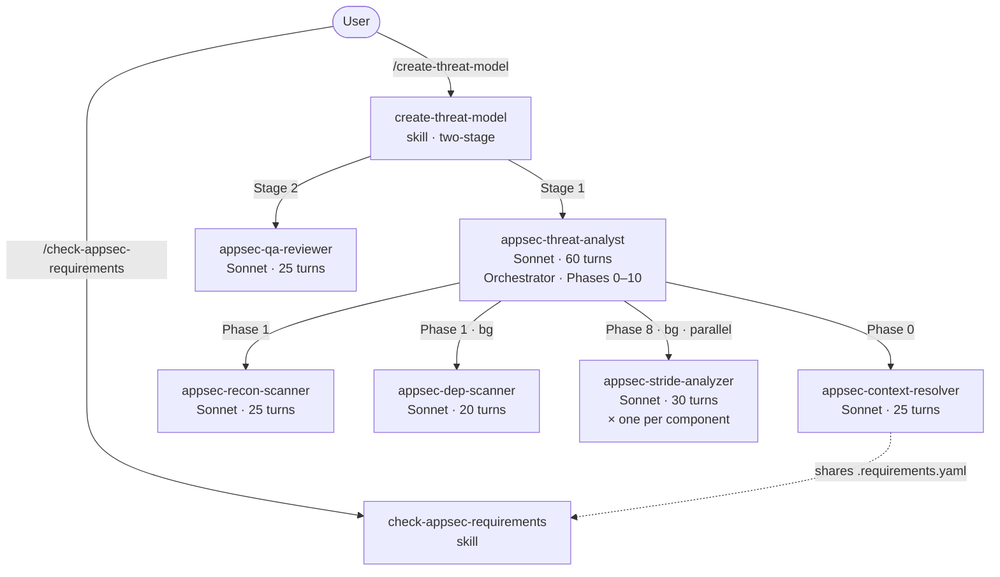

# Claude AppSec Plugin

> **Status: 0.9.0-beta** — Functionally complete for guided use by AppSec teams. Not yet hardened for unattended CI/CD pipeline execution.

A Claude Code plugin for AppSec and dev teams. Point it at any repository to automatically generate a comprehensive, STRIDE-based threat model—complete with architecture diagrams, a prioritized threat register, and actionable mitigations grounded in the actual codebase. Enrich the analysis with your own context, map custom AppSec requirements, or simply use the built-in requirement-checking skill.

## Contents

- [Installation](#installation)
- [Usage](#usage)
- [Output](#output)
- [AppSec Steering Hook](#appsec-steering-hook)
- [Agent Pipeline](#agent-pipeline)
- [Reliability Features](#reliability-features)
- [External Context *(optional)*](#external-context-optional)
- [Security Requirements Management *(optional)*](#security-requirements-management-optional)
- [Plugin Structure](#plugin-structure)
- [Roadmap](#roadmap)

## Installation

```bash
claude --plugin-dir /path/to/appsec-plugin/plugin
```

That's all that's required. The two optional integrations can be enabled independently at any time — see [External Context](#external-context-optional) and [Security Requirements Management](#security-requirements-management).

## Usage

```
# Run threat assessment (overwrites any existing threat model)
/appsec-plugin:create-threat-model

# With scope constraint
/appsec-plugin:create-threat-model focus on the authentication service

# Include SARIF output for CI/CD integration (GitHub Advanced Security, SonarQube, DefectDojo)
/appsec-plugin:create-threat-model --sarif

# Include both YAML and SARIF exports
/appsec-plugin:create-threat-model --yaml --sarif

# Check security requirements coverage
/appsec-plugin:check-appsec-requirements
```

## Output

Each run writes files to the analyzed repository.

**`docs/security/threat-model.md`** (always) — human-readable report with colored severity badges and VS Code deep links to every referenced source file:

| Section | Content |
|---------|---------|
| Metadata | Generated date/time, duration, model |
| 1. System Overview | Description, team, compliance scope, asset classification |
| 2. Architecture Diagrams | C4 context/container/component diagrams + technology architecture (Mermaid) |
| 3. Security Use Cases | Sequence diagrams for auth, authorization, and critical flows |
| 4. Assets | Data, code/IP, infrastructure, and availability assets |
| 5. Attack Surface | All entry points with protocol, auth requirements |
| 6. Trust Boundaries | Where trust levels change across the system |
| 7. Security Controls | Existing controls with effectiveness ratings (✅ ⚠️ 🔶 ❌) |
| 8. Threat Register | STRIDE threats with likelihood, impact, risk, and mitigations |
| 9. Critical Findings | Top highest-risk threats requiring immediate action |
| 10. Mitigation Register | Prioritized remediation list |
| 11. Out of Scope | What was not analyzed |

**`docs/security/threat-model.yaml`** (with `--yaml`) — machine-readable export for ingestion into ticketing systems, dashboards, or CI/CD pipelines:

```yaml
meta:
  project: my-service
  generated: 2026-04-03T14:32:11Z
  model: claude-sonnet-4-6
  compliance_scope: [PCI-DSS, SOC2]
threats:
  - id: T-001
    stride: Spoofing
    likelihood: High
    impact: Critical
    risk: Critical
```

**`docs/security/threat-model.sarif.json`** (with `--sarif`) — [SARIF v2.1.0](https://docs.oasis-open.org/sarif/sarif/v2.1.0/sarif-v2.1.0.html) export for integration with CI/CD security tooling:

```json
{
  "version": "2.1.0",
  "runs": [{
    "tool": { "driver": { "name": "appsec-plugin", "version": "0.9.0-beta" } },
    "results": [{
      "ruleId": "T-001",
      "level": "error",
      "message": { "text": "JWT tokens accepted without signature verification..." },
      "locations": [{ "physicalLocation": { "artifactLocation": { "uri": "src/auth/jwt.ts" } } }]
    }]
  }]
}
```

Supported by: GitHub Code Scanning, Azure DevOps, SonarQube, DefectDojo, Semgrep, and any SARIF-consuming tool.

> Token and cost fields are `null` at runtime — agents cannot introspect their own API usage. Check the Anthropic Console for session details.

## AppSec Steering Hook

A `UserPromptSubmit` hook (`plugin/hooks/hooks.json`) runs `plugin/scripts/security_steering.py` on every prompt and conditionally appends a secure-by-default context to Claude's system message — treat input as untrusted, enforce least privilege, no hardcoded secrets, etc.

The hook uses **tiered keyword matching** to avoid false positives:
- **Strong keywords** (auth, token, sql, xss, etc.) trigger on a single match
- **Code keywords** (api, database, docker, etc.) require 2+ matches
- **Action keywords** (write, create, build, etc.) only trigger in combination with code keywords

This means "create a README" passes through silently, while "create an API endpoint" or "review auth code" activates the security context.

## Agent Pipeline

The plugin uses a 6-agent pipeline. Only `appsec-threat-analyst` is user-facing; the rest are dispatched internally.



### Agents

| Agent | Turns | Role |
|-------|-------|------|
| `appsec-threat-analyst` | 60 | Orchestrator — drives all 11 phases, dispatches sub-agents, assembles output |
| `appsec-context-resolver` | 25 | Phase 0 — resolves external context + repo files into `.threat-modeling-context.md` |
| `appsec-recon-scanner` | 25 | Phase 1 — scans repo structure, tech stack, 11 security code categories → `.recon-summary.md` |
| `appsec-dep-scanner` | 20 | Phase 1 (bg) — scans for hardcoded secrets, vulnerable deps, insecure defaults |
| `appsec-stride-analyzer` | 30 | Phase 8 (bg, parallel) — one instance per component, writes `.stride-<id>.json` |
| `appsec-qa-reviewer` | 25 | Stage 2 (skill-level) — 10 checks on the finished threat model, fixes in-place |

The QA reviewer runs at the skill level (Stage 2) with its own turn budget, not inside the orchestrator. This ensures it always executes even when the orchestrator uses all its turns during Phases 0–9.

### Orchestrator phases

| Phase | Description |
|-------|-------------|
| 0. Context Lookup | `appsec-context-resolver` fetches pre-existing AppSec knowledge before any user questions |
| 1. Reconnaissance | `appsec-recon-scanner` maps tech stack, structure, and security-relevant code; then triggers `appsec-dep-scanner` (bg) |
| 2. Architecture Modeling | C4 diagrams (context / container / component) + technology architecture diagram |
| 3. Security Use Cases | Sequence diagrams for auth flow, access control, and other critical flows |
| 4. Asset Identification | Catalogs data, code/IP, infrastructure, and availability assets |
| 5. Attack Surface Mapping | Enumerates API endpoints, auth mechanisms, file uploads, inter-service calls |
| 6. Trust Boundary Analysis | Identifies privilege and network boundary crossings |
| 7. Security Controls | Catalogs existing controls by domain with colored effectiveness rating |
| 8. Threat Enumeration | Dispatches `appsec-stride-analyzer` per component (requires Phases 5–7 outputs), merges results, assigns global T-xxx IDs, rates risk |
| 9. Output Writing | Writes `docs/security/threat-model.md` and optional YAML/SARIF exports |
| 10. Finalization | Releases lock, records duration, prints completion summary |
| *(Stage 2)* | `appsec-qa-reviewer` verifies and fixes links, references, consistency, diagrams |

### Intermediate files

Sub-agents communicate via files written to `docs/security/` in the **analyzed repository** (not the plugin directory). These files are gitignored by default.

| File | Written by | Read by |
|------|-----------|---------|
| `docs/security/.threat-modeling-context.md` | `appsec-context-resolver` | orchestrator, `appsec-stride-analyzer` |
| `docs/security/.recon-summary.md` | `appsec-recon-scanner` | orchestrator (Phases 2–10) |
| `docs/security/.requirements.yaml` | `appsec-context-resolver` | `appsec-stride-analyzer`, `appsec-qa-reviewer`, `check-appsec-requirements` skill |
| `docs/security/.dep-scan.json` | `appsec-dep-scanner` | orchestrator (Phase 9) |
| `docs/security/.stride-<id>.json` | `appsec-stride-analyzer` | orchestrator (Phase 8) |
| `docs/security/.appsec-lock` | orchestrator | orchestrator (concurrent-run guard; deleted after assessment) |

`docs/security/.requirements.yaml` doubles as a **requirements cache**: once written during a threat model run, the `check-appsec-requirements` skill reads it directly (Tier 0) without re-fetching, ensuring both tools reference identical requirement definitions.

## Reliability Features

### Sub-agent retry logic

If a `appsec-stride-analyzer` or `appsec-dep-scanner` fails (missing output, schema validation error, or error stub), the orchestrator retries the failed agent **once** synchronously before skipping. This handles transient failures (token-limit timeouts, temporary file system issues) without losing threat coverage for an entire component.

### Concurrent run locking

The orchestrator acquires a lock file (`docs/security/.appsec-lock`) at startup. If another assessment is already running (lock file exists and is less than 1 hour old), the new run stops with a clear error message. Stale locks (older than 1 hour) are automatically overwritten. The lock is always released after Phase 10 completes or on any early exit.

### Stale file cleanup

Intermediate files from previous runs (`.stride-*.json`, `.dep-scan.json`) are automatically deleted before each new assessment starts. This prevents stale data from interfering with the current run.

### Schema validation

All intermediate JSON files (`.dep-scan.json`, `.stride-*.json`) are validated against strict schemas by `validate_intermediate.py` before the orchestrator reads them. Invalid files trigger the retry logic above rather than causing silent data corruption.

## External Context *(optional)*

The context resolver can pull additional context from a REST endpoint before analysis begins — team ownership, compliance scope, prior findings, architecture notes, or anything else relevant. The endpoint returns free-form text; no fixed schema is required.

**Without this the plugin works normally** — `appsec-context-resolver` derives context from repository files (`SECURITY.md`, architecture docs, ADRs, deployment configs, etc.) and writes everything to `docs/security/.threat-modeling-context.md`.

### What the context resolver collects from repository files

| Category | Files checked |
|----------|--------------|
| Security policy | `SECURITY.md`, `.github/SECURITY.md`, `docs/SECURITY.md` |
| Architecture docs | `ARCHITECTURE.md`, `docs/architecture.md`, `docs/design.md`, … |
| ADRs | `docs/adr/`, `docs/decisions/`, `adr/` — 5 most recent |
| API surface | `openapi.yaml`, `swagger.yaml`, `docs/api.md`, … |
| Deployment config | `docker-compose.yml`, `Dockerfile`, `kubernetes/`, `terraform/` |
| Data model | `schema.sql`, `prisma/schema.prisma`, `schema.graphql`, … |
| Env template | `.env.example`, `config/default.yaml`, `appsettings.json`, … |
| Changelog | `CHANGELOG.md`, `CHANGES.md` — last 60 lines |

### Configuration

Set `rest_url` in `plugin/config.json` to enable the external context endpoint:

```json
{
  "external_context": {
    "enabled": true,
    "rest_url": "http://127.0.0.1:4444/context"
  }
}
```

| Field | Default | Description |
|-------|---------|-------------|
| `enabled` | `true` | Set to `false` to skip the external context call entirely |
| `rest_url` | `null` | URL of a REST endpoint. Accepts `POST {"repo_url": "..."}`, returns `{"context": "..."}` |

### Endpoint contract

The endpoint receives a `POST` request with the repository URL and returns any JSON object containing a `context` field with free-form text (markdown is supported):

```
POST /context
Content-Type: application/json

{"repo_url": "https://gitlab.example.com/team/payment-service"}

→ {"context": "Payments platform. Compliance: PCI-DSS v4.0. Prior finding: JWT not validated on internal API (resolved 2024-03)."}
```

The `context` value is included verbatim in `.threat-modeling-context.md`. The endpoint can return anything — team info, compliance requirements, architecture summaries, prior findings, links to wikis, or any combination. If the endpoint is unreachable the resolver continues without it.

### Mock server for development

`scripts/mock-context-server.py` provides a minimal mock that returns example context based on simple URL pattern matching. No dependencies required.

```bash
python3 scripts/mock-context-server.py          # default port 4444
python3 scripts/mock-context-server.py 8080     # custom port
```

## Security Requirements Management *(optional)*

By default the plugin references OWASP best practices. Point it at your own requirements YAML to get requirement-tagged mitigations and a compliance check against your internal standards.

`plugin/skills/check-appsec-requirements/config.json`:

```json
{
  "requirements_source": {
    "enabled": true,
    "requirements_yaml_url": null
  }
}
```

| `enabled` | `requirements_yaml_url` | Behaviour |
|-----------|------------------------|-----------|
| `false` | — | OWASP / ASVS references only — no requirement tags |
| `true` | `null` | Plugin-bundled fallback YAML (53 baseline requirements) |
| `true` | URL set | Fetch from URL; fall back to local cache or plugin fallback if unreachable |

### check-appsec-requirements skill

Verifies that each requirement from the loaded YAML is implemented in the codebase, and writes a compliance report to `docs/security/appsec-requirements-report.md`.

```bash
# Check all requirements
/appsec-plugin:check-appsec-requirements

# Filter by category or ID substring
/appsec-plugin:check-appsec-requirements AUTH
```

The report includes per-requirement status (✅ PASS / ⚠️ PARTIAL / ❌ FAIL / ❓ UNVERIFIABLE), VS Code deep links to the evidence, a direct link to the source requirement page, and actionable recommendations for every non-passing item.

### Requirement definitions

Requirements are defined in a YAML file with the following structure:

```yaml
categories:
  - id: AUTH          # used as the tag prefix in mitigations: [AUTH-1]
    title: Authentication
    url: https://security.example.com/requirements/auth
    requirements:
      - id: AUTH-1
        text: "All authentication tokens must be validated server-side on every request."
        priority: MUST    # MUST | SHOULD | MAY
        url: https://security.example.com/requirements/auth#auth-1
```

The **tag format and category IDs are fully defined by your YAML** — the plugin imposes no naming convention. The bundled fallback uses `SEC-*` IDs as an example; replace it with your own YAML to use whatever naming scheme your organization uses (`AUTH-1`, `POLICY-007`, `R-INJ-3`, etc.).

Each requirement carries `id`, `text`, `priority`, and optionally `url` (link to the authoritative requirement page).

### Requirement loading

```mermaid
flowchart TD
    EN{{"enabled: false?"}}
    EN -->|yes| OW["OWASP / ASVS references\nno requirement tags"]
    EN -->|no| URL

    URL{{"requirements_yaml_url\nset?"}}
    URL -->|yes| FETCH["Fetch from URL"]
    URL -->|no| CACHE

    FETCH -->|success| OK
    FETCH -->|"unreachable / error"| CACHE

    CACHE{{"Local cache exists?\ndocs/security/.requirements.yaml"}}
    CACHE -->|yes| OK
    CACHE -->|no| FB["Plugin fallback\nappsec-requirements-fallback.yaml\n53 requirements · 10 categories"]
    FB --> OK

    OK["Requirements loaded"] --> SA["appsec-stride-analyzer\ntags mitigations with requirement IDs"]
    OK --> QA["appsec-qa-reviewer\nvalidates requirement references"]
    OK --> CHK["/check-appsec-requirements\nverifies implementation in codebase"]
```



The local cache (`docs/security/.requirements.yaml`) is written by `appsec-context-resolver` during a threat model run. When the skill is run after a threat model, it reuses the cached file automatically — no network access needed.

### Integration with the threat modeling pipeline

The `check-appsec-requirements` skill is **not** invoked by the threat modeling agent — the two are independent. They share `docs/security/.requirements.yaml` as a common data source (see the diagram in [Agent Pipeline](#agent-pipeline)).

**What the threat modeling pipeline does with requirements:**
- `appsec-context-resolver` fetches or caches `docs/security/.requirements.yaml` at Phase 0
- `appsec-stride-analyzer` reads the YAML and tags each mitigation with the matching requirement ID (e.g. a Spoofing threat → `[AUTH-3]`, using IDs from your YAML)
- `appsec-qa-reviewer` reads the YAML to validate that every requirement reference in the finished threat model points to a known requirement

**What the `check-appsec-requirements` skill does:**
- Resolves requirements using the same loading logic (URL → local cache → plugin fallback)
- Scans the codebase for requirement tag references and verifies that each is actually implemented
- Writes a compliance report to `docs/security/appsec-requirements-report.md`

Running `/appsec-plugin:create-threat-model` first ensures that the subsequent `/appsec-plugin:check-appsec-requirements` run reuses the cached requirements file — with no additional network fetch.

### Harvester — keeping requirements up to date

`scripts/harvest-requirements.py` crawls your internal requirements pages and regenerates `appsec-requirements-fallback.yaml`. Schedule it via cron or CI/CD to keep the fallback in sync.

```bash
pip install -r scripts/requirements.txt
python scripts/harvest-requirements.py
```

See [docs/harvester.md](docs/harvester.md) for configuration, scheduling options (cron, CI/CD, static URL), and indexing modes.

## Plugin Structure

```
appsec-plugin/
├── plugin/                                     # Plugin root — pass to --plugin-dir
│   ├── .claude-plugin/
│   │   └── plugin.json                         # Plugin manifest (v0.9.0-beta)
│   ├── config.json                             # external_context config
│   ├── agents/
│   │   ├── appsec-threat-analyst.md            # Orchestrator (Sonnet, 60 turns)
│   │   ├── appsec-context-resolver.md          # Context resolver (Sonnet, 25 turns)
│   │   ├── appsec-recon-scanner.md              # Repo reconnaissance (Sonnet, 25 turns)
│   │   ├── appsec-dep-scanner.md               # Secret & dependency scanner (Sonnet, 20 turns)
│   │   ├── appsec-stride-analyzer.md           # Per-component STRIDE analysis (Sonnet, 30 turns)
│   │   └── appsec-qa-reviewer.md               # Output verification (Sonnet, 25 turns)
│   ├── hooks/
│   │   └── hooks.json                          # UserPromptSubmit + PostToolUse + Stop hooks
│   ├── scripts/
│   │   ├── security_steering.py                # Tiered keyword steering (strong/code/action)
│   │   ├── agent_logger.py                     # Audit log writer for hook events
│   │   └── validate_intermediate.py            # JSON schema validator for .dep-scan / .stride files
│   └── skills/
│       ├── create-threat-model/
│       │   └── SKILL.md                        # /appsec-plugin:create-threat-model
│       └── check-appsec-requirements/
│           ├── SKILL.md                        # /appsec-plugin:check-appsec-requirements
│           ├── config.json                     # requirements_source config (enabled, url)
│           └── appsec-requirements-fallback.yaml  # Bundled baseline (53 requirements, 10 categories)
├── docs/
│   └── harvester.md                            # Harvester config, scheduling, indexing modes
├── scripts/                                    # Development tools
│   ├── mock-context-server.py                  # Mock for the external context REST endpoint
│   ├── harvest-requirements.py                 # Crawls requirements pages → YAML
│   ├── harvest-config.json                     # Crawler source URLs and indexing config
│   └── requirements.txt                        # Python deps for harvester
├── tests/                                      # Test suite (191 tests)
│   ├── test_agent_definitions.py               # Agent frontmatter, model, maxTurns validation
│   ├── test_agent_logger.py                    # Hook logger event handling
│   ├── test_intermediate_json.py               # Schema validation for .dep-scan / .stride JSON
│   └── test_security_steering.py               # Tiered keyword matching, false positive guards
├── SECURITY.md
└── README.md
```

## Roadmap

**Remaining items before 1.0 release:**

- [ ] Token-budget tracking and cost estimation per assessment
- [ ] Dep-scanner caching — skip re-scan when lock files are unchanged since last assessment
- [ ] `--dry-run` mode — show what would be analyzed without running the full pipeline
- [ ] Config schema validation — validate `config.json` with JSON Schema at startup
