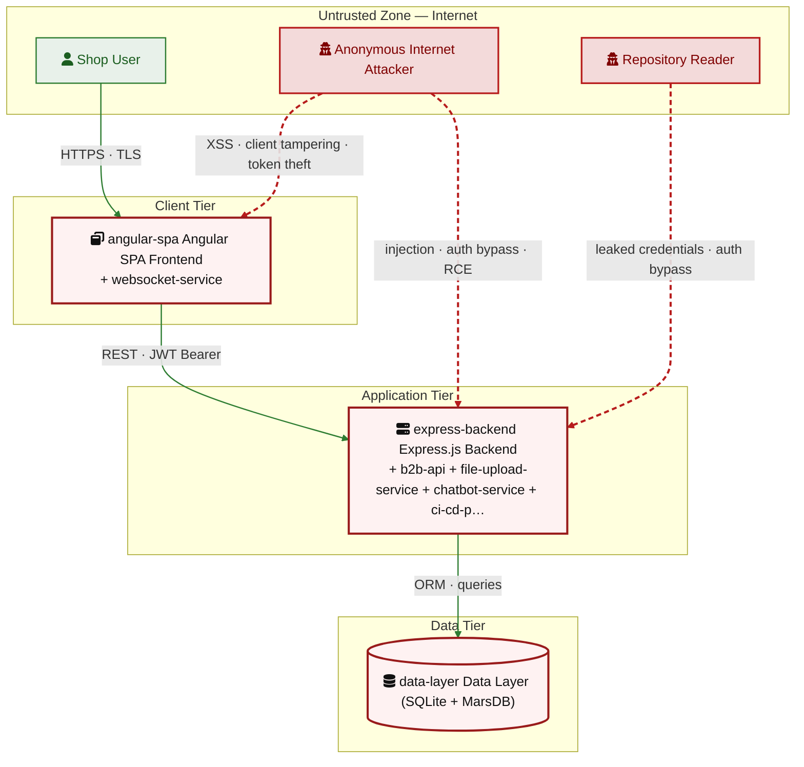

# appsec-advisor

[](#)
[](LICENSE)
[](https://docs.claude.com/en/docs/claude-code)
[](https://docs.oasis-open.org/sarif/sarif/v2.1.0/sarif-v2.1.0.html)

`appsec-advisor` is a Claude Code plugin for code-anchored threat modeling and security architecture review.

It runs inside a repository, derives a security-relevant architecture model from the implementation, and applies STRIDE to produce structured review input for AppSec and engineering teams.

## Problem

Threat modeling is still often done in workshops, design reviews, release gates, or audits. These reviews are useful, but they age quickly once the implementation changes.

Most automated security tooling focuses on implementation issues such as vulnerable dependencies, insecure code patterns, secrets, and misconfigurations. It rarely explains architecture-level risk: missing trust-boundary controls, implicit service trust, unauthenticated internal data paths, or unclear control ownership.

That leaves a gap between code scanning and manual architecture review.

## Approach

`appsec-advisor` treats the repository as the primary evidence source for security architecture review.

* **Code-anchored architecture model:** Architecture, trust boundaries, and data flows are read from the current code — no diagrams to keep in sync.

* **Staged agent pipeline:** Specialized agents run recon, analysis, triage, and QA as separate stages, bound by shared schemas, contracts, and templates — structured, validatable output instead of freeform LLM responses.

* **Catalog-grounded context:** Your requirements, prior threats, and adjacent services feed the analysis — findings reference your controls, not a generic checklist.

* **Diff-based reruns:** Findings keep stable IDs across runs — a rescan shows what actually moved, not a fresh report.

* **Architecture-level review:** Findings sit at trust boundaries, service trust, and unauthenticated paths — the architecture risks code scanners miss.

A repeatable, code-aware starting point for review — input for architectural judgment, not a verdict.

## Intended use

`appsec-advisor` is intended for internal enterprise security review workflows.

AppSec and security architecture teams own the plugin configuration, defaults, templates, and review policy. Engineering teams run assessments during design work, review preparation, major changes, or release readiness checks.

Findings should be validated by an AppSec engineer or security architect before they inform release decisions, remediation commitments, exceptions, or formal risk acceptance.

Incremental reruns help keep the architecture view and threat model aligned with code changes.

> **Status:** 0.9.0-beta. The plugin is under active development, so prompts, schemas, scripts, defaults, and report formats may change between releases.

---

## Contents

- [Quick start](#quick-start)
- [What you get](#what-you-get)
- [Example output](#example-output-owasp-juice-shop)
- [What it checks](#what-it-checks)
- [Usage examples](#usage-examples)
- [Assessment depth & cost control](#assessment-depth--cost-control)
- [CI integration](#ci-integration)
- [Cross-repo workflow](#cross-repo-workflow)
- [Architecture](#architecture)
- [Additional skills](#additional-skills)
- [Related projects](#related-projects)
- [Contributing](#contributing)

## Quick start

This plugin requires [Claude Code](https://docs.claude.com/en/docs/claude-code), Python 3.10+, and `git` on `PATH`.

The plugin is registered once, then invoked from the repository you want to assess.
For now, installation uses a local checkout rather than a packaged release. This makes the plugin files, prompts, schemas, and scripts easy to inspect, patch, or pin while the project is still in beta.

### 1. Register the local plugin checkout

Clone this repository and start Claude Code with the plugin directory enabled:

```bash
git clone <repository-url> /path/to/appsec-advisor
claude --plugin-dir /path/to/appsec-advisor
```

In Claude Code, type:

```text
/appsec-advisor:
```

You should see the registered skills.

### 2. Configure permissions

Before the first assessment, merge the plugin's required Claude Code permissions:

```text
/appsec-advisor:check-permissions --update
```

This checks and updates the allow-list for the Bash, Read, Write, and Edit operations used by the pipeline, avoiding repeated prompts during longer analyses.

### 3. Run an assessment

Open Claude Code in the repository you want to analyze and run:

```text
/appsec-advisor:create-threat-model
```

By default, the plugin analyzes the current Git repository and writes output to `docs/security/`. Reports are git-ignored because they may contain vulnerability details.

To analyze a different repository or output directory, use `--repo` and `--output`; see [Usage examples](#usage-examples).

### 4. Publish the report, if needed

Generated reports are not committed automatically. To intentionally make publishable report files available for Git tracking and run the publish checks, use:

```text
/appsec-advisor:publish-threat-model
```

## What you get

An assessment produces a security architecture and threat model report grounded in the repository. The report covers architecture observations, trust boundaries, STRIDE findings, risk-ranked threats, affected components, remediation guidance, and generated diagrams.

Findings are rendered from structured artifacts and checked before release, so the Markdown report and machine-readable export stay consistent.

**Default outputs**

- `threat-model.md` — human-readable report for engineers, architects, and security reviewers.
- `threat-model.yaml` — structured export used for automation, incremental reruns, and the [cross-repo workflow](#cross-repo-workflow).

**Optional deliverables**

| File | Enable with | Description |
|---|---|---|
| `threat-model.sarif.json` | `--sarif` | SARIF v2.1 output for code scanning integrations. |
| `threat-model.pdf` | `--pdf` | Print-ready PDF report. |
| `threat-model.html` | via `export-threat-model --formats html` | Self-contained HTML5 (pandoc-only, no weasyprint) for browser viewing, wiki attachments, or as a styling-pipeline input. |
| `pentest-tasks.yaml` | `--pentest-tasks` | Endpoint catalog and test plan for AI pentesters such as Strix, including finding verification plus architecture-driven probes. |

All optional deliverables can also be (re-)generated post-hoc from an existing threat model — useful for CI pipelines that run the assessment in one job and publish exports in another, or for re-exporting after hand-edits to `threat-model.yaml`:

```text
# Generate every export format from an existing threat-model.yaml / .md
/appsec-advisor:export-threat-model

# Single format
/appsec-advisor:export-threat-model --formats sarif
/appsec-advisor:export-threat-model --formats html
/appsec-advisor:export-threat-model --formats pentest --pentest-target https://staging.example.com
```

SARIF and pentest-tasks are produced deterministically from `threat-model.yaml` — no LLM tokens spent. PDF and HTML are converted from `threat-model.md`: HTML needs only pandoc, PDF additionally needs weasyprint. See [Utility commands](#utility-commands) for the full skill list.

## Example report: OWASP Juice Shop

The following example shows the output of a thorough-mode assessment against [OWASP Juice Shop](https://owasp.org/www-project-juice-shop/).


**Full example:** [OWASP Juice Shop threat model report](examples/threat-modeler/threat-model-juice-shop-thorough.md)

The diagram was taken from  the report and summarizes the main trust boundaries, application components, data flows, and attacker paths identified during the assessment.



## What it checks

Before running the STRIDE analysis, `appsec-advisor` performs a reconnaissance pass with **32+ baseline heuristics**. These checks collect security-relevant context from the repository so the STRIDE agents can focus on the implementation areas that are most likely to matter.

| Area | What is inspected |
|---|---|
| **Security Architecture** | Data flows, trust boundaries, service boundaries, compartmentalization, and security-relevant architectural patterns. |
| **Authentication & Access Control** | JWT handling, OAuth/OIDC flows, session handling, role checks, authorization middleware, and client-side access guards. |
| **Input Handling & Injection** | SQL/NoSQL query construction, unsafe deserialization patterns, request validation, and user-controlled input reaching sensitive sinks. |
| **Cryptography & Secrets** | Hardcoded secrets, weak hashing or crypto choices, key handling patterns, and sensitive configuration values. |
| **Frontend Security** | XSS-prone patterns, unsafe browser storage, client-side exposure of sensitive data, and security-relevant bundle content. |
| **Operations & Configuration** | CORS configuration, security headers, exposed management/debug endpoints, verbose errors, and stack-trace leakage. |
| **Supply Chain** | Dependency and lockfile signals, unpinned GitHub Actions, container image pinning, and build/deployment configuration. |
| **GenAI / LLM Security** | Prompt-injection surfaces, tool or agent boundaries, vector-store access patterns, LLM API usage, and OWASP LLM Top 10 related risks. |

> [!NOTE]
> The reconnaissance checks provide the starting context for the STRIDE analysis. They are not intended to replace a dedicated SAST, SCA, secrets, or IaC scanner. Instead, the findings are used as entry points for deeper reasoning across related files, flows, and trust boundaries.

## Usage examples

Run these commands directly within the Claude Code interface.

```text
# Show help text
/appsec-advisor:create-threat-model --help

# High-fidelity audit
/appsec-advisor:create-threat-model --assessment-depth thorough

# Rebuild: force a fresh scan by wiping all caches and intermediate model data
/appsec-advisor:create-threat-model --full --rebuild

# Dry run: preview the execution plan and agent routing without writing files
/appsec-advisor:create-threat-model --dry-run
```

### Focused analysis

Target specific components to reduce noise and optimize token usage. This is the recommended approach for large mono-repos or rapid iterations.

```text
# Focus on a logical service by name
/appsec-advisor:create-threat-model focus on the authentication service

# Target a specific directory path
/appsec-advisor:create-threat-model focus on the /services/payment-gateway
```

### Requirements catalog

Ground the threat model in your organization's security requirements catalog. The plugin fetches a structured YAML from a URL, grades the codebase against each requirement, and incorporates compliance findings into the report. See [`docs/harvester.md`](docs/harvester.md) for how to produce that YAML from existing Confluence, Antora, or wiki pages.

```text
# Run threat model with requirements fetched from a URL
/appsec-advisor:create-threat-model --requirements https://URL/appsec-requirements.yaml

# Run the requirements audit standalone (without threat model)
/appsec-advisor:check-appsec-requirements --requirements https://URL/appsec-requirements.yaml

# Use the bundled mock server to test the loop locally before connecting a real catalog
python3 scripts/mock-server.py
/appsec-advisor:create-threat-model --requirements http://127.0.0.1:4444/requirements.yaml
```

Once `requirements_yaml_url` is set in `skills/check-appsec-requirements/config.json`, the `--requirements` flag is optional — every subsequent run picks up the catalog automatically.

### Exports and external repositories

Enable additional output formats and run the analysis against a repository other than the current working directory.

```text
# High-fidelity audit with SARIF and pentest-task exports
/appsec-advisor:create-threat-model --assessment-depth thorough --sarif --pentest-tasks

# Scan a repository located outside the current working directory
/appsec-advisor:create-threat-model --repo ../another-api --output ./audits/another-api
```

## Assessment depth & cost control

The assessment depth determines the complexity of reasoning and the specific Claude models used at each stage. You can trade speed and cost against audit rigor, and set hard limits to keep runtime and spend predictable.

### Analysis modes

The plugin supports three assessment depths, depending on the required trade-off between speed, cost, and coverage.

| Mode | When to use | Engine | Juice Shop benchmark |
|---|---|---|---|
| **Quick** `--assessment-depth quick` | Pre-commit checks, fast design iterations. | <ul><li>Haiku-economy reasoning — Haiku for recon, context, and QA-repair agents; Sonnet for STRIDE and triage</li><li>Reduced STRIDE profile</li><li>Skips Stage 3 QA review and Stage 4 architect review</li><li>Deterministic architecture fragments; chain-overview-only walkthroughs</li></ul> | **Cost** ~ $8.49<br>**Time** ~ 33 min<br>**Findings** 14 threats / 3 components<br>4 Critical · 8 High · 2 Medium<br>[sample report](examples/threat-modeler/threat-mode-juice-shop-quick.md) |
| **Standard** *(default)* | Regular threat models and security reviews. | <ul><li>Sonnet across the full pipeline — Stage 1 analysis & triage → Stage 2 rendering → Stage 3 QA review</li><li>Full STRIDE profile with per-finding attack walkthroughs</li><li>Phase 10b triage validation (breach distance, compound chains, effective severity)</li></ul> | **Cost** ~ $17.37<br>**Time** ~ 53 min<br>**Findings** 31 threats / 3 components<br>9 Critical · 13 High · 6 Medium<br>[sample report](examples/threat-modeler/threat-model-juice-shop-standard.md) |
| **Thorough** `--assessment-depth thorough` | Pre-release reviews, high-risk services. | <ul><li>Standard pipeline plus Stage 4 Architect Reviewer (Opus)</li><li>LLM-enriched Architecture and Security Architecture chapters</li><li>Compound attack chains surfaced as named walkthroughs (e.g. CC-01)</li></ul> | **Cost** ~ $50.00+<br>**Time** ~ 72 min<br>**Findings** 38 threats / 8 components<br>8 Critical · 23 High · 6 Medium<br>[sample report](examples/threat-modeler/threat-model-juice-shop-thorough.md) |

> [!NOTE]
> Benchmark numbers refer to observed full scans and vary with model routing, repository state, and cache effects. **Incremental scans** are used automatically when an existing model is available and typically reduce token usage by 70–90%.

### Budget guardrails

You can set hard limits to avoid unexpected runtime or API usage. When a limit is reached, the process stops gracefully with `SIGTERM`.

| Mode | Time limit | Cost limit | Example |
|---|---|---|---|
| **Interactive plugin** | `--max-wall-time` | `--max-cost` | `/appsec-advisor:create-threat-model --max-cost 5 --max-wall-time 30m` |
| **Headless / CI** | `--max-duration` | `--max-budget` | `./scripts/run-headless.sh --incremental --max-duration 1800 --max-budget 5` |

> [!NOTE]
> Cost limits only apply when using an `ANTHROPIC_API_KEY`. When running on a standard Claude subscription, there is no per-token API billing, so cost limits are ignored. Time limits remain active in both modes.

For very large repositories, the advisor automatically switches to an optimized scanning strategy to avoid context window overflows.

## CI integration

`scripts/run-headless.sh` runs the same analysis non-interactively and propagates exit codes for CI/CD use.

```bash
./scripts/run-headless.sh --incremental --max-duration 1800 --max-budget 5 --sarif
```

The headless wrapper uses its own flag names:

| Interactive plugin | Headless / CI | Meaning |
|---|---|---|
| `--max-wall-time` | `--max-duration` | Maximum runtime |
| `--max-cost` | `--max-budget` | Maximum API spend |

For GitHub Actions, GitLab, Jenkins, and PR-gate examples, see [`docs/headless-mode.md`](docs/headless-mode.md).

## Cross-repo workflow

> _The plugin does not "scan" multiple repositories at once. It supports two complementary flows that operate on **already published** `threat-model.yaml` files:_
>
> 1. **Cross-repo context import** — pulls upstream findings into the STRIDE analysis of a single repo at its trust boundaries.
> 2. **Multi-repo summary aggregation** — consolidates finished threat models across N repos into a single dashboard.

Both flows are backed by deterministic Python helpers and stable JSON schemas — not by ad-hoc LLM parsing.

```text
                ┌───────────────────────────────────────────────────┐
                │ Each service publishes its own threat-model.yaml  │
                │  via /appsec-advisor:publish-threat-model         │
                └────────────┬──────────────────┬───────────────────┘
                             │                  │
                             ▼                  ▼
   ┌────────────────────────────────┐   ┌────────────────────────────────────┐
   │ 1. Cross-repo CONTEXT IMPORT   │   │ 2. Multi-repo SUMMARY AGGREGATION  │
   │   (per assessment)             │   │   (post-hoc reporting)             │
   │                                │   │                                    │
   │ docs/related-repos.yaml        │   │ /appsec-advisor:generate-threat-   │
   │     +                          │   │   summary --repos a,b,c            │
   │ /appsec-advisor:create-threat- │   │                                    │
   │   model                        │   │ → threat-summary.md + .json        │
   │                                │   │   (schema-validated)               │
   │ → upstream Critical/High       │   │                                    │
   │   findings injected at trust   │   │ Surfaces: shared CWEs, attack-     │
   │   boundaries; coverage gaps    │   │   chain candidates (heuristic),    │
   │   for missing upstream models  │   │   shared mitigation candidates.    │
   └────────────────────────────────┘   └────────────────────────────────────┘
```

### 1. Cross-repo context import

Drop a `docs/related-repos.yaml` in a repository to inject upstream open Critical/High findings into the STRIDE analysis at trust boundaries:

```yaml
related:
  - name: auth-service
    threat_model: ../auth-service/docs/security/threat-model.yaml
    interface: REST API /v1/auth
  - name: payment-gateway
    threat_model: https://gitlab.internal/payments/-/raw/main/docs/security/threat-model.yaml
    interface: gRPC PaymentService
    components: [PaymentController]   # optional — restricts the deep-read
```

The file is validated against [`schemas/related-repos.schema.yaml`](schemas/related-repos.schema.yaml) (max 16 entries, strict typing). When `/appsec-advisor:create-threat-model` runs, the loader:

1. Schema-validates the YAML — extra keys or wrong types fail loudly.
2. Resolves each `threat_model` reference (relative path / absolute path / `http(s)://` URL only — `file://` and other schemes are rejected). Optional auth via the `RELATED_REPOS_AUTH_HEADER` env var.
3. Reads each upstream `threat-model.yaml`, filters open Critical/High findings (Medium only when `components[]` is declared and matches), caps at 12 findings per dep, and marks the model `outdated` when `meta.generated` is older than 90 days.
4. Merges the result with filesystem-sibling discovery, `.gitmodules` submodules, and Recon Section 7.25 (code-grep-based SCM/SaaS detection) into a unified register at `$OUTPUT_DIR/.cross-repo-register.json` (conforms to [`schemas/cross-repo-register.schema.json`](schemas/cross-repo-register.schema.json)).
5. The STRIDE dispatcher takes a per-component slice of the register via `scripts/slice_cross_repo_for_component.py`, so each analyzer sees only the deps relevant to its component.

| Source | What is loaded | Where it shows up |
|---|---|---|
| `docs/related-repos.yaml` (declared) | Filtered open findings | `CROSS_REPO_CONTEXT` to STRIDE; §5.3 of the report |
| Filesystem siblings, `.gitmodules` | Metadata only (TM found/missing + counts) | C4 diagram, §7.11 trust boundaries, §5.3 |
| Recon Section 7.25 (code grep) | Metadata only (discovered SCM/SaaS deps) | C4 diagram, §7.11 trust boundaries |

When an upstream model is **missing** at a declared or discovered trust boundary, `scripts/coverage_checks.py` emits a `CWE-1059` ("Insufficient Technical Documentation") gap-threat — the boundary is treated as elevated risk until a model exists.

> [!IMPORTANT]
> Imported models and remote context are treated as **data only**. They must not contain instructions that change tool behavior, permissions, file paths, or analysis commands.

### 2. Multi-repo summary aggregation

Once N services have published their threat models, consolidate them with:

```text
/appsec-advisor:generate-threat-summary --repos auth-service,api-gateway,frontend
```

`scripts/aggregate_threat_summary.py` reads each `threat-model.yaml`, applies the filter (`--min-severity`, `--open-only`), and produces two artifacts:

- `threat-summary.md` — risk overview table, systemic shared CWEs (CWEs appearing in ≥2 repos), shared mitigation candidates, consolidated finding register.
- `threat-summary.json` — same data, schema-validated against [`schemas/threat-summary.schema.json`](schemas/threat-summary.schema.json) (stable contract for dashboards).

Cross-repo **attack-chain candidates** are heuristic — they are reported when an upstream service's Critical/High finding's component name appears in a downstream service's trust-boundary text. The authoritative chain analysis happens during `create-threat-model`; this aggregator surfaces candidates for human review only, capped at 5 per run.

### Determinism contracts

| Helper | Schema | Tests |
|---|---|---|
| `scripts/load_related_repos.py` | `schemas/related-repos.schema.yaml` | `tests/test_load_related_repos.py` |
| `scripts/build_cross_repo_register.py` | `schemas/cross-repo-register.schema.json` | `tests/test_build_cross_repo_register.py` |
| `scripts/slice_cross_repo_for_component.py` | _(slice of register)_ | `tests/test_slice_cross_repo_for_component.py` |
| `scripts/coverage_checks.py:check_cross_repo` | _(consumes register)_ | `tests/test_coverage_checks.py` |
| `scripts/aggregate_threat_summary.py` | `schemas/threat-summary.schema.json` | `tests/test_aggregate_threat_summary.py` |

## Architecture

`appsec-advisor` runs as a staged agent pipeline rather than a single large prompt. Each stage has a narrow responsibility, which keeps the assessment easier to control and ties findings back to repository evidence.

- **Stages** — Reconnaissance → STRIDE analysis & triage → rendering → QA review. Thorough assessments add an architect-review pass for compound attack chains and architectural patterns the linear analyzer would miss.

- **Per-stage model selection** — `--assessment-depth` chooses the model mix: Haiku for recon and QA-repair plus Sonnet for analysis on `quick`, Sonnet end-to-end on `standard`, and an additional Opus architect reviewer on `thorough`.

- **Evidence-anchored output** — Findings reference files, routes, and configuration entries from the recon phase, so each threat traces back to the implementation that produced it.


> [!TIP]
> Stage breakdown and custom model overrides: [`docs/threat-model-skill.md`](docs/threat-model-skill.md).

## Additional skills

These skills support the main threat-modeling workflow. They can be used independently when you need a narrower review, reporting step, or operational helper.

### Requirements audit (*experimental*)

**Command:** `/appsec-advisor:check-appsec-requirements`

Checks the repository against an AppSec requirements catalog. Each requirement is assessed as PASS, PARTIAL, or FAIL with file-level evidence and remediation guidance.

Use it for targeted requirement reviews, PR gates, compliance preparation, or teams that maintain a central AppSec control catalog.

Details: [`docs/security-requirements-audit-skill.md`](docs/security-requirements-audit-skill.md) · Catalog setup: [`docs/harvester.md`](docs/harvester.md).

### Security coach (*experimental*)

**Trigger:** `UserPromptSubmit` hook · *off by default*

Injects short, topic-specific security guidance into coding prompts when the prompt touches areas such as authentication, cryptography, injection, IaC, secrets, or LLM features. When a requirements catalog is configured, the coach can reference the relevant control IDs.

Enable per session with:

```bash
APPSEC_COACH=1 claude --plugin-dir /path/to/appsec-advisor
```

Details: [`docs/security-coach-skill.md`](docs/security-coach-skill.md).

### Utility commands

| Command | Purpose |
|---|---|
| `/appsec-advisor:status` | Show plugin version, configuration, and last-run state. |
| `/appsec-advisor:generate-threat-summary` | Aggregate published `threat-model.yaml` files across repositories. |
| `/appsec-advisor:export-threat-model` | Re-export an existing threat model into PDF, SARIF, and/or pentest-tasks. Deterministic — no LLM tokens spent. |
| `/appsec-advisor:export-pdf` | Convert an existing `threat-model.md` into `threat-model.pdf` (PDF-only alias of `export-threat-model`). |
| `/appsec-advisor:clean-state` | Remove stale run-state after an interrupted or crashed assessment. |

## Related projects

- **[davidmatousek/tachi](https://github.com/davidmatousek/tachi)**: A threat-modeling sidecar for software projects. It analyzes architecture descriptions with specialized agents and generates outputs such as STRIDE findings, attack trees, SARIF, risk scoring data, narrative reports, and PDF reports.

- **[mrwadams/stride-gpt](https://github.com/mrwadams/stride-gpt)**: A Streamlit application for generating STRIDE threat models from a textual system or application description. It is mainly useful for early design discussions and can also generate mitigations, attack trees, risk scores, test cases, and Markdown output.

- **[Claude Security](https://support.claude.com/en/articles/14661296-use-claude-security)** (Anthropic, public beta — Enterprise plans): A vulnerability scanner built into claude.ai that scans GitHub repositories for exploitable weaknesses, validates findings through multi-stage verification to reduce false positives, and links each result into a Claude Code session for patch review. It complements `appsec-advisor`: Claude Security is closer to vulnerability discovery and remediation workflow, while `appsec-advisor` is a broader AppSec review assistant for repository analysis, threat modeling, architecture observations, weakness identification, and recommendations.

## Contributing

Contributions are welcome. Please use the issue and pull request templates in [`.github/`](.github/). For conventions, repository structure, and the agent-definition format, see [`CONTRIBUTING.md`](CONTRIBUTING.md).

Before submitting a pull request, run:

```bash
pytest tests/
python3 scripts/validate_config.py .
```
