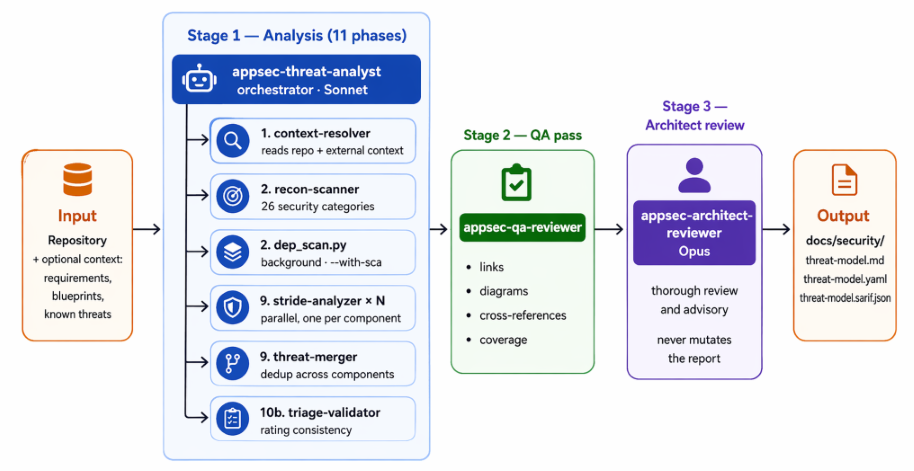

# appsec-advisor

A Claude Code plugin that performs **automated, code-driven architectural threat modeling** directly on repositories. 

[](#)
[](https://docs.claude.com/en/docs/claude-code)
[](https://docs.oasis-open.org/sarif/sarif/v2.1.0/sarif-v2.1.0.html)

---

## Contents

- [Quick start](#quick-start)
- [Capabilities](#capabilities)
- [Related projects](#related-projects)
- [Contributing](#contributing)

## Key Features

Here are the key capabilities of the threat modeling functionality included in this plugin:

* **Code-driven threat modeling** — automatically derives architecture and identifies threats directly from source code
* **Multi-agent analysis** — improves depth and consistency through coordinated agents, using predefined schemas and templates
* **STRIDE methodology** — ensures structured and standardized threat classification
* **Evidence-linked findings** — every identified threat is traceable to specific files and line numbers
* **Incremental analysis** — re-analyzes only modified components for efficiency
* **CI/CD integration** — designed for seamless use in pipelines and pull request checks
* **Customizable** — supports integration of custom requirements and external context (e.g., via REST endpoints)


## Quick start

Requires Claude Code, Python 3.10+, and `git` on `PATH`.

#### 1. Clone the repo

```bash
git clone <repository-url> /path/to/appsec-advisor
```

#### 2. Start Claude Code with the plugin

```bash
claude --plugin-dir /path/to/appsec-advisor
```

After Claude Code starts, type `/appsec-advisor:`. You should see three registered skills.

#### 3. Run a threat analysis

Run your first threet assessment from the repository you want to assess:

```
/appsec-advisor:create-threat-model
```

A standard-depth run takes roughly 25 minutes. 

Output: `docs/security/threat-model.md` 

## Example Reports

Example reports can be found here [`examples/threat-modeler`](examples/threat-modeler/README.md).

* [OWASP Juice-Shop](examples/threat-modeler/threat-model-juice-shop-thorough.md)
* [OWASP VulnerableApp](examples/threat-modeler/threat-model-vulnerable-app-standard.md)

## Examples

Here are some practical examples:

```bash

# Enforce rebuild of the threea model and scan in verbose mode
/appsec-advisor:create-threat-model  --full --verbose

# Focus on a specific area
/appsec-advisor:create-threat-model focus on the authentication service

# Perform a more in depth scan (standard is --assessment-depth standard)
/appsec-advisor:create-threat-model --assessment-depth thorough

# Emit machine-readable exports alongside the Markdown report
/appsec-advisor:create-threat-model --yaml --sarif

# Analyse a repository you don't own (typical AppSec reviewer workflow)
/appsec-advisor:create-threat-model --repo /path/to/team-api --output /reports/team-api

# Create pentest-tasks.yaml that can be consumed by AI pentest tools liks striks
/appsec-advisor:create-threat-model --pentest-tasks

# Perform a requirements asssessement 
/appsec-advisor:create-threat-model --requirements [<url>]

# Full analysis, no files written, Management Summary printed
/appsec-advisor:create-threat-model --dry-scan
```

**CI & PR Integration**
If you want to use the threat modeler from your CI or PR workflow you can use the headless mode

```bash
# CI on every push — incremental with a hard timeout
./scripts/run-headless.sh --repo . --output docs/security --incremental --max-duration 1800

# PR gate — diffs HEAD against origin/main, fails the build on new Critical/High findings
./scripts/run-headless.sh --repo . --base origin/main --pr-mode --fail-on high
```

**Integrating Custom Requirements**

First you need to index ("harvest") them using the following script:
```bash
[`docs/harvester.md`](docs/harvester.md)
```
then, you need point the threat modeler to the url with the harvested requirements:
```bash
/appsec-advisor:create-threat-model --requirements [<url>]
```

## Architecture

The following diagram shows the internal agentic pipeline which creates the threat model:



More technical details can be found at [`docs/threat-model-skill.md`](docs/threat-model-skill.md).

## Additional Capabilities

The plugin provides the following additional capabilities:

### Security Requirements Auditor

**Status:** Experimental &nbsp;·&nbsp; **Command:** `/appsec-advisor:check-appsec-requirements`

Grades the repository against a custom AppSec requirements catalog. Each requirement returns **PASS / PARTIAL / FAIL** with code-level evidence and a before/after fix snippet. Faster than a full threat model.

Details: [`docs/security-requirements-audit-skill.md`](docs/security-requirements-audit-skill.md) · Catalog setup: [`docs/harvester.md`](docs/harvester.md).

### Security Coach

**Status:** Experimental &nbsp;·&nbsp; **Trigger:** `UserPromptSubmit` hook, off by default

Inline guidance during coding sessions. A `UserPromptSubmit` hook scans prompts for security-relevant keywords (auth, crypto, injection, IaC, secrets) and injects context-aware guidance. When a requirements catalog is loaded, the coach references custom AppSec controls.

Off by default. Enable via `APPSEC_COACH=1` or in `config.json`.

Details: [`docs/security-coach-skill.md`](docs/security-coach-skill.md).

## Related projects

- **[davidmatousek/tachi](https://github.com/davidmatousek/tachi)** — Claude Code plugin focused on STRIDE methodology with narrative reporting and PDF output. Fits when the deliverable is a polished stakeholder document.
- **[mrwadams/stride-gpt](https://github.com/mrwadams/stride-gpt)** — Streamlit app that derives STRIDE threats from a prose system description. Useful early in design, before code exists.

This plugin differs by driving analysis from the actual repository, linking every threat to file/line evidence, and integrating organisation-specific requirements and blueprints.

## Contributing

Before submitting a change, run the test suite and validate the plugin config:

```bash
pytest tests/
python3 scripts/validate_config.py .
```

Issue and PR templates: [`.github/`](.github/). Development conventions and agent-definition format: [`CONTRIBUTING.md`](CONTRIBUTING.md). Security vulnerabilities: open a [GitHub Security Advisory](../../security/advisories/new), not a public issue. See [`SECURITY.md`](SECURITY.md).