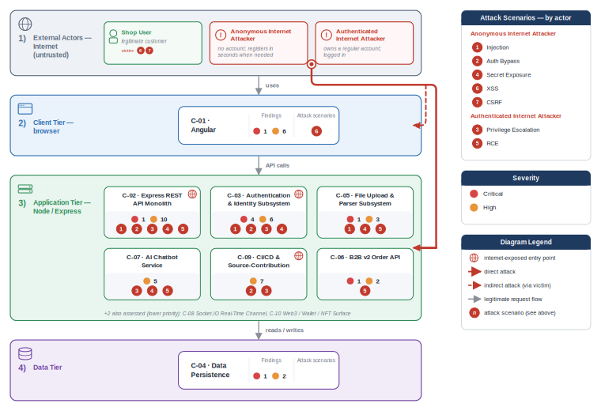

# appsec-advisor

[](#)
[](LICENSE)
[](https://docs.claude.com/en/docs/claude-code)
[](https://docs.oasis-open.org/sarif/sarif/v2.1.0/sarif-v2.1.0.html)
[](https://codecov.io/gh/matthiasrohr/appsec-advisor)

> ⚠️ **Beta — not production ready.** `appsec-advisor` is under active development. Interfaces, schemas, and output may change without notice.

`appsec-advisor` is a Claude Code plugin for AppSec teams, built around code-anchored threat modeling. It turns a repository into a security architecture model, identifies trust boundaries and data flows, applies STRIDE, and produces structured findings.

On the same foundation, it also supports requirements audits and developer helpers (change review, pre-commit guidance, CI gates). Teams can use as-is or adapt with their own requirements, threat context, presets, guardrails, and company-branded packaging.

## Problem

Threat modeling is still often done in workshops, design reviews, release gates, or audits. These reviews are useful, but they age quickly once the implementation changes.

Most automated security tooling focuses on implementation issues such as vulnerable dependencies, insecure code patterns, secrets, and misconfigurations. It rarely explains architecture-level risk: missing trust-boundary controls, implicit service trust, unauthenticated internal data paths, or unclear control ownership.

That leaves a gap between code scanning and manual architecture review. The threat modeler is `appsec-advisor`'s answer to that gap.

## Approach

The threat modeler treats the repository as the primary evidence source for security architecture review.

* **Code-anchored architecture model:** Architecture, trust boundaries, and data flows are read from the current code, with no diagrams to keep in sync.

* **Staged agent pipeline:** Specialized agents run recon, analysis, triage, and QA as separate stages, bound by shared schemas, contracts, and templates. The output is structured and validatable rather than freeform LLM text.

* **Catalog-grounded context:** Your requirements, prior threats, and adjacent services feed the analysis, so findings reference your controls, not a generic checklist.

* **Diff-based reruns:** Findings keep stable IDs across runs, so a rescan shows what actually moved, not a fresh report.

* **Architecture-level review:** Findings sit at trust boundaries, service trust, and unauthenticated paths — the architecture risks code scanners miss.

The result is a repeatable, code-aware starting point for review. It supports architectural judgment, but it is not a verdict. The requirements audit and developer helpers reuse the same catalog and agent infrastructure to extend this into day-to-day development.

## Intended use

`appsec-advisor` is intended for internal enterprise security review workflows.

AppSec and security architecture teams own the plugin configuration, defaults, templates, and review policy. Engineering teams run threat models during design work, review preparation, major changes, or release readiness checks, and use the requirements audit and developer helpers for ongoing compliance checks and change review.

Threat model findings should be validated by an AppSec engineer or security architect before they inform release decisions, remediation commitments, exceptions, or formal risk acceptance.

## Security notes

> [!IMPORTANT]
> **Treat any repository you scan as untrusted input.** Its contents flow into the LLM, so a repo can attempt prompt injection. Because the default Bash allow-list still contains general-purpose interpreters (`python3`, `awk`, `sed`), a successful injection can escalate into local command execution. For third-party or vendor code, run with `--trust-mode untrusted` inside a container or VM. Details in [SECURITY.md: Known issues](SECURITY.md#known-issues--untrusted-repositories).

**What leaves your machine.** Only the source, manifests, and config of the components under analysis, never the whole repo. Secret snippets surfaced in `.recon-summary.md` are masked (up to 4 characters kept, the rest `****`). The plugin needs `api.anthropic.com` and cannot run air-gapped; cached prompt segments live on Anthropic infrastructure for the cache TTL.

**How the report is produced.** The report is rendered by deterministic Python (Jinja), not by the model, so the same input yields the same report. Intermediate artefacts are schema-validated, template conditions use a small parser instead of `eval()`, and `secret_scan.py` blocks `publish-threat-model` from exposing an unmasked secret.

---

## Contents

- [Quick start](#quick-start)
- [Threat Modeler](#threat-modeler)
- [Requirements Audit](#requirements-audit)
- [Additional developer tools](#additional-developer-tools)
- [CI integration](#ci-integration)
- [Plugin development checks](#plugin-development-checks)
- [Enterprise rollout](#enterprise-rollout)
- [Roadmap](#roadmap)
- [Related projects](#related-projects)
- [Contributing](#contributing)

## Quick start

The steps below get you to your first threat model, the plugin's primary tool. Requirements audit and developer helpers use the same setup and are covered in their own sections below.

This plugin requires [Claude Code](https://docs.claude.com/en/docs/claude-code), Python 3.10+, and `git` on `PATH`. Optional Node deps (`jsdom` + `mermaid`) enable grammar-level Mermaid QA; see the [Threat Modeler](#threat-modeler) docs.

The plugin is registered once, then invoked from the repository you want to assess.
For now, installation uses a local checkout rather than a packaged release. This makes the plugin files, prompts, schemas, and scripts easy to inspect, patch, or pin while the project is still in beta.

### 1. Register the local plugin checkout

Clone this repository and start Claude Code with the plugin directory enabled:

```bash
git clone <repository-url> /path/to/appsec-advisor
claude --plugin-dir /path/to/appsec-advisor
```

In Claude Code, type:

```text
/appsec-advisor:
```

You should see the registered skills.

### 2. Configure permissions

Before running the threat modeler for the first time, merge the plugin's required Claude Code permissions:

```text
/appsec-advisor:check-permissions --update
```

This checks and updates the allow-list for the Bash, Read, Write, and Edit operations used by the threat model pipeline, avoiding repeated prompts during longer analyses.

### 3. Run your first threat model

Open Claude Code in the repository you want to analyze and run:

```text
/appsec-advisor:create-threat-model
```

The threat modeler analyzes the current Git repository and writes output to `docs/security/`. Reports are git-ignored because they may contain vulnerability details.

For assessment depth, cost controls, focused scans, actor configuration, and repo-local and cross-repo context, see [docs/threat-modeler.md](docs/threat-modeler.md).

### 4. Optional: Publish the threat model

Generated reports are not committed automatically. For a local review, you can stop after the assessment completes. If your team intentionally tracks reviewed threat models in git, run the publish helper:

```text
/appsec-advisor:publish-threat-model
```

## Threat Modeler

`/appsec-advisor:create-threat-model` derives an architecture model from the repository and runs STRIDE analysis to produce a structured security review.

An assessment produces a report covering architecture observations, trust boundaries, STRIDE findings, risk-ranked threats, affected components, remediation guidance, and generated diagrams. Default outputs are `threat-model.md` and `threat-model.yaml`; optional exports include PDF, HTML, SARIF, and pentest task lists.

**Example:** A thorough-mode run against [OWASP Juice Shop](https://owasp.org/www-project-juice-shop/) produces 78 findings across 9 components (10 Critical, 40 High, 22 Medium, 6 Low) including architecture diagrams, abuse-case chains, and a full mitigation register. → [Read the full example report](examples/threat-modeler/threat-model-juice-shop-thorough.md)



**→ Full reference: [docs/threat-modeler.md](docs/threat-modeler.md)**

Covers: output formats, what the recon pass checks, all usage examples, assessment depth and cost control, repo-local context (business context, known threats), cross-repo context, pipeline architecture, and workflow commands (publish, export, health checks, run recovery).

## Requirements Audit

`/appsec-advisor:audit-security-requirements` grades the repository against an internal AppSec requirements catalog. It is faster than a full threat model and fits PR gates, compliance dashboards, and audit preparation.

```text
# Run with the configured catalog
/appsec-advisor:audit-security-requirements

# Run standalone with a URL (no config change needed)
/appsec-advisor:audit-security-requirements --requirements https://URL/appsec-requirements.yaml
```

Both `audit-security-requirements` and the requirements phase of `create-threat-model` read from the same `requirements_yaml_url` in `skills/audit-security-requirements/config.json`: configure it once and both commands pick it up automatically.

No catalog yet? Start from the bundled baseline (`data/appsec-requirements-fallback.yaml`) and edit it to your organisation's vocabulary. Once you have live requirements pages (Confluence, Antora, static HTML), `scripts/harvest_requirements.py` can generate and refresh the YAML automatically. → [docs/harvester.md](docs/harvester.md)

**→ Full reference: [docs/security-requirements-audit-skill.md](docs/security-requirements-audit-skill.md)**

Covers: status values, catalog setup, the three paths to a catalog, all flags, and how findings link back to the threat model.

## Plugin configuration

The root `config.json` is the committed runtime config for safe defaults. Use `config.local.json` for local or internal overrides; it is git-ignored and loaded ahead of `config.json` where supported.

Supported root blocks are `external_context` (optional REST business context), `pricing` (token-cost calculation), `logging` (verbose hook output and log rotation), and `organization_profile` (packaged org-profile pointer). Run `python3 scripts/validate_config.py .` after changing plugin config files.

## Additional developer tools

The requirements audit (`audit-security-requirements`) is an AppSec-owned compliance gate: it grades a snapshot of the repository against a catalog and produces a structured report for dashboards, audits, and release gates.

The tools below serve a different purpose: they are developer-facing helpers that give security feedback during active coding or on a diff in progress. They are not audit artifacts. Like the requirements audit they use the configured requirements catalog as their active standard, falling back to the bundled baseline when none is configured.

| Tool | Type | Scope | Entry point | When to use it |
|---|---|---|---|---|
| [Security Coach hook](docs/dev-security-helper-usage.md#security-coach-hook) (*experimental*) | Hook | Prompt-time guidance | `APPSEC_COACH=1 claude --plugin-dir /path/to/appsec-advisor` | Add security guidance to Claude's context while you write security-sensitive code. |
| [appsec-reviewer](docs/dev-security-helper-usage.md#appsec-reviewer-agent) (*experimental*) | Agent | Change review engine | `appsec-reviewer` | Embed the reviewer in a Claude Code or Agent SDK workflow. |
| [verify-requirements](docs/dev-security-helper-usage.md#verify-requirements-skill) (*experimental*) | Skill | Interactive diff review | `/appsec-advisor:verify-requirements` | Review current, staged, or base-ref changes from an interactive Claude Code session. |
| [appsec-reviewer-cli](docs/dev-security-helper-usage.md#appsec-reviewer-cli) (*experimental*) | CLI | CI diff review | `appsec-reviewer-cli review --diff origin/main --output security-review.md` | Run the same requirements review headlessly in CI or other automation. |

Full guide: [`docs/dev-security-helper-usage.md`](docs/dev-security-helper-usage.md) · Requirements catalog setup: [`docs/harvester.md`](docs/harvester.md) · Security Coach: [`docs/security-coach-skill.md`](docs/security-coach-skill.md).

### Reporting a pipeline error

If a run fails, build an **anonymised** diagnostic bundle to send the maintainer.
Plugin users (no checkout) run the skill in the failing session:

```
/appsec-advisor:report-error
```

Developers with a checkout can use the Make target instead:

```bash
make diagnostic-bundle RUN=<repo>/docs/security    # → appsec-diag-<id>.tgz
```

The bundle contains only tool/plugin versions, run shape (phases reached, stage
timings, aggregate counts), a metadata-only file inventory, and scrubbed logs.
It **never** includes the threat-model results, findings, evidence, or any
source — verify before sending with `make inspect-bundle BUNDLE=appsec-diag-<id>.tgz`.

## CI integration

`scripts/run-headless.sh` runs `appsec-advisor` non-interactively in the CI/CD
pipeline of the repository being assessed. It invokes the same Claude Code
plugin skills as an interactive run and propagates exit codes so downstream
steps can gate on the result.

```bash
./scripts/run-headless.sh --incremental --max-duration 1800 --max-budget 5 --sarif
```

For a faster requirements-only CI job:

```bash
./scripts/run-headless.sh --audit-requirements --save-report --max-budget 3
```

For GitHub Actions, GitLab, Jenkins, and PR-gate examples, see [`docs/headless-mode.md`](docs/headless-mode.md).

## Plugin development checks

For changes to this plugin repository, the deterministic test suite is the per-PR safety net. The committed GitHub Actions workflow runs config validation, ruff, and pytest across Python 3.10, 3.11, and 3.12. Locally, the `Makefile` wraps the same checks:

```bash
make test           # standard pytest suite with coverage (no LLM)
make lint           # ruff check + format check
make check          # continuous gate: lint, format, config validation, fragment-registry/drift, full test suite
make release-check  # release-boundary gate: `check` + version/tag/changelog consistency
```

After non-trivial changes to renderers, schemas, phase prompts, hooks, or pipeline control flow, run the manual full-run E2E check:

```bash
make e2e-full
```

For local regression checks against the external fixture suite, use the manual fixture drivers:

```bash
./scripts/e2e_fixture.sh --fixture python-threat-fixture --depth quick --clean-output
./scripts/e2e_cross_repo_fixture.sh --depth quick --clean-output
```

The generic single-repo driver supports the Spring, Python, Rust, Go, Node.js/TypeScript, and Python/LangChain fixtures from the sibling `appsec-advisor-fixtures` checkout. These E2E runs are manual and opt-in because they invoke Claude Code and consume LLM budget. See [`CONTRIBUTING.md`](CONTRIBUTING.md), [`docs/internal/runbooks/e2e-fixtures.md`](docs/internal/runbooks/e2e-fixtures.md), and [`docs/internal/runbooks/e2e-cross-repo-fixture.md`](docs/internal/runbooks/e2e-cross-repo-fixture.md).

## Enterprise rollout

For AppSec and Platform teams: treat `appsec-advisor` as the upstream analysis core, wrap it in a company-branded plugin, and ship that to developers. They get one command that runs with your requirements catalog, presets, and guardrails already loaded, no per-developer configuration.

What the org-profile buys you over the generic plugin:

- **Your requirements catalog, not the generic baseline:** findings and audit grades reference your internal control IDs and severity definitions.
- **Fixed cost limits:** token budget and max duration baked in; developers can't accidentally run an unbounded analysis.
- **Pre-loaded business context:** service classification, regulatory scope, and risk appetite set centrally, not per run.
- **Consistent presets:** assessment depth, output formats, and SARIF export configured once for the whole org.
- **Locked surface:** `package-policy.yaml` removes experimental skills or hooks that aren't approved for internal use.

The diagram below shows the packaging and distribution flow using "Acme" as a placeholder for your organisation.


The initializer guides you through the required organization-specific settings and creates a ready-to-use packaging repository.

```console
$ bash <(curl -fsSL https://raw.githubusercontent.com/matthiasrohr/appsec-advisor-org-packaging-template/main/scripts/init-org-repo.sh)

appsec-advisor — org packaging repo setup
────────────────────────────────────────────
This script creates a ready-to-use packaging repo for appsec-advisor.
You will need: git, python3 (3.10+), make

Organization name (e.g. Acme Corp): ACME
Organization id (short lowercase abbreviation, e.g. 'acme', 'hl' — used in plugin name) [a]: ac
Plugin name (Claude Code command prefix) [ac-appsec]: ac-appsec
Team owner (e.g. AppSec Team) [A AppSec Team]:
Target directory [./ac-appsec-advisor]:
Include demo content (example requirements + filled org profile)? [y/N]: N

==> Cloning template from GitHub …

Done. Your packaging repo is ready at: ./ac-appsec-advisor

```

- Runbook: [internal-plugin-packaging.md](docs/internal-plugin-packaging.md) · Profiles: [org-profiles.md](docs/org-profiles.md)
- Runnable CI starters: [GitLab CI](examples/internal-packaging-gitlab) · [GitHub Actions](examples/internal-packaging-github) · Local build: [Quick start](docs/internal-plugin-packaging.md#quick-start)
- Complete example packaging repo: [github.com/matthiasrohr/appsec-advisor-packaging-template](https://github.com/matthiasrohr/appsec-advisor-packaging-template)

## Roadmap

Planned and in-progress work:

- **Validation against real-world applications.** The plugin is being tested across a growing set of applications — different stacks, architectures, and deployment patterns — to harden prompt behaviour, improve output consistency, and surface edge cases that synthetic fixtures don't cover.

- **Graduating experimental skills to supported status.** The developer tools currently marked *experimental* (`verify-requirements`, `appsec-reviewer`, `appsec-reviewer-cli`, Security Coach hook) are being hardened and will move to supported, production-ready status.

- **Better packaging and configuration.** More ways to tailor the plugin's skills to organisation-specific needs.

- **Stronger threat focus.** Reports still blend architectural observations, compliance signals, and STRIDE findings. Upcoming iterations sharpen the threat narrative with a cleaner split between threats, weaknesses, and architectural risks.

- **Richer context input.** The pipeline is anchored almost entirely in the repo itself. The goal is to let product teams feed more context into the assessment — today this is limited to `docs/business-context.md`, `docs/known-threats.yaml`, and `docs/related-repos.yaml`.

- **Scaling to component-heavy repos.** STRIDE merge and the per-agent turn budget run serially and strain past ~8–10 components. The run analyses them all and logs the overrun rather than dropping exposed components — correct, but slow and costly. Parallelising the merge is the open fix.

- **Multi-repo scans.** Per-repo scanning fits monorepos but is limited when an app spans several repos (APIs, IaC, …). Today only partially covered via `docs/related-repos.yaml`.

- **Shared agent state.** Let STRIDE pods, merge, and triage exchange advisory hints via an append-only bulletin instead of only formal artifacts.

- **Slimming the orchestration skill.** `create-threat-model/SKILL-impl.md` has grown large. Shrink it incrementally — extract inline Bash into tested scripts, deduplicate blocks, move rationale into script docstrings — lowering orchestration cost (less context per turn). Golden-run-verified, behaviour byte-identical.

- **Ingest existing threat models (idea).** Detect an existing model (e.g. Threat Dragon `threat-model.json`) and use it as non-authoritative context.

- **Marketplace release (idea).** Once out of beta, publish the plugin to the Claude Code plugin marketplace for one-step installation.


## Related projects

- **[davidmatousek/tachi](https://github.com/davidmatousek/tachi)**: A threat-modeling sidecar for software projects. It analyzes architecture descriptions with specialized agents and generates outputs such as STRIDE findings, attack trees, SARIF, risk scoring data, narrative reports, and PDF reports.

- **[mrwadams/stride-gpt](https://github.com/mrwadams/stride-gpt)**: A Streamlit application for generating STRIDE threat models from a textual system or application description. It is mainly useful for early design discussions and can also generate mitigations, attack trees, risk scores, test cases, and Markdown output.

- **[Claude Security](https://support.claude.com/en/articles/14661296-use-claude-security)** (Anthropic, public beta for Enterprise plans): A vulnerability scanner built into claude.ai that scans GitHub repositories for exploitable weaknesses, validates findings through multi-stage verification to reduce false positives, and links each result into a Claude Code session for patch review. It complements `appsec-advisor`: Claude Security is closer to vulnerability discovery and remediation workflow, while `appsec-advisor` is a broader AppSec review assistant for repository analysis, threat modeling, architecture observations, weakness identification, and recommendations.

## Contributing

See [CONTRIBUTING.md](CONTRIBUTING.md) for how to propose changes, development conventions, the test suite, the targeted test checklist, and the manual end-to-end test. Where possible, please open an issue to discuss your idea before sending a pull request.
