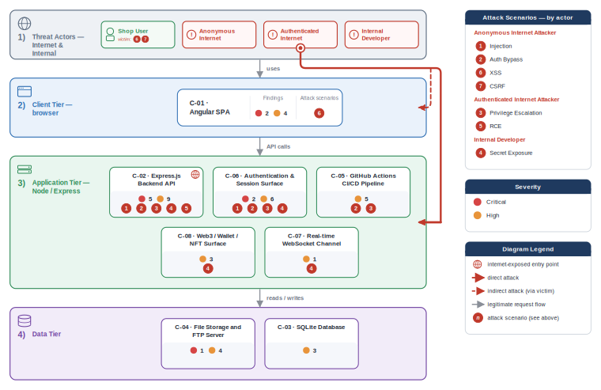

# appsec-advisor

[](#)
[](LICENSE)
[](https://docs.claude.com/en/docs/claude-code)
[](https://docs.oasis-open.org/sarif/sarif/v2.1.0/sarif-v2.1.0.html)
[](https://codecov.io/gh/matthiasrohr/appsec-advisor)

> ⚠️ **Beta — not production ready.** `appsec-advisor` is under active development. Interfaces, schemas, and output may change without notice.

`appsec-advisor` is a Claude Code plugin for repository-based threat modeling. It derives a security architecture model from code, identifies trust boundaries and data flows, applies STRIDE, and produces reviewable findings.

It also supports requirements audits, change reviews, prompt-time security guidance, and CI gates. AppSec teams can supply their own requirements, threat context, presets, and guardrails.

**Model compatibility.** The plugin runs on the latest Anthropic models and is tuned for Sonnet 5, but the defaults favor economy: the token-intensive majority of the work runs on the cheaper Sonnet-4.6, and Sonnet-5 is applied by default only to the stages where its stronger reasoning is worth the added cost. You can pin any agent to a specific model (e.g. `claude-sonnet-5`, `claude-sonnet-4-6`), and the scan prints the model for every agent at start. See [Session Model](docs/threat-modeler.md#session-model).

## What's new in 0.5-beta

**Ask questions about your threat model — just type them in the Claude Code console.** No command to remember: the new `ask-threat-model` skill picks up any question about the model, so there is no report to re-read and no export to grep:

```text
what are the most critical findings?
what should I fix first?
does it cover SSRF?
```

Answers are grounded in the model and cite finding IDs. See [Triage the findings into a plan](#4-triage-the-findings-into-a-plan).

- **`review-threat-model`** — turn findings into a decided remediation plan: fix / accept / defer, in bulk, with owners.
- **Weakness Register** — systemic and design-level weaknesses as their own report chapter, summarised as a security-principles verdict.
- **Beyond JavaScript** — the access-control, crypto, and mass-assignment scanners now also cover Java, Python, Go, PHP, C#/.NET, Ruby/Rails, and mobile.

[Full changelog](CHANGELOG.md)

## Problem

Threat models created during workshops or design reviews become stale as the implementation changes.

Most automated security tooling focuses on implementation issues such as vulnerable dependencies, insecure code patterns, secrets, and misconfigurations. It rarely explains architecture-level risk: missing trust-boundary controls, implicit service trust, unauthenticated internal data paths, or unclear control ownership.

`appsec-advisor` covers the gap between code scanning and manual architecture review.

## Approach

The threat modeler treats the repository as the primary evidence source for security architecture review.

- **Code-based architecture model:** Architecture, trust boundaries, and data flows come from the current repository.

- **Structured output:** Findings pass through schemas, validation, and fixed report templates.

- **Organization context:** Requirements, known threats, and related services can be included in the analysis.

- **Diff-based reruns:** Findings keep stable IDs across runs, so a rescan shows what actually moved since the last one.

- **Architecture review:** The analysis covers trust boundaries, service trust, and unauthenticated paths that code scanners often miss.

The output is a starting point for security review, not a release verdict. An AppSec engineer or security architect should validate findings before they drive remediation, exceptions, or risk acceptance.

## Why this isn't a SAST tool

A SAST tool checks whether a specific line of code is vulnerable. The threat modeler looks at the system as a whole: what an attacker could do, which design choices make that possible, and where trust boundaries or attack paths create risk. Its output is a threat, not just a code warning.

The code supports this analysis in two ways. It shows where risks may exist and confirms how the system is actually built. From it, the tool identifies components, trust zones, and data flows, then evaluates threats against that architecture.

This allows it to find problems that scanners often miss. A scanner can detect risky code patterns, but not controls that are missing entirely, such as an absent authorization check, an unclear trust boundary, or a component with too much trust. Threat modeling is designed to uncover these gaps, while the code keeps the model accurate and aligned with the real system.

## Security notes

> [!IMPORTANT]
> **Treat any repository you scan as untrusted input.** Its contents flow into the LLM, so a repo can attempt prompt injection. Because the default Bash allow-list still contains general-purpose interpreters (`python3`, `awk`, `sed`), a successful injection can escalate into local command execution. For third-party or vendor code, run with `--trust-mode untrusted` inside a container or VM. Details in [SECURITY.md: Known issues](SECURITY.md#known-issues--untrusted-repositories).

**What leaves your machine.** Only the source, manifests, and config of the components under analysis, never the whole repo. Secrets surfaced in recon output are masked. The plugin needs `api.anthropic.com` and cannot run air-gapped; cached prompt segments live on Anthropic infrastructure for the cache TTL.

**How the report is produced.** Python renders the final report from validated structured data. Publishing is blocked when the secret scan finds an unmasked secret.

---

## Contents

- [Quick start](#quick-start)
- [Threat Modeler](#threat-modeler)
- [Requirements Audit](#requirements-audit)
- [Additional developer tools](#additional-developer-tools)
- [CI integration](#ci-integration)
- [Enterprise rollout](#enterprise-rollout)
- [Roadmap](#roadmap)
- [Related projects](#related-projects)
- [Contributing](#contributing)

## Quick start

Use the following setup for the threat modeler, requirements audit, and developer tools.

This plugin requires [Claude Code](https://docs.claude.com/en/docs/claude-code), Python 3.10+, and `git` on `PATH`. Optional Mermaid dependencies provide stricter diagram validation; see the [Threat Modeler](#threat-modeler) reference.

Install the beta from a local checkout, then run it from the repository you want to assess.

### 1. Register the local plugin checkout

Clone this repository and start Claude Code with the plugin directory enabled:

```bash
git clone https://github.com/matthiasrohr/appsec-advisor.git /path/to/appsec-advisor
claude --plugin-dir /path/to/appsec-advisor
```

In Claude Code, type:

```text
/appsec-advisor:
```

You should see the registered skills.

### 2. Configure permissions

Before running the threat modeler for the first time, merge the plugin's required Claude Code permissions:

```text
/appsec-advisor:check-permissions --update
```

This updates the Claude Code allow-list used during an assessment.

### 3. Run your first threat model

Open Claude Code in the repository you want to analyze and run:

```text
/appsec-advisor:create-threat-model
```

The threat modeler analyzes the current Git repository and writes output to `docs/security/`. Reports are git-ignored because they may contain vulnerability details.

Once a model exists, keep it current after code changes with:

```text
/appsec-advisor:update-threat-model
```

This re-analyzes only the components that changed (an alias for `create-threat-model --incremental`) and aborts with guidance if no model exists yet, so an update never turns into an accidental first full scan.

For assessment depth, cost controls, focused scans, actor configuration, and repo-local and cross-repo context, see [docs/threat-modeler.md](docs/threat-modeler.md).

### 4. Triage the findings into a plan

The assessment ranks findings by severity, but deciding what to fix now — and what to accept or defer — is a judgement call. Turning the report into a decided plan is the recommended next step (though you can also stop at the report). Run the triage helper at any later point, independently of the assessment:

```text
/appsec-advisor:review-threat-model
```

It opens with a one-screen verdict (backlog by priority, severity mix, and the worst-case scenarios if nothing changes), then lets you drill into top findings, top mitigations, or a security domain and bulk-decide mitigate / accept-risk / defer (with an owner and target) on a whole selection at once. Your decisions live in a sidecar that survives the next re-scan, and it writes a `remediation-plan.md`. It never regenerates or re-scores the model.

A finished report is long, so you do not have to read it first — just talk to Claude Code about the model. Questions and instructions both work:

```text
what are the most critical findings?
what should I fix first?
does it cover SSRF?
fix the critical findings
accept the risk on F-012
```

Questions are answered read-only from the model, cite finding IDs, and say so when the model does not contain the answer. Instructions land in the triage console above, which applies fixes one finding at a time, each shown before it is written — never as a blind bulk change across a selection.

### 5. Optional: Publish the threat model

Generated reports are not committed automatically. For a local review, you can stop after the assessment completes. If your team intentionally tracks reviewed threat models in git, run the publish helper:

```text
/appsec-advisor:publish-threat-model
```

## Threat Modeler

`/appsec-advisor:create-threat-model` derives an architecture model from the repository and runs STRIDE analysis to produce a structured security review.

An assessment produces a report covering architecture observations, trust boundaries, STRIDE findings, risk-ranked threats, affected components, remediation guidance, and generated diagrams. Default outputs are `threat-model.md` and `threat-model.yaml`; optional exports include PDF, HTML, SARIF, and pentest task lists.

**Standards coverage.** Findings are cross-referenced to established OWASP catalogs, rendered as linked reference badges in the report:

- [OWASP Top 10:2025](https://owasp.org/Top10/2025/) — the web application security risks, mapped per finding with a deterministic coverage check that flags any category with no identified threat.
- [OWASP Top 10 for LLM Applications (2025)](https://genai.owasp.org/llm-top-10/) — applied as an additional lens whenever the repository has an LLM/AI surface.
- [OWASP Top 10 for Agentic Applications (2026)](https://genai.owasp.org/resource/owasp-top-10-for-agentic-applications-for-2026/) — applied on top of the LLM lens when the surface is agentic (an LLM wired to tools, memory, or other agents).

**Example:** [Read a thorough assessment of OWASP Juice Shop](examples/threat-modeler/threat-model-juice-shop-thorough-v0.5.md) — or browse [more examples](examples/threat-modeler/README.md).



Assessments consume model tokens and typically take tens of minutes; thorough runs may exceed an hour. The [Threat Modeler reference](docs/threat-modeler.md#assessment-depth--cost-control) compares measured costs by depth and model and documents hard cost and time limits.

**Session model.** The biggest cost factor is the model your Claude Code session runs on. At a similar per-token price, Sonnet-5's tokenizer splits the same source into more tokens (~30 % more in our runs), so a Sonnet-5 session costs significantly more for the same report without producing better threat models. For normal use, run it on Sonnet-4.6 (`/model claude-sonnet-4-6`; `scripts/run-headless.sh` uses it by default); see the [Threat Modeler docs](docs/threat-modeler.md) for details.

## Requirements Audit

`/appsec-advisor:audit-security-requirements` grades the repository against an internal AppSec requirements catalog. It is faster than a full threat model and fits PR gates, compliance dashboards, and audit preparation.

```text
# Run with the configured catalog
/appsec-advisor:audit-security-requirements

# Run standalone with a URL (no config change needed)
/appsec-advisor:audit-security-requirements --requirements https://URL/appsec-requirements.yaml
```

The requirements audit and threat modeler use the same configured catalog.

If you do not have a catalog, adapt `data/appsec-requirements-fallback.yaml`. The [requirements harvester](docs/harvester.md) can build and refresh the YAML from Confluence, Antora, or static HTML.

See the [Requirements Audit reference](docs/security-requirements-audit-skill.md) for catalog setup, status values, and flags.

## Plugin configuration

The root `config.json` contains shared defaults. Put local or internal overrides in the git-ignored `config.local.json`.

Supported root blocks are `external_context` (optional REST business context), `pricing` (token-cost calculation), `logging` (verbose hook output and log rotation), and `organization_profile` (packaged org-profile pointer). Run `python3 scripts/validate_config.py .` after changing plugin config files.

## Additional developer tools

These developer tools provide security guidance while code is being written or reviewed. They use the configured requirements catalog, or the bundled baseline when none is configured.

| Tool | Type | Scope | Entry point | When to use it |
|---|---|---|---|---|
| [Security Coach hook](docs/dev-security-helper-usage.md#security-coach-hook) (*experimental*) | Hook | Prompt-time guidance | `APPSEC_COACH=1 claude --plugin-dir /path/to/appsec-advisor` | Add security guidance to Claude's context while you write security-sensitive code. |
| [appsec-reviewer](docs/dev-security-helper-usage.md#appsec-reviewer-agent) (*experimental*) | Agent | Change review engine | `appsec-reviewer` | Embed the reviewer in a Claude Code or Agent SDK workflow. |
| [verify-requirements](docs/dev-security-helper-usage.md#verify-requirements-skill) (*experimental*) | Skill | Interactive diff review | `/appsec-advisor:verify-requirements` | Review current, staged, or base-ref changes from an interactive Claude Code session. |
| [appsec-reviewer-cli](docs/dev-security-helper-usage.md#appsec-reviewer-cli) (*experimental*) | CLI | CI diff review | `appsec-reviewer-cli review --diff origin/main --output security-review.md` | Run the same requirements review headlessly in CI or other automation. |

Full guide: [`docs/dev-security-helper-usage.md`](docs/dev-security-helper-usage.md) · Requirements catalog setup: [`docs/harvester.md`](docs/harvester.md) · Security Coach: [`docs/security-coach-skill.md`](docs/security-coach-skill.md).

### Report a pipeline error

If a run fails, build an **anonymized** diagnostic bundle to send the maintainer.
Plugin users (no checkout) run the skill in the failing session:

```
/appsec-advisor:report-error
```

Developers with a checkout can use the Make target instead:

```bash
make diagnostic-bundle RUN=<repo>/docs/security    # → appsec-diag-<id>.tgz
```

The bundle contains versions, run metadata, a file inventory without contents, and scrubbed logs. It excludes source code, findings, evidence, and report contents. Inspect it before sending:

```bash
make inspect-bundle BUNDLE=appsec-diag-<id>.tgz
```

## CI integration

`scripts/run-headless.sh` runs `appsec-advisor` non-interactively and returns exit codes that CI jobs can use as gates.

```bash
./scripts/run-headless.sh --incremental --max-duration 1800 --max-budget 5 --sarif
```

For a faster requirements-only CI job:

```bash
./scripts/run-headless.sh --audit-requirements --save-report --max-budget 3
```

For GitHub Actions, GitLab, Jenkins, and PR-gate examples, see [`docs/headless-mode.md`](docs/headless-mode.md).

## Enterprise rollout

AppSec and Platform teams can package `appsec-advisor` under an internal name with centrally managed requirements, presets, and guardrails.

- Use internal control IDs instead of the bundled baseline.
- Set cost and duration limits centrally.
- Configure assessment depth and output formats once.
- Remove skills or hooks that are not approved for internal use.

The diagram uses "Acme" as an example organization.


Start with the [packaging runbook](docs/internal-plugin-packaging.md) and [org profile reference](docs/org-profiles.md). CI examples are available for [GitLab](examples/internal-packaging-gitlab) and [GitHub Actions](examples/internal-packaging-github).

## Roadmap

- Explore whether analyzing branches, merge, and pull requests — not just the checked-out working tree — is worthwhile, so a threat model could be produced for proposed changes before they land.
- Extend beyond Claude Code to other coding agents (OpenAI Codex, GitHub Copilot, and similar), keeping the analysis engine agent-agnostic.
- Test against more languages, architectures, and deployment models.
- Move the developer tools from experimental to supported status.
- Improve performance on repositories with many components.
- Expand cross-repository and external context support (e.g. a meta threat model aggregated across several per-repository threat models).
- Import existing threat models as reference data.
- Explore whether specifications can be analyzed as first-class input — deriving threats from insecure statements in agent-generated specs (Kiro, BMAD, GSD) and AI specs, so a flaw stated in the spec becomes a finding, not only a code-proven one.
- Integrate trust boundaries more deeply — treat each as a first-class object and tie findings to the specific boundary they violate, so a threat names the broken trust assumption and what an attacker gains by crossing it.
- Publish a packaged marketplace release after the beta.

## Related projects

- **[matthiasrohr/appsec-advisor-packaging-template](https://github.com/matthiasrohr/appsec-advisor-packaging-template)**: Template for an internal package with organization defaults and requirements.

- **[davidmatousek/tachi](https://github.com/davidmatousek/tachi)**: Agent-based threat modeling from architecture descriptions.

- **[mrwadams/stride-gpt](https://github.com/mrwadams/stride-gpt)**: STRIDE threat modeling from text descriptions.

- **[Claude Security](https://support.claude.com/en/articles/14661296-use-claude-security)**: Anthropic's repository vulnerability scanner for Enterprise plans.

## Contributing

See [CONTRIBUTING.md](CONTRIBUTING.md) for development setup, repository conventions, and required tests.
