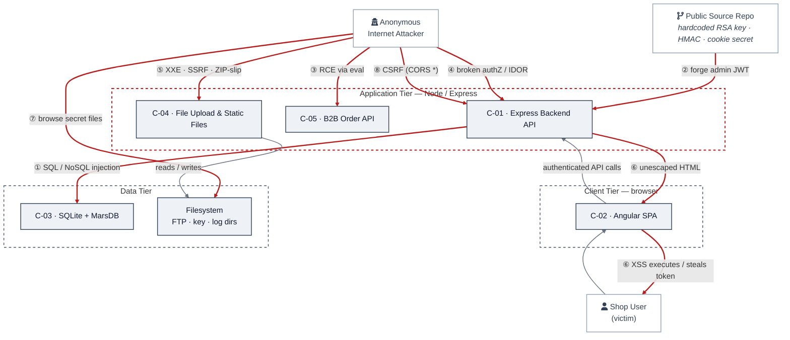

# appsec-advisor

[](#)
[](LICENSE)
[](https://docs.claude.com/en/docs/claude-code)
[](https://docs.oasis-open.org/sarif/sarif/v2.1.0/sarif-v2.1.0.html)

`appsec-advisor` is a Claude Code plugin for code-anchored threat modeling and security architecture review.

It runs inside a repository, derives a security-relevant architecture model from the implementation, and applies STRIDE to produce structured review input for AppSec and engineering teams.

## Problem

Threat modeling is still often done in workshops, design reviews, release gates, or audits. These reviews are useful, but they age quickly once the implementation changes.

Most automated security tooling focuses on implementation issues such as vulnerable dependencies, insecure code patterns, secrets, and misconfigurations. It rarely explains architecture-level risk: missing trust-boundary controls, implicit service trust, unauthenticated internal data paths, or unclear control ownership.

That leaves a gap between code scanning and manual architecture review.

## Approach

`appsec-advisor` treats the repository as the primary evidence source for security architecture review.

* **Code-anchored architecture model:** Architecture, trust boundaries, and data flows are read from the current code — no diagrams to keep in sync.

* **Staged agent pipeline:** Specialized agents run recon, analysis, triage, and QA as separate stages, bound by shared schemas, contracts, and templates — structured, validatable output instead of freeform LLM responses.

* **Catalog-grounded context:** Your requirements, prior threats, and adjacent services feed the analysis — findings reference your controls, not a generic checklist.

* **Diff-based reruns:** Findings keep stable IDs across runs — a rescan shows what actually moved, not a fresh report.

* **Architecture-level review:** Findings sit at trust boundaries, service trust, and unauthenticated paths — the architecture risks code scanners miss.

A repeatable, code-aware starting point for review — input for architectural judgment, not a verdict.

## Intended use

`appsec-advisor` is intended for internal enterprise security review workflows.

AppSec and security architecture teams own the plugin configuration, defaults, templates, and review policy. Engineering teams run assessments during design work, review preparation, major changes, or release readiness checks.

Findings should be validated by an AppSec engineer or security architect before they inform release decisions, remediation commitments, exceptions, or formal risk acceptance.

Incremental reruns help keep the architecture view and threat model aligned with code changes.

> **Status:** 0.4.0-beta. The plugin is under active development, so prompts, schemas, scripts, defaults, and report formats may change between releases.

## Security notes

> [!IMPORTANT]
> **Treat any repository you scan as untrusted input.** Its contents flow into the LLM, so a repo can attempt prompt injection — and because the default Bash allow-list still contains general-purpose interpreters (`python3`, `awk`, `sed`), a successful injection can escalate into local command execution. For third-party or vendor code, run with `--trust-mode untrusted` inside a container or VM. Details in [SECURITY.md → Known issues](SECURITY.md#known-issues--untrusted-repositories).

**What leaves your machine.** Only the source, manifests, and config of the components under analysis — never the whole repo. Secret snippets surfaced in `.recon-summary.md` are masked (up to 4 characters kept, the rest `****`). The plugin needs `api.anthropic.com` and cannot run air-gapped; cached prompt segments live on Anthropic infrastructure for the cache TTL.

**How the report is produced.** The report is rendered by deterministic Python (Jinja), not by the model, so the same input yields the same report. Intermediate artefacts are schema-validated, template conditions use a small parser instead of `eval()`, and `secret_scan.py` blocks `publish-threat-model` from exposing an unmasked secret.

---

## Contents

- [Quick start](#quick-start)
- [What you get](#what-you-get)
- [Example report](#example-report-owasp-juice-shop)
- [What it checks](#what-it-checks)
- [Usage examples](#usage-examples)
- [Assessment depth & cost control](#assessment-depth--cost-control)
- [CI integration](#ci-integration)
- [Manual full-run check](#manual-full-run-check)
- [Cross-repo context](#cross-repo-context)
- [Architecture](#architecture)
- [Additional skills](#additional-skills)
- [Enterprise rollout](#enterprise-rollout)
- [Roadmap](#roadmap)
- [Related projects](#related-projects)
- [Contributing](#contributing)

## Quick start

This plugin requires [Claude Code](https://docs.claude.com/en/docs/claude-code), Python 3.10+, and `git` on `PATH`.

The plugin is registered once, then invoked from the repository you want to assess.
For now, installation uses a local checkout rather than a packaged release. This makes the plugin files, prompts, schemas, and scripts easy to inspect, patch, or pin while the project is still in beta.

### 1. Register the local plugin checkout

Clone this repository and start Claude Code with the plugin directory enabled:

```bash
git clone <repository-url> /path/to/appsec-advisor
claude --plugin-dir /path/to/appsec-advisor
```

In Claude Code, type:

```text
/appsec-advisor:
```

You should see the registered skills.

### 2. Configure permissions

Before the first assessment, merge the plugin's required Claude Code permissions:

```text
/appsec-advisor:check-permissions --update
```

This checks and updates the allow-list for the Bash, Read, Write, and Edit operations used by the pipeline, avoiding repeated prompts during longer analyses.

### 3. Run an assessment

Open Claude Code in the repository you want to analyze and run:

```text
/appsec-advisor:create-threat-model
```

By default, the plugin analyzes the current Git repository and writes output to `docs/security/`. Reports are git-ignored because they may contain vulnerability details.

To analyze a different repository or output directory, use `--repo` and `--output`; see [Usage examples](#usage-examples).

The default actor library (nine threat actor classes covering anonymous attackers, authenticated users, insiders, supply-chain actors, and adjacent tenants) is active without any configuration. For company-specific actors, see [`docs/org-profiles.md`](docs/org-profiles.md). For repo-specific actors such as B2B partners, place definitions in `.appsec/actors.yaml`.

### 4. Optional: Publish the report

Generated reports are not committed automatically. For a local review, you can stop after the assessment completes. If your team intentionally tracks reviewed threat models in git, run the publish helper:

```text
/appsec-advisor:publish-threat-model
```

## What you get

An assessment produces a security architecture and threat model report grounded in the repository. The report covers architecture observations, trust boundaries, STRIDE findings, risk-ranked threats, affected components, remediation guidance, and generated diagrams.

Findings are rendered from structured artifacts and checked before release, so the Markdown report and machine-readable export stay consistent.

**Default outputs**

- `threat-model.md` — human-readable report for engineers, architects, and security reviewers.
- `threat-model.yaml` — structured export used for automation, incremental reruns, and the [cross-repo threat overview](#cross-repo-threat-overview).

**Optional deliverables**

| File | Enable with | Description |
|---|---|---|
| `threat-model.pdf` | `--pdf` | Print-ready PDF report: automatic cover page, page-numbered table of contents, rendered diagrams, content-aware tables. Requires `pandoc` + `weasyprint`; diagrams additionally need `mmdc` and a Chrome/Chromium for Puppeteer. Missing deps abort with a clear message — pass `--no-mermaid` to export without diagrams. |
| `threat-model.html` | `--html` (or `export-threat-model --formats html`) | Self-contained HTML5 (pandoc-only, no weasyprint) for browser viewing, wiki attachments, or as a styling-pipeline input. |
| `threat-model.sarif.json` | `--sarif` | SARIF v2.1 output for code scanning integrations. |
| `pentest-tasks.yaml` | `--pentest-tasks` | Endpoint catalog and test plan for AI pentesters such as Strix, including finding verification plus architecture-driven probes. |

All optional deliverables can also be generated after an assessment. This is useful when CI runs the analysis in one job and publishes exports in another, or when you re-export after approved, schema-valid updates to `threat-model.yaml`:

```text
# Generate every export format from an existing threat-model.yaml / .md
/appsec-advisor:export-threat-model

# Single format
/appsec-advisor:export-threat-model --formats sarif
/appsec-advisor:export-threat-model --formats html
/appsec-advisor:export-threat-model --formats pentest --pentest-target https://staging.example.com
```

SARIF and pentest-tasks are produced deterministically from `threat-model.yaml` — no LLM tokens spent. PDF and HTML are converted from `threat-model.md`: HTML needs only `pandoc`, PDF additionally needs `weasyprint`. Mermaid diagrams are rendered to vector graphics by `mmdc` (`@mermaid-js/mermaid-cli`), which drives a headless **Chrome/Chromium via Puppeteer** — install one (`npx puppeteer browsers install chrome`, or `apt install chromium` and set `PUPPETEER_EXECUTABLE_PATH`). The PDF exporter's preflight aborts with a clear message if any required tool is missing or non-functional; run `/appsec-advisor:export-threat-model --check-only` to verify the toolchain, or pass `--no-mermaid` to export without diagrams. See [Utility commands](#utility-commands) for related workflow helpers.

## Example report: OWASP Juice Shop

The following example shows the output of a thorough-mode assessment against [OWASP Juice Shop](https://owasp.org/www-project-juice-shop/).

**Full example:** [OWASP Juice Shop threat model report](examples/threat-modeler/threat-model-juice-shop-thorough.md)

The report shows the architecture diagram, trust boundaries, STRIDE findings, evidence links, mitigation register, and attack-path discussion in a format that developers review after a run.

Example security posture diagram from the report:



## What it checks

Before running STRIDE, `appsec-advisor` performs a reconnaissance pass that collects security-relevant signals from the repository. Those signals give the analysis a concrete starting point: routes, trust boundaries, auth flows, risky sinks, security controls, deployment files, and supply-chain configuration.

| Area | What is inspected |
|---|---|
| **Security Architecture** | Data flows, trust boundaries, service boundaries, compartmentalization, and security-relevant architectural patterns. |
| **Authentication & Access Control** | JWT handling, OAuth/OIDC flows, session handling, role checks, authorization middleware, and client-side access guards. |
| **Input Handling & Injection** | SQL/NoSQL query construction, unsafe deserialization patterns, request validation, and user-controlled input reaching sensitive sinks. |
| **Cryptography & Secrets** | Hardcoded secrets, weak hashing or crypto choices, key handling patterns, and sensitive configuration values. |
| **Frontend Security** | XSS-prone patterns, unsafe browser storage, client-side exposure of sensitive data, and security-relevant bundle content. |
| **Operations & Configuration** | CORS configuration, security headers, exposed management/debug endpoints, verbose errors, and stack-trace leakage. |
| **Supply Chain** | Dependency and lockfile signals, unpinned GitHub Actions, container image pinning, and build/deployment configuration. |
| **GenAI / LLM Security** | Prompt-injection surfaces, tool or agent boundaries, vector-store access patterns, LLM API usage, and OWASP LLM Top 10 related risks. |
| **Threat Actors** | Actor-driven threat classes: insider threats (privileged dev/ops), supply-chain actors (build-time compromise), B2B-partner abuse, and adjacent-tenant attacks in multi-tenancy architectures. Each finding is attributed to a threat actor class; the report includes an actor table and actor-adjusted likelihood scores. |

> [!NOTE]
> The reconnaissance checks provide the starting context for the STRIDE analysis. They are not intended to replace a dedicated SAST, SCA, secrets, or IaC scanner. Instead, the findings are used as entry points for deeper reasoning across related files, flows, and trust boundaries.

## Usage examples

Run these commands directly within the Claude Code interface.

```text
# Show help text
/appsec-advisor:create-threat-model --help

# High-fidelity audit
/appsec-advisor:create-threat-model --assessment-depth thorough

# Rebuild: force a fresh scan by wiping all caches and intermediate model data
/appsec-advisor:create-threat-model --full --rebuild

# Dry run: preview the execution plan and agent routing without writing files
/appsec-advisor:create-threat-model --dry-run
```

### Focused analysis

Target specific components to reduce noise and optimize token usage. This is the recommended approach for large mono-repos or rapid iterations.

```text
# Focus on a logical service by name
/appsec-advisor:create-threat-model focus on the authentication service

# Target a specific directory path
/appsec-advisor:create-threat-model focus on the /services/payment-gateway
```

### Testing against internal requirements catalog

Ground the threat model in your organization's security requirements catalog. The plugin fetches a structured YAML from a URL, grades the codebase against each requirement, and incorporates compliance findings into the report. See [`docs/harvester.md`](docs/harvester.md) for how to produce that YAML from existing Confluence, Antora, or wiki pages.

```text
# Run threat model with requirements fetched from a URL
/appsec-advisor:create-threat-model --requirements https://URL/appsec-requirements.yaml

# Run the requirements audit standalone (without threat model)
/appsec-advisor:audit-security-requirements --requirements https://URL/appsec-requirements.yaml

# Use the bundled mock server to test the loop locally before connecting a real catalog
python3 scripts/mock-server.py
/appsec-advisor:create-threat-model --requirements http://127.0.0.1:4444/requirements.yaml
```

Once `requirements_yaml_url` is set in `skills/audit-security-requirements/config.json`, the `--requirements` flag is optional — every subsequent run picks up the catalog automatically.

### Scanning external repositories

Run the analysis against a repository other than the current working directory using `--repo` and `--output`.

```text
# Scan a repository located outside the current working directory
/appsec-advisor:create-threat-model --repo ../another-api --output ./audits/another-api
```

For cross-repo context, declare related services in `docs/related-repos.yaml`; see [Cross-repo context](#cross-repo-context).

## Assessment depth & cost control

Assessment depth controls how much of the repository is reviewed and how much validation the report gets before it is handed back. Choose by review intent first; the model mix is selected automatically.

### Analysis modes

The plugin supports three assessment depths. Pick the lightest mode that still matches the risk of the change.

| Mode | Best fit | What changes | Juice Shop benchmark |
|---|---|---|---|
| **Quick** `--assessment-depth quick` | Fast feedback, pre-commit checks, early design iterations. | Smaller scope, reduced STRIDE depth, no full QA or architect review. Good for early signal; rerun at standard depth before release decisions. | **Cost** ~ $8.49<br>**Time** ~ 33 min<br>**Findings** 14 threats / 3 components<br>Critical 4, High 8, Medium 2<br>[sample report](examples/threat-modeler/threat-mode-juice-shop-quick.md) |
| **Standard** *(default)* | Normal threat models and security reviews. | Full STRIDE profile, QA review, per-finding walkthroughs, and balanced runtime/cost. Use this as the default for engineering review. | **Cost** ~ $17.37<br>**Time** ~ 53 min<br>**Findings** 31 threats / 3 components<br>Critical 9, High 13, Medium 6<br>[sample report](examples/threat-modeler/threat-model-juice-shop-standard.md) |
| **Thorough** `--assessment-depth thorough` | Pre-release reviews, high-risk services, major architecture changes. | Larger scope plus architect review. Better for compound attack chains, trust-model assumptions, and services where missed architecture risk is expensive. | **Cost** ~ $50.00+<br>**Time** ~ 72 min<br>**Findings** 38 threats / 8 components<br>Critical 8, High 23, Medium 6<br>[sample report](examples/threat-modeler/threat-model-juice-shop-thorough.md) |

> [!NOTE]
> Benchmark numbers come from a single Node.js/Express reference app (OWASP Juice Shop) and vary substantially with repository size, language/framework mix, model routing, and cache effects. Treat the figures as ballpark orientation, not as predictions for your repo. **Incremental scans** are used automatically when an existing model is available and typically reduce token usage by 70–90%.

### Budget guardrails

You can set hard limits to avoid unexpected runtime or API usage. When a limit is reached, the process stops gracefully with `SIGTERM`.

| Interactive plugin | Headless / CI | Meaning |
|---|---|---|
| `--max-wall-time` | `--max-duration` | Maximum runtime |
| `--max-cost` | `--max-budget` | Maximum API spend |

Example:

| Mode | Time limit | Cost limit | Example |
|---|---|---|---|
| **Interactive plugin** | `--max-wall-time` | `--max-cost` | `/appsec-advisor:create-threat-model --max-cost 5 --max-wall-time 30m` |
| **Headless / CI** | `--max-duration` | `--max-budget` | `./scripts/run-headless.sh --incremental --max-duration 1800 --max-budget 5` |

> [!NOTE]
> Cost limits only apply when using an `ANTHROPIC_API_KEY`. When running on a standard Claude subscription, there is no per-token API billing, so cost limits are ignored. Time limits remain active in both modes.

For very large repositories, the advisor automatically switches to an optimized scanning strategy to avoid context window overflows.

## CI integration

`scripts/run-headless.sh` runs the same analysis non-interactively and propagates exit codes for CI/CD use.

```bash
./scripts/run-headless.sh --incremental --max-duration 1800 --max-budget 5 --sarif
```
For GitHub Actions, GitLab, Jenkins, and PR-gate examples, see [`docs/headless-mode.md`](docs/headless-mode.md).

## Cross-repo context

`appsec-advisor` scans one repository at a time. If your service calls another service, you can still give the scan useful cross-repo context.

Declare the services this repo depends on in `docs/related-repos.yaml`.

> **Note:** Actor pull from `related-repos.yaml` is not supported. Declaring a related repo does not import its actor definitions. `ACT-D-07` (compromised-third-party-service) is activated only when the scan detects external API calls in the repo itself, not through `related-repos.yaml` declarations.

### Add context for services you call

If this repo calls another internal service, add that service's threat model to `docs/related-repos.yaml`:

```yaml
related:
  - name: payments-api
    threat_model: ../payments-api/docs/security/threat-model.yaml
    interface: POST /api/v1/payments
```

On the next scan, `appsec-advisor` uses that upstream threat model as context for the local component that calls `payments-api`.

`threat_model:` accepts a local path or `https://...` URL. For private repos, use `auth_env:` to name an environment variable that contains the fetch header.

The `interface:` value is matched against the upstream model's `attack_surface[].entry_point`. When it matches, the scan can use upstream details such as protocol, authentication requirement, handling component, and documented controls.

Imported data is treated as the upstream team's claim, not as verified evidence. It can raise new hypotheses, but it must not suppress local findings.

### Declare assumptions about the upstream service

If this repo relies on a specific upstream guarantee, declare it explicitly:

```yaml
    expected_auth: JWT
    expected_validation: schema
```

If the upstream threat model documents something different, the scan can raise a cross-repo hypothesis at that boundary. For example, expecting `JWT` while the upstream model documents `api-key` can seed an authentication-related finding.

These fields are optional. Without them, the scan still uses the upstream model as context, but it does not perform this expectation check.

## Architecture

`appsec-advisor` runs as a staged pipeline rather than one large prompt. Each stage has a narrow task, and the final report is generated from validated, structured data.

- **Repository-driven input:** The pipeline starts from the code repository and extracts application context, components, routes, controls, IaC config, and trust actors.

- **Multi-agent threat analysis:** Specialized agents analyze threats per component using STRIDE and a shared threat library.

- **Evidence-backed output:** Findings are merged, deduplicated, and verified against code evidence before being reported.

- **Prioritized threat model:** Valid threats are triaged into priority levels and rendered into `threat-model.md` and `.yaml`.

- **Quality gates:** Deterministic QA checks run by default; optional architect review adds deeper technical validation.


> [!TIP]
> For the current flag reference, run `/appsec-advisor:create-threat-model --help` or read [`skills/create-threat-model/HELP.txt`](skills/create-threat-model/HELP.txt).


## Manual full-run (end-to-end) test

After a non-trivial refactor (renderer changes, schema bumps, phase-group edits, prompt restructures, hook changes), run the bundled end-to-end check. It exercises the full pipeline against a fixed synthetic fixture and validates ~25 structural invariants on the produced artifacts.

> [!IMPORTANT]
> This check is **manual-only**. It is deliberately not wired into PR triggers, push hooks, or cron — it consumes real LLM budget (~30–50% of a Pro 5h subscription window, or ~$0.30–1.00 with API-key billing on `quick` depth). The standard `pytest tests/` suite (~50 deterministic tests) remains your per-PR safety net.

**Run it:**

```bash
make e2e-full
```

or, from inside a Claude Code session in this repository:

```text
/e2e-full
```

Both routes drive `tests/e2e/run-full.sh`, which:

1. Pre-flights the `claude` CLI (uses subscription auth via `~/.claude/` or `ANTHROPIC_API_KEY` if set).
2. Runs `scripts/run-headless.sh` against `tests/fixtures/e2e/synthetic-repo/` and writes artifacts to `tests/fixtures/e2e/_last-run/` (git-ignored).
3. Invokes `pytest tests/test_full_run_e2e.py`, which is skipped unless the driver sets `APPSEC_E2E_FULL=1`.

**What's asserted:**

| Group | Checks |
|---|---|
| Existence | All canonical outputs present (`threat-model.{md,yaml,sarif.json}`, `.threats-merged.json`, `.triage-flags.json`, `.recon-summary.md`, `.hook-events.log`) and all 11 Stage-2 fragments under `.fragments/`. |
| Schemas | `validate_intermediate.py` accepts every intermediate artifact (`threats_merged`, `triage_flags`). |
| Renderer | `compose_threat_model.render()` reproduces the markdown with zero warnings and is byte-idempotent. |
| Hard Gate | `check_inline_shortcut.py` confirms Stage 2 routed through the deterministic renderer (no LLM bypass). |
| QA invariants | `qa_checks.py` passes `invariants`, `ms_structure`, `anchors`, `xrefs`, `cell_format`. |
| Content bands | At least one threat with required fields; placeholder tokens (`TODO`, `PLACEHOLDER`, `lorem ipsum`, …) absent from the markdown. |
| Audit trail | `.hook-events.log` shows `PHASE_START`/`PHASE_END` progression. |

**Exit codes:**

| Code | Meaning |
|---|---|
| 0 | Pipeline + assertions passed |
| 1 | Pipeline failed (`run-headless.sh` non-zero) |
| 2 | Pipeline succeeded but assertions failed |
| 3 | Pre-flight failed (missing `claude` CLI or fixture) |

**Re-checking without a fresh run:** `make e2e-full-keep` replays the assertions against the previous `_last-run/` artifacts — useful while iterating on an assertion or when debugging a failure without burning another LLM budget.

## Additional skills

These skills support the main threat-modeling workflow. They can be used independently when you need a narrower review, reporting step, or operational helper.

### Requirements audit (*experimental*)

**Command:** `/appsec-advisor:audit-security-requirements`

Checks the repository against an AppSec requirements catalog. Each requirement is assessed as PASS, PARTIAL, or FAIL with file-level evidence and remediation guidance.

Use it for targeted requirement reviews, PR gates, compliance preparation, or teams that maintain a central AppSec control catalog.

Details: [`docs/security-requirements-audit-skill.md`](docs/security-requirements-audit-skill.md) · Catalog setup: [`docs/harvester.md`](docs/harvester.md).

### Security coach (*experimental*)

**Trigger:** `UserPromptSubmit` hook · *off by default*

Injects short, topic-specific security guidance into coding prompts when the prompt touches areas such as authentication, cryptography, injection, IaC, secrets, or LLM features. When a requirements catalog is configured, the coach can reference the relevant control IDs.

Enable per session with:

```bash
APPSEC_COACH=1 claude --plugin-dir /path/to/appsec-advisor
```

Details: [`docs/security-coach-skill.md`](docs/security-coach-skill.md).

### Utility commands

Common workflow helpers:

| Command | Purpose |
|---|---|
| `/appsec-advisor:status` | Show plugin version, configuration, and last-run state. |
| `/appsec-advisor:export-threat-model` | Re-export an existing threat model into PDF, HTML, SARIF, and/or pentest-tasks. Deterministic — no LLM tokens spent. |
| `/appsec-advisor:publish-threat-model` | Make selected report files trackable in git after the publish checks pass. |

Maintenance and recovery helpers:

| Command | Purpose |
|---|---|
| `/appsec-advisor:check-permissions` | Check or update the Claude Code permissions needed for unattended runs. |
| `/appsec-advisor:threat-model-health` | Check whether the current threat model is fresh, stale, missing, or blocked by run debris. |
| `/appsec-advisor:clean-run-state` | Remove stale run-state after an interrupted or crashed assessment. |
| `/appsec-advisor:fix-run-issues` | Apply safe auto-fixes for issues recorded by the previous run, or print manual repair guidance. |

## Enterprise rollout

> **For AppSec and Platform teams:** package `appsec-advisor` as a company-branded Claude Code plugin when threat modeling should run with your own AppSec requirements, presets, business context, and cost limits by default.

Treat `appsec-advisor` as the upstream analysis core. Build an internal plugin artifact from it, for example `acme-appsec`, and bundle your org profile into that artifact. Developers then run one company command; the profile is loaded automatically.

```text
/acme-appsec:create-threat-model
# uses the bundled Acme profile, default preset, requirements catalog, and guardrails
```

At a high level:

1. Pin or vendor `appsec-advisor` in an internal packaging repository.
2. Build a packaged copy with `.claude-plugin/plugin.json` `name` set to your company namespace.
3. Bundle `org-profile/` into that plugin and point `config.json` at it.
4. Validate the packaged copy in CI, then publish it through your normal internal software distribution path, such as a developer portal, plugin marketplace, artifact registry, bootstrap script, managed workstation image, or devcontainer base image.

- Runbook: [internal-plugin-packaging.md](docs/internal-plugin-packaging.md) · Profiles: [org-profiles.md](docs/org-profiles.md)
- Examples: [GitLab CI](examples/internal-packaging-gitlab) · [GitHub Actions](examples/internal-packaging-github) · [local build](docs/internal-plugin-packaging.md#local-build-no-tarball)

## Roadmap

Open work items currently shaping the next iterations of the plugin:

- **Stronger threat focus.** The current report mixes architectural observations, compliance signals, and STRIDE findings, which dilutes the threat narrative. Upcoming iterations will sharpen the focus on attacker-goal-driven threat chains, exploitability ranking, and a cleaner separation between threats, weaknesses, and architectural risks.

- **Richer external context.** The pipeline is anchored almost entirely in the repository itself; structured external context is limited to `docs/related-repos.yaml` and the optional requirements catalog. Additional context sources (architecture decision records, runtime and deployment topology, incident history, prior pentest findings) are planned so the analysis can reason beyond the code alone.

- **Shared agent state (bulletin channel).** STRIDE pods, merger, and triage today exchange information only through formal artifacts, so cross-component patterns and coverage gaps that one pod observes do not reliably reach the next stage. A sparse, append-only bulletin file (`.agent-bulletin.jsonl`) is planned as an advisory hint channel between agents — design draft in [`sharedstate.md`](sharedstate.md).

- **Ingest existing threat models (*under consideration*).** Detect a pre-existing threat model in the target repo (e.g. an OWASP Threat Dragon `threat-model.json`) and optionally use it as non-authoritative *input* — its architecture/scope as context, its findings reconciled (never merged) in a dedicated, verified section. Only being weighed, not committed — goal and reservations in [`proposal-external-threat-model-ingestion.md`](docs/proposal-external-threat-model-ingestion.md).

## Related projects

- **[davidmatousek/tachi](https://github.com/davidmatousek/tachi)**: A threat-modeling sidecar for software projects. It analyzes architecture descriptions with specialized agents and generates outputs such as STRIDE findings, attack trees, SARIF, risk scoring data, narrative reports, and PDF reports.

- **[mrwadams/stride-gpt](https://github.com/mrwadams/stride-gpt)**: A Streamlit application for generating STRIDE threat models from a textual system or application description. It is mainly useful for early design discussions and can also generate mitigations, attack trees, risk scores, test cases, and Markdown output.

- **[Claude Security](https://support.claude.com/en/articles/14661296-use-claude-security)** (Anthropic, public beta — Enterprise plans): A vulnerability scanner built into claude.ai that scans GitHub repositories for exploitable weaknesses, validates findings through multi-stage verification to reduce false positives, and links each result into a Claude Code session for patch review. It complements `appsec-advisor`: Claude Security is closer to vulnerability discovery and remediation workflow, while `appsec-advisor` is a broader AppSec review assistant for repository analysis, threat modeling, architecture observations, weakness identification, and recommendations.
