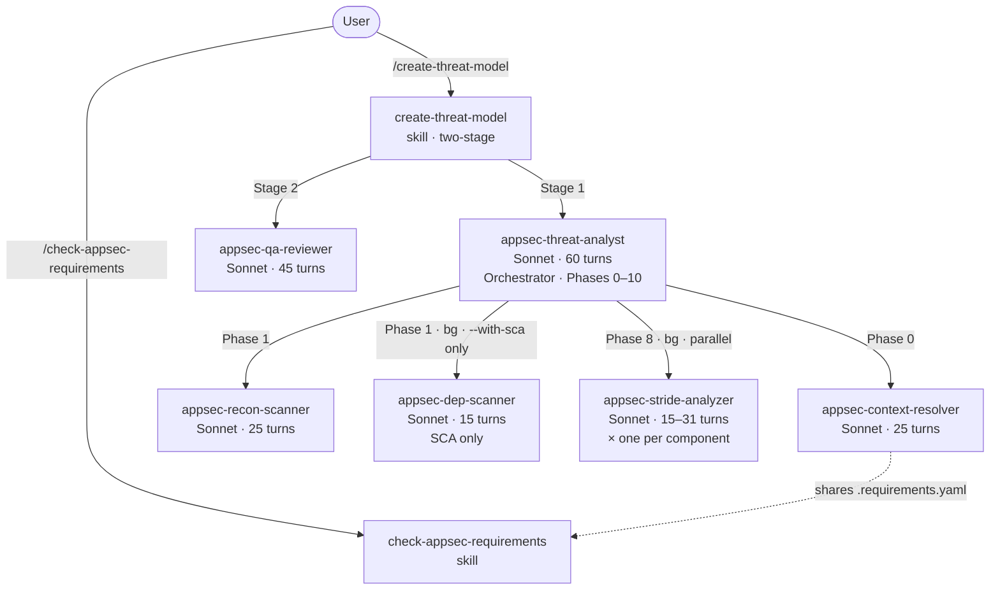
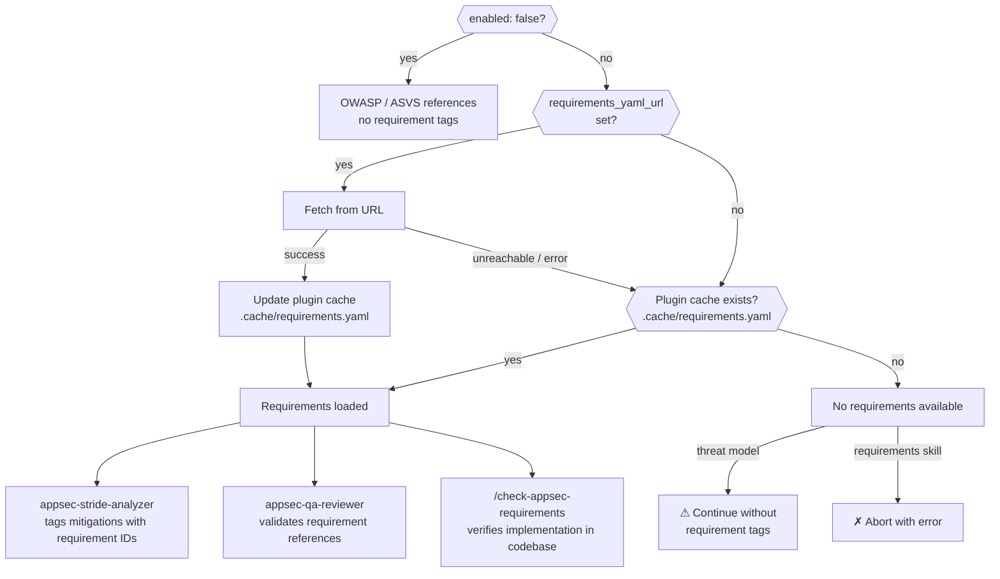

# Claude AppSec Plugin

> **Status: 0.10.0-beta** — Functionally complete for guided use by AppSec teams. Now with `--repo`/`--output` for external repo analysis, `--dry-run`, `--incremental`, `--resume`, configurable pricing/logging, enhanced reliability features, and **headless mode** for non-interactive / CI/CD execution.

A Claude Code plugin for AppSec and dev teams. Point it at any repository to automatically generate a comprehensive, STRIDE-based threat model—complete with architecture diagrams, a prioritized threat register, and actionable mitigations grounded in the actual codebase. Enrich the analysis with your own context, map custom AppSec requirements, or simply use the built-in requirement-checking skill.

## Contents

- [Installation](#installation)
- [Usage](#usage)
- [Output](#output)
- [AppSec Steering Hook](#appsec-steering-hook)
- [Agent Pipeline](#agent-pipeline)
- [Reliability Features](#reliability-features)
  - [Sub-agent retry logic](#sub-agent-retry-logic)
  - [Concurrent run locking](#concurrent-run-locking)
  - [Stale file cleanup](#stale-file-cleanup)
  - [Schema validation](#schema-validation)
  - [Log rotation](#log-rotation)
  - [Error recovery & checkpoints](#error-recovery--checkpoints)
  - [Dep-scanner caching](#dep-scanner-caching)
  - [Config schema validation](#config-schema-validation)
- [External Context *(optional)*](#external-context-optional)
- [Known Threats Input *(optional)*](#known-threats-input-optional)
- [Security Requirements Management *(optional)*](#security-requirements-management-optional)
- [Headless Mode (Non-Interactive / CI/CD)](#headless-mode-non-interactive--cicd)
- [Plugin Structure](#plugin-structure)
- [Roadmap](#roadmap)

## Installation

```bash
claude --plugin-dir /path/to/appsec-plugin/plugin
```

That's all that's required. The two optional integrations can be enabled independently at any time — see [External Context](#external-context-optional) and [Security Requirements Management](#security-requirements-management).

## Usage

### Dev team — from within the repository

```
# Run threat assessment (output goes to docs/security/ in the current repo)
/appsec-plugin:create-threat-model

# With scope constraint
/appsec-plugin:create-threat-model focus on the authentication service

# Include SARIF output for CI/CD integration (GitHub Advanced Security, SonarQube, DefectDojo)
/appsec-plugin:create-threat-model --sarif

# Include both YAML and SARIF exports
/appsec-plugin:create-threat-model --yaml --sarif

# Include requirements compliance check in the threat model (Phase 7b)
/appsec-plugin:create-threat-model --requirements

# All flags combined
/appsec-plugin:create-threat-model --yaml --sarif --requirements

# Dry run — see what would be analyzed without running the full pipeline
/appsec-plugin:create-threat-model --dry-run

# Include SCA dependency vulnerability scan (npm audit, pip-audit, etc.)
/appsec-plugin:create-threat-model --with-sca

# Incremental — delta analysis based on git diff since last assessment
/appsec-plugin:create-threat-model --incremental

# Resume — continue from the last checkpoint after a failed assessment
/appsec-plugin:create-threat-model --resume
```

### AppSec team — analyzing external repositories

Use `--repo` to point at a repository outside the current working directory, and `--output` to write all results to a separate location. This enables centralized security reviews without modifying target repositories.

```
# Analyze an external repository (output goes to docs/security/ in that repo)
/appsec-plugin:create-threat-model --repo /path/to/team-frontend

# Analyze an external repo, write output to a central AppSec directory
/appsec-plugin:create-threat-model --repo /path/to/team-frontend --output /appsec-reports/team-frontend

# Dry-run to preview scope before a full assessment
/appsec-plugin:create-threat-model --repo /path/to/team-api --output /appsec-reports/team-api --dry-run

# Full assessment with all exports to a dated directory
/appsec-plugin:create-threat-model --repo /path/to/team-api --output /appsec-reports/team-api/2026-04-08 --yaml --sarif

# Incremental review after code changes
/appsec-plugin:create-threat-model --repo /path/to/team-api --output /appsec-reports/team-api --incremental
```

When `--output` points outside the repository, `.gitignore` entries are automatically skipped.

### Requirements compliance (standalone)

```
# Check security requirements coverage
/appsec-plugin:check-appsec-requirements
```

### All flags

| Flag | Description |
|------|-------------|
| `--repo <path>` | Path to the repository to analyze (default: current working directory) |
| `--output <path>` | Output directory for all generated files (default: `<repo>/docs/security`) |
| `--yaml` | Also write `threat-model.yaml` (machine-readable export) |
| `--sarif` | Also write `threat-model.sarif.json` (SARIF v2.1.0 for CI/CD) |
| `--requirements` | Include requirements compliance check (Phase 7b) |
| `--with-sca` | Run SCA dependency vulnerability scan (`npm audit`, `pip-audit`, etc.) |
| `--dry-run` | Preview what would be analyzed without running the full pipeline |
| `--incremental` | Delta analysis based on git diff since last assessment |
| `--resume` | Continue from the last checkpoint after a failed assessment |

## Output

Each run writes files to the output directory (`docs/security/` inside the analyzed repo by default, or the path specified with `--output`).

**`threat-model.md`** (always) — human-readable report with colored severity badges and VS Code deep links to every referenced source file:

| Section | Content |
|---------|---------|
| Metadata | Generated date/time, duration, model |
| 1. System Overview | Description, team, compliance scope, asset classification |
| 2. Architecture Diagrams | C4 context/container/component diagrams + technology architecture (Mermaid) |
| 3. Security Use Cases | Sequence diagrams for auth, authorization, and critical flows |
| 4. Assets | Data, code/IP, infrastructure, and availability assets |
| 5. Attack Surface | All entry points with protocol, auth requirements |
| 6. Trust Boundaries | Where trust levels change across the system |
| 7. Security Controls | Existing controls with effectiveness ratings (✅ ⚠️ 🔶 ❌) |
| 7b. Requirements Compliance | *(only with `--requirements`)* Per-requirement PASS/PARTIAL/FAIL/UNVERIFIABLE with evidence |
| 8. Threat Register | STRIDE threats with likelihood, impact, risk, and mitigations |
| 9. Critical Findings | Top highest-risk threats requiring immediate action |
| 10. Mitigation Register | Prioritized remediation list |
| 11. Out of Scope | What was not analyzed |

**`threat-model.yaml`** (with `--yaml`) — machine-readable export for ingestion into ticketing systems, dashboards, or CI/CD pipelines:

```yaml
meta:
  project: my-service
  generated: 2026-04-03T14:32:11Z
  model: claude-sonnet-4-6
  compliance_scope: [PCI-DSS, SOC2]
threats:
  - id: T-001
    stride: Spoofing
    likelihood: High
    impact: Critical
    risk: Critical
```

**`threat-model.sarif.json`** (with `--sarif`) — [SARIF v2.1.0](https://docs.oasis-open.org/sarif/sarif/v2.1.0/sarif-v2.1.0.html) export for integration with CI/CD security tooling:

```json
{
  "version": "2.1.0",
  "runs": [{
    "tool": { "driver": { "name": "appsec-plugin", "version": "0.9.0-beta" } },
    "results": [{
      "ruleId": "T-001",
      "level": "error",
      "message": { "text": "JWT tokens accepted without signature verification..." },
      "locations": [{ "physicalLocation": { "artifactLocation": { "uri": "src/auth/jwt.ts" } } }]
    }]
  }]
}
```

Supported by: GitHub Code Scanning, Azure DevOps, SonarQube, DefectDojo, Semgrep, and any SARIF-consuming tool.

> Token and cost fields are `null` at runtime — agents cannot introspect their own API usage. Check the Anthropic Console for session details. The hook logger estimates costs per session using configurable rates (see `pricing` in `config.json`).

## AppSec Steering Hook

A `UserPromptSubmit` hook (`plugin/hooks/hooks.json`) runs `plugin/scripts/security_steering.py` on every prompt and conditionally appends a secure-by-default context to Claude's system message — treat input as untrusted, enforce least privilege, no hardcoded secrets, etc.

The hook uses **tiered keyword matching** to avoid false positives:
- **Strong keywords** (auth, token, sql, xss, etc.) trigger on a single match
- **Code keywords** (api, database, docker, etc.) require 2+ matches
- **Action keywords** (write, create, build, etc.) only trigger in combination with code keywords

This means "create a README" passes through silently, while "create an API endpoint" or "review auth code" activates the security context.

### Configurable keywords

All keyword lists and trigger thresholds are defined in `plugin/hooks/steering_keywords.json`. Teams can customize which terms activate the security steering without editing Python code:

```json
{
  "strong": ["auth", "token", "sql", "xss", "..."],
  "code": ["api", "database", "docker", "..."],
  "action": ["write", "create", "build", "..."],
  "thresholds": {
    "strong_min": 1,
    "code_min": 2,
    "code_action_code_min": 1,
    "code_action_action_min": 1
  }
}
```

The script falls back to built-in defaults if the config file is missing.

## Agent Pipeline

The plugin uses a 6-agent pipeline. Only `appsec-threat-analyst` is user-facing; the rest are dispatched internally.



### Agents

| Agent | Turns | Role |
|-------|-------|------|
| `appsec-threat-analyst` | 60 | Orchestrator — drives all 11 phases, dispatches sub-agents, assembles output |
| `appsec-context-resolver` | 25 | Phase 0 — resolves external context, repo files, and known threats into `.threat-modeling-context.md` |
| `appsec-recon-scanner` | 25 | Phase 1 — scans repo structure, tech stack, 12 security code categories (incl. hardcoded secrets) → `.recon-summary.md` |
| `appsec-dep-scanner` | 15 | Phase 1 (bg, **only with `--with-sca`**) — pure SCA: scans manifests for known CVEs via native audit tools, with caching |
| `appsec-stride-analyzer` | 15–31 | Phase 8 (bg, parallel) — one instance per component, dynamic turn budget based on complexity, writes `.stride-<id>.json` |
| `appsec-qa-reviewer` | 45 | Stage 2 (skill-level) — 10 checks (including 11-point Mermaid validation) on the finished threat model, fixes in-place |

The QA reviewer runs at the skill level (Stage 2) with its own turn budget, not inside the orchestrator. This ensures it always executes even when the orchestrator uses all its turns during Phases 0–9.

### Orchestrator phases

| Phase | Description |
|-------|-------------|
| 0. Context Lookup | `appsec-context-resolver` fetches pre-existing AppSec knowledge (external context, repo files, known threats) before any user questions |
| 1. Reconnaissance | `appsec-recon-scanner` maps tech stack, structure, and 12 security code categories (incl. hardcoded secrets); optionally triggers `appsec-dep-scanner` (bg, only with `--with-sca`) |
| 2. Architecture Modeling | C4 diagrams (context / container / component) + technology architecture diagram |
| 3. Security Use Cases | Sequence diagrams for auth flow, access control, and other critical flows |
| 4. Asset Identification | Catalogs data, code/IP, infrastructure, and availability assets |
| 5. Attack Surface Mapping | Enumerates API endpoints, auth mechanisms, file uploads, inter-service calls |
| 6. Trust Boundary Analysis | Identifies privilege and network boundary crossings |
| 7. Security Controls | Catalogs existing controls by domain with colored effectiveness rating |
| 7b. Requirements Compliance | *(only with `--requirements`)* Verifies each requirement against codebase; FAIL requirements become threat candidates for Phase 8 |
| 8. Threat Enumeration | Dispatches `appsec-stride-analyzer` per component (requires Phases 5–7 outputs), merges results + Phase 7b threat candidates, assigns global T-xxx IDs, rates risk |
| 9. Scan Synthesis | Incorporates hardcoded secrets (from recon) and SCA findings (from dep-scanner, if `--with-sca`); writes `threat-model.md` and optional YAML/SARIF exports to the output directory |
| 10. Finalization | Releases lock, records duration, prints completion summary |
| *(Stage 2)* | `appsec-qa-reviewer` verifies and fixes links, references, consistency, diagrams |

### Intermediate files

Sub-agents communicate via files written to the **output directory** (`docs/security/` by default, or the path from `--output`). These files are gitignored by default when the output is inside the repository.

| File | Written by | Read by |
|------|-----------|---------|
| `.threat-modeling-context.md` | `appsec-context-resolver` | orchestrator, `appsec-stride-analyzer` |
| `.recon-summary.md` | `appsec-recon-scanner` | orchestrator (Phases 2–10) |
| `.requirements.yaml` | `appsec-context-resolver` | `appsec-stride-analyzer`, `appsec-qa-reviewer`, `check-appsec-requirements` skill |
| `.dep-scan.json` | `appsec-dep-scanner` | orchestrator (Phase 9) |
| `.stride-<id>.json` | `appsec-stride-analyzer` | orchestrator (Phase 8) |
| `.appsec-lock` | orchestrator | orchestrator (concurrent-run guard; deleted after assessment) |
| `.appsec-checkpoint` | orchestrator | skill (phase progress; used by `--resume`; deleted after successful completion) |

All paths are relative to the output directory. When using `--output /appsec-reports/team-api`, intermediate files appear as `/appsec-reports/team-api/.recon-summary.md`, etc.

The **persistent requirements cache** lives at `$CLAUDE_PLUGIN_ROOT/.cache/requirements.yaml` (outside the analyzed repo). It is updated on every successful remote fetch and used as a fallback when the remote URL is unreachable. The per-assessment copy at `.requirements.yaml` is written to the output directory during each assessment for use by the STRIDE analyzer and QA reviewer.

## Reliability Features

### Sub-agent retry logic

If a `appsec-stride-analyzer` or `appsec-dep-scanner` fails (missing output, schema validation error, or error stub), the orchestrator retries the failed agent **once** synchronously before skipping. This handles transient failures (token-limit timeouts, temporary file system issues) without losing threat coverage for an entire component.

### Concurrent run locking

The orchestrator acquires a lock file (`.appsec-lock` in the output directory) at startup. If another assessment is already running (lock file exists and is less than 1 hour old), the new run stops with a clear error message. Stale locks (older than 1 hour) are automatically overwritten. The lock is always released after Phase 10 completes or on any early exit.

### Stale file cleanup

Intermediate files from previous runs (`.stride-*.json`, `.dep-scan.json`) are automatically deleted before each new assessment starts. This prevents stale data from interfering with the current run.

### Schema validation

All intermediate JSON files (`.dep-scan.json`, `.stride-*.json`) are validated against strict schemas by `validate_intermediate.py` before the orchestrator reads them. Invalid files trigger the retry logic above rather than causing silent data corruption.

### Log rotation

Hook event logs (`.hook-events.log`) and agent run logs (`.agent-run.log`) are automatically rotated when they exceed 5 MB (configurable via `logging.max_log_bytes` in `plugin/config.json`). Up to 2 rotated copies are kept (`.log.1`, `.log.2`). This prevents unbounded log growth across multiple assessment runs.

### Error recovery & checkpoints

The orchestrator writes a checkpoint file (`.appsec-checkpoint`) at the start and end of each phase, recording the phase number, status, and timestamp. If an assessment is interrupted (token limit, network issue, manual cancellation), the checkpoint preserves which phase last completed.

Run `/appsec-plugin:create-threat-model --resume` to inspect the checkpoint and continue from the last completed phase, reusing existing intermediate files instead of starting from scratch.

### Dep-scanner caching

The dep-scanner caches its results in `.dep-scan.json` along with MD5 hashes of all scanned manifest files. On subsequent runs within 1 hour, if no manifest file has changed, the scanner reuses the cached results and skips expensive audit tool invocations (`npm audit`, `pip-audit`, etc.).

### Config schema validation

`plugin/scripts/validate_config.py` validates both `plugin/config.json` and `skills/check-appsec-requirements/config.json` against defined schemas. Run it before deployment or in CI to catch misconfigurations:

```bash
python3 plugin/scripts/validate_config.py plugin/
```

## External Context *(optional)*

The context resolver can pull additional context from a REST endpoint before analysis begins — team ownership, compliance scope, prior findings, architecture notes, or anything else relevant. The endpoint returns free-form text; no fixed schema is required.

**Without this the plugin works normally** — `appsec-context-resolver` derives context from repository files (`SECURITY.md`, architecture docs, ADRs, deployment configs, etc.) and writes everything to `.threat-modeling-context.md` in the output directory.

### What the context resolver collects from repository files

| Category | Files checked |
|----------|--------------|
| Security policy | `SECURITY.md`, `.github/SECURITY.md`, `docs/SECURITY.md` |
| Architecture docs | `ARCHITECTURE.md`, `docs/architecture.md`, `docs/design.md`, … |
| ADRs | `docs/adr/`, `docs/decisions/`, `adr/` — 5 most recent |
| API surface | `openapi.yaml`, `swagger.yaml`, `docs/api.md`, … |
| Deployment config | `docker-compose.yml`, `Dockerfile`, `kubernetes/`, `terraform/` |
| Data model | `schema.sql`, `prisma/schema.prisma`, `schema.graphql`, … |
| Env template | `.env.example`, `config/default.yaml`, `appsettings.json`, … |
| Changelog | `CHANGELOG.md`, `CHANGES.md` — last 60 lines |
| Known threats | `docs/known-threats.yaml` — team-provided threats, accepted risks, prior findings |

### Configuration

Set `rest_url` in `plugin/config.json` to enable the external context endpoint:

```json
{
  "external_context": {
    "enabled": true,
    "rest_url": "http://127.0.0.1:4444/context"
  },
  "pricing": {
    "input_per_1m": 3.00,
    "output_per_1m": 15.00,
    "cache_write_per_1m": 3.75,
    "cache_read_per_1m": 0.30
  },
  "logging": {
    "max_log_bytes": 5242880
  }
}
```

The `pricing` and `logging` sections are optional. If omitted, built-in defaults are used. Pricing rates are used by the hook logger for cost estimation; `max_log_bytes` controls log rotation threshold (default: 5 MB).

| Field | Default | Description |
|-------|---------|-------------|
| `external_context.enabled` | `true` | Set to `false` to skip the external context call entirely |
| `external_context.rest_url` | `null` | URL of a REST endpoint. Accepts `POST {"repo_url": "..."}`, returns `{"context": "..."}` |
| `pricing.input_per_1m` | `3.00` | USD per 1M input tokens (for cost estimation in logs) |
| `pricing.output_per_1m` | `15.00` | USD per 1M output tokens |
| `pricing.cache_write_per_1m` | `3.75` | USD per 1M cache write tokens |
| `pricing.cache_read_per_1m` | `0.30` | USD per 1M cache read tokens |
| `logging.max_log_bytes` | `5242880` | Log rotation threshold in bytes (default: 5 MB) |

### Endpoint contract

The endpoint receives a `POST` request with the repository URL and returns any JSON object containing a `context` field with free-form text (markdown is supported):

```
POST /context
Content-Type: application/json

{"repo_url": "https://gitlab.example.com/team/payment-service"}

→ {"context": "Payments platform. Compliance: PCI-DSS v4.0. Prior finding: JWT not validated on internal API (resolved 2024-03)."}
```

The `context` value is included verbatim in `.threat-modeling-context.md`. The endpoint can return anything — team info, compliance requirements, architecture summaries, prior findings, links to wikis, or any combination. If the endpoint is unreachable the resolver continues without it.

### Mock server for development

`scripts/mock-context-server.py` provides a minimal mock that returns example context based on simple URL pattern matching. No dependencies required.

```bash
python3 scripts/mock-context-server.py          # default port 4444
python3 scripts/mock-context-server.py 8080     # custom port
```

## Known Threats Input *(optional)*

Teams can provide known threats, prior pentest findings, and accepted risks by creating `docs/known-threats.yaml` in the analyzed repository. This gives development and AppSec teams a structured way to feed domain knowledge into the automated assessment.

### File format

```yaml
# docs/known-threats.yaml
# Team-provided known threats — read by the plugin during Phase 0.
# The STRIDE analyzer verifies open threats, the QA reviewer checks coverage.

threats:
  - id: TEAM-2026-001
    title: "SQL Injection in legacy search endpoint"
    stride: Tampering
    component: rest-api            # must match a STRIDE analyzer COMPONENT_ID
    severity: High                 # Critical | High | Medium | Low
    status: open                   # open | mitigated | accepted | false-positive
    description: |
      The /api/v1/search endpoint uses string concatenation instead of
      parameterized queries. Known since pentest Q1/2026.
    evidence: "src/routes/search.ts:47"
    pentest_ref: "PT-2026-Q1-007"  # optional — external reference
    accepted_risk: null            # required when status is 'accepted'

  - id: TEAM-2026-002
    title: "Missing rate limiting on login"
    stride: Denial of Service
    component: auth-service
    severity: Medium
    status: accepted
    description: |
      No rate limiting on /auth/login. Accepted until WAF rollout in Q3/2026.
    evidence: "src/auth/controller.ts:12"
    pentest_ref: null
    accepted_risk: "WAF with rate limiting planned for Q3/2026 (JIRA: SEC-4521)"
```

### How entries are processed

| `status` | STRIDE analyzer | Threat register | Section 11 (Out of Scope) |
|----------|----------------|-----------------|---------------------------|
| `open` | Verifies the issue still exists in code; includes as threat with `prior_finding_ref` | Appears as T-NNN | — |
| `mitigated` | Checks that the mitigation is actually in place | Appears only if mitigation is absent or incomplete | — |
| `accepted` | Skipped | — | Listed as "Accepted Risk" with justification |
| `false-positive` | Skipped | — | — |

The QA reviewer (Check 5) verifies that every `open` and `mitigated` entry is referenced somewhere in the finished threat model. Unaddressed entries are flagged in a "Prior Findings Not Addressed" subsection.

### Field reference

| Field | Required | Description |
|-------|----------|-------------|
| `id` | yes | Unique identifier (any format — e.g. `TEAM-2026-001`, `PT-Q1-007`, `VULN-42`) |
| `title` | yes | Short description of the threat |
| `stride` | yes | STRIDE category: Spoofing, Tampering, Repudiation, Information Disclosure, Denial of Service, Elevation of Privilege |
| `component` | no | Component slug matching the STRIDE analyzer's `COMPONENT_ID`. If omitted, the threat is checked against all components |
| `severity` | yes | Critical, High, Medium, or Low |
| `status` | yes | `open`, `mitigated`, `accepted`, or `false-positive` |
| `description` | no | Detailed description of the threat |
| `evidence` | no | File path and optional line number where the issue was observed |
| `pentest_ref` | no | External reference (pentest report ID, JIRA ticket, etc.) |
| `accepted_risk` | conditional | Required when `status: accepted` — justification for risk acceptance |

## Security Requirements Management *(optional)*

Point the plugin at your own requirements YAML to get requirement-tagged mitigations and a compliance check against your internal standards. Without a configured URL the plugin uses OWASP/CWE references only.

`plugin/skills/check-appsec-requirements/config.json`:

```json
{
  "requirements_source": {
    "enabled": true,
    "requirements_yaml_url": null
  }
}
```

| `enabled` | `requirements_yaml_url` | Behaviour |
|-----------|------------------------|-----------|
| `false` | — | OWASP / ASVS references only — no requirement tags |
| `true` | `null` | Plugin cache only — if no cache exists, requirements are unavailable |
| `true` | URL set | Fetch from URL and update plugin cache; use cache if URL unreachable |

### check-appsec-requirements skill

Verifies that each requirement from the loaded YAML is implemented in the codebase, and writes a compliance report to `docs/security/appsec-requirements-report.md`.

```bash
# Check all requirements
/appsec-plugin:check-appsec-requirements

# Filter by category or ID substring
/appsec-plugin:check-appsec-requirements AUTH
```

The report includes per-requirement status (✅ PASS / ⚠️ PARTIAL / ❌ FAIL / ❓ UNVERIFIABLE), VS Code deep links to the evidence, a direct link to the source requirement page, and actionable recommendations for every non-passing item.

### Requirement definitions

Requirements are defined in a YAML file with the following structure:

```yaml
categories:
  - id: AUTH          # used as the tag prefix in mitigations: [AUTH-1]
    title: Authentication
    url: https://security.example.com/requirements/auth
    requirements:
      - id: AUTH-1
        text: "All authentication tokens must be validated server-side on every request."
        priority: MUST    # MUST | SHOULD | MAY
        url: https://security.example.com/requirements/auth#auth-1
```

The **tag format and category IDs are fully defined by your YAML** — the plugin imposes no naming convention. The bundled fallback uses `SEC-*` IDs as an example; replace it with your own YAML to use whatever naming scheme your organization uses (`AUTH-1`, `POLICY-007`, `R-INJ-3`, etc.).

Each requirement carries `id`, `text`, `priority`, and optionally `url` (link to the authoritative requirement page).

### Requirement loading



The plugin cache (`$CLAUDE_PLUGIN_ROOT/.cache/requirements.yaml`) is stored **outside** the analyzed repository and persists across assessments of different repos. A successful remote fetch always updates the cache. When the remote URL is unreachable, the cached version is used automatically.

**First-time setup:** Run a threat model or the requirements skill once with the remote URL reachable to populate the cache. Subsequent runs work offline using the cache.

### Integration with the threat modeling pipeline

The `check-appsec-requirements` skill is **not** invoked by the threat modeling agent — the two are independent. They share the same loading logic and plugin cache (see the diagram in [Agent Pipeline](#agent-pipeline)).

**What the threat modeling pipeline does with requirements:**
- `appsec-context-resolver` fetches requirements at Phase 0, updates the plugin cache, and copies to `.requirements.yaml` in the output directory for use during the assessment
- `appsec-stride-analyzer` reads the YAML and tags each mitigation with the matching requirement ID (e.g. a Spoofing threat → `[AUTH-3]`, using IDs from your YAML)
- `appsec-qa-reviewer` reads the YAML to validate that every requirement reference in the finished threat model points to a known requirement

**What the `check-appsec-requirements` skill does:**
- Resolves requirements using the same loading logic (URL → plugin cache → abort)
- Scans the codebase for requirement tag references and verifies that each is actually implemented
- Writes a compliance report to `docs/security/appsec-requirements-report.md`

Running `/appsec-plugin:create-threat-model` first populates the plugin cache, so a subsequent `/appsec-plugin:check-appsec-requirements` run works even if the remote URL is unreachable.

### Harvester — keeping requirements up to date

`scripts/harvest-requirements.py` crawls your internal requirements pages and regenerates `appsec-requirements-fallback.yaml`. The output can be served via a static URL and configured as `requirements_yaml_url` so the plugin fetches fresh requirements on each run.

```bash
pip install -r scripts/requirements.txt
python scripts/harvest-requirements.py
```

See [docs/harvester.md](docs/harvester.md) for configuration, scheduling options (cron, CI/CD, static URL), and indexing modes.

## Headless Mode (Non-Interactive / CI/CD)

The plugin can run **non-interactively** via Claude Code's headless mode (`claude -p`). This requires zero code changes — the same plugin, agents, and skills execute exactly as they do in interactive mode, but driven from a shell script instead of a chat session.

A ready-to-use wrapper script is included at `scripts/run-headless.sh`.

### Prerequisites

1. **Claude Code CLI** installed and on your `PATH` ([installation guide](https://claude.ai/download))
2. **`ANTHROPIC_API_KEY`** exported in your environment
3. The plugin repository cloned locally

```bash
export ANTHROPIC_API_KEY="sk-ant-..."
```

### Use Case 1: Scan your own repository

You are a developer working inside your project. Run the full assessment from your repo root — output goes to `docs/security/` by default:

```bash
# Minimal — full threat model
cd /path/to/my-project
/path/to/appsec-plugin/scripts/run-headless.sh

# With YAML and SARIF exports for downstream tooling
/path/to/appsec-plugin/scripts/run-headless.sh --yaml --sarif

# Dry-run first to preview scope and estimated complexity
/path/to/appsec-plugin/scripts/run-headless.sh --dry-run

# After code changes — only re-analyze affected components
/path/to/appsec-plugin/scripts/run-headless.sh --incremental

# Full assessment with SCA dependency scan (npm audit, pip-audit, etc.)
/path/to/appsec-plugin/scripts/run-headless.sh --yaml --sarif --with-sca
```

**Result:** `docs/security/threat-model.md` (+ `.yaml`, `.sarif.json` if requested) in your project.

### Use Case 2: Scan an external repository

You are on the AppSec team. Analyze a team's repository without modifying it, writing all output to a central location:

```bash
# Analyze external repo — output goes to docs/security/ inside that repo
./scripts/run-headless.sh --repo /repos/team-frontend

# Analyze external repo — write output to a central AppSec directory
./scripts/run-headless.sh \
  --repo /repos/team-frontend \
  --output /appsec-reports/team-frontend

# Dated output directory for audit trail
./scripts/run-headless.sh \
  --repo /repos/team-api \
  --output /appsec-reports/team-api/2026-04-08 \
  --yaml --sarif

# Incremental review after a team pushed changes
./scripts/run-headless.sh \
  --repo /repos/team-api \
  --output /appsec-reports/team-api \
  --incremental

# Dry-run to preview what would be analyzed before committing budget
./scripts/run-headless.sh \
  --repo /repos/team-api \
  --output /appsec-reports/team-api \
  --dry-run
```

**Result:** All output files land in the `--output` directory. The target repository remains untouched.

### Use Case 3: Cost-limited assessments

Use `--max-budget` to cap API spend. Combined with `--dry-run`, this allows safe exploration before committing to a full run:

```bash
# Preview scope for free (dry-run uses minimal tokens)
./scripts/run-headless.sh --repo /repos/large-monorepo --dry-run

# Cap at $3 — enough for a small-to-medium repo
./scripts/run-headless.sh --repo /repos/small-service --max-budget 3

# Cap at $8 — suitable for larger repos with full exports
./scripts/run-headless.sh \
  --repo /repos/large-monorepo \
  --yaml --sarif --requirements \
  --max-budget 8

# Include requirements compliance + SCA within budget
./scripts/run-headless.sh \
  --repo /repos/team-api \
  --output /appsec-reports/team-api \
  --yaml --sarif --requirements --with-sca \
  --max-budget 10
```

When the budget limit is reached, Claude Code stops gracefully. Use `--resume` on a subsequent run to continue from the last checkpoint:

```bash
# Budget ran out at Phase 7 — resume from there
./scripts/run-headless.sh \
  --repo /repos/large-monorepo \
  --max-budget 5 \
  --resume
```

### Use Case 4: Requirements compliance check

Run the standalone `check-appsec-requirements` skill to verify security requirements against a codebase — without running a full threat model:

```bash
# Check all requirements
./scripts/run-headless.sh --check-requirements

# Filter to a specific category (e.g. authentication)
./scripts/run-headless.sh --check-requirements --category SEC-AUTH

# Save the report as Markdown + JSON
./scripts/run-headless.sh --check-requirements --save-report

# Filter and save
./scripts/run-headless.sh --check-requirements --category SEC-AUTH --save-report

# Check requirements for an external repo
./scripts/run-headless.sh --check-requirements --repo /repos/team-frontend

# Combine: threat model with requirements + standalone requirements check
./scripts/run-headless.sh --repo /repos/team-api --requirements --yaml
./scripts/run-headless.sh --check-requirements --repo /repos/team-api --save-report
```

**Output:** Console report with pass/fail per requirement, VS Code deep links to evidence, and a remediation roadmap. With `--save-report`, also writes `docs/security/appsec-requirements-report.md` and `.json`.

### Use Case 5: CI/CD pipeline integration

Use the headless script in any CI system. Example for **GitHub Actions**:

```yaml
# .github/workflows/threat-model.yml
name: Threat Model Assessment
on:
  pull_request:
    types: [opened, synchronize]
  schedule:
    - cron: '0 2 * * 1'  # Weekly Monday 2am

jobs:
  threat-model:
    runs-on: ubuntu-latest
    permissions:
      contents: write
      security-events: write
    steps:
      - uses: actions/checkout@v4

      - name: Install Claude Code
        run: npm install -g @anthropic-ai/claude-code

      - name: Clone AppSec Plugin
        run: git clone https://github.com/your-org/appsec-plugin.git /tmp/appsec-plugin

      - name: Run Threat Model (incremental on PRs)
        env:
          ANTHROPIC_API_KEY: ${{ secrets.ANTHROPIC_API_KEY }}
        run: |
          /tmp/appsec-plugin/scripts/run-headless.sh \
            --sarif \
            --incremental \
            --max-budget 5

      - name: Upload SARIF to GitHub Code Scanning
        if: always()
        uses: github/codeql-action/upload-sarif@v3
        with:
          sarif_file: docs/security/threat-model.sarif.json

      - name: Upload threat model as artifact
        if: always()
        uses: actions/upload-artifact@v4
        with:
          name: threat-model
          path: docs/security/threat-model.*
```

For **requirements compliance** in CI:

```yaml
  requirements-check:
    runs-on: ubuntu-latest
    steps:
      - uses: actions/checkout@v4
      - name: Install Claude Code
        run: npm install -g @anthropic-ai/claude-code
      - name: Clone AppSec Plugin
        run: git clone https://github.com/your-org/appsec-plugin.git /tmp/appsec-plugin
      - name: Check Requirements
        env:
          ANTHROPIC_API_KEY: ${{ secrets.ANTHROPIC_API_KEY }}
        run: |
          /tmp/appsec-plugin/scripts/run-headless.sh \
            --check-requirements \
            --save-report \
            --max-budget 3
      - name: Upload report
        if: always()
        uses: actions/upload-artifact@v4
        with:
          name: requirements-report
          path: docs/security/appsec-requirements-report.*
```

### All headless options

| Option | Description |
|--------|-------------|
| **Threat model flags** | |
| `--repo <path>` | Repository to analyze (default: current directory) |
| `--output <path>` | Output directory (default: `<repo>/docs/security`) |
| `--yaml` | Also write `threat-model.yaml` |
| `--sarif` | Also write `threat-model.sarif.json` |
| `--requirements` | Include requirements compliance check (Phase 7b) |
| `--with-sca` | Run dependency vulnerability scan |
| `--dry-run` | Preview scope without running the full pipeline |
| `--incremental` | Delta analysis based on git diff |
| `--resume` | Continue from last checkpoint |
| **Requirements check** | |
| `--check-requirements` | Run requirements check instead of threat model |
| `--category <filter>` | Filter to a requirement category (e.g. `SEC-AUTH`) |
| `--save-report` | Save report as Markdown + JSON |
| **Execution control** | |
| `--max-budget <usd>` | Cap API spend at this dollar amount |
| `--model <model>` | Override the Claude model |
| `--json` | Return structured JSON output |
| `--verbose` | Show detailed turn-by-turn output |

## Plugin Structure

```
appsec-plugin/
├── plugin/                                     # Plugin root — pass to --plugin-dir
│   ├── .claude-plugin/
│   │   └── plugin.json                         # Plugin manifest (v0.10.0-beta)
│   ├── .claude/
│   │   └── settings.json                       # Allowlisted Bash commands (restricted permissions)
│   ├── config.json                             # external_context, pricing, logging config
│   ├── .cache/                                 # Persistent cache (gitignored, auto-created)
│   │   └── requirements.yaml                   # Cached requirements from last successful fetch
│   ├── agents/
│   │   ├── appsec-threat-analyst.md            # Orchestrator (Sonnet, 60 turns)
│   │   ├── appsec-context-resolver.md          # Context resolver (Sonnet, 25 turns)
│   │   ├── appsec-recon-scanner.md             # Repo recon + secret detection (Sonnet, 25 turns)
│   │   ├── appsec-dep-scanner.md               # SCA dependency scanner (Sonnet, 15 turns, --with-sca only)
│   │   ├── appsec-stride-analyzer.md           # Per-component STRIDE analysis (Sonnet, 15–31 turns)
│   │   ├── appsec-qa-reviewer.md               # Output verification (Sonnet, 45 turns)
│   │   └── phases/                             # Phase-group reference files (read at runtime)
│   │       ├── phase-group-recon.md            # Phases 0–1: Context & Reconnaissance
│   │       ├── phase-group-architecture.md     # Phases 2–7: Architecture, Assets, Controls
│   │       ├── phase-group-threats.md          # Phases 8–9: STRIDE & Dep Scan Synthesis
│   │       └── phase-group-finalization.md     # Phase 10: Output & Finalization
│   ├── data/
│   │   └── appsec-requirements-fallback.yaml   # Reference baseline (53 requirements, 10 categories)
│   ├── hooks/
│   │   ├── hooks.json                          # UserPromptSubmit, PreToolUse, PostToolUse, Stop, SubagentStop
│   │   └── steering_keywords.json              # Configurable keyword lists for security steering
│   ├── scripts/
│   │   ├── security_steering.py                # Tiered keyword steering (loads from steering_keywords.json)
│   │   ├── agent_logger.py                     # Audit log writer with log rotation and configurable pricing
│   │   ├── validate_intermediate.py            # JSON schema validator for .dep-scan / .stride files
│   │   ├── validate_config.py                  # Config schema validator for config.json files
│   │   └── .gitignore-template                 # Template for analyzed repos (covers all intermediate files)
│   └── skills/
│       ├── create-threat-model/
│       │   └── SKILL.md                        # /appsec-plugin:create-threat-model (--repo --output --yaml --sarif --requirements --dry-run --incremental --resume --with-sca)
│       └── check-appsec-requirements/
│           ├── SKILL.md                        # /appsec-plugin:check-appsec-requirements
│           └── config.json                     # requirements_source config (enabled, url)
├── docs/
│   ├── harvester.md                            # Harvester config, scheduling, indexing modes
│   └── comparison-sonnet-opus.md               # Model performance comparison
├── examples/                                   # Example outputs
│   ├── juice-shop/                             # OWASP Juice Shop threat model examples
│   └── appsec-requirements-example.yaml        # Example requirements YAML (53 requirements, 10 categories)
├── scripts/                                    # Development & automation tools
│   ├── run-headless.sh                         # Headless wrapper for non-interactive / CI/CD usage
│   ├── mock-context-server.py                  # Mock for the external context REST endpoint
│   ├── harvest-requirements.py                 # Crawls requirements pages → YAML
│   ├── harvest-config.json                     # Crawler source URLs and indexing config
│   └── requirements.txt                        # Python deps for harvester
├── tests/                                      # Test suite (396 tests)
│   ├── test_agent_definitions.py               # Agent frontmatter, model, maxTurns validation
│   ├── test_agent_logger.py                    # Hook logger event handling, secret masking, cost estimation
│   ├── test_intermediate_json.py               # Schema validation for .dep-scan / .stride JSON
│   ├── test_security_steering.py               # Tiered keyword matching, false positive guards
│   ├── test_requirements_yaml.py               # Requirements YAML schema and cross-references
│   ├── test_integration.py                     # Plugin manifest, hooks, config, phase-groups, skill integrity
│   ├── test_sarif_validation.py                # SARIF v2.1.0 output schema validation
│   └── fixtures/                               # Test data (valid/error JSON stubs)
├── SECURITY.md
└── README.md
```

## Roadmap

**Completed in 0.10.0:**

- [x] `--repo` and `--output` flags — analyze external repos and write output to configurable directories (AppSec team mode)
- [x] `--dry-run` mode — scope preview without running the full pipeline
- [x] `--incremental` mode — delta analysis based on git diff
- [x] `--resume` — continue from last checkpoint after a failed assessment
- [x] Dep-scanner caching — skip re-scan when manifests unchanged within 1 hour
- [x] Config schema validation — `validate_config.py` for all config files
- [x] Configurable pricing — cost estimation rates in `config.json`
- [x] Configurable steering keywords — `steering_keywords.json`
- [x] Dynamic STRIDE turn budgets — 15/22/31 turns based on component complexity
- [x] Log rotation — automatic at 5 MB with 2 archived copies
- [x] Restricted Bash permissions — specific allowlist instead of `Bash(*)`
- [x] Phase-group reference files — orchestrator decomposed into 4 focused files
- [x] SARIF output validation — test suite against SARIF v2.1.0 schema
- [x] Enhanced Mermaid validation — 11-point syntax check in QA reviewer
- [x] Error recovery with checkpoint files

**Remaining items before 1.0 release:**

- [ ] Runtime token-budget tracking and cost estimation per assessment (agents cannot access their own counters yet)
- [ ] End-to-end CI test against a reference repository
- [ ] MCP server authentication for team deployments
