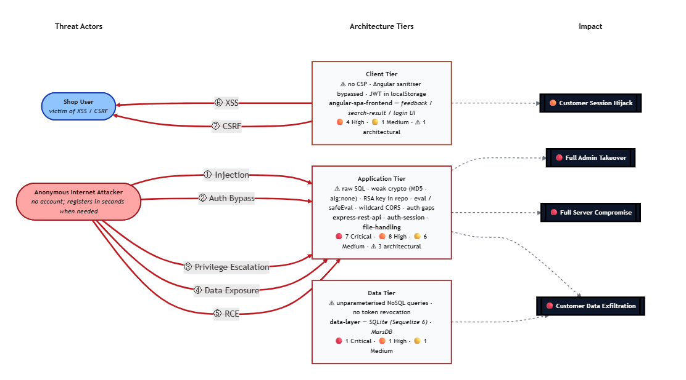
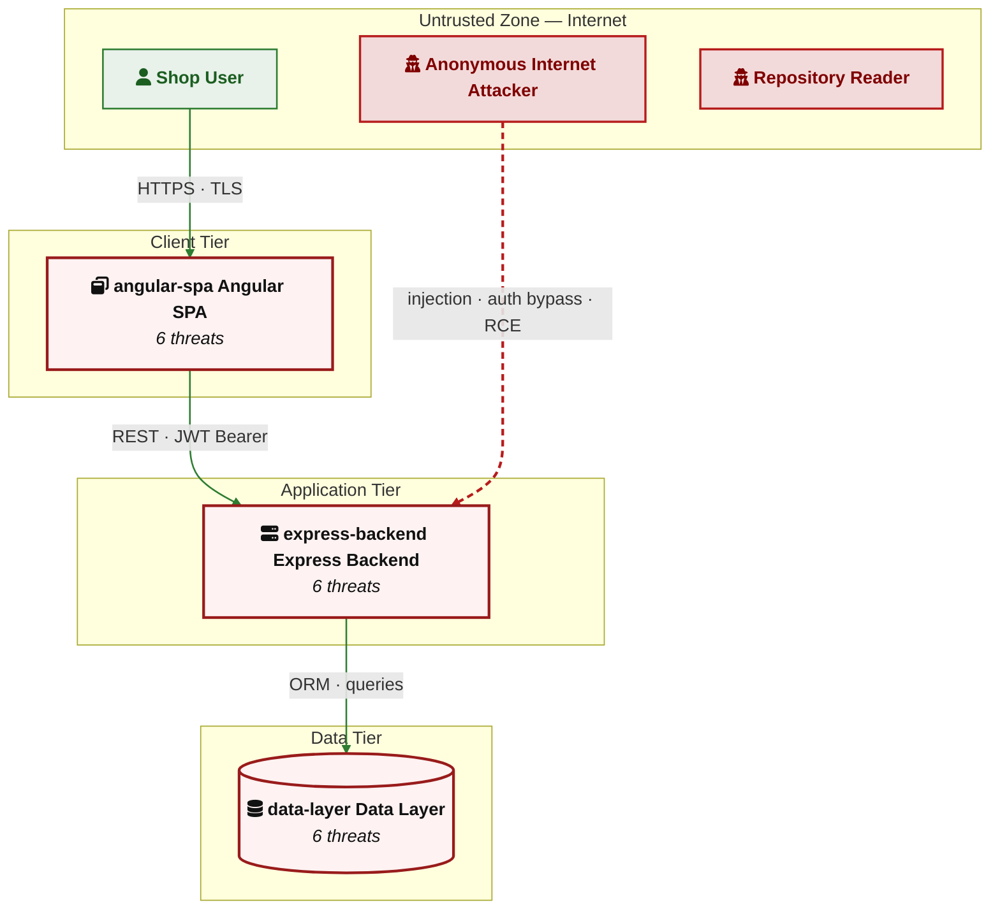

# appsec-advisor

A Claude Code plugin that gives development and AppSec teams a current security picture of any repository without manual analysis. It derives the architecture and existing security controls, runs STRIDE with code-anchored evidence, and checks the codebase against your company's AppSec requirements if needed. Incremental re-runs update the report as the code changes. 

[](#)
[](LICENSE)
[](https://docs.claude.com/en/docs/claude-code)
[](https://docs.oasis-open.org/sarif/sarif/v2.1.0/sarif-v2.1.0.html)

> **Status:** 0.9.0-beta. Good for guided use by an AppSec engineer.

---

## Contents

- [Quick start](#quick-start)
- [What you get](#what-you-get)
- [Example reports](#example-reports)
- [What it checks](#what-it-checks)
- [Example usage](#example-usage)
- [Assessment depth and costs](#assessment-depth-and-costs)
- [CI integration](#ci-integration)
- [Cross-repo analysis](#cross-repo-analysis)
- [Architecture](#architecture)
- [Additional skills](#additional-skills)
- [Related projects](#related-projects)
- [Contributing](#contributing)

## Quick start

Requires Claude Code, Python 3.10+, and `git` on `PATH`.

```bash
git clone <repository-url> /path/to/appsec-advisor
claude --plugin-dir /path/to/appsec-advisor
```

In Claude Code, type `/appsec-advisor:` — you should see the registered skills.

Before your first run, merge the required Claude Code permissions once (otherwise you'll hit a prompt every ~30 seconds):

```
/appsec-advisor:check-permissions --update
```

From the repo you want to analyse:

```
/appsec-advisor:create-threat-model
```

Output lands by default in `docs/security/` of the repository (configurable) and is git-ignored by default — threat reports contain vulnerability details that should not be committed unintentionally.

To commit the report, use the publish-threat-model skill:

```
/appsec-advisor:publish-threat-model
```

## What you get

The main result of an assessment is a report with a comprehensive list of **threats** and respective **mitigations**.

By default the skill writes:

- `threat-model.md` — human-readable threat model report
- `threat-model.yaml` — machine-readable export, consumable by other repos for cross-repo analysis (see [Cross-repo analysis](#cross-repo-analysis))

Optional outputs (flag-gated):

- `threat-model.sarif.json` — SARIF v2.1 findings (`--sarif`)
- `threat-model.pdf` — print-ready PDF (`--pdf`)
- `pentest-tasks.yaml` — task list for AI pentesters such as Strix (`--pentest-tasks`)

## Example Report

For a complete example, see the OWASP Juice Shop threat modeling report. It shows what a generated report can look like, including threats, risk ratings, affected architecture tiers, and diagrams.

> [!NOTE]
> 📄 **Full example report:** [OWASP Juice Shop threat modeling report](examples/threat-modeler/threat-model-juice-shop-thorough.md)

The example report also includes a threat heatmap showing how different threat actors interact with the application architecture:

<!--

-->



## What it checks

The recon scanner runs **32 structured checks** across eight areas before any STRIDE analysis starts. This is the floor, not the ceiling — STRIDE agents read source code broadly and derive additional findings from observed code paths.

| Area | Reference | What is checked |
|------|-----------|-----------------|
| **Security Architecture** | [A06:2025 - Insecure Design](https://owasp.org/Top10/2025/A06_2025-Insecure_Design/) | Security architecture aspects like compartmentalization, dataflows, AuthN/AuthZ |
| **Authentication & Access Control** | [A01:2025 - Broken Access Control](https://owasp.org/Top10/2025/A01_2025-Broken_Access_Control/) ·<br>[A07:2025 - Authentication Failures](https://owasp.org/Top10/2025/A07_2025-Authentication_Failures/) | Token handling, role checks, OAuth/OIDC, client-side guards |
| **Input Processing & Injection** | [A05:2025 - Injection](https://owasp.org/Top10/2025/A05_2025-Injection/) ·<br>[A08:2025 - Software and Data Integrity Failures](https://owasp.org/Top10/2025/A08_2025-Software_and_Data_Integrity_Failures/) | SQL/NoSQL, request parameters, deserializers, dangerous sinks |
| **Cryptography & Secrets** | [A04:2025 - Cryptographic Failures](https://owasp.org/Top10/2025/A04_2025-Cryptographic_Failures/) | Insecure algorithms, key management, hardcoded credentials |
| **Frontend / Client-Side** | [A05:2025 - Injection](https://owasp.org/Top10/2025/A05_2025-Injection/) ·<br>[A02:2025 - Security Misconfiguration](https://owasp.org/Top10/2025/A02_2025-Security_Misconfiguration/) | Browser storage, XSS, DOM sources, bundled API keys, WebSocket + postMessage auth |
| **Configuration & Exposure** | [A02:2025 - Security Misconfiguration](https://owasp.org/Top10/2025/A02_2025-Security_Misconfiguration/) ·<br>[A09:2025 - Security Logging & Alerting Failures](https://owasp.org/Top10/2025/A09_2025-Security_Logging_and_Alerting_Failures/) ·<br>[A10:2025 - Mishandling of Exceptional Conditions](https://owasp.org/Top10/2025/A10_2025-Mishandling_of_Exceptional_Conditions/) | Stack-trace leakage, exposed management endpoints, security headers, CORS |
| **Supply Chain Security** | [A03:2025 - Software Supply Chain Failures](https://owasp.org/Top10/2025/A03_2025-Software_Supply_Chain_Failures/) ·<br>[A08:2025 - Software and Data Integrity Failures](https://owasp.org/Top10/2025/A08_2025-Software_and_Data_Integrity_Failures/) | Unpinned Actions/images, lockfile integrity, install flags, SCA tooling |
| **AI/LLM in the Application** | [OWASP LLM Top 10 - 2025](https://genai.owasp.org/llm-top-10/) | LLM API usage, prompt templates, vector stores |

## Example usage

```bash
# Focus on a specific area
/appsec-advisor:create-threat-model focus on the authentication service

# Analyse a repo you don't own
/appsec-advisor:create-threat-model --repo /path/to/team-api --output /reports/team-api

# Dry run — full pipeline, no files written, summary to console
/appsec-advisor:create-threat-model --dry-run

# Force a full scan at thorough depth
# (use --rebuild instead if you also want to wipe all intermediate files, caches, and model data)
/appsec-advisor:create-threat-model --full --assessment-depth thorough

# Extra output formats
/appsec-advisor:create-threat-model --yaml --sarif --pentest-tasks
```

## Assessment depth and costs

The threat modeler provides multiple options to influence scanning thoroughness and costs. The main lever is the assessment-depth switch:

| Mode | Switch | Explanation |
|------|--------|-------------|
| **Quick**    | `--assessment-depth quick`    | lightweight STRIDE, core QA, mostly Haiku with Sonnet for reasoning |
| **Standard** | *(default)*                   | full STRIDE, full QA, Sonnet by default with Opus for triage and merger |
| **Thorough** | `--assessment-depth thorough` | deep scan, extended STRIDE & QA, additional architect reviewer, broader Opus use |

To give you an overview, the following reports shows how the assessment modes affects scanning quality and costs based on OWASP Juice Shop: 

| Mode | Report | Findings | Duration | Tokens | Costs |
|------|--------:|----------|----------:|--------:|-------:|
| **Quick**    |          |          |          |         |        |
| **Standard** |          |  Threats: 22 total — 5 Critical, 15 High, 1 Medium, 1 Low    | 1h 8m 19s         |         |        |
| **Thorough** |          |          |          |         |        |

This of course only relates to full scans, incremental scans (automatically run on existing threat models if found by default generally require conciderably lower tokens.

You can constrain costs further with hard caps. Both pairs abort the run (via `TaskStop` / SIGTERM) when the limit is reached — they do not pause or downgrade.

```bash
# Interactive skill — wall-time accepts plain seconds, "30m", or "1h"; cost is USD
/appsec-advisor:create-threat-model --max-cost 5 --max-wall-time 30m

# Headless equivalents — duration in seconds, budget in USD
./scripts/run-headless.sh --incremental --max-duration 1800 --max-budget 5
```

Note: the cost caps (`--max-cost` / `--max-budget`) only apply to **API-based** runs (when `ANTHROPIC_API_KEY` is set). Subscription-based runs use a flat-rate plan and emit no cost telemetry, so the cost caps are silently ignored — only the wall-time caps remain effective. If you are running against your Claude subscription, you can omit them.

The default settings have been tuned to deliver the best cost–quality ratio. Restricting them may noticeably lower the quality of the threat model. 

Note that large repositories will be automatically scanned with an optimized scanning setting.

## CI integration

`scripts/run-headless.sh` drives the same skill non-interactively and propagates exit codes.

```bash
./scripts/run-headless.sh --incremental --max-duration 1800 --max-budget 5 --sarif
```

Note: `run-headless.sh` uses `--max-duration` and `--max-budget` (its own surface); the interactive skill uses `--max-wall-time` and `--max-cost`. Same semantics.

Full guide (GitHub Actions, GitLab, Jenkins, PR-gate mode): [`docs/headless-mode.md`](docs/headless-mode.md).

## Cross-repo analysis

Drop a `docs/related-repos.yaml` in a repository to pull findings from upstream services into the STRIDE analysis at trust boundaries:

```yaml
related:
  - name: auth-service
    threat_model: ../auth-service/docs/security/threat-model.yaml
    interface: REST API /v1/auth
  - name: payment-gateway
    threat_model: https://gitlab.internal/payments/-/raw/main/docs/security/threat-model.yaml
    interface: gRPC PaymentService
```

Open Critical and High findings from the declared interfaces feed the STRIDE analyzer's `CROSS_REPO_CONTEXT`. Missing upstream models elevate risk at shared boundaries.

To aggregate results across the set into a consolidated `threat-summary.md`:

```
/appsec-advisor:generate-threat-summary --repos auth-service,payment-gateway
```

This pulls the published `threat-model.yaml` files and produces a single cross-repo summary with shared-pattern detection.

## Architecture

Seven-agent pipeline orchestrated by `appsec-threat-analyst` across 11 phases. The user-facing entry point is the `create-threat-model` skill; the orchestrator dispatches sub-agents for context resolution, reconnaissance, IaC scanning, parallel STRIDE analysis (one analyzer per component), threat merging, triage validation, and output composition. Stages 3 (QA) and 4 (architect review) gate the rendered report.

Agent model routing follows a **reasoning-tier** policy:

- `haiku-economy` — default at quick; pre-extraction agents on Haiku 4.5, reasoning core on Sonnet
- `opus-cheap` — default at standard and thorough; Opus for triage and merger
- `sonnet` — Sonnet everywhere
- `opus` — STRIDE itself on Opus for premium quality

Override per agent via env vars (`APPSEC_STRIDE_MODEL`, `APPSEC_TRIAGE_MODEL`, …) or globally via `--reasoning-model`.


Pipeline details: [`docs/threat-model-skill.md`](docs/threat-model-skill.md). Full tier matrix and cost tradeoffs: [`README3.md`](README3.md).

## Additional skills

### Security Requirements Auditor

**Command:** `/appsec-advisor:check-appsec-requirements` · *experimental*

Grades the repository against a custom AppSec requirements catalog. Each requirement returns PASS / PARTIAL / FAIL with code-level evidence and a before/after fix snippet. Faster than a full threat model.

Details: [`docs/security-requirements-audit-skill.md`](docs/security-requirements-audit-skill.md) · Catalog setup: [`docs/harvester.md`](docs/harvester.md).

### Security Coach

**Trigger:** `UserPromptSubmit` hook · *off by default*

Inline guidance during coding sessions. Scans prompts for security-relevant keywords (auth, crypto, injection, IaC, secrets, LLM) and injects context-aware guidance. When a requirements catalog is loaded, the coach references your controls by ID.

Enable via `APPSEC_COACH=1` or in `config.json`.

Details: [`docs/security-coach-skill.md`](docs/security-coach-skill.md).

## Related projects

- **[davidmatousek/tachi](https://github.com/davidmatousek/tachi)** — STRIDE plugin with narrative reporting and PDF output. Fits when the deliverable is a polished stakeholder document.
- **[mrwadams/stride-gpt](https://github.com/mrwadams/stride-gpt)** — Streamlit app that derives STRIDE threats from a prose system description. Useful early in design, before code exists.

## Contributing

```bash
pytest tests/
python3 scripts/validate_config.py .
```

Issue and PR templates: [`.github/`](.github/). Conventions and agent-definition format: [`CONTRIBUTING.md`](CONTRIBUTING.md). Security vulnerabilities: open a [GitHub Security Advisory](../../security/advisories/new) rather than a public issue. See [`SECURITY.md`](SECURITY.md).
