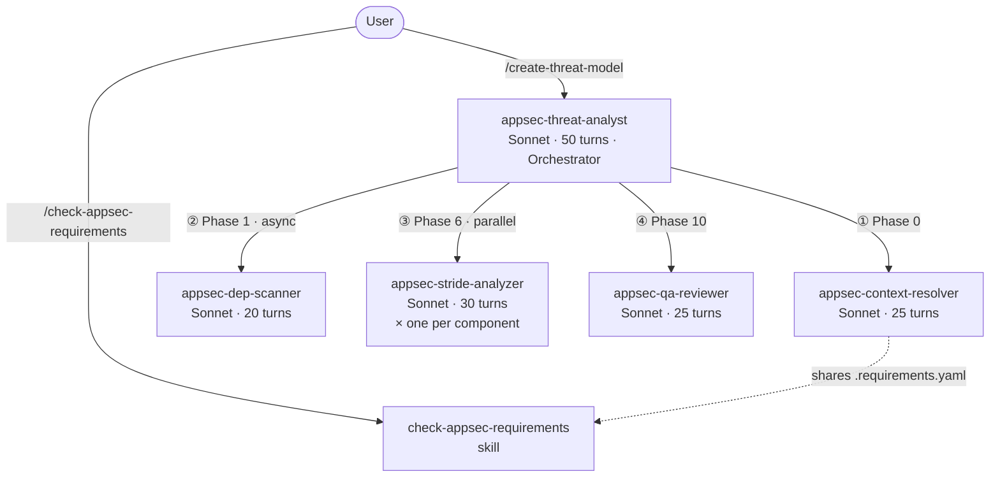
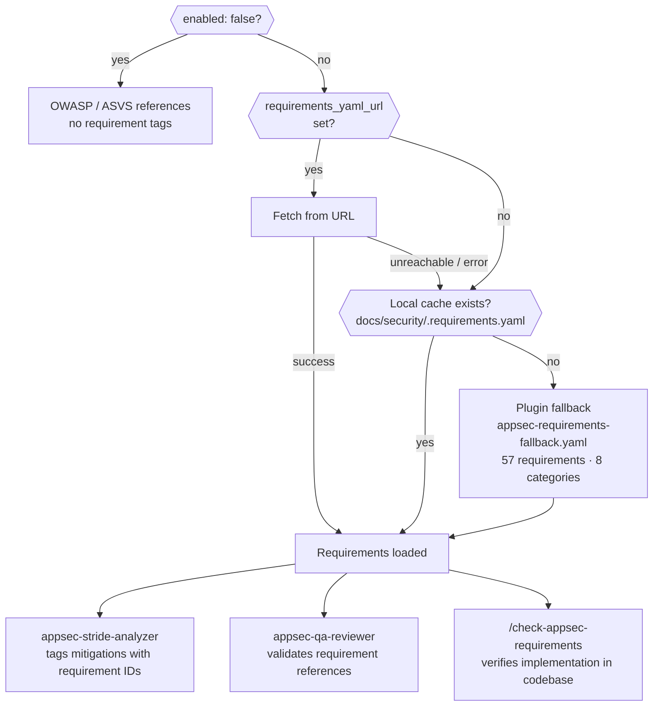

# Claude AppSec Plugin

A Claude Code plugin for AppSec and dev teams. Point it at any repository to automatically generate a comprehensive, STRIDE-based threat model—complete with architecture diagrams, a prioritized threat register, and actionable mitigations grounded in the actual codebase. Enrich the analysis with your own context, map custom AppSec requirements, or simply use the built-in requirement-checking skill.

## Contents

- [Installation](#installation)
- [Usage](#usage)
- [Output](#output)
- [AppSec Steering Hook](#appsec-steering-hook)
- [Agent Pipeline](#agent-pipeline)
- [External Context *(optional)*](#external-context-optional)
- [Security Requirements Management *(optional)*](#security-requirements-management-optional)
- [Plugin Structure](#plugin-structure)

## Installation

```bash
claude --plugin-dir /path/to/appsec-plugin/plugin
```

That's all that's required. The two optional integrations can be enabled independently at any time — see [External Context](#external-context-optional) and [Security Requirements Management](#security-requirements-management).

## Usage

```
# Full assessment of the current repository
/appsec-plugin:create-threat-model

# With scope constraint
/appsec-plugin:create-threat-model focus on the authentication service

# Force a full re-run even if a prior threat model exists
/appsec-plugin:create-threat-model --force-full

# Check security requirements coverage
/appsec-plugin:check-appsec-requirements
```

## Output

Each run writes two files to the analyzed repository.

**`docs/security/threat-model.md`** — human-readable report with colored severity badges and VS Code deep links to every referenced source file:

| Section | Content |
|---------|---------|
| Metadata | Generated date/time, duration, model |
| 1. System Overview | Description, team, compliance scope, asset classification |
| 2. Architecture Diagrams | C4 context/container/component diagrams + technology architecture (Mermaid) |
| 3. Security Use Cases | Sequence diagrams for auth, authorization, and critical flows |
| 4. Assets | Data, code/IP, infrastructure, and availability assets |
| 5. Attack Surface | All entry points with protocol, auth requirements |
| 6. Trust Boundaries | Where trust levels change across the system |
| 7. Security Controls | Existing controls with effectiveness ratings (✅ ⚠️ 🔶 ❌) |
| 8. Threat Register | STRIDE threats with likelihood, impact, risk, and mitigations |
| 9. Critical Findings | Top highest-risk threats requiring immediate action |
| 10. Mitigation Register | Prioritized remediation list |
| 11. Out of Scope | What was not analyzed |

**`docs/security/threat-model.yaml`** — machine-readable export for ingestion into ticketing systems, dashboards, or CI/CD pipelines:

```yaml
meta:
  project: my-service
  generated: 2026-04-03T14:32:11Z
  model: claude-sonnet-4-6
  compliance_scope: [PCI-DSS, SOC2]
threats:
  - id: T-001
    stride: Spoofing
    likelihood: High
    impact: Critical
    risk: Critical
```

> Token and cost fields are `null` at runtime — agents cannot introspect their own API usage. Check the Anthropic Console for session details.

## AppSec Steering Hook

A `UserPromptSubmit` hook (`plugin/hooks/hooks.json`) runs `plugin/scripts/security_steering.py` on every prompt and appends a secure-by-default context to Claude's system message — treat input as untrusted, enforce least privilege, no hardcoded secrets, etc. This applies to all code Claude writes or reviews during the session, not just during threat modeling.

## Agent Pipeline

The plugin uses a 5-agent pipeline. Only `appsec-threat-analyst` is user-facing; the rest are dispatched internally.



### Agents

**`appsec-threat-analyst`** — Sonnet, 50 max turns, entry point

The orchestrator. Owns the full 11-phase assessment lifecycle (phases 0–10): drives reconnaissance, architecture modeling, asset identification, attack surface mapping, trust boundary analysis, controls cataloging, threat synthesis, and output writing. Dispatches the four specialist sub-agents at the appropriate phases and reads their output files. This is the only agent a user or skill should ever invoke directly.

**`appsec-context-resolver`** — Sonnet, 25 max turns

Runs at Phase 0 before any analysis begins. Optionally calls a REST endpoint for external context (team ownership, compliance scope, prior findings, etc.), then reads a prioritized set of repository files: `SECURITY.md`, architecture docs, ADRs, OpenAPI/Swagger specs, `docker-compose.yml`, Kubernetes/Terraform configs, database schemas, `.env.example`, and `CHANGELOG.md`. Consolidates everything into `docs/security/threat-modeling-context.md`, which all subsequent agents read instead of fetching context themselves.

**`appsec-dep-scanner`** — Sonnet, 20 max turns

Dispatched after Phase 1 (Recon) and runs concurrently while the orchestrator works through Phases 2–6. Scans for three categories of risk: hardcoded secrets (passwords, API keys, tokens, private keys), vulnerable or outdated dependencies (npm, pip, gem, etc.), and insecure defaults (debug mode enabled, HTTP used instead of HTTPS, weak crypto algorithms, disabled TLS verification). Writes findings to `docs/security/.dep-scan.json` for the orchestrator to fold into the threat register at Phase 8.

**`appsec-stride-analyzer`** — Sonnet, 30 max turns

One instance is spawned per major component after Phase 6 (Trust Boundary Analysis); multiple instances run in parallel. Each instance receives the component's interfaces, trust boundaries, and relevant existing controls from the orchestrator. Reads `threat-modeling-context.md` for compliance scope and prior findings, then applies the full STRIDE taxonomy (Spoofing, Tampering, Repudiation, Information Disclosure, Denial of Service, Elevation of Privilege) to that component. Writes per-component threats to `docs/security/.stride-<component-id>.json`.

**`appsec-qa-reviewer`** — Sonnet, 25 max turns

Runs at Phase 10 after both output files are written. Performs 9 checks against `docs/security/threat-model.md`: verifies that every VS Code deep link resolves to a file that exists on disk, linkifies bare file path mentions that were not already linked, checks that threat IDs cross-reference correctly between sections, verifies consistency between the Markdown and YAML exports, validates requirement references against the loaded requirements YAML, flags any prior findings from the context file that were not addressed in the threat register, removes unfilled placeholder text, and confirms all 11 required sections are present and non-empty. Fixes issues in-place and prints a summary of changes made.

### Orchestrator phases

| Phase | Description |
|-------|-------------|
| 0. Context Lookup | `appsec-context-resolver` fetches pre-existing AppSec knowledge before any user questions |
| 1. Reconnaissance | Maps tech stack, directory structure, deployment configs, CI/CD pipeline; triggers `appsec-dep-scanner` |
| 2. Architecture Modeling | C4 diagrams (context / container / component) + technology architecture diagram |
| 3. Security Use Cases | Sequence diagrams for auth flow, access control, and other critical flows |
| 4. Asset Identification | Catalogs data, code/IP, infrastructure, and availability assets |
| 5. Attack Surface Mapping | Enumerates API endpoints, auth mechanisms, file uploads, inter-service calls |
| 6. Trust Boundary Analysis | Identifies privilege and network boundary crossings; triggers `appsec-stride-analyzer` per component |
| 7. Security Controls | Catalogs existing controls by domain with colored effectiveness rating |
| 8. Threat Enumeration | Merges STRIDE JSON files from sub-agents, assigns global T-xxx IDs, rates risk |
| 9. Output Writing | Writes `docs/security/threat-model.md` and `docs/security/threat-model.yaml` |
| 10. QA Review | `appsec-qa-reviewer` verifies and fixes links, references, consistency, diagrams |

### Intermediate files

Sub-agents communicate via files written to `docs/security/` in the **analyzed repository** (not the plugin directory). These files are gitignored by default.

| File | Written by | Read by |
|------|-----------|---------|
| `docs/security/threat-modeling-context.md` | `appsec-context-resolver` | orchestrator, `appsec-stride-analyzer` |
| `docs/security/.requirements.yaml` | `appsec-context-resolver` | `appsec-stride-analyzer`, `appsec-qa-reviewer`, `check-appsec-requirements` skill |
| `docs/security/.dep-scan.json` | `appsec-dep-scanner` | orchestrator (Phase 8) |
| `docs/security/.stride-<id>.json` | `appsec-stride-analyzer` | orchestrator (Phase 8) |

`docs/security/.requirements.yaml` doubles as a **requirements cache**: once written during a threat model run, the `check-appsec-requirements` skill reads it directly (Tier 0) without re-fetching, ensuring both tools reference identical requirement definitions.

## External Context *(optional)*

The context resolver can pull additional context from a REST endpoint before analysis begins — team ownership, compliance scope, prior findings, architecture notes, or anything else relevant. The endpoint returns free-form text; no fixed schema is required.

**Without this the plugin works normally** — `appsec-context-resolver` derives context from repository files (`SECURITY.md`, architecture docs, ADRs, deployment configs, etc.) and writes everything to `docs/security/threat-modeling-context.md`.

### What the context resolver collects from repository files

| Category | Files checked |
|----------|--------------|
| Security policy | `SECURITY.md`, `.github/SECURITY.md`, `docs/SECURITY.md` |
| Architecture docs | `ARCHITECTURE.md`, `docs/architecture.md`, `docs/design.md`, … |
| ADRs | `docs/adr/`, `docs/decisions/`, `adr/` — 5 most recent |
| API surface | `openapi.yaml`, `swagger.yaml`, `docs/api.md`, … |
| Deployment config | `docker-compose.yml`, `Dockerfile`, `kubernetes/`, `terraform/` |
| Data model | `schema.sql`, `prisma/schema.prisma`, `schema.graphql`, … |
| Env template | `.env.example`, `config/default.yaml`, `appsettings.json`, … |
| Changelog | `CHANGELOG.md`, `CHANGES.md` — last 60 lines |

### Configuration

Set `rest_url` in `plugin/config.json` to enable the external context endpoint:

```json
{
  "external_context": {
    "enabled": true,
    "rest_url": "http://127.0.0.1:4444/context"
  }
}
```

| Field | Default | Description |
|-------|---------|-------------|
| `enabled` | `true` | Set to `false` to skip the external context call entirely |
| `rest_url` | `null` | URL of a REST endpoint. Accepts `POST {"repo_url": "..."}`, returns `{"context": "..."}` |

### Endpoint contract

The endpoint receives a `POST` request with the repository URL and returns any JSON object containing a `context` field with free-form text (markdown is supported):

```
POST /context
Content-Type: application/json

{"repo_url": "https://gitlab.example.com/team/payment-service"}

→ {"context": "Payments platform. Compliance: PCI-DSS v4.0. Prior finding: JWT not validated on internal API (resolved 2024-03)."}
```

The `context` value is included verbatim in `threat-modeling-context.md`. The endpoint can return anything — team info, compliance requirements, architecture summaries, prior findings, links to wikis, or any combination. If the endpoint is unreachable the resolver continues without it.

### Mock server for development

`scripts/mock-context-server.py` provides a minimal mock that returns example context based on simple URL pattern matching. No dependencies required.

```bash
python3 scripts/mock-context-server.py          # default port 4444
python3 scripts/mock-context-server.py 8080     # custom port
```

## Security Requirements Management *(optional)*

By default the plugin references OWASP best practices. Point it at your own requirements YAML to get requirement-tagged mitigations and a compliance check against your internal standards.

`plugin/skills/check-appsec-requirements/config.json`:

```json
{
  "requirements_source": {
    "enabled": true,
    "requirements_yaml_url": null
  }
}
```

| `enabled` | `requirements_yaml_url` | Behaviour |
|-----------|------------------------|-----------|
| `false` | — | OWASP / ASVS references only — no requirement tags |
| `true` | `null` | Plugin-bundled fallback YAML (57 baseline requirements) |
| `true` | URL set | Fetch from URL; fall back to local cache or plugin fallback if unreachable |

### check-appsec-requirements skill

Verifies that each requirement from the loaded YAML is implemented in the codebase, and writes a compliance report to `docs/security/appsec-requirements-report.md`.

```bash
# Check all requirements
/appsec-plugin:check-appsec-requirements

# Filter by category or ID substring
/appsec-plugin:check-appsec-requirements AUTH
```

The report includes per-requirement status (✅ PASS / ⚠️ PARTIAL / ❌ FAIL / ❓ UNVERIFIABLE), VS Code deep links to the evidence, a direct link to the source requirement page, and actionable recommendations for every non-passing item.

### Requirement definitions

Requirements are defined in a YAML file with the following structure:

```yaml
categories:
  - id: AUTH          # used as the tag prefix in mitigations: [AUTH-1]
    title: Authentication
    url: https://security.example.com/requirements/auth
    requirements:
      - id: AUTH-1
        text: "All authentication tokens must be validated server-side on every request."
        priority: MUST    # MUST | SHOULD | MAY
        url: https://security.example.com/requirements/auth#auth-1
```

The **tag format and category IDs are fully defined by your YAML** — the plugin imposes no naming convention. The bundled fallback uses `SEC-*` IDs as an example; replace it with your own YAML to use whatever naming scheme your organization uses (`AUTH-1`, `POLICY-007`, `R-INJ-3`, etc.).

Each requirement carries `id`, `text`, `priority`, and optionally `url` (link to the authoritative requirement page).

### Requirement loading



The local cache (`docs/security/.requirements.yaml`) is written by `appsec-context-resolver` during a threat model run. When the skill is run after a threat model, it reuses the cached file automatically — no network access needed.

### Integration with the threat modeling pipeline

The `check-appsec-requirements` skill is **not** invoked by the threat modeling agent — the two are independent. They share `docs/security/.requirements.yaml` as a common data source (see the diagram in [Agent Pipeline](#agent-pipeline)).

**What the threat modeling pipeline does with requirements:**
- `appsec-context-resolver` fetches or caches `docs/security/.requirements.yaml` at Phase 0
- `appsec-stride-analyzer` reads the YAML and tags each mitigation with the matching requirement ID (e.g. a Spoofing threat → `[AUTH-3]`, using IDs from your YAML)
- `appsec-qa-reviewer` reads the YAML to validate that every requirement reference in the finished threat model points to a known requirement

**What the `check-appsec-requirements` skill does:**
- Resolves requirements using the same loading logic (URL → local cache → plugin fallback)
- Scans the codebase for requirement tag references and verifies that each is actually implemented
- Writes a compliance report to `docs/security/appsec-requirements-report.md`

Running `/appsec-plugin:create-threat-model` first ensures that the subsequent `/appsec-plugin:check-appsec-requirements` run reuses the cached requirements file — with no additional network fetch.

### Harvester — keeping requirements up to date

`scripts/harvest-requirements.py` crawls your internal requirements and blueprint pages and regenerates `appsec-requirements-fallback.yaml`. Run it whenever your requirements change, then commit the updated YAML.

```bash
# Install dependencies (once)
pip install -r scripts/requirements.txt

# Crawl and regenerate
python scripts/harvest-requirements.py

# With authentication token for internal pages
HARVEST_AUTH_TOKEN=<token> python scripts/harvest-requirements.py

# Preview without writing
python scripts/harvest-requirements.py --dry-run --verbose

# Blueprints only
python scripts/harvest-requirements.py --blueprint-only
```

Configure source URLs in `scripts/harvest-config.json`:

```json
{
  "crawl": {
    "requirements_base_url": "https://security.example.com/requirements",
    "blueprints_base_url":   "https://security.example.com/blueprints",
    "max_pages": 100
  },
  "indexing": {
    "requirements": { "mode": "structured" },
    "blueprints":   { "mode": "full", "section_max_chars": 500 }
  }
}
```

**Indexing modes:**

| Type | Mode | What is stored |
|------|------|---------------|
| Requirements | `structured` *(default)* | `id`, `url`, `text`, `priority` per item |
| Requirements | `full` | structured + page intro/context paragraph(s) |
| Blueprints | `full` *(default)* | `title`, `summary`, `topics`, all sections with content |
| Blueprints | `summary` | `title`, `summary`, `topics` only — no section content |

The mode can be overridden per individual page via `indexing_mode` in `requirements_overrides` / `blueprints_overrides`.

**HTML parser strategies** (tried in order per page):

1. Elements with `id="sec-xx-n"` anchor attributes
2. Definition lists `<dt>[SEC-XX-N]</dt><dd>text</dd>`
3. Any element whose text starts with `[SEC-XX-N]`
4. Table rows `<td>[SEC-XX-N]</td><td>text</td>`

**Blueprint indexing** extracts `<h2>`/`<h3>` sections with their content, derives `topics` slugs from headings, and caps each section's content at `section_max_chars` to keep the YAML context-window friendly.

### Scheduling the harvester

The harvester is a one-shot script — it does not run automatically. Schedule it to keep `appsec-requirements-fallback.yaml` in sync with your requirements source.

**Option A — cron (local machine or server)**

```bash
# Edit crontab
crontab -e

# Run every day at 02:00, write a log
0 2 * * * cd /path/to/appsec-plugin && \
  HARVEST_AUTH_TOKEN=<token> \
  python3 scripts/harvest-requirements.py >> /var/log/harvest-requirements.log 2>&1
```

After each run, commit and push the updated YAML so the rest of the team picks it up:

```bash
# Wrapper script: harvest-and-commit.sh
#!/usr/bin/env bash
set -e
cd "$(dirname "$0")"
python3 scripts/harvest-requirements.py
git diff --quiet plugin/skills/check-appsec-requirements/appsec-requirements-fallback.yaml \
  || git commit -am "chore: update appsec requirements fallback [harvester]" && git push
```

```bash
# Schedule the wrapper instead
0 2 * * * /path/to/appsec-plugin/harvest-and-commit.sh >> /var/log/harvest-requirements.log 2>&1
```

**Option B — CI/CD pipeline (recommended)**

Run the harvester as a scheduled pipeline job so the updated YAML is automatically committed back to the repository:

```yaml
# GitLab CI example (.gitlab-ci.yml)
harvest-requirements:
  stage: maintenance
  rules:
    - if: $CI_PIPELINE_SOURCE == "schedule"   # triggered by a scheduled pipeline
  script:
    - pip install -r scripts/requirements.txt
    - python3 scripts/harvest-requirements.py
    - |
      if ! git diff --quiet plugin/skills/check-appsec-requirements/appsec-requirements-fallback.yaml; then
        git config user.email "ci@example.com"
        git config user.name "CI"
        git commit -am "chore: update appsec requirements fallback [harvester]"
        git push "https://oauth2:${CI_JOB_TOKEN}@${CI_SERVER_HOST}/${CI_PROJECT_PATH}.git" HEAD:main
      fi
  variables:
    HARVEST_AUTH_TOKEN: $HARVEST_AUTH_TOKEN   # set as a masked CI variable
```

Configure the schedule under **CI/CD → Schedules** in GitLab (e.g. daily at 02:00).

**Option C — publish YAML, skip commits**

If committing back to the plugin repo is not practical, publish the generated YAML to a static URL (GitLab raw file, S3, internal CDN) and set `requirements_yaml_url` in `config.json`. The context-resolver then fetches the latest version automatically on each threat model run — no plugin update required.

```json
{
  "requirements_source": {
    "requirements_yaml_url": "https://gitlab.example.com/security/requirements/-/raw/main/appsec-requirements.yaml"
  }
}
```

The harvester still runs on a schedule and pushes the YAML to that URL; the plugin reads it on demand.

### Recommended workflow

1. Configure `harvest-config.json` with your internal URLs
2. Schedule the harvester (CI pipeline, cron, or wrapper script)
3. Harvester commits updated `appsec-requirements-fallback.yaml` automatically
4. Optionally publish the YAML to a static URL and set `requirements_yaml_url` in `config.json` — teams always get the latest without pulling the plugin repo

## Plugin Structure

```
appsec-plugin/
├── plugin/                                     # Plugin root — pass to --plugin-dir
│   ├── .claude-plugin/
│   │   └── plugin.json                         # Plugin manifest
│   ├── config.json                             # external_context config
│   ├── agents/
│   │   ├── appsec-threat-analyst.md            # Orchestrator (Sonnet, 50 turns)
│   │   ├── appsec-context-resolver.md          # Context resolver (Sonnet, 25 turns)
│   │   ├── appsec-dep-scanner.md               # Secret & dependency scanner (Sonnet, 20 turns)
│   │   ├── appsec-stride-analyzer.md           # Per-component STRIDE analysis (Sonnet, 30 turns)
│   │   └── appsec-qa-reviewer.md               # Output verification (Sonnet, 25 turns)
│   ├── hooks/
│   │   └── hooks.json                          # UserPromptSubmit hook — security steering
│   ├── scripts/
│   │   └── security_steering.py                # Secure-by-default context injected on every prompt
│   └── skills/
│       ├── create-threat-model/
│       │   └── SKILL.md                        # /appsec-plugin:create-threat-model
│       └── check-appsec-requirements/
│           ├── SKILL.md                        # /appsec-plugin:check-appsec-requirements
│           ├── config.json                     # requirements_source config (enabled, url)
│           └── appsec-requirements-fallback.yaml  # Bundled baseline (57 requirements, 8 categories)
├── scripts/                                    # Development tools
│   ├── mock-context-server.py                  # Mock for the external context REST endpoint
│   ├── harvest-requirements.py                 # Crawls requirements pages → YAML
│   ├── harvest-config.json                     # Crawler source URLs and indexing config
│   └── requirements.txt                        # Python deps for harvester
├── SECURITY.md
└── README.md
```