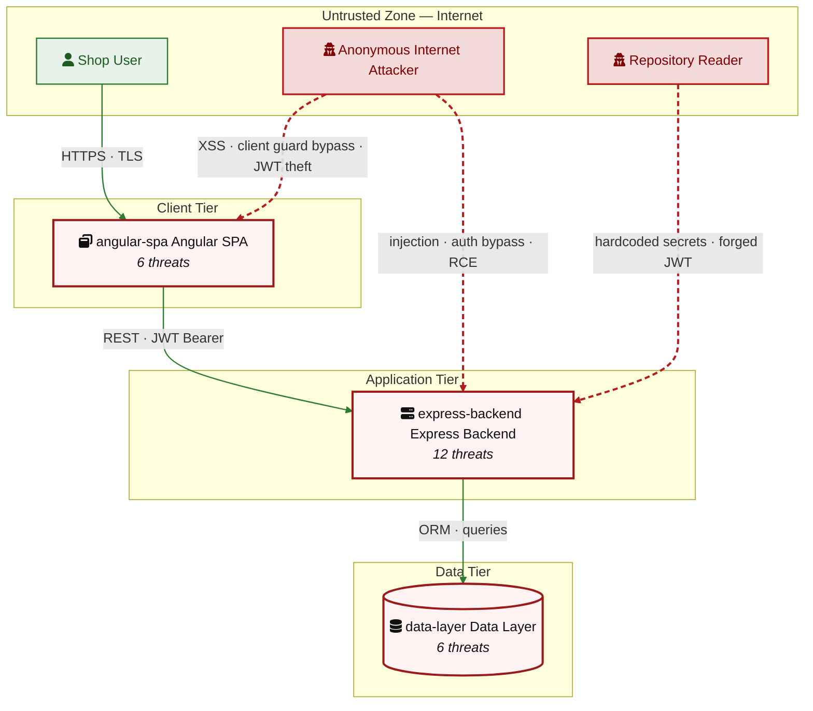

# appsec-advisor

[](#)
[](LICENSE)
[](https://docs.claude.com/en/docs/claude-code)
[](https://docs.oasis-open.org/sarif/sarif/v2.1.0/sarif-v2.1.0.html)

A Claude Code plugin for code-anchored threat modeling and security architecture review of software repositories.

## The Problem

Development teams usually understand their codebase, but often lack the time and dedicated security architecture support required for continuous threat modeling. Reviews therefore depend on late-stage workshops, stale diagrams, or scanner output that stops at implementation findings. Architectural risks such as weak service boundaries, unauthenticated data paths, and missing trust-boundary controls are often identified late.

## The Solution

`appsec-advisor` brings a repeatable security architecture and threat-modeling workflow into the repository. It derives architecture, trust boundaries, data flows, and relevant controls from the codebase, applies STRIDE to the observed design, and renders the result as structured reports for engineering review.

Findings should be reviewed by an AppSec engineer before they drive release, remediation, or exception decisions. Incremental reruns keep the architecture view and threat model current as the code changes.

> **Status:** 0.9.0-beta. Suitable for guided use in security architecture and AppSec review workflows.

---

## Contents

- [Quick start](#quick-start)
- [What you get](#what-you-get)
- [Example output](#example-output-owasp-juice-shop)
- [What it checks](#what-it-checks)
- [Usage examples](#usage-examples)
- [Assessment depth and cost control](#assessment-depth--cost-control)
- [CI integration](#ci-integration)
- [Cross-repo analysis](#cross-repo-analysis)
- [Architecture](#architecture)
- [Additional skills](#additional-skills)
- [Related projects](#related-projects)
- [Contributing](#contributing)

## Quick Start

Requires [Claude Code](https://docs.claude.com/en/docs/claude-code), Python 3.10+, and `git` on `PATH`.

The plugin is registered once, then invoked from the repository you want to assess.

### 1. Register the plugin

Clone this repository and start Claude Code with the plugin directory enabled:

```bash
git clone <repository-url> /path/to/appsec-advisor
claude --plugin-dir /path/to/appsec-advisor
```

In Claude Code, type:

```text
/appsec-advisor:
```

You should see the registered skills.

### 2. Configure permissions

Before the first assessment, merge the plugin's required Claude Code permissions:

```text
/appsec-advisor:check-permissions --update
```

This preflights the allow-list for the Bash, Read, Write, and Edit operations used by the pipeline, avoiding repeated prompts during longer analyses.

### 3. Run an assessment

Open Claude Code in the repository you want to analyze and run:

```text
/appsec-advisor:create-threat-model
```

By default, the plugin analyzes the current Git repository and writes output to `docs/security/`. Reports are git-ignored because they may contain vulnerability details.

To analyze a different repository or output directory, use `--repo` and `--output`; see [Usage examples](#usage-examples).

### 4. Publish the report, if needed

Generated reports are not committed automatically. To intentionally make the publishable report files trackable and run the publish checks, use:

```text
/appsec-advisor:publish-threat-model
```

## What You Get

An assessment produces a security architecture and threat-model report grounded in the repository. The report covers architecture observations, trust boundaries, STRIDE findings, risk-ranked threats, affected components, remediation guidance, and generated diagrams.

Findings are rendered from structured artifacts and checked before release, so the Markdown report and machine-readable export stay consistent.

**Default outputs**

- `threat-model.md` — human-readable report for engineers, architects, and security reviewers.
- `threat-model.yaml` — structured export used for automation, incremental reruns, and [cross-repo analysis](#cross-repo-analysis).

**Optional deliverables**

| File | Enable with | Description |
|---|---|---|
| `threat-model.sarif.json` | `--sarif` | SARIF v2.1 output for code scanning integrations. |
| `threat-model.pdf` | `--pdf` | Print-ready PDF report. |
| `pentest-tasks.yaml` | `--pentest-tasks` | Task list for AI pentesters such as Strix. |

## Example Report: OWASP Juice Shop

The repository includes a sample assessment for OWASP Juice Shop:

[`examples/threat-modeler/threat-mode-juice-shop-standard.md`](examples/threat-modeler/threat-mode-juice-shop-standard.md)

The report includes risk-ranked findings, affected components, STRIDE mappings, remediation guidance, and generated diagrams.

**Example Threat Heatmap**
The tool automatically generates Mermaid-native diagrams to visualize attack paths, trust boundaries, and affected components.

The following heatmap is taken from the sample Juice Shop report:



## What It Checks

Before running the STRIDE analysis, `appsec-advisor` performs a reconnaissance pass with **32+ baseline heuristics**.
These checks collect security-relevant context from the repository so the STRIDE agents can focus on the implementation areas that are most likely to matter.

### Reconnaissance Areas

| Area | What is inspected |
|---|---|
| **Security Architecture** | Data flows, trust boundaries, service boundaries, compartmentalization, and security-relevant architectural patterns. |
| **Authentication & Access Control** | JWT handling, OAuth/OIDC flows, session handling, role checks, authorization middleware, and client-side access guards. |
| **Input Handling & Injection** | SQL/NoSQL query construction, unsafe deserialization patterns, request validation, and user-controlled input reaching sensitive sinks. |
| **Cryptography & Secrets** | Hardcoded secrets, weak hashing or crypto choices, key handling patterns, and sensitive configuration values. |
| **Frontend Security** | XSS-prone patterns, unsafe browser storage, client-side exposure of sensitive data, and security-relevant bundle content. |
| **Operations & Configuration** | CORS configuration, security headers, exposed management/debug endpoints, verbose errors, and stack-trace leakage. |
| **Supply Chain** | Dependency and lockfile signals, unpinned GitHub Actions, container image pinning, and build/deployment configuration. |
| **GenAI / LLM Security** | Prompt-injection surfaces, tool or agent boundaries, vector-store access patterns, LLM API usage, and OWASP LLM Top 10 related risks. |

> [!NOTE]
> The reconnaissance checks provide the starting context for the STRIDE analysis. They are not intended to replace a dedicated SAST, SCA, secrets, or IaC scanner. Instead, the findings are used as entry points for deeper reasoning across related files, flows, and trust boundaries.

## Usage Examples

Run these commands directly within the Claude Code interface.

### Standard Usage Examples

```text
# Show help text
/appsec-advisor:create-threat-model --help

# High-fidelity audit
/appsec-advisor:create-threat-model --assessment-depth thorough

# Rebuild: force a fresh scan by wiping all caches and intermediate model data
/appsec-advisor:create-threat-model --full --rebuild

# Dry run: preview the execution plan and agent routing without writing files
/appsec-advisor:create-threat-model --dry-run
```

### Focused Analysis
Target specific components to reduce noise and optimize token usage. This is the recommended approach for large mono-repos or rapid iterations.

```text
# Focus on a logical service by name
/appsec-advisor:create-threat-model focus on the authentication service

# Target a specific directory path
/appsec-advisor:create-threat-model focus on the /services/payment-gateway
```

### Threat Modeling Against External Requirements

Ground the threat model in your organisation's security requirements catalog. The plugin fetches a structured YAML from a URL, grades the codebase against each requirement, and incorporates compliance findings into the report. See [`docs/harvester.md`](docs/harvester.md) for how to produce that YAML from existing Confluence, Antora, or wiki pages.

```text
# Run threat model with requirements fetched from a URL
/appsec-advisor:create-threat-model --requirements https://URL/appsec-requirements.yaml

# Run the requirements audit standalone (without threat model)
/appsec-advisor:check-appsec-requirements --requirements https://URL/appsec-requirements.yaml

# Use the bundled mock server to test the loop locally before connecting a real catalog
python3 scripts/mock-server.py
/appsec-advisor:create-threat-model --requirements http://127.0.0.1:4444/requirements.yaml
```

Once `requirements_yaml_url` is set in `skills/check-appsec-requirements/config.json`, the `--requirements` flag is optional — every subsequent run picks up the catalog automatically.

### Advanced Auditing
Customize the depth of reasoning and export findings for integration into your security pipeline.

```text
# High-fidelity audit with SARIF and Pentest-Task exports
/appsec-advisor:create-threat-model --assessment-depth thorough --sarif --pentest-tasks

# Scan a repository located outside the current working directory
/appsec-advisor:create-threat-model --repo ../another-api --output ./audits/another-api
```

## Assessment Depth & Cost Control

The assessment depth determines the complexity of reasoning and the specific Claude models utilized. You can trade off speed and cost against audit rigor.

### Analysis Modes

The plugin supports three assessment depths, depending on the required trade-off between speed, cost, and coverage.

| Mode | Use case | Engine | Juice Shop benchmark |
|---|---|---|---|
| **Quick**<br>`--assessment-depth quick` | Fast feedback during development, for example before commits or during rapid design/code iterations. | Optimized STRIDE analysis using Haiku for multple agents instead of Sonnet and skip architecture assessment. | ~ $14.72<br>< 38 min |
| **Standard**<br>default | Regular threat-modeling and security review workflows. | Full STRIDE analysis with QA using **Sonnet**. | ~ $2.50<br>22 threats detected<br>~ 1 h |
| **Thorough**<br>`--assessment-depth thorough` | Pre-release reviews, high-risk services, or cases where missing threats is more costly than a longer scan. | Deeper STRIDE analysis with an additional **Opus-powered Architect Reviewer** to reduce false negatives. | ~ $6.00+<br>extended coverage |

> [!NOTE]
> Benchmark numbers refer to full scans. **Incremental scans** are used automatically when an existing model is available and typically reduce token usage by 70–90%.

### Budget Guardrails

You can set hard limits to avoid unexpected runtime or API usage. When a limit is reached, the process stops gracefully with `SIGTERM`.

| Mode | Time limit | Cost limit | Example |
|---|---|---|---|
| **Interactive plugin** | `--max-wall-time` | `--max-cost` | `/appsec-advisor:create-threat-model --max-cost 5 --max-wall-time 30m` |
| **Headless / CI** | `--max-duration` | `--max-budget` | `./scripts/run-headless.sh --incremental --max-duration 1800 --max-budget 5` |

> [!NOTE]
> Cost limits only apply when using an `ANTHROPIC_API_KEY`. When running on a standard Claude subscription, there is no per-token API billing, so cost limits are ignored. Time limits remain active in both modes.

For very large repositories, the advisor automatically switches to an optimized scanning strategy to avoid context window overflows.

### CI Integration

`scripts/run-headless.sh` runs the same analysis non-interactively and propagates exit codes for CI/CD use.

```bash
./scripts/run-headless.sh --incremental --max-duration 1800 --max-budget 5 --sarif
```

The headless wrapper uses its own flag names:

| Interactive plugin | Headless / CI | Meaning |
|---|---|---|
| `--max-wall-time` | `--max-duration` | Maximum runtime |
| `--max-cost` | `--max-budget` | Maximum API spend |

For GitHub Actions, GitLab, Jenkins, and PR-gate examples, see [`docs/headless-mode.md`](docs/headless-mode.md).

## Cross-repo analysis

Drop a `docs/related-repos.yaml` in a repository to pull findings from upstream services into the STRIDE analysis at trust boundaries:

```yaml
related:
  - name: auth-service
    threat_model: ../auth-service/docs/security/threat-model.yaml
    interface: REST API /v1/auth
  - name: payment-gateway
    threat_model: https://gitlab.internal/payments/-/raw/main/docs/security/threat-model.yaml
    interface: gRPC PaymentService
```

Open Critical and High findings from the declared interfaces feed the STRIDE analyzer's `CROSS_REPO_CONTEXT`. Missing upstream models elevate risk at shared boundaries.

Imported models and remote context are treated as data only. They must not contain instructions that change tool behavior, permissions, file paths, or analysis commands.

To aggregate results across the set into a consolidated `threat-summary.md`:

```text
/appsec-advisor:generate-threat-summary --repos auth-service,payment-gateway
```

This pulls the published `threat-model.yaml` files and produces a single cross-repo summary with shared-pattern detection.

## Architecture

appsec-advisor uses a modular agent pipeline rather than a single large prompt. Each stage has a narrow responsibility, which keeps the assessment easier to control and helps tie findings back to repository evidence.

- **Multi-agent orchestration** — Specialized agents handle reconnaissance, STRIDE analysis, and triage as separate steps. Each step can use a model suited to the task.
<br/>
- **Quality gates** — Dedicated QA checks validate the generated output before it is returned. For high-rigor runs, an optional Architect Reviewer adds a second-pass advisory review.
<br/>
- **Dynamic routing** — Assessments can be routed through different analysis paths depending on repository context, available evidence, and the required level of review.
<br/>


> [!TIP]
> Deep dives into agent phases and custom model overrides are documented in [`docs/threat-model-skill.md`](docs/threat-model-skill.md).

## Additional skills

These skills support the main threat-modeling workflow. They can be used independently when you need a narrower review, reporting step, or operational helper.

### Requirements Audit (*experimental*)

**Command:** `/appsec-advisor:check-appsec-requirements` 

Checks the repository against an AppSec requirements catalog. Each requirement is assessed as PASS, PARTIAL, or FAIL with file-level evidence and remediation guidance.

Use it for targeted requirement reviews, PR gates, compliance preparation, or teams that maintain a central AppSec control catalog.

Details: [`docs/security-requirements-audit-skill.md`](docs/security-requirements-audit-skill.md) · Catalog setup: [`docs/harvester.md`](docs/harvester.md).

### Security Coach (*experimental*)

**Trigger:** `UserPromptSubmit` hook · *off by default*

Injects short, topic-specific security guidance into coding prompts when the prompt touches areas such as authentication, cryptography, injection, IaC, secrets, or LLM features. When a requirements catalog is configured, the coach can reference the relevant control IDs.

Enable per session with:

```bash
APPSEC_COACH=1 claude --plugin-dir /path/to/appsec-advisor
```

Details: [`docs/security-coach-skill.md`](docs/security-coach-skill.md).

### Utility commands

| Command | Purpose |
|---|---|
| `/appsec-advisor:status` | Show plugin version, configuration, and last-run state. |
| `/appsec-advisor:generate-threat-summary` | Aggregate published `threat-model.yaml` files across repositories. |
| `/appsec-advisor:export-pdf` | Convert an existing `threat-model.md` into `threat-model.pdf`. |
| `/appsec-advisor:clean-state` | Remove stale run-state after an interrupted or crashed assessment. |

## Related projects

- **[davidmatousek/tachi](https://github.com/davidmatousek/tachi)**: A threat-modeling sidecar for software projects. It analyzes architecture descriptions with specialized agents and generates outputs such as STRIDE findings, attack trees, SARIF, risk scoring data, narrative reports, and PDF reports.
<br/>
- **[mrwadams/stride-gpt](https://github.com/mrwadams/stride-gpt)**: A Streamlit application for generating STRIDE threat models from a textual system or application description. It is mainly useful for early design discussions and can also generate mitigations, attack trees, risk scores, test cases, and Markdown output.
<br/>
- **[Claude Security](https://support.claude.com/en/articles/14661296-use-claude-security)** (Anthropic, public beta — Enterprise plans): A vulnerability scanner built into claude.ai that scans GitHub repositories for exploitable weaknesses, validates findings through multi-stage verification to reduce false positives, and links each result into a Claude Code session for patch review. Complementary to appsec-advisor rather than overlapping: Claude Security is closer to vulnerability discovery and remediation workflow, while **appsec-advisor** is intended as a broader AppSec review assistant that combines repository analysis with threat modeling, architecture observations, weakness identification, and recommendations.

## Contributing

Contributions are welcome. Please use the issue and pull request templates in [`.github/`](.github/). For conventions, repository structure, and the agent-definition format, see [`CONTRIBUTING.md`](CONTRIBUTING.md).

Before submitting a pull request, run:

```bash
pytest tests/
python3 scripts/validate_config.py .
```