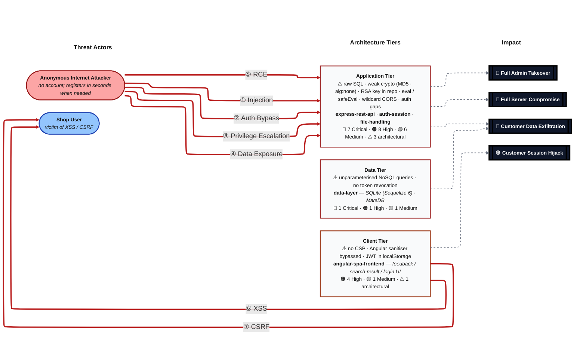

# appsec-advisor

A Claude Code plugin that delivers automated, code-centric architectural security assessments and STRIDE-based threat modeling directly within repositories—alongside a range of practical AppSec capabilities—purpose-built for enterprise environments and tailored to both development and AppSec teams.

[](#)
[](LICENSE)
[](https://docs.claude.com/en/docs/claude-code)
[](https://docs.oasis-open.org/sarif/sarif/v2.1.0/sarif-v2.1.0.html)

> **Status:** 0.9.0-beta. Good for guided use by an AppSec engineer.

---

## Contents

- [Quick start](#quick-start)
- [What you get](#what-you-get)
- [What it checks](#what-it-checks)
- [Example usage](#example-usage)
- [Cross-repo analysis](#cross-repo-analysis)
- [Additional skills](#additional-skills)
- [Related projects](#related-projects)
- [Contributing](#contributing)

## Quick start

Requires Claude Code, Python 3.10+, and `git` on `PATH`.

```bash
git clone <repository-url> /path/to/appsec-advisor
claude --plugin-dir /path/to/appsec-advisor
```
In Claude Code, type `/appsec-advisor:` — you should see the registered skills.

Before your first run, merge the required Claude Code permissions once
(otherwise you'll hit a prompt every ~30 seconds):

```
/appsec-advisor:check-permissions --update
```
From the repo you want to analyse:

```
/appsec-advisor:create-threat-model
```

Output lands in `docs/security/` and is **git-ignored by default** — threat
reports contain vulnerability details that shouldn't be committed without
thinking about it. To commit intentionally:

```
/appsec-advisor:publish-threat-model
```

## What you get

Every finding cites a concrete `file:line`. "Chains" are multi-step attacks correlated across components. "Mitigations" are the deduplicated actions in the report's §9 Mitigation Register.

Outputs:

- `threat-model.md` — human-readable report with C4 diagrams, STRIDE register, VS Code deep links
- `threat-model.yaml` (`--yaml`) — structured export
- `threat-model.sarif.json` (`--sarif`) — SARIF v2.1.0 for CI/CD
- `pentest-tasks.yaml` (`--pentest-tasks`) — task list for AI pentesters / DAST, with a per-task safety block

Example reports produced against public OWASP training apps:
(full set at [`examples/threat-modeler`](examples/threat-modeler/README.md)):

| Target | Mode | Components | Findings | Chains | Mitigations |
|---|---|---:|---|---:|---:|
| [OWASP Juice Shop](examples/threat-modeler/threat-model-juice-shop-thorough.md) — *Node.js / Angular* | `thorough --full` | 8 | **35** — 12C · 19H · 3M · 1L | 4 | 28 |
| [OWASP VulnerableApp](examples/threat-modeler/threat-model-vulnerable-app-standard.md) — *Java / Spring Boot* | `standard` | 5 | **24** — 8C · 11H · 5M | 3 | 20 |

Here is an example heatmap that the threat modeler generates for OWASP Juice Shop:



## What it checks

The recon scanner runs **28 structured checks** across ten areas before any STRIDE analysis starts. This is the floor, not the ceiling — STRIDE agents read source code broadly and derive additional findings from observed code paths.

| Area | Reference | What is checked |
|------|-----------|-----------------|
| **Security Architecture** | [A06:2025 - Insecure Design](https://owasp.org/Top10/2025/A06_2025-Insecure_Design/) | Security architecture aspects like compartmentalization, dataflows, AuthN/AuthZ |
| **Authentication & Access Control** | [A01:2025 - Broken Access Control](https://owasp.org/Top10/2025/A01_2025-Broken_Access_Control/) ·<br>[A07:2025 - Authentication Failures](https://owasp.org/Top10/2025/A07_2025-Authentication_Failures/) | Token handling, role checks, OAuth/OIDC, client-side guards |
| **Input Processing & Injection** | [A05:2025 - Injection](https://owasp.org/Top10/2025/A05_2025-Injection/) ·<br>[A08:2025 - Software and Data Integrity Failures](https://owasp.org/Top10/2025/A08_2025-Software_and_Data_Integrity_Failures/) | SQL/NoSQL, request parameters, deserializers, dangerous sinks |
| **Cryptography & Secrets** | [A04:2025 - Cryptographic Failures](https://owasp.org/Top10/2025/A04_2025-Cryptographic_Failures/) | Insecure algorithms, key management, hardcoded credentials |
| **Frontend / Client-Side** | [A05:2025 - Injection](https://owasp.org/Top10/2025/A05_2025-Injection/) ·<br>[A02:2025 - Security Misconfiguration](https://owasp.org/Top10/2025/A02_2025-Security_Misconfiguration/) | Browser storage, XSS, DOM sources, bundled API keys, WebSocket + postMessage auth |
| **Configuration & Exposure** | [A02:2025 - Security Misconfiguration](https://owasp.org/Top10/2025/A02_2025-Security_Misconfiguration/) ·<br>[A09:2025 - Security Logging & Alerting Failures](https://owasp.org/Top10/2025/A09_2025-Security_Logging_and_Alerting_Failures/) ·<br>[A10:2025 - Mishandling of Exceptional Conditions](https://owasp.org/Top10/2025/A10_2025-Mishandling_of_Exceptional_Conditions/) | Stack-trace leakage, exposed management endpoints, security headers, CORS |
| **Supply Chain Security** | [A03:2025 - Software Supply Chain Failures](https://owasp.org/Top10/2025/A03_2025-Software_Supply_Chain_Failures/) ·<br>[A08:2025 - Software and Data Integrity Failures](https://owasp.org/Top10/2025/A08_2025-Software_and_Data_Integrity_Failures/) | Unpinned Actions/images, lockfile integrity, install flags, SCA tooling |
| **AI/LLM in the Application** | [OWASP LLM Top 10 - 2025](https://genai.owasp.org/llm-top-10/) | LLM API usage, prompt templates, vector stores |

## Example usage

```bash
# Focus on a specific area
/appsec-advisor:create-threat-model focus on the authentication service

# Analyse a repo you don't own
/appsec-advisor:create-threat-model --repo /path/to/team-api --output /reports/team-api

# Dry run — full pipeline, no files written, summary to console
/appsec-advisor:create-threat-model --dry-run

# Force a full scan at thorough depth 
# use --rebuild alternatively also wan to wipe all interemediate files, caches and model data
/appsec-advisor:create-threat-model --full --assessment-depth thorough

# Extra output formats
/appsec-advisor:create-threat-model --yaml --sarif --pentest-tasks
```

**CI integration.** `scripts/run-headless.sh` drives the same skill
non-interactively and propagates exit codes.

```bash
./scripts/run-headless.sh --incremental --max-duration 1800 --max-budget 5 --sarif
```

Full guide (GitHub Actions, GitLab, Jenkins, PR-gate mode): [`docs/headless-mode.md`](docs/headless-mode.md).

## Cross-repo analysis

Drop a `docs/related-repos.yaml` in a repository to pull findings from
upstream services into the STRIDE analysis at trust boundaries:

```yaml
related:
  - name: auth-service
    threat_model: ../auth-service/docs/security/threat-model.yaml
    interface: REST API /v1/auth
  - name: payment-gateway
    threat_model: https://gitlab.internal/payments/-/raw/main/docs/security/threat-model.yaml
    interface: gRPC PaymentService
```

Open Critical and High findings from the declared interfaces feed the
STRIDE analyzer's `CROSS_REPO_CONTEXT`. Missing upstream models elevate
risk at shared boundaries. Use `/appsec-advisor:generate-threat-summary`
to aggregate results across the set.

## Costs 

**What it costs.** A standard-depth scan takes ~40 minutes and runs around
$2–4 in Anthropic API credits on a mid-sized application. `thorough` is ~50 min
and $6–10. Incremental re-runs on small diffs are under a minute and cents.

With following parameters you can limit costs further if needed:

```bash
# stop when estimated API spend hits $5 and abort after 30 min (1800 seconds)
/appsec-advisor:create-threat-model ---max-budget 5 -max-duration 1800 

# Only use Sonnet for all agents (by default Opus is used for triaging agent with very limited costs
/appsec-advisor:create-threat-model --model-enfoce=sonnet

# Perform quick assessment with very limited depth
/appsec-advisor:create-threat-model --assessment-depth quick

```

Note that the current setup has been thoroughly tested and optimized to deliver the best cost–quality ratio. Restricting the default settings may lead to a noticeable drop in the quality of the threat model assessment.

## Architecture


Details: [`docs/threat-model-skill.md`](docs/threat-model-skill.md).

## Additional skills

### Security Requirements Auditor

**Command:** `/appsec-advisor:check-appsec-requirements` · *experimental*

Grades the repository against a custom AppSec requirements catalog.
Each requirement returns PASS / PARTIAL / FAIL with code-level evidence
and a before/after fix snippet. Faster than a full threat model.

Details: [`docs/security-requirements-audit-skill.md`](docs/security-requirements-audit-skill.md) ·
Catalog setup: [`docs/harvester.md`](docs/harvester.md).

### Security Coach

**Trigger:** `UserPromptSubmit` hook · *off by default*

Inline guidance during coding sessions. Scans prompts for security-relevant
keywords (auth, crypto, injection, IaC, secrets, LLM) and injects
context-aware guidance. When a requirements catalog is loaded, the coach
references your controls by ID.

Enable via `APPSEC_COACH=1` or in `config.json`.

Details: [`docs/security-coach-skill.md`](docs/security-coach-skill.md).

## Related projects

- **[davidmatousek/tachi](https://github.com/davidmatousek/tachi)** — STRIDE plugin with narrative reporting and PDF output. Fits when the deliverable is a polished stakeholder document.
- **[mrwadams/stride-gpt](https://github.com/mrwadams/stride-gpt)** — Streamlit app that derives STRIDE threats from a prose system description. Useful early in design, before code exists.

## Contributing

```bash
pytest tests/
python3 scripts/validate_config.py .
```

Issue and PR templates: [`.github/`](.github/). Conventions and agent-definition
format: [`CONTRIBUTING.md`](CONTRIBUTING.md). Security vulnerabilities: open a
[GitHub Security Advisory](../../security/advisories/new) rather than a public
issue. See [`SECURITY.md`](SECURITY.md).
