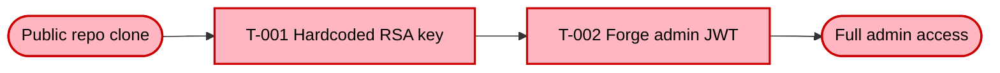
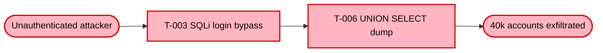

# Phase Group: Architecture & Analysis (Phases 3–8)

This file is read by the orchestrator at runtime to load phase instructions.

> **F-only design (per `arch2.md`).** Architecture-derived findings are normal `F-NNN` rows in `threats[]` with `source=architecture-coverage` (or `source=threat-hypothesis`) and an `architectural_theme` enum value. There is no `architectural_findings[]` top-level list and no `AF-NNN` identifier class. Cluster grouping by theme is a computed view rendered by `compose_threat_model.py:_THEME_HEADING_TEXT` — the orchestrator does not author it. See `### Phase 3b — architecture-derived findings (F-only design)` below for details.

## ⚠ MANDATORY PHASE LOGGING CONTRACT (Phases 3–8)

Every phase in this file MUST emit exactly one `PHASE_START` log line at the start and exactly one `PHASE_END` log line at the end, in the same format used by Phase 1/2/9/10. Production runs have repeatedly shown Phases 3–7 going *unlogged* entirely, leaving a black hole in `.agent-run.log` between Phase 2 END and Phase 8 END, which makes timing profiling impossible. This is not a stylistic preference — it is a hard requirement enforced by the log-completeness QA check in the finalization phase.

**Logging format** — the `PHASE_START` / `PHASE_END` echo format is defined in `shared/logging-standard.md` (section "Orchestrator-specific logging → Phase events"). Phase-group-specific wrappers below add the `.phase-epoch` side-effect (start) and elapsed-time formatting (end). Wrap every phase in this pattern:

```bash
# Phase start — two separate Bash calls (both covered individually):
date +%s > "$OUTPUT_DIR/.phase-epoch"
echo "$(date -u +%Y-%m-%dT%H:%M:%SZ)  [--------]  INFO   threat-analyst  PHASE_START   <phase line>" >> "$OUTPUT_DIR/.agent-run.log"

# Phase end — use phase_elapsed.py to avoid a variable-assignment compound chain:
python3 "$CLAUDE_PLUGIN_ROOT/scripts/phase_elapsed.py" "$OUTPUT_DIR"
# read the output (e.g. "127 2m07s") and embed ES in the echo:
echo "$(date -u +%Y-%m-%dT%H:%M:%SZ)  [--------]  INFO   threat-analyst  PHASE_END     <phase line> (<ES from above>)" >> "$OUTPUT_DIR/.agent-run.log"
```

> **Why two calls for PHASE_END:** `PE=$(cat ...) && DUR=$((...)) && ES=... && echo ...` starts with a variable assignment — Claude Code cannot match it against any `Bash(...)` allow rule and will prompt. Call `phase_elapsed.py` first (outputs `<seconds> <MMmSSs>`), then use the formatted string in the echo.

**Exact phase lines to use** (must match verbatim — these are parsed by `render_threat_model.py` and by the assessment summary aggregator):

| Phase | START line | END line |
|-------|-----------|----------|
| 3 | `[Phase 3/11] ▶ Architecture Modeling — complexity tier: <Simple\|Moderate\|Complex>` | `[Phase 3/11] ✓ Architecture Modeling — <n> diagrams produced` |
| 4 | `[Phase 4/11] ▶ Attack Walkthroughs — rendering Section 9…` | `[Phase 4/11] ✓ Attack Walkthroughs — <n> walkthroughs rendered` |
| 5 | `[Phase 5/11] ▶ Asset Identification…` | `[Phase 5/11] ✓ Asset Identification — <n> assets catalogued` |
| 6 | `[Phase 6/11] ▶ Attack Surface Mapping…` | `[Phase 6/11] ✓ Attack Surface Mapping — <n> entry points (<n> unauthenticated)` |
| 7 | `[Phase 7/11] ▶ Trust Boundary Analysis…` | `[Phase 7/11] ✓ Trust Boundary Analysis — <n> boundaries` |
| 8 | `[Phase 8/11] ▶ Security Controls Catalog…` | `[Phase 8/11] ✓ Security Controls — ✅ <n>  ⚠️ <n>  🔶 <n>  ❌ <n>` |

**For the combined single-pass execution of Phases 5–7** (see "Phases 5–7 combined" below), emit all three `PHASE_START` lines together at the start of the combined pass and all three `PHASE_END` lines together at the end. Do **not** collapse them into a single entry — timing analysis requires per-phase markers.

**⚠ No look-ahead logging — contract violation.** Phases 3, 4, and 8 each get their own `PHASE_START`/`PHASE_END` pair, emitted **immediately before / after** the actual work for that phase. The 5–7 exception above is the **only** legal batching in this file. Pre-emitting `PHASE_START` for phases that have not yet started (e.g. dumping all of 3–8 as a "plan" before doing any work) is **forbidden**: it makes silent-death diagnosis impossible because the log shows phases that never ran. This was the failure mode of the 2026-04-25 juice-shop Run 1 LLM-stall — the orchestrator emitted `PHASE_START` for phases 3, 4, 5, 6, 7, 8 in a single second at 13:02:37 UTC, then hung in Phase 3 for 1h 44m. Without the burst, the diagnosis would have been trivially "died in Phase 3"; with it, we could not tell which phase actually stalled. **Rule:** if you are not about to run the work for phase N right now, do not emit `PHASE_START Phase N/11`.

**Self-check with auto-repair before leaving this file:** After Phase 8 END, the orchestrator MUST run this validator (cheap, never skipped). It detects missing `PHASE_START`/`PHASE_END` markers in the range 3–8 and auto-repairs them by appending synthetic entries using the earliest and latest phase-group timestamps — preventing the historically observed failure where Phases 3, 4, 5, 6, 7 emit only `PHASE_START` (never `PHASE_END`), leaving the skill unable to compute per-phase durations in the Run Statistics appendix. The validator **also** flags look-ahead bursts (>3 distinct PHASE_START lines within the same second is a contract violation — only Phases 5+6+7 are allowed to share a timestamp).

```bash
PHASE_GROUP_START=$(grep -oE '^[0-9T:Z-]+' "$OUTPUT_DIR/.agent-run.log" | sort -u | head -1)
PHASE_GROUP_END=$(date -u +%Y-%m-%dT%H:%M:%SZ)
MISSING=()
for p in 3 4 5 6 7 8; do
  grep -q "PHASE_START.*Phase $p/11" "$OUTPUT_DIR/.agent-run.log" || MISSING+=("START:$p")
  grep -q "PHASE_END.*Phase $p/11" "$OUTPUT_DIR/.agent-run.log" || MISSING+=("END:$p")
done
if [ "${#MISSING[@]}" -gt 0 ]; then
  echo "$PHASE_GROUP_END  [--------]  WARN   threat-analyst  PHASE_GAPS   ${MISSING[*]} — auto-repairing" >> "$OUTPUT_DIR/.agent-run.log"
  for m in "${MISSING[@]}"; do
    kind="${m%%:*}"; n="${m##*:}"
    if [ "$kind" = "START" ]; then
      echo "$PHASE_GROUP_START  [--------]  INFO   threat-analyst  PHASE_START   [Phase $n/11] ▶ (auto-repaired — inline within phase group)" >> "$OUTPUT_DIR/.agent-run.log"
    else
      echo "$PHASE_GROUP_END  [--------]  INFO   threat-analyst  PHASE_END     [Phase $n/11] ✓ (auto-repaired — inline within phase group)" >> "$OUTPUT_DIR/.agent-run.log"
    fi
  done
fi

# Look-ahead burst detector — flags the 2026-04-25 juice-shop bug where the
# orchestrator emitted PHASE_START for phases 3, 4, 5, 6, 7, 8 in the same
# second before doing any work. Only Phases 5+6+7 may legally share a timestamp
# (combined single-pass execution). 4+ distinct phases at one timestamp is a
# contract violation — emit a WARN line so .agent-run.log analysers see it.
BURST=$(grep -E 'PHASE_START.*\[Phase [3-8]/11\]' "$OUTPUT_DIR/.agent-run.log" \
  | awk '{print $1}' | sort | uniq -c | awk '$1 > 3 {print $2}' | head -1)
if [ -n "$BURST" ]; then
  echo "$PHASE_GROUP_END  [--------]  WARN   threat-analyst  PHASE_BURST   $BURST has >3 PHASE_START lines (contract violation — only 5+6+7 may share a timestamp; look-ahead logging is forbidden)" >> "$OUTPUT_DIR/.agent-run.log"
fi
```

Prefer still emitting the true `PHASE_START`/`PHASE_END` pairs during phase execution — the auto-repair synthesises zero-length intervals, which distorts per-phase timing in the Run Statistics appendix. The auto-repair is a safety net against the historic gap, not a licence to skip real logging.

---

## Phase 3: Architecture Modeling

### Section and sub-section introductory sentences (mandatory)

The reader of a static threat-model report cannot zoom into diagrams or click around to discover what they are looking at. **Every top-level section, every sub-section, and every diagram MUST be introduced by at least one sentence of prose before the first table, code block, or diagram.** This is a hard requirement, not a stylistic suggestion.

**1. Top-level sections (`## N. Title`)** — open with 1–3 sentences explaining *what* this section contains and *why* it matters for the security assessment. Write the intro before any subsection heading, table, or diagram. Examples:

- **Section 2 (Architecture Diagrams):** "The following diagrams model the system architecture at different abstraction levels using the C4 model. Security-relevant aspects are highlighted in red."
- **Section 3 (Assets):** "The table below identifies all assets requiring protection, classified by sensitivity, with cross-references to the threats that target them."
- **Section 4 (Attack Surface):** "All identified entry points through which an attacker can interact with the system, split by whether authentication is required."
- **Section 7 (Security Architecture):** Start with `### 7.1 Overview` containing the Architecture Patterns table and Overall Rating. Follow with per-domain sections (§7.3 IAM through §7.12 Supply Chain). Close with §7.13 Secret Management and §7.14 Defense-in-Depth. Trust boundary information lives in §7.11 Infrastructure. Start the section with `**Catalog totals:**` and `**Gap summary:**` above the first sub-section.
- **Section 8 (Threat Register):** Start with risk methodology note and Risk Distribution block (see Phase 9 — Section 8 layout).
- **Section 9 (Attack Walkthroughs):** "The sequence diagrams below trace each Critical finding from initial attacker action to full exploitation. Every diagram is anchored to its `F-NNN` in the Threat Register and shows the current vulnerable behaviour alongside the post-mitigation flow." (See phase-group-architecture.md → "Phase 4: Attack Walkthroughs" for the full rendering contract.)
- **Section 9 (Mitigation Register):** "Prioritised measures to address identified threats. Each mitigation lists the threats it addresses, the requirements it fulfils, the relevant Blueprint section, its rollout priority (P1–P4) and concrete implementation guidance."
- **Section 10 (Out of Scope):** "Areas deliberately excluded from this assessment, including accepted risks and items requiring separate analysis."

### Section numbering (canonical)

| Number | Section | Notes |
|--------|---------|-------|
| 1 | System Overview | |
| 2 | Architecture Diagrams | Always renders 2.1 System Context · 2.2 Container Architecture · 2.3 Components · 2.4 Technology Architecture (per `data/sections-contract.yaml`). Complexity tier scales the *depth* of each subsection, not the subsection list. |
| 3 | Attack Walkthroughs | |
| 4 | Assets | |
| 5 | Attack Surface | |
| *(6 absent)* | *(former Trust Boundaries — removed)* | Gap preserved for link stability; content in §7.11 |
| 7 | Security Architecture | Replaces "Identified Security Controls"; includes 7.1 Overview, per-domain sections, 7.13 Secret Mgmt, 7.14 Defense-in-Depth |
| 8 | Threat Register | |
| 9 | Mitigation Register | |
| 10 | Out of Scope | |

The old "Security-Relevant Use Cases", "Critical Findings", and standalone "Trust Boundaries" sections have been removed. Section 3 is now "Attack Walkthroughs" — detailed `sequenceDiagram` blocks per Critical finding showing the step-by-step exploitation flow. Trust boundary content is integrated into §7.11 Container & Runtime Security. Section 7 is now "Security Architecture" (not "Identified Security Controls") and opens with §7.1 Overview followed by per-domain subsections.

**2. Section 2 sub-sections (`### 2.x Title`)** — every C4 sub-section (2.1 System Context, 2.2 Containers, 2.3/2.4 Technology Architecture, 2.x Security Architecture Assessment) MUST open with at least one sentence telling the reader what the diagram shows and at which abstraction level. Examples:

- **2.1 System Context:** "The Context view shows who interacts with the system, which external services it depends on, and which trust zones each actor sits in. Red boxes mark components that expose attack surface."
- **2.2 Containers:** "The Container view zooms into the deployable units. The critical observation here: <one-sentence security takeaway specific to this system>."
- **2.x Technology Architecture:** "This diagram shows the runtime middleware stack from top to bottom. Nodes coloured red carry at least one Medium-or-higher threat from the register."
- **2.x Security Architecture Assessment:** "The assessment below evaluates structural patterns rather than individual code defects. Each pattern is rated as present, partial, or absent."

**3. Section 3 sub-sections (`### <Title>`)** — every attack walkthrough in Section 3 carries a concise action-style title. **Do NOT prefix the title with `Walkthrough:`** (the section heading already says "Attack Walkthroughs") **and do NOT append `(F-NNN)` / `(T-NNN)`** (the per-finding anchor is rendered inside the body). Good examples: `### 3.2 SQL Injection Login Bypass`, `### 3.3 Hardcoded RSA Key JWT Forgery`. Bad examples: `### 3.2 Walkthrough: SQL Injection Login Bypass (F-001)`, `### 3.3 T-001 — SQL Injection`.

**3b. NO nested markdown links in any `###` heading — ever.** This is a hard rule enforced by `qa_checks.py toc_nested_links`. A `### 3.2 Foo ([T-001](#t-001))` heading contains a markdown link inside the heading text, which the TOC renderer then wraps in its own outer link → the rendered TOC shows `[3.2 Foo ([T-001](#t-001))](#32-foo-t-001)` which GitHub, VS Code preview, and MkDocs all render as broken markup. Bad examples (flagged by QA):

- `### 3.2 OS Command Injection ([T-001](#t-001))`
- `### 3.5 Hardcoded PKCS12 Password + Key Extraction ([T-004](#t-004))`

If the T-NNN reference needs to be clickable, put it in the **body** of the subsection as a leading `**Threat:**` line, not in the heading:

```
### 3.2 OS Command Injection

**Threat:** [T-001](#t-001) — OS command injection in CommandInjection ping endpoint.

This sequence shows how …
```

Plain-parens `(T-001)` in the heading (without `[...](#...)`) is allowed because it does not create a link. But the preferred form is a bare action-style title with the T-ID reference moved into the body — it mirrors how the reference threat-model.md does it.

Each sub-section MUST open with at least one sentence telling the reader which Critical finding is being walked through, which component is attacked, and which attacker position is required (unauthenticated / authenticated / internal). Examples:

- "This sequence shows how a single crafted email parameter bypasses authentication and yields an admin session via SQL injection."
- "This sequence shows how a crafted `orderLinesData` payload escapes the `notevil` sandbox via prototype pollution to achieve remote code execution."

**4. Key takeaway after every diagram (Sections 2 and 9)** — directly below each Mermaid block (after the closing ` ``` `) the orchestrator MUST add a single bold-prefixed sentence:

```
**Key takeaway:** <one sentence — what is the reader supposed to remember about this diagram?>
```

The takeaway is not a caption — it is a security observation. Examples:

- "**Key takeaway:** Every external request — including the attacker — reaches the monolith directly on port 3000; there is no application-side rate-limit middleware on the auth endpoints."
- "**Key takeaway:** The BFF pattern is absent — the SPA holds JWT tokens in localStorage, so any XSS anywhere on the page steals the session."
- "**Key takeaway:** The XML upload endpoint is the only path that touches the file system; disabling `noent` here closes the file disclosure vector entirely."

> **Never** claim absence of deployment-time perimeter controls — WAF, IDS/IPS, network firewall, API gateway, reverse proxy, CDN — in any Key takeaway. A source-tree scan has no signal on whether such a layer exists in front of the deployed app; mentioning the *absence* of one is unfounded and was flagged by review. Only mention such a control **when the repo positively configures or references it** (e.g. a terraform AWS WAF block, an `nginx.conf` with `modsecurity` rules).

**Rules:**

- Adapt every sentence to the specific system — do not use the examples verbatim
- Never put two diagrams back-to-back without an intro sentence and a Key takeaway between them
- The intro sentence and the Key takeaway are *separate* — the intro tells the reader *what they are about to see*, the takeaway tells them *what to remember after they have seen it*
- A diagram with no Key takeaway is treated by the QA reviewer as incomplete and will be flagged

### Architecture modeling

**⚠ Batched-diagram rule (mandatory):** All C4 diagrams for a given complexity tier MUST be composed in a **single pass** after reading `.recon-summary.md` once. Do not re-read the recon summary between diagrams. Compose the full set (Context, Containers if Moderate+, Components if Complex, Technology Architecture, Security Architecture Assessment) in working memory, then write them as one contiguous block into Section 2 of `threat-model.md`. The per-diagram STEP_START log entries still fire in sequence (so users see progress), but the underlying data fetches happen exactly once.

Derive the system's architecture from code and config. Determine complexity:

- **Simple** (monolith, single service): one architecture diagram
- **Moderate** (multiple services, clear layers): Context + Container diagrams
- **Complex** (microservices, many bounded contexts): Context + Container + Component diagrams

**⚠ Thorough-depth complexity upgrade (mandatory):** When `DIAGRAM_DEPTH=extended` (i.e. `--assessment-depth thorough`) AND the recon scanner identified ≥ 5 STRIDE-analyzable components, MUST upgrade the complexity tier to **Complex** regardless of the architecture pattern detected above. Rationale: at thorough depth, 8 components are analyzed — that component count exceeds the Moderate tier's conceptual scope and the Components section (§2.3) is essential to anchor the C-NN IDs used throughout the document. When this upgrade fires, log: `COMPLEXITY_UPGRADE: Moderate → Complex (DIAGRAM_DEPTH=extended, components=<n>)`. The upgrade does NOT apply at `minimal` or `standard` depth.

**DIAGRAM_DEPTH override:** The `DIAGRAM_DEPTH` variable (from `--assessment-depth`) can restrict diagram output regardless of detected complexity:

| DIAGRAM_DEPTH | C4 diagrams produced | Attack walkthroughs (Phase 4 → Section 9) |
|---------------|---------------------|--------------------------------------------|
| `minimal` | Context + Technology Architecture only (skip Containers/Components even if Complex) | Up to 3 — top 3 Critical findings only, no walkthroughs for High/Medium/Low |
| `standard` | By detected complexity tier (default behavior) | Up to 5 — one per Critical finding, ordered to match `## Critical Attack Chain` nodes |
| `extended` | By detected complexity tier + additional drill-down for security-critical services | Up to 5 — full curation + `Note over` mitigation commentary in each `else` branch |

**⚠ Section numbering is FIXED by `data/sections-contract.yaml:459-463` — not by complexity tier.** Every Section 2 fragment, regardless of `complexity_tier` (Simple / Moderate / Complex), MUST contain exactly these four subsections in this order:

| Number | Subsection title (verbatim) |
|--------|------------------------------|
| 2.1 | System Context |
| 2.2 | Container Architecture |
| 2.3 | Components |
| 2.4 | Technology Architecture |

The `complexity_tier` controls **how much content goes inside each subsection**, not which subsections exist. A Simple-tier app with one container still emits a `### 2.3 Components` heading — it can be a short note ("This is a single-process application; the lone component is described in §2.2.") if a per-component diagram would be redundant. **Forbidden** (per contract `forbidden_subsection_patterns`): `### 2.5 Security Architecture Assessment` (its content lives in §7), any `2.x Data Flow Matrix`, any `2.x Trust Boundaries`. The 2026-04-25 juice-shop Run 2 failed precisely because the orchestrator emitted `2.3 Technology Architecture` (per a stale tier-table that used to live here) instead of `2.3 Components` — pre-render gate caught it but the run had no turns left to repair.

Content scaling by complexity:

| Complexity | 2.1 Context | 2.2 Container | 2.3 Components | 2.4 Tech Arch |
|------------|-------------|---------------|----------------|---------------|
| Simple     | minimal     | minimal       | textual note   | layered + tables |
| Moderate   | full        | full          | textual / 1 small diagram | full split presentation |
| Complex    | full        | full          | full per-component diagram | full split presentation |

Use C4 model conventions. Every node must include concrete technology details:
```
"<Component Name>\n<Framework + Version>\n<Runtime / Language>\n<Deployment: platform/env>"
```

All diagrams: Mermaid `graph TD`, max 4–5 nodes per subgraph, edges with protocol/route labels, trust boundaries as subgraphs with **plain text labels** — no emoji prefix (`🌐` / `🔶` / `🔒` / `🔐`). The label text is sufficient; the emoji adds no information and degrades accessibility.

**Trust-boundary legend rendering rule (mandatory).** The trust-boundary summary that follows every architecture diagram MUST be rendered as a **Markdown prose bullet list** — never as a fenced code block with `%%` prefixes. Mermaid-style `%% comments` inside the diagram block are fine for maintainer metadata, but reader-facing legends belong outside the fence in proper Markdown. Legal format:

```markdown
**Trust boundary enforcement summary:**

- **<Boundary Name>** (see [§7.11](#711-infra)) — <enforcement mechanism / key weakness in one sentence>
- **<Boundary Name>** (see [§7.11](#711-infra)) — <enforcement mechanism / key weakness in one sentence>
```

Forbidden:

```
````                                    ← fenced-code block, no language, visible as raw text
%% Trust Boundary Key:                  ← Mermaid comment syntax outside a Mermaid block
%% <boundary>: <text>                   ← renders as literal `%% …` in rendered Markdown
````
```

The QA reviewer's Check 8 auto-detects the forbidden pattern and rewrites it into the prose form. See `appsec-qa-reviewer.md` → Check 8 → "Trust-boundary legend pattern".

### System Context completeness checklist (Section 2.1)

The Context diagram must give the reader a complete picture of who and what touches the system, not just the user-facing interactions. For every category below, either include the node OR explicitly note its absence as a negative finding in the Key takeaway. A missing category is not a defect by itself — silently omitting it is.

| Category | Examples | Why it belongs in Context |
|----------|----------|---------------------------|
| **Personas** | Anonymous User, Customer, Admin, Attacker, Operator/Deployer | Establishes trust zones |
| **Identity Provider** | Google OAuth, SAML IdP, Auth0, internal LDAP | OAuth/SSO flow is its own attack surface |
| **Source Code Repository** | GitHub/GitLab repo (public vs. private) | Public repos can leak hardcoded secrets and reveal exploit paths — must be modeled when the repo under analysis is public OR when secrets are observed in source |
| **Package / Image Registry** | npm, PyPI, Docker Hub, internal Nexus | Supply-chain ingress (dependency confusion, typosquatting, image poisoning) |
| **External APIs / SaaS** | Payment, Mail, Chatbot, Web3 RPC, Telemetry | Outbound = SSRF targets; inbound webhooks = unauthenticated entry points |
| **Runtime-configured external URLs** | Chatbot training-data URL in `config/*.yml`, webhook destinations loaded from DB, plugin-download endpoints | Outbound calls whose *target* is data-driven — SSRF-on-startup and poisoning vectors that SDK-import scans miss |
| **Data Tier** | RDBMS, NoSQL, file system, object store, cache | Mark in-process vs. networked — affects blast radius of injection |
| **Real-time & observability channels** | WebSocket/Socket.IO servers, Server-Sent Events, Prometheus `/metrics`, health endpoints, APM exporters | Parallel protocol channels and unauth observability endpoints are their own attack surface — must appear as distinct nodes, not folded into the REST API |
| **CI/CD & Observability** | GitHub Actions, CodeQL, log sinks, APM | Build-time and supply-chain threats; needed when Phase 8 rates supply-chain controls |
| **Edge / Network** | WAF, CDN, API Gateway, Load Balancer | Include **only when the repo positively configures or references one** (e.g. terraform/CloudFormation block, nginx/Envoy config, `modsecurity` ruleset). Their **absence** is NOT a finding — a source-tree scan has no signal on whether one is deployed in front of the app, so absence claims are unfounded |

Edge labels on every Context arrow MUST include both the **protocol** AND the **authentication state** (e.g. `HTTPS · unauthenticated`, `WSS · API key in source`, `OAuth redirect`). A bare protocol label is incomplete.

When the source code repository is public (detected by `.recon-summary.md` repo-visibility hint, or by the context resolver finding a public GitHub URL), it MUST appear as an `external` node with an attacker edge labelled `read source code` — even when no secrets are observed, the public-repo property itself shifts the threat model.

### Technology Architecture — key-technology diagram + per-layer heatmap tables (Section 2.x)

The Technology Architecture section uses a **split presentation**: a mid-level diagram shows the 6–8 *key* technologies of the system (the ones a reader needs to know to understand the shape of the application) with correct protocols on every edge, and four heatmap tables below list every remaining component at native text size. The diagram is what the reader looks at first; the tables are where they go for detail on individual middlewares, handlers, and stores.

**Why key-technology-level (not layer-skeleton, not every-component).**

- A 4-node **layer skeleton** renders perfectly but carries no concrete technology information — the reader cannot tell whether the system is Node+SQLite or Java+Postgres without reading prose.
- A **full-topology** diagram (every middleware, every handler, every store as its own node) is wider than a Markdown column, so the viewer scales it down and the labels become illegible at 6–8 pt.
- A **key-technology** diagram hits the sweet spot: 6–8 nodes at ~2 lines each fit within one column width without scaling, and each node names a concrete technology with its version.

**1. Key-technology diagram (mandatory).**

**Node inventory (what qualifies as a "key technology").** Include exactly the following when present in the system — no more, no less:

| Slot | What goes here |
|------|----------------|
| **Client** | The frontend framework with version (`Angular 19`, `React 18`, `Vue 3`, `Next.js 14`), plus the client-side storage mechanism holding secrets if any (`localStorage: JWT`, `httpOnly cookie`) |
| **Deployment unit** | Container or VM image with version: `Docker: gcr.io/distroless/nodejs24`, `AWS Lambda (Node.js 20)`, `Kubernetes Pod`. If none, skip this slot |
| **Runtime + web framework** | Language runtime + HTTP framework with versions: `Node.js 24 / Express 4`, `JVM 21 / Spring Boot 3`, `Python 3.12 / FastAPI`. One combined node |
| **Real-time channel** | Present only when a parallel protocol runs alongside REST: `Socket.IO 3.1`, `Server-Sent Events`, `gRPC streaming` |
| **Primary database** | With version: `SQLite 3 + Sequelize 6`, `PostgreSQL 15`, `MongoDB 7 + Mongoose`. If multiple primary stores exist, emit one node each (cap total DBs at 3) |
| **File system / object storage** | When the application writes to or serves from it: `Local FS: uploads/, ftp/, keys/`, `AWS S3`, `Azure Blob` |
| **Identity provider** | Only when external: `Google OAuth`, `Auth0`, `Keycloak`. Internal auth (`lib/insecurity.ts`) goes in the tables, not the diagram |
| **External services** | Aggregated into at most 2 nodes, labelled by protocol family: `External APIs (HTTPS)`, `Web3 RPC`. Named provider only if exactly one |
| **Source repo / supply chain** | Only when the repository is public OR supply chain is a modeled risk: `GitHub (public repo)` |

**Hard limits.**

| Rule | Value |
|------|-------|
| Total node count | **6–8** — below 6 = too high-level; above 8 = back to scaling problems |
| Node label | Two lines max: line 1 = technology + version, line 2 = role *or* one-word risk tag (`XSS-accessible`, `in-process`, `public repo`). No full-sentence defects |
| Version | Required on every runtime, framework, and database node. Omit only for platforms (`Local FS`) and external services where version is meaningless |
| Edge label | Protocol **always**, plus auth/trust where it changes the risk: `HTTPS + JWT`, `WSS (Socket.IO)`, `SQL (in-process)`, `File I/O (serve-index public)`, `HTTPS · OAuth redirect`, `HTTPS · startup fetch (config-driven)` |
| Emojis | **Forbidden** in diagram labels and edges |
| Classes | Three only — `risk` (red), `warn` (yellow), `ok` (green). Applied per node based on whether the technology is a known-vulnerable version, partially hardened, or hardened |
| Subgraphs | Allowed only for grouping (`External`, `Data Tier`) when it clarifies protocol boundaries — never for wrapping component rows |
| Diagram type | `graph TB` |

**2. Per-layer heatmap tables (mandatory).** Directly after the diagram, emit four H4 subsections — one per layer — each containing a table listing every component in that layer. Tables render at native Markdown text size regardless of viewer, so the component detail is always legible.

Required table columns (same schema for all four layers):

| Column | Content |
|--------|---------|
| **#** | Sequential number within the layer (`1`, `2`, …). For the Middleware layer, numbers reflect **request-flow order**, not alphabetical |
| **Component** | Short name (framework, library, route file, store) |
| **Version** | Exact version from `.recon-summary.md` Sections 2–3, or `unknown` / `—` if not applicable |
| **Risk** | 🔴 Critical/High · 🟡 Partial/outdated · 🟢 Hardened — here emojis ARE allowed because the table lives in text, not in a rendered diagram |
| **Defect** | 2–4-word noun phrase (`wildcard origins`, `alg:none accepted`, `raw SQL injection`). For hardened components, write the positive role instead (`JSON + urlencoded`, `distroless base`) |
| **Linked Threats** | Clickable `F-NNN` references in the format `[F-NNN](#f-nnn) — <short label>` (F-NNN is the authoritative ID in the Threat Register and every anchor in this document). The short label is 2–5 words identifying the threat (`JWT forgery`, `Login SQLi`, `alg:none bypass`). **When multiple findings apply, separate them with `<br/>`** (one per visual line) — never commas, never `<ul>`. This matches the convention used in every other linked-threat table in the report (Top Findings, Assets, Attack Surface, Controls, Architectural Risks). May be empty when no Critical/High finding maps to the component. **Do NOT use `T-NNN` in architecture tables** — `T-NNN` is an internal category code (`threat_category_id`, see taxonomy); the register emits `<a id="f-nnn">` anchors only, so `[T-NNN](#t-nnn)` links would be broken. |

Skeleton of the four subsections:

```markdown
#### 2.x.1 Layer 1 · Client

<one-sentence framing, e.g. "Browser-side runtime, storage mechanisms, and client-held secrets.">

| # | Component | Version | Risk | Defect | Linked Threats |
|---|-----------|---------|------|--------|----------------|
| 1 | … | … | 🔴 | … | [F-NNN](#f-nnn) |

#### 2.x.2 Layer 2 · Middleware (request-flow order)

<one-sentence framing, e.g. "Cross-cutting Express pipeline — policy enforcement that runs on every request. Numbered in actual handler order.">

| … |

#### 2.x.3 Layer 3 · Application Logic

<one-sentence framing, e.g. "Feature code that runs after the pipeline has accepted the request: route handlers, long-lived subsystems, security helpers.">

| … |

#### 2.x.4 Layer 4 · Data & Storage

<one-sentence framing, e.g. "Persistent and in-process data stores reachable from Layer 3 without leaving the process.">

| … |
```

**Coverage rule.** Every component present in the recon scan MUST appear in exactly one of the four tables. The Middleware/Application-Logic boundary is architectural (cross-cutting pipeline vs. feature code), not syntactic — a route handler belongs in Layer 3 even though Express treats it as middleware. Long-lived subsystems (WebSocket gateway, chatbot engine, VM-sandboxed evaluator, metrics endpoint, PDF/report generator, file-upload handler) belong in Layer 3 as distinct rows — folding them into a generic "Route Handlers" row is forbidden.

**Sub-library granularity rule.** When a route handler or subsystem relies on well-known parser/extractor/driver libraries with their own CVE surface, each such library MUST appear as its own row in Layer 3 or Layer 4 — not folded into the parent handler. Typical triggers:

- File-upload handlers → emit individual rows for the multipart parser (`multer`, `busboy`), archive extractor (`adm-zip`, `yauzl`), XML parser (`libxmljs2`, `xml2js`), YAML parser (`js-yaml`), CSV parser, image parser
- ORM/DB handlers → emit a row for the native database driver (`sqlite3`, `pg`, `mysql2`, `mongodb`) separately from the ORM (`Sequelize`, `Prisma`, `TypeORM`)
- HTTP clients → emit a row for the outbound client library (`axios`, `got`, `node-fetch`) when it handles user-controlled URLs

The sub-library rows carry their own `Version`, `Risk`, `Defect`, and `Linked Threats` columns — the Defect column names the library-specific weakness (e.g. "ZIP path-check uses `includes()`", "external entity resolution enabled"), not the parent handler's generic problem.

**Colour-consistency rule (QA-enforced).** The risk class assigned to a technology in the key-technology diagram MUST match the `Risk` emoji in the corresponding layer table. A node coloured `risk` in the diagram with a 🟢 row in the table is a contradiction and flagged as a QA error. The authoritative source is the table (component-level risk); the diagram shows the worst component per group, so a group node coloured `risk` is valid as long as **at least one** row in that group's table is 🔴.

**Overflow.** When a layer has more than 12 components, list the 12 worst offenders by severity plus one final row `+ N more (see Inventory)` pointing to a full component list in `threat-model.yaml`.

### Data Flow Matrix and In-Process Trust Boundaries — placement rule

**⚠ Removed from §2 (2026-04 contract bump).** Earlier revisions of this doc placed `### 2.3 Data Flow Matrix`, `### 2.4 In-Process Trust Boundaries`, and `### 2.5 Security Architecture Assessment` as H3 subsections of Section 2. The current `data/sections-contract.yaml:464-468` **explicitly forbids** these patterns under §2 (`forbidden_subsection_patterns`). The orchestrator MUST NOT emit any of these as `### 2.x …` headings — the pre-render gate will fail. Where the content lives now:

| Removed §2.x subsection | New home |
|-------------------------|----------|
| §2.3 Data Flow Matrix | Optional metadata only — see "Data Flow Matrix (informational)" below. Not rendered as a top-level subsection. |
| §2.4 In-Process Trust Boundaries | §7.11 Infrastructure (alongside network TBs) — see line on §7.11 below. |
| §2.5 Security Architecture Assessment | §7 Security Architecture (entire section) — controlled by `phase-group-finalization.md` and the `architecture-assessment.md.j2` template. |

The Section 2 fragment renders **only** the four contract-required subsections (2.1 / 2.2 / 2.3 Components / 2.4 Technology Architecture).

### Data Flow Matrix (informational, NOT a §2 subsection)

The matrix makes every protocol crossing a first-class artifact that STRIDE threats, PII assessments, and trust-boundary checks can reference by ID. It is also the single place where data classification (PII, credentials, untrusted content, operational) is recorded. **It does not appear under §2.x in the rendered document** — keep it in working memory during Phase 6 (attack surface) and reference rows from the §5 entry-points table by Source/Destination tuple.

**Required columns:**

| Column | Content |
|--------|---------|
| **#** | Stable sequential ID (`F-01`, `F-02`, …). Flows MUST NOT be renumbered across incremental runs — new flows append |
| **Source** | Originating actor or component (matches a Context/Container/Tech-stack node) |
| **Destination** | Receiving component (matches a node) |
| **Protocol** | Wire protocol + method (`HTTPS POST`, `WSS`, `HTTPS JSON-RPC`, `Local FS write`, `In-process call`) |
| **Data / Classification** | What flows + classification tag in brackets: `[credentials]`, `[PII]`, `[untrusted content]`, `[operational]`, `[public]` |
| **Linked Threats** | Clickable `T-NNN` references for flows that carry a known STRIDE finding (may be empty) |

**Coverage floor.** The matrix must include at least:

- Every inbound edge from a Context-diagram persona (login, API calls, file uploads, WebSocket handshakes)
- Every outbound call to an external service (including runtime-configured URLs like chatbot training fetches and Web3 RPC)
- Every cross-trust-boundary local call (ORM ↔ DB, app ↔ sandbox, app ↔ filesystem writes into publicly served directories)
- Every observability/operational flow (metrics scraping, log shipping, health checks)

Flows stay at the **protocol-crossing** granularity — not every function call. A rule of thumb: one row per distinct `(Source, Destination, Protocol)` tuple.

**Depth control.** `quick` depth: 8 flows max, only the inbound + worst outbound. `standard`: 15 flows, full coverage. `thorough`: no cap, include every crossing the recon scanner observed.

### In-process trust boundaries (rendered in §7.11, not §2)

Trust boundaries are not only network boundaries. The following in-process crossings MUST be modeled as named trust boundaries (TB-*) whenever present, each with an explicit one-line *enforcement statement* describing what control (if any) enforces the boundary. **They appear under §7.11 Infrastructure alongside network TBs — never as a `### 2.x` heading.**

| In-process TB | Typical enforcement |
|---------------|---------------------|
| **Untrusted-input → VM/sandbox** (e.g. `vm.runInContext`, `notevil`, WASM runner, Lua, Python restricted exec) | Sandbox configuration, disallowed globals, timeout |
| **App → ORM → Database file/socket** | Parameterized queries; the ORM is the enforcement layer even in-process |
| **App → In-memory state store** (token maps, session caches, notification queues) | Process memory; no external revocation — means tokens live in heap |
| **App → Local filesystem write** (uploads, PDFs, backups into publicly served directories) | OS file permissions only; the critical distinction is whether the write target is served via serve-index or similar |
| **Authenticated ↔ Admin zone within the same process** | Role claim check on the JWT-derived user record |
| **Anonymous ↔ Authenticated zone within the same process** | express-jwt / equivalent middleware on protected routes |

In-process TBs appear in §7.11 (Infrastructure / Trust Boundaries) alongside network TBs with the same numbering scheme. They are **not** rendered in the C4 diagrams — the Data Flow Matrix rows and the §7.11 entries are their representation.

### Cross-repository dependency nodes in C4 diagrams

When `.threat-modeling-context.md` contains a **Cross-Repository Dependency Threat Models** section with entries, and `.recon-summary.md` Section 7.25 lists SCM sibling projects or SaaS integrations, represent them in the Context diagram (and Container diagram if applicable) as external nodes with threat model coverage annotations:

**SCM sibling projects** — use rounded-rect shape `(...)` with a coverage label:
```
%% cross-repo: auth-service
AuthSvc("auth-service<br/>TM: ✓ 14 threats, 3 open")
```
Or when the sibling has no threat model:
```
%% cross-repo: notification-svc
NotifSvc("notification-svc<br/>TM: ✗ missing")
```

**SaaS services** — use stadium shape `([...])` with the provider name:
```
Stripe(["Stripe<br/>Payment API<br/>SaaS"])
Auth0(["Auth0<br/>Identity Provider<br/>SaaS"])
```

**Styling rules:**
- SCM siblings with a threat model: `classDef crossRepoOk fill:#c8e6c9,stroke:#388e3c` (green)
- SCM siblings without a threat model: `classDef crossRepoMissing fill:#ffcdd2,stroke:#d32f2f` (red)
- SaaS services: `classDef saas fill:#e1bee7,stroke:#7b1fa2` (purple)
- Apply the appropriate class to each external node at the end of the diagram

**Edge labels** for cross-repo/SaaS nodes MUST include the protocol or interface type discovered by the recon scanner (e.g. `REST API`, `gRPC`, `SDK`, `WebSocket`).

**Do NOT annotate** these nodes with `%% component:` — they are not STRIDE-analyzed. Use `%% cross-repo:` or leave SaaS nodes unannotated. The `%% cross-repo:` comment is informational only (not consumed by the annotator).

### Component-ID annotation contract (mandatory for annotator)

Every Mermaid node that represents an **inventoried component** — i.e. a component that will be analysed by a STRIDE analyzer in Phase 9 — MUST carry a stable ID annotation so the post-Phase-9 diagram annotator can attach threat badges, severity classes, and click links. The rules are:

1. **Label form is fixed.** Write the node as square-bracketed, double-quoted label: `NodeId["<label text with <br/> separators>"]`. Other shapes (`(...)`, `((...))`, `{...}`, `[/.../]`) are allowed for non-component decoration only (actors, external systems, trust-zone labels) — the annotator will skip them.
2. **Comment on the line directly above.** Prefix each inventoried-component node line with a Mermaid comment on its own line:
   ```
   %% component: <stable-component-id>
   RestApi["REST API<br/>Express 4<br/>Node 20"]
   ```
3. **The `<stable-component-id>` MUST match** the `component_id` that the STRIDE analyzer will use for this component — the same ID that becomes the filename suffix in `$OUTPUT_DIR/.stride-<id>.json`. Consistency across Phase 3 (architecture) and Phase 9 (STRIDE dispatch) is mandatory; mismatch means the annotator silently skips the node.
4. **One comment per node.** Do not share a comment across multiple nodes and do not annotate nodes that are actors (`Attacker`, `User`) or externals (`Auth0`, `Stripe`) — those do not have STRIDE analysis and therefore have no threats to surface.
5. **Same component, multiple diagrams.** When the same component appears in Context, Containers, and Components views, emit the `%% component: <id>` comment above every occurrence. The annotator then annotates each view consistently.
6. **Trust zones and subgraph labels** are not components — never annotate them.

Example (Containers view, moderate complexity):

```
graph TD
    subgraph Internet
        Attacker["Attacker"]
    end
    subgraph DMZ
        %% component: rest-api
        RestApi["REST API<br/>Express 4<br/>Node 20<br/>Docker"]
    end
    subgraph Private
        %% component: auth-service
        Auth["Auth Service<br/>Passport.js<br/>Node 20<br/>Docker"]
        %% component: db
        DB[("PostgreSQL 15<br/>Managed RDS")]
    end
    Attacker -->|HTTPS| RestApi
    RestApi -->|REST| Auth
    Auth -->|SQL| DB
```

The annotator runs after Phase 9 and will transform the annotated nodes (`RestApi`, `Auth`, `DB`) by appending a severity badge, assigning a severity class, and attaching a click link to the first Critical/High threat row in Section 8. Nodes without the `%% component:` comment (`Attacker`) remain untouched.

### Section 2.4 — Security Architecture Assessment layout (numbered, flat)

The Security Architecture Assessment is written last. It replaces the old six-block layout (Architecture Patterns / Trust Model Evaluation / Auth & Authz Architecture / Key Architectural Risks / Cross-Cutting Architecture Findings / Overall Rating) with a **flat numbered layout**. Every sub-section gets a `####` H4 heading with a `2.4.x` number, so the reader sees exactly where they are in the outline and the QA reviewer can check for presence by number, not by heading text.

**Canonical layout (mandatory, in this order):**

```
### 2.4 Security Architecture Assessment

<one intro sentence — what this sub-section evaluates vs. what Section 8 covers>

#### 2.4.1 Architecture Patterns              (table — see format below)
#### 2.4.2 Key Architectural Risks            (table — see format below)
#### 2.4.3 Secret Management                  (theme — bullets + optional diagram)
#### 2.4.4 Authentication                     (theme — bullets + MANDATORY diagram)
#### 2.4.5 Authorization & Access Control     (theme — bullets + optional diagram)
#### 2.4.6 Input Validation & Output Encoding (theme — bullets, diagram forbidden)
#### 2.4.7 Separation & Isolation             (theme — bullets + optional diagram)
#### 2.4.8 Defense-in-Depth                   (theme — bullets, diagram forbidden)
#### 2.4.9 Overall Architecture Security Rating
```

**Removed from the old layout:**

- `#### Trust Model Evaluation` — the content now lives inside 2.4.4 Authentication (trust chain bullet) and 2.4.5 Authorization (ownership-check bullet). Writing it as a separate prose block produced duplication.
- `#### Authentication and Authorization Architecture` — same reason, the content is distributed into 2.4.4 and 2.4.5.
- `#### Cross-Cutting Architecture Findings` as an H4 wrapper — the six themes are now H4 sub-sections of 2.4 directly, which removes one nesting level and makes numbering flat.

**Numbering rules (enforced by QA reviewer):**

- Every H4 under `### 2.4` MUST start with `#### 2.4.<n> ` where `<n>` is the sequence position (2.4.1 through 2.4.9). Gaps or out-of-order numbers are flagged.
- No H5 headings are used inside 2.4 — the old `##### 1. Secret Management` style is legacy and flagged.
- No non-numbered H4 (e.g. `#### Cross-Cutting Architecture Findings`) is allowed inside 2.4.

### 2.4.1 — Architecture Patterns table format

The Architecture Patterns table evaluates which standard security architecture patterns are implemented. Structure:

1. **Introductory sentence** — e.g. "The following table evaluates which security architecture patterns are implemented. Each pattern is rated as present, partially implemented, or absent based on code and configuration evidence."

2. **Table** with three columns:

| Column | Content |
|--------|---------|
| **Pattern** | Name of the security architecture pattern |
| **Status** | Symbol + word: `✅ Present`, `⚠️ Partial`, `❌ Absent` |
| **Assessment** | 2–3 sentences explaining what is implemented or missing, and why it matters for security. Not a one-word note — give enough context for a non-security reader to understand the consequence. |

```markdown
| Pattern | Status | Assessment |
|---------|--------|------------|
| API Gateway | ❌ Absent | No centralized gateway in front of Express. Authentication, rate limiting, and request validation must be implemented per-route, leading to inconsistent enforcement. |
| Separation of Concerns | ⚠️ Partial | Auth logic is centralized in `lib/insecurity.ts`, but the same file contains hardcoded keys, making the trust boundary meaningless. |
| Secure Defaults | ✅ Present | All configuration values use secure defaults. CORS restricted, CSP enforced, TLS required. |
```

3. **Assessment paragraph** — `**Assessment:**` followed by 2–3 sentences summarizing the overall pattern coverage. State how many of the 8 patterns are present/partial/absent and what the aggregate implication is.

Patterns to evaluate (always all 8): API Gateway, BFF (Backend for Frontend), Defense-in-Depth, Separation of Concerns, Least Privilege, Secrets Management, Network Segmentation, Secure Defaults.

### 2.4.2 — Key Architectural Risks table format

The Key Architectural Risks table documents structural design decisions that amplify or enable individual vulnerabilities. An introductory sentence MUST precede the table, e.g.: "The following table identifies structural design decisions that amplify or enable individual vulnerabilities. These are not code-level bugs but architecture-level defects — fixing individual threats without addressing the underlying structural risk leaves the system exposed to the same class of attack through different vectors."

Columns:

| Column | Content |
|--------|---------|
| **Risk** | Severity emoji (🔴 Critical / 🟠 High) indicating the architectural impact level |
| **Structural Risk** | The design defect in **bold** followed by a dash-separated explanation naming what is missing or broken at the architecture level (e.g. "**No data-tier isolation** — SQLite runs in-process, co-located with application logic.") |
| **Why this matters** | Real-world consequence — not just what breaks, but *why the architecture makes it worse than it needs to be*. Explain what a correctly designed architecture would prevent. 2–3 sentences. |
| **Linked Threats** | Clickable T-NNN references with short labels. When multiple in a table cell, use `<br/>` to separate. |

```markdown
| Risk | Structural Risk | Why this matters | Linked Threats |
|------|----------------|-----------------|----------------|
| 🔴 Critical | **<defect name>** — <what is missing/broken at the architecture level> | <why this makes attacks worse than they need to be; what a correct architecture would prevent> | [F-NNN](#f-nnn) — <label><br/>[F-NNN](#f-nnn) — <label> |
| 🟠 High | **<defect name>** — <explanation> | <consequence + architectural comparison> | [F-NNN](#f-nnn) — <label> |
```

Sorted by severity (🔴 first). 3–5 rows. No legend needed — the severity emoji is self-explanatory in this context.

### 2.4 — The six architecture themes (2.4.3 to 2.4.8)

The six architecture themes replace the old "Cross-Cutting Architecture Findings" prose block. They are mandatory — all six are always emitted, even when one is "no systemic finding". The themes cover:

1. **Secret Management** (2.4.3) — hardcoded vs env-var vs vault-backed secrets; rotation capability; leakage via logs/metrics/artifacts.
2. **Authentication** (2.4.4) — trust chain (who issues, who validates); token lifecycle (create → transmit → store → validate → revoke); MFA / OIDC integration.
3. **Authorization & Access Control** (2.4.5) — RBAC/ABAC pattern; centralized policy decision point vs per-route checks; ownership verification coverage.
4. **Input Validation & Output Encoding** (2.4.6) — where validation happens (gateway/middleware/per-route); parameterization gaps, eval sinks, parser hardening.
5. **Separation & Isolation** (2.4.7) — process/container/network boundaries; data-tier separation; frontend/backend separation.
6. **Defense-in-Depth** (2.4.8) — **Repo-evidenced layers only.** Application-side rate limiting (e.g. `express-rate-limit` middleware), CSP headers, input-validation libraries, structured audit logging, sanitization layers, secret-store integrations. **Do NOT mention** deployment-time / runtime-environment controls (WAF, API gateway, reverse proxy, IDS/IPS, network firewall, secret scanning service, database activity monitoring, EDR/SIEM) **as missing** — a source-tree scan has no signal on whether they exist in the deployment environment. Mention them **only in the positive** when the repo actually configures or references one.

**Writing rules — strict, enforced by QA:**

The old template required 200–300 words of prose per theme. That produced dense, code-heavy paragraphs that buried the architectural point. The new rule is the opposite: **the body of each theme is bullets, not prose**. Every theme follows the exact same micro-template so the reader can scan six themes at uniform cost.

**Per-theme template:**

```markdown
#### 2.4.<n> <Theme Name>

<Optional or mandatory Mermaid `graph LR` / `graph TB` block — see the diagram matrix below. When present, followed immediately by a single-sentence **Key takeaway:**.>

**Current state.** <One to three sentences describing what the architecture does today. For themes 2.4.3 (Secret Management), 2.4.4 (Authentication), and 2.4.5 (Authorization), MUST include concrete code references with file:line locations (e.g., `[lib/insecurity.ts:22](vscode://file/...)`) to anchor the architectural statement to the codebase. Other themes keep plain business-language.>

**Structural defects:**

- <short phrase — one architectural weakness. For 2.4.3/2.4.4/2.4.5, include the relevant file:line reference in each bullet where the defect is implemented.>
- <short phrase>
- <3 to 7 bullets maximum; each bullet is a sub-sentence fragment, not a full paragraph>

**Impact.** <One to two sentences describing what capability this gives an attacker — business-language, not STRIDE.>

**Target architecture.** <One to three sentences describing the fix at the architectural level. Can include concrete alternatives (e.g., "load from `process.env.JWT_PRIVATE_KEY`").>

**Linked threats:**

- [F-NNN](#f-nnn) — <short label>
- [F-NNN](#f-nnn) — <short label>
```

**Hard constraints the QA reviewer enforces on every theme body:**

- **Prose blocks are concise but not artificially truncated.** `Current state.`, `Impact.`, and `Target architecture.` may be one to three sentences each — enough to convey the full architectural point. The `Structural defects:` section is bullets only, never prose paragraphs.
- **Code references REQUIRED in themes 2.4.3, 2.4.4, and 2.4.5.** Secret Management, Authentication, and Authorization directly describe where security-critical logic is implemented. The `Current state.` sentence and `Structural defects:` bullets MUST include concrete `[file:line](vscode://...)` links to the relevant source locations. This anchors the architectural assessment to the codebase and lets the reader navigate directly to the implementation. Themes 2.4.6 through 2.4.8 may include code references when they add clarity but are not required to.
- **Library names allowed for key context.** When a specific library version is the root cause of an architectural weakness (e.g., an outdated JWT library that doesn't enforce algorithms), naming it is allowed. Avoid exhaustive version inventories — those belong in Section 7 (Security Architecture) and in the recon summary.
- **No STRIDE category names** inside theme bodies — the themes are *architectural*, not STRIDE-category summaries.
- **Linked threats as Markdown bullet list** — the `**Linked threats:**` label is a standalone paragraph, followed by a blank line, then one `- [F-NNN](#f-nnn) — <short label>` bullet per threat. Never comma-separated inline. Mandatory when any T-NNN participates in the systemic finding. When a theme genuinely has no finding, emit the single-sentence sound-architecture summary instead and omit the `Linked threats` block.
- **Total theme length: 10 to 30 rendered lines.** This budget accommodates the code references and richer prose. Themes without diagrams stay closer to 10–15 lines; themes with diagrams may reach 25–30.

**Sound-architecture short form** — when a theme genuinely has no systemic finding, the entire body is a single sentence:

```markdown
#### 2.4.3 Secret Management

**Current state.** All application secrets are loaded from HashiCorp Vault at startup with a 90-day rotation policy; recon found no hardcoded secrets, no secrets in logs and no secrets in container environment variables. No systemic finding.
```

### Per-theme Mermaid diagrams — new mandatory matrix

The old template called per-theme diagrams "optional" for all four allowed themes, and the model treated that as "skip them all". The new rule promotes two of them to **mandatory at standard depth or higher**, so the reader reliably sees the visual-first themes — Authentication and Secret Management — as diagrams rather than as prose.

**Diagram matrix by theme and depth:**

| Theme (2.4.x) | `quick` | `standard` | `thorough` |
|---|---|---|---|
| 2.4.3 Secret Management | — (prose-only) | **recommended** | **mandatory** |
| 2.4.4 Authentication | — (prose-only) | **mandatory** | **mandatory** |
| 2.4.5 Authorization & Access Control | — | optional | optional |
| 2.4.6 Input Validation & Output Encoding | — | **forbidden** | **forbidden** |
| 2.4.7 Separation & Isolation | — | optional | optional |
| 2.4.8 Defense-in-Depth | — | **forbidden** | **forbidden** |

**Forbidden-theme reasoning:**

- **Input Validation & Output Encoding** is a *code-level* concern. A Mermaid `graph LR` of "untrusted input → validation → sink" is a truism. Keep the architectural statement in the bullets.
- **Defense-in-Depth** duplicates the Technology Architecture diagram in Section 2.x. The Defense-in-Depth theme instead **references** the Section 2.x stack by internal link and discusses which layers are missing.

**Mandatory-theme requirement at `standard`:** 2.4.4 Authentication MUST include **either** a `graph LR` / `graph TB` diagram OR a step-by-step trust-chain **table** showing where identity is issued, where it is validated, and where the signing material lives. The table form is preferred when the chain has more than 5 steps or when each step needs a `file:line` annotation — a long Mermaid chain with 3-line node labels scales down below legibility in most renderers. QA flags absence of either form in 2.4.4 at standard depth. At `thorough`, 2.4.3 Secret Management additionally MUST include a diagram (current-state vs target-state of secret storage).

**Trust-chain table format** (alternative to the diagram, recommended for chains with > 5 steps):

```markdown
| # | Step | Location | Defect | Linked Threats |
|---|------|----------|--------|----------------|
| 1 | <what happens at this step> | `file.ts:line` | <2-4 word defect or `—` if hardened> | [F-NNN](#f-nnn) — <label> |
```

Rows are ordered by the actual request/token flow; the table is followed by a one-paragraph summary naming the independent breaks in the chain.

**Diagram size and type — strict budget:**

- **Type:** `graph LR` or `graph TB` only. Never `sequenceDiagram`, never `flowchart`, never C4.
- **Nodes:** 3 to 7 maximum.
- **Edge labels:** ≤ 5 words.
- **Subgraphs:** at most one level of grouping (e.g. `subgraph Current` / `subgraph Target`).
- **Node labels:** For C4-level diagrams (2.1, 2.2, 2.3), use abstract names only (`User`, `IdP`, `API`, `DB`, `Vault`). For 2.4.x theme diagrams, node labels MAY include short file references (e.g. `routes/login.ts\nRaw SQL`) when they help the reader locate the architectural defect in the codebase. Keep labels concise — max 3 short lines per node.
- **Key takeaway sentence** directly below the closing fence, always, one sentence.

**Example — 2.4.4 Authentication with mandatory diagram and code references (standard depth):**

```markdown
#### 2.4.4 Authentication

**Current state.** RS256 JWT issued on login; [lib/insecurity.ts:63](vscode://file/...) signs tokens; [lib/insecurity.ts:65](vscode://file/...) verifies without algorithm enforcement; express-jwt 0.1.3 accepts `alg:none`.

**Structural defects:**

- Signing key co-located with signing and verification code at [lib/insecurity.ts](vscode://file/...) — no key isolation
- Algorithm enforcement absent on `jws.verify()` — attacker can switch to alg:none
- Private key in source code — anyone with GitHub access can forge tokens offline
- Token stored in localStorage ([frontend/.../request.interceptor.ts:13](vscode://file/...)) — XSS extractable
- Token revocation not possible — compromised tokens remain valid until expiry
- express-jwt 0.1.3 is approximately 8 major versions behind current

**Impact.** An attacker with source code access can forge administrator JWTs offline and authenticate as any user. Full session theft on any XSS via localStorage.

**Target architecture.** Delegate authentication to an external identity provider using OIDC; the application verifies signatures via the IdP's published JWKS endpoint and enforces RS256. Tokens stored in httpOnly cookies.

` ` `mermaid
graph TD
    subgraph CLIENT["Browser"]
        LOGIN_FORM["Login Form\nPOST /rest/user/login"]
        LS["localStorage\nJWT token (vulnerable)"]:::risk
    end
    subgraph SERVER["Express Monolith"]
        LOGIN_ROUTE["routes/login.ts\nRaw SQL — SQLi possible"]:::risk
        INSECURITY["lib/insecurity.ts\nsign() · RSA key HARDCODED"]:::risk
        VERIFY["jws.verify()\nalg:none accepted"]:::risk
        PROTECTED["Protected Routes\nisAuthorized() middleware"]
    end
    LOGIN_FORM -->|"POST credentials"| LOGIN_ROUTE
    LOGIN_ROUTE -->|"if valid — sign JWT"| INSECURITY
    INSECURITY -->|"JWT in response body"| LS
    LS -->|"Authorization: Bearer"| VERIFY
    VERIFY -->|"decoded user object"| PROTECTED
    classDef risk fill:#FFB6C1,stroke:#c00,color:#000,stroke-width:2px
` ` `

**Key takeaway:** The authentication chain has three independent critical breaks — SQLi bypasses credential check, alg:none bypasses signature verification, and the hardcoded private key enables offline forgery — any single break yields admin access.

**Linked threats:**

- [T-001](#t-001) — <short label>
- [T-002](#t-002) — <short label>
- [T-003](#t-003) — <short label>
```

**Note:** The 2.4.4 diagram for Authentication MAY use a detailed `graph TD` showing the actual authentication flow (login form → route handler → signing → localStorage → verification → protected routes) instead of the abstract Current/Target comparison. This is preferred when the codebase has multiple independent authentication breaks that the diagram can visually connect. The abstract Current/Target form is better for simpler authentication architectures.

### Phase 3 yaml schema — `components[]` and `data_flows[]` (M3.3 / D1)

Phase 3 emits both `components[]` (system actors / processes / data stores) and `data_flows[]` (cross-component traffic). These two arrays drive every §2 diagram the deterministic renderer produces. Without `data_flows[]`, the §2.2 Container Architecture diagram falls back to a stub with one arrow per tier-pair — which loses every nuance of the actual system topology (auth flow, file-upload flow, Socket.IO flow, etc.).

**Component IDs MUST be canonicalized (M4/M13).** Before writing `components[]`, run each candidate `id` through `scripts/canonicalize_component_id.py` to normalize against `data/component-canonical.yaml`. This eliminates the historical drift across runs (`rest-api`/`express-api`/`express-rest-api`/`express-backend` for the same Juice-Shop backend → 22 unique names across 8 runs in M3.4 incident analysis), which silently breaks `--incremental` T-ID stability.

**Mechanism:** for each component you intend to emit, batch a single Bash call:

```bash
for cid in <candidate-id-1> <candidate-id-2> ...; do
  python3 "$CLAUDE_PLUGIN_ROOT/scripts/canonicalize_component_id.py" \
      normalize "$cid"
done
```

The script returns the canonical ID on stdout (e.g. `rest-api → backend-api`) and exits 0 on either match or pass-through. Use the canonical ID as the `id:` field in `components[]`. The original LLM-generated label can survive in the `name:` field for human readability (e.g. `name: "Express REST API Backend"`).

**Pass-through:** components that do not match any canonical alias (truly novel — e.g. a custom proxy or graph engine) keep their LLM-supplied ID unchanged. Add a comment so future runs can decide whether to extend `component-canonical.yaml`.

**Rule:** the same canonical ID **MUST** be used in every downstream artifact: `components[].id`, `data_flows[].source/target`, `.stride-<id>.json` filename, `%% component:` Mermaid annotations, threat-model.yaml `components_affected[]`. ID consistency across phases is what makes `--incremental` deterministic.

**`components[]` schema:**

```yaml
components:
  - id: express-backend                  # stable slug; lowercase + hyphens
    name: "Express REST API Backend"     # human-readable (renderer uses this)
    type: process                        # process | datastore | external | queue | gateway
    tier: application                    # client | application | data
    description: |
      Node.js/Express server handling REST API at /rest/* and /api/*,
      authentication, file serving, and all backend business logic.
    paths:                               # source-path globs that define the component
      - "server.ts"
      - "routes/**"
      - "lib/**"
    responsibilities:                    # 3-5 bullet phrases — what this component owns
      - "User authentication via JWT issuance/validation"
      - "Session management"
      - "Business-logic orchestration"
    threat_ids: []                       # populated by Phase 9 (do NOT pre-fill in Phase 3)
    complexity: complex                  # simple | moderate | complex (drives Phase 9 turn budget)
```

The `type` and `tier` fields are **required** (M3.3) — the §2.3 Components table renders an empty Type column without them, and the renderer's classification heuristic gets ambiguous on multi-purpose components like `b2b-api` (which is both `application` and `gateway`).

**`data_flows[]` schema:**

```yaml
data_flows:
  - id: df-001                           # stable slug; df-NNN
    from: angular-spa                    # component id (must exist in components[])
    to: express-backend                  # component id
    label: "REST API call"               # 2-4 word verb phrase shown on the mermaid edge
    protocol: "HTTPS"                    # transport (HTTPS, gRPC, AMQP, JDBC, file IO, …)
    data_classification: "JWT-bearing"   # short tag — Public / Authenticated / Confidential / JWT-bearing / PII
    threats: [T-003, T-008]              # FK to threats that exercise this flow (optional pre-Phase-9)
```

Emit one `data_flows[]` entry per **distinct cross-component traffic pattern**. Heuristic: if you would draw an arrow between two boxes in §2.2, it's a data flow. For the OWASP Juice Shop standard-depth scope, that's typically 8–12 flows: client→backend (REST + WebSocket), backend→data-layer (ORM queries + raw SQL), backend→file-upload (multipart), file-upload→filesystem (write), backend→external (SSRF attack vector), and the B2B sandbox pathway.

When a flow crosses a trust boundary, set `data_classification` to a tag that reflects the *highest* sensitivity of any payload that traverses it (so e.g. an unauthenticated `/rest/products/search` carrying a SQLi-eligible query parameter still tags as `Confidential` because the *response* leaks data).

The renderer (M3.3 / D1 — `pregenerate_fragments.py:_data_flow_edges`) reads this list and renders one mermaid edge per entry with a `protocol · data_classification` annotation. Without a populated list it falls back to the legacy 1-arrow-per-tier heuristic — which the user has flagged as the dominant defect of §2.2.

## Phase 4: Attack Walkthroughs (renders Section 9)

> **Section assignment.** Phase 4 renders its diagrams into `## 3. Attack Walkthroughs`, positioned after Architecture Diagrams and before Assets. The Phase number stays 4 for orchestrator-ordering reasons — Phase 4 still runs between Phase 3 (architecture) and Phase 5 (assets) because it needs the architectural context — and its output target is Section 3.

### §3.1 Attack Chain Overview — mandatory opening sub-section

`### 3.1 Attack Chain Overview` is ALWAYS the first sub-section of Section 3. It gives the reader a high-level visual of how Critical findings chain together before the per-finding `sequenceDiagram` blocks that follow.

**Layout rule (enforced by QA and sections-contract):**

Render **one `graph LR` block per attack chain** — never a single mega-graph that merges all chains via `subgraph` clusters. A monolithic graph with 4+ subgraphs is unreadably wide on a standard screen and cannot be navigated. Each chain gets:

1. A `#### Chain N — <Scenario name>` heading (matching the Worst Case Scenario names in the Management Summary)
2. One `graph LR` block, max 6 nodes (start node → 3–4 intermediate nodes → impact node)
3. One `**Key takeaway:**` sentence immediately after the closing ` ``` ` fence

**BANNED patterns (QA writes a repair-plan entry for each):**

- `graph TD` in §3.1 — chains always use `graph LR` (sequences read left-to-right)
- A single `graph LR/TD` with ≥ 3 `subgraph` clusters — split into separate blocks
- Any graph in §3.1 with > 8 nodes total — trim or split

**Example structure:**

```markdown
### 3.1 Attack Chain Overview

The chains below show how Critical findings combine into attacker workflows. Each chain maps to one bullet in the Management Summary Worst Case Scenarios.

#### Chain 1 — Admin Takeover via JWT Forgery



**Key takeaway:** Extracting the committed RSA key and calling `jwt.sign()` offline grants admin access without touching the running application.

#### Chain 2 — Full DB Dump via SQL Injection



**Key takeaway:** SQL injection on the login form bypasses authentication and exposes the entire user database in one request.
```

After §3.1 comes `### 3.2`, `### 3.3`, … — one `sequenceDiagram` walkthrough per Critical finding.

**⚠ Batched-diagram rule (mandatory):** Phase 4 composes all applicable sequence diagrams in a **single pass** using the data already in working memory from Phase 2 (recon) and Phase 3 (architecture), plus the pre-estimate of Critical threats from Phase 9 (see "Curation — Critical only" below). Do not re-read source files per diagram — the recon scanner's Section 7.1 (auth), 7.2 (authz), 7.4 (input handling), 7.9 (OAuth), and 7.10 (SPA/BFF) provide the flow-relevant file:line references. Write all sequence diagrams as one contiguous Section 9 block.

> **⚠ Phase-ordering caveat:** Phase 4 runs before Phase 9, so Critical T-IDs do not exist yet at Phase 4 time. Resolve this with **deferred rendering**: Phase 4 composes placeholder walkthroughs keyed by a stable internal slug (e.g. `sqli-login-bypass`, `xxe-upload`, `b2b-eval-rce`) from recon evidence, and Phase 11 (Finalization) swaps placeholder keys for the real `T-NNN` assigned in Phase 9. If the stable slug never maps to a Critical finding in Phase 9 (because the STRIDE analyzer rated it High instead), the walkthrough is dropped entirely during Phase 11. This avoids producing walkthroughs for findings that did not reach Critical severity.

### Content and diagram type

Each walkthrough is a Mermaid `sequenceDiagram` block that traces one Critical finding from attacker action to exploitation outcome. The diagram MUST use the `alt`/`else` structure — but the two branches now carry fixed semantics:

- **`alt` branch** = current vulnerable behaviour (`Current state — T-NNN`). This is the attack path.
- **`else` branch** = post-mitigation behaviour (`After M-NNN — <short mitigation name>`). This is the fix.

The "normal vs attack" pattern from the old spec is **deleted**. Section 9 is about how critical findings are exploited and fixed, not about showing legitimate happy paths for unrelated flows.

Annotate arrows with actual HTTP methods/routes. Use component IDs in `participant … as` lines that match the STRIDE component IDs.

### Curation — Critical only, max 5

The previous spec emitted one diagram per recon category (auth, authz, input validation, …) regardless of how many findings existed. That produced bloated Section 3 content even for systems with only 1–2 real Critical threats. The new rule is:

- **Count Critical findings after Phase 9 merge.** Call that `CRIT_COUNT`.
- **`CRIT_COUNT == 0`** → Section 3 is a 2-line empty-state stub: `_No critical-severity attack walkthroughs — the highest-severity findings are documented in [Section 8 — Threat Register](#8-threat-register)._`. No Mermaid, no sub-sections.
- **`CRIT_COUNT == 1`** → Section 3 has exactly one walkthrough, for the single Critical finding.
- **`CRIT_COUNT >= 2`** → One walkthrough per Critical finding, in the **same order as the nodes of the `## Critical Attack Chain` Mermaid diagram** (after the Management Summary). This lets a reader jump from a chain node to the detailed walkthrough. Cap at **5** — if there are more than 5 Criticals, keep the 5 that appear as nodes in the chain diagram; document the skipped ones with a trailing footnote `_N additional Critical findings (T-NNN, T-NNN, …) are documented in Section 8.1 without a dedicated walkthrough._`

**Phase 4 does not add walkthroughs for High-, Medium-, or Low-severity findings.** Non-Critical findings are surfaced via the Section 8 table only. If a reviewer wants to understand a High finding in detail, they follow the link from Section 8.2 into the per-threat row; no sequenceDiagram is generated automatically.

### DIAGRAM_DEPTH interaction

| DIAGRAM_DEPTH | Phase 4 behaviour |
|---------------|-------------------|
| `minimal` (quick) | Max 2 walkthroughs — take the top 2 Criticals by severity+order |
| `standard` | Max 5 walkthroughs — full curation rule above |
| `extended` | Max 5 walkthroughs — full curation rule, plus every `else` branch carries an explicit `Note over` describing exactly which code change implements the mitigation (one sentence, tied to the M-NNN in Section 10) |

### Mermaid syntax rules (enforced by `qa_checks.py mermaid_syntax`)

The Mermaid parser is strict about literals and derails silently on subtle syntax defects. Four rules are enforced deterministically; violating any of them writes an action into `.qa-repair-plan.json` and triggers a Re-Render Loop:

1. **Escape all inner double quotes** inside sequenceDiagram messages (`A->>B: <payload>`) and notes (`note over X: <payload>`). Mermaid interprets the first `"` as the start of a quoted string literal and any second `"` as its terminator — a payload like `note over API: ProcessBuilder("sh","-c","ping")` contains four bare quotes, which the parser treats as two quoted substrings separated by invalid tokens, and the entire diagram block fails to render. Replace with `&quot;` or use single quotes:
   - **Bad:** `note over API: ProcessBuilder("sh","-c","ping -c 2 " + ipAddress)`
   - **Good:** `note over API: ProcessBuilder(&quot;sh&quot;,&quot;-c&quot;,&quot;ping -c 2 &quot; + ipAddress)`
   - **Bad:** `API->>OS: sh -c "ping -c 2 127.0.0.1"`
   - **Good:** `API->>OS: sh -c &quot;ping -c 2 127.0.0.1&quot;`

2. **No unquoted parentheses in participant aliases.** `participant OS as Host OS (sh)` — the parser sees `(` as the start of a token and fails. Either remove the parens or wrap the alias in double quotes:
   - **Bad:** `participant OS as Host OS (sh)`
   - **Good:** `participant OS as "Host OS (sh)"` (alias wrapped in quotes)
   - **Good:** `participant OS as Host OS shell` (parens removed)

3. **No literal semicolons (`;`) in messages, notes, or any inline text** — Mermaid's sequenceDiagram grammar treats `;` as a statement terminator, exactly like a newline. A payload like `ATK->>DB: SELECT * FROM USERS; DROP TABLE USERS` is parsed as two statements: the first up to `USERS`, then the parser expects a new arrow/participant/keyword and fails with `Expecting 'SOLID_OPEN_ARROW', …`. This is the single most common cause of silent diagram corruption. Rewrite around it:
   - **In URL parameters**, use URL-encoded `%3B` — this is the exact form the HTTP client sends over the wire, so realism is preserved:
     - **Bad:** `ATK->>APP: GET /cmd?ip=127.0.0.1;id`
     - **Good:** `ATK->>APP: GET /cmd?ip=127.0.0.1%3Bid`
   - **In SQL / shell / code fragments**, rewrite with a connective word or split across two arrows:
     - **Bad:** `ATK->>DB: SELECT * FROM USERS; DROP TABLE USERS`
     - **Good:** `ATK->>DB: SELECT * FROM USERS then DROP TABLE USERS`
     - **Better:** two separate arrows — one per statement
   - **In notes**, remove the semicolon entirely:
     - **Bad:** `note over APP: URL url = new URL(fileurl); url.openConnection()`
     - **Good:** `note over APP: new URL(fileurl).openConnection()`

4. **`alt` / `else` labels follow the fixed convention** — see the "`alt`/`else` — fixed semantics" block below. Plain prose labels like `alt current vulnerable flow` or `else fixed path` are flagged. The labels MUST contain either `Current state — T-NNN` (vulnerable branch) or `After M-NNN — <short description>` (mitigated branch).

These rules apply identically to Section 9 sequence diagrams and Section 2.x `graph` / `flowchart` blocks.

### `alt`/`else` — fixed semantics

Every sequence diagram in Section 9 MUST include an `alt`/`else` block with both branches populated. The labels and content are constrained:

- **`alt` branch label:** `Current state — T-NNN` (where `T-NNN` is the Critical finding's ID after Phase 11 placeholder swap)
- **`else` branch label:** `After M-NNN — <short mitigation title>` (where `M-NNN` is the primary mitigation from Section 10)
- Both branches must contain at least one message arrow. Empty branches are flagged by the QA reviewer.
- The `alt` branch is the attack path. The `else` branch is the fix. This assignment is **not** interchangeable — the QA reviewer checks this ordering because the annotator relies on the attack branch being `alt`.

Example (placeholder → `T-002` after Phase 11 swap):

```
sequenceDiagram
    %% components: rest-api, auth-service
    %% stride: S, T
    participant A as Attacker
    participant API as Express API
    participant DB as PostgreSQL
    A->>API: POST /rest/user/login (email=' OR 1=1--)
    alt Current state — T-002 %% attack-path
        API->>DB: SELECT * FROM Users WHERE email='...' (raw concat)
        DB-->>API: returns admin row
        API-->>A: 200 + JWT for admin
    else After M-002 — parameterized query
        API->>DB: SELECT * FROM Users WHERE email=$1 (bound)
        DB-->>API: no match
        API-->>A: 401 Unauthorized
    end
```

### Sequence diagram annotation contract (mandatory for annotator)

The Phase-10 sequence annotator (`scripts/annotate_sequences.py`) injects a `Note over` line into the attack branch of every sequence diagram, listing the top 3 matching threats by severity (format: `T-NNN (CWE-X)`, comma-separated; overflow shown as `+N more → §8`). For that to work, Phase 4 MUST emit three metadata comments on every `sequenceDiagram`:

1. **`%% components: <id>, <id>, …`** — placed on its own line directly after the `sequenceDiagram` keyword. Lists the stable component IDs involved in the flow. These IDs must match the `component_id` values used by the STRIDE analyzer (same as `%% component:` in Phase 3 and `.stride-<id>.json` filenames). The annotator filters threats by this list — components not listed here are excluded from the diagram's Note.
2. **`%% stride: <letters>`** — on the next line. A comma-separated list of single-letter STRIDE codes that define which threat categories this flow addresses. The mapping is fixed:
   - `S` → Spoofing
   - `T` → Tampering
   - `R` → Repudiation
   - `I` → Information Disclosure
   - `D` → Denial of Service
   - `E` → Elevation of Privilege

   A login flow is typically `S, T` (credential forgery, auth bypass). An input-validation flow is typically `T, I` (injection, leakage). An authorization flow is typically `E` (privilege escalation). Pick every letter that honestly applies — threats outside the declared categories are filtered out of this diagram's Note, so narrow lists mean narrow annotations.
3. **`%% attack-path`** — a trailing comment on the `alt` or `else` line whose branch represents the attack/vulnerable flow. Exactly one branch per `alt` block must carry this marker. Without it, the annotator cannot tell which branch is the attack path and will skip the diagram with a warning.

**Example with all three markers:**

```
sequenceDiagram
    %% components: rest-api, auth-service
    %% stride: S, T
    participant A as Attacker
    participant API as Express API
    participant DB as PostgreSQL
    A->>API: POST /rest/user/login (email=' OR 1=1--)
    alt Current state — T-002 %% attack-path
        API->>DB: SELECT * FROM Users WHERE email='...' (raw concat)
        DB-->>API: returns admin row
        API-->>A: 200 + JWT for admin
    else After M-002 — parameterized query
        API->>DB: SELECT * FROM Users WHERE email=$1 (bound)
        DB-->>API: no match
        API-->>A: 401 Unauthorized
    end
```

After Phase 10 annotation this becomes:

```
    alt Current state — T-002 %% attack-path
        %% anno-seq-start
        Note over A,DB: T-002 (CWE-89), T-001 (CWE-321)
        %% anno-seq-end
        API->>DB: SELECT * FROM Users WHERE email='...' (raw concat)
        ...
```

**Rules:**

- The three metadata comments are **mandatory** on every sequence diagram the orchestrator expects to be annotated. Missing markers do not break the pipeline — the annotator logs a warning and leaves the diagram unchanged.
- The `%% components:` list must not contain actor labels (`Attacker`, `User`) or externals (`Auth0`, `Stripe`) — only STRIDE-analyzed components.
- Do not hand-write `%% anno-seq-start` / `%% anno-seq-end` fences — they are annotator-owned and will be overwritten on re-run.
- A diagram whose flow touches components that end up with zero matching threats still passes annotation — it simply receives no Note injection (the `anno-seq-*` fence is empty and the attack branch is untouched).

## Phases 5–7: Combined single-pass execution (mandatory)

**⚠ Token-saving rule: Phases 5, 6, and 7 MUST run as a single combined pass, not three separate phases.** All three phases read the same recon baseline (`$OUTPUT_DIR/.recon-summary.md` Sections 5, 7, 9, 10) and produce sections that reference each other. Running them serially triples the recon re-read cost without adding information.

**Combined execution protocol:**

1. **Read `.recon-summary.md` once** at the start of Phase 5 and keep the parsed content in working memory for Phases 5, 6, and 7.
2. **Log each phase's `PHASE_START` immediately before its work and `PHASE_END` immediately after — separately, never batched.** This is a Sprint 3B (M3.5) hard requirement. The previous "log all three in one Bash call" guidance produced four PHASE_STARTs in a single second (the 2026-04-27 PHASE_BURST signal), making silent-death diagnosis impossible — when a phase hung, the log could not say *which* phase. Each `PHASE_END` must include a real elapsed reading from `.phase-epoch` (or measured between the surrounding `date +%s` calls), not a constant. Phase 4 (Attack Walkthroughs) follows the same rule even though it is not part of the 5-7 combined pass.
3. **Iterate the recon data once**, emitting rows into three in-memory tables simultaneously:
   - Phase 5 assets (Data/Code/Infra/Availability) derived from recon Section 10
   - Phase 6 entry points (split by auth requirement) derived from recon Section 7.11 + 7.1 + Section 9
   - Phase 7 trust boundaries derived from recon Section 5 (deployment) + Section 9 (components) + browser↔server when a frontend is present
4. **Issue at most one combined route grep** (see Phase 6 — single combined grep) if recon Section 7.11 is insufficient. This grep covers Phase 6 entirely; do not issue additional greps during Phase 5 or Phase 7.
5. **Emit the three sections in the final report in their canonical order** (Section 4 Assets, Section 5 Attack Surface; trust boundaries are deferred to §7.11 Infrastructure) — the combined execution only changes *how* they are computed, not *how* they are rendered.

**Rules:**
- Never re-read `.recon-summary.md` between Phases 5, 6, and 7 — one read at the top, reused throughout
- Do not dispatch sub-agents during the combined pass
- Progress substep counters continue to show `[k/2]`, `[k/3]`, `[k/N]` per phase in the log so users still see per-phase progress
- If the orchestrator runs Phase 5 in isolation (e.g. incremental mode where only one phase is being refreshed), the combined-pass rule does not apply — read recon data once for that single phase
- **Per-phase logging cadence (Sprint 3B):** the canonical pattern for the combined pass is:
  ```bash
  # Phase 5
  echo "$(date -u +%Y-%m-%dT%H:%M:%SZ)  [--------]  INFO   threat-analyst  PHASE_START  [Phase 5/11] Asset Identification..." >> "$OUTPUT_DIR/.agent-run.log"
  # ... do Phase 5 work (in-memory iteration over the recon snapshot) ...
  echo "$(date -u +%Y-%m-%dT%H:%M:%SZ)  [--------]  INFO   threat-analyst  PHASE_END    [Phase 5/11] Asset Identification — <n> assets" >> "$OUTPUT_DIR/.agent-run.log"

  # Phase 6
  echo "$(date -u +%Y-%m-%dT%H:%M:%SZ)  [--------]  INFO   threat-analyst  PHASE_START  [Phase 6/11] Attack Surface Mapping..." >> "$OUTPUT_DIR/.agent-run.log"
  # ... do Phase 6 work ...
  echo "$(date -u +%Y-%m-%dT%H:%M:%SZ)  [--------]  INFO   threat-analyst  PHASE_END    [Phase 6/11] Attack Surface Mapping — <n> entry points" >> "$OUTPUT_DIR/.agent-run.log"

  # Phase 7
  echo "$(date -u +%Y-%m-%dT%H:%M:%SZ)  [--------]  INFO   threat-analyst  PHASE_START  [Phase 7/11] Trust Boundary Analysis..." >> "$OUTPUT_DIR/.agent-run.log"
  # ... do Phase 7 work ...
  echo "$(date -u +%Y-%m-%dT%H:%M:%SZ)  [--------]  INFO   threat-analyst  PHASE_END    [Phase 7/11] Trust Boundary Analysis — <n> boundaries" >> "$OUTPUT_DIR/.agent-run.log"
  ```
  The `qa_checks invariants` PHASE_BURST detector treats >3 distinct `PHASE_START` lines within the same UTC second as a contract violation; the cadence above guarantees ≥1 second between phase starts because the in-memory work between the two `date` calls always takes longer than that.

---

## Phase 5: Asset Identification

**⚠ Single-read constraint:** Phases 5, 6, and 7 execute as **one combined pass** — see the "Phases 5–7: Combined single-pass execution" protocol immediately above. Read `.recon-summary.md` once at the start of Phase 5 and hold the parsed content in working memory for Phases 6 and 7. Every instruction in the three phase bodies that says "Read Section X of .recon-summary.md" refers to this in-memory snapshot.

**⚠ Token-saving rule: Enrich the pre-populated list from recon — do NOT re-discover assets from source files.**

Read **Section 10 (Preliminary Asset Candidates)** of `$OUTPUT_DIR/.recon-summary.md`. The recon-scanner has already derived a first-pass inventory from schemas, manifests, deployment artifacts, and config files. Start from that table and enrich it:

1. Promote every `_none detected_` placeholder to a real row only if Phase 2/3/4 surfaced concrete evidence the recon-scanner missed (rare — document the evidence file:line inline).
2. Confirm every `(preliminary)` classification. If the Phase 2 evidence supports it, drop the suffix. If not, read **one** referenced file to verify and then re-classify.
3. Merge near-duplicate rows (e.g., "User PII" + "User profile" → one row) and split overly coarse rows (e.g., "Database" → "Postgres primary" + "Redis session store") when the Phase 2 deployment section shows distinct tiers.
4. Populate `Linked Threats` after Phase 9 — leave empty at the end of Phase 5.

**Do not re-grep** for PII patterns, schema files, or config files — the recon-scanner ran those greps in Phase 2 and the results are in Section 10 with file:line evidence. If the recon Section 10 is empty (thin proxy, no data layer) the Phase 5 table may be empty aside from infrastructure and availability assets.

Categories to cover (always emit all four, even if one is empty): Data (PII, credentials, financial), Code/IP, Infrastructure, Availability.

### Section 4 (Assets) layout — sensitivity legend mandatory

Section 4 in `threat-model.md` MUST start with a one-sentence intro followed by a sensitivity legend before the table. The legend explains what each `Classification` value means so the reader can interpret the column without leaving the document.

```markdown
## 4. Assets

The table below catalogues every asset that requires protection, classified by sensitivity, with cross-references to the threats that target it.

**Classification legend:** **Public** = no protection required · **Internal** = restricted to authenticated users · **Confidential** = restricted to specific roles or owners · **Restricted** = highest sensitivity, regulated or business-critical (passwords, signing keys, payment data).

| Asset | Classification | Description | Linked Threats |
|-------|---------------|-------------|----------------|
| ... |
```

If your project uses different classification labels, adapt the legend wording but keep the four-tier structure. Never omit the legend.

**Linked Threats column format (mandatory).** Each referenced threat must be rendered as `[T-NNN](#t-nnn) — <short title>`. **When a cell lists two or more threats, separate them with `<br/>`** (one visual line per threat) — never commas, never `<ul>`. This matches the convention used in every other linked-threat table in the document.

## Phase 6: Attack Surface Mapping

**⚠ Single-read constraint:** Continue using the `.recon-summary.md` snapshot loaded at the start of Phase 5 — do not re-read the file. See "Phases 5–7: Combined single-pass execution" above.

Enumerate all entry points. Use the route data already captured by recon Section 7.11 (exposed routes) and Section 7.1 (auth patterns) as the baseline — do not re-grep what recon has already found.

**Route discovery — prefer `.route-inventory.json` (arch.md §Phase-6-Bruecke).** Phase 2.6 produces `$OUTPUT_DIR/.route-inventory.json` — a deterministic route extractor covering Express/Koa/Fastify/Hapi/NestJS, FastAPI/Flask/Django, Spring/JAX-RS, and ASP.NET minimal APIs. It carries `routes[]` with `method`, `path`, `framework`, `handler_file`, `handler_line`, `authn_signal`, `authz_signal`, and `management_surface` per entry. **When `.route-inventory.json` exists, use it as the `attack_surface[]` baseline** — every route becomes one `attack_surface[]` row with `auth_required = (authn_signal in {present, middleware_present, decorator_present})`. The grep fallback below only runs when the inventory is empty (no framework MVP matched) OR `coverage.unsupported_route_files[]` is non-empty (framework patterns not in the MVP):

```bash
if [ -f "$OUTPUT_DIR/.route-inventory.json" ]; then
  ROUTE_COUNT=$(python3 -c "import json,sys; print(json.load(open(sys.argv[1])).get('coverage',{}).get('route_count',0))" "$OUTPUT_DIR/.route-inventory.json")
  echo "$(date -u +%Y-%m-%dT%H:%M:%SZ)  [--------]  INFO   threat-analyst  STEP_END   Route inventory consumed → $ROUTE_COUNT routes" >> "$OUTPUT_DIR/.agent-run.log"
fi
```

**`authn_signal` / `authz_signal` are signals, not verdicts.** `unknown` and `inherited_unknown` are valid states — they MUST NOT be treated as `absent` when mapping to `auth_required`. Apply the conservative rule: any positive signal (present / middleware_present / decorator_present) → `auth_required: true`; absent → `auth_required: false`; unknown → fall back to recon Section 7.1 evidence for that file, and if still ambiguous, default `auth_required: false` (most-permissive wins, consistent with the rule below for §5.1 placement).

**Route discovery — single combined grep (fallback only).** Only when `.route-inventory.json` is absent OR empty OR carries `unsupported_route_files[]`, run **one** combined Grep instead of per-framework calls. The pattern below matches Express, Koa, Fastify, Hapi, Spring, JAX-RS, FastAPI, Flask, Django REST, Gin, Echo, Rails, Laravel, ASP.NET Core, and generic annotations in a single pass:

```
pattern: (?:(?:app|router|server)\.(?:get|post|put|patch|delete|options|head|use)\s*\(|@(?:Get|Post|Put|Patch|Delete|Request)Mapping|@Path\(|@(?:app|router)\.(?:get|post|put|patch|delete)|@(?:GET|POST|PUT|DELETE|PATCH)|FastAPI\(|APIRouter\(|@api_view|path\(|url\(|gin\.(?:GET|POST|PUT|DELETE|PATCH)|echo\.(?:GET|POST|PUT|DELETE|PATCH)|resources\s+:|Route::|MapGet|MapPost|MapPut|MapDelete)
glob: "!{node_modules,vendor,dist,build,.git,__pycache__,target,out}/**"
```

Run this grep **once**. Then:
1. Review the results, group by framework (obvious from the file extensions and top-of-file imports)
2. Confirm auth middleware coverage by reading the **top-of-file** of each framework cluster (one Read per framework, not per route)
3. Reuse recon Section 7.11 for accidentally exposed routes (actuator, debug, API docs, admin, metrics) — do not re-grep these
4. OAuth/OIDC callback and redirect_uri audit uses recon Section 7.9 as baseline; only grep further if Section 7.9 is empty but OAuth libraries are present in the manifest

**If recon Section 7.11 already lists route files with match counts**, skip the combined grep entirely — the recon baseline is sufficient for Phase 6. Only run the combined grep when recon missed framework-specific patterns (e.g., a framework not in the recon scanner's 24-category list).

### Section 5 (Attack Surface) layout — split by authentication

The unauthenticated attack surface is the single most important number a security stakeholder reads in the report. Section 5 MUST therefore split entry points into two sub-sections — one for unauthenticated entry points, one for authenticated — and start each with a one-sentence intro.

```markdown
## 5. Attack Surface

Every identified entry point through which an attacker can interact with the system, split by authentication requirement so the unauthenticated surface (the most exposed) is visible at a glance.

### 5.1 Unauthenticated Entry Points (<N>)

These endpoints can be reached without any credentials and form the primary attack surface from the public internet.

| Entry Point | Protocol/Method | Notes | Linked Threats |
|-------------|----------------|-------|----------------|
| ... |

### 5.2 Authenticated Entry Points (<N>)

These endpoints require at least a valid session, JWT, or API key. They still represent attack surface for authenticated attackers and account-takeover follow-up.

| Entry Point | Protocol/Method | Required Role | Notes | Linked Threats |
|-------------|----------------|---------------|-------|----------------|
| ... |
```

**Rules — mandatory for all assessment depths (standard and thorough; quick uses a single unsplit table):**

- `## 5. Attack Surface` MUST contain exactly these two sub-sections — `### 5.1 Unauthenticated Entry Points (<N>)` and `### 5.2 Authenticated Entry Points (<N>)` — rendered in Title Case and with the entry count in parentheses.
- The count `<N>` in each H3 must match the row count of the table directly below it.
- An endpoint that is reachable both unauthenticated and authenticated (e.g. cookie token optional) belongs in the unauthenticated table — most-permissive wins.
- Sort each table by linked-threat severity descending, then alphabetically by path.
- If a sub-section has zero entry points, still emit the H3 with `_None — every entry point on this surface requires authentication._` and skip the table — never omit the heading.
- **Linked Threats column format:** each entry is `[T-NNN](#t-nnn) — <short title>`. **When a cell lists two or more threats, separate them with `<br/>`** (one per visual line) — never commas, never `<ul>`. Same convention as §4 Assets and §7 tables.
- **Entry Point column:** name the handler/route cleanly. Do NOT append product-specific training-tier annotations such as `(LEVEL_1–N)` — those are VulnerableApp-internal enum ranges and are meaningless to the reader of a generic threat model. If the vulnerable tier matters for a specific threat, name it in that threat's entry (e.g. "SQL injection in the base AuthenticationVulnerability handler"), not in the shared Entry Point column.
- The QA reviewer's Section 5 structural check verifies that both sub-section headings exist in Title Case with entry counts, and that the counts match the table rows — deviations are auto-repaired.

### Phase 6 yaml schema — `attack_surface[]`

Every entry-point identified in Phase 6 **MUST** be written into `threat-model.yaml → attack_surface[]` with the following fields. Without `auth_required`, the deterministic §5 fragment generator (`pregenerate_fragments.py`) cannot split the table — all entries fall into the Unauthenticated bucket and §5.2 renders "(0)".

```yaml
attack_surface:
  - id: EP-001                     # stable slug; EP-NNN sequential
    entry_point: "POST /rest/user/login"   # route or path (required)
    protocol: HTTPS                # transport protocol (required)
    auth_required: false           # REQUIRED boolean — true for endpoints that need a valid session/JWT/key
    notes: "Raw SQL interpolation observed in credential check"
    linked_threats: [T-013]        # T-NNN list for §5 Notes column linkage
    category: injection            # optional — from Phase 6 classification
```

**`auth_required` MUST be set on every entry.** Use `false` for endpoints that accept requests without any valid session, token, or API key. Use `true` for endpoints that require at least one authentication mechanism to be present (even if that mechanism is bypassable). An endpoint reachable both ways belongs in `false` (most-permissive wins). The `validate_intermediate.py` output-yaml gate flags entries where `auth_required` is null.

**`notes` is plain prose only — do NOT bake T-NNN/F-NNN/M-NNN tokens into it.** Cross-references belong in `linked_threats[]` (structured field). The renderer joins `linked_threats` (clickable, labelled) with `notes` (supplementary context) into the §5 Notes column. Putting a `(T-NNN)` parenthetical inside `notes` in addition to `linked_threats` produces a duplicate reference in the rendered cell — once linkified as `[F-NNN](#f-nnn) — Title` from `linked_threats`, once as plain text from `notes`. Same rule applies to `controls_in_place`, `assets[].description`, `components[].description`, and `trust_boundaries[].description`: prose only, IDs go in dedicated cross-reference fields.

## Phase 7: Trust Boundary Analysis

**⚠ Single-read constraint:** Continue using the `.recon-summary.md` snapshot loaded at the start of Phase 5 — do not re-read the file. See "Phases 5–7: Combined single-pass execution" above. Phase 8 will reset the snapshot; until then, this is the last of the three phases drawing from it.

Identify trust level changes: External vs authenticated vs admin, public vs internal vs data tier, container boundaries, third-party integrations.

### Phase 7 yaml schema — `trust_boundaries[]` (M3.3 / D1)

Each detected trust boundary MUST be emitted into `threat-model.yaml → trust_boundaries[]` with the following schema. The `enforcement` field is **required** (was optional pre-M3.3) — without it the §2.4 Technology Architecture table renders an empty Enforcement column, which the user calls out as the dominant defect of the section. The renderer falls back to a heuristic when missing, but that fallback is intentionally generic ("Process isolation" / "OS file permissions") — the orchestrator's per-codebase judgement is far more useful.

```yaml
trust_boundaries:
  - id: public-internet                    # stable slug; lowercase + hyphens
    name: "Public Internet"                # human-readable
    description: "External users, attackers, browsers"
    trust_level: untrusted                 # untrusted | trusted | restricted
    enforcement: "TLS termination at LB"                   # 1-2 phrases — describe ONLY mechanisms positively evidenced in the repo. Never write "no WAF observed" / "no firewall" / "no IDS" — a source-tree scan has no signal on perimeter controls.
```

The `enforcement` value should describe the **observed** enforcement mechanism (TLS, JWT validation middleware, network ACL, container namespace, OS-level chroot, …), not the *desired* one. When the boundary has no observable enforcement, write the literal string `"none observed"` rather than leaving the field empty.

**Mandatory browser↔server boundary:** If a frontend SPA or client-side application is present, the browser↔server boundary MUST be explicitly identified as a primary trust boundary. The browser is an untrusted execution environment — all data originating from the client (URL parameters, form data, localStorage, postMessage, WebSocket messages) must be treated as attacker-controlled. This boundary shapes STRIDE analysis for the frontend component in Phase 9.

**Cross-repository trust boundaries:** When `.threat-modeling-context.md` contains a **Cross-Repository Dependency Threat Models** section or `.recon-summary.md` Section 7.25 lists SCM sibling projects or SaaS integrations, each cross-repo/SaaS interface MUST be modeled as an explicit trust boundary in §7.11 (Infrastructure). For each:

1. **Boundary name:** `<this-repo> ↔ <dependency-name>` (e.g. `payment-api ↔ auth-service`, `checkout ↔ Stripe`)
2. **Trust transition:** describe what trust level changes at this boundary (e.g. "internal service-to-service mTLS" vs "internet-facing SaaS API with API key")
3. **Threat model coverage column:** add a column to the trust boundary table:
   - `✓ TM available (<n> open threats)` — the sibling has a threat model; link count of open threats at their exposed interfaces
   - `✗ TM missing` — the sibling has no threat model; flag as elevated risk (threats on the other side of this boundary are unanalyzed)
   - `SaaS` — external SaaS service; threat model not applicable but shared-responsibility model applies
4. **Risk implication:** when a sibling's threat model is missing, add a note: "Threats originating from `<dependency>` cannot be correlated — treat all data crossing this boundary as partially untrusted until a threat model exists for that service."

## Phase 8: Identified Security Controls

**⚠ Token-saving rule: Reuse Phase 2 findings — do NOT re-grep what the recon-scanner already found.**

**Single-read rule (mandatory):** Read Section 7 of `$OUTPUT_DIR/.recon-summary.md` **exactly once** at the start of this phase and keep the parsed content in working memory. Iterate the 14 control domains in a single pass against that snapshot — do not re-read `.recon-summary.md` per domain. The recon-scanner has already scanned 24 security categories with file:line references and observations and that data is authoritative for Phase 8.

**Architecture coverage pre-population (arch.md §Phase-8-Bruecke).** Phase 2.6 produces `$OUTPUT_DIR/.architecture-coverage.json` which carries `control_assessments[]` — one entry per evaluated architecture-coverage rule with status in {partial, weak, missing, anti_pattern}. **Before running the per-domain control loop**, pre-populate `security_controls[]` with one row per `control_assessment`:

```bash
if [ -f "$OUTPUT_DIR/.architecture-coverage.json" ]; then
  python3 -c "
import json
d = json.load(open('$OUTPUT_DIR/.architecture-coverage.json'))
for ca in d.get('control_assessments', []):
    print(f\"  {ca['rule_id']} {ca['control']} status={ca['status']} domain={ca['domain']}\")
"
fi
```

Each `control_assessment` maps to a `security_controls[]` row with:
  - `control`: from `control_assessment.control` (e.g. "CORS Policy", "JWT Algorithm Whitelist")
  - `architectural_control`: same value (canonical name)
  - `domain`: lowercased from `control_assessment.domain` (e.g. "frontendsec" → frontend; "iam" → identity; "sessionmgmt" → session)
  - `effectiveness`: map status → {`partial` → Partial, `weak` → Weak, `missing` → Missing, `anti_pattern` → Weak}
  - `rule_id`: keep verbatim (ARCH-<TOKEN>-NNN) so the QA gate (`qa_arch_coverage.py`) sees the rule as wired downstream
  - `evidence_files`: file/line pairs from `control_assessment.evidence`
  - `notes`: "Auto-flagged by `<rule_id>` (architecture coverage)."

The mechanism-discovery loop then **adds anything BEYOND this architectural baseline** — it MUST NOT replace these rows. Pre-populated rows are not optional: omitting them trips the `qa_arch_coverage.py` completeness gate (applicable rule → invisible downstream).

**When `DIAGRAM_DEPTH=minimal` (quick mode):** Use recon-summary findings as-is for all domains. **Zero active greps are permitted** — rate controls purely from the recon baseline. Any "⚠️ Partial vs ✅ Adequate" judgement call resolves to ⚠️ Partial in quick mode; do not attempt to disambiguate by re-grepping. This saves 7+ turns. Mark the Section 7 heading with `<!-- Controls rated from recon baseline only (quick mode) -->`.

**Otherwise (standard/extended):**

1. For each domain below, find the matching recon-summary subsection (7.1–7.24) in the single parsed snapshot
2. If the recon summary provides file references and observations → **use them as-is** to rate the control. Do NOT re-grep these patterns.
3. **Active greps are restricted to two narrow cases** (cap: at most 2 targeted greps across all domains in standard; at most 4 in extended):
   - The recon summary says "No matches found" for a domain and you need one confirmation grep for the ❌ Missing rating
   - A specific sub-aspect is genuinely not covered by any of the 24 recon patterns (e.g., OAuth PKCE enforcement details) — document which sub-aspect in a one-line comment next to the grep
4. **Disambiguation by grep is forbidden.** A ⚠️ Partial vs ✅ Adequate judgement call is resolved downward to ⚠️ Partial, never upward via a new grep. The recon baseline is the single source of truth for observable presence.

Domains: IAM, Authorization, Data Protection, Secret Management, Frontend Security (framework config, sanitizer usage, DOM sink exposure — use recon 7.8, 7.19), Output Encoding, CSP (Content-Security-Policy presence and restrictiveness — use recon 7.18; rate ❌ if no CSP header found), CORS (origin allowlist and credential handling — use recon 7.18; rate ❌ if `Access-Control-Allow-Origin: *` with credentials), Audit & Logging, Infrastructure & Network, Dependency & Supply Chain, Security Testing, OAuth/OIDC Implementation, SPA/BFF Architecture (token storage, cookie flags, auth guards — use recon 7.10, 7.24).

Rate each: ✅ Adequate | ⚠️ Partial | 🔶 Weak | ❌ Missing

**IAM domain — auth-mechanism coverage rule (Sprint 2C / M3.5; generalised post-2026-05).** The IAM domain MUST emit one `security_controls[]` entry **per discovered authentication mechanism** — *not* a single aggregate row. A mechanism is "discovered" when one of recon §7.1 (Auth & session), §7.9 (OAuth/OIDC), §7.24 (Client-side routing & auth guards), or §7.31 (Service-to-Service & Cloud-IAM Authentication) lists evidence for it. Frontend-only flows (e.g. a Google OAuth client component without server callback) STILL count.

The catalog MUST emit one row per detected mechanism from the union of these tables:

**(a) User-facing web mechanisms** — typical evidence in recon §7.1, §7.9, §7.24:

| Mechanism | Recon evidence to look for | Control name (canonical) |
|---|---|---|
| Password Login | recon 7.1: `passport-local`, `bcrypt`/`argon2`, `/login` route, `password` form field | `Password Login` |
| OAuth / OIDC | recon 7.9: `oauth`, `oauth2/v[12]`, `accounts.google.com/o/oauth`, `oauthLogin`, `loginWithRedirect`, `next-auth`, `passport-google` | `Federated Identity / OAuth` (concrete provider in `effectiveness_reason`) |
| TOTP / 2FA | recon 7.1: `speakeasy`, `otplib`, `2fa`, `totp`, `verifyToken` | `Multi-Factor Authentication` |
| WebAuthn / Passkey | recon 7.1: `@simplewebauthn`, `webauthn`, `navigator.credentials`, `attestation`, `passkey` | `Passkey / WebAuthn` |
| Magic-link / passwordless | recon 7.1: `magic-link`, `passwordless`, signed-token email flow | `Magic-Link Sign-In` |
| Password Reset | recon 7.1: `/reset-password`, `resetPassword`, security-question or token-email | `Password Reset Flow` |

**(b) Service-to-service & cloud-IAM mechanisms** — typical evidence in recon §7.31:

| Mechanism | Recon evidence to look for | Control name (canonical) |
|---|---|---|
| Mutual TLS / Client-Cert | `requestCert: true`, `ssl_client_certificate`, `tls.RequireAndVerifyClientCert`, Istio `PeerAuthentication`, mesh mTLS | `Mutual TLS (mTLS) Authentication` |
| Webhook HMAC | `stripe-signature`, `X-Hub-Signature`, `crypto.timingSafeEqual`, `Svix-Signature` | `Webhook HMAC Verification` |
| API-Key / Bearer (non-JWT) | `x-api-key` header, `Authorization: Bearer <non-JWT>`, `passport-headerapikey`, custom header middleware | `API Key / Bearer Token Authentication` |
| AWS IAM / SigV4 / Lambda execution role | `assumeRole`, `aws-sdk Signer`, `aws_iam_role` in IaC, IAM policy JSON | `Cloud IAM Role Assumption` |
| GCP Service Account | `google.auth`, `GOOGLE_APPLICATION_CREDENTIALS`, `iam.serviceAccountKey` | `Cloud IAM Role Assumption` |
| Azure Managed Identity | `DefaultAzureCredential`, `ManagedIdentityCredential`, `WorkloadIdentityCredential` | `Cloud IAM Role Assumption` |
| Kubernetes ServiceAccount / IRSA | `serviceAccountName:`, `automountServiceAccountToken:`, `eks.amazonaws.com/role-arn`, `iam.gke.io/gcp-service-account` | `Kubernetes ServiceAccount Authentication` |
| Service-Mesh JWT / SPIFFE | `spiffe://`, Istio `RequestAuthentication`, Linkerd `policy.linkerd.io`, Consul Connect | `Service-Mesh Identity (SPIFFE/SPIRE)` |
| Anonymous / no-auth routes | Routes registered without auth middleware; explicit public endpoints | `Anonymous Access (No Authentication)` |

**(c) Stateful session mechanism** — emit when no JWT is issued and `express-session` / `connect.sid` / `cookie-session` are detected:

| Mechanism | Control name |
|---|---|
| Session-cookie auth (server-stored session) | `Session Cookie Authentication` (declare a free-text canonical control row when not in vocabulary) |

**Mechanism vs. primitive vs. token format.** Three categories must NOT be confused:

- A **mechanism** establishes identity end-to-end (Password Login, OAuth, mTLS, AWS IAM Role, Webhook HMAC). Each detected mechanism earns one `security_controls[]` row with `kind: mechanism` and one `#### 7.3.N <name> Flow` sub-block in the rendered §7.3.
- A **primitive** is a building block used inside a mechanism: Password Hashing, JWT Signature Verification, Rate Limiting, Cookie-Flag Hardening, Token Storage. Each gets a `kind: primitive` row and appears ONLY in the §7.3 overview controls table — never as a Flow sub-block.
- A **token format** (JWT RS256, PASETO, opaque session ID, SAML assertion) is a transport detail, NOT a mechanism. Do not emit a control row whose name is just a token format. JWT validation is captured by the `JWT Signature Verification` primitive; JWT issuance belongs inside the mechanism that issues it.

The 2026-04-27 juice-shop run shipped a §7.3 with `#### 7.3.1 JWT RS256 Signing Flow` instead of the actual mechanisms (`Password Login`, `2FA/TOTP`, `Session Cookie`). Root cause: Phase 8 emitted only primitive rows (`JWT Authentication`, `Password Hashing`, `Login Rate Limiting`) — no `kind: mechanism` rows. The pregenerator then produced one Flow sub-block per row, which is correct for mechanisms but absurd for primitives. The `kind` discriminator below makes this distinction enforceable.

**Linked Threats column:** The controls table MUST include a "Linked Threats" column. For controls rated ⚠️ Partial, 🔶 Weak, or ❌ Missing, reference the T-NNN IDs of threats exploiting that control gap as clickable links (`[F-NNN](#f-nnn)`). For ✅ Adequate controls, use `—`. **When multiple threat references appear in one cell, separate them with `<br/>`** (one per visual line) — never commas. This matches every other linked-threat table in the document.

### Phase 3b — architecture-derived findings (F-only design)

Per `arch2.md` (F-only design), there is **no separate `architectural_findings[]` list** and **no `AF-NNN` identifier class**. Architecture-derived issues are normal `F-NNN` rows in `threats[]` with:

- `source: architecture-coverage` (deterministic coverage rule) **or** `source: threat-hypothesis` (promoted hypothesis with `proof_state=confirmed, confidence=high`)
- `architectural_theme: <enum>` — one of `Authentication, Authorization, InputValidation, SecureDefaults, SessionDesign, Separation, DefenseInDepth, AttackSurfaceDesign, SupplyChain, AI`
- `rule_id: ARCH-<DOMAIN>-NNN` (internal provenance, never rendered)

Cluster grouping by theme is a **computed view** in the renderer (`compose_threat_model.py:_THEME_HEADING_TEXT`) — the orchestrator does NOT author cluster blocks and does NOT emit a separate top-level list. The YAML carries only the per-finding metadata above.

**Persistence.** Architecture-derived findings flow through the same Phase 9 → Phase 10b → Phase 11 pipeline as STRIDE-source findings. They appear in `threats[]` with the `source` discriminator distinguishing their origin. No special `architectural_findings[]` write step exists.

### Phase 8 output schema — unified `security_controls[]` (Phase 2 and later)

Every detected or expected control MUST be emitted into `threat-model.yaml → security_controls[]` with the canonical schema below. Section 7 in `threat-model.md` and the Management Summary's Operational Strengths table are **both** rendered from this single list — never build a second controls catalog.

```yaml
security_controls:
  - id: SC-01                                      # stable ID; increments additively
    architectural_control: "Multi-Factor Authentication"    # from architectural-controls.yaml canonical name
    domain: IAM                                    # from architectural-controls.yaml domain enum
    kind: mechanism                                # mechanism | primitive | cross-cutting
                                                   # — see "Mechanism vs. primitive vs. token format" above.
                                                   # Pregenerator emits one #### 7.3.N Flow sub-block per
                                                   # mechanism row; primitives appear only in the §7.3
                                                   # overview controls table.
    implementation:
      description: "TOTP via otplib on standard login"
      files:
        - path: routes/2fa.ts
          lines: [1, 89]
    effectiveness: partial                         # adequate | partial | weak | missing
    effectiveness_reason: |
      TOTP implemented on username/password login, but OAuth login and
      direct API-token flows bypass 2FA entirely.
    gaps:
      - "Not enforced on OAuth implicit-flow login"
      - "tmpToken issuance reuses the same hardcoded RSA key"
    mitigates_findings: [T-016]                    # FK to threats (or findings in Phase 3)
    references:
      cwe: [CWE-287, CWE-308]
      owasp_asvs: V2.1
      nist_sp_800_53: IA-2
    positive_framing: true                         # eligible for Operational Strengths view
    show_in_strengths_by_default: true             # opt-out flag — defaults to positive_framing
    notes: null                                    # optional free-text audit commentary
```

**Field rules:**

| Field | Required? | Source / Derivation |
|---|---|---|
| `id` | always | `SC-NN` format, stable across incremental runs (baseline fingerprint) |
| `architectural_control` | always | Canonical name from `$CLAUDE_PLUGIN_ROOT/data/architectural-controls.yaml` — match on `name` or `aliases[]`. On no match, emit with a free-text name and add `<!-- QA: control not in architectural-controls.yaml vocabulary -->` |
| `domain` | always | From `architectural-controls.yaml` domain enum; used to group Section 7 into sub-sections (7.1–7.11) |
| `kind` | always (IAM/SessionMgmt domain); recommended otherwise | One of `mechanism` / `primitive` / `cross-cutting`. **Take the value from `architectural-controls.yaml → controls[].kind` whenever a canonical match exists.** When the canonical entry has no `kind` field (older vocabulary entries), default to `primitive` for any control that is a building block (hashing, signature verification, rate limiting, cookie flags, key management) and `mechanism` only for end-to-end identity establishment. The pregenerator filters by this field to decide which IAM rows become `#### 7.3.N <name> Flow` sub-blocks. |
| `implementation.description` | always | One-line description of *how* the control is realised in this codebase |
| `implementation.files[]` | when file evidence exists | Path + line range; omit when the control is Missing |
| `effectiveness` | always | One of four enum values (lowercase in YAML; emoji-prefixed when rendered) |
| `effectiveness_reason` | **always** (M3.3 — was "always" but enforcement was loose; treat as a hard requirement) | One to two sentences explaining the rating. For Missing controls, explain *why the control is expected* (usually due to a threat class being present). **Renders as the `Notes` cell of the §7 sub-section tables** — leaving it blank produces a row that looks broken. |
| `gaps[]` | when effectiveness ∈ {partial, weak, missing} | Bullet list of concrete shortcomings. **Renderer uses `gaps[0]` as a Notes-cell fallback when `effectiveness_reason` is missing**, so even a single concrete gap-string keeps the table readable. |
| `mitigates_findings[]` | always (can be empty) | FK to threat IDs. Empty `[]` is valid — e.g. a Missing control may list expected threats that the control *would* mitigate |
| `references.cwe[]` | always | Applicable CWEs; cross-populated by the STRIDE-analyzer via `cwe-taxonomy.yaml`. **The §7 renderer also uses CWEs to surface threats in domains that have no matching cataloged control** (M3.3 — Real-time / WebSocket §7.8 used to render empty for juice-shop despite Socket.IO threats existing; the CWE→domain map now bridges that gap). |
| `references.owasp_asvs` | recommended | ASVS chapter |
| `references.nist_sp_800_53` | recommended | NIST 800-53 control family |
| `positive_framing` | always | `true` for controls that are a glass-half-full statement (everything except `effectiveness: missing`). `false` for Missing controls |
| `show_in_strengths_by_default` | always | Defaults to `positive_framing`. The orchestrator may set it explicitly to `false` to omit a legitimately positive control from Operational Strengths (e.g. too narrow / noise) |
| `notes` | optional | Free-text commentary (e.g. upgrade path recommendation). Takes precedence over `effectiveness_reason` in the Notes column when both are present. |

**Domain canonicalization — common misclassifications to avoid.**

The `domain` field MUST exactly match an enum key from `$CLAUDE_PLUGIN_ROOT/data/architectural-controls.yaml → domains`. A wrong domain causes the control to appear in the wrong §7 sub-section and silently corrupts the deficiency count in the Management Summary. The most frequent misclassifications are:

| Control | Wrong domain | Correct domain | Reason |
|---|---|---|---|
| CORS Policy | `Infra` / `Container & Runtime Security` | `FrontendSec` | CORS is a browser-enforced policy that protects web clients, not a network boundary control. It belongs with Content Security Policy and other browser-level controls in §7.7 Frontend Security. |
| Content Security Policy | `Infra` | `FrontendSec` | Same reasoning as CORS — CSP is a browser-side header that mitigates XSS/injection in the client. |
| Secure Cookie Flags (HttpOnly / SameSite / Secure) | `IAM` | `DataProt` | Cookie flags protect session tokens in transit and against XSS theft — a data-protection concern, not an authentication-flow concern. |
| Rate Limiting on authentication endpoints | `IAM` | `Infra` | Rate limiting is an infrastructure-level gate; it can protect many endpoints, not just auth. Use `Infra` even when the motivation is preventing brute-force. |
| CSRF Protection | `IAM` | `FrontendSec` | CSRF is a browser-enforced cross-origin submission control — belongs with CORS and CSP in §7.7. |
| Dependency Version Management / SCA | `AI` / `Infra` | `SupplyChain` | "Supply chain" contains the substring "ai" — do NOT let that cause a false match to the AI/LLM domain. |

**How to assign a domain when uncertain:**
1. Look up the control by `name` or `aliases[]` in `architectural-controls.yaml` — the file is the authority.
2. If the control is not in the vocabulary, use the domain of the closest structural analogue in the file.
3. When still ambiguous, choose the domain whose §7 sub-section would contain the most relevant neighbouring controls (the reader benefits from collocation more than from perfect taxonomy).

**Lean-schema fallback (M3.3 / D1).** Older orchestrator outputs emit a flat schema (`{control, implementation, effectiveness, evidence_file, linked_threats}`) instead of the rich one above. The renderer tolerates this — the Notes column simply falls through to `effectiveness_reason` → `gaps[0]` → empty in that order. When you write a control entry, ALWAYS include at least one of those three fields so the §7 row carries actionable information; an entry that only has `effectiveness: missing` and nothing else makes the audit report look broken.

**Missing-by-design rule.** The orchestrator MUST emit `effectiveness: missing` rows for every architectural control that **should** exist given the observed threats but does NOT. Examples: if any Cryptographic Failures threat exists (T-001, T-002, etc.) and no runtime Secret Management is detected, emit a Missing `Secret Management` control. This makes the Missing half of the catalog explicit instead of implicit.

**Vocabulary-expansion loop.** When Phase 8 encounters a control that has no match in `architectural-controls.yaml`, it MUST still emit the control with a best-effort `architectural_control` name, AND log a suggestion to extend the vocabulary:

```
[threat-analyst]   ↳ Phase 8 detected control "<name>" not in architectural-controls.yaml —
                    suggest adding to plugin vocabulary with domain=<best-guess>
```

The QA reviewer's Check 7d surfaces these suggestions in a consolidated list at run completion.

### Dependency & Supply Chain — sub-controls

This domain requires checking **all** of the following sub-controls. Use recon-summary sections 7.14–7.17, 7.26, 7.27, and 7.28 as baseline (same token-saving rule as other domains).

| Sub-control | ✅ Adequate | ⚠️ Partial | ❌ Missing |
|-------------|-----------|------------|-----------|
| **CVE scanning** | SCA tool in CI (`npm audit`, `pip-audit`, Snyk, Trivy, etc.) with blocking on Critical/High | SCA runs but only advisory / not blocking | No SCA in CI or manifests |
| **Lockfile pinning** | Lockfile present and committed for every detected ecosystem | Lockfile present for some ecosystems but not all, or lockfile in `.gitignore` | No lockfile for any ecosystem |
| **CI install integrity** | CI uses deterministic install commands with integrity flags per ecosystem: `npm ci` (not `npm install`), `pnpm install --frozen-lockfile`, `yarn install --immutable`, `pip install --require-hashes`, `cargo build --locked`, `dotnet restore --locked-mode`, `bundle install --frozen`, `composer install --no-dev`, `go mod verify` | Some ecosystems use deterministic install but not all, or flags partially applied | CI uses mutable install commands (`npm install`, `pip install` without hashes) or no CI install step found |
| **CI/CD action pinning** | All GitHub Actions / GitLab images pinned to commit SHA or digest | Mix of SHA-pinned and tag-only references | Actions pinned to mutable tags (`@v3`, `@latest`) or no pinning |
| **Container image hygiene** | Base images pinned to digest (`@sha256:`), official/verified images, no `latest` | Images pinned to version tags but no digest | `FROM <image>:latest` or no tag |
| **Dependency confusion** | Private registry configured, scoped packages (`@org/`), no dual-source `--extra-index-url` | Partial scoping or private registry for some ecosystems | Unscoped internal package names without private registry |
| **Postinstall scripts** | No install hooks, or hooks are audited and `ignore-scripts` / `--no-scripts` configured where appropriate per ecosystem | Install hooks present but limited to build tasks (compilation) | Hooks run network requests or arbitrary commands without audit |
| **Dependency management** | Renovate or Dependabot configured, covering all detected ecosystems, security updates enabled | Renovate/Dependabot configured but not covering all ecosystems, or security updates not explicitly enabled | No automated dependency update tooling detected |
| **SCA tooling** | Dedicated SCA tool in CI (Snyk, Trivy, Grype, OSV-Scanner, OWASP Dep-Check, or equivalent) with blocking policy | SCA tool present but advisory-only, or only native audit commands (`npm audit`, `pip-audit`) without blocking | No SCA tooling detected in CI |

**Overall domain rating:** Derive from the sub-control ratings. If any sub-control is ❌, the domain is at most 🔶 Weak. If all are ✅, rate ✅ Adequate.

## Phase 8b: Requirements Compliance (conditional)

**Only when `CHECK_REQUIREMENTS=true`.** Read `.requirements.yaml`, verify each requirement via Grep+Read, assign PASS/PARTIAL/FAIL/UNVERIFIABLE. Generate threat candidates from FAILs for Phase 9.

### Priority-aware risk escalation

The requirement's `priority` field directly influences the risk rating of the generated threat candidate:

| Requirement priority | FAIL → minimum risk | PARTIAL → minimum risk | Rationale |
|---------------------|--------------------|-----------------------|-----------|
| `MUST` | High | Medium | Mandatory requirements — violation is a policy breach |
| `SHOULD` | Medium | Low | Recommended — violation is a gap, not a breach |
| `MAY` | Low | Low | Optional — informational only |

When computing the final risk for a requirement-sourced threat, use the higher of: (a) the priority-derived minimum from the table above, or (b) the risk derived from the standard Likelihood × Impact matrix. This ensures that a violated `MUST` requirement never appears as Low risk, even if exploitation seems unlikely.

### Architectural requirements — elevated handling

Some requirements represent **architectural decisions** rather than implementation details. Violating these has systemic impact — it means the system is built on a fundamentally weaker foundation, not just missing a control.

**Detection:** A requirement is architectural if any of the following apply:
- It mandates a specific architectural pattern (BFF, standard auth service, SSO, API gateway)
- It mandates using a standard/centralized service instead of a custom implementation
- It appears in a blueprint section whose title contains "architecture", "pattern", or "blueprint"
- Its `text` contains terms like "standard", "centralized", "approved", "must use" followed by a service or pattern name

**Examples from the baseline:**
- `SSLM-AUTN`: "Only use one of the standardized KN authentication services for SSO" — architectural (mandates standard auth)
- `SEC-USER-AUTH`: "Users MUST be authenticated using standard KN authentication mechanisms with mandatory MFA" — architectural (standard auth + MFA)
- `SEC-API-AUTH`: "APIs must mutually authenticate using a secure and standard mechanism" — architectural (standard API auth)
- BFF blueprint pattern: "Implement a Backend-for-Frontend (BFF) for user-context API access in your SPA" — architectural (mandates BFF for SPAs)

**When an architectural requirement is violated:**
1. Set `architectural_violation: true` in the threat candidate metadata
2. Escalate the risk by one level (Medium → High, High → Critical) — architectural violations have cascading impact
3. The scenario text must explain **why** this is architectural: what systemic risk the custom/missing pattern creates (e.g., "Custom auth implementation instead of standard SSO increases attack surface and loses centralized security controls")
4. These violations are surfaced prominently in the management summary (see below)

### Architectural anti-pattern detection

Beyond explicit requirements, Phase 8b should check for common architectural anti-patterns when a relevant blueprint exists in `.requirements.yaml`. These are checked regardless of whether a matching requirement exists:

| Anti-pattern | Detection signal | Why it matters |
|-------------|-----------------|---------------|
| **SPA without BFF** | Frontend framework detected (recon 7.19) + tokens in localStorage (recon 7.10) + no BFF proxy pattern (recon 7.10 shows no `bff` or `backend.for.frontend` match) | Tokens exposed to XSS in browser; no server-side session control |
| **Custom auth instead of standard SSO** | Auth mechanism is custom JWT/session (recon 7.1) + no SSO/OIDC provider detected (recon 7.9 shows no OIDC issuer, `/.well-known/`, or known SSO SDK) | Loses centralized auth management, audit trail, MFA enforcement |
| **Direct database access from frontend** | API routes that proxy raw SQL or expose ORM queries directly to client-controlled parameters without an intermediate service layer | No separation of concerns; SQL injection risk multiplied |
| **Secrets in environment variables without vault** | Secrets loaded from env vars (recon 7.6) + no vault/secrets-manager integration detected | No rotation, no access audit, no encryption at rest |

For each detected anti-pattern:
1. Generate a threat candidate with `source: "architectural-anti-pattern"`, `architectural_violation: true`
2. Set minimum risk to High (these are systemic)
3. If a matching blueprint section exists, set `remediation.blueprint` to the relevant blueprint URL
4. Add to the Section 7b table with status `❌ ANTI-PATTERN` (distinct from FAIL — indicates missing architectural pattern, not a specific requirement violation)

### Requirement metadata for Phase 9 integration

For each FAIL, PARTIAL, or ANTI-PATTERN requirement, emit a **threat candidate** that carries requirement metadata:

- `source`: `"requirements-compliance"` or `"architectural-anti-pattern"`
- `requirement_id`: the requirement's ID (e.g. `"SEC-AUTH-1"`) — for anti-patterns, use the closest matching requirement ID or `ARCH-<slug>` if no requirement matches
- `requirement_url`: the requirement's `url` from the YAML (may be null)
- `requirement_priority`: `MUST` / `SHOULD` / `MAY` (from YAML)
- `architectural_violation`: `true` / `false`
- `stride`: inferred STRIDE category
- `scenario`: derived from the FAIL evidence
- `component`: component where violation was found

This metadata is consumed by Phase 9 (Merge) to populate **Violated Requirements** fields in Sections 8, 9 and **Fulfills Requirements** fields in Section 10.

### Phase 8b output file — `.phase-8b-violations.json`

After completing all requirement checks and anti-pattern detection, write `.phase-8b-violations.json` to `$OUTPUT_DIR`. This file is the structured handoff from Phase 8b to Phase 9 STRIDE dispatch — it enables STRIDE analyzers to use Phase 8b's authoritative compliance judgements instead of re-matching requirements semantically.

```bash
# Write after the last requirement check completes and before Phase 8b PHASE_END
cat > "$OUTPUT_DIR/.phase-8b-violations.json" << 'ENDJSON'
{
  "generated_at": "<ISO 8601 UTC>",
  "violations": [
    {
      "requirement_id": "<e.g. SEC-AUTH-1>",
      "requirement_url": "<url or null>",
      "requirement_priority": "<MUST|SHOULD|MAY>",
      "status": "<FAIL|PARTIAL|ANTI-PATTERN>",
      "architectural_violation": <true|false>,
      "component": "<component name>",
      "component_id": "<component id, e.g. auth-service>"
    }
  ]
}
ENDJSON
```

Include only requirements with `status` in `{FAIL, PARTIAL, ANTI-PATTERN}`. Requirements that PASS are not included. When `CHECK_REQUIREMENTS=false` or no violations exist, write `{"generated_at": "<ts>", "violations": []}`.

### Section 7b output format

When `CHECK_REQUIREMENTS=true`, write a **Section 7b — Requirements Compliance** in `threat-model.md` directly after Section 7. Add `- [7b. Requirements Compliance](#7b-requirements-compliance)` to the Table of Contents (after Section 7).

```markdown
## 7b. Requirements Compliance

This section summarizes the compliance status of each requirement from the [<requirements source name>](<url>) baseline. Requirements marked ❌ FAIL or ❌ ANTI-PATTERN have generated threat entries in the [Threat Register](#7-threat-register).

### Architectural Violations

<ONLY when architectural violations or anti-patterns were detected. Omit if none.>

These findings represent **systemic architectural gaps** — missing patterns or standard services that have cascading security impact beyond individual controls.

| Violation | Priority | Evidence | Risk | Linked Threats |
|-----------|----------|----------|------|----------------|
| [<ID>](<url>) — <title> | MUST | <what's missing and why it's architectural> | <High/Critical> | [F-NNN](#f-nnn) |

### Full Compliance Table

| Requirement | Priority | Title | Status | Evidence | Linked Threats |
|-------------|----------|-------|--------|----------|----------------|
| [<ID>](<url>) | MUST | <title> | ❌ ANTI-PATTERN | <architectural pattern missing> | [F-NNN](#f-nnn) |
| [<ID>](<url>) | MUST | <title> | ❌ FAIL | <brief evidence of violation> | [F-NNN](#f-nnn) |
| [<ID>](<url>) | SHOULD | <title> | ⚠️ PARTIAL | <what's present, what's missing> | [F-NNN](#f-nnn) |
| [<ID>](<url>) | MUST | <title> | ✅ PASS | <brief evidence of compliance> | — |

**Summary:** <N> requirements checked — ✅ <N> PASS · ❌ <N> FAIL · ❌ <N> ANTI-PATTERN · ⚠️ <N> PARTIAL
```

**Rules:**
- Order rows by: ❌ ANTI-PATTERN first, then ❌ FAIL, then ⚠️ PARTIAL, then ✅ PASS. Within each status group, order by priority: MUST first, then SHOULD, then MAY
- The "Priority" column shows the requirement's priority from the YAML
- The "Linked Threats" column links to threats generated from FAIL/PARTIAL/ANTI-PATTERN requirements in Phase 9
- Each requirement ID is a clickable link using the `url` from the requirements YAML. If no URL, render as plain text
- The "Evidence" column is brief (one line) — cite the file:line or config that proves compliance or violation
- The "Architectural Violations" subsection provides executive visibility into systemic gaps — keep each row to 1-2 sentences

---

## Early Architecture Model render (after Phase 8b)

After completing Phase 8 (and Phase 8b when `CHECK_REQUIREMENTS=true`), the orchestrator MUST emit an early `analysis-model.md`. This gives architects and reviewers immediate access to the C4 diagrams, asset inventory, attack surface, and control catalog before the multi-hour Phase 9 STRIDE enumeration begins.

**When to run:** unconditionally after Phase 8 END (and Phase 8b END when applicable). This step is always non-fatal — a render failure must not block Phase 9.

**Sprint 1A (M3.5) — pre-generate scaffold fragments BEFORE composing.** The orchestrator MUST NOT author `.fragments/security-architecture.md` from scratch — the deterministic `pregenerate_fragments.py` is the single source of truth for the scaffold (it builds one `#### 7.3.N <name> Flow` block per IAM control in `security_controls[]`, so OAuth/OIDC, TOTP, password-login each get their own flow when present in the catalog). Authoring it by hand causes the section to collapse into a single LLM-picked auth flow (the 2026-04-27 run shipped a §7.3 with only `#### Authentication: JWT RS256` even though yaml had 3 IAM controls).

```bash
# Sprint 1A — write scaffolds for all 7 structural fragments first.
# Idempotent: skips fragments that already exist on disk (e.g. architecture-
# diagrams.md authored by Phase 3 from the LLM's own diagrams). Crucially,
# this fills security-architecture.md with the per-control scaffold so the
# Stage 2 LLM only fills NARRATIVE_PLACEHOLDER comments instead of authoring
# the §7.3 sub-section structure on its own.
python3 "$PLUGIN_ROOT/scripts/pregenerate_fragments.py" "$OUTPUT_DIR" 2>&1 | \
  tee -a "$OUTPUT_DIR/.agent-run.log" >&2

python3 "$PLUGIN_ROOT/scripts/compose_threat_model.py" \
  "$OUTPUT_DIR" \
  --document architecture \
  --contract "$PLUGIN_ROOT/data/sections-contract.yaml" \
  --out "$OUTPUT_DIR/analysis-model.md" \
  && echo "$(date -u +%Y-%m-%dT%H:%M:%SZ)  [--------]  INFO   threat-analyst  ANALYSIS_MODEL_RENDERED   analysis-model.md written" >> "$OUTPUT_DIR/.agent-run.log" \
  || echo "$(date -u +%Y-%m-%dT%H:%M:%SZ)  [--------]  WARN   threat-analyst  ANALYSIS_MODEL_SKIPPED    early render failed (non-fatal)" >> "$OUTPUT_DIR/.agent-run.log"
```

**Prerequisites satisfied at this point:**
- `threat-model.yaml` exists — written by Phase 11 Substep 2 (Stage 1 when `STAGE1_PHASE_LIMIT=10b`, or by single-stage Phase 11 otherwise). The Phases 3–8 outputs (project metadata, components, security_controls, assets, attack_surface, trust_boundaries) are composed in agent working memory across these phases and persisted as part of the Substep 2 Write call. Architecture-derived findings flow through `threats[]` with `source=architecture-coverage`/`threat-hypothesis` (see Phase 3b note — no separate `architectural_findings[]` list). There is **no incremental yaml-write** during Phases 3–8 — the canonical Write happens once at Substep 2.
- `.fragments/system_overview.md`, `.fragments/architecture_diagrams.md`, `.fragments/assets.md`, `.fragments/attack_surface.md`, `.fragments/security_architecture.md` exist — Phases 3–7 write the diagram-/data-derived ones; the deterministic pre-generator fills any gaps (and is the **only** legal author of `security-architecture.md`).
- `.fragments/requirements-compliance.md` exists when `CHECK_REQUIREMENTS=true` (Phase 8b)

**Forbidden in Phases 3–8:**
- Direct authoring of `.fragments/security-architecture.md` (only `pregenerate_fragments.py` writes it; Stage 2 Phase 11 fills its placeholders per the scaffold-fill protocol in `phase-group-finalization.md`).

The resulting `analysis-model.md` is kept by `runtime_cleanup.py` (listed in `NEVER`) and survives the full cleanup cycle alongside `threat-model.md`. It is overwritten by the skill completion summary's `--stage post-qa` cleanup invocation if you later re-render it — but it is never deleted.
