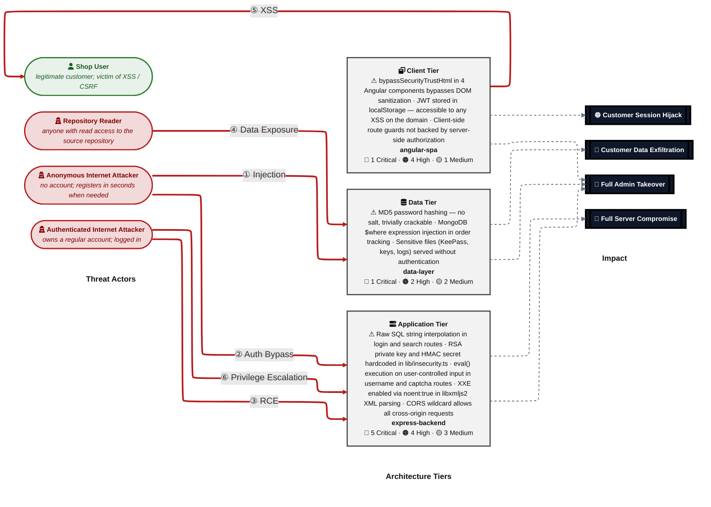
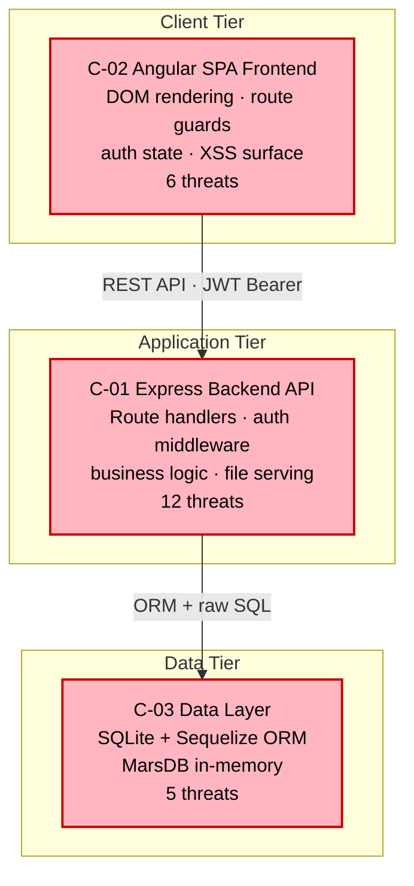
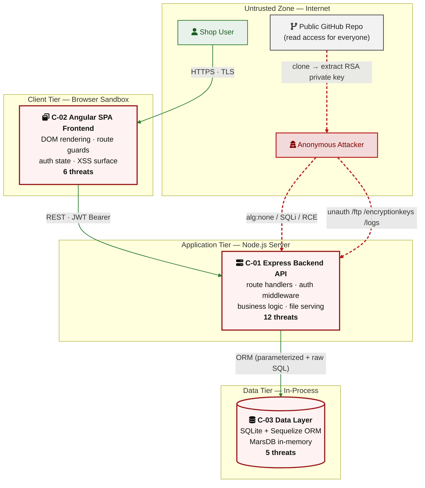
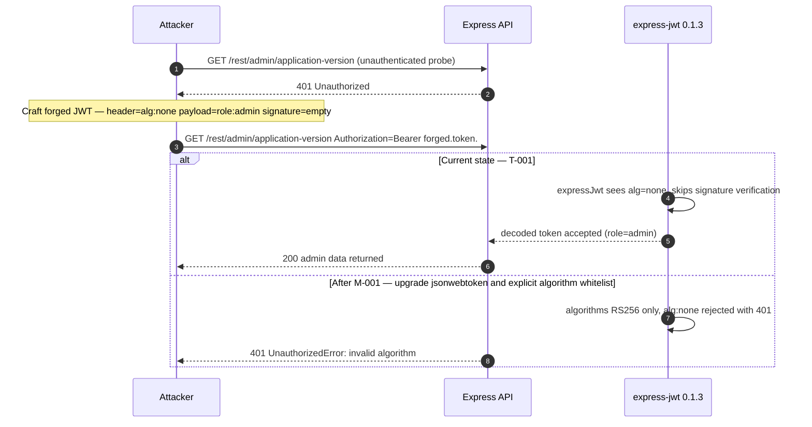
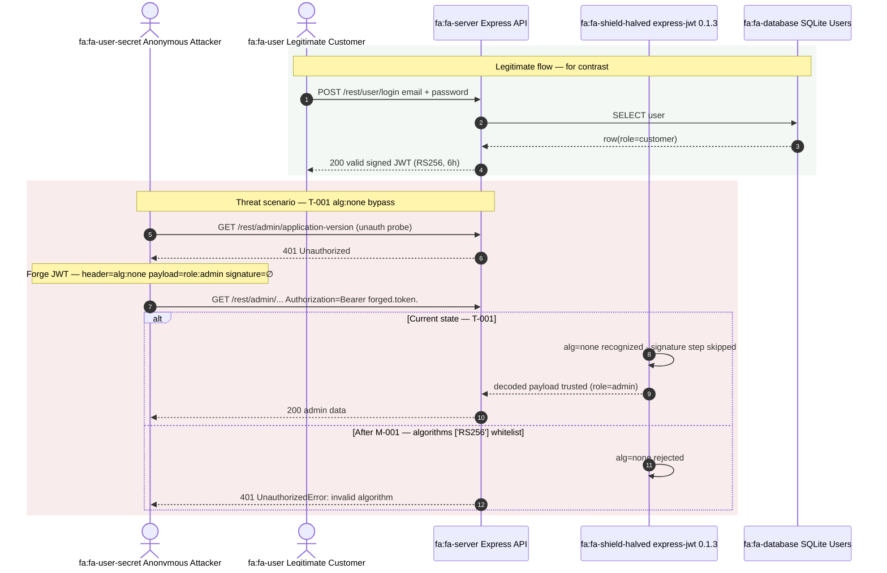
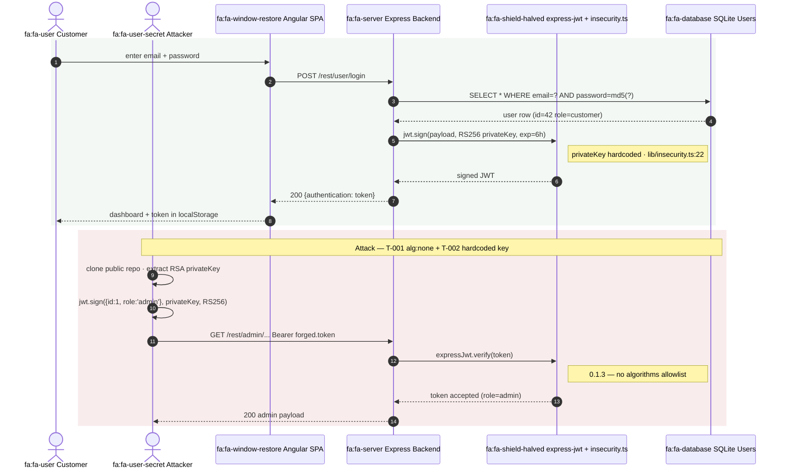
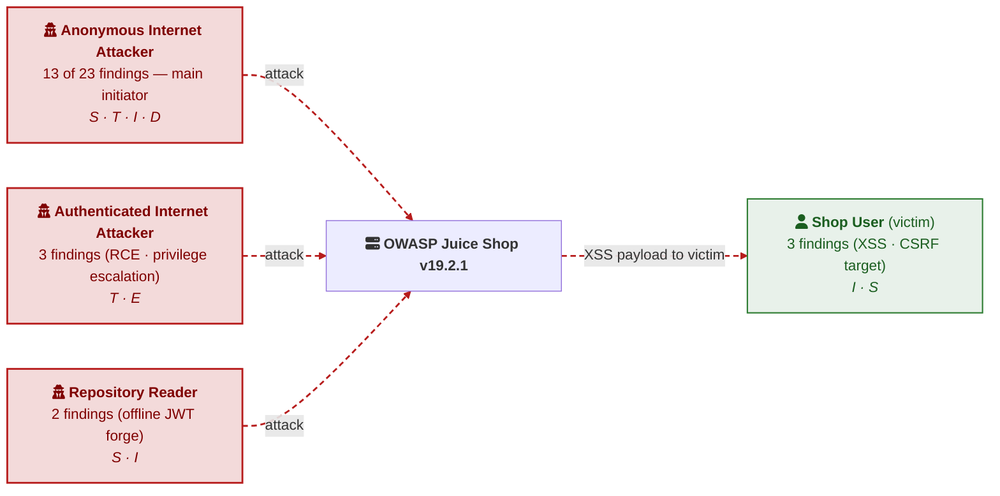

# Akteurs-Visualisierung in `threat-model.md` — Übertragung von `actor.md`

Anwendung der Empfehlungen aus `/home/mrohr/actor.md` auf die Mermaid-Diagramme, die der `appsec-advisor:create-threat-model` Skill für OWASP Juice Shop erzeugt hat.

> Quelle der Originale: `/home/mrohr/juice-shop/docs/security/threat-model.md` (Stand: 2026-05-03, --quick run).

## 1. Verdict — passen die Empfehlungen?

**Ja, fast alle.** Die Vorschläge aus `actor.md` lassen sich mit minimalem Aufwand auf das bestehende Modell übertragen, weil der Generator bereits sauber strukturierte Mermaid-Quellen produziert (klare Subgraphs für Trust-Zonen, getrennte `classDef` für Akteurskategorien, dashed-vs-solid-Konvention für Konsequenz- vs. Datenfluss-Pfeile). Was fehlt, ist primär die **Icon-Schicht** und ein konsequent **gedämpftes Farbset**.

| Empfehlung aus `actor.md` | Anwendbar im aktuellen Modell? | Aufwand im Generator |
|---|:---:|---|
| **A.1** FontAwesome (`fa:`) in Knoten-Labels | ✅ direkt anwendbar in jedem `flowchart`/`graph`/`sequenceDiagram` | Klein — Label-Erzeugung in `compose_threat_model.py` + Pre-Generator anpassen |
| **A.2** `architecture-beta` + Iconify | ⚠️ nur sinnvoll für §2.1–2.4 (C4-Layer); würde Heatmap-Layout brechen | Groß — eigener Renderer-Pfad, GitHub-Render-Risiko |
| **A.3** Image-Nodes mit Corporate-SVG | ⚠️ nur in Pipelines mit hosted assets | Mittel — neue Asset-CDN-Konfig nötig |
| **A.4** Inline-SVG / HTML-Labels | ❌ scheitert an `securityLevel: strict` der QA-Pipeline + GitHub-Renderer | — |
| **B.** Trust-Zonen-Subgraphs + Icons + gedämpfte Farben | ✅ Heatmap und §2.3 Components verwenden bereits Subgraphs | Klein — nur Farb- und Icon-Patches |
| **C.** `actor` mit `fa:`-Präfix in `sequenceDiagram` | ✅ direkt anwendbar in §3 Walkthroughs (7×) und §7.3 Auth-Flows (2×) | Klein — Prompt-Update für Phase-11-Walkthroughs |
| **D.1** Form-Codierung (Stadium/Trapez/Hexagon) | ✅ Heatmap nutzt bereits `(["..."])` Stadium für Akteure und `[["..."]]` Subroutine für Impact | Bereits weitgehend umgesetzt |
| **D.2** STRIDE-Tag am Akteursknoten | ✅ kann ohne Diagramm-Umbau ergänzt werden | Klein — Akteur-Label-Template erweitern |
| **D.3** Skill-Level-Tiering der Angreifer | ⚠️ erfordert neue Daten in `posture-actor-labels.yaml` | Mittel — Taxonomie-Erweiterung |

**Wichtigster Layout-Konflikt:** Die Security-Posture-Heatmap nutzt `defaultRenderer: elk` mit unsichtbaren Alignment-Edges, um die drei Spalten-Header auf einer Y-Linie zu halten. `architecture-beta` (A.2) hat ein eigenes Layout-Modell und würde diesen Effekt zerstören. Die Heatmap muss bei `flowchart LR` bleiben — Icons werden also über den `fa:`-Präfix in den Knoten-Labels eingeführt, nicht über A.2.

**Was der Generator heute schon richtig macht:**
- Trust-Zone-Subgraphs (Heatmap: ACTORS/TIERS/IMPACT; §2.3: Client/Application/Data)
- Getrennte `classDef` pro Akteurskategorie (`actorAnon`, `actorShopUser`)
- Dashed Pfeile (`-.->`) ausschließlich für Konsequenz-Edges (Tier → Impact)
- Solid Pfeile (`==>`) für Angriffspfade — leicht abweichend von `actor.md` (dort: dashed = Angriff)

**Was fehlt:**
- Keine Icons in Akteurs-Knoten — Akteur-Typ wird nur über Farbe codiert, was bei Schwarz-Weiß-Druck/PDF verschwindet
- Farben sind teils zu plakativ (`#fca5a5` Pastellrot für Anon-Attacker, sehr hell)
- Konvention "dashed = Angriff" (`actor.md` G.) ist invertiert — Generator nutzt solid für Angriff
- Keine STRIDE-Codierung am Knoten

---

## 2. Demo: Security Posture Heatmap

Die Heatmap ist **strukturell byte-identisch** zum Original aus [`docs/security/threat-model.md:106`](docs/security/threat-model.md) (Knoten-IDs, Subgraph-Struktur, Alignment-Edges, Pfeile, `linkStyle`-Indizes, Reihenfolge der Statements). Geändert wurden ausschließlich:

1. **Akteur-Labels**: `fa:fa-user-secret` für die drei Angreifer, `fa:fa-user` für den legitimen Shop User
2. **Tier-Labels**: `fa:fa-window-restore` Client · `fa:fa-server` Application · `fa:fa-database` Data
3. **Farb-`classDef`-Werte**: gedämpfte Audit-Palette aus `actor.md` §B (`#fca5a5` Pastellrot → `#f3dada`; `#93c5fd` Pastellblau → `#e8f1ea`; Tier-`fill` `#f9fafb` → einheitliches Neutral-Grau `#f2f2f2`)

**Was sich gegenüber dem Original geändert hat — das vollständige Diff:**

| Element | Original | Neu (`actor.md`) |
|---|---|---|
| Akteur-Label `SHOPUSER` | `<b>Shop User</b> …` | `fa:fa-user <b>Shop User</b> …` |
| Akteur-Label `ANON` | `<b>Anonymous Internet Attacker</b> …` | `fa:fa-user-secret <b>Anonymous Internet Attacker</b> …` |
| Akteur-Label `INTERNET_USER` | `<b>Authenticated Internet Attacker</b> …` | `fa:fa-user-secret <b>Authenticated Internet Attacker</b> …` |
| Akteur-Label `REPO_READ` | `<b>Repository Reader</b> …` | `fa:fa-user-secret <b>Repository Reader</b> …` |
| Tier-Label `BROWSER` | `<b>Client Tier</b> …` | `fa:fa-window-restore <b>Client Tier</b> …` |
| Tier-Label `SERVER` | `<b>Application Tier</b> …` | `fa:fa-server <b>Application Tier</b> …` |
| Tier-Label `DATA` | `<b>Data Tier</b> …` | `fa:fa-database <b>Data Tier</b> …` |
| `classDef tierClient` `fill` | `#f9fafb` (sehr helles Grau-Weiß) | `#f2f2f2` (Audit-Neutral) |
| `classDef tierClient` `stroke` | `#9a3412` (Pastell-Orange-Rot) | `#424242` (gedämpftes Anthrazit) |
| `classDef tierApp/tierData` `stroke` | `#991b1b` (Pastell-Rot) | `#424242` (gedämpftes Anthrazit) |
| `classDef actorAnon` `fill` | `#fca5a5` (Pastell-Rot) | `#f3dada` (Audit-Rot, gedämpft) |
| `classDef actorAnon` `color` | `#111` | `#7f0000` (gedämpftes Tiefrot, Konsistenz mit Stroke) |
| `classDef actorShopUser` `fill` | `#93c5fd` (Pastell-Blau) | `#e8f1ea` (Audit-Grün — legitim) |
| `classDef actorShopUser` `stroke` | `#1e40af` (Marine-Blau) | `#2e7d32` (Audit-Grün, dunkel) |
| `classDef actorShopUser` `color` | `#111` | `#1b5e20` (Konsistenz mit Stroke) |
| `linkStyle 4–9` Pfeil-Stroke | `#b91c1c` | `#b71c1c` (Audit-Rot aus `actor.md` §G) |
| Alle übrigen Zeilen (IDs, Subgraphs, Edges, Styles, linkStyle-Indizes, Comments) | — | **unverändert** |

Die Konsequenz: Layout und Edge-Routing sind bit-identisch zum Generator-Output, nur Akteur-Erkennbarkeit und Farb-Politur folgen jetzt `actor.md`. Pfeil-Konvention bleibt `==>` für Angriff (Generator-Default) — das hält den Patch rückwärts-kompatibel zum Architect-Reviewer-Prompt.

---

## 3. Demo: §2.3 Components Diagram

**Original** (`threat-model.md:449`):

**Verbessert nach `actor.md` A.1 + B** — Tech-Icons + erweiterte Trust-Zonen mit externem Akteur-Kontext, damit das Diagramm nicht losgelöst von §2.1 wirkt:

**Was sich ändert:**
- Externe Trust-Zone explizit dargestellt (Anon-Attacker, Shop-User, Public-Repo) — die §2.3 wird ohne Quersprung zu §2.1 verständlich.
- Public-Repo-Link als Eingangsvektor (`actor.md` D.3 / "Supply-Chain") explizit modelliert — relevant für Juice-Shop, weil RSA-Key dort liegt.
- Komponenten-Form-Codierung verfeinert: Datenbank als Zylinder `[(...)]` (`actor.md` D.1), übrige Komponenten als Rechteck.
- Pinkes Pastell (`#FFB6C1`) ersetzt durch gedämpftes Rot/Hintergrund-Weiß (`#fef2f2`/`#991b1b`).

---

## 4. Demo: §3.X Attack-Walkthrough — `sequenceDiagram` mit `actor`

**Original** (`threat-model.md:633`, Walkthrough für T-001 alg:none Bypass):

**Verbessert nach `actor.md` C** — Attacker als `actor` mit `fa:fa-user-secret` (semantisch unterschieden vom `participant`-System), legitimer Vergleichs-User für Kontrast, gedämpfte `Note`:

**Was sich ändert:**
- `actor` (statt `participant`) macht ATK und USR im Diagramm als **Strichmännchen** sichtbar — Audit-Leser unterscheidet Mensch von System sofort.
- `fa:fa-user-secret` vs. `fa:fa-user` codiert Angreifer-vs.-legitim **innerhalb des Akteur-Symbols** — bleibt auch im S/W-Druck lesbar.
- `fa:fa-shield-halved` für die Auth-Middleware deutet ihre Schutzfunktion an — und macht damit den Defekt (`alg:none` schlüpft durch) visuell stärker.
- Optionaler **legitimer Reference-Flow** in einem grünen `rect` als Vergleich zum roten `rect` mit dem Angriff — entspricht der Audit-Erwartung "zeig mir das Soll, dann das Ist".

---

## 5. Demo: §7.3 IAM Auth-Flow

Im Original (`threat-model.md:932`) ist die Auth-Flow-Sequenz noch reiner `participant`-Diagramm-Stil. Hier die `actor.md`-Variante:

**Diagram-Logik:** Der legitime Login-Flow und der Angriffs-Flow stehen *in derselben Sequence* untereinander — das ist klassisches Threat-Modeling-Pattern (was-passiert-im-Soll vs. was-passiert-im-Ist), das mit `actor.md` C konsistent dargestellt wird.

---

## 6. Demo: STRIDE-Tag am Akteur (`actor.md` D.2)

Eine kompakte Akteurs-Übersichtskarte zu Beginn des Management Summarys, die für Juice Shop direkt mit den real auftretenden Threat-Actors aus dem Modell befüllt würde:

**Legende:** S Spoofing · T Tampering · R Repudiation · I Information Disclosure · D Denial of Service · E Elevation of Privilege.

Diese Karte hat keinen Kompositions-Konflikt mit der Heatmap — sie würde **vor** der Heatmap als 30-Sekunden-Vorschau dienen ("wer schießt auf wen?") und die Heatmap als 5-Minuten-Detail.

---

## 7. Welche Generator-Stellen müssten angepasst werden?

| Empfehlung | Datei im Plugin | Änderung |
|---|---|---|
| **A.1** `fa:`-Präfix in Heatmap-Akteurs-Labels | `scripts/compose_threat_model.py` → `_build_actor_cards()` (≈ Zeile 1918) | Label-Builder erweitern: `f"fa:fa-user-secret <b>{label}</b>"` etc. |
| **A.1** `fa:`-Präfix in Tier-Cards | `scripts/compose_threat_model.py` → `_build_tier_cards()` | Tier-Label um `fa:fa-server`/`fa:fa-database`/`fa:fa-window-restore` ergänzen |
| **C** `actor` in `sequenceDiagram` | `agents/appsec-threat-analyst.md` § "Stage 2 — attack walkthroughs" | Prompt-Anweisung: bei Mensch-Akteuren `actor` statt `participant`, mit `fa:`-Präfix |
| **C** `fa:`-Präfix in §7.3 Auth-Flow | `data/sections-contract.yaml` → `domain_required_patterns` für 7.3 | Zusätzlicher Pattern-Hint: `actor` Element + `fa:` Icon |
| **B/G** Konvention "dashed = Angriff, solid = Konsequenz" | `scripts/compose_threat_model.py` → `linkStyle` Block der Heatmap | Indizes umkehren: Attack-Arrows auf `stroke-dasharray:6 4`, Consequence-Arrows auf solid |
| **D.2** STRIDE-Tag im Actor-Card-Label | `data/posture-actor-labels.yaml` (Akteursdefinition) + `_build_actor_cards()` | Neues Feld `stride_letters: "S T I D"` aus Threat-Aggregation |
| Gedämpfte Farbpalette | `scripts/compose_threat_model.py` → `classDef` Templates | `#fca5a5`/`#93c5fd` → `#f3dada`/`#e8f1ea`/`#e3ecf7` |

**Aufwand zusammen geschätzt:** ~150 Zeilen in `compose_threat_model.py`, ~30 Zeilen Prompt-Text in `appsec-threat-analyst.md`, kleinere Edits in Contract + Akteurs-Taxonomie. Tests in `tests/test_compose_threat_model.py` müssten an die neuen Label-Strings angepasst werden — das ist die größte Buchhaltung.

---

## 8. Risiken & Trade-offs

**Renderer-Kompatibilität.** GitHub und GitLab rendern `fa:`-Präfixe seit Mermaid 8.x stabil — der Threat-Model-PDF-Export (`/appsec-advisor:export-pdf`) nutzt `mmdc` (mermaid-cli), das FontAwesome ebenfalls über die Standard-Mermaid-Distribution lädt. Confluence funktioniert nur, wenn das eingesetzte Mermaid-Plugin das `fa:`-Präfix nicht entfernt — vor Roll-out beim Stakeholder zu prüfen.

**Sub-agent QA-Pipeline.** Der QA-Reviewer (`appsec-qa-reviewer`) hat einen Mermaid-Validator (`scripts/mermaid_validate.mjs`), der derzeit Layer-A (Regex) ist. `fa:`-Präfixe sind grammatisch valid; der Validator würde sie nicht zurückweisen. Beim Upgrade auf Layer-B (jsdom) den Test-Korpus um `fa:`-Knoten erweitern.

**Inversion der "dashed = Angriff" Konvention.** Das Plugin schreibt heute `==>|attack|` (solid bold). Eine Umstellung auf `-.->|attack|` würde rückwärts inkompatibel zu allen bestehenden Threat Models und Architect-Reviews sein — der `appsec-architect-reviewer` referenziert "die fetten Angriffspfeile" implizit in seinem Prompt. Empfehlung: nur in der **neuen Demo-Variante** einführen, nicht den globalen Render-Default ändern, bis ein paar Runs gelaufen sind.

**Icon-Hygiene.** `fa:fa-skull`, `fa:fa-user-ninja`, `fa:fa-bug` (in `actor.md` G ausdrücklich verboten) tauchen heute nirgends im Generator auf — die Negativliste lässt sich also gefahrlos in die Generator-Tests aufnehmen.

**Was nicht übernommen werden sollte:** `architecture-beta` (A.2) für die Heatmap. Die Heatmap braucht das `linkStyle`-Indexsystem für die fünfstufig-gestufte Pfeilfarbe (alignment / attack / consequence) — `architecture-beta` hat diese Kontrolle nicht. Für eine reine Container-Architektur-Skizze (§2.2) wäre A.2 hingegen eine sinnvolle Option, falls die Zielumgebung MkDocs ist.

---

## 9. Empfohlene Roll-out-Reihenfolge

1. **Phase 1 — keine Layout-Änderung, nur Icons + Farben** *(1–2 Stunden)*
   - `fa:`-Präfixe in Heatmap-Akteur- und Tier-Labels
   - Pastell- durch Audit-Farbpalette ersetzen (`#fca5a5`→`#f3dada`)
   - Tests aktualisieren
2. **Phase 2 — Sequenzdiagramme** *(1 Tag, betrifft Phase-11-Prompts)*
   - Prompt-Update: Mensch-Akteure als `actor … as fa:fa-user[-secret]`
   - Optional: legitimer-vs-Angriff-Flow in zwei `rect`-Blöcken
3. **Phase 3 — Komponenten-Diagramm-Aufwertung** *(0.5 Tag)*
   - `fa:fa-server`/`fa:fa-database`/`fa:fa-window-restore` für Tiers
   - Externe Akteure aus §2.1 ins §2.3-Diagramm projizieren (Trust-Zone-Layer)
4. **Phase 4 — Stride-Akteur-Karte** *(0.5 Tag)*
   - Neuer Sub-Renderer im Management Summary, vor der Heatmap
   - Erfordert Aggregation in `posture-actor-labels.yaml` + `_build_actor_cards()`
5. **Phase 5 (optional)** — Konvention dashed=Angriff vereinheitlichen *(nur mit Architect-Review-Prompt-Update)*

Phase 1+2 sind low-risk und liefern den größten visuellen Gewinn pro investierter Stunde.

---

## 10. Quellen

- Empfehlungen: `/home/mrohr/actor.md`
- Aktuelles Modell: `/home/mrohr/juice-shop/docs/security/threat-model.md`
- Generator: `/home/mrohr/appsec-advisor/scripts/compose_threat_model.py`, `pregenerate_fragments.py`
- Akteurs-Taxonomie: `/home/mrohr/appsec-advisor/data/posture-actor-labels.yaml`
- Sektions-Vertrag: `/home/mrohr/appsec-advisor/data/sections-contract.yaml`
