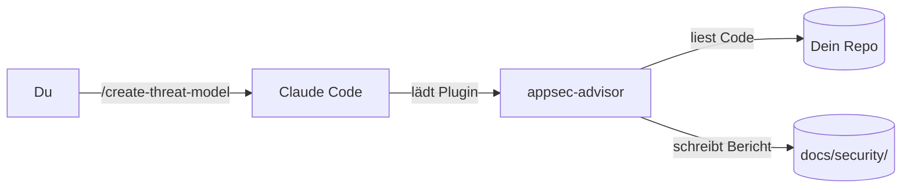
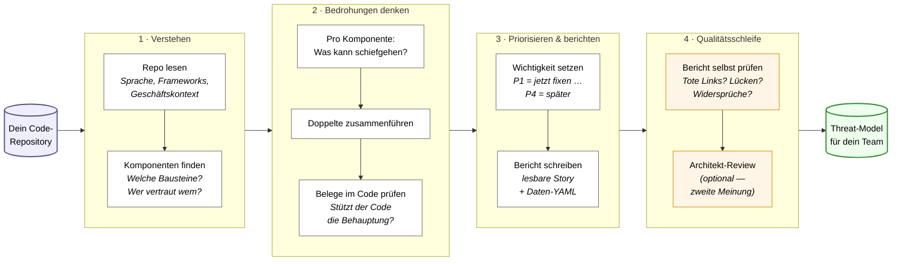
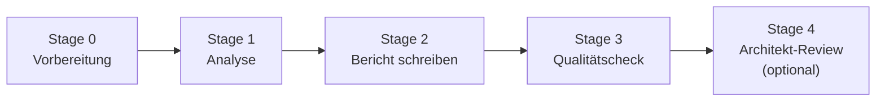
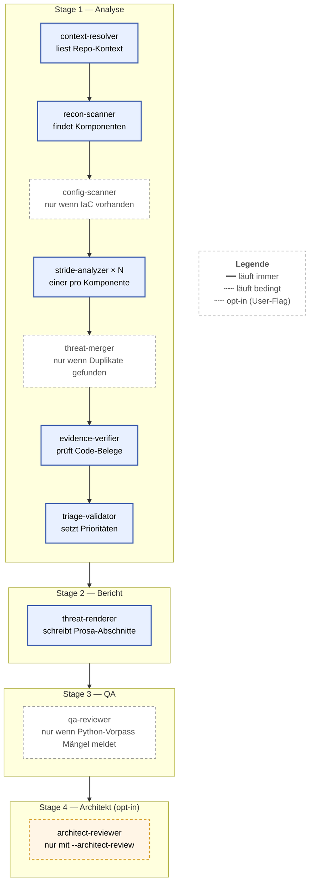
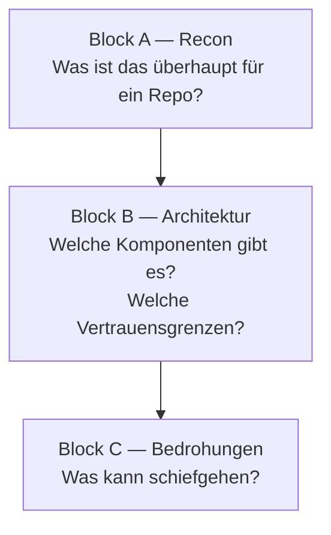
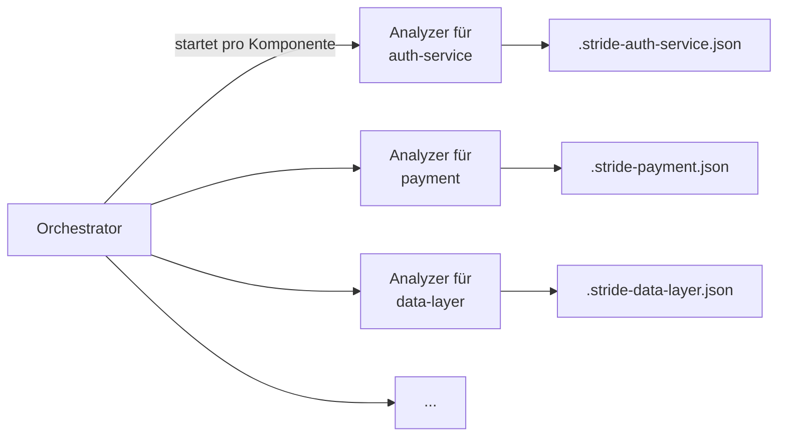
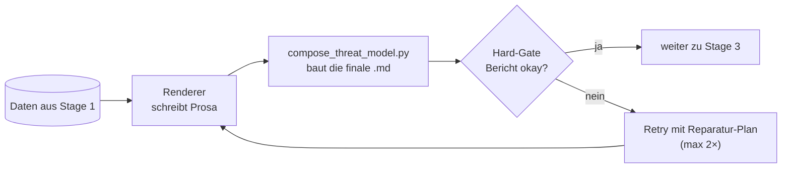
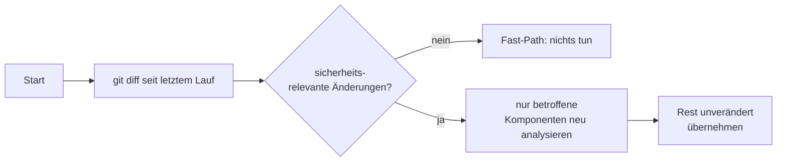

# appsec-advisor — Wie das Plugin funktioniert

Dieser Text erklärt einem Außenstehenden, was das Plugin tut und wie es
intern arbeitet. Keine vollständige Referenz — eher eine Karte, damit man
sich im Code zurechtfindet.

---

## 1. Was macht das Plugin?

Du gibst in Claude Code den Befehl

```
/appsec-advisor:create-threat-model
```

ein, zeigst auf ein Code-Repository, und nach ein paar Minuten bekommst du
einen Sicherheitsbericht: welche Komponenten existieren, welche
Bedrohungen plausibel sind, was am wichtigsten ist, und Belege im Code für
jede Behauptung.



Heraus kommen:

- `threat-model.md` — der lesbare Bericht für Menschen
- `threat-model.yaml` — dieselben Daten maschinenlesbar (für späteren
  Vergleich)
- optional `.sarif.json` und `.pdf`

### Auf einen Blick — die Pipeline für PO/Stakeholder

Was zwischen „Befehl drücken" und „fertiger Bericht" passiert, in
Alltagssprache. Jeder Block ist ein KI-Spezialist mit einer klaren
Teilaufgabe — wie ein kleines Review-Team, das nacheinander durch das Repo
geht.



Drei Dinge, die dabei wichtig sind:

- **Jeder Fund hat Code-Beleg.** Schritt „Belege prüfen" wirft alles raus,
  was nicht im Repo nachweisbar ist — keine erfundenen Bedrohungen.
- **Wichtigkeit, nicht Vollständigkeit.** Schritt 3 sortiert nach
  Behebungsreihenfolge. Das Team sieht sofort, was diese Woche dran ist.
- **Selbstkontrolle eingebaut.** Schritt 4 fängt typische KI-Schwächen
  (Halluzinationen, übersehene Platzhalter, Doppeleinträge) ab, bevor der
  Bericht ausgeliefert wird.

---

## 2. Drei Bausteinarten

Das Plugin ist aus drei Sorten Bausteinen gebaut. Es lohnt sich, diese
Trennung im Kopf zu haben — sie zieht sich durch das ganze Projekt.

| Baustein     | Wer denkt? | Beispiel                                        |
|--------------|-----------|-------------------------------------------------|
| **Skill**    | nur Regie | `create-threat-model` — der Einstieg            |
| **Agent**    | LLM       | `appsec-stride-analyzer` — sucht Bedrohungen    |
| **Script**   | Python    | `merge_threats.py` — dedupliziert Bedrohungen   |

Faustregel: **Python macht alles Mechanische, LLM macht alles, was
Interpretation erfordert.** Wann immer eine Aufgabe deterministisch
machbar ist (z.B. zwei Funde mit gleichem CWE zusammenführen, IDs
vergeben, Markdown zusammenkleben), übernimmt ein Python-Skript. Das spart
Geld und ist reproduzierbar.

---

## 3. Die Pipeline: vier Stages

Der Skill arbeitet in vier Schritten ab. Jeder Schritt hat ein klares Ziel
und endet mit einer Datei auf der Platte.



**Stage 0 — Vorbereitung.** Argumente einlesen, alte Lock-Dateien aus
abgebrochenen Läufen aufräumen, Konfiguration nach `.skill-config.json`
schreiben.

**Stage 1 — Analyse.** Hier passiert die eigentliche Arbeit: Code lesen,
Komponenten finden, Bedrohungen pro Komponente überlegen, Belege prüfen,
nach Wichtigkeit sortieren. Details in §4.

**Stage 2 — Bericht.** Aus den gesammelten Daten wird `threat-model.md`
gebaut. Ein eigener Agent füllt nur die Prosa-Abschnitte; alles andere
klebt ein Python-Skript zusammen.

**Stage 3 — Qualitätscheck.** Ein Reviewer-Agent (mit deterministischem
Python-Vorpass) prüft den fertigen Bericht: tote Links? Platzhalter
übersehen? Widerspricht der Text der YAML?

**Stage 4 — Architekt-Review (optional).** Ein zusätzlicher Reviewer
darf das Ergebnis kommentieren, aber nicht überschreiben. Er liefert nur
Empfehlungen.

### Welche Agenten laufen wann?

Die folgende Karte zeigt alle Agenten der Pipeline. Durchgezogene
Kästen laufen **immer**, gestrichelte nur unter bestimmten Bedingungen.



Faustregel: **acht Agenten gehören zum Standard-Lauf**, einer ist nur bei
Bedarf dabei (`config-scanner`, wenn Dockerfiles oder Terraform existieren),
und der `architect-reviewer` läuft nur, wenn der User ihn explizit per Flag
anfordert.

---

## 4. Was in Stage 1 passiert

Stage 1 ist der Kern. Sie läuft in drei Blöcken ab:



### Block A: Recon

Drei kleine Agenten laufen **parallel**:

- `context-resolver` — liest README, package.json etc., schreibt eine
  kurze Beschreibung des Projekts
- `recon-scanner` — listet Manifeste, Routen, vorläufige Komponenten,
  bereits sichtbare Sicherheitsprobleme
- `config-scanner` — sucht Probleme in Dockerfiles, Terraform, IaC
  (nur wenn solche Dateien überhaupt vorhanden sind)

Parallel heißt: alle drei werden im gleichen Turn gestartet und im
Hintergrund ausgeführt. Der Orchestrator wartet auf alle drei, bevor es
weitergeht.

### Block B: Architektur

Hier baut der Orchestrator das Modell auf: welche Komponenten gibt es,
welche Daten fließen wohin, was sind die wichtigen Assets, wo verlaufen
Vertrauensgrenzen, welche Sicherheitskontrollen sind bereits vorhanden.
Das passiert in einer Reihe von Phasen, eine nach der anderen, derselbe
Agent.

### Block C: Bedrohungen

Der teuerste Teil. Für jede Komponente wird ein eigener
**STRIDE-Analyzer** gestartet — viele parallel.



Jede Instanz bekommt nur ihre eigene Komponente und nur den Ausschnitt
der Bedrohungs-Taxonomie, der dazu passt. Das hält die Aufgabe klein
und macht die Antworten besser.

Wieviele Komponenten überhaupt analysiert werden, hängt von der gewählten
Tiefe ab: `quick` = 3, `standard` = 5, `thorough` = 8.

### Danach: Aufräumen

Aus den N STRIDE-Dateien wird **ein** konsistenter Befund-Katalog:

1. **Sammeln** — ein Python-Skript gruppiert Kandidaten, die das gleiche
   CWE oder die gleiche STRIDE-Kategorie haben.
2. **Mergen** — ein LLM-Agent entscheidet pro Gruppe: gleiche Sache?
   zusammenfassen. Verwandt, aber unterschiedlich? getrennt lassen.
3. **Belege prüfen** — ein weiterer Agent liest die zitierten Code-Stellen
   nach und markiert jeden Befund als bestätigt, widerlegt oder unklar.
4. **Triage** — Schweregrad und Priorität festlegen.

Das Ergebnis ist eine Datei `.threats-merged.json` mit stabilen IDs.

---

## 5. Wie der Bericht geschrieben wird

Stage 2 ist absichtlich **schmal**. Der Renderer-Agent macht keine neue
Analyse — er liest nur die Daten aus Stage 1 und schreibt die paar
Prosa-Abschnitte (Zusammenfassung, Architekturbewertung). Ein
Python-Skript klebt dann alle Fragmente zu `threat-model.md` zusammen.



Wenn der Bericht nicht durchs Hard-Gate kommt (z.B. ein Abschnitt fehlt,
ein Platzhalter wurde nicht ersetzt), wird kein kaputter Bericht
gespeichert. Stattdessen wird ein strukturierter Reparatur-Plan
geschrieben und der Renderer noch einmal aufgerufen — gezielt nur für die
defekten Stellen.

**Eine harte Garantie:** Es landet niemals ein kaputtes `threat-model.md`
auf der Platte. Entweder der Bericht ist sauber, oder der Lauf endet mit
Exit-Code 2 plus Reparatur-Plan zum Drüberschauen.

---

## 6. Zweiter Lauf? Nur das Nötige

Wenn das Repo schon einmal analysiert wurde, kann der Skill mit
`--incremental` aufgerufen werden. Dann:



Die alten Befunde behalten ihre IDs. Eine Komponente, die nicht angefasst
wurde, behält ihre Bedrohungen 1:1. Das hält Diffs zwischen Berichten
klein und macht es einfach zu sehen, was sich tatsächlich geändert hat.

---

## 7. Wo liegt was im Code?

Wenn du den Code anschauen willst, hier die wichtigsten Anlaufstellen:

| Was suchst du?                 | Wo schauen                                |
|--------------------------------|-------------------------------------------|
| Der User-Einstieg              | `skills/create-threat-model/SKILL.md`     |
| Wie die Pipeline orchestriert wird | `agents/appsec-threat-analyst.md`     |
| Die einzelnen Phasen           | `agents/phases/phase-group-*.md`          |
| Was die Worker-Agents tun      | `agents/appsec-*.md`                      |
| Deterministische Logik         | `scripts/*.py`                            |
| Bedrohungs-Wissen              | `data/cwe-taxonomy.yaml`, `data/threat-category-taxonomy.yaml` |
| Was darf in der YAML stehen?   | `schemas/threat-model.schema.json`        |

---

## 8. Begriffe in zwei Sätzen

- **Skill** — der Einstiegspunkt, den der User aufruft.
- **Orchestrator** — der eine Top-Level-Agent, der alle Phasen
  hintereinander abarbeitet (`appsec-threat-analyst`).
- **Sub-Agent** — ein vom Orchestrator gestarteter Worker mit eigenem
  Turn-Budget. Macht eine eng umrissene Aufgabe, schreibt eine Datei,
  kehrt zurück.
- **Phase** — ein nummerierter Arbeitsschritt innerhalb von Stage 1
  (Phase 1 = Recon, Phase 9 = STRIDE, Phase 10 = Mergen, …).
- **Fragment** — ein einzelner Markdown- oder JSON-Baustein, der später
  zum fertigen Bericht zusammengeklebt wird.
- **Hard-Gate** — der Schema-Check nach Stage 2; entscheidet, ob der
  Bericht durch darf oder repariert werden muss.
- **STRIDE** — das klassische Bedrohungs-Taxonomie-Schema (Spoofing,
  Tampering, Repudiation, Information Disclosure, DoS, Elevation of
  Privilege). Wird pro Komponente einmal durchgespielt.
