# appsec-advisor — Developer Guide

Dieses Dokument erklärt, wie das Plugin intern funktioniert. Schwerpunkt: der
Skill `create-threat-model`, sein Orchestrator `appsec-threat-analyst`, die
Sub-Agenten, die deterministischen Python-Helfer und der Datenfluss zwischen
den Phasen.

Quellen für jede Aussage stehen im Repo:

- Plugin-Metadaten: `.claude-plugin/plugin.json`
- Plugin-Config & Permissions: `config.json`, `permissions.md`
- Skills: `skills/<skill-name>/SKILL.md` (+ ggf. `SKILL-impl.md`)
- Agent-Definitionen: `agents/appsec-*.md`
- Phasen-Gruppen (lazy-loaded): `agents/phases/phase-group-*.md`
- Skript-Tooling: `scripts/*.py`
- Daten-Kataloge: `data/*.yaml`
- Schemas: `schemas/*.json`
- Hooks: `hooks/hooks.json`, `scripts/hooks/*.py`
- Verbindliche Regeln für Agenten: `AGENTS.md`

---

## 1. Plugin auf einen Blick (Ebene 0)

Das Plugin liefert eine kleine Familie von Skills. Der zentrale Skill ist
`create-threat-model`. Er lädt einen Orchestrator-Agenten, der eine feste
Phasenpipeline gegen ein Repository fährt und am Ende einen
Architekur- + Bedrohungsbericht produziert.

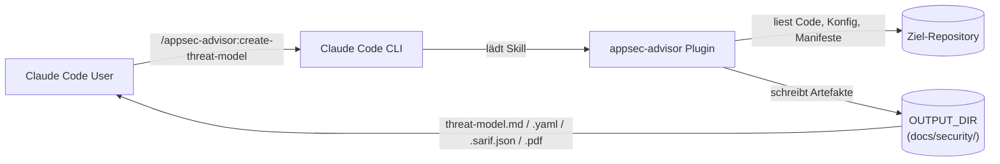

Outputs (siehe `README.md` → *What you get*):

| Datei                       | Zweck                                                |
|-----------------------------|------------------------------------------------------|
| `threat-model.md`           | Engineer-lesbarer Hauptbericht                       |
| `threat-model.yaml`         | Maschinenlesbarer Export (Inkrement-Baseline)        |
| `threat-model.sarif.json`   | Optional, via `--sarif`                              |
| `threat-model.pdf` / `.html`| Optional, via `--pdf` / `export-threat-model`        |
| `pentest-tasks.yaml`        | Optional, für AI-Pentester (Strix etc.)              |

---

## 2. Skill- und Agent-Layer (Ebene 1)

Das Plugin trennt drei Schichten: **Skills** (User-Einstiege),
**Agents** (LLM-getriebene Worker mit Turn-Budget) und
**Python-Scripts** (deterministische Logik, kein LLM).

```mermaid
flowchart TB
  subgraph Skills["skills/"]
    S1["create-threat-model<br/><i>Haupt-Pipeline</i>"]
    S2["export-threat-model"]
    S3["publish-threat-model"]
    S4["threat-model-health"]
    S5["clean-run-state"]
    S6["fix-run-issues"]
    S7["status"]
    S8["check-permissions"]
    S9["audit-security-requirements"]
  end

  subgraph Agents["agents/ (alle Sonnet als Frontmatter-Pin;<br/>Runtime-Routing per .skill-config.json)"]
    A_TA["appsec-threat-analyst<br/><b>Orchestrator</b> (250 turns)"]
    A_CR["appsec-context-resolver (25)"]
    A_RS["appsec-recon-scanner (25)"]
    A_CS["appsec-config-scanner (15)"]
    A_ST["appsec-stride-analyzer (40, ×N parallel)"]
    A_TM["appsec-threat-merger (12)"]
    A_EV["appsec-evidence-verifier (30)"]
    A_TV["appsec-triage-validator (20)"]
    A_TR["appsec-threat-renderer (80)"]
    A_QA["appsec-qa-reviewer (120)"]
    A_AR["appsec-architect-reviewer (40, opt-in)"]
  end

  subgraph Scripts["scripts/ (deterministisch)"]
    P1["resolve_config.py"]
    P2["baseline_state.py"]
    P3["merge_threats.py"]
    P4["triage_validate_ratings.py"]
    P5["compose_threat_model.py"]
    P6["qa_checks.py"]
    P7["plugin_meta.py"]
    P8["runtime_cleanup.py"]
    P9["route_inventory.py"]
    P10["pregenerate_fragments.py"]
    P11["build_threat_model_yaml.py<br/><i>Phase 11 Substep 2 aggregator</i>"]
    P12["reserve_ids.py<br/><i>atomic ID counter for sidecars</i>"]
    P13["validate_fragment.py<br/><i>schema gate for sidecars + render-fragments</i>"]
  end

  subgraph Data["data/ (Kataloge)"]
    D1["cwe-taxonomy.yaml"]
    D2["threat-category-taxonomy.yaml"]
    D3["config-iac-checks.yaml"]
    D4["sections-contract.yaml"]
    D5["walkthrough-templates/*.yaml"]
    D6["component-canonical.yaml"]
  end

  S1 --> A_TA
  A_TA --> A_CR & A_RS & A_CS
  A_TA --> A_ST
  A_TA --> A_TM
  A_TA --> A_EV
  A_TA --> A_TV
  S1 --> A_TR
  S1 --> A_QA
  S1 -. "opt-in --architect-review" .-> A_AR

  A_TA --> P1 & P2 & P3 & P4
  A_TR --> P5 & P10
  A_QA --> P6
  A_TA --> P7 & P8 & P9
  A_ST -. liest .-> D1 & D2 & D6
  A_CS -. liest .-> D3
  A_TR -. liest .-> D4 & D5
```

Modell-Routing (`AGENTS.md` → *Runtime model routing*): Frontmatter ist nur
Fallback. Der Orchestrator überschreibt pro Aufruf aus
`.skill-config.json`. Default-Tier `opus-cheap`:

| Agent                       | Default-Modell  |
|-----------------------------|-----------------|
| `appsec-context-resolver`   | **Haiku**       |
| `appsec-recon-scanner`      | **Haiku**       |
| `appsec-config-scanner`     | **Haiku**       |
| `appsec-stride-analyzer`    | **Sonnet**      |
| `appsec-threat-merger`      | **Opus**        |
| `appsec-evidence-verifier`  | Sonnet          |
| `appsec-triage-validator`   | Sonnet          |
| `appsec-threat-renderer`    | Sonnet          |
| `appsec-qa-reviewer`        | Sonnet (split intern in qa_content/qa_routine) |
| `appsec-architect-reviewer` | **Opus**        |
| `appsec-threat-analyst`     | Sonnet (immer)  |

---

## 3. `create-threat-model` — Pipeline-Stages (Ebene 2)

Der Skill ist in **vier Hauptstages** und **17 Phasen** organisiert. Die
Phasen leben in vier *lazy-loaded* Phase-Group-Dateien unter
`agents/phases/`, die der Orchestrator zur Laufzeit liest.

```mermaid
flowchart TB
  start([User: /appsec-advisor:create-threat-model])

  subgraph Stage0["Stage 0 — Preamble"]
    direction TB
    Z1["resolve_config.py emit-file<br/>(args → .skill-config.json)"]
    Z2["pre-flight stale-state<br/>recovery (Locks, Caches)"]
    Z3["Rebuild / Full Wipe<br/>(--rebuild / --full)"]
    Z1 --> Z2 --> Z3
  end

  subgraph Stage1["Stage 1 — Threat Analysis & Triage<br/>(appsec-threat-analyst, 250 turns)"]
    direction TB
    ST1A["Recon Phase Group<br/>Phasen 1, 2, 2.5, 2.6"]
    ST1B["Architecture Phase Group<br/>Phasen 3, 3b, 4, 5–7, 8, 8b"]
    ST1C["Threats Phase Group<br/>Phasen 9, 10, 10a, 10b"]
    ST1A --> ST1B --> ST1C
  end

  subgraph Stage2["Stage 2 — Report Rendering<br/>(appsec-threat-renderer, fresh budget)"]
    direction TB
    R1["LLM-Fragmente schreiben<br/>(ms-verdict, ms-architecture-assessment, …)"]
    R2["compose_threat_model.py --strict<br/>→ threat-model.md"]
    R3["qa_checks all"]
    R1 --> R2 --> R3
  end

  gate{{"Hard inline-shortcut gate<br/>check_inline_shortcut.py"}}

  subgraph Retry["Auto-Retry Loop (M2.13)<br/>max 2 Iterationen"]
    direction TB
    RT1["recovery: merge + triage<br/>+ pregenerate"]
    RT2["Stage 2 erneut dispatchen"]
    RT3["Hard-Gate erneut"]
    RT1 --> RT2 --> RT3
  end

  subgraph Stage3["Stage 3 — QA Review<br/>(appsec-qa-reviewer, 120 turns)"]
    direction TB
    QA1["deterministic pre-pass<br/>(qa_checks.py)"]
    QA2["LLM-QA (nur falls nötig)"]
    QA3["Re-Render Loop<br/>(max 3 Iter.)"]
    QA1 --> QA2 --> QA3
  end

  subgraph Stage4["Stage 4 — Architect Review<br/>(opt-in --architect-review, advisory)"]
    AR1["appsec-architect-reviewer<br/>.architect-review.md / .architect-status.json"]
  end

  done([threat-model.md / .yaml / Exports])

  start --> Stage0 --> Stage1 --> Stage2 --> gate
  gate -- exit 0 --> Stage3
  gate -- exit 2 --> Retry --> gate
  Stage3 --> Stage4 --> done
  Stage3 -- ohne --architect-review --> done
```

Wichtige Compliance-Garantie (`SKILL-impl.md` → *Pipeline Overview*):
es wird **niemals** ein malformes `threat-model.md` persistiert. Jeder Pfad
endet entweder mit einem schema-validierten Dokument oder exit 2 mit
strukturiertem Repair-Plan (`.inline-shortcut-repair-plan.json`).

---

## 4. Stage 1 im Detail — Phasen 1–10b (Ebene 3)

Der Orchestrator-Agent (`appsec-threat-analyst.md`) führt 11 nummerierte
Phasen aus. Phasen 1, 2 und 2.5 laufen **parallel** im selben
Orchestrator-Turn. Phase 9 fächert per **Sub-Agent-Fan-out** auf (eine
STRIDE-Instanz pro Komponente).

```mermaid
flowchart TB
  subgraph Recon["Phasengruppe: Recon (phase-group-recon.md)"]
    direction TB
    PRE["Pre-Checks:<br/>• CTX_SKIP (Context-Cache)<br/>• HAS_IAC_SURFACE (compgen)<br/>• Fingerprint-Skip (Recon)"]
    P1P2P25["Phasen 1 + 2 + 2.5 — Parallel-Dispatch<br/>(bis zu 3 Background-Agents in einem Turn)"]
    P26["Phase 2.6 — route_inventory.py<br/>(deterministisches Coverage-Pre-pass)"]
    PRE --> P1P2P25 --> P26
  end

  subgraph Arch["Phasengruppe: Architecture (phase-group-architecture.md)"]
    direction TB
    P3["Phase 3 — Architecture Modeling<br/>(Components, Trust Boundaries skizziert)"]
    P3B["Phase 3b — F-only architecture-derived findings<br/>(source=architecture-coverage, architectural_theme)"]
    P4["Phase 4 — Attack Walkthroughs"]
    P567["Phasen 5–7 — Assets, Attack Surface, Trust Boundaries<br/>(single-pass, gemeinsamer Timestamp)"]
    P8["Phase 8 — Identified Security Controls"]
    P8B{"Phase 8b — Requirements Audit<br/>(nur falls CHECK_REQUIREMENTS=true)"}
    P3 --> P3B --> P4 --> P567 --> P8 --> P8B
  end

  subgraph Threats["Phasengruppe: Threats (phase-group-threats.md)"]
    direction TB
    P9["Phase 9 — STRIDE Enumeration<br/>(Sub-Agent-Fan-out, siehe §5)"]
    P10["Phase 10 — Scan Synthesis<br/>(merge_threats.py collect + ggf. appsec-threat-merger)"]
    P10A["Phase 10a — appsec-evidence-verifier<br/>(verified / refuted / ambiguous)"]
    P10B["Phase 10b — appsec-triage-validator<br/>(Ranking, Effective Severity)"]
    P9 --> P10 --> P10A --> P10B
  end

  Recon --> Arch --> Threats
```

### 4a. Phasen 1+2+2.5 parallel — Sequenzdiagramm

`phase-group-recon.md` definiert: alle drei Recon-Agents werden in **einem
Orchestrator-Turn** als `run_in_background: true` gestartet. Das Wait-Gate
wartet auf Agent-Returns, nicht auf File-Polling.

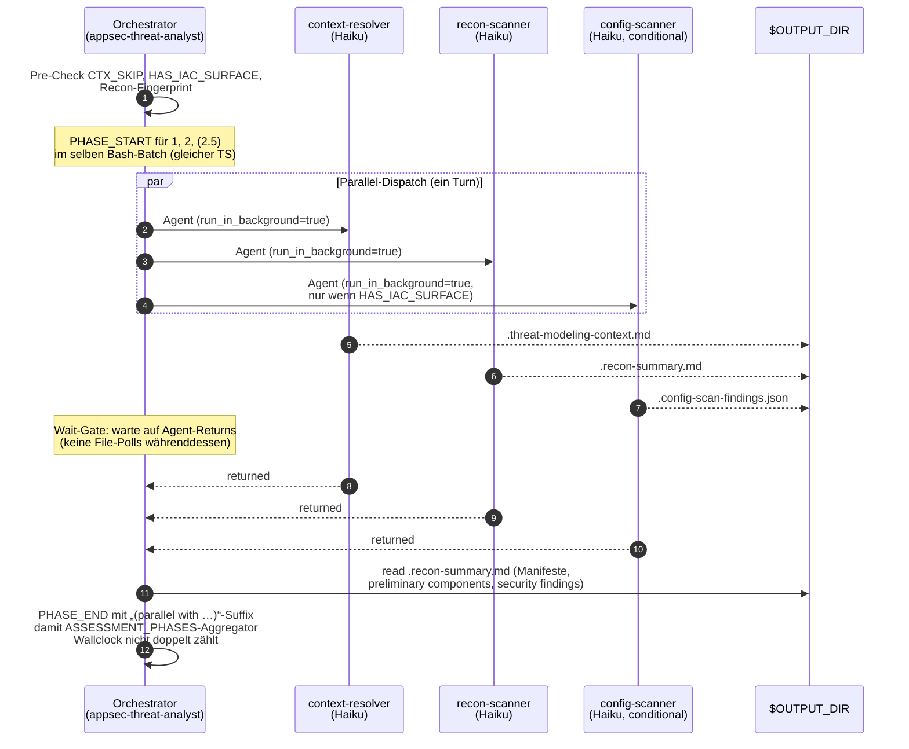

Begründung für die Suffix-Pflicht steht in `phase-group-recon.md` →
*Phase 2.5: Configuration & IaC Scan*: ohne `(parallel with Phases 1+2)`
addiert der `ASSESSMENT_PHASES`-Aggregator die Phase fälschlich sequentiell.

---

## 5. Phase 9 — STRIDE-Fan-out (Ebene 4)

Phase 9 ist der teuerste LLM-Schritt. Der Orchestrator startet **eine
STRIDE-Instanz pro Komponente** (begrenzt durch `--assessment-depth`:
quick=3, standard=5, thorough=8 Komponenten). Jede Instanz schreibt eine
eigene Output-Datei und wird über das Prompt-Cache-Layout optimiert.

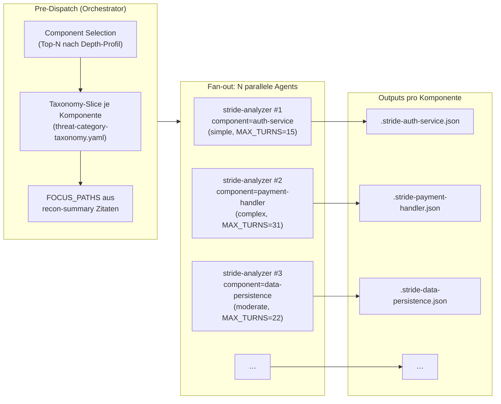

**Cache-freundliches Prompt-Layout** (`phase-group-threats.md` → *Dispatch*):
Parameter werden in drei Gruppen sortiert, damit der Claude-Code-Prompt-Cache
greift:

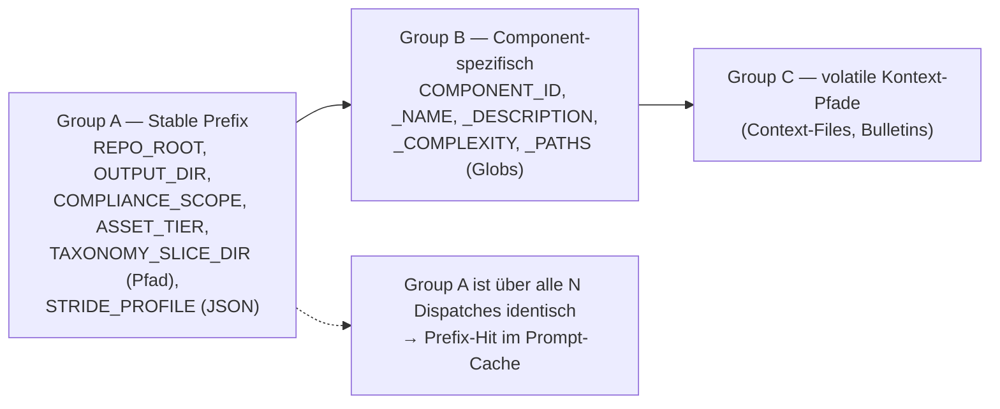

Die `COMPONENT_PATHS`-Globs sind der **Anti-Drift-Anker**: der Analyzer
verweigert Threats, deren `evidence[0].file` außerhalb der Globs liegen
würde (Root-Cause-Fix gegen das alte „SQL-Injection in `routes/search.ts`
als `data-layer` getaggt“-Problem).

---

## 6. Phasen 10 / 10a / 10b — Synthese (Ebene 4)

Aus N STRIDE-Outputs wird ein konsistenter, deduplizierter, gewichteter
Threat-Register. Die Schritte sind so geschnitten, dass **deterministische
Python-Logik den Großteil übernimmt** und LLMs nur dort einspringen, wo
Semantik nötig ist.

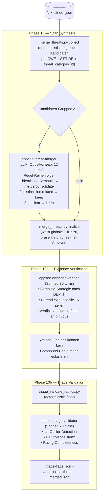

Stabile IDs (`AGENTS.md` → *Drift-Guarded Runtime Contracts*): T-IDs, M-IDs
und E-IDs sind **über Runs stabil**. Eine carry-forward Komponente behält
jede ihrer T-IDs; neue IDs kommen aus `.appsec-cache/baseline.json.id_counters`.

---

## 7. Stage 2 — Renderer + Repair Loop (Ebene 4)

Der Renderer ist explizit **schmal** geschnitten: er rennt keine Analyse
noch einmal. Er liest validierte Fragmente und ruft `compose_threat_model.py`
mit `--strict`. Wenn das Hard-Gate kippt, geht eine Auto-Retry-Schleife los.

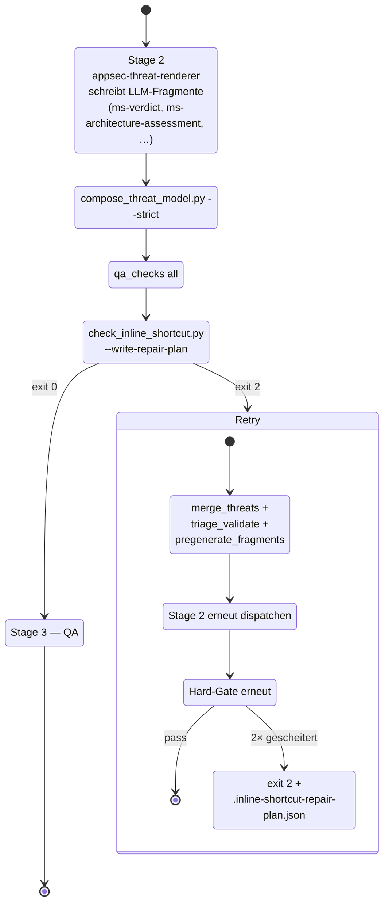

Repair-Mode (`appsec-threat-renderer.md` → *Repair-Mode*): wenn QA oder
Architect einen strukturierten Repair-Plan schreiben, wird der Renderer mit
`REPAIR_MODE=true` *erneut* aufgerufen. Er überspringt dann Phasen 1–10
komplett und arbeitet nur die im Plan benannten Fragmente neu auf.

**Prose-Qualität — zwei Style-Anchors.** Vor jedem Fragment-Write mit
LLM-Prosa (`ms-verdict.json`, `ms-architecture-assessment.json`,
enriched §7-Narrativ) lädt der Renderer ZWEI Files:
- `agents/shared/prose-style.md` — 6 normative Regeln
  (Specificity, Falsifiability, Information-density, Scannable
  structure, No boilerplate, Code identifiers in monospace).
- `agents/shared/prose-samples.md` — 5 Before/After-Pairs aus echten
  Reports plus Banned-Vocabulary-Liste, Voice-Statement, 5-Frage
  Pre-Write Self-Check.

Diese Trennung ist Absicht: prose-style.md trägt die Regeln, prose-samples.md
zeigt sie angewandt. Sonnet imitiert konkrete Beispiele zuverlässiger als
es abstrakten Regeln folgt. Beide Files sind drift-guarded durch
`tests/test_agent_definitions.py::TestProseStyleAnchor` — Renderer und
phase-group-finalization MÜSSEN beide referenzieren, sonst CI rot.

Neue AI-Floskeln, die im Output auftauchen, werden als neues
Before/After-Pair in `prose-samples.md` ergänzt (nicht als neue Regel
in prose-style.md). Regeln ohne Beispiele driften; Beispiele nicht.

---

## 8. Stage 3 + 4 — QA und Architect Review (Ebene 3)

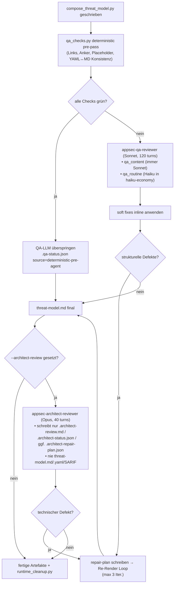

Wichtig: Der Architect ist **advisory**. Er hat keinen Schreibzugriff auf
die finalen Berichtsartefakte. Bei technischen Defekten gibt er einen
Repair-Plan an die Renderer-Loop.

---

## 9. Artefakt-Datenfluss (Ebene 3)

Welche Datei wird von wem geschrieben, von wem gelesen? Alle Pfade unter
`$OUTPUT_DIR` (default `<repo>/docs/security/`).

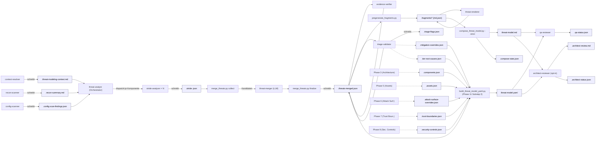

`runtime_cleanup.py` räumt am Ende Transientes auf (Liste:
`docs/cleanup-whitelist.md`), bewahrt aber Audit-Artefakte und
Inkrement-Anker.

---

## 9a. Substep-2 Sidecar-Architektur (Hybrid Python + LLM)

**Problem:** Phase 11 Substep 2 hat historisch das komplette
`threat-model.yaml` vom LLM aus Working-Memory neu komponiert. Das
kostet 15–20 turns am Pipeline-Ende — exakt dort wo das Budget am
knappsten ist (verifiziert: 2026-05-24 juice-shop MAX_TURNS @ turn 150
mid-Phase-11 → bootstrap-stub yaml → forced resume; gleicher root cause
wie 2026-05-03 API-streaming-stall).

**Lösung:** Deterministischer Python-Aggregator
(`scripts/build_threat_model_yaml.py`) liest Intermediates + neue
Phase-Output-Sidecars und schreibt `threat-model.yaml` in 1 turn.
Vollständige Spec: [`docs/substep2-deterministic-migration.md`](substep2-deterministic-migration.md).

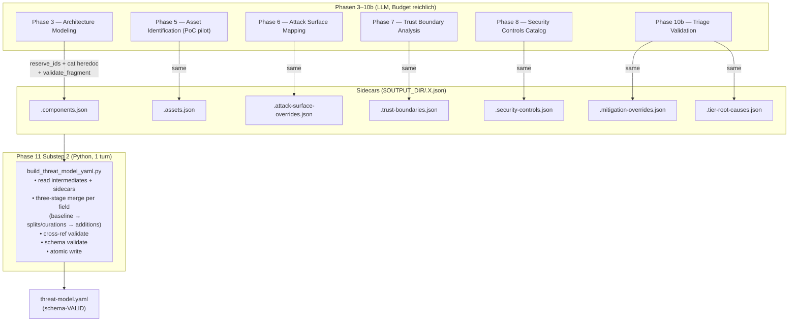

**Drei-Stufen-Merge pro Feld** (Aggregator):
1. **Baseline** aus Intermediates (`.threats-merged.json`, `.route-inventory.json`, `.architecture-coverage.json`, …) — deterministisch
2. **Splits / Curations** aus Sidecar — z.B. M-001 wird zu M-001a + M-001b zerlegt, oder 112 Routes werden auf 21 relevante gefiltert
3. **Additions** aus Sidecar — z.B. Process-Mitigation "Establish dependency-update SLA" die zu keinem einzelnen threat gehört aber ≥ 2 T-IDs adressiert

**Sidecar-Protokoll pro Phase (3 Bash-Calls am PHASE_END)**:
```bash
# 1. ID-Reservierung (atomic via fcntl.LOCK_EX)
IDS=$(python3 "$CLAUDE_PLUGIN_ROOT/scripts/reserve_ids.py" \
      asset --count <N> --output-dir "$OUTPUT_DIR")
# 2. Heredoc-Write der strukturierten Daten
cat > "$OUTPUT_DIR/.assets.json" <<'JSON'
  { "schema_version": 1, "assets": [...] }
JSON
# 3. Schema-Gate
python3 "$CLAUDE_PLUGIN_ROOT/scripts/validate_fragment.py" \
      --type assets "$OUTPUT_DIR/.assets.json"
```

**Wichtige Invarianten**:
- **Single writer pro sidecar.** Phase 5 schreibt `.assets.json`, keine andere Phase modifiziert sie.
- **ID-Counter sind atomic.** `reserve_ids.py` nutzt `fcntl.LOCK_EX` — 20 parallele Prozesse × 5 IDs ergeben 100 unique IDs (verifiziert in `tests/test_reserve_ids.py`).
- **Cross-Refs werden im Aggregator validiert.** Sidecars validieren nur ihre eigene Form. M-IDs in Splits/Additions müssen existierende T-IDs referenzieren (≥1 für evidence-Grounding; ≥2 bei process-Mitigations).
- **Aggregator ruft nie ein LLM auf.** Determinismus ist non-negotiable. Schema-Validierung ist hartes Pre-Write-Gate.
- **Fallback-Pfad.** Solange ein Sidecar fehlt UND prior `threat-model.yaml` existiert, übernimmt der Aggregator das Feld aus dem prior yaml. Damit funktioniert die Migration inkrementell: jeder Schritt ist isoliert revertierbar, bestehende Installations brechen nicht.

**Migrations-Status (2026-05-24)**:
- ✅ `build_threat_model_yaml.py` (Aggregator) — schema-VALID gegen juice-shop
- ✅ `reserve_ids.py` (atomic ID counters) — 11/11 Tests grün
- ✅ 7 Sidecar-Schemas in `schemas/fragments/` — roundtrip-validiert
- ✅ Phase 5 PoC-Wiring — sidecar wird geschrieben, aber Substep 2 nutzt noch LLM-Pfad
- ⏳ Phase 3/6/7/8/10b Wiring — pending nach Ref-Run-Gate-Validierung des Phase-5-PoC
- ⏳ Substep-2-Cutover (commit 7 der Migration) — pending nach Phase-Wiring-Complete

Acceptance-Gates pro Ref-Run-Repo (juice-shop, VulnerableApp, ≥1 internal):
§1-§7 wordcount Δ < 5%, Mermaid-Count identisch, Threat-Count identisch,
Mitigation-Count Δ ≤ 2, F-NNN gap-free, SARIF identisch, Phase 11 ≤ 3 turns,
zero MAX_TURNS events. Details in
[`docs/substep2-deterministic-migration.md` §9](substep2-deterministic-migration.md).

---

## 10. Inkrementelle Runs & Baseline

Inkrementelle Wiederläufe (`--incremental`) sind erste-Klasse-Bürger:

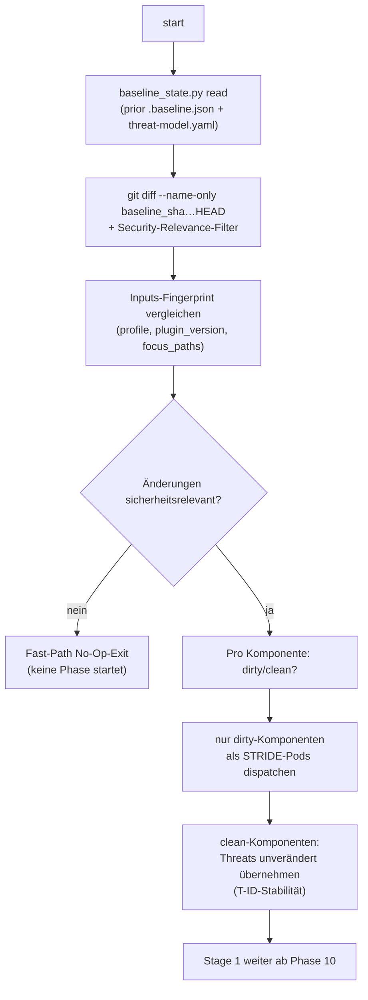

Verträge:
- `threat-model.yaml` `meta.schema_version: 1` — Bump nur mit Migration.
- T-IDs bleiben stabil; neue IDs kommen aus `id_counters` in
  `.appsec-cache/baseline.json`.
- `changelog[]` ist **append-only**, nie überschreiben.
- `meta.git.commit_sha` = `git rev-parse HEAD` am Ende von Phase 11.

---

## 11. Konfiguration & Depth-Profile

`resolve_config.py emit-file` materialisiert die finalen Run-Parameter in
`.skill-config.json`. Drei Hauptachsen:

**Assessment-Depth** (`--assessment-depth quick|standard|thorough`):

| Depth      | Max Komponenten | STRIDE-Turns (simple/moderate/complex) | Diagramme | QA              |
|------------|-----------------|-----------------------------------------|-----------|-----------------|
| `quick`    | 3               | 10 / 15 / 20                            | minimal   | core only (Stage 3 übersprungen) |
| `standard` | 5               | 15 / 22 / 31                            | standard  | full            |
| `thorough` | 8               | 20 / 28 / 35                            | extended  | extended        |

**Reasoning-Tier** (`--reasoning-model haiku-economy|opus-cheap|sonnet|opus`):
verschiebt das Modell-Routing in der Tabelle aus §2. `haiku-economy` schiebt
zusätzlich `qa_routine` auf Haiku und den Merger auf Sonnet; `opus` hebt
STRIDE/Triage/Merger auf Opus.

**Per-Agent-Overrides** (Env-Vars): `APPSEC_CONTEXT_RESOLVER_MODEL`,
`APPSEC_RECON_SCANNER_MODEL`, `APPSEC_CONFIG_SCANNER_MODEL`,
`APPSEC_ARCHITECT_MODEL`, …

Quick-Mode-Profil (`QUICK_STRIDE_PROFILE`, nur bei
`quick` + `haiku-economy`):
A skip verification greps · B max 2 threats/category · C keep code examples ·
D keep evidence excerpts · E skip CVSS scoring · F turn-budget hard-cap 25.

---

## 12. Hooks & Logging

`hooks/hooks.json` registriert einen `PreToolUse`/`PostToolUse`/`Stop`/
`SubagentStop`-Handler (`scripts/hooks/agent_logger.py`). Er schreibt nach
`docs/security/.hook-events.log` (getrennt von `.agent-run.log`, das die
Agents selbst per Bash-`echo` schreiben).

Ereignisse:
- `AGENT_SPAWN` — jeder Agent-Tool-Aufruf (alle Depths)
- `SCAN_START` / `SCAN_COMPLETE` — top-level threat-analyst
- `AGENT_INVOKE` — non-orchestrator Agents, top-level
- `CONTEXT_READY` — context-resolver hat `.threat-modeling-context.md` geschrieben
- `FILE_WRITE` / `FILE_READ` / `GREP_RUN` / `GLOB_RUN` / `BASH_OK` —
  PostToolUse mit `dur=<sek>` zur Hotspot-Diagnose

Phasen-Logging-Vertrag (`phase-group-architecture.md` →
*MANDATORY PHASE LOGGING CONTRACT*):
- Jede Phase 3–8 bekommt ein eigenes `PHASE_START`/`PHASE_END`-Paar,
  **unmittelbar** vor/nach der Arbeit.
- **Kein Look-Ahead-Logging** (alle PHASE_START vorab dumpen ist Vertrags-
  bruch — verhindert Silent-Death-Diagnose).
- Auto-Repair-Validator am Ende der Gruppe füllt fehlende Marker auf.

---

## 13. Erweitern — wo füge ich was hinzu?

| Vorhaben                                          | Anlaufstelle                                                       |
|---------------------------------------------------|--------------------------------------------------------------------|
| Neue STRIDE-Heuristik / CWE-Schwerpunkt           | `agents/appsec-stride-analyzer.md` + `data/cwe-taxonomy.yaml` / `data/threat-category-taxonomy.yaml` |
| Neue IaC-/Config-Regel                            | `data/config-iac-checks.yaml` (regelbasiert, Haiku-tauglich)       |
| Neuer Walkthrough für CWE-X                       | `data/walkthrough-templates/cwe-X.yaml`                            |
| Neue Sektion im Bericht                           | `data/sections-contract.yaml` + ggf. `pregenerate_fragments.py`    |
| Architektur-Coverage-Check                       | `data/architecture-coverage-rules.yaml`                            |
| Neue Skill                                        | `skills/<name>/SKILL.md` (Routing-File, optional `SKILL-impl.md`)  |
| Bash-Allow-List für unattended runs               | `permissions.md` und `/appsec-advisor:check-permissions`           |
| Schema-Änderung an `threat-model.yaml`            | `schemas/threat-model.schema.json` + Migration + `analysis_version` Bump in `.claude-plugin/plugin.json` |
| Neuer Sub-Agent                                   | `agents/appsec-<name>.md` + Eintrag in `AGENTS.md` (Roster + Routing) + Dispatch im passenden `phase-group-*.md` |

Drift-Guards (`AGENTS.md` → *Drift-Guarded Runtime Contracts*):
- Turn-Budgets sind in `tests/test_agent_definitions.py::TestAgentsMdDocDrift`
  gepinnt.
- Always-cleaned-Pfade sind in `docs/cleanup-whitelist.md` und
  `scripts/runtime_cleanup.py` doppelt gepinnt (Test: `tests/test_runtime_cleanup.py`).
- Schema-Invarianten (T-ID-Stabilität, Append-Only-Changelog) sind in
  `baseline_state.py` validiert.

---

## 14. Glossar (Kurzform)

| Begriff                       | Bedeutung                                                            |
|-------------------------------|----------------------------------------------------------------------|
| **Orchestrator**              | `appsec-threat-analyst`, fährt Phasen 1–11.                          |
| **Phase-Group**               | `agents/phases/phase-group-*.md`, lazy vom Orchestrator gelesen.     |
| **Sub-Agent**                 | Vom Orchestrator per `Agent`-Tool gestarteter Worker mit Turn-Cap.   |
| **Stage 1 / 2 / 3 / 4**       | Threat-Analyse / Rendering / QA / Architect-Review.                  |
| **F-NNN / T-NNN / M-NNN / E-NNN** | Stable IDs für Findings, Threats, Mitigations, Evidence.        |
| **Fragment**                  | Vorgerenderter Markdown/JSON-Baustein für den Composer.              |
| **Dirty-Set**                 | Komponenten, deren `paths` im Git-Diff betroffen sind (incremental). |
| **`--reasoning-model`**       | Wählt das Modell-Tier (Haiku-economy / Opus-cheap / Sonnet / Opus).  |
| **`--assessment-depth`**      | Wählt Komponentencap, STRIDE-Tiefe, Diagrammtiefe, QA-Tiefe.         |
| **Hard-Gate**                 | `check_inline_shortcut.py` nach Stage 2 — exit 0/2 entscheidet.      |
| **Repair-Mode**               | `REPAIR_MODE=true`-Re-Dispatch des Renderers, überspringt 1–10.      |

