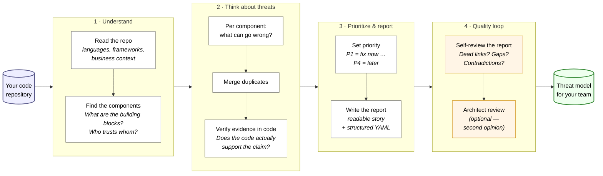
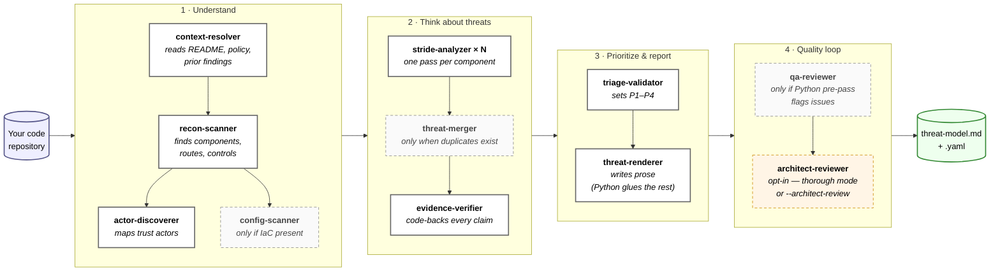
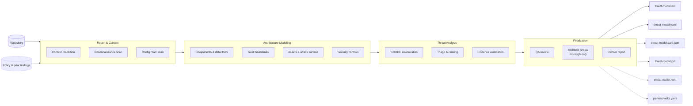
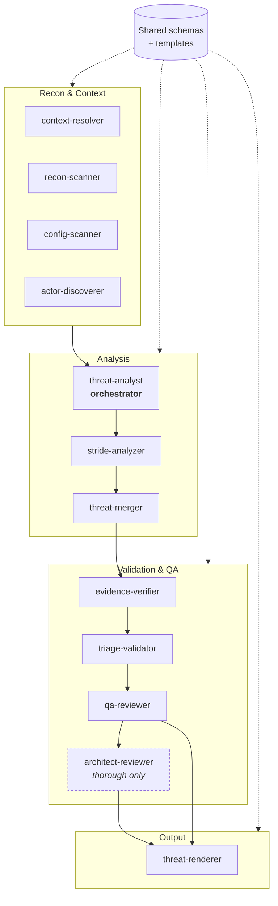
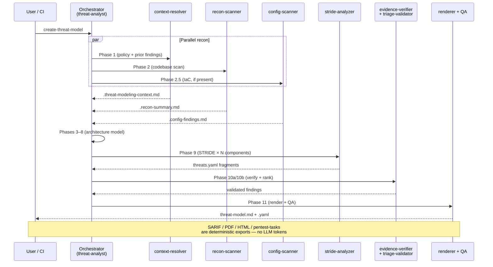
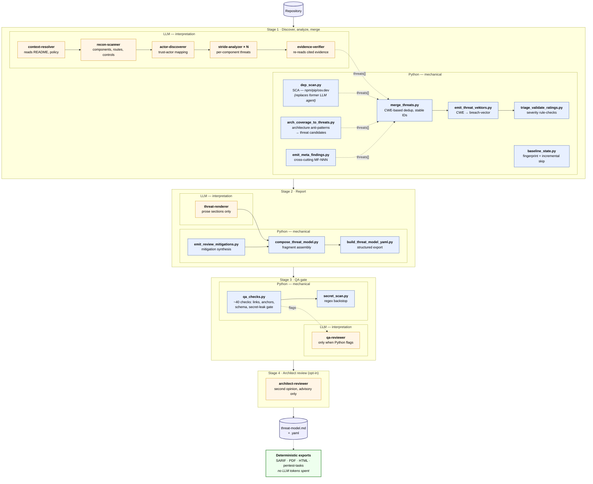

# Architecture Diagrams (Mermaid Variants)

Drop-in Mermaid snippets for `README.md`. Each variant emphasizes a different facet — pick one or combine. All render natively on GitHub.

Legend used throughout:

- **Solid box / arrow** = always runs
- **Dashed box / arrow** = conditional or optional
- **Stacked icon** = parallel dispatch
- **Cylinder** = artifact on disk

---

## Variant 1 — At a glance (stakeholder view)

Plain-language overview of what happens between *"hit the button"* and *"finished report"*. Each block is one AI specialist with a clearly bounded sub-task — like a small review team walking through the repo one stage at a time.

Three things to keep in mind:

- **Every finding has code evidence.** The "Verify evidence" step throws out anything that isn't provable in the repo — no fabricated threats.
- **Priority, not completeness.** Step 3 sorts by fix order. The team sees immediately what to tackle this week.
- **Self-check built in.** Step 4 catches typical LLM failure modes (hallucinations, missed placeholders, duplicate entries) before the report ships.

---

## Variant 2 — At a glance, with agents

Same shape as Variant 1, but each box names the specific agent that does the work. Solid borders = runs on every assessment; dashed borders = conditional or opt-in.

**Reading the borders:**

- ━━ **Always runs** — 7 agents on every assessment: context-resolver, recon-scanner, actor-discoverer, stride-analyzer, evidence-verifier, triage-validator, threat-renderer.
- ┄┄ **Conditional** — `config-scanner` only fires when IaC files exist; `threat-merger` only when duplicates are found across components; `qa-reviewer` only when the deterministic Python pre-pass flags issues worth a second look.
- ┄┄ **Opt-in** — `architect-reviewer` runs only in `--assessment-depth thorough` (or when explicitly requested). It comments but never overwrites — recommendations only.

---

## Variant 3 — High-level pipeline (flowchart, with outputs)

Simplest mental model: repo in, 4 stage groups, reports out. Same shape as Variant 1, but with the optional output deliverables made explicit.

---

## Variant 4 — Phase pipeline with agents

One step deeper: shows the 11 numbered phases and which agent runs each. Useful as a replacement for `docs/images/threat-model-pipeline.png`.

```mermaid
flowchart TB
    Start([create-threat-model]) --> P12

    subgraph P12[Phase 1 + 2 — Parallel dispatch]
        direction LR
        P1["Phase 1<br/>Context resolution<br/><i>context-resolver</i>"]
        P2["Phase 2<br/>Reconnaissance<br/><i>recon-scanner</i>"]
        P25["Phase 2.5<br/>Config / IaC<br/><i>config-scanner</i>"]
    end

    P12 --> P26["Phase 2.6<br/>Arch coverage pre-pass"]
    P26 --> P27["Phase 2.7<br/>Actor discovery<br/><i>actor-discoverer</i>"]

    P27 --> P3["Phase 3<br/>Architecture model<br/><i>threat-analyst</i>"]
    P3 --> P4["Phase 4<br/>Attack walkthroughs"]
    P4 --> P5["Phase 5<br/>Assets"]
    P5 --> P6["Phase 6<br/>Attack surface"]
    P6 --> P7["Phase 7<br/>Trust boundaries"]
    P7 --> P8["Phase 8<br/>Security controls"]
    P8 --> P8b["Phase 8b<br/>Requirements compliance"]

    P8b --> P9["Phase 9<br/>STRIDE enumeration<br/><i>stride-analyzer × N</i>"]
    P9 --> P10["Phase 10<br/>Secret & dep synthesis"]
    P10 --> P10a["Phase 10a<br/>Evidence verifier"]
    P10a --> P10b["Phase 10b<br/>Triage validator"]
    P10b --> Merge["threat-merger"]

    Merge --> P11["Phase 11<br/>Render + QA<br/><i>renderer → qa-reviewer</i>"]
    P11 --> Arch["Architect review<br/><i>thorough only</i>"]
    Arch --> Done([threat-model.md + .yaml])

    classDef conditional stroke-dasharray: 4 3,fill:#fafafa
    class P25,P26,P27,P8b,Arch conditional
```

---

## Variant 5 — Agent map (who does what)

If the README's audience is AppSec teams sizing up the plugin, this is the most useful single diagram. Groups the 12 specialized agents by role, shows shared schemas as the contract.

---

## Variant 6 — Sequence diagram (parallel dispatch + checkpoints)

Time-ordered view. Best for the **CI integration** or **Manual full-run check** section where readers care about *what happens when*. Shows that recon agents run concurrently.

---

## Variant 7 — Depth modes (what runs when)

Compact matrix-style view of what `quick` vs `standard` vs `thorough` actually changes. Good companion to the depth table in the README.

```mermaid
flowchart LR
    subgraph Quick[Quick<br/>~$8 / 33 min]
        direction TB
        Q1[Recon]
        Q2[Architecture]
        Q3[STRIDE<br/><i>reduced</i>]
        Q4[Triage]
        Q5[Render]
    end

    subgraph Standard[Standard — default<br/>~$17 / 53 min]
        direction TB
        S1[Recon]
        S2[Architecture]
        S3[STRIDE<br/><i>full</i>]
        S4[Evidence verify]
        S5[Triage]
        S6[QA review]
        S7[Render]
    end

    subgraph Thorough[Thorough<br/>~$50+ / 72 min]
        direction TB
        T1[Recon — larger scope]
        T2[Architecture]
        T3[STRIDE — full]
        T4[Evidence verify]
        T5[Triage]
        T6[QA review]
        T7[Architect review]
        T8[Render]
    end

    Quick -.->|Pre-commit,<br/>early design| Standard
    Standard -.->|Pre-release,<br/>high-risk services| Thorough

    classDef added fill:#e8f5e9,stroke:#2e7d32
    class S4,S6,T7 added
```

Green-shaded steps are the ones each mode **adds** over the lighter mode below it.

---

## Variant 8 — LLM vs deterministic split

The plugin's design rule: **Python does everything mechanical, LLMs do everything that requires interpretation.** Whenever a task can be solved deterministically (deduplicate findings with the same CWE, assign stable IDs, scan dependency manifests against osv.dev, classify breach-vectors from a CWE table, validate schema, regex-scan for unmasked secrets) a Python script owns it — cheaper, repeatable, no token spend.

What's important to notice: **threats themselves come from two parallel sources** — STRIDE enumeration per component (LLM) AND a set of deterministic emitters (SCA, architecture-coverage, meta-findings). They merge into a single threat list before the renderer ever sees them.

This split is invisible in the other variants. Use this diagram when the question is *"how much of this is actually AI, and what's just code?"* — common in security review, procurement, and AI-governance discussions.

**Reading the colors:**

- 🟠 **LLM agents** (orange) own anything that needs judgment: reading code, naming components, enumerating per-component STRIDE threats, writing prose, the optional architect second opinion.
- 🔵 **Python scripts** (blue) own anything mechanical: SCA against vulnerability databases, deriving threats from architecture coverage, deduplication by CWE, breach-vector classification, severity rule-checks, schema validation, regex secret-leak detection, fragment assembly. The plugin ships ~110 Python scripts; the diagram names only the most load-bearing.
- 🟢 **Deterministic exports** (green) — SARIF, PDF, HTML, and pentest-tasks are converted from the already-validated YAML/MD. No LLM is invoked, so they cost nothing to regenerate.

**Why this matters for cost and trust:**

- **Two parallel threat sources, one merge.** SCA findings, architecture anti-patterns, and meta-findings enter the pipeline as deterministic Python output — never went through an LLM, no hallucination surface.
- **Breach-vector is rule-based.** Reachability tags like `internet-anon` / `repo-read` come from a CWE → vector table, not from an LLM guess.
- **A re-export is free.** `/appsec-advisor:export-threat-model` produces SARIF / PDF / HTML / pentest-tasks without any model call.
- **Repeat runs skip the LLM-heavy phase.** `baseline_state.py` fingerprints the repo; an unchanged scope short-circuits Phase 2 entirely.
- **Every LLM-authored claim is checked by at least one Python script** before release: schema, evidence integrity, secret masking, link validity, ~40 rules total.

---

## Picking a variant

| Where in the README | Use variant |
|---|---|
| Top of `## Architecture` — non-technical readers | **Variant 1** — stakeholder view, plain language |
| Top of `## Architecture` — technical readers | **Variant 2** — same shape, agents named |
| Section intro / overview block | **Variant 3** — pipeline + output deliverables |
| Replacing `threat-model-pipeline.png` | **Variant 4** — all 11 phases |
| `## What it checks` or AppSec-team-facing intro | **Variant 5** — agent map |
| `## CI integration` or `## Manual full-run check` | **Variant 6** — runtime / sequence view |
| `## Assessment depth & cost control` | **Variant 7** — depth comparison |
| AI-governance / cost discussions / procurement | **Variant 8** — LLM vs deterministic split |

Mix is fine — Variant 1 (or 2) at the top of the README and Variant 5 deeper in the Architecture section is a common pattern. Variant 8 pairs well with the **Assessment depth & cost control** section.
