# Distribution Strategies for the AppSec Threat Modeling Plugin

> **Status:** Analysis document — no implementation decisions made yet.
> **Date:** 2026-04-08
> **Plugin version analyzed:** v0.10.0-beta

---

## Table of Contents

1. [Executive Summary](#1-executive-summary)
2. [Current Architecture & Claude Code Bindings](#2-current-architecture--claude-code-bindings)
3. [Portability Analysis](#3-portability-analysis)
4. [Distribution Options](#4-distribution-options)
   - [A — IDE Plugin Integrations](#a--ide-plugin-integrations)
     - [A1: MCP Server (Universal)](#a1-mcp-server-universal)
     - [A2: GitHub Copilot Extension](#a2-github-copilot-extension)
     - [A3: Kiro Specs & Hooks](#a3-kiro-specs--hooks)
     - [A4: Cursor / Windsurf Rules (Lite)](#a4-cursor--windsurf-rules-lite)
   - [B — Programmatic / API-Driven](#b--programmatic--api-driven)
     - [B1: Claude Agent SDK (Python / TypeScript)](#b1-claude-agent-sdk-python--typescript)
     - [B2: Claude Code CLI Headless (`claude -p`)](#b2-claude-code-cli-headless-claude--p)
     - [B3: Claude Messages API (Low-Level)](#b3-claude-messages-api-low-level)
     - [B4: Claude Batch API (Multi-Repo)](#b4-claude-batch-api-multi-repo)
   - [C — CI/CD & Automation](#c--cicd--automation)
     - [C1: GitHub Action](#c1-github-action)
     - [C2: Standalone CLI Tool](#c2-standalone-cli-tool)
   - [D — Multi-Agent Frameworks](#d--multi-agent-frameworks)
     - [D1: LangGraph / LangChain](#d1-langgraph--langchain)
     - [D2: CrewAI](#d2-crewai)
     - [D3: OpenAI Agents SDK](#d3-openai-agents-sdk)
   - [E — Platform / Product](#e--platform--product)
     - [E1: Web Application / SaaS](#e1-web-application--saas)
5. [Deep Dive: MCP Server Implementation](#5-deep-dive-mcp-server-implementation)
6. [Comparison Matrix](#6-comparison-matrix)
7. [Recommended Strategy](#7-recommended-strategy)

---

## 1. Executive Summary

The AppSec plugin currently runs exclusively inside **Claude Code** using its agent orchestration, skill system, and lifecycle hooks. This document evaluates **14 alternative distribution forms** — from zero-effort wrappers to full SaaS platforms — analyzing effort, reach, trade-offs, and architectural fit.

The core finding: the plugin's value lies in its **10-phase STRIDE pipeline, prompt engineering, and output formats** — all of which are portable. The Claude Code bindings (Agent tool, Skills, Hooks) are the integration layer, not the intellectual property. A layered strategy extracting a reusable core engine enables parallel distribution across many targets.

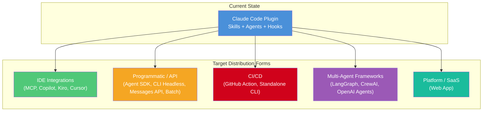

---

## 2. Current Architecture & Claude Code Bindings

### 2.1 Assessment Pipeline

The plugin implements a 10-phase STRIDE threat modeling pipeline orchestrated by a multi-agent system:

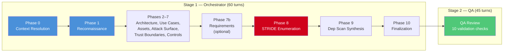

### 2.2 Agent Communication

All inter-agent communication happens through **shared files on disk** — no network calls, no message passing:

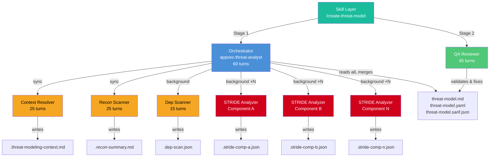

### 2.3 Claude Code–Specific Bindings

| Binding | Files | What It Does | Portability |
|---------|-------|-------------|-------------|
| **Agent Definitions** (Markdown + frontmatter) | 6 files in `agents/` | System prompts with model, turn limits, tool lists | High — prompts are text |
| **Agent Tool** (`Agent()` calls) | Referenced in orchestrator + skill | Spawns sub-agents with `run_in_background` | **Blocking** — Claude Code only |
| **Skills** (Slash commands) | 2 dirs in `skills/` | User-facing entry points, two-stage orchestration | Medium — concept varies by platform |
| **Hooks** (Lifecycle events) | `hooks.json` + 2 Python scripts | Security steering, event logging, cost tracking | Medium — event model varies |
| **Bash Allowlist** | `.claude/settings.json` | Restricts agent shell access | Low effort — security config |
| **Plugin Manifest** | `.claude-plugin/plugin.json` | Metadata, agent/skill registration | Low effort — rewrite per platform |
| **Tool Usage** (Read/Write/Glob/Grep) | Everywhere in agent MDs | File system access during analysis | Medium — standard operations |

---

## 3. Portability Analysis

### 3.1 Portable Core (reusable across all targets)

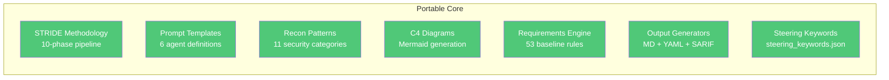

- **STRIDE methodology & phase pipeline** — framework-agnostic security analysis
- **Prompt engineering** — the 3,600+ lines of agent instructions work with any Claude-compatible API
- **Recon pattern detection** — the 11 code categories (auth, crypto, validation, etc.) are universal
- **C4 architecture modeling** — Mermaid diagrams are platform-independent
- **Requirements YAML** — structured security baseline, works anywhere
- **SARIF export** — industry standard consumed by GitHub, SonarQube, DefectDojo, etc.
- **Security steering keywords** — JSON keyword lists, trivially reusable

### 3.2 Claude Code–Specific (must be re-implemented)

- **Multi-agent orchestration** — the `Agent()` tool with `run_in_background`
- **Skill invocation** — slash command entry points
- **Hook lifecycle** — `UserPromptSubmit`, `PreToolUse`, `PostToolUse`, `Stop`
- **Tool abstraction** — `Read`, `Write`, `Glob`, `Grep` as first-class tools
- **Turn budget management** — `maxTurns` frontmatter enforcement

---

## 4. Distribution Options

---

### A — IDE Plugin Integrations

---

#### A1: MCP Server (Universal)

**Targets:** Claude Code, Claude Desktop, Cursor, Windsurf, Continue.dev, Cline, Zed, JetBrains AI, VS Code (via Copilot MCP support)

The **Model Context Protocol (MCP)** is a universal standard for connecting AI tools to external capabilities. One MCP server can serve many different AI clients simultaneously.

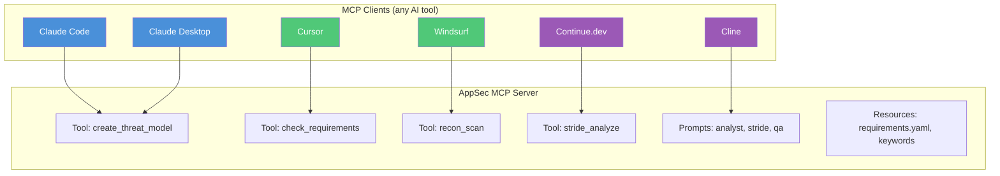

**What changes:**

| Current (Claude Code) | MCP Server |
|----------------------|------------|
| Agent definitions → | MCP **Prompts** (reusable prompt templates) |
| Skills → | MCP **Tools** (callable functions with JSON Schema) |
| Hooks → | Partially in tools, partially client-side |
| Multi-agent pipeline → | Server-side orchestration or client-driven |
| File I/O (Read/Write) → | Server executes directly on filesystem |

**Strengths:**
- One server, many clients — widest reach of any single option
- Standard protocol with rapidly growing ecosystem
- Can run locally (`stdio`) or remotely (`SSE` / `Streamable HTTP`)
- Tools can be granular (just recon) or coarse (full assessment)
- Natural fit for the plugin's file-based output model

**Weaknesses:**
- MCP tools are single invocations — orchestrating 10 phases requires either server-side state management or relying on the client to call tools sequentially
- No built-in sub-agent concept — the parallel STRIDE analyzer pattern must be implemented server-side
- Each client has different UX — no unified slash command experience
- Prompt templates require client support (not all clients implement MCP prompts)

**Effort:** Medium-High — prompts are portable, but orchestration needs rearchitecting.

See [Section 5: Deep Dive: MCP Server Implementation](#5-deep-dive-mcp-server-implementation) for detailed architecture, code examples, and deployment patterns.

---

#### A2: GitHub Copilot Extension

**Target:** VS Code, JetBrains (via GitHub Copilot Chat)

Two sub-variants:

##### A2a: Copilot Chat Participant (`@appsec`)

```
Usage in Copilot Chat:
  @appsec create threat model for this repo
  @appsec check requirements SEC-AUTH
  @appsec what's the attack surface of the auth service?
```

Registers as a **Chat Participant** in the VS Code Extension API. Reacts to `@appsec` mentions, can access workspace files, and execute terminal commands.

##### A2b: Copilot Extension (GitHub App)

Runs as a **GitHub App** server-side. Integrates into github.com Copilot Chat and IDE. Accesses repository contents via GitHub API. Can upload SARIF directly to GitHub Advanced Security.

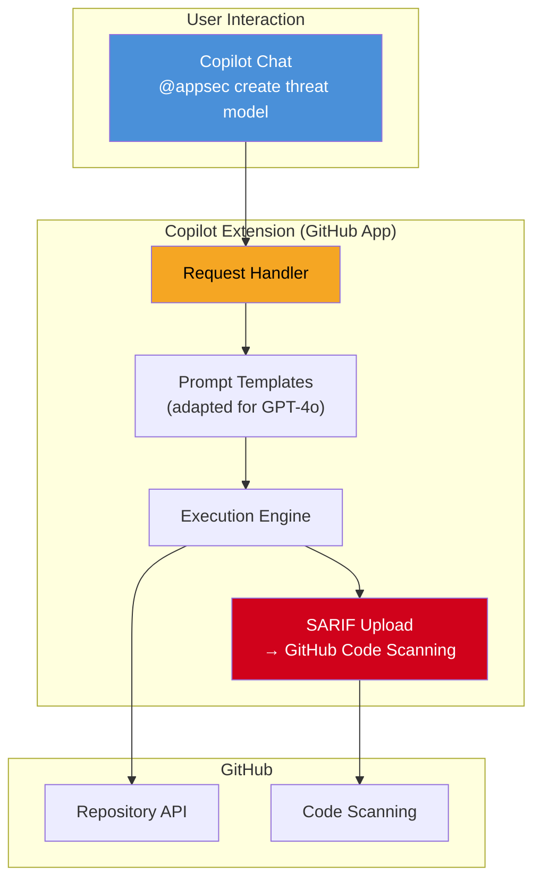

**What changes:**

| Current | Copilot Extension |
|---------|------------------|
| Agent definitions → | System prompts in the extension |
| Skills → | Chat commands (`/create-threat-model`) |
| Hooks → | VS Code event handlers or GitHub webhooks |
| Multi-agent → | Must linearize (Copilot has no sub-agent concept) |
| Claude model → | GPT-4o/o1 (prompts need adaptation) |

**Strengths:**
- Deep GitHub integration (SARIF → Code Scanning, PR comments, issue creation)
- Large user base (millions of Copilot subscribers)
- VS Code deep links work natively
- Can comment findings directly on PRs

**Weaknesses:**
- Copilot uses GPT-4o/o1 — prompts must be adapted for OpenAI models
- No agent spawning — the entire 60-turn orchestration must be flattened
- Token limits are more restrictive than Claude Code
- Copilot Extensions API is relatively new and evolving
- Vendor lock-in to GitHub ecosystem

**Effort:** High — fundamental architecture change due to missing multi-agent support.

---

#### A3: Kiro Specs & Hooks

**Target:** Kiro IDE (AWS)

Kiro uses a **spec-driven development** model with Requirements → Design → Tasks. This maps conceptually well to the threat modeling pipeline.

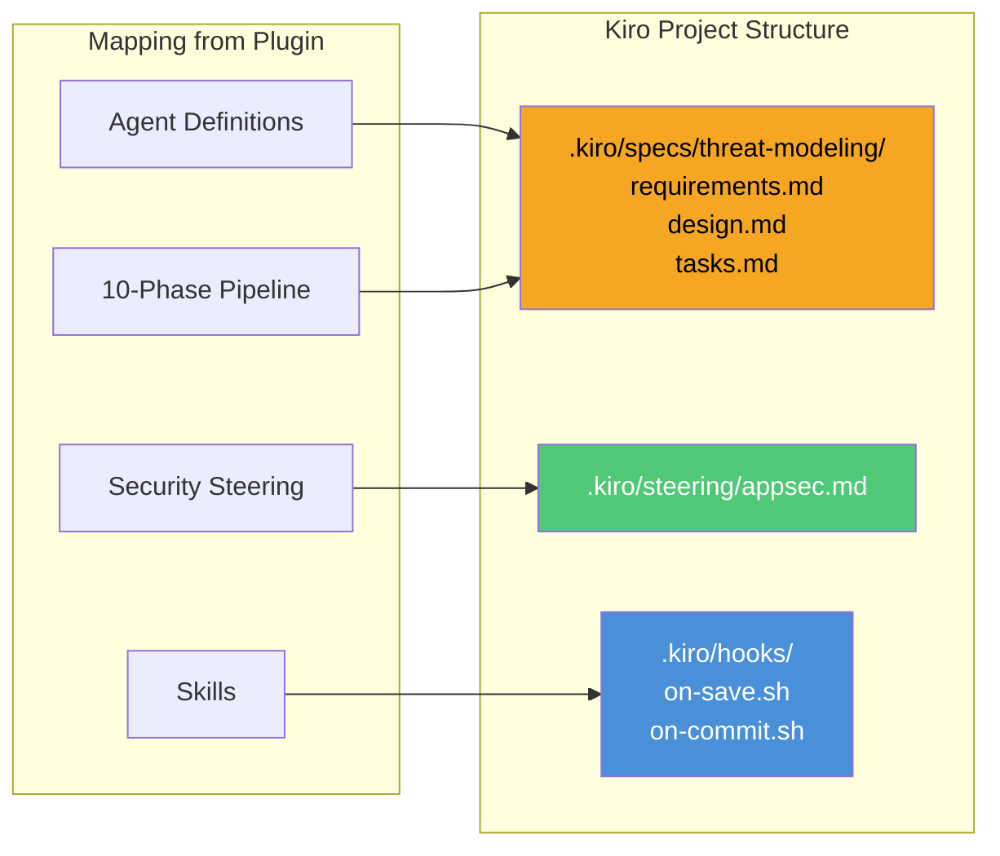

**What changes:**

| Current | Kiro |
|---------|------|
| Agent definitions → | Kiro Specs (Requirements → Design → Tasks) |
| Skills → | Kiro Hooks (event-triggered actions) |
| Security steering → | `steering/` files (agent guidance) |
| 10-phase pipeline → | Task list in specs |

**Strengths:**
- Kiro's spec system is a conceptual fit (requirements → design → implementation)
- Hooks for automatic triggers on code changes
- AWS ecosystem integration (CodeGuru, Security Hub, Bedrock)
- Spec-driven approach aligns with security compliance workflows

**Weaknesses:**
- Kiro is very new — plugin/extension API not yet stable
- Small user base compared to VS Code ecosystem
- No official plugin distribution system
- Multi-agent orchestration capabilities unclear
- Risk of investing in an immature platform

**Effort:** Medium — good conceptual mapping, but platform immaturity adds risk.

---

#### A4: Cursor / Windsurf Rules (Lite)

**Target:** Cursor, Windsurf/Codeium

The simplest possible distribution: Markdown files that inject context into the AI assistant.

```
.cursor/rules/
├── appsec-threat-modeling.mdc     # Main analysis instructions
├── appsec-security-steering.mdc   # Secure-by-default context
└── appsec-requirements.mdc        # Requirement verification rules

.windsurfrules                      # Equivalent for Windsurf
```

**What changes:**

| Current | Cursor/Windsurf Rules |
|---------|----------------------|
| Agent definitions → | Rules (Markdown context files) |
| Skills → | Manual prompts (no slash command system) |
| Hooks → | Not available (rules are passive) |
| Multi-agent → | Not possible (single-agent model) |
| Orchestration → | User manually navigates through phases |

**Strengths:**
- Extremely simple to create (copy and adapt Markdown)
- No infrastructure required
- Quick entry point for evaluation
- Rules are version-controlled with the repo

**Weaknesses:**
- Not a real plugin — just context injection
- No orchestration, no multi-agent, no hooks, no automation
- User must manually walk through phases
- No distribution mechanism (copy-paste per repo)
- Severely reduced functionality vs. original
- No structured output (YAML, SARIF)

**Effort:** Low — but delivers a significantly reduced "lite" experience only.

---

### B — Programmatic / API-Driven

---

#### B1: Claude Agent SDK (Python / TypeScript)

**Target:** Any server, CI/CD pipeline, backend service

The Agent SDK provides the **closest 1:1 mapping** to the current Claude Code architecture. It offers the same primitives — `Agent`, `Read`, `Write`, `Glob`, `Grep`, `Bash` — as a programmatic API.

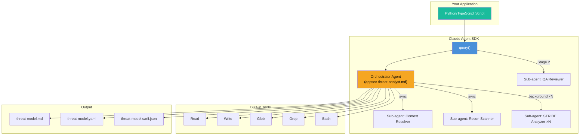

**Example usage (Python):**

```python
from claude_agent_sdk import query, ClaudeAgentOptions, AgentDefinition

# Load agent prompts from existing Markdown files
orchestrator_prompt = open("agents/appsec-threat-analyst.md").read()
context_prompt = open("agents/appsec-context-resolver.md").read()
recon_prompt = open("agents/appsec-recon-scanner.md").read()
stride_prompt = open("agents/appsec-stride-analyzer.md").read()
qa_prompt = open("agents/appsec-qa-reviewer.md").read()

async for message in query(
    prompt="Create a STRIDE threat model for this repository. Write --yaml and --sarif.",
    options=ClaudeAgentOptions(
        model="claude-sonnet-4-6",
        max_turns=60,
        system_prompt=orchestrator_prompt,
        agents={
            "context-resolver": AgentDefinition(
                description="Aggregates business context, security docs, API specs",
                prompt=context_prompt,
                tools=["Read", "Glob", "Bash", "Write"],
                model="sonnet",
                max_turns=25,
            ),
            "recon-scanner": AgentDefinition(
                description="Scans repository structure and security patterns",
                prompt=recon_prompt,
                tools=["Read", "Glob", "Grep", "Bash", "Write"],
                model="sonnet",
                max_turns=25,
            ),
            "stride-analyzer": AgentDefinition(
                description="Per-component STRIDE threat analysis",
                prompt=stride_prompt,
                tools=["Read", "Glob", "Grep", "Bash", "Write"],
                model="sonnet",
                max_turns=31,
            ),
            "qa-reviewer": AgentDefinition(
                description="Validates and fixes the threat model output",
                prompt=qa_prompt,
                tools=["Read", "Glob", "Grep", "Write"],
                model="sonnet",
                max_turns=45,
            ),
        },
        allowed_tools=["Read", "Write", "Glob", "Grep", "Bash", "Agent"],
        hooks={
            "PostToolUse": [log_file_changes],
            "Stop": [log_session_cost],
        },
    ),
):
    if hasattr(message, 'result'):
        print(message.result)
```

**What changes:**

| Current | Agent SDK |
|---------|-----------|
| Agent Markdown files → | Loaded as prompt strings (unchanged) |
| Agent tool → | SDK's built-in `Agent` with sub-agents |
| Skills → | Python/TypeScript function calls |
| Hooks → | SDK hook callbacks |
| Turn budgets → | `max_turns` parameter per agent |
| File I/O → | SDK's built-in Read/Write/Glob/Grep |

**Strengths:**
- **Near-1:1 port** — agent definitions (Markdown) stay identical
- Sub-agent spawning, background execution, turn budgets — all native
- Hooks system available (PreToolUse, PostToolUse, Stop)
- No Claude Code installation needed — pure Python/TypeScript package
- Programmable orchestration (custom retry logic, checkpointing, parallelization)
- Session resumption for interrupted assessments
- Deployable as a backend service, Lambda function, or batch worker

**Weaknesses:**
- Requires `ANTHROPIC_API_KEY` (direct API costs, no subscription model)
- No IDE integration (no slash commands, no chat UI)
- Claude-locked (no OpenAI/Ollama fallback)
- Must handle auth, rate limiting, and error recovery in application code

**Effort:** **Low-Medium** — lowest porting effort of all options due to architectural match.

---

#### B2: Claude Code CLI Headless (`claude -p`)

**Target:** Any system with Claude Code installed — scripts, CI/CD, cron jobs

**Zero code changes required.** The existing plugin works unmodified in headless mode:

```bash
# Full threat model assessment (the plugin runs as-is)
claude -p "/appsec-plugin:create-threat-model --yaml --sarif" \
  --plugin-dir ./plugin \
  --allowedTools "Read,Write,Glob,Grep,Bash,Agent" \
  --max-turns 120 \
  --output-format json

# Dry-run for scoping
claude -p "/appsec-plugin:create-threat-model --dry-run" \
  --plugin-dir ./plugin \
  --output-format json | jq '.result'

# Requirements check only
claude -p "/appsec-plugin:check-appsec-requirements SEC-AUTH --json" \
  --plugin-dir ./plugin \
  --output-format json

# With budget cap
claude -p "/appsec-plugin:create-threat-model --yaml --sarif" \
  --plugin-dir ./plugin \
  --max-budget-usd 5.00 \
  --permission-mode bypassPermissions \
  --bare
```

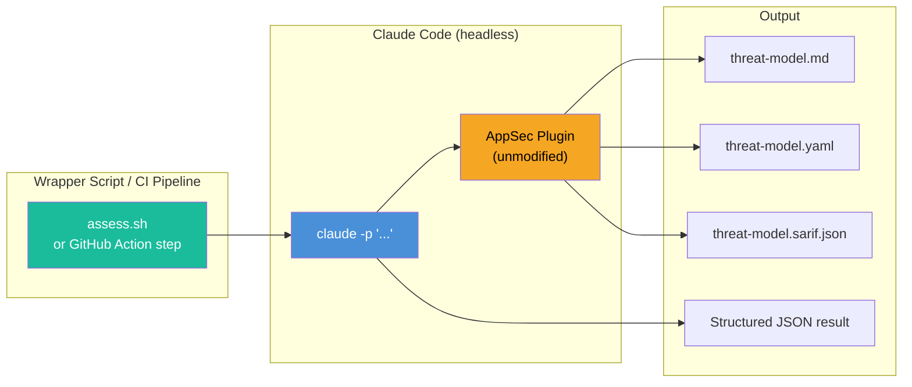

**What changes:** Nothing — the plugin runs unmodified.

**Strengths:**
- **Zero porting effort** — the plugin works as-is right now
- All features available (multi-agent, hooks, skills, checkpointing)
- Budget limiting (`--max-budget-usd`)
- JSON output for downstream processing
- Session resumption on failure (`--resume`)
- `--bare` mode for deterministic CI/CD runs

**Weaknesses:**
- Requires Claude Code installation on host (Node.js runtime)
- Heavyweight for CI/CD (full Claude Code bootstrap per run)
- Not distributable as an npm/pip package (requires plugin directory)
- Tied to Claude Code release cycle

**Effort:** **Minimal** — wrapper script only.

---

#### B3: Claude Messages API (Low-Level)

**Target:** Custom applications needing full control over LLM interaction

Implement the entire agentic loop yourself using the raw Anthropic Messages API. You define tools, execute them, and manage the conversation state.

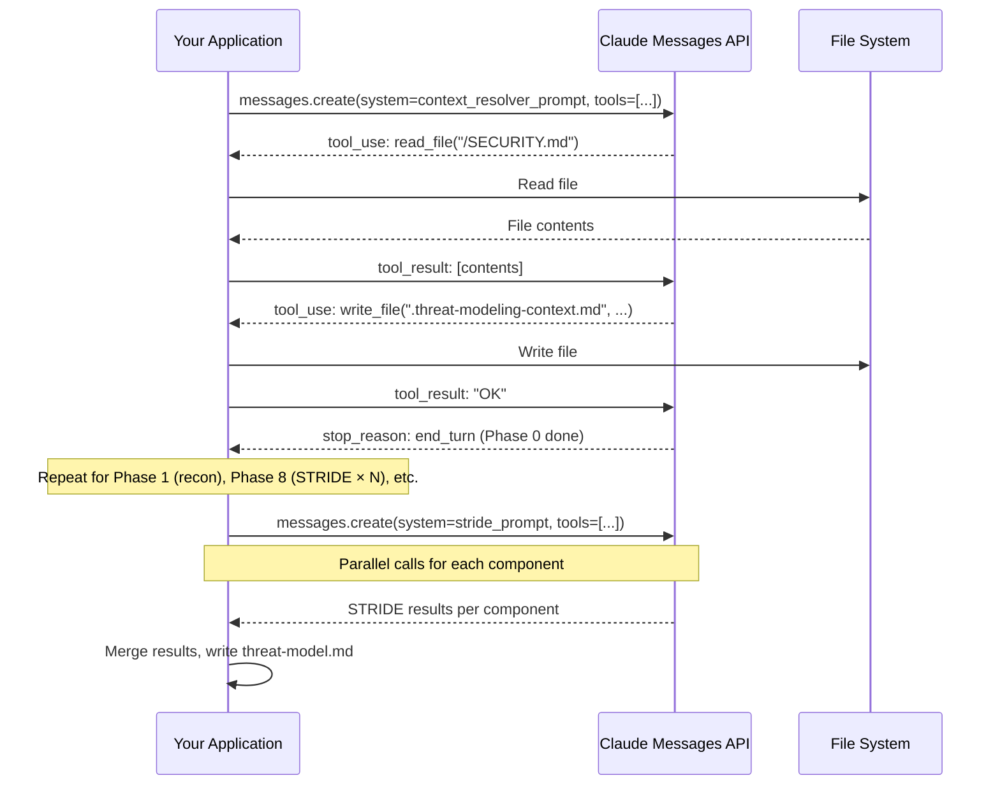

**What changes:**

| Current | Messages API |
|---------|-------------|
| Agent definitions → | System prompts (loaded from same Markdown) |
| Agent tool → | Custom multi-call orchestration in your code |
| All tools → | You implement tool executors (read, write, glob, grep, bash) |
| Turn management → | Your loop counter |
| Sub-agents → | Separate API calls with different system prompts |

**Strengths:**
- **Maximum control** over token management, caching, retry logic
- Can use Extended Thinking, prompt caching, streaming
- No framework lock-in (trivially portable to OpenAI, Gemini, Ollama)
- Fine-grained cost optimization (cache reads at $0.30/1M vs $3.00/1M)
- Can implement custom security sandboxing for tool execution

**Weaknesses:**
- Highest development effort — you build everything from scratch
- Must implement: tool executor, agentic loop, message history management, error recovery
- No built-in file system sandboxing
- Error-prone (message format, token limits, conversation management)
- All reliability features (checkpoint, retry, locking) must be reimplemented

**Effort:** **High** — but provides maximum flexibility.

---

#### B4: Claude Batch API (Multi-Repo)

**Target:** Nightly scans, fleet-wide assessments, cost-sensitive bulk processing

The Batch API processes requests asynchronously at **50% cost reduction**. Ideal for scanning many repositories without time pressure.

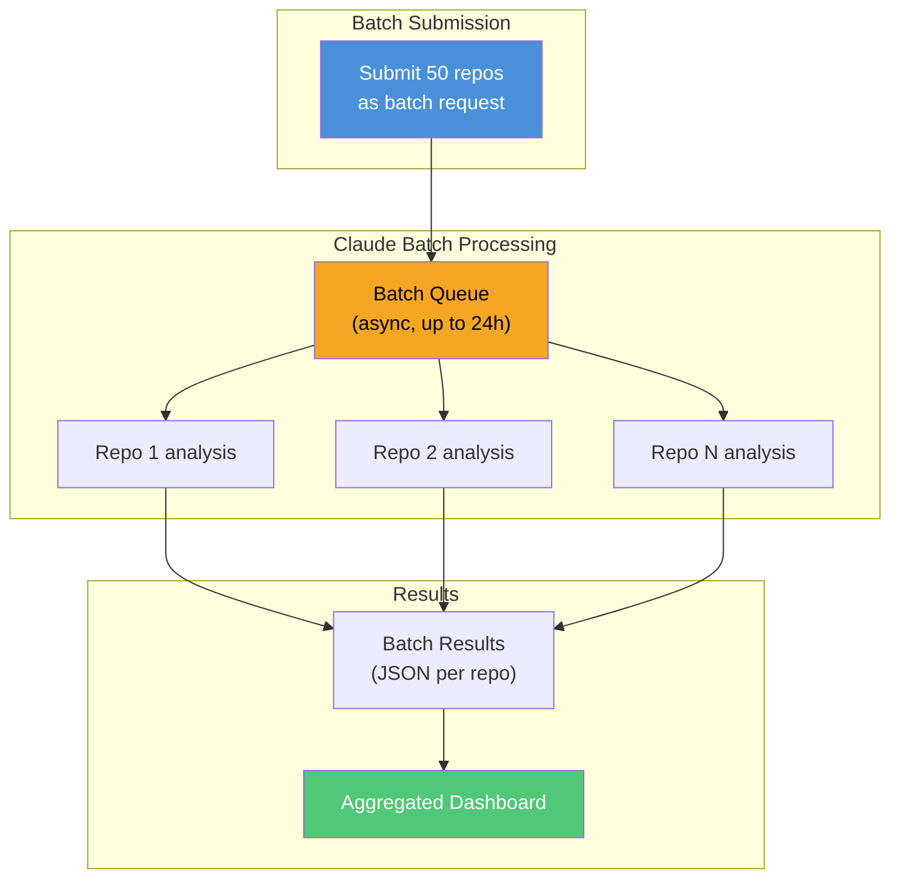

**Critical limitation:** The Batch API does **not support tool calls**. It is text-in, text-out only. This means:

- It **cannot** run the full 10-phase pipeline (which requires file system access)
- It **can** process pre-collected repository data (e.g., recon summaries) through STRIDE analysis
- Best used as a **hybrid approach** where Phases 0–1 run interactively and Phase 8 runs in batch

**Hybrid cost optimization pattern:**

```
Phase 0–1:  Agent SDK (interactive, needs file access)  → Full price
Phase 2–7:  Agent SDK (orchestrator with tools)          → Full price
Phase 8:    Batch API (STRIDE per component, text only)  → 50% discount
Phase 9–10: Agent SDK (merge + finalization)             → Full price
```

**Strengths:**
- 50% cost reduction for batch-eligible phases
- Process hundreds of repos in parallel
- No rate limiting concerns (batches are queued)
- Ideal for nightly/weekly org-wide scans

**Weaknesses:**
- No tool use — only processes pre-collected text input
- Results delivered in 2–24 hours (not real-time)
- Must pre-collect all context before submission
- Partial pipeline coverage only

**Effort:** **Medium** — useful as an optimization layer on top of Agent SDK or Messages API.

---

### C — CI/CD & Automation

---

#### C1: GitHub Action

**Target:** GitHub CI/CD pipelines

```yaml
# .github/workflows/threat-model.yml
name: Threat Model Assessment
on:
  pull_request:
    types: [opened, synchronize]
  schedule:
    - cron: '0 2 * * 1'  # Weekly Monday 2am

jobs:
  threat-model:
    runs-on: ubuntu-latest
    permissions:
      contents: write
      security-events: write

    steps:
      - uses: actions/checkout@v4

      - uses: your-org/appsec-threat-model-action@v1
        with:
          mode: incremental       # Only changed components on PRs
          sarif: true
          requirements: true
          max_budget_usd: 5.00
        env:
          ANTHROPIC_API_KEY: ${{ secrets.ANTHROPIC_API_KEY }}

      - uses: github/codeql-action/upload-sarif@v3
        if: always()
        with:
          sarif_file: docs/security/threat-model.sarif.json
```

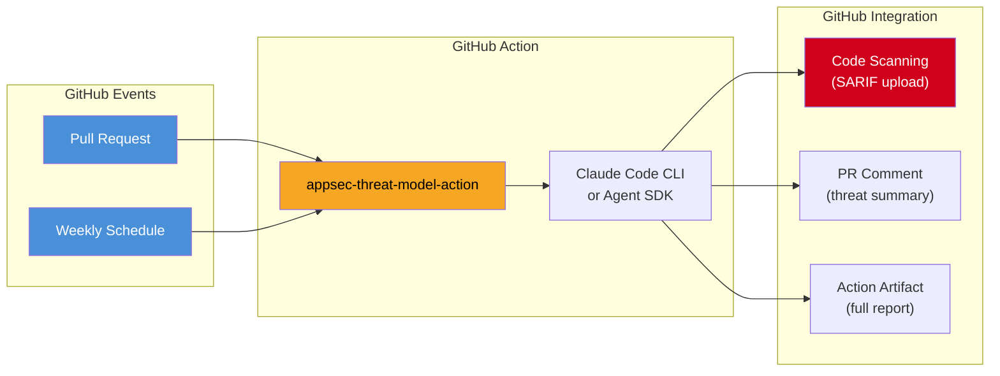

**Strengths:**
- Automated on every PR (incremental mode) or on schedule (full assessment)
- SARIF → GitHub Code Scanning (threats appear inline in PR diff)
- Scales across all repos in an organization
- Threat model as CI artifact for compliance audits

**Weaknesses:**
- Requires standalone CLI or Agent SDK as underlying engine
- API costs per PR run (mitigated by incremental mode + budget caps)
- Not interactive — no clarifying questions
- Long-running (may exceed GitHub Actions timeouts for large repos)

**Effort:** **Medium** (builds on top of B1 or B2).

---

#### C2: Standalone CLI Tool

**Target:** Any terminal, any CI system, any operating system

A self-contained command-line tool with the pipeline logic baked in:

```bash
npx appsec-threat-model assess --repo . --yaml --sarif --requirements
npx appsec-threat-model check-requirements --repo . --category SEC-AUTH
npx appsec-threat-model assess --repo . --dry-run
npx appsec-threat-model assess --repo . --incremental
```

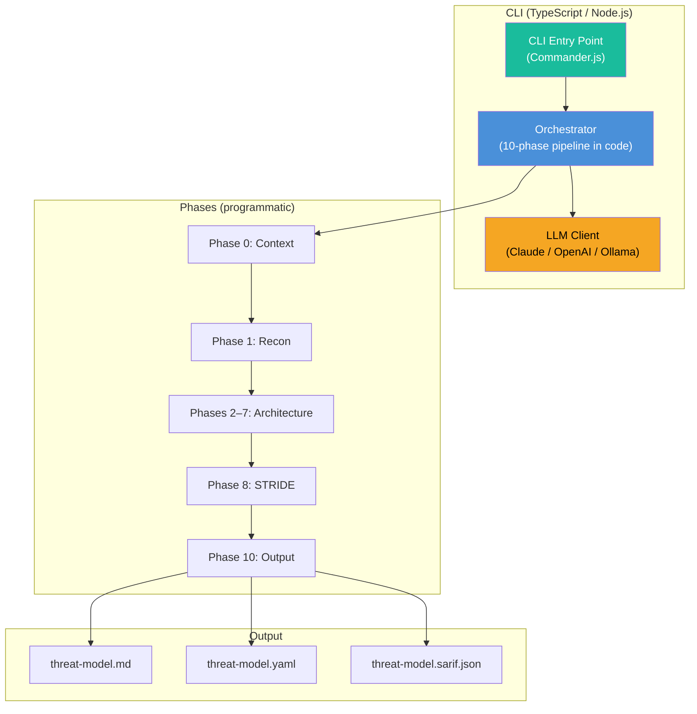

**Strengths:**
- Complete control over orchestration, error handling, output
- LLM-agnostic (Claude API, OpenAI, local models via Ollama)
- npm package → simple distribution (`npx`, `npm install -g`)
- CI/CD native (works in any pipeline, not just GitHub)
- No IDE dependency
- Can enforce strict determinism (same input → same structure)

**Weaknesses:**
- Highest development effort (entire orchestration in application code)
- Requires API keys (no embedded LLM access)
- Loses interactive character (no clarifying questions, no iterative refinement)
- Must re-implement all tool execution (file reading, code search, etc.)

**Effort:** **High** — but maximum flexibility and distributableness.

---

### D — Multi-Agent Frameworks

---

#### D1: LangGraph / LangChain

**Target:** Teams wanting LLM-agnostic multi-agent orchestration

LangGraph models the 10-phase pipeline as a **directed graph** where each phase is a node and data flows through edges. Supports Claude, GPT, Gemini, Llama, and any LangChain-compatible model.

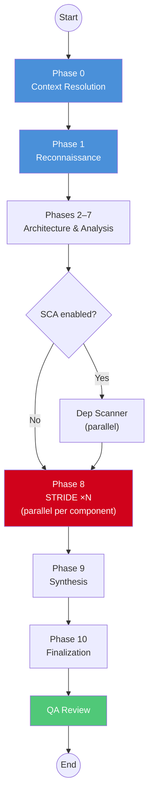

```python
from langgraph.graph import StateGraph, END
from langchain_anthropic import ChatAnthropic

class ThreatModelState(TypedDict):
    repo_path: str
    context: str
    recon_summary: str
    components: list[dict]
    stride_results: list[dict]
    threat_model_md: str
    threat_model_yaml: str

def phase_0_context(state: ThreatModelState) -> dict:
    llm = ChatAnthropic(model="claude-sonnet-4-6-20250514")
    prompt = load_prompt("appsec-context-resolver.md")
    # ... tool execution, file reading ...
    return {"context": result}

graph = StateGraph(ThreatModelState)
graph.add_node("context", phase_0_context)
graph.add_node("recon", phase_1_recon)
graph.add_node("architecture", phases_2_7)
graph.add_node("stride", phase_8_stride)    # Parallel per component
graph.add_node("synthesis", phase_9)
graph.add_node("finalize", phase_10)
graph.add_node("qa", qa_review)

graph.add_edge("context", "recon")
graph.add_edge("recon", "architecture")
graph.add_edge("architecture", "stride")
graph.add_edge("stride", "synthesis")
graph.add_edge("synthesis", "finalize")
graph.add_edge("finalize", "qa")
graph.add_edge("qa", END)

graph.set_entry_point("context")
app = graph.compile()
result = app.invoke({"repo_path": "/path/to/repo"})
```

**Strengths:**
- LLM-agnostic (Claude, GPT-4o, Gemini, Llama, Mistral — same graph)
- LangGraph Studio: visual graph editor for debugging
- LangSmith observability (traces, costs, latency dashboards)
- Native checkpoint/resume (persistence layer)
- Parallel node execution for Phase 8 STRIDE
- Growing ecosystem with community tools and integrations

**Weaknesses:**
- Tool execution (file access, code search) must be self-implemented
- Additional dependency chain (langchain, langgraph, langsmith)
- Prompts may need adaptation for non-Claude models
- Abstraction overhead compared to direct API usage
- Learning curve for the graph state model

**Effort:** **Medium-High**

---

#### D2: CrewAI

**Target:** Python teams wanting the simplest multi-agent framework

CrewAI's concept of **Agents + Tasks + Crew** maps almost directly to the plugin's architecture:

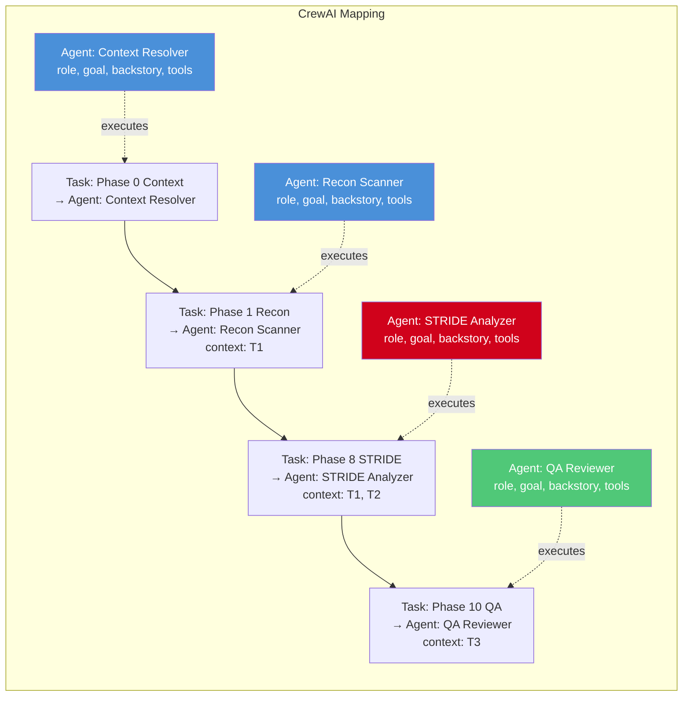

```python
from crewai import Agent, Task, Crew, Process

context_resolver = Agent(
    role="Security Context Analyst",
    goal="Aggregate all security-relevant context",
    backstory=open("agents/appsec-context-resolver.md").read(),
    llm="anthropic/claude-sonnet-4-6-20250514",
    tools=[FileReadTool(), DirectorySearchTool(), ShellTool()],
    max_iter=25
)

# ... define other agents ...

crew = Crew(
    agents=[context_resolver, recon_scanner, stride_analyzer, qa_reviewer],
    tasks=[context_task, recon_task, stride_task, qa_task],
    process=Process.sequential,
    verbose=True
)

result = crew.kickoff(inputs={"repo_path": "/path/to/repo"})
```

**Strengths:**
- Conceptually near-identical to the plugin (agents, tasks, sequential pipeline)
- LLM-agnostic (Claude, GPT, Gemini, local models)
- Built-in logging and memory
- Simple API — easy to learn and prototype
- Active community

**Weaknesses:**
- Less granular control than LangGraph
- Tool ecosystem smaller than LangChain
- Less battle-tested in production environments
- Limited graph-based branching (sequential or hierarchical only)

**Effort:** **Medium**

---

#### D3: OpenAI Agents SDK

**Target:** Teams using GPT-4o / o1 or wanting OpenAI ecosystem compatibility

```python
from openai_agents import Agent, Runner

context_agent = Agent(
    name="Context Resolver",
    instructions=open("agents/appsec-context-resolver.md").read(),
    model="gpt-4o",
    tools=[file_read, glob_search, shell_exec]
)

stride_agent = Agent(
    name="STRIDE Analyzer",
    instructions=open("agents/appsec-stride-analyzer.md").read(),
    model="gpt-4o",
    tools=[file_read, code_search]
)

orchestrator = Agent(
    name="Threat Model Orchestrator",
    instructions=open("agents/appsec-threat-analyst.md").read(),
    model="gpt-4o",
    handoffs=[context_agent, stride_agent]
)

result = Runner.run_sync(orchestrator, "Create threat model for this repo")
```

**Strengths:**
- Access to OpenAI ecosystem (GPT-4o, o1, GPT-4.1)
- `handoffs` pattern for agent delegation
- Built-in tracing and guardrails
- Large ecosystem of OpenAI-compatible tools

**Weaknesses:**
- Prompts must be adapted for GPT models (different strengths/weaknesses)
- Tool execution model differs from Claude Code
- Less capable at complex code analysis than Claude Sonnet (for this specific task)
- Vendor lock-in to OpenAI

**Effort:** **Medium** — prompt adaptation is the main work.

---

### E — Platform / Product

---

#### E1: Web Application / SaaS

**Target:** Security teams, compliance auditors, engineering organizations

A self-hosted or cloud-hosted platform with a web UI for managing threat model assessments:

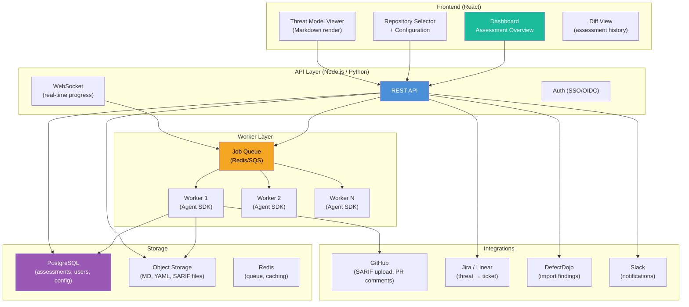

**Strengths:**
- Richest user experience (dashboard, history, diff, collaboration)
- Multi-tenant (serve entire organizations)
- Integration hub (GitHub, Jira, DefectDojo, Slack)
- Assessment scheduling and automation
- Audit trail and compliance reporting
- Custom branding, access control, team management

**Weaknesses:**
- Highest development and operational effort
- Infrastructure costs (hosting, database, queue, storage)
- Security responsibility (handling API keys, user data)
- Needs ongoing maintenance and support

**Effort:** **Very High** — but highest business value as a product.

---

## 5. Deep Dive: MCP Server Implementation

The MCP server option warrants detailed exploration because it offers the **best reach-to-effort ratio** for IDE integrations. This section covers architecture, tool design, deployment, and usage patterns.

### 5.1 Architecture Overview

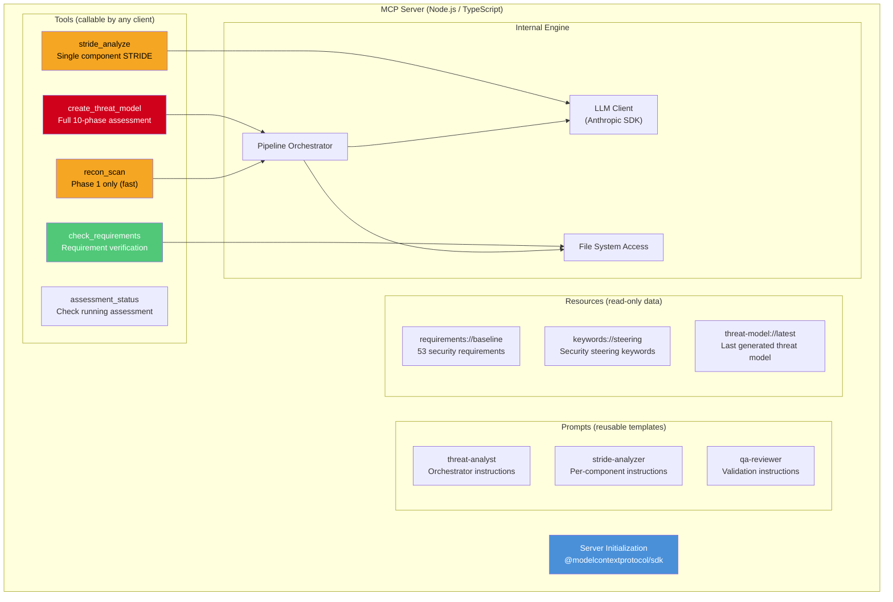

### 5.2 Project Structure

```
appsec-mcp-server/
├── src/
│   ├── index.ts                       # Server entry point
│   ├── server.ts                      # MCP server setup (stdio + SSE)
│   ├── tools/
│   │   ├── create-threat-model.ts     # Full assessment orchestration
│   │   ├── recon-scan.ts              # Lightweight repo scan
│   │   ├── stride-analyze.ts          # Single-component STRIDE
│   │   ├── check-requirements.ts      # Requirement verification
│   │   └── assessment-status.ts       # Progress tracking
│   ├── prompts/
│   │   ├── threat-analyst.ts          # From agents/appsec-threat-analyst.md
│   │   ├── context-resolver.ts        # From agents/appsec-context-resolver.md
│   │   ├── recon-scanner.ts           # From agents/appsec-recon-scanner.md
│   │   ├── stride-analyzer.ts         # From agents/appsec-stride-analyzer.md
│   │   └── qa-reviewer.ts            # From agents/appsec-qa-reviewer.md
│   ├── resources/
│   │   ├── requirements.ts            # Serve requirements YAML
│   │   ├── steering-keywords.ts       # Serve keyword lists
│   │   └── threat-model.ts            # Serve latest threat model
│   ├── engine/
│   │   ├── orchestrator.ts            # 10-phase pipeline logic
│   │   ├── recon.ts                   # Repository scanning logic
│   │   ├── stride.ts                  # STRIDE analysis logic
│   │   └── output.ts                  # MD/YAML/SARIF generators
│   └── utils/
│       ├── llm-client.ts              # Anthropic API wrapper
│       ├── file-tools.ts              # Read/Write/Glob/Grep implementations
│       └── checkpoint.ts              # Assessment state management
├── prompts/                           # Raw prompt markdown (copied from plugin/agents/)
│   ├── appsec-threat-analyst.md
│   ├── appsec-context-resolver.md
│   ├── appsec-recon-scanner.md
│   ├── appsec-stride-analyzer.md
│   └── appsec-qa-reviewer.md
├── data/
│   └── appsec-requirements-fallback.yaml
├── package.json
├── tsconfig.json
└── README.md
```

### 5.3 Tool Definitions

Each MCP tool has a JSON Schema input definition and returns structured results:

#### `create_threat_model` — Full Assessment

```typescript
// Tool registration
server.setRequestHandler(CallToolRequestSchema, async (request) => {
  if (request.params.name === "create_threat_model") {
    const { repo_path, flags } = request.params.arguments;
    // flags: { yaml?: boolean, sarif?: boolean, requirements?: boolean,
    //          with_sca?: boolean, dry_run?: boolean, incremental?: boolean }

    const result = await orchestrator.run({
      repoPath: repo_path,
      writeYaml: flags?.yaml ?? false,
      writeSarif: flags?.sarif ?? false,
      checkRequirements: flags?.requirements ?? false,
      withSca: flags?.with_sca ?? false,
      dryRun: flags?.dry_run ?? false,
      incremental: flags?.incremental ?? false,
      onProgress: (phase, status) => {
        // MCP progress notifications (if client supports them)
        server.notification({
          method: "notifications/progress",
          params: { progressToken, progress: phase, total: 10 }
        });
      }
    });

    return {
      content: [{
        type: "text",
        text: JSON.stringify({
          status: "completed",
          files_written: result.filesWritten,
          threat_count: result.threatCount,
          severity_summary: result.severitySummary,
          duration_seconds: result.durationSeconds
        })
      }]
    };
  }
});
```

**Input Schema:**
```json
{
  "type": "object",
  "properties": {
    "repo_path": {
      "type": "string",
      "description": "Absolute path to the repository to analyze"
    },
    "flags": {
      "type": "object",
      "properties": {
        "yaml":         { "type": "boolean", "description": "Write threat-model.yaml" },
        "sarif":        { "type": "boolean", "description": "Write threat-model.sarif.json" },
        "requirements": { "type": "boolean", "description": "Run Phase 7b compliance check" },
        "with_sca":     { "type": "boolean", "description": "Run dependency scanner" },
        "dry_run":      { "type": "boolean", "description": "Phases 0–1 only, print scope" },
        "incremental":  { "type": "boolean", "description": "Delta analysis (changed files only)" }
      }
    }
  },
  "required": ["repo_path"]
}
```

#### `recon_scan` — Quick Repository Analysis

A lightweight tool for fast scoping — runs only Phase 0 + Phase 1:

```json
{
  "name": "recon_scan",
  "description": "Quick security reconnaissance of a repository. Returns tech stack, components, entry points, and security-relevant patterns without running full STRIDE analysis. Fast (1–2 minutes).",
  "inputSchema": {
    "type": "object",
    "properties": {
      "repo_path": { "type": "string" }
    },
    "required": ["repo_path"]
  }
}
```

#### `stride_analyze` — Single Component Analysis

Useful for targeted analysis of a specific service or module:

```json
{
  "name": "stride_analyze",
  "description": "Run STRIDE threat analysis on a single component. Returns threat list with severity, affected assets, and mitigations.",
  "inputSchema": {
    "type": "object",
    "properties": {
      "repo_path":     { "type": "string" },
      "component_id":  { "type": "string", "description": "Slug identifier (e.g. 'auth-service')" },
      "component_name": { "type": "string", "description": "Human-readable name" },
      "interfaces":    { "type": "array", "items": { "type": "string" }, "description": "Entry points and APIs" },
      "trust_boundaries": { "type": "array", "items": { "type": "string" } },
      "controls":      { "type": "string", "description": "Existing security controls description" }
    },
    "required": ["repo_path", "component_id", "component_name"]
  }
}
```

#### `check_requirements` — Requirement Verification

```json
{
  "name": "check_requirements",
  "description": "Verify security requirements (SEC-*) against codebase. Returns pass/fail per requirement with evidence and remediation.",
  "inputSchema": {
    "type": "object",
    "properties": {
      "repo_path": { "type": "string" },
      "category":  { "type": "string", "description": "Filter to category (e.g. 'SEC-AUTH')" },
      "output_format": { "type": "string", "enum": ["text", "json", "markdown"] }
    },
    "required": ["repo_path"]
  }
}
```

### 5.4 Prompt Templates (MCP Prompts)

MCP Prompts are reusable prompt templates that clients can discover and use. They map directly to the agent Markdown definitions:

```typescript
server.setRequestHandler(GetPromptRequestSchema, async (request) => {
  if (request.params.name === "threat-analyst") {
    const promptText = await fs.readFile("prompts/appsec-threat-analyst.md", "utf-8");
    return {
      description: "STRIDE threat modeling orchestrator for repository analysis",
      messages: [
        {
          role: "user",
          content: {
            type: "text",
            text: `You are a security threat analyst. Follow these instructions:\n\n${promptText}\n\nAnalyze the repository at: ${request.params.arguments?.repo_path ?? "the current directory"}`
          }
        }
      ]
    };
  }
});
```

Clients that support MCP prompts (e.g., Claude Desktop) can list and invoke them directly. Clients that don't (e.g., some Cursor versions) still use the tools.

### 5.5 Resources (Read-Only Data)

```typescript
server.setRequestHandler(ReadResourceRequestSchema, async (request) => {
  const uri = request.params.uri;

  if (uri === "requirements://baseline") {
    const yaml = await fs.readFile("data/appsec-requirements-fallback.yaml", "utf-8");
    return {
      contents: [{ uri, mimeType: "application/yaml", text: yaml }]
    };
  }

  if (uri === "threat-model://latest") {
    const md = await fs.readFile("docs/security/threat-model.md", "utf-8");
    return {
      contents: [{ uri, mimeType: "text/markdown", text: md }]
    };
  }
});
```

### 5.6 Orchestration Strategy

The key challenge: MCP tools are **single invocations**, but the assessment is a **multi-step pipeline**. Two architectural approaches:

#### Approach A: Server-Side Orchestration (Recommended)

The `create_threat_model` tool runs the entire 10-phase pipeline internally, using the Anthropic API for LLM calls. The MCP client waits for completion.

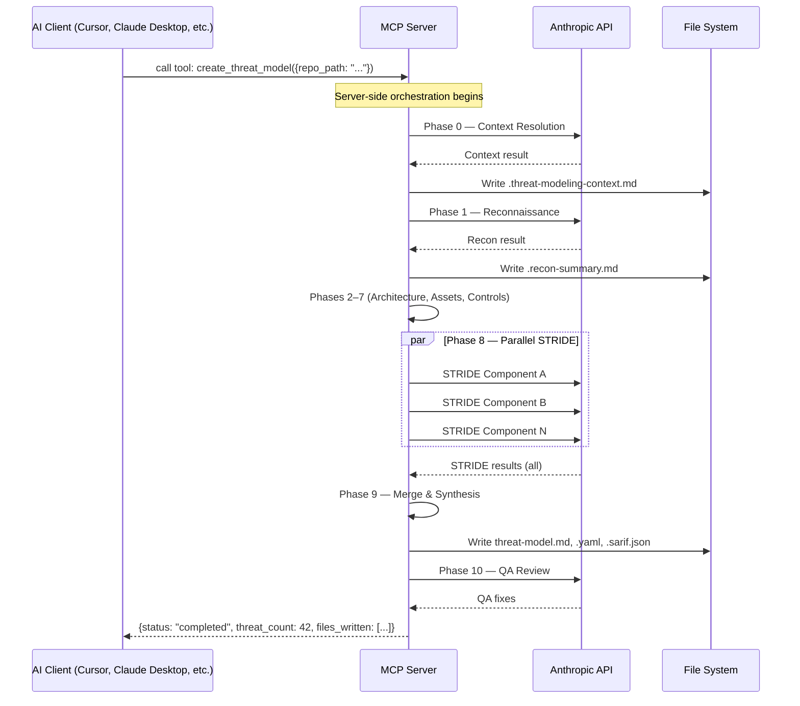

**Pros:** Clean single-tool UX, full control over pipeline, parallel STRIDE execution.
**Cons:** Long-running tool call (10–30 min), requires Anthropic API key on server side, client must tolerate long waits.

#### Approach B: Client-Driven Orchestration

Expose granular tools (`recon_scan`, `stride_analyze`, etc.) and let the AI client decide the execution order using prompt guidance.

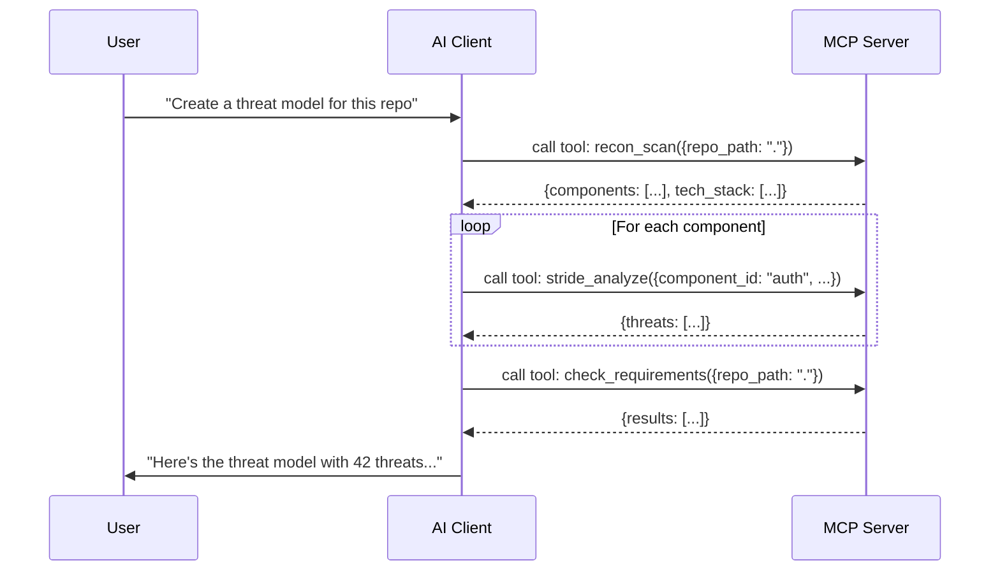

**Pros:** No server-side API key needed (client's LLM does the analysis), granular tool usage, faster per-tool responses.
**Cons:** Depends on client AI correctly orchestrating the pipeline, may skip phases, no guaranteed output format.

#### Recommended: Hybrid Approach

Offer **both** — the full `create_threat_model` tool for automated runs, and granular tools (`recon_scan`, `stride_analyze`, `check_requirements`) for interactive use.

### 5.7 Transport & Deployment

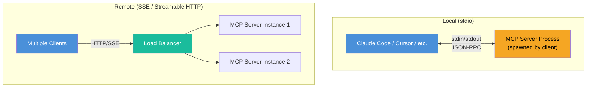

#### Local Transport (stdio) — for individual developers

```json
// claude_desktop_config.json or .cursor/mcp.json
{
  "mcpServers": {
    "appsec": {
      "command": "npx",
      "args": ["-y", "@your-org/appsec-mcp-server"],
      "env": {
        "ANTHROPIC_API_KEY": "sk-ant-..."
      }
    }
  }
}
```

#### Remote Transport (SSE) — for teams

```json
{
  "mcpServers": {
    "appsec": {
      "url": "https://appsec-mcp.your-org.internal/sse",
      "headers": {
        "Authorization": "Bearer <team-token>"
      }
    }
  }
}
```

### 5.8 Client Configuration Examples

#### Claude Code

```json
// .claude/settings.json (project-level)
{
  "mcpServers": {
    "appsec": {
      "command": "npx",
      "args": ["-y", "@your-org/appsec-mcp-server"],
      "env": { "ANTHROPIC_API_KEY": "${ANTHROPIC_API_KEY}" }
    }
  }
}
```

Usage in Claude Code:
```
> Use the appsec tool to create a threat model for this repository with SARIF output
> Use recon_scan to quickly scope this repository's security surface
> Check security requirements for the SEC-AUTH category
```

#### Claude Desktop

```json
// ~/Library/Application Support/Claude/claude_desktop_config.json
{
  "mcpServers": {
    "appsec": {
      "command": "npx",
      "args": ["-y", "@your-org/appsec-mcp-server"],
      "env": { "ANTHROPIC_API_KEY": "sk-ant-..." }
    }
  }
}
```

#### Cursor

```json
// .cursor/mcp.json (project-level)
{
  "mcpServers": {
    "appsec": {
      "command": "npx",
      "args": ["-y", "@your-org/appsec-mcp-server"]
    }
  }
}
```

Usage in Cursor:
```
> @appsec run a full threat model assessment on this project
> @appsec what's the attack surface of this codebase?
```

#### Windsurf

```json
// ~/.codeium/windsurf/mcp_config.json
{
  "mcpServers": {
    "appsec": {
      "command": "npx",
      "args": ["-y", "@your-org/appsec-mcp-server"]
    }
  }
}
```

#### Continue.dev

```json
// .continue/config.json
{
  "mcpServers": [
    {
      "name": "appsec",
      "command": "npx",
      "args": ["-y", "@your-org/appsec-mcp-server"]
    }
  ]
}
```

### 5.9 MCP Server with Agent SDK (Best of Both Worlds)

The most powerful pattern combines MCP as the **interface layer** with the Claude Agent SDK as the **execution engine**:

```mermaid
graph TD
    subgraph "MCP Interface Layer"
        T["MCP Tools<br/>(create_threat_model, recon_scan, ...)"]
        P["MCP Prompts<br/>(threat-analyst, stride-analyzer, ...)"]
        R["MCP Resources<br/>(requirements, keywords, ...)"]
    end

    subgraph "Agent SDK Engine"
        Q["query() — agentic loop"]
        O["Orchestrator Agent"]
        CR["Context Resolver"]
        RS["Recon Scanner"]
        SA["STRIDE Analyzers ×N"]
        QAR["QA Reviewer"]
    end

    subgraph "Built-in Tools"
        Read["Read"] 
        Write["Write"]
        Grep["Grep"]
        Glob["Glob"]
        Bash["Bash"]
    end

    T -->|"invokes"| Q
    Q --> O
    O -->|"spawns"| CR
    O -->|"spawns"| RS
    O -->|"spawns ×N"| SA
    Q -->|"Stage 2"| QAR
    O --> Read
    O --> Write
    O --> Grep

    style T fill:#1abc9c,color:#fff
    style Q fill:#4a90d9,color:#fff
    style O fill:#f5a623,color:#000
```

```typescript
// MCP tool handler using Agent SDK internally
import { query, ClaudeAgentOptions, AgentDefinition } from "@anthropic-ai/claude-agent-sdk";

server.setRequestHandler(CallToolRequestSchema, async (request) => {
  if (request.params.name === "create_threat_model") {
    const { repo_path, flags } = request.params.arguments;

    let finalResult = "";
    for await (const message of query({
      prompt: buildAssessmentPrompt(repo_path, flags),
      options: {
        model: "claude-sonnet-4-6",
        maxTurns: 60,
        allowedTools: ["Read", "Write", "Glob", "Grep", "Bash", "Agent"],
        agents: loadAgentDefinitions(),
        workingDirectory: repo_path,
      }
    })) {
      if (message.type === "result") {
        finalResult = message.text;
      }
    }

    return { content: [{ type: "text", text: finalResult }] };
  }
});
```

This approach gives you:
- **MCP for discoverability** — any client can find and invoke tools
- **Agent SDK for execution** — full multi-agent pipeline with sub-agents, turn budgets, background execution
- **Existing prompts unchanged** — agent Markdown files loaded directly

---

## 6. Comparison Matrix

### 6.1 Feature Comparison

| Option | Multi-Agent | LLM-Agnostic | Interactive | CI/CD Ready | Structured Output | Distribution |
|--------|:-----------:|:------------:|:-----------:|:-----------:|:-----------------:|:------------:|
| **A1** MCP Server | Server-side | Client-dependent | Yes | Via client | Yes | npm |
| **A2** Copilot Ext. | No | GPT only | Yes | No | Limited | GitHub Marketplace |
| **A3** Kiro Specs | Unclear | No | Yes | No | Limited | Repository |
| **A4** Cursor Rules | No | Client-dependent | Yes | No | No | Repository |
| **B1** Agent SDK | Yes | No (Claude) | No | Yes | Yes | pip / npm |
| **B2** CLI Headless | Yes | No (Claude) | No | Yes | Yes | Script |
| **B3** Messages API | Manual | Portable | No | Yes | Yes | pip |
| **B4** Batch API | No | No (Claude) | No | Yes | Text only | pip |
| **C1** GitHub Action | Depends | Depends | No | Yes | Yes (SARIF) | Marketplace |
| **C2** Standalone CLI | Yes | Yes | No | Yes | Yes | npm |
| **D1** LangGraph | Yes | Yes | No | Yes | Yes | pip |
| **D2** CrewAI | Yes | Yes | No | Yes | Yes | pip |
| **D3** OpenAI Agents | Yes | GPT only | No | Yes | Yes | pip |
| **E1** SaaS | Yes | Yes | Yes | Yes | Yes | Hosted |

### 6.2 Effort vs. Reach

```mermaid
quadrantChart
    title Effort vs. Reach
    x-axis Low Effort --> High Effort
    y-axis Low Reach --> High Reach
    quadrant-1 High Value Targets
    quadrant-2 Quick Wins
    quadrant-3 Niche
    quadrant-4 Strategic Bets
    B2 CLI Headless: [0.10, 0.25]
    A4 Cursor Rules: [0.15, 0.20]
    B1 Agent SDK: [0.30, 0.50]
    C1 GitHub Action: [0.40, 0.55]
    A1 MCP Server: [0.50, 0.80]
    B4 Batch API: [0.35, 0.30]
    D2 CrewAI: [0.50, 0.40]
    B3 Messages API: [0.65, 0.45]
    D1 LangGraph: [0.60, 0.55]
    A2 Copilot Ext: [0.75, 0.70]
    C2 Standalone CLI: [0.70, 0.60]
    D3 OpenAI Agents: [0.55, 0.35]
    A3 Kiro Specs: [0.45, 0.15]
    E1 SaaS: [0.95, 0.95]
```

### 6.3 Evaluation Scores

| Option | Effort | Reach | Fidelity | Maintainability | Score |
|--------|:------:|:-----:|:--------:|:---------------:|:-----:|
| **B2** CLI Headless | 1 (minimal) | 3 | 5 (identical) | 5 | ★★★★★ |
| **B1** Agent SDK | 2 | 4 | 5 (near-identical) | 4 | ★★★★★ |
| **A1** MCP Server | 3 | 5 | 4 | 4 | ★★★★☆ |
| **C1** GitHub Action | 3 | 4 | 4 | 4 | ★★★★☆ |
| **A4** Cursor Rules | 1 | 2 | 2 (lite only) | 5 | ★★★☆☆ |
| **D1** LangGraph | 4 | 4 | 4 | 3 | ★★★☆☆ |
| **D2** CrewAI | 3 | 3 | 3 | 3 | ★★★☆☆ |
| **B4** Batch API | 2 | 2 | 2 (partial) | 4 | ★★★☆☆ |
| **C2** Standalone CLI | 5 | 4 | 4 | 3 | ★★★☆☆ |
| **B3** Messages API | 5 | 3 | 4 | 2 | ★★☆☆☆ |
| **A2** Copilot Ext. | 5 | 4 | 3 | 2 | ★★☆☆☆ |
| **D3** OpenAI Agents | 3 | 2 | 3 | 3 | ★★☆☆☆ |
| **A3** Kiro Specs | 3 | 1 | 3 | 2 | ★★☆☆☆ |
| **E1** SaaS | 5+ | 5 | 5 | 1 | ★★☆☆☆ |

> **Scoring:** Effort (1=minimal, 5=very high), Reach (1=niche, 5=universal), Fidelity (1=severely reduced, 5=identical to original), Maintainability (1=hard to keep in sync, 5=no sync needed). Stars = weighted overall value.

---

## 7. Recommended Strategy

### 7.1 Layered Architecture

The optimal approach is a **layered architecture** where a reusable core engine serves multiple distribution targets:

```mermaid
graph TD
    subgraph "Distribution Layer"
        CC["Claude Code Plugin<br/>(current)"]
        MCP["MCP Server"]
        GHA["GitHub Action"]
        CLI_H["CLI Headless<br/>(wrapper script)"]
        SDK_App["Agent SDK<br/>Applications"]
        FW["Framework Adapters<br/>(LangGraph, CrewAI)"]
    end

    subgraph "Core Engine"
        Orch["Pipeline Orchestrator"]
        Prompts["Prompt Templates<br/>(agent Markdown files)"]
        Output["Output Generators<br/>(MD, YAML, SARIF)"]
        Reqs["Requirements Engine"]
        Recon["Recon Patterns"]
    end

    subgraph "LLM Layer"
        Claude["Anthropic API"]
        OpenAI["OpenAI API"]
        Local["Ollama / vLLM"]
    end

    CC --> Orch
    MCP --> Orch
    GHA --> Orch
    CLI_H --> CC
    SDK_App --> Orch
    FW --> Orch

    Orch --> Prompts
    Orch --> Output
    Orch --> Reqs
    Orch --> Recon

    Orch --> Claude
    Orch --> OpenAI
    Orch --> Local

    style CC fill:#4a90d9,color:#fff
    style MCP fill:#1abc9c,color:#fff
    style GHA fill:#d0021b,color:#fff
    style Orch fill:#f5a623,color:#000
    style Claude fill:#9b59b6,color:#fff
```

### 7.2 Implementation Roadmap

```mermaid
gantt
    title Distribution Strategy Roadmap
    dateFormat YYYY-MM-DD
    axisFormat %b %Y

    section Immediate (0 effort)
    B2 CLI Headless wrapper script       :done, b2, 2026-04-08, 1d

    section Short-term (1–2 weeks)
    B1 Agent SDK port                    :b1, 2026-04-09, 10d
    A4 Cursor/Windsurf Rules (Lite)      :a4, 2026-04-09, 3d
    C1 GitHub Action (wraps B2)          :c1, after b2, 5d

    section Mid-term (1–2 months)
    A1 MCP Server (wraps B1 engine)      :a1, after b1, 20d
    Extract Core Engine library          :core, after b1, 15d

    section Long-term (3–6 months)
    D1 LangGraph adapter                 :d1, after core, 20d
    A2 Copilot Extension                 :a2, after core, 30d
    C2 Standalone CLI                    :c2, after core, 25d

    section Product vision
    E1 SaaS Platform                     :e1, after a1, 90d
```

### 7.3 Decision Summary

| Priority | Option | Rationale |
|----------|--------|-----------|
| **Now** | **B2** CLI Headless | Zero effort — proves the plugin already works as a script |
| **Next** | **B1** Agent SDK | Lowest porting effort, enables all downstream targets |
| **Next** | **A4** Cursor Rules | Quick lite version for non-Claude users |
| **Next** | **C1** GitHub Action | Wraps CLI Headless, immediate CI/CD value |
| **Then** | **A1** MCP Server | Best reach-to-effort ratio for IDE integrations |
| **Then** | **Core Engine** | Extract shared library to avoid code duplication |
| **Later** | **D1** LangGraph | LLM-agnostic version for GPT/Gemini users |
| **Later** | **A2** Copilot Ext. | Large user base, but high effort and model change |
| **Vision** | **E1** SaaS | Full platform — requires product investment |

The **MCP Server backed by Agent SDK** is the strategic centerpiece: it combines the widest IDE reach (MCP) with the most faithful pipeline execution (Agent SDK), while keeping the existing agent Markdown definitions unchanged.
