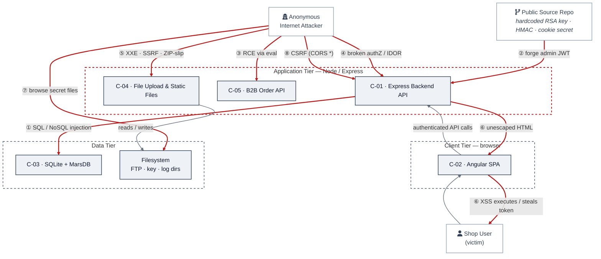
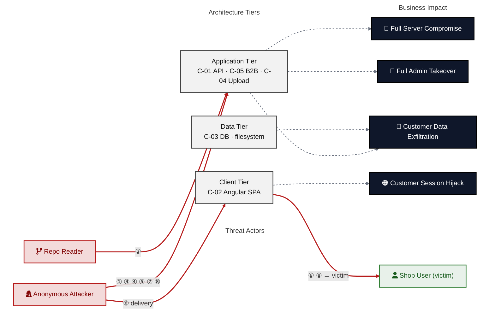

# Analysis: merging "Top Findings" + "Architecture Assessment" → "Top Threats"

Basis: last rendered output `/home/mrohr/juice-shop/docs/security/threat-model.md` (2026-05-29) and the two generators in `scripts/compose_threat_model.py`.

## Verdict

**Yes — mergeable, and worth doing.** The Architecture Assessment table is *already* threat-modeling style (befund + explanation + findings-in-components); it is ~80 % of the target "Top Threats" shape. The merge is mostly: keep AA's grouping spine, graft on the deterministic columns that only Top Findings has (criticality badge, mitigations), and **close a coverage gap that currently drops the #4 Critical finding.** It is not a trivial concat — three competing taxonomies must be reconciled into one.

## What each section is today

| | Top Findings | Architecture Assessment |
|---|---|---|
| Unit of a row | one finding (F-NNN) | one weakness *class* (groups N findings) |
| Lens | severity-ranked list | design-control / threat-modeling |
| Provenance | **100 % deterministic** — `triage.ranking.views.top_findings` (compose_threat_model.py:4857) | **LLM fragment** `weaknesses[]` (category/description), components+findings auto-derived (5033–5103) |
| Carries criticality? | ✅ per row (🔴/🟠) | ❌ one global verdict only |
| Carries mitigations? | ✅ M-NNN + priority per row | ❌ none |
| Carries explanation? | ❌ | ✅ "why systemic" prose |
| Carries grouping? | ❌ flat | ✅ by weakness class |

The two are **complementary, not redundant**: each holds exactly what the other lacks. That is what makes a merge attractive — and the user's target shape ("befund + short explanation + findings per component") is literally the AA columns plus a criticality badge.

## The blocker: three taxonomies, inconsistent membership

The management summary already groups the same findings **three different ways**, and they disagree:

- **Top Findings**: F-001,002,003,004,005 (severity-ranked, ungrouped)
- **Architecture Assessment** (5 classes): F-001,012 / 002,003,019 / 006,021 / 016,015,013 / 007,010
- **Attack paths ①–⑦** (Security Posture at a Glance): F-001,002,003,004,006,007,008,010,011,014,017,018,019,021,026

Enumerated diffs (verified against the rendered doc):

- **`F-004` and `F-005` are in Top Findings but in NO Architecture Assessment class.** F-004 is the #4 **Critical** (RCE / sandbox escape) and the root of the §Critical Attack Tree. Naively using AA as the merge spine **silently drops the RCE.** Unacceptable.
- AA misses 7 of the attack-path findings: F-004,008,011,014,017,018,026 (RCE, CSRF, secret-file exposure, broken authZ/IDOR).
- AA includes 4 findings the attack paths don't surface: F-012,013,015,016.
- The two lenses **bucket the same finding differently**: path ② Auth-Bypass groups F-001+F-010; AA splits them (F-001→*Cryptography*, F-010→*Session Lifecycle*). Same for F-007. So "which threat does this finding belong to" has no single answer today.

A "Top Threats" section forces a single canonical taxonomy. That is the real design decision, not the table mechanics.

## Recommended merge

**Spine = a threat taxonomy that covers 100 % of ≥High findings** (neither current lens does). Build each Top-Threat row as:

```
Threat (befund)            ← weakness-class name, e.g. "Insecure Query Construction & Data Access"
Criticality                ← DERIVED = max severity of member findings (deterministic)
Explanation                ← AA "why systemic" prose (LLM, already authored)
Findings × Component       ← member F-NNN grouped under their C-NN (already auto-derived, 5078–5103)
Mitigations                ← DERIVED = union of member findings' primary M-IDs (reuse Top-Mitigations logic)
Path                       ← glyph ①–⑦ link (reuse fid_to_path, 4877)
```

Every column already exists in one of the two generators — the merge is plumbing the deterministic fields (criticality/mitigations/path from `_compute_top_findings_rows`) onto the AA `weaknesses[]` rows, then sorting rows by derived criticality → finding-count.

**Mandatory taxonomy fix — close the gap.** Add the threat classes AA is missing so no Critical/High is dropped. Minimum:

- **Remote Code Execution / Unsafe Evaluation** — F-004, F-022 (Critical; currently orphaned)
- **Broken Authentication & Access Control** — F-005, F-014, F-017 (High; IDOR + client-only authZ + unverified password change)
- **Sensitive File / Secret Exposure** — F-011, F-026 (currently only in attack paths)

That lifts AA from 5 → ~8 classes and makes the weakness taxonomy a superset of both current lenses.

## Strong simplification opportunity (flag, don't silently do)

The **attack-paths ①–⑦ block IS already a Top-Threats section**: each path has a name (befund), a one-line explanation, a findings list, and an *impact* — richer than AA. So the doc currently carries **two** near-duplicate threat groupings (attack paths + AA weaknesses) plus the flat finding list. The highest-value move is to collapse **all three** into one threat-grouped section, using the attack-path taxonomy (already covers F-004, CSRF, secret-exposure, IDOR; already carries actor + impact) as the canonical spine and folding AA's "why systemic" prose + Top-Findings' criticality/mitigation columns into it. That removes a whole redundant table rather than merging two.

Two viable canonical spines — **decision needed before implementing**:

- **(A) Attack-path taxonomy** (①–⑦): attacker-centric, already covers all findings + impact. Best if "Top Threats" should read like attacker goals.
- **(B) Weakness-class taxonomy** (AA, gap-filled to ~8): control-centric, maps cleanly to §7 Security Architecture. Best if "Top Threats" should map to remediation domains.

They are near-isomorphic but split F-001/F-007/F-010 differently, so one must win.

## Effort / feasibility

- Hybrid deterministic+LLM section is **precedented** — "Security Posture at a Glance" is already a "contract v2 hybrid renderer" (compose_threat_model.py:1888, 4480). Same pattern applies.
- Deterministic columns (criticality, mitigations, path) are pure functions already written — reusable.
- The only genuinely new work: (1) pick the canonical taxonomy, (2) gap-fill the missing threat classes in the fragment schema/prompt, (3) per-threat criticality = max(member severities), (4) drop the now-redundant table.
- Risk: the LLM-authored class list must be constrained so it can never drop a ≥High finding — add a deterministic post-check (every Critical/High F-NNN appears in exactly one Top-Threat row) to QA, mirroring existing coverage guarantees.

---

# Option C: fold "Security Posture at a Glance" in too — one central section

**Honest take: this is the strongest version, and SPaaG is the right anchor — not AA.** The ①–⑦ taxonomy already *lives* inside SPaaG, and SPaaG's attack-path bullets are already a Top-Threats list (name + actor + explanation + findings + **impact**). Top Findings and AA are just two more renderings of the same ~7 threats. Three text blocks describing one object → collapse to one.

"One central section" must mean **diagram + one unified table**, NOT one undifferentiated blob:

```
## Security Posture / Top Threats
  1. Heatmap diagram (mermaid)        ← keep as-is; visual "at a glance", different medium, leads
  2. ONE threat table, keyed ①–⑦      ← REPLACES attack-path bullets + Top Findings + Architecture Assessment
  (actor folds into a table column or a 3-line legend, not its own prose catalog)
```

The diagram and the table become two representations sharing the ①–⑦ keys.

## Concrete mockup

→ A **full rendered mockup** of the merged section — both diagrams plus the ranked threat table, built from the real 2026-05-29 juice-shop data — is in **[Worked example](#worked-example--the-central-security-posture--top-threats-section-rendered)** at the bottom of this doc. The notes below explain *why* it looks the way it does.

**Read the worked example as proof of the central problem, not a finished design:**

- Five threats come straight from existing SPaaG attack paths. The **file-parser cluster, the extended access-control row, and the secret-exposure row** (plus the merges of F-012 into crypto, F-005 into access-control) are **gap-fill** — they exist in AA/Top Findings but had *no* attack-path glyph. Same coverage gap as Option A/B, now unavoidable in one table: **neither SPaaG nor AA alone covers all ≥High findings** (SPaaG drops F-005/012/013/015/016/022; AA drops F-004/008/011/014/017/018/026). The union must be assigned to exactly one row each.
- `Risk` is **derived** = max member severity (deterministic). `Primary fix` = union of member findings' primary M-IDs (deterministic). `Why systemic` = the one LLM-authored sentence (from AA prose). So the table is **deterministic-first with one LLM column** — a bad fragment degrades one column, not the section.
- Rows are re-sorted Critical-first, so glyphs are **renumbered to follow risk** (①–③ = the three Criticals). The diagram glyphs and table rows are then 1:1 by construction.

## My honest bottom line on Option C

Do it, but scope it as a **3→1 collapse under the existing diagram**, not "merge all four blocks." Net effect: removes two redundant tables (attack-path bullets ≈ AA), gives the reader one place that answers *where / what-first / why* together, and the diagram keeps doing the visual job a table can't. The two real costs: (1) it hard-couples the section to the LLM fragment — neutralize with deterministic-first rendering; (2) it forces the single-taxonomy + full-coverage reconciliation that the doc can currently avoid by keeping three loose views. That reconciliation is *good hygiene* but it's the bulk of the work, and it needs the QA invariant "every ≥High finding in exactly one row, every diagram glyph = one row."

---

# Worked example — the central "Security Posture & Top Threats" section (rendered)

This is exactly how the merged section would render in `threat-model.md`, using the real 2026-05-29 juice-shop data. It collapses *Security Posture at a Glance* + *Top Findings* + *Architecture Assessment* into one section: **two diagrams (architecture + risk-flow) followed by one ranked threat table and the design narrative.** Threats are numbered ①–⑧ by descending risk; the same numbers appear in both diagrams and the table.

---

## Security Posture & Top Threats

🔴 **Not production-ready.** Eight structural threats; three are independently sufficient for full compromise from the open internet. The application makes the same trust-model error repeatedly — user-controlled input reaches a security-sensitive sink (SQL, JS eval, HTML renderer, JWT signer, XML parser) without the boundary control that would stop it. **Risk: 🔴 Critical ×4 · 🟠 High ×13 · 🟡 Medium ×6 · 🟢 Low ×3.**

### Figure 1 — Security architecture, trust boundaries & where each threat strikes

Components grouped by trust boundary. Red edges are attacker-controlled data flows; each is labelled with the threat (①–⑧) that rides it.



### Figure 2 — Risk flow: who attacks what, and the business impact

Same eight threats, viewed as **actor → tier → business impact**. Shows *consequence*, which Figure 1 does not.



### Top Threats (ranked by risk)

Each row is one **threat** (a class of weakness), not one finding. *Threat Description* opens with the **general architectural weakness**, then how it manifests (STRIDE in brackets); *Findings* lists the concrete instances, each with its component; *Risk & Impact* combines severity with business consequence. Full per-finding detail in §8 Threat Register; full control catalogue in §7 Security Architecture.

| # | Threat Description | Findings (→ Component) | Risk & Impact | Fix |
|---|--------------------|------------------------|---------------|-----|
| ① | **Insecure Query Construction & Data Access** _(T·I)_<br/><br/>The application has no consistent boundary between user input and its data layer. Request data reaches query interpreters without parameterization, and the same string-interpolation pattern repeats across three independent routes, so this is an architectural flaw rather than a one-off bug. | • **F-002** SQL injection, login → C-01<br/>• **F-003** SQL injection, search → C-01<br/>• **F-019** NoSQL injection, review update → C-01 | 🔴 **Critical**<br/>Customer Data Exfiltration · Admin Takeover | M-001, M-022 (P1) |
| ② | **Hardcoded Secrets & Weak Cryptography** _(S·E)_<br/><br/>Authentication relies on credentials that are not actually secret and on outdated cryptography. The RSA signing key, HMAC and cookie secret are literal strings in the source code and passwords are hashed with MD5, so anyone who can read the repository holds the keys the auth system depends on. | • **F-001** Hardcoded RSA signing key → C-01<br/>• **F-012** MD5 password hashing → C-01<br/>• **F-010** Vulnerable JWT libraries → C-01 | 🔴 **Critical**<br/>Full Admin Takeover · Session Hijack | M-002, M-003 (P1) |
| ③ | **Remote Code Execution (unsafe eval)** _(E)_<br/><br/>At one processing boundary the application treats attacker-supplied input as executable code instead of data. The B2B order payload is run as JavaScript in a sandbox that is known to be escapable, which gives any authenticated caller OS-level code execution. | • **F-004** Sandbox escape via `notevil` → C-05<br/>• **F-022** Sandbox CPU exhaustion → C-05 | 🔴 **Critical**<br/>Full Server Compromise | M-019 (P1) |
| ④ | **Broken Authorization & Access Control** _(E·I)_<br/><br/>There is no reliable server-side authorization model, so access decisions are left to the client. Route protection exists only in the Angular guard, basket retrieval can be read across users (IDOR), and the password change skips the current-password check. | • **F-014** Client-only authorization → C-01<br/>• **F-017** IDOR on basket retrieval → C-01<br/>• **F-005** Password change w/o current pw → C-01 | 🟠 **High**<br/>Admin Takeover · Data Exfiltration | M-007, M-010 (P2) |
| ⑤ | **Unsafe File-Parser & Outbound Requests** _(I·T)_<br/><br/>Complex attacker-controlled input is parsed with the libraries' default settings instead of safe options. XML uploads allow external-entity expansion, ZIP extraction has no path containment, and image fetching has no URL allowlist. | • **F-016** XXE via XML upload → C-04<br/>• **F-015** ZIP path-traversal → C-04<br/>• **F-013** SSRF via image URL → C-04 | 🟠 **High**<br/>Server File Read · Data Exfiltration | M-005, M-006 (P2) |
| ⑥ | **Output Encoding / Cross-Site Scripting** _(T·I)_<br/><br/>Server-supplied data is not consistently encoded before it is rendered, and the session token is kept where scripts can read it. Several Angular components disable HTML escaping, the server-side sanitizer is years out of date, and the JWT is stored in localStorage. | • **F-006** Stored XSS → C-02<br/>• **F-021** Reflected XSS → C-01<br/>• **F-007** JWT in localStorage → C-01+C-02 | 🟠 **High**<br/>Customer Session Hijack | M-022 (P2) |
| ⑦ | **Sensitive File & Secret Exposure** _(I)_<br/><br/>Server-side storage locations are open to anonymous browsing instead of being protected. The FTP, encryption-key and log directories are publicly listable, which leaks a KeePass vault, keys and the app configuration. | • **F-011** Public dir listing (KeePass, keys) → C-01<br/>• **F-026** App-config disclosure → C-01 | 🟠 **High**<br/>Customer Data Exfiltration | M-004 (P2) |
| ⑧ | **CSRF / Permissive CORS** _(S·T)_<br/><br/>State-changing requests are not tied to the user's origin or intent. A wildcard CORS policy and the absence of anti-CSRF tokens let any external page act inside a victim's authenticated session. | • **F-008** CORS allows all origins → C-01<br/>• **F-018** Permissive CORS policy → C-01 | 🟠 **High**<br/>Customer Session Hijack | M-022 (P2) |

*STRIDE: S spoofing · T tampering · R repudiation · I information disclosure · D denial of service · E elevation of privilege. The one-line rationale per threat is the only LLM-authored content; Risk, findings, components, impact and Fix are all derived deterministically.*

> **Fix sequence:** ② rotate+externalize secrets → ① parameterize all queries → ③ remove eval → ⑥ fix output encoding. These four close every Critical and most High threats; ④⑤⑦⑧ are the remaining High surface.

---

*End of worked example. The block above is one self-contained section; everything in it is derived from existing artifacts — diagrams + Risk/Fix columns are deterministic, only the "Why structural" narrative is LLM-authored.*
