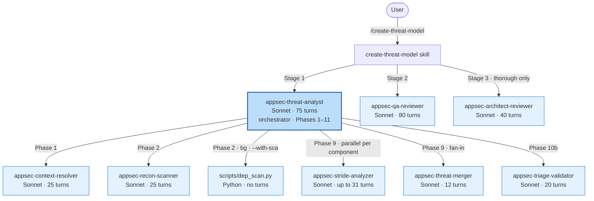

# Architecture

Internal pipeline of the threat assessment — for readers debugging a run, extending an agent, or integrating the plugin into a larger toolchain.

## Contents

- [Pipeline stages](#pipeline-stages)
- [Agents](#agents)
- [Phases 1–11](#phases-111)
- [Intermediate files](#intermediate-files)
- [Determinism and caching](#determinism-and-caching)
- [Failure handling](#failure-handling)
- [Model policy](#model-policy)

## Pipeline stages

Three stages, each with its own turn budget. Stage 2 and Stage 3 are invoked by the skill (not by the orchestrator) so that Stage 1 exhaustion cannot starve them.

| Stage | Agent | Trigger | Mutates `threat-model.md`? |
|-------|-------|---------|----------------------------|
| 1 — Analysis | `appsec-threat-analyst` (orchestrator) | Always | Yes — writes Parts A–D |
| 2 — QA | `appsec-qa-reviewer` | Always (unless `--no-qa`) | Yes — in-place repair |
| 3 — Architect review | `appsec-architect-reviewer` | Auto at `--assessment-depth thorough`, forceable with `--architect-review` | No — writes `.architect-review.md` only |

## Agents

Eight agents plus one deterministic Python helper. The orchestrator is the only one invoked directly by the skill — the rest are dispatched internally.

All agents default to Sonnet (`claude-sonnet-4-6`). The reasoning-heavy subset (STRIDE analyser, triage validator, threat merger) accepts an Opus override via `--reasoning-model`. Architect review uses Opus by default.

| Agent | Role | Max turns | Invoked in |
|-------|------|-----------|------------|
| `appsec-threat-analyst` | Orchestrator. Owns the phase state machine, dispatches specialists, assembles the report. | 75 | Stage 1 (Phases 1–11) |
| `appsec-context-resolver` | Reads repository metadata, known-threats YAML, external REST context, requirements catalog. | 25 | Phase 1 |
| `appsec-recon-scanner` | Scans 26 security categories across the codebase. Output is the single source of truth for Phases 3–10. | 25 | Phase 2 |
| `appsec-stride-analyzer` | STRIDE enumeration for one component. One instance per component, dispatched in parallel. | 31 | Phase 9 |
| `appsec-threat-merger` | Decides per candidate group whether to merge duplicates, consolidate systemic patterns, or keep distinct. | 12 | Phase 9 (when ≥1 merge candidate) |
| `appsec-triage-validator` | Cross-component rating consistency, severity plausibility, priority alignment, completeness. | 20 | Phase 10b |
| `appsec-qa-reviewer` | 10-check consistency pass on the rendered report. Repairs links, diagram syntax, missing anchors, stale references. | 80 | Stage 2 |
| `appsec-architect-reviewer` | Advisory architect-level review. Writes findings; never modifies the model. | 40 | Stage 3 |

SCA dependency scanning (`scripts/dep_scan.py`) is pure Python — no LLM, no turn budget. Launched as a background process at the end of Phase 2, joined at the start of Phase 10.

## Phases 1–11

Phases 2–8 run inline inside the orchestrator. Phase 9 dispatches N STRIDE analyzers in parallel (N = 3/5/8 at quick/standard/thorough depth).

| Phase | Name | Agent | Output |
|-------|------|-------|--------|
| 1 | Context resolution | context-resolver | `.threat-modeling-context.md` |
| 2 | Reconnaissance | recon-scanner | `.recon-summary.md` |
| 2 (bg) | SCA dep scan | `scripts/dep_scan.py` (only with `--with-sca`) | `.dep-scan.json` |
| 3 | Architecture modeling (C4) | orchestrator | Part A draft |
| 4 | Attack walkthroughs | orchestrator | Part A draft |
| 5 | Asset identification | orchestrator | Part B draft |
| 6 | Attack surface mapping | orchestrator | Part B draft |
| 7 | Trust boundary analysis | orchestrator | Merged into §7.11 Infrastructure |
| 8 | Security architecture catalog | orchestrator | §7 Security Architecture |
| 8b | Requirements compliance *(when enabled)* | orchestrator | §7b Requirements Compliance |
| 9 | STRIDE enumeration | N × stride-analyzer, then merger | `.stride-<id>.json`, `.threats-merged.json` |
| 10 | Dep-scan synthesis | orchestrator | Folds SCA threats into the register |
| 10b | Triage validation | triage-validator | `.triage-flags.json` |
| 11 | Finalization | orchestrator | `threat-model.md`, `.yaml`, `.sarif.json` |

Phase boundaries are logged as `PHASE_START` / `PHASE_END` in `.agent-run.log`. The orchestrator prints a user-visible banner on each transition: `[Phase 9/11] ▶ STRIDE — dispatching 8 analyzers… (expect ~25m)`.

## Intermediate files

All paths relative to `$OUTPUT_DIR` (default: `docs/security/`).

| File | Writer | Lifetime | Purpose |
|------|--------|----------|---------|
| `.threat-modeling-context.md` | context-resolver | Persistent | Combined external + business context. Auditable, human-readable. |
| `.recon-summary.md` | recon-scanner | Persistent | Repo structure, tech stack, security-pattern findings. Input for Phases 3–10. |
| `.dep-scan.json` | dep-scanner script | Persistent | Raw SCA results. Cached against manifest hashes (1h TTL). |
| `.stride-<component-id>.json` | stride-analyzer | Persistent in incremental mode | Per-component threat list. Carried forward for unchanged components. |
| `.threats-merged.json` | orchestrator (Phase 9) | Persistent | Canonical merged threat list with global [F-NNN / T-NNN IDs](glossary.md#finding-and-threat-identifiers). Source for diagrams, YAML, SARIF, changelog. |
| `.triage-flags.json` | triage-validator | Persistent | Validation flags + impact-weighted ranking for the Top Findings table. |
| `.architect-review.md` | architect-reviewer | Persistent | Advisory findings. Written at thorough depth or with `--architect-review`. |
| `.management-summary-draft.md` | orchestrator (Phase 9) | Transient | Handoff from Phase 9 to Phase 11 for the Management Summary. Cleaned up after success. |
| `.merge-candidates.json` / `.merge-decisions.json` | orchestrator / threat-merger | Transient | Phase 9 merge workflow. Cleaned up after success. |
| `.appsec-cache/baseline.json` | orchestrator | Persistent | Recon fingerprint + carry-forward state for incremental mode. |
| `.appsec-lock` | orchestrator | Lifetime of run | Concurrent-run lock. Stale locks (>1h) are auto-overwritten. |
| `.phase-epoch` / `.progress/` | orchestrator / stride-analyzer | Transient | Intra-phase progress markers for the live progress display. |
| `.agent-run.log` | all agents | Persistent, rotated at 5 MB | Structured event log — `AGENT_START/END`, `PHASE_START/END`, `FILE_WRITE`, `AGENT_ERROR`, `ASSESSMENT_SUMMARY`. |
| `.hook-events.log` | `agent_logger.py` hook | Persistent, rotated at 5 MB | `PreToolUse`, `PostToolUse`, `Stop` events with token/cost data. |

Cleanup semantics: a successful run removes the transient whitelist (draft, merge-*, progress, phase-epoch). Failed runs leave every artifact for debugging. Audit files (`.threat-modeling-context.md`, `.recon-summary.md`, `.stride-*.json`, `.architect-review.md`, logs) are never touched by automatic cleanup.

## Determinism and caching

**ID stability.** [F-NNN](glossary.md#finding-and-threat-identifiers) finding IDs remain stable across incremental runs — a newly discovered finding gets the next unused slot; retired findings leave holes. Stability is based on (component, CWE, evidence file/line) triples with fuzzy matching. External systems (Jira, Linear, SARIF) can rely on the IDs across re-scans.

**Merge-sort determinism.** Phase 9 applies an 8-field lexicographic sort key before assigning `T-001`..`T-NNN`. Two runs on an unchanged codebase produce byte-identical output modulo the `generated_at` timestamp.

**Recon fingerprint.** `.appsec-cache/baseline.json` stores a hash of the relevant file set + plugin version. When the fingerprint matches on an incremental run, Phase 2 skips entirely.

**Dep-scan cache.** Manifest-file hashes keyed to a 1h TTL. Runs within the window with unchanged manifests reuse the previous `.dep-scan.json`.

**Stale-file policy.** Incremental runs preserve `.stride-*.json`, `.recon-summary.md`, `.appsec-cache/`. Full-mode runs (`--full` / `--rebuild`) wipe them first.

## Failure handling

**Sub-agent retry.** On missing output, schema-validation failure, or error stub, the orchestrator retries the agent once synchronously before skipping the component. This handles transient token-limit timeouts.

**Checkpointing.** `.appsec-checkpoint` records the last completed phase. `--resume` reads it and continues; completed phases are not re-run.

**Concurrent-run lock.** `.appsec-lock` blocks overlapping runs. Locks older than 1 hour are considered stale and overwritten.

**Schema validation.** `scripts/validate_intermediate.py` enforces schemas on `.stride-*.json`, `.threats-merged.json`, `.triage-flags.json`. Non-conforming files fail the run rather than silently corrupting downstream stages.

**Stage independence.** Stage 2 runs even when Stage 1 ran out of turns mid-Phase 11. Stage 3 runs even when Stage 2 errored. Neither Stage 2 nor Stage 3 can corrupt `threat-model.yaml`.

## Model policy

Frontmatter default for every agent: `sonnet`. Runtime overrides are passed via the Agent tool's `model` field.

| Flag | Effect |
|------|--------|
| `--reasoning-model sonnet\|opus-cheap\|opus` | Affects STRIDE analyzer, triage validator, threat merger |
| `--stride-model <model>` *(deprecated)* | STRIDE analyzers only — prefer `--reasoning-model` |
| `--architect-model sonnet\|opus` | Stage 3 only (default: Opus) |

Context-resolver, recon-scanner, dep-scanner, and qa-reviewer remain on Sonnet regardless of flags — their tasks are mechanical (file I/O, tool invocation, structural checking) and do not benefit from Opus.

Default at `--assessment-depth thorough`: `--reasoning-model opus-cheap` (Opus for triage-validator + threat-merger only, ~$0.07 extra) + `--architect-model opus` (Stage 3, ~$0.65–0.80 extra).
