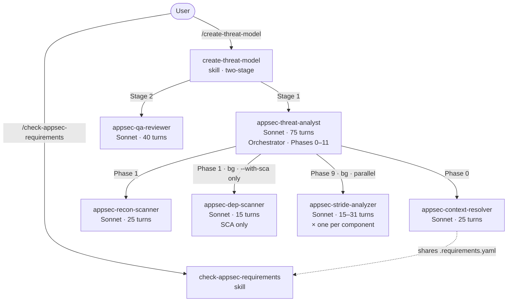

# Architecture

> Back to [README](../README.md)

## Agent Pipeline

The plugin uses a 6-agent pipeline. Only `appsec-threat-analyst` is user-facing; the rest are dispatched internally.



### Agents

| Agent | Turns | Role |
|-------|-------|------|
| `appsec-threat-analyst` | 75 | Orchestrator — drives Phases 0–11, dispatches sub-agents, assembles output |
| `appsec-context-resolver` | 25 | Phase 0 — resolves external context, repo files, and known threats into `.threat-modeling-context.md` |
| `appsec-recon-scanner` | 25 | Phase 1 — scans repo structure, tech stack, 24 security categories (incl. supply chain and hardcoded secrets) -> `.recon-summary.md` |
| `appsec-dep-scanner` | 15 | Phase 1 (bg, **only with `--with-sca`**) — pure SCA: scans manifests for known CVEs via native audit tools, with caching |
| `appsec-stride-analyzer` | 15–31 | Phase 9 (bg, parallel) — one instance per component, dynamic turn budget based on complexity, writes `.stride-<id>.json` |
| `appsec-qa-reviewer` | 40 | Stage 2 (skill-level) — 10 checks (including 11-point Mermaid validation) on the finished threat model, fixes in-place |

The QA reviewer runs at the skill level (Stage 2) with its own turn budget, not inside the orchestrator. This ensures it always executes even when the orchestrator uses all its turns during Phases 0–9.

### Orchestrator Phases

| Phase | Description |
|-------|-------------|
| 0. Context Lookup | `appsec-context-resolver` fetches pre-existing AppSec knowledge (external context, repo files, known threats) |
| 1. Reconnaissance | `appsec-recon-scanner` maps tech stack, structure, and 24 security categories (incl. supply chain and hardcoded secrets); optionally triggers `appsec-dep-scanner` (bg, only with `--with-sca`) |
| 3. Architecture Modeling | C4 diagrams (context / container / component) + technology architecture diagram |
| 4. Security Use Cases | Sequence diagrams for auth flow, access control, and other critical flows |
| 5. Asset Identification | Catalogs data, code/IP, infrastructure, and availability assets |
| 6. Attack Surface Mapping | Enumerates API endpoints, auth mechanisms, file uploads, inter-service calls |
| 7. Trust Boundary Analysis | Identifies privilege and network boundary crossings |
| 8. Security Controls | Catalogs existing controls by domain with effectiveness rating |
| 8b. Requirements Compliance | *(only with `--requirements`)* Verifies each requirement against codebase; FAIL requirements become threat candidates for Phase 9 |
| 9. Threat Enumeration | Dispatches `appsec-stride-analyzer` per component (requires Phases 6–8 outputs), merges results + Phase 8b threat candidates, assigns global T-xxx IDs, rates risk |
| 10. Scan Synthesis | Incorporates hardcoded secrets (from recon) and SCA findings (from dep-scanner, if `--with-sca`); writes `threat-model.md` and optional YAML/SARIF exports |
| 11. Finalization | Releases lock, records duration, prints completion summary |
| *(Stage 2)* | `appsec-qa-reviewer` verifies and fixes links, references, consistency, diagrams |

## Intermediate Files

Sub-agents communicate via files written to the **output directory** (`docs/security/` by default, or the path from `--output`). These files are gitignored by default when the output is inside the repository.

| File | Written by | Read by |
|------|-----------|---------|
| `.threat-modeling-context.md` | `appsec-context-resolver` | orchestrator, `appsec-stride-analyzer` |
| `.recon-summary.md` | `appsec-recon-scanner` | orchestrator (Phases 2–10) |
| `.requirements.yaml` | `appsec-context-resolver` | `appsec-stride-analyzer`, `appsec-qa-reviewer`, `check-appsec-requirements` skill |
| `.dep-scan.json` | `appsec-dep-scanner` | orchestrator (Phase 9) |
| `.stride-<id>.json` | `appsec-stride-analyzer` | orchestrator (Phase 9) |
| `.appsec-lock` | orchestrator | orchestrator (concurrent-run guard; deleted after assessment) |
| `.appsec-checkpoint` | orchestrator | skill (phase progress; used by `--resume`; deleted after successful completion) |

All paths are relative to the output directory. When using `--output /appsec-reports/team-api`, intermediate files appear as `/appsec-reports/team-api/.recon-summary.md`, etc.

The **persistent requirements cache** lives at `$CLAUDE_PLUGIN_ROOT/.cache/requirements.yaml` (outside the analyzed repo). It is updated on every successful remote fetch and used as a fallback when the remote URL is unreachable. The per-assessment copy at `.requirements.yaml` is written to the output directory during each assessment for use by the STRIDE analyzer and QA reviewer.

## Reliability Features

### Sub-agent retry logic

If a `appsec-stride-analyzer` or `appsec-dep-scanner` fails (missing output, schema validation error, or error stub), the orchestrator retries the failed agent **once** synchronously before skipping. This handles transient failures (token-limit timeouts, temporary file system issues) without losing threat coverage for an entire component.

### Concurrent run locking

The orchestrator acquires a lock file (`.appsec-lock` in the output directory) at startup. If another assessment is already running (lock file exists and is less than 1 hour old), the new run stops with a clear error message. Stale locks (older than 1 hour) are automatically overwritten. The lock is always released after Phase 10 completes or on any early exit.

### Stale file cleanup

Intermediate files from previous runs (`.stride-*.json`, `.dep-scan.json`) are automatically deleted before each new assessment starts. This prevents stale data from interfering with the current run.

### Schema validation

All intermediate JSON files (`.dep-scan.json`, `.stride-*.json`) are validated against strict schemas by `validate_intermediate.py` before the orchestrator reads them. Invalid files trigger the retry logic above rather than causing silent data corruption.

### Log rotation

Hook event logs (`.hook-events.log`) and agent run logs (`.agent-run.log`) are automatically rotated when they exceed 5 MB (configurable via `logging.max_log_bytes` in `plugin/config.json`). Up to 2 rotated copies are kept (`.log.1`, `.log.2`). This prevents unbounded log growth across multiple assessment runs.

### Error recovery & checkpoints

The orchestrator writes a checkpoint file (`.appsec-checkpoint`) at the start and end of each phase, recording the phase number, status, and timestamp. If an assessment is interrupted (token limit, network issue, manual cancellation), the checkpoint preserves which phase last completed.

Run `/appsec-plugin:create-threat-model --resume` to inspect the checkpoint and continue from the last completed phase, reusing existing intermediate files instead of starting from scratch.

### Dep-scanner caching

The dep-scanner caches its results in `.dep-scan.json` along with MD5 hashes of all scanned manifest files. On subsequent runs within 1 hour, if no manifest file has changed, the scanner reuses the cached results and skips expensive audit tool invocations (`npm audit`, `pip-audit`, etc.).

### Config schema validation

`plugin/scripts/validate_config.py` validates both `plugin/config.json` and `skills/check-appsec-requirements/config.json` against defined schemas. Run it before deployment or in CI to catch misconfigurations:

```bash
python3 plugin/scripts/validate_config.py plugin/
```

## Plugin Structure

```
appsec-plugin/
├── plugin/                                     # Plugin root — pass to --plugin-dir
│   ├── .claude-plugin/
│   │   └── plugin.json                         # Plugin manifest (v0.10.0-beta)
│   ├── .claude/
│   │   └── settings.json                       # Allowlisted Bash commands (restricted permissions)
│   ├── config.json                             # external_context, pricing, logging config
│   ├── .cache/                                 # Persistent cache (gitignored, auto-created)
│   │   └── requirements.yaml                   # Cached requirements from last successful fetch
│   ├── agents/
│   │   ├── appsec-threat-analyst.md            # Orchestrator (Sonnet, 75 turns)
│   │   ├── appsec-context-resolver.md          # Context resolver (Sonnet, 25 turns)
│   │   ├── appsec-recon-scanner.md             # Repo recon + supply chain + secret detection (Sonnet, 25 turns)
│   │   ├── appsec-dep-scanner.md               # SCA dependency scanner (Sonnet, 15 turns, --with-sca only)
│   │   ├── appsec-stride-analyzer.md           # Per-component STRIDE analysis (Sonnet, 15–31 turns)
│   │   ├── appsec-qa-reviewer.md               # Output verification (Sonnet, 40 turns)
│   │   ├── shared/                              # Reusable content loaded conditionally
│   │   │   ├── logging-standard.md             # Logging format shared by all sub-agents
│   │   │   ├── owasp-llm-top10.md              # OWASP LLM Top 10 (loaded only when LLM detected)
│   │   │   └── validation-routine.md           # JSON validation shared by dep-scanner & STRIDE
│   │   └── phases/                             # Phase-group reference files (read at runtime)
│   │       ├── phase-group-recon.md            # Phases 0–1: Context & Reconnaissance
│   │       ├── phase-group-architecture.md     # Phases 3–8: Architecture, Assets, Controls
│   │       ├── phase-group-threats.md          # Phases 9–10: STRIDE & Dep Scan Synthesis
│   │       └── phase-group-finalization.md     # Phase 11: Output & Finalization
│   ├── data/
│   │   └── appsec-requirements-fallback.yaml   # Reference baseline (53 requirements, 10 categories)
│   ├── hooks/
│   │   ├── hooks.json                          # UserPromptSubmit, PreToolUse, PostToolUse, Stop, SubagentStop
│   │   └── steering_keywords.json              # Configurable keyword lists for security steering
│   ├── scripts/
│   │   ├── security_steering.py                # Tiered keyword steering (loads from steering_keywords.json)
│   │   ├── agent_logger.py                     # Audit log writer with log rotation and configurable pricing
│   │   ├── validate_intermediate.py            # JSON schema validator for .dep-scan / .stride files
│   │   ├── validate_config.py                  # Config schema validator for config.json files
│   │   └── .gitignore-template                 # Template for analyzed repos (covers all intermediate files)
│   └── skills/
│       ├── create-threat-model/
│       │   └── SKILL.md                        # /appsec-plugin:create-threat-model (all flags incl. --assessment-depth --stride-model)
│       └── check-appsec-requirements/
│           ├── SKILL.md                        # /appsec-plugin:check-appsec-requirements
│           └── config.json                     # requirements_source config (enabled, url)
├── docs/
│   ├── architecture.md                         # Agent pipeline, phases, reliability features
│   ├── configuration.md                        # External context, known threats, requirements, steering
│   ├── headless-mode.md                        # Non-interactive / CI/CD execution
│   ├── flags-reference.md                      # Complete flag reference (interactive + headless)
│   ├── harvester.md                            # Harvester config, scheduling, indexing modes
│   └── comparison-sonnet-opus.md               # Model performance comparison
├── examples/                                   # Example outputs
│   ├── juice-shop/                             # OWASP Juice Shop threat model examples
│   └── appsec-requirements-example.yaml        # Example requirements YAML (53 requirements, 10 categories)
├── scripts/                                    # Development & automation tools
│   ├── run-headless.sh                         # Headless wrapper for non-interactive / CI/CD usage
│   ├── mock-context-server.py                  # Mock for the external context REST endpoint
│   ├── harvest-requirements.py                 # Crawls requirements pages -> YAML
│   ├── harvest-config.json                     # Crawler source URLs and indexing config
│   └── requirements.txt                        # Python deps for harvester
├── tests/                                      # Test suite (440 tests)
│   ├── test_agent_definitions.py               # Agent frontmatter, model, maxTurns validation
│   ├── test_agent_logger.py                    # Hook logger event handling, secret masking, cost estimation
│   ├── test_intermediate_json.py               # Schema validation for .dep-scan / .stride JSON
│   ├── test_security_steering.py               # Tiered keyword matching, false positive guards
│   ├── test_requirements_yaml.py               # Requirements YAML schema and cross-references
│   ├── test_integration.py                     # Plugin manifest, hooks, config, phase-groups, skill integrity
│   ├── test_sarif_validation.py                # SARIF v2.1.0 output schema validation
│   └── fixtures/                               # Test data (valid/error JSON stubs)
├── SECURITY.md
└── README.md
```
