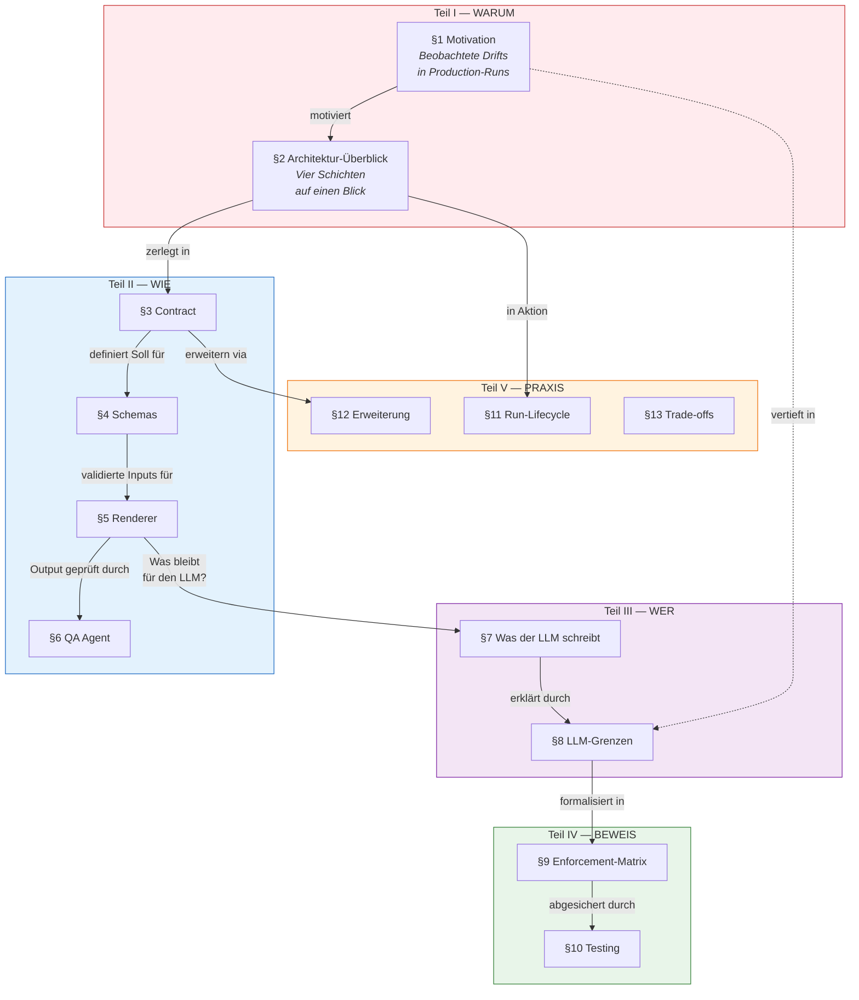
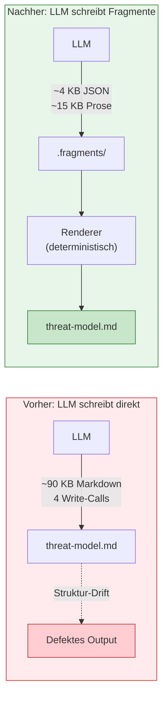
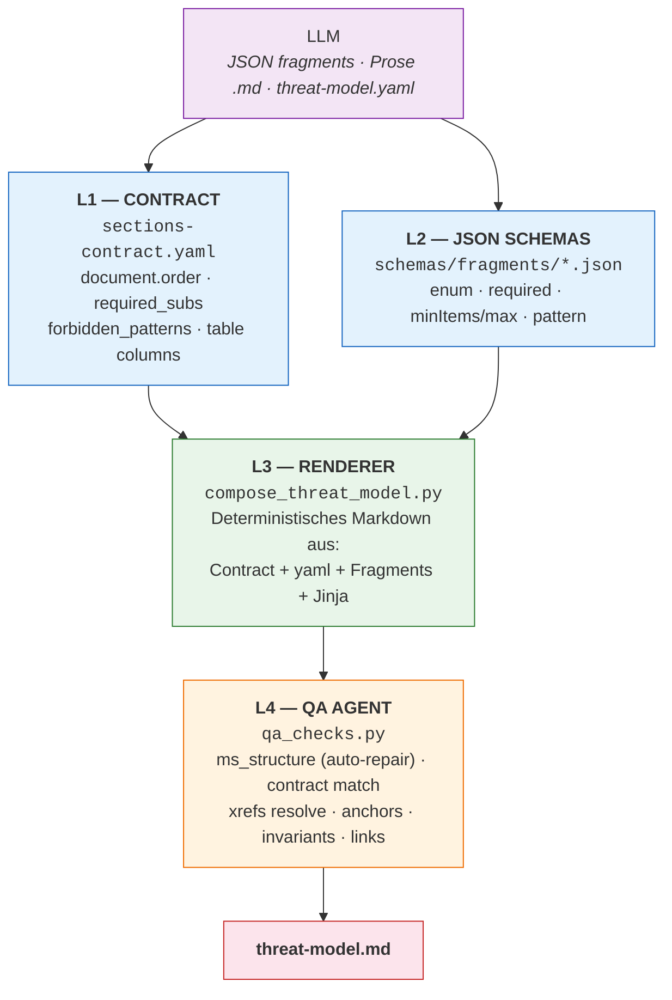
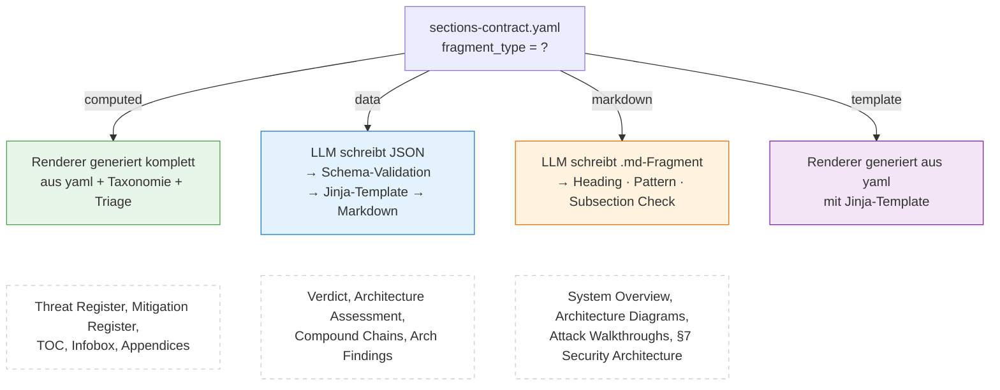
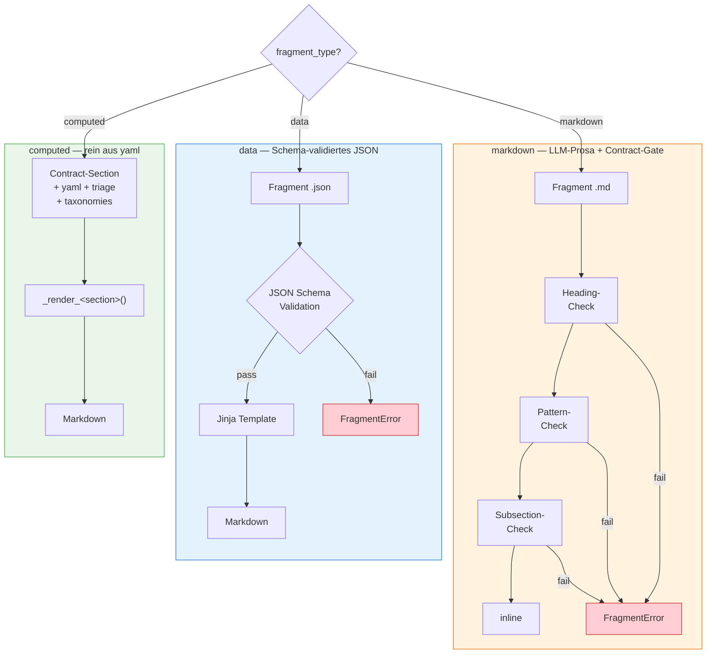
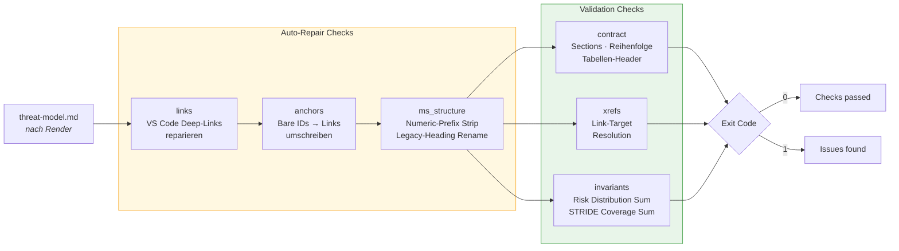
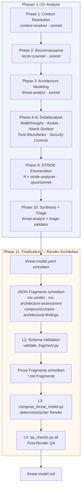
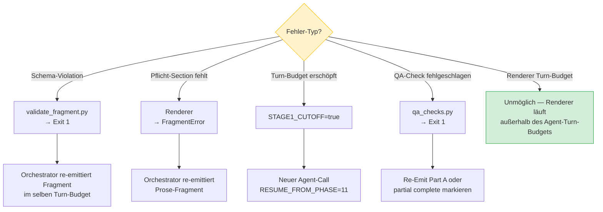

# QA Process — How the Generator Pipeline Enforces Structure on an LLM

> **Zielgruppe:** Contributors, die den Threat-Model-Generator warten, erweitern oder debuggen. Dieses Dokument beschreibt die technische Funktionsweise der vier Enforcement-Schichten, ihre Hintergründe, und welche LLM-Grenzen sie adressieren.
>
> **Status:** stabil ab `contract_version: 1` (Plugin 0.9.0-beta).

---

## Inhalt

### Teil I — Warum: Problem & Lösungsansatz

1. [Motivation — warum eine mehrschichtige Architektur](#1-motivation)
2. [Architektur-Überblick](#2-architektur-überblick)

### Teil II — Wie: Die vier Enforcement-Schichten im Detail

3. [Schicht 1 — Contract (`sections-contract.yaml`)](#3-schicht-1--contract-sections-contractyaml)
4. [Schicht 2 — JSON Schemas (`schemas/fragments/*.json`)](#4-schicht-2--json-schemas)
5. [Schicht 3 — Renderer (`compose_threat_model.py`)](#5-schicht-3--renderer)
6. [Schicht 4 — QA Agent (`qa_checks.py`)](#6-schicht-4--qa-agent)

### Teil III — Wer: Die LLM-Perspektive

7. [Was der LLM tatsächlich schreibt](#7-was-der-llm-tatsächlich-schreibt) — Verantwortungstrennung LLM vs. Pipeline
8. [LLM-Grenzen und wie die Architektur sie adressiert](#8-llm-grenzen) — vertieft die Motivation aus §1

### Teil IV — Beweis: Qualitätssicherung

9. [Enforcement-Matrix — Failure Mode × Schicht](#9-enforcement-matrix) — Referenz-Tabelle
10. [Testing — wie wir die Enforcement absichern](#10-testing) — 82 Tests in 7 Dateien

### Teil V — Praxis: Betrieb & Weiterentwicklung

11. [Lebenszyklus eines Runs](#11-lebenszyklus-eines-runs) — Phase 1–11 + Recovery
12. [Erweiterung — wie man eine neue Sektion hinzufügt](#12-erweiterung) — Schritt-für-Schritt
13. [Trade-offs und Grenzen der Architektur](#13-trade-offs)
14. [Glossar](#14-glossar)

---

### Lesehilfe — Roter Faden

Dieses Dokument folgt einer **Zoom-In-Logik**: Es beginnt mit dem Problem und der Gesamt-Architektur (Teil I), taucht dann schichtweise in die technischen Details ab (Teil II), wechselt zur LLM-Perspektive (Teil III), liefert die formalen Nachweise (Teil IV) und schließt mit Betrieb und Erweiterung (Teil V).



**Empfohlene Lesereihenfolgen:**

| Wenn du... | ...dann lies |
|---|---|
| das System **erstmals verstehen** willst | §1 → §2 → §7 → §8 → §11, dann §3–§6 für Details |
| eine **neue Sektion hinzufügen** willst | §3.3 (fragment_type) → §12 (Erweiterung) → §10 (Tests) |
| einen **Rendering-Bug debuggen** willst | §11 (Lifecycle) → §5 (Renderer) → §6 (QA) → §9 (Matrix) |
| einen **Test-Failure verstehen** willst | §9 (Matrix) → §10 (Testing) → die referenzierte Schicht (§3–§6) |
| die **LLM-Limitations** verstehen willst | §1.1–§1.2 (Symptome) → §8 (systematische Analyse) |

---

### LLM-Hintergrund — Schlüsselbegriffe

> Dieses Dokument verwendet LLM-Fachbegriffe, die für das Verständnis der Architekturentscheidungen wesentlich sind. Die folgende Übersicht definiert sie knapp; bei der ersten inhaltlichen Verwendung in §1 und §8 sind sie mit Kontext verlinkt.

| Begriff | Erklärung |
|---|---|
| **[LLM](https://en.wikipedia.org/wiki/Large_language_model)** (Large Language Model) | Ein neuronales Netzwerk auf Basis der [Transformer-Architektur](https://en.wikipedia.org/wiki/Transformer_(deep_learning_architecture)), das Text Token für Token generiert. In dieser Pipeline: [Claude](https://docs.anthropic.com/en/docs/about-claude/models) (Anthropic). |
| **[Token](https://docs.anthropic.com/en/docs/build-with-claude/token-counting)** | Die kleinste Verarbeitungseinheit eines LLM — je nach Modell ein Wort, Wortteil oder Satzzeichen (~&thinsp;1 Token ≈ ¾ englisches Wort). Relevant, weil sowohl Context Window als auch Output-Budget in Tokens gemessen werden. |
| **[Context Window](https://docs.anthropic.com/en/docs/build-with-claude/prompt-caching#tracking-cache-performance)** | Die maximale Menge an Tokens, die das Modell gleichzeitig „sehen" kann (Eingabe + bisherige Ausgabe). Bei Claude: bis zu 200k Tokens. Regeln am Anfang eines langen Kontexts werden mit wachsender Ausgabe zunehmend schlechter befolgt — ein Phänomen, das als [*Lost in the Middle*](https://arxiv.org/abs/2307.03172) bekannt ist (→ [§8.1](#81-context-window-erosion-adressiert-durch-l2-schemas--l3-renderer)). |
| **[System-Prompt](https://docs.anthropic.com/en/docs/build-with-claude/prompt-engineering/system-prompts)** | Der initiale Instruktionstext, der dem Modell sein Verhalten vorgibt. Regeln im System-Prompt sind *weiche Constraints*: das Modell befolgt sie statistisch, nicht deterministisch — sie konkurrieren mit dem Trainingskorpus um Attention. |
| **[Attention](https://en.wikipedia.org/wiki/Attention_(machine_learning))** | Der Mechanismus, mit dem ein Transformer entscheidet, welche Teile des Inputs für das nächste Token relevant sind ([Vaswani et al., 2017](https://arxiv.org/abs/1706.03762)). Bei langen Kontexten oder vielen Regeln kann die Attention auf einzelne Instruktionen unter einen wirksamen Schwellenwert fallen (*Attention Dilution*). |
| **[Autoregressive Generierung](https://en.wikipedia.org/wiki/Autoregressive_model)** | LLMs erzeugen Text *sequenziell* — jedes Token wird auf Basis aller vorherigen vorhergesagt. Das bedeutet: eine frühe Abweichung (z.B. ein falscher Heading-Name in Zeile 5) beeinflusst alle folgenden Zeilen, weil das Modell seine eigene Ausgabe als Kontext nutzt. Über 90 KB akkumulieren sich kleine Abweichungen (*Drift*). |
| **[Confabulation / Hallucination](https://en.wikipedia.org/wiki/Hallucination_(artificial_intelligence))** | Das Modell generiert plausibel klingende aber faktisch falsche Inhalte. Im Kontext dieses Dokuments: das Erfinden von Heading-Namen, ID-Formaten oder Tabellenstrukturen, die im Trainingskorpus häufig vorkommen aber nicht der Spezifikation entsprechen (→ [§8.2](#82-confabulation-unter-unsicherheit-adressiert-durch-l1-contract--l3-renderer)). |
| **[Trainingskorpus](https://en.wikipedia.org/wiki/Training,_validation,_and_test_data_sets)** | Die Gesamtheit der Texte, auf denen das Modell trainiert wurde. Enthält Millionen von Report-Formaten — der LLM tendiert dazu, häufig gesehene Muster zu reproduzieren, auch wenn das Prompt ein anderes Format fordert (*[Trainings-Bias](https://en.wikipedia.org/wiki/Algorithmic_bias)*, → [§8.3](#83-trainings-bias-adressiert-durch-l1-contract--l3-renderer)). |
| **[Out-of-Distribution (OOD)](https://en.wikipedia.org/wiki/Out-of-distribution_detection)** | Eingaben oder erwartete Ausgaben, die deutlich von den Trainings-Daten abweichen. OOD-Szenarien provozieren erhöhte Confabulation (→ [§8.4](#84-out-of-distribution-cells-adressiert-durch-l3-renderer--taxonomie-lookup)). |
| **[Tool Use / Tool-Call](https://docs.anthropic.com/en/docs/build-with-claude/tool-use)** | In [Claude Code](https://docs.anthropic.com/en/docs/claude-code/overview) entspricht ein *Turn* einem Zyklus aus Modell-Ausgabe + Tool-Ausführung (Datei lesen/schreiben, Bash). Pro Agent-Session gibt es ein Turn-Limit, danach bricht die Ausführung ab (→ [§8.7](#87-turn-budget-erschöpfung-adressiert-durch-l3-renderer--extern-zum-llm)). |
| **[Structured Output](https://docs.anthropic.com/en/docs/build-with-claude/tool-use#json-output)** | Ein Paradigma, bei dem der LLM nicht Freitext sondern maschinenlesbare Formate (JSON) gegen ein Schema erzeugt. Reduziert Struktur-Drift drastisch — die zentrale Designentscheidung hinter der Fragment-Architektur dieses Systems. |

---

## 1. Motivation

### 1.1 Das Ausgangsproblem

Die ursprüngliche Pipeline — der LLM schreibt die ~90 KB `threat-model.md` direkt in vier „Part A–D" Write-Calls — produzierte reproduzierbare Struktur-Drifts. Beispiele aus tatsächlichen Production-Runs (2026-04-17 bis 2026-04-19):

- `## 1. Management Summary` + `### 1.1 Executive Overview / 1.2 Risk Distribution / 1.3 Critical Attack Chain / 1.4 Immediate Actions / 1.5 Top Threats` — **alle fünf** vom Spec vorgeschriebenen Sub-Section-Namen (`Verdict`, `Top Findings`, `Architecture Assessment`, `Mitigations`, `Operational Strengths`) ignoriert.
- Verdict-Blockquote (`<blockquote style="border-left: 3px solid #dc2626; …">`) einfach weggelassen, obwohl das Spec-Prompt sie an drei Stellen explizit fordert.
- `### Top Threats by Risk` statt `### Top Findings` — der LLM hat „Threats" und „Findings" synonym verwendet.
- §8 Threat Register mit 8.1/8.2/8.3/8.4 Severity-Split statt der kanonischen 8.A/B/C/D Kategorie-Gruppierung.
- Komponenten als `[Auth Service](#auth service)` — Anker mit Leerzeichen (broken).
- Cross-Reference-Labels identisch zur ID: `[F-001](#f-001) — F-001` (dupliziert statt mit Findingstitel).

### 1.2 Wer trägt die Schuld?

Nicht der LLM. Nicht das Prompt. Die **Architektur**:

> **Wer den Markdown schreibt, besitzt die Struktur.** Solange der LLM die `.md` direkt schreibt, driftet sie.

Prompts sind weiche Empfehlungen. Sie konkurrieren mit dem gesamten [Trainingskorpus](#llm-hintergrund--schlüsselbegriffe) des Modells — Millionen anderer threat-model/report/documentation-Formate, die alle „plausibel" aussehen. Bei einem 2000+-Token-[System-Prompt](#llm-hintergrund--schlüsselbegriffe), 30+ Minuten Laufzeit und 90 KB [autoregressiver](#llm-hintergrund--schlüsselbegriffe) Output-Composition werden einzelne Regeln („MS sub-sections MUST NOT be numbered") statistisch unterrepräsentiert und fallen unter den [Attention](#llm-hintergrund--schlüsselbegriffe)-Schwellenwert.

(Eine systematische Analyse aller zehn LLM-Grenzen und wie die Architektur jede einzelne adressiert findet sich in [§8 — LLM-Grenzen](#8-llm-grenzen).)

### 1.3 Der Lösungsansatz



**Nimm dem LLM die Strukturverantwortung ab.** Der LLM schreibt nur noch:

1. **Schema-validierte Daten-Fragmente** — ein Ansatz, der in der LLM-Community als [Structured Output](#llm-hintergrund--schlüsselbegriffe) bekannt ist: JSON mit Narrativ-Content, das gegen ein Schema validiert und vom Renderer in Markdown eingebaut wird.
2. **Prosa-Fragmente** — reiner Markdown für Sektionen, die inhärent freitext-lastig sind (System Overview, §7 Domain-Beschreibungen). Hier arbeitet der LLM in seiner Stärke: freie Textgenerierung, eingegrenzt durch Contract-Regeln (Heading, Pflicht-Subsections, Pflicht-Patterns).

Der **Renderer** baut das finale `.md` deterministisch aus Vertrag + validierten Fragmenten + `threat-model.yaml`. Bei gleichem Input erzeugt der Renderer byte-identisches Output.

Strukturelle Drift wird dadurch physikalisch unmöglich: der LLM hat gar keine Möglichkeit mehr, die Reihenfolge der Sektionen, die Spaltenzahl einer Tabelle, oder das Heading-Format zu verändern — diese Entscheidungen gehören nicht in seinen Fragment-Schreibbereich.

Was weiterhin von LLM-Qualität abhängt, ist der **Content** der Fragmente (Wortwahl der Verdict-Bullets, Beschreibung der architektonischen Defekte, Formulierung der Mitigation-Why-Paragraphen). Das ist auch die Aufgabe, die LLMs wirklich gut lösen — und die deterministischer Code nicht lösen kann.

---

## 2. Architektur-Überblick

Das System hat vier gestaffelte Enforcement-Schichten. Jede Schicht fängt eine andere Klasse von Defekten ab; jede kann eine Schicht darunter nicht ersetzen, aber sie kann Defekte fangen, die darüber durchgerutscht sind.



Die **Reihenfolge** ist wichtig:

1. Der **Contract** definiert das Soll. Er wird nicht am Input validiert, sondern am Output.
2. Die **Schemas** validieren das, was der LLM an Daten liefert — bevor der Renderer läuft.
3. Der **Renderer** baut aus validierten Inputs deterministisch den Markdown.
4. Der **QA Agent** läuft nach dem Render und prüft das Ergebnis gegen den Contract — als Safety-Net für alles, was die drei Schichten davor nicht fangen konnten (z.B. Prosa-Fragments mit semantischen Fehlern).

---

## 3. Schicht 1 — Contract (`sections-contract.yaml`)

> **Kontext:** Die folgenden vier Abschnitte (§3–§6) beschreiben jede Enforcement-Schicht im Detail. Sie bauen aufeinander auf: der **Contract** (§3) definiert das Soll, die **Schemas** (§4) validieren die LLM-Inputs, der **Renderer** (§5) setzt alles deterministisch zusammen, und der **QA Agent** (§6) prüft das Endergebnis. Wer zuerst verstehen will, was der LLM in diesem System noch tut und was nicht, kann zu [§7 — Was der LLM tatsächlich schreibt](#7-was-der-llm-tatsächlich-schreibt) vorspringen.

### 3.1 Zweck

Der Contract ist die **einzige Quelle der Wahrheit** für die Dokumentstruktur. Er beantwortet alle strukturellen Fragen:

- Welche Sektionen existieren, in welcher Reihenfolge?
- Welche Sub-Sektionen hat jede Sektion (Pflicht vs. optional)?
- Welche Sub-Section-Namen sind verboten?
- Welche Tabellen erscheinen in welcher Sektion, und mit welchen Spalten?
- Welche Fragment-Datei liefert die Daten, gegen welches Schema wird sie validiert, welches Jinja-Template rendert sie?
- Welche Sektionen sind conditional (z.B. Critical Attack Chain nur bei ≥2 Critical Findings)?

### 3.2 Struktur

```yaml
# sections-contract.yaml (ausgekürzt)

contract_version: 1                         # Breaking changes bump this.

document:
  title_template: "Threat Model — {{ project.name }}"
  order:                                     # Render-Reihenfolge. Einträge sind
    - infobox                                # entweder string (section-id) oder
    - changelog                              # {id, condition} Objekt.
    - toc
    - management_summary
    - system_overview
    - architecture_diagrams
    - attack_walkthroughs
    - assets
    - attack_surface
    - security_architecture
    - { id: requirements_compliance, condition: "check_requirements" }
    - threat_register
    - mitigation_register
    - out_of_scope
    - appendix_run_statistics
    - appendix_vektor_taxonomy
  section_separator: "\n\n---\n\n"

severity_taxonomy:
  critical: { emoji: "🔴", label: "Critical", color: "#dc2626" }
  high:     { emoji: "🟠", label: "High",     color: "#e67700" }
  # Aliases (red/yellow/green) used by verdict fragments.
  red:      { emoji: "🔴", label: "",         color: "#dc2626" }

sections:

  management_summary:
    heading: "## Management Summary"
    heading_numbered: false                  # enforced — no "## 1. …"
    fragment_type: computed                  # renderer composes from sub-sections
    required_subsections:                    # order enforced
      - verdict
      - top_findings
      - architecture_assessment
      - mitigations
      - operational_strengths
    forbidden_subsection_patterns:           # auto-stripped by QA
      - "^\\d+\\.\\d+\\s+"                   # `### 1.1 …`
      - "^Executive Overview$"
      - "^Top Threats( by Risk)?$"
      # ...

  verdict:
    heading: "### Verdict"
    fragment_type: data                      # LLM-written JSON, Schema-validated
    fragment: "ms-verdict.json"
    schema:   "verdict.schema.json"
    template: "verdict.md.j2"

  architecture_diagrams:
    heading: "## 2. Architecture Diagrams"
    heading_numbered: true
    fragment_type: markdown                  # LLM-written Markdown prose
    fragment: "architecture-diagrams.md"
    required_subsections:
      - { level: 3, title: "2.1 System Context" }
      - { level: 3, title: "2.2 Container Architecture" }
      - { level: 3, title: "2.3 Components" }
      - { level: 3, title: "2.4 Technology Architecture" }
    required_patterns:
      - '```mermaid'                         # at least one Mermaid block

  threat_register:
    heading: "## 8. Threat Register"
    fragment_type: computed                  # 100% derived from yaml
    sub_sections:
      - { id: "categories_at_glance", heading: "### 8.A Categories at a glance", render: category_table }
      - { id: "critical_categories",  heading: "### 8.B Critical Categories ({count})", filter: "severity_eff == Critical" }
      - { id: "low_categories",       heading: "### 8.B Low Categories ({count})",      conditional: "low_category_count > 0" }
      - { id: "compound_attack_chains", heading: "### 8.C Compound Attack Chains", fragment: "compound-chains.json",  schema: "compound-chains.schema.json",  conditional: "critical_count >= 2" }
      - { id: "architectural_findings", heading: "### 8.D Architectural Findings", fragment: "architectural-findings.json", schema: "architectural-findings.schema.json", conditional: "high_count + critical_count >= 3" }
```

### 3.3 `fragment_type` — drei Kategorien



| Typ | Wer schreibt? | Was wird validiert? |
|---|---|---|
| `computed` | Nur der Renderer (aus yaml + Taxonomie + triage). | — |
| `data` | LLM schreibt eine JSON-Datei. | JSON-Schema erzwingt Shape. |
| `markdown` | LLM schreibt ein `.md`-Fragment. | Contract-Regeln: `required_subsections`, `required_patterns`, Heading-Match. |
| `template` | Nur der Renderer (aus yaml), mit Jinja-Template. | — |

Die **strukturkritischen Sektionen** (Management Summary, Threat Register, Mitigation Register, Top Findings, Operational Strengths, TOC, Appendices) sind `computed` — sie sind dem LLM **physisch unerreichbar** (siehe [§7.4 — Was der LLM nicht schreibt](#74-was-der-llm-nicht-schreibt) für die vollständige Liste).

Die **prosa-lastigen Sektionen** (System Overview, Architecture Diagrams, Attack Walkthroughs, Assets, Attack Surface, Security Architecture, Out of Scope) sind `markdown`. Der Renderer prüft dort nur, dass:

- Das Fragment mit dem richtigen Heading beginnt.
- Alle Pflicht-Subsections existieren.
- Alle Pflicht-Patterns (z.B. `\`\`\`mermaid`, `sequenceDiagram`, `| Asset |`) vorkommen.

Das gibt dem LLM Freiraum für Prosa-Qualität, während die Gerüstung erhalten bleibt.

Die **narrativ-strukturierten Sektionen** (Verdict, Architecture Assessment, Critical Attack Chain, Compound Chains, Architectural Findings) sind `data`. Der LLM schreibt strukturierte JSON — der Renderer baut die tabellarische Darstellung, Links, Emoji-Prefixe deterministisch auf.

### 3.4 `condition:` und `conditional:` — safe-eval

Contract-Expressions wie `critical_count >= 2` oder `low_category_count > 0` werden über `eval_condition(expr, env)` ausgewertet. Die Funktion verwendet Python `eval()`, aber mit:

1. **Whitelist-Tokenizer**: nur `[A-Za-z0-9_.()[]'", <>=!&|+-\s]` erlaubt. Verhindert Funktionsaufrufe, Attribute-Access außer Array-Indexing, etc.
2. **Leerer `__builtins__`**: `eval(expr, {"__builtins__": {}}, locals_)`.
3. **Locals-Beschränkung**: nur Names aus `env` sind verfügbar (`critical_count`, `high_count`, `verdict_severity`, `check_requirements`, etc.).

Das wird durch `test_all_condition_expressions_are_safe` pro CI-Run geprüft.

### 3.5 Versionierung — `contract_version`

Breaking changes (z.B. Umbenennen einer Section-ID, Entfernen einer Pflicht-Subsection, Ändern einer Tabellen-Spaltenzahl) erfordern:

1. Bump `contract_version`.
2. Eintrag in `docs/CHANGELOG.md`.
3. Migration-Notiz in `plugin_meta.py` `compatible_analysis_versions`.

Das ist der Mechanismus, über den inkrementelle Runs entscheiden, ob sie die Baseline übernehmen oder einen `--full` Refresh brauchen.

### 3.6 Integrity-Tests

Der Contract selbst wird durch `test_contract_integrity.py` validiert. Wichtigste Checks:

- Jeder `document.order`-Eintrag hat einen `sections:`-Eintrag (keine dangling IDs).
- Jede `sections:`-Definition wird entweder aus `document.order` oder als sub-section referenziert (keine toten Einträge).
- Jeder `template:`/`schema:`-Pfad existiert auf disk.
- Keine Heading-Duplikate (würde TOC-Anker-Kollisionen erzeugen).
- `heading_numbered: true` ↔ `## N. …` Konsistenz.
- Alle `condition:` und `conditional:` Expressions passen den safe-eval Whitelist.

---

## 4. Schicht 2 — JSON Schemas

> **Bezug zu §3:** Der Contract definiert *welche* Sektionen `fragment_type: data` haben und *welches Schema* sie referenzieren. Dieses Kapitel beschreibt, wie diese Schemas aufgebaut sind und was sie zur Laufzeit erzwingen. Der Renderer (§5) validiert die Schemas ein zweites Mal beim Laden.

### 4.1 Zweck

JSON-Schemas binden das, was der LLM an strukturierten Daten liefern darf. Sie sind der harte Gate zwischen LLM-Kreativität und Renderer-Eingang.

### 4.2 Katalog

| Fragment | Schema | Zweck |
|---|---|---|
| `ms-verdict.json` | `verdict.schema.json` | Management Summary Verdict — Severity + Opening + 2–5 Bullets + Closing |
| `ms-architecture-assessment.json` | `architecture-assessment.schema.json` | MS Architecture Assessment — Verdict-Prose + 3–6 Defekte mit Finding-Refs |
| `critical-attack-chain.json` | `critical-attack-chain.schema.json` | (dormant — Content wird in §3.1 als Prosa gerendert) |
| `compound-chains.json` | `compound-chains.schema.json` | §8.C Compound Attack Chains — CC-NN Einträge mit Keystones + Contributors |
| `architectural-findings.json` | `architectural-findings.schema.json` | §8.D Architectural Findings — AF-NNN mit Theme + Impact + Aggregates |
| `operational-strengths-overrides.json` | `operational-strengths-overrides.schema.json` | Optional — überschreibt Intro-Phrase und Bottom-Line der Op-Strengths-Tabelle |

### 4.3 Schema-Patterns

Alle Schemas folgen dem gleichen Grund-Muster:

```json
{
  "$schema": "https://json-schema.org/draft/2020-12/schema",
  "$id":    "https://appsec-plugin/schemas/fragments/verdict.schema.json",
  "title":  "Management Summary — Verdict fragment",
  "description": "Strukturierte Daten ... Renderer komponiert den Markdown ...",
  "type": "object",
  "required": ["severity", "opening", "bullets", "closing"],
  "additionalProperties": false,
  "properties": {
    "severity": {
      "type": "string",
      "enum": ["green", "yellow", "red"]
    },
    "opening": {
      "type": "string",
      "minLength": 40,
      "maxLength": 600
    },
    "bullets": {
      "type": "array",
      "minItems": 2,
      "maxItems": 5,
      "items": { "type": "object", "required": ["title", "body", "refs"], ... }
    }
  }
}
```

Wichtige Designentscheidungen:

- **`additionalProperties: false`** — ein Tippfehler im LLM-Output (`"sevrity"` statt `"severity"`) bricht die Validation. Ohne das würde der Tippfehler unbemerkt verschluckt.
- **`minLength` / `maxLength`** auf Strings — verhindert leere Felder und übertrieben lange Text-Dumps, die Tabellen-Layout sprengen.
- **`minItems` / `maxItems`** auf Arrays — Verdict hat 2–5 Bullets (darunter „schwach", darüber „überladen"); Architecture Assessment hat 3–6 Defekte.
- **`pattern`** auf IDs — `^[FT]-\\d{3,4}$` für Finding/Threat-Refs, `^M-\\d{3,4}$` für Mitigations, `^CC-\\d{2}$` für Compound Chains, `^AF-\\d{3}$` für Architectural Findings. Das verhindert, dass der LLM ein `XYZ-001` oder `Finding-1` einliefert.
- **`enum`** — `severity`, `architectural_theme`, `remediation_effort` sind strikt endliche Mengen. Jedes neue Theme erfordert eine bewusste Contract-Version-Entscheidung.

### 4.4 Validierung zur Laufzeit

Zwei Einstiegspunkte:

#### `validate_fragment.py` — CLI-Gate vor dem Render

```bash
python3 scripts/validate_fragment.py verdict "$OUTPUT_DIR/.fragments/ms-verdict.json"
```

Liefert Exit-Code 1 bei Schema-Violation. Der Orchestrator ruft dies nach jedem Fragment-Write auf; ein Exit-Code ≠ 0 forciert eine Re-Emission in derselben Phase.

#### `compose_threat_model.py` — zusätzlicher Gate im Renderer

Jede Fragment-Lade-Funktion validiert ein zweites Mal:

```python
def _render_verdict(ctx, env, section):
    data = _load_fragment(ctx, "verdict", section["fragment"])
    _validate_fragment("verdict", data, section["schema"])   # <-- second gate
    tpl = env.get_template(section["template"])
    return tpl.render(data=data).rstrip() + "\n"
```

Der zweite Gate fängt Szenarien ab, in denen das Fragment zwischen `validate_fragment.py` und dem Renderer verändert wird (z.B. ein Hook, der das Fragment "repariert" und damit kaputt macht).

### 4.5 Konsistenz-Regeln zwischen Schemas

**Alle ID-Patterns folgen derselben Shape:**

- `^F-\d{3,4}$` für Finding-Anchors in der Threat-Register-Ebene
- `^T-\d{3,4}$` für Threat-Anchors (legacy, zwischen F- und TH- Ebene)
- `^M-\d{3,4}$` für Mitigations
- `^C-\d{2,3}$` für Components
- `^TH-\d{2}$` für Threat-Kategorie-Anchors
- `^CC-\d{2}$` für Compound Chains
- `^AF-\d{3}$` für Architectural Findings

`test_id_patterns_are_canonical` validiert, dass kein Schema ein abweichendes Pattern wie `^FID-\d+` verwendet.

### 4.6 Registry ↔ Files

`validate_fragment.py` hält ein Dict `FRAGMENT_SCHEMAS: dict[str, str]` mit den zulässigen Fragment-Typen und ihren Schema-Dateinamen. Zwei Tests erzwingen Konsistenz:

- `test_every_registered_schema_exists_on_disk`: Registry-Einträge ohne Schema-Datei → Fail.
- `test_every_schema_file_is_registered`: Schema-Dateien ohne Registry-Eintrag → Fail (dead code).

### 4.7 Meta-Schema-Check

Jeder Schema-Datei selbst wird gegen `jsonschema.Draft202012Validator.check_schema(schema)` validiert. Das fängt Tippfehler im Schema selbst (z.B. `minItem` statt `minItems`), die sonst still zu einem „alles ist valide"-Verhalten führen würden.

---

## 5. Schicht 3 — Renderer

> **Bezug zu §3–§4:** Der Renderer ist die Stelle, an der Contract (§3) und Schemas (§4) zusammenfließen. Er liest den Contract als erstes, lädt dann die schema-validierten Fragments (§4), und baut deterministisch den Markdown. Die drei Rendering-Pipelines (`computed`, `data`, `markdown`) korrespondieren direkt zu den `fragment_type`-Kategorien aus [§3.3](#33-fragment_type--drei-kategorien).

### 5.1 Zweck

Der Renderer in `compose_threat_model.py` ist die **einzige Komponente**, die Markdown schreibt. Er nimmt die validierten Inputs und erzeugt deterministisch die `threat-model.md`.

### 5.2 Determinismus-Garantie

Bei identischem Input (yaml + fragments) produziert der Renderer **byte-identisches Output**. Dies wird durch `test_render_is_deterministic` in der Test-Suite abgesichert (SHA256-Vergleich zweier unabhängiger Renders).

Das hat drei Konsequenzen:

1. **Reproduzierbare Reviews**: Zwei Reviewer mit demselben Fragment-Snapshot sehen denselben Markdown.
2. **Diff-basierte PRs**: Jede Änderung in threat-model.md korrespondiert eindeutig zu einer Änderung in den Inputs — keine „LLM-Stilistik" drift.
3. **Regressions-Tests möglich**: Golden-master-Tests funktionieren.

Die Determinismus-Garantie hängt an:

- **Sortier-Stabilität**: alle Iterationen über yaml-Listen laufen über deterministische Sort-Keys (severity-rank → effort-rank → alphabetisch-by-ID).
- **Kein Timestamp-Injektion**: der Renderer liest `meta.generated` aus yaml (fixiert), nicht aus `datetime.now()`.
- **Kein Random**: keine Random-Seeded Operationen.

### 5.3 Drei Section-Pipelines

Sektionen werden nach `fragment_type` (aus dem Contract) auf einen von drei Pipelines geleitet:



#### 5.3.1 `computed` — rein aus yaml

```
Contract-Section  →  _render_<section>()  →  Markdown
         ↑
  yaml + triage + taxonomies
```

Beispiel: §9 Mitigation Register. Der Renderer liest `mitigations[]` aus yaml, sortiert nach Priority (P1–P4), und emittiert pro Eintrag:

```markdown
#### <a id="m-001"></a>M-001 — Parameterize SQL queries

**Addresses:**

- [F-001](#f-001) — Raw SQL template literal at routes/login
- [F-004](#f-004) — Raw SQL template literal at routes/login

**Priority:** **P1 — Immediate**
**Severity:** 🔴 Critical
**Effort:** Low

**Why:** Addresses the structural weakness that enables ...

**How:** See the linked findings for file:line locations ...

```javascript
// ...
```

**Verification:** Send 'admin@juice-sh.op' OR '1'='1'-- to POST ...

**Reference:** https://cheatsheetseries.owasp.org/cheatsheets/...

---
```

Jede Zeile entsteht aus einem yaml-Feld mit Fallback-Logik. Fehlt `why`, wird ein minimaler Why aus den addressed Findings synthetisiert.

#### 5.3.2 `data` — Schema-validiertes JSON → Jinja-Template

```
Fragment .json  →  JSON Schema  →  Jinja template  →  Markdown
                        ↓ fail
                  FragmentError
```

Beispiel: Verdict. Das Fragment sieht so aus:

```json
{
  "severity": "red",
  "opening": "**CRITICAL SECURITY POSTURE** — Juice Shop has severe, exploitable ...",
  "bullets": [
    { "title": "Admin login without a password",
      "body":  "A SQL Injection flaw ...",
      "refs":  ["T-001"] }
  ],
  "closing": "No meaningful security boundary exists ..."
}
```

Das Template `verdict.md.j2` rendert:

```jinja
### Verdict

{{ severity_emoji(data.severity) }} {{ data.opening }}

<br/>

<blockquote style="border-left: 3px solid #dc2626; background: #fef2f2; padding: 16px 20px; margin: 0;">


- **{{ bullet.title }}** — {{ bullet.body }} *({{ bullet.refs | linkify_refs }})*

</blockquote>

<br/>

{{ data.closing }}
```

Der LLM kann die Blockquote-Style-Attribute, das `<br/>`-Spacing, die Bullet-Formatierung, und die Linkify-Regel nicht beeinflussen — sie sind Template-Literal.

#### 5.3.3 `markdown` — LLM-Prosa + Contract-Gate

```
Fragment .md  →  Heading-Check  →  Pattern-Check  →  Subsection-Check  →  inline
                        ↓ fail anywhere
                  FragmentError
```

Beispiel: `system-overview.md`. Der LLM schreibt freie Prosa, aber:

- **Erste Zeile muss** `## 1. System Overview` sein.
- Wenn der Contract `required_patterns` deklariert, müssen sie matchen.
- Wenn der Contract `required_subsections` deklariert (z.B. §2: 2.1/2.2/2.3/2.4), müssen alle vier Subsections präsent sein.

Was der LLM darüber hinaus schreibt, ist ihm überlassen.

### 5.4 Zentrale Helper

#### `linkify_with_label(ref, label_override=None)`

Jede ID-Referenz in einer computed Section geht durch diesen Helper:

```python
def linkify_with_label(self, ref, label_override=None):
    anchor = ref.lower()
    label = (label_override or self.lookup_label(ref) or "").strip()
    if label:
        return f"[{ref}](#{anchor}) — {label}"
    return f"[{ref}](#{anchor})"
```

`lookup_label` durchsucht:

1. `yaml_data.threats[]` nach `t_id`/`id` Match → returnt `title` oder synthesisiert aus `scenario`.
2. `yaml_data.mitigations[]` nach `m_id`/`id` → `title`.
3. `yaml_data.components[]` nach `id` → `name`.
4. `category_taxonomy` (aus `data/threat-category-taxonomy.yaml`) für `TH-NN` → `title`.

Das garantiert, dass jede Finding-/Mitigation-/Component-Referenz in einer computed Section IMMER ein Label trägt. Wenn das Label fehlt (z.B. für AF-/CC-IDs), wird zumindest der Link korrekt emittiert — niemals ein bare-text `F-009`.

#### `infer_threat_category(t, taxonomy)`

Gemeinsamer Heuristik-Mapper STRIDE-Verb + Szenario-Keywords → TH-NN Kategorie. Wird von Top Findings, §8 Threat Register und der §8.B-Low-Categories-Conditional gemeinsam genutzt. Stellt sicher, dass eine Threat T-003 (Spoofing + "Hardcoded RSA private key") in beiden Sektionen unter derselben Kategorie landet.

Historischer Bug: Top Findings und Threat Register hatten separate Heuristiken → T-003 landete in Top Findings unter TH-02 (Broken Authentication via Spoofing) und im Threat Register unter TH-03 (Cryptographic Failures via "hardcoded key" Keyword). Gefangen durch `test_every_link_target_resolves`.

### 5.5 Reverse-Index-Enrichment

Bevor der Renderer überhaupt anfängt, reichert er das yaml-Modell an:

```python
# threats[].component_id ← aus components[].threat_ids
# threats[].mitigations  ← aus mitigations[].addresses
# threats[].mitigations  ← aus t.mitigation_ids (legacy)
# mitigations[].addresses ← reverse-aus threats[].mitigations
```

Das liegt daran, dass der STRIDE-Analyzer in einigen Schema-Varianten nur die Forward-Links schreibt (component kennt seine threats, mitigation kennt ihre addressed findings), nicht die Backward-Links. Der Renderer stellt beide Richtungen her, damit die computed Sections sauber funktionieren.

### 5.6 Post-Processing-Injektionen

Einige Sektionen werden nach dem LLM-Prose-Render ergänzt. Beispiel §2.3 Components:

Wenn das Prosa-Fragment keine C-NN Tabelle enthält (heuristic: kein `| C-` in den Zeilen unter `### 2.3 Components`), injiziert `_inject_components_table()` eine:

```python
table_lines = [
    "| ID | Name | Type | Key Paths | Linked Threats |",
    "|----|------|------|-----------|----------------|",
]
for idx, c in enumerate(components, start=1):
    cid = f"C-{idx:02d}"
    ...
    table_lines.append(
        f'| <a id="{cid.lower()}"></a>{cid} | {c.name} | {c.kind} | ... |'
    )
```

Das garantiert, dass downstream `[C-01](#c-01)` Links IMMER einen Target-Anker haben, unabhängig davon ob der LLM die Tabelle vergessen hat oder nicht.

### 5.7 Anchor-Generierung (GitHub-Slug-Kompatibilität)

Die Funktion `_anchor_from_heading()` berechnet den GitHub-Slug-Anker für eine beliebige Heading-Zeile. Kritisch, weil:

- GitHub (und VS Code Preview, GitLab, MkDocs) strippt spezifische Zeichen: `,`, `.`, `—`, `–`, `(`, `)`, `'`, `"`, `&`, `/`, `:`.
- Leerzeichen werden zu `-` kollabiert.
- Mehrfache `-` werden zusammengezogen.

Also: `## 7.8 Real-time / WebSocket` → `#78-real-time-websocket`.

Historischer Bug: wir haben den führenden `N.` gestrippt → `#system-overview` statt `#1-system-overview`. TOC-Links waren daher alle broken. Gefangen durch `test_toc_anchors_all_resolve`.

### 5.8 Jinja-Filter-Registry

Der Renderer registriert diese Filter im Jinja-Environment:

| Filter | Zweck |
|---|---|
| `severity_emoji(key)` | `red` → `🔴` |
| `severity_label(key)` | `red` → `Critical` (via Alias) |
| `effectiveness_badge(key)` | `partial` → `⚠️ Partial` |
| `linkify_with_label(ref)` | `F-009` → `[F-009](#f-009) — SQL Injection in product search` |
| `linkify_refs(refs)` | `["F-009"]` → `[F-009](#f-009)` (bare, für Verdict-Blockquotes) |
| `format_mitigations(items)` | M-Cell mit Priority-Token `(P1)` |
| `format_defect_findings(items)` | Arch-Assessment Key-Findings Spalte |
| `format_component_list(items)` | C-NN Component-Cell mit `<br/>` join |
| `format_mitigation_addresses(items)` | M-Register Addresses-Spalte |
| `format_strengths_mitigates(items)` | Op-Strengths Mitigates mit Broad-Defence-Fallback |

### 5.9 Fehler-Kategorien und ihre Behandlung

| Fehlerklasse | Exception | Exit-Code |
|---|---|---|
| Missing required fragment | `FragmentError` | 1 |
| Schema violation | `FragmentError` (via jsonschema) | 1 |
| Prose fragment wrong heading | `FragmentError` | 1 |
| Prose fragment missing required pattern/subsection | `FragmentError` | 1 |
| Contract error (malformed YAML, dangling path) | `ContractError` | 2 |
| IO error (read/write failure) | `OSError` → wrapped | 3 |

Der CLI (`main()`) fängt und formatiert: `RENDER_FAILED: ...`, `CONTRACT_ERROR: ...`, `IO_ERROR: ...`. Phase 11 im Orchestrator interpretiert diese Exit-Codes und entscheidet, ob ein Re-Emit möglich ist oder der Run abgebrochen wird (Details zu den Recovery-Paths in [§11.3](#113-recovery-paths)).

---

## 6. Schicht 4 — QA Agent

> **Bezug zu §5:** Der Renderer (§5) garantiert deterministische Struktur für `computed`- und `data`-Sektionen. Aber `markdown`-Sektionen sind Freitext — dort kann der LLM Fehler einbauen, die weder Contract (§3) noch Schema (§4) abfangen. Der QA Agent ist das letzte Safety-Net, das auf dem *fertig gerenderten* Markdown arbeitet.

### 6.1 Zweck

Der Renderer produziert deterministisch korrekte Strukturen, aber die prose-Fragments sind Freitext — der LLM kann dort versehentlich etwas reinschreiben, was der Contract nicht als Pattern/Subsection-Pflicht formuliert hat aber trotzdem defekt ist. Der QA Agent ist die letzte Überprüfung am Output.



`qa_checks.py` hat folgende Subcommands:

| Check | Modus | Wozu |
|---|---|---|
| `links` | auto-repair | Prüft VS-Code-Deep-Links (`vscode://file/...`) gegen die echte Filesystem. Ungültige Links werden zu den nächst-passenden echten Dateien umgeschrieben. |
| `anchors` | auto-repair | Linkifiziert bare T-NNN/M-NNN/F-NNN Referenzen in Prosa-Abschnitten, die der Renderer nicht berührt hat. |
| `xrefs` | validate | Jeder `[X](#y)` Link muss entweder zu einem `<a id="y">` oder zu einem Heading-Slug resolven. |
| `invariants` | validate | Risk Distribution Sum-Check, STRIDE Coverage Sum-Check. |
| `ms_structure` | auto-repair + validate | Strippt `### 1.1 Verdict` → `### Verdict`, renamet `### Top Threats` → `### Top Findings`, strippt forbidden subsections. Bei tieferen strukturellen Defekten (fehlende canonical Subsection) flaggt — repariert nicht. |
| `contract` | validate | Prüft Output gegen `sections-contract.yaml` — alle Pflicht-Sections präsent, Reihenfolge korrekt, Tabellen-Column-Headers match, keine forbidden MS subsections. |
| `all` | alle zusammen | `links` + `anchors` + `ms_structure` (auto-repair) + `contract` + `xrefs` + `invariants` |

### 6.2 Warum QA trotz deterministischem Renderer existiert

Drei Gründe:

1. **Prose-Fragments sind Freitext**: der LLM kann in `### 7.3 Identity & Access Management` einen Bullet-Label-Block schreiben, aber die `**Linked threats:** (none)` Zeile vergessen — der Contract kann das nicht als `required_pattern` fordern (es gibt keinen universellen Pattern dafür). QA repariert diese mit `_inject_security_architecture_links()`.

2. **Auto-Repair für bekannte Drift**: wenn ein altes Output-Format auftaucht (`### 1.1 Verdict` aus einer Legacy-Version), kann QA es in-place reparieren, bevor der Contract-Check aufschlägt.

3. **Cross-cutting consistency**: Risk Distribution Counts müssen mit §8 Row-Counts übereinstimmen — das ist ein **emergenter** Fakt aus der yaml, der sich durch Bugs an mehreren Stellen brechen kann. Der QA-Invariants-Check ist eine Belt-and-Suspenders-Prüfung.

### 6.3 Struktur der Checks

Jeder Check ist eine Funktion:

```python
def check_xrefs(md_path: Path) -> Report:
    report = Report("xrefs")
    text = md_path.read_text(encoding="utf-8")
    # ... perform check
    if issues: report.issues.extend(issues)
    else: report.ok = count
    return report
```

Der `Report` trägt `ok` (Anzahl erfolgreicher Checks), `issues` (Liste menschlicher Messages), `fixes` (bei Auto-Repair-Checks: Liste der angewandten Reparaturen). `cmd_all` führt alle Checks aus, aggregiert zu einem JSON-Bericht und liefert Exit-Code 0 oder 1.

### 6.4 `ms_structure` im Detail

Dies ist der aggressivste Check. Er:

1. Locatet `## Management Summary` (auto-reparing numeric prefix: `## 1. Management Summary` → `## Management Summary`).
2. Locatet die Sub-Sections innerhalb.
3. Strippt forbidden prefixes: `### 1.1 Verdict` → `### Verdict`, etc.
4. Renamet legacy headings: `### Top Threats` → `### Top Findings`, `### Key Strengths` → `### Operational Strengths`, `### Executive Overview` → `### Verdict` (letzteres ist eine Content-Migration — der Body wird als Verdict-Prose übernommen).
5. Strippt verbotene Sub-Sections (`### Risk Distribution`, `### STRIDE Coverage`, `### Overall Security Rating`).
6. Validiert dass die 5 canonical Sub-Sections (Verdict, Top Findings, Architecture Assessment, Mitigations, Operational Strengths) präsent sind und in Reihenfolge stehen.
7. Validiert dass der Verdict die rote HTML-Blockquote enthält.
8. Validiert dass `## Critical Attack Chain` oder `### 3.1 Attack Chain Overview` präsent ist (wenn Critical count ≥ 2).

Auto-Repair 1–5 wird in-place angewendet. Validation 6–8 ist read-only — flagged bei Defekt.

### 6.5 `contract` im Detail

Der Contract-Check iteriert `document.order` und validiert jede Section:

```python
for raw in contract["document"]["order"]:
    sid, cond = parse(raw)
    if cond and not _safe_eval_cond(cond, env):
        continue   # skip conditional sections
    heading = sections[sid].get("heading")
    idx = stripped_text.find(heading)
    if idx < 0:
        report.issues.append(f"expected section missing: {heading!r}")
        continue
    if idx < last_idx:
        report.issues.append("section order violation")
    last_idx = idx
```

`stripped_text` ist der Markdown mit inline `<a id="…"></a>` Anchors entfernt — sonst würde `## <a id="appendix-a-vektor-taxonomy"></a>Appendix A — Vektor Taxonomy` nicht gegen `## Appendix A — Vektor Taxonomy` matchen.

Zusätzlich validiert der Check:

- Die kanonischen Tabellen-Header-Zeilen sind präsent (`| # | Criticality | Finding | Component | Threat | Vektor | Primary Mitigations |`, etc.).
- Keine forbidden MS-Subsection-Patterns matchen innerhalb `## Management Summary`.

### 6.6 `invariants` im Detail

Prüft zwei Cross-Invariants:

1. **Risk Distribution Sum**: `Critical + High + Medium + Low == Total`. Wenn nicht: Die Counts stimmen mit der Renderliste nicht überein — ein schwerwiegender Bug im Reverse-Index oder in der Severity-Klassifikation.

2. **STRIDE Coverage Sum**: Die sechs STRIDE-Kategorien sollten in Summe der Threat-Total entsprechen. Wenn nicht: eine oder mehrere Threats haben einen ungültigen STRIDE-Verb.

Die Regex dieser Checks akzeptiert mehrere Formatierungs-Varianten (`|`-separator oder `·`-separator, mit/ohne emoji-prefix, `Total:` oder `Total findings:`). Das vermeidet, dass ein LLM-Formatierungs-Delta den Invariants-Check false-positive brechen lässt.

---

## 7. Was der LLM tatsächlich schreibt

> **Perspektivwechsel:** Die vorigen vier Abschnitte (§3–§6) haben die Pipeline aus Sicht der Enforcement-Schichten beschrieben. Dieses und das folgende Kapitel wechseln die Perspektive: **Was bleibt für den LLM übrig?** §7 zeigt die konkrete Verantwortungstrennung (welche Dateien, welche Felder), §8 analysiert dann systematisch, welche LLM-Schwächen die Architektur adressiert — und vertieft damit die Motivation aus [§1](#1-motivation).

Nach allen vier Schichten ist der Schreibumfang des LLM drastisch eingeschränkt:

### 7.1 Daten-Fragmente (JSON)

| Fragment | Was der LLM entscheidet | Was der Renderer macht |
|---|---|---|
| `ms-verdict.json` | Severity-Level (red/yellow/green), opener-Satz, 2–5 Bullet-titles+bodies mit F-NNN refs, closing-Satz | Rot-Blockquote rendern, severity-emoji prepend, refs linkifizieren, Template-Literals (style-Attribute, `<br/>` spacer) hinzufügen |
| `ms-architecture-assessment.json` | Verdict-Severity, verdict-prose, framing-Satz, 3–6 Defekte je mit Name + Beschreibung + Findings-list | 3-col-Tabelle aufbauen, Emoji prepend, §7 closing-Ref einfügen |
| `critical-attack-chain.json` | (aktuell dormant — content lebt in §3.1 Prose-Fragment) | — |
| `compound-chains.json` | CC-NN Einträge mit title, severity, justification, breach_distance, keystones, contributors, mitigates_by_breaking | Tabellarische 2-col-Rendering, severity-emoji, linkifizierte refs |
| `architectural-findings.json` | AF-NNN Einträge mit title, description, architectural_theme (enum), severity, structural_defect, target_architecture, remediation_effort, aggregates_findings, primary_mitigations | Per-AF block mit description-blockquote + 2-col Detail-Tabelle |
| `operational-strengths-overrides.json` | (optional) intentionally_vulnerable_or_deficient enum, bottom_line Satz | Intro-Zeile + Bottom-Line rendern |

### 7.2 Prose-Fragments (Markdown)

| Fragment | Was der LLM schreibt | Was der Contract erzwingt |
|---|---|---|
| `system-overview.md` | Plain-prose Einleitung, Deployment-Kontext, Users, Compliance-Scope | Erstes Heading = `## 1. System Overview` |
| `architecture-diagrams.md` | §2.1–§2.4 mit Mermaid-Blöcken und Erklärung | 4 canonical subsections + mind. 1 `\`\`\`mermaid` block. Component-Tabelle wird vom Renderer injiziert, wenn fehlend. |
| `attack-walkthroughs.md` | §3.1 Chain Overview + §3.N per-Critical sequenceDiagram-Szenarien | `### 3.1 Attack Chain Overview` Pflicht; Pattern `sequenceDiagram` + `\`\`\`mermaid` |
| `assets.md` | §4 Asset-Tabelle mit Classification + Linked Threats | Pattern `\| Asset \|` |
| `attack-surface.md` | §5.1 Unauth + §5.2 Auth Entry-Points als Tabellen | Beide Subsections per Pattern |
| `security-architecture.md` | §7.1–§7.14 mit per-Domain Bullet-Blöcken (Current state / Structural defects / Impact / Target architecture / Linked threats) | Alle 14 canonical subsection-Titel |
| `out-of-scope.md` | §10 Out-of-Scope Prosa | Erstes Heading = `## 10. Out of Scope` |

### 7.3 `threat-model.yaml`

Der Orchestrator schreibt die yaml — hier schreibt der LLM die strukturierte Baseline:

- `components[]` — Liste der identifizierten System-Komponenten
- `threats[]` — Liste der Bedrohungen mit severity, STRIDE, scenario, CWE, mitigations
- `mitigations[]` — Liste der Priority-gerankten Mitigations
- `security_controls[]` — Catalog der vorhandenen Controls mit Effectiveness
- `meta`, `project`, `changelog[]`

Diese yaml wird NICHT gegen ein JSON-Schema validiert (es ist ein separater Validation-Path über `validate_intermediate.py`), aber der Renderer ist gegen fehlende Felder robust: jede Lookup hat Fallback-Chains.

### 7.4 Was der LLM nicht schreibt

- `threat-model.md` (niemals — nur der Renderer)
- TOC-Einträge und -Anker (computed aus `document.order`)
- Management Summary Tabellen (Top Findings, Mitigations, Operational Strengths — computed)
- §8 Threat Register komplett (computed)
- §9 Mitigation Register komplett (computed)
- Infobox, Changelog (computed)
- Appendix: Run Statistics (computed aus .agent-run.log Scrape + yaml meta)
- Appendix A: Vektor Taxonomy (computed aus breach-vector-taxonomy.yaml)
- Alle Anchors (`<a id="...">`)
- Alle `[X](#y)` Cross-References in computed Sections

---

## 8. LLM-Grenzen

> **Bezug zu §1:** Dieser Abschnitt vertieft die in [§1.1 beobachteten Drift-Symptome](#11-das-ausgangsproblem) zu einer systematischen Analyse. Jeder der zehn Unterpunkte folgt dem gleichen Schema: **Problem** → **beobachtete Symptome** → **wie die Architektur es adressiert** (mit Verweis auf die zuständige Schicht aus §3–§6). Die [Enforcement-Matrix in §9](#9-enforcement-matrix) formalisiert diese Zuordnungen dann als Referenz-Tabelle.

Dieser Abschnitt erklärt systematisch, warum die bisherige prompt-basierte Pipeline die beobachteten Drift-Patterns produziert hat und wie die vier-Schichten-Architektur jede einzelne LLM-Limitation adressiert.

### 8.1 Context-Window-Erosion *(adressiert durch L2 Schemas + L3 Renderer)*

**Problem**: Große System-Prompts (>2000 [Tokens](#llm-hintergrund--schlüsselbegriffe)) mit vielen Regeln zeigen [Attention Dilution](#llm-hintergrund--schlüsselbegriffe) — der Transformer-Attention-Mechanismus verteilt Gewicht über alle Regeln, und einzelne fallen unter den wirksamen Schwellenwert. Das Phänomen ist empirisch gut belegt: [Liu et al. (2023), *Lost in the Middle*](https://arxiv.org/abs/2307.03172) zeigen, dass Informationen in der Mitte langer Kontexte signifikant schlechter abgerufen werden als am Anfang oder Ende. Bei 30+ Minuten Generation (>50k Output-Tokens) sinkt die Regel-Treue zusätzlich durch die [autoregressive](#llm-hintergrund--schlüsselbegriffe) Natur der Generierung — jede Abweichung wird Teil des Kontexts und beeinflusst alle folgenden Tokens.

**Beobachtete Symptome**: Der LLM „erinnert sich" ca. 70–80% der expliziten Regeln korrekt. Die anderen 20–30% werden durch plausibel-aussehende Varianten ersetzt (z.B. „Top Threats by Risk" statt „Top Findings" — semantisch nahe, aber nicht die vorgeschriebene Form). Dies ist konsistent mit dem *Lost-in-the-Middle*-Effekt: die Spec-Regeln zu Subsection-Namen stehen weder am Anfang noch am Ende des System-Prompts.

**Wie die Architektur es adressiert**:
- **Der LLM sieht die meisten Struktur-Regeln gar nicht mehr.** Er schreibt Fragmente gegen JSON-Schemas, die keine Prompt-Regeln sind, sondern harte Validatoren.
- Die wenigen Prompt-Regeln, die noch übrig sind, beziehen sich auf **Content-Qualität** (Verdict-Tonalität, Bullet-Prägnanz), nicht auf **Struktur**. Content-Drift ist tolerierbar; Struktur-Drift ist es nicht.

### 8.2 Confabulation unter Unsicherheit *(adressiert durch L1 Contract + L3 Renderer)*

**Problem**: Wenn der LLM unsicher ist, welches Format an einer Stelle erwartet wird, [konfabuliert](#llm-hintergrund--schlüsselbegriffe) er — er füllt die Lücke mit einer plausibel-aussehenden Variante aus dem [Trainingskorpus](#llm-hintergrund--schlüsselbegriffe). In der Forschung wird dieses Verhalten als [Hallucination](https://arxiv.org/abs/2311.05232) bezeichnet (Huang et al., 2023); wir verwenden den spezifischeren Begriff *Confabulation*, da das Modell nicht „erfindet" sondern aus ähnlichen, realen Formaten interpoliert. Threat-Model-Report-Formate existieren in Hunderten Varianten in öffentlichen Repos, Blog-Posts, Templates — der LLM interpoliert zwischen ihnen.

**Beobachtete Symptome**: `### Executive Overview`, `### Risk Distribution`, `### Critical Attack Chain`, `### Immediate Actions Required`, `### Top Threats by Risk` — alle fünf sind in anderen Threat-Modell-Templates gebräuchliche Sub-Section-Namen. Der LLM hat sie confabuliert, obwohl das Spec ausdrücklich die Namen `Verdict / Top Findings / Architecture Assessment / Mitigations / Operational Strengths` vorschreibt.

**Wie die Architektur es adressiert**:
- **Sektions-Reihenfolge und Heading-Namen sind komplett aus dem Contract.** Der LLM hat keine Möglichkeit, eine Sub-Section zu „confabulieren", weil er gar keine Sub-Section-Headings schreibt — das tut das Jinja-Template.

### 8.3 Trainings-Bias *(adressiert durch L1 Contract + L3 Renderer)*

**Problem**: Der [Trainings-Bias](#llm-hintergrund--schlüsselbegriffe) ist eine direkte Konsequenz der Trainings-Daten-Verteilung: das Modell hat mehr Beispiele eines bestimmten Formats gesehen und tendiert dazu, dieses zu reproduzieren — auch wenn das Prompt ein anderes Format fordert. Im konkreten Fall ist der LLM auf Threat-Modelle in 10+ verschiedenen Formaten trainiert (STRIDE, LINDDUN, PASTA, [Microsoft Threat Modeling Tool](https://learn.microsoft.com/en-us/azure/security/develop/threat-modeling-tool), OWASP TMC, etc.). Ohne harten Gate wählt der LLM manchmal das Format, das in seinem Trainingsset häufiger vorkommt, statt das hier geforderte.

**Beobachtete Symptome**: Microsoft-STRIDE-Style-Reports nutzen Severity-Splits (8.1 Critical / 8.2 High / ...). OWASP-Top-10-Style-Reports nutzen Category-Grouping (TH-01 Injection / TH-02 Broken Auth / ...). Der LLM mischt beide: er schreibt Severity-Split-Tabellen mit Category-Grouping-Titeln. Das entspricht keinem konsistenten Format.

**Wie die Architektur es adressiert**:
- **Der Contract legt das Format kanonisch fest.** §8 ist fest: 8.A Categories at a glance + 8.B per-severity Category-Gruppierung + 8.C Compound Chains + 8.D Architectural Findings.
- Der Renderer baut diese Struktur aus der yaml auf. Der LLM hat keinen Einfluss darauf — er befüllt nur `compound-chains.json` und `architectural-findings.json` mit Content, die in die vorgegebene Struktur eingerückt wird.

### 8.4 Out-of-Distribution Cells *(adressiert durch L3 Renderer — Taxonomie-Lookup)*

**Problem**: Wenn ein Threat an einer Stelle auftaucht, die [Out-of-Distribution](#llm-hintergrund--schlüsselbegriffe) liegt — also im Trainingskorpus selten oder gar nicht vorkommt (z.B. ein domänenspezifischer Vektor wie `Repo-Read` oder eine Kategorie wie `TH-18 Open Redirect`) — steigt die [Confabulation](#llm-hintergrund--schlüsselbegriffe)-Wahrscheinlichkeit stark an. Das Modell hat keinen gelernten Prototyp und interpoliert aus entfernten Nachbarn.

**Beobachtete Symptome**: `[Repo-Read](#repo-read)` vs. `[Repo Read](#repo read)` (mit Leerzeichen → broken anchor) vs. `[Git Repository Read](#git-repo-read)` — alle drei in einem Run gesehen.

**Wie die Architektur es adressiert**:
- **Vektor-IDs kommen aus `breach-vector-taxonomy.yaml`.** Der Renderer mapped `threat.vektor` auf die canonical ID via Lookup. Der LLM kann den Vektor-Namen nicht falsch schreiben, weil er ihn gar nicht schreibt — der Renderer liest ihn aus der yaml und emittiert ihn anhand der Taxonomie.

### 8.5 Attention Collapse bei langen Tabellen *(adressiert durch L3 Renderer — computed Tabellen)*

**Problem**: Die [autoregressive Generierung](#llm-hintergrund--schlüsselbegriffe) hat eine inhärente Schwäche bei langen, repetitiven Strukturen: der [Attention](#llm-hintergrund--schlüsselbegriffe)-Mechanismus gewichtet frühe Tabellenzeilen zunehmend schwächer, und das Modell verliert die Spaltendisziplin. Ab ca. 20 Zeilen weichen die Spaltenzahlen voneinander ab (`|` zu viel, eine Spalte vergessen).

**Beobachtete Symptome**: Top Findings Row 15 hat 6 `|`, Row 16 hat 8 `|` — GitHub rendert das als Layout-Sprung.

**Wie die Architektur es adressiert**:
- Alle langen Tabellen (Top Findings, §8 per-TH Finding-Tabellen, §9 Mitigation-Tabellen) sind `computed`. Der Renderer schreibt sie in einer deterministischen Schleife über yaml-Daten, was strukturell keine Spalten-Asymmetrie erzeugen kann.
- Property-Test `test_markdown_tables_have_uniform_column_count` fängt jede verbleibende Abweichung (in Prose-Fragmenten).

### 8.6 Nachlässigkeit bei repetitiven Details *(adressiert durch L3 Renderer — computed Sektionen)*

**Problem**: Ein verwandter Effekt zu §8.5, aber auf Inhalts- statt Tabellenebene: bei [autoregressiver Generierung](#llm-hintergrund--schlüsselbegriffe) langer, sich wiederholender Blöcke sinkt die Qualität mit zunehmender Sequenzlänge (*Quality Degradation over Sequence Length*). Der LLM schreibt die ersten 5 Mitigation-Detail-Blöcke sorgfältig mit allen 7 Pflicht-Feldern (Addresses/Priority/Severity/Effort/Why/How/Verification). Ab Mitigation 10 werden Felder inkonsistent — mal ohne Verification, mal ohne How-Code-Block.

**Beobachtete Symptome**: In einem 29-Mitigation-Run hatten 22 Einträge alle Felder, 5 hatten kein Why, 2 hatten kein How-Code-Block.

**Wie die Architektur es adressiert**:
- §9 Mitigation Register ist `computed`. Jeder M-NNN Block wird in einer gleichförmigen Funktion gerendert; Fehlende Felder werden durch **auto-synthesized Defaults** ersetzt (z.B. „See the linked findings for file:line locations and the mitigation title for the canonical remediation step." wenn `how` fehlt).
- Der LLM kann kein Feld auslassen, weil er den Markdown dafür gar nicht schreibt.

### 8.7 Turn-Budget-Erschöpfung *(adressiert durch L3 Renderer — extern zum LLM)*

**Problem**: [Claude Code](https://docs.anthropic.com/en/docs/claude-code/overview) hat ein Per-Agent [Turn-Limit](#llm-hintergrund--schlüsselbegriffe) (~100 [Tool-Calls](#llm-hintergrund--schlüsselbegriffe) pro Session). Jeder Tool-Call (Datei lesen, schreiben, Bash-Kommando) verbraucht einen Turn. Thorough-Runs mit 8 STRIDE-Analyzern + 35 Threats + ausführlichen Mitigation-Detail-Blöcken überschreiten das Budget in Phase 11. Der Orchestrator bricht mitten in der Composition ab.

**Beobachtete Symptome**: `.agent-run.log` zeigt `PHASE_END [Phase 9/11]` aber keine `FILE_WRITE threat-model.md`. Der LLM wurde mitten im Schreiben abgebrochen.

**Wie die Architektur es adressiert**:
- Phase 11 ist auf **Fragment-Writes** reduziert (~3 KB JSON-Fragments, ~15 KB Prose-Fragments). Der Renderer läuft **außerhalb** des LLM-Turn-Budgets (reiner Python-Aufruf).
- Gesamt-Output-Tokens pro Phase 11 sinken von ~50k auf ~4k. Turn-Cutoffs sind dadurch fast unmöglich geworden.

### 8.8 Stille Auslassungen *(adressiert durch L3 Renderer — Reverse-Index + L4 QA Invariants)*

**Problem**: LLMs sind darauf trainiert, *immer* eine vollständige Antwort zu produzieren — sie haben keinen eingebauten Mechanismus, um „Daten fehlen, Abbruch" zu signalisieren. Wenn Input-Daten fehlen, lässt das Modell sie schweigend aus oder füllt mit Platzhaltern auf. Eine leere `mitigations[]` Liste führt zu einer `| — |` Spalte ohne Warnung.

**Beobachtete Symptome**: In einem Run mit inkonsistent befülltem `threat_model.yaml` hat der Renderer (frühere Version) Top Findings mit `| — |` Primary Mitigations gerendert, statt zu errorn. Reviewer haben erst bei der finalen Inspektion gesehen, dass 15 Findings kein Mitigation-Mapping hatten.

**Wie die Architektur es adressiert**:
- **Reverse-Index-Enrichment** stellt sicher, dass `threats[].mitigations` immer befüllt ist, wenn `mitigations[].addresses` befüllt ist (und vice versa). Das behebt die häufigste Ursache für leere Cells.
- `test_risk_distribution_matches_threat_register_rows` fängt jede Inkonsistenz zwischen Counts und Daten-Rows als Test.

### 8.9 Context-Contamination bei Resume-Runs *(adressiert durch Orchestrator — Clean-Slate-Render)*

**Problem**: Da LLMs [autoregressiv](#llm-hintergrund--schlüsselbegriffe) arbeiten, nutzen sie ihren gesamten bisherigen Kontext — einschließlich fehlerhafter Outputs — als Basis für die nächste Generierung (*In-Context Learning* auf defekten Daten). Wenn der Orchestrator abbricht und resumt, sieht der resumende LLM die alten Output-Dateien (Phase-A/B/C/D-Output). Wenn das alte Output strukturell defekt war, „liest" der LLM den Defekt und perpetuiert ihn im neuen Write.

**Beobachtete Symptome**: Ein Resume-Run nach Cutoff hat die defekte `## 1. Management Summary` aus dem alten Run als Template genommen und 1:1 beibehalten, obwohl der neue Write eigentlich die canonical Form produzieren sollte.

**Wie die Architektur es adressiert**:
- Der Orchestrator **löscht `threat-model.md`** vor dem Write (`rm -f "$OUTPUT_DIR/threat-model.md"`). Der Renderer baut es von Grund auf neu aus Fragments + yaml. Keine Kontamination aus altem Output möglich.

### 8.10 Fehlende Emergente Konsistenz *(adressiert durch L3 Renderer — gemeinsame Heuristik + L4 QA xrefs)*

**Problem**: [Autoregressive Modelle](#llm-hintergrund--schlüsselbegriffe) optimieren lokal — jedes Token wird auf Basis des unmittelbaren Kontexts vorhergesagt, nicht auf Basis einer globalen Konsistenz-Invariante. Der LLM kann lokal korrekt schreiben (eine Row hier, eine Table dort), ohne zu merken, dass zwei weit entfernte Stellen im Dokument widersprechen (z.B. Top Findings sagt F-001 landet unter TH-02, §8.B sagt F-001 landet unter TH-03).

**Beobachtete Symptome**: Dieselbe Finding in Top Findings → TH-02, in §8 → TH-03. Reviewer-Frage „Warum sind die inkonsistent?" bekam keine Antwort außer „der LLM hat sich einmal umentschieden".

**Wie die Architektur es adressiert**:
- **Ein gemeinsamer `infer_threat_category()`** wird von Top Findings UND §8 aufgerufen. Das macht lokale Konsistenz zum Systemgesetz.
- Property-Test `test_every_link_target_resolves` fängt jede verbleibende Inkonsistenz als Test.

---

## 9. Enforcement-Matrix

> **Bezug zu §3–§8:** Die vorherigen Kapitel haben erklärt, *warum* jede Schicht existiert (§8), und *wie* sie funktioniert (§3–§6). Diese Matrix formalisiert die Zuordnung als Referenz-Tabelle: zu jeder beobachteten Fehlerklasse die verantwortliche Schicht und der zugehörige Test. Die Test-Suite selbst wird in [§10](#10-testing) beschrieben.

Konkrete Zuordnung: welche Failure-Class wird von welcher Schicht (und welchem Test) gefangen.

| Failure-Class | Beispiel | Fanging Schicht | Test |
|---|---|---|---|
| **MS Section komplett umbenannt** | `### Executive Overview` statt `### Verdict` | L3 (Renderer ruft hart `_render_verdict`) | `test_render_produces_canonical_ms_structure` |
| **MS Section mit Numeric-Prefix** | `### 1.1 Verdict` | L4 (QA auto-repair) | `test_qa_ms_structure_strips_numeric_prefix` |
| **Forbidden MS Subsection** | `### Risk Distribution` in MS | L4 (QA contract-check flags) | `test_qa_contract_detects_forbidden_ms_subsection` |
| **Section-Order vertauscht** | §8 vor §7 | L3 (Renderer iteriert `document.order`) + L4 (QA contract-check) | `test_qa_contract_detects_missing_section` |
| **Fehlende Section** | `## 7. Security Architecture` weggelassen | L4 (QA contract-check) | `test_qa_contract_detects_missing_section` |
| **Tabellen-Spaltenzahl falsch** | 6-col Top Findings statt 7-col | L3 (Template-Literal) | `test_top_findings_has_seven_columns` |
| **Unbekannter Severity-Enum** | `"severity": "apocalyptic"` | L2 (JSON Schema `enum`) | `test_mutation_triggers_enforcement[verdict-bad-enum]` |
| **Zu wenige Bullets** | Verdict mit 1 Bullet | L2 (JSON Schema `minItems: 2`) | `test_mutation_triggers_enforcement[verdict-too-few-bullets]` |
| **Zu viele Bullets** | Verdict mit 7 Bullets | L2 (JSON Schema `maxItems: 5`) | `test_mutation_triggers_enforcement[verdict-too-many-bullets]` |
| **Falsches Ref-Pattern** | `"refs": ["XYZ-001"]` | L2 (JSON Schema `pattern`) | `test_mutation_triggers_enforcement[verdict-bad-ref-pattern]` |
| **Unbekanntes Arch-Theme** | `"architectural_theme": "TotallyBogusTheme"` | L2 (JSON Schema `enum`) | `test_mutation_triggers_enforcement[architectural-unknown-theme]` |
| **Pflicht-Fragment fehlt** | `ms-verdict.json` nicht geschrieben | L3 (Renderer raises `FragmentError`) | `test_mutation_triggers_enforcement[verdict-missing]` |
| **yaml fehlt** | kein `threat-model.yaml` | L3 (Renderer raises `FragmentError`) | `test_mutation_triggers_enforcement[yaml-missing]` |
| **Prose-Fragment falsches erstes Heading** | `### 1. System Overview` statt `## 1. System Overview` | L3 (heading-match check) | `test_mutation_triggers_enforcement[system-overview-wrong-head]` |
| **Pflicht-Subsection fehlt** | §2 ohne `### 2.3 Components` | L3 (required_subsections check) | `test_mutation_triggers_enforcement[arch-diagrams-missing-2-3]` |
| **§7 Canonical-Titel umbenannt** | `### 7.3 IAM` statt `### 7.3 Identity & Access Management` | L3 (required_subsections check) | `test_mutation_triggers_enforcement[sec-arch-rename-7-3]` |
| **Pattern-required missing** | §3 ohne `sequenceDiagram` block | L3 (required_patterns check) | via attack-walkthroughs fragment contract |
| **Bare-Ref in computed Section** | `[F-009](#f-009)` ohne Label in Top Findings | L3 (`linkify_with_label` enforced) | `test_computed_sections_never_emit_bare_id_refs` |
| **TOC-Anker dangling** | `#system-overview` ohne matching Heading | L3 (Anchor-Generierung aus Heading) | `test_toc_anchors_all_resolve` |
| **Tabellen-Rows inkonsistente Spaltenzahl** | Row 3 hat 6 `|`, Row 4 hat 8 | L3 (template rendering) + L4 (invariants) | `test_markdown_tables_have_uniform_column_count` |
| **Heading-Level-Sprung** | `## 1.` → `#### M-001` ohne `###` | L3 (template hierarchy) | `test_heading_levels_are_monotonic` |
| **Risk Distribution ≠ §8 Rows** | Header sagt 35 Total, §8 hat 34 Rows | L4 (QA invariants) | `test_risk_distribution_matches_threat_register_rows` |
| **Broken VS Code Link** | `vscode://file/...` zeigt auf nicht-existente Datei | L4 (QA links auto-repair) | — (via qa_checks.py all) |
| **Dangling Contract-Template-Path** | `template: missing.md.j2` | L1 (contract-integrity test) | `test_every_template_path_exists` |
| **Orphan `document.order` Entry** | order enthält ID ohne matching section | L1 (contract-integrity test) | `test_every_order_entry_has_matching_section` |
| **Unsafe Condition Expression** | `condition: "__import__('os').system('ls')"` | L1 (contract-integrity test) | `test_all_condition_expressions_are_safe` |
| **Duplicate Schema-Registry Eintrag** | zwei Einträge mit gleichem Schema-Filename | L2 (schema-integrity test) | `test_every_schema_file_is_registered` |
| **Ungültiges JSON-Schema selbst** | Schema-Datei hat Syntax-Fehler | L2 (schema-integrity test) | `test_every_schema_validates_against_json_schema_draft_2020_12` |

**Lesen der Matrix:** Eine Fehlerklasse kann durch **mehrere** Schichten gefangen werden. Das ist Absicht — Defense-in-Depth. Beispiel: „Section-Order vertauscht" wird normalerweise vom Renderer (L3) verhindert, weil er hart iteriert; L4 (QA contract-check) ist das Safety-Net für den Fall, dass jemand das Output-Markdown manuell editiert und dann `qa_checks.py all` gegen die bearbeitete Datei läuft.

---

## 10. Testing

> **Bezug zu §9:** Die Enforcement-Matrix (§9) zeigt, *welcher* Test *welche* Fehlerklasse fängt. Dieses Kapitel beschreibt, wie die Test-Suite aufgebaut ist und welche Test-Kategorien (Mutation, Property, Reference-Parity) die Enforcement-Schichten absichern.

Die Test-Suite (`tests/`) umfasst **82 Tests** für die Generator-Pipeline, organisiert in 7 Dateien:

| Datei | Tests | Fokus |
|---|---|---|
| `test_compose_threat_model.py` | 16 | Core-Rendering-Happy-Path + Smoke-Tests |
| `test_contract_integrity.py` | 14 | Contract selbst ist konsistent (keine orphan entries, dangling paths, unsafe conditions) |
| `test_schema_integrity.py` | 9 | JSON-Schemas selbst sind valide, Registry konsistent, Patterns canonical |
| `test_render_properties.py` | 8 | Property-Tests: Determinismus, Anchor-Roundtrip, keine bare-refs, TOC-resolve, Tabellen-Columns uniform |
| `test_enforcement_mutations.py` | 17 parametrized + 3 post-check | Systematische Mutation-Matrix — jeder Gate mit einem definierten Defekt provoziert |
| `test_taxonomy_coverage.py` | 6 | STRIDE↔TH-Taxonomy, Vektor-Taxonomy-Vollständigkeit |
| `test_reference_parity.py` | 7 | Reference-Dokument selbst noch canonical (prevents silent reference drift) |

### 10.1 Mutation-Matrix

Die wertvollste Test-Schicht: `test_enforcement_mutations.py` führt systematisch kontrollierte Defekte ein und prüft, dass der entsprechende Gate sie fängt:

```python
MUTATIONS = [
    ("verdict-remove-required",  mutate_remove_severity,     "severity"),
    ("verdict-bad-enum",         mutate_bad_severity_enum,   "severity"),
    ("verdict-too-few-bullets",  mutate_empty_bullets,       "bullets"),
    # ... 14 weitere
]

@pytest.mark.parametrize("name,mutate_fn,expected_substring", MUTATIONS)
def test_mutation_triggers_enforcement(tmp_path, name, mutate_fn, expected_substring):
    out = _prepare(tmp_path)
    mutate_fn(out)
    with pytest.raises(compose.FragmentError) as exc_info:
        compose.render(CONTRACT, out)
    assert expected_substring.lower() in str(exc_info.value).lower()
```

Wenn jemand versehentlich einen Gate schwächt (z.B. `required: [severity, opening, bullets, closing]` → `required: [severity, opening]`), bricht `test_mutation_triggers_enforcement[verdict-remove-required]` sofort.

### 10.2 Property-Tests — Was sie einfangen

Die Property-Tests sind das, was die Enforcement-Architektur prüft:

- **Reorder-Invariance** (`test_reorder_threats_is_byte_identical`): Zwei identische yamls mit unterschiedlicher Array-Reihenfolge müssen byte-identisches Output produzieren. Wenn nicht, gibt es einen Sort-Leak im Renderer.
- **Anchor-Round-Trip** (`test_every_link_target_resolves`): Jeder `[X](#y)` Link muss einen Target haben. Fängt historischen Bug: Top Findings linkte zu `#th-02`, §8 emittierte nur `#th-01` und `#th-03`.
- **No-Bare-Refs** (`test_computed_sections_never_emit_bare_id_refs`): In computed Sections darf keine bare `[F-NNN](#f-nnn)` Referenz ohne Label erscheinen.
- **TOC-Resolve** (`test_toc_anchors_all_resolve`): 100% der TOC-Links müssen resolvable sein. Fängt historischen Bug: TOC ignorierte conditional subsections.

### 10.3 Reference-Parity-Test

`test_reference_parity.py` hält den Anchor fest: **das Reference-Dokument** (`examples/juice-shop/threat-model-juiceshop-thorough.md`) muss die canonical Struktur behalten. Wenn jemand es versehentlich modifiziert, gibt das einen expliziten Fehler:

```
FAILED tests/test_reference_parity.py::test_reference_sec7_has_all_14_subsections
  Reference missing canonical §7 sub-sections: ['### 7.9 AI / LLM']
```

Das erzwingt bewusste Entscheidungen: entweder die Reference wiederherstellen, oder die Test-Erwartung updaten (mit Begründung im PR).

---

## 11. Lebenszyklus eines Runs

> **Perspektivwechsel:** Die bisherigen Kapitel haben die Architektur *statisch* beschrieben — Schichten, Schemas, Tests, Matrix. Dieses Kapitel zeigt das System *in Bewegung*: den zeitlichen Ablauf eines Runs von Phase 1 bis zum fertigen `threat-model.md`. Es wird deutlich, wann und wo jede der vier Schichten (§3–§6) eingreift, und wie der Orchestrator auf Fehler reagiert (die Exit-Codes aus [§5.9](#59-fehler-kategorien-und-ihre-behandlung)).

### 11.1 Phase-für-Phase Breakdown



```
Phase 1    Context Resolution          (context-resolver agent, sonnet)
Phase 2    Reconnaissance               (recon-scanner agent, sonnet)
Phase 3    Architecture Modeling        (threat-analyst, sonnet)
Phase 4    Attack Walkthroughs          (threat-analyst)
Phase 5    Asset Identification         (threat-analyst)
Phase 6    Attack Surface Mapping       (threat-analyst)
Phase 7    Trust Boundary Analysis      (threat-analyst)
Phase 8    Security Controls Catalog    (threat-analyst)
Phase 9    STRIDE Threat Enumeration    (N × stride-analyzer, opus-cheap/sonnet)
Phase 10   Scan Synthesis + Triage      (threat-analyst + triage-validator)
Phase 11   Finalization                  ← HIER ENGAGIERT DIE RENDER-ARCHITEKTUR
    Substep 1:  Release lock + pre-compute counts
    Substep 2:  Write threat-model.yaml
    Substep 3:  Update baseline cache
    Substep 4:  Write .fragments/ms-verdict.json          ← L2 validate
    Substep 5:  Write .fragments/ms-architecture-assessment.json  ← L2 validate
    Substep 6:  Write .fragments/compound-chains.json      (conditional) ← L2 validate
    Substep 7:  Write .fragments/architectural-findings.json (conditional) ← L2 validate
    Substep 8:  Write .fragments/*.md prose fragments       ← L3 at render time
    Substep 9:  python3 compose_threat_model.py --output-dir ← L3 runs
    Substep 10: python3 qa_checks.py all threat-model.md    ← L4 runs
```

### 11.2 Wo jede Schicht engagiert

- **L1 (Contract)**: wird von compose_threat_model.py als erstes geladen. Bestimmt `document.order` + `sections:` + Conditional-Vars für den Render.
- **L2 (Schemas)**: wird pro JSON-Fragment invoked — einmal per `validate_fragment.py` CLI (nach jedem Write), nochmal im Renderer beim Fragment-Load.
- **L3 (Renderer)**: läuft einmal, produziert die finale `.md`.
- **L4 (QA)**: läuft nach dem Renderer auf der finalen `.md`, wendet auto-repairs an + flagt Defekte.

### 11.3 Recovery-Paths



| Fehler-Szenario | Pfad |
|---|---|
| Schema-Violation bei Fragment-Write | Orchestrator erhält Exit 1 von `validate_fragment.py`, re-emittiert das Fragment in derselben Phase (gleicher Turn-Budget). |
| Fehlende Pflicht-Section in Prose-Fragment | Renderer raises `FragmentError` → Orchestrator re-emittiert. |
| Turn-Budget-Exhaustion während Fragment-Write | Orchestrator loggt `STAGE1_CUTOFF=true`, skill spawnt neuen Agent-Call mit `RESUME_FROM_PHASE=11`. |
| Turn-Budget-Exhaustion während `compose_threat_model.py` | Unmöglich — der Renderer läuft außerhalb des Agent-Turn-Budgets als reine Bash-Python-Invocation. |
| QA-Check schlägt fehl (z.B. broken xrefs) | Exit 1 — Orchestrator kann Part A re-emittieren oder den Run als partial complete markieren. |
| Contract-Mismatch (Section order wrong im Output) | QA flagt, Orchestrator erhält Exit 1, Phase 11 wird re-ausgeführt. |

### 11.4 Incremental vs. Full

Bei Incremental-Runs (`--incremental` oder auto-detected):

- **Phase 9 STRIDE-Enumeration** läuft nur für Components mit geänderten Pfaden (git-diff-basiert).
- **Phase 11 Render** läuft trotzdem komplett — der Renderer ist so schnell (~5s für 1500 Zeilen), dass partielles Rendering keinen Gewinn bringt.
- **changelog[]** bekommt eine neue Entry mit added/changed/resolved threats.

Der Renderer liest immer das komplette, aktualisierte yaml — Incremental ändert nichts an seinem Verhalten.

---

## 12. Erweiterung

> **Bezug zu §3.3:** Die drei `fragment_type`-Kategorien aus [§3.3](#33-fragment_type--drei-kategorien) bestimmen, welchen Erweiterungs-Pfad eine neue Sektion nimmt. Jeder Pfad hat eine andere Anzahl an Schritten — `computed` erfordert Renderer-Code, `data` erfordert Schema + Template, `markdown` braucht nur einen Contract-Eintrag. Für alle drei gilt: am Ende steht ein `contract_version`-Bump und mindestens ein Test.

### 12.1 Neue Section hinzufügen (computed)

Szenario: du willst eine neue Section `## 11. Compliance Matrix` einführen, die komplett aus yaml gerendert wird.

**Schritt 1**: Contract erweitern.

```yaml
# sections-contract.yaml
document:
  order:
    - ...
    - { id: compliance_matrix, condition: "check_requirements" }
    - out_of_scope
    ...

sections:
  compliance_matrix:
    heading: "## 11. Compliance Matrix"
    heading_numbered: true
    fragment_type: computed
    data_source: "threat-model.yaml#compliance"
```

**Schritt 2**: Renderer-Funktion hinzufügen.

```python
# compose_threat_model.py
def _render_compliance_matrix(ctx, env, section):
    data = ctx.yaml_data.get("compliance", [])
    lines = [section["heading"], "", "| Requirement | Status | Evidence |",
             "|-------------|--------|----------|"]
    for row in data:
        lines.append(f"| {row['id']} | {row['status']} | {row['evidence']} |")
    return "\n".join(lines) + "\n"
```

**Schritt 3**: Dispatcher erweitern.

```python
dispatcher: dict[str, Any] = {
    ...
    "compliance_matrix": _render_compliance_matrix,
}
```

**Schritt 4**: Test schreiben.

```python
# tests/test_compose_threat_model.py
def test_compliance_matrix_renders_when_check_requirements(tmp_path):
    out = _prepare(tmp_path)
    # add meta.check_requirements + compliance block to yaml fixture
    rendered, _ = compose.render(CONTRACT, out)
    assert "## 11. Compliance Matrix" in rendered
    assert "| Requirement | Status | Evidence |" in rendered
```

**Schritt 5**: `contract_version` bumpen (breaking change).

### 12.2 Neue Section hinzufügen (data-driven)

Szenario: du willst eine neue Section `## 12. Incident Response Playbook` einführen, die der LLM als strukturiertes JSON liefert.

**Schritt 1**: JSON-Schema schreiben.

```json
// schemas/fragments/incident-response.schema.json
{
  "$schema": "https://json-schema.org/draft/2020-12/schema",
  "$id": "https://appsec-plugin/schemas/fragments/incident-response.schema.json",
  "title": "Incident Response Playbook",
  "type": "object",
  "required": ["scenarios"],
  "properties": {
    "scenarios": {
      "type": "array",
      "minItems": 1,
      "maxItems": 10,
      "items": { ... }
    }
  }
}
```

**Schritt 2**: Jinja-Template schreiben.

```jinja
{# templates/fragments/incident-response.md.j2 #}
## 12. Incident Response Playbook


### {{ s.title }}

**Trigger**: {{ s.trigger }}

**Response**: {{ s.response }}


```

**Schritt 3**: `validate_fragment.py` Registry erweitern.

```python
FRAGMENT_SCHEMAS: dict[str, str] = {
    ...
    "incident-response": "incident-response.schema.json",
}
```

**Schritt 4**: Contract erweitern.

```yaml
sections:
  incident_response:
    heading: "## 12. Incident Response Playbook"
    fragment_type: data
    fragment: "incident-response.json"
    schema:   "incident-response.schema.json"
    template: "incident-response.md.j2"
```

**Schritt 5**: Renderer-Dispatcher kennt `fragment_type: data` bereits — kein Code-Change nötig. Das Fragment wird automatisch via `_load_fragment()` + `_validate_fragment()` + Template gerendert.

**Schritt 6**: Orchestrator-Prompt erweitern so, dass der LLM die Fragment-JSON in Phase 11 schreibt.

**Schritt 7**: Tests hinzufügen — vor allem eine Mutation in `test_enforcement_mutations.py`, die ein Schema-Violation-Fragment einführt und prüft, dass der Gate es fängt.

### 12.3 Neue Section hinzufügen (markdown-prose)

Szenario: du willst eine neue Section `## 13. Glossary` einführen, die inherently Freitext-Prosa ist.

**Schritt 1**: Contract erweitern.

```yaml
sections:
  glossary:
    heading: "## 13. Glossary"
    fragment_type: markdown
    fragment: "glossary.md"
    required_patterns:
      - '^- \*\*'   # mindestens ein Bullet mit Bold-Term
```

**Schritt 2**: Renderer-Dispatcher kennt `fragment_type: markdown` bereits — kein Code-Change nötig.

**Schritt 3**: Orchestrator-Prompt erweitern.

**Schritt 4**: Test hinzufügen.

### 12.4 Was NIE ins Contract gehört

- **Inhalt**: welche Findings welchem Kategorie zugewiesen werden — das ist LLM-Judgment. Contract definiert nur, dass die Zuordnung erfolgt.
- **Wording**: die Formulierung von Verdict-Opening-Sätzen oder Mitigation-Why-Paragraphen — das ist LLM-Content-Qualität.
- **Severity-Ratings**: CVSS-Berechnungen, Risk-Matrix-Zuweisungen — das ist STRIDE-Analyzer-Logik, nicht Render-Struktur.

---

## 13. Trade-offs

> **Einordnung:** Nach den Details der vorherigen Kapitel tritt dieses Kapitel einen Schritt zurück. Es bewertet die Architekturentscheidung als Ganzes: Was gewinnt man gegenüber der direkten LLM-Generierung aus [§1.1](#11-das-ausgangsproblem)? Was verliert man? Und für welche Szenarien eignet sich dieser Ansatz nicht?

### 13.1 Was dieser Ansatz verliert

1. **Stil-Varianz**: jedes Juice-Shop-Assessment sieht strukturell identisch aus. Das mag für manche Reviewer monoton sein.
2. **Experimentier-Geschwindigkeit**: eine neue Section hinzufügen kostet Contract + Schema + Template + Test = ~1h Arbeit. Vorher hat ein Prompt-Update gereicht (~5min, allerdings ohne Enforcement-Garantie).
3. **LLM-Spontanität**: der LLM kann nicht mehr „kreativ eine neue Sub-Section einführen, die gerade passt" — das wäre strukturell nicht akzeptiert.

### 13.2 Was dieser Ansatz gewinnt

1. **Strukturelle Drift ist physikalisch unmöglich**: nicht nur „unwahrscheinlich", sondern nicht machbar.
2. **Byte-identische Reproducibility**: dieselben Fragments → derselbe Markdown, immer. Diff-basierte Reviews werden möglich.
3. **Turn-Budget-Erleichterung**: Phase 11 Output-Tokens sinken von ~50k auf ~4k. Cutoffs fast unmöglich.
4. **Refactor-Sicherheit**: die Sektions-Struktur ändern ist ein einzelner Contract-PR, keine globale Prompt-Review.
5. **Test-Abdeckung**: die Architektur macht systematische Tests möglich (Property-Tests, Mutation-Tests). Vorher waren nur Rauch-Tests machbar.

### 13.3 Grenzen, die bleiben

1. **Content-Qualität ist weiterhin LLM-abhängig**. Wenn der LLM einen schwachen Verdict-Opener schreibt, ist das Dokument schwach. Der Renderer kann nichts dagegen tun.
2. **Schema-Updates erfordern LLM-Re-Training (via Prompt)**. Wenn ein neues Pflichtfeld in ein Schema kommt, muss der Orchestrator-Prompt aktualisiert werden, damit der LLM es liefert.
3. **Prose-Fragments können inhaltlich driften**, auch wenn ihre Struktur OK ist. §7.3 kann einen schwachen Authentifizierungs-Analysetext enthalten, der vom Contract-Gate nicht gefangen wird.
4. **Der Renderer ist nur so gut wie die yaml-Daten**. Wenn der STRIDE-Analyzer ein Threat mit falscher Severity klassifiziert, rendert der Renderer es mit dieser falschen Severity.

### 13.4 Wann die Architektur nicht geeignet ist

- Für **Free-Form Dokumente**, bei denen strukturelle Rigidität nicht gewünscht ist (z.B. Blog-Posts, Narrativ-Reviews). Dort ist die Ceremony zu hoch.
- Für **Dokumente mit radikal unterschiedlichen Formen** pro Run (z.B. custom Pentest-Reports pro Kunde). Der Contract geht von einer kanonischen Form aus.
- Für **sehr kleine Dokumente** (<1000 Zeilen). Der Overhead der Schichten lohnt sich erst ab ~20 Sections.

---

## 14. Glossar

**Contract**: `data/sections-contract.yaml` — die deklarative Struktur-Spezifikation des rendered Dokuments.

**Schema**: eine JSON-Schema-Datei in `schemas/fragments/` — bindet LLM-geschriebene Daten-Fragmente.

**Fragment**: eine Datei, die der LLM in `$OUTPUT_DIR/.fragments/` schreibt. Entweder `.json` (schema-validiert) oder `.md` (contract-validiert).

**Renderer**: `scripts/compose_threat_model.py` — das deterministische Python-Script, das den finalen Markdown aus Contract + Fragments + yaml komponiert.

**computed**: ein Section-Type in dem der Renderer den Markdown vollständig aus yaml + Templates generiert. Der LLM hat keinen Einfluss.

**data**: ein Section-Type in dem der LLM eine JSON-Datei gegen ein Schema schreibt; der Renderer rendert das mit einem Jinja-Template.

**markdown**: ein Section-Type in dem der LLM einen Markdown-Prose-Fragment schreibt; der Renderer prüft es gegen Contract-Regeln und inlinet es.

**QA Agent**: `scripts/qa_checks.py` — der Post-Render-Validator mit Subcommands `links`, `xrefs`, `anchors`, `invariants`, `ms_structure`, `contract`, `all`.

**linkify_with_label**: die zentrale Renderer-Funktion, die jede ID-Referenz in `[ID](#anchor) — Label` Form emittiert.

**infer_threat_category**: die gemeinsame Heuristik, die STRIDE + Scenario-Keywords → TH-NN Kategorie mapped. Wird von Top Findings und §8 gemeinsam genutzt.

**TH-NN**: Threat-Category-ID aus `data/threat-category-taxonomy.yaml`. Architekturelles Muster (z.B. Injection, Broken Auth).

**F-NNN**: Finding-ID — konkrete code-level Instanz einer Threat-Category.

**T-NNN**: Legacy-Threat-ID, semantisch ≅ F-NNN.

**M-NNN**: Mitigation-ID.

**C-NN**: Component-ID.

**CC-NN**: Compound-Chain-ID (§8.C).

**AF-NNN**: Architectural-Finding-ID (§8.D).

**Vektor**: Attacker-Position (Internet-Anon, Internet-User, Victim-Required, Build-Time, Repo-Read, n/a) aus `data/breach-vector-taxonomy.yaml`.

**FragmentError**: die Exception, die der Renderer bei Fragment-Problemen wirft (missing, schema-invalid, wrong-heading, etc.).

**ContractError**: die Exception, die bei Contract-Parsing-Fehlern oder unsafe Condition-Expressions geworfen wird.

**Reverse-Index-Enrichment**: die Renderer-Pre-Pass, die `threats[].mitigations[]` aus `mitigations[].addresses[]` (oder umgekehrt) auffüllt.

**Post-Processing-Injection**: Renderer-Erweiterungen nach Prose-Fragment-Inline (z.B. `_inject_components_table`).

**Mutation-Test**: ein Test, der absichtlich einen Defekt in Fragment/yaml/Markdown einführt und verifiziert, dass der entsprechende Gate ihn fängt.

**Property-Test**: ein Test, der eine universelle Invariante prüft (z.B. Reorder-Invariance: shuffle yaml → identisches Output).

**Reference-Parity-Test**: ein Test, der das committed Reference-Dokument gegen die canonical Struktur-Erwartungen validiert.

### LLM-Begriffe

**LLM** (Large Language Model): ein [Transformer](https://en.wikipedia.org/wiki/Transformer_(deep_learning_architecture))-basiertes neuronales Netzwerk zur Textgenerierung. In dieser Pipeline: [Claude](https://docs.anthropic.com/en/docs/about-claude/models) (Anthropic).

**Token**: kleinste Verarbeitungseinheit eines LLM (~¾ englisches Wort). Budgets für Context Window und Output werden in Tokens gemessen.

**Context Window**: maximale Token-Menge, die das Modell gleichzeitig verarbeiten kann (Input + Output). Regeln in der Mitte langer Kontexte werden schlechter befolgt ([*Lost in the Middle*](https://arxiv.org/abs/2307.03172)).

**Autoregressive Generierung**: Token-für-Token-Erzeugung, bei der jedes Token auf allen vorherigen basiert. Ursache für Drift bei langen Ausgaben.

**Attention**: der Transformer-Mechanismus, der bestimmt, welche Kontext-Teile für das nächste Token relevant sind ([Vaswani et al., 2017](https://arxiv.org/abs/1706.03762)). *Attention Dilution*: Aufmerksamkeit verteilt sich auf zu viele Regeln.

**Confabulation / Hallucination**: das Modell generiert plausibel klingende, aber faktisch falsche Inhalte. Hier: Erfinden von Heading-Namen oder ID-Formaten aus dem Trainingskorpus.

**Trainings-Bias**: Tendenz des Modells, häufig im Training gesehene Formate zu reproduzieren, auch wenn das Prompt ein anderes Format fordert.

**Out-of-Distribution (OOD)**: Eingaben/Ausgaben, die vom Trainingskorpus deutlich abweichen. Erhöht die Confabulation-Rate.

**Structured Output**: Paradigma, bei dem der LLM JSON gegen ein Schema statt Freitext erzeugt. Zentrale Designentscheidung dieser Architektur.

**Tool-Call / Turn**: in [Claude Code](https://docs.anthropic.com/en/docs/claude-code/overview) ein Zyklus aus Modell-Ausgabe + Tool-Ausführung. Pro Session budgetiert (~100 Turns).

**System-Prompt**: initialer Instruktionstext, der dem Modell sein Verhalten vorgibt. Weiche Constraints — statistisch, nicht deterministisch befolgt.

---

**Version**: 1.0 (2026-04-19)
**Maintainer**: AppSec Plugin Core Team
**Related Docs**:
- `docs/architecture.md` — high-level plugin architecture
- `docs/threat-model-skill.md` — skill-level flag reference
- `data/sections-contract.yaml` — the contract itself
- `schemas/fragments/README.md` — schema authoring guide
