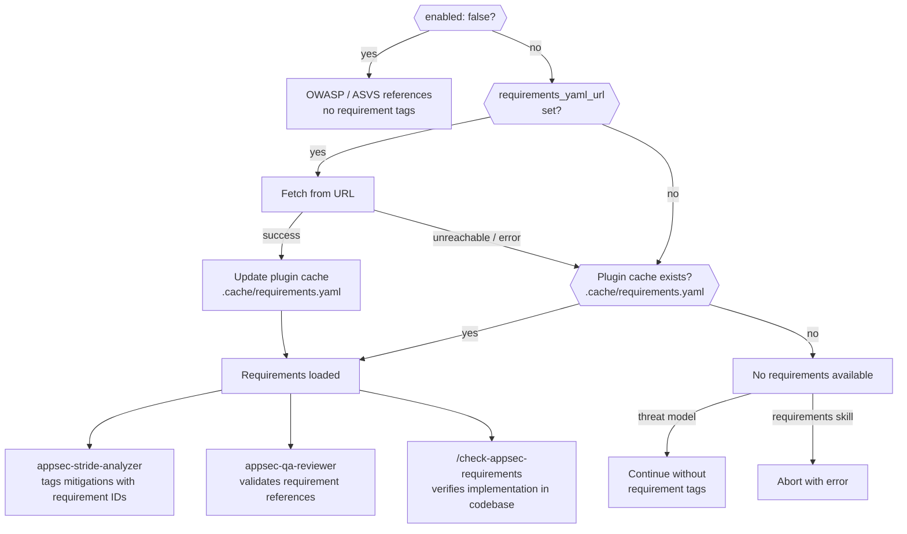

# Configuration

> Back to [README](../README.md)

## Contents

- [AppSec Steering Hook](#appsec-steering-hook)
- [External Context](#external-context)
- [Known Threats Input](#known-threats-input)
- [Security Requirements Management](#security-requirements-management)

---

## AppSec Steering Hook (Security Coach)

A `UserPromptSubmit` hook (`plugin/hooks/hooks.json`) runs `plugin/scripts/security_steering.py` on every prompt. When the prompt is recognised as code- or security-relevant, the hook injects **secure-by-default guidance** into Claude's system message — a baseline block plus **topic-specific guidance** for the domains the prompt touches (auth, injection, crypto, XSS/CSRF, secrets, IaC, LLM surfaces). When the repository has a security-requirements catalog loaded, the matching `SEC-*` requirements are resolved and injected inline, so Claude writes code that maps to the organisation's own controls.

"create a README" still passes through silently. "create an API endpoint" triggers the baseline and any topic-specific guidance relevant to API design.

### Activation (opt-in)

**The coach is disabled by default.** The shipped `steering_keywords.json` sets `"enabled": false`. Activate it explicitly through one of two paths:

| Path | Scope | How |
|---|---|---|
| `APPSEC_COACH` env var (truthy) | current shell / session | `export APPSEC_COACH=1` (or `true`, `on`, `yes`, `enabled`) |
| `"enabled": true` in `steering_keywords.json` | persistent, all sessions | edit the config file |

Precedence: the env var wins. `APPSEC_COACH=0` (or `false`, `off`, `no`, `disabled`) force-disables the coach even when the config sets `enabled=true` — useful to mute it for a single session without editing the config.

Whenever the coach fires, the `systemMessage` names its activation source (`AppSec Coach active (via env): auth, injection` or `… (via config) …`), so you always see why it is on.

### Configuration: `plugin/hooks/steering_keywords.json`

All configuration — baseline text, topic guidance, trigger keywords, thresholds, and requirement references — lives in a single JSON file. Teams can override any of it without editing Python.

```json
{
  "enabled": true,
  "baseline": "Security steering active. Always implement secure-by-default: ...",

  "code_keywords":   ["api", "database", "docker", "..."],
  "action_keywords": ["write", "create", "build", "..."],
  "thresholds": {
    "code_min": 2,
    "code_action_code_min": 1,
    "code_action_action_min": 1
  },
  "severity": {
    "max_injected_chars": 2500,
    "max_requirements_per_topic": 3
  },

  "topics": {
    "auth": {
      "triggers": ["auth", "login", "token", "oauth", "jwt", "session"],
      "guidance": "Authentication & session guidance: short-lived tokens with rotation on refresh; ...",
      "requirements": ["SEC-API-AUTH"]
    },
    "injection": {
      "triggers": ["sql", "injection", "sqli", "nosql", "orm"],
      "guidance": "Injection guidance: parameterized queries only; validate input at the boundary; ...",
      "requirements": ["SEC-SQL", "SEC-IV"]
    },
    "crypto":   { "triggers": [...], "guidance": "...", "requirements": ["SEC-TLS"] },
    "xss_csrf": { "triggers": [...], "guidance": "...", "requirements": ["SEC-ANTI-CSRF", "SEC-CSP", "SEC-CORS"] },
    "secrets":  { "triggers": [...], "guidance": "...", "requirements": ["SEC-SECRETS"] },
    "iac":      { "triggers": [...], "guidance": "..." },
    "llm":      { "triggers": ["prompt injection", "jailbreak"], "guidance": "..." },
    "general":  { "triggers": ["security", "vulnerability", "threat", "..."], "guidance": "" }
  },

  "requirements_source": {
    "paths": [".cache/requirements.yaml", "data/appsec-requirements-fallback.yaml"]
  }
}
```

**How triggering works:**
- Any **topic trigger** match fires (single word, like "sql" → injection topic).
- OR **≥ 2 code keywords** match (like "deploy the docker container").
- OR **1 code + 1 action** match ("create an api").
- `general` is a topic without guidance — it still fires on generic security words (`security`, `vulnerability`, `threat`, `stride`, …) and causes the baseline to be injected.

**How requirements injection works:**
- Each topic may list `SEC-*` requirement IDs it considers relevant.
- When that topic fires, the hook looks up those IDs in `requirements_source.paths[0]` (live cache, populated by the other two capsules on their last run) and falls back to `requirements_source.paths[1]` (bundled baseline).
- The resolved requirement text + priority is appended to the injected context.
- `severity.max_requirements_per_topic` caps how many requirements per topic are injected (default 3). `severity.max_injected_chars` caps the total size (default 2500).

**Topic-specific behaviour at a glance:**

| Topic | Example triggers | What it adds |
|---|---|---|
| `auth` | auth, login, jwt, session, oauth, mfa | Auth guidance + related `SEC-API-AUTH` |
| `injection` | sql, injection, orm, nosql | Injection guidance + `SEC-SQL`, `SEC-IV` |
| `crypto` | encrypt, hash, tls, aes, rsa, password | Crypto guidance + `SEC-TLS` |
| `xss_csrf` | xss, csrf, cors, csp, eval, exec | Browser/output guidance + CSP/CORS/anti-CSRF reqs |
| `secrets` | secret, credential, apikey | Secrets guidance + `SEC-SECRETS` |
| `iac` | dockerfile, kubernetes, terraform, helm | Container/IaC guidance |
| `llm` | prompt injection, jailbreak | OWASP LLM Top 10 pointers |
| `general` | security, vulnerability, threat, stride, appsec | Baseline only (no topic section) |

**Repository-level overrides.** Teams can disable topics they don't use (e.g. remove `llm` if no AI surface), extend `triggers` with internal framework names, add custom topics with their own guidance, or point `requirements_source.paths` at a different YAML. The script falls back to built-in defaults if the file is missing or unreadable.

### Legacy schema

Older configs used flat `strong` / `code` / `action` keyword lists. When the script sees a config without `topics`, it synthesises a single legacy topic from the `strong` list and proceeds — no configs break at upgrade time, but new fields (topic guidance, requirements) only activate once the config is migrated to the new schema.

---

## External Context

The context resolver can pull additional context from a REST endpoint before analysis begins — team ownership, compliance scope, prior findings, architecture notes, or anything else relevant. The endpoint returns free-form text; no fixed schema is required.

**Without this the plugin works normally** — `appsec-context-resolver` derives context from repository files and writes everything to `.threat-modeling-context.md` in the output directory.

### What the context resolver collects from repository files

| Category | Files checked |
|----------|--------------|
| Security policy | `SECURITY.md`, `.github/SECURITY.md`, `docs/SECURITY.md` |
| Architecture docs | `ARCHITECTURE.md`, `docs/architecture.md`, `docs/design.md`, ... |
| ADRs | `docs/adr/`, `docs/decisions/`, `adr/` — 5 most recent |
| API surface | `openapi.yaml`, `swagger.yaml`, `docs/api.md`, ... |
| Deployment config | `docker-compose.yml`, `Dockerfile`, `kubernetes/`, `terraform/` |
| Data model | `schema.sql`, `prisma/schema.prisma`, `schema.graphql`, ... |
| Env template | `.env.example`, `config/default.yaml`, `appsettings.json`, ... |
| Changelog | `CHANGELOG.md`, `CHANGES.md` — last 60 lines |
| Known threats | `docs/known-threats.yaml` — team-provided threats, accepted risks, prior findings |

### config.json

Set `rest_url` in `plugin/config.json` to enable the external context endpoint:

```json
{
  "external_context": {
    "enabled": true,
    "rest_url": "http://127.0.0.1:4444/context"
  },
  "pricing": {
    "input_per_1m": 3.00,
    "output_per_1m": 15.00,
    "cache_write_per_1m": 3.75,
    "cache_read_per_1m": 0.30
  },
  "logging": {
    "max_log_bytes": 5242880
  }
}
```

The `pricing` and `logging` sections are optional. If omitted, built-in defaults are used. Pricing rates are used by the hook logger for cost estimation; `max_log_bytes` controls log rotation threshold (default: 5 MB).

| Field | Default | Description |
|-------|---------|-------------|
| `external_context.enabled` | `true` | Set to `false` to skip the external context call entirely |
| `external_context.rest_url` | `null` | URL of a REST endpoint. Accepts `POST {"repo_url": "..."}`, returns `{"context": "..."}` |
| `pricing.input_per_1m` | `3.00` | USD per 1M input tokens (for cost estimation in logs) |
| `pricing.output_per_1m` | `15.00` | USD per 1M output tokens |
| `pricing.cache_write_per_1m` | `3.75` | USD per 1M cache write tokens |
| `pricing.cache_read_per_1m` | `0.30` | USD per 1M cache read tokens |
| `logging.max_log_bytes` | `5242880` | Log rotation threshold in bytes (default: 5 MB) |

### Endpoint contract

The endpoint receives a `POST` request with the repository URL and returns any JSON object containing a `context` field with free-form text (markdown is supported):

```
POST /context
Content-Type: application/json

{"repo_url": "https://gitlab.example.com/team/payment-service"}

-> {"context": "Payments platform. Compliance: PCI-DSS v4.0. Prior finding: JWT not validated on internal API (resolved 2024-03)."}
```

The `context` value is included verbatim in `.threat-modeling-context.md`. The endpoint can return anything — team info, compliance requirements, architecture summaries, prior findings, links to wikis, or any combination. If the endpoint is unreachable the resolver continues without it.

### Mock server for development

`scripts/mock-context-server.py` provides a minimal mock that returns example context based on simple URL pattern matching. No dependencies required.

```bash
python3 scripts/mock-context-server.py          # default port 4444
python3 scripts/mock-context-server.py 8080     # custom port
```

---

## Known Threats Input

Teams can provide known threats, prior pentest findings, and accepted risks by creating `docs/known-threats.yaml` in the analyzed repository. This gives development and AppSec teams a structured way to feed domain knowledge into the automated assessment.

### File format

```yaml
# docs/known-threats.yaml
# Team-provided known threats — read by the plugin during Phase 0.
# The STRIDE analyzer verifies open threats, the QA reviewer checks coverage.

threats:
  - id: TEAM-2026-001
    title: "SQL Injection in legacy search endpoint"
    stride: Tampering
    component: rest-api            # must match a STRIDE analyzer COMPONENT_ID
    severity: High                 # Critical | High | Medium | Low
    status: open                   # open | mitigated | accepted | false-positive
    description: |
      The /api/v1/search endpoint uses string concatenation instead of
      parameterized queries. Known since pentest Q1/2026.
    evidence: "src/routes/search.ts:47"
    pentest_ref: "PT-2026-Q1-007"  # optional — external reference
    accepted_risk: null            # required when status is 'accepted'

  - id: TEAM-2026-002
    title: "Missing rate limiting on login"
    stride: Denial of Service
    component: auth-service
    severity: Medium
    status: accepted
    description: |
      No rate limiting on /auth/login. Accepted until WAF rollout in Q3/2026.
    evidence: "src/auth/controller.ts:12"
    pentest_ref: null
    accepted_risk: "WAF with rate limiting planned for Q3/2026 (JIRA: SEC-4521)"
```

### How entries are processed

| `status` | STRIDE analyzer | Threat register | Section 11 (Out of Scope) |
|----------|----------------|-----------------|---------------------------|
| `open` | Verifies the issue still exists in code; includes as threat with `prior_finding_ref` | Appears as T-NNN | — |
| `mitigated` | Checks that the mitigation is actually in place | Appears only if mitigation is absent or incomplete | — |
| `accepted` | Skipped | — | Listed as "Accepted Risk" with justification |
| `false-positive` | Skipped | — | — |

The QA reviewer (Check 5) verifies that every `open` and `mitigated` entry is referenced somewhere in the finished threat model. Unaddressed entries are flagged in a "Prior Findings Not Addressed" subsection.

### Field reference

| Field | Required | Description |
|-------|----------|-------------|
| `id` | yes | Unique identifier (any format — e.g. `TEAM-2026-001`, `PT-Q1-007`, `VULN-42`) |
| `title` | yes | Short description of the threat |
| `stride` | yes | STRIDE category: Spoofing, Tampering, Repudiation, Information Disclosure, Denial of Service, Elevation of Privilege |
| `component` | no | Component slug matching the STRIDE analyzer's `COMPONENT_ID`. If omitted, the threat is checked against all components |
| `severity` | yes | Critical, High, Medium, or Low |
| `status` | yes | `open`, `mitigated`, `accepted`, or `false-positive` |
| `description` | no | Detailed description of the threat |
| `evidence` | no | File path and optional line number where the issue was observed |
| `pentest_ref` | no | External reference (pentest report ID, JIRA ticket, etc.) |
| `accepted_risk` | conditional | Required when `status: accepted` — justification for risk acceptance |

---

## Security Requirements Management

Point the plugin at your own requirements YAML to get requirement-tagged mitigations and a compliance check against your internal standards. Without a configured URL the plugin uses OWASP/CWE references only.

### Requirements config

`plugin/skills/check-appsec-requirements/config.json`:

```json
{
  "requirements_source": {
    "enabled": true,
    "requirements_yaml_url": null
  }
}
```

| `enabled` | `requirements_yaml_url` | Behaviour |
|-----------|------------------------|-----------|
| `false` | — | OWASP / ASVS references only — no requirement tags |
| `true` | `null` | Plugin cache only — if no cache exists, requirements are unavailable |
| `true` | URL set | Fetch from URL and update plugin cache; use cache if URL unreachable |

### check-appsec-requirements skill

Verifies that each requirement from the loaded YAML is implemented in the codebase, and writes a compliance report to `docs/security/appsec-requirements-report.md`.

```bash
# Check all requirements
/appsec-plugin:check-appsec-requirements

# Filter by category or ID substring
/appsec-plugin:check-appsec-requirements AUTH
```

The report includes per-requirement status, VS Code deep links to the evidence, a direct link to the source requirement page, and actionable recommendations for every non-passing item.

### Requirement definitions

Requirements are defined in a YAML file with the following structure:

```yaml
categories:
  - id: AUTH          # used as the tag prefix in mitigations: [AUTH-1]
    title: Authentication
    url: https://security.example.com/requirements/auth
    requirements:
      - id: AUTH-1
        text: "All authentication tokens must be validated server-side on every request."
        priority: MUST    # MUST | SHOULD | MAY
        url: https://security.example.com/requirements/auth#auth-1
```

The **tag format and category IDs are fully defined by your YAML** — the plugin imposes no naming convention. The bundled fallback uses `SEC-*` IDs as an example; replace it with your own YAML to use whatever naming scheme your organization uses (`AUTH-1`, `POLICY-007`, `R-INJ-3`, etc.).

### Requirement loading flow



The plugin cache (`$CLAUDE_PLUGIN_ROOT/.cache/requirements.yaml`) is stored **outside** the analyzed repository and persists across assessments of different repos. A successful remote fetch always updates the cache. When the remote URL is unreachable, the cached version is used automatically.

**First-time setup:** Run a threat model or the requirements skill once with the remote URL reachable to populate the cache. Subsequent runs work offline using the cache.

### Integration with the threat modeling pipeline

The `check-appsec-requirements` skill is **not** invoked by the threat modeling agent — the two are independent. They share the same loading logic and plugin cache (see the diagram in [Architecture > Agent Pipeline](architecture.md#agent-pipeline)).

**What the threat modeling pipeline does with requirements:**
- `appsec-context-resolver` fetches requirements at Phase 0, updates the plugin cache, and copies to `.requirements.yaml` in the output directory for use during the assessment
- `appsec-stride-analyzer` reads the YAML and tags each mitigation with the matching requirement ID (e.g. a Spoofing threat -> `[AUTH-3]`, using IDs from your YAML)
- `appsec-qa-reviewer` reads the YAML to validate that every requirement reference in the finished threat model points to a known requirement

**What the `check-appsec-requirements` skill does:**
- Resolves requirements using the same loading logic (URL -> plugin cache -> abort)
- Scans the codebase for requirement tag references and verifies that each is actually implemented
- Writes a compliance report to `docs/security/appsec-requirements-report.md`

Running `/appsec-plugin:create-threat-model` first populates the plugin cache, so a subsequent `/appsec-plugin:check-appsec-requirements` run works even if the remote URL is unreachable.

### Harvester — keeping requirements up to date

`scripts/harvest-requirements.py` crawls your internal requirements pages and regenerates `appsec-requirements-fallback.yaml`. The output can be served via a static URL and configured as `requirements_yaml_url` so the plugin fetches fresh requirements on each run.

```bash
pip install -r scripts/requirements.txt
python scripts/harvest-requirements.py
```

See [harvester.md](harvester.md) for configuration, scheduling options (cron, CI/CD, static URL), and indexing modes.
