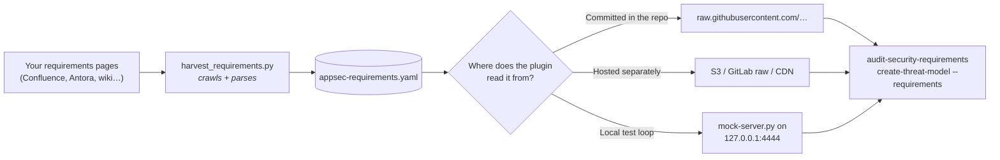

# Requirements Harvester

The requirements audit and threat modeler read a YAML requirements catalog. `scripts/harvest_requirements.py` can build that catalog from Confluence, Antora, or other HTML pages.

## The flow



The script crawls configured pages and writes the catalog. Publish that file at an HTTP URL, commit it as `docs/security/requirements.yaml`, or include it in an org profile.

## Setup options

### 1. Test with the bundled catalog

The bundled mock server lets you test the audit before connecting an internal catalog:

```bash
# Serve the bundled example requirements YAML on 127.0.0.1:4444
python3 scripts/mock-server.py

# In a second shell: point the plugin at the mock and run the auditor
/appsec-advisor:audit-security-requirements --requirements http://127.0.0.1:4444/requirements.yaml
```

The command prints `FAIL` and `PARTIAL` results with file and line evidence. Other statuses appear in the summary count.

### 2. Adapt the fallback YAML

If you do not have pages to crawl, start from `data/appsec-requirements-fallback.yaml`. Edit the IDs and text for your organization, then publish the file at a raw HTTP URL:

```json
// skills/audit-security-requirements/config.json
{
  "requirements_source": {
    "enabled": true,
    "requirements_yaml_url": "https://raw.githubusercontent.com/your-org/appsec-advisor/main/data/appsec-requirements-fallback.yaml"
  }
}
```

This is sufficient when the catalog changes infrequently.

### 3. Harvest from a live catalog

Configure the harvester for the source pages and run it manually or on a CI schedule:

```bash
# Copy the template config
cp scripts/harvest-config.example.json scripts/harvest-config.json
# Set the requirements and blueprint page URLs
$EDITOR scripts/harvest-config.json

# Install deps once
pip install -r scripts/requirements.txt

# Dry-run first to verify reachability and parsing
python3 scripts/harvest_requirements.py --dry-run --verbose

# Write the catalog
HARVEST_AUTH_TOKEN=<token> python3 scripts/harvest_requirements.py
```

The `output` setting controls the destination and defaults to `data/appsec-requirements-fallback.yaml`. The `sources_meta` block records the source page for each harvested section.

### Output format & validation

The output follows [`schemas/requirements-catalog.schema.yaml`](../schemas/requirements-catalog.schema.yaml) and is validated before the command exits. Invalid structure returns exit code 2; incomplete fields and duplicate IDs produce warnings. Validate a catalog manually with:

```bash
python3 scripts/requirements_state.py --validate data/appsec-requirements-fallback.yaml [--strict]
```

## Configuration

The crawler reads `scripts/harvest-config.json`. This is the minimum useful configuration:

```jsonc
{
  "description": "ACME Corp AppSec requirements",
  "url": "https://security.example.com",
  "output": "../data/appsec-requirements-fallback.yaml",

  "request": {
    "timeout_seconds": 15,
    "auth_header_env": "HARVEST_AUTH_TOKEN",
    "verify_ssl": true
  },

  "sources": [
    {
      "id": "internal-requirements",
      "type": "requirement",
      "mode": "structured",
      "title": "Internal Security Requirements",
      "crawl_url": "https://security.example.com/requirements"
    },
    {
      "id": "api-blueprints",
      "type": "blueprint",
      "mode": "full",
      "title": "API Security Blueprints",
      "crawl_url": "https://security.example.com/blueprints/api"
    }
  ]
}
```

The harvester recognizes IDs such as `SEC-AUTH-01`, `SCG-HARDENXML`, `OWASP-A01`, and `ISO27K-A12`. It does not require a specific prefix.

For each source, the harvester reads `crawl_url` and direct same-origin child links below that path, up to `max_pages`. Add another `sources[]` entry for pages outside that path or deeper in the navigation tree.

When a blueprint mentions a harvested requirement ID, the output links the blueprint to that requirement.

### Useful flags

| Flag | When you'd use it |
|---|---|
| `--dry-run` `--verbose` | Inspect parsing without writing a catalog |
| `--req-only` / `--blueprint-only` | Debug one source type at a time |
| `--config PATH` | Multiple environments (e.g. staging vs. prod requirements) |
| `--output PATH` | Override the config's `output`; useful in CI |
| `--token TOKEN` | Pass a bearer token directly; prefer `auth_header_env` in CI |

See `scripts/harvest-config.example.json` for all fields.

## Keeping the YAML fresh: scheduling

The harvester runs once and exits. Schedule it with cron or CI if the catalog should update automatically. This GitHub Actions example writes and commits changed output:

```yaml
# .github/workflows/harvest-requirements.yml
name: Harvest Security Requirements
on:
  schedule: [{ cron: '0 2 * * *' }]   # nightly at 02:00 UTC
  workflow_dispatch:                  # manual trigger too

permissions:
  contents: write

jobs:
  harvest:
    runs-on: ubuntu-latest
    steps:
      - uses: actions/checkout@v4
      - uses: actions/setup-python@v5
        with: { python-version: '3.11' }
      - run: pip install -r scripts/requirements.txt
      - env: { HARVEST_AUTH_TOKEN: "${{ secrets.HARVEST_AUTH_TOKEN }}" }
        run: python3 scripts/harvest_requirements.py
      - name: Commit if changed
        run: |
          if ! git diff --quiet data/appsec-requirements-fallback.yaml; then
            git config user.email ci@github.com
            git config user.name "GitHub Actions"
            git commit -am "chore: refresh appsec requirements [harvester]"
            git push
          fi
```

Instead of committing the file, the job can publish it to S3, a GitLab raw URL, or an internal CDN. Point `requirements_yaml_url` to that location.

## Wiring it up

Set `requirements_yaml_url` to use the catalog for both the threat modeler and requirements audit:

```json
// skills/audit-security-requirements/config.json
{
  "requirements_source": {
    "enabled": true,
    "requirements_yaml_url": "https://raw.githubusercontent.com/your-org/appsec-advisor/main/data/appsec-requirements-fallback.yaml"
  }
}
```

The plugin caches the fetched catalog. An explicit `--requirements <url>` overrides the config; `--no-requirements` disables it for one run.

## Troubleshooting

**Parser returns zero requirements.** Run with `--verbose` — the harvester prints every parser attempt per page. If all five strategies miss, either the ID shape doesn't match `PREFIX-PART[-PART…]` (e.g. pure numeric IDs like `REQ_001`) or the HTML is an SPA that needs JavaScript to render content (the harvester fetches static HTML only).

**A configured blueprint page is missing from the YAML.** The current harvester indexes the configured `crawl_url` itself and direct same-origin child links below that path. If a blueprint still does not appear, check the dry-run output for `Found N sub-page link(s)` and the blueprint count. Common causes are JavaScript-rendered content, links outside the configured base path, deeper nested pages that are not linked directly from `crawl_url`, or `max_pages` capping the discovered links before the page is reached. Fix by adding explicit `sources[]` entries for those pages or raising `max_pages`.

**Auth token works interactively but fails in CI.** `HARVEST_AUTH_TOKEN` must be set as a CI secret *and* passed through in the job's `env:` block — secrets are not auto-exposed on recent GitHub / GitLab runners.

**Mock server returns my old YAML after I ran the harvester.** The mock hardcodes `examples/appsec-requirements-example.yaml` as the `/requirements.yaml` payload. Either re-run the harvester with `--output examples/appsec-requirements-example.yaml`, or `ln -sf` the real output file to that location.

**`--requirements` on the CLI is ignored.** The resolution order is: explicit `--requirements <url>` > config `requirements_yaml_url` (when `enabled: true`) > cache. If you passed `--no-requirements` earlier, it wins regardless.
