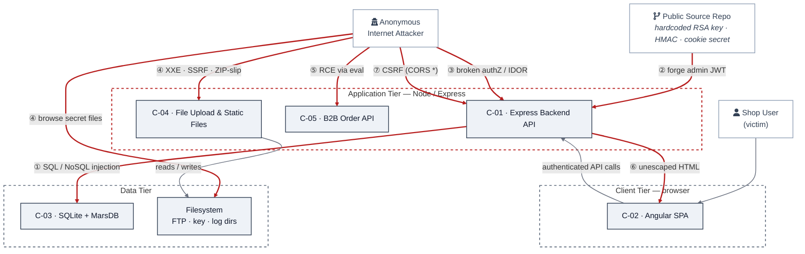
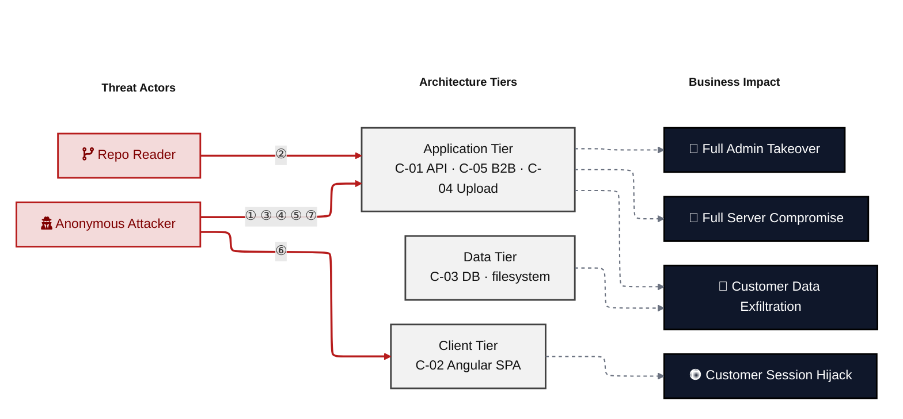

# Analysis: merging "Top Findings" + "Architecture Assessment" → "Top Threats"

Basis: last rendered output `<workspace>/juice-shop/docs/security/threat-model.md` (2026-05-29) and the two generators in `scripts/compose_threat_model.py`.

## Verdict

**Yes — mergeable, and worth doing.** The Architecture Assessment table is *already* threat-modeling style (befund + explanation + findings-in-components); it is ~80 % of the target "Top Threats" shape. The merge is mostly: keep AA's grouping spine, graft on the deterministic columns that only Top Findings has (criticality badge, mitigations), and **close a coverage gap that currently drops the #4 Critical finding.** It is not a trivial concat — three competing taxonomies must be reconciled into one.

## What each section is today

| | Top Findings | Architecture Assessment |
|---|---|---|
| Unit of a row | one finding (F-NNN) | one weakness *class* (groups N findings) |
| Lens | severity-ranked list | design-control / threat-modeling |
| Provenance | **100 % deterministic** — `triage.ranking.views.top_findings` (compose_threat_model.py:4857) | **LLM fragment** `weaknesses[]` (category/description), components+findings auto-derived (5033–5103) |
| Carries criticality? | ✅ per row (🔴/🟠) | ❌ one global verdict only |
| Carries mitigations? | ✅ M-NNN + priority per row | ❌ none |
| Carries explanation? | ❌ | ✅ "why systemic" prose |
| Carries grouping? | ❌ flat | ✅ by weakness class |

The two are **complementary, not redundant**: each holds exactly what the other lacks. That is what makes a merge attractive — and the user's target shape ("befund + short explanation + findings per component") is literally the AA columns plus a criticality badge.

## The blocker: three taxonomies, inconsistent membership

The management summary already groups the same findings **three different ways**, and they disagree:

- **Top Findings**: F-001,002,003,004,005 (severity-ranked, ungrouped)
- **Architecture Assessment** (5 classes): F-001,012 / 002,003,019 / 006,021 / 016,015,013 / 007,010
- **Attack paths ①–⑦** (Security Posture at a Glance): F-001,002,003,004,006,007,008,010,011,014,017,018,019,021,026

Enumerated diffs (verified against the rendered doc):

- **`F-004` and `F-005` are in Top Findings but in NO Architecture Assessment class.** F-004 is the #4 **Critical** (RCE / sandbox escape) and the root of the §Critical Attack Tree. Naively using AA as the merge spine **silently drops the RCE.** Unacceptable.
- AA misses 7 of the attack-path findings: F-004,008,011,014,017,018,026 (RCE, CSRF, secret-file exposure, broken authZ/IDOR).
- AA includes 4 findings the attack paths don't surface: F-012,013,015,016.
- The two lenses **bucket the same finding differently**: path ② Auth-Bypass groups F-001+F-010; AA splits them (F-001→*Cryptography*, F-010→*Session Lifecycle*). Same for F-007. So "which threat does this finding belong to" has no single answer today.

A "Top Threats" section forces a single canonical taxonomy. That is the real design decision, not the table mechanics.

## Recommended merge

**Spine = a threat taxonomy that covers 100 % of ≥High findings** (neither current lens does). Build each Top-Threat row as:

```
Threat (befund)            ← weakness-class name, e.g. "Insecure Query Construction & Data Access"
Criticality                ← DERIVED = max severity of member findings (deterministic)
Explanation                ← AA "why systemic" prose (LLM, already authored)
Findings × Component       ← member F-NNN grouped under their C-NN (already auto-derived, 5078–5103)
Mitigations                ← DERIVED = union of member findings' primary M-IDs (reuse Top-Mitigations logic)
Path                       ← glyph ①–⑦ link (reuse fid_to_path, 4877)
```

Every column already exists in one of the two generators — the merge is plumbing the deterministic fields (criticality/mitigations/path from `_compute_top_findings_rows`) onto the AA `weaknesses[]` rows, then sorting rows by derived criticality → finding-count.

**Mandatory taxonomy fix — close the gap.** Add the threat classes AA is missing so no Critical/High is dropped. Minimum:

- **Remote Code Execution / Unsafe Evaluation** — F-004, F-022 (Critical; currently orphaned)
- **Broken Authentication & Access Control** — F-005, F-014, F-017 (High; IDOR + client-only authZ + unverified password change)
- **Sensitive File / Secret Exposure** — F-011, F-026 (currently only in attack paths)

That lifts AA from 5 → ~8 classes and makes the weakness taxonomy a superset of both current lenses.

## Strong simplification opportunity (flag, don't silently do)

The **attack-paths ①–⑦ block IS already a Top-Threats section**: each path has a name (befund), a one-line explanation, a findings list, and an *impact* — richer than AA. So the doc currently carries **two** near-duplicate threat groupings (attack paths + AA weaknesses) plus the flat finding list. The highest-value move is to collapse **all three** into one threat-grouped section, using the attack-path taxonomy (already covers F-004, CSRF, secret-exposure, IDOR; already carries actor + impact) as the canonical spine and folding AA's "why systemic" prose + Top-Findings' criticality/mitigation columns into it. That removes a whole redundant table rather than merging two.

Two viable canonical spines — **decision needed before implementing**:

- **(A) Attack-path taxonomy** (①–⑦): attacker-centric, already covers all findings + impact. Best if "Top Threats" should read like attacker goals.
- **(B) Weakness-class taxonomy** (AA, gap-filled to ~8): control-centric, maps cleanly to §7 Security Architecture. Best if "Top Threats" should map to remediation domains.

They are near-isomorphic but split F-001/F-007/F-010 differently, so one must win.

## Effort / feasibility

- Hybrid deterministic+LLM section is **precedented** — "Security Posture at a Glance" is already a "contract v2 hybrid renderer" (compose_threat_model.py:1888, 4480). Same pattern applies.
- Deterministic columns (criticality, mitigations, path) are pure functions already written — reusable.
- The only genuinely new work: (1) pick the canonical taxonomy, (2) gap-fill the missing threat classes in the fragment schema/prompt, (3) per-threat criticality = max(member severities), (4) drop the now-redundant table.
- Risk: the LLM-authored class list must be constrained so it can never drop a ≥High finding — add a deterministic post-check (every Critical/High F-NNN appears in exactly one Top-Threat row) to QA, mirroring existing coverage guarantees.

---

# Option C: fold "Security Posture at a Glance" in too — one central section

**Honest take: this is the strongest version, and SPaaG is the right anchor — not AA.** The ①–⑦ taxonomy already *lives* inside SPaaG, and SPaaG's attack-path bullets are already a Top-Threats list (name + actor + explanation + findings + **impact**). Top Findings and AA are just two more renderings of the same ~7 threats. Three text blocks describing one object → collapse to one.

"One central section" must mean **diagram + one unified table**, NOT one undifferentiated blob:

```
## Security Posture / Top Threats
  1. Heatmap diagram (mermaid)        ← keep as-is; visual "at a glance", different medium, leads
  2. ONE threat table, keyed ①–⑦      ← REPLACES attack-path bullets + Top Findings + Architecture Assessment
  (actor folds into a table column or a 3-line legend, not its own prose catalog)
```

The diagram and the table become two representations sharing the ①–⑦ keys.

## Concrete mockup

→ A **full rendered mockup** of the merged section — both diagrams plus the ranked threat table, built from the real 2026-05-29 juice-shop data — is in **[Worked example](#worked-example--the-central-security-posture--top-threats-section-rendered)** at the bottom of this doc. The notes below explain *why* it looks the way it does.

**Read the worked example as proof of the central problem, not a finished design:**

- Five threats come straight from existing SPaaG attack paths. The **file-parser cluster, the extended access-control row, and the secret-exposure row** (plus the merges of F-012 into crypto, F-005 into access-control) are **gap-fill** — they exist in AA/Top Findings but had *no* attack-path glyph. Same coverage gap as Option A/B, now unavoidable in one table: **neither SPaaG nor AA alone covers all ≥High findings** (SPaaG drops F-005/012/013/015/016/022; AA drops F-004/008/011/014/017/018/026). The union must be assigned to exactly one row each.
- `Risk` is **derived** = max member severity (deterministic). `Primary fix` = union of member findings' primary M-IDs (deterministic). `Why systemic` = the one LLM-authored sentence (from AA prose). So the table is **deterministic-first with one LLM column** — a bad fragment degrades one column, not the section.
- Rows are re-sorted Critical-first, so glyphs are **renumbered to follow risk** (①–③ = the three Criticals). The diagram glyphs and table rows are then 1:1 by construction.

## My honest bottom line on Option C

Do it, but scope it as a **3→1 collapse under the existing diagram**, not "merge all four blocks." Net effect: removes two redundant tables (attack-path bullets ≈ AA), gives the reader one place that answers *where / what-first / why* together, and the diagram keeps doing the visual job a table can't. The two real costs: (1) it hard-couples the section to the LLM fragment — neutralize with deterministic-first rendering; (2) it forces the single-taxonomy + full-coverage reconciliation that the doc can currently avoid by keeping three loose views. That reconciliation is *good hygiene* but it's the bulk of the work, and it needs the QA invariant "every ≥High finding in exactly one row, every diagram glyph = one row."

---

# Worked example — the central "Security Posture & Top Threats" section (rendered)

> **STATUS: IMPLEMENTED IN THE GENERATOR (2026-05).** This section is no longer a mock-up — it is produced by the live pipeline. The generator collapses *Security Posture at a Glance* + *Top Findings* + *Architecture Assessment* into one `### Security Posture & Top Threats` section: **Figure 1** (optional architecture diagram from `.fragments/top-threats-architecture.md`) → **Figure 2** (the forward-only risk-flow heatmap) → the **Top Threats table**. Source of truth:
> - `scripts/compose_threat_model.py` — `_render_security_posture_at_a_glance` (composition + forward-only heatmap) and `_compute_top_threats_rows` (the table).
> - `templates/fragments/top-threats.md.j2`, `data/attack-class-taxonomy.yaml` (`threat_label` / `stride`), `data/sections-contract.yaml`, `scripts/qa_checks.py`.
>
> The block below is the **verbatim rendered output** for the juice-shop fixture (re-render: `python3 scripts/compose_threat_model.py --output-dir <out>`). The taxonomy has **7 attack classes** (glyph ①–⑦, taxonomy order — agreeing with the heatmap arrows), not the 8 of the original sketch: the sketch's separate "File-Parser" class is folded into *Injection* (XXE) and *Sensitive File & Secret Exposure* (SSRF, ZIP-slip) by the canonical taxonomy.

---

## Security Posture & Top Threats

🔴 **Not production-ready.** Eight structural threats; three are independently sufficient for full compromise from the open internet. The application makes the same trust-model error repeatedly — user-controlled input reaches a security-sensitive sink (SQL, JS eval, HTML renderer, JWT signer, XML parser) without the boundary control that would stop it.

**Risk: 🔴 Critical ×4 · 🟠 High ×13 · 🟡 Medium ×6 · 🟢 Low ×3.**

### Figure 1 — Architecture & Top Threats

Components grouped by trust boundary. Red edges are attacker-controlled data flows; each is labelled with the threat (①–⑦) that rides it. *(This is the content of the optional `.fragments/top-threats-architecture.md` fragment the generator inlines as Figure 1; glyphs follow the 7-class taxonomy order.)*



### Figure 2 — Risk Flow: Actor → Tier → Impact

Same eight threats, viewed as **actor → tier → business impact**. Shows *consequence*, which Figure 1 does not.



> **Generation note (Figure 2):** lay the heatmap out strictly left→right with **forward-only edges** (actor → tier → impact) and **invisible header-alignment edges** (`HA --- HT --- HI`) so ELK pins the three columns and routes every arrow horizontally. **No backward edges** — never route a victim node back into the actor column (that was the old box-crossing arrow); represent the victim as the *impact* it suffers (Session Hijack) instead. Keep arrow labels short (glyphs only) so edges don't widen and overlap a box.

### Top Threats

Each row is one **threat** (an attack class), not one finding — ordered by the canonical taxonomy (glyph ①–⑦, agreeing with the heatmap). *Threat Description* states the general architectural weakness (STRIDE in brackets); *Findings* lists the concrete instances, each linked to §8 Threat Register with its component; *Risk & Impact* combines severity with business consequence; *Fix* links the primary mitigation(s).

> The table below is the **actual rendered output** of the implemented `top_threats` section (compose_threat_model.py `_compute_top_threats_rows` + `templates/fragments/top-threats.md.j2`), re-rendered from the juice-shop artifacts. Links target anchors in the full `threat-model.md` (§8 rows `#f-nnn`, §2.3 components `#c-nn`, §9 mitigations `#m-nnn`, heatmap path bullets `#path-<class>`).

| # | Threat Description | Findings (→ Component) | Risk & Impact | Fix |
|---|--------------------|------------------------|---------------|-----|
| [①](#path-injection) | **Insecure Query Construction & Data Access** _(T·I)_<br/>No consistent boundary between user input and the data layer: request data reaches SQL, NoSQL and XML interpreters unparameterized across multiple routes. | •&nbsp;[F-002](#f-002)&nbsp;SQL&nbsp;Injection&nbsp;→&nbsp;[C-01](#c-01)<br/>•&nbsp;[F-003](#f-003)&nbsp;SQL&nbsp;Injection&nbsp;→&nbsp;[C-01](#c-01)<br/>•&nbsp;[F-019](#f-019)&nbsp;NoSQL&nbsp;Injection&nbsp;in&nbsp;Product&nbsp;Review&nbsp;Update&nbsp;→&nbsp;[C-01](#c-01)<br/>•&nbsp;[F-016](#f-016)&nbsp;XXE&nbsp;File&nbsp;Disclosure&nbsp;via&nbsp;XML&nbsp;Upload&nbsp;→&nbsp;[C-04](#c-04) | 🔴 **Critical**<br/>Customer Data Exfiltration · Full Admin Takeover | [M-001](#m-001), [M-005](#m-005) (P1/P2) |
| [②](#path-auth-bypass) | **Hardcoded Secrets & Weak Cryptography** _(S·E)_<br/>Authentication relies on credentials that are not actually secret and on outdated cryptography, so anyone who can read the source holds the keys it depends on. | •&nbsp;[F-001](#f-001)&nbsp;JWT&nbsp;Forgery&nbsp;via&nbsp;Hardcoded&nbsp;RSA&nbsp;Private&nbsp;Key&nbsp;→&nbsp;[C-01](#c-01)<br/>•&nbsp;[F-012](#f-012)&nbsp;Password&nbsp;Hashing&nbsp;with&nbsp;MD5&nbsp;→&nbsp;[C-01](#c-01)<br/>•&nbsp;[F-010](#f-010)&nbsp;Vulnerable&nbsp;JWT&nbsp;Libraries&nbsp;→&nbsp;[C-01](#c-01) | 🔴 **Critical**<br/>Full Admin Takeover · Customer Session Hijack | [M-002](#m-002), [M-003](#m-003) (P1/P2) |
| [③](#path-privilege-escalation) | **Broken Authorization & Access Control** _(E·I)_<br/>No reliable server-side authorization model: access decisions are delegated to the client, basket access is not object-scoped, and a password change skips the current-password check. | •&nbsp;[F-014](#f-014)&nbsp;Client&nbsp;Side&nbsp;Only&nbsp;Authorization&nbsp;Enforcement&nbsp;→&nbsp;[C-02](#c-02)<br/>•&nbsp;[F-017](#f-017)&nbsp;IDOR&nbsp;on&nbsp;Basket&nbsp;Retrieval&nbsp;→&nbsp;[C-01](#c-01)<br/>•&nbsp;[F-005](#f-005)&nbsp;Password&nbsp;Reset&nbsp;Without&nbsp;Current&nbsp;Password&nbsp;→&nbsp;[C-01](#c-01) | 🟠 **High**<br/>Full Admin Takeover · Customer Data Exfiltration | [M-015](#m-015), [M-007](#m-007) (P2) |
| [④](#path-sensitive-data-exposure) | **Sensitive File & Secret Exposure** _(I)_<br/>Confidential files and management endpoints are reachable on unauthenticated routes, and unsafe path/URL handling lets the server leak or fetch internal resources. | •&nbsp;[F-011](#f-011)&nbsp;Sensitive&nbsp;File&nbsp;Exposure&nbsp;via&nbsp;Public&nbsp;Directory&nbsp;Listing&nbsp;→&nbsp;[C-01](#c-01)<br/>•&nbsp;[F-026](#f-026)&nbsp;Unauthenticated&nbsp;Application&nbsp;Configuration&nbsp;Disclosure&nbsp;→&nbsp;[C-01](#c-01)<br/>•&nbsp;[F-013](#f-013)&nbsp;SSRF&nbsp;via&nbsp;Profile&nbsp;Image&nbsp;URL&nbsp;→&nbsp;[C-04](#c-04)<br/>•&nbsp;[F-015](#f-015)&nbsp;ZIP&nbsp;Path&nbsp;Traversal&nbsp;File&nbsp;Overwrite&nbsp;→&nbsp;[C-04](#c-04) | 🟠 **High**<br/>Customer Data Exfiltration | [M-004](#m-004), [M-006](#m-006) (P2) |
| [⑤](#path-remote-code-execution) | **Remote Code Execution (unsafe eval)** _(E)_<br/>At one processing boundary the application treats attacker-supplied input as executable code instead of data, in a sandbox that does not confine prototype-chain access. | •&nbsp;[F-004](#f-004)&nbsp;Remote&nbsp;Code&nbsp;Execution&nbsp;via&nbsp;Sandbox&nbsp;Escape&nbsp;→&nbsp;[C-05](#c-05)<br/>•&nbsp;[F-022](#f-022)&nbsp;B2B&nbsp;Sandbox&nbsp;CPU&nbsp;Exhaustion&nbsp;→&nbsp;[C-05](#c-05) | 🔴 **Critical**<br/>Full Server Compromise | [M-019](#m-019), [M-011](#m-011) (P1/P3) |
| [⑥](#path-cross-site-scripting) | **Output Encoding / Cross-Site Scripting** _(T·I)_<br/>Server-supplied data is not consistently encoded before rendering, and the session token is stored where any injected script can read it. | •&nbsp;[F-006](#f-006)&nbsp;Stored&nbsp;XSS&nbsp;via&nbsp;Multiple&nbsp;trust&nbsp;HTML&nbsp;bypass&nbsp;Sinks&nbsp;→&nbsp;[C-02](#c-02)<br/>•&nbsp;[F-007](#f-007)&nbsp;JWT&nbsp;Token&nbsp;in&nbsp;localStorage&nbsp;XSS&nbsp;Accessible&nbsp;Session&nbsp;Storage&nbsp;→&nbsp;[C-02](#c-02)<br/>•&nbsp;[F-021](#f-021)&nbsp;Reflected&nbsp;XSS&nbsp;via&nbsp;Order&nbsp;Tracking&nbsp;→&nbsp;[C-01](#c-01) | 🟠 **High**<br/>Customer Session Hijack | [M-016](#m-016), [M-014](#m-014) (P2) |
| [⑦](#path-cross-site-request-forgery) | **CSRF / Permissive CORS** _(S·T)_<br/>State-changing requests are not bound to the user's origin or intent: a wildcard CORS policy plus missing anti-CSRF tokens let any external page act in the victim's session. | •&nbsp;[F-008](#f-008)&nbsp;CORS&nbsp;configured&nbsp;to&nbsp;allow&nbsp;all&nbsp;origins&nbsp;→&nbsp;[C-01](#c-01)<br/>•&nbsp;[F-018](#f-018)&nbsp;Permissive&nbsp;CORS&nbsp;Policy&nbsp;Allows&nbsp;Any&nbsp;Origin&nbsp;→&nbsp;[C-01](#c-01) | 🟠 **High**<br/>Customer Session Hijack | [M-018](#m-018) (P2) |

_STRIDE: S spoofing · T tampering · R repudiation · I information disclosure · D denial of service · E elevation of privilege. Risk, findings, components, impact and Fix are derived deterministically; only the one-line weakness description is authored._

> **Fix sequence (from the Verdict):** ② rotate + externalize secrets → ① parameterize all queries → ⑤ remove eval-based order processing → ⑥ restore output encoding. These four close every Critical and most High threats; ③④⑦ are the remaining High surface.

---

*End of worked example. The block above is the verbatim rendered `top_threats` section. The two figures are rendered above it by the same section; everything except the one-line weakness description per threat is derived deterministically.*
