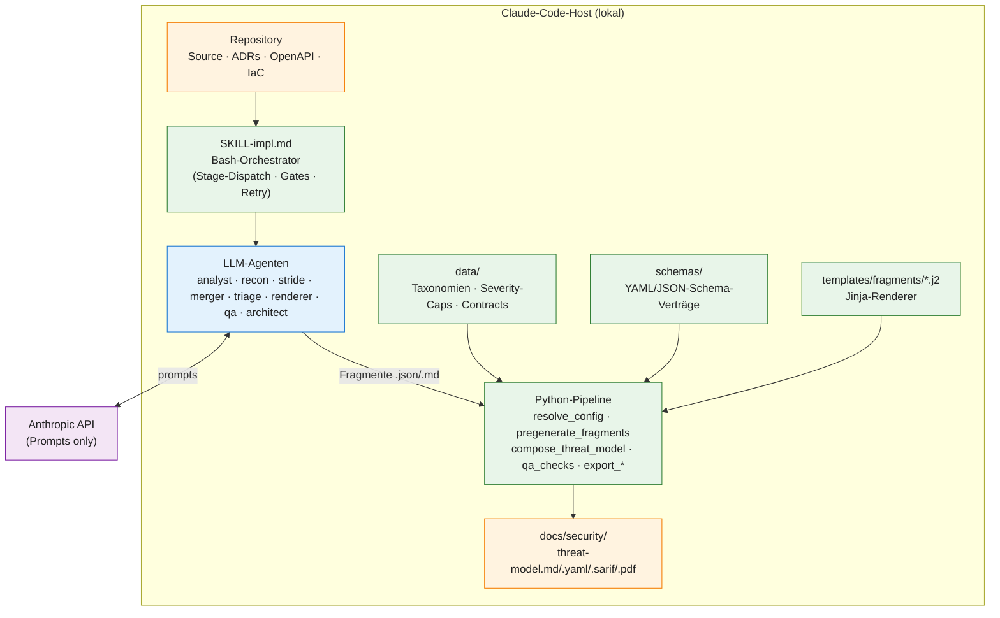
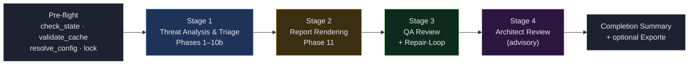

# create-threat-model

Entwicklerdokumentation der STRIDE-Threat-Modeling-Skill des `appsec-advisor`-Plugins für Claude Code — Architektur, technische Funktionsweise und Erweiterbarkeit.

## Inhalt

1. [Überblick](#1--überblick)
2. [Architektur](#2--architektur)
3. [Pipeline & Stages](#3--pipeline--stages)
4. [Determinismus & Validierung](#4--determinismus--validierung)
5. [Artefakte & Schemata](#5--artefakte--schemata)
6. [Inkrementeller Modus](#6--inkrementeller-modus)
7. [Erweiterbarkeit](#7--erweiterbarkeit)
8. [Tests & Drift-Guards](#8--tests--drift-guards)

---

## 1 — Überblick

`create-threat-model` ist die zentrale Skill des Plugins und führt eine STRIDE-basierte Threat-Model-Analyse für ein Repository durch. Sie liest den Quellcode lokal, leitet ein Architektur- und Vertrauensgrenzenmodell ab und erzeugt einen reproduzierbaren Markdown-Report plus strukturierte Exporte.

**Was sie ist** — Eine mehrstufige Agenten-Pipeline mit deterministischer Renderschicht. Der LLM liefert Fragmente, Python-Skripte komponieren und validieren das Endergebnis.

**Was sie nicht ist** — Kein SAST/SCA-Scanner und kein einzelner Mega-Prompt. Sie ersetzt keinen manuellen Architektur-Review, sondern liefert eine code-verankerte Vorlage dafür.

**Wo sie läuft** — Vollständig lokal auf dem Claude-Code-Host. Der einzige Netzwerkempfänger ist die Anthropic-API (Prompts/Antworten). Quellcode verlässt die Maschine nur im Prompt-Kontext.

### Eintrittspunkte

| Komponente | Pfad |
|---|---|
| Skill-Definition | `skills/create-threat-model/SKILL.md` → routet bei `--help` auf `HELP.txt`, sonst auf `SKILL-impl.md` |
| Implementation | `skills/create-threat-model/SKILL-impl.md` (Bash-orchestrierte Pipeline) |
| Orchestrator-Agent | `agents/appsec-threat-analyst.md` (Sonnet, 120 Turns) |
| Default-Output | `<repo>/docs/security/` |

---

## 2 — Architektur

Die Skill folgt einem klaren Schichtenmodell: *dünner Bash-Orchestrator* oben, *LLM-Agenten* für interpretative Aufgaben, *deterministische Python-Skripte* für alle finalen Artefakte. Diese Trennung ist die wichtigste Architekturentscheidung — LLMs schreiben strukturierte Fragmente, niemals den Endreport.



### Drei Verantwortungsschichten

| Schicht | Aufgabe | Sprache / Ort |
|---|---|---|
| **Orchestrierung** | Stage-Dispatch, Lock-Handling, Konfig-Auflösung, Watchdog, Repair-Schleifen, Pre/Post-Flight-Gates. | Bash in `SKILL-impl.md` |
| **Interpretation** | Code lesen, Architektur ableiten, STRIDE-Findings finden, Triage-Begründung, QA-Repair-Pläne. | LLM-Agenten unter `agents/` |
| **Komposition & Validierung** | Schema-Validierung, Fragment-Zusammensetzung, Markdown-Komposition, Mermaid-Validierung, Export (SARIF/PDF/HTML/Pentest). | Python unter `scripts/` |

> [!TIP]
> **Kernregel** — Kein Agent schreibt `threat-model.md` direkt. Einziger legaler Writer ist `scripts/compose_threat_model.py`. Verstöße erkennt das Hard-Gate `check_inline_shortcut.py` und bricht den Lauf mit Repair-Plan ab.

---

## 3 — Pipeline & Stages

Vier Stages laufen sequenziell und jede besitzt ein *eigenes* Turn-Budget. Die Trennung verhindert, dass eine lange Analyse die nachfolgende Validierung um Tokens bringt — der historische Fehlerfall, der zur Stage-2/3-Aufteilung führte.



### Stage 1 — Threat Analysis & Triage

Geführt von `appsec-threat-analyst` (Sonnet, 120 Turns). Lädt Phase-Gruppen aus `agents/phases/phase-group-*.md` nur dann, wenn die jeweilige Phase startet — so bleibt der Prompt-Cache-Präfix stabil.

| Phase | Agent / Tool | Output |
|---|---|---|
| 1. Context | `context-resolver` | `.threat-modeling-context.md` |
| 2. Recon | `recon-scanner` (26 Kategorien) | `.recon-summary.md` |
| 2. SCA (opt.) | `dep_scan.py` im Hintergrund | `.dep-scan.json` |
| 3.–8. Architektur | Orchestrator | C4-, Asset-, Surface-, Boundary-, Control-Fragmente |
| 8b. Requirements (opt.) | Orchestrator | Compliance-Fragmente |
| 9. STRIDE | `stride-analyzer` × N parallel | `.stride-<component>.json` |
| 9. Merge | `threat-merger` | `.threats-merged.json` (stable `F-NNN`) |
| 10. Dep-Synthese | Orchestrator | aktualisiertes Register |
| 10b. Triage | `triage-validator` | `.triage-flags.json` + `threat-model.yaml` |

Fan-out in Phase 9: je `--assessment-depth` 3/5/8 Komponenten. Bei Übersteigen werden Komponenten nach Attack-Surface-Risiko priorisiert; verworfene Komponenten landen sichtbar in §11 (Out of Scope).

### Stage 2 — Report Rendering

`appsec-threat-renderer` bekommt ein *frisches* Turn-Budget. Ablauf:

1. `pregenerate_fragments.py` erzeugt deterministische Markdown-Fragmente aus `threat-model.yaml`.
2. Der Renderer-Agent schreibt die zwei LLM-Fragmente `ms-verdict.json` und `ms-architecture-assessment.json` (optional Walkthroughs).
3. `compose_threat_model.py --strict` komponiert die finale `threat-model.md` via `data/sections-contract.yaml` und `templates/fragments/*.j2`.
4. `render_completion_summary.py --patch-placeholders` setzt Token-/Kosten-/Zeit-Marker.
5. `qa_checks.py all` läuft 11 deterministische Prüfungen.

> [!WARNING]
> **Auto-Retry-Loop** — Nach Stage 2 prüft `check_inline_shortcut.py` auf Renderer-Bypass und Schema-Drift. Bei Misserfolg läuft die Recovery-Sequenz (Merge → Triage → Pregenerate) und Stage 2 wird re-dispatcht — maximal zwei Wiederholungen, dann Abbruch mit `.inline-shortcut-repair-plan.json`.

### Stage 3 — QA Review

`appsec-qa-reviewer` ruft `qa_checks.py` auf und kann sichere Fixes direkt anwenden. Komplexere Probleme erzeugen einen `.qa-repair-plan.json`; der Orchestrator wird im `REPAIR_MODE` erneut gestartet, Fragmente werden gezielt nachgezogen und der Composer rendert neu. Loop hart bei 3 Iterationen gedeckelt.

| # | QA-Check |
|---|---|
| 1 | VS-Code-Deeplink-Pfade |
| 2 | Markdown-Link-Integrität |
| 3 | Mermaid-Grammatik (Batch via `mermaid_validate.mjs`) |
| 4 | Threat ↔ Mitigation Cross-Refs |
| 5 | Anker für T-/M-NNN |
| 6 | Inkrementelle Coverage prior Findings |
| 7 | Keine Platzhalter (`<TBD>` …) |
| 8 | Pflichtsektionen (Section-Contract) |
| 9 | Management-Summary-Invarianten |
| 10 | Changelog-Invarianten |
| 11 | Repair-Plan-Self-Check |

### Stage 4 — Architect Review (optional)

Nur bei `--assessment-depth thorough` oder `--architect-review`. Opus als Default-Modell. **Strikt advisory** — schreibt `.architect-review.md` neben den Report und verändert *nie* `threat-model.md/.yaml/.sarif`.

---

## 4 — Determinismus & Validierung

Der gesamte „kritische Pfad" ist deterministisch absicherbar:

- **Stable IDs** — `F-NNN`-IDs entstehen im `threat-merger` via 8-Feld-Sortierschlüssel. Unveränderter Code → byte-identischer Output. Jira/Linear/SARIF-Konsumenten dürfen sich auf IDs verlassen.
- **Schema-Gates** — Jedes Zwischenartefakt wird vor dem nächsten Pipeline-Schritt validiert. Nicht-konforme Outputs brechen den Lauf ab — niemals stille Verschlechterung.
- **Renderer-Monopol** — Nur `compose_threat_model.py` schreibt `threat-model.md`. Der Inline-Shortcut-Gate erkennt LLM-Direktschreibversuche und triggert die Retry-Loop.
- **Severity-Disziplin** — `data/severity-caps.yaml` und `data/cvss-eligible-cwes.yaml` deckeln Bewertungen; CVSS nur für eligible CWEs mit Datei/Zeile.

### Validierungskette pro Phase

```
Agent schreibt Fragment
  → scripts/validate_fragment.py  (JSON-Schema draft 2020-12)
  → scripts/validate_intermediate.py  (YAML-Schemas)
  → compose_threat_model.py --strict  (Contract + Templates)
  → qa_checks.py all  (11 Checks, ggf. Repair-Plan)
  → check_inline_shortcut.py  (Hard-Gate gegen Bypass)
```

---

## 5 — Artefakte & Schemata

### Strukturartefakte (persistent)

| Datei | Schema | Erzeugt von |
|---|---|---|
| `threat-model.yaml` | `threat-model.output.schema.yaml` | Phase 10b |
| `.threats-merged.json` | `threats-merged.schema.yaml` | `threat-merger` |
| `.stride-<component>.json` | `stride.schema.yaml` | `stride-analyzer` |
| `.triage-flags.json` | `triage-flags.schema.yaml` | `triage-validator` |
| `.dep-scan.json` | `dep-scan.schema.yaml` | `dep_scan.py` |
| `pentest-tasks.yaml` | `pentest-tasks.schema.yaml` | `render_pentest_tasks.py` |

### Fragment-Schemata (Stage-2-Eingaben)

| Schema | Bestimmt |
|---|---|
| `verdict.schema.json` | Management-Summary-Verdict |
| `architecture-assessment.schema.json` | Architektur-Kapitel |
| `critical-attack-chain.schema.json` | Headline-Walkthrough |
| `security-posture-attack-paths.schema.json` | Posture-Heatmap-Pfade |
| `compound-chains.schema.json` | Compound-Chain-Elevations |
| `architectural-findings.schema.json` | Architekt.-Findings ohne Datei-Anker |
| `operational-strengths-overrides.schema.json` | Manuelle Strength-Overrides |

### Templates & Composer

Single Source of Truth für Reihenfolge, Fragment-Typ und Pflicht-Schema: `data/sections-contract.yaml` (Feld `contract_version` bei Bruch erhöhen). Der Composer iteriert über `document.order` und rendert je nach `fragment_type`:

- **computed** — rein aus `threat-model.yaml` + Triage abgeleitet.
- **data** — JSON-Fragment via Jinja-Template gerendert (schema-validiert).
- **markdown** — Markdown-Fragment verbatim eingeschoben (Header-Check).
- **hybrid** — Mischform aus computed + data.

Custom-Jinja-Filter: `severity_emoji`, `effectiveness_badge`, `linkify_with_label` (VS-Code-Deeplinks). Mermaid-Diagramme werden nach dem Composer durch `annotate_architecture.py` und `annotate_sequences.py` mit Threat-Badges versehen — idempotent über `%% anno-*-start/end`-Marker.

---

## 6 — Inkrementeller Modus

Default, wenn ein Baseline-Modell existiert. Drei Signale müssen alle zustimmen, sonst fällt der Lauf auf Full-Scan zurück:

1. `threat-model.yaml` + `.appsec-cache/baseline.json` existieren und parsen.
2. Plugin-Version unverändert (Upgrade invalidiert den Cache komplett).
3. Per-Komponenten-Recon-Fingerprint stimmt.

Mit Git-Metadaten zusätzlich: Worktree-Diff gegen Baseline-`commit_sha`. Komponente unverändert → vorherige `.stride-<id>.json` wird wiederverwendet, keine STRIDE-Dispatchierung. Null-Change-Run bricht im Pre-Check mit „nothing to do" in <1 s ab — Token-Aufwand: null.

---

## 7 — Erweiterbarkeit

Die Pipeline ist auf vier klar definierten Erweiterungspunkten ausgelegt. Jeder dieser Punkte hat seinen eigenen Vertrag und seine eigenen Tests.

### 7.1 Neuen Sub-Agent ergänzen

1. Datei `agents/appsec-<name>.md` mit Frontmatter anlegen (`name`, `description`, `tools`, `model`, `maxTurns`).
2. Dispatch im passenden Phase-Group-File ergänzen (`agents/phases/phase-group-*.md`) — *nicht* im Orchestrator-Prompt.
3. Logging-Standard aus `agents/shared/logging-standard.md` einbinden (`STEP_START/END`, `.agent-run.log`).
4. Wenn neue Bash-Kommandos benötigt werden: `data/required-permissions.yaml` aktualisieren.
5. Agent-Eintrag in der Drift-Guard-Liste (`AGENTS.md` → „Agent roster and budgets") und in `tests/test_agent_definitions.py` nachziehen.

> [!WARNING]
> **Prompt-Cache-Reihenfolge** — Dispatch-Prompts müssen die Reihenfolge **Gruppe A → B → C** einhalten (stabil → volatil), sonst bricht der Prompt-Cache-Präfix. Volatile Kontextpfade (`PRIOR_FINDINGS_INDEX_PATH`, …) leben in `.dispatch-context/` und werden referenziert, nicht inlined. Geprüft durch `tests/test_dispatch_prompt_cache_order.py`.

### 7.2 Neues Schema-/Fragment-Typ einführen

1. JSON-Schema (draft 2020-12) unter `schemas/fragments/<name>.schema.json` ablegen.
2. In `scripts/validate_fragment.py` als bekannten Fragment-Typ registrieren.
3. Section in `data/sections-contract.yaml` mit `fragment_type: data` und `schema: schemas/fragments/<name>.schema.json` anlegen.
4. Jinja-Template `templates/fragments/<name>.md.j2` ergänzen.
5. Producer-Agent so erweitern, dass er das Fragment schreibt (Pfad: `$OUTPUT_DIR/.fragments/<name>.json`).
6. Test in `tests/test_new_schemas.py` bzw. einen `test_compose_*.py`-Fall ergänzen.

### 7.3 Neue Taxonomie / Regel-Tabelle

Klassifikations- und Severity-Entscheidungen sind *tabellengetrieben*, nicht prompt-getrieben. Neue Tabellen kommen unter `data/` — versionierbar, unit-testbar, ohne Prompt-Drift:

| Typ | Beispieldatei | Consumer |
|---|---|---|
| CWE/Threat-Taxonomie | `cwe-taxonomy.yaml` | Triage, Renderer |
| Severity-Cap | `severity-caps.yaml` | Triage-Validator |
| CVSS-Eligibility | `cvss-eligible-cwes.yaml` | `validate_intermediate.py` |
| Compound-Chain | `compound-chain-patterns.yaml` | Triage-Step 4 |
| Recon-Heuristik | `recon_patterns.py` + `scan-excludes.yaml` | Recon-Scanner |
| Pentest-Eligibility | `pentest-eligible-cwes.yaml` | `render_pentest_tasks.py` |

### 7.4 Neues Exportformat

1. Renderer-Skript `scripts/export_<fmt>.py` anlegen — Input ist immer `threat-model.yaml` bzw. `.md`, **nicht** der LLM-Kontext.
2. CLI-Flag in `resolve_config.py` ergänzen (`--<fmt>`) und in `HELP.txt` dokumentieren.
3. In Stage 2/Completion einhängen — exportieren erst *nach* bestandenem QA-Gate.
4. Tests: ein Snapshot-Test plus Schema-Validierung des Outputs.

> [!TIP]
> **Faustregel** — Lieber den LLM *weniger* tun lassen. Wann immer eine Erweiterung deterministisch ableitbar ist (aus YAML/Recon/Triage), gehört sie in ein Python-Skript, nicht in einen Agent-Prompt.

### 7.5 Reportstruktur ändern

Strukturelle Änderungen sind **breaking**. Alle fünf Stellen müssen gemeinsam aktualisiert werden, sonst schlagen QA-Gates an:

```
data/sections-contract.yaml      # Reihenfolge / required_patterns
templates/fragments/*.j2         # Rendering
schemas/fragments/*.schema.json  # Fragment-Verträge
scripts/compose_threat_model.py  # Composer
scripts/qa_checks.py             # Konsistenz-Checks
```

Zusätzlich `contract_version` erhöhen und im Changelog festhalten — sonst werden bestehende inkrementelle Baselines invalide übergangen.

---

## 8 — Tests & Drift-Guards

Vor jedem nicht-trivialen Change empfohlen:

```bash
python3 scripts/validate_config.py
pytest tests/test_contract_integrity.py
pytest tests/test_schema_integrity.py
pytest tests/test_runtime_cleanup.py
pytest tests/test_agent_definitions.py
```

Bei Renderer- oder Strukturarbeit zusätzlich:

```bash
pytest tests/test_compose_threat_model.py
pytest tests/test_render_properties.py
pytest tests/test_reference_parity.py
pytest tests/test_sarif_validation.py
```

### Wichtige Drift-Guards

| Guard | Schützt |
|---|---|
| `tests/test_dispatch_prompt_cache_order.py` | Gruppe-A/B/C-Reihenfolge in Dispatch-Prompts |
| `tests/test_runtime_cleanup.py` | Audit-Artefakte werden nicht aufgeräumt |
| `tests/test_check_permissions.py` | Permission-Allow-List konsistent mit Code |
| `tests/test_qa_checks.py` | Cross-Reference-Invarianten (§4a–§4e) |
| `tests/test_haiku_routing_per_depth.py` | Model-Routing-Matrix pro Depth |

---

Weiterführend: `AGENTS.md` (Kernregeln & non-obvious Design), `docs/schema-invariants.md` (§4a–§4e Detail-Invarianten), `docs/threat-model-skill.md` (englische Fassung mit Stage-Detailtabellen, Modellpolitik, Kosten), `SECURITY.md` (Daten an die Anthropic-API).
