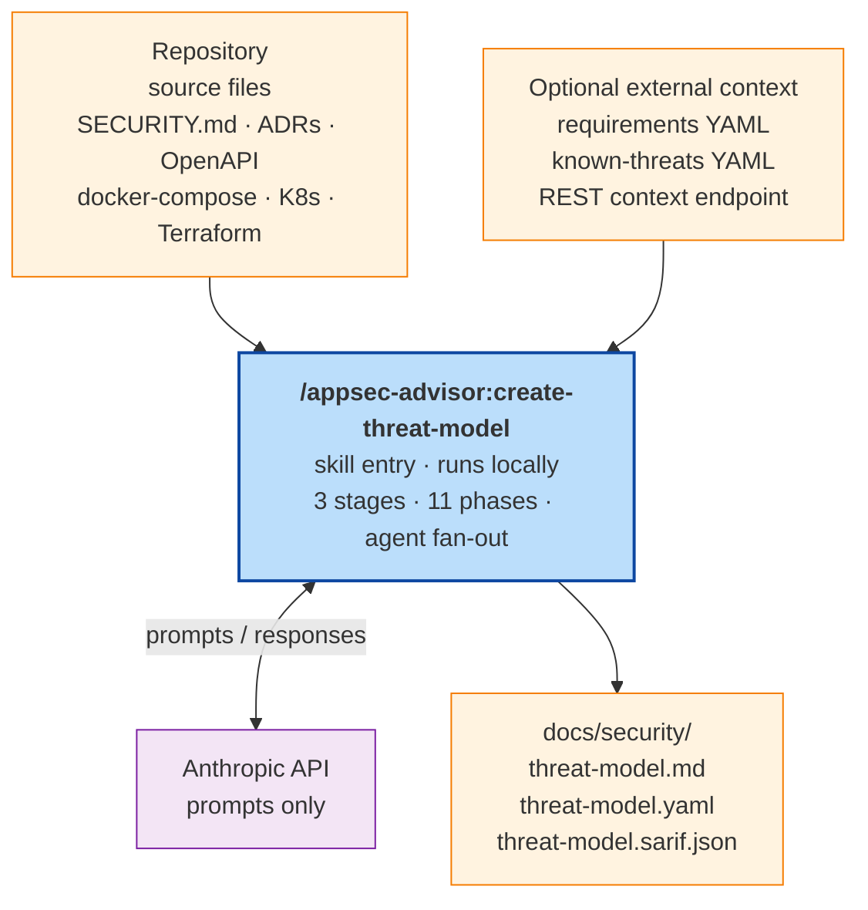
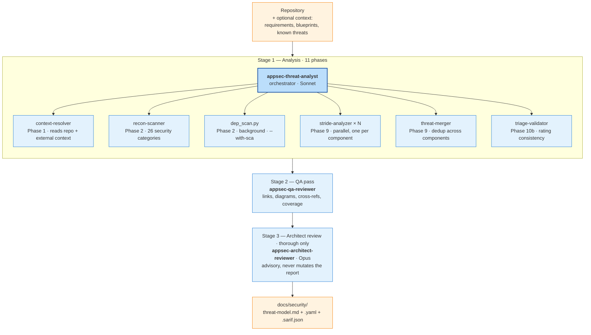

# Threat Model Skill — Technical Details

Technical description of how the threat-modeling skill works internally: pipeline structure, data flow, state management, and the invariants that hold across runs. For invocation and quick start see the [README](../README.md); for the render layer in depth see [`rendering-pipeline.md`](rendering-pipeline.md); for CI wiring see [`headless-mode.md`](headless-mode.md).

Entry point: `/appsec-advisor:create-threat-model`. Default output directory: `docs/security/` inside the analysed repository.

## Contents

- [System context](#system-context)
- [Pipeline overview](#pipeline-overview)
- [Stage 1 — the eleven phases](#phases)
- [Stage 2 — QA reviewer](#stage-2--qa-reviewer)
- [Stage 3 — Architect reviewer (optional)](#stage-3--architect-reviewer-optional)
- [Schemas and templates](#schemas-and-templates)
- [Cross-repository correlation](#cross-repository-correlation)
- [What --assessment-depth changes](#what---assessment-depth-changes)
- [Model policy](#model-policy)
- [Cost and duration](#cost-and-duration)

## System context

The plugin is a Claude Code skill composed of one orchestrating agent, six specialist sub-agents, one Python script, and a deterministic render layer. It runs locally on the host executing Claude Code. Source files are read from disk and forwarded to the Anthropic API as prompt context; no other external service receives code.



Full data-flow breakdown including what exactly is sent to the Anthropic API: [`SECURITY.md`](../SECURITY.md#data-sent-to-anthropic-api).

## Pipeline overview

<a id="agent-pipeline"></a>



Three stages run in sequence. Each has its own turn budget, separated at the skill level rather than nested inside the orchestrator, so a long Stage 1 cannot starve the reviewers that follow. Stage 3 is deliberately advisory — it writes `.architect-review.md` alongside the report and never mutates `threat-model.md` / `.yaml` / `.sarif.json`.

**Dispatch rules:**

- The orchestrator (`appsec-threat-analyst`) is the only LLM agent exposed to the skill. Specialist agents are dispatched via the Agent tool by the orchestrator, never by the skill directly.
- `dep_scan.py` is pure Python with no LLM turns. It runs in the background during Phase 2 when `--with-sca` is set.
- `stride-analyzer` instances run concurrently, one per STRIDE component. Fan-out is capped by `--assessment-depth` (3 / 5 / 8).
- Stage 2 and Stage 3 are independent skill-level invocations. Each receives a fresh context window and its own turn budget.

## Stage 1 — the eleven phases <a id="phases"></a>

Phase boundaries are logged as `PHASE_START` / `PHASE_END` in `.agent-run.log` and echoed to the console: `[Phase 9/11] ▶ STRIDE — dispatching 8 analysers…`. The phase-group files under `agents/phases/phase-group-*.md` are the authoritative source for phase instructions; the orchestrator prompt loads them at runtime rather than inlining phase detail.

| Phase | Agent / tool | Reads or does | Emits |
|-------|--------------|---------------|-------|
| 1. Context | `context-resolver` | `SECURITY.md`, ADRs, OpenAPI, docker-compose, K8s / Terraform, schemas, `docs/known-threats.yaml`, optional REST endpoint | `.threat-modeling-context.md` |
| 2. Recon | `recon-scanner` | Source tree across 26 security categories (auth, authz, input validation, serialisation, crypto, dangerous sinks, OAuth / OIDC, supply-chain, CI / CD, secrets, …) | `.recon-summary.md` |
| 2. SCA *(opt., `--with-sca`)* | `dep_scan.py` | Shells out to `npm audit`, `pip-audit`, `govulncheck`, `mvn dependency-check`; static-heuristics fallback; runs in background during Phase 2 | `.dep-scan.json` |
| 3. C4 diagrams | orchestrator | Context always; Container at `standard+`; Component at `thorough` | architecture fragments |
| 4. Security use cases | orchestrator | Sequence diagrams with numbered attack walkthroughs | use-case fragments |
| 5. Assets | orchestrator | Asset inventory | fragments |
| 6. Attack surface | orchestrator | Entry-point enumeration, counted by surface | fragments |
| 7. Trust boundaries | orchestrator | Boundary identification | fragments |
| 8. Controls | orchestrator | Security-control catalog rated `Adequate / Partial / Weak / Missing` | fragments |
| 8b. Requirements *(opt., `--requirements`)* | orchestrator | Every `SEC-*` requirement graded `PASS / PARTIAL / FAIL`; `FAIL` entries feed Phase 9 as requirement-anchored threats | compliance fragments |
| 9. STRIDE | `stride-analyzer` (× N, parallel) | One per component; covers Spoofing, Tampering, Repudiation, Information Disclosure, Denial of Service, Elevation of Privilege | `.stride-<component-id>.json` |
| 9. Merge | `threat-merger` | Decides merge / consolidate / keep across components; assigns global `F-NNN` IDs via 8-field deterministic sort key | `.threats-merged.json` |
| 10. Dep-scan synthesis | orchestrator | Folds `.dep-scan.json` and hardcoded-secret findings into the threat register | updated merged register |
| 10b. Triage validation | `triage-validator` | Severity reconciliation across components, Likelihood × Impact, `data/severity-caps.yaml`, compound-chain elevation, P1-mitigation gate on every Critical | `.triage-flags.json` |
| 11. Finalization | orchestrator + `compose_threat_model.py` | Renders fragments via the composer; computes changelog delta (F-NNN added / changed / resolved); releases the concurrent-run lock; prints completion summary | `threat-model.md` + opt. `.yaml` / `.sarif.json` |

Determinism: `F-NNN` IDs are stable across runs, so unchanged code produces byte-identical output. `FAIL` entries from Phase 8b and findings from `--with-sca` both converge into Phase 9's merged register before triage.

## Stage 2 — QA reviewer

`appsec-qa-reviewer` runs 11 deterministic checks via `scripts/qa_checks.py`:

1. VS Code deep-link path validity
2. Markdown link integrity (internal anchors, file paths)
3. Mermaid grammar (regex pass; optional real-parser upgrade via `mermaid-cli`)
4. Threat ↔ mitigation cross-reference consistency
5. Anchor presence for every T-NNN / M-NNN reference
6. Coverage of prior findings carried forward in incremental mode
7. Placeholder removal (`<TBD>`, `<FILL>`, …)
8. Required-section presence against `data/sections-contract.yaml`
9. Management Summary structure invariants
10. Changelog invariants
11. Repair-plan self-check when the reviewer itself requests changes

Safe fixes are applied in place. When the reviewer cannot fix safely, it emits `.qa-repair-plan.json`. The orchestrator is re-invoked in `REPAIR_MODE`, fragments are updated, the composer re-renders. Loop bounded to 3 iterations.

## Stage 3 — Architect reviewer (optional)

Advisory second opinion from `appsec-architect-reviewer`. Auto-enabled at `--assessment-depth thorough`; force on / off via `--architect-review` / `--no-architect-review`. Writes `.architect-review.md` next to the report and never touches `threat-model.md` itself.

Six checks: architecture ↔ recon consistency, trust-boundary completeness, Management Summary verdict plausibility, threat-coverage gaps, mitigation realism, CVSS ↔ Likelihood × Impact alignment. At `--assessment-depth quick`, checks 1, 4, and 6 are skipped.

Opus is the default model here — architectural judgement benefits from Opus reasoning and the cost is one advisory pass, not a fan-out.

## Schemas and templates

The plugin separates data validation (schemas) from presentation (templates). Every intermediate artifact in the phases table above is schema-validated before the next phase consumes it; the final report is rendered by `scripts/compose_threat_model.py` from Jinja2 fragments driven by `data/sections-contract.yaml`. Non-conforming artifacts fail the run rather than silently corrupting downstream analysis.

### Intermediate-artifact schemas

Top-level YAML schemas under `schemas/` validated by `scripts/validate_intermediate.py`:

| Schema | Validates | Produced in |
|--------|-----------|-------------|
| `stride.schema.yaml` | `.stride-<component-id>.json` | Phase 9 (stride-analyzer) |
| `dep-scan.schema.yaml` | `.dep-scan.json` | Phase 2 (`dep_scan.py`) |
| `threats-merged.schema.yaml` | `.threats-merged.json` (the canonical merged register) | Phase 9 (threat-merger) |
| `triage-flags.schema.yaml` | `.triage-flags.json` | Phase 10b (triage-validator) |
| `threat-model.output.schema.yaml` | `threat-model.yaml` (the machine-readable export) | Phase 11 |
| `pentest-tasks.schema.yaml` | `pentest-tasks.yaml` (with `--pentest-tasks`) | Phase 11 |
| `known-threats.schema.yaml` | user-supplied `docs/known-threats.yaml` | Phase 1 input |

### Fragment schemas

Agents emit structured fragments, not finished Markdown. Six JSON-Schema (draft 2020-12) contracts under `schemas/fragments/` are enforced by `scripts/validate_fragment.py` at write time — this is the hard gate that prevents LLM drift from corrupting the report:

| Schema | Drives |
|--------|--------|
| `verdict.schema.json` | Overall verdict line in the Management Summary |
| `architecture-assessment.schema.json` | Architecture chapter's qualitative rating |
| `critical-attack-chain.schema.json` | Headline attack-chain walkthrough |
| `compound-chains.schema.json` | Compound-chain severity elevations |
| `architectural-findings.schema.json` | Non-code-localised architectural findings |
| `operational-strengths-overrides.schema.json` | Manual adjustments to auto-detected strengths |

### Templates

`templates/threat-model.template.md` is the master template; currently a single include of the composed body. The 10 fragments under `templates/fragments/*.md.j2` render one block of the report each:

| Fragment | Renders |
|----------|---------|
| `management-summary.md.j2` | Executive summary, risk distribution, top findings |
| `toc.md.j2` | Table of contents (generated) |
| `verdict.md.j2` | Overall verdict badge |
| `architecture-assessment.md.j2` | Architecture-chapter assessment box |
| `critical-attack-chain.md.j2` | Headline attack-chain walkthrough |
| `top-findings.md.j2` | Ranked top-N finding table |
| `mitigations.md.j2` | Mitigation roadmap grouped by rollout priority |
| `operational-strengths.md.j2` | Controls rated Adequate and above |
| `infobox.md.j2` | Report metadata (run config, depth, model, timestamp) |
| `changelog.md.j2` | Delta since prior baseline (F-NNN added / changed / resolved) |

Custom Jinja2 filters handle the formatting rules that cannot live in pure Markdown: `severity_emoji` maps severity → badge, `effectiveness_badge` maps control effectiveness → badge, `linkify_with_label` builds VS Code deep links from file / line tuples.

Post-compose annotators (`annotate_architecture.py`, `annotate_sequences.py`) decorate Mermaid diagrams with threat badges. Both are idempotent — guarded by `%% anno-*-start/end` fence markers so re-running the composer does not double-annotate.

Single source of truth for section order, fragment type (`data` / `markdown` / `computed`), required schema, and required template: `data/sections-contract.yaml`. Bump `contract_version` on breaking changes. Full render detail: [`rendering-pipeline.md`](rendering-pipeline.md).

## Cross-repository correlation

A single skill invocation analyses one repository. There is no batch mode for multiple repos in one call, and no remote fetching of upstream services. What the plugin *does* support is local correlation across a workspace of sibling checkouts: other repos already analysed get their aggregates pulled into this run's report.

**Discovery of dependencies — Phase 2, `recon-scanner` category 25.** The recon scanner detects references from the analysed code to external targets:

| Target type | Signals |
|-------------|---------|
| SCM siblings | Internal Git URLs in manifests (e.g. `git@github.com:<org>/…`); Docker Compose `build: ../sibling-path` references; co-deployed service keys in `docker-compose*.yml` |
| SaaS integrations | URL patterns (Stripe, Auth0, Okta, Twilio, Sentry, Datadog, Supabase, …); env-variable patterns (`STRIPE_*`, `AUTH0_*`, …); SDK imports |

Results land in `.recon-summary.md` §7.25. Generic OSS libraries are *not* flagged here — those are the dep-scanner's job.

**Correlation with existing threat models — Phase 1, `context-resolver` step 4j.** For each detected SCM sibling, the resolver probes the local filesystem:

1. `WORKSPACE_ROOT = $(dirname REPO_ROOT)` — walks sibling directories under the same parent and checks for `docs/security/threat-model.yaml`.
2. `.gitmodules` — parses submodule paths and checks the same target inside each.
3. For each match, reads only aggregate fields (`meta.generated`, `meta.git.commit_sha`, `components[].name`, threat counts by severity and status). Full threat detail is deliberately *not* read to avoid context bloat. Cap: 8 siblings.
4. Status annotation: `found`, `missing`, or `outdated` (generated > 90 days ago).

**Rendering into the report — Phases 3 and 7.** Cross-repo entries show up in two places:

- **C4 diagrams.** Sibling and SaaS nodes are added to the Context (and Container, at `standard+`) diagrams with explicit shapes and a colour-coded coverage classDef:

  | Node type | Mermaid shape | classDef |
  |-----------|---------------|----------|
  | SCM sibling with threat model | `(...)` rounded-rect | `crossRepoOk` (green) |
  | SCM sibling without threat model | `(...)` rounded-rect | `crossRepoMissing` (red) |
  | SaaS service | `([...])` stadium | `saas` (purple) |

- **Trust boundaries (§7.11).** Each cross-repo interface is modelled as its own explicit boundary. Entries with a sibling threat model link the sibling's open-threat count at the exposed interface; entries without a model are tagged `✗ TM missing` and flagged as elevated risk because threats on the other side of that boundary remain unanalysed.

### Limitations

| Want to do | Supported? |
|------------|------------|
| Analyse N repos in one skill invocation | No — run per repo |
| Pull threat data from a remote URL or internal registry | No — siblings must be checked out locally |
| Correlate F-NNN IDs across repos (shared finding namespace) | No — each repo has its own ID space |
| Cross-repo changelog / delta across the dependency graph | No — changelog is per repo |
| Render the dependency graph as a standalone artefact | No — cross-repo only surfaces inside the current repo's C4 + trust boundaries |

### Practical setup

The typical deployment pattern is one workspace directory with all team repos as sibling checkouts:

```
workspace/
  ├── auth-service/         docs/security/threat-model.yaml  ✓
  ├── api-gateway/          docs/security/threat-model.yaml  ✓
  ├── notification-svc/     (no threat model)                ✗
  └── billing/              docs/security/threat-model.yaml  ✓
```

When `billing` is re-scanned, its report pulls aggregates from the three others. `notification-svc` appears as a red `✗ TM missing` node in `billing`'s Context diagram and a flagged boundary in §7.11 — this is the pressure mechanism for adoption.

### Incremental vs. full

Incremental mode is the default whenever a prior baseline exists. A no-change incremental run exits in under a second via the fast-path pre-check and spends zero tokens.

Three signals must all agree for a run to stay incremental. If any one disqualifies, the run falls back to full.

1. **Baseline exists and parses.** `docs/security/threat-model.yaml` and `docs/security/.appsec-cache/baseline.json` must be present. First-ever runs are always full.
2. **Plugin version matches.** A plugin upgrade invalidates the cache and forces a full re-scan, so new phase logic applies everywhere rather than being patched on top of old analysis.
3. **Per-component [recon fingerprint](glossary.md#recon-fingerprint) matches.** The recon scanner hashes the files relevant to each component (sources, manifests, configs). Unchanged fingerprint reuses the previous `.stride-<id>.json`; changed fingerprint triggers a full component re-analysis.

When git metadata is available (interactive mode inside a repo, or `--pr-mode` in CI), the orchestrator additionally diffs the worktree against the baseline's `commit_sha`. If no diffed file belongs to a component, that component stays untouched even if its broader fingerprint drifted.

## What --assessment-depth changes

A single flag controls seven knobs at once. This is the table to consult when deciding between a PR gate, a CI baseline, and a thorough architecture review.

| Knob | `quick` | `standard` *(default)* | `thorough` |
|------|---------|------------------------|------------|
| STRIDE components | 3 | 5 | 8 |
| C4 diagrams | Context only | Context + Container | Context + Container + Component |
| STRIDE turn budget per component (simple / moderate / complex) | 10 / 15 / 20 | 15 / 22 / 28 | 20 / 31 / 35 |
| Phase 8 control rating | Recon baseline only | Recon + targeted greps | Recon + targeted greps |
| Phase 9 coverage checks | Skipped | Enabled | Enabled |
| QA scope (Stage 2) | Core checks | Full checks | Extended + advisory flags |
| Stage 3 (architect review) | Off | Off | **On** by default |
| Reasoning-model default | Sonnet everywhere | Sonnet everywhere | `opus-cheap` (triage + merger on Opus) |

When the repository has more components than the cap allows, the orchestrator prioritises by attack-surface-weighted risk. Dropped components land in Section 11 (Out of Scope) so their exclusion stays visible in the report.

## Model policy

All agents default to `claude-sonnet-4-6`. Opus is used only where deep reasoning pays off and where the shape of the agent fits the cost model (single-shot judgement, not fan-out).

| Override | Applies to | Rationale |
|----------|-----------|-----------|
| `--reasoning-model opus-cheap` *(auto at thorough)* | `triage-validator`, `threat-merger` | Single-shot agents; Opus reasoning improves cross-component consistency without multiplying token cost across parallel dispatch |
| `--reasoning-model opus` | additionally STRIDE analysers | Highest quality STRIDE reasoning; cost scales with component count |
| `--architect-model opus` *(default when Stage 3 runs)* | `architect-reviewer` | Architectural judgement benefits from Opus; cost is one advisory pass |

Overrides pass via the Agent tool's `model` field, taking precedence over agent frontmatter. `--stride-model opus` is deprecated in favour of `--reasoning-model`.

## Cost and duration

Rough figures from OWASP Juice Shop (Node.js monorepo, ~40k LOC, 8 STRIDE components). Actual cost depends on repository size, component count, and token-cache effectiveness. The Anthropic Console is authoritative for billing.

| Depth | STRIDE components | Wall-clock | Est. cost (Sonnet) |
|-------|-------------------|------------|---------------------|
| `quick` | 3 | ~15 min | < $2 |
| `standard` *(default)* | 5 | ~25 min | $3–5 |
| `thorough` | 8 | ~45 min | $8–15 |

Model overrides change cost substantially:

| Override | Cost vs. Sonnet baseline |
|----------|--------------------------|
| `--reasoning-model opus-cheap` *(default at thorough)* | +$0.05–0.10. Opus for triage-validator and threat-merger only |
| `--reasoning-model opus` | ~5× baseline. Opus for all STRIDE analysers |
| `--architect-review` (auto-on at thorough) | +$0.65–0.80. Stage 3 with default Opus model |
