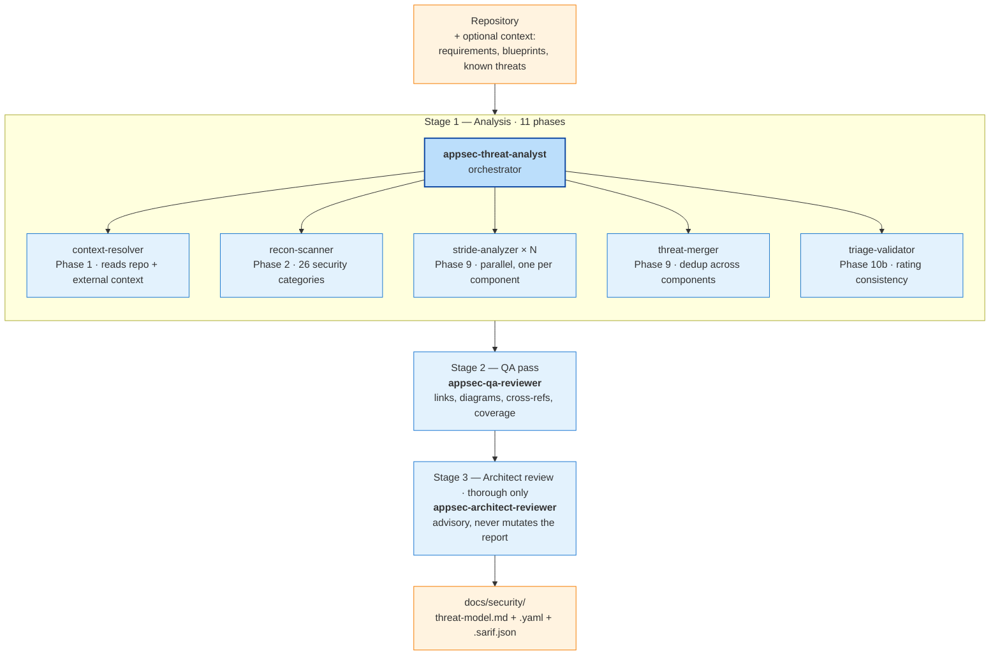

# Threat Model Skill

Code-driven STRIDE threat modelling. Entry point: `/appsec-advisor:create-threat-model`. Output lands in `docs/security/`.

A `standard`-depth run takes about 25 minutes on a mid-size repository. The orchestrator prints each phase as it runs (`[Phase 2/11] Reconnaissance…`) and writes checkpoints between phases — interrupted runs resume with `--resume`.

## Contents

- [What it produces](#what-it-produces)
- [How it works](#how-it-works)
- [Examples](#examples)
- [Flags](#flags)
- [Incremental mode](#incremental-mode)
- [Cleanup](#cleanup)
- [CI/CD](#cicd)
- [Cost and duration](#cost-and-duration)
- [Data handling](#data-handling)

## What it produces

Every run writes a Markdown report by default, plus optional machine-readable exports for downstream tooling. All three files land in `docs/security/` (configurable via `--output`).

| File | Format | Purpose |
|------|--------|---------|
| `docs/security/threat-model.md` | Markdown | Human-readable report — architecture (C4), attack walkthroughs, threat register, mitigations |
| `docs/security/threat-model.yaml` | YAML | Machine-readable export — stable IDs, cross-references, changelog |
| `docs/security/threat-model.sarif.json` | SARIF v2.1.0 | Import into GitHub Code Scanning, SonarQube, DefectDojo |

Threats carry file/line evidence, CWE references, CVSS v4 vectors (for code-level findings), and mitigations grouped by rollout priority.

## How it works

The skill drives three sequential stages. Each stage runs under its own independent turn budget, so a Stage 1 that exhausts its budget mid-pipeline cannot starve the later stages. The diagram below shows the overall flow; the sub-sections after it break down what each stage actually does.



Phase-by-phase contracts — intermediate files, retry semantics, caching — live in [`architecture.md`](architecture.md).

### Stage 1 — Analysis

Driven by the `appsec-threat-analyst` orchestrator across eleven phases. Phases 1–2 gather input, Phases 3–8 derive the architecture, Phase 9 enumerates threats per component, Phases 10 and 10b synthesise and validate, Phase 11 writes the report. The orchestrator dispatches specialist agents where focused context or parallelism helps.

#### Reconnaissance (Phases 1–2)

Builds the input for everything that follows. Nothing is reasoned about threats yet.

- **Agents:** `appsec-context-resolver` (Phase 1), `appsec-recon-scanner` (Phase 2), `scripts/dep_scan.py` (Phase 2 background, only with `--with-sca`).
- **Analysed:**
  - Repository metadata, `SECURITY.md`, ADRs, architecture docs, API specs, deployment configs, data-model schemas.
  - Optional external REST context endpoint (team ownership, compliance scope, prior findings) and `docs/known-threats.yaml`.
  - Tech stack, package manifests, and 26 security categories including auth, authorisation, input validation, serialisation, crypto, dangerous sinks, OAuth/OIDC flows, supply-chain hygiene, CI/CD, hardcoded secrets.
  - SCA dependency advisories via native audit tools when `--with-sca` is passed.

#### Architecture derivation (Phases 3–8)

Reconstructs the system before threats are considered. Output is the architecture chapter of the report.

- **Agents:** orchestrator (inline), supported by the recon output.
- **Analysed:**
  - C4 diagrams: System Context, Container, Components (Components only at `thorough` depth or high-complexity repositories).
  - Technology architecture (stack layers, framework versions, runtime).
  - Attack walkthroughs: step-by-step exploitation paths per high-risk scenario.
  - Assets: data, code/IP, infrastructure, availability.
  - Attack surface: every authenticated and unauthenticated entry point, counted.
  - Trust boundaries: privilege transitions, network segmentation, cross-repo and SaaS integrations.
  - Security architecture catalog: domain-grouped controls (IAM, input validation, data protection, session, frontend, audit, infrastructure, supply chain) rated ✅/⚠️/🔶/❌.
  - Optional [Phase 8b](glossary.md#phase-8b) (with `--requirements`): every [`SEC-*`](glossary.md#sec--requirement-ids) requirement graded PASS/PARTIAL/FAIL against the codebase.

#### Threat enumeration (Phase 9)

The STRIDE pass. One analyser per component, dispatched in parallel with a dynamic turn budget based on component complexity.

- **Agents:** `appsec-stride-analyzer` × N (parallel), `appsec-threat-merger` (fan-in when ≥ 1 duplicate candidate).
- **Analysed:**
  - STRIDE categories per component (Spoofing, Tampering, Repudiation, Information Disclosure, Denial of Service, Elevation of Privilege).
  - Threat-merger decisions: merge duplicates, consolidate systemic patterns, keep genuinely distinct findings.
  - Global `F-NNN` ID assignment applied deterministically (8-field sort key) so runs on unchanged code produce byte-identical output.

#### Validation (Phases 10 and 10b)

Folds in the dep-scan results and cross-checks the register before the report is written.

- **Agents:** orchestrator (Phase 10), `appsec-triage-validator` (Phase 10b).
- **Analysed:**
  - Dep-scan vulnerabilities folded into the threat register (only with `--with-sca`).
  - Hardcoded-secret findings from Phase 2 integrated.
  - Cross-component rating consistency (same defect class shouldn't be Critical in one component and Medium in another).
  - Severity plausibility against Likelihood × Impact matrix.
  - P1/P2 priority alignment (every Critical finding has at least one P1 mitigation).
  - Rating completeness (no missing fields, no placeholder values).

#### Finalisation (Phase 11)

Renders the Markdown, YAML, and SARIF outputs and closes the run.

- **Agents:** orchestrator.
- **Analysed / produced:**
  - `threat-model.md`, plus `threat-model.yaml` with `--yaml`, plus `threat-model.sarif.json` with `--sarif`.
  - Management Summary: verdict, Top Findings, architecture assessment, mitigations.
  - Changelog delta against the prior baseline (F-NNN added/changed/resolved).
  - Triage flags rendered inline in the Threat Register.
  - Lock release, duration recorded, completion summary printed to console.

### Stage 2 — QA

Runs after Stage 1 completes and fixes everything the orchestrator may have left inconsistent. In-place repair — output files are modified, not replaced.

- **Agent:** `appsec-qa-reviewer`.
- **Checks:** VS Code deep-link validity, Markdown link integrity, Mermaid syntax (11 validation rules), threat/mitigation cross-references, anchor presence, coverage of prior findings, placeholder removal, required-section presence.

### Stage 3 — Architect review *(optional, thorough only)*

Advisory second opinion. Writes `.architect-review.md` and never touches the threat model itself. Auto-enabled at `--assessment-depth thorough`, forceable elsewhere with `--architect-review`.

- **Agent:** `appsec-architect-reviewer` (Opus by default — architecture judgement benefits from Opus reasoning).
- **Checks:** architecture↔recon consistency, trust-boundary completeness, Management Summary verdict plausibility, threat coverage gaps, mitigation realism, CVSS↔Likelihood×Impact alignment.

## Examples

The commands below cover the most common scenarios. Every flag is documented in [Flags](#flags) below.

```bash
# Deeper analysis (~40 min, more components, extended diagrams)
/appsec-advisor:create-threat-model --assessment-depth thorough

# Focus on a specific area
/appsec-advisor:create-threat-model focus on the authentication service

# Re-scan after code changes — only re-analyses what changed
/appsec-advisor:create-threat-model --incremental

# Preview scope before committing budget
/appsec-advisor:create-threat-model --dry-run

# Emit machine-readable exports alongside the Markdown report
/appsec-advisor:create-threat-model --yaml --sarif

# Analyse a repository you don't own (typical AppSec reviewer workflow)
/appsec-advisor:create-threat-model --repo /path/to/team-api --output /reports/team-api
```

A full example output is available at [`examples/juice-shop/threat-model-juiceshop-thorough.md`](../examples/juice-shop/threat-model-juiceshop-thorough.md) — OWASP Juice Shop, thorough depth, 8 components, 47 threats.

## Flags

The flags below are grouped by what they change. Each group covers one decision the user makes: how much to analyse, how to run the pipeline, what outputs to produce, what optional checks to enable, which models to use.

### Scope and depth

Controls what the pipeline looks at and how deep the analysis goes.

| Flag | Effect |
|------|--------|
| `--assessment-depth {quick\|standard\|thorough}` | 3 / 5 / 8 STRIDE components, turn budgets, diagram depth, QA scope |
| `--repo <path>` | Analyse a repository other than the current directory |
| `--output <path>` | Write output to a path other than `<repo>/docs/security/` |

### Run mode

Controls how the orchestrator treats prior state. See [Incremental mode](#incremental-mode) for the full semantics.

| Flag | Effect |
|------|--------|
| *(no flag)* | Incremental when a prior `threat-model.yaml` exists, full otherwise |
| `--full` | Force complete re-assessment (preserves changelog history) |
| `--rebuild` | Superset of `--full` — wipes prior state and starts fresh |
| `--incremental` | Explicit delta analysis (fail if no baseline exists) |
| `--resume` | Continue from last checkpoint after a failed run |
| `--dry-run` | Full analysis, no files written, Management Summary printed |

### Output

Machine-readable exports alongside the Markdown report.

| Flag | Effect |
|------|--------|
| `--yaml` | Also write `threat-model.yaml` |
| `--sarif` | Also write `threat-model.sarif.json` (SARIF v2.1.0) |
| `--pentest-tasks` | Write `pentest-tasks.yaml` for DAST / AI pentest tools |
| `--verbose` | Stream hook events to stderr, emit Run Statistics appendix |

### Analysis options

Optional checks that extend the default pipeline.

| Flag | Effect |
|------|--------|
| `--requirements [<url>]` | Enable Phase 8b compliance check (URL optional — uses configured source otherwise) |
| `--no-requirements` | Skip Phase 8b even when enabled in config |
| `--with-sca` | Run SCA dependency scan (`npm audit`, `pip-audit`, `govulncheck`, `mvn dependency-check`) |

### Model selection

Override the default Sonnet model for specific agents. Every flag takes a model name; `opus-cheap` means Opus for single-shot agents only (triage validator + threat merger).

| Flag | Effect |
|------|--------|
| `--reasoning-model {sonnet\|opus-cheap\|opus}` | STRIDE analyser, triage validator, threat merger |
| `--architect-review` / `--no-architect-review` | Force Stage 3 on/off |
| `--architect-model {sonnet\|opus}` | Stage 3 model (default: Opus) |

## Incremental mode

Incremental mode is the default whenever a prior `threat-model.yaml` exists. It is what makes the plugin affordable to run on every push and every pull request — a full scan costs a few USD, an incremental scan with no changes costs near zero.

### When the pipeline runs incrementally

The orchestrator skips unchanged work based on three signals. All three must agree; if any one disqualifies, the run falls back to full.

1. **A prior [baseline](glossary.md#baseline) exists.** `docs/security/threat-model.yaml` and `docs/security/.appsec-cache/baseline.json` must be present and parseable. First-ever runs always execute full regardless.
2. **Plugin version matches.** The `plugin_version` recorded in the baseline must match the currently-loaded plugin. A plugin upgrade invalidates the cache and forces a full re-scan so that new phase logic is applied everywhere, not patched on top of old analysis.
3. **[Recon fingerprint](glossary.md#recon-fingerprint) matches at the [component](glossary.md#component) level.** The recon scanner hashes the files relevant to each component (sources, manifests, configs). Components whose fingerprint matches reuse their previous `.stride-<id>.json` verbatim. Components whose fingerprint changed are re-analysed from scratch.

When git metadata is available (interactive mode inside a repo or `--pr-mode` in CI), the orchestrator also diffs the current worktree against the baseline's `commit_sha` to narrow the component set further — if no file touched by the diff belongs to a given component, that component is not re-analysed even if its broader fingerprint drifted.

### How incremental runs behave in practice

The interactive case is trivial: just run the skill again. After the first full scan, subsequent invocations pick up the baseline automatically.

```bash
# First run on this repo — full scan (~25 min at standard depth)
/appsec-advisor:create-threat-model

# Later, after some code changes — incremental by default
/appsec-advisor:create-threat-model
```

In CI, the wrapper script adds a fast-path pre-check before dispatching Claude at all. It inspects git, the recon fingerprint, and the plugin version; if nothing has changed since the last scan the run exits in under a second without consuming a single token. See [`headless-mode.md`](headless-mode.md) for the full CI recipes.

```bash
# CI on every push — incremental with a hard timeout
./scripts/run-headless.sh --repo . --output docs/security --incremental --max-duration 1800

# PR gate — diffs HEAD against origin/main, fails the build on new Critical/High findings
./scripts/run-headless.sh --repo . --base origin/main --pr-mode --fail-on high
```

[F-NNN](glossary.md#finding-and-threat-identifiers) finding IDs remain stable across incremental runs — a newly discovered finding gets the next unused slot, retired findings leave holes in the sequence. External systems (Jira, Linear, SARIF uploads to GitHub Code Scanning) keep working because the IDs don't shift underneath them.

### When to skip incremental mode

Use `--full` when you want a complete re-analysis without losing history — the changelog is preserved and a fresh delta is computed against the previous baseline. Use `--rebuild` when the prior state is suspect (corrupted cache, `analysis_version` drift, wrong plugin version committed) — it wipes everything the plugin wrote and starts from zero. Use `--incremental` explicitly when you want the run to fail loudly if no baseline is available instead of silently falling back to full.

## Cleanup

Two disjoint cleanup verbs are exposed via the headless wrapper. They never touch files the plugin didn't write.

| Flag | Removes | Keeps |
|------|---------|-------|
| `--clean-cache` | Caches and transient state | `threat-model.md`, `.yaml`, `.sarif.json`, audit logs |
| `--clean-all` | Everything the plugin wrote into the output directory | Unknown files (never touched) |

`--clean-all` prompts for interactive confirmation. Skip the prompt with `--force`; it is auto-skipped when `CI=true` is set.

```bash
# Drop caches only — keeps the committed threat model and audit logs
./scripts/run-headless.sh --output /out --clean-cache

# Wipe all plugin-written files — requires confirmation or --force
./scripts/run-headless.sh --output /out --clean-all --force
```

## CI/CD

`scripts/run-headless.sh` wraps the skill for non-interactive execution. The fast-path pre-check described in [Incremental mode](#incremental-mode) makes repeated CI runs cheap — near zero cost when nothing has changed.

The minimal incremental invocation looks like this:

```bash
./scripts/run-headless.sh --repo . --output docs/security --incremental --no-qa --max-duration 1800
```

Two flags are specific to CI: `--no-qa` skips Stage 2 when the report is machine-consumed (faster, avoids cosmetic edits), and `--max-duration` wraps the run with `timeout(1)` as a hard wall-clock ceiling. The full GitHub Actions workflow, PR-gate mode (`--pr-mode --fail-on high`), artifact caching strategy, and exit codes live in [`headless-mode.md`](headless-mode.md).

## Cost and duration

The numbers below are rough order-of-magnitude figures from OWASP Juice Shop (Node.js monorepo, ~40k LOC, 8 STRIDE components). Actual cost depends on repository size, component count, and token-cache effectiveness; the Anthropic Console is the authoritative source for billing.

| Depth | STRIDE components | Wall-clock | Est. cost (Sonnet) |
|-------|-------------------|------------|---------------------|
| `quick` | 3 | ~15 min | < $2 |
| `standard` *(default)* | 5 | ~25 min | $3–5 |
| `thorough` | 8 | ~45 min | $8–15 |

Model overrides change cost substantially:

| Override | Cost impact vs. Sonnet baseline |
|----------|---------------------------------|
| `--reasoning-model opus-cheap` *(default at `thorough`)* | +$0.05–0.10 — Opus for triage-validator and threat-merger only (single-shot agents) |
| `--reasoning-model opus` | ~5× baseline — Opus for all STRIDE analysers |
| `--architect-review` (auto-on at `thorough`) | +$0.65–0.80 — Stage 3 with default Opus model |

The hook logger estimates per-session cost in `.hook-events.log` using rates configured in `config.json`. These rates are editable; update them when Anthropic pricing changes. Actual billing is visible in the Anthropic Console under your API key or Claude Pro/Team/Enterprise subscription.

## Data handling

The plugin reads local source code and sends prompts to the Anthropic API. No other external service receives code. For the full breakdown of what is sent, what persists locally, and log-retention implications — read the [Data Sent to Anthropic API](../SECURITY.md#data-sent-to-anthropic-api) section of `SECURITY.md` before running on sensitive codebases.

See [Anthropic's privacy policy](https://www.anthropic.com/privacy) for their data handling; see [`SECURITY.md`](../SECURITY.md) for responsible-disclosure details on the plugin itself.
