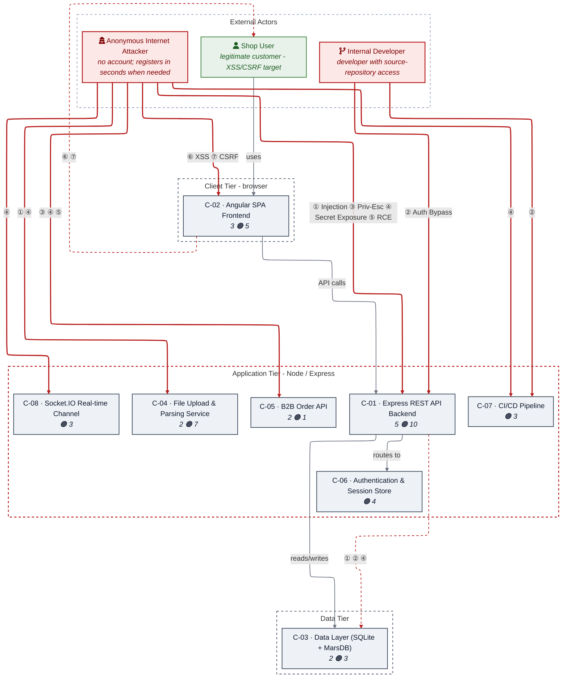

# Threat Modeler

`/appsec-advisor:create-threat-model` analyzes a repository, derives a security-relevant architecture model from the implementation, and applies STRIDE to produce structured review input for AppSec and engineering teams.

→ [Back to README](../README.md)

## Contents

- [What you get](#what-you-get)
- [Example report: OWASP Juice Shop](#example-report-owasp-juice-shop)
- [What it checks](#what-it-checks)
- [Usage examples](#usage-examples)
- [Assessment depth & cost control](#assessment-depth--cost-control)
- [Cross-repo context](#cross-repo-context)
- [Architecture](#architecture)
- [Workflow commands](#workflow-commands)

## What you get

An assessment produces a security architecture and threat model report grounded in the repository. The report covers architecture observations, trust boundaries, STRIDE findings, risk-ranked threats, affected components, remediation guidance, and generated diagrams.

Findings are rendered from structured artifacts and checked before release, so the Markdown report and machine-readable export stay consistent.

**Default outputs**

- `threat-model.md` — human-readable report for engineers, architects, and security reviewers.
- `threat-model.yaml` — structured export used for automation and incremental reruns.

**Optional deliverables**

| File | Enable with | Description |
|---|---|---|
| `threat-model.pdf` | `--pdf` | Print-ready PDF report: automatic cover page, page-numbered table of contents, rendered diagrams, content-aware tables. Requires `pandoc` + `weasyprint`; diagrams additionally need `mmdc` and a Chrome/Chromium for Puppeteer. Missing deps abort with a clear message — pass `--no-mermaid` to export without diagrams. |
| `threat-model.html` | `--html` (or `export-threat-model --formats html`) | Self-contained HTML5 (pandoc-only, no weasyprint) with a centered, readable screen layout and rendered diagrams — for browser viewing, wiki attachments, or as a styling-pipeline input. Diagrams need `mmdc` + Chrome (same as PDF); without them they stay as code. |
| `threat-model.sarif.json` | `--sarif` | SARIF v2.1 output for code scanning integrations. |
| `pentest-tasks.yaml` | `--pentest-tasks` | Endpoint catalog and test plan for AI pentesters such as Strix, including finding verification plus architecture-driven probes. |

All optional deliverables can also be generated after an assessment. This is useful when CI runs the analysis in one job and publishes exports in another, or when you re-export after approved, schema-valid updates to `threat-model.yaml`:

```text
# Generate every export format from an existing threat-model.yaml / .md
/appsec-advisor:export-threat-model

# Single format
/appsec-advisor:export-threat-model --formats sarif
/appsec-advisor:export-threat-model --formats html
/appsec-advisor:export-threat-model --formats pentest --pentest-target https://staging.example.com
```

SARIF and pentest-tasks are produced deterministically from `threat-model.yaml` — no LLM tokens spent. PDF and HTML are converted from `threat-model.md`: HTML needs only `pandoc`, PDF additionally needs `weasyprint`. Mermaid diagrams are rendered to vector graphics by `mmdc` (`@mermaid-js/mermaid-cli`), which drives a headless **Chrome/Chromium via Puppeteer** — install one (`npx puppeteer browsers install chrome`, or `apt install chromium` and set `PUPPETEER_EXECUTABLE_PATH`). The PDF exporter's preflight aborts with a clear message if any required tool is missing or non-functional; run `/appsec-advisor:export-threat-model --check-only` to verify the toolchain, or pass `--no-mermaid` to export without diagrams.

## Example report: OWASP Juice Shop

The following example shows the output of a thorough-mode assessment against [OWASP Juice Shop](https://owasp.org/www-project-juice-shop/).

**Full example:** [OWASP Juice Shop threat model report](../examples/threat-modeler/threat-model-juice-shop-thorough.md)

The report shows the architecture diagram, trust boundaries, STRIDE findings, evidence links, abuse-case scenarios, mitigation register, and attack-path discussion in a format that developers review after a run.

Example security posture diagram from the report:



## What it checks

Before running STRIDE, `appsec-advisor` performs a reconnaissance pass that collects security-relevant signals from the repository. Those signals give the analysis a concrete starting point: routes, trust boundaries, auth flows, risky sinks, security controls, deployment files, and supply-chain configuration.

| Area | What is inspected |
|---|---|
| **Security Architecture** | Data flows, trust boundaries, service boundaries, compartmentalization, and security-relevant architectural patterns. |
| **Authentication & Access Control** | JWT handling, OAuth/OIDC flows, session handling, role checks, authorization middleware, and client-side access guards. |
| **Input Handling & Injection** | SQL/NoSQL query construction, unsafe deserialization patterns, request validation, and user-controlled input reaching sensitive sinks. |
| **Cryptography & Secrets** | Hardcoded secrets, weak hashing or crypto choices, key handling patterns, and sensitive configuration values. |
| **Frontend Security** | XSS-prone patterns, unsafe browser storage, client-side exposure of sensitive data, and security-relevant bundle content. |
| **Operations & Configuration** | CORS configuration, security headers, exposed management/debug endpoints, verbose errors, and stack-trace leakage. |
| **Supply Chain** | Dependency and lockfile signals, unpinned GitHub Actions, container image pinning, and build/deployment configuration. |
| **GenAI / LLM Security** | Prompt-injection surfaces, tool or agent boundaries, vector-store access patterns, LLM API usage, and OWASP LLM Top 10 related risks. |
| **Threat Actors** | Actor-driven threat classes: insider threats (privileged dev/ops), supply-chain actors (build-time compromise), B2B-partner abuse, and adjacent-tenant attacks in multi-tenancy architectures. Each finding is attributed to a threat actor class; the report includes an actor table and actor-adjusted likelihood scores. |
| **Abuse Cases** | Scenario-level attack chains verified against the codebase — end-to-end paths from entry point through exploitation to impact, with per-step verdicts and deterministic chain verdicts (fully viable / partially blocked / mitigated). |

> [!NOTE]
> The reconnaissance checks provide the starting context for the STRIDE analysis. They are not intended to replace a dedicated SAST, SCA, secrets, or IaC scanner. Instead, the findings are used as entry points for deeper reasoning across related files, flows, and trust boundaries.

## Usage examples

Run these commands directly within the Claude Code interface.

```text
# Show help text
/appsec-advisor:create-threat-model --help

# High-fidelity audit
/appsec-advisor:create-threat-model --assessment-depth thorough

# Rebuild: force a fresh scan by wiping all caches and intermediate model data
/appsec-advisor:create-threat-model --full --rebuild

# Dry run: preview the execution plan and agent routing without writing files
/appsec-advisor:create-threat-model --dry-run
```

### Focused analysis

Target specific components to reduce noise and optimize token usage. This is the recommended approach for large mono-repos or rapid iterations.

```text
# Focus on a logical service by name
/appsec-advisor:create-threat-model focus on the authentication service

# Target a specific directory path
/appsec-advisor:create-threat-model focus on the /services/payment-gateway
```

### With requirements catalog

Ground the threat model in your organization's security requirements catalog. The plugin fetches a structured YAML from a URL, grades the codebase against each requirement, and incorporates compliance findings into the report. See [`docs/harvester.md`](harvester.md) for how to produce that YAML from existing Confluence, Antora, or wiki pages.

```text
# Run threat model with requirements fetched from a URL
/appsec-advisor:create-threat-model --requirements https://URL/appsec-requirements.yaml

# Use the bundled mock server to test the loop locally before connecting a real catalog
python3 scripts/mock-server.py
/appsec-advisor:create-threat-model --requirements http://127.0.0.1:4444/requirements.yaml
```

Once `requirements_yaml_url` is set in `skills/audit-security-requirements/config.json`, the `--requirements` flag is optional — every subsequent run picks up the catalog automatically.

### Scanning external repositories

Run the analysis against a repository other than the current working directory using `--repo` and `--output`.

```text
# Scan a repository located outside the current working directory
/appsec-advisor:create-threat-model --repo ../another-api --output ./audits/another-api
```

For cross-repo context, declare related services in `docs/related-repos.yaml`; see [Cross-repo context](#cross-repo-context) below.

> [!TIP]
> For the current flag reference, run `/appsec-advisor:create-threat-model --help` or read [`skills/create-threat-model/HELP.txt`](../skills/create-threat-model/HELP.txt).

## Assessment depth & cost control

Assessment depth controls how much of the repository is reviewed and how much validation the report gets before it is handed back. Choose by review intent first; the model mix is selected automatically.

### Analysis modes

The plugin supports three assessment depths. Pick the lightest mode that still matches the risk of the change.

Within a run, *which* components receive a full STRIDE pass is derived from criteria rather than a fixed per-depth count: **quick** covers the frontend, the authentication surface, internet-exposed components, and any component whose reachability cannot be proven internal (exposure-unknown — empty or runtime-only zones such as `docker-container`); **standard** additionally covers CI/CD & deployment pipelines and data stores holding credentials, PII, or payment data; **thorough** adds proven-internal components and deepens per-component analysis. The analyzed count therefore follows the repository's attack surface rather than a hard cap. (The component figures in the benchmarks below predate this criteria-based selection.)

| Mode | Best fit | What changes | Juice Shop benchmark |
|---|---|---|---|
| **Quick** `--assessment-depth quick` | Fast feedback, pre-commit checks, early design iterations. | Covers the frontend, auth, internet-exposed components, and any component not provably internal (exposure-unknown), at reduced depth. Skips attack-chain validation and the final quality review. Good for early signal; rerun at standard depth before release decisions. | **Cost** ~ $8.49<br>**Time** ~ 33 min<br>**Findings** 14 threats / 3 components<br>Critical 4, High 8, Medium 2<br>[sample report](../examples/threat-modeler/threat-mode-juice-shop-quick.md) |
| **Standard** *(default)* | Normal threat models and security reviews. | Full threat analysis of the exposed surface plus CI/CD and sensitive data stores, with attack-chain validation and a full quality review. The default for engineering review. | **Cost** ~ $17.37<br>**Time** ~ 65 min<br>**Findings** 31 threats / 3 components<br>Critical 9, High 13, Medium 6<br>[sample report](../examples/threat-modeler/threat-model-juice-shop-standard.md) |
| **Thorough** `--assessment-depth thorough` | Pre-release reviews, high-risk services, major architecture changes. | Everything in standard, plus proven-internal components, deeper analysis, and an extra architecture-review pass. Best when missed architecture risk is expensive. | **Cost** ~ $50.00+<br>**Time** ~ 72 min<br>**Findings** 38 threats / 8 components<br>Critical 8, High 23, Medium 6<br>[sample report](../examples/threat-modeler/threat-model-juice-shop-thorough.md) |

> [!NOTE]
> Benchmark numbers come from a single Node.js/Express reference app (OWASP Juice Shop) and vary substantially with repository size, language/framework mix, model routing, and cache effects. Treat the figures as ballpark orientation, not as predictions for your repo. **Incremental scans** are used automatically when an existing model is available and typically reduce token usage by 70–90%.

### Budget guardrails

You can set hard limits to avoid unexpected runtime or API usage. When a limit is reached, the process stops gracefully with `SIGTERM`.

| Interactive plugin | Headless / CI | Meaning |
|---|---|---|
| `--max-wall-time` | `--max-duration` | Maximum runtime |
| `--max-cost` | `--max-budget` | Maximum API spend |

Example:

| Mode | Time limit | Cost limit | Example |
|---|---|---|---|
| **Interactive plugin** | `--max-wall-time` | `--max-cost` | `/appsec-advisor:create-threat-model --max-cost 5 --max-wall-time 30m` |
| **Headless / CI** | `--max-duration` | `--max-budget` | `./scripts/run-headless.sh --incremental --max-duration 1800 --max-budget 5` |

> [!NOTE]
> Cost limits only apply when using an `ANTHROPIC_API_KEY`. When running on a standard Claude subscription, there is no per-token API billing, so cost limits are ignored. Time limits remain active in both modes.

For very large repositories, the advisor automatically switches to an optimized scanning strategy to avoid context window overflows.

## Cross-repo context

`appsec-advisor` scans one repository at a time. If your service calls another service, you can still give the scan useful cross-repo context.

Declare the services this repo depends on in `docs/related-repos.yaml`.

> **Note:** Actor pull from `related-repos.yaml` is not supported. Declaring a related repo does not import its actor definitions. `ACT-D-07` (compromised-third-party-service) is activated only when the scan detects external API calls in the repo itself, not through `related-repos.yaml` declarations.

### Add context for services you call

If this repo calls another internal service, add that service's threat model to `docs/related-repos.yaml`:

```yaml
related:
  - name: payments-api
    threat_model: ../payments-api/docs/security/threat-model.yaml
    interface: POST /api/v1/payments
```

On the next scan, `appsec-advisor` uses that upstream threat model as context for the local component that calls `payments-api`.

`threat_model:` accepts a local path or `https://...` URL. For private repos, use `auth_env:` to name an environment variable that contains the fetch header.

The `interface:` value is matched against the upstream model's `attack_surface[].entry_point`. When it matches, the scan can use upstream details such as protocol, authentication requirement, handling component, and documented controls.

Imported data is treated as the upstream team's claim, not as verified evidence. It can raise new hypotheses, but it must not suppress local findings.

### Declare assumptions about the upstream service

If this repo relies on a specific upstream guarantee, declare it explicitly:

```yaml
    expected_auth: JWT
    expected_validation: schema
```

If the upstream threat model documents something different, the scan can raise a cross-repo hypothesis at that boundary. For example, expecting `JWT` while the upstream model documents `api-key` can seed an authentication-related finding.

These fields are optional. Without them, the scan still uses the upstream model as context, but it does not perform this expectation check.

## Architecture

`appsec-advisor` runs as a staged pipeline rather than one large prompt. Each stage has a narrow task, and the final report is generated from validated, structured data.

- **Repository-driven input:** The pipeline starts from the code repository and extracts application context, components, routes, controls, IaC config, and trust actors.

- **Multi-agent threat analysis:** Specialized agents analyze threats per component using STRIDE and a shared threat library.

- **Evidence-backed output:** Findings are merged, deduplicated, and verified against code evidence before being reported.

- **Prioritized threat model:** Valid threats are triaged into priority levels and rendered into `threat-model.md` and `.yaml`.

- **Quality gates:** Deterministic QA checks run by default; optional architect review adds deeper technical validation.


## Workflow commands

Helpers for the threat model lifecycle — run after `create-threat-model` completes or to recover from interrupted runs.

| Command | Purpose |
|---|---|
| `/appsec-advisor:publish-threat-model` | Make selected report files trackable in git after the publish checks pass. |
| `/appsec-advisor:export-threat-model` | Re-export an existing threat model into PDF, HTML, SARIF, and/or pentest-tasks. Deterministic — no LLM tokens spent. |
| `/appsec-advisor:threat-model-health` | Check whether the current threat model is fresh, stale, missing, or blocked by run debris. |
| `/appsec-advisor:clean-run-state` | Remove stale run-state after an interrupted or crashed assessment. |
| `/appsec-advisor:fix-run-issues` | Apply safe auto-fixes for issues recorded by the previous run, or print manual repair guidance. |
| `/appsec-advisor:status` | Show plugin version, configuration, and last-run state. |
| `/appsec-advisor:check-permissions` | Check or update the Claude Code permissions needed for unattended runs. |
