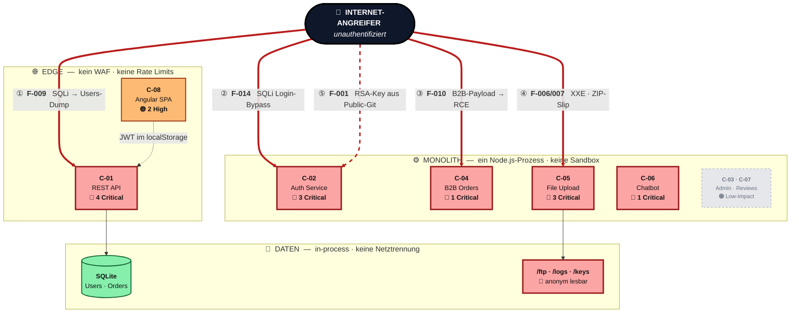
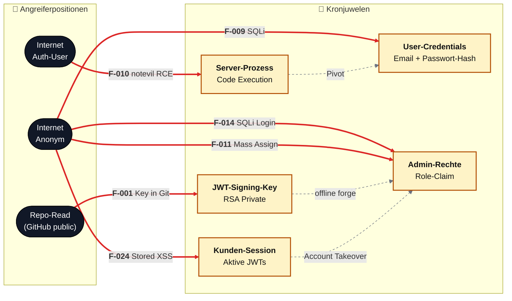

# Threat-Overview-Diagramm — Konzept & Beispiel

> Proof-of-Concept für ein zusätzliches Übersichtsdiagramm, das in jedem Threat-Model **auf einen Blick** zeigt, **wo** in der Architektur die kritischsten Findings sitzen und **wie** ein Angreifer sie erreicht. Gedacht als zusätzlicher Abschnitt zwischen Management Summary und Abschnitt 2 (Architecture Diagrams), *nicht* als Ersatz für die existierenden C4-Diagramme.

## 1. Problem & Designziel

Das heutige Threat-Model hat separate Sichten:

- **§2 Architecture Diagrams** — zeigen Komponenten, aber keine Threats.
- **§3.1 Attack Chain Overview** — zeigt Angriffsketten, aber abstrakte Knoten ohne Architekturbezug.
- **§ Top Findings / §8 Threat Register** — Tabellen, lesbar, aber nicht räumlich.

Für Stakeholder (CISO, Engineering Lead, Produktmanagement) fehlt eine **einzelne Kachel**, die in 10 Sekunden beantwortet: *„Wo brennt es in meiner Architektur und warum?"* Das Diagramm darf keine Tabelle ersetzen — es muss den Rest triggern.

**Designregeln** (bewusst restriktiv, sonst wird's eine Tapete):

| Regel | Warum |
|---|---|
| **Max. 3 Trust-Boundary-Subgraphen** (Edge · Server · Data) | Mehr als drei Kontexte überlastet das Auge |
| **Komponentenfarbe = max. Severity** der dort liegenden Findings | Hotspots sind sofort sichtbar |
| **Badge in Nodelabel**: `🔴 N · 🟠 M` | Zahlen statt Listen — Details stehen in §8 |
| **Nur 3–5 dicke Angriffspfeile** vom Angreifer, mit **F-ID** beschriftet | Storytelling, nicht Vollständigkeit |
| **Normale Datenflüsse** als dünne/gepunktete Linien | Architektur bleibt lesbar |
| **Keine F-IDs im Nodelabel außer den Headline-3** | sonst wird's zur Checkliste |

## 2. Variante A — „Threat Heatmap"

Architektursicht mit severity-eingefärbten Komponenten und Top-3-Angriffspfaden. Eignet sich am besten als *Hero-Diagramm* direkt nach der Verdict-Box der Management Summary.

*Visuelle Hierarchie:* dunkler Angreifer-Kasten oben, **kräftige rote Hotspots** für Critical-Komponenten, gedämpfte graue Sammel-Box für Low-Impact-Komponenten, grüne Daten — die Kritikalität ist ohne Lesen erkennbar. Die nummerierten Angriffspfade ①–⑤ sind bewusst die einzigen fetten Pfeile; alle anderen Flüsse dünn oder gepunktet, damit sie die Story nicht überlagern.

**Was der Leser in 10 Sekunden mitnimmt:**

- Der **Edge hat keinen Schutz** — alles geht direkt an die App (rote Subgraph-Beschriftung).
- **Fünf von acht Komponenten sind rot** (Critical-Finding-Träger), kein einziger Layer ist „sauber".
- Drei Angriffspfade reichen von unauthentifiziert zu **DB-Dump**, **Server-RCE** und **Admin-Impersonation** — ein Blick zeigt, dass es **keine Defense-in-Depth** gibt.
- Die Datenablage liegt *im selben Prozess* — Containment nach einem Exploit gibt es nicht.

## 3. Variante B — „Kronjuwelen & Angriffspfade"

Asset-zentrierte Sicht. Gut als zweites Diagramm in derselben Section für Reports, die stark regulatorisch (PCI/DSGVO/Asset-Klassifikation) geprägt sind.

**Was der Leser in 10 Sekunden mitnimmt:**

- **Fünf Kronjuwelen, jedes mit mindestens einem direkten Critical-Pfeil** — es gibt keine Asset-Klasse ohne unmittelbares Risiko.
- **Drei Angreiferpositionen genügen** (Internet Anon, Auth-User, Repo-Read) — kein Insider-Szenario nötig.
- Gepunktete Pfeile = *Pivots*: ein Exploit reicht nie isoliert, er zündet einen zweiten. Das ist die Defense-in-Depth-Lücke, sichtbar gemacht.

## 4. Empfehlung für die Integration

1. **Variante A wird neuer Abschnitt „2.0 Security Posture at a Glance"** (vor §2.1 System Context) — ein Pflicht-Diagramm pro Threat-Model.
2. **Variante B bleibt optional** — nur rendern, wenn ≥ 3 Asset-Klassen mit Critical/High klassifiziert sind (sonst Overkill).
3. **Automatische Befüllung** aus `.threats-merged.json`:
   - Komponenten-Klassen (`crit`/`high`/`med`) aus `max(severity) per component_id`.
   - Badge-Zahlen aus `count(severity) per component_id`.
   - Headline-Pfeile = Top-3 nach `impact_weighted_score` (bereits vom triage-validator in Phase 10b berechnet, siehe §8.A).
   - F-IDs im Label = genau dieselben Top-3.
4. **Neuer Jinja-Fragment**: `templates/fragments/posture-overview.md.j2`, neues Schema `schemas/fragments/posture-overview.schema.json` mit Feldern `{components[], top_attacks[3-5], attacker_positions[]}`.
5. **Kein neuer Agent nötig** — der Orchestrator kann das Fragment in Phase 11 aus bereits vorhandenen Artefakten (`.threats-merged.json`, `.triage-flags.json`) deterministisch berechnen lassen, ähnlich wie die TOC. Keine LLM-Kosten.
6. **Drift-Guard**: Test, der prüft, dass die F-IDs im Diagramm ⊆ `top_findings` aus §Top-Findings sind (sonst driften die Sichten auseinander).

## 5. Was das Diagramm bewusst *nicht* zeigt

- **Keine Mitigations** — die gehören in §9.
- **Keine Compound Chains** — zu dicht, dafür gibt es §8.C und §3.1.
- **Keine Medium/Low** — wer das will, liest §8.
- **Keine CWEs/CVEs** — Taxonomie gehört in die Tabellen.

Ziel ist *ein einziges Bild, das die Aufmerksamkeit auf die richtigen drei Tabellen lenkt* — nicht ein Bild, das die Tabellen ersetzt.
