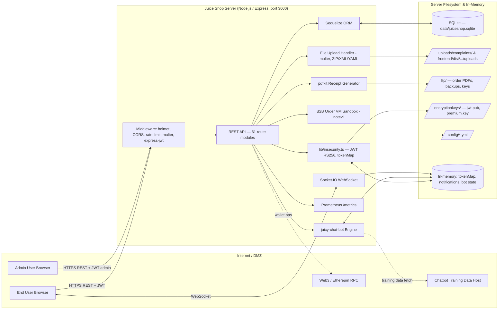

# OWASP Juice Shop — Architecture Description

## 1. System Overview

OWASP Juice Shop is an intentionally vulnerable e-commerce web application built as a Node.js 20–24 / Express.js monolith serving an Angular 15+ single-page frontend. It exposes a REST API (61 route modules) and a Socket.IO WebSocket channel on port 3000, persists data in a local SQLite file via Sequelize ORM (23 models), and bundles supporting subsystems: a rule-based chatbot (`juicy-chat-bot`), multer-based file upload handlers with ZIP/XML/YAML parsing, a VM-sandboxed B2B order evaluator, pdfkit-based order receipt generation, Prometheus metrics, and an administration panel gated by user role. Authentication uses RS256-signed JWTs (6h lifetime) with an in-memory token map. The application is intended to demonstrate the full OWASP Top 10 and is typically deployed from a single container with no external dependencies beyond an optional Web3 provider and a configurable chatbot training-data download URL.

## 2. Architecture Diagram

## 3. Components

| Name | Type | Description | Technology |
|------|------|-------------|------------|
| Express Server | Process | HTTP entrypoint, middleware pipeline, route dispatch | Node.js 20–24, Express, `server.ts` |
| REST API Routes | Process (61 modules) | Login, register, products, basket, orders, 2FA, chatbot, admin, file upload, feedback, complaints, B2B orders, wallet | Express routers in `routes/` |
| Auth / Security Module | Process | JWT RS256 sign/verify (6h TTL), in-memory `authenticatedUsers.tokenMap`, password hashing | `lib/insecurity.ts` |
| Sequelize ORM | Process | Data access for 23 models; IMMEDIATE transactions on SQLite | Sequelize + sqlite3 driver |
| Chatbot Engine | Process | Rule-based NLU/intent matcher, per-user state, training data loaded from JSON at startup | `juicy-chat-bot ~0.9.0` |
| B2B Order Evaluator | Process | Executes `orderLinesData` via `vm.runInContext` with `notevil` sandbox | Node `vm` + `notevil` |
| File Upload Handler | Process | Accepts complaints (ZIP/XML/YAML), profile images; memory+disk storage | `multer`, `adm-zip`, `libxmljs2`, `js-yaml` |
| PDF Generator | Process | Generates order receipts | `pdfkit` |
| WebSocket Gateway | Process | Real-time challenge notifications and verification events | `socket.io 3.1`, same-origin `http://localhost:4200` |
| Metrics Endpoint | Process | Prometheus scrape target at `/metrics` | `prom-client` |
| Angular Frontend | External client (served static) | SPA UI, score-board, admin panel, OAuth, 2FA | Angular 15+, `frontend/` |
| SQLite Database | Data Store | All persistent user, product, order, challenge, memory, feedback data | SQLite file `data/juiceshop.sqlite` |
| Upload Directories | Data Store | Complaint ZIPs and extracted contents, profile images | Local filesystem `/uploads/`, `frontend/dist/.../uploads/` |
| FTP Directory | Data Store | Order PDFs, encrypted backups, `suspicious_errors.yml` | Local filesystem `/ftp/` |
| Encryption Keys | Data Store | JWT RSA public key, premium key | `/encryptionkeys/jwt.pub`, `premium.key` |
| Configuration | Data Store | App name, chatbot URL, product catalog, social links | `/config/*.yml` |
| In-Memory Stores | Data Store | `tokenMap`, `challenges` solve state, `notifications` queue, bot per-user state | Node heap |

## 4. Data Flows

| # | Source | Destination | Protocol | Data / Classification |
|---|--------|-------------|----------|------------------------|
| 1 | End User Browser | REST API `/rest/user/login` | HTTPS POST | Email + password (credentials, sensitive) |
| 2 | REST API | Sequelize ORM → SQLite | Local SQL | User lookup query (string-interpolated in login route) |
| 3 | Auth Module | End User | HTTPS response + cookie | JWT RS256 token (session credential) |
| 4 | End User | REST API `/rest/2fa/verify` | HTTPS POST | TOTP code + tmp JWT (credential) |
| 5 | End User | REST API `/rest/products`, `/rest/basket/:id/*` | HTTPS GET/POST + JWT | Product queries, basket items (PII-linked) |
| 6 | REST API `/rest/basket/:id/checkout` | PDF Generator → `/ftp/` | Local FS write | Order PDF (PII: name, address, items, card ref) |
| 7 | End User | REST API `/file-upload` | HTTPS multipart | Complaint ZIP/XML/YAML (untrusted content) |
| 8 | Upload Handler | `/uploads/complaints/` | Local FS write | Extracted archive members (untrusted) |
| 9 | End User | REST API `/profile/image/file` | HTTPS multipart | Profile image (disk-stored) |
| 10 | End User | REST API `/rest/chatbot/send` | HTTPS POST + JWT | User utterance (untrusted text) |
| 11 | Chatbot Engine | In-memory bot state | In-process | Per-user greeting/trust state |
| 12 | Chatbot (startup) | External Training Host | HTTPS GET (configurable URL) | Training data JSON |
| 13 | End User (B2B) | REST API `/rest/orders/delivery-status` | HTTPS POST | `orderLinesData` evaluated in VM (untrusted code) |
| 14 | Admin Browser | REST API `/rest/admin/*` | HTTPS + JWT (role=admin) | Config, version, user management, metrics |
| 15 | End User ↔ Server | Socket.IO `/socket.io` | WebSocket | Challenge verification events, notifications (public) |
| 16 | REST API | Web3 Provider | HTTPS JSON-RPC | Wallet operations (Ethereum) |
| 17 | Prometheus Scraper | `/metrics` | HTTPS GET | Runtime metrics (operational) |
| 18 | Auth Module | `/encryptionkeys/jwt.pub` | Local FS read | JWT verification key |
| 19 | Sequelize ORM | SQLite file | File I/O | All persisted rows (PII, credentials hashes, orders) |

## 5. Trust Boundaries

- **TB-1: Internet ↔ Express Middleware** — All REST and WebSocket traffic from untrusted browsers and third parties crosses into the server process; enforcement points are helmet, CORS (hardcoded `http://localhost:4200`), rate-limit, express-jwt on protected routes.
- **TB-2: Anonymous ↔ Authenticated User Zone** — Crossed by JWT issuance at `/rest/user/login` and `/rest/2fa/verify`; enforcement via express-jwt + `authenticatedUsers.tokenMap` lookups.
- **TB-3: Authenticated User ↔ Admin Zone** — `/rest/admin/*` and privileged mutations gated by `role === 'admin'` (or `accounting`/`deluxe`) check on the JWT-derived User record.
- **TB-4: Server Process ↔ Local Filesystem** — Node process writes to `/uploads/`, `/ftp/`, `frontend/dist/.../uploads/` and reads keys from `/encryptionkeys/`, config from `/config/`. OS-level file permissions are the only control.
- **TB-5: Server Process ↔ SQLite File** — In-process Sequelize access; no network boundary, no DB-level auth.
- **TB-6: B2B Sandbox ↔ Host Process** — `notevil` / `vm.runInContext` nominally isolates attacker-supplied code but shares the Node heap.
- **TB-7: Server ↔ External Services** — Outbound HTTPS to chatbot training-data host and Web3 RPC endpoint; responses parsed into application state.

## 6. External Entities

| Name | Type | Interaction Pattern |
|------|------|----------------------|
| End User | Human (browser) | HTTPS REST + WebSocket; anonymous or JWT-authenticated; submits credentials, orders, uploads, chat messages |
| Admin User | Human (browser) | Same transport as end user; role=admin claim unlocks `/rest/admin/*` |
| Chatbot Training Data Host | External service | One-time HTTPS GET at startup (URL from `config/*.yml`); supplies JSON ingested into bot engine |
| Web3 / Ethereum Provider | External service | HTTPS JSON-RPC calls initiated by wallet routes |
| Prometheus Scraper | Internal/operator service | HTTPS GET `/metrics` at scrape interval |
| Filesystem (host OS) | Platform | Backs SQLite DB, uploads, FTP area, keys, config — not a network entity but a trust-crossing surface |

## 7. Notes

- No external payment gateway; card data is stored in the local `Card` model.
- No external session store; session/token state is entirely in-process memory and lost on restart.
- Logging is console-only (Winston); no persistent audit trail by default.
- The application is intentionally vulnerable; known sinks include SQLi in `routes/login.ts`, RCE via VM escape in `routes/b2bOrder.ts`, path traversal and zip-slip risk in `routes/fileUpload.ts`, and a configurable training-data download URL in `routes/chatbot.ts`.
