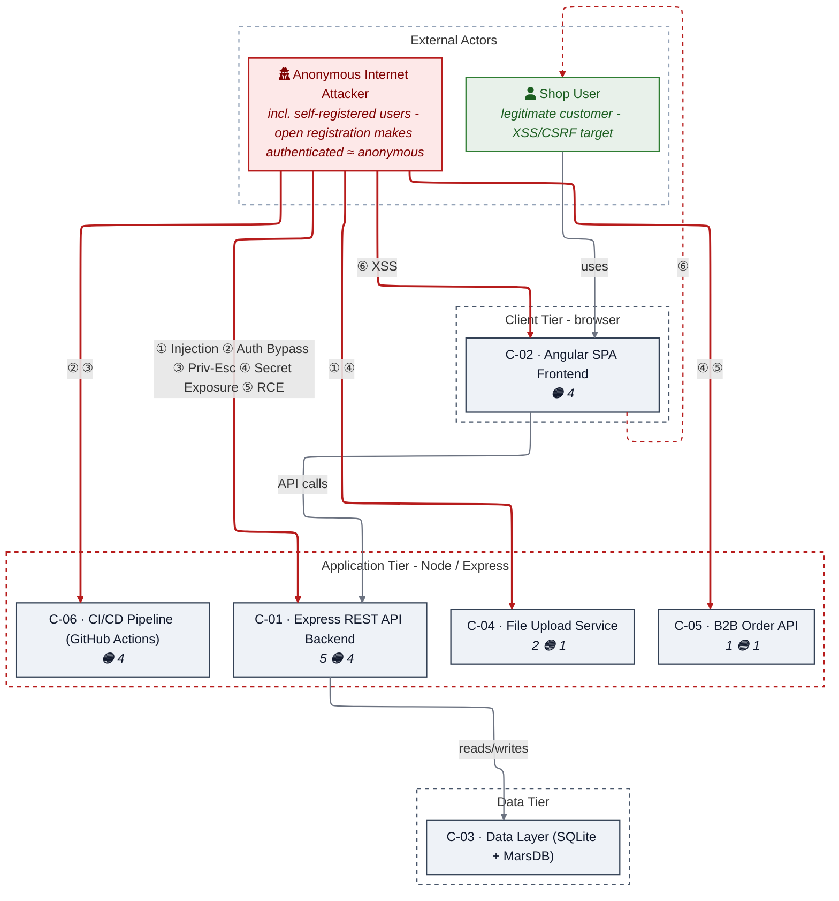
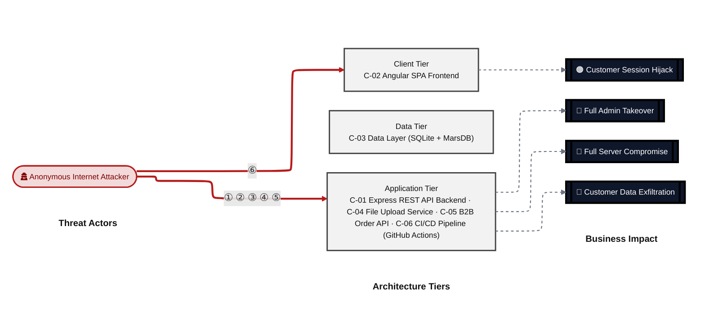
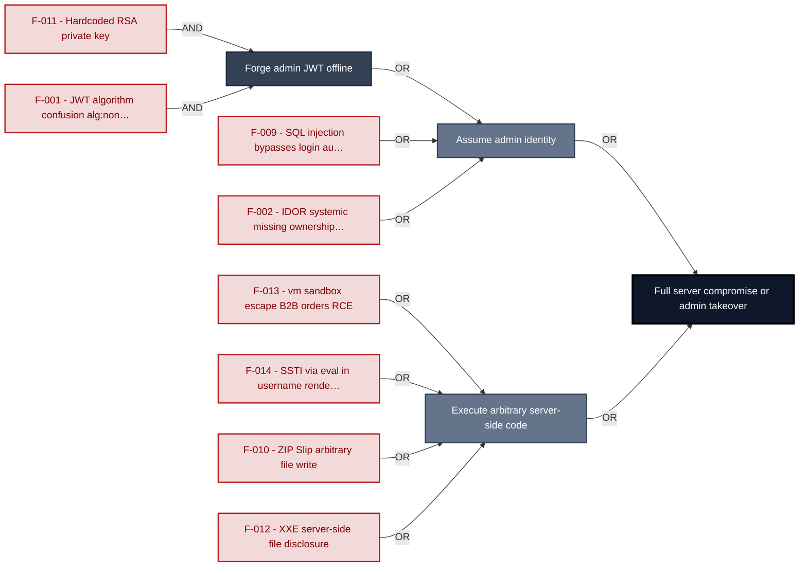
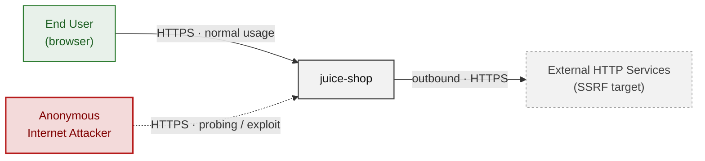
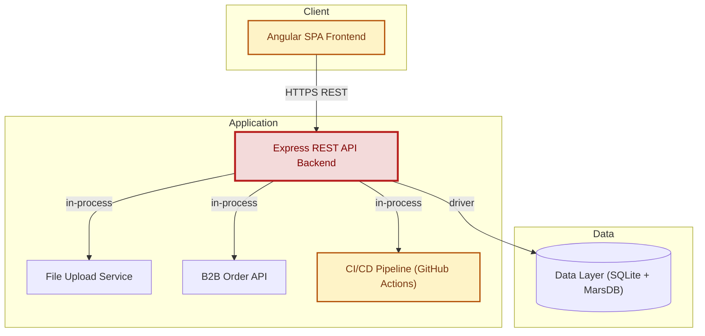
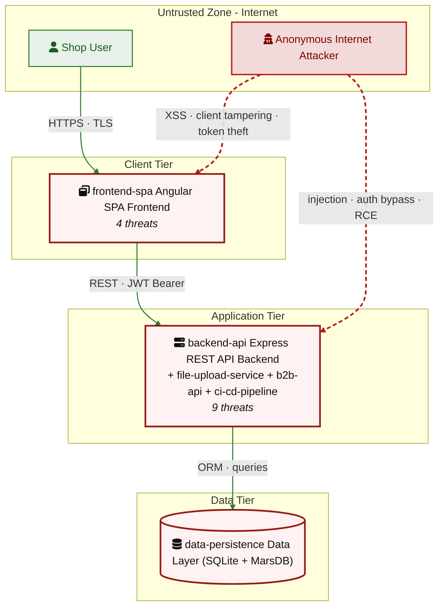
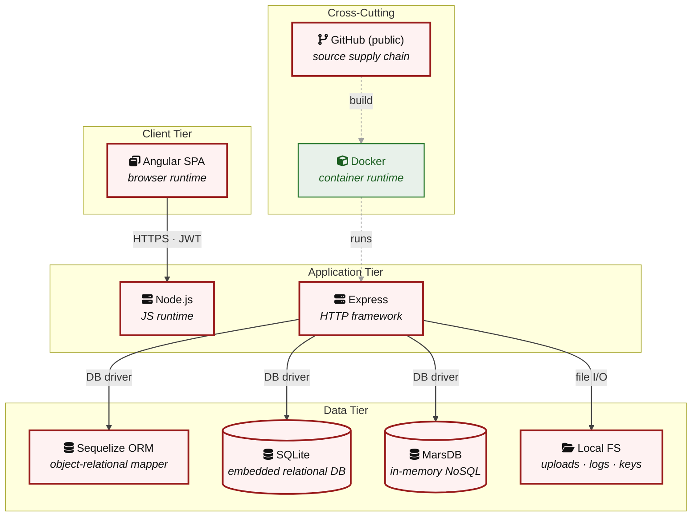

# Threat Model - Juice Shop

_Generated by appsec-advisor v0.4.0-beta (analysis v2)_

---

> | | |
> |---|---|
> | **Project** | Juice Shop v19.2.1 |
> | **Description** | Probably the most modern and sophisticated insecure web application |
> | **Author** | Björn Kimminich <bjoern.kimminich@owasp\.org> (https://kimminich.de) |
> | **License** | MIT |
> | **Repository** | https://github.com/juice-shop/juice-shop |
> | **Homepage** | https://owasp-`juice.shop` |
> | **Runtime** | Node\.js 20 - 24, Express 4 |
> | **Tags** | web security, web application security, webappsec, owasp, pentest, pentesting, security, vulnerable, vulnerability, broken, bodgeit, ctf, capture the flag, awareness |

---

## Changelog

_Append-only history of assessment runs. Most recent first._

| Version | Date | Mode | Depth | Reasoning | Baseline → Current | Δ Threats | Code | Note |
|--------|----------|--------|--------|--------------|------------------|----------------|--------|--------|
| v1 | 2026-06-12 | full | quick | sonnet-economy | _(initial)_ | +27 / ~0 / -0 | - | - |

---

> ⚠ **Quick depth - reduced-scope assessment.**
> 
> This report ran with intentionally narrower depth to keep wall-time short:
> 
> - **4 of 6 components** under full STRIDE analysis (criteria-selected: frontend, auth, and internet-exposed components only)
> - **Max 2 threats per STRIDE category** per component (vs. unlimited at standard/thorough)
> - **No CVSS vectors**, no per-finding evidence excerpts
> - **No §3 Attack Walkthroughs** (entirely skipped at `--quick`)
> - **No LLM-enriched §7 architecture narrative** (scaffold + control tables only)
> - **No QA reviewer pass**, no architect-level review
> 
> Re-run with `--standard` (≈ +30 min) for full STRIDE coverage and QA, or
> `--thorough` (≈ +90 min) for architect review and enriched architecture sections.

---

## Table of Contents

- [Management Summary](#management-summary)
- [Critical Attack Tree](#critical-attack-tree)
1. [System Overview](#1-system-overview)
   - [Scope](#scope)
2. [Architecture Diagrams](#2-architecture-diagrams)
   - [2.1 System Context](#21-system-context)
   - [2.2 Container Architecture](#22-container-architecture)
   - [2.3 Components](#23-components)
   - [2.4 Technology Architecture](#24-technology-architecture)
4. [Assets](#4-assets)
5. [Attack Surface](#5-attack-surface)
   - [5.1 Unauthenticated Entry Points (57)](#51-unauthenticated-entry-points-57)
   - [5.2 Authenticated Entry Points (53)](#52-authenticated-entry-points-53)
8. [Findings Register](#8-findings-register)
9. [Abuse Cases](#9-abuse-cases)
10. [Mitigation Register](#10-mitigation-register)
11. [Out of Scope](#11-out-of-scope)
- [Appendix: Run Statistics](#appendix-run-statistics)
- [Appendix A - Vektor Taxonomy](#appendix-a-vektor-taxonomy)

> _Section numbering is non-contiguous: §3, §6, §7 were retired in a prior revision. The remaining sections keep their original numbers so existing cross-references stay valid._

---

## Management Summary

### Verdict

🔴 OWASP Juice Shop is a deliberate training target - not production software - but its defect profile illustrates a fully compromisable application. Anyone with repo read access already holds the RSA signing key needed to forge admin JWTs offline. Authenticated users can execute arbitrary server-side code via two independent paths. The authentication layer itself is defeated by SQL injection before credentials are even checked.

**Risk distribution:** 🔴 Critical: 8 · 🟠 High: 14 · 🟡 Medium: 4 · 🟢 Low: 1 · **Total: 27**

**Scope:** 4 of 6 components received full STRIDE analysis - the externally-reachable, authentication-bearing, and business-critical surface. The other 2 (lower-priority / internal) were not individually assessed at this depth (see [§1 Scope](#scope)).

<br/>

**The dominant attack outcomes in escalating severity:**

<blockquote style="border-left: 3px solid #dc2626; background: #fef2f2; padding: 16px 20px; margin: 0;">

- **Offline admin JWT forgery — no server interaction required** — The RSA private key is committed to the public repository at `lib/insecurity.ts:23`. Combined with `express-jwt@0.1.3` accepting `alg:none`, any repo clone yields permanent, undetectable admin token forgery. *(🔴 [F-001](#f-001) — JWT Algorithm Confusion Missing Algorithms Allowlist — lib/insecurity.ts:54, 🔴 [F-011](#f-011) — Hardcoded RSA Private Key — lib/insecurity.ts:23)*
- **Full server-side code execution via two independent routes** — `eval()` runs attacker-controlled username strings at `routes/userProfile.ts:62`; `vm.runInContext(safeEval(orderLinesData))` at `routes/b2bOrder.ts:23` is exploitable by any authenticated B2B user. Both reach OS-level process privileges. *(🔴 [F-013](#f-013) — VM sandbox escape — routes/b2bOrder.ts:23, 🔴 [F-014](#f-014) — Server-Side Template Injection — routes/userProfile.ts:62)*
- **Authentication bypass via SQL injection on the login endpoint** — `req.body.email` flows unescaped into `models.sequelize.query()` at `routes/login.ts:34`. The payload `' OR 1=1--` returns the first user row — the seeded admin account — with no credentials. *(🔴 [F-009](#f-009) — SQL Injection — routes/login.ts:34)*
- **Server-side file read via XXE and arbitrary file write via ZIP Slip** — `libxmljs2` at `routes/fileUpload.ts:83` is configured with `noent:true`, reflecting up to 400 chars of any server file in the HTTP error response. A crafted ZIP overwrites arbitrary files under the working directory via a flawed prefix check at line 44. *(🔴 [F-010](#f-010) — ZIP Slip Path Traversal — routes/fileUpload.ts:45, 🔴 [F-012](#f-012) — XXE Server-Side File Disclosure — routes/fileUpload.ts:83)*
- **Systemic IDOR — any authenticated user can read or modify other users' resources** — Server-side authorization derives resource ownership from `req.body.UserId` rather than the session token across multiple resource endpoints, enabling horizontal privilege escalation. *(🔴 [F-002](#f-002) — Systemic IDOR Missing Ownership Checks on Resource Endpoints — routes/address.ts:11)*

</blockquote>

<br/>

The three Critical fixes that block the highest-impact paths are: remove the hardcoded RSA private key, switch the login and search queries to parameterized ORM calls, and remove or gate the `eval()` and `vm.runInContext` execution paths.

### Architectural Anti-Patterns

The defects below are structural - each spans multiple findings and requires a design change, not a point fix. See **[§7 Security Architecture](#7-security-architecture)** for the per-control detail.

- **SPA without BFF** — The Angular SPA stores the session JWT in `localStorage`, which is readable by any JavaScript in the origin. Every XSS vector in this app yields immediate account takeover. Moving token storage server-side via a Backend-for-Frontend (HttpOnly Secure SameSite=Strict cookie) is the only structural fix.
    - _Findings:_ 🟠 [F-006](#f-006) — JWT stored in localStorage accessible to XSS, 🟠 [F-017](#f-017) — Stored XSS via bypassSecurityTrustHtml exfiltrates token

- **Secrets hardcoded in source** — The RSA private key, HMAC secret, and Alchemy API key are committed as string literals in `lib/insecurity.ts` and route files. In a public repository every secret is permanently compromised — rotation requires a code change, not an ops action.
    - _Findings:_ 🔴 [F-011](#f-011) — Hardcoded RSA private key enables offline JWT forgery

- **Raw SQL string interpolation** — The login and product-search routes bypass the Sequelize ORM and interpolate `req.body.email` and `req.query.q` directly into SQL strings. The same call-site pattern recurs in two separate route files — this is a structural gap, not an isolated bug.
    - _Findings:_ 🔴 [F-009](#f-009) — SQL injection on login endpoint bypasses authentication

### Security Posture & Top Threats

**Figure 1 - Architecture & Top Threats**

Components grouped by architecture tier. **Grey** edges are the legitimate request backbone; **solid red** are attacks (each from a threat actor); **dotted red** are the consequence path onto the data tier or victim. Glyphs match Figure 2 and the Top Threats table.



_Threats: ① Injection · ② Auth Bypass · ③ Priv-Esc · ④ Secret Exposure · ⑤ RCE · ⑥ XSS_

_Component badge: 🔴 = number of Critical findings on the component · 🟠 = number of High findings. Components with no Critical/High finding carry no badge._

**Figure 2 - Risk Flow: Actor → Tier → Impact**

Heatmap: **actors** (left) → **architecture tiers** (middle, Client → Application → Data) → **impact** (right). Numbered red arrows ①–⑥ are the threats enumerated in the Top Threats table below. Self-registration is open, so the **Authenticated Internet Attacker** tier is one POST away from anonymous - it is shown distinctly because a post-login endpoint is still a different attack surface.



**Threat actors.** The actors below drive the numbered attack paths in the figures above; the Shop User is the *victim* of client-side attacks (XSS / CSRF), not an attacker.

- **Shop User** — legitimate customer; target of client-side attacks; target of ⑥ Output Encoding / Cross-Site Scripting.
- **Anonymous Internet Attacker** — no account; registers in seconds when needed; drives ① Insecure Query Construction & Data Access, ② Hardcoded Secrets & Weak Cryptography, ③ Broken Authorization & Access Control, ④ Sensitive File & Secret Exposure, ⑤ Remote Code Execution (unsafe eval).

**6 structural threats**, grouped by weakness class - each row is one threat, not one finding. *Threat Description* states the general architectural weakness (STRIDE in brackets); *Findings* lists the concrete instances, each linked to [§8 Findings Register](#8-findings-register) with its component; *Risk & Impact* combines severity with business consequence.

| # | Threat Description | Findings (→ Component) | Risk & Impact | Fix |
|---|------------------------------------|------------------------------------------------|------------------------------------|--------|
| <a id="path-injection"></a>① | **Insecure Query Construction & Data Access** _(T·I)_<br/>user input flows into a server-side interpreter (SQL, NoSQL, XML, YAML, LDAP, OS shell) without parameterization or schema validation. | <span style="white-space:nowrap">🔴&nbsp;[F-009](#f-009)</span> - SQL Injection (`routes/login.ts:34`) <span style="white-space:nowrap">→&nbsp;[C-01](#c-01)</span><br/><span style="white-space:nowrap">🔴&nbsp;[F-012](#f-012)</span> - XXE Server-Side File Disclosure (`routes/fileUpload.ts:83`) <span style="white-space:nowrap">→&nbsp;[C-04](#c-04)</span> | 🔴 **Critical**<br/>Customer Data Exfiltration | <span style="white-space:nowrap">❶ [M-011](#m-011)</span> — Use parameterized database queries<br/><span style="white-space:nowrap">❶ [M-014](#m-014)</span> — Disable XML external entity (XXE) resolution |
| <a id="path-auth-bypass"></a>② | **Hardcoded Secrets & Weak Cryptography** _(S·E)_<br/>authentication can be circumvented or forged because credentials, signing keys, or password hashes are weak, missing, or exposed. | <span style="white-space:nowrap">🔴&nbsp;[F-001](#f-001)</span> - JWT Algorithm Confusion Missing Algorithms Allowlist (`lib/insecurity.ts:54`) <span style="white-space:nowrap">→&nbsp;[C-01](#c-01)</span><br/><span style="white-space:nowrap">🔴&nbsp;[F-011](#f-011)</span> - Hardcoded RSA Private Key (`lib/insecurity.ts:23`) <span style="white-space:nowrap">→&nbsp;[C-01](#c-01)</span><br/><span style="white-space:nowrap">🟠&nbsp;[F-016](#f-016)</span> - OAuth Implicit Flow with No PKCE or State Parameter (`app.routing.ts:262`) <span style="white-space:nowrap">→&nbsp;[C-02](#c-02)</span><br/><span style="white-space:nowrap">🟡&nbsp;[F-026](#f-026)</span> - Container image signing absent from release pipeline (`release.yml:1`) <span style="white-space:nowrap">→&nbsp;[C-06](#c-06)</span> | 🔴 **Critical**<br/>Full Admin Takeover · Customer Data Exfiltration | <span style="white-space:nowrap">❶ [M-003](#m-003)</span> — Enforce JWT signature and algorithm verification<br/><span style="white-space:nowrap">❶ [M-013](#m-013)</span> — Move cryptographic keys to a managed secret store |
| <a id="path-privilege-escalation"></a>③ | **Broken Authorization & Access Control** _(E·I)_<br/>authorization checks are absent or bypassable, allowing horizontal and vertical privilege jumps from a self-registered or low-rights account. Includes mass-assignment of privileged attributes. | <span style="white-space:nowrap">🔴&nbsp;[F-002](#f-002)</span> - Systemic IDOR Missing Ownership Checks on Resource Endpoints (`routes/address.ts:11`) <span style="white-space:nowrap">→&nbsp;[C-01](#c-01)</span><br/><span style="white-space:nowrap">🟠&nbsp;[F-003](#f-003)</span> - Systemic Missing permissions Block in GitHub Actions Workflows (`ci.yml:1`) <span style="white-space:nowrap">→&nbsp;[C-06](#c-06)</span><br/><span style="white-space:nowrap">🟠&nbsp;[F-007](#f-007)</span> - Systemic Missing Server-Side Authorization on API Routes (`app.guard.ts:52`) <span style="white-space:nowrap">→&nbsp;[C-02](#c-02)</span> | 🔴 **Critical**<br/>Full Admin Takeover · Customer Data Exfiltration | <span style="white-space:nowrap">❶ [M-004](#m-004)</span> — Enforce object-level (ownership) authorization<br/><span style="white-space:nowrap">❷ [M-005](#m-005)</span> — Apply least-privilege permissions |
| <a id="path-sensitive-data-exposure"></a>④ | **Sensitive File & Secret Exposure** _(I)_<br/>confidential files, credentials, and management-plane endpoints are reachable on unauthenticated routes; SSRF lets the server fetch internal resources on the attacker's behalf; unsafe path-handling primitives leak server content. | <span style="white-space:nowrap">🔴&nbsp;[F-010](#f-010)</span> - ZIP Slip Path Traversal (`routes/fileUpload.ts:45`) <span style="white-space:nowrap">→&nbsp;[C-04](#c-04)</span><br/><span style="white-space:nowrap">🟠&nbsp;[F-020](#f-020)</span> - SSRF (`routes/profileImageUrlUpload.ts:24`) <span style="white-space:nowrap">→&nbsp;[C-01](#c-01)</span><br/><span style="white-space:nowrap">🟡&nbsp;[F-025](#f-025)</span> - Unhandled vm errors expose stack traces (`routes/b2bOrder.ts:32`) <span style="white-space:nowrap">→&nbsp;[C-05](#c-05)</span> | 🔴 **Critical**<br/>Customer Data Exfiltration | <span style="white-space:nowrap">❶ [M-012](#m-012)</span> — Constrain file paths to a safe base directory<br/><span style="white-space:nowrap">❷ [M-022](#m-022)</span> — Validate and allowlist outbound request targets |
| <a id="path-remote-code-execution"></a>⑤ | **Remote Code Execution (unsafe eval)** _(E)_<br/>user-supplied data reaches a server-side code-execution sink (`eval`, sandbox primitives, deserialization, prototype-pollution gadgets) and breaks out into arbitrary native execution. | <span style="white-space:nowrap">🔴&nbsp;[F-013](#f-013)</span> - VM sandbox escape (`routes/b2bOrder.ts:23`) <span style="white-space:nowrap">→&nbsp;[C-05](#c-05)</span><br/><span style="white-space:nowrap">🔴&nbsp;[F-014](#f-014)</span> - Server-Side Template Injection (`routes/userProfile.ts:62`) <span style="white-space:nowrap">→&nbsp;[C-01](#c-01)</span> | 🔴 **Critical**<br/>Full Server Compromise · Customer Data Exfiltration · Full Admin Takeover | <span style="white-space:nowrap">❶ [M-015](#m-015)</span> — Remove server-side evaluation of untrusted input<br/><span style="white-space:nowrap">❶ [M-016](#m-016)</span> — Remove server-side evaluation of untrusted input |
| <a id="path-cross-site-scripting"></a>⑥ | **Output Encoding / Cross-Site Scripting** _(T·I)_<br/>attacker-controlled content is rendered in the victim's browser without sanitization; combined with session tokens held in JavaScript-readable storage, any payload yields immediate account takeover. | <span style="white-space:nowrap">🟠&nbsp;[F-006](#f-006)</span> - JWT and User Email Stored in localStorage (`request.interceptor.ts:13`) <span style="white-space:nowrap">→&nbsp;[C-02](#c-02)</span><br/><span style="white-space:nowrap">🟠&nbsp;[F-017](#f-017)</span> - Stored XSS (`last-login-ip.component.html:10`) <span style="white-space:nowrap">→&nbsp;[C-02](#c-02)</span> | 🟠 **High**<br/>Customer Session Hijack | <span style="white-space:nowrap">❷ [M-008](#m-008)</span> — Store session tokens in HttpOnly, Secure cookies<br/><span style="white-space:nowrap">❷ [M-019](#m-019)</span> — Encode output instead of bypassing the framework sanitizer |

_STRIDE: S spoofing · T tampering · R repudiation · I information disclosure · D denial of service · E elevation of privilege. Risk, findings, components, impact and Fix are derived deterministically; only the one-line weakness description is authored._

### Top Mitigations

Highest-impact P1/P2 mitigations - 10 of 22 qualifying (27 total). Full detail in [§10 Mitigation Register](#10-mitigation-register). All 8 mitigation(s) that fix a Critical finding are always listed here.

| # | Component | Mitigation | Addresses | Effort |
|---|----------------------|------------------------------------------------|------------------------------------------------|------|
| **1** | [C-01](#c-01) — Express REST API Backend | ❶ [M-003](#m-003) — Enforce JWT signature and algorithm verification | 🔴 [F-001](#f-001) — JWT Algorithm Confusion Missing Algorithms Allowlist (`lib/insecurity.ts`) | Low |
| **2** | [C-01](#c-01) — Express REST API Backend | ❶ [M-011](#m-011) — Use parameterized database queries | 🔴 [F-009](#f-009) — SQL Injection (`routes/login.ts`) | Low |
| **3** | [C-01](#c-01) — Express REST API Backend | ❶ [M-013](#m-013) — Move cryptographic keys to a managed secret store | 🔴 [F-011](#f-011) — Hardcoded RSA Private Key (`lib/insecurity.ts`) | Low |
| **4** | [C-01](#c-01) — Express REST API Backend | ❶ [M-016](#m-016) — Remove server-side evaluation of untrusted input | 🔴 [F-014](#f-014) — Server-Side Template Injection (`routes/userProfile.ts`) | Low |
| **5** | [C-01](#c-01) — Express REST API Backend | ❶ [M-004](#m-004) — Enforce object-level (ownership) authorization | 🔴 [F-002](#f-002) — Systemic IDOR Missing Ownership Checks on Resource Endpoints (`routes/address.ts`) | Medium |
| **6** | [C-04](#c-04) — File Upload Service | ❶ [M-012](#m-012) — Constrain file paths to a safe base directory | 🔴 [F-010](#f-010) — ZIP Slip Path Traversal (`routes/fileUpload.ts`) | Low |
| **7** | [C-04](#c-04) — File Upload Service | ❶ [M-014](#m-014) — Disable XML external entity (XXE) resolution | 🔴 [F-012](#f-012) — XXE Server-Side File Disclosure (`routes/fileUpload.ts`) | Low |
| **8** | [C-05](#c-05) — B2B Order API | ❶ [M-015](#m-015) — Remove server-side evaluation of untrusted input | 🔴 [F-013](#f-013) — VM sandbox escape (`routes/b2bOrder.ts`) | High |
| **9** | [C-01](#c-01) — Express REST API Backend | ❷ [M-024](#m-024) — Rate-limit and lock out repeated authentication attempts | 🟠 [F-022](#f-022) — Missing Rate Limiting on Authentication Endpoint (`routes/login.ts`) | Low |
| **10** | [C-02](#c-02) — Angular SPA Frontend | ❷ [M-019](#m-019) — Encode output instead of bypassing the framework sanitizer | 🟠 [F-017](#f-017) — Stored XSS (`last-login-ip.component.html`) | Low |

*12 additional P1/P2 mitigations capped from the leader-board · 5 P3 backlog items in [§10 Mitigation Register](#10-mitigation-register). Sorted by priority (P1 first), then component, then leverage (most findings first), severity (Critical first), and effort (Low first).*

### Operational Strengths

Operational controls rated Adequate or Partial - grouped into broad clusters. Clusters demoted to Weak by open Critical/High findings are excluded here.

<table style="table-layout:fixed;width:100%">
<colgroup><col style="width:18%"><col style="width:28%"><col style="width:13%"><col style="width:30%"><col style="width:11%"></colgroup>
<thead><tr><th>Strength</th><th>What's in Place</th><th>Effectiveness</th><th>Gap</th><th>Mitigates</th></tr></thead>
<tbody>
<tr><td style="overflow-wrap:anywhere"><strong>Container &amp; Supply-Chain Hardening</strong></td><td style="overflow-wrap:anywhere"><em>Build-time and runtime hardening - minimal base image, non-root execution, dependency inventory.</em><br/>Automated SCA scanning<br/>Dependency Pinning and Integrity</td><td>✅ Adequate</td><td style="overflow-wrap:anywhere">-</td><td style="overflow-wrap:anywhere">-</td></tr>
</tbody>
</table>

**Bottom line:** These controls narrow specific attack surfaces but none eliminates a Critical finding on its own.

---

<a id="critical-attack-chain"></a><a id="critical-attack-tree"></a>
## Critical Attack Tree

The root is the worst-case attacker goal; below it, each capability branch groups the Critical findings that achieve it. Branches feed the goal by OR - any single path suffices.



**Findings** (full detail in [§8 Findings Register](#8-findings-register)): 🔴 [F-011](#f-011) — Hardcoded RSA Private Key — `lib/insecurity.ts:23` Hardcoded RSA private key · 🔴 [F-001](#f-001) — JWT Algorithm Confusion Missing Algorithms Allowlist — `lib/insecurity.ts:54` JWT algorithm confusion `alg:none` accepted · 🔴 [F-009](#f-009) — SQL Injection — `routes/login.ts:34` SQL injection bypasses login auth check · 🔴 [F-002](#f-002) — Systemic IDOR Missing Ownership Checks on Resource Endpoints — `routes/address.ts:11` IDOR systemic missing ownership checks · 🔴 [F-013](#f-013) — VM sandbox escape — `routes/b2bOrder.ts:23` vm sandbox escape B2B orders RCE · 🔴 [F-014](#f-014) — Server-Side Template Injection — `routes/userProfile.ts:62` SSTI via eval in username rendering · 🔴 [F-010](#f-010) — ZIP Slip Path Traversal — `routes/fileUpload.ts:45` ZIP Slip arbitrary file write · 🔴 [F-012](#f-012) — XXE Server-Side File Disclosure — `routes/fileUpload.ts:83` XXE server-side file disclosure

---

## 1. System Overview

Probably the most modern and sophisticated insecure web application

**Repository:** https://github.com/juice-shop/juice-shop
**Runtime:** Node\.js 20 - 24

### Scope

juice-shop comprises **6** modeled components. This threat model applied full STRIDE threat analysis to **4 of 6** - the components on the externally-reachable, authentication-bearing, and business-critical surface: **Express REST API Backend**, **Angular SPA Frontend**, **File Upload Service**, **B2B Order API**. Selection criteria: internet-exposed; frontend attack surface.

The remaining **2** component(s) were **not individually analyzed** at this assessment depth (lower-priority / internal surface): Data Layer (SQLite + MarsDB), CI/CD Pipeline (GitHub Actions). Re-run at a higher `--assessment-depth` to extend STRIDE coverage to them.

**Out of scope:** third-party hosted dependencies, browser runtime, operating-system kernel, and the underlying network infrastructure.

---

## 2. Architecture Diagrams

### 2.1 System Context

Who interacts with juice-shop from the outside, and through which channels. Solid arrows show normal usage; dashed red arrows mark unauthenticated probing or exploit paths (C4 Level 1).



**Key takeaway:** Every actor in the context interacts with juice-shop through its external interface, so authentication and input validation at that edge govern the entire attack surface.

### 2.2 Container Architecture

How the system decomposes into deployable units. Each box is a separate runtime process or service container; arrows show synchronous request paths between them. Components with ≥3 Critical findings carry a red border, ≥2 High amber (C4 Level 2).



**Key takeaway:** The system decomposes into 1 client, 4 application and 1 data unit(s); Express REST API Backend carries the most Critical findings (5) and bounds the worst-case blast radius.

### 2.3 Components

Who reaches each component, and through which trust zone. Four columns map external actors to the internal tiers (Client / Application / Data); solid green arrows show legitimate data flow, dashed red arrows mark intrusion vectors. The component table directly below holds source paths and linked threats per `C-NN`; per-finding evidence is in [§8 Findings Register](#8-findings-register).



**Key takeaway:** Express REST API Backend concentrates the most findings (9 of 27 across all components); the table below maps each component to its source paths and linked threats.

| ID | Name | Type | Key Paths | Linked Threats |
|----|----------------------|-----------|---------------------|------------------------------------------------|
| <a id="c-01"></a><a id="backend-api"></a><span style="white-space:nowrap">C-01</span> | Express REST API Backend | application | `server.ts`<br/>`app.ts`<br/>`routes/**`<br/>`lib/**`<br/>`models/**` | 🔴 [F-001](#f-001) — JWT Algorithm Confusion Missing Algorithms Allowlist (`lib/insecurity.ts:54`)<br/>🔴 [F-002](#f-002) — Systemic IDOR Missing Ownership Checks on Resource Endpoints (`routes/address.ts:11`)<br/>🔴 [F-009](#f-009) — SQL Injection (`routes/login.ts:34`)<br/>🔴 [F-011](#f-011) — Hardcoded RSA Private Key (`lib/insecurity.ts:23`)<br/>🔴 [F-014](#f-014) — Server-Side Template Injection (`routes/userProfile.ts:62`)<br/>🟠 [F-015](#f-015) — JWT decode used without signature verification (`lib/insecurity.ts:58`)<br/>🟠 [F-018](#f-018) — Missing Security Audit Logging for Authentication Events (`routes/login.ts:18`)<br/>🟠 [F-020](#f-020) — SSRF (`routes/profileImageUrlUpload.ts:24`)<br/>🟠 [F-022](#f-022) — Missing Rate Limiting on Authentication Endpoint (`routes/login.ts:34`) |
| <a id="c-02"></a><a id="frontend-spa"></a><span style="white-space:nowrap">C-02</span> | Angular SPA Frontend | client | `frontend/src/**`<br/>`frontend/dist/**` | 🟠 [F-006](#f-006) — JWT and User Email Stored in localStorage (`request.interceptor.ts:13`)<br/>🟠 [F-007](#f-007) — Systemic Missing Server-Side Authorization on API Routes (`app.guard.ts:52`)<br/>🟠 [F-016](#f-016) — OAuth Implicit Flow with No PKCE or State Parameter (`app.routing.ts:262`)<br/>🟠 [F-017](#f-017) — Stored XSS (`last-login-ip.component.html:10`) |
| <a id="c-03"></a><a id="data-persistence"></a><span style="white-space:nowrap">C-03</span> | Data Layer (SQLite + MarsDB) | data | `models/**`<br/>`data/datacreator.ts`<br/>`data/*.json` | - |
| <a id="c-04"></a><a id="file-upload-service"></a><span style="white-space:nowrap">C-04</span> | File Upload Service | application | `routes/fileUpload.ts`<br/>`routes/userProfile.ts`<br/>`uploads/**` | 🔴 [F-010](#f-010) — ZIP Slip Path Traversal (`routes/fileUpload.ts:45`)<br/>🔴 [F-012](#f-012) — XXE Server-Side File Disclosure (`routes/fileUpload.ts:83`)<br/>🟠 [F-023](#f-023) — YAML Bomb Memory Exhaustion (`routes/fileUpload.ts:117`) |
| <a id="c-05"></a><a id="b2b-api"></a><span style="white-space:nowrap">C-05</span> | B2B Order API | application | `routes/b2bOrder.ts` | 🔴 [F-013](#f-013) — VM sandbox escape (`routes/b2bOrder.ts:23`)<br/>🟠 [F-021](#f-021) — Synchronous vm.runInContext blocks event loop (`routes/b2bOrder.ts:23`)<br/>🟡 [F-024](#f-024) — No audit log of executed orderLinesData payloads (`routes/b2bOrder.ts:19`)<br/>🟡 [F-025](#f-025) — Unhandled vm errors expose stack traces (`routes/b2bOrder.ts:32`) |
| <a id="c-06"></a><a id="ci-cd-pipeline"></a><span style="white-space:nowrap">C-06</span> | CI/CD Pipeline (GitHub Actions) | application | `.github/workflows/**`<br/>`Dockerfile`<br/>`docker-compose*.yml`<br/>`package.json` | 🟠 [F-003](#f-003) — Systemic Missing permissions Block in GitHub Actions Workflows (`ci.yml:1`)<br/>🟠 [F-004](#f-004) — Systemic Unpinned Third-Party GitHub Actions SHA Pinning Missing (`codeql-analysis.yml:23`)<br/>🟠 [F-005](#f-005) — Systemic Supply-Chain Hygiene Gaps unpinned images, missing lockfile, no Depend — Dockerfile:1<br/>🟡 [F-008](#f-008) — Malicious Postinstall Scripts npm install without --ignore-scripts — Dockerfile:5<br/>🟠 [F-019](#f-019) — Uses --unsafe-perm npm flag — Dockerfile:5<br/>🟡 [F-026](#f-026) — Container image signing absent from release pipeline (`release.yml:1`)<br/>🟢 [F-027](#f-027) — Missing HEALTHCHECK instruction — Dockerfile:1 |
### 2.4 Technology Architecture

The technology stack the system is built on. Each box names the framework or runtime that fills that role; per-component findings live in the [§2.3](#23-components) component table above, and the full per-finding catalogue is in [§8 Findings Register](#8-findings-register).



**Key takeaway:** The stack spans 1 data-tier store(s) behind the application tier; injection and data-at-rest exposure track the data tier, detailed per finding in [§8 Findings Register](#8-findings-register).

> **Legend:** **red border** ≥ 3 Critical threats on the component · **amber border** ≥ 2 High threats

---

## 4. Assets

Information assets and the classification level that drives the Confidentiality / Integrity / Availability targets used in [§8 Findings Register](#8-findings-register) risk scoring.

<table style="table-layout:fixed;width:100%">
<colgroup><col style="width:20%"><col style="width:6%"><col style="width:12%"><col style="width:29%"><col style="width:33%"></colgroup>
<thead><tr><th>Asset</th><th>ID</th><th>Classification</th><th>Description</th><th>Linked Threats</th></tr></thead>
<tbody>
<tr><td style="overflow-wrap:anywhere">User Credentials (email + <code>MD5</code> password hash)</td><td style="white-space:nowrap">A-001</td><td>Restricted</td><td>User email addresses and <code>MD5</code>-hashed passwords stored in SQLite Users table via Sequelize. Intentionally weak <code>MD5</code> with no salt — crackable offline once DB is accessed.</td><td style="overflow-wrap:anywhere">🔴 <a href="#f-009">F-009</a> — SQL Injection (<code>routes/login.ts:34</code>)<br/>🟠 <a href="#f-017">F-017</a> — Stored XSS (<code>last-login-ip.component.html:10</code>)<br/>🟠 <a href="#f-022">F-022</a> — Missing Rate Limiting on Authentication Endpoint (<code>routes/login.ts:34</code>)</td></tr>
<tr><td style="overflow-wrap:anywhere">RSA JWT Signing Private Key</td><td style="white-space:nowrap">A-002</td><td>Restricted</td><td>1024-bit RSA private key hardcoded in <code>lib/insecurity.ts:23</code> and committed to the public repository. Used to sign all JWT tokens — anyone can forge admin tokens.</td><td style="overflow-wrap:anywhere">🔴 <a href="#f-001">F-001</a> — JWT Algorithm Confusion Missing Algorithms Allowlist (<code>lib/insecurity.ts:54</code>)<br/>🔴 <a href="#f-010">F-010</a> — ZIP Slip Path Traversal (<code>routes/fileUpload.ts:45</code>)<br/>🔴 <a href="#f-011">F-011</a> — Hardcoded RSA Private Key (<code>lib/insecurity.ts:23</code>)<br/>🟠 <a href="#f-015">F-015</a> — JWT decode used without signature verification (<code>lib/insecurity.ts:58</code>)</td></tr>
<tr><td style="overflow-wrap:anywhere">HMAC and Hashids Secrets</td><td style="white-space:nowrap">A-008</td><td>Restricted</td><td>HMAC key (<code>lib/insecurity.ts:44</code>) and three Hashids salts (<code>routes/continueCode.ts:13</code>,25,38) hardcoded in source. Used for deluxe token generation and challenge continue-codes.</td><td style="overflow-wrap:anywhere">-</td></tr>
<tr><td style="overflow-wrap:anywhere">Alchemy Ethereum API Key</td><td style="white-space:nowrap">A-010</td><td>Restricted</td><td>Alchemy WebSocket API key committed in <code>routes/web3Wallet.ts</code> and <code>routes/nftMint.ts</code>. Used for Ethereum Sepolia testnet interactions; exposed in public repository.</td><td style="overflow-wrap:anywhere">🔴 <a href="#f-002">F-002</a> — Systemic IDOR Missing Ownership Checks on Resource Endpoints (<code>routes/address.ts:11</code>)<br/>🟠 <a href="#f-007">F-007</a> — Systemic Missing Server-Side Authorization on API Routes (<code>app.guard.ts:52</code>)<br/>🔴 <a href="#f-009">F-009</a> — SQL Injection (<code>routes/login.ts:34</code>)<br/>🟠 <a href="#f-017">F-017</a> — Stored XSS (<code>last-login-ip.component.html:10</code>)</td></tr>
<tr><td style="overflow-wrap:anywhere">User PII (name, address, payment cards)</td><td style="white-space:nowrap">A-003</td><td>Confidential</td><td>User profile data including names, delivery addresses, and payment card numbers stored in SQLite via Sequelize models (User, Address, Card). Exposed through IDOR/authorization bypass.</td><td style="overflow-wrap:anywhere">🔴 <a href="#f-002">F-002</a> — Systemic IDOR Missing Ownership Checks on Resource Endpoints (<code>routes/address.ts:11</code>)<br/>🟠 <a href="#f-007">F-007</a> — Systemic Missing Server-Side Authorization on API Routes (<code>app.guard.ts:52</code>)<br/>🔴 <a href="#f-009">F-009</a> — SQL Injection (<code>routes/login.ts:34</code>)<br/>🟠 <a href="#f-017">F-017</a> — Stored XSS (<code>last-login-ip.component.html:10</code>)</td></tr>
<tr><td style="overflow-wrap:anywhere">Order and Purchase History</td><td style="white-space:nowrap">A-004</td><td>Confidential</td><td>Customer order records, basket items, and recycling requests stored in SQLite. Accessible to authenticated users; admin can access all orders.</td><td style="overflow-wrap:anywhere">🔴 <a href="#f-002">F-002</a> — Systemic IDOR Missing Ownership Checks on Resource Endpoints (<code>routes/address.ts:11</code>)<br/>🟠 <a href="#f-007">F-007</a> — Systemic Missing Server-Side Authorization on API Routes (<code>app.guard.ts:52</code>)<br/>🔴 <a href="#f-009">F-009</a> — SQL Injection (<code>routes/login.ts:34</code>)</td></tr>
<tr><td style="overflow-wrap:anywhere">Uploaded Files (complaints, profile images)</td><td style="white-space:nowrap">A-006</td><td>Confidential</td><td>User-uploaded complaint files (XML/ZIP/YAML) and profile images stored on the filesystem in uploads/. XXE and path traversal risks in processing pipeline.</td><td style="overflow-wrap:anywhere">🔴 <a href="#f-010">F-010</a> — ZIP Slip Path Traversal (<code>routes/fileUpload.ts:45</code>)<br/>🔴 <a href="#f-012">F-012</a> — XXE Server-Side File Disclosure (<code>routes/fileUpload.ts:83</code>)<br/>🔴 <a href="#f-013">F-013</a> — VM sandbox escape (<code>routes/b2bOrder.ts:23</code>)<br/>🔴 <a href="#f-014">F-014</a> — Server-Side Template Injection (<code>routes/userProfile.ts:62</code>)</td></tr>
<tr><td style="overflow-wrap:anywhere">Product Reviews and Feedback</td><td style="white-space:nowrap">A-005</td><td>Internal</td><td>Product reviews in MarsDB in-memory store and customer feedback in SQLite. Publicly readable; injection-vulnerable NoSQL queries in <code>likeProductReviews.ts</code>.</td><td style="overflow-wrap:anywhere">-</td></tr>
<tr><td style="overflow-wrap:anywhere">Application Source Code and Config</td><td style="white-space:nowrap">A-007</td><td>Internal</td><td>TypeScript/JavaScript source, config YAML files (config/), and Swagger API documentation exposed at <code>/api-docs</code>. Swagger UI discloses all API structure publicly.</td><td style="overflow-wrap:anywhere">-</td></tr>
<tr><td style="overflow-wrap:anywhere">Prometheus Metrics</td><td style="white-space:nowrap">A-009</td><td>Internal</td><td>Application metrics exposed at <code>/metrics</code> (<code>server.ts:718</code>) without authentication - reveals active user counts, error rates, and session counts.</td><td style="overflow-wrap:anywhere">-</td></tr>
</tbody>
</table>

---

## 5. Attack Surface

Network-reachable entry points classified by authentication requirement. Each row links to the threat(s) referenced in its **Notes** column. The **Risk** column reflects the highest-severity linked finding. Entry points with no linked finding are still listed when they sit on a sensitive surface (authentication, registration, management) or look like a missing-auth/authz suspect - marked **⚑ Review** in Notes.

### 5.1 Unauthenticated Entry Points (57)

<table style="table-layout:fixed;width:100%">
<colgroup><col style="width:9%"><col style="width:30%"><col style="width:14%"><col style="width:47%"></colgroup>
<thead><tr><th>Method</th><th>Route</th><th>Risk</th><th>Notes</th></tr></thead>
<tbody>
<tr><td>POST</td><td style="overflow-wrap:anywhere"><code>/file-upload</code></td><td>🔴 Critical</td><td>🔴 <a href="#f-012">F-012</a> — XXE Server-Side File Disclosure (<code>routes/fileUpload.ts:83</code>)<br/>🟠 <a href="#f-023">F-023</a> — YAML Bomb Memory Exhaustion (<code>routes/fileUpload.ts:117</code>)<br/>🔴 <a href="#f-010">F-010</a> — ZIP Slip Path Traversal (<code>routes/fileUpload.ts:45</code>)<br/>File upload — XXE, zip bomb, zip slip attack surface</td></tr>
<tr><td>POST</td><td style="overflow-wrap:anywhere"><code>/profile</code></td><td>🔴 Critical</td><td>🔴 <a href="#f-014">F-014</a> — Server-Side Template Injection (<code>routes/userProfile.ts:62</code>)<br/>🟠 <a href="#f-020">F-020</a> — SSRF (<code>routes/profileImageUrlUpload.ts:24</code>)<br/>Profile POST — SSTI via <code>eval()</code> with Pug template injection</td></tr>
<tr><td>POST</td><td style="overflow-wrap:anywhere"><code>/rest/user/login</code></td><td>🔴 Critical</td><td>🟠 <a href="#f-022">F-022</a> — Missing Rate Limiting on Authentication Endpoint (<code>routes/login.ts:34</code>)<br/>🔴 <a href="#f-009">F-009</a> — SQL Injection (<code>routes/login.ts:34</code>)<br/>🟠 <a href="#f-018">F-018</a> — Missing Security Audit Logging for Authentication Events (<code>routes/login.ts:18</code>)<br/>Unauthenticated login — SQL injection via raw string interpolation</td></tr>
<tr><td>GET</td><td style="overflow-wrap:anywhere"><code>/profile</code></td><td>🔴 Critical</td><td>🔴 <a href="#f-014">F-014</a> — Server-Side Template Injection (<code>routes/userProfile.ts:62</code>)<br/>🟠 <a href="#f-020">F-020</a> — SSRF (<code>routes/profileImageUrlUpload.ts:24</code>)<br/>handler: <code>server.ts:663</code></td></tr>
<tr><td>POST</td><td style="overflow-wrap:anywhere"><code>/profile/image/file</code></td><td>🟠 High</td><td>🟠 <a href="#f-020">F-020</a> — SSRF (<code>routes/profileImageUrlUpload.ts:24</code>)<br/>handler: <code>server.ts:310</code></td></tr>
<tr><td>POST</td><td style="overflow-wrap:anywhere"><code>/profile/image/url</code></td><td>🟠 High</td><td>🟠 <a href="#f-020">F-020</a> — SSRF (<code>routes/profileImageUrlUpload.ts:24</code>)<br/>handler: <code>server.ts:311</code></td></tr>
<tr><td>GET</td><td style="overflow-wrap:anywhere"><code>/​this/​page/​is/​hidden/​behind/​an/​incredibly/​high/​paywall/​that/​could/​only/​be/​unlocked/​by/​sending/​1btc/​to/​us</code></td><td>🟠 High</td><td>🟠 <a href="#f-005">F-005</a> — Systemic Supply-Chain Hygiene Gaps unpinned images, missing lockfile, no Depend — Dockerfile:1<br/>🟠 <a href="#f-017">F-017</a> — Stored XSS (<code>last-login-ip.component.html:10</code>)<br/>handler: <code>server.ts:649</code></td></tr>
<tr><td>POST</td><td style="overflow-wrap:anywhere"><code>/</code></td><td>-</td><td>handler: <code>routes/dataErasure.ts:54</code><br/><em>⚑ Review: no auth guard detected</em></td></tr>
<tr><td>POST</td><td style="overflow-wrap:anywhere"><code>/api/Feedbacks</code></td><td>-</td><td>handler: <code>server.ts:401</code><br/><em>⚑ Review: no auth guard detected</em></td></tr>
<tr><td>GET</td><td style="overflow-wrap:anywhere"><code>/metrics</code></td><td>-</td><td>Prometheus metrics exposed unauthenticated<br/><em>⚑ Review: no auth guard detected</em></td></tr>
<tr><td>GET</td><td style="overflow-wrap:anywhere"><code>/​rest/​admin/​application-​configuration</code></td><td>-</td><td>Application config disclosure<br/><em>⚑ Review: no auth guard detected</em></td></tr>
<tr><td>GET</td><td style="overflow-wrap:anywhere"><code>/​rest/​admin/​application-​version</code></td><td>-</td><td>Application version info disclosure<br/><em>⚑ Review: no auth guard detected</em></td></tr>
<tr><td>PUT</td><td style="overflow-wrap:anywhere"><code>/​rest/​continue-​code-​findIt/​apply/​:​continueCode</code></td><td>-</td><td>handler: <code>server.ts:610</code><br/><em>⚑ Review: no auth guard detected</em></td></tr>
<tr><td>PUT</td><td style="overflow-wrap:anywhere"><code>/​rest/​continue-​code-​fixIt/​apply/​:​continueCode</code></td><td>-</td><td>handler: <code>server.ts:611</code><br/><em>⚑ Review: no auth guard detected</em></td></tr>
<tr><td>PUT</td><td style="overflow-wrap:anywhere"><code>/​rest/​continue-​code/​apply/​:​continueCode</code></td><td>-</td><td>handler: <code>server.ts:612</code><br/><em>⚑ Review: no auth guard detected</em></td></tr>
<tr><td>POST</td><td style="overflow-wrap:anywhere"><code>/rest/memories</code></td><td>-</td><td>handler: <code>server.ts:312</code><br/><em>⚑ Review: no auth guard detected</em></td></tr>
<tr><td>PUT</td><td style="overflow-wrap:anywhere"><code>/​rest/​order-​history/​:​id/​delivery-​status</code></td><td>-</td><td>handler: <code>server.ts:623</code><br/><em>⚑ Review: no auth guard detected</em></td></tr>
<tr><td>POST</td><td style="overflow-wrap:anywhere"><code>/rest/user/data-export</code></td><td>-</td><td>Data export - BOLA risk, weak auth<br/><em>⚑ Review: no auth guard detected</em></td></tr>
<tr><td>POST</td><td style="overflow-wrap:anywhere"><code>/rest/user/reset-password</code></td><td>-</td><td>handler: <code>server.ts:596</code><br/><em>⚑ Review: auth/token endpoint</em></td></tr>
<tr><td>PUT</td><td style="overflow-wrap:anywhere"><code>/rest/wallet/balance</code></td><td>-</td><td>handler: <code>server.ts:625</code><br/><em>⚑ Review: no auth guard detected</em></td></tr>
<tr><td>POST</td><td style="overflow-wrap:anywhere"><code>/​rest/​web3/​walletExploitAddress</code></td><td>-</td><td>Web3 wallet exploit address - Ethereum interaction without auth<br/><em>⚑ Review: no auth guard detected</em></td></tr>
<tr><td>POST</td><td style="overflow-wrap:anywhere"><code>/rest/web3/walletNFTVerify</code></td><td>-</td><td>Web3 wallet NFT verify - Ethereum interaction without auth<br/><em>⚑ Review: no auth guard detected</em></td></tr>
<tr><td>POST</td><td style="overflow-wrap:anywhere"><code>/snippets/fixes</code></td><td>-</td><td>handler: <code>server.ts:670</code><br/><em>⚑ Review: no auth guard detected</em></td></tr>
<tr><td>POST</td><td style="overflow-wrap:anywhere"><code>/snippets/verdict</code></td><td>-</td><td>handler: <code>server.ts:668</code><br/><em>⚑ Review: no auth guard detected</em></td></tr>
</tbody>
</table>

_33 further entry point(s) in this category carry no linked finding and no elevated review signal, and are not listed individually (57 total). The complete route inventory is available in `.route-inventory.json` and, when exported, `pentest-tasks.yaml`._

### 5.2 Authenticated Entry Points (53)

<table style="table-layout:fixed;width:100%">
<colgroup><col style="width:9%"><col style="width:30%"><col style="width:14%"><col style="width:47%"></colgroup>
<thead><tr><th>Method</th><th>Route</th><th>Risk</th><th>Notes</th></tr></thead>
<tbody>
<tr><td>POST</td><td style="overflow-wrap:anywhere"><code>/b2b/v2/orders</code></td><td>🟠 High</td><td>🟠 <a href="#f-021">F-021</a> — Synchronous vm.runInContext blocks event loop (<code>routes/b2bOrder.ts:23</code>)<br/>B2B order RCE via vm.runInContext(safeEval(orderLinesData)) — authenticated but user-controlled code execution.</td></tr>
<tr><td>GET</td><td style="overflow-wrap:anywhere"><code>/​rest/​user/​authentication-​details</code></td><td>🟠 High</td><td>🟠 <a href="#f-006">F-006</a> — JWT and User Email Stored in localStorage (<code>request.interceptor.ts:13</code>)<br/>handler: <code>server.ts:599</code></td></tr>
<tr><td>PUT</td><td style="overflow-wrap:anywhere"><code>/api/Addresss/:id</code></td><td>-</td><td>handler: <code>server.ts:449</code><br/><em>⚑ Review: no authz guard detected</em></td></tr>
<tr><td>DELETE</td><td style="overflow-wrap:anywhere"><code>/api/Addresss/:id</code></td><td>-</td><td>handler: <code>server.ts:450</code><br/><em>⚑ Review: no authz guard detected</em></td></tr>
<tr><td>PUT</td><td style="overflow-wrap:anywhere"><code>/api/BasketItems/:id</code></td><td>-</td><td>handler: <code>server.ts:425</code><br/><em>⚑ Review: no authz guard detected</em></td></tr>
<tr><td>GET</td><td style="overflow-wrap:anywhere"><code>/api/Cards/:id</code></td><td>-</td><td>handler: <code>server.ts:441</code><br/><em>⚑ Review: no authz guard detected</em></td></tr>
<tr><td>PUT</td><td style="overflow-wrap:anywhere"><code>/api/Cards/:id</code></td><td>-</td><td>handler: <code>server.ts:439</code><br/><em>⚑ Review: no authz guard detected</em></td></tr>
<tr><td>DELETE</td><td style="overflow-wrap:anywhere"><code>/api/Cards/:id</code></td><td>-</td><td>handler: <code>server.ts:440</code><br/><em>⚑ Review: no authz guard detected</em></td></tr>
<tr><td>PUT</td><td style="overflow-wrap:anywhere"><code>/api/Feedbacks/:id</code></td><td>-</td><td>handler: <code>server.ts:432</code><br/><em>⚑ Review: no authz guard detected</em></td></tr>
<tr><td>PUT</td><td style="overflow-wrap:anywhere"><code>/api/Products/:id</code></td><td>-</td><td>PUT Products - IDOR, authorization check commented out<br/><em>⚑ Review: no authz guard detected</em></td></tr>
<tr><td>DELETE</td><td style="overflow-wrap:anywhere"><code>/api/Products/:id</code></td><td>-</td><td>handler: <code>server.ts:370</code><br/><em>⚑ Review: no authz guard detected</em></td></tr>
<tr><td>DELETE</td><td style="overflow-wrap:anywhere"><code>/api/Quantitys/:id</code></td><td>-</td><td>handler: <code>server.ts:428</code><br/><em>⚑ Review: no authz guard detected</em></td></tr>
<tr><td>GET</td><td style="overflow-wrap:anywhere"><code>/api/Recycles/:id</code></td><td>-</td><td>handler: <code>server.ts:387</code><br/><em>⚑ Review: no authz guard detected</em></td></tr>
<tr><td>PUT</td><td style="overflow-wrap:anywhere"><code>/api/Recycles/:id</code></td><td>-</td><td>handler: <code>server.ts:388</code><br/><em>⚑ Review: no authz guard detected</em></td></tr>
<tr><td>DELETE</td><td style="overflow-wrap:anywhere"><code>/api/Recycles/:id</code></td><td>-</td><td>handler: <code>server.ts:389</code><br/><em>⚑ Review: no authz guard detected</em></td></tr>
<tr><td>POST</td><td style="overflow-wrap:anywhere"><code>/rest/2fa/disable</code></td><td>-</td><td>handler: <code>server.ts:470</code><br/><em>⚑ Review: auth/token endpoint</em></td></tr>
<tr><td>POST</td><td style="overflow-wrap:anywhere"><code>/rest/2fa/setup</code></td><td>-</td><td>handler: <code>server.ts:464</code><br/><em>⚑ Review: auth/token endpoint</em></td></tr>
<tr><td>GET</td><td style="overflow-wrap:anywhere"><code>/rest/2fa/status</code></td><td>-</td><td>handler: <code>server.ts:462</code><br/><em>⚑ Review: auth/token endpoint</em></td></tr>
<tr><td>POST</td><td style="overflow-wrap:anywhere"><code>/rest/2fa/verify</code></td><td>-</td><td>handler: <code>server.ts:457</code><br/><em>⚑ Review: auth/token endpoint</em></td></tr>
<tr><td>GET</td><td style="overflow-wrap:anywhere"><code>/rest/basket/:id</code></td><td>-</td><td>handler: <code>server.ts:601</code><br/><em>⚑ Review: no authz guard detected</em></td></tr>
<tr><td>POST</td><td style="overflow-wrap:anywhere"><code>/rest/basket/:id/checkout</code></td><td>-</td><td>handler: <code>server.ts:602</code><br/><em>⚑ Review: no authz guard detected</em></td></tr>
<tr><td>PUT</td><td style="overflow-wrap:anywhere"><code>/​rest/​basket/​:​id/​coupon/​:​coupon</code></td><td>-</td><td>handler: <code>server.ts:603</code><br/><em>⚑ Review: no authz guard detected</em></td></tr>
<tr><td>GET</td><td style="overflow-wrap:anywhere"><code>/rest/products/:id/reviews</code></td><td>-</td><td>handler: <code>server.ts:632</code><br/><em>⚑ Review: no authz guard detected</em></td></tr>
<tr><td>PUT</td><td style="overflow-wrap:anywhere"><code>/rest/products/:id/reviews</code></td><td>-</td><td>handler: <code>server.ts:633</code><br/><em>⚑ Review: no authz guard detected</em></td></tr>
</tbody>
</table>

_29 further entry point(s) in this category carry no linked finding and no elevated review signal, and are not listed individually (53 total). The complete route inventory is available in `.route-inventory.json` and, when exported, `pentest-tasks.yaml`._

---

_§6 Use Cases and §7 Security Architecture are omitted at `--quick` depth. Re-run with `--standard` (≈ +30 min) or `--thorough` (≈ +90 min) to render the per-domain analysis._

---

## 8. Findings Register

Findings are grouped by severity (Critical → High → Medium → Low); within a tier they are ordered by attack vektor (Repo-Read → Internet-Anon → Internet-User → Victim-Required). Each finding is a card with the same fixed fields, in order: **Severity · Component · Location** → **Issue** → **Root cause** → **Evidence** → **Fix** → **Classification** (with external CWE / OWASP links).

**Risk Distribution:** 🔴 Critical: 8 · 🟠 High: 14 · 🟡 Medium: 4 · 🟢 Low: 1 · **Total findings: 27**
**STRIDE Coverage:** Spoofing: 3 · Tampering: 4 · Repudiation: 2 · Information Disclosure: 12 · Denial of Service: 3 · Elevation of Privilege: 3

**Findings index:**<br/>🔴 [F-001](#f-001) — JWT Algorithm Confusion Missing Algorithms Allowlist…<br/>🔴 [F-002](#f-002) — Systemic IDOR Missing Ownership Checks on Resource Endpoints…<br/>🟠 [F-003](#f-003) — Systemic Missing permissions Block in GitHub Actions Workflows…<br/>🟠 [F-004](#f-004) — Systemic Unpinned Third-Party GitHub Actions SHA Pinning Missing…<br/>🟠 [F-005](#f-005) — Systemic Supply-Chain Hygiene Gaps unpinned images, missing lockfile…<br/>🟠 [F-006](#f-006) — JWT and User Email Stored in localStorage (`request.interceptor.ts:13`)<br/>🟠 [F-007](#f-007) — Systemic Missing Server-Side Authorization on API Routes…<br/>🟡 [F-008](#f-008) — Malicious Postinstall Scripts npm install without --ignore-scripts…<br/>🔴 [F-009](#f-009) — SQL Injection (`routes/login.ts:34`)<br/>🔴 [F-010](#f-010) — ZIP Slip Path Traversal (`routes/fileUpload.ts:45`)<br/>🔴 [F-011](#f-011) — Hardcoded RSA Private Key (`lib/insecurity.ts:23`)<br/>🔴 [F-012](#f-012) — XXE Server-Side File Disclosure (`routes/fileUpload.ts:83`)<br/>🔴 [F-013](#f-013) — VM sandbox escape (`routes/b2bOrder.ts:23`)<br/>🔴 [F-014](#f-014) — Server-Side Template Injection (`routes/userProfile.ts:62`)<br/>🟠 [F-015](#f-015) — JWT decode used without signature verification (`lib/insecurity.ts:58`)<br/>🟠 [F-016](#f-016) — OAuth Implicit Flow with No PKCE or State Parameter (`app.routing.ts:262`)<br/>🟠 [F-017](#f-017) — Stored XSS (`last-login-ip.component.html:10`)<br/>🟠 [F-018](#f-018) — Missing Security Audit Logging for Authentication Events…<br/>🟠 [F-019](#f-019) — Uses --unsafe-perm npm flag — Dockerfile:5<br/>🟠 [F-020](#f-020) — SSRF (`routes/profileImageUrlUpload.ts:24`)<br/>🟠 [F-021](#f-021) — Synchronous vm.runInContext blocks event loop (`routes/b2bOrder.ts:23`)<br/>🟠 [F-022](#f-022) — Missing Rate Limiting on Authentication Endpoint (`routes/login.ts:34`)<br/>🟠 [F-023](#f-023) — YAML Bomb Memory Exhaustion (`routes/fileUpload.ts:117`)<br/>🟡 [F-024](#f-024) — No audit log of executed orderLinesData payloads (`routes/b2bOrder.ts:19`)<br/>🟡 [F-025](#f-025) — Unhandled vm errors expose stack traces (`routes/b2bOrder.ts:32`)<br/>🟡 [F-026](#f-026) — Container image signing absent from release pipeline (`release.yml:1`)<br/>🟢 [F-027](#f-027) — Missing HEALTHCHECK instruction — Dockerfile:1

<a id="th-01"></a><a id="th-02"></a><a id="th-03"></a><a id="th-05"></a><a id="th-06"></a><a id="th-12"></a><a id="th-04"></a><a id="th-08"></a><a id="th-09"></a><a id="th-10"></a><a id="th-11"></a><a id="th-14"></a><a id="th-16"></a><a id="th-17"></a>

### 🔴 Critical (8)

<a id="t-011"></a><a id="f-011"></a>
#### F-011 · Hardcoded Cryptographic Key

**Severity:** 🔴 Critical - secret committed to the public source repo - extractable on clone, no prior access needed  ·  **Component:** [C-01](#c-01) - Express REST API Backend  ·  **Location:** `lib/insecurity.ts:23`

**Issue:** The RSA private key used to sign all application JWTs is embedded as a multi-line string literal in `lib/insecurity.ts` at line 23. Because this file is version-controlled in a public-facing repository, any person who can read the source code - including unauthenticated users via GitHub - possesses the key material.

With the private key, an attacker can mint arbitrarily-scoped JWT tokens offline (no server interaction required), bypassing all authentication for the lifetime of the key. The `deluxeToken` HMAC also uses the private key (`lib/insecurity.ts:152`), compounding exposure.

Possession of the private key enables permanent, undetectable offline JWT forgery for any user, including admin.

**Root cause:** Authentication can be circumvented or forged because credentials, signing keys, or password hashes are weak, missing, or exposed.

**Evidence:** ✓ verified - Line 23 assigns `const privateKey = '[PEM PRIVATE KEY — REDACTED]\r\n...'` inline in a TypeScript source file tracked in version control.

**Fix:** Move the cryptographic key out of source control into a managed secret store and rotate it → ❶ [M-013](#m-013) — Move cryptographic keys to a managed secret store

**Classification:** Cryptographic Failures · [CWE-321](https://cwe.mitre.org/data/definitions/321.html) · [OWASP A02:2021](https://owasp.org/Top10/A02_2021/)

<a id="t-001"></a><a id="f-001"></a>
#### F-001 · Improper Verification of Cryptographic Signature

**Severity:** 🔴 Critical - elevated as an attack-chain keystone (individual baseline: High)  ·  **Component:** [C-01](#c-01) - Express REST API Backend  ·  **Location:** `lib/insecurity.ts:54`

**Issue:** The `isAuthorized()` middleware is defined as `expressJwt({ secret: publicKey })` with no `algorithms` allowlist. With `express-jwt@0.1.3`, this library accepts tokens with `alg:none`, allowing an unauthenticated attacker to fabricate a JWT with arbitrary claims (e.g. `role: admin`, `id: 1`) and no signature.

Because every protected route uses this middleware, the attacker gains authenticated access to any user account, including admin. the RSA public key can be reused as an HMAC secret (`RS256`→`HS256` confusion) to forge valid-signature tokens.

Full authentication bypass: attacker assumes any user identity including admin, rendering all server-side authorization checks void.

**Root cause:** Authentication can be circumvented or forged because credentials, signing keys, or password hashes are weak, missing, or exposed.

**Evidence:** ✓ verified - `expressJwt({ secret: publicKey })` at line 54 has no `algorithms` property; `express-jwt@0.1.3` does not enforce algorithm on its own.

```typescript
// lib/insecurity.ts:54
  return str
}

export const isAuthorized = () => expressJwt(({ secret: publicKey }) as any)
export const denyAll = () => expressJwt({ secret: '' + Math.random() } as any)
export const authorize = (user = {}) => jwt.sign(user, privateKey, { expiresIn: '6h', algorithm: 'RS256' })
export const verify = (token: string) => token ? (jws.verify as ((token: string, secret: string) => boolean))(token, publicKey) : false
```

**Fix:** Pin the signature algorithm explicitly and reject `alg:none` and unknown algorithms → ❶ [M-003](#m-003) — Enforce JWT signature and algorithm verification

**Classification:** Broken Authentication · [CWE-347](https://cwe.mitre.org/data/definitions/347.html) · [OWASP A07:2021](https://owasp.org/Top10/A07_2021/)

<a id="t-002"></a><a id="f-002"></a>
#### F-002 · Insecure Direct Object Reference (IDOR)

**Severity:** 🔴 Critical  ·  **Component:** [C-01](#c-01) - Express REST API Backend  ·  **Location:** `routes/address.ts:11`

**Issue:** Server-side authorization MUST derive the resource owner from the authenticated session (`req.user` / `req.session` / `req.auth`), never from attacker-controlled request data. Trusting `req.body.UserId` etc. enables horizontal privilege escalation across all authenticated tenants.

**Root cause:** Authorization checks are absent or bypassable, allowing horizontal and vertical privilege jumps from a self-registered or low-rights account. Includes mass-assignment of privileged attributes.

**Evidence:** ✓ verified - An object-identity parameter is trusted from the request without server-side ownership check.

```typescript
// routes/address.ts:11

export function getAddress () {
  return async (req: Request, res: Response) => {
    const addresses = await AddressModel.findAll({ where: { UserId: req.body.UserId } })
    res.status(200).json({ status: 'success', data: addresses })
  }
}
```

**Fix:** Tie every object lookup to the requesting user's identity and reject cross-tenant references → ❶ [M-004](#m-004) — Enforce object-level (ownership) authorization

**Classification:** Broken Access Control · [CWE-639](https://cwe.mitre.org/data/definitions/639.html) · [OWASP A01:2021](https://owasp.org/Top10/A01_2021/)

<a id="t-009"></a><a id="f-009"></a>
#### F-009 · SQL Injection

**Severity:** 🔴 Critical  ·  **Component:** [C-01](#c-01) - Express REST API Backend  ·  **Location:** `routes/login.ts:34`

**Issue:** The login handler constructs a raw SQL query by interpolating `req.body.email` and `req.body.password` directly into a string: `SELECT * FROM Users WHERE email = '${req.body.email}' AND password = '...'`. An attacker sends `email = ' OR 1=1--` to authenticate as the first user (typically admin) without knowing any password.

A more targeted payload such as `admin@juice-sh.op'--` authenticates as any specific user. Because this is the primary authentication endpoint, SQLi here yields full account takeover for any user in the database.

Authentication bypass for any user account, including admin; potential full database dump via UNION injection.

**Root cause:** User input flows into a server-side interpreter (SQL, NoSQL, XML, YAML, LDAP, OS shell) without parameterization or schema validation.

**Evidence:** ✓ verified - Line 34 passes `req.body.email` and `req.body.password` into a template literal fed to `sequelize.query()` with no parameterization.

```typescript
// routes/login.ts:34

  return (req: Request, res: Response, next: NextFunction) => {
    verifyPreLoginChallenges(req) // vuln-code-snippet hide-line
    models.sequelize.query(`SELECT * FROM Users WHERE email = '${req.body.email || ''}' AND password = '${security.hash(req.body.password || '')}' AND deletedAt IS NULL`, { model: UserModel, plain: tr
      .then((authenticatedUser) => { // vuln-code-snippet neutral-line loginAdminChallenge loginBenderChallenge loginJimChallenge
        const user = utils.queryResultToJson(authenticatedUser)
        if (user.data?.id && user.data.totpSecret !== '') {
```

**Fix:** Switch all SQL execution to parameterised queries or ORM-bound parameters → ❶ [M-011](#m-011) — Use parameterized database queries

**Classification:** Injection · [CWE-89](https://cwe.mitre.org/data/definitions/89.html) · [OWASP A03:2021](https://owasp.org/Top10/A03_2021/)

<a id="t-010"></a><a id="f-010"></a>
#### F-010 · Path Traversal

**Severity:** 🔴 Critical  ·  **Component:** [C-04](#c-04) - File Upload Service  ·  **Location:** `routes/fileUpload.ts:45`

**Issue:** An attacker uploads a crafted ZIP archive whose entries contain path-traversal sequences (e.g., `../../ftp/legal.md`). At line 42, `path.resolve('uploads/complaints/' + fileName)` is computed to check containment, but the containment check at line 44 (`absolutePath.includes(path.resolve('.'))`) is a substring test - not a prefix guard.

Because the current working directory string will appear as a substring in any resolved path under it, the check passes for traversal payloads like `uploads/complaints/../../ftp/legal.md`. Crucially, the write at line 45 uses the raw (unresolved) `fileName` from the ZIP entry, meaning the file is written to `uploads/complaints/` + the traversal sequence - placing attacker-controlled content outside the intended directory.

Arbitrary file write within the application's working directory tree, enabling overwrite of served static files, application routes, or configuration files - leading to persistent backdoor or data corruption.

**Root cause:** Confidential files, credentials, and management-plane endpoints are reachable on unauthenticated routes; SSRF lets the server fetch internal resources on the attacker's behalf; unsafe path-handling primitives leak server content.

**Evidence:** ✓ verified - `entry.pipe(fs.createWriteStream('uploads/complaints/' + fileName))` at line 45 uses the raw ZIP entry path after a containment check that does not prevent path traversal.

```typescript
// routes/fileUpload.ts:45
                const absolutePath = path.resolve('uploads/complaints/' + fileName)
                challengeUtils.solveIf(challenges.fileWriteChallenge, () => { return absolutePath === path.resolve('ftp/legal.md') })
                if (absolutePath.includes(path.resolve('.'))) {
                  entry.pipe(fs.createWriteStream('uploads/complaints/' + fileName).on('error', function (err) { next(err) }))
                } else {
                  entry.autodrain()
                }
```

**Fix:** Resolve and normalise every constructed path and reject anything that escapes the intended base directory → ❶ [M-012](#m-012) — Constrain file paths to a safe base directory

**Classification:** Code Execution via Unsafe Deserialization or Eval · [CWE-22](https://cwe.mitre.org/data/definitions/22.html) · [OWASP A08:2021](https://owasp.org/Top10/A08_2021/)

<a id="t-012"></a><a id="f-012"></a>
#### F-012 · XML External Entity (XXE)

**Severity:** 🔴 Critical  ·  **Component:** [C-04](#c-04) - File Upload Service  ·  **Location:** `routes/fileUpload.ts:83`

**Issue:** Any authenticated user (or unauthenticated if the endpoint lacks auth middleware) can POST a crafted XML file to `/file-upload`. The libxmljs2 parser is invoked at line 83 with `{ noent: true }`, which enables external entity expansion.

An XML document containing `<!ENTITY xxe SYSTEM 'file:///etc/passwd'>` causes the parser to read the referenced file and inline its content into the parsed document. At line 87, the parsed document's string representation (up to 400 chars) is appended verbatim into the HTTP error response: `next(new Error('...

Attacker obtains contents of server-side files (e.g., `/etc/passwd`, application config, private keys) or probes internal network services - both read directly from the HTTP error response.

**Root cause:** User input flows into a server-side interpreter (SQL, NoSQL, XML, YAML, LDAP, OS shell) without parameterization or schema validation.

**Evidence:** ✓ verified - `vm.runInContext('libxml.parseXml(data, { noblanks: true, noent: true, nocdata: true })', ...)` at line 83 followed by `utils.trunc(xmlString, 400)` reflected in the error response at line 87.

```typescript
// routes/fileUpload.ts:83
      try {
        const sandbox = { libxml, data }
        vm.createContext(sandbox)
        const xmlDoc = vm.runInContext('libxml.parseXml(data, { noblanks: true, noent: true, nocdata: true })', sandbox, { timeout: 2000 })
        const xmlString = xmlDoc.toString(false)
        challengeUtils.solveIf(challenges.xxeFileDisclosureChallenge, () => { return (utils.matchesEtcPasswdFile(xmlString) || utils.matchesSystemIniFile(xmlString)) })
        res.status(410)
```

**Fix:** Disable external entity resolution on every XML parser and reject DOCTYPE declarations → ❶ [M-014](#m-014) — Disable XML external entity (XXE) resolution

**Classification:** Denial of Service · [CWE-611](https://cwe.mitre.org/data/definitions/611.html) · [OWASP A04:2021](https://owasp.org/Top10/A04_2021/)

<a id="t-014"></a><a id="f-014"></a>
#### F-014 · Code Injection

**Severity:** 🔴 Critical  ·  **Component:** [C-01](#c-01) - Express REST API Backend  ·  **Location:** `routes/userProfile.ts:62`

**Issue:** The `getUserProfile` handler at `routes/userProfile.ts:62` evaluates the authenticated user's `username` field via `eval(code)` when the username matches the pattern `#{...}`. An attacker registers an account, then updates their username to `#{process.mainModule.require('child_process').execSync('id')}` via the profile update endpoint.

On the next GET to `/profile`, the server executes arbitrary `Node.js` code with the process privileges of the Express server. This yields full server-side RCE: reading `process.env` (secrets), writing to filesystem, lateral movement to other services, or persistent backdoor installation.

Full server-side remote code execution as the `Node.js` process user, exposing all environment secrets and enabling lateral movement.

**Root cause:** User-supplied data reaches a server-side code-execution sink (`eval`, sandbox primitives, deserialization, prototype-pollution gadgets) and breaks out into arbitrary native execution.

**Evidence:** ✓ verified - `eval(code)` at line 62 executes the substring of `user.username` between `#{` and `}` with no sandboxing, allowlist, or length cap on the evaluated expression.

```typescript
// routes/userProfile.ts:62
        if (!code) {
          throw new Error('Username is null')
        }
        username = eval(code) // eslint-disable-line no-eval
      } catch (err) {
        username = '\\' + username
      }
```

**Fix:** Replace runtime code generation (eval/Function/template render) with a data-only execution path → ❶ [M-016](#m-016) — Remove server-side evaluation of untrusted input

**Classification:** Broken Access Control · [CWE-94](https://cwe.mitre.org/data/definitions/94.html) · [OWASP A01:2021](https://owasp.org/Top10/A01_2021/)

<a id="t-013"></a><a id="f-013"></a>
#### F-013 · Code Injection

**Severity:** 🔴 Critical  ·  **Component:** [C-05](#c-05) - B2B Order API  ·  **Location:** `routes/b2bOrder.ts:23`

**Issue:** An authenticated B2B client submits a crafted `orderLinesData` payload that bypasses both the `notevil` expression evaluator and the `Node.js` `vm` module isolation. The `vm.runInContext` call is not a true security boundary - it shares the V8 heap with the host process.

A payload such as `this.constructor.constructor('return process')().mainModule.require('child_process').exec('id')` traverses the prototype chain to reach the host `process` object and spawns arbitrary OS commands. Because `safeEval` itself is placed into the sandbox (line 21) and `orderLinesData` is unsanitized user input (line 19), both isolation layers fail together.

Full server-side remote code execution as the `Node.js` process user, enabling data exfiltration, lateral movement, and persistent backdoor installation.

**Root cause:** User-supplied data reaches a server-side code-execution sink (`eval`, sandbox primitives, deserialization, prototype-pollution gadgets) and breaks out into arbitrary native execution.

**Evidence:** ✓ verified - Line 23 passes attacker-controlled `orderLinesData` from `body.orderLinesData` (line 19) directly into `vm.runInContext` via `safeEval` with no input validation, giving an authenticated caller full code execution in the host process.

```typescript
// routes/b2bOrder.ts:23
      try {
        const sandbox = { safeEval, orderLinesData }
        vm.createContext(sandbox)
        vm.runInContext('safeEval(orderLinesData)', sandbox, { timeout: 2000 })
        res.json({ cid: body.cid, orderNo: uniqueOrderNumber(), paymentDue: dateTwoWeeksFromNow() })
      } catch (err) {
        if (utils.getErrorMessage(err).match(/Script execution timed out.*/) != null) {
```

**Fix:** Replace runtime code generation (eval/Function/template render) with a data-only execution path → ❶ [M-015](#m-015) — Remove server-side evaluation of untrusted input

**Classification:** Code Execution via Unsafe Deserialization or Eval · [CWE-94](https://cwe.mitre.org/data/definitions/94.html) · [OWASP A08:2021](https://owasp.org/Top10/A08_2021/)

### 🟠 High (14)

<a id="t-003"></a><a id="f-003"></a>
#### F-003 · Incorrect Permission Assignment

**Severity:** 🟠 High  ·  **Component:** [C-06](#c-06) - CI/CD Pipeline (GitHub Actions)  ·  **Location:** `.github/workflows/ci.yml:1`

**Issue:** The CI/CD pipeline workflow has no top-level `permissions:` block. The GITHUB_TOKEN therefore inherits the repository default, which for many organizations is `write-all`.

Any step that executes attacker-controlled code (e.g., a compromised npm postinstall during `npm install`) can use this token to push code, create releases, modify branch protection, or approve pull requests.

**Root cause:** Authorization checks are absent or bypassable, allowing horizontal and vertical privilege jumps from a self-registered or low-rights account. Includes mass-assignment of privileged attributes.

**Evidence:** ✓ verified - A sensitive resource is created with permissive default permissions.

```yaml
// .github/workflows/ci.yml:1
name: "CI/CD Pipeline"
on:
  push:
```

**Fix:** ❷ [M-005](#m-005) — Apply least-privilege permissions

**Classification:** Error Information Disclosure · [CWE-732](https://cwe.mitre.org/data/definitions/732.html) · [OWASP A05:2021](https://owasp.org/Top10/A05_2021/)

<a id="t-004"></a><a id="f-004"></a>
#### F-004 · Systemic Unpinned Third-Party GitHub Actions

**Severity:** 🟠 High  ·  **Component:** [C-06](#c-06) - CI/CD Pipeline (GitHub Actions)  ·  **Location:** `.github/workflows/codeql-analysis.yml:23`

**Issue:** Three `github/codeql-action` steps are pinned to the mutable tag `@v3` rather than a full 40-character commit SHA. If the `github/codeql-action` repository or its tag were to be compromised (or if the tag is moved), the next workflow run would execute attacker-controlled code with `security-events: write` permissions in the repository.

**Evidence:** ✓ verified

```yaml
// .github/workflows/codeql-analysis.yml:23
      uses: actions/checkout@11bd71901bbe5b1630ceea73d27597364c9af683 #v4.2.2
    - name: Initialize CodeQL
      uses: github/codeql-action/init@v3
      with:
        languages: ${{ matrix.language }}
```

**Fix:** ❷ [M-006](#m-006) — Pin third-party dependencies to immutable versions

**Classification:** Supply-Chain Integrity · [CWE-829](https://cwe.mitre.org/data/definitions/829.html) · [OWASP A06:2021](https://owasp.org/Top10/A06_2021/)

<a id="t-005"></a><a id="f-005"></a>
#### F-005 · Use of Unmaintained Third-Party Components

**Severity:** 🟠 High  ·  **Component:** [C-06](#c-06) - CI/CD Pipeline (GitHub Actions)  ·  **Location:** `Dockerfile:1`

**Issue:** The installer stage base image is referenced by tag only (`node:24`). A malicious or compromised Docker Hub publisher could silently substitute the image content behind the `node:24` tag without any detectable change to the Dockerfile.

On the next CI build the poisoned image would be used to compile and install all application dependencies, giving the attacker full control over every build artifact.

**Evidence:** ✓ verified

```dockerfile
// Dockerfile:1
FROM node:24 AS installer
COPY . /juice-shop
WORKDIR /juice-shop
```

**Fix:** Replace the unmaintained dependency with a maintained equivalent or fork it under ownership → ❷ [M-007](#m-007) — Pin the container base image to an immutable digest

**Classification:** Supply-Chain Integrity · [CWE-1104](https://cwe.mitre.org/data/definitions/1104.html) · [OWASP A06:2021](https://owasp.org/Top10/A06_2021/)

<a id="t-007"></a><a id="f-007"></a>
#### F-007 · Missing Authorization

**Severity:** 🟠 High  ·  **Component:** [C-02](#c-02) - Angular SPA Frontend  ·  **Location:** `frontend/src/app/app.guard.ts:52`

**Issue:** `AdminGuard.canActivate()` at `app.guard.ts:52-60` decodes the JWT using `jwtDecode` (which performs no signature verification - it is a base64 decode utility) and checks `payload.data.role === roles.admin`. The CONTROLS section explicitly states backend lacks equivalent role enforcement.

An authenticated user can manipulate client-side routing to bypass the Angular guard entirely: since Angular uses hash-based routing (`useHash: true`, `app.routing.ts:255`), navigating directly to `/#/administration` in a browser that has a valid (non-admin) JWT will trigger the guard, but an attacker who modifies the in-memory router state or who exploits XSS to call `router.navigate(['/administration'])` with the guard bypassed gains access to the admin UI. Any authenticated user who bypasses or subverts the Angular route guard gains full admin panel access, including user management, complaint resolution, and order data - all backed by unprotected API endpoints.

**Root cause:** Authorization checks are absent or bypassable, allowing horizontal and vertical privilege jumps from a self-registered or low-rights account. Includes mass-assignment of privileged attributes.

**Evidence:** ✓ verified - AdminGuard at `app.guard.ts:52` uses jwtDecode (no signature validation) to check role - a client-side-only control that can be bypassed by any authenticated user via direct navigation or XSS-driven router manipulation.

```typescript
// frontend/src/app/app.guard.ts:52

  canActivate () {
    const payload = this.loginGuard.tokenDecode()
    if (payload?.data && payload.data.role === roles.admin) {
```

**Fix:** ❷ [M-009](#m-009) — Enforce server-side authorization on every endpoint

**Classification:** Broken Authentication · [CWE-862](https://cwe.mitre.org/data/definitions/862.html) · [OWASP A07:2021](https://owasp.org/Top10/A07_2021/)

<a id="t-015"></a><a id="f-015"></a>
#### F-015 · Insufficient Verification of Data Authenticity

**Severity:** 🟠 High  ·  **Component:** [C-01](#c-01) - Express REST API Backend  ·  **Location:** `lib/insecurity.ts:58`

**Issue:** Decode-only flows let an attacker construct a token with any claims (admin, sub=victim, scope=*) - no key material required.

**Evidence:** ✓ verified

```typescript
// lib/insecurity.ts:58
export const authorize = (user = {}) => jwt.sign(user, privateKey, { expiresIn: '6h', algorithm: 'RS256' })
export const verify = (token: string) => token ? (jws.verify as ((token: string, secret: string) => boolean))(token, publicKey) : false
export const decode = (token: string) => { return jws.decode(token)?.payload }

export const sanitizeHtml = (html: string) => sanitizeHtmlLib(html)
```

**Fix:** ❷ [M-017](#m-017) — Verify token signatures before trusting claims

**Classification:** Supply-Chain Integrity · [CWE-345](https://cwe.mitre.org/data/definitions/345.html) · [OWASP A06:2021](https://owasp.org/Top10/A06_2021/)

<a id="t-016"></a><a id="f-016"></a>
#### F-016 · Improper Authentication

**Severity:** 🟠 High  ·  **Component:** [C-02](#c-02) - Angular SPA Frontend  ·  **Location:** `frontend/src/app/app.routing.ts:262`

**Issue:** The Angular SPA implements OAuth using the implicit grant flow: `oauthMatcher` in `app.routing.ts` checks `window.location.href` for `#access_token=` and routes to OAuthComponent (line 262). No PKCE code challenge is generated, no `state` parameter is validated, and the `access_token` is delivered in the URL fragment where it is exposed to browser history, referrer headers logged by analytics/CDN intermediaries, and any JavaScript running in the same origin.

An attacker who can inject a redirect or perform a CSRF on the OAuth initiation step receives the access token directly without any binding to the originating user agent. An attacker can steal the OAuth access_token via browser history replay, referrer leakage to third-party analytics, or CSRF on the authorization redirect - gaining full access to the victim's Juice Shop account without credentials.

**Root cause:** Authentication can be circumvented or forged because credentials, signing keys, or password hashes are weak, missing, or exposed.

**Evidence:** ✓ verified - oauthMatcher at `app.routing.ts:262` matches on `#access_token=` in window.location.href, confirming the implicit grant flow is the active OAuth implementation with no PKCE or state validation.

```typescript
// frontend/src/app/app.routing.ts:262
  }
  const path = window.location.href
  if (path.includes('#access_token=')) {
    return ({ consumed: url })
  }
```

**Fix:** Strengthen authentication: enforce a vetted JWT verifier with explicit algorithm, MFA where appropriate → ❷ [M-018](#m-018) — Harden the authentication flow

**Classification:** OAuth / OIDC Misconfiguration · [CWE-287](https://cwe.mitre.org/data/definitions/287.html) · [OWASP A07:2021](https://owasp.org/Top10/A07_2021/)

<a id="t-018"></a><a id="f-018"></a>
#### F-018 · Insufficient Logging

**Severity:** 🟠 High  ·  **Component:** [C-01](#c-01) - Express REST API Backend  ·  **Location:** `routes/login.ts:18`

**Issue:** The login handler at `routes/login.ts` issues JWT tokens and handles authentication failures but emits no structured security log entry for either outcome. An attacker who exploits the SQL injection vulnerability (backend-api-002) to authenticate as admin - or who brute-forces credentials via the unrate-limited endpoint - leaves no forensic trail: no IP, no timestamp, no identity, no success/failure indicator in any log sink.

The `errorhandler` package exposes stack traces on errors, but this is noise, not a security event log. Post-incident forensics and breach detection are impossible: attacker activity cannot be reconstructed from logs.

**Evidence:** ✓ verified - No `logger.info` / `security_log.write` or equivalent call exists in the login handler; challenge-solving hooks are the only callbacks on auth outcomes.

```typescript
// routes/login.ts:18

// vuln-code-snippet start loginAdminChallenge loginBenderChallenge loginJimChallenge
export function login () {
  function afterLogin (user: { data: User, bid: number }, res: Response, next: NextFunction) {
    verifyPostLoginChallenges(user) // vuln-code-snippet hide-line
```

**Fix:** ❷ [M-020](#m-020) — Add security audit logging

**Classification:** Missing Audit Logging & Accountability · [CWE-778](https://cwe.mitre.org/data/definitions/778.html) · [OWASP A09:2021](https://owasp.org/Top10/A09_2021/)

<a id="t-019"></a><a id="f-019"></a>
#### F-019 · Uses --unsafe-perm npm flag

**Severity:** 🟠 High  ·  **Component:** [C-06](#c-06) - CI/CD Pipeline (GitHub Actions)  ·  **Location:** `Dockerfile:5`

**Issue:** `npm install --unsafe-perm` forces all npm lifecycle scripts (postinstall, preinstall, etc.) to execute with root privileges, even when npm itself is running as root during the Docker build. Any compromised transitive dependency that ships a postinstall script gains root execution context at build time, enabling modification of build artifacts, exfiltration of build secrets, or persistence mechanisms.

**Evidence:** ✓ verified

```dockerfile
// Dockerfile:5
WORKDIR /juice-shop
RUN npm i -g typescript ts-node
RUN npm install --omit=dev --unsafe-perm
RUN npm dedupe --omit=dev
RUN rm -rf frontend/node_modules
```

**Fix:** ❷ [M-021](#m-021) — Drop unnecessary privileges in build and runtime

**Classification:** Error Information Disclosure · [CWE-250](https://cwe.mitre.org/data/definitions/250.html) · [OWASP A05:2021](https://owasp.org/Top10/A05_2021/)

<a id="t-020"></a><a id="f-020"></a>
#### F-020 · Server-Side Request Forgery (SSRF)

**Severity:** 🟠 High  ·  **Component:** [C-01](#c-01) - Express REST API Backend  ·  **Location:** `routes/profileImageUrlUpload.ts:24`

**Issue:** Any authenticated user can POST `{ imageUrl: 'http://169.254.169.254/latest/meta-data/iam/security-credentials/' }` (or any internal address) to `/profile/image/url`. At line 24, `fetch(url)` is called without validating the URL scheme, hostname, or IP range.

The server fetches the URL on behalf of the caller, then either saves the response body as the user's profile image (line 30) or - in the catch block at line 36 - stores the URL string directly as `profileImage`, which is then embedded into the Content-Security-Policy header at `userProfile.ts:88` (`img-src 'self' <profileImage>`). Attacker reads internal service responses (cloud metadata, internal APIs) via the file saved to disk, and can inject arbitrary CSP directives by crafting the imageUrl to be stored as profileImage.

**Root cause:** Confidential files, credentials, and management-plane endpoints are reachable on unauthenticated routes; SSRF lets the server fetch internal resources on the attacker's behalf; unsafe path-handling primitives leak server content.

**Evidence:** ✓ verified - `const response = await fetch(url)` at line 24 in `profileImageUrlUpload.ts` - `url` is taken directly from `req.body.imageUrl` with no hostname/scheme allowlist validation.

```typescript
// routes/profileImageUrlUpload.ts:24
      if (loggedInUser) {
        try {
          const response = await fetch(url)
          if (!response.ok || !response.body) {
            throw new Error('url returned a non-OK status code or an empty body')
```

**Fix:** Validate the URL scheme + host against an explicit allow-list before issuing outbound requests → ❷ [M-022](#m-022) — Validate and allowlist outbound request targets

**Classification:** Server-Side Request Forgery · [CWE-918](https://cwe.mitre.org/data/definitions/918.html) · [OWASP A10:2021](https://owasp.org/Top10/A10_2021/)

<a id="t-022"></a><a id="f-022"></a>
#### F-022 · Missing Rate Limiting (Brute-Force)

**Severity:** 🟠 High  ·  **Component:** [C-01](#c-01) - Express REST API Backend  ·  **Location:** `routes/login.ts:34`

**Issue:** The `POST /rest/user/login` endpoint has no rate-limiting middleware. An attacker can submit an unlimited number of login attempts per second, enabling automated credential-stuffing attacks using breach-data wordlists, or brute-force of weak passwords.

Combined with `MD5` password hashing (fast, no bcrypt cost factor), the attack is computationally cheap both online (no lockout) and offline (once hashes are exfiltrated via SQL injection). Unlimited automated login attempts enable account takeover via credential stuffing and can saturate the SQLite database, causing service degradation.

**Evidence:** ✓ verified - Controls confirm rate-limit middleware is applied only to reset-password and 2FA endpoints; login is explicitly excluded.

```typescript
// routes/login.ts:34
  return (req: Request, res: Response, next: NextFunction) => {
    verifyPreLoginChallenges(req) // vuln-code-snippet hide-line
    models.sequelize.query(`SELECT * FROM Users WHERE email = '${req.body.email || ''}' AND password = '${security.hash(req.body.password || '')}' AND deletedAt IS NULL`, { model: UserModel, plain: tr
      .then((authenticatedUser) => { // vuln-code-snippet neutral-line loginAdminChallenge loginBenderChallenge loginJimChallenge
        const user = utils.queryResultToJson(authenticatedUser)
```

**Fix:** Apply rate limiting and lock-out thresholds on authentication endpoints → ❷ [M-024](#m-024) — Rate-limit and lock out repeated authentication attempts

**Classification:** Denial of Service · [CWE-307](https://cwe.mitre.org/data/definitions/307.html) · [OWASP A04:2021](https://owasp.org/Top10/A04_2021/)

<a id="t-023"></a><a id="f-023"></a>
#### F-023 · Uncontrolled Resource Consumption

**Severity:** 🟠 High  ·  **Component:** [C-04](#c-04) - File Upload Service  ·  **Location:** `routes/fileUpload.ts:117`

**Issue:** An attacker uploads a YAML file to `/file-upload` containing deeply nested anchor/alias expansions (a 'YAML bomb'). At line 117, `yaml.load(data)` from js-yaml processes the file without any anchor expansion limit.

A YAML bomb with 9 levels of 9-alias expansion can produce over 387 million nodes, exhausting heap memory before the 2000ms vm timeout fires (the timeout is CPU-bound, not memory-bound). Heap exhaustion crashes the `Node.js` server process, causing complete application downtime for all users until the process restarts.

**Evidence:** ✓ verified - `vm.runInContext('JSON.stringify(yaml.load(data))', sandbox, { timeout: 2000 })` at line 117 - no anchor count or expansion depth limit on the `yaml.load` call.

**Fix:** Bound the request rate and the per-request resource budget on this endpoint → ❷ [M-025](#m-025) — Bound parser and decompression resource limits

**Classification:** Unauthenticated Management Plane · [CWE-400](https://cwe.mitre.org/data/definitions/400.html) · [OWASP A01:2021](https://owasp.org/Top10/A01_2021/)

<a id="t-006"></a><a id="f-006"></a>
#### F-006 · Insecure Storage of Sensitive Information

**Severity:** 🟠 High  ·  **Component:** [C-02](#c-02) - Angular SPA Frontend  ·  **Location:** `frontend/src/app/Services/request.interceptor.ts:13`

**Issue:** The HTTP request interceptor reads the JWT from `localStorage.getItem('token')` and injects it as the `Authorization: Bearer` header on every outbound request. Line 20-24 additionally reads the user email from `localStorage` and sends it as `X-User-Email`.

Both values persist in localStorage, which is accessible to any JavaScript running in the same origin. Any XSS execution in the Angular origin exfiltrates the JWT and user email, enabling persistent account takeover without user re-authentication.

**Root cause:** Attacker-controlled content is rendered in the victim's browser without sanitization; combined with session tokens held in JavaScript-readable storage, any payload yields immediate account takeover.

**Evidence:** ✓ verified - `request.interceptor.ts:13` reads JWT from localStorage and injects it into every HTTP request; the same localStorage key is accessible to any JavaScript in the origin, including XSS payloads that bypass Angular sanitization in this component.

**Fix:** ❷ [M-008](#m-008) — Store session tokens in HttpOnly, Secure cookies

**Classification:** Insecure Client-Side Storage · [CWE-922](https://cwe.mitre.org/data/definitions/922.html) · [OWASP A02:2021](https://owasp.org/Top10/A02_2021/)

<a id="t-021"></a><a id="f-021"></a>
#### F-021 · Uncontrolled Resource Consumption

**Severity:** 🟠 High  ·  **Component:** [C-05](#c-05) - B2B Order API  ·  **Location:** `routes/b2bOrder.ts:23`

**Issue:** An attacker holding a valid B2B session submits concurrent POST `/b2b/v2/orders` requests each containing a CPU-intensive expression (e.g. an infinite loop or heavy computation). Since `vm.runInContext` is synchronous and blocks the `Node.js` event loop for up to 2000ms per call, five concurrent requests tie up the single-threaded event loop for 10 seconds, rendering the entire application unresponsive to all users.

No rate limiting is applied to this route in `b2bOrder.ts`. Application-wide denial of service for all users during the attack window; challenge flag `rceOccupyChallenge` is solved by this vector (line 27).

**Evidence:** ✓ verified - Line 23 calls `vm.runInContext` synchronously with a 2000ms timeout; no per-client rate limit exists in the route handler, allowing an authenticated client to starve the event loop.

**Fix:** Bound the request rate and the per-request resource budget on this endpoint → ❷ [M-023](#m-023) — Offload CPU-bound work and bound execution time

**Classification:** Denial of Service · [CWE-400](https://cwe.mitre.org/data/definitions/400.html) · [OWASP A04:2021](https://owasp.org/Top10/A04_2021/)

<a id="t-017"></a><a id="f-017"></a>
#### F-017 · Cross-Site Scripting

**Severity:** 🟠 High  ·  **Component:** [C-02](#c-02) - Angular SPA Frontend  ·  **Location:** `frontend/src/app/last-login-ip/last-login-ip.component.html:10`

**Issue:** The last-login-ip component renders the user's last-login IP address using `[innerHTML]="lastLoginIp"` at line 10 without Angular's default sanitization. The CONTROLS section confirms that `DomSanitizer.bypassSecurityTrustHtml` is deliberately called in this component to mark the value as safe.

If the backend stores an attacker-controlled string as the last-login IP (e.g., via a spoofed `X-Forwarded-For` header or direct API manipulation), the stored value is rendered as raw HTML in every authenticated user session that views the profile page. Attacker-stored script executes in victim sessions, enabling theft of the JWT from localStorage (via `localStorage.getItem('token')`), account takeover, and exfiltration of user email and session data.

**Root cause:** Attacker-controlled content is rendered in the victim's browser without sanitization; combined with session tokens held in JavaScript-readable storage, any payload yields immediate account takeover.

**Evidence:** ✓ verified - `last-login-ip.component.html:10` binds `lastLoginIp` via `[innerHTML]` with Angular sanitization bypassed via bypassSecurityTrustHtml, allowing server-controlled HTML to execute as script in the victim's browser.

```html
// frontend/src/app/last-login-ip/last-login-ip.component.html:10
    <dl>
      <dt translate>IP_ADDRESS</dt>
      <dd [innerHTML]="lastLoginIp"></dd>
    </dl>
  </mat-card>
```

**Fix:** Output-encode untrusted strings at every sink and remove all `bypassSecurityTrustHtml` calls → ❷ [M-019](#m-019) — Encode output instead of bypassing the framework sanitizer

**Classification:** Cross-Site Scripting (XSS) · [CWE-79](https://cwe.mitre.org/data/definitions/79.html) · [OWASP A03:2021](https://owasp.org/Top10/A03_2021/)

### 🟡 Medium (4)

<a id="t-008"></a><a id="f-008"></a>
#### F-008 · Malicious Postinstall Scripts npm install

**Severity:** 🟡 Medium  ·  **Component:** [C-06](#c-06) - CI/CD Pipeline (GitHub Actions)  ·  **Location:** `Dockerfile:5`

**Issue:** The production npm install in the Dockerfile does not pass `--ignore-scripts`. Any postinstall or preinstall lifecycle hook in any direct or transitive dependency executes arbitrary code during the image build.

Combined with the `--unsafe-perm` flag on the same line, these scripts run as root, maximising the blast radius of a compromised package.

**Evidence:** ✓ verified

**Fix:** ❸ [M-010](#m-010) — Disable untrusted package install scripts

**Classification:** Supply-Chain Integrity · [CWE-506](https://cwe.mitre.org/data/definitions/506.html) · [OWASP A06:2021](https://owasp.org/Top10/A06_2021/)

<a id="t-026"></a><a id="f-026"></a>
#### F-026 · Improper Verification of Cryptographic Signature

**Severity:** 🟡 Medium  ·  **Component:** [C-06](#c-06) - CI/CD Pipeline (GitHub Actions)  ·  **Location:** `.github/workflows/release.yml:1`

**Issue:** The release workflow builds and pushes multi-arch Docker images to DockerHub but does not sign them with cosign or generate build provenance attestations. Consumers of `bkimminich/juice-shop` cannot verify that the published image was produced by this specific workflow run from the official source, enabling a compromised registry intermediary to substitute images.

**Root cause:** Authentication can be circumvented or forged because credentials, signing keys, or password hashes are weak, missing, or exposed.

**Evidence:** ✓ verified

**Fix:** Pin the signature algorithm explicitly and reject `alg:none` and unknown algorithms → ❸ [M-028](#m-028) — Sign and verify release artifacts

**Classification:** Broken Authentication · [CWE-347](https://cwe.mitre.org/data/definitions/347.html) · [OWASP A07:2021](https://owasp.org/Top10/A07_2021/)

<a id="t-024"></a><a id="f-024"></a>
#### F-024 · Insufficient Logging

**Severity:** 🟡 Medium  ·  **Component:** [C-05](#c-05) - B2B Order API  ·  **Location:** `routes/b2bOrder.ts:19`

**Issue:** The B2B order handler executes arbitrary user-supplied expressions without recording the caller's identity, the submitted `orderLinesData` payload, or the execution outcome in any audit log. If an attacker uses this endpoint to achieve RCE and subsequently denies the action, there is no forensic record - no structured log entry captures which authenticated user submitted which payload at which timestamp.

Post-incident forensic investigation cannot attribute RCE exploitation to a specific B2B account, enabling plausible deniability for the attacker and obstructing breach notification obligations.

**Evidence:** ✓ verified - Lines 19-23 read, sandbox, and execute `orderLinesData` with no logging statement recording the caller identity or payload content before execution.

**Fix:** ❸ [M-026](#m-026) — Add security audit logging

**Classification:** Missing Audit Logging & Accountability · [CWE-778](https://cwe.mitre.org/data/definitions/778.html) · [OWASP A09:2021](https://owasp.org/Top10/A09_2021/)

<a id="t-025"></a><a id="f-025"></a>
#### F-025 · Error Message Disclosure

**Severity:** 🟡 Medium  ·  **Component:** [C-05](#c-05) - B2B Order API  ·  **Location:** `routes/b2bOrder.ts:32`

**Issue:** When `vm.runInContext` throws an error that does not match the timeout pattern (line 26 regex), the raw `Error` object is passed to Express's `next(err)` at line 32. The global `errorhandler` middleware in development mode serializes the full stack trace - including internal file paths, module versions, and memory addresses - into the HTTP response body.

Server internal path structure, `Node.js` version, and module layout disclosed to authenticated attackers, aiding exploit development for the RCE path.

**Root cause:** Confidential files, credentials, and management-plane endpoints are reachable on unauthenticated routes; SSRF lets the server fetch internal resources on the attacker's behalf; unsafe path-handling primitives leak server content.

**Evidence:** ✓ verified - Line 32 passes the raw caught error to `next(err)` without sanitizing the message or stack trace, relying on the global error handler to redact details that it may not in development environments.

**Fix:** Replace developer error pages with a generic message in production responses → ❸ [M-027](#m-027) — Return generic error messages to clients

**Classification:** Cross-Site Scripting (XSS) · [CWE-209](https://cwe.mitre.org/data/definitions/209.html) · [OWASP A03:2021](https://owasp.org/Top10/A03_2021/)

### 🟢 Low (1)

<a id="t-027"></a><a id="f-027"></a>
#### F-027 · Missing HEALTHCHECK instruction

**Severity:** 🟢 Low  ·  **Component:** [C-06](#c-06) - CI/CD Pipeline (GitHub Actions)  ·  **Location:** `Dockerfile:1`

**Issue:** No HEALTHCHECK directive is present. Without it, a hung or silently failing application process continues to receive traffic while appearing healthy, delaying incident detection.

**Evidence:** ✓ verified

**Fix:** ❹ [M-029](#m-029) — Add a container healthcheck

**Classification:** Error Information Disclosure · [CWE-703](https://cwe.mitre.org/data/definitions/703.html) · [OWASP A05:2021](https://owasp.org/Top10/A05_2021/)

---

## 9. Abuse Cases

_No abuse cases were identified or mandated for this assessment._

---

## 10. Mitigation Register

Each mitigation block lists the findings it **Addresses**, the CWEs it **Prevents**, and the **Priority** (P1 = before deployment, P2 = current sprint, P3 = next quarter, P4 = backlog). The **Why** / **How** / **Verification** fields are populated only when authored; if a field is omitted, refer to the linked finding's *Evidence* line for file:line context and to the threat-category description in [§8 Findings Register](#8-findings-register) for the underlying weakness.

**Mitigations index:**<br/>❶ [M-003](#m-003) — Enforce JWT signature and algorithm verification<br/>❶ [M-004](#m-004) — Enforce object-level (ownership) authorization<br/>❶ [M-011](#m-011) — Use parameterized database queries<br/>❶ [M-012](#m-012) — Constrain file paths to a safe base directory<br/>❶ [M-013](#m-013) — Move cryptographic keys to a managed secret store<br/>❶ [M-014](#m-014) — Disable XML external entity (XXE) resolution<br/>❶ [M-015](#m-015) — Remove server-side evaluation of untrusted input<br/>❶ [M-016](#m-016) — Remove server-side evaluation of untrusted input<br/>❷ [M-005](#m-005) — Apply least-privilege permissions<br/>❷ [M-006](#m-006) — Pin third-party dependencies to immutable versions<br/>❷ [M-007](#m-007) — Pin the container base image to an immutable digest<br/>❷ [M-008](#m-008) — Store session tokens in HttpOnly, Secure cookies<br/>❷ [M-009](#m-009) — Enforce server-side authorization on every endpoint<br/>❷ [M-017](#m-017) — Verify token signatures before trusting claims<br/>❷ [M-018](#m-018) — Harden the authentication flow<br/>❷ [M-019](#m-019) — Encode output instead of bypassing the framework sanitizer<br/>❷ [M-020](#m-020) — Add security audit logging<br/>❷ [M-021](#m-021) — Drop unnecessary privileges in build and runtime<br/>❷ [M-022](#m-022) — Validate and allowlist outbound request targets<br/>❷ [M-023](#m-023) — Offload CPU-bound work and bound execution time<br/>❷ [M-024](#m-024) — Rate-limit and lock out repeated authentication attempts<br/>❷ [M-025](#m-025) — Bound parser and decompression resource limits<br/>❸ [M-010](#m-010) — Disable untrusted package install scripts<br/>❸ [M-026](#m-026) — Add security audit logging<br/>❸ [M-027](#m-027) — Return generic error messages to clients<br/>❸ [M-028](#m-028) — Sign and verify release artifacts<br/>❹ [M-029](#m-029) — Add a container healthcheck

### P1 — Immediate

<a id="m-003"></a>
#### M-003 — Enforce JWT signature and algorithm verification

**Addresses:**

- 🔴 [F-001](#f-001) — JWT Algorithm Confusion Missing Algorithms Allowlist (`lib/insecurity.ts:54`)

**Priority:** P1 - Immediate · **Effort:** Low · **File:** `lib/insecurity.ts:54`

**How:**

1. Upgrade express-jwt to v6+ which rejects `alg:none` by default, AND explicitly pass `algorithms: ['RS256']` to every `expressJwt()` call.
2. Pass `{ algorithms: ['RS256'] }` as the third argument to every `jwt.verify()` call (`lib/insecurity.ts:191`, `routes/chatbot.ts:248`).
3. Remove or rotate the hardcoded RSA private key (`lib/insecurity.ts:23`) - load it from an environment variable or a secrets manager at startup.

```typescript
// lib/insecurity.ts
export const isAuthorized = () =>
  expressJwt({ secret: publicKey, algorithms: ['RS256'] })

// everywhere jwt.verify is called:
jwt.verify(token, publicKey, { algorithms: ['RS256'] }, (err, decoded) => { ... })
```

**Reference:** CWE-347

---

<a id="m-004"></a>
#### M-004 — Enforce object-level (ownership) authorization

**Addresses:**

- 🔴 [F-002](#f-002) — Systemic IDOR Missing Ownership Checks on Resource Endpoints (`routes/address.ts:11`)

**Priority:** P1 - Immediate · **Effort:** Medium · **File:** `routes/address.ts:11`

**How:** Replace `req.body.UserId`/`userId`/`ownerId` with `req.user.id` (or equivalent session-derived identity) in every WHERE/filter clause.

```typescript
// Ownership check before touching a resource.
const basket = await Basket.findByPk(req.params.id)
if (!basket || basket.UserId !== req.user.id) return res.status(403).end()
```

**Verification:** Authenticate as user A; request `/api/Baskets/<B's id>` and confirm 403.

---

<a id="m-011"></a>
#### M-011 — Use parameterized database queries

**Addresses:**

- 🔴 [F-009](#f-009) — SQL Injection (`routes/login.ts:34`)

**Priority:** P1 - Immediate · **Effort:** Low · **File:** `routes/login.ts:34`

**How:**

1. Replace `sequelize.query(\`SELECT * FROM Users WHERE email = '\${`req.body.email`}'...\`)` with a Sequelize `UserModel.findOne({ where: { email: req.body.email, password: security.hash(req.body.password), deletedAt: null } })` ORM call which auto-parameterizes.
2. Apply the same fix to `routes/search.ts:23` which interpolates `req.query.q` into a LIKE clause.

```typescript
// routes/login.ts
const authenticatedUser = await UserModel.findOne({
  where: {
    email: req.body.email || '',
    password: security.hash(req.body.password || ''),
    deletedAt: null
  }
})
```

**Reference:** CWE-89

---

<a id="m-012"></a>
#### M-012 — Constrain file paths to a safe base directory

**Addresses:**

- 🔴 [F-010](#f-010) — ZIP Slip Path Traversal (`routes/fileUpload.ts:45`)

**Priority:** P1 - Immediate · **Effort:** Low · **File:** `routes/fileUpload.ts:45`

**How:**

1. Replace the `includes` containment check with a strict prefix guard: `absolutePath.startsWith(path.resolve('uploads/complaints') + path.sep)` - this prevents any traversal that resolves outside the target directory.
2. Use the resolved path for the write target, not the raw `fileName`: replace `fs.createWriteStream('uploads/complaints/' + fileName)` with `fs.createWriteStream(absolutePath)` after the strict prefix check passes.
3. Upgrade unzipper beyond 0.9.15 to a version that sanitizes entry paths natively (check npm advisory DB for fixed version).
4. Enforce a flat filename extraction policy: strip all directory components from ZIP entry names (`path.basename(fileName)`) unless subdirectory structure is a documented requirement.

```typescript
const targetDir = path.resolve('uploads/complaints')
const absolutePath = path.resolve(targetDir, path.basename(entry.path))
if (absolutePath.startsWith(targetDir + path.sep)) {
  entry.pipe(fs.createWriteStream(absolutePath))
} else {
  entry.autodrain()
}
```

**Reference:** CWE-22

---

<a id="m-013"></a>
#### M-013 — Move cryptographic keys to a managed secret store

**Addresses:**

- 🔴 [F-011](#f-011) — Hardcoded RSA Private Key (`lib/insecurity.ts:23`)

**Priority:** P1 - Immediate · **Effort:** Low · **File:** `lib/insecurity.ts:23`

**How:**

1. Remove the hardcoded private key from `lib/insecurity.ts` and load it from `process.env.JWT_PRIVATE_KEY` (PEM string) or a secrets manager (AWS Secrets Manager, HashiCorp Vault) at server startup.
2. Rotate the key immediately - the currently committed key is compromised and all tokens signed with it must be invalidated by restarting the server with a new key.
3. Add `lib/insecurity.ts` pattern (or the key PEM prefix) to `.gitignore` / a pre-commit secret-scanning hook (e.g. `detect-secrets`, `gitleaks`) to prevent future key commits.

```typescript
// lib/insecurity.ts
const privateKey = process.env.JWT_PRIVATE_KEY ||
  (() => { throw new Error('JWT_PRIVATE_KEY env var not set') })()
```

**Reference:** CWE-321

---

<a id="m-014"></a>
#### M-014 — Disable XML external entity (XXE) resolution

**Addresses:**

- 🔴 [F-012](#f-012) — XXE Server-Side File Disclosure (`routes/fileUpload.ts:83`)

**Priority:** P1 - Immediate · **Effort:** Low · **File:** `routes/fileUpload.ts:83`

**How:**

1. Remove `noent: true` from the libxmljs2 parse options at line 83 - this disables external entity resolution. Use `{ noblanks: true, nocdata: true }` only.
2. If entity support is required for legitimate use cases, add an explicit XML DOCTYPE/entity blocklist using a SAX pre-pass before handing to libxmljs2.
3. Never reflect raw parsed document content in HTTP error responses - strip or redact `xmlString` from the error message entirely.
4. Apply network egress controls on the `Node.js` process to prevent outbound SSRF via XML entity URLs to internal services.

```typescript
// Remove noent:true — disables external entity expansion
const xmlDoc = vm.runInContext(
  'libxml.parseXml(data, { noblanks: true, nocdata: true })',
  sandbox, { timeout: 2000 }
)
// Do NOT reflect xmlDoc.toString() in the error response
res.status(410)
next(new Error('B2B complaints via file upload have been deprecated.'))
```

**Reference:** CWE-611

---

<a id="m-015"></a>
#### M-015 — Remove server-side evaluation of untrusted input

**Addresses:**

- 🔴 [F-013](#f-013) — VM sandbox escape (`routes/b2bOrder.ts:23`)

**Priority:** P1 - Immediate · **Effort:** High · **File:** `routes/b2bOrder.ts:23`

**How:**

1. Remove the `vm.runInContext` and `safeEval` execution path entirely - parse `orderLinesData` as a JSON array of structured order line objects using `JSON.parse` with a strict JSON Schema validator (e.g. `ajv`) rather than evaluating it as an expression.
2. If expression evaluation is intentionally required as a challenge feature, isolate it in a separate sandboxed child process using `child_process.fork` with `--frozen-intrinsics` and explicit IPC message passing, preventing prototype-chain escape to the parent process.
3. Add an input length cap (e.g. 10 KB) on `orderLinesData` before any evaluation to limit payload complexity.
4. Add rate limiting via `express-rate-limit` on the `/b2b/v2/orders` route to cap concurrent evaluations per client.

```javascript
// Safe alternative: parse as structured JSON, validate schema
import Ajv from 'ajv'
const ajv = new Ajv()
const orderLineSchema = {
  type: 'array',
  items: { type: 'object', required: ['productId', 'quantity'],
    properties: { productId: { type: 'integer' }, quantity: { type: 'integer', minimum: 1 } },
    additionalProperties: false }
}
const validate = ajv.compile(orderLineSchema)
const orderLines = JSON.parse(body.orderLinesData)
if (!validate(orderLines)) throw new Error('Invalid order line data')
```

**Reference:** CWE-94

---

<a id="m-016"></a>
#### M-016 — Remove server-side evaluation of untrusted input

**Addresses:**

- 🔴 [F-014](#f-014) — Server-Side Template Injection (`routes/userProfile.ts:62`)

**Priority:** P1 - Immediate · **Effort:** Low · **File:** `routes/userProfile.ts:62`

**How:**

1. Remove the `eval(code)` block entirely from `getUserProfile`. Render the username as an escaped string using `entities.encode(username)` as already done for `_title_`, eliminating the SSTI surface.
2. If dynamic expression evaluation is an intentional challenge feature, gate it exclusively behind a non-production environment variable (e.g. `NODE_ENV !== 'production'`) and document it as intentionally unsafe.
3. Apply HTML-entity encoding to all user-controlled values before template substitution to prevent secondary XSS via the Pug render path.

```typescript
// routes/userProfile.ts — replace eval block with:
const safeUsername = entities.encode(user.username ?? '')
template = template.replace(/_username_/g, safeUsername)
```

**Reference:** CWE-94

---

### P2 — This Sprint

<a id="m-005"></a>
#### M-005 — Apply least-privilege permissions

**Addresses:**

- 🟠 [F-003](#f-003) — Systemic Missing permissions Block in GitHub Actions Workflows (`ci.yml:1`)

**Priority:** P2 - This Sprint · **Effort:** Medium · **File:** `.github/workflows/ci.yml:1`

**How:** Add `permissions: { contents: read }` at workflow root; elevate per-job only where needed

---

<a id="m-006"></a>
#### M-006 — Pin third-party dependencies to immutable versions

**Addresses:**

- 🟠 [F-004](#f-004) — Systemic Unpinned Third-Party GitHub Actions SHA Pinning Missing (`codeql-analysis.yml:23`)

**Priority:** P2 - This Sprint · **Effort:** Medium · **File:** `.github/workflows/codeql-analysis.yml:23`

**How:** Pin every third-party action to a full 40-char commit SHA

---

<a id="m-007"></a>
#### M-007 — Pin the container base image to an immutable digest

**Addresses:**

- 🟠 [F-005](#f-005) — Systemic Supply-Chain Hygiene Gaps unpinned images, missing lockfile, no Depend — Dockerfile:1

**Priority:** P2 - This Sprint · **Effort:** Medium · **File:** `Dockerfile:1`

**How:** Pin base image to @sha256:<digest>

```bash
# Pin and audit dependencies; fail CI on known vulns.
npm audit --omit=dev --audit-level=high
# Upgrade unmaintained packages in package.json, then:
npm install && npm test
```

**Verification:** `npm audit --omit=dev --audit-level=high` exits 0.

---

<a id="m-008"></a>
#### M-008 — Store session tokens in HttpOnly, Secure cookies

**Addresses:**

- 🟠 [F-006](#f-006) — JWT and User Email Stored in localStorage (`request.interceptor.ts:13`)

**Priority:** P2 - This Sprint · **Effort:** High · **File:** `frontend/src/app/Services/request.interceptor.ts:13`

**How:**

1. Introduce a Backend-for-Frontend (BFF) layer that receives OAuth tokens server-side and issues a session via `Set-Cookie: session=<opaque>; HttpOnly; Secure; SameSite=Strict`.
2. Remove `localStorage.setItem('token', ...)` from the Angular codebase and instead rely on the browser sending the session cookie automatically.
3. Update `request.interceptor.ts` to remove the `Authorization: Bearer` injection from `localStorage` - the BFF will attach the token to backend calls server-side.
4. Remove `localStorage.setItem('email', ...)` and the `X-User-Email` header injection; the BFF should derive user identity from the verified server-side session.
5. Ensure the BFF session endpoint validates the CSRF token (SameSite=Strict provides the baseline; add a custom header check for defense-in-depth).

```javascript
// BFF session endpoint (Node/Express example)
app.post('/api/session', async (req, res) => {
  const token = await exchangeOAuthCode(req.body.code, req.body.verifier);
  req.session.jwt = token; // server-side only
  res.cookie('session', req.session.id, {
    httpOnly: true, secure: true, sameSite: 'Strict'
  });
  res.json({ ok: true }); // never send token to browser
});
```

**Reference:** CWE-922

---

<a id="m-009"></a>
#### M-009 — Enforce server-side authorization on every endpoint

**Addresses:**

- 🟠 [F-007](#f-007) — Systemic Missing Server-Side Authorization on API Routes (`app.guard.ts:52`)

**Priority:** P2 - This Sprint · **Effort:** High · **File:** `frontend/src/app/app.guard.ts:52`

**How:**

1. On every backend API route accessible from the Angular admin panel (user management, feedback, orders), add a middleware that verifies the JWT signature and checks `payload.data.role === 'admin'` before processing the request.
2. Use `express-jwt` with an `algorithms` allowlist and a custom `isRevoked` check, followed by a role-assertion middleware: `if (req.auth.data.role !== 'admin') return res.status(403).json({error: 'Forbidden'})`.
3. Do NOT rely on the Angular guards for security - treat them as UX conveniences only. The backend must be the authoritative enforcement point.
4. Audit all `/api/` routes currently exposed to the admin UI to enumerate which lack server-side role checks; prioritize any endpoint that modifies user data, orders, or application configuration.
5. Consider adding an integration test that sends a valid non-admin JWT to each admin endpoint and asserts HTTP 403.

```javascript
// Express middleware for admin-only routes
const requireAdmin = (req, res, next) => {
  if (!req.auth || req.auth.data?.role !== 'admin') {
    return res.status(403).json({ error: 'Forbidden' });
  }
  next();
};
// Apply to all admin routes
router.use('/api/admin', expressJwt({ secret, algorithms: ['RS256'] }), requireAdmin);
```

**Reference:** CWE-862

---

<a id="m-017"></a>
#### M-017 — Verify token signatures before trusting claims

**Addresses:**

- 🟠 [F-015](#f-015) — JWT decode used without signature verification (`lib/insecurity.ts:58`)

**Priority:** P2 - This Sprint · **Effort:** Medium · **File:** `lib/insecurity.ts:58`

**How:** Replace `.decode(token)` with `.verify(token, key, { algorithms: [...] })` and gate authorization on the verified payload only.

---

<a id="m-018"></a>
#### M-018 — Harden the authentication flow

**Addresses:**

- 🟠 [F-016](#f-016) — OAuth Implicit Flow with No PKCE or State Parameter (`app.routing.ts:262`)

**Priority:** P2 - This Sprint · **Effort:** High · **File:** `frontend/src/app/app.routing.ts:262`

**How:**

1. Replace the implicit grant flow (`response_type=token`) with authorization code flow (`response_type=code`) in the OAuth redirect URL construction inside OAuthComponent.
2. Generate a cryptographically random `code_verifier` (≥43 chars) per session, derive `code_challenge = BASE64URL(SHA-256(code_verifier))`, and include `code_challenge` + `code_challenge_method=S256` in the authorization request.
3. Generate a cryptographically random `state` parameter per session, store it in `sessionStorage`, and validate it on the callback before processing the code.
4. Remove the `oauthMatcher` URL fragment detection logic and instead handle the `?code=` query parameter in OAuthComponent.
5. Exchange the authorization code for tokens server-side (BFF pattern) so that tokens never reach the browser via URL or fragment.

```javascript
// Generate PKCE verifier and challenge
const verifier = crypto.randomUUID() + crypto.randomUUID();
const encoder = new TextEncoder();
const data = encoder.encode(verifier);
const digest = await crypto.subtle.digest('SHA-256', data);
const challenge = btoa(String.fromCharCode(...new Uint8Array(digest)))
  .replace(/\+/g, '-').replace(/\//g, '_').replace(/=/g, '');
sessionStorage.setItem('pkce_verifier', verifier);
// Include in authorization URL: &code_challenge=<challenge>&code_challenge_method=S256
```

**Reference:** CWE-287

---

<a id="m-019"></a>
#### M-019 — Encode output instead of bypassing the framework sanitizer

**Addresses:**

- 🟠 [F-017](#f-017) — Stored XSS (`last-login-ip.component.html:10`)

**Priority:** P2 - This Sprint · **Effort:** Low · **File:** `frontend/src/app/last-login-ip/last-login-ip.component.html:10`

**How:**

1. In the last-login-ip component TypeScript file, remove the call to `DomSanitizer.bypassSecurityTrustHtml` and instead assign the raw string value to `lastLoginIp`.
2. Replace `[innerHTML]="lastLoginIp"` in `last-login-ip.component.html:10` with `{{lastLoginIp}}` (Angular text interpolation), which escapes HTML entities automatically.
3. Apply the same fix to the other two components identified as using `bypassSecurityTrustHtml` (`search-result.component.html:13`, `feedback-details.component.html:18`) - each should use text interpolation or a sanitization-preserving approach.
4. Validate that no other component receives server-supplied HTML that requires sanitization bypass; if rich HTML display is required, use a server-side allowlist of safe tags before storage.

```javascript
<!-- BEFORE (vulnerable) -->
<dd [innerHTML]="lastLoginIp"></dd>

<!-- AFTER (safe) -->
<dd>{{lastLoginIp}}</dd>
```

**Reference:** CWE-79

---

<a id="m-020"></a>
#### M-020 — Add security audit logging

**Addresses:**

- 🟠 [F-018](#f-018) — Missing Security Audit Logging for Authentication Events (`routes/login.ts:18`)

**Priority:** P2 - This Sprint · **Effort:** Medium · **File:** `routes/login.ts:18`

**How:**

1. Introduce a security-event logger (e.g. `winston` with a dedicated security transport) and emit a structured event on login success (`{ event: 'auth.login.success', userId, ip, timestamp }`) and failure (`{ event: 'auth.login.failure', email, ip, timestamp, reason }`).
2. Similarly log password-change, account-delete, admin-action, and privilege-escalation events, and ensure logs are shipped to an append-only sink (e.g. SIEM, CloudWatch Logs with `disableApiTermination`).
3. Replace `errorhandler` (which leaks stack traces to clients) with a safe error middleware that logs the full error server-side and returns only a generic message to the client.

```typescript
// routes/login.ts — inside afterLogin / failure branch
import securityLog from '../lib/securityLogger'
securityLog.info({ event: 'auth.login.success', userId: user.data.id,
  ip: req.ip, timestamp: new Date().toISOString() })
// on failure:
securityLog.warn({ event: 'auth.login.failure', email: req.body.email,
  ip: req.ip, timestamp: new Date().toISOString() })
```

**Reference:** CWE-778

---

<a id="m-021"></a>
#### M-021 — Drop unnecessary privileges in build and runtime

**Addresses:**

- 🟠 [F-019](#f-019) — Uses --unsafe-perm npm flag — Dockerfile:5

**Priority:** P2 - This Sprint · **Effort:** Medium · **File:** `Dockerfile:5`

**How:** Remove --unsafe-perm; use non-root user for `npm install step`

---

<a id="m-022"></a>
#### M-022 — Validate and allowlist outbound request targets

**Addresses:**

- 🟠 [F-020](#f-020) — SSRF (`routes/profileImageUrlUpload.ts:24`)

**Priority:** P2 - This Sprint · **Effort:** Medium · **File:** `routes/profileImageUrlUpload.ts:24`

**How:**

1. Parse the `imageUrl` with `new URL(url)` and enforce: scheme must be `https:`, hostname must not resolve to RFC-1918 / loopback / link-local addresses.
2. Use a DNS-rebinding-safe HTTP client or add a post-DNS-resolution IP check: resolve the hostname, verify the IP is not in 10.0.0.0/8, 172.16.0.0/12, 192.168.0.0/16, 169.254.0.0/16, or ::1 before connecting.
3. Never store a raw user-supplied URL as `profileImage` in the database (the catch-block fallback at line 36) - the stored value is injected into the CSP header without encoding.
4. Sanitize or reject `profileImage` values that contain CSP metacharacters (`;`, `'`, whitespace) before constructing the CSP string at `userProfile.ts:88`.

```typescript
const parsedUrl = new URL(url)
if (!['https:'].includes(parsedUrl.protocol)) throw new Error('Invalid scheme')
// Add private-range IP check after DNS resolution
```

**Reference:** CWE-918

---

<a id="m-023"></a>
#### M-023 — Offload CPU-bound work and bound execution time

**Addresses:**

- 🟠 [F-021](#f-021) — Synchronous vm.runInContext blocks event loop (`routes/b2bOrder.ts:23`)

**Priority:** P2 - This Sprint · **Effort:** Medium · **File:** `routes/b2bOrder.ts:23`

**How:**

1. Apply `express-rate-limit` middleware to `/b2b/v2/orders` with a window of 60 seconds and a max of 5 requests per authenticated client IP/token.
2. Move `vm.runInContext` execution into a `worker_threads` Worker so the main event loop is not blocked during evaluation - communicate results back via `postMessage`.
3. Set a hard payload size limit on `orderLinesData` (e.g. 10 KB via `express.json({ limit: '10kb' })`) to limit computation depth.

```javascript
import rateLimit from 'express-rate-limit'
const b2bLimiter = rateLimit({ windowMs: 60_000, max: 5, standardHeaders: true, legacyHeaders: false })
router.post('/b2b/v2/orders', isAuthorized(), b2bLimiter, b2bOrder())
```

**Reference:** CWE-400

---

<a id="m-024"></a>
#### M-024 — Rate-limit and lock out repeated authentication attempts

**Addresses:**

- 🟠 [F-022](#f-022) — Missing Rate Limiting on Authentication Endpoint (`routes/login.ts:34`)

**Priority:** P2 - This Sprint · **Effort:** Low · **File:** `routes/login.ts:34`

**How:**

1. Add `express-rate-limit` (already a project dependency) to the login route: `rateLimit({ windowMs: 15 * 60 * 1000, max: 10, message: 'Too many login attempts' })` as route-level middleware.
2. Implement exponential back-off or temporary lockout after 5 consecutive failures for the same email/IP combination.
3. Replace `MD5` password hashing with bcrypt (cost factor 12) to increase the offline cracking cost, and migrate existing hashes on next successful login.

```typescript
import rateLimit from 'express-rate-limit'
const loginLimiter = rateLimit({
  windowMs: 15 * 60 * 1000, // 15 minutes
  max: 10,
  standardHeaders: true,
  legacyHeaders: false
})
app.post('/rest/user/login', loginLimiter, login())
```

**Reference:** CWE-307

---

<a id="m-025"></a>
#### M-025 — Bound parser and decompression resource limits

**Addresses:**

- 🟠 [F-023](#f-023) — YAML Bomb Memory Exhaustion (`routes/fileUpload.ts:117`)

**Priority:** P2 - This Sprint · **Effort:** Low · **File:** `routes/fileUpload.ts:117`

**How:**

1. Replace `yaml.load(data)` with `yaml.load(data, { schema: yaml.FAILSAFE_SCHEMA })` - the FAILSAFE schema disables all type constructors and alias expansion that leads to memory bombs.
2. Alternatively, pre-scan the YAML input for alias counts: reject any file containing more than a configurable threshold (e.g., 100) of `*alias` references before parsing.
3. Enforce a strict file size limit at the multer layer (current 200KB limit is set, but for YAML bombs compressed size is small - also enforce a decompressed/parsed `node count limit)`.
4. Run the YAML parse worker in a separate child process with a memory ceiling (`--max-old-space-size`) so OOM crashes are isolated from the main Express process.

```typescript
// Use FAILSAFE_SCHEMA to prevent alias bombs
const yamlString = vm.runInContext(
  'JSON.stringify(yaml.load(data, { schema: yaml.FAILSAFE_SCHEMA }))',
  sandbox, { timeout: 2000 }
)
```

**Reference:** CWE-400

---

### P3 — Next Quarter

<a id="m-010"></a>
#### M-010 — Disable untrusted package install scripts

**Addresses:**

- 🟡 [F-008](#f-008) — Malicious Postinstall Scripts npm install without --ignore-scripts — Dockerfile:5

**Priority:** P3 - Next Quarter · **Effort:** Medium · **File:** `Dockerfile:5`

**How:** Use `npm ci --ignore-scripts` and audit required postinstalls separately

---

<a id="m-026"></a>
#### M-026 — Add security audit logging

**Addresses:**

- 🟡 [F-024](#f-024) — No audit log of executed orderLinesData payloads (`routes/b2bOrder.ts:19`)

**Priority:** P3 - Next Quarter · **Effort:** Low · **File:** `routes/b2bOrder.ts:19`

**How:**

1. Before line 22 (`vm.createContext`), emit a structured log entry containing: authenticated user ID (from `req.user`), request timestamp, `SHA-256` hash of `orderLinesData` (not the raw payload, to avoid logging arbitrary user input), and source IP.
2. Use a structured logger (e.g. `winston` or `pino`) with a dedicated `b2b-audit` log stream that writes to an append-only sink separate from application error logs.

```javascript
import crypto from 'node:crypto'
// Before vm execution:
const payloadHash = crypto.createHash('sha256').update(orderLinesData).digest('hex')
logger.info({ event: 'b2b_order_eval', userId: req.user?.id, ip: req.ip, payloadHash, ts: new Date().toISOString() })
```

**Reference:** CWE-778

---

<a id="m-027"></a>
#### M-027 — Return generic error messages to clients

**Addresses:**

- 🟡 [F-025](#f-025) — Unhandled vm errors expose stack traces (`routes/b2bOrder.ts:32`)

**Priority:** P3 - Next Quarter · **Effort:** Low · **File:** `routes/b2bOrder.ts:32`

**How:**

1. Wrap the `next(err)` call at line 32 to pass a sanitized error: `next(new Error('Order processing failed'))` rather than the raw caught error object, preventing stack trace propagation to the client.
2. Ensure `NODE_ENV=production` is set in all deployment environments, which causes the `errorhandler` package to omit stack traces from responses regardless of the upstream error object.

```javascript
} else {
  // Sanitize: do not expose raw vm error to client
  const sanitized = new Error('Order processing failed. Please check your order data.')
  challengeUtils.solveIf(challenges.rceChallenge, () => { return utils.getErrorMessage(err) === 'Infinite loop detected - reached max iterations' })
  next(sanitized)
}
```

**Reference:** CWE-209

---

<a id="m-028"></a>
#### M-028 — Sign and verify release artifacts

**Addresses:**

- 🟡 [F-026](#f-026) — Container image signing absent from release pipeline (`release.yml:1`)

**Priority:** P3 - Next Quarter · **Effort:** Medium · **File:** `.github/workflows/release.yml:1`

**How:** Add cosign signing step to release workflow; or use actions/attest-build-provenance

```typescript
// Always verify on the public key; never trust the unsigned header.
const decoded = jwt.verify(token, publicKey, { algorithms: ['RS256'] })
```

**Verification:** Tamper one byte in a valid token's payload and confirm `jwt.verify()` throws.

---

### P4 — Backlog

<a id="m-029"></a>
#### M-029 — Add a container healthcheck

**Addresses:**

- 🟢 [F-027](#f-027) — Missing HEALTHCHECK instruction — Dockerfile:1

**Priority:** P4 - Backlog · **Effort:** Medium · **File:** `Dockerfile:1`

**How:** Add HEALTHCHECK CMD `curl -f http://localhost:3000/rest/admin/application-version`

---

## 11. Out of Scope

The following items are **explicitly excluded** from this threat model. Findings against these areas should be tracked separately.

- Third-party hosted dependencies and SaaS endpoints
- Browser runtime vulnerabilities and end-user device security
- Operating system kernel and container runtime
- Underlying network infrastructure (DNS, BGP, ISP)
- Physical security of hosting facilities

---

## Appendix: Run Statistics

| Field | Value |
|----------------------|----------------------|
| Invocation | `(not recorded)` |
| Generated | 2026-06-12 15:02 UTC |
| Mode | full |
| Assessment depth | quick |
| Plugin version | 0.4.0-beta (analysis v2) |
| Orchestrator model | sonnet |
| Repository | `/home/mrohr/juice-shop` |
| Output directory | `/home/mrohr/juice-shop/docs/security` |
| Total analysis duration | 32m 03s |

### Per-Stage Breakdown

| Stage | Description | Agent | Model | Duration | Tool calls | Tokens |
|--------|------------------------|----------------------|--------|--------|----------|--------|
| 1 | Threat Analysis & Triage | appsec-threat-analyst | sonnet | 29m 09s | 224 | 488,858 |
| 2 | Report Rendering | appsec-threat-renderer | sonnet | 2m 53s | 26 | 94,287 |
| **Total** | - | - | - | **32m 03s** | **250** | **583,145** |

### Per-Phase Duration Breakdown

| Phase | Description | Agent (Model) | Duration |
|---------|------------------------------------|----------------------|--------|
| Phase 9 | STRIDE Merge - 27 threats (Critical: 8,<br/>High: 14, Medium: 4, Low: 1) | Nx stride-analyzer (sonnet-4-6) | 101s |
| Phase 10 | Scan Synthesis - 0 secrets (from recon), 7<br/>SCA/known-bad meta findings | threat-analyst (sonnet-4-6) | 32s |
| Phase 10b | Triage Validation - 15 flags (15 warnings, 0<br/>info) | appsec-triage-validator (sonnet-4-6) | 93s |
| Phase 11 | Substeps 1-3 complete - yaml+cache written,<br/>need_render=true | threat-analyst (sonnet-4-6) | 204s |
| Phase 11 | Finalization (renderer mode) | threat-analyst (sonnet-4-6) | 2m 36s |

---

<a id="appendix-a-vektor-taxonomy"></a>
## Appendix A — Vektor Taxonomy

This appendix defines the attacker-starting-position labels used in the Top Threats table and throughout [§8 Findings Register](#8-findings-register). Each label answers the question *what does the attacker need before the exploit begins?*

<a id="vektor-internet-anon"></a>
### Internet Anon

**Attacker position:** Unauthenticated attacker from the public internet · **Breach distance:** 1

**Preconditions:**

- Endpoint is reachable from the internet (no IP allowlist, no VPN)
- No authentication middleware blocks the request

**Typical CWEs:** [CWE-89](https://cwe.mitre.org/data/definitions/89.html) · [CWE-79](https://cwe.mitre.org/data/definitions/79.html) · [CWE-306](https://cwe.mitre.org/data/definitions/306.html) · [CWE-327](https://cwe.mitre.org/data/definitions/327.html) · [CWE-611](https://cwe.mitre.org/data/definitions/611.html) · [CWE-918](https://cwe.mitre.org/data/definitions/918.html)

**Typical OWASP Top 10:** A01:2021, A03:2021, A07:2021

<a id="vektor-internet-user"></a>
### Internet User

**Attacker position:** Any authenticated low-privilege user (valid JWT / session) · **Breach distance:** 2

**Preconditions:**

- Attacker has signed up or otherwise obtained a valid user session
- Endpoint is behind auth but not behind role/admin checks

**Typical CWEs:** [CWE-434](https://cwe.mitre.org/data/definitions/434.html) · [CWE-611](https://cwe.mitre.org/data/definitions/611.html) · [CWE-918](https://cwe.mitre.org/data/definitions/918.html) · [CWE-352](https://cwe.mitre.org/data/definitions/352.html) · [CWE-287](https://cwe.mitre.org/data/definitions/287.html)

**Typical OWASP Top 10:** A01:2021, A04:2021, A05:2021, A10:2021

<a id="vektor-internet-priv-user"></a>
### Internet Priv User

**Attacker position:** Authenticated admin-level user (JWT with admin role or equivalent) · **Breach distance:** 2

**Preconditions:**

- Attacker holds admin credentials or has elevated privileges
- Endpoint gated on admin role but still exploitable once reached

**Typical CWEs:** [CWE-862](https://cwe.mitre.org/data/definitions/862.html) · [CWE-79](https://cwe.mitre.org/data/definitions/79.html) · [CWE-94](https://cwe.mitre.org/data/definitions/94.html)

**Typical OWASP Top 10:** A01:2021

<a id="vektor-victim-required"></a>
### Victim-Required

**Attacker position:** Attacker needs victim interaction - social engineering, crafted link, or live session · **Breach distance:** 2

**Preconditions:**

- Victim must click a link, load a page, or have an active session
- Applies to XSS, CSRF, click-jacking, open redirect

**Typical CWEs:** [CWE-79](https://cwe.mitre.org/data/definitions/79.html) · [CWE-352](https://cwe.mitre.org/data/definitions/352.html) · [CWE-601](https://cwe.mitre.org/data/definitions/601.html) · [CWE-1021](https://cwe.mitre.org/data/definitions/1021.html)

**Typical OWASP Top 10:** A01:2021, A03:2021

<a id="vektor-build-time"></a>
### Build-Time

**Attacker position:** Attacker controls a build input - CI runner, dependency, base image, or external data fetched during build · **Breach distance:** 3

**Preconditions:**

- Compromise of a dependency, registry, or base image
- OR compromise of a CI runner with write access to artifacts

**Typical CWEs:** [CWE-506](https://cwe.mitre.org/data/definitions/506.html) · [CWE-829](https://cwe.mitre.org/data/definitions/829.html) · [CWE-1039](https://cwe.mitre.org/data/definitions/1039.html) · [CWE-1104](https://cwe.mitre.org/data/definitions/1104.html)

**Typical OWASP Top 10:** A08:2021

<a id="vektor-repo-read"></a>
### Repo-Read

**Attacker position:** Attacker gains read access to source repository (leaked clone, forked fork, insider, compromised developer workstation) · **Breach distance:** 3

**Preconditions:**

- Read access to the source tree at or after commit time
- No runtime exploit needed - the vulnerability is the content of the repo

**Typical CWEs:** [CWE-798](https://cwe.mitre.org/data/definitions/798.html) · [CWE-312](https://cwe.mitre.org/data/definitions/312.html) · [CWE-540](https://cwe.mitre.org/data/definitions/540.html)

**Typical OWASP Top 10:** A02:2021, A07:2021

<a id="vektor-n-a"></a>
### n/a

**Attacker position:** Architectural / meta-finding - no runtime entry point, the finding describes a design defect aggregating multiple code-level findings

**Preconditions:**

- Finding is AF-NNN (architectural) rather than F-NNN (code-level)