# Threat Model — Juice Shop

---

> | | |
> |---|---|
> | **Project** | Juice Shop v19.2.1 |
> | **Description** | Probably the most modern and sophisticated insecure web application |
> | **Author** | Björn Kimminich <bjoern.kimminich@owasp.org> (https://kimminich.de) |
> | **License** | MIT |
> | **Repository** | https://github.com/juice-shop/juice-shop |
> | **Homepage** | https://owasp-juice.shop |
> | **Runtime** | `Node.js` 20 - 24, Express 4 |
> | **Tags** | web security, web application security, webappsec, owasp, pentest, pentesting, security, vulnerable, vulnerability, broken, bodgeit, ctf, capture the flag, awareness |

---

## Changelog

_Append-only history of assessment runs. Most recent first._

| Version | Date | Mode | Depth | Reasoning | Baseline → Current | Δ Threats | Code | Note |
|---------|------|------|-------|-----------|--------------------|-----------|------|------|
| v1 | 2026-05-06 | full | — | — | _(initial)_ | +19 / ~0 / -0 | +/- | Initial full scan of OWASP Juice Shop v19.2.1 (quick depth… |

---

## Table of Contents

- [Management Summary](#management-summary)
1. [System Overview](#1-system-overview)
   - [Scope](#scope)
2. [Architecture Diagrams](#2-architecture-diagrams)
   - [2.1 System Context](#21-system-context)
   - [2.2 Container Architecture](#22-container-architecture)
   - [2.3 Components](#23-components)
   - [2.4 Technology Architecture](#24-technology-architecture)
3. [Attack Walkthroughs](#3-attack-walkthroughs)
   - [3.1 Attack Chain Overview](#31-attack-chain-overview)
   - [3.2 Chain 1 Walkthrough — JWT Forgery via Committed Private Key (T-001, T-006)](#32-chain-1-walkthrough-jwt-forgery-via-committed-private-key-t-001-t-006)
   - [3.3 Chain 2 Walkthrough — SQL Injection to Credential Dump (T-005, T-003, T-009)](#33-chain-2-walkthrough-sql-injection-to-credential-dump-t-005-t-003-t-009)
   - [3.4 Chain 3 Walkthrough — RCE via B2B Order Sandbox Escape (T-004)](#34-chain-3-walkthrough-rce-via-b2b-order-sandbox-escape-t-004)
4. [Assets](#4-assets)
5. [Attack Surface](#5-attack-surface)
   - [5.1 Unauthenticated Entry Points (11)](#51-unauthenticated-entry-points-11)
   - [5.2 Authenticated Entry Points (4)](#52-authenticated-entry-points-4)
8. [Threat Register](#8-threat-register)
9. [Mitigation Register](#9-mitigation-register)
10. [Out of Scope](#10-out-of-scope)
- [Appendix: Run Statistics](#appendix-run-statistics)
- [Appendix A — Vektor Taxonomy](#appendix-a-vektor-taxonomy)

---

## Management Summary

### Verdict

🔴 NOT PRODUCTION-READY — 6 Critical and 9 High findings across three components. The RSA signing key is committed to the public repository, any authenticated route is reachable by a forged admin token, and unauthenticated SQL injection on the product-search endpoint dumps all user credentials.

<br/>

<blockquote style="border-left: 3px solid #dc2626; background: #fef2f2; padding: 16px 20px; margin: 0;">

- **Admin access without a password** — The RSA private key used to sign JWTs is in the public GitHub repository, so any reader can mint a token with role admin and reach every administrative endpoint. *([T-001](#f-001), [T-006](#f-006))*
- **Full database dump without an account** — The product-search endpoint builds its SQL query with string interpolation, letting an unauthenticated visitor extract all user emails and password hashes with a single UNION SELECT payload. *([T-005](#f-005), [T-003](#f-003))*
- **Remote code execution via the order API** — The B2B order endpoint runs caller-supplied text through a Node.js vm context, which does not isolate the V8 prototype chain, allowing any logged-in user to execute arbitrary operating system commands on the server. *([T-004](#f-004))*
- **Instant password cracking after any database read** — All passwords are stored as unsalted MD5 hashes, which reverse against public rainbow tables in seconds once the Users table is read through SQL injection. *([T-009](#f-009))*

</blockquote>

<br/>

OWASP Juice Shop is a deliberate security training target; every finding listed here is intentional. No path to production exists without removing or replacing the vulnerable code paths described above.

### Security Posture at a Glance

One-glance heatmap: **threat actors** on the left, **architectural tiers** stacked in the middle (Client → Application → Data), **impact** on the right. Each tier shows its missing controls, components, and severity counts (🔴 Critical · 🟠 High · 🟡 Medium · ⚠ architectural — Low-severity findings are tracked in §8 but omitted here). Numbered red arrows ①–⑥ are resolved in the *Attack paths* list below.

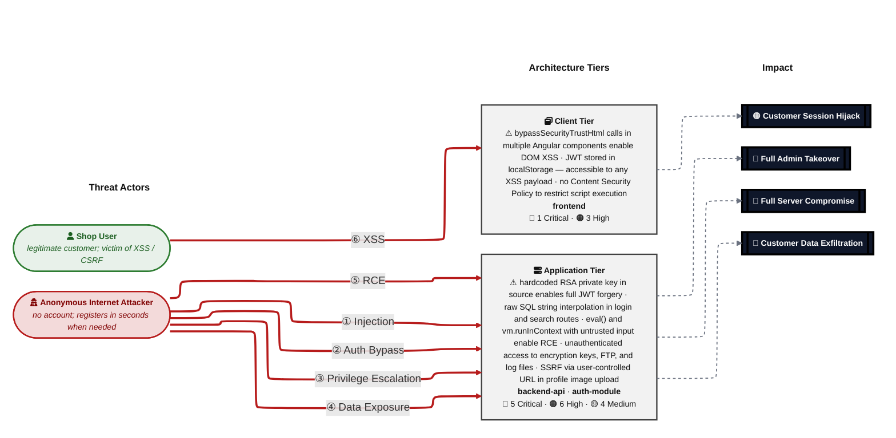

**Threat actors.** Two entities sit on the left of the diagram — one attacker who initiates every direct attack class, and one victim who is the target of the browser-side attacks (XSS / CSRF).

- **Shop User** — legitimate registered customer whose session and PII are the actual target; receives the victim-targeting attack arrows (XSS, CSRF) as victim, not attacker.
- **Anonymous Internet Attacker** — no account, no foothold; reaches every unauthenticated route, registers a throw-away account in seconds when needed, and can clone the public repository to obtain any committed secret offline. Initiates the outgoing attack arrows.

**Attack paths (numbered arrows in the diagram):**

- <a id="path-injection"></a>**① Injection** (Anonymous Internet Attacker → Application Tier) — user input flows into a server-side interpreter (SQL, NoSQL, XML, YAML, LDAP, OS shell) without parameterisation or schema validation.
  - Findings:
    - [F-003](#f-003) — The login endpoint in routes/login.ts:34 constructs a raw SQ
    - [F-005](#f-005) — The /rest/products/search endpoint constructs a raw SQL quer
    - [F-010](#f-010) — The /file-upload endpoint processes XML files with libxmljs2
  - Impact: Customer Data Exfiltration

- <a id="path-auth-bypass"></a>**② Auth Bypass** (Anonymous Internet Attacker → Application Tier) — authentication can be circumvented or forged because credentials, signing keys, or password hashes are weak, missing, or exposed.
  - Findings:
    - [F-001](#f-001) — The RSA private key used to sign JWTs is hardcoded as a stri
    - [F-002](#f-002) — The application uses jsonwebtoken@0.4.0 and express-jwt@0.1.
  - Impact: Full Admin Takeover, Customer Data Exfiltration

- <a id="path-privilege-escalation"></a>**③ Privilege Escalation** (Anonymous Internet Attacker → Application Tier) — authorisation checks are absent or bypassable, allowing horizontal and vertical privilege jumps from a self-registered or low-rights account.
  - Findings:
    - [F-006](#f-006) — The Angular router uses client-side route guards
    - [F-007](#f-007) — The /rest/user/change-password route does not require the cu
  - Impact: Full Admin Takeover, Customer Data Exfiltration

- <a id="path-sensitive-data-exposure"></a>**④ Sensitive Data Exposure** (Anonymous Internet Attacker → Application Tier) — confidential files, credentials, and secrets are reachable on unauthenticated routes, and unsafe path-handling primitives leak server content.
  - Findings:
    - [F-013](#f-013) — The /encryptionkeys/ endpoint uses serve-index to expose dir
    - [F-017](#f-017) — The /support/logs/ endpoint serves raw morgan access log fil
    - [F-018](#f-018) — The /file-upload endpoint handles ZIP files using unzipper
    - [F-019](#f-019) — The open redirect in lib/insecurity.ts:135-141 uses a substr
  - Impact: Customer Data Exfiltration

- <a id="path-remote-code-execution"></a>**⑤ Remote Code Execution (RCE)** (Anonymous Internet Attacker → Application Tier) — user-supplied data reaches a server-side code-execution sink (`eval`, sandbox primitives, deserialisation, request-forwarder) and breaks out into arbitrary native execution.
  - Findings:
    - [F-004](#f-004) — The /rest/b2bOrder endpoint passes the user-supplied orderLi
    - [F-012](#f-012) — The /profile/image/url endpoint accepts a user-supplied imag
  - Impact: Full Server Compromise, Customer Data Exfiltration, Full Admin Takeover

- <a id="path-cross-site-scripting"></a>**⑥ Cross-Site Scripting (XSS)** (Shop User → Client Tier) — attacker-controlled content is rendered in the victim's browser without sanitisation, and the session token sits in JavaScript-readable storage.
  - Findings:
    - [F-008](#f-008) — The Angular SPA stores the JWT token in localStorage
    - [F-011](#f-011) — Multiple Angular components call DomSanitizer.bypassSecurity
    - [F-014](#f-014) — The product-details.component.html uses [innerHTML] binding 
  - Impact: Customer Session Hijack

### Top Findings

The **15 highest-risk items**, sorted by impact-weighted score. The **Pfad** column links each finding to the matching ①–⑦ attack path in [Security Posture at a Glance](#security-posture-at-a-glance); mitigation IDs jump to [§9 Mitigation Register](#9-mitigation-register).

| # | Criticality | Pfad | Finding | Component | Primary Mitigations |
|---|-------------|------|---------|-----------|---------------------|
| 1 | 🔴 Critical | [②](#path-auth-bypass) | [F-001](#f-001) — The RSA private key used to sign JWTs is hardcoded as a string literal in lib/in | [C-03](#c-03) — JWT Auth Module | [](#) — Remove hardcoded RSA private key; load from environment variable or secrets mana |
| 2 | 🔴 Critical | [②](#path-auth-bypass) | [F-002](#f-002) — The application uses jsonwebtoken@0.4.0 and express-jwt@0.1.3, both of which are | [C-03](#c-03) — JWT Auth Module | [](#) — Upgrade express-jwt and jsonwebtoken; explicitly reject alg:none tokens |
| 3 | 🔴 Critical | [①](#path-injection) | [F-003](#f-003) — The login endpoint in routes/login.ts:34 constructs a raw SQL query using direct | [C-03](#c-03) — JWT Auth Module | [](#) — Replace raw SQL in login.ts with Sequelize parameterized query |
| 4 | 🔴 Critical | [⑤](#path-remote-code-execution) | [F-004](#f-004) — The /rest/b2bOrder endpoint passes the user-supplied orderLinesData value to vm. | [C-02](#c-02) — Express REST API | [](#) — Remove eval-based order processing; implement safe order schema validation |
| 5 | 🔴 Critical | [①](#path-injection) | [F-005](#f-005) — The /rest/products/search endpoint constructs a raw SQL query using direct strin | [C-02](#c-02) — Express REST API | [](#) — Replace raw SQL with Sequelize parameterized query in search.ts |
| 6 | 🔴 Critical | [③](#path-privilege-escalation) | [F-006](#f-006) — The Angular router uses client-side route guards | [C-01](#c-01) — Angular SPA | [](#) — Rotate RSA key pair and load from secrets manager; enforce server-side authoriza |
| 7 | 🟠 High | [③](#path-privilege-escalation) | [F-007](#f-007) — The /rest/user/change-password route does not require the current password befor | [C-02](#c-02) — Express REST API | [](#) — Require current password verification in password change endpoint |
| 8 | 🟠 High | [⑥](#path-cross-site-scripting) | [F-008](#f-008) — The Angular SPA stores the JWT token in localStorage | [C-01](#c-01) — Angular SPA | [](#) — Move JWT to httpOnly, Secure, SameSite=Strict cookie |
| 9 | 🟠 High | — | [F-009](#f-009) — User passwords are hashed with MD5 (crypto.createHash('md5').update(data).digest | [C-03](#c-03) — JWT Auth Module | [](#) — Replace MD5 password hashing with bcrypt (cost factor >= 12) |
| 10 | 🟠 High | [①](#path-injection) | [F-010](#f-010) — The /file-upload endpoint processes XML files with libxmljs2 using parseXml(data | [C-02](#c-02) — Express REST API | [](#) — Disable external entity resolution in libxmljs2 (noent: false) |
| 11 | 🟠 High | [⑥](#path-cross-site-scripting) | [F-011](#f-011) — Multiple Angular components call DomSanitizer.bypassSecurityTrustHtml() with ser | [C-01](#c-01) — Angular SPA | [](#) — Remove bypassSecurityTrustHtml calls; use textContent binding or sanitizeHtml |
| 12 | 🟠 High | [⑤](#path-remote-code-execution) | [F-012](#f-012) — The /profile/image/url endpoint accepts a user-supplied imageUrl and performs a  | [C-02](#c-02) — Express REST API | [](#) — Implement allowlist or DNS-resolution blocklist for profile image URLs |
| 13 | 🟠 High | [④](#path-sensitive-data-exposure) | [F-013](#f-013) — The /encryptionkeys/ endpoint uses serve-index to expose directory listings and  | [C-02](#c-02) — Express REST API | [](#) — Restrict sensitive directories and admin endpoints to authenticated admin users |
| 14 | 🟠 High | [⑥](#path-cross-site-scripting) | [F-014](#f-014) — The product-details.component.html uses [innerHTML] binding with unsanitized pro | [C-01](#c-01) — Angular SPA | [](#) — Implement Content Security Policy; sanitize product description rendering |
| 15 | 🟠 High | — | [F-015](#f-015) — The /rest/user/reset-password endpoint accepts a security answer to reset a pass | [C-02](#c-02) — Express REST API | [](#) — Add lockout after failed security answer attempts; use email-based reset flow |

_Legend: 🔴 Critical (directly exploitable, major impact) · 🟠 High. **Pfad** glyphs ①–⑦ link back to the matching bullet in [Security Posture at a Glance](#security-posture-at-a-glance)._

### Architecture Assessment

🔴 **Verdict — systemic injection and secrets-management failures across all three components.** Six cross-cutting defects account for every Critical finding: the RSA private key is in the public repository, raw SQL template literals bypass the ORM in two routes, eval-based execution handles untrusted input, MD5 without salt stores all passwords, JWT rides localStorage with no XSS isolation, and no Content Security Policy limits script execution.

Six structural defects drive all 6 Critical and 9 of the High findings:

| Defect | Description | Key Findings |
|--------|-------------|--------------|
| **Secrets committed to source control** | The RSA private key used to sign JWTs is a string literal in lib/insecurity.ts, making every token the server accepts forgeable by any repository reader. | [T-001](#f-001) — JWT private key exposed in lib/insecurity.ts:23<br/>[T-006](#f-006) — Admin privilege escalation via forged JWT |
| **Raw SQL string interpolation** | Two routes (login and product search) construct SQL queries with template literal interpolation instead of Sequelize's parameterized findOne/findAll API, bypassing all ORM injection protection. | [T-003](#f-003) — SQL injection on /rest/user/login — admin bypass<br/>[T-005](#f-005) — SQL injection on /rest/products/search — full DB dump |
| **Eval with untrusted input** | The B2B order route passes caller-supplied data to vm.runInContext with notevil, but Node.js vm contexts do not isolate the V8 prototype chain, enabling sandbox escape and OS command execution. | [T-004](#f-004) — RCE via vm.runInContext in routes/b2bOrder.ts:26 |
| **Weak password hashing (MD5 no salt)** | All passwords are hashed with crypto.createHash('md5') in lib/insecurity.ts:43 — no salt, trivially reversible with rainbow tables after any SQL dump. | [T-009](#f-009) — MD5 password hashing — instant rainbow-table reversal |
| **JWT stored in localStorage** | The Angular token service stores the JWT in localStorage, which is readable by any XSS payload; every DOM-injection finding is simultaneously a session-theft vector. | [T-008](#f-008) — JWT in localStorage accessible via XSS<br/>[T-011](#f-011) — bypassSecurityTrustHtml in multiple Angular components |
| **No Content Security Policy** | server.ts does not configure helmet.contentSecurityPolicy(); inline and third-party script execution is unrestricted, maximising the impact of every XSS finding. | [T-014](#f-014) — Unrestricted inline script execution — no CSP<br/>[T-011](#f-011) — DOM XSS via bypassSecurityTrustHtml amplified by absent CSP |
### Mitigations

Mitigations below cover all open findings, **grouped by component** and sorted by priority (P1 first). Cross-component mitigations are listed once in a separate table — they affect more than one component, so duplicating them per-component would create redundant rows. Sort within each table: priority ascending, effort ascending, findings-addressed descending.

#### Unattributed (13)

| ID | Mitigation | Priority | Addresses | Effort |
|----|------------|----------|-----------|--------|
| [M-003](#m-003) — Replace raw SQL in login.ts and search.ts with parameterized Sequelize queries | Replace raw SQL in login.ts and search.ts with parameterized Sequelize queries | **P1** | — | Low |
| [M-004](#m-004) — Disable XXE in libxmljs2 (noent: false) in fileUpload.ts | Disable XXE in libxmljs2 (noent: false) in fileUpload.ts | **P1** | — | Low |
| [M-001](#m-001) — Remove hardcoded RSA private key; load from environment variable or secrets manager | Remove hardcoded RSA private key; load from environment variable or secrets manager | **P1** | — | Medium |
| [M-002](#m-002) — Upgrade express-jwt and jsonwebtoken; reject alg:none tokens | Upgrade express-jwt and jsonwebtoken; reject alg:none tokens | **P1** | — | Medium |
| [M-005](#m-005) — Replace MD5 password hashing with bcrypt | Replace MD5 password hashing with bcrypt | **P1** | — | Medium |
| [M-007](#m-007) — Restrict sensitive endpoints to authenticated admin users | Restrict sensitive endpoints to authenticated admin users | **P2** | — | Low |
| [M-009](#m-009) — Require current password on password change; fix open redirect | Require current password on password change; fix open redirect | **P2** | — | Low |
| [M-006](#m-006) — Implement SSRF protection in profileImageUrlUpload | Implement SSRF protection in profileImageUrlUpload | **P2** | — | Medium |
| [M-008](#m-008) — Replace bypassSecurityTrustHtml with sanitize() in Angular components | Replace bypassSecurityTrustHtml with sanitize() in Angular components | **P2** | — | Medium |
| [M-012](#m-012) — Fix zip-slip path traversal in fileUpload.ts | Fix zip-slip path traversal in fileUpload.ts | **P3** | — | Medium |
| [M-010](#m-010) — Replace B2B eval-based order with schema validation | Replace B2B eval-based order with schema validation | **P3** | — | High |
| [M-011](#m-011) — Implement token revocation and security event audit logging | Implement token revocation and security event audit logging | **P3** | — | High |
| [M-013](#m-013) — Improve password reset to use email-based OTP | Improve password reset to use email-based OTP | **P4** | — | High |

### Operational Strengths

Despite the structurally deficient design, the project implements several security-relevant controls. None fully mitigate a Critical finding, but each narrows part of the attack surface.

| Architectural Control | Implementation | Effectiveness | Gap | Mitigates |
|-----------------------|----------------|---------------|-----|-----------|
| Container & Runtime Security | Dockerfile — gcr.io/distroless/nodejs24-debian13, USER 65532 | ✅ Adequate | None identified | — |
| Authorization | server.ts — security.isAuthorized() middleware | ⚠️ Partial | See §7 for the domain-level structural gaps. | [F-006](#f-006) — The Angular router uses client-side route guards<br/>[F-015](#f-015) — The /rest/user/reset-password endpoint accepts a security answer to reset a… |
| Audit & Logging | server.ts:338 — morgan 'combined' | ⚠️ Partial | See §7 for the domain-level structural gaps. | [F-016](#f-016) — The authenticatedUsers in-memory tokenMap (lib/insecurity.ts:72-91) has no…<br/>[F-017](#f-017) — The /support/logs/ endpoint serves raw morgan access log files to any… |
| Output Encoding | lib/insecurity.ts:60 | ⚠️ Partial | See §7 for the domain-level structural gaps. | [F-011](#f-011) — Multiple Angular components call DomSanitizer.bypassSecurityTrustHtml() with… |
| Rate Limiting | server.ts:343, 458, 465, 471 | ⚠️ Partial | See §7 for the domain-level structural gaps. | [F-015](#f-015) — The /rest/user/reset-password endpoint accepts a security answer to reset a… |
| Frontend Security | Angular DomSanitizer imported but bypassed | 🔶 Weak | See §7 for the domain-level structural gaps. | [F-008](#f-008) — The Angular SPA stores the JWT token in localStorage<br/>[F-011](#f-011) — Multiple Angular components call DomSanitizer.bypassSecurityTrustHtml() with…<br/>[F-014](#f-014) — The product-details.component.html uses [innerHTML] binding with unsanitized… |
| Identity & Access Management | lib/insecurity.ts | 🔶 Weak | See §7 for the domain-level structural gaps. | [F-001](#f-001) — The RSA private key used to sign JWTs is hardcoded as a string literal in…<br/>[F-002](#f-002) — The application uses jsonwebtoken@0.4.0 and express-jwt@0.1.3, both of which… |
| Data Protection | lib/insecurity.ts:43 | 🔶 Weak | See §7 for the domain-level structural gaps. | [F-009](#f-009) — User passwords are hashed with MD5 (crypto.createHash('md5').update(data).diges… |**Bottom line:** These controls narrow specific attack surfaces but none eliminates a Critical finding on its own.

---

## 1. System Overview

**Repository:** _n/a_

### Scope

This threat model covers 3 component(s) of the system: **Angular SPA**, **Express REST API**, **JWT Auth Module**.

**Out of scope:** third-party hosted dependencies, browser runtime, operating-system kernel, and the underlying network infrastructure.

---

## 2. Architecture Diagrams

### 2.1 System Context

Who interacts with System from the outside, and through which channels. Solid arrows show normal usage; dashed red arrows mark unauthenticated probing or exploit paths (C4 Level 1).

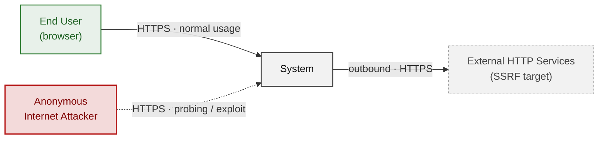

### 2.2 Container Architecture

How the system decomposes into deployable units. Each box is a separate runtime process or service container; arrows show synchronous request paths between them. Components with ≥3 Critical findings carry a red border, ≥2 High amber (C4 Level 2).

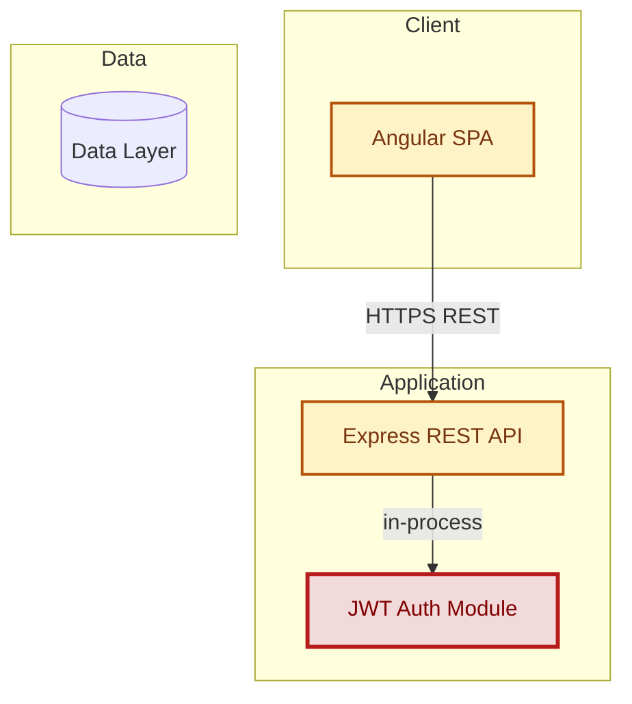

### 2.3 Components

Who reaches each component, and through which trust zone. Four columns map external actors to the internal tiers (Client / Application / Data); solid green arrows show legitimate data flow, dashed red arrows mark intrusion vectors. The component table directly below holds source paths and linked threats per `C-NN`; per-tech defects are itemised in the §2.4.1–§2.4.4 layer tables.

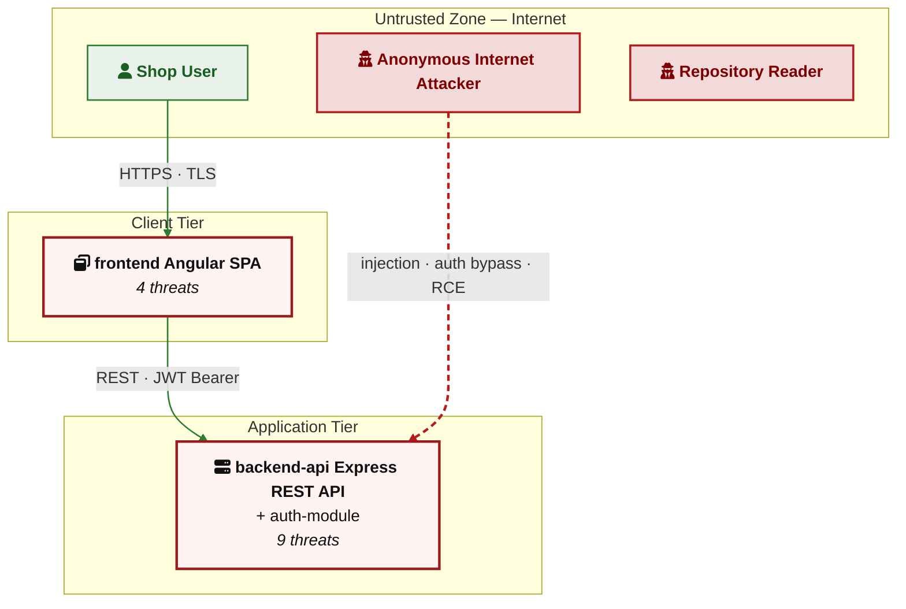

| ID | Name | Type | Key Paths | Linked Threats |
|----|------|------|-----------|----------------|
| <a id="c-01"></a><a id="frontend"></a>C-01 | Angular SPA | Client | `frontend/src/**`<br/>`frontend/dist/**` | [F-006](#f-006) — The Angular router uses client-side route guards<br/>[F-008](#f-008) — The Angular SPA stores the JWT token in localStorage<br/>[F-011](#f-011) — Multiple Angular components call DomSanitizer.bypassSecurityTrustHtml() with…<br/>[F-014](#f-014) — The product-details.`component.html` uses [innerHTML] binding with unsanitized… |
| <a id="c-02"></a><a id="backend-api"></a>C-02 | Express REST API | Application | `server.ts`<br/>`routes/**`<br/>`lib/**`<br/>`app.ts` | [F-004](#f-004) — The /rest/b2bOrder endpoint passes the user-supplied orderLinesData value to…<br/>[F-005](#f-005) — The /rest/products/search endpoint constructs a raw SQL query using direct…<br/>[F-007](#f-007) — The /rest/user/change-password route does not require the current password…<br/>[F-010](#f-010) — The /file-upload endpoint processes XML files with libxmljs2 using…<br/>[F-012](#f-012) — The /profile/image/url endpoint accepts a user-supplied imageUrl and performs a…<br/>[F-013](#f-013) — The /encryptionkeys/ endpoint uses serve-index to expose directory listings and…<br/>[F-015](#f-015) — The /rest/user/reset-password endpoint accepts a security answer to reset a…<br/>[F-017](#f-017) — The /support/logs/ endpoint serves raw morgan access log files to any…<br/>[F-018](#f-018) — The /file-upload endpoint handles ZIP files using unzipper |
| <a id="c-03"></a><a id="auth-module"></a>C-03 | JWT Auth Module | Application | `lib/insecurity.ts`<br/>`routes/login.ts`<br/>`routes/register.ts`<br/>`routes/changePassword.ts`<br/>`routes/2fa.ts` | [F-001](#f-001) — The RSA private key used to sign JWTs is hardcoded as a string literal in…<br/>[F-002](#f-002) — The application uses jsonwebtoken@0.4.0 and express-jwt@0.1.3, both of which…<br/>[F-003](#f-003) — The login endpoint in routes/`login.ts`:34 constructs a raw SQL query using…<br/>[F-009](#f-009) — User passwords are hashed with MD5 (crypto.createHash('md5').update(data).diges…<br/>[F-016](#f-016) — The authenticatedUsers in-memory tokenMap (lib/`insecurity.ts`:72-91) has no…<br/>[F-019](#f-019) — The open redirect in lib/`insecurity.ts`:135-141 uses a substring match… |
### 2.4 Technology Architecture

The technology stack the system is built on. Each box names the framework or runtime that fills that role; per-version detail and per-tech defects live in the §2.4.1–§2.4.4 layer tables below. The trust-boundary table beneath this paragraph documents the controls that separate the four tiers.

| Boundary ID | Name | Description | Enforcement |
|---|---|---|---|
| TB-01 | Internet / Public Zone | Uncontrolled external network. No API gateway, WAF, or reverse proxy configured in-app. | None in-app — assumed to be behind a reverse proxy in production |
| TB-02 | Authenticated Zone | Routes protected by express-jwt middleware requiring a valid JWT. | express-jwt 0.1.3 — vulnerable to CVE-2015-9235 alg:none bypass |
| TB-03 | Admin Zone | Routes and frontend views requiring admin role in JWT claims. | JWT role claim check — no separate admin session or elevated authentication |
| TB-04 | Database Tier | SQLite in-process via Sequelize ORM. | Sequelize ORM parameterization (bypassed in `login.ts` and `search.ts` with raw queries) |
| TB-05 | VM Sandbox | `Node.js` vm.runInContext for B2B order evaluation and username eval. | `Node.js` vm module (documented sandbox escape) + notevil library |

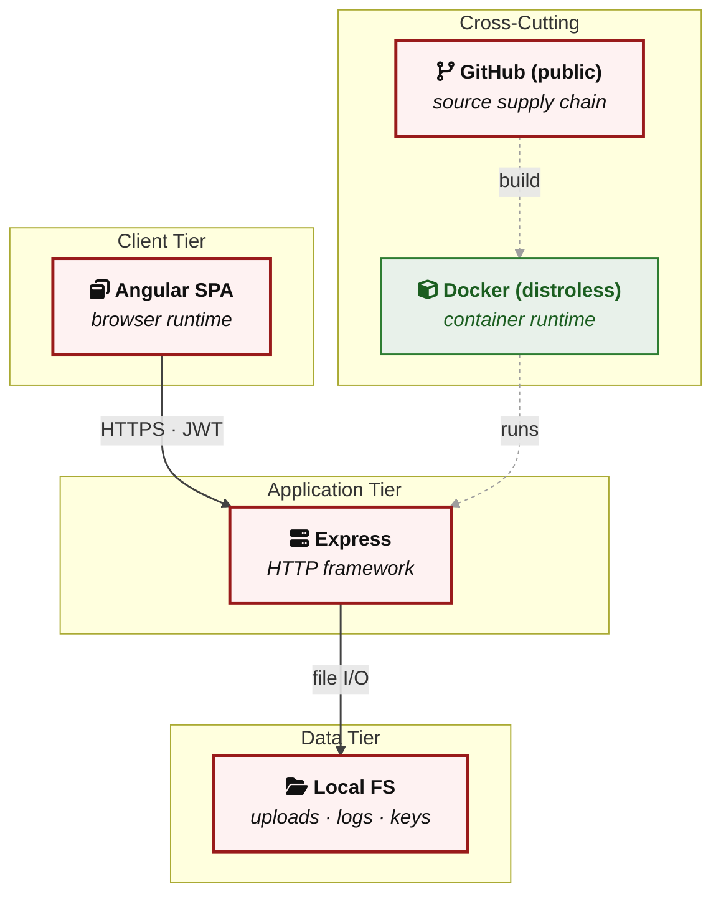

#### 2.4.1 Layer 1 - Client

Browser-side runtime, storage mechanisms, and client-held secrets.

| Component | Tier | Linked Threats | Risk |
|---|---|---|---|
| frontend Angular SPA | Client | [F-006](#f-006) — The Angular router uses client-side route guards<br/>[F-008](#f-008) — The Angular SPA stores the JWT token in localStorage<br/>[F-011](#f-011) — Multiple Angular components call DomSanitizer.bypassSecurityTrustHtml() with…<br/>[F-014](#f-014) — The product-details.`component.html` uses [innerHTML] binding with unsanitized… | 🔴 |

#### 2.4.2 Layer 2 - Middleware

Cross-cutting Express pipeline — policy enforcement that runs on every request (auth, CORS, rate-limit, logging, cookies).

| Component | Tier | Linked Threats | Risk |
|---|---|---|---|
| backend-api Express REST API | Application | [F-015](#f-015) — The /rest/user/reset-password endpoint accepts a security answer to reset a…<br/>[F-017](#f-017) — The /support/logs/ endpoint serves raw morgan access log files to any… | 🟠 |
| auth-module JWT Auth Module | Application | [F-002](#f-002) — The application uses jsonwebtoken@0.4.0 and express-jwt@0.1.3, both of which… | 🔴 |

#### 2.4.3 Layer 3 - Application Logic

Feature code that runs after the pipeline has accepted the request: route handlers, long-lived subsystems, security helpers.

| Component | Tier | Linked Threats | Risk |
|---|---|---|---|
| backend-api Express REST API | Application | [F-004](#f-004) — The /rest/b2bOrder endpoint passes the user-supplied orderLinesData value to…<br/>[F-005](#f-005) — The /rest/products/search endpoint constructs a raw SQL query using direct…<br/>[F-007](#f-007) — The /rest/user/change-password route does not require the current password…<br/>[F-010](#f-010) — The /file-upload endpoint processes XML files with libxmljs2 using…<br/>[F-012](#f-012) — The /profile/image/url endpoint accepts a user-supplied imageUrl and performs a…<br/>[F-013](#f-013) — The /encryptionkeys/ endpoint uses serve-index to expose directory listings and…<br/>[F-018](#f-018) — The /file-upload endpoint handles ZIP files using unzipper | 🔴 |
| auth-module JWT Auth Module | Application | [F-001](#f-001) — The RSA private key used to sign JWTs is hardcoded as a string literal in…<br/>[F-003](#f-003) — The login endpoint in routes/`login.ts`:34 constructs a raw SQL query using…<br/>[F-009](#f-009) — User passwords are hashed with MD5 (crypto.createHash('md5').update(data).diges…<br/>[F-016](#f-016) — The authenticatedUsers in-memory tokenMap (lib/`insecurity.ts`:72-91) has no…<br/>[F-019](#f-019) — The open redirect in lib/`insecurity.ts`:135-141 uses a substring match… | 🔴 |

#### 2.4.4 Layer 4 - Data & Storage

Persistent and in-process data stores reachable from Layer 3.

| Component | Tier | Linked Threats | Risk |
|---|---|---|---|
| _no components in this layer_ | Data | — | — |

> **Legend:** **red border** ≥ 3 Critical threats on the component · **amber border** ≥ 2 High threats

---

## 3. Attack Walkthroughs

Three attack chains map the Critical findings to concrete exploitation paths. §3.1 gives the chain overview diagrams; §3.2–3.4 walk through each chain step by step.

---

### 3.1 Attack Chain Overview

#### Chain 1 — JWT Forgery via Committed Private Key

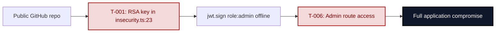

**Key takeaway:** The RSA private key committed to the public repository lets any reader forge admin-role JWTs with zero server interaction required.

#### Chain 2 — Unauthenticated SQL Injection to Full DB Dump

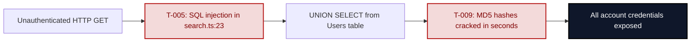

**Key takeaway:** The unauthenticated product-search endpoint accepts UNION SELECT payloads; combined with MD5-hashed passwords, a full credential dump requires one HTTP request.

#### Chain 3 — RCE via B2B Order Sandbox Escape

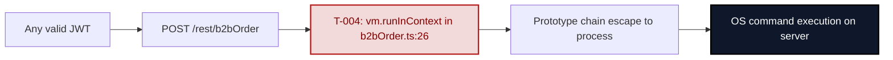

**Key takeaway:** Any authenticated user can execute arbitrary OS commands because `vm.runInContext` does not prevent access to the `Node.js` `process` object via prototype chain traversal.

---

### 3.2 Chain 1 Walkthrough — JWT Forgery via Committed Private Key (T-001, T-006)

**Entry point:** `lib/insecurity.ts:23` — RSA private key committed as a string literal in the public repository.

The `encryptionkeys/private.key` content is mirrored verbatim in `lib/insecurity.ts`. Any repository clone exposes the signing key. An attacker calls `jwt.sign()` locally with `role: 'admin'` and any user ID; `express-jwt` at `lib/insecurity.ts:54` verifies the signature against the matching public key and accepts the token.

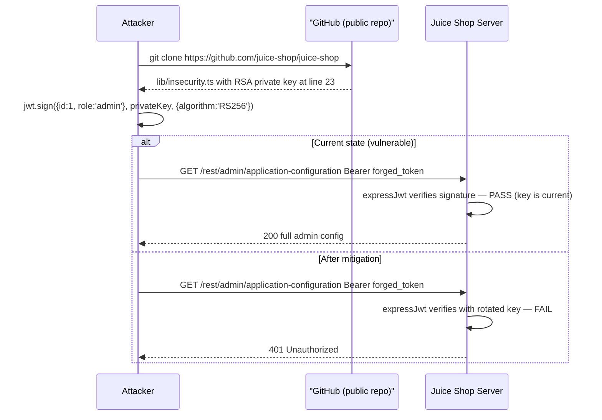

**Fix:** Delete the private key from `lib/insecurity.ts`. Load it from `process.env.JWT_PRIVATE_KEY`. Generate a new RSA key pair — the existing key is permanently exposed through git history and cannot be revoked by code change alone.

---

### 3.3 Chain 2 Walkthrough — SQL Injection to Credential Dump (T-005, T-003, T-009)

**Entry point:** `routes/search.ts:23` — raw SQL via template literal interpolation of the `q` parameter.

The query `SELECT * FROM Products WHERE ((name LIKE '%${criteria}%' ...` accepts the 200-character-limited `q` value without escaping. A UNION SELECT payload fits within that limit and returns rows from the Users table. MD5 hashes in the `password` column reverse trivially.

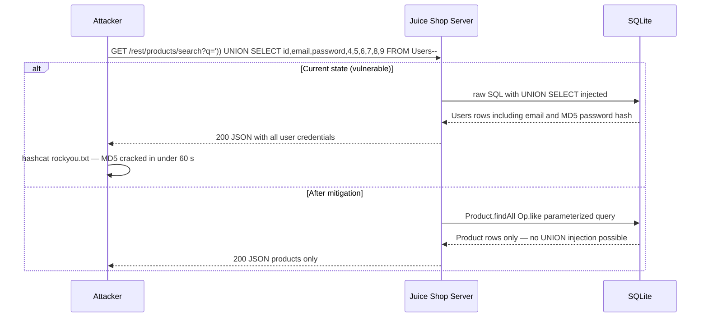

**Fix:** Replace `models.sequelize.query(template literal)` with `Product.findAll({ where: { [Op.or]: [{ name: { [Op.like]: \`%${criteria}%\` } }], deletedAt: null } })`. Replace `crypto.createHash('md5')` in `lib/insecurity.ts:43` with `bcrypt.hashSync(data, 12)`.

---

### 3.4 Chain 3 Walkthrough — RCE via B2B Order Sandbox Escape (T-004)

**Entry point:** `routes/b2bOrder.ts:26` — `vm.runInContext('safeEval(orderLinesData)', sandbox)` where `orderLinesData` is caller-supplied.

`Node.js` `vm` contexts share the V8 engine's prototype chain with the host process. The `notevil` library blocks direct global access but does not prevent prototype traversal. A constructor-escape payload (`this.constructor.constructor('return process')()`) reaches the host `process` object and calls `child_process.execSync`.

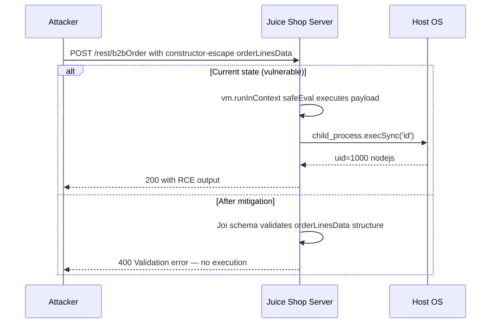

**Fix:** Remove `vm.runInContext` entirely from `routes/b2bOrder.ts`. Define an explicit JSON Schema for order line data (array of `{product, quantity, price}` objects) and validate with Joi or Zod. No sandboxing approach for `vm` contexts is sufficient against a motivated attacker.

<!-- enriched:thorough -->

---

## 4. Assets

Information assets and the classification level that drives the Confidentiality / Integrity / Availability targets used in §8 risk scoring.

| Asset | ID | Classification | Description | Linked Threats |
|---|---|---|---|---|
| User credentials database | A-001 | Restricted | SQLite database containing email, MD5-hashed passwords, and user PII for all registered users. | [F-003](#f-003) — The login endpoint in routes/`login.ts`:34 constructs a raw SQL query using…<br/>[F-005](#f-005) — The /rest/products/search endpoint constructs a raw SQL query using direct…<br/>[F-009](#f-009) — User passwords are hashed with MD5 (crypto.createHash('md5').update(data).diges… |
| JWT RSA private key | A-002 | Restricted | RSA private key used to sign all JWT tokens. Hardcoded in lib/`insecurity.ts`:23 and publicly visible in GitHub repository. | [F-001](#f-001) — The RSA private key used to sign JWTs is hardcoded as a string literal in…<br/>[F-006](#f-006) — The Angular router uses client-side route guards |
| User sessions (JWT tokens) | A-003 | Confidential | JWT tokens stored in browser localStorage and cookie. Used for authentication and authorization. | [F-001](#f-001) — The RSA private key used to sign JWTs is hardcoded as a string literal in…<br/>[F-002](#f-002) — The application uses jsonwebtoken@0.4.0 and express-jwt@0.1.3, both of which…<br/>[F-008](#f-008) — The Angular SPA stores the JWT token in localStorage |
| Product and order data | A-004 | Internal | Product catalog, order history, basket contents, delivery information. | [F-005](#f-005) — The /rest/products/search endpoint constructs a raw SQL query using direct…<br/>[F-012](#f-012) — The /profile/image/url endpoint accepts a user-supplied imageUrl and performs a… |
| User PII | A-005 | Confidential | Email addresses, delivery addresses, credit card numbers, profile images. | [F-005](#f-005) — The /rest/products/search endpoint constructs a raw SQL query using direct…<br/>[F-012](#f-012) — The /profile/image/url endpoint accepts a user-supplied imageUrl and performs a… |
| Application configuration | A-006 | Restricted | Full application config exposed via /rest/admin/application-configuration (no auth). | [F-013](#f-013) — The /encryptionkeys/ endpoint uses serve-index to expose directory listings and… |
| Server access logs | A-007 | Internal | Morgan 'combined' access logs containing request URIs, IPs, user agents. Exposed via /support/logs/. | [F-017](#f-017) — The /support/logs/ endpoint serves raw morgan access log files to any… |
| Encryption keys directory | A-008 | Restricted | encryptionkeys/ directory served publicly. Contains `jwt.pub` and `premium.key`. | [F-001](#f-001) — The RSA private key used to sign JWTs is hardcoded as a string literal in…<br/>[F-013](#f-013) — The /encryptionkeys/ endpoint uses serve-index to expose directory listings and… |
| FTP file store | A-009 | Internal | ftp/ directory with directory listing enabled. Contains `legal.md` and other files. | [F-013](#f-013) — The /encryptionkeys/ endpoint uses serve-index to expose directory listings and… |
| Application server process | A-010 | Restricted | `Node.js` application server process. Can be compromised via RCE through b2bOrder or eval() in userProfile. | [F-004](#f-004) — The /rest/b2bOrder endpoint passes the user-supplied orderLinesData value to… |
| File upload storage | A-011 | Internal | uploads/complaints/ and profile image directories. Reachable via zip-slip path traversal. | [F-018](#f-018) — The /file-upload endpoint handles ZIP files using unzipper |
| Admin functionality | A-012 | Restricted | Admin panel at /#/administration. User management, challenge administration. Accessible with admin JWT. | [F-001](#f-001) — The RSA private key used to sign JWTs is hardcoded as a string literal in…<br/>[F-002](#f-002) — The application uses jsonwebtoken@0.4.0 and express-jwt@0.1.3, both of which…<br/>[F-006](#f-006) — The Angular router uses client-side route guards<br/>[F-015](#f-015) — The /rest/user/reset-password endpoint accepts a security answer to reset a… |

---

## 5. Attack Surface

Network-reachable entry points classified by authentication requirement. Each row links to the threat(s) referenced in its `notes` column.

### 5.1 Unauthenticated Entry Points (11)

| Method | Route | Notes |
|---|---|---|
| POST | `/rest/user/login` | [F-003](#f-003) — The login endpoint in routes/`login.ts`:34 constructs a raw SQL query using… |
| GET | `/rest/products/search` | [F-005](#f-005) — The /rest/products/search endpoint constructs a raw SQL query using direct… |
| GET | `/ftp/:file` | [F-013](#f-013) — The /encryptionkeys/ endpoint uses serve-index to expose directory listings and… |
| GET | `/encryptionkeys/:file` | [F-001](#f-001) — The RSA private key used to sign JWTs is hardcoded as a string literal in…<br/>[F-013](#f-013) — The /encryptionkeys/ endpoint uses serve-index to expose directory listings and… |
| GET | `/support/logs/:file` | [F-017](#f-017) — The /support/logs/ endpoint serves raw morgan access log files to any… |
| GET | `/rest/admin/application-configuration` | [F-013](#f-013) — The /encryptionkeys/ endpoint uses serve-index to expose directory listings and… |
| GET | `/redirect` | [F-019](#f-019) — The open redirect in lib/`insecurity.ts`:135-141 uses a substring match… |
| POST | `/rest/user/reset-password` | [F-015](#f-015) — The /rest/user/reset-password endpoint accepts a security answer to reset a… |
| GET | `/api-docs` |  |
| GET | `/api/Users` | [F-005](#f-005) — The /rest/products/search endpoint constructs a raw SQL query using direct… |
| GET | `/socket.io/` |  |

### 5.2 Authenticated Entry Points (4)

| Method | Route | Notes |
|---|---|---|
| POST | `/file-upload` | [F-010](#f-010) — The /file-upload endpoint processes XML files with libxmljs2 using…<br/>[F-018](#f-018) — The /file-upload endpoint handles ZIP files using unzipper |
| POST | `/profile/image/url` | [F-012](#f-012) — The /profile/image/url endpoint accepts a user-supplied imageUrl and performs a… |
| POST | `/rest/b2bOrder` | [F-004](#f-004) — The /rest/b2bOrder endpoint passes the user-supplied orderLinesData value to… |
| POST | `/rest/user/change-password` | [F-007](#f-007) — The /rest/user/change-password route does not require the current password… |

---

## 8. Threat Register

All findings sorted by criticality. The **Threat Category** column maps each finding to its architectural threat class (TH-NN) from the OWASP / CWE taxonomy.

**Risk Distribution:** 🔴 Critical: 6 · 🟠 High: 9 · 🟡 Medium: 4 · 🟢 Low: 0 · **Total findings: 19**
**STRIDE Coverage:** Spoofing: 4 · Tampering: 6 · Repudiation: 2 · Information Disclosure: 3 · Denial of Service: 1 · Elevation of Privilege: 3

| ID | Finding | Threat Category | Component | Criticality | CVSS | Vektor | Mitigation | References |
|----|---------|-----------------|-----------|-------------|------|--------|------------|------------|
| <a id="t-001"></a><a id="f-001"></a>F-001 | The RSA private key used to sign JWTs is hardcoded as a string literal in lib/in | <a id="th-03"></a>TH-03 — Cryptographic Failures | [C-03](#c-03) — JWT Auth Module | 🔴 Critical | — | [Internet User](#vektor-internet-user) | — | [CWE-798](https://cwe.mitre.org/data/definitions/798.html) · [A02:2021](https://owasp.org/Top10/A02_2021/) |
| <a id="f-002"></a>F-002 | The application uses jsonwebtoken@0.4.0 and express-jwt@0.1.3, both of which are | <a id="th-02"></a>TH-02 — Broken Authentication | [C-03](#c-03) — JWT Auth Module | 🔴 Critical | — | [Internet User](#vektor-internet-user) | — | [CWE-347](https://cwe.mitre.org/data/definitions/347.html) · [A07:2021](https://owasp.org/Top10/A07_2021/) |
| <a id="t-003"></a><a id="f-003"></a>F-003 | The login endpoint in routes/login.ts:34 constructs a raw SQL query using direct | <a id="th-09"></a>TH-09 — Unauthenticated Management Plane | [C-03](#c-03) — JWT Auth Module | 🔴 Critical | — | [Internet User](#vektor-internet-user) | — | [CWE-89](https://cwe.mitre.org/data/definitions/89.html) · [A01:2021](https://owasp.org/Top10/A01_2021/) |
| <a id="t-004"></a><a id="f-004"></a>F-004 | The /rest/b2bOrder endpoint passes the user-supplied orderLinesData value to vm. | <a id="th-05"></a>TH-05 — Code Execution via Unsafe Deserialization or Eval | [C-02](#c-02) — Express REST API | 🔴 Critical | — | [Internet User](#vektor-internet-user) | — | [CWE-94](https://cwe.mitre.org/data/definitions/94.html) · [A08:2021](https://owasp.org/Top10/A08_2021/) |
| <a id="t-005"></a><a id="f-005"></a>F-005 | The /rest/products/search endpoint constructs a raw SQL query using direct strin | <a id="th-03"></a>TH-03 — Cryptographic Failures | [C-02](#c-02) — Express REST API | 🔴 Critical | — | [Internet User](#vektor-internet-user) | — | [CWE-89](https://cwe.mitre.org/data/definitions/89.html) · [A02:2021](https://owasp.org/Top10/A02_2021/) |
| <a id="t-006"></a><a id="f-006"></a>F-006 | The Angular router uses client-side route guards | <a id="th-03"></a>TH-03 — Cryptographic Failures | [C-01](#c-01) — Angular SPA | 🔴 Critical | — | [Internet User](#vektor-internet-user) | — | [CWE-285](https://cwe.mitre.org/data/definitions/285.html) · [A02:2021](https://owasp.org/Top10/A02_2021/) |
| <a id="f-007"></a>F-007 | The /rest/user/change-password route does not require the current password befor | <a id="th-11"></a>TH-11 — Cross-Site Scripting (XSS) | [C-02](#c-02) — Express REST API | 🟠 High | — | [Internet User](#vektor-internet-user) | — | [CWE-620](https://cwe.mitre.org/data/definitions/620.html) · [A03:2021](https://owasp.org/Top10/A03_2021/) |
| <a id="t-008"></a><a id="f-008"></a>F-008 | The Angular SPA stores the JWT token in localStorage | <a id="th-01"></a>TH-01 — Injection | [C-01](#c-01) — Angular SPA | 🟠 High | — | [Internet User](#vektor-internet-user) | — | [CWE-79](https://cwe.mitre.org/data/definitions/79.html) · [A03:2021](https://owasp.org/Top10/A03_2021/) |
| <a id="t-009"></a><a id="f-009"></a>F-009 | User passwords are hashed with MD5 (crypto.createHash('md5').update(data).digest | <a id="th-01"></a>TH-01 — Injection | [C-03](#c-03) — JWT Auth Module | 🟠 High | — | [Internet User](#vektor-internet-user) | — | [CWE-916](https://cwe.mitre.org/data/definitions/916.html) · [A03:2021](https://owasp.org/Top10/A03_2021/) |
| <a id="f-010"></a>F-010 | The /file-upload endpoint processes XML files with libxmljs2 using parseXml(data | <a id="th-01"></a>TH-01 — Injection | [C-02](#c-02) — Express REST API | 🟠 High | — | [Internet User](#vektor-internet-user) | — | [CWE-611](https://cwe.mitre.org/data/definitions/611.html) · [A03:2021](https://owasp.org/Top10/A03_2021/) |
| <a id="t-011"></a><a id="f-011"></a>F-011 | Multiple Angular components call DomSanitizer.bypassSecurityTrustHtml() with ser | <a id="th-11"></a>TH-11 — Cross-Site Scripting (XSS) | [C-01](#c-01) — Angular SPA | 🟠 High | — | [Internet User](#vektor-internet-user) | — | [CWE-79](https://cwe.mitre.org/data/definitions/79.html) · [A03:2021](https://owasp.org/Top10/A03_2021/) |
| <a id="f-012"></a>F-012 | The /profile/image/url endpoint accepts a user-supplied imageUrl and performs a  | <a id="th-08"></a>TH-08 — Server-Side Request Forgery | [C-02](#c-02) — Express REST API | 🟠 High | — | [Internet User](#vektor-internet-user) | — | [CWE-918](https://cwe.mitre.org/data/definitions/918.html) · [A10:2021](https://owasp.org/Top10/A10_2021/) |
| <a id="f-013"></a>F-013 | The /encryptionkeys/ endpoint uses serve-index to expose directory listings and  | <a id="th-09"></a>TH-09 — Unauthenticated Management Plane | [C-02](#c-02) — Express REST API | 🟠 High | — | [Internet User](#vektor-internet-user) | — | [CWE-548](https://cwe.mitre.org/data/definitions/548.html) · [A01:2021](https://owasp.org/Top10/A01_2021/) |
| <a id="t-014"></a><a id="f-014"></a>F-014 | The product-details.component.html uses [innerHTML] binding with unsanitized pro | <a id="th-04"></a>TH-04 — Insecure Client-Side Storage | [C-01](#c-01) — Angular SPA | 🟠 High | — | [Internet User](#vektor-internet-user) | — | [CWE-79](https://cwe.mitre.org/data/definitions/79.html) · [A02:2021](https://owasp.org/Top10/A02_2021/) |
| <a id="f-015"></a>F-015 | The /rest/user/reset-password endpoint accepts a security answer to reset a pass | <a id="th-06"></a>TH-06 — Broken Access Control | [C-02](#c-02) — Express REST API | 🟠 High | — | [Internet User](#vektor-internet-user) | — | [CWE-307](https://cwe.mitre.org/data/definitions/307.html) · [A01:2021](https://owasp.org/Top10/A01_2021/) |
| <a id="f-016"></a>F-016 | The authenticatedUsers in-memory tokenMap (lib/insecurity.ts:72-91) has no persi | <a id="th-16"></a>TH-16 — Missing Audit Logging & Accountability | [C-03](#c-03) — JWT Auth Module | 🟡 Medium | — | [Internet User](#vektor-internet-user) | — | [CWE-613](https://cwe.mitre.org/data/definitions/613.html) · [A09:2021](https://owasp.org/Top10/A09_2021/) |
| <a id="f-017"></a>F-017 | The /support/logs/ endpoint serves raw morgan access log files to any unauthenti | <a id="th-09"></a>TH-09 — Unauthenticated Management Plane | [C-02](#c-02) — Express REST API | 🟡 Medium | — | [Internet User](#vektor-internet-user) | — | [CWE-532](https://cwe.mitre.org/data/definitions/532.html) · [A01:2021](https://owasp.org/Top10/A01_2021/) |
| <a id="f-018"></a>F-018 | The /file-upload endpoint handles ZIP files using unzipper | <a id="th-12"></a>TH-12 — Denial of Service | [C-02](#c-02) — Express REST API | 🟡 Medium | — | [Internet User](#vektor-internet-user) | — | [CWE-22](https://cwe.mitre.org/data/definitions/22.html) · [A04:2021](https://owasp.org/Top10/A04_2021/) |
| <a id="f-019"></a>F-019 | The open redirect in lib/insecurity.ts:135-141 uses a substring match (url.inclu | <a id="th-18"></a>TH-18 — Open Redirect | [C-03](#c-03) — JWT Auth Module | 🟡 Medium | — | [Internet User](#vektor-internet-user) | — | [CWE-601](https://cwe.mitre.org/data/definitions/601.html) · [A01:2021](https://owasp.org/Top10/A01_2021/) |

---

## 9. Mitigation Register

Each mitigation block lists the findings it **Addresses**, the CWEs it **Prevents**, and the **Priority** (P1 = before deployment, P2 = current sprint, P3 = next quarter, P4 = backlog). The **Why** / **How** / **Verification** fields are populated only when authored; if a field is omitted, refer to the linked finding's *Evidence* line for file:line context and to the threat-category description in §8 for the underlying weakness.

### P1 — Immediate

<a id="m-001"></a>
#### M-001 — Remove hardcoded RSA private key; load from environment variable or secrets manager

**Priority:** **P1 — Immediate**
**Severity:** 🔴 Critical
**Effort:** Medium

**Why:** The JWT signing key is publicly visible in the GitHub repository — every token issued by this application is permanently forgeable by anyone.

**How:**

1. Remove the hardcoded privateKey string from `lib/insecurity.ts`
2. Generate a new RSA key pair: `openssl genrsa -out jwt_private.pem` 2048
3. Load via: const privateKey = `Buffer.from(process.env.JWT_PRIVATE_KEY ?? '', 'base64')`.`toString('utf8')`
4. Store in environment variable or secrets manager
5. Rotate all existing tokens

```javascript
const privateKey = Buffer.from(process.env.JWT_PRIVATE_KEY ?? '', 'base64').toString('utf8')
```

**Verification:** `grep -r 'BEGIN RSA PRIVATE' src/ should return empty`; jwt.sign still works with `process.env.JWT_PRIVATE_KEY` set

---

<a id="m-002"></a>
#### M-002 — Upgrade express-jwt and jsonwebtoken; reject alg:none tokens

**Priority:** **P1 — Immediate**
**Severity:** 🔴 Critical
**Effort:** Medium

**Why:** CVE-2015-9235 allows any user to forge an admin JWT by setting alg:none. The fix is a version upgrade plus explicit algorithm whitelisting.

**How:**

1. `npm install express-jwt@^8.0.0 jsonwebtoken@^9.0.0`
2. Update middleware: `expressJwt({ secret: publicKey, algorithms: ['RS256'] })`
3. Update token creation: `jwt.sign(user, privateKey, { expiresIn: '6h', algorithm: 'RS256' })`

```javascript
export const isAuthorized = () => expressJwt({ secret: publicKey, algorithms: ['RS256'] })
```

**Verification:** Attempt to submit a JWT with alg:none — should receive 401

---

<a id="m-003"></a>
#### M-003 — Replace raw SQL in login.ts and search.ts with parameterized Sequelize queries

**Priority:** **P1 — Immediate**
**Severity:** 🔴 Critical
**Effort:** Low

**Why:** SQL injection in login and search enables unauthenticated authentication bypass and full database dump.

**How:**

`login.ts`: Replace `models.sequelize.query(template)` with `UserModel.findOne({ where: { email, password, deletedAt: null } })`
`search.ts`: Replace with `Product.findAll({ where: { [Op.or]: [...], deletedAt: null } })`

```javascript
const user = await UserModel.findOne({ where: { email: req.body.email, password: security.hash(req.body.password), deletedAt: null } })
```

**Verification:** Attempt admin@`juice.sh`'-- as email — should return 401

---

<a id="m-004"></a>
#### M-004 — Disable XXE in libxmljs2 (noent: false) in fileUpload.ts

**Priority:** **P1 — Immediate**
**Severity:** 🟠 High
**Effort:** Low

**Why:** noent:true in XML parsing enables external entity resolution, allowing file disclosure attacks.

**How:**

Change: `libxml.parseXml(data, { noblanks: true, noent: true, nocdata: true })`
To:     `libxml.parseXml(data, { noblanks: true, noent: false, nocdata: true })`

```javascript
const xmlDoc = libxml.parseXml(data, { noblanks: true, noent: false, nocdata: true })
```

**Verification:** Upload XML with ENTITY referencing /etc/passwd — should not resolve

---

<a id="m-005"></a>
#### M-005 — Replace MD5 password hashing with bcrypt

**Priority:** **P1 — Immediate**
**Severity:** 🟠 High
**Effort:** Medium

**Why:** MD5 has no salt and is GPU-crackable in seconds. All passwords in the database are trivially recoverable.

**How:**

1. `npm install bcrypt @types/bcrypt`
2. Replace `hash()`: export const hash = (data: string) => `bcrypt.hashSync(data, 12)`
3. Migrate existing passwords on next login

```javascript
export const hash = (data: string): string => bcrypt.hashSync(data, 12)
```

**Verification:** Stored password should start with $2b$12$ in database

---

### P2 — This Sprint

<a id="m-006"></a>
#### M-006 — Implement SSRF protection in profileImageUrlUpload

**Priority:** **P2 — This Sprint**
**Severity:** 🟠 High
**Effort:** Medium

**Why:** Unrestricted server-side URL fetching enables SSRF attacks against internal infrastructure.

**How:**

1. Validate hostname against allowlist of permitted image hosts
2. After DNS resolution, block private/loopback IP ranges: 127.0.0.0/8, 10.0.0.0/8, 172.16.0.0/12, 192.168.0.0/16, 169.254.0.0/16
3. Consider using a dedicated image proxy

**Verification:** Attempt fetch of http://127.0.0.1:3000/rest/admin/application-configuration — should return 400

---

<a id="m-007"></a>
#### M-007 — Restrict sensitive endpoints to authenticated admin users

**Priority:** **P2 — This Sprint**
**Severity:** 🟠 High
**Effort:** Low

**Why:** Encryption keys, FTP files, log files, and admin config are publicly accessible without authentication.

**How:**

Add middleware to `server.ts`:
app.use('/encryptionkeys', `security.isAuthorized()`, `security.isAdmin()`)
app.use('/ftp', `security.isAuthorized()`, `security.isAdmin()`)
app.use('/support/logs', `security.isAuthorized()`, `security.isAdmin()`)
app.get('/rest/admin/application-configuration', `security.isAuthorized()`, `security.isAdmin()`, ...)

**Verification:** `GET /encryptionkeys/jwt.pub` without token should return 401

---

<a id="m-008"></a>
#### M-008 — Replace bypassSecurityTrustHtml with sanitize() in Angular components

**Priority:** **P2 — This Sprint**
**Severity:** 🟠 High
**Effort:** Medium

**Why:** Angular's DomSanitizer bypass enables stored XSS via multiple components, including one triggered by an HTTP header injection.

**How:**

In `last-login-ip.component.ts`: this.lastLoginIp = `this.sanitizer.sanitize(SecurityContext.HTML, ...)`
In `about.component.ts`: feedbacks[i].comment = `this.sanitizer.sanitize(SecurityContext.HTML, ...)`
In `product-details.component.html`: use innerText instead of [innerHTML]
Add Content Security Policy in `server.ts` via `helmet.contentSecurityPolicy()`

**Verification:** POST login with True-Client-IP: <script>`alert(1)`</script> — should not execute

---

<a id="m-009"></a>
#### M-009 — Require current password on password change; fix open redirect

**Priority:** **P2 — This Sprint**
**Severity:** 🟠 High
**Effort:** Low

**Why:** Password change without current-password check enables account takeover with a stolen token. Open redirect enables phishing.

**How:**

`changePassword.ts`: Require currentPassword in body; verify against stored hash before updating
`insecurity.ts`: Replace `url.includes(allowedUrl)` with new `URL(url)`.hostname === new `URL(allowedUrl)`.hostname

**Verification:** Attempt password change without currentPassword — should return 400

---

### P3 — Next Quarter

<a id="m-010"></a>
#### M-010 — Replace B2B eval-based order with schema validation

**Priority:** **P3 — Next Quarter**
**Severity:** 🔴 Critical
**Effort:** High

**Why:** The vm.runInContext sandbox can be escaped, enabling RCE.

**How:**

Replace the eval/vm approach with Joi or Zod schema validation:
const orderSchema = Joi.object({ cid: `Joi.string()`, orderLinesData: `Joi.array()`.items(Joi.`object({ productId: Joi.number(), qty: Joi.number() })`) })

**Verification:** `POST /rest/b2bOrder` with constructor payload — should return 400

---

<a id="m-011"></a>
#### M-011 — Implement token revocation and security event audit logging

**Priority:** **P3 — Next Quarter**
**Severity:** 🟡 Medium
**Effort:** High

**Why:** No token revocation means stolen tokens remain valid for 6 hours. No audit trail for security events.

**How:**

1. Add token blocklist in SQLite/Redis
2. Add logout endpoint that adds token to blocklist
3. Add structured security event logging (login success/failure, password change, token revocation)

**Verification:** After logout, attempt to use the same token — should return 401

---

<a id="m-012"></a>
#### M-012 — Fix zip-slip path traversal in fileUpload.ts

**Priority:** **P3 — Next Quarter**
**Severity:** 🟡 Medium
**Effort:** Medium

**Why:** Zip-slip check uses `includes()` which is bypassable, allowing writes outside the uploads directory.

**How:**

Replace: if (absolutePath.includes(`path.resolve('.')`))
With:    if (!absolutePath.startsWith(`path.resolve('uploads/complaints')` + path.sep))
Also add: entry count limit and uncompressed size limit

**Verification:** Upload ZIP with ../../../etc/cron.d/test entry — should be rejected

---

### P4 — Backlog

<a id="m-013"></a>
#### M-013 — Improve password reset to use email-based OTP

**Priority:** **P4 — Backlog**
**Severity:** 🟠 High
**Effort:** High

**Why:** Security answers are committed to the public repository, making them trivially harvested.

**How:**

1. Implement email-based OTP reset flow using a time-limited secure token
2. Remove security question answers from `users.yml`
3. Add account lockout after N failed reset attempts

**Verification:** Security question answers from `users.yml` should not work after migration

---

---

## 10. Out of Scope

The following items are **explicitly excluded** from this threat model. Findings against these areas should be tracked separately.

- Third-party hosted dependencies and SaaS endpoints
- Browser runtime vulnerabilities and end-user device security
- Operating system kernel and container runtime
- Underlying network infrastructure (DNS, BGP, ISP)
- Physical security of hosting facilities

---

## Appendix: Run Statistics

| Field | Value |
|-------|-------|
| Invocation | `(not recorded)` |
| Generated | 2026-05-06T06:36:14Z |
| Mode | — |
| Assessment depth | quick |
| Plugin version | 0.9.0-beta (analysis v2) |
| Orchestrator model | eu.anthropic.claude-sonnet-4-6 |
| Repository | /home/mrohr/juice-shop |
| Output directory | /home/mrohr/juice-shop/docs/security |
| Total analysis duration | 35m 56s |

### Per-Stage Breakdown

| Stage | Description | Agent | Model | Duration | Tool calls | Tokens |
|-------|-------------|-------|-------|----------|------------|--------|
| 1 | Threat Model Orchestrator (Phases 1–10b) | appsec-threat-analyst | claude-sonnet-4-6 | 21m 35s | 145 | 169,882 |
| 2 | Composition (Phase 11) | appsec-threat-renderer | claude-sonnet-4-6 | 5m 09s | 45 | 49,802 |
| **Total** | — | — | — | **26m 45s** | **190** | **219,684** |

### Per-Phase Duration Breakdown

| Phase | Description | Agent (Model) | Duration |
|-------|-------------|---------------|----------|
| Phase 1 | Context Resolution complete (inline fallback) | threat-analyst (sonnet-4-6) | 6m 35s |
| Phase 2 | Reconnaissance complete (inline) | recon-scanner (sonnet-4-6) | 6m 35s |
| Phase 3 | Architecture Modeling — 4 diagrams planned (Context+Containe | threat-analyst (sonnet-4-6) | 11s |
| Phase 4 | Attack Walkthroughs — 3 walkthroughs planned (SQLi, JWT forg | threat-analyst (sonnet-4-6) | (inline) |
| Phase 5 | Asset Identification — 12 assets catalogued | threat-analyst (sonnet-4-6) | (inline) |
| Phase 6 | Attack Surface Mapping — 22 entry points (9 unauthenticated) | threat-analyst (sonnet-4-6) | (inline) |
| Phase 7 | Trust Boundary Analysis — 5 boundaries | threat-analyst (sonnet-4-6) | (inline) |
| Phase 8 | Security Controls — ✅ 3  ⚠️ 4  🔶 3  ❌ 7 | threat-analyst (sonnet-4-6) | 16s |
| Phase 9 | STRIDE Enumeration — 19 threats (Critical: 4, High: 9, Mediu | Nx stride-analyzer (sonnet-4-6) | 4m 24s |
| Phase 10 | Scan Synthesis — 0 secrets scan (from recon), 0 vulnerable d | threat-analyst (sonnet-4-6) | 27s |
| Phase 10b | Triage Validation — 19 flags (19 warnings, 0 info) | appsec-triage-validator (sonnet-4-6) | 28s |

### Coverage Summary

| Metric | Value |
|--------|-------|
| Components analyzed | 3 |
| Threats identified | 19 (🔴 6 · 🟠 9 · 🟡 4 · 🟢 0) |
| Mitigations prioritized | 13 |
| Security controls cataloged | 13 (✅ 1 · ⚠️ 4 · 🔶 4 · ❌ 4) |

### Agent Dispatch Log

| Agent | Model | Role | Phases |
|-------|-------|------|--------|
| context-resolver | — | — | — |
| recon-scanner | — | — | — |
| stride-analyzer | — | — | — |
| qa-reviewer | — | — | — |

---

<a id="appendix-a-vektor-taxonomy"></a>
## Appendix A — Vektor Taxonomy

This appendix defines the attacker-starting-position labels used in the Top Findings table and throughout §8 Threat Register. Each label answers the question *what does the attacker need before the exploit begins?*

<a id="vektor-internet-anon"></a>
### Internet Anon

**Attacker position:** Unauthenticated attacker from the public internet · **Breach distance:** 1

**Preconditions:**

- Endpoint is reachable from the internet (no IP allowlist, no VPN)
- No authentication middleware blocks the request

**Typical CWEs:** [CWE-89](https://cwe.mitre.org/data/definitions/89.html) · [CWE-79](https://cwe.mitre.org/data/definitions/79.html) · [CWE-306](https://cwe.mitre.org/data/definitions/306.html) · [CWE-327](https://cwe.mitre.org/data/definitions/327.html) · [CWE-611](https://cwe.mitre.org/data/definitions/611.html) · [CWE-918](https://cwe.mitre.org/data/definitions/918.html)

**Typical OWASP Top 10:** A01:2021, A03:2021, A07:2021

<a id="vektor-internet-user"></a>
### Internet User

**Attacker position:** Any authenticated low-privilege user (valid JWT / session) · **Breach distance:** 2

**Preconditions:**

- Attacker has signed up or otherwise obtained a valid user session
- Endpoint is behind auth but not behind role/admin checks

**Typical CWEs:** [CWE-434](https://cwe.mitre.org/data/definitions/434.html) · [CWE-611](https://cwe.mitre.org/data/definitions/611.html) · [CWE-918](https://cwe.mitre.org/data/definitions/918.html) · [CWE-352](https://cwe.mitre.org/data/definitions/352.html) · [CWE-287](https://cwe.mitre.org/data/definitions/287.html)

**Typical OWASP Top 10:** A01:2021, A04:2021, A05:2021, A10:2021

<a id="vektor-internet-priv-user"></a>
### Internet Priv User

**Attacker position:** Authenticated admin-level user (JWT with admin role or equivalent) · **Breach distance:** 2

**Preconditions:**

- Attacker holds admin credentials or has elevated privileges
- Endpoint gated on admin role but still exploitable once reached

**Typical CWEs:** [CWE-862](https://cwe.mitre.org/data/definitions/862.html) · [CWE-79](https://cwe.mitre.org/data/definitions/79.html) · [CWE-94](https://cwe.mitre.org/data/definitions/94.html)

**Typical OWASP Top 10:** A01:2021

<a id="vektor-victim-required"></a>
### Victim-Required

**Attacker position:** Attacker needs victim interaction — social engineering, crafted link, or live session · **Breach distance:** 2

**Preconditions:**

- Victim must click a link, load a page, or have an active session
- Applies to XSS, CSRF, click-jacking, open redirect

**Typical CWEs:** [CWE-79](https://cwe.mitre.org/data/definitions/79.html) · [CWE-352](https://cwe.mitre.org/data/definitions/352.html) · [CWE-601](https://cwe.mitre.org/data/definitions/601.html) · [CWE-1021](https://cwe.mitre.org/data/definitions/1021.html)

**Typical OWASP Top 10:** A01:2021, A03:2021

<a id="vektor-build-time"></a>
### Build-Time

**Attacker position:** Attacker controls a build input — CI runner, dependency, base image, or external data fetched during build · **Breach distance:** 3

**Preconditions:**

- Compromise of a dependency, registry, or base image
- OR compromise of a CI runner with write access to artifacts

**Typical CWEs:** [CWE-506](https://cwe.mitre.org/data/definitions/506.html) · [CWE-829](https://cwe.mitre.org/data/definitions/829.html) · [CWE-1039](https://cwe.mitre.org/data/definitions/1039.html) · [CWE-1104](https://cwe.mitre.org/data/definitions/1104.html)

**Typical OWASP Top 10:** A08:2021

<a id="vektor-repo-read"></a>
### Repo-Read

**Attacker position:** Attacker gains read access to source repository (leaked clone, forked fork, insider, compromised developer workstation) · **Breach distance:** 3

**Preconditions:**

- Read access to the source tree at or after commit time
- No runtime exploit needed — the vulnerability is the content of the repo

**Typical CWEs:** [CWE-798](https://cwe.mitre.org/data/definitions/798.html) · [CWE-312](https://cwe.mitre.org/data/definitions/312.html) · [CWE-540](https://cwe.mitre.org/data/definitions/540.html)

**Typical OWASP Top 10:** A02:2021, A07:2021

<a id="vektor-n-a"></a>
### n/a

**Attacker position:** Architectural / meta-finding — no runtime entry point, the finding describes a design defect aggregating multiple code-level findings

**Preconditions:**

- Finding is AF-NNN (architectural) rather than F-NNN (code-level)