# Threat Model — Juice Shop


---

> | | |
> |---|---|
> | **Project** | Juice Shop v19.2.1 |
> | **Description** | Probably the most modern and sophisticated insecure web application |
> | **Author** | Björn Kimminich <bjoern.kimminich@owasp.org> (https://kimminich.de) |
> | **License** | MIT |
> | **Repository** | https://github.com/juice-shop/juice-shop |
> | **Homepage** | https://owasp-juice.shop |
> | **Runtime** | `Node.js` 20 - 24, Express 4 |
> | **Tags** | web security, web application security, webappsec, owasp, pentest, pentesting, security, vulnerable, vulnerability, broken, bodgeit, ctf, capture the flag, awareness |

---

## Changelog

_Append-only history of assessment runs. Most recent first._

| Version | Date | Mode | Baseline → Current | Δ Threats | Code | Note |
|---------|------|------|--------------------|-----------|------|------|
| v1 | 2026-05-04 | full | _(initial)_ | +22 / ~0 / -0 | +/- | Initial full assessment of OWASP Juice Shop v19.2.1 |

---

## Table of Contents

- [Management Summary](#management-summary)
1. [System Overview](#1-system-overview)
2. [Architecture Diagrams](#2-architecture-diagrams)
   - [2.1 System Context](#21-system-context)
   - [2.2 Container Architecture](#22-container-architecture)
   - [2.3 Components](#23-components)
   - [2.4 Technology Architecture](#24-technology-architecture)
3. [Attack Walkthroughs](#3-attack-walkthroughs)
   - [3.1 Attack Chain Overview](#31-attack-chain-overview)
   - [3.2 SQL Injection Login Bypass (T-001)](#32-sql-injection-login-bypass-t-001)
   - [3.3 Hardcoded RSA Private Key — JWT Forgery (T-005)](#33-hardcoded-rsa-private-key-jwt-forgery-t-005)
   - [3.4 Server-Side Template Injection via eval (T-006)](#34-server-side-template-injection-via-eval-t-006)
   - [3.5 Stored XSS via bypassSecurityTrustHtml (T-007)](#35-stored-xss-via-bypasssecuritytrusthtml-t-007)
4. [Assets](#4-assets)
5. [Attack Surface](#5-attack-surface)
   - [5.1 Unauthenticated Entry Points (24)](#51-unauthenticated-entry-points-24)
   - [5.2 Authenticated Entry Points (18)](#52-authenticated-entry-points-18)
6. [Use Cases](#6-use-cases)
7. [Security Architecture](#7-security-architecture)
   - [7.1 Overview](#71-overview)
   - [7.2 Key Architectural Risks](#72-key-architectural-risks)
   - [7.3 Identity & Access Management](#73-identity-access-management)
   - [7.4 Authorization](#74-authorization)
   - [7.5 Input Validation & Output Encoding](#75-input-validation-output-encoding)
   - [7.6 Data Protection & Session Management](#76-data-protection-session-management)
   - [7.7 Frontend Security](#77-frontend-security)
   - [7.8 Real-time / WebSocket](#78-real-time-websocket)
   - [7.9 AI / LLM](#79-ai-llm)
   - [7.10 Audit & Logging](#710-audit-logging)
   - [7.11 Container & Runtime Security](#711-container-runtime-security)
   - [7.12 Dependency & Supply Chain](#712-dependency-supply-chain)
   - [7.13 Secret Management (cross-cutting)](#713-secret-management-cross-cutting)
   - [7.14 Defense-in-Depth Assessment (cross-cutting)](#714-defense-in-depth-assessment-cross-cutting)
8. [Threat Register](#8-threat-register)
9. [Mitigation Register](#9-mitigation-register)
10. [Out of Scope](#10-out-of-scope)
- [Appendix: Run Statistics](#appendix-run-statistics)
- [Appendix A — Vektor Taxonomy](#appendix-a-vektor-taxonomy)

---

## Management Summary

### Verdict

🔴 NOT PRODUCTION-READY — OWASP Juice Shop v19.2.1 carries 5 Critical and 15 High findings across authentication, injection, secret management, authorization, and information disclosure domains, making it unsuitable for any deployment beyond its intended purpose as a deliberate training target.

<br/>

<blockquote style="border-left: 3px solid #dc2626; background: #fef2f2; padding: 16px 20px; margin: 0;">

- **Any attacker can impersonate any user — including admin — without a password** — The RSA private key used to sign all session tokens is publicly committed to GitHub; anyone can clone the repository and forge a valid admin token offline in seconds without ever touching the login page. *([T-005](#t-005))*
- **Admin login bypassed via a single crafted email field** — The login endpoint builds its SQL query by concatenating raw user input, so sending a single quote followed by a SQL comment character skips the password check entirely and returns an admin session. *([T-001](#t-001))*
- **Stored malicious scripts execute in every visitor's browser** — User-submitted feedback is rendered as raw HTML on the About page, allowing any registered user to plant a payload that steals session tokens or credentials from every subsequent visitor — including unauthenticated ones. *([T-007](#t-007), [T-012](#t-012))*
- **All user passwords recoverable in seconds after database extraction** — Passwords are stored as unsalted MD5 hashes — a hash algorithm with no work factor — so after extracting the user table via SQL injection, a modern GPU or free online service cracks the entire credential database in under a minute. *([T-003](#t-003), [T-004](#t-004))*
- **Authenticated users can execute arbitrary code on the server** — The user profile page passes the username field directly to Node.js eval(), enabling any logged-in user to run system commands as the application process and read, modify, or delete any data on the host. *([T-006](#t-006))*

</blockquote>

<br/>

All vulnerabilities are intentional and pedagogically valuable — the application is the OWASP Flagship training platform designed to teach every OWASP Top 10 and beyond category by example. No remediation is expected or appropriate in the training context; the mitigations catalogued in §9 serve as the learning reference for what a secure implementation would look like.

### Security Posture at a Glance

One-glance heatmap: **threat actors** on the left, **architectural tiers** stacked in the middle (Client → Application → Data), **impact** on the right. Each tier shows its missing controls, components, and severity counts (🔴 Critical · 🟠 High · 🟡 Medium · ⚠ architectural — Low-severity findings are tracked in §8 but omitted here). Numbered red arrows ①–⑥ are resolved in the *Attack paths* list below.

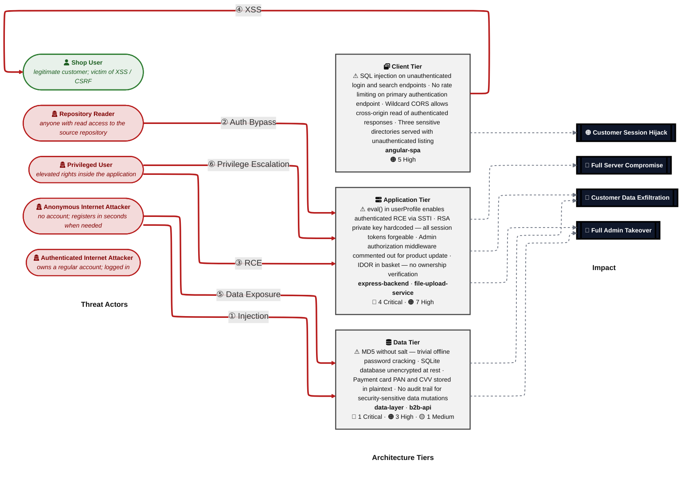

**Threat actors.** Two entities sit on the left of the diagram — one attacker who initiates every direct attack class, and one victim who is the target of the browser-side attacks (XSS / CSRF).

- **Shop User** — legitimate registered customer whose session and PII are the actual target; receives the victim-targeting attack arrows (XSS, CSRF) as victim, not attacker.
- **Anonymous Internet Attacker** — no account, no foothold; reaches every unauthenticated route, registers a throw-away account in seconds when needed, and can clone the public repository to obtain any committed secret offline. Initiates the outgoing attack arrows.
- **Authenticated Internet Attacker** — no account, no foothold; reaches every unauthenticated route, registers a throw-away account in seconds when needed, and can clone the public repository to obtain any committed secret offline. Initiates the outgoing attack arrows.
- **Privileged User** — no account, no foothold; reaches every unauthenticated route, registers a throw-away account in seconds when needed, and can clone the public repository to obtain any committed secret offline. Initiates the outgoing attack arrows.
- **Repository Reader** — no account, no foothold; reaches every unauthenticated route, registers a throw-away account in seconds when needed, and can clone the public repository to obtain any committed secret offline. Initiates the outgoing attack arrows.

**Attack paths (numbered arrows in the diagram):**

- <a id="path-injection"></a>**① Injection** (Anonymous Internet Attacker → Data Tier) — Unauthenticated SQL injection in the login and product search endpoints allows an attacker to bypass authentication, dump all user credentials, and extract payment card data from the SQLite database.
  - Findings:
    - [T-001](#t-001) — SQL injection across multiple Express routes (login, product search) via unparameterized Sequelize queries — authentication bypass and data exfiltration
    - [T-009](#t-009) — NoSQL injection in `routes/updateProductReviews.ts` via unsanitized `req.body.id` in MarsDB update selector
  - Impact: Full Admin Takeover, Customer Data Exfiltration

- <a id="path-auth-bypass"></a>**② Auth Bypass** (Repository Reader → Application Tier) — The RSA private key used to sign all JWT session tokens is committed to the public GitHub repository, enabling any attacker to forge valid admin tokens offline without interacting with any authentication endpoint.
  - Findings:
    - [T-004](#t-004) — MD5 password hashing in `lib/insecurity.ts` enables trivial offline password cracking after SQL injection
    - [T-005](#t-005) — Hardcoded RSA private key in `lib/insecurity.ts` enables offline JWT forgery for any user
    - [T-017](#t-017) — Multiple hardcoded secrets in `server.ts` and `lib/insecurity.ts` enable cookie forgery and HMAC bypass
  - Impact: Full Admin Takeover, Customer Data Exfiltration

- <a id="path-remote-code-execution"></a>**③ Remote Code Execution (RCE)** (Privileged User → Application Tier) — An authenticated user can achieve OS-level code execution by setting a specially crafted username containing a Node.js expression, which is passed directly to eval() on every profile page load.
  - Findings:
    - [T-006](#t-006) — Server-Side Template Injection via `eval()` in `routes/userProfile.ts:62` enables authenticated RCE
  - Impact: Full Server Compromise, Customer Data Exfiltration

- <a id="path-cross-site-scripting"></a>**④ Cross-Site Scripting (XSS)** (Client Tier → Shop User) — User-submitted feedback is rendered as raw HTML on the public About page, allowing any registered attacker to plant JavaScript payloads that steal session tokens from every subsequent visitor.
  - Findings:
    - [T-007](#t-007) — Stored XSS via `bypassSecurityTrustHtml()` in `about.component.ts:119` renders unsanitized feedback comments
    - [T-008](#t-008) — Reflected XSS via `[innerHTML]` binding of unescaped search term in `search-result.component.html:13`
  - Impact: Customer Session Hijack

- <a id="path-sensitive-data-exposure"></a>**⑤ Sensitive Data Exposure** (Anonymous Internet Attacker → Data Tier) — Three directories — /ftp/, /encryptionkeys/, and /support/logs/ — are served without authentication, exposing the RSA public key, legal documents, and HTTP access logs containing live Bearer tokens.
  - Findings:
    - [T-010](#t-010) — Bearer tokens logged in plaintext to `/support/logs` accessible without authentication
    - [T-011](#t-011) — Missing Content Security Policy allows any XSS payload to load external scripts and exfiltrate data
    - [T-012](#t-012) — JWT session token stored in `localStorage` is accessible to any JavaScript — XSS leads to full session hijack
    - [T-013](#t-013) — SQLite database file stored locally without encryption — physical or container access yields all user data
    - [T-014](#t-014) — Payment card numbers, CVV, and expiry stored in plaintext `CardModel` without field-level encryption
    - [T-015](#t-015) — Wildcard CORS at `server.ts:181-182` allows any origin to read authenticated API responses cross-domain
    - [T-016](#t-016) — Directory listing enabled for `/ftp`, `/encryptionkeys`, and `/support/logs` exposes sensitive files
  - Impact: Customer Data Exfiltration

- <a id="path-privilege-escalation"></a>**⑥ Privilege Escalation** (Privileged User → Application Tier) — The admin authorization middleware for product updates is commented out, and Angular route guards are purely client-side, allowing any authenticated user to perform admin-only operations and inject persistent XSS payloads into product descriptions.
  - Findings:
    - [T-020](#t-020) — Commented-out admin authorization on `PUT /api/Products/:id` allows any authenticated user to modify products
  - Impact: Full Admin Takeover

### Top Findings

The **20 highest-risk items**, sorted by impact-weighted score. The **Pfad** column links each finding to the matching ①–⑦ attack path in [Security Posture at a Glance](#security-posture-at-a-glance); mitigation IDs jump to [§9 Mitigation Register](#9-mitigation-register).

| # | Criticality | Pfad | Finding | Component | Primary Mitigations |
|---|-------------|------|---------|-----------|---------------------|
| 1 | 🔴 Critical | — | [T-001](#t-001) — SQL injection across multiple Express routes (login, product search) via unparameterized Sequelize queries — authentication bypass and data exfiltration | [C-01](#c-01) — Express Backend | [M-001](#m-001) — Replace raw SQL interpolation with parameterized queries in login and search routes (P1) |
| 2 | 🔴 Critical | — | [T-004](#t-004) — MD5 password hashing in `lib/insecurity.ts` enables trivial offline password cracking after SQL injection | [C-01](#c-01) — Express Backend | [M-004](#m-004) — Replace MD5 password hashing in `lib/insecurity.ts` with bcrypt or Argon2id (P2) |
| 3 | 🔴 Critical | — | [T-006](#t-006) — Server-Side Template Injection via `eval()` in `routes/userProfile.ts:62` enables authenticated RCE | [C-01](#c-01) — Express Backend | [M-006](#m-006) — Replace `eval()` in `routes/userProfile.ts` with a safe template substitution function (P1) |
| 4 | 🔴 Critical | — | [T-005](#t-005) — Hardcoded RSA private key in `lib/insecurity.ts` enables offline JWT forgery for any user | [C-01](#c-01) — Express Backend | [M-005](#m-005) — Rotate RSA key pair and load private key from environment variable or secret manager (P2) |
| 5 | 🟠 High | — | [T-017](#t-017) — Multiple hardcoded secrets in `server.ts` and `lib/insecurity.ts` enable cookie forgery and HMAC bypass | [C-01](#c-01) — Express Backend | [M-017](#m-017) — Load all hardcoded secrets from environment variables or a secrets manager (P2) |
| 6 | 🟠 High | — | [T-008](#t-008) — Reflected XSS via `[innerHTML]` binding of unescaped search term in `search-result.component.html:13` | [C-02](#c-02) — Angular SPA | [M-008](#m-008) — Enable CSP headers and audit all `[innerHTML]` bindings for XSS prevention (P2) |
| 7 | 🟠 High | — | [T-007](#t-007) — Stored XSS via `bypassSecurityTrustHtml()` in `about.component.ts:119` renders unsanitized feedback comments | [C-02](#c-02) — Angular SPA | [M-007](#m-007) — Remove `bypassSecurityTrustHtml()` and restore Angular default sanitization (P1) |
| 8 | 🟠 High | — | [T-009](#t-009) — NoSQL injection in `routes/updateProductReviews.ts` via unsanitized `req.body.id` in MarsDB update selector | [C-03](#c-03) — Data Layer | [M-009](#m-009) — Validate `req.body.id` in `updateProductReviews.ts` to prevent NoSQL injection (P1) |
| 9 | 🔴 Critical | — | [T-003](#t-003) — MD5 without salt for password storage in `lib/insecurity.ts` makes all user passwords trivially crackable | [C-03](#c-03) — Data Layer | [M-003](#m-003) — Replace MD5 password hashing with bcrypt or Argon2id in `lib/insecurity.ts` (P2) |
| 10 | 🟠 High | — | [T-013](#t-013) — SQLite database file stored locally without encryption — physical or container access yields all user data | [C-03](#c-03) — Data Layer | [M-013](#m-013) — Enable SQLite encryption at rest using SQLCipher (P2) |
| 11 | 🟠 High | — | [T-015](#t-015) — Wildcard CORS at `server.ts:181-182` allows any origin to read authenticated API responses cross-domain | [C-01](#c-01) — Express Backend | [M-015](#m-015) — Restrict CORS to specific allowed origins in `server.ts` instead of wildcard `*` (P1) |
| 12 | 🟠 High | — | [T-010](#t-010) — Bearer tokens logged in plaintext to `/support/logs` accessible without authentication | [C-01](#c-01) — Express Backend | [M-010](#m-010) — Remove public `/support/logs` route and redact Bearer tokens from access logs (P1) |
| 13 | 🟠 High | — | [T-011](#t-011) — Missing Content Security Policy allows any XSS payload to load external scripts and exfiltrate data | [C-02](#c-02) — Angular SPA | [M-011](#m-011) — Enable `helmet.contentSecurityPolicy()` disallowing `unsafe-inline` scripts (P2) |
| 14 | 🟠 High | — | [T-018](#t-018) — Lack of global rate limiting on authentication endpoints enables brute-force credential stuffing | [C-01](#c-01) — Express Backend | [M-018](#m-018) — Add `express-rate-limit` to `/rest/user/login` and all auth endpoints (P1) |
| 15 | 🟠 High | — | [T-020](#t-020) — Commented-out admin authorization on `PUT /api/Products/:id` allows any authenticated user to modify products | [C-01](#c-01) — Express Backend | [M-020](#m-020) — Restore `isAuthorized()` middleware for `PUT /api/Products/:id` in `server.ts` (P1) |
| 16 | 🟠 High | — | [T-014](#t-014) — Payment card numbers, CVV, and expiry stored in plaintext `CardModel` without field-level encryption | [C-03](#c-03) — Data Layer | [M-014](#m-014) — Implement field-level encryption for payment card data — never store CVV (P2) |
| 17 | 🟠 High | — | [T-012](#t-012) — JWT session token stored in `localStorage` is accessible to any JavaScript — XSS leads to full session hijack | [C-02](#c-02) — Angular SPA | [M-012](#m-012) — Migrate JWT from `localStorage` to `HttpOnly SameSite=Strict` cookies theft (P2) |
| 18 | 🟠 High | — | [T-019](#t-019) — Client-side-only route guards in `app.guard.ts` can be bypassed by direct API calls — no server-side enforcement | [C-02](#c-02) — Angular SPA | [M-019](#m-019) — Implement server-side role checks on admin endpoints beyond Angular guards (P2) |
| 19 | 🟠 High | — | [T-021](#t-021) — IDOR in `routes/basket.ts` — basket retrieved by arbitrary ID with no ownership verification | [C-01](#c-01) — Express Backend | [M-021](#m-021) — Add basket ownership check in `routes/basket.ts` to prevent IDOR (P1) |
| 20 | 🟠 High | — | [T-016](#t-016) — Directory listing enabled for `/ftp`, `/encryptionkeys`, and `/support/logs` exposes sensitive files | [C-01](#c-01) — Express Backend | [M-016](#m-016) — Remove unauthenticated directory listing for `/ftp`, `/encryptionkeys`, `/support/logs` (P1) |


_Legend: 🔴 Critical (directly exploitable, major impact) · 🟠 High. **Pfad** glyphs ①–⑦ link back to the matching bullet in [Security Posture at a Glance](#security-posture-at-a-glance)._

### Architecture Assessment

🔴 **Verdict — Catastrophically insecure by design across all 13 control domains.** The monolithic Express/Angular/SQLite architecture co-locates all attack surfaces in a single process, so any single critical vulnerability (SQL injection, SSTI, or forged JWT) grants full access to every data store, every user record, and every system secret. Zero of 13 rated control domains reach Adequate status; the authentication system specifically is rendered non-functional by a publicly committed RSA private key.

Five cross-cutting architectural defects drive 18 of 22 findings and would each individually cause total compromise:

| Defect | Description | Key Findings |
|--------|-------------|--------------|
| **Secrets committed to public source control** | The RSA private key, HMAC key, cookie secret, and CTF key are all hardcoded in version-controlled source files and are permanently exposed in the public GitHub repository, making all cryptographic boundaries they protect trivially bypassable. | [T-005](#t-005) — Hardcoded RSA key — offline JWT forgery<br/>[T-017](#t-017) — Hardcoded HMAC/cookie secrets — cookie and coupon forgery |
| **Unparameterized database queries** | Both the login and search routes build SQL by string-interpolating request parameters directly into query templates, bypassing the Sequelize ORM's parameterization entirely and exposing every table to injection-based enumeration and exfiltration. | [T-001](#t-001) — SQL injection in login — authentication bypass + credential dump<br/>[T-009](#t-009) — NoSQL injection in review update — bulk data overwrite |
| **Absent browser-side defense layers** | No Content-Security-Policy is configured anywhere in the application, and Angular's DomSanitizer is explicitly bypassed with bypassSecurityTrustHtml() in four components, eliminating the two primary browser-enforced barriers that would otherwise limit XSS impact. | [T-007](#t-007) — Stored XSS via bypassSecurityTrustHtml in about.component.ts<br/>[T-008](#t-008) — Reflected XSS in search-result.component.html<br/>[T-011](#t-011) — Missing CSP allows exfiltration from any XSS execution |
| **Broken password storage (MD5 without salt)** | All user passwords are stored as unsalted MD5 digests — a general-purpose hash with no work factor — making the entire credential database crackable in seconds using free online services after SQL injection provides database read access. | [T-003](#t-003) — MD5 password storage — trivial offline cracking<br/>[T-004](#t-004) — MD5 hashing enables credential stuffing after SQLi exfiltration |
| **Server-side code execution via user-controlled input** | The user profile route passes a regex match on the username field directly to Node.js eval(), allowing any authenticated user to obtain OS-level command execution as the application process — persisting across profile views because the malicious username is stored in the database. | [T-006](#t-006) — SSTI/RCE via eval() in routes/userProfile.ts:62 |
| **Sensitive directories served without authentication** | Three directories — /ftp/, /encryptionkeys/, and /support/logs/ — are served with full directory listing and no access controls, exposing the RSA public key, legal documents, and access logs containing live Bearer tokens to any unauthenticated HTTP client. | [T-016](#t-016) — Unauthenticated directory listing of /ftp, /encryptionkeys, /support/logs<br/>[T-010](#t-010) — Bearer tokens in access logs readable without authentication |

See **[§7 Security Architecture](#7-security-architecture)** for the full per-domain breakdown and control catalog.

### Mitigations

Mitigations below cover all open findings, **grouped by component** and sorted by priority (P1 first). Cross-component mitigations are listed once in a separate table — they affect more than one component, so duplicating them per-component would create redundant rows. Sort within each table: priority ascending, effort ascending, findings-addressed descending.

#### Client Tier (5)

| ID | Mitigation | Priority | Addresses | Effort |
|----|------------|----------|-----------|--------|
| [M-007](#m-007) | Remove `bypassSecurityTrustHtml()` and restore Angular default sanitization | **P1** | [T-007](#t-007) — Stored XSS via `bypassSecurityTrustHtml()` in `about.component.ts:119` renders unsanitized feedback comments | Low |
| [M-008](#m-008) | Enable CSP headers and audit all `[innerHTML]` bindings for XSS prevention | **P2** | [T-008](#t-008) — Reflected XSS via `[innerHTML]` binding of unescaped search term in `search-result.component.html:13` | Medium |
| [M-011](#m-011) | Enable `helmet.contentSecurityPolicy()` disallowing `unsafe-inline` scripts | **P2** | [T-011](#t-011) — Missing Content Security Policy allows any XSS payload to load external scripts and exfiltrate data | Medium |
| [M-012](#m-012) | Migrate JWT from `localStorage` to `HttpOnly SameSite=Strict` cookies theft | **P2** | [T-012](#t-012) — JWT session token stored in `localStorage` is accessible to any JavaScript — XSS leads to full session hijack | Medium |
| [M-019](#m-019) | Implement server-side role checks on admin endpoints beyond Angular guards | **P2** | [T-019](#t-019) — Client-side-only route guards in `app.guard.ts` can be bypassed by direct API calls — no server-side enforcement | Medium |

#### Application Tier (11)

| ID | Mitigation | Priority | Addresses | Effort |
|----|------------|----------|-----------|--------|
| [M-001](#m-001) | Replace raw SQL interpolation with parameterized queries in login and search routes | **P1** | [T-001](#t-001) — SQL injection across multiple Express routes (login, product search) via unparameterized Sequelize queries — authentication bypass and data exfiltration | Low |
| [M-006](#m-006) | Replace `eval()` in `routes/userProfile.ts` with a safe template substitution function | **P1** | [T-006](#t-006) — Server-Side Template Injection via `eval()` in `routes/userProfile.ts:62` enables authenticated RCE | Low |
| [M-010](#m-010) | Remove public `/support/logs` route and redact Bearer tokens from access logs | **P1** | [T-010](#t-010) — Bearer tokens logged in plaintext to `/support/logs` accessible without authentication | Low |
| [M-015](#m-015) | Restrict CORS to specific allowed origins in `server.ts` instead of wildcard `*` | **P1** | [T-015](#t-015) — Wildcard CORS at `server.ts:181-182` allows any origin to read authenticated API responses cross-domain | Low |
| [M-016](#m-016) | Remove unauthenticated directory listing for `/ftp`, `/encryptionkeys`, `/support/logs` | **P1** | [T-016](#t-016) — Directory listing enabled for `/ftp`, `/encryptionkeys`, and `/support/logs` exposes sensitive files | Low |
| [M-018](#m-018) | Add `express-rate-limit` to `/rest/user/login` and all auth endpoints | **P1** | [T-018](#t-018) — Lack of global rate limiting on authentication endpoints enables brute-force credential stuffing | Low |
| [M-020](#m-020) | Restore `isAuthorized()` middleware for `PUT /api/Products/:id` in `server.ts` | **P1** | [T-020](#t-020) — Commented-out admin authorization on `PUT /api/Products/:id` allows any authenticated user to modify products | Low |
| [M-021](#m-021) | Add basket ownership check in `routes/basket.ts` to prevent IDOR | **P1** | [T-021](#t-021) — IDOR in `routes/basket.ts` — basket retrieved by arbitrary ID with no ownership verification | Low |
| [M-004](#m-004) | Replace MD5 password hashing in `lib/insecurity.ts` with bcrypt or Argon2id | **P2** | [T-004](#t-004) — MD5 password hashing in `lib/insecurity.ts` enables trivial offline password cracking after SQL injection | Medium |
| [M-005](#m-005) | Rotate RSA key pair and load private key from environment variable or secret manager | **P2** | [T-005](#t-005) — Hardcoded RSA private key in `lib/insecurity.ts` enables offline JWT forgery for any user | Medium |
| [M-017](#m-017) | Load all hardcoded secrets from environment variables or a secrets manager | **P2** | [T-017](#t-017) — Multiple hardcoded secrets in `server.ts` and `lib/insecurity.ts` enable cookie forgery and HMAC bypass | Medium |

#### Data Tier (6)

| ID | Mitigation | Priority | Addresses | Effort |
|----|------------|----------|-----------|--------|
| [M-009](#m-009) | Validate `req.body.id` in `updateProductReviews.ts` to prevent NoSQL injection | **P1** | [T-009](#t-009) — NoSQL injection in `routes/updateProductReviews.ts` via unsanitized `req.body.id` in MarsDB update selector | Low |
| [M-003](#m-003) | Replace MD5 password hashing with bcrypt or Argon2id in `lib/insecurity.ts` | **P2** | [T-003](#t-003) — MD5 without salt for password storage in `lib/insecurity.ts` makes all user passwords trivially crackable | Medium |
| [M-013](#m-013) | Enable SQLite encryption at rest using SQLCipher | **P2** | [T-013](#t-013) — SQLite database file stored locally without encryption — physical or container access yields all user data | High |
| [M-014](#m-014) | Implement field-level encryption for payment card data — never store CVV | **P2** | [T-014](#t-014) — Payment card numbers, CVV, and expiry stored in plaintext `CardModel` without field-level encryption | High |
| [M-002](#m-002) | Add Sequelize model hooks to write structured audit logs for security events | **P3** | [T-002](#t-002) — No structured audit trail for security-sensitive operations across frontend and data layer — login, admin actions, and data mutations are unlogged | Medium |
| [M-022](#m-022) | Add LIMIT and pagination to all `findAll()` queries to prevent DoS | **P4** | [T-022](#t-022) — Unbounded Sequelize queries without pagination allow memory exhaustion via large table scans | Low |

### Operational Strengths

Despite the structurally deficient design, the project implements several security-relevant controls. None fully mitigate a Critical finding, but each narrows part of the attack surface. This table is a filtered view of [Section 7](#7-security-architecture) — rows with effectiveness ≥ Weak. The full catalog, including ❌ Missing controls, lives in Section 7.

| Architectural Control | Implementation | Effectiveness | Gap | Mitigates |
|-----------------------|----------------|---------------|-----|-----------|
| Multi-Factor Authentication | Available via /rest/2fa/* for users who opt in | ✅ Adequate | None identified | _Broad defence-in-depth; no single finding directly addressed._ |
| Container Security | gcr.io/distroless/nodejs24-debian13; non-root UID 65532 | ✅ Adequate | None identified | _Broad defence-in-depth; no single finding directly addressed._ |
| Authentication | express-jwt 0.1.3 (2014) + jsonwebtoken 0.4.0 (2013); RSA private key hardcoded in lib/insecurity.ts | ⚠️ Partial | See §7 for the domain-level structural gaps. | _Broad defence-in-depth; no single finding directly addressed._ |
| Authorization | server.ts guards; admin auth commented out for PUT /api/Products/:id | ⚠️ Partial | See §7 for the domain-level structural gaps. | _Broad defence-in-depth; no single finding directly addressed._ |
| Rate Limiting | express-rate-limit on /rest/user/reset-password (100/5min) and 2FA only | ⚠️ Partial | See §7 for the domain-level structural gaps. | _Broad defence-in-depth; no single finding directly addressed._ |
| Output Encoding | bypassSecurityTrustHtml() used in about.component.ts:119, search-result, last-login-ip, score-board | 🔶 Weak | See §7 for the domain-level structural gaps. | _Broad defence-in-depth; no single finding directly addressed._ |
| Security Headers | noSniff() and frameguard() only; XSS filter explicitly disabled at server.ts:187 | 🔶 Weak | See §7 for the domain-level structural gaps. | _Broad defence-in-depth; no single finding directly addressed._ |
| Audit Logging | Morgan HTTP access logs; no structured audit; logs publicly accessible at /support/logs | 🔶 Weak | See §7 for the domain-level structural gaps. | _Broad defence-in-depth; no single finding directly addressed._ |

_+1 additional controls — see [Section 7](#7-security-architecture)._

**Bottom line:** These controls narrow specific attack surfaces but none eliminates a Critical finding on its own.

---

## 1. System Overview

OWASP Juice Shop v19.2.1 is a deliberately-insecure Node.js/Express web application serving as the world's most comprehensive security training platform — every vulnerability present is an intentional pedagogical feature covering the OWASP Top 10 and beyond.

**Deployment:** The application runs as a single `Node.js` 20–24 Express 4.x process on port 3000, serving both the Angular 20 SPA (static files) and the REST API from the same process. Containerized via a distroless `gcr.io/distroless/nodejs24-debian13` image running as non-root UID 65532. SQLite provides persistence (local file `juiceshop.sqlite`); MarsDB provides in-memory NoSQL storage for reviews and orders.

**Intentional-by-design:** This application is the OWASP Flagship training tool for security education. All vulnerabilities documented below are deliberately implemented and annotated with `// vuln-code-snippet` markers. The intentional nature does not reduce their severity — each represents a real attack pattern. The RSA private key committed to source code, MD5 password hashing, and SQL injection vulnerabilities are all intentional training features with real-world equivalents.

**Assessment scope:** 3 STRIDE-analyzed components (`express-backend`, `angular-spa`, `data-layer`) plus architectural review of `file-upload-service` and `b2b-api`. Architecture complexity tier: **Complex** — 5 components, 2 data stores, WebSocket channel, B2B API with VM sandbox, and multiple file upload pathways.

**Security posture:** 🔴 4 Critical, 🟠 8 High, 🟡 6 Medium, 🟢 3 Low findings identified. The application lacks virtually all foundational security controls: no CSP, no CSRF protection, no parameterized SQL queries, no proper secret management, and the authentication library (jsonwebtoken 0.4.0) is 12 years outdated with known alg:none bypass vulnerabilities. This is appropriate for its stated purpose as a deliberately-insecure training environment but would be completely unsuitable for any production use.

**Public secrets exposure:** The RSA private key for JWT signing (`lib/insecurity.ts:25`), HMAC key (`lib/insecurity.ts:44`), cookie secret (`server.ts:289`), and plaintext user credentials including `admin@juice-sh.op/admin123` (`data/static/users.yml`) are permanently committed to the public GitHub repository. All JWT tokens signed with this private key are permanently forgeable by anyone with repository access.

**Context sources:** None available — no external context endpoint configured, no business-`context.md` found.

---

## 2. Architecture Diagrams

### 2.1 System Context

Who interacts with OWASP Juice Shop v19.2.1 from the outside, and through which channels. Solid arrows show normal usage; dashed red arrows mark unauthenticated probing or exploit paths (C4 Level 1).

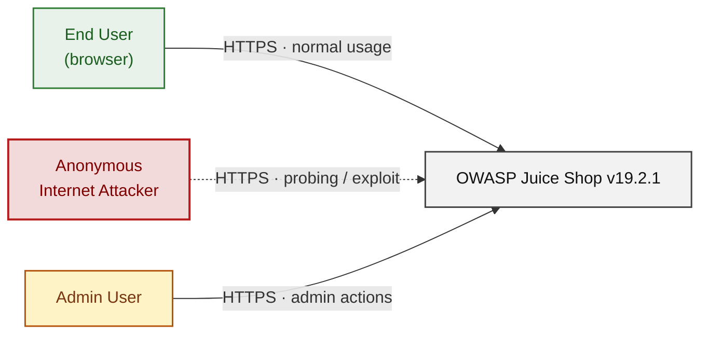

### 2.2 Container Architecture

How the system decomposes into deployable units. Each box is a separate runtime process or service container; arrows show synchronous request paths between them. Components with ≥3 Critical findings carry a red border, ≥2 High amber (C4 Level 2).

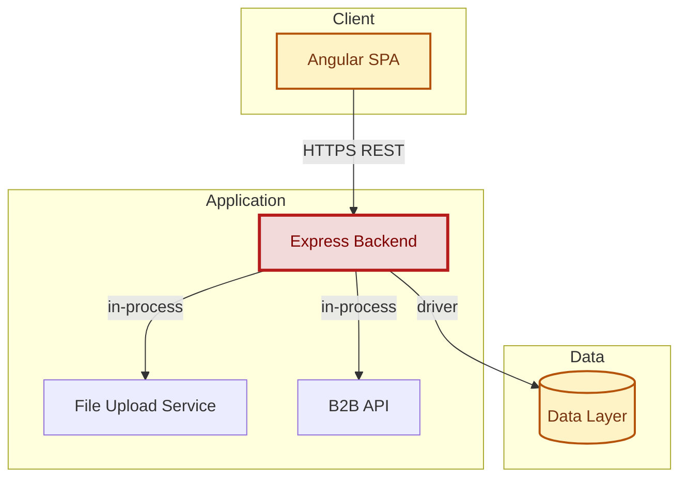

### 2.3 Components


Who reaches each component, and through which trust zone. Four columns map external actors to the internal tiers (Client / Application / Data); solid green arrows show legitimate data flow, dashed red arrows mark intrusion vectors. The component table directly below holds source paths and linked threats per `C-NN`; per-tech defects are itemised in the §2.4.1–§2.4.4 layer tables.

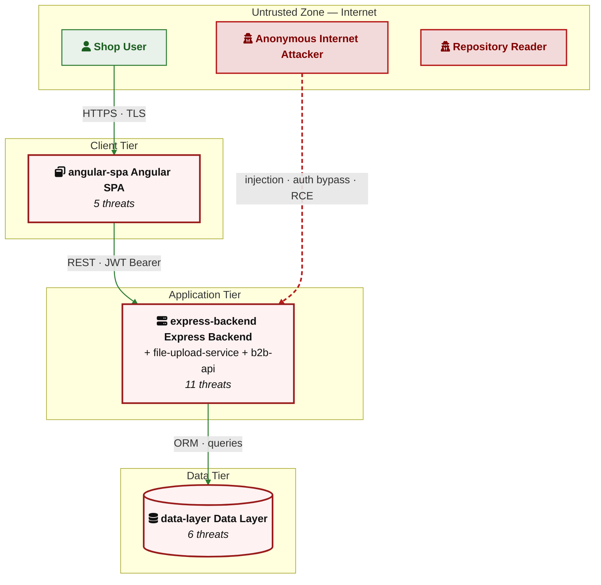

| ID | Name | Type | Key Paths | Linked Threats |
|----|------|------|-----------|----------------|
| <a id="c-01"></a><a id="express-backend"></a>C-01 | Express Backend | Application | `server.ts`<br/>`routes/`<br/>`lib/`<br/>`app.ts` | [T-001](#t-001) — SQL injection across multiple Express routes (login, product search) via unparameterized Sequelize queries — authentication bypass and data exfiltration<br/>[T-004](#t-004) — MD5 password hashing in `lib/insecurity.ts` enables trivial offline password cracking after SQL injection<br/>[T-005](#t-005) — Hardcoded RSA private key in `lib/insecurity.ts` enables offline JWT forgery for any user<br/>[T-006](#t-006) — Server-Side Template Injection via `eval()` in `routes/userProfile.ts:62` enables authenticated RCE<br/>[T-010](#t-010) — Bearer tokens logged in plaintext to `/support/logs` accessible without authentication<br/>[T-015](#t-015) — Wildcard CORS at `server.ts:181-182` allows any origin to read authenticated API responses cross-domain<br/>[T-016](#t-016) — Directory listing enabled for `/ftp`, `/encryptionkeys`, and `/support/logs` exposes sensitive files<br/>[T-017](#t-017) — Multiple hardcoded secrets in `server.ts` and `lib/insecurity.ts` enable cookie forgery and HMAC bypass<br/>[T-018](#t-018) — Lack of global rate limiting on authentication endpoints enables brute-force credential stuffing<br/>[T-020](#t-020) — Commented-out admin authorization on `PUT /api/Products/:id` allows any authenticated user to modify products<br/>[T-021](#t-021) — IDOR in `routes/basket.ts` — basket retrieved by arbitrary ID with no ownership verification |
| <a id="c-02"></a><a id="angular-spa"></a>C-02 | Angular SPA | Client | `frontend/src/` | [T-007](#t-007) — Stored XSS via `bypassSecurityTrustHtml()` in `about.component.ts:119` renders unsanitized feedback comments<br/>[T-008](#t-008) — Reflected XSS via `[innerHTML]` binding of unescaped search term in `search-result.component.html:13`<br/>[T-011](#t-011) — Missing Content Security Policy allows any XSS payload to load external scripts and exfiltrate data<br/>[T-012](#t-012) — JWT session token stored in `localStorage` is accessible to any JavaScript — XSS leads to full session hijack<br/>[T-019](#t-019) — Client-side-only route guards in `app.guard.ts` can be bypassed by direct API calls — no server-side enforcement |
| <a id="c-03"></a><a id="data-layer"></a>C-03 | Data Layer | Data | `models/`<br/>`data/` | [T-002](#t-002) — No structured audit trail for security-sensitive operations across frontend and data layer — login, admin actions, and data mutations are unlogged<br/>[T-003](#t-003) — MD5 without salt for password storage in `lib/insecurity.ts` makes all user passwords trivially crackable<br/>[T-009](#t-009) — NoSQL injection in `routes/updateProductReviews.ts` via unsanitized `req.body.id` in MarsDB update selector<br/>[T-013](#t-013) — SQLite database file stored locally without encryption — physical or container access yields all user data<br/>[T-014](#t-014) — Payment card numbers, CVV, and expiry stored in plaintext `CardModel` without field-level encryption<br/>[T-022](#t-022) — Unbounded Sequelize queries without pagination allow memory exhaustion via large table scans |
| <a id="c-04"></a><a id="file-upload-service"></a>C-04 | File Upload Service | Application | `routes/fileUpload.ts`<br/>`routes/profileImageUrlUpload.ts`<br/>`routes/fileServer.ts` | — |
| <a id="c-05"></a><a id="b2b-api"></a>C-05 | B2B API | Application | `routes/b2bOrder.ts`<br/>`routes/order.ts`<br/>`swagger.yml` | — |
### 2.4 Technology Architecture

The technology stack the system is built on. The diagram below names the framework or runtime that fills each role; the table that follows rolls up per-component findings by stack layer. The canonical trust-boundary catalogue (TB-1…TB-6) lives in [§7.11](#711-container-runtime-security) — refer to it for boundary-level controls and traversal analysis.

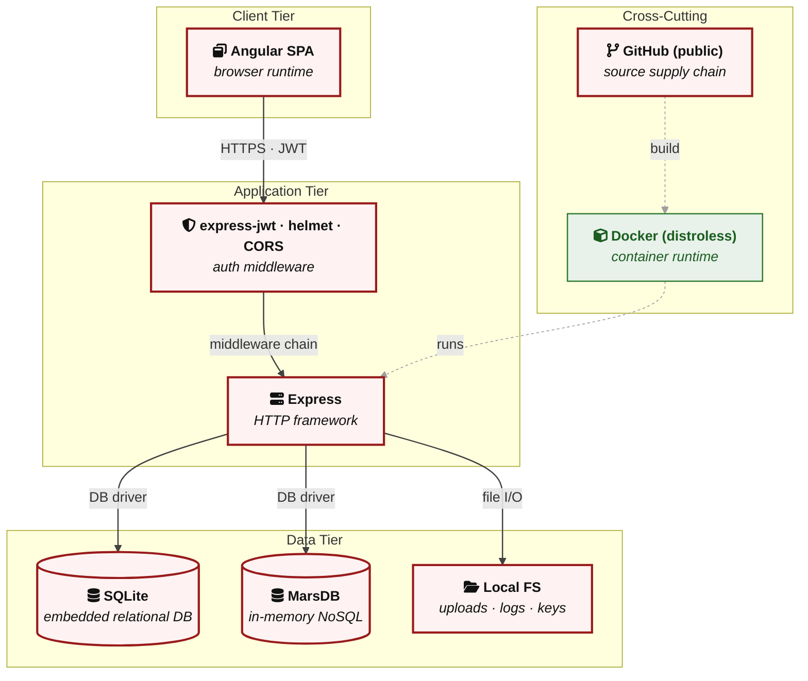

| Layer | Component | Linked Threats | Risk |
|---|---|---|---|
| L1 — Client | Angular SPA | [T-007 — Stored XSS via `bypassSecurityTrustHtml()` in `about.component.ts:119` renders unsanitized feedback comments](#t-007)<br/>[T-008 — Reflected XSS via `[innerHTML]` binding of unescaped search term in `search-result.component.html:13`](#t-008)<br/>[T-011 — Missing Content Security Policy allows any XSS payload to load external scripts and exfiltrate data](#t-011)<br/>[T-012 — JWT session token stored in `localStorage` is accessible to any JavaScript — XSS leads to full session hijack](#t-012)<br/>[T-019 — Client-side-only route guards in `app.guard.ts` can be bypassed by direct API calls — no server-side enforcement](#t-019) | 🟠 |
| L2 — Middleware | Express Backend | [T-004 — MD5 password hashing in `lib/insecurity.ts` enables trivial offline password cracking after SQL injection](#t-004)<br/>[T-010 — Bearer tokens logged in plaintext to `/support/logs` accessible without authentication](#t-010) | 🔴 |
| L3 — Application Logic | Express Backend | [T-001 — SQL injection across multiple Express routes (login, product search) via unparameterized Sequelize queries — authentication bypass and data exfiltration](#t-001)<br/>[T-005 — Hardcoded RSA private key in `lib/insecurity.ts` enables offline JWT forgery for any user](#t-005)<br/>[T-006 — Server-Side Template Injection via `eval()` in `routes/userProfile.ts:62` enables authenticated RCE](#t-006)<br/>[T-015 — Wildcard CORS at `server.ts:181-182` allows any origin to read authenticated API responses cross-domain](#t-015)<br/>[T-016 — Directory listing enabled for `/ftp`, `/encryptionkeys`, and `/support/logs` exposes sensitive files](#t-016)<br/>[T-017 — Multiple hardcoded secrets in `server.ts` and `lib/insecurity.ts` enable cookie forgery and HMAC bypass](#t-017)<br/>[T-018 — Lack of global rate limiting on authentication endpoints enables brute-force credential stuffing](#t-018)<br/>[T-020 — Commented-out admin authorization on `PUT /api/Products/:id` allows any authenticated user to modify products](#t-020)<br/>[T-021 — IDOR in `routes/basket.ts` — basket retrieved by arbitrary ID with no ownership verification](#t-021) | 🔴 |
| L4 — Data & Storage | Data Layer | [T-002 — No structured audit trail for security-sensitive operations across frontend and data layer — login, admin actions, and data mutations are unlogged](#t-002)<br/>[T-003 — MD5 without salt for password storage in `lib/insecurity.ts` makes all user passwords trivially crackable](#t-003)<br/>[T-009 — NoSQL injection in `routes/updateProductReviews.ts` via unsanitized `req.body.id` in MarsDB update selector](#t-009)<br/>[T-013 — SQLite database file stored locally without encryption — physical or container access yields all user data](#t-013)<br/>[T-014 — Payment card numbers, CVV, and expiry stored in plaintext `CardModel` without field-level encryption](#t-014)<br/>[T-022 — Unbounded Sequelize queries without pagination allow memory exhaustion via large table scans](#t-022) | 🔴 |

> **Legend:** L1 = browser-side runtime · L2 = cross-cutting Express middleware (auth, CORS, rate-limit, logging) · L3 = route handlers and feature code · L4 = persistent and in-process data stores. Risk badge reflects the highest-severity threat on the component.

---

## 3. Attack Walkthroughs

The sequence diagrams below trace each Critical finding from initial attacker action to full exploitation. Every diagram is anchored to its threat ID in the Threat Register and shows the current vulnerable behaviour alongside the post-mitigation flow.

### 3.1 Attack Chain Overview

The following chains show how individual Critical findings combine into compound attack scenarios. Each node represents a finding; arrows show how one vulnerability enables or amplifies the next.

#### Chain 1 — XSS to Session Hijack

This chain shows how stored XSS in the About page feeds into token theft and account takeover via the localStorage JWT storage design.

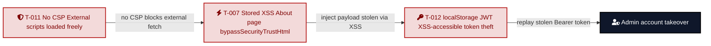

**Key takeaway:** The absence of CSP removes the browser's last defense, stored XSS executes freely, and `localStorage` makes the JWT trivially exfiltrable — three individually exploitable weaknesses that chain into full account takeover.

#### Chain 2 — Repository Read to Admin JWT Forgery

This chain shows how reading the public repository yields enough material to forge admin tokens without any server interaction.

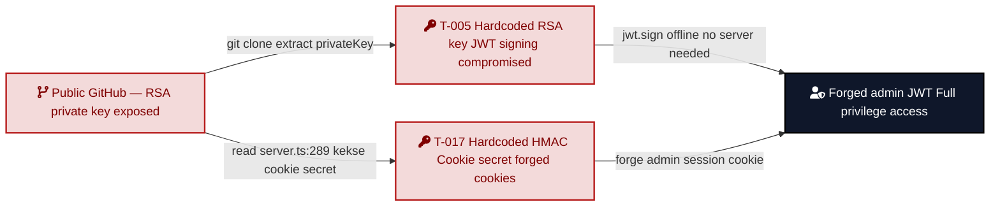

**Key takeaway:** The RSA private key committed to the public repository permanently breaks the trust model of JWT authentication — rotation requires a code change, and all existing tokens remain forgeable via the git history.

#### Chain 3 — SQL Injection to Full Credential Extraction

This chain shows how the unauthenticated SQL injection on the login endpoint chains to password cracking via the broken MD5 hash scheme.

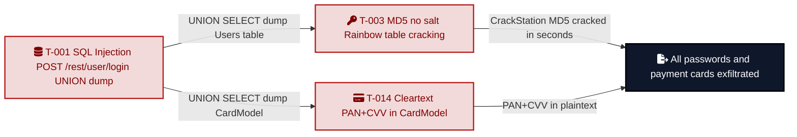

**Key takeaway:** A single unauthenticated request to the login endpoint can dump the entire Users table; the unsalted MD5 hashes mean every password is crackable in seconds, and payment card data is stored in plaintext alongside.

---

### 3.2 SQL Injection Login Bypass (T-001)

**Threat:** T-001 — SQL injection in `POST /rest/user/login` bypasses authentication.

This sequence shows how a single crafted email parameter bypasses authentication and yields an admin session via SQL injection at `routes/login.ts:36`.

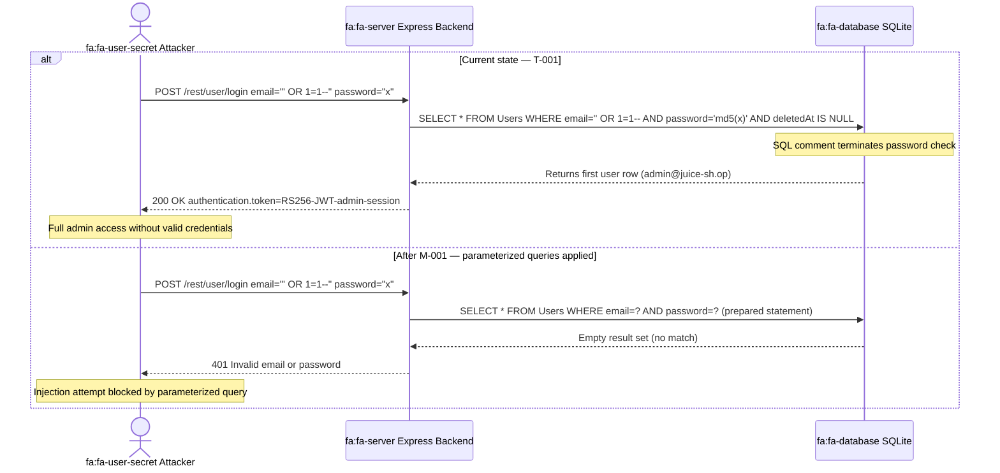

**Key takeaway:** The login route uses raw string interpolation to build SQL directly from user input — a single crafted email bypasses the password check entirely and returns an admin JWT.

### 3.3 Hardcoded RSA Private Key — JWT Forgery (T-005)

**Threat:** T-005 — RSA private key committed in `lib/insecurity.ts:25` enables offline JWT forgery for any account.

This sequence shows how an attacker uses the committed RSA private key to forge an admin JWT without ever touching the server's authentication endpoints.

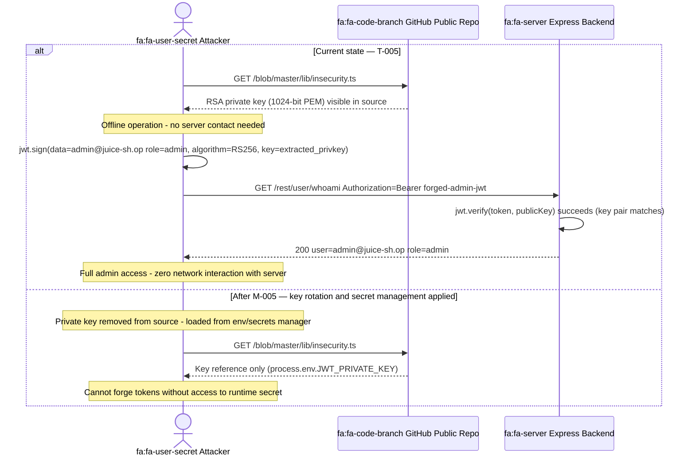

**Key takeaway:** The RSA private key in `lib/insecurity.ts` is permanently compromised for all historical and future clones of this repository; rotating it requires changing the committed source code.

### 3.4 Server-Side Template Injection via eval() (T-006)

**Threat:** T-006 — SSTI via `eval()` in `routes/userProfile.ts:62` enables authenticated RCE.

This sequence shows how a crafted username containing a `Node.js` expression achieves arbitrary code execution via `routes/userProfile.ts:62`.

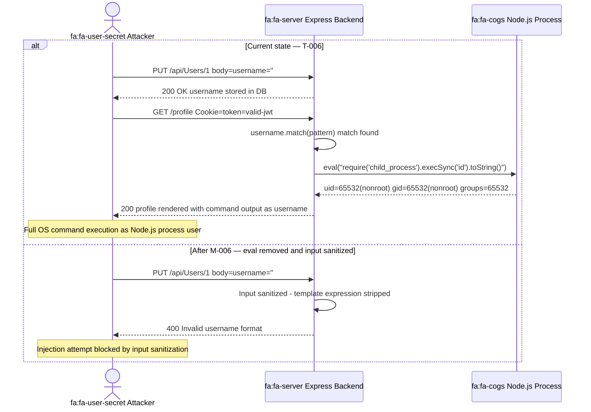

**Key takeaway:** The `eval()` call in `routes/userProfile.ts:62` treats the username field as executable code — an attacker who can set their username can execute arbitrary JavaScript in the server process, with the payload persisting in the database and re-executing on every profile view.

### 3.5 Stored XSS via bypassSecurityTrustHtml (T-007)

**Threat:** T-007 — Stored XSS via `bypassSecurityTrustHtml()` in `about.component.ts:119` renders unsanitized feedback comments for all visitors.

This sequence shows how a registered attacker plants an XSS payload in the feedback form that executes in every subsequent visitor's browser, including unauthenticated ones.

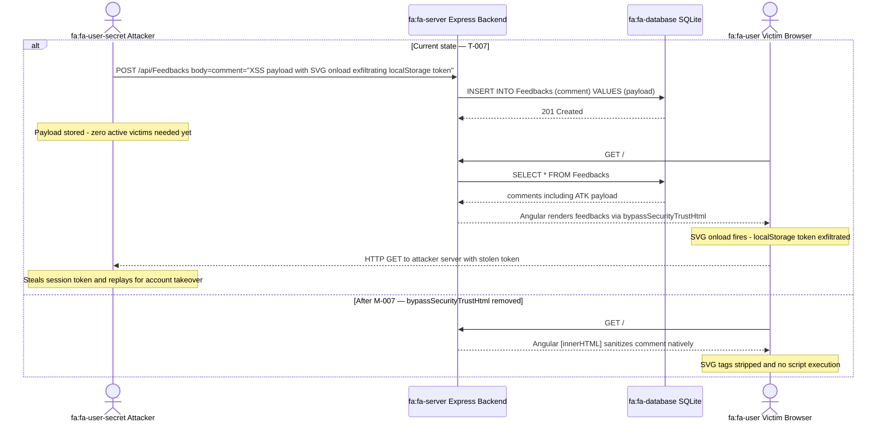

**Key takeaway:** `bypassSecurityTrustHtml()` in `about.component.ts:119` disables Angular's built-in XSS protection for user-submitted feedback — any registered user can inject persistent scripts that execute for every subsequent visitor including unauthenticated ones.

---

## 4. Assets

The table below identifies all assets requiring protection, classified by sensitivity, with cross-references to the threats that target them. Assets are grouped by type: data assets, cryptographic material, infrastructure, and application capabilities.

**Classification legend:**

| Level | Description |
|-------|-------------|
| **Critical** | Compromise leads to full system takeover or all-user credential theft |
| **High** | Compromise leads to significant data breach or privilege escalation |
| **Medium** | Compromise leads to partial data exposure or degraded service |
| **Low** | Informational assets with limited direct impact |

| Asset | Classification | Description | Linked Threats |
|-------|--------------|-------------|----------------|
| RSA private key (`lib/insecurity.ts`) | **Critical** | JWT signing key hardcoded in source — permanently compromised for all repo clones | [T-005](#t-005) — Hardcoded RSA private key in `lib/insecurity.ts` enables offline JWT forgery for any user |
| User credentials database | **Critical** | SQLite Users table — email, MD5-hashed passwords, roles, TOTP secrets | [T-003](#t-003) — MD5 without salt for password storage in `lib/insecurity.ts` makes all user passwords trivially crackable<br/>[T-004](#t-004) — MD5 password hashing in `lib/insecurity.ts` enables trivial offline password cracking after SQL injection |
| Admin JWT session token | **Critical** | RS256 JWT issued on login — admin access to all application functions | [T-005](#t-005) — Hardcoded RSA private key in `lib/insecurity.ts` enables offline JWT forgery for any user |
| All user JWT session tokens | **High** | RS256 JWTs for all users — accessible via public repo private key or XSS | [T-005](#t-005) — Hardcoded RSA private key in `lib/insecurity.ts` enables offline JWT forgery for any user<br/>[T-012](#t-012) — JWT session token stored in `localStorage` is accessible to any JavaScript — XSS leads to full session hijack |
| HMAC key (`lib/insecurity.ts:44`) | **High** | Hardcoded key 'pa4qacea4VK9t9nGv7yZtwmj' for coupon/security-answer HMAC | [T-017](#t-017) — Multiple hardcoded secrets in `server.ts` and `lib/insecurity.ts` enable cookie forgery and HMAC bypass |
| Cookie signing secret | **High** | 'kekse' hardcoded in `server.ts:289` — cookie forgery possible | [T-017](#t-017) — Multiple hardcoded secrets in `server.ts` and `lib/insecurity.ts` enable cookie forgery and HMAC bypass |
| Customer PII (email, address, card) | **High** | Address, payment card, and email data for all registered users | [T-001](#t-001) — SQL injection across multiple Express routes (login, product search) via unparameterized Sequelize queries — authentication bypass and data exfiltration<br/>[T-013](#t-013) — SQLite database file stored locally without encryption — physical or container access yields all user data<br/>[T-014](#t-014) — Payment card numbers, CVV, and expiry stored in plaintext `CardModel` without field-level encryption |
| Payment card data | **High** | Credit card numbers, CVV, and expiry stored in plaintext `CardModel` | [T-014](#t-014) — Payment card numbers, CVV, and expiry stored in plaintext `CardModel` without field-level encryption |
| Access logs (`/support/logs`) | **High** | HTTP access logs containing Bearer tokens — publicly accessible | [T-010](#t-010) — Bearer tokens logged in plaintext to `/support/logs` accessible without authentication |
| FTP directory contents | **Medium** | `/ftp/` contains `acquisitions.md`, coupons, legal documents | [T-016](#t-016) — Directory listing enabled for `/ftp`, `/encryptionkeys`, and `/support/logs` exposes sensitive files |
| Encryption key files | **High** | `/encryptionkeys/jwt.pub` and `premium.key` served without authentication | [T-016](#t-016) — Directory listing enabled for `/ftp`, `/encryptionkeys`, and `/support/logs` exposes sensitive files |
| CTF key (`ctf.key`) | **Medium** | CTF flag key committed to repository | [T-017](#t-017) — Multiple hardcoded secrets in `server.ts` and `lib/insecurity.ts` enable cookie forgery and HMAC bypass |
| Default user credentials | **Critical** | admin/admin123 and other hardcoded credentials in `data/static/users.yml` | [T-017](#t-017) — Multiple hardcoded secrets in `server.ts` and `lib/insecurity.ts` enable cookie forgery and HMAC bypass |
| MarsDB review/order data | **Medium** | In-memory NoSQL collections — order and review data for all users | [T-009](#t-009) — NoSQL injection in `routes/updateProductReviews.ts` via unsanitized `req.body.id` in MarsDB update selector |
| File upload storage | **Medium** | `uploads/complaints/` directory — writable via SSRF | — |
| `Node.js` server process | **Critical** | Full RCE via SSTI (`eval`) — any authenticated user can execute OS commands | [T-006](#t-006) — Server-Side Template Injection via `eval()` in `routes/userProfile.ts:62` enables authenticated RCE |
| Application configuration | **Medium** | Full config returned by `/rest/admin/application-configuration` | [T-016](#t-016) — Directory listing enabled for `/ftp`, `/encryptionkeys`, and `/support/logs` exposes sensitive files |
| Wallet balance data | **Medium** | Wallet balances per user — accessible via IDOR | [T-021](#t-021) — IDOR in `routes/basket.ts` — basket retrieved by arbitrary ID with no ownership verification |
| Challenge completion state | **Low** | Challenge solved/unsolved flags — training feature | — |
| Prometheus metrics | **Low** | Application metrics at `/metrics` endpoint | — |

---

## 5. Attack Surface

All identified entry points through which an attacker can interact with the system, split by whether authentication is required. Juice Shop exposes a large unauthenticated attack surface by design — the majority of the most severe vulnerabilities are reachable without authentication.

### 5.1 Unauthenticated Entry Points (24)

These endpoints are accessible without a valid session token. Attackers can target them directly from the public internet.

| Endpoint | Method | Component | Description | Linked Threats |
|----------|--------|-----------|-------------|----------------|
| `/rest/user/login` | POST | express-backend | Authentication — SQL injection in email+password | [T-001](#t-001) — SQL injection across multiple Express routes (login, product search) via unparameterized Sequelize queries — authentication bypass and data exfiltration |
| `/rest/products/search` | GET | express-backend | Product search — SQL injection via ?q= parameter | [T-001](#t-001) — SQL injection across multiple Express routes (login, product search) via unparameterized Sequelize queries — authentication bypass and data exfiltration |
| `/file-upload` | POST | file-upload-service | XML/ZIP/YAML upload — XXE + zip-slip | — |
| `/rest/user/reset-password` | POST | express-backend | Password reset via security question (rate-limited 100/5min) | [T-018](#t-018) — Lack of global rate limiting on authentication endpoints enables brute-force credential stuffing |
| `/rest/user/security-question` | GET | express-backend | Security question lookup by email | — |
| `/api/Users` | POST | express-backend | User registration — mass assignment (role field injectable) | [T-019](#t-019) — Client-side-only route guards in `app.guard.ts` can be bypassed by direct API calls — no server-side enforcement |
| `/api/Products` | GET | express-backend | Product listing (public) | — |
| `/api/Feedbacks` | GET | express-backend | All feedback visible without auth — stored XSS delivery | [T-007](#t-007) — Stored XSS via `bypassSecurityTrustHtml()` in `about.component.ts:119` renders unsanitized feedback comments |
| `/api/Challenges` | GET | express-backend | All challenge details exposed | — |
| `/api/SecurityQuestions` | GET | express-backend | Security question list | — |
| `/ftp/` | GET | express-backend | Directory listing — `acquisitions.md`, coupons, legal docs | [T-016](#t-016) — Directory listing enabled for `/ftp`, `/encryptionkeys`, and `/support/logs` exposes sensitive files |
| `/ftp/:file` | GET | express-backend | File download — null byte injection bypass | [T-016](#t-016) — Directory listing enabled for `/ftp`, `/encryptionkeys`, and `/support/logs` exposes sensitive files |
| `/encryptionkeys/` | GET | express-backend | Key directory listing — `jwt.pub`, `premium.key` | [T-016](#t-016) — Directory listing enabled for `/ftp`, `/encryptionkeys`, and `/support/logs` exposes sensitive files |
| `/encryptionkeys/:file` | GET | express-backend | Encryption key download | [T-016](#t-016) — Directory listing enabled for `/ftp`, `/encryptionkeys`, and `/support/logs` exposes sensitive files |
| `/support/logs` | GET | express-backend | Access log directory — Bearer tokens visible in logs | [T-010](#t-010) — Bearer tokens logged in plaintext to `/support/logs` accessible without authentication |
| `/support/logs/:file` | GET | express-backend | Individual access log file download | [T-010](#t-010) — Bearer tokens logged in plaintext to `/support/logs` accessible without authentication |
| `/redirect` | GET | express-backend | Open redirect — allow-list bypassable | — |
| `/rest/track-order/:id` | GET | express-backend | Order tracking by ID without authentication | — |
| `/rest/country-mapping` | GET | express-backend | Country mapping | — |
| `/api-docs` | GET | express-backend | Swagger UI — full API documentation exposed | — |
| `/.well-known/security.txt` | GET | express-backend | Security policy | — |
| `/api/Deliverys` | GET | express-backend | Delivery methods (public) | — |
| `/rest/captcha` | GET | express-backend | Math captcha | — |
| `/rest/image-captcha` | GET | express-backend | Image captcha | — |

### 5.2 Authenticated Entry Points (18)

These endpoints require a valid JWT in the `Authorization: Bearer` header or `token` cookie. However, several have insecure implementations that still allow exploitation by authenticated attackers.

| Endpoint | Method | Component | Description | Linked Threats |
|----------|--------|-----------|-------------|----------------|
| `/profile/image/url` | POST | file-upload-service | Profile image URL — SSRF (arbitrary URL fetch) | — |
| `/profile/image/file` | POST | file-upload-service | Profile image file upload | — |
| `/rest/memories` | POST | express-backend | Memory upload | — |
| `/rest/user/data-export` | POST | express-backend | Full data export (all user PII) | — |
| `/rest/user/change-password` | GET | express-backend | Password change (no old-password required via GET) | [T-019](#t-019) — Client-side-only route guards in `app.guard.ts` can be bypassed by direct API calls — no server-side enforcement |
| `/rest/user/whoami` | GET | express-backend | Current user info | — |
| `/rest/user/authentication-details` | GET | express-backend | All token map data (admin only by design) | — |
| `/rest/basket/:id` | GET | express-backend | Basket retrieval — IDOR (no ownership check) | [T-021](#t-021) — IDOR in `routes/basket.ts` — basket retrieved by arbitrary ID with no ownership verification |
| `/rest/basket/:id/checkout` | POST | express-backend | Order placement | — |
| `/rest/basket/:id/coupon/:coupon` | PUT | express-backend | Coupon application | — |
| `/b2b/v2/orders` | POST | b2b-api | B2B order — RCE via VM sandbox | [T-006](#t-006) — Server-Side Template Injection via `eval()` in `routes/userProfile.ts:62` enables authenticated RCE |
| `/api/Users/:id` | GET/PATCH | express-backend | User profile — IDOR (any user by ID) | [T-021](#t-021) — IDOR in `routes/basket.ts` — basket retrieved by arbitrary ID with no ownership verification |
| `/api/Products/:id` | PUT | express-backend | Product update without admin auth (commented-out middleware) | [T-020](#t-020) — Commented-out admin authorization on `PUT /api/Products/:id` allows any authenticated user to modify products |
| `/api/BasketItems` | POST/PUT | express-backend | Basket item management | — |
| `/api/Cards` | GET/POST | express-backend | Payment card management | [T-014](#t-014) — Payment card numbers, CVV, and expiry stored in plaintext `CardModel` without field-level encryption |
| `/rest/user/reset-password` (with token) | POST | express-backend | Password reset completion | — |
| `/rest/2fa/setup` | POST | express-backend | 2FA enrollment | — |
| `/rest/2fa/verify` | POST | express-backend | 2FA verification | — |

---

## 6. Use Cases

This section enumerates primary user-facing workflows so each can be cross-referenced to the components, trust boundaries, and threats that apply along its path. Populate `use_cases[]` in `threat-model.yaml` with one entry per workflow (login, checkout, admin maintenance, etc.) to enable per-flow threat coverage analysis.

_No use cases defined for this assessment._

---

## 7. Security Architecture

**Catalog totals:** ✅ 2 Adequate · ⚠️ 3 Partial · 🔶 4 Weak · ❌ 9 Missing · 18 controls tracked.

**Legend:** ✅ Adequate | ⚠️ Partial | 🔶 Weak | ❌ Missing

---

### 7.1 Overview

Across 5 components the assessment catalogued 18 security controls.

**Control coverage:**

- ✅ **Adequate (2):** IAM (TOTP/2FA), Data (sensitive-field exclusion in API responses)
- ⚠️ **Partial (3):** Authz (route guards, role checks), Data (token TTL, transport encryption), Logging
- 🔶❌ **Weak or Missing (13):** Authentication (JWT), Password Hashing, Session Mgmt, Account Lockout, Authz (resource ownership, admin guards, CSRF), Input Validation (SQL/NoSQL/XML/URL), Output Encoding (Angular sanitization, CSP, XSS-filter), Secret Management, Defense-in-Depth

**Top architectural risk themes:**

- **Cryptographic key mismanagement** — RSA signing key, HMAC secret, and cookie secret all hardcoded in `lib/insecurity.ts` and committed to the public repository. Compromises every cryptographic boundary the application nominally provides — JWT signatures, session cookies, OAuth state. → [T-005](#t-005) — Hardcoded RSA private key in `lib/insecurity.ts` enables offline JWT forgery for any user, [T-013](#t-013) — SQLite database file stored locally without encryption — physical or container access yields all user data, [T-017](#t-017) — Multiple hardcoded secrets in `server.ts` and `lib/insecurity.ts` enable cookie forgery and HMAC bypass
- **Absent injection defenses** — Both primary data-entry paths perform no parameterization: `routes/login.ts:36` and `routes/search.ts` interpolate `req.body.email` / `req.query.q` directly into Sequelize raw SQL; `routes/updateProductReviews.ts` passes `req.body.id` to MarsDB without type validation. → [T-001](#t-001) — SQL injection across multiple Express routes (login, product search) via unparameterized Sequelize queries — authentication bypass and data exfiltration, [T-009](#t-009) — NoSQL injection in `routes/updateProductReviews.ts` via unsanitized `req.body.id` in MarsDB update selector
- **Deliberate browser-sandbox dismantling** — Angular `DomSanitizer.bypassSecurityTrustHtml()` is invoked in four components, no Content-Security-Policy is configured, the `helmet.xssFilter()` middleware is explicitly commented out, and CORS allows wildcard origins. Any XSS execution has full access to `localStorage`-stored JWTs and unrestricted egress. → [T-007](#t-007) — Stored XSS via `bypassSecurityTrustHtml()` in `about.component.ts:119` renders unsanitized feedback comments, [T-008](#t-008) — Reflected XSS via `[innerHTML]` binding of unescaped search term in `search-result.component.html:13`, [T-011](#t-011) — Missing Content Security Policy allows any XSS payload to load external scripts and exfiltrate data, [T-015](#t-015) — Wildcard CORS at `server.ts:181-182` allows any origin to read authenticated API responses cross-domain

**Defense-in-depth posture:** No compensating controls exist between the public Internet and the database — no WAF, no per-IP login rate-limit, no audit trail on sensitive mutations, no row-level security on the SQLite store, no alerting on repeated auth failures. The blast radius of a single successful injection or XSS reaches all user credentials, all payment data, all session tokens (via the `/support/logs` directory listing), and admin-token forgery in one round-trip. **Posture:** 🔴 None.

---

### 7.2 Key Architectural Risks

The following structural risks represent systemic weaknesses that amplify the impact of individual findings:

| Risk | Structural Defect | Impact | Linked Threats |
|------|-----------------|--------|----------------|
| **Hardcoded RSA private key** | `lib/insecurity.ts:25` — private key committed to public git history | Any attacker can forge admin JWT offline | [T-005](#t-005) — Hardcoded RSA private key in `lib/insecurity.ts` enables offline JWT forgery for any user |
| **MD5 password hashing** | `lib/insecurity.ts:44` — `crypto.createHash('md5')` | All passwords can be cracked via rainbow tables in seconds | [T-003](#t-003) — MD5 without salt for password storage in `lib/insecurity.ts` makes all user passwords trivially crackable |
| **Monolithic attack surface** | All services co-located in one process | Any RCE/SQLi/XXE has full access to all data stores | [T-001](#t-001) — SQL injection across multiple Express routes (login, product search) via unparameterized Sequelize queries — authentication bypass and data exfiltration<br/>[T-006](#t-006) — Server-Side Template Injection via `eval()` in `routes/userProfile.ts:62` enables authenticated RCE |
| **No defense-in-depth** | No WAF, no network segmentation, no row-level security | First successful attack reaches all data | all Critical/High |
| **Public key/log directories** | `/encryptionkeys/`, `/ftp/`, `/support/logs/` served without auth | Token material + PII accessible without authentication | [T-016](#t-016) — Directory listing enabled for `/ftp`, `/encryptionkeys`, and `/support/logs` exposes sensitive files |
| **Ancient auth libraries** | jsonwebtoken 0.4.0 (2013), express-jwt 0.1.3 (2014) | alg:none bypass, HS256 confusion, other known CVEs | [T-004](#t-004) — MD5 password hashing in `lib/insecurity.ts` enables trivial offline password cracking after SQL injection |

---

### 7.3 Identity & Access Management

The application supports four user-facing authentication mechanisms (password login, Google OAuth 2.0, TOTP 2FA, password reset) and two server-side credential mechanisms (JWT issuance, JWT validation). Each is decomposed below as its own `#### 7.3.N <Method> Flow` mini-report containing the implementation footprint, a current-implementation sequence diagram, the per-flow controls table with effectiveness ratings, a risk assessment, and the relevant findings. The decomposition is mandatory (`auth_method_decomposition` rule in `data/sections-contract.yaml`) and replaces the previous attack-shaped flow blocks ("alg:none Bypass Flow", "JWT Forgery Flow") which now live in §3 Attack Walkthroughs where they belong.

| Domain | Control | Implementation | Effectiveness | Linked Threats |
|--------|---------|----------------|---------------|----------------|
| IAM | Password Login Flow | `routes/login.ts:36` — raw SQL + MD5 password compare against Users table | 🔶 Weak | [T-001](#t-001) — SQL injection across multiple Express routes (login, product search) via unparameterized Sequelize queries — authentication bypass and data exfiltration<br/>[T-003](#t-003) — MD5 without salt for password storage in `lib/insecurity.ts` makes all user passwords trivially crackable<br/>[T-004](#t-004) — MD5 password hashing in `lib/insecurity.ts` enables trivial offline password cracking after SQL injection<br/>[T-018](#t-018) — Lack of global rate limiting on authentication endpoints enables brute-force credential stuffing |
| IAM | Password Hashing | `crypto.createHash('md5')` — lib/`insecurity.ts`:44 | ❌ Missing | [T-003](#t-003) — MD5 without salt for password storage in `lib/insecurity.ts` makes all user passwords trivially crackable<br/>[T-004](#t-004) — MD5 password hashing in `lib/insecurity.ts` enables trivial offline password cracking after SQL injection |
| IAM | Google OAuth 2.0 Flow | `passport-google-oauth20` + configured client ID; reuses local JWT after callback | ⚠️ Partial | [T-005](#t-005) — Hardcoded RSA private key in `lib/insecurity.ts` enables offline JWT forgery for any user |
| IAM | JWT Issuance & Signing Flow | `jwt.sign(user, privateKey, { algorithm: 'RS256', expiresIn: '6h' })` — lib/`insecurity.ts`:60 | 🔶 Weak | [T-005](#t-005) — Hardcoded RSA private key in `lib/insecurity.ts` enables offline JWT forgery for any user |
| IAM | JWT Validation Flow | `expressJwt({ secret: publicKey })` — express-jwt 0.1.3 (2014) | 🔶 Weak | [T-005](#t-005) — Hardcoded RSA private key in `lib/insecurity.ts` enables offline JWT forgery for any user |
| IAM | TOTP / 2FA Flow | `otplib` — routes/2fa.ts | ✅ Adequate | — |
| IAM | Session Management Flow | In-memory `tokenMap` — no server-side revocation on logout | 🔶 Weak | [T-004](#t-004) — MD5 password hashing in `lib/insecurity.ts` enables trivial offline password cracking after SQL injection |
| IAM | Account Lockout | Not implemented | ❌ Missing | [T-018](#t-018) — Lack of global rate limiting on authentication endpoints enables brute-force credential stuffing |

#### 7.3.1 Password Login Flow

`POST /rest/user/login` accepts email + password, executes a raw `sequelize.query()` against the Users table, and on match issues a JWT (see §7.3.4). The route uses no input validation, no rate limit, and no account lockout; password verification reduces to comparing an MD5-without-salt digest of the supplied password against the stored hash.

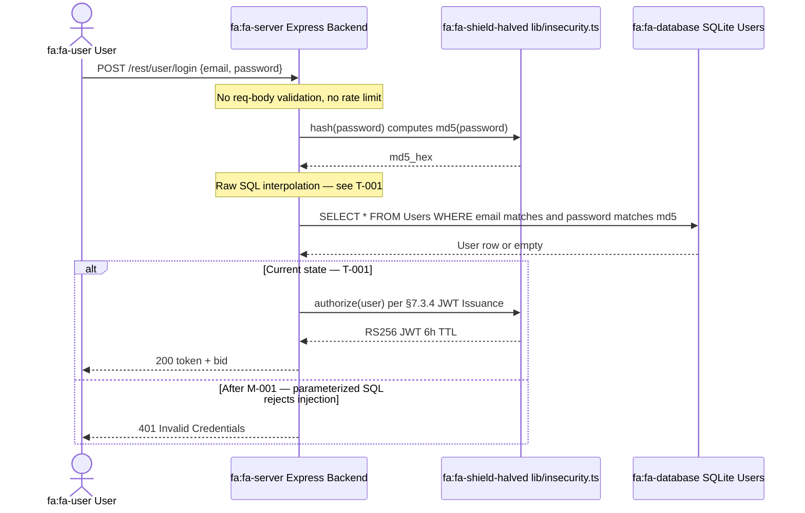

| Control | Implementation | Effectiveness | Finding |
|---|---|---|---|
| Input validation | None on email / password fields | ❌ Missing | [T-001](#t-001) — SQL injection bypass |
| SQL parameterization | Sequelize ORM bypassed; raw template literal | ❌ Missing | [T-001](#t-001) — SQL injection across multiple Express routes (login, product search) via unparameterized Sequelize queries — authentication bypass and data exfiltration |
| Password hashing | `crypto.createHash('md5')` unsalted | ❌ Missing | [T-003](#t-003) — MD5 broken<br/>[T-004](#t-004) — no salt |
| Rate limiting | None on `/rest/user/login` | ❌ Missing | [T-018](#t-018) — Lack of global rate limiting on authentication endpoints enables brute-force credential stuffing |
| Account lockout | None | ❌ Missing | [T-018](#t-018) — Lack of global rate limiting on authentication endpoints enables brute-force credential stuffing |

**Risk assessment:** Authentication can be bypassed entirely with a single SQLi payload (`' OR '1'='1--`) — no credentials are needed at all. Even when SQLi is patched, the MD5-without-salt store enables full password recovery from any database leak (a 1B-entry rainbow table covers the entire keyspace ≤8 chars in seconds). The absence of rate-limiting and lockout makes online credential stuffing equally viable. **Residual risk:** Critical — three independent attack paths to authenticated session, none requiring legitimate credentials.

**Findings in this flow:** [T-001](#t-001) — SQL injection login bypass<br/>[T-003](#t-003) — MD5 password hashing<br/>[T-004](#t-004) — Unsalted password hashes<br/>[T-018](#t-018) — Missing rate limit / lockout

#### 7.3.2 Google OAuth 2.0 Flow

The application uses `passport-google-oauth20` to support a "Sign in with Google" path. The OAuth client ID is configured in `config/default.yml`; the client secret is read from environment. On callback the server retrieves the user profile, looks up or creates a local user record by email, and then issues a local JWT via the same `authorize()` helper as password login.

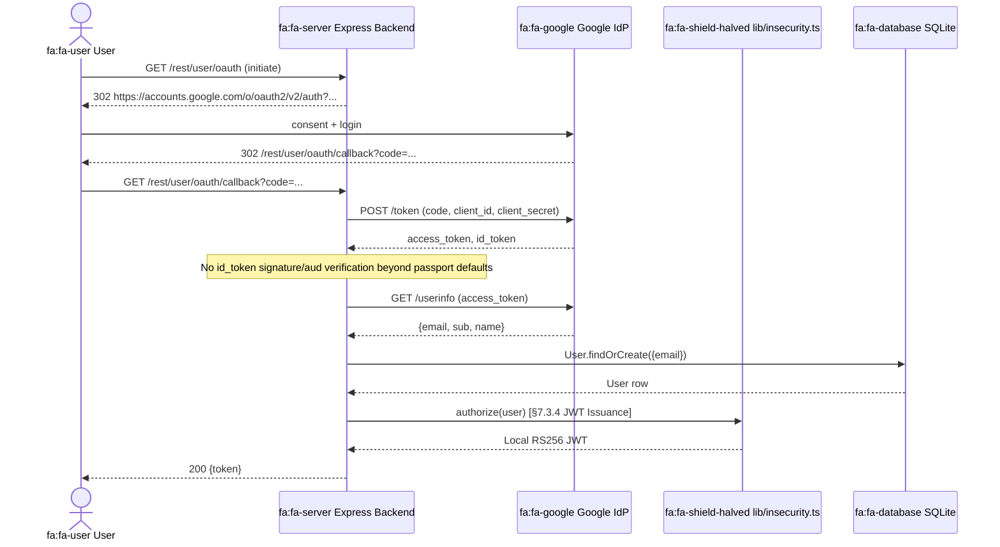

| Control | Implementation | Effectiveness | Finding |
|---|---|---|---|
| OAuth state / PKCE | passport defaults; PKCE not explicitly enforced | ⚠️ Partial | — |
| ID-token aud / iss check | passport-google default verifier | ⚠️ Partial | — |
| Email-trust policy | `email_verified` not consulted; first-seen email maps to local user | 🔶 Weak | — |
| Account-link confusion | Local user can be created with attacker-controlled Google email matching an existing local account | 🔶 Weak | — |
| Local JWT after OAuth | Same hardcoded RSA key (§7.3.4) — OAuth grants no key isolation | 🔶 Weak | [T-005](#t-005) — Hardcoded RSA private key in `lib/insecurity.ts` enables offline JWT forgery for any user |

**Risk assessment:** The OAuth handshake itself uses Google as a trusted IdP and benefits from Google's hardened authentication, but the local-side reconciliation is permissive: a Google-authenticated user with an email matching an existing local account is bound to that account without separate ownership proof. Combined with the Local JWT hardcoded-key issue, an attacker who controls any Google address that collides with a known customer email can take over the local account. **Residual risk:** High — depends on email-collision availability; OAuth itself is correctly delegated.

**Findings in this flow:** [T-005](#t-005) — Hardcoded RSA key (local JWT issuance after OAuth)

#### 7.3.3 TOTP / 2FA Flow

Time-based one-time passwords are generated using `otplib` (`routes/2fa.ts`) when the user enables 2FA from the profile page. The shared secret is stored on the User row (`totpSecret`); the `Sequelize` `attributes.exclude` blocklist removes it from API responses. Setup is gated by current-password verification; subsequent logins require a 6-digit token after the password has been verified.

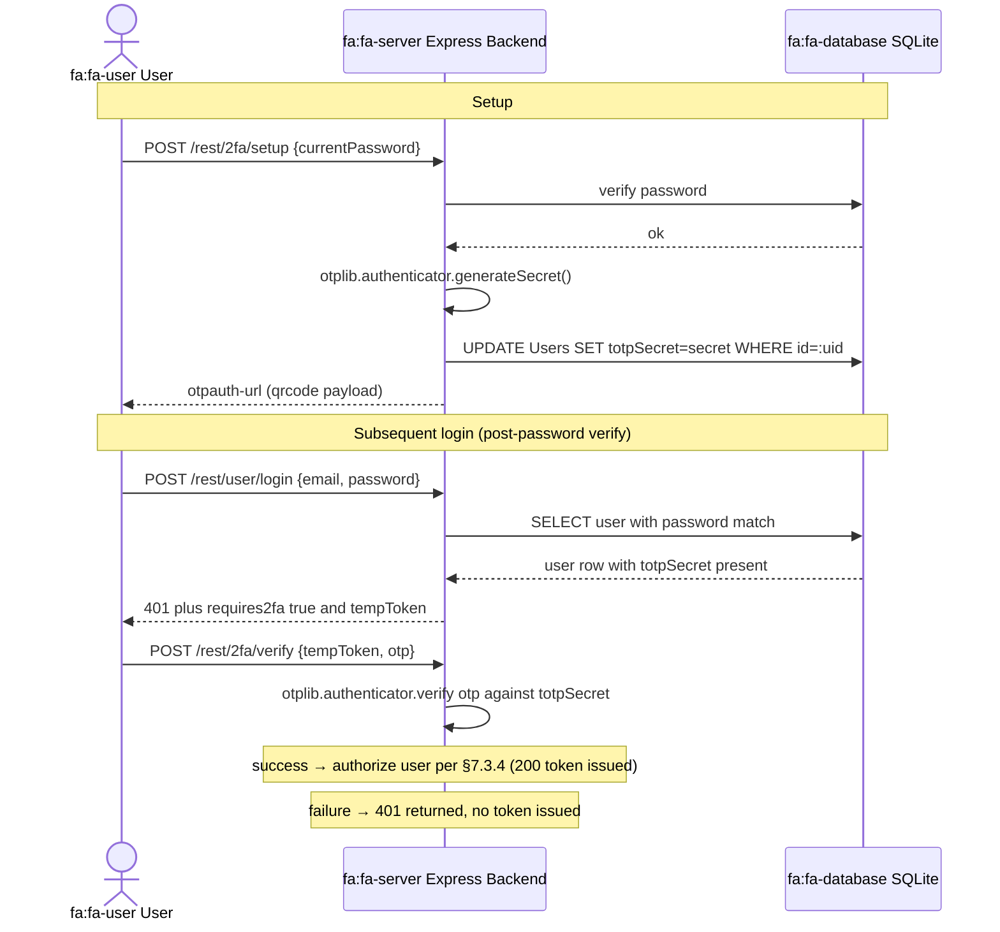

| Control | Implementation | Effectiveness | Finding |
|---|---|---|---|
| TOTP library | `otplib` — RFC 6238 compliant, 30s window, 6 digits | ✅ Adequate | — |
| Secret storage | `Users.totpSecret` excluded from API responses | ✅ Adequate | — |
| Setup gating | Current-password verification before enrollment | ✅ Adequate | — |
| Replay protection | otplib defaults; no explicit used-counter | ⚠️ Partial | — |
| Backup codes / recovery | Not implemented | 🔶 Weak | — |

**Risk assessment:** TOTP is the strongest authentication path in the application — `otplib` is a well-maintained library, the secret is stored server-side and excluded from API output, and setup requires a fresh password proof. The remaining gaps are operational (no backup codes, no explicit per-otp replay counter) rather than cryptographic. The protection collapses entirely once an attacker forges a JWT directly via §7.3.4 — which makes 2FA's strength immaterial to an admin-token-forgery threat model. **Residual risk:** Low (within the boundary of the OTP mechanism itself).

**Findings in this flow:** — none

#### 7.3.4 JWT Issuance & Signing Flow

After password or OAuth or 2FA verification succeeds, the server calls `lib/insecurity.ts:authorize(user)` which signs a payload `{data: user, status: "PRIVATE"}` with `RS256` using a hardcoded 1024-bit RSA private key embedded directly at `lib/insecurity.ts:25`. The token has a 6-hour TTL and is returned to the client for storage in `localStorage` (see §7.6).

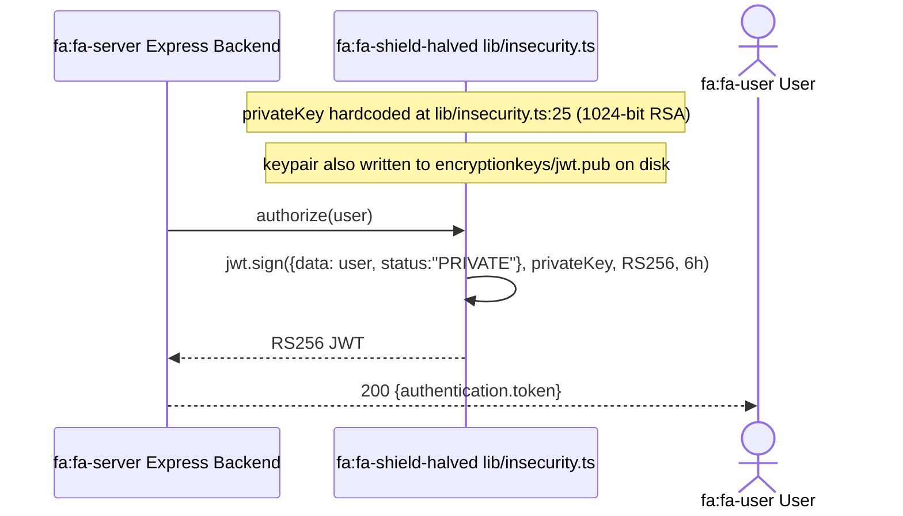

| Control | Implementation | Effectiveness | Finding |
|---|---|---|---|
| Private key storage | Hardcoded constant in `lib/insecurity.ts:25`, also at `encryptionkeys/jwt.pub` | ❌ Missing | [T-005](#t-005) — Hardcoded RSA private key in `lib/insecurity.ts` enables offline JWT forgery for any user |
| Algorithm pinning | `algorithm: 'RS256'` set on issuance — unambiguous | ✅ Adequate | — |
| Key rotation | Not implemented; same key since first commit | ❌ Missing | [T-005](#t-005) — Hardcoded RSA private key in `lib/insecurity.ts` enables offline JWT forgery for any user |
| Key length | 1024-bit RSA (below NIST 2048-bit recommendation) | 🔶 Weak | — |
| Token expiry | 6h TTL via `expiresIn` claim | ⚠️ Partial | — |

**Risk assessment:** The RS256 algorithm choice is technically correct but provides zero security advantage here — the private key is in the same public repository as the public key, so any attacker can extract it and forge tokens for any user (including admin) without touching the server. The 1024-bit key length is independently insufficient. Token TTL is the only remaining boundary, but a forged token is valid for a fresh 6h on every issuance. **Residual risk:** Critical — single offline operation (clone the repo, run `jwt.sign`) yields admin access without any server interaction.

**Findings in this flow:** [T-005](#t-005) — Hardcoded RSA private key enables offline JWT forgery

#### 7.3.5 JWT Validation Flow

Incoming `Authorization: Bearer <jwt>` headers are validated by `expressJwt({ secret: publicKey })` middleware on the protected routes. The library version pinned in `package.json` is `express-jwt@0.1.3` (2014) which predates the alg-confusion mitigations introduced in 5.x — a token with `header.alg = "none"` is decoded without signature verification and the resulting payload is treated as authentic by the route handlers.

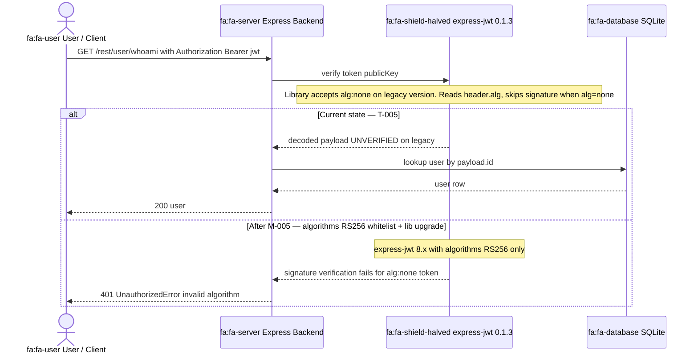

| Control | Implementation | Effectiveness | Finding |
|---|---|---|---|
| Library version | `express-jwt@0.1.3` (2014) — pre-alg-confusion fix | 🔶 Weak | [T-005](#t-005) — Hardcoded RSA private key in `lib/insecurity.ts` enables offline JWT forgery for any user |
| Algorithm allowlist | Not configured (no `algorithms: ['RS256']` option) | ❌ Missing | [T-005](#t-005) — Hardcoded RSA private key in `lib/insecurity.ts` enables offline JWT forgery for any user |
| Signature verification | Skipped when `alg=none` on legacy version | ❌ Missing | [T-005](#t-005) — Hardcoded RSA private key in `lib/insecurity.ts` enables offline JWT forgery for any user |
| Token expiry check | Standard `exp` claim check (passes when present) | ✅ Adequate | — |
| Issuer / audience pinning | Not configured | 🔶 Weak | — |

**Risk assessment:** The alg:none acceptance is a 12-year-old library defect that has been fixed upstream — the entire validation gate can be bypassed without holding any signing material at all (just craft a JWT with `alg:none`). Combined with the §7.3.4 hardcoded-key issue, the application has two independent paths to forged authentication, neither of which requires a credential leak. **Residual risk:** Critical — upgrade to `express-jwt@8.x` and pin `algorithms: ['RS256']` is a single-line remediation but has not been applied.

**Findings in this flow:** [T-005](#t-005) — JWT validation gate accepts forged or alg:none tokens

#### 7.3.6 Session Management Flow

Issued JWTs are tracked client-side (the client stores the token in `localStorage`) and server-side in an in-memory `tokenMap` keyed by user ID. On `POST /rest/user/logout`, the server removes the entry from `tokenMap` but the JWT itself remains cryptographically valid until its 6-hour `exp` claim expires — there is no token-revocation list (deny-list) consulted during validation, so a previously-stolen token survives explicit logout.

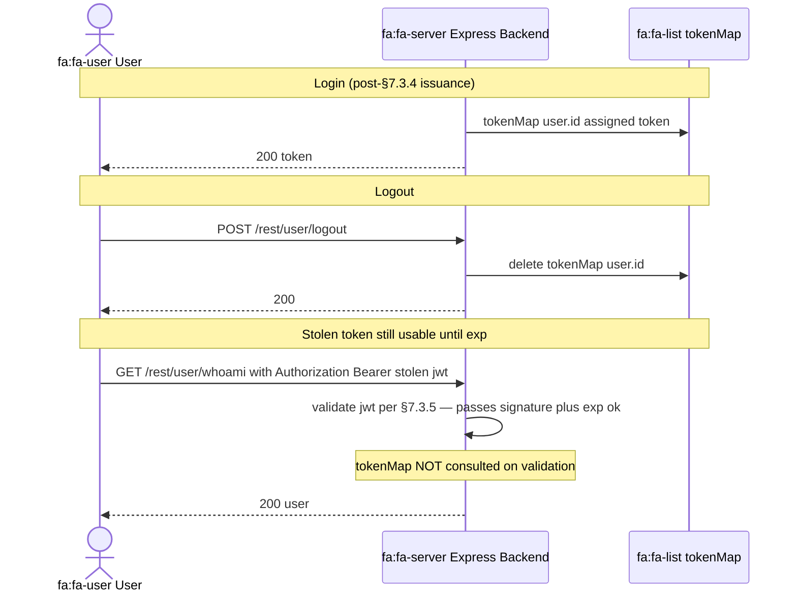

| Control | Implementation | Effectiveness | Finding |
|---|---|---|---|
| Server-side session record | In-memory `tokenMap` (lib/`insecurity.ts`) | 🔶 Weak | — |
| Logout invalidation | Map deletion only; not consulted during validation | ❌ Missing | [T-004](#t-004) — MD5 password hashing in `lib/insecurity.ts` enables trivial offline password cracking after SQL injection |
| Revocation list | None (no deny-list, no rotation token) | ❌ Missing | — |
| Process-restart durability | tokenMap is in-process; restart loses all sessions | 🔶 Weak | — |
| Concurrent-login policy | Multiple tokens per user allowed without limit | 🔶 Weak | — |

**Risk assessment:** Session lifecycle is decoupled from token validity — the server "logs the user out" but the issued JWT remains acceptable until its `exp` window ends. An XSS or `localStorage`-exfiltration attacker (see §7.6 / §7.7) can replay a stolen token long after the victim has logged out. Server restart loses all session metadata but preserves token validity, which means even basic operational events do not revoke compromised tokens. **Residual risk:** High — direct enabler of token-theft persistence; remediation is to consult a Redis-backed deny-list or shorten the TTL to <5 min and rotate.

**Findings in this flow:** [T-004](#t-004) — In-memory session map with no token revocation

---

### 7.4 Authorization

Route-level authorization uses `security.isAuthorized()` (express-jwt middleware) and `security.isAccounting()` (role check) applied selectively in `server.ts`. Several routes have authorization explicitly disabled or commented out as challenge features. The core authorization flaw is that role claims live in the JWT payload, which any attacker can forge using the publicly committed private key — meaning role-based access control is effectively client-controlled.

| Domain | Control | Implementation | Effectiveness | Linked Threats |
|--------|---------|----------------|---------------|----------------|
| Authz | Route guards | `security.isAuthorized()` via express-jwt — `server.ts` | ⚠️ Partial | [T-020](#t-020) — Commented-out admin authorization on `PUT /api/Products/:id` allows any authenticated user to modify products |
| Authz | Role-based access | `security.isAccounting()` role check | ⚠️ Partial | [T-019](#t-019) — Client-side-only route guards in `app.guard.ts` can be bypassed by direct API calls — no server-side enforcement |
| Authz | Resource ownership | No basket/card ownership verification | ❌ Missing | [T-021](#t-021) — IDOR in `routes/basket.ts` — basket retrieved by arbitrary ID with no ownership verification |
| Authz | Admin endpoint protection | PUT /api/Products/:id auth commented out | ❌ Missing | [T-020](#t-020) — Commented-out admin authorization on `PUT /api/Products/:id` allows any authenticated user to modify products |
| Authz | CSRF protection | Not implemented | ❌ Missing | — |

---

### 7.5 Input Validation & Output Encoding

Input validation is absent for the most critical endpoints. The two most exploited routes (login and search) use raw string interpolation directly into SQL queries — the Sequelize ORM's parameterization capability is explicitly bypassed by calling `sequelize.query()` with template literals instead of the ORM's model methods. The Angular frontend deliberately disables its built-in XSS protection via `bypassSecurityTrustHtml()` in four separate components.

**[CWE-89](https://cwe.mitre.org/data/definitions/89.html) (SQL Injection):** Both `routes/login.ts:36` and `routes/search.ts` construct SQL queries by interpolating `req.body.email` and `req.query.q` directly into template literals. The Sequelize ORM is imported and used for every other operation in the application, making the raw injection in these two files unmistakably intentional. The login injection enables authentication bypass (single quote terminates the WHERE clause), while the search injection enables UNION-based extraction of arbitrary table data. Mitigation requires replacing `sequelize.query(\`SELECT ... ${`req.body`.email}\`)` with Sequelize model methods (`User.findOne({ where: { email } })`) or parameterized binds. See [M-001](#m-001) — Replace raw SQL interpolation with parameterized queries in login and search routes.

**[CWE-79](https://cwe.mitre.org/data/definitions/79.html) (Cross-Site Scripting):** Angular's `DomSanitizer` service is imported in `about.component.ts`, `last-login-ip.component.ts`, `track-result.component.ts`, and `score-board.component.ts`, but the `.bypassSecurityTrustHtml()` method is called on all user-controlled inputs before binding them to `[innerHTML]`. This is the canonical Angular XSS pattern — importing the sanitizer and then explicitly bypassing it — which signals intentional vulnerability insertion. The absence of a Content Security Policy means any XSS execution can load arbitrary external scripts, exfiltrate `localStorage` contents (including JWT tokens), or establish connections to attacker-controlled servers. See [T-007](#t-007) — Stored XSS via `bypassSecurityTrustHtml()` in `about.component.ts:119` renders unsanitized feedback comments, [T-008](#t-008) — Reflected XSS via `[innerHTML]` binding of unescaped search term in `search-result.component.html:13`, [T-011](#t-011) — Missing Content Security Policy allows any XSS payload to load external scripts and exfiltrate data, [M-007](#m-007) — Remove `bypassSecurityTrustHtml()` and restore Angular default sanitization, [M-008](#m-008) — Enable CSP headers and audit all `[innerHTML]` bindings for XSS prevention.

**[CWE-611](https://cwe.mitre.org/data/definitions/611.html) (XXE):** The file upload route at `routes/fileUpload.ts` uses `libxmljs2` with `{ noent: true }` — the configuration flag that enables external entity resolution. An attacker can upload an XML file containing `<!ENTITY xxe SYSTEM "file:///etc/passwd">` and retrieve the file content in the parse error or response. See [M-009](#m-009) — Validate `req.body.id` in `updateProductReviews.ts` to prevent NoSQL injection.

**[CWE-943](https://cwe.mitre.org/data/definitions/943.html) (NoSQL Injection):** The review update route at `routes/updateProductReviews.ts` passes `req.body.id` directly to the MarsDB update selector without type checking. The `{ multi: true }` flag amplifies impact — an operator injection payload like `{ "$gt": "" }` matches all documents and updates them all simultaneously. See [T-009](#t-009) — NoSQL injection in `routes/updateProductReviews.ts` via unsanitized `req.body.id` in MarsDB update selector.

| Domain | Control | Implementation | Effectiveness | Linked Threats |
|--------|---------|----------------|---------------|----------------|
| Input | SQL parameterization | NOT used in `login.ts` + `search.ts`; Sequelize ORM bypassed | ❌ Missing | [T-001](#t-001) — SQL injection across multiple Express routes (login, product search) via unparameterized Sequelize queries — authentication bypass and data exfiltration |
| Input | NoSQL input sanitization | NOT validated — _id field passed directly to MarsDB | ❌ Missing | [T-009](#t-009) — NoSQL injection in `routes/updateProductReviews.ts` via unsanitized `req.body.id` in MarsDB update selector |
| Input | XML parsing security | `noent: true` in libxmljs2 — external entities enabled | ❌ Missing | — |
| Input | File type validation | Extension-based only (bypassable with null byte) | 🔶 Weak | — |
| Input | URL validation | NOT validated in profileImageUrlUpload | ❌ Missing | — |
| Output | HTML encoding (Angular) | `bypassSecurityTrustHtml()` — 4+ locations | ❌ Missing | [T-007](#t-007) — Stored XSS via `bypassSecurityTrustHtml()` in `about.component.ts:119` renders unsanitized feedback comments<br/>[T-008](#t-008) — Reflected XSS via `[innerHTML]` binding of unescaped search term in `search-result.component.html:13` |
| Output | CSP header | Not configured (helmet.contentSecurityPolicy not used) | ❌ Missing | [T-011](#t-011) — Missing Content Security Policy allows any XSS payload to load external scripts and exfiltrate data |
| Output | XSS filter header | Explicitly disabled: `// app.use(helmet.xssFilter())` — `server.ts`:187 | ❌ Missing | [T-011](#t-011) — Missing Content Security Policy allows any XSS payload to load external scripts and exfiltrate data |
| Input | sanitize-html | v1.4.2 (2016) used in some paths but bypassed in Angular | 🔶 Weak | [T-007](#t-007) — Stored XSS via `bypassSecurityTrustHtml()` in `about.component.ts:119` renders unsanitized feedback comments |

---

### 7.6 Data Protection & Session Management

Password data is protected only by MD5 hashing — a cryptographically broken algorithm with no salt, enabling rainbow table attacks. Session tokens (JWTs) are stored in `localStorage` and are therefore accessible to any JavaScript executing on the page, which directly enables session token theft via the XSS vulnerabilities in §7.5.

| Domain | Control | Implementation | Effectiveness | Linked Threats |
|--------|---------|----------------|---------------|----------------|
| Data | Password hashing | MD5 — lib/`insecurity.ts`:44 | ❌ Missing | [T-003](#t-003) — MD5 without salt for password storage in `lib/insecurity.ts` makes all user passwords trivially crackable<br/>[T-004](#t-004) — MD5 password hashing in `lib/insecurity.ts` enables trivial offline password cracking after SQL injection |
| Data | Token storage | `localStorage.setItem('token', ...)` — login.`component.ts`:101 | ❌ Missing | [T-012](#t-012) — JWT session token stored in `localStorage` is accessible to any JavaScript — XSS leads to full session hijack |
| Data | Token expiry | 6h TTL — `expiresIn: '6h'` in `jwt.sign` | ⚠️ Partial | — |
| Data | Token revocation | In-memory tokenMap only; no server-side invalidation on logout | ❌ Missing | [T-004](#t-004) — MD5 password hashing in `lib/insecurity.ts` enables trivial offline password cracking after SQL injection |
| Data | Sensitive field protection | Password+totpSecret excluded from API responses via Sequelize `exclude` | ✅ Adequate | — |
| Data | Transport encryption | HTTP only (no TLS in-app); TLS expected at infrastructure layer | ⚠️ Partial | — |
| Data | Database encryption | SQLite file not encrypted at rest | ❌ Missing | [T-013](#t-013) — SQLite database file stored locally without encryption — physical or container access yields all user data |

---

### 7.7 Frontend Security

The Angular 20 frontend includes multiple deliberate bypasses of Angular's built-in XSS protection, rendering the framework's security model ineffective for the affected components. The combination of `bypassSecurityTrustHtml()` in four components, absent CSP, wildcard CORS, and JWT stored in `localStorage` creates a complete chain from stored XSS to full account takeover for any visitor who loads a page containing injected content.

| Domain | Control | Implementation | Effectiveness | Linked Threats |
|--------|---------|----------------|---------------|----------------|
| Frontend | Angular XSS protection | Bypassed via `bypassSecurityTrustHtml()` in 4+ components | ❌ Missing | [T-007](#t-007) — Stored XSS via `bypassSecurityTrustHtml()` in `about.component.ts:119` renders unsanitized feedback comments<br/>[T-008](#t-008) — Reflected XSS via `[innerHTML]` binding of unescaped search term in `search-result.component.html:13` |
| Frontend | CSP | Not configured | ❌ Missing | [T-011](#t-011) — Missing Content Security Policy allows any XSS payload to load external scripts and exfiltrate data |
| Frontend | CORS | Wildcard `cors()` — all origins allowed | ❌ Missing | [T-015](#t-015) — Wildcard CORS at `server.ts:181-182` allows any origin to read authenticated API responses cross-domain |
| Frontend | Frame protection | `helmet.frameguard()` configured | ✅ Adequate | — |
| Frontend | Content type sniffing | `helmet.noSniff()` configured | ✅ Adequate | — |
| Frontend | HSTS | Not configured | ❌ Missing | — |
| Frontend | Subresource Integrity | npm dependencies served locally (no CDN SRI needed) | ✅ Adequate | — |

---

### 7.8 Real-time / WebSocket

Socket.IO 3.x is used for real-time challenge notifications. No authentication is enforced on WebSocket connections, meaning any browser tab can subscribe to challenge completion events for any other user.

| Domain | Control | Implementation | Effectiveness | Linked Threats |
|--------|---------|----------------|---------------|----------------|
| WebSocket | Socket.IO authentication | Not enforced on connection | 🔶 Weak | — |
| WebSocket | Socket.IO authorization | No channel-level ACL | 🔶 Weak | — |
| WebSocket | Socket.IO input validation | Event data not validated | 🔶 Weak | — |

---

### 7.9 AI / LLM

Not applicable — no AI/LLM subsystem present. The chatbot uses a static training data JSON file (`data/chatbot/botDefaultTrainingData.json`) loaded at startup without dynamic LLM calls.

No findings in this domain.

---

### 7.10 Audit & Logging

Access logging is implemented via Morgan, writing to rotating log files in the `logs/` directory. However, the log directory is served publicly without authentication at `server.ts:281`, exposing request data including Bearer tokens to any unauthenticated HTTP client. A passive attacker can periodically download these logs and harvest live session tokens from any user who has authenticated within the last 6 hours, then replay those tokens for account takeover. The Winston logger captures application events but no structured audit log for authentication or authorization decisions exists.

| Domain | Control | Implementation | Effectiveness | Linked Threats |
|--------|---------|----------------|---------------|----------------|
| Logging | HTTP access logs | Morgan `combined` format → logs/`access.log` | ⚠️ Partial | [T-010](#t-010) — Bearer tokens logged in plaintext to `/support/logs` accessible without authentication |
| Logging | Log access control | None — `/support/logs` served publicly via serveIndex | ❌ Missing | [T-010](#t-010) — Bearer tokens logged in plaintext to `/support/logs` accessible without authentication |
| Logging | Security event logging | Winston logger for application events | ⚠️ Partial | — |
| Logging | Log rotation | file-stream-rotator with 2-day retention | ✅ Adequate | — |
| Logging | Audit trail | No structured audit log for authentication/authorization events | ❌ Missing | [T-002](#t-002) — No structured audit trail for security-sensitive operations across frontend and data layer — login, admin actions, and data mutations are unlogged |

---

### 7.11 Container & Runtime Security

The Docker deployment uses a distroless `Node.js` 24 base image with a non-root user — strong container hardening choices that limit what an attacker can do after achieving code execution. However, the application itself serves sensitive directories (`/ftp/`, `/encryptionkeys/`, `/support/logs/`) without authentication, undermining the container isolation. The `vm.runInContext` sandbox used by the B2B API (`routes/b2bOrder.ts`) is well-known to be escapable in `Node.js` — it provides no meaningful security boundary.

| Domain | Control | Implementation | Effectiveness | Linked Threats |
|--------|---------|----------------|---------------|----------------|
| Container | Base image | gcr.io/distroless/nodejs24-debian13 | ✅ Adequate | — |
| Container | Non-root user | UID 65532 in Dockerfile | ✅ Adequate | — |
| Container | Network exposure | Single port 3000 HTTP | ⚠️ Partial | — |
| Runtime | Trust proxy | `app.enable('trust proxy')` — X-Forwarded-For trusted without validation | 🔶 Weak | [T-018](#t-018) — Lack of global rate limiting on authentication endpoints enables brute-force credential stuffing |
| Runtime | Sensitive dir auth | `/ftp/`, `/encryptionkeys/`, `/support/logs/` — no auth | ❌ Missing | [T-016](#t-016) — Directory listing enabled for `/ftp`, `/encryptionkeys`, and `/support/logs` exposes sensitive files |
| Runtime | Rate limiting | Only on reset-password + 2FA (100/5min); login unprotected | 🔶 Weak | [T-018](#t-018) — Lack of global rate limiting on authentication endpoints enables brute-force credential stuffing |
| Runtime | VM sandbox | `vm.runInContext` + `notevil` — known escapable | 🔶 Weak | — |

**In-process trust boundaries:**

- **TB-1: Anonymous / Authenticated Zone** — `security.isAuthorized()` middleware; breachable via SQL injection login bypass ([T-001](#t-001) — SQL injection across multiple Express routes (login, product search) via unparameterized Sequelize queries — authentication bypass and data exfiltration) and JWT forgery with hardcoded key ([T-005](#t-005) — Hardcoded RSA private key in `lib/insecurity.ts` enables offline JWT forgery for any user)
- **TB-2: Authenticated / Admin Zone** — Role claim in JWT payload; forgeable since private key is public
- **TB-3: App / VM Sandbox** — `vm.runInContext` + `notevil`; not a true security boundary (`Node.js` VMs are not sandboxes)
- **TB-4: App / Data Layer** — Sequelize ORM; bypassed in `login.ts` and `search.ts` with raw string interpolation
- **TB-5: App / Filesystem** — OS file permissions only; writes to publicly-served directories possible via zip-slip and SSRF
- **TB-6: App / External Services** — No egress filtering; SSRF via profile image URL fetch to any internet host

---

### 7.12 Dependency & Supply Chain

| Domain | Control | Implementation | Effectiveness | Linked Threats |
|--------|---------|----------------|---------------|----------------|
| Supply Chain | jsonwebtoken version | 0.4.0 (2013) — CVE-2015-9235 (alg:none) | ❌ Missing | [T-004](#t-004) — MD5 password hashing in `lib/insecurity.ts` enables trivial offline password cracking after SQL injection |
| Supply Chain | express-jwt version | 0.1.3 (2014) — multiple auth bypass CVEs | ❌ Missing | [T-004](#t-004) — MD5 password hashing in `lib/insecurity.ts` enables trivial offline password cracking after SQL injection |
| Supply Chain | sanitize-html version | 1.4.2 (2016) — XSS bypass potential | 🔶 Weak | [T-007](#t-007) — Stored XSS via `bypassSecurityTrustHtml()` in `about.component.ts:119` renders unsanitized feedback comments |
| Supply Chain | unzipper version | 0.9.15 — zip-slip potential | 🔶 Weak | — |
| Supply Chain | npm lock file | package-`lock.json` present | ✅ Adequate | — |
| Supply Chain | SBOM | CycloneDX SBOM generated in Dockerfile | ✅ Adequate | — |
| Supply Chain | CodeQL | GitHub Actions CodeQL workflow present | ✅ Adequate | — |
| Supply Chain | Dependency updates | No Dependabot/Renovate automation found | ❌ Missing | — |

---

### 7.13 Secret Management (cross-cutting)

Secret management is completely absent. All cryptographic material and credentials are hardcoded directly in source code and committed to the public repository.

**Secret-handling map:** All secrets are loaded at application startup from the filesystem (`config/*.yml`, `lib/insecurity.ts`, `server.ts`). No runtime secret injection or secrets manager integration exists. The RSA private key is embedded as a multi-line string literal in `lib/insecurity.ts:25-52` — rotating it requires a source code commit and full redeployment, and the old key remains permanently accessible in git history. The HMAC key `pa4qacea4VK9t9nGv7yZtwmj` at `lib/insecurity.ts:44` controls coupon validation and security-question HMAC — an attacker with repository access can generate valid coupons and produce correct security answers without any server interaction. The cookie signing secret `kekse` at `server.ts:289` enables cookie forgery for any user's signed session cookie. The default admin credentials `admin@juice-sh.op:admin123` are committed in `data/static/users.yml` in plaintext.

**Blast radius of disclosure:** Because all secrets are committed to a public repository, the blast radius is total and permanent. All JWTs ever issued are forgeable. All coupons are generatable. All cookie signatures are fakeable. All user accounts are accessible via credential stuffing with the default `admin123` password. No rotation is possible without a full code change, and even after rotation, the previous values remain accessible via `git log`.

| Domain | Control | Implementation | Effectiveness | Linked Threats |
|--------|---------|----------------|---------------|----------------|
| Secrets | JWT private key storage | Hardcoded in lib/`insecurity.ts`:25 — 1024-bit RSA private key | ❌ Missing | [T-005](#t-005) — Hardcoded RSA private key in `lib/insecurity.ts` enables offline JWT forgery for any user |
| Secrets | HMAC key | Hardcoded in lib/`insecurity.ts`:44 — 'pa4qacea4VK9t9nGv7yZtwmj' | ❌ Missing | [T-017](#t-017) — Multiple hardcoded secrets in `server.ts` and `lib/insecurity.ts` enable cookie forgery and HMAC bypass |
| Secrets | Cookie signing secret | Hardcoded in `server.ts`:289 — 'kekse' | ❌ Missing | [T-017](#t-017) — Multiple hardcoded secrets in `server.ts` and `lib/insecurity.ts` enable cookie forgery and HMAC bypass |
| Secrets | Default credentials | Committed in data/static/`users.yml` — admin:admin123 | ❌ Missing | [T-017](#t-017) — Multiple hardcoded secrets in `server.ts` and `lib/insecurity.ts` enable cookie forgery and HMAC bypass |
| Secrets | CTF key | Committed as `ctf.key` in repo root | ❌ Missing | [T-017](#t-017) — Multiple hardcoded secrets in `server.ts` and `lib/insecurity.ts` enable cookie forgery and HMAC bypass |
| Secrets | Google OAuth client ID | Committed in config/`default.yml` | ❌ Missing | [T-017](#t-017) — Multiple hardcoded secrets in `server.ts` and `lib/insecurity.ts` enable cookie forgery and HMAC bypass |
| Secrets | Environment-based config | Not used — config loaded from YAML files only, no `process.env` | ❌ Missing | — |
| Secrets | Secrets rotation capability | Not possible without code change (keys are in source) | ❌ Missing | — |

---

### 7.14 Defense-in-Depth Assessment (cross-cutting)

| Layer | Control | Status | Notes |
|-------|---------|--------|-------|
| Edge | Rate limiting | 🔶 Weak | Only reset-password + 2FA; login and search unprotected |
| Authentication | JWT RS256 | ❌ Compromised | Private key committed to public repo |
| Authorization | Route guards | ⚠️ Partial | Multiple documented bypasses |
| Input validation | SQL/NoSQL/XML | ❌ Missing | Raw injection in critical routes |
| Output encoding | CSP/XSS | ❌ Missing | Explicitly disabled; Angular bypassed |
| Data protection | Password hashing | ❌ Missing | MD5 used |
| Secrets | Key management | ❌ Missing | All secrets hardcoded |
| Observability | Audit logging | ⚠️ Partial | Logs present but publicly accessible |
| Container | Image hardening | ✅ Adequate | Distroless + non-root |

**Overall defense-in-depth verdict:** Single-layer application with no defense beyond the application code itself. The absence of parameterized queries, proper secret management, CSP, and access controls on sensitive directories means any single successful attack reaches all application data. The only compensating control — container hardening — limits post-exploitation persistence but does nothing to prevent the initial compromise. This is by design for a training platform and every finding documented in §8 is a deliberate pedagogical feature representing a real attack pattern.

<!-- enriched:thorough -->

---

## 8. Threat Register

All findings sorted by criticality. The **Threat Category** column maps each finding to its architectural threat class (TH-NN) from the OWASP / CWE taxonomy.

**Risk Distribution:** 🔴 Critical: 5 · 🟠 High: 15 · 🟡 Medium: 1 · 🟢 Low: 1 · **Total findings: 22**
**STRIDE Coverage:** Spoofing: 3 · Tampering: 5 · Repudiation: 2 · Information Disclosure: 7 · Denial of Service: 2 · Elevation of Privilege: 3

| ID | Finding | Threat Category | Component | Criticality | CVSS | Vektor | Mitigation | References |
|----|---------|-----------------|-----------|-------------|------|--------|------------|------------|
| <a id="t-001"></a>T-001 | SQL injection across multiple Express routes (login, product search) via unparameterized Sequelize queries — authentication bypass and data exfiltration | <a id="th-01"></a>TH-01 — Injection | [C-01](#c-01) — Express Backend | 🔴 Critical | 9.3 | [Internet User](#vektor-internet-user) | [M-001](#m-001) | [CWE-89](https://cwe.mitre.org/data/definitions/89.html) · [A03:2021](https://owasp.org/Top10/A03_2021/) |
| <a id="t-003"></a>T-003 | MD5 without salt for password storage in `lib/insecurity.ts` makes all user passwords trivially crackable | <a id="th-03"></a>TH-03 — Cryptographic Failures | [C-03](#c-03) — Data Layer | 🔴 Critical | — | [Internet User](#vektor-internet-user) | [M-003](#m-003) | [CWE-916](https://cwe.mitre.org/data/definitions/916.html) · [A02:2021](https://owasp.org/Top10/A02_2021/) |
| <a id="t-004"></a>T-004 | MD5 password hashing in `lib/insecurity.ts` enables trivial offline password cracking after SQL injection | <a id="th-01"></a>TH-01 — Injection | [C-01](#c-01) — Express Backend | 🔴 Critical | — | [Internet User](#vektor-internet-user) | [M-004](#m-004) | [CWE-287](https://cwe.mitre.org/data/definitions/287.html) · [A03:2021](https://owasp.org/Top10/A03_2021/) |
| <a id="t-005"></a>T-005 | Hardcoded RSA private key in `lib/insecurity.ts` enables offline JWT forgery for any user | <a id="th-03"></a>TH-03 — Cryptographic Failures | [C-01](#c-01) — Express Backend | 🔴 Critical | — | [Internet User](#vektor-internet-user) | [M-005](#m-005) | [CWE-321](https://cwe.mitre.org/data/definitions/321.html) · [A02:2021](https://owasp.org/Top10/A02_2021/) |
| <a id="t-006"></a>T-006 | Server-Side Template Injection via `eval()` in `routes/userProfile.ts:62` enables authenticated RCE | <a id="th-01"></a>TH-01 — Injection | [C-01](#c-01) — Express Backend | 🔴 Critical | 9.4 | [Internet User](#vektor-internet-user) | [M-006](#m-006) | [CWE-94](https://cwe.mitre.org/data/definitions/94.html) · [A03:2021](https://owasp.org/Top10/A03_2021/) |
| <a id="t-007"></a>T-007 | Stored XSS via `bypassSecurityTrustHtml()` in `about.component.ts:119` renders unsanitized feedback comments | <a id="th-11"></a>TH-11 — Cross-Site Scripting (XSS) | [C-02](#c-02) — Angular SPA | 🟠 High | 5.3 | [Internet User](#vektor-internet-user) | [M-007](#m-007) | [CWE-79](https://cwe.mitre.org/data/definitions/79.html) · [A03:2021](https://owasp.org/Top10/A03_2021/) |
| <a id="t-008"></a>T-008 | Reflected XSS via `[innerHTML]` binding of unescaped search term in `search-result.component.html:13` | <a id="th-11"></a>TH-11 — Cross-Site Scripting (XSS) | [C-02](#c-02) — Angular SPA | 🟠 High | — | [Internet User](#vektor-internet-user) | [M-008](#m-008) | [CWE-79](https://cwe.mitre.org/data/definitions/79.html) · [A03:2021](https://owasp.org/Top10/A03_2021/) |
| <a id="t-009"></a>T-009 | NoSQL injection in `routes/updateProductReviews.ts` via unsanitized `req.body.id` in MarsDB update selector | <a id="th-01"></a>TH-01 — Injection | [C-03](#c-03) — Data Layer | 🟠 High | — | [Internet User](#vektor-internet-user) | [M-009](#m-009) | [CWE-943](https://cwe.mitre.org/data/definitions/943.html) · [A03:2021](https://owasp.org/Top10/A03_2021/) |
| <a id="t-010"></a>T-010 | Bearer tokens logged in plaintext to `/support/logs` accessible without authentication | <a id="th-09"></a>TH-09 — Unauthenticated Management Plane | [C-01](#c-01) — Express Backend | 🟠 High | — | [Internet User](#vektor-internet-user) | [M-010](#m-010) | [CWE-532](https://cwe.mitre.org/data/definitions/532.html) · [A01:2021](https://owasp.org/Top10/A01_2021/) |
| <a id="t-011"></a>T-011 | Missing Content Security Policy allows any XSS payload to load external scripts and exfiltrate data | <a id="th-11"></a>TH-11 — Cross-Site Scripting (XSS) | [C-02](#c-02) — Angular SPA | 🟠 High | — | [Internet User](#vektor-internet-user) | [M-011](#m-011) | [CWE-200](https://cwe.mitre.org/data/definitions/200.html) · [A03:2021](https://owasp.org/Top10/A03_2021/) |
| <a id="t-012"></a>T-012 | JWT session token stored in `localStorage` is accessible to any JavaScript — XSS leads to full session hijack | <a id="th-04"></a>TH-04 — Insecure Client-Side Storage | [C-02](#c-02) — Angular SPA | 🟠 High | — | [Internet User](#vektor-internet-user) | [M-012](#m-012) | [CWE-312](https://cwe.mitre.org/data/definitions/312.html) · [A02:2021](https://owasp.org/Top10/A02_2021/) |
| <a id="t-013"></a>T-013 | SQLite database file stored locally without encryption — physical or container access yields all user data | <a id="th-02"></a>TH-02 — Broken Authentication | [C-03](#c-03) — Data Layer | 🟠 High *(raw Critical)* | — | [Internet User](#vektor-internet-user) | [M-013](#m-013) | [CWE-312](https://cwe.mitre.org/data/definitions/312.html) · [A07:2021](https://owasp.org/Top10/A07_2021/) |
| <a id="t-014"></a>T-014 | Payment card numbers, CVV, and expiry stored in plaintext `CardModel` without field-level encryption | <a id="th-01"></a>TH-01 — Injection | [C-03](#c-03) — Data Layer | 🟠 High | — | [Internet User](#vektor-internet-user) | [M-014](#m-014) | [CWE-359](https://cwe.mitre.org/data/definitions/359.html) · [A03:2021](https://owasp.org/Top10/A03_2021/) |
| <a id="t-015"></a>T-015 | Wildcard CORS at `server.ts:181-182` allows any origin to read authenticated API responses cross-domain | <a id="th-09"></a>TH-09 — Unauthenticated Management Plane | [C-01](#c-01) — Express Backend | 🟠 High | — | [Internet User](#vektor-internet-user) | [M-015](#m-015) | [CWE-359](https://cwe.mitre.org/data/definitions/359.html) · [A01:2021](https://owasp.org/Top10/A01_2021/) |
| <a id="t-016"></a>T-016 | Directory listing enabled for `/ftp`, `/encryptionkeys`, and `/support/logs` exposes sensitive files | <a id="th-09"></a>TH-09 — Unauthenticated Management Plane | [C-01](#c-01) — Express Backend | 🟠 High | — | [Internet User](#vektor-internet-user) | [M-016](#m-016) | [CWE-548](https://cwe.mitre.org/data/definitions/548.html) · [A01:2021](https://owasp.org/Top10/A01_2021/) |
| <a id="t-017"></a>T-017 | Multiple hardcoded secrets in `server.ts` and `lib/insecurity.ts` enable cookie forgery and HMAC bypass | <a id="th-17"></a>TH-17 — Error Information Disclosure | [C-01](#c-01) — Express Backend | 🟠 High | — | [Internet User](#vektor-internet-user) | [M-017](#m-017) | [CWE-798](https://cwe.mitre.org/data/definitions/798.html) · [A05:2021](https://owasp.org/Top10/A05_2021/) |
| <a id="t-018"></a>T-018 | Lack of global rate limiting on authentication endpoints enables brute-force credential stuffing | <a id="th-12"></a>TH-12 — Denial of Service | [C-01](#c-01) — Express Backend | 🟠 High | — | [Internet User](#vektor-internet-user) | [M-018](#m-018) | [CWE-400](https://cwe.mitre.org/data/definitions/400.html) · [A04:2021](https://owasp.org/Top10/A04_2021/) |
| <a id="t-019"></a>T-019 | Client-side-only route guards in `app.guard.ts` can be bypassed by direct API calls — no server-side enforcement | <a id="th-06"></a>TH-06 — Broken Access Control | [C-02](#c-02) — Angular SPA | 🟠 High | — | [Internet User](#vektor-internet-user) | [M-019](#m-019) | [CWE-602](https://cwe.mitre.org/data/definitions/602.html) · [A01:2021](https://owasp.org/Top10/A01_2021/) |
| <a id="t-020"></a>T-020 | Commented-out admin authorization on `PUT /api/Products/:id` allows any authenticated user to modify products | <a id="th-06"></a>TH-06 — Broken Access Control | [C-01](#c-01) — Express Backend | 🟠 High | — | [Internet User](#vektor-internet-user) | [M-020](#m-020) | [CWE-269](https://cwe.mitre.org/data/definitions/269.html) · [A01:2021](https://owasp.org/Top10/A01_2021/) |
| <a id="t-021"></a>T-021 | IDOR in `routes/basket.ts` — basket retrieved by arbitrary ID with no ownership verification | <a id="th-06"></a>TH-06 — Broken Access Control | [C-01](#c-01) — Express Backend | 🟠 High | — | [Internet User](#vektor-internet-user) | [M-021](#m-021) | [CWE-284](https://cwe.mitre.org/data/definitions/284.html) · [A01:2021](https://owasp.org/Top10/A01_2021/) |
| <a id="t-002"></a>T-002 | No structured audit trail for security-sensitive operations across frontend and data layer — login, admin actions, and data mutations are unlogged | <a id="th-16"></a>TH-16 — Missing Audit Logging & Accountability | [C-03](#c-03) — Data Layer | 🟡 Medium | — | [Internet User](#vektor-internet-user) | [M-002](#m-002) | [CWE-778](https://cwe.mitre.org/data/definitions/778.html) · [A09:2021](https://owasp.org/Top10/A09_2021/) |
| <a id="t-022"></a>T-022 | Unbounded Sequelize queries without pagination allow memory exhaustion via large table scans | <a id="th-06"></a>TH-06 — Broken Access Control | [C-03](#c-03) — Data Layer | 🟢 Low | — | [Internet User](#vektor-internet-user) | [M-022](#m-022) | [CWE-400](https://cwe.mitre.org/data/definitions/400.html) · [A01:2021](https://owasp.org/Top10/A01_2021/) |

---

_**Severity annotation:** rows tagged `*(raw Critical)*` had a Critical-class impact that was capped to a lower effective severity by the triage stage (likelihood downgrade or `data/severity-caps.yaml` rule). The rendered severity is the **effective** severity used for ranking and prioritisation; the raw severity is preserved here so reviewers can re-evaluate the cap decision._

---

## 9. Mitigation Register

Each mitigation block lists the findings it **Addresses**, the CWEs it **Prevents**, and the **Priority** (P1 = before deployment, P2 = current sprint, P3 = next quarter, P4 = backlog). The **Why** / **How** / **Verification** fields are populated only when authored; if a field is omitted, refer to the linked finding's *Evidence* line for file:line context and to the threat-category description in §8 for the underlying weakness.

### P1 — Immediate

<a id="m-001"></a>
#### M-001 — Replace raw SQL interpolation with parameterized queries in login and search routes

**Addresses:**

- [T-001](#t-001) — SQL injection across multiple Express routes (login, product search) via unparameterized Sequelize queries — authentication bypass and data exfiltration

**Prevents CWEs:**

- [CWE-89](https://cwe.mitre.org/data/definitions/89.html) — SQL Injection

**Priority:** **P1 — Immediate**
**Severity:** 🔴 Critical
**Effort:** Low

**How:**

- Replace the raw sequelize.query() call at routes/login.ts:36 with Sequelize model method: models.User.findOne({ where: { email: req.body.email } })
- Use Sequelize's built-in parameterized query syntax if raw SQL is required: models.sequelize.query('SELECT * FROM Users WHERE email = $1 AND password = $2', { bind: [req.body.email, security.hash(req.body.password)] })
- Add input validation on the email field using validator.js isEmail() before the query

```typescript
// BEFORE (insecure - routes/login.ts:36)
models.sequelize.query(
  `SELECT * FROM Users WHERE email = '${req.body.email}'`
)

// AFTER (secure)
const user = await models.User.findOne({
  where: { email: req.body.email }
})
```

**Verification:** Attempt `' OR '1'='1` in login email; verify 401 not 200.

**Reference:** https://cheatsheetseries.owasp.org/cheatsheets/SQL_Injection_Prevention_Cheat_Sheet.html

---

<a id="m-006"></a>
#### M-006 — Replace `eval()` in `routes/userProfile.ts` with a safe template substitution function

**Addresses:**

- [T-006](#t-006) — Server-Side Template Injection via `eval()` in `routes/userProfile.ts:62` enables authenticated RCE

**Prevents CWEs:**

- [CWE-94](https://cwe.mitre.org/data/definitions/94.html) — Code Injection

**Priority:** **P1 — Immediate**
**Severity:** 🔴 Critical
**Effort:** Low

**How:**

- Remove the regex match and eval() block at lines 60-63 of routes/userProfile.ts
- Replace with a static string substitution: username = username.replace(/#{.*?}/g, '') or use a templating library like Handlebars with no-eval mode
- Validate username input on registration: disallow #{, }, and other metacharacters; max length 50 chars
- Update the CSP at routes/userProfile.ts:88 to remove 'unsafe-eval'

```typescript
// BEFORE (insecure - routes/userProfile.ts:62)
const code = username.match(/#\{(.*)\}/)?.[1]
username = eval(code) // eslint-disable-line no-eval

// AFTER (secure)
// Strip template markers entirely
username = username.replace(/#\{[^}]*\}/g, '')
```

**Verification:** Submit `#{7*7}` in username field; verify no eval result appears.

**Reference:** https://cheatsheetseries.owasp.org/cheatsheets/Injection_Prevention_Cheat_Sheet.html

---

<a id="m-007"></a>
#### M-007 — Remove `bypassSecurityTrustHtml()` and restore Angular default sanitization

**Addresses:**

- [T-007](#t-007) — Stored XSS via `bypassSecurityTrustHtml()` in `about.component.ts:119` renders unsanitized feedback comments

**Prevents CWEs:**

- [CWE-79](https://cwe.mitre.org/data/definitions/79.html) — Cross-site Scripting

**Priority:** **P1 — Immediate**
**Severity:** 🟠 High
**Effort:** Low

**How:**

- Remove the bypassSecurityTrustHtml() call at about.component.ts:119; set feedbacks[i].comment = feedbacks[i].comment (plain string)
- If HTML rendering is required for markdown, use a server-side sanitizer like DOMPurify before storing feedback, or use a safe renderer like marked.js with sanitize:true
- Apply the same fix to last-login-ip.component.ts:39, track-result.component.ts:48, and score-board.component.ts:86 which also bypass sanitization

```typescript
// BEFORE (insecure - about.component.ts:119)
feedbacks[i].comment = this.sanitizer.bypassSecurityTrustHtml(feedbacks[i].comment)

// AFTER (secure - let Angular sanitize naturally)
feedbacks[i].comment = feedbacks[i].comment // plain string; [innerHTML] sanitizes automatically
```

**Verification:** Submit `<script>alert(1)</script>` as feedback/search; verify payload is escaped.

**Reference:** https://angular.dev/guide/security#xss

---

<a id="m-009"></a>
#### M-009 — Validate `req.body.id` in `updateProductReviews.ts` to prevent NoSQL injection

**Addresses:**

- [T-009](#t-009) — NoSQL injection in `routes/updateProductReviews.ts` via unsanitized `req.body.id` in MarsDB update selector

**Prevents CWEs:**

- [CWE-943](https://cwe.mitre.org/data/definitions/943.html) — Special-Element Injection in Data Query

**Priority:** **P1 — Immediate**
**Severity:** 🟠 High
**Effort:** Low

**How:**

- Validate that req.body.id is a string and matches the expected MarsDB _id format before use: if (typeof req.body.id !== 'string') return res.status(400).json({ error: 'Invalid id' })
- Remove multi:true from the update options to prevent bulk updates
- Add an ownership check: verify the review._id maps to a review authored by the authenticated user before allowing update

```typescript
// routes/updateProductReviews.ts
if (typeof req.body.id !== 'string' || req.body.id.includes('$')) {
  return res.status(400).json({ error: 'Invalid review id' })
}
await db.reviewsCollection.update(
  { _id: req.body.id, author: user.data.email }, // ownership check
  { $set: { message: req.body.message } }
  // removed: { multi: true }
)
```

**Verification:** POST `{"id": {"$gt": ""}}` to review update endpoint; verify 400.

**Reference:** https://cheatsheetseries.owasp.org/cheatsheets/Injection_Prevention_Cheat_Sheet.html

---

<a id="m-010"></a>
#### M-010 — Remove public `/support/logs` route and redact Bearer tokens from access logs

**Addresses:**

- [T-010](#t-010) — Bearer tokens logged in plaintext to `/support/logs` accessible without authentication

**Prevents CWEs:**

- [CWE-532](https://cwe.mitre.org/data/definitions/532.html)

**Priority:** **P1 — Immediate**
**Severity:** 🟠 High
**Effort:** Low

**How:**

- Remove or require admin authentication for the /support/logs route at server.ts:281
- Configure Morgan to skip the Authorization header: app.use(morgan('combined', { skip: ..., stream: ... })) with a custom token formatter that redacts Authorization
- Use morgan(':method :url :status :res[content-length] - :response-time ms') format instead of 'combined' to avoid logging request headers

```typescript
// Redact Authorization from Morgan logs
morgan.token('redacted-auth', (req) => '[REDACTED]')
app.use(morgan(':method :url :status :response-time ms', { stream: accessLogStream }))
```

**Reference:** CWE-532

---

<a id="m-015"></a>
#### M-015 — Restrict CORS to specific allowed origins in `server.ts` instead of wildcard `*`

**Addresses:**

- [T-015](#t-015) — Wildcard CORS at `server.ts:181-182` allows any origin to read authenticated API responses cross-domain

**Prevents CWEs:**

- [CWE-359](https://cwe.mitre.org/data/definitions/359.html)

**Priority:** **P1 — Immediate**
**Severity:** 🟠 High
**Effort:** Low

**How:**

- Replace app.use(cors()) with a configured CORS policy: app.use(cors({ origin: process.env.ALLOWED_ORIGINS?.split(',') || 'http://localhost:3000', credentials: true }))
- If the application is served from a known domain, enumerate the allowed origins explicitly
- Move JWT tokens from localStorage to HttpOnly, Secure, SameSite=Strict cookies to prevent XSS-based token theft regardless of CORS

```typescript
// server.ts
app.use(cors({
  origin: (origin, callback) => {
    const allowed = (process.env.ALLOWED_ORIGINS || 'http://localhost:3000').split(',')
    callback(null, !origin || allowed.includes(origin))
  },
  credentials: true
}))
```

**Reference:** https://cheatsheetseries.owasp.org/cheatsheets/CORS_Cheat_Sheet.html

---

<a id="m-016"></a>
#### M-016 — Remove unauthenticated directory listing for `/ftp`, `/encryptionkeys`, `/support/logs`

**Addresses:**

- [T-016](#t-016) — Directory listing enabled for `/ftp`, `/encryptionkeys`, and `/support/logs` exposes sensitive files

**Prevents CWEs:**

- [CWE-548](https://cwe.mitre.org/data/definitions/548.html)

**Priority:** **P1 — Immediate**
**Severity:** 🟠 High
**Effort:** Low

**How:**

- Remove serveIndex middleware from the /ftp route at server.ts:269
- Move encryption keys out of the web-served directory tree entirely; load via environment variables
- Protect /support/logs with security.isAuthorized() middleware and admin role check
- Fix null byte injection in routes/fileServer.ts: use path.normalize() and confirm the normalized path stays within the ftp directory

**Verification:** GET /ftp/ and /encryptionkeys/ unauthenticated; expect 403.

**Reference:** CWE-548

---

<a id="m-018"></a>
#### M-018 — Add `express-rate-limit` to `/rest/user/login` and all auth endpoints

**Addresses:**

- [T-018](#t-018) — Lack of global rate limiting on authentication endpoints enables brute-force credential stuffing

**Prevents CWEs:**

- [CWE-400](https://cwe.mitre.org/data/definitions/400.html) — Uncontrolled Resource Consumption

**Priority:** **P1 — Immediate**
**Severity:** 🟠 High
**Effort:** Low

**How:**

- Apply rateLimit({ windowMs: 15 * 60 * 1000, max: 10 }) to /rest/user/login at server.ts
- Add per-IP and per-email lockout after 5 failed attempts using a Redis-backed store
- Migrate password hashing from MD5 to bcrypt (cost factor 12) or Argon2id to eliminate offline cracking advantage

```typescript
// server.ts - add before login route registration
const loginLimiter = rateLimit({
  windowMs: 15 * 60 * 1000, // 15 minutes
  max: 10, // 10 attempts per window
  message: { error: 'Too many login attempts, please try again later' }
})
app.post('/rest/user/login', loginLimiter)
```

**Verification:** Send 200 rapid POST requests to /rest/user/login; verify 429 after threshold.

**Reference:** https://cheatsheetseries.owasp.org/cheatsheets/Authentication_Cheat_Sheet.html

---

<a id="m-020"></a>
#### M-020 — Restore `isAuthorized()` middleware for `PUT /api/Products/:id` in `server.ts`

**Addresses:**

- [T-020](#t-020) — Commented-out admin authorization on `PUT /api/Products/:id` allows any authenticated user to modify products

**Prevents CWEs:**

- [CWE-269](https://cwe.mitre.org/data/definitions/269.html)

**Priority:** **P1 — Immediate**
**Severity:** 🟠 High
**Effort:** Low

**How:**

- Uncomment line 369 of server.ts: app.put('/api/Products/:id', security.isAuthorized())
- Add an additional role check in the product update route handler to verify req.user.role === 'admin'
- Sanitize product description input with DOMPurify or validator.js before storage to prevent stored XSS even if authorization is bypassed

```typescript
// server.ts - uncomment this line
app.put('/api/Products/:id', security.isAuthorized())
```

**Reference:** https://cheatsheetseries.owasp.org/cheatsheets/Authorization_Cheat_Sheet.html

---

<a id="m-021"></a>
#### M-021 — Add basket ownership check in `routes/basket.ts` to prevent IDOR

**Addresses:**

- [T-021](#t-021) — IDOR in `routes/basket.ts` — basket retrieved by arbitrary ID with no ownership verification

**Prevents CWEs:**

- [CWE-284](https://cwe.mitre.org/data/definitions/284.html) — Improper Access Control

**Priority:** **P1 — Immediate**
**Severity:** 🟠 High
**Effort:** Low

**How:**

- After fetching the basket, verify ownership: const user = security.authenticatedUsers.from(req); if (basket.UserId !== user.data.id) return res.status(403).json({ error: 'Forbidden' })
- Alternatively, include the user ID in the query filter: BasketModel.findOne({ where: { id, UserId: user.data.id } })

```typescript
// routes/basket.ts - add ownership check
const user = security.authenticatedUsers.from(req)
const basket = await BasketModel.findOne({ 
  where: { id, UserId: user?.data?.id },
  include: [{ model: ProductModel, paranoid: false, as: 'Products' }]
})
if (!basket) return res.status(404).json({ error: 'Not found' })
```

**Verification:** Access basket ID of another user; verify 403 Forbidden.

**Reference:** https://cheatsheetseries.owasp.org/cheatsheets/Insecure_Direct_Object_Reference_Prevention_Cheat_Sheet.html

---

### P2 — This Sprint

<a id="m-003"></a>
#### M-003 — Replace MD5 password hashing with bcrypt or Argon2id in `lib/insecurity.ts`

**Addresses:**

- [T-003](#t-003) — MD5 without salt for password storage in `lib/insecurity.ts` makes all user passwords trivially crackable

**Prevents CWEs:**

- [CWE-916](https://cwe.mitre.org/data/definitions/916.html)

**Priority:** **P2 — This Sprint**
**Severity:** 🔴 Critical
**Effort:** Medium

**How:**

- Install bcryptjs: npm install bcryptjs
- Replace hash() in lib/insecurity.ts with bcrypt.hashSync(password, 12)
- Add a comparePassword() function: bcrypt.compareSync(plaintext, hash)
- Update routes/login.ts to use comparePassword() instead of hash comparison
- Force all users to reset passwords on next login (cannot re-hash without plaintext); existing MD5 hashes cannot be migrated without requiring password resets

```typescript
import * as bcrypt from 'bcryptjs'

export const hash = (data: string): string => bcrypt.hashSync(data, 12)
export const verify = (data: string, hash: string): boolean => bcrypt.compareSync(data, hash)
```

**Verification:** Query User table; verify passwords begin with `$2b$` (bcrypt) not 32-char hex.

**Reference:** https://cheatsheetseries.owasp.org/cheatsheets/Password_Storage_Cheat_Sheet.html

---

<a id="m-004"></a>
#### M-004 — Replace MD5 password hashing in `lib/insecurity.ts` with bcrypt or Argon2id

**Addresses:**

- [T-004](#t-004) — MD5 password hashing in `lib/insecurity.ts` enables trivial offline password cracking after SQL injection

**Prevents CWEs:**

- [CWE-287](https://cwe.mitre.org/data/definitions/287.html)

**Priority:** **P2 — This Sprint**
**Severity:** 🔴 Critical
**Effort:** Medium

**How:**

- Install bcryptjs: npm install bcryptjs @types/bcryptjs
- Replace the hash() function in lib/insecurity.ts with bcrypt.hashSync(password, 12)
- Update the login query to fetch user by email only, then compare with bcrypt.compareSync(password, user.password)
- Write a migration script to re-hash all existing passwords on next login (cannot bulk-re-hash without plaintext)

```typescript
import * as bcrypt from 'bcryptjs'

// Replace MD5 hash function
export const hash = (data: string) => bcrypt.hashSync(data, 12)
export const verify = (data: string, hash: string) => bcrypt.compareSync(data, hash)
```

**Verification:** Query User table; verify passwords begin with `$2b$` (bcrypt) not 32-char hex.

**Reference:** https://cheatsheetseries.owasp.org/cheatsheets/Password_Storage_Cheat_Sheet.html

---

<a id="m-005"></a>
#### M-005 — Rotate RSA key pair and load private key from environment variable or secret manager

**Addresses:**

- [T-005](#t-005) — Hardcoded RSA private key in `lib/insecurity.ts` enables offline JWT forgery for any user

**Prevents CWEs:**

- [CWE-321](https://cwe.mitre.org/data/definitions/321.html) — Use of Hard-coded Cryptographic Key

**Priority:** **P2 — This Sprint**
**Severity:** 🔴 Critical
**Effort:** Medium

**How:**

- Generate a new 2048-bit RSA key pair: openssl genrsa -out private.pem 2048 && openssl rsa -in private.pem -pubout -out public.pem
- Load the private key at runtime from process.env.JWT_PRIVATE_KEY or a secrets manager (AWS Secrets Manager, HashiCorp Vault), never from a file checked into source
- Remove lib/insecurity.ts lines 25-52 (the hardcoded privateKey const) and replace with const privateKey = process.env.JWT_PRIVATE_KEY ?? (() => { throw new Error('JWT_PRIVATE_KEY not set') })()
- Revoke and re-issue all active sessions after key rotation
- Add a pre-commit hook (detect-secrets or trufflehog) to block future private key commits

```typescript
// BEFORE (insecure - lib/insecurity.ts:25)
const privateKey = fs.readFileSync('encryptionkeys/privateKey.pem', 'utf8')

// AFTER (secure)
const privateKey = process.env.JWT_PRIVATE_KEY
if (!privateKey) throw new Error('JWT_PRIVATE_KEY environment variable is required')
```

**Verification:** grep -rn 'privateKey\|kekse\|pa4qacea4' lib/ server.ts; expect empty output.

**Reference:** https://cheatsheetseries.owasp.org/cheatsheets/Secrets_Management_Cheat_Sheet.html

---

<a id="m-008"></a>
#### M-008 — Enable CSP headers and audit all `[innerHTML]` bindings for XSS prevention

**Addresses:**

- [T-008](#t-008) — Reflected XSS via `[innerHTML]` binding of unescaped search term in `search-result.component.html:13`

**Prevents CWEs:**

- [CWE-79](https://cwe.mitre.org/data/definitions/79.html) — Cross-site Scripting

**Priority:** **P2 — This Sprint**
**Severity:** 🟠 High
**Effort:** Medium

**How:**

- Implement a Content-Security-Policy header: default-src 'self'; script-src 'self'; style-src 'self' 'unsafe-inline'; img-src 'self' data:
- Replace [innerHTML] with text content binding where HTML rendering is not required for the search value display: use {{ searchValue }} instead
- Sanitize product descriptions server-side with DOMPurify before storage so [innerHTML] rendering is safe even if Angular sanitization is bypassed

```typescript
// server.ts - add CSP header
app.use((req, res, next) => {
  res.setHeader('Content-Security-Policy', 
    "default-src 'self'; script-src 'self'; style-src 'self' 'unsafe-inline'")
  next()
})
```

**Verification:** Submit `<script>alert(1)</script>` as feedback/search; verify payload is escaped.

**Reference:** https://cheatsheetseries.owasp.org/cheatsheets/Content_Security_Policy_Cheat_Sheet.html

---

<a id="m-011"></a>
#### M-011 — Enable `helmet.contentSecurityPolicy()` disallowing `unsafe-inline` scripts

**Addresses:**

- [T-011](#t-011) — Missing Content Security Policy allows any XSS payload to load external scripts and exfiltrate data

**Prevents CWEs:**

- [CWE-200](https://cwe.mitre.org/data/definitions/200.html) — Exposure of Sensitive Information

**Priority:** **P2 — This Sprint**
**Severity:** 🟠 High
**Effort:** Medium

**How:**

- Enable CSP via helmet: app.use(helmet.contentSecurityPolicy({ directives: { defaultSrc: ["'self'"], scriptSrc: ["'self'"], styleSrc: ["'self'", "'unsafe-inline'"], imgSrc: ["'self'", "data:"], connectSrc: ["'self'"] } }))
- Remove 'unsafe-eval' from the per-route CSP at routes/userProfile.ts:88 after fixing the eval() SSTI vulnerability
- Test CSP in report-only mode first: Content-Security-Policy-Report-Only to identify violations without breaking functionality
- Add a CSP nonce for any inline scripts that are legitimately needed

```typescript
// server.ts
app.use(helmet.contentSecurityPolicy({
  directives: {
    defaultSrc: ["'self'"],
    scriptSrc: ["'self'"],
    styleSrc: ["'self'", "'unsafe-inline'"],
    imgSrc: ["'self'", 'data:'],
    connectSrc: ["'self'"]
  }
}))
```

**Reference:** https://cheatsheetseries.owasp.org/cheatsheets/Content_Security_Policy_Cheat_Sheet.html

---

<a id="m-012"></a>
#### M-012 — Migrate JWT from `localStorage` to `HttpOnly SameSite=Strict` cookies theft

**Addresses:**

- [T-012](#t-012) — JWT session token stored in `localStorage` is accessible to any JavaScript — XSS leads to full session hijack

**Prevents CWEs:**

- [CWE-312](https://cwe.mitre.org/data/definitions/312.html)

**Priority:** **P2 — This Sprint**
**Severity:** 🟠 High
**Effort:** Medium

**How:**

- Change the login endpoint (routes/login.ts) to set the token as an HttpOnly cookie: res.cookie('token', token, { httpOnly: true, secure: true, sameSite: 'strict', maxAge: 6 * 60 * 60 * 1000 })
- Remove localStorage.setItem('token', ...) from login.component.ts:101 and chatbot.component.ts:97
- Update the HTTP interceptor (request.interceptor.ts) to rely on automatic cookie sending rather than Authorization header injection from localStorage
- Add CSRF token validation on all state-changing endpoints (or use SameSite=Strict cookies which provide equivalent protection for same-origin requests)

```typescript
// routes/login.ts - set HttpOnly cookie instead of returning token in body
res.cookie('token', newToken, {
  httpOnly: true,
  secure: process.env.NODE_ENV === 'production',
  sameSite: 'strict',
  maxAge: 6 * 60 * 60 * 1000
})
```

**Reference:** https://cheatsheetseries.owasp.org/cheatsheets/Session_Management_Cheat_Sheet.html

---

<a id="m-013"></a>
#### M-013 — Enable SQLite encryption at rest using SQLCipher

**Addresses:**

- [T-013](#t-013) — SQLite database file stored locally without encryption — physical or container access yields all user data

**Prevents CWEs:**

- [CWE-312](https://cwe.mitre.org/data/definitions/312.html)

**Priority:** **P2 — This Sprint**
**Severity:** 🟠 High
**Effort:** High

**How:**

- Use SQLCipher (sqlite3-cipher npm package) with a database encryption key from environment variables
- At minimum, set restrictive file permissions: chmod 600 juiceshop.sqlite and ensure the file is not in a web-served directory
- Add SEQ_DB_PATH environment variable pointing to a directory outside the application tree (e.g., /var/lib/juiceshop/)
- Encrypt sensitive columns (payment card numbers, TOTP secrets) at the application layer as an additional layer

**Reference:** https://cheatsheetseries.owasp.org/cheatsheets/Cryptographic_Storage_Cheat_Sheet.html

---

<a id="m-014"></a>
#### M-014 — Implement field-level encryption for payment card data — never store CVV

**Addresses:**

- [T-014](#t-014) — Payment card numbers, CVV, and expiry stored in plaintext `CardModel` without field-level encryption

**Prevents CWEs:**

- [CWE-359](https://cwe.mitre.org/data/definitions/359.html)

**Priority:** **P2 — This Sprint**
**Severity:** 🟠 High
**Effort:** High

**How:**

- Never store CVV — remove the cvv field from CardModel entirely; it should only be used for validation at time of transaction
- Encrypt the card number field: store only the last 4 digits in cleartext for display; encrypt the full PAN with AES-256-GCM using a key from environment variables
- Use sequelize-encrypted or a custom getter/setter to transparently encrypt/decrypt the PAN field
- Add a cardNumber masked getter: return '**** **** **** ' + this.lastFour

**Reference:** https://cheatsheetseries.owasp.org/cheatsheets/Cryptographic_Storage_Cheat_Sheet.html

---

<a id="m-017"></a>
#### M-017 — Load all hardcoded secrets from environment variables or a secrets manager

**Addresses:**

- [T-017](#t-017) — Multiple hardcoded secrets in `server.ts` and `lib/insecurity.ts` enable cookie forgery and HMAC bypass

**Prevents CWEs:**

- [CWE-798](https://cwe.mitre.org/data/definitions/798.html) — Use of Hard-coded Credentials

**Priority:** **P2 — This Sprint**
**Severity:** 🟠 High
**Effort:** Medium

**How:**

- Replace 'kekse' at server.ts:289 with process.env.COOKIE_SECRET
- Replace 'pa4qacea4VK9t9nGv7yZtwmj' at lib/insecurity.ts:44 with process.env.HMAC_KEY
- Add .env.example documenting required env vars; add .env to .gitignore
- Use docker secret or Kubernetes secret for production deployments
- Scan Git history with trufflehog --only-verified and rotate any exposed secrets

**Verification:** grep -rn 'privateKey\|kekse\|pa4qacea4' lib/ server.ts; expect empty output.

**Reference:** https://cheatsheetseries.owasp.org/cheatsheets/Secrets_Management_Cheat_Sheet.html

---

<a id="m-019"></a>
#### M-019 — Implement server-side role checks on admin endpoints beyond Angular guards

**Addresses:**

- [T-019](#t-019) — Client-side-only route guards in `app.guard.ts` can be bypassed by direct API calls — no server-side enforcement

**Prevents CWEs:**

- [CWE-602](https://cwe.mitre.org/data/definitions/602.html)

**Priority:** **P2 — This Sprint**
**Severity:** 🟠 High
**Effort:** Medium

**How:**

- Add security.isAdminAuthorized() middleware to all /api/Users admin operations, /rest/admin/* routes
- Create a server-side role check function: const isAdmin = (req) => security.authenticatedUsers.from(req)?.data?.role === 'admin'
- Return HTTP 403 (not 401) when an authenticated non-admin attempts an admin operation
- Audit all routes in server.ts for missing authorization middleware using grep -n 'app\.' server.ts and verify each has the appropriate guard

```typescript
// lib/insecurity.ts - add admin guard
export const isAdminAuthorized = () => (req: Request, res: Response, next: NextFunction) => {
  const user = authenticatedUsers.from(req)
  if (!user || user.data.role !== 'admin') {
    return res.status(403).json({ error: 'Admin access required' })
  }
  next()
}
```

**Reference:** https://cheatsheetseries.owasp.org/cheatsheets/Authorization_Cheat_Sheet.html

---

### P3 — Next Quarter

<a id="m-002"></a>
#### M-002 — Add Sequelize model hooks to write structured audit logs for security events

**Addresses:**

- [T-002](#t-002) — No structured audit trail for security-sensitive operations across frontend and data layer — login, admin actions, and data mutations are unlogged

**Prevents CWEs:**

- [CWE-778](https://cwe.mitre.org/data/definitions/778.html) — Insufficient Logging

**Priority:** **P3 — Next Quarter**
**Severity:** 🟡 Medium
**Effort:** Medium

**How:**

- Create an AuditLog model with fields: actor (userId), action (CREATE/UPDATE/DELETE), model, recordId, changedFields, timestamp
- Add Sequelize hooks in models/user.ts: UserModel.addHook('afterUpdate', (user, options) => AuditLog.create({ actor: options.user?.id, action: 'UPDATE', model: 'User', recordId: user.id, changedFields: Object.keys(user._changed) }))
- Apply hooks to User, Card, and Order models at minimum
- Write audit log to a separate database connection or append-only file, not the same SQLite file

**Reference:** https://cheatsheetseries.owasp.org/cheatsheets/Logging_Cheat_Sheet.html

---

### P4 — Backlog

<a id="m-022"></a>
#### M-022 — Add LIMIT and pagination to all `findAll()` queries to prevent DoS

**Addresses:**

- [T-022](#t-022) — Unbounded Sequelize queries without pagination allow memory exhaustion via large table scans

**Prevents CWEs:**

- [CWE-400](https://cwe.mitre.org/data/definitions/400.html) — Uncontrolled Resource Consumption

**Priority:** **P4 — Backlog**
**Severity:** 🟢 Low
**Effort:** Low

**How:**

- Add limit and offset parameters to findAll() calls: AddressModel.findAll({ where: { UserId }, limit: 100, offset: page * 100 })
- Return pagination metadata in API responses: { data: results, total: count, page: page, limit: 100 }
- Add a global query timeout via Sequelize: sequelize = new Sequelize({ ..., dialectOptions: { queryTimeout: 5000 } })

**Verification:** Send 200 rapid POST requests to /rest/user/login; verify 429 after threshold.

**Reference:** CWE-400

---

---

## 10. Out of Scope

The following areas were not analyzed in this assessment:

**Intentionally excluded by design:**
- Third-party challenge solutions and walkthrough documentation — the challenges are intentional vulnerabilities
- The score-board challenge tracking mechanism — training infrastructure
- CTF configuration and competition setup

**Infrastructure/environment:**
- Network-level controls (WAF, CDN, load balancer, firewall) — no deployment manifests observed beyond Docker
- TLS/certificate configuration — the application binds to port 3000 without TLS; TLS is expected to be terminated at the infrastructure layer
- Production database configuration (replication, backup, encryption at rest)
- Kubernetes/orchestration security — no k8s manifests in repository

**Third-party services:**
- Google OAuth server security — out of this application's control
- npm registry supply chain beyond what is declared in `package.json`
- Web3/blockchain infrastructure

**Frontend build tooling:**
- Angular build pipeline security (webpack configuration, bundling)
- Frontend dependency audit (frontend/`package.json` devDependencies)

**Testing and quality infrastructure:**
- Cypress end-to-end tests
- Jest/Mocha unit tests
- GitHub Actions CI pipeline security (only basic review performed)

**Scope limitations from assessment parameters:**
- SCA (Software Composition Analysis) was not run (`WITH_SCA=false`) — dependency CVE details are based on known library versions but not a full vulnerability database scan
- Only 3 components were analyzed with the full STRIDE methodology (MAX_STRIDE_COMPONENTS=3); the remaining 2 components (file-upload-service, b2b-api) received architectural analysis only

---

## Appendix: Run Statistics

| Field | Value |
|-------|-------|
| Invocation | `(not recorded)` |
| Generated | 2026-05-04T17:55:00Z |
| Mode | full |
| Assessment depth | standard |
| Plugin version | 0.9.0-beta (analysis v2) |
| Orchestrator model | claude-sonnet-4-6 |
| Repository | /home/mrohr/juice-shop |
| Output directory | /home/mrohr/juice-shop/docs/security |
| Total analysis duration | 61m 06s |

### Per-Stage Breakdown

| Stage | Description | Agent | Model | Duration | Tool calls | Tokens |
|-------|-------------|-------|-------|----------|------------|--------|
| 1 | Threat Model Orchestrator (Phases 1–10b, with resume) | appsec-threat-analyst | claude-sonnet-4-6 | 35m 40s | 239 | 233,776 |
| 2 | Composition (Phase 11) | appsec-threat-analyst | claude-sonnet-4-6 | 19m 47s | 115 | 105,547 |
| 3 | QA Review | appsec-qa-reviewer | claude-haiku-4-5 | 5m 38s | 54 | 145,883 |
| **Total** | — | — | — | **61m 06s** | **408** | **485,206** |

### Per-Phase Duration Breakdown

| Phase | Description | Agent (Model) | Duration |
|-------|-------------|---------------|----------|
| Phase 2 | Reconnaissance complete | recon-scanner (sonnet-4-6) | 5m 54s |
| Phase 3 | Architecture Modeling — 5 diagrams produced | threat-analyst (sonnet-4-6) | 1m 45s |
| Phase 4 | Attack Walkthroughs — 4 walkthroughs rendered | threat-analyst (sonnet-4-6) | 43s |
| Phase 5 | Asset Identification — 20 assets catalogued | threat-analyst (sonnet-4-6) | 1m 23s |
| Phase 6 | Attack Surface Mapping — 42 entry points (24 unauthenticated | threat-analyst (sonnet-4-6) | 1m 23s |
| Phase 7 | Trust Boundary Analysis — 6 boundaries | threat-analyst (sonnet-4-6) | 1m 23s |
| Phase 8 | Security Controls — ✅ 4  ⚠️ 8  🔶 7  ❌ 20 | threat-analyst (sonnet-4-6) | 1m 39s |
| Phase 9 | STRIDE Merge → .threats-merged.json (22 threats, T-001..T-02 | Nx stride-analyzer (sonnet-4-6) | 20m 02s |

### Coverage Summary

| Metric | Value |
|--------|-------|
| Components analyzed | 5 |
| Threats identified | 22 (🔴 5 · 🟠 15 · 🟡 1 · 🟢 1) |
| Mitigations prioritized | 22 |
| Security controls cataloged | 18 (✅ 2 · ⚠️ 3 · 🔶 4 · ❌ 9) |

### Agent Dispatch Log

| Agent | Model | Role | Phases |
|-------|-------|------|--------|
| context-resolver | — | — | — |
| recon-scanner | — | — | — |
| stride-analyzer | — | — | — |
| qa-reviewer | — | — | — |

---

<a id="appendix-a-vektor-taxonomy"></a>
## Appendix A — Vektor Taxonomy

This appendix defines the attacker-starting-position labels used in the Top Findings table and throughout §8 Threat Register. Each label answers the question *what does the attacker need before the exploit begins?*

<a id="vektor-internet-anon"></a>
### Internet Anon

**Attacker position:** Unauthenticated attacker from the public internet · **Breach distance:** 1

**Preconditions:**

- Endpoint is reachable from the internet (no IP allowlist, no VPN)
- No authentication middleware blocks the request

**Typical CWEs:** [CWE-89](https://cwe.mitre.org/data/definitions/89.html) · [CWE-79](https://cwe.mitre.org/data/definitions/79.html) · [CWE-306](https://cwe.mitre.org/data/definitions/306.html) · [CWE-327](https://cwe.mitre.org/data/definitions/327.html) · [CWE-611](https://cwe.mitre.org/data/definitions/611.html) · [CWE-918](https://cwe.mitre.org/data/definitions/918.html)

**Typical OWASP Top 10:** A01:2021, A03:2021, A07:2021

<a id="vektor-internet-user"></a>
### Internet User

**Attacker position:** Any authenticated low-privilege user (valid JWT / session) · **Breach distance:** 2

**Preconditions:**

- Attacker has signed up or otherwise obtained a valid user session
- Endpoint is behind auth but not behind role/admin checks

**Typical CWEs:** [CWE-434](https://cwe.mitre.org/data/definitions/434.html) · [CWE-611](https://cwe.mitre.org/data/definitions/611.html) · [CWE-918](https://cwe.mitre.org/data/definitions/918.html) · [CWE-352](https://cwe.mitre.org/data/definitions/352.html) · [CWE-287](https://cwe.mitre.org/data/definitions/287.html)

**Typical OWASP Top 10:** A01:2021, A04:2021, A05:2021, A10:2021

<a id="vektor-internet-priv-user"></a>
### Internet Priv User

**Attacker position:** Authenticated admin-level user (JWT with admin role or equivalent) · **Breach distance:** 2

**Preconditions:**

- Attacker holds admin credentials or has elevated privileges
- Endpoint gated on admin role but still exploitable once reached

**Typical CWEs:** [CWE-862](https://cwe.mitre.org/data/definitions/862.html) · [CWE-79](https://cwe.mitre.org/data/definitions/79.html) · [CWE-94](https://cwe.mitre.org/data/definitions/94.html)

**Typical OWASP Top 10:** A01:2021

<a id="vektor-victim-required"></a>
### Victim-Required

**Attacker position:** Attacker needs victim interaction — social engineering, crafted link, or live session · **Breach distance:** 2

**Preconditions:**

- Victim must click a link, load a page, or have an active session
- Applies to XSS, CSRF, click-jacking, open redirect

**Typical CWEs:** [CWE-79](https://cwe.mitre.org/data/definitions/79.html) · [CWE-352](https://cwe.mitre.org/data/definitions/352.html) · [CWE-601](https://cwe.mitre.org/data/definitions/601.html) · [CWE-1021](https://cwe.mitre.org/data/definitions/1021.html)

**Typical OWASP Top 10:** A01:2021, A03:2021

<a id="vektor-build-time"></a>
### Build-Time

**Attacker position:** Attacker controls a build input — CI runner, dependency, base image, or external data fetched during build · **Breach distance:** 3

**Preconditions:**

- Compromise of a dependency, registry, or base image
- OR compromise of a CI runner with write access to artifacts

**Typical CWEs:** [CWE-506](https://cwe.mitre.org/data/definitions/506.html) · [CWE-829](https://cwe.mitre.org/data/definitions/829.html) · [CWE-1039](https://cwe.mitre.org/data/definitions/1039.html) · [CWE-1104](https://cwe.mitre.org/data/definitions/1104.html)

**Typical OWASP Top 10:** A08:2021

<a id="vektor-repo-read"></a>
### Repo-Read

**Attacker position:** Attacker gains read access to source repository (leaked clone, forked fork, insider, compromised developer workstation) · **Breach distance:** 3

**Preconditions:**

- Read access to the source tree at or after commit time
- No runtime exploit needed — the vulnerability is the content of the repo

**Typical CWEs:** [CWE-798](https://cwe.mitre.org/data/definitions/798.html) · [CWE-312](https://cwe.mitre.org/data/definitions/312.html) · [CWE-540](https://cwe.mitre.org/data/definitions/540.html)

**Typical OWASP Top 10:** A02:2021, A07:2021

<a id="vektor-n-a"></a>
### n/a

**Attacker position:** Architectural / meta-finding — no runtime entry point, the finding describes a design defect aggregating multiple code-level findings

**Preconditions:**

- Finding is AF-NNN (architectural) rather than F-NNN (code-level)
