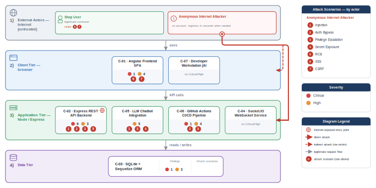
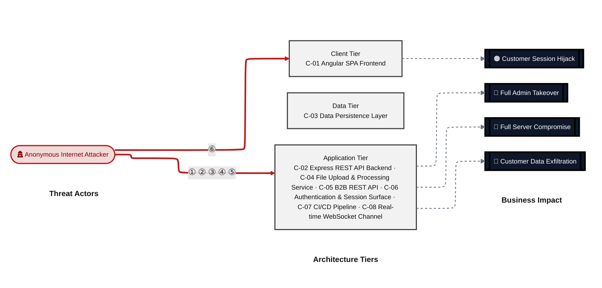
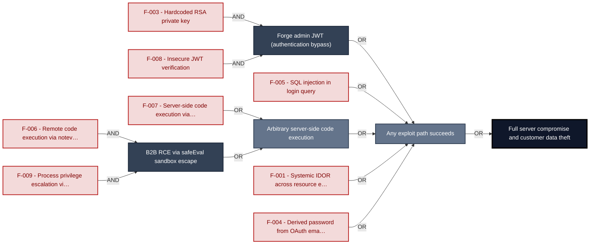
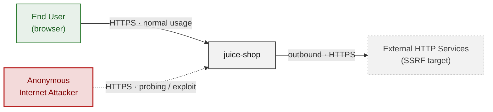
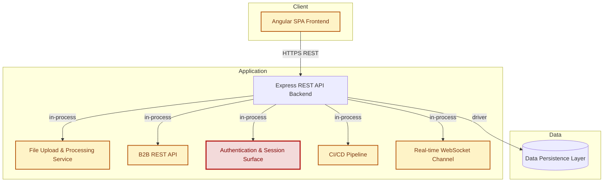
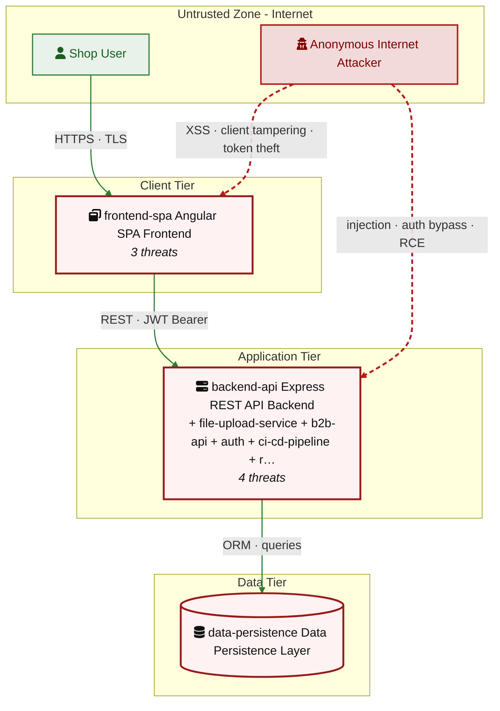
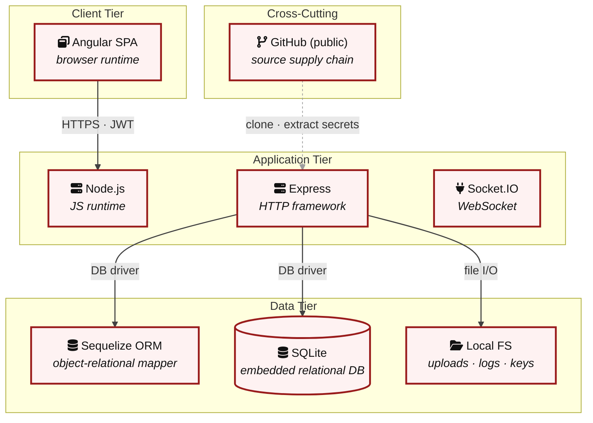

# Threat Model - Juice Shop

_Generated by appsec-advisor v0.4.0-beta (analysis v2)_

---

> | | |
> |---|---|
> | **Project** | Juice Shop v19.2.1 |
> | **Description** | Probably the most modern and sophisticated insecure web application |
> | **Author** | Björn Kimminich <bjoern.kimminich@owasp\.org> (https://kimminich.de) |
> | **License** | MIT |
> | **Repository** | https://github.com/juice-shop/juice-shop |
> | **Homepage** | https://owasp-`juice.shop` |
> | **Runtime** | Node\.js 20 - 24, Express 4 |
> | **Tags** | web security, web application security, webappsec, owasp, pentest, pentesting, security, vulnerable, vulnerability, broken, bodgeit, ctf, capture the flag, awareness |

---

## Changelog

_Append-only history of assessment runs. Most recent first._

| Version | Date | Mode | Depth | Reasoning | Baseline → Current | Δ Threats | Code | Note |
|--------|----------|--------|--------|--------------|------------------|----------------|--------|-------------------|
| v1 | 2026-06-16 | full | quick | sonnet-economy | `455206c` (vs v0) | +0 / ~0 / -0 | - | 36 threats (stable) |

**Latest run (v1) - threat-level delta:**

_No threat-, mitigation-, or abuse-case-level changes since the previous run (v0)._

---

> ⚠ **Quick depth - reduced-scope assessment.**
> 
> This report ran with intentionally narrower depth to keep wall-time short:
> 
> - **6 of 8 components** under full STRIDE analysis (criteria-selected: frontend, auth, and internet-exposed components only)
> - **Max 2 threats per STRIDE category** per component (vs. unlimited at standard/thorough)
> - **No CVSS vectors**, no per-finding evidence excerpts
> - **No §3 Attack Walkthroughs** (entirely skipped at `--quick`)
> - **No LLM-enriched §7 architecture narrative** (scaffold + control tables only)
> - **No QA reviewer pass**, no architect-level review
> 
> Re-run with `--standard` (≈ +30 min) for full STRIDE coverage and QA, or
> `--thorough` (≈ +90 min) for architect review and enriched architecture sections.

---

## Table of Contents

- [Management Summary](#management-summary)
- [Critical Attack Tree](#critical-attack-tree)
1. [System Overview](#1-system-overview)
   - [Scope](#scope)
2. [Architecture Diagrams](#2-architecture-diagrams)
   - [2.1 System Context](#21-system-context)
   - [2.2 Container Architecture](#22-container-architecture)
   - [2.3 Components](#23-components)
   - [2.4 Technology Architecture](#24-technology-architecture)
4. [Assets](#4-assets)
5. [Attack Surface](#5-attack-surface)
   - [5.1 Unauthenticated Entry Points (55)](#51-unauthenticated-entry-points-55)
   - [5.2 Authenticated Entry Points (52)](#52-authenticated-entry-points-52)
8. [Findings Register](#8-findings-register)
9. [Abuse Cases](#9-abuse-cases)
10. [Mitigation Register](#10-mitigation-register)
11. [Out of Scope](#11-out-of-scope)
   - [Components Not Individually Analyzed](#components-not-individually-analyzed)
- [Appendix: Run Statistics](#appendix-run-statistics)
- [Appendix A - Vektor Taxonomy](#appendix-a-vektor-taxonomy)

> _Section numbering is non-contiguous: §3, §6, §7 were retired in a prior revision. The remaining sections keep their original numbers so existing cross-references stay valid._

---

## Management Summary

### Verdict

🔴 The authentication boundary is defeated at every level: the RSA signing key is committed to the public repository, the login query is vulnerable to SQL injection, and the JWT verification middleware accepts `alg:none` tokens. Two independent paths to arbitrary server-side code execution exist via `eval()` in the profile handler and `notevil` safeEval in the B2B order route. This codebase is not suitable for production deployment.

**Risk distribution:** 🔴 Critical: 8 · 🟠 High: 20 · 🟡 Medium: 6 · 🟢 Low: 2 · **Total: 36**

**Scope:** 6 of 8 components received full STRIDE analysis - the externally-reachable, authentication-bearing, and business-critical surface. The other 2 (lower-priority / internal) were not individually assessed at this depth (see [§1 Scope](#scope)).

<br/>

**The highest-consequence attack paths reachable without authentication:**

<blockquote style="border-left: 3px solid #dc2626; background: #fef2f2; padding: 16px 20px; margin: 0;">

- **Full admin session takeover without credentials** — The RSA private key in `lib/insecurity.ts:23` is publicly committed, enabling any visitor to mint a valid `role=admin` JWT. SQL injection at `routes/login.ts:34` provides a second unauthenticated path to the admin account. *(🔴 [F-003](#f-003), 🔴 [F-005](#f-005), 🔴 [F-008](#f-008))*
- **Arbitrary server-side code execution** — `eval()` at `routes/userProfile.ts:62` runs user-supplied username input as JavaScript. The B2B order route at `routes/b2bOrder.ts:23` passes order data through `notevil` safeEval inside a `vm.runInContext` sandbox that is known to be escapable. *(🔴 [F-006](#f-006), 🔴 [F-007](#f-007), 🔴 [F-009](#f-009))*
- **Full customer data exfiltration via IDOR** — Twenty-one state-changing routes accept a user-controlled `UserId` or `ownerId` field without server-side identity binding, allowing any authenticated user to read or overwrite other users' addresses, wallet balances, and payment card numbers. *(🔴 [F-001](#f-001), 🟠 [F-026](#f-026))*
- **Persistent XSS and session theft** — The Angular SPA stores JWTs in localStorage without `HttpOnly` cookies, and `bypassSecurityTrustHtml()` in `last-login-ip.component.ts:39` creates a DOM XSS sink rendering server-controlled IP strings as trusted HTML. *(🟠 [F-002](#f-002), 🟠 [F-012](#f-012))*

</blockquote>

<br/>

No compensating control - rate limiting, WAF, or server-side authorization layer - closes any of the above paths. All eight Critical findings are independently exploitable from the internet without privileged access.

### Security Posture & Top Threats

**Figure 1 - Architecture, Trust Boundaries & Threats**

Architecture tiers top-to-bottom (External Actors → Client → Application → Data) with the top threats per component. The in-figure legend on the right explains the attack scenarios, severity dots and symbols.



**Figure 2 - Risk Flow: Actor → Tier → Impact**

Heatmap: **actors** (left) → **architecture tiers** (middle, Client → Application → Data) → **impact** (right). Numbered red arrows ①–⑥ are the threats enumerated in the Top Threats table below. Self-registration is open, so the **Authenticated Internet Attacker** tier is one POST away from anonymous - it is shown distinctly because a post-login endpoint is still a different attack surface.



**Threat actors.** The actors below drive the numbered attack paths in the figures above. The **Shop User** is the *victim* of client-side attacks (XSS / CSRF), not an attacker - in Figure 2 the compromise surfaces as the resulting business-impact node rather than as a separate actor box.

- **Shop User** — legitimate customer; target of client-side attacks; target of ⑥ Output Encoding / Cross-Site Scripting.
- **Anonymous Internet Attacker** — no account; registers in seconds when needed; drives ① Insecure Query Construction & Data Access, ② Hardcoded Secrets & Weak Cryptography, ③ Broken Authorization & Access Control, ④ Sensitive File & Secret Exposure, ⑤ Remote Code Execution (unsafe eval).

**6 structural threats**, grouped by weakness class - each row is one threat, not one finding. *Threat Description* states the general architectural weakness (STRIDE in brackets); *Findings* lists the concrete instances, each linked to [§8 Findings Register](#8-findings-register) with its component; *Risk & Impact* combines severity with business consequence.

| # | Threat Description | Findings (→ Component) | Risk & Impact | Fix |
|---|------------------------------------|------------------------------------------------|------------------------------------|--------|
| <a id="path-injection"></a>① | **Insecure Query Construction & Data Access** _(T·I)_<br/>user input flows into a server-side interpreter (SQL, NoSQL, XML, YAML, LDAP, OS shell) without parameterization or schema validation. | <span style="white-space:nowrap">🔴&nbsp;[F-005](#f-005)</span> - SQL Injection in Login Query (routes/login.ts:34) <span style="white-space:nowrap">→&nbsp;[C-06](#c-06)</span><br/><span style="white-space:nowrap">🟠&nbsp;[F-021](#f-021)</span> - XXE File Disclosure (routes/fileUpload.ts:83) <span style="white-space:nowrap">→&nbsp;[C-04](#c-04)</span> | 🔴 **Critical**<br/>Customer Data Exfiltration | <span style="white-space:nowrap">❶ [M-006](#m-006)</span><br/><span style="white-space:nowrap">❷ [M-022](#m-022)</span> |
| <a id="path-auth-bypass"></a>② | **Hardcoded Secrets & Weak Cryptography** _(S·E)_<br/>authentication can be circumvented or forged because credentials, signing keys, or password hashes are weak, missing, or exposed. | <span style="white-space:nowrap">🔴&nbsp;[F-003](#f-003)</span> - Hardcoded RSA Private Key (lib/insecurity.ts:23) <span style="white-space:nowrap">→&nbsp;[C-06](#c-06)</span><br/><span style="white-space:nowrap">🔴&nbsp;[F-008](#f-008)</span> - Insecure JWT Verification (lib/insecurity.ts:54) <span style="white-space:nowrap">→&nbsp;[C-06](#c-06)</span><br/><span style="white-space:nowrap">🟡&nbsp;[F-032](#f-032)</span> - Container images not signed or attested <span style="white-space:nowrap">→&nbsp;[C-07](#c-07)</span> | 🔴 **Critical**<br/>Full Admin Takeover · Customer Data Exfiltration | <span style="white-space:nowrap">❶ [M-004](#m-004)</span><br/><span style="white-space:nowrap">❶ [M-009](#m-009)</span> |
| <a id="path-privilege-escalation"></a>③ | **Broken Authorization & Access Control** _(E·I)_<br/>authorization checks are absent or bypassable, allowing horizontal and vertical privilege jumps from a self-registered or low-rights account. Includes mass-assignment of privileged attributes. | <span style="white-space:nowrap">🔴&nbsp;[F-001](#f-001)</span> - Systemic IDOR Attacker-Controlled Owner ID Across Resource Endpoints (routes/address.ts:11) <span style="white-space:nowrap">→&nbsp;[C-02](#c-02)</span><br/><span style="white-space:nowrap">🟠&nbsp;[F-017](#f-017)</span> - GitHub Actions workflow missing top-level permissions block (update-news-www.yml:1) <span style="white-space:nowrap">→&nbsp;[C-07](#c-07)</span><br/><span style="white-space:nowrap">🟠&nbsp;[F-026](#f-026)</span> - Missing Authorization on 21 State-Changing Routes (lib/insecurity.ts:54) <span style="white-space:nowrap">→&nbsp;[C-02](#c-02)</span><br/><span style="white-space:nowrap">🟠&nbsp;[F-028](#f-028)</span> - Unauthenticated Challenge Solve (registerWebsocketEvents.ts:41) <span style="white-space:nowrap">→&nbsp;[C-08](#c-08)</span> | 🔴 **Critical**<br/>Full Admin Takeover · Customer Data Exfiltration | <span style="white-space:nowrap">❶ [M-002](#m-002)</span><br/><span style="white-space:nowrap">❷ [M-018](#m-018)</span> |
| <a id="path-sensitive-data-exposure"></a>④ | **Sensitive File & Secret Exposure** _(I)_<br/>confidential files, credentials, and management-plane endpoints are reachable on unauthenticated routes; SSRF lets the server fetch internal resources on the attacker's behalf; unsafe path-handling primitives leak server content. | <span style="white-space:nowrap">🟠&nbsp;[F-011](#f-011)</span> - Path Traversal (routes/fileUpload.ts:45) <span style="white-space:nowrap">→&nbsp;[C-04](#c-04)</span><br/><span style="white-space:nowrap">🟠&nbsp;[F-022](#f-022)</span> - CTF Flag Broadcast to Unauthenticated WebSocket Clients (lib/challengeUtils.ts:71) <span style="white-space:nowrap">→&nbsp;[C-08](#c-08)</span><br/><span style="white-space:nowrap">🟠&nbsp;[F-025](#f-025)</span> - SSRF Fetch Without Timeout or Response Size Limit (routes/profileImageUrlUpload.ts:24) <span style="white-space:nowrap">→&nbsp;[C-04](#c-04)</span> | 🟠 **High**<br/>Customer Data Exfiltration | <span style="white-space:nowrap">❷ [M-012](#m-012)</span><br/><span style="white-space:nowrap">❷ [M-023](#m-023)</span> |
| <a id="path-remote-code-execution"></a>⑤ | **Remote Code Execution (unsafe eval)** _(E)_<br/>user-supplied data reaches a server-side code-execution sink (`eval`, sandbox primitives, deserialization, prototype-pollution gadgets) and breaks out into arbitrary native execution. | <span style="white-space:nowrap">🔴&nbsp;[F-006](#f-006)</span> - Remote Code Execution (routes/b2bOrder.ts:23) <span style="white-space:nowrap">→&nbsp;[C-05](#c-05)</span><br/><span style="white-space:nowrap">🔴&nbsp;[F-007](#f-007)</span> - Server-Side Code Execution (routes/userProfile.ts:62) <span style="white-space:nowrap">→&nbsp;[C-02](#c-02)</span><br/><span style="white-space:nowrap">🔴&nbsp;[F-009](#f-009)</span> - Process-Level Privilege Escalation (routes/b2bOrder.ts:23) <span style="white-space:nowrap">→&nbsp;[C-05](#c-05)</span><br/><span style="white-space:nowrap">🟠&nbsp;[F-027](#f-027)</span> - YAML Unsafe Load in Weak vm Sandbox Enables Sandbox Escape (routes/fileUpload.ts:117) <span style="white-space:nowrap">→&nbsp;[C-04](#c-04)</span> | 🔴 **Critical**<br/>Full Server Compromise · Customer Data Exfiltration · Full Admin Takeover | <span style="white-space:nowrap">❶ [M-007](#m-007)</span><br/><span style="white-space:nowrap">❶ [M-008](#m-008)</span> |
| <a id="path-cross-site-scripting"></a>⑥ | **Output Encoding / Cross-Site Scripting** _(T·I)_<br/>attacker-controlled content is rendered in the victim's browser without sanitization; combined with session tokens held in JavaScript-readable storage, any payload yields immediate account takeover. | <span style="white-space:nowrap">🟠&nbsp;[F-002](#f-002)</span> - JWT Stored in localStorage Accessible to XSS (oauth.component.ts:51) <span style="white-space:nowrap">→&nbsp;[C-01](#c-01)</span><br/><span style="white-space:nowrap">🟠&nbsp;[F-012](#f-012)</span> - DOM XSS (last-login-ip.component.ts:39) <span style="white-space:nowrap">→&nbsp;[C-01](#c-01)</span> | 🟠 **High**<br/>Customer Session Hijack | <span style="white-space:nowrap">❷ [M-003](#m-003)</span><br/><span style="white-space:nowrap">❷ [M-013](#m-013)</span> |

_STRIDE: S spoofing · T tampering · R repudiation · I information disclosure · D denial of service · E elevation of privilege. Risk, findings, components, impact and Fix are derived deterministically; only the one-line weakness description is authored._

### Top Mitigations

Highest-impact P1/P2 mitigations - 10 of 28 qualifying (36 total). Full detail in [§10 Mitigation Register](#10-mitigation-register). All 8 mitigation(s) that fix a Critical finding are always listed here.

| # | Component | Mitigation | Addresses | Effort |
|---|----------------------|------------------------------------------------|------------------------------------------------|------|
| **1** | [C-01](#c-01) — Angular SPA Frontend | ❶ [M-005](#m-005) — Replace derived password with a cryptographically random credential for OAuth accounts | 🔴 [F-004](#f-004) — Derived Password from OAuth Email Claim (oauth.component.ts) | Medium |
| **2** | [C-02](#c-02) — Express REST API Backend | ❶ [M-008](#m-008) — Remove server-side evaluation of untrusted input | 🔴 [F-007](#f-007) — Server-Side Code Execution (routes/userProfile.ts) | Low |
| **3** | [C-02](#c-02) — Express REST API Backend | ❶ [M-002](#m-002) — Enforce object-level (ownership) authorization | 🔴 [F-001](#f-001) — Systemic IDOR Attacker-Controlled Owner ID Across Resource Endpoints (routes/address.ts) | Medium |
| **4** | [C-05](#c-05) — B2B REST API | ❶ [M-007](#m-007) — Remove server-side evaluation of untrusted input | 🔴 [F-006](#f-006) — Remote Code Execution (routes/b2bOrder.ts) | High |
| **5** | [C-05](#c-05) — B2B REST API | ❶ [M-010](#m-010) — Remove server-side evaluation of untrusted input | 🔴 [F-009](#f-009) — Process-Level Privilege Escalation (routes/b2bOrder.ts) | High |
| **6** | [C-06](#c-06) — Authentication & Session Surface | ❶ [M-006](#m-006) — Use parameterized database queries | 🔴 [F-005](#f-005) — SQL Injection in Login Query (routes/login.ts) | Low |
| **7** | [C-06](#c-06) — Authentication & Session Surface | ❶ [M-009](#m-009) — Enforce JWT signature and algorithm verification | 🔴 [F-008](#f-008) — Insecure JWT Verification (lib/insecurity.ts) | Low |
| **8** | [C-06](#c-06) — Authentication & Session Surface | ❶ [M-004](#m-004) — Move cryptographic keys to a managed secret store | 🔴 [F-003](#f-003) — Hardcoded RSA Private Key (lib/insecurity.ts) | Medium |
| **9** | [C-01](#c-01) — Angular SPA Frontend | ❷ [M-013](#m-013) — Encode output instead of bypassing the framework sanitizer | 🟠 [F-012](#f-012) — DOM XSS (last-login-ip.component.ts) | Low |
| **10** | [C-04](#c-04) — File Upload & Processing Service | ❷ [M-012](#m-012) — Constrain file paths to a safe base directory | 🟠 [F-011](#f-011) — Path Traversal (routes/fileUpload.ts) | Low |

*18 additional P1/P2 mitigations capped from the leader-board · 8 P3 backlog items in [§10 Mitigation Register](#10-mitigation-register). Sorted by priority (P1 first), then component, then leverage (most findings first), severity (Critical first), and effort (Low first).*

### Operational Strengths

Operational controls rated Adequate or Partial - grouped into broad clusters. Clusters demoted to Weak by open Critical/High findings are excluded here.

| Strength | What's in Place | Effectiveness | Gap | Mitigates |
|----------------------|----------------------|-------------|--------|----------------|
| **Container & Supply-Chain Hardening** | _Build-time and runtime hardening - minimal base image, non-root execution, dependency inventory._<br/>Automated SCA scanning | ✅ Adequate | - | - |

**Bottom line:** These controls narrow specific attack surfaces but none eliminates a Critical finding on its own.

---

<a id="critical-attack-chain"></a>
<a id="critical-attack-tree"></a>
## Critical Attack Tree

The root is the worst-case attacker goal; below it, each capability branch groups the Critical findings that achieve it. Branches feed the goal by OR - any single path suffices.



**Findings** (full detail in [§8 Findings Register](#8-findings-register)): 🔴 [F-003](#f-003) Hardcoded RSA private key · 🔴 [F-008](#f-008) Insecure JWT verification · 🔴 [F-005](#f-005) SQL injection in login query · 🔴 [F-007](#f-007) Server-side code execution via eval · 🔴 [F-006](#f-006) Remote code execution via notevil · 🔴 [F-009](#f-009) Process privilege escalation via sandbox · 🔴 [F-001](#f-001) Systemic IDOR across resource endpoints · 🔴 [F-004](#f-004) Derived password from OAuth email claim

---

## 1. System Overview

Probably the most modern and sophisticated insecure web application

**Repository:** https://github.com/juice-shop/juice-shop
**Runtime:** Node\.js 20 - 24

### Scope

juice-shop comprises **8** modeled components. This threat model applied full STRIDE threat analysis to **6 of 8** - the components on the externally-reachable, authentication-bearing, and business-critical surface: **Angular SPA Frontend**, **Express REST API Backend**, **File Upload & Processing Service**, **B2B REST API**, **Authentication & Session Surface**, **Real-time WebSocket Channel**. Selection criteria: frontend attack surface; internet-exposed; auth.

The remaining **2** component(s) were **not individually analyzed** at this assessment depth (lower-priority / internal surface): Data Persistence Layer, CI/CD Pipeline. Re-run at a higher `--assessment-depth` to extend STRIDE coverage to them.

**Out of scope:** third-party hosted dependencies, browser runtime, operating-system kernel, and the underlying network infrastructure.

---

## 2. Architecture Diagrams

### 2.1 System Context

Who interacts with juice-shop from the outside, and through which channels. Solid arrows show normal usage; dashed red arrows mark unauthenticated probing or exploit paths (C4 Level 1).



**Key takeaway:** Every actor in the context interacts with juice-shop through its external interface, so authentication and input validation at that edge govern the entire attack surface.

### 2.2 Container Architecture

How the system decomposes into deployable units. Each box is a separate runtime process or service container; arrows show synchronous request paths between them. Components with ≥3 Critical findings carry a red border, ≥2 High amber (C4 Level 2).



**Key takeaway:** The system decomposes into 1 client, 6 application and 1 data unit(s); Authentication & Session Surface carries the most Critical findings (3) and bounds the worst-case blast radius.

### 2.3 Components

Who reaches each component, and through which trust zone. Four columns map external actors to the internal tiers (Client / Application / Data); solid green arrows show legitimate data flow, dashed red arrows mark intrusion vectors. The component table directly below holds source paths and linked threats per `C-NN`; per-finding evidence is in [§8 Findings Register](#8-findings-register).



**Key takeaway:** CI/CD Pipeline concentrates the most findings (11 of 36 across all components); the table below maps each component to its source paths and linked threats.

| ID | Name | Type | Key Paths | Linked Threats | Scope |
|----|----------------------|-----------|--------------------------------------|------------------------------------------------|------------|
| <a id="c-01"></a><a id="frontend-spa"></a><span style="white-space:nowrap">C-01</span> | Angular SPA Frontend | client | `frontend/src/**`<br/>`frontend/*.json` | 🟠 [F-002](#f-002) — JWT Stored in localStorage Accessible to XSS (`oauth.component.ts:51`)<br/>🔴 [F-004](#f-004) — Derived Password from OAuth Email Claim (`oauth.component.ts:30`)<br/>🟠 [F-012](#f-012) — DOM XSS (`last-login-ip.component.ts:39`) | Analyzed |
| <a id="c-02"></a><a id="backend-api"></a><span style="white-space:nowrap">C-02</span> | Express REST API Backend | application | `server.ts`<br/>`routes/**`<br/>`lib/**`<br/>`models/**`<br/>`data/**` | 🔴 [F-001](#f-001) — Systemic IDOR Attacker-Controlled Owner ID Across Resource Endpoints (`routes/address.ts:11`)<br/>🔴 [F-007](#f-007) — Server-Side Code Execution (`routes/userProfile.ts:62`)<br/>🟠 [F-026](#f-026) — Missing Authorization on 21 State-Changing Routes (`lib/insecurity.ts:54`)<br/>🟡 [F-029](#f-029) — Missing Structured Audit Log for Authentication Events (`routes/login.ts:19`) | Analyzed |
| <a id="c-03"></a><a id="data-persistence"></a><span style="white-space:nowrap">C-03</span> | Data Persistence Layer | data | `models/**`<br/>`data/static/**` | - | Out of scope |
| <a id="c-04"></a><a id="file-upload-service"></a><span style="white-space:nowrap">C-04</span> | File Upload & Processing Service | application | `routes/fileUpload.ts`<br/>`routes/profileImageUrlUpload.ts` | 🟠 [F-011](#f-011) — Path Traversal (`routes/fileUpload.ts:45`)<br/>🟠 [F-021](#f-021) — XXE File Disclosure (`routes/fileUpload.ts:83`)<br/>🟠 [F-025](#f-025) — SSRF Fetch Without Timeout or Response Size Limit (`routes/profileImageUrlUpload.ts:24`)<br/>🟠 [F-027](#f-027) — YAML Unsafe Load in Weak vm Sandbox Enables Sandbox Escape (`routes/fileUpload.ts:117`)<br/>🟡 [F-030](#f-030) — No Audit Log for File Write Operations (`routes/profileImageUrlUpload.ts:37`) | Analyzed |
| <a id="c-05"></a><a id="b2b-api"></a><span style="white-space:nowrap">C-05</span> | B2B REST API | application | `routes/b2bOrder.ts`<br/>`swagger.yml` | 🔴 [F-006](#f-006) — Remote Code Execution (`routes/b2bOrder.ts:23`)<br/>🔴 [F-009](#f-009) — Process-Level Privilege Escalation (`routes/b2bOrder.ts:23`)<br/>🟠 [F-014](#f-014) — Missing Audit Log for B2B Order Execution (`routes/b2bOrder.ts:16`)<br/>🟠 [F-024](#f-024) — Event-Loop Exhaustion (`routes/b2bOrder.ts:23`) | Analyzed |
| <a id="c-06"></a><a id="auth"></a><span style="white-space:nowrap">C-06</span> | Authentication & Session Surface | application | `lib/insecurity.ts`<br/>`lib/startup/registerWebsocketEvents.ts`<br/>`routes/2fa.ts`<br/>`routes/authenticatedUsers.ts`<br/>`routes/login.ts` | 🔴 [F-003](#f-003) — Hardcoded RSA Private Key (`lib/insecurity.ts:23`)<br/>🔴 [F-005](#f-005) — SQL Injection in Login Query (`routes/login.ts:34`)<br/>🔴 [F-008](#f-008) — Insecure JWT Verification (`lib/insecurity.ts:54`)<br/>🟠 [F-013](#f-013) — Missing Authentication Event Audit Log (`routes/login.ts:34`)<br/>🟠 [F-015](#f-015) — Hardcoded HMAC Key for Security Answer Hashing (`lib/insecurity.ts:44`)<br/>🟠 [F-023](#f-023) — Missing Rate Limiting on Login and Password-Reset Endpoints (`routes/login.ts:32`) | Analyzed |
| <a id="c-07"></a><a id="ci-cd-pipeline"></a><span style="white-space:nowrap">C-07</span> | CI/CD Pipeline | application | `.github/workflows/**`<br/>`.gitlab-ci.yml` | 🟠 [F-016](#f-016) — Uses --unsafe-perm flag — Dockerfile:5<br/>🟠 [F-017](#f-017) — GitHub Actions workflow missing top-level permissions block (`update-news-www.yml:1`)<br/>🟠 [F-018](#f-018) — Third-party GitHub Action not SHA-pinned: github/codeql-action/init (`codeql-analysis.yml:23`)<br/>🟠 [F-019](#f-019) — Base image not digest-pinned — Dockerfile:1<br/>🟠 [F-020](#f-020) — On absent non-reproducible installs (`package-lock.json`)<br/>🟡 [F-031](#f-031) — Runs as root — Dockerfile<br/>🟡 [F-032](#f-032) — Container images not signed or attested<br/>🟡 [F-033](#f-033) — Untrusted npm Install/Postinstall Scripts Enabled — Dockerfile<br/>🟡 [F-034](#f-034) — Dependabot Ecosystem Coverage Incomplete (.github/dependabot.yml)<br/>🟢 [F-035](#f-035) — Missing HEALTHCHECK instruction — Dockerfile<br/>🟢 [F-036](#f-036) — No Renovate configuration detected (`renovate.json`) | Out of scope |
| <a id="c-08"></a><a id="realtime-channel"></a><span style="white-space:nowrap">C-08</span> | Real-time WebSocket Channel | application | `lib/challengeUtils.ts`<br/>`lib/startup/registerWebsocketEvents.ts` | 🟠 [F-010](#f-010) — Unauthenticated WebSocket Channel (`registerWebsocketEvents.ts:24`)<br/>🟠 [F-022](#f-022) — CTF Flag Broadcast to Unauthenticated WebSocket Clients (`lib/challengeUtils.ts:71`)<br/>🟠 [F-028](#f-028) — Unauthenticated Challenge Solve (`registerWebsocketEvents.ts:41`) | Analyzed |
### 2.4 Technology Architecture

The technology stack the system is built on. Each box names the framework or runtime that fills that role; per-component findings live in the [§2.3](#23-components) component table above, and the full per-finding catalogue is in [§8 Findings Register](#8-findings-register).



**Key takeaway:** The stack spans 1 data-tier store(s) behind the application tier; injection and data-at-rest exposure track the data tier, detailed per finding in [§8 Findings Register](#8-findings-register).

> **Legend:** **red border** ≥ 3 Critical threats on the component · **amber border** ≥ 2 High threats

---

## 4. Assets

Information assets and the classification level that drives the Confidentiality / Integrity / Availability targets used in [§8 Findings Register](#8-findings-register) risk scoring.

| Asset | ID | Classification | Description | Linked Threats |
|----------------------|-----|--------------|------------------------------------|------------------------------------------------|
| User Credentials (Email + Password Hash) | A-001 | Restricted | User email addresses and MD5-hashed passwords stored in Users table via Sequelize. MD5 makes all passwords trivially reversible via rainbow tables. | 🔴 [F-004](#f-004) — Derived Password from OAuth Email Claim (`oauth.component.ts:30`)<br/>🔴 [F-005](#f-005) — SQL Injection in Login Query (`routes/login.ts:34`)<br/>🟠 [F-012](#f-012) — DOM XSS (`last-login-ip.component.ts:39`)<br/>🟠 [F-023](#f-023) — Missing Rate Limiting on Login and Password-Reset Endpoints (`routes/login.ts:32`) |
| RSA Private Signing Key | A-002 | Restricted | 1024-bit RSA private key hardcoded in lib/insecurity.ts:23, used to sign all JWTs. Committed to public GitHub repo — permanently compromised. | 🔴 [F-003](#f-003) — Hardcoded RSA Private Key (`lib/insecurity.ts:23`)<br/>🔴 [F-008](#f-008) — Insecure JWT Verification (`lib/insecurity.ts:54`)<br/>🟠 [F-011](#f-011) — Path Traversal (`routes/fileUpload.ts:45`)<br/>🟠 [F-015](#f-015) — Hardcoded HMAC Key for Security Answer Hashing (`lib/insecurity.ts:44`)<br/>🟠 [F-022](#f-022) — CTF Flag Broadcast to Unauthenticated WebSocket Clients (`lib/challengeUtils.ts:71`)<br/>🟠 [F-026](#f-026) — Missing Authorization on 21 State-Changing Routes (`lib/insecurity.ts:54`) |
| Payment Card Data (PAN) | A-003 | Restricted | Full payment card numbers stored unencrypted in Card.cardNum field via Sequelize. PCI DSS scope — should be tokenized or encrypted at rest. | 🔴 [F-001](#f-001) — Systemic IDOR Attacker-Controlled Owner ID Across Resource Endpoints (`routes/address.ts:11`)<br/>🔴 [F-005](#f-005) — SQL Injection in Login Query (`routes/login.ts:34`)<br/>🟠 [F-012](#f-012) — DOM XSS (`last-login-ip.component.ts:39`)<br/>🟠 [F-026](#f-026) — Missing Authorization on 21 State-Changing Routes (`lib/insecurity.ts:54`)<br/>🟠 [F-028](#f-028) — Unauthenticated Challenge Solve (`registerWebsocketEvents.ts:41`) |
| JWT Session Tokens | A-005 | Restricted | RS256 JWTs that authenticate all user sessions. Stored in cookies without httpOnly/secure flags, making them accessible to JavaScript and susceptible to XSS-based theft. | 🟠 [F-002](#f-002) — JWT Stored in localStorage Accessible to XSS (`oauth.component.ts:51`)<br/>🔴 [F-008](#f-008) — Insecure JWT Verification (`lib/insecurity.ts:54`)<br/>🟠 [F-012](#f-012) — DOM XSS (`last-login-ip.component.ts:39`)<br/>🟡 [F-032](#f-032) — Container images not signed or attested |
| User PII (Address, Phone, Profile Data) | A-004 | Confidential | User addresses, phone numbers, names, and profile images stored in Address and User models. Linked to IDOR vulnerabilities via req.body.UserId pattern. | 🔴 [F-001](#f-001) — Systemic IDOR Attacker-Controlled Owner ID Across Resource Endpoints (`routes/address.ts:11`)<br/>🔴 [F-005](#f-005) — SQL Injection in Login Query (`routes/login.ts:34`)<br/>🟠 [F-012](#f-012) — DOM XSS (`last-login-ip.component.ts:39`)<br/>🟠 [F-022](#f-022) — CTF Flag Broadcast to Unauthenticated WebSocket Clients (`lib/challengeUtils.ts:71`)<br/>🟠 [F-026](#f-026) — Missing Authorization on 21 State-Changing Routes (`lib/insecurity.ts:54`)<br/>🟠 [F-028](#f-028) — Unauthenticated Challenge Solve (`registerWebsocketEvents.ts:41`) |
| Security Answer Data | A-007 | Confidential | Answers to security questions used for account recovery, stored in SecurityAnswer model. Brute-forceable with no rate limiting on account recovery flows. | - |
| User Wallet Balances | A-008 | Confidential | Wallet balances linked to user accounts via WalletModel. Susceptible to IDOR via req.body.UserId manipulation — an attacker can read or manipulate balances of other users. | 🔴 [F-001](#f-001) — Systemic IDOR Attacker-Controlled Owner ID Across Resource Endpoints (`routes/address.ts:11`)<br/>🔴 [F-005](#f-005) — SQL Injection in Login Query (`routes/login.ts:34`)<br/>🟠 [F-012](#f-012) — DOM XSS (`last-login-ip.component.ts:39`)<br/>🟠 [F-026](#f-026) — Missing Authorization on 21 State-Changing Routes (`lib/insecurity.ts:54`)<br/>🟠 [F-028](#f-028) — Unauthenticated Challenge Solve (`registerWebsocketEvents.ts:41`) |
| Application Source Code | A-006 | Internal | Publicly available on GitHub. Contains intentionally vulnerable code including hardcoded private key, MD5 hashing, SQL injection patterns. Public availability enables offline exploit development. | 🔴 [F-003](#f-003) — Hardcoded RSA Private Key (`lib/insecurity.ts:23`)<br/>🔴 [F-005](#f-005) — SQL Injection in Login Query (`routes/login.ts:34`)<br/>🟠 [F-011](#f-011) — Path Traversal (`routes/fileUpload.ts:45`)<br/>🟠 [F-015](#f-015) — Hardcoded HMAC Key for Security Answer Hashing (`lib/insecurity.ts:44`)<br/>🟠 [F-022](#f-022) — CTF Flag Broadcast to Unauthenticated WebSocket Clients (`lib/challengeUtils.ts:71`) |
| Application Availability | A-009 | Internal | The Juice Shop service itself (port 3000). No rate limiting, DoS-capable endpoints include eval() execution, XML entity expansion, and unzipping of arbitrary archives. | - |
| Uploaded Files and User Media | A-010 | Internal | User-uploaded files stored in local filesystem under uploads/ and ftp/. ZIP-slip and XXE vulnerabilities in file upload handler allow writes/reads outside intended directories. | 🟠 [F-011](#f-011) — Path Traversal (`routes/fileUpload.ts:45`)<br/>🟠 [F-021](#f-021) — XXE File Disclosure (`routes/fileUpload.ts:83`)<br/>🟠 [F-022](#f-022) — CTF Flag Broadcast to Unauthenticated WebSocket Clients (`lib/challengeUtils.ts:71`)<br/>🟠 [F-026](#f-026) — Missing Authorization on 21 State-Changing Routes (`lib/insecurity.ts:54`)<br/>🟠 [F-028](#f-028) — Unauthenticated Challenge Solve (`registerWebsocketEvents.ts:41`) |

---

## 5. Attack Surface

Network-reachable entry points classified by authentication requirement. Each row links to the threat(s) referenced in its **Notes** column. The **Risk** column reflects the highest-severity linked finding. Entry points with no linked finding are still listed when they sit on a sensitive surface (authentication, registration, management) or look like a missing-auth/authz suspect - marked **⚑ Review** in Notes.

### 5.1 Unauthenticated Entry Points (55)

| Method | Route | Risk | Notes |
|------|----------------------------------------|----------|------------------------------------|
| POST | `/rest/user/login` | 🔴 Critical | 🔴 [F-004](#f-004) — Derived Password from OAuth Email Claim (`oauth.component.ts:30`)<br/>🔴 [F-005](#f-005) — SQL Injection in Login Query (`routes/login.ts:34`)<br/>🟠 [F-013](#f-013) — Missing Authentication Event Audit Log (`routes/login.ts:34`)<br/>Raw SQL injection at login — primary unauthenticated attack entry point |
| GET | `/​this/​page/​is/​hidden/​behind/​an/​incredibly/​high/​paywall/​that/​could/​only/​be/​unlocked/​by/​sending/​1btc/​to/​us` | 🔴 Critical | 🔴 [F-004](#f-004) — Derived Password from OAuth Email Claim (`oauth.component.ts:30`)<br/>🟠 [F-028](#f-028) — Unauthenticated Challenge Solve (`registerWebsocketEvents.ts:41`)<br/>handler: server.ts:649 |
| POST | `/file-upload` | 🟠 High | 🟠 [F-011](#f-011) — Path Traversal (`routes/fileUpload.ts:45`)<br/>🟠 [F-021](#f-021) — XXE File Disclosure (`routes/fileUpload.ts:83`)<br/>🟠 [F-027](#f-027) — YAML Unsafe Load in Weak vm Sandbox Enables Sandbox Escape (`routes/fileUpload.ts:117`)<br/>XXE, ZIP-slip, YAML deserialization — file upload handler |
| POST | `/profile` | 🟠 High | 🟠 [F-025](#f-025) — SSRF Fetch Without Timeout or Response Size Limit (`routes/profileImageUrlUpload.ts:24`)<br/>🟡 [F-030](#f-030) — No Audit Log for File Write Operations (`routes/profileImageUrlUpload.ts:37`)<br/>handler: server.ts:664 |
| POST | `/profile/image/file` | 🟠 High | 🟠 [F-025](#f-025) — SSRF Fetch Without Timeout or Response Size Limit (`routes/profileImageUrlUpload.ts:24`)<br/>🟡 [F-030](#f-030) — No Audit Log for File Write Operations (`routes/profileImageUrlUpload.ts:37`)<br/>handler: server.ts:310 |
| POST | `/profile/image/url` | 🟠 High | 🟠 [F-025](#f-025) — SSRF Fetch Without Timeout or Response Size Limit (`routes/profileImageUrlUpload.ts:24`)<br/>🟡 [F-030](#f-030) — No Audit Log for File Write Operations (`routes/profileImageUrlUpload.ts:37`)<br/>SSRF via user-supplied URL fetched server-side |
| POST | `/rest/user/reset-password` | 🟠 High | 🟠 [F-015](#f-015) — Hardcoded HMAC Key for Security Answer Hashing (`lib/insecurity.ts:44`)<br/>handler: server.ts:596 |
| POST | `/b2b/v2/orders` | 🟠 High | 🟠 [F-014](#f-014) — Missing Audit Log for B2B Order Execution (`routes/b2bOrder.ts:16`)<br/>🟠 [F-024](#f-024) — Event-Loop Exhaustion (`routes/b2bOrder.ts:23`)<br/>B2B order endpoint — safeEval sandbox via notevil; registration lacks auth middleware per server.ts:645 |
| GET | `/profile` | 🟠 High | 🟠 [F-025](#f-025) — SSRF Fetch Without Timeout or Response Size Limit (`routes/profileImageUrlUpload.ts:24`)<br/>🟡 [F-030](#f-030) — No Audit Log for File Write Operations (`routes/profileImageUrlUpload.ts:37`)<br/>handler: server.ts:663 |
| GET | `/rest/user/security-question` | 🟠 High | 🟠 [F-015](#f-015) — Hardcoded HMAC Key for Security Answer Hashing (`lib/insecurity.ts:44`)<br/>handler: server.ts:597 |
| POST | `/` | - | handler: routes/dataErasure.ts:54<br/>_⚑ Review: no auth guard detected_ |
| POST | `/api/Feedbacks` | - | handler: server.ts:401<br/>_⚑ Review: no auth guard detected_ |
| GET | `/metrics` | - | Management surface; handler: server.ts:718<br/>_⚑ Review: no auth guard detected_ |
| GET | `/​rest/​admin/​application-​configuration` | - | Management surface; handler: server.ts:605<br/>_⚑ Review: no auth guard detected_ |
| GET | `/​rest/​admin/​application-​version` | - | Management surface; handler: server.ts:604<br/>_⚑ Review: no auth guard detected_ |
| PUT | `/​rest/​continue-​code-​findIt/​apply/​:​continueCode` | - | handler: server.ts:610<br/>_⚑ Review: no auth guard detected_ |
| PUT | `/​rest/​continue-​code-​fixIt/​apply/​:​continueCode` | - | handler: server.ts:611<br/>_⚑ Review: no auth guard detected_ |
| PUT | `/​rest/​continue-​code/​apply/​:​continueCode` | - | handler: server.ts:612<br/>_⚑ Review: no auth guard detected_ |
| POST | `/rest/memories` | - | handler: server.ts:312<br/>_⚑ Review: no auth guard detected_ |
| PUT | `/​rest/​order-​history/​:​id/​delivery-​status` | - | handler: server.ts:623<br/>_⚑ Review: no auth guard detected_ |
| POST | `/rest/user/data-export` | - | handler: server.ts:618<br/>_⚑ Review: no auth guard detected_ |
| PUT | `/rest/wallet/balance` | - | handler: server.ts:625<br/>_⚑ Review: no auth guard detected_ |
| POST | `/​rest/​web3/​walletExploitAddress` | - | handler: server.ts:642<br/>_⚑ Review: no auth guard detected_ |
| POST | `/rest/web3/walletNFTVerify` | - | handler: server.ts:641<br/>_⚑ Review: no auth guard detected_ |
| POST | `/snippets/fixes` | - | handler: server.ts:670<br/>_⚑ Review: no auth guard detected_ |
| POST | `/snippets/verdict` | - | handler: server.ts:668<br/>_⚑ Review: no auth guard detected_ |

_29 further entry point(s) in this category carry no linked finding and no elevated review signal, and are not listed individually (55 total). The complete route inventory is available in `.route-inventory.json` and, when exported, `pentest-tasks.yaml`._

### 5.2 Authenticated Entry Points (52)

| Method | Route | Risk | Notes |
|------|-------------------------------|----------|------------------------------------|
| GET | `/api/Users` | 🔴 Critical | 🔴 [F-007](#f-007) — Server-Side Code Execution (`routes/userProfile.ts:62`)<br/>handler: server.ts:362 |
| POST | `/api/Users` | 🔴 Critical | 🔴 [F-007](#f-007) — Server-Side Code Execution (`routes/userProfile.ts:62`)<br/>handler: server.ts:407 |
| PUT | `/api/Addresss/:id` | - | handler: server.ts:449<br/>_⚑ Review: no authz guard detected_ |
| DELETE | `/api/Addresss/:id` | - | handler: server.ts:450<br/>_⚑ Review: no authz guard detected_ |
| PUT | `/api/BasketItems/:id` | - | handler: server.ts:425<br/>_⚑ Review: no authz guard detected_ |
| PUT | `/api/Cards/:id` | - | handler: server.ts:439<br/>_⚑ Review: no authz guard detected_ |
| DELETE | `/api/Cards/:id` | - | handler: server.ts:440<br/>_⚑ Review: no authz guard detected_ |
| GET | `/api/Cards/:id` | - | handler: server.ts:441<br/>_⚑ Review: no authz guard detected_ |
| PUT | `/api/Feedbacks/:id` | - | handler: server.ts:432<br/>_⚑ Review: no authz guard detected_ |
| PUT | `/api/Products/:id` | - | handler: server.ts:369<br/>_⚑ Review: no authz guard detected_ |
| DELETE | `/api/Products/:id` | - | handler: server.ts:370<br/>_⚑ Review: no authz guard detected_ |
| DELETE | `/api/Quantitys/:id` | - | handler: server.ts:428<br/>_⚑ Review: no authz guard detected_ |
| GET | `/api/Recycles/:id` | - | handler: server.ts:387<br/>_⚑ Review: no authz guard detected_ |
| PUT | `/api/Recycles/:id` | - | handler: server.ts:388<br/>_⚑ Review: no authz guard detected_ |
| DELETE | `/api/Recycles/:id` | - | handler: server.ts:389<br/>_⚑ Review: no authz guard detected_ |
| POST | `/rest/2fa/disable` | - | handler: server.ts:470<br/>_⚑ Review: auth/token endpoint_ |
| POST | `/rest/2fa/setup` | - | handler: server.ts:464<br/>_⚑ Review: auth/token endpoint_ |
| GET | `/rest/2fa/status` | - | handler: server.ts:462<br/>_⚑ Review: auth/token endpoint_ |
| POST | `/rest/2fa/verify` | - | handler: server.ts:457<br/>_⚑ Review: auth/token endpoint_ |
| GET | `/rest/basket/:id` | - | handler: server.ts:601<br/>_⚑ Review: no authz guard detected_ |
| POST | `/rest/basket/:id/checkout` | - | handler: server.ts:602<br/>_⚑ Review: no authz guard detected_ |
| PUT | `/​rest/​basket/​:​id/​coupon/​:​coupon` | - | handler: server.ts:603<br/>_⚑ Review: no authz guard detected_ |
| GET | `/rest/products/:id/reviews` | - | handler: server.ts:632<br/>_⚑ Review: no authz guard detected_ |
| PUT | `/rest/products/:id/reviews` | - | handler: server.ts:633<br/>_⚑ Review: no authz guard detected_ |

_28 further entry point(s) in this category carry no linked finding and no elevated review signal, and are not listed individually (52 total). The complete route inventory is available in `.route-inventory.json` and, when exported, `pentest-tasks.yaml`._

---

_§6 Use Cases and §7 Security Architecture are omitted at `--quick` depth. Re-run with `--standard` (≈ +30 min) or `--thorough` (≈ +90 min) to render the per-domain analysis._

---

## 8. Findings Register

Findings are grouped by severity (Critical → High → Medium → Low); within a tier they are ordered by attack vektor (Repo-Read → Internet-Anon → Internet-User → Victim-Required). Each finding is a card with the same fixed fields, in order: **Severity · Component · Location** → **Issue** → **Root cause** → **Evidence** → **Fix** → **Classification** (with external CWE / OWASP links).

**Risk Distribution:** 🔴 Critical: 8 · 🟠 High: 20 · 🟡 Medium: 6 · 🟢 Low: 2 · **Total findings: 36**
**STRIDE Coverage:** Spoofing: 3 · Tampering: 6 · Repudiation: 4 · Information Disclosure: 15 · Denial of Service: 3 · Elevation of Privilege: 5

**Findings index:**<br/>🔴 [F-001](#f-001) — Systemic IDOR Attacker-Controlled Owner ID Across Resource Endpoints…<br/>🟠 [F-002](#f-002) — JWT Stored in localStorage Accessible to XSS (oauth.component.ts:51)<br/>🔴 [F-003](#f-003) — Hardcoded RSA Private Key (lib/insecurity.ts:23)<br/>🔴 [F-004](#f-004) — Derived Password from OAuth Email Claim (oauth.component.ts:30)<br/>🔴 [F-005](#f-005) — SQL Injection in Login Query (routes/login.ts:34)<br/>🔴 [F-006](#f-006) — Remote Code Execution (routes/b2bOrder.ts:23)<br/>🔴 [F-007](#f-007) — Server-Side Code Execution (routes/userProfile.ts:62)<br/>🔴 [F-008](#f-008) — Insecure JWT Verification (lib/insecurity.ts:54)<br/>🔴 [F-009](#f-009) — Process-Level Privilege Escalation (routes/b2bOrder.ts:23)<br/>🟠 [F-010](#f-010) — Unauthenticated WebSocket Channel (registerWebsocketEvents.ts:24)<br/>🟠 [F-011](#f-011) — Path Traversal (routes/fileUpload.ts:45)<br/>🟠 [F-012](#f-012) — DOM XSS (last-login-ip.component.ts:39)<br/>🟠 [F-013](#f-013) — Missing Authentication Event Audit Log (routes/login.ts:34)<br/>🟠 [F-014](#f-014) — Missing Audit Log for B2B Order Execution (routes/b2bOrder.ts:16)<br/>🟠 [F-015](#f-015) — Hardcoded HMAC Key for Security Answer Hashing (lib/insecurity.ts:44)<br/>🟠 [F-016](#f-016) — Uses --unsafe-perm flag — Dockerfile:5<br/>🟠 [F-017](#f-017) — GitHub Actions workflow missing top-level permissions block…<br/>🟠 [F-018](#f-018) — Third-party GitHub Action not SHA-pinned: github/codeql-action/init…<br/>🟠 [F-019](#f-019) — Base image not digest-pinned — Dockerfile:1<br/>🟠 [F-020](#f-020) — On absent non-reproducible installs (package-lock.json)<br/>🟠 [F-021](#f-021) — XXE File Disclosure (routes/fileUpload.ts:83)<br/>🟠 [F-022](#f-022) — CTF Flag Broadcast to Unauthenticated WebSocket Clients…<br/>🟠 [F-023](#f-023) — Missing Rate Limiting on Login and Password-Reset Endpoints…<br/>🟠 [F-024](#f-024) — Event-Loop Exhaustion (routes/b2bOrder.ts:23)<br/>🟠 [F-025](#f-025) — SSRF Fetch Without Timeout or Response Size Limit…<br/>🟠 [F-026](#f-026) — Missing Authorization on 21 State-Changing Routes (lib/insecurity.ts:54)<br/>🟠 [F-027](#f-027) — YAML Unsafe Load in Weak vm Sandbox Enables Sandbox Escape…<br/>🟠 [F-028](#f-028) — Unauthenticated Challenge Solve (registerWebsocketEvents.ts:41)<br/>🟡 [F-029](#f-029) — Missing Structured Audit Log for Authentication Events…<br/>🟡 [F-030](#f-030) — No Audit Log for File Write Operations…<br/>🟡 [F-031](#f-031) — Runs as root — Dockerfile<br/>🟡 [F-032](#f-032) — Container images not signed or attested<br/>🟡 [F-033](#f-033) — Untrusted npm Install/Postinstall Scripts Enabled — Dockerfile<br/>🟡 [F-034](#f-034) — Dependabot Ecosystem Coverage Incomplete (.github/dependabot.yml)<br/>🟢 [F-035](#f-035) — Missing HEALTHCHECK instruction — Dockerfile<br/>🟢 [F-036](#f-036) — No Renovate configuration detected (renovate.json)

<a id="th-02"></a><a id="th-04"></a><a id="th-05"></a><a id="th-06"></a><a id="th-10"></a><a id="th-01"></a><a id="th-08"></a><a id="th-11"></a><a id="th-12"></a><a id="th-13"></a><a id="th-14"></a><a id="th-16"></a><a id="th-17"></a>

### 🔴 Critical (8)

<a id="t-003"></a><a id="f-003"></a>
#### F-003 · Hardcoded Cryptographic Key

**Severity:** 🔴 Critical - secret committed to the public source repo - extractable on clone, no prior access needed  ·  **Component:** [C-06](#c-06) - Authentication & Session Surface  ·  **Location:** `lib/insecurity.ts:23`

**Issue:** The RSA private key used to sign all JWT tokens is hardcoded as a string literal. Any developer, contractor, or attacker with read access to the source repository can extract this key and use it offline to forge arbitrary JWT tokens, signing them as any user including the admin account (`role: 'admin'`).

Because the key is embedded in source, rotation requires a code change and redeployment - leaked copies persist in git history indefinitely. The `authorize()` function at line 56 uses this key for every token issuance.

An attacker with repo read access can sign JWTs for any user role, gaining full application control including admin access and order/payment data for all customers.

**Root cause:** Authentication can be circumvented or forged because credentials, signing keys, or password hashes are weak, missing, or exposed.

**Evidence:** ✓ verified - The complete RSA private key (1024-bit, PEM) is assigned as a plain string constant `privateKey` at insecurity.ts:23; the same variable drives `jwt.sign()` at line 56.

**Fix:** Move the cryptographic key out of source control into a managed secret store and rotate it → ❶ [M-004](#m-004) — Move cryptographic keys to a managed secret store

**Classification:** Broken Authentication · [CWE-321](https://cwe.mitre.org/data/definitions/321.html) · [OWASP A07:2021](https://owasp.org/Top10/A07_2021/)

<a id="t-001"></a><a id="f-001"></a>
#### F-001 · Insecure Direct Object Reference (IDOR)

**Severity:** 🔴 Critical  ·  **Component:** [C-02](#c-02) - Express REST API Backend  ·  **Location:** `routes/address.ts:11`

**Issue:** Server-side authorization MUST derive the resource owner from the authenticated session (`req.user` / `req.session` / `req.auth`), never from attacker-controlled request data. Trusting req.body.UserId etc. enables horizontal privilege escalation across all authenticated tenants.

**Root cause:** Authorization checks are absent or bypassable, allowing horizontal and vertical privilege jumps from a self-registered or low-rights account. Includes mass-assignment of privileged attributes.

**Evidence:** ✓ verified - An object-identity parameter is trusted from the request without server-side ownership check.

```typescript
// routes/address.ts:11

export function getAddress () {
  return async (req: Request, res: Response) => {
    const addresses = await AddressModel.findAll({ where: { UserId: req.body.UserId } })
    res.status(200).json({ status: 'success', data: addresses })
  }
}
```

**Fix:** Tie every object lookup to the requesting user's identity and reject cross-tenant references → ❶ [M-002](#m-002) — Enforce object-level (ownership) authorization

**Classification:** Broken Access Control · [CWE-639](https://cwe.mitre.org/data/definitions/639.html) · [OWASP A01:2021](https://owasp.org/Top10/A01_2021/)

<a id="t-004"></a><a id="f-004"></a>
#### F-004 · Derived Password OAuth Email Claim

**Severity:** 🔴 Critical  ·  **Component:** [C-01](#c-01) - Angular SPA Frontend  ·  **Location:** `frontend/src/app/oauth/oauth.component.ts:30`

**Issue:** The OAuth Implicit Flow callback calls `oauthLogin()` with the access_token extracted from the URL fragment. On success it computes the user's password as btoa(profile.email.split('').reverse().join('')) (line 30) and registers or logs the user with that deterministic value (line 46).

Any attacker who knows a target's email address - publicly available from profile pages, social engineering, or breaches - can compute this derived password and authenticate via the standard /rest/user/login endpoint without going through OAuth. The attacker never needs an OAuth provider token.

Attacker authenticates as any OAuth-registered user knowing only their email address, bypassing OAuth entirely and gaining full account control.

**Evidence:** ✓ verified - oauth.component.ts:30 computes password = btoa(profile.email.split('').reverse().join('')) and passes it directly to `userService.save`() and login(), making the password deterministically derivable from a public identifier.

```typescript
// frontend/src/app/oauth/oauth.component.ts:30
  ngOnInit (): void {
    this.userService.oauthLogin(this.parseRedirectUrlParams().access_token).subscribe({
      next: (profile: any) => {
        const password = btoa(profile.email.split('').reverse().join(''))
        this.userService.save({ email: profile.email, password, passwordRepeat: password }).subscribe({
          next: () => {
            this.login(profile)
```

**Fix:** ❶ [M-005](#m-005) — Replace derived password with a cryptographically random credential for OAuth accounts

**Classification:** OAuth / OIDC Misconfiguration · [CWE-522](https://cwe.mitre.org/data/definitions/522.html) · [OWASP A07:2021](https://owasp.org/Top10/A07_2021/)

<a id="t-005"></a><a id="f-005"></a>
#### F-005 · SQL Injection

**Severity:** 🔴 Critical  ·  **Component:** [C-06](#c-06) - Authentication & Session Surface  ·  **Location:** `routes/login.ts:34`

**Issue:** `req.body.email` and `req.body.password` are interpolated directly into a raw Sequelize `query()` call at `routes/login.ts:34`: `SELECT * FROM Users WHERE email = '${req.body.email}' AND password = '${security.hash(req.body.password)}'`. Submitting `admin@juice-sh.op'--` as the email bypasses the password check entirely.

The payload `' OR '1'='1` returns the first user row (seeded admin account). Full database read access (all user records, passwords, personal data) is achievable with UNION-based payloads.

Attacker can authenticate as any user including admin without credentials, and exfiltrate the full Users table including MD5-hashed passwords and personal data.

**Root cause:** User input flows into a server-side interpreter (SQL, NoSQL, XML, YAML, LDAP, OS shell) without parameterization or schema validation.

**Evidence:** ✓ verified - String template interpolation of `req.body.email` into `models.sequelize.query()` at login.ts:34 with no parameterization or escaping.

```typescript
// routes/login.ts:34

  return (req: Request, res: Response, next: NextFunction) => {
    verifyPreLoginChallenges(req) // vuln-code-snippet hide-line
    models.sequelize.query(`SELECT * FROM Users WHERE email = '${req.body.email || ''}' AND password = '${security.hash(req.body.password || '')}' AND deletedAt IS NULL`, { model: UserModel, plain: tr
      .then((authenticatedUser) => { // vuln-code-snippet neutral-line loginAdminChallenge loginBenderChallenge loginJimChallenge
        const user = utils.queryResultToJson(authenticatedUser)
        if (user.data?.id && user.data.totpSecret !== '') {
```

**Fix:** Switch all SQL execution to parameterised queries or ORM-bound parameters → ❶ [M-006](#m-006) — Use parameterized database queries

**Classification:** Insecure Client-Side Storage · [CWE-89](https://cwe.mitre.org/data/definitions/89.html) · [OWASP A02:2021](https://owasp.org/Top10/A02_2021/)

<a id="t-006"></a><a id="f-006"></a>
#### F-006 · Server-Side Template Injection

**Severity:** 🔴 Critical  ·  **Component:** [C-05](#c-05) - B2B REST API  ·  **Location:** `routes/b2bOrder.ts:23`

**Issue:** `routes/b2bOrder.ts:19` assigns `body.orderLinesData` without any schema validation or type coercion, then line 23 executes `vm.runInContext('safeEval(orderLinesData)', sandbox, {timeout:2000})`. `notevil@^1.3.3` implements an incomplete JavaScript subset evaluator with known prototype pollution escape vectors (e.g. `constructor.constructor('return process')()` style payloads).

An attacker who holds a valid JWT (trivially obtained via the committed private key) sends a crafted `orderLinesData` string that escapes the `notevil` evaluator and runs arbitrary code in the `Node.js` process. Successful sandbox escape yields arbitrary OS command execution in the application process context, enabling data exfiltration, pivot to internal network, or persistent backdoor.

**Root cause:** User-supplied data reaches a server-side code-execution sink (`eval`, sandbox primitives, deserialization, prototype-pollution gadgets) and breaks out into arbitrary native execution.

**Evidence:** ✓ verified - `body.orderLinesData` flows unvalidated into `vm.runInContext('safeEval(orderLinesData)', sandbox)` at `routes/b2bOrder.ts:23`; `notevil` is imported at line 9 with no additional sandbox hardening.

```typescript
// routes/b2bOrder.ts:23
      try {
        const sandbox = { safeEval, orderLinesData }
        vm.createContext(sandbox)
        vm.runInContext('safeEval(orderLinesData)', sandbox, { timeout: 2000 })
        res.json({ cid: body.cid, orderNo: uniqueOrderNumber(), paymentDue: dateTwoWeeksFromNow() })
      } catch (err) {
        if (utils.getErrorMessage(err).match(/Script execution timed out.*/) != null) {
```

**Fix:** Replace runtime code generation (eval/Function/template render) with a data-only execution path → ❶ [M-007](#m-007) — Remove server-side evaluation of untrusted input

**Classification:** Code Execution via Unsafe Deserialization or Eval · [CWE-95](https://cwe.mitre.org/data/definitions/95.html) · [OWASP A08:2021](https://owasp.org/Top10/A08_2021/)

<a id="t-007"></a><a id="f-007"></a>
#### F-007 · Server-Side Template Injection

**Severity:** 🔴 Critical  ·  **Component:** [C-02](#c-02) - Express REST API Backend  ·  **Location:** `routes/userProfile.ts:62`

**Issue:** `getUserProfile()` at `routes/userProfile.ts:55`–62 checks if the authenticated user's username matches `/#\{(.*)}/`. If it does, the captured group is passed directly to `eval()`.

An authenticated attacker changes their username (via PUT /api/Users/:id) to `#{require('child_process').execSync('id')}` and then requests their profile page. `Node.js` executes the shell command in the server process context.

Any authenticated user can achieve Remote Code Execution on the `Node.js` server process, enabling data exfiltration, lateral movement, and full server compromise.

**Root cause:** User-supplied data reaches a server-side code-execution sink (`eval`, sandbox primitives, deserialization, prototype-pollution gadgets) and breaks out into arbitrary native execution.

**Evidence:** ✓ verified - Line 62 executes `eval(code)` where `code` is a substring extracted from the stored username field without any sandbox or expression validator.

```typescript
// routes/userProfile.ts:62
        if (!code) {
          throw new Error('Username is null')
        }
        username = eval(code) // eslint-disable-line no-eval
      } catch (err) {
        username = '\\' + username
      }
```

**Fix:** Replace runtime code generation (eval/Function/template render) with a data-only execution path → ❶ [M-008](#m-008) — Remove server-side evaluation of untrusted input

**Classification:** Code Execution via Unsafe Deserialization or Eval · [CWE-95](https://cwe.mitre.org/data/definitions/95.html) · [OWASP A08:2021](https://owasp.org/Top10/A08_2021/)

<a id="t-008"></a><a id="f-008"></a>
#### F-008 · Improper Verification of Cryptographic Signature

**Severity:** 🔴 Critical - elevated as an attack-chain keystone (individual baseline: High)  ·  **Component:** [C-06](#c-06) - Authentication & Session Surface  ·  **Location:** `lib/insecurity.ts:54`

**Instances (7):** 🔴 `lib/insecurity.ts:54`, 🟠 `frontend/src/app/app.guard.ts:53`, 🟠 `lib/insecurity.ts:55`, 🟠 `lib/insecurity.ts:58`, 🔴 `lib/insecurity.ts:191`, 🔴 `routes/chatbot.ts:248`, 🔴 `routes/verify.ts:117`

**Issue:** The `isAuthorized()` middleware calls `expressJwt({ secret: publicKey })` on express-jwt version 0.1.3, which does not enforce an `algorithms` allowlist. This allows two attack vectors: (1) `alg: none` - an attacker crafts a JWT with `{"alg":"none"}` in the header, removes the signature, and the library accepts it as valid; (2) algorithm confusion - using the RSA public key as the HMAC-SHA256 secret, the attacker signs a JWT with `alg: HS256` using the known public key, which the RS256 verifier misinterprets.

Either path lets the attacker forge a token with `role: admin`, `role: accounting`, or any arbitrary claim. An unauthenticated attacker can forge a JWT with admin role claims and gain full application control, access all user data, and perform any administrative action.

**Root cause:** Authentication can be circumvented or forged because credentials, signing keys, or password hashes are weak, missing, or exposed.

**Evidence:** ✓ verified - `expressJwt({ secret: publicKey })` at insecurity.ts:54 specifies no `algorithms` field; express-jwt@0.1.3 does not default to RS256-only verification.

```typescript
// lib/insecurity.ts:54
  return str
}

export const isAuthorized = () => expressJwt(({ secret: publicKey }) as any)
export const denyAll = () => expressJwt({ secret: '' + Math.random() } as any)
export const authorize = (user = {}) => jwt.sign(user, privateKey, { expiresIn: '6h', algorithm: 'RS256' })
export const verify = (token: string) => token ? (jws.verify as ((token: string, secret: string) => boolean))(token, publicKey) : false
```

**Fix:** Pin the signature algorithm explicitly and reject `alg:none` and unknown algorithms → ❶ [M-009](#m-009) — Enforce JWT signature and algorithm verification

**Classification:** OAuth / OIDC Misconfiguration · [CWE-347](https://cwe.mitre.org/data/definitions/347.html) · [OWASP A07:2021](https://owasp.org/Top10/A07_2021/)

<a id="t-009"></a><a id="f-009"></a>
#### F-009 · Code Injection

**Severity:** 🔴 Critical  ·  **Component:** [C-05](#c-05) - B2B REST API  ·  **Location:** `routes/b2bOrder.ts:23`

**Issue:** `notevil@^1.3.3` is known to be bypassable via prototype pollution. A payload that writes to `__proto__` or `constructor.prototype` within the `safeEval` expression can break out of the evaluator's restricted scope and obtain a reference to the underlying `Node.js` `process` object (e.g. via `constructor.constructor('return process')()`).

Once `process` is accessible, the attacker executes `process.mainModule.require('child_process').execSync('id')` or equivalent, achieving OS-level command execution as the application user. Since the JWT private key is committed to the repository, any internet-facing attacker can obtain a valid bearer token and trigger this path without prior authentication.

Full OS command execution in the application process, enabling exfiltration of all in-memory secrets, internal network pivoting, and persistent compromise of the host.

**Root cause:** User-supplied data reaches a server-side code-execution sink (`eval`, sandbox primitives, deserialization, prototype-pollution gadgets) and breaks out into arbitrary native execution.

**Evidence:** ✓ verified - `routes/b2bOrder.ts:9` imports `notevil` version `^1.3.3`; line 21 places `safeEval` itself into the sandbox context, creating a self-referential evaluator that `notevil`'s prototype-pollution bypass can leverage to reach the Node\.js runtime.

```typescript
// routes/b2bOrder.ts:23
      try {
        const sandbox = { safeEval, orderLinesData }
        vm.createContext(sandbox)
        vm.runInContext('safeEval(orderLinesData)', sandbox, { timeout: 2000 })
        res.json({ cid: body.cid, orderNo: uniqueOrderNumber(), paymentDue: dateTwoWeeksFromNow() })
      } catch (err) {
        if (utils.getErrorMessage(err).match(/Script execution timed out.*/) != null) {
```

**Fix:** Replace runtime code generation (eval/Function/template render) with a data-only execution path → ❶ [M-010](#m-010) — Remove server-side evaluation of untrusted input

**Classification:** Code Execution via Unsafe Deserialization or Eval · [CWE-94](https://cwe.mitre.org/data/definitions/94.html) · [OWASP A08:2021](https://owasp.org/Top10/A08_2021/)

### 🟠 High (20)

<a id="t-002"></a><a id="f-002"></a>
#### F-002 · Insecure Storage of Sensitive Information

**Severity:** 🟠 High  ·  **Component:** [C-01](#c-01) - Angular SPA Frontend  ·  **Location:** `frontend/src/app/oauth/oauth.component.ts:51`

**Issue:** Calls localStorage.setItem('token', `authentication.token`) immediately after OAuth login. The JWT is also written to a non-httpOnly cookie (line 50).

Because localStorage is accessible to any JavaScript executing on the same origin - including injected scripts via the bypassSecurityTrustHtml XSS sinks present in search-result, last-login-ip, and other components - any successful XSS attack results in complete session token exfiltration. Successful XSS on any page in the application results in permanent session hijacking via localStorage token exfiltration.

**Root cause:** Attacker-controlled content is rendered in the victim's browser without sanitization; combined with session tokens held in JavaScript-readable storage, any payload yields immediate account takeover.

**Evidence:** ✓ verified - oauth.component.ts:51 stores the authentication JWT in localStorage - a browser-accessible store with no isolation from same-origin scripts - rather than an httpOnly cookie managed by a BFF.

**Fix:** ❷ [M-003](#m-003) — Store session tokens in HttpOnly, Secure cookies

**Classification:** Insecure Client-Side Storage · [CWE-922](https://cwe.mitre.org/data/definitions/922.html) · [OWASP A02:2021](https://owasp.org/Top10/A02_2021/)

<a id="t-010"></a><a id="f-010"></a>
#### F-010 · Missing Authentication

**Severity:** 🟠 High  ·  **Component:** [C-08](#c-08) - Real-time WebSocket Channel  ·  **Location:** `lib/startup/registerWebsocketEvents.ts:24`

**Instances (2):** 🟠 `lib/startup/registerWebsocketEvents.ts:24`, 🟡 `lib/startup/registerWebsocketEvents.ts:34`

**Issue:** The Socket\.IO server at `registerWebsocketEvents.ts:20` configures an origin allowlist of `http://localhost:4200`, but this CORS check applies only to browser-initiated connections. Non-browser clients (curl, Python `socket.io`-client, Burp active-scan) skip the CORS preflight entirely and connect to `io.on('connection', ...)` at line 24 without any identity check.

The server accepts the connection unconditionally - no JWT validation, no session cookie check, no handshake middleware. Unauthenticated clients gain full access to all WebSocket event handlers and receive live challenge-state broadcasts, allowing anonymus participants to interact with server state as if authenticated.

**Evidence:** ✓ verified - `io.on('connection', ...)` at line 24 has no `io.use()` authentication middleware registered before it; any client that completes the TCP/WebSocket upgrade is treated as trusted.

```typescript
// lib/startup/registerWebsocketEvents.ts:24
  globalWithSocketIO.io = io

  io.on('connection', (socket: any) => {
    if (firstConnectedSocket === null) {
      socket.emit('server started')
```

**Fix:** ❷ [M-011](#m-011) — Add JWT authentication middleware to the Socket\.IO server before accepting connections

**Classification:** Insecure Real-Time Channel · [CWE-306](https://cwe.mitre.org/data/definitions/306.html) · [OWASP A01:2021](https://owasp.org/Top10/A01_2021/)

<a id="t-011"></a><a id="f-011"></a>
#### F-011 · Path Traversal

**Severity:** 🟠 High  ·  **Component:** [C-04](#c-04) - File Upload & Processing Service  ·  **Location:** `routes/fileUpload.ts:45`

**Issue:** An attacker uploads a ZIP archive containing an entry with a path-traversal name such as '../../ftp/legal.md'. At line 42, `absolutePath = path.resolve('uploads/complaints/' + fileName)` correctly resolves to `/repo/ftp/legal.md`.

The guard at line 44 checks `absolutePath.includes(path.resolve('.'))` - since the resolved CWD (e.g. '/repo') is a substring of '/repo/ftp/legal.md', this check passes (true). Attacker can overwrite arbitrary files within the application working directory, including source files and served static content, enabling persistent content injection or code execution on next process restart.

**Root cause:** Confidential files, credentials, and management-plane endpoints are reachable on unauthenticated routes; SSRF lets the server fetch internal resources on the attacker's behalf; unsafe path-handling primitives leak server content.

**Evidence:** ✓ verified - The zip entry path is written verbatim at line 45 using `'uploads/complaints/' + fileName` after a guard that allows traversal within the CWD subtree (line 44 `includes(path.resolve('.'))` passes for any sub-path of cwd).

```typescript
// routes/fileUpload.ts:45
                challengeUtils.solveIf(challenges.fileWriteChallenge, () => { return absolutePath === path.resolve('ftp/legal.md') })
                if (absolutePath.includes(path.resolve('.'))) {
                  entry.pipe(fs.createWriteStream('uploads/complaints/' + fileName).on('error', function (err) { next(err) }))
                } else {
                  entry.autodrain()
```

**Fix:** Resolve and normalise every constructed path and reject anything that escapes the intended base directory → ❷ [M-012](#m-012) — Constrain file paths to a safe base directory

**Classification:** Injection · [CWE-22](https://cwe.mitre.org/data/definitions/22.html) · [OWASP A03:2021](https://owasp.org/Top10/A03_2021/)

<a id="t-013"></a><a id="f-013"></a>
#### F-013 · Insufficient Logging

**Severity:** 🟠 High  ·  **Component:** [C-06](#c-06) - Authentication & Session Surface  ·  **Location:** `routes/login.ts:34`

**Issue:** The login handler and the password-reset handler at `routes/resetPassword.ts` produce no structured log entries on authentication success, failure, or account lockout. An attacker who compromises an account via SQL injection or credential stuffing leaves no server-side forensic trail.

There is no record of who authenticated when, from which IP, or how many failed attempts preceded a successful login. No post-breach audit trail means attacker dwell time and blast radius cannot be determined; compliance requirements (PCI-DSS Req 10, SOC2 CC7) for audit logging are unmet.

**Evidence:** ✓ verified - Grepping routes/login.ts, routes/resetPassword.ts, and lib/insecurity.ts for `audit|accessLog|loginLog|logger|winston|morgan` returns zero hits.

```typescript
// routes/login.ts:34
  return (req: Request, res: Response, next: NextFunction) => {
    verifyPreLoginChallenges(req) // vuln-code-snippet hide-line
    models.sequelize.query(`SELECT * FROM Users WHERE email = '${req.body.email || ''}' AND password = '${security.hash(req.body.password || '')}' AND deletedAt IS NULL`, { model: UserModel, plain: tr
      .then((authenticatedUser) => { // vuln-code-snippet neutral-line loginAdminChallenge loginBenderChallenge loginJimChallenge
        const user = utils.queryResultToJson(authenticatedUser)
```

**Fix:** ❷ [M-014](#m-014) — Add security audit logging

**Classification:** Server-Side Request Forgery · [CWE-778](https://cwe.mitre.org/data/definitions/778.html) · [OWASP A10:2021](https://owasp.org/Top10/A10_2021/)

<a id="t-014"></a><a id="f-014"></a>
#### F-014 · Insufficient Logging

**Severity:** 🟠 High  ·  **Component:** [C-05](#c-05) - B2B REST API  ·  **Location:** `routes/b2bOrder.ts:16`

**Issue:** `routes/b2bOrder.ts` processes `POST /b2b/v2/orders` with no structured logging of the authenticated caller (JWT `sub`/`email`), the `orderLinesData` payload, nor the outcome (success or exception). Because the JWT signing key is compromised and anyone can mint tokens with arbitrary `email` values, orders placed with forged identities leave zero forensic trace.

An attacker can inject malicious order payloads, trigger the `safeEval` RCE path, and deny any involvement - there is no record of who sent what. Incident response cannot reconstruct which caller submitted a malicious order, what payload triggered a sandbox escape, or whether repeated exploitation occurred.

**Evidence:** ✓ verified - No logging call appears anywhere in `routes/b2bOrder.ts` (lines 16–47); neither the try block (line 20) nor the catch handlers (lines 26–33) emit structured audit events.

```typescript
// routes/b2bOrder.ts:16
import * as utils from '../lib/utils'

export function b2bOrder () {
  return ({ body }: Request, res: Response, next: NextFunction) => {
    if (utils.isChallengeEnabled(challenges.rceChallenge) || utils.isChallengeEnabled(challenges.rceOccupyChallenge)) {
```

**Fix:** ❷ [M-015](#m-015) — Add security audit logging

**Classification:** Missing Audit Logging & Accountability · [CWE-778](https://cwe.mitre.org/data/definitions/778.html) · [OWASP A09:2021](https://owasp.org/Top10/A09_2021/)

<a id="t-015"></a><a id="f-015"></a>
#### F-015 · Hardcoded HMAC Key Security Answer

**Severity:** 🟠 High  ·  **Component:** [C-06](#c-06) - Authentication & Session Surface  ·  **Location:** `lib/insecurity.ts:44`

**Issue:** The `hmac()` function uses the hardcoded static key `pa4qacea4VK9t9nGv7yZtwmj` for HMAC-SHA256 of security question answers stored in the database. Because the key is public (committed to source), an attacker who reads the SecurityAnswers table can precompute rainbow tables of common answers against this fixed key and recover security answers offline.

The password-reset flow at `routes/resetPassword.ts:41` compares `security.hmac(answer)` against the stored hash - answering any user's security question becomes offline cracking. Attacker with database read access can precompute HMAC values for a dictionary of common security answers (birth cities, pet names) and take over any account via the password-reset flow.

**Evidence:** ✓ verified - `crypto.createHmac('sha256', 'pa4qacea4VK9t9nGv7yZtwmj')` at insecurity.ts:44 uses a static, source-committed key for all security-answer hashes.

```typescript
// lib/insecurity.ts:44

export const hash = (data: string) => crypto.createHash('md5').update(data).digest('hex')
export const hmac = (data: string) => crypto.createHmac('sha256', 'pa4qacea4VK9t9nGv7yZtwmj').update(data).digest('hex')

export const cutOffPoisonNullByte = (str: string) => {
```

**Fix:** ❷ [M-016](#m-016) — Replace hardcoded HMAC key with a per-answer salt and bcrypt/argon2 hashing

**Classification:** Broken Authentication · [CWE-547](https://cwe.mitre.org/data/definitions/547.html) · [OWASP A07:2021](https://owasp.org/Top10/A07_2021/)

<a id="t-016"></a><a id="f-016"></a>
#### F-016 · Uses --unsafe-perm flag

**Severity:** 🟠 High  ·  **Component:** [C-07](#c-07) - CI/CD Pipeline  ·  **Location:** `Dockerfile:5`

**Issue:** Line 5 of Dockerfile uses --unsafe-perm allowing postinstall scripts to run as root.

**Evidence:** ✓ verified

```dockerfile
// Dockerfile:5
WORKDIR /juice-shop
RUN npm i -g typescript ts-node
RUN npm install --omit=dev --unsafe-perm
RUN npm dedupe --omit=dev
RUN rm -rf frontend/node_modules
```

**Fix:** ❷ [M-017](#m-017) — Drop unnecessary privileges in build and runtime

**Classification:** Error Information Disclosure · [CWE-250](https://cwe.mitre.org/data/definitions/250.html) · [OWASP A05:2021](https://owasp.org/Top10/A05_2021/)

<a id="t-017"></a><a id="f-017"></a>
#### F-017 · Incorrect Permission Assignment

**Severity:** 🟠 High  ·  **Component:** [C-07](#c-07) - CI/CD Pipeline  ·  **Location:** `.github/workflows/update-news-www.yml:1`

**Instances (11):** `.github/workflows/update-news-www.yml:1`, `.github/workflows/rebase.yml:1`, `.github/workflows/update-challenges-ebook.yml:1`, `.github/workflows/release.yml:1`, `.github/workflows/zap_scan.yml:1`, `.github/workflows/codeql-analysis.yml:1`, `.github/workflows/stale.yml:1`, `.github/workflows/frontend-bundle-analysis.yml:1` … (+3 more)

**Issue:** `github/workflows/update-news-www.yml` has no top-level `permissions:` block; GITHUB_TOKEN defaults to write-all, so any compromised step can push code, create releases, or approve PRs.

**Root cause:** Authorization checks are absent or bypassable, allowing horizontal and vertical privilege jumps from a self-registered or low-rights account. Includes mass-assignment of privileged attributes.

**Evidence:** ✓ verified - A sensitive resource is created with permissive default permissions.

```yaml
// .github/workflows/update-news-www.yml:1
name: "Update news on owasp-juice.shop"

on:
```

**Fix:** ❷ [M-018](#m-018) — Apply least-privilege permissions

**Classification:** Error Information Disclosure · [CWE-732](https://cwe.mitre.org/data/definitions/732.html) · [OWASP A05:2021](https://owasp.org/Top10/A05_2021/)

<a id="t-018"></a><a id="f-018"></a>
#### F-018 · Third-party GitHub Action not SHA-pinned

**Severity:** 🟠 High  ·  **Component:** [C-07](#c-07) - CI/CD Pipeline  ·  **Location:** `.github/workflows/codeql-analysis.yml:23`

**Instances (4):** `.github/workflows/codeql-analysis.yml:23`, `.github/workflows/codeql-analysis.yml:34`, `.github/workflows/codeql-analysis.yml:36`, `.github/workflows/ci.yml:161`

**Issue:** In .github/workflows/codeql-analysis.yml line 23, action `github/codeql-action/init` is referenced by tag/branch `v3` instead of a 40-char commit SHA; a compromised publisher could inject malicious code by pushing to that tag.

**Evidence:** ✓ verified

```yaml
// .github/workflows/codeql-analysis.yml:23
      uses: actions/checkout@11bd71901bbe5b1630ceea73d27597364c9af683 #v4.2.2
    - name: Initialize CodeQL
      uses: github/codeql-action/init@v3
      with:
        languages: ${{ matrix.language }}
```

**Fix:** ❷ [M-019](#m-019) — Pin third-party dependencies to immutable versions

**Classification:** Supply-Chain Integrity · [CWE-829](https://cwe.mitre.org/data/definitions/829.html) · [OWASP A06:2021](https://owasp.org/Top10/A06_2021/)

<a id="t-019"></a><a id="f-019"></a>
#### F-019 · Use of Unmaintained Third-Party Components

**Severity:** 🟠 High  ·  **Component:** [C-07](#c-07) - CI/CD Pipeline  ·  **Location:** `Dockerfile:1`

**Instances (2):** `Dockerfile:1`, `test/smoke/Dockerfile:1`

**Issue:** Base image in Dockerfile uses tag-only reference (FROM node:24 AS installer); a compromised publisher could substitute the image on the next `docker pull`, injecting malicious code into all builds.

**Evidence:** ✓ verified

```dockerfile
// Dockerfile:1
FROM node:24 AS installer
COPY . /juice-shop
WORKDIR /juice-shop
```

**Fix:** Replace the unmaintained dependency with a maintained equivalent or fork it under ownership → ❷ [M-020](#m-020) — Pin the container base image to an immutable digest

**Classification:** Supply-Chain Integrity · [CWE-1104](https://cwe.mitre.org/data/definitions/1104.html) · [OWASP A06:2021](https://owasp.org/Top10/A06_2021/)

<a id="t-020"></a><a id="f-020"></a>
#### F-020 · Use of Unmaintained Third-Party Components

**Severity:** 🟠 High  ·  **Component:** [C-07](#c-07) - CI/CD Pipeline  ·  **Location:** `package-lock.json`

**Issue:** Without `package-lock.json`, `npm install` resolves different transitive versions on each run making supply-chain substitution attacks undetectable.

**Evidence:** ✓ verified

**Fix:** Replace the unmaintained dependency with a maintained equivalent or fork it under ownership → ❷ [M-021](#m-021) — Pin the container base image to an immutable digest

**Classification:** Supply-Chain Integrity · [CWE-1104](https://cwe.mitre.org/data/definitions/1104.html) · [OWASP A06:2021](https://owasp.org/Top10/A06_2021/)

<a id="t-021"></a><a id="f-021"></a>
#### F-021 · XML External Entity (XXE)

**Severity:** 🟠 High  ·  **Component:** [C-04](#c-04) - File Upload & Processing Service  ·  **Location:** `routes/fileUpload.ts:83`

**Issue:** At line 83 of `fileUpload.ts`, `libxml.parseXml(data, { noblanks: true, noent: true, nocdata: true })` parses attacker-controlled XML with `noent: true`, which enables resolution of XML external entities. An attacker uploads an XML file containing `<!DOCTYPE foo [<!ENTITY xxe SYSTEM 'file:///etc/passwd'>]><root>&xxe;</root>`.

The parser resolves the entity and embeds the file contents into `xmlDoc`. Any file readable by the `Node.js` process user (e.g. `/etc/passwd`, application secrets, private keys) can be exfiltrated in a single HTTP request.

**Root cause:** User input flows into a server-side interpreter (SQL, NoSQL, XML, YAML, LDAP, OS shell) without parameterization or schema validation.

**Evidence:** ✓ verified - Line 83 calls `libxml.parseXml()` with `noent: true`; line 87 echoes the resolved XML string (up to 400 chars) in the HTTP error response, exposing any file readable by the process user.

```typescript
// routes/fileUpload.ts:83
        const sandbox = { libxml, data }
        vm.createContext(sandbox)
        const xmlDoc = vm.runInContext('libxml.parseXml(data, { noblanks: true, noent: true, nocdata: true })', sandbox, { timeout: 2000 })
        const xmlString = xmlDoc.toString(false)
        challengeUtils.solveIf(challenges.xxeFileDisclosureChallenge, () => { return (utils.matchesEtcPasswdFile(xmlString) || utils.matchesSystemIniFile(xmlString)) })
```

**Fix:** Disable external entity resolution on every XML parser and reject DOCTYPE declarations → ❷ [M-022](#m-022) — Disable XML external entity (XXE) resolution

**Classification:** Injection · [CWE-611](https://cwe.mitre.org/data/definitions/611.html) · [OWASP A03:2021](https://owasp.org/Top10/A03_2021/)

<a id="t-023"></a><a id="f-023"></a>
#### F-023 · Missing Rate Limiting (Brute-Force)

**Severity:** 🟠 High  ·  **Component:** [C-06](#c-06) - Authentication & Session Surface  ·  **Location:** `routes/login.ts:32`

**Issue:** The login handler and the password-reset handler at `routes/resetPassword.ts` have no rate limiting, account lockout, or CAPTCHA. An attacker can submit unlimited credential-stuffing or brute-force requests at full network speed.

The MD5 password hash (`insecurity.ts:43`) is trivially fast, and the security-question reset (`resetPassword.ts:41`) accepts unlimited guesses. Automated credential-stuffing or brute-force against the login endpoint can authenticate as any user with a weak or previously breached password, with no server-side detection or blocking.

**Evidence:** ✓ verified - No `rateLimit`, `throttle`, `RateLimiter`, or `brute` pattern found in routes/login.ts, routes/resetPassword.ts, or routes/2fa.ts.

```typescript
// routes/login.ts:32
  }

  return (req: Request, res: Response, next: NextFunction) => {
    verifyPreLoginChallenges(req) // vuln-code-snippet hide-line
    models.sequelize.query(`SELECT * FROM Users WHERE email = '${req.body.email || ''}' AND password = '${security.hash(req.body.password || '')}' AND deletedAt IS NULL`, { model: UserModel, plain: tr
```

**Fix:** Apply rate limiting and lock-out thresholds on authentication endpoints → ❷ [M-024](#m-024) — Rate-limit and lock out repeated authentication attempts

**Classification:** Cross-Site Scripting (XSS) · [CWE-307](https://cwe.mitre.org/data/definitions/307.html) · [OWASP A03:2021](https://owasp.org/Top10/A03_2021/)

<a id="t-024"></a><a id="f-024"></a>
#### F-024 · Uncontrolled Resource Consumption

**Severity:** 🟠 High  ·  **Component:** [C-05](#c-05) - B2B REST API  ·  **Location:** `routes/b2bOrder.ts:23`

**Issue:** The `vm.runInContext('safeEval(orderLinesData)', sandbox, {timeout:2000})` call at `routes/b2bOrder.ts:23` blocks the `Node.js` event loop for up to 2 seconds per request. No rate limiting is applied to `POST /b2b/v2/orders` (`server.ts:645` registers the route with no `rateLimit` middleware).

Because the JWT signing key is publicly committed, an attacker can forge a valid bearer token and send concurrent requests with infinite-loop expressions (e.g. `while(true){}`). Repeated concurrent requests with tight-loop expressions saturate the event loop and cause sustained 503 responses across all endpoints sharing the same `Node.js` process.

**Evidence:** ✓ verified - `routes/b2bOrder.ts:23` passes `orderLinesData` to `vm.runInContext` with a 2000ms ceiling but no concurrency or request-rate cap; `server.ts:645` registers the route without any rate-limit middleware.

**Fix:** Bound the request rate and the per-request resource budget on this endpoint → ❷ [M-025](#m-025) — Offload CPU-bound work and bound execution time

**Classification:** Denial of Service · [CWE-400](https://cwe.mitre.org/data/definitions/400.html) · [OWASP A04:2021](https://owasp.org/Top10/A04_2021/)

<a id="t-025"></a><a id="f-025"></a>
#### F-025 · Server-Side Request Forgery (SSRF)

**Severity:** 🟠 High  ·  **Component:** [C-04](#c-04) - File Upload & Processing Service  ·  **Location:** `routes/profileImageUrlUpload.ts:24`

**Issue:** At line 24 of `profileImageUrlUpload.ts`, `const response = await fetch(url)` issues an HTTP request to a fully attacker-controlled URL with no timeout, no URL scheme/host allowlist, and no response body size limit. An attacker authenticated to the application can supply `imageUrl` pointing to: (1) an internal host (cloud metadata endpoint `http://169.254.169.254/latest/meta-data/`) to probe internal network services; (2) a slow HTTP server (slowloris-style) that never completes the response, holding the `Node.js` event loop awaiting `finished()` at line 30 for an indefinite period; (3) a URL serving a multi-gigabyte response that is piped to disk at line 29 (`fs.createWriteStream`), exhausting disk space.

The URL check at line 20 only gates the `abused_ssrf_bug` challenge flag and does not block any URLs. An authenticated attacker can probe internal network services (cloud metadata, internal APIs), exhaust disk space with a large response body, or hold server connections open indefinitely causing resource exhaustion.

**Root cause:** Confidential files, credentials, and management-plane endpoints are reachable on unauthenticated routes; SSRF lets the server fetch internal resources on the attacker's behalf; unsafe path-handling primitives leak server content.

**Evidence:** ✓ verified - Line 24 calls `fetch(url)` with a raw user-supplied URL and no `signal: AbortController` timeout; line 30 pipes the unbounded response body to `fs.createWriteStream` with no size limit.

```typescript
// routes/profileImageUrlUpload.ts:24
      if (loggedInUser) {
        try {
          const response = await fetch(url)
          if (!response.ok || !response.body) {
            throw new Error('url returned a non-OK status code or an empty body')
```

**Fix:** Validate the URL scheme + host against an explicit allow-list before issuing outbound requests → ❷ [M-026](#m-026) — Validate and allowlist outbound request targets

**Classification:** Server-Side Request Forgery · [CWE-918](https://cwe.mitre.org/data/definitions/918.html) · [OWASP A10:2021](https://owasp.org/Top10/A10_2021/)

<a id="t-026"></a><a id="f-026"></a>
#### F-026 · Missing Authorization

**Severity:** 🟠 High  ·  **Component:** [C-02](#c-02) - Express REST API Backend  ·  **Location:** `lib/insecurity.ts:54`

**Issue:** Of 112 registered routes, 21 state-changing endpoints (POST, PUT, DELETE) lack `isAuthorized()` middleware. An unauthenticated attacker can invoke these routes without presenting any JWT.

For example, routes that create or modify orders, update user data, or trigger admin actions are reachable with a bare HTTP request. Unauthenticated attackers can create, modify, or delete records without authentication, enabling account takeover, order manipulation, and admin-level data corruption.

**Root cause:** Authorization checks are absent or bypassable, allowing horizontal and vertical privilege jumps from a self-registered or low-rights account. Includes mass-assignment of privileged attributes.

**Evidence:** ✓ verified - The isAuthorized() middleware from lib/insecurity.ts:54 is applied to 58 of 112 routes; the remaining 54 routes including state-changing POST/PUT/DELETE handlers have no authentication or authorization check.

```typescript
// lib/insecurity.ts:54
}

export const isAuthorized = () => expressJwt(({ secret: publicKey }) as any)
export const denyAll = () => expressJwt({ secret: '' + Math.random() } as any)
export const authorize = (user = {}) => jwt.sign(user, privateKey, { expiresIn: '6h', algorithm: 'RS256' })
```

**Fix:** ❷ [M-027](#m-027) — Enforce server-side authorization on every endpoint

**Classification:** Broken Access Control · [CWE-862](https://cwe.mitre.org/data/definitions/862.html) · [OWASP A01:2021](https://owasp.org/Top10/A01_2021/)

<a id="t-027"></a><a id="f-027"></a>
#### F-027 · Deserialization of Untrusted Data

**Severity:** 🟠 High _(raw Critical)_  ·  **Component:** [C-04](#c-04) - File Upload & Processing Service  ·  **Location:** `routes/fileUpload.ts:117`

**Issue:** At line 117 of `fileUpload.ts`, `vm.runInContext('JSON.stringify(yaml.load(data))', sandbox, { timeout: 2000 })` executes with a sandbox containing the `yaml` module reference (line 115). The `Node.js` `vm` module is explicitly documented as not a security sandbox - code within the vm context shares the same V8 heap and can escape via prototype chain traversal: `this.constructor.constructor('return process')()`.

Additionally, `yaml.load()` (js-yaml v4 default) parses YAML without restrictions; an attacker can supply YAML with the `!!js/undefined` or `!!js/regexp` type constructors, and in js-yaml v3 the `!!js/function` type allows arbitrary JavaScript function execution. A successful vm sandbox escape grants arbitrary code execution as the `Node.js` process user, enabling full server compromise, credential theft, and lateral movement.

**Root cause:** User-supplied data reaches a server-side code-execution sink (`eval`, sandbox primitives, deserialization, prototype-pollution gadgets) and breaks out into arbitrary native execution.

**Evidence:** ✓ verified - Line 117 passes the `yaml` module into vm context (line 115) and calls `yaml.load()` (unsafe default schema) inside a Node\.js vm - which is not an isolation boundary per Node\.js documentation.

```typescript
// routes/fileUpload.ts:117
        const sandbox = { yaml, data }
        vm.createContext(sandbox)
        const yamlString = vm.runInContext('JSON.stringify(yaml.load(data))', sandbox, { timeout: 2000 })
        res.status(410)
        next(new Error('B2B customer complaints via file upload have been deprecated for security reasons: ' + utils.trunc(yamlString, 400) + ' (' + file.originalname + ')'))
```

**Fix:** Use a strict allow-list deserialiser and never accept untrusted gadget chains → ❷ [M-028](#m-028) — Replace unsafe YAML load and Node\.js vm sandbox with safe schema parsing and no sandbox

**Classification:** Code Execution via Unsafe Deserialization or Eval · [CWE-502](https://cwe.mitre.org/data/definitions/502.html) · [OWASP A08:2021](https://owasp.org/Top10/A08_2021/)

<a id="t-028"></a><a id="f-028"></a>
#### F-028 · Improper Authorization

**Severity:** 🟠 High  ·  **Component:** [C-08](#c-08) - Real-time WebSocket Channel  ·  **Location:** `lib/startup/registerWebsocketEvents.ts:41`

**Issue:** The `verifyLocalXssChallenge` handler at line 41-43 accepts a client-controlled `data` string and evaluates it against the XSS pattern `<iframe src="javascript:alert(\`xss\`)">`. If the string matches, `challengeUtils.solveIf()` is called, which sets `challenge.solved = true` and persists the record to the database via `challenge.save()` (`challengeUtils.ts:30`).

There is no authentication middleware on this event handler: an unauthenticated socket client can send the hardcoded XSS payload string and force the server to mark `localXssChallenge` as solved without any browser DOM interaction. An unauthenticated attacker can solve any WebSocket-verified challenge by replaying the expected payload string over a socket connection, bypassing the intended browser-based exploit demonstration.

**Root cause:** Authorization checks are absent or bypassable, allowing horizontal and vertical privilege jumps from a self-registered or low-rights account. Includes mass-assignment of privileged attributes.

**Evidence:** ✓ verified - `challengeUtils.solveIf(challenges.localXssChallenge, ...)` at line 42 is invoked with attacker-controlled `data` via a socket event that has no authentication guard.

```typescript
// lib/startup/registerWebsocketEvents.ts:41
    })

    socket.on('verifyLocalXssChallenge', (data: any) => {
      challengeUtils.solveIf(challenges.localXssChallenge, () => { return utils.contains(data, '<iframe src="javascript:alert(`xss`)">') })
      challengeUtils.solveIf(challenges.xssBonusChallenge, () => { return utils.contains(data, config.get('challenges.xssBonusPayload')) })
```

**Fix:** Add explicit server-side authorisation checks on every protected route → ❷ [M-029](#m-029) — Enforce server-side authorization

**Classification:** Broken Access Control · [CWE-285](https://cwe.mitre.org/data/definitions/285.html) · [OWASP A01:2021](https://owasp.org/Top10/A01_2021/)

<a id="t-022"></a><a id="f-022"></a>
#### F-022 · Information Disclosure

**Severity:** 🟠 High  ·  **Component:** [C-08](#c-08) - Real-time WebSocket Channel  ·  **Location:** `lib/challengeUtils.ts:71`

**Issue:** When any challenge is solved, `sendNotification()` at `challengeUtils.ts:70` calls `globalWithSocketIO.io.emit('challenge solved', notification)`, broadcasting to ALL connected sockets simultaneously - including unauthenticated ones. The `notification` object (constructed at lines 58-66) contains a `flag` field populated by `utils.ctfFlag(challenge.name)`.

Additionally, on every new connection, the handler at `registerWebsocketEvents.ts:30-32` replays all entries in the `notifications` array (which includes `flag` values) to the newly connected socket with no identity check. Passive unauthenticated listeners receive CTF flags for challenges they have not solved, undermining the integrity of the CTF scoring model.

**Root cause:** Confidential files, credentials, and management-plane endpoints are reachable on unauthenticated routes; SSRF lets the server fetch internal resources on the attacker's behalf; unsafe path-handling primitives leak server content.

**Evidence:** ✓ verified - `io.emit('challenge solved', notification)` at challengeUtils.ts:71 emits the full notification including `flag` to all connected sockets without filtering by authentication status; the replay loop at registerWebsocketEvents.ts:30-32 does the same on connection.

**Fix:** Restrict the response to the minimum fields needed and never echo secrets → ❷ [M-023](#m-023) — Stop exposing internal information to clients

**Classification:** Error Information Disclosure · [CWE-200](https://cwe.mitre.org/data/definitions/200.html) · [OWASP A05:2021](https://owasp.org/Top10/A05_2021/)

<a id="t-012"></a><a id="f-012"></a>
#### F-012 · Cross-Site Scripting

**Severity:** 🟠 High  ·  **Component:** [C-01](#c-01) - Angular SPA Frontend  ·  **Location:** `frontend/src/app/last-login-ip/last-login-ip.component.ts:39`

**Issue:** `LastLoginIpComponent.parseAuthToken()` reads the JWT from localStorage, decodes it without signature re-verification, and at line 39 calls this.sanitizer.bypassSecurityTrustHtml(`<small>${payload.data.lastLoginIp}</small>`). The lastLoginIp value originates from the server at login time (typically sourced from X-Forwarded-For or the request's remote IP).

An attacker who can control this header at login time - for example by setting X-Forwarded-For: `` - can inject HTML that executes in the victim's browser when they visit the privacy-security/last-login-ip route. Attacker-controlled HTML executes in the victim's browser context, enabling session token theft from localStorage, account takeover, and further client-side attacks.

**Root cause:** Attacker-controlled content is rendered in the victim's browser without sanitization; combined with session tokens held in JavaScript-readable storage, any payload yields immediate account takeover.

**Evidence:** ✓ verified - last-login-ip.component.ts:39 passes JWT-decoded lastLoginIp directly into bypassSecurityTrustHtml() without sanitization, creating a DOM XSS sink for server-injected content.

```typescript
// frontend/src/app/last-login-ip/last-login-ip.component.ts:39
      if (payload.data.lastLoginIp) {

        this.lastLoginIp = this.sanitizer.bypassSecurityTrustHtml(`<small>${payload.data.lastLoginIp}</small>`)
      }
    }
```

**Fix:** Output-encode untrusted strings at every sink and remove all `bypassSecurityTrustHtml` calls → ❷ [M-013](#m-013) — Encode output instead of bypassing the framework sanitizer

**Classification:** Cross-Site Scripting (XSS) · [CWE-79](https://cwe.mitre.org/data/definitions/79.html) · [OWASP A03:2021](https://owasp.org/Top10/A03_2021/)

### 🟡 Medium (6)

<a id="t-029"></a><a id="f-029"></a>
#### F-029 · Insufficient Logging

**Severity:** 🟡 Medium  ·  **Component:** [C-02](#c-02) - Express REST API Backend  ·  **Location:** `routes/login.ts:19`

**Issue:** The Winston logger at `lib/logger.ts` is used for operational logging but no structured security-event log captures authentication success, failure, or token issuance with actor identity, timestamp, and source IP. After a breach or unauthorized access, there is no audit trail to reconstruct which accounts were compromised, when, or from where.

Unauthorized access events cannot be reliably detected, timed, or attributed after the fact, violating PCI-DSS Requirement 10 and SOC2 CC7.2.

**Evidence:** ✓ verified - afterLogin() at routes/login.ts:19 issues a JWT and returns it to the client with no call to a security logger for the authentication success event.

**Fix:** ❸ [M-030](#m-030) — Add security audit logging

**Classification:** Missing Audit Logging & Accountability · [CWE-778](https://cwe.mitre.org/data/definitions/778.html) · [OWASP A09:2021](https://owasp.org/Top10/A09_2021/)

<a id="t-030"></a><a id="f-030"></a>
#### F-030 · Insufficient Logging

**Severity:** 🟡 Medium  ·  **Component:** [C-04](#c-04) - File Upload & Processing Service  ·  **Location:** `routes/profileImageUrlUpload.ts:37`

**Issue:** When the ZIP extraction handler writes files at line 45 of `fileUpload.ts`, or when the SSRF handler writes a fetched URL response to disk at line 30 of `profileImageUrlUpload.ts`, no structured security log entry is emitted. Only error conditions are logged (`logger.warn` at `profileImageUrlUpload.ts:37`).

Post-incident forensic reconstruction is impossible; attackers who exploit zip-slip or SSRF-to-disk can deny the upload, and defenders cannot trace which accounts performed file writes.

**Evidence:** ✓ verified - Neither route handler emits a structured audit log entry on successful file write; `logger.warn` at profileImageUrlUpload.ts:37 fires only on fetch errors, not on successful writes.

**Fix:** ❸ [M-031](#m-031) — Add security audit logging

**Classification:** Missing Audit Logging & Accountability · [CWE-778](https://cwe.mitre.org/data/definitions/778.html) · [OWASP A09:2021](https://owasp.org/Top10/A09_2021/)

<a id="t-031"></a><a id="f-031"></a>
#### F-031 · Runs as root

**Severity:** 🟡 Medium  ·  **Component:** [C-07](#c-07) - CI/CD Pipeline  ·  **Location:** `test/smoke/Dockerfile`

**Issue:** test/smoke/Dockerfile lacks a USER directive for a non-root account; if the container is compromised, the attacker has root inside it and any container-escape exploit has maximal host impact.

**Evidence:** ✓ verified

**Fix:** ❸ [M-032](#m-032) — Drop unnecessary privileges in build and runtime

**Classification:** Error Information Disclosure · [CWE-250](https://cwe.mitre.org/data/definitions/250.html) · [OWASP A05:2021](https://owasp.org/Top10/A05_2021/)

<a id="t-032"></a><a id="f-032"></a>
#### F-032 · ~~Improper Verification of Cryptographic Signature~~ ⚠

**Severity:** 🟡 Medium  ·  **Component:** [C-07](#c-07) - CI/CD Pipeline  ·  **Location:** -

**Issue:** No workflow signs or attests the container image; a registry intermediary or CI compromise could substitute the image undetected.

**Root cause:** Authentication can be circumvented or forged because credentials, signing keys, or password hashes are weak, missing, or exposed.

**Evidence:** ⚠ refuted

**Fix:** Pin the signature algorithm explicitly and reject `alg:none` and unknown algorithms → ❸ [M-033](#m-033) — Sign and verify release artifacts

**Classification:** Broken Authentication · [CWE-347](https://cwe.mitre.org/data/definitions/347.html) · [OWASP A07:2021](https://owasp.org/Top10/A07_2021/)

<a id="t-033"></a><a id="f-033"></a>
#### F-033 · Untrusted npm Install/Postinstall Scripts Enabled

**Severity:** 🟡 Medium  ·  **Component:** [C-07](#c-07) - CI/CD Pipeline  ·  **Location:** `Dockerfile`

**Instances (2):** `Dockerfile`, `package.json:88`

**Issue:** Dockerfile runs npm install/ci without --ignore-scripts, allowing any compromised dependency to execute postinstall hooks at build time.

**Evidence:** ✓ verified

**Fix:** ❸ [M-034](#m-034) — Disable untrusted package install scripts

**Classification:** Supply-Chain Integrity · [CWE-506](https://cwe.mitre.org/data/definitions/506.html) · [OWASP A06:2021](https://owasp.org/Top10/A06_2021/)

<a id="t-034"></a><a id="f-034"></a>
#### F-034 · ~~Use of Unmaintained Third-Party Components~~ ⚠

**Severity:** 🟡 Medium  ·  **Component:** [C-07](#c-07) - CI/CD Pipeline  ·  **Location:** `.github/dependabot.yml`

**Instances (1):** `.github/dependabot.yml`

**Issue:** No .github/dependabot.yml exists in the repository; npm dependencies receive no automated security update alerts or PRs.

**Evidence:** ⚠ refuted

**Fix:** Replace the unmaintained dependency with a maintained equivalent or fork it under ownership → ❸ [M-035](#m-035) — Pin the container base image to an immutable digest

**Classification:** Supply-Chain Integrity · [CWE-1104](https://cwe.mitre.org/data/definitions/1104.html) · [OWASP A06:2021](https://owasp.org/Top10/A06_2021/)

### 🟢 Low (2)

<a id="t-035"></a><a id="f-035"></a>
#### F-035 · Missing HEALTHCHECK instruction

**Severity:** 🟢 Low  ·  **Component:** [C-07](#c-07) - CI/CD Pipeline  ·  **Location:** `Dockerfile`

**Instances (2):** `Dockerfile`, `test/smoke/Dockerfile`

**Issue:** Dockerfile has no HEALTHCHECK instruction; a hung or poisoned container will not be detected by Docker/orchestrators until manual intervention.

**Evidence:** ✓ verified

**Fix:** ❹ [M-036](#m-036) — Add a container healthcheck

**Classification:** Error Information Disclosure · [CWE-703](https://cwe.mitre.org/data/definitions/703.html) · [OWASP A05:2021](https://owasp.org/Top10/A05_2021/)

<a id="t-036"></a><a id="f-036"></a>
#### F-036 · ~~Use of Unmaintained Third-Party Components~~ ⚠

**Severity:** 🟢 Low  ·  **Component:** [C-07](#c-07) - CI/CD Pipeline  ·  **Location:** `renovate.json`

**Issue:** No `renovate.json` or .renovaterc found; automated dependency updates rely solely on Dependabot (also absent) - the project has no automated dependency security patching.

**Evidence:** ⚠ refuted

**Fix:** Replace the unmaintained dependency with a maintained equivalent or fork it under ownership → ❹ [M-037](#m-037) — Pin the container base image to an immutable digest

**Classification:** Supply-Chain Integrity · [CWE-1104](https://cwe.mitre.org/data/definitions/1104.html) · [OWASP A06:2021](https://owasp.org/Top10/A06_2021/)

---

_**Severity annotation:** rows tagged `*(raw Critical)*` had a Critical-class impact that was capped to a lower effective severity by the triage stage (likelihood downgrade or `data/severity-caps.yaml` rule). The rendered severity is the **effective** severity used for ranking and prioritisation; the raw severity is preserved here so reviewers can re-evaluate the cap decision._

---

_**Evidence verification:** rows tagged `⚠ (evidence refuted)` were re-checked by the Phase 10a evidence-verifier (see `.evidence-verification.json`) and the cited `file:line` did **not** show the claimed weakness. Their raw severity is preserved, but chain-elevation has been suppressed by the triage stage. Rows tagged `◌ (evidence ambiguous)` could not be confirmed or refuted from the cited snippet alone - a human reviewer should decide whether to keep, downgrade, or remove these findings._

---

## 9. Abuse Cases

_No abuse cases were identified or mandated for this assessment._

---

## 10. Mitigation Register

Each mitigation block lists the findings it **Addresses**, the CWEs it **Prevents**, and the **Priority** (P1 = before deployment, P2 = current sprint, P3 = next quarter, P4 = backlog). The **Why** / **How** / **Verification** fields are populated only when authored; if a field is omitted, refer to the linked finding's *Evidence* line for file:line context and to the threat-category description in [§8 Findings Register](#8-findings-register) for the underlying weakness.

**Mitigations index:**<br/>❶ [M-002](#m-002) — Enforce object-level (ownership) authorization<br/>❶ [M-004](#m-004) — Move cryptographic keys to a managed secret store<br/>❶ [M-005](#m-005) — Replace derived password with a cryptographically random credential…<br/>❶ [M-006](#m-006) — Use parameterized database queries<br/>❶ [M-007](#m-007) — Remove server-side evaluation of untrusted input<br/>❶ [M-008](#m-008) — Remove server-side evaluation of untrusted input<br/>❶ [M-009](#m-009) — Enforce JWT signature and algorithm verification<br/>❶ [M-010](#m-010) — Remove server-side evaluation of untrusted input<br/>❷ [M-003](#m-003) — Store session tokens in HttpOnly, Secure cookies<br/>❷ [M-011](#m-011) — Add JWT authentication middleware to the Socket\.IO server before…<br/>❷ [M-012](#m-012) — Constrain file paths to a safe base directory<br/>❷ [M-013](#m-013) — Encode output instead of bypassing the framework sanitizer<br/>❷ [M-014](#m-014) — Add security audit logging<br/>❷ [M-015](#m-015) — Add security audit logging<br/>❷ [M-016](#m-016) — Replace hardcoded HMAC key with a per-answer salt and bcrypt/argon2…<br/>❷ [M-017](#m-017) — Drop unnecessary privileges in build and runtime<br/>❷ [M-018](#m-018) — Apply least-privilege permissions<br/>❷ [M-019](#m-019) — Pin third-party dependencies to immutable versions<br/>❷ [M-020](#m-020) — Pin the container base image to an immutable digest<br/>❷ [M-021](#m-021) — Pin the container base image to an immutable digest<br/>❷ [M-022](#m-022) — Disable XML external entity (XXE) resolution<br/>❷ [M-023](#m-023) — Stop exposing internal information to clients<br/>❷ [M-024](#m-024) — Rate-limit and lock out repeated authentication attempts<br/>❷ [M-025](#m-025) — Offload CPU-bound work and bound execution time<br/>❷ [M-026](#m-026) — Validate and allowlist outbound request targets<br/>❷ [M-027](#m-027) — Enforce server-side authorization on every endpoint<br/>❷ [M-028](#m-028) — Replace unsafe YAML load and Node\.js vm sandbox with safe schema…<br/>❷ [M-029](#m-029) — Enforce server-side authorization<br/>❸ [M-030](#m-030) — Add security audit logging<br/>❸ [M-031](#m-031) — Add security audit logging<br/>❸ [M-032](#m-032) — Drop unnecessary privileges in build and runtime<br/>❸ [M-033](#m-033) — Sign and verify release artifacts<br/>❸ [M-034](#m-034) — Disable untrusted package install scripts<br/>❸ [M-035](#m-035) — Pin the container base image to an immutable digest<br/>❹ [M-036](#m-036) — Add a container healthcheck<br/>❹ [M-037](#m-037) — Pin the container base image to an immutable digest

### P1 — Immediate

<a id="m-002"></a>
#### M-002 — Enforce object-level (ownership) authorization

**Addresses:**

- 🔴 [F-001](#f-001) — Systemic IDOR Attacker-Controlled Owner ID Across Resource Endpoints (`routes/address.ts:11`)

**Priority:** P1 - Immediate · **Effort:** Medium · **File:** `routes/address.ts:11`

**How:** Replace req.body.UserId/`userId`/`ownerId` with req.user.id (or equivalent session-derived identity) in every WHERE/filter clause.

```typescript
// Ownership check before touching a resource.
const basket = await Basket.findByPk(req.params.id)
if (!basket || basket.UserId !== req.user.id) return res.status(403).end()
```

**Verification:** Authenticate as user A; request `/api/Baskets/<B's id>` and confirm 403.

---

<a id="m-004"></a>
#### M-004 — Move cryptographic keys to a managed secret store

**Addresses:**

- 🔴 [F-003](#f-003) — Hardcoded RSA Private Key (`lib/insecurity.ts:23`)

**Priority:** P1 - Immediate · **Effort:** Medium · **File:** `lib/insecurity.ts:23`

**How:**

1. Remove the hardcoded `privateKey` string from `lib/insecurity.ts` and load it via `process.env.JWT_PRIVATE_KEY` or a secrets manager (e.g. HashiCorp Vault, AWS Secrets Manager).
2. Rotate the key immediately: generate a new RSA-2048+ keypair, deploy the public key to all verification points, and invalidate all existing tokens by changing the key.
3. Add `JWT_PRIVATE_KEY` to the `.gitignore`-protected secrets file and block future secret commits with `truffleHog` or `gitleaks` in CI.
4. Ensure the key is never logged - audit all `console.log` / error handlers for accidental key serialization.

```javascript
// Before (INSECURE — key in source):
const privateKey = '[PEM PRIVATE KEY — REDACTED]\r\nMIICXAIBAAKBg...';

// After:
const privateKey = process.env.JWT_PRIVATE_KEY;
if (!privateKey) throw new Error('JWT_PRIVATE_KEY env var not set');
```

**Reference:** CWE-321

---

<a id="m-005"></a>
#### M-005 — Replace derived password with a cryptographically random credential for OAuth accounts

**Addresses:**

- 🔴 [F-004](#f-004) — Derived Password from OAuth Email Claim (`oauth.component.ts:30`)

**Priority:** P1 - Immediate · **Effort:** Medium · **File:** `frontend/src/app/oauth/oauth.component.ts:30`

**How:**

1. Remove the deterministic password derivation at `oauth.component.ts:30` and 46. OAuth-registered accounts should not have a usable password credential.
2. On the backend, mark OAuth-only accounts with a flag (e.g. `isOAuthAccount`: true) and reject direct `/rest/user/login` attempts for those accounts.
3. If a password must be set during auto-registration, generate it server-side using `crypto.randomBytes(32)`.`toString('hex')` - never derive it from public user attributes.
4. Enforce that the `/rest/user/login` endpoint rejects credentials for OAuth-only accounts with a distinct error code.

```javascript
// backend: at account creation for OAuth users
const password = crypto.randomBytes(32).toString('hex');
await User.create({ email, password, isOAuthOnly: true });
// then reject direct login for isOAuthOnly accounts in the login route
```

**Reference:** CWE-522

---

<a id="m-006"></a>
#### M-006 — Use parameterized database queries

**Addresses:**

- 🔴 [F-005](#f-005) — SQL Injection in Login Query (`routes/login.ts:34`)

**Priority:** P1 - Immediate · **Effort:** Low · **File:** `routes/login.ts:34`

**How:**

1. Replace the raw `sequelize.query()` at `login.ts:34` with a parameterized Sequelize `UserModel.findOne({ where: { email, password: security.hash(password), deletedAt: null } })` call.
2. Never use template literal interpolation for SQL - use Sequelize's `replacements` or `bind` parameter substitution if raw queries are unavoidable.
3. Add an integration test that submits `' OR '1'='1` as the email field and asserts a 401 response.

```javascript
// Before (INSECURE):
models.sequelize.query(`SELECT * FROM Users WHERE email = '${req.body.email}' ...`)

// After:
UserModel.findOne({
  where: {
    email: req.body.email,
    password: security.hash(req.body.password || ''),
    deletedAt: null
  }
})
```

**Reference:** CWE-89

---

<a id="m-007"></a>
#### M-007 — Remove server-side evaluation of untrusted input

**Addresses:**

- 🔴 [F-006](#f-006) — Remote Code Execution (`routes/b2bOrder.ts:23`)

**Priority:** P1 - Immediate · **Effort:** High · **File:** `routes/b2bOrder.ts:23`

**How:**

1. Remove the `vm.runInContext('safeEval(orderLinesData)', ...)` code path. Define a `zod` or `joi` schema for the expected order-line structure (e.g. `{productId: z.string().uuid(), quantity: z.number().int().min(1)}`) and validate `req.body.orderLinesData` against it before processing.
2. If expression evaluation is required by a business requirement, replace `notevil` with a sandboxed worker process using `Node.js` `worker_threads` with a resource-limited context and an explicit safe-list of allowed expression forms - never pass raw strings to `eval`-adjacent APIs.
3. Upgrade or remove `notevil`; the package is unmaintained and has no patch for prototype pollution sandbox escape.
4. Add input-length and type guards before the processing block: reject `orderLinesData` values that are not valid JSON arrays, exceed 64 KB, or contain `__proto__`, `constructor`, or `prototype` tokens.

```javascript
// routes/b2bOrder.ts — schema-validated ingestion instead of safeEval
import { z } from 'zod'
const OrderLineSchema = z.array(z.object({
  productId: z.string().uuid(),
  quantity: z.number().int().min(1).max(100)
}))

// In the handler:
const parsed = OrderLineSchema.safeParse(body.orderLinesData)
if (!parsed.success) return next(new Error('Invalid order data'))
// process parsed.data
```

**Reference:** CWE-95

---

<a id="m-008"></a>
#### M-008 — Remove server-side evaluation of untrusted input

**Addresses:**

- 🔴 [F-007](#f-007) — Server-Side Code Execution (`routes/userProfile.ts:62`)

**Priority:** P1 - Immediate · **Effort:** Low · **File:** `routes/userProfile.ts:62`

**How:**

1. Delete lines 55–68 in `routes/userProfile.ts` that detect `#{...}` and call `eval()`; replace with: `username = entities.encode(user.username ?? '')`
2. If template-rendering behaviour is required, use a sandboxed expression evaluator (e.g., `vm2` with strict resource limits) rather than bare `eval()`
3. Add a regression test asserting that `#{process.exit(1)}` as a username does not crash the server

```javascript
// routes/userProfile.ts — safe replacement (lines 53-68)
let username = entities.encode(user.username ?? '')
```

**Reference:** CWE-95

---

<a id="m-009"></a>
#### M-009 — Enforce JWT signature and algorithm verification

**Addresses:**

- 🔴 [F-008](#f-008) — Insecure JWT Verification (`lib/insecurity.ts:54`)

**Priority:** P1 - Immediate · **Effort:** Low · **File:** `lib/insecurity.ts:54`

**How:**

1. Upgrade express-jwt to ^8.x (current stable) which defaults to rejecting `alg:none` and requires explicit algorithm configuration.
2. Pass `{ secret: publicKey, algorithms: ['RS256'] }` to `expressJwt()` to reject tokens with any other algorithm.
3. Upgrade jsonwebtoken to ^9.x for the `jwt.sign()` / `jwt.verify()` calls and use `jwt.verify(token, publicKey, { algorithms: ['RS256'] })` everywhere.
4. Add a test that submits a forged `alg:none` token and asserts a 401 response.

```javascript
// Before (INSECURE):
export const isAuthorized = () => expressJwt({ secret: publicKey } as any);

// After:
export const isAuthorized = () => expressJwt({
  secret: publicKey,
  algorithms: ['RS256']
});
```

**Reference:** CWE-347

---

<a id="m-010"></a>
#### M-010 — Remove server-side evaluation of untrusted input

**Addresses:**

- 🔴 [F-009](#f-009) — Process-Level Privilege Escalation (`routes/b2bOrder.ts:23`)

**Priority:** P1 - Immediate · **Effort:** High · **File:** `routes/b2bOrder.ts:23`

**How:**

1. Eliminate the `safeEval(orderLinesData)` execution path. Parse `orderLinesData` as JSON and validate against a strict schema (see b2b-api-002 for schema example) - no expression evaluation should occur on untrusted input.
2. If expression evaluation is unavoidable, use a separate sandboxed subprocess (e.g. `child_process.fork` with `--max-old-space-size=50 --max-semi-space-size=4` resource limits and no ambient `require`) rather than `vm.runInContext` with `notevil`.
3. Pin `notevil` to `0.0.0` or remove the dependency entirely (`package.json`). Its prototype pollution behaviour is by design for the Juice Shop RCE challenge but must not exist in production forks.
4. Apply `Object.freeze(Object.prototype)` and `Object.freeze(Function.prototype)` at process startup to harden against prototype pollution reaching production; note this may break some libraries and must be tested thoroughly.

```javascript
// Replace `eval()` / sandbox with a strict whitelist parser.
import { evaluate } from 'mathjs'
const allowed = /^[\d+\-*/().\s]+$/
if (!allowed.test(expr)) throw new Error('invalid expression')
return evaluate(expr)
```

**Verification:** POST `require('child_process').exec('id')` to the affected endpoint and confirm HTTP 400 instead of OS command execution.

**Reference:** CWE-94

---

### P2 — This Sprint

<a id="m-003"></a>
#### M-003 — Store session tokens in HttpOnly, Secure cookies

**Addresses:**

- 🟠 [F-002](#f-002) — JWT Stored in localStorage Accessible to XSS (`oauth.component.ts:51`)

**Priority:** P2 - This Sprint · **Effort:** High · **File:** `frontend/src/app/oauth/oauth.component.ts:51`

**How:**

1. Remove `localStorage.setItem('token', ...)` at `oauth.component.ts:51` and `localStorage`-based token reads throughout the SPA (`app.guard.ts:18`, `last-login-ip.component.ts:34`).
2. Implement a Backend-for-Frontend (BFF) pattern: the backend sets the JWT in a Set-Cookie header with HttpOnly; Secure; SameSite=Strict attributes after authentication. The SPA never sees the raw token.
3. Update all API calls to rely on cookie-based authentication (the browser sends the cookie automatically). Remove Authorization header injection from HTTP interceptors.
4. On the backend, update the `/rest/user/login` and OAuth callback endpoints to set `httpOnly` cookies rather than returning the token in the response body.

```javascript
// backend: set-cookie after login (Express example)
res.cookie('token', jwt, {
  httpOnly: true,
  secure: true,
  sameSite: 'strict',
  maxAge: 8 * 60 * 60 * 1000
});
// Do NOT return token in response body
```

**Reference:** CWE-922

---

<a id="m-011"></a>
#### M-011 — Add JWT authentication middleware to the Socket\.IO server before accepting connections

**Addresses:**

- 🟠 [F-010](#f-010) — Unauthenticated WebSocket Channel (`registerWebsocketEvents.ts:24`)

**Priority:** P2 - This Sprint · **Effort:** Medium · **File:** `lib/startup/registerWebsocketEvents.ts:24`

**How:**

1. Add an `io.use()` middleware that reads the JWT from `socket.handshake.auth.token` or `socket.handshake.headers.authorization`, verifies it with the same `security.verify()` logic used by Express routes, and calls `next(new Error('Unauthorized'))` on failure.
2. In the `io.on('connection', ...)` handler, store the decoded user on `socket.data.user` so downstream event handlers can check ownership without re-reading the token.
3. Update the Angular frontend to pass the current auth token in the `socket.io-client` connect options: `io({ auth: { token: localStorage.getItem('token') } })`.
4. Reject connections with a 401-equivalent socket error for unauthenticated sockets rather than emitting events to them.

```javascript
// server-side middleware (registerWebsocketEvents.ts)
io.use((socket, next) => {
  const token = socket.handshake.auth?.token
  if (!token) return next(new Error('Unauthorized'))
  try {
    socket.data.user = security.decode(token)
    next()
  } catch {
    next(new Error('Unauthorized'))
  }
})
```

**Reference:** CWE-306

---

<a id="m-012"></a>
#### M-012 — Constrain file paths to a safe base directory

**Addresses:**

- 🟠 [F-011](#f-011) — Path Traversal (`routes/fileUpload.ts:45`)

**Priority:** P2 - This Sprint · **Effort:** Low · **File:** `routes/fileUpload.ts:45`

**How:**

1. Replace the path guard with a strict prefix check: compute `const safePath = path.join(path.resolve('uploads/complaints/'), path.basename(entry.path))` to strip all directory components from the entry name.
2. Alternatively, validate that `absolutePath.startsWith(path.resolve('uploads/complaints/') + path.sep)` before writing - the current `includes()` check allows any CWD-rooted path.
3. Consider using a maintained library that handles zip-slip internally, such as `adm-zip` with the `allowParentTraversal: false` option (default), or `extract-zip`.

```javascript
// Safe extraction — strip directory components from entry path
const safeDir = path.resolve('uploads/complaints/')
const safeFile = path.join(safeDir, path.basename(entry.path))
if (!safeFile.startsWith(safeDir + path.sep)) {
  entry.autodrain()
} else {
  entry.pipe(fs.createWriteStream(safeFile))
}
```

**Reference:** CWE-22

---

<a id="m-013"></a>
#### M-013 — Encode output instead of bypassing the framework sanitizer

**Addresses:**

- 🟠 [F-012](#f-012) — DOM XSS (`last-login-ip.component.ts:39`)

**Priority:** P2 - This Sprint · **Effort:** Low · **File:** `frontend/src/app/last-login-ip/last-login-ip.component.ts:39`

**How:**

1. At `last-login-ip.component.ts:39`, replace `bypassSecurityTrustHtml()` with plain text binding. Change `this.lastLoginIp = this.sanitizer.bypassSecurityTrustHtml(...)` to `this.lastLoginIp = payload.data.lastLoginIp`.
2. In the template (`last-login-ip.component.html`), bind the value with Angular text interpolation `{{ lastLoginIp }}` rather than `[innerHTML]` to ensure Angular's built-in escaping applies.
3. On the backend, sanitize or strip HTML from any IP value stored in the JWT before signing - even plain text binding should not render tags.
4. Audit all other `bypassSecurityTrustHtml()` call sites (search-result, about, administration, track-result, data-export components) for the same pattern.

```javascript
// last-login-ip.component.ts — safe version
this.lastLoginIp = payload.data.lastLoginIp ?? '?';
// template: <small>{{ lastLoginIp }}</small>  — no [innerHTML], no bypassSecurityTrustHtml
```

**Reference:** CWE-79

---

<a id="m-014"></a>
#### M-014 — Add security audit logging

**Addresses:**

- 🟠 [F-013](#f-013) — Missing Authentication Event Audit Log (`routes/login.ts:34`)

**Priority:** P2 - This Sprint · **Effort:** Low · **File:** `routes/login.ts:34`

**How:**

1. Add a structured logger (e.g. `winston`) to `routes/login.ts`; emit `{ event: 'login_success', userId, email, ip: req.ip, timestamp }` on successful auth.
2. Emit `{ event: 'login_failure', email, ip: req.ip, timestamp }` on 401 responses.
3. Add similar events in `routes/resetPassword.ts` for reset attempts (success and wrong-answer failures).
4. Ship logs to an append-only sink (e.g. CloudWatch Logs, Splunk) so they cannot be tampered with post-compromise.

```typescript
// Log authn / authz outcomes with stable correlation ids.
logger.info({ event: 'auth.login.fail', userId, ip: req.ip, reqId })
logger.info({ event: 'authz.deny', userId, route: req.path, reqId })
```

**Verification:** A failed admin probe leaves an `authz.deny` line in the central log within 1 s.

**Reference:** CWE-778

---

<a id="m-015"></a>
#### M-015 — Add security audit logging

**Addresses:**

- 🟠 [F-014](#f-014) — Missing Audit Log for B2B Order Execution (`routes/b2bOrder.ts:16`)

**Priority:** P2 - This Sprint · **Effort:** Low · **File:** `routes/b2bOrder.ts:16`

**How:**

1. At the top of the `b2bOrder` handler, extract the authenticated JWT subject from `req.auth` (populated by `express-jwt`) and log: caller email/sub, request timestamp, SHA-256 of `orderLinesData`, and source IP.
2. On exception (catch block), log the error class and any available stack digest alongside the same caller identity - do not log raw `orderLinesData` in exceptions (potential secret exfil in logs), only its hash.
3. Route audit events to a write-once sink (append-only table or a structured log collector like OpenTelemetry) separate from application debug logs.

```javascript
// routes/b2bOrder.ts — minimal audit entry
import crypto from 'node:crypto'
const audit = (req: Request, outcome: string, err?: string) => {
  console.log(JSON.stringify({
    event: 'b2b_order', ts: new Date().toISOString(),
    caller: (req as any).auth?.email ?? 'unknown',
    ip: req.ip,
    payloadHash: crypto.createHash('sha256').update(req.body.orderLinesData ?? '').digest('hex'),
    outcome, err
  }))
}
```

**Reference:** CWE-778

---

<a id="m-016"></a>
#### M-016 — Replace hardcoded HMAC key with a per-answer salt and bcrypt/argon2 hashing

**Addresses:**

- 🟠 [F-015](#f-015) — Hardcoded HMAC Key for Security Answer Hashing (`lib/insecurity.ts:44`)

**Priority:** P2 - This Sprint · **Effort:** Medium · **File:** `lib/insecurity.ts:44`

**How:**

1. Store security answers using `bcrypt` or `argon2` (same as passwords) rather than HMAC with a shared key - per-answer salt prevents precomputation.
2. Remove the hardcoded `'pa4qacea4VK9t9nGv7yZtwmj'` key from `insecurity.ts:44`.
3. If HMAC must be kept, load the key from `process.env.HMAC_SECRET` and rotate it; re-hash all existing security answers.
4. Consider moving away from security-question-based reset entirely in favor of email-token-based reset.

**Reference:** CWE-547

---

<a id="m-017"></a>
#### M-017 — Drop unnecessary privileges in build and runtime

**Addresses:**

- 🟠 [F-016](#f-016) — Uses --unsafe-perm flag — Dockerfile:5

**Priority:** P2 - This Sprint · **Effort:** Medium · **File:** `Dockerfile:5`

**How:** Remove --unsafe-perm; use non-root user

---

<a id="m-018"></a>
#### M-018 — Apply least-privilege permissions

**Addresses:**

- 🟠 [F-017](#f-017) — GitHub Actions workflow missing top-level permissions block (`update-news-www.yml:1`)

**Priority:** P2 - This Sprint · **Effort:** Medium · **File:** `.github/workflows/update-news-www.yml:1`

**How:** Add `permissions: { contents: read }` at workflow root; elevate per-job only where needed

---

<a id="m-019"></a>
#### M-019 — Pin third-party dependencies to immutable versions

**Addresses:**

- 🟠 [F-018](#f-018) — Third-party GitHub Action not SHA-pinned: github/codeql-action/init (`codeql-analysis.yml:23`)

**Priority:** P2 - This Sprint · **Effort:** Medium · **File:** `.github/workflows/codeql-analysis.yml:23`

**How:** Pin every third-party action to a full 40-char commit SHA

---

<a id="m-020"></a>
#### M-020 — Pin the container base image to an immutable digest

**Addresses:**

- 🟠 [F-019](#f-019) — Base image not digest-pinned — Dockerfile:1

**Priority:** P2 - This Sprint · **Effort:** Medium · **File:** `Dockerfile:1`

**How:** Pin base image to @sha256:<digest>

```bash
# Pin and audit dependencies; fail CI on known vulns.
npm audit --omit=dev --audit-level=high
# Upgrade unmaintained packages in package.json, then:
npm install && npm test
```

**Verification:** `npm audit --omit=dev --audit-level=high` exits 0.

---

<a id="m-021"></a>
#### M-021 — Pin the container base image to an immutable digest

**Addresses:**

- 🟠 [F-020](#f-020) — On absent non-reproducible installs (`package-lock.json`)

**Priority:** P2 - This Sprint · **Effort:** Medium · **File:** `package-lock.json`

**How:** Commit `package-lock.json`; use `npm ci` in CI

```bash
# Pin and audit dependencies; fail CI on known vulns.
npm audit --omit=dev --audit-level=high
# Upgrade unmaintained packages in package.json, then:
npm install && npm test
```

**Verification:** `npm audit --omit=dev --audit-level=high` exits 0.

---

<a id="m-022"></a>
#### M-022 — Disable XML external entity (XXE) resolution

**Addresses:**

- 🟠 [F-021](#f-021) — XXE File Disclosure (`routes/fileUpload.ts:83`)

**Priority:** P2 - This Sprint · **Effort:** Low · **File:** `routes/fileUpload.ts:83`

**How:**

1. Change the `noent` option to `false` in the `libxml.parseXml()` call at `fileUpload.ts:83`: `libxml.parseXml(data, { noblanks: true, noent: false, nocdata: true })`.
2. Additionally set `nonet: true` to prevent network-based XXE (DTD fetched from external URL).
3. Consider replacing libxmljs2 entirely with a pure-JS parser that does not support external entities (e.g. `fast-xml-parser` with `processEntities: false`).
4. Do not echo parsed XML content back in error responses - sanitize or omit the parsed content from the 410 response.

```javascript
// Safe XML parse — disable external entity expansion
libxml.parseXml(data, { noblanks: true, noent: false, nocdata: true, nonet: true })
```

**Reference:** CWE-611

---

<a id="m-023"></a>
#### M-023 — Stop exposing internal information to clients

**Addresses:**

- 🟠 [F-022](#f-022) — CTF Flag Broadcast to Unauthenticated WebSocket Clients (`lib/challengeUtils.ts:71`)

**Priority:** P2 - This Sprint · **Effort:** Medium · **File:** `lib/challengeUtils.ts:71`

**How:**

1. After adding authentication middleware (realtime-channel-001), use `io.to(socket.id).emit()` or socket rooms keyed by `user.id` to deliver flag notifications only to the solving user's socket, not all connected clients.
2. For the `sendNotification()` function in `challengeUtils.ts`, look up the user's active socket by user ID and emit only to that socket rather than broadcasting with `io.emit()`.
3. Strip the `flag` field from notification objects broadcast to non-owner sockets, or omit the flag entirely from global broadcasts and deliver it only in the targeted user emit.
4. Ensure the `notifications` replay on connection (`registerWebsocketEvents.ts:30`-32) filters to only the authenticated user's own notifications.

```typescript
// Remove directory-listing middleware; require auth on management endpoints.
// app.use('/ftp', serveIndex(...))   // delete
app.use('/metrics', requireRole('admin'), promBundle())
```

**Verification:** Unauthenticated `GET /metrics` returns 401; `GET /ftp/` returns 404.

**Reference:** CWE-200

---

<a id="m-024"></a>
#### M-024 — Rate-limit and lock out repeated authentication attempts

**Addresses:**

- 🟠 [F-023](#f-023) — Missing Rate Limiting on Login and Password-Reset Endpoints (`routes/login.ts:32`)

**Priority:** P2 - This Sprint · **Effort:** Low · **File:** `routes/login.ts:32`

**How:**

1. Install `express-rate-limit` and apply a limiter to `POST /rest/user/login`: `rateLimit({ windowMs: 15*60*1000, max: 10, skipSuccessfulRequests: true })`.
2. Apply a stricter limiter to `POST /api/resetPassword`: `rateLimit({ windowMs: 60*60*1000, max: 5 })`.
3. Add exponential back-off or account lockout after N consecutive failures for the same email.
4. Add monitoring/alerting for high failure-rate IPs to detect credential-stuffing campaigns.

```javascript
import rateLimit from 'express-rate-limit';
const loginLimiter = rateLimit({
  windowMs: 15 * 60 * 1000,
  max: 10,
  message: 'Too many login attempts'
});
app.post('/rest/user/login', loginLimiter, login());
```

**Reference:** CWE-307

---

<a id="m-025"></a>
#### M-025 — Offload CPU-bound work and bound execution time

**Addresses:**

- 🟠 [F-024](#f-024) — Event-Loop Exhaustion (`routes/b2bOrder.ts:23`)

**Priority:** P2 - This Sprint · **Effort:** Medium · **File:** `routes/b2bOrder.ts:23`

**How:**

1. Apply `express-rate-limit` before the `b2bOrder()` handler in `server.ts:645`: `app.post('/b2b/v2/orders', rateLimit({windowMs:60000, max:10}), b2bOrder())`.
2. Move `vm.runInContext` execution into a `worker_threads` Worker so evaluation blocks the worker thread rather than the event loop. Terminate the worker on timeout instead of blocking.
3. Validate and reject `orderLinesData` payloads containing loop constructs (`while`, `for`, `do`) before they reach `safeEval` - this eliminates the busy-loop vector without relying solely on the timeout.

```javascript
// server.ts — rate-limit the B2B endpoint
import rateLimit from 'express-rate-limit'
const b2bLimiter = rateLimit({ windowMs: 60 * 1000, max: 10, standardHeaders: true })
app.post('/b2b/v2/orders', b2bLimiter, b2bOrder())
```

**Reference:** CWE-400

---

<a id="m-026"></a>
#### M-026 — Validate and allowlist outbound request targets

**Addresses:**

- 🟠 [F-025](#f-025) — SSRF Fetch Without Timeout or Response Size Limit (`routes/profileImageUrlUpload.ts:24`)

**Priority:** P2 - This Sprint · **Effort:** Medium · **File:** `routes/profileImageUrlUpload.ts:24`

**How:**

1. Validate `imageUrl` against an allowlist of permitted schemes (https only) and optionally permitted hosts before calling `fetch()`.
2. Add a request timeout using `AbortController`: `const controller = new AbortController(); const timer = setTimeout(() => controller.abort(), 10000); const response = await fetch(url, { signal: controller.signal })` then `clearTimeout(timer)`.
3. Enforce a response size cap: check `Content-Length` header and abort if it exceeds a threshold (e.g. 5 MB); or use a byte-counting transform stream during the pipe at line 30.
4. Validate that the resolved IP of the URL is not RFC-1918/loopback before connecting (use a library such as `is-ip` + DNS pre-resolution, or a proxy with egress rules).

```javascript
const controller = new AbortController()
const timer = setTimeout(() => controller.abort(), 10000)
try {
  const response = await fetch(url, { signal: controller.signal })
  const contentLength = Number(response.headers.get('content-length') ?? 0)
  if (contentLength > 5 * 1024 * 1024) throw new Error('Response too large')
  // ... pipe to disk
} finally {
  clearTimeout(timer)
}
```

**Reference:** CWE-918

---

<a id="m-027"></a>
#### M-027 — Enforce server-side authorization on every endpoint

**Addresses:**

- 🟠 [F-026](#f-026) — Missing Authorization on 21 State-Changing Routes (`lib/insecurity.ts:54`)

**Priority:** P2 - This Sprint · **Effort:** High · **File:** `lib/insecurity.ts:54`

**How:**

1. Apply `isAuthorized()` as a default middleware on all `/rest/`* and `/api/`* route groups in `server.ts`, then explicitly exempt public routes (e.g., `GET /rest/products`, `POST /rest/user/login`) with a bypass list
2. Audit all 112 routes: for each route, confirm `isAuthorized()` is present and that req.user.id is checked against the target resource owner
3. For the 42 IDOR-vulnerable routes using req.body.UserId, replace with `req.user.id` from the decoded JWT payload (available after `isAuthorized()`) rather than from the request body
4. Add an automated test that iterates every registered route and asserts an unauthenticated request to state-changing methods returns HTTP 401

```javascript
// server.ts — apply auth globally, exempt public endpoints
app.use(['/rest', '/api'], isAuthorized())
app.use('/rest/products', allowPublic())
app.post('/rest/user/login', allowPublic())
```

**Reference:** CWE-862

---

<a id="m-028"></a>
#### M-028 — Replace unsafe YAML load and Node\.js vm sandbox with safe schema parsing and no sandbox

**Addresses:**

- 🟠 [F-027](#f-027) — YAML Unsafe Load in Weak vm Sandbox Enables Sandbox Escape (`routes/fileUpload.ts:117`)

**Priority:** P2 - This Sprint · **Effort:** Medium · **File:** `routes/fileUpload.ts:117`

**How:**

1. Replace `yaml.load(data)` with `yaml.load(data, { schema: yaml.FAILSAFE_SCHEMA })` or `yaml.load(data, { schema: yaml.JSON_SCHEMA })` to restrict parsing to safe YAML types without JavaScript-specific constructors.
2. Remove the `vm.runInContext` wrapper entirely for YAML parsing - it provides no security isolation and increases attack surface. Call `yaml.load()` directly in the route handler.
3. Apply an input size limit on the YAML buffer before parsing (e.g. reject files > 1 MB) to prevent YAML bomb memory exhaustion.
4. Consider using `yaml.safeLoad()` (js-yaml v3) or the FAILSAFE_SCHEMA (js-yaml v4) which only allows string, sequence, and mapping types.

```javascript
// Safe YAML parse — restrict schema, no vm wrapper
import yaml from 'js-yaml'
const MAX_SIZE = 1 * 1024 * 1024 // 1 MB
if (data.length > MAX_SIZE) throw new Error('YAML payload too large')
const parsed = yaml.load(data, { schema: yaml.FAILSAFE_SCHEMA })
const yamlString = JSON.stringify(parsed)
```

**Reference:** CWE-502

---

<a id="m-029"></a>
#### M-029 — Enforce server-side authorization

**Addresses:**

- 🟠 [F-028](#f-028) — Unauthenticated Challenge Solve (`registerWebsocketEvents.ts:41`)

**Priority:** P2 - This Sprint · **Effort:** Medium · **File:** `lib/startup/registerWebsocketEvents.ts:41`

**How:**

1. Gate all `verify*Challenge` socket event handlers behind the authentication middleware (realtime-channel-001 fix) so only authenticated sockets can invoke them.
2. Cross-reference the socket's `socket.data.user.id` against the request origin (Referer/Origin header captured at challenge solution time) to confirm the user actually triggered the exploit in a browser session, not via a direct socket emit.
3. Consider moving challenge verification out of socket event handlers and into HTTP endpoints that carry a CSRF token and session cookie, making direct socket-based verification impossible.
4. Log all `verify*Challenge` invocations with socket ID, user ID (or 'unauthenticated'), and payload for anomaly detection.

**Reference:** CWE-285

---

### P3 — Next Quarter

<a id="m-030"></a>
#### M-030 — Add security audit logging

**Addresses:**

- 🟡 [F-029](#f-029) — Missing Structured Audit Log for Authentication Events (`routes/login.ts:19`)

**Priority:** P3 - Next Quarter · **Effort:** Medium · **File:** `routes/login.ts:19`

**How:**

1. In `afterLogin()` at `routes/login.ts`, call a dedicated security logger with fields: `{ event: 'auth.login.success', userId: user.data.id, email: user.data.email, ip: req.ip, timestamp: new Date().toISOString() }`
2. Add equivalent logging for authentication failures (lines 51 and the catch block) with `event: 'auth.login.failure'`
3. Route security audit events to an append-only sink (separate log file or SIEM) distinct from the operational Winston transport
4. Scrub plaintext passwords and full JWT tokens from all log output

```typescript
// Log authn / authz outcomes with stable correlation ids.
logger.info({ event: 'auth.login.fail', userId, ip: req.ip, reqId })
logger.info({ event: 'authz.deny', userId, route: req.path, reqId })
```

**Verification:** A failed admin probe leaves an `authz.deny` line in the central log within 1 s.

**Reference:** CWE-778

---

<a id="m-031"></a>
#### M-031 — Add security audit logging

**Addresses:**

- 🟡 [F-030](#f-030) — No Audit Log for File Write Operations (`routes/profileImageUrlUpload.ts:37`)

**Priority:** P3 - Next Quarter · **Effort:** Low · **File:** `routes/profileImageUrlUpload.ts:37`

**How:**

1. Add a `logger.info` or `security_audit.log` call after each successful file write in both routes, capturing: authenticated user ID (from `loggedInUser.data.id`), target file path, source (original filename or URL), and ISO 8601 timestamp.
2. For ZIP extraction, log the entry path and absolute destination before the `createWriteStream` call at `fileUpload.ts:45`.
3. Route audit log entries to an append-only sink (separate log file or external SIEM) so that a compromised application process cannot delete the evidence.

```javascript
// After successful write in profileImageUrlUpload.ts
logger.info(`[AUDIT] profile-image-write user=${loggedInUser.data.id} src=${url} dest=${loggedInUser.data.id}.${ext} ts=${new Date().toISOString()}`)
```

**Reference:** CWE-778

---

<a id="m-032"></a>
#### M-032 — Drop unnecessary privileges in build and runtime

**Addresses:**

- 🟡 [F-031](#f-031) — Runs as root — Dockerfile

**Priority:** P3 - Next Quarter · **Effort:** Medium · **File:** `test/smoke/Dockerfile`

**How:** Add USER <non-root-uid>

---

<a id="m-033"></a>
#### M-033 — Sign and verify release artifacts

**Addresses:**

- 🟡 [F-032](#f-032) — Container images not signed or attested

**Priority:** P3 - Next Quarter · **Effort:** Medium

**How:** Add cosign signing step to release workflow; or use actions/attest-build-provenance

```typescript
// Always verify on the public key; never trust the unsigned header.
const decoded = jwt.verify(token, publicKey, { algorithms: ['RS256'] })
```

**Verification:** Tamper one byte in a valid token's payload and confirm `jwt.verify()` throws.

---

<a id="m-034"></a>
#### M-034 — Disable untrusted package install scripts

**Addresses:**

- 🟡 [F-033](#f-033) — Untrusted npm Install/Postinstall Scripts Enabled — Dockerfile

**Priority:** P3 - Next Quarter · **Effort:** Medium · **File:** `Dockerfile`

**How:** Use `npm ci --ignore-scripts` and audit required postinstalls separately

---

<a id="m-035"></a>
#### M-035 — Pin the container base image to an immutable digest

**Addresses:**

- 🟡 [F-034](#f-034) — Dependabot Ecosystem Coverage Incomplete (.github/dependabot.yml)

**Priority:** P3 - Next Quarter · **Effort:** Medium · **File:** `.github/dependabot.yml`

**How:** Add npm ecosystem entry to .`github/dependabot.yml`

```bash
# Pin and audit dependencies; fail CI on known vulns.
npm audit --omit=dev --audit-level=high
# Upgrade unmaintained packages in package.json, then:
npm install && npm test
```

**Verification:** `npm audit --omit=dev --audit-level=high` exits 0.

---

### P4 — Backlog

<a id="m-036"></a>
#### M-036 — Add a container healthcheck

**Addresses:**

- 🟢 [F-035](#f-035) — Missing HEALTHCHECK instruction — Dockerfile

**Priority:** P4 - Backlog · **Effort:** Medium · **File:** `Dockerfile`

**How:** Add HEALTHCHECK CMD `curl -f http://localhost:<port>/health`

---

<a id="m-037"></a>
#### M-037 — Pin the container base image to an immutable digest

**Addresses:**

- 🟢 [F-036](#f-036) — No Renovate configuration detected (`renovate.json`)

**Priority:** P4 - Backlog · **Effort:** Medium · **File:** `renovate.json`

**How:** Add `renovate.json` with a baseline preset (extends: ["config:base"]) OR confirm Renovate hosted-app is enabled at the repo / org level.

```bash
# Pin and audit dependencies; fail CI on known vulns.
npm audit --omit=dev --audit-level=high
# Upgrade unmaintained packages in package.json, then:
npm install && npm test
```

**Verification:** `npm audit --omit=dev --audit-level=high` exits 0.

---

## 11. Out of Scope

The following items are **explicitly excluded** from this threat model. Findings against these areas should be tracked separately.

- Third-party hosted dependencies and SaaS endpoints
- Browser runtime vulnerabilities and end-user device security
- Operating system kernel and container runtime
- Underlying network infrastructure (DNS, BGP, ISP)
- Physical security of hosting facilities

### Components Not Individually Analyzed

These components were enumerated in the architecture inventory but did not receive a dedicated STRIDE pass at this assessment depth (6 of 8 components analyzed). Re-run at a deeper depth to analyze them individually.

| ID | Component | Reason not analyzed |
|--------|----------------------|---------------------------|
| data-persistence | Data Persistence Layer | out-of-scope at depth=quick |
| ci-cd-pipeline | CI/CD Pipeline | out-of-scope at depth=quick |

---

## Appendix: Run Statistics

| Field | Value |
|----------------------|----------------------|
| Invocation | `(not recorded)` |
| Generated | 2026-06-16 05:56 UTC |
| Mode | full |
| Assessment depth | quick |
| Plugin version | 0.4.0-beta (analysis v2) |
| Orchestrator model | sonnet |
| Repository | /home/mrohr/juice-shop |
| Output directory | /home/mrohr/juice-shop/docs/security |
| Total analysis duration | 62m 26s |

### Per-Stage Breakdown

| Stage | Description | Agent | Model | Duration | Tool calls | Tokens |
|--------|------------------------|----------------------|--------|--------|----------|--------|
| 1 | Threat Analysis & Triage | appsec-threat-analyst | sonnet | 58m 31s | 267 | 580,123 |
| 2 | Report Rendering | appsec-threat-renderer | sonnet | 3m 55s | 31 | 73,004 |
| **Total** | - | - | - | **62m 26s** | **298** | **653,127** |

### Per-Phase Duration Breakdown

| Phase | Description | Agent (Model) | Duration |
|---------|------------------------------------|----------------------|--------|
| Phase 3 | Architecture Modeling - 5 components,<br/>Moderate tier (1m28s) | threat-analyst (sonnet-4-6) | 1m 28s |
| Phase 5 | Asset Identification - 10 assets catalogued<br/>(1m18s) | threat-analyst (sonnet-4-6) | 1m 18s |
| Phase 6 | Attack Surface Mapping - 46+ entry points<br/>(21 unauthenticated) (1m18s) | threat-analyst (sonnet-4-6) | 1m 18s |
| Phase 7 | Trust Boundary Analysis - 5 boundaries<br/>(1m18s) | threat-analyst (sonnet-4-6) | 1m 18s |
| Phase 8 | Security Controls - 🟢 0 🟡 0 🟠 1 🔴 11 (1m12s) | threat-analyst (sonnet-4-6) | 1m 12s |
| Phase 4 | (auto-repaired) | threat-analyst (sonnet-4-6) | (inline) |
| Phase 9 | STRIDE Dispatch Prep - 5 components prepped,<br/>taxonomy slices written… | Nx stride-analyzer (sonnet-4-6) | 1m 26s |
| Phase 9 | STRIDE Merge - 36 threats (Crit:8 High:20<br/>Med:6 Low:2) | Nx stride-analyzer (sonnet-4-6) | 2m 15s |
| Phase 10 | Scan Synthesis - 2 sca-practice, 5<br/>known-bad-libs | threat-analyst (sonnet-4-6) | 16s |
| Phase 10b | Triage Validation - 0 flags, sidecars valid | appsec-triage-validator (sonnet-4-6) | 3m 41s |
| Phase 11 | Finalization (renderer mode) | threat-analyst (sonnet-4-6) | 3m 28s |

---

<a id="appendix-a-vektor-taxonomy"></a>
## Appendix A — Vektor Taxonomy

This appendix defines the attacker-starting-position labels used in the Top Threats table and throughout [§8 Findings Register](#8-findings-register). Each label answers the question *what does the attacker need before the exploit begins?*

<a id="vektor-internet-anon"></a>
### Internet Anon

**Attacker position:** Unauthenticated attacker from the public internet · **Breach distance:** 1

**Preconditions:**

- Endpoint is reachable from the internet (no IP allowlist, no VPN)
- No authentication middleware blocks the request

**Typical CWEs:** [CWE-89](https://cwe.mitre.org/data/definitions/89.html) · [CWE-79](https://cwe.mitre.org/data/definitions/79.html) · [CWE-306](https://cwe.mitre.org/data/definitions/306.html) · [CWE-327](https://cwe.mitre.org/data/definitions/327.html) · [CWE-611](https://cwe.mitre.org/data/definitions/611.html) · [CWE-918](https://cwe.mitre.org/data/definitions/918.html)

**Typical OWASP Top 10:** A01:2021, A03:2021, A07:2021

<a id="vektor-internet-user"></a>
### Internet User

**Attacker position:** Any authenticated low-privilege user (valid JWT / session) · **Breach distance:** 2

**Preconditions:**

- Attacker has signed up or otherwise obtained a valid user session
- Endpoint is behind auth but not behind role/admin checks

**Typical CWEs:** [CWE-434](https://cwe.mitre.org/data/definitions/434.html) · [CWE-611](https://cwe.mitre.org/data/definitions/611.html) · [CWE-918](https://cwe.mitre.org/data/definitions/918.html) · [CWE-352](https://cwe.mitre.org/data/definitions/352.html) · [CWE-287](https://cwe.mitre.org/data/definitions/287.html)

**Typical OWASP Top 10:** A01:2021, A04:2021, A05:2021, A10:2021

<a id="vektor-internet-priv-user"></a>
### Internet Priv User

**Attacker position:** Authenticated admin-level user (JWT with admin role or equivalent) · **Breach distance:** 2

**Preconditions:**

- Attacker holds admin credentials or has elevated privileges
- Endpoint gated on admin role but still exploitable once reached

**Typical CWEs:** [CWE-862](https://cwe.mitre.org/data/definitions/862.html) · [CWE-79](https://cwe.mitre.org/data/definitions/79.html) · [CWE-94](https://cwe.mitre.org/data/definitions/94.html)

**Typical OWASP Top 10:** A01:2021

<a id="vektor-victim-required"></a>
### Victim-Required

**Attacker position:** Attacker needs victim interaction - social engineering, crafted link, or live session · **Breach distance:** 2

**Preconditions:**

- Victim must click a link, load a page, or have an active session
- Applies to XSS, CSRF, click-jacking, open redirect

**Typical CWEs:** [CWE-79](https://cwe.mitre.org/data/definitions/79.html) · [CWE-352](https://cwe.mitre.org/data/definitions/352.html) · [CWE-601](https://cwe.mitre.org/data/definitions/601.html) · [CWE-1021](https://cwe.mitre.org/data/definitions/1021.html)

**Typical OWASP Top 10:** A01:2021, A03:2021

<a id="vektor-build-time"></a>
### Build-Time

**Attacker position:** Attacker controls a build input - CI runner, dependency, base image, or external data fetched during build · **Breach distance:** 3

**Preconditions:**

- Compromise of a dependency, registry, or base image
- OR compromise of a CI runner with write access to artifacts

**Typical CWEs:** [CWE-506](https://cwe.mitre.org/data/definitions/506.html) · [CWE-829](https://cwe.mitre.org/data/definitions/829.html) · [CWE-1039](https://cwe.mitre.org/data/definitions/1039.html) · [CWE-1104](https://cwe.mitre.org/data/definitions/1104.html)

**Typical OWASP Top 10:** A08:2021

<a id="vektor-repo-read"></a>
### Repo-Read

**Attacker position:** Attacker gains read access to source repository (leaked clone, forked fork, insider, compromised developer workstation) · **Breach distance:** 3

**Preconditions:**

- Read access to the source tree at or after commit time
- No runtime exploit needed - the vulnerability is the content of the repo

**Typical CWEs:** [CWE-798](https://cwe.mitre.org/data/definitions/798.html) · [CWE-312](https://cwe.mitre.org/data/definitions/312.html) · [CWE-540](https://cwe.mitre.org/data/definitions/540.html)

**Typical OWASP Top 10:** A02:2021, A07:2021

<a id="vektor-n-a"></a>
### n/a

**Attacker position:** Architectural / meta-finding - no runtime entry point, the finding describes a design defect aggregating multiple code-level findings

**Preconditions:**

- Finding is AF-NNN (architectural) rather than F-NNN (code-level)