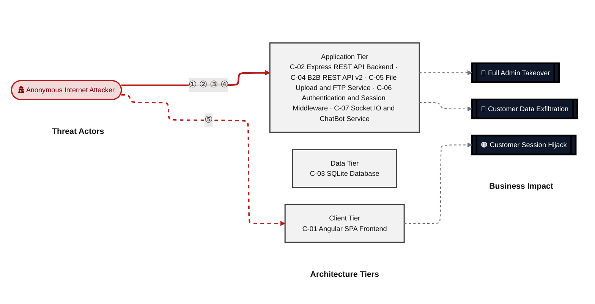
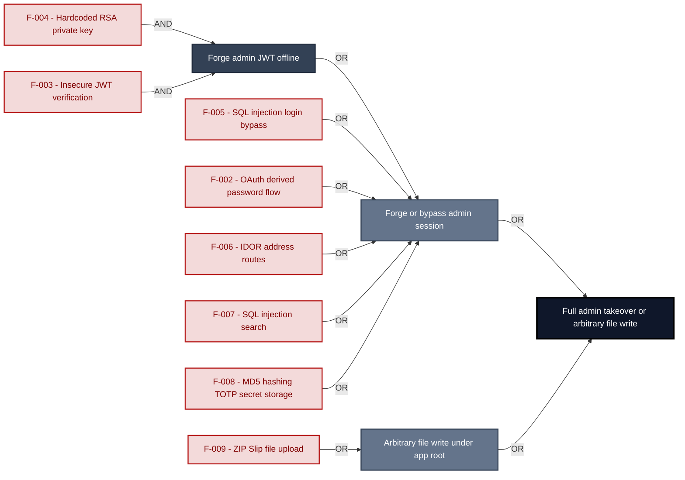
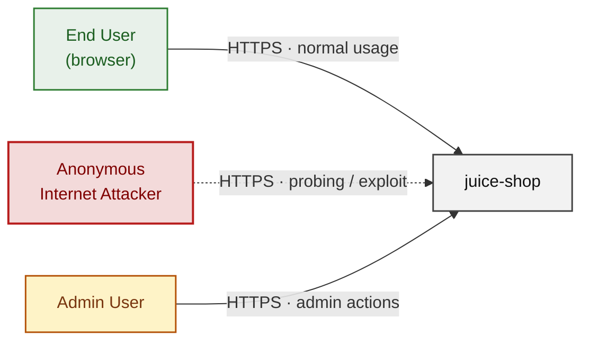
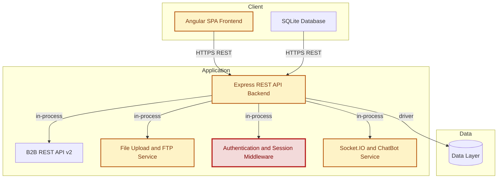
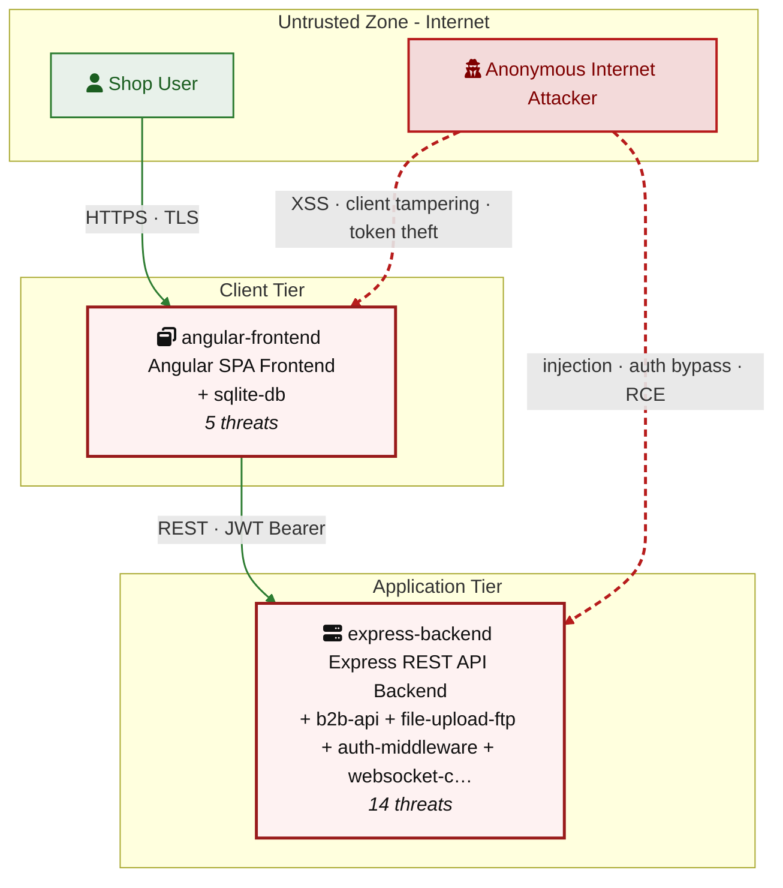
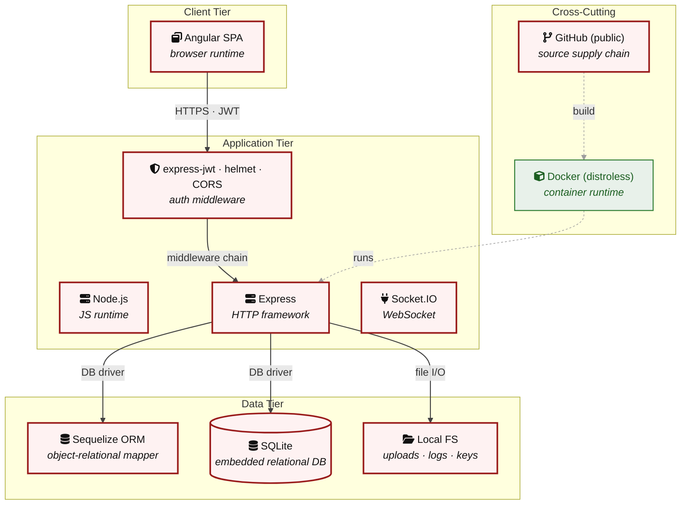

# Threat Model - scans

_Generated by appsec-advisor v0.4.0-beta (analysis v2)_

---

> | | |
> |---|---|
> | **Project** | scans |
> | **Description** | appsec-advisor is a Claude Code plugin for code-anchored threat modeling and security architecture review. |

---

## Changelog

_Append-only history of assessment runs. Most recent first._

| Version | Date | Mode | Depth | Reasoning | Baseline → Current | Δ Threats | Code | Note |
|--------|----------|--------|--------|--------------|------------------|----------------|--------|-------------------|
| v1 | 2026-06-18 | full | quick | sonnet-economy | `455206c` (vs v0) | +0 / ~0 / -0 | - | 38 threats (stable) |

**Latest run (v1) - threat-level delta:**

_No threat-, mitigation-, or abuse-case-level changes since the previous run (v0)._

---

> ⚠ **Quick depth - reduced-scope assessment.**
> 
> This report ran with intentionally narrower depth to keep wall-time short:
> 
> - **5 of 7 components** under full STRIDE analysis (criteria-selected: frontend, auth, and internet-exposed components only)
> - **Max 2 threats per STRIDE category** per component (vs. unlimited at standard/thorough)
> - **No CVSS vectors**, no per-finding evidence excerpts
> - **No §3 Attack Walkthroughs** (entirely skipped at `--quick`)
> - **No LLM-enriched §7 architecture narrative** (scaffold + control tables only)
> - **No QA reviewer pass**, no architect-level review
> 
> Re-run with `--standard` (≈ +30 min) for full STRIDE coverage and QA, or
> `--thorough` (≈ +90 min) for architect review and enriched architecture sections.

---

## Table of Contents

- [Management Summary](#management-summary)
- [Critical Attack Tree](#critical-attack-tree)
1. [System Overview](#1-system-overview)
   - [Scope](#scope)
2. [Architecture Diagrams](#2-architecture-diagrams)
   - [2.1 System Context](#21-system-context)
   - [2.2 Container Architecture](#22-container-architecture)
   - [2.3 Components](#23-components)
   - [2.4 Technology Architecture](#24-technology-architecture)
4. [Assets](#4-assets)
5. [Attack Surface](#5-attack-surface)
   - [5.1 Unauthenticated Entry Points (56)](#51-unauthenticated-entry-points-56)
   - [5.2 Authenticated Entry Points (57)](#52-authenticated-entry-points-57)
7b. [Requirements Compliance](#7b-requirements-compliance)
8. [Findings Register](#8-findings-register)
9. [Abuse Cases](#9-abuse-cases)
10. [Mitigation Register](#10-mitigation-register)
11. [Out of Scope](#11-out-of-scope)
   - [Components Not Individually Analyzed](#components-not-individually-analyzed)
- [Appendix: Run Statistics](#appendix-run-statistics)
- [Appendix A - Vektor Taxonomy](#appendix-a-vektor-taxonomy)

> _Section numbering is non-contiguous: §3, §6, §7 were retired in a prior revision. The remaining sections keep their original numbers so existing cross-references stay valid._

---

## Management Summary

### Verdict

🔴 Juice Shop is not production-ready. Eight independent Critical paths exist - any of them yields account takeover or arbitrary file write without elevated privilege. The signing key for every JWT is committed in source, SQL injection bypasses the login gate, and a hardcoded RSA private key lets anyone mint admin tokens offline. Fixing this means rebuilding authentication, data access, and secret management at the structural level.

**Risk distribution:** 🔴 Critical: 8 · 🟠 High: 20 · 🟡 Medium: 9 · 🟢 Low: 1 · **Total: 38**

**Scope:** 5 of 7 components received full STRIDE analysis - the externally-reachable, authentication-bearing, and business-critical surface. The other 2 (lower-priority / internal) were not individually assessed at this depth (see [§1 Scope](#scope)).

<br/>

**The most severe attack outcomes, each achievable from the internet:**

<blockquote style="border-left: 3px solid #dc2626; background: #fef2f2; padding: 16px 20px; margin: 0;">

- **Full admin account takeover** — The RSA private key committed at lib/insecurity.ts:23 lets an attacker sign arbitrary JWTs with role=admin; the insecure-JWT-verification path at lib/insecurity.ts:54 accepts them. No authentication credential is needed — only a clone of the public repo. *(🔴 [F-003](#f-003) — Insecure JWT Verification — lib/insecurity.ts:54, 🔴 [F-004](#f-004) — Hardcoded RSA Private Key Enables Offline JWT Forgery — lib/insecurity.ts:23)*
- **Authentication bypass via SQL injection** — req.body.email flows unescaped into models.sequelize.query() at routes/login.ts:34. The payload ' OR '1'='1 returns the first seeded row, which is the admin account. *(🔴 [F-005](#f-005) — SQL Injection Authentication Bypass at POST — routes/login.ts:34)*
- **Arbitrary file write under application root** — ZIP Slip in routes/fileUpload.ts:42 allows a crafted archive to overwrite files anywhere under the app root, enabling server-side code replacement on the next Node\.js require() call. *(🔴 [F-009](#f-009) — ZIP Slip Allows Arbitrary File Write Under App Root — routes/fileUpload.ts:42)*
- **Customer data exfiltration via IDOR** — Address and order routes at routes/address.ts:11 accept any numeric id without checking the requesting user's identity, exposing every customer's delivery address and purchase history. *(🔴 [F-006](#f-006) — Insecure Direct Object Reference — routes/address.ts:11)*
- **Credential database exposed in plaintext** — Passwords are hashed with unsalted MD5 (lib/insecurity.ts:43). A database dump converts the entire credential store to plaintext in minutes with a standard rainbow table. *(🔴 [F-008](#f-008) — MD5 Password Hashing and Plaintext TOTP Secret Storage — lib/insecurity.ts:43)*

</blockquote>

<br/>

The highest-leverage repairs are: move the RSA private key out of source, replace raw SQL with parameterized queries, and switch `MD5` to bcrypt. Without those three, the authentication and data-access boundaries offer no effective protection.

### Security Posture & Top Threats

**Figure 1 - Architecture & Top Threats**

Architecture tiers top-to-bottom (External Actors → Client → Application → Data) with the top threats per component. The in-figure legend on the right explains the attack scenarios, severity dots and symbols.


**Figure 2 - Risk Flow: Actor → Tier → Impact**

Heatmap: **actors** (left) → **architecture tiers** (middle, Client → Application → Data) → **impact** (right). Numbered red arrows ①–⑤ are the threats enumerated in the Top Threats table below. Self-registration is open, so the **Authenticated Internet Attacker** tier is one POST away from anonymous - it is shown distinctly because a post-login endpoint is still a different attack surface.



**Threat actors.** The actors below drive the numbered attack paths in the figures above. The **Shop User** is the *victim* of client-side attacks (XSS / CSRF), not an attacker - in Figure 2 the compromise surfaces as the resulting business-impact node rather than as a separate actor box.

- **Shop User** — legitimate customer; target of client-side attacks; target of ⑤ Output Encoding / Cross-Site Scripting.
- **Anonymous Internet Attacker** — no account; registers in seconds when needed; drives ① Insecure Query Construction & Data Access, ② Hardcoded Secrets & Weak Cryptography, ③ Broken Authorization & Access Control, ④ Sensitive File & Secret Exposure.

**5 structural threats**, grouped by weakness class - each row is one threat, not one finding. *Threat Description* states the general architectural weakness (STRIDE in brackets); *Findings* lists the concrete instances, each linked to [§8 Findings Register](#8-findings-register) with its component; *Risk & Impact* combines severity with business consequence.

| # | Threat Description | Findings (→ Component) | Risk & Impact | Fix |
|---|------------------------------------|------------------------------------------------|------------------------------------|--------|
| <a id="path-injection"></a>① | **Insecure Query Construction & Data Access** _(T·I)_<br/>user input flows into a server-side interpreter (SQL, NoSQL, XML, YAML, LDAP, OS shell) without parameterization or schema validation. | <span style="white-space:nowrap">🔴&nbsp;[F-005](#f-005)</span> - SQL Injection Authentication Bypass at POST (`routes/login.ts:34`) <span style="white-space:nowrap">→&nbsp;[C-06](#c-06)</span><br/><span style="white-space:nowrap">🔴&nbsp;[F-007](#f-007)</span> - SQL Injection (`routes/search.ts:23`) <span style="white-space:nowrap">→&nbsp;[C-02](#c-02)</span><br/><span style="white-space:nowrap">🟠&nbsp;[F-012](#f-012)</span> - XXE (`routes/fileUpload.ts:83`) <span style="white-space:nowrap">→&nbsp;[C-05](#c-05)</span> | 🔴 **Critical**<br/>Customer Data Exfiltration | <span style="white-space:nowrap">❶ [M-017](#m-017)</span> — Use parameterized database queries<br/><span style="white-space:nowrap">❶ [M-019](#m-019)</span> — Use parameterized database queries |
| <a id="path-auth-bypass"></a>② | **Hardcoded Secrets & Weak Cryptography** _(S·E)_<br/>authentication can be circumvented or forged because credentials, signing keys, or password hashes are weak, missing, or exposed. | <span style="white-space:nowrap">🔴&nbsp;[F-003](#f-003)</span> - Insecure JWT Verification (`lib/insecurity.ts:54`) <span style="white-space:nowrap">→&nbsp;[C-06](#c-06)</span><br/><span style="white-space:nowrap">🔴&nbsp;[F-004](#f-004)</span> - Hardcoded RSA Private Key Enables Offline JWT Forgery (`lib/insecurity.ts:23`) <span style="white-space:nowrap">→&nbsp;[C-06](#c-06)</span><br/><span style="white-space:nowrap">🔴&nbsp;[F-008](#f-008)</span> - `MD5` Password Hashing and Plaintext TOTP Secret Storage (`lib/insecurity.ts:43`) <span style="white-space:nowrap">→&nbsp;[C-03](#c-03)</span><br/><span style="white-space:nowrap">🟡&nbsp;[F-032](#f-032)</span> - Container image signing absent from release pipeline (`release.yml:1`) <span style="white-space:nowrap">→&nbsp;[C-02](#c-02)</span> | 🔴 **Critical**<br/>Full Admin Takeover · Customer Data Exfiltration | <span style="white-space:nowrap">❶ [M-015](#m-015)</span> — Harden the authentication flow<br/><span style="white-space:nowrap">❶ [M-016](#m-016)</span> — Move secrets to a managed secret store |
| <a id="path-privilege-escalation"></a>③ | **Broken Authorization & Access Control** _(E·I)_<br/>authorization checks are absent or bypassable, allowing horizontal and vertical privilege jumps from a self-registered or low-rights account. Includes mass-assignment of privileged attributes. | <span style="white-space:nowrap">🔴&nbsp;[F-006](#f-006)</span> - Insecure Direct Object Reference (`routes/address.ts:11`) <span style="white-space:nowrap">→&nbsp;[C-02](#c-02)</span><br/><span style="white-space:nowrap">🟠&nbsp;[F-018](#f-018)</span> - GitHub Actions workflow missing top-level permissions block (`ci.yml:1`) <span style="white-space:nowrap">→&nbsp;[C-02](#c-02)</span><br/><span style="white-space:nowrap">🟠&nbsp;[F-026](#f-026)</span> - Client-Side-Only Admin Route Guard (`app.guard.ts:17`) <span style="white-space:nowrap">→&nbsp;[C-01](#c-01)</span><br/><span style="white-space:nowrap">🟠&nbsp;[F-027](#f-027)</span> - Predictable Deluxe Role Token Derived from Public Key (`lib/insecurity.ts:151`) <span style="white-space:nowrap">→&nbsp;[C-06](#c-06)</span><br/><span style="white-space:nowrap">🟠&nbsp;[F-028](#f-028)</span> - Sensitive Routes Registered Without Authentication Middleware (`server.ts:310`) <span style="white-space:nowrap">→&nbsp;[C-02](#c-02)</span><br/><span style="white-space:nowrap">🟡&nbsp;[F-034](#f-034)</span> - Pull_request_target workflow grants write permissions (`pr-compliance.yml:1`) <span style="white-space:nowrap">→&nbsp;[C-02](#c-02)</span><br/><span style="white-space:nowrap">🟡&nbsp;[F-037](#f-037)</span> - Mass Assignment in setUserName Allows Unsanitized Field (`routes/chatbot.ts:149`) <span style="white-space:nowrap">→&nbsp;[C-07](#c-07)</span> | 🔴 **Critical**<br/>Full Admin Takeover · Customer Data Exfiltration | <span style="white-space:nowrap">❶ [M-018](#m-018)</span> — Enforce object-level (ownership) authorization<br/><span style="white-space:nowrap">❷ [M-004](#m-004)</span> — Apply least-privilege permissions |
| <a id="path-sensitive-data-exposure"></a>④ | **Sensitive File & Secret Exposure** _(I)_<br/>confidential files, credentials, and management-plane endpoints are reachable on unauthenticated routes; SSRF lets the server fetch internal resources on the attacker's behalf; unsafe path-handling primitives leak server content. | <span style="white-space:nowrap">🔴&nbsp;[F-009](#f-009)</span> - ZIP Slip Allows Arbitrary File Write Under App Root (`routes/fileUpload.ts:42`) <span style="white-space:nowrap">→&nbsp;[C-05](#c-05)</span><br/><span style="white-space:nowrap">🟠&nbsp;[F-016](#f-016)</span> - Unrestricted Field Selector Exposes `MD5` Password (`routes/currentUser.ts:30`) <span style="white-space:nowrap">→&nbsp;[C-06](#c-06)</span><br/><span style="white-space:nowrap">🟠&nbsp;[F-022](#f-022)</span> - Unauthenticated FTP Directory File Access (`routes/fileServer.ts:33`) <span style="white-space:nowrap">→&nbsp;[C-05](#c-05)</span><br/><span style="white-space:nowrap">🟡&nbsp;[F-036](#f-036)</span> - Internal Error Message Leaked in Chatbot Response Body (`routes/chatbot.ts:130`) <span style="white-space:nowrap">→&nbsp;[C-07](#c-07)</span> | 🔴 **Critical**<br/>Customer Data Exfiltration | <span style="white-space:nowrap">❶ [M-021](#m-021)</span> — Constrain file paths to a safe base directory<br/><span style="white-space:nowrap">❷ [M-027](#m-027)</span> — Stop exposing internal information to clients |
| <a id="path-cross-site-scripting"></a>⑤ | **Output Encoding / Cross-Site Scripting** _(T·I)_<br/>attacker-controlled content is rendered in the victim's browser without sanitization; combined with session tokens held in JavaScript-readable storage, any payload yields immediate account takeover. | <span style="white-space:nowrap">🟠&nbsp;[F-001](#f-001)</span> - SPA Without BFF JWT Stored in localStorage (`request.interceptor.ts:13`) <span style="white-space:nowrap">→&nbsp;[C-01](#c-01)</span><br/><span style="white-space:nowrap">🟠&nbsp;[F-011](#f-011)</span> - DOM XSS (`search-result.component.ts:170`) <span style="white-space:nowrap">→&nbsp;[C-01](#c-01)</span> | 🟠 **High**<br/>Customer Session Hijack | <span style="white-space:nowrap">❷ [M-023](#m-023)</span> — Encode output instead of bypassing the framework sanitizer<br/><span style="white-space:nowrap">❸ [M-013](#m-013)</span> — Store session tokens in HttpOnly, Secure cookies |

_STRIDE: S spoofing · T tampering · R repudiation · I information disclosure · D denial of service · E elevation of privilege. Risk, findings, components, impact and Fix are derived deterministically; only the one-line weakness description is authored._

### Top Mitigations

Highest-impact P1/P2 mitigations - 10 of 25 qualifying (38 total). Full detail in [§10 Mitigation Register](#10-mitigation-register). All 8 mitigation(s) that fix a Critical finding are always listed here.

| # | Component | Mitigation | Addresses | Effort |
|---|----------------------|------------------------------------------------|------------------------------------------------|------|
| **1** | [C-02](#c-02) — Express REST API Backend | ❶ [M-019](#m-019) — Use parameterized database queries | 🔴 [F-007](#f-007) — SQL Injection (`routes/search.ts`) | Low |
| **2** | [C-02](#c-02) — Express REST API Backend | ❶ [M-018](#m-018) — Enforce object-level (ownership) authorization | 🔴 [F-006](#f-006) — Insecure Direct Object Reference (`routes/address.ts`) | Medium |
| **3** | [C-03](#c-03) — SQLite Database | ❶ [M-020](#m-020) — Hash passwords with a strong, salted algorithm | 🔴 [F-008](#f-008) — MD5 Password Hashing and Plaintext TOTP Secret Storage (`lib/insecurity.ts`) | Medium |
| **4** | [C-05](#c-05) — File Upload and FTP Service | ❶ [M-021](#m-021) — Constrain file paths to a safe base directory | 🔴 [F-009](#f-009) — ZIP Slip Allows Arbitrary File Write Under App Root (`routes/fileUpload.ts`) | Low |
| **5** | [C-06](#c-06) — Authentication and Session Middleware | ❶ [M-015](#m-015) — Harden the authentication flow | 🔴 [F-003](#f-003) — Insecure JWT Verification (`lib/insecurity.ts`) | Low |
| **6** | [C-06](#c-06) — Authentication and Session Middleware | ❶ [M-017](#m-017) — Use parameterized database queries | 🔴 [F-005](#f-005) — SQL Injection Authentication Bypass at POST (`routes/login.ts`) | Low |
| **7** | [C-06](#c-06) — Authentication and Session Middleware | ❶ [M-016](#m-016) — Move secrets to a managed secret store | 🔴 [F-004](#f-004) — Hardcoded RSA Private Key Enables Offline JWT Forgery (`lib/insecurity.ts`) | Medium |
| **8** | [C-01](#c-01) — Angular SPA Frontend | ❷ [M-014](#m-014) — Replace OAuth implicit flow with authorization code + PKCE and store credential server-side | 🔴 [F-002](#f-002) — OAuth Implicit Flow with Derived Password (`oauth.component.ts`) | High |
| **9** | [C-02](#c-02) — Express REST API Backend | ❷ [M-003](#m-003) — Drop unnecessary privileges in build and runtime | 🟠 [F-017](#f-017) — Uses --unsafe-perm npm install flag — Dockerfile:5 (Dockerfile) | Low |
| **10** | [C-02](#c-02) — Express REST API Backend | ❷ [M-004](#m-004) — Apply least-privilege permissions | 🟠 [F-018](#f-018) — GitHub Actions workflow missing top-level permissions block (`ci.yml`) | Low |

*15 additional P1/P2 mitigations capped from the leader-board · 13 P3 backlog items in [§10 Mitigation Register](#10-mitigation-register). Sorted by priority (P1 first), then component, then leverage (most findings first), severity (Critical first), and effort (Low first).*

### Requirements Compliance

**Baseline:** [OWASP Security Requirements](https://owasp.org/Top10/)

**Failed or partial requirements → findings & mitigations:**

| Requirement | Status | Risk | Findings | Maßnahmen | Guidance |
|-----------|----------|----------|----------------|----------------|----------------------|
| [`AC-004`](https://cheatsheetseries.owasp.org/cheatsheets/Multifactor_Authentication_Cheat_Sheet.html) | ❌ FAIL | 🔴 Critical | 🔴 [F-005](#f-005) — SQL Injection Authentication Bypass at POST — `routes/login.ts:34` | ❶ [M-017](#m-017) — Use parameterized database queries | [BP-API-AUTHZ-ENDUSER](https://cheatsheetseries.owasp.org/cheatsheets/JSON_Web_Token_for_Java_Cheat_Sheet.html) - 1. Implement a<br/>Backend-for-Frontend (BFF) |
| [`AC-005`](https://cheatsheetseries.owasp.org/cheatsheets/JSON_Web_Token_for_Java_Cheat_Sheet.html) | ❌ FAIL | 🔴 Critical | 🔴 [F-003](#f-003) — Insecure JWT Verification — `lib/insecurity.ts:54` | ❶ [M-015](#m-015) — Harden the authentication flow | [BP-API-AUTHZ-ENDUSER](https://cheatsheetseries.owasp.org/cheatsheets/JSON_Web_Token_for_Java_Cheat_Sheet.html) - 3.1. Step 1: Issuer<br/>Validation |
| [`DP-001`](https://cheatsheetseries.owasp.org/cheatsheets/Cryptographic_Storage_Cheat_Sheet.html) | ⚠️ PARTIAL | 🔴 Critical | 🔴 [F-004](#f-004) — Hardcoded RSA Private Key Enables Offline JWT Forgery — `lib/insecurity.ts:23` | ❶ [M-016](#m-016) — Move secrets to a managed secret store | - |
| [`DP-004`](https://cheatsheetseries.owasp.org/cheatsheets/Password_Storage_Cheat_Sheet.html) | ❌ FAIL | 🔴 Critical | 🔴 [F-008](#f-008) — MD5 Password Hashing and Plaintext TOTP Secret Storage — `lib/insecurity.ts:43` | ❶ [M-020](#m-020) — Hash passwords with a strong, salted algorithm | - |
| [`IV-004`](https://cheatsheetseries.owasp.org/cheatsheets/SQL_Injection_Prevention_Cheat_Sheet.html) | ❌ FAIL | 🔴 Critical | 🔴 [F-005](#f-005) — SQL Injection Authentication Bypass at POST — `routes/login.ts:34`, 🔴 [F-007](#f-007) — SQL Injection — `routes/search.ts:23` | ❶ [M-017](#m-017) — Use parameterized database queries, ❶ [M-019](#m-019) — Use parameterized database queries | [BP-API-VALIDATION](https://cheatsheetseries.owasp.org/cheatsheets/SQL_Injection_Prevention_Cheat_Sheet.html) - 4. Parameterized Data<br/>Access |
| [`DP-003`](https://cheatsheetseries.owasp.org/cheatsheets/REST_Security_Cheat_Sheet.html) | ❌ FAIL | 🟠 High | 🟠 [F-015](#f-015) — Plaintext Credentials in GET Query String — `user.service.ts:54` | ❷ [M-026](#m-026) — Replace change-password GET with POST and move credentials into the request body | [BP-API-AUTHZ-ENDUSER](https://cheatsheetseries.owasp.org/cheatsheets/JSON_Web_Token_for_Java_Cheat_Sheet.html) - 2.2. Handling Access<br/>Tokens |

_5 further requirement(s) in [§7b - Requirements Compliance](#7b-requirements-compliance)._

→ *Full compliance details in [Section 7b - Requirements Compliance](#7b-requirements-compliance).*

### Operational Strengths

Operational controls rated Adequate or Partial - grouped into broad clusters. Clusters demoted to Weak by open Critical/High findings are excluded here.

<table style="table-layout:fixed;width:100%">
<colgroup><col width="18%" style="width:18%"><col width="28%" style="width:28%"><col width="13%" style="width:13%"><col width="30%" style="width:30%"><col width="11%" style="width:11%"></colgroup>
<thead><tr><th>Strength</th><th>What's in Place</th><th>Effectiveness</th><th>Gap</th><th>Mitigates</th></tr></thead>
<tbody>
<tr><td style="overflow-wrap:anywhere"><strong>Container &amp; Supply-Chain Hardening</strong></td><td style="overflow-wrap:anywhere"><em>Build-time and runtime hardening - minimal base image, non-root execution, dependency inventory.</em><br/>Automated SCA scanning<br/>Container Hardening - Dockerfile - FROM gcr.io/distroless/nodejs24-debian13; USER 65532.…</td><td>✅ Adequate</td><td style="overflow-wrap:anywhere">-</td><td style="overflow-wrap:anywhere">-</td></tr>
<tr><td style="overflow-wrap:anywhere"><strong>Observability &amp; Audit</strong></td><td style="overflow-wrap:anywhere"><em>Runtime visibility - access logging, audit trails, and operational telemetry for post-incident review.</em><br/>Security Logging - <code>server.ts:333</code>-338 - morgan audit log + access log. <code>lib/logger.ts</code>.</td><td>⚠️ Partial</td><td style="overflow-wrap:anywhere">Coverage incomplete - see §7 control assessment.</td><td style="overflow-wrap:anywhere">-</td></tr>
</tbody>
</table>

**Bottom line:** These controls narrow specific attack surfaces but none eliminates a Critical finding on its own.

---

<a id="critical-attack-chain"></a><a id="critical-attack-tree"></a>
## Critical Attack Tree

The root is the worst-case attacker goal; below it, each capability branch groups the Critical findings that achieve it. Branches feed the goal by OR - any single path suffices.



**Findings** (full detail in [§8 Findings Register](#8-findings-register)): 🔴 [F-004](#f-004) — Hardcoded RSA Private Key Enables Offline JWT Forgery — `lib/insecurity.ts:23` Hardcoded RSA private key · 🔴 [F-003](#f-003) — Insecure JWT Verification — `lib/insecurity.ts:54` Insecure JWT verification · 🔴 [F-005](#f-005) — SQL Injection Authentication Bypass at POST — `routes/login.ts:34` SQL injection login bypass · 🔴 [F-002](#f-002) — OAuth Implicit Flow with Derived Password — `oauth.component.ts:30` OAuth derived password flow · 🔴 [F-006](#f-006) — Insecure Direct Object Reference — `routes/address.ts:11` IDOR address routes · 🔴 [F-007](#f-007) — SQL Injection — `routes/search.ts:23` SQL injection search · 🔴 [F-008](#f-008) — MD5 Password Hashing and Plaintext TOTP Secret Storage — `lib/insecurity.ts:43` MD5 hashing TOTP secret storage · 🔴 [F-009](#f-009) — ZIP Slip Allows Arbitrary File Write Under App Root — `routes/fileUpload.ts:42` ZIP Slip file upload

---

## 1. System Overview

**Repository:** https://github.com/juice-shop/juice-shop

### Scope

juice-shop comprises **7** modeled components. This threat model applied full STRIDE threat analysis to **5 of 7** - the components on the externally-reachable, authentication-bearing, and business-critical surface: **Angular SPA Frontend**, **SQLite Database**, **File Upload and FTP Service**, **Authentication and Session Middleware**, **Socket\.IO and ChatBot Service**. Selection criteria: frontend attack surface; exposure-unknown; auth.

The remaining **2** component(s) were **not individually analyzed** at this assessment depth (lower-priority / internal surface): Express REST API Backend, B2B REST API v2. Re-run at a higher `--assessment-depth` to extend STRIDE coverage to them.

**Out of scope:** third-party hosted dependencies, browser runtime, operating-system kernel, and the underlying network infrastructure.

---

## 2. Architecture Diagrams

### 2.1 System Context

Who interacts with juice-shop from the outside, and through which channels. Solid arrows show normal usage; dashed red arrows mark unauthenticated probing or exploit paths (C4 Level 1).



**Key takeaway:** Every actor in the context interacts with juice-shop through its external interface, so authentication and input validation at that edge govern the entire attack surface.

### 2.2 Container Architecture

How the system decomposes into deployable units. Each box is a separate runtime process or service container; arrows show synchronous request paths between them. Components with ≥3 Critical findings carry a red border, ≥2 High amber (C4 Level 2).



**Key takeaway:** The system decomposes into 2 client, 5 application and 0 data unit(s); Authentication and Session Middleware carries the most Critical findings (3) and bounds the worst-case blast radius.

### 2.3 Components

Who reaches each component, and through which trust zone. Four columns map external actors to the internal tiers (Client / Application / Data); solid green arrows show legitimate data flow, dashed red arrows mark intrusion vectors. The component table directly below holds source paths and linked threats per `C-NN`; per-finding evidence is in [§8 Findings Register](#8-findings-register).



**Key takeaway:** Express REST API Backend concentrates the most findings (14 of 38 across all components); the table below maps each component to its source paths and linked threats.

| ID | Name | Type | Key Paths | Linked Threats | Scope |
|----|----------------------|-----------|--------------------------------------|------------------------------------------------|------------|
| <a id="c-01"></a><a id="angular-frontend"></a><span style="white-space:nowrap">C-01</span> | Angular SPA Frontend | client | `frontend/src/**`<br/>`frontend/dist/**`<br/>`frontend/*.ts` | 🟠 [F-001](#f-001) — SPA Without BFF JWT Stored in localStorage (`request.interceptor.ts:13`)<br/>🔴 [F-002](#f-002) — OAuth Implicit Flow with Derived Password (`oauth.component.ts:30`)<br/>🟠 [F-011](#f-011) — DOM XSS (`search-result.component.ts:170`)<br/>🟠 [F-015](#f-015) — Plaintext Credentials in GET Query String (`user.service.ts:54`)<br/>🟠 [F-026](#f-026) — Client-Side-Only Admin Route Guard (`app.guard.ts:17`) | Analyzed |
| <a id="c-02"></a><a id="express-backend"></a><span style="white-space:nowrap">C-02</span> | Express REST API Backend | application | `routes/**`<br/>`lib/**`<br/>`server.ts`<br/>`models/**`<br/>`data/**` | 🔴 [F-006](#f-006) — Insecure Direct Object Reference (`routes/address.ts:11`)<br/>🔴 [F-007](#f-007) — SQL Injection (`routes/search.ts:23`)<br/>🟠 [F-017](#f-017) — Uses --unsafe-perm npm install flag — Dockerfile:5<br/>🟠 [F-018](#f-018) — GitHub Actions workflow missing top-level permissions block (`ci.yml:1`)<br/>🟠 [F-019](#f-019) — Third-party GitHub Actions not pinned to commit SHA (`codeql-analysis.yml:22`)<br/>🟠 [F-020](#f-020) — Docker base image not digest-pinned — Dockerfile:1<br/>🟠 [F-021](#f-021) — On not committed (`package-lock.json`)<br/>🟠 [F-028](#f-028) — Sensitive Routes Registered Without Authentication Middleware (`server.ts:310`)<br/>🟡 [F-031](#f-031) — USER directive missing in build stage — Dockerfile:1<br/>🟡 [F-032](#f-032) — Container image signing absent from release pipeline (`release.yml:1`)<br/>🟡 [F-033](#f-033) — Untrusted npm Install/Postinstall Scripts Enabled — Dockerfile:5<br/>🟡 [F-034](#f-034) — Pull_request_target workflow grants write permissions (`pr-compliance.yml:1`)<br/>🟡 [F-035](#f-035) — Dependabot Ecosystem Coverage Incomplete (.github/dependabot.yml)<br/>🟢 [F-038](#f-038) — Missing HEALTHCHECK instruction — Dockerfile:42 | Out of scope |
| <a id="c-03"></a><a id="sqlite-db"></a><span style="white-space:nowrap">C-03</span> | SQLite Database | data | `models/**`<br/>`data/juiceshop.sqlite` | 🔴 [F-008](#f-008) — MD5 Password Hashing and Plaintext TOTP Secret Storage (`lib/insecurity.ts:43`) | Analyzed |
| <a id="c-04"></a><a id="b2b-api"></a><span style="white-space:nowrap">C-04</span> | B2B REST API v2 | application | `routes/order*`<br/>`swagger.yml` | - | Out of scope |
| <a id="c-05"></a><a id="file-upload-ftp"></a><span style="white-space:nowrap">C-05</span> | File Upload and FTP Service | application | `routes/fileUpload.ts`<br/>`routes/fileServer.ts`<br/>`routes/quarantineServer.ts`<br/>`routes/profileImageUrlUpload.ts`<br/>`ftp/**` | 🔴 [F-009](#f-009) — ZIP Slip Allows Arbitrary File Write Under App Root (`routes/fileUpload.ts:42`)<br/>🟠 [F-010](#f-010) — Missing Authentication on POST `/file-upload` (`routes/fileUpload.ts:19`)<br/>🟠 [F-012](#f-012) — XXE (`routes/fileUpload.ts:83`)<br/>🟠 [F-022](#f-022) — Unauthenticated FTP Directory File Access (`routes/fileServer.ts:33`)<br/>🟠 [F-024](#f-024) — YAML Bomb Causes Unbounded CPU/Memory Exhaustion (`routes/fileUpload.ts:117`)<br/>🟡 [F-029](#f-029) — No Structured Audit Log for File Upload Events (`routes/fileUpload.ts:27`) | Analyzed |
| <a id="c-06"></a><a id="auth-middleware"></a><span style="white-space:nowrap">C-06</span> | Authentication and Session Middleware | application | `lib/insecurity.ts`<br/>`routes/login.ts`<br/>`routes/logout.ts`<br/>`routes/currentUser.ts`<br/>`routes/userProfile.ts` | 🔴 [F-003](#f-003) — Insecure JWT Verification (`lib/insecurity.ts:54`)<br/>🔴 [F-004](#f-004) — Hardcoded RSA Private Key Enables Offline JWT Forgery (`lib/insecurity.ts:23`)<br/>🔴 [F-005](#f-005) — SQL Injection Authentication Bypass at POST (`routes/login.ts:34`)<br/>🟠 [F-014](#f-014) — Missing Authentication Audit Log Prevents Attribution of (`routes/login.ts:34`)<br/>🟠 [F-016](#f-016) — Unrestricted Field Selector Exposes MD5 Password (`routes/currentUser.ts:30`)<br/>🟠 [F-023](#f-023) — No Rate Limiting on POST `/rest/user/login` Enables (`routes/login.ts:18`)<br/>🟠 [F-027](#f-027) — Predictable Deluxe Role Token Derived from Public Key (`lib/insecurity.ts:151`) | Analyzed |
| <a id="c-07"></a><a id="websocket-chat"></a><span style="white-space:nowrap">C-07</span> | Socket\.IO and ChatBot Service | application | `lib/startup/registerWebsocketEvents.ts`<br/>`data/chatbot/**`<br/>`routes/chatbot.ts` | 🟠 [F-013](#f-013) — Chatbot Prompt Injection (`routes/chatbot.ts:104`)<br/>🟠 [F-025](#f-025) — No Rate Limiting on WebSocket Message Handlers (`registerWebsocketEvents.ts:41`)<br/>🟡 [F-030](#f-030) — No Audit Logging for WebSocket Events and (`registerWebsocketEvents.ts:34`)<br/>🟡 [F-036](#f-036) — Internal Error Message Leaked in Chatbot Response Body (`routes/chatbot.ts:130`)<br/>🟡 [F-037](#f-037) — Mass Assignment in setUserName Allows Unsanitized Field (`routes/chatbot.ts:149`) | Analyzed |
### 2.4 Technology Architecture

The technology stack the system is built on. Each box names the framework or runtime that fills that role; per-component findings live in the [§2.3](#23-components) component table above, and the full per-finding catalogue is in [§8 Findings Register](#8-findings-register).



**Key takeaway:** The technology stack is consolidated in the application tier; per-finding detail is in [§8 Findings Register](#8-findings-register).

> **Legend:** **red border** ≥ 3 Critical threats on the component · **amber border** ≥ 2 High threats

---

## 4. Assets

Information assets and the classification level that drives the Confidentiality / Integrity / Availability targets used in [§8 Findings Register](#8-findings-register) risk scoring.

<table style="table-layout:fixed;width:100%">
<colgroup><col width="20%" style="width:20%"><col width="6%" style="width:6%"><col width="12%" style="width:12%"><col width="29%" style="width:29%"><col width="33%" style="width:33%"></colgroup>
<thead><tr><th>Asset</th><th>ID</th><th>Classification</th><th>Description</th><th>Linked Threats</th></tr></thead>
<tbody>
<tr><td style="overflow-wrap:anywhere">User Credentials (email + <code>MD5</code>-hashed passwords)</td><td style="white-space:nowrap">A-001</td><td>Restricted</td><td>User email addresses and <code>MD5</code>-hashed passwords stored in the SQLite Users table. <code>MD5</code> is cryptographically broken; passwords are trivially reversible via rainbow tables.</td><td style="overflow-wrap:anywhere">🔴 <a href="#f-002">F-002</a> — OAuth Implicit Flow with Derived Password (<code>oauth.component.ts:30</code>)<br/>🔴 <a href="#f-005">F-005</a> — SQL Injection Authentication Bypass at POST (<code>routes/login.ts:34</code>)<br/>🔴 <a href="#f-007">F-007</a> — SQL Injection (<code>routes/search.ts:23</code>)<br/>🔴 <a href="#f-008">F-008</a> — MD5 Password Hashing and Plaintext TOTP Secret Storage (<code>lib/insecurity.ts:43</code>)<br/>🟠 <a href="#f-011">F-011</a> — DOM XSS (<code>search-result.component.ts:170</code>)<br/>🟠 <a href="#f-023">F-023</a> — No Rate Limiting on POST <code>/rest/user/login</code> Enables (<code>routes/login.ts:18</code>)</td></tr>
<tr><td style="overflow-wrap:anywhere">JWT RSA Private Key</td><td style="white-space:nowrap">A-002</td><td>Restricted</td><td>RSA-2048 private key hardcoded in <code>lib/insecurity.ts</code> used to sign all JWTs. Committed to source control — permanently compromised for any attacker with repo access.</td><td style="overflow-wrap:anywhere">🔴 <a href="#f-003">F-003</a> — Insecure JWT Verification (<code>lib/insecurity.ts:54</code>)<br/>🔴 <a href="#f-004">F-004</a> — Hardcoded RSA Private Key Enables Offline JWT Forgery (<code>lib/insecurity.ts:23</code>)<br/>🔴 <a href="#f-008">F-008</a> — MD5 Password Hashing and Plaintext TOTP Secret Storage (<code>lib/insecurity.ts:43</code>)<br/>🔴 <a href="#f-009">F-009</a> — ZIP Slip Allows Arbitrary File Write Under App Root (<code>routes/fileUpload.ts:42</code>)<br/>🟠 <a href="#f-016">F-016</a> — Unrestricted Field Selector Exposes MD5 Password (<code>routes/currentUser.ts:30</code>)<br/>🟠 <a href="#f-027">F-027</a> — Predictable Deluxe Role Token Derived from Public Key (<code>lib/insecurity.ts:151</code>)</td></tr>
<tr><td style="overflow-wrap:anywhere">User PII (address, payment cards, security answers)</td><td style="white-space:nowrap">A-003</td><td>Restricted</td><td>Physical addresses, payment card data, and security question answers stored in Address, Card, and SecurityAnswer Sequelize models.</td><td style="overflow-wrap:anywhere">🔴 <a href="#f-005">F-005</a> — SQL Injection Authentication Bypass at POST (<code>routes/login.ts:34</code>)<br/>🔴 <a href="#f-006">F-006</a> — Insecure Direct Object Reference (<code>routes/address.ts:11</code>)<br/>🔴 <a href="#f-007">F-007</a> — SQL Injection (<code>routes/search.ts:23</code>)<br/>🟠 <a href="#f-011">F-011</a> — DOM XSS (<code>search-result.component.ts:170</code>)<br/>🟠 <a href="#f-028">F-028</a> — Sensitive Routes Registered Without Authentication Middleware (<code>server.ts:310</code>)</td></tr>
<tr><td style="overflow-wrap:anywhere">TOTP Secrets</td><td style="white-space:nowrap">A-004</td><td>Restricted</td><td>TOTP 2FA secrets stored as plaintext strings in the User model totpSecret field in SQLite.</td><td style="overflow-wrap:anywhere">-</td></tr>
<tr><td style="overflow-wrap:anywhere">User Session Tokens (JWTs)</td><td style="white-space:nowrap">A-005</td><td>Confidential</td><td>JWT Bearer tokens stored in browser localStorage by the Angular SPA. Tokens contain user ID, email, and role. Theft enables full account takeover.</td><td style="overflow-wrap:anywhere">🟠 <a href="#f-001">F-001</a> — SPA Without BFF JWT Stored in localStorage (<code>request.interceptor.ts:13</code>)<br/>🔴 <a href="#f-003">F-003</a> — Insecure JWT Verification (<code>lib/insecurity.ts:54</code>)<br/>🔴 <a href="#f-004">F-004</a> — Hardcoded RSA Private Key Enables Offline JWT Forgery (<code>lib/insecurity.ts:23</code>)<br/>🟠 <a href="#f-011">F-011</a> — DOM XSS (<code>search-result.component.ts:170</code>)<br/>🟡 <a href="#f-032">F-032</a> — Container image signing absent from release pipeline (<code>release.yml:1</code>)</td></tr>
<tr><td style="overflow-wrap:anywhere">Customer Order and Basket Data</td><td style="white-space:nowrap">A-006</td><td>Confidential</td><td>Customer order history, basket contents, and wallet balances stored in Basket, BasketItem, and Wallet models.</td><td style="overflow-wrap:anywhere">🔴 <a href="#f-005">F-005</a> — SQL Injection Authentication Bypass at POST (<code>routes/login.ts:34</code>)<br/>🔴 <a href="#f-006">F-006</a> — Insecure Direct Object Reference (<code>routes/address.ts:11</code>)<br/>🔴 <a href="#f-007">F-007</a> — SQL Injection (<code>routes/search.ts:23</code>)<br/>🟠 <a href="#f-011">F-011</a> — DOM XSS (<code>search-result.component.ts:170</code>)<br/>🟠 <a href="#f-028">F-028</a> — Sensitive Routes Registered Without Authentication Middleware (<code>server.ts:310</code>)</td></tr>
<tr><td style="overflow-wrap:anywhere">Uploaded Complaint Files</td><td style="white-space:nowrap">A-009</td><td>Confidential</td><td>User-uploaded complaint files (PDF, ZIP) stored in uploads/complaints/. ZIP extraction with XML processing creates XXE and path traversal vectors.</td><td style="overflow-wrap:anywhere">🔴 <a href="#f-009">F-009</a> — ZIP Slip Allows Arbitrary File Write Under App Root (<code>routes/fileUpload.ts:42</code>)<br/>🟠 <a href="#f-012">F-012</a> — XXE (<code>routes/fileUpload.ts:83</code>)</td></tr>
<tr><td style="overflow-wrap:anywhere">Google OAuth Client ID</td><td style="white-space:nowrap">A-012</td><td>Confidential</td><td>Google OAuth2 client ID hardcoded in <code>config/default.yml</code>. Multiple localhost and RFC1918 redirect URIs registered, creating redirect hijack surface.</td><td style="overflow-wrap:anywhere">-</td></tr>
<tr><td style="overflow-wrap:anywhere">Hacking Challenge State</td><td style="white-space:nowrap">A-007</td><td>Internal</td><td>Challenge completion flags and scoreboard data in the Challenge model. Integrity matters for training platform operation; manipulation is a challenge category.</td><td style="overflow-wrap:anywhere">-</td></tr>
<tr><td style="overflow-wrap:anywhere">FTP Directory Contents</td><td style="white-space:nowrap">A-008</td><td>Internal</td><td>Files in ftp/ directory served by <code>fileServer.ts</code>. Contains challenge artifacts and backup files. Path traversal allows access to arbitrary files in this directory.</td><td style="overflow-wrap:anywhere">🔴 <a href="#f-009">F-009</a> — ZIP Slip Allows Arbitrary File Write Under App Root (<code>routes/fileUpload.ts:42</code>)<br/>🟠 <a href="#f-016">F-016</a> — Unrestricted Field Selector Exposes MD5 Password (<code>routes/currentUser.ts:30</code>)<br/>🟠 <a href="#f-022">F-022</a> — Unauthenticated FTP Directory File Access (<code>routes/fileServer.ts:33</code>)<br/>🟠 <a href="#f-028">F-028</a> — Sensitive Routes Registered Without Authentication Middleware (<code>server.ts:310</code>)</td></tr>
<tr><td style="overflow-wrap:anywhere">Application Source Code</td><td style="white-space:nowrap">A-010</td><td>Internal</td><td>The deployed TypeScript/JavaScript source code. Publicly available on GitHub; contains intentional vulnerabilities. Source exposure enables exact exploit construction.</td><td style="overflow-wrap:anywhere">-</td></tr>
<tr><td style="overflow-wrap:anywhere">ChatBot Training Data</td><td style="white-space:nowrap">A-011</td><td>Internal</td><td>Chatbot training files at data/chatbot/. Used to respond to user queries. Prompt injection via chat is a challenge category.</td><td style="overflow-wrap:anywhere">-</td></tr>
</tbody>
</table>

---

## 5. Attack Surface

Network-reachable entry points classified by authentication requirement. Each row links to the threat(s) referenced in its **Notes** column. The **Risk** column reflects the highest-severity linked finding. Entry points with no linked finding are still listed when they sit on a sensitive surface (authentication, registration, management) or look like a missing-auth/authz suspect - marked **⚑ Review** in Notes.

### 5.1 Unauthenticated Entry Points (56)

<table style="table-layout:fixed;width:100%">
<colgroup><col width="9%" style="width:9%"><col width="30%" style="width:30%"><col width="14%" style="width:14%"><col width="47%" style="width:47%"></colgroup>
<thead><tr><th>Method</th><th>Route</th><th>Risk</th><th>Notes</th></tr></thead>
<tbody>
<tr><td>POST</td><td style="overflow-wrap:anywhere"><code>/file-upload</code></td><td>🔴 Critical</td><td>🟠 <a href="#f-010">F-010</a> — Missing Authentication on POST <code>/file-upload</code> (<code>routes/fileUpload.ts:19</code>)<br/>🟠 <a href="#f-024">F-024</a> — YAML Bomb Causes Unbounded CPU/Memory Exhaustion (<code>routes/fileUpload.ts:117</code>)<br/>🔴 <a href="#f-009">F-009</a> — ZIP Slip Allows Arbitrary File Write Under App Root (<code>routes/fileUpload.ts:42</code>)<br/>handler: <code>server.ts:309</code></td></tr>
<tr><td>POST</td><td style="overflow-wrap:anywhere"><code>/rest/user/login</code></td><td>🔴 Critical</td><td>🟠 <a href="#f-023">F-023</a> — No Rate Limiting on POST <code>/rest/user/login</code> Enables (<code>routes/login.ts:18</code>)<br/>🔴 <a href="#f-002">F-002</a> — OAuth Implicit Flow with Derived Password (<code>oauth.component.ts:30</code>)<br/>🔴 <a href="#f-005">F-005</a> — SQL Injection Authentication Bypass at POST (<code>routes/login.ts:34</code>)<br/>handler: <code>server.ts:594</code></td></tr>
<tr><td>GET</td><td style="overflow-wrap:anywhere"><code>/rest/products/search</code></td><td>🔴 Critical</td><td>🔴 <a href="#f-007">F-007</a> — SQL Injection (<code>routes/search.ts:23</code>)<br/>handler: <code>server.ts:600</code></td></tr>
<tr><td>POST</td><td style="overflow-wrap:anywhere"><code>/​rest/​user/​login (email body param)</code></td><td>🔴 Critical</td><td>🟠 <a href="#f-023">F-023</a> — No Rate Limiting on POST <code>/rest/user/login</code> Enables (<code>routes/login.ts:18</code>)<br/>🔴 <a href="#f-002">F-002</a> — OAuth Implicit Flow with Derived Password (<code>oauth.component.ts:30</code>)<br/>🔴 <a href="#f-005">F-005</a> — SQL Injection Authentication Bypass at POST (<code>routes/login.ts:34</code>)<br/>SQL injection in login query allows authentication bypass for any account including admin. Unauthenticated entry point.</td></tr>
<tr><td>GET</td><td style="overflow-wrap:anywhere"><code>/​this/​page/​is/​hidden/​behind/​an/​incredibly/​high/​paywall/​that/​could/​only/​be/​unlocked/​by/​sending/​1btc/​to/​us</code></td><td>🔴 Critical</td><td>🟠 <a href="#f-001">F-001</a> — SPA Without BFF JWT Stored in localStorage (<code>request.interceptor.ts:13</code>)<br/>🔴 <a href="#f-009">F-009</a> — ZIP Slip Allows Arbitrary File Write Under App Root (<code>routes/fileUpload.ts:42</code>)<br/>🔴 <a href="#f-002">F-002</a> — OAuth Implicit Flow with Derived Password (<code>oauth.component.ts:30</code>)<br/>handler: <code>server.ts:649</code></td></tr>
<tr><td>POST</td><td style="overflow-wrap:anywhere"><code>/rest/user/reset-password</code></td><td>🟠 High</td><td>🟠 <a href="#f-023">F-023</a> — No Rate Limiting on POST <code>/rest/user/login</code> Enables (<code>routes/login.ts:18</code>)<br/>handler: <code>server.ts:596</code></td></tr>
<tr><td>GET</td><td style="overflow-wrap:anywhere"><code>/rest/user/change-password</code></td><td>🟠 High</td><td>🟠 <a href="#f-015">F-015</a> — Plaintext Credentials in GET Query String (<code>user.service.ts:54</code>)<br/>handler: <code>server.ts:595</code></td></tr>
<tr><td>GET</td><td style="overflow-wrap:anywhere"><code>/rest/user/whoami</code></td><td>🟠 High</td><td>🟠 <a href="#f-016">F-016</a> — Unrestricted Field Selector Exposes MD5 Password (<code>routes/currentUser.ts:30</code>)<br/>handler: <code>server.ts:598</code></td></tr>
<tr><td>POST</td><td style="overflow-wrap:anywhere"><code>/profile/image/file</code></td><td>🟡 Medium</td><td>🟡 <a href="#f-029">F-029</a> — No Structured Audit Log for File Upload Events (<code>routes/fileUpload.ts:27</code>)<br/>handler: <code>server.ts:310</code></td></tr>
<tr><td>POST</td><td style="overflow-wrap:anywhere"><code>/</code></td><td>-</td><td>handler: <code>routes/dataErasure.ts:54</code><br/><em>⚑ Review: no auth guard detected</em></td></tr>
<tr><td>POST</td><td style="overflow-wrap:anywhere"><code>/api/Feedbacks</code></td><td>-</td><td>handler: <code>server.ts:401</code><br/><em>⚑ Review: no auth guard detected</em></td></tr>
<tr><td>GET</td><td style="overflow-wrap:anywhere"><code>/metrics</code></td><td>-</td><td>Management surface; handler: <code>server.ts:718</code><br/><em>⚑ Review: no auth guard detected</em></td></tr>
<tr><td>POST</td><td style="overflow-wrap:anywhere"><code>/profile</code></td><td>-</td><td>handler: <code>server.ts:664</code><br/><em>⚑ Review: no auth guard detected</em></td></tr>
<tr><td>POST</td><td style="overflow-wrap:anywhere"><code>/profile/image/url</code></td><td>-</td><td>handler: <code>server.ts:311</code><br/><em>⚑ Review: no auth guard detected</em></td></tr>
<tr><td>GET</td><td style="overflow-wrap:anywhere"><code>/​rest/​admin/​application-​configuration</code></td><td>-</td><td>Management surface; handler: <code>server.ts:605</code><br/><em>⚑ Review: no auth guard detected</em></td></tr>
<tr><td>GET</td><td style="overflow-wrap:anywhere"><code>/​rest/​admin/​application-​version</code></td><td>-</td><td>Management surface; handler: <code>server.ts:604</code><br/><em>⚑ Review: no auth guard detected</em></td></tr>
<tr><td>PUT</td><td style="overflow-wrap:anywhere"><code>/​rest/​continue-​code-​findIt/​apply/​:​continueCode</code></td><td>-</td><td>handler: <code>server.ts:610</code><br/><em>⚑ Review: no auth guard detected</em></td></tr>
<tr><td>PUT</td><td style="overflow-wrap:anywhere"><code>/​rest/​continue-​code-​fixIt/​apply/​:​continueCode</code></td><td>-</td><td>handler: <code>server.ts:611</code><br/><em>⚑ Review: no auth guard detected</em></td></tr>
<tr><td>PUT</td><td style="overflow-wrap:anywhere"><code>/​rest/​continue-​code/​apply/​:​continueCode</code></td><td>-</td><td>handler: <code>server.ts:612</code><br/><em>⚑ Review: no auth guard detected</em></td></tr>
<tr><td>POST</td><td style="overflow-wrap:anywhere"><code>/rest/memories</code></td><td>-</td><td>handler: <code>server.ts:312</code><br/><em>⚑ Review: no auth guard detected</em></td></tr>
<tr><td>PUT</td><td style="overflow-wrap:anywhere"><code>/​rest/​order-​history/​:​id/​delivery-​status</code></td><td>-</td><td>handler: <code>server.ts:623</code><br/><em>⚑ Review: no auth guard detected</em></td></tr>
<tr><td>POST</td><td style="overflow-wrap:anywhere"><code>/rest/user/data-export</code></td><td>-</td><td>handler: <code>server.ts:618</code><br/><em>⚑ Review: no auth guard detected</em></td></tr>
<tr><td>PUT</td><td style="overflow-wrap:anywhere"><code>/rest/wallet/balance</code></td><td>-</td><td>handler: <code>server.ts:625</code><br/><em>⚑ Review: no auth guard detected</em></td></tr>
<tr><td>POST</td><td style="overflow-wrap:anywhere"><code>/​rest/​web3/​walletExploitAddress</code></td><td>-</td><td>handler: <code>server.ts:642</code><br/><em>⚑ Review: no auth guard detected</em></td></tr>
<tr><td>POST</td><td style="overflow-wrap:anywhere"><code>/rest/web3/walletNFTVerify</code></td><td>-</td><td>handler: <code>server.ts:641</code><br/><em>⚑ Review: no auth guard detected</em></td></tr>
<tr><td>POST</td><td style="overflow-wrap:anywhere"><code>/snippets/fixes</code></td><td>-</td><td>handler: <code>server.ts:670</code><br/><em>⚑ Review: no auth guard detected</em></td></tr>
<tr><td>POST</td><td style="overflow-wrap:anywhere"><code>/snippets/verdict</code></td><td>-</td><td>handler: <code>server.ts:668</code><br/><em>⚑ Review: no auth guard detected</em></td></tr>
</tbody>
</table>

_29 further entry point(s) in this category carry no linked finding and no elevated review signal, and are not listed individually (56 total). The complete route inventory is available in `.route-inventory.json` and, when exported, `pentest-tasks.yaml`._

### 5.2 Authenticated Entry Points (57)

<table style="table-layout:fixed;width:100%">
<colgroup><col width="9%" style="width:9%"><col width="30%" style="width:30%"><col width="14%" style="width:14%"><col width="47%" style="width:47%"></colgroup>
<thead><tr><th>Method</th><th>Route</th><th>Risk</th><th>Notes</th></tr></thead>
<tbody>
<tr><td>POST</td><td style="overflow-wrap:anywhere"><code>/file-upload (ZIP with XML)</code></td><td>🔴 Critical</td><td>🟠 <a href="#f-010">F-010</a> — Missing Authentication on POST <code>/file-upload</code> (<code>routes/fileUpload.ts:19</code>)<br/>🟠 <a href="#f-024">F-024</a> — YAML Bomb Causes Unbounded CPU/Memory Exhaustion (<code>routes/fileUpload.ts:117</code>)<br/>🔴 <a href="#f-009">F-009</a> — ZIP Slip Allows Arbitrary File Write Under App Root (<code>routes/fileUpload.ts:42</code>)<br/>B2B complaint upload. ZIP extracted inline; XML parsed with XXE-vulnerable parser (<code>noent:true</code>). No authentication required per route inventory.</td></tr>
<tr><td>POST</td><td style="overflow-wrap:anywhere"><code>/rest/chatbot/respond</code></td><td>🟠 High</td><td>🟠 <a href="#f-025">F-025</a> — No Rate Limiting on WebSocket Message Handlers (<code>registerWebsocketEvents.ts:41</code>)<br/>🟠 <a href="#f-013">F-013</a> — Chatbot Prompt Injection (<code>routes/chatbot.ts:104</code>)<br/>🟡 <a href="#f-036">F-036</a> — Internal Error Message Leaked in Chatbot Response Body (<code>routes/chatbot.ts:130</code>)<br/>handler: <code>server.ts:630</code></td></tr>
<tr><td>GET</td><td style="overflow-wrap:anywhere"><code>/rest/chatbot/status</code></td><td>🟠 High</td><td>🟠 <a href="#f-013">F-013</a> — Chatbot Prompt Injection (<code>routes/chatbot.ts:104</code>)<br/>🟡 <a href="#f-036">F-036</a> — Internal Error Message Leaked in Chatbot Response Body (<code>routes/chatbot.ts:130</code>)<br/>🟡 <a href="#f-037">F-037</a> — Mass Assignment in setUserName Allows Unsanitized Field (<code>routes/chatbot.ts:149</code>)<br/>handler: <code>server.ts:629</code></td></tr>
<tr><td>PUT</td><td style="overflow-wrap:anywhere"><code>/api/Addresss/:id</code></td><td>-</td><td>handler: <code>server.ts:449</code><br/><em>⚑ Review: no authz guard detected</em></td></tr>
<tr><td>DELETE</td><td style="overflow-wrap:anywhere"><code>/api/Addresss/:id</code></td><td>-</td><td>handler: <code>server.ts:450</code><br/><em>⚑ Review: no authz guard detected</em></td></tr>
<tr><td>PUT</td><td style="overflow-wrap:anywhere"><code>/api/BasketItems/:id</code></td><td>-</td><td>handler: <code>server.ts:425</code><br/><em>⚑ Review: no authz guard detected</em></td></tr>
<tr><td>PUT</td><td style="overflow-wrap:anywhere"><code>/api/Cards/:id</code></td><td>-</td><td>handler: <code>server.ts:439</code><br/><em>⚑ Review: no authz guard detected</em></td></tr>
<tr><td>DELETE</td><td style="overflow-wrap:anywhere"><code>/api/Cards/:id</code></td><td>-</td><td>handler: <code>server.ts:440</code><br/><em>⚑ Review: no authz guard detected</em></td></tr>
<tr><td>GET</td><td style="overflow-wrap:anywhere"><code>/api/Cards/:id</code></td><td>-</td><td>handler: <code>server.ts:441</code><br/><em>⚑ Review: no authz guard detected</em></td></tr>
<tr><td>PUT</td><td style="overflow-wrap:anywhere"><code>/api/Feedbacks/:id</code></td><td>-</td><td>handler: <code>server.ts:432</code><br/><em>⚑ Review: no authz guard detected</em></td></tr>
<tr><td>PUT</td><td style="overflow-wrap:anywhere"><code>/api/Products/:id</code></td><td>-</td><td>handler: <code>server.ts:369</code><br/><em>⚑ Review: no authz guard detected</em></td></tr>
<tr><td>DELETE</td><td style="overflow-wrap:anywhere"><code>/api/Products/:id</code></td><td>-</td><td>handler: <code>server.ts:370</code><br/><em>⚑ Review: no authz guard detected</em></td></tr>
<tr><td>DELETE</td><td style="overflow-wrap:anywhere"><code>/api/Quantitys/:id</code></td><td>-</td><td>handler: <code>server.ts:428</code><br/><em>⚑ Review: no authz guard detected</em></td></tr>
<tr><td>GET</td><td style="overflow-wrap:anywhere"><code>/api/Recycles/:id</code></td><td>-</td><td>handler: <code>server.ts:387</code><br/><em>⚑ Review: no authz guard detected</em></td></tr>
<tr><td>PUT</td><td style="overflow-wrap:anywhere"><code>/api/Recycles/:id</code></td><td>-</td><td>handler: <code>server.ts:388</code><br/><em>⚑ Review: no authz guard detected</em></td></tr>
<tr><td>DELETE</td><td style="overflow-wrap:anywhere"><code>/api/Recycles/:id</code></td><td>-</td><td>handler: <code>server.ts:389</code><br/><em>⚑ Review: no authz guard detected</em></td></tr>
<tr><td>POST</td><td style="overflow-wrap:anywhere"><code>/rest/2fa/disable</code></td><td>-</td><td>handler: <code>server.ts:470</code><br/><em>⚑ Review: auth/token endpoint</em></td></tr>
<tr><td>POST</td><td style="overflow-wrap:anywhere"><code>/rest/2fa/setup</code></td><td>-</td><td>handler: <code>server.ts:464</code><br/><em>⚑ Review: auth/token endpoint</em></td></tr>
<tr><td>GET</td><td style="overflow-wrap:anywhere"><code>/rest/2fa/status</code></td><td>-</td><td>handler: <code>server.ts:462</code><br/><em>⚑ Review: auth/token endpoint</em></td></tr>
<tr><td>POST</td><td style="overflow-wrap:anywhere"><code>/rest/2fa/verify</code></td><td>-</td><td>handler: <code>server.ts:457</code><br/><em>⚑ Review: auth/token endpoint</em></td></tr>
<tr><td>GET</td><td style="overflow-wrap:anywhere"><code>/rest/basket/:id</code></td><td>-</td><td>handler: <code>server.ts:601</code><br/><em>⚑ Review: no authz guard detected</em></td></tr>
<tr><td>POST</td><td style="overflow-wrap:anywhere"><code>/rest/basket/:id/checkout</code></td><td>-</td><td>handler: <code>server.ts:602</code><br/><em>⚑ Review: no authz guard detected</em></td></tr>
<tr><td>PUT</td><td style="overflow-wrap:anywhere"><code>/​rest/​basket/​:​id/​coupon/​:​coupon</code></td><td>-</td><td>handler: <code>server.ts:603</code><br/><em>⚑ Review: no authz guard detected</em></td></tr>
<tr><td>GET</td><td style="overflow-wrap:anywhere"><code>/rest/products/:id/reviews</code></td><td>-</td><td>handler: <code>server.ts:632</code><br/><em>⚑ Review: no authz guard detected</em></td></tr>
<tr><td>PUT</td><td style="overflow-wrap:anywhere"><code>/rest/products/:id/reviews</code></td><td>-</td><td>handler: <code>server.ts:633</code><br/><em>⚑ Review: no authz guard detected</em></td></tr>
</tbody>
</table>

_32 further entry point(s) in this category carry no linked finding and no elevated review signal, and are not listed individually (57 total). The complete route inventory is available in `.route-inventory.json` and, when exported, `pentest-tasks.yaml`._

---

_§6 Use Cases and §7 Security Architecture are omitted at `--quick` depth. Re-run with `--standard` (≈ +30 min) or `--thorough` (≈ +90 min) to render the per-domain analysis._

---

## 7b. Requirements Compliance

Three requirement categories show the most severe gaps: **Access Controls** (AC), **Data Protection** (DP), and **Input Validation** (IV). SQL injection bypasses the authentication gate (AC-004, IV-004), a hardcoded RSA key defeats token integrity (DP-002, DP-005), and IDOR exposes every customer's data without authorization checks (AC-006). Infrastructure and supply-chain requirements are broadly unmet - the base image is unpinned, the container runs as root, and CI/CD workflows lack permission scoping.

| Requirement | Status | Evidence |
|----------------------|----------|----------------------|
| WEB-001: Anti-CSRF protection | ✅ PASS | No High/Critical CSRF finding; Helmet is<br/>present. |
| WEB-002: No sensitive data in client-side<br/>storage | ❌ FAIL | JWT stored in localStorage - readable by any<br/>XSS payload (🟠 [F-001](#f-001) — SPA Without BFF JWT Stored in localStorage — `request.interceptor.ts:13`). |
| WEB-003: Restrictive CORS configuration | ⚠️ PARTIAL | No wildcard CORS finding; medium-severity<br/>header gaps remain. |
| WEB-004: Content-Security-Policy headers | ⚠️ PARTIAL | No CSP finding at Critical/High; header<br/>hardening partially present via Helmet. |
| WEB-005: HSTS headers | ⚠️ PARTIAL | No dedicated HSTS finding; Helmet<br/>configuration not fully verified. |
| WEB-006: Mature frontend frameworks with<br/>strict TypeScript | ⚠️ PARTIAL | Angular 15 used; strict mode not confirmed. |
| WEB-007: Output encoding / XSS prevention | ❌ FAIL | DOM XSS via bypassSecurityTrustHtml in<br/>`search-result.component.ts:170` (🟠 [F-011](#f-011) — DOM XSS — `search-result.component.ts:170`). |
| WEB-008: Referrer-Policy and<br/>Permissions-Policy headers | ⚠️ PARTIAL | No finding but no evidence of explicit<br/>policy configuration. |
| EH-001: No stack traces exposed on error | ⚠️ PARTIAL | Chatbot leaks internal error message (🟡 [F-036](#f-036) — Internal Error Message Leaked in Chatbot Response Body — `routes/chatbot.ts:130`,<br/>Medium). |
| EH-002: Generic error messages to clients | ⚠️ PARTIAL | Internal chatbot error body exposure<br/>(🟡 [F-036](#f-036) — Internal Error Message Leaked in Chatbot Response Body — `routes/chatbot.ts:130`). |
| EH-003: Consistent auth/authz failure<br/>responses | ✅ PASS | No High/Critical finding targeting response<br/>differentiation. |
| HN-001: Disable technology-disclosure<br/>headers | ⚠️ PARTIAL | No High/Critical finding; Helmet present but<br/>coverage not complete. |
| HN-002: Management/debug endpoints not<br/>internet-reachable | ❌ FAIL | Unauthenticated FTP directory access at<br/>`routes/fileServer.ts` (🟠 [F-022](#f-022) — Unauthenticated FTP Directory File Access — `routes/fileServer.ts:33`, High). |
| HN-003: Disable unused features before<br/>production | ⚠️ PARTIAL | Multiple unauthenticated routes present<br/>(🟠 [F-028](#f-028) — Sensitive Routes Registered Without Authentication Middleware — `server.ts:310`). |
| HN-004: WAF in front of internet-facing<br/>services | ⚠️ PARTIAL | Out of scope for source-code assessment; no<br/>evidence either way. |
| AC-001: Mutual authentication for API-to-API<br/>calls | ⚠️ PARTIAL | No mTLS finding; internal API auth not<br/>verified. |
| AC-002: Least-privilege RBAC | ❌ FAIL | Client-side-only admin route guard (🟠 [F-026](#f-026) — Client-Side-Only Admin Route Guard — `app.guard.ts:17`,<br/>High); server routes unauthenticated<br/>(🟠 [F-028](#f-028) — Sensitive Routes Registered Without Authentication Middleware — `server.ts:310`). |
| AC-003: Rate limiting on all external<br/>endpoints | ❌ FAIL | No rate limiting on login (🟠 [F-023](#f-023) — No Rate Limiting on POST `/rest/user/login` Enables — `routes/login.ts:18`) or<br/>WebSocket handlers (🟠 [F-025](#f-025) — No Rate Limiting on WebSocket Message Handlers — `registerWebsocketEvents.ts:41`). |
| AC-004: Users authenticated through central<br/>identity provider | ❌ FAIL | SQL injection at `routes/login.ts:34` bypasses<br/>authentication entirely (🔴 [F-005](#f-005) — SQL Injection Authentication Bypass at POST — `routes/login.ts:34`). |
| AC-005: Validate OAuth token claims on every<br/>request | ❌ FAIL | Insecure JWT verification at<br/>`lib/insecurity.ts:54` (🔴 [F-003](#f-003) — Insecure JWT Verification — `lib/insecurity.ts:54`); alg confusion<br/>accepted. |
| AC-006: Resource-level authorization<br/>(prevent IDOR) | ❌ FAIL | IDOR on address routes - any authenticated<br/>user accesses any resource (🔴 [F-006](#f-006) — Insecure Direct Object Reference — `routes/address.ts:11`). |
| IV-001: Validate all external input<br/>restrictively | ❌ FAIL | YAML bomb causes unbounded CPU exhaustion<br/>(🟠 [F-024](#f-024) — YAML Bomb Causes Unbounded CPU/Memory Exhaustion — `routes/fileUpload.ts:117`); multiple injection vectors present. |
| IV-002: Harden XML parsers against XXE | ❌ FAIL | XXE at `routes/fileUpload.ts:83` with<br/>`noent:true` enabled (🟠 [F-012](#f-012) — XXE — `routes/fileUpload.ts:83`). |
| IV-003: Restrict object graphs during<br/>deserialization | ⚠️ PARTIAL | Mass assignment in setUserName (🟡 [F-037](#f-037) — Mass Assignment in setUserName Allows Unsanitized Field — `routes/chatbot.ts:149`,<br/>Medium). |
| IV-004: Parameterized queries / ORM methods | ❌ FAIL | Raw SQL interpolation at `routes/login.ts:34`<br/>and `routes/search.ts:23` (🔴 [F-005](#f-005) — SQL Injection Authentication Bypass at POST — `routes/login.ts:34`, 🔴 [F-007](#f-007) — SQL Injection — `routes/search.ts:23`). |
| IV-005: Validate and securely store uploaded<br/>files | ❌ FAIL | ZIP Slip at `routes/fileUpload.ts:42` allows<br/>arbitrary file write (🔴 [F-009](#f-009) — ZIP Slip Allows Arbitrary File Write Under App Root — `routes/fileUpload.ts:42`); missing auth<br/>on upload (🟠 [F-010](#f-010) — Missing Authentication on POST `/file-upload` — `routes/fileUpload.ts:19`). |
| IV-006: Payload size and field length limits | ⚠️ PARTIAL | No dedicated limit finding at High; YAML<br/>bomb partially overlaps (🟠 [F-024](#f-024) — YAML Bomb Causes Unbounded CPU/Memory Exhaustion — `routes/fileUpload.ts:117`). |
| DP-001: Encrypt confidential data at rest | ⚠️ PARTIAL | No explicit finding; SQLite on local disk<br/>without encryption evidence. |
| DP-002: Generate cryptographic keys securely | ❌ FAIL | RSA private key hardcoded at<br/>`lib/insecurity.ts:23` (🔴 [F-004](#f-004) — Hardcoded RSA Private Key Enables Offline JWT Forgery — `lib/insecurity.ts:23`). |
| DP-003: Sensitive data in request body, not<br/>query string | ❌ FAIL | Plaintext credentials in GET query string at<br/>`user.service.ts:54` (🟠 [F-015](#f-015) — Plaintext Credentials in GET Query String — `user.service.ts:54`). |
| DP-004: Do not store raw user credentials | ❌ FAIL | Passwords stored as unsalted `MD5` at<br/>`lib/insecurity.ts:43` (🔴 [F-008](#f-008) — MD5 Password Hashing and Plaintext TOTP Secret Storage — `lib/insecurity.ts:43`). |
| DP-005: Secrets in vault or environment<br/>variables | ❌ FAIL | RSA private key and HMAC secret hardcoded in<br/>source (🔴 [F-004](#f-004) — Hardcoded RSA Private Key Enables Offline JWT Forgery — `lib/insecurity.ts:23`). |
| DP-006: Encrypt data over external networks | ⚠️ PARTIAL | TLS not enforced in source;<br/>deployment-dependent. |
| DP-007: TLS certificate verification enabled | ⚠️ PARTIAL | No finding disabling TLS verification;<br/>deployment-dependent. |
| SC-001: Automated SCA in CI/CD | ⚠️ PARTIAL | Dependabot present but ecosystem coverage<br/>incomplete (🟡 [F-035](#f-035) — Dependabot Ecosystem Coverage Incomplete — .github/dependabot.yml, Medium). |
| SC-002: Pin dependencies to exact versions<br/>with integrity | ❌ FAIL | `package-lock.json` not committed (🟠 [F-021](#f-021) — On not committed — `package-lock.json`). |
| SC-003: Packages from approved registries<br/>only | ⚠️ PARTIAL | No custom registry config; npm public<br/>registry default. |
| SC-004: Generate and publish SBOM | ⚠️ PARTIAL | No SBOM generation in CI pipeline. |
| SC-005: Review transitive dependencies<br/>regularly | ⚠️ PARTIAL | Dependabot in place but incomplete (🟡 [F-035](#f-035) — Dependabot Ecosystem Coverage Incomplete — .github/dependabot.yml). |
| SC-006: SAST in CI/CD pipeline | ⚠️ PARTIAL | CodeQL present but Actions not pinned<br/>(🟠 [F-019](#f-019) — Third-party GitHub Actions not pinned to commit SHA — `codeql-analysis.yml:22`). |
| LM-001: Log all security-relevant events | ❌ FAIL | Authentication events not logged for<br/>attribution (🟠 [F-014](#f-014) — Missing Authentication Audit Log Prevents Attribution of — `routes/login.ts:34`); file upload events<br/>unlogged (🟡 [F-029](#f-029) — No Structured Audit Log for File Upload Events — `routes/fileUpload.ts:27`). |
| LM-002: Structured log formats | ⚠️ PARTIAL | No evidence of structured JSON logging for<br/>security events. |
| LM-003: Centralized tamper-resistant log<br/>storage | ⚠️ PARTIAL | Out of scope for source-code assessment; no<br/>log forwarding evidence. |
| LM-004: Retain security logs 90+ days | ⚠️ PARTIAL | Out of scope for source-code assessment. |
| LM-005: Alerting rules for anomalous<br/>patterns | ⚠️ PARTIAL | Out of scope for source-code assessment. |
| LM-006: No sensitive values in logs | ⚠️ PARTIAL | No explicit finding;<br/>credential-in-query-string (🟠 [F-015](#f-015) — Plaintext Credentials in GET Query String — `user.service.ts:54`) creates<br/>log exposure risk. |
| IF-001: Container images scanned before<br/>deployment | ⚠️ PARTIAL | No image scanning step found in CI pipeline. |
| IF-002: Containers must not run as root | ❌ FAIL | USER directive missing in build stage<br/>(🟡 [F-031](#f-031) — USER directive missing in build stage — Dockerfile:1, Medium). |
| IF-003: Read-only container filesystems<br/>where possible | ⚠️ PARTIAL | No read-only filesystem config found. |
| IF-004: Drop unnecessary Linux capabilities | ⚠️ PARTIAL | No capabilities configuration found. |
| IF-005: Network policies /<br/>micro-segmentation | ⚠️ PARTIAL | Out of scope for source-code assessment. |
| IF-006: IaC scanning in CI | ⚠️ PARTIAL | No dedicated IaC scanner in pipeline. |
| IF-007: Pin base images to `SHA256` digest | ❌ FAIL | Docker base image not digest-pinned (🟠 [F-020](#f-020) — Docker base image not digest-pinned — Dockerfile:1). |
| IF-008: IaC in version control with code<br/>review | ✅ PASS | Dockerfile and GitHub Actions workflows are<br/>version-controlled. |
| LLM-001: Sanitize input before incorporating<br/>into LLM prompt | ❌ FAIL | Chatbot prompt injection at<br/>`routes/chatbot.ts:104` (🟠 [F-013](#f-013) — Chatbot Prompt Injection — `routes/chatbot.ts:104`). |
| LLM-002: Filter LLM output before returning<br/>to users | ❌ FAIL | Internal error message leaked in chatbot<br/>response (🟡 [F-036](#f-036) — Internal Error Message Leaked in Chatbot Response Body — `routes/chatbot.ts:130`). |
| LLM-003: Pin LLM SDK and model versions | ⚠️ PARTIAL | No explicit LLM SDK pinning evidence. |
| LLM-004: Sanitize data ingested into RAG<br/>knowledge bases | ⚠️ PARTIAL | No RAG pipeline found; chatbot uses static<br/>faq data. |
| LLM-005: Treat LLM output as untrusted input | ❌ FAIL | Chatbot response body passed through without<br/>sanitization (🟠 [F-013](#f-013) — Chatbot Prompt Injection — `routes/chatbot.ts:104`, 🟡 [F-036](#f-036) — Internal Error Message Leaked in Chatbot Response Body — `routes/chatbot.ts:130`). |
| LLM-006: Permission model for LLM tool use | ⚠️ PARTIAL | Chatbot has limited tool scope; no explicit<br/>permission model. |
| LLM-007: System prompts server-side only | ⚠️ PARTIAL | No client-side system prompt exposure found. |
| LLM-008: Authentication on vector databases | ⚠️ PARTIAL | No vector database found; static FAQ used. |
| LLM-009: Label AI-generated content | ⚠️ PARTIAL | No labeling of chatbot responses as<br/>AI-generated. |
| LLM-010: max_tokens limits and per-user rate<br/>limiting | ❌ FAIL | No rate limiting on chatbot endpoint (AC-003<br/>gap also applies here). |

<!-- enriched:quick -->

### Requirement Scope

- Source: [OWASP Security Requirements](https://owasp.org/Top10/); 64 requirements in 10 categories, plus 12 blueprint guidance entries.
- Policy context: no organization profile is active; this is a generic baseline assessment, not a project-specific compliance attestation.
- Compliance scope: no explicit compliance_scope was configured; applicability is inferred from repository evidence.
- Traceability rule: only FAIL, PARTIAL and ANTI-PATTERN rows are treated as violated requirements; PASS, N/A, NOT OBSERVABLE and UNVERIFIABLE rows are excluded from violation traceability.
- Blueprint entries are implementation guidance only; they do not add requirements or change PASS/FAIL counts.
- Baseline note: the loaded requirements file describes itself as generic; replace it with an organization-specific catalog for contractual reporting.

### Requirements Traceability

Deterministic mapping of each FAIL, PARTIAL or ANTI-PATTERN requirement to the findings that evidence it and the mitigations that remediate it. PASS, N/A, NOT OBSERVABLE and UNVERIFIABLE requirements are deliberately excluded. Guidance links are non-normative blueprint references, not additional requirements.

| Requirement | Status | Risk | Findings | Maßnahmen | Guidance |
|-----------|----------|----------|----------------|----------------|----------------------|
| [`AC-004`](https://cheatsheetseries.owasp.org/cheatsheets/Multifactor_Authentication_Cheat_Sheet.html) | ❌ FAIL | 🔴 Critical | 🔴 [F-005](#f-005) — SQL Injection Authentication Bypass at POST — `routes/login.ts:34` | ❶ [M-017](#m-017) — Use parameterized database queries | [BP-API-AUTHZ-ENDUSER](https://cheatsheetseries.owasp.org/cheatsheets/JSON_Web_Token_for_Java_Cheat_Sheet.html) - 1. Implement a<br/>Backend-for-Frontend (BFF) |
| [`AC-005`](https://cheatsheetseries.owasp.org/cheatsheets/JSON_Web_Token_for_Java_Cheat_Sheet.html) | ❌ FAIL | 🔴 Critical | 🔴 [F-003](#f-003) — Insecure JWT Verification — `lib/insecurity.ts:54` | ❶ [M-015](#m-015) — Harden the authentication flow | [BP-API-AUTHZ-ENDUSER](https://cheatsheetseries.owasp.org/cheatsheets/JSON_Web_Token_for_Java_Cheat_Sheet.html) - 3.1. Step 1: Issuer<br/>Validation |
| [`DP-001`](https://cheatsheetseries.owasp.org/cheatsheets/Cryptographic_Storage_Cheat_Sheet.html) | ⚠️ PARTIAL | 🔴 Critical | 🔴 [F-004](#f-004) — Hardcoded RSA Private Key Enables Offline JWT Forgery — `lib/insecurity.ts:23` | ❶ [M-016](#m-016) — Move secrets to a managed secret store | - |
| [`DP-004`](https://cheatsheetseries.owasp.org/cheatsheets/Password_Storage_Cheat_Sheet.html) | ❌ FAIL | 🔴 Critical | 🔴 [F-008](#f-008) — MD5 Password Hashing and Plaintext TOTP Secret Storage — `lib/insecurity.ts:43` | ❶ [M-020](#m-020) — Hash passwords with a strong, salted algorithm | - |
| [`IV-004`](https://cheatsheetseries.owasp.org/cheatsheets/SQL_Injection_Prevention_Cheat_Sheet.html) | ❌ FAIL | 🔴 Critical | 🔴 [F-005](#f-005) — SQL Injection Authentication Bypass at POST — `routes/login.ts:34`, 🔴 [F-007](#f-007) — SQL Injection — `routes/search.ts:23` | ❶ [M-017](#m-017) — Use parameterized database queries, ❶ [M-019](#m-019) — Use parameterized database queries | [BP-API-VALIDATION](https://cheatsheetseries.owasp.org/cheatsheets/SQL_Injection_Prevention_Cheat_Sheet.html) - 4. Parameterized Data<br/>Access |
| [`DP-003`](https://cheatsheetseries.owasp.org/cheatsheets/REST_Security_Cheat_Sheet.html) | ❌ FAIL | 🟠 High | 🟠 [F-015](#f-015) — Plaintext Credentials in GET Query String — `user.service.ts:54` | ❷ [M-026](#m-026) — Replace change-password GET with POST and move credentials into the request body | [BP-API-AUTHZ-ENDUSER](https://cheatsheetseries.owasp.org/cheatsheets/JSON_Web_Token_for_Java_Cheat_Sheet.html) - 2.2. Handling Access<br/>Tokens |
| [`IV-001`](https://cheatsheetseries.owasp.org/cheatsheets/Input_Validation_Cheat_Sheet.html) | ❌ FAIL | 🟠 High | 🟠 [F-024](#f-024) — YAML Bomb Causes Unbounded CPU/Memory Exhaustion — `routes/fileUpload.ts:117` | ❷ [M-030](#m-030) — Bound parser and decompression resource limits | [BP-API-VALIDATION](https://cheatsheetseries.owasp.org/cheatsheets/Input_Validation_Cheat_Sheet.html) - 1. Unexpected Field<br/>Handling |
| [`WEB-002`](https://cheatsheetseries.owasp.org/cheatsheets/HTML5_Security_Cheat_Sheet.html) | ❌ FAIL | 🟠 High | 🟠 [F-001](#f-001) — SPA Without BFF JWT Stored in localStorage — `request.interceptor.ts:13` | ❸ [M-013](#m-013) — Store session tokens in HttpOnly, Secure cookies | [BP-API-AUTHZ-ENDUSER](https://cheatsheetseries.owasp.org/cheatsheets/JSON_Web_Token_for_Java_Cheat_Sheet.html) - 2.2. Handling Access<br/>Tokens |
| [`WEB-007`](https://cheatsheetseries.owasp.org/cheatsheets/Cross_Site_Scripting_Prevention_Cheat_Sheet.html) | ❌ FAIL | 🟠 High | 🟠 [F-011](#f-011) — DOM XSS — `search-result.component.ts:170` | ❷ [M-023](#m-023) — Encode output instead of bypassing the framework sanitizer | [BP-SPA-BFF](https://cheatsheetseries.owasp.org/cheatsheets/Cross_Site_Scripting_Prevention_Cheat_Sheet.html) - XSS Hardening |
| [`IV-003`](https://cheatsheetseries.owasp.org/cheatsheets/Deserialization_Cheat_Sheet.html) | ⚠️ PARTIAL | 🟡 Medium | 🟡 [F-037](#f-037) — Mass Assignment in setUserName Allows Unsanitized Field — `routes/chatbot.ts:149` | ❸ [M-038](#m-038) — Restrict Sequelize update to explicit allowed fields | - |
| [`LM-002`](https://cheatsheetseries.owasp.org/cheatsheets/Logging_Cheat_Sheet.html) | ⚠️ PARTIAL | 🟡 Medium | 🟡 [F-030](#f-030) — No Audit Logging for WebSocket Events and — `registerWebsocketEvents.ts:34` | ❸ [M-036](#m-036) — Add security audit logging | [BP-SECURITY-LOGGING](https://cheatsheetseries.owasp.org/cheatsheets/Logging_Cheat_Sheet.html) - 1. Structured Logging<br/>Format |

---

## 8. Findings Register

Findings are grouped by severity (Critical → High → Medium → Low); within a tier they are ordered by attack vektor (Repo-Read → Internet-Anon → Internet-User → Victim-Required). Each finding is a card with the same fixed fields, in order: **Severity · Component · Location** → **Issue** → **Root cause** → **Evidence** → **Fix** → **Classification** (with external CWE / OWASP links).

**Risk Distribution:** 🔴 Critical: 8 · 🟠 High: 20 · 🟡 Medium: 9 · 🟢 Low: 1 · **Total findings: 38**
**STRIDE Coverage:** Spoofing: 4 · Tampering: 6 · Repudiation: 3 · Information Disclosure: 17 · Denial of Service: 3 · Elevation of Privilege: 5

**Findings index:**<br/>🟠 [F-001](#f-001) — SPA Without BFF JWT Stored in localStorage (`request.interceptor.ts:13`)<br/>🔴 [F-002](#f-002) — OAuth Implicit Flow with Derived Password (`oauth.component.ts:30`)<br/>🔴 [F-003](#f-003) — Insecure JWT Verification (`lib/insecurity.ts:54`)<br/>🔴 [F-004](#f-004) — Hardcoded RSA Private Key Enables Offline JWT Forgery…<br/>🔴 [F-005](#f-005) — SQL Injection Authentication Bypass at POST (`routes/login.ts:34`)<br/>🔴 [F-006](#f-006) — Insecure Direct Object Reference (`routes/address.ts:11`)<br/>🔴 [F-007](#f-007) — SQL Injection (`routes/search.ts:23`)<br/>🔴 [F-008](#f-008) — MD5 Password Hashing and Plaintext TOTP Secret Storage…<br/>🔴 [F-009](#f-009) — ZIP Slip Allows Arbitrary File Write Under App Root…<br/>🟠 [F-010](#f-010) — Missing Authentication on POST `/file-upload` (`routes/fileUpload.ts:19`)<br/>🟠 [F-011](#f-011) — DOM XSS (`search-result.component.ts:170`)<br/>🟠 [F-012](#f-012) — XXE (`routes/fileUpload.ts:83`)<br/>🟠 [F-013](#f-013) — Chatbot Prompt Injection (`routes/chatbot.ts:104`)<br/>🟠 [F-014](#f-014) — Missing Authentication Audit Log Prevents Attribution of…<br/>🟠 [F-015](#f-015) — Plaintext Credentials in GET Query String (`user.service.ts:54`)<br/>🟠 [F-016](#f-016) — Unrestricted Field Selector Exposes MD5 Password…<br/>🟠 [F-017](#f-017) — Uses --unsafe-perm npm install flag — Dockerfile:5<br/>🟠 [F-018](#f-018) — GitHub Actions workflow missing top-level permissions block (`ci.yml:1`)<br/>🟠 [F-019](#f-019) — Third-party GitHub Actions not pinned to commit SHA…<br/>🟠 [F-020](#f-020) — Docker base image not digest-pinned — Dockerfile:1<br/>🟠 [F-021](#f-021) — On not committed (`package-lock.json`)<br/>🟠 [F-022](#f-022) — Unauthenticated FTP Directory File Access (`routes/fileServer.ts:33`)<br/>🟠 [F-023](#f-023) — No Rate Limiting on POST `/rest/user/login` Enables (`routes/login.ts:18`)<br/>🟠 [F-024](#f-024) — YAML Bomb Causes Unbounded CPU/Memory Exhaustion…<br/>🟠 [F-025](#f-025) — No Rate Limiting on WebSocket Message Handlers…<br/>🟠 [F-026](#f-026) — Client-Side-Only Admin Route Guard (`app.guard.ts:17`)<br/>🟠 [F-027](#f-027) — Predictable Deluxe Role Token Derived from Public Key…<br/>🟠 [F-028](#f-028) — Sensitive Routes Registered Without Authentication Middleware…<br/>🟡 [F-029](#f-029) — No Structured Audit Log for File Upload Events (`routes/fileUpload.ts:27`)<br/>🟡 [F-030](#f-030) — No Audit Logging for WebSocket Events and…<br/>🟡 [F-031](#f-031) — USER directive missing in build stage — Dockerfile:1<br/>🟡 [F-032](#f-032) — Container image signing absent from release pipeline (`release.yml:1`)<br/>🟡 [F-033](#f-033) — Untrusted npm Install/Postinstall Scripts Enabled — Dockerfile:5<br/>🟡 [F-034](#f-034) — Pull_request_target workflow grants write permissions…<br/>🟡 [F-035](#f-035) — Dependabot Ecosystem Coverage Incomplete (.github/dependabot.yml)<br/>🟡 [F-036](#f-036) — Internal Error Message Leaked in Chatbot Response Body…<br/>🟡 [F-037](#f-037) — Mass Assignment in setUserName Allows Unsanitized Field…<br/>🟢 [F-038](#f-038) — Missing HEALTHCHECK instruction — Dockerfile:42

<a id="th-01"></a><a id="th-02"></a><a id="th-03"></a><a id="th-06"></a><a id="th-10"></a><a id="th-04"></a><a id="th-11"></a><a id="th-12"></a><a id="th-13"></a><a id="th-14"></a><a id="th-17"></a><a id="th-16"></a>

### 🔴 Critical (8)

<a id="t-004"></a><a id="f-004"></a>
#### F-004 · Hardcoded Credentials

**Severity:** 🔴 Critical - secret committed to the public source repo - extractable on clone, no prior access needed  ·  **Component:** [C-06](#c-06) - Authentication and Session Middleware  ·  **Location:** `lib/insecurity.ts:23`

**Issue:** The RSA private key used to sign all application JWTs is hardcoded as a string literal and committed to the public GitHub repository. Any person with read access to the source code can extract this key and sign arbitrary JWT payloads offline - for example `{"data":{"role":"admin","email":"admin@juice-sh.op"}}` - producing a valid `RS256` token that the server will accept.

No access to a running instance is required. The server-side `jwt.sign()` at line 56 and the admin-check at line 158 both trust the signature produced by this key.

Attacker forges admin JWTs offline from public source, gaining full administrative control over the application.

**Root cause:** Authentication can be circumvented or forged because credentials, signing keys, or password hashes are weak, missing, or exposed.

**Evidence:** ✓ verified - The PEM-encoded 1024-bit RSA private key is a string literal at `insecurity.ts:23`; `jwt.sign(user, privateKey, ...)` at line 56 uses it to issue tokens the entire application trusts.

```typescript
// lib/insecurity.ts:23
import * as z85 from 'z85'

export const publicKey = fs ? fs.readFileSync('encryptionkeys/jwt.pub', 'utf8') : 'placeholder-public-key'
const privateKey = '[PEM PRIVATE KEY — REDACTED]

interface ResponseWithUser {
  status?: string
```

**Fix:** Move the credential out of source control into a secret store and rotate it → ❶ [M-016](#m-016) — Move secrets to a managed secret store

**Classification:** Cryptographic Failures · [CWE-798](https://cwe.mitre.org/data/definitions/798.html) · [OWASP A02:2021](https://owasp.org/Top10/A02_2021/)

<a id="t-002"></a><a id="f-002"></a>
#### F-002 · OAuth Implicit Flow Derived Password

**Severity:** 🔴 Critical  ·  **Component:** [C-01](#c-01) - Angular SPA Frontend  ·  **Location:** `frontend/src/app/oauth/oauth.component.ts:30`

**Issue:** The OAuth callback handler extracts an access_token directly from the URL fragment (implicit flow - response_type=token). At line 30 it derives a deterministic password from the user's email: btoa(profile.email.split('').reverse().join('')).

This password is then used to register and login the user (lines 31-46). Any attacker who knows a target's Google email address can compute the exact password and authenticate as that user directly via `/rest/user/login` without any OAuth interaction.

Any party who knows a victim's Google email can authenticate as them by computing the derived password, gaining full account access including order history, payment methods, and admin capabilities if the account is privileged.

**Evidence:** ✓ verified - `oauth.component.ts:30` computes password = btoa(email.split('').reverse().join('')), making the JWT credential fully derivable from the public email address.

```typescript
// frontend/src/app/oauth/oauth.component.ts:30
  ngOnInit (): void {
    this.userService.oauthLogin(this.parseRedirectUrlParams().access_token).subscribe({
      next: (profile: any) => {
        const password = btoa(profile.email.split('').reverse().join(''))
        this.userService.save({ email: profile.email, password, passwordRepeat: password }).subscribe({
          next: () => {
            this.login(profile)
```

**Fix:** ❷ [M-014](#m-014) — Replace OAuth implicit flow with authorization code + PKCE and store credential server-side

**Classification:** OAuth / OIDC Misconfiguration · [CWE-522](https://cwe.mitre.org/data/definitions/522.html) · [OWASP A07:2021](https://owasp.org/Top10/A07_2021/)

<a id="t-003"></a><a id="f-003"></a>
#### F-003 · Improper Authentication

**Severity:** 🔴 Critical  ·  **Component:** [C-06](#c-06) - Authentication and Session Middleware  ·  **Location:** `lib/insecurity.ts:54`

**Instances (6):** 🔴 `lib/insecurity.ts:54`, 🔴 `routes/chatbot.ts:248`, 🟠 `lib/insecurity.ts:55`, 🟠 `lib/insecurity.ts:58`, 🔴 `lib/insecurity.ts:191`, 🔴 `routes/verify.ts:117`

**Issue:** `express-jwt@0.1.3` is invoked as `expressJwt({ secret: publicKey })` with no `algorithms:` allowlist. `CVE-2020-15084` documents that this version accepts tokens with `alg: none` - an unsigned token with no signature.

An unauthenticated attacker crafts a JWT with header `{"alg":"none"}`, payload `{"data":{"email":"admin@juice-sh.op","role":"admin"}}`, and empty signature, then submits it to any of the 58 routes protected by `isAuthorized()`. The middleware accepts it without verifying a signature, granting full admin identity to the attacker.

Complete authentication bypass: attacker impersonates any user including admin with no credentials required.

**Root cause:** Authentication can be circumvented or forged because credentials, signing keys, or password hashes are weak, missing, or exposed.

**Evidence:** ✓ verified - `isAuthorized()` wraps `expressJwt({ secret: publicKey })` without an `algorithms` restriction, making the middleware accept unsigned tokens on all 58 protected routes.

```typescript
// lib/insecurity.ts:54
  return str
}

export const isAuthorized = () => expressJwt(({ secret: publicKey }) as any)
export const denyAll = () => expressJwt({ secret: '' + Math.random() } as any)
export const authorize = (user = {}) => jwt.sign(user, privateKey, { expiresIn: '6h', algorithm: 'RS256' })
export const verify = (token: string) => token ? (jws.verify as ((token: string, secret: string) => boolean))(token, publicKey) : false
```

**Fix:** Strengthen authentication: enforce a vetted JWT verifier with explicit algorithm, MFA where appropriate → ❶ [M-015](#m-015) — Harden the authentication flow

**Classification:** Broken Authentication · [CWE-287](https://cwe.mitre.org/data/definitions/287.html) · [OWASP A07:2021](https://owasp.org/Top10/A07_2021/)

<a id="t-005"></a><a id="f-005"></a>
#### F-005 · SQL Injection

**Severity:** 🔴 Critical  ·  **Component:** [C-06](#c-06) - Authentication and Session Middleware  ·  **Location:** `routes/login.ts:34`

**Issue:** The login query builds SQL via string interpolation: `SELECT * FROM Users WHERE email = '${req.body.email}' AND password = '...'`. An attacker submits `email` = `' OR 1=1--` (or `'; DROP TABLE Users--`), causing the WHERE clause to evaluate to true for every row, returning the first user (typically admin).

The password check is bypassed entirely. No parameterized query or ORM escaping is applied; `req.body.email` flows directly into the SQL string.

Unauthenticated attacker logs in as any user including admin by injecting `' OR 1=1--` into the email field.

**Root cause:** User input flows into a server-side interpreter (SQL, NoSQL, XML, YAML, LDAP, OS shell) without parameterization or schema validation.

**Evidence:** ✓ verified - Line 34 of `routes/login.ts` concatenates `req.body.email` directly into a raw SQL string passed to `models.sequelize.query()`, with no bind parameters or escaping.

```typescript
// routes/login.ts:34

  return (req: Request, res: Response, next: NextFunction) => {
    verifyPreLoginChallenges(req) // vuln-code-snippet hide-line
    models.sequelize.query(`SELECT * FROM Users WHERE email = '${req.body.email || ''}' AND password = '${security.hash(req.body.password || '')}' AND deletedAt IS NULL`, { model: UserModel, plain: tr
      .then((authenticatedUser) => { // vuln-code-snippet neutral-line loginAdminChallenge loginBenderChallenge loginJimChallenge
        const user = utils.queryResultToJson(authenticatedUser)
        if (user.data?.id && user.data.totpSecret !== '') {
```

**Fix:** Switch all SQL execution to parameterised queries or ORM-bound parameters → ❶ [M-017](#m-017) — Use parameterized database queries

**Classification:** Broken Authentication · [CWE-89](https://cwe.mitre.org/data/definitions/89.html) · [OWASP A07:2021](https://owasp.org/Top10/A07_2021/)

<a id="t-006"></a><a id="f-006"></a>
#### F-006 · Insecure Direct Object Reference (IDOR)

**Severity:** 🔴 Critical  ·  **Component:** [C-02](#c-02) - Express REST API Backend  ·  **Location:** `routes/address.ts:11`

**Instances (20):** 🔴 `routes/address.ts:11`, 🔴 `routes/address.ts:18`, 🔴 `routes/address.ts:29`, 🟠 `routes/basketItems.ts:68`, 🔴 `routes/dataExport.ts:26`, 🟠 `routes/delivery.ts:34`, 🔴 `routes/deluxe.ts:25`, 🔴 `routes/deluxe.ts:30` … (+12 more)

**Issue:** Server-side authorization MUST derive the resource owner from the authenticated session (`req.user` / `req.session` / `req.auth`), never from attacker-controlled request data. Trusting `req.body.UserId` etc. enables horizontal privilege escalation across all authenticated tenants.

**Root cause:** Authorization checks are absent or bypassable, allowing horizontal and vertical privilege jumps from a self-registered or low-rights account. Includes mass-assignment of privileged attributes.

**Evidence:** ✓ verified - An object-identity parameter is trusted from the request without server-side ownership check.

```typescript
// routes/address.ts:11

export function getAddress () {
  return async (req: Request, res: Response) => {
    const addresses = await AddressModel.findAll({ where: { UserId: req.body.UserId } })
    res.status(200).json({ status: 'success', data: addresses })
  }
}
```

**Fix:** Tie every object lookup to the requesting user's identity and reject cross-tenant references → ❶ [M-018](#m-018) — Enforce object-level (ownership) authorization

**Classification:** Broken Access Control · [CWE-639](https://cwe.mitre.org/data/definitions/639.html) · [OWASP A01:2021](https://owasp.org/Top10/A01_2021/)

<a id="t-007"></a><a id="f-007"></a>
#### F-007 · SQL Injection

**Severity:** 🔴 Critical  ·  **Component:** [C-02](#c-02) - Express REST API Backend  ·  **Location:** `routes/search.ts:23`

**Issue:** At `routes/search.ts:23`, `req.query.q` is interpolated into a raw `sequelize.query()` call: SELECT * FROM Products WHERE ((name LIKE '%\${criteria}%' OR description LIKE '%\${criteria}%') AND deletedAt IS NULL). The criteria variable is derived from `req.query.q` with only a 200-character length cap applied.

A UNION SELECT payload - such as %' UNION SELECT sql,2,3,4,5,6,7,8,9 FROM sqlite_master-- - causes the query to return schema definitions from sqlite_master, or any data from any table including Users (passwords, totpSecret, role). Read of all tables is confirmed reachable via the UNION path; SQLite's default single-connection write serialisation limits stacked-statement writes but all-read exfiltration is straightforward.

Any unauthenticated user can extract the full contents of every database table, including hashed passwords, TOTP secrets, PII, and the database schema.

**Root cause:** User input flows into a server-side interpreter (SQL, NoSQL, XML, YAML, LDAP, OS shell) without parameterization or schema validation.

**Evidence:** ✓ verified - Template literal interpolation of `req.query.q` into `sequelize.query()` at `routes/search.ts:23` with no parameterized binding and only a length cap control.

```typescript
// routes/search.ts:23
  return (req: Request, res: Response, next: NextFunction) => {
    let criteria: any = req.query.q === 'undefined' ? '' : req.query.q ?? ''
    criteria = (criteria.length <= 200) ? criteria : criteria.substring(0, 200)
    models.sequelize.query(`SELECT * FROM Products WHERE ((name LIKE '%${criteria}%' OR description LIKE '%${criteria}%') AND deletedAt IS NULL) ORDER BY name`) // vuln-code-snippet vuln-line unionSql
      .then(([products]: any) => {
        const dataString = JSON.stringify(products)
        if (challengeUtils.notSolved(challenges.unionSqlInjectionChallenge)) { // vuln-code-snippet hide-start
```

**Fix:** Switch all SQL execution to parameterised queries or ORM-bound parameters → ❶ [M-019](#m-019) — Use parameterized database queries

**Classification:** Injection · [CWE-89](https://cwe.mitre.org/data/definitions/89.html) · [OWASP A03:2021](https://owasp.org/Top10/A03_2021/)

<a id="t-008"></a><a id="f-008"></a>
#### F-008 · Password Hash with Insufficient Effort

**Severity:** 🔴 Critical - elevated as an attack-chain keystone (individual baseline: High)  ·  **Component:** [C-03](#c-03) - SQLite Database  ·  **Location:** `lib/insecurity.ts:43`

**Issue:** `lib/insecurity.ts:43` defines hash = (data) => crypto.createHash('md5').update(data).digest('hex'). This function is called from `models/user.ts:77` when a user password is set.

`MD5` is not a password hashing function - it produces a 128-bit unsalted hex digest that is trivially reversible via publicly available rainbow tables (e.g., the admin password hash 0192023a7bbd73250516f069df18b500 decodes immediately). `models/user.ts:113` stores totpSecret as a plain DataTypes.STRING with no encryption.

Full credential dump - attacker recovering the DB or exploiting SQL injection obtains both password hashes (craceable in seconds) and plaintext TOTP secrets, bypassing MFA entirely.

**Root cause:** Authentication can be circumvented or forged because credentials, signing keys, or password hashes are weak, missing, or exposed.

**Evidence:** ✓ verified - crypto.createHash('md5') at `lib/insecurity.ts:43` is used as the sole password hashing algorithm; `models/user.ts:113` stores totpSecret as an unencrypted STRING column.

**Fix:** Replace the broken hash with a salted password-hashing function (bcrypt/Argon2id) → ❶ [M-020](#m-020) — Hash passwords with a strong, salted algorithm

**Classification:** Cryptographic Failures · [CWE-916](https://cwe.mitre.org/data/definitions/916.html) · [OWASP A02:2021](https://owasp.org/Top10/A02_2021/)

<a id="t-009"></a><a id="f-009"></a>
#### F-009 · Path Traversal

**Severity:** 🔴 Critical  ·  **Component:** [C-05](#c-05) - File Upload and FTP Service  ·  **Location:** `routes/fileUpload.ts:42`

**Issue:** In `handleZipFileUpload`, each entry path from the uploaded ZIP is joined and resolved: `path.resolve('uploads/complaints/' + fileName)` at line 42. The only guard is `absolutePath.includes(path.resolve('.'))` at line 44, which checks that the resolved path still contains the app root prefix.

This check is intentionally weak: a ZIP entry named `../../ftp/legal.md` resolves to `<app_root>/ftp/legal.md`, which does include `path.resolve('.')` and therefore passes the guard. An attacker can craft a ZIP where entry paths traverse into `ftp/`, configuration directories, or any other path under the current working directory, writing arbitrary content.

An attacker can overwrite FTP-served files, configuration files, or module files within the application root, with a path to RCE via module hijacking on restart.

**Root cause:** Confidential files, credentials, and management-plane endpoints are reachable on unauthenticated routes; SSRF lets the server fetch internal resources on the attacker's behalf; unsafe path-handling primitives leak server content.

**Evidence:** ✓ verified - `entry.pipe(fs.createWriteStream('uploads/complaints/' + fileName))` at line 45 writes to an attacker-controlled path; the `absolutePath.includes(path.resolve('.'))` guard at line 44 is insufficient - paths traversing within the app root pass the check.

```typescript
// routes/fileUpload.ts:42
              .pipe(unzipper.Parse())
              .on('entry', function (entry: any) {
                const fileName = entry.path
                const absolutePath = path.resolve('uploads/complaints/' + fileName)
                challengeUtils.solveIf(challenges.fileWriteChallenge, () => { return absolutePath === path.resolve('ftp/legal.md') })
                if (absolutePath.includes(path.resolve('.'))) {
                  entry.pipe(fs.createWriteStream('uploads/complaints/' + fileName).on('error', function (err) { next(err) }))
```

**Fix:** Resolve and normalise every constructed path and reject anything that escapes the intended base directory → ❶ [M-021](#m-021) — Constrain file paths to a safe base directory

**Classification:** Broken Access Control · [CWE-22](https://cwe.mitre.org/data/definitions/22.html) · [OWASP A01:2021](https://owasp.org/Top10/A01_2021/)

### 🟠 High (20)

<a id="t-010"></a><a id="f-010"></a>
#### F-010 · Missing Authentication

**Severity:** 🟠 High  ·  **Component:** [C-05](#c-05) - File Upload and FTP Service  ·  **Location:** `routes/fileUpload.ts:19`

**Issue:** POST `/file-upload` is guarded only by `ensureFileIsPassed` (`fileUpload.ts:19-25`), which verifies that a file is present in the multipart payload. No token, session, or identity check is performed before the handler proceeds to ZIP extraction and XML parsing.

An unauthenticated attacker - or an attacker whose session has been revoked - can upload arbitrary ZIP, XML, YAML, or PDF files, triggering all downstream processing (XXE, ZIP slip, YAML bomb) without ever authenticating. Any external actor can submit malicious payloads to trigger XXE, ZIP slip, or YAML bomb without valid credentials, bypassing the identity layer entirely.

**Evidence:** ✓ verified - `ensureFileIsPassed` checks `req.file != null` but never calls `security.authenticatedUsers.get(req.cookies.token)` or any equivalent guard before dispatching to ZIP/XML handlers.

```typescript
// routes/fileUpload.ts:19
import * as utils from '../lib/utils'

function ensureFileIsPassed ({ file }: Request, res: Response, next: NextFunction) {
  if (file != null) {
    next()
```

**Fix:** ❷ [M-022](#m-022) — Add authentication middleware to POST `/file-upload` before file processing handlers

**Classification:** Broken Authentication · [CWE-306](https://cwe.mitre.org/data/definitions/306.html) · [OWASP A07:2021](https://owasp.org/Top10/A07_2021/)

<a id="t-012"></a><a id="f-012"></a>
#### F-012 · XML External Entity (XXE)

**Severity:** 🟠 High  ·  **Component:** [C-05](#c-05) - File Upload and FTP Service  ·  **Location:** `routes/fileUpload.ts:83`

**Issue:** When a file ending in `.xml` is uploaded, `handleXmlUpload` parses it with `libxml.parseXml(data, { noblanks: true, noent: true, nocdata: true })` at line 83. The `noent: true` option instructs libxmljs2 to expand external XML entities.

An attacker can craft an XML file containing a `DOCTYPE` with an external entity pointing at an internal file (e.g., `<!ENTITY xxe SYSTEM 'file:///etc/passwd'>`) and reference it in the document body. An attacker can read arbitrary container-local files (e.g., `/etc/passwd`, application config, credential files) and receive their content in the HTTP 410 response body.

**Root cause:** User input flows into a server-side interpreter (SQL, NoSQL, XML, YAML, LDAP, OS shell) without parameterization or schema validation.

**Evidence:** ✓ verified - `libxml.parseXml` is called with `noent: true` (entity expansion enabled), and the resulting serialized XML string - including expanded entity content - is embedded in the HTTP error response body without sanitization.

```typescript
// routes/fileUpload.ts:83
        const sandbox = { libxml, data }
        vm.createContext(sandbox)
        const xmlDoc = vm.runInContext('libxml.parseXml(data, { noblanks: true, noent: true, nocdata: true })', sandbox, { timeout: 2000 })
        const xmlString = xmlDoc.toString(false)
        challengeUtils.solveIf(challenges.xxeFileDisclosureChallenge, () => { return (utils.matchesEtcPasswdFile(xmlString) || utils.matchesSystemIniFile(xmlString)) })
```

**Fix:** Disable external entity resolution on every XML parser and reject DOCTYPE declarations → ❷ [M-024](#m-024) — Disable XML external entity (XXE) resolution

**Classification:** Injection · [CWE-611](https://cwe.mitre.org/data/definitions/611.html) · [OWASP A03:2021](https://owasp.org/Top10/A03_2021/)

<a id="t-014"></a><a id="f-014"></a>
#### F-014 · Insufficient Logging

**Severity:** 🟠 High  ·  **Component:** [C-06](#c-06) - Authentication and Session Middleware  ·  **Location:** `routes/login.ts:34`

**Issue:** `routes/login.ts` contains no structured logging for successful or failed authentication attempts. The `authenticatedUsers` map at `lib/insecurity.ts:72` is in-memory only - restarting the process destroys all session history.

An attacker who successfully authenticates via SQL injection, `alg:none` forgery, or credential stuffing leaves no durable trace. Post-incident forensics cannot determine the timeline or scope of unauthorized logins, preventing breach notification and attribution.

**Evidence:** ◌ ambiguous - The `login()` function in `routes/login.ts` emits no log entry on successful or failed authentication; the in-memory `authenticatedUsers` map carries no timestamp or IP and is lost on restart.

```typescript
// routes/login.ts:34
  return (req: Request, res: Response, next: NextFunction) => {
    verifyPreLoginChallenges(req) // vuln-code-snippet hide-line
    models.sequelize.query(`SELECT * FROM Users WHERE email = '${req.body.email || ''}' AND password = '${security.hash(req.body.password || '')}' AND deletedAt IS NULL`, { model: UserModel, plain: tr
      .then((authenticatedUser) => { // vuln-code-snippet neutral-line loginAdminChallenge loginBenderChallenge loginJimChallenge
        const user = utils.queryResultToJson(authenticatedUser)
```

**Fix:** ❸ [M-001](#m-001) — Add security audit logging

**Classification:** Broken Authentication · [CWE-778](https://cwe.mitre.org/data/definitions/778.html) · [OWASP A07:2021](https://owasp.org/Top10/A07_2021/)

<a id="t-017"></a><a id="f-017"></a>
#### F-017 · Uses --unsafe-perm npm install flag

**Severity:** 🟠 High  ·  **Component:** [C-02](#c-02) - Express REST API Backend  ·  **Location:** `Dockerfile:5`

**Issue:** --unsafe-perm causes npm to run postinstall lifecycle scripts as root even when the system user is root. Any compromised transitive dependency executing a postinstall hook gains root-equivalent capabilities inside the build container, widening supply-chain blast radius.

**Evidence:** ✓ verified

```dockerfile
// Dockerfile:5
WORKDIR /juice-shop
RUN npm i -g typescript ts-node
RUN npm install --omit=dev --unsafe-perm
RUN npm dedupe --omit=dev
RUN rm -rf frontend/node_modules
```

**Fix:** ❷ [M-003](#m-003) — Drop unnecessary privileges in build and runtime

**Classification:** Error Information Disclosure · [CWE-250](https://cwe.mitre.org/data/definitions/250.html) · [OWASP A05:2021](https://owasp.org/Top10/A05_2021/)

<a id="t-018"></a><a id="f-018"></a>
#### F-018 · Incorrect Permission Assignment

**Severity:** 🟠 High  ·  **Component:** [C-02](#c-02) - Express REST API Backend  ·  **Location:** `.github/workflows/ci.yml:1`

**Instances (3):** `.github/workflows/ci.yml:1`, `.github/workflows/release.yml:1`, `.github/workflows/lint-fixer.yml:1`

**Issue:** `ci.yml` has no top-level 'permissions:' block. The workflow inherits the repository default GITHUB_TOKEN permissions (typically write-all). Any compromised step or action in this workflow can push code, create releases, or modify PRs.

**Root cause:** Authorization checks are absent or bypassable, allowing horizontal and vertical privilege jumps from a self-registered or low-rights account. Includes mass-assignment of privileged attributes.

**Evidence:** ✓ verified - A sensitive resource is created with permissive default permissions.

```yaml
// .github/workflows/ci.yml:1
name: "CI/CD Pipeline"
on:
  push:
```

**Fix:** ❷ [M-004](#m-004) — Apply least-privilege permissions

**Classification:** Error Information Disclosure · [CWE-732](https://cwe.mitre.org/data/definitions/732.html) · [OWASP A05:2021](https://owasp.org/Top10/A05_2021/)

<a id="t-019"></a><a id="f-019"></a>
#### F-019 · Third-party GitHub Actions not pinned

**Severity:** 🟠 High  ·  **Component:** [C-02](#c-02) - Express REST API Backend  ·  **Location:** `.github/workflows/codeql-analysis.yml:22`

**Instances (2):** `.github/workflows/codeql-analysis.yml:22`, `.github/workflows/ci.yml:161`

**Issue:** `codeql-analysis.yml` references github/codeql-action at @v3 - a mutable tag. If GitHub's codeql-action repository is compromised or @v3 is retroactively changed, injected code executes in the security scanning job with access to secrets and the repo.

**Evidence:** ◌ ambiguous

```yaml
// .github/workflows/codeql-analysis.yml:22
    - name: Checkout repository
      uses: actions/checkout@11bd71901bbe5b1630ceea73d27597364c9af683 #v4.2.2
    - name: Initialize CodeQL
      uses: github/codeql-action/init@v3
      with:
```

**Fix:** ❸ [M-002](#m-002) — Pin third-party dependencies to immutable versions

**Classification:** Supply-Chain Integrity · [CWE-829](https://cwe.mitre.org/data/definitions/829.html) · [OWASP A06:2021](https://owasp.org/Top10/A06_2021/)

<a id="t-020"></a><a id="f-020"></a>
#### F-020 · Use of Unmaintained Third-Party Components

**Severity:** 🟠 High  ·  **Component:** [C-02](#c-02) - Express REST API Backend  ·  **Location:** `Dockerfile:1`

**Instances (2):** `Dockerfile:1`, `Dockerfile:23`

**Issue:** The installer stage base image 'node:24' is referenced by tag only. A compromised or updated tag on Docker Hub would silently substitute different image bytes on the next build, enabling supply-chain code injection into the build environment.

**Evidence:** ✓ verified

```dockerfile
// Dockerfile:1
FROM node:24 AS installer
COPY . /juice-shop
WORKDIR /juice-shop
```

**Fix:** Replace the unmaintained dependency with a maintained equivalent or fork it under ownership → ❷ [M-005](#m-005) — Pin the container base image to an immutable digest

**Classification:** Supply-Chain Integrity · [CWE-1104](https://cwe.mitre.org/data/definitions/1104.html) · [OWASP A06:2021](https://owasp.org/Top10/A06_2021/)

<a id="t-021"></a><a id="f-021"></a>
#### F-021 · ~~Use of Unmaintained Third-Party Components~~ ⚠

**Severity:** 🟠 High  ·  **Component:** [C-02](#c-02) - Express REST API Backend  ·  **Location:** `package-lock.json`

**Issue:** No `package-lock.json` is committed to the repository. CI npm install runs resolve transitive dependencies non-deterministically, making it impossible to detect supply-chain substitution attacks between builds.

**Evidence:** ⚠ refuted

**Fix:** Replace the unmaintained dependency with a maintained equivalent or fork it under ownership → ❷ [M-006](#m-006) — Pin the container base image to an immutable digest

**Classification:** Supply-Chain Integrity · [CWE-1104](https://cwe.mitre.org/data/definitions/1104.html) · [OWASP A06:2021](https://owasp.org/Top10/A06_2021/)

<a id="t-022"></a><a id="f-022"></a>
#### F-022 · Files / Directories Accessible to External Parties

**Severity:** 🟠 High  ·  **Component:** [C-05](#c-05) - File Upload and FTP Service  ·  **Location:** `routes/fileServer.ts:33`

**Issue:** The `servePublicFiles` handler serves files from the `ftp/` directory to any caller without requiring authentication. The only guards are a forward-slash filter and an extension allowlist (`.md` and `.pdf`).

Files such as `acquisitions.md` (a sensitive business document, line 31) are directly downloadable by any anonymous HTTP client with a single GET request. Sensitive documents hosted in the FTP directory (business acquisition plans, legal documents) are freely readable by unauthenticated external actors.

**Root cause:** Confidential files, credentials, and management-plane endpoints are reachable on unauthenticated routes; SSRF lets the server fetch internal resources on the attacker's behalf; unsafe path-handling primitives leak server content.

**Evidence:** ✓ verified - `servePublicFiles` calls `res.sendFile` after only an extension allowlist check, with no authentication guard - any anonymous client can download any `.md` or `.pdf` file in the `ftp/` directory.

```typescript
// routes/fileServer.ts:33
      verifySuccessfulPoisonNullByteExploit(file)

      res.sendFile(path.resolve('ftp/', file))
    } else {
      res.status(403)
```

**Fix:** ❷ [M-028](#m-028) — Restrict FTP file downloads to authenticated users or remove sensitive files from the served directory

**Classification:** Error Information Disclosure · [CWE-552](https://cwe.mitre.org/data/definitions/552.html) · [OWASP A05:2021](https://owasp.org/Top10/A05_2021/)

<a id="t-023"></a><a id="f-023"></a>
#### F-023 · Missing Rate Limiting (Brute-Force)

**Severity:** 🟠 High  ·  **Component:** [C-06](#c-06) - Authentication and Session Middleware  ·  **Location:** `routes/login.ts:18`

**Issue:** POST `/rest/user/login` has no rate-limiting middleware. An attacker runs a credential stuffing or brute-force campaign at full HTTP throughput - easily thousands of attempts per minute from a single host - against any account.

The KNOWN_VULNS confirm rate limiting exists only on reset-password. Attacker enumerates valid credentials for all accounts in the database within hours using publicly available credential lists, enabling mass account takeover.

**Evidence:** ✓ verified - The `login()` route handler at `routes/login.ts` has no `rateLimit` or throttle middleware applied; the CONTROLS field confirms rate limiting covers only reset-password.

```typescript
// routes/login.ts:18

// vuln-code-snippet start loginAdminChallenge loginBenderChallenge loginJimChallenge
export function login () {
  function afterLogin (user: { data: User, bid: number }, res: Response, next: NextFunction) {
    verifyPostLoginChallenges(user) // vuln-code-snippet hide-line
```

**Fix:** Apply rate limiting and lock-out thresholds on authentication endpoints → ❷ [M-029](#m-029) — Rate-limit and lock out repeated authentication attempts

**Classification:** Broken Authentication · [CWE-307](https://cwe.mitre.org/data/definitions/307.html) · [OWASP A07:2021](https://owasp.org/Top10/A07_2021/)

<a id="t-024"></a><a id="f-024"></a>
#### F-024 · Uncontrolled Resource Consumption

**Severity:** 🟠 High  ·  **Component:** [C-05](#c-05) - File Upload and FTP Service  ·  **Location:** `routes/fileUpload.ts:117`

**Issue:** In `handleYamlUpload`, uploaded YAML content is parsed with `yaml.load(data)` at line 117 inside a `vm.runInContext` sandbox with a 2-second timeout. A YAML bomb (deeply nested alias references, e.g., a billion-laughs-style payload) causes `yaml.load` to attempt constructing an astronomically large object in memory.

While the VM timeout is 2 seconds, the memory allocation itself occurs synchronously on the `Node.js` event loop before the timeout can fire. A single YAML bomb upload can exhaust heap memory and crash the `Node.js` process; an unauthenticated attacker can repeat the attack after each crash to achieve sustained denial of service.

**Evidence:** ✓ verified - `yaml.load(data)` is called on the raw upload buffer inside a 2-second VM context; no upload size cap, payload complexity limit, or safe-load alternative is applied before parsing begins.

**Fix:** Bound the request rate and the per-request resource budget on this endpoint → ❷ [M-030](#m-030) — Bound parser and decompression resource limits

**Classification:** Denial of Service · [CWE-400](https://cwe.mitre.org/data/definitions/400.html) · [OWASP A04:2021](https://owasp.org/Top10/A04_2021/)

<a id="t-025"></a><a id="f-025"></a>
#### F-025 · Uncontrolled Resource Consumption

**Severity:** 🟠 High  ·  **Component:** [C-07](#c-07) - Socket\.IO and ChatBot Service  ·  **Location:** `lib/startup/registerWebsocketEvents.ts:41`

**Issue:** The Socket\.IO server at `registerWebsocketEvents.ts:41` accepts unlimited `verifyLocalXssChallenge` events per connection with no throttle, debounce, or per-socket message cap. Each event invokes `utils.contains(data, ...)` which performs string searching.

An attacker opens a WebSocket connection (no auth required) and floods the server with events at maximum rate. Unauthenticated attacker floods the event loop, causing sustained latency or complete service unavailability for all connected users.

**Evidence:** ✓ verified - `registerWebsocketEvents.ts:41` handles per-socket events with no message-rate guard; `routes/chatbot.ts:104` invokes ML inference with no rate-limit middleware.

**Fix:** Bound the request rate and the per-request resource budget on this endpoint → ❷ [M-031](#m-031) — Add per-socket message rate limiting and per-user chatbot request throttling

**Classification:** Denial of Service · [CWE-400](https://cwe.mitre.org/data/definitions/400.html) · [OWASP A04:2021](https://owasp.org/Top10/A04_2021/)

<a id="t-026"></a><a id="f-026"></a>
#### F-026 · Improper Access Control

**Severity:** 🟠 High  ·  **Component:** [C-01](#c-01) - Angular SPA Frontend  ·  **Location:** `frontend/src/app/app.guard.ts:17`

**Issue:** `LoginGuard.canActivate()` checks only if any string exists at localStorage['token'] - no signature verification, no expiry check, no algorithm validation. `AdminGuard.canActivate()` at line 52 reads the role from the JWT payload decoded client-side via jwtDecode without verifying the signature.

An attacker who can write an arbitrary value to localStorage (e.g. via the XSS at angular-frontend-002, or by using browser DevTools) can store a forged JWT with `role:admin` and satisfy both guards, gaining access to all admin routes in-browser. An attacker with XSS access or browser console access can inject a forged admin JWT into localStorage and unlock all admin UI routes without a valid server credential.

**Root cause:** Authorization checks are absent or bypassable, allowing horizontal and vertical privilege jumps from a self-registered or low-rights account. Includes mass-assignment of privileged attributes.

**Evidence:** ✓ verified - `app.guard.ts:17` grants route access based solely on localStorage['token'] presence; `app.guard.ts:53`-55 reads role from a client-decoded JWT with no signature check, making admin route protection trivially bypassable.

```typescript
// frontend/src/app/app.guard.ts:17

  canActivate () {
    if (localStorage.getItem('token')) {
      return true
```

**Fix:** Add explicit server-side authorisation checks on every protected route → ❷ [M-032](#m-032) — Replace client-side JWT decode role check with a server round-trip permission check

**Classification:** Broken Access Control · [CWE-284](https://cwe.mitre.org/data/definitions/284.html) · [OWASP A01:2021](https://owasp.org/Top10/A01_2021/)

<a id="t-027"></a><a id="f-027"></a>
#### F-027 · Improper Privilege Management

**Severity:** 🟠 High  ·  **Component:** [C-06](#c-06) - Authentication and Session Middleware  ·  **Location:** `lib/insecurity.ts:151`

**Issue:** The `deluxeToken()` function at `lib/insecurity.ts:151-154` computes `HMAC-SHA256(email + 'deluxe', privateKey)`. Since the private key is a public constant (committed to source), any authenticated customer who knows their email can compute a valid `deluxeToken` locally and include it in a self-crafted JWT (forgeable via the hardcoded key at auth-middleware-002).

The `isDeluxe()` check at line 168-169 validates that `decodedToken.data.deluxeToken === deluxeToken(email)` - which the attacker satisfies exactly. Any authenticated customer self-assigns the deluxe role by computing the deterministic token from their email and the public private key, bypassing the payment gate.

**Root cause:** Authorization checks are absent or bypassable, allowing horizontal and vertical privilege jumps from a self-registered or low-rights account. Includes mass-assignment of privileged attributes.

**Evidence:** ✓ verified - `deluxeToken()` at `insecurity.ts:151` uses the hardcoded `privateKey` as the HMAC secret, making the deluxe entitlement check a function of public constants.

```typescript
// lib/insecurity.ts:151
}

export const deluxeToken = (email: string) => {
  const hmac = crypto.createHmac('sha256', privateKey)
  return hmac.update(email + roles.deluxe).digest('hex')
```

**Fix:** ❷ [M-033](#m-033) — Apply least-privilege permissions

**Classification:** Broken Authentication · [CWE-269](https://cwe.mitre.org/data/definitions/269.html) · [OWASP A07:2021](https://owasp.org/Top10/A07_2021/)

<a id="t-028"></a><a id="f-028"></a>
#### F-028 · Missing Authorization

**Severity:** 🟠 High  ·  **Component:** [C-02](#c-02) - Express REST API Backend  ·  **Location:** `server.ts:310`

**Instances (17):** `server.ts:310`, `server.ts:311`, `server.ts:407`, `server.ts:419`, `server.ts:420`, `server.ts:421`, `server.ts:437`, `server.ts:440` … (+9 more)

**Issue:** State-changing operations on sensitive resources MUST require a proven session. A registration line that lacks any auth marker either trusts the URL itself or relies on a downstream check that the static signature cannot prove exists.

**Root cause:** Authorization checks are absent or bypassable, allowing horizontal and vertical privilege jumps from a self-registered or low-rights account. Includes mass-assignment of privileged attributes.

**Evidence:** ✓ verified - Route-level authorization middleware is missing on a mutating endpoint.

```typescript
// server.ts:310
  /* File Upload */
  app.post('/file-upload', uploadToMemory.single('file'), ensureFileIsPassed, metrics.observeFileUploadMetricsMiddleware(), checkUploadSize, checkFileType, handleZipFileUpload, handleXmlUpload, handle
  app.post('/profile/image/file', uploadToMemory.single('file'), ensureFileIsPassed, metrics.observeFileUploadMetricsMiddleware(), profileImageFileUpload())
  app.post('/profile/image/url', uploadToMemory.single('file'), profileImageUrlUpload())
  app.post('/rest/memories', uploadToDisk.single('image'), ensureFileIsPassed, security.appendUserId(), metrics.observeFileUploadMetricsMiddleware(), addMemory())
```

**Fix:** ❷ [M-034](#m-034) — Enforce server-side authorization on every endpoint

**Classification:** Broken Access Control · [CWE-862](https://cwe.mitre.org/data/definitions/862.html) · [OWASP A01:2021](https://owasp.org/Top10/A01_2021/)

<a id="t-001"></a><a id="f-001"></a>
#### F-001 · Insecure Storage of Sensitive Information

**Severity:** 🟠 High  ·  **Component:** [C-01](#c-01) - Angular SPA Frontend  ·  **Location:** `frontend/src/app/Services/request.interceptor.ts:13`

**Issue:** The Angular SPA stores the JWT bearer token directly in localStorage (`request.interceptor.ts:13`, `navbar.component.ts:149`, `oauth.component.ts:51`) with no Backend-for-Frontend layer. localStorage is accessible to any JavaScript executing in the page origin, including injected scripts (see angular-frontend-002), malicious browser extensions, and speculative-execution attacks.

There is no httpOnly Secure SameSite=Strict cookie in use. Any JavaScript execution in the SPA origin - from XSS, malicious extensions, or compromised dependencies - can exfiltrate the JWT and replay it for the session lifetime, giving the attacker full authenticated access to the API.

**Root cause:** Attacker-controlled content is rendered in the victim's browser without sanitization; combined with session tokens held in JavaScript-readable storage, any payload yields immediate account takeover.

**Evidence:** ✓ verified - `request.interceptor.ts:13` reads the JWT from localStorage on every HTTP request; no BFF or httpOnly cookie flow exists in the frontend codebase.

**Fix:** ❸ [M-013](#m-013) — Store session tokens in HttpOnly, Secure cookies

**Classification:** Insecure Client-Side Storage · [CWE-922](https://cwe.mitre.org/data/definitions/922.html) · [OWASP A02:2021](https://owasp.org/Top10/A02_2021/)

<a id="t-013"></a><a id="f-013"></a>
#### F-013 · Chatbot Prompt Injection

**Severity:** 🟠 High  ·  **Component:** [C-07](#c-07) - Socket\.IO and ChatBot Service  ·  **Location:** `routes/chatbot.ts:104`

**Issue:** At `routes/chatbot.ts:104`, `bot.respond(req.body.query, user.id)` passes the raw user-supplied query string directly to the `juicy-chat-bot` ML engine with no sanitization, length cap, or content filter. An attacker sends a crafted message designed to override the bot's training responses - for example, injecting commands that cause the bot to reveal its training data, return false responses, or trigger unintended `botUtils` handler calls.

Line 107 further dispatches to `botUtils[response.handler]` based on the bot's parsed response: if prompt injection can force `response.handler` to a dangerous handler name, the attacker can invoke arbitrary `botUtils` functions. Attacker manipulates chatbot responses, extracts training data, or triggers unintended server-side handler dispatch via prompt injection.

**Evidence:** ✓ verified - `req.body.query` flows unsanitized into `bot.respond()` at `routes/chatbot.ts:104`, and the bot's response.handler value at line 107 selects a botUtils function by name.

```typescript
// routes/chatbot.ts:104

  try {
    const response = await bot.respond(req.body.query, `${user.id}`)
    if (response.action === 'function') {
      // @ts-expect-error FIXME unclean usage of any type as index
```

**Fix:** ❷ [M-025](#m-025) — Validate and sanitize chatbot query input and allowlist permitted bot handler names

**Classification:** Insecure Real-Time Channel · [CWE-20](https://cwe.mitre.org/data/definitions/20.html) · [OWASP A01:2021](https://owasp.org/Top10/A01_2021/)

<a id="t-015"></a><a id="f-015"></a>
#### F-015 · Plaintext Credentials GET Query String

**Severity:** 🟠 High  ·  **Component:** [C-01](#c-01) - Angular SPA Frontend  ·  **Location:** `frontend/src/app/Services/user.service.ts:54`

**Issue:** `UserService.changePassword()` issues an HTTP GET to `/rest/user/change-password`?current=<current_password>&new=<new_password>&repeat=<new_password>. All three password values appear in the URL query string.

They are recorded in: (1) browser history, accessible to any user of the device; (2) Express server access logs in plain text; (3) proxy, CDN, and load-balancer access logs; (4) Referer headers sent to any third-party resource loaded on the next page. Current and new passwords are exposed in server access logs and browser history, enabling credential harvesting from log aggregation systems or shared device access.

**Evidence:** ✓ verified - `user.service.ts:54` constructs a GET URL with all three password fields as query parameters, making them visible in every log tier between browser and server.

```typescript
// frontend/src/app/Services/user.service.ts:54

  changePassword (passwords: Passwords) {
    return this.http.get(this.hostServer + '/rest/user/change-password?current=' + passwords.current + '&new=' +
    passwords.new + '&repeat=' + passwords.repeat).pipe(map((response: any) => response.user), catchError((err) => { throw err.error }))
  }
```

**Fix:** ❷ [M-026](#m-026) — Replace change-password GET with POST and move credentials into the request body

**Classification:** Insecure Client-Side Storage · [CWE-598](https://cwe.mitre.org/data/definitions/598.html) · [OWASP A02:2021](https://owasp.org/Top10/A02_2021/)

<a id="t-016"></a><a id="f-016"></a>
#### F-016 · Information Disclosure

**Severity:** 🟠 High  ·  **Component:** [C-06](#c-06) - Authentication and Session Middleware  ·  **Location:** `routes/currentUser.ts:30`

**Issue:** The `retrieveLoggedInUser()` handler at `routes/currentUser.ts:22-32` accepts a comma-delimited `?fields=` query parameter and returns any named field from the authenticated user's model object without a denylist. An authenticated user sends `GET /rest/user/whoami?fields=password` and receives their `MD5` password hash.

Because `MD5` is unsalted and fast, the hash is recoverable by GPU dictionary attack within seconds via GPU rainbow tables (e.g. hashcat -m 0). Authenticated user retrieves their own `MD5` password hash; if the same password is reused elsewhere, the hash is crackable in seconds via offline attack.

**Root cause:** Confidential files, credentials, and management-plane endpoints are reachable on unauthenticated routes; SSRF lets the server fetch internal resources on the attacker's behalf; unsafe path-handling primitives leak server content.

**Evidence:** ✓ verified - At `routes/currentUser.ts:30`, `user?.data[field as keyof typeof user.data]` is returned for any `field` value including `password`, with no allowlist or denylist applied.

**Fix:** Restrict the response to the minimum fields needed and never echo secrets → ❷ [M-027](#m-027) — Stop exposing internal information to clients

**Classification:** Cryptographic Failures · [CWE-200](https://cwe.mitre.org/data/definitions/200.html) · [OWASP A02:2021](https://owasp.org/Top10/A02_2021/)

<a id="t-011"></a><a id="f-011"></a>
#### F-011 · Cross-Site Scripting

**Severity:** 🟠 High  ·  **Component:** [C-01](#c-01) - Angular SPA Frontend  ·  **Location:** `frontend/src/app/search-result/search-result.component.ts:170`

**Issue:** Calls this.sanitizer.bypassSecurityTrustHtml(queryParam) where queryParam is the raw ?q= URL parameter. Angular's DomSanitizer treats the result as unconditionally safe HTML, so it is rendered directly into the DOM without encoding.

An attacker crafts a URL such as /#`/search`?q=`` and shares it with any user. A reflected or stored XSS payload executes under the victim's session, exfiltrating their JWT from localStorage and enabling full account takeover in a single user interaction.

**Root cause:** Attacker-controlled content is rendered in the victim's browser without sanitization; combined with session tokens held in JavaScript-readable storage, any payload yields immediate account takeover.

**Evidence:** ✓ verified - Line 170 explicitly disables Angular's XSS protection by marking attacker-controlled URL parameter content as trusted HTML, exposing the full LocalStorage token surface to script injection.

```typescript
// frontend/src/app/search-result/search-result.component.ts:170
      }) // vuln-code-snippet hide-end
      this.dataSource.filter = queryParam.toLowerCase()
      this.searchValue = this.sanitizer.bypassSecurityTrustHtml(queryParam) // vuln-code-snippet vuln-line localXssChallenge xssBonusChallenge
      this.gridDataSource.subscribe((result: any) => {
        if (result.length === 0) {
```

**Fix:** Output-encode untrusted strings at every sink and remove all `bypassSecurityTrustHtml` calls → ❷ [M-023](#m-023) — Encode output instead of bypassing the framework sanitizer

**Classification:** Cross-Site Scripting (XSS) · [CWE-79](https://cwe.mitre.org/data/definitions/79.html) · [OWASP A03:2021](https://owasp.org/Top10/A03_2021/)

### 🟡 Medium (9)

<a id="t-029"></a><a id="f-029"></a>
#### F-029 · Insufficient Logging

**Severity:** 🟡 Medium  ·  **Component:** [C-05](#c-05) - File Upload and FTP Service  ·  **Location:** `routes/fileUpload.ts:27`

**Issue:** The file upload handlers in `fileUpload.ts` process ZIP extraction, XML parsing, and YAML parsing without writing any structured security audit log entry (actor, action, filename, timestamp, source IP). The `logger` module is imported in `profileImageUrlUpload.ts` but only for warning-level error fallback.

Security-relevant file upload events (oversized files, XXE payloads, ZIP slip attempts) cannot be reconstructed post-incident, preventing accountability and forensic analysis.

**Evidence:** ✓ verified - Neither `fileUpload.ts` nor the route registration imports a logger or emits a structured audit event on file receipt or processing outcome.

**Fix:** ❸ [M-035](#m-035) — Add security audit logging

**Classification:** Missing Audit Logging & Accountability · [CWE-778](https://cwe.mitre.org/data/definitions/778.html) · [OWASP A09:2021](https://owasp.org/Top10/A09_2021/)

<a id="t-030"></a><a id="f-030"></a>
#### F-030 · Insufficient Logging

**Severity:** 🟡 Medium  ·  **Component:** [C-07](#c-07) - Socket\.IO and ChatBot Service  ·  **Location:** `lib/startup/registerWebsocketEvents.ts:34`

**Issue:** The `notification received` handler at `registerWebsocketEvents.ts:34` silently removes entries from the in-memory `notifications` array (`notifications.splice(i, 1)`) without logging who removed which notification or when. Similarly, challenge-solve verification events (`verifyLocalXssChallenge`, `verifySvgInjectionChallenge`) are processed with no structured audit record.

No forensic record of which client cleared which notification or triggered which challenge-solve check, preventing post-incident investigation.

**Evidence:** ✓ verified - `registerWebsocketEvents.ts:34` removes notifications from memory on socket event with no call to a logger or audit sink.

**Fix:** ❸ [M-036](#m-036) — Add security audit logging

**Classification:** Insecure Real-Time Channel · [CWE-778](https://cwe.mitre.org/data/definitions/778.html) · [OWASP A01:2021](https://owasp.org/Top10/A01_2021/)

<a id="t-031"></a><a id="f-031"></a>
#### F-031 · USER directive missing build stage

**Severity:** 🟡 Medium  ·  **Component:** [C-02](#c-02) - Express REST API Backend  ·  **Location:** `Dockerfile:1`

**Issue:** The 'installer' build stage runs all RUN commands as root (the default). Any supply-chain compromise via npm postinstall scripts or build tools executes with root privileges inside the build container.

**Evidence:** ✓ verified

**Fix:** ❸ [M-007](#m-007) — Drop unnecessary privileges in build and runtime

**Classification:** Error Information Disclosure · [CWE-250](https://cwe.mitre.org/data/definitions/250.html) · [OWASP A05:2021](https://owasp.org/Top10/A05_2021/)

<a id="t-032"></a><a id="f-032"></a>
#### F-032 · Improper Verification of Cryptographic Signature

**Severity:** 🟡 Medium  ·  **Component:** [C-02](#c-02) - Express REST API Backend  ·  **Location:** `.github/workflows/release.yml:1`

**Issue:** `release.yml` builds and pushes Docker images to DockerHub but does not sign them with cosign or generate build provenance attestations. Consumers of bkimminich/juice-shop images cannot verify the images were produced by this pipeline.

**Root cause:** Authentication can be circumvented or forged because credentials, signing keys, or password hashes are weak, missing, or exposed.

**Evidence:** ✓ verified

**Fix:** Pin the signature algorithm explicitly and reject `alg:none` and unknown algorithms → ❸ [M-008](#m-008) — Sign and verify release artifacts

**Classification:** Broken Authentication · [CWE-347](https://cwe.mitre.org/data/definitions/347.html) · [OWASP A07:2021](https://owasp.org/Top10/A07_2021/)

<a id="t-033"></a><a id="f-033"></a>
#### F-033 · Untrusted npm Install/Postinstall Scripts Enabled

**Severity:** 🟡 Medium  ·  **Component:** [C-02](#c-02) - Express REST API Backend  ·  **Location:** `Dockerfile:5`

**Instances (2):** `Dockerfile:5`, `package.json:88`

**Issue:** npm install in the Dockerfile build stage runs without --ignore-scripts. Any compromised dependency can execute arbitrary postinstall code at container build time. The distroless runtime stage provides no protection against build-time script execution.

**Evidence:** ✓ verified

**Fix:** ❸ [M-009](#m-009) — Disable untrusted package install scripts

**Classification:** Supply-Chain Integrity · [CWE-506](https://cwe.mitre.org/data/definitions/506.html) · [OWASP A06:2021](https://owasp.org/Top10/A06_2021/)

<a id="t-034"></a><a id="f-034"></a>
#### F-034 · Incorrect Permission Assignment

**Severity:** 🟡 Medium  ·  **Component:** [C-02](#c-02) - Express REST API Backend  ·  **Location:** `.github/workflows/pr-compliance.yml:1`

**Issue:** Uses pull_request_target (which has access to secrets) and grants pull-requests:write and issues:write - but does not restrict to contents:read at root. The workflow also dynamically executes PR body content via github-script, increasing injection risk in a privileged context.

**Root cause:** Authorization checks are absent or bypassable, allowing horizontal and vertical privilege jumps from a self-registered or low-rights account. Includes mass-assignment of privileged attributes.

**Evidence:** ✓ verified

**Fix:** ❸ [M-010](#m-010) — Apply least-privilege permissions

**Classification:** Injection · [CWE-732](https://cwe.mitre.org/data/definitions/732.html) · [OWASP A03:2021](https://owasp.org/Top10/A03_2021/)

<a id="t-035"></a><a id="f-035"></a>
#### F-035 · ~~Use of Unmaintained Third-Party Components~~ ⚠

**Severity:** 🟡 Medium  ·  **Component:** [C-02](#c-02) - Express REST API Backend  ·  **Location:** `.github/dependabot.yml`

**Instances (1):** `.github/dependabot.yml`

**Issue:** No .github/dependabot.yml exists in the repository. Transitive npm dependency vulnerabilities will not generate automated PRs, leaving security patches undetected until manual audit.

**Evidence:** ⚠ refuted

**Fix:** Replace the unmaintained dependency with a maintained equivalent or fork it under ownership → ❸ [M-011](#m-011) — Pin the container base image to an immutable digest

**Classification:** Supply-Chain Integrity · [CWE-1104](https://cwe.mitre.org/data/definitions/1104.html) · [OWASP A06:2021](https://owasp.org/Top10/A06_2021/)

<a id="t-036"></a><a id="f-036"></a>
#### F-036 · Error Message Disclosure

**Severity:** 🟡 Medium  ·  **Component:** [C-07](#c-07) - Socket\.IO and ChatBot Service  ·  **Location:** `routes/chatbot.ts:130`

**Issue:** When `bot.respond()` throws and the subsequent recovery call `bot.respond(testCommand, user.id)` also fails (line 121-130), the error handler at line 130 returns the raw exception message to the client: `"Remember to stay hydrated while I try to recover from \"${utils.getErrorMessage(err)}\"..."`. The `getErrorMessage` utility returns the `.message` property of the Error object.

Internal exception details - including file paths, model state, and dependency internals - are disclosed to any authenticated user who can crash the chatbot.

**Root cause:** Confidential files, credentials, and management-plane endpoints are reachable on unauthenticated routes; SSRF lets the server fetch internal resources on the attacker's behalf; unsafe path-handling primitives leak server content.

**Evidence:** ✓ verified - `routes/chatbot.ts:130` serialises utils.getErrorMessage(err) directly into the HTTP 200 response body sent to the client.

**Fix:** Replace developer error pages with a generic message in production responses → ❸ [M-037](#m-037) — Return generic error messages to clients

**Classification:** Insecure Real-Time Channel · [CWE-209](https://cwe.mitre.org/data/definitions/209.html) · [OWASP A01:2021](https://owasp.org/Top10/A01_2021/)

<a id="t-037"></a><a id="f-037"></a>
#### F-037 · Mass Assignment setUserName Allows Unsanitized

**Severity:** 🟡 Medium  ·  **Component:** [C-07](#c-07) - Socket\.IO and ChatBot Service  ·  **Location:** `routes/chatbot.ts:149`

**Issue:** The `setUserName` handler at `routes/chatbot.ts:149` passes `req.body.query` directly to `userModel.update({ username: req.body.query })`. The `username` field is the only explicit field passed, but Sequelize's `update` with a plain object does not enforce field-level allowlisting unless the model explicitly sets `fields` in the update options.

An attacker who can inject additional fields into the update payload receives a JWT reflecting the elevated attributes, gaining persistent privilege escalation.

**Root cause:** Authorization checks are absent or bypassable, allowing horizontal and vertical privilege jumps from a self-registered or low-rights account. Includes mass-assignment of privileged attributes.

**Evidence:** ✓ verified - `routes/chatbot.ts:149` calls userModel.update({ username: `req.body.query` }) without an explicit `fields` allowlist, then immediately re-issues a JWT from the updated user record at line 151.

**Fix:** ❸ [M-038](#m-038) — Restrict Sequelize update to explicit allowed fields

**Classification:** Broken Access Control · [CWE-915](https://cwe.mitre.org/data/definitions/915.html) · [OWASP A01:2021](https://owasp.org/Top10/A01_2021/)

### 🟢 Low (1)

<a id="t-038"></a><a id="f-038"></a>
#### F-038 · Missing HEALTHCHECK instruction

**Severity:** 🟢 Low  ·  **Component:** [C-02](#c-02) - Express REST API Backend  ·  **Location:** `Dockerfile:42`

**Issue:** No HEALTHCHECK directive is present. Container orchestrators (Kubernetes, Docker Swarm) cannot distinguish a healthy container from a hung or poisoned one, delaying incident detection and remediation.

**Evidence:** ✓ verified

**Fix:** ❹ [M-012](#m-012) — Add a container healthcheck

**Classification:** Error Information Disclosure · [CWE-703](https://cwe.mitre.org/data/definitions/703.html) · [OWASP A05:2021](https://owasp.org/Top10/A05_2021/)

---

_**Evidence verification:** rows tagged `⚠ (evidence refuted)` were re-checked by the Phase 10a evidence-verifier (see `.evidence-verification.json`) and the cited `file:line` did **not** show the claimed weakness. Their raw severity is preserved, but chain-elevation has been suppressed by the triage stage. Rows tagged `◌ (evidence ambiguous)` could not be confirmed or refuted from the cited snippet alone - a human reviewer should decide whether to keep, downgrade, or remove these findings._

---

## 9. Abuse Cases

_No abuse cases were identified or mandated for this assessment._

---

## 10. Mitigation Register

Each mitigation block lists the findings it **Addresses**, the CWEs it **Prevents**, and the **Priority** (P1 = before deployment, P2 = current sprint, P3 = next quarter, P4 = backlog). The **Why** / **How** / **Verification** fields are populated only when authored; if a field is omitted, refer to the linked finding's *Evidence* line for file:line context and to the threat-category description in [§8 Findings Register](#8-findings-register) for the underlying weakness.

**Mitigations index:**<br/>❶ [M-015](#m-015) — Harden the authentication flow<br/>❶ [M-016](#m-016) — Move secrets to a managed secret store<br/>❶ [M-017](#m-017) — Use parameterized database queries<br/>❶ [M-018](#m-018) — Enforce object-level (ownership) authorization<br/>❶ [M-019](#m-019) — Use parameterized database queries<br/>❶ [M-020](#m-020) — Hash passwords with a strong, salted algorithm<br/>❶ [M-021](#m-021) — Constrain file paths to a safe base directory<br/>❷ [M-003](#m-003) — Drop unnecessary privileges in build and runtime<br/>❷ [M-004](#m-004) — Apply least-privilege permissions<br/>❷ [M-005](#m-005) — Pin the container base image to an immutable digest<br/>❷ [M-006](#m-006) — Pin the container base image to an immutable digest<br/>❷ [M-014](#m-014) — Replace OAuth implicit flow with authorization code + PKCE and store…<br/>❷ [M-022](#m-022) — Add authentication middleware to POST `/file-upload` before file…<br/>❷ [M-023](#m-023) — Encode output instead of bypassing the framework sanitizer<br/>❷ [M-024](#m-024) — Disable XML external entity (XXE) resolution<br/>❷ [M-025](#m-025) — Validate and sanitize chatbot query input and allowlist permitted bot…<br/>❷ [M-026](#m-026) — Replace change-password GET with POST and move credentials into the…<br/>❷ [M-027](#m-027) — Stop exposing internal information to clients<br/>❷ [M-028](#m-028) — Restrict FTP file downloads to authenticated users or remove sensitive…<br/>❷ [M-029](#m-029) — Rate-limit and lock out repeated authentication attempts<br/>❷ [M-030](#m-030) — Bound parser and decompression resource limits<br/>❷ [M-031](#m-031) — Add per-socket message rate limiting and per-user chatbot request…<br/>❷ [M-032](#m-032) — Replace client-side JWT decode role check with a server round-trip…<br/>❷ [M-033](#m-033) — Apply least-privilege permissions<br/>❷ [M-034](#m-034) — Enforce server-side authorization on every endpoint<br/>❸ [M-001](#m-001) — Add security audit logging<br/>❸ [M-002](#m-002) — Pin third-party dependencies to immutable versions<br/>❸ [M-007](#m-007) — Drop unnecessary privileges in build and runtime<br/>❸ [M-008](#m-008) — Sign and verify release artifacts<br/>❸ [M-009](#m-009) — Disable untrusted package install scripts<br/>❸ [M-010](#m-010) — Apply least-privilege permissions<br/>❸ [M-011](#m-011) — Pin the container base image to an immutable digest<br/>❸ [M-013](#m-013) — Store session tokens in HttpOnly, Secure cookies<br/>❸ [M-035](#m-035) — Add security audit logging<br/>❸ [M-036](#m-036) — Add security audit logging<br/>❸ [M-037](#m-037) — Return generic error messages to clients<br/>❸ [M-038](#m-038) — Restrict Sequelize update to explicit allowed fields<br/>❹ [M-012](#m-012) — Add a container healthcheck

### P1 — Immediate

<a id="m-015"></a>
#### M-015 — Harden the authentication flow

**Addresses:**

- 🔴 [F-003](#f-003) — Insecure JWT Verification (`lib/insecurity.ts:54`)

**Fulfills Requirements:**

- [AC-005](https://cheatsheetseries.owasp.org/cheatsheets/JSON_Web_Token_for_Java_Cheat_Sheet.html)

**Blueprint guidance:** [BP-API-AUTHZ-ENDUSER](https://cheatsheetseries.owasp.org/cheatsheets/JSON_Web_Token_for_Java_Cheat_Sheet.html) - 3.1. Step 1: Issuer Validation

**Priority:** P1 - Immediate · **Effort:** Low · **File:** `lib/insecurity.ts:54`

**How:** Upgrade express-jwt to >=6.0.0 (`CVE-2020-15084` patched in 6.x with mandatory algorithm allowlist). Update `isAuthorized()` in `lib/insecurity.ts` to `expressJwt({ secret: publicKey, algorithms: ['RS256'] })` to reject any token with a non-`RS256` algorithm header.

1. Upgrade express-jwt to >=6.0.0 (`CVE-2020-15084` patched in 6.x with mandatory algorithm allowlist).
2. Update `isAuthorized()` in `lib/insecurity.ts` to `expressJwt({ secret: publicKey, algorithms: ['RS256'] })` to reject any token with a non-`RS256` algorithm header.

```javascript
// lib/insecurity.ts — fixed
export const isAuthorized = () => expressJwt({ secret: publicKey, algorithms: ['RS256'] })
```

---

<a id="m-016"></a>
#### M-016 — Move secrets to a managed secret store

**Addresses:**

- 🔴 [F-004](#f-004) — Hardcoded RSA Private Key Enables Offline JWT Forgery (`lib/insecurity.ts:23`)

**Fulfills Requirements:**

- [DP-001](https://cheatsheetseries.owasp.org/cheatsheets/Cryptographic_Storage_Cheat_Sheet.html)

**Priority:** P1 - Immediate · **Effort:** Medium · **File:** `lib/insecurity.ts:23`

**How:** Remove the hardcoded private key from `lib/insecurity.ts:23` and load it from `process.env.JWT_PRIVATE_KEY` at startup, failing fast if absent. Rotate the key: generate a new RSA-2048 key pair (`openssl genrsa 2048`), distribute the new private key via a secrets manager (AWS Secrets Manager, HashiCorp Vault), and redeploy. Treat the current key as compromised: invalidate all in-flight sessions and require re-authentication.

1. Remove the hardcoded private key from `lib/insecurity.ts:23` and load it from `process.env.JWT_PRIVATE_KEY` at startup, failing fast if absent.
2. Rotate the key: generate a new RSA-2048 key pair (`openssl genrsa 2048`), distribute the new private key via a secrets manager (AWS Secrets Manager, HashiCorp Vault), and redeploy.
3. Treat the current key as compromised: invalidate all in-flight sessions and require re-authentication.

```javascript
// lib/insecurity.ts — fixed
const privateKey = process.env.JWT_PRIVATE_KEY ?? (() => { throw new Error('JWT_PRIVATE_KEY not set') })()
```

---

<a id="m-017"></a>
#### M-017 — Use parameterized database queries

**Addresses:**

- 🔴 [F-005](#f-005) — SQL Injection Authentication Bypass at POST (`routes/login.ts:34`)

**Fulfills Requirements:**

- [AC-005](https://cheatsheetseries.owasp.org/cheatsheets/JSON_Web_Token_for_Java_Cheat_Sheet.html)

**Blueprint guidance:** [BP-API-AUTHZ-ENDUSER](https://cheatsheetseries.owasp.org/cheatsheets/JSON_Web_Token_for_Java_Cheat_Sheet.html) - 3.1. Step 1: Issuer Validation

**Priority:** P1 - Immediate · **Effort:** Low · **File:** `routes/login.ts:34`

**How:** Replace the raw `sequelize.query()` call at `routes/login.ts:34` with a parameterized form using Sequelize bind parameters: `sequelize.query('SELECT * FROM Users WHERE email = ? AND password = ? AND deletedAt IS NULL', { replacements: [email, passwordHash], model: UserModel, plain: true })`. Alternatively, use `UserModel.findOne({ where: { email, password: hash, deletedAt: null } })` which uses Sequelize's ORM escaping by default.

1. Replace the raw `sequelize.query()` call at `routes/login.ts:34` with a parameterized form using Sequelize bind parameters: `sequelize.query('SELECT * FROM Users WHERE email = ? AND password = ? AND deletedAt IS NULL', { replacements: [email, passwordHash], model: UserModel, plain: true })`.
2. Alternatively, use `UserModel.findOne({ where: { email, password: hash, deletedAt: null } })` which uses Sequelize's ORM escaping by default.

```javascript
// routes/login.ts — fixed
const authenticatedUser = await UserModel.findOne({
  where: { email: req.body.email, password: security.hash(req.body.password), deletedAt: null }
})
```

---

<a id="m-018"></a>
#### M-018 — Enforce object-level (ownership) authorization

**Addresses:**

- 🔴 [F-006](#f-006) — Insecure Direct Object Reference (`routes/address.ts:11`)

**Priority:** P1 - Immediate · **Effort:** Medium · **File:** `routes/address.ts:11`

**How:** Replace `req.body.UserId`/`userId`/`ownerId` with `req.user.id` (or equivalent session-derived identity) in every WHERE/filter clause.

```typescript
// Ownership check before touching a resource.
const basket = await Basket.findByPk(req.params.id)
if (!basket || basket.UserId !== req.user.id) return res.status(403).end()
```

**Verification:** Authenticate as user A; request `/api/Baskets/<B's id>` and confirm 403.

---

<a id="m-019"></a>
#### M-019 — Use parameterized database queries

**Addresses:**

- 🔴 [F-007](#f-007) — SQL Injection (`routes/search.ts:23`)

**Fulfills Requirements:**

- [IV-001](https://cheatsheetseries.owasp.org/cheatsheets/Input_Validation_Cheat_Sheet.html)

**Blueprint guidance:** [BP-API-VALIDATION](https://cheatsheetseries.owasp.org/cheatsheets/Input_Validation_Cheat_Sheet.html) - 1. Unexpected Field Handling

**Priority:** P1 - Immediate · **Effort:** Low · **File:** `routes/search.ts:23`

**How:** Replace `models.sequelize.query()` at `routes/search.ts:23` with `ProductModel.findAll({ where: { [Op.or]: [{ name: { [Op.like]: '%' + criteria + '%' } }, { description: { [Op.like]: '%' + criteria + '%' } }], deletedAt: null }, order: [['name', 'ASC']] })` - Sequelize escapes LIKE values automatically. Remove the raw SQL template literal entirely; do not attempt manual escaping of the criteria variable. Add a column allowlist to the query so only name, description, price, and image columns are returned - prevents schema inference even if a future raw-query is introduced.

1. Replace `models.sequelize.query()` at `routes/search.ts:23` with `ProductModel.findAll({ where: { [Op.or]: [{ name: { [Op.like]: '%' + criteria + '%' } }, { description: { [Op.like]: '%' + criteria + '%' } }], deletedAt: null }, order: [['name', 'ASC']] })` - Sequelize escapes LIKE values automatically.
2. Remove the raw SQL template literal entirely; do not attempt manual escaping of the criteria variable.
3. Add a column allowlist to the query so only name, description, price, and image columns are returned - prevents schema inference even if a future raw-query is introduced.

```javascript
// Before (vulnerable)
models.sequelize.query(`SELECT * FROM Products WHERE ((name LIKE '%${criteria}%' OR description LIKE '%${criteria}%') AND deletedAt IS NULL) ORDER BY name`)

// After (safe)
ProductModel.findAll({
  where: {
    [Op.or]: [
      { name: { [Op.like]: `%${criteria}%` } },
      { description: { [Op.like]: `%${criteria}%` } }
    ],
    deletedAt: null
  },
  order: [['name', 'ASC']]
})
```

---

<a id="m-020"></a>
#### M-020 — Hash passwords with a strong, salted algorithm

**Addresses:**

- 🔴 [F-008](#f-008) — MD5 Password Hashing and Plaintext TOTP Secret Storage (`lib/insecurity.ts:43`)

**Fulfills Requirements:**

- [DP-004](https://cheatsheetseries.owasp.org/cheatsheets/Password_Storage_Cheat_Sheet.html)

**Priority:** P1 - Immediate · **Effort:** Medium · **File:** `lib/insecurity.ts:43`

**How:** Replace `crypto.createHash('md5')` in `lib/insecurity.ts:43` with `bcrypt.hash(password, 12)` from the bcryptjs package; update `models/user.ts:77` `set()` hook to use async `bcrypt.hash` and update the login comparison at `routes/login.ts` to use `bcrypt.compare()` instead of hash equality. For `totpSecret`, encrypt the value before storage using Node's `crypto.createCipheriv()` with AES-256-GCM and a key loaded from an environment variable; decrypt on read. Alternatively, use a field-level encryption library such as sequelize-encrypted. Add a one-time migration to re-hash existing user passwords on next login (detect `MD5` by hash length, prompt re-set or re-hash on successful login with the old hash).

1. Replace `crypto.createHash('md5')` in `lib/insecurity.ts:43` with `bcrypt.hash(password, 12)` from the bcryptjs package; update `models/user.ts:77` `set()` hook to use async `bcrypt.hash` and update the login comparison at `routes/login.ts` to use `bcrypt.compare()` instead of hash equality.
2. For `totpSecret`, encrypt the value before storage using Node's `crypto.createCipheriv()` with AES-256-GCM and a key loaded from an environment variable; decrypt on read. Alternatively, use a field-level encryption library such as sequelize-encrypted.
3. Add a one-time migration to re-hash existing user passwords on next login (detect `MD5` by hash length, prompt re-set or re-hash on successful login with the old hash).

```javascript
// Password hashing (lib/insecurity.ts)
import bcrypt from 'bcryptjs'
export const hashPassword = async (pw: string) => bcrypt.hash(pw, 12)
export const verifyPassword = async (pw: string, hash: string) => bcrypt.compare(pw, hash)

// Model set hook (models/user.ts)
password: {
  type: DataTypes.STRING,
  set(clearText: string) {
    // synchronous bcrypt not recommended for production — use async path
    this.setDataValue('password', bcrypt.hashSync(clearText, 12))
  }
}
```

---

<a id="m-021"></a>
#### M-021 — Constrain file paths to a safe base directory

**Addresses:**

- 🔴 [F-009](#f-009) — ZIP Slip Allows Arbitrary File Write Under App Root (`routes/fileUpload.ts:42`)

**Fulfills Requirements:**

- [IV-003](https://cheatsheetseries.owasp.org/cheatsheets/Deserialization_Cheat_Sheet.html)

**Priority:** P1 - Immediate · **Effort:** Low · **File:** `routes/fileUpload.ts:42`

**How:** Replace the `absolutePath.includes(path.resolve('.'))` check with `absolutePath.startsWith(path.resolve('uploads/complaints') + path.sep)` - this ensures the resolved path is strictly within the intended output directory, not merely anywhere under the app root. Sanitize `fileName` by stripping any leading `..`, `/`, or `\` components using `path.basename(fileName)` before joining, so that traversal sequences are removed regardless of resolution. Consider using the `unzipper` stream API's entry filtering to reject any entry whose path contains `..` or absolute path components before writing.

1. Replace the `absolutePath.includes(path.resolve('.'))` check with `absolutePath.startsWith(path.resolve('uploads/complaints') + path.sep)` - this ensures the resolved path is strictly within the intended output directory, not merely anywhere under the app root.
2. Sanitize `fileName` by stripping any leading `..`, `/`, or `\` components using `path.basename(fileName)` before joining, so that traversal sequences are removed regardless of resolution.
3. Consider using the `unzipper` stream API's entry filtering to reject any entry whose path contains `..` or absolute path components before writing.

```javascript
const safeBase = path.resolve('uploads/complaints') + path.sep
const fileName = path.basename(entry.path)  // strip traversal
const absolutePath = path.resolve('uploads/complaints/' + fileName)
if (!absolutePath.startsWith(safeBase)) {
  entry.autodrain()
  return
}
entry.pipe(fs.createWriteStream(absolutePath))
```

---

### P2 — This Sprint

<a id="m-003"></a>
#### M-003 — Drop unnecessary privileges in build and runtime

**Addresses:**

- 🟠 [F-017](#f-017) — Uses --unsafe-perm npm install flag — Dockerfile:5

**Priority:** P2 - This Sprint · **Effort:** Low · **File:** `Dockerfile:5`

**How:** Remove --unsafe-perm; use non-root user - `npm install --unsafe-perm` runs postinstall scripts as root, widening supply-chain compromise scope.

---

<a id="m-004"></a>
#### M-004 — Apply least-privilege permissions

**Addresses:**

- 🟠 [F-018](#f-018) — GitHub Actions workflow missing top-level permissions block (`ci.yml:1`)

**Priority:** P2 - This Sprint · **Effort:** Low · **File:** `.github/workflows/ci.yml:1`

**How:** Add `permissions: { contents: read }` at workflow root; elevate per-job only where needed - Without an explicit permissions block, the workflow inherits the repository default (commonly write-all) for GITHUB_TOKEN - any compromised step can push code, create releases, or approve PRs.

---

<a id="m-005"></a>
#### M-005 — Pin the container base image to an immutable digest

**Addresses:**

- 🟠 [F-020](#f-020) — Docker base image not digest-pinned — Dockerfile:1

**Priority:** P2 - This Sprint · **Effort:** Low · **File:** `Dockerfile:1`

**How:** Pin base image to @sha256:<digest> - Tag-only base images (FROM node:24) can be silently substituted by a malicious publisher. Digest-pinning (@sha256:…) ensures the exact image bytes are used on every build.

```bash
# Pin and audit dependencies; fail CI on known vulns.
npm audit --omit=dev --audit-level=high
# Upgrade unmaintained packages in package.json, then:
npm install && npm test
```

**Verification:** `npm audit --omit=dev --audit-level=high` exits 0.

---

<a id="m-006"></a>
#### M-006 — Pin the container base image to an immutable digest

**Addresses:**

- 🟠 [F-021](#f-021) — On not committed (`package-lock.json`)

**Priority:** P2 - This Sprint · **Effort:** Low · **File:** `package-lock.json`

**How:** Commit `package-lock.json`; use `npm ci` in CI - Without a lockfile, `npm install` installs different transitive versions on each run - supply-chain attacks become undetectable.

```bash
# Pin and audit dependencies; fail CI on known vulns.
npm audit --omit=dev --audit-level=high
# Upgrade unmaintained packages in package.json, then:
npm install && npm test
```

**Verification:** `npm audit --omit=dev --audit-level=high` exits 0.

---

<a id="m-014"></a>
#### M-014 — Replace OAuth implicit flow with authorization code + PKCE and store credential server-side

**Addresses:**

- 🔴 [F-002](#f-002) — OAuth Implicit Flow with Derived Password (`oauth.component.ts:30`)

**Fulfills Requirements:**

- [WEB-002](https://cheatsheetseries.owasp.org/cheatsheets/HTML5_Security_Cheat_Sheet.html)

**Blueprint guidance:** [BP-API-AUTHZ-ENDUSER](https://cheatsheetseries.owasp.org/cheatsheets/JSON_Web_Token_for_Java_Cheat_Sheet.html) - 2.2. Handling Access Tokens

**Priority:** P2 - This Sprint · **Effort:** High · **File:** `frontend/src/app/oauth/oauth.component.ts:30`

**How:** Switch the Google OAuth integration to authorization_code flow with response_type=code and add PKCE (code_challenge=S256) so the access_token never appears in the URL fragment or browser history. Remove the derived-password pattern (btoa(`email.reverse()`)) entirely. The backend OAuth endpoint should issue a Juice Shop JWT directly after validating the authorization code with Google - no intermediate password creation. Add a cryptographically random state parameter to every OAuth authorization URL and validate it on the callback before processing the response (protects against CSRF on the redirect). Validate the id_token aud and iss claims server-side instead of trusting the access_token userinfo endpoint response unconditionally.

1. Switch the Google OAuth integration to authorization_code flow with response_type=code and add PKCE (code_challenge=S256) so the access_token never appears in the URL fragment or browser history.
2. Remove the derived-password pattern (btoa(`email.reverse()`)) entirely. The backend OAuth endpoint should issue a Juice Shop JWT directly after validating the authorization code with Google - no intermediate password creation.
3. Add a cryptographically random state parameter to every OAuth authorization URL and validate it on the callback before processing the response (protects against CSRF on the redirect).
4. Validate the id_token aud and iss claims server-side instead of trusting the access_token userinfo endpoint response unconditionally.

```javascript
// In oauth.component.ts — generate state before redirect
const state = crypto.randomUUID();
sessionStorage.setItem('oauth_state', state);
const authUrl = `https://accounts.google.com/o/oauth2/v2/auth?response_type=code&client_id=...&redirect_uri=...&scope=email+profile&state=${state}&code_challenge=${pkceChallenge}&code_challenge_method=S256`;
window.location.href = authUrl;

// On callback — verify state before use
const returnedState = params['state'];
if (returnedState !== sessionStorage.getItem('oauth_state')) throw new Error('State mismatch');
```

---

<a id="m-022"></a>
#### M-022 — Add authentication middleware to POST /file-upload before file processing handlers

**Addresses:**

- 🟠 [F-010](#f-010) — Missing Authentication on POST `/file-upload` (`routes/fileUpload.ts:19`)

**Fulfills Requirements:**

- [IV-003](https://cheatsheetseries.owasp.org/cheatsheets/Deserialization_Cheat_Sheet.html)

**Priority:** P2 - This Sprint · **Effort:** Low · **File:** `routes/fileUpload.ts:19`

**How:** Insert `security.isAuthorized()` (or the equivalent `authenticateToken` middleware used on protected routes) as the first middleware in the `POST /file-upload` route chain in the Express router. Return HTTP 401 with a structured error body when the token is absent or invalid, before `ensureFileIsPassed` or any file-processing middleware is invoked. Verify in integration tests that an unauthenticated `POST /file-upload` returns 401 and that no file processing occurs.

1. Insert `security.isAuthorized()` (or the equivalent `authenticateToken` middleware used on protected routes) as the first middleware in the `POST /file-upload` route chain in the Express router.
2. Return HTTP 401 with a structured error body when the token is absent or invalid, before `ensureFileIsPassed` or any file-processing middleware is invoked.
3. Verify in integration tests that an unauthenticated `POST /file-upload` returns 401 and that no file processing occurs.

```javascript
// In the route registration file:
router.post('/file-upload',
  security.isAuthorized(),  // <-- add this
  upload.single('file'),
  ensureFileIsPassed,
  handleZipFileUpload,
  handleXmlUpload,
  handleYamlUpload
)
```

---

<a id="m-023"></a>
#### M-023 — Encode output instead of bypassing the framework sanitizer

**Addresses:**

- 🟠 [F-011](#f-011) — DOM XSS (`search-result.component.ts:170`)

**Fulfills Requirements:**

- [WEB-007](https://cheatsheetseries.owasp.org/cheatsheets/Cross_Site_Scripting_Prevention_Cheat_Sheet.html)

**Blueprint guidance:** [BP-SPA-BFF](https://cheatsheetseries.owasp.org/cheatsheets/Cross_Site_Scripting_Prevention_Cheat_Sheet.html) - XSS Hardening

**Priority:** P2 - This Sprint · **Effort:** Low · **File:** `search-result.component.ts:170`

**How:** Remove the `bypassSecurityTrustHtml(queryParam)` call at `search-result.component.ts:170` and bind the search value using Angular's standard [`innerText`] or string interpolation {{ `searchValue` }} instead of [`innerHTML`], which encodes HTML entities automatically. Remove `bypassSecurityTrustHtml(tableData[i].description)` at line 132; strip HTML from product descriptions server-side using a whitelist sanitizer (e.g. DOMPurify) if rich text is a product requirement. Deploy a Content Security Policy header on the Express backend - default-src 'self'; script-src 'self'; object-src 'none' - to prevent injected scripts from loading or exfiltrating data even if a bypass is reintroduced. Migrate JWT storage from `localStorage` to an `httpOnly` Secure SameSite=Strict cookie (a BFF issues the cookie) so even if XSS fires, the token is not accessible to injected JavaScript.

1. Remove the `bypassSecurityTrustHtml(queryParam)` call at `search-result.component.ts:170` and bind the search value using Angular's standard [`innerText`] or string interpolation {{ `searchValue` }} instead of [`innerHTML`], which encodes HTML entities automatically.
2. Remove `bypassSecurityTrustHtml(tableData[i].description)` at line 132; strip HTML from product descriptions server-side using a whitelist sanitizer (e.g. DOMPurify) if rich text is a product requirement.
3. Deploy a Content Security Policy header on the Express backend - default-src 'self'; script-src 'self'; object-src 'none' - to prevent injected scripts from loading or exfiltrating data even if a bypass is reintroduced.
4. Migrate JWT storage from `localStorage` to an `httpOnly` Secure SameSite=Strict cookie (a BFF issues the cookie) so even if XSS fires, the token is not accessible to injected JavaScript.

```javascript
// Before (vulnerable):
this.searchValue = this.sanitizer.bypassSecurityTrustHtml(queryParam);
// <div [innerHTML]="searchValue"></div>

// After (safe):
this.searchValue = queryParam; // plain string
// <div>{{ searchValue }}</div>  OR  <div [innerText]="searchValue"></div>
```

---

<a id="m-024"></a>
#### M-024 — Disable XML external entity (XXE) resolution

**Addresses:**

- 🟠 [F-012](#f-012) — XXE (`routes/fileUpload.ts:83`)

**Fulfills Requirements:**

- [IV-003](https://cheatsheetseries.owasp.org/cheatsheets/Deserialization_Cheat_Sheet.html)

**Priority:** P2 - This Sprint · **Effort:** Low · **File:** `routes/fileUpload.ts:83`

**How:** Change the libxmljs2 parse options from `{ noent: true }` to `{ noent: false }` (or remove the option; `false` is the default). This prevents DOCTYPE-declared external entities from being resolved. Additionally set `dtdload: false` and `dtdattr: false` to block DTD-based attacks entirely. If XML upload support is intentionally deprecated, enforce the rejection at the extension level and never invoke the XML parser on uploaded content.

1. Change the libxmljs2 parse options from `{ noent: true }` to `{ noent: false }` (or remove the option; `false` is the default). This prevents DOCTYPE-declared external entities from being resolved.
2. Additionally set `dtdload: false` and `dtdattr: false` to block DTD-based attacks entirely.
3. If XML upload support is intentionally deprecated, enforce the rejection at the extension level and never invoke the XML parser on uploaded content.

```javascript
// Secure parse — no external entities, no DTD loading
const xmlDoc = libxml.parseXml(data, {
  noblanks: true,
  noent: false,
  nocdata: true,
  dtdload: false,
  dtdattr: false
})
```

---

<a id="m-025"></a>
#### M-025 — Validate and sanitize chatbot query input and allowlist permitted bot handler names

**Addresses:**

- 🟠 [F-013](#f-013) — Chatbot Prompt Injection (`routes/chatbot.ts:104`)

**Priority:** P2 - This Sprint · **Effort:** Medium · **File:** `routes/chatbot.ts:104`

**How:** Enforce a maximum query length (e.g. 500 chars) and strip control characters from `req.body.query` before passing to `bot.respond()`. Replace the dynamic `botUtils[response.handler]` dispatch at line 107 with an explicit allowlist of permitted handler names, e.g. `const ALLOWED_HANDLERS = ['orderStatus', 'productSearch']; if (ALLOWED_HANDLERS.includes(response.handler)) { ... }`.

1. Enforce a maximum query length (e.g. 500 chars) and strip control characters from `req.body.query` before passing to `bot.respond()`.
2. Replace the dynamic `botUtils[response.handler]` dispatch at line 107 with an explicit allowlist of permitted handler names, e.g. `const ALLOWED_HANDLERS = ['orderStatus', 'productSearch']; if (ALLOWED_HANDLERS.includes(response.handler)) { ... }`.

```typescript
const ALLOWED_HANDLERS = new Set(['orderStatus', 'productSearch']);
if (response.handler && ALLOWED_HANDLERS.has(response.handler)) {
  res.status(200).json(await botUtils[response.handler](req.body.query, user));
}
```

**Reference:** CWE-20

---

<a id="m-026"></a>
#### M-026 — Replace change-password GET with POST and move credentials into the request body

**Addresses:**

- 🟠 [F-015](#f-015) — Plaintext Credentials in GET Query String (`user.service.ts:54`)

**Priority:** P2 - This Sprint · **Effort:** Low · **File:** `frontend/src/app/Services/user.service.ts:54`

**How:** Change `UserService.changePassword()` to issue an HTTP POST (or PATCH) to `/rest/user/change-password` with a JSON body { `currentPassword`, `newPassword` } instead of query parameters. Update the matching Express route handler to read credentials from `req.body` instead of `req.query`, and ensure the route rejects GET requests (405 Method Not Allowed). Verify that Express's body-parser or `express.json`() middleware is active on the route so the POST body is parsed correctly.

1. Change `UserService.changePassword()` to issue an HTTP POST (or PATCH) to `/rest/user/change-password` with a JSON body { `currentPassword`, `newPassword` } instead of query parameters.
2. Update the matching Express route handler to read credentials from `req.body` instead of `req.query`, and ensure the route rejects GET requests (405 Method Not Allowed).
3. Verify that Express's body-parser or `express.json`() middleware is active on the route so the POST body is parsed correctly.

```javascript
// Before (vulnerable):
return this.http.get(this.hostServer + '/rest/user/change-password?current=' + passwords.current + '&new=' + passwords.new + '&repeat=' + passwords.repeat);

// After (safe):
return this.http.post(this.hostServer + '/rest/user/change-password', {
  currentPassword: passwords.current,
  newPassword: passwords.new,
  newPasswordRepeat: passwords.repeat
});
```

---

<a id="m-027"></a>
#### M-027 — Stop exposing internal information to clients

**Addresses:**

- 🟠 [F-016](#f-016) — Unrestricted Field Selector Exposes MD5 Password (`routes/currentUser.ts:30`)

**Fulfills Requirements:**

- [DP-003](https://cheatsheetseries.owasp.org/cheatsheets/REST_Security_Cheat_Sheet.html)

**Blueprint guidance:** [BP-API-AUTHZ-ENDUSER](https://cheatsheetseries.owasp.org/cheatsheets/JSON_Web_Token_for_Java_Cheat_Sheet.html) - 2.2. Handling Access Tokens

**Priority:** P2 - This Sprint · **Effort:** Low · **File:** `routes/currentUser.ts:30`

**How:** Define an explicit allowlist of safe user fields in `currentUser.ts`: `const ALLOWED_FIELDS = new Set(['id','email','lastLoginIp','profileImage','username','role'])` and check each requested field against it before inclusion. Never return the `password`, `totpSecret`, or `deluxeToken` fields regardless of the `?fields` parameter.

1. Define an explicit allowlist of safe user fields in `currentUser.ts`: `const ALLOWED_FIELDS = new Set(['id','email','lastLoginIp','profileImage','username','role'])` and check each requested field against it before inclusion.
2. Never return the `password`, `totpSecret`, or `deluxeToken` fields regardless of the `?fields` parameter.

```javascript
const SAFE_FIELDS = new Set(['id','email','lastLoginIp','profileImage','username'])
for (const field of requestedFields) {
  if (SAFE_FIELDS.has(field) && user?.data[field] !== undefined) {
    baseUser[field] = user.data[field]
  }
}
```

---

<a id="m-028"></a>
#### M-028 — Restrict FTP file downloads to authenticated users or remove sensitive files from the served directory

**Addresses:**

- 🟠 [F-022](#f-022) — Unauthenticated FTP Directory File Access (`routes/fileServer.ts:33`)

**Fulfills Requirements:**

- [IV-004](https://cheatsheetseries.owasp.org/cheatsheets/SQL_Injection_Prevention_Cheat_Sheet.html)

**Blueprint guidance:** [BP-API-VALIDATION](https://cheatsheetseries.owasp.org/cheatsheets/SQL_Injection_Prevention_Cheat_Sheet.html) - 4. Parameterized Data Access

**Priority:** P2 - This Sprint · **Effort:** Low · **File:** `routes/fileServer.ts:33`

**How:** Add `security.isAuthorized()` middleware before `servePublicFiles()` in the route registration, OR designate specific files as public and restrict access to all others. Audit the `ftp/` directory for sensitive content (acquisition plans, credentials, config) and relocate those files to a path not served over HTTP. If anonymous access to some files is intentional, maintain an explicit allowlist of publicly-accessible filenames rather than relying solely on extension filtering.

1. Add `security.isAuthorized()` middleware before `servePublicFiles()` in the route registration, OR designate specific files as public and restrict access to all others.
2. Audit the `ftp/` directory for sensitive content (acquisition plans, credentials, config) and relocate those files to a path not served over HTTP.
3. If anonymous access to some files is intentional, maintain an explicit allowlist of publicly-accessible filenames rather than relying solely on extension filtering.

---

<a id="m-029"></a>
#### M-029 — Rate-limit and lock out repeated authentication attempts

**Addresses:**

- 🟠 [F-023](#f-023) — No Rate Limiting on POST `/rest/user/login` Enables (`routes/login.ts:18`)

**Priority:** P2 - This Sprint · **Effort:** Low · **File:** `routes/login.ts:18`

**How:** Install `express-rate-limit` and apply a limiter to the login route: `app.use('/rest/user/login', rateLimit({ windowMs: 15*60*1000, max: 10, standardHeaders: true, legacyHeaders: false }))`. Add a per-account counter (keyed on email) that locks the account for 15 minutes after 5 consecutive failures and sends a notification email.

1. Install `express-rate-limit` and apply a limiter to the login route: `app.use('/rest/user/login', rateLimit({ windowMs: 15*60*1000, max: 10, standardHeaders: true, legacyHeaders: false }))`.
2. Add a per-account counter (keyed on email) that locks the account for 15 minutes after 5 consecutive failures and sends a notification email.

```javascript
import rateLimit from 'express-rate-limit'
const loginLimiter = rateLimit({ windowMs: 15 * 60 * 1000, max: 10 })
app.post('/rest/user/login', loginLimiter, login())
```

**Reference:** CWE-307

---

<a id="m-030"></a>
#### M-030 — Bound parser and decompression resource limits

**Addresses:**

- 🟠 [F-024](#f-024) — YAML Bomb Causes Unbounded CPU/Memory Exhaustion (`routes/fileUpload.ts:117`)

**Priority:** P2 - This Sprint · **Effort:** Low · **File:** `routes/fileUpload.ts:117`

**How:** Apply a strict `limits.fileSize` in the multer configuration for the file-upload route (e.g., 200 KB for complaint files) to reject oversized payloads before they reach the YAML parser. Replace `yaml.load(data)` with `yaml.load(data, { schema: yaml.JSON_SCHEMA })` (js-yaml v4) which disallows custom types and circular aliases that enable YAML bomb amplification. Add an explicit `maxAliasCount` cap via a custom `listener` option or pre-validate payload size before parsing.

1. Apply a strict `limits.fileSize` in the multer configuration for the file-upload route (e.g., 200 KB for complaint files) to reject oversized payloads before they reach the YAML parser.
2. Replace `yaml.load(data)` with `yaml.load(data, { schema: yaml.JSON_SCHEMA })` (js-yaml v4) which disallows custom types and circular aliases that enable YAML bomb amplification.
3. Add an explicit `maxAliasCount` cap via a custom `listener` option or pre-validate payload size before parsing.

```javascript
// In multer config:
const upload = multer({ storage: multer.memoryStorage(), limits: { fileSize: 200 * 1024 } })

// In handleYamlUpload:
const yamlString = vm.runInContext(
  'JSON.stringify(yaml.load(data, { schema: yaml.JSON_SCHEMA }))',
  sandbox, { timeout: 2000 }
)
```

**Reference:** CWE-400

---

<a id="m-031"></a>
#### M-031 — Add per-socket message rate limiting and per-user chatbot request throttling

**Addresses:**

- 🟠 [F-025](#f-025) — No Rate Limiting on WebSocket Message Handlers (`registerWebsocketEvents.ts:41`)

**Priority:** P2 - This Sprint · **Effort:** Medium · **File:** `lib/startup/registerWebsocketEvents.ts:41`

**How:** Implement a per-socket message counter in the `connection` handler: if a socket emits more than N events per second, call `socket.disconnect(true)`. Add `express-rate-limit` middleware to the `/rest/chatbot/respond` route, e.g. `rateLimit({ windowMs: 60_000, max: 30 })`, to cap chatbot queries per user per minute.

1. Implement a per-socket message counter in the `connection` handler: if a socket emits more than N events per second, call `socket.disconnect(true)`.
2. Add `express-rate-limit` middleware to the `/rest/chatbot/respond` route, e.g. `rateLimit({ windowMs: 60_000, max: 30 })`, to cap chatbot queries per user per minute.

```typescript
// Socket.IO per-socket throttle
let msgCount = 0;
const LIMIT = 20; // per second
setInterval(() => { msgCount = 0; }, 1000);
socket.use((packet, next) => {
  if (++msgCount > LIMIT) { socket.disconnect(true); return; }
  next();
});
```

**Reference:** CWE-400

---

<a id="m-032"></a>
#### M-032 — Replace client-side JWT decode role check with a server round-trip permission check

**Addresses:**

- 🟠 [F-026](#f-026) — Client-Side-Only Admin Route Guard (`app.guard.ts:17`)

**Fulfills Requirements:**

- [WEB-002](https://cheatsheetseries.owasp.org/cheatsheets/HTML5_Security_Cheat_Sheet.html)

**Blueprint guidance:** [BP-API-AUTHZ-ENDUSER](https://cheatsheetseries.owasp.org/cheatsheets/JSON_Web_Token_for_Java_Cheat_Sheet.html) - 2.2. Handling Access Tokens

**Priority:** P2 - This Sprint · **Effort:** Medium · **File:** `frontend/src/app/app.guard.ts:17`

**How:** Replace the AdminGuard role check that reads the JWT payload client-side with an HTTP call to `/rest/user/whoami` (already exists in UserService) that returns the server-validated role. Guard passes only on a 200 response with the expected role field. Ensure LoginGuard checks token expiry by decoding the JWT payload and comparing exp against `Date.now()` - reject tokens that have expired even if the string is present. Migrate JWT storage from `localStorage` to an `httpOnly` cookie (via a BFF) so the token cannot be read or replaced via JavaScript at all, making all client-side guards moot as XSS-escalation paths.

1. Replace the AdminGuard role check that reads the JWT payload client-side with an HTTP call to `/rest/user/whoami` (already exists in UserService) that returns the server-validated role. Guard passes only on a 200 response with the expected role field.
2. Ensure LoginGuard checks token expiry by decoding the JWT payload and comparing exp against `Date.now()` - reject tokens that have expired even if the string is present.
3. Migrate JWT storage from `localStorage` to an `httpOnly` cookie (via a BFF) so the token cannot be read or replaced via JavaScript at all, making all client-side guards moot as XSS-escalation paths.

```typescript
// Centralize access decisions in a single middleware.
function requireRole(role: 'admin' | 'user') {
  return (req, res, next) =>
    req.user?.role === role ? next() : res.status(403).end()
}
```

**Verification:** Cross-check every `/api/*` route for an explicit `requireRole(...)` call; gaps fail CI.

---

<a id="m-033"></a>
#### M-033 — Apply least-privilege permissions

**Addresses:**

- 🟠 [F-027](#f-027) — Predictable Deluxe Role Token Derived from Public Key (`lib/insecurity.ts:151`)

**Fulfills Requirements:**

- [AC-004](https://cheatsheetseries.owasp.org/cheatsheets/Multifactor_Authentication_Cheat_Sheet.html)

**Blueprint guidance:** [BP-API-AUTHZ-ENDUSER](https://cheatsheetseries.owasp.org/cheatsheets/JSON_Web_Token_for_Java_Cheat_Sheet.html) - 1. Implement a Backend-for-Frontend (BFF)

**Priority:** P2 - This Sprint · **Effort:** Low · **File:** `lib/insecurity.ts:151`

**How:** Introduce a separate `DELUXE_TOKEN_SECRET` environment variable distinct from the JWT private key; update `deluxeToken()` to use `crypto.createHmac('sha256', process.env.DELUXE_TOKEN_SECRET)`. After fixing auth-middleware-002 (rotating the private key), regenerate all existing deluxe tokens for current subscribers.

1. Introduce a separate `DELUXE_TOKEN_SECRET` environment variable distinct from the JWT private key; update `deluxeToken()` to use `crypto.createHmac('sha256', process.env.DELUXE_TOKEN_SECRET)`.
2. After fixing auth-middleware-002 (rotating the private key), regenerate all existing deluxe tokens for current subscribers.

```javascript
export const deluxeToken = (email: string) => {
  const secret = process.env.DELUXE_TOKEN_SECRET
  if (!secret) throw new Error('DELUXE_TOKEN_SECRET not set')
  return crypto.createHmac('sha256', secret).update(email + roles.deluxe).digest('hex')
}
```

---

<a id="m-034"></a>
#### M-034 — Enforce server-side authorization on every endpoint

**Addresses:**

- 🟠 [F-028](#f-028) — Sensitive Routes Registered Without Authentication Middleware (`server.ts:310`)

**Priority:** P2 - This Sprint · **Effort:** Medium · **File:** `server.ts:310`

**How:** Add an explicit auth middleware (`isAuthorized()` / `passport.authenticate()` / `requireAuth`) to the route registration, or mark the route intentionally public via `app.get(...)` for read-only access only.

```typescript
// Add server-side role check on every admin route.
router.use('/admin/*', (req, res, next) => {
  if (req.user?.role !== 'admin') return res.status(403).end()
  next()
})
```

**Verification:** Hit `/admin/...` with a non-admin JWT and confirm 403 (not 200).

---

### P3 — Next Quarter

<a id="m-001"></a>
#### M-001 — Add security audit logging

**Addresses:**

- 🟠 [F-014](#f-014) — Missing Authentication Audit Log Prevents Attribution of (`routes/login.ts:34`)

**Priority:** P3 - Next Quarter · **Effort:** Medium · **File:** `routes/login.ts:34`

**How:** The evidence-verifier sample could not confirm or refute the claim from the cited snippet alone. Have a developer familiar with this code path read ±20 lines around the cited location (`routes/login.ts:34`) and decide whether to keep, downgrade, or remove this finding.

1. In the `afterLogin()` and failed-login branches of `routes/login.ts`, emit a structured log entry: `{ event: 'login', outcome: 'success'|'failure', email: req.body.email, ip: req.ip, timestamp: new Date().toISOString() }`.
2. Route the log to an append-only sink (file with log rotation, or a structured logging service such as Winston with a remote transport) so logs survive process restarts.
3. Log failed attempts at WARN level and trigger an alert after N failures per IP or per account within a time window.

```typescript
// Log authn / authz outcomes with stable correlation ids.
logger.info({ event: 'auth.login.fail', userId, ip: req.ip, reqId })
logger.info({ event: 'authz.deny', userId, route: req.path, reqId })
```

**Verification:** A failed admin probe leaves an `authz.deny` line in the central log within 1 s.

**Reference:** CWE-778

---

<a id="m-002"></a>
#### M-002 — Pin third-party dependencies to immutable versions

**Addresses:**

- 🟠 [F-019](#f-019) — Third-party GitHub Actions not pinned to commit SHA (`codeql-analysis.yml:22`)

**Priority:** P3 - Next Quarter · **Effort:** Medium · **File:** `.github/workflows/codeql-analysis.yml:22`

**How:** The evidence-verifier sample could not confirm or refute the claim from the cited snippet alone. Have a developer familiar with this code path read ±20 lines around the cited location (.`github/workflows/codeql-analysis.yml:22`) and decide whether to keep, downgrade, or remove this finding.

---

<a id="m-007"></a>
#### M-007 — Drop unnecessary privileges in build and runtime

**Addresses:**

- 🟡 [F-031](#f-031) — USER directive missing in build stage — Dockerfile:1

**Priority:** P3 - Next Quarter · **Effort:** Low · **File:** `Dockerfile:1`

**How:** Add USER <non-root-uid> - Containers running as root expand container-escape blast radius.

---

<a id="m-008"></a>
#### M-008 — Sign and verify release artifacts

**Addresses:**

- 🟡 [F-032](#f-032) — Container image signing absent from release pipeline (`release.yml:1`)

**Priority:** P3 - Next Quarter · **Effort:** Low · **File:** `.github/workflows/release.yml:1`

**How:** Add cosign signing step to release workflow; or use actions/attest-build-provenance - Unsigned container images cannot be verified for provenance - any registry intermediary could substitute them.

```typescript
// Always verify on the public key; never trust the unsigned header.
const decoded = jwt.verify(token, publicKey, { algorithms: ['RS256'] })
```

**Verification:** Tamper one byte in a valid token's payload and confirm `jwt.verify()` throws.

---

<a id="m-009"></a>
#### M-009 — Disable untrusted package install scripts

**Addresses:**

- 🟡 [F-033](#f-033) — Untrusted npm Install/Postinstall Scripts Enabled — Dockerfile:5

**Priority:** P3 - Next Quarter · **Effort:** Low · **File:** `Dockerfile:5`

**How:** Use `npm ci --ignore-scripts` and audit required postinstalls separately - Without --ignore-scripts, any compromised dependency publisher can execute postinstall code at build time.

---

<a id="m-010"></a>
#### M-010 — Apply least-privilege permissions

**Addresses:**

- 🟡 [F-034](#f-034) — Pull_request_target workflow grants write permissions (`pr-compliance.yml:1`)

**Priority:** P3 - Next Quarter · **Effort:** Low · **File:** `.github/workflows/pr-compliance.yml:1`

**How:** Add `permissions: { contents: read }` at root; per-job elevate to `contents: write` only where needed - `contents: read` at workflow root forces per-job opt-in for write scopes - minimal privilege by default.

---

<a id="m-011"></a>
#### M-011 — Pin the container base image to an immutable digest

**Addresses:**

- 🟡 [F-035](#f-035) — Dependabot Ecosystem Coverage Incomplete (.github/dependabot.yml)

**Priority:** P3 - Next Quarter · **Effort:** Low · **File:** `.github/dependabot.yml`

**How:** Add npm ecosystem entry to .`github/dependabot.yml` - npm ecosystem must be tracked for timely dependency security updates.

```bash
# Pin and audit dependencies; fail CI on known vulns.
npm audit --omit=dev --audit-level=high
# Upgrade unmaintained packages in package.json, then:
npm install && npm test
```

**Verification:** `npm audit --omit=dev --audit-level=high` exits 0.

---

<a id="m-013"></a>
#### M-013 — Store session tokens in HttpOnly, Secure cookies

**Addresses:**

- 🟠 [F-001](#f-001) — SPA Without BFF JWT Stored in localStorage (`request.interceptor.ts:13`)

**Fulfills Requirements:**

- [WEB-002](https://cheatsheetseries.owasp.org/cheatsheets/HTML5_Security_Cheat_Sheet.html)

**Blueprint guidance:** [BP-API-AUTHZ-ENDUSER](https://cheatsheetseries.owasp.org/cheatsheets/JSON_Web_Token_for_Java_Cheat_Sheet.html) - 2.2. Handling Access Tokens

**Priority:** P3 - Next Quarter · **Effort:** High · **File:** `frontend/src/app/Services/request.interceptor.ts:13`

**How:** Introduce a thin BFF (Node/Express or a dedicated proxy) that handles the OAuth authorization code exchange server-side and stores the JWT in an `httpOnly` Secure SameSite=Strict cookie rather than returning it to the SPA. Remove all `localStorage.setItem('token', ...)` and `localStorage.getItem('token')` calls from the Angular SPA; the request interceptor becomes a no-op since the browser attaches the `httpOnly` cookie automatically. Configure the BFF cookie with Secure (HTTPS only), HttpOnly (no JS access), SameSite=Strict (CSRF protection), and a short Max-Age consistent with the JWT expiry. Update the Angular RequestInterceptor to remove the manual Authorization: Bearer header injection - the `httpOnly` cookie is included automatically by the browser on same-origin requests.

1. Introduce a thin BFF (Node/Express or a dedicated proxy) that handles the OAuth authorization code exchange server-side and stores the JWT in an `httpOnly` Secure SameSite=Strict cookie rather than returning it to the SPA.
2. Remove all `localStorage.setItem('token', ...)` and `localStorage.getItem('token')` calls from the Angular SPA; the request interceptor becomes a no-op since the browser attaches the `httpOnly` cookie automatically.
3. Configure the BFF cookie with Secure (HTTPS only), HttpOnly (no JS access), SameSite=Strict (CSRF protection), and a short Max-Age consistent with the JWT expiry.
4. Update the Angular RequestInterceptor to remove the manual Authorization: Bearer header injection - the `httpOnly` cookie is included automatically by the browser on same-origin requests.

```javascript
// Express BFF cookie issuance after OAuth token exchange:
res.cookie('sid', jwtToken, {
  httpOnly: true,
  secure: true,
  sameSite: 'strict',
  maxAge: 8 * 60 * 60 * 1000 // 8 hours
});
// Never return the JWT in the response body
```

---

<a id="m-035"></a>
#### M-035 — Add security audit logging

**Addresses:**

- 🟡 [F-029](#f-029) — No Structured Audit Log for File Upload Events (`routes/fileUpload.ts:27`)

**Priority:** P3 - Next Quarter · **Effort:** Low · **File:** `routes/fileUpload.ts:27`

**How:** Add a `logger.info` (or security-log equivalent) call at the start of `handleZipFileUpload`, `handleXmlUpload`, and `handleYamlUpload` recording: caller identity (from cookie/token), original filename, file size, and source IP (`req.socket.remoteAddress`). Log processing outcomes (success, rejection reason, challenge triggered) at INFO level so the audit trail captures the full disposition of each upload. Route these log entries to an append-only security event sink separate from the application debug log.

1. Add a `logger.info` (or security-log equivalent) call at the start of `handleZipFileUpload`, `handleXmlUpload`, and `handleYamlUpload` recording: caller identity (from cookie/token), original filename, file size, and source IP (`req.socket.remoteAddress`).
2. Log processing outcomes (success, rejection reason, challenge triggered) at INFO level so the audit trail captures the full disposition of each upload.
3. Route these log entries to an append-only security event sink separate from the application debug log.

```typescript
// Log authn / authz outcomes with stable correlation ids.
logger.info({ event: 'auth.login.fail', userId, ip: req.ip, reqId })
logger.info({ event: 'authz.deny', userId, route: req.path, reqId })
```

**Verification:** A failed admin probe leaves an `authz.deny` line in the central log within 1 s.

**Reference:** CWE-778

---

<a id="m-036"></a>
#### M-036 — Add security audit logging

**Addresses:**

- 🟡 [F-030](#f-030) — No Audit Logging for WebSocket Events and (`registerWebsocketEvents.ts:34`)

**Fulfills Requirements:**

- [LM-002](https://cheatsheetseries.owasp.org/cheatsheets/Logging_Cheat_Sheet.html)

**Blueprint guidance:** [BP-SECURITY-LOGGING](https://cheatsheetseries.owasp.org/cheatsheets/Logging_Cheat_Sheet.html) - 1. Structured Logging Format

**Priority:** P3 - Next Quarter · **Effort:** Low · **File:** `lib/startup/registerWebsocketEvents.ts:34`

**How:** Import the existing `logger` (winston-based) into `registerWebsocketEvents.ts` and emit a structured log line on every `notification received`, `verifyLocalXssChallenge`, and `verifySvgInjectionChallenge` event, recording `socket.id`, `socket.handshake.address`, and the event payload. Log the outcome (notification removed / challenge solved) at INFO level, and log unexpected or oversized payloads at WARN level.

1. Import the existing `logger` (winston-based) into `registerWebsocketEvents.ts` and emit a structured log line on every `notification received`, `verifyLocalXssChallenge`, and `verifySvgInjectionChallenge` event, recording `socket.id`, `socket.handshake.address`, and the event payload.
2. Log the outcome (notification removed / challenge solved) at INFO level, and log unexpected or oversized payloads at WARN level.

```typescript
import logger from '../logger';
// inside notification received handler:
logger.info(`notification received: flag=${data} socket=${socket.id} ip=${socket.handshake.address}`);
```

---

<a id="m-037"></a>
#### M-037 — Return generic error messages to clients

**Addresses:**

- 🟡 [F-036](#f-036) — Internal Error Message Leaked in Chatbot Response Body (`routes/chatbot.ts:130`)

**Priority:** P3 - Next Quarter · **Effort:** Low · **File:** `routes/chatbot.ts:130`

**How:** Replace `utils.getErrorMessage(err)` in the response body at `routes/chatbot.ts:130` with a static string such as `'an unexpected error'`. Log the full error internally via `logger.error('chatbot crash', { err, userId: user.id })` so diagnostics are preserved server-side without being exposed to the client.

1. Replace `utils.getErrorMessage(err)` in the response body at `routes/chatbot.ts:130` with a static string such as `'an unexpected error'`.
2. Log the full error internally via `logger.error('chatbot crash', { err, userId: user.id })` so diagnostics are preserved server-side without being exposed to the client.

```typescript
// Before
body: `Remember to stay hydrated while I try to recover from "${utils.getErrorMessage(err)}"...`
// After
body: `Remember to stay hydrated while I try to recover...`
// and:
logger.error('chatbot secondary failure', { err, userId: user?.id })
```

**Reference:** CWE-209

---

<a id="m-038"></a>
#### M-038 — Restrict Sequelize update to explicit allowed fields

**Addresses:**

- 🟡 [F-037](#f-037) — Mass Assignment in setUserName Allows Unsanitized Field (`routes/chatbot.ts:149`)

**Priority:** P3 - Next Quarter · **Effort:** Low · **File:** `routes/chatbot.ts:149`

**How:** Add `{ fields: ['username'] }` as the second argument to `userModel.update()` at `routes/chatbot.ts:149` to enforce that only the username column is ever written, regardless of the object shape. Validate `req.body.query` as a non-empty string within a maximum length (e.g. 64 chars) before passing it to the update call.

1. Add `{ fields: ['username'] }` as the second argument to `userModel.update()` at `routes/chatbot.ts:149` to enforce that only the username column is ever written, regardless of the object shape.
2. Validate `req.body.query` as a non-empty string within a maximum length (e.g. 64 chars) before passing it to the update call.

```typescript
const updatedUser = await userModel.update(
  { username: req.body.query },
  { fields: ['username'] }  // explicit allowlist
);
```

**Reference:** CWE-915

---

### P4 — Backlog

<a id="m-012"></a>
#### M-012 — Add a container healthcheck

**Addresses:**

- 🟢 [F-038](#f-038) — Missing HEALTHCHECK instruction — Dockerfile:42

**Priority:** P4 - Backlog · **Effort:** Low · **File:** `Dockerfile:42`

**How:** Add HEALTHCHECK CMD `curl -f http://localhost:<port>/health` - Missing HEALTHCHECK delays orchestrator detection of a hung or poisoned container.

---

## 11. Out of Scope

The following items are **explicitly excluded** from this threat model. Findings against these areas should be tracked separately.

- Third-party hosted dependencies and SaaS endpoints
- Browser runtime vulnerabilities and end-user device security
- Operating system kernel and container runtime
- Underlying network infrastructure (DNS, BGP, ISP)
- Physical security of hosting facilities

### Components Not Individually Analyzed

These components were enumerated in the architecture inventory but did not receive a dedicated STRIDE pass at this assessment depth (5 of 7 components analyzed). Re-run at a deeper depth to analyze them individually.

| ID | Component | Reason not analyzed |
|--------|----------------------|---------------------------|
| express-backend | Express REST API Backend | out-of-scope at depth=quick |
| b2b-api | B2B REST API v2 | out-of-scope at depth=quick |

---

## Appendix: Run Statistics

| Field | Value |
|----------------------|----------------------|
| Invocation | `(not recorded)` |
| Generated | 2026-06-18 04:45 UTC |
| Mode | full |
| Assessment depth | quick |
| Plugin version | 0.4.0-beta (analysis v2) |
| Orchestrator model | sonnet |
| Repository | `/home/mrohr/juice-shop` |
| Output directory | `/home/mrohr/scans/requirements2` |
| Wall clock (active) | 47m 56s |
| Agent compute (Σ parallel dispatches) | 47m 56s |

### Per-Stage Breakdown

| Stage | Description | Agent | Model | Duration | Tool calls | Tokens |
|--------|------------------------|---------------------|--------|--------|----------|--------|
| 1 | Threat Analysis & Triage | appsec-threat-analyst | sonnet | 47m 56s | 244 | 484,178 |
| **Total** | - | - | - | **47m 56s** | **244** | **484,178** |

### Per-Phase Duration Breakdown

| Phase | Description | Agent (Model) | Duration |
|---------|------------------------------------|----------------------|--------|
| Phase 1 | Context Resolution -<br/>.threat-modeling-context.md ready | threat-analyst (sonnet-4-6) | 3m 28s |
| Phase 2 | Reconnaissance - recon-summary ready | recon-scanner (sonnet-4-6) | 3m 28s |
| Phase 3 | Architecture Modeling - 4 diagrams produced<br/>(1m16s) | threat-analyst (sonnet-4-6) | 1m 16s |
| Phase 4 | Attack Walkthroughs - 0 walkthroughs<br/>rendered (deferred to Stage 2) (0m00s) | threat-analyst (sonnet-4-6) | (inline) |
| Phase 5 | Asset Identification - 12 assets catalogued<br/>(1m32s) | threat-analyst (sonnet-4-6) | 1m 32s |
| Phase 6 | Attack Surface Mapping - 44 entry points (21<br/>unauthenticated/unknown) (1m32s) | threat-analyst (sonnet-4-6) | 1m 32s |
| Phase 7 | Trust Boundary Analysis - 5 boundaries<br/>(1m32s) | threat-analyst (sonnet-4-6) | 1m 32s |
| Phase 8 | Security Controls - ✅ 0 ⚠️ 4 🔶 4 ❌ 11<br/>(1m18s) | threat-analyst (sonnet-4-6) | 1m 18s |
| Phase 9 | STRIDE Merge - 38 threats (decisions<br/>applied) | Nx stride-analyzer (sonnet-4-6) | 34s |
| Phase 10 | Scan Synthesis - 2 sca-practice, 5<br/>known-bad-libs, config-scan on disk | threat-analyst (sonnet-4-6) | 16s |
| Phase 10b | Triage Validation - 20 flags (20 warnings, 0<br/>info) | appsec-triage-validator (sonnet-4-6) | 163s |
| Phase 11 | Substeps 1-3 complete (yaml=3696L, cache<br/>updated, STAGE1_PHASE_LIMIT=10b stop) | threat-analyst (sonnet-4-6) | 108s |

---

<a id="appendix-a-vektor-taxonomy"></a>
## Appendix A — Vektor Taxonomy

This appendix defines the attacker-starting-position labels used in the Top Threats table and throughout [§8 Findings Register](#8-findings-register). Each label answers the question *what does the attacker need before the exploit begins?*

<a id="vektor-internet-anon"></a>
### Internet Anon

**Attacker position:** Unauthenticated attacker from the public internet · **Breach distance:** 1

**Preconditions:**

- Endpoint is reachable from the internet (no IP allowlist, no VPN)
- No authentication middleware blocks the request

**Typical CWEs:** [CWE-89](https://cwe.mitre.org/data/definitions/89.html) · [CWE-79](https://cwe.mitre.org/data/definitions/79.html) · [CWE-306](https://cwe.mitre.org/data/definitions/306.html) · [CWE-327](https://cwe.mitre.org/data/definitions/327.html) · [CWE-611](https://cwe.mitre.org/data/definitions/611.html) · [CWE-918](https://cwe.mitre.org/data/definitions/918.html)

**Typical OWASP Top 10:** A01:2021, A03:2021, A07:2021

<a id="vektor-internet-user"></a>
### Internet User

**Attacker position:** Any authenticated low-privilege user (valid JWT / session) · **Breach distance:** 2

**Preconditions:**

- Attacker has signed up or otherwise obtained a valid user session
- Endpoint is behind auth but not behind role/admin checks

**Typical CWEs:** [CWE-434](https://cwe.mitre.org/data/definitions/434.html) · [CWE-611](https://cwe.mitre.org/data/definitions/611.html) · [CWE-918](https://cwe.mitre.org/data/definitions/918.html) · [CWE-352](https://cwe.mitre.org/data/definitions/352.html) · [CWE-287](https://cwe.mitre.org/data/definitions/287.html)

**Typical OWASP Top 10:** A01:2021, A04:2021, A05:2021, A10:2021

<a id="vektor-internet-priv-user"></a>
### Internet Priv User

**Attacker position:** Authenticated admin-level user (JWT with admin role or equivalent) · **Breach distance:** 2

**Preconditions:**

- Attacker holds admin credentials or has elevated privileges
- Endpoint gated on admin role but still exploitable once reached

**Typical CWEs:** [CWE-862](https://cwe.mitre.org/data/definitions/862.html) · [CWE-79](https://cwe.mitre.org/data/definitions/79.html) · [CWE-94](https://cwe.mitre.org/data/definitions/94.html)

**Typical OWASP Top 10:** A01:2021

<a id="vektor-victim-required"></a>
### Victim-Required

**Attacker position:** Attacker needs victim interaction - social engineering, crafted link, or live session · **Breach distance:** 2

**Preconditions:**

- Victim must click a link, load a page, or have an active session
- Applies to XSS, CSRF, click-jacking, open redirect

**Typical CWEs:** [CWE-79](https://cwe.mitre.org/data/definitions/79.html) · [CWE-352](https://cwe.mitre.org/data/definitions/352.html) · [CWE-601](https://cwe.mitre.org/data/definitions/601.html) · [CWE-1021](https://cwe.mitre.org/data/definitions/1021.html)

**Typical OWASP Top 10:** A01:2021, A03:2021

<a id="vektor-build-time"></a>
### Build-Time

**Attacker position:** Attacker controls a build input - CI runner, dependency, base image, or external data fetched during build · **Breach distance:** 3

**Preconditions:**

- Compromise of a dependency, registry, or base image
- OR compromise of a CI runner with write access to artifacts

**Typical CWEs:** [CWE-506](https://cwe.mitre.org/data/definitions/506.html) · [CWE-829](https://cwe.mitre.org/data/definitions/829.html) · [CWE-1039](https://cwe.mitre.org/data/definitions/1039.html) · [CWE-1104](https://cwe.mitre.org/data/definitions/1104.html)

**Typical OWASP Top 10:** A08:2021

<a id="vektor-repo-read"></a>
### Repo-Read

**Attacker position:** Attacker gains read access to source repository (leaked clone, forked fork, insider, compromised developer workstation) · **Breach distance:** 3

**Preconditions:**

- Read access to the source tree at or after commit time
- No runtime exploit needed - the vulnerability is the content of the repo

**Typical CWEs:** [CWE-798](https://cwe.mitre.org/data/definitions/798.html) · [CWE-312](https://cwe.mitre.org/data/definitions/312.html) · [CWE-540](https://cwe.mitre.org/data/definitions/540.html)

**Typical OWASP Top 10:** A02:2021, A07:2021

<a id="vektor-n-a"></a>
### n/a

**Attacker position:** Architectural / meta-finding - no runtime entry point, the finding describes a design defect aggregating multiple code-level findings

**Preconditions:**

- Finding is AF-NNN (architectural) rather than F-NNN (code-level)