# Threat Model — Juice Shop

_Generated by appsec-advisor v0.4.0-beta (analysis v2)_


---

> | | |
> |---|---|
> | **Project** | Juice Shop v19.2.1 |
> | **Description** | Probably the most modern and sophisticated insecure web application |
> | **Author** | Björn Kimminich <bjoern.kimminich@owasp.org> (https://kimminich.de) |
> | **License** | MIT |
> | **Repository** | https://github.com/juice-shop/juice-shop |
> | **Homepage** | https://owasp-juice.shop |
> | **Runtime** | `Node.js` 20 - 24, Express 4 |
> | **Tags** | web security, web application security, webappsec, owasp, pentest, pentesting, security, vulnerable, vulnerability, broken, bodgeit, ctf, capture the flag, awareness |

---

## Changelog

_Append-only history of assessment runs. Most recent first._

| Version | Date | Mode | Depth | Reasoning | Baseline → Current | Δ Threats | Code | Note |
|---------|------|------|-------|-----------|--------------------|-----------|------|------|
| v1 | 2026-05-08 | full | standard | haiku-economy (auto) | _(initial)_ | +31 / ~0 / -0 | — | Initial full assessment — 31 threats (9 Critical, 13 High,… |

---

## Table of Contents

- [Management Summary](#management-summary)
1. [System Overview](#1-system-overview)
   - [Scope](#scope)
2. [Architecture Diagrams](#2-architecture-diagrams)
   - [2.1 System Context](#21-system-context)
   - [2.2 Container Architecture](#22-container-architecture)
   - [2.3 Components](#23-components)
   - [2.4 Technology Architecture](#24-technology-architecture)
3. [Attack Walkthroughs](#3-attack-walkthroughs)
   - [3.1 Attack Chain Overview](#31-attack-chain-overview)
   - [3.2 T-001 — JWT Forgery via Hardcoded RSA Private Key](#32-t-001-jwt-forgery-via-hardcoded-rsa-private-key)
   - [3.3 T-002 — alg:none JWT Algorithm Bypass](#33-t-002-algnone-jwt-algorithm-bypass)
   - [3.4 T-003 — Login SQL Injection Enables Authentication Bypass](#34-t-003-login-sql-injection-enables-authentication-bypass)
   - [3.5 T-004 — XXE via XML File Upload](#35-t-004-xxe-via-xml-file-upload)
   - [3.6 T-005 — SQL Injection in Product Search](#36-t-005-sql-injection-in-product-search)
   - [3.7 T-007 — JWT Role Claim Forgery Enables Admin Access](#37-t-007-jwt-role-claim-forgery-enables-admin-access)
   - [3.8 T-008 — Unsafe Eval in B2B Order Processing](#38-t-008-unsafe-eval-in-b2b-order-processing)
   - [3.9 T-009 — Server-Side Code Execution via Username SSTI](#39-t-009-server-side-code-execution-via-username-ssti)
4. [Assets](#4-assets)
5. [Attack Surface](#5-attack-surface)
   - [5.1 Unauthenticated Entry Points (11)](#51-unauthenticated-entry-points-11)
   - [5.2 Authenticated Entry Points (6)](#52-authenticated-entry-points-6)
7. [Security Architecture](#7-security-architecture)
   - [7.1 Overview](#71-overview)
   - [7.2 Key Architectural Risks](#72-key-architectural-risks)
   - [7.3 Identity & Access Management](#73-identity-access-management)
   - [7.4 Authorization](#74-authorization)
   - [7.5 Input Validation & Output Encoding](#75-input-validation-output-encoding)
   - [7.6 Data Protection & Session Management](#76-data-protection-session-management)
   - [7.7 Frontend Security](#77-frontend-security)
   - [7.8 Real-time / WebSocket](#78-real-time-websocket)
   - [7.9 AI / LLM](#79-ai-llm)
   - [7.10 Audit & Logging](#710-audit-logging)
   - [7.11 Container & Runtime Security](#711-container-runtime-security)
   - [7.12 Dependency & Supply Chain](#712-dependency-supply-chain)
   - [7.13 Secret Management (cross-cutting)](#713-secret-management-cross-cutting)
   - [7.14 Defense-in-Depth Assessment (cross-cutting)](#714-defense-in-depth-assessment-cross-cutting)
8. [Threat Register](#8-threat-register)
9. [Mitigation Register](#9-mitigation-register)
10. [Out of Scope](#10-out-of-scope)
- [Appendix: Run Statistics](#appendix-run-statistics)
- [Appendix A — Vektor Taxonomy](#appendix-a-vektor-taxonomy)

---

## Management Summary

### Verdict

🔴 NOT PRODUCTION-READY — 9 Critical, 13 High across 3 components. The RSA private key for JWT signing is committed at lib/insecurity.ts:23 in the public repository, making every session forgeable. Two unauthenticated SQL injection vectors (routes/login.ts:34, routes/search.ts:23) give anonymous read access to the entire user table. eval() at routes/userProfile.ts:62 and vm.runInContext at routes/b2bOrder.ts:23 both accept user-controlled input as executable code.

<br/>

<blockquote style="border-left: 3px solid #dc2626; background: #fef2f2; padding: 16px 20px; margin: 0;">

- **Admin access without a password** — The login endpoint builds its SQL query with string interpolation, so the payload ' OR 1=1-- in the email field logs any anonymous visitor in as the first user in the database — which is the seeded admin account. *([F-003](#f-003), [F-001](#f-001))*
- **Offline session forgery for any account** — The RSA signing key is in the public source repository, so anyone who has ever read the code can mint a JWT token with any user ID or role=admin claim and the server will accept it as valid. *([F-001](#f-001), [F-006](#f-006), [F-007](#f-007))*
- **Server-side code execution from an authenticated account** — Setting a username to #{require('child_process').exec('id')} passes it through eval() in the profile route, and the B2B order endpoint runs vm.runInContext against raw request body content — either path yields arbitrary command execution. *([F-009](#f-009), [F-008](#f-008))*
- **Full user-table extraction via search** — The product search endpoint passes the q query parameter into a raw SQL string; the payload ')) UNION SELECT email,password,3,4,5,6,7,8,9 FROM Users-- returns all user credentials to an unauthenticated caller. *([F-005](#f-005))*
- **Persistent XSS harvests every visitor's session token** — User-controlled feedback and product descriptions are rendered with bypassSecurityTrustHtml() in multiple Angular components, and the resulting JWT tokens sit in localStorage where any injected script can read them. *([F-011](#f-011), [F-012](#f-012), [F-017](#f-017))*

</blockquote>

<br/>

These are not edge-case risk scenarios — they are directly exploitable by an anonymous attacker using only publicly available tools and the committed source code. The RSA key must be rotated and loaded from a secrets manager, all raw SQL must be parameterized, and eval/vm usage removed before any production deployment.

### Security Posture at a Glance

One-glance heatmap: **threat actors** on the left, **architectural tiers** stacked in the middle (Client → Application → Data), **impact** on the right. Each tier shows its missing controls, components, and severity counts (🔴 Critical · 🟠 High · 🟡 Medium · ⚠ architectural — Low-severity findings are tracked in §8 but omitted here). Numbered red arrows ①–⑥ are resolved in the *Attack paths* list below.

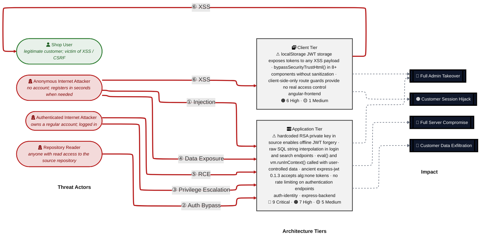

**Threat actors.** Two entities sit on the left of the diagram — one attacker who initiates every direct attack class, and one victim who is the target of the browser-side attacks (XSS / CSRF).

- **Shop User** — legitimate registered customer whose session and PII are the actual target; receives the victim-targeting attack arrows (XSS, CSRF) as victim, not attacker.
- **Anonymous Internet Attacker** — no account, no foothold; reaches every unauthenticated route, registers a throw-away account in seconds when needed, and can clone the public repository to obtain any committed secret offline. Initiates the outgoing attack arrows.
- **Authenticated Internet Attacker** — owns a valid registered account and an active session; can reach all authenticated endpoints and exploit post-authentication vulnerabilities (IDOR, privilege escalation, SSTI, SSRF, stored XSS injection). Initiates the outgoing attack arrows.
- **Repository Reader** — has read access to the source repository (public or leaked); extracts committed secrets, hardcoded keys, and algorithm details offline without touching the running service.

**Attack paths (numbered arrows in the diagram):**

- <a id="path-injection"></a>**① Injection** (Anonymous Internet Attacker → Data Tier) — user input flows into a server-side SQL or NoSQL interpreter without parameterisation, enabling authentication bypass, full user-table extraction, and cross-user data modification.
  - Findings:
    - [F-003](#f-003) — Login SQL Injection Enables Auth Bypass
    - [F-005](#f-005) — SQL Injection in Product Search
    - [F-016](#f-016) — NoSQL Injection in Product Reviews
  - Impact: Customer Data Exfiltration, Full Admin Takeover

- <a id="path-auth-bypass"></a>**② Auth Bypass** (Repository Reader → Application Tier) — authentication can be circumvented or forged because the RSA signing key is committed to the public repository and express-jwt 0.1.3 accepts alg:none tokens.
  - Findings:
    - [F-001](#f-001) — JWT Forgery via Hardcoded RSA Private Key
    - [F-002](#f-002) — alg:none JWT Algorithm Bypass
    - [F-006](#f-006) — RSA Private Key Exposed in Public Repository
    - [F-014](#f-014) — MD5 Password Hashing Without Salt
  - Impact: Full Admin Takeover, Customer Data Exfiltration

- <a id="path-privilege-escalation"></a>**③ Privilege Escalation** (Authenticated Internet Attacker → Application Tier) — authorisation checks are absent or client-side only, allowing lateral and vertical privilege jumps from any registered or forged account.
  - Findings:
    - [F-007](#f-007) — JWT Role Claim Forgery Enables Admin Access
    - [F-010](#f-010) — Client-Side Route Guard Bypassed by URL Navigation
    - [F-022](#f-022) — Client-Side Admin Role Check Bypassable
    - [F-028](#f-028) — Basket IDOR — Cross-User Basket Access
  - Impact: Full Admin Takeover, Customer Data Exfiltration

- <a id="path-sensitive-data-exposure"></a>**④ Sensitive Data Exposure** (Anonymous Internet Attacker → Data Tier) — confidential files, credentials, and API schemata are reachable on unauthenticated routes — /ftp directory listing, Prometheus metrics, and Swagger docs are all accessible without authentication.
  - Findings:
    - [F-018](#f-018) — Password Reset via Guessable Security Questions
    - [F-020](#f-020) — FTP Directory Listing Exposes Sensitive Files
    - [F-025](#f-025) — Open Redirect via Substring URL Matching
    - [F-026](#f-026) — Prometheus Metrics Endpoint Unauthenticated
    - [F-031](#f-031) — Swagger API Documentation Publicly Accessible
  - Impact: Customer Data Exfiltration

- <a id="path-remote-code-execution"></a>**⑤ Remote Code Execution (RCE)** (Authenticated Internet Attacker → Application Tier) — user-supplied data reaches eval() and vm.runInContext() sinks, and an SSRF vector allows the server to be used as a proxy to internal services.
  - Findings:
    - [F-008](#f-008) — Unsafe Eval in B2B Order Processing
    - [F-009](#f-009) — Server-Side Code Execution via Username SSTI
    - [F-019](#f-019) — SSRF via Profile Image URL Upload
  - Impact: Full Server Compromise, Customer Data Exfiltration

- <a id="path-cross-site-scripting"></a>**⑥ Cross-Site Scripting (XSS)** (Shop User → Client Tier) — attacker-controlled content is rendered in the victim's browser without sanitisation via systematic bypassSecurityTrustHtml() calls, and the session JWT is stored in JavaScript-readable localStorage.
  - Findings:
    - [F-011](#f-011) — Stored XSS via Feedback Comment Trusted HTML
    - [F-012](#f-012) — Stored XSS via Product Description innerHTML
    - [F-013](#f-013) — DOM XSS via Reflected Search Query Parameter
    - [F-017](#f-017) — JWT Token in localStorage Accessible to XSS
  - Impact: Customer Session Hijack, Full Admin Takeover

### Top Findings

The **20 highest-risk items**, sorted by impact-weighted score. The **Pfad** column links each finding to the matching ①–⑦ attack path in [Security Posture at a Glance](#security-posture-at-a-glance); mitigation IDs jump to [§9 Mitigation Register](#9-mitigation-register).

| # | Criticality | Pfad | Finding | Component | Primary Mitigations |
|---|-------------|------|---------|-----------|---------------------|
| 1 | 🔴 Critical | — | [F-001](#f-001) — JWT Forgery via Hardcoded RSA Private Key | [C-01](#c-01) — Auth Service | [M-001](#m-001) — Rotate RSA key pair and load from environment variable (P1) |
| 2 | 🔴 Critical | — | [F-002](#f-002) — alg:none JWT Algorithm Bypass | [C-01](#c-01) — Auth Service | [M-002](#m-002) — Upgrade express-jwt and enforce RS256 algorithm (P1) |
| 3 | 🔴 Critical | — | [F-003](#f-003) — Login SQL Injection Enables Auth Bypass | [C-01](#c-01) — Auth Service | [M-003](#m-003) — Parameterize the login SQL query (P1) |
| 4 | 🔴 Critical | — | [F-004](#f-004) — XXE via XML File Upload | [C-02](#c-02) — Express REST API | [M-004](#m-004) — Disable XXE and entity expansion in XML parser (P1) |
| 5 | 🔴 Critical | — | [F-005](#f-005) — SQL Injection in Product Search | [C-02](#c-02) — Express REST API | [M-005](#m-005) — Parameterize product search query (P1) |
| 6 | 🔴 Critical | — | [F-006](#f-006) — RSA Private Key Exposed in Public Repository | [C-01](#c-01) — Auth Service | [M-001](#m-001) — Rotate RSA key pair and load from environment variable (P1) |
| 7 | 🔴 Critical | — | [F-007](#f-007) — JWT Role Claim Forgery Enables Admin Access | [C-01](#c-01) — Auth Service | [M-001](#m-001) — Rotate RSA key pair and load from environment variable (P1)<br/>[M-011](#m-011) — Enforce server-side role validation on privileged API routes (P2) |
| 8 | 🔴 Critical | — | [F-008](#f-008) — Unsafe Eval in B2B Order Processing | [C-02](#c-02) — Express REST API | [M-006](#m-006) — Remove eval and vm.runInContext from user-controlled paths (P1) |
| 9 | 🔴 Critical | — | [F-009](#f-009) — Server-Side Code Execution via Username SSTI | [C-02](#c-02) — Express REST API | [M-006](#m-006) — Remove eval and vm.runInContext from user-controlled paths (P1) |
| 10 | 🟠 High | — | [F-010](#f-010) — Client-Side Route Guard Bypassed by URL Navigation | [C-03](#c-03) — Angular SPA Frontend | [M-011](#m-011) — Enforce server-side role validation on privileged API routes (P2) |
| 11 | 🟠 High | — | [F-011](#f-011) — Stored XSS via Feedback Comment Trusted HTML | [C-03](#c-03) — Angular SPA Frontend | [M-009](#m-009) — Apply DOMPurify to all innerHTML bindings in Angular (P2) |
| 12 | 🟠 High | — | [F-012](#f-012) — Stored XSS via Product Description innerHTML | [C-03](#c-03) — Angular SPA Frontend | [M-009](#m-009) — Apply DOMPurify to all innerHTML bindings in Angular (P2) |
| 13 | 🟠 High | — | [F-013](#f-013) — DOM XSS via Reflected Search Query Parameter | [C-03](#c-03) — Angular SPA Frontend | [M-009](#m-009) — Apply DOMPurify to all innerHTML bindings in Angular (P2) |
| 14 | 🟠 High | — | [F-014](#f-014) — MD5 Password Hashing Without Salt | [C-01](#c-01) — Auth Service | [M-007](#m-007) — Replace MD5 password hashing with bcrypt (P1) |
| 15 | 🟠 High | — | [F-015](#f-015) — Zip Slip in File Upload | [C-02](#c-02) — Express REST API | [M-013](#m-013) — Upgrade unzipper and strengthen path traversal check (P2) |
| 16 | 🟠 High | — | [F-016](#f-016) — NoSQL Injection in Product Reviews | [C-02](#c-02) — Express REST API | [M-014](#m-014) — Add ownership validation to review updates (P2) |
| 17 | 🟠 High | — | [F-017](#f-017) — JWT Token in localStorage Accessible to XSS | [C-03](#c-03) — Angular SPA Frontend | [M-008](#m-008) — Migrate JWT storage to HttpOnly SameSite cookie (P2) |
| 18 | 🟠 High | — | [F-018](#f-018) — Password Reset via Guessable Security Questions | [C-01](#c-01) — Auth Service | [M-012](#m-012) — Replace security questions with email-based password reset (P2) |
| 19 | 🟠 High | — | [F-019](#f-019) — SSRF via Profile Image URL Upload | [C-02](#c-02) — Express REST API | [M-015](#m-015) — Implement strict URL allowlist for profile image fetching (P2) |
| 20 | 🟠 High | — | [F-020](#f-020) — FTP Directory Listing Exposes Sensitive Files | [C-02](#c-02) — Express REST API | [M-016](#m-016) — Remove public FTP directory listing or restrict access (P2) |

_+2 additional ≥High findings — see [§8 Threat Register](#8-threat-register)._

_Legend: 🔴 Critical (directly exploitable, major impact) · 🟠 High. **Pfad** glyphs ①–⑦ link back to the matching bullet in [Security Posture at a Glance](#security-posture-at-a-glance)._

### Architecture Assessment

🔴 **Verdict — systemic design defects, not isolated bugs.** The five cross-cutting weaknesses below each independently produce Critical-severity findings; fixing individual vulnerabilities without addressing the structural causes will not close the attack surface.

Five architectural defects account for 26 of the 31 findings:

| Defect | Description | Key Findings |
|--------|-------------|--------------|
| **Secrets committed to public source** | The RSA private key for JWT signing is hardcoded in lib/insecurity.ts:23 and stored in the public GitHub repository, making the entire authentication layer permanently broken until the key is rotated and moved to a runtime secret store. | [F-001](#f-001) — JWT Forgery via Hardcoded RSA Private Key<br/>[F-006](#f-006) — RSA Private Key Exposed in Public Repository<br/>[F-007](#f-007) — JWT Role Claim Forgery Enables Admin Access |
| **Raw SQL / NoSQL string interpolation** | At least two backend routes — routes/login.ts:34 and routes/search.ts:23 — build SQL queries via template-literal string interpolation rather than parameterized queries, and routes/updateProductReviews.ts:18 passes an unvalidated object directly into a MarsDB update with multi:true. | [F-003](#f-003) — Login SQL Injection — Authentication Bypass<br/>[F-005](#f-005) — SQL Injection in Product Search<br/>[F-016](#f-016) — NoSQL Injection in Product Reviews |
| **Code-execution sinks on user-controlled data** | Two separate routes — routes/userProfile.ts:62 (eval()) and routes/b2bOrder.ts:23 (vm.runInContext + safeEval) — evaluate user-supplied content as executable code; neither sandboxes reliably, and the vm sandbox is escapable via prototype pollution. | [F-009](#f-009) — Server-Side Code Execution via Username SSTI<br/>[F-008](#f-008) — Unsafe Eval in B2B Order Processing |
| **Systematic Angular sanitizer bypass** | Eight or more Angular components call sanitizer.bypassSecurityTrustHtml() on data sourced from the REST API without passing it through a content sanitizer such as DOMPurify, and the session token is stored in localStorage where those XSS payloads can read it. | [F-011](#f-011) — Stored XSS via Feedback Comment<br/>[F-012](#f-012) — Stored XSS via Product Description innerHTML<br/>[F-013](#f-013) — DOM XSS via Reflected Query Parameter<br/>[F-017](#f-017) — JWT Token Stored in localStorage — Accessible to XSS |
| **Missing server-side authorization checks** | Role enforcement relies on client-side Angular route guards (frontend/src/app/app.guard.ts:52) that read the JWT from localStorage and decode it locally; multiple backend routes that should require admin or ownership checks have no server-side middleware enforcing those constraints. | [F-010](#f-010) — Client-Side-Only Route Guard Bypassed by URL Navigation<br/>[F-022](#f-022) — Client-Side Admin Role Check — Horizontal Privilege Escalation<br/>[F-028](#f-028) — Basket IDOR — Cross-User Basket Access |

See **[§7 Security Architecture](#7-security-architecture)** for the full per-domain breakdown and control catalog.

### Mitigations

Mitigations below cover all open findings, **grouped by component** and sorted by priority (P1 first). Cross-component mitigations are listed once in a separate table — they affect more than one component, so duplicating them per-component would create redundant rows. Sort within each table: priority ascending, effort ascending, findings-addressed descending.

#### Cross-Component Mitigations (1)

| ID | Mitigation | Priority | Affects | Addresses | Effort |
|----|------------|----------|---------|-----------|--------|
| [M-011](#m-011) | Enforce server-side role validation on privileged API routes | **P2** | [auth-identity](#auth-identity) — Auth Service<br/>[angular-frontend](#angular-frontend) — Angular SPA Frontend | [F-007](#f-007) — JWT Role Claim Forgery Enables Admin Access<br/>[F-010](#f-010) — Client-Side Route Guard Bypassed by URL Navigation<br/>[F-022](#f-022) — Client-Side Admin Role Check Bypassable | Medium |

#### Client Tier (3)

| ID | Mitigation | Priority | Addresses | Effort |
|----|------------|----------|-----------|--------|
| [M-009](#m-009) | Apply DOMPurify to all innerHTML bindings in Angular | **P2** | [F-011](#f-011) — Stored XSS via Feedback Comment Trusted HTML<br/>[F-012](#f-012) — Stored XSS via Product Description innerHTML<br/>[F-013](#f-013) — DOM XSS via Reflected Search Query Parameter | Medium |
| [M-008](#m-008) | Migrate JWT storage to HttpOnly SameSite cookie | **P2** | [F-017](#f-017) — JWT Token in localStorage Accessible to XSS<br/>[F-023](#f-023) — No CSRF Protection on State-Changing Requests | High |
| [M-022](#m-022) | Emit server-side security events on guard denial | **P4** | [F-029](#f-029) — No Audit Trail for Frontend Security Events<br/>[F-030](#f-030) — XSS via Last-Login IP Trusted HTML Rendering | Low |

#### Application Tier (18)

| ID | Mitigation | Priority | Addresses | Effort |
|----|------------|----------|-----------|--------|
| [M-004](#m-004) | Disable XXE and entity expansion in XML parser | **P1** | [F-004](#f-004) — XXE via XML File Upload<br/>[F-027](#f-027) — Unvalidated XML Upload Enables Billion Laughs DoS | Low |
| [M-006](#m-006) | Remove eval and vm.runInContext from user-controlled paths | **P1** | [F-008](#f-008) — Unsafe Eval in B2B Order Processing<br/>[F-009](#f-009) — Server-Side Code Execution via Username SSTI | Low |
| [M-002](#m-002) | Upgrade express-jwt and enforce RS256 algorithm | **P1** | [F-002](#f-002) — alg:none JWT Algorithm Bypass | Low |
| [M-003](#m-003) | Parameterize the login SQL query | **P1** | [F-003](#f-003) — Login SQL Injection Enables Auth Bypass | Low |
| [M-005](#m-005) | Parameterize product search query | **P1** | [F-005](#f-005) — SQL Injection in Product Search | Low |
| [M-001](#m-001) | Rotate RSA key pair and load from environment variable | **P1** | [F-001](#f-001) — JWT Forgery via Hardcoded RSA Private Key<br/>[F-006](#f-006) — RSA Private Key Exposed in Public Repository<br/>[F-007](#f-007) — JWT Role Claim Forgery Enables Admin Access | Medium |
| [M-007](#m-007) | Replace MD5 password hashing with bcrypt | **P1** | [F-014](#f-014) — MD5 Password Hashing Without Salt | Medium |
| [M-010](#m-010) | Add rate limiting to login and change-password endpoints | **P2** | [F-021](#f-021) — No Rate Limiting on Login Endpoint | Low |
| [M-013](#m-013) | Upgrade unzipper and strengthen path traversal check | **P2** | [F-015](#f-015) — Zip Slip in File Upload | Low |
| [M-014](#m-014) | Add ownership validation to review updates | **P2** | [F-016](#f-016) — NoSQL Injection in Product Reviews | Low |
| [M-016](#m-016) | Remove public FTP directory listing or restrict access | **P2** | [F-020](#f-020) — FTP Directory Listing Exposes Sensitive Files | Low |
| [M-015](#m-015) | Implement strict URL allowlist for profile image fetching | **P2** | [F-019](#f-019) — SSRF via Profile Image URL Upload | Medium |
| [M-012](#m-012) | Replace security questions with email-based password reset | **P2** | [F-018](#f-018) — Password Reset via Guessable Security Questions | High |
| [M-018](#m-018) | Use exact URL matching for redirect allowlist | **P3** | [F-025](#f-025) — Open Redirect via Substring URL Matching | Low |
| [M-019](#m-019) | Restrict Prometheus metrics to internal access | **P3** | [F-026](#f-026) — Prometheus Metrics Endpoint Unauthenticated | Low |
| [M-020](#m-020) | Add ownership check on basket retrieval | **P3** | [F-028](#f-028) — Basket IDOR — Cross-User Basket Access | Low |
| [M-017](#m-017) | Add structured security event logging for auth events | **P3** | [F-024](#f-024) — No Security Event Logging for Auth Failures | Medium |
| [M-021](#m-021) | Restrict API documentation to authenticated users | **P4** | [F-031](#f-031) — Swagger API Documentation Publicly Accessible | Low |

### Operational Strengths

Despite the structurally deficient design, the project implements several security-relevant controls. None fully mitigate a Critical finding, but each narrows part of the attack surface. This table is a filtered view of [Section 7](#7-security-architecture) — rows with effectiveness ≥ Weak. The full catalog, including ❌ Missing controls, lives in Section 7.

| Architectural Control | Implementation | Effectiveness | Gap | Mitigates |
|-----------------------|----------------|---------------|-----|-----------|
| Authorization | security.isAuthorized(), isAccounting(), denyAll() — inconsistently applied across 61 routes | ⚠️ Partial | See §7 for the domain-level structural gaps. | — |
| Audit & Logging | Morgan HTTP access logging (server.ts:338); Winston logger available but not used for security events | ⚠️ Partial | See §7 for the domain-level structural gaps. | — |
| Container & Runtime Security | Multi-stage build with distroless base; node:24 tag not pinned to digest | ⚠️ Partial | See §7 for the domain-level structural gaps. | — |
| Identity & Access Management | express-jwt 0.1.3 with hardcoded RSA private key in lib/insecurity.ts:23 | 🔶 Weak | See §7 for the domain-level structural gaps. | — |
| Authorization | AdminGuard, AccountingGuard, LoginGuard — client-side only, bypassable by localStorage manipulation | 🔶 Weak | See §7 for the domain-level structural gaps. | — |
| Input Validation & Output Encoding | sanitize-html 1.4.2 (severely outdated, multiple CVEs) — inconsistently applied | 🔶 Weak | See §7 for the domain-level structural gaps. | — |
| Dependency & Supply Chain | Critically outdated packages: express-jwt 0.1.3, jsonwebtoken 0.4.0, sanitize-html 1.4.2 | 🔶 Weak | See §7 for the domain-level structural gaps. | — |
| Defense-In-Depth | Rate limiting on /rest/user/reset-password only (100/5min — too permissive) | 🔶 Weak | See §7 for the domain-level structural gaps. | — |

_+1 additional controls — see [Section 7](#7-security-architecture)._

**Bottom line:** These controls narrow specific attack surfaces but none eliminates a Critical finding on its own.

---

## 1. System Overview

Probably the most modern and sophisticated insecure web application

**Repository:** https://github.com/juice-shop/juice-`shop.git`
**Runtime:** `Node.js 20 - 24`

### Scope

This threat model covers 3 component(s) of juice-shop v19.2.1: **Auth Service**, **Express REST API**, **Angular SPA Frontend**.

**Out of scope:** third-party hosted dependencies, browser runtime, operating-system kernel, and the underlying network infrastructure.

---

## 2. Architecture Diagrams

### 2.1 System Context

Who interacts with juice-shop v19.2.1 from the outside, and through which channels. Solid arrows show normal usage; dashed red arrows mark unauthenticated probing or exploit paths (C4 Level 1).

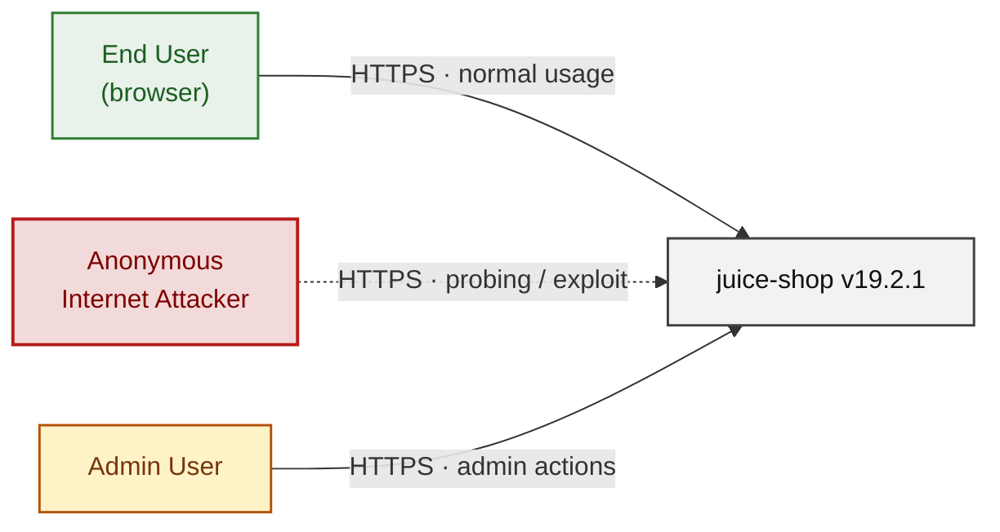

### 2.2 Container Architecture

How the system decomposes into deployable units. Each box is a separate runtime process or service container; arrows show synchronous request paths between them. Components with ≥3 Critical findings carry a red border, ≥2 High amber (C4 Level 2).

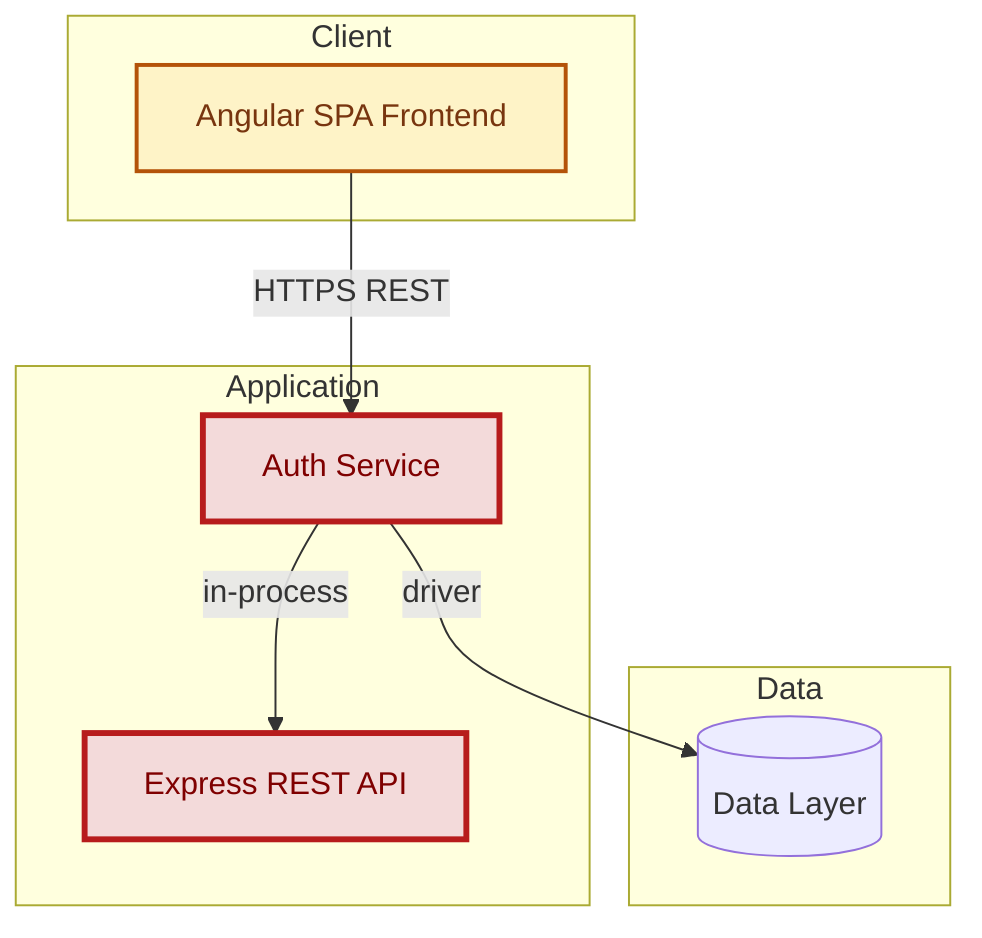

### 2.3 Components


Who reaches each component, and through which trust zone. Four columns map external actors to the internal tiers (Client / Application / Data); solid green arrows show legitimate data flow, dashed red arrows mark intrusion vectors. The component table directly below holds source paths and linked threats per `C-NN`; per-tech defects are itemised in the §2.4.1–§2.4.4 layer tables.

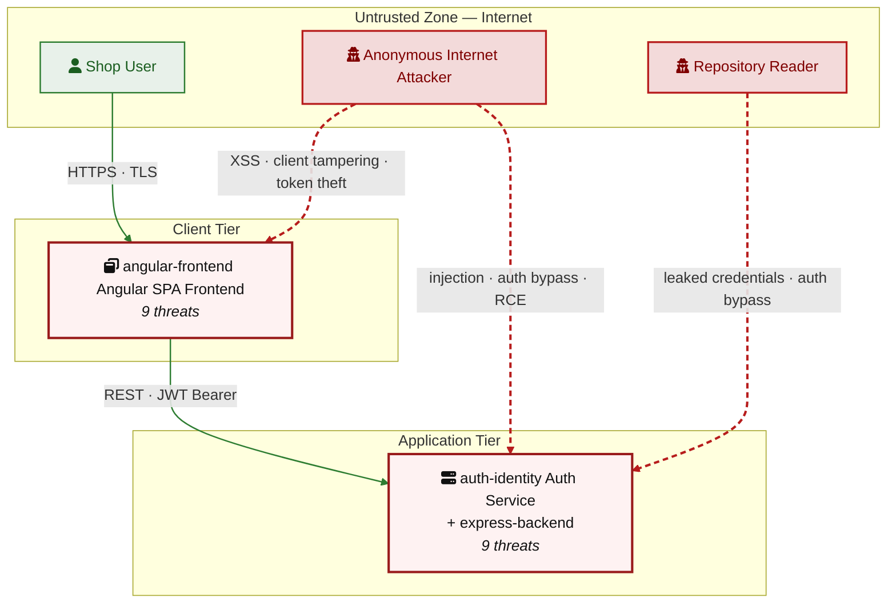

| ID | Name | Type | Key Paths | Linked Threats |
|----|------|------|-----------|----------------|
| <a id="c-01"></a><a id="auth-identity"></a>C-01 | Auth Service | application | `lib/insecurity.ts`<br/>`routes/login.ts`<br/>`routes/resetPassword.ts`<br/>`routes/changePassword.ts`<br/>`models/user.ts` | [F-001](#f-001) — JWT Forgery via Hardcoded RSA Private Key<br/>[F-002](#f-002) — alg:none JWT Algorithm Bypass<br/>[F-003](#f-003) — Login SQL Injection Enables Auth Bypass<br/>[F-006](#f-006) — RSA Private Key Exposed in Public Repository<br/>[F-007](#f-007) — JWT Role Claim Forgery Enables Admin Access<br/>[F-014](#f-014) — MD5 Password Hashing Without Salt<br/>[F-018](#f-018) — Password Reset via Guessable Security Questions<br/>[F-021](#f-021) — No Rate Limiting on Login Endpoint<br/>[F-024](#f-024) — No Security Event Logging for Auth Failures |
| <a id="c-02"></a><a id="express-backend"></a>C-02 | Express REST API | application | `server.ts`<br/>`routes/**`<br/>`lib/**`<br/>`app.ts` | [F-004](#f-004) — XXE via XML File Upload<br/>[F-005](#f-005) — SQL Injection in Product Search<br/>[F-008](#f-008) — Unsafe Eval in B2B Order Processing<br/>[F-009](#f-009) — Server-Side Code Execution via Username SSTI<br/>[F-015](#f-015) — Zip Slip in File Upload<br/>[F-016](#f-016) — NoSQL Injection in Product Reviews<br/>[F-019](#f-019) — SSRF via Profile Image URL Upload<br/>[F-020](#f-020) — FTP Directory Listing Exposes Sensitive Files<br/>[F-025](#f-025) — Open Redirect via Substring URL Matching<br/>[F-026](#f-026) — Prometheus Metrics Endpoint Unauthenticated<br/>[F-027](#f-027) — Unvalidated XML Upload Enables Billion Laughs DoS<br/>[F-028](#f-028) — Basket IDOR — Cross-User Basket Access<br/>[F-031](#f-031) — Swagger API Documentation Publicly Accessible |
| <a id="c-03"></a><a id="angular-frontend"></a>C-03 | Angular SPA Frontend | client | `frontend/src/**` | [F-010](#f-010) — Client-Side Route Guard Bypassed by URL Navigation<br/>[F-011](#f-011) — Stored XSS via Feedback Comment Trusted HTML<br/>[F-012](#f-012) — Stored XSS via Product Description innerHTML<br/>[F-013](#f-013) — DOM XSS via Reflected Search Query Parameter<br/>[F-017](#f-017) — JWT Token in localStorage Accessible to XSS<br/>[F-022](#f-022) — Client-Side Admin Role Check Bypassable<br/>[F-023](#f-023) — No CSRF Protection on State-Changing Requests<br/>[F-029](#f-029) — No Audit Trail for Frontend Security Events<br/>[F-030](#f-030) — XSS via Last-Login IP Trusted HTML Rendering |
### 2.4 Technology Architecture

The technology stack the system is built on. Each box names the framework or runtime that fills that role; per-version detail and per-tech defects live in the §2.4.1–§2.4.4 layer tables below. The trust-boundary table beneath this paragraph documents the controls that separate the four tiers.

| Boundary ID | Name | Description | Enforcement |
|---|---|---|---|
| ? | Public Internet | All unauthenticated traffic from browsers to the Express server on port 3000 | TLS |
| ? | Authentication Boundary | Separation between unauthenticated and authenticated API access via express-jwt middleware (vulnerable to alg:none) | Process isolation |
| ? | Data Tier | SQLite database and MarsDB in-process — same-process access, no network boundary | Process isolation |
| ? | Client Browser | Browser sandbox executing Angular SPA — localStorage contains JWT, client-side guards bypassable | TLS |

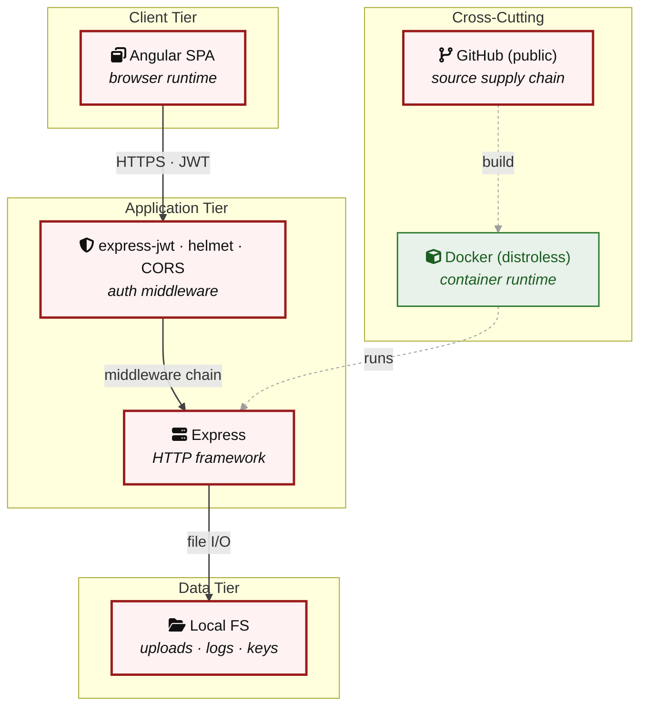

| Component | Layer | Linked Threats | Risk |
|---|---|---|---|
| angular-frontend Angular SPA Frontend | Layer Client | [F-010](#f-010) — Client-Side Route Guard Bypassed by URL Navigation<br/>[F-011](#f-011) — Stored XSS via Feedback Comment Trusted HTML<br/>[F-012](#f-012) — Stored XSS via Product Description innerHTML<br/>[F-013](#f-013) — DOM XSS via Reflected Search Query Parameter<br/>[F-017](#f-017) — JWT Token in localStorage Accessible to XSS<br/>[F-022](#f-022) — Client-Side Admin Role Check Bypassable<br/>[F-023](#f-023) — No CSRF Protection on State-Changing Requests<br/>[F-029](#f-029) — No Audit Trail for Frontend Security Events<br/>[F-030](#f-030) — XSS via Last-Login IP Trusted HTML Rendering | 🟠 |
| auth-identity Auth Service | Layer Application | [F-001](#f-001) — JWT Forgery via Hardcoded RSA Private Key<br/>[F-002](#f-002) — alg:none JWT Algorithm Bypass<br/>[F-003](#f-003) — Login SQL Injection Enables Auth Bypass<br/>[F-006](#f-006) — RSA Private Key Exposed in Public Repository<br/>[F-007](#f-007) — JWT Role Claim Forgery Enables Admin Access<br/>[F-014](#f-014) — MD5 Password Hashing Without Salt<br/>[F-018](#f-018) — Password Reset via Guessable Security Questions<br/>[F-021](#f-021) — No Rate Limiting on Login Endpoint<br/>[F-024](#f-024) — No Security Event Logging for Auth Failures | 🔴 |
| express-backend Express REST API | Layer Application | [F-004](#f-004) — XXE via XML File Upload<br/>[F-005](#f-005) — SQL Injection in Product Search<br/>[F-008](#f-008) — Unsafe Eval in B2B Order Processing<br/>[F-009](#f-009) — Server-Side Code Execution via Username SSTI<br/>[F-015](#f-015) — Zip Slip in File Upload<br/>[F-016](#f-016) — NoSQL Injection in Product Reviews<br/>[F-019](#f-019) — SSRF via Profile Image URL Upload<br/>[F-020](#f-020) — FTP Directory Listing Exposes Sensitive Files<br/>[F-025](#f-025) — Open Redirect via Substring URL Matching<br/>[F-026](#f-026) — Prometheus Metrics Endpoint Unauthenticated<br/>[F-027](#f-027) — Unvalidated XML Upload Enables Billion Laughs DoS<br/>[F-028](#f-028) — Basket IDOR — Cross-User Basket Access<br/>[F-031](#f-031) — Swagger API Documentation Publicly Accessible | 🔴 |


> **Legend:** **red border** ≥ 3 Critical threats on the component · **amber border** ≥ 2 High threats

---

## 3. Attack Walkthroughs

### 3.1 Attack Chain Overview

Three compound attack chains explain how individual findings combine into complete account takeovers and remote code execution. Each chain starts from an unauthenticated or low-privilege entry point.

#### Chain 1 — Public Key Enables Admin Takeover

The RSA private key committed at `lib/insecurity.ts:23` is readable by anyone who clones the public repository. A reader can forge a JWT with `role=admin` and call privileged API routes directly.

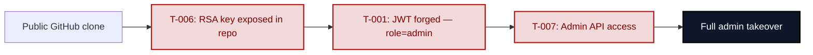

**Key takeaway:** The private key exposure collapses the entire authentication boundary — JWT signature verification provides no protection once the signing key is public.

#### Chain 2 — Anonymous SQL Injection to Admin Login

The login endpoint at `routes/login.ts:34` uses string interpolation for its SQL query. An anonymous attacker can log in as the seeded admin account without any credentials.

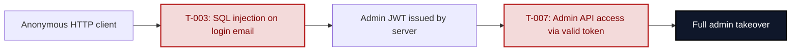

**Key takeaway:** The SQL injection requires no prior knowledge of any user account — the payload `' OR 1=1--` returns the first row of the Users table, which is the admin.

#### Chain 3 — Stored XSS Escalates to Session Theft

Feedback comments stored via any authenticated account are rendered with `bypassSecurityTrustHtml()` in `about.component.ts:119`. Any admin who views the About page executes the stored payload, which reads the JWT from `localStorage` and exfiltrates it.

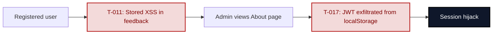

**Key takeaway:** The XSS-to-session-theft chain works because the session token is in JavaScript-readable storage; migrating to an HttpOnly cookie would break the exfiltration step.

---

### 3.2 T-001 — JWT Forgery via Hardcoded RSA Private Key

The RSA-2048 private key used to sign all JWT tokens is stored as a PEM string literal at `lib/insecurity.ts:23`. `express-jwt` at line 54 verifies tokens using the corresponding public key. Any party who reads the source code — including the public GitHub repository — can sign arbitrary token payloads.

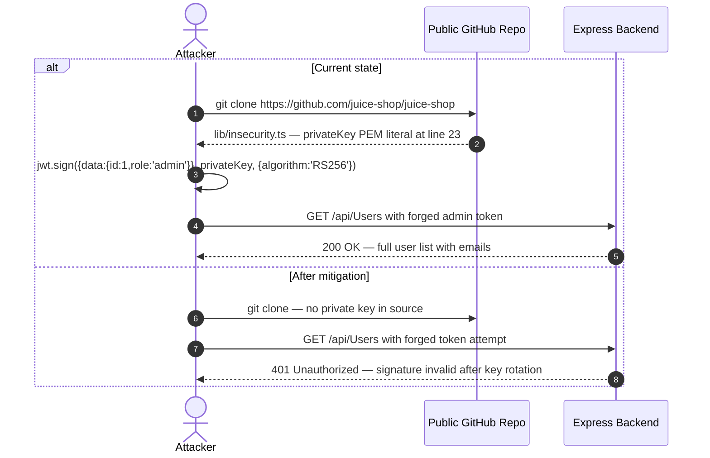

**Residual risk after mitigation:** Medium — the key must be rotated in addition to being removed from source, and all existing tokens must be invalidated.

---

### 3.3 T-002 — alg:none JWT Algorithm Bypass

`express-jwt` version 0.1.3 (`lib/insecurity.ts:54`) does not specify an `algorithms` restriction. A token with `alg: "none"` and an empty signature string is accepted as valid by the library, bypassing signature verification entirely.

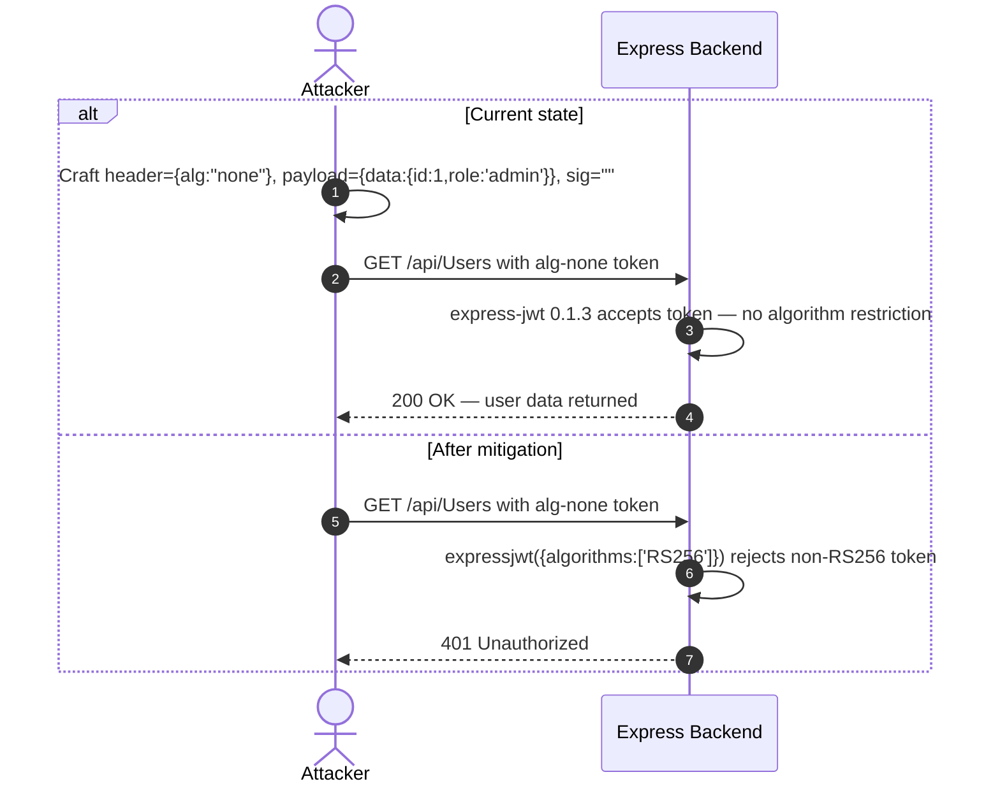

**Residual risk after mitigation:** Low — upgrading express-jwt to ^8.5.1 with `algorithms: ['RS256']` removes the alg:none attack surface completely.

---

### 3.4 T-003 — Login SQL Injection Enables Authentication Bypass

`routes/login.ts:34` constructs: `SELECT * FROM Users WHERE email = '${req.body.email}'`. The payload `' OR 1=1--` in the email field short-circuits the WHERE clause and returns the first user row (the admin).

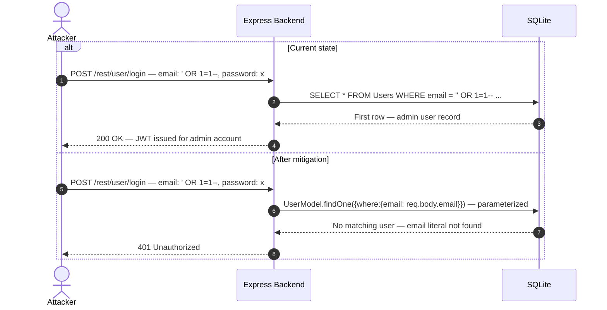

**Residual risk after mitigation:** Low — switching to `UserModel.findOne()` with the Sequelize ORM removes the injection surface; the bcrypt comparison independently prevents password-hash attacks.

---

### 3.5 T-004 — XXE via XML File Upload

`routes/fileUpload.ts:83` calls `libxml.parseXml(data, { noblanks: true, noent: true, nocdata: true })`. The `noent: true` flag enables external entity expansion. An attacker can upload a crafted XML file with an `ENTITY` reference pointing to `/etc/passwd` or an internal service URL.

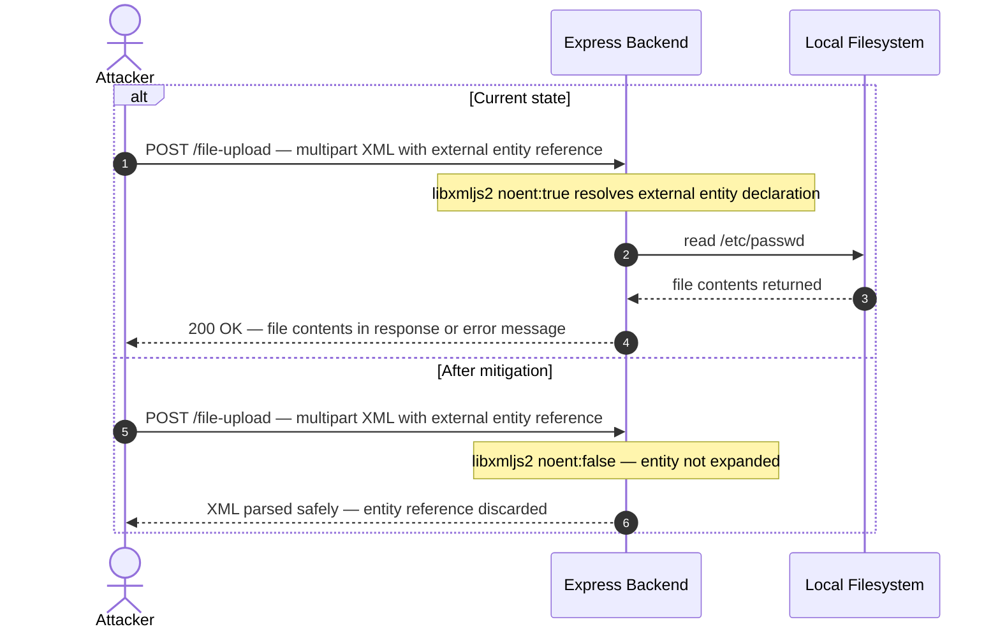

**Residual risk after mitigation:** Low — setting `noent: false` and `nonet: true` eliminates both local file disclosure and SSRF via XML entity expansion.

---

### 3.6 T-005 — SQL Injection in Product Search

`routes/search.ts:23` builds: `SELECT * FROM Products WHERE ((name LIKE '%${criteria}%' OR description LIKE '%${criteria}%') ...)`. The payload `')) UNION SELECT email,password,3,4,5,6,7,8,9 FROM Users--` extracts the entire Users table.

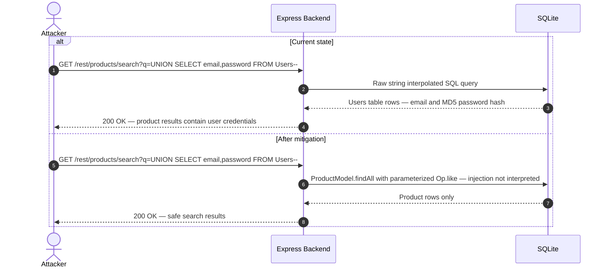

**Residual risk after mitigation:** Low — Sequelize ORM parameterized queries prevent UNION injection; MD5 password hashes (T-014) should be migrated independently.

---

### 3.7 T-007 — JWT Role Claim Forgery Enables Admin Access

With the private key available at `lib/insecurity.ts:23`, any attacker can call `jwt.sign({data:{id:1, role:'admin'}}, privateKey, {algorithm:'RS256'})` and use the resulting token to call admin-protected API routes. The `AdminGuard` at `frontend/src/app/app.guard.ts:52` only checks the client-side decoded role claim.

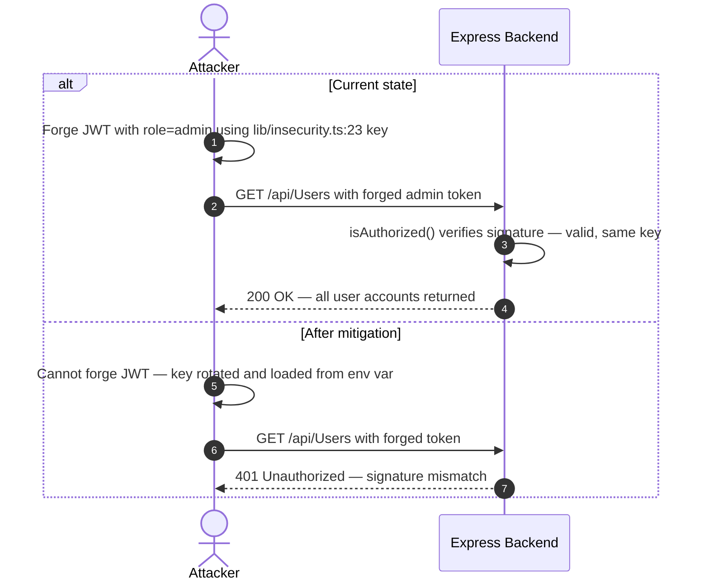

**Residual risk after mitigation:** Medium — server-side `isAdmin()` middleware must also be added to all privileged routes to enforce authorization independently of token validity.

---

### 3.8 T-008 — Unsafe Eval in B2B Order Processing

`routes/b2bOrder.ts:23` runs `vm.runInContext('safeEval(orderLinesData)', sandbox, {timeout: 2000})` where `orderLinesData` is the raw request body. The `notevil` safe-eval library and the `vm.createContext` sandbox are not sufficient isolation for untrusted data.

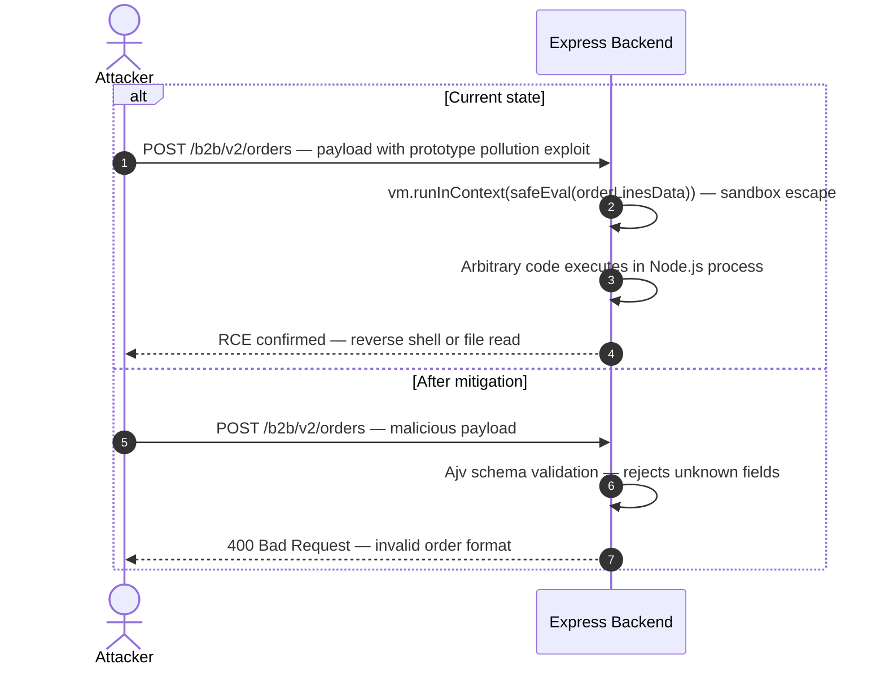

**Residual risk after mitigation:** Low — replacing `vm.runInContext` with strict JSON schema validation (Ajv) removes the code-execution surface entirely.

---

### 3.9 T-009 — Server-Side Code Execution via Username SSTI

`routes/userProfile.ts:62` evaluates usernames matching the pattern `#{.*}` via `eval()`. An authenticated user who sets their username to `#{require('child_process').exec('id')}` triggers command execution when their profile is rendered.

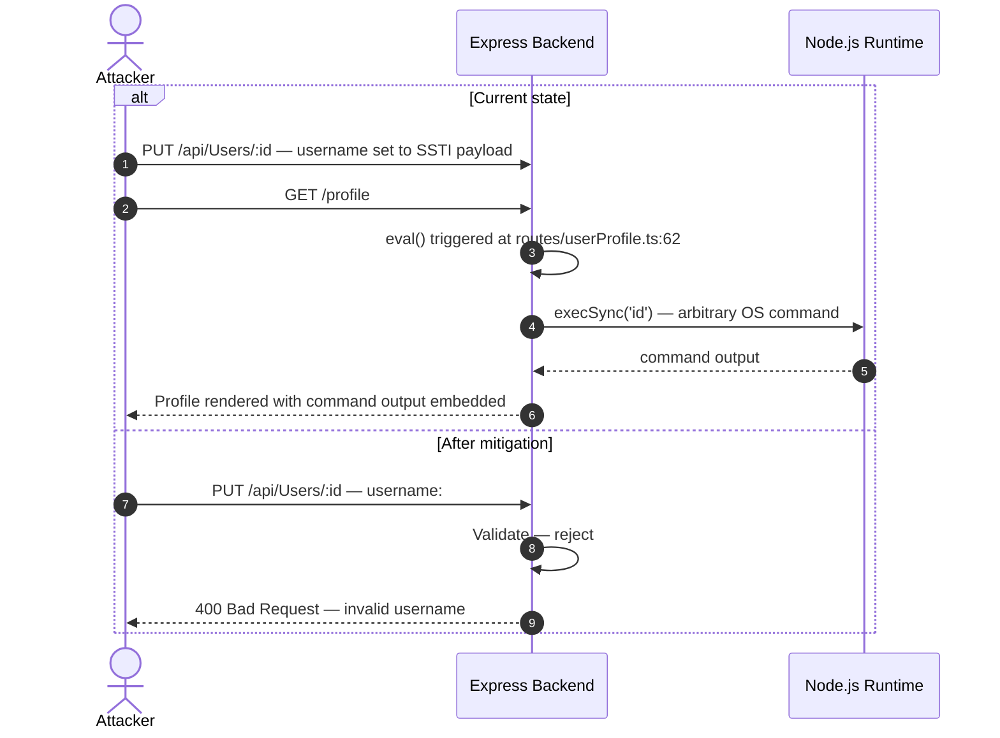

**Residual risk after mitigation:** Low — removing the `eval()` branch and rejecting `#{...}` patterns at input validation time eliminates the SSTI vector.

<!-- enriched:thorough -->

---

## 4. Assets

Information assets and the classification level that drives the Confidentiality / Integrity / Availability targets used in §8 risk scoring.

| Asset | ID | Classification | Description | Linked Threats |
|---|---|---|---|---|
| User Account Database | A-001 | Confidential | SQLite database containing user emails, MD5-hashed passwords, security question answers, roles | [F-003](#f-003) — Login SQL Injection Enables Auth Bypass<br/>[F-005](#f-005) — SQL Injection in Product Search<br/>[F-014](#f-014) — MD5 Password Hashing Without Salt |
| JWT RSA Private Key | A-002 | Restricted | RSA private key for JWT signing — hardcoded in lib/`insecurity.ts`:23, committed to public GitHub | [F-001](#f-001) — JWT Forgery via Hardcoded RSA Private Key<br/>[F-006](#f-006) — RSA Private Key Exposed in Public Repository<br/>[F-007](#f-007) — JWT Role Claim Forgery Enables Admin Access |
| Session Tokens (JWT) | A-003 | Confidential | JWT tokens issued after authentication, stored in localStorage on the client side | [F-001](#f-001) — JWT Forgery via Hardcoded RSA Private Key<br/>[F-002](#f-002) — alg:none JWT Algorithm Bypass<br/>[F-017](#f-017) — JWT Token in localStorage Accessible to XSS |
| Product and Order Data | A-004 | Internal | Product catalog, customer orders, basket contents, product reviews in SQLite + MarsDB | [F-005](#f-005) — SQL Injection in Product Search<br/>[F-016](#f-016) — NoSQL Injection in Product Reviews<br/>[F-028](#f-028) — Basket IDOR — Cross-User Basket Access |
| FTP Sensitive Files | A-005 | Confidential | Publicly browsable /ftp directory: `acquisitions.md`, incident-`support.kdbx`, coupons | [F-020](#f-020) — FTP Directory Listing Exposes Sensitive Files |
| Source Code Repository | A-006 | Internal | Public GitHub repository containing application source code and hardcoded secrets | [F-006](#f-006) — RSA Private Key Exposed in Public Repository |
| User-Uploaded Files | A-007 | Internal | Files uploaded via /file-upload, /profile/image/upload, /profile/image/url | [F-004](#f-004) — XXE via XML File Upload<br/>[F-015](#f-015) — Zip Slip in File Upload<br/>[F-019](#f-019) — SSRF via Profile Image URL Upload<br/>[F-027](#f-027) — Unvalidated XML Upload Enables Billion Laughs DoS |

---

## 5. Attack Surface

Network-reachable entry points classified by authentication requirement. Each row links to the threat(s) referenced in its `notes` column.

### 5.1 Unauthenticated Entry Points (11)

| Method | Route | Notes |
|---|---|---|
| GET | `/` | Angular SPA frontend — serves compiled JavaScript bundle |
| GET | `/rest/products/search?q=` | [F-005](#f-005) — SQL Injection in Product Search<br/>SQL injection via raw string interpolation on q parameter (T-005) |
| POST | `/rest/user/login` | [F-021](#f-021) — No Rate Limiting on Login Endpoint<br/>[F-003](#f-003) — Login SQL Injection Enables Auth Bypass<br/>[F-024](#f-024) — No Security Event Logging for Auth Failures<br/>SQL injection in credential check, no rate limiting (T-003, T-021) |
| POST | `/api/Users` | User registration endpoint |
| GET | `/api/SecurityQuestions` | [F-018](#f-018) — Password Reset via Guessable Security Questions<br/>Lists all security questions — enables account enumeration (T-018) |
| POST | `/rest/user/reset-password` | [F-018](#f-018) — Password Reset via Guessable Security Questions<br/>[F-021](#f-021) — No Rate Limiting on Login Endpoint<br/>Password reset via security questions — rate limit too permissive (T-018) |
| GET | `/ftp` | [F-015](#f-015) — Zip Slip in File Upload<br/>[F-020](#f-020) — FTP Directory Listing Exposes Sensitive Files<br/>Publicly browsable FTP directory with sensitive files (T-020) |
| GET | `/ftp/*` | Direct download of files from FTP directory (T-020) |
| GET | `/encryptionkeys` | [F-006](#f-006) — RSA Private Key Exposed in Public Repository<br/>Directory listing serving RSA public key `jwt.pub` (T-006) |
| GET | `/api-docs` | [F-031](#f-031) — Swagger API Documentation Publicly Accessible<br/>Full Swagger/OpenAPI documentation — no authentication (T-031) |
| GET | `/metrics` | [F-026](#f-026) — Prometheus Metrics Endpoint Unauthenticated<br/>Prometheus metrics — unauthenticated, exposes runtime internals (T-026) |

### 5.2 Authenticated Entry Points (6)

| Method | Route | Notes |
|---|---|---|
| POST | `/file-upload` | [F-004](#f-004) — XXE via XML File Upload<br/>[F-027](#f-027) — Unvalidated XML Upload Enables Billion Laughs DoS<br/>[F-015](#f-015) — Zip Slip in File Upload<br/>File upload — XML with noent:true (XXE), zip slip (T-004, T-015, T-027) |
| POST | `/profile/image/url` | [F-019](#f-019) — SSRF via Profile Image URL Upload<br/>Profile image URL fetch — SSRF via user-controlled URL (T-019) |
| GET | `/profile` | [F-009](#f-009) — Server-Side Code Execution via Username SSTI<br/>[F-019](#f-019) — SSRF via Profile Image URL Upload<br/>User profile page — SSTI via eval() on username (T-009) |
| POST | `/b2b/v2/orders` | [F-008](#f-008) — Unsafe Eval in B2B Order Processing<br/>B2B order processing — vm.runInContext with user-controlled data (T-008) |
| PATCH | `/rest/products/reviews` | [F-016](#f-016) — NoSQL Injection in Product Reviews<br/>Product review update — NoSQL injection via unvalidated _id (T-016) |
| GET | `/rest/basket/:id` | [F-028](#f-028) — Basket IDOR — Cross-User Basket Access<br/>Basket retrieval — IDOR, no ownership check (T-028) |

---

## 7. Security Architecture

> ⓘ **Section narrative not rendered** — this section contains unfilled placeholders. At `--assessment-depth quick` this is by design. At standard or thorough depth re-run with `--enrich-arch` (or `--thorough`) to fill the per-domain narrative.

**Catalog totals:** ✅ 0 Adequate · ⚠️ 3 Partial · 🔶 6 Weak · ❌ 8 Missing · 17 controls tracked.

### 7.1 Overview

Across 3 component(s) the assessment catalogued 17 security control(s).

**Control coverage:**

- ⚠️ **Partial (3):** Audit & Logging, Authorization, Container & Runtime Security
- 🔶❌ **Weak or Missing (14):** Authorization, Data Protection & Session Management, Defense-in-Depth, Dependency & Supply Chain, Frontend Security, Identity & Access Management, Input Validation & Output Encoding, Secret Management

<!-- NARRATIVE_PLACEHOLDER: section=7.1 — top architectural risk themes (3 bullets) and defense-in-depth posture (1 bullet). Each bullet ≤2 sentences. NO prose paragraphs. -->

### 7.2 Key Architectural Risks

<!-- NARRATIVE_PLACEHOLDER: domain=KeyRisks — add 1-2 sentence intro before table. -->

| Domain | Control | Effectiveness | Notes |
|---|---|---|---|
| Identity & Access Management | JWT Authentication RS256 | Weak |  |
| Identity & Access Management | Session Token Storage | Missing |  |
| Authorization | Frontend Route Guards | Weak |  |
| Input Validation & Output Encoding | Input Sanitization | Weak |  |
| Input Validation & Output Encoding | SQL Parameterization | Missing |  |
| Data Protection & Session Management | Password Hashing | Missing |  |
| Data Protection & Session Management | Cookie Security Flags | Missing |  |
| Frontend Security | Angular DomSanitizer | Missing |  |

### 7.3 Identity & Access Management

**What this control does.** IAM controls establish proof of identity before granting access: they verify that a caller is who they claim to be, issue a credential that subsequent requests carry, and enforce that the credential was not forged or expired.

**How it is implemented here.** The application issues RS256-signed JWTs via `lib/insecurity.ts:56` using `jsonwebtoken 0.4.0` and validates them with `express-jwt 0.1.3` at `lib/insecurity.ts:54`. The RSA private key used to sign tokens is a PEM literal hardcoded in the same file at line 23 and committed to the public GitHub repository. Session tokens are stored in browser `localStorage` rather than an HttpOnly cookie.

**Where it falls short.**

- The signing key is committed to the public repository, so any reader can forge tokens with arbitrary claims — signature verification provides no integrity guarantee ([F-001](#f-001) — JWT Forgery via Hardcoded RSA Private Key, [F-006](#f-006) — RSA Private Key Exposed in Public Repository).
- `express-jwt 0.1.3` accepts tokens with `alg:none` and an empty signature, bypassing verification entirely without needing the private key ([F-002](#f-002) — alg:none JWT Algorithm Bypass).
- JWTs stored in `localStorage` are readable by any JavaScript on the page; every XSS payload becomes a session-theft vector ([F-017](#f-017) — JWT Token in localStorage Accessible to XSS).

| Control | Implementation | Effectiveness | Linked Threats |
|---|---|---|---|
| JWT Authentication RS256 | express-jwt 0.1.3 with hardcoded RSA private key in lib/`insecurity.ts`:23 | Weak | [F-001](#f-001) — JWT Forgery via Hardcoded RSA Private Key<br/>[F-002](#f-002) — alg:none JWT Algorithm Bypass<br/>[F-006](#f-006) — RSA Private Key Exposed in Public Repository<br/>[F-007](#f-007) — JWT Role Claim Forgery Enables Admin Access |
| Session Token Storage | JWT stored in localStorage — accessible to JavaScript, not HttpOnly | Missing | [F-017](#f-017) — JWT Token in localStorage Accessible to XSS |

#### 7.3.1 JWT Authentication RS256 Flow

This is a custom JWT-based flow — not OAuth 2.0 or OIDC. The application mints RS256-signed tokens on successful login and validates them on every subsequent request via `express-jwt 0.1.3` middleware at `lib/insecurity.ts:54`.

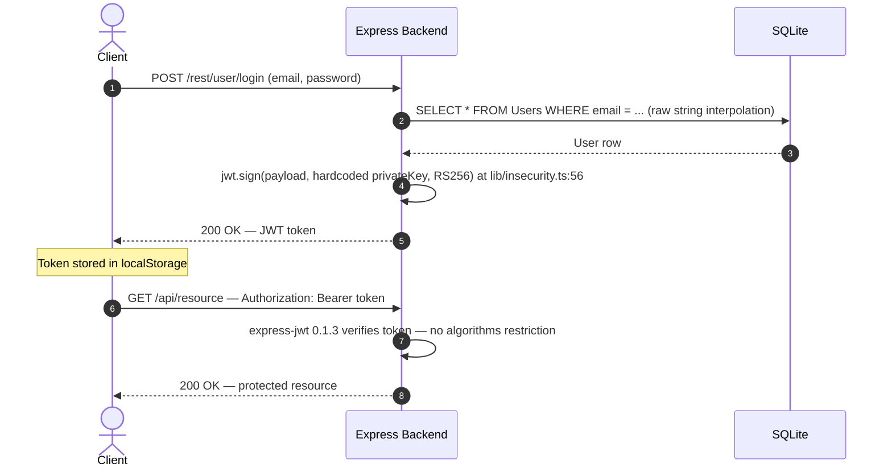

**Risk assessment:** The private key at `lib/insecurity.ts:23` is committed to a public repository, so any reader can forge tokens without interacting with the server. Upgrading to `express-jwt ^8.5.1` with `algorithms: ['RS256']` and rotating the key to an environment variable are both required; neither fix alone is sufficient. **Residual risk:** Critical — the signing key must be rotated before signature verification provides any assurance.

**Findings in this flow:** [F-001](#f-001) — JWT Forgery via Hardcoded RSA Private Key · [F-002](#f-002) — alg:none JWT Algorithm Bypass · [F-006](#f-006) — RSA Private Key Exposed in Public Repository · [F-007](#f-007) — JWT Role Claim Forgery Enables Admin Access

#### 7.3.2 Session Token Storage Flow

After login, the Angular SPA stores the issued JWT in `localStorage` via the auth service. Subsequent requests attach the token from `localStorage` as an `Authorization: Bearer` header via the Angular HTTP interceptor at `frontend/src/app/Services/request.interceptor.ts`.

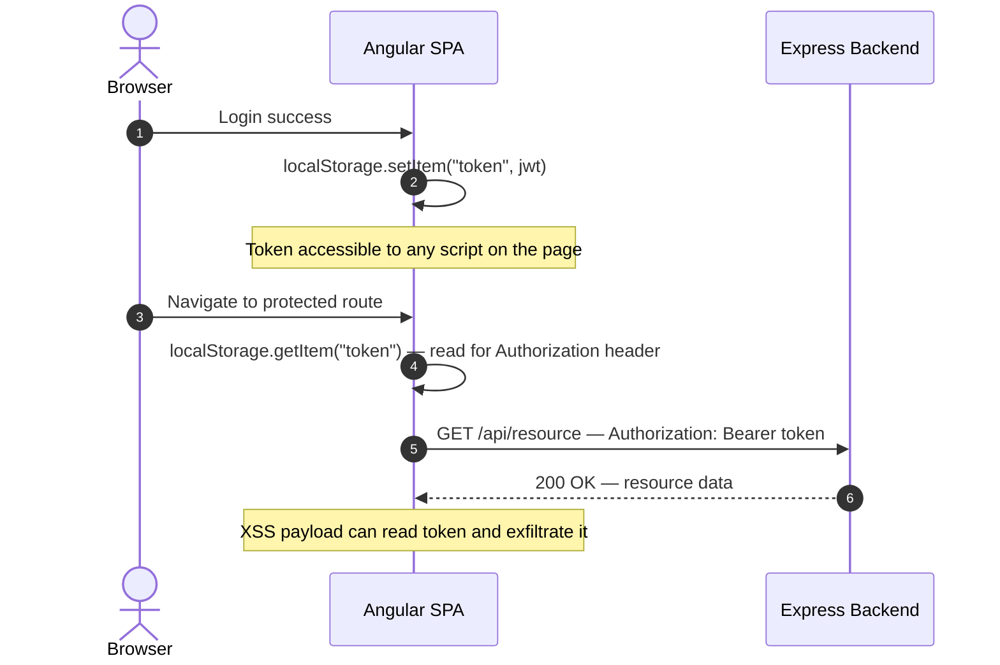

**Risk assessment:** `localStorage` is accessible to any JavaScript running on the page origin, including injected XSS payloads. With multiple XSS sinks confirmed at `about.component.ts:119`, `search-result.component.ts:170`, and `search-result.component.ts:132`, token exfiltration requires only a stored or reflected payload executing `localStorage.getItem('token')`. Moving the token to an `HttpOnly; SameSite=Strict` cookie eliminates this exfiltration path. **Residual risk:** High — the `localStorage` storage pattern makes all confirmed XSS findings into session-theft vectors.

**Findings in this flow:** [F-017](#f-017) — JWT Token in localStorage Accessible to XSS

### 7.4 Authorization

<!-- NARRATIVE_PLACEHOLDER: domain=7.4 — replace with the three-block narrative. Block 1: '**What this control does.**' (1-2 vendor-neutral, concept-level sentences, no file:line, no CWE/T-NNN refs). Block 2: '**How it is implemented here.**' (1-3 sentences naming libraries, layers, IaC resources, manifest keys, and at least one verifiable artifact). Block 3: '**Where it falls short.**' (1-3 sentences interpreting the gap with linked T-NNN refs). When the domain is genuinely Not Applicable, replace all three blocks with a single italic line: `_Not applicable — <one-line reason citing recon evidence>._` See phase-group-finalization.md 'Worked-example library — domain narratives' (Examples D and E) for full templates. -->

| Control | Implementation | Effectiveness | Notes |
|---|---|---|---|
| Backend Route Authorization | security.isAuthorized(), isAccounting(), denyAll() — inconsistently applied across 61 routes | Partial |  |
| Frontend Route Guards | AdminGuard, AccountingGuard, LoginGuard — client-side only, bypassable by localStorage manipulation | Weak |  |

### 7.5 Input Validation & Output Encoding

<!-- NARRATIVE_PLACEHOLDER: domain=7.5 — replace with the three-block narrative. Block 1: '**What this control does.**' (1-2 vendor-neutral, concept-level sentences, no file:line, no CWE/T-NNN refs). Block 2: '**How it is implemented here.**' (1-3 sentences naming libraries, layers, IaC resources, manifest keys, and at least one verifiable artifact). Block 3: '**Where it falls short.**' (1-3 sentences interpreting the gap with linked T-NNN refs). When the domain is genuinely Not Applicable, replace all three blocks with a single italic line: `_Not applicable — <one-line reason citing recon evidence>._` See phase-group-finalization.md 'Worked-example library — domain narratives' (Examples D and E) for full templates. -->

| Control | Implementation | Effectiveness | Notes |
|---|---|---|---|
| Input Sanitization | sanitize-html 1.4.2 (severely outdated, multiple CVEs) — inconsistently applied | Weak |  |
| SQL Parameterization | None for `login.ts`:34 and `search.ts`:23 — raw string interpolation used intentionally | Missing |  |

### 7.6 Data Protection & Session Management

<!-- NARRATIVE_PLACEHOLDER: domain=7.6 — replace with the three-block narrative. Block 1: '**What this control does.**' (1-2 vendor-neutral, concept-level sentences, no file:line, no CWE/T-NNN refs). Block 2: '**How it is implemented here.**' (1-3 sentences naming libraries, layers, IaC resources, manifest keys, and at least one verifiable artifact). Block 3: '**Where it falls short.**' (1-3 sentences interpreting the gap with linked T-NNN refs). When the domain is genuinely Not Applicable, replace all three blocks with a single italic line: `_Not applicable — <one-line reason citing recon evidence>._` See phase-group-finalization.md 'Worked-example library — domain narratives' (Examples D and E) for full templates. -->

| Control | Implementation | Effectiveness | Notes |
|---|---|---|---|
| Password Hashing | MD5 without salt (lib/`insecurity.ts`:43) — intentionally insecure | Missing |  |
| Cookie Security Flags | Token cookie set without HttpOnly, Secure, or SameSite flags | Missing |  |

### 7.7 Frontend Security

<!-- NARRATIVE_PLACEHOLDER: domain=7.7 — replace with the three-block narrative. Block 1: '**What this control does.**' (1-2 vendor-neutral, concept-level sentences, no file:line, no CWE/T-NNN refs). Block 2: '**How it is implemented here.**' (1-3 sentences naming libraries, layers, IaC resources, manifest keys, and at least one verifiable artifact). Block 3: '**Where it falls short.**' (1-3 sentences interpreting the gap with linked T-NNN refs). When the domain is genuinely Not Applicable, replace all three blocks with a single italic line: `_Not applicable — <one-line reason citing recon evidence>._` See phase-group-finalization.md 'Worked-example library — domain narratives' (Examples D and E) for full templates. -->

| Control | Implementation | Effectiveness | Notes |
|---|---|---|---|
| Angular DomSanitizer | bypassSecurityTrustHtml() used in 8+ components without sanitization — intentionally disabled | Missing |  |
| Content Security Policy | No CSP header set; helmet.noSniff() and frameguard() only | Missing |  |
| CSRF Protection | None — no CSRF tokens on any state-changing endpoint | Missing |  |

### 7.8 Real-time / WebSocket

_Not applicable — no Real-time / WebSocket usage detected by recon-scanner and no controls or threats mapped to this domain._

### 7.9 AI / LLM

_Not applicable — no AI / LLM usage detected by recon-scanner and no controls or threats mapped to this domain._

### 7.10 Audit & Logging

<!-- NARRATIVE_PLACEHOLDER: domain=7.10 — replace with the three-block narrative. Block 1: '**What this control does.**' (1-2 vendor-neutral, concept-level sentences, no file:line, no CWE/T-NNN refs). Block 2: '**How it is implemented here.**' (1-3 sentences naming libraries, layers, IaC resources, manifest keys, and at least one verifiable artifact). Block 3: '**Where it falls short.**' (1-3 sentences interpreting the gap with linked T-NNN refs). When the domain is genuinely Not Applicable, replace all three blocks with a single italic line: `_Not applicable — <one-line reason citing recon evidence>._` See phase-group-finalization.md 'Worked-example library — domain narratives' (Examples D and E) for full templates. -->

| Control | Implementation | Effectiveness | Notes |
|---|---|---|---|
| HTTP Access Logging | Morgan HTTP access logging (`server.ts`:338); Winston logger available but not used for security events | Partial |  |

### 7.11 Container & Runtime Security

<!-- NARRATIVE_PLACEHOLDER: domain=7.11 — replace with the three-block narrative. Block 1: '**What this control does.**' (1-2 vendor-neutral, concept-level sentences, no file:line, no CWE/T-NNN refs). Block 2: '**How it is implemented here.**' (1-3 sentences naming libraries, layers, IaC resources, manifest keys, and at least one verifiable artifact). Block 3: '**Where it falls short.**' (1-3 sentences interpreting the gap with linked T-NNN refs). When the domain is genuinely Not Applicable, replace all three blocks with a single italic line: `_Not applicable — <one-line reason citing recon evidence>._` See phase-group-finalization.md 'Worked-example library — domain narratives' (Examples D and E) for full templates. -->

_No dedicated control cataloged for this domain — the findings below indicate the gap._

| Finding | Severity | CWE |
|---------|----------|-----|
| [F-026](#f-026) — Prometheus Metrics Endpoint Unauthenticated | Medium | — |

### 7.12 Dependency & Supply Chain

<!-- NARRATIVE_PLACEHOLDER: domain=7.12 — replace with the three-block narrative. Block 1: '**What this control does.**' (1-2 vendor-neutral, concept-level sentences, no file:line, no CWE/T-NNN refs). Block 2: '**How it is implemented here.**' (1-3 sentences naming libraries, layers, IaC resources, manifest keys, and at least one verifiable artifact). Block 3: '**Where it falls short.**' (1-3 sentences interpreting the gap with linked T-NNN refs). When the domain is genuinely Not Applicable, replace all three blocks with a single italic line: `_Not applicable — <one-line reason citing recon evidence>._` See phase-group-finalization.md 'Worked-example library — domain narratives' (Examples D and E) for full templates. -->

| Control | Implementation | Effectiveness | Notes |
|---|---|---|---|
| Dependency Management | Critically outdated packages: express-jwt 0.1.3, jsonwebtoken 0.4.0, sanitize-html 1.4.2 | Weak |  |

### 7.13 Secret Management (cross-cutting)

<!-- NARRATIVE_PLACEHOLDER: domain=SecretMgmt — replace with 2-3 sentence assessment of how secrets (keys, credentials, tokens) are managed: env vars vs. hardcoded, rotation capability, leakage paths. -->

| Control | Implementation | Effectiveness | Notes |
|---|---|---|---|
| Cryptographic Key Storage | RSA private key hardcoded in source code (lib/`insecurity.ts`:23), committed to public repository | Missing |  |

### 7.14 Defense-in-Depth Assessment (cross-cutting)

<!-- NARRATIVE_PLACEHOLDER: domain=DefenseInDepth — replace with a layered evaluation of the defensive layers that ARE evidenced in the repository (rate-limiting middleware, CSP headers, logging, input-validation libs, etc.) and the gaps among them. Do NOT discuss deployment-time perimeter controls (WAF, API Gateway, reverse proxy, IDS) unless the repo actually configures or references them — those are environment concerns and the scanner has no signal about them from a source tree alone. -->

Of 17 cataloged controls: ✅ **0** adequate, ⚠️ **3** partial, 🔶 **6** weak, ❌ **8** missing.

---

## 8. Threat Register

All findings sorted by criticality. The **Threat Category** column maps each finding to its architectural threat class (TH-NN) from the OWASP / CWE taxonomy.

**Risk Distribution:** 🔴 Critical: 9 · 🟠 High: 13 · 🟡 Medium: 6 · 🟢 Low: 3 · **Total findings: 31**
**STRIDE Coverage:** Spoofing: 5 · Tampering: 8 · Repudiation: 2 · Information Disclosure: 9 · Denial of Service: 2 · Elevation of Privilege: 5

| ID | Finding | Threat Category | Component | Criticality | CVSS | Vektor | Mitigation | References |
|----|---------|-----------------|-----------|-------------|------|--------|------------|------------|
| <a id="t-001"></a><a id="f-001"></a>F-001 | JWT Forgery via Hardcoded RSA Private Key | <a id="th-03"></a>TH-03 — Cryptographic Failures | [C-01](#c-01) — Auth Service | 🔴 Critical | — | [Internet User](#vektor-internet-user) | [M-001](#m-001) | [A02:2021](https://owasp.org/Top10/A02_2021/) |
| <a id="t-002"></a><a id="f-002"></a>F-002 | alg:none JWT Algorithm Bypass | <a id="th-02"></a>TH-02 — Broken Authentication | [C-01](#c-01) — Auth Service | 🔴 Critical | — | [Internet User](#vektor-internet-user) | [M-002](#m-002) | [A07:2021](https://owasp.org/Top10/A07_2021/) |
| <a id="t-003"></a><a id="f-003"></a>F-003 | Login SQL Injection Enables Auth Bypass | <a id="th-01"></a>TH-01 — Injection | [C-01](#c-01) — Auth Service | 🔴 Critical | — | [Internet User](#vektor-internet-user) | [M-003](#m-003) | [A03:2021](https://owasp.org/Top10/A03_2021/) |
| <a id="t-004"></a><a id="f-004"></a>F-004 | XXE via XML File Upload | <a id="th-01"></a>TH-01 — Injection | [C-02](#c-02) — Express REST API | 🔴 Critical | — | [Internet User](#vektor-internet-user) | [M-004](#m-004) | [A03:2021](https://owasp.org/Top10/A03_2021/) |
| <a id="t-005"></a><a id="f-005"></a>F-005 | SQL Injection in Product Search | <a id="th-01"></a>TH-01 — Injection | [C-02](#c-02) — Express REST API | 🔴 Critical | — | [Internet User](#vektor-internet-user) | [M-005](#m-005) | [A03:2021](https://owasp.org/Top10/A03_2021/) |
| <a id="t-006"></a><a id="f-006"></a>F-006 | RSA Private Key Exposed in Public Repository | <a id="th-03"></a>TH-03 — Cryptographic Failures | [C-01](#c-01) — Auth Service | 🔴 Critical | — | [Internet User](#vektor-internet-user) | [M-001](#m-001) | [A02:2021](https://owasp.org/Top10/A02_2021/) |
| <a id="t-007"></a><a id="f-007"></a>F-007 | JWT Role Claim Forgery Enables Admin Access | <a id="th-03"></a>TH-03 — Cryptographic Failures | [C-01](#c-01) — Auth Service | 🔴 Critical | — | [Internet User](#vektor-internet-user) | [M-001](#m-001)<br/>[M-011](#m-011) | [A02:2021](https://owasp.org/Top10/A02_2021/) |
| <a id="t-008"></a><a id="f-008"></a>F-008 | Unsafe Eval in B2B Order Processing | <a id="th-05"></a>TH-05 — Code Execution via Unsafe Deserialization or Eval | [C-02](#c-02) — Express REST API | 🔴 Critical | — | [Internet User](#vektor-internet-user) | [M-006](#m-006) | [A08:2021](https://owasp.org/Top10/A08_2021/) |
| <a id="t-009"></a><a id="f-009"></a>F-009 | Server-Side Code Execution via Username SSTI | <a id="th-06"></a>TH-06 — Broken Access Control | [C-02](#c-02) — Express REST API | 🔴 Critical | — | [Internet User](#vektor-internet-user) | [M-006](#m-006) | [A01:2021](https://owasp.org/Top10/A01_2021/) |
| <a id="t-010"></a><a id="f-010"></a>F-010 | Client-Side Route Guard Bypassed by URL Navigation | <a id="th-03"></a>TH-03 — Cryptographic Failures | [C-03](#c-03) — Angular SPA Frontend | 🟠 High | — | [Internet User](#vektor-internet-user) | [M-011](#m-011) | [A02:2021](https://owasp.org/Top10/A02_2021/) |
| <a id="t-011"></a><a id="f-011"></a>F-011 | Stored XSS via Feedback Comment Trusted HTML | <a id="th-11"></a>TH-11 — Cross-Site Scripting (XSS) | [C-03](#c-03) — Angular SPA Frontend | 🟠 High | — | [Internet User](#vektor-internet-user) | [M-009](#m-009) | [A03:2021](https://owasp.org/Top10/A03_2021/) |
| <a id="t-012"></a><a id="f-012"></a>F-012 | Stored XSS via Product Description innerHTML | <a id="th-11"></a>TH-11 — Cross-Site Scripting (XSS) | [C-03](#c-03) — Angular SPA Frontend | 🟠 High | — | [Internet User](#vektor-internet-user) | [M-009](#m-009) | [A03:2021](https://owasp.org/Top10/A03_2021/) |
| <a id="t-013"></a><a id="f-013"></a>F-013 | DOM XSS via Reflected Search Query Parameter | <a id="th-11"></a>TH-11 — Cross-Site Scripting (XSS) | [C-03](#c-03) — Angular SPA Frontend | 🟠 High | — | [Internet User](#vektor-internet-user) | [M-009](#m-009) | [A03:2021](https://owasp.org/Top10/A03_2021/) |
| <a id="t-014"></a><a id="f-014"></a>F-014 | MD5 Password Hashing Without Salt | <a id="th-03"></a>TH-03 — Cryptographic Failures | [C-01](#c-01) — Auth Service | 🟠 High | — | [Internet User](#vektor-internet-user) | [M-007](#m-007) | [A02:2021](https://owasp.org/Top10/A02_2021/) |
| <a id="t-015"></a><a id="f-015"></a>F-015 | Zip Slip in File Upload | <a id="th-07"></a>TH-07 — Insecure File Handling | [C-02](#c-02) — Express REST API | 🟠 High | — | [Internet User](#vektor-internet-user) | [M-013](#m-013) | [A04:2021](https://owasp.org/Top10/A04_2021/) |
| <a id="t-016"></a><a id="f-016"></a>F-016 | NoSQL Injection in Product Reviews | <a id="th-01"></a>TH-01 — Injection | [C-02](#c-02) — Express REST API | 🟠 High | — | [Internet User](#vektor-internet-user) | [M-014](#m-014) | [A03:2021](https://owasp.org/Top10/A03_2021/) |
| <a id="t-017"></a><a id="f-017"></a>F-017 | JWT Token in localStorage Accessible to XSS | <a id="th-04"></a>TH-04 — Insecure Client-Side Storage | [C-03](#c-03) — Angular SPA Frontend | 🟠 High | — | [Internet User](#vektor-internet-user) | [M-008](#m-008) | [A02:2021](https://owasp.org/Top10/A02_2021/) |
| <a id="t-018"></a><a id="f-018"></a>F-018 | Password Reset via Guessable Security Questions | <a id="th-17"></a>TH-17 — Error Information Disclosure | [C-01](#c-01) — Auth Service | 🟠 High | — | [Internet User](#vektor-internet-user) | [M-012](#m-012) | [A05:2021](https://owasp.org/Top10/A05_2021/) |
| <a id="t-019"></a><a id="f-019"></a>F-019 | SSRF via Profile Image URL Upload | <a id="th-08"></a>TH-08 — Server-Side Request Forgery | [C-02](#c-02) — Express REST API | 🟠 High | — | [Internet User](#vektor-internet-user) | [M-015](#m-015) | [A10:2021](https://owasp.org/Top10/A10_2021/) |
| <a id="t-020"></a><a id="f-020"></a>F-020 | FTP Directory Listing Exposes Sensitive Files | <a id="th-09"></a>TH-09 — Unauthenticated Management Plane | [C-02](#c-02) — Express REST API | 🟠 High | — | [Internet User](#vektor-internet-user) | [M-016](#m-016) | [A01:2021](https://owasp.org/Top10/A01_2021/) |
| <a id="t-021"></a><a id="f-021"></a>F-021 | No Rate Limiting on Login Endpoint | <a id="th-12"></a>TH-12 — Denial of Service | [C-01](#c-01) — Auth Service | 🟠 High | — | [Internet User](#vektor-internet-user) | [M-010](#m-010) | [A04:2021](https://owasp.org/Top10/A04_2021/) |
| <a id="t-022"></a><a id="f-022"></a>F-022 | Client-Side Admin Role Check Bypassable | <a id="th-06"></a>TH-06 — Broken Access Control | [C-03](#c-03) — Angular SPA Frontend | 🟠 High | — | [Internet User](#vektor-internet-user) | [M-011](#m-011) | [A01:2021](https://owasp.org/Top10/A01_2021/) |
| <a id="t-023"></a><a id="f-023"></a>F-023 | No CSRF Protection on State-Changing Requests | <a id="th-15"></a>TH-15 — Cross-Site Request Forgery (CSRF) | [C-03](#c-03) — Angular SPA Frontend | 🟡 Medium | — | [Internet User](#vektor-internet-user) | [M-008](#m-008) | [A01:2021](https://owasp.org/Top10/A01_2021/) |
| <a id="t-024"></a><a id="f-024"></a>F-024 | No Security Event Logging for Auth Failures | <a id="th-16"></a>TH-16 — Missing Audit Logging & Accountability | [C-01](#c-01) — Auth Service | 🟡 Medium | — | [Internet User](#vektor-internet-user) | [M-017](#m-017) | [A09:2021](https://owasp.org/Top10/A09_2021/) |
| <a id="t-025"></a><a id="f-025"></a>F-025 | Open Redirect via Substring URL Matching | <a id="th-18"></a>TH-18 — Open Redirect | [C-02](#c-02) — Express REST API | 🟡 Medium | — | [Internet User](#vektor-internet-user) | [M-018](#m-018) | [A01:2021](https://owasp.org/Top10/A01_2021/) |
| <a id="t-026"></a><a id="f-026"></a>F-026 | Prometheus Metrics Endpoint Unauthenticated | <a id="th-09"></a>TH-09 — Unauthenticated Management Plane | [C-02](#c-02) — Express REST API | 🟡 Medium | — | [Internet User](#vektor-internet-user) | [M-019](#m-019) | [A01:2021](https://owasp.org/Top10/A01_2021/) |
| <a id="t-027"></a><a id="f-027"></a>F-027 | Unvalidated XML Upload Enables Billion Laughs DoS | <a id="th-12"></a>TH-12 — Denial of Service | [C-02](#c-02) — Express REST API | 🟡 Medium | — | [Internet User](#vektor-internet-user) | [M-004](#m-004) | [A04:2021](https://owasp.org/Top10/A04_2021/) |
| <a id="t-028"></a><a id="f-028"></a>F-028 | Basket IDOR — Cross-User Basket Access | <a id="th-06"></a>TH-06 — Broken Access Control | [C-02](#c-02) — Express REST API | 🟡 Medium | — | [Internet User](#vektor-internet-user) | [M-020](#m-020) | [A01:2021](https://owasp.org/Top10/A01_2021/) |
| <a id="t-029"></a><a id="f-029"></a>F-029 | No Audit Trail for Frontend Security Events | <a id="th-16"></a>TH-16 — Missing Audit Logging & Accountability | [C-03](#c-03) — Angular SPA Frontend | 🟢 Low | — | [Internet User](#vektor-internet-user) | [M-022](#m-022) | [A09:2021](https://owasp.org/Top10/A09_2021/) |
| <a id="t-030"></a><a id="f-030"></a>F-030 | XSS via Last-Login IP Trusted HTML Rendering | <a id="th-11"></a>TH-11 — Cross-Site Scripting (XSS) | [C-03](#c-03) — Angular SPA Frontend | 🟢 Low | — | [Internet User](#vektor-internet-user) | [M-022](#m-022) | [A03:2021](https://owasp.org/Top10/A03_2021/) |
| <a id="t-031"></a><a id="f-031"></a>F-031 | Swagger API Documentation Publicly Accessible | <a id="th-17"></a>TH-17 — Error Information Disclosure | [C-02](#c-02) — Express REST API | 🟢 Low | — | [Internet User](#vektor-internet-user) | [M-021](#m-021) | [A05:2021](https://owasp.org/Top10/A05_2021/) |

---

## 9. Mitigation Register

Each mitigation block lists the findings it **Addresses**, the CWEs it **Prevents**, and the **Priority** (P1 = before deployment, P2 = current sprint, P3 = next quarter, P4 = backlog). The **Why** / **How** / **Verification** fields are populated only when authored; if a field is omitted, refer to the linked finding's *Evidence* line for file:line context and to the threat-category description in §8 for the underlying weakness.

### P1 — Immediate

<a id="m-001"></a>
#### M-001 — Rotate RSA key pair and load from environment variable

**Addresses:**

- [F-001](#f-001) — JWT Forgery via Hardcoded RSA Private Key
- [F-006](#f-006) — RSA Private Key Exposed in Public Repository
- [F-007](#f-007) — JWT Role Claim Forgery Enables Admin Access

**Priority:** **P1 — Immediate**
**Severity:** 🔴 Critical
**Effort:** Medium

**How:**

- Generate a new RSA-2048 key pair outside the repository
- Remove the hardcoded private key from `lib/insecurity.ts`
- Load the private key from `process.env.JWT_PRIVATE_KEY` (base64-encoded)
- Store in a secrets manager for all deployment environments
- Rotate all existing tokens by changing the key

```javascript
const privateKey = Buffer.from(process.env.JWT_PRIVATE_KEY || '', 'base64').toString('utf-8');
export const authorize = (user = {}) => jwt.sign(user, privateKey, { expiresIn: '6h', algorithm: 'RS256' });
```

**Reference:** https://owasp.org/www-community/vulnerabilities/Use_of_hard-coded_cryptographic_key

---

<a id="m-002"></a>
#### M-002 — Upgrade express-jwt and enforce RS256 algorithm

**Addresses:**

- [F-002](#f-002) — alg:none JWT Algorithm Bypass

**Priority:** **P1 — Immediate**
**Severity:** 🔴 Critical
**Effort:** Low

**How:**

- Upgrade express-jwt from 0.1.3 to ^8.5.1
- Upgrade jsonwebtoken from 0.4.0 to ^9.0.2
- Pass algorithms: ['RS256'] to `expressJwt()` configuration
- Test that alg:none tokens are rejected with 401

```javascript
import { expressjwt } from 'express-jwt';
export const isAuthorized = () => expressjwt({ secret: publicKey, algorithms: ['RS256'] });
```

**Reference:** https://auth0.com/blog/critical-vulnerabilities-in-json-web-token-libraries/

---

<a id="m-003"></a>
#### M-003 — Parameterize the login SQL query

**Addresses:**

- [F-003](#f-003) — Login SQL Injection Enables Auth Bypass

**Priority:** **P1 — Immediate**
**Severity:** 🔴 Critical
**Effort:** Low

**How:**

- Replace raw string interpolation with Sequelize parameterized queries
- Use `UserModel.findOne({ where: { email: req.body.email } })` instead of raw SQL
- Verify password using `bcrypt.compare()` rather than hashing and comparing

```javascript
const user = await UserModel.findOne({
  where: { email: req.body.email, deletedAt: null }
});
if (!user || !await bcrypt.compare(req.body.password, user.password)) {
  return res.status(401).json({ error: 'Invalid credentials' });
}
```

**Reference:** https://cheatsheetseries.owasp.org/cheatsheets/SQL_Injection_Prevention_Cheat_Sheet.html

---

<a id="m-004"></a>
#### M-004 — Disable XXE and entity expansion in XML parser

**Addresses:**

- [F-004](#f-004) — XXE via XML File Upload
- [F-027](#f-027) — Unvalidated XML Upload Enables Billion Laughs DoS

**Priority:** **P1 — Immediate**
**Severity:** 🔴 Critical
**Effort:** Low

**How:**

- Change noent to false in libxmljs2 parse options in `routes/fileUpload.ts:83`
- Add nonet: true to prevent network access
- Add maximum XML document size check before parsing

```javascript
if (data.length > 100 * 1024) {
  return next(new Error('XML file too large'));
}
const xmlDoc = libxml.parseXml(data, { noblanks: true, noent: false, nocdata: true, nonet: true });
```

**Reference:** https://cheatsheetseries.owasp.org/cheatsheets/XML_External_Entity_Prevention_Cheat_Sheet.html

---

<a id="m-005"></a>
#### M-005 — Parameterize product search query

**Addresses:**

- [F-005](#f-005) — SQL Injection in Product Search

**Priority:** **P1 — Immediate**
**Severity:** 🔴 Critical
**Effort:** Low

**How:**

- Replace raw SQL with Sequelize ORM query using where clause
- Use Op.like with parameterized value
- Sanitize input length to prevent extremely large inputs

```javascript
const products = await ProductModel.findAll({
  where: {
    [Op.or]: [
      { name: { [Op.like]: `%${criteria}%` } },
      { description: { [Op.like]: `%${criteria}%` } }
    ],
    deletedAt: null
  }
});
```

**Reference:** https://cheatsheetseries.owasp.org/cheatsheets/SQL_Injection_Prevention_Cheat_Sheet.html

---

<a id="m-006"></a>
#### M-006 — Remove eval and vm.runInContext from user-controlled paths

**Addresses:**

- [F-008](#f-008) — Unsafe Eval in B2B Order Processing
- [F-009](#f-009) — Server-Side Code Execution via Username SSTI

**Priority:** **P1 — Immediate**
**Severity:** 🔴 Critical
**Effort:** Low

**How:**

- Remove `eval()` from `routes/userProfile.ts:62`; use HTML entity encoding for username
- Replace vm.runInContext in `routes/b2bOrder.ts:23` with strict JSON schema validation (Ajv)
- Validate username input to reject #{...} patterns at registration/update time
- Set a static Content-Security-Policy header, do not dynamically include user values

```javascript
import Ajv from 'ajv';
const orderSchema = { type: 'array', items: { type: 'object', required: ['productId', 'quantity'] } };
const validate = ajv.compile(orderSchema);
if (!validate(req.body.orderLinesData)) return res.status(400).json({ error: 'Invalid order format' });
```

**Reference:** https://owasp.org/www-community/attacks/Server_Side_Template_Injection

---

<a id="m-007"></a>
#### M-007 — Replace MD5 password hashing with bcrypt

**Addresses:**

- [F-014](#f-014) — MD5 Password Hashing Without Salt

**Priority:** **P1 — Immediate**
**Severity:** 🟠 High
**Effort:** Medium

**How:**

- Install bcrypt: `npm install bcrypt @types/bcrypt`
- Replace `hash()` in `lib/insecurity.ts` with `bcrypt.hash(password, 12)`
- Update `models/user.ts` setter to use `bcrypt.hash()`
- Update `routes/login.ts` to use `bcrypt.compare()` instead of comparing hash strings
- Migrate existing users by prompting re-hashing on next login

```javascript
import bcrypt from 'bcrypt';
export const hashPassword = async (password: string) => bcrypt.hash(password, 12);
export const verifyPassword = async (plain: string, hash: string) => bcrypt.compare(plain, hash);
```

**Reference:** https://cheatsheetseries.owasp.org/cheatsheets/Password_Storage_Cheat_Sheet.html

---

### P2 — This Sprint

<a id="m-008"></a>
#### M-008 — Migrate JWT storage to HttpOnly SameSite cookie

**Addresses:**

- [F-017](#f-017) — JWT Token in localStorage Accessible to XSS
- [F-023](#f-023) — No CSRF Protection on State-Changing Requests

**Priority:** **P2 — This Sprint**
**Severity:** 🟠 High
**Effort:** High

**How:**

- Change server to set JWT as an HttpOnly, Secure, SameSite=Strict cookie after login
- Remove `localStorage.setItem('token', ...)` from all Angular login flows
- Update Angular auth guards to call an authenticated /rest/me endpoint instead of reading localStorage
- Add Angular's `HttpClientXsrfModule.withOptions({ cookieName: 'XSRF-TOKEN', headerName: 'X-XSRF-TOKEN' })`
- Test all auth flows after migration

```javascript
res.cookie('token', jwtToken, {
  httpOnly: true,
  secure: true,
  sameSite: 'strict',
  maxAge: 6 * 60 * 60 * 1000
});
```

**Reference:** https://cheatsheetseries.owasp.org/cheatsheets/Session_Management_Cheat_Sheet.html

---

<a id="m-009"></a>
#### M-009 — Apply DOMPurify to all innerHTML bindings in Angular

**Addresses:**

- [F-011](#f-011) — Stored XSS via Feedback Comment Trusted HTML
- [F-012](#f-012) — Stored XSS via Product Description innerHTML
- [F-013](#f-013) — DOM XSS via Reflected Search Query Parameter

**Priority:** **P2 — This Sprint**
**Severity:** 🟠 High
**Effort:** Medium

**How:**

- Install DOMPurify: `npm install dompurify @types/dompurify`
- Wrap every `sanitizer.bypassSecurityTrustHtml()` call with `DOMPurify.sanitize()`
- Apply consistently across all innerHTML bindings in the frontend
- Upgrade sanitize-html on the server side from 1.4.2 to latest

```javascript
import DOMPurify from 'dompurify';
feedbacks[i].comment = this.sanitizer.bypassSecurityTrustHtml(
  DOMPurify.sanitize(feedbacks[i].comment)
);
```

**Reference:** https://cheatsheetseries.owasp.org/cheatsheets/Cross_Site_Scripting_Prevention_Cheat_Sheet.html

---

<a id="m-010"></a>
#### M-010 — Add rate limiting to login and change-password endpoints

**Addresses:**

- [F-021](#f-021) — No Rate Limiting on Login Endpoint

**Priority:** **P2 — This Sprint**
**Severity:** 🟠 High
**Effort:** Low

**How:**

- Add rateLimit middleware to `POST /rest/user/login` (5 attempts per 15 minutes per IP)
- Add rateLimit middleware to `GET /rest/user/change-password`
- Consider adding progressive backoff or account lockout after N failed attempts
- Log failed login attempts for alerting

```javascript
const loginLimiter = rateLimit({
  windowMs: 15 * 60 * 1000,
  max: 5,
  message: 'Too many login attempts, please try again later'
});
app.post('/rest/user/login', loginLimiter, login());
```

**Reference:** https://cheatsheetseries.owasp.org/cheatsheets/Authentication_Cheat_Sheet.html

---

<a id="m-011"></a>
#### M-011 — Enforce server-side role validation on privileged API routes

**Addresses:**

- [F-007](#f-007) — JWT Role Claim Forgery Enables Admin Access
- [F-010](#f-010) — Client-Side Route Guard Bypassed by URL Navigation
- [F-022](#f-022) — Client-Side Admin Role Check Bypassable

**Priority:** **P2 — This Sprint**
**Severity:** 🟠 High
**Effort:** Medium

**How:**

- Retain client-side guards for UX only — never for security enforcement
- Add server-side role middleware (`isAdmin()`, `isAccounting()`) to all privileged API routes
- Ensure every sensitive admin API endpoint validates the server-side JWT role claim
- Add integration tests that call admin endpoints with customer-role tokens and expect 403

```javascript
// server-side: apply role check middleware
app.get('/api/Users', security.isAuthorized(), security.isAdmin(), listUsers());
```

**Reference:** https://owasp.org/www-project-top-ten/2021/A01_2021-Broken_Access_Control

---

<a id="m-012"></a>
#### M-012 — Replace security questions with email-based password reset

**Addresses:**

- [F-018](#f-018) — Password Reset via Guessable Security Questions

**Priority:** **P2 — This Sprint**
**Severity:** 🟠 High
**Effort:** High

**How:**

- Replace security question flow with email-based token reset
- Generate cryptographically random tokens with 1-hour expiry
- Return generic error messages that don't distinguish existing from non-existing accounts
- Rate limit the token generation to 3 attempts per hour per email

```javascript
const token = crypto.randomBytes(32).toString('hex');
const expires = new Date(Date.now() + 60 * 60 * 1000);
await PasswordResetToken.create({ userId, token, expires });
```

**Reference:** https://cheatsheetseries.owasp.org/cheatsheets/Forgot_Password_Cheat_Sheet.html

---

<a id="m-013"></a>
#### M-013 — Upgrade unzipper and strengthen path traversal check

**Addresses:**

- [F-015](#f-015) — Zip Slip in File Upload

**Priority:** **P2 — This Sprint**
**Severity:** 🟠 High
**Effort:** Low

**How:**

- Upgrade unzipper to latest version (^0.12.x)
- Replace `includes()` check with `path.normalize(absolutePath)`.`startsWith(safeBase + path.sep)`
- Sanitize filenames using sanitize-filename before path construction

```javascript
const safeBase = path.resolve('uploads/complaints');
const absolutePath = path.resolve(safeBase, sanitizeFilename(entry.path));
if (!absolutePath.startsWith(safeBase + path.sep)) {
  entry.autodrain();
  return;
}
```

**Reference:** https://snyk.io/research/zip-slip-vulnerability

---

<a id="m-014"></a>
#### M-014 — Add ownership validation to review updates

**Addresses:**

- [F-016](#f-016) — NoSQL Injection in Product Reviews

**Priority:** **P2 — This Sprint**
**Severity:** 🟠 High
**Effort:** Low

**How:**

- Add author ownership check: only allow updates when review.author === user.email
- Validate that req.body.id is a string, not an object
- Remove multi: true from the update operation

```javascript
const review = await db.reviewsCollection.findOne({ _id: req.body.id });
if (!review || review.author !== user.data.email) return res.status(403).json({ error: 'Forbidden' });
await db.reviewsCollection.update({ _id: review._id }, { $set: { message: req.body.message } });
```

**Reference:** https://owasp.org/www-project-top-ten/2021/A03_2021-Injection

---

<a id="m-015"></a>
#### M-015 — Implement strict URL allowlist for profile image fetching

**Addresses:**

- [F-019](#f-019) — SSRF via Profile Image URL Upload

**Priority:** **P2 — This Sprint**
**Severity:** 🟠 High
**Effort:** Medium

**How:**

- Implement an allowlist of permitted image hosting domains
- Resolve DNS and block private IP ranges (10.x, 172.16.x, 192.168.x, 127.x, 169.254.x)
- Enforce that the URL scheme is https only
- Set a strict timeout and size limit on the fetched response

```javascript
const ALLOWED_IMAGE_DOMAINS = ['imgur.com', 'i.imgur.com'];
const parsedUrl = new URL(url);
if (!ALLOWED_IMAGE_DOMAINS.includes(parsedUrl.hostname)) {
  return res.status(400).json({ error: 'Image URL domain not allowed' });
}
```

**Reference:** https://cheatsheetseries.owasp.org/cheatsheets/Server_Side_Request_Forgery_Prevention_Cheat_Sheet.html

---

<a id="m-016"></a>
#### M-016 — Remove public FTP directory listing or restrict access

**Addresses:**

- [F-020](#f-020) — FTP Directory Listing Exposes Sensitive Files

**Priority:** **P2 — This Sprint**
**Severity:** 🟠 High
**Effort:** Low

**How:**

- Remove serve-index from /ftp route or restrict to authenticated admin users
- Move sensitive files (*.kdbx, `acquisitions.md`) out of the publicly served ftp directory
- Add authentication middleware before the /ftp route

```javascript
app.use('/ftp', security.isAuthorized(), serveIndexMiddleware, serveIndex('ftp', { icons: true }));
```

**Reference:** https://owasp.org/www-project-web-security-testing-guide/latest/4-Web_Application_Security_Testing/02-Configuration_and_Deployment_Management_Testing/04-Review_Old_Backup_and_Unreferenced_Files

---

### P3 — Next Quarter

<a id="m-017"></a>
#### M-017 — Add structured security event logging for auth events

**Addresses:**

- [F-024](#f-024) — No Security Event Logging for Auth Failures

**Priority:** **P3 — Next Quarter**
**Severity:** 🟡 Medium
**Effort:** Medium

**How:**

- Log failed login attempts with IP, timestamp, and email (hashed)
- Log successful logins with IP and timestamp for anomaly detection
- Log password change events with user ID
- Use the existing Winston logger (`lib/logger.ts`) for structured JSON logs

```javascript
import logger from '../lib/logger';
logger.warn({ event: 'auth.login.failed', ip: req.ip, email: security.hash(email), timestamp: Date.now() });
```

**Reference:** https://cheatsheetseries.owasp.org/cheatsheets/Logging_Cheat_Sheet.html

---

<a id="m-018"></a>
#### M-018 — Use exact URL matching for redirect allowlist

**Addresses:**

- [F-025](#f-025) — Open Redirect via Substring URL Matching

**Priority:** **P3 — Next Quarter**
**Severity:** 🟡 Medium
**Effort:** Low

**How:**

- Replace `url.includes(allowedUrl)` with url === allowedUrl in `lib/insecurity.ts:138`
- Alternatively, parse the URL and check that hostname + path exactly matches

```javascript
export const isRedirectAllowed = (url: string) => {
  for (const allowedUrl of redirectAllowlist) {
    if (url === allowedUrl) return true;
  }
  return false;
};
```

**Reference:** https://cheatsheetseries.owasp.org/cheatsheets/Unvalidated_Redirects_and_Forwards_Cheat_Sheet.html

---

<a id="m-019"></a>
#### M-019 — Restrict Prometheus metrics to internal access

**Addresses:**

- [F-026](#f-026) — Prometheus Metrics Endpoint Unauthenticated

**Priority:** **P3 — Next Quarter**
**Severity:** 🟡 Medium
**Effort:** Low

**How:**

- Add IP allowlisting or basic authentication before the `GET /metrics` route
- Alternatively, bind metrics to a separate internal port not exposed externally

```javascript
app.get('/metrics', IpFilter(['127.0.0.1', '10.0.0.0/8'], { mode: 'allow' }), metrics.serveMetrics());
```

**Reference:** https://prometheus.io/docs/guides/basic-auth/

---

<a id="m-020"></a>
#### M-020 — Add ownership check on basket retrieval

**Addresses:**

- [F-028](#f-028) — Basket IDOR — Cross-User Basket Access

**Priority:** **P3 — Next Quarter**
**Severity:** 🟡 Medium
**Effort:** Low

**How:**

- After retrieving basket, verify basket.UserId === authenticatedUser.data.id
- Return 403 Forbidden if the IDs do not match
- Apply the same ownership check to all basket mutation endpoints

```javascript
const user = security.authenticatedUsers.from(req);
if (!basket || basket.UserId !== user?.data.id) {
  return res.status(403).json({ error: 'Access denied' });
}
```

**Reference:** https://owasp.org/www-project-top-ten/2021/A01_2021-Broken_Access_Control

---

### P4 — Backlog

<a id="m-021"></a>
#### M-021 — Restrict API documentation to authenticated users

**Addresses:**

- [F-031](#f-031) — Swagger API Documentation Publicly Accessible

**Priority:** **P4 — Backlog**
**Severity:** 🟢 Low
**Effort:** Low

**How:**

- Add `security.isAuthorized()` middleware before /api-docs
- Or restrict to admin role
- Or disable /api-docs in production environment configuration

```javascript
app.use('/api-docs', security.isAuthorized(), swaggerUi.serve, swaggerUi.setup(swaggerDocument));
```

**Reference:** https://owasp.org/www-project-api-security/

---

<a id="m-022"></a>
#### M-022 — Emit server-side security events on guard denial

**Addresses:**

- [F-029](#f-029) — No Audit Trail for Frontend Security Events
- [F-030](#f-030) — XSS via Last-Login IP Trusted HTML Rendering

**Priority:** **P4 — Backlog**
**Severity:** 🟢 Low
**Effort:** Low

**How:**

- When `forbidRoute()` is called, POST a security event to /rest/security-events
- Log the event server-side using Winston logger with IP, user ID, and attempted route
- Validate and sanitize lastLoginIp before storing (accept only valid IPv4/IPv6)
- Use text interpolation in last-login-ip component instead of [innerHTML]

```javascript
this.http.post('/rest/security-events', { event: 'UNAUTHORIZED_ACCESS', route: this.router.url }).subscribe();
```

**Reference:** https://cheatsheetseries.owasp.org/cheatsheets/Logging_Cheat_Sheet.html

---

---

## 10. Out of Scope

The following items are **explicitly excluded** from this threat model. Findings against these areas should be tracked separately.

- Third-party hosted dependencies and SaaS endpoints
- Browser runtime vulnerabilities and end-user device security
- Operating system kernel and container runtime
- Underlying network infrastructure (DNS, BGP, ISP)
- Physical security of hosting facilities

---

## Appendix: Run Statistics

| Field | Value |
|-------|-------|
| Invocation | `(not recorded)` |
| Generated | 2026-05-08T11:20:00Z |
| Mode | full |
| Assessment depth | standard |
| Plugin version | 0.4.0-beta (analysis v2) |
| Orchestrator model | eu.anthropic.claude-sonnet-4-6 |
| Repository | /home/mrohr/juice-shop |
| Output directory | /home/mrohr/juice-shop/docs/security |
| Total analysis duration | 42m 27s |

### Per-Stage Breakdown

| Stage | Description | Agent | Model | Duration | Tool calls | Tokens |
|-------|-------------|-------|-------|----------|------------|--------|
| 1 | Threat Analysis & Triage | appsec-threat-analyst | claude-sonnet-4-6 | 29m 45s | 190 | 314,811 |
| 2 | Report Rendering | appsec-threat-renderer | claude-sonnet-4-6 | 5m 16s | 31 | 0 |
| 3 | QA Review | appsec-qa-reviewer | claude-sonnet-4-6 | 7m 24s | 68 | 148,487 |
| **Total** | — | — | — | **42m 27s** | **289** | **463,298** |

### Per-Phase Duration Breakdown

| Phase | Description | Agent (Model) | Duration |
|-------|-------------|---------------|----------|
| Phase 1 | Context Resolution complete (parallel with Phase 2) | threat-analyst (sonnet-4-6) | 3m 25s |
| Phase 2 | Reconnaissance complete — .recon-summary.md ready | recon-scanner (sonnet-4-6) | 5m 35s |
| Phase 3 | Architecture Modeling — 4 diagrams produced (1m18s) | threat-analyst (sonnet-4-6) | 1m 17s |
| Phase 4 | Attack Walkthroughs — 5 walkthroughs rendered (0m20s) | threat-analyst (sonnet-4-6) | 8s |
| Phase 5 | Asset Identification — 14 assets catalogued (0m10s) | threat-analyst (sonnet-4-6) | 10s |
| Phase 6 | Attack Surface Mapping — 35 entry points (15 unauthenticated | threat-analyst (sonnet-4-6) | 10s |
| Phase 7 | Trust Boundary Analysis — 4 boundaries (0m10s) | threat-analyst (sonnet-4-6) | 10s |
| Phase 8 | Security Controls — ✅ 3  ⚠️ 4  🔶 2  ❌ 4 (0m16s) | threat-analyst (sonnet-4-6) | 16s |
| Phase 11 | STAGE1 substeps 1-3 complete — yaml written, cache updated,  | threat-analyst (sonnet-4-6) | 11m 11s |

### Coverage Summary

| Metric | Value |
|--------|-------|
| Components analyzed | 3 |
| Threats identified | 31 (🔴 9 · 🟠 13 · 🟡 6 · 🟢 3) |
| Mitigations prioritized | 22 |
| Security controls cataloged | 17 (✅ 0 · ⚠️ 3 · 🔶 6 · ❌ 8) |

### Agent Dispatch Log

| Agent | Model | Role | Phases |
|-------|-------|------|--------|
| context-resolver | — | — | — |
| recon-scanner | — | — | — |
| stride-analyzer | — | — | — |
| qa-reviewer | — | — | — |

---

<a id="appendix-a-vektor-taxonomy"></a>
## Appendix A — Vektor Taxonomy

This appendix defines the attacker-starting-position labels used in the Top Findings table and throughout §8 Threat Register. Each label answers the question *what does the attacker need before the exploit begins?*

<a id="vektor-internet-anon"></a>
### Internet Anon

**Attacker position:** Unauthenticated attacker from the public internet · **Breach distance:** 1

**Preconditions:**

- Endpoint is reachable from the internet (no IP allowlist, no VPN)
- No authentication middleware blocks the request

**Typical CWEs:** [CWE-89](https://cwe.mitre.org/data/definitions/89.html) · [CWE-79](https://cwe.mitre.org/data/definitions/79.html) · [CWE-306](https://cwe.mitre.org/data/definitions/306.html) · [CWE-327](https://cwe.mitre.org/data/definitions/327.html) · [CWE-611](https://cwe.mitre.org/data/definitions/611.html) · [CWE-918](https://cwe.mitre.org/data/definitions/918.html)

**Typical OWASP Top 10:** A01:2021, A03:2021, A07:2021

<a id="vektor-internet-user"></a>
### Internet User

**Attacker position:** Any authenticated low-privilege user (valid JWT / session) · **Breach distance:** 2

**Preconditions:**

- Attacker has signed up or otherwise obtained a valid user session
- Endpoint is behind auth but not behind role/admin checks

**Typical CWEs:** [CWE-434](https://cwe.mitre.org/data/definitions/434.html) · [CWE-611](https://cwe.mitre.org/data/definitions/611.html) · [CWE-918](https://cwe.mitre.org/data/definitions/918.html) · [CWE-352](https://cwe.mitre.org/data/definitions/352.html) · [CWE-287](https://cwe.mitre.org/data/definitions/287.html)

**Typical OWASP Top 10:** A01:2021, A04:2021, A05:2021, A10:2021

<a id="vektor-internet-priv-user"></a>
### Internet Priv User

**Attacker position:** Authenticated admin-level user (JWT with admin role or equivalent) · **Breach distance:** 2

**Preconditions:**

- Attacker holds admin credentials or has elevated privileges
- Endpoint gated on admin role but still exploitable once reached

**Typical CWEs:** [CWE-862](https://cwe.mitre.org/data/definitions/862.html) · [CWE-79](https://cwe.mitre.org/data/definitions/79.html) · [CWE-94](https://cwe.mitre.org/data/definitions/94.html)

**Typical OWASP Top 10:** A01:2021

<a id="vektor-victim-required"></a>
### Victim-Required

**Attacker position:** Attacker needs victim interaction — social engineering, crafted link, or live session · **Breach distance:** 2

**Preconditions:**

- Victim must click a link, load a page, or have an active session
- Applies to XSS, CSRF, click-jacking, open redirect

**Typical CWEs:** [CWE-79](https://cwe.mitre.org/data/definitions/79.html) · [CWE-352](https://cwe.mitre.org/data/definitions/352.html) · [CWE-601](https://cwe.mitre.org/data/definitions/601.html) · [CWE-1021](https://cwe.mitre.org/data/definitions/1021.html)

**Typical OWASP Top 10:** A01:2021, A03:2021

<a id="vektor-build-time"></a>
### Build-Time

**Attacker position:** Attacker controls a build input — CI runner, dependency, base image, or external data fetched during build · **Breach distance:** 3

**Preconditions:**

- Compromise of a dependency, registry, or base image
- OR compromise of a CI runner with write access to artifacts

**Typical CWEs:** [CWE-506](https://cwe.mitre.org/data/definitions/506.html) · [CWE-829](https://cwe.mitre.org/data/definitions/829.html) · [CWE-1039](https://cwe.mitre.org/data/definitions/1039.html) · [CWE-1104](https://cwe.mitre.org/data/definitions/1104.html)

**Typical OWASP Top 10:** A08:2021

<a id="vektor-repo-read"></a>
### Repo-Read

**Attacker position:** Attacker gains read access to source repository (leaked clone, forked fork, insider, compromised developer workstation) · **Breach distance:** 3

**Preconditions:**

- Read access to the source tree at or after commit time
- No runtime exploit needed — the vulnerability is the content of the repo

**Typical CWEs:** [CWE-798](https://cwe.mitre.org/data/definitions/798.html) · [CWE-312](https://cwe.mitre.org/data/definitions/312.html) · [CWE-540](https://cwe.mitre.org/data/definitions/540.html)

**Typical OWASP Top 10:** A02:2021, A07:2021

<a id="vektor-n-a"></a>
### n/a

**Attacker position:** Architectural / meta-finding — no runtime entry point, the finding describes a design defect aggregating multiple code-level findings

**Preconditions:**

- Finding is AF-NNN (architectural) rather than F-NNN (code-level)