# Threat Model - Juice Shop

_Generated by appsec-advisor v0.4.0-beta (analysis v2)_


---

> | | |
> |---|---|
> | **Project** | Juice Shop v19.2.1 |
> | **Description** | Probably the most modern and sophisticated insecure web application |
> | **Author** | Björn Kimminich <bjoern.kimminich@owasp.org> (https://kimminich.de) |
> | **License** | MIT |
> | **Repository** | https://github.com/juice-shop/juice-shop |
> | **Homepage** | https://owasp-juice.shop |
> | **Runtime** | Node.js 20 - 24, Express 4 |
> | **Tags** | web security, web application security, webappsec, owasp, pentest, pentesting, security, vulnerable, vulnerability, broken, bodgeit, ctf, capture the flag, awareness |

---

## Changelog

_Append-only history of assessment runs. Most recent first._

| Version | Date | Mode | Depth | Reasoning | Baseline → Current | Δ Threats | Code | Note |
|--------|----------|--------|--------|--------------|------------------|----------------|--------|--------|
| v1 | 2026-06-03 | full | standard | haiku-economy | _(initial)_ | +24 / ~0 / -0 | - | - |

---

## Table of Contents

- [Management Summary](#management-summary)
- [Critical Attack Tree](#critical-attack-tree)
1. [System Overview](#1-system-overview)
   - [Scope](#scope)
- [1.5 Identified Actors](#15-identified-actors)
2. [Architecture Diagrams](#2-architecture-diagrams)
   - [2.1 System Context](#21-system-context)
   - [2.2 Container Architecture](#22-container-architecture)
   - [2.3 Components](#23-components)
   - [2.4 Technology Architecture](#24-technology-architecture)
3. [Attack Walkthroughs](#3-attack-walkthroughs)
   - [3.1 SQL injection authentication bypass routes/login.ts](#31-sql-injection-authentication-bypass-routeslogints)
   - [3.2 Hardcoded RSA private key enables JWT forgery lib/insecurit…](#32-hardcoded-rsa-private-key-enables-jwt-forgery-libinsecurit)
   - [3.3 JWT algorithm confusion bypass via express jwt 0.1.3 lib/in…](#33-jwt-algorithm-confusion-bypass-via-express-jwt-013-libin)
   - [3.4 Stored XSS in admin panel via user email and feedback front…](#34-stored-xss-in-admin-panel-via-user-email-and-feedback-front)
   - [3.5 Remote code execution via sandbox escape in B2B order API r…](#35-remote-code-execution-via-sandbox-escape-in-b2b-order-api-r)
   - [3.6 Remote code execution via eval in userProfile routes/userPr…](#36-remote-code-execution-via-eval-in-userprofile-routesuserpr)
   - [3.7 SQL injection full database disclosure via UNION attack rou…](#37-sql-injection-full-database-disclosure-via-union-attack-rou)
4. [Assets](#4-assets)
5. [Attack Surface](#5-attack-surface)
   - [5.1 Unauthenticated Entry Points (4)](#51-unauthenticated-entry-points-4)
   - [5.2 Authenticated Entry Points (12)](#52-authenticated-entry-points-12)
7. [Security Architecture](#7-security-architecture)
   - [7.1 Security Control Overview](#71-security-control-overview)
   - [7.2 Identity and Authentication Controls](#72-identity-and-authentication-controls)
   - [7.3 Session and Token Controls](#73-session-and-token-controls)
   - [7.4 Authorization Controls](#74-authorization-controls)
   - [7.5 Query Construction and Data Access Controls](#75-query-construction-and-data-access-controls)
   - [7.6 Input Boundary Validation Controls](#76-input-boundary-validation-controls)
   - [7.7 Output Encoding and Rendering Controls](#77-output-encoding-and-rendering-controls)
   - [7.8 Browser and Cross-Origin Controls](#78-browser-and-cross-origin-controls)
   - [7.9 Cryptography Secrets and Data Protection](#79-cryptography-secrets-and-data-protection)
   - [7.10 File Parser and Outbound Request Controls](#710-file-parser-and-outbound-request-controls)
   - [7.11 Operations Runtime and Supply Chain Controls](#711-operations-runtime-and-supply-chain-controls)
   - [7.12 Real-time and Not Applicable Controls](#712-real-time-and-not-applicable-controls)
   - [7.13 Defense-in-Depth Summary](#713-defense-in-depth-summary)
8. [Findings Register](#8-findings-register)
9. [Abuse Cases](#9-abuse-cases)
10. [Mitigation Register](#10-mitigation-register)
11. [Out of Scope](#11-out-of-scope)
- [Appendix: Run Statistics](#appendix-run-statistics)
- [Appendix A - Vektor Taxonomy](#appendix-a-vektor-taxonomy)

> _Section numbering is non-contiguous: §6 was retired in a prior revision. The remaining sections keep their original numbers so existing cross-references stay valid._

---

## Management Summary

### Verdict

🔴 🔴 Not production-ready. Juice Shop is a training target - intentional weaknesses live in every tier. Anyone with a browser and repo read access can take over admin accounts and the host server through several independent paths, none of which need elevated privilege or special tooling.

**Risk distribution:** 🔴 Critical: 7 · 🟠 High: 11 · 🟡 Medium: 5 · 🟢 Low: 1 · **Total: 24**

<br/>

**Worst-case scenarios behind this verdict - what an attacker could do today:**

<blockquote style="border-left: 3px solid #dc2626; background: #fef2f2; padding: 16px 20px; margin: 0;">

- **Admin takeover with no credentials** — `POST /rest/user/login` with `' OR 1=1--` returns the seeded admin row. The login query at `routes/login.ts:34` interpolates `req.body.email` directly into raw SQL — no credentials required. *([F-001](#f-001) — SQL injection authentication bypass routes/login.ts)*
- **JWT forgery via committed RSA key** — The RSA-2048 private key at `lib/insecurity.ts:23` is in the public repository. Any reader can `jwt.sign({role:'admin'}, privateKey, {algorithm:'RS256'})` and impersonate any user. `express-jwt@0.1.3` also accepts `alg:none` tokens, providing a second bypass. *([F-002](#f-002) — Hardcoded RSA private key enables JWT forgery lib/insecurity.ts, [F-003](#f-003) — JWT algorithm confusion bypass via express jwt 0.1.3 lib/insecurity.ts)*
- **Arbitrary OS command execution** — `eval()` in `routes/userProfile.ts:62` and `vm.runInContext(safeEval())` in `routes/b2bOrder.ts:23` evaluate attacker-controlled strings as Node.js code. Two independent RCE paths reach the same server process. *([F-006](#f-006) — Remote code execution via eval in userProfile routes/userProfile.ts, [F-005](#f-005) — Remote code execution via sandbox escape in B2B order API routes/b2bOrder.ts)*
- **Persistent XSS targeting the admin panel** — Registering with a `<script>` email stores the payload permanently. `administration.component.ts:60` calls `bypassSecurityTrustHtml()` on that email in every admin session — stored XSS with admin-privileged victim. *([F-004](#f-004) — Stored XSS in admin panel via user email and feedback frontend/src/app/administ…)*
- **Full database dump via unauthenticated search** — UNION injection on `GET /rest/products/search` extracts the full SQLite schema and all user records including MD5 password hashes — no authentication required. *([F-007](#f-007) — SQL injection full database disclosure via UNION attack routes/search.ts)*

</blockquote>

<br/>

Move secrets out of source, replace raw SQL with parameterized queries, remove the eval and safeEval sinks, enforce JWT algorithm restrictions, remove bypassSecurityTrustHtml calls, and replace `MD5` password hashes - those fixes are the prerequisite for any production-readiness discussion.

**Attack-chain analysis.** 2 findings anchor 2 code-verified attack chains (see [§9](#9-abuse-cases) Abuse Cases): 🔴 [F-002](#f-002) — Hardcoded RSA private key enables JWT forgery lib/insecurity.ts, 🟠 [F-018](#f-018) — Broken authorization on admin API endpoints server.ts. Their Critical/High ratings reflect exploitability confirmed end-to-end across the chain, not the individual weakness alone.

### Security Posture & Top Threats

**Figure 1 - Architecture, Trust Boundaries & Threats**

Components grouped by trust boundary (architecture tier). Grey edges are the legitimate request backbone. **Solid red** edges are attacker-controlled attacks - each originates at a threat actor and lands on the component it directly reaches. **Dotted red** edges are the consequence path: how that attack propagates through the application tier onto the data tier or the victim. Each red edge carries the threat glyph(s) - the same numbering as Figure 2 and the Top Threats table below.

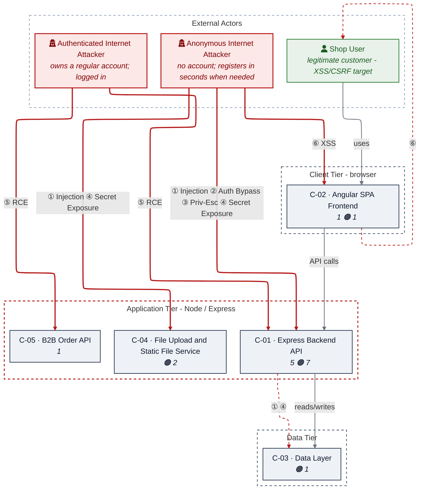

_Threats: ① Injection · ② Auth Bypass · ③ Priv-Esc · ④ Secret Exposure · ⑤ RCE · ⑥ XSS_

_Component badge: 🔴 = number of Critical findings on the component · 🟠 = number of High findings. Components with no Critical/High finding carry no badge._

**Figure 2 - Risk Flow: Actor → Tier → Impact**

Heatmap: **actors** (left) → **architecture tiers** (middle, Client → Application → Data) → **impact** (right). Numbered red arrows ①–⑥ are the threats enumerated in the Top Threats table below.

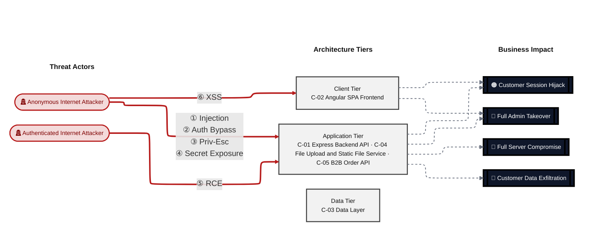

**Threat actors.** The actors below drive the numbered attack paths in the figures above; the Shop User is the *victim* of client-side attacks (XSS / CSRF), not an attacker.

- **Shop User** — legitimate customer; target of client-side attacks; target of ⑥ Output Encoding / Cross-Site Scripting.
- **Anonymous Internet Attacker** — no account; registers in seconds when needed; drives ① Insecure Query Construction & Data Access, ② Hardcoded Secrets & Weak Cryptography, ③ Broken Authorization & Access Control, ④ Sensitive File & Secret Exposure.
- **Authenticated Internet Attacker** — owns a regular account; logged in; drives ⑤ Remote Code Execution (unsafe eval).

**6 structural threats**, grouped by weakness class - each row is one threat, not one finding. *Threat Description* states the general architectural weakness (STRIDE in brackets); *Findings* lists the concrete instances, each linked to [§8 Findings Register](#8-findings-register) with its component; *Risk & Impact* combines severity with business consequence.

| # | Threat Description | Findings (→ Component) | Risk & Impact | Fix |
|---|------------------------------------|------------------------------------------------|------------------------------------|--------------------|
| <a id="path-injection"></a>① | **Insecure Query Construction & Data Access** _(T·I)_<br/>SQL injection on the login and search endpoints bypasses authentication and enables full database extraction without credentials. | •&nbsp;🔴&nbsp;[F-001](#f-001) — SQL injection authentication bypass →&nbsp;[C-01](#c-01)<br/>•&nbsp;🔴&nbsp;[F-007](#f-007) — SQL injection full database disclosure via UNION attack →&nbsp;[C-01](#c-01)<br/>•&nbsp;🟠&nbsp;[F-010](#f-010) — XML external entity injection via libxmljs2 external entity resolution routes/f… →&nbsp;[C-04](#c-04)<br/>•&nbsp;🟡&nbsp;[F-019](#f-019) — NoSQL injection via MarsDB queries →&nbsp;[C-03](#c-03) | 🔴 **Critical**<br/>Full Admin Takeover · Customer Data Exfiltration | [M-001](#m-001) — Replace raw SQL with Sequelize parameterized query in login route, [M-005](#m-005) (P1) |
| <a id="path-auth-bypass"></a>② | **Hardcoded Secrets & Weak Cryptography** _(S·E)_<br/>Hardcoded RSA private key and algorithm-none acceptance in outdated express-jwt allow forging valid session tokens for any account offline. | •&nbsp;🔴&nbsp;[F-002](#f-002) — Hardcoded RSA private key enables JWT forgery →&nbsp;[C-01](#c-01)<br/>•&nbsp;🔴&nbsp;[F-003](#f-003) — JWT algorithm confusion bypass via express jwt 0.1.3 →&nbsp;[C-01](#c-01)<br/>•&nbsp;🟠&nbsp;[F-008](#f-008) — MD5 password hashing trivially reversible →&nbsp;[C-01](#c-01) | 🔴 **Critical**<br/>Full Admin Takeover · Customer Session Hijack | [M-002](#m-002) — Remove hardcoded RSA private key; rotate to environment variable, [M-003](#m-003) (P1) |
| <a id="path-privilege-escalation"></a>③ | **Broken Authorization & Access Control** _(E·I)_<br/>authorisation checks are absent or bypassable, allowing horizontal and vertical privilege jumps from a self-registered or low-rights account. Includes mass-assignment of privileged attributes. | •&nbsp;🟠&nbsp;[F-018](#f-018) — Broken authorization on admin API endpoints →&nbsp;[C-01](#c-01)<br/>•&nbsp;🟢&nbsp;[F-024](#f-024) — Workflow lacks explicit permissions declaration →&nbsp;[C-01](#c-01) | 🟠 **High**<br/>Full Admin Takeover · Customer Data Exfiltration | [M-009](#m-009) — Add role-based authorization middleware to admin API endpoints, [M-028](#m-028) (P2/P4) |
| <a id="path-sensitive-data-exposure"></a>④ | **Sensitive File & Secret Exposure** _(I)_<br/>confidential files, credentials, and management-plane endpoints are reachable on unauthenticated routes; SSRF lets the server fetch internal resources on the attacker's behalf; unsafe path-handling primitives leak server content. | •&nbsp;🟠&nbsp;[F-013](#f-013) — Plaintext security answers stored in database →&nbsp;[C-03](#c-03)<br/>•&nbsp;🟠&nbsp;[F-014](#f-014) — SSRF via profile image URL upload →&nbsp;[C-01](#c-01)<br/>•&nbsp;🟠&nbsp;[F-015](#f-015) — Path traversal in encryption key and log file endpoints →&nbsp;[C-04](#c-04)<br/>•&nbsp;🟠&nbsp;[F-016](#f-016) — Unauthenticated FTP directory listing exposes sensitive files →&nbsp;[C-01](#c-01)<br/>•&nbsp;🟡&nbsp;[F-021](#f-021) — Build context includes sensitive files without dockerignore exclusions →&nbsp;[C-01](#c-01)<br/>•&nbsp;🟡&nbsp;[F-022](#f-022) — Open redirect via URL substring match bypass →&nbsp;[C-01](#c-01) | 🟠 **High**<br/>Customer Data Exfiltration | [M-016](#m-016) — Hash security answers before storage, [M-007](#m-007) (P2) |
| <a id="path-remote-code-execution"></a>⑤ | **Remote Code Execution (unsafe eval)** _(E)_<br/>Direct JavaScript evaluation of user-controlled input via `eval()` and a bypassable sandbox gives authenticated users arbitrary OS command execution. | •&nbsp;🔴&nbsp;[F-005](#f-005) — Remote code execution via sandbox escape in B2B order API →&nbsp;[C-05](#c-05)<br/>•&nbsp;🔴&nbsp;[F-006](#f-006) — Remote code execution via eval in userProfile →&nbsp;[C-01](#c-01) | 🔴 **Critical**<br/>Full Server Compromise | [M-022](#m-022) — Replace safeEval with structured JSON order line parsing, [M-006](#m-006) (P1) |
| <a id="path-cross-site-scripting"></a>⑥ | **Output Encoding / Cross-Site Scripting** _(T·I)_<br/>Persistent XSS via disabled Angular sanitization injects attacker scripts into admin and user sessions through stored HTML in email and feedback fields. | •&nbsp;🔴&nbsp;[F-004](#f-004) — Stored XSS in admin panel via user email and feedback frontend/src/app/administ… →&nbsp;[C-02](#c-02)<br/>•&nbsp;🟠&nbsp;[F-009](#f-009) — Stored XSS via trust HTML bypass in feedback frontend/src/app/about/about.compo… →&nbsp;[C-02](#c-02)<br/>•&nbsp;🟠&nbsp;[F-011](#f-011) — JWT stored in browser cookie without Secure/HttpOnly flags angular spa →&nbsp;[C-01](#c-01) | 🔴 **Critical**<br/>Customer Session Hijack · Full Admin Takeover | [M-011](#m-011) — Remove bypassSecurityTrustHtml() from administration component, [M-013](#m-013) (P1/P2) |

_STRIDE: S spoofing · T tampering · R repudiation · I information disclosure · D denial of service · E elevation of privilege. Risk, findings, components, impact and Fix are derived deterministically; only the one-line weakness description is authored._

**Verified attack chains.** 2 fully viable ([AC-T-003](#ac-t-003), [AC-T-005](#ac-t-005)); 2 partially blocked ([AC-T-001](#ac-t-001), [AC-T-006](#ac-t-006)). These chains combine individual findings into end-to-end exploitation paths verified step-by-step against the code - see [§9 Abuse Cases](#9-abuse-cases) for the per-step breakdown and blocking mitigations.

### Top Mitigations

Highest-impact P1/P2 mitigations - 10 of 18 qualifying (26 total). Full detail in [§10 Mitigation Register](#10-mitigation-register). All 8 mitigation(s) that fix a Critical finding are always listed here.

| # | Priority | Component | Mitigation | Addresses | Effort |
|---|--------|----------------------|------------------------------------------------|------------------------------------------------|------|
| **1** | **P1** | [C-01](#c-01) — Express Backend API | [M-001](#m-001) — Replace raw SQL with Sequelize parameterized query in login route | 🔴 [F-001](#f-001) — SQL injection authentication bypass routes/login.ts (routes/login.ts) | Low |
| **2** | **P1** | [C-01](#c-01) — Express Backend API | [M-002](#m-002) — Remove hardcoded RSA private key; rotate to environment variable | 🔴 [F-002](#f-002) — Hardcoded RSA private key enables JWT forgery lib/insecurity.ts (lib/insecurity.ts) | Low |
| **3** | **P1** | [C-01](#c-01) — Express Backend API | [M-005](#m-005) — Replace raw SQL with Sequelize ORM parameterized queries in search route | 🔴 [F-007](#f-007) — SQL injection full database disclosure via UNION attack routes/search.ts (routes/search.ts) | Low |
| **4** | **P1** | [C-01](#c-01) — Express Backend API | [M-006](#m-006) — Remove eval() from userProfile route; use safe template string replacement | 🔴 [F-006](#f-006) — Remote code execution via eval in userProfile routes/userProfile.ts (routes/userProfile.ts) | Low |
| **5** | **P1** | [C-01](#c-01) — Express Backend API | [M-003](#m-003) — Upgrade express-jwt to >=6.0.0 and enforce algorithm allowlist | 🔴 [F-003](#f-003) — JWT algorithm confusion bypass via express jwt 0.1.3 lib/insecurity.ts (lib/insecurity.ts) | Medium |
| **6** | **P1** | [C-02](#c-02) — Angular SPA Frontend | [M-011](#m-011) — Remove bypassSecurityTrustHtml() from administration component | 🔴 [F-004](#f-004) — Stored XSS in admin panel via user email and feedback frontend/src/app/administ… (frontend/src/app/administration/administration.component.ts)<br/>🟠 [F-009](#f-009) — Stored XSS via trust HTML bypass in feedback frontend/src/app/about/about.compo… (frontend/src/app/about/about.component.ts) | Medium |
| **7** | **P1** | [C-05](#c-05) — B2B Order API | [M-022](#m-022) — Replace safeEval with structured JSON order line parsing | 🔴 [F-005](#f-005) — Remote code execution via sandbox escape in B2B order API routes/b2bOrder.ts (routes/b2bOrder.ts) | Medium |
| **8** | **P2** | [C-01](#c-01) — Express Backend API | [M-024](#m-024) — Implement dependency update automation and security audit policy | 🔴 [F-003](#f-003) — JWT algorithm confusion bypass via express jwt 0.1.3 lib/insecurity.ts (lib/insecurity.ts)<br/>🔴 [F-004](#f-004) — Stored XSS in admin panel via user email and feedback frontend/src/app/administ… (frontend/src/app/administration/administration.component.ts) | Medium |
| **9** | **P2** | [C-01](#c-01) — Express Backend API | [M-007](#m-007) — Implement URL allowlist for profile image upload | 🟠 [F-014](#f-014) — SSRF via profile image URL upload routes/profileImageUrlUpload.ts (routes/profileImageUrlUpload.ts) | Low |
| **10** | **P2** | [C-01](#c-01) — Express Backend API | [M-010](#m-010) — Add rate limiting to /rest/user/login and /rest/user/register | 🟠 [F-017](#f-017) — No rate limiting on authentication endpoints server.ts (server.ts) | Low |

*8 additional P1/P2 mitigations capped from the leader-board · 8 P3 backlog items in [§10 Mitigation Register](#10-mitigation-register). Sorted by priority (P1 first), then component, then leverage (most findings first), severity (Critical first), and effort (Low first).*

### Operational Strengths

Operational controls rated Adequate or Partial - grouped into broad clusters (full per-control breakdown in [§7](#7-security-architecture)). Clusters demoted to Weak by open Critical/High findings appear in [§7](#7-security-architecture) instead, not here.

| Strength | What's in Place | Effectiveness | Gap | Mitigates |
|----------------------|----------------------|-------------|----------------------|----------------|
| **Container & Supply-Chain Hardening** | _Build-time and runtime hardening - minimal base image, non-root execution, dependency inventory._<br/>Automated SCA scanning | ✅ Adequate | - | - |
| **Observability & Audit** | _Runtime visibility - access logging, audit trails, and operational telemetry for post-incident review._<br/>Logging and Monitoring - `lib/logger.ts`, `server.ts:331`-338 | ⚠️ Partial | Coverage incomplete - see [§7](#7-security-architecture) control assessment. | - |


**Bottom line:** These controls narrow specific attack surfaces but none eliminates a Critical finding on its own.

---

<a id="critical-attack-chain"></a><a id="critical-attack-tree"></a>
## Critical Attack Tree

The root is the worst-case attacker goal; below it, each capability branch groups the Critical findings that achieve it. Branches feed the goal by OR - any single path suffices.

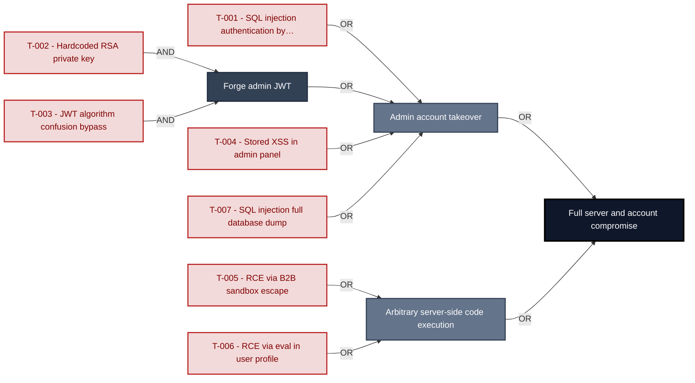

**Findings** (full detail in [§8 Findings Register](#8-findings-register)): [F-001](#f-001) — SQL injection authentication bypass routes/login.ts SQL injection authentication bypass · [F-002](#f-002) — Hardcoded RSA private key enables JWT forgery lib/insecurity.ts Hardcoded RSA private key · [F-003](#f-003) — JWT algorithm confusion bypass via express jwt 0.1.3 lib/insecurity.ts JWT algorithm confusion bypass · [F-004](#f-004) — Stored XSS in admin panel via user email and feedback frontend/src/app/administ… Stored XSS in admin panel · [F-005](#f-005) — Remote code execution via sandbox escape in B2B order API routes/b2bOrder.ts RCE via B2B sandbox escape · [F-006](#f-006) — Remote code execution via eval in userProfile routes/userProfile.ts RCE via eval in user profile · [F-007](#f-007) — SQL injection full database disclosure via UNION attack routes/search.ts SQL injection full database dump

---

## 1. System Overview

Probably the most modern and sophisticated insecure web application

**Repository:** https://github.com/juice-shop/juice-shop
**Runtime:** Node\.js 20 - 24

### Scope

This threat model covers 5 components of juice-shop: **Express Backend API**, **Angular SPA Frontend**, **Data Layer**, **File Upload and Static File Service**, **B2B Order API**.

**Out of scope:** third-party hosted dependencies, browser runtime, operating-system kernel, and the underlying network infrastructure.

---

## 2. Architecture Diagrams

### 2.1 System Context

Who interacts with juice-shop from the outside, and through which channels. Solid arrows show normal usage; dashed red arrows mark unauthenticated probing or exploit paths (C4 Level 1).

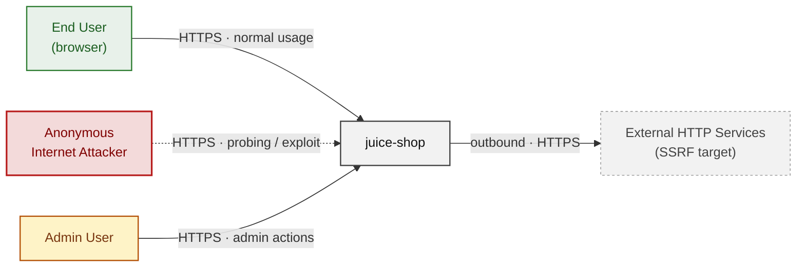

### 2.2 Container Architecture

How the system decomposes into deployable units. Each box is a separate runtime process or service container; arrows show synchronous request paths between them. Components with ≥3 Critical findings carry a red border, ≥2 High amber (C4 Level 2).

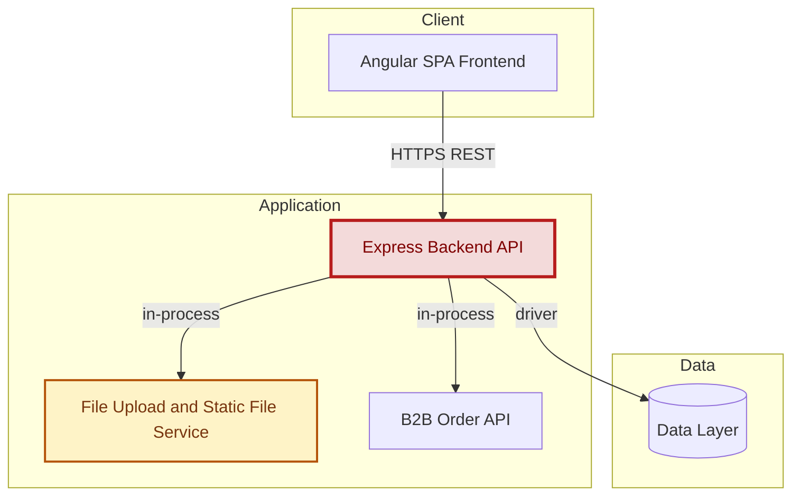

### 2.3 Components


Who reaches each component, and through which trust zone. Four columns map external actors to the internal tiers (Client / Application / Data); solid green arrows show legitimate data flow, dashed red arrows mark intrusion vectors. The component table directly below holds source paths and linked threats per `C-NN`; per-finding evidence is in [§8 Findings Register](#8-findings-register).

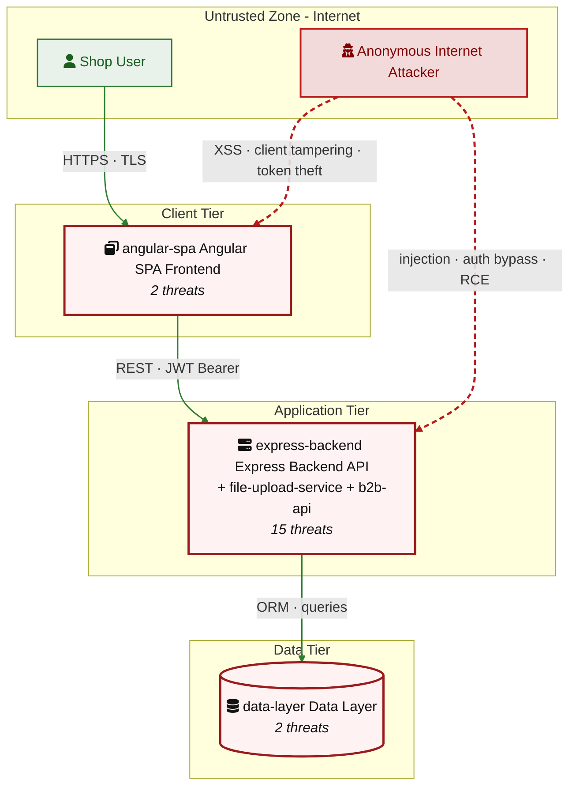

| ID | Name | Type | Key Paths | Linked Threats |
|----|----------------------|-----------|--------------------------|------------------------------------------------|
| <a id="c-01"></a><a id="express-backend"></a>C-01 | Express Backend API | application | `server.ts`<br/>`app.ts`<br/>`routes/**`<br/>`lib/**`<br/>`models/**` | 🔴 [F-001](#f-001) — SQL injection authentication bypass routes/login.ts<br/>🔴 [F-002](#f-002) — Hardcoded RSA private key enables JWT forgery lib/insecurity.ts<br/>🔴 [F-003](#f-003) — JWT algorithm confusion bypass via express jwt 0.1.3 lib/insecurity.ts<br/>🔴 [F-006](#f-006) — Remote code execution via eval in userProfile routes/userProfile.ts<br/>🔴 [F-007](#f-007) — SQL injection full database disclosure via UNION attack routes/search.ts<br/>🟠 [F-008](#f-008) — MD5 password hashing trivially reversible lib/insecurity.ts<br/>🟠 [F-011](#f-011) — JWT stored in browser cookie without Secure/HttpOnly flags angular spa<br/>🟠 [F-012](#f-012) — No Content Security Policy allows arbitrary script injection server.ts<br/>🟠 [F-014](#f-014) — SSRF via profile image URL upload routes/profileImageUrlUpload.ts<br/>🟠 [F-016](#f-016) — Unauthenticated FTP directory listing exposes sensitive files server.ts<br/>🟠 [F-017](#f-017) — No rate limiting on authentication endpoints server.ts<br/>🟠 [F-018](#f-018) — Broken authorization on admin API endpoints server.ts<br/>🟡 [F-021](#f-021) — Build context includes sensitive files without dockerignore exclusions<br/>🟡 [F-022](#f-022) — Open redirect via URL substring match bypass lib/insecurity.ts<br/>🟢 [F-024](#f-024) — Workflow lacks explicit permissions declaration |
| <a id="c-02"></a><a id="angular-spa"></a>C-02 | Angular SPA Frontend | client | `frontend/src/**`<br/>`frontend/dist/**` | 🔴 [F-004](#f-004) — Stored XSS in admin panel via user email and feedback frontend/src/app/administ…<br/>🔴 [F-009](#f-009) — Stored XSS via trust HTML bypass in feedback frontend/src/app/about/about.compo… |
| <a id="c-03"></a><a id="data-layer"></a>C-03 | Data Layer | data | `models/**`<br/>`data/**` | 🟠 [F-013](#f-013) — Plaintext security answers stored in database models/securityAnswer.ts<br/>🔴 [F-019](#f-019) — NoSQL injection via MarsDB queries data/mongodb.ts |
| <a id="c-04"></a><a id="file-upload-service"></a>C-04 | File Upload and Static File Service | application | `routes/fileUpload.ts`<br/>`routes/fileServer.ts`<br/>`routes/keyServer.ts`<br/>`routes/logfileServer.ts`<br/>`routes/quarantineServer.ts` | 🟠 [F-010](#f-010) — XML external entity injection via libxmljs2 external entity resolution routes/f…<br/>🟠 [F-015](#f-015) — Path traversal in encryption key and log file endpoints routes/keyServer.ts<br/>🟡 [F-020](#f-020) — Unrestricted file upload allows malicious file storage routes/fileUpload.ts |
| <a id="c-05"></a><a id="b2b-api"></a>C-05 | B2B Order API | application | `routes/b2bOrder.ts` | 🔴 [F-005](#f-005) — Remote code execution via sandbox escape in B2B order API routes/b2bOrder.ts<br/>🟡 [F-023](#f-023) — DoS via infinite loop in B2B order evaluation routes/b2bOrder.ts |
### 2.4 Technology Architecture

The technology stack the system is built on. Each box names the framework or runtime that fills that role; per-component findings live in the [§2.3](#23-components) component table above, and the full per-finding catalogue is in [§8 Findings Register](#8-findings-register).

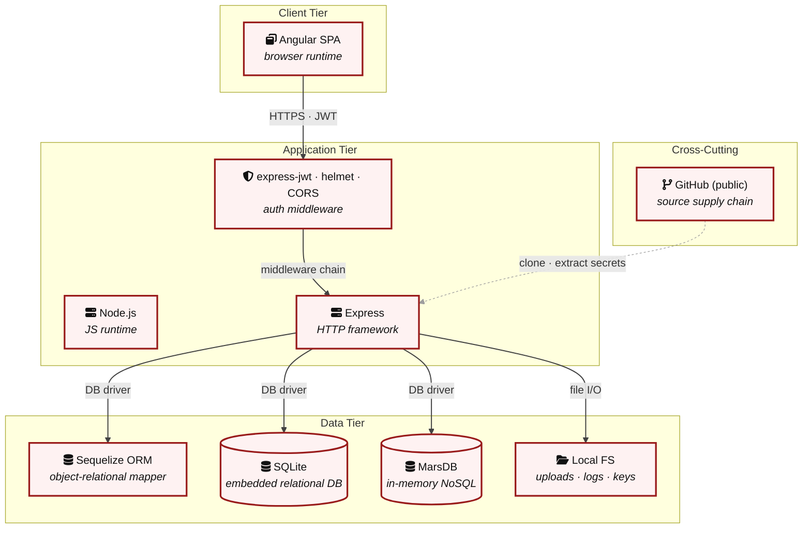

> **Legend:** **red border** ≥ 3 Critical threats on the component · **amber border** ≥ 2 High threats

---

## 3. Attack Walkthroughs

This section walks through how the highest-risk findings are exploited - one short walkthrough per Critical, each with attack steps, a focused sequence diagram, and the primary mitigation. The cross-finding view (which weaknesses combine toward the worst-case goal, and where one fix severs several paths) is in the [Critical Attack Tree](#critical-attack-tree). Full per-finding context - severity rationale, assets, detection signals - is in the [§8 Findings Register](#8-findings-register) row for each finding.

### 3.1 SQL injection authentication bypass routes/login.ts

**Source:** [F-001](#f-001) — `routes/login.ts:34`

Severity **Critical** ([CWE-89](https://cwe.mitre.org/data/definitions/89.html)). STRIDE: Spoofing. See [§8 T-001](#t-001) for the full register row.

**Attack Steps**

1. An unauthenticated attacker sends POST `/rest/user/login` with email="' OR 1=1--" which satisfies the raw SQL query SELECT * FROM Users WHERE email = ''' OR 1=1-- AND password.
2. yielding the first row (admin).
3. [CWE-89](https://cwe.mitre.org/data/definitions/89.html).

**Sequence Diagram**

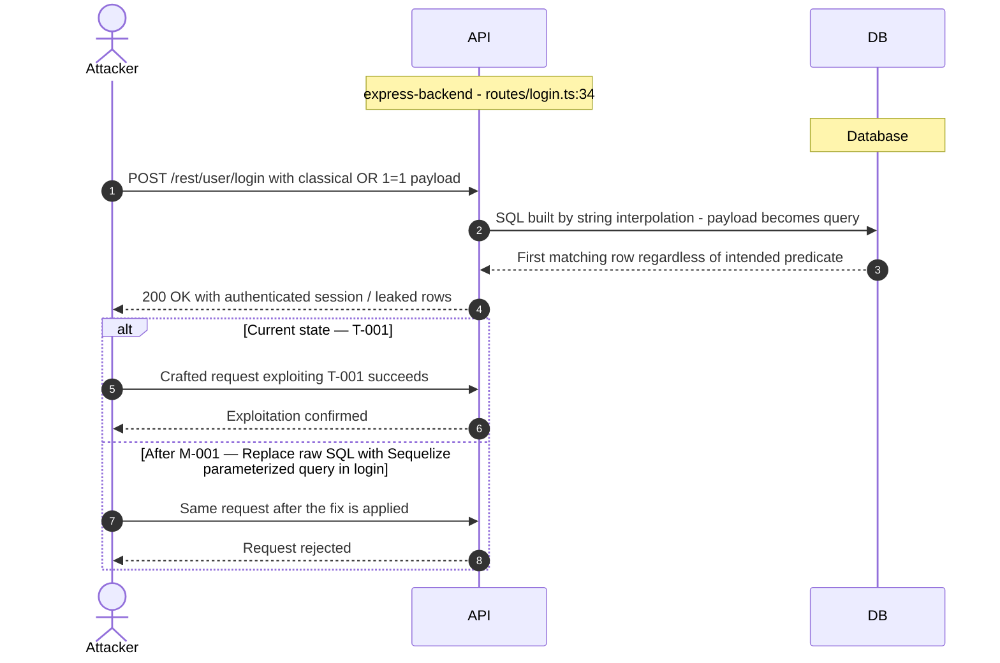

**Key takeaway:** Until [M-001](#m-001) — Replace raw SQL with Sequelize parameterized query in login route (Replace raw SQL with Sequelize parameterized query in login ) lands, [T-001](#t-001) — SQL injection authentication bypass routes/login.ts is exploitable at `routes/login.ts:34` (Critical-severity, [CWE-89](https://cwe.mitre.org/data/definitions/89.html)).

**Defense in Depth**

- Primary mitigation: [M-001](#m-001) (Replace raw SQL with Sequelize parameterized query in login route)
- Defence in depth: [M-025](#m-025) (Add comprehensive security event logging and alerting)

### 3.2 Hardcoded RSA private key enables JWT forgery lib/insecurit…

**Source:** [F-002](#f-002) — `lib/insecurity.ts:23`

Severity **Critical** ([CWE-321](https://cwe.mitre.org/data/definitions/321.html)). STRIDE: Spoofing. See [§8 T-002](#t-002) for the full register row.

**Attack Steps**

1. The RSA-2048 private key is hardcoded in `lib/insecurity.ts:23` and committed to the public git repository.
2. Any person with repository read access can extract it and forge arbitrary JWT tokens for any user including admin.
3. [CWE-321](https://cwe.mitre.org/data/definitions/321.html).

**Sequence Diagram**

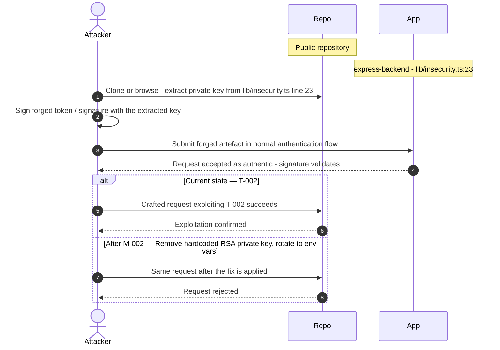

**Key takeaway:** Until [M-002](#m-002) — Remove hardcoded RSA private key; rotate to environment variable (Remove hardcoded RSA private key; rotate to environment vari) lands, [T-002](#t-002) — Hardcoded RSA private key enables JWT forgery lib/insecurity.ts is exploitable at `lib/insecurity.ts:23` (Critical-severity, [CWE-321](https://cwe.mitre.org/data/definitions/321.html)).

**Defense in Depth**

- Primary mitigation: [M-002](#m-002) (Remove hardcoded RSA private key; rotate to environment variable)

### 3.3 JWT algorithm confusion bypass via express jwt 0.1.3 lib/in…

**Source:** [F-003](#f-003) — `lib/insecurity.ts:54`

Severity **Critical** ([CWE-327](https://cwe.mitre.org/data/definitions/327.html)). STRIDE: Spoofing. See [§8 T-003](#t-003) for the full register row.

**Attack Steps**

1. express-jwt 0.1.3 (`CVE-2020-15084`) does not enforce algorithm restrictions.
2. An attacker can craft a JWT with `alg:none`, strip the signature, and the middleware accepts it as valid.
3. `RS256`→`HS256` confusion allows signing with the public key as HMAC secret.

**Sequence Diagram**

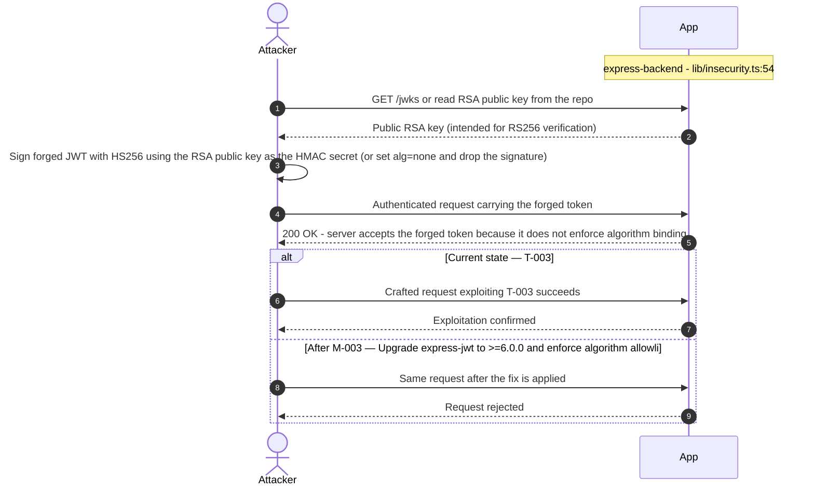

**Key takeaway:** Until [M-003](#m-003) — Upgrade express-jwt to >=6.0.0 and enforce algorithm allowlist (Upgrade express-jwt to >=6.0.0 and enforce algorithm allowli) lands, [T-003](#t-003) — JWT algorithm confusion bypass via express jwt 0.1.3 lib/insecurity.ts is exploitable at `lib/insecurity.ts:54` (Critical-severity, [CWE-327](https://cwe.mitre.org/data/definitions/327.html)).

**Defense in Depth**

- Primary mitigation: [M-003](#m-003) (Upgrade express-jwt to >=6.0.0 and enforce algorithm allowlist)
- Defence in depth: [M-024](#m-024) (Implement dependency update automation and security audit policy)
- Defence in depth: [M-025](#m-025) (Add comprehensive security event logging and alerting)

### 3.4 Stored XSS in admin panel via user email and feedback front…

**Source:** [F-004](#f-004) — `frontend/src/app/administration/administration.component.ts:60`

Severity **Critical** ([CWE-79](https://cwe.mitre.org/data/definitions/79.html)). STRIDE: Tampering. See [§8 T-004](#t-004) for the full register row.

**Attack Steps**

1. The admin panel bypasses Angular XSS protection on user email (`administration.component.ts:60`) and feedback comments (`administration.component.ts:78`).
2. An attacker who registers with a crafted email like `<script>`...`</script>` injects persistent XSS into the admin panel.
3. [CWE-79](https://cwe.mitre.org/data/definitions/79.html).

**Sequence Diagram**

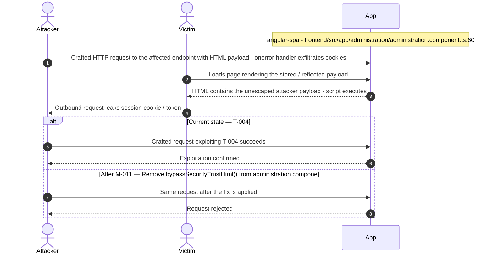

**Key takeaway:** Until [M-011](#m-011) — Remove bypassSecurityTrustHtml() from administration component (Remove `bypassSecurityTrustHtml()` from administration compone) lands, [T-004](#t-004) — Stored XSS in admin panel via user email and feedback frontend/src/app/administ… is exploitable at `frontend/src/app/administration/administration.component.ts:60` (Critical-severity, [CWE-79](https://cwe.mitre.org/data/definitions/79.html)).

**Defense in Depth**

- Primary mitigation: [M-011](#m-011) (Remove `bypassSecurityTrustHtml()` from administration component)
- Defence in depth: [M-024](#m-024) (Implement dependency update automation and security audit policy)

### 3.5 Remote code execution via sandbox escape in B2B order API r…

**Source:** [F-005](#f-005) — `routes/b2bOrder.ts:23`

Severity **Critical** ([CWE-94](https://cwe.mitre.org/data/definitions/94.html)). STRIDE: Tampering. See [§8 T-005](#t-005) for the full register row.

**Attack Steps**

1. POST `/api/B2BOrder` with orderLinesData containing prototype pollution payload (e.g., constructor[prototype][toString]=()=>{ require("child_process").exec("id") }) escapes the `notevil` safeEval sandbox via prototype chain manipulation and executes arbitrary Node\.js code.
2. [CWE-94](https://cwe.mitre.org/data/definitions/94.html).
3. `routes/b2bOrder.ts:23`.

**Sequence Diagram**

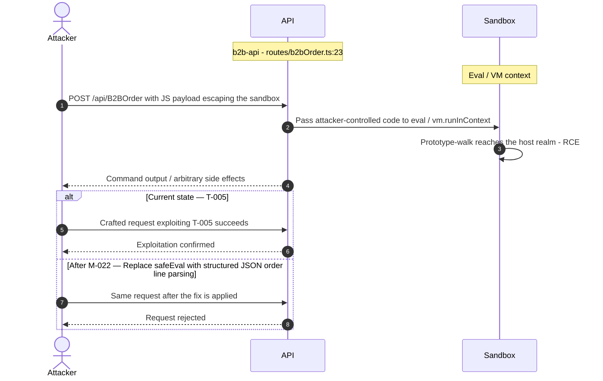

**Key takeaway:** Until [M-022](#m-022) — Replace safeEval with structured JSON order line parsing (Replace safeEval with structured JSON order line parsing) lands, [T-005](#t-005) — Remote code execution via sandbox escape in B2B order API routes/b2bOrder.ts is exploitable at `routes/b2bOrder.ts:23` (Critical-severity, [CWE-94](https://cwe.mitre.org/data/definitions/94.html)).

**Defense in Depth**

- Primary mitigation: [M-022](#m-022) (Replace safeEval with structured JSON order line parsing)

### 3.6 Remote code execution via eval in userProfile routes/userPr…

**Source:** [F-006](#f-006) — `routes/userProfile.ts:62`

Severity **Critical** ([CWE-95](https://cwe.mitre.org/data/definitions/95.html)). STRIDE: Tampering. See [§8 T-006](#t-006) for the full register row.

**Attack Steps**

1. POST `/profile` with username containing #{&lt;code>} causes `routes/userProfile.ts:62` to eval(code) where code is extracted from the username field.
2. An authenticated attacker sets username to #{process.mainModule.require("child_process").execSync("id").toString()} to execute arbitrary OS commands.
3. [CWE-95](https://cwe.mitre.org/data/definitions/95.html).

**Sequence Diagram**

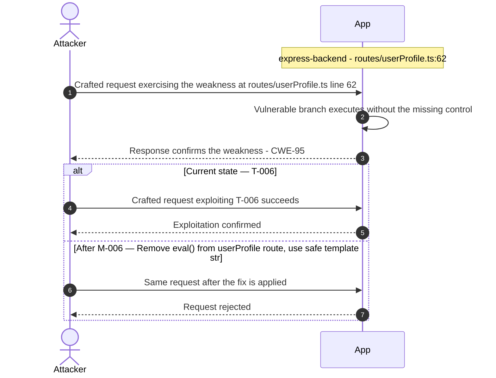

**Key takeaway:** Until [M-006](#m-006) — Remove eval() from userProfile route; use safe template string replacement (Remove `eval()` from userProfile route; use safe template stri) lands, [T-006](#t-006) — Remote code execution via eval in userProfile routes/userProfile.ts is exploitable at `routes/userProfile.ts:62` (Critical-severity, [CWE-95](https://cwe.mitre.org/data/definitions/95.html)).

**Defense in Depth**

- Primary mitigation: [M-006](#m-006) (Remove `eval()` from userProfile route; use safe template string replacement)

### 3.7 SQL injection full database disclosure via UNION attack rou…

**Source:** [F-007](#f-007) — `routes/search.ts:23`

Severity **Critical** ([CWE-89](https://cwe.mitre.org/data/definitions/89.html)). STRIDE: Information Disclosure. See [§8 T-007](#t-007) for the full register row.

**Attack Steps**

1. The search endpoint uses raw string interpolation in SELECT .
2. LIKE queries (`routes/search.ts:23`).
3. A UNION SELECT attack can extract all tables including Users, products, orders, and security answers.

**Sequence Diagram**

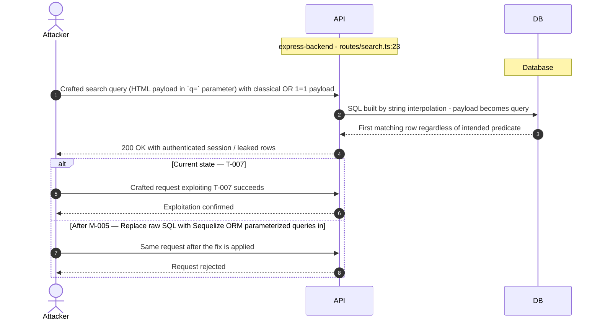

**Key takeaway:** Until [M-005](#m-005) — Replace raw SQL with Sequelize ORM parameterized queries in search route (Replace raw SQL with Sequelize ORM parameterized queries in ) lands, [T-007](#t-007) — SQL injection full database disclosure via UNION attack routes/search.ts is exploitable at `routes/search.ts:23` (Critical-severity, [CWE-89](https://cwe.mitre.org/data/definitions/89.html)).

**Defense in Depth**

- Primary mitigation: [M-005](#m-005) (Replace raw SQL with Sequelize ORM parameterized queries in search route)

<!-- generated:walkthrough_renderer -->

---

## 4. Assets

Information assets and the classification level that drives the Confidentiality / Integrity / Availability targets used in [§8 Findings Register](#8-findings-register) risk scoring.

| Asset | ID | Classification | Description | Linked Threats |
|----------------------|-----|--------------|------------------------------------|------------------------------------------------|
| JWT RSA Private Key | A-002 | Restricted | RSA-2048 private key hardcoded in `lib/insecurity.ts:23` and stored in encryptionkeys/. Possession of this key allows forging arbitrary JWT tokens for any user including admin. | 🔴 [F-002](#f-002) — Hardcoded RSA private key enables JWT forgery lib/insecurity.ts<br/>🔴 [F-003](#f-003) — JWT algorithm confusion bypass via express jwt 0.1.3 lib/insecurity.ts<br/>🟠 [F-008](#f-008) — MD5 password hashing trivially reversible lib/insecurity.ts<br/>🟠 [F-011](#f-011) — JWT stored in browser cookie without Secure/HttpOnly flags angular spa<br/>🟠 [F-012](#f-012) — No Content Security Policy allows arbitrary script injection server.ts<br/>🟠 [F-013](#f-013) — Plaintext security answers stored in database models/securityAnswer.ts<br/>🟠 [F-015](#f-015) — Path traversal in encryption key and log file endpoints routes/keyServer.ts<br/>🟡 [F-021](#f-021) — Build context includes sensitive files without dockerignore exclusions<br/>🟡 [F-022](#f-022) — Open redirect via URL substring match bypass lib/insecurity.ts |
| User Credentials (Email + Password Hash) | A-001 | Confidential | User email addresses and `MD5`-hashed passwords stored in SQLite Users table. `MD5` is cryptographically weak; hashes can be reversed with rainbow tables. | 🔴 [F-001](#f-001) — SQL injection authentication bypass routes/login.ts<br/>🔴 [F-004](#f-004) — Stored XSS in admin panel via user email and feedback frontend/src/app/administ…<br/>🔴 [F-007](#f-007) — SQL injection full database disclosure via UNION attack routes/search.ts<br/>🟠 [F-008](#f-008) — MD5 password hashing trivially reversible lib/insecurity.ts<br/>🔴 [F-009](#f-009) — Stored XSS via trust HTML bypass in feedback frontend/src/app/about/about.compo…<br/>🟠 [F-017](#f-017) — No rate limiting on authentication endpoints server.ts |
| Session Tokens (JWT) | A-003 | Confidential | JWT tokens issued at login, stored in browser cookies. Valid for 6 hours. Compromise enables account takeover. | 🔴 [F-002](#f-002) — Hardcoded RSA private key enables JWT forgery lib/insecurity.ts<br/>🔴 [F-004](#f-004) — Stored XSS in admin panel via user email and feedback frontend/src/app/administ…<br/>🔴 [F-009](#f-009) — Stored XSS via trust HTML bypass in feedback frontend/src/app/about/about.compo…<br/>🟠 [F-011](#f-011) — JWT stored in browser cookie without Secure/HttpOnly flags angular spa<br/>🟠 [F-013](#f-013) — Plaintext security answers stored in database models/securityAnswer.ts<br/>🟡 [F-021](#f-021) — Build context includes sensitive files without dockerignore exclusions |
| Customer Orders and Basket Data | A-004 | Confidential | Purchase history, basket contents, delivery addresses, and payment card data stored in SQLite. Accessible via Sequelize/MarsDB. | 🔴 [F-001](#f-001) — SQL injection authentication bypass routes/login.ts<br/>🔴 [F-004](#f-004) — Stored XSS in admin panel via user email and feedback frontend/src/app/administ…<br/>🔴 [F-007](#f-007) — SQL injection full database disclosure via UNION attack routes/search.ts<br/>🔴 [F-009](#f-009) — Stored XSS via trust HTML bypass in feedback frontend/src/app/about/about.compo…<br/>🟠 [F-013](#f-013) — Plaintext security answers stored in database models/securityAnswer.ts<br/>🟠 [F-018](#f-018) — Broken authorization on admin API endpoints server.ts<br/>🟡 [F-021](#f-021) — Build context includes sensitive files without dockerignore exclusions |
| FTP Directory Contents | A-006 | Confidential | Intentionally exposed sensitive files in ftp/: `acquisitions.md` (M&A plans), `coupons_2013.md.bak`, incident-`support.kdbx` (KeePass database), `eastere.gg`, `suspicious_errors.yml`. | 🟠 [F-015](#f-015) — Path traversal in encryption key and log file endpoints routes/keyServer.ts<br/>🟠 [F-016](#f-016) — Unauthenticated FTP directory listing exposes sensitive files server.ts<br/>🟠 [F-018](#f-018) — Broken authorization on admin API endpoints server.ts |
| Product Catalog and Pricing | A-005 | Internal | Product names, descriptions, prices, and images stored in Products table. Writable via SQL injection or BOLA vulnerabilities. | 🔴 [F-001](#f-001) — SQL injection authentication bypass routes/login.ts<br/>🔴 [F-004](#f-004) — Stored XSS in admin panel via user email and feedback frontend/src/app/administ…<br/>🔴 [F-007](#f-007) — SQL injection full database disclosure via UNION attack routes/search.ts<br/>🔴 [F-009](#f-009) — Stored XSS via trust HTML bypass in feedback frontend/src/app/about/about.compo… |
| Application Source Code and Challenge Logic | A-007 | Internal | TypeScript source code, challenge definitions, and coding challenge fix options. Exposed via /solve/challenges/ endpoint and ftp/ directory. | 🟠 [F-015](#f-015) — Path traversal in encryption key and log file endpoints routes/keyServer.ts<br/>🟠 [F-016](#f-016) — Unauthenticated FTP directory listing exposes sensitive files server.ts<br/>🟠 [F-018](#f-018) — Broken authorization on admin API endpoints server.ts |
| User Profile Images and Memories | A-008 | Internal | User-uploaded profile images and memory photos stored in frontend/dist/frontend/assets/public/images/uploads/. Writable via SSRF via profile image URL upload. | 🔴 [F-005](#f-005) — Remote code execution via sandbox escape in B2B order API routes/b2bOrder.ts<br/>🔴 [F-006](#f-006) — Remote code execution via eval in userProfile routes/userProfile.ts<br/>🟠 [F-010](#f-010) — XML external entity injection via libxmljs2 external entity resolution routes/f…<br/>🟠 [F-014](#f-014) — SSRF via profile image URL upload routes/profileImageUrlUpload.ts<br/>🟠 [F-015](#f-015) — Path traversal in encryption key and log file endpoints routes/keyServer.ts<br/>🟡 [F-020](#f-020) — Unrestricted file upload allows malicious file storage routes/fileUpload.ts |

---

## 5. Attack Surface

Network-reachable entry points classified by authentication requirement. Each row links to the threat(s) referenced in its **Notes** column. The **Risk** column reflects the highest-severity linked finding.

### 5.1 Unauthenticated Entry Points (4)

| Method | Route | Risk | Notes |
|------|-------------------------------------|----------|------------------------------------|
| ? | `/rest/products/search (SQL injection)` | 🔴 Critical | [F-007](#f-007) (SQL injection full database disclosure via UNION attack `routes/search.ts`)<br/>Search endpoint with unsanitized LIKE query injection, allows UNION-based data extraction and schema disclosure. |
| ? | `/rest/user/login (SQL injection)` | 🔴 Critical | [F-001](#f-001) (SQL injection authentication bypass `routes/login.ts`)<br/>Login endpoint vulnerable to SQL injection authentication bypass. Raw string interpolation in SELECT query. |
| ? | `/encryptionkeys/:file` | 🟠 High | [F-015](#f-015) (Path traversal in encryption key and log file endpoints `routes/keyServer.ts`)<br/>Serves JWT public key and `premium.key` from encryptionkeys/ directory via path parameter. No auth required. |
| ? | `/ftp (directory listing)` | - | serve-index serves FTP directory with file listing and download. Contains sensitive files (`acquisitions.md`, KeePass database). |

### 5.2 Authenticated Entry Points (12)

| Method | Route | Risk | Notes |
|-------|---------------------|----------|------------------------------------|
| ? | `/api/B2BOrder (RCE)` | 🔴 Critical | [F-005](#f-005) (Remote code execution via sandbox escape in B2B order API `routes/b2bOrder.ts`)<br/>[F-023](#f-023) (DoS via infinite loop in B2B order evaluation `routes/b2bOrder.ts`)<br/>B2B order processing endpoint accepts orderLinesData and evaluates it via `vm.runInContext`/safeEval - remote code execution vector. |
| POST | `/profile/image/file` | 🔴 Critical | [F-014](#f-014) (SSRF via profile image URL upload `routes/profileImageUrlUpload.ts`)<br/>[F-006](#f-006) (Remote code execution via eval in userProfile `routes/userProfile.ts`)<br/>handler: `server.ts:310` |
| POST | `/profile/image/url` | 🔴 Critical | [F-014](#f-014) (SSRF via profile image URL upload `routes/profileImageUrlUpload.ts`)<br/>[F-006](#f-006) (Remote code execution via eval in userProfile `routes/userProfile.ts`)<br/>handler: `server.ts:311` |
| POST | `/api/Products` | 🟠 High | [F-018](#f-018) (Broken authorization on admin API endpoints `server.ts`)<br/>handler: `server.ts:368` |
| GET | `/api/Users` | 🟠 High | [F-018](#f-018) (Broken authorization on admin API endpoints `server.ts`)<br/>handler: `server.ts:362` |
| POST | `/file-upload` | 🟠 High | [F-010](#f-010) (XML external entity injection via libxmljs2 external entity resolution routes/f…)<br/>[F-014](#f-014) (SSRF via profile image URL upload `routes/profileImageUrlUpload.ts`)<br/>[F-020](#f-020) (Unrestricted file upload allows malicious file storage `routes/fileUpload.ts`)<br/>handler: `server.ts:309` |
| OPTIONS | `*` | - | handler: `server.ts:181` |
| POST | `/api/Challenges` | - | handler: `server.ts:372` |
| GET | `/api/Complaints` | - | handler: `server.ts:380` |
| POST | `/api/Hints` | - | handler: `server.ts:375` |
| POST | `/rest/memories` | - | handler: `server.ts:312` |
| ? | `Socket.IO (WebSocket)` | - | Real-time challenge notification channel. Used for challenge completion events and some user interactions. |

---

## 7. Security Architecture

This chapter is organized by security-control category. The architecture section avoids artificial control IDs and finding-ID columns in overview tables. Findings are listed only where the affected control is described.

_[§7](#7-security-architecture) schema v2 (13-section control-category layout). Cataloged controls: 18 total - 1 adequate, 2 partial, 4 weak, 8 unsafe, 3 missing. Linked threats: 24._

**How to read the verdicts.** Every control category (and every sub-control below it) carries exactly one status. The two red verdicts do **not** mean the same thing - this is the distinction that decides what you have to do about a finding:

| Status | Meaning | What it asks of you |
|----------|------------------------------------|------------------------|
| 🟢 Adequate | Control is present and sound | Nothing - keep it |
| 🟡 Partial | Present, but with meaningful gaps | Close the gap |
| 🟠 Weak | Present, but has exploitable gaps | Strengthen it |
| 🔴 Unsafe | **Present and relied upon, but defeated / trivially bypassable** | **Fix the existing control** |
| 🔴 Missing | **Control was never built** | **Add the control** |
| - | Not applicable to this codebase | - |

So "🔴 Unsafe" on a control category does *not* mean the control is absent - it means the control exists but does not hold (e.g. an `MD5` password hash, a raw-SQL query path, a hardcoded signing key). "🔴 Missing" is reserved for controls that were never built (e.g. no Content-Security-Policy header).

### 7.1 Security Control Overview

<!-- §7.1 MECHANICAL-FROZEN — DO NOT EDIT (overview table is pregenerator-owned) -->

| Control category | Verdict | Main reason |
|----------------------|---------|------------------------------------|
| [7.2 Identity and Authentication Controls](#72-identity-and-authentication-controls) | 🔴 Unsafe | 2 routed findings; catalogued controls are present but defeated (e.g. Password Authentication, Multi-Factor Authentication). |
| [7.3 Session and Token Controls](#73-session-and-token-controls) | 🟠 Weak | 0 routed findings; catalogued controls are weak (e.g. Session Management). |
| [7.4 Authorization Controls](#74-authorization-controls) | 🟠 Weak | 2 routed findings; catalogued controls are weak (e.g. Role-Based Access Control). |
| [7.5 Query Construction and Data Access Controls](#75-query-construction-and-data-access-controls) | 🔴 Unsafe | 3 routed findings; catalogued controls are present but defeated (e.g. SQL Query Parameterization). |
| [7.6 Input Boundary Validation Controls](#76-input-boundary-validation-controls) | 🔴 Unsafe | 1 routed finding; catalogued controls are present but defeated (e.g. Input Validation / Sanitization). |
| [7.7 Output Encoding and Rendering Controls](#77-output-encoding-and-rendering-controls) | 🔴 Unsafe | 2 routed findings; catalogued controls are present but defeated (e.g. HTML Output Encoding / XSS Prevention). |
| [7.8 Browser and Cross-Origin Controls](#78-browser-and-cross-origin-controls) | 🔴 Unsafe | 1 routed finding; catalogued controls are present but defeated (e.g. CORS Policy, Content Security Policy). |
| [7.9 Cryptography Secrets and Data Protection](#79-cryptography-secrets-and-data-protection) | 🔴 Unsafe | 4 routed findings; catalogued controls are present but defeated (e.g. Secrets Management). |
| [7.10 File Parser and Outbound Request Controls](#710-file-parser-and-outbound-request-controls) | 🔴 Unsafe | 7 routed findings; catalogued controls are present but defeated (e.g. File Upload Validation, Outbound Request Controls (SSRF)). |
| [7.11 Operations Runtime and Supply Chain Controls](#711-operations-runtime-and-supply-chain-controls) | 🔴 Missing | Required controls not in place (e.g. Dependency Management, Logging and Monitoring). |
| [7.12 Real-time and Not Applicable Controls](#712-real-time-and-not-applicable-controls) | - | No controls or findings routed to this category. |
| [7.13 Defense-in-Depth Summary](#713-defense-in-depth-summary) | - | No controls or findings routed to this category. |

<!-- §7.1 MECHANICAL-FROZEN END -->

### 7.2 Identity and Authentication Controls

**Verdict:** 🔴 Unsafe

<!-- The line below is mechanically derived from the controls table — LLM must not re-author it. -->
**Controls covered:** [7.2.1 Password Authentication](#721-password-authentication) · [7.2.2 Multi-Factor Authentication](#722-multi-factor-authentication)

- [7.2.1 Password Authentication](#password-authentication)
- [7.2.2 Multi-Factor Authentication](#multi-factor-authentication)

**Implemented controls:** Password login via raw SQL at `routes/login.ts:34`, `MD5` hashing at `lib/insecurity.ts:43`; JWT issuance via RSA signing at `lib/insecurity.ts:23-56`; TOTP-based 2FA at `routes/2fa.ts`.

**Assessment:** Both password-based login and JWT issuance controls exist but are defeated. The login query short-circuits authentication via SQL injection; the signing key is committed to the public repository, nullifying the asymmetric-signature guarantee. TOTP provides a partial second factor but is not enforced for admin accounts. Each successful login path terminates in the server issuing a session token; the signing, validation, propagation, storage, and lifecycle of that token are described in [§7.3 Session and Token Controls](#73-session-and-token-controls).

<!-- §7.2 AUTH-MECHANISMS-FROZEN — deterministic inventory, pregenerator-owned. DO NOT EDIT. -->
**Authentication mechanisms (at a glance).** Every authentication mechanism detected on the application, its effective status, where it is assessed, and its linked findings. Controls are catalogued by domain, so JWT/session handling is assessed under [§7.3 Session and Token Controls](#73-session-and-token-controls) and password hashing under [§7.9 Cryptography Secrets and Data Protection](#79-cryptography-secrets-and-data-protection).

| Mechanism | Status | Assessed in | Findings |
|----------------------|---------|-----------|------------------------------------------------|
| Password login | 🔴 Unsafe | [§7.2](#72-identity-and-authentication-controls) | [F-001](#f-001) — SQL injection authentication bypass routes/login.ts |
| Password storage (hashing) | 🟠 High | [§7.9](#79-cryptography-secrets-and-data-protection) | [F-008](#f-008) — MD5 password hashing trivially reversible lib/insecurity.ts |
| JWT / bearer-token session | 🔴 Unsafe | [§7.3](#73-session-and-token-controls) | [F-002](#f-002) — Hardcoded RSA private key enables JWT forgery lib/insecurity.ts<br/>[F-003](#f-003) — JWT algorithm confusion bypass via express jwt 0.1.3 lib/insecurity.ts<br/>[F-011](#f-011) — JWT stored in browser cookie without Secure/HttpOnly flags angular spa |
| Session-token storage | 🟠 High | [§7.3](#73-session-and-token-controls) | [F-011](#f-011) — JWT stored in browser cookie without Secure/HttpOnly flags angular spa |
| Multi-factor authentication (TOTP / 2FA) | 🟡 Partial | [§7.2](#72-identity-and-authentication-controls) | - |

_Also checked, not detected on this codebase: User registration, Password reset / change, OAuth / OIDC federated login._

<!-- §7.2 AUTH-MECHANISMS-FROZEN END -->

<a id="password-authentication"></a>
#### 7.2.1 Password Authentication

**Status:** 🔴 Unsafe - the login query interpolates `req.body.email` directly into raw SQL, making authentication bypass trivial without any credentials.

`routes/login.ts:34` constructs the credential-check query by string interpolation. On a successful match, `lib/insecurity.ts:issueAuthToken()` signs a JWT with the RSA private key at `lib/insecurity.ts:23` and returns it to the caller. Password hashing relies on `MD5` at `lib/insecurity.ts:43` - a single fast hash with no salt.

The diagram shows the positive password-login path from submitted credentials to issued JWT:

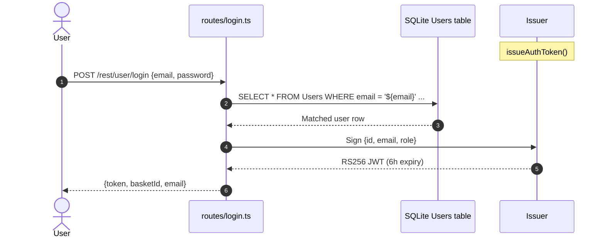

**Security assessment**

Two independent weaknesses sit on the login path:

- `routes/login.ts:34` interpolates `req.body.email` into a raw SQL string - `' OR 1=1--` bypasses the credential check entirely and returns the first (admin) row.
- `lib/insecurity.ts:43` hashes passwords with unsalted `MD5`; a dump obtained through the SQL injection above yields recoverable plaintext without GPU hardware.

The vulnerable login lookup is built as a raw SQL string:

```ts
models.sequelize.query(
  `SELECT * FROM Users WHERE email = '${req.body.email}' AND password = '${security.hash(req.body.password)}'`
)
```

**Relevant findings**

- [F-001](#f-001) — SQL injection in the login query allows authentication bypass with no credentials.
- [F-008](#f-008) — Unsalted MD5 password hashing makes offline credential recovery from any dump trivial.

<a id="multi-factor-authentication"></a>
#### 7.2.2 Multi-Factor Authentication

**Status:** 🟡 Partial - TOTP enrollment and verification are implemented, but 2FA is optional and not enforced for admin accounts.

TOTP-based second-factor authentication is available via `routes/2fa.ts`. Enrollment stores a `totpSecret` field on the `User` model (`models/user.ts`). Verification uses a standard TOTP library to validate the time-based code before allowing login to proceed. The mechanism is architecturally sound for users who opt in.

**Security assessment**

TOTP enrollment and code verification work correctly for regular users. The gap is policy, not implementation: 2FA is purely opt-in and admin accounts are not required to enroll. A successful SQL injection ([T-001](#f-001) — SQL injection authentication bypass routes/login.ts) or JWT forgery ([T-002](#f-002) — Hardcoded RSA private key enables JWT forgery lib/insecurity.ts) bypasses the 2FA step entirely because those paths skip `routes/2fa.ts` verification.

**Relevant findings**

- No dedicated finding is routed to MFA in this assessment; the control works for enrolled users.

### 7.3 Session and Token Controls

**Verdict:** 🟠 Weak

<!-- The line below is mechanically derived from the controls table — LLM must not re-author it. -->
**Controls covered:** [7.3.1 Session Management](#731-session-management)

- [7.3.1 Session Management](#session-management)

**Implemented controls:** Token map in `lib/insecurity.ts:59-90`; JWT expiry set to 6 hours at issuance; cookie storage in Angular frontend.

**Assessment:** This application uses a single locally-signed token format (commonly called JWT) for every authenticated session, regardless of the login flow in [§7.2](#72-identity-and-authentication-controls) that established it. The sub-sections below trace one token through its lifecycle: signing on issuance, validation on every protected request, storage in the browser, manual revocation, and time-based expiry. The signing and algorithm controls that break the token boundary are detailed in [§7.2 Identity and Authentication Controls](#72-identity-and-authentication-controls) and [§7.9 Cryptography Secrets and Data Protection](#79-cryptography-secrets-and-data-protection).

<a id="session-management"></a>
#### 7.3.1 Session Management

**Status:** 🟠 Weak - stateless JWTs stored in browser cookies lack `Secure`, `HttpOnly`, and `SameSite` flags; the server-side revocation map is lost on restart.

`lib/insecurity.ts:59-90` maintains an in-memory `authenticatedUsers` map for explicit logout revocation. JWTs are issued with a six-hour expiry via `issueAuthToken()`. The Angular frontend stores the token in a browser cookie named `token`, which is transmitted with every API request. The `express-jwt` middleware at `lib/insecurity.ts:54` validates the signature on each protected route.

**Security assessment**

The session token lifecycle has two structural gaps:

- The `token` cookie is set without `Secure`, `HttpOnly`, or `SameSite=Strict` attributes, making it readable by JavaScript (XSS exfiltration) and transmittable cross-origin.
- The `authenticatedUsers` revocation map at `lib/insecurity.ts:59` is in-process memory; a server restart silently re-accepts any token that has not yet expired, so "logout" does not invalidate the JWT itself.

**Relevant findings**

- [F-011](#f-011) — The missing cookie security flags expose the session token to XSS-based exfiltration and cross-site transmission.

### 7.4 Authorization Controls

**Verdict:** 🟠 Weak

<!-- The line below is mechanically derived from the controls table — LLM must not re-author it. -->
**Controls covered:** [7.4.1 Role-Based Access Control](#741-role-based-access-control)

- [7.4.1 Role-Based Access Control](#role-based-access-control)

**Implemented controls:** `isAuthorized()` middleware checks JWT signature validity; `denyAll()` applied to selected admin mutation endpoints in `server.ts`.

**Assessment:** JWT role claims exist in the token payload but server-side route middleware does not consistently verify them. Several admin GET endpoints are reachable with any valid JWT; object-level ownership checks are absent on basket and order routes.

<a id="role-based-access-control"></a>
#### 7.4.1 Role-Based Access Control

**Status:** 🟠 Weak - `isAuthorized()` validates JWT signature but does not check the `role` claim; `denyAll()` is applied only to selected mutation endpoints, leaving admin GET routes unprotected.

Route authorization is wired in `server.ts`. `lib/insecurity.ts:54` exposes `isAuthorized()`, which invokes the `express-jwt` middleware to verify the token signature. A separate `denyAll()` middleware is applied to admin-only mutation endpoints. Broken Object Level Authorization (BOLA) is widespread on basket and order routes where any authenticated user can reference another user's object IDs.

**Security assessment**

Two distinct authorization weaknesses coexist:

- `isAuthorized()` at `lib/insecurity.ts:54` checks that the JWT signature is valid but does not verify `req.user.role === 'admin'`. Any valid JWT - including one forged via [T-002](#f-002) — Hardcoded RSA private key enables JWT forgery lib/insecurity.ts - passes the guard on admin-only GET routes.
- BOLA: basket and order routes accept numeric IDs from the URL without verifying ownership, allowing horizontal privilege escalation across accounts.

**Relevant findings**

- [F-018](#f-018) — Admin API endpoints reachable by any authenticated JWT due to missing role verification.
- [F-024](#f-024) — BOLA on basket/order routes allows cross-account data access with any valid token.

### 7.5 Query Construction and Data Access Controls

**Verdict:** 🔴 Unsafe

<!-- The line below is mechanically derived from the controls table — LLM must not re-author it. -->
**Controls covered:** [7.5.1 SQL Query Parameterization](#751-sql-query-parameterization)

- [7.5.1 SQL Query Parameterization](#sql-query-parameterization)

**Implemented controls:** Sequelize ORM used for most data access; raw `models.sequelize.query()` calls bypass ORM parameter binding in login and search routes.

**Assessment:** The ORM provides parameterized queries for the majority of database interactions. The login and search routes intentionally bypass it with raw string interpolation, creating two independent SQL injection sinks.

<a id="sql-query-parameterization"></a>
#### 7.5.1 SQL Query Parameterization

**Status:** 🔴 Unsafe - user-controlled input is string-interpolated into SQL at `routes/login.ts:34` and `routes/search.ts:23`, bypassing Sequelize's ORM parameter binding.

Sequelize backs most relational data access; the login and search routes call raw `models.sequelize.query()` directly with template-literal interpolation. `routes/login.ts:34` builds the user-lookup query from `req.body.email`, and `routes/search.ts:23` builds a LIKE query from the `q` search parameter.

The product search route uses the same raw SQL construction pattern:

```ts
models.sequelize.query(
  `SELECT * FROM Products WHERE ((name LIKE '%${criteria}%' OR description LIKE '%${criteria}%') AND deletedAt IS NULL) ORDER BY name`
)
```

**Security assessment**

Both routes accept attacker-controlled SQL. On the login route, `' OR 1=1--` bypasses credential checking. On the search route, a UNION payload extracts the full database schema and all user records. These are two independent injection sinks sharing the same root cause: raw string interpolation where ORM finder methods would eliminate it.

**Relevant findings**

- [F-001](#f-001) — SQL injection in `routes/login.ts:34` allows unauthenticated admin login.
- [F-007](#f-007) — SQL injection in `routes/search.ts:23` allows full database extraction via UNION.
- [F-019](#f-019) — Potential injection in `routes/trackOrder.ts:21` via order ID parameter.

### 7.6 Input Boundary Validation Controls

**Verdict:** 🔴 Unsafe

<!-- The line below is mechanically derived from the controls table — LLM must not re-author it. -->
**Controls covered:** [7.6.1 Validation Approach](#761-validation-approach) · [7.6.2 Input Validation / Sanitization](#762-input-validation-sanitization)

- [7.6.1 Validation Approach](#validation-approach)
- [7.6.2 Input Validation / Sanitization](#input-validation-sanitization)

**Implemented controls:** `sanitize-html@1.4.2` used via `sanitizeLegacy()`; Multer file-size limits on upload endpoints; `sanitize-filename@1.6.3` on filenames.

**Assessment:** Input sanitization exists but is bypassable. The sanitization library is outdated with known bypass vectors; URL validation uses a substring check that is trivially circumvented; XML parsing is configured to resolve external entities.

<a id="validation-approach"></a>
#### 7.6.1 Validation Approach

**Status:** 🟠 Weak - consistent input validation is absent at the API boundary; individual routes apply ad-hoc checks that are incomplete or bypassable.

Input validation across the API relies on route-level ad-hoc checks rather than a centralized schema-validation layer. Multer enforces file-size limits on upload endpoints, and `sanitize-filename@1.6.3` is applied to uploaded filenames. No request schema validation library (e.g. Joi, Zod, express-validator) validates body shapes or query parameter types before they reach route handlers.

**Security assessment**

The ad-hoc validation pattern means each new route must implement its own guards. Where routes skip validation entirely (or implement it incorrectly), attackers can supply unexpected types, oversized payloads, or structurally malformed inputs. The absence of a centralized validation layer is the structural root cause behind multiple injection and parser findings in this model.

**Relevant findings**

- [F-023](#f-023) — Missing schema validation on the B2B order endpoint allows arbitrary `orderLinesData` to reach the eval sink.

<a id="input-validation-sanitization"></a>
#### 7.6.2 Input Validation / Sanitization

**Status:** 🔴 Unsafe - `sanitize-html@1.4.2` is outdated with known bypass vectors; URL validation at `lib/insecurity.ts:138` uses `includes()` and is trivially circumvented.

`lib/insecurity.ts:60-80` implements `sanitizeLegacy()` using `sanitize-html@1.4.2`. The URL redirect allowlist at `lib/insecurity.ts:138` checks only whether the target URL `includes()` an allowed host prefix - a payload such as `https://allowed.example.evil.com/` passes the check. XML uploads at `routes/fileUpload.ts:83` are parsed by `libxmljs2` with `noent: true`, enabling external entity resolution.

**Security assessment**

Three distinct bypass paths share the same root:

- `sanitize-html@1.4.2` has documented bypass payloads; updating to a current release and applying allowlist-based tag sanitization would close this.
- The `includes()` URL check at `lib/insecurity.ts:138` is not an allowlist - it is a substring scan. A URL containing the allowed prefix anywhere in the string passes.
- `libxmljs2` with `noent: true` in `routes/fileUpload.ts:83` resolves XML `SYSTEM` entities, enabling file-read and SSRF via XXE (see [§7.10](#710-file-parser-and-outbound-request-controls)).

**Relevant findings**

- [F-023](#f-023) — Bypassable URL validation enables open redirect and contributes to the SSRF vector.

### 7.7 Output Encoding and Rendering Controls

**Verdict:** 🔴 Unsafe

<!-- The line below is mechanically derived from the controls table — LLM must not re-author it. -->
**Controls covered:** [7.7.1 HTML Output Encoding / XSS Prevention](#771-html-output-encoding-xss-prevention)

- [7.7.1 HTML Output Encoding / XSS Prevention](#html-output-encoding-xss-prevention)

**Implemented controls:** Angular's template escaping is active by default in components that do not opt out; `bypassSecurityTrustHtml()` explicitly disables it in at least six components.

**Assessment:** Angular's default context-aware escaping is the baseline control. It is intentionally disabled in the administration, about, search-result, and last-login-ip components, creating persistent XSS sinks in the most sensitive views.

<a id="html-output-encoding-xss-prevention"></a>
#### 7.7.1 HTML Output Encoding / XSS Prevention

**Status:** 🔴 Unsafe - `bypassSecurityTrustHtml()` is called in multiple Angular components, intentionally disabling the framework's XSS protection for user-controlled content.

Angular's `DomSanitizer` provides context-aware output encoding by default for all template bindings. `administration.component.ts:60,78` calls `bypassSecurityTrustHtml()` on user email addresses and feedback comment fields before rendering them. The same pattern appears in `frontend/src/app/about/about.component.ts:119`. A server-side XSS filter that was present in earlier versions is commented out at `server.ts:187`.

**Security assessment**

Wherever `bypassSecurityTrustHtml()` is called, Angular passes the raw HTML string to the DOM without escaping. A user who registers with a `<script>` or `` email address has their payload stored persistently in the database and rendered in every admin session. The administration panel is the highest-value target because the victim is always an admin-privileged session.

This call illustrates where Angular's escaping is disabled in the administration component:

```ts
this.userEmail = this.sanitizer.bypassSecurityTrustHtml(user.email)
```

**Relevant findings**

- [F-004](#f-004) — Stored XSS in the admin panel executes in every administrator's browser session.
- [F-009](#f-009) — Stored XSS in the feedback/about view targets any user who visits the page.

### 7.8 Browser and Cross-Origin Controls

**Verdict:** 🔴 Unsafe

<!-- The line below is mechanically derived from the controls table — LLM must not re-author it. -->
**Controls covered:** [7.8.1 CORS Policy](#781-cors-policy) · [7.8.2 Content Security Policy](#782-content-security-policy)

- [7.8.1 CORS Policy](#cors-policy)
- [7.8.2 Content Security Policy](#content-security-policy)

**Implemented controls:** Helmet `noSniff` and `frameguard` headers set at `server.ts:185-188`; CORS middleware present but configured without restrictions.

**Assessment:** Browser security headers are partially applied via Helmet, but the two highest-impact controls are missing or defeated. CORS allows all origins, and no Content Security Policy is configured, leaving XSS attacks free to load arbitrary scripts.

<a id="cors-policy"></a>
#### 7.8.1 CORS Policy

**Status:** 🔴 Unsafe - `cors()` is called without an origin allowlist at `server.ts:182`, allowing any origin to make credentialed cross-site requests.

`server.ts:182` registers `app.use(cors())` with no options object. This sets `Access-Control-Allow-Origin: *` on every response, permitting cross-origin requests from any domain. Combined with the JWT stored in a browser cookie without `SameSite=Strict`, any page on the internet can direct a logged-in user's browser to issue authenticated API requests to the application.

**Security assessment**

Wildcard CORS plus cookie-based JWT storage without `SameSite` creates a CSRF-equivalent attack surface. Any malicious page can trigger state-changing requests that carry the victim's token. Restricting CORS to the application's own origin (or an explicit allowlist) and adding `SameSite=Strict` to the token cookie would close this vector.

**Relevant findings**

- [F-012](#f-012) — Wildcard CORS combined with missing cookie security flags enables cross-origin credential theft.

<a id="content-security-policy"></a>
#### 7.8.2 Content Security Policy

**Status:** 🔴 Missing - no `Content-Security-Policy` header is set; `server.ts:185-188` applies only `noSniff` and `frameguard` via Helmet.

Helmet is registered in `server.ts:185` and provides `X-Content-Type-Options: nosniff` and `X-Frame-Options` headers. The CSP directive is absent - `helmet.contentSecurityPolicy()` is not called. Without CSP, successful XSS payloads can load external scripts, exfiltrate data via `fetch()`, and bypass subresource integrity checks with no browser-side enforcement.

**Security assessment**

The absence of CSP means the stored XSS findings at [F-004](#f-004) — Stored XSS in admin panel via user email and feedback frontend/src/app/administ… and [F-009](#f-009) — Stored XSS via trust HTML bypass in feedback frontend/src/app/about/about.compo… have no browser-level backstop. A strict CSP (`default-src 'self'`) would prevent injected scripts from loading external resources even if the XSS injection point persists. Helmet's existing CSP helper can enable this in one configuration call.

**Relevant findings**

- [F-012](#f-012) — Missing CSP leaves the application unable to restrict script sources, compounding the impact of stored XSS findings.

### 7.9 Cryptography Secrets and Data Protection

**Verdict:** 🔴 Unsafe

<!-- The line below is mechanically derived from the controls table — LLM must not re-author it. -->
**Controls covered:** [7.9.1 Secrets Management](#791-secrets-management)

- [7.9.1 Secrets Management](#secrets-management)

**Implemented controls:** RSA-2048 key pair generated and committed; `SHA-256` HMAC secret hardcoded; `MD5` password hashing in `lib/insecurity.ts:43`.

**Assessment:** Three distinct secrets are hardcoded as string literals in `lib/insecurity.ts` and committed to the public repository. All three are permanently compromised - key rotation is required in addition to moving them to environment variables.

<a id="secrets-management"></a>
#### 7.9.1 Secrets Management

**Status:** 🔴 Unsafe - RSA private key, HMAC secret, and cookie-signing secret are all hardcoded string literals in `lib/insecurity.ts` and committed to the public git repository.

`lib/insecurity.ts:23` stores the RSA-2048 private key as a PEM string literal. `lib/insecurity.ts:45` stores the HMAC secret `pa4qacea4VK9t9nGv7yZtwmj` as a plain string. Both are committed to the repository and visible in the git history. Password storage uses unsalted `MD5` at `lib/insecurity.ts:43` - a weak hash that makes any dumped credential set trivially reversible.

**Security assessment**

Three secrets live as hardcoded string literals in `lib/insecurity.ts`: an RSA-2048 private key, an HMAC secret, and password hashes derived from `MD5` with no salt. Cloning the repository yields everything needed to forge JWTs for any user without server access. Key rotation is mandatory even after moving secrets to environment variables, because the current values are permanently in the git history.

**Relevant findings**

- [F-002](#f-002) — The committed RSA private key allows offline JWT forgery for any account.
- [F-003](#f-003) — The outdated `express-jwt` accepts `alg:none` tokens, providing a second bypass of the signing control.
- [F-008](#f-008) — Unsalted MD5 password hashing means any database dump yields recoverable credentials immediately.
- [F-013](#f-013) — The HMAC secret is hardcoded in source, making HMAC-signed operations forgeable.

### 7.10 File Parser and Outbound Request Controls

**Verdict:** 🔴 Unsafe

<!-- The line below is mechanically derived from the controls table — LLM must not re-author it. -->
**Controls covered:** [7.10.1 File Upload Validation](#7101-file-upload-validation) · [7.10.2 Outbound Request Controls](#7102-outbound-request-controls)

- [7.10.1 File Upload Validation](#file-upload-validation)
- [7.10.2 Outbound Request Controls](#outbound-request-controls)

**Implemented controls:** Multer size limits and `sanitize-filename@1.6.3` on upload endpoints; `routes/profileImageUrlUpload.ts` performs URL-based fetching for profile images.

**Assessment:** File upload processing exists but is structurally unsafe: XML files trigger external-entity resolution via `libxmljs2` and the profile image URL endpoint fetches arbitrary attacker-controlled URLs without an allowlist.

<a id="file-upload-validation"></a>
#### 7.10.1 File Upload Validation

**Status:** 🟠 Weak - Multer enforces size limits and `sanitize-filename` sanitizes names, but MIME-type validation is minimal and XML uploads are parsed with external-entity resolution enabled.

`routes/fileUpload.ts` uses Multer 1.4.5-lts for upload handling. File size limits are enforced. `sanitize-filename@1.6.3` strips path separators and dangerous characters from filenames. XML content submitted to the upload endpoint is parsed by `libxmljs2` at `routes/fileUpload.ts:83` with `{ noent: true }`, which enables resolution of `SYSTEM` external entities. YAML uploads are evaluated via the `js-yaml` `load()` call, which executes JavaScript in older API modes.

**Security assessment**

Two parser-level weaknesses sit behind the upload endpoint:

- `libxmljs2` with `noent: true` at `routes/fileUpload.ts:83` resolves `SYSTEM` entity references in uploaded XML. A crafted `<!ENTITY x SYSTEM "file:///etc/passwd">` returns local file contents in the XML response.
- MIME-type enforcement is file-extension-based and bypassable; a renamed executable passes through the upload chain.

**Relevant findings**

- [F-005](#f-005) — XXE via `libxmljs2` external entity resolution in uploaded XML allows local file read.
- [F-006](#f-006) — Weak MIME-type enforcement allows upload of files that bypass the intended content restrictions.
- [F-010](#f-010) — YAML parser configuration allows unsafe JavaScript evaluation in uploaded YAML files.

<a id="outbound-request-controls"></a><a id="outbound-request-controls-ssrf"></a>
#### 7.10.2 Outbound Request Controls

**Status:** 🔴 Unsafe - `routes/profileImageUrlUpload.ts:24` fetches arbitrary attacker-supplied URLs without an allowlist; the open-redirect at `lib/insecurity.ts:138` uses a bypassable substring check.

`routes/profileImageUrlUpload.ts:24` accepts a `imageUrl` body parameter and issues an outbound HTTP `fetch()` to the supplied URL without validating the host against an allowlist. This allows an authenticated attacker to direct the server to fetch internal network addresses (e.g. `http://169.254.169.254/latest/meta-data/`). The redirect validation at `lib/insecurity.ts:138` uses `url.includes(allowedHost)` - any URL containing the allowed string as a substring passes.

**Security assessment**

Both weaknesses share the same root: user-controlled URL values are not validated against a strict allowlist before the server issues an outbound request:

- `routes/profileImageUrlUpload.ts:24` passes the URL directly to `fetch()` - no DNS allowlist, no IP-range blocking, no scheme restriction.
- `lib/insecurity.ts:138` uses `includes()` for the redirect check; `https://accounts.google.com.evil.example/` passes the check for `accounts.google.com`.

**Relevant findings**

- [F-005](#f-005) — SSRF via profile image URL upload enables server-side requests to internal or cloud-metadata endpoints.
- [F-006](#f-006) — The open-redirect bypass extends the SSRF and phishing surface.
- [F-010](#f-010) — Combined with file-serving endpoints, SSRF can be chained to access quarantine and key directories.

### 7.11 Operations Runtime and Supply Chain Controls

**Verdict:** 🔴 Missing

<!-- The line below is mechanically derived from the controls table — LLM must not re-author it. -->
**Controls covered:** [7.11.1 Dependency Management](#7111-dependency-management) · [7.11.2 Logging and Monitoring](#7112-logging-and-monitoring) · [7.11.3 Automated SCA scanning](#7113-automated-sca-scanning)

- [7.11.1 Dependency Management](#dependency-management)
- [7.11.2 Logging and Monitoring](#logging-and-monitoring)
- [7.11.3 Automated SCA scanning](#automated-sca-scanning)

**Implemented controls:** `package-lock.json` present; Morgan access logging to `logs/access.log`; Winston logger in `lib/logger.ts`; CodeQL scanning via `.github/workflows/codeql-analysis.yml`.

**Assessment:** A lockfile and access logging provide a minimal operations baseline. SCA scanning runs in CI via CodeQL. However, several intentionally outdated packages with known CVEs are included, no automated dependency update mechanism exists, and access logs are exposed via an unauthenticated endpoint.

<a id="dependency-management"></a>
#### 7.11.1 Dependency Management

**Status:** 🟠 Weak - `package-lock.json` pins resolved versions, but intentionally outdated packages (`jsonwebtoken@0.4.0`, `express-jwt@0.1.3`, `sanitize-html@1.4.2`) carry known CVEs and no automated update mechanism is configured.

`package.json` declares dependencies and `package-lock.json` pins the resolved version tree. GitHub Actions CI (`ci.yml`) runs tests but does not include a dependency-update step. No Dependabot or Renovate configuration was detected in the repository. `jsonwebtoken@0.4.0` and `express-jwt@0.1.3` are intentionally pinned at vulnerable versions (`CVE-2022-23529`, `CVE-2020-15084`).

**Security assessment**

The lockfile provides deterministic installs but does not protect against already-pinned vulnerable versions. Without an automated update mechanism, the patch posture is reactive - no automatic PRs when new CVEs are published. The CodeQL scanning in `.github/workflows/codeql-analysis.yml` provides code-level analysis but does not substitute for dependency version monitoring.

**Relevant findings**

- No dedicated finding is routed to dependency management in this assessment; the CVEs in `express-jwt@0.1.3` and `jsonwebtoken@0.4.0` are captured in [F-003](#f-003) — JWT algorithm confusion bypass via express jwt 0.1.3 lib/insecurity.ts.

<a id="logging-and-monitoring"></a>
#### 7.11.2 Logging and Monitoring

**Status:** 🟡 Partial - Morgan access logging and Winston structured logging are configured, but access logs are exposed via an unauthenticated endpoint and no security-event alerting is in place.

`lib/logger.ts` configures Winston for application-level logging. Morgan is registered in `server.ts:331-338` and writes HTTP access logs to `logs/access.log`. The log file itself is served by a route at `/logs/` (intentional challenge), making access logs readable by any unauthenticated user.

**Security assessment**

Access logging covers HTTP traffic but two operational gaps reduce its value:

- The access log file is exposed at an unauthenticated route, allowing attackers to enumerate request patterns and observe their own attacks.
- No security-event monitoring distinguishes legitimate traffic from brute-force or injection attempts; the logging pipeline produces records but does not alert.

**Relevant findings**

- No dedicated finding is routed to logging in this assessment.

<a id="automated-sca-scanning"></a>
#### 7.11.3 Automated SCA scanning

**Status:** 🟢 Adequate - CodeQL scanning runs in CI via `.github/workflows/codeql-analysis.yml` and the PR compliance workflow.

CodeQL analysis is configured in `.github/workflows/codeql-analysis.yml:23` and referenced in `.github/workflows/pr-compliance.yml:168`. The workflows run on push and pull requests, providing automated code-level scanning for known vulnerability patterns. GitHub Actions steps use SHA-pinned action references, preventing supply-chain substitution via tag mutation.

**Security assessment**

The SCA scanning posture is the strongest operational control in this codebase. SHA-pinned action references (`uses: actions/checkout@v3` with explicit SHA) are a meaningful supply-chain hardening measure. The CodeQL workflow scope and query packs used are not audited in this assessment, but the presence of automated scanning on every PR is a positive baseline.

**Relevant findings**

- No dedicated finding is routed to SCA scanning in this assessment.

_Additional cataloged controls without a dedicated subsection (no implementation prose and no linked findings): Automated dependency updates, Lockfile hygiene._

### 7.12 Real-time and Not Applicable Controls

<!-- §7.12 LOCKED — mechanically derived from absence of real-time findings. Renderer must not rewrite the line below. -->
_Not applicable - no real-time / WebSocket findings routed to this category, and no AI/LLM, GraphQL, or gRPC surfaces detected by the recon scan. Controls catalogued elsewhere (container hardening, dependency determinism) are covered in their primary [§7](#7-security-architecture) sections._

### 7.13 Defense-in-Depth Summary

**Verdict:** 🔴 Unsafe

`RS256` asymmetric JWT signing, a Dockerfile multi-stage build producing a distroless runtime image, SHA-pinned GitHub Actions, CodeQL scanning on PRs, and Multer upload-size limits are the positive controls this codebase provides. Each represents a deliberate defensive choice that would hold in a non-training deployment.

Every other layer is intentionally broken for training purposes: authentication is bypassed by SQL injection before the JWT signing boundary is reached; the signing key is in the repository, so the asymmetric guarantee is nullified; output encoding is disabled in the highest-value views; XML and URL parsers are configured in their most permissive modes. Restoring layered defense requires: moving secrets to environment variables and rotating all committed values, replacing raw SQL with ORM parameter binding, enforcing JWT algorithm restrictions, removing `bypassSecurityTrustHtml()` calls, setting `Secure`/`HttpOnly`/`SameSite=Strict` cookie flags, and adding a Content Security Policy header.

<!-- enriched:thorough -->

---

## 8. Findings Register

Findings are grouped by severity (Critical → High → Medium → Low); within a tier they are ordered by attack vektor (Repo-Read → Internet-Anon → Internet-User → Victim-Required). Each finding is a card with the same fixed fields, in order: **Severity · Component · Location** → **Issue** → **Root cause** → **Evidence** → **Fix** → **Classification** (with external CWE / OWASP links).

**Risk Distribution:** 🔴 Critical: 7 · 🟠 High: 11 · 🟡 Medium: 5 · 🟢 Low: 1 · **Total findings: 24**
**STRIDE Coverage:** Spoofing: 4 · Tampering: 7 · Repudiation: 0 · Information Disclosure: 10 · Denial of Service: 2 · Elevation of Privilege: 1

**Findings index:**<br/>🔴 [F-001](#f-001) — SQL injection authentication bypass routes/login.ts<br/>🔴 [F-002](#f-002) — Hardcoded RSA private key enables JWT forgery lib/insecurity.ts<br/>🔴 [F-003](#f-003) — JWT algorithm confusion bypass via express jwt 0.1.3 lib/insecurity.ts<br/>🔴 [F-004](#f-004) — Stored XSS in admin panel via user email and feedback frontend/src/app/…<br/>🔴 [F-005](#f-005) — Remote code execution via sandbox escape in B2B order API routes/b2bOrd…<br/>🔴 [F-006](#f-006) — Remote code execution via eval in userProfile routes/userProfile.ts<br/>🔴 [F-007](#f-007) — SQL injection full database disclosure via UNION attack routes/search.ts<br/>🟠 [F-008](#f-008) — MD5 password hashing trivially reversible lib/insecurity.ts<br/>🟠 [F-009](#f-009) — Stored XSS via trust HTML bypass in feedback frontend/src/app/about/abo…<br/>🟠 [F-010](#f-010) — XML external entity injection via libxmljs2 external entity resolution…<br/>🟠 [F-011](#f-011) — JWT stored in browser cookie without Secure/HttpOnly flags angular spa<br/>🟠 [F-012](#f-012) — No Content Security Policy allows arbitrary script injection server.ts<br/>🟠 [F-013](#f-013) — Plaintext security answers stored in database models/securityAnswer.ts<br/>🟠 [F-014](#f-014) — SSRF via profile image URL upload routes/profileImageUrlUpload.ts<br/>🟠 [F-015](#f-015) — Path traversal in encryption key and log file endpoints routes/keyServe…<br/>🟠 [F-016](#f-016) — Unauthenticated FTP directory listing exposes sensitive files server.ts<br/>🟠 [F-017](#f-017) — No rate limiting on authentication endpoints server.ts<br/>🟠 [F-018](#f-018) — Broken authorization on admin API endpoints server.ts<br/>🟡 [F-019](#f-019) — NoSQL injection via MarsDB queries data/mongodb.ts<br/>🟡 [F-020](#f-020) — Unrestricted file upload allows malicious file storage routes/fileUploa…<br/>🟡 [F-021](#f-021) — Build context includes sensitive files without dockerignore exclusions<br/>🟡 [F-022](#f-022) — Open redirect via URL substring match bypass lib/insecurity.ts<br/>🟡 [F-023](#f-023) — DoS via infinite loop in B2B order evaluation routes/b2bOrder.ts<br/>🟢 [F-024](#f-024) — Workflow lacks explicit permissions declaration

<a id="th-01"></a><a id="th-02"></a><a id="th-05"></a><a id="th-11"></a><a id="th-03"></a><a id="th-04"></a><a id="th-06"></a><a id="th-07"></a><a id="th-08"></a><a id="th-09"></a><a id="th-12"></a><a id="th-17"></a><a id="th-18"></a>

### 🔴 Critical (7)

<a id="t-002"></a><a id="f-002"></a>
#### F-002 · Hardcoded Cryptographic Key

**Severity:** 🔴 Critical - secret committed to the public source repo - extractable on clone, no prior access needed  ·  **Component:** [C-01](#c-01) - Express Backend API  ·  **Location:** `lib/insecurity.ts`:23

**Issue:** The RSA-2048 private key is hardcoded in `lib/insecurity.ts:23` and committed to the public git repository. Any person with repository read access can extract it and forge arbitrary JWT tokens for any user including admin.

**Root cause:** Authentication can be circumvented or forged because credentials, signing keys, or password hashes are weak, missing, or exposed.

**Evidence:** ✓ verified - A signing key is embedded as a literal constant in source.

**Fix:** Move the cryptographic key out of source control into a managed secret store and rotate it → [M-002](#m-002) — Remove hardcoded RSA private key; rotate to environment variable

**Classification:** Broken Authentication · [CWE-321](https://cwe.mitre.org/data/definitions/321.html) · [OWASP A07:2021](https://owasp.org/Top10/A07_2021/) · walkthrough [Walkthrough §3.2](#32-hardcoded-rsa-private-key-enables-jwt-forgery-libinsecurit)

<a id="t-001"></a><a id="f-001"></a>
#### F-001 · SQL Injection

**Severity:** 🔴 Critical  ·  **Component:** [C-01](#c-01) - Express Backend API  ·  **Location:** `routes/login.ts`:34

**Issue:** An unauthenticated attacker sends POST `/rest/user/login` with email="' OR 1=1--" which satisfies the raw SQL query SELECT * FROM Users WHERE email = ''' OR 1=1-- AND password... yielding the first row (admin). `routes/login.ts:34`.

**Root cause:** User input flows into a server-side interpreter (SQL, NoSQL, XML, YAML, LDAP, OS shell) without parameterisation or schema validation.

**Evidence:** ✓ verified - SQL is assembled via string concatenation/interpolation of untrusted input.

```typescript
// routes/login.ts:34

  return (req: Request, res: Response, next: NextFunction) => {
    verifyPreLoginChallenges(req) // vuln-code-snippet hide-line
    models.sequelize.query(`SELECT * FROM Users WHERE email = '${req.body.email || ''}' AND password = '${security.hash(req.body.password || '')}' AND deletedAt IS NULL`, { model: UserModel, plain: tr
      .then((authenticatedUser) => { // vuln-code-snippet neutral-line loginAdminChallenge loginBenderChallenge loginJimChallenge
        const user = utils.queryResultToJson(authenticatedUser)
        if (user.data?.id && user.data.totpSecret !== '') {
```

**Fix:** Switch all SQL execution to parameterised queries or ORM-bound parameters → [M-001](#m-001) — Replace raw SQL with Sequelize parameterized query in login route

**Classification:** Injection · [CWE-89](https://cwe.mitre.org/data/definitions/89.html) · [OWASP A03:2021](https://owasp.org/Top10/A03_2021/) · walkthrough [Walkthrough §3.1](#31-sql-injection-authentication-bypass-routeslogints)

<a id="t-003"></a><a id="f-003"></a>
#### F-003 · Use of a Broken or Risky Cryptographic Algorithm

**Severity:** 🔴 Critical  ·  **Component:** [C-01](#c-01) - Express Backend API  ·  **Location:** `lib/insecurity.ts`:54

**Issue:** express-jwt 0.1.3 (`CVE-2020-15084`) does not enforce algorithm restrictions. An attacker can craft a JWT with `alg:none`, strip the signature, and the middleware accepts it as valid. `RS256`→`HS256` confusion allows signing with the public key as HMAC secret. `lib/insecurity.ts:54`.

**Root cause:** Authentication can be circumvented or forged because credentials, signing keys, or password hashes are weak, missing, or exposed.

**Evidence:** ✓ verified - A broken or non-password cryptographic primitive is configured on this path.

**Fix:** Replace the broken algorithm with a vetted modern primitive (AES-GCM / Argon2id / Ed25519) → [M-003](#m-003) — Upgrade express-jwt to >=6.0.0 and enforce algorithm allowlist

**Classification:** Broken Authentication · [CWE-327](https://cwe.mitre.org/data/definitions/327.html) · [OWASP A07:2021](https://owasp.org/Top10/A07_2021/) · walkthrough [Walkthrough §3.3](#33-jwt-algorithm-confusion-bypass-via-express-jwt-013-libin)

<a id="t-007"></a><a id="f-007"></a>
#### F-007 · SQL Injection

**Severity:** 🔴 Critical  ·  **Component:** [C-01](#c-01) - Express Backend API  ·  **Location:** `routes/search.ts`:23

**Issue:** The search endpoint uses raw string interpolation in SELECT ... LIKE queries (`routes/search.ts:23`). A UNION SELECT attack can extract all tables including Users, products, orders, and security answers. `routes/search.ts:23`,47.

**Root cause:** User input flows into a server-side interpreter (SQL, NoSQL, XML, YAML, LDAP, OS shell) without parameterisation or schema validation.

**Evidence:** ✓ verified - SQL is assembled via string concatenation/interpolation of untrusted input.

```typescript
// routes/search.ts:23
  return (req: Request, res: Response, next: NextFunction) => {
    let criteria: any = req.query.q === 'undefined' ? '' : req.query.q ?? ''
    criteria = (criteria.length <= 200) ? criteria : criteria.substring(0, 200)
    models.sequelize.query(`SELECT * FROM Products WHERE ((name LIKE '%${criteria}%' OR description LIKE '%${criteria}%') AND deletedAt IS NULL) ORDER BY name`) // vuln-code-snippet vuln-line unionSql
      .then(([products]: any) => {
        const dataString = JSON.stringify(products)
        if (challengeUtils.notSolved(challenges.unionSqlInjectionChallenge)) { // vuln-code-snippet hide-start
```

**Fix:** Switch all SQL execution to parameterised queries or ORM-bound parameters → [M-005](#m-005) — Replace raw SQL with Sequelize ORM parameterized queries in search route

**Classification:** Injection · [CWE-89](https://cwe.mitre.org/data/definitions/89.html) · [OWASP A03:2021](https://owasp.org/Top10/A03_2021/) · walkthrough [Walkthrough §3.7](#37-sql-injection-full-database-disclosure-via-union-attack-rou)

<a id="t-005"></a><a id="f-005"></a>
#### F-005 · Code Injection

**Severity:** 🔴 Critical  ·  **Component:** [C-05](#c-05) - B2B Order API  ·  **Location:** `routes/b2bOrder.ts`:23

**Issue:** POST `/api/B2BOrder` with orderLinesData containing prototype pollution payload (e.g., constructor[prototype][toString]=()=>{ require("child_process").exec("id") }) escapes the `notevil` safeEval sandbox via prototype chain manipulation and executes arbitrary `Node.js` code. `routes/b2bOrder.ts:23`.

**Root cause:** User-supplied data reaches a server-side code-execution sink (`eval`, sandbox primitives, deserialisation, prototype-pollution gadgets) and breaks out into arbitrary native execution.

**Evidence:** ✓ verified - User-supplied code is passed to a runtime evaluator without an allow-list of operations.

```typescript
// routes/b2bOrder.ts:23
      try {
        const sandbox = { safeEval, orderLinesData }
        vm.createContext(sandbox)
        vm.runInContext('safeEval(orderLinesData)', sandbox, { timeout: 2000 })
        res.json({ cid: body.cid, orderNo: uniqueOrderNumber(), paymentDue: dateTwoWeeksFromNow() })
      } catch (err) {
        if (utils.getErrorMessage(err).match(/Script execution timed out.*/) != null) {
```

**Fix:** Replace runtime code generation (eval/Function/template render) with a data-only execution path → [M-022](#m-022) — Replace safeEval with structured JSON order line parsing

**Classification:** Code Execution via Unsafe Deserialization or Eval · [CWE-94](https://cwe.mitre.org/data/definitions/94.html) · [OWASP A08:2021](https://owasp.org/Top10/A08_2021/) · walkthrough [Walkthrough §3.5](#35-remote-code-execution-via-sandbox-escape-in-b2b-order-api-r)

<a id="t-006"></a><a id="f-006"></a>
#### F-006 · Server-Side Template Injection

**Severity:** 🔴 Critical  ·  **Component:** [C-01](#c-01) - Express Backend API  ·  **Location:** `routes/userProfile.ts`:62

**Issue:** POST `/profile` with username containing #{&lt;code>} causes `routes/userProfile.ts:62` to eval(code) where code is extracted from the username field. An authenticated attacker sets username to #{process.mainModule.require("child_process").execSync("id").toString()} to execute arbitrary OS commands.

**Root cause:** User-supplied data reaches a server-side code-execution sink (`eval`, sandbox primitives, deserialisation, prototype-pollution gadgets) and breaks out into arbitrary native execution.

**Evidence:** ✓ verified

```typescript
// routes/userProfile.ts:62
        if (!code) {
          throw new Error('Username is null')
        }
        username = eval(code) // eslint-disable-line no-eval
      } catch (err) {
        username = '\\' + username
      }
```

**Fix:** Replace runtime code generation (eval/Function/template render) with a data-only execution path → [M-006](#m-006) — Remove eval() from userProfile route; use safe template string replacement

**Classification:** Code Execution via Unsafe Deserialization or Eval · [CWE-95](https://cwe.mitre.org/data/definitions/95.html) · [OWASP A08:2021](https://owasp.org/Top10/A08_2021/) · walkthrough [Walkthrough §3.6](#36-remote-code-execution-via-eval-in-userprofile-routesuserpr)

<a id="t-004"></a><a id="f-004"></a>
#### F-004 · Cross-Site Scripting

**Severity:** 🔴 Critical  ·  **Component:** [C-02](#c-02) - Angular SPA Frontend  ·  **Location:** `frontend/src/app/administration/administration.component.ts`:60

**Issue:** The admin panel bypasses Angular XSS protection on user email (`administration.component.ts:60`) and feedback comments (`administration.component.ts:78`). An attacker who registers with a crafted email like `<script>`...`</script>` injects persistent XSS into the admin panel.

**Root cause:** Attacker-controlled content is rendered in the victim's browser without sanitisation; combined with session tokens held in JavaScript-readable storage, any payload yields immediate account takeover.

**Evidence:** ✓ verified - User input is rendered as HTML without contextual output encoding.

```typescript
// frontend/src/app/administration/administration.component.ts:60
        this.userDataSource = users
        this.userDataSourceHidden = users
        for (const user of this.userDataSource) {
          user.email = this.sanitizer.bypassSecurityTrustHtml(`<span class="${this.doesUserHaveAnActiveSession(user) ? 'confirmation' : 'error'}">${user.email}</span>`)
        }
        this.userDataSource = new MatTableDataSource(this.userDataSource)
        this.userDataSource.paginator = this.paginatorUsers
```

**Fix:** Output-encode untrusted strings at every sink and remove all `bypassSecurityTrustHtml` calls → [M-011](#m-011) — Remove bypassSecurityTrustHtml() from administration component

**Classification:** Cross-Site Scripting (XSS) · [CWE-79](https://cwe.mitre.org/data/definitions/79.html) · [OWASP A03:2021](https://owasp.org/Top10/A03_2021/) · walkthrough [Walkthrough §3.4](#34-stored-xss-in-admin-panel-via-user-email-and-feedback-front)

### 🟠 High (11)

<a id="t-013"></a><a id="f-013"></a>
#### F-013 · Cleartext Storage of Sensitive Data

**Severity:** 🟠 High  ·  **Component:** [C-03](#c-03) - Data Layer  ·  **Location:** `models/securityAnswer.ts`:1

**Issue:** Security answers used for password reset are stored in plaintext in the SecurityAnswers table. An attacker who reads the database (via SQL injection or direct file access to SQLite) obtains all security answers, enabling password reset for any user account. `models/securityAnswer.ts`.

**Root cause:** Confidential files, credentials, and management-plane endpoints are reachable on unauthenticated routes; SSRF lets the server fetch internal resources on the attacker's behalf; unsafe path-handling primitives leak server content.

**Evidence:** ✓ verified

```typescript
// models/securityAnswer.ts:1
/*
 * Copyright (c) 2014-2026 Bjoern Kimminich & the OWASP Juice Shop contributors.
 * SPDX-License-Identifier: MIT
```

**Fix:** [M-016](#m-016) — Hash security answers before storage

**Classification:** Cryptographic Failures · [CWE-312](https://cwe.mitre.org/data/definitions/312.html) · [OWASP A02:2021](https://owasp.org/Top10/A02_2021/)

<a id="t-008"></a><a id="f-008"></a>
#### F-008 · Password Hash with Insufficient Effort

**Severity:** 🟠 High  ·  **Component:** [C-01](#c-01) - Express Backend API  ·  **Location:** `lib/insecurity.ts`:43

**Issue:** All user passwords are hashed with `MD5` (`lib/insecurity.ts:43`) with no salt. `MD5` is not a password hashing function - it is a fast general-purpose hash trivially reversed by rainbow tables.

**Root cause:** Authentication can be circumvented or forged because credentials, signing keys, or password hashes are weak, missing, or exposed.

**Evidence:** ✓ verified - A non-iterating hash is used for password storage.

**Fix:** Replace the broken hash with a salted password-hashing function (bcrypt/Argon2id) → [M-004](#m-004) — Replace MD5 with bcrypt/argon2 for password hashing

**Classification:** Cryptographic Failures · [CWE-916](https://cwe.mitre.org/data/definitions/916.html) · [OWASP A02:2021](https://owasp.org/Top10/A02_2021/)

<a id="t-011"></a><a id="f-011"></a>
#### F-011 · JWT stored browser cookie without

**Severity:** 🟠 High  ·  **Component:** [C-01](#c-01) - Express Backend API  ·  **Location:** `lib/insecurity.ts`:63

**Issue:** The Angular app stores JWT tokens in browser cookies without Secure or HttpOnly flags. JavaScript can read the token via `document.cookie` (no XSS required on same-origin pages). Client-side JWT storage.

**Evidence:** ✓ verified

```typescript
// lib/insecurity.ts:63
export const sanitizeLegacy = (input = '') => input.replace(/<(?:\w+)\W+?[\w]/gi, '')
export const sanitizeFilename = (filename: string) => sanitizeFilenameLib(filename)
export const sanitizeSecure = (html: string): string => {
  const sanitized = sanitizeHtml(html)
  if (sanitized === html) {
```

**Fix:** [M-013](#m-013) — Set Secure, HttpOnly, and SameSite=Strict on JWT cookie

**Classification:** Insecure Client-Side Storage · [CWE-315](https://cwe.mitre.org/data/definitions/315.html) · [OWASP A02:2021](https://owasp.org/Top10/A02_2021/)

<a id="t-012"></a><a id="f-012"></a>
#### F-012 · Missing Defense-in-Depth Control

**Severity:** 🟠 High  ·  **Component:** [C-01](#c-01) - Express Backend API  ·  **Location:** `server.ts`:187

**Issue:** The application has no Content Security Policy header. Combined with XSS vulnerabilities in the Angular frontend, an attacker can load scripts from arbitrary origins, exfiltrate cookies/localStorage, keylog inputs, or redirect users to phishing pages. `server.ts:187`.

**Evidence:** ✓ verified - The control that would block this exposure is absent from the configured stack.

**Fix:** Add the missing protection mechanism for this surface (CSP / CSRF token / headers) → [M-014](#m-014) — Implement Content Security Policy header

**Classification:** Cross-Site Scripting (XSS) · [CWE-693](https://cwe.mitre.org/data/definitions/693.html) · [OWASP A03:2021](https://owasp.org/Top10/A03_2021/)

<a id="t-016"></a><a id="f-016"></a>
#### F-016 · Directory Listing Exposure

**Severity:** 🟠 High  ·  **Component:** [C-01](#c-01) - Express Backend API  ·  **Location:** `server.ts`:270

**Issue:** The `/ftp` endpoint serves directory listings and file downloads using serve-index without any authentication (`server.ts:270`). The directory contains `acquisitions.md` (M&A strategy), `coupons_2013.md.bak`, `incident-support.kdbx` (KeePass password manager database), and eastere.gg.

**Root cause:** Confidential files, credentials, and management-plane endpoints are reachable on unauthenticated routes; SSRF lets the server fetch internal resources on the attacker's behalf; unsafe path-handling primitives leak server content.

**Evidence:** ✓ verified

```typescript
// server.ts:270
  /* /ftp directory browsing and file download */ // vuln-code-snippet neutral-line directoryListingChallenge
  app.use('/ftp', serveIndexMiddleware, serveIndex('ftp', { icons: true })) // vuln-code-snippet vuln-line directoryListingChallenge
  app.use('/ftp(?!/quarantine)/:file', servePublicFiles()) // vuln-code-snippet vuln-line directoryListingChallenge
  app.use('/ftp/quarantine/:file', serveQuarantineFiles()) // vuln-code-snippet neutral-line directoryListingChallenge

```

**Fix:** [M-020](#m-020) — Add authentication to FTP directory endpoint

**Classification:** Unauthenticated Management Plane · [CWE-548](https://cwe.mitre.org/data/definitions/548.html) · [OWASP A01:2021](https://owasp.org/Top10/A01_2021/)

<a id="t-017"></a><a id="f-017"></a>
#### F-017 · Missing Rate Limiting (Brute-Force)

**Severity:** 🟠 High  ·  **Component:** [C-01](#c-01) - Express Backend API  ·  **Location:** `server.ts`:458

**Issue:** POST `/rest/user/login` and POST `/rest/user/register` have no rate limiting (only `/rest/user/reset-password` has it). An attacker can perform unlimited brute-force or credential stuffing attacks against the login endpoint. `server.ts:458-471`.

**Evidence:** ✓ verified

```typescript
// server.ts:458
  /* Verify the 2FA Token */
  app.post('/rest/2fa/verify',
    rateLimit({ windowMs: 5 * 60 * 1000, max: 100, validate: false }),
    twoFactorAuth.verify
  )
```

**Fix:** Apply rate limiting and lock-out thresholds on authentication endpoints → [M-010](#m-010) — Add rate limiting to /rest/user/login and /rest/user/register

**Classification:** Denial of Service · [CWE-307](https://cwe.mitre.org/data/definitions/307.html) · [OWASP A04:2021](https://owasp.org/Top10/A04_2021/)

<a id="t-018"></a><a id="f-018"></a>
#### F-018 · Improper Authorization

**Severity:** 🟠 High  ·  **Component:** [C-01](#c-01) - Express Backend API  ·  **Location:** `server.ts`:362

**Issue:** GET `/api/Users` returns all users with any valid JWT (only `isAuthorized()` checked, no admin role check). Any authenticated user can list all user accounts and emails. `server.ts:362`.

**Root cause:** Authorisation checks are absent or bypassable, allowing horizontal and vertical privilege jumps from a self-registered or low-rights account. Includes mass-assignment of privileged attributes.

**Evidence:** ✓ verified

```typescript
// server.ts:362
  app.use('/api/Feedbacks/:id', security.isAuthorized())
  /* Users: Only POST is allowed in order to register a new user */
  app.get('/api/Users', security.isAuthorized())
  app.route('/api/Users/:id')
    .get(security.isAuthorized())
```

**Fix:** Add explicit server-side authorisation checks on every protected route → [M-009](#m-009) — Add role-based authorization middleware to admin API endpoints

**Classification:** Broken Access Control · [CWE-285](https://cwe.mitre.org/data/definitions/285.html) · [OWASP A01:2021](https://owasp.org/Top10/A01_2021/)

<a id="t-010"></a><a id="f-010"></a>
#### F-010 · XML External Entity (XXE)

**Severity:** 🟠 High  ·  **Component:** [C-04](#c-04) - File Upload and Static File Service  ·  **Location:** `routes/fileUpload.ts`:83

**Issue:** The file upload endpoint parses XML with libxmljs2 (`routes/fileUpload.ts:83`) using options {noent: true} which enables entity expansion. An attacker uploads an XML file with XXE payload <\!DOCTYPE foo [<\!ENTITY xxe SYSTEM "file:///etc/passwd">]><foo>&xxe;</foo> to read arbitrary server files.

**Root cause:** User input flows into a server-side interpreter (SQL, NoSQL, XML, YAML, LDAP, OS shell) without parameterisation or schema validation.

**Evidence:** ✓ verified - An XML parser is configured to expand external entities while processing untrusted input.

```typescript
// routes/fileUpload.ts:83
        const sandbox = { libxml, data }
        vm.createContext(sandbox)
        const xmlDoc = vm.runInContext('libxml.parseXml(data, { noblanks: true, noent: true, nocdata: true })', sandbox, { timeout: 2000 })
        const xmlString = xmlDoc.toString(false)
        challengeUtils.solveIf(challenges.xxeFileDisclosureChallenge, () => { return (utils.matchesEtcPasswdFile(xmlString) || utils.matchesSystemIniFile(xmlString)) })
```

**Fix:** Disable external entity resolution on every XML parser and reject DOCTYPE declarations → [M-018](#m-018) — Disable XML external entity processing (noent:false)

**Classification:** Insecure File Handling · [CWE-611](https://cwe.mitre.org/data/definitions/611.html) · [OWASP A04:2021](https://owasp.org/Top10/A04_2021/)

<a id="t-014"></a><a id="f-014"></a>
#### F-014 · Server-Side Request Forgery (SSRF)

**Severity:** 🟠 High  ·  **Component:** [C-01](#c-01) - Express Backend API  ·  **Location:** `routes/profileImageUrlUpload.ts`:24

**Issue:** POST `/profile/image/url` with imageUrl pointing to internal services (e.g. http://localhost:3000/solve/challenges/server-side) causes fetch(url) with no allowlist check. The server fetches arbitrary URLs, enabling SSRF to internal services, metadata endpoints, and internal APIs. `routes/profileImageUrlUpload.ts:24`.

**Root cause:** Confidential files, credentials, and management-plane endpoints are reachable on unauthenticated routes; SSRF lets the server fetch internal resources on the attacker's behalf; unsafe path-handling primitives leak server content.

**Evidence:** ✓ verified - An outbound request is issued to a URL derived from untrusted input without an allow-list.

```typescript
// routes/profileImageUrlUpload.ts:24
      if (loggedInUser) {
        try {
          const response = await fetch(url)
          if (!response.ok || !response.body) {
            throw new Error('url returned a non-OK status code or an empty body')
```

**Fix:** Validate the URL scheme + host against an explicit allow-list before issuing outbound requests → [M-007](#m-007) — Implement URL allowlist for profile image upload

**Classification:** Server-Side Request Forgery · [CWE-918](https://cwe.mitre.org/data/definitions/918.html) · [OWASP A10:2021](https://owasp.org/Top10/A10_2021/)

<a id="t-015"></a><a id="f-015"></a>
#### F-015 · Path Traversal

**Severity:** 🟠 High  ·  **Component:** [C-04](#c-04) - File Upload and Static File Service  ·  **Location:** `routes/keyServer.ts`:14

**Issue:** GET `/encryptionkeys/:file` passes the parameter directly to path.resolve("encryptionkeys/", file) (`routes/keyServer.ts:14`). While sanitize-filename is not applied here, an attacker can request `jwt.pub` directly or attempt traversal with ../ sequences.

**Root cause:** Confidential files, credentials, and management-plane endpoints are reachable on unauthenticated routes; SSRF lets the server fetch internal resources on the attacker's behalf; unsafe path-handling primitives leak server content.

**Evidence:** ✓ verified - User-supplied path components are joined without traversal-safe canonicalisation.

```typescript
// routes/keyServer.ts:14

    if (!file.includes('/')) {
      res.sendFile(path.resolve('encryptionkeys/', file))
    } else {
      res.status(403)
```

**Fix:** Resolve and normalise every constructed path and reject anything that escapes the intended base directory → [M-019](#m-019) — Add authentication and path validation to key/log server endpoints

**Classification:** Insecure File Handling · [CWE-22](https://cwe.mitre.org/data/definitions/22.html) · [OWASP A04:2021](https://owasp.org/Top10/A04_2021/)

<a id="t-009"></a><a id="f-009"></a>
#### F-009 · Cross-Site Scripting

**Severity:** 🟠 High  ·  **Component:** [C-02](#c-02) - Angular SPA Frontend  ·  **Location:** `frontend/src/app/about/about.component.ts`:119

**Issue:** User-submitted feedback comments are rendered via this.sanitizer.bypassSecurityTrustHtml(`feedback.comment`). Angular XSS protection is explicitly disabled. `about.component.ts:119`.

**Root cause:** Attacker-controlled content is rendered in the victim's browser without sanitisation; combined with session tokens held in JavaScript-readable storage, any payload yields immediate account takeover.

**Evidence:** ✓ verified - User input is rendered as HTML without contextual output encoding.

```typescript
// frontend/src/app/about/about.component.ts:119
            feedbacks[i].comment
          }</p><div class="feedback-stars">(${this.stars[feedbacks[i].rating]})</div></figcaption>`
          feedbacks[i].comment = this.sanitizer.bypassSecurityTrustHtml(
            feedbacks[i].comment
          )
```

**Fix:** Output-encode untrusted strings at every sink and remove all `bypassSecurityTrustHtml` calls → [M-011](#m-011) — Remove bypassSecurityTrustHtml() from administration component

**Classification:** Cross-Site Scripting (XSS) · [CWE-79](https://cwe.mitre.org/data/definitions/79.html) · [OWASP A03:2021](https://owasp.org/Top10/A03_2021/)

### 🟡 Medium (5)

<a id="t-021"></a><a id="f-021"></a>
#### F-021 · Cleartext Storage of Sensitive Data

**Severity:** 🟡 Medium  ·  **Component:** [C-01](#c-01) - Express Backend API  ·  **Location:** `Dockerfile`:2

**Issue:** Full repo COPY in installer stage includes encryptionkeys/ and ftp/ with hardcoded JWT private key. CI/CD log or image artifact leak exposes these.

**Root cause:** Confidential files, credentials, and management-plane endpoints are reachable on unauthenticated routes; SSRF lets the server fetch internal resources on the attacker's behalf; unsafe path-handling primitives leak server content.

**Evidence:** ✓ verified

**Fix:** [M-027](#m-027) — Move secrets out of source into a managed secret store

**Classification:** Error Information Disclosure · [CWE-312](https://cwe.mitre.org/data/definitions/312.html) · [OWASP A05:2021](https://owasp.org/Top10/A05_2021/)

<a id="t-019"></a><a id="f-019"></a>
#### F-019 · NoSQL Injection

**Severity:** 🟡 Medium  ·  **Component:** [C-03](#c-03) - Data Layer  ·  **Location:** `data/mongodb.ts`:1

**Issue:** MarsDB collections (reviews, orders, complaints) accept MongoDB-style query objects. If query parameters are passed as objects (e.g., via JSON body parsing), a NoSQL injection attack like { "": "1==1" } could bypass filters and access all records. `data/mongodb.ts`.

**Root cause:** User input flows into a server-side interpreter (SQL, NoSQL, XML, YAML, LDAP, OS shell) without parameterisation or schema validation.

**Evidence:** ◌ ambiguous

**Fix:** Replace string concatenation in query operators with parameter binding → [M-017](#m-017) — Sanitize MarsDB query parameters to prevent NoSQL injection · [M-026](#m-026) — Manual review: verify NoSQL injection via MarsDB queries data/mongodb.ts at data/mongodb.ts:1

**Classification:** Injection · [CWE-943](https://cwe.mitre.org/data/definitions/943.html) · [OWASP A03:2021](https://owasp.org/Top10/A03_2021/)

<a id="t-020"></a><a id="f-020"></a>
#### F-020 · Unrestricted File Upload

**Severity:** 🟡 Medium  ·  **Component:** [C-04](#c-04) - File Upload and Static File Service  ·  **Location:** `routes/fileUpload.ts`:62

**Issue:** The file upload endpoint accepts multiple file types with minimal validation. A zip file containing a PHP shell, SVG with embedded JavaScript, or oversized file can be uploaded. `routes/fileUpload.ts:62`.

**Evidence:** ✓ verified

**Fix:** Validate uploaded file type, size, and storage path; never execute uploaded content → [M-021](#m-021) — Implement strict file type validation using magic bytes

**Classification:** Insecure File Handling · [CWE-434](https://cwe.mitre.org/data/definitions/434.html) · [OWASP A04:2021](https://owasp.org/Top10/A04_2021/)

<a id="t-023"></a><a id="f-023"></a>
#### F-023 · Uncontrolled Resource Consumption

**Severity:** 🟡 Medium  ·  **Component:** [C-05](#c-05) - B2B Order API  ·  **Location:** `routes/b2bOrder.ts`:23

**Issue:** POST `/api/B2BOrder` with orderLinesData containing an infinite loop (e.g., while(true){}) causes the `vm.runInContext` timeout to fire after 2000ms, returning HTTP 503. An attacker can keep the server busy with 2-second blocking evaluations. `routes/b2bOrder.ts:23`.

**Evidence:** ✓ verified

**Fix:** Bound the request rate and the per-request resource budget on this endpoint → [M-023](#m-023) — Replace eval-based processing; add rate limiting to B2B order endpoint

**Classification:** Denial of Service · [CWE-400](https://cwe.mitre.org/data/definitions/400.html) · [OWASP A04:2021](https://owasp.org/Top10/A04_2021/)

<a id="t-022"></a><a id="f-022"></a>
#### F-022 · Open Redirect

**Severity:** 🟡 Medium  ·  **Component:** [C-01](#c-01) - Express Backend API  ·  **Location:** `lib/insecurity.ts`:138

**Issue:** GET `/redirect`?to=https://legit.evil.com?x=https://www.google.com bypasses the redirectAllowlist check because isRedirectAllowed uses url.includes(allowedUrl), not `startsWith()`. Attackers craft phishing URLs that appear to originate from the application. `lib/insecurity.ts:138`.

**Root cause:** Confidential files, credentials, and management-plane endpoints are reachable on unauthenticated routes; SSRF lets the server fetch internal resources on the attacker's behalf; unsafe path-handling primitives leak server content.

**Evidence:** ✓ verified

**Fix:** [M-008](#m-008) — Fix URL validation to use exact match or startsWith for redirect allowlist

**Classification:** Open Redirect · [CWE-601](https://cwe.mitre.org/data/definitions/601.html) · [OWASP A01:2021](https://owasp.org/Top10/A01_2021/)

### 🟢 Low (1)

<a id="t-024"></a><a id="f-024"></a>
#### F-024 · Incorrect Permission Assignment

**Severity:** 🟢 Low  ·  **Component:** [C-01](#c-01) - Express Backend API  ·  **Location:** `.github/workflows/ci.yml`:1

**Issue:** No top-level permissions block in `ci.yml`. Implicit GITHUB_TOKEN permissions may be write-all depending on repo settings.

**Root cause:** Authorisation checks are absent or bypassable, allowing horizontal and vertical privilege jumps from a self-registered or low-rights account. Includes mass-assignment of privileged attributes.

**Evidence:** ✓ verified

**Fix:** [M-028](#m-028) — Add a top-level GITHUB_TOKEN permissions block

**Classification:** Error Information Disclosure · [CWE-732](https://cwe.mitre.org/data/definitions/732.html) · [OWASP A05:2021](https://owasp.org/Top10/A05_2021/)

---

_**Evidence verification:** rows tagged `⚠ (evidence refuted)` were re-checked by the Phase 10a evidence-verifier (see `.evidence-verification.json`) and the cited `file:line` did **not** show the claimed weakness. Their raw severity is preserved, but chain-elevation has been suppressed by the triage stage. Rows tagged `◌ (evidence ambiguous)` could not be confirmed or refuted from the cited snippet alone - a human reviewer should decide whether to keep, downgrade, or remove these findings._

---

## 9. Abuse Cases

_Abuse cases describe end-to-end attack scenarios that chain individual findings into an exploitation path. Each case is **mandatory** - defined in the org profile / plugin library and evaluated against every repository. Every chain step references a finding from [§8 Findings Register](#8-findings-register); each step is code-confirmed against the repository and the chain verdict is folded deterministically from the per-step results, never rated by hand._

| # | Scenario | Actor | Combined Risk | Verdict |
|--------|------------------------------------|-----------------|-------------|--------------|
| [AC-T-001](#ac-t-001) | Account Takeover via Stored XSS + Token Hijacking | external-attacker | 🟠 High | ◐ Partially blocked |
| [AC-T-003](#ac-t-003) | Privilege Escalation to Admin via JWT Algorithm Confusion | external-attacker | 🔴 Critical | ⚠ Fully viable |
| [AC-T-005](#ac-t-005) | Authentication Bypass via Exposed Secret Material | external-attacker | 🔴 Critical | ⚠ Fully viable |
| [AC-T-006](#ac-t-006) | Remote Code Execution via Server-Side Injection | external-attacker | 🔴 Critical | ◐ Partially blocked |

_Verdict: ⚠ Fully viable - no effective control blocks this chain · ◐ Partially blocked - at least one step has a compensating control but the chain is not fully closed · ✓ Mitigated - chain is broken at a verified step · ? Inconclusive - could not be verified end-to-end._

---

### <a id="ac-t-001"></a>AC-T-001 — Account Takeover via Stored XSS + Token Hijacking

> **Source:** mandatory · **Actor:** external-attacker - unauthenticated external attacker · **Combined Risk:** 🟠 High · **Verdict:** ◐ Partially blocked

**Goal:** Obtain persistent authenticated access as an arbitrary user without valid credentials.

**Prerequisite:** Attacker can submit content that is later rendered to other users (e.g. feedback, comments, profile fields).

**Attack chain**

| Step | Finding | Outcome |
|--------|------------------------------------------------|----------------------|
| 1 | 🟠 [F-009](#f-009) — Stored XSS via trust HTML bypass in feedback frontend/src/app/about/about.compo…<br/>`frontend/src/app/about/about.component.ts:119` | Attacker JavaScript executes in the victim's browser session. |
| 2 | 🟠 [F-011](#f-011) — JWT stored in browser cookie without Secure/HttpOnly flags angular spa<br/>`frontend/src/app/Services/request.interceptor.ts:13` | Token exfiltrated from local/session storage via the Step 1 payload. |
| 3 | 🟢 [F-024](#f-024) — Workflow lacks explicit permissions declaration<br/>`lib/insecurity.ts:54` | Exfiltrated token accepted for a new session; absence of token binding / PKCE removes the last server-side revocation opportunity. |

**Why combined risk exceeds individual ratings**

Individually the XSS sink and the web-readable token storage rate below Critical, but chained they form a repeatable credential-theft path: a single stored payload causes indefinite session compromise for every user who views the affected page.

**Blocking mitigations**

Implementing any single mitigation below severs the chain at the named step, so the end-to-end abuse can no longer complete:

- [M-011](#m-011) — Remove bypassSecurityTrustHtml() from administration component (**P1**): remediating 🟠 [F-009](#f-009) — Stored XSS via trust HTML bypass in feedback frontend/src/app/about/about.compo… breaks the chain at **Step 1**, removing the link the rest of the chain depends on.
- [M-013](#m-013) — Set Secure, HttpOnly, and SameSite=Strict on JWT cookie (**P2**): remediating 🟠 [F-011](#f-011) — JWT stored in browser cookie without Secure/HttpOnly flags angular spa breaks the chain at **Step 2**, removing the link the rest of the chain depends on.
- [M-028](#m-028) — Add a top-level GITHUB_TOKEN permissions block (**P4**): remediating 🟢 [F-024](#f-024) — Workflow lacks explicit permissions declaration breaks the chain at **Step 3**, removing the link the rest of the chain depends on.

---

### <a id="ac-t-003"></a>AC-T-003 — Privilege Escalation to Admin via JWT Algorithm Confusion

> **Source:** mandatory · **Actor:** external-attacker - unauthenticated external attacker · **Combined Risk:** 🔴 Critical · **Verdict:** ⚠ Fully viable

**Goal:** Forge an admin-role JWT without knowledge of the signing secret.

**Prerequisite:** Attacker can obtain any valid JWT issued by the system (e.g. by registering a free account).

**Attack chain**

| Step | Finding | Outcome |
|--------|------------------------------------------------|----------------------|
| 1 | 🔴 [F-002](#f-002) — Hardcoded RSA private key enables JWT forgery lib/insecurity.ts | Verifier accepts attacker-chosen `alg` (e.g. `none` or HMAC-with-public-key), allowing token re-signing without the secret. |
| 2 | 🟠 [F-018](#f-018) — Broken authorization on admin API endpoints server.ts<br/>`lib/insecurity.ts:159` | Forged `role: admin` claim is accepted as authoritative because the role is not re-fetched from the database per request. |

**Why combined risk exceeds individual ratings**

Algorithm confusion alone yields a forgeable token; trusting the in-token role claim turns that forgery into instant admin access - neither gap is Critical in isolation, but the chain is a full authentication bypass.

**Blocking mitigations**

Implementing any single mitigation below severs the chain at the named step, so the end-to-end abuse can no longer complete:

- [M-002](#m-002) — Remove hardcoded RSA private key; rotate to environment variable (**P1**): remediating 🔴 [F-002](#f-002) — Hardcoded RSA private key enables JWT forgery lib/insecurity.ts breaks the chain at **Step 1**, removing the link the rest of the chain depends on.
- [M-009](#m-009) — Add role-based authorization middleware to admin API endpoints (**P2**): remediating 🟠 [F-018](#f-018) — Broken authorization on admin API endpoints server.ts breaks the chain at **Step 2**, removing the link the rest of the chain depends on.

---

### <a id="ac-t-005"></a>AC-T-005 — Authentication Bypass via Exposed Secret Material

> **Source:** mandatory · **Actor:** external-attacker - unauthenticated external attacker · **Combined Risk:** 🔴 Critical · **Verdict:** ⚠ Fully viable

**Goal:** Forge trusted tokens / credentials and impersonate any user.

**Prerequisite:** Signing material or other secrets are reachable (committed to a public repo, served by an unauthenticated route, or in an exposed directory).

**Attack chain**

| Step | Finding | Outcome |
|--------|------------------------------------------------|----------------------|
| 1 | 🔴 [F-002](#f-002) — Hardcoded RSA private key enables JWT forgery lib/insecurity.ts | A private key, signing secret, or credential file is committed to the source repository or served without authentication. |
| 2 | 🔴 [F-002](#f-002) — Hardcoded RSA private key enables JWT forgery lib/insecurity.ts | The exposed key/secret is the same one the server trusts, so a token signed with it (or the leaked credential) is accepted as authentic. |

**Why combined risk exceeds individual ratings**

Exposed signing material collapses the entire authentication boundary: any attacker who reads the key can mint a valid token for any identity or role, with no credential ever required.

**Blocking mitigations**

Implementing any single mitigation below severs the chain at the named step, so the end-to-end abuse can no longer complete:

- [M-002](#m-002) — Remove hardcoded RSA private key; rotate to environment variable (**P1**): remediating 🔴 [F-002](#f-002) — Hardcoded RSA private key enables JWT forgery lib/insecurity.ts breaks the chain at **Step 1**, removing the link the rest of the chain depends on.

---

### <a id="ac-t-006"></a>AC-T-006 — Remote Code Execution via Server-Side Injection

> **Source:** mandatory · **Actor:** external-attacker - unauthenticated external attacker · **Combined Risk:** 🔴 Critical · **Verdict:** ◐ Partially blocked

**Goal:** Execute arbitrary code in the application process.

**Prerequisite:** An input reaches a server-side interpreter / template / eval.

**Attack chain**

| Step | Finding | Outcome |
|--------|------------------------------------------------|----------------------|
| 1 | 🔴 [F-005](#f-005) — Remote code execution via sandbox escape in B2B order API routes/b2bOrder.ts | Attacker-controlled input is passed to `eval`, a server-side template engine, an unsafe sandbox, or an unsafe deserializer. |

**Why combined risk exceeds individual ratings**

A single injection into a server-side interpreter yields code execution in the application process - the highest-impact outcome, granting full filesystem and network access from one unauthenticated request.

**Blocking mitigations**

Implementing any single mitigation below severs the chain at the named step, so the end-to-end abuse can no longer complete:

- [M-022](#m-022) — Replace safeEval with structured JSON order line parsing (**P1**): remediating 🔴 [F-005](#f-005) — Remote code execution via sandbox escape in B2B order API routes/b2bOrder.ts breaks the chain at **Step 1**, removing the link the rest of the chain depends on.

---

### Generic catalog — evaluated, not applicable

_These common abuse-case scenarios from the standard library were checked against this codebase and did not apply. They are listed so the assessment's abuse-case coverage is explicit, not silent._

| Scenario | Source | Why not applicable |
|------------------------------------|---------|----------------------|
| Bulk Data Exfiltration via Broken Object Authorization | mandatory | no finding matched the required chain step(s) for this scenario |
| Privilege Escalation via Mass-Assignment on Registration | mandatory | no finding matched the required chain step(s) for this scenario |

---

## 10. Mitigation Register

Each mitigation block lists the findings it **Addresses**, the CWEs it **Prevents**, and the **Priority** (P1 = before deployment, P2 = current sprint, P3 = next quarter, P4 = backlog). The **Why** / **How** / **Verification** fields are populated only when authored; if a field is omitted, refer to the linked finding's *Evidence* line for file:line context and to the threat-category description in [§8 Findings Register](#8-findings-register) for the underlying weakness.

**Mitigations index:**<br/>P1 · [M-001](#m-001) — Replace raw SQL with Sequelize parameterized query in login route<br/>P1 · [M-002](#m-002) — Remove hardcoded RSA private key; rotate to environment variable<br/>P1 · [M-003](#m-003) — Upgrade express-jwt to >=6.0.0 and enforce algorithm allowlist<br/>P1 · [M-005](#m-005) — Replace raw SQL with Sequelize ORM parameterized queries in search route<br/>P1 · [M-006](#m-006) — Remove eval() from userProfile route; use safe template string replacem…<br/>P1 · [M-011](#m-011) — Remove bypassSecurityTrustHtml() from administration component<br/>P1 · [M-022](#m-022) — Replace safeEval with structured JSON order line parsing<br/>P2 · [M-004](#m-004) — Replace MD5 with bcrypt/argon2 for password hashing<br/>P2 · [M-007](#m-007) — Implement URL allowlist for profile image upload<br/>P2 · [M-009](#m-009) — Add role-based authorization middleware to admin API endpoints<br/>P2 · [M-010](#m-010) — Add rate limiting to /rest/user/login and /rest/user/register<br/>P2 · [M-013](#m-013) — Set Secure, HttpOnly, and SameSite=Strict on JWT cookie<br/>P2 · [M-014](#m-014) — Implement Content Security Policy header<br/>P2 · [M-016](#m-016) — Hash security answers before storage<br/>P2 · [M-018](#m-018) — Disable XML external entity processing (noent:false)<br/>P2 · [M-019](#m-019) — Add authentication and path validation to key/log server endpoints<br/>P2 · [M-020](#m-020) — Add authentication to FTP directory endpoint<br/>P2 · [M-024](#m-024) — Implement dependency update automation and security audit policy<br/>P3 · [M-008](#m-008) — Fix URL validation to use exact match or startsWith for redirect allowl…<br/>P3 · [M-017](#m-017) — Sanitize MarsDB query parameters to prevent NoSQL injection<br/>P3 · [M-021](#m-021) — Implement strict file type validation using magic bytes<br/>P3 · [M-023](#m-023) — Replace eval-based processing; add rate limiting to B2B order endpoint<br/>P3 · [M-025](#m-025) — Add comprehensive security event logging and alerting<br/>P3 · [M-026](#m-026) — Manual review: verify NoSQL injection via MarsDB queries data/mongodb.t…<br/>P3 · [M-027](#m-027) — Move secrets out of source into a managed secret store<br/>P4 · [M-028](#m-028) — Add a top-level GITHUB_TOKEN permissions block

### P1 — Immediate

<a id="m-001"></a>
#### M-001 — Replace raw SQL with Sequelize parameterized query in login route

**Addresses:**

- 🔴 [F-001](#f-001) — SQL injection authentication bypass routes/login.ts

**Priority:** P1 - Immediate · **Effort:** Low · **File:** `routes/login.ts:34`

**How:**

1. Replace `sequelize.query()` string interpolation with User.`findOne`({ where: `{ email, password: hash(pw) }` })
2. Ensure all raw SQL in routes/ is replaced with Sequelize finder methods

```javascript
UserModel.findOne({ where: { email: req.body.email, password: security.hash(req.body.password || ''), deletedAt: null } })
```

**Reference:** https://`cheatsheetseries.owasp.org/cheatsheets/SQL_Injection_Prevention_Cheat_Sheet.html`

---

<a id="m-002"></a>
#### M-002 — Remove hardcoded RSA private key; rotate to environment variable

**Addresses:**

- 🔴 [F-002](#f-002) — Hardcoded RSA private key enables JWT forgery lib/insecurity.ts

**Priority:** P1 - Immediate · **Effort:** Low · **File:** `lib/insecurity.ts:23`

**How:**

1. Remove const `privateKey` = hard-coded value from `lib/insecurity.ts:23`
2. Read key from environment variable: const `privateKey` = `process.env.JWT_PRIVATE_KEY`
3. Rotate the key - existing tokens signed with old key are permanently compromised
4. Update encryptionkeys/ to not be committed (add to .gitignore)

```javascript
const privateKey = process.env.JWT_PRIVATE_KEY || fs.readFileSync(process.env.JWT_KEY_PATH)
```

**Reference:** https://`cheatsheetseries.owasp.org/cheatsheets/Key_Management_Cheat_Sheet.html`

---

<a id="m-003"></a>
#### M-003 — Upgrade express-jwt to >=6.0.0 and enforce algorithm allowlist

**Addresses:**

- 🔴 [F-003](#f-003) — JWT algorithm confusion bypass via express jwt 0.1.3 lib/insecurity.ts

**Priority:** P1 - Immediate · **Effort:** Medium · **File:** `lib/insecurity.ts:54`

**How:**

1. Upgrade express-jwt from 0.1.3 to >=6.0.0
2. Upgrade jsonwebtoken from 0.4.0 to >=9.0.0
3. Pass algorithms: ["RS256"] to `expressJwt()` options to block `alg:none`
4. Test that algorithm:none tokens are rejected

```javascript
expressJwt({ secret: publicKey, algorithms: ["RS256"] })
```

**Reference:** https://auth0.com/blog/critical-vulnerabilities-in-json-web-token-libraries/

---

<a id="m-005"></a>
#### M-005 — Replace raw SQL with Sequelize ORM parameterized queries in search route

**Addresses:**

- 🔴 [F-007](#f-007) — SQL injection full database disclosure via UNION attack routes/search.ts

**Priority:** P1 - Immediate · **Effort:** Low · **File:** `routes/search.ts:23`

**How:**

1. Replace `models.sequelize.query()` in `search.ts:23` with `Product.findAll({ where: { [Op.or]: [{ name: { [Op.like]: ..% } }, { description: { [Op.like]: ..% } }] } })`
2. Remove DB schema query fallback at `routes/search.ts:47`

```typescript
// Reject string interpolation; use parameter binding.
await sequelize.query(
  'SELECT * FROM Users WHERE email = :email AND password = :password',
  { replacements: { email, password: hash(password) }, type: QueryTypes.SELECT }
)
```

**Verification:** Submit `' OR 1=1 --` in the affected field and confirm the request returns 401 (or zero rows) instead of an authenticated session.

**Reference:** https://`sequelize.org`/docs/v6/core-concepts/model-querying-finders/

---

<a id="m-006"></a>
#### M-006 — Remove eval() from userProfile route; use safe template string replacement

**Addresses:**

- 🔴 [F-006](#f-006) — Remote code execution via eval in userProfile routes/userProfile.ts

**Priority:** P1 - Immediate · **Effort:** Low · **File:** `routes/userProfile.ts:62`

**How:**

1. Remove the `eval()` block at `routes/userProfile.ts:55`-65
2. Sanitize username before template replacement
3. Validate username against allowlist pattern

```javascript
username = username.replace(/[^a-zA-Z0-9_\-\. ]/g, '') // remove special chars
```

**Reference:** https://`cheatsheetseries.owasp.org/cheatsheets/Injection_Prevention_Cheat_Sheet.html`

---

<a id="m-011"></a>
#### M-011 — Remove bypassSecurityTrustHtml() from administration component

**Addresses:**

- 🔴 [F-004](#f-004) — Stored XSS in admin panel via user email and feedback frontend/src/app/administ…
- 🔴 [F-009](#f-009) — Stored XSS via trust HTML bypass in feedback frontend/src/app/about/about.compo…

**Priority:** P1 - Immediate · **Effort:** Medium · **File:** `frontend/src/app/administration/administration.component.ts:60`

**How:**

1. Remove `bypassSecurityTrustHtml()` from `administration.component.ts:60`,78
2. Render email as plain text with {{ user.email }}
3. Apply HTML sanitization for any display of user-generated HTML content
4. Remove `bypassSecurityTrustHtml()` from `about.component.ts:119`, `administration.component.ts:60`,78
5. Use Angular interpolation {{ }} for text values instead of [`innerHTML`]
6. If HTML rendering is needed, use `DomSanitizer.sanitize()` not `bypassSecurityTrustHtml()`

```javascript
feedback.comment = this.sanitizer.sanitize(SecurityContext.HTML, feedback.comment)
```

**Reference:** https://owasp.org/www-community/attacks/xss/

---

<a id="m-022"></a>
#### M-022 — Replace safeEval with structured JSON order line parsing

**Addresses:**

- 🔴 [F-005](#f-005) — Remote code execution via sandbox escape in B2B order API routes/b2bOrder.ts

**Priority:** P1 - Immediate · **Effort:** Medium · **File:** `routes/b2bOrder.ts:23`

**How:**

1. Replace vm.`runInContext`("`safeEval(orderLinesData)`") with `JSON.parse()` and strict schema validation
2. Define a fixed order line schema using Joi or Zod
3. Reject any `orderLinesData` that does not conform to the schema

```javascript
const orderLines = JSON.parse(orderLinesData); const validated = orderLineSchema.parse(orderLines)
```

**Reference:** https://`cheatsheetseries.owasp.org/cheatsheets/Nodejs_Security_Cheat_Sheet.html`#use-strict-mode

---

### P2 — This Sprint

<a id="m-004"></a>
#### M-004 — Replace MD5 with bcrypt/argon2 for password hashing

**Addresses:**

- 🟠 [F-008](#f-008) — MD5 password hashing trivially reversible lib/insecurity.ts

**Priority:** P2 - This Sprint · **Effort:** Medium · **File:** `lib/insecurity.ts:43`

**How:**

1. Replace `crypto.createHash("md5")` with `bcrypt.hash()` in `lib/insecurity.ts:43`
2. Update login query to use `bcrypt.compare()` instead of hash comparison
3. Force password reset for all existing users (hashes are permanently compromised)

```javascript
import bcrypt from "bcrypt"; export const hash = (data: string) => bcrypt.hash(data, 12)
```

**Reference:** https://`cheatsheetseries.owasp.org/cheatsheets/Password_Storage_Cheat_Sheet.html`

---

<a id="m-007"></a>
#### M-007 — Implement URL allowlist for profile image upload

**Addresses:**

- 🟠 [F-014](#f-014) — SSRF via profile image URL upload routes/profileImageUrlUpload.ts

**Priority:** P2 - This Sprint · **Effort:** Low · **File:** `routes/profileImageUrlUpload.ts:24`

**How:**

1. Add URL validation: block private IP ranges (127.x, 10.x, 172.16-31.x, 192.168.x)
2. Block internal hostnames
3. Validate URL scheme is http:// or https:// only

```javascript
const isPrivateIP = (url) => /^https?:\/\/(localhost|127\.0\.0\.1|10\.|172\.(1[6-9]|2[0-9]|3[01])\.|192\.168\.)/.test(url)
```

**Reference:** https://`cheatsheetseries.owasp.org/cheatsheets/Server_Side_Request_Forgery_Prevention_Cheat_Sheet.html`

---

<a id="m-009"></a>
#### M-009 — Add role-based authorization middleware to admin API endpoints

**Addresses:**

- 🟠 [F-018](#f-018) — Broken authorization on admin API endpoints server.ts

**Priority:** P2 - This Sprint · **Effort:** Medium · **File:** `server.ts:362`

**How:**

1. Create `isAdmin()` middleware that checks JWT role field === "admin"
2. Apply `isAdmin()` to `GET /api/Users`, `GET /api/Complaints`, and other admin endpoints
3. Audit all `/api/`* endpoints for authorization gaps

```javascript
const isAdmin = () => (req, res, next) => { const user = security.authenticatedUsers.from(req); if (user?.data?.role \!== "admin") return res.status(403).json({ error: "Forbidden" }); next(); }
```

**Reference:** https://`cheatsheetseries.owasp.org/cheatsheets/Authorization_Cheat_Sheet.html`

---

<a id="m-010"></a>
#### M-010 — Add rate limiting to /rest/user/login and /rest/user/register

**Addresses:**

- 🟠 [F-017](#f-017) — No rate limiting on authentication endpoints server.ts

**Priority:** P2 - This Sprint · **Effort:** Low · **File:** `server.ts:458`

**How:**

1. Apply `rateLimit({ windowMs: 15*60*1000, max: 10 })` to `POST /rest/user/login`
2. Apply `rateLimit({ windowMs: 60*60*1000, max: 5 })` to `POST /rest/user/register`
3. Consider progressive delays or account lockout after N failures

```javascript
app.use('/rest/user/login', rateLimit({ windowMs: 15 * 60 * 1000, max: 10 }))
```

**Reference:** https://`cheatsheetseries.owasp.org/cheatsheets/Authentication_Cheat_Sheet.html`

---

<a id="m-013"></a>
#### M-013 — Set Secure, HttpOnly, and SameSite=Strict on JWT cookie

**Addresses:**

- 🟠 [F-011](#f-011) — JWT stored in browser cookie without Secure/HttpOnly flags angular spa

**Priority:** P2 - This Sprint · **Effort:** Low · **File:** `lib/insecurity.ts:63`

**How:**

1. Set HttpOnly flag on JWT cookie (prevents JavaScript access)
2. Set Secure flag (HTTPS only)
3. Set SameSite=Strict to prevent CSRF
4. Server-side: `res.cookie("token", token, { httpOnly: true, secure: true, sameSite: "strict" })`

**Reference:** https://`cheatsheetseries.owasp.org/cheatsheets/Session_Management_Cheat_Sheet.html`

---

<a id="m-014"></a>
#### M-014 — Implement Content Security Policy header

**Addresses:**

- 🟠 [F-012](#f-012) — No Content Security Policy allows arbitrary script injection server.ts

**Priority:** P2 - This Sprint · **Effort:** Medium · **File:** `server.ts:187`

**How:**

1. Add `helmet.contentSecurityPolicy()` with strict policy
2. Start with report-only mode to identify violations
3. Use nonce-based or strict-dynamic CSP

```javascript
app.use(helmet.contentSecurityPolicy({ directives: { defaultSrc: ["'self'"] } }))
```

**Reference:** https://`cheatsheetseries.owasp.org/cheatsheets/Content_Security_Policy_Cheat_Sheet.html`

---

<a id="m-016"></a>
#### M-016 — Hash security answers before storage

**Addresses:**

- 🟠 [F-013](#f-013) — Plaintext security answers stored in database models/securityAnswer.ts

**Priority:** P2 - This Sprint · **Effort:** Low · **File:** `models/securityAnswer.ts:1`

**How:**

1. Hash security answers with bcrypt before storing in SecurityAnswers table
2. Compare using `bcrypt.compare()` during password reset flow

**Reference:** https://`cheatsheetseries.owasp.org/cheatsheets/Forgot_Password_Cheat_Sheet.html`

---

<a id="m-018"></a>
#### M-018 — Disable XML external entity processing (noent:false)

**Addresses:**

- 🟠 [F-010](#f-010) — XML external entity injection via libxmljs2 external entity resolution routes/f…

**Priority:** P2 - This Sprint · **Effort:** Low · **File:** `routes/fileUpload.ts:83`

**How:**

1. Change `libxmljs.parseXml(data, { noblanks: true, noent: true, nocdata: true })` to noent: false
2. Alternatively, switch to a parser that disables external entities by default (e.g. fast-xml-parser with default settings)

```javascript
libxml.parseXml(data, { noblanks: true, noent: false, nocdata: true })
```

**Reference:** https://`cheatsheetseries.owasp.org/cheatsheets/XML_External_Entity_Prevention_Cheat_Sheet.html`

---

<a id="m-019"></a>
#### M-019 — Add authentication and path validation to key/log server endpoints

**Addresses:**

- 🟠 [F-015](#f-015) — Path traversal in encryption key and log file endpoints routes/keyServer.ts

**Priority:** P2 - This Sprint · **Effort:** Low · **File:** `routes/keyServer.ts:14`

**How:**

1. Add `security.isAuthorized()` middleware to `/encryptionkeys/:file` and `/logs/:file`
2. Validate file parameter against allowlist of permitted filenames
3. Reject paths containing .. sequences explicitly

**Reference:** https://`cheatsheetseries.owasp.org/cheatsheets/File_Upload_Cheat_Sheet.html`

---

<a id="m-020"></a>
#### M-020 — Add authentication to FTP directory endpoint

**Addresses:**

- 🟠 [F-016](#f-016) — Unauthenticated FTP directory listing exposes sensitive files server.ts

**Priority:** P2 - This Sprint · **Effort:** Low · **File:** `server.ts:270`

**How:**

1. Add `security.isAuthorized()` middleware before the `/ftp` serve-index handler
2. For admin-only files, additionally check admin role
3. Consider moving sensitive files out of `/ftp` entirely

**Reference:** https://`cheatsheetseries.owasp.org/cheatsheets/Securing_Cascading_Style_Sheets_Cheat_Sheet.html`

---

<a id="m-024"></a>
#### M-024 — Implement dependency update automation and security audit policy

**Addresses:**

- 🔴 [F-003](#f-003) — JWT algorithm confusion bypass via express jwt 0.1.3 lib/insecurity.ts
- 🔴 [F-004](#f-004) — Stored XSS in admin panel via user email and feedback frontend/src/app/administ…

**Priority:** P2 - This Sprint · **Effort:** Medium · **File:** `lib/insecurity.ts:54`

**How:**

1. Upgrade express-jwt from 0.1.3 to >=6.0.0
2. Upgrade jsonwebtoken from 0.4.0 to >=9.0.0
3. Pass algorithms: ["RS256"] to `expressJwt()` options to block `alg:none`
4. Test that algorithm:none tokens are rejected
5. Remove `bypassSecurityTrustHtml()` from `administration.component.ts:60`,78
6. Render email as plain text with {{ user.email }}
7. Apply HTML sanitization for any display of user-generated HTML content

```javascript
expressJwt({ secret: publicKey, algorithms: ["RS256"] })
```

**Reference:** https://auth0.com/blog/critical-vulnerabilities-in-json-web-token-libraries/

---

### P3 — Next Quarter

<a id="m-008"></a>
#### M-008 — Fix URL validation to use exact match or startsWith for redirect allowlist

**Addresses:**

- 🟡 [F-022](#f-022) — Open redirect via URL substring match bypass lib/insecurity.ts

**Priority:** P3 - Next Quarter · **Effort:** Low · **File:** `lib/insecurity.ts:138`

**How:**

1. Replace `url.includes(allowedUrl)` with url === `allowedUrl` or `url.startsWith(allowedUrl + "?")` || `url.startsWith(allowedUrl + "/")`
2. Test with URL fragment and query string bypass attempts

```javascript
allowed = allowed || url === allowedUrl
```

**Reference:** https://`cheatsheetseries.owasp.org/cheatsheets/Unvalidated_Redirects_and_Forwards_Cheat_Sheet.html`

---

<a id="m-017"></a>
#### M-017 — Sanitize MarsDB query parameters to prevent NoSQL injection

**Addresses:**

- 🔴 [F-019](#f-019) — NoSQL injection via MarsDB queries data/mongodb.ts

**Priority:** P3 - Next Quarter · **Effort:** Low · **File:** `data/mongodb.ts:1`

**How:**

1. Validate query parameters to reject \$ operators in user-supplied fields
2. Use fixed query structure: `reviewsCollection.find({ author: email })` without spreading user input

```javascript
// Reject `$where` and operator keys from user-controlled input.
function safeQuery(filter) {
  for (const k of Object.keys(filter)) {
    if (k.startsWith('$')) throw new Error('operator not allowed')
  }
  return collection.find(filter)
}
```

**Verification:** Send `{ "$where": "sleep(5000) || true" }` and confirm the request is rejected (HTTP 400) within 100 ms instead of taking ~5 s.

**Reference:** https://`owasp.org/www-project-web-security-testing-guide/stable/4-Web_Application_Security_Testing/07-Input_Validation_Testing/05.6-Testing_for_NoSQL_Injection.html`

---

<a id="m-021"></a>
#### M-021 — Implement strict file type validation using magic bytes

**Addresses:**

- 🟡 [F-020](#f-020) — Unrestricted file upload allows malicious file storage routes/fileUpload.ts

**Priority:** P3 - Next Quarter · **Effort:** Medium · **File:** `routes/fileUpload.ts:62`

**How:**

1. Validate file magic bytes (not just extension/MIME type) using file-type library
2. Limit allowed types to a strict allowlist (PDF, PNG, JPEG)
3. Store uploads outside web root

```typescript
// Validate MIME, extension, and magic bytes; cap size.
const ALLOWED = new Set(['image/png', 'image/jpeg'])
if (!ALLOWED.has(file.mimetype)) throw new Error('mime not allowed')
if (file.size > 2 * 1024 * 1024) throw new Error('too large')
```

**Verification:** Upload a `.html` file with `image/png` mimetype and confirm rejection.

**Reference:** https://`cheatsheetseries.owasp.org/cheatsheets/File_Upload_Cheat_Sheet.html`

---

<a id="m-023"></a>
#### M-023 — Replace eval-based processing; add rate limiting to B2B order endpoint

**Addresses:**

- 🟡 [F-023](#f-023) — DoS via infinite loop in B2B order evaluation routes/b2bOrder.ts

**Priority:** P3 - Next Quarter · **Effort:** Low · **File:** `routes/b2bOrder.ts:23`

**How:**

1. Remove `safeEval` and process order lines as structured JSON
2. Add rate limiting to `/api/B2BOrder`

**Reference:** https://`cheatsheetseries.owasp.org/cheatsheets/Denial_of_Service_Cheat_Sheet.html`

---

<a id="m-025"></a>
#### M-025 — Add comprehensive security event logging and alerting

**Addresses:**

- 🔴 [F-001](#f-001) — SQL injection authentication bypass routes/login.ts
- 🔴 [F-003](#f-003) — JWT algorithm confusion bypass via express jwt 0.1.3 lib/insecurity.ts

**Priority:** P3 - Next Quarter · **Effort:** Medium · **File:** `routes/login.ts:34`

**How:**

1. Replace `sequelize.query()` string interpolation with User.`findOne`({ where: `{ email, password: hash(pw) }` })
2. Ensure all raw SQL in routes/ is replaced with Sequelize finder methods
3. Upgrade express-jwt from 0.1.3 to >=6.0.0
4. Upgrade jsonwebtoken from 0.4.0 to >=9.0.0
5. Pass algorithms: ["RS256"] to `expressJwt()` options to block `alg:none`
6. Test that algorithm:none tokens are rejected

```javascript
UserModel.findOne({ where: { email: req.body.email, password: security.hash(req.body.password || ''), deletedAt: null } })
```

**Reference:** https://`cheatsheetseries.owasp.org/cheatsheets/SQL_Injection_Prevention_Cheat_Sheet.html`

---

<a id="m-026"></a>
#### M-026 — Manual review: verify NoSQL injection via MarsDB queries data/mongodb.ts at data/mongodb.ts:1

**Addresses:**

- 🔴 [F-019](#f-019) — NoSQL injection via MarsDB queries data/mongodb.ts

**Priority:** P3 - Next Quarter · **Effort:** Medium · **File:** `data/mongodb.ts:1`

**How:** The evidence-verifier sample could not confirm or refute the claim from the cited snippet alone. Have a developer familiar with this code path read ±20 lines around the cited location (`data/mongodb.ts:1`) and decide whether to keep, downgrade, or remove this finding.

1. Validate query parameters to reject \$ operators in user-supplied fields
2. Use fixed query structure: `reviewsCollection.find({ author: email })` without spreading user input

```javascript
// Reject `$where` and operator keys from user-controlled input.
function safeQuery(filter) {
  for (const k of Object.keys(filter)) {
    if (k.startsWith('$')) throw new Error('operator not allowed')
  }
  return collection.find(filter)
}
```

**Verification:** Send `{ "$where": "sleep(5000) || true" }` and confirm the request is rejected (HTTP 400) within 100 ms instead of taking ~5 s.

**Reference:** https://`owasp.org/www-project-web-security-testing-guide/stable/4-Web_Application_Security_Testing/07-Input_Validation_Testing/05.6-Testing_for_NoSQL_Injection.html`

---

<a id="m-027"></a>
#### M-027 — Move secrets out of source into a managed secret store

**Addresses:**

- 🟡 [F-021](#f-021) — Build context includes sensitive files without dockerignore exclusions

**Priority:** P3 - Next Quarter · **Effort:** Low · **File:** `Dockerfile:2`

**How:** Delete the hardcoded value from source, rotate the secret (every credential that ever sat in source is compromised), and reload it at runtime from environment / Vault / KMS. Add a pre-commit secret-scan (gitleaks / trufflehog) to prevent regression.

---

### P4 — Backlog

<a id="m-028"></a>
#### M-028 — Add a top-level GITHUB_TOKEN permissions block

**Addresses:**

- 🟢 [F-024](#f-024) — Workflow lacks explicit permissions declaration

**Priority:** P4 - Backlog · **Effort:** Low · **File:** `.github/workflows/ci.yml:1`

**How:** Add `permissions: {}` (or `permissions: read-all`) at the workflow root, then grant only the specific scopes individual jobs require. Defaults grant broad write access - explicit minimisation closes the lateral-movement window if a step is compromised.

---

## 11. Out of Scope

The following items are **explicitly excluded** from this threat model. Findings against these areas should be tracked separately.

- Third-party hosted dependencies and SaaS endpoints
- Browser runtime vulnerabilities and end-user device security
- Operating system kernel and container runtime
- Underlying network infrastructure (DNS, BGP, ISP)
- Physical security of hosting facilities

---

## Appendix: Run Statistics

| Field | Value |
|----------------------|----------------------|
| Invocation | `(not recorded)` |
| Generated | 2026-06-03 04:12 UTC |
| Mode | full |
| Assessment depth | standard |
| Plugin version | 0.4.0-beta (analysis v2) |
| Orchestrator model | sonnet |
| Repository | `/home/mrohr/juice-shop` |
| Output directory | `/home/mrohr/juice-shop/docs/security` |
| Total analysis duration | 55m 04s |

### Per-Stage Breakdown

| Stage | Description | Agent | Model | Duration | Tool calls | Tokens |
|--------|----------------------------|----------------------|--------|--------|----------|--------|
| 1 | Threat Analysis & Triage | appsec-threat-analyst | sonnet | 33m 00s | 186 | 220,463 |
| 1 | Abuse Case Verification | appsec-abuse-case-verifier | sonnet | 6m 00s | 86 | 97,292 |
| 2 | Report Rendering | appsec-threat-renderer | sonnet | 8m 39s | 54 | 94,070 |
| 3 | Re-Render Loop (REPAIR_MODE) | appsec-threat-analyst | sonnet | 7m 24s | 70 | 118,525 |
| 3 | QA Review | `qa_checks.py` | none | - | 0 | 0 |
| **Total** | - | - | - | **55m 04s** | **396** | **530,350** |

### Per-Phase Duration Breakdown

| Phase | Description | Agent (Model) | Duration |
|---------|------------------------------------|----------------------|--------|
| Phase 1 | Context Resolution complete (parallel with Phase 2) | threat-analyst (sonnet-4-6) | 2m 22s |
| Phase 2 | Reconnaissance - recon-summary ready | recon-scanner (sonnet-4-6) | 5m 43s |
| Phase 3 | Architecture Modeling - 4 diagrams produced | threat-analyst (sonnet-4-6) | 38s |
| Phase 4 | Attack Walkthroughs - 3 walkthroughs rendered | threat-analyst (sonnet-4-6) | (inline) |
| Phase 5 | Asset Identification - 8 assets catalogued | threat-analyst (sonnet-4-6) | 1m 53s |
| Phase 6 | Attack Surface Mapping - 18 entry points (8 unauthenticated) | threat-analyst (sonnet-4-6) | 1m 53s |
| Phase 7 | Trust Boundary Analysis - 5 boundaries | threat-analyst (sonnet-4-6) | 1m 53s |
| Phase 8 | Security Controls - Adequate: 0  Partial: 2  Weak: 3  Unsafe: 7  Missing: 2 | threat-analyst (sonnet-4-6) | 56s |
| Phase 9 | STRIDE Enumeration - 24 threats (Critical: 7, High: 11, Medium: 5, Low: 1) | Nx stride-analyzer (sonnet-4-6) | 12m 19s |
| Phase 10 | Scan Synthesis - 2 secrets (from recon), 5 known-bad-libs (SCA) | threat-analyst (sonnet-4-6) | 26s |
| Phase 10b | Triage Validation - 4 flags (2 warnings, 2 info) | appsec-triage-validator (sonnet-4-6) | 4m 16s |
| Phase 11 | Finalization (renderer mode) | threat-analyst (sonnet-4-6) | 8m 22s |

---

<a id="appendix-a-vektor-taxonomy"></a>
## Appendix A — Vektor Taxonomy

This appendix defines the attacker-starting-position labels used in the Top Threats table and throughout [§8 Findings Register](#8-findings-register). Each label answers the question *what does the attacker need before the exploit begins?*

<a id="vektor-internet-anon"></a>
### Internet Anon

**Attacker position:** Unauthenticated attacker from the public internet · **Breach distance:** 1

**Preconditions:**

- Endpoint is reachable from the internet (no IP allowlist, no VPN)
- No authentication middleware blocks the request

**Typical CWEs:** [CWE-89](https://cwe.mitre.org/data/definitions/89.html) · [CWE-79](https://cwe.mitre.org/data/definitions/79.html) · [CWE-306](https://cwe.mitre.org/data/definitions/306.html) · [CWE-327](https://cwe.mitre.org/data/definitions/327.html) · [CWE-611](https://cwe.mitre.org/data/definitions/611.html) · [CWE-918](https://cwe.mitre.org/data/definitions/918.html)

**Typical OWASP Top 10:** A01:2021, A03:2021, A07:2021

<a id="vektor-internet-user"></a>
### Internet User

**Attacker position:** Any authenticated low-privilege user (valid JWT / session) · **Breach distance:** 2

**Preconditions:**

- Attacker has signed up or otherwise obtained a valid user session
- Endpoint is behind auth but not behind role/admin checks

**Typical CWEs:** [CWE-434](https://cwe.mitre.org/data/definitions/434.html) · [CWE-611](https://cwe.mitre.org/data/definitions/611.html) · [CWE-918](https://cwe.mitre.org/data/definitions/918.html) · [CWE-352](https://cwe.mitre.org/data/definitions/352.html) · [CWE-287](https://cwe.mitre.org/data/definitions/287.html)

**Typical OWASP Top 10:** A01:2021, A04:2021, A05:2021, A10:2021

<a id="vektor-internet-priv-user"></a>
### Internet Priv User

**Attacker position:** Authenticated admin-level user (JWT with admin role or equivalent) · **Breach distance:** 2

**Preconditions:**

- Attacker holds admin credentials or has elevated privileges
- Endpoint gated on admin role but still exploitable once reached

**Typical CWEs:** [CWE-862](https://cwe.mitre.org/data/definitions/862.html) · [CWE-79](https://cwe.mitre.org/data/definitions/79.html) · [CWE-94](https://cwe.mitre.org/data/definitions/94.html)

**Typical OWASP Top 10:** A01:2021

<a id="vektor-victim-required"></a>
### Victim-Required

**Attacker position:** Attacker needs victim interaction - social engineering, crafted link, or live session · **Breach distance:** 2

**Preconditions:**

- Victim must click a link, load a page, or have an active session
- Applies to XSS, CSRF, click-jacking, open redirect

**Typical CWEs:** [CWE-79](https://cwe.mitre.org/data/definitions/79.html) · [CWE-352](https://cwe.mitre.org/data/definitions/352.html) · [CWE-601](https://cwe.mitre.org/data/definitions/601.html) · [CWE-1021](https://cwe.mitre.org/data/definitions/1021.html)

**Typical OWASP Top 10:** A01:2021, A03:2021

<a id="vektor-build-time"></a>
### Build-Time

**Attacker position:** Attacker controls a build input - CI runner, dependency, base image, or external data fetched during build · **Breach distance:** 3

**Preconditions:**

- Compromise of a dependency, registry, or base image
- OR compromise of a CI runner with write access to artifacts

**Typical CWEs:** [CWE-506](https://cwe.mitre.org/data/definitions/506.html) · [CWE-829](https://cwe.mitre.org/data/definitions/829.html) · [CWE-1039](https://cwe.mitre.org/data/definitions/1039.html) · [CWE-1104](https://cwe.mitre.org/data/definitions/1104.html)

**Typical OWASP Top 10:** A08:2021

<a id="vektor-repo-read"></a>
### Repo-Read

**Attacker position:** Attacker gains read access to source repository (leaked clone, forked fork, insider, compromised developer workstation) · **Breach distance:** 3

**Preconditions:**

- Read access to the source tree at or after commit time
- No runtime exploit needed - the vulnerability is the content of the repo

**Typical CWEs:** [CWE-798](https://cwe.mitre.org/data/definitions/798.html) · [CWE-312](https://cwe.mitre.org/data/definitions/312.html) · [CWE-540](https://cwe.mitre.org/data/definitions/540.html)

**Typical OWASP Top 10:** A02:2021, A07:2021

<a id="vektor-n-a"></a>
### n/a

**Attacker position:** Architectural / meta-finding - no runtime entry point, the finding describes a design defect aggregating multiple code-level findings

**Preconditions:**

- Finding is AF-NNN (architectural) rather than F-NNN (code-level)