# Threat Model - Juice Shop

_Generated by appsec-advisor v0.4.0-beta (analysis v2)_


---

> | | |
> |---|---|
> | **Project** | Juice Shop v20.1.0 |
> | **Description** | Probably the most modern and sophisticated insecure web application |
> | **Author** | Björn Kimminich <bjoern.kimminich@owasp\.org> (https://kimminich.de) |
> | **License** | MIT |
> | **Repository** | https://github.com/juice-shop/juice-shop |
> | **Homepage** | https://owasp-`juice.shop` |
> | **Runtime** | Node\.js 22 - 26, Express 4 |
> | **Tags** | web security, web application security, webappsec, owasp, pentest, pentesting, security, vulnerable, vulnerability, broken, bodgeit, ctf, capture the flag, awareness |

---

## Changelog

_Append-only history of assessment runs. Most recent first._

| Version | Date | Mode | Depth | Reasoning | Baseline → Current | Δ Threats | Code | Note |
|--------|----------|--------|--------|--------------|------------------|----------------|--------|---------------|
| v1 | 2026-06-24 | full | standard | sonnet-economy | _(initial)_ | 62 total | - | first full scan |

---

## Table of Contents

- [Management Summary](#management-summary)
- [Critical Attack Tree](#critical-attack-tree)
1. [System Overview](#1-system-overview)
   - [Scope](#scope)
2. [Architecture Diagrams](#2-architecture-diagrams)
   - [2.1 System Context](#21-system-context)
   - [2.2 Container Architecture](#22-container-architecture)
   - [2.3 Components](#23-components)
   - [2.4 Technology Architecture](#24-technology-architecture)
3. [Attack Walkthroughs](#3-attack-walkthroughs)
   - [3.1 Mass Assignment Privileged Role Field Settable at](#31-mass-assignment-privileged-role-field-settable-at)
   - [3.2 OAuth Implicit Flow with Derived Password](#32-oauth-implicit-flow-with-derived-password)
   - [3.3 SQL Injection Login Bypass](#33-sql-injection-login-bypass)
   - [3.4 Insecure JWT Verification](#34-insecure-jwt-verification)
   - [3.5 Insecure Direct Object Reference](#35-insecure-direct-object-reference)
   - [3.6 UNION SQL Injection in Product Search Query](#36-union-sql-injection-in-product-search-query)
   - [3.7 XXE with Full Entity Expansion and Filesystem Access](#37-xxe-with-full-entity-expansion-and-filesystem-access)
   - [3.8 NoSQL \$where Injection in Order Tracking](#38-nosql-where-injection-in-order-tracking)
   - [3.9 Hardcoded RSA Private Key in Source](#39-hardcoded-rsa-private-key-in-source)
   - [3.10 JavaScript Sandbox Escape](#310-javascript-sandbox-escape)
4. [Assets](#4-assets)
5. [Attack Surface](#5-attack-surface)
   - [5.1 Unauthenticated Entry Points (59)](#51-unauthenticated-entry-points-59)
   - [5.2 Authenticated Entry Points (52)](#52-authenticated-entry-points-52)
7. [Security Architecture](#7-security-architecture)
   - [7.1 Security Control Overview](#71-security-control-overview)
   - [7.2 Identity and Authentication Controls](#72-identity-and-authentication-controls)
   - [7.3 Session and Token Controls](#73-session-and-token-controls)
   - [7.4 Authorization Controls](#74-authorization-controls)
   - [7.5 Query Construction and Data Access Controls](#75-query-construction-and-data-access-controls)
   - [7.6 Input Boundary Validation Controls](#76-input-boundary-validation-controls)
   - [7.7 Output Encoding and Rendering Controls](#77-output-encoding-and-rendering-controls)
   - [7.8 Browser and Cross-Origin Controls](#78-browser-and-cross-origin-controls)
   - [7.9 Cryptography Secrets and Data Protection](#79-cryptography-secrets-and-data-protection)
   - [7.10 File Parser and Outbound Request Controls](#710-file-parser-and-outbound-request-controls)
   - [7.11 Operations Runtime and Supply Chain Controls](#711-operations-runtime-and-supply-chain-controls)
   - [7.12 Real-time and Not Applicable Controls](#712-real-time-and-not-applicable-controls)
   - [7.13 Defense-in-Depth Summary](#713-defense-in-depth-summary)
8. [Findings Register](#8-findings-register)
9. [Abuse Cases](#9-abuse-cases)
10. [Mitigation Register](#10-mitigation-register)
11. [Out of Scope](#11-out-of-scope)
- [Appendix: Run Statistics](#appendix-run-statistics)
- [Appendix A - Vektor Taxonomy](#appendix-a-vektor-taxonomy)

> _Section numbering is non-contiguous: §6 was retired in a prior revision. The remaining sections keep their original numbers so existing cross-references stay valid._

---

## Management Summary

### Verdict

🔴 OWASP Juice Shop exposes ten pre-authentication or one-step-from-authentication critical attack chains that collectively allow full admin takeover, arbitrary server-side code execution via the B2B order endpoint, and bulk customer credential exfiltration. The root cause is a committed RSA private key that enables arbitrary JWT forgery, combined with raw SQL interpolation on both the login and product-search routes and an XML parser configured to resolve external filesystem entities. No mitigation currently blocks any of these three chains.

**Risk distribution:** 🔴 Critical: 10 · 🟠 High: 40 · 🟡 Medium: 10 · 🟢 Low: 2 · **Total: 62**


<br/>

**An unauthenticated attacker on the public internet can achieve all of the following:**

<blockquote style="border-left: 3px solid #dc2626; background: #fef2f2; padding: 16px 20px; margin: 0;">

- **Full admin session without credentials** — The RSA private key at lib/insecurity.ts:21 is committed to the repository. Any reader of the source can mint a JWT with role=admin and pass jwt.verify() at lib/insecurity.ts:189 because no algorithms restriction is enforced. *(🔴 [F-011](#f-011) — Hardcoded RSA Private Key in Source — lib/insecurity.ts:21, 🔴 [F-006](#f-006) — Insecure JWT Verification — lib/insecurity.ts:189)*
- **Customer database exfiltration via SQL injection** — req.body.email at routes/login.ts:34 and req.query.q at routes/search.ts:23 flow into raw Sequelize queries. A UNION payload on the search route returns the full Users table including MD5-hashed passwords. Offline cracking is accelerated because no salt is applied. *(🔴 [F-005](#f-005) — SQL Injection Login Bypass — routes/login.ts:34, 🔴 [F-008](#f-008) — UNION SQL Injection in Product Search Query — routes/search.ts:23, 🟠 [F-019](#f-019) — Weak Password Hashing MD5 Without Salt — lib/insecurity.ts:41)*
- **Remote code execution through the B2B order endpoint** — POST /b2b/v2/orders at routes/b2bOrder.ts:23 evaluates attacker-supplied order expressions using a vm sandbox. Combined with the committed RSA key to forge the required JWT, an unauthenticated attacker can execute arbitrary Node\.js on the server. *(🔴 [F-012](#f-012) — JavaScript Sandbox Escape — routes/b2bOrder.ts:23, 🔴 [F-011](#f-011) — Hardcoded RSA Private Key in Source — lib/insecurity.ts:21)*
- **Filesystem and internal network access via XML parsing** — The XML parser at lib/xml.ts:35 is initialized with XML_PARSE_NOENT and xmlRegisterFsIO(), allowing a crafted XXE payload to read arbitrary server files or trigger SSRF to internal services. *(🔴 [F-009](#f-009) — XXE with Full Entity Expansion and Filesystem Access — lib/xml.ts:35)*
- **Persistent session takeover via stored XSS** — Angular's DomSanitizer.bypassSecurityTrustHtml() at search-result.component.ts:110 allows injected markup to run in victim browsers. Because JWTs are stored in localStorage rather than HttpOnly cookies, a successful XSS payload exfiltrates the session token without any server-side interaction. *(🔴 [F-017](#f-017) — Stored XSS — search-result.component.ts:110, 🟠 [F-002](#f-002) — JWT Stored in localStorage XSS Token Exfiltration — login.component.ts:101)*

</blockquote>

<br/>

Immediate priorities are: rotate and externalize the committed RSA key, parameterize all raw SQL queries, disable XXE entity resolution, and restrict the writable fields on POST /api/Users. These four changes close six of the ten critical chains before any broader remediation program begins.

### Architectural Anti-Patterns

The defects below are structural - each spans multiple findings and requires a design change, not a point fix. See **[§7 Security Architecture](#7-security-architecture)** for the per-control detail.

- **SPA without BFF** — The Angular SPA stores session JWTs in localStorage, where any injected script can read them. Without a Backend-for-Frontend to hold the token in an HttpOnly cookie, the XSS surface directly converts to session hijack — a point fix to the sanitizer cannot close this boundary alone.
    - _Affected components:_ [C-01](#c-01), [C-02](#c-02)
    - _Findings:_ 🟠 [F-002](#f-002) — JWT stored in localStorage XSS token exfiltration, 🔴 [F-017](#f-017) — Stored XSS via bypassed Angular sanitizer

- **Secrets hardcoded in source** — A 1024-bit RSA private key and additional credentials are committed to the repository. Any developer, CI worker, or repository mirror that clones the source can immediately forge admin-level JWTs that the server accepts, defeating the entire authentication boundary.
    - _Affected components:_ [C-02](#c-02), [C-07](#c-07)
    - _Findings:_ 🔴 [F-011](#f-011) — Hardcoded RSA private key, 🔴 [F-006](#f-006) — JWT algorithm confusion accepted

- **Raw SQL string interpolation** — Multiple routes bypass Sequelize's parameterized-query API and concatenate user-controlled strings directly into SQL. The pattern recurs across login, product search, and other routes, meaning injection surface will reappear with every new route that copies the existing pattern.
    - _Affected components:_ [C-02](#c-02), [C-03](#c-03)
    - _Findings:_ 🔴 [F-005](#f-005) — SQL injection login bypass, 🔴 [F-008](#f-008) — UNION SQL injection in product search

- **Missing server-side authorization layer** — Route-level authorization is either absent or implemented only client-side via Angular guards. Server endpoints accept forged or escalated tokens and perform no owner-based or role-based access checks at the handler level.
    - _Affected components:_ [C-02](#c-02), [C-01](#c-01)
    - _Findings:_ 🔴 [F-001](#f-001) — Mass assignment admin role escalation, 🔴 [F-007](#f-007) — Insecure direct object reference, 🔴 [F-013](#f-013) — LoginGuard presence-only token check

### Security Posture & Top Threats

**Figure 1 - Architecture & Top Threats**

Architecture tiers top-to-bottom (External Actors → Client → Application → Data) with the top threats per component. The in-figure legend on the right explains the attack scenarios, severity dots and symbols.


**Figure 2 - Risk Flow: Actor → Tier → Impact**

Heatmap: **actors** (left) → **architecture tiers** (middle, Client → Application → Data) → **impact** (right). Numbered red arrows ①–⑥ are the threats enumerated in the Top Threats table below. Self-registration is open, so the **Authenticated Internet Attacker** tier is one POST away from anonymous - it is shown distinctly because a post-login endpoint is still a different attack surface.

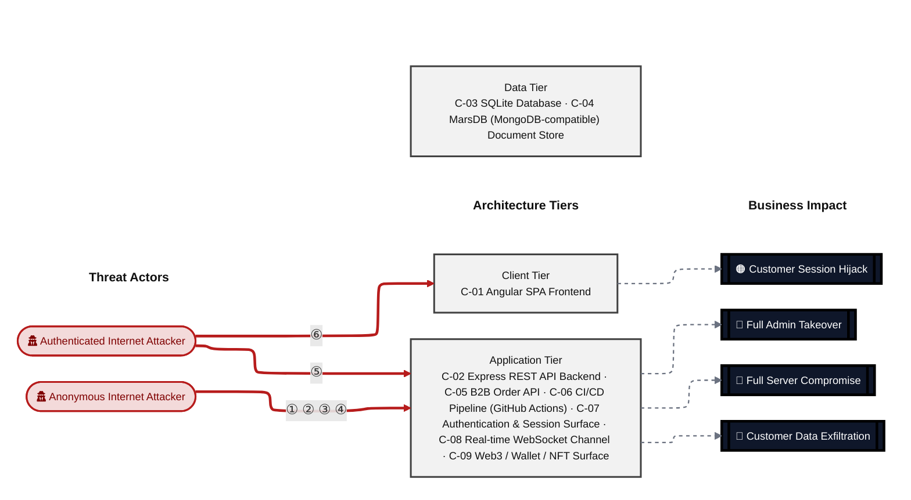

**Threat actors.** The actors below drive the numbered attack paths in the figures above.

- **Anonymous Internet Attacker** — no account; registers in seconds when needed; drives ① Insecure Query Construction & Data Access, ② Hardcoded Secrets & Weak Cryptography, ③ Remote Code Execution (unsafe eval), ④ Sensitive File & Secret Exposure.
- **Authenticated Internet Attacker** — owns a regular account; logged in; drives ⑤ Broken Authorization & Access Control, ⑥ Output Encoding / Cross-Site Scripting.

**6 structural threats**, grouped by weakness class - each row is one threat, not one finding. *Threat Description* states the general architectural weakness (STRIDE in brackets); *Findings* lists the concrete instances, each linked to [§8 Findings Register](#8-findings-register) with its component; *Risk & Impact* combines severity with business consequence.

| # | Threat Description | Findings (→ Component) | Risk & Impact | Fix |
|---|------------------------------------|------------------------------------------------|------------------------------------|--------|
| <a id="path-injection"></a>① | **Insecure Query Construction & Data Access** _(T·I)_<br/>Raw SQL string interpolation on the login and product-search routes allows unauthenticated attackers to bypass authentication or extract the full user table via UNION payloads; a NoSQL \$where injection on the order-tracking route provides a parallel path. | <span style="white-space:nowrap">🔴&nbsp;[F-005](#f-005)</span> - SQL Injection Login Bypass (routes/login.ts:34) <span style="white-space:nowrap">→&nbsp;[C-07](#c-07)</span><br/><span style="white-space:nowrap">🔴&nbsp;[F-008](#f-008)</span> - UNION SQL Injection in Product Search Query (routes/search.ts:23) <span style="white-space:nowrap">→&nbsp;[C-02](#c-02)</span><br/><span style="white-space:nowrap">🔴&nbsp;[F-009](#f-009)</span> - XXE with Full Entity Expansion and Filesystem Access (lib/xml.ts:35) <span style="white-space:nowrap">→&nbsp;[C-02](#c-02)</span><br/><span style="white-space:nowrap">🔴&nbsp;[F-010](#f-010)</span> - NoSQL \$where Injection in Order Tracking (routes/trackOrder.ts:18) <span style="white-space:nowrap">→&nbsp;[C-02](#c-02)</span><br/><span style="white-space:nowrap">🟠&nbsp;[F-022](#f-022)</span> - NoSQL Injection (routes/chat.ts:149) <span style="white-space:nowrap">→&nbsp;[C-02](#c-02)</span><br/><span style="white-space:nowrap">🟠&nbsp;[F-023](#f-023)</span> - NoSQL \$where JavaScript Injection (routes/showProductReviews.ts:36) <span style="white-space:nowrap">→&nbsp;[C-02](#c-02)</span><br/><span style="white-space:nowrap">🟠&nbsp;[F-024](#f-024)</span> - NoSQL Mass-Update (routes/updateProductReviews.ts:18) <span style="white-space:nowrap">→&nbsp;[C-02](#c-02)</span><br/><span style="white-space:nowrap">🟠&nbsp;[F-048](#f-048)</span> - LLM Prompt Injection (routes/chat.ts:191) <span style="white-space:nowrap">→&nbsp;[C-02](#c-02)</span> | 🔴 **Critical**<br/>Customer Data Exfiltration · Full Admin Takeover | <span style="white-space:nowrap">❶ [M-008](#m-008)</span> — Use parameterized database queries<br/><span style="white-space:nowrap">❶ [M-011](#m-011)</span> — Use parameterized database queries |
| <a id="path-auth-bypass"></a>② | **Hardcoded Secrets & Weak Cryptography** _(S·E)_<br/>A committed RSA private key combined with an unconstrained jwt.verify() call allows any party with read access to the repository to mint arbitrary role=admin tokens the server accepts as genuine. | <span style="white-space:nowrap">🔴&nbsp;[F-006](#f-006)</span> - Insecure JWT Verification (lib/insecurity.ts:189) <span style="white-space:nowrap">→&nbsp;[C-07](#c-07)</span><br/><span style="white-space:nowrap">🔴&nbsp;[F-011](#f-011)</span> - Hardcoded RSA Private Key in Source (lib/insecurity.ts:21) <span style="white-space:nowrap">→&nbsp;[C-07](#c-07)</span><br/><span style="white-space:nowrap">🟠&nbsp;[F-019](#f-019)</span> - Weak Password Hashing MD5 Without Salt (lib/insecurity.ts:41) <span style="white-space:nowrap">→&nbsp;[C-07](#c-07)</span><br/><span style="white-space:nowrap">🟠&nbsp;[F-028](#f-028)</span> - Hardcoded Testing Credentials in Production Frontend (login.component.ts:61) <span style="white-space:nowrap">→&nbsp;[C-01](#c-01)</span><br/><span style="white-space:nowrap">🟠&nbsp;[F-037](#f-037)</span> - Hardcoded BIP-39 Mnemonic and Private Key Derivation (routes/checkKeys.ts:10) <span style="white-space:nowrap">→&nbsp;[C-09](#c-09)</span><br/><span style="white-space:nowrap">🟠&nbsp;[F-049](#f-049)</span> - Hardcoded HMAC Key Enables Forgery of deluxeToken for (lib/insecurity.ts:42) <span style="white-space:nowrap">→&nbsp;[C-03](#c-03)</span><br/><span style="white-space:nowrap">🟡&nbsp;[F-057](#f-057)</span> - No container image signing in CI pipeline (ci.yml:1) <span style="white-space:nowrap">→&nbsp;[C-06](#c-06)</span> | 🔴 **Critical**<br/>Full Admin Takeover | <span style="white-space:nowrap">❶ [M-009](#m-009)</span> — Enforce JWT signature and algorithm verification<br/><span style="white-space:nowrap">❶ [M-014](#m-014)</span> — Move cryptographic keys to a managed secret store |
| <a id="path-remote-code-execution"></a>③ | **Remote Code Execution (unsafe eval)** _(E)_<br/>The B2B order endpoint evaluates attacker-controlled expressions inside a vm sandbox that can be escaped; reachable without credentials once a JWT is forged using the committed RSA key. | <span style="white-space:nowrap">🔴&nbsp;[F-012](#f-012)</span> - JavaScript Sandbox Escape (routes/b2bOrder.ts:23) <span style="white-space:nowrap">→&nbsp;[C-05](#c-05)</span><br/><span style="white-space:nowrap">🔴&nbsp;[F-011](#f-011)</span> - Hardcoded RSA Private Key in Source (lib/insecurity.ts:21) <span style="white-space:nowrap">→&nbsp;[C-07](#c-07)</span> | 🔴 **Critical**<br/>Full Server Compromise | <span style="white-space:nowrap">❶ [M-015](#m-015)</span> — Remove server-side evaluation of untrusted input<br/><span style="white-space:nowrap">❶ [M-014](#m-014)</span> — Move cryptographic keys to a managed secret store |
| <a id="path-sensitive-data-exposure"></a>④ | **Sensitive File & Secret Exposure** _(I)_<br/>The XML parser is configured to resolve external entities and register filesystem I/O handlers, exposing arbitrary server files and enabling SSRF to internal network services via crafted XXE payloads. | <span style="white-space:nowrap">🔴&nbsp;[F-009](#f-009)</span> - XXE with Full Entity Expansion and Filesystem Access (lib/xml.ts:35) <span style="white-space:nowrap">→&nbsp;[C-02](#c-02)</span><br/><span style="white-space:nowrap">🟠&nbsp;[F-029](#f-029)</span> - Stack Trace Disclosure (server.ts:682) <span style="white-space:nowrap">→&nbsp;[C-02](#c-02)</span><br/><span style="white-space:nowrap">🟠&nbsp;[F-033](#f-033)</span> - Directory Listing and Unauthenticated File Serving on /ftp and (server.ts:269) <span style="white-space:nowrap">→&nbsp;[C-02](#c-02)</span><br/><span style="white-space:nowrap">🟠&nbsp;[F-034](#f-034)</span> - SSRF (routes/profileImageUrlUpload.ts:24) <span style="white-space:nowrap">→&nbsp;[C-02](#c-02)</span><br/><span style="white-space:nowrap">🟠&nbsp;[F-036](#f-036)</span> - Plaintext TOTP Secrets and Unencrypted Database at Rest (models/user.ts:113) <span style="white-space:nowrap">→&nbsp;[C-03](#c-03)</span><br/><span style="white-space:nowrap">🟡&nbsp;[F-053](#f-053)</span> - Open Redirect (lib/insecurity.ts:136) <span style="white-space:nowrap">→&nbsp;[C-02](#c-02)</span><br/><span style="white-space:nowrap">🟢&nbsp;[F-062](#f-062)</span> - Ethereum Key Hint (routes/checkKeys.ts:21) <span style="white-space:nowrap">→&nbsp;[C-09](#c-09)</span> | 🔴 **Critical**<br/>Customer Data Exfiltration | <span style="white-space:nowrap">❶ [M-012](#m-012)</span> — Disable XML external entity (XXE) resolution<br/><span style="white-space:nowrap">❷ [M-032](#m-032)</span> — Return generic error messages to clients |
| <a id="path-privilege-escalation"></a>⑤ | **Broken Authorization & Access Control** _(E·I)_<br/>The POST /api/Users endpoint allows callers to set arbitrary model fields including the role attribute, enabling any authenticated user to self-promote to administrator without any additional precondition. | <span style="white-space:nowrap">🔴&nbsp;[F-001](#f-001)</span> - Mass Assignment Privileged Role Field Settable at (models/user.ts:79) <span style="white-space:nowrap">→&nbsp;[C-07](#c-07)</span><br/><span style="white-space:nowrap">🔴&nbsp;[F-007](#f-007)</span> - Insecure Direct Object Reference (routes/address.ts:11) <span style="white-space:nowrap">→&nbsp;[C-02](#c-02)</span><br/><span style="white-space:nowrap">🟠&nbsp;[F-013](#f-013)</span> - LoginGuard Presence-Only Token Check (app.guard.ts:18) <span style="white-space:nowrap">→&nbsp;[C-01](#c-01)</span><br/><span style="white-space:nowrap">🟠&nbsp;[F-014](#f-014)</span> - Caller-Controlled author Field Enables (routes/createProductReviews.ts:23) <span style="white-space:nowrap">→&nbsp;[C-02](#c-02)</span><br/><span style="white-space:nowrap">🟠&nbsp;[F-030](#f-030)</span> - GitHub Actions workflow missing permissions block (ci.yml:1) <span style="white-space:nowrap">→&nbsp;[C-06](#c-06)</span><br/><span style="white-space:nowrap">🟠&nbsp;[F-047](#f-047)</span> - Admin Configuration Endpoints Accessible Without Authentication (server.ts:606) <span style="white-space:nowrap">→&nbsp;[C-02](#c-02)</span> | 🔴 **Critical**<br/>Full Admin Takeover | <span style="white-space:nowrap">❶ [M-004](#m-004)</span> — Restrict writable fields on POST /api/Users to exclude role, deluxeToken, totpSecret, and isActive<br/><span style="white-space:nowrap">❶ [M-010](#m-010)</span> — Enforce object-level (ownership) authorization |
| <a id="path-cross-site-scripting"></a>⑥ | **Output Encoding / Cross-Site Scripting** _(T·I)_<br/>Stored and DOM-based XSS via Angular's bypassed sanitizer allow attacker-controlled markup to execute in victim browsers; because session JWTs are kept in localStorage, a successful payload exfiltrates the token without a server-side request. | <span style="white-space:nowrap">🟠&nbsp;[F-017](#f-017)</span> - Stored XSS (search-result.component.ts:110) <span style="white-space:nowrap">→&nbsp;[C-01](#c-01)</span><br/><span style="white-space:nowrap">🟠&nbsp;[F-018](#f-018)</span> - DOM-Based XSS (search-result.component.ts:143) <span style="white-space:nowrap">→&nbsp;[C-01](#c-01)</span><br/><span style="white-space:nowrap">🟠&nbsp;[F-002](#f-002)</span> - JWT Stored in localStorage XSS Token Exfiltration (login.component.ts:101) <span style="white-space:nowrap">→&nbsp;[C-01](#c-01)</span> | 🟠 **High**<br/>Customer Session Hijack | <span style="white-space:nowrap">❷ [M-020](#m-020)</span> — Encode output instead of bypassing the framework sanitizer<br/><span style="white-space:nowrap">❷ [M-021](#m-021)</span> — Encode output instead of bypassing the framework sanitizer |

_STRIDE: S spoofing · T tampering · R repudiation · I information disclosure · D denial of service · E elevation of privilege. Risk, findings, components, impact and Fix are derived deterministically; only the one-line weakness description is authored._

**Verified attack chains.** 3 fully viable ([AC-T-003](#ac-t-003), [AC-T-004](#ac-t-004), [AC-T-005](#ac-t-005)); 3 partially blocked ([AC-T-001](#ac-t-001), [AC-T-002](#ac-t-002), [AC-T-006](#ac-t-006)). These chains combine individual findings into end-to-end exploitation paths verified step-by-step against the code - see [§9 Abuse Cases](#9-abuse-cases) for the per-step breakdown and blocking mitigations.

### Top Mitigations

Highest-impact P1/P2 mitigations - 10 of 50 qualifying (64 total). Full detail in [§10 Mitigation Register](#10-mitigation-register). All 10 mitigation(s) that fix a Critical finding are always listed here.

| # | Component | Mitigation | Addresses | Effort |
|---|----------------------|------------------------------------------------|------------------------------------------------|------|
| **1** | [C-01](#c-01) — Angular SPA Frontend | ❶ [M-007](#m-007) — Replace implicit OAuth flow with PKCE authorization-code flow and use a cryptographically random password | 🔴 [F-004](#f-004) — OAuth Implicit Flow with Derived Password (oauth.component.ts) | High |
| **2** | [C-02](#c-02) — Express REST API Backend | ❶ [M-011](#m-011) — Use parameterized database queries | 🔴 [F-008](#f-008) — UNION SQL Injection in Product Search Query (routes/search.ts) | Low |
| **3** | [C-02](#c-02) — Express REST API Backend | ❶ [M-012](#m-012) — Disable XML external entity (XXE) resolution | 🔴 [F-009](#f-009) — XXE with Full Entity Expansion and Filesystem Access (lib/xml.ts) | Low |
| **4** | [C-02](#c-02) — Express REST API Backend | ❶ [M-013](#m-013) — Use parameterized database queries | 🔴 [F-010](#f-010) — NoSQL \$where Injection in Order Tracking (routes/trackOrder.ts) | Low |
| **5** | [C-02](#c-02) — Express REST API Backend | ❶ [M-010](#m-010) — Enforce object-level (ownership) authorization | 🔴 [F-007](#f-007) — Insecure Direct Object Reference (routes/address.ts) | Medium |
| **6** | [C-05](#c-05) — B2B Order API | ❶ [M-015](#m-015) — Remove server-side evaluation of untrusted input | 🔴 [F-012](#f-012) — JavaScript Sandbox Escape (routes/b2bOrder.ts) | Medium |
| **7** | [C-07](#c-07) — Authentication & Session Surface | ❶ [M-004](#m-004) — Restrict writable fields on POST /api/Users to exclude role, deluxeToken, totpSecret, and isActive | 🔴 [F-001](#f-001) — Mass Assignment Privileged Role Field Settable at (models/user.ts) | Low |
| **8** | [C-07](#c-07) — Authentication & Session Surface | ❶ [M-008](#m-008) — Use parameterized database queries | 🔴 [F-005](#f-005) — SQL Injection Login Bypass (routes/login.ts) | Low |
| **9** | [C-07](#c-07) — Authentication & Session Surface | ❶ [M-009](#m-009) — Enforce JWT signature and algorithm verification | 🔴 [F-006](#f-006) — Insecure JWT Verification (lib/insecurity.ts) | Low |
| **10** | [C-07](#c-07) — Authentication & Session Surface | ❶ [M-014](#m-014) — Move cryptographic keys to a managed secret store | 🔴 [F-011](#f-011) — Hardcoded RSA Private Key in Source (lib/insecurity.ts) | Medium |

*40 additional P1/P2 mitigations capped from the leader-board · 14 P3 backlog items in [§10 Mitigation Register](#10-mitigation-register). Sorted by priority (P1 first), then component, then leverage (most findings first), severity (Critical first), and effort (Low first).*

### Operational Strengths

Operational controls rated Adequate or Partial - grouped into broad clusters (full per-control breakdown in [§7](#7-security-architecture)). Clusters demoted to Weak by open Critical/High findings appear in [§7](#7-security-architecture) instead, not here.

| Strength | What's in Place | Effectiveness | Gap | Mitigates |
|----------------------|----------------------|-------------|----------------------|----------------|
| **Container & Supply-Chain Hardening** | _Build-time and runtime hardening - minimal base image, non-root execution, dependency inventory._<br/>Automated SCA scanning<br/>Dependency Pinning and Integrity | ✅ Adequate | - | - |
| **Observability & Audit** | _Runtime visibility - access logging, audit trails, and operational telemetry for post-incident review._<br/>Logging and Audit Trail | ⚠️ Partial | Coverage incomplete - see [§7](#7-security-architecture) control assessment. | - |


**Bottom line:** These controls narrow specific attack surfaces but none eliminates a Critical finding on its own.

---

<a id="critical-attack-chain"></a>
<a id="critical-attack-tree"></a>
## Critical Attack Tree

The root is the worst-case attacker goal; below it, each capability branch groups the Critical findings that achieve it. Branches feed the goal by OR - any single path suffices.

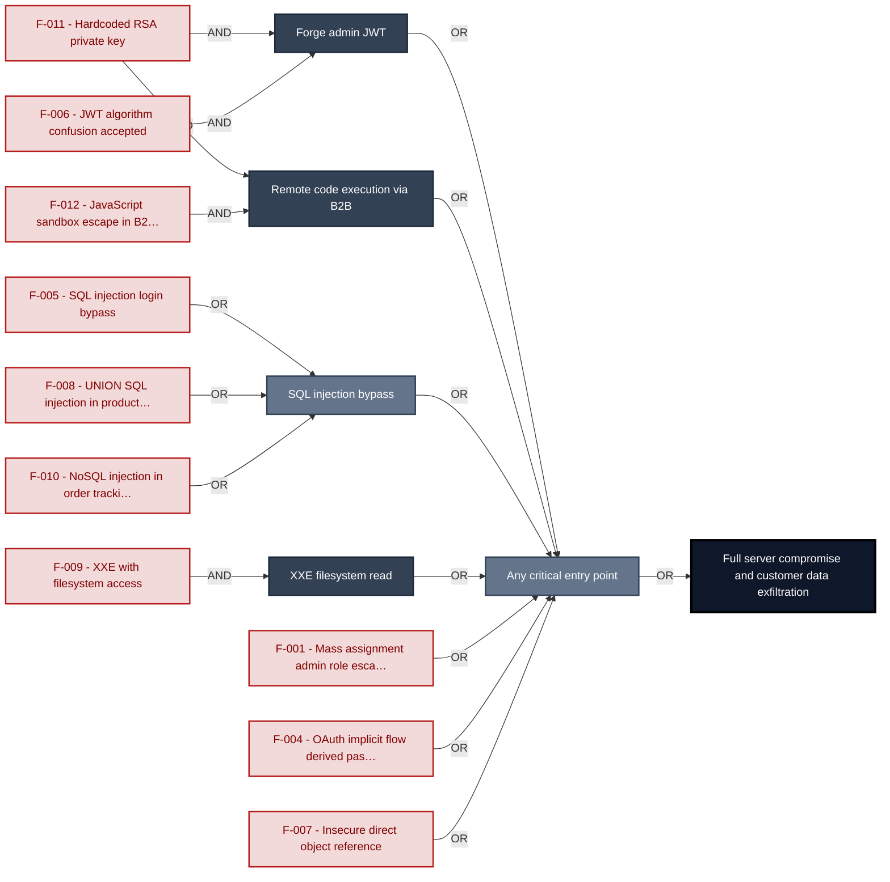

**Findings** (full detail in [§8 Findings Register](#8-findings-register)): 🔴 [F-011](#f-011) — Hardcoded RSA Private Key in Source — lib/insecurity.ts:21 Hardcoded RSA private key · 🔴 [F-006](#f-006) — Insecure JWT Verification — lib/insecurity.ts:189 JWT algorithm confusion accepted · 🔴 [F-012](#f-012) — JavaScript Sandbox Escape — routes/b2bOrder.ts:23 JavaScript sandbox escape in B2B orders · 🔴 [F-005](#f-005) — SQL Injection Login Bypass — routes/login.ts:34 SQL injection login bypass · 🔴 [F-008](#f-008) — UNION SQL Injection in Product Search Query — routes/search.ts:23 UNION SQL injection in product search · 🔴 [F-010](#f-010) — NoSQL \$where Injection in Order Tracking — routes/trackOrder.ts:18 NoSQL injection in order tracking · 🔴 [F-009](#f-009) — XXE with Full Entity Expansion and Filesystem Access — lib/xml.ts:35 XXE with filesystem access · 🔴 [F-001](#f-001) — Mass Assignment Privileged Role Field Settable at — models/user.ts:79 Mass assignment admin role escalation · 🔴 [F-004](#f-004) — OAuth Implicit Flow with Derived Password — oauth.component.ts:30 OAuth implicit flow derived password · 🔴 [F-007](#f-007) — Insecure Direct Object Reference — routes/address.ts:11 Insecure direct object reference

---

## 1. System Overview

Probably the most modern and sophisticated insecure web application

**Repository:** https://github.com/juice-shop/juice-`shop.git`
**Runtime:** Node\.js 22 - 26

### Scope

This threat model covers 9 components of juice-shop: **Angular SPA Frontend**, **Express REST API Backend**, **SQLite Database**, **MarsDB (MongoDB-compatible) Document Store**, **B2B Order API**, **CI/CD Pipeline (GitHub Actions)**, **Authentication & Session Surface**, **Real-time WebSocket Channel**, **Web3 / Wallet / NFT Surface**.

All 9 modeled components received full STRIDE threat analysis.

**Out of scope:** third-party hosted dependencies, browser runtime, operating-system kernel, and the underlying network infrastructure.

---

## 2. Architecture Diagrams

### 2.1 System Context

Who interacts with juice-shop from the outside, and through which channels. Solid arrows show normal usage; dashed red arrows mark unauthenticated probing or exploit paths (C4 Level 1).

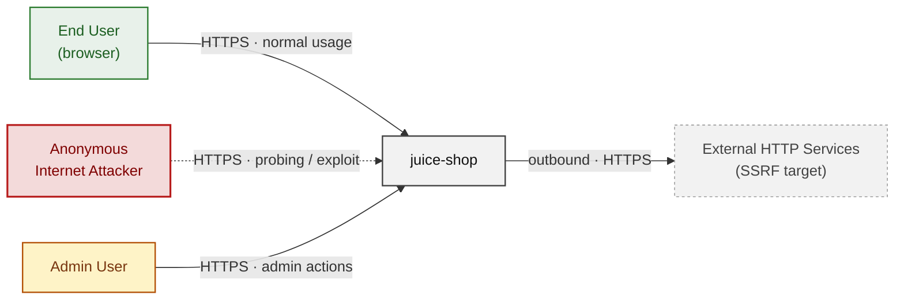

**Key takeaway:** Every actor in the context interacts with juice-shop through its external interface, so authentication and input validation at that edge govern the entire attack surface.

### 2.2 Container Architecture

How the system decomposes into deployable units. Each box is a separate runtime process or service container; arrows show synchronous request paths between them. Components with ≥3 Critical findings carry a red border, ≥2 High amber (C4 Level 2).

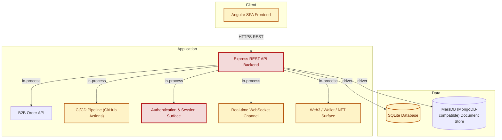

**Key takeaway:** The system decomposes into 1 client, 6 application and 2 data unit(s); Authentication & Session Surface carries the most Critical findings (4) and bounds the worst-case blast radius.

### 2.3 Components


Who reaches each component, and through which trust zone. Four columns map external actors to the internal tiers (Client / Application / Data); solid green arrows show legitimate data flow, dashed red arrows mark intrusion vectors. The component table directly below holds source paths and linked threats per `C-NN`; per-finding evidence is in [§8 Findings Register](#8-findings-register).

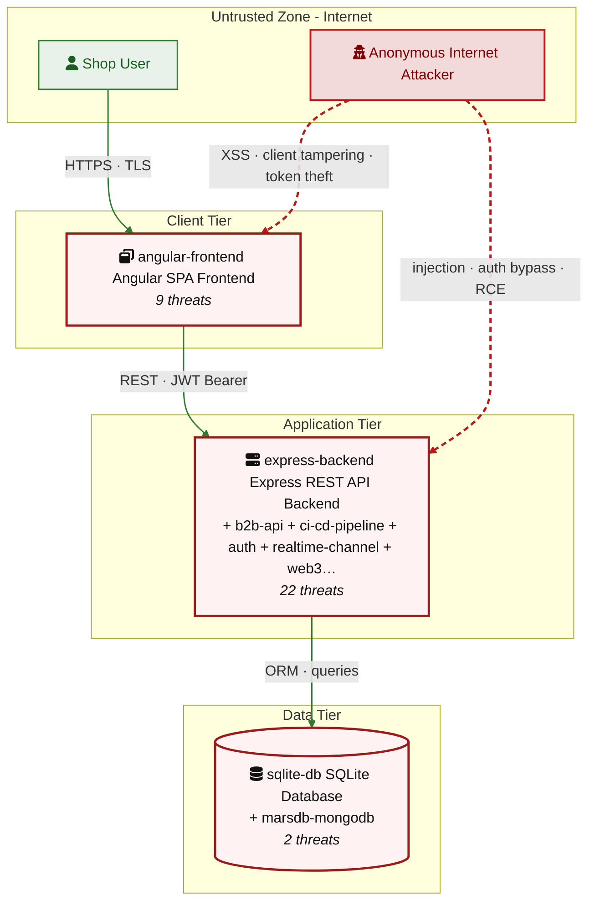

**Key takeaway:** Express REST API Backend concentrates the most findings (22 of 62 across all components); the table below maps each component to its source paths and linked threats.

| ID | Name | Type | Key Paths | Linked Threats |
|----|----------------------|-----------|--------------------------------------|------------------------------------------------|
| <a id="c-01"></a><a id="angular-frontend"></a><span style="white-space:nowrap">C-01</span> | Angular SPA Frontend | client | `frontend/src/**`<br/>`frontend/dist/**` | 🟠 [F-002](#f-002) — JWT Stored in localStorage XSS Token Exfiltration (`login.component.ts:101`)<br/>🔴 [F-004](#f-004) — OAuth Implicit Flow with Derived Password (`oauth.component.ts:30`)<br/>🔴 [F-013](#f-013) — LoginGuard Presence-Only Token Check (`app.guard.ts:18`)<br/>🔴 [F-017](#f-017) — Stored XSS (`search-result.component.ts:110`)<br/>🔴 [F-018](#f-018) — DOM-Based XSS (`search-result.component.ts:143`)<br/>🟠 [F-027](#f-027) — OAuth Access Token Exposed in URL Fragment (`app.routing.ts:257`)<br/>🔴 [F-028](#f-028) — Hardcoded Testing Credentials in Production Frontend (`login.component.ts:61`)<br/>🟠 [F-044](#f-044) — Client-Side Role Guard Bypassed (`app.guard.ts:52`)<br/>🟠 [F-051](#f-051) — Window.ethereum Provider Hijacking (`wallet-web3.component.ts:21`) |
| <a id="c-02"></a><a id="express-backend"></a><span style="white-space:nowrap">C-02</span> | Express REST API Backend | application | `server.ts`<br/>`app.ts`<br/>`routes/**`<br/>`lib/**`<br/>`models/**` | 🟡 [F-003](#f-003) — Missing Security Audit Logging cross-component (`server.ts:338`)<br/>🔴 [F-007](#f-007) — Insecure Direct Object Reference (`routes/address.ts:11`)<br/>🔴 [F-008](#f-008) — UNION SQL Injection in Product Search Query (`routes/search.ts:23`)<br/>🔴 [F-009](#f-009) — XXE with Full Entity Expansion and Filesystem Access (`lib/xml.ts:35`)<br/>🔴 [F-010](#f-010) — NoSQL \$where Injection in Order Tracking (`routes/trackOrder.ts:18`)<br/>🔴 [F-014](#f-014) — Caller-Controlled author Field Enables (`routes/createProductReviews.ts:23`)<br/>🔴 [F-022](#f-022) — NoSQL Injection (`routes/chat.ts:149`)<br/>🔴 [F-023](#f-023) — NoSQL \$where JavaScript Injection (`routes/showProductReviews.ts:36`)<br/>🔴 [F-024](#f-024) — NoSQL Mass-Update (`routes/updateProductReviews.ts:18`)<br/>🟠 [F-025](#f-025) — Tautological Underflow Guard in BeeFaucet withdraw — `BeeFaucet.sol`:15<br/>🟠 [F-026](#f-026) — Reentrancy in ETHWalletBank withdraw — `ETHWalletBank.sol`:32<br/>🟠 [F-029](#f-029) — Stack Trace Disclosure (`server.ts:682`)<br/>🟠 [F-033](#f-033) — Directory Listing and Unauthenticated File Serving on /ftp and (`server.ts:269`)<br/>🟠 [F-034](#f-034) — SSRF (`routes/profileImageUrlUpload.ts:24`)<br/>🟠 [F-038](#f-038) — No Rate Limiting on Login Endpoint (`server.ts:596`)<br/>🟠 [F-040](#f-040) — Missing Rate Limiting on Login and Search Endpoints (`server.ts:343`)<br/>🟠 [F-041](#f-041) — Blocking Event-Loop (`routes/showProductReviews.ts:17`)<br/>🟠 [F-043](#f-043) — Unbounded Raw SQL Query Blocks Event Loop (`routes/search.ts:23`)<br/>🔴 [F-047](#f-047) — Admin Configuration Endpoints Accessible Without Authentication (`server.ts:606`)<br/>🟠 [F-048](#f-048) — LLM Prompt Injection (`routes/chat.ts:191`)<br/>🟠 [F-050](#f-050) — No Authentication on All /rest/web3/* Endpoints (`server.ts:641`)<br/>🟡 [F-053](#f-053) — Open Redirect (`lib/insecurity.ts:136`) |
| <a id="c-03"></a><a id="sqlite-db"></a><span style="white-space:nowrap">C-03</span> | SQLite Database | data | `models/**`<br/>`data/datacreator.ts`<br/>`data/datacache.ts` | 🟠 [F-036](#f-036) — Plaintext TOTP Secrets and Unencrypted Database at Rest (`models/user.ts:113`)<br/>🔴 [F-049](#f-049) — Hardcoded HMAC Key Enables Forgery of deluxeToken for (`lib/insecurity.ts:42`) |
| <a id="c-04"></a><a id="marsdb-mongodb"></a><span style="white-space:nowrap">C-04</span> | MarsDB (MongoDB-compatible) Document Store | data | `data/mongodb.ts`<br/>`data/types.ts` | - |
| <a id="c-05"></a><a id="b2b-api"></a><span style="white-space:nowrap">C-05</span> | B2B Order API | application | `routes/b2bOrder.ts` | 🔴 [F-012](#f-012) — JavaScript Sandbox Escape (`routes/b2bOrder.ts:23`)<br/>🟠 [F-039](#f-039) — Unbounded Concurrent Eval Requests Saturate Event Loop (`routes/b2bOrder.ts:23`) |
| <a id="c-06"></a><a id="ci-cd-pipeline"></a><span style="white-space:nowrap">C-06</span> | CI/CD Pipeline (GitHub Actions) | application | `.github/workflows/**`<br/>`Dockerfile`<br/>`docker-compose.test.yml`<br/>`package.json`<br/>`package-lock.json` | 🟠 [F-020](#f-020) — Untrusted npm Install/Postinstall Scripts Enabled (`ci.yml:51`)<br/>🟠 [F-021](#f-021) — Mutable Action References Allow Malicious Code Injection (`image_actions.yml:33`)<br/>🟠 [F-030](#f-030) — GitHub Actions workflow missing permissions block (`ci.yml:1`)<br/>🟠 [F-031](#f-031) — Third-party GitHub Action not pinned to commit SHA (`ci.yml:188`)<br/>🟠 [F-032](#f-032) — Docker base image not digest-pinned — Dockerfile:1<br/>🟠 [F-046](#f-046) — Over-Privileged Default GITHUB_TOKEN Across 13 Workflows Without (`ci.yml:1`)<br/>🟡 [F-052](#f-052) — Script Injection (`ci.yml:358`)<br/>🟡 [F-054](#f-054) — Unpinned Docker Base Image Allows Silent Build-Time Substitution — Dockerfile:1<br/>🟡 [F-055](#f-055) — No Build Provenance Attestation or SBOM Signing for Published (`ci.yml:337`)<br/>🟡 [F-056](#f-056) — Runs as root — Dockerfile:1<br/>🔴 [F-057](#f-057) — No container image signing in CI pipeline (`ci.yml:1`)<br/>🟡 [F-058](#f-058) — Dependabot Ecosystem Coverage Incomplete (.github/dependabot.yml)<br/>🟡 [F-059](#f-059) — No Concurrency Limits or Workflow-Level Timeouts Enable Runner (`ci.yml:1`)<br/>🟢 [F-061](#f-061) — Missing HEALTHCHECK instruction — Dockerfile:1 |
| <a id="c-07"></a><a id="auth"></a><span style="white-space:nowrap">C-07</span> | Authentication & Session Surface | application | `lib/insecurity.ts`<br/>`lib/startup/registerWebsocketEvents.ts`<br/>`routes/2fa.ts`<br/>`routes/authenticatedUsers.ts`<br/>`routes/login.ts` | 🔴 [F-001](#f-001) — Mass Assignment Privileged Role Field Settable at (`models/user.ts:79`)<br/>🔴 [F-005](#f-005) — SQL Injection Login Bypass (`routes/login.ts:34`)<br/>🔴 [F-006](#f-006) — Insecure JWT Verification (`lib/insecurity.ts:189`)<br/>🔴 [F-011](#f-011) — Hardcoded RSA Private Key in Source (`lib/insecurity.ts:21`)<br/>🟠 [F-019](#f-019) — Weak Password Hashing MD5 Without Salt (`lib/insecurity.ts:41`)<br/>🟠 [F-045](#f-045) — Guessable Security Question Reset Without Rate (`routes/resetPassword.ts:35`) |
| <a id="c-08"></a><a id="realtime-channel"></a><span style="white-space:nowrap">C-08</span> | Real-time WebSocket Channel | application | `lib/challengeUtils.ts`<br/>`lib/startup/registerWebsocketEvents.ts` | 🟠 [F-015](#f-015) — Socket\.IO CORS Allows Any Non-Browser Client to (`registerWebsocketEvents.ts:20`)<br/>🔴 [F-035](#f-035) — Unauthenticated WebSocket Channel (`registerWebsocketEvents.ts:29`)<br/>🟠 [F-042](#f-042) — No Connection Limit or Rate Limiting on (`registerWebsocketEvents.ts:20`) |
| <a id="c-09"></a><a id="web3-nft"></a><span style="white-space:nowrap">C-09</span> | Web3 / Wallet / NFT Surface | application | `routes/checkKeys.ts`<br/>`routes/nftMint.ts`<br/>`routes/redirect.ts`<br/>`routes/web3Wallet.ts` | 🔴 [F-016](#f-016) — Unauthenticated Wallet Address Claim (`routes/nftMint.ts:41`)<br/>🔴 [F-037](#f-037) — Hardcoded BIP-39 Mnemonic and Private Key Derivation (`routes/checkKeys.ts:10`)<br/>🟡 [F-060](#f-060) — Unbounded In-Memory Set Growth (`routes/web3Wallet.ts:16`)<br/>🟢 [F-062](#f-062) — Ethereum Key Hint (`routes/checkKeys.ts:21`) |
### 2.4 Technology Architecture

The technology stack the system is built on. Each box names the framework or runtime that fills that role; per-component findings live in the [§2.3](#23-components) component table above, and the full per-finding catalogue is in [§8 Findings Register](#8-findings-register).

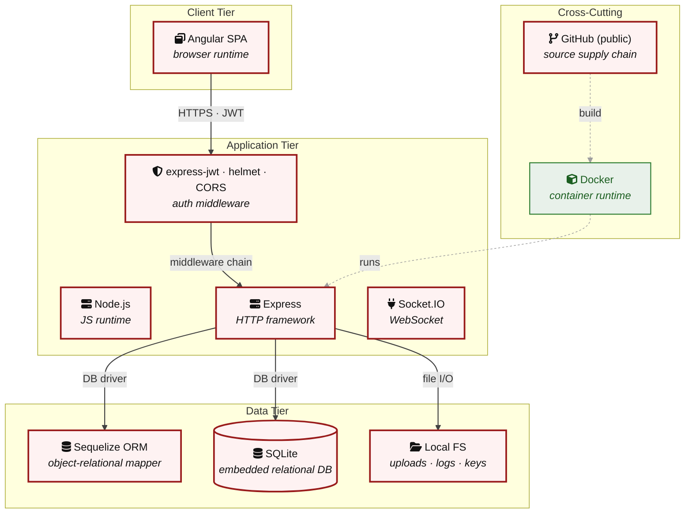

**Key takeaway:** The stack spans 2 data-tier store(s) behind the application tier; injection and data-at-rest exposure track the data tier, detailed per finding in [§8 Findings Register](#8-findings-register).

> **Legend:** **red border** ≥ 3 Critical threats on the component · **amber border** ≥ 2 High threats

---

## 3. Attack Walkthroughs

This section walks through how the highest-risk findings are exploited - one short walkthrough per Critical, each with attack steps, a focused sequence diagram, and the primary mitigation. The cross-finding view (which weaknesses combine toward the worst-case goal, and where one fix severs several paths) is in the [Critical Attack Tree](#critical-attack-tree). Full per-finding context - severity rationale, assets, detection signals - is in the [§8 Findings Register](#8-findings-register) row for each finding.

### 3.1 Mass Assignment Privileged Role Field Settable at

**Source:** 🔴 [F-001](#f-001) — `models/user.ts:79`

Severity **Critical** ([CWE-915](https://cwe.mitre.org/data/definitions/915.html)). STRIDE: Elevation of Privilege. See [§8 F-001](#f-001) for the full register row.

**Attack Steps**

1. The /api/Users POST endpoint is handled by Sequelize-based REST (epilogue/finale) configured at `server.ts:408-422`.
2. The User model at `models/user.ts:79-98` declares role with defaultValue:'customer' and a validator that allows 'customer', 'deluxe', 'accounting', 'admin'.
3. Because the REST layer passes `req.body` directly to the Sequelize `create()` call without stripping sensitive fields, an attacker can POST {"email":"evil@`test.com`", "password":"pass", "role":"admin"} to /api/Users and create an admin account.

**Sequence Diagram**

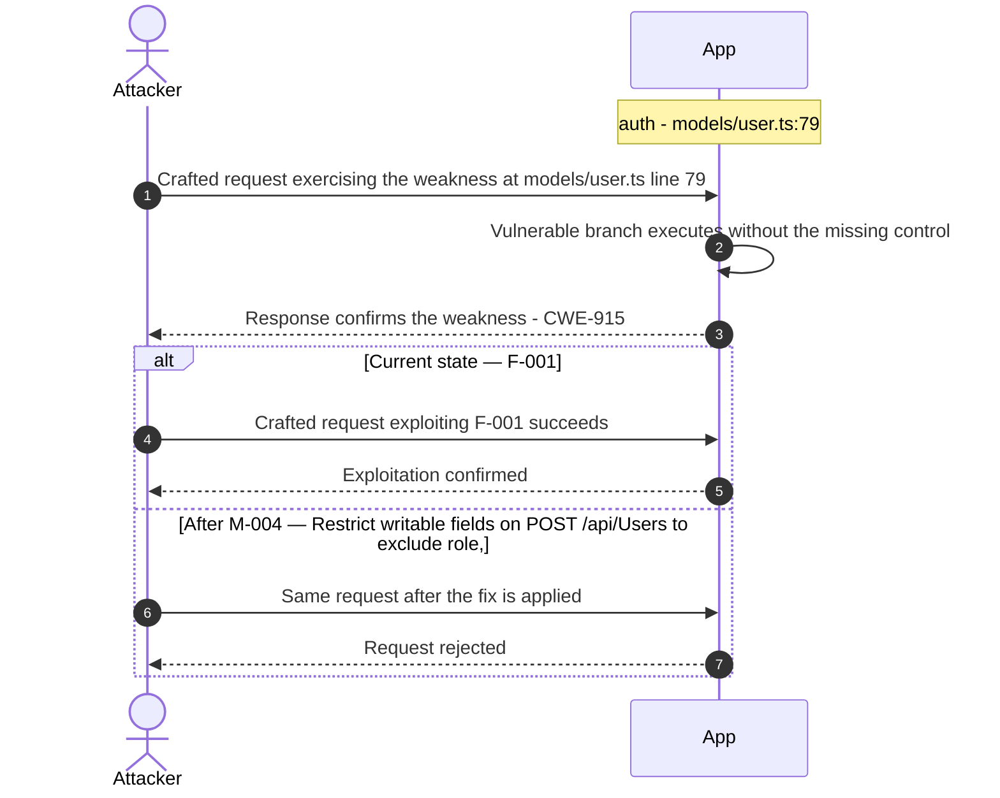

**Key takeaway:** Until ❶ [M-004](#m-004) (Restrict writable fields on POST /api/Users to exclude role,) lands, [F-001](#f-001) — Mass Assignment Privileged Role Field Settable at — models/user.ts:79 is exploitable at `models/user.ts:79` (Critical-severity, [CWE-915](https://cwe.mitre.org/data/definitions/915.html)).

**Defense in Depth**

- Primary mitigation: ❶ [M-004](#m-004) (Restrict writable fields on POST /api/Users to exclude role, deluxeToken, totpSecret, and isActive)
- Defence in depth: ❸ [M-066](#m-066) (Manual review: verify Mass Assignment Privileged Role Field Settable)

### 3.2 OAuth Implicit Flow with Derived Password

**Source:** 🔴 [F-004](#f-004) — `frontend/src/app/oauth/oauth.component.ts:30`

Severity **Critical** ([CWE-522](https://cwe.mitre.org/data/definitions/522.html)). STRIDE: Spoofing. See [§8 F-004](#f-004) for the full register row.

**Attack Steps**

1. The OAuth callback flow in `oauth.component.ts` uses the OAuth 2.0 implicit flow: `app.routing.ts:286` matches `#access_token=` in the URL fragment, routing to `OAuthComponent`.
2. The access_token arrives in the browser URL fragment with no PKCE, no `state` parameter validation, and no `nonce`.
3. Additionally, at line 30, a deterministic password is computed as `btoa(profile.email.split('').reverse().join(''))` and used to register/login the user.

**Sequence Diagram**

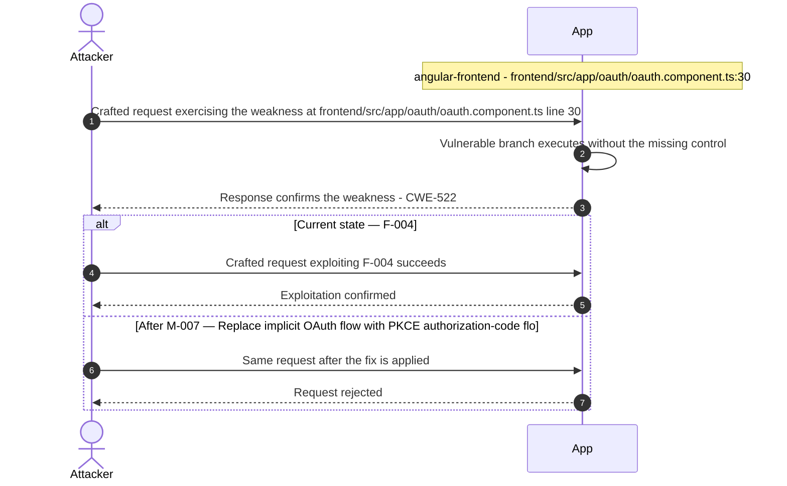

**Key takeaway:** Until ❶ [M-007](#m-007) (Replace implicit OAuth flow with PKCE authorization-code flo) lands, [F-004](#f-004) — OAuth Implicit Flow with Derived Password — oauth.component.ts:30 is exploitable at `frontend/src/app/oauth/oauth.component.ts:30` (Critical-severity, [CWE-522](https://cwe.mitre.org/data/definitions/522.html)).

**Defense in Depth**

- Primary mitigation: ❶ [M-007](#m-007) (Replace implicit OAuth flow with PKCE authorization-code flow and use a cryptographically random password)

### 3.3 SQL Injection Login Bypass

**Source:** 🔴 [F-005](#f-005) — `routes/login.ts:34`

Severity **Critical** ([CWE-89](https://cwe.mitre.org/data/definitions/89.html)). STRIDE: Spoofing. See [§8 F-005](#f-005) for the full register row.

**Attack Steps**

1. At `routes/login.ts:34`, req.body.email is interpolated directly into a raw Sequelize query: `SELECT * FROM Users WHERE email = '${req.body.email}'`.
2. Submitting `' OR '1'='1` as the email bypasses the WHERE clause entirely and returns the first user row, which is the seeded admin account.
3. No parameterization or ORM-layer escaping is applied.

**Sequence Diagram**


**Key takeaway:** Until ❶ [M-008](#m-008) (Use parameterized database queries) lands, [F-005](#f-005) — SQL Injection Login Bypass — routes/login.ts:34 is exploitable at `routes/login.ts:34` (Critical-severity, [CWE-89](https://cwe.mitre.org/data/definitions/89.html)).

**Defense in Depth**

- Primary mitigation: ❶ [M-008](#m-008) (Use parameterized database queries)

### 3.4 Insecure JWT Verification

**Source:** 🔴 [F-006](#f-006) — `lib/insecurity.ts:189`

Severity **Critical** ([CWE-347](https://cwe.mitre.org/data/definitions/347.html)). STRIDE: Spoofing. See [§8 F-006](#f-006) for the full register row.

**Attack Steps**

1. `jwt.verify()` at `lib/insecurity.ts:189` is called as `jwt.verify(token, publicKey, callback)` with no algorithms option.
2. The RSA public key (encryptionkeys/jwt.pub) is readable by anyone with repo access or via directory traversal.
3. An attacker who obtains the public key can forge a JWT with alg:HS256 and sign it with the public key used as an HMAC-SHA256 secret.

**Sequence Diagram**


**Key takeaway:** Until ❶ [M-009](#m-009) (Enforce JWT signature and algorithm verification) lands, [F-006](#f-006) — Insecure JWT Verification — lib/insecurity.ts:189 is exploitable at `lib/insecurity.ts:189` (Critical-severity, [CWE-347](https://cwe.mitre.org/data/definitions/347.html)).

**Defense in Depth**

- Primary mitigation: ❶ [M-009](#m-009) (Enforce JWT signature and algorithm verification)

### 3.5 Insecure Direct Object Reference

**Source:** 🔴 [F-007](#f-007) — `routes/address.ts:11`

Severity **Critical** ([CWE-639](https://cwe.mitre.org/data/definitions/639.html)). STRIDE: Tampering. See [§8 F-007](#f-007) for the full register row.

**Attack Steps**

1. Server-side authorization MUST derive the resource owner from the authenticated session (`req.user` / req.session / `req.auth`), never from attacker-controlled request data.
2. Trusting req.body.UserId etc. enables horizontal privilege escalation across all authenticated tenants.
3. Send the crafted payload to the endpoint backed by `routes/address.ts:11`.

**Sequence Diagram**

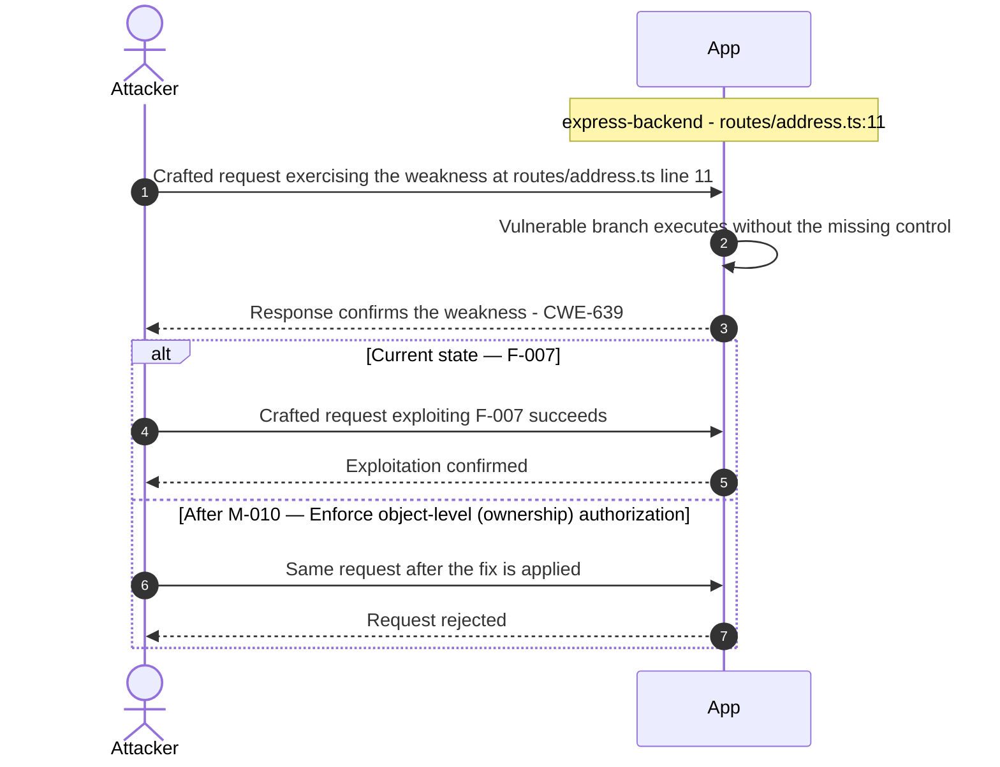

**Key takeaway:** Until ❶ [M-010](#m-010) (Enforce object-level (ownership) authorization) lands, [F-007](#f-007) — Insecure Direct Object Reference — routes/address.ts:11 is exploitable at `routes/address.ts:11` (Critical-severity, [CWE-639](https://cwe.mitre.org/data/definitions/639.html)).

**Defense in Depth**

- Primary mitigation: ❶ [M-010](#m-010) (Enforce object-level (ownership) authorization)

### 3.6 UNION SQL Injection in Product Search Query

**Source:** 🔴 [F-008](#f-008) — `routes/search.ts:23`

Severity **Critical** ([CWE-89](https://cwe.mitre.org/data/definitions/89.html)). STRIDE: Tampering. See [§8 F-008](#f-008) for the full register row.

**Attack Steps**

1. The product search handler at `routes/search.ts:23` interpolates `req.query.q` into a raw SQL LIKE query: `SELECT * FROM Products WHERE ((name LIKE '%${criteria}%'…`.
2. An unauthenticated attacker sends `q=x')) UNION SELECT id, email, password, NULL, NULL, NULL, NULL, NULL FROM Users--` to exfiltrate all user credentials.
3. The 200-character limit at line 22 is easily circumvented with compact payloads.

**Sequence Diagram**

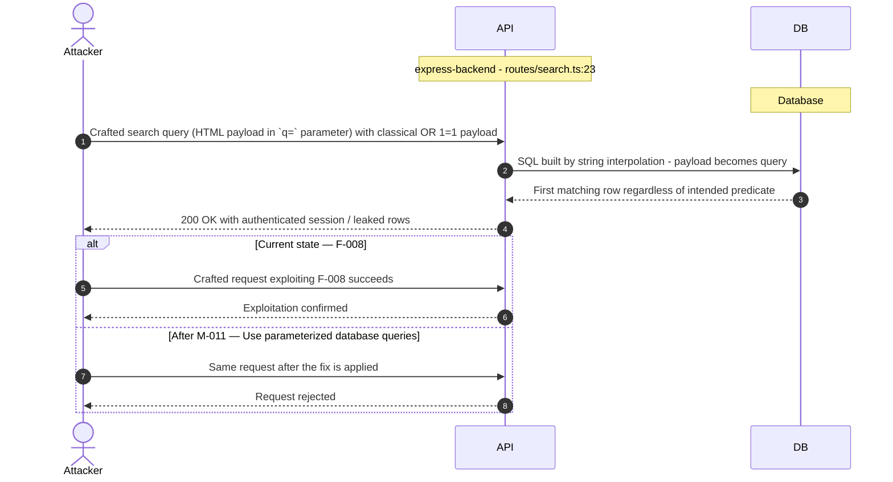

**Key takeaway:** Until ❶ [M-011](#m-011) (Use parameterized database queries) lands, [F-008](#f-008) — UNION SQL Injection in Product Search Query — routes/search.ts:23 is exploitable at `routes/search.ts:23` (Critical-severity, [CWE-89](https://cwe.mitre.org/data/definitions/89.html)).

**Defense in Depth**

- Primary mitigation: ❶ [M-011](#m-011) (Use parameterized database queries)

### 3.7 XXE with Full Entity Expansion and Filesystem Access

**Source:** 🔴 [F-009](#f-009) — `lib/xml.ts:35`

Severity **Critical** ([CWE-611](https://cwe.mitre.org/data/definitions/611.html)). STRIDE: Tampering. See [§8 F-009](#f-009) for the full register row.

**Attack Steps**

1. The XML parser at `lib/xml.ts:35` is configured with `XML_PARSE_NOENT | XML_PARSE_DTDLOAD` flags and calls `xmlRegisterFsInputProviders()` (line 22) to grant the WASM sandbox host filesystem access.
2. An attacker uploads an XML file containing an external entity pointing to `file:///etc/passwd` (or any file the Node\.js process can read).
3. The parsed output (with the entity expanded to the file's content) is returned.

**Sequence Diagram**

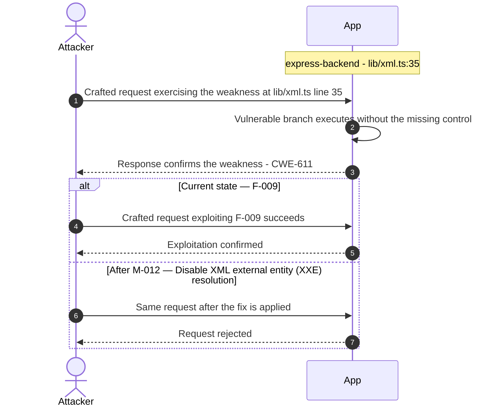

**Key takeaway:** Until ❶ [M-012](#m-012) (Disable XML external entity (XXE) resolution) lands, [F-009](#f-009) — XXE with Full Entity Expansion and Filesystem Access — lib/xml.ts:35 is exploitable at `lib/xml.ts:35` (Critical-severity, [CWE-611](https://cwe.mitre.org/data/definitions/611.html)).

**Defense in Depth**

- Primary mitigation: ❶ [M-012](#m-012) (Disable XML external entity (XXE) resolution)

### 3.8 NoSQL \$where Injection in Order Tracking

**Source:** 🔴 [F-010](#f-010) — `routes/trackOrder.ts:18`

Severity **Critical** ([CWE-943](https://cwe.mitre.org/data/definitions/943.html)). STRIDE: Tampering. See [§8 F-010](#f-010) for the full register row.

**Attack Steps**

1. The `trackOrder` route builds a MarsDB query using template-literal interpolation: `db.ordersCollection.find({ $where: \`this.orderId === '${id}'\` })`.
2. When the challenge flag `reflectedXssChallenge` is active, `id` is sourced from `req.params.id` truncated to 60 characters.
3. An attacker appends a JS expression such as `' || true || '` to make the `$where` condition always evaluate to `true`, causing all orders in the collection to be returned.

**Sequence Diagram**

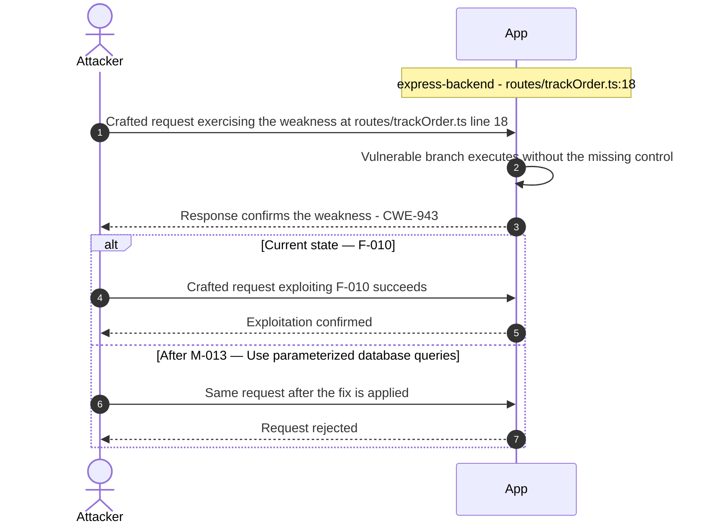

**Key takeaway:** Until ❶ [M-013](#m-013) (Use parameterized database queries) lands, [F-010](#f-010) — NoSQL \$where Injection in Order Tracking — routes/trackOrder.ts:18 is exploitable at `routes/trackOrder.ts:18` (Critical-severity, [CWE-943](https://cwe.mitre.org/data/definitions/943.html)).

**Defense in Depth**

- Primary mitigation: ❶ [M-013](#m-013) (Use parameterized database queries)

### 3.9 Hardcoded RSA Private Key in Source

**Source:** 🔴 [F-011](#f-011) — `lib/insecurity.ts:21`

Severity **Critical** ([CWE-321](https://cwe.mitre.org/data/definitions/321.html)). STRIDE: Information Disclosure. See [§8 F-011](#f-011) for the full register row.

**Attack Steps**

1. A 1024-bit RSA private key is embedded as a string literal at `lib/insecurity.ts:21`.
2. This key is used by `security.authorize()` at `insecurity.ts:54` to sign all JWTs issued by the application.
3. Any developer, CI system, or third party with read access to the repository obtains the signing key and can produce arbitrary JWTs with any claims (including role:'admin', email of any user).

**Sequence Diagram**

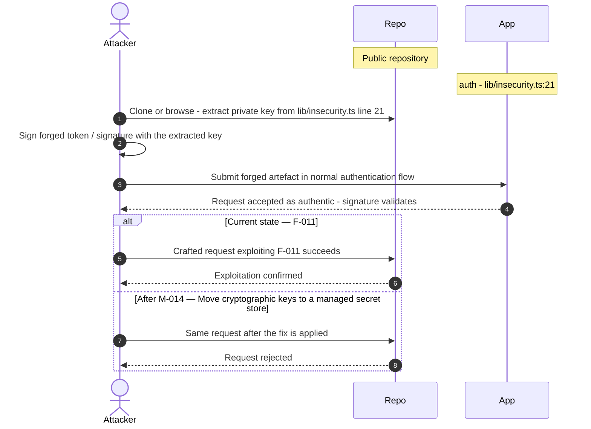

**Key takeaway:** Until ❶ [M-014](#m-014) (Move cryptographic keys to a managed secret store) lands, [F-011](#f-011) — Hardcoded RSA Private Key in Source — lib/insecurity.ts:21 is exploitable at `lib/insecurity.ts:21` (Critical-severity, [CWE-321](https://cwe.mitre.org/data/definitions/321.html)).

**Defense in Depth**

- Primary mitigation: ❶ [M-014](#m-014) (Move cryptographic keys to a managed secret store)

### 3.10 JavaScript Sandbox Escape

**Source:** 🔴 [F-012](#f-012) — `routes/b2bOrder.ts:23`

Severity **Critical** ([CWE-94](https://cwe.mitre.org/data/definitions/94.html)). STRIDE: Elevation of Privilege. See [§8 F-012](#f-012) for the full register row.

**Attack Steps**

1. An attacker sends POST /b2b/v2/orders with a forged JWT (possible because the RSA private key is committed to the repo at `lib/insecurity.ts:21`) and a crafted orderLinesData payload such as `({}).constructor.constructor('return process')()` or a prototype chain traversal.
2. The payload passes through notevil `safeEval()` which runs inside `vm.runInContext()`.
3. Neither notevil nor node:vm forms a security boundary - Node\.js documentation explicitly states vm is not a sandbox.

**Sequence Diagram**


**Key takeaway:** Until ❶ [M-015](#m-015) (Remove server-side evaluation of untrusted input) lands, [F-012](#f-012) — JavaScript Sandbox Escape — routes/b2bOrder.ts:23 is exploitable at `routes/b2bOrder.ts:23` (Critical-severity, [CWE-94](https://cwe.mitre.org/data/definitions/94.html)).

**Defense in Depth**

- Primary mitigation: ❶ [M-015](#m-015) (Remove server-side evaluation of untrusted input)

<!-- generated:walkthrough_renderer -->

---

## 4. Assets

Information assets and the classification level that drives the Confidentiality / Integrity / Availability targets used in [§8 Findings Register](#8-findings-register) risk scoring.

| Asset | ID | Classification | Description | Linked Threats |
|----------------------|-----|--------------|------------------------------------|------------------------------------------------|
| User Credentials Database | A-001 | Restricted | SQLite Users table containing email addresses, MD5-hashed passwords, TOTP secrets, role assignments, and profile data for all registered users. MD5 hashing makes the entire password store trivially reversible. | 🔴 [F-004](#f-004) — OAuth Implicit Flow with Derived Password (`oauth.component.ts:30`)<br/>🔴 [F-005](#f-005) — SQL Injection Login Bypass (`routes/login.ts:34`)<br/>🔴 [F-008](#f-008) — UNION SQL Injection in Product Search Query (`routes/search.ts:23`)<br/>🔴 [F-017](#f-017) — Stored XSS (`search-result.component.ts:110`)<br/>🔴 [F-018](#f-018) — DOM-Based XSS (`search-result.component.ts:143`)<br/>🟠 [F-019](#f-019) — Weak Password Hashing MD5 Without Salt (`lib/insecurity.ts:41`)<br/>🟠 [F-036](#f-036) — Plaintext TOTP Secrets and Unencrypted Database at Rest (`models/user.ts:113`)<br/>🟠 [F-038](#f-038) — No Rate Limiting on Login Endpoint (`server.ts:596`) |
| JWT RSA Private Key | A-002 | Restricted | 1024-bit RSA private key hardcoded in lib/insecurity.ts:21. Used to sign all JWT tokens. Compromise allows creation of arbitrary admin-role tokens for any user. | 🔴 [F-006](#f-006) — Insecure JWT Verification (`lib/insecurity.ts:189`)<br/>🔴 [F-011](#f-011) — Hardcoded RSA Private Key in Source (`lib/insecurity.ts:21`)<br/>🟠 [F-015](#f-015) — Socket\.IO CORS Allows Any Non-Browser Client to (`registerWebsocketEvents.ts:20`)<br/>🟠 [F-019](#f-019) — Weak Password Hashing MD5 Without Salt (`lib/insecurity.ts:41`)<br/>🔴 [F-028](#f-028) — Hardcoded Testing Credentials in Production Frontend (`login.component.ts:61`)<br/>🟠 [F-036](#f-036) — Plaintext TOTP Secrets and Unencrypted Database at Rest (`models/user.ts:113`)<br/>🔴 [F-037](#f-037) — Hardcoded BIP-39 Mnemonic and Private Key Derivation (`routes/checkKeys.ts:10`)<br/>🔴 [F-049](#f-049) — Hardcoded HMAC Key Enables Forgery of deluxeToken for (`lib/insecurity.ts:42`)<br/>🟡 [F-053](#f-053) — Open Redirect (`lib/insecurity.ts:136`) |
| User Payment Card Data | A-003 | Restricted | Credit card data (card number, expiry, CVV) stored in the Card model in SQLite. Associated with user accounts and used for checkout. | 🔴 [F-005](#f-005) — SQL Injection Login Bypass (`routes/login.ts:34`)<br/>🔴 [F-007](#f-007) — Insecure Direct Object Reference (`routes/address.ts:11`)<br/>🔴 [F-008](#f-008) — UNION SQL Injection in Product Search Query (`routes/search.ts:23`)<br/>🔴 [F-014](#f-014) — Caller-Controlled author Field Enables (`routes/createProductReviews.ts:23`)<br/>🔴 [F-017](#f-017) — Stored XSS (`search-result.component.ts:110`)<br/>🔴 [F-018](#f-018) — DOM-Based XSS (`search-result.component.ts:143`)<br/>🟠 [F-036](#f-036) — Plaintext TOTP Secrets and Unencrypted Database at Rest (`models/user.ts:113`)<br/>🔴 [F-047](#f-047) — Admin Configuration Endpoints Accessible Without Authentication (`server.ts:606`) |
| Encryption Keys Directory | A-007 | Restricted | Publicly accessible /encryptionkeys directory exposing `jwt.pub` (RSA public key) and premium.key. Served with directory listing enabled, enabling offline JWT forging attacks. | 🔴 [F-011](#f-011) — Hardcoded RSA Private Key in Source (`lib/insecurity.ts:21`)<br/>🔴 [F-028](#f-028) — Hardcoded Testing Credentials in Production Frontend (`login.component.ts:61`)<br/>🟠 [F-033](#f-033) — Directory Listing and Unauthenticated File Serving on /ftp and (`server.ts:269`)<br/>🟠 [F-036](#f-036) — Plaintext TOTP Secrets and Unencrypted Database at Rest (`models/user.ts:113`)<br/>🔴 [F-037](#f-037) — Hardcoded BIP-39 Mnemonic and Private Key Derivation (`routes/checkKeys.ts:10`)<br/>🔴 [F-049](#f-049) — Hardcoded HMAC Key Enables Forgery of deluxeToken for (`lib/insecurity.ts:42`)<br/>🟢 [F-062](#f-062) — Ethereum Key Hint (`routes/checkKeys.ts:21`) |
| CI/CD Pipeline Secrets | A-010 | Restricted | GitHub Actions secrets (NPM_TOKEN, Docker Hub credentials, COVERALLS_REPO_TOKEN) used in 16 workflows. Workflows lack permissions blocks and use unpinned third-party actions — supply chain attack could exfiltrate these. | 🔴 [F-004](#f-004) — OAuth Implicit Flow with Derived Password (`oauth.component.ts:30`)<br/>🔴 [F-005](#f-005) — SQL Injection Login Bypass (`routes/login.ts:34`)<br/>🔴 [F-008](#f-008) — UNION SQL Injection in Product Search Query (`routes/search.ts:23`)<br/>🔴 [F-017](#f-017) — Stored XSS (`search-result.component.ts:110`)<br/>🔴 [F-018](#f-018) — DOM-Based XSS (`search-result.component.ts:143`)<br/>🟠 [F-019](#f-019) — Weak Password Hashing MD5 Without Salt (`lib/insecurity.ts:41`)<br/>🟠 [F-030](#f-030) — GitHub Actions workflow missing permissions block (`ci.yml:1`)<br/>🟠 [F-031](#f-031) — Third-party GitHub Action not pinned to commit SHA (`ci.yml:188`)<br/>🟠 [F-038](#f-038) — No Rate Limiting on Login Endpoint (`server.ts:596`)<br/>🟠 [F-046](#f-046) — Over-Privileged Default GITHUB_TOKEN Across 13 Workflows Without (`ci.yml:1`)<br/>🟡 [F-054](#f-054) — Unpinned Docker Base Image Allows Silent Build-Time Substitution — Dockerfile:1 |
| User PII and Addresses | A-004 | Confidential | Full names, email addresses, physical addresses, phone numbers, and IP addresses (lastLoginIp) stored per user. Subject to GDPR data erasure requests (/dataerasure). | 🔴 [F-001](#f-001) — Mass Assignment Privileged Role Field Settable at (`models/user.ts:79`)<br/>🔴 [F-005](#f-005) — SQL Injection Login Bypass (`routes/login.ts:34`)<br/>🔴 [F-007](#f-007) — Insecure Direct Object Reference (`routes/address.ts:11`)<br/>🔴 [F-008](#f-008) — UNION SQL Injection in Product Search Query (`routes/search.ts:23`)<br/>🔴 [F-014](#f-014) — Caller-Controlled author Field Enables (`routes/createProductReviews.ts:23`)<br/>🔴 [F-017](#f-017) — Stored XSS (`search-result.component.ts:110`)<br/>🔴 [F-018](#f-018) — DOM-Based XSS (`search-result.component.ts:143`)<br/>🔴 [F-047](#f-047) — Admin Configuration Endpoints Accessible Without Authentication (`server.ts:606`) |
| FTP Directory Contents | A-006 | Confidential | Publicly accessible /ftp directory containing acquisitions.md (M&A strategy), announcement_encrypted.md, coupons_2013.md.bak, incident-`support.kdbx` (KeePass database), and encrypted files. Served with directory listing enabled. | 🔴 [F-014](#f-014) — Caller-Controlled author Field Enables (`routes/createProductReviews.ts:23`)<br/>🟠 [F-033](#f-033) — Directory Listing and Unauthenticated File Serving on /ftp and (`server.ts:269`)<br/>🔴 [F-047](#f-047) — Admin Configuration Endpoints Accessible Without Authentication (`server.ts:606`) |
| CTF Key and Score State | A-008 | Confidential | `ctf.key` (30-char secret) committed to the repository. Used for CTF mode scoring. Challenges and their solution state stored in SQLite Challenge model. | - |
| User Memory Images and Uploads | A-012 | Confidential | User-uploaded memory images stored in uploads/. Profile images may be fetched from attacker-controlled URLs (SSRF via /profile/image/url). Complaint attachments stored in uploads/complaints/ with path traversal risk. | 🔴 [F-009](#f-009) — XXE with Full Entity Expansion and Filesystem Access (`lib/xml.ts:35`)<br/>🔴 [F-012](#f-012) — JavaScript Sandbox Escape (`routes/b2bOrder.ts:23`)<br/>🟠 [F-034](#f-034) — SSRF (`routes/profileImageUrlUpload.ts:24`) |
| Product and Order Data | A-005 | Internal | Product catalogue, basket contents, order history, delivery status, and coupon data stored in SQLite and MarsDB. Commercially sensitive — includes acquisition strategy (ftp/acquisitions.md). | 🔴 [F-001](#f-001) — Mass Assignment Privileged Role Field Settable at (`models/user.ts:79`)<br/>🔴 [F-005](#f-005) — SQL Injection Login Bypass (`routes/login.ts:34`)<br/>🔴 [F-007](#f-007) — Insecure Direct Object Reference (`routes/address.ts:11`)<br/>🔴 [F-008](#f-008) — UNION SQL Injection in Product Search Query (`routes/search.ts:23`)<br/>🔴 [F-014](#f-014) — Caller-Controlled author Field Enables (`routes/createProductReviews.ts:23`)<br/>🔴 [F-047](#f-047) — Admin Configuration Endpoints Accessible Without Authentication (`server.ts:606`) |
| Application Configuration | A-009 | Internal | Runtime configuration from config/*.yml including domain settings, OAuth client IDs, chatbot LLM URL, and feature flags. Exposed unauthenticated via GET /rest/admin/application-configuration. | - |
| Prometheus Metrics | A-011 | Internal | Application performance and business metrics exposed at /metrics (unauthenticated). Reveals internal route latencies, error rates, file upload volumes, and custom challenge metrics. | - |

---

## 5. Attack Surface

Network-reachable entry points classified by authentication requirement. Each row links to the threat(s) referenced in its **Notes** column. The **Risk** column reflects the highest-severity linked finding. Entry points with no linked finding are still listed when they sit on a sensitive surface (authentication, registration, management) or look like a missing-auth/authz suspect - marked **⚑ Review** in Notes.

### 5.1 Unauthenticated Entry Points (59)

| Method | Route | Risk | Notes |
|------|----------------------------------------|----------|------------------------------------|
| GET | `/rest/products/search` | 🔴 Critical | 🟠 [F-043](#f-043) — Unbounded Raw SQL Query Blocks Event Loop (`routes/search.ts:23`)<br/>🟠 [F-040](#f-040) — Missing Rate Limiting on Login and Search Endpoints (`server.ts:343`)<br/>🔴 [F-008](#f-008) — UNION SQL Injection in Product Search Query (`routes/search.ts:23`)<br/>handler: server.ts:602 |
| GET | `/rest/track-order/:id` | 🔴 Critical | 🔴 [F-010](#f-010) — NoSQL \$where Injection in Order Tracking (`routes/trackOrder.ts:18`)<br/>handler: server.ts:617 |
| POST | `/rest/user/login` | 🔴 Critical | 🔴 [F-004](#f-004) — OAuth Implicit Flow with Derived Password (`oauth.component.ts:30`)<br/>🟠 [F-038](#f-038) — No Rate Limiting on Login Endpoint (`server.ts:596`)<br/>🟠 [F-040](#f-040) — Missing Rate Limiting on Login and Search Endpoints (`server.ts:343`)<br/>Login endpoint with raw SQL string interpolation on email and password fields — intentional SQL injection for authentication bypass challenges. |
| GET | `/metrics` | 🟠 High | 🔴 [F-047](#f-047) — Admin Configuration Endpoints Accessible Without Authentication (`server.ts:606`)<br/>Management surface; handler: server.ts:676 |
| POST | `/profile` | 🟠 High | 🟠 [F-034](#f-034) — SSRF (`routes/profileImageUrlUpload.ts:24`)<br/>handler: server.ts:667 |
| POST | `/profile/image/file` | 🟠 High | 🟠 [F-034](#f-034) — SSRF (`routes/profileImageUrlUpload.ts:24`)<br/>handler: server.ts:310 |
| POST | `/profile/image/url` | 🟠 High | 🟠 [F-034](#f-034) — SSRF (`routes/profileImageUrlUpload.ts:24`)<br/>handler: server.ts:311 |
| GET | `/​rest/​admin/​application-​configuration` | 🟠 High | 🔴 [F-047](#f-047) — Admin Configuration Endpoints Accessible Without Authentication (`server.ts:606`)<br/>Management surface; handler: server.ts:607 |
| GET | `/​rest/​admin/​application-​version` | 🟠 High | 🔴 [F-047](#f-047) — Admin Configuration Endpoints Accessible Without Authentication (`server.ts:606`)<br/>Management surface; handler: server.ts:606 |
| POST | `/rest/user/reset-password` | 🟠 High | 🟠 [F-045](#f-045) — Guessable Security Question Reset Without Rate (`routes/resetPassword.ts:35`)<br/>🟠 [F-040](#f-040) — Missing Rate Limiting on Login and Search Endpoints (`server.ts:343`)<br/>🟠 [F-042](#f-042) — No Connection Limit or Rate Limiting on (`registerWebsocketEvents.ts:20`)<br/>handler: server.ts:598 |
| POST | `/rest/web3/submitKey` | 🟠 High | 🟠 [F-050](#f-050) — No Authentication on All /rest/web3/* Endpoints (`server.ts:641`)<br/>handler: server.ts:641 |
| POST | `/​rest/​web3/​walletExploitAddress` | 🟠 High | 🔴 [F-016](#f-016) — Unauthenticated Wallet Address Claim (`routes/nftMint.ts:41`)<br/>🟠 [F-050](#f-050) — No Authentication on All /rest/web3/* Endpoints (`server.ts:641`)<br/>🟡 [F-060](#f-060) — Unbounded In-Memory Set Growth (`routes/web3Wallet.ts:16`)<br/>handler: server.ts:645 |
| POST | `/rest/web3/walletNFTVerify` | 🟠 High | 🔴 [F-016](#f-016) — Unauthenticated Wallet Address Claim (`routes/nftMint.ts:41`)<br/>🟠 [F-050](#f-050) — No Authentication on All /rest/web3/* Endpoints (`server.ts:641`)<br/>handler: server.ts:644 |
| GET | `/profile` | 🟠 High | 🟠 [F-034](#f-034) — SSRF (`routes/profileImageUrlUpload.ts:24`)<br/>handler: server.ts:666 |
| POST | `/rest/chat` | 🟠 High | 🔴 [F-022](#f-022) — NoSQL Injection (`routes/chat.ts:149`)<br/>🟠 [F-048](#f-048) — LLM Prompt Injection (`routes/chat.ts:191`)<br/>Chatbot endpoint proxying to Ollama LLM. Prompt injection surface — user-controlled input sent directly to LLM context. |
| GET | `/rest/user/security-question` | 🟠 High | 🟠 [F-045](#f-045) — Guessable Security Question Reset Without Rate (`routes/resetPassword.ts:35`)<br/>handler: server.ts:599 |
| GET | `/rest/web3/nftMintListen` | 🟠 High | 🟠 [F-050](#f-050) — No Authentication on All /rest/web3/* Endpoints (`server.ts:641`)<br/>handler: server.ts:643 |
| GET | `/rest/web3/nftUnlocked` | 🟠 High | 🟠 [F-050](#f-050) — No Authentication on All /rest/web3/* Endpoints (`server.ts:641`)<br/>handler: server.ts:642 |
| GET | `/​this/​page/​is/​hidden/​behind/​an/​incredibly/​high/​paywall/​that/​could/​only/​be/​unlocked/​by/​sending/​1btc/​to/​us` | 🟠 High | 🟠 [F-026](#f-026) — Reentrancy in ETHWalletBank withdraw — `ETHWalletBank.sol`:32<br/>🟠 [F-029](#f-029) — Stack Trace Disclosure (`server.ts:682`)<br/>🟠 [F-050](#f-050) — No Authentication on All /rest/web3/* Endpoints (`server.ts:641`)<br/>handler: server.ts:652 |
| POST | `/rest/user/data-export` | 🟡 Medium | 🟡 [F-003](#f-003) — Missing Security Audit Logging cross-component (`server.ts:338`)<br/>handler: server.ts:620 |
| GET | `/redirect` | 🟡 Medium | 🟡 [F-053](#f-053) — Open Redirect (`lib/insecurity.ts:136`)<br/>handler: server.ts:659 |
| POST | `/` | - | handler: routes/dataErasure.ts:74<br/>_⚑ Review: no auth guard detected_ |
| POST | `/api/Feedbacks` | - | handler: server.ts:402<br/>_⚑ Review: no auth guard detected_ |
| POST | `/file-upload` | - | handler: server.ts:309<br/>_⚑ Review: no auth guard detected_ |
| PUT | `/​rest/​continue-​code-​findIt/​apply/​:​continueCode` | - | handler: server.ts:612<br/>_⚑ Review: no auth guard detected_ |
| PUT | `/​rest/​continue-​code-​fixIt/​apply/​:​continueCode` | - | handler: server.ts:613<br/>_⚑ Review: no auth guard detected_ |
| PUT | `/​rest/​continue-​code/​apply/​:​continueCode` | - | handler: server.ts:614<br/>_⚑ Review: no auth guard detected_ |
| POST | `/rest/memories` | - | handler: server.ts:312<br/>_⚑ Review: no auth guard detected_ |
| PUT | `/​rest/​order-​history/​:​id/​delivery-​status` | - | handler: server.ts:625<br/>_⚑ Review: no auth guard detected_ |
| POST | `/snippets/fixes` | - | handler: server.ts:673<br/>_⚑ Review: no auth guard detected_ |
| POST | `/snippets/verdict` | - | handler: server.ts:671<br/>_⚑ Review: no auth guard detected_ |

_28 further entry point(s) in this category carry no linked finding and no elevated review signal, and are not listed individually (59 total). The complete route inventory is available in `.route-inventory.json` and, when exported, `pentest-tasks.yaml`._

### 5.2 Authenticated Entry Points (52)

| Method | Route | Risk | Notes |
|------|-------------------------------|----------|------------------------------------|
| GET | `/api/Users` | 🔴 Critical | 🔴 [F-001](#f-001) — Mass Assignment Privileged Role Field Settable at (`models/user.ts:79`)<br/>handler: server.ts:363 |
| POST | `/api/Users` | 🔴 Critical | 🔴 [F-001](#f-001) — Mass Assignment Privileged Role Field Settable at (`models/user.ts:79`)<br/>handler: server.ts:408 |
| POST | `/b2b/v2/orders` | 🔴 Critical | 🔴 [F-012](#f-012) — JavaScript Sandbox Escape (`routes/b2bOrder.ts:23`)<br/>🟠 [F-039](#f-039) — Unbounded Concurrent Eval Requests Saturate Event Loop (`routes/b2bOrder.ts:23`)<br/>B2B order submission — evaluates orderLinesData field via notevil sandbox in node:vm. Intentional RCE surface. No authentication required. |
| GET | `/rest/basket/:id` | 🟠 High | 🟠 [F-050](#f-050) — No Authentication on All /rest/web3/* Endpoints (`server.ts:641`)<br/>handler: server.ts:603 |
| PUT | `/api/Addresss/:id` | - | handler: server.ts:450<br/>_⚑ Review: no authz guard detected_ |
| DELETE | `/api/Addresss/:id` | - | handler: server.ts:451<br/>_⚑ Review: no authz guard detected_ |
| PUT | `/api/BasketItems/:id` | - | handler: server.ts:426<br/>_⚑ Review: no authz guard detected_ |
| PUT | `/api/Cards/:id` | - | handler: server.ts:440<br/>_⚑ Review: no authz guard detected_ |
| DELETE | `/api/Cards/:id` | - | handler: server.ts:441<br/>_⚑ Review: no authz guard detected_ |
| GET | `/api/Cards/:id` | - | handler: server.ts:442<br/>_⚑ Review: no authz guard detected_ |
| PUT | `/api/Feedbacks/:id` | - | handler: server.ts:433<br/>_⚑ Review: no authz guard detected_ |
| PUT | `/api/Products/:id` | - | handler: server.ts:370<br/>_⚑ Review: no authz guard detected_ |
| DELETE | `/api/Products/:id` | - | handler: server.ts:371<br/>_⚑ Review: no authz guard detected_ |
| DELETE | `/api/Quantitys/:id` | - | handler: server.ts:429<br/>_⚑ Review: no authz guard detected_ |
| GET | `/api/Recycles/:id` | - | handler: server.ts:388<br/>_⚑ Review: no authz guard detected_ |
| PUT | `/api/Recycles/:id` | - | handler: server.ts:389<br/>_⚑ Review: no authz guard detected_ |
| DELETE | `/api/Recycles/:id` | - | handler: server.ts:390<br/>_⚑ Review: no authz guard detected_ |
| POST | `/rest/2fa/disable` | - | handler: server.ts:471<br/>_⚑ Review: auth/token endpoint_ |
| POST | `/rest/2fa/setup` | - | handler: server.ts:465<br/>_⚑ Review: auth/token endpoint_ |
| GET | `/rest/2fa/status` | - | handler: server.ts:463<br/>_⚑ Review: auth/token endpoint_ |
| POST | `/rest/2fa/verify` | - | handler: server.ts:458<br/>_⚑ Review: auth/token endpoint_ |
| POST | `/rest/basket/:id/checkout` | - | handler: server.ts:604<br/>_⚑ Review: no authz guard detected_ |
| PUT | `/​rest/​basket/​:​id/​coupon/​:​coupon` | - | handler: server.ts:605<br/>_⚑ Review: no authz guard detected_ |
| GET | `/rest/products/:id/reviews` | - | handler: server.ts:632<br/>_⚑ Review: no authz guard detected_ |
| PUT | `/rest/products/:id/reviews` | - | handler: server.ts:633<br/>_⚑ Review: no authz guard detected_ |

_27 further entry point(s) in this category carry no linked finding and no elevated review signal, and are not listed individually (52 total). The complete route inventory is available in `.route-inventory.json` and, when exported, `pentest-tasks.yaml`._

---

## 7. Security Architecture

This chapter is organized by security-control category. The architecture section avoids artificial control IDs and finding-ID columns in overview tables. Findings are listed only where the affected control is described.

_[§7](#7-security-architecture) schema v2 (13-section control-category layout). Cataloged controls: 27 total - 1 adequate, 3 partial, 4 weak, 3 unsafe, 16 missing. Linked threats: 62._

**How to read the verdicts.** Every control category (and every sub-control below it) carries exactly one status. The two red verdicts do **not** mean the same thing - this is the distinction that decides what you have to do about a finding:

| Status | Meaning | What it asks of you |
|----------|------------------------------------|------------------------|
| 🟢 Adequate | Control is present and sound | Nothing - keep it |
| 🟡 Partial | Present, but with meaningful gaps | Close the gap |
| 🟠 Weak | Present, but has exploitable gaps | Strengthen it |
| 🔴 Unsafe | **Present and relied upon, but defeated /<br/>trivially bypassable** | **Fix the existing control** |
| 🔴 Missing | **Control was never built** | **Add the control** |
| - | Not applicable to this codebase | - |

So "🔴 Unsafe" on a control category does *not* mean the control is absent - it means the control exists but does not hold (e.g. an MD5 password hash, a raw-SQL query path, a hardcoded signing key). "🔴 Missing" is reserved for controls that were never built (e.g. no Content-Security-Policy header).

### 7.1 Security Control Overview

<!-- §7.1 MECHANICAL-FROZEN — DO NOT EDIT (overview table is pregenerator-owned) -->

| Control category | Verdict | Main reason |
|----------------------|---------|------------------------------------|
| [7.2 Identity and Authentication Controls](#72-identity-and-authentication-controls) | 🔴 Unsafe | 6 routed findings; catalogued controls are<br/>present but defeated (e.g. Password-Based<br/>Authentication, Multi-Factor<br/>Authentication). |
| [7.3 Session and Token Controls](#73-session-and-token-controls) | 🔴 Missing | 1 routed finding; required controls not in<br/>place (e.g. Session Token Issuance (JWT<br/>Based), Token Storage). |
| [7.4 Authorization Controls](#74-authorization-controls) | 🔴 Missing | 6 routed findings; required controls not in<br/>place (e.g. Role-Based Access Control,<br/>Object-Level Authorization (IDOR<br/>prevention)). |
| [7.5 Query Construction and Data Access Controls](#75-query-construction-and-data-access-controls) | 🔴 Missing | 6 routed findings; required controls not in<br/>place (e.g. SQL Injection Prevention, NoSQL<br/>Injection Prevention). |
| [7.6 Input Boundary Validation Controls](#76-input-boundary-validation-controls) | 🔴 Missing | 7 routed findings; required controls not in<br/>place (e.g. XML External Entity (XXE)<br/>Prevention, File Upload Validation). |
| [7.7 Output Encoding and Rendering Controls](#77-output-encoding-and-rendering-controls) | 🟠 Weak | 2 routed findings; catalogued controls are<br/>weak (e.g. HTML Output Encoding / XSS<br/>Prevention). |
| [7.8 Browser and Cross-Origin Controls](#78-browser-and-cross-origin-controls) | 🔴 Missing | Required controls not in place (e.g. Content<br/>Security Policy (CSP), CORS Policy). |
| [7.9 Cryptography Secrets and Data Protection](#79-cryptography-secrets-and-data-protection) | 🔴 Missing | 5 routed findings; required controls not in<br/>place (e.g. Secret Management, Password<br/>Hashing). |
| [7.10 File Parser and Outbound Request Controls](#710-file-parser-and-outbound-request-controls) | 🔴 Missing | 5 routed findings; required controls not in<br/>place (e.g. SSRF Prevention, Open Redirect<br/>Prevention). |
| [7.11 Operations Runtime and Supply Chain Controls](#711-operations-runtime-and-supply-chain-controls) | 🔴 Missing | 10 routed findings; required controls not in<br/>place (e.g. Dependency Pinning and<br/>Integrity, CI/CD Pipeline Hardening). |
| [7.12 Real-time and Not Applicable Controls](#712-real-time-and-not-applicable-controls) | 🟡 Partial | 0 routed findings; 1 partial control (e.g.<br/>WebSocket Security) leave gaps. |
| [7.13 Defense-in-Depth Summary](#713-defense-in-depth-summary) | - | No controls or findings routed to this<br/>category. |

<!-- §7.1 MECHANICAL-FROZEN END -->

### 7.2 Identity and Authentication Controls

**Verdict:** 🔴 Unsafe

<!-- The line below is mechanically derived from the controls table — LLM must not re-author it. -->
**Controls covered:**

- [7.2.1 Threat Hypotheses Requiring Validation](#threat-hypotheses-requiring-validation)
- [7.2.2 Password-Based Authentication](#password-based-authentication)
- [7.2.3 Multi-Factor Authentication](#multi-factor-authentication)
- [7.2.4 User Registration](#user-registration)
- [7.2.5 Password Reset](#password-reset)
- [7.2.6 Social Login](#social-login)

**Implemented controls:** User registration via `POST /api/Users`, password-based login at `routes/login.ts`, TOTP enrollment and verification, password reset at `POST /rest/user/reset-password`, and an OAuth implicit-flow adapter in the Angular frontend.

**Assessment:** Multiple authentication flows are present but each is defeated at a fundamental boundary. The login query at `routes/login.ts:34` interpolates `req.body.email` directly into raw SQL, bypassing credential verification entirely. The OAuth adapter reads an access token from the URL fragment and derives a deterministic local password from the user's email, meaning any unauthenticated party who knows the email can compute the credential. TOTP is implemented but secrets are stored in plaintext in the `Users` table and the SQLite database is unencrypted at rest. Each successful flow issues a session JWT; the signing, validation, and storage lifecycle of that token is described in [§7.3 Session and Token Controls](#73-session-and-token-controls).

<!-- §7.2 AUTH-MECHANISMS-FROZEN — deterministic inventory, pregenerator-owned. DO NOT EDIT. -->
**Authentication mechanisms (at a glance).** Every authentication mechanism detected on the application, its effective status, where it is assessed, and its linked findings. Controls are catalogued by domain, so JWT/session handling is assessed under [§7.3 Session and Token Controls](#73-session-and-token-controls) and password hashing under [§7.9 Cryptography Secrets and Data Protection](#79-cryptography-secrets-and-data-protection).

| Mechanism | Status | Assessed in | Findings |
|----------------------|---------|-----------|------------------------------------------------|
| User registration | 🔴 Unsafe | [§7.2](#72-identity-and-authentication-controls) | 🔴 [F-001](#f-001) — Mass Assignment Privileged Role Field Settable at — models/user.ts:79<br/>🟠 [F-015](#f-015) — Socket\.IO CORS Allows Any Non-Browser Client to — registerWebsocketEvents.ts:20<br/>🔴 [F-035](#f-035) — Unauthenticated WebSocket Channel — registerWebsocketEvents.ts:29<br/>🟠 [F-042](#f-042) — No Connection Limit or Rate Limiting on — registerWebsocketEvents.ts:20 |
| Password login | 🔴 Missing | [§7.2](#72-identity-and-authentication-controls) | - |
| Password reset / change | 🔴 Unsafe | [§7.2](#72-identity-and-authentication-controls) | 🟠 [F-045](#f-045) — Guessable Security Question Reset Without Rate — routes/resetPassword.ts:35 |
| Password storage (hashing) | 🔴 Missing | [§7.9](#79-cryptography-secrets-and-data-protection) | 🟠 [F-019](#f-019) — Weak Password Hashing MD5 Without Salt — lib/insecurity.ts:41 |
| JWT / bearer-token session | 🔴 Missing | [§7.3](#73-session-and-token-controls) | 🟠 [F-002](#f-002) — JWT Stored in localStorage XSS Token Exfiltration — login.component.ts:101<br/>🔴 [F-006](#f-006) — Insecure JWT Verification — lib/insecurity.ts:189 |
| Session-token storage | 🔴 Missing | [§7.3](#73-session-and-token-controls) | 🟠 [F-002](#f-002) — JWT Stored in localStorage XSS Token Exfiltration — login.component.ts:101 |
| Multi-factor authentication (TOTP / 2FA) | 🟡 Partial | [§7.2](#72-identity-and-authentication-controls) | 🟠 [F-036](#f-036) — Plaintext TOTP Secrets and Unencrypted Database at Rest — models/user.ts:113 |
| OAuth / OIDC federated login | 🔴 Unsafe | [§7.2](#72-identity-and-authentication-controls) | 🔴 [F-004](#f-004) — OAuth Implicit Flow with Derived Password — oauth.component.ts:30<br/>🟠 [F-027](#f-027) — OAuth Access Token Exposed in URL Fragment — app.routing.ts:257 |

<!-- §7.2 AUTH-MECHANISMS-FROZEN END -->

<a id="threat-hypotheses-requiring-validation"></a>
#### 7.2.1 Threat Hypotheses Requiring Validation

**Status:** 🟡 Partial - architecture-derived control gaps not yet source-to-sink proven; treat as leads requiring a validate-or-refute pentest probe before promotion to a finding.

_Architecture- and control-derived threats. Plausible but not yet source-to-sink proven; each entry needs a `validate-or-refute` pentest probe before it becomes a finding._

| ID | Hypothesis | Control Gap | Evidence | Validation |
|-------|----------------------|----------------------|--------|----------------------|
| HYP-001 | XSS exposure from weak output encoding | Template Autoescape, Output Encoding,<br/>Content Security Policy | _?_ | _pending validation objective_ |
| HYP-002 | SQL injection exposure from ad-hoc SQL<br/>construction | Parameterized Queries, ORM / Repository<br/>Layer | _?_ | _pending validation objective_ |
| HYP-003 | Broken Access Control exposure from<br/>inconsistent AuthZ | Centralised AuthZ Policy, Role / Scope<br/>Enforcement, Ownership Check | _?_ | _pending validation objective_ |
| HYP-004 | State-changing or management route without<br/>an authentication gate | Route Authentication Middleware, Server-Side<br/>Session Enforcement | _?_ | _pending validation objective_ |
| HYP-005 | Authenticated object-addressing route<br/>without an authorization gate (BOLA/IDOR<br/>surface) | Object-Level Ownership Check, Tenant Scoping | _?_ | _pending validation objective_ |
| HYP-006 | Broken input validation exposure | Schema Validation, Allowlist Validation | _?_ | _pending validation objective_ |

<a id="password-based-authentication"></a>

**Security assessment**

_Not assessed in detail; see the control overview in [§7.1](#71-security-control-overview)._

**Relevant findings**

- None identified for this control.
#### 7.2.2 Password-Based Authentication

**Status:** 🔴 Unsafe - the login flow exists but the credential check is defeated by raw SQL interpolation that allows complete bypass via a trivial payload.

Password-based login is the primary credential mechanism for registered users. The login, registration, password-reset, and password-change paths all converge on the `Users` table and share the same MD5 hashing primitive in `lib/insecurity.ts`.

The diagram shows the intended password login path from credential submission to JWT issuance:

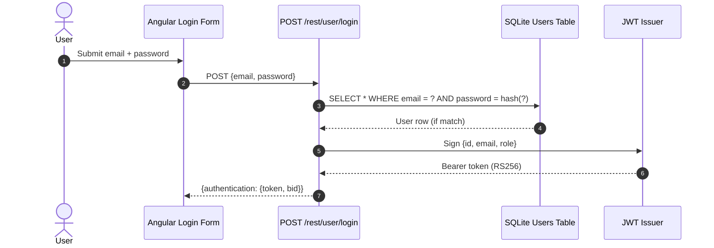

**Security assessment**

Two independent weaknesses sit on the login path:

- `routes/login.ts:34` interpolates `req.body.email` into a raw `models.sequelize.query()` call. The payload `' OR 1=1--` short-circuits the WHERE clause and returns the first user row, which is the seeded admin account - credential verification is bypassed without knowing any password.
- `lib/insecurity.ts:41` hashes passwords with unsalted MD5. Any credential dump obtained through the injection immediately yields plaintext via precomputed rainbow tables.

No account lockout or rate limiting protects the login endpoint (see 🟠 [F-038](#f-038) — No Rate Limiting on Login Endpoint — server.ts:596), so automated credential testing is unconstrained.

**Relevant findings**

- 🔴 [F-006](#f-006) — insecure JWT verification allows algorithm-confusion bypass, meaning even a correct password flow can be followed by forged session tokens.
- 🟠 [F-019](#f-019) — MD5 password hashing without salt enables offline credential recovery from any database dump.
- 🟠 [F-038](#f-038) — no rate limiting on the login endpoint leaves brute-force attacks unconstrained.

<a id="multi-factor-authentication"></a>
#### 7.2.3 Multi-Factor Authentication

**Status:** 🟡 Partial - TOTP is implemented and functions correctly for enrollment and verification, but secrets are stored in plaintext in an unencrypted database.

TOTP-based two-factor authentication is available to users as an opt-in second factor. Enrollment generates a TOTP secret, verification checks the time-based OTP at login, and the full flow is supported by the application's existing auth routes.

**Security assessment**

TOTP enrollment and verification logic is functional, but the TOTP secret is stored in the `totpSecret` field on the `users` table as plaintext (`models/user.ts:113`). The SQLite database file is not encrypted at rest. A file-system-level read of the database file - possible given the unauthenticated `/ftp` route and directory traversal findings - yields every user's TOTP seed directly, making the second factor recoverable without the device.

**Relevant findings**

- 🔴 [F-006](#f-006) — insecure JWT verification undermines any session issued after TOTP, since the signed token can be forged independently.
- 🟠 [F-019](#f-019) — weak password hashing compounds risk if the database is read.
- 🟠 [F-036](#f-036) — plaintext TOTP secrets in an unencrypted database remove the possession-factor protection the second factor is intended to provide.

<a id="user-registration"></a>
#### 7.2.4 User Registration

**Status:** 🔴 Unsafe - `POST /api/Users` accepts caller-controlled `role` and `isActive` fields, allowing any anonymous client to register as an admin.

`POST /api/Users` is the open registration endpoint. It creates a new user record in the `Users` table and accepts a JSON body containing profile fields. The Sequelize model definition at `models/user.ts:79` lists `role`, `deluxeToken`, `totpSecret`, and `isActive` as writable properties with no field filtering at the route level.

The diagram shows the registration path and the mass-assignment vector:

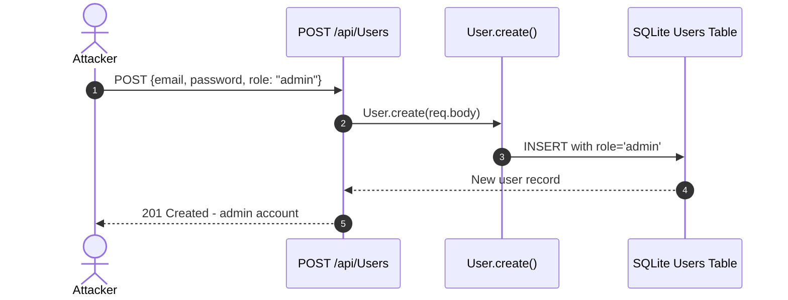

**Security assessment**

`routes/register.ts` passes `req.body` directly to `User.create()` without a field allowlist. Any value supplied in the POST body is written to the corresponding column. Submitting `{"role": "admin"}` at registration yields an admin-privileged account with no further steps; the `isActive` flag can also be set to bypass account verification flows.

The registration endpoint does not require any prior authentication, so exploitation is available to an unauthenticated internet attacker:

```ts
// models/user.ts — no field filtering before create()
return User.create(req.body)
```

**Relevant findings**

- 🔴 [F-001](#f-001) — mass assignment at registration allows privilege escalation to admin role without any prior access.
- 🟠 [F-015](#f-015) — `Socket.IO` CORS accepts any non-browser origin, removing the browser's same-origin guard for WebSocket connections established during or after registration.
- 🔴 [F-035](#f-035) — the WebSocket channel has no authentication gate, so a newly-registered account (or no account at all) can connect and receive notifications.
- 🟠 [F-042](#f-042) — no connection limit on the `Socket.IO` server allows registration-concurrent connection flooding.

<a id="password-reset"></a>
#### 7.2.5 Password Reset

**Status:** 🔴 Unsafe - the reset flow accepts a guessable security-question answer with no rate limiting, allowing offline enumeration of the answer space.

`POST /rest/user/reset-password` is a single-step challenge: the caller supplies an email address, the answer to that user's security question, and a new password. No emailed token or time-limited link is used. The security question and answer are stored in the `SecurityAnswers` table and looked up by `routes/resetPassword.ts`.

The diagram shows the single-step reset flow:

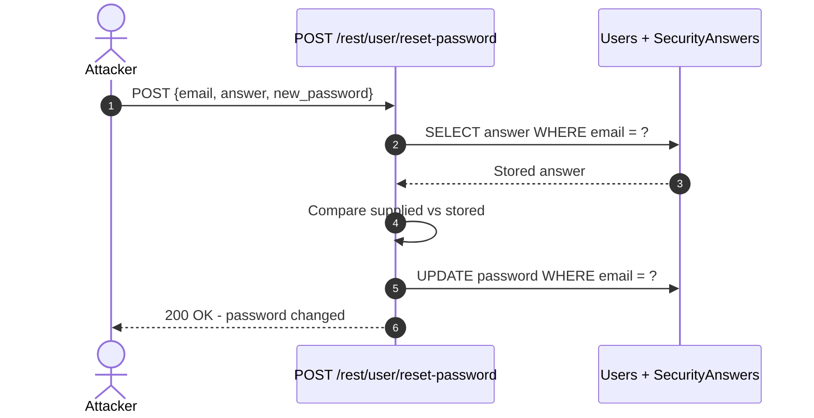

**Security assessment**

`routes/resetPassword.ts:35` compares the supplied answer in plain text with no rate limiting or lockout. Security questions offer a small answer space (pet names, mother's maiden name) that is feasibly enumerable with automated requests. There is no token-based verification that the requester controls the email address; any attacker who knows a target's email can attempt arbitrary answer guessing without constraint.

**Relevant findings**

- 🟠 [F-045](#f-045) — guessable security-question reset with no rate limit allows account takeover via answer enumeration for any user whose email is known.

<a id="social-login"></a><a id="social-login-oauth-oidc"></a>
#### 7.2.6 Social Login

**Status:** 🔴 Unsafe - the OAuth adapter reads an access token from the URL fragment and derives a local password deterministically from the user's email, making the credential computable by anyone who knows the email address.

The OAuth flow is implemented as a frontend adapter in `frontend/src/app/oauth/oauth.component.ts`, not as a server-side authorization-code flow. After the OAuth redirect, `oauth.component.ts:30` reads the access token from the URL fragment, calls Google's userinfo endpoint to obtain the email, derives a local password via a deterministic formula, creates a local user record if absent, and then calls `POST /rest/user/login` with that derived credential.

The diagram shows how the frontend OAuth adapter enters the local login flow:

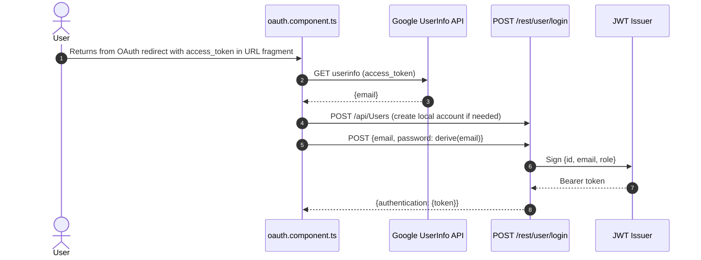

**Security assessment**

Two distinct weaknesses compound in this flow:

- The derived password is a deterministic function of the email address (`oauth.component.ts:30`). Any party who knows the target's email - which is public on many Google accounts - can compute the local password and call `POST /rest/user/login` directly, without going through OAuth at all.
- The access token is read from the URL fragment (`app.routing.ts:257`). Browser history, referrer headers, and server-side access logs record URL fragments in some configurations, leaking the access token to any observer.

**Relevant findings**

- 🔴 [F-004](#f-004) — deterministic password derivation from email means OAuth does not provide credential isolation from the local login path.
- 🟠 [F-027](#f-027) — access token in the URL fragment is visible to browser history and referrer headers.

### 7.3 Session and Token Controls

**Verdict:** 🔴 Missing

**Controls covered:**

- [7.3.1 Session Token Issuance](#session-token-issuance)
- [7.3.2 Token Storage](#token-storage)

**Implemented controls:** RS256-signed JWTs are issued by `lib/insecurity.ts` after successful authentication; `express-jwt` middleware is registered on protected routes.

**Assessment:** This application uses a single locally-signed JWT format for every authenticated session, regardless of which [§7.2](#72-identity-and-authentication-controls) flow established it. The sub-sections below trace one token through its lifecycle: signing on issuance, and storage in the browser. The signing key is hardcoded in source (see [§7.9.1 Secret and Key Management](#secret-and-key-management)), the verifier accepts algorithm-confusion attacks, and the token is stored in `localStorage` where it is readable by any script in the page's origin. Each of these three defects individually defeats the session boundary; together they leave no residual protection.

<a id="session-token-issuance"></a><a id="session-token-issuance-jwt-based"></a>
#### 7.3.1 Session Token Issuance

**Status:** 🔴 Missing - the issuance control exists but the RSA private key is hardcoded in source, meaning any repository reader can forge tokens without interacting with the server.

RS256-signed JWTs are issued by `lib/insecurity.ts:issueAuthToken()` after a successful credential or TOTP check. The function signs a `{id, email, role}` payload with a PEM-encoded RSA private key defined as a module-level constant at `lib/insecurity.ts:21` and sets a short expiry. Both the `routes/login.ts` and OAuth adapter paths call this single helper, so the token format and algorithm are uniform across the API.

The diagram shows the positive issuance path from a verified user record to the encoded JWT returned to the browser:

```mermaid
sequenceDiagram
    autonumber
    actor User
    participant API as Login Route
    participant Issuer as issueAuthToken()
    participant Key as RSA Private Key (lib/insecurity.ts:21)

    User->>API: Successful credential check
    API->>Issuer: Sign payload {id, email, role}
    Issuer->>Key: Load hardcoded PEM constant
    Key-->>Issuer: RSA private key bytes
    Issuer-->>API: Encoded JWT (RS256, short expiry)
    API-->>User: {authentication: {token, bid, email}}
```

**Security assessment**

The RSA private key is committed to the public repository as a string literal at `lib/insecurity.ts:21`. Any reader of the repository can copy the key material and call `jwt.sign({id: 1, email: "...", role: "admin"}, privateKey, {algorithm: "RS256"})` offline, producing a token the server will accept as a legitimate admin session. The verifier at `lib/insecurity.ts:189` additionally accepts `alg:none` from an older `express-jwt` version, providing a second independent bypass that does not even require the key.

The hardcoded key material that breaks the issuance boundary:

```ts
// lib/insecurity.ts:21
export const privateKey =
  '[PEM PRIVATE KEY — REDACTED]...'
```

**Relevant findings**

- 🟠 [F-002](#f-002) — JWT stored in `localStorage` means a stored-XSS attack can exfiltrate the session token.

<a id="token-storage"></a>
#### 7.3.2 Token Storage

**Status:** 🔴 Missing - the issued JWT is written to `localStorage` at `login.component.ts:101`, where it is accessible to any script in the page origin.

⚠ **Anti-pattern:** JWT in localStorage

`login.component.ts:101` writes the bearer token returned by the login API directly to `window.localStorage`. The Angular `TokenService` reads it back on subsequent requests and attaches it to the `Authorization` header. There is no `HttpOnly` cookie or Backend-for-Frontend in place to hold the token server-side.

**Security assessment**

`localStorage` is readable by any JavaScript executing in the same origin. A stored XSS payload - such as the one in `search-result.component.ts:110` - can extract the session token with a single `localStorage.getItem('token')` call and exfiltrate it to an attacker-controlled host. An `HttpOnly Secure SameSite=Strict` cookie would make the token inaccessible to JavaScript entirely. Moving token storage to a Backend-for-Frontend (BFF) session cookie would close this boundary regardless of XSS exploitability.

**Relevant findings**

- 🟠 [F-002](#f-002) — JWT in `localStorage` is directly readable by XSS payloads anywhere in the application's origin.

### 7.4 Authorization Controls

**Verdict:** 🔴 Missing

**Controls covered:**

- [7.4.1 Role-Based Access Control](#role-based-access-control)
- [7.4.2 Object-Level Authorization](#object-level-authorization)

**Implemented controls:** JWT claims include a `role` field; `security.isAuthorized()` middleware is registered on some admin routes; `LoginGuard` enforces token presence in the Angular router.

**Assessment:** Role-based enforcement exists at the middleware layer for some routes, but both the client-side guard and the server-side middleware have exploitable gaps. `LoginGuard` checks token presence without verifying structure or expiry, so a forged or expired token passes. Several high-privilege routes - including all `/rest/web3/*` endpoints and `/rest/admin/*` - are missing the `security.isAuthorized()` middleware entirely. Object-level authorization is absent across the application: no route compares the requested resource's owner against the authenticated user's identity.

<a id="role-based-access-control"></a>
#### 7.4.1 Role-Based Access Control

**Status:** 🟠 Weak - role enforcement is applied on some admin routes but bypassed by `LoginGuard`'s presence-only check and absent from `/rest/web3/*` and admin configuration routes.

The JWT payload carries a `role` claim set at issuance. `security.isAuthorized()` middleware reads this claim and gates access to routes registered under `/rest/admin/` in `server.ts`. The Angular router uses `LoginGuard` in `app.guard.ts` to gate client-side navigation to admin views.

**Security assessment**

Two independent gaps defeat the role control:

- `app.guard.ts:18` implements `LoginGuard` as a presence-only check: it verifies that a JWT exists in `localStorage` but does not validate the signature, algorithm, or expiry. A forged JWT with `role: "admin"` passes the guard and reaches the route.
- `server.ts:641` registers all `/rest/web3/*` routes without `security.isAuthorized()` middleware, and `server.ts:606` similarly exposes admin configuration endpoints without authorization. An authenticated user with any role can call these endpoints.

**Relevant findings**

- 🔴 [F-001](#f-001) — mass assignment at registration sets `role: "admin"` before any RBAC check runs.
- 🔴 [F-007](#f-007) — insecure direct object reference across multiple routes shows the RBAC boundary is not enforced at the data layer either.
- 🔴 [F-014](#f-014) — caller-controlled `author` field on product reviews bypasses ownership enforcement.

<a id="object-level-authorization"></a><a id="object-level-authorization-idor-prevention"></a>
#### 7.4.2 Object-Level Authorization

**Status:** 🔴 Missing - no route verifies that the authenticated user owns the resource being requested or modified; `req.body.UserId` and similar caller-controlled fields are trusted directly.

User-owned resources such as addresses, basket items, and product reviews are accessible via routes that accept a resource ID in the URL or request body. The intended control would compare the resource's owner column against `req.user.id` derived from the verified JWT claim.

**Security assessment**

`routes/address.ts:11` reads `req.body.UserId` and uses it as the ownership identifier without checking it against the session's authenticated user. Any authenticated user can supply another user's `UserId` to read, modify, or delete their records. The same pattern appears across basket, order, and delivery routes. No shared ownership-check middleware is registered; each route would need an individual fix.

**Relevant findings**

- 🔴 [F-001](#f-001) — mass assignment can set `UserId`-equivalent fields at object creation, bypassing the absent ownership check.
- 🔴 [F-007](#f-007) — IDOR on address routes allows cross-user data access via caller-controlled `UserId`.
- 🔴 [F-014](#f-014) — caller-controlled `author` field on review creation impersonates other users with no ownership verification.

### 7.5 Query Construction and Data Access Controls

**Verdict:** 🔴 Missing

**Controls covered:**

- [7.5.1 SQL Injection Prevention](#sql-injection-prevention)
- [7.5.2 NoSQL Injection Prevention](#nosql-injection-prevention)

**Implemented controls:** Sequelize ORM is available and used for most model operations; MarsDB backs document storage for product reviews and chat data.

**Assessment:** Sequelize is present and provides parameterized query support through its model methods, but the login and search routes bypass it entirely with raw `models.sequelize.query()` calls that interpolate user input directly. Four separate MarsDB routes pass caller-controlled values into `$where` JavaScript selectors, which execute arbitrary JS in the database engine. The ORM layer provides no protection when bypassed; the threat is not from a missing library but from deliberate bypass of the tool that is already in place.

<a id="sql-injection-prevention"></a>
#### 7.5.1 SQL Injection Prevention

**Status:** 🔴 Missing - the login and product search routes bypass Sequelize's parameterized API and interpolate user input directly into raw SQL strings.

Sequelize ORM backs the SQLite database for most entity operations. The model methods (`User.findOne()`, `Product.findAll()`) use bound parameters by default. Two routes diverge from this pattern and call `models.sequelize.query()` with template literals containing user-supplied values.

**Security assessment**

Two raw SQL injection points exist in the critical login and search paths:

- `routes/login.ts:34`: `req.body.email` is concatenated into the query string. The payload `' OR 1=1--` returns the seeded admin row and bypasses password verification.
- `routes/search.ts:23`: `req.query.q` is interpolated into a `LIKE` clause. A `UNION SELECT` payload exfiltrates any table visible to the SQLite session.

The login route injection is the entry point for the Critical SQL injection finding and is separately exploitable without any prior authentication:

```ts
// routes/login.ts:34
models.sequelize.query(`SELECT * FROM Users WHERE email = '${email}'...`)
```

**Relevant findings**

- 🔴 [F-005](#f-005) — SQL injection on the login route allows authentication bypass and admin access.
- 🔴 [F-008](#f-008) — UNION SQL injection in the product search route allows full database read.
- 🔴 [F-010](#f-010) — NoSQL `$where` injection in order tracking compounds the data-access exposure (cross-listed).

<a id="nosql-injection-prevention"></a>
#### 7.5.2 NoSQL Injection Prevention

**Status:** 🔴 Missing - four MarsDB routes pass user-controlled values into `$where` JavaScript expression selectors, enabling arbitrary JS evaluation within the database engine.

MarsDB (a MongoDB-compatible in-process document store) backs product reviews, chat data, and order tracking. Routes that query MarsDB pass request parameters into query selectors. The `$where` operator in MarsDB evaluates its value as a JavaScript expression, making any string interpolation into a `$where` a code execution path.

**Security assessment**

Four routes independently execute this pattern:

- `routes/trackOrder.ts:18` - order ID interpolated into `$where`
- `routes/chat.ts:149` - chat query parameter interpolated into `$where`
- `routes/showProductReviews.ts:36` - product ID interpolated into `$where`
- `routes/updateProductReviews.ts:18` - review update selector uses operator injection

The `$where` injection in `routes/showProductReviews.ts` additionally blocks the Node\.js event loop when the injected expression calls `sleep()`, creating a denial-of-service vector from an unauthenticated request.

**Relevant findings**

- 🔴 [F-005](#f-005) — SQL injection (cross-listed for completeness of the query-construction picture).
- 🔴 [F-008](#f-008) — UNION SQL injection in search (cross-listed).
- 🔴 [F-010](#f-010) — NoSQL `$where` injection across chat, order tracking, and review routes.

### 7.6 Input Boundary Validation Controls

**Verdict:** 🔴 Missing

**Controls covered:**

- [7.6.1 Validation Approach](#validation-approach)
- [7.6.2 XML External Entity (XXE) Prevention](#xml-external-entity-xxe-prevention)
- [7.6.3 File Upload Validation](#file-upload-validation)

**Implemented controls:** `multer` is configured for file uploads with a size limit; some routes perform ad-hoc type checks on request parameters.

**Assessment:** No centralized input validation schema is applied to request bodies or query parameters. Three categories of structural input-boundary failure are present: an XML parser with external-entity processing enabled, file upload and archive extraction with weak path containment, and a JavaScript sandbox (`notevil`) used for evaluating user-supplied expressions that is itself bypassable. The `multer` file-size limit is the only validated boundary in scope.

<a id="validation-approach"></a>
#### 7.6.1 Validation Approach

**Status:** 🟠 Weak - `multer` enforces a file size limit on uploads, but no schema validation or allowlist is applied to request bodies, query strings, or URL parameters across the API.

`multer` middleware is registered for file upload routes and enforces a maximum file size. Ad-hoc type checks appear in individual routes (e.g., checking that an order ID is numeric). No declarative schema validation library (such as `joi`, `zod`, or `express-validator`) is applied globally or per-route.

**Security assessment**

The absence of schema validation means that type coercion, unexpected fields, and malformed payloads reach business logic unchecked. The mass-assignment finding (🔴 [F-001](#f-001) — Mass Assignment Privileged Role Field Settable at — models/user.ts:79) is a direct consequence: no field allowlist rejects the `role` key from a registration body. The NoSQL operator injection findings (🔴 [F-010](#f-010) (NoSQL \$where Injection in Order Tracking)) also result from accepting object-shaped values where a scalar was expected. A centralized validation layer would reduce the attack surface for both injection and mass-assignment classes.

**Relevant findings**

- 🟠 [F-039](#f-039) — unbounded concurrent eval requests from unvalidated B2B order bodies saturate the event loop.
- 🟠 [F-040](#f-040) — missing rate limiting on login and search is compounded by the absence of input shape validation.
- 🟠 [F-041](#f-041) — blocking event-loop via `$where` sleep injection traces to the lack of input sanitization upstream of the MarsDB query.

<a id="xml-external-entity-xxe-prevention"></a>
#### 7.6.2 XML External Entity (XXE) Prevention

**Status:** 🔴 Missing - `libxmljs2` is configured with `noent: true` at `lib/xml.ts:35`, enabling full external-entity expansion including filesystem reads.

`lib/xml.ts` handles XML input submitted to the complaint and order import routes. It calls `libxmljs2.parseXmlString()` with the caller-supplied XML body. The parser library supports disabling external-entity resolution via the `noent` option.

**Security assessment**

`lib/xml.ts:35` passes `{noent: true}` to `libxmljs2.parseXmlString()`. This flag enables external-entity resolution, allowing an XXE payload to read files from the server's filesystem (e.g., `/etc/passwd`, application config files, the SQLite database file). Given the application runs as root in the default Docker configuration (🟡 [F-056](#f-056) — Runs as root — Dockerfile:1), the filesystem read is unrestricted by OS-level permission boundaries.

The parser invocation with the unsafe option:

```ts
// lib/xml.ts:35
libxmljs.parseXmlString(data, {noent: true, noblanks: true})
```

**Relevant findings**

- 🟠 [F-039](#f-039) — XXE feeds into the broader input-boundary failure (cross-listed via the validation-approach control).
- 🟠 [F-040](#f-040) — rate limiting absence means XXE requests are unconstrained in volume.
- 🟠 [F-041](#f-041) — blocking characteristics of sync XML parsing compound the DoS risk.

<a id="file-upload-validation"></a>
#### 7.6.3 File Upload Validation

**Status:** 🟠 Weak - `multer` enforces a file size limit, but archive extraction (`unzipper`) performs no path containment check, allowing zip-slip directory traversal.

File uploads are handled via `multer` middleware registered on the profile image and complaint attachment routes. `multer` is configured with a `limits.fileSize` constraint. Uploaded archives (ZIP files for complaint submissions) are extracted using `unzipper` without path sanitization.

**Security assessment**

The `multer` size limit prevents oversized file denial-of-service, but the control does not validate file content type or extension beyond the size gate. The archive extraction path uses `unzipper` and writes extracted entries to the filesystem using the archive-supplied path without stripping `../` sequences. An entry named `../../../../home/user/.ssh/authorized_keys` would be written to the corresponding path if the application has write permission there. Profile image URL upload additionally accepts arbitrary URLs and fetches them server-side (see [§7.10.1 SSRF Prevention](#ssrf-prevention)).

**Relevant findings**

- 🟠 [F-039](#f-039) — unbounded eval requests via B2B orders share the file/upload processing boundary.
- 🟠 [F-040](#f-040) — missing rate limiting compounds file-upload-based denial-of-service.
- 🟠 [F-041](#f-041) — blocking event-loop exposure is adjacent to the synchronous file-processing pattern.

### 7.7 Output Encoding and Rendering Controls

**Verdict:** 🟠 Weak

**Controls covered:**

- [7.7.1 HTML Output Encoding / XSS Prevention](#html-output-encoding-xss-prevention)

**Implemented controls:** Angular's default template escaping protects most rendering contexts; `DomSanitizer` is available in the framework.

**Assessment:** Angular's template engine escapes interpolated values by default, which protects the majority of rendered output. The weak posture stems from two explicit bypass calls in `search-result.component.ts` that invoke `bypassSecurityTrustHtml()` to render product descriptions and search query parameters as raw HTML. These bypasses are the only two XSS findings in scope; the rest of the Angular template layer is sound.

<a id="html-output-encoding-xss-prevention"></a>
#### 7.7.1 HTML Output Encoding / XSS Prevention

**Status:** 🟠 Weak - Angular template escaping holds for the majority of views, but two `bypassSecurityTrustHtml()` calls in the search result component introduce stored and DOM-based XSS.

Angular's template engine escapes `{{ }}` interpolation and `[innerText]` bindings by default. `DomSanitizer.sanitize()` is the supported mechanism for rendering HTML that must contain markup. The framework emits a compile-time warning when `bypassSecurityTrustHtml()` is used.

**Security assessment**

`search-result.component.ts:110` calls `bypassSecurityTrustHtml()` to render product descriptions stored in the database. A stored XSS payload in a product's description field executes in every user's browser when they view the search results page. `search-result.component.ts:143` applies the same bypass to the raw search query string from the URL, enabling a reflected DOM-based XSS via a crafted URL shared with a victim. Both bypasses defeat Angular's default output encoding entirely for those two rendering slots.

**Relevant findings**

- 🔴 [F-017](#f-017) — stored XSS via `bypassSecurityTrustHtml()` on product descriptions executes arbitrary script for every user viewing search results.
- 🔴 [F-018](#f-018) — DOM-based XSS via `bypassSecurityTrustHtml()` on the URL query parameter enables phishing and session token theft via crafted links.

### 7.8 Browser and Cross-Origin Controls

**Verdict:** 🔴 Missing

**Controls covered:**

- [7.8.1 Content Security Policy (CSP)](#content-security-policy-csp)
- [7.8.2 CORS Policy](#cors-policy)

**Implemented controls:** `helmet` is loaded in `server.ts` and provides `noSniff`, `frameguard` (X-Frame-Options: SAMEORIGIN), and `hsts` headers by default.

**Assessment:** Helmet's default middleware set provides a baseline of browser security headers: `X-Content-Type-Options: nosniff`, `X-Frame-Options: SAMEORIGIN`, and HSTS when TLS is configured. However, no `Content-Security-Policy` is defined, leaving XSS payloads unconstrained once they execute. The CORS configuration accepts `*` for the `Socket.IO` server, and no CSRF protection is implemented for state-changing API endpoints. The two positive controls from Helmet are meaningful but insufficient without a CSP that would limit the reach of the existing XSS findings.

<a id="content-security-policy-csp"></a>
#### 7.8.1 Content Security Policy (CSP)

**Status:** 🔴 Missing - no `Content-Security-Policy` header is set; any XSS payload that executes faces no browser-enforced script-source restriction.

`helmet` is loaded in `server.ts` but its optional `contentSecurityPolicy` middleware is not enabled. Without a CSP, the stored XSS payloads exploitable via 🔴 [F-017](#f-017) — Stored XSS — search-result.component.ts:110 and the DOM-based XSS via 🔴 [F-018](#f-018) — DOM-Based XSS — search-result.component.ts:143 can exfiltrate data to any external origin without browser restriction. The absence of a `frame-ancestors` directive also permits clickjacking despite the `X-Frame-Options: SAMEORIGIN` set by Helmet's `frameguard`.

**Security assessment**

No `Content-Security-Policy` header is emitted on any response. The absence is confirmed by the lack of a `helmet.contentSecurityPolicy()` call in `server.ts` and the absence of a CSP meta tag in `frontend/src/index.html`. This is a missing control, not a misconfigured one; the fix is additive.

**Relevant findings**

- 🔴 [F-017](#f-017) — Stored XSS — search-result.component.ts:110: a CSP `script-src` directive would prevent inline execution of injected payloads.
- 🔴 [F-018](#f-018) — DOM-Based XSS — search-result.component.ts:143: a `script-src` and `connect-src` policy would limit exfiltration targets.

<a id="cors-policy"></a>
#### 7.8.2 CORS Policy

**Status:** 🔴 Missing - the `Socket.IO` server accepts connections from any non-browser client regardless of `Origin`; the REST API has no explicit CORS policy hardening.

The CORS check on the `Socket.IO` connection is applied via the `Origin` header, which is only sent by browsers. Non-browser clients (e.g. `python-socketio`, curl) omit the header entirely, bypassing the check and obtaining an unauthenticated persistent channel. The REST API does not set explicit `Access-Control-Allow-Origin` response headers, relying on the browser's default same-origin behaviour rather than a server-enforced allowlist.

**Security assessment**

`lib/startup/registerWebsocketEvents.ts:20` configures `Socket.IO` CORS with `origin: 'http://localhost:4200'`, which is a browser-only check. Server-side authentication middleware on the `Socket.IO` handshake is absent. The REST layer lacks an `express-cors` or equivalent configuration that would restrict cross-origin reads to a known allowlist of frontend origins.

**Relevant findings**

- 🟠 [F-015](#f-015) — Socket\.IO CORS Allows Any Non-Browser Client to Connect: the CORS origin check is bypassed by clients that omit the `Origin` header.

### 7.9 Cryptography Secrets and Data Protection

**Verdict:** 🔴 Missing

**Controls covered:**

- [7.9.1 Secret and Key Management](#secret-and-key-management)
- [7.9.2 Password Hashing](#password-hashing)

**Implemented controls:** RS256 algorithm is chosen for JWT signing (stronger than HS256); bcrypt is available in `package.json` dependencies.

**Assessment:** The RS256 algorithm choice is a positive design decision, but the private key is hardcoded in source alongside several other sensitive constants. No runtime secret injection via environment variables or a secret store is implemented. Password hashing uses unsalted MD5 despite bcrypt being an available dependency. TOTP secrets and hardcoded credentials are stored in plaintext. The gap between available tooling (bcrypt, environment injection) and actual usage is the root cause of the cryptography posture.

<a id="secret-and-key-management"></a><a id="secret-management"></a>
#### 7.9.1 Secret and Key Management

**Status:** 🔴 Missing - the RSA private key, HMAC key, and testing credentials are defined as string literals in `lib/insecurity.ts`, committed to the public repository.

`lib/insecurity.ts` serves as a central secrets module: it exports the RSA private key, the HMAC key used for `deluxeToken` generation, and hardcoded testing credentials. These values are module-level constants loaded from the source file, not from environment variables or a secret store.

**Security assessment**

Three distinct secrets are committed to the public repository:

- RSA private key at `lib/insecurity.ts:21` - allows offline JWT forgery for any user or role.
- HMAC key at `lib/insecurity.ts:42` - allows forgery of `deluxeToken` values granting premium access.
- Testing credentials at `login.component.ts:28` - hard-coded admin and user passwords ship in the production frontend bundle.

Any repository clone or GitHub search yields all three immediately. Runtime injection via `process.env.JWT_PRIVATE_KEY` would limit exposure to the deployment environment; the current approach makes every historical repository clone a credential disclosure.

**Relevant findings**

- 🔴 [F-011](#f-011) — hardcoded RSA private key enables offline JWT forgery for any uid/role combination.
- 🔴 [F-028](#f-028) — hardcoded testing credentials in the frontend bundle expose known admin credentials.
- 🟠 [F-036](#f-036) — plaintext TOTP secrets in the unencrypted database are co-located with the insecure key material.

<a id="password-hashing"></a>
#### 7.9.2 Password Hashing

**Status:** 🔴 Missing - passwords are hashed with unsalted MD5 at `lib/insecurity.ts:41`; no work factor or salt is applied, making every stored hash recoverable via precomputed tables.

User passwords are hashed before storage in the `Users` table. The hash is computed at registration and compared at login. `bcrypt` is listed as a dependency in `package.json`, meaning the correct algorithm is available but unused.

**Security assessment**

`lib/insecurity.ts:41` computes `crypto.createHash('md5').update(password).digest('hex')` without a salt. MD5 is a fast, unsalted hash: a precomputed rainbow table covers the entire common-password space, and a single-core GPU can brute-force any MD5 hash in seconds. A database dump obtained via the SQL injection finding (🔴 [F-005](#f-005) — SQL Injection Login Bypass — routes/login.ts:34) immediately yields plaintext passwords for every user. Migrating to `bcrypt` with a cost factor of 12 or higher would require an attacker to spend seconds per candidate rather than microseconds.

**Relevant findings**

- 🔴 [F-011](#f-011) — hardcoded private key and the weak hash compound each other: a dump plus the key allows full account and session takeover.
- 🔴 [F-028](#f-028) — hardcoded credentials bypass password hashing entirely for the known test accounts.
- 🟠 [F-036](#f-036) — plaintext TOTP secrets in the same unencrypted database file compound the value of a credential dump.

### 7.10 File Parser and Outbound Request Controls

**Verdict:** 🔴 Missing

**Controls covered:**

- [7.10.1 SSRF Prevention](#ssrf-prevention)
- [7.10.2 Open Redirect Prevention](#open-redirect-prevention)

**Implemented controls:** An allowlist of permitted redirect targets is defined in `lib/insecurity.ts`; the profile image upload route accepts a URL parameter for server-side fetching.

**Assessment:** Two outbound-request controls are present in skeleton form but both are bypassable. The redirect allowlist uses substring matching, which is insufficient to prevent bypass via crafted hostnames. The profile image URL upload performs an unconstrained server-side fetch with no target validation, enabling SSRF to internal hosts. Additionally, the `/ftp` directory and `/encryptionkeys` route serve files without authentication, exposing sensitive artifacts directly.

<a id="ssrf-prevention"></a>
#### 7.10.1 SSRF Prevention

**Status:** 🔴 Missing - `routes/profileImageUrlUpload.ts:24` fetches a caller-supplied URL server-side with no allowlist, DNS rebinding protection, or internal-network block.

`POST /rest/user/image-upload` accepts a JSON body with a `url` field. `routes/profileImageUrlUpload.ts:24` performs an HTTP GET to the supplied URL and saves the response body as the user's profile image. No validation of the target host is performed before the fetch.

**Security assessment**

An authenticated user can supply `http://169.254.169.254/latest/meta-data/` (AWS instance metadata) or `http://localhost:9090/metrics` as the URL. The server fetches the target and returns a success response; the response body is saved to disk and may be retrievable via the profile image endpoint. Any service reachable from the server's network interface - including administrative APIs, internal databases, and cloud metadata endpoints - is within reach. No allowlist of permitted schemes or host ranges is applied.

**Relevant findings**

- 🔴 [F-009](#f-009) — XXE filesystem read and SSRF share the outbound-request exposure surface (cross-listed).
- 🔴 [F-012](#f-012) — JavaScript sandbox escape in `routes/b2bOrder.ts` provides a code-execution-level SSRF alternative.
- 🟠 [F-033](#f-033) — unauthenticated `/ftp` file serving is an adjacent information-disclosure finding in the file/parser category.

<a id="open-redirect-prevention"></a>
#### 7.10.2 Open Redirect Prevention

**Status:** 🔴 Missing - the redirect allowlist in `lib/insecurity.ts:136` uses `String.includes()` substring matching, allowing bypass via a URL where the allowed domain appears as a subdomain or path component of an attacker-controlled host.

`lib/insecurity.ts:136` implements a `isRedirectAllowed()` helper that checks whether a supplied redirect target is on an allowlist. It uses `allowedRedirectDomains.some(domain => url.includes(domain))` to validate the destination.

**Security assessment**

The substring check passes for URLs like `https://attacker.com/page?ref=juice-sh.op` because the allowed domain (`juice-sh.op`) appears in the query string. An attacker can craft a redirect that passes the check but lands the user on an attacker-controlled page, enabling phishing campaigns using the application's trusted domain. The fix is an exact origin comparison (`new URL(target).origin === allowedOrigin`) rather than a substring search.

**Relevant findings**

- 🔴 [F-009](#f-009) — XXE and outbound-request controls share the same unvalidated outbound boundary.
- 🔴 [F-012](#f-012) — sandbox escape provides an alternative code-path to arbitrary outbound requests.
- 🟠 [F-033](#f-033) — unauthenticated file serving exposes sensitive content without a redirect or access control gate.

### 7.11 Operations Runtime and Supply Chain Controls

**Verdict:** 🔴 Missing

**Controls covered:**

- [7.11.1 Dependency Pinning and Integrity](#dependency-pinning-and-integrity)
- [7.11.2 CI/CD Pipeline Hardening](#cicd-pipeline-hardening)
- [7.11.3 Logging and Audit Trail](#logging-and-audit-trail)
- [7.11.4 Automated SCA scanning](#automated-sca-scanning)
- [7.11.5 Automated dependency updates](#automated-dependency-updates)
- [7.11.6 Lockfile hygiene](#lockfile-hygiene)

**Implemented controls:** GitHub Actions CI workflows are present; `npm audit` is available; Dependabot is partially configured for Docker ecosystem coverage.

**Assessment:** The supply chain posture has one adequate control (automated SCA scanning via `npm audit` in CI) and five gaps ranging from weak to missing. GitHub Actions workflow permissions default to `write-all` across 13 workflows. Third-party Actions are referenced by mutable branch tags rather than pinned commit SHAs. The `npm install --package-lock=false` flag in CI discards lockfile integrity. No Dependabot coverage exists for the npm ecosystem. Structured security event logging is absent despite `morgan` being present for HTTP access logging.

<a id="dependency-pinning-and-integrity"></a>
#### 7.11.1 Dependency Pinning and Integrity

**Status:** 🟠 Weak - `package-lock.json` exists, but CI runs with `--package-lock=false`, negating lockfile-based dependency integrity at build time.

`package-lock.json` records exact dependency versions and integrity hashes for reproducible installs. GitHub Actions workflows use `npm install` for dependency installation during CI builds.

**Security assessment**

`ci.yml:51` passes `--package-lock=false` (or equivalent `--no-package-lock`) to `npm install`, which instructs npm to ignore the lockfile and resolve the latest matching semver version at install time. This means the CI build environment may install a different dependency tree than the one tested locally, and a compromised package that matches the semver range would be pulled silently. Third-party GitHub Actions at `image_actions.yml:33` are referenced by mutable branch tags (e.g., `uses: actions/checkout@v3`), so a tag reassignment could substitute a malicious action without any diff in the repository.

**Relevant findings**

- 🟡 [F-003](#f-003) — missing security audit logging means supply-chain compromise would not generate a detectable event.
- 🟠 [F-021](#f-021) — mutable action references allow tag-level code substitution in CI.
- 🟠 [F-029](#f-029) — stack trace disclosure is adjacent to the runtime-environment exposure the supply chain controls are meant to protect.

<a id="cicd-pipeline-hardening"></a>
#### 7.11.2 CI/CD Pipeline Hardening

**Status:** 🔴 Missing - GitHub Actions workflows default to `write-all` permissions; no workflow-level permission blocks, concurrency limits, or timeouts are configured.

GitHub Actions CI is the primary build and test automation platform. Workflows are defined under `.github/workflows/`. The CI pipeline runs on every push and pull request, including from external contributors via fork PRs.

**Security assessment**

Three independent hardening gaps exist in the CI pipeline:

- `ci.yml:1` and all 13 workflow files omit a top-level `permissions:` block, so the `GITHUB_TOKEN` defaults to `write-all` scope. A compromised workflow step has write access to the repository, packages, and deployments.
- `image_actions.yml:33` and other workflows reference third-party Actions by mutable version tags. Pinning to immutable commit SHAs would ensure the action code cannot be substituted after the ref is resolved.
- `ci.yml:358` uses a curl-pipe-shell pattern for the Heroku CLI installer. Any MITM or CDN compromise during the CI run would execute arbitrary code in the build environment.

**Relevant findings**

- 🟡 [F-003](#f-003) — missing audit logging means CI pipeline compromise would not be logged.
- 🟠 [F-021](#f-021) — mutable Action references are the highest-likelihood supply-chain attack vector in the current pipeline.
- 🟠 [F-029](#f-029) — stack trace disclosure in the runtime environment is correlated with insufficient CI hardening.

<a id="logging-and-audit-trail"></a>
#### 7.11.3 Logging and Audit Trail

**Status:** 🟡 Partial - `morgan` HTTP access logging is configured, but no structured security event log records authentication outcomes, authorization decisions, or privilege changes.

`morgan` middleware is registered in `server.ts:338` and logs all HTTP requests to stdout in a standard access-log format. The log captures method, URL, status code, and response time. `winston` is available as a dependency.

**Security assessment**

HTTP access logging via `morgan` provides visibility into request volume and error rates, but does not capture security-relevant events with actor identity. Successful and failed logins, password resets, admin-route access, and privilege changes generate no dedicated audit record. An attacker who succeeds via SQL injection login bypass, IDOR, or JWT forgery leaves no evidence in the current log stream beyond an HTTP 200 status line. The structured logging infrastructure (`winston`) is available but unused for security events.

**Relevant findings**

- 🟡 [F-003](#f-003) — missing security audit logging leaves authentication bypass, IDOR, and JWT forgery invisible in the log stream.
- 🟠 [F-021](#f-021) — CI pipeline activity is also unaudited beyond GitHub's native audit log.
- 🟠 [F-029](#f-029) — stack trace disclosure in error responses leaks internal detail that a structured error logger would safely swallow.

<a id="automated-sca-scanning"></a>
#### 7.11.4 Automated SCA scanning

**Status:** 🟢 Adequate - `npm audit` runs in CI on every build and surfaces known-CVE dependency vulnerabilities.

`npm audit` is executed as part of the CI workflow and exits non-zero on high-severity advisories. The `package.json` and `package-lock.json` are present, enabling audit resolution against the npm advisory database.

**Security assessment**

`npm audit` integration in CI provides a continuous CVE check on the direct and transitive dependency graph. The control is functioning and would surface newly-published advisories affecting pinned versions. The remaining gap is that `--package-lock=false` in `ci.yml:51` means the installed tree may differ from what `npm audit` analyses - the audit runs on the resolved tree, which may not match the lockfile. This is a partial integrity gap rather than an absent control.

**Relevant findings**

- 🟡 [F-003](#f-003) — audit trail gap means SCA findings that are suppressed or ignored in CI leave no record.
- 🟠 [F-021](#f-021) — mutable Action references are not covered by `npm audit` (GitHub Actions supply chain is a separate surface).
- 🟠 [F-029](#f-029) — stack trace disclosure is unrelated to SCA but is in scope for the same CI runtime.

<a id="automated-dependency-updates"></a>
#### 7.11.5 Automated dependency updates

**Status:** 🔴 Missing - Dependabot is configured for the Docker ecosystem only; the npm ecosystem (the primary dependency surface) has no automated update PRs.

`.github/dependabot.yml` is present in the repository. It configures Dependabot to check for Docker base image updates. No `npm` ecosystem entry is defined.

**Security assessment**

Without an `npm` ecosystem entry in `dependabot.yml`, npm dependency updates are not proposed automatically. Security advisories that require a dependency version bump - common for `express`, `lodash`, and other high-CVE-frequency packages - will not generate a Dependabot PR. The team must discover and act on these manually. Adding `package-ecosystem: "npm"` with a weekly schedule and the repository's base branch would bring npm into the same automated update flow as Docker.

**Relevant findings**

- 🟡 [F-003](#f-003) — missing audit log means there is no record of when a known-vulnerable dependency version was in use.
- 🟠 [F-021](#f-021) — mutable Action versions compound the dependency-management gap at the CI layer.
- 🟠 [F-029](#f-029) — runtime information disclosure is an adjacent operational-posture finding.

<a id="lockfile-hygiene"></a>
#### 7.11.6 Lockfile hygiene

**Status:** 🔴 Missing - `ci.yml` installs npm dependencies with `--package-lock=false`, discarding lockfile integrity guarantees at build time.

`package-lock.json` is committed to the repository and records the exact dependency tree with integrity hashes for every installed package. This file is the primary integrity control for npm installs.

**Security assessment**

`ci.yml:51` passes `--package-lock=false` (or `--no-package-lock`) to the npm install step. npm then resolves packages from the registry according to semver ranges in `package.json`, ignoring the lockfile entirely. The installed tree at CI time may differ from the lockfile and from local developer installs. A dependency that publishes a patch release containing malicious code within the allowed semver range would be pulled into CI builds silently, with no diff in the repository to detect the change. Removing the flag and committing all lockfile changes through PR review restores the integrity guarantee.

**Relevant findings**

- 🟡 [F-003](#f-003) — no audit log captures which dependency versions were actually installed in a given build.
- 🟠 [F-021](#f-021) — mutable Action references and unlocked npm dependencies represent the same structural gap at two layers of the supply chain.
- 🟠 [F-029](#f-029) — stack trace disclosure from the runtime environment is adjacent to the build-time integrity gap.

### 7.12 Real-time and Not Applicable Controls

<!-- §7.12 LOCKED — mechanically derived from absence of real-time findings. Renderer must not rewrite the line below. -->
_Not applicable - no real-time / WebSocket findings routed to this category, and no AI/LLM, GraphQL, or gRPC surfaces detected by the recon scan. Controls catalogued elsewhere (container hardening, dependency determinism) are covered in their primary [§7](#7-security-architecture) sections._

### 7.13 Defense-in-Depth Summary

**Verdict:** 🔴 Unsafe

The strongest individual positive control in this codebase is the RS256 algorithm choice for JWT signing - asymmetric cryptography is the correct architectural decision for a multi-service session token. `helmet` provides a baseline of browser security headers (`X-Content-Type-Options`, `X-Frame-Options: SAMEORIGIN`, HSTS), and `morgan` captures HTTP access volume. `npm audit` runs in CI on every build and would surface newly-published CVEs. Angular's default template escaping protects the large majority of rendered views; only the two explicit `bypassSecurityTrustHtml()` calls break the encoding boundary.

The residual architecture risk is concentrated in three overlapping failure modes that each independently defeat the session boundary. First, the RSA private key that backs the RS256 choice is committed to source, negating the algorithm's trust model entirely. Second, the session token is stored in `localStorage` rather than an `HttpOnly` cookie, making it readable by any XSS payload - and two XSS payloads exist in `search-result.component.ts`. Third, the login query bypasses the Sequelize ORM and interpolates user input into raw SQL, so the credential check that should gate token issuance is trivially bypassed. Repairing these three boundaries - runtime-injected secrets, `HttpOnly` cookie token storage, and parameterized queries - would restore layered defense across the authentication, session, and data-access tiers simultaneously.

<!-- enriched:standard -->

---

## 8. Findings Register

Findings are grouped by severity (Critical → High → Medium → Low); within a tier they are ordered by attack vektor (Repo-Read → Internet-Anon → Internet-User → Victim-Required). Each finding is a card with the same fixed fields, in order: **Severity · Component · Location** → **Issue** → **Root cause** → **Evidence** → **Fix** → **Classification** (with external CWE / OWASP links).

**Risk Distribution:** 🔴 Critical: 10 · 🟠 High: 40 · 🟡 Medium: 10 · 🟢 Low: 2 · **Total findings: 62**
**STRIDE Coverage:** Spoofing: 9 · Tampering: 15 · Repudiation: 2 · Information Disclosure: 18 · Denial of Service: 8 · Elevation of Privilege: 10

**Findings index:**<br/>🔴 [F-001](#f-001) — Mass Assignment Privileged Role Field Settable at (models/user.ts:79)<br/>🟠 [F-002](#f-002) — JWT Stored in localStorage XSS Token Exfiltration…<br/>🟡 [F-003](#f-003) — Missing Security Audit Logging cross-component (server.ts:338)<br/>🔴 [F-004](#f-004) — OAuth Implicit Flow with Derived Password (oauth.component.ts:30)<br/>🔴 [F-005](#f-005) — SQL Injection Login Bypass (routes/login.ts:34)<br/>🔴 [F-006](#f-006) — Insecure JWT Verification (lib/insecurity.ts:189)<br/>🔴 [F-007](#f-007) — Insecure Direct Object Reference (routes/address.ts:11)<br/>🔴 [F-008](#f-008) — UNION SQL Injection in Product Search Query (routes/search.ts:23)<br/>🔴 [F-009](#f-009) — XXE with Full Entity Expansion and Filesystem Access (lib/xml.ts:35)<br/>🔴 [F-010](#f-010) — NoSQL \$where Injection in Order Tracking (routes/trackOrder.ts:18)<br/>🔴 [F-011](#f-011) — Hardcoded RSA Private Key in Source (lib/insecurity.ts:21)<br/>🔴 [F-012](#f-012) — JavaScript Sandbox Escape (routes/b2bOrder.ts:23)<br/>🟠 [F-013](#f-013) — LoginGuard Presence-Only Token Check (app.guard.ts:18)<br/>🟠 [F-014](#f-014) — Caller-Controlled author Field Enables…<br/>🟠 [F-015](#f-015) — Socket\.IO CORS Allows Any Non-Browser Client to…<br/>🟠 [F-016](#f-016) — Unauthenticated Wallet Address Claim (routes/nftMint.ts:41)<br/>🟠 [F-017](#f-017) — Stored XSS (search-result.component.ts:110)<br/>🟠 [F-018](#f-018) — DOM-Based XSS (search-result.component.ts:143)<br/>🟠 [F-019](#f-019) — Weak Password Hashing MD5 Without Salt (lib/insecurity.ts:41)<br/>🟠 [F-020](#f-020) — Untrusted npm Install/Postinstall Scripts Enabled (ci.yml:51)<br/>🟠 [F-021](#f-021) — Mutable Action References Allow Malicious Code Injection…<br/>🟠 [F-022](#f-022) — NoSQL Injection (routes/chat.ts:149)<br/>🟠 [F-023](#f-023) — NoSQL \$where JavaScript Injection (routes/showProductReviews.ts:36)<br/>🟠 [F-024](#f-024) — NoSQL Mass-Update (routes/updateProductReviews.ts:18)<br/>🟠 [F-025](#f-025) — Tautological Underflow Guard in BeeFaucet withdraw<br/>🟠 [F-026](#f-026) — Reentrancy in ETHWalletBank withdraw<br/>🟠 [F-027](#f-027) — OAuth Access Token Exposed in URL Fragment (app.routing.ts:257)<br/>🟠 [F-028](#f-028) — Hardcoded Testing Credentials in Production Frontend…<br/>🟠 [F-029](#f-029) — Stack Trace Disclosure (server.ts:682)<br/>🟠 [F-030](#f-030) — GitHub Actions workflow missing permissions block (ci.yml:1)<br/>🟠 [F-031](#f-031) — Third-party GitHub Action not pinned to commit SHA (ci.yml:188)<br/>🟠 [F-032](#f-032) — Docker base image not digest-pinned — Dockerfile:1<br/>🟠 [F-033](#f-033) — Directory Listing and Unauthenticated File Serving on /ftp and…<br/>🟠 [F-034](#f-034) — SSRF (routes/profileImageUrlUpload.ts:24)<br/>🟠 [F-035](#f-035) — Unauthenticated WebSocket Channel (registerWebsocketEvents.ts:29)<br/>🟠 [F-036](#f-036) — Plaintext TOTP Secrets and Unencrypted Database at Rest…<br/>🟠 [F-037](#f-037) — Hardcoded BIP-39 Mnemonic and Private Key Derivation…<br/>🟠 [F-038](#f-038) — No Rate Limiting on Login Endpoint (server.ts:596)<br/>🟠 [F-039](#f-039) — Unbounded Concurrent Eval Requests Saturate Event Loop…<br/>🟠 [F-040](#f-040) — Missing Rate Limiting on Login and Search Endpoints (server.ts:343)<br/>🟠 [F-041](#f-041) — Blocking Event-Loop (routes/showProductReviews.ts:17)<br/>🟠 [F-042](#f-042) — No Connection Limit or Rate Limiting on (registerWebsocketEvents.ts:20)<br/>🟠 [F-043](#f-043) — Unbounded Raw SQL Query Blocks Event Loop (routes/search.ts:23)<br/>🟠 [F-044](#f-044) — Client-Side Role Guard Bypassed (app.guard.ts:52)<br/>🟠 [F-045](#f-045) — Guessable Security Question Reset Without Rate…<br/>🟠 [F-046](#f-046) — Over-Privileged Default GITHUB_TOKEN Across 13 Workflows Without…<br/>🟠 [F-047](#f-047) — Admin Configuration Endpoints Accessible Without Authentication…<br/>🟠 [F-048](#f-048) — LLM Prompt Injection (routes/chat.ts:191)<br/>🟠 [F-049](#f-049) — Hardcoded HMAC Key Enables Forgery of deluxeToken for…<br/>🟠 [F-050](#f-050) — No Authentication on All /rest/web3/* Endpoints (server.ts:641)<br/>🟠 [F-051](#f-051) — Window.ethereum Provider Hijacking (wallet-web3.component.ts:21)<br/>🟡 [F-052](#f-052) — Script Injection (ci.yml:358)<br/>🟡 [F-053](#f-053) — Open Redirect (lib/insecurity.ts:136)<br/>🟡 [F-054](#f-054) — Unpinned Docker Base Image Allows Silent Build-Time Substitution…<br/>🟡 [F-055](#f-055) — No Build Provenance Attestation or SBOM Signing for Published…<br/>🟡 [F-056](#f-056) — Runs as root — Dockerfile:1<br/>🟡 [F-057](#f-057) — No container image signing in CI pipeline (ci.yml:1)<br/>🟡 [F-058](#f-058) — Dependabot Ecosystem Coverage Incomplete (.github/dependabot.yml)<br/>🟡 [F-059](#f-059) — No Concurrency Limits or Workflow-Level Timeouts Enable Runner…<br/>🟡 [F-060](#f-060) — Unbounded In-Memory Set Growth (routes/web3Wallet.ts:16)<br/>🟢 [F-061](#f-061) — Missing HEALTHCHECK instruction — Dockerfile:1<br/>🟢 [F-062](#f-062) — Ethereum Key Hint (routes/checkKeys.ts:21)

<a id="th-01"></a><a id="th-02"></a><a id="th-03"></a><a id="th-05"></a><a id="th-06"></a><a id="th-10"></a><a id="th-04"></a><a id="th-08"></a><a id="th-09"></a><a id="th-11"></a><a id="th-12"></a><a id="th-13"></a><a id="th-14"></a><a id="th-17"></a><a id="th-16"></a>

### 🔴 Critical (10)

<a id="t-011"></a><a id="f-011"></a>
#### F-011 · Hardcoded Cryptographic Key

**Severity:** 🔴 Critical - secret committed to the public source repo - extractable on clone, no prior access needed  ·  **Component:** [C-07](#c-07) - Authentication & Session Surface  ·  **Location:** `lib/insecurity.ts:21`

**Issue:** A 1024-bit RSA private key is embedded as a string literal. This key is used by `security.authorize()` to sign all JWTs issued by the application.

Any developer, CI system, or third party with read access to the repository obtains the signing key and can produce arbitrary JWTs with any claims (including role:'admin', email of any user). The key is also 1024 bits, which is below the NIST SP 800-131A Rev 2 minimum of 2048 bits and is computationally feasible to factor.

Any party with repo access can sign admin-role JWTs; the authentication system offers no cryptographic guarantee of identity.

**Root cause:** Authentication can be circumvented or forged because credentials, signing keys, or password hashes are weak, missing, or exposed.

**Evidence:** ✓ verified - Full RSA PKCS#1 private key embedded as a string literal at lib/insecurity.ts:21, used for all JWT signing via security.authorize().

**Fix:** Move the cryptographic key out of source control into a managed secret store and rotate it → ❶ [M-014](#m-014) — Move cryptographic keys to a managed secret store

**Classification:** Cryptographic Failures · [CWE-321](https://cwe.mitre.org/data/definitions/321.html) · [OWASP A02:2021](https://owasp.org/Top10/A02_2021/)

<a id="t-004"></a><a id="f-004"></a>
#### F-004 · OAuth Implicit Flow Derived Password

**Severity:** 🔴 Critical  ·  **Component:** [C-01](#c-01) - Angular SPA Frontend  ·  **Location:** `frontend/src/app/oauth/oauth.component.ts:30`

**Issue:** The OAuth callback flow in `oauth.component.ts` uses the OAuth 2.0 implicit flow: `app.routing.ts:286` matches `#access_token=` in the URL fragment, routing to `OAuthComponent`. The access_token arrives in the browser URL fragment with no PKCE, no `state` parameter validation, and no `nonce`.

Additionally, at line 30, a deterministic password is computed as `btoa(profile.email.split('').reverse().join(''))` and used to register/login the user. This password is derived entirely from the publicly known email address.

Any attacker knowing a victim's email can derive and use their Juice Shop password, achieving full account takeover without OAuth interaction.

**Evidence:** ✓ verified - Line 30 computes `password = btoa(profile.email.split('').reverse().join(''))` - a reversible, deterministic transformation of the email address used as the account password.

```typescript
// frontend/src/app/oauth/oauth.component.ts:30
  ngOnInit (): void {
    this.userService.oauthLogin(this.parseRedirectUrlParams().access_token).subscribe({
      next: (profile: any) => {
        const password = btoa(profile.email.split('').reverse().join(''))
        this.userService.save({ email: profile.email, password, passwordRepeat: password }).subscribe({
          next: () => {
            this.login(profile)
```

**Fix:** ❶ [M-007](#m-007) — Replace implicit OAuth flow with PKCE authorization-code flow and use a cryptographically random password

**Classification:** OAuth / OIDC Misconfiguration · [CWE-522](https://cwe.mitre.org/data/definitions/522.html) · [OWASP A07:2021](https://owasp.org/Top10/A07_2021/)

<a id="t-005"></a><a id="f-005"></a>
#### F-005 · SQL Injection

**Severity:** 🔴 Critical  ·  **Component:** [C-07](#c-07) - Authentication & Session Surface  ·  **Location:** `routes/login.ts:34`

**Issue:** At `routes/login.ts:34`, `req.body.email` is interpolated directly into a raw Sequelize query: `SELECT * FROM Users WHERE email = '${req.body.email}'`. Submitting `' OR '1'='1` as the email bypasses the WHERE clause entirely and returns the first user row, which is the seeded admin account.

No parameterization or ORM-layer escaping is applied. The attacker receives a valid JWT signed with the app's RS256 private key and gains full admin session without credentials.

Unauthenticated login as any user, including the admin account; complete authentication bypass.

**Root cause:** User input flows into a server-side interpreter (SQL, NoSQL, XML, YAML, LDAP, OS shell) without parameterization or schema validation.

**Evidence:** ✓ verified - req.body.email flows unescaped into models.sequelize.query() at routes/login.ts:34 via string template literal.

```typescript
// routes/login.ts:34

  return (req: Request, res: Response, next: NextFunction) => {
    verifyPreLoginChallenges(req) // vuln-code-snippet hide-line
    models.sequelize.query(`SELECT * FROM Users WHERE email = '${req.body.email || ''}' AND password = '${security.hash(req.body.password || '')}' AND deletedAt IS NULL`, { model: UserModel, plain: tr
      .then((authenticatedUser) => { // vuln-code-snippet neutral-line loginAdminChallenge loginBenderChallenge loginJimChallenge
        const user = utils.queryResultToJson(authenticatedUser)
        if (user.data?.id && user.data.totpSecret !== '') {
```

**Fix:** Switch all SQL execution to parameterised queries or ORM-bound parameters → ❶ [M-008](#m-008) — Use parameterized database queries

**Classification:** Injection · [CWE-89](https://cwe.mitre.org/data/definitions/89.html) · [OWASP A03:2021](https://owasp.org/Top10/A03_2021/)

<a id="t-006"></a><a id="f-006"></a>
#### F-006 · Improper Verification of Cryptographic Signature

**Severity:** 🔴 Critical - elevated as an attack-chain keystone (individual baseline: High)  ·  **Component:** [C-07](#c-07) - Authentication & Session Surface  ·  **Location:** `lib/insecurity.ts:189`

**Instances (5):** 🔴 `lib/insecurity.ts:189`, 🟠 `lib/insecurity.ts:52`, 🟠 `lib/insecurity.ts:53`, 🟠 `lib/insecurity.ts:56`, 🔴 `routes/verify.ts:120`

**Issue:** `jwt.verify()` is called as jwt.verify(token, publicKey, callback) with no algorithms option. The RSA public key (encryptionkeys/jwt.pub) is readable by anyone with repo access or via directory traversal.

An attacker who obtains the public key can forge a JWT with alg:HS256 and sign it with the public key used as an HMAC-SHA256 secret. The jsonwebtoken library, when no algorithms restriction is passed, will verify this as valid.

An attacker with the public key forges an admin-role JWT and bypasses all authentication and authorization checks application-wide.

**Root cause:** Authentication can be circumvented or forged because credentials, signing keys, or password hashes are weak, missing, or exposed.

**Evidence:** ✓ verified - jwt.verify(token, publicKey, callback) at insecurity.ts:189 passes no algorithms array; expressJwt({ secret: publicKey }) at insecurity.ts:52 likewise omits algorithms.

```typescript
// lib/insecurity.ts:189
export const updateAuthenticatedUsers = () => (req: Request, res: Response, next: NextFunction) => {
  const token = req.cookies.token || utils.jwtFrom(req)
  if (token && authenticatedUsers.get(token) === undefined) {
    jwt.verify(token, publicKey, (err: Error | null, decoded: any) => {
      if (err === null && decoded?.data !== undefined) {
        authenticatedUsers.put(token, decoded)
        res.cookie('token', token)
```

**Fix:** Pin the signature algorithm explicitly and reject `alg:none` and unknown algorithms → ❶ [M-009](#m-009) — Enforce JWT signature and algorithm verification

**Classification:** Broken Authentication · [CWE-347](https://cwe.mitre.org/data/definitions/347.html) · [OWASP A07:2021](https://owasp.org/Top10/A07_2021/)

<a id="t-007"></a><a id="f-007"></a>
#### F-007 · Insecure Direct Object Reference (IDOR)

**Severity:** 🔴 Critical  ·  **Component:** [C-02](#c-02) - Express REST API Backend  ·  **Location:** `routes/address.ts:11`

**Instances (20):** 🔴 `routes/address.ts:11`, 🔴 `routes/address.ts:18`, 🔴 `routes/address.ts:29`, 🟠 `routes/basketItems.ts:68`, 🔴 `routes/dataExport.ts:26`, 🟠 `routes/delivery.ts:34`, 🔴 `routes/deluxe.ts:25`, 🔴 `routes/deluxe.ts:30` … (+12 more)

**Issue:** Server-side authorization MUST derive the resource owner from the authenticated session (`req.user` / `req.session` / `req.auth`), never from attacker-controlled request data. Trusting req.body.UserId etc. enables horizontal privilege escalation across all authenticated tenants.

**Root cause:** Authorization checks are absent or bypassable, allowing horizontal and vertical privilege jumps from a self-registered or low-rights account. Includes mass-assignment of privileged attributes.

**Evidence:** ✓ verified - An object-identity parameter is trusted from the request without server-side ownership check.

```typescript
// routes/address.ts:11

export function getAddress () {
  return async (req: Request, res: Response) => {
    const addresses = await AddressModel.findAll({ where: { UserId: req.body.UserId } })
    res.status(200).json({ status: 'success', data: addresses })
  }
}
```

**Fix:** Tie every object lookup to the requesting user's identity and reject cross-tenant references → ❶ [M-010](#m-010) — Enforce object-level (ownership) authorization

**Classification:** Broken Access Control · [CWE-639](https://cwe.mitre.org/data/definitions/639.html) · [OWASP A01:2021](https://owasp.org/Top10/A01_2021/)

<a id="t-008"></a><a id="f-008"></a>
#### F-008 · SQL Injection

**Severity:** 🔴 Critical  ·  **Component:** [C-02](#c-02) - Express REST API Backend  ·  **Location:** `routes/search.ts:23`

**Issue:** The product search handler interpolates `req.query.q` into a raw SQL LIKE query: `SELECT * FROM Products WHERE ((name LIKE '%${criteria}%'...`. An unauthenticated attacker sends `q=x')) UNION SELECT id, email, password, NULL, NULL, NULL, NULL, NULL FROM Users--` to exfiltrate all user credentials.

The 200-character limit at line 22 is easily circumvented with compact payloads. The query result is serialized to JSON and returned in the response body, making blind injection unnecessary.

Full exfiltration of the Users table including email addresses and MD5 password hashes.

**Root cause:** User input flows into a server-side interpreter (SQL, NoSQL, XML, YAML, LDAP, OS shell) without parameterization or schema validation.

**Evidence:** ✓ verified - `sequelize.query()` at search.ts:23 uses template literal interpolation of the query parameter `criteria` in both LIKE clauses.

```typescript
// routes/search.ts:23
  return (req: Request, res: Response, next: NextFunction) => {
    let criteria: any = req.query.q === 'undefined' ? '' : req.query.q ?? ''
    criteria = (criteria.length <= 200) ? criteria : criteria.substring(0, 200)
    models.sequelize.query(`SELECT * FROM Products WHERE ((name LIKE '%${criteria}%' OR description LIKE '%${criteria}%') AND deletedAt IS NULL) ORDER BY name`) // vuln-code-snippet vuln-line unionSql
      .then(([products]: any) => {
        const dataString = JSON.stringify(products)
        if (challengeUtils.notSolved(challenges.unionSqlInjectionChallenge)) { // vuln-code-snippet hide-start
```

**Fix:** Switch all SQL execution to parameterised queries or ORM-bound parameters → ❶ [M-011](#m-011) — Use parameterized database queries

**Classification:** Injection · [CWE-89](https://cwe.mitre.org/data/definitions/89.html) · [OWASP A03:2021](https://owasp.org/Top10/A03_2021/)

<a id="t-010"></a><a id="f-010"></a>
#### F-010 · NoSQL Injection

**Severity:** 🔴 Critical  ·  **Component:** [C-02](#c-02) - Express REST API Backend  ·  **Location:** `routes/trackOrder.ts:18`

**Issue:** The `trackOrder` route builds a MarsDB query using template-literal interpolation: `db.ordersCollection.find({ $where: \``this.orderId` === '${id}'\` })`. When the challenge flag `reflectedXssChallenge` is active, `id` is sourced from `req.params.id` truncated to 60 characters.

An attacker appends a JS expression such as `' || true || '` to make the `$where` condition always evaluate to `true`, causing all orders in the collection to be returned. The order result is serialised and returned as JSON at line 19, exposing every customer's order ID, email, and basket contents.

An authenticated or unauthenticated attacker (depending on route middleware) can exfiltrate the entire orders collection - all order IDs, customer emails, and delivery details - via a single crafted URL.

**Root cause:** User input flows into a server-side interpreter (SQL, NoSQL, XML, YAML, LDAP, OS shell) without parameterization or schema validation.

**Evidence:** ✓ verified - Template-literal interpolation `\`this.orderId === '${id}'\`` at line 18 embeds a 60-char-truncated, unvalidated URL parameter into a MarsDB JavaScript expression.

```typescript
// routes/trackOrder.ts:18
    const id = !utils.isChallengeEnabled(challenges.reflectedXssChallenge) ? String(req.params.id).replace(/[^\w-]+/g, '') : utils.trunc(req.params.id, 60)

    challengeUtils.solveIf(challenges.reflectedXssChallenge, () => { return utils.contains(id, '<iframe src="javascript:alert(`xss`)">') })
    db.ordersCollection.find({ $where: `this.orderId === '${id}'` }).then((order: any) => {
      const result = utils.queryResultToJson(order)
      challengeUtils.solveIf(challenges.noSqlOrdersChallenge, () => { return result.data.length > 1 })
      if (result.data[0] === undefined) {
```

**Fix:** Replace string concatenation in query operators with parameter binding → ❶ [M-013](#m-013) — Use parameterized database queries

**Classification:** Injection · [CWE-943](https://cwe.mitre.org/data/definitions/943.html) · [OWASP A03:2021](https://owasp.org/Top10/A03_2021/)

<a id="t-012"></a><a id="f-012"></a>
#### F-012 · Code Injection

**Severity:** 🔴 Critical  ·  **Component:** [C-05](#c-05) - B2B Order API  ·  **Location:** `routes/b2bOrder.ts:23`

**Issue:** An attacker sends POST /b2b/v2/orders with a forged JWT (possible because the RSA private key is committed to the repo at `lib/insecurity.ts:21`) and a crafted orderLinesData payload such as `({}).constructor.constructor('return process')()` or a prototype chain traversal. The payload passes through notevil `safeEval()` which runs inside `vm.runInContext()`.

Neither notevil nor node:vm forms a security boundary - `Node.js` documentation explicitly states vm is not a sandbox. The constructor.__proto__ chain reaches the outer `Node.js` process, allowing the attacker to execute arbitrary OS-level commands (e.g., spawn child processes, read /etc/passwd, exfiltrate `process.env` including any runtime secrets).

Full server-side remote code execution in the `Node.js` worker process, enabling filesystem access, network pivoting, in-memory data exfiltration, and persistence.

**Root cause:** User-supplied data reaches a server-side code-execution sink (`eval`, sandbox primitives, deserialization, prototype-pollution gadgets) and breaks out into arbitrary native execution.

**Evidence:** ✓ verified - vm.runInContext('safeEval(orderLinesData)', sandbox, {timeout: 2000}) at line 23 evaluates the raw body.orderLinesData string through the notevil safeEval() function; the surrounding vm context is not an isolation boundary.

```typescript
// routes/b2bOrder.ts:23
      try {
        const sandbox = { safeEval, orderLinesData }
        vm.createContext(sandbox)
        vm.runInContext('safeEval(orderLinesData)', sandbox, { timeout: 2000 })
        res.json({ cid: body.cid, orderNo: uniqueOrderNumber(), paymentDue: dateTwoWeeksFromNow() })
      } catch (err) {
        if (utils.getErrorMessage(err).match(/Script execution timed out.*/) != null) {
```

**Fix:** Replace runtime code generation (eval/Function/template render) with a data-only execution path → ❶ [M-015](#m-015) — Remove server-side evaluation of untrusted input

**Classification:** Code Execution via Unsafe Deserialization or Eval · [CWE-94](https://cwe.mitre.org/data/definitions/94.html) · [OWASP A08:2021](https://owasp.org/Top10/A08_2021/)

<a id="t-001"></a><a id="f-001"></a>
#### F-001 · Mass Assignment Privileged Role Field

**Severity:** 🔴 Critical  ·  **Component:** [C-07](#c-07) - Authentication & Session Surface  ·  **Location:** `models/user.ts:79`

**Issue:** The /api/Users POST endpoint is handled by Sequelize-based REST (epilogue/finale) configured at `server.ts:408`-422. The User model at `models/user.ts:79-98` declares role with defaultValue:'customer' and a validator that allows 'customer', 'deluxe', 'accounting', 'admin'.

Because the REST layer passes `req.body` directly to the Sequelize `create()` call without stripping sensitive fields, an attacker can POST {"email":"evil@`test.com`", "password":"pass", "role":"admin"} to /api/Users and create an admin account. The role setter at line 85 accepts any valid role value from the request body.

Any anonymous user can self-register as admin and access all administrative functionality.

**Root cause:** Authorization checks are absent or bypassable, allowing horizontal and vertical privilege jumps from a self-registered or low-rights account. Includes mass-assignment of privileged attributes.

**Evidence:** ◌ ambiguous - User model role field accepts 'admin' from request body at models/user.ts:79; /api/Users POST at server.ts:408 applies no field allowlist before the Sequelize create().

```typescript
// models/user.ts:79
          this.setDataValue('password', security.hash(clearTextPassword)) // vuln-code-snippet vuln-line weakPasswordChallenge
        }
      }, // vuln-code-snippet end weakPasswordChallenge
      role: {
        type: DataTypes.STRING,
        defaultValue: 'customer',
        validate: {
```

**Fix:** ❶ [M-004](#m-004) — Restrict writable fields on POST /api/Users to exclude role, deluxeToken, totpSecret, and isActive · ❸ [M-066](#m-066) — Manual review: verify Mass Assignment Privileged Role Field Settable

**Classification:** Broken Access Control · [CWE-915](https://cwe.mitre.org/data/definitions/915.html) · [OWASP A01:2021](https://owasp.org/Top10/A01_2021/)

<a id="t-009"></a><a id="f-009"></a>
#### F-009 · XML External Entity (XXE)

**Severity:** 🔴 Critical  ·  **Component:** [C-02](#c-02) - Express REST API Backend  ·  **Location:** `lib/xml.ts:35`

**Issue:** The XML parser is configured with `XML_PARSE_NOENT | XML_PARSE_DTDLOAD` flags and calls `xmlRegisterFsInputProviders()` (line 22) to grant the WASM sandbox host filesystem access. An attacker uploads an XML file containing an external entity pointing to `file:///etc/passwd` (or any file the `Node.js` process can read).

The parsed output (with the entity expanded to the file's content) is returned. The DTD load flag also enables billion-laughs entity expansion DoS attacks that consume memory until the process is killed.

Arbitrary server-side file read of any file accessible to the `Node.js` process, and entity-expansion DoS.

**Root cause:** User input flows into a server-side interpreter (SQL, NoSQL, XML, YAML, LDAP, OS shell) without parameterization or schema validation.

**Evidence:** ✓ verified - `parseXmlString()` at lib/xml.ts:35 enables `XML_PARSE_NOENT | XML_PARSE_DTDLOAD` and calls `xmlRegisterFsInputProviders()` to grant host filesystem access.

```typescript
// lib/xml.ts:35
// "Script execution timed out" error instead of hanging the process.
export async function parseXmlString (data: string, timeoutMs = 2000): Promise<string> {
  const libxml2 = await loadLibxml2()
  const option = libxml2.ParseOption.XML_PARSE_NOENT | libxml2.ParseOption.XML_PARSE_DTDLOAD | libxml2.ParseOption.XML_PARSE_NOBLANKS | libxml2.ParseOption.XML_PARSE_NOCDATA
  const sandbox = { libxml2, data, option }
  vm.createContext(sandbox)
  const xmlDoc = vm.runInContext('libxml2.XmlDocument.fromString(data, { option })', sandbox, { timeout: timeoutMs })
```

**Fix:** Disable external entity resolution on every XML parser and reject DOCTYPE declarations → ❶ [M-012](#m-012) — Disable XML external entity (XXE) resolution

**Classification:** Injection · [CWE-611](https://cwe.mitre.org/data/definitions/611.html) · [OWASP A03:2021](https://owasp.org/Top10/A03_2021/)

### 🟠 High (40)

<a id="t-028"></a><a id="f-028"></a>
#### F-028 · Hardcoded Credentials

**Severity:** 🟠 High - secret committed to the public source repo - extractable on clone, no prior access needed  ·  **Component:** [C-01](#c-01) - Angular SPA Frontend  ·  **Location:** `frontend/src/app/login/login.component.ts:61`

**Issue:** `login.component.ts:61-62` declares testingUsername = 'testing@juice-`sh.op`' and testingPassword = 'IamUsedForTesting' as public class properties. These are compiled into the Angular production bundle and are visible in the minified JavaScript served to any browser.

The same credentials appear in `routes/login.ts:65` as a challenge verification target, confirming they correspond to a real account. Any visitor to the application can extract and use the testing credentials to log in as the testing account.

**Root cause:** Authentication can be circumvented or forged because credentials, signing keys, or password hashes are weak, missing, or exposed.

**Evidence:** ✓ verified - testingUsername and testingPassword hardcoded as public class fields at login.component.ts:61-62; matching credentials at routes/login.ts:65 confirm they authenticate.

```typescript
// frontend/src/app/login/login.component.ts:61
  public oauthUnavailable = true
  public redirectUri = ''
  public testingUsername = 'testing@juice-sh.op'
  public testingPassword = 'IamUsedForTesting'

```

**Fix:** Move the credential out of source control into a secret store and rotate it → ❷ [M-031](#m-031) — Move secrets to a managed secret store

**Classification:** Cryptographic Failures · [CWE-798](https://cwe.mitre.org/data/definitions/798.html) · [OWASP A02:2021](https://owasp.org/Top10/A02_2021/)

<a id="t-036"></a><a id="f-036"></a>
#### F-036 · Cleartext Storage of Sensitive Data

**Severity:** 🟠 High  ·  **Component:** [C-03](#c-03) - SQLite Database  ·  **Location:** `models/user.ts:113`

**Issue:** The UserModel declares `totpSecret` as a plain `DataTypes.STRING` with no encryption or encoding (`models/user.ts:113`). The SQLite database file is stored at `data/juiceshop.sqlite` on the container filesystem (`models/index.ts:41`) with no SQLite-level encryption (SQLCipher not configured).

An attacker who achieves arbitrary file read (e.g., via a path traversal vulnerability, volume mount misconfiguration, or container escape) can copy the database file and directly read all TOTP shared secrets. Attacker with read access to the container filesystem recovers TOTP secrets for all enrolled users, permanently defeating 2FA enrollment.

**Root cause:** Confidential files, credentials, and management-plane endpoints are reachable on unauthenticated routes; SSRF lets the server fetch internal resources on the attacker's behalf; unsafe path-handling primitives leak server content.

**Evidence:** ✓ verified - models/user.ts:113 stores totpSecret as unencrypted STRING; models/index.ts:41 writes the SQLite file to data/juiceshop.sqlite with logging:false and no encryption pragma.

```typescript
// models/user.ts:113
      },
      totpSecret: {
        type: DataTypes.STRING,
        defaultValue: ''
      },
```

**Fix:** ❷ [M-039](#m-039) — Stop storing sensitive data in cleartext

**Classification:** Cryptographic Failures · [CWE-312](https://cwe.mitre.org/data/definitions/312.html) · [OWASP A02:2021](https://owasp.org/Top10/A02_2021/)

<a id="t-037"></a><a id="f-037"></a>
#### F-037 · Hardcoded Cryptographic Key

**Severity:** 🟠 High - secret committed to the public source repo - extractable on clone, no prior access needed  ·  **Component:** [C-09](#c-09) - Web3 / Wallet / NFT Surface  ·  **Location:** `routes/checkKeys.ts:10`

**Issue:** `routes/checkKeys.ts:10` embeds the BIP-39 mnemonic `'purpose betray marriage blame crunch monitor spin slide donate sport lift clutch'` as a string literal. The server derives the Ethereum private key from it at runtime via `HDNodeWallet.fromPhrase(mnemonic)` and then compares it against `req.body.privateKey` at line 16.

Any developer, CI runner, or attacker with read access to the source repository immediately obtains both the mnemonic and the deterministic private key - the comparison at line 18-28 also acts as an oracle, confirming the exact correct value and the exact expected format via distinct 401 messages for address vs public key vs non-Ethereum key. Full control of the Ethereum wallet associated with this mnemonic; anyone with repo read access can drain the wallet or impersonate it on the Sepolia testnet.

**Root cause:** Authentication can be circumvented or forged because credentials, signing keys, or password hashes are weak, missing, or exposed.

**Evidence:** ✓ verified - The mnemonic is a string literal at checkKeys.ts:10; the derived private key is compared verbatim against user input at line 16.

**Fix:** Move the cryptographic key out of source control into a managed secret store and rotate it → ❷ [M-040](#m-040) — Move cryptographic keys to a managed secret store

**Classification:** Cryptographic Failures · [CWE-321](https://cwe.mitre.org/data/definitions/321.html) · [OWASP A02:2021](https://owasp.org/Top10/A02_2021/)

<a id="t-049"></a><a id="f-049"></a>
#### F-049 · Hardcoded Cryptographic Key

**Severity:** 🟠 High - secret committed to the public source repo - extractable on clone, no prior access needed  ·  **Component:** [C-03](#c-03) - SQLite Database  ·  **Location:** `lib/insecurity.ts:42`

**Issue:** The `hmac()` function uses a static hardcoded key `pa4qacea4VK9t9nGv7yZtwmj` to compute the deluxeToken for each user as HMAC-SHA256(email, 'pa4qacea4VK9t9nGv7yZtwmj'). Any attacker who reads the source code (publicly available for Juice Shop, but applicable to any real application sharing this pattern) can compute the deluxeToken for any email address - including admin@juice-`sh.op` - and present it as a legitimate token granting deluxe-tier access.

Since the token is stored in the Users table and verified server-side against this deterministic computation, an attacker can self-upgrade to deluxe without any payment or admin approval. Any attacker who reads source code can compute a valid deluxeToken for any account, granting unauthorized deluxe-tier privileges without payment.

**Root cause:** Authentication can be circumvented or forged because credentials, signing keys, or password hashes are weak, missing, or exposed.

**Evidence:** ✓ verified - lib/insecurity.ts:42 hardcodes HMAC key 'pa4qacea4VK9t9nGv7yZtwmj' in plaintext; all deluxeToken values in the Users table are deterministically computable from any user's email address.

**Fix:** Move the cryptographic key out of source control into a managed secret store and rotate it → ❷ [M-052](#m-052) — Move cryptographic keys to a managed secret store

**Classification:** Cryptographic Failures · [CWE-321](https://cwe.mitre.org/data/definitions/321.html) · [OWASP A02:2021](https://owasp.org/Top10/A02_2021/)

<a id="t-002"></a><a id="f-002"></a>
#### F-002 · Insecure Storage of Sensitive Information

**Severity:** 🟠 High  ·  **Component:** [C-01](#c-01) - Angular SPA Frontend  ·  **Location:** `frontend/src/app/login/login.component.ts:101`

**Issue:** After a successful login, the Angular frontend stores the JWT in localStorage at `login.component.ts:101`: localStorage.setItem('token', `authentication.token`). The TOTP intermediate token is similarly stored at line 120.

localStorage is accessible to any JavaScript running in the same origin. XSS exfiltrates a long-lived JWT; attacker impersonates the victim for up to 6 hours and no logout can revoke it.

**Root cause:** Attacker-controlled content is rendered in the victim's browser without sanitization; combined with session tokens held in JavaScript-readable storage, any payload yields immediate account takeover.

**Evidence:** ✓ verified - localStorage.setItem('token', authentication.token) at login.component.ts:101; no HttpOnly flag; token valid 6 hours with no revocation.

**Fix:** ❷ [M-005](#m-005) — Store session tokens in HttpOnly, Secure cookies

**Classification:** Insecure Client-Side Storage · [CWE-922](https://cwe.mitre.org/data/definitions/922.html) · [OWASP A02:2021](https://owasp.org/Top10/A02_2021/)

<a id="t-013"></a><a id="f-013"></a>
#### F-013 · Missing Authentication

**Severity:** 🟠 High - reaches a privileged operation on an unauthenticated endpoint  ·  **Component:** [C-01](#c-01) - Angular SPA Frontend  ·  **Location:** `frontend/src/app/app.guard.ts:18`

**Issue:** `LoginGuard.canActivate()` at line 18 returns `true` when `localStorage.getItem('token')` is any non-null, non-empty string. No JWT signature is verified, no expiry checked, no format validated.

An attacker with browser console access (or via XSS) can set `localStorage.setItem('token', 'x')` and immediately gain access to all `canActivate: [LoginGuard]` protected routes including `/basket`, `/address/*`, `/deluxe-membership`, `/privacy-security/*`, and `/data-export`. Any user can access authenticated-only routes with a one-character string in localStorage, bypassing the session check entirely.

**Evidence:** ✓ verified - `canActivate()` performs a single `localStorage.getItem('token')` truthy check with no cryptographic or structural validation of the token.

```typescript
// frontend/src/app/app.guard.ts:18

  canActivate () {
    if (localStorage.getItem('token')) {
      return true
    } else {
```

**Fix:** ❷ [M-016](#m-016) — Validate JWT structure and expiry in LoginGuard before granting route access

**Classification:** Broken Authentication · [CWE-306](https://cwe.mitre.org/data/definitions/306.html) · [OWASP A07:2021](https://owasp.org/Top10/A07_2021/)

<a id="t-015"></a><a id="f-015"></a>
#### F-015 · Origin Validation Error

**Severity:** 🟠 High  ·  **Component:** [C-08](#c-08) - Real-time WebSocket Channel  ·  **Location:** `lib/startup/registerWebsocketEvents.ts:20`

**Issue:** The Socket\.IO CORS configuration `{ cors: { origin: 'http://localhost:4200' } }` at `lib/startup/registerWebsocketEvents.ts:20` restricts the browser `Origin` header to the development Angular dev server. In production deployments (where the Angular app is served from the same Express origin), this restriction does not match (the Angular app connects to `window.location.origin`, not `localhost:4200`).

More critically, non-browser Socket\.IO clients (wscat, Python `python-socketio`, automated scripts) do not send an `Origin` header at all; Socket\.IO v3 defaults to `allowEIO3: false` but accepts connections without an `Origin`. An attacker using a non-browser WebSocket client connects to the production server without any origin restriction and receives all broadcast events.

**Evidence:** ◌ ambiguous - `cors: { origin: 'http://localhost:4200' }` at line 20 is a browser-only control that native WebSocket clients bypass by omitting the `Origin` header.

```typescript
// lib/startup/registerWebsocketEvents.ts:20

const registerWebsocketEvents = (server: any) => {
  const io = new Server(server, { cors: { origin: 'http://localhost:4200' } })
  globalWithSocketIO.io = io

```

**Fix:** ❷ [M-018](#m-018) — Replace CORS-only origin check with server-side authentication middleware on Socket\.IO connections · ❸ [M-067](#m-067) — Manual review: verify Socket\.IO CORS Allows Any Non-Browser Client to Connect

**Classification:** Insecure Real-Time Channel · [CWE-346](https://cwe.mitre.org/data/definitions/346.html) · [OWASP A01:2021](https://owasp.org/Top10/A01_2021/)

<a id="t-016"></a><a id="f-016"></a>
#### F-016 · Authentication Bypass by Spoofing

**Severity:** 🟠 High - elevated as an attack-chain keystone (individual baseline: High)  ·  **Component:** [C-09](#c-09) - Web3 / Wallet / NFT Surface  ·  **Location:** `routes/nftMint.ts:41`

**Issue:** POST /rest/web3/walletNFTVerify accepts `req.body.walletAddress` with no JWT authentication middleware and no cryptographic signature verification. An attacker who observes any Ethereum address that minted an NFT (all on-chain events are public) can POST that address directly to the endpoint and claim the nftMintChallenge solution - without ever having interacted with the blockchain.

The same pattern applies to POST /rest/web3/walletExploitAddress: any caller can register any Ethereum address to the `walletsConnected` set and later receive credit for the web3WalletChallenge. Any unauthenticated user can claim blockchain-based challenges by replaying publicly visible on-chain Ethereum addresses, rendering the challenges meaningless.

**Evidence:** ✓ verified - `walletNFTVerify()` at routes/nftMint.ts:41 reads `req.body.walletAddress` and performs a Set membership check without any prior auth check or signature verification.

```typescript
// routes/nftMint.ts:41
  return (req: Request, res: Response) => {
    try {
      const metamaskAddress = req.body.walletAddress
      if (addressesMinted.has(metamaskAddress)) {
        addressesMinted.delete(metamaskAddress)
```

**Fix:** ❷ [M-019](#m-019) — Add wallet ownership proof via signed message before accepting walletAddress claims

**Classification:** Broken Access Control · [CWE-290](https://cwe.mitre.org/data/definitions/290.html) · [OWASP A01:2021](https://owasp.org/Top10/A01_2021/)

<a id="t-019"></a><a id="f-019"></a>
#### F-019 · Password Hash with Insufficient Effort

**Severity:** 🟠 High  ·  **Component:** [C-07](#c-07) - Authentication & Session Surface  ·  **Location:** `lib/insecurity.ts:41`

**Issue:** `lib/insecurity.ts:41` defines the global password hash function as crypto.createHash('md5').update(data).digest('hex'). This hash is applied to all user passwords at `models/user.ts:76` and compared in the login query.

MD5 is a non-keyed, non-salted, and fast hash: a GPU-equipped attacker who obtains the Users table (via the SQL injection vulnerability at auth-001 or a DB dump) can crack all password hashes in minutes using rainbow tables or hashcat. Any dump of the Users table yields crackable password hashes; attacker recovers plaintext credentials for all accounts within minutes.

**Root cause:** Authentication can be circumvented or forged because credentials, signing keys, or password hashes are weak, missing, or exposed.

**Evidence:** ✓ verified - All password hashing is performed via crypto.createHash('md5') at lib/insecurity.ts:41, applied in models/user.ts:76's Sequelize setter.

**Fix:** Replace the broken hash with a salted password-hashing function (bcrypt/Argon2id) → ❷ [M-022](#m-022) — Hash passwords with a strong, salted algorithm

**Classification:** Cryptographic Failures · [CWE-916](https://cwe.mitre.org/data/definitions/916.html) · [OWASP A02:2021](https://owasp.org/Top10/A02_2021/)

<a id="t-020"></a><a id="f-020"></a>
#### F-020 · Untrusted npm Install/Postinstall Scripts Enabled

**Severity:** 🟠 High  ·  **Component:** [C-06](#c-06) - CI/CD Pipeline (GitHub Actions)  ·  **Location:** `.github/workflows/ci.yml:51`

**Instances (3):** 🟠 `.github/workflows/ci.yml:51`, 🟡 `Dockerfile:4`, 🟡 `package.json:56`

**Issue:** The `coding-challenge-rsn`, `frontend-test`, `server-test`, `api-test`, `custom-config-test`, and `e2e-test` jobs in `ci.yml` all execute `npm install` without the `--ignore-scripts` flag (lines 51, 71, 110, 147, 203, 238). The top-level `package.json` defines a `postinstall` script: `cd frontend && npm install && cd ..

&& npm run build:frontend && (npm run --silent build:server || cd .)`. A malicious or compromised transitive dependency executes shell commands in the runner context, enabling secret exfiltration, artifact manipulation, or pivot to Docker registry credentials.

**Evidence:** ✓ verified - ci.yml jobs invoke `npm install` without `--ignore-scripts` while the top-level package\.json declares a postinstall hook, allowing any installed package to run arbitrary code in the CI runner.

```yaml
// .github/workflows/ci.yml:51
          node-version: ${{ env.NODE_DEFAULT_VERSION }}
      - name: "Install application"
        run: npm install
      - name: "Check coding challenges for accidental code discrepancies"
        run: npm run rsn
```

**Fix:** ❷ [M-023](#m-023) — Disable untrusted package install scripts

**Classification:** Supply-Chain Integrity · [CWE-506](https://cwe.mitre.org/data/definitions/506.html) · [OWASP A06:2021](https://owasp.org/Top10/A06_2021/)

<a id="t-021"></a><a id="f-021"></a>
#### F-021 · Mutable Action References Allow Malicious

**Severity:** 🟠 High _(raw Critical)_  ·  **Component:** [C-06](#c-06) - CI/CD Pipeline (GitHub Actions)  ·  **Location:** `.github/workflows/image_actions.yml:33`

**Issue:** Three actions in `image_actions.yml` are pinned to mutable version tags or a live branch: `actions/checkout@v6` (line 30), `calibreapp/image-actions@main` (line 33), and `peter-evans/create-pull-request@v8` (line 42). A threat actor who can push to the upstream action repository - or who can compromise the npm/git account that owns it - can silently replace the tag with a malicious payload.

Because `image_actions.yml` fires on `pull_request` (and `push` to master/develop), a crafted PR that touches an image file triggers the workflow with a GITHUB_TOKEN in scope. A compromised upstream action can exfiltrate GITHUB_TOKEN, DOCKERHUB_TOKEN, NPM_TOKEN, or any other secret present in the runner environment, and push backdoored code or Docker images to production registries.

**Evidence:** ✓ verified - image_actions.yml lines 30, 33, and 42 reference third-party actions by mutable version tag or live branch rather than immutable commit SHA.

```yaml
// .github/workflows/image_actions.yml:33
      - name: Compress Images
        id: calibre
        uses: calibreapp/image-actions@main
        with:
          githubToken: ${{ secrets.GITHUB_TOKEN }}
```

**Fix:** ❷ [M-024](#m-024) — Pin third-party dependencies to immutable versions

**Classification:** Supply-Chain Integrity · [CWE-829](https://cwe.mitre.org/data/definitions/829.html) · [OWASP A06:2021](https://owasp.org/Top10/A06_2021/)

<a id="t-022"></a><a id="f-022"></a>
#### F-022 · NoSQL Injection

**Severity:** 🟠 High  ·  **Component:** [C-02](#c-02) - Express REST API Backend  ·  **Location:** `routes/chat.ts:149`

**Issue:** The `getProductReviews` tool in the chatbot executes `db.reviewsCollection.find({ $where: 'this.product == ' + productId })` where `productId` is `Number(id)` and `id` originates from the LLM tool call arguments. An attacker injects a malicious product ID through the chat interface that causes the LLM to invoke `getProductReviews` with `id: '0; return true'` (bypassing the `Number()` cast fails silently on non-numeric strings in some MarsDB implementations) or crafts a prompt injection that passes arbitrary strings to the tool.

The `$where` clause executes arbitrary JavaScript against every document in the reviews collection, enabling data exfiltration of all reviews regardless of product ownership. Exfiltration of all review documents and potential DoS via slow \$where expressions.

**Root cause:** User input flows into a server-side interpreter (SQL, NoSQL, XML, YAML, LDAP, OS shell) without parameterization or schema validation.

**Evidence:** ✓ verified - `db.reviewsCollection.find({ $where: 'this.product == ' + productId })` at chat.ts:149 concatenates a numeric value into a JavaScript \$where expression without using a parameterized filter.

```typescript
// routes/chat.ts:149
        execute: async ({ id }) => {
          const productId = Number(id)
          return await db.reviewsCollection.find({ $where: 'this.product == ' + productId }) as Review[]
        }
      }),
```

**Fix:** Replace string concatenation in query operators with parameter binding → ❷ [M-025](#m-025) — Use parameterized database queries

**Classification:** Injection · [CWE-943](https://cwe.mitre.org/data/definitions/943.html) · [OWASP A03:2021](https://owasp.org/Top10/A03_2021/)

<a id="t-025"></a><a id="f-025"></a>
#### F-025 · Tautological Underflow Guard BeeFaucet withdraw

**Severity:** 🟠 High  ·  **Component:** [C-02](#c-02) - Express REST API Backend  ·  **Location:** `data/static/web3-snippets/BeeFaucet.sol:15`

**Issue:** `BeeFaucet.sol`:12 declares `uint8 public balance = 200`. The `withdraw()` function at line 14 performs `balance -= amount` then checks `require(balance >= 0)` at line 15.

A `uint8` is an unsigned integer and can never be less than 0 by definition - the require check is a tautology that never reverts. Faucet balance can be drained to zero in a single transaction because the overflow guard never triggers the intended rejection.

**Evidence:** ✓ verified - `require(balance >= 0)` at `BeeFaucet.sol`:15 is always true for a uint8 variable, providing no actual protection against overdraft.

```
// data/static/web3-snippets/BeeFaucet.sol:15

    function withdraw(uint8 amount) public {
        balance -= amount;
        require(balance >= 0, "Withdrew more than the account balance!");
        token.transfer(msg.sender, uint256(amount) * 1000000000000000000);
```

**Fix:** ❷ [M-028](#m-028) — Replace tautological uint8 guard with a pre-subtraction balance check

**Classification:** Cryptographic Failures · [CWE-682](https://cwe.mitre.org/data/definitions/682.html) · [OWASP A02:2021](https://owasp.org/Top10/A02_2021/)

<a id="t-026"></a><a id="f-026"></a>
#### F-026 · Reentrancy ETHWalletBank withdraw

**Severity:** 🟠 High  ·  **Component:** [C-02](#c-02) - Express REST API Backend  ·  **Location:** `data/static/web3-snippets/ETHWalletBank.sol:32`

**Issue:** `ETHWalletBank.sol`:32 executes `(bool result,) = msg.sender.call{value: _amount}("")` to transfer ETH to the caller before updating `balances[msg.sender] -= _amount` at line 34. This violates the Checks-Effects-Interactions pattern.

A malicious contract that implements a `receive()` fallback can re-enter `withdraw()` before the balance is decremented, draining the contract's ETH balance in a loop. Attacker withdraws ETH beyond their deposited balance by re-entering the withdraw function before the balance update commits.

**Evidence:** ✓ verified - The external call at `ETHWalletBank.sol`:32 precedes the state update at line 34 - balance is decremented after funds are sent, enabling reentrancy.

```
// data/static/web3-snippets/ETHWalletBank.sol:32
      return;
    }
    (bool result, ) = msg.sender.call{ value: _amount }(""); // vuln-code-snippet neutral-line web3WalletChallenge
    require(result, "Withdrawal call failed"); // vuln-code-snippet neutral-line web3WalletChallenge
    balances[msg.sender] -= _amount; // vuln-code-snippet vuln-line web3WalletChallenge
```

**Fix:** ❷ [M-029](#m-029) — Apply checks-effects-interactions: decrement balance before the external call

**Classification:** Broken Access Control · [CWE-841](https://cwe.mitre.org/data/definitions/841.html) · [OWASP A01:2021](https://owasp.org/Top10/A01_2021/)

<a id="t-027"></a><a id="f-027"></a>
#### F-027 · OAuth Access Token Exposed URL

**Severity:** 🟠 High  ·  **Component:** [C-01](#c-01) - Angular SPA Frontend  ·  **Location:** `frontend/src/app/app.routing.ts:257`

**Issue:** The route definition at line 257 captures `window.location.href` at module load time when the URL contains `#access_token=...`. The access token is present in the full URL fragment, visible in the browser's address bar, stored in browser history, and potentially leaked in the `Referer` header when the page loads external resources - including Google Fonts loaded in `index.html:13-15` (`https://fonts.googleapis.com`, `https://fonts.gstatic.com`).

Any browser extension or script with `tabs` permission can read the URL from history. OAuth access tokens are readable from browser history and potentially from Referer headers sent to Google Fonts CDN, enabling token theft without JavaScript execution.

**Evidence:** ✓ verified - Line 257 evaluates `(window.location.href).substr(window.location.href.indexOf('#'))` at route-table initialization, capturing the raw access_token fragment into Angular route data.

```typescript
// frontend/src/app/app.routing.ts:257
  {
    matcher: oauthMatcher,
    data: { params: (window.location.href).substr(window.location.href.indexOf('#')) },
    component: OAuthComponent
  },
```

**Fix:** ❷ [M-030](#m-030) — Eliminate access_token URL fragment exposure by migrating to PKCE authorization-code flow

**Classification:** OAuth / OIDC Misconfiguration · [CWE-598](https://cwe.mitre.org/data/definitions/598.html) · [OWASP A07:2021](https://owasp.org/Top10/A07_2021/)

<a id="t-029"></a><a id="f-029"></a>
#### F-029 · Error Message Disclosure

**Severity:** 🟠 High  ·  **Component:** [C-02](#c-02) - Express REST API Backend  ·  **Location:** `server.ts:682`

**Issue:** When `routes/b2bOrder.ts` calls next(err) at line 29 (timeout) or line 33 (eval error), the error propagates to the global error handler which uses the errorhandler npm package. This package is a development-only middleware that responds with the full error stack trace, `Node.js` internals, library version strings, and source file paths in the HTTP response body (and HTML-formatted for browsers).

There is no NODE_ENV guard around the `errorhandler()` registration. An attacker learns the internal directory structure, `Node.js` version, installed package list and versions, and call-stack layout from a single crafted request - accelerating reconnaissance for subsequent exploits.

**Root cause:** Confidential files, credentials, and management-plane endpoints are reachable on unauthenticated routes; SSRF lets the server fetch internal resources on the attacker's behalf; unsafe path-handling primitives leak server content.

**Evidence:** ✓ verified - server.ts:682 registers `app.use(errorhandler())` without an environment guard; b2bOrder.ts:33 passes eval errors directly to next(err) which routes to this handler.

```typescript
// server.ts:682
  /* Error Handling */
  app.use(verify.errorHandlingChallenge())
  app.use(errorhandler())
}

```

**Fix:** Replace developer error pages with a generic message in production responses → ❷ [M-032](#m-032) — Return generic error messages to clients

**Classification:** Error Information Disclosure · [CWE-209](https://cwe.mitre.org/data/definitions/209.html) · [OWASP A05:2021](https://owasp.org/Top10/A05_2021/)

<a id="t-030"></a><a id="f-030"></a>
#### F-030 · Incorrect Permission Assignment

**Severity:** 🟠 High  ·  **Component:** [C-06](#c-06) - CI/CD Pipeline (GitHub Actions)  ·  **Location:** `.github/workflows/ci.yml:1`

**Instances (14):** `.github/workflows/ci.yml:1`, `.github/workflows/codeql-analysis.yml:1`, `.github/workflows/frontend-bundle-analysis.yml:1`, `.github/workflows/image_actions.yml:1`, `.github/workflows/lint-fixer.yml:1`, `.github/workflows/rebase.yml:1`, `.github/workflows/release.yml:1`, `.github/workflows/stale.yml:1` … (+6 more)

**Issue:** Workflow .github/workflows/ci.yml has no top-level permissions block. Without it the workflow inherits repository default (commonly write-all) for GITHUB_TOKEN - any compromised step can push code, create releases, or approve PRs.

**Root cause:** Authorization checks are absent or bypassable, allowing horizontal and vertical privilege jumps from a self-registered or low-rights account. Includes mass-assignment of privileged attributes.

**Evidence:** ✓ verified - A sensitive resource is created with permissive default permissions.

```yaml
// .github/workflows/ci.yml:1
name: "CI/CD Pipeline"
on:
  push:
```

**Fix:** ❷ [M-033](#m-033) — Apply least-privilege permissions

**Classification:** Error Information Disclosure · [CWE-732](https://cwe.mitre.org/data/definitions/732.html) · [OWASP A05:2021](https://owasp.org/Top10/A05_2021/)

<a id="t-031"></a><a id="f-031"></a>
#### F-031 · Third-party GitHub Action not pinned

**Severity:** 🟠 High  ·  **Component:** [C-06](#c-06) - CI/CD Pipeline (GitHub Actions)  ·  **Location:** `.github/workflows/ci.yml:188`

**Instances (2):** `.github/workflows/ci.yml:188`, `.github/workflows/codeql-analysis.yml:23`

**Issue:** Workflow .github/workflows/ci.yml references third-party action(s) by mutable tag (e.g. uses: coverallsapp/github-action@v2). A compromised publisher can retroactively inject malicious code into an already-used tag.

**Evidence:** ✓ verified

```yaml
// .github/workflows/ci.yml:188
          name: api-test-lcov
      - name: "Publish coverage to Coveralls"
        uses: coverallsapp/github-action@v2
        with:
          github-token: ${{ secrets.GITHUB_TOKEN }}
```

**Fix:** ❷ [M-034](#m-034) — Pin third-party dependencies to immutable versions

**Classification:** Supply-Chain Integrity · [CWE-829](https://cwe.mitre.org/data/definitions/829.html) · [OWASP A06:2021](https://owasp.org/Top10/A06_2021/)

<a id="t-032"></a><a id="f-032"></a>
#### F-032 · Use of Unmaintained Third-Party Components

**Severity:** 🟠 High  ·  **Component:** [C-06](#c-06) - CI/CD Pipeline (GitHub Actions)  ·  **Location:** `Dockerfile:1`

**Instances (2):** `Dockerfile:1`, `test/smoke/Dockerfile:1`

**Issue:** Uses a tag-only FROM reference (FROM node:24 AS installer). A compromised registry publisher can silently substitute the image bytes between builds, enabling supply-chain compromise at build time.

**Evidence:** ✓ verified

```dockerfile
// Dockerfile:1
FROM node:24 AS installer
COPY . /juice-shop
WORKDIR /juice-shop
```

**Fix:** Replace the unmaintained dependency with a maintained equivalent or fork it under ownership → ❷ [M-035](#m-035) — Pin the container base image to an immutable digest

**Classification:** Supply-Chain Integrity · [CWE-1104](https://cwe.mitre.org/data/definitions/1104.html) · [OWASP A06:2021](https://owasp.org/Top10/A06_2021/)

<a id="t-033"></a><a id="f-033"></a>
#### F-033 · Directory Listing Exposure

**Severity:** 🟠 High  ·  **Component:** [C-02](#c-02) - Express REST API Backend  ·  **Location:** `server.ts:269`

**Issue:** The `/ftp` directory is served with `serveIndex` (directory listing enabled) and individual files served at `/ftp/:file` without authentication (`server.ts:269-270`). The `/encryptionkeys` directory similarly provides directory listing and file serving at `/encryptionkeys/:file` without auth (`server.ts:277-278`).

The `encryptionkeys/jwt.pub` file is the RSA public key that enables the JWT algorithm confusion attack (express-backend-001), and `premium.key` exposes premium feature decryption material. Public exposure of internal FTP documents, JWT public key (enabling algorithm confusion), and premium feature decryption keys.

**Root cause:** Confidential files, credentials, and management-plane endpoints are reachable on unauthenticated routes; SSRF lets the server fetch internal resources on the attacker's behalf; unsafe path-handling primitives leak server content.

**Evidence:** ✓ verified - `serveIndex('ftp', { icons: true })` and `serveIndex('encryptionkeys', ...)` are mounted at server.ts:269 and 277 without any authentication middleware.

```typescript
// server.ts:269
  // vuln-code-snippet start directoryListingChallenge accessLogDisclosureChallenge
  /* /ftp directory browsing and file download */ // vuln-code-snippet neutral-line directoryListingChallenge
  app.use('/ftp', serveIndexMiddleware, serveIndex('ftp', { icons: true })) // vuln-code-snippet vuln-line directoryListingChallenge
  app.use('/ftp(?!/quarantine)/:file', servePublicFiles()) // vuln-code-snippet vuln-line directoryListingChallenge
  app.use('/ftp/quarantine/:file', serveQuarantineFiles()) // vuln-code-snippet neutral-line directoryListingChallenge
```

**Fix:** ❷ [M-036](#m-036) — Add authentication middleware to /ftp and /encryptionkeys routes and restrict key file serving

**Classification:** Error Information Disclosure · [CWE-548](https://cwe.mitre.org/data/definitions/548.html) · [OWASP A05:2021](https://owasp.org/Top10/A05_2021/)

<a id="t-034"></a><a id="f-034"></a>
#### F-034 · Server-Side Request Forgery (SSRF)

**Severity:** 🟠 High  ·  **Component:** [C-02](#c-02) - Express REST API Backend  ·  **Location:** `routes/profileImageUrlUpload.ts:24`

**Issue:** At `routes/profileImageUrlUpload.ts:24`, the handler calls `fetch(url)` where `url = req.body.imageUrl` with no scheme or host validation. An authenticated attacker sends `imageUrl: http://169.254.169.254/latest/meta-data/iam/security-credentials/` to retrieve AWS EC2 instance metadata including IAM role credentials.

Internal services (Redis, databases, admin panels on internal ports) are equally reachable. Internal network probing and cloud metadata credential theft from any cloud-hosted deployment.

**Root cause:** Confidential files, credentials, and management-plane endpoints are reachable on unauthenticated routes; SSRF lets the server fetch internal resources on the attacker's behalf; unsafe path-handling primitives leak server content.

**Evidence:** ✓ verified - `fetch(url)` at profileImageUrlUpload.ts:24 is called with `req.body.imageUrl` without any scheme or host allowlist validation.

```typescript
// routes/profileImageUrlUpload.ts:24
      if (loggedInUser) {
        try {
          const response = await fetch(url)
          if (!response.ok || !response.body) {
            throw new Error('url returned a non-OK status code or an empty body')
```

**Fix:** Validate the URL scheme + host against an explicit allow-list before issuing outbound requests → ❷ [M-037](#m-037) — Validate and allowlist outbound request targets

**Classification:** Server-Side Request Forgery · [CWE-918](https://cwe.mitre.org/data/definitions/918.html) · [OWASP A10:2021](https://owasp.org/Top10/A10_2021/)

<a id="t-035"></a><a id="f-035"></a>
#### F-035 · Missing Authentication

**Severity:** 🟠 High - reaches a privileged operation on an unauthenticated endpoint  ·  **Component:** [C-08](#c-08) - Real-time WebSocket Channel  ·  **Location:** `lib/startup/registerWebsocketEvents.ts:29`

**Instances (3):** `lib/startup/registerWebsocketEvents.ts:29`, `lib/startup/registerWebsocketEvents.ts:33`, `lib/startup/registerWebsocketEvents.ts:40`

**Issue:** Any client - including unauthenticated bots or CTF competitors - can open a raw WebSocket connection to `ws://<host>:3000/socket.io/`. The `SocketIoService` client (`frontend/src/app/Services/socket-io.service.ts:22`) does not pass a JWT during handshake, and the server-side `io.on('connection', ...)` handler at `lib/startup/registerWebsocketEvents.ts:23` performs no authentication check before accepting the socket.

On every new connection, lines 29–31 iterate `notifications[]` - the global in-memory array of challenge-solved events - and replay every pending notification to the newly connected socket, including the `flag` field containing the CTF answer string. An unauthenticated attacker harvests pending CTF flag strings for challenges solved by other users, undermining CTF integrity without solving any challenge.

**Evidence:** ✓ verified - `notifications.forEach((n) => socket.emit('challenge solved', n))` at line 29 replays every queued notification (including `flag`) to every connecting socket without checking caller identity.

```typescript
// lib/startup/registerWebsocketEvents.ts:29
    }

    notifications.forEach((notification: any) => {
      socket.emit('challenge solved', notification)
    })
```

**Fix:** ❷ [M-038](#m-038) — Require JWT authentication on Socket\.IO connection and scope notifications to the authenticated user

**Classification:** Insecure Real-Time Channel · [CWE-306](https://cwe.mitre.org/data/definitions/306.html) · [OWASP A01:2021](https://owasp.org/Top10/A01_2021/)

<a id="t-038"></a><a id="f-038"></a>
#### F-038 · Missing Rate Limiting (Brute-Force)

**Severity:** 🟠 High  ·  **Component:** [C-02](#c-02) - Express REST API Backend  ·  **Location:** `server.ts:596`

**Issue:** The POST /rest/user/login handler is registered with no rate-limit middleware. The password reset endpoint receives explicit `rateLimit()` protection, but the login endpoint is absent from any rate-limiting chain.

An attacker can submit unlimited credential pairs - credential stuffing from leaked password lists, or targeted brute force against a specific account. Unlimited login attempts enable credential stuffing, brute force, and account enumeration.

**Evidence:** ✓ verified - server.ts:596 registers `app.post`('/rest/user/login', login()) with no preceding rateLimit() middleware; the reset-password path at line 343 has rate limiting demonstrating awareness of the pattern.

```typescript
// server.ts:596

  /* Custom Restful API */
  app.post('/rest/user/login', login())
  app.get('/rest/user/change-password', utils.asyncHandler(changePassword()))
  app.post('/rest/user/reset-password', utils.asyncHandler(resetPassword()))
```

**Fix:** Apply rate limiting and lock-out thresholds on authentication endpoints → ❷ [M-041](#m-041) — Rate-limit and lock out repeated authentication attempts

**Classification:** Denial of Service · [CWE-307](https://cwe.mitre.org/data/definitions/307.html) · [OWASP A04:2021](https://owasp.org/Top10/A04_2021/)

<a id="t-039"></a><a id="f-039"></a>
#### F-039 · Uncontrolled Resource Consumption

**Severity:** 🟠 High  ·  **Component:** [C-05](#c-05) - B2B Order API  ·  **Location:** `routes/b2bOrder.ts:23`

**Issue:** An attacker (or a script running from multiple IPs) sends a flood of concurrent POST /b2b/v2/orders requests each with a compute-intensive but syntactically valid orderLinesData expression (e.g., a large nested arithmetic tree that runs near the 2-second vm timeout before completing). Because there is no rate limiting on /b2b/v2/orders (confirmed absent across `server.ts` middleware registrations), each request can hold a CPU thread for up to 2000ms.

`Node.js`'s single-threaded event loop becomes fully occupied processing `vm.runInContext` calls, causing legitimate requests to time out. An attacker with a low-bandwidth flood of ~50 concurrent requests can hold the `Node.js` event loop saturated for the duration of the attack, degrading availability for all other users.

**Evidence:** ✓ verified - vm.runInContext at routes/b2bOrder.ts:23 uses a fixed 2000ms timeout with no per-IP or global request rate limit; server.ts registers express-rate-limit only on /rest/user/reset-password (line 343) and three other /rest endpoints - not on /b2b.

**Fix:** Bound the request rate and the per-request resource budget on this endpoint → ❷ [M-042](#m-042) — Add per-IP rate limiting to POST /b2b/v2/orders

**Classification:** Denial of Service · [CWE-400](https://cwe.mitre.org/data/definitions/400.html) · [OWASP A04:2021](https://owasp.org/Top10/A04_2021/)

<a id="t-040"></a><a id="f-040"></a>
#### F-040 · Uncontrolled Resource Consumption

**Severity:** 🟠 High  ·  **Component:** [C-02](#c-02) - Express REST API Backend  ·  **Location:** `server.ts:343`

**Issue:** Rate limiting is applied only to `/rest/user/reset-password` and 2FA endpoints (`server.ts:343-475`). The login endpoint `POST /rest/user/login` and search endpoint `GET /rest/products/search` have no rate limiting.

An attacker can send unlimited login requests for credential brute-force (exacerbated by the weak MD5 hashes exposing exact password values) or flood the search endpoint which executes a full-table SQLite LIKE query per request, exhausting CPU. Credential brute-force against all user accounts and CPU exhaustion via unbounded full-table search queries.

**Evidence:** ✓ verified - Rate limit middleware at server.ts:343-475 covers reset-password and 2FA only; `POST /rest/user/login` and `GET /rest/products/search` have no rate-limit middleware in the route chain.

**Fix:** Bound the request rate and the per-request resource budget on this endpoint → ❷ [M-043](#m-043) — Add rate limiting to login and search endpoints using express-rate-limit with a trusted IP resolver

**Classification:** Denial of Service · [CWE-400](https://cwe.mitre.org/data/definitions/400.html) · [OWASP A04:2021](https://owasp.org/Top10/A04_2021/)

<a id="t-042"></a><a id="f-042"></a>
#### F-042 · Uncontrolled Resource Consumption

**Severity:** 🟠 High  ·  **Component:** [C-08](#c-08) - Real-time WebSocket Channel  ·  **Location:** `lib/startup/registerWebsocketEvents.ts:20`

**Issue:** The Socket\.IO server is initialized at `lib/startup/registerWebsocketEvents.ts:20` with only a `cors` configuration option. There is no `maxHttpBufferSize` cap, no `allowRequest` callback enforcing per-IP connection limits, and no Socket\.IO-aware rate limiter.

The Express `rateLimit` middleware registered in `server.ts:343–347` covers only the `/rest/user/reset-password` HTTP route; WebSocket upgrade requests are not subject to it. An attacker floods the server with WebSocket connections, exhausting memory and causing the `Node.js` process to crash or become unresponsive for all users.

**Evidence:** ✓ verified - `new Server(server, { cors: { origin: 'http://localhost:4200' } })` at line 20 accepts connections with no per-IP or total connection cap.

**Fix:** Bound the request rate and the per-request resource budget on this endpoint → ❷ [M-045](#m-045) — Enforce per-IP connection limits and a maximum total connection cap on the Socket\.IO server

**Classification:** Denial of Service · [CWE-400](https://cwe.mitre.org/data/definitions/400.html) · [OWASP A04:2021](https://owasp.org/Top10/A04_2021/)

<a id="t-043"></a><a id="f-043"></a>
#### F-043 · Uncontrolled Resource Consumption

**Severity:** 🟠 High  ·  **Component:** [C-02](#c-02) - Express REST API Backend  ·  **Location:** `routes/search.ts:23`

**Issue:** The searchProducts handler executes a raw SQL query against the embedded SQLite database with no timeout and no result-set limit. Because SQLite runs synchronously in the same process as the `Node.js` application, a deliberately expensive query (e.g., `q=')) UNION SELECT randomblob(100000000),2,3--` or a deeply recursive CTE) blocks the event loop for seconds.

During this time all other requests queue indefinitely. Unauthenticated attacker renders the entire application unresponsive by submitting compute-intensive SQL queries, causing application-wide denial of service.

**Evidence:** ✓ verified - routes/search.ts:23 issues sequelize.query() with user-controlled SQL and no timeout option; models/index.ts:41 uses synchronous SQLite storage with no busyTimeout bound affecting compute-heavy queries.

**Fix:** Bound the request rate and the per-request resource budget on this endpoint → ❷ [M-046](#m-046) — Offload CPU-bound work and bound execution time

**Classification:** Injection · [CWE-400](https://cwe.mitre.org/data/definitions/400.html) · [OWASP A03:2021](https://owasp.org/Top10/A03_2021/)

<a id="t-044"></a><a id="f-044"></a>
#### F-044 · Client-Side Role Guard Bypassed

**Severity:** 🟠 High  ·  **Component:** [C-01](#c-01) - Angular SPA Frontend  ·  **Location:** `frontend/src/app/app.guard.ts:52`

**Issue:** `AdminGuard.canActivate()` at line 52 decodes the stored JWT with `loginGuard.tokenDecode()`, which calls `jwtDecode(token)` - a decode-only library that performs no signature verification. An attacker sets `localStorage.setItem('token', '<crafted-jwt-with-role-admin>')` where the crafted JWT has `data.role = "admin"` in its payload.

`AdminGuard` sees `payload.data.role === 'admin'` and returns `true`, rendering the full `/administration` component. Any browser user can self-promote to admin by writing a crafted JWT to localStorage, gaining the administration UI including user enumeration and feedback deletion.

**Evidence:** ✓ verified - Lines 53-54 call `tokenDecode()` which uses `jwtDecode()` (signature-unaware decoder) and checks `payload.data.role`, accepting any JWT regardless of whether it was signed by the server.

**Fix:** ❷ [M-047](#m-047) — Move role enforcement to server-side API authorization; treat all client-side role checks as UI hints only

**Classification:** Broken Access Control · [CWE-602](https://cwe.mitre.org/data/definitions/602.html) · [OWASP A01:2021](https://owasp.org/Top10/A01_2021/)

<a id="t-045"></a><a id="f-045"></a>
#### F-045 · Weak Password Recovery Mechanism

**Severity:** 🟠 High  ·  **Component:** [C-07](#c-07) - Authentication & Session Surface  ·  **Location:** `routes/resetPassword.ts:35`

**Issue:** The password reset endpoint at `routes/resetPassword.ts:35-41` retrieves the SecurityAnswer for the given email and compares it against `security.hmac`(answer). No verification of account ownership (no token, no email link, no session) is required beyond knowing the email and the answer.

Security question answers for known accounts (Jim's mother's maiden name 'Samuel', Bender's favorite pet 'Stop'n'Drop') are public knowledge or guessable from social media. Any attacker who knows a user's email and can research or guess their security answer can take over the account.

**Evidence:** ✓ verified - resetPassword route at routes/resetPassword.ts:35 accepts email + security answer with no token, email link, or ownership proof; HMAC secret is hardcoded (insecurity.ts:42).

```typescript
// routes/resetPassword.ts:35
    }
    try {
      const data = await SecurityAnswerModel.findOne({
        include: [{
          model: UserModel,
```

**Fix:** ❷ [M-048](#m-048) — Replace security question reset with time-limited reset token sent to the user's verified email address

**Classification:** Broken Authentication · [CWE-640](https://cwe.mitre.org/data/definitions/640.html) · [OWASP A07:2021](https://owasp.org/Top10/A07_2021/)

<a id="t-046"></a><a id="f-046"></a>
#### F-046 · Use of Unmaintained Third-Party Components

**Severity:** 🟠 High  ·  **Component:** [C-06](#c-06) - CI/CD Pipeline (GitHub Actions)  ·  **Location:** `.github/workflows/ci.yml:1`

**Issue:** GitHub Actions repositories default to `read-write` GITHUB_TOKEN permissions when no top-level `permissions:` block is set. 13 of 16 workflows in this repository (`ci.yml`, `release.yml`, `frontend-bundle-analysis.yml`, `image_actions.yml`, `lint-fixer.yml`, `rebase.yml`, `stale.yml`, `update-challenges-ebook.yml`, `update-challenges-www-legacy.yml`, `update-challenges-www.yml`, `update-news-www-legacy.yml`, `update-news-www.yml`, `zap_scan.yml`) lack a top-level `permissions:` block.

Only `codeql-analysis.yml`, `lock.yml`, and `pr-compliance.yml` define explicit permissions. Any compromised step in these 13 workflows can write to protected branches, create/modify releases, or read all organization secrets accessible to the repository.

**Evidence:** ✓ verified - 13 workflow files omit top-level `permissions:` blocks, leaving GITHUB_TOKEN at the default read-write scope; frontend-bundle-analysis.yml then uses this token to push directly to master.

```yaml
// .github/workflows/ci.yml:1
name: "CI/CD Pipeline"
on:
  push:
```

**Fix:** Replace the unmaintained dependency with a maintained equivalent or fork it under ownership → ❷ [M-049](#m-049) — Pin the container base image to an immutable digest

**Classification:** Supply-Chain Integrity · [CWE-1104](https://cwe.mitre.org/data/definitions/1104.html) · [OWASP A06:2021](https://owasp.org/Top10/A06_2021/)

<a id="t-047"></a><a id="f-047"></a>
#### F-047 · Missing Authorization

**Severity:** 🟠 High  ·  **Component:** [C-02](#c-02) - Express REST API Backend  ·  **Location:** `server.ts:606`

**Issue:** At `server.ts:606-607`, the admin endpoints `GET /rest/admin/application-version` and `GET /rest/admin/application-configuration` are registered with no `security.isAuthorized()` middleware. Any unauthenticated HTTP client can retrieve the application configuration which may expose: internal URLs, feature flags, SMTP configuration, challenge settings, and the application architecture.

The `/metrics` Prometheus endpoint at `server.ts:676`/729 is similarly unauthenticated, leaking request rates, error counts, active connections, startup timing, and custom gauge values - all useful for attack planning. Unauthenticated disclosure of application configuration and infrastructure metrics enabling targeted attack planning.

**Root cause:** Authorization checks are absent or bypassable, allowing horizontal and vertical privilege jumps from a self-registered or low-rights account. Includes mass-assignment of privileged attributes.

**Evidence:** ✓ verified - Route registrations at server.ts:606-607 attach no auth middleware before `retrieveAppVersion()` and `retrieveAppConfiguration()` handlers.

```typescript
// server.ts:606
  app.post('/rest/basket/:id/checkout', placeOrder())
  app.put('/rest/basket/:id/coupon/:coupon', utils.asyncHandler(applyCoupon()))
  app.get('/rest/admin/application-version', utils.asyncHandler(retrieveAppVersion()))
  app.get('/rest/admin/application-configuration', utils.asyncHandler(retrieveAppConfiguration()))
  app.get('/rest/repeat-notification', utils.asyncHandler(repeatNotification()))
```

**Fix:** ❷ [M-050](#m-050) — Enforce server-side authorization on every endpoint

**Classification:** Broken Access Control · [CWE-862](https://cwe.mitre.org/data/definitions/862.html) · [OWASP A01:2021](https://owasp.org/Top10/A01_2021/)

<a id="t-048"></a><a id="f-048"></a>
#### F-048 · LLM Prompt Injection

**Severity:** 🟠 High  ·  **Component:** [C-02](#c-02) - Express REST API Backend  ·  **Location:** `routes/chat.ts:191`

**Issue:** The chatbot handler at `routes/chat.ts:200-208` passes `req.body.messages` (the full conversation history from the client) and `systemPrompt` directly to `streamText()`. The system prompt at lines 82-106 contains a confidential coupon discount policy instruction.

The `messages` array is not validated or sanitized before reaching the LLM. Attacker obtains unlimited-discount coupons and extracts confidential system prompt policy via prompt injection.

**Root cause:** User input flows into a server-side interpreter (SQL, NoSQL, XML, YAML, LDAP, OS shell) without parameterization or schema validation.

**Evidence:** ✓ verified - `req.body.messages` is passed verbatim to `streamText()` at chat.ts:203 without sanitization, and the `generateCoupon` tool at chat.ts:181 does not enforce a server-side maximum discount.

```typescript
// routes/chat.ts:191

    const model = config.get<string>('application.chatBot.model')
    const messages = req.body?.messages ?? []
    const userName = await getUserNameFromToken(req)

```

**Fix:** ❷ [M-051](#m-051) — Remove server-side evaluation of untrusted input

**Classification:** Injection · [CWE-1336](https://cwe.mitre.org/data/definitions/1336.html) · [OWASP A03:2021](https://owasp.org/Top10/A03_2021/)

<a id="t-050"></a><a id="f-050"></a>
#### F-050 · Missing Authentication

**Severity:** 🟠 High  ·  **Component:** [C-02](#c-02) - Express REST API Backend  ·  **Location:** `server.ts:641`

**Issue:** All five Web3 REST endpoints registered at `server.ts:641-645` lack the `security.isAuthorized()` middleware that guards equivalent sensitive endpoints (e.g. /rest/basket uses it at line 356). An anonymous HTTP client can invoke `POST /rest/web3/submitKey`, `GET /rest/web3/nftUnlocked`, `GET /rest/web3/nftMintListen`, `POST /rest/web3/walletNFTVerify`, and `POST /rest/web3/walletExploitAddress` without a JWT token.

This means challenges intended to demonstrate Web3 security concepts can be solved without any authentication, undermining the challenge integrity. Unauthenticated users can trigger server-side challenge solutions, including registering arbitrary wallet addresses and submitting private keys, bypassing authentication requirements.

**Evidence:** ✓ verified - server.ts:641-645 registers all five /rest/web3/* routes without any `security.isAuthorized()` middleware, while comparable routes at lines 356-435 require it.

```typescript
// server.ts:641

  /* Web3 API endpoints */
  app.post('/rest/web3/submitKey', utils.asyncHandler(checkKeys()))
  app.get('/rest/web3/nftUnlocked', nftUnlocked())
  app.get('/rest/web3/nftMintListen', utils.asyncHandler(nftMintListener()))
```

**Fix:** ❷ [M-053](#m-053) — Add security.isAuthorized middleware to all /rest/web3/* route registrations

**Classification:** Unauthenticated Management Plane · [CWE-306](https://cwe.mitre.org/data/definitions/306.html) · [OWASP A01:2021](https://owasp.org/Top10/A01_2021/)

<a id="t-051"></a><a id="f-051"></a>
#### F-051 · Window.ethereum Provider Hijacking

**Severity:** 🟠 High  ·  **Component:** [C-01](#c-01) - Angular SPA Frontend  ·  **Location:** `frontend/src/app/wallet-web3/wallet-web3.component.ts:21`

**Issue:** `wallet-web3.component.ts:21` captures `window.ethereum` at module evaluation time via `const { ethereum } = window`. `web3-sandbox.component.ts:31` does the same.

Because Angular lazy-loads modules, any same-origin script (e.g. injected via a stored XSS in a product review or feedback field) can overwrite `window.ethereum` after page load but before the web3 component module initialises, substituting a malicious provider object. An attacker who can execute same-origin JavaScript can redirect wallet operations to a malicious Ethereum node, enabling transaction manipulation or credential theft.

**Evidence:** ✓ verified - Both components destructure `window.ethereum` at module scope (not inside a guard), then pass the captured reference to MetaMask `request()` calls without re-validating it on each use.

```typescript
// frontend/src/app/wallet-web3/wallet-web3.component.ts:21
import { MatButtonModule } from '@angular/material/button'
import { MatCardModule } from '@angular/material/card'
const { ethereum } = window
const BankAddress = '0x413744D59d31AFDC2889aeE602636177805Bd7b0'
// eslint-disable-next-line @typescript-eslint/no-unused-vars
```

**Fix:** ❷ [M-054](#m-054) — Access window.ethereum only inside guarded functions and validate provider origin before use

**Classification:** Insecure Client-Side Storage · [CWE-610](https://cwe.mitre.org/data/definitions/610.html) · [OWASP A02:2021](https://owasp.org/Top10/A02_2021/)

<a id="t-014"></a><a id="f-014"></a>
#### F-014 · Missing Authorization

**Severity:** 🟠 High  ·  **Component:** [C-02](#c-02) - Express REST API Backend  ·  **Location:** `routes/createProductReviews.ts:23`

**Issue:** The `createProductReviews` handler inserts `author: req.body.author` directly from the request body without verifying it matches the authenticated user's identity. An authenticated attacker sends a POST to `/rest/products/:id/reviews` with `{ "message": "...", "author": "admin@juice-sh.op" }`.

The review is stored with the admin's email as author. Any authenticated user can publish reviews attributed to any other user, including administrators, enabling social-engineering attacks and poisoning the review corpus with fabricated authoritative endorsements.

**Root cause:** Authorization checks are absent or bypassable, allowing horizontal and vertical privilege jumps from a self-registered or low-rights account. Includes mass-assignment of privileged attributes.

**Evidence:** ✓ verified - `reviewsCollection.insert({ ..., author: req.body.author, ... })` at line 23 stores the caller-supplied author string without comparing it to `user.data.email` from the verified JWT.

```typescript
// routes/createProductReviews.ts:23

    try {
      await reviewsCollection.insert({
        product: req.params.id,
        message: req.body.message,
```

**Fix:** ❷ [M-017](#m-017) — Enforce server-side authorization on every endpoint

**Classification:** Broken Access Control · [CWE-862](https://cwe.mitre.org/data/definitions/862.html) · [OWASP A01:2021](https://owasp.org/Top10/A01_2021/)

<a id="t-023"></a><a id="f-023"></a>
#### F-023 · NoSQL Injection

**Severity:** 🟠 High  ·  **Component:** [C-02](#c-02) - Express REST API Backend  ·  **Location:** `routes/showProductReviews.ts:36`

**Issue:** When the challenge flag `noSqlCommandChallenge` is enabled, `showProductReviews` passes `req.params.id` through `utils.trunc(id, 40)` (a 40-character truncation, no type enforcement) and concatenates it directly into a MarsDB `$where` clause: `{ $where: 'this.product == ' + id }`. An unauthenticated attacker sends a GET request to `/rest/products/<payload>/reviews` with a payload such as `0; sleep(2000)` or `0; return this`.

MarsDB evaluates this as server-side JavaScript. An attacker can enumerate all product reviews regardless of product, execute arbitrary JavaScript in the MarsDB evaluation context, and block the Express event loop for up to 2 seconds per request, degrading availability.

**Root cause:** User input flows into a server-side interpreter (SQL, NoSQL, XML, YAML, LDAP, OS shell) without parameterization or schema validation.

**Evidence:** ✓ verified - `db.reviewsCollection.find({ $where: 'this.product == ' + id })` at line 36 uses string concatenation to build the JS expression; `id` is bounded only by a 40-char truncation when the challenge flag is active.

```typescript
// routes/showProductReviews.ts:36
    const t0 = new Date().getTime()

    db.reviewsCollection.find({ $where: 'this.product == ' + id }).then((reviews: Review[]) => {
      const t1 = new Date().getTime()
      challengeUtils.solveIf(challenges.noSqlCommandChallenge, () => { return (t1 - t0) > 2000 })
```

**Fix:** Replace string concatenation in query operators with parameter binding → ❷ [M-026](#m-026) — Use parameterized database queries

**Classification:** Injection · [CWE-943](https://cwe.mitre.org/data/definitions/943.html) · [OWASP A03:2021](https://owasp.org/Top10/A03_2021/)

<a id="t-024"></a><a id="f-024"></a>
#### F-024 · NoSQL Injection

**Severity:** 🟠 High  ·  **Component:** [C-02](#c-02) - Express REST API Backend  ·  **Location:** `routes/updateProductReviews.ts:18`

**Issue:** The `updateProductReviews` handler uses `req.body.id` directly as the MarsDB selector and sets `{ multi: true }`. An authenticated attacker submits a PATCH request with body `{ "id": { "$gt": "" }, "message": "Hacked" }`.

MarsDB interprets `{ $gt: "" }` as a comparison operator that matches every document. A single authenticated request can overwrite every product review in the store, causing mass data tampering that cannot be reversed without a backup.

**Root cause:** User input flows into a server-side interpreter (SQL, NoSQL, XML, YAML, LDAP, OS shell) without parameterization or schema validation.

**Evidence:** ✓ verified - `db.reviewsCollection.update({ _id: req.body.id }, { $set: { message: req.body.message } }, { multi: true })` at line 17-20 passes `req.body.id` unvalidated as a selector with multi-document update enabled.

```typescript
// routes/updateProductReviews.ts:18
    const user = security.authenticatedUsers.from(req) // vuln-code-snippet vuln-line forgedReviewChallenge
    db.reviewsCollection.update( // vuln-code-snippet neutral-line forgedReviewChallenge
      { _id: req.body.id }, // vuln-code-snippet vuln-line noSqlReviewsChallenge forgedReviewChallenge
      { $set: { message: req.body.message } },
      { multi: true } // vuln-code-snippet vuln-line noSqlReviewsChallenge
```

**Fix:** Replace string concatenation in query operators with parameter binding → ❷ [M-027](#m-027) — Use parameterized database queries

**Classification:** Injection · [CWE-943](https://cwe.mitre.org/data/definitions/943.html) · [OWASP A03:2021](https://owasp.org/Top10/A03_2021/)

<a id="t-041"></a><a id="f-041"></a>
#### F-041 · Uncontrolled Resource Consumption

**Severity:** 🟠 High  ·  **Component:** [C-02](#c-02) - Express REST API Backend  ·  **Location:** `routes/showProductReviews.ts:17`

**Issue:** A synchronous busy-wait function is registered on the `Node.js` global object at `showProductReviews.ts:17`: `global.sleep = (time) => { while (new Date().getTime() < stop + time) {} }`. Because MarsDB `$where` evaluates JavaScript in the same process, any code reachable from the global scope is callable inside the query expression.

An attacker sends repeated GET requests to `/rest/products/0;sleep(2000)//reviews` (when the challenge flag is on). A single IP sending concurrent requests can degrade Express response times to zero for the duration of the attack, since the synchronous sleep blocks all pending callbacks, timers, and I/O.

**Evidence:** ✓ verified - `global.sleep` is defined as a synchronous busy-loop at line 17 and is invocable from within the `$where` MarsDB expression built from unsanitised `req.params.id` at line 36.

**Fix:** Bound the request rate and the per-request resource budget on this endpoint → ❷ [M-044](#m-044) — Remove global.sleep registration and replace \$where with a non-JS field selector

**Classification:** Injection · [CWE-400](https://cwe.mitre.org/data/definitions/400.html) · [OWASP A03:2021](https://owasp.org/Top10/A03_2021/)

<a id="t-017"></a><a id="f-017"></a>
#### F-017 · Cross-Site Scripting

**Severity:** 🟠 High  ·  **Component:** [C-01](#c-01) - Angular SPA Frontend  ·  **Location:** `frontend/src/app/search-result/search-result.component.ts:110`

**Issue:** In `trustProductDescription()` at line 110, every product's `description` field returned from the server is passed through `bypassSecurityTrustHtml()`. An admin user (or an attacker who gains admin access) can inject `<script>` or event-handler HTML into a product description via the admin API, which then executes in the browser of every user who visits the search/product listing page.

This is a persistent/stored XSS vector: the injection persists until the product record is updated. An admin-injected HTML payload executes in every visitor's browser session, enabling mass session theft from localStorage.

**Root cause:** Attacker-controlled content is rendered in the victim's browser without sanitization; combined with session tokens held in JavaScript-readable storage, any payload yields immediate account takeover.

**Evidence:** ✓ verified - Line 110 calls `bypassSecurityTrustHtml(tableData[i].description)` inside a loop over all server-returned products, marking all server HTML as unconditionally safe.

```typescript
// frontend/src/app/search-result/search-result.component.ts:110
  trustProductDescription (tableData: any[]) { // vuln-code-snippet neutral-line restfulXssChallenge
    for (let i = 0; i < tableData.length; i++) { // vuln-code-snippet neutral-line restfulXssChallenge
      tableData[i].description = this.sanitizer.bypassSecurityTrustHtml(tableData[i].description) // vuln-code-snippet vuln-line restfulXssChallenge
    } // vuln-code-snippet neutral-line restfulXssChallenge
  } // vuln-code-snippet neutral-line restfulXssChallenge
```

**Fix:** Output-encode untrusted strings at every sink and remove all `bypassSecurityTrustHtml` calls → ❷ [M-020](#m-020) — Encode output instead of bypassing the framework sanitizer

**Classification:** Cross-Site Scripting (XSS) · [CWE-79](https://cwe.mitre.org/data/definitions/79.html) · [OWASP A03:2021](https://owasp.org/Top10/A03_2021/)

<a id="t-018"></a><a id="f-018"></a>
#### F-018 · Cross-Site Scripting

**Severity:** 🟠 High  ·  **Component:** [C-01](#c-01) - Angular SPA Frontend  ·  **Location:** `frontend/src/app/search-result/search-result.component.ts:143`

**Issue:** In `filterTable()` at line 143, the raw `?q=` URL parameter is passed directly to `this.sanitizer.bypassSecurityTrustHtml(queryParam)` and bound to `searchValue` which is rendered in the template. Angular's XSS sanitization is explicitly disabled.

A victim visiting `/search?q=` has their session JWT exfiltrated to the attacker's server. Attacker delivers a crafted URL to any authenticated user; the XSS payload executes in the victim's browser context, enabling session JWT theft from localStorage.

**Root cause:** Attacker-controlled content is rendered in the victim's browser without sanitization; combined with session tokens held in JavaScript-readable storage, any payload yields immediate account takeover.

**Evidence:** ✓ verified - `bypassSecurityTrustHtml(queryParam)` at line 143 marks the unsanitized URL parameter as safe HTML for Angular's template renderer.

```typescript
// frontend/src/app/search-result/search-result.component.ts:143
      }) // vuln-code-snippet hide-end
      this.dataSource.filter = queryParam.toLowerCase()
      this.searchValue = this.sanitizer.bypassSecurityTrustHtml(queryParam) // vuln-code-snippet vuln-line localXssChallenge xssBonusChallenge
      if (this.gridDataSourceSubscription) {
        this.gridDataSourceSubscription.unsubscribe()
```

**Fix:** Output-encode untrusted strings at every sink and remove all `bypassSecurityTrustHtml` calls → ❷ [M-021](#m-021) — Encode output instead of bypassing the framework sanitizer

**Classification:** Cross-Site Scripting (XSS) · [CWE-79](https://cwe.mitre.org/data/definitions/79.html) · [OWASP A03:2021](https://owasp.org/Top10/A03_2021/)

### 🟡 Medium (10)

<a id="t-003"></a><a id="f-003"></a>
#### F-003 · Insufficient Logging

**Severity:** 🟡 Medium  ·  **Component:** [C-02](#c-02) - Express REST API Backend  ·  **Location:** `server.ts:338`

**Issue:** The application configures Morgan HTTP access logging (`combined` format) to a rotating file. Morgan records IP, method, URL, status code, and user agent - but not the authenticated user identity, the specific resource mutated, or the outcome of authorization checks.

Security incidents cannot be reconstructed; attacker actions are non-attributable, enabling sustained unauthorized access without detection.

**Evidence:** ✓ verified - Morgan `combined` access log at server.ts:338 records HTTP metadata only; no structured security event log records authenticated user ID, action, and result.

**Fix:** ❸ [M-006](#m-006) — Add security audit logging

**Classification:** Missing Audit Logging & Accountability · [CWE-778](https://cwe.mitre.org/data/definitions/778.html) · [OWASP A09:2021](https://owasp.org/Top10/A09_2021/)

<a id="t-052"></a><a id="f-052"></a>
#### F-052 · Script Injection

**Severity:** 🟡 Medium  ·  **Component:** [C-06](#c-06) - CI/CD Pipeline (GitHub Actions)  ·  **Location:** `.github/workflows/ci.yml:358`

**Issue:** The `heroku` job in `ci.yml` line 358 executes `curl https://cli-assets.heroku.com/install.sh | sh`, downloading and immediately executing a shell script from an external Heroku CDN endpoint. This pattern is vulnerable to: (1) network-level MITM - if the CDN endpoint is compromised or subject to a BGP hijack, an attacker can substitute arbitrary shell commands that run as root in the runner environment; (2) domain/CDN compromise - if Heroku's CDN origin is breached, all subsequent CI runs silently execute attacker-controlled code; (3) an HTTPS certificate is no longer a trust root for code integrity - it only proves the server identity, not the content's provenance.

CDN or network compromise at execution time allows arbitrary code execution in the runner with access to deployment secrets including HEROKU_API_KEY, DOCKERHUB_TOKEN, and GITHUB_TOKEN.

**Evidence:** ✓ verified - ci.yml line 358 pipes an HTTPS-fetched shell script directly into `sh` without verifying a checksum or pinned content hash.

**Fix:** ❸ [M-055](#m-055) — Pin third-party dependencies to immutable versions

**Classification:** Supply-Chain Integrity · [CWE-829](https://cwe.mitre.org/data/definitions/829.html) · [OWASP A06:2021](https://owasp.org/Top10/A06_2021/)

<a id="t-054"></a><a id="f-054"></a>
#### F-054 · Insufficient Verification of Data Authenticity

**Severity:** 🟡 Medium  ·  **Component:** [C-06](#c-06) - CI/CD Pipeline (GitHub Actions)  ·  **Location:** `Dockerfile:1`

**Issue:** The Dockerfile uses `FROM node:24` (line 1) - a floating tag resolved at build time against Docker Hub. The `node:24` tag is a mutable pointer; Docker Hub's tag can be updated at any time by the node project, or could be replaced via a supply-chain compromise of the Docker Hub account.

A compromised or substituted `node:24` image layer contaminates every downstream Docker image published to Docker Hub and `ghcr.io`, affecting users who pull `bkimminich/juice-shop:latest`.

**Evidence:** ✓ verified - Dockerfile line 1 uses `FROM node:24` without a `@sha256:` digest, so the base image layer pulled at build time is not pinned to a known-good version.

**Fix:** ❸ [M-057](#m-057) — Verify token signatures before trusting claims

**Classification:** Supply-Chain Integrity · [CWE-345](https://cwe.mitre.org/data/definitions/345.html) · [OWASP A06:2021](https://owasp.org/Top10/A06_2021/)

<a id="t-055"></a><a id="f-055"></a>
#### F-055 · No Build Provenance Attestation SBOM

**Severity:** 🟡 Medium  ·  **Component:** [C-06](#c-06) - CI/CD Pipeline (GitHub Actions)  ·  **Location:** `.github/workflows/ci.yml:337`

**Issue:** The Docker images published to Docker Hub (`bkimminich/juice-shop:latest`, `:snapshot`, and release tags) and implicitly to `ghcr.io` are built and pushed by `ci.yml` and `release.yml` without any provenance attestation, SBOM signing, or build artifact signing (no calls to `actions/attest-build-provenance`, `sigstore/cosign`, or SLSA provenance generation). Users who pull the image have no cryptographic means to verify that the image was built from the declared commit SHA, on the declared date, using the declared Dockerfile.

A compromised DOCKERHUB_TOKEN allows silent substitution of the published image with no forensic trail to detect the tampering; affected users cannot distinguish legitimate from trojanized builds.

**Evidence:** ✓ verified - Neither ci.yml nor release.yml calls any attestation or signing action after `docker/build-push-action`, leaving the Docker Hub publication repudiation-free.

**Fix:** ❸ [M-058](#m-058) — Add SLSA provenance attestation and Sigstore/cosign signing to the Docker image publish step

**Classification:** Supply-Chain Integrity · [CWE-1357](https://cwe.mitre.org/data/definitions/1357.html) · [OWASP A06:2021](https://owasp.org/Top10/A06_2021/)

<a id="t-056"></a><a id="f-056"></a>
#### F-056 · Runs as root

**Severity:** 🟡 Medium  ·  **Component:** [C-06](#c-06) - CI/CD Pipeline (GitHub Actions)  ·  **Location:** `test/smoke/Dockerfile:1`

**Issue:** Dockerfile does not set a non-root USER directive. Container processes running as root expand the container-escape blast radius.

**Evidence:** ✓ verified

**Fix:** ❸ [M-059](#m-059) — Drop unnecessary privileges in build and runtime

**Classification:** Error Information Disclosure · [CWE-250](https://cwe.mitre.org/data/definitions/250.html) · [OWASP A05:2021](https://owasp.org/Top10/A05_2021/)

<a id="t-057"></a><a id="f-057"></a>
#### F-057 · Improper Verification of Cryptographic Signature

**Severity:** 🟡 Medium - elevated as an attack-chain keystone (individual baseline: High)  ·  **Component:** [C-06](#c-06) - CI/CD Pipeline (GitHub Actions)  ·  **Location:** `.github/workflows/ci.yml:1`

**Issue:** No GitHub Actions workflow references cosign, sigstore/cosign-installer, or actions/attest-build-provenance. Container images cannot be verified for provenance - any registry intermediary could substitute them.

**Root cause:** Authentication can be circumvented or forged because credentials, signing keys, or password hashes are weak, missing, or exposed.

**Evidence:** ✓ verified

**Fix:** Pin the signature algorithm explicitly and reject `alg:none` and unknown algorithms → ❸ [M-060](#m-060) — Sign and verify release artifacts

**Classification:** Broken Authentication · [CWE-347](https://cwe.mitre.org/data/definitions/347.html) · [OWASP A07:2021](https://owasp.org/Top10/A07_2021/)

<a id="t-058"></a><a id="f-058"></a>
#### F-058 · ~~Use of Unmaintained Third-Party Components~~ ⚠

**Severity:** 🟡 Medium  ·  **Component:** [C-06](#c-06) - CI/CD Pipeline (GitHub Actions)  ·  **Location:** `.github/dependabot.yml`

**Instances (1):** `.github/dependabot.yml`

**Issue:** `github/dependabot.yml` is absent. Without it the npm ecosystem receives no automated security update PRs.

**Evidence:** ⚠ refuted

**Fix:** Replace the unmaintained dependency with a maintained equivalent or fork it under ownership → ❸ [M-061](#m-061) — Pin the container base image to an immutable digest

**Classification:** Supply-Chain Integrity · [CWE-1104](https://cwe.mitre.org/data/definitions/1104.html) · [OWASP A06:2021](https://owasp.org/Top10/A06_2021/)

<a id="t-059"></a><a id="f-059"></a>
#### F-059 · Uncontrolled Resource Consumption

**Severity:** 🟡 Medium  ·  **Component:** [C-06](#c-06) - CI/CD Pipeline (GitHub Actions)  ·  **Location:** `.github/workflows/ci.yml:1`

**Issue:** The CI pipeline in `ci.yml` has no `concurrency:` block and no `timeout-minutes:` at the workflow level. The workflow matrix spans 3 OS × 3 Node versions for frontend-test, server-test, and api-test, plus 2 OS × 1 browser for e2e-test - a single PR run can launch up to 12 parallel matrix jobs.

Sustained PR spam from fork contributors exhausts available Actions runner minutes or GitHub-hosted runner slots, blocking legitimate CI for maintainers.

**Evidence:** ✓ verified - ci.yml defines no `concurrency:` block and no workflow-level `timeout-minutes:`, while the job matrix can produce up to 12 parallel runners per PR trigger.

**Fix:** Bound the request rate and the per-request resource budget on this endpoint → ❸ [M-062](#m-062) — Offload CPU-bound work and bound execution time

**Classification:** Supply-Chain Integrity · [CWE-400](https://cwe.mitre.org/data/definitions/400.html) · [OWASP A06:2021](https://owasp.org/Top10/A06_2021/)

<a id="t-060"></a><a id="f-060"></a>
#### F-060 · Uncontrolled Resource Consumption

**Severity:** 🟡 Medium  ·  **Component:** [C-09](#c-09) - Web3 / Wallet / NFT Surface  ·  **Location:** `routes/web3Wallet.ts:16`

**Issue:** POST /rest/web3/walletExploitAddress has no authentication and no rate limiting (confirmed: no rateLimit middleware in `server.ts:641-645`, no isAuthorized). Each request adds `req.body.walletAddress` to the module-level `walletsConnected` Set.

Sustained unauthenticated POST requests exhaust heap memory and crash the `Node.js` server process.

**Evidence:** ✓ verified - `walletsConnected.add(metamaskAddress)` at routes/web3Wallet.ts:16 is called on every request with no size cap, no eviction, and no authentication gate.

**Fix:** Bound the request rate and the per-request resource budget on this endpoint → ❸ [M-063](#m-063) — Add rate limiting and a size cap to the walletExploitAddress in-memory Set

**Classification:** Denial of Service · [CWE-400](https://cwe.mitre.org/data/definitions/400.html) · [OWASP A04:2021](https://owasp.org/Top10/A04_2021/)

<a id="t-053"></a><a id="f-053"></a>
#### F-053 · Open Redirect

**Severity:** 🟡 Medium  ·  **Component:** [C-02](#c-02) - Express REST API Backend  ·  **Location:** `lib/insecurity.ts:136`

**Issue:** The `isRedirectAllowed()` function uses `url.includes(allowedUrl)` (substring matching) instead of a prefix or exact match. An attacker crafts a URL where the allowlisted string appears as a query parameter: `https://evil.com/phish?bypass=https://github.com/juice-shop/juice-shop`.

Phishing attacks leveraging the trusted juice-shop domain to redirect victims to attacker-controlled sites.

**Root cause:** Confidential files, credentials, and management-plane endpoints are reachable on unauthenticated routes; SSRF lets the server fetch internal resources on the attacker's behalf; unsafe path-handling primitives leak server content.

**Evidence:** ✓ verified - `isRedirectAllowed()` at lib/insecurity.ts:136 uses `url.includes(allowedUrl)` - a substring match that allows any URL containing the allowlisted string anywhere in its path or query parameters.

**Fix:** ❸ [M-056](#m-056) — Validate redirect targets against an allowlist

**Classification:** Broken Authentication · [CWE-601](https://cwe.mitre.org/data/definitions/601.html) · [OWASP A07:2021](https://owasp.org/Top10/A07_2021/)

### 🟢 Low (2)

<a id="t-061"></a><a id="f-061"></a>
#### F-061 · Missing HEALTHCHECK instruction

**Severity:** 🟢 Low  ·  **Component:** [C-06](#c-06) - CI/CD Pipeline (GitHub Actions)  ·  **Location:** `Dockerfile:1`

**Instances (2):** `Dockerfile:1`, `test/smoke/Dockerfile:1`

**Issue:** Dockerfile has no HEALTHCHECK instruction. Orchestrators cannot detect hung or poisoned containers without it.

**Evidence:** ✓ verified

**Fix:** ❹ [M-064](#m-064) — Add a container healthcheck

**Classification:** Error Information Disclosure · [CWE-703](https://cwe.mitre.org/data/definitions/703.html) · [OWASP A05:2021](https://owasp.org/Top10/A05_2021/)

<a id="t-062"></a><a id="f-062"></a>
#### F-062 · Error Message Disclosure

**Severity:** 🟢 Low  ·  **Component:** [C-09](#c-09) - Web3 / Wallet / NFT Surface  ·  **Location:** `routes/checkKeys.ts:21`

**Issue:** `checkKeys.ts:21-27` returns three distinct 401 messages depending on what the caller submitted: 'Looks like you entered the public address' (line 22), 'Looks like you entered the public key' (line 24), and 'Looks like you entered a non-Ethereum private key' (line 26). Differentiated responses accelerate brute-force or educated guessing of the wallet's private key by confirming which derivation path element is correct.

**Root cause:** Confidential files, credentials, and management-plane endpoints are reachable on unauthenticated routes; SSRF lets the server fetch internal resources on the attacker's behalf; unsafe path-handling primitives leak server content.

**Evidence:** ✓ verified - Three distinct 401 response bodies at checkKeys.ts:21-26 distinguish between address, public key, and wrong private key inputs - acting as a key-format confirmation oracle.

**Fix:** Replace developer error pages with a generic message in production responses → ❹ [M-065](#m-065) — Return generic error messages to clients

**Classification:** Error Information Disclosure · [CWE-209](https://cwe.mitre.org/data/definitions/209.html) · [OWASP A05:2021](https://owasp.org/Top10/A05_2021/)

---

_**Severity annotation:** rows tagged `*(raw Critical)*` had a Critical-class impact that was capped to a lower effective severity by the triage stage (likelihood downgrade or `data/severity-caps.yaml` rule). The rendered severity is the **effective** severity used for ranking and prioritisation; the raw severity is preserved here so reviewers can re-evaluate the cap decision._

---

_**Evidence verification:** rows tagged `⚠ (evidence refuted)` were re-checked by the Phase 10a evidence-verifier (see `.evidence-verification.json`) and the cited `file:line` did **not** show the claimed weakness. Their raw severity is preserved, but chain-elevation has been suppressed by the triage stage. Rows tagged `◌ (evidence ambiguous)` could not be confirmed or refuted from the cited snippet alone - a human reviewer should decide whether to keep, downgrade, or remove these findings._

---

## 9. Abuse Cases

_Abuse cases describe end-to-end attack scenarios that chain individual findings into an exploitation path. Each case is **mandatory** - defined in the org profile / plugin library and evaluated against every repository. Every chain step references a finding from [§8 Findings Register](#8-findings-register); each step is code-confirmed against the repository and the chain verdict is folded deterministically from the per-step results, never rated by hand._

| # | Scenario | Actor | Combined Risk | Verdict |
|--------|------------------------------------|------------------|-------------|--------------|
| [AC-T-001](#ac-t-001) | Account Takeover via Stored XSS + Token<br/>Hijacking | external-attacker | 🔴 Critical | ◐ Partially blocked |
| [AC-T-002](#ac-t-002) | Bulk Data Exfiltration via Broken Object<br/>Authorization | authenticated-user | 🔴 Critical | ◐ Partially blocked |
| [AC-T-003](#ac-t-003) | Privilege Escalation to Admin via JWT<br/>Algorithm Confusion | external-attacker | 🔴 Critical | ⚠ Fully viable |
| [AC-T-004](#ac-t-004) | Privilege Escalation via Mass-Assignment on<br/>Registration | external-attacker | 🔴 Critical | ⚠ Fully viable |
| [AC-T-005](#ac-t-005) | Authentication Bypass via Exposed Secret<br/>Material | external-attacker | 🔴 Critical | ⚠ Fully viable |
| [AC-T-006](#ac-t-006) | Remote Code Execution via Server-Side<br/>Injection | external-attacker | 🔴 Critical | ◐ Partially blocked |

_Verdict: ⚠ Fully viable - no effective control blocks this chain · ◐ Partially blocked - at least one step has a compensating control but the chain is not fully closed · ✓ Mitigated - chain is broken at a verified step · ? Inconclusive - could not be verified end-to-end._

---

### <a id="ac-t-001"></a>AC-T-001 — Account Takeover via Stored XSS + Token Hijacking

> **Source:** mandatory · **Actor:** external-attacker - unauthenticated external attacker · **Combined Risk:** 🔴 Critical · **Verdict:** ◐ Partially blocked

**Goal:** Obtain persistent authenticated access as an arbitrary user without valid credentials.

**Prerequisite:** Attacker can submit content that is later rendered to other users (e.g. feedback, comments, profile fields).

**Attack chain**

| Step | Finding | Outcome |
|--------|------------------------------------------------|----------------------|
| 1 | 🟠 [F-017](#f-017) — Stored XSS — search-result.component.ts:110 | Attacker JavaScript executes in the victim's<br/>browser session. |
| 2 | 🟠 [F-002](#f-002) — JWT Stored in localStorage XSS Token Exfiltration — login.component.ts:101 | Token exfiltrated from local/session storage<br/>via the Step 1 payload. |
| 3 | 🔴 [F-004](#f-004) — OAuth Implicit Flow with Derived Password — oauth.component.ts:30<br/>`frontend/src/app/Services/request.interceptor.ts:16` | Exfiltrated token accepted for a new<br/>session; absence of token binding / PKCE<br/>removes the last server-side revocation<br/>opportunity. |

**Why combined risk exceeds individual ratings**

Individually the XSS sink and the web-readable token storage rate below Critical, but chained they form a repeatable credential-theft path: a single stored payload causes indefinite session compromise for every user who views the affected page.

**Blocking mitigations**

Implementing any single mitigation below severs the chain at the named step, so the end-to-end abuse can no longer complete:

- ❷ [M-020](#m-020) — Encode output instead of bypassing the framework sanitizer (**P2**): remediating 🟠 [F-017](#f-017) — Stored XSS — search-result.component.ts:110 breaks the chain at **Step 1**, removing the link the rest of the chain depends on.
- ❷ [M-005](#m-005) — Store session tokens in HttpOnly, Secure cookies (**P2**): remediating 🟠 [F-002](#f-002) — JWT Stored in localStorage XSS Token Exfiltration — login.component.ts:101 breaks the chain at **Step 2**, removing the link the rest of the chain depends on.
- ❶ [M-007](#m-007) — Replace implicit OAuth flow with PKCE authorization-code flow and use a cryptographically random password (**P1**): remediating 🔴 [F-004](#f-004) — OAuth Implicit Flow with Derived Password — oauth.component.ts:30 breaks the chain at **Step 3**, removing the link the rest of the chain depends on.

---

### <a id="ac-t-002"></a>AC-T-002 — Bulk Data Exfiltration via Broken Object Authorization

> **Source:** mandatory · **Actor:** authenticated-user - authenticated low-privilege user · **Combined Risk:** 🔴 Critical · **Verdict:** ◐ Partially blocked

**Goal:** Enumerate and exfiltrate other users' records, then escalate own permissions via unguarded mass assignment.

**Prerequisite:** Attacker holds a valid, non-privileged user account.

**Attack chain**

| Step | Finding | Outcome |
|--------|------------------------------------------------|----------------------|
| 1 | 🔴 [F-007](#f-007) — Insecure Direct Object Reference — routes/address.ts:11 | Attacker enumerates and retrieves records<br/>for arbitrary object IDs; no ownership<br/>comparison is performed. |
| 2 | 🔴 [F-001](#f-001) — Mass Assignment Privileged Role Field Settable at — models/user.ts:79<br/>`routes/verify.ts:53` | Update endpoint persists an unfiltered `role`<br/>(or equivalent) field supplied in the<br/>request body. |

**Why combined risk exceeds individual ratings**

The ownership gap exposes every record, and the mass-assignment gap lets the same low-privilege actor self-elevate - together they turn a single compromised account into full tenant data access and role escalation.

**Blocking mitigations**

Implementing any single mitigation below severs the chain at the named step, so the end-to-end abuse can no longer complete:

- ❶ [M-010](#m-010) — Enforce object-level (ownership) authorization (**P1**): remediating 🔴 [F-007](#f-007) — Insecure Direct Object Reference — routes/address.ts:11 breaks the chain at **Step 1**, removing the link the rest of the chain depends on.
- ❶ [M-004](#m-004) — Restrict writable fields on POST /api/Users to exclude role, deluxeToken, totpSecret, and isActive (**P1**): remediating 🔴 [F-001](#f-001) — Mass Assignment Privileged Role Field Settable at — models/user.ts:79 breaks the chain at **Step 2**, removing the link the rest of the chain depends on.
- ❸ [M-066](#m-066) — Manual review: verify Mass Assignment Privileged Role Field Settable (**P3**): remediating 🔴 [F-001](#f-001) — Mass Assignment Privileged Role Field Settable at — models/user.ts:79 breaks the chain at **Step 2**, removing the link the rest of the chain depends on.

---

### <a id="ac-t-003"></a>AC-T-003 — Privilege Escalation to Admin via JWT Algorithm Confusion

> **Source:** mandatory · **Actor:** external-attacker - unauthenticated external attacker · **Combined Risk:** 🔴 Critical · **Verdict:** ⚠ Fully viable

**Goal:** Forge an admin-role JWT without knowledge of the signing secret.

**Prerequisite:** Attacker can obtain any valid JWT issued by the system (e.g. by registering a free account).

**Attack chain**

| Step | Finding | Outcome |
|--------|------------------------------------------------|----------------------|
| 1 | 🟡 [F-003](#f-003) — Missing Security Audit Logging cross-component — server.ts:338<br/>`lib/insecurity.ts:52` | Verifier accepts attacker-chosen `alg` (e.g.<br/>`none` or HMAC-with-public-key), allowing<br/>token re-signing without the secret. |
| 2 | 🔴 [F-007](#f-007) — Insecure Direct Object Reference — routes/address.ts:11 | Forged `role: admin` claim is accepted as<br/>authoritative because the role is not<br/>re-fetched from the database per request. |

**Why combined risk exceeds individual ratings**

Algorithm confusion alone yields a forgeable token; trusting the in-token role claim turns that forgery into instant admin access - neither gap is Critical in isolation, but the chain is a full authentication bypass.

**Blocking mitigations**

Implementing any single mitigation below severs the chain at the named step, so the end-to-end abuse can no longer complete:

- ❸ [M-006](#m-006) — Add security audit logging (**P3**): remediating 🟡 [F-003](#f-003) — Missing Security Audit Logging cross-component — server.ts:338 breaks the chain at **Step 1**, removing the link the rest of the chain depends on.
- ❶ [M-010](#m-010) — Enforce object-level (ownership) authorization (**P1**): remediating 🔴 [F-007](#f-007) — Insecure Direct Object Reference — routes/address.ts:11 breaks the chain at **Step 2**, removing the link the rest of the chain depends on.

---

### <a id="ac-t-004"></a>AC-T-004 — Privilege Escalation via Mass-Assignment on Registration

> **Source:** mandatory · **Actor:** external-attacker - unauthenticated external attacker · **Combined Risk:** 🔴 Critical · **Verdict:** ⚠ Fully viable

**Goal:** Obtain an administrator account without any existing privilege.

**Prerequisite:** Self-registration is open (one unauthenticated POST).

**Attack chain**

| Step | Finding | Outcome |
|--------|------------------------------------------------|----------------------|
| 1 | 🔴 [F-001](#f-001) — Mass Assignment Privileged Role Field Settable at — models/user.ts:79<br/>`server.ts:484` | The account-creation handler persists the<br/>request body wholesale, so a client-supplied<br/>`role` (or `isAdmin`) field is written verbatim. |

**Why combined risk exceeds individual ratings**

A single unauthenticated request mints an admin account when the registration handler trusts a client-supplied role field - the most direct full-compromise path in role-based apps with open sign-up.

**Blocking mitigations**

Implementing any single mitigation below severs the chain at the named step, so the end-to-end abuse can no longer complete:

- ❶ [M-004](#m-004) — Restrict writable fields on POST /api/Users to exclude role, deluxeToken, totpSecret, and isActive (**P1**): remediating 🔴 [F-001](#f-001) — Mass Assignment Privileged Role Field Settable at — models/user.ts:79 breaks the chain at **Step 1**, removing the link the rest of the chain depends on.
- ❸ [M-066](#m-066) — Manual review: verify Mass Assignment Privileged Role Field Settable (**P3**): remediating 🔴 [F-001](#f-001) — Mass Assignment Privileged Role Field Settable at — models/user.ts:79 breaks the chain at **Step 1**, removing the link the rest of the chain depends on.

---

### <a id="ac-t-005"></a>AC-T-005 — Authentication Bypass via Exposed Secret Material

> **Source:** mandatory · **Actor:** external-attacker - unauthenticated external attacker · **Combined Risk:** 🔴 Critical · **Verdict:** ⚠ Fully viable

**Goal:** Forge trusted tokens / credentials and impersonate any user.

**Prerequisite:** Signing material or other secrets are reachable (committed to a public repo, served by an unauthenticated route, or in an exposed directory).

**Attack chain**

| Step | Finding | Outcome |
|--------|------------------------------------------------|----------------------|
| 1 | 🔴 [F-005](#f-005) — SQL Injection Login Bypass — routes/login.ts:34 | A private key, signing secret, or credential<br/>file is committed to the source repository<br/>or served without authentication. |
| 2 | 🔴 [F-006](#f-006) — Insecure JWT Verification — lib/insecurity.ts:189 | The exposed key/secret is the same one the<br/>server trusts, so a token signed with it (or<br/>the leaked credential) is accepted as<br/>authentic. |

**Why combined risk exceeds individual ratings**

Exposed signing material collapses the entire authentication boundary: any attacker who reads the key can mint a valid token for any identity or role, with no credential ever required.

**Blocking mitigations**

Implementing any single mitigation below severs the chain at the named step, so the end-to-end abuse can no longer complete:

- ❶ [M-008](#m-008) — Use parameterized database queries (**P1**): remediating 🔴 [F-005](#f-005) — SQL Injection Login Bypass — routes/login.ts:34 breaks the chain at **Step 1**, removing the link the rest of the chain depends on.
- ❶ [M-009](#m-009) — Enforce JWT signature and algorithm verification (**P1**): remediating 🔴 [F-006](#f-006) — Insecure JWT Verification — lib/insecurity.ts:189 breaks the chain at **Step 2**, removing the link the rest of the chain depends on.

---

### <a id="ac-t-006"></a>AC-T-006 — Remote Code Execution via Server-Side Injection

> **Source:** mandatory · **Actor:** external-attacker - unauthenticated external attacker · **Combined Risk:** 🔴 Critical · **Verdict:** ◐ Partially blocked

**Goal:** Execute arbitrary code in the application process.

**Prerequisite:** An input reaches a server-side interpreter / template / eval.

**Attack chain**

| Step | Finding | Outcome |
|--------|------------------------------------------------|----------------------|
| 1 | 🔴 [F-010](#f-010) — NoSQL \$where Injection in Order Tracking — routes/trackOrder.ts:18 | Attacker-controlled input is passed to `eval`,<br/>a server-side template engine, an unsafe<br/>sandbox, or an unsafe deserializer. |

**Why combined risk exceeds individual ratings**

A single injection into a server-side interpreter yields code execution in the application process - the highest-impact outcome, granting full filesystem and network access from one unauthenticated request.

**Blocking mitigations**

Implementing any single mitigation below severs the chain at the named step, so the end-to-end abuse can no longer complete:

- ❶ [M-013](#m-013) — Use parameterized database queries (**P1**): remediating 🔴 [F-010](#f-010) — NoSQL \$where Injection in Order Tracking — routes/trackOrder.ts:18 breaks the chain at **Step 1**, removing the link the rest of the chain depends on.

---

## 10. Mitigation Register

Each mitigation block lists the findings it **Addresses**, the CWEs it **Prevents**, and the **Priority** (P1 = before deployment, P2 = current sprint, P3 = next quarter, P4 = backlog). The **Why** / **How** / **Verification** fields are populated only when authored; if a field is omitted, refer to the linked finding's *Evidence* line for file:line context and to the threat-category description in [§8 Findings Register](#8-findings-register) for the underlying weakness.

**Mitigations index:**<br/>❶ [M-004](#m-004) — Restrict writable fields on POST /api/Users to exclude role…<br/>❶ [M-007](#m-007) — Replace implicit OAuth flow with PKCE authorization-code flow and use…<br/>❶ [M-008](#m-008) — Use parameterized database queries<br/>❶ [M-009](#m-009) — Enforce JWT signature and algorithm verification<br/>❶ [M-010](#m-010) — Enforce object-level (ownership) authorization<br/>❶ [M-011](#m-011) — Use parameterized database queries<br/>❶ [M-012](#m-012) — Disable XML external entity (XXE) resolution<br/>❶ [M-013](#m-013) — Use parameterized database queries<br/>❶ [M-014](#m-014) — Move cryptographic keys to a managed secret store<br/>❶ [M-015](#m-015) — Remove server-side evaluation of untrusted input<br/>❷ [M-005](#m-005) — Store session tokens in HttpOnly, Secure cookies<br/>❷ [M-016](#m-016) — Validate JWT structure and expiry in LoginGuard before granting route…<br/>❷ [M-017](#m-017) — Enforce server-side authorization on every endpoint<br/>❷ [M-018](#m-018) — Replace CORS-only origin check with server-side authentication…<br/>❷ [M-019](#m-019) — Add wallet ownership proof via signed message before accepting…<br/>❷ [M-020](#m-020) — Encode output instead of bypassing the framework sanitizer<br/>❷ [M-021](#m-021) — Encode output instead of bypassing the framework sanitizer<br/>❷ [M-022](#m-022) — Hash passwords with a strong, salted algorithm<br/>❷ [M-023](#m-023) — Disable untrusted package install scripts<br/>❷ [M-024](#m-024) — Pin third-party dependencies to immutable versions<br/>❷ [M-025](#m-025) — Use parameterized database queries<br/>❷ [M-026](#m-026) — Use parameterized database queries<br/>❷ [M-027](#m-027) — Use parameterized database queries<br/>❷ [M-028](#m-028) — Replace tautological uint8 guard with a pre-subtraction balance check<br/>❷ [M-029](#m-029) — Apply checks-effects-interactions: decrement balance before the…<br/>❷ [M-030](#m-030) — Eliminate access_token URL fragment exposure by migrating to PKCE…<br/>❷ [M-031](#m-031) — Move secrets to a managed secret store<br/>❷ [M-032](#m-032) — Return generic error messages to clients<br/>❷ [M-033](#m-033) — Apply least-privilege permissions<br/>❷ [M-034](#m-034) — Pin third-party dependencies to immutable versions<br/>❷ [M-035](#m-035) — Pin the container base image to an immutable digest<br/>❷ [M-036](#m-036) — Add authentication middleware to /ftp and /encryptionkeys routes and…<br/>❷ [M-037](#m-037) — Validate and allowlist outbound request targets<br/>❷ [M-038](#m-038) — Require JWT authentication on Socket\.IO connection and scope…<br/>❷ [M-039](#m-039) — Stop storing sensitive data in cleartext<br/>❷ [M-040](#m-040) — Move cryptographic keys to a managed secret store<br/>❷ [M-041](#m-041) — Rate-limit and lock out repeated authentication attempts<br/>❷ [M-042](#m-042) — Add per-IP rate limiting to POST /b2b/v2/orders<br/>❷ [M-043](#m-043) — Add rate limiting to login and search endpoints using…<br/>❷ [M-044](#m-044) — Remove global.sleep registration and replace \$where with a non-JS…<br/>❷ [M-045](#m-045) — Enforce per-IP connection limits and a maximum total connection cap on…<br/>❷ [M-046](#m-046) — Offload CPU-bound work and bound execution time<br/>❷ [M-047](#m-047) — Move role enforcement to server-side API authorization; treat all…<br/>❷ [M-048](#m-048) — Replace security question reset with time-limited reset token sent to…<br/>❷ [M-049](#m-049) — Pin the container base image to an immutable digest<br/>❷ [M-050](#m-050) — Enforce server-side authorization on every endpoint<br/>❷ [M-051](#m-051) — Remove server-side evaluation of untrusted input<br/>❷ [M-052](#m-052) — Move cryptographic keys to a managed secret store<br/>❷ [M-053](#m-053) — Add security.isAuthorized middleware to all /rest/web3/* route…<br/>❷ [M-054](#m-054) — Access window.ethereum only inside guarded functions and validate…<br/>❸ [M-006](#m-006) — Add security audit logging<br/>❸ [M-055](#m-055) — Pin third-party dependencies to immutable versions<br/>❸ [M-056](#m-056) — Validate redirect targets against an allowlist<br/>❸ [M-057](#m-057) — Verify token signatures before trusting claims<br/>❸ [M-058](#m-058) — Add SLSA provenance attestation and Sigstore/cosign signing to the…<br/>❸ [M-059](#m-059) — Drop unnecessary privileges in build and runtime<br/>❸ [M-060](#m-060) — Sign and verify release artifacts<br/>❸ [M-061](#m-061) — Pin the container base image to an immutable digest<br/>❸ [M-062](#m-062) — Offload CPU-bound work and bound execution time<br/>❸ [M-063](#m-063) — Add rate limiting and a size cap to the walletExploitAddress in-memory…<br/>❸ [M-066](#m-066) — Manual review: verify Mass Assignment Privileged Role Field Settable<br/>❸ [M-067](#m-067) — Manual review: verify Socket\.IO CORS Allows Any Non-Browser Client to…<br/>❹ [M-064](#m-064) — Add a container healthcheck<br/>❹ [M-065](#m-065) — Return generic error messages to clients

### P1 — Immediate

<a id="m-004"></a>
#### M-004 — Restrict writable fields on POST /api/Users to exclude role, deluxeToken, totpSecret, and isActive

**Addresses:**

- 🔴 [F-001](#f-001) — Mass Assignment Privileged Role Field Settable at (`models/user.ts:79`)

**Priority:** P1 - Immediate · **Effort:** Low · **File:** `models/user.ts:79`

**How:**

1. In the epilogue/finale resource configuration at `server.ts:479`-517, add a milestones.create.write.before hook that deletes req.body.role, req.body.`deluxeToken`, req.body.`totpSecret`, and req.body.`isActive` before the Sequelize `create()` call.
2. Alternatively, move user registration off the generic REST layer to a dedicated route handler that explicitly whitelists only email, password, and username.
3. Add a regression test: `POST /api/Users` with role:'admin' must return a user with role:'customer'.

```javascript
// In the epilogue resource create.write.before hook:
resource.create.write.before((req, res, context) => {
  delete req.body.role
  delete req.body.deluxeToken
  delete req.body.totpSecret
  delete req.body.isActive
  return context.continue
})
```

**Reference:** CWE-915

---

<a id="m-007"></a>
#### M-007 — Replace implicit OAuth flow with PKCE authorization-code flow and use a cryptographically random password

**Addresses:**

- 🔴 [F-004](#f-004) — OAuth Implicit Flow with Derived Password (`oauth.component.ts:30`)

**Priority:** P1 - Immediate · **Effort:** High · **File:** `frontend/src/app/oauth/oauth.component.ts:30`

**How:**

1. Migrate from implicit flow (`response_type=token`) to authorization-code flow with PKCE (`response_type=code&code_challenge=...&code_challenge_method=S256`) using the Angular OAuth2 OIDC library (`angular-oauth2-oidc`).
2. Generate a cryptographically random password on first OAuth login using `crypto.getRandomValues()` and store it server-side, never deriving it from the email or any other predictable claim.
3. Add `state` parameter generation and validation before accepting the OAuth callback to prevent CSRF on the redirect.
4. Store tokens in `httpOnly Secure SameSite=Strict` cookies via a Backend-for-Frontend proxy rather than `localStorage`.

```javascript
// Remove: password = btoa(profile.email.split('').reverse().join(''))
// Replace with server-side: generate random password at account creation
const randomPassword = Array.from(crypto.getRandomValues(new Uint8Array(32)))
  .map(b => b.toString(16).padStart(2, '0')).join('')
```

**Reference:** CWE-522

---

<a id="m-008"></a>
#### M-008 — Use parameterized database queries

**Addresses:**

- 🔴 [F-005](#f-005) — SQL Injection Login Bypass (`routes/login.ts:34`)

**Priority:** P1 - Immediate · **Effort:** Low · **File:** `routes/login.ts:34`

**How:**

1. Replace `models.sequelize.query()` string interpolation at `routes/login.ts:34` with UserModel.`findOne`({ where: `{ email: req.body.email, password: security.hash(req.body.password), deletedAt: null }` }) - Sequelize will parameterize the WHERE clause.
2. Alternatively use `models.sequelize.query('SELECT * FROM Users WHERE email = ? AND password = ? AND deletedAt IS NULL', { replacements: [email, hash], model: UserModel, plain: true })` to use positional placeholders.
3. Add integration test verifying that the payload `' OR '1'='1` returns HTTP 401.
4. Enable eslint-plugin-security or a SAST rule to flag future raw string interpolation into query calls.

```javascript
// Before (vulnerable)
models.sequelize.query(`SELECT * FROM Users WHERE email = '${req.body.email}' AND password = '${security.hash(req.body.password)}'`)

// After (safe)
UserModel.findOne({ where: { email: req.body.email, password: security.hash(req.body.password), deletedAt: null } })
```

**Reference:** CWE-89

---

<a id="m-009"></a>
#### M-009 — Enforce JWT signature and algorithm verification

**Addresses:**

- 🔴 [F-006](#f-006) — Insecure JWT Verification (`lib/insecurity.ts:189`)

**Priority:** P1 - Immediate · **Effort:** Low · **File:** `lib/insecurity.ts:189`

**How:**

1. At `lib/insecurity.ts:189`, change `jwt.verify(token, publicKey, callback)` to `jwt.verify(token, publicKey, { algorithms: ['RS256'] }, callback)`.
2. At `lib/insecurity.ts:52`, change `expressJwt({ secret: publicKey })` to `expressJwt({ secret: publicKey, algorithms: ['RS256'] })`.
3. Audit all other jwt.verify / jws.verify call sites in the codebase for missing algorithm constraints (`routes/verify.ts:120` also flagged by SAF-021).
4. Rotate the RSA key pair - the current private key is committed in source and the 1024-bit key size is below NIST minimum of 2048 bits.

```javascript
// lib/insecurity.ts:189 — after fix
jwt.verify(token, publicKey, { algorithms: ['RS256'] }, (err, decoded) => {
  if (err === null && decoded?.data !== undefined) {
    authenticatedUsers.put(token, decoded)
  }
})

// lib/insecurity.ts:52 — after fix
export const isAuthorized = () => expressJwt({ secret: publicKey, algorithms: ['RS256'] })
```

**Reference:** CWE-347

---

<a id="m-010"></a>
#### M-010 — Enforce object-level (ownership) authorization

**Addresses:**

- 🔴 [F-007](#f-007) — Insecure Direct Object Reference (`routes/address.ts:11`)

**Priority:** P1 - Immediate · **Effort:** Medium · **File:** `routes/address.ts:11`

**How:** Replace req.body.UserId/`userId`/`ownerId` with req.user.id (or equivalent session-derived identity) in every WHERE/filter clause.

```typescript
// Ownership check before touching a resource.
const basket = await Basket.findByPk(req.params.id)
if (!basket || basket.UserId !== req.user.id) return res.status(403).end()
```

**Verification:** Authenticate as user A; request `/api/Baskets/<B's id>` and confirm 403.

---

<a id="m-011"></a>
#### M-011 — Use parameterized database queries

**Addresses:**

- 🔴 [F-008](#f-008) — UNION SQL Injection in Product Search Query (`routes/search.ts:23`)

**Priority:** P1 - Immediate · **Effort:** Low · **File:** `routes/search.ts:23`

**How:**

1. Rewrite using Sequelize ORM operators: `ProductModel.findAll({ where: { [Op.or]: [{ name: { [Op.like]: '%' + criteria + '%' } }, { description: { [Op.like]: '%' + criteria + '%' } }], deletedAt: null } })`. Sequelize escapes the value before interpolating into the LIKE pattern.
2. Alternatively use `sequelize.query('SELECT * FROM Products WHERE name LIKE :q ...', { replacements: { q: '%' + criteria + '%' } })`.
3. Add allowlist character validation on the `q` parameter (alphanumeric + spaces + common punctuation) to reduce the injection surface further.

```javascript
// routes/search.ts
const products = await ProductModel.findAll({
  where: {
    [Op.or]: [
      { name: { [Op.like]: `%${criteria}%` } },
      { description: { [Op.like]: `%${criteria}%` } }
    ],
    deletedAt: null
  }
})
```

**Reference:** CWE-89

---

<a id="m-012"></a>
#### M-012 — Disable XML external entity (XXE) resolution

**Addresses:**

- 🔴 [F-009](#f-009) — XXE with Full Entity Expansion and Filesystem Access (`lib/xml.ts:35`)

**Priority:** P1 - Immediate · **Effort:** Low · **File:** `lib/xml.ts:35`

**How:**

1. Remove `XML_PARSE_NOENT` and `XML_PARSE_DTDLOAD` from the parse options in `lib/xml.ts:35` - set `option = XML_PARSE_NOBLANKS | XML_PARSE_NOCDATA` only.
2. Remove the `xmlRegisterFsInputProviders()` call in `lib/xml.ts:22` to prevent host filesystem access from the WASM sandbox.
3. Validate uploaded XML files against a strict schema (XSD) before processing to reject unexpected structures.
4. If XML parsing is only needed for challenge purposes, gate the XXE-enabled path behind a runtime feature flag that is disabled in non-challenge builds.

```javascript
// lib/xml.ts — safe options
const option = libxml2.ParseOption.XML_PARSE_NOBLANKS | libxml2.ParseOption.XML_PARSE_NOCDATA
```

**Reference:** CWE-611

---

<a id="m-013"></a>
#### M-013 — Use parameterized database queries

**Addresses:**

- 🔴 [F-010](#f-010) — NoSQL \$where Injection in Order Tracking (`routes/trackOrder.ts:18`)

**Priority:** P1 - Immediate · **Effort:** Low · **File:** `routes/trackOrder.ts:18`

**How:**

1. Replace the `$where` template string with a direct field selector: `db.ordersCollection.find({ orderId: id })` after sanitising `id` to alphanumeric-hyphen characters unconditionally (do not gate sanitisation behind a challenge flag).
2. Apply the character-class filter `id.replace(/[^\w-]+/g, '')` on every code path, not only when `reflectedXssChallenge` is disabled.
3. If the reflected-XSS challenge requires raw input in the response, isolate the XSS payload echo into a separate non-query path rather than letting it reach the DB selector.

```javascript
// Before (vulnerable)
db.ordersCollection.find({ $where: `this.orderId === '${id}'` })

// After (safe)
const safeId = String(req.params.id).replace(/[^\w-]+/g, '')
db.ordersCollection.find({ orderId: safeId })
```

**Reference:** CWE-943

---

<a id="m-014"></a>
#### M-014 — Move cryptographic keys to a managed secret store

**Addresses:**

- 🔴 [F-011](#f-011) — Hardcoded RSA Private Key in Source (`lib/insecurity.ts:21`)

**Priority:** P1 - Immediate · **Effort:** Medium · **File:** `lib/insecurity.ts:21`

**How:**

1. Generate a fresh 2048-bit (minimum) RSA key pair: `openssl genrsa -out jwt.private.pem` 2048 && `openssl rsa -in jwt.private.pem -pubout -out` jwt.pub.
2. Store the private key in a secrets manager (HashiCorp Vault, AWS Secrets Manager, or Docker/Kubernetes secret) injected as environment variable JWT_PRIVATE_KEY at runtime.
3. Update `lib/insecurity.ts:21` to read `process.env.JWT_PRIVATE_KEY` (fail fast at startup if absent).
4. Rotate the public key file referenced at `insecurity.ts:20` (encryptionkeys/jwt.pub) to the new public key.
5. Revoke all existing JWTs by changing the key - add a startup timestamp claim or key ID (kid) header to enable future key rotation without service restart.
6. Add encryptionkeys/ to .gitignore and purge the directory from `git history using git-filter-repo`.

```javascript
// lib/insecurity.ts — runtime key loading
const privateKey = process.env.JWT_PRIVATE_KEY
if (!privateKey) throw new Error('JWT_PRIVATE_KEY environment variable not set')
```

**Reference:** CWE-321

---

<a id="m-015"></a>
#### M-015 — Remove server-side evaluation of untrusted input

**Addresses:**

- 🔴 [F-012](#f-012) — JavaScript Sandbox Escape (`routes/b2bOrder.ts:23`)

**Priority:** P1 - Immediate · **Effort:** Medium · **File:** `routes/b2bOrder.ts:23`

**How:**

1. Remove the vm.`runInContext` / `safeEval` call entirely from `routes/b2bOrder.ts`. The endpoint's declared purpose (accept B2B order lines) does not require server-side JavaScript evaluation - the current design is an intentional vuln-challenge artifact.
2. Replace `orderLinesData` with a typed JSON schema validated using zod or joi: define an array of order line objects with numeric/string fields (`productId`, quantity, `unitPrice`) and reject any non-conforming payload with HTTP 400.
3. If a DSL for order-line expressions is genuinely required, use a purpose-built safe parser (e.g., jexl, expr-eval) that operates on an explicit AST whitelist, never on raw JavaScript via eval or vm.

```javascript
import { z } from 'zod';
const OrderLineSchema = z.array(z.object({
  productId: z.number().int().positive(),
  quantity: z.number().int().positive().max(100),
  unitPrice: z.number().positive()
}));

export function b2bOrder () {
  return (req: Request, res: Response, next: NextFunction) => {
    const parsed = OrderLineSchema.safeParse(req.body.orderLinesData);
    if (!parsed.success) return res.status(400).json({ error: 'Invalid order lines' });
    res.json({ cid: req.body.cid, orderNo: uniqueOrderNumber(), paymentDue: dateTwoWeeksFromNow() });
  };
}
```

**Reference:** CWE-94

---

### P2 — This Sprint

<a id="m-005"></a>
#### M-005 — Store session tokens in HttpOnly, Secure cookies

**Addresses:**

- 🟠 [F-002](#f-002) — JWT Stored in localStorage XSS Token Exfiltration (`login.component.ts:101`)

**Priority:** P2 - This Sprint · **Effort:** Medium · **File:** `frontend/src/app/login/login.component.ts:101`

**How:**

1. On the server side, set the JWT in a Set-Cookie header with flags: HttpOnly; Secure; SameSite=Strict instead of returning it in the JSON response body.
2. Remove `localStorage.setItem('token', ...)` at `login.component.ts:101` and all `localStorage.getItem('token')` reads in the Angular codebase.
3. Update the Angular HTTP client to send cookies (`withCredentials`: true) rather than an Authorization header.
4. Implement a `/rest/user/logout` endpoint that clears the cookie server-side (Set-Cookie: token=; Max-Age=0; HttpOnly; Secure).
5. Add a Content-Security-Policy header to reduce XSS exfiltration risk as a defence-in-depth layer.

```javascript
// Server-side: set JWT as HttpOnly cookie
res.cookie('token', token, {
  httpOnly: true,
  secure: true,
  sameSite: 'strict',
  maxAge: 6 * 60 * 60 * 1000
})
res.json({ authentication: { bid: basket.id, umail: user.email } })
```

**Reference:** CWE-922

---

<a id="m-016"></a>
#### M-016 — Validate JWT structure and expiry in LoginGuard before granting route access

**Addresses:**

- 🔴 [F-013](#f-013) — LoginGuard Presence-Only Token Check (`app.guard.ts:18`)

**Priority:** P2 - This Sprint · **Effort:** Medium · **File:** `frontend/src/app/app.guard.ts:18`

**How:**

1. In `LoginGuard.canActivate()`, after retrieving the token, decode it with `jwtDecode()` and check that `payload.exp > Date.now() / 1000` before returning `true`.
2. Add a try/catch around the decode - if decoding throws (malformed token), call `forbidRoute()` and return `false`.
3. For stronger assurance, add a lightweight `/rest/user/whoami` or `/api/Users/me` check on first navigation to validate the token server-side and refresh the client's auth state.

```javascript
canActivate() {
  const token = localStorage.getItem('token')
  if (!token) { this.forbidRoute('UNAUTHORIZED_ACCESS_ERROR'); return false }
  try {
    const payload: any = jwtDecode(token)
    if (payload.exp && payload.exp < Date.now() / 1000) {
      this.forbidRoute('SESSION_EXPIRED_ERROR'); return false
    }
    return true
  } catch {
    this.forbidRoute('INVALID_TOKEN_ERROR'); return false
  }
}
```

**Reference:** CWE-306

---

<a id="m-017"></a>
#### M-017 — Enforce server-side authorization on every endpoint

**Addresses:**

- 🔴 [F-014](#f-014) — Caller-Controlled author Field Enables (`routes/createProductReviews.ts:23`)

**Priority:** P2 - This Sprint · **Effort:** Low · **File:** `routes/createProductReviews.ts:23`

**How:**

1. Replace `author: req.body.author` with `author: user?.data?.email` where `user = security.authenticatedUsers.from(req)`.
2. Return 401 if `user` is null or `user.data.email` is missing, rather than proceeding with an untrusted author.
3. Remove `author` from the accepted body schema in any OpenAPI/validation middleware to prevent confusion.

```javascript
// Before (vulnerable)
await reviewsCollection.insert({
  product: req.params.id,
  message: req.body.message,
  author: req.body.author,  // attacker-controlled
  ...
})

// After (safe)
const user = security.authenticatedUsers.from(req)
if (!user?.data?.email) return res.status(401).json({ error: 'Unauthorized' })
await reviewsCollection.insert({
  product: req.params.id,
  message: req.body.message,
  author: user.data.email,  // enforced from JWT
  ...
})
```

**Reference:** CWE-862

---

<a id="m-018"></a>
#### M-018 — Replace CORS-only origin check with server-side authentication middleware on Socket\.IO connections

**Addresses:**

- 🟠 [F-015](#f-015) — Socket\.IO CORS Allows Any Non-Browser Client to (`registerWebsocketEvents.ts:20`)

**Priority:** P2 - This Sprint · **Effort:** Low · **File:** `lib/startup/registerWebsocketEvents.ts:20`

**How:**

1. Add `io.use()` authentication middleware (see realtime-channel-001) so origin checking is not the only gate.
2. Update the `cors.origin` to the production base URL (read from `config.get('server.baseUrl')`) rather than the hard-coded localhost dev server address.
3. Consider setting `allowEIO3: false` explicitly and using Socket\.IO v4 for stricter handshake defaults.

**Reference:** CWE-346

---

<a id="m-019"></a>
#### M-019 — Add wallet ownership proof via signed message before accepting walletAddress claims

**Addresses:**

- 🔴 [F-016](#f-016) — Unauthenticated Wallet Address Claim (`routes/nftMint.ts:41`)

**Priority:** P2 - This Sprint · **Effort:** Medium · **File:** `routes/nftMint.ts:41`

**How:**

1. Require a JWT-authenticated session on all `/rest/web3/`* endpoints by adding `security.isAuthorized()` middleware at `server.ts:641`-645.
2. Issue a server-generated nonce to the authenticated user, have the client sign it via `personal_sign` (EIP-191) using their MetaMask wallet, and verify the recovered address server-side with `ethers.utils.verifyMessage(nonce, signature)` before accepting the `walletAddress` claim.
3. Bind the verified wallet address to the authenticated UserId, so a different user cannot replay the same address.

```javascript
// Server: verify EIP-191 signature
const recovered = ethers.utils.verifyMessage(nonce, req.body.signature);
if (recovered.toLowerCase() !== req.body.walletAddress.toLowerCase()) {
  return res.status(401).json({ error: 'Signature mismatch' });
}
```

**Reference:** CWE-290

---

<a id="m-020"></a>
#### M-020 — Encode output instead of bypassing the framework sanitizer

**Addresses:**

- 🔴 [F-017](#f-017) — Stored XSS (`search-result.component.ts:110`)

**Priority:** P2 - This Sprint · **Effort:** Low · **File:** `frontend/src/app/search-result/search-result.component.ts:110`

**How:**

1. Replace `bypassSecurityTrustHtml(tableData[i].description)` with `this.sanitizer.sanitize(SecurityContext.HTML, tableData[i].description)` which strips dangerous tags and event handlers while preserving safe formatting.
2. Alternatively, render descriptions as plain text with `{{ product.description }}` template binding and strip HTML server-side before storing.
3. Add `helmet.contentSecurityPolicy()` in `server.ts` to provide a defence-in-depth layer.

```javascript
import { SecurityContext } from '@angular/core'
// Replace:
tableData[i].description = this.sanitizer.bypassSecurityTrustHtml(tableData[i].description)
// With:
tableData[i].description = this.sanitizer.sanitize(SecurityContext.HTML, tableData[i].description) ?? ''
```

**Reference:** CWE-79

---

<a id="m-021"></a>
#### M-021 — Encode output instead of bypassing the framework sanitizer

**Addresses:**

- 🔴 [F-018](#f-018) — DOM-Based XSS (`search-result.component.ts:143`)

**Priority:** P2 - This Sprint · **Effort:** Low · **File:** `frontend/src/app/search-result/search-result.component.ts:143`

**How:**

1. Remove the `bypassSecurityTrustHtml()` call at line 143; use standard Angular template interpolation `{{ searchValue }}` which auto-escapes HTML.
2. If rich display is needed, use `DomSanitizer.sanitize(SecurityContext.HTML, queryParam)` which sanitizes rather than blindly trusts.
3. Add a `Content-Security-Policy` response header (e.g. `default-src 'self'; script-src 'self'`) in `server.ts` using `helmet.contentSecurityPolicy()` to limit XSS blast radius.

```javascript
// Remove:
this.searchValue = this.sanitizer.bypassSecurityTrustHtml(queryParam)
// Replace with:
this.searchValue = queryParam  // template uses {{ searchValue }} — Angular escapes it
```

**Reference:** CWE-79

---

<a id="m-022"></a>
#### M-022 — Hash passwords with a strong, salted algorithm

**Addresses:**

- 🟠 [F-019](#f-019) — Weak Password Hashing MD5 Without Salt (`lib/insecurity.ts:41`)

**Priority:** P2 - This Sprint · **Effort:** Medium · **File:** `lib/insecurity.ts:41`

**How:**

1. Add bcrypt (npm: bcryptjs or native bcrypt) as a dependency.
2. Replace `security.hash()` in `lib/insecurity.ts:41` with an async `bcrypt.hash(data, 12)` call.
3. Update `models/user.ts:75`-77 and `routes/login.ts:34` to use `bcrypt.compare()` for verification instead of string-equality on the MD5 hash.
4. Force a password-reset cycle for all existing users since the old MD5 hashes cannot be upgraded without the plaintext.

```javascript
import bcrypt from 'bcryptjs'

// Setting password (async context)
const hashed = await bcrypt.hash(clearTextPassword, 12)

// Verification
const valid = await bcrypt.compare(submittedPassword, storedHash)
```

**Reference:** CWE-916

---

<a id="m-023"></a>
#### M-023 — Disable untrusted package install scripts

**Addresses:**

- 🟠 [F-020](#f-020) — Untrusted npm Install/Postinstall Scripts Enabled (`ci.yml:51`)

**Priority:** P2 - This Sprint · **Effort:** Medium · **File:** `.github/workflows/ci.yml:51`

**How:**

1. For jobs that only run tests and do not need the full postinstall build (e.g., `server-test`, `api-test`), add `--ignore-scripts` and invoke build steps explicitly and auditably (`npm run build:server`, `npm run build:frontend`) as separate named steps.
2. Add `npm audit --audit-level=high` as a mandatory step before any `npm install` in PR-triggered workflows, failing the build on high or critical severity advisories.
3. Enable npm package lock enforcement with `npm ci` instead of `npm install` to prevent version resolution drift and reduce the attack surface for dependency confusion.

```javascript
# ci.yml server-test job — safer pattern
      - name: "Install application"
        run: npm install --ignore-scripts
      - name: "Build server"
        run: npm run build:server
      - name: "Execute server unit tests"
        run: npm run test:server:coverage
```

**Reference:** CWE-506

---

<a id="m-024"></a>
#### M-024 — Pin third-party dependencies to immutable versions

**Addresses:**

- 🟠 [F-021](#f-021) — Mutable Action References Allow Malicious Code Injection (`image_actions.yml:33`)

**Priority:** P2 - This Sprint · **Effort:** Low · **File:** `.github/workflows/image_actions.yml:33`

**How:**

1. Replace every `uses: <action>@<tag>` reference with `uses: <action>@<sha> #<tag>` format, including calibreapp/image-actions, peter-evans/create-pull-request, github/codeql-action/*, and coverallsapp/github-action.
2. Enable Dependabot for GitHub Actions (`ecosystem: github-actions` in .`github/dependabot.yml`) so that new SHA pins are proposed automatically when upstream releases a new version.
3. Add a CI gate using `zizmor` or `actionlint` that rejects any workflow file containing non-SHA action pins, enforcing the rule on every PR.

```javascript
# image_actions.yml — before
      - uses: calibreapp/image-actions@main

# image_actions.yml — after (replace with current SHA)
      - uses: calibreapp/image-actions@f2d9a97d6ca0b17e0e8f5eff4e70af8c6339a94e #v1.1.0
```

**Reference:** CWE-829

---

<a id="m-025"></a>
#### M-025 — Use parameterized database queries

**Addresses:**

- 🔴 [F-022](#f-022) — NoSQL Injection (`routes/chat.ts:149`)

**Priority:** P2 - This Sprint · **Effort:** Low · **File:** `routes/chat.ts:149`

**How:**

1. Replace `{ $where: 'this.product == ' + productId }` with `{ product: productId }` - a standard MarsDB/MongoDB equality filter that does not execute JavaScript.
2. Validate that `productId` is a positive integer before constructing the query.
3. Never use `$where` with any user-derived input - use explicit field-equality selectors instead.

```javascript
// routes/chat.ts:149
const productId = parseInt(id, 10)
if (isNaN(productId)) return []
return await db.reviewsCollection.find({ product: productId }) as Review[]
```

**Reference:** CWE-943

---

<a id="m-026"></a>
#### M-026 — Use parameterized database queries

**Addresses:**

- 🔴 [F-023](#f-023) — NoSQL \$where JavaScript Injection (`routes/showProductReviews.ts:36`)

**Priority:** P2 - This Sprint · **Effort:** Low · **File:** `routes/showProductReviews.ts:36`

**How:**

1. Replace `db.reviewsCollection.find({ $where: 'this.product == ' + id })` with `db.reviewsCollection.find({ product: Number(id) })` - MarsDB supports standard field equality selectors without JavaScript evaluation.
2. Remove the global `sleep` registration (`global.sleep = ...`) from `showProductReviews.ts`; the timing challenge can be detected via the wall-clock delta without exposing a blocking sleep to the query context.
3. Add an integer-validation guard: if `isNaN(Number(req.params.id))` return 400 before the DB call, so the challenge-flag branch never reaches a JS-interpolated query.

```javascript
// Before (vulnerable)
db.reviewsCollection.find({ $where: 'this.product == ' + id })

// After (safe)
const productId = Number(req.params.id)
if (isNaN(productId)) return res.status(400).json({ error: 'Invalid id' })
db.reviewsCollection.find({ product: productId })
```

**Reference:** CWE-943

---

<a id="m-027"></a>
#### M-027 — Use parameterized database queries

**Addresses:**

- 🔴 [F-024](#f-024) — NoSQL Mass-Update (`routes/updateProductReviews.ts:18`)

**Priority:** P2 - This Sprint · **Effort:** Medium · **File:** `routes/updateProductReviews.ts:18`

**How:**

1. Validate that `req.body.id` is a non-empty string (not an object) before using it as a selector: `if (typeof req.body.id !== 'string') return res.status(400).json({ error: 'Invalid id' })`.
2. Add an ownership check: include `{ author: user.data.email }` in the selector so only the authenticated user's own reviews are matched.
3. Remove `{ multi: true }` unless a legitimate bulk-edit workflow requires it; a normal user editing their own review should match exactly one document.
4. Sanitise `req.body.message` to prevent stored XSS: validate maximum length and strip HTML.

```javascript
// Before (vulnerable)
db.reviewsCollection.update(
  { _id: req.body.id },
  { $set: { message: req.body.message } },
  { multi: true }
)

// After (safe)
if (typeof req.body.id !== 'string' || !user?.data?.email) {
  return res.status(400).json({ error: 'Invalid request' })
}
db.reviewsCollection.update(
  { _id: req.body.id, author: user.data.email },
  { $set: { message: req.body.message } }
)
```

**Reference:** CWE-943

---

<a id="m-028"></a>
#### M-028 — Replace tautological uint8 guard with a pre-subtraction balance check

**Addresses:**

- 🟠 [F-025](#f-025) — Tautological Underflow Guard in BeeFaucet withdraw — `BeeFaucet.sol`:15

**Priority:** P2 - This Sprint · **Effort:** Low · **File:** `data/static/web3-snippets/BeeFaucet.sol:15`

**How:**

1. Change the guard at `BeeFaucet.sol`:15 to `require(amount <= balance, 'Insufficient faucet balance')` and place it BEFORE the subtraction.
2. Also add a per-address withdrawal limit or cooldown to prevent a single address from draining the faucet entirely.

```javascript
function withdraw(uint8 amount) public {
    require(amount <= balance, 'Insufficient faucet balance');  // pre-check
    balance -= amount;
    token.transfer(msg.sender, uint256(amount) * 1e18);
}
```

**Reference:** CWE-682

---

<a id="m-029"></a>
#### M-029 — Apply checks-effects-interactions: decrement balance before the external call

**Addresses:**

- 🟠 [F-026](#f-026) — Reentrancy in ETHWalletBank withdraw — `ETHWalletBank.sol`:32

**Priority:** P2 - This Sprint · **Effort:** Low · **File:** `data/static/web3-snippets/ETHWalletBank.sol:32`

**How:**

1. Move `balances[msg.sender] -= _amount` to before the `call{value:}` at `ETHWalletBank.sol`:32 - this is the standard CEI fix.
2. Add a `ReentrancyGuard` from OpenZeppelin and apply the `nonReentrant` modifier to `withdraw()`.
3. Alternatively, use a pull-payment pattern (Withdrawal Pattern) so the contract never sends ETH directly.

```javascript
// CEI fix:
require(balances[msg.sender] >= _amount);
balances[msg.sender] -= _amount;  // effects first
(bool result,) = msg.sender.call{value: _amount}("");  // interaction last
require(result, "Withdrawal call failed");
```

**Reference:** CWE-841

---

<a id="m-030"></a>
#### M-030 — Eliminate access_token URL fragment exposure by migrating to PKCE authorization-code flow

**Addresses:**

- 🟠 [F-027](#f-027) — OAuth Access Token Exposed in URL Fragment (`app.routing.ts:257`)

**Priority:** P2 - This Sprint · **Effort:** High · **File:** `frontend/src/app/app.routing.ts:257`

**How:**

1. Replace the implicit flow OAuth matcher with an authorization-code + PKCE flow: the callback URL carries `?code=` (not `#access_token=`), which the client exchanges server-side, keeping the token out of browser history.
2. Remove the `data: { params: window.location.href... }` route-data capture; use `ActivatedRoute.queryParams` to read `?code=` instead.
3. Until implicit flow is removed, add `<meta referrer='no-referrer'>` in `index.html` to prevent the token from leaking via Referer to Google Fonts.

**Reference:** CWE-598

---

<a id="m-031"></a>
#### M-031 — Move secrets to a managed secret store

**Addresses:**

- 🔴 [F-028](#f-028) — Hardcoded Testing Credentials in Production Frontend (`login.component.ts:61`)

**Priority:** P2 - This Sprint · **Effort:** Low · **File:** `frontend/src/app/login/login.component.ts:61`

**How:**

1. Delete the `testingUsername` and `testingPassword` properties from LoginComponent at `login.component.ts:61`-62.
2. Move e2e test credentials to a .env.test file excluded from version control and read via the Angular environment configuration (`environment.ts` / `environment.prod.ts` pattern).
3. Ensure the testing account does not exist in production deployments, or disable it via a feature flag.

```typescript
// Read secrets from env / vault, not the source.
const hmacKey = process.env.ORDER_HMAC_KEY
if (!hmacKey) throw new Error('ORDER_HMAC_KEY not set')
const sig = createHmac('sha256', hmacKey).update(payload).digest('hex')
```

**Verification:** Run a secret-scanner (trufflehog / git-secrets) on HEAD and confirm zero hits in `lib/` and `routes/`.

**Reference:** CWE-798

---

<a id="m-032"></a>
#### M-032 — Return generic error messages to clients

**Addresses:**

- 🟠 [F-029](#f-029) — Stack Trace Disclosure (`server.ts:682`)

**Priority:** P2 - This Sprint · **Effort:** Low · **File:** `server.ts:682`

**How:**

1. Wrap the `errorhandler()` registration in `server.ts` with a NODE_ENV check: `if (process.env.NODE_ENV !== 'production') app.use(errorhandler())`.
2. Add a production-safe error handler after the environment gate that returns a generic JSON error `{ error: 'Internal server error' }` with HTTP 500, logging the full error server-side only.
3. In `routes/b2bOrder.ts`, sanitize the error passed to `next()` for known eval errors: return a fixed message rather than the raw vm/notevil exception.

```javascript
// server.ts — replace unconditional errorhandler
if (process.env.NODE_ENV !== 'production') {
  app.use(errorhandler());
} else {
  app.use((err: Error, req: Request, res: Response, _next: NextFunction) => {
    logger.error({ err }, 'Unhandled error');
    res.status(500).json({ error: 'Internal server error' });
  });
}
```

**Reference:** CWE-209

---

<a id="m-033"></a>
#### M-033 — Apply least-privilege permissions

**Addresses:**

- 🟠 [F-030](#f-030) — GitHub Actions workflow missing permissions block (`ci.yml:1`)

**Priority:** P2 - This Sprint · **Effort:** Medium · **File:** `.github/workflows/ci.yml:1`

**How:** Add `permissions: { contents: read }` at workflow root; elevate per-job only where needed

---

<a id="m-034"></a>
#### M-034 — Pin third-party dependencies to immutable versions

**Addresses:**

- 🟠 [F-031](#f-031) — Third-party GitHub Action not pinned to commit SHA (`ci.yml:188`)

**Priority:** P2 - This Sprint · **Effort:** Medium · **File:** `.github/workflows/ci.yml:188`

**How:** Pin every third-party action to a full 40-char commit SHA

---

<a id="m-035"></a>
#### M-035 — Pin the container base image to an immutable digest

**Addresses:**

- 🟠 [F-032](#f-032) — Docker base image not digest-pinned — Dockerfile:1

**Priority:** P2 - This Sprint · **Effort:** Medium · **File:** `Dockerfile:1`

**How:** Pin base image to @sha256:<digest>

```bash
# Pin and audit dependencies; fail CI on known vulns.
npm audit --omit=dev --audit-level=high
# Upgrade unmaintained packages in package.json, then:
npm install && npm test
```

**Verification:** `npm audit --omit=dev --audit-level=high` exits 0.

---

<a id="m-036"></a>
#### M-036 — Add authentication middleware to /ftp and /encryptionkeys routes and restrict key file serving

**Addresses:**

- 🟠 [F-033](#f-033) — Directory Listing and Unauthenticated File Serving on /ftp and (`server.ts:269`)

**Priority:** P2 - This Sprint · **Effort:** Low · **File:** `server.ts:269`

**How:**

1. Add `security.isAuthorized()` (or an admin-role check) before `serveIndex` and `servePublicFiles()` on the `/ftp` route in `server.ts`.
2. Remove the `/encryptionkeys` directory listing entirely - individual key files should not be browsable or downloadable by the public.
3. Move `jwt.pub` out of the static serving directory and load it only at application startup via `fs.readFileSync`.
4. If FTP file serving must remain for legitimate B2B use, enforce a signed token (e.g. time-limited download URL) rather than open directory access.

```javascript
// server.ts
app.use('/ftp', security.isAuthorized(), serveIndexMiddleware, serveIndex('ftp', { icons: true }))
app.use('/ftp(?!/quarantine)/:file', security.isAuthorized(), servePublicFiles())
// Remove /encryptionkeys route entirely or gate with isAdmin()
```

**Reference:** CWE-548

---

<a id="m-037"></a>
#### M-037 — Validate and allowlist outbound request targets

**Addresses:**

- 🟠 [F-034](#f-034) — SSRF (`routes/profileImageUrlUpload.ts:24`)

**Priority:** P2 - This Sprint · **Effort:** Medium · **File:** `routes/profileImageUrlUpload.ts:24`

**How:**

1. Parse the URL and validate: only `https:` scheme permitted; hostname must not resolve to RFC-1918 private ranges (10.x, 172.16.x, 192.168.x, 127.x) or link-local (169.254.x.x).
2. Use a DNS rebinding-safe HTTP client (or resolve the hostname once and check against a private-IP blocklist before connecting) to prevent DNS rebinding attacks.
3. Add `express-validator` `isURL({ protocols: ['https'], require_tld: true })` on `imageUrl` before the handler.
4. Consider fetching via a dedicated image-proxy service that enforces the allowlist, rather than the main application server.

```javascript
// routes/profileImageUrlUpload.ts
import { isValidExternalImageUrl } from '../lib/urlValidator'
if (!isValidExternalImageUrl(url)) {
  return res.status(400).json({ error: 'Invalid image URL' })
}
```

**Reference:** CWE-918

---

<a id="m-038"></a>
#### M-038 — Require JWT authentication on Socket\.IO connection and scope notifications to the authenticated user

**Addresses:**

- 🔴 [F-035](#f-035) — Unauthenticated WebSocket Channel (`registerWebsocketEvents.ts:29`)

**Priority:** P2 - This Sprint · **Effort:** Medium · **File:** `lib/startup/registerWebsocketEvents.ts:29`

**How:**

1. Add a Socket\.IO middleware via `io.use((socket, next) => { ... })` that reads the token from `socket.handshake.auth.token` (or `socket.handshake.headers.authorization`) and calls `security.verify(token)` before calling `next()`; reject with `next(new Error('Unauthorized'))` on failure.
2. Store the decoded `userId` on the socket object (`socket.data.userId = decoded.userId`) after successful verification.
3. In the `connection` handler, replace `socket.emit('challenge solved', notification)` with a user-scoped lookup: only replay notifications whose `userId` matches `socket.data.userId`, or join the socket to a user-specific room (`socket.join('user:' + userId)`) and emit to that room only.
4. Update `SocketIoService` (`frontend/src/app/Services/socket-io.service.ts`) to pass `auth: { token: localStorage.getItem('token') }` in the `io()` options.

```javascript
// Server-side middleware (registerWebsocketEvents.ts)
io.use((socket, next) => {
  const token = socket.handshake.auth?.token
  if (!token) return next(new Error('Unauthorized'))
  try {
    socket.data.userId = security.verify(token).data.id
    next()
  } catch {
    next(new Error('Invalid token'))
  }
})
```

**Reference:** CWE-306

---

<a id="m-039"></a>
#### M-039 — Stop storing sensitive data in cleartext

**Addresses:**

- 🟠 [F-036](#f-036) — Plaintext TOTP Secrets and Unencrypted Database at Rest (`models/user.ts:113`)

**Priority:** P2 - This Sprint · **Effort:** High · **File:** `models/user.ts:113`

**How:**

1. Encrypt `totpSecret` values before storage using AES-256-GCM with a key derived from an environment variable (never hardcoded), and decrypt on read in the UserModel getter.
2. Alternatively, migrate to SQLCipher (better-sqlite3-sqlcipher or a compatible driver) to encrypt the entire database file, passing the passphrase via `process.env.DB_KEY` at startup.
3. Ensure the encryption key is injected via a secrets manager (e.g., Vault, AWS Secrets Manager) and never committed to source.
4. Rotate all existing TOTP secrets immediately after encryption is applied, as existing plaintext values in the current file are already exposed.

```typescript
// Field-level TOTP encryption example in UserModel
import { createCipheriv, createDecipheriv, randomBytes } from 'node:crypto'
const KEY = Buffer.from(process.env.FIELD_ENCRYPT_KEY!, 'hex') // 32 bytes
// encrypt before set, decrypt on get
```

**Reference:** CWE-312

---

<a id="m-040"></a>
#### M-040 — Move cryptographic keys to a managed secret store

**Addresses:**

- 🔴 [F-037](#f-037) — Hardcoded BIP-39 Mnemonic and Private Key Derivation (`routes/checkKeys.ts:10`)

**Priority:** P2 - This Sprint · **Effort:** Low · **File:** `routes/checkKeys.ts:10`

**How:**

1. Replace the hardcoded mnemonic string at `checkKeys.ts:10` with `process.env.NFT_UNLOCK_MNEMONIC` and document in `.env.example`.
2. Rotate the wallet immediately - treat the current mnemonic as compromised because it is in `git history`.
3. Add `NFT_UNLOCK_MNEMONIC` to `lib/startup/validatePreconditions.ts` alongside `ALCHEMY_API_KEY` so startup fails fast when the variable is absent.

```javascript
// Instead of hardcoded literal:
const mnemonic = process.env.NFT_UNLOCK_MNEMONIC;
if (!mnemonic) throw new Error('NFT_UNLOCK_MNEMONIC env var not set');
```

**Reference:** CWE-321

---

<a id="m-041"></a>
#### M-041 — Rate-limit and lock out repeated authentication attempts

**Addresses:**

- 🟠 [F-038](#f-038) — No Rate Limiting on Login Endpoint (`server.ts:596`)

**Priority:** P2 - This Sprint · **Effort:** Low · **File:** `server.ts:596`

**How:**

1. Add `app.use`('/rest/user/login', `rateLimit({ windowMs: 15 * 60 * 1000, max: 10, standardHeaders: true, legacyHeaders: false })`) before the `login()` handler registration at `server.ts:596`.
2. Add a per-account lockout: after 5 failed attempts for a given email, lock the account for 15 minutes (update `isActive`=false with a lockout expiry timestamp).
3. Return a consistent HTTP 401 response for both wrong password and unknown email to prevent account enumeration.
4. Consider implementing CAPTCHA after 3 consecutive failures per IP.

```javascript
import { rateLimit } from 'express-rate-limit'

app.use('/rest/user/login', rateLimit({
  windowMs: 15 * 60 * 1000, // 15 minutes
  max: 10,
  standardHeaders: true,
  legacyHeaders: false,
  message: { error: 'Too many login attempts. Please try again later.' }
}))
app.post('/rest/user/login', login())
```

**Reference:** CWE-307

---

<a id="m-042"></a>
#### M-042 — Add per-IP rate limiting to POST /b2b/v2/orders

**Addresses:**

- 🟠 [F-039](#f-039) — Unbounded Concurrent Eval Requests Saturate Event Loop (`routes/b2bOrder.ts:23`)

**Priority:** P2 - This Sprint · **Effort:** Low · **File:** `routes/b2bOrder.ts:23`

**How:**

1. Apply express-rate-limit on `/b2b/v2/orders` in `server.ts` with a low `windowMs` (e.g., 60 * 1000ms) and max (e.g., 10 requests per IP per minute).
2. Consider moving the `orderLinesData` evaluation to a worker_threads pool or a subprocess so that long-running evals do not block the main event loop.
3. Add a request body size limit (`express.json`(`{ limit: '10kb' }`)) specifically for the `/b2b` route to prevent memory-amplification via oversized JSON payloads.

```javascript
import { rateLimit } from 'express-rate-limit';
// In server.ts, before the b2bOrder route registration:
app.use('/b2b/v2/orders', rateLimit({
  windowMs: 60 * 1000,
  max: 10,
  message: { error: 'Too many requests, please try again later.' }
}));
```

**Reference:** CWE-400

---

<a id="m-043"></a>
#### M-043 — Add rate limiting to login and search endpoints using express-rate-limit with a trusted IP resolver

**Addresses:**

- 🟠 [F-040](#f-040) — Missing Rate Limiting on Login and Search Endpoints (`server.ts:343`)

**Priority:** P2 - This Sprint · **Effort:** Low · **File:** `server.ts:343`

**How:**

1. Add `rateLimit({ windowMs: 15 * 60 * 1000, max: 10 })` middleware before `app.post('/rest/user/login', login())` in `server.ts` to limit login attempts to 10 per 15 minutes per IP.
2. Add `rateLimit({ windowMs: 60 * 1000, max: 60 })` before the search endpoint registration.
3. Fix the rate-limit key generator to use `req.ip` (set by Express's `trust proxy` correctly) instead of raw `X-Forwarded-For` header to prevent header spoofing bypass.
4. Consider account lockout (e.g. 5 failed attempts → 15-minute lockout) in addition to IP rate limiting.

```javascript
// server.ts
const loginLimiter = rateLimit({ windowMs: 15 * 60 * 1000, max: 10, standardHeaders: true, legacyHeaders: false })
app.post('/rest/user/login', loginLimiter, login())
```

**Reference:** CWE-400

---

<a id="m-044"></a>
#### M-044 — Remove global.sleep registration and replace \$where with a non-JS field selector

**Addresses:**

- 🟠 [F-041](#f-041) — Blocking Event-Loop (`routes/showProductReviews.ts:17`)

**Priority:** P2 - This Sprint · **Effort:** Low · **File:** `routes/showProductReviews.ts:17`

**How:**

1. Delete the `global.sleep` registration entirely from `showProductReviews.ts`. The NoSQL-DoS timing challenge can measure elapsed time without a globally-accessible synchronous blocker.
2. Replace `$where: 'this.product == ' + id` with `{ product: Number(id) }` as described in marsdb-mongodb-001, eliminating the JS evaluation surface altogether.
3. Apply rate limiting to the `/rest/products/:id/reviews` endpoint using `express-rate-limit`: `rateLimit({ windowMs: 60_000, max: 60 })`.
4. If the timing-challenge detection still requires a sleep mechanism, use `await new Promise(r => setTimeout(r, ms))` in an async context rather than a synchronous event-loop block.

```javascript
// Remove this block entirely from showProductReviews.ts:
// global.sleep = (time: number) => {
//   if (time > 2000) { time = 2000 }
//   const stop = new Date().getTime()
//   while (new Date().getTime() < stop + time) { ; }
// }
```

**Reference:** CWE-400

---

<a id="m-045"></a>
#### M-045 — Enforce per-IP connection limits and a maximum total connection cap on the Socket\.IO server

**Addresses:**

- 🟠 [F-042](#f-042) — No Connection Limit or Rate Limiting on (`registerWebsocketEvents.ts:20`)

**Priority:** P2 - This Sprint · **Effort:** Low · **File:** `lib/startup/registerWebsocketEvents.ts:20`

**How:**

1. Pass `allowRequest` to the `Server` constructor to reject connections from IPs that exceed a per-IP threshold (track counts in a `Map<string, number>` keyed by `socket.handshake.address`).
2. Set `maxHttpBufferSize` (default 1 MB in socket\.io v4, but verify against installed v3) to limit per-message memory.
3. Deploy a reverse proxy (nginx) with `limit_conn` and `limit_req` directives in front of the `Node.js` server to rate-limit WebSocket upgrade requests at the network layer.
4. Set a `pingTimeout` and `pingInterval` tuned to disconnect idle sockets promptly (e.g., `pingTimeout: 20000, pingInterval: 25000`).

```javascript
const connCounts = new Map<string, number>()
const io = new Server(server, {
  cors: { origin: 'http://localhost:4200' },
  allowRequest: (req, fn) => {
    const ip = req.socket.remoteAddress ?? ''
    const count = (connCounts.get(ip) ?? 0) + 1
    connCounts.set(ip, count)
    fn(null, count <= 50)  // max 50 connections per IP
  }
})
```

**Reference:** CWE-400

---

<a id="m-046"></a>
#### M-046 — Offload CPU-bound work and bound execution time

**Addresses:**

- 🟠 [F-043](#f-043) — Unbounded Raw SQL Query Blocks Event Loop (`routes/search.ts:23`)

**Priority:** P2 - This Sprint · **Effort:** Medium · **File:** `routes/search.ts:23`

**How:**

1. Switch to the ORM-based query (see sqlite-db-003) which prevents injection and naturally scopes result sets.
2. Add Sequelize `dialectOptions`.timeout (or equivalent) to cap maximum query duration: { `dialectOptions`: `{ timeout: 3000 }` } in the SQLite config.
3. Add LIMIT 50 to the Products query and support cursor/page-based pagination to bound result-set size.
4. Apply express-rate-limit middleware to the `/rest/products/search` endpoint to limit requests per IP per minute.

**Reference:** CWE-400

---

<a id="m-047"></a>
#### M-047 — Move role enforcement to server-side API authorization; treat all client-side role checks as UI hints only

**Addresses:**

- 🟠 [F-044](#f-044) — Client-Side Role Guard Bypassed (`app.guard.ts:52`)

**Priority:** P2 - This Sprint · **Effort:** Medium · **File:** `frontend/src/app/app.guard.ts:52`

**How:**

1. Ensure every admin API endpoint (`/api/Users`, `/api/Feedbacks/delete`, etc.) enforces `role === 'admin'` server-side with a verified JWT - the Angular guard is a UX convenience only, not a security boundary.
2. In `AdminGuard`, add a server-round-trip check (e.g. call `/api/Users/me` and verify the returned role) rather than trusting the client-decoded payload.
3. Replace `jwtDecode` in guards with an explicit expiry check: even without signature verification, reject tokens where `payload.exp < Date.now() / 1000` to prevent session replay.

```javascript
// AdminGuard: add server check
async canActivate(): Promise<boolean> {
  try {
    const me = await firstValueFrom(this.userService.whoAmI())
    if (me?.data?.role === roles.admin) return true
    this.loginGuard.forbidRoute(); return false
  } catch { this.loginGuard.forbidRoute(); return false }
}
```

**Reference:** CWE-602

---

<a id="m-048"></a>
#### M-048 — Replace security question reset with time-limited reset token sent to the user's verified email address

**Addresses:**

- 🟠 [F-045](#f-045) — Guessable Security Question Reset Without Rate (`routes/resetPassword.ts:35`)

**Priority:** P2 - This Sprint · **Effort:** Medium · **File:** `routes/resetPassword.ts:35`

**How:**

1. Remove the security question password reset flow from `routes/resetPassword.ts`.
2. Implement a standard reset-by-email flow: generate a cryptographically random 32-byte token with `crypto.randomBytes(32)`, store its hash in the database with a 15-minute expiry, and email the token to the user's address.
3. The reset endpoint should accept only the one-time token (not email + answer), verify it against the stored hash, and expire it immediately after use.
4. Add account lockout or exponential backoff after 3 consecutive failed reset attempts.
5. Rotate the HMAC secret '`pa4qacea4VK9t9nGv7yZtwmj`' (currently hardcoded at `insecurity.ts:42`) to an environment variable.

```javascript
// Generate reset token
const resetToken = crypto.randomBytes(32).toString('hex')
const tokenHash = crypto.createHash('sha256').update(resetToken).digest('hex')
await user.update({ resetTokenHash: tokenHash, resetTokenExpiry: Date.now() + 15 * 60 * 1000 })
await sendEmail(user.email, `Reset link: https://example.com/reset?token=${resetToken}`)
```

**Reference:** CWE-640

---

<a id="m-049"></a>
#### M-049 — Pin the container base image to an immutable digest

**Addresses:**

- 🟠 [F-046](#f-046) — Over-Privileged Default GITHUB_TOKEN Across 13 Workflows Without (`ci.yml:1`)

**Priority:** P2 - This Sprint · **Effort:** Low · **File:** `.github/workflows/ci.yml:1`

**How:**

1. Add a top-level `permissions: read-all` (or `permissions: {}`) to each workflow lacking one, then add job-level overrides granting only required scopes (e.g., `contents: write` only for the docker push job, `packages: write` only for `ghcr.io` pushes).
2. For `frontend-bundle-analysis.yml`, scope the token used in `git push origin master` to `contents: write` at job scope only, and add a required status check or environment gate before that step runs.
3. Enable the GitHub repository setting 'Default token permissions: Read repository contents and packages' so that any future workflow without an explicit block defaults to read-only rather than read-write.

```javascript
# ci.yml top level — add this block
permissions:
  contents: read

jobs:
  docker:
    permissions:
      contents: read
      packages: write   # for ghcr.io
    steps:
      # ...
```

**Reference:** CWE-1104

---

<a id="m-050"></a>
#### M-050 — Enforce server-side authorization on every endpoint

**Addresses:**

- 🔴 [F-047](#f-047) — Admin Configuration Endpoints Accessible Without Authentication (`server.ts:606`)

**Priority:** P2 - This Sprint · **Effort:** Low · **File:** `server.ts:606`

**How:**

1. Add `security.isAuthorized()` followed by an admin-role check middleware to both `/rest/admin/application-version` and `/rest/admin/application-configuration` routes in `server.ts`.
2. Restrict the `/metrics` endpoint to localhost by adding an IP allowlist middleware: reject requests where `req.ip` is not `127.0.0.1` or an internal CIDR.
3. Alternatively, move the Prometheus scrape endpoint to a separate internal-only Express server instance on a non-public port.

```javascript
// server.ts
app.get('/rest/admin/application-version', security.isAuthorized(), security.isAdmin(), utils.asyncHandler(retrieveAppVersion()))
app.get('/metrics', (req, res, next) => { if (req.ip !== '127.0.0.1') return res.status(403).end(); next() }, utils.asyncHandler(metrics.serveMetrics()))
```

**Reference:** CWE-862

---

<a id="m-051"></a>
#### M-051 — Remove server-side evaluation of untrusted input

**Addresses:**

- 🟠 [F-048](#f-048) — LLM Prompt Injection (`routes/chat.ts:191`)

**Priority:** P2 - This Sprint · **Effort:** Medium · **File:** `routes/chat.ts:191`

**How:**

1. Add a hard server-side cap in the `generateCoupon` tool execute function: `const cappedDiscount = Math.min(discount, 10)` - never trust the LLM to enforce business rules.
2. Validate `req.body.messages` array length (e.g. max 20 turns) and per-message content length (e.g. max 2000 chars) to limit injection payloads.
3. Consider using a prompt injection detection layer (e.g. the Vercel AI SDK's guard prompts or a classification model) before passing messages to the LLM.
4. Remove the CONFIDENTIAL policy section from the system prompt - any policy that must remain confidential should be enforced in server-side code, not in the LLM prompt.

```javascript
// routes/chat.ts — server-side cap in generateCoupon tool
execute: async ({ discount }) => {
  const safeDicount = Math.min(Math.max(0, Math.floor(discount)), 10)
  const couponCode = security.generateCoupon(safeDicount)
  return { couponCode, discount: safeDicount }
}
```

**Reference:** CWE-1336

---

<a id="m-052"></a>
#### M-052 — Move cryptographic keys to a managed secret store

**Addresses:**

- 🔴 [F-049](#f-049) — Hardcoded HMAC Key Enables Forgery of deluxeToken for (`lib/insecurity.ts:42`)

**Priority:** P2 - This Sprint · **Effort:** Low · **File:** `lib/insecurity.ts:42`

**How:**

1. Load the HMAC key from `process.env.DELUXE_TOKEN_SECRET` instead of hardcoding it: `const hmacKey = process.env.DELUXE_TOKEN_SECRET ?? throwIfMissing('DELUXE_TOKEN_SECRET')`.
2. Rotate all existing `deluxeToken` values in the database after the key is changed.
3. Inject DELUXE_TOKEN_SECRET via a secrets manager (Vault, AWS Secrets Manager, Kubernetes Secret) - never commit to source.
4. Audit all other uses of hardcoded cryptographic keys in `lib/insecurity.ts` (e.g., the hardcoded RSA private key on line 21).

```typescript
// lib/insecurity.ts
const hmacKey = process.env.DELUXE_TOKEN_SECRET
if (!hmacKey) throw new Error('DELUXE_TOKEN_SECRET env var is required')
export const hmac = (data: string) =>
  crypto.createHmac('sha256', hmacKey).update(data).digest('hex')
```

**Reference:** CWE-321

---

<a id="m-053"></a>
#### M-053 — Add security.isAuthorized middleware to all /rest/web3/* route registrations

**Addresses:**

- 🟠 [F-050](#f-050) — No Authentication on All /rest/web3/* Endpoints (`server.ts:641`)

**Priority:** P2 - This Sprint · **Effort:** Low · **File:** `server.ts:641`

**How:**

1. Wrap each web3 route at `server.ts:641`-645 with `security.isAuthorized()` as the second argument, matching the pattern used at line 356.
2. Test that unauthenticated requests receive 401 responses before proceeding to handler logic.
3. For public status endpoints like `GET /rest/web3/nftUnlocked`, consider whether they need auth or can be rate-limited to prevent polling abuse.

```javascript
// Before:
app.post('/rest/web3/submitKey', utils.asyncHandler(checkKeys()))
// After:
app.post('/rest/web3/submitKey', security.isAuthorized(), utils.asyncHandler(checkKeys()))
```

**Reference:** CWE-306

---

<a id="m-054"></a>
#### M-054 — Access window.ethereum only inside guarded functions and validate provider origin before use

**Addresses:**

- 🟠 [F-051](#f-051) — Window.ethereum Provider Hijacking (`wallet-web3.component.ts:21`)

**Priority:** P2 - This Sprint · **Effort:** Medium · **File:** `frontend/src/app/wallet-web3/wallet-web3.component.ts:21`

**How:**

1. Remove the module-level `const { ethereum } = window` destructuring at component file top scope; instead access `window.ethereum` inside each function that needs it, checking for the `isMetaMask` property.
2. Use wagmi's `InjectedConnector` exclusively (already imported) rather than the raw `window.ethereum` reference, so the connector library handles provider validation.
3. Apply a Content Security Policy that restricts inline script execution to reduce the XSS surface that enables provider substitution.

```javascript
// Instead of module-level capture:
// const { ethereum } = window  <-- remove

// Inside each method:
const provider = window.ethereum;
if (!provider || !provider.isMetaMask) {
  throw new Error('MetaMask not detected');
}
```

**Reference:** CWE-610

---

### P3 — Next Quarter

<a id="m-006"></a>
#### M-006 — Add security audit logging

**Addresses:**

- 🟡 [F-003](#f-003) — Missing Security Audit Logging cross-component (`server.ts:338`)

**Priority:** P3 - Next Quarter · **Effort:** Medium · **File:** `server.ts:338`

**How:**

1. Create a `lib/auditLog.ts` module that writes structured JSON events: `{ ts, actor: {id, email, role}, action, resource, result, ip }`.
2. Call `auditLog.record()` in: login success/failure handlers, password change, order placement, admin endpoint access, B2B order submission, user role changes.
3. Write audit events to a separate append-only log sink (a dedicated log file or a write-once external log aggregator like Loki, CloudWatch Logs).
4. Add a Morgan `token` for authenticated user ID: `morgan.token('user', (req) => req.user?.id ?? 'anonymous')` and include it in the access log format.

```javascript
// lib/auditLog.ts
export function record (actor: {id: number, email: string}, action: string, resource: string, result: 'success' | 'failure') {
  logger.info(JSON.stringify({ ts: new Date().toISOString(), actor, action, resource, result }))
}
```

**Reference:** CWE-778

---

<a id="m-055"></a>
#### M-055 — Pin third-party dependencies to immutable versions

**Addresses:**

- 🟡 [F-052](#f-052) — Script Injection (`ci.yml:358`)

**Priority:** P3 - Next Quarter · **Effort:** Low · **File:** `.github/workflows/ci.yml:358`

**How:**

1. Use the official `heroku/install` GitHub Action (pin to a SHA) instead of the curl-pipe-shell pattern, or install the Heroku CLI via `npm install -g heroku` with a pinned version and integrity-checked `package-lock.json`.
2. If the curl approach must be retained, download the script first, verify its SHA-256 checksum against a hardcoded expected value, and only then execute it.

```javascript
# Safer alternative — use npm-published heroku CLI
- name: "Install Heroku CLI"
  run: npm install -g heroku@9.5.0
  # Pinned version; npm verifies package integrity via package-lock.json
```

**Reference:** CWE-829

---

<a id="m-056"></a>
#### M-056 — Validate redirect targets against an allowlist

**Addresses:**

- 🟡 [F-053](#f-053) — Open Redirect (`lib/insecurity.ts:136`)

**Priority:** P3 - Next Quarter · **Effort:** Low · **File:** `lib/insecurity.ts:136`

**How:**

1. Replace `allowed = allowed || url.includes(allowedUrl)` with `allowed = allowed || url === allowedUrl` for exact match.
2. If prefix matching is needed (e.g. for path variants), use `url.startsWith(allowedUrl)` after parsing both URLs with the `URL` constructor to normalize trailing slashes and encoding.
3. Validate the parsed URL's origin against the allowlist, not the full string.

```javascript
// lib/insecurity.ts
export const isRedirectAllowed = (url: string) => {
  try {
    const target = new URL(url)
    for (const allowedUrl of redirectAllowlist) {
      if (target.href === allowedUrl || target.href.startsWith(allowedUrl + '/')) return true
    }
  } catch { return false }
  return false
}
```

**Reference:** CWE-601

---

<a id="m-057"></a>
#### M-057 — Verify token signatures before trusting claims

**Addresses:**

- 🟡 [F-054](#f-054) — Unpinned Docker Base Image Allows Silent Build-Time Substitution — Dockerfile:1

**Priority:** P3 - Next Quarter · **Effort:** Low · **File:** `Dockerfile:1`

**How:**

1. Replace `FROM node:24` with `FROM node:24@sha256:<current-digest>` and `FROM gcr.io/distroless/nodejs24-debian13` with `FROM gcr.io/distroless/nodejs24-debian13@sha256:<current-digest>`. Fetch current digests with `docker inspect --format='{{index .RepoDigests 0}}' node:24`.
2. Add a Dependabot configuration entry for Docker base images (`ecosystem: docker`) so digest updates are proposed automatically as PRs.

```javascript
# Dockerfile — pinned digest example
FROM node:24@sha256:<REDACTED — long hex> AS installer
```

**Reference:** CWE-345

---

<a id="m-058"></a>
#### M-058 — Add SLSA provenance attestation and Sigstore/cosign signing to the Docker image publish step

**Addresses:**

- 🟡 [F-055](#f-055) — No Build Provenance Attestation or SBOM Signing for Published (`ci.yml:337`)

**Priority:** P3 - Next Quarter · **Effort:** Medium · **File:** `.github/workflows/ci.yml:337`

**How:**

1. Add `actions/attest-build-provenance` immediately after the `docker/build-push-action` step in both `ci.yml` and `release.yml` to produce a SLSA Level 2 provenance attestation anchored to the image digest.
2. Enable Docker Hub content trust (`DOCKER_CONTENT_TRUST=1`) or migrate Docker image publication to `ghcr.io` with OIDC-based cosign signing using `sigstore/cosign-installer` plus `cosign sign --key env://COSIGN_KEY`.
3. Publish the CycloneDX SBOM generated inside the Docker build as a signed GitHub release artifact so consumers can verify it against the image digest.

```javascript
# ci.yml docker job — after docker/build-push-action step
      - name: "Attest build provenance"
        uses: actions/attest-build-provenance@v2
        with:
          subject-name: index.docker.io/bkimminich/juice-shop
          subject-digest: ${{ steps.push.outputs.digest }}
          push-to-registry: true
```

**Reference:** CWE-1357

---

<a id="m-059"></a>
#### M-059 — Drop unnecessary privileges in build and runtime

**Addresses:**

- 🟡 [F-056](#f-056) — Runs as root — Dockerfile:1

**Priority:** P3 - Next Quarter · **Effort:** Medium · **File:** `test/smoke/Dockerfile:1`

**How:** Add USER <non-root-uid>

---

<a id="m-060"></a>
#### M-060 — Sign and verify release artifacts

**Addresses:**

- 🔴 [F-057](#f-057) — No container image signing in CI pipeline (`ci.yml:1`)

**Priority:** P3 - Next Quarter · **Effort:** Medium · **File:** `.github/workflows/ci.yml:1`

**How:** Add cosign signing step to release workflow; or use actions/attest-build-provenance

```typescript
// Always verify on the public key; never trust the unsigned header.
const decoded = jwt.verify(token, publicKey, { algorithms: ['RS256'] })
```

**Verification:** Tamper one byte in a valid token's payload and confirm `jwt.verify()` throws.

---

<a id="m-061"></a>
#### M-061 — Pin the container base image to an immutable digest

**Addresses:**

- 🟡 [F-058](#f-058) — Dependabot Ecosystem Coverage Incomplete (.github/dependabot.yml)

**Priority:** P3 - Next Quarter · **Effort:** Medium · **File:** `.github/dependabot.yml:0`

**How:** Add npm ecosystem entry to .`github/dependabot.yml`

```bash
# Pin and audit dependencies; fail CI on known vulns.
npm audit --omit=dev --audit-level=high
# Upgrade unmaintained packages in package.json, then:
npm install && npm test
```

**Verification:** `npm audit --omit=dev --audit-level=high` exits 0.

---

<a id="m-062"></a>
#### M-062 — Offload CPU-bound work and bound execution time

**Addresses:**

- 🟡 [F-059](#f-059) — No Concurrency Limits or Workflow-Level Timeouts Enable Runner (`ci.yml:1`)

**Priority:** P3 - Next Quarter · **Effort:** Low · **File:** `.github/workflows/ci.yml:1`

**How:**

1. Add a `concurrency:` block at the top of `ci.yml` that groups runs by `${{ github.workflow }}-${{ github.ref }}` with `cancel-in-progress: true`, so that a force-push or new commit to a PR automatically cancels the previous run.
2. Add `timeout-minutes: 60` at the job level for the matrix jobs (frontend-test, server-test, api-test) and `timeout-minutes: 30` for e2e-test to bound the worst-case runner hold time.

```javascript
# ci.yml top level — add concurrency block
concurrency:
  group: ${{ github.workflow }}-${{ github.ref }}
  cancel-in-progress: true
```

**Reference:** CWE-400

---

<a id="m-063"></a>
#### M-063 — Add rate limiting and a size cap to the walletExploitAddress in-memory Set

**Addresses:**

- 🟡 [F-060](#f-060) — Unbounded In-Memory Set Growth (`routes/web3Wallet.ts:16`)

**Priority:** P3 - Next Quarter · **Effort:** Low · **File:** `routes/web3Wallet.ts:16`

**How:**

1. Add `security.isAuthorized()` to the route at `server.ts:645` to require authentication before modifying the Set.
2. Apply `express-rate-limit` middleware specifically to `/rest/web3/walletExploitAddress` (e.g. `max: 10` per 5-minute window).
3. Add a size guard in the handler: `if (walletsConnected.size >= 1000) return res.status(429).json({error: 'Too many wallets'});`

```javascript
// Add to server.ts before route registration:
const web3RateLimit = rateLimit({ windowMs: 5 * 60 * 1000, max: 10 });
app.post('/rest/web3/walletExploitAddress', security.isAuthorized(), web3RateLimit, utils.asyncHandler(contractExploitListener()))
```

**Reference:** CWE-400

---

<a id="m-066"></a>
#### M-066 — Manual review: verify Mass Assignment Privileged Role Field Settable

**Addresses:**

- 🔴 [F-001](#f-001) — Mass Assignment Privileged Role Field Settable at (`models/user.ts:79`)

**Priority:** P3 - Next Quarter · **Effort:** Medium · **File:** `models/user.ts:79`

**How:** The evidence-verifier sample could not confirm or refute the claim from the cited snippet alone. Have a developer familiar with this code path read ±20 lines around the cited location (`models/user.ts:79`) and decide whether to keep, downgrade, or remove this finding.

1. In the epilogue/finale resource configuration at `server.ts:479`-517, add a milestones.create.write.before hook that deletes req.body.role, req.body.`deluxeToken`, req.body.`totpSecret`, and req.body.`isActive` before the Sequelize `create()` call.
2. Alternatively, move user registration off the generic REST layer to a dedicated route handler that explicitly whitelists only email, password, and username.
3. Add a regression test: `POST /api/Users` with role:'admin' must return a user with role:'customer'.

```javascript
// In the epilogue resource create.write.before hook:
resource.create.write.before((req, res, context) => {
  delete req.body.role
  delete req.body.deluxeToken
  delete req.body.totpSecret
  delete req.body.isActive
  return context.continue
})
```

**Reference:** CWE-915

---

<a id="m-067"></a>
#### M-067 — Manual review: verify Socket\.IO CORS Allows Any Non-Browser Client to Connect

**Addresses:**

- 🟠 [F-015](#f-015) — Socket\.IO CORS Allows Any Non-Browser Client to (`registerWebsocketEvents.ts:20`)

**Priority:** P3 - Next Quarter · **Effort:** Medium · **File:** `lib/startup/registerWebsocketEvents.ts:20`

**How:** The evidence-verifier sample could not confirm or refute the claim from the cited snippet alone. Have a developer familiar with this code path read ±20 lines around the cited location (`lib/startup/registerWebsocketEvents.ts:20`) and decide whether to keep, downgrade, or remove this finding.

1. Add `io.use()` authentication middleware (see realtime-channel-001) so origin checking is not the only gate.
2. Update the `cors.origin` to the production base URL (read from `config.get('server.baseUrl')`) rather than the hard-coded localhost dev server address.
3. Consider setting `allowEIO3: false` explicitly and using Socket\.IO v4 for stricter handshake defaults.

**Reference:** CWE-346

---

### P4 — Backlog

<a id="m-064"></a>
#### M-064 — Add a container healthcheck

**Addresses:**

- 🟢 [F-061](#f-061) — Missing HEALTHCHECK instruction — Dockerfile:1

**Priority:** P4 - Backlog · **Effort:** Medium · **File:** `Dockerfile:1`

**How:** Add HEALTHCHECK CMD `curl -f http://localhost:<port>/health`

---

<a id="m-065"></a>
#### M-065 — Return generic error messages to clients

**Addresses:**

- 🟢 [F-062](#f-062) — Ethereum Key Hint (`routes/checkKeys.ts:21`)

**Priority:** P4 - Backlog · **Effort:** Low · **File:** `routes/checkKeys.ts:21`

**How:**

1. Replace the three distinct error messages at `checkKeys.ts:21`-27 with a single generic `'Invalid private key'` response.
2. If hint messages are required for educational purposes, gate them behind a feature flag so they can be disabled in production or scored runs.

```javascript
// Single generic response:
return res.status(401).json({ success: false, message: 'Invalid private key provided.' });
```

**Reference:** CWE-209

---

## 11. Out of Scope

The following items are **explicitly excluded** from this threat model. Findings against these areas should be tracked separately.

- Third-party hosted dependencies and SaaS endpoints
- Browser runtime vulnerabilities and end-user device security
- Operating system kernel and container runtime
- Underlying network infrastructure (DNS, BGP, ISP)
- Physical security of hosting facilities

---

## Appendix: Run Statistics

| Field | Value |
|----------------------|----------------------|
| Invocation | `/appsec-advisor:create-threat-model --slug=juice-shop-standard --pdf --rebuild --keep-runtime-files` |
| Generated | 2026-06-24 04:33 UTC |
| Mode | full |
| Assessment depth | standard |
| Plugin version | 0.4.0-beta (analysis v2) |
| Orchestrator model | sonnet |
| Reasoning models | sonnet-economy - STRIDE sonnet, triage<br/>sonnet, merger sonnet |
| Repository | /home/mrohr/juice-shop |
| Output directory | /home/mrohr/juice-shop/docs/security |
| Wall clock (active) | 61m 57s |
| Agent compute (Σ parallel dispatches) | 96m 33s |

### Per-Stage Breakdown

| Stage | Description | Agent | Model | Duration | Tool calls | Tokens |
|--------|------------------------|----------------------|--------|--------|----------|---------|
| 1 | Threat Analysis & Triage | appsec-threat-analyst | sonnet | 82m 48s | 492 | 882,556 |
| 2 | Report Rendering | appsec-threat-renderer | sonnet | 6m 35s | 35 | 143,693 |
| 3 | QA Review | appsec-qa-reviewer | sonnet | 7m 09s | 56 | 74,889 |
| **Total** | - | - | - | **96m 33s** | **583** | **1,101,138** |

### Per-Phase Duration Breakdown

| Phase | Description | Agent (Model) | Duration |
|---------|------------------------------------|----------------------|--------|
| Phase 1 | Context Resolution complete (parallel with<br/>Phase 2) | threat-analyst (sonnet-4-6) | 3m 12s |
| Phase 2 | Reconnaissance - recon-summary ready<br/>(parallel with Phases 1+2.5) | recon-scanner (sonnet-4-6) | 3m 12s |
| Phase 3 | Architecture Modeling - 6 components, 4<br/>diagrams produced (1m11s) | threat-analyst (sonnet-4-6) | 1m 11s |
| Phase 4 | Attack Walkthroughs - deferred to Phase 11<br/>renderer | threat-analyst (sonnet-4-6) | (inline) |
| Phase 5 | Asset Identification - 12 assets catalogued<br/>(1m59s) | threat-analyst (sonnet-4-6) | 1m 59s |
| Phase 6 | Attack Surface Mapping - 112 entry points<br/>(22 unauthenticated suspects + 9 critical… | threat-analyst (sonnet-4-6) | 1m 59s |
| Phase 7 | Trust Boundary Analysis - 6 boundaries<br/>(1m59s) | threat-analyst (sonnet-4-6) | 1m 59s |
| Phase 8 | Security Controls - ✅ 0 ⚠️ 3 🔶 4 ❌ 14<br/>(1m22s) | threat-analyst (sonnet-4-6) | 1m 22s |
| Phase 9 | ▶ | Nx stride-analyzer (sonnet-4-6) | 2m 09s |
| Phase 9 | STRIDE Merge - 62 threats (Critical: 10,<br/>High: 40, Medium: 10, Low: 2) | Nx stride-analyzer (sonnet-4-6) | 2m 10s |
| Phase 10 | Scan Synthesis - 2 sca-practice, 4<br/>known-bad-libs, 46 config-scan, 41<br/>source-auth… | threat-analyst (sonnet-4-6) | 16s |
| Phase 10b | Triage Validation - 22 pre-flight flags,<br/>sidecars written<br/>(.mitigation-overrides.json… | appsec-triage-validator (sonnet-4-6) | 9m 05s |
| Phase 11 | Substeps 1-3 complete - threat-model.yaml<br/>written (62 threats, 62 mitigations, 111… | threat-analyst (sonnet-4-6) | 1m 52s |
| Phase 11 | [§7](#7-security-architecture) enrichment complete [secarch] | threat-analyst (sonnet-4-6) | 6m 08s |
| Phase 11 | Finalization (parallel renderer) | threat-analyst (sonnet-4-6) | 6m 48s |

---

<a id="appendix-a-vektor-taxonomy"></a>
## Appendix A — Vektor Taxonomy

This appendix defines the attacker-starting-position labels used in the Top Threats table and throughout [§8 Findings Register](#8-findings-register). Each label answers the question *what does the attacker need before the exploit begins?*

<a id="vektor-internet-anon"></a>
### Internet Anon

**Attacker position:** Unauthenticated attacker from the public internet · **Breach distance:** 1

**Preconditions:**

- Endpoint is reachable from the internet (no IP allowlist, no VPN)
- No authentication middleware blocks the request

**Typical CWEs:** [CWE-89](https://cwe.mitre.org/data/definitions/89.html) · [CWE-79](https://cwe.mitre.org/data/definitions/79.html) · [CWE-306](https://cwe.mitre.org/data/definitions/306.html) · [CWE-327](https://cwe.mitre.org/data/definitions/327.html) · [CWE-611](https://cwe.mitre.org/data/definitions/611.html) · [CWE-918](https://cwe.mitre.org/data/definitions/918.html)

**Typical OWASP Top 10:** A01:2021, A03:2021, A07:2021

<a id="vektor-internet-user"></a>
### Internet User

**Attacker position:** Any authenticated low-privilege user (valid JWT / session) · **Breach distance:** 2

**Preconditions:**

- Attacker has signed up or otherwise obtained a valid user session
- Endpoint is behind auth but not behind role/admin checks

**Typical CWEs:** [CWE-434](https://cwe.mitre.org/data/definitions/434.html) · [CWE-611](https://cwe.mitre.org/data/definitions/611.html) · [CWE-918](https://cwe.mitre.org/data/definitions/918.html) · [CWE-352](https://cwe.mitre.org/data/definitions/352.html) · [CWE-287](https://cwe.mitre.org/data/definitions/287.html)

**Typical OWASP Top 10:** A01:2021, A04:2021, A05:2021, A10:2021

<a id="vektor-internet-priv-user"></a>
### Internet Priv User

**Attacker position:** Authenticated admin-level user (JWT with admin role or equivalent) · **Breach distance:** 2

**Preconditions:**

- Attacker holds admin credentials or has elevated privileges
- Endpoint gated on admin role but still exploitable once reached

**Typical CWEs:** [CWE-862](https://cwe.mitre.org/data/definitions/862.html) · [CWE-79](https://cwe.mitre.org/data/definitions/79.html) · [CWE-94](https://cwe.mitre.org/data/definitions/94.html)

**Typical OWASP Top 10:** A01:2021

<a id="vektor-victim-required"></a>
### Victim-Required

**Attacker position:** Attacker needs victim interaction - social engineering, crafted link, or live session · **Breach distance:** 2

**Preconditions:**

- Victim must click a link, load a page, or have an active session
- Applies to XSS, CSRF, click-jacking, open redirect

**Typical CWEs:** [CWE-79](https://cwe.mitre.org/data/definitions/79.html) · [CWE-352](https://cwe.mitre.org/data/definitions/352.html) · [CWE-601](https://cwe.mitre.org/data/definitions/601.html) · [CWE-1021](https://cwe.mitre.org/data/definitions/1021.html)

**Typical OWASP Top 10:** A01:2021, A03:2021

<a id="vektor-build-time"></a>
### Build-Time

**Attacker position:** Attacker controls a build input - CI runner, dependency, base image, or external data fetched during build · **Breach distance:** 3

**Preconditions:**

- Compromise of a dependency, registry, or base image
- OR compromise of a CI runner with write access to artifacts

**Typical CWEs:** [CWE-506](https://cwe.mitre.org/data/definitions/506.html) · [CWE-829](https://cwe.mitre.org/data/definitions/829.html) · [CWE-1039](https://cwe.mitre.org/data/definitions/1039.html) · [CWE-1104](https://cwe.mitre.org/data/definitions/1104.html)

**Typical OWASP Top 10:** A08:2021

<a id="vektor-repo-read"></a>
### Repo-Read

**Attacker position:** Attacker gains read access to source repository (leaked clone, forked fork, insider, compromised developer workstation) · **Breach distance:** 3

**Preconditions:**

- Read access to the source tree at or after commit time
- No runtime exploit needed - the vulnerability is the content of the repo

**Typical CWEs:** [CWE-798](https://cwe.mitre.org/data/definitions/798.html) · [CWE-312](https://cwe.mitre.org/data/definitions/312.html) · [CWE-540](https://cwe.mitre.org/data/definitions/540.html)

**Typical OWASP Top 10:** A02:2021, A07:2021

<a id="vektor-n-a"></a>
### n/a

**Attacker position:** Architectural / meta-finding - no runtime entry point, the finding describes a design defect aggregating multiple code-level findings

**Preconditions:**

- Finding is AF-NNN (architectural) rather than F-NNN (code-level)