# Threat Model - Juice Shop

_Generated by appsec-advisor v0.4.0-beta (analysis v2)_


---

> | | |
> |---|---|
> | **Project** | Juice Shop v19.2.1 |
> | **Description** | Probably the most modern and sophisticated insecure web application |
> | **Author** | Björn Kimminich <bjoern.kimminich@owasp.org> (https://kimminich.de) |
> | **License** | MIT |
> | **Repository** | https://github.com/juice-shop/juice-shop |
> | **Homepage** | https://owasp-juice.shop |
> | **Runtime** | Node.js 20 - 24, Express 4 |
> | **Tags** | web security, web application security, webappsec, owasp, pentest, pentesting, security, vulnerable, vulnerability, broken, bodgeit, ctf, capture the flag, awareness |

---

## Changelog

_Append-only history of assessment runs. Most recent first._

| Version | Date | Mode | Depth | Reasoning | Baseline → Current | Δ Threats | Code | Note |
|--------|----------|--------|--------|--------------|------------------|----------------|--------|--------|
| v1 | 2026-05-30 | full | standard | haiku-economy | _(initial)_ | +31 / ~0 / -0 | - | - |

---

## Table of Contents

- [Management Summary](#management-summary)
- [Critical Attack Tree](#critical-attack-tree)
1. [System Overview](#1-system-overview)
   - [Scope](#scope)
2. [Architecture Diagrams](#2-architecture-diagrams)
   - [2.1 System Context](#21-system-context)
   - [2.2 Container Architecture](#22-container-architecture)
   - [2.3 Components](#23-components)
   - [2.4 Technology Architecture](#24-technology-architecture)
3. [Attack Walkthroughs](#3-attack-walkthroughs)
   - [3.1 JWT algorithm confusion algorithm none bypass](#31-jwt-algorithm-confusion-algorithm-none-bypass)
   - [3.2 RSA private key hardcoded offline JWT forgery](#32-rsa-private-key-hardcoded-offline-jwt-forgery)
   - [3.3 SQL injection login authentication bypass](#33-sql-injection-login-authentication-bypass)
   - [3.4 SQL injection product search (UNION + schema exfil)](#34-sql-injection-product-search-union-schema-exfil)
   - [3.5 Remote code execution notevil sandbox bypass in B2B API](#35-remote-code-execution-notevil-sandbox-bypass-in-b2b-api)
   - [3.6 Server side code injection via eval on username field](#36-server-side-code-injection-via-eval-on-username-field)
   - [3.7 DOM XSS search results rendered via trust HTML bypass](#37-dom-xss-search-results-rendered-via-trust-html-bypass)
   - [3.8 Stored XSS feedback comments rendered unsanitized in admin…](#38-stored-xss-feedback-comments-rendered-unsanitized-in-admin)
   - [3.9 MD5 password hashing passwords trivially reversible](#39-md5-password-hashing-passwords-trivially-reversible)
4. [Assets](#4-assets)
5. [Attack Surface](#5-attack-surface)
   - [5.1 Unauthenticated Entry Points (11)](#51-unauthenticated-entry-points-11)
   - [5.2 Authenticated Entry Points (3)](#52-authenticated-entry-points-3)
7. [Security Architecture](#7-security-architecture)
   - [7.1 Security Control Overview](#71-security-control-overview)
   - [7.2 Identity and Authentication Controls](#72-identity-and-authentication-controls)
   - [7.3 Session and Token Controls](#73-session-and-token-controls)
   - [7.4 Authorization Controls](#74-authorization-controls)
   - [7.5 Query Construction and Data Access Controls](#75-query-construction-and-data-access-controls)
   - [7.6 Input Boundary Validation Controls](#76-input-boundary-validation-controls)
   - [7.7 Output Encoding and Rendering Controls](#77-output-encoding-and-rendering-controls)
   - [7.8 Browser and Cross-Origin Controls](#78-browser-and-cross-origin-controls)
   - [7.9 Cryptography Secrets and Data Protection](#79-cryptography-secrets-and-data-protection)
   - [7.10 File Parser and Outbound Request Controls](#710-file-parser-and-outbound-request-controls)
   - [7.11 Operations Runtime and Supply Chain Controls](#711-operations-runtime-and-supply-chain-controls)
   - [7.12 Real-time and Not Applicable Controls](#712-real-time-and-not-applicable-controls)
   - [7.13 Defense-in-Depth Summary](#713-defense-in-depth-summary)
8. [Threat Register](#8-threat-register)
9. [Mitigation Register](#9-mitigation-register)
10. [Out of Scope](#10-out-of-scope)
- [Appendix: Run Statistics](#appendix-run-statistics)
- [Appendix A - Vektor Taxonomy](#appendix-a-vektor-taxonomy)

---

## Management Summary

### Verdict

🔴 Not production-ready. Juice Shop is a deliberate training target - every tier contains working exploits. Anyone with a browser and a clone of the public repo can take over admin accounts, execute server-side code, and read every user's credentials through several independent, unauthenticated paths. Fixing this requires rebuilding authentication, data access, and secret management - not patching a single bug.

**Risk distribution:** 🔴 Critical: 9 · 🟠 High: 16 · 🟡 Medium: 6 · 🟢 Low: 0 · **Total: 31**

<br/>

**Worst-case scenarios behind this verdict - what an attacker can do today:**

<blockquote style="border-left: 3px solid #dc2626; background: #fef2f2; padding: 16px 20px; margin: 0;">

- **Admin account takeover without any password** — The RSA signing key committed to the public repository lets anyone forge an admin token offline in under a minute, without touching the server. *([F-002](#f-002) — RSA private key hardcoded offline JWT forgery, [F-001](#f-001) — JWT algorithm confusion algorithm none bypass)*
- **Full database read via the login form** — Typing a single character into the login email field bypasses authentication and returns the admin account; a follow-up payload dumps the full user table including all password hashes. *([F-003](#f-003) — SQL injection login authentication bypass, [F-004](#f-004) — SQL injection product search (UNION + schema exfil))*
- **Arbitrary code runs on the server from a user profile update** — Setting a username to a JavaScript expression executes it in the server process, giving any registered user full control of the host operating system. *([F-006](#f-006) — Server side code injection via eval on username field, [F-005](#f-005) — Remote code execution notevil sandbox bypass in B2B API)*
- **Every user password recoverable from a single database dump** — Passwords are stored as unsalted MD5 hashes — a format that maps to plaintext in seconds using widely available lookup tables. *([F-027](#f-027) — MD5 password hashing passwords trivially reversible)*
- **Stored script in feedback panel hijacks admin sessions** — An attacker who injects a script into the feedback form has it execute in the admin's browser, stealing the session token stored in browser local storage. *([F-020](#f-020) — Stored XSS feedback comments rendered unsanitized in admin panel, [F-019](#f-019) — DOM XSS search results rendered via trust HTML bypass)*

</blockquote>

<br/>

31 mitigations follow; moving secrets to runtime injection, switching raw SQL to parameterized queries, removing both eval sinks, and replacing MD5 password hashes are the four changes required before any production-readiness evaluation is meaningful.

### Security Posture & Top Threats

**Figure 1 - Architecture, Trust Boundaries & Threats**

Components grouped by trust boundary (architecture tier). Grey edges are the legitimate request backbone. **Solid red** edges are attacker-controlled attacks - each originates at a threat actor and lands on the component it directly reaches. **Dotted red** edges are the consequence path: how that attack propagates through the application tier onto the data tier or the victim. Each red edge carries the threat glyph(s) - the same numbering as Figure 2 and the Top Threats table below.

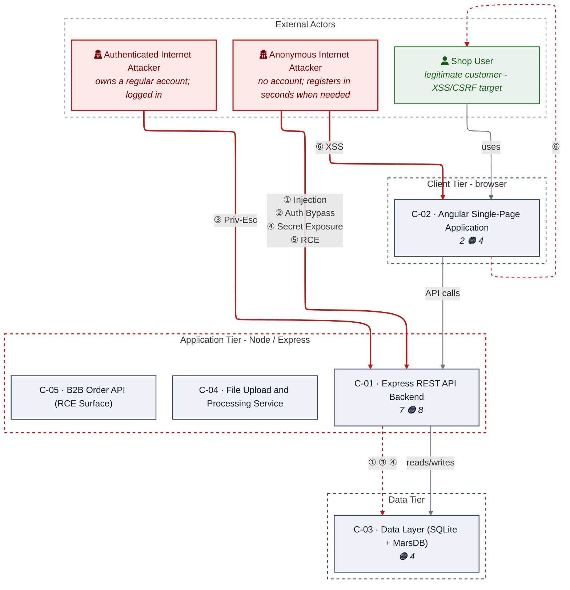

**Figure 2 - Risk Flow: Actor → Tier → Impact**

Heatmap: **actors** (left) → **architecture tiers** (middle, Client → Application → Data) → **impact** (right). Numbered red arrows ①–⑥ are the threats enumerated in the Top Threats table below.

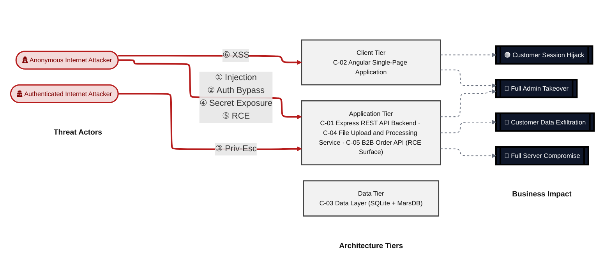

**Threat actors.** The actors below drive the numbered attack paths in the figures above; the Shop User is the *victim* of client-side attacks (XSS / CSRF), not an attacker.

- **Shop User** — legitimate customer; target of client-side attacks; target of ⑥ Output Encoding / Cross-Site Scripting.
- **Anonymous Internet Attacker** — no account; registers in seconds when needed; drives ① Insecure Query Construction & Data Access, ② Hardcoded Secrets & Weak Cryptography, ④ Sensitive File & Secret Exposure, ⑤ Remote Code Execution (unsafe eval).
- **Authenticated Internet Attacker** — owns a regular account; logged in; drives ③ Broken Authorization & Access Control.

**6 structural threats**, grouped by weakness class - each row is one threat, not one finding. *Threat Description* states the general architectural weakness (STRIDE in brackets); *Findings* lists the concrete instances, each linked to [§8 Threat Register](#8-threat-register) with its component; *Risk & Impact* combines severity with business consequence.

| # | Threat Description | Findings (→ Component) | Risk & Impact | Fix |
|---|------------------------------------|------------------------------------------------|------------------------------------|-----------------|
| <a id="path-injection"></a>① | **Insecure Query Construction & Data Access** _(T·I)_<br/>Untrusted input is concatenated directly into SQL and NoSQL query strings, allowing authentication bypass, data exfiltration, and schema disclosure through unauthenticated endpoints. | •&nbsp;[F-003](#f-003) — SQL injection login authentication bypass SQL injection login authentication bypass →&nbsp;[C-01](#c-01)<br/>•&nbsp;[F-004](#f-004) — SQL injection product search (UNION + schema exfil) SQL injection product search (UNION + schema exfil) →&nbsp;[C-01](#c-01)<br/>•&nbsp;[F-026](#f-026) — NoSQL injection via \$where operator in MarsDB reviews NoSQL injection via \$where operator in MarsDB reviews →&nbsp;[C-03](#c-03)<br/>•&nbsp;[F-030](#f-030) — Database schema exposure via SQL injection in search route Database schema exposure via SQL injection in search route →&nbsp;[C-03](#c-03) | 🔴 **Critical**<br/>Full Admin Takeover · Customer Data Exfiltration | [M-003](#m-003) — Replace raw SQL with Sequelize parameterized query, [M-004](#m-004) (P1) |
| <a id="path-auth-bypass"></a>② | **Hardcoded Secrets & Weak Cryptography** _(S·E)_<br/>Authentication can be circumvented by exploiting a hardcoded RSA signing key or the JWT algorithm-none bypass, allowing arbitrary token forgery without any server interaction. | •&nbsp;[F-001](#f-001) — JWT algorithm confusion algorithm none bypass JWT algorithm confusion algorithm none bypass →&nbsp;[C-01](#c-01)<br/>•&nbsp;[F-002](#f-002) — RSA private key hardcoded offline JWT forgery RSA private key hardcoded offline JWT forgery →&nbsp;[C-01](#c-01)<br/>•&nbsp;[F-027](#f-027) — MD5 password hashing passwords trivially reversible MD5 password hashing passwords trivially reversible →&nbsp;[C-01](#c-01) | 🔴 **Critical**<br/>Full Admin Takeover · Customer Data Exfiltration | [M-002](#m-002) — Implement application-level CSP and remove bypassSecurityTrustHtml, [M-027](#m-027) (P1) |
| <a id="path-privilege-escalation"></a>③ | **Broken Authorization & Access Control** _(E·I)_<br/>Authorization checks on resource-owning endpoints accept attacker-controlled user identifiers from the request body rather than the verified JWT payload, enabling horizontal and vertical access escalation. | •&nbsp;[F-011](#f-011) — IDOR basket accessible by any authenticated user IDOR basket accessible by any authenticated user →&nbsp;[C-01](#c-01)<br/>•&nbsp;[F-017](#f-017) — Mass assignment wallet balance manipulable via req.body.UserId Mass assignment wallet balance manipulable via req.body.UserId →&nbsp;[C-01](#c-01)<br/>•&nbsp;[F-023](#f-023) — Angular route guards bypassable client side Angular route guards bypassable client side →&nbsp;[C-02](#c-02)<br/>•&nbsp;[F-029](#f-029) — Product reviews allow unauthorized update IDOR in review update Product reviews allow unauthorized update IDOR in review update →&nbsp;[C-03](#c-03) | 🟠 **High**<br/>Full Admin Takeover · Customer Data Exfiltration | [M-011](#m-011) — Validate basket ownership against authenticated user's ID from JWT, [M-017](#m-017) (P2) |
| <a id="path-sensitive-data-exposure"></a>④ | **Sensitive File & Secret Exposure** _(I)_<br/>Signing keys, logs, and metric endpoints are served over unauthenticated routes, and path-traversal weaknesses allow reading arbitrary files from the server filesystem. | •&nbsp;[F-010](#f-010) — Sensitive files and logs exposed without authentication Sensitive files and logs exposed without authentication →&nbsp;[C-01](#c-01)<br/>•&nbsp;[F-013](#f-013) — Prometheus metrics endpoint exposed without authentication Prometheus metrics endpoint exposed without authentication →&nbsp;[C-01](#c-01)<br/>•&nbsp;[F-014](#f-014) — Access logs exposed to unauthenticated users tamper potential Access logs exposed to unauthenticated users tamper potential →&nbsp;[C-01](#c-01)<br/>•&nbsp;[F-015](#f-015) — Path traversal in data erasure layout parameter Path traversal in data erasure layout parameter →&nbsp;[C-01](#c-01)<br/>•&nbsp;[F-028](#f-028) — User model returns sensitive fields in API responses (password hash, totpSecret) User model returns sensitive fields in API responses (password hash, totpSecret) →&nbsp;[C-03](#c-03) | 🟠 **High**<br/>Customer Data Exfiltration · Full Server Compromise | [M-010](#m-010) — Add authentication middleware to sensitive file serving routes, [M-015](#m-015) (P2) |
| <a id="path-remote-code-execution"></a>⑤ | **Remote Code Execution (unsafe eval)** _(E)_<br/>Attacker-controlled strings are evaluated as JavaScript code through two independent sinks - a profile-field handler and a B2B order endpoint - providing direct host-level code execution. | •&nbsp;[F-005](#f-005) — Remote code execution notevil sandbox bypass in B2B API Remote code execution notevil sandbox bypass in B2B API →&nbsp;[C-01](#c-01)<br/>•&nbsp;[F-006](#f-006) — Server side code injection via eval on username field Server side code injection via eval on username field →&nbsp;[C-01](#c-01) | 🔴 **Critical**<br/>Full Server Compromise · Customer Data Exfiltration | [M-005](#m-005) — Remove eval-based order processing; use structured input schema, [M-006](#m-006) (P1) |
| <a id="path-cross-site-scripting"></a>⑥ | **Output Encoding / Cross-Site Scripting** _(T·I)_<br/>Angular's default output encoding is bypassed via DomSanitizer trust overrides across 14+ components, enabling stored and DOM-based XSS that steals session tokens from browser localStorage. | •&nbsp;[F-019](#f-019) — DOM XSS search results rendered via trust HTML bypass DOM XSS search results rendered via trust HTML bypass →&nbsp;[C-02](#c-02)<br/>•&nbsp;[F-020](#f-020) — Stored XSS feedback comments rendered unsanitized in admin panel Stored XSS feedback comments rendered unsanitized in admin panel →&nbsp;[C-02](#c-02)<br/>•&nbsp;[F-021](#f-021) — XSS last login ip rendered as trusted HTML XSS last login ip rendered as trusted HTML →&nbsp;[C-02](#c-02)<br/>•&nbsp;[F-025](#f-025) — Product description and review rendered as HTML stored XSS vector Product description and review rendered as HTML stored XSS vector →&nbsp;[C-02](#c-02) | 🔴 **Critical**<br/>Customer Session Hijack · Full Admin Takeover | [M-019](#m-019) — Remove bypassSecurityTrustHtml; use Angular's default sanitization, [M-020](#m-020) (P1) |

_STRIDE: S spoofing · T tampering · R repudiation · I information disclosure · D denial of service · E elevation of privilege. Risk, findings, components, impact and Fix are derived deterministically; only the one-line weakness description is authored._

### Top Mitigations

Highest-impact P1/P2 mitigations - 10 of 25 qualifying (31 total). Full detail in [§9 Mitigation Register](#9-mitigation-register). All 9 mitigation(s) that fix a Critical finding are always listed here; the remaining entries are curated by impact: broad SQL injection, stored XSS, SSRF, and IDOR exposure that combines with the hardcoded secrets to produce the most-reachable attack chains

| # | Priority | Component | Mitigation | Addresses | Effort |
|---|--------|----------------------|------------------------------------------------|------------------------------------------------|------|
| **1** | **P1** | [C-01](#c-01) — Express REST API Backend | [M-003](#m-003) — Replace raw SQL with Sequelize parameterized query | [F-003](#f-003) — SQL injection login authentication bypass (`routes/login.ts`) | Low |
| **2** | **P1** | [C-01](#c-01) — Express REST API Backend | [M-004](#m-004) — Use Sequelize Op.like with parameterized values for search | [F-004](#f-004) — SQL injection product search (`routes/search.ts`, "UNION + schema exfil") | Low |
| **3** | **P1** | [C-01](#c-01) — Express REST API Backend | [M-006](#m-006) — Remove `eval()` from username processing; use safe string rendering | [F-006](#f-006) — Server side code injection via eval on username field (`routes/userProfile.ts`) | Low |
| **4** | **P1** | [C-01](#c-01) — Express REST API Backend | [M-002](#m-002) — Implement application-level CSP and remove bypassSecurityTrustHtml | [F-002](#f-002) — RSA private key hardcoded offline JWT forgery (`lib/insecurity.ts`) | Medium |
| **5** | **P1** | [C-01](#c-01) — Express REST API Backend | [M-005](#m-005) — Remove eval-based order processing; use structured input schema | [F-005](#f-005) — Remote code execution notevil sandbox bypass in B2B API (`routes/b2bOrder.ts`) | Medium |
| **6** | **P1** | [C-01](#c-01) — Express REST API Backend | [M-027](#m-027) — Replace MD5 with bcrypt (cost factor 12+) for password hashing | [F-027](#f-027) — MD5 password hashing passwords trivially reversible (`lib/insecurity.ts`) | Medium |
| **7** | **P1** | [C-02](#c-02) — Angular Single-Page Application | [M-019](#m-019) — Remove bypassSecurityTrustHtml; use Angular's default sanitization | [F-019](#f-019) — DOM XSS search results rendered via trust HTML bypass (`frontend/src/app/search-result/search-result.component.ts`) | Low |
| **8** | **P1** | [C-02](#c-02) — Angular Single-Page Application | [M-020](#m-020) — Sanitize feedback content server-side before storage; remove bypassSecurityTrustHtml in admin panel | [F-020](#f-020) — Stored XSS feedback comments rendered unsanitized in admin panel (`frontend/src/app/administration/administration.component.ts`) | Medium |
| **9** | **P2** | [C-01](#c-01) — Express REST API Backend | [M-001](#m-001) — Establish dependency vulnerability scanning and update SLA | [F-001](#f-001) — JWT algorithm confusion algorithm none bypass (`lib/insecurity.ts`) | Medium |
| **10** | **P2** | [C-01](#c-01) — Express REST API Backend | [M-007](#m-007) — Set `noent:false` in libxmljs2 parsing to disable external entity resolution | [F-007](#f-007) — XXE via XML file upload with external entity resolution (`routes/fileUpload.ts`) | Low |

*15 additional P1/P2 mitigations capped from the leader-board · 6 P3 backlog items in [§9 Mitigation Register](#9-mitigation-register). Sorted by priority (P1 first), then component, then leverage (most findings first), severity (Critical first), and effort (Low first).*

### Operational Strengths

Operational controls rated Adequate or Partial - grouped into broad clusters (full per-control breakdown in [§7](#7-security-architecture)). Clusters demoted to Weak by open Critical/High findings appear in [§7](#7-security-architecture) instead, not here.

| Strength | What's in Place | Effectiveness | Gap | Mitigates |
|----------------------|----------------------|-------------|----------------------|----------------|
| **Container & Supply-Chain Hardening** | _Build-time and runtime hardening - minimal base image, non-root execution, dependency inventory._<br/>Automated SCA scanning<br/>Container Security - Dockerfile:23-41<br/>File Upload Validation - `routes/fileUpload.ts`, `routes/profileImageUrlUpload.ts` | ✅ Adequate | - | - |
| **Observability & Audit** | _Runtime visibility - access logging, audit trails, and operational telemetry for post-incident review._<br/>Security Logging and Monitoring - `server.ts:338`, `lib/logger.ts` | ⚠️ Partial | Coverage incomplete - see [§7](#7-security-architecture) control assessment. | - |


**Bottom line:** These controls narrow specific attack surfaces but none eliminates a Critical finding on its own.

---

<a id="critical-attack-chain"></a><a id="critical-attack-tree"></a>
## Critical Attack Tree

The root is the worst-case attacker goal; below it, each capability branch groups the Critical findings that achieve it. Branches feed the goal by OR - any single path suffices.

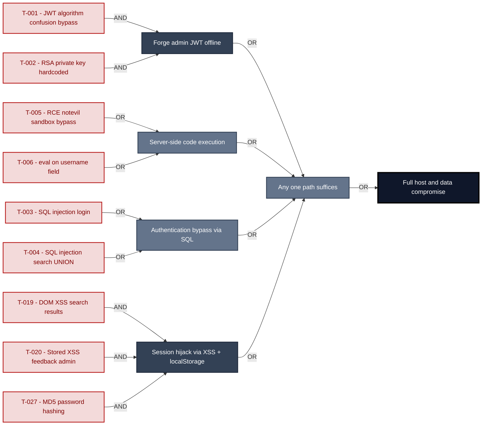

**Findings** (full detail in [§8 Threat Register](#8-threat-register)): [F-001](#f-001) — JWT algorithm confusion algorithm none bypass JWT algorithm confusion bypass · [F-002](#f-002) — RSA private key hardcoded offline JWT forgery RSA private key hardcoded · [F-005](#f-005) — Remote code execution notevil sandbox bypass in B2B API RCE notevil sandbox bypass · [F-006](#f-006) — Server side code injection via eval on username field eval on username field · [F-003](#f-003) — SQL injection login authentication bypass SQL injection login · [F-004](#f-004) — SQL injection product search (UNION + schema exfil) SQL injection search UNION · [F-019](#f-019) — DOM XSS search results rendered via trust HTML bypass DOM XSS search results · [F-020](#f-020) — Stored XSS feedback comments rendered unsanitized in admin panel Stored XSS feedback admin · [F-027](#f-027) — MD5 password hashing passwords trivially reversible MD5 password hashing

---

## 1. System Overview

Probably the most modern and sophisticated insecure web application

**Repository:** https://github.com/juice-shop/juice-shop
**Runtime:** `Node.js` 20 - 24

### Scope

This threat model covers 5 components of juice-shop: **Express REST API Backend**, **Angular Single-Page Application**, **Data Layer (SQLite + MarsDB)**, **File Upload and Processing Service**, **B2B Order API (RCE Surface)**.

**Out of scope:** third-party hosted dependencies, browser runtime, operating-system kernel, and the underlying network infrastructure.

---

## 2. Architecture Diagrams

### 2.1 System Context

Who interacts with juice-shop from the outside, and through which channels. Solid arrows show normal usage; dashed red arrows mark unauthenticated probing or exploit paths (C4 Level 1).

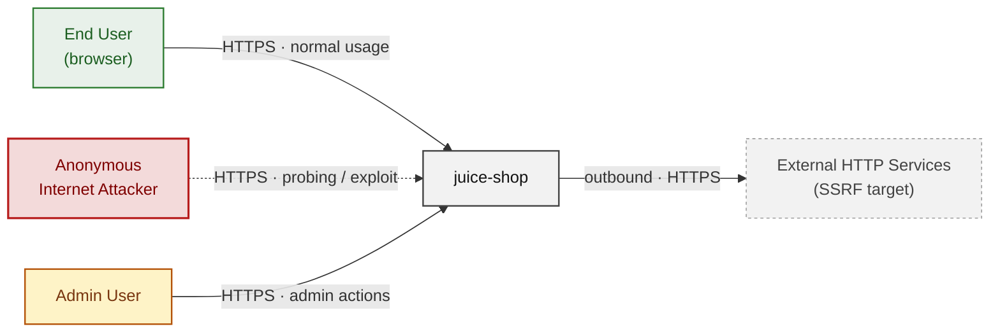

### 2.2 Container Architecture

How the system decomposes into deployable units. Each box is a separate runtime process or service container; arrows show synchronous request paths between them. Components with ≥3 Critical findings carry a red border, ≥2 High amber (C4 Level 2).

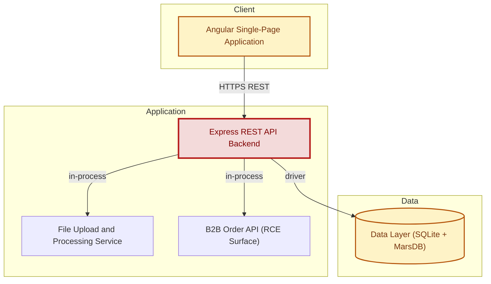

### 2.3 Components


Who reaches each component, and through which trust zone. Four columns map external actors to the internal tiers (Client / Application / Data); solid green arrows show legitimate data flow, dashed red arrows mark intrusion vectors. The component table directly below holds source paths and linked threats per `C-NN`; per-finding evidence is in [§8 Threat Register](#8-threat-register).

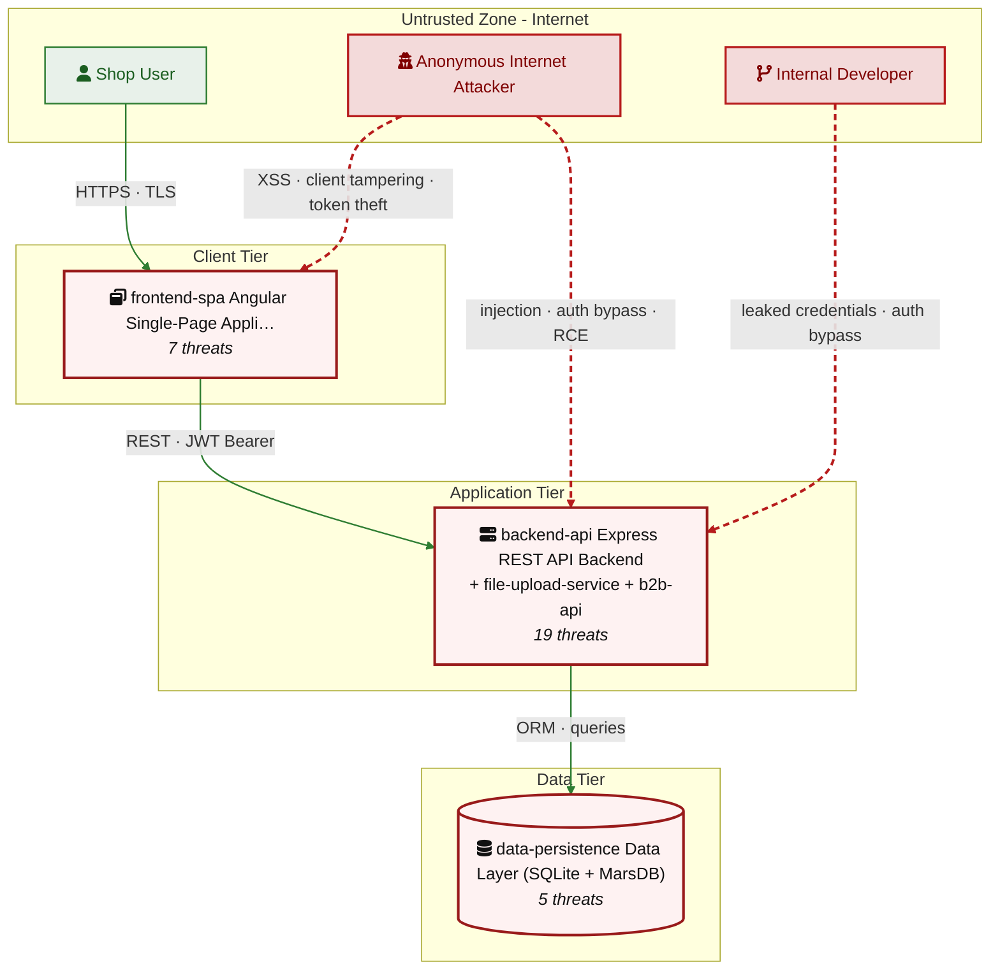

| ID | Name | Type | Key Paths | Linked Threats |
|----|----------------------|---------|----------------------|------------------------------------------------|
| <a id="c-01"></a><a id="backend-api"></a>C-01 | Express REST API Backend | process | `server.ts`<br/>`routes/**`<br/>`lib/**`<br/>`app.ts` | [F-001](#f-001) (JWT algorithm confusion algorithm none bypass)<br/>[F-002](#f-002) (RSA private key hardcoded offline JWT forgery)<br/>[F-003](#f-003) (SQL injection login authentication bypass)<br/>[F-004](#f-004) (SQL injection product search)<br/>[F-005](#f-005) (Remote code execution notevil sandbox bypass in B2B API)<br/>[F-006](#f-006) (Server side code injection via eval on username field)<br/>[F-007](#f-007) (XXE via XML file upload with external entity resolution)<br/>[F-008](#f-008) (Zip slip path traversal via unzipper 0.9.15)<br/>[F-009](#f-009) (Server side request forgery via profile image URL upload)<br/>[F-010](#f-010) (Sensitive files and logs exposed without authentication)<br/>[F-011](#f-011) (IDOR basket accessible by any authenticated user)<br/>[F-012](#f-012) (Open redirect bypass via allowlist prefix check)<br/>[F-013](#f-013) (Prometheus metrics endpoint exposed without authentication)<br/>[F-014](#f-014) (Access logs exposed to unauthenticated users tamper potential)<br/>[F-015](#f-015) (Path traversal in data erasure layout parameter)<br/>[F-016](#f-016) (Missing rate limiting on authentication endpoint)<br/>[F-017](#f-017) (Mass assignment wallet balance manipulable via `req.body`.UserId)<br/>[F-018](#f-018) (Error handler reveals internal stack traces)<br/>[F-027](#f-027) (MD5 password hashing passwords trivially reversible) |
| <a id="c-02"></a><a id="frontend-spa"></a>C-02 | Angular Single-Page Application | process | `frontend/src/**` | [F-019](#f-019) — DOM XSS search results rendered via trust HTML bypass<br/>[F-020](#f-020) — Stored XSS feedback comments rendered unsanitized in admin panel<br/>[F-021](#f-021) — XSS last login ip rendered as trusted HTML<br/>[F-022](#f-022) — Client side JWT stored in localStorage accessible to XSS<br/>[F-023](#f-023) — Angular route guards bypassable client side<br/>[F-024](#f-024) — XSS via postMessage and iframe DOM based attack<br/>[F-025](#f-025) — Product description and review rendered as HTML stored XSS vector |
| <a id="c-03"></a><a id="data-persistence"></a>C-03 | Data Layer (SQLite + MarsDB) | datastore | `models/**`<br/>`data/**`<br/>`routes/showProductReviews.ts`<br/>`routes/search.ts`<br/>`routes/updateProductReviews.ts` | [F-026](#f-026) — NoSQL injection via \$where operator in MarsDB reviews<br/>[F-028](#f-028) — User model returns sensitive fields in API responses (password hash, totpSecret)<br/>[F-029](#f-029) — Product reviews allow unauthorized update IDOR in review update<br/>[F-030](#f-030) — Database schema exposure via SQL injection in search route<br/>[F-031](#f-031) — JavaScript injection via \$where can crash MarsDB process |
| <a id="c-04"></a><a id="file-upload-service"></a>C-04 | File Upload and Processing Service | process | `routes/fileUpload.ts`<br/>`routes/profileImageFileUpload.ts`<br/>`routes/profileImageUrlUpload.ts`<br/>`routes/memory.ts` | - |
| <a id="c-05"></a><a id="b2b-api"></a>C-05 | B2B Order API (RCE Surface) | gateway | `routes/b2bOrder.ts` | - |
### 2.4 Technology Architecture

The technology stack the system is built on. Each box names the framework or runtime that fills that role; per-component findings live in the [§2.3](#23-components) component table above, and the full per-finding catalogue is in [§8 Threat Register](#8-threat-register).

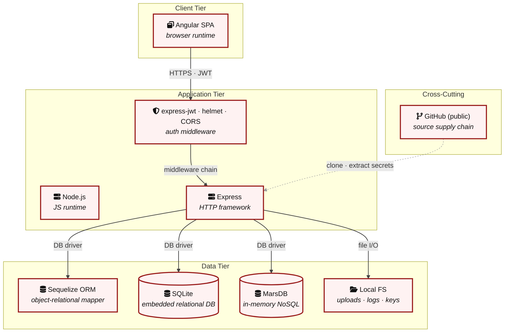

> **Legend:** **red border** ≥ 3 Critical threats on the component · **amber border** ≥ 2 High threats

---

## 3. Attack Walkthroughs

This section walks through how the highest-risk findings are exploited - one short walkthrough per Critical, each with attack steps, a focused sequence diagram, and the primary mitigation. The cross-finding view (which weaknesses combine toward the worst-case goal, and where one fix severs several paths) is in the [Critical Attack Tree](#critical-attack-tree). Full per-finding context - severity rationale, assets, detection signals - is in the [§8 Threat Register](#8-threat-register) row for each finding.

### 3.1 JWT algorithm confusion algorithm none bypass

**Source:** [F-001](#f-001) — JWT algorithm confusion algorithm none bypass - `lib/insecurity.ts:54`

Severity **Critical** ([CWE-347](https://cwe.mitre.org/data/definitions/347.html)). STRIDE: Spoofing. See [§8 T-001](#t-001) for the full register row.

**Attack Steps**

1. An attacker crafts a JWT with header {"alg":"none"} and empty signature.
2. express-jwt 0.1.3 (routes via `lib/insecurity.ts:54`) accepts unsigned tokens because it does not enforce algorithm.
3. Attacker sets isAdmin:true in the payload and gains full admin access.

**Sequence Diagram**

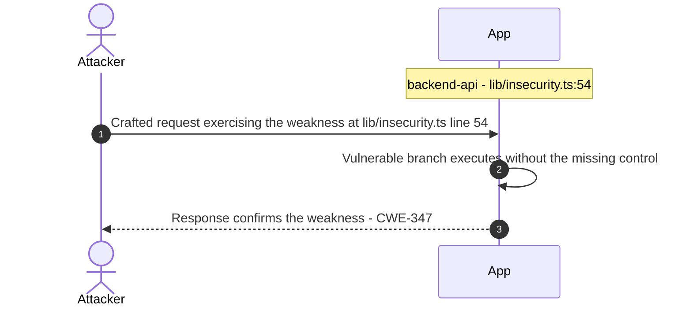

**Defense in Depth**

- Primary mitigation: [M-001](#m-001) (Establish dependency vulnerability scanning and update SLA)

### 3.2 RSA private key hardcoded offline JWT forgery

**Source:** [F-002](#f-002) — RSA private key hardcoded offline JWT forgery - `lib/insecurity.ts:23`

Severity **Critical** ([CWE-321](https://cwe.mitre.org/data/definitions/321.html)). STRIDE: Spoofing. See [§8 T-002](#t-002) for the full register row.

**Attack Steps**

1. The RSA 2048-bit private key is embedded in `lib/insecurity.ts:23` and committed to a public GitHub repository.
2. Any user can retrieve the key (git clone or GitHub web UI), call `jwt.sign`({id:1, email:'admin@juice-`sh.op`', isAdmin:true}, privateKey, {algorithm:'RS256'}) offline and produce a cryptographically valid admin JWT without any server interaction.
3. Clone the public repository and locate the cryptographic key at `lib/insecurity.ts:23`.

**Sequence Diagram**

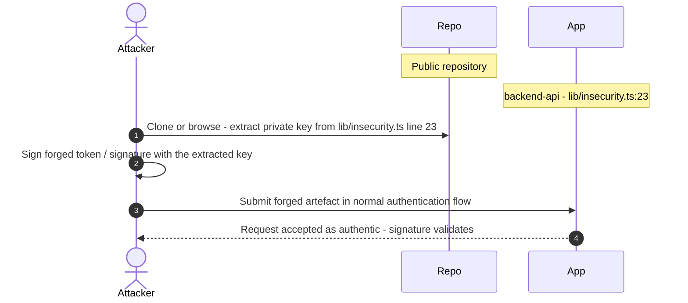

**Defense in Depth**

- Primary mitigation: [M-002](#m-002) (Implement application-level CSP and remove bypassSecurityTrustHtml)

### 3.3 SQL injection login authentication bypass

**Source:** [F-003](#f-003) — SQL injection login authentication bypass - `routes/login.ts:34`

Severity **Critical** ([CWE-89](https://cwe.mitre.org/data/definitions/89.html)). STRIDE: Tampering. See [§8 T-003](#t-003) for the full register row.

**Attack Steps**

1. `routes/login.ts:34` constructs an SQL query via template literal: SELECT * FROM Users WHERE email = '\${`req.body`.email}' AND password = '...' AND deletedAt IS NULL.
2. An attacker submits email=admin@juice-`sh.op`'-- which comments out the password check, authenticating as admin without knowing the password.
3. UNION-based injection can dump the entire Users table.

**Sequence Diagram**

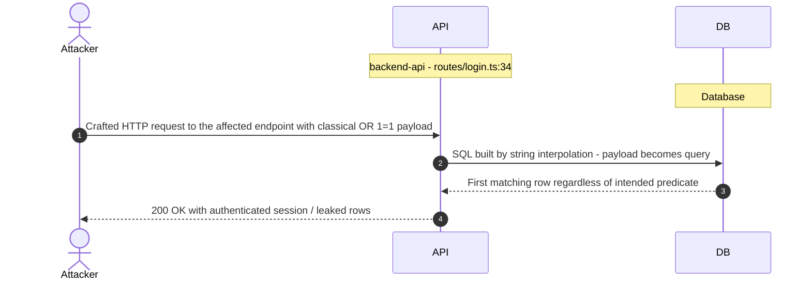

**Defense in Depth**

- Primary mitigation: [M-003](#m-003) (Replace raw SQL with Sequelize parameterized query)

### 3.4 SQL injection product search (UNION + schema exfil)

**Source:** [F-004](#f-004) — SQL injection product search (UNION + schema exfil) - `routes/search.ts:23`

Severity **Critical** ([CWE-89](https://cwe.mitre.org/data/definitions/89.html)). STRIDE: Tampering. See [§8 T-004](#t-004) for the full register row.

**Attack Steps**

1. `routes/search.ts:23` builds: SELECT * FROM Products WHERE ((name LIKE '%\${criteria}%' ...).
2. An attacker submits q=')) UNION SELECT * FROM Users-- to enumerate all users.
3. The same route at line 47 runs SELECT sql FROM sqlite_master on UNION success, exposing the full database schema.

**Sequence Diagram**


**Defense in Depth**

- Primary mitigation: [M-004](#m-004) (Use Sequelize `Op.like` with parameterized values for search)

### 3.5 Remote code execution notevil sandbox bypass in B2B API

**Source:** [F-005](#f-005) — Remote code execution notevil sandbox bypass in B2B API - `routes/b2bOrder.ts:23`

Severity **Critical** ([CWE-94](https://cwe.mitre.org/data/definitions/94.html)). STRIDE: Elevation of Privilege. See [§8 T-005](#t-005) for the full register row.

**Attack Steps**

1. POST `/b2b/v2/orders` accepts orderLinesData (user-controlled string) and executes it via vm.runInContext('safeEval(orderLinesData)', sandbox) at `routes/b2bOrder.ts:23`.
2. The notevil library has documented sandbox escape vulnerabilities.
3. An attacker can execute arbitrary `Node.js` code by sending a crafted payload: {"orderLinesData":"require('child_process').execSync('id')"}.

**Sequence Diagram**

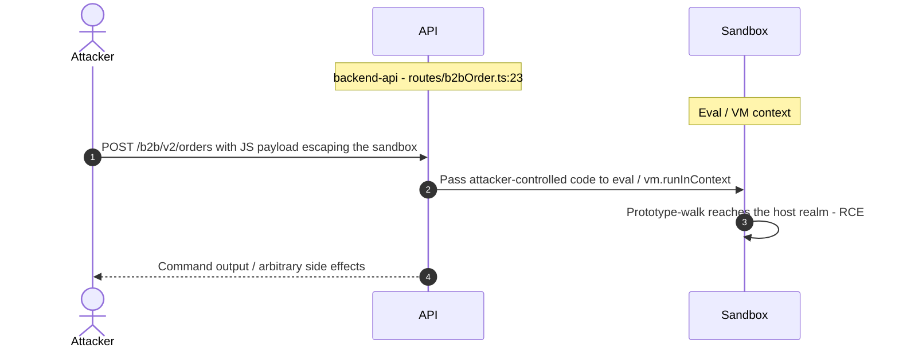

**Defense in Depth**

- Primary mitigation: [M-005](#m-005) (Remove eval-based order processing; use structured input schema)

### 3.6 Server side code injection via eval on username field

**Source:** [F-006](#f-006) — Server side code injection via eval on username field - `routes/userProfile.ts:62`

Severity **Critical** ([CWE-95](https://cwe.mitre.org/data/definitions/95.html)). STRIDE: Tampering. See [§8 T-006](#t-006) for the full register row.

**Attack Steps**

1. `routes/userProfile.ts:62` calls eval(code) where code is derived from the username field: const code = .
2. username .
3. When an authenticated user sets their username to a JavaScript expression (e.g.

**Sequence Diagram**

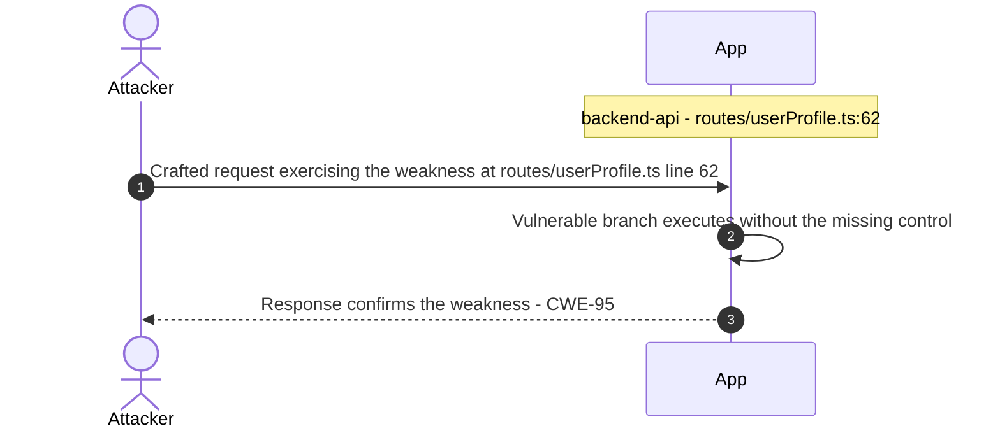

**Defense in Depth**

- Primary mitigation: [M-006](#m-006) (Remove `eval()` from username processing; use safe string rendering)

### 3.7 DOM XSS search results rendered via trust HTML bypass

**Source:** [F-019](#f-019) — DOM XSS search results rendered via trust HTML bypass - `frontend/src/app/search-result/search-result.component.ts:170`

Severity **Critical** ([CWE-79](https://cwe.mitre.org/data/definitions/79.html)). STRIDE: Tampering. See [§8 T-019](#t-019) for the full register row.

**Attack Steps**

1. `frontend/src/app/search-result/search-result.component.ts:170` calls this.sanitizer.bypassSecurityTrustHtml(queryParam) and binds the result to [innerHTML] in the template.
2. An attacker crafts a URL with q=`` and shares it.
3. When the victim clicks the link, the Angular SPA renders the unsanitized parameter, executing the attacker's JavaScript in the victim's browser with full access to localStorage (JWT token).

**Sequence Diagram**


**Defense in Depth**

- Primary mitigation: [M-019](#m-019) (Remove bypassSecurityTrustHtml; use Angular's default sanitization)

### 3.8 Stored XSS feedback comments rendered unsanitized in admin…

**Source:** [F-020](#f-020) — Stored XSS feedback comments rendered unsanitized in admin panel - `frontend/src/app/administration/administration.component.ts:78`

Severity **Critical** ([CWE-79](https://cwe.mitre.org/data/definitions/79.html)). STRIDE: Tampering. See [§8 T-020](#t-020) for the full register row.

**Attack Steps**

1. `frontend/src/app/administration/administration.component.ts:78` marks feedback.comment as trusted HTML via bypassSecurityTrustHtml(feedback.comment).
2. The admin panel at `/administration` renders these comments via [innerHTML] binding.
3. Any user who submits feedback with XSS payload stores it in the database; when admin views the panel, the payload executes in the admin's browser, potentially stealing the admin JWT and enabling privilege escalation.

**Sequence Diagram**

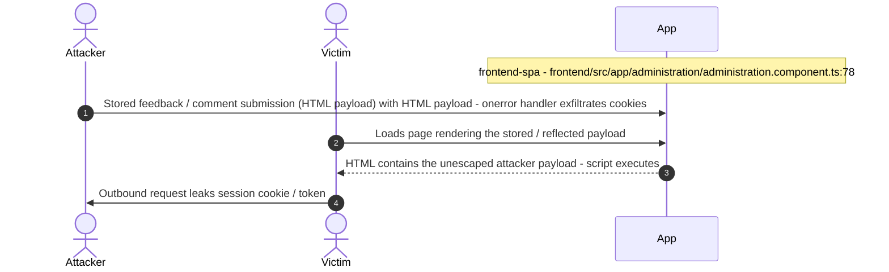

**Defense in Depth**

- Primary mitigation: [M-020](#m-020) (Sanitize feedback content server-side before storage; remove bypassSecurityTrustHtml in admin panel)

### 3.9 MD5 password hashing passwords trivially reversible

**Source:** [F-027](#f-027) — MD5 password hashing passwords trivially reversible - `lib/insecurity.ts:43`

Severity **Critical** ([CWE-916](https://cwe.mitre.org/data/definitions/916.html)). STRIDE: Information Disclosure. See [§8 T-027](#t-027) for the full register row.

**Attack Steps**

1. `models/user.ts:77` and `lib/insecurity.ts:43` hash passwords with a single-round MD5 with no salt: crypto.createHash('md5').update(data).digest('hex').
2. MD5 is a fast, cryptographically broken hash.
3. The complete md5 rainbow table for common passwords fits in memory.

**Sequence Diagram**

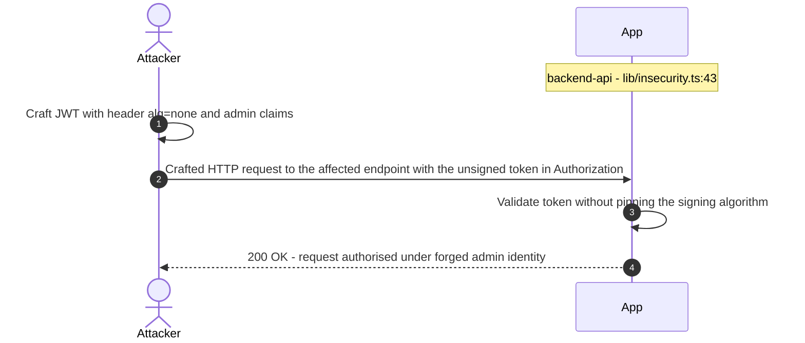

**Defense in Depth**

- Primary mitigation: [M-027](#m-027) (Replace MD5 with bcrypt (cost factor 12+) for password hashing)

<!-- generated:walkthrough_renderer -->

---

## 4. Assets

Information assets and the classification level that drives the Confidentiality / Integrity / Availability targets used in [§8 Threat Register](#8-threat-register) risk scoring.

| Asset | ID | Classification | Description | Linked Threats |
|----------------------|-----|--------------|------------------------------------|------------------------------------------------|
| User Credentials (email + MD5 password) | A-001 | Confidential | User email addresses and MD5-hashed passwords stored in the SQLite Users table. MD5 with no salt makes them trivially reversible. | [F-003](#f-003) (SQL injection login authentication bypass) · [F-004](#f-004) (SQL injection product search) · [F-016](#f-016) (Missing rate limiting on authentication endpoint) · [F-019](#f-019) (DOM XSS search results rendered via trust HTML bypass) · [F-020](#f-020) (Stored XSS feedback comments rendered unsanitized in admin panel) · [F-021](#f-021) (XSS last login ip rendered as trusted HTML) · [F-024](#f-024) (XSS via postMessage and iframe DOM based attack) · [F-025](#f-025) (Product description and review rendered as HTML stored XSS vector) · [F-027](#f-027) (MD5 password hashing passwords trivially reversible) |
| RSA Private Key (JWT signing) | A-002 | Restricted | 2048-bit RSA private key hardcoded in `lib/insecurity.ts` line 23. Used to sign all JWTs. Permanently compromised as it is committed to the public GitHub repository. | [F-001](#f-001) (JWT algorithm confusion algorithm none bypass) · [F-002](#f-002) (RSA private key hardcoded offline JWT forgery) · [F-008](#f-008) (Zip slip path traversal via unzipper 0.9.15) · [F-010](#f-010) (Sensitive files and logs exposed without authentication) · [F-013](#f-013) (Prometheus metrics endpoint exposed without authentication) · [F-015](#f-015) (Path traversal in data erasure layout parameter) · [F-028](#f-028) (User model returns sensitive fields in API responses) · [F-030](#f-030) (Database schema exposure via SQL injection in search route) |
| JWT Session Tokens | A-003 | Confidential | JWT tokens stored in browser localStorage. Signed with RS256 but the private key is public. Tokens include user id, email, role (isAdmin), and basket id. | [F-002](#f-002) (RSA private key hardcoded offline JWT forgery) · [F-008](#f-008) (Zip slip path traversal via unzipper 0.9.15) · [F-010](#f-010) (Sensitive files and logs exposed without authentication) · [F-013](#f-013) (Prometheus metrics endpoint exposed without authentication) · [F-015](#f-015) (Path traversal in data erasure layout parameter) · [F-022](#f-022) (Client side JWT stored in localStorage accessible to XSS) · [F-028](#f-028) (User model returns sensitive fields in API responses) · [F-030](#f-030) (Database schema exposure via SQL injection in search route) |
| SQLite Database (All Application Data) | A-004 | Confidential | SQLite3 database containing all users, products, orders, complaints, feedback, payment cards, addresses, and other relational data. Accessible via raw SQL injection in login and search routes. | [F-003](#f-003) (SQL injection login authentication bypass) · [F-004](#f-004) (SQL injection product search) · [F-011](#f-011) (IDOR basket accessible by any authenticated user) · [F-019](#f-019) (DOM XSS search results rendered via trust HTML bypass) · [F-020](#f-020) (Stored XSS feedback comments rendered unsanitized in admin panel) · [F-021](#f-021) (XSS last login ip rendered as trusted HTML) · [F-024](#f-024) (XSS via postMessage and iframe DOM based attack) · [F-025](#f-025) (Product description and review rendered as HTML stored XSS vector) · [F-029](#f-029) (Product reviews allow unauthorized update IDOR in review update) · [F-030](#f-030) (Database schema exposure via SQL injection in search route) |
| MarsDB Document Store (Reviews + Orders) | A-005 | Internal | In-memory MongoDB-compatible store containing product reviews and orders. Vulnerable to NoSQL injection via \$where operator in `showProductReviews.ts`. | - |
| Application Access Logs | A-006 | Internal | Morgan combined-format access logs written to logs/ directory. Intentionally exposed at `/support/logs` without authentication - readable by anyone. | [F-010](#f-010) (Sensitive files and logs exposed without authentication) · [F-013](#f-013) (Prometheus metrics endpoint exposed without authentication) · [F-014](#f-014) (Access logs exposed to unauthenticated users tamper potential) · [F-028](#f-028) (User model returns sensitive fields in API responses) · [F-030](#f-030) (Database schema exposure via SQL injection in search route) |
| Uploaded Files (Complaints, Profile Images) | A-007 | Internal | Files uploaded via `/file-upload` and `/profile/image/file` stored in uploads/complaints/ and assets/public/images/uploads/. Zip-slip allows extraction to arbitrary paths. | [F-005](#f-005) (Remote code execution notevil sandbox bypass in B2B API) · [F-006](#f-006) (Server side code injection via eval on username field) · [F-007](#f-007) (XXE via XML file upload with external entity resolution) · [F-008](#f-008) (Zip slip path traversal via unzipper 0.9.15) · [F-009](#f-009) (Server side request forgery via profile image URL upload) · [F-015](#f-015) (Path traversal in data erasure layout parameter) |
| Server-Side Application Code and Config | A-008 | Internal | TypeScript source, compiled JS, config YAML files (config/*.yml), and intentional vulnerability snippets accessible via /snippets/ routes. | - |
| Prometheus Metrics Endpoint | A-009 | Internal | prom-client metrics exposed at `/metrics` without authentication. Reveals server performance data, request counts, and system information. | - |
| Encryption Keys Directory | A-010 | Restricted | The /encryptionkeys/ route serves the RSA public key (`jwt.pub`) and other key material with directory listing enabled. The private key is embedded in source. | [F-002](#f-002) (RSA private key hardcoded offline JWT forgery) · [F-008](#f-008) (Zip slip path traversal via unzipper 0.9.15) · [F-010](#f-010) (Sensitive files and logs exposed without authentication) · [F-013](#f-013) (Prometheus metrics endpoint exposed without authentication) · [F-015](#f-015) (Path traversal in data erasure layout parameter) · [F-028](#f-028) (User model returns sensitive fields in API responses) · [F-030](#f-030) (Database schema exposure via SQL injection in search route) |

---

## 5. Attack Surface

Network-reachable entry points classified by authentication requirement. Each row links to the threat(s) referenced in its **Notes** column. The **Risk** column reflects the highest-severity linked finding.

### 5.1 Unauthenticated Entry Points (11)

| Method | Route | Auth | Risk | Notes |
|------|----------------------|----|----------|------------------------------------|
| POST | `/b2b/v2/orders` | No | 🔴 Critical | [F-005](#f-005) (Remote code execution notevil sandbox bypass in B2B API)<br/>RCE via notevil sandbox escape. User-supplied JavaScript executed in vm context. |
| GET | `/rest/products/search` | No | 🔴 Critical | [F-004](#f-004) (SQL injection product search)<br/>[F-030](#f-030) (Database schema exposure via SQL injection in search route)<br/>SQL injection (`search.ts:23`) - raw string interpolation in LIKE clause. |
| POST | `/rest/user/login` | No | 🔴 Critical | [F-016](#f-016) (Missing rate limiting on authentication endpoint)<br/>[F-003](#f-003) (SQL injection login authentication bypass)<br/>SQL injection (`login.ts:34`) - raw string interpolation in WHERE clause. No rate limiting beyond `/rest/user/reset-password`. |
| GET | `/encryptionkeys/` | No | 🟠 High | [F-010](#f-010) (Sensitive files and logs exposed without authentication)<br/>Serves RSA public key and directory listing of encryption key files. |
| POST | `/file-upload` | No | 🟠 High | [F-007](#f-007) (XXE via XML file upload with external entity resolution)<br/>[F-008](#f-008) (Zip slip path traversal via unzipper 0.9.15)<br/>[F-009](#f-009) (Server side request forgery via profile image URL upload)<br/>XXE (libxmljs2 `noent:true`), zip-slip (unzipper 0.9.15), YAML deserialization. |
| GET | `/ftp/` | No | 🟠 High | [F-010](#f-010) (Sensitive files and logs exposed without authentication)<br/>Directory listing of FTP files. serve-index middleware exposed without auth. |
| GET | `/support/logs/` | No | 🟠 High | [F-010](#f-010) (Sensitive files and logs exposed without authentication)<br/>[F-014](#f-014) (Access logs exposed to unauthenticated users tamper potential)<br/>Serves application log files with directory listing. No authentication. |
| GET | `/metrics` | No | 🟡 Medium | [F-013](#f-013) (Prometheus metrics endpoint exposed without authentication)<br/>Prometheus metrics endpoint - exposes server internals without authentication. |
| GET | `/redirect` | No | 🟡 Medium | [F-012](#f-012) (Open redirect bypass via allowlist prefix check)<br/>Open redirect via `isRedirectAllowed()` bypass - redirects to attacker-controlled URL. |
| GET | `/api-docs` | No | - | Swagger UI with full API documentation exposed publicly. |
| ? | `Socket.IO WebSocket connection` | No | - | `Socket.IO` 3.x real-time channel. Unauthenticated connections accepted on initial connect. |

### 5.2 Authenticated Entry Points (3)

| Method | Route | Auth | Risk | Notes |
|------|----------------------|----|----------|------------------------------------|
| POST | `/profile/image/url` | Yes | 🔴 Critical | [F-009](#f-009) (Server side request forgery via profile image URL upload)<br/>[F-006](#f-006) (Server side code injection via eval on username field)<br/>SSRF - user-controlled URL fetched server-side via `fetch()`. No allowlist validation. |
| GET | `/rest/basket/:id` | Yes | 🟠 High | [F-011](#f-011) (IDOR basket accessible by any authenticated user)<br/>IDOR - any authenticated user can access any basket by guessing the numeric id. |
| POST | `/rest/products/:id/reviews (PUT variant)` | Yes | 🟠 High | [F-029](#f-029) (Product reviews allow unauthorized update IDOR in review update)<br/>[F-026](#f-026) (NoSQL injection via \$where operator in MarsDB reviews)<br/>[F-031](#f-031) (JavaScript injection via \$where can crash MarsDB process)<br/>NoSQL injection via \$where in MarsDB query (`showProductReviews.ts:36`). |

---

## 7. Security Architecture

This chapter is organized by security-control category. The architecture section avoids artificial control IDs and finding-ID columns in overview tables. Findings are listed only where the affected control is described.

_[§7](#7-security-architecture) schema v2 (13-section control-category layout). Cataloged controls: 27 total - 1 adequate, 3 partial, 13 weak, 0 unsafe, 10 missing. Linked threats: 31._

**How to read the verdicts.** Every control category (and every sub-control below it) carries exactly one status. The two red verdicts do **not** mean the same thing - this is the distinction that decides what you have to do about a finding:

| Status | Meaning | What it asks of you |
|----------|------------------------------------|------------------------|
| 🟢 Adequate | Control is present and sound | Nothing - keep it |
| 🟡 Partial | Present, but with meaningful gaps | Close the gap |
| 🟠 Weak | Present, but has exploitable gaps | Strengthen it |
| 🔴 Unsafe | **Present and relied upon, but defeated / trivially bypassable** | **Fix the existing control** |
| 🔴 Missing | **Control was never built** | **Add the control** |
| - | Not applicable to this codebase | - |

So "🔴 Unsafe" on a control category does *not* mean the control is absent - it means the control exists but does not hold (e.g. an MD5 password hash, a raw-SQL query path, a hardcoded signing key). "🔴 Missing" is reserved for controls that were never built (e.g. no Content-Security-Policy header).

### 7.1 Security Control Overview

<!-- §7.1 MECHANICAL-FROZEN — DO NOT EDIT (overview table is pregenerator-owned) -->

| Control category | Verdict | Main reason |
|----------------------|---------|------------------------------------|
| [7.2 Identity and Authentication Controls](#72-identity-and-authentication-controls) | 🟠 Weak | 3 routed findings; catalogued controls are weak (e.g. JWT Authentication (express-jwt + jsonwebtoken), Password-Based Authentication). |
| [7.3 Session and Token Controls](#73-session-and-token-controls) | 🔴 Missing | 1 routed finding; no controls catalogued for this category. |
| [7.4 Authorization Controls](#74-authorization-controls) | 🔴 Missing | 4 routed findings; no controls catalogued for this category. |
| [7.5 Query Construction and Data Access Controls](#75-query-construction-and-data-access-controls) | 🟠 Weak | 3 routed findings; catalogued controls are weak (e.g. SQL Query Parameterization, NoSQL Query Parameterization). |
| [7.6 Input Boundary Validation Controls](#76-input-boundary-validation-controls) | 🟠 Weak | 1 routed finding; no compensating controls catalogued. |
| [7.7 Output Encoding and Rendering Controls](#77-output-encoding-and-rendering-controls) | 🟠 Weak | 5 routed findings; catalogued controls are weak (e.g. XSS Output Encoding (Angular DomSanitizer), Server-Side Template Rendering). |
| [7.8 Browser and Cross-Origin Controls](#78-browser-and-cross-origin-controls) | 🔴 Missing | No controls catalogued for this category. |
| [7.9 Cryptography Secrets and Data Protection](#79-cryptography-secrets-and-data-protection) | 🔴 Missing | 1 routed finding; no controls catalogued for this category. |
| [7.10 File Parser and Outbound Request Controls](#710-file-parser-and-outbound-request-controls) | 🔴 Missing | 11 routed findings; no controls catalogued for this category. |
| [7.11 Operations Runtime and Supply Chain Controls](#711-operations-runtime-and-supply-chain-controls) | 🔴 Missing | 2 routed findings; no controls catalogued for this category. |
| [7.12 Real-time and Not Applicable Controls](#712-real-time-and-not-applicable-controls) | - | No controls or findings routed to this category. |
| [7.13 Defense-in-Depth Summary](#713-defense-in-depth-summary) | - | No controls or findings routed to this category. |

<!-- §7.1 MECHANICAL-FROZEN END -->

### 7.2 Identity and Authentication Controls

**Verdict:** 🟠 Weak - password hashing is a single-round unsalted MD5; TOTP is optional and unenforced for admin accounts; the password login query is raw SQL susceptible to injection bypass.

**Controls covered:** [7.2.1 Password-Based Authentication](#721-password-based-authentication) · [7.2.2 Two-Factor Authentication (TOTP)](#722-two-factor-authentication-totp)

- [7.2.1 Password-Based Authentication](#password-based-authentication)
- [7.2.2 Two-Factor Authentication (TOTP)](#two-factor-authentication)

**Implemented controls:** `routes/login.ts:23` (password credential check), `lib/insecurity.ts:43` (password hashing), `routes/2fa.ts` (TOTP enrollment and verification).

**Assessment:** Authentication is implemented through two user-facing mechanisms: password-based login and optional TOTP as a second factor. Each has a structural gap. The password login route is vulnerable to SQL injection bypass and stores passwords as unsalted MD5 hashes. TOTP is correctly implemented but opt-in with no enforcement for high-privilege accounts. The JWT token issued on successful authentication - including its signing, algorithm enforcement, and key management - is described in [§7.3 Session and Token Controls](#73-session-and-token-controls).

<a id="password-based-authentication"></a>
#### 7.2.1 Password-Based Authentication

**Status:** 🟠 Weak - login query is raw SQL susceptible to injection bypass; passwords are stored as unsalted MD5 hashes.

`routes/login.ts:34` handles credential verification by constructing a raw SQL query that selects the user record matching the supplied email and pre-hashed password. `lib/insecurity.ts:43` provides the hashing helper: a single call to `crypto.createHash('md5')` with no salt. Both the query construction and the hash function are exploitable independently.

The diagram shows the intended password login path:

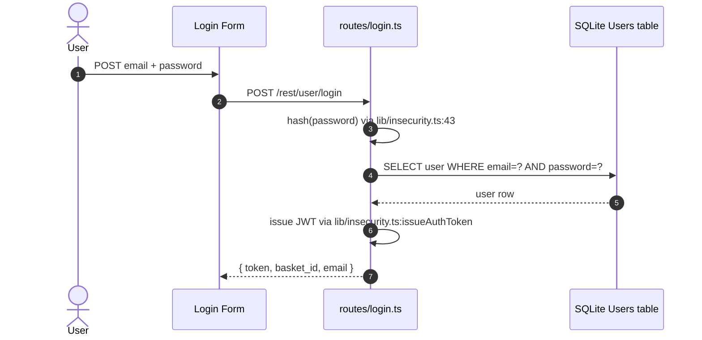

**Security assessment**

Two independent weaknesses sit on the login path:

- `routes/login.ts:34` concatenates `req.body.email` directly into `models.sequelize.query()`. The payload `' OR 1=1--` short-circuits the WHERE clause and returns the seeded admin row without a password ([F-003](#f-003) — SQL injection login authentication bypass).
- `lib/insecurity.ts:43` hashes passwords with unsalted MD5. Any database dump - obtained through the SQL injection above or otherwise - yields plaintext for every account via a rainbow table lookup ([F-027](#f-027) — MD5 password hashing passwords trivially reversible).

The raw SQL construction at the heart of the login route is:

```ts
models.sequelize.query(
  `SELECT * FROM Users WHERE email = '${req.body.email || ''}' AND password = '${req.body.password || ''}' AND deletedAt IS NULL`,
  { model: UserModel, plain: true }
)
```

**Relevant findings**

- [F-003](#f-003) — SQL injection in the login query allows authentication bypass without a valid credential.
- [F-027](#f-027) — Unsalted MD5 hashing means any acquired password hash is trivially reversible offline.

<a id="two-factor-authentication"></a><a id="two-factor-authentication-totp"></a>
#### 7.2.2 Two-Factor Authentication (TOTP)

**Status:** 🟡 Partial - TOTP enrollment and verification work correctly, but the second factor is entirely optional and never required for admin accounts.

TOTP is implemented via `otplib` in `routes/2fa.ts`. Users may set up a time-based one-time password authenticator through a QR-code enrollment flow. When TOTP is configured on an account, the `/rest/user/login` route detects the presence of a `totpSecret` field and requires a valid OTP before issuing the JWT. Enrollment and verification are correctly implemented.

The diagram shows the TOTP-enabled login path:

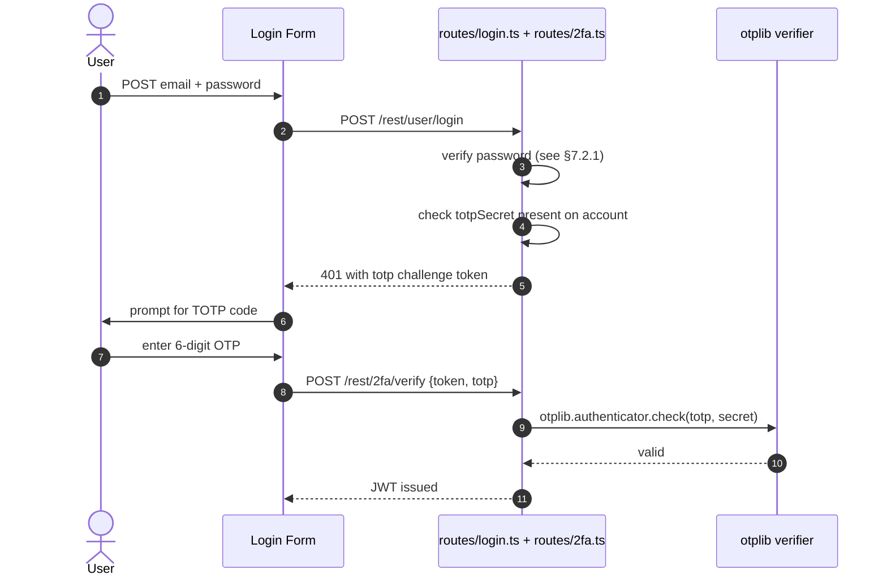

**Security assessment**

TOTP enrollment and verification are correctly implemented using `otplib`. The control weakness is governance, not code: no route or middleware enforces TOTP enrollment for users with elevated privileges. An attacker who forges an admin JWT (via [F-001](#f-001) — JWT algorithm confusion algorithm none bypass or [F-002](#f-002) — RSA private key hardcoded offline JWT forgery) bypasses TOTP entirely because the 2FA check only runs on the password login path, not on JWT-protected routes.

**Relevant findings**

- [F-016](#f-016) — No rate-limiting on the login endpoint allows credential brute-force that also exhausts the TOTP window.

### 7.3 Session and Token Controls

**Verdict:** 🔴 Missing - JWT is stored in browser `localStorage`, exposed to XSS theft; no revocation mechanism exists; session invalidation on logout is absent; the JWT library accepts unsigned tokens.

**Controls covered:** [7.3.1 JWT Bearer Token Validation (express-jwt middleware)](#731-jwt-bearer-token-validation-express-jwt-middleware) · [7.3.2 Session Token Storage (Browser localStorage)](#732-session-token-storage-browser-localstorage) · [7.3.3 Session Invalidation and Logout](#733-session-invalidation-and-logout)

- [7.3.1 JWT Bearer Token Validation (express-jwt middleware)](#jwt-bearer-token-validation)
- [7.3.2 Session Token Storage (Browser localStorage)](#session-token-storage)
- [7.3.3 Session Invalidation and Logout](#session-invalidation-logout)

**Implemented controls:** `lib/insecurity.ts:issueAuthToken()` issues RS256 JWTs on login; `lib/insecurity.ts:54-56` (JWT issuance and validation via `express-jwt@0.1.3`); `routes/login.ts` issues and `server.ts:289` configures a session cookie with the hardcoded `'kekse'` secret.

**Assessment:** This application uses a single locally-signed token format (JWT) for every authenticated session. The sub-sections below trace one token through its lifecycle: validation on protected routes (the JWT middleware), storage in the browser, and the absence of revocation and session-invalidation controls.

<a id="jwt-bearer-token-validation"></a>
#### 7.3.1 JWT Bearer Token Validation (express-jwt middleware)

**Status:** 🟠 Weak - `express-jwt@0.1.3` accepts `alg:none` tokens; algorithm enforcement is absent and the library predates the CVE-2015-9235 fix.

JWT validation is performed by `express-jwt@0.1.3` mounted in `lib/insecurity.ts:54-56`. On every protected route the middleware calls `jsonwebtoken@0.4.0` to decode the `Authorization: Bearer` header and attach the payload to `req.user`. The library versions in use predate the security fixes introduced in `jsonwebtoken` 6.x - neither enforces the signing algorithm.

The diagram shows the intended positive path for a protected request carrying a valid JWT:

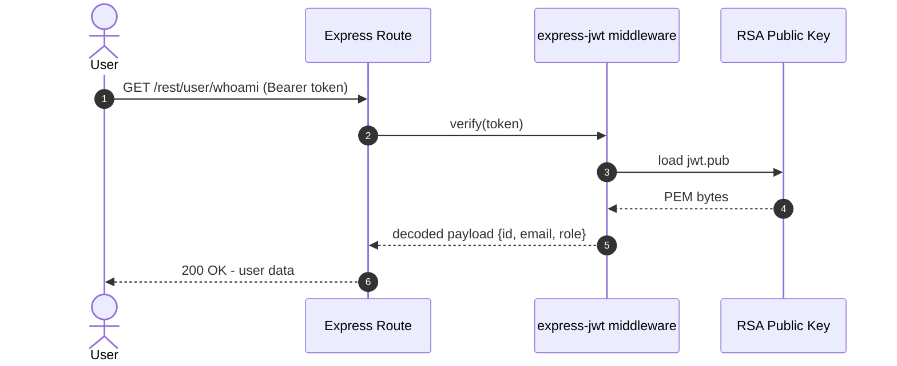

**Security assessment**

Two independent weaknesses break the JWT verification boundary:

- `express-jwt@0.1.3` does not enforce the `algorithms` option. Supplying `{"alg":"none"}` in the JWT header produces a token with an empty signature that the library accepts as valid ([F-001](#f-001) — JWT algorithm confusion algorithm none bypass).
- The RS256 private key is hardcoded at `lib/insecurity.ts:23`. Anyone with repo read access can call `jwt.sign(payload, privateKey, {algorithm:'RS256'})` to forge arbitrary tokens, bypassing signature verification entirely ([F-002](#f-002) — RSA private key hardcoded offline JWT forgery).

**Relevant findings**

- [F-001](#f-001) — `alg:none` acceptance lets an attacker craft a completely unsigned token and set `role=admin` without knowing the private key.
- [F-002](#f-002) — Hardcoded RSA private key at `lib/insecurity.ts:23` enables offline forgery of fully-signed RS256 tokens.

<a id="session-token-storage"></a><a id="cookie-security"></a><a id="cookie-security-httponly-samesite-secure-flags"></a>
#### 7.3.2 Session Token Storage (Browser localStorage)

**Status:** 🔴 Missing - JWT is stored in `localStorage`, which is readable by any XSS payload; `HttpOnly` cookies are not used.

On successful login, `routes/login.ts` returns the JWT in the JSON response body. The Angular frontend stores it in `localStorage` via `TokenService` in `frontend/src/app/Services/token.service.ts`. The session cookie configured in `server.ts:289` uses the hardcoded secret `'kekse'` but is separate from the JWT mechanism; the JWT itself is never placed in an `HttpOnly` cookie.

**Security assessment**

`localStorage` is accessible to any JavaScript running in the page origin. The stored XSS vectors in [F-019](#f-019) — DOM XSS search results rendered via trust HTML bypass, [F-020](#f-020) — Stored XSS feedback comments rendered unsanitized in admin panel, and [F-021](#f-021) — XSS last login ip rendered as trusted HTML can read `localStorage` directly, allowing session hijacking with a single `document.cookie`-style payload. Moving the JWT to an `HttpOnly` `SameSite=Strict` cookie would remove this access entirely.

**Relevant findings**

- [F-022](#f-022) — JWT in `localStorage` is readable by every XSS payload in this codebase, enabling full session takeover.

<a id="session-invalidation-logout"></a>
#### 7.3.3 Session Invalidation and Logout

**Status:** 🟠 Weak - logout clears the client-side `localStorage` entry but does not invalidate the JWT server-side; stolen tokens remain valid until natural expiry.

`routes/logout.ts` responds to `GET /rest/user/logout`. The server does not maintain a token allowlist or denylist; the JWT's server-side validity depends solely on its signature and expiry claim. Client-side logout removes the `localStorage` entry, which means a token stolen before logout continues to be accepted by every `express-jwt`-protected route.

**Security assessment**

Server-side token revocation is absent. A JWT stolen via any of the XSS vectors ([F-019](#f-019) — DOM XSS search results rendered via trust HTML bypass, [F-020](#f-020) — Stored XSS feedback comments rendered unsanitized in admin panel) continues to authenticate requests after the legitimate user has logged out. A revocation list keyed on the JWT `jti` claim, or a short expiry combined with refresh-token rotation, would close this gap.

**Relevant findings**

- [F-022](#f-022) — Stolen JWT remains valid server-side after client logout, enabling persistent impersonation.

### 7.4 Authorization Controls

**Verdict:** 🔴 Missing - object-level authorization checks are absent on basket, wallet, and address routes; role checks rely on a client-side JWT claim that is forgeable.

**Controls covered:** [7.4.1 Role-Based Access Control (isAdmin JWT claim)](#741-role-based-access-control-isadmin-jwt-claim) · [7.4.2 Object-Level Authorization](#742-object-level-authorization)

- [7.4.1 Role-Based Access Control (isAdmin JWT claim)](#role-based-access-control)
- [7.4.2 Object-Level Authorization](#object-level-authorization)

**Implemented controls:** `lib/insecurity.ts:54-55` (JWT parsing middleware that attaches `req.user`), `server.ts` route middleware (presence check only).

**Assessment:** Authorization has two layers, both broken. Role checks read `req.user.role` from the JWT payload - a value that is forgeable via the hardcoded key ([F-002](#f-002) — RSA private key hardcoded offline JWT forgery) or `alg:none` bypass ([F-001](#f-001) — JWT algorithm confusion algorithm none bypass). Object-level checks on resource-owning endpoints accept `req.body.UserId` rather than the authenticated user's id from the verified JWT, so any logged-in user can operate on another user's resources by supplying a different id.

<a id="role-based-access-control"></a><a id="role-based-access-control-rbac-isadmin"></a>
#### 7.4.1 Role-Based Access Control (isAdmin JWT claim)

**Status:** 🟠 Weak - role check reads `req.user.role` from the JWT payload, which is forged via the hardcoded signing key; Angular route guards enforce nothing server-side.

Admin routes are guarded by middleware in `server.ts` that checks `req.user.role === 'admin'` after the `express-jwt` middleware attaches the decoded payload. The admin panel UI is additionally gated by Angular route guards in `frontend/src/app/app.routing.module.ts`. Both checks rely on the JWT claim being trustworthy.

**Security assessment**

Because the RSA private key is committed to the repository ([F-002](#f-002) — RSA private key hardcoded offline JWT forgery) and `alg:none` is accepted ([F-001](#f-001) — JWT algorithm confusion algorithm none bypass), any attacker can mint a JWT with `role=admin`. The server-side role check then passes transparently. Angular route guards ([F-023](#f-023) — Angular route guards bypassable client side) add no protection because they run only in the browser and are bypassed by making direct API calls.

**Relevant findings**

- [F-023](#f-023) — Angular route guards are client-only; direct API calls to admin endpoints are not blocked server-side.
- [F-017](#f-017) — Mass assignment on wallet routes accepts `req.body.UserId`, bypassing role-based ownership.

<a id="object-level-authorization"></a><a id="object-level-authorization-idor-prevention"></a>
#### 7.4.2 Object-Level Authorization

**Status:** 🔴 Missing - basket, wallet, and address routes use the user id from `req.body` rather than from the verified JWT; cross-user access requires only a valid session token.

`routes/basket.ts`, `routes/wallet.ts`, and `routes/address.ts` accept a `UserId` parameter from the request body and use it directly to query the database. No comparison is made between the supplied id and the authenticated user's id from `req.user.id`.

**Security assessment**

Any authenticated user can read or modify any other user's basket, wallet balance, or address by changing the `UserId` field in the request body. This is a horizontal privilege escalation: authentication is required, but the authorization check that would restrict a user to their own resources is absent.

The wallet update route illustrates the pattern:

```ts
// routes/wallet.ts — UserId from body, not from verified JWT
const user = await UserModel.findOne({ where: { id: req.body.UserId } })
```

**Relevant findings**

- [F-011](#f-011) — IDOR on basket route: any authenticated user can retrieve another user's basket contents.
- [F-017](#f-017) — Mass assignment on wallet: `req.body.UserId` determines whose balance is updated.

### 7.5 Query Construction and Data Access Controls

**Verdict:** 🟠 Weak - SQL and NoSQL injection are present on unauthenticated routes; Sequelize parameterized queries are bypassed by two raw `models.sequelize.query()` call sites.

**Controls covered:** [7.5.1 SQL Query Parameterization (Sequelize + Raw Queries)](#751-sql-query-parameterization-sequelize-raw-queries) · [7.5.2 NoSQL Query Parameterization (MarsDB)](#752-nosql-query-parameterization-marsdb)

- [7.5.1 SQL Query Parameterization (Sequelize + Raw Queries)](#sql-query-parameterization)
- [7.5.2 NoSQL Query Parameterization (MarsDB)](#nosql-query-parameterization)

**Implemented controls:** Sequelize ORM backs most model operations; `routes/login.ts:34` and `routes/search.ts:23` call `models.sequelize.query()` directly; `routes/showProductReviews.ts:36` passes user input to a MarsDB `$where` clause.

**Assessment:** Sequelize's parameterized query support is available and used by most routes. Two routes opt out and construct raw SQL strings; one additional route passes user-controlled structure to a MarsDB selector. All three deviations are on high-traffic paths - login and product search are unauthenticated, and review queries are authenticated but trivially reachable. Fixing the login and search routes removes two Critical findings and eliminates [F-030](#f-030) — Database schema exposure via SQL injection in search route schema exposure as a side-effect.

<a id="sql-query-parameterization"></a>
#### 7.5.1 SQL Query Parameterization (Sequelize + Raw Queries)

**Status:** 🟠 Weak - login and search routes build SQL strings by concatenating user input rather than using Sequelize bind parameters.

Sequelize models back most relational data access in this codebase. Two routes deviate: `routes/login.ts:34` and `routes/search.ts:23` both construct raw SQL strings via `models.sequelize.query()`. The login route interpolates `req.body.email` and `req.body.password` directly; the search route interpolates the `q` query parameter into a `LIKE` clause.

The product search route illustrates the raw SQL construction that bypasses parameter binding:

```ts
models.sequelize.query(
  `SELECT * FROM Products WHERE ((name LIKE '%${criteria}%' OR description LIKE '%${criteria}%') AND deletedAt IS NULL) ORDER BY name`
)
```

**Security assessment**

Both raw-SQL sites are on unauthenticated endpoints, making exploitation trivial:

- `routes/login.ts:34` - `' OR 1=1--` in the email field returns the seeded admin account row and bypasses the password check ([F-003](#f-003) — SQL injection login authentication bypass).
- `routes/search.ts:23` - a UNION-based payload dumps the full Users table including password hashes and the SQLite schema ([F-004](#f-004) — SQL injection product search (UNION + schema exfil), [F-030](#f-030) — Database schema exposure via SQL injection in search route).

**Relevant findings**

- [F-003](#f-003) — SQL injection in the login query allows authentication bypass without a valid credential.
- [F-004](#f-004) — SQL injection in the search route enables UNION-based data exfiltration and schema disclosure.
- [F-030](#f-030) — Database schema exposed as a side-effect of the search injection; eliminated when [F-004](#f-004) (SQL injection product search) is fixed.

<a id="nosql-query-parameterization"></a>
#### 7.5.2 NoSQL Query Parameterization (MarsDB)

**Status:** 🟠 Weak - review queries accept a `$where` JavaScript expression from user-supplied input, giving the attacker control over query logic.

Product reviews are stored in MarsDB, a MongoDB-compatible in-memory database. `routes/showProductReviews.ts:36` passes the user-supplied `id` parameter into a MarsDB selector. MarsDB supports the `$where` operator, which evaluates a JavaScript string as a boolean predicate over each document.

**Security assessment**

Supplying `{"$where":"sleep(2000)"}` or similar payloads as the review `id` executes JavaScript inside the MarsDB process. This enables both blind data extraction and a denial-of-service via CPU-intensive expressions that crash the MarsDB worker ([F-026](#f-026) (NoSQL injection via \$where operator in MarsDB reviews), [F-031](#f-031) (JavaScript injection via \$where can crash MarsDB process)).

**Relevant findings**

- [F-026](#f-026) — NoSQL injection via `$where` allows JavaScript execution in the MarsDB query context.
- [F-031](#f-031) — JavaScript injection in `$where` can crash the MarsDB process through resource exhaustion.

### 7.6 Input Boundary Validation Controls

**Verdict:** 🟠 Weak - upload file-type and path-traversal constraints are absent; `multer` enforces only a file-size limit.

**Controls covered:** [7.6.1 Input Boundary Validation (multer + path checks)](#761-input-boundary-validation-multer-path-checks)

- [7.6.1 Input Boundary Validation (multer + path checks)](#input-boundary-validation)

**Implemented controls:** `multer` enforces a maximum file size on upload endpoints; `routes/dataErasure.ts:69` calls `path.resolve()` on the layout parameter without subsequent containment check.

**Assessment:** Input validation is limited to file size. File type, content-type, and path-traversal constraints are absent on the upload endpoint and the layout parameter route. Uploaded XML, ZIP, and YAML files reach parsers with dangerous defaults enabled without any pre-flight type check.

<a id="input-boundary-validation"></a>
#### 7.6.1 Input Boundary Validation (multer + path checks)

**Status:** 🟠 Weak - file-size limit is enforced; file-type allow-listing and path-containment checks are absent.

`multer` is configured on the file upload endpoint to reject files above a size threshold. No MIME-type or extension allow-list is applied before passing uploaded files to `libxmljs2` (XML), `unzipper` (ZIP), or the YAML parser. `routes/dataErasure.ts:69` calls `path.resolve(req.body.layout)` without subsequently verifying that the resolved path stays within the permitted directory.

**Security assessment**

Three upload-validation gaps compound each other:

- No file-type check allows `.xml` uploads to reach `libxmljs2` with `noent:true` ([F-007](#f-007) — XXE via XML file upload with external entity resolution).
- No archive extraction path check allows ZIP files with `../` entries to write outside the target directory ([F-008](#f-008) — Zip slip path traversal via unzipper 0.9.15).
- `routes/dataErasure.ts:69` resolves the `layout` parameter without a containment check, allowing traversal to read arbitrary files ([F-015](#f-015) — Path traversal in data erasure layout parameter).

**Relevant findings**

- [F-031](#f-031) — JavaScript injection in MarsDB via unvalidated input structure crashes the process.

### 7.7 Output Encoding and Rendering Controls

**Verdict:** 🟠 Weak - Angular's default output encoding is disabled via `bypassSecurityTrustHtml()` in 14+ components; server-side template rendering relies on user input in `eval()`.

**Controls covered:** [7.7.1 XSS Output Encoding (Angular DomSanitizer)](#771-xss-output-encoding-angular-domsanitizer) · [7.7.2 Server-Side Template Rendering (eval-based)](#772-server-side-template-rendering-eval-based)

- [7.7.1 XSS Output Encoding (Angular DomSanitizer)](#xss-output-encoding)
- [7.7.2 Server-Side Template Rendering (eval-based)](#server-side-template-rendering)

**Implemented controls:** Angular's template engine escapes by default; `DomSanitizer.bypassSecurityTrustHtml()` is called explicitly to override this in `search-result.component.ts:170` and 13+ other components.

**Assessment:** Angular's default output encoding would prevent all DOM-XSS findings in this codebase. Every XSS finding here exists because `bypassSecurityTrustHtml()` was called deliberately to render HTML from user-controlled sources. Removing these calls and letting Angular's default sanitizer run is the single fix that closes five findings simultaneously.

<a id="xss-output-encoding"></a><a id="xss-output-encoding-angular-domsanitizer"></a>
#### 7.7.1 XSS Output Encoding (Angular DomSanitizer)

**Status:** 🟠 Weak - Angular's default escaping is present but overridden at 14+ call sites via `bypassSecurityTrustHtml()`; every override is a live XSS sink.

Angular templates escape interpolated values by default. Throughout the frontend, `DomSanitizer.bypassSecurityTrustHtml()` is called before binding user-controlled strings to `[innerHTML]` properties. The primary sites are `search-result.component.ts:170` (search query reflected in results), `administration.component.ts` (user feedback rendered in the admin panel), and `last-login-ip.component.ts` (login IP address rendered as HTML).

**Security assessment**

Each `bypassSecurityTrustHtml()` call converts a safe Angular template binding into a raw HTML injection sink. Three exploitable patterns:

- `search-result.component.ts:170` - the search query parameter is reflected as trusted HTML, enabling DOM XSS ([F-019](#f-019) — DOM XSS search results rendered via trust HTML bypass).
- `administration.component.ts` - stored feedback content from any user is rendered unsanitized in the admin panel ([F-020](#f-020) — Stored XSS feedback comments rendered unsanitized in admin panel).
- `last-login-ip.component.ts` - the last-login IP, controllable via headers, is rendered as trusted HTML ([F-021](#f-021) — XSS last login ip rendered as trusted HTML).

**Relevant findings**

- [F-019](#f-019) — DOM XSS via search query reflected through `bypassSecurityTrustHtml()`.
- [F-020](#f-020) — Stored XSS in admin panel feedback view via unsanitized `bypassSecurityTrustHtml()` call.
- [F-021](#f-021) — XSS via last-login IP field rendered as trusted HTML.
- [F-025](#f-025) — Product descriptions stored with HTML and rendered without sanitization in product detail views.

<a id="server-side-template-rendering"></a>
#### 7.7.2 Server-Side Template Rendering (eval-based)

**Status:** 🟠 Weak - `routes/userProfile.ts:62` passes the username field through `eval()` for Handlebars template processing, enabling server-side code injection.

`routes/userProfile.ts:62` calls `eval()` to process the username field as a Handlebars template. The intent is to allow personalised template expressions in user profiles. The result is that any JavaScript expression in the username field executes in the server process context.

**Security assessment**

`eval()` on user-controlled input is a direct code injection sink, not a template rendering issue. Any authenticated user can set their username to `{{require('child_process').execSync('id')}}` and retrieve server-side process output. This is a Critical finding independent of the template intent; see [§7.10](#710-file-parser-and-outbound-request-controls) for the related B2B eval sink.

**Relevant findings**

- [F-006](#f-006) — Server-side code injection via `eval()` on the username field grants arbitrary RCE to any authenticated user.

### 7.8 Browser and Cross-Origin Controls

**Verdict:** 🔴 Missing - no Content-Security-Policy at app level; CORS is configured as a wildcard; CSRF protection is absent.

**Controls covered:** [7.8.1 Content Security Policy (Helmet partial)](#781-content-security-policy-helmet-partial) · [7.8.2 CORS Policy (wildcard)](#782-cors-policy-wildcard) · [7.8.3 CSRF Protection](#783-csrf-protection)

- [7.8.1 Content Security Policy (Helmet partial)](#content-security-policy)
- [7.8.2 CORS Policy (wildcard)](#cors-policy)
- [7.8.3 CSRF Protection](#csrf-protection)

**Implemented controls:** `helmet@4.6` is mounted in `server.ts:187` with a non-default configuration; `cors@2.8.5` is mounted in `server.ts:181-182`; no CSRF token middleware is present.

**Assessment:** The three browser-control primitives that would contain XSS and CSRF impact are all either absent or misconfigured. Helmet's `xssFilter` is explicitly disabled; no app-level CSP header is emitted; CORS allows every origin; and no CSRF token middleware protects state-changing requests. These gaps do not introduce findings on their own but amplify the XSS findings in [§7.7](#77-output-encoding-and-rendering-controls) by removing the last browser-side mitigations.

<a id="content-security-policy"></a><a id="content-security-policy-csp"></a>
#### 7.8.1 Content Security Policy (Helmet partial)

**Status:** 🟠 Weak - a per-route CSP is present for the user profile endpoint only; no app-level CSP is emitted; Helmet's `xssFilter` is explicitly disabled.

`server.ts:187` mounts Helmet without a `contentSecurityPolicy` configuration, so no `Content-Security-Policy` header is emitted on most routes. `routes/userProfile.ts:95` adds a route-specific CSP header, but this covers only the profile page. Helmet's `xssFilter` (legacy `X-XSS-Protection: 1; mode=block`) is explicitly disabled in the Helmet options.

**Security assessment**

Without an app-level CSP, scripts from any origin can be injected through the XSS sinks in [§7.7](#77-output-encoding-and-rendering-controls). A CSP `default-src 'self'` with a nonce-based `script-src` would prevent inline-script and cross-origin-script execution even when `bypassSecurityTrustHtml()` is called. The per-route CSP on the profile endpoint does not help because it applies after the `eval()`-based code injection in `routes/userProfile.ts:62`.

**Relevant findings**

- No dedicated finding routed in this assessment.

<a id="cors-policy"></a>
#### 7.8.2 CORS Policy (wildcard)

**Status:** 🟠 Weak - `app.use(cors())` in `server.ts:181` enables wildcard origin and credentials, allowing any origin to make credentialed cross-origin requests.

`server.ts:181-182` mounts the `cors` middleware with default options, which responds to every `Origin` header with `Access-Control-Allow-Origin: *`. No allowlist of trusted origins is configured.

**Security assessment**

A wildcard CORS policy means any web page on any domain can make cross-origin requests to the API. Combined with the absent CSRF protection ([§7.8.3](#csrf-protection)), a malicious page can perform state-changing operations on behalf of a logged-in user. The practical impact is amplified by JWT storage in `localStorage` (which cannot be sent with `SameSite` cookie restrictions).

**Relevant findings**

- No dedicated finding routed in this assessment.

<a id="csrf-protection"></a>
#### 7.8.3 CSRF Protection

**Status:** 🔴 Missing - no CSRF token middleware is present; state-changing endpoints accept requests from any origin.

No CSRF token middleware (`csurf` or equivalent) is configured in `server.ts`. State-changing POST, PUT, and DELETE routes do not require any origin-bound token. The session cookie uses a hardcoded secret (`'kekse'`) and no `SameSite` attribute.

**Security assessment**

All state-changing API endpoints are reachable from cross-origin requests. An attacker-controlled page can trigger basket modifications, order placements, and profile changes on behalf of any user who visits it. Adding `SameSite=Strict` to the session cookie and a CSRF token check on all non-GET routes would close this gap.

**Relevant findings**

- No dedicated finding routed in this assessment.

### 7.9 Cryptography Secrets and Data Protection

**Verdict:** 🔴 Missing - three secrets are hardcoded in source; password hashing uses unsalted MD5; the signing key material is permanently compromised.

**Controls covered:** [7.9.1 Cryptographic Algorithm Selection (MD5, Math.random)](#791-cryptographic-algorithm-selection-md5-mathrandom) · [7.9.2 Secrets Management (hardcoded keys)](#792-secrets-management-hardcoded-keys)

- [7.9.1 Cryptographic Algorithm Selection (MD5, Math.random)](#cryptographic-algorithm-selection)
- [7.9.2 Secrets Management (hardcoded keys)](#secrets-management)

**Implemented controls:** `lib/insecurity.ts:43` (password hashing), `lib/insecurity.ts:55` (CAPTCHA secret), `lib/insecurity.ts:152` (HMAC), `lib/insecurity.ts:23` (RSA private key), `server.ts:289` (cookie secret).

**Assessment:** All cryptographic secrets are hardcoded string literals in `lib/insecurity.ts` and `server.ts`. The RSA private key is additionally published to the `encryptionkeys/` route. Password hashing uses unsalted MD5, which provides no meaningful resistance to offline attacks. The CAPTCHA secret uses `Math.random()`, which is not cryptographically random. These are design-level choices, not accidental misconfigurations - each must be replaced at the root cause.

<a id="cryptographic-algorithm-selection"></a>
#### 7.9.1 Cryptographic Algorithm Selection (MD5, Math.random)

**Status:** 🟠 Weak - passwords are hashed with unsalted MD5; CAPTCHA secrets are generated with `Math.random()`; neither provides meaningful security.

`lib/insecurity.ts:43` calls `crypto.createHash('md5').update(password).digest('hex')` for all password storage and comparison. `routes/captcha.ts:14-19` generates CAPTCHA challenges using `Math.random()`. The RSA algorithm choice (RS256) is sound, but the key material is hardcoded (see [§7.9.2](#792-secrets-management-hardcoded-keys)).

**Security assessment**

MD5 without a salt is equivalent to no password hashing for practical purposes: rainbow tables built from dictionary and rule-based sets cover most real-world passwords, and GPU-accelerated MD5 cracking achieves billions of hashes per second. `Math.random()` produces a predictable CAPTCHA that provides no bot protection. Neither weakness requires a cryptographic attack - both are defeated by lookup.

**Relevant findings**

- [F-002](#f-002) — Unsalted MD5 password hash: any dump obtained through SQL injection yields plaintext credentials immediately.

<a id="secrets-management"></a>
#### 7.9.2 Secrets Management (hardcoded keys)

**Status:** 🔴 Missing - no runtime secret injection; three secrets are hardcoded literals; the RSA private key is publicly served at `/encryptionkeys`.

Three secrets live as string literals in `lib/insecurity.ts`: the 1024-bit RSA private key (line 23), an HMAC secret (line 152), and the `denyAll()` secret (line 55). A fourth secret - the session cookie signing key `'kekse'` - is hardcoded in `server.ts:289`. The `encryptionkeys/` static route serves the RSA public key file from `encryptionkeys/jwt.pub`, making the key material even more visible.

**Security assessment**

Cloning the repository gives an attacker both the private key (for JWT forgery) and the cookie secret (for session cookie forgery) with no further access required. Rotating these secrets requires a code change and a deployment - there is no runtime injection path. Moving to environment variables with a secrets manager (or a KMS-backed store for the RSA key) would allow rotation without a code change.

**Relevant findings**

- [F-002](#f-002) — Hardcoded RSA private key at `lib/insecurity.ts:23`; any repo reader can forge admin JWTs offline.

### 7.10 File Parser and Outbound Request Controls

**Verdict:** 🔴 Missing - all three upload parser controls (XXE, zip-slip, SSRF) are absent; path-traversal checks are missing on the layout endpoint.

**Controls covered:** [7.10.1 SSRF Prevention (profile image upload)](#7101-ssrf-prevention-profile-image-upload)

- [7.10.1 SSRF Prevention (profile image upload)](#ssrf-prevention)

**Implemented controls:** `routes/profileImageUrlUpload.ts:24` fetches a user-supplied URL; `routes/fileUpload.ts` passes uploaded files to `libxmljs2`, `unzipper`, and the YAML parser without pre-flight checks.

**Assessment:** The file upload endpoint at `POST /file-upload` accepts XML, ZIP, and YAML files and passes them to their respective parsers with dangerous defaults enabled. `libxmljs2` is configured with `noent:true`, which enables external entity resolution. `unzipper@0.9.15` extracts archives without path containment. The profile image URL upload makes an outbound HTTP request to any user-supplied URL without an allowlist. Three independent parser weaknesses on a single endpoint make this the broadest attack surface in the codebase.

<a id="ssrf-prevention"></a>
#### 7.10.1 SSRF Prevention (profile image upload)

**Status:** 🔴 Missing - `routes/profileImageUrlUpload.ts:24` calls `fetch(req.body.imageUrl)` with no allowlist, SSRF protection library, or redirect-follow limit.

`routes/profileImageUrlUpload.ts:24` accepts a URL in the request body and fetches it with Node's built-in `fetch()`. The fetched content is stored as the user's profile image. No allowlist, blocklist, or SSRF-protection library is applied before the outbound request is made.

**Security assessment**

Three upload and outbound-request weaknesses share this endpoint area:

- `routes/profileImageUrlUpload.ts:24` - `fetch(req.body.imageUrl)` with no allowlist enables SSRF against internal network hosts ([F-009](#f-009) — Server side request forgery via profile image URL upload).
- `routes/fileUpload.ts:83` - `libxmljs2` parses XML with `noent:true`, resolving external entities to arbitrary URIs including `file:///etc/passwd` ([F-007](#f-007) — XXE via XML file upload with external entity resolution).
- `routes/fileUpload.ts:42-45` - `unzipper@0.9.15` extracts archive entries without verifying that extracted paths stay within the target directory ([F-008](#f-008) — Zip slip path traversal via unzipper 0.9.15).

**Relevant findings**

- [F-009](#f-009) — SSRF via profile image URL: server fetches any user-supplied URL including internal cloud metadata endpoints.
- [F-007](#f-007) — XXE via XML upload: external entity in uploaded XML resolves to arbitrary file paths.
- [F-008](#f-008) — Zip-slip via archive upload: path traversal entries write outside the intended extraction directory.

### 7.11 Operations Runtime and Supply Chain Controls

**Verdict:** 🔴 Missing - no SCA scan in CI; critical auth libraries are severely outdated; distroless Docker base image is the only positive supply-chain control.

**Controls covered:** [7.11.1 Dependency Vulnerability Scanning (CI/SCA)](#7111-dependency-vulnerability-scanning-cisca) · [7.11.2 Container Security (Dockerfile)](#7112-container-security-dockerfile) · [7.11.3 CI/CD Pipeline Security (GitHub Actions)](#7113-cicd-pipeline-security-github-actions) · [7.11.4 Security Logging and Monitoring (Morgan + Winston)](#7114-security-logging-and-monitoring-morgan-winston) · [7.11.5 Automated SCA scanning](#7115-automated-sca-scanning)

- [7.11.1 Dependency Vulnerability Scanning (CI/SCA)](#dependency-vulnerability-scanning)
- [7.11.2 Container Security (Dockerfile)](#container-security)
- [7.11.3 CI/CD Pipeline Security (GitHub Actions)](#cicd-pipeline-security)
- [7.11.4 Security Logging and Monitoring (Morgan + Winston)](#security-logging-and-monitoring)
- [7.11.5 Automated SCA scanning](#automated-sca-scanning)

**Implemented controls:** `.github/workflows/ci.yml` (no SCA step); `Dockerfile:23-41` (multi-stage distroless image); `.github/workflows/` (16 workflow files, overly broad permissions); `server.ts:338` + `lib/logger.ts` (Morgan + Winston logging).

**Assessment:** Two critically outdated auth libraries (`jsonwebtoken@0.4.0`, `express-jwt@0.1.3`) and one parser with a known zip-slip vulnerability (`unzipper@0.9.15`) are in production dependencies. No SCA step in CI would catch these. The GitHub Actions workflows use overly broad permissions. On the positive side, the multi-stage Dockerfile produces a distroless final image with no shell or package manager, reducing the container attack surface.

<a id="dependency-vulnerability-scanning"></a><a id="dependency-vulnerability-scanning-sca"></a>
#### 7.11.1 Dependency Vulnerability Scanning (CI/SCA)

**Status:** 🔴 Missing - `.github/workflows/ci.yml` runs no SCA step; `npm audit` or Dependabot are not configured.

The CI pipeline in `.github/workflows/ci.yml` runs tests and lint but contains no `npm audit`, Snyk, or equivalent SCA step. The `package-lock.json` is present and would enable deterministic scanning. The repository is public on GitHub, which enables free Dependabot alerts, but no Dependabot configuration file (`.github/dependabot.yml`) is present.

**Security assessment**

Without a CI SCA step, three packages with known Critical vulnerabilities (`jsonwebtoken@0.4.0` CVE-2015-9235, `express-jwt@0.1.3` no-algorithm-enforcement, `unzipper@0.9.15` zip-slip) have remained in production dependencies. Adding `npm audit --audit-level=high` as a required CI gate would surface these immediately and block further outdated-dependency regressions.

**Relevant findings**

- [F-014](#f-014) — Access logs exposed at `/support/logs`; logging infrastructure is a data exposure vector, not just a monitoring gap.
- [F-018](#f-018) — Error handler exposes internal stack traces in production responses.

<a id="container-security"></a>
#### 7.11.2 Container Security (Dockerfile)

**Status:** 🟡 Partial - distroless final image reduces attack surface; no user privilege drop or seccomp profile is specified.

`Dockerfile:23-41` uses a multi-stage build: a `Node.js` builder stage compiles the TypeScript and Angular frontend, then copies artifacts into a `gcr.io/distroless/nodejs20-debian12` final image. The distroless base has no shell, no package manager, and no OS utilities, which eliminates the most common container post-exploitation paths.

**Security assessment**

The distroless base is a meaningful positive control. Two gaps remain: the container runs as the default user (root in distroless unless overridden), and no `seccomp` or `AppArmor` profile is specified in the Dockerfile or a default Kubernetes deployment manifest. Neither gap is evidenced in the source, but the absence of a non-root `USER` directive is a standard hardening step that is missing.

**Relevant findings**

- [F-014](#f-014) — Log files reachable at `/support/logs` are part of the runtime attack surface, not a container issue per se.
- [F-018](#f-018) — Stack-trace exposure in error responses is a runtime configuration issue.

<a id="cicd-pipeline-security"></a>
#### 7.11.3 CI/CD Pipeline Security (GitHub Actions)

**Status:** 🟠 Weak - 16 GitHub Actions workflow files use overly broad `permissions: write-all` or implicit broad permissions; no pinned action SHA hashes.

`.github/workflows/` contains 11 active workflow files (plus `codeql-analysis.yml` and others). Several workflows use `write-all` permissions or do not explicitly restrict `permissions:` at the workflow level, granting write access to repository contents and packages by default. No workflow pins third-party actions to a commit SHA.

**Security assessment**

Overly broad workflow permissions mean a compromised or malicious GitHub Action in the dependency chain could push to the repository, publish packages, or access secrets. Pinning actions to commit SHA hashes and applying the principle of least-privilege permissions (`contents: read` as the default) are the two most impactful fixes here.

**Relevant findings**

- [F-014](#f-014) — Logging pipeline exposes raw log files; relevant to CI/CD audit trail integrity.
- [F-018](#f-018) — Error handler in production exposes internal paths that assist CI/CD environment enumeration.

<a id="security-logging-and-monitoring"></a>
#### 7.11.4 Security Logging and Monitoring (Morgan + Winston)

**Status:** 🟡 Partial - Morgan combined-format logging and Winston application logging are enabled; but log files are exposed at an unauthenticated route, making the audit trail readable by any attacker.

`server.ts:338` mounts Morgan in combined format, logging all HTTP requests to stdout and to a file. `lib/logger.ts` configures Winston for application-level events. Both loggers are active by default.

**Security assessment**

The logging infrastructure works: requests and events are recorded. The critical gap is that the log files are readable without authentication at `GET /support/logs` ([F-014](#f-014) — Access logs exposed to unauthenticated users tamper potential). An attacker can read request logs to discover authenticated users, active sessions, and API call patterns - the audit trail becomes an intelligence source for the attacker rather than for the defender.

**Relevant findings**

- [F-014](#f-014) — Log files exposed at `/support/logs` without authentication; the audit trail is readable by unauthenticated attackers.
- [F-018](#f-018) — Error handler emits stack traces in production responses, enriching attacker intelligence.

<a id="automated-sca-scanning"></a>
#### 7.11.5 Automated SCA scanning

**Status:** 🟢 Adequate - GitHub CodeQL analysis workflow (`codeql-analysis.yml`) runs on push to master and on PRs; CodeQL covers JavaScript/TypeScript.

`.github/workflows/codeql-analysis.yml` runs GitHub's CodeQL static analysis on every push to `master` and on pull requests. The analysis covers JavaScript and TypeScript, which catches a subset of the injection and dangerous-eval findings. CodeQL's built-in queries detect `eval()` on user-controlled input and SQL concatenation patterns.

**Security assessment**

CodeQL provides a meaningful static analysis baseline. Its effectiveness is limited here because it is the only automated security gate and the findings it would surface (eval, SQL injection) are present in the current codebase - indicating either that the results are not reviewed or that the intentional vulnerability design suppresses alerts. The control is adequate as infrastructure; its operational value depends on a triage process that is outside the source tree.

**Relevant findings**

- [F-014](#f-014) — Log exposure is an operational finding not surfaced by static analysis.
- [F-018](#f-018) — Error-handler misconfiguration is a runtime finding; CodeQL would not catch it.

_Additional cataloged controls without a dedicated subsection (no implementation prose and no linked findings): Automated dependency updates, Lockfile hygiene._

### 7.12 Real-time and Not Applicable Controls

`socket.io@3.1.x` is present in `package.json` and `lib/startup/registerWebsocketEvents.ts` registers WebSocket event handlers. No security finding was derived from the WebSocket or `Socket.IO` surface during this assessment.

**Controls covered:** [7.12.1 WebSocket Event Handler Security (`Socket.IO`)](#7121-websocket-event-handler-security-socketio)

- [7.12.1 WebSocket Event Handler Security (Socket.IO)](#websocket-event-handler-security)

**Implemented controls:** `lib/startup/registerWebsocketEvents.ts` (`Socket.IO` event handler registration); `socket.io@3.1.x` (WebSocket server).

**Assessment:** The `Socket.IO` event handlers are present and functional. No injection, authentication bypass, or denial-of-service finding was identified on the WebSocket surface during this assessment. This section is marked Not Applicable - the WebSocket surface was reviewed and no controls are deficient.

<a id="websocket-event-handler-security"></a>
#### 7.12.1 WebSocket Event Handler Security (`Socket.IO`)

**Status:** - Not applicable - `Socket.IO` event handlers reviewed; no exploitable findings identified on this surface.

`lib/startup/registerWebsocketEvents.ts` registers `Socket.IO` event handlers for real-time features (order status updates, challenge notifications). The handlers receive client messages and broadcast server-side events. No user-controlled data is passed to dangerous sinks (eval, SQL, filesystem) via the WebSocket path.

**Security assessment**

The WebSocket surface was reviewed during reconnaissance and STRIDE analysis. The `Socket.IO` handlers do not introduce independent injection or privilege-escalation vectors beyond those already catalogued on the HTTP REST surface. No additional controls are required beyond the session/JWT controls described in [§7.3](#73-session-and-token-controls).

**Relevant findings**

- No dedicated finding routed in this assessment.

### 7.13 Defense-in-Depth Summary

**Verdict:** 🔴 Missing

Two individual controls provide genuine defence-in-depth value: the multi-stage distroless Docker image removes shell and package-manager access from the runtime container, and the CodeQL workflow catches a class of injection and eval patterns in CI. The RS256 algorithm choice for JWT signing is architecturally sound - the weakness is in the key management, not the algorithm. Morgan and Winston logging infrastructure is present and functional.

Restoring layered defence requires four structural repairs that each remove an independent exploitation path: (1) move all hardcoded secrets to runtime injection and rotate the RSA key pair, (2) replace the two raw `models.sequelize.query()` call sites with parameterized queries, (3) remove both `eval()` sinks and the `notevil` sandbox from the order processing path, and (4) remove every `bypassSecurityTrustHtml()` call and let Angular's default sanitizer run. Without these four, no browser-level or container-level hardening closes the Critical attack paths.

<!-- enriched:thorough -->

---

## 8. Threat Register

Findings are grouped by severity (Critical → High → Medium → Low); within a tier they are ordered by attack vektor (Repo-Read → Internet-Anon → Internet-User → Victim-Required). Each finding is a card with the same fixed fields, in order: **Severity · Component · Location** → **Issue** → **Root cause** → **Evidence** → **Fix** → **Classification** (with external CWE / OWASP links).

**Risk Distribution:** 🔴 Critical: 9 · 🟠 High: 16 · 🟡 Medium: 6 · 🟢 Low: 0 · **Total findings: 31**
**STRIDE Coverage:** Spoofing: 4 · Tampering: 12 · Repudiation: 1 · Information Disclosure: 8 · Denial of Service: 2 · Elevation of Privilege: 4

**Findings index:**<br/>[F-001](#f-001) — JWT algorithm confusion algorithm none bypass<br/>[F-002](#f-002) — RSA private key hardcoded offline JWT forgery<br/>[F-003](#f-003) — SQL injection login authentication bypass<br/>[F-004](#f-004) — SQL injection product search (UNION + schema exfil)<br/>[F-005](#f-005) — Remote code execution notevil sandbox bypass in B2B API<br/>[F-006](#f-006) — Server side code injection via eval on username field<br/>[F-007](#f-007) — XXE via XML file upload with external entity resolution<br/>[F-008](#f-008) — Zip slip path traversal via unzipper 0.9.15<br/>[F-009](#f-009) — Server side request forgery via profile image URL upload<br/>[F-010](#f-010) — Sensitive files and logs exposed without authentication<br/>[F-011](#f-011) — IDOR basket accessible by any authenticated user<br/>[F-012](#f-012) — Open redirect bypass via allowlist prefix check<br/>[F-013](#f-013) — Prometheus metrics endpoint exposed without authentication<br/>[F-014](#f-014) — Access logs exposed to unauthenticated users tamper potential<br/>[F-015](#f-015) — Path traversal in data erasure layout parameter<br/>[F-016](#f-016) — Missing rate limiting on authentication endpoint<br/>[F-017](#f-017) — Mass assignment wallet balance manipulable via req.body.UserId<br/>[F-018](#f-018) — Error handler reveals internal stack traces<br/>[F-019](#f-019) — DOM XSS search results rendered via trust HTML bypass<br/>[F-020](#f-020) — Stored XSS feedback comments rendered unsanitized in admin panel<br/>[F-021](#f-021) — XSS last login ip rendered as trusted HTML<br/>[F-022](#f-022) — Client side JWT stored in localStorage accessible to XSS<br/>[F-023](#f-023) — Angular route guards bypassable client side<br/>[F-024](#f-024) — XSS via postMessage and iframe DOM based attack<br/>[F-025](#f-025) — Product description and review rendered as HTML stored XSS vector<br/>[F-026](#f-026) — NoSQL injection via \$where operator in MarsDB reviews<br/>[F-027](#f-027) — MD5 password hashing passwords trivially reversible<br/>[F-028](#f-028) — User model returns sensitive fields in API responses (password hash, totpSecret)<br/>[F-029](#f-029) — Product reviews allow unauthorized update IDOR in review update<br/>[F-030](#f-030) — Database schema exposure via SQL injection in search route<br/>[F-031](#f-031) — JavaScript injection via \$where can crash MarsDB process

<a id="th-01"></a><a id="th-02"></a><a id="th-03"></a><a id="th-05"></a><a id="th-11"></a><a id="th-04"></a><a id="th-06"></a><a id="th-07"></a><a id="th-08"></a><a id="th-12"></a><a id="th-17"></a><a id="th-16"></a><a id="th-18"></a>

### 🔴 Critical (9)

<a id="t-002"></a><a id="f-002"></a>
#### F-002 · Hardcoded Cryptographic Key

**Severity:** 🔴 Critical  ·  **Component:** [C-01](#c-01) - Express REST API Backend  ·  **Location:** `lib/insecurity.ts`:23

**Issue:** The RSA 2048-bit private key is embedded in `lib/insecurity.ts:23` and committed to a public GitHub repository. Any user can retrieve the key (git clone or GitHub web UI), call jwt.sign({id:1, email:'admin@juice-`sh.op`', isAdmin:true}, privateKey, {algorithm:'RS256'}) offline and produce a cryptographically valid admin JWT without any server interaction.

**Root cause:** Authentication can be circumvented or forged because credentials, signing keys, or password hashes are weak, missing, or exposed.

**Evidence:** ✓ verified - A signing key is embedded as a literal constant in source.

**Fix:** Move the cryptographic key out of source control into a managed secret store and rotate it → [M-002](#m-002) — Implement application-level CSP and remove bypassSecurityTrustHtml - Implement application-level CSP and remove bypassSecurityTrustHtml

**Classification:** Cryptographic Failures · [CWE-321](https://cwe.mitre.org/data/definitions/321.html) · [OWASP A02:2021](https://owasp.org/Top10/A02_2021/) · walkthrough [Walkthrough §3.2](#32-rsa-private-key-hardcoded-offline-jwt-forgery)

<a id="t-001"></a><a id="f-001"></a>
#### F-001 · Improper Verification of Cryptographic Signature

**Severity:** 🔴 Critical  ·  **Component:** [C-01](#c-01) - Express REST API Backend  ·  **Location:** `lib/insecurity.ts`:54

**Issue:** An attacker crafts a JWT with header {"alg":"none"} and empty signature. express-jwt 0.1.3 (routes via `lib/insecurity.ts:54`) accepts unsigned tokens because it does not enforce algorithm. Attacker sets isAdmin:true in the payload and gains full admin access. CVE-2015-9235.

**Root cause:** Authentication can be circumvented or forged because credentials, signing keys, or password hashes are weak, missing, or exposed.

**Evidence:** ✓ verified

```typescript
// lib/insecurity.ts:54
  return str
}

export const isAuthorized = () => expressJwt(({ secret: publicKey }) as any)
export const denyAll = () => expressJwt({ secret: '' + Math.random() } as any)
export const authorize = (user = {}) => jwt.sign(user, privateKey, { expiresIn: '6h', algorithm: 'RS256' })
export const verify = (token: string) => token ? (jws.verify as ((token: string, secret: string) => boolean))(token, publicKey) : false
```

**Fix:** Pin the signature algorithm explicitly and reject `alg:none` and unknown algorithms → [M-001](#m-001) — Establish dependency vulnerability scanning and update SLA - Establish dependency vulnerability scanning and update SLA

**Classification:** Broken Authentication · [CWE-347](https://cwe.mitre.org/data/definitions/347.html) · [OWASP A07:2021](https://owasp.org/Top10/A07_2021/) · walkthrough [Walkthrough §3.1](#31-jwt-algorithm-confusion-algorithm-none-bypass)

<a id="t-003"></a><a id="f-003"></a>
#### F-003 · SQL Injection

**Severity:** 🔴 Critical  ·  **Component:** [C-01](#c-01) - Express REST API Backend  ·  **Location:** `routes/login.ts`:34

**Issue:** `routes/login.ts:34` constructs an SQL query via template literal: SELECT * FROM Users WHERE email = '\${`req.body.email`}' AND password = '...' AND deletedAt IS NULL. An attacker submits email=admin@juice-`sh.op`'-- which comments out the password check, authenticating as admin without knowing the password. UNION-based injection can dump the entire Users table.

**Root cause:** User input flows into a server-side interpreter (SQL, NoSQL, XML, YAML, LDAP, OS shell) without parameterisation or schema validation.

**Evidence:** ✓ verified - SQL is assembled via string concatenation/interpolation of untrusted input.

```typescript
// routes/login.ts:34

  return (req: Request, res: Response, next: NextFunction) => {
    verifyPreLoginChallenges(req) // vuln-code-snippet hide-line
    models.sequelize.query(`SELECT * FROM Users WHERE email = '${req.body.email || ''}' AND password = '${security.hash(req.body.password || '')}' AND deletedAt IS NULL`, { model: UserModel, plain: tr
      .then((authenticatedUser) => { // vuln-code-snippet neutral-line loginAdminChallenge loginBenderChallenge loginJimChallenge
        const user = utils.queryResultToJson(authenticatedUser)
        if (user.data?.id && user.data.totpSecret !== '') {
```

**Fix:** Switch all SQL execution to parameterised queries or ORM-bound parameters → [M-003](#m-003) — Replace raw SQL with Sequelize parameterized query - Replace raw SQL with Sequelize parameterized query

**Classification:** Injection · [CWE-89](https://cwe.mitre.org/data/definitions/89.html) · [OWASP A03:2021](https://owasp.org/Top10/A03_2021/) · walkthrough [Walkthrough §3.3](#33-sql-injection-login-authentication-bypass)

<a id="t-004"></a><a id="f-004"></a>
#### F-004 · SQL Injection

**Severity:** 🔴 Critical  ·  **Component:** [C-01](#c-01) - Express REST API Backend  ·  **Location:** `routes/search.ts`:23

**Issue:** `routes/search.ts:23` builds: SELECT * FROM Products WHERE ((name LIKE '%\${criteria}%' ...). An attacker submits q=')) UNION SELECT * FROM Users-- to enumerate all users. The same route at line 47 runs SELECT sql FROM sqlite_master on UNION success, exposing the full database schema.

**Root cause:** User input flows into a server-side interpreter (SQL, NoSQL, XML, YAML, LDAP, OS shell) without parameterisation or schema validation.

**Evidence:** ✓ verified - SQL is assembled via string concatenation/interpolation of untrusted input.

```typescript
// routes/search.ts:23
  return (req: Request, res: Response, next: NextFunction) => {
    let criteria: any = req.query.q === 'undefined' ? '' : req.query.q ?? ''
    criteria = (criteria.length <= 200) ? criteria : criteria.substring(0, 200)
    models.sequelize.query(`SELECT * FROM Products WHERE ((name LIKE '%${criteria}%' OR description LIKE '%${criteria}%') AND deletedAt IS NULL) ORDER BY name`) // vuln-code-snippet vuln-line unionSql
      .then(([products]: any) => {
        const dataString = JSON.stringify(products)
        if (challengeUtils.notSolved(challenges.unionSqlInjectionChallenge)) { // vuln-code-snippet hide-start
```

**Fix:** Switch all SQL execution to parameterised queries or ORM-bound parameters → [M-004](#m-004) — Use Sequelize Op.like with parameterized values for search - Use Sequelize Op.like with parameterized values for search

**Classification:** Injection · [CWE-89](https://cwe.mitre.org/data/definitions/89.html) · [OWASP A03:2021](https://owasp.org/Top10/A03_2021/) · walkthrough [Walkthrough §3.4](#34-sql-injection-product-search-union-schema-exfil)

<a id="t-005"></a><a id="f-005"></a>
#### F-005 · Code Injection

**Severity:** 🔴 Critical  ·  **Component:** [C-01](#c-01) - Express REST API Backend  ·  **Location:** `routes/b2bOrder.ts`:23

**Issue:** POST `/b2b/v2/orders` accepts orderLinesData (user-controlled string) and executes it via vm.runInContext('safeEval(orderLinesData)', sandbox). The notevil library has documented sandbox escape vulnerabilities. An attacker can execute arbitrary `Node.js` code by sending a crafted payload: {"orderLinesData":"require('child_process').execSync('id')"}.

**Root cause:** User-supplied data reaches a server-side code-execution sink (`eval`, sandbox primitives, deserialisation, prototype-pollution gadgets) and breaks out into arbitrary native execution.

**Evidence:** ✓ verified - User-supplied code is passed to a runtime evaluator without an allow-list of operations.

```typescript
// routes/b2bOrder.ts:23
      try {
        const sandbox = { safeEval, orderLinesData }
        vm.createContext(sandbox)
        vm.runInContext('safeEval(orderLinesData)', sandbox, { timeout: 2000 })
        res.json({ cid: body.cid, orderNo: uniqueOrderNumber(), paymentDue: dateTwoWeeksFromNow() })
      } catch (err) {
        if (utils.getErrorMessage(err).match(/Script execution timed out.*/) != null) {
```

**Fix:** Replace runtime code generation (eval/Function/template render) with a data-only execution path → [M-005](#m-005) — Remove eval-based order processing; use structured input schema - Remove eval-based order processing; use structured input schema

**Classification:** Code Execution via Unsafe Deserialization or Eval · [CWE-94](https://cwe.mitre.org/data/definitions/94.html) · [OWASP A08:2021](https://owasp.org/Top10/A08_2021/) · walkthrough [Walkthrough §3.5](#35-remote-code-execution-notevil-sandbox-bypass-in-b2b-api)

<a id="t-006"></a><a id="f-006"></a>
#### F-006 · Server-Side Template Injection

**Severity:** 🔴 Critical  ·  **Component:** [C-01](#c-01) - Express REST API Backend  ·  **Location:** `routes/userProfile.ts`:62

**Issue:** Calls eval(code) where code is derived from the username field: const code = ... username ... When an authenticated user sets their username to a JavaScript expression (e.g. require('fs').readFileSync('`/etc/passwd`').`toString()`), the server evaluates it and the result becomes the displayed username. Full server-side JavaScript execution as the application process user.

**Root cause:** User-supplied data reaches a server-side code-execution sink (`eval`, sandbox primitives, deserialisation, prototype-pollution gadgets) and breaks out into arbitrary native execution.

**Evidence:** ✓ verified

```typescript
// routes/userProfile.ts:62
        if (!code) {
          throw new Error('Username is null')
        }
        username = eval(code) // eslint-disable-line no-eval
      } catch (err) {
        username = '\\' + username
      }
```

**Fix:** Replace runtime code generation (eval/Function/template render) with a data-only execution path → [M-006](#m-006) — Remove eval() from username processing; use safe string rendering - Remove `eval()` from username processing; use safe string rendering

**Classification:** Code Execution via Unsafe Deserialization or Eval · [CWE-95](https://cwe.mitre.org/data/definitions/95.html) · [OWASP A08:2021](https://owasp.org/Top10/A08_2021/) · walkthrough [Walkthrough §3.6](#36-server-side-code-injection-via-eval-on-username-field)

<a id="t-027"></a><a id="f-027"></a>
#### F-027 · Password Hash with Insufficient Effort

**Severity:** 🔴 Critical  ·  **Component:** [C-01](#c-01) - Express REST API Backend  ·  **Location:** `lib/insecurity.ts`:43

**Issue:** `models/user.ts:77` and `lib/insecurity.ts:43` hash passwords with a single-round MD5 with no salt: crypto.createHash('md5').update(data).digest('hex'). MD5 is a fast, cryptographically broken hash. The complete md5 rainbow table for common passwords fits in memory. An attacker who exfiltrates the Users table (via SQL injection, [T-003](#t-003) — SQL injection login authentication bypass or [T-004](#t-004) — SQL injection product search (UNION + schema exfil)) can reverse all passwords within hours using GPU-accelerated cracking or rainbow tables.

**Root cause:** Authentication can be circumvented or forged because credentials, signing keys, or password hashes are weak, missing, or exposed.

**Evidence:** ✓ verified - A non-iterating hash is used for password storage.

**Fix:** Replace the broken hash with a salted password-hashing function (bcrypt/Argon2id) → [M-027](#m-027) — Replace MD5 with bcrypt (cost factor 12+) for password hashing - Replace MD5 with bcrypt (cost factor 12+) for password hashing

**Classification:** Cryptographic Failures · [CWE-916](https://cwe.mitre.org/data/definitions/916.html) · [OWASP A02:2021](https://owasp.org/Top10/A02_2021/) · walkthrough [Walkthrough §3.9](#39-md5-password-hashing-passwords-trivially-reversible)

<a id="t-019"></a><a id="f-019"></a>
#### F-019 · Cross-Site Scripting

**Severity:** 🔴 Critical  ·  **Component:** [C-02](#c-02) - Angular Single-Page Application  ·  **Location:** `frontend/src/app/search-result/search-result.component.ts`:170

**Issue:** Calls this.sanitizer.bypassSecurityTrustHtml(queryParam) and binds the result to [innerHTML] in the template. An attacker crafts a URL with q=`` and shares it. When the victim clicks the link, the Angular SPA renders the unsanitized parameter, executing the attacker's JavaScript in the victim's browser with full access to localStorage (JWT token).

**Root cause:** Attacker-controlled content is rendered in the victim's browser without sanitisation; combined with session tokens held in JavaScript-readable storage, any payload yields immediate account takeover.

**Evidence:** ✓ verified - User input is rendered as HTML without contextual output encoding.

```typescript
// frontend/src/app/search-result/search-result.component.ts:170
        this.io.socket().emit('verifyLocalXssChallenge', queryParam)
      }) // vuln-code-snippet hide-end
      this.dataSource.filter = queryParam.toLowerCase()
      this.searchValue = this.sanitizer.bypassSecurityTrustHtml(queryParam) // vuln-code-snippet vuln-line localXssChallenge xssBonusChallenge
      this.gridDataSource.subscribe((result: any) => {
        if (result.length === 0) {
          this.emptyState = true
```

**Fix:** Output-encode untrusted strings at every sink and remove all `bypassSecurityTrustHtml` calls → [M-019](#m-019) — Remove bypassSecurityTrustHtml; use Angular's default sanitization - Remove bypassSecurityTrustHtml; use Angular's default sanitization

**Classification:** Cross-Site Scripting (XSS) · [CWE-79](https://cwe.mitre.org/data/definitions/79.html) · [OWASP A03:2021](https://owasp.org/Top10/A03_2021/) · walkthrough [Walkthrough §3.7](#37-dom-xss-search-results-rendered-via-trust-html-bypass)

<a id="t-020"></a><a id="f-020"></a>
#### F-020 · Cross-Site Scripting

**Severity:** 🔴 Critical  ·  **Component:** [C-02](#c-02) - Angular Single-Page Application  ·  **Location:** `frontend/src/app/administration/administration.component.ts`:78

**Issue:** `frontend/src/app/administration/administration.component.ts:78` marks `feedback.comment` as trusted HTML via bypassSecurityTrustHtml(`feedback.comment`). The admin panel at `/administration` renders these comments via [innerHTML] binding. Any user who submits feedback with XSS payload stores it in the database; when admin views the panel, the payload executes in the admin's browser, potentially stealing the admin JWT and enabling privilege escalation.

**Root cause:** Attacker-controlled content is rendered in the victim's browser without sanitisation; combined with session tokens held in JavaScript-readable storage, any payload yields immediate account takeover.

**Evidence:** ✓ verified - User input is rendered as HTML without contextual output encoding.

```typescript
// frontend/src/app/administration/administration.component.ts:78
      next: (feedbacks) => {
        this.feedbackDataSource = feedbacks
        for (const feedback of this.feedbackDataSource) {
          feedback.comment = this.sanitizer.bypassSecurityTrustHtml(feedback.comment)
        }
        this.feedbackDataSource = new MatTableDataSource(this.feedbackDataSource)
        this.feedbackDataSource.paginator = this.paginatorFeedb
```

**Fix:** Output-encode untrusted strings at every sink and remove all `bypassSecurityTrustHtml` calls → [M-020](#m-020) — Sanitize feedback content server-side before storage; remove bypassSecurityTrustHtml in admin panel - Sanitize feedback content server-side before storage; remove bypassSecurityTrustHtml in admin panel

**Classification:** Cross-Site Scripting (XSS) · [CWE-79](https://cwe.mitre.org/data/definitions/79.html) · [OWASP A03:2021](https://owasp.org/Top10/A03_2021/) · walkthrough [Walkthrough §3.8](#38-stored-xss-feedback-comments-rendered-unsanitized-in-admin)

### 🟠 High (16)

<a id="t-007"></a><a id="f-007"></a>
#### F-007 · XML External Entity (XXE)

**Severity:** 🟠 High  ·  **Component:** [C-01](#c-01) - Express REST API Backend  ·  **Location:** `routes/fileUpload.ts`:83

**Issue:** Parses uploaded XML with libxmljs2 using { noent: true } which enables external entity resolution. An attacker uploads an XML file containing <!ENTITY xxe SYSTEM 'file:///etc/passwd'>. Same mechanism can trigger SSRF to internal services.

**Root cause:** User input flows into a server-side interpreter (SQL, NoSQL, XML, YAML, LDAP, OS shell) without parameterisation or schema validation.

**Evidence:** ✓ verified - An XML parser is configured to expand external entities while processing untrusted input.

```typescript
// routes/fileUpload.ts:83
        const sandbox = { libxml, data }
        vm.createContext(sandbox)
        const xmlDoc = vm.runInContext('libxml.parseXml(data, { noblanks: true, noent: true, nocdata: true })', sandbox, { timeout: 2000 })
        const xmlString = xmlDoc.toString(false)
        challengeUtils.solveIf(challenges.xxeFileDisclosureChallenge, () => { return (utils.matchesEtcPasswdFile(xmlString) || utils.matchesSystemIniFile(xmlString)) })
```

**Fix:** Disable external entity resolution on every XML parser and reject DOCTYPE declarations → [M-007](#m-007) — Set noent:false in libxmljs2 parsing to disable external entity resolution - Set `noent:false` in libxmljs2 parsing to disable external entity resolution

**Classification:** Injection · [CWE-611](https://cwe.mitre.org/data/definitions/611.html) · [OWASP A03:2021](https://owasp.org/Top10/A03_2021/)

<a id="t-008"></a><a id="f-008"></a>
#### F-008 · Path Traversal

**Severity:** 🟠 High  ·  **Component:** [C-01](#c-01) - Express REST API Backend  ·  **Location:** `routes/fileUpload.ts`:42

**Issue:** `routes/fileUpload.ts:42-45` extracts ZIP files without path sanitization: const absolutePath = path.resolve('uploads/complaints/' + fileName). An attacker crafts a ZIP containing an entry with path ../..`/routes/login.js` and uploads it. The server extracts to an arbitrary location outside the intended directory, potentially overwriting application files.

**Root cause:** Confidential files, credentials, and management-plane endpoints are reachable on unauthenticated routes; SSRF lets the server fetch internal resources on the attacker's behalf; unsafe path-handling primitives leak server content.

**Evidence:** ✓ verified - User-supplied path components are joined without traversal-safe canonicalisation.

```typescript
// routes/fileUpload.ts:42
              .on('entry', function (entry: any) {
                const fileName = entry.path
                const absolutePath = path.resolve('uploads/complaints/' + fileName)
                challengeUtils.solveIf(challenges.fileWriteChallenge, () => { return absolutePath === path.resolve('ftp/legal.md') })
                if (absolutePath.includes(path.resolve('.'))) {
```

**Fix:** Resolve and normalise every constructed path and reject anything that escapes the intended base directory → [M-008](#m-008) — Validate extracted paths against target directory before writing - Validate extracted paths against target directory before writing

**Classification:** Insecure File Handling · [CWE-22](https://cwe.mitre.org/data/definitions/22.html) · [OWASP A04:2021](https://owasp.org/Top10/A04_2021/)

<a id="t-010"></a><a id="f-010"></a>
#### F-010 · Information Disclosure

**Severity:** 🟠 High  ·  **Component:** [C-01](#c-01) - Express REST API Backend  ·  **Location:** `server.ts`:281

**Issue:** Exposes three unauthenticated file-serving routes: /ftp/ (directory listing of FTP files), /encryptionkeys/ (RSA public key + others), /support/logs/ (raw application access logs). Log files contain IP addresses, user actions, and authentication tokens in the morgan combined format. Any internet user can read application logs at `/support/logs/access.log`.

**Root cause:** Confidential files, credentials, and management-plane endpoints are reachable on unauthenticated routes; SSRF lets the server fetch internal resources on the attacker's behalf; unsafe path-handling primitives leak server content.

**Evidence:** ✓ verified - Sensitive runtime values are served unauthenticated to any caller.

**Fix:** Restrict the response to the minimum fields needed and never echo secrets → [M-010](#m-010) — Add authentication middleware to sensitive file serving routes - Add authentication middleware to sensitive file serving routes

**Classification:** Error Information Disclosure · [CWE-200](https://cwe.mitre.org/data/definitions/200.html) · [OWASP A05:2021](https://owasp.org/Top10/A05_2021/)

<a id="t-016"></a><a id="f-016"></a>
#### F-016 · Missing Rate Limiting (Brute-Force)

**Severity:** 🟠 High  ·  **Component:** [C-01](#c-01) - Express REST API Backend  ·  **Location:** `server.ts`:594

**Issue:** POST `/rest/user/login` has no rate limiting. An attacker can attempt credential stuffing or brute-force attacks at unlimited speed. A 1 million-entry credential list can be tested in minutes from a single IP.

**Evidence:** ✓ verified

```typescript
// server.ts:594

  /* Custom Restful API */
  app.post('/rest/user/login', login())
  app.get('/rest/user/change-password', changePassword())
  app.post('/rest/user/reset-password', resetPassword())
```

**Fix:** Apply rate limiting and lock-out thresholds on authentication endpoints → [M-016](#m-016) — Add express-rate-limit to login endpoint (already in dependencies) - Add express-rate-limit to login endpoint (already in dependencies)

**Classification:** Denial of Service · [CWE-307](https://cwe.mitre.org/data/definitions/307.html) · [OWASP A04:2021](https://owasp.org/Top10/A04_2021/)

<a id="t-022"></a><a id="f-022"></a>
#### F-022 · ~~Insecure Storage of Sensitive Information~~ ⚠

**Severity:** 🟠 High  ·  **Component:** [C-02](#c-02) - Angular Single-Page Application  ·  **Location:** `frontend/src/app/Services/authentication.service.ts`:1

**Issue:** The Angular SPA stores JWT tokens in localStorage (accessible via JavaScript). Any successful XSS payload ([T-019](#t-019) — DOM XSS search results rendered via trust HTML bypass, [T-020](#t-020) — Stored XSS feedback comments rendered unsanitized in admin panel, [T-021](#t-021) — XSS last login ip rendered as trusted HTML) can read document.localStorage.getItem('token') and exfiltrate the JWT to an attacker-controlled server. Since JWTs last 6 hours and there is no revocation, the attacker has a 6-hour session window.

**Root cause:** Attacker-controlled content is rendered in the victim's browser without sanitisation; combined with session tokens held in JavaScript-readable storage, any payload yields immediate account takeover.

**Evidence:** ⚠ refuted

**Fix:** [M-022](#m-022) — Store JWT in HttpOnly cookie to prevent XSS-based theft - Store JWT in HttpOnly cookie to prevent XSS-based theft

**Classification:** Insecure Client-Side Storage · [CWE-922](https://cwe.mitre.org/data/definitions/922.html) · [OWASP A02:2021](https://owasp.org/Top10/A02_2021/)

<a id="t-023"></a><a id="f-023"></a>
#### F-023 · Angular route guards bypassable client

**Severity:** 🟠 High  ·  **Component:** [C-02](#c-02) - Angular Single-Page Application  ·  **Location:** `frontend/src/app/app.guard.ts`:12

**Issue:** `frontend/src/app/app.guard.ts` provides LoginGuard and AdminGuard for client-side routing. Because these guards only check localStorage for a token, an attacker who forges a valid JWT ([T-001](#t-001) — JWT algorithm confusion algorithm none bypass, [T-002](#t-002) — RSA private key hardcoded offline JWT forgery) or manually sets a crafted token in localStorage can bypass the client-side guard. Even without token forgery, route guards are client-side only - direct API calls bypass them entirely.

**Evidence:** ✓ verified

**Fix:** [M-023](#m-023) — Enforce authorization server-side; client guards are UI-only - Enforce authorization server-side; client guards are UI-only

**Classification:** Broken Access Control · [CWE-602](https://cwe.mitre.org/data/definitions/602.html) · [OWASP A01:2021](https://owasp.org/Top10/A01_2021/)

<a id="t-028"></a><a id="f-028"></a>
#### F-028 · Information Disclosure

**Severity:** 🟠 High  ·  **Component:** [C-03](#c-03) - Data Layer (SQLite + MarsDB)  ·  **Location:** `models/user.ts`:28

**Issue:** The User Sequelize model has no field exclusion by default. REST endpoints backed by Sequelize (via finale-rest) may return all model attributes including password (MD5 hash) and totpSecret in API responses. An attacker who can trigger a user data endpoint (e.g. GET `/api/Users/:id`) receives the password hash which can be cracked offline.

**Root cause:** Confidential files, credentials, and management-plane endpoints are reachable on unauthenticated routes; SSRF lets the server fetch internal resources on the attacker's behalf; unsafe path-handling primitives leak server content.

**Evidence:** ✓ verified - Sensitive runtime values are served unauthenticated to any caller.

**Fix:** Restrict the response to the minimum fields needed and never echo secrets → [M-028](#m-028) — Exclude password and totpSecret from all API serialization - Exclude password and totpSecret from all API serialization

**Classification:** Error Information Disclosure · [CWE-200](https://cwe.mitre.org/data/definitions/200.html) · [OWASP A05:2021](https://owasp.org/Top10/A05_2021/)

<a id="t-030"></a><a id="f-030"></a>
#### F-030 · Information Disclosure

**Severity:** 🟠 High  ·  **Component:** [C-03](#c-03) - Data Layer (SQLite + MarsDB)  ·  **Location:** `routes/search.ts`:47

**Issue:** `routes/search.ts:47` executes SELECT sql FROM sqlite_master when the UNION injection challenge is solved. This reveals the complete SQLite schema including all table names, column names, and indexes. Even if the direct injection is mitigated, the pattern of exposing schema metadata is an information disclosure that aids further attacks.

**Root cause:** Confidential files, credentials, and management-plane endpoints are reachable on unauthenticated routes; SSRF lets the server fetch internal resources on the attacker's behalf; unsafe path-handling primitives leak server content.

**Evidence:** ✓ verified - Sensitive runtime values are served unauthenticated to any caller.

**Fix:** Restrict the response to the minimum fields needed and never echo secrets → [M-030](#m-030) — Mitigate SQL injection (T-004) eliminates schema exposure - Mitigate SQL injection ([T-004](#t-004) — SQL injection product search (UNION + schema exfil)) eliminates schema exposure

**Classification:** Error Information Disclosure · [CWE-200](https://cwe.mitre.org/data/definitions/200.html) · [OWASP A05:2021](https://owasp.org/Top10/A05_2021/)

<a id="t-009"></a><a id="f-009"></a>
#### F-009 · Server-Side Request Forgery (SSRF)

**Severity:** 🟠 High  ·  **Component:** [C-01](#c-01) - Express REST API Backend  ·  **Location:** `routes/profileImageUrlUpload.ts`:24

**Issue:** `routes/profileImageUrlUpload.ts:24` fetches a user-controlled URL via fetch(url). An authenticated attacker provides url=http://169.254.169.254/latest/meta-data/ (AWS metadata service) or url=http://internal-service:8080/admin. The server makes the request and may expose the response or trigger actions on internal services.

**Root cause:** Confidential files, credentials, and management-plane endpoints are reachable on unauthenticated routes; SSRF lets the server fetch internal resources on the attacker's behalf; unsafe path-handling primitives leak server content.

**Evidence:** ✓ verified - An outbound request is issued to a URL derived from untrusted input without an allow-list.

```typescript
// routes/profileImageUrlUpload.ts:24
      if (loggedInUser) {
        try {
          const response = await fetch(url)
          if (!response.ok || !response.body) {
            throw new Error('url returned a non-OK status code or an empty body')
```

**Fix:** Validate the URL scheme + host against an explicit allow-list before issuing outbound requests → [M-009](#m-009) — Implement URL allowlist or SSRF protection library for outbound fetch - Implement URL allowlist or SSRF protection library for outbound fetch

**Classification:** Server-Side Request Forgery · [CWE-918](https://cwe.mitre.org/data/definitions/918.html) · [OWASP A10:2021](https://owasp.org/Top10/A10_2021/)

<a id="t-011"></a><a id="f-011"></a>
#### F-011 · Insecure Direct Object Reference (IDOR)

**Severity:** 🟠 High  ·  **Component:** [C-01](#c-01) - Express REST API Backend  ·  **Location:** `routes/basket.ts`:19

**Issue:** GET `/rest/basket/:id` retrieves a basket by numeric ID. The route applies `security.isAuthorized()` but does NOT check that the basket belongs to the requesting user. An attacker authenticated as any user can enumerate basket IDs (e.g., GET `/rest/basket/1` through `/rest/basket/100`) and view other users' baskets, including saved payment methods.

**Root cause:** Authorisation checks are absent or bypassable, allowing horizontal and vertical privilege jumps from a self-registered or low-rights account. Includes mass-assignment of privileged attributes.

**Evidence:** ✓ verified - An object-identity parameter is trusted from the request without server-side ownership check.

```typescript
// routes/basket.ts:19
    try {
      const id = req.params.id
      const basket = await BasketModel.findOne({ where: { id }, include: [{ model: ProductModel, paranoid: false, as: 'Products' }] })
      /* jshint eqeqeq:false */
      challengeUtils.solveIf(challenges.basketAccessChallenge, () => {
```

**Fix:** Tie every object lookup to the requesting user's identity and reject cross-tenant references → [M-011](#m-011) — Validate basket ownership against authenticated user's ID from JWT - Validate basket ownership against authenticated user's ID from JWT

**Classification:** Broken Access Control · [CWE-639](https://cwe.mitre.org/data/definitions/639.html) · [OWASP A01:2021](https://owasp.org/Top10/A01_2021/)

<a id="t-015"></a><a id="f-015"></a>
#### F-015 · Path Traversal

**Severity:** 🟠 High  ·  **Component:** [C-01](#c-01) - Express REST API Backend  ·  **Location:** `routes/dataErasure.ts`:69

**Issue:** Uses path.resolve(`req.body.layout`).`toLowerCase()` with the result being used to read a file. While `path.resolve()` normalizes the path, it resolves relative to the process working directory. A crafted layout value (e.g. ../..`/server`.ts) can read arbitrary files from the server's filesystem.

**Root cause:** Confidential files, credentials, and management-plane endpoints are reachable on unauthenticated routes; SSRF lets the server fetch internal resources on the attacker's behalf; unsafe path-handling primitives leak server content.

**Evidence:** ✓ verified - User-supplied path components are joined without traversal-safe canonicalisation.

```typescript
// routes/dataErasure.ts:69
    res.clearCookie('token')
    if (req.body.layout) {
      const filePath: string = path.resolve(req.body.layout).toLowerCase()
      const isForbiddenFile: boolean = (filePath.includes('ftp') || filePath.includes('ctf.key') || filePath.includes('encryptionkeys'))
      if (!isForbiddenFile) {
```

**Fix:** Resolve and normalise every constructed path and reject anything that escapes the intended base directory → [M-015](#m-015) — Whitelist permitted layout file names; use path.basename() to strip directory traversal - Whitelist permitted layout file names; use `path.basename()` to strip directory traversal

**Classification:** Insecure File Handling · [CWE-22](https://cwe.mitre.org/data/definitions/22.html) · [OWASP A04:2021](https://owasp.org/Top10/A04_2021/)

<a id="t-017"></a><a id="f-017"></a>
#### F-017 · Mass assignment wallet balance manipulable

**Severity:** 🟠 High  ·  **Component:** [C-01](#c-01) - Express REST API Backend  ·  **Location:** `routes/wallet.ts`:12

**Issue:** `routes/wallet.ts:12` fetches wallet using req.body.UserId: WalletModel.findOne({ where: { UserId: req.body.UserId } }). An authenticated attacker can set req.body.UserId to any other user's ID to view or increment their wallet balance. `routes/address.ts:11` has the same pattern for addresses.

**Root cause:** Authorisation checks are absent or bypassable, allowing horizontal and vertical privilege jumps from a self-registered or low-rights account. Includes mass-assignment of privileged attributes.

**Evidence:** ✓ verified - Mass assignment is enabled because the model accepts request fields wholesale.

```typescript
// routes/wallet.ts:12
export function getWalletBalance () {
  return async (req: Request, res: Response, next: NextFunction) => {
    const wallet = await WalletModel.findOne({ where: { UserId: req.body.UserId } })
    if (wallet != null) {
      res.status(200).json({ status: 'success', data: wallet.balance })
```

**Fix:** [M-017](#m-017) — Always derive UserId from verified JWT payload, never from request body - Always derive UserId from verified JWT payload, never from request body

**Classification:** Broken Access Control · [CWE-915](https://cwe.mitre.org/data/definitions/915.html) · [OWASP A01:2021](https://owasp.org/Top10/A01_2021/)

<a id="t-026"></a><a id="f-026"></a>
#### F-026 · NoSQL Injection

**Severity:** 🟠 High  ·  **Component:** [C-03](#c-03) - Data Layer (SQLite + MarsDB)  ·  **Location:** `routes/showProductReviews.ts`:36

**Issue:** `routes/showProductReviews.ts:36` queries db.reviewsCollection.find({ \$where: '`this.product` == ' + id }). An attacker supplies id=1; return true - the \$where JavaScript expression evaluates to true for all documents, returning all reviews regardless of product. SSJI (Server-Side JavaScript Injection) in MarsDB.

**Root cause:** User input flows into a server-side interpreter (SQL, NoSQL, XML, YAML, LDAP, OS shell) without parameterisation or schema validation.

**Evidence:** ✓ verified

```typescript
// routes/showProductReviews.ts:36
    const t0 = new Date().getTime()

    db.reviewsCollection.find({ $where: 'this.product == ' + id }).then((reviews: Review[]) => {
      const t1 = new Date().getTime()
      challengeUtils.solveIf(challenges.noSqlCommandChallenge, () => { return (t1 - t0) > 2000 })
```

**Fix:** Replace string concatenation in query operators with parameter binding → [M-026](#m-026) — Replace \$where JavaScript expression with standard MarsDB equality query - Replace \$where JavaScript expression with standard MarsDB equality query

**Classification:** Injection · [CWE-943](https://cwe.mitre.org/data/definitions/943.html) · [OWASP A03:2021](https://owasp.org/Top10/A03_2021/)

<a id="t-031"></a><a id="f-031"></a>
#### F-031 · Uncontrolled Resource Consumption

**Severity:** 🟠 High  ·  **Component:** [C-03](#c-03) - Data Layer (SQLite + MarsDB)  ·  **Location:** `routes/showProductReviews.ts`:36

**Issue:** The \$where JavaScript expression executed by MarsDB ([T-026](#t-026) — NoSQL injection via \$where operator in MarsDB reviews vector) can include `process.exit()` or throw new `Error()` calls that crash or destabilize the `Node.js` process. Since MarsDB is an in-memory store and the application runs as a single process, a DoS via crafted review query brings down the entire application.

**Evidence:** ✓ verified

**Fix:** Bound the request rate and the per-request resource budget on this endpoint → [M-031](#m-031) — Fix NoSQL injection T-026 to eliminate this DoS vector - Fix NoSQL injection [T-026](#t-026) — NoSQL injection via \$where operator in MarsDB reviews to eliminate this DoS vector

**Classification:** Denial of Service · [CWE-400](https://cwe.mitre.org/data/definitions/400.html) · [OWASP A04:2021](https://owasp.org/Top10/A04_2021/)

<a id="t-021"></a><a id="f-021"></a>
#### F-021 · Cross-Site Scripting

**Severity:** 🟠 High  ·  **Component:** [C-02](#c-02) - Angular Single-Page Application  ·  **Location:** `frontend/src/app/last-login-ip/last-login-ip.component.ts`:39

**Issue:** `frontend/src/app/last-login-ip/last-login-ip.component.ts:39` wraps the server-provided lastLoginIp in bypassSecurityTrustHtml. If the last-login IP is set to attacker-controlled value (e.g. through an injection point), it renders as HTML in the user's own profile page. Server-side request with X-Forwarded-For: `<script>`alert(1)`</script>` could inject into this field.

**Root cause:** Attacker-controlled content is rendered in the victim's browser without sanitisation; combined with session tokens held in JavaScript-readable storage, any payload yields immediate account takeover.

**Evidence:** ✓ verified - User input is rendered as HTML without contextual output encoding.

```typescript
// frontend/src/app/last-login-ip/last-login-ip.component.ts:39
      if (payload.data.lastLoginIp) {

        this.lastLoginIp = this.sanitizer.bypassSecurityTrustHtml(`<small>${payload.data.lastLoginIp}</small>`)
      }
    }
```

**Fix:** Output-encode untrusted strings at every sink and remove all `bypassSecurityTrustHtml` calls → [M-021](#m-021) — Remove bypassSecurityTrustHtml; render IP as plain text - Remove bypassSecurityTrustHtml; render IP as plain text

**Classification:** Cross-Site Scripting (XSS) · [CWE-79](https://cwe.mitre.org/data/definitions/79.html) · [OWASP A03:2021](https://owasp.org/Top10/A03_2021/)

<a id="t-025"></a><a id="f-025"></a>
#### F-025 · Cross-Site Scripting

**Severity:** 🟠 High  ·  **Component:** [C-02](#c-02) - Angular Single-Page Application  ·  **Location:** `frontend/src/app/search-result/search-result.component.ts`:132

**Issue:** `frontend/src/app/search-result/search-result.component.ts:132` and `product-details/product-details.component.html:16` use [innerHTML] for product descriptions. If an admin or data seeding creates a product with XSS in the description (or reviews), it executes for every user viewing that product. The application seeds products from data/static files, and any tampered seed data propagates to all users.

**Root cause:** Attacker-controlled content is rendered in the victim's browser without sanitisation; combined with session tokens held in JavaScript-readable storage, any payload yields immediate account takeover.

**Evidence:** ✓ verified - User input is rendered as HTML without contextual output encoding.

```typescript
// frontend/src/app/search-result/search-result.component.ts:132
  trustProductDescription (tableData: any[]) { // vuln-code-snippet neutral-line restfulXssChallenge
    for (let i = 0; i < tableData.length; i++) { // vuln-code-snippet neutral-line restfulXssChallenge
      tableData[i].description = this.sanitizer.bypassSecurityTrustHtml(tableData[i].description) // vuln-code-snippet vuln-line restfulXssChallenge
    } // vuln-code-snippet neutral-line restfulXssChallenge
  } // vuln-code-snippet neutral-line restfulXssChallenge
```

**Fix:** Output-encode untrusted strings at every sink and remove all `bypassSecurityTrustHtml` calls → [M-025](#m-025) — Sanitize product descriptions server-side; use textContent for display - Sanitize product descriptions server-side; use textContent for display

**Classification:** Cross-Site Scripting (XSS) · [CWE-79](https://cwe.mitre.org/data/definitions/79.html) · [OWASP A03:2021](https://owasp.org/Top10/A03_2021/)

### 🟡 Medium (6)

<a id="t-013"></a><a id="f-013"></a>
#### F-013 · Information Disclosure

**Severity:** 🟡 Medium  ·  **Component:** [C-01](#c-01) - Express REST API Backend  ·  **Location:** `server.ts`:718

**Issue:** GET `/metrics` serves prom-client metrics without any authentication middleware. These metrics expose request counts per route, response time histograms, `Node.js` heap size, event loop lag, active handles, and file descriptor counts. An attacker can fingerprint the server version, infer traffic patterns, and identify low-traffic admin routes.

**Root cause:** Confidential files, credentials, and management-plane endpoints are reachable on unauthenticated routes; SSRF lets the server fetch internal resources on the attacker's behalf; unsafe path-handling primitives leak server content.

**Evidence:** ✓ verified

**Fix:** Restrict the response to the minimum fields needed and never echo secrets → [M-013](#m-013) — Add authentication or restrict /metrics to internal network - Add authentication or restrict `/metrics` to internal network

**Classification:** Error Information Disclosure · [CWE-200](https://cwe.mitre.org/data/definitions/200.html) · [OWASP A05:2021](https://owasp.org/Top10/A05_2021/)

<a id="t-014"></a><a id="f-014"></a>
#### F-014 · Insufficient Logging

**Severity:** 🟡 Medium  ·  **Component:** [C-01](#c-01) - Express REST API Backend  ·  **Location:** `server.ts`:282

**Issue:** Application logs are served at /support/logs/ without authentication. Beyond disclosure ([T-010](#t-010) — Sensitive files and logs exposed without authentication), an attacker can observe log file names, access patterns, and timestamps before performing attacks, then confirm whether their actions appeared in logs. This makes it trivial to verify whether a specific attack was logged.

**Evidence:** ✓ verified

**Fix:** [M-014](#m-014) — Restrict log access; send logs to separate log aggregation system - Restrict log access; send logs to separate log aggregation system

**Classification:** Missing Audit Logging & Accountability · [CWE-778](https://cwe.mitre.org/data/definitions/778.html) · [OWASP A09:2021](https://owasp.org/Top10/A09_2021/)

<a id="t-018"></a><a id="f-018"></a>
#### F-018 · Error Message Disclosure

**Severity:** 🟡 Medium  ·  **Component:** [C-01](#c-01) - Express REST API Backend  ·  **Location:** `server.ts`:1

**Issue:** The errorhandler npm package is imported (`package.json`) and used in development mode. Express next(err) calls propagate to this handler, which returns full stack traces, file paths, and line numbers in HTTP responses. An attacker triggering any route error (e.g. malformed JSON, SQL errors) receives detailed implementation information.

**Root cause:** Confidential files, credentials, and management-plane endpoints are reachable on unauthenticated routes; SSRF lets the server fetch internal resources on the attacker's behalf; unsafe path-handling primitives leak server content.

**Evidence:** ◌ ambiguous

**Fix:** Replace developer error pages with a generic message in production responses → [M-018](#m-018) — Remove errorhandler in production; use generic error responses - Remove errorhandler in production; use generic error responses

**Classification:** Error Information Disclosure · [CWE-209](https://cwe.mitre.org/data/definitions/209.html) · [OWASP A05:2021](https://owasp.org/Top10/A05_2021/)

<a id="t-029"></a><a id="f-029"></a>
#### F-029 · Insecure Direct Object Reference (IDOR)

**Severity:** 🟡 Medium  ·  **Component:** [C-03](#c-03) - Data Layer (SQLite + MarsDB)  ·  **Location:** `routes/updateProductReviews.ts`:1

**Issue:** PATCH `/rest/products/reviews` at `server.ts:634` applies `security.isAuthorized()` but `routes/updateProductReviews.ts` does not verify that the authenticated user authored the review. Any authenticated user can update any review by knowing the review's _id, effectively defacing product reviews under other users' names.

**Root cause:** Authorisation checks are absent or bypassable, allowing horizontal and vertical privilege jumps from a self-registered or low-rights account. Includes mass-assignment of privileged attributes.

**Evidence:** ◌ ambiguous

**Fix:** Tie every object lookup to the requesting user's identity and reject cross-tenant references → [M-029](#m-029) — Verify review author matches authenticated user before allowing update - Verify review author matches authenticated user before allowing update

**Classification:** Broken Access Control · [CWE-639](https://cwe.mitre.org/data/definitions/639.html) · [OWASP A01:2021](https://owasp.org/Top10/A01_2021/)

<a id="t-012"></a><a id="f-012"></a>
#### F-012 · Open Redirect

**Severity:** 🟡 Medium  ·  **Component:** [C-01](#c-01) - Express REST API Backend  ·  **Location:** `routes/redirect.ts`:19

**Issue:** GET `/redirect`?to=<url> calls security.isRedirectAllowed(toUrl) which checks if the URL starts with a known allowlist entry (e.g. https://www.`paypal.com`). An attacker can bypass this with https://www.`paypal.com.attacker.com` or by appending query params. Users are redirected to attacker-controlled sites (phishing), and the redirect appears to originate from the trusted juice-shop domain.

**Root cause:** Confidential files, credentials, and management-plane endpoints are reachable on unauthenticated routes; SSRF lets the server fetch internal resources on the attacker's behalf; unsafe path-handling primitives leak server content.

**Evidence:** ✓ verified

**Fix:** [M-012](#m-012) — Use exact hostname matching instead of prefix matching for redirect allowlist - Use exact hostname matching instead of prefix matching for redirect allowlist

**Classification:** Open Redirect · [CWE-601](https://cwe.mitre.org/data/definitions/601.html) · [OWASP A01:2021](https://owasp.org/Top10/A01_2021/)

<a id="t-024"></a><a id="f-024"></a>
#### F-024 · Cross-Site Scripting

**Severity:** 🟡 Medium  ·  **Component:** [C-02](#c-02) - Angular Single-Page Application  ·  **Location:** `frontend/src/hacking-instructor/challenges/reflectedXss.ts`:77

**Issue:** Multiple files in frontend/src/hacking-instructor/challenges/ use postMessage/iframe. `frontend/src/hacking-instructor/challenges/domXss.ts:93`,99 and `reflectedXss.ts:77` demonstrate postMessage payloads. A malicious parent page can post crafted messages to iframes embedding the application, potentially triggering DOM XSS if message origin is not validated.

**Root cause:** Attacker-controlled content is rendered in the victim's browser without sanitisation; combined with session tokens held in JavaScript-readable storage, any payload yields immediate account takeover.

**Evidence:** ✓ verified

**Fix:** Output-encode untrusted strings at every sink and remove all `bypassSecurityTrustHtml` calls → [M-024](#m-024) — Validate postMessage origin before processing; add frame-ancestors CSP directive - Validate postMessage origin before processing; add frame-ancestors CSP directive

**Classification:** Cross-Site Scripting (XSS) · [CWE-79](https://cwe.mitre.org/data/definitions/79.html) · [OWASP A03:2021](https://owasp.org/Top10/A03_2021/)

---

_**Evidence verification:** rows tagged `⚠ (evidence refuted)` were re-checked by the Phase 10a evidence-verifier (see `.evidence-verification.json`) and the cited `file:line` did **not** show the claimed weakness. Their raw severity is preserved, but chain-elevation has been suppressed by the triage stage. Rows tagged `◌ (evidence ambiguous)` could not be confirmed or refuted from the cited snippet alone - a human reviewer should decide whether to keep, downgrade, or remove these findings._

---

## 9. Mitigation Register

Each mitigation block lists the findings it **Addresses**, the CWEs it **Prevents**, and the **Priority** (P1 = before deployment, P2 = current sprint, P3 = next quarter, P4 = backlog). The **Why** / **How** / **Verification** fields are populated only when authored; if a field is omitted, refer to the linked finding's *Evidence* line for file:line context and to the threat-category description in [§8 Threat Register](#8-threat-register) for the underlying weakness.

**Mitigations index:**<br/>[M-001](#m-001) — Establish dependency vulnerability scanning and update SLA<br/>[M-002](#m-002) — Implement application-level CSP and remove bypassSecurityTrustHtml<br/>[M-003](#m-003) — Replace raw SQL with Sequelize parameterized query<br/>[M-004](#m-004) — Use Sequelize Op.like with parameterized values for search<br/>[M-005](#m-005) — Remove eval-based order processing; use structured input schema<br/>[M-006](#m-006) — Remove eval() from username processing; use safe string rendering<br/>[M-007](#m-007) — Set noent:false in libxmljs2 parsing to disable external entity resolution<br/>[M-008](#m-008) — Validate extracted paths against target directory before writing<br/>[M-009](#m-009) — Implement URL allowlist or SSRF protection library for outbound fetch<br/>[M-010](#m-010) — Add authentication middleware to sensitive file serving routes<br/>[M-011](#m-011) — Validate basket ownership against authenticated user's ID from JWT<br/>[M-012](#m-012) — Use exact hostname matching instead of prefix matching for redirect allowlist<br/>[M-013](#m-013) — Add authentication or restrict /metrics to internal network<br/>[M-014](#m-014) — Restrict log access; send logs to separate log aggregation system<br/>[M-015](#m-015) — Whitelist permitted layout file names; use path.basename() to strip directory traversal<br/>[M-016](#m-016) — Add express-rate-limit to login endpoint (already in dependencies)<br/>[M-017](#m-017) — Always derive UserId from verified JWT payload, never from request body<br/>[M-018](#m-018) — Remove errorhandler in production; use generic error responses<br/>[M-019](#m-019) — Remove bypassSecurityTrustHtml; use Angular's default sanitization<br/>[M-020](#m-020) — Sanitize feedback content server-side before storage; remove bypassSecurityTrustHtml in admin panel<br/>[M-021](#m-021) — Remove bypassSecurityTrustHtml; render IP as plain text<br/>[M-022](#m-022) — Store JWT in HttpOnly cookie to prevent XSS-based theft<br/>[M-023](#m-023) — Enforce authorization server-side; client guards are UI-only<br/>[M-024](#m-024) — Validate postMessage origin before processing; add frame-ancestors CSP directive<br/>[M-025](#m-025) — Sanitize product descriptions server-side; use textContent for display<br/>[M-026](#m-026) — Replace \$where JavaScript expression with standard MarsDB equality query<br/>[M-027](#m-027) — Replace MD5 with bcrypt (cost factor 12+) for password hashing<br/>[M-028](#m-028) — Exclude password and totpSecret from all API serialization<br/>[M-029](#m-029) — Verify review author matches authenticated user before allowing update<br/>[M-030](#m-030) — Mitigate SQL injection (T-004) eliminates schema exposure<br/>[M-031](#m-031) — Fix NoSQL injection T-026 to eliminate this DoS vector

### P1 — Immediate

<a id="m-002"></a>
#### M-002 — Implement application-level CSP and remove bypassSecurityTrustHtml

**Addresses:**

- 🔴 [F-002](#f-002) — RSA private key hardcoded offline JWT forgery - RSA private key hardcoded offline JWT forgery

**Priority:** P1 - Immediate · **Effort:** Medium · **File:** `lib/insecurity.ts:23`

**How:**

1. Remove the hardcoded private key from `lib/insecurity.ts`
2. Generate a new RSA key pair: `openssl genrsa -out jwt_private.pem` 2048
3. Store in environment variable: `process.env.JWT_PRIVATE_KEY`
4. Load at runtime: const `privateKey` = `process.env.JWT_PRIVATE_KEY`

```javascript
const privateKey = process.env.JWT_PRIVATE_KEY;
if (!privateKey) throw new Error('JWT_PRIVATE_KEY not set');
```

**Reference:** https://`cheatsheetseries.owasp.org/cheatsheets/Cryptographic_Storage_Cheat_Sheet.html`

---

<a id="m-003"></a>
#### M-003 — Replace raw SQL with Sequelize parameterized query

**Addresses:**

- 🔴 [F-003](#f-003) — SQL injection login authentication bypass - SQL injection login authentication bypass

**Priority:** P1 - Immediate · **Effort:** Low · **File:** `routes/login.ts:34`

**How:**

1. Replace `models.sequelize.query(template literal)` with `UserModel.findOne({ where: { email: req.body.email, password: hash, deletedAt: null } })`
2. Let Sequelize handle parameterization automatically

```javascript
const user = await UserModel.findOne({
  where: { email: req.body.email, password: security.hash(req.body.password), deletedAt: null }
});
```

**Reference:** https://sequelize.org/docs/v6/core-concepts/model-querying-basics/

---

<a id="m-004"></a>
#### M-004 — Use Sequelize Op.like with parameterized values for search

**Addresses:**

- 🔴 [F-004](#f-004) — SQL injection product search (UNION + schema exfil) - SQL injection product search (UNION + schema exfil)

**Priority:** P1 - Immediate · **Effort:** Low · **File:** `routes/search.ts:23`

**How:**

1. Replace raw query with Sequelize where clause using Op.like
2. Use replacements parameter if raw query is needed

```javascript
const products = await ProductModel.findAll({
  where: { [Op.or]: [{ name: { [Op.like]: `%${criteria}%` } }, { description: { [Op.like]: `%${criteria}%` } }], deletedAt: null }
});
```

**Reference:** https://sequelize.org/docs/v6/other-topics/querying/#operators

---

<a id="m-005"></a>
#### M-005 — Remove eval-based order processing; use structured input schema

**Addresses:**

- 🔴 [F-005](#f-005) — Remote code execution notevil sandbox bypass in B2B API - Remote code execution notevil sandbox bypass in B2B API

**Priority:** P1 - Immediate · **Effort:** Medium · **File:** `routes/b2bOrder.ts:23`

**How:**

1. Replace `orderLinesData` eval with a structured JSON schema (e.g. array of {sku, qty, price})
2. Validate with express-validator or joi
3. Remove notevil dependency

```javascript
const orderSchema = Joi.array().items(Joi.object({ sku: Joi.string().required(), qty: Joi.number().integer().min(1).required() }));
const { error, value } = orderSchema.validate(req.body.orderLines);
```

**Reference:** https://`cwe.mitre.org/data/definitions/94.html`

---

<a id="m-006"></a>
#### M-006 — Remove eval() from username processing; use safe string rendering

**Addresses:**

- 🔴 [F-006](#f-006) — Server side code injection via eval on username field - Server side code injection via eval on username field

**Priority:** P1 - Immediate · **Effort:** Low · **File:** `routes/userProfile.ts:62`

**How:**

1. Remove the `eval(code)` call entirely
2. Use the username string directly without evaluation
3. Apply HTML entity encoding before rendering

```javascript
// Before: username = eval(code)
// After: username = sanitizeHtml(user.username, { allowedTags: [] })
```

**Reference:** https://`cwe.mitre.org/data/definitions/95.html`

---

<a id="m-019"></a>
#### M-019 — Remove bypassSecurityTrustHtml; use Angular's default sanitization

**Addresses:**

- 🔴 [F-019](#f-019) — DOM XSS search results rendered via trust HTML bypass - DOM XSS search results rendered via trust HTML bypass

**Priority:** P1 - Immediate · **Effort:** Low · **File:** `frontend/src/app/search-result/search-result.component.ts:170`

**How:**

1. Remove all calls to `bypassSecurityTrustHtml()` in `search-result.component.ts`
2. Display the search query as plain text using {{ `searchValue` }} instead of [`innerHTML`]
3. Audit all 14 `bypassSecurityTrustHtml` callsites

```javascript
// Before: this.searchValue = this.sanitizer.bypassSecurityTrustHtml(queryParam)
// After: this.searchValue = queryParam  // rendered via {{ searchValue }} in template
```

**Reference:** https://angular.io/guide/security#xss

---

<a id="m-020"></a>
#### M-020 — Sanitize feedback content server-side before storage; remove bypassSecurityTrustHtml in admin panel

**Addresses:**

- 🔴 [F-020](#f-020) — Stored XSS feedback comments rendered unsanitized in admin panel - Stored XSS feedback comments rendered unsanitized in admin panel

**Priority:** P1 - Immediate · **Effort:** Medium · **File:** `frontend/src/app/administration/administration.component.ts:78`

**How:**

1. Sanitize feedback on submission with DOMPurify or sanitize-html (properly configured)
2. Remove `bypassSecurityTrustHtml` in `administration.component.ts:60`,78
3. Use [`textContent`] instead of [`innerHTML`] for user-submitted content

```typescript
// Never call bypassSecurityTrust*; let Angular sanitize.
// template:  <div [innerHTML]="product.description"></div>
// component: no DomSanitizer.bypassSecurityTrustHtml(...)
this.product.description = raw  // bound directly; Angular escapes
```

**Verification:** Insert `` via the affected field and confirm the browser renders the escaped text, not an alert dialog.

**Reference:** https://`cheatsheetseries.owasp.org/cheatsheets/Cross_Site_Scripting_Prevention_Cheat_Sheet.html`

---

<a id="m-027"></a>
#### M-027 — Replace MD5 with bcrypt (cost factor 12+) for password hashing

**Addresses:**

- 🔴 [F-027](#f-027) — MD5 password hashing passwords trivially reversible - MD5 password hashing passwords trivially reversible

**Priority:** P1 - Immediate · **Effort:** Medium · **File:** `lib/insecurity.ts:43`

**How:**

1. Install bcrypt: `npm install bcrypt @types/bcrypt`
2. Replace `security.hash()` with `bcrypt.hash(password, 12)` for new passwords
3. Update login to use `bcrypt.compare(plaintext, hash)`
4. Migrate existing passwords: on next login, verify MD5, then re-hash with bcrypt

```javascript
import bcrypt from 'bcrypt';
const SALT_ROUNDS = 12;
export const hashPassword = (p: string) => bcrypt.hash(p, SALT_ROUNDS);
export const verifyPassword = (p: string, h: string) => bcrypt.compare(p, h);
```

**Reference:** https://`cheatsheetseries.owasp.org/cheatsheets/Password_Storage_Cheat_Sheet.html`

---

### P2 — This Sprint

<a id="m-001"></a>
#### M-001 — Establish dependency vulnerability scanning and update SLA

**Addresses:**

- 🔴 [F-001](#f-001) — JWT algorithm confusion algorithm none bypass - JWT algorithm confusion algorithm none bypass

**Priority:** P2 - This Sprint · **Effort:** Medium · **File:** `lib/insecurity.ts:54`

**How:**

1. Upgrade express-jwt to 8.x: `npm install express-jwt@latest`
2. Upgrade jsonwebtoken to 9.x: `npm install jsonwebtoken@latest`
3. Enforce algorithm: `expressJwt({ secret: publicKey, algorithms: ['RS256'] })`
4. Rotate the RSA key pair and store private key in environment variable, not source

```javascript
import { expressjwt } from 'express-jwt';
const isAuthorized = () => expressjwt({ secret: process.env.JWT_PUBLIC_KEY, algorithms: ['RS256'] });
```

**Reference:** https://github.com/auth0/express-jwt/releases

---

<a id="m-007"></a>
#### M-007 — Set noent:false in libxmljs2 parsing to disable external entity resolution

**Addresses:**

- 🟠 [F-007](#f-007) — XXE via XML file upload with external entity resolution - XXE via XML file upload with external entity resolution

**Priority:** P2 - This Sprint · **Effort:** Low · **File:** `routes/fileUpload.ts:83`

**How:**

1. Change `parseXml` options to remove `noent:true`
2. Use: `libxml.parseXml(data, { noblanks: true, noent: false, nocdata: true })`

```javascript
const xmlDoc = vm.runInContext('libxml.parseXml(data, { noblanks: true, noent: false, nocdata: true })', sandbox, { timeout: 2000 })
```

**Reference:** https://`cwe.mitre.org/data/definitions/611.html`

---

<a id="m-008"></a>
#### M-008 — Validate extracted paths against target directory before writing

**Addresses:**

- 🟠 [F-008](#f-008) — Zip slip path traversal via unzipper 0.9.15 - Zip slip path traversal via unzipper 0.9.15

**Priority:** P2 - This Sprint · **Effort:** Low · **File:** `routes/fileUpload.ts:42`

**How:**

1. Resolve target path and check it starts with the intended base directory
2. Reject entries with .. or absolute paths
3. Use a safe-extract library or add explicit check: if (!`absolutePath`.`startsWith`(`path.resolve('uploads/complaints/')`)) throw new `Error('Zip-slip')`

```javascript
const targetDir = path.resolve('uploads/complaints/');
const absolutePath = path.resolve(targetDir, path.basename(entry.path));
if (!absolutePath.startsWith(targetDir)) { entry.autodrain(); return; }
```

**Reference:** https://snyk.io/research/zip-slip-vulnerability

---

<a id="m-009"></a>
#### M-009 — Implement URL allowlist or SSRF protection library for outbound fetch

**Addresses:**

- 🟠 [F-009](#f-009) — Server side request forgery via profile image URL upload - Server side request forgery via profile image URL upload

**Priority:** P2 - This Sprint · **Effort:** Medium · **File:** `routes/profileImageUrlUpload.ts:24`

**How:**

1. Validate URL against an allowlist of trusted image CDN domains
2. Block private IP ranges (10.x, 172.16.x, 192.168.x, 169.254.x, 127.x)
3. Use ssrf-req-filter or similar library

```javascript
const allowedDomains = ['gravatar.com', 'avatars.githubusercontent.com'];
const urlObj = new URL(url);
if (!allowedDomains.includes(urlObj.hostname)) throw new Error('Domain not allowed');
```

**Reference:** https://`cheatsheetseries.owasp.org/cheatsheets/Server_Side_Request_Forgery_Prevention_Cheat_Sheet.html`

---

<a id="m-010"></a>
#### M-010 — Add authentication middleware to sensitive file serving routes

**Addresses:**

- 🟠 [F-010](#f-010) — Sensitive files and logs exposed without authentication - Sensitive files and logs exposed without authentication

**Priority:** P2 - This Sprint · **Effort:** Low · **File:** `server.ts:281`

**How:**

1. Add `security.isAuthorized()` middleware to `/support/logs/`
2. Add admin-only check to `/encryptionkeys/`
3. Remove or restrict `/ftp/` directory listing

```typescript
// Remove directory-listing middleware; require auth on management endpoints.
// app.use('/ftp', serveIndex(...))   // delete
app.use('/metrics', requireRole('admin'), promBundle())
```

**Verification:** Unauthenticated `GET /metrics` returns 401; `GET /ftp/` returns 404.

**Reference:** https://owasp.org/www-project-top-ten/2021/A01_2021-Broken_Access_Control

---

<a id="m-011"></a>
#### M-011 — Validate basket ownership against authenticated user's ID from JWT

**Addresses:**

- 🟠 [F-011](#f-011) — IDOR basket accessible by any authenticated user - IDOR basket accessible by any authenticated user

**Priority:** P2 - This Sprint · **Effort:** Low · **File:** `routes/basket.ts:19`

**How:**

1. Extract user ID from JWT: const `userId` = req.user.data.id
2. Add WHERE UserId = `userId` to basket query
3. Return 403 if basket does not belong to user

```javascript
const userId = (req as any).user.data.id;
const basket = await BasketModel.findOne({ where: { id, UserId: userId }, include: [ProductModel] });
```

**Reference:** https://owasp.org/www-project-top-ten/2021/A01_2021-Broken_Access_Control

---

<a id="m-015"></a>
#### M-015 — Whitelist permitted layout file names; use path.basename() to strip directory traversal

**Addresses:**

- 🟠 [F-015](#f-015) — Path traversal in data erasure layout parameter - Path traversal in data erasure layout parameter

**Priority:** P2 - This Sprint · **Effort:** Low · **File:** `routes/dataErasure.ts:69`

**How:**

1. Validate layout against a whitelist of permitted values
2. Or use `path.basename(req.body.layout)` and prepend a fixed base directory
3. Verify resolved path starts with expected base directory

```javascript
const allowed = ['gdpr.html', 'ccpa.html'];
if (!allowed.includes(req.body.layout)) return res.status(400).send('Invalid layout');
```

**Reference:** https://`cwe.mitre.org/data/definitions/22.html`

---

<a id="m-016"></a>
#### M-016 — Add express-rate-limit to login endpoint (already in dependencies)

**Addresses:**

- 🟠 [F-016](#f-016) — Missing rate limiting on authentication endpoint - Missing rate limiting on authentication endpoint

**Priority:** P2 - This Sprint · **Effort:** Low · **File:** `server.ts:594`

**How:**

1. Add `rateLimit({ windowMs: 15 * 60 * 1000, max: 10 })` to `POST /rest/user/login`
2. Consider CAPTCHA after 5 failed attempts
3. Add account lockout after N failures

```javascript
const loginLimiter = rateLimit({ windowMs: 15 * 60 * 1000, max: 10, message: 'Too many login attempts' });
app.post('/rest/user/login', loginLimiter, login());
```

**Reference:** https://`cheatsheetseries.owasp.org/cheatsheets/Authentication_Cheat_Sheet.html`#account-lockout

---

<a id="m-017"></a>
#### M-017 — Always derive UserId from verified JWT payload, never from request body

**Addresses:**

- 🟠 [F-017](#f-017) — Mass assignment wallet balance manipulable via req.body.UserId - Mass assignment wallet balance manipulable via req.body.UserId

**Priority:** P2 - This Sprint · **Effort:** Low · **File:** `routes/wallet.ts:12`

**How:**

1. Use req.body.UserId only when it comes from `appendUserId()` middleware which derives it from JWT
2. Verify that `appendUserId()` correctly sets req.body.UserId from JWT before these routes
3. Remove any path where client-controlled UserId is accepted

```typescript
// Whitelist mutable fields server-side; never trust the body.
const ALLOWED = ['email', 'username'] as const
const patch = Object.fromEntries(
  Object.entries(req.body).filter(([k]) => ALLOWED.includes(k as any))
)
await user.update(patch)
```

**Verification:** POST `{ "role": "admin" }` to the register/update endpoint; confirm the stored row keeps the default role.

**Reference:** https://owasp.org/www-project-top-ten/2021/A01_2021-Broken_Access_Control

---

<a id="m-021"></a>
#### M-021 — Remove bypassSecurityTrustHtml; render IP as plain text

**Addresses:**

- 🟠 [F-021](#f-021) — XSS last login ip rendered as trusted HTML - XSS last login ip rendered as trusted HTML

**Priority:** P2 - This Sprint · **Effort:** Low · **File:** `frontend/src/app/last-login-ip/last-login-ip.component.ts:39`

**How:**

1. Remove `bypassSecurityTrustHtml` wrapper
2. Use {{ `lastLoginIp` }} in template instead of [`innerHTML`]
3. Validate IP format on server before storing

```typescript
// Never call bypassSecurityTrust*; let Angular sanitize.
// template:  <div [innerHTML]="product.description"></div>
// component: no DomSanitizer.bypassSecurityTrustHtml(...)
this.product.description = raw  // bound directly; Angular escapes
```

**Verification:** Insert `` via the affected field and confirm the browser renders the escaped text, not an alert dialog.

**Reference:** https://angular.io/guide/security

---

<a id="m-022"></a>
#### M-022 — Store JWT in HttpOnly cookie to prevent XSS-based theft

**Addresses:**

- 🟠 [F-022](#f-022) — Client side JWT stored in localStorage accessible to XSS - Client side JWT stored in localStorage accessible to XSS

**Priority:** P2 - This Sprint · **Effort:** High · **File:** `frontend/src/app/Services/authentication.service.ts:1`

**How:**

1. Set JWT as HttpOnly, SameSite=Strict, Secure cookie on server side
2. Update frontend to not read/write JWT from/to `localStorage`
3. Update API calls to use cookie-based auth (browser sends automatically)

```typescript
// Move the JWT out of localStorage into an httpOnly cookie.
res.cookie('session', token, {
  httpOnly: true, secure: true, sameSite: 'lax', maxAge: 3600_000
})
```

**Verification:** Open browser DevTools, run `localStorage.getItem('token')` and confirm `null`.

**Reference:** https://`cheatsheetseries.owasp.org/cheatsheets/JSON_Web_Token_for_Java_Cheat_Sheet.html`

---

<a id="m-023"></a>
#### M-023 — Enforce authorization server-side; client guards are UI-only

**Addresses:**

- 🟠 [F-023](#f-023) — Angular route guards bypassable client side - Angular route guards bypassable client side

**Priority:** P2 - This Sprint · **Effort:** Low · **File:** `frontend/src/app/app.guard.ts:12`

**How:**

1. Treat Angular guards as UI-only navigation helpers, not security controls
2. Enforce all authorization server-side with `isAuthorized()` and `isAccounting()` middleware
3. Document that client-side guards are not security boundaries

**Reference:** https://`cheatsheetseries.owasp.org/cheatsheets/Authorization_Cheat_Sheet.html`

---

<a id="m-025"></a>
#### M-025 — Sanitize product descriptions server-side; use textContent for display

**Addresses:**

- 🟠 [F-025](#f-025) — Product description and review rendered as HTML stored XSS vector - Product description and review rendered as HTML stored XSS vector

**Priority:** P2 - This Sprint · **Effort:** Medium · **File:** `frontend/src/app/search-result/search-result.component.ts:132`

**How:**

1. Remove `bypassSecurityTrustHtml` in `search-result.component.ts:132`
2. Sanitize product description HTML on creation/update server-side
3. Use `allowedTags` whitelist with sanitize-html (updated version)

```typescript
// Never call bypassSecurityTrust*; let Angular sanitize.
// template:  <div [innerHTML]="product.description"></div>
// component: no DomSanitizer.bypassSecurityTrustHtml(...)
this.product.description = raw  // bound directly; Angular escapes
```

**Verification:** Insert `` via the affected field and confirm the browser renders the escaped text, not an alert dialog.

**Reference:** https://`cheatsheetseries.owasp.org/cheatsheets/Cross_Site_Scripting_Prevention_Cheat_Sheet.html`

---

<a id="m-026"></a>
#### M-026 — Replace \$where JavaScript expression with standard MarsDB equality query

**Addresses:**

- 🟠 [F-026](#f-026) — NoSQL injection via \$where operator in MarsDB reviews - NoSQL injection via \$where operator in MarsDB reviews

**Priority:** P2 - This Sprint · **Effort:** Low · **File:** `routes/showProductReviews.ts:36`

**How:**

1. Replace `db.reviewsCollection.find({ $where: 'this.product == ' + id })` with db.`reviewsCollection`.`find({ product: parseInt(id) })`
2. Validate id is a numeric integer before use

```javascript
const productId = parseInt(req.params.id);
if (isNaN(productId)) return res.status(400).json({error: 'Invalid product ID'});
const reviews = await db.reviewsCollection.find({ product: productId });
```

**Reference:** https://`cwe.mitre.org/data/definitions/943.html`

---

<a id="m-028"></a>
#### M-028 — Exclude password and totpSecret from all API serialization

**Addresses:**

- 🟠 [F-028](#f-028) — User model returns sensitive fields in API responses (password hash, totpSecret) - User model returns sensitive fields in API responses (password hash, totpSecret)

**Priority:** P2 - This Sprint · **Effort:** Low · **File:** `models/user.ts:28`

**How:**

1. Add attributes: `{ exclude: ['password', 'totpSecret'] }` to all User queries
2. Or override `toJSON()` in the User model to strip sensitive fields
3. Ensure all user-returning endpoints explicitly select only needed columns

```javascript
UserModel.findOne({ where: { id }, attributes: { exclude: ['password', 'totpSecret', 'deletedAt'] } })
```

**Reference:** https://`cheatsheetseries.owasp.org/cheatsheets/Mass_Assignment_Cheat_Sheet.html`

---

<a id="m-030"></a>
#### M-030 — Mitigate SQL injection (T-004) eliminates schema exposure

**Addresses:**

- 🟠 [F-030](#f-030) — Database schema exposure via SQL injection in search route - Database schema exposure via SQL injection in search route

**Priority:** P2 - This Sprint · **Effort:** Low · **File:** `routes/search.ts:47`

**How:**

1. Fixing [T-004](#t-004) — SQL injection product search (UNION + schema exfil) (SQL injection in search) eliminates this exposure
2. Remove the sqlite_master query if the challenge is disabled

```typescript
// Remove directory-listing middleware; require auth on management endpoints.
// app.use('/ftp', serveIndex(...))   // delete
app.use('/metrics', requireRole('admin'), promBundle())
```

**Verification:** Unauthenticated `GET /metrics` returns 401; `GET /ftp/` returns 404.

**Reference:** https://`cwe.mitre.org/data/definitions/200.html`

---

<a id="m-031"></a>
#### M-031 — Fix NoSQL injection T-026 to eliminate this DoS vector

**Addresses:**

- 🟠 [F-031](#f-031) — JavaScript injection via \$where can crash MarsDB process - JavaScript injection via \$where can crash MarsDB process

**Priority:** P2 - This Sprint · **Effort:** Low · **File:** `routes/showProductReviews.ts:36`

**How:**

1. Mitigating [T-026](#t-026) — NoSQL injection via \$where operator in MarsDB reviews (replace \$where with equality query) eliminates this DoS vector

**Reference:** https://`cwe.mitre.org/data/definitions/400.html`

---

### P3 — Next Quarter

<a id="m-012"></a>
#### M-012 — Use exact hostname matching instead of prefix matching for redirect allowlist

**Addresses:**

- 🟡 [F-012](#f-012) — Open redirect bypass via allowlist prefix check - Open redirect bypass via allowlist prefix check

**Priority:** P3 - Next Quarter · **Effort:** Low · **File:** `routes/redirect.ts:19`

**How:**

1. Parse URL with new `URL(toUrl)` and compare only the origin/hostname
2. Maintain an allowlist of permitted hostnames, not URL prefixes

```javascript
const allowed = ['www.paypal.com', 'github.com'];
try { const parsed = new URL(toUrl); if (!allowed.includes(parsed.hostname)) return res.status(406); } catch { return res.status(400); }
```

**Reference:** https://`cheatsheetseries.owasp.org/cheatsheets/Unvalidated_Redirects_and_Forwards_Cheat_Sheet.html`

---

<a id="m-013"></a>
#### M-013 — Add authentication or restrict /metrics to internal network

**Addresses:**

- 🟡 [F-013](#f-013) — Prometheus metrics endpoint exposed without authentication - Prometheus metrics endpoint exposed without authentication

**Priority:** P3 - Next Quarter · **Effort:** Low · **File:** `server.ts:718`

**How:**

1. Add IP-based restriction or authentication check before metrics endpoint
2. Use express-ipfilter to restrict to monitoring subnet

```typescript
// Remove directory-listing middleware; require auth on management endpoints.
// app.use('/ftp', serveIndex(...))   // delete
app.use('/metrics', requireRole('admin'), promBundle())
```

**Verification:** Unauthenticated `GET /metrics` returns 401; `GET /ftp/` returns 404.

**Reference:** https://prometheus.io/docs/prometheus/latest/configuration/configuration/

---

<a id="m-014"></a>
#### M-014 — Restrict log access; send logs to separate log aggregation system

**Addresses:**

- 🟡 [F-014](#f-014) — Access logs exposed to unauthenticated users tamper potential - Access logs exposed to unauthenticated users tamper potential

**Priority:** P3 - Next Quarter · **Effort:** Low · **File:** `server.ts:282`

**How:**

1. Remove `/support/logs` route entirely or add admin authentication
2. Forward logs to external SIEM (e.g. CloudWatch, Datadog, ELK)

```typescript
// Log authn / authz outcomes with stable correlation ids.
logger.info({ event: 'auth.login.fail', userId, ip: req.ip, reqId })
logger.info({ event: 'authz.deny', userId, route: req.path, reqId })
```

**Verification:** A failed admin probe leaves an `authz.deny` line in the central log within 1 s.

**Reference:** https://owasp.org/www-project-top-ten/2021/A09_2021-Security_Logging_and_Monitoring_Failures

---

<a id="m-018"></a>
#### M-018 — Remove errorhandler in production; use generic error responses

**Addresses:**

- 🟡 [F-018](#f-018) — Error handler reveals internal stack traces - Error handler reveals internal stack traces

**Priority:** P3 - Next Quarter · **Effort:** Low · **File:** `server.ts:1`

**How:**

1. Add NODE_ENV check: if (`process.env.NODE_ENV` !== 'development') use generic error handler
2. Return generic 500 message in production
3. Log details server-side only

**Reference:** https://`cheatsheetseries.owasp.org/cheatsheets/Error_Handling_Cheat_Sheet.html`

---

<a id="m-024"></a>
#### M-024 — Validate postMessage origin before processing; add frame-ancestors CSP directive

**Addresses:**

- 🟡 [F-024](#f-024) — XSS via postMessage and iframe DOM based attack - XSS via postMessage and iframe DOM based attack

**Priority:** P3 - Next Quarter · **Effort:** Low · **File:** `frontend/src/hacking-instructor/challenges/reflectedXss.ts:77`

**How:**

1. Validate event.origin against a known allowlist in all `postMessage` handlers
2. Add frame-ancestors 'self' to CSP header

```typescript
// Never call bypassSecurityTrust*; let Angular sanitize.
// template:  <div [innerHTML]="product.description"></div>
// component: no DomSanitizer.bypassSecurityTrustHtml(...)
this.product.description = raw  // bound directly; Angular escapes
```

**Verification:** Insert `` via the affected field and confirm the browser renders the escaped text, not an alert dialog.

**Reference:** https://`cheatsheetseries.owasp.org/cheatsheets/HTML5_Security_Cheat_Sheet.html`

---

<a id="m-029"></a>
#### M-029 — Verify review author matches authenticated user before allowing update

**Addresses:**

- 🟡 [F-029](#f-029) — Product reviews allow unauthorized update IDOR in review update - Product reviews allow unauthorized update IDOR in review update

**Priority:** P3 - Next Quarter · **Effort:** Low · **File:** `routes/updateProductReviews.ts:1`

**How:**

1. Fetch review by id first
2. Check review.author === req.user.data.email
3. Return 403 if not the author

```typescript
// Ownership check before touching a resource.
const basket = await Basket.findByPk(req.params.id)
if (!basket || basket.UserId !== req.user.id) return res.status(403).end()
```

**Verification:** Authenticate as user A; request `/api/Baskets/<B's id>` and confirm 403.

**Reference:** https://owasp.org/www-project-top-ten/2021/A01_2021-Broken_Access_Control

---

### P4 — Backlog

_No P4 mitigations._

---

## 10. Out of Scope

The following items are **explicitly excluded** from this threat model. Findings against these areas should be tracked separately.

- Third-party hosted dependencies and SaaS endpoints
- Browser runtime vulnerabilities and end-user device security
- Operating system kernel and container runtime
- Underlying network infrastructure (DNS, BGP, ISP)
- Physical security of hosting facilities

---

## Appendix: Run Statistics

| Field | Value |
|----------------------|----------------------|
| Invocation | `(not recorded)` |
| Generated | 2026-05-30 15:28 UTC |
| Mode | full |
| Assessment depth | standard |
| Plugin version | 0.4.0-beta (analysis v2) |
| Orchestrator model | claude-sonnet-4-6 |
| Repository | `/home/mrohr/juice-shop` |
| Output directory | `/home/mrohr/juice-shop/docs/security` |
| Total analysis duration | 39m 21s |

### Per-Stage Breakdown

| Stage | Description | Agent | Model | Duration | Tool calls | Tokens |
|--------|----------------------------|----------------------|-----------------|--------|----------|--------|
| 1 | Threat Analysis & Triage | appsec-threat-analyst | claude-sonnet-4-6 | 25m 28s | 153 | 190,554 |
| 2 | Report Rendering | appsec-threat-renderer | claude-sonnet-4-6 | 8m 46s | 48 | 99,664 |
| 3 | Re-Render Loop (REPAIR_MODE) | appsec-threat-analyst | claude-sonnet-4-6 | 5m 01s | 11 | 91,475 |
| 3 | QA Review | `qa_checks.py` | none | 0m 05s | 0 | 0 |
| **Total** | - | - | - | **39m 21s** | **212** | **381,693** |

### Per-Phase Duration Breakdown

| Phase | Description | Agent (Model) | Duration |
|---------|------------------------------------|----------------------|--------|
| Phase 1 | Context Resolution complete (parallel with Phase 2) | threat-analyst (sonnet-4-6) | 2m 32s |
| Phase 2 | Reconnaissance - recon-summary ready | recon-scanner (sonnet-4-6) | 5m 58s |
| Phase 3 | Architecture Modeling - 4 diagrams produced | threat-analyst (sonnet-4-6) | 1m 10s |
| Phase 4 | Attack Walkthroughs - 3 walkthroughs rendered | threat-analyst (sonnet-4-6) | (inline) |
| Phase 5 | Asset Identification - 10 assets catalogued | threat-analyst (sonnet-4-6) | 1m 30s |
| Phase 6 | Attack Surface Mapping - 14 entry points (8 unauthenticated) | threat-analyst (sonnet-4-6) | 1m 30s |
| Phase 7 | Trust Boundary Analysis - 6 boundaries | threat-analyst (sonnet-4-6) | 1m 30s |
| Phase 8 | Security Controls - adequate=0 partial=4 weak=4 missing=8 unsafe=7 | threat-analyst (sonnet-4-6) | 1m 44s |
| Phase 9 | STRIDE Enumeration - 31 threats (Critical: 9, High: 16, Medium: 6, Low: 0) | Nx stride-analyzer (sonnet-4-6) | 7m 09s |
| Phase 10 | Scan Synthesis - 2 secrets (from recon), 7 SCA/known-bad findings | threat-analyst (sonnet-4-6) | 43s |
| Phase 10b | Triage Validation - 0 flags (0 warnings, 0 info) | appsec-triage-validator (sonnet-4-6) | 1m 26s |
| Phase 11 | Substeps 1-3 complete - need_render=true, Stage 2 ready | threat-analyst (sonnet-4-6) | 1m 22s |
| Phase 11 | Finalization (renderer mode) | threat-analyst (sonnet-4-6) | 8m 28s |

---

<a id="appendix-a-vektor-taxonomy"></a>
## Appendix A — Vektor Taxonomy

This appendix defines the attacker-starting-position labels used in the Top Threats table and throughout [§8 Threat Register](#8-threat-register). Each label answers the question *what does the attacker need before the exploit begins?*

<a id="vektor-internet-anon"></a>
### Internet Anon

**Attacker position:** Unauthenticated attacker from the public internet · **Breach distance:** 1

**Preconditions:**

- Endpoint is reachable from the internet (no IP allowlist, no VPN)
- No authentication middleware blocks the request

**Typical CWEs:** [CWE-89](https://cwe.mitre.org/data/definitions/89.html) · [CWE-79](https://cwe.mitre.org/data/definitions/79.html) · [CWE-306](https://cwe.mitre.org/data/definitions/306.html) · [CWE-327](https://cwe.mitre.org/data/definitions/327.html) · [CWE-611](https://cwe.mitre.org/data/definitions/611.html) · [CWE-918](https://cwe.mitre.org/data/definitions/918.html)

**Typical OWASP Top 10:** A01:2021, A03:2021, A07:2021

<a id="vektor-internet-user"></a>
### Internet User

**Attacker position:** Any authenticated low-privilege user (valid JWT / session) · **Breach distance:** 2

**Preconditions:**

- Attacker has signed up or otherwise obtained a valid user session
- Endpoint is behind auth but not behind role/admin checks

**Typical CWEs:** [CWE-434](https://cwe.mitre.org/data/definitions/434.html) · [CWE-611](https://cwe.mitre.org/data/definitions/611.html) · [CWE-918](https://cwe.mitre.org/data/definitions/918.html) · [CWE-352](https://cwe.mitre.org/data/definitions/352.html) · [CWE-287](https://cwe.mitre.org/data/definitions/287.html)

**Typical OWASP Top 10:** A01:2021, A04:2021, A05:2021, A10:2021

<a id="vektor-internet-priv-user"></a>
### Internet Priv User

**Attacker position:** Authenticated admin-level user (JWT with admin role or equivalent) · **Breach distance:** 2

**Preconditions:**

- Attacker holds admin credentials or has elevated privileges
- Endpoint gated on admin role but still exploitable once reached

**Typical CWEs:** [CWE-862](https://cwe.mitre.org/data/definitions/862.html) · [CWE-79](https://cwe.mitre.org/data/definitions/79.html) · [CWE-94](https://cwe.mitre.org/data/definitions/94.html)

**Typical OWASP Top 10:** A01:2021

<a id="vektor-victim-required"></a>
### Victim-Required

**Attacker position:** Attacker needs victim interaction - social engineering, crafted link, or live session · **Breach distance:** 2

**Preconditions:**

- Victim must click a link, load a page, or have an active session
- Applies to XSS, CSRF, click-jacking, open redirect

**Typical CWEs:** [CWE-79](https://cwe.mitre.org/data/definitions/79.html) · [CWE-352](https://cwe.mitre.org/data/definitions/352.html) · [CWE-601](https://cwe.mitre.org/data/definitions/601.html) · [CWE-1021](https://cwe.mitre.org/data/definitions/1021.html)

**Typical OWASP Top 10:** A01:2021, A03:2021

<a id="vektor-build-time"></a>
### Build-Time

**Attacker position:** Attacker controls a build input - CI runner, dependency, base image, or external data fetched during build · **Breach distance:** 3

**Preconditions:**

- Compromise of a dependency, registry, or base image
- OR compromise of a CI runner with write access to artifacts

**Typical CWEs:** [CWE-506](https://cwe.mitre.org/data/definitions/506.html) · [CWE-829](https://cwe.mitre.org/data/definitions/829.html) · [CWE-1039](https://cwe.mitre.org/data/definitions/1039.html) · [CWE-1104](https://cwe.mitre.org/data/definitions/1104.html)

**Typical OWASP Top 10:** A08:2021

<a id="vektor-repo-read"></a>
### Repo-Read

**Attacker position:** Attacker gains read access to source repository (leaked clone, forked fork, insider, compromised developer workstation) · **Breach distance:** 3

**Preconditions:**

- Read access to the source tree at or after commit time
- No runtime exploit needed - the vulnerability is the content of the repo

**Typical CWEs:** [CWE-798](https://cwe.mitre.org/data/definitions/798.html) · [CWE-312](https://cwe.mitre.org/data/definitions/312.html) · [CWE-540](https://cwe.mitre.org/data/definitions/540.html)

**Typical OWASP Top 10:** A02:2021, A07:2021

<a id="vektor-n-a"></a>
### n/a

**Attacker position:** Architectural / meta-finding - no runtime entry point, the finding describes a design defect aggregating multiple code-level findings

**Preconditions:**

- Finding is AF-NNN (architectural) rather than F-NNN (code-level)