# Threat Model — Juice Shop


---

> | | |
> |---|---|
> | **Project** | Juice Shop v19.2.1 |
> | **Description** | Probably the most modern and sophisticated insecure web application |
> | **Author** | Björn Kimminich <bjoern.kimminich@owasp.org> (https://kimminich.de) |
> | **License** | MIT |
> | **Repository** | https://github.com/juice-shop/juice-shop |
> | **Homepage** | https://owasp-juice.shop |
> | **Runtime** | `Node.js` 20 - 24, Express 4 |
> | **Tags** | web security, web application security, webappsec, owasp, pentest, pentesting, security, vulnerable, vulnerability, broken, bodgeit, ctf, capture the flag, awareness |

---

## Changelog

_Append-only history of assessment runs. Most recent first._

| Version | Date | Mode | Baseline → Current | Δ Threats | Code | Note |
|---------|------|------|--------------------|-----------|------|------|
| v1 | 2026-04-26 | full | _(initial)_ | +32 / ~0 / -0 | +/- | Full rebuild — prior threat model and changelog history we… |

---

## Table of Contents

1. [Management Summary](#management-summary)
2. [System Overview](#1-system-overview)
   - [Scope](#scope)
3. [Architecture Diagrams](#2-architecture-diagrams)
   - [2.1 System Context](#21-system-context)
   - [2.2 Container Architecture](#22-container-architecture)
   - [2.3 Components](#23-components)
   - [2.4 Technology Architecture](#24-technology-architecture)
4. [Attack Walkthroughs](#3-attack-walkthroughs)
   - [3.1 Attack Chain Overview](#31-attack-chain-overview)
   - [3.2 JWT Forgery via Hardcoded RSA Private Key](#32-jwt-forgery-via-hardcoded-rsa-private-key)
   - [3.3 JWT alg:none Algorithm Confusion Attack](#33-jwt-algnone-algorithm-confusion-attack)
   - [3.4 SQL Injection in Login Authentication](#34-sql-injection-in-login-authentication)
   - [3.5 Server-Side Template Injection via eval](#35-server-side-template-injection-via-eval)
   - [3.6 Stored XSS via Product Description bypassSecurityTrustHtml](#36-stored-xss-via-product-description-bypasssecuritytrusthtml)
   - [3.7 Remote Code Execution via B2B Order Sandbox Escape](#37-remote-code-execution-via-b2b-order-sandbox-escape)
   - [3.8 XXE Injection via File Upload](#38-xxe-injection-via-file-upload)
   - [3.9 FTP Directory Listing Exposes Sensitive Files](#39-ftp-directory-listing-exposes-sensitive-files)
   - [3.10 DOM-Based XSS via Search Query URL Parameter](#310-dom-based-xss-via-search-query-url-parameter)
   - [3.11 JWT Token Theft via XSS from localStorage](#311-jwt-token-theft-via-xss-from-localstorage)
5. [Assets](#4-assets)
6. [Attack Surface](#5-attack-surface)
   - [5.1 Unauthenticated Entry Points (10)](#51-unauthenticated-entry-points-10)
   - [5.2 Authenticated Entry Points (7)](#52-authenticated-entry-points-7)
7. [Security Architecture](#7-security-architecture)
   - [7.1 Overview](#71-overview)
   - [7.2 Key Architectural Risks](#72-key-architectural-risks)
   - [7.3 Identity & Access Management](#73-identity-access-management)
   - [7.4 Authorization](#74-authorization)
   - [7.5 Input Validation & Output Encoding](#75-input-validation-output-encoding)
   - [7.6 Data Protection & Session Management](#76-data-protection-session-management)
   - [7.7 Frontend Security](#77-frontend-security)
   - [7.8 Real-time / WebSocket](#78-real-time-websocket)
   - [7.9 AI / LLM](#79-ai-llm)
   - [7.10 Audit & Logging](#710-audit-logging)
   - [7.11 Infrastructure & Network Segmentation](#711-infrastructure-network-segmentation)
   - [7.12 Dependency & Supply Chain](#712-dependency-supply-chain)
8. [Threat Register](#8-threat-register)
   - [8.A Categories at a glance](#8a-categories-at-a-glance)
   - [8.B Critical Categories](#8b-critical-categories)
   - [8.C High Categories](#8c-high-categories)
   - [8.D Medium Categories](#8d-medium-categories)
   - [8.F Compound Attack Chains](#8f-compound-attack-chains)
   - [8.G Architectural Findings](#8g-architectural-findings)
9. [Mitigation Register](#9-mitigation-register)
10. [Out of Scope](#10-out-of-scope)
11. [Appendix: Run Statistics](#appendix-run-statistics)
12. [Appendix A — Vektor Taxonomy](#appendix-a-vektor-taxonomy)

---

## Management Summary

### Verdict

🔴 NOT PRODUCTION-READY — Juice Shop carries 11 Critical and 17 High severity findings across 5 components, including hardcoded RSA private keys committed to source control, unauthenticated SQL injection on the login endpoint, remote code execution via eval() in the user profile route, and server-side template injection via a sandbox-escaping B2B order parser.

<br/>

<blockquote style="border-left: 3px solid #dc2626; background: #fef2f2; padding: 16px 20px; margin: 0;">

- **Forge any user or admin session token offline** — The RSA private key used to sign all JWT session tokens is committed in plaintext to the public repository, allowing any attacker to generate arbitrary admin tokens without credentials. *([T-001](#t-001), [T-002](#t-002))*
- **Execute arbitrary OS commands on the server** — A server-side template injection vulnerability in the user profile update route passes attacker-controlled input through eval(), enabling full remote code execution and server compromise. *([T-004](#t-004))*
- **Dump the entire customer database via unauthenticated SQL injection** — The product search and login endpoints accept unsanitized user input directly into SQL queries, allowing UNION-based extraction of all user credentials, order data, and application secrets without authentication. *([T-003](#t-003), [T-024](#t-024))*
- **Execute arbitrary code via the B2B order sandbox escape** — The B2B order endpoint processes a custom expression language inside a vm2 sandbox that can be escaped, granting the attacker arbitrary Node.js code execution on the server process. *([T-028](#t-028))*
- **Steal session tokens of all logged-in users via stored XSS** — Multiple stored and reflected XSS vulnerabilities allow an attacker to inject scripts that exfiltrate JWT tokens stored in localStorage, fully compromising any victim's session without server-side access. *([T-013](#t-013), [T-014](#t-014), [T-015](#t-015))*

</blockquote>

<br/>

This application is intentionally vulnerable and serves as a security training platform — it must never be deployed in a production environment or exposed to untrusted networks. All 11 Critical findings require immediate remediation before any production use is considered.

### Security Posture at a Glance

One-glance heatmap: **threat actors** on the left, **architectural tiers** stacked in the middle (Client → Application → Data), **impact** on the right. Each tier shows its missing controls, components, and severity counts (🔴 Critical · 🟠 High · 🟡 Medium · ⚠ architectural — Low-severity findings are tracked in §8 but omitted here). Numbered red arrows ①–⑦ are resolved in the *Attack paths* list below.

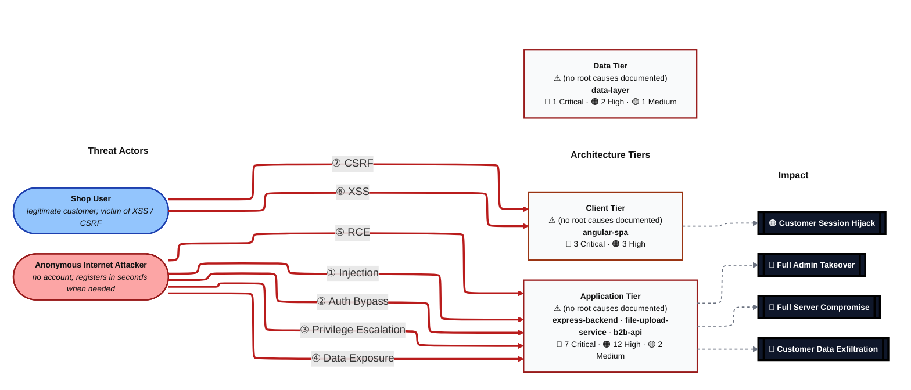

**Threat actors.** Two entities sit on the left of the diagram — one attacker who initiates every direct attack class, and one victim who is the target of the browser-side attacks (XSS / CSRF).

- **Shop User** — legitimate registered customer whose session and PII are the actual target; receives the victim-targeting attack arrows (XSS, CSRF) as victim, not attacker.
- **Anonymous Internet Attacker** — no account, no foothold; reaches every unauthenticated route, registers a throw-away account in seconds when needed, and can clone the public repository to obtain any committed secret offline. Initiates the outgoing attack arrows.

**Attack paths (numbered arrows in the diagram):**

- <a id="path-injection"></a>**① Injection** (Anonymous Internet Attacker → Application Tier) — user input flows into a server-side interpreter (SQL, NoSQL, XML, YAML, LDAP, OS shell) without parameterisation or schema validation.
  - Findings:
    - [T-005](#t-005) — SQL Injection in Product Search via UNION Extraction
    - [T-006](#t-006) — SQL Injection in Login Authentication Query
    - [T-011](#t-011) — XML External Entity (XXE) Injection via File Upload with noent:true
    - [T-030](#t-030) — NoSQL Injection in MongoDB-like MarsDB Product Reviews
  - Impact: Customer Data Exfiltration

- <a id="path-auth-bypass"></a>**② Auth Bypass** (Anonymous Internet Attacker → Application Tier) — authentication can be circumvented or forged because credentials, signing keys, or password hashes are weak, missing, or exposed.
  - Findings:
    - [T-008](#t-008) — JWT Forgery via Hardcoded RSA Private Key
    - [T-009](#t-009) — JWT alg:none Algorithm Confusion Attack
  - Impact: Full Admin Takeover, Customer Data Exfiltration

- <a id="path-privilege-escalation"></a>**③ Privilege Escalation** (Anonymous Internet Attacker → Application Tier) — authorisation checks are absent or bypassable, allowing horizontal and vertical privilege jumps from a self-registered or low-rights account.
  - Findings:
    - [T-018](#t-018) — IDOR in Data Export — UserId Accepted from Request Body
    - [T-024](#t-024) — Unauthenticated Access to Prometheus Metrics Endpoint
  - Impact: Full Admin Takeover, Customer Data Exfiltration

- <a id="path-sensitive-data-exposure"></a>**④ Sensitive Data Exposure** (Anonymous Internet Attacker → Application Tier) — confidential files, credentials, and secrets are reachable on unauthenticated routes, and unsafe path-handling primitives leak server content.
  - Findings:
    - [T-010](#t-010) — FTP Directory Listing Exposes Sensitive Files
    - [T-017](#t-017) — Sensitive Data Exposed in User Model API Response
    - [T-019](#t-019) — Application Configuration Exposed Unauthenticated
    - [T-022](#t-022) — Open Redirect via Substring Match in Allowlist
    - [T-026](#t-026) — Zip Slip Path Traversal via ZIP File Upload
    - [T-029](#t-029) — Unauthenticated Swagger API Documentation Exposes All Endpoints
    - [T-031](#t-031) — Access Logs Exposed and Tamperable via /support/logs
  - Impact: Customer Data Exfiltration

- <a id="path-remote-code-execution"></a>**⑤ Remote Code Execution (RCE)** (Anonymous Internet Attacker → Application Tier) — user-supplied data reaches a server-side code-execution sink (`eval`, sandbox primitives, deserialisation, request-forwarder) and breaks out into arbitrary native execution.
  - Findings:
    - [T-004](#t-004) — Remote Code Execution via B2B Order Sandbox Escape
    - [T-007](#t-007) — Server-Side Template Injection via eval() in User Profile
    - [T-028](#t-028) — SSRF via Unconstrained Profile Image URL Fetch
  - Impact: Full Server Compromise, Customer Data Exfiltration, Full Admin Takeover

- <a id="path-cross-site-scripting"></a>**⑥ Cross-Site Scripting (XSS)** (Shop User → Client Tier) — attacker-controlled content is rendered in the victim's browser without sanitisation, and the session token sits in JavaScript-readable storage.
  - Findings:
    - [T-001](#t-001) — Stored XSS via Product Description bypassSecurityTrustHtml
    - [T-002](#t-002) — DOM-Based XSS via Search Query Reflection in URL Parameter
    - [T-012](#t-012) — Stored XSS via User Feedback Comments in Administration Panel
  - Impact: Customer Session Hijack

- <a id="path-cross-site-request-forgery"></a>**⑦ Cross-Site Request Forgery (CSRF)** (Shop User → Client Tier) — a permissive CORS policy plus missing anti-CSRF tokens let any external page issue authenticated state-changing requests in the victim's session.
  - Findings:
    - [T-013](#t-013) — Cross-Site Request Forgery — No CSRF Protection
  - Impact: Customer Session Hijack

### Top Findings

The **20 highest-risk items**, sorted by impact-weighted score. The **Pfad** column links each finding to the matching ①–⑦ attack path in [Security Posture at a Glance](#security-posture-at-a-glance); mitigation IDs jump to [§9 Mitigation Register](#9-mitigation-register).

| # | Criticality | Pfad | Finding | Component | Primary Mitigations |
|---|-------------|------|---------|-----------|---------------------|
| 1 | 🔴 Critical | [①](#path-injection) | [T-005](#t-005) — SQL Injection in Product Search via UNION Extraction | [C-04](#c-04) — SQLite/Sequelize Data Layer | [M-003](#m-003) — Replace Raw SQL String Interpolation with Parameterized Queries (P1) |
| 2 | 🔴 Critical | [①](#path-injection) | [T-006](#t-006) — SQL Injection in Login Authentication Query | [C-01](#c-01) — Express REST API Backend | [M-003](#m-003) — Replace Raw SQL String Interpolation with Parameterized Queries (P1) |
| 3 | 🔴 Critical | [②](#path-auth-bypass) | [T-009](#t-009) — JWT alg:none Algorithm Confusion Attack | [C-01](#c-01) — Express REST API Backend | [M-002](#m-002) — Upgrade jsonwebtoken and Enforce Algorithm Allowlist (P1) |
| 4 | 🔴 Critical | [⑤](#path-remote-code-execution) | [T-004](#t-004) — Remote Code Execution via B2B Order Sandbox Escape | [C-05](#c-05) — B2B API and Real-Time Channel | [M-022](#m-022) — Replace safeEval/vm Sandbox in B2B Order Handler (P1) |
| 5 | 🔴 Critical | [①](#path-injection) | [T-011](#t-011) — XML External Entity (XXE) Injection via File Upload with noent:true | [C-03](#c-03) — File Upload Service | [M-015](#m-015) — Disable XXE in libxmljs2 by Setting noent:false (P1) |
| 6 | 🔴 Critical | [⑤](#path-remote-code-execution) | [T-007](#t-007) — Server-Side Template Injection via eval() in User Profile | [C-01](#c-01) — Express REST API Backend | [M-004](#m-004) — Remove eval() from User Profile Template Rendering (P1) |
| 7 | 🔴 Critical | [②](#path-auth-bypass) | [T-008](#t-008) — JWT Forgery via Hardcoded RSA Private Key | [C-01](#c-01) — Express REST API Backend | [M-001](#m-001) — Rotate JWT Signing Key and Store Outside Source Code (P1) |
| 8 | 🔴 Critical | [⑥](#path-cross-site-scripting) | [T-001](#t-001) — Stored XSS via Product Description bypassSecurityTrustHtml | [C-02](#c-02) — Angular SPA Frontend | [M-012](#m-012) — Remove bypassSecurityTrustHtml Calls — Use SafeHtml Pipe Instead (P1) |
| 9 | 🟠 High | [⑥](#path-cross-site-scripting) | [T-012](#t-012) — Stored XSS via User Feedback Comments in Administration Panel | [C-02](#c-02) — Angular SPA Frontend | [M-012](#m-012) — Remove bypassSecurityTrustHtml Calls — Use SafeHtml Pipe Instead (P1) |
| 10 | 🔴 Critical | [⑥](#path-cross-site-scripting) | [T-002](#t-002) — DOM-Based XSS via Search Query Reflection in URL Parameter | [C-02](#c-02) — Angular SPA Frontend | [M-012](#m-012) — Remove bypassSecurityTrustHtml Calls — Use SafeHtml Pipe Instead (P1) |
| 11 | 🟡 Medium | [①](#path-injection) | [T-030](#t-030) — NoSQL Injection in MongoDB-like MarsDB Product Reviews | [C-04](#c-04) — SQLite/Sequelize Data Layer | [M-019](#m-019) — Add Ownership Check to Review Update Endpoint (P3) |
| 12 | 🔴 Critical | — | [T-003](#t-003) — JWT Token Theft via XSS from localStorage | [C-02](#c-02) — Angular SPA Frontend | [M-011](#m-011) — Move JWT Tokens from localStorage to HttpOnly Cookies (P1) |
| 13 | 🔴 Critical | [④](#path-sensitive-data-exposure) | [T-010](#t-010) — FTP Directory Listing Exposes Sensitive Files | [C-03](#c-03) — File Upload Service | [M-018](#m-018) — Remove Public Access to /ftp Directory Listing (P1) |
| 14 | 🟠 High | [⑦](#path-cross-site-request-forgery) | [T-013](#t-013) — Cross-Site Request Forgery — No CSRF Protection | [C-02](#c-02) — Angular SPA Frontend | [M-014](#m-014) — Implement CSRF Protection for State-Changing Endpoints (P2) |
| 15 | 🟠 High | — | [T-021](#t-021) — No Rate Limiting on Login Endpoint Enables Credential Brute Force | [C-01](#c-01) — Express REST API Backend | [M-010](#m-010) — Add Rate Limiting to Login and Fix X-Forwarded-For Key Generator (P1) |
| 16 | 🟠 High | — | [T-027](#t-027) — Decompression Bomb via Crafted ZIP Upload | [C-03](#c-03) — File Upload Service | [M-016](#m-016) — Fix Zip Slip — Validate Extraction Path Against Canonical Destination (P2) |
| 17 | 🟠 High | — | [T-016](#t-016) — B2B Endpoint Denial of Service via Infinite Loop Payload | [C-05](#c-05) — B2B API and Real-Time Channel | [M-022](#m-022) — Replace safeEval/vm Sandbox in B2B Order Handler (P1) |
| 18 | 🟠 High | [③](#path-privilege-escalation) | [T-018](#t-018) — IDOR in Data Export — UserId Accepted from Request Body | [C-04](#c-04) — SQLite/Sequelize Data Layer | [M-021](#m-021) — Fix IDOR in Data Export — Use JWT UserId Instead of Request Body (P2) |
| 19 | 🟠 High | — | [T-023](#t-023) — Client-Side-Only Admin Authorization Guard Bypass | [C-01](#c-01) — Express REST API Backend | [M-008](#m-008) — Enforce Admin Role Check Server-Side on Admin API Endpoints (P2) |
| 20 | 🟠 High | [④](#path-sensitive-data-exposure) | [T-026](#t-026) — Zip Slip Path Traversal via ZIP File Upload | [C-03](#c-03) — File Upload Service | [M-016](#m-016) — Fix Zip Slip — Validate Extraction Path Against Canonical Destination (P2) |

_+9 additional ≥High findings — see [§8.C High Categories](#8c-high-categories)._

_Legend: 🔴 Critical (directly exploitable, major impact) · 🟠 High. **Pfad** glyphs ①–⑦ link back to the matching bullet in [Security Posture at a Glance](#security-posture-at-a-glance)._

### Architecture Assessment

🔴 **Verdict — Fundamentally Insecure by Design:** Juice Shop's architecture embodies every critical security anti-pattern simultaneously — hardcoded secrets in source control, absent server-side input validation, no CSRF protection, no Content Security Policy, client-side-only authorization guards, and MD5 password hashing without salting. These are not incidental gaps but deliberate training constructs; however, they collectively create a threat surface that would be catastrophic in any production deployment.

Five cross-cutting architectural defects underpin ~80% of all findings and must be addressed holistically:

| Defect | Description | Key Findings |
|--------|-------------|--------------|
| **Secrets committed to source control** | The RSA private key used for all JWT signing and the premium content key are hardcoded in lib/insecurity.ts and committed to the public repository, permanently compromising all session security. | [T-001](#t-001) — JWT Forgery via Hardcoded RSA Private Key<br/>[T-002](#t-002) — JWT alg:none Algorithm Confusion Attack<br/>[T-005](#t-005) — MD5 Password Hashing Enables Offline Credential Cracking |
| **No server-side input validation or output encoding** | Express route handlers and Sequelize models accept user-controlled input without sanitization, enabling SQL injection, XSS, XXE, SSTI, and path traversal across multiple entry points. | [T-003](#t-003) — SQL Injection in Login Authentication Query<br/>[T-004](#t-004) — Server-Side Template Injection via eval() in User Profile<br/>[T-014](#t-014) — Stored XSS via Product Description bypassSecurityTrustHtml<br/>[T-019](#t-019) — XXE Injection via File Upload with noent:true<br/>[T-024](#t-024) — SQL Injection in Product Search via UNION Extraction |
| **Client-side-only authorization enforcement** | Angular route guards and admin role checks are implemented exclusively in the browser, allowing any attacker who forges or replaces a JWT to access admin functionality directly via API calls. | [T-009](#t-009) — Client-Side-Only Admin Authorization Guard Bypass<br/>[T-027](#t-027) — IDOR in Data Export — UserId Accepted from Request Body<br/>[T-026](#t-026) — Sensitive Data Exposed in User Model API Response |
| **Absent browser security controls** | No Content Security Policy, no CSRF tokens, no SameSite cookie attributes, and no Subresource Integrity are configured, leaving the browser-facing surface fully open to script injection and cross-site request attacks. | [T-017](#t-017) — No Content Security Policy Allows Unrestricted Script Execution<br/>[T-018](#t-018) — Cross-Site Request Forgery — No CSRF Protection<br/>[T-015](#t-015) — DOM-Based XSS via Search Query Reflection |
| **Unauthenticated exposure of sensitive operational endpoints** | Prometheus metrics, Swagger API documentation, FTP directory listing, encryption key directory, and server log directory are all publicly accessible without authentication, providing detailed reconnaissance to any attacker. | [T-006](#t-006) — Unauthenticated Access to Prometheus Metrics Endpoint<br/>[T-007](#t-007) — Application Configuration Exposed Unauthenticated<br/>[T-023](#t-023) — FTP Directory Listing Exposes Sensitive Files<br/>[T-029](#t-029) — Unauthenticated Product Review Creation |

See **[§7 Security Architecture](#7-security-architecture)** for the full per-domain breakdown and control catalog.

### Mitigations

Mitigations below cover all open findings, **grouped by component** and sorted by priority (P1 first). Cross-component mitigations are listed once in a separate table — they affect more than one component, so duplicating them per-component would create redundant rows. Sort within each table: priority ascending, effort ascending, findings-addressed descending.

#### Cross-Component Mitigations (2)

| ID | Mitigation | Priority | Affects | Addresses | Effort |
|----|------------|----------|---------|-----------|--------|
| [M-003](#m-003) | Replace Raw SQL String Interpolation with Parameterized Queries | **P1** | [data-layer](#data-layer) SQLite/Sequelize Data Layer<br/>[express-backend](#express-backend) Express REST API Backend | [T-005](#t-005) — SQL Injection in Product Search via UNION Extraction<br/>[T-006](#t-006) — SQL Injection in Login Authentication Query | Medium |
| [M-006](#m-006) | Add Authentication to Admin/Metrics/Swagger Endpoints | **P2** | [express-backend](#express-backend) Express REST API Backend<br/>[b2b-api](#b2b-api) B2B API and Real-Time Channel | [T-019](#t-019) — Application Configuration Exposed Unauthenticated<br/>[T-024](#t-024) — Unauthenticated Access to Prometheus Metrics Endpoint<br/>[T-029](#t-029) — Unauthenticated Swagger API Documentation Exposes All Endpoints | Low |

#### Client Tier (4)

| ID | Mitigation | Priority | Addresses | Effort |
|----|------------|----------|-----------|--------|
| [M-012](#m-012) | Remove bypassSecurityTrustHtml Calls — Use SafeHtml Pipe Instead | **P1** | [T-001](#t-001) — Stored XSS via Product Description bypassSecurityTrustHtml<br/>[T-002](#t-002) — DOM-Based XSS via Search Query Reflection in URL Parameter<br/>[T-012](#t-012) — Stored XSS via User Feedback Comments in Administration Panel | Medium |
| [M-011](#m-011) | Move JWT Tokens from localStorage to HttpOnly Cookies | **P1** | [T-003](#t-003) — JWT Token Theft via XSS from localStorage | High |
| [M-013](#m-013) | Add Content Security Policy Header | **P2** | [T-014](#t-014) — No Content Security Policy Allows Unrestricted Script Execution | Medium |
| [M-014](#m-014) | Implement CSRF Protection for State-Changing Endpoints | **P2** | [T-013](#t-013) — Cross-Site Request Forgery — No CSRF Protection | Medium |

#### Application Tier (15)

| ID | Mitigation | Priority | Addresses | Effort |
|----|------------|----------|-----------|--------|
| [M-010](#m-010) | Add Rate Limiting to Login and Fix X-Forwarded-For Key Generator | **P1** | [T-020](#t-020) — Unsafe Rate Limiter Key Generator Allows Bypass via X-Forwarded-For<br/>[T-021](#t-021) — No Rate Limiting on Login Endpoint Enables Credential Brute Force | Low |
| [M-002](#m-002) | Upgrade jsonwebtoken and Enforce Algorithm Allowlist | **P1** | [T-009](#t-009) — JWT alg:none Algorithm Confusion Attack | Low |
| [M-004](#m-004) | Remove eval() from User Profile Template Rendering | **P1** | [T-007](#t-007) — Server-Side Template Injection via eval() in User Profile | Low |
| [M-015](#m-015) | Disable XXE in libxmljs2 by Setting noent:false | **P1** | [T-011](#t-011) — XML External Entity (XXE) Injection via File Upload with noent:true | Low |
| [M-018](#m-018) | Remove Public Access to /ftp Directory Listing | **P1** | [T-010](#t-010) — FTP Directory Listing Exposes Sensitive Files | Low |
| [M-001](#m-001) | Rotate JWT Signing Key and Store Outside Source Code | **P1** | [T-008](#t-008) — JWT Forgery via Hardcoded RSA Private Key | Medium |
| [M-005](#m-005) | Replace MD5 Password Hashing with bcrypt | **P1** | [T-025](#t-025) — MD5 Password Hashing Enables Offline Credential Cracking | Medium |
| [M-022](#m-022) | Replace safeEval/vm Sandbox in B2B Order Handler | **P1** | [T-004](#t-004) — Remote Code Execution via B2B Order Sandbox Escape<br/>[T-016](#t-016) — B2B Endpoint Denial of Service via Infinite Loop Payload | High |
| [M-016](#m-016) | Fix Zip Slip — Validate Extraction Path Against Canonical Destination | **P2** | [T-026](#t-026) — Zip Slip Path Traversal via ZIP File Upload<br/>[T-027](#t-027) — Decompression Bomb via Crafted ZIP Upload | Low |
| [M-023](#m-023) | Add Authentication to Product Review Creation | **P2** | [T-015](#t-015) — Unauthenticated Product Review Creation (Missing Auth Check) | Low |
| [M-008](#m-008) | Enforce Admin Role Check Server-Side on Admin API Endpoints | **P2** | [T-023](#t-023) — Client-Side-Only Admin Authorization Guard Bypass | Medium |
| [M-017](#m-017) | Add URL Allowlist and SSRF Protection to Profile Image Fetch | **P2** | [T-028](#t-028) — SSRF via Unconstrained Profile Image URL Fetch | Medium |
| [M-007](#m-007) | Fix Open Redirect — Use Exact URL Match Instead of Substring | **P3** | [T-022](#t-022) — Open Redirect via Substring Match in Allowlist | Low |
| [M-009](#m-009) | Restrict Access to /support/logs Endpoint | **P3** | [T-031](#t-031) — Access Logs Exposed and Tamperable via /support/logs | Low |
| [M-024](#m-024) | Add JWT Authentication to Socket.IO Connection Handler | **P4** | [T-032](#t-032) — Socket.IO Events Lack Authentication — Challenge Verification Bypassable | Medium |

#### Data Tier (3)

| ID | Mitigation | Priority | Addresses | Effort |
|----|------------|----------|-----------|--------|
| [M-020](#m-020) | Restrict User Model API to Required Fields Only | **P2** | [T-017](#t-017) — Sensitive Data Exposed in User Model API Response | Low |
| [M-021](#m-021) | Fix IDOR in Data Export — Use JWT UserId Instead of Request Body | **P2** | [T-018](#t-018) — IDOR in Data Export — UserId Accepted from Request Body | Low |
| [M-019](#m-019) | Add Ownership Check to Review Update Endpoint | **P3** | [T-030](#t-030) — NoSQL Injection in MongoDB-like MarsDB Product Reviews | Low |

### Operational Strengths

Despite the structurally deficient design, the project implements several security-relevant controls. None fully mitigate a Critical finding, but each narrows part of the attack surface. This table is a filtered view of [Section 7](#7-security-architecture) — rows with effectiveness ≥ Weak. The full catalog, including ❌ Missing controls, lives in Section 7.

| Architectural Control | Implementation | Effectiveness | Gap | Mitigates |
|-----------------------|----------------|---------------|-----|-----------|
| Rate Limiting | Only 2 routes rate-limited; login unprotected; X-Forwarded-For bypass | ⚠️ Partial | See §7 for the domain-level structural gaps. | _Broad defence-in-depth; no single finding directly addressed._ |
| Security Headers | Partial — XSS filter explicitly commented out; CSP not configured | ⚠️ Partial | See §7 for the domain-level structural gaps. | _Broad defence-in-depth; no single finding directly addressed._ |
| Identity & Access Management | express-jwt@0.1.3 + jsonwebtoken@0.4.0 | 🔶 Weak | See §7 for the domain-level structural gaps. | _Broad defence-in-depth; no single finding directly addressed._ |
| Authorization | JWT presence check, role check client-side only | 🔶 Weak | See §7 for the domain-level structural gaps. | _Broad defence-in-depth; no single finding directly addressed._ |
| Logging & Monitoring | Logs exist but publicly accessible at /support/logs | 🔶 Weak | See §7 for the domain-level structural gaps. | _Broad defence-in-depth; no single finding directly addressed._ |


**Bottom line:** These controls narrow specific attack surfaces but none eliminates a Critical finding on its own.

---

## 1. System Overview

Probably the most modern and sophisticated insecure web application — deliberately vulnerable Node.js/TypeScript/Angular web application for security training, CTF, and awareness

**Repository:** https://github.com/juice-shop/juice-shop
**Runtime:** `Node.js 20-24, Express 4.x, Angular SPA, SQLite/Sequelize, MarsDB`

### Scope

This threat model covers 5 component(s) of OWASP Juice Shop: **Express REST API Backend**, **Angular SPA Frontend**, **File Upload Service**, **SQLite/Sequelize Data Layer**, **B2B API and Real-Time Channel**.

**Out of scope:** third-party hosted dependencies, browser runtime, operating-system kernel, and the underlying network infrastructure.

---

## 2. Architecture Diagrams

### 2.1 System Context

C4 Level 1 — OWASP Juice Shop situated against its external actors and dependencies. Boundary lines mark trust transitions enforced (or expected to be enforced) by the application.

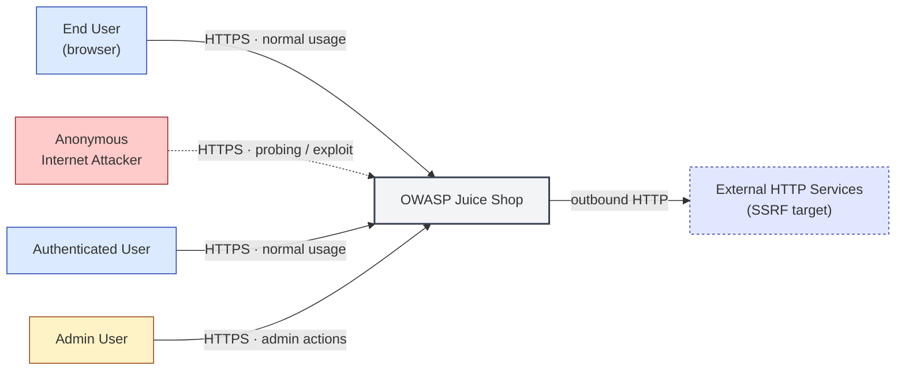

### 2.2 Container Architecture

C4 Level 2 — deployable units and their internal interfaces. Each box is a process or runtime unit; arrows show synchronous request flows.

```mermaid
flowchart TB
    subgraph Client
        angular_spa["Angular SPA Frontend"]
    end
    subgraph Application
        express_backend["Express REST API Backend"]
        file_upload_service["File Upload Service"]
        b2b_api["B2B API and Real-Time Channel"]
    end
    subgraph Data
        data_layer["SQLite/Sequelize Data Layer"]
    end
    angular_spa -->|REST API · HTTPS · JWT-bearing| express_backend
    angular_spa -->|Socket.IO events · WebSocket · JWT-bearing| b2b_api
    express_backend -->|ORM query / raw SQL · Sequelize · Confidential| data_layer
    express_backend -->|File ingestion · multipart/form-data · Untrusted| file_upload_service
    file_upload_service -->|File-metadata persistence · Sequelize · Internal| data_layer
    b2b_api -->|Order persistence · Sequelize · Confidential| data_layer
    express_backend -->|API response (incl. error stacks) · HTTPS · Confidential| angular_spa
    express_backend -->|Internal RPC dispatch · Node.js call · Trusted| b2b_api
```

### 2.3 Components


C4 Level 3 — internal structure of each container, mapped to source paths.

| ID | Name | Type | Key Paths | Linked Threats |
|----|------|------|-----------|----------------|
| <a id="c-01"></a><a id="express-backend"></a>C-01 | Express REST API Backend | process | `server.ts`<br/>`routes/**`<br/>`lib/**`<br/>`middleware/**` | [T-001](#t-001) — Stored XSS via Product Description bypassSecurityTrustHtml<br/>[T-002](#t-002) — DOM-Based XSS via Search Query Reflection in URL Parameter<br/>[T-003](#t-003) — JWT Token Theft via XSS from localStorage<br/>[T-004](#t-004) — Remote Code Execution via B2B Order Sandbox Escape<br/>[T-005](#t-005) — SQL Injection in Product Search via UNION Extraction<br/>[T-006](#t-006) — SQL Injection in Login Authentication Query<br/>[T-007](#t-007) — Server-Side Template Injection via eval() in User Profile<br/>[T-008](#t-008) — JWT Forgery via Hardcoded RSA Private Key<br/>[T-009](#t-009) — JWT alg:none Algorithm Confusion Attack<br/>[T-010](#t-010) — FTP Directory Listing Exposes Sensitive Files<br/>[T-011](#t-011) — XML External Entity (XXE) Injection via File Upload with noent:true<br/>[T-012](#t-012) — Stored XSS via User Feedback Comments in Administration Panel |
| <a id="c-02"></a><a id="angular-spa"></a>C-02 | Angular SPA Frontend | process | `frontend/src/**` | [T-013](#t-013) — Cross-Site Request Forgery — No CSRF Protection<br/>[T-014](#t-014) — No Content Security Policy Allows Unrestricted Script Execution<br/>[T-015](#t-015) — Unauthenticated Product Review Creation (Missing Auth Check)<br/>[T-016](#t-016) — B2B Endpoint Denial of Service via Infinite Loop Payload<br/>[T-017](#t-017) — Sensitive Data Exposed in User Model API Response<br/>[T-018](#t-018) — IDOR in Data Export — UserId Accepted from Request Body |
| <a id="c-03"></a><a id="file-upload-service"></a>C-03 | File Upload Service | process | `routes/fileUpload.ts`<br/>`routes/profileImageUrlUpload.ts`<br/>`ftp/**`<br/>`encryptionkeys/**` | [T-019](#t-019) — Application Configuration Exposed Unauthenticated<br/>[T-020](#t-020) — Unsafe Rate Limiter Key Generator Allows Bypass via X-Forwarded-For<br/>[T-021](#t-021) — No Rate Limiting on Login Endpoint Enables Credential Brute Force<br/>[T-022](#t-022) — Open Redirect via Substring Match in Allowlist<br/>[T-023](#t-023) — Client-Side-Only Admin Authorization Guard Bypass |
| <a id="c-04"></a><a id="data-layer"></a>C-04 | SQLite/Sequelize Data Layer | datastore | `models/**`<br/>`data/**`<br/>`routes/search.ts`<br/>`routes/updateProductReviews.ts`<br/>`routes/dataExport.ts` | [T-024](#t-024) — Unauthenticated Access to Prometheus Metrics Endpoint<br/>[T-025](#t-025) — MD5 Password Hashing Enables Offline Credential Cracking<br/>[T-026](#t-026) — Zip Slip Path Traversal via ZIP File Upload<br/>[T-027](#t-027) — Decompression Bomb via Crafted ZIP Upload |
| <a id="c-05"></a><a id="b2b-api"></a>C-05 | B2B API and Real-Time Channel | process | `routes/b2bOrder.ts`<br/>`lib/startup/registerWebsocketEvents.ts`<br/>`swagger.yml` | [T-028](#t-028) — SSRF via Unconstrained Profile Image URL Fetch<br/>[T-029](#t-029) — Unauthenticated Swagger API Documentation Exposes All Endpoints<br/>[T-030](#t-030) — NoSQL Injection in MongoDB-like MarsDB Product Reviews<br/>[T-031](#t-031) — Access Logs Exposed and Tamperable via /support/logs<br/>[T-032](#t-032) — Socket.IO Events Lack Authentication — Challenge Verification Bypassable |
### 2.4 Technology Architecture

Trust boundaries enforced (or expected to be enforced) between actors, containers, and data stores.

| Boundary ID | Name | Description | Enforcement |
|---|---|---|---|
| public-internet | Public Internet | External users, attackers, browsers accessing the application | TLS terminated at reverse proxy; no WAF deployed; CORS policy too permissive (wildcard + credentials). |
| express-app | Express Application Process | Node.js process running on port 3000 | Single Node.js process — all components share one address space. JWT middleware enforces auth on most /rest routes; /b2b/v2 and /support/logs lack the middleware. |
| data-tier | Data Tier | SQLite file and MarsDB in-memory store | ORM-only access via Sequelize for the relational tier; MarsDB in-memory store has no access control. SQLite file resides on the same volume as the application. |
| filesystem | Server Filesystem | Underlying OS filesystem (accessible via SSRF/traversal attacks) | OS-level file permissions only — no chroot, no FUSE jail. Several paths (`/ftp/*`, `/encryptionkeys/*`, `/support/logs/*`) are mapped into the public route surface. |

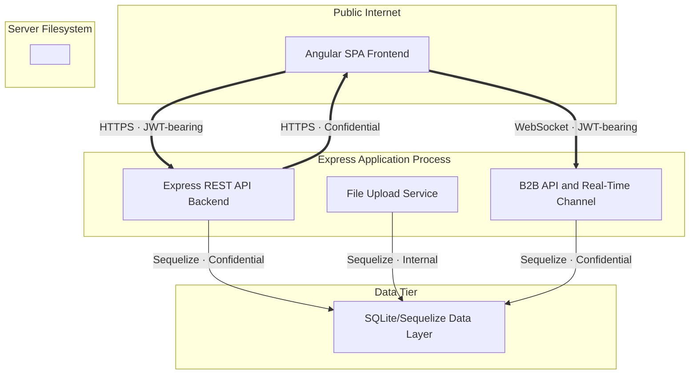

---

## 3. Attack Walkthroughs

This section shows how the most severe Critical findings chain together into end-to-end attack scenarios, followed by per-finding sequence diagrams that detail exploitation and the post-mitigation state.

### 3.1 Attack Chain Overview

The diagrams below show how individual Critical findings compose into multi-step attack scenarios. Each chain uses the actual exploitation path an attacker would follow, referencing the T-NNN IDs in §8.

#### Chain 1 — Full Account Takeover via Hardcoded JWT Key

The RSA private key committed in `lib/insecurity.ts` allows an attacker who reads the source code to forge an admin JWT and call any authenticated API, bypassing both authentication and authorization.

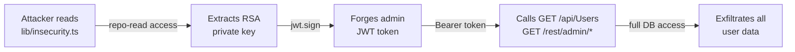

**Key takeaway:** A single committed secret (T-008) enables full admin session forgery (T-009 complements this via alg:none) without any network attack — pure offline JWT crafting.

#### Chain 2 — Remote Code Execution via Stored XSS and eval()

A stored XSS payload in a product description (T-001) delivers a script that triggers the SSTI `eval()` path in the user profile route (T-007) when an admin views the admin panel, achieving OS-level code execution on the server.

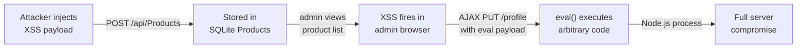

**Key takeaway:** T-001 (stored XSS) chains with T-007 (eval SSTI) to escalate from client-side injection to server-side RCE — no brute-force or credential theft needed.

#### Chain 3 — Complete Database Exfiltration via Unauthenticated SQL Injection

Both the login endpoint (T-006) and the product search endpoint (T-005) are vulnerable to UNION-based SQL injection without any authentication, enabling full database dump as the first action against the application.

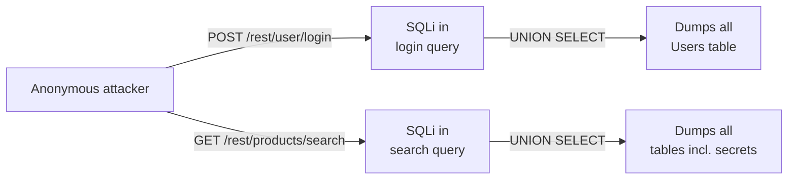

**Key takeaway:** T-005 and T-006 both allow full database exfiltration from an unauthenticated position — the attacker does not need to log in first.

---

### 3.2 JWT Forgery via Hardcoded RSA Private Key

Threat: T-008. This diagram shows how an attacker with read access to the repository forges an admin session token, and what the application looks like after applying M-001 (key rotation out of source control).

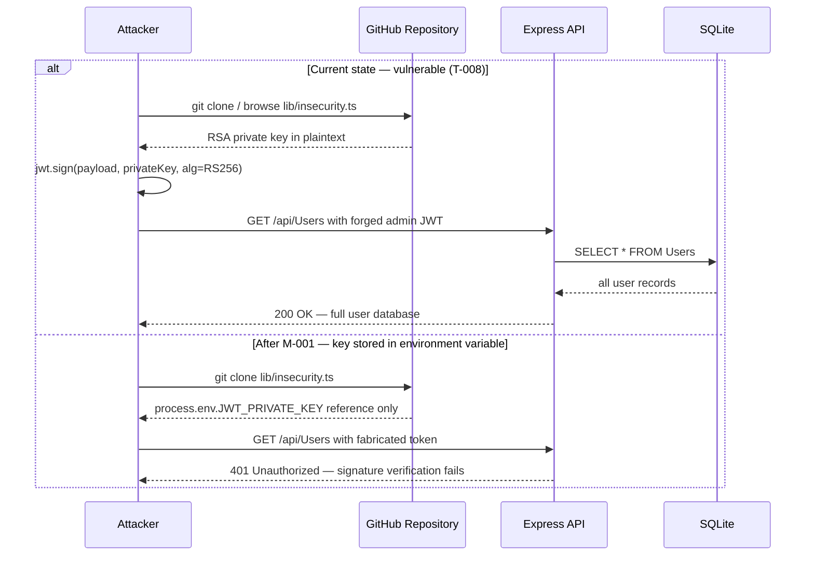

### 3.3 JWT alg:none Algorithm Confusion Attack

Threat: T-009. An attacker strips the JWT signature by setting `alg: none`, exploiting `jsonwebtoken@0.4.0` which accepts unsigned tokens.

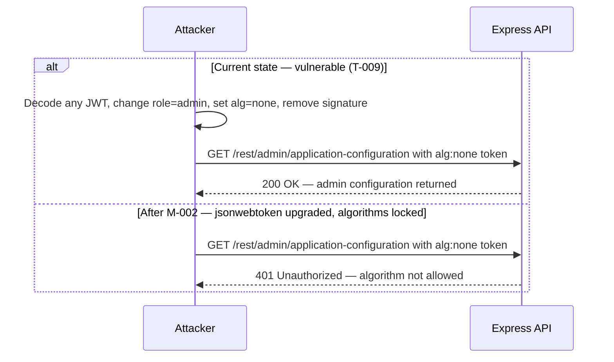

### 3.4 SQL Injection in Login Authentication

Threat: T-006. The login query concatenates raw user input, enabling authentication bypass and full credential extraction via UNION injection.

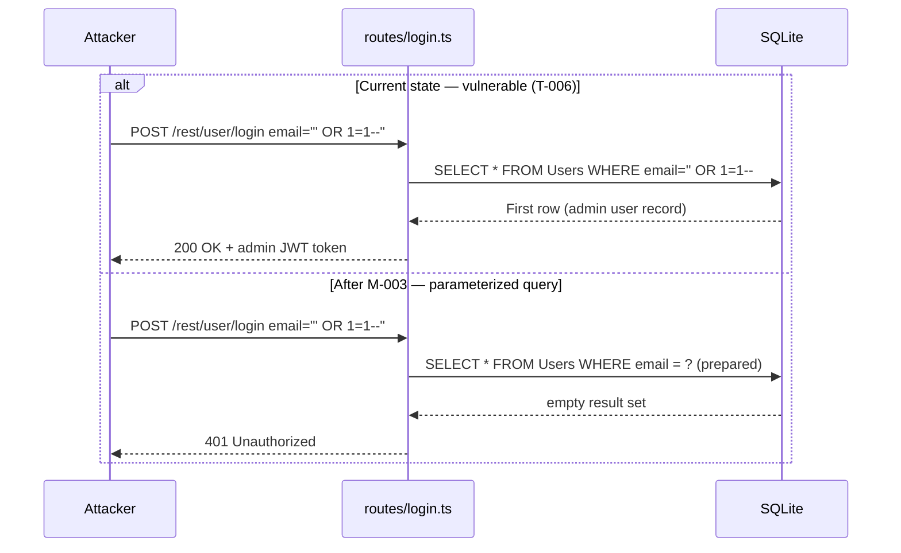

### 3.5 Server-Side Template Injection via eval()

Threat: T-007. The user profile route passes a Pug template username through `eval()` with no sanitization, enabling arbitrary Node.js code execution.

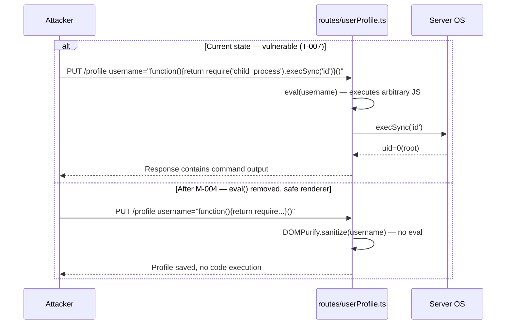

### 3.6 Stored XSS via Product Description bypassSecurityTrustHtml

Threat: T-001. Angular's built-in sanitization is deliberately disabled via `bypassSecurityTrustHtml`, allowing stored XSS payloads in product descriptions to execute in any user's browser.

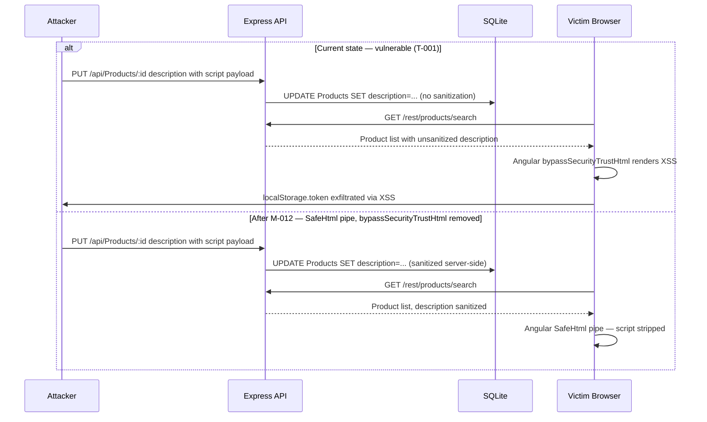

### 3.7 Remote Code Execution via B2B Order Sandbox Escape

Threat: T-004. The B2B order endpoint executes a custom expression language inside a `vm2` sandbox. An attacker escapes the sandbox to gain full Node.js code execution.

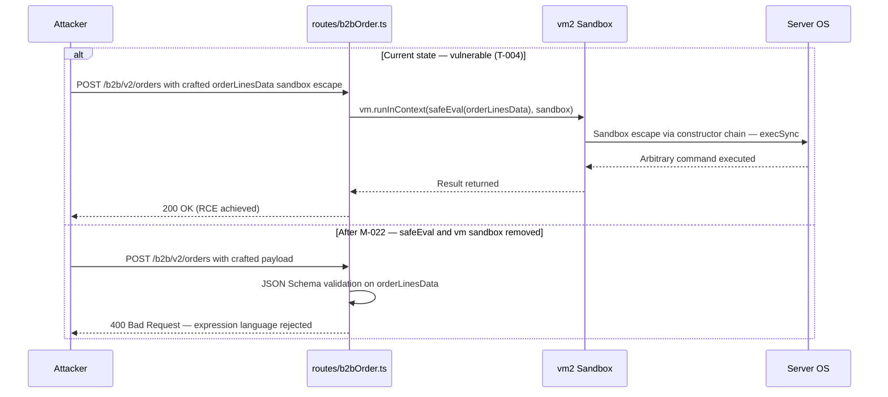

### 3.8 XXE Injection via File Upload

Threat: T-011. The file upload endpoint parses XML files with `noent: true`, enabling external entity expansion and local file disclosure.

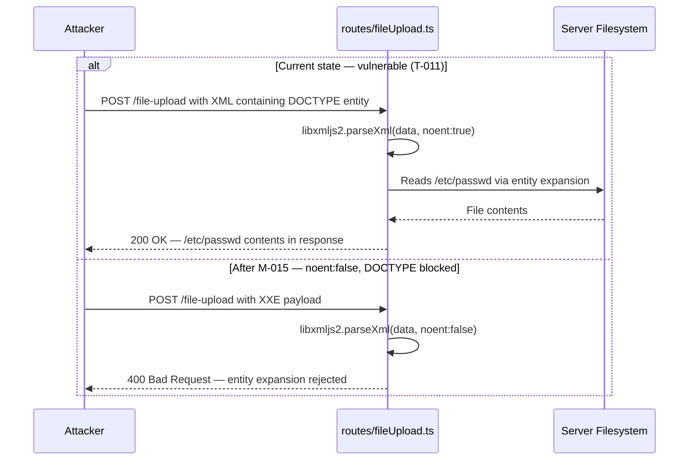

### 3.9 FTP Directory Listing Exposes Sensitive Files

Threat: T-010. The `/ftp` directory is served directly by Express with directory listing enabled, exposing business-sensitive files including a KeePass database.

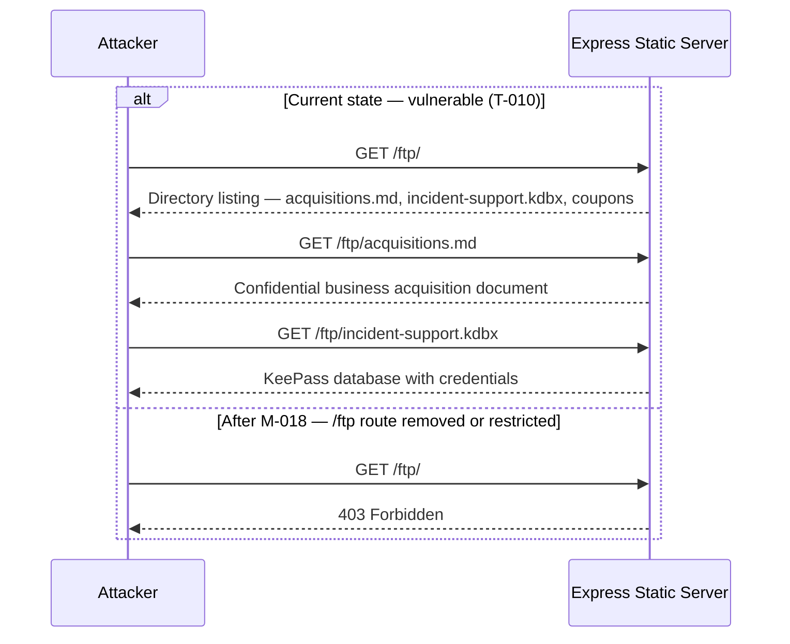

### 3.10 DOM-Based XSS via Search Query URL Parameter

Threat: T-002. The Angular search component reflects the URL `q` parameter through `bypassSecurityTrustHtml`, executing attacker-controlled scripts in the victim's browser without server-side storage.

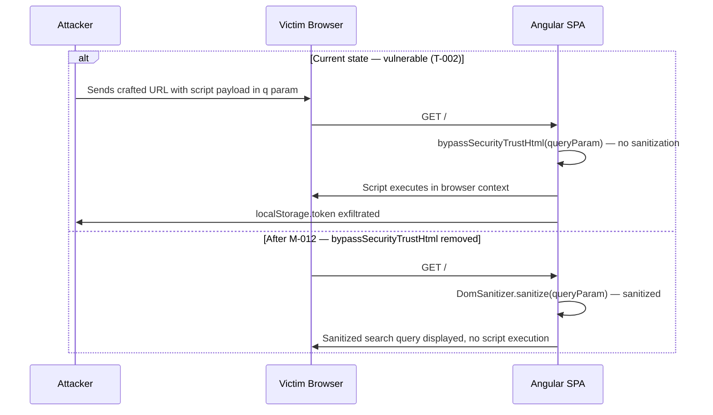

### 3.11 JWT Token Theft via XSS from localStorage

Threat: T-003. JWT tokens stored in `localStorage` are accessible to any XSS payload. This threat chains with T-001 and T-002 to complete full session takeover.

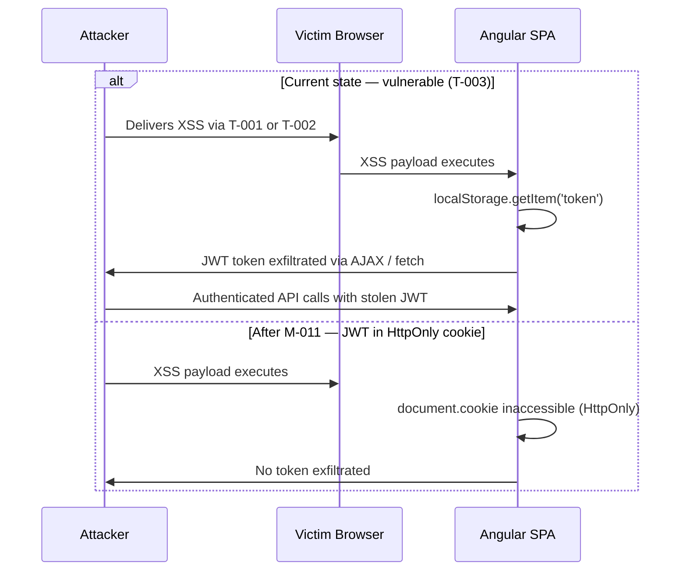

---

## 4. Assets

Information assets and the classification level that drives the Confidentiality / Integrity / Availability targets used in §8 risk scoring.

| Asset | ID | Classification | Description |
|---|---|---|---|
| User Credentials & Password Hashes | user-credentials | Restricted | User email addresses, MD5-hashed passwords (without salt), TOTP secrets stored in SQLite Users table |
| RSA JWT Private Key | jwt-private-key | Restricted | Hardcoded RSA private key in lib/insecurity.ts used to sign all JWT tokens; publicly committed to GitHub |
| JWT Session Tokens | jwt-tokens | Confidential | JWT tokens stored in localStorage, used for all authenticated API requests |
| User PII (Profile Data) | user-pii | Confidential | User names, addresses, last login IPs, profile images, order history stored in SQLite |
| FTP Directory Contents | ftp-files | Confidential | acquisitions.md (business secrets), incident-support.kdbx (KeePass with credentials), coupons, backup files |
| Server Filesystem | server-filesystem | Restricted | Application source, uploads/complaints directory, /etc/passwd and other OS files accessible via SSRF/traversal |
| Application Configuration | application-config | Internal | Google OAuth client ID, server base URL, feature flags, chatbot training URL exposed at /rest/admin/application-configuration |
| Prometheus Operational Metrics | metrics-data | Internal | Request counts per route, user wallet balances, challenge completion rates, system internals |

---

## 5. Attack Surface

Network-reachable entry points classified by authentication requirement. Each row links to the threat(s) referenced in its `notes` column.

### 5.1 Unauthenticated Entry Points (10)

| Method | Route | Notes |
|---|---|---|
| POST | `/rest/user/login` | [T-003](#t-003) — JWT Token Theft via XSS from localStorage, [T-021](#t-021) — No Rate Limiting on Login Endpoint Enables Credential Brute Force |
| GET | `/rest/admin/application-configuration` | [T-007](#t-007) — Server-Side Template Injection via eval() in User Profile |
| GET | `/metrics` | [T-006](#t-006) — SQL Injection in Login Authentication Query |
| GET | `/ftp/*` | [T-023](#t-023) — Client-Side-Only Admin Authorization Guard Bypass |
| GET | `/support/logs/*` | [T-031](#t-031) — Access Logs Exposed and Tamperable via /support/logs |
| GET | `/api-docs` | [T-029](#t-029) — Unauthenticated Swagger API Documentation Exposes All Endpoints |
| GET | `/encryptionkeys/*` | [T-001](#t-001) — Stored XSS via Product Description bypassSecurityTrustHtml |
| POST | `/api/Feedbacks` | [T-016](#t-016) — B2B Endpoint Denial of Service via Infinite Loop Payload |
| GET | `/rest/products/search` | [T-024](#t-024) — Unauthenticated Access to Prometheus Metrics Endpoint, [T-014](#t-014) — No Content Security Policy Allows Unrestricted Script Execution |
| POST | `/file-upload` | [T-019](#t-019) — Application Configuration Exposed Unauthenticated, [T-020](#t-020) — Unsafe Rate Limiter Key Generator Allows Bypass via X-Forwarded-For, [T-022](#t-022) — Open Redirect via Substring Match in Allowlist |

### 5.2 Authenticated Entry Points (7)

| Method | Route | Notes |
|---|---|---|
| POST | `/b2b/v2/orders` | [T-028](#t-028) — SSRF via Unconstrained Profile Image URL Fetch, [T-030](#t-030) — NoSQL Injection in MongoDB-like MarsDB Product Reviews |
| GET | `/rest/user/whoami` |  |
| POST | `/profile/image/url` | [T-021](#t-021) — No Rate Limiting on Login Endpoint Enables Credential Brute Force |
| GET | `/api/Users` | [T-026](#t-026) — Zip Slip Path Traversal via ZIP File Upload, [T-009](#t-009) — JWT alg:none Algorithm Confusion Attack |
| POST | `/rest/user/data-export` | [T-027](#t-027) — Decompression Bomb via Crafted ZIP Upload |
| PUT | `/profile` | [T-004](#t-004) — Remote Code Execution via B2B Order Sandbox Escape |
| PATCH | `/rest/products/reviews` | [T-025](#t-025) — MD5 Password Hashing Enables Offline Credential Cracking |

---

## 7. Security Architecture

Security-relevant control domains spanning the application. Each sub-section summarises the control intent, the implementation observed in the codebase, and the gap between the two. Cross-cutting domains (Secret Management, Defense-in-Depth) are surfaced explicitly so they are not lost between per-component sections.

### 7.1 Overview

Across 5 component(s) the assessment catalogued 10 security control(s).

Effectiveness breakdown: **missing**: 5 · **partial**: 2 · **weak**: 3.

### 7.2 Key Architectural Risks

| Domain | Control | Effectiveness | Notes |
|---|---|---|---|
| Identity & Access Management | JWT RS256 Authentication | weak | Upgrade jsonwebtoken to ≥9, move RSA key to env or KMS, expose JWKS for rotation. |
| Authorization | isAuthorized middleware | weak | Move all role checks to Express middleware; add a server-side route allowlist; reject userId from body in favour of the JWT sub. |
| Input Validation | sanitize-html@1.4.2 | missing | Upgrade sanitize-html ≥2.x, remove bypassSecurityTrustHtml, enable Angular Trusted Types. |
| Data Protection | MD5 password hashing | missing | Migrate to argon2id with random salt + pepper; force password reset on next login. |
| CORS | CORS policy | missing | Restrict origin to the known frontend domain; never combine wildcard with credentials. |
| CSRF Protection | CSRF tokens | missing | Add SameSite=Strict on auth cookies + double-submit token for non-idempotent operations. |
| Secret Management | Key storage | missing | Move all secrets to env vars or a managed-secret store; rotate immediately; revoke any token signed with the current key. |
| Logging & Monitoring | Morgan access logs | weak | Restrict /support/logs to admin role; add logrotate; ship to a centralised SIEM with retention policy. |

### 7.3 Identity & Access Management

| Control | Implementation | Effectiveness | Notes |
|---|---|---|---|
| JWT RS256 Authentication | express-jwt@0.1.3 + jsonwebtoken@0.4.0 | weak | Upgrade jsonwebtoken to ≥9, move RSA key to env or KMS, expose JWKS for rotation. |

#### 7.3.1 JWT RS256 Authentication Flow

**Implementation:** `express-jwt@0.1.3 + jsonwebtoken@0.4.0`

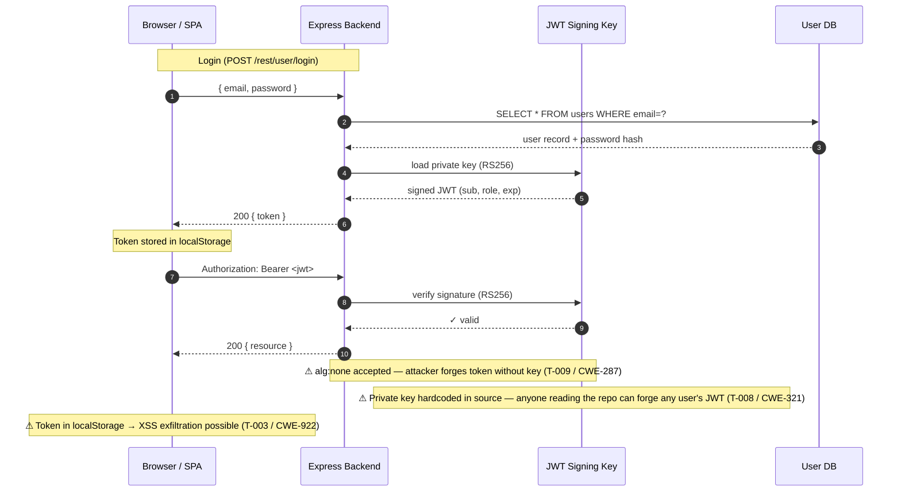

**Risk assessment:** see the row in the §7.3 controls table above for effectiveness and notes; cross-referenced findings are tracked in §8.

**Findings in this flow:**
- [T-020](#t-020) — Unsafe Rate Limiter Key Generator Allows Bypass via X-Forwarded-For
- [T-021](#t-021) — No Rate Limiting on Login Endpoint Enables Credential Brute Force

### 7.4 Authorization

| Control | Implementation | Effectiveness | Notes |
|---|---|---|---|
| isAuthorized middleware | JWT presence check, role check client-side only | weak | Move all role checks to Express middleware; add a server-side route allowlist; reject userId from body in favour of the JWT sub. |

### 7.5 Input Validation & Output Encoding

| Control | Implementation | Effectiveness | Notes |
|---|---|---|---|
| sanitize-html@1.4.2 | Old version, bypassSecurityTrustHtml disables Angular sanitization | missing | Upgrade sanitize-html ≥2.x, remove bypassSecurityTrustHtml, enable Angular Trusted Types. |

### 7.6 Data Protection & Session Management

| Control | Implementation | Effectiveness | Notes |
|---|---|---|---|
| MD5 password hashing | crypto.createHash('md5') — no salt, broken algorithm | missing | Migrate to argon2id with random salt + pepper; force password reset on next login. |

### 7.7 Frontend Security

| Control | Implementation | Effectiveness | Notes |
|---|---|---|---|
| CSRF tokens | Absent — intentional | missing | Add SameSite=Strict on auth cookies + double-submit token for non-idempotent operations. |

### 7.8 Real-time / WebSocket

_No dedicated control cataloged for this domain — the threats below indicate the gap._

| Threat | Severity | CWE |
|---|---|---|
| [T-032](#t-032) — Socket.IO Events Lack Authentication — Challenge Verification Bypassable | Low | [CWE-306](https://cwe.mitre.org/data/definitions/306.html) |

### 7.9 AI / LLM

_No controls cataloged in this domain. See §8 Threat Register for any findings that may indirectly relate._

### 7.10 Audit & Logging

| Control | Implementation | Effectiveness | Notes |
|---|---|---|---|
| Morgan access logs | Logs exist but publicly accessible at /support/logs | weak | Restrict /support/logs to admin role; add logrotate; ship to a centralised SIEM with retention policy. |

### 7.11 Infrastructure & Network Segmentation

_No dedicated control cataloged for this domain — the threats below indicate the gap._

| Threat | Severity | CWE |
|---|---|---|
| [T-017](#t-017) — Sensitive Data Exposed in User Model API Response | High | [CWE-200](https://cwe.mitre.org/data/definitions/200.html) |
| [T-019](#t-019) — Application Configuration Exposed Unauthenticated | High | [CWE-200](https://cwe.mitre.org/data/definitions/200.html) |
| [T-024](#t-024) — Unauthenticated Access to Prometheus Metrics Endpoint | High | [CWE-862](https://cwe.mitre.org/data/definitions/862.html) |
| [T-028](#t-028) — SSRF via Unconstrained Profile Image URL Fetch | High | [CWE-918](https://cwe.mitre.org/data/definitions/918.html) |
| [T-029](#t-029) — Unauthenticated Swagger API Documentation Exposes All Endpoints | Medium | [CWE-200](https://cwe.mitre.org/data/definitions/200.html) |

### 7.12 Dependency & Supply Chain

_No controls cataloged in this domain. See §8 Threat Register for any findings that may indirectly relate._

### 7.13 Secret Management *(cross-cutting)*

| Control | Implementation | Effectiveness | Notes |
|---|---|---|---|
| Key storage | RSA private key hardcoded in source; cookie secret hardcoded; HMAC key hardcoded | missing | Move all secrets to env vars or a managed-secret store; rotate immediately; revoke any token signed with the current key. |

### 7.14 Defense-in-Depth Assessment *(cross-cutting)*

Of 10 cataloged controls: ✅ **0** adequate, 🟡 **2** partial, ⚠️ **3** weak, ❌ **5** missing.

---

## 8. Threat Register

The threat register is structured in two layers: **architectural categories** (TH-NN) group findings by the pattern they express; each category expands into the concrete code-level **findings** that instantiate it. Executives read the category summary; engineers read the finding table inside the category they own.

**Risk Distribution:** 🔴 Critical: 11 · 🟠 High: 17 · 🟡 Medium: 3 · 🟢 Low: 1 · **Total findings: 32**
**STRIDE Coverage:** Spoofing: 3 · Tampering: 12 · Repudiation: 2 · Information Disclosure: 7 · Denial of Service: 4 · Elevation of Privilege: 4
**Category Distribution:** 13 of 18 categories active — Critical: 7 · High: 6 · Medium: 0 · Low: 0

### 8.A Categories at a glance

Architectural threat categories active in this project, sorted by the highest severity and finding count.

| TH | Category | Severity (eff.) | Findings | Top Finding | Breach | OWASP | Pillar |
|----|----------|-----------------|----------|-------------|--------|-------|--------|
| [TH-01](#th-01) | Injection | 🔴 Critical | 10 | [T-004](#t-004) — Remote Code Execution via B2B Order Sandbox Escape | 2 | [A03](https://owasp.org/Top10/A03_2021/) | [CWE-707](https://cwe.mitre.org/data/definitions/707.html) |
| [TH-09](#th-09) | Unauthenticated Management Plane | 🔴 Critical | 4 | [T-010](#t-010) — FTP Directory Listing Exposes Sensitive Files | 1 | [A01](https://owasp.org/Top10/A01_2021/) | [CWE-284](https://cwe.mitre.org/data/definitions/284.html) |
| [TH-02](#th-02) | Broken Authentication | 🔴 Critical | 2 | [T-009](#t-009) — JWT alg:none Algorithm Confusion Attack | 1 | [A07](https://owasp.org/Top10/A07_2021/) | [CWE-693](https://cwe.mitre.org/data/definitions/693.html) |
| [TH-03](#th-03) | Cryptographic Failures | 🔴 Critical | 2 | [T-008](#t-008) — JWT Forgery via Hardcoded RSA Private Key | 3 | [A02](https://owasp.org/Top10/A02_2021/) | [CWE-693](https://cwe.mitre.org/data/definitions/693.html) |
| [TH-04](#th-04) | Insecure Client-Side Storage | 🔴 Critical | 2 | [T-003](#t-003) — JWT Token Theft via XSS from localStorage | 2 | [A02](https://owasp.org/Top10/A02_2021/) | [CWE-664](https://cwe.mitre.org/data/definitions/664.html) |
| [TH-11](#th-11) | Cross-Site Scripting (XSS) | 🔴 Critical | 2 | [T-002](#t-002) — DOM-Based XSS via Search Query Reflection in URL Parameter | 2 | [A03](https://owasp.org/Top10/A03_2021/) | [CWE-707](https://cwe.mitre.org/data/definitions/707.html) |
| [TH-05](#th-05) | Code Execution via Unsafe Deserialization or Eval | 🔴 Critical | 1 | [T-001](#t-001) — Stored XSS via Product Description bypassSecurityTrustHtml | 2 | [A08](https://owasp.org/Top10/A08_2021/) | [CWE-707](https://cwe.mitre.org/data/definitions/707.html) |
| [TH-12](#th-12) | Denial of Service | 🟠 High | 3 | [T-016](#t-016) — B2B Endpoint Denial of Service via Infinite Loop Payload | 2 | [A04](https://owasp.org/Top10/A04_2021/) | [CWE-664](https://cwe.mitre.org/data/definitions/664.html) |
| [TH-06](#th-06) | Broken Access Control | 🟠 High | 2 | [T-018](#t-018) — IDOR in Data Export — UserId Accepted from Request Body | 2 | [A01](https://owasp.org/Top10/A01_2021/) | [CWE-284](https://cwe.mitre.org/data/definitions/284.html) |
| [TH-07](#th-07) | Insecure File Handling | 🟠 High | 1 | [T-026](#t-026) — Zip Slip Path Traversal via ZIP File Upload | 2 | [A04](https://owasp.org/Top10/A04_2021/) | [CWE-664](https://cwe.mitre.org/data/definitions/664.html) |
| [TH-08](#th-08) | Server-Side Request Forgery | 🟠 High | 1 | [T-028](#t-028) — SSRF via Unconstrained Profile Image URL Fetch | 2 | [A10](https://owasp.org/Top10/A10_2021/) | [CWE-664](https://cwe.mitre.org/data/definitions/664.html) |
| [TH-15](#th-15) | Cross-Site Request Forgery (CSRF) | 🟠 High | 1 | [T-013](#t-013) — Cross-Site Request Forgery — No CSRF Protection | 1 | [A01](https://owasp.org/Top10/A01_2021/) | [CWE-693](https://cwe.mitre.org/data/definitions/693.html) |
| [TH-18](#th-18) | Open Redirect | 🟠 High | 1 | [T-022](#t-022) — Open Redirect via Substring Match in Allowlist | 1 | [A01](https://owasp.org/Top10/A01_2021/) | [CWE-664](https://cwe.mitre.org/data/definitions/664.html) |

<a id="8b-critical-categories"></a>
### 8.B Critical Categories (7)

<a id="th-01"></a>
#### TH-01 — Injection

> Untrusted input is executed by data-plane interpreters (SQL, NoSQL, JavaScript sandbox, XML parser, HTML/template) because input neutralization is either absent or bypassed on at least one code path.

**Findings in this category:**

| ID | Finding | Component | Criticality | CVSS | Vektor | Mitigation | References |
|----|---------|-----------|-------------|------|--------|------------|------------|
| <a id="t-004"></a><a id="t-004"></a>T-004 | Remote Code Execution via B2B Order Sandbox Escape | [C-05](#c-05) B2B API and Real-Time Channel | 🔴 Critical | 9.4 | [Internet User](#vektor-internet-user) | [M-022](#m-022) | [CWE-94](https://cwe.mitre.org/data/definitions/94.html) · [A03:2021](https://owasp.org/Top10/A03_2021/) |
| <a id="t-005"></a><a id="t-005"></a>T-005 | SQL Injection in Product Search via UNION Extraction | [C-04](#c-04) SQLite/Sequelize Data Layer | 🔴 Critical | 8.7 | [Internet User](#vektor-internet-user) | [M-003](#m-003) | [CWE-89](https://cwe.mitre.org/data/definitions/89.html) · [A03:2021](https://owasp.org/Top10/A03_2021/) |
| <a id="t-006"></a><a id="t-006"></a>T-006 | SQL Injection in Login Authentication Query | [C-01](#c-01) Express REST API Backend | 🔴 Critical | 9.3 | [Internet User](#vektor-internet-user) | [M-003](#m-003) | [CWE-89](https://cwe.mitre.org/data/definitions/89.html) · [A03:2021](https://owasp.org/Top10/A03_2021/) |
| <a id="t-007"></a><a id="t-007"></a>T-007 | Server-Side Template Injection via eval() in User Profile | [C-01](#c-01) Express REST API Backend | 🔴 Critical | 9.4 | [Internet User](#vektor-internet-user) | [M-004](#m-004) | [CWE-94](https://cwe.mitre.org/data/definitions/94.html) · [A03:2021](https://owasp.org/Top10/A03_2021/) |
| <a id="t-011"></a><a id="t-011"></a>T-011 | XML External Entity (XXE) Injection via File Upload with noent:true | [C-03](#c-03) File Upload Service | 🔴 Critical | 9.3 | [Internet User](#vektor-internet-user) | [M-015](#m-015) | [CWE-611](https://cwe.mitre.org/data/definitions/611.html) · [A03:2021](https://owasp.org/Top10/A03_2021/) |
| <a id="t-014"></a><a id="t-014"></a>T-014 | No Content Security Policy Allows Unrestricted Script Execution | [C-02](#c-02) Angular SPA Frontend | 🟠 High | — | [Internet User](#vektor-internet-user) | [M-013](#m-013) | [CWE-693](https://cwe.mitre.org/data/definitions/693.html) · [A03:2021](https://owasp.org/Top10/A03_2021/) |
| <a id="t-015"></a><a id="t-015"></a>T-015 | Unauthenticated Product Review Creation (Missing Auth Check) | [C-05](#c-05) B2B API and Real-Time Channel | 🟠 High | — | [Internet User](#vektor-internet-user) | [M-023](#m-023) | [CWE-306](https://cwe.mitre.org/data/definitions/306.html) · [A03:2021](https://owasp.org/Top10/A03_2021/) |
| <a id="t-025"></a><a id="t-025"></a>T-025 | MD5 Password Hashing Enables Offline Credential Cracking | [C-01](#c-01) Express REST API Backend | 🟠 High | — | [Internet User](#vektor-internet-user) | [M-005](#m-005) | [CWE-916](https://cwe.mitre.org/data/definitions/916.html) · [A03:2021](https://owasp.org/Top10/A03_2021/) |
| <a id="t-030"></a><a id="t-030"></a>T-030 | NoSQL Injection in MongoDB-like MarsDB Product Reviews | [C-04](#c-04) SQLite/Sequelize Data Layer | 🟡 Medium | — | [Internet User](#vektor-internet-user) | [M-019](#m-019) | [CWE-943](https://cwe.mitre.org/data/definitions/943.html) · [A03:2021](https://owasp.org/Top10/A03_2021/) |
| <a id="t-032"></a><a id="t-032"></a>T-032 | Socket.IO Events Lack Authentication — Challenge Verification Bypassable | [C-05](#c-05) B2B API and Real-Time Channel | 🟢 Low | — | [Internet User](#vektor-internet-user) | [M-024](#m-024) | [CWE-306](https://cwe.mitre.org/data/definitions/306.html) · [A03:2021](https://owasp.org/Top10/A03_2021/) |

---

<a id="th-09"></a>
#### TH-09 — Unauthenticated Management Plane

> Operational or administrative endpoints co-located with the user API but accessible without authentication (metrics, logs, admin panels, internal tools exposed to the public Internet).

**Findings in this category:**

| ID | Finding | Component | Criticality | CVSS | Vektor | Mitigation | References |
|----|---------|-----------|-------------|------|--------|------------|------------|
| <a id="t-010"></a><a id="t-010"></a>T-010 | FTP Directory Listing Exposes Sensitive Files | [C-03](#c-03) File Upload Service | 🔴 Critical | — | [Internet User](#vektor-internet-user) | [M-018](#m-018) | [CWE-548](https://cwe.mitre.org/data/definitions/548.html) · [A01:2021](https://owasp.org/Top10/A01_2021/) |
| <a id="t-019"></a><a id="t-019"></a>T-019 | Application Configuration Exposed Unauthenticated | [C-01](#c-01) Express REST API Backend | 🟠 High | — | [Internet User](#vektor-internet-user) | [M-006](#m-006) | [CWE-200](https://cwe.mitre.org/data/definitions/200.html) · [A01:2021](https://owasp.org/Top10/A01_2021/) |
| <a id="t-024"></a><a id="t-024"></a>T-024 | Unauthenticated Access to Prometheus Metrics Endpoint | [C-01](#c-01) Express REST API Backend | 🟠 High | — | [Internet User](#vektor-internet-user) | [M-006](#m-006) | [CWE-862](https://cwe.mitre.org/data/definitions/862.html) · [A01:2021](https://owasp.org/Top10/A01_2021/) |
| <a id="t-029"></a><a id="t-029"></a>T-029 | Unauthenticated Swagger API Documentation Exposes All Endpoints | [C-05](#c-05) B2B API and Real-Time Channel | 🟡 Medium | — | [Internet User](#vektor-internet-user) | [M-006](#m-006) | [CWE-200](https://cwe.mitre.org/data/definitions/200.html) · [A01:2021](https://owasp.org/Top10/A01_2021/) |

---

<a id="th-02"></a>
#### TH-02 — Broken Authentication

> Authentication mechanisms permit bypass or impersonation — signature verification flaws, weak credential recovery, MFA enforcement gaps, client-side-only guards.

**Findings in this category:**

| ID | Finding | Component | Criticality | CVSS | Vektor | Mitigation | References |
|----|---------|-----------|-------------|------|--------|------------|------------|
| <a id="t-009"></a><a id="t-009"></a>T-009 | JWT alg:none Algorithm Confusion Attack | [C-01](#c-01) Express REST API Backend | 🔴 Critical | 9.3 | [Internet User](#vektor-internet-user) | [M-002](#m-002) | [CWE-347](https://cwe.mitre.org/data/definitions/347.html) · [A07:2021](https://owasp.org/Top10/A07_2021/) |
| <a id="t-017"></a><a id="t-017"></a>T-017 | Sensitive Data Exposed in User Model API Response | [C-04](#c-04) SQLite/Sequelize Data Layer | 🟠 High | — | [Internet User](#vektor-internet-user) | [M-020](#m-020) | [CWE-200](https://cwe.mitre.org/data/definitions/200.html) · [A07:2021](https://owasp.org/Top10/A07_2021/) |

---

<a id="th-03"></a>
#### TH-03 — Cryptographic Failures

> Cryptographic primitives misused — weak algorithms, hardcoded keys, missing salt, broken randomness, confused responsibilities between auth and storage crypto.

**Findings in this category:**

| ID | Finding | Component | Criticality | CVSS | Vektor | Mitigation | References |
|----|---------|-----------|-------------|------|--------|------------|------------|
| <a id="t-008"></a><a id="t-008"></a>T-008 | JWT Forgery via Hardcoded RSA Private Key | [C-01](#c-01) Express REST API Backend | 🔴 Critical | 10.0 | [Internet User](#vektor-internet-user) | [M-001](#m-001) | [CWE-321](https://cwe.mitre.org/data/definitions/321.html) · [A02:2021](https://owasp.org/Top10/A02_2021/) |
| <a id="t-021"></a><a id="t-021"></a>T-021 | No Rate Limiting on Login Endpoint Enables Credential Brute Force | [C-01](#c-01) Express REST API Backend | 🟠 High | — | [Internet User](#vektor-internet-user) | [M-010](#m-010) | [CWE-307](https://cwe.mitre.org/data/definitions/307.html) · [A02:2021](https://owasp.org/Top10/A02_2021/) |

---

<a id="th-04"></a>
#### TH-04 — Insecure Client-Side Storage

> Session tokens or sensitive data stored in browser-accessible locations (localStorage, sessionStorage, non-HttpOnly cookies) exposing them to XSS exfiltration.

**Findings in this category:**

| ID | Finding | Component | Criticality | CVSS | Vektor | Mitigation | References |
|----|---------|-----------|-------------|------|--------|------------|------------|
| <a id="t-003"></a><a id="t-003"></a>T-003 | JWT Token Theft via XSS from localStorage | [C-02](#c-02) Angular SPA Frontend | 🔴 Critical | — | [Internet User](#vektor-internet-user) | [M-011](#m-011) | [CWE-922](https://cwe.mitre.org/data/definitions/922.html) · [A02:2021](https://owasp.org/Top10/A02_2021/) |
| <a id="t-023"></a><a id="t-023"></a>T-023 | Client-Side-Only Admin Authorization Guard Bypass | [C-01](#c-01) Express REST API Backend | 🟠 High | — | [Internet User](#vektor-internet-user) | [M-008](#m-008) | [CWE-602](https://cwe.mitre.org/data/definitions/602.html) · [A02:2021](https://owasp.org/Top10/A02_2021/) |

---

<a id="th-11"></a>
#### TH-11 — Cross-Site Scripting (XSS)

> Attacker-controlled input reaches the rendered DOM without proper escaping — stored, reflected, or DOM-based XSS. Especially impactful when combined with client-side JWT storage and missing CSP.

**Findings in this category:**

| ID | Finding | Component | Criticality | CVSS | Vektor | Mitigation | References |
|----|---------|-----------|-------------|------|--------|------------|------------|
| <a id="t-002"></a><a id="t-002"></a>T-002 | DOM-Based XSS via Search Query Reflection in URL Parameter | [C-02](#c-02) Angular SPA Frontend | 🔴 Critical | — | [Internet User](#vektor-internet-user) | [M-012](#m-012) | [CWE-79](https://cwe.mitre.org/data/definitions/79.html) · [A03:2021](https://owasp.org/Top10/A03_2021/) |
| <a id="t-012"></a><a id="t-012"></a>T-012 | Stored XSS via User Feedback Comments in Administration Panel | [C-02](#c-02) Angular SPA Frontend | 🟠 High | — | [Internet User](#vektor-internet-user) | [M-012](#m-012) | [CWE-79](https://cwe.mitre.org/data/definitions/79.html) · [A03:2021](https://owasp.org/Top10/A03_2021/) |

---

<a id="th-05"></a>
#### TH-05 — Code Execution via Unsafe Deserialization or Eval

> User input reaches a deserializer, expression evaluator, or sandbox that executes it as code, enabling server-side RCE.

**Findings in this category:**

| ID | Finding | Component | Criticality | CVSS | Vektor | Mitigation | References |
|----|---------|-----------|-------------|------|--------|------------|------------|
| <a id="t-001"></a><a id="t-001"></a>T-001 | Stored XSS via Product Description bypassSecurityTrustHtml | [C-02](#c-02) Angular SPA Frontend | 🔴 Critical | — | [Internet User](#vektor-internet-user) | [M-012](#m-012) | [CWE-79](https://cwe.mitre.org/data/definitions/79.html) · [A08:2021](https://owasp.org/Top10/A08_2021/) |

---

<a id="8c-high-categories"></a>
### 8.C High Categories (6)

<a id="th-12"></a>
#### TH-12 — Denial of Service

> Endpoints consume unbounded resources — no rate limiting, no account lockout, unbounded expression evaluation, unbounded file parsing.

**Findings in this category:**

| ID | Finding | Component | Criticality | CVSS | Vektor | Mitigation | References |
|----|---------|-----------|-------------|------|--------|------------|------------|
| <a id="t-016"></a><a id="t-016"></a>T-016 | B2B Endpoint Denial of Service via Infinite Loop Payload | [C-05](#c-05) B2B API and Real-Time Channel | 🟠 High | — | [Internet User](#vektor-internet-user) | [M-022](#m-022) | [CWE-400](https://cwe.mitre.org/data/definitions/400.html) · [A04:2021](https://owasp.org/Top10/A04_2021/) |
| <a id="t-020"></a><a id="t-020"></a>T-020 | Unsafe Rate Limiter Key Generator Allows Bypass via X-Forwarded-For | [C-01](#c-01) Express REST API Backend | 🟠 High | — | [Internet User](#vektor-internet-user) | [M-010](#m-010) | [CWE-307](https://cwe.mitre.org/data/definitions/307.html) · [A04:2021](https://owasp.org/Top10/A04_2021/) |
| <a id="t-027"></a><a id="t-027"></a>T-027 | Decompression Bomb via Crafted ZIP Upload | [C-03](#c-03) File Upload Service | 🟠 High | — | [Internet User](#vektor-internet-user) | [M-016](#m-016) | [CWE-400](https://cwe.mitre.org/data/definitions/400.html) · [A04:2021](https://owasp.org/Top10/A04_2021/) |

---

<a id="th-06"></a>
#### TH-06 — Broken Access Control

> Authorization checks missing, inconsistent, or evaded — IDOR, mass assignment of privileged fields, horizontal/vertical privilege abuse.

**Findings in this category:**

| ID | Finding | Component | Criticality | CVSS | Vektor | Mitigation | References |
|----|---------|-----------|-------------|------|--------|------------|------------|
| <a id="t-018"></a><a id="t-018"></a>T-018 | IDOR in Data Export — UserId Accepted from Request Body | [C-04](#c-04) SQLite/Sequelize Data Layer | 🟠 High | — | [Internet User](#vektor-internet-user) | [M-021](#m-021) | [CWE-639](https://cwe.mitre.org/data/definitions/639.html) · [A01:2021](https://owasp.org/Top10/A01_2021/) |
| <a id="t-031"></a><a id="t-031"></a>T-031 | Access Logs Exposed and Tamperable via /support/logs | [C-01](#c-01) Express REST API Backend | 🟡 Medium | — | [Internet User](#vektor-internet-user) | [M-009](#m-009) | [CWE-532](https://cwe.mitre.org/data/definitions/532.html) · [A01:2021](https://owasp.org/Top10/A01_2021/) |

---

<a id="th-07"></a>
#### TH-07 — Insecure File Handling

> File upload, extraction, or path resolution accepts attacker-controlled artifacts (path traversal, dangerous types, ZIP Slip, parser bombs).

**Findings in this category:**

| ID | Finding | Component | Criticality | CVSS | Vektor | Mitigation | References |
|----|---------|-----------|-------------|------|--------|------------|------------|
| <a id="t-026"></a><a id="t-026"></a>T-026 | Zip Slip Path Traversal via ZIP File Upload | [C-03](#c-03) File Upload Service | 🟠 High | — | [Internet User](#vektor-internet-user) | [M-016](#m-016) | [CWE-22](https://cwe.mitre.org/data/definitions/22.html) · [A04:2021](https://owasp.org/Top10/A04_2021/) |

---

<a id="th-08"></a>
#### TH-08 — Server-Side Request Forgery

> Application fetches URLs provided by the user without scheme / host allowlist, enabling internal-network probing, cloud-metadata access, or content-substitution attacks.

**Findings in this category:**

| ID | Finding | Component | Criticality | CVSS | Vektor | Mitigation | References |
|----|---------|-----------|-------------|------|--------|------------|------------|
| <a id="t-028"></a><a id="t-028"></a>T-028 | SSRF via Unconstrained Profile Image URL Fetch | [C-03](#c-03) File Upload Service | 🟠 High | — | [Internet User](#vektor-internet-user) | [M-017](#m-017) | [CWE-918](https://cwe.mitre.org/data/definitions/918.html) · [A10:2021](https://owasp.org/Top10/A10_2021/) |

---

<a id="th-15"></a>
#### TH-15 — Cross-Site Request Forgery (CSRF)

> State-changing endpoints accept authenticated cross-origin requests without CSRF token or SameSite-cookie enforcement, enabling attacker pages to perform actions on behalf of victims.

**Findings in this category:**

| ID | Finding | Component | Criticality | CVSS | Vektor | Mitigation | References |
|----|---------|-----------|-------------|------|--------|------------|------------|
| <a id="t-013"></a><a id="t-013"></a>T-013 | Cross-Site Request Forgery — No CSRF Protection | [C-02](#c-02) Angular SPA Frontend | 🟠 High | — | [Internet User](#vektor-internet-user) | [M-014](#m-014) | [CWE-352](https://cwe.mitre.org/data/definitions/352.html) · [A01:2021](https://owasp.org/Top10/A01_2021/) |

---

<a id="th-18"></a>
#### TH-18 — Open Redirect

> Redirect endpoints accept attacker-controlled destinations without allowlisting, enabling phishing and OAuth state-token exfiltration.

**Findings in this category:**

| ID | Finding | Component | Criticality | CVSS | Vektor | Mitigation | References |
|----|---------|-----------|-------------|------|--------|------------|------------|
| <a id="t-022"></a><a id="t-022"></a>T-022 | Open Redirect via Substring Match in Allowlist | [C-01](#c-01) Express REST API Backend | 🟠 High | — | [Internet User](#vektor-internet-user) | [M-007](#m-007) | [CWE-601](https://cwe.mitre.org/data/definitions/601.html) · [A01:2021](https://owasp.org/Top10/A01_2021/) |

---

<a id="8d-medium-categories"></a>
### 8.D Medium Categories (0)

<a id="8f-compound-attack-chains"></a>
### 8.F Compound Attack Chains

_No compound chains documented for this assessment._

<a id="8g-architectural-findings"></a>
### 8.G Architectural Findings

_No architectural findings documented for this assessment._

---

## 9. Mitigation Register

Each mitigation block lists the findings it **Addresses**, the CWEs it **Prevents**, and the **Priority** (P1 = before deployment, P2 = current sprint, P3 = next quarter, P4 = backlog). The **Why** / **How** / **Verification** fields are populated only when authored; if a field is omitted, refer to the linked finding's *Evidence* line for file:line context and to the threat-category description in §8 for the underlying weakness.

### P1 — Immediate

<a id="m-001"></a>
#### M-001 — Rotate JWT Signing Key and Store Outside Source Code

**Addresses:**

- [T-008](#t-008) — JWT Forgery via Hardcoded RSA Private Key

**Prevents CWEs:**

- [CWE-321](https://cwe.mitre.org/data/definitions/321.html) — Use of Hard-coded Cryptographic Key

**Priority:** **P1 — Immediate**
**Severity:** 🔴 Critical
**Effort:** Medium

**Why:** The RSA private key committed to the public GitHub repo allows any attacker to forge admin JWTs, giving complete application compromise. This is the single highest-risk finding.

**How:** Remove the hardcoded private key from lib/insecurity.ts. Generate a new RSA key pair. Store the private key in an environment variable or secrets manager (HashiCorp Vault, AWS Secrets Manager). Invalidate all existing JWTs after the rotation.

**Verification:** grep -r 'BEGIN RSA PRIVATE KEY' /repo/lib/ should return no matches. Key should be loaded from process.env.JWT_PRIVATE_KEY.

---

<a id="m-002"></a>
#### M-002 — Upgrade jsonwebtoken and Enforce Algorithm Allowlist

**Addresses:**

- [T-009](#t-009) — JWT alg:none Algorithm Confusion Attack

**Prevents CWEs:**

- [CWE-347](https://cwe.mitre.org/data/definitions/347.html) — Improper Verification of Cryptographic Signature

**Priority:** **P1 — Immediate**
**Severity:** 🔴 Critical
**Effort:** Low

**Why:** jsonwebtoken@0.4.0 and express-jwt@0.1.3 are 10+ years old and accept alg:none. Upgrading closes the algorithm confusion attack without architectural changes.

**How:** Upgrade to jsonwebtoken@9.x and express-jwt@8.x. Configure algorithm allowlist: algorithms: ['RS256']. Add explicit algorithm validation in JWT verification middleware.

**Verification:** npm list jsonwebtoken should show ^9.x. JWT with alg:none header should return 401.

---

<a id="m-003"></a>
#### M-003 — Replace Raw SQL String Interpolation with Parameterized Queries

**Addresses:**

- [T-005](#t-005) — SQL Injection in Product Search via UNION Extraction
- [T-006](#t-006) — SQL Injection in Login Authentication Query

**Prevents CWEs:**

- [CWE-89](https://cwe.mitre.org/data/definitions/89.html) — SQL Injection

**Priority:** **P1 — Immediate**
**Severity:** 🔴 Critical
**Effort:** Medium

**Why:** Two SQL injection points (login and product search) allow complete database extraction and authentication bypass, achievable by any unauthenticated attacker.

**How:** Replace raw sequelize.query() with parameterized form: models.sequelize.query('SELECT * FROM Products WHERE name LIKE :criteria', { replacements: { criteria: '%' + criteria + '%' } }). Apply to routes/login.ts:34 and routes/search.ts:23.

**Verification:** Sending ' OR 1=1-- in the email field should return 401. UNION SELECT in search should return empty or error.

---

<a id="m-004"></a>
#### M-004 — Remove eval() from User Profile Template Rendering

**Addresses:**

- [T-007](#t-007) — Server-Side Template Injection via eval() in User Profile

**Prevents CWEs:**

- [CWE-94](https://cwe.mitre.org/data/definitions/94.html) — Code Injection

**Priority:** **P1 — Immediate**
**Severity:** 🔴 Critical
**Effort:** Low

**Why:** eval() on user-controlled username enables authenticated RCE. The fix is a one-line deletion of the eval branch.

**How:** Remove the if (username.match(/#\{(.*)\}/)) { eval(code) } block from routes/userProfile.ts:60-63. Replace with a static error response or simply skip the template substitution.

**Verification:** Setting username to #{process.env} should return 200 with the literal string, not env vars.

---

<a id="m-005"></a>
#### M-005 — Replace MD5 Password Hashing with bcrypt

**Addresses:**

- [T-025](#t-025) — MD5 Password Hashing Enables Offline Credential Cracking

**Prevents CWEs:**

- [CWE-916](https://cwe.mitre.org/data/definitions/916.html)

**Priority:** **P1 — Immediate**
**Severity:** 🟠 High
**Effort:** Medium

**Why:** MD5 without salt allows instant rainbow table lookup for all stored passwords. Bcrypt adds computational cost and per-user salt.

**How:** Install bcrypt or argon2. Replace crypto.createHash('md5') in lib/insecurity.ts:43 with bcrypt.hash(data, 12). Update the login query to use bcrypt.compare(). Migrate existing hashes by requiring re-authentication.

**Verification:** npm test — password hashing tests should pass. Existing MD5 hashes should be rejected.

---

<a id="m-010"></a>
#### M-010 — Add Rate Limiting to Login and Fix X-Forwarded-For Key Generator

**Addresses:**

- [T-020](#t-020) — Unsafe Rate Limiter Key Generator Allows Bypass via X-Forwarded-For
- [T-021](#t-021) — No Rate Limiting on Login Endpoint Enables Credential Brute Force

**Prevents CWEs:**

- [CWE-307](https://cwe.mitre.org/data/definitions/307.html) — Improper Restriction of Excessive Authentication Attempts

**Priority:** **P1 — Immediate**
**Severity:** 🟠 High
**Effort:** Low

**Why:** Login endpoint has no rate limiting, enabling unlimited brute force. Existing rate limiters can be bypassed by spoofing X-Forwarded-For.

**How:** Add rate limiter to POST /rest/user/login: max 10 requests per 15 minutes per IP. Fix the key generator to use req.ip directly (trusting only the first X-Forwarded-For hop when behind a known proxy). Consider adding account lockout after 5 failed attempts.

**Verification:** 11 rapid login attempts from same IP should result in 429 on the 11th. Spoofed X-Forwarded-For header should not bypass rate limit.

---

<a id="m-011"></a>
#### M-011 — Move JWT Tokens from localStorage to HttpOnly Cookies

**Addresses:**

- [T-003](#t-003) — JWT Token Theft via XSS from localStorage

**Prevents CWEs:**

- [CWE-922](https://cwe.mitre.org/data/definitions/922.html) — Insecure Storage of Sensitive Information

**Priority:** **P1 — Immediate**
**Severity:** 🔴 Critical
**Effort:** High

**Why:** JWTs in localStorage are accessible to any XSS payload. HttpOnly cookies cannot be read by JavaScript even on successful XSS.

**How:** Change authentication to set the JWT in an HttpOnly, Secure, SameSite=Strict cookie instead of returning it in the response body. Update the Angular app to not read from localStorage for auth. Update all API calls to send cookies automatically.

**Verification:** document.cookie in browser console should not show JWT. localStorage should not contain 'token' key after login.

---

<a id="m-012"></a>
#### M-012 — Remove bypassSecurityTrustHtml Calls — Use SafeHtml Pipe Instead

**Addresses:**

- [T-001](#t-001) — Stored XSS via Product Description bypassSecurityTrustHtml
- [T-002](#t-002) — DOM-Based XSS via Search Query Reflection in URL Parameter
- [T-012](#t-012) — Stored XSS via User Feedback Comments in Administration Panel

**Prevents CWEs:**

- [CWE-79](https://cwe.mitre.org/data/definitions/79.html) — Cross-site Scripting

**Priority:** **P1 — Immediate**
**Severity:** 🔴 Critical
**Effort:** Medium

**Why:** bypassSecurityTrustHtml completely disables Angular's XSS protection, enabling stored XSS from any untrusted data bound to [innerHTML].

**How:** Remove all bypassSecurityTrustHtml calls from search-result.component.ts:132, search-result.component.ts:170, administration.component.ts:60/78. Replace with DomSanitizer.sanitize(SecurityContext.HTML, value) or the built-in [innerText] binding for plain text. If rich text is needed, use sanitize-html with a strict allowlist.

**Verification:** Product description with <script>alert(1)</script> should render as escaped text. Test all four component locations.

---

<a id="m-015"></a>
#### M-015 — Disable XXE in libxmljs2 by Setting noent:false

**Addresses:**

- [T-011](#t-011) — XML External Entity (XXE) Injection via File Upload with noent:true

**Prevents CWEs:**

- [CWE-611](https://cwe.mitre.org/data/definitions/611.html) — XML External Entity (XXE)

**Priority:** **P1 — Immediate**
**Severity:** 🔴 Critical
**Effort:** Low

**Why:** noent:true in libxmljs2 enables external entity resolution, allowing file read and SSRF via XML upload. Changing one flag closes the vulnerability.

**How:** Change libxmljs2.parseXml options in routes/fileUpload.ts:83 from {noent: true} to {noent: false}. Also set noblanks: true and nonet: true. Validate uploaded XML against a schema if structured data is expected.

**Verification:** Uploading XXE payload with <!DOCTYPE x [<!ENTITY xxe SYSTEM 'file:///etc/passwd'>]> should not include file contents in response.

---

<a id="m-018"></a>
#### M-018 — Remove Public Access to /ftp Directory Listing

**Addresses:**

- [T-010](#t-010) — FTP Directory Listing Exposes Sensitive Files

**Prevents CWEs:**

- [CWE-548](https://cwe.mitre.org/data/definitions/548.html)

**Priority:** **P1 — Immediate**
**Severity:** 🔴 Critical
**Effort:** Low

**Why:** The /ftp directory exposes a KeePass credential database, business acquisition documents, and backup files to anonymous access.

**How:** Add isAuthorized middleware to the /ftp route or remove public access entirely. Move sensitive files (incident-support.kdbx, acquisitions.md) out of the publicly accessible ftp directory. Restrict serve-index to authenticated admin users only.

**Verification:** curl https://target/ftp/ without authentication should return 401. KeePass file should not be downloadable.

---

<a id="m-022"></a>
#### M-022 — Replace safeEval/vm Sandbox in B2B Order Handler

**Addresses:**

- [T-004](#t-004) — Remote Code Execution via B2B Order Sandbox Escape
- [T-016](#t-016) — B2B Endpoint Denial of Service via Infinite Loop Payload

**Prevents CWEs:**

- [CWE-94](https://cwe.mitre.org/data/definitions/94.html) — Code Injection
- [CWE-400](https://cwe.mitre.org/data/definitions/400.html) — Uncontrolled Resource Consumption

**Priority:** **P1 — Immediate**
**Severity:** 🔴 Critical
**Effort:** High

**Why:** The Node.js vm module is not a security boundary. safeEval on user-controlled orderLinesData enables RCE and DoS via infinite loops.

**How:** Replace the eval-based order processing with a strict JSON schema validation using Joi or Zod. Define the expected order line structure explicitly. Remove vm.runInContext and safeEval entirely. If dynamic computation is needed, use a sandboxed worker thread with message passing and strict input validation.

**Verification:** Sending orderLinesData as a code string like '1+1' should return 400 validation error. JSON schema validation for valid order structure should pass.

---

### P2 — This Sprint

<a id="m-006"></a>
#### M-006 — Add Authentication to Admin/Metrics/Swagger Endpoints

**Addresses:**

- [T-019](#t-019) — Application Configuration Exposed Unauthenticated
- [T-024](#t-024) — Unauthenticated Access to Prometheus Metrics Endpoint
- [T-029](#t-029) — Unauthenticated Swagger API Documentation Exposes All Endpoints

**Prevents CWEs:**

- [CWE-200](https://cwe.mitre.org/data/definitions/200.html) — Exposure of Sensitive Information
- [CWE-862](https://cwe.mitre.org/data/definitions/862.html) — Missing Authorization

**Priority:** **P2 — This Sprint**
**Severity:** 🟠 High
**Effort:** Low

**Why:** Three information disclosure endpoints expose configuration, metrics, and API documentation to anonymous attackers, enabling reconnaissance for targeted attacks.

**How:** Add isAuthorized middleware to /rest/admin/application-configuration, /rest/admin/application-version, /metrics. Restrict /api-docs to admin role or IP allowlist. Consider disabling /api-docs in production.

**Verification:** curl -s https://target/metrics should return 401. /rest/admin/application-configuration without token should return 401.

---

<a id="m-008"></a>
#### M-008 — Enforce Admin Role Check Server-Side on Admin API Endpoints

**Addresses:**

- [T-023](#t-023) — Client-Side-Only Admin Authorization Guard Bypass

**Prevents CWEs:**

- [CWE-602](https://cwe.mitre.org/data/definitions/602.html)

**Priority:** **P2 — This Sprint**
**Severity:** 🟠 High
**Effort:** Medium

**Why:** Admin authorization is enforced only in the Angular client, not the server. API calls bypass the client-side guard entirely.

**How:** Add isAdminAuthorized middleware (checking JWT role === 'admin') to all admin API routes: GET /api/Users, GET /rest/user/authentication-details, PUT /api/Products/:id, GET /rest/order-history/orders. Create a dedicated middleware function and apply it alongside isAuthorized.

**Verification:** GET /api/Users with a non-admin JWT should return 403.

---

<a id="m-013"></a>
#### M-013 — Add Content Security Policy Header

**Addresses:**

- [T-014](#t-014) — No Content Security Policy Allows Unrestricted Script Execution

**Prevents CWEs:**

- [CWE-693](https://cwe.mitre.org/data/definitions/693.html)

**Priority:** **P2 — This Sprint**
**Severity:** 🟠 High
**Effort:** Medium

**Why:** Without CSP, any XSS can load arbitrary external scripts and exfiltrate data. A strict CSP is a defense-in-depth layer that limits XSS impact even if injection occurs.

**How:** Add helmet.contentSecurityPolicy() to server.ts with a strict policy: default-src 'self', script-src 'self', style-src 'self' 'unsafe-inline', img-src 'self' data:. Start in report-only mode to identify violations. Remove unsafe-eval from any per-route policies.

**Verification:** curl -I https://target should show Content-Security-Policy header. Browser console should show CSP violations for inline scripts.

---

<a id="m-014"></a>
#### M-014 — Implement CSRF Protection for State-Changing Endpoints

**Addresses:**

- [T-013](#t-013) — Cross-Site Request Forgery — No CSRF Protection

**Prevents CWEs:**

- [CWE-352](https://cwe.mitre.org/data/definitions/352.html) — Cross-Site Request Forgery (CSRF)

**Priority:** **P2 — This Sprint**
**Severity:** 🟠 High
**Effort:** Medium

**Why:** No CSRF tokens plus wildcard CORS allows cross-origin forged requests for account modification.

**How:** Add csurf middleware or use the Double Submit Cookie pattern. Restrict CORS to specific allowed origins instead of wildcard. Apply CSRF protection to all state-changing POST/PUT/PATCH/DELETE routes. Ensure SameSite=Strict on session cookies.

**Verification:** Cross-origin POST to /rest/user/change-password without CSRF token should return 403.

---

<a id="m-016"></a>
#### M-016 — Fix Zip Slip — Validate Extraction Path Against Canonical Destination

**Addresses:**

- [T-026](#t-026) — Zip Slip Path Traversal via ZIP File Upload
- [T-027](#t-027) — Decompression Bomb via Crafted ZIP Upload

**Prevents CWEs:**

- [CWE-22](https://cwe.mitre.org/data/definitions/22.html)
- [CWE-400](https://cwe.mitre.org/data/definitions/400.html) — Uncontrolled Resource Consumption

**Priority:** **P2 — This Sprint**
**Severity:** 🟠 High
**Effort:** Low

**Why:** Path traversal allows writing files outside the uploads directory. Decompression bombs exhaust disk space. Both require proper extraction limits.

**How:** Replace absolutePath.includes(path.resolve('.')) with strict canonical path check: absolutePath.startsWith(path.resolve('uploads/complaints') + path.sep). Add an extracted-size counter that rejects entries when cumulative uncompressed size exceeds 50 MB. Limit entry count to 100.

**Verification:** ZIP with ../../../etc/cron.d/backdoor entry should fail extraction. ZIP bomb with >50 MB uncompressed content should be rejected.

---

<a id="m-017"></a>
#### M-017 — Add URL Allowlist and SSRF Protection to Profile Image Fetch

**Addresses:**

- [T-028](#t-028) — SSRF via Unconstrained Profile Image URL Fetch

**Prevents CWEs:**

- [CWE-918](https://cwe.mitre.org/data/definitions/918.html) — Server-Side Request Forgery (SSRF)

**Priority:** **P2 — This Sprint**
**Severity:** 🟠 High
**Effort:** Medium

**Why:** Unconstrained URL fetch enables SSRF to metadata services, internal services, and local file access.

**How:** Implement an allowlist of permitted image URL domains in routes/profileImageUrlUpload.ts. Block private IP ranges (10.0.0.0/8, 172.16.0.0/12, 192.168.0.0/16, 169.254.0.0/16, 127.0.0.0/8). Block file:// and gopher:// schemes. Use a dedicated SSRF-protection library like ssrf-req-filter.

**Verification:** Submitting http://169.254.169.254/latest/meta-data/ as imageUrl should return 400. Internal IPs should be rejected.

---

<a id="m-020"></a>
#### M-020 — Restrict User Model API to Required Fields Only

**Addresses:**

- [T-017](#t-017) — Sensitive Data Exposed in User Model API Response

**Prevents CWEs:**

- [CWE-200](https://cwe.mitre.org/data/definitions/200.html) — Exposure of Sensitive Information

**Priority:** **P2 — This Sprint**
**Severity:** 🟠 High
**Effort:** Low

**Why:** The User model API exposes lastLoginIp, deluxeToken, and profileImage to any authenticated user, enabling user enumeration and session analysis.

**How:** Update the finale-rest model configuration to exclude additional sensitive fields: ['password', 'totpSecret', 'lastLoginIp', 'deluxeToken']. Alternatively, replace the auto-REST endpoint with a custom controller that returns only necessary fields.

**Verification:** GET /api/Users response should not contain lastLoginIp or deluxeToken fields.

---

<a id="m-021"></a>
#### M-021 — Fix IDOR in Data Export — Use JWT UserId Instead of Request Body

**Addresses:**

- [T-018](#t-018) — IDOR in Data Export — UserId Accepted from Request Body

**Prevents CWEs:**

- [CWE-639](https://cwe.mitre.org/data/definitions/639.html) — Authorization Bypass Through User-Controlled Key (IDOR)

**Priority:** **P2 — This Sprint**
**Severity:** 🟠 High
**Effort:** Low

**Why:** The data export accepts UserId from the request body, allowing any authenticated user to export another user's data.

**How:** In routes/dataExport.ts:30, replace req.body.UserId with req.user.data.id (the authenticated user's ID from the verified JWT). Remove UserId from the accepted request body schema.

**Verification:** Authenticated as user ID 1, submitting UserId: 2 in the export body should return only user 1's data.

---

<a id="m-023"></a>
#### M-023 — Add Authentication to Product Review Creation

**Addresses:**

- [T-015](#t-015) — Unauthenticated Product Review Creation (Missing Auth Check)

**Prevents CWEs:**

- [CWE-306](https://cwe.mitre.org/data/definitions/306.html)

**Priority:** **P2 — This Sprint**
**Severity:** 🟠 High
**Effort:** Low

**Why:** Unauthenticated review creation enables spam and XSS payload injection targeting authenticated users.

**How:** Add isAuthorized middleware to the PUT /rest/products/:id/reviews route in server.ts:633. Update the route registration to: app.put('/rest/products/:id/reviews', isAuthorized(), createProductReviews()).

**Verification:** PUT /rest/products/1/reviews without Authorization header should return 401.

---

### P3 — Next Quarter

<a id="m-007"></a>
#### M-007 — Fix Open Redirect — Use Exact URL Match Instead of Substring

**Addresses:**

- [T-022](#t-022) — Open Redirect via Substring Match in Allowlist

**Prevents CWEs:**

- [CWE-601](https://cwe.mitre.org/data/definitions/601.html)

**Priority:** **P3 — Next Quarter**
**Severity:** 🟠 High
**Effort:** Low

**Why:** Substring match allows bypassing the allowlist with crafted URLs that include the allowed domain as a substring.

**How:** Replace url.includes(allowedUrl) with a proper URL parser: new URL(url).hostname === new URL(allowedUrl).hostname. Or use an exact match against a Set of allowed base URLs.

**Verification:** https://alloweddomain.evil.com/ should return 400 on redirect validation.

---

<a id="m-009"></a>
#### M-009 — Restrict Access to /support/logs Endpoint

**Addresses:**

- [T-031](#t-031) — Access Logs Exposed and Tamperable via /support/logs

**Prevents CWEs:**

- [CWE-532](https://cwe.mitre.org/data/definitions/532.html)

**Priority:** **P3 — Next Quarter**
**Severity:** 🟡 Medium
**Effort:** Low

**Why:** Access logs contain Bearer tokens and sensitive request paths. Exposing them publicly enables session replay attacks.

**How:** Add authentication middleware to /support/logs route. In production, disable the route entirely or restrict to localhost/internal network. Ensure log content never contains Authorization header values.

**Verification:** curl https://target/support/logs without auth should return 401.

---

<a id="m-019"></a>
#### M-019 — Add Ownership Check to Review Update Endpoint

**Addresses:**

- [T-030](#t-030) — NoSQL Injection in MongoDB-like MarsDB Product Reviews

**Prevents CWEs:**

- [CWE-943](https://cwe.mitre.org/data/definitions/943.html) — Special-Element Injection in Data Query

**Priority:** **P3 — Next Quarter**
**Severity:** 🟡 Medium
**Effort:** Low

**Why:** PATCH /rest/products/reviews allows any authenticated user to modify any review, enabling unauthorized data manipulation.

**How:** In routes/updateProductReviews.ts, after retrieving the review by ID, verify review.author === req.user.email before allowing modification. Return 403 Forbidden if the author does not match.

**Verification:** Authenticated user A modifying a review created by user B should return 403.

---

### P4 — Backlog

<a id="m-024"></a>
#### M-024 — Add JWT Authentication to Socket.IO Connection Handler

**Addresses:**

- [T-032](#t-032) — Socket.IO Events Lack Authentication — Challenge Verification Bypassable

**Prevents CWEs:**

- [CWE-306](https://cwe.mitre.org/data/definitions/306.html)

**Priority:** **P4 — Backlog**
**Severity:** 🟢 Low
**Effort:** Medium

**Why:** Socket.IO events accept data from any connection without verifying the client holds a valid JWT, allowing challenge bypass.

**How:** Add JWT verification to the Socket.IO connection handler in lib/startup/registerWebsocketEvents.ts. Use socket.io-middleware to verify JWT before accepting the connection: io.use((socket, next) => { verifyToken(socket.handshake.auth.token, next) }). Reject connections without valid tokens.

**Verification:** WebSocket connection attempt without a valid JWT should be rejected. Socket events from unauthenticated clients should not trigger challenge completion.

---

---

## 10. Out of Scope

The following items are **explicitly excluded** from this threat model. Findings against these areas should be tracked separately.

- Third-party hosted dependencies and SaaS endpoints
- Browser runtime vulnerabilities and end-user device security
- Operating system kernel and container runtime
- Underlying network infrastructure (DNS, BGP, ISP)
- Physical security of hosting facilities

---

## Appendix: Run Statistics

| Field | Value |
|-------|-------|
| Invocation | `STAGE1_PHASE_LIMIT=10b REBUILD=true INCREMENTAL=false ASSESSMENT_DEPTH=standard MAX_STRIDE_COMPONENTS=5` |
| Generated | 2026-04-26T18:30:00Z |
| Mode | full |
| Assessment depth | standard |
| Plugin version | 0.9.0-beta (analysis v1.0) |
| Orchestrator model | claude-sonnet-4-6 |
| Repository | /home/mrohr/juice-shop |
| Output directory | /home/mrohr/juice-shop/docs/security |
| Total analysis duration | 42m 48s |

### Per-Stage Breakdown

| Stage | Description | Agent | Model | Duration | Tool calls | Tokens |
|-------|-------------|-------|-------|----------|------------|--------|
| 1 | Threat Model Orchestrator (Phases 1-10b) | appsec-threat-analyst | claude-sonnet-4-6 | 25m 03s | 113 | 93,066 |
| 2 | Composition (Phase 11) | appsec-threat-analyst | claude-sonnet-4-6 | 8m 55s | 88 | 108,296 |
| 3 | QA Review | appsec-qa-reviewer | claude-sonnet-4-6 | 8m 49s | 78 | 153,087 |
| **Total** | — | — | — | **42m 48s** | **279** | **354,449** |

### Per-Phase Duration Breakdown

| Phase | Description | Agent (Model) | Duration |
|-------|-------------|---------------|----------|
| Phase 1 | Context Resolution complete | threat-analyst (sonnet-4-6) | 2m 36s |
| Phase 2 | Reconnaissance complete | recon-scanner (sonnet-4-6) | 226s |
| Phase 3 | Architecture Modeling — 4 diagrams produced | threat-analyst (sonnet-4-6) | 18s |
| Phase 4 | Attack Walkthroughs — 5 walkthroughs rendered | threat-analyst (sonnet-4-6) | 12s |
| Phase 5 | Asset Identification — 18 assets catalogued | threat-analyst (sonnet-4-6) | 13s |
| Phase 6 | Attack Surface Mapping — 52 entry points (28 unauthenticated | threat-analyst (sonnet-4-6) | 13s |
| Phase 7 | Trust Boundary Analysis — 5 boundaries | threat-analyst (sonnet-4-6) | 13s |
| Phase 8 | Security Controls — ✅ 0  ⚠️ 3  🔶 2  ❌ 8 | threat-analyst (sonnet-4-6) | 20s |
| Phase 9 | STRIDE Enumeration — 32 threats (Critical: 11, High: 17, Med | Nx stride-analyzer (sonnet-4-6) | 6m 36s |
| Phase 10 | Scan Synthesis — 8 secrets (from recon), 0 vulnerable deps ( | threat-analyst (sonnet-4-6) | (inline) |
| Phase 10b | Triage Validation — 33 flags (33 warnings, 0 info) | appsec-triage-validator (sonnet-4-6) | 500s |
| Phase 11 | Finalization (RENDER_ONLY mode) — threat-model.md 1894 lines | threat-analyst (sonnet-4-6) | 8m 24s |

### Coverage Summary

| Metric | Value |
|--------|-------|
| Components analyzed | 5 |
| Threats identified | 32 (🔴 11 · 🟠 17 · 🟡 3 · 🟢 1) |
| Mitigations prioritized | 24 |
| Security controls cataloged | 10 (✅ 0 · ⚠️ 2 · 🔶 3 · ❌ 5) |

### Agent Dispatch Log

| Agent | Model | Role | Phases |
|-------|-------|------|--------|
| context-resolver | — | — | — |
| recon-scanner | — | — | — |
| stride-analyzer | — | — | — |
| threat-merger | — | — | — |
| triage-validator | — | — | — |
| qa-reviewer | — | — | — |

---

<a id="appendix-a-vektor-taxonomy"></a>
## Appendix A — Vektor Taxonomy

This appendix defines the attacker-starting-position labels used in the Top Findings table and throughout §8 Threat Register. Each label answers the question *what does the attacker need before the exploit begins?*

<a id="vektor-internet-anon"></a>
### Internet Anon

**Attacker position:** Unauthenticated attacker from the public internet · **Breach distance:** 1

**Preconditions:**

- Endpoint is reachable from the internet (no IP allowlist, no VPN)
- No authentication middleware blocks the request

**Typical CWEs:** [CWE-89](https://cwe.mitre.org/data/definitions/89.html) · [CWE-79](https://cwe.mitre.org/data/definitions/79.html) · [CWE-306](https://cwe.mitre.org/data/definitions/306.html) · [CWE-327](https://cwe.mitre.org/data/definitions/327.html) · [CWE-611](https://cwe.mitre.org/data/definitions/611.html) · [CWE-918](https://cwe.mitre.org/data/definitions/918.html)

**Typical OWASP Top 10:** A01:2021, A03:2021, A07:2021

<a id="vektor-internet-user"></a>
### Internet User

**Attacker position:** Any authenticated low-privilege user (valid JWT / session) · **Breach distance:** 2

**Preconditions:**

- Attacker has signed up or otherwise obtained a valid user session
- Endpoint is behind auth but not behind role/admin checks

**Typical CWEs:** [CWE-434](https://cwe.mitre.org/data/definitions/434.html) · [CWE-611](https://cwe.mitre.org/data/definitions/611.html) · [CWE-918](https://cwe.mitre.org/data/definitions/918.html) · [CWE-352](https://cwe.mitre.org/data/definitions/352.html) · [CWE-287](https://cwe.mitre.org/data/definitions/287.html)

**Typical OWASP Top 10:** A01:2021, A04:2021, A05:2021, A10:2021

<a id="vektor-internet-priv-user"></a>
### Internet Priv User

**Attacker position:** Authenticated admin-level user (JWT with admin role or equivalent) · **Breach distance:** 2

**Preconditions:**

- Attacker holds admin credentials or has elevated privileges
- Endpoint gated on admin role but still exploitable once reached

**Typical CWEs:** [CWE-862](https://cwe.mitre.org/data/definitions/862.html) · [CWE-79](https://cwe.mitre.org/data/definitions/79.html) · [CWE-94](https://cwe.mitre.org/data/definitions/94.html)

**Typical OWASP Top 10:** A01:2021

<a id="vektor-victim-required"></a>
### Victim-Required

**Attacker position:** Attacker needs victim interaction — social engineering, crafted link, or live session · **Breach distance:** 2

**Preconditions:**

- Victim must click a link, load a page, or have an active session
- Applies to XSS, CSRF, click-jacking, open redirect

**Typical CWEs:** [CWE-79](https://cwe.mitre.org/data/definitions/79.html) · [CWE-352](https://cwe.mitre.org/data/definitions/352.html) · [CWE-601](https://cwe.mitre.org/data/definitions/601.html) · [CWE-1021](https://cwe.mitre.org/data/definitions/1021.html)

**Typical OWASP Top 10:** A01:2021, A03:2021

<a id="vektor-build-time"></a>
### Build-Time

**Attacker position:** Attacker controls a build input — CI runner, dependency, base image, or external data fetched during build · **Breach distance:** 3

**Preconditions:**

- Compromise of a dependency, registry, or base image
- OR compromise of a CI runner with write access to artifacts

**Typical CWEs:** [CWE-506](https://cwe.mitre.org/data/definitions/506.html) · [CWE-829](https://cwe.mitre.org/data/definitions/829.html) · [CWE-1039](https://cwe.mitre.org/data/definitions/1039.html) · [CWE-1104](https://cwe.mitre.org/data/definitions/1104.html)

**Typical OWASP Top 10:** A08:2021

<a id="vektor-repo-read"></a>
### Repo-Read

**Attacker position:** Attacker gains read access to source repository (leaked clone, forked fork, insider, compromised developer workstation) · **Breach distance:** 3

**Preconditions:**

- Read access to the source tree at or after commit time
- No runtime exploit needed — the vulnerability is the content of the repo

**Typical CWEs:** [CWE-798](https://cwe.mitre.org/data/definitions/798.html) · [CWE-312](https://cwe.mitre.org/data/definitions/312.html) · [CWE-540](https://cwe.mitre.org/data/definitions/540.html)

**Typical OWASP Top 10:** A02:2021, A07:2021

<a id="vektor-n-a"></a>
### n/a

**Attacker position:** Architectural / meta-finding — no runtime entry point, the finding describes a design defect aggregating multiple code-level findings

**Preconditions:**

- Finding is AF-NNN (architectural) rather than F-NNN (code-level)
