# Threat Model - Juice Shop

_Generated by appsec-advisor v0.5.0-beta (analysis v3)_


---

> | | |
> |---|---|
> | **Project** | Juice Shop v20.1.1 |
> | **Description** | Probably the most modern and sophisticated insecure web application |
> | **Author** | Björn Kimminich <bjoern.kimminich@owasp\.org> (https://kimminich.de) |
> | **License** | MIT |
> | **Repository** | https://github.com/juice-shop/juice-shop.git |
> | **Homepage** | https://owasp-juice.shop |
> | **Runtime** | Node\.js 22 - 26, Express 4 |
> | **Tags** | web security, web application security, webappsec, owasp, pentest, pentesting, security, vulnerable, vulnerability, broken, bodgeit, ctf, capture the flag, awareness |

---

## Changelog

_Append-only history of assessment runs. Most recent first._

| Version | Date | Mode | Depth | Reasoning | Baseline → Current | Δ Threats | Code | Note |
|--------|---------------------|--------|--------|--------------|------------------|----------------|--------|---------------|
| v1 | 2026-07-16 15:37 CEST | full | thorough | opus | _(initial)_ | 60 total | - | first full scan |

---

## Table of Contents

- [Management Summary](#management-summary)
- [Critical Attack Tree](#critical-attack-tree)
1. [System Overview](#1-system-overview)
   - [Scope](#scope)
2. [Architecture Diagrams](#2-architecture-diagrams)
   - [2.1 System Context](#21-system-context)
   - [2.2 Container Architecture](#22-container-architecture)
   - [2.3 Components](#23-components)
   - [2.4 Technology Architecture](#24-technology-architecture)
3. [Attack Walkthroughs](#3-attack-walkthroughs)
   - [3.1 Insecure JWT Verification in Express js Backend API](#31-insecure-jwt-verification-in-express-js-backend-api)
   - [3.2 SQL injection in login authentication query](#32-sql-injection-in-login-authentication-query)
   - [3.3 UNION-based SQL injection in product search](#33-union-based-sql-injection-in-product-search)
   - [3.4 Mass assignment privileged field accepted from request body](#34-mass-assignment-privileged-field-accepted-from-request-body)
   - [3.5 Cross-Site Scripting (XSS) in Search Result](#35-cross-site-scripting-xss-in-search-result)
   - [3.6 Hardcoded RSA private JWT signing key in Authentication and Session Surface](#36-hardcoded-rsa-private-jwt-signing-key-in-authentication-and-session-surface)
   - [3.7 OAuth login derives account password from public email in Angular SPA Frontend](#37-oauth-login-derives-account-password-from-public-email-in-angular-spa-frontend)
   - [3.8 Remote code execution in B2b Order](#38-remote-code-execution-in-b2b-order)
4. [Assets](#4-assets)
5. [Attack Surface](#5-attack-surface)
   - [5.1 Unauthenticated Entry Points (58)](#51-unauthenticated-entry-points-58)
   - [5.2 Authenticated Entry Points (49)](#52-authenticated-entry-points-49)
6. [Security Architecture](#6-security-architecture)
   - [6.1 Security Control Overview](#61-security-control-overview)
   - [6.2 Identity and Authentication Controls](#62-identity-and-authentication-controls)
   - [6.3 Session and Token Controls](#63-session-and-token-controls)
   - [6.4 Authorization Controls](#64-authorization-controls)
   - [6.5 Query Construction and Data Access Controls](#65-query-construction-and-data-access-controls)
   - [6.6 Input Boundary Validation Controls](#66-input-boundary-validation-controls)
   - [6.7 Output Encoding and Rendering Controls](#67-output-encoding-and-rendering-controls)
   - [6.8 Browser and Cross-Origin Controls](#68-browser-and-cross-origin-controls)
   - [6.9 Cryptography Secrets and Data Protection](#69-cryptography-secrets-and-data-protection)
   - [6.10 File Parser and Outbound Request Controls](#610-file-parser-and-outbound-request-controls)
   - [6.11 Operations Runtime and Supply Chain Controls](#611-operations-runtime-and-supply-chain-controls)
   - [6.12 Real-time and Not Applicable Controls](#612-real-time-and-not-applicable-controls)
   - [6.13 Defense-in-Depth Summary](#613-defense-in-depth-summary)
7. [Weakness Register](#7-weakness-register)
8. [Findings Register](#8-findings-register)
9. [Abuse Cases](#9-abuse-cases)
10. [Mitigation Register](#10-mitigation-register)
11. [Out of Scope](#11-out-of-scope)
- [Appendix: Run Statistics](#appendix-run-statistics)
- [Appendix A - Vektor Taxonomy](#appendix-a-vektor-taxonomy)

---

## Management Summary

### Verdict

🔴 The application exposes customers and their data to immediate, easily exploited harm across multiple attack surfaces: authentication can be bypassed without any credential, server-side code can be executed remotely, and active user sessions can be hijacked through script injection.

**Risk distribution:** 🔴 Critical: 10 · 🟠 High: 33 · 🟡 Medium: 16 · 🟢 Low: 0 · **Total: 59**<br/>**Assessment evidence:** 57 confirmed-exploitable finding(s) · 1 implementation weakness(es) · 7 design weakness(es)


<br/>

**The application's most dangerous exposures, in order of business impact:**

<blockquote style="border-left: 3px solid #dc2626; background: #fef2f2; padding: 16px 20px; margin: 0;">

- **Account takeover without credentials** — An attacker knowing only a customer's email can take over their account, or forge admin privileges, using flaws in how login tokens are signed and verified. *(🔴 [F-004](#f-004) — OAuth login derives account password from public email (`oauth.component.ts:30`), 🔴 [F-005](#f-005) — Hardcoded RSA private JWT signing key (`lib/insecurity.ts:21`), 🔴 [F-006](#f-006) — Insecure JWT Verification → [W-003](#w-003))* — ✓ verified attack path
- **Database records exposed** — Login and product search screens accept malformed input that reads or modifies any row in the customer database, including passwords and personal details. *(🔴 [F-008](#f-008) — SQL injection in login authentication query (`routes/login.ts:34`), 🔴 [F-009](#f-009) — UNION-based SQL injection in product search (`routes/search.ts:23`) → [W-001](#w-001))*
- **Remote server takeover** — A bulk order request containing a crafted payload can break out of the server's sandbox and run arbitrary commands, giving an attacker full control of the host. *(🔴 [F-010](#f-010) — Remote code execution via notevil sandbox eval (`routes/b2bOrder.ts:23`))*
- **Active sessions stolen** — Injecting a script into search results or stored fields silently extracts the active session credential from any victim's browser, enabling account takeover. *(🔴 [F-007](#f-007) — Cross-Site Scripting (XSS), 🟠 [F-001](#f-001) — SPA holds session JWT in localStorage with no Backend-for-Frontend)*
- **AI assistant exploited for discounts** — The embedded chat assistant can be tricked by a crafted message into revealing confidential pricing rules and issuing unauthorized discount codes. *(🟠 [F-022](#f-022) — Prompt injection in AI chat leaks system policy and forces coupon issuance)*
- **Server files and secrets exposed** — Uploading a malicious file can read any file on the server host, and signing keys committed to source let anyone who finds them forge any user's identity. *(🔴 [F-012](#f-012) — XML External Entity file disclosure (`routes/fileUpload.ts:76`), 🔴 [F-002](#f-002) — Hardcoded secrets embedded in source → [W-003](#w-003))*

</blockquote>

<br/>

Addressing authentication hardening, injection prevention, and secret management will close the highest-risk windows immediately.

### Top Weaknesses

The systemic root-cause problems behind the findings - the classes to fix, not just individual bugs. Each links to the full [Weakness Register](#7-weakness-register) with its findings and remediation.

- 🔴 **[W-001](#w-001) - Database access relies on concatenated queries** (Critical) - Database queries are assembled from application values instead of passing those values through an enforced parameterised data-access path. _Proven by [F-008](#f-008), [F-009](#f-009)._
- 🔴 **[W-002](#w-002) - Authorization is implemented route by route** (Critical) - Authorization depends on per-handler checks instead of a policy boundary that consistently enforces role, ownership, and tenant scope. _Proven by [F-011](#f-011), [F-042](#f-042), [F-043](#f-043)._
- 🔴 **[W-003](#w-003) - Secrets are committed to source instead of a managed store** (Critical) - Cryptographic keys, credentials, and other high-entropy secrets are embedded as literals in source or config rather than resolved at runtime from a managed secret store, so anyone with repository r… _Proven by [F-002](#f-002), [F-005](#f-005), [F-017](#f-017)._
- 🟠 **[W-004](#w-004) - Endpoints are reachable without enforced authentication** (High) - Sensitive API routes and real-time channels are exposed without an enforced authentication check at the endpoint boundary. _Proven by [F-016](#f-016), [F-045](#f-045)._
- 🟠 **[W-005](#w-005) - Input handling lacks enforced boundary validation** (High) - Request handlers do not validate input against one enforced server-side schema or allowlist at the boundary - validation is either absent on the vulnerable parameters or limited to rejecting select… _Proven by [F-026](#f-026), [F-031](#f-031)._
- 🟠 **[W-006](#w-006) - Build pipeline trusts mutable third-party references** (High) - CI/CD workflows resolve third-party actions and other build dependencies to mutable tags or branches instead of immutable commit digests, so a retagged or compromised upstream runs inside the pipel… _Proven by [F-024](#f-024), [F-025](#f-025)._

### Security Posture & Top Threats

**Figure 1 - Architecture & Top Threats**

Architecture tiers top-to-bottom (External Actors → Client → Application → Data) with the top threats per component. The in-figure legend on the right explains the attack scenarios, severity dots and symbols.


**Figure 2 - Risk Flow: Actor → Tier → Impact**

Heatmap: **actors** (left) → **architecture tiers** (middle, Client → Application → Data) → **impact** (right). Numbered red arrows ①–⑦ are the threats enumerated in the Top Threats table below.

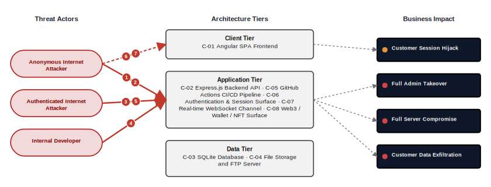

**Threat actors.** The actors below drive the numbered attack paths in the figures above. The **Shop User** is the *victim* of client-side attacks (XSS / CSRF), not an attacker - in Figure 2 the compromise surfaces as the resulting business-impact node rather than as a separate actor box.

- **Shop User** — legitimate customer; target of client-side attacks; target of ⑥ Output Encoding / Cross-Site Scripting, ⑦ CSRF / Permissive CORS.
- **Anonymous Internet Attacker** — no account; registers in seconds when needed; drives ① Insecure Query Construction & Data Access, ② Hardcoded Secrets & Weak Cryptography.
- **Authenticated Internet Attacker** — owns a regular account; logged in; drives ③ Broken Authorization & Access Control, ⑤ Remote Code Execution (unsafe eval).
- **Internal Developer** — developer with source-repository access; drives ④ Sensitive File & Secret Exposure.

**7 structural threats**, grouped by weakness class - each row is one threat, not one finding. *Threat Description* states the general architectural weakness (STRIDE in brackets); *Findings* lists the concrete instances, each linked to [§8 Findings Register](#8-findings-register) with its component; *Risk & Impact* combines severity with business consequence.

| # | Threat Description | Findings (→ Component) | Risk & Impact | Fix |
|---|------------------------------------|------------------------------------------------|------------------------------------|--------|
| <a id="path-injection"></a>① | **Insecure Query Construction & Data Access** _(T·I)_<br/>Login and search queries accept raw user input, enabling unauthenticated attackers to extract or manipulate the entire database; XML uploads additionally expose server-side file contents. | <span style="white-space:nowrap">🔴&nbsp;[F-008](#f-008)</span> - SQL injection in login authentication query (`login.ts:34`) <span style="white-space:nowrap">→&nbsp;[C-06](#c-06)</span>&nbsp;Authentication & Session Surface<br/><span style="white-space:nowrap">🔴&nbsp;[F-009](#f-009)</span> - UNION-based SQL injection in product search (`search.ts:23`) <span style="white-space:nowrap">→&nbsp;[C-02](#c-02)</span>&nbsp;Express\.js Backend API<br/><span style="white-space:nowrap">🔴&nbsp;[F-012](#f-012)</span> - XML External Entity file disclosure (`fileUpload.ts:76`) <span style="white-space:nowrap">→&nbsp;[C-04](#c-04)</span>&nbsp;File Storage and FTP Server<br/><span style="white-space:nowrap">🟠&nbsp;[F-021](#f-021)</span> - XXE via XML complaint upload (`fileUpload.ts:74`) <span style="white-space:nowrap">→&nbsp;[C-02](#c-02)</span>&nbsp;Express\.js Backend API | 🔴 **Critical**<br/>Customer Data Exfiltration | <span style="white-space:nowrap">● [M-008](#m-008)</span> — Replace the interpolated login query with a parameterized/bound query<br/><span style="white-space:nowrap">● [M-009](#m-009)</span> — Parameterize the product search LIKE clause |
| <a id="path-auth-bypass"></a>② | **Hardcoded Secrets & Weak Cryptography** _(S·E)_<br/>Predictable credential derivation, a published signing key, and missing algorithm enforcement allow unauthenticated attackers to forge any user or admin session. | <span style="white-space:nowrap">🟠&nbsp;[F-002](#f-002)</span> - Hardcoded secrets embedded in source (`insecurity.ts:42`) <span style="white-space:nowrap">→&nbsp;[C-06](#c-06)</span>&nbsp;Authentication & Session Surface<br/><span style="white-space:nowrap">🔴&nbsp;[F-004](#f-004)</span> - OAuth login derives account password from public email (`oauth.component.ts:30`) <span style="white-space:nowrap">→&nbsp;[C-01](#c-01)</span>&nbsp;Angular SPA Frontend<br/><span style="white-space:nowrap">🔴&nbsp;[F-005](#f-005)</span> - Hardcoded RSA private JWT signing key (`insecurity.ts:21`) <span style="white-space:nowrap">→&nbsp;[C-06](#c-06)</span>&nbsp;Authentication & Session Surface<br/><span style="white-space:nowrap">🔴&nbsp;[F-006](#f-006)</span> - Insecure JWT Verification (`insecurity.ts:189`) <span style="white-space:nowrap">→&nbsp;[C-02](#c-02)</span>&nbsp;Express\.js Backend API<br/><span style="white-space:nowrap">🟠&nbsp;[F-017](#f-017)</span> - Hardcoded default admin credentials and TOTP seed in seed data (`users.yml:3`) <span style="white-space:nowrap">→&nbsp;[C-03](#c-03)</span>&nbsp;SQLite Database<br/><span style="white-space:nowrap">🟠&nbsp;[F-020](#f-020)</span> - Non-cryptographic RNG for a secret/token (`insecurity.ts:53`) <span style="white-space:nowrap">→&nbsp;[C-02](#c-02)</span>&nbsp;Express\.js Backend API<br/><span style="white-space:nowrap">🟠&nbsp;[F-030](#f-030)</span> - Unsalted `MD5` used for password hashing (`insecurity.ts:41`) <span style="white-space:nowrap">→&nbsp;[C-06](#c-06)</span>&nbsp;Authentication & Session Surface<br/><span style="white-space:nowrap">🟠&nbsp;[F-038](#f-038)</span> - Security answers hashed with global static-key HMAC, no salt (`securityAnswer.ts:45`) <span style="white-space:nowrap">→&nbsp;[C-03](#c-03)</span>&nbsp;SQLite Database<br/><span style="white-space:nowrap">🟡&nbsp;[F-054](#f-054)</span> - Container image signing via cosign or attest-build-provenance (`ci.yml:1`) <span style="white-space:nowrap">→&nbsp;[C-05](#c-05)</span>&nbsp;GitHub Actions CI/CD Pipeline | 🔴 **Critical**<br/>Full Admin Takeover | <span style="white-space:nowrap">● [M-002](#m-002)</span> — Integrate SAST/injection scanner in CI to gate injection and XSS pre-merge<br/><span style="white-space:nowrap">● [M-004](#m-004)</span> — Stop deriving OAuth passwords from email and validate an anti-CSRF state on the callback |
| <a id="path-privilege-escalation"></a>③ | **Broken Authorization & Access Control** _(E·I)_<br/>Missing server-side ownership checks and unguarded mass assignment let authenticated users escalate privileges or access other users' resources across all data types. | <span style="white-space:nowrap">🔴&nbsp;[F-011](#f-011)</span> - Insecure Direct Object Reference (`address.ts:11`) <span style="white-space:nowrap">→&nbsp;[C-02](#c-02)</span>&nbsp;Express\.js Backend API<br/><span style="white-space:nowrap">🔴&nbsp;[F-013](#f-013)</span> - Mass assignment privileged field accepted from request body (`verify.ts:53`) <span style="white-space:nowrap">→&nbsp;[C-02](#c-02)</span>&nbsp;Express\.js Backend API<br/><span style="white-space:nowrap">🟠&nbsp;[F-033](#f-033)</span> - GitHub Actions workflow-level permissions block (`ci.yml:1`) <span style="white-space:nowrap">→&nbsp;[C-05](#c-05)</span>&nbsp;GitHub Actions CI/CD Pipeline<br/><span style="white-space:nowrap">🟠&nbsp;[F-042](#f-042)</span> - Role authorization trusts self-asserted JWT role claim (`insecurity.ts:157`) <span style="white-space:nowrap">→&nbsp;[C-06](#c-06)</span>&nbsp;Authentication & Session Surface<br/><span style="white-space:nowrap">🟠&nbsp;[F-043](#f-043)</span> - Authorization applied per-route, not globally (`server.ts:356`+) (`server.ts:356`) <span style="white-space:nowrap">→&nbsp;[C-02](#c-02)</span>&nbsp;Express\.js Backend API<br/><span style="white-space:nowrap">🟠&nbsp;[F-044](#f-044)</span> - Mass assignment via finale-rest auto CRUD resources (`server.ts:501`) <span style="white-space:nowrap">→&nbsp;[C-02](#c-02)</span>&nbsp;Express\.js Backend API<br/><span style="white-space:nowrap">🟡&nbsp;[F-047](#f-047)</span> - Database enforces no access control or integrity beyond OS file permissions (`index.ts:41`) <span style="white-space:nowrap">→&nbsp;[C-03](#c-03)</span>&nbsp;SQLite Database<br/><span style="white-space:nowrap">🟡&nbsp;[F-056](#f-056)</span> - `GITHUB_TOKEN` scope minimization (`lock.yml:1`) <span style="white-space:nowrap">→&nbsp;[C-05](#c-05)</span>&nbsp;GitHub Actions CI/CD Pipeline<br/><span style="white-space:nowrap">🟡&nbsp;[F-059](#f-059)</span> - Missing Workflow Permissions Block (`ci.yml:24`) <span style="white-space:nowrap">→&nbsp;[C-05](#c-05)</span>&nbsp;GitHub Actions CI/CD Pipeline | 🔴 **Critical**<br/>Full Admin Takeover | <span style="white-space:nowrap">● [M-011](#m-011)</span> — Replace `req.body.UserId`/userId/ownerId with `req.user.id` (or equivalent session-derived identity) in every WHERE/filter clause.<br/><span style="white-space:nowrap">● [M-013](#m-013)</span> — Apply an allowlist filter (Joi/Zod/yup schema, _.pick, or explicit field copy) before passing the body to any model, and strip privilege fields before persistence. |
| <a id="path-sensitive-data-exposure"></a>④ | **Sensitive File & Secret Exposure** _(I)_<br/>Signing keys and account credentials committed to the public source tree give any repository reader the material to forge authenticated sessions or recover account passwords offline. | <span style="white-space:nowrap">🟠&nbsp;[F-002](#f-002)</span> - Hardcoded secrets embedded in source (`insecurity.ts:42`) <span style="white-space:nowrap">→&nbsp;[C-06](#c-06)</span>&nbsp;Authentication & Session Surface<br/><span style="white-space:nowrap">🔴&nbsp;[F-005](#f-005)</span> - Hardcoded RSA private JWT signing key (`insecurity.ts:21`) <span style="white-space:nowrap">→&nbsp;[C-06](#c-06)</span>&nbsp;Authentication & Session Surface<br/><span style="white-space:nowrap">🟠&nbsp;[F-026](#f-026)</span> - Zip-slip arbitrary file write in complaint extraction (`fileUpload.ts:33`) <span style="white-space:nowrap">→&nbsp;[C-04](#c-04)</span>&nbsp;File Storage and FTP Server<br/><span style="white-space:nowrap">🟠&nbsp;[F-028](#f-028)</span> - Open redirect via substring allowlist match (`redirect.ts:19`) <span style="white-space:nowrap">→&nbsp;[C-08](#c-08)</span>&nbsp;Web3 / Wallet / NFT Surface<br/><span style="white-space:nowrap">🟠&nbsp;[F-031](#f-031)</span> - Path Traversal (`fileServer.ts:33`) <span style="white-space:nowrap">→&nbsp;[C-02](#c-02)</span>&nbsp;Express\.js Backend API<br/><span style="white-space:nowrap">🟠&nbsp;[F-032](#f-032)</span> - SSRF via user-controlled profile image URL (`profileImageUrlUpload.ts:24`) <span style="white-space:nowrap">→&nbsp;[C-02](#c-02)</span>&nbsp;Express\.js Backend API<br/><span style="white-space:nowrap">🟠&nbsp;[F-035](#f-035)</span> - Unauthenticated access-log disclosure via `/support/logs` (`logfileServer.ts:14`) <span style="white-space:nowrap">→&nbsp;[C-04](#c-04)</span>&nbsp;File Storage and FTP Server<br/><span style="white-space:nowrap">🟠&nbsp;[F-036](#f-036)</span> - Unauthenticated directory listing of ftp/ exposes sensitive files (`server.ts:269`) <span style="white-space:nowrap">→&nbsp;[C-02](#c-02)</span>&nbsp;Express\.js Backend API<br/><span style="white-space:nowrap">🟠&nbsp;[F-037](#f-037)</span> - TOTP secrets, card PANs and wallet balances stored unencrypted at rest (`index.ts:41`) <span style="white-space:nowrap">→&nbsp;[C-03](#c-03)</span>&nbsp;SQLite Database<br/><span style="white-space:nowrap">🟡&nbsp;[F-049](#f-049)</span> - Any authenticated user can enumerate all users' details (`authenticatedUsers.ts:12`) <span style="white-space:nowrap">→&nbsp;[C-06](#c-06)</span>&nbsp;Authentication & Session Surface<br/><span style="white-space:nowrap">🟡&nbsp;[F-050](#f-050)</span> - Verbose error handler leaks stack traces and SQL errors (`server.ts:682`) <span style="white-space:nowrap">→&nbsp;[C-02](#c-02)</span>&nbsp;Express\.js Backend API<br/><span style="white-space:nowrap">🟡&nbsp;[F-051](#f-051)</span> - Unauthenticated Prometheus metrics endpoint (`server.ts:729`) <span style="white-space:nowrap">→&nbsp;[C-02](#c-02)</span>&nbsp;Express\.js Backend API<br/><span style="white-space:nowrap">🟡&nbsp;[F-057](#f-057)</span> - CTF flags broadcast to all sockets ignoring 'hidden' flag (`challengeUtils.ts:75`) <span style="white-space:nowrap">→&nbsp;[C-07](#c-07)</span>&nbsp;Real-time WebSocket Channel<br/><span style="white-space:nowrap">🟠&nbsp;[F-063](#f-063)</span> - Data disclosure through cleartext transport (`ShaderPass.js:2`) <span style="white-space:nowrap">→&nbsp;[C-01](#c-01)</span>&nbsp;Angular SPA Frontend | 🔴 **Critical**<br/>Full Admin Takeover · Customer Data Exfiltration | <span style="white-space:nowrap">● [M-002](#m-002)</span> — Integrate SAST/injection scanner in CI to gate injection and XSS pre-merge<br/><span style="white-space:nowrap">● [M-005](#m-005)</span> — Move the RSA signing key out of source into a secret store and rotate the exposed key |
| <a id="path-remote-code-execution"></a>⑤ | **Remote Code Execution (unsafe eval)** _(E)_<br/>Business-order requests are evaluated through a bypassable sandbox, allowing an authenticated user to execute arbitrary server code and compromise the host. | <span style="white-space:nowrap">🔴&nbsp;[F-010](#f-010)</span> - Remote code execution via `notevil` sandbox eval (`b2bOrder.ts:23`) <span style="white-space:nowrap">→&nbsp;[C-02](#c-02)</span>&nbsp;Express\.js Backend API | 🔴 **Critical**<br/>Full Server Compromise | <span style="white-space:nowrap">● [M-010](#m-010)</span> — Remove server-side eval of B2B order payloads; parse with `JSON.parse` under a schema |
| <a id="path-cross-site-scripting"></a>⑥ | **Output Encoding / Cross-Site Scripting** _(T·I)_<br/>The application renders user-supplied content without sanitisation, enabling an attacker to inject a script that silently steals any visitor's session from the browser. | <span style="white-space:nowrap">🟠&nbsp;[F-001](#f-001)</span> - SPA holds session JWT in localStorage with no Backend-for-Frontend (`request.interceptor.ts:13`) <span style="white-space:nowrap">→&nbsp;[C-01](#c-01)</span>&nbsp;Angular SPA Frontend<br/><span style="white-space:nowrap">🔴&nbsp;[F-007](#f-007)</span> - Cross-Site Scripting (XSS) (`search-result.component.ts:143`) <span style="white-space:nowrap">→&nbsp;[C-01](#c-01)</span>&nbsp;Angular SPA Frontend<br/><span style="white-space:nowrap">🟠&nbsp;[F-016](#f-016)</span> - Unauthenticated WebSocket Channel (`registerWebsocketEvents.ts:23`) <span style="white-space:nowrap">→&nbsp;[C-07](#c-07)</span>&nbsp;Real-time WebSocket Channel<br/><span style="white-space:nowrap">🟠&nbsp;[F-019](#f-019)</span> - Stored XSS via true-client-ip header persisted as last login IP (`saveLoginIp.ts:18`) <span style="white-space:nowrap">→&nbsp;[C-06](#c-06)</span>&nbsp;Authentication & Session Surface | 🔴 **Critical**<br/>Customer Session Hijack | <span style="white-space:nowrap">● [M-001](#m-001)</span> — Adopt centralized secrets management for all cryptographic material<br/><span style="white-space:nowrap">● [M-007](#m-007)</span> — Remove bypassSecurityTrustHtml on the search term and bind via interpolation |
| <a id="path-cross-site-request-forgery"></a>⑦ | **CSRF / Permissive CORS** _(S·T)_<br/>a permissive CORS policy plus missing anti-CSRF tokens let any external page issue authenticated state-changing requests in the victim's session. | <span style="white-space:nowrap">🟡&nbsp;[F-052](#f-052)</span> - Wide-open CORS allows any origin (`server.ts:183`) <span style="white-space:nowrap">→&nbsp;[C-02](#c-02)</span>&nbsp;Express\.js Backend API | 🟡 **Medium**<br/>Customer Session Hijack | <span style="white-space:nowrap">◑ [M-052](#m-052)</span> — Restrict CORS to the known frontend origin(s) |

_STRIDE: S spoofing · T tampering · R repudiation · I information disclosure · D denial of service · E elevation of privilege. Risk, findings, components, impact and Fix are derived deterministically; only the one-line weakness description is authored._

**Verified attack chains.** 2 fully viable ([AC-T-003](#ac-t-003), [AC-T-005](#ac-t-005)); 3 partially blocked ([AC-T-001](#ac-t-001), [AC-T-004](#ac-t-004), [AC-T-006](#ac-t-006)). These chains combine individual findings into end-to-end exploitation paths verified step-by-step against the code - see [§9 Abuse Cases](#9-abuse-cases) for the per-step breakdown and blocking mitigations.

### Top Mitigations

Highest-impact P1/P2 mitigations - 18 of 44 qualifying (59 total). Full detail in [§10 Mitigation Register](#10-mitigation-register). All 18 mitigation(s) that fix a Critical finding are always listed here.

| # | Component | Mitigation | Addresses | Effort |
|---|----------------------|------------------------------------------------|------------------------------------------------|------|
| **1** | [C-01](#c-01) — Angular SPA Frontend | ● [M-007](#m-007) — Remove bypassSecurityTrustHtml on the search term and bind via interpolation (`search-result.component.ts:143`) | 🔴 [F-007](#f-007) — Cross-Site Scripting (`frontend/src/app/search-result/search-result.component.ts`) | Low |
| **2** | [C-01](#c-01) — Angular SPA Frontend | ● [M-004](#m-004) — Stop deriving OAuth passwords from email and validate an anti-CSRF state on the callback (`oauth.component.ts:30`) | 🔴 [F-004](#f-004) — OAuth login derives account password from public email (`oauth.component.ts`) | Medium |
| **3** | [C-02](#c-02) — Express\.js Backend API | ● [M-009](#m-009) — Parameterize the product search LIKE clause (`search.ts:23`) | 🔴 [F-009](#f-009) — UNION-based SQL injection in product search (`routes/search.ts`) | Low |
| **4** | [C-02](#c-02) — Express\.js Backend API | ● [M-006](#m-006) — Always pass `algorithms: ['RS256']` (or the project's chosen alg) as the third argument's options object to `jwt.verify`. (`insecurity.ts:189`) | 🔴 [F-006](#f-006) — Insecure JWT Verification (`lib/insecurity.ts`) | Medium |
| **5** | [C-02](#c-02) — Express\.js Backend API | ● [M-010](#m-010) — Remove server-side eval of B2B order payloads; parse with JSON.parse under a schema (`b2bOrder.ts:23`) | 🔴 [F-010](#f-010) — Remote code execution via notevil sandbox eval (`routes/b2bOrder.ts`) | Medium |
| **6** | [C-02](#c-02) — Express\.js Backend API | ● [M-011](#m-011) — Replace `req.body.UserId`/userId/ownerId with `req.user.id` (or equivalent session-derived identity) in every WHERE/filter clause. (`address.ts:11`) | 🔴 [F-011](#f-011) — Insecure Direct Object Reference (`routes/address.ts`) | Medium |
| **7** | [C-02](#c-02) — Express\.js Backend API | ● [M-013](#m-013) — Apply an allowlist filter (Joi/Zod/yup schema, `_.pick`, or explicit field copy) before passing the body to any model, and strip privilege fields before persistence. (`verify.ts:53`) | 🔴 [F-013](#f-013) — Mass assignment privileged field accepted from request body (`routes/verify.ts`) | Medium |
| **8** | [C-04](#c-04) — File Storage and FTP Server | ● [M-012](#m-012) — Disable DTD loading and external-entity resolution in parseXmlString (`fileUpload.ts:76`) | 🔴 [F-012](#f-012) — XML External Entity file disclosure (`routes/fileUpload.ts`) | Low |
| **9** | [C-06](#c-06) — Authentication & Session Surface | ● [M-002](#m-002) — Integrate SAST/injection scanner in CI to gate injection and XSS pre-merge (`insecurity.ts:42`) | 🔴 [F-002](#f-002) — Hardcoded secrets embedded in source (`lib/insecurity.ts`) | Low |
| **10** | [C-06](#c-06) — Authentication & Session Surface | ● [M-008](#m-008) — Replace the interpolated login query with a parameterized/bound query (`login.ts:34`) | 🔴 [F-008](#f-008) — SQL injection in login authentication query (`routes/login.ts`) | Low |
| **11** | [C-06](#c-06) — Authentication & Session Surface | ● [M-005](#m-005) — Move the RSA signing key out of source into a secret store and rotate the exposed key (`insecurity.ts:21`) | 🔴 [F-005](#f-005) — Hardcoded RSA private JWT signing key (`lib/insecurity.ts`) | Medium |
| **12** | [C-02](#c-02) — Express\.js Backend API | ◕ [M-015](#m-015) — Key the rate limiter on the real client IP, not a client-supplied header (`server.ts:346`) | 🔴 [F-015](#f-015) — Rate-limit keyed on spoofable X-Forwarded-For header (`server.ts`) | Low |
| **13** | [C-02](#c-02) — Express\.js Backend API | ◕ [M-044](#m-044) — Whitelist writable fields on every finale resource create/update hook (`server.ts:501`) | 🔴 [F-044](#f-044) — Mass assignment via finale-rest auto CRUD resources (`server.ts`) | Medium |
| **14** | [C-02](#c-02) — Express\.js Backend API | ◕ [M-043](#m-043) — Introduce a central default-deny authorization layer with per-route allowlisting (`server.ts:356`) | 🔴 [F-043](#f-043) — Authorization applied per-route, not globally (`server.ts`) | High |
| **15** | [C-03](#c-03) — SQLite Database | ◕ [M-017](#m-017) — Remove hardcoded privileged credentials from seed data and force first-boot rotation (`users.yml:3`) | 🔴 [F-017](#f-017) — Hardcoded default admin credentials and TOTP seed in seed data (`users.yml`) | Medium |
| **16** | [C-06](#c-06) — Authentication & Session Surface | ◕ [M-019](#m-019) — Sanitize and output-encode the stored last-login IP unconditionally (`saveLoginIp.ts:18`) | 🔴 [F-019](#f-019) — Stored XSS via true-client-ip header persisted as last login IP (`routes/saveLoginIp.ts`) | Low |
| **17** | [C-06](#c-06) — Authentication & Session Surface | ◕ [M-042](#m-042) — Re-derive role from the persisted user record after verified authentication (`insecurity.ts:157`) | 🔴 [F-042](#f-042) — Role authorization trusts self-asserted JWT role claim (`lib/insecurity.ts`) | Medium |
| **18** | [C-08](#c-08) — Web3 / Wallet / NFT Surface | ◕ [M-018](#m-018) — Require a signed-nonce challenge and verify it with ethers verifyMessage before crediting wallet ownership (`nftMint.ts:41`) | 🔴 [F-018](#f-018) — Wallet ownership accepted without signature proof (`routes/nftMint.ts`) | Medium |

*26 additional P1/P2 mitigations capped from the leader-board · 15 P3 backlog items in [§10 Mitigation Register](#10-mitigation-register). Sorted by priority (P1 first), then component, then leverage (most findings first), severity (Critical first), and effort (Low first).*

### AI / LLM Exposure

This system embeds an LLM/AI surface (an LLM/AI integration); the risks below are architectural - they follow from how untrusted input reaches the model's prompt, tools, and outputs. See **[§6 Security Architecture](#6-security-architecture)** for the per-control detail.


- **LLM01 Prompt Injection** — Untrusted user input reaches the LLM prompt/context without sufficient trust separation, letting an attacker override system instructions, redirect tool calls, or coerce unintended model behaviour. _([C-02](#c-02) — Express\.js Backend API)_
  - ↳ 🟠 [F-022](#f-022) — Prompt injection in AI chat leaks system policy and forces coupon issuance (`chat.ts:184`)

### Operational Strengths

Operational controls rated Adequate or Partial - grouped into broad clusters (full per-control breakdown in [§6](#6-security-architecture)). Clusters demoted to Weak by open Critical/High findings appear in [§6](#6-security-architecture) instead, not here.

<table style="table-layout:fixed;width:100%">
<colgroup><col width="20%" style="width:20%"><col width="33%" style="width:33%"><col width="47%" style="width:47%"></colgroup>
<thead><tr><th>Strength</th><th>What's in Place</th><th>Effectiveness</th></tr></thead>
<tbody>
<tr><td style="overflow-wrap:anywhere"><strong>Container &amp; Supply-Chain Hardening</strong></td><td style="overflow-wrap:anywhere"><em>Build-time and runtime hardening - minimal base image, non-root execution, dependency inventory.</em><br/>Automated SCA scanning</td><td style="overflow-wrap:anywhere">✅ Adequate</td></tr>
</tbody>
</table>


**Bottom line:** These controls narrow specific attack surfaces but none eliminates a Critical finding on its own.

---

<a id="critical-attack-chain"></a><a id="critical-attack-tree"></a>
## Critical Attack Tree

The root is the worst-case attacker goal; below it, each capability branch groups the Critical findings that achieve it. Branches feed the goal by OR - any single path suffices.

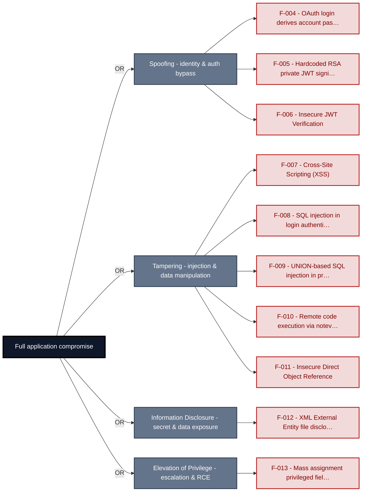

**Findings** (full detail in [§8 Findings Register](#8-findings-register)): [F-004](#f-004) · [F-005](#f-005) · [F-006](#f-006) · [F-007](#f-007) · [F-008](#f-008) · [F-009](#f-009) · [F-010](#f-010) · [F-011](#f-011) · [F-012](#f-012) · [F-013](#f-013)

---

## 1. System Overview

Probably the most modern and sophisticated insecure web application

**Repository:** https://github.com/juice-shop/juice-shop.git
**Runtime:** Node\.js 22 - 26

### Scope

This threat model covers 8 components of juice-shop: **Angular SPA Frontend**, **Express\.js Backend API**, **SQLite Database**, **File Storage and FTP Server**, **GitHub Actions CI/CD Pipeline**, **Authentication & Session Surface**, **Real-time WebSocket Channel**, **Web3 / Wallet / NFT Surface**.

All 8 modeled components received full STRIDE threat analysis.

**Out of scope:** third-party hosted dependencies, browser runtime, operating-system kernel, and the underlying network infrastructure.

---

## 2. Architecture Diagrams

### 2.1 System Context

Who interacts with juice-shop from the outside, and through which channels. Solid arrows show normal usage; dashed red arrows mark unauthenticated probing or exploit paths (C4 Level 1).

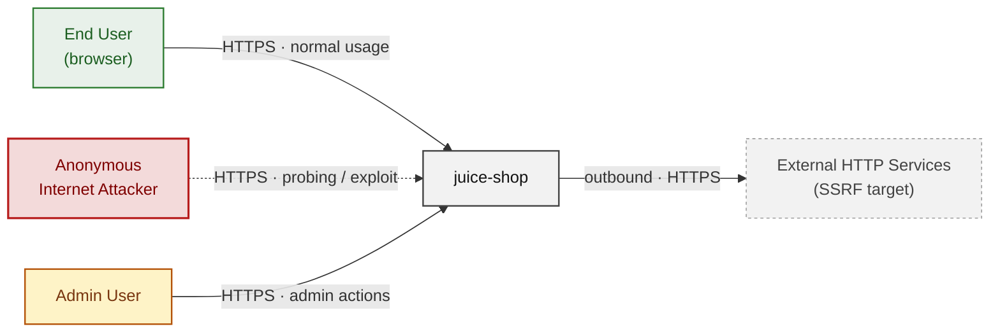

**Key takeaway:** Every actor in the context interacts with juice-shop through its external interface, so authentication and input validation at that edge govern the entire attack surface.

### 2.2 Container Architecture

How the system decomposes into deployable units. Each box is a separate runtime process or service container; arrows show synchronous request paths between them. Components with ≥3 Critical findings carry a red border, ≥2 High amber (C4 Level 2).

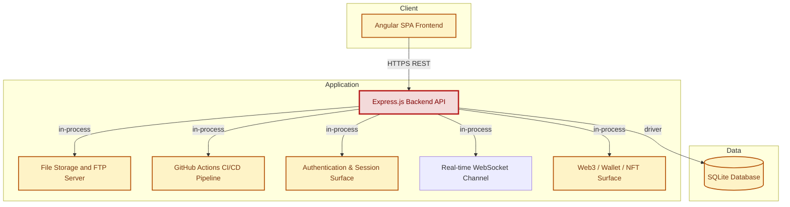

**Key takeaway:** The system decomposes into 1 client, 6 application and 1 data unit(s); Express\.js Backend API carries the most Critical findings (5) and bounds the worst-case blast radius.

### 2.3 Components


Who reaches each component, and through which trust zone. Four columns map external actors to the internal tiers (Client / Application / Data); solid green arrows show legitimate data flow, dashed red arrows mark intrusion vectors. The component table directly below holds source paths and linked threats per `C-NN`; per-finding evidence is in [§8 Findings Register](#8-findings-register).

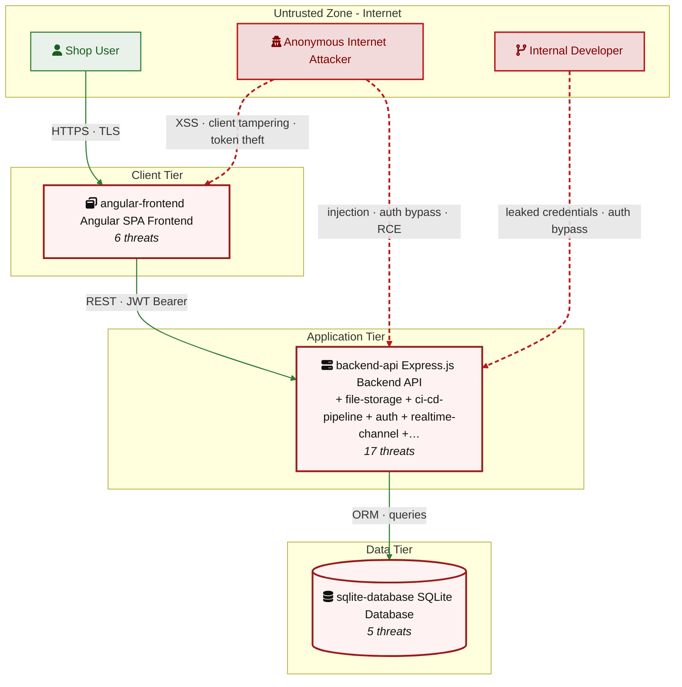

**Key takeaway:** Express\.js Backend API concentrates the most findings (17 of 60 across all components); the table below maps each component to its source paths and linked threats.

| ID | Name | Type | Key Paths | Linked Threats |
|----|----------------------|-----------|--------------------------------------|------------------------------------------------|
| <a id="c-01"></a><a id="angular-frontend"></a><span style="white-space:nowrap">C-01</span> | Angular SPA Frontend | client | `frontend/**`<br/>`frontend/src/app/**/*.ts`<br/>`frontend/src/app/**/*.html`<br/>`frontend/src/app/**/*.scss` | 🟠 [F-001](#f-001) — SPA holds session JWT in localStorage with no Backend-for-Frontend (`request.interceptor.ts:13`)<br/>🔴 [F-004](#f-004) — OAuth login derives account password from public email (`oauth.component.ts:30`)<br/>🔴 [F-007](#f-007) — Cross-Site Scripting (XSS) (`search-result.component.ts:143`)<br/>🟠 [F-029](#f-029) — No Content-Security-Policy leaves XSS uncontained (`index.html`)<br/>🟠 [F-041](#f-041) — Client-side-only role gating trusts unverified JWT (`app.guard.ts:54`)<br/>🟠 [F-063](#f-063) — Data disclosure through cleartext transport (`ShaderPass.js:2`) |
| <a id="c-02"></a><a id="backend-api"></a><span style="white-space:nowrap">C-02</span> | Express\.js Backend API | application | `server.ts`<br/>`app.ts`<br/>`routes/**`<br/>`lib/**`<br/>`models/**` | 🔴 🔴 [F-006](#f-006) — Insecure JWT Verification (`insecurity.ts:189`)<br/>🔴 🔴 [F-009](#f-009) — UNION-based SQL injection in product search (`search.ts:23`)<br/>🔴 🔴 [F-010](#f-010) — Remote code execution via notevil sandbox eval (`b2bOrder.ts:23`)<br/>🔴 🔴 [F-011](#f-011) — Insecure Direct Object Reference (`address.ts:11`)<br/>🔴 🔴 [F-013](#f-013) — Mass assignment privileged field accepted from request body (`verify.ts:53`)<br/>🔴 🔴 [F-015](#f-015) — Rate-limit keyed on spoofable X-Forwarded-For header (`server.ts:346`)<br/>🟠 🟠 [F-020](#f-020) — Non-cryptographic RNG for a secret/token (`insecurity.ts:53`)<br/>🟠 🟠 [F-021](#f-021) — XXE via XML complaint upload (`fileUpload.ts:74`)<br/>🟠 🟠 [F-022](#f-022) — Prompt injection in AI chat leaks system policy and forces coupon issuance (`chat.ts:184`)<br/>🟠 🟠 [F-031](#f-031) — Path Traversal (`fileServer.ts:33`)<br/>🟠 🟠 [F-032](#f-032) — SSRF via user-controlled profile image URL (`profileImageUrlUpload.ts:24`)<br/>🟠 🟠 [F-036](#f-036) — Unauthenticated directory listing of ftp/ exposes sensitive files (`server.ts:269`)<br/>🔴 🔴 [F-043](#f-043) — Authorization applied per-route, not globally (`server.ts:356`+) (`server.ts:356`)<br/>🔴 🔴 [F-044](#f-044) — Mass assignment via finale-rest auto CRUD resources (`server.ts:501`)<br/>🟡 🟡 [F-050](#f-050) — Verbose error handler leaks stack traces and SQL errors (`server.ts:682`)<br/>🟡 🟡 [F-051](#f-051) — Unauthenticated Prometheus metrics endpoint (`server.ts:729`)<br/>🟡 🟡 [F-052](#f-052) — Wide-open CORS allows any origin (`server.ts:183`) |
| <a id="c-03"></a><a id="sqlite-database"></a><span style="white-space:nowrap">C-03</span> | SQLite Database | data | `data/*.db`<br/>`data/datacreator.ts`<br/>`data/static/**`<br/>`models/**` | 🔴 [F-017](#f-017) — Hardcoded default admin credentials and TOTP seed in seed data (`users.yml:3`)<br/>🟠 [F-037](#f-037) — TOTP secrets, card PANs and wallet balances stored unencrypted at rest (`index.ts:41`)<br/>🟠 [F-038](#f-038) — Security answers hashed with global static-key HMAC, no salt (`securityAnswer.ts:45`)<br/>🟡 [F-047](#f-047) — Database enforces no access control or integrity beyond OS file permissions (`index.ts:41`)<br/>🟡 [F-058](#f-058) — SQLite single-writer file lock exhausts under concurrent writes (`index.ts:35`) |
| <a id="c-04"></a><a id="file-storage"></a><span style="white-space:nowrap">C-04</span> | File Storage and FTP Server | data | `ftp/**`<br/>`routes/fileServer.ts`<br/>`routes/fileUpload.ts`<br/>`routes/profileImageFileUpload.ts`<br/>`routes/profileImageUrlUpload.ts` | 🔴 [F-012](#f-012) — XML External Entity file disclosure (`fileUpload.ts:76`)<br/>🟠 [F-026](#f-026) — Zip-slip arbitrary file write in complaint extraction (`fileUpload.ts:33`)<br/>🟠 [F-027](#f-027) — Upload type enforced by extension only, no content validation (`fileUpload.ts:62`)<br/>🟠 [F-035](#f-035) — Unauthenticated access-log disclosure via `/support/logs` (`logfileServer.ts:14`)<br/>🟠 [F-040](#f-040) — Decompression/entity-expansion bombs and unrate-limited uploads (`fileUpload.ts:109`) |
| <a id="c-05"></a><a id="ci-cd-pipeline"></a><span style="white-space:nowrap">C-05</span> | GitHub Actions CI/CD Pipeline | application | `.github/**`<br/>`.npmrc`<br/>`Dockerfile`<br/>`docker-compose*.yml` | 🟠 [F-023](#f-023) — Lockfile Generation Disabled (.npmrc) (`.npmrc:1`)<br/>🟠 [F-024](#f-024) — CI/CD Workflow Supply-Chain Risk (`image_actions.yml:33`)<br/>🟠 [F-025](#f-025) — Dependency Install Scripts Enabled in Release and Image Build (`release.yml:55`)<br/>🟠 [F-033](#f-033) — GitHub Actions workflow-level permissions block (`ci.yml:1`)<br/>🟠 [F-034](#f-034) — Dockerfile base image must be digest-pinned (`Dockerfile:1`)<br/>🟡 [F-046](#f-046) — No Dependency Scanning or Update Automation in CI (`ci.yml`)<br/>🟡 [F-053](#f-053) — Dockerfile USER directive (non-root) (`Dockerfile:1`)<br/>🔴 [F-054](#f-054) — Container image signing via cosign or attest-build-provenance (`ci.yml:1`)<br/>🟡 [F-055](#f-055) — Untrusted npm Install/Postinstall Scripts Enabled (`Dockerfile:4`)<br/>🟡 [F-056](#f-056) — `GITHUB_TOKEN` scope minimization (`lock.yml:1`)<br/>🟡 [F-059](#f-059) — Missing Workflow Permissions Block (`ci.yml:24`) |
| <a id="c-06"></a><a id="auth"></a><span style="white-space:nowrap">C-06</span> | Authentication & Session Surface | application | `lib/insecurity.ts`<br/>`lib/startup/registerWebsocketEvents.ts`<br/>`routes/2fa.ts`<br/>`routes/authenticatedUsers.ts`<br/>`routes/login.ts` | 🔴 [F-002](#f-002) — Hardcoded secrets embedded in source (`insecurity.ts:42`)<br/>🔴 [F-005](#f-005) — Hardcoded RSA private JWT signing key (`insecurity.ts:21`)<br/>🔴 [F-008](#f-008) — SQL injection in login authentication query (`login.ts:34`)<br/>🟠 [F-014](#f-014) — Password-reset security-answer brute force via spoofable rate-limit key (`resetPassword.ts:41`)<br/>🔴 [F-019](#f-019) — Stored XSS via true-client-ip header persisted as last login IP (`saveLoginIp.ts:18`)<br/>🟠 [F-030](#f-030) — Unsalted MD5 used for password hashing (`insecurity.ts:41`)<br/>🟠 [F-039](#f-039) — No rate limiting on the login endpoint (`login.ts:32`)<br/>🔴 [F-042](#f-042) — Role authorization trusts self-asserted JWT role claim (`insecurity.ts:157`)<br/>🟡 [F-045](#f-045) — Unauthenticated WebSocket allows deleting shared notifications (`registerWebsocketEvents.ts:33`)<br/>🟡 [F-048](#f-048) — Missing Security Event Logging (`login.ts:32`)<br/>🟡 [F-049](#f-049) — Any authenticated user can enumerate all users' details (`authenticatedUsers.ts:12`) |
| <a id="c-07"></a><a id="realtime-channel"></a><span style="white-space:nowrap">C-07</span> | Real-time WebSocket Channel | application | `lib/challengeUtils.ts`<br/>`lib/startup/registerWebsocketEvents.ts` | 🟠 [F-016](#f-016) — Unauthenticated WebSocket Channel (`registerWebsocketEvents.ts:23`)<br/>🟡 [F-057](#f-057) — CTF flags broadcast to all sockets ignoring 'hidden' flag (`challengeUtils.ts:75`) |
| <a id="c-08"></a><a id="web3-nft"></a><span style="white-space:nowrap">C-08</span> | Web3 / Wallet / NFT Surface | application | `routes/checkKeys.ts`<br/>`routes/nftMint.ts`<br/>`routes/redirect.ts`<br/>`routes/web3Wallet.ts` | 🟠 [F-003](#f-003) — Systemic missing rate limiting across unauthenticated endpoints (`web3Wallet.ts:16`)<br/>🔴 [F-018](#f-018) — Wallet ownership accepted without signature proof (`nftMint.ts:41`)<br/>🟠 [F-028](#f-028) — Open redirect via substring allowlist match (`redirect.ts:19`) |
### 2.4 Technology Architecture

The technology stack the system is built on. Each box names the framework or runtime that fills that role; per-component findings live in the [§2.3](#23-components) component table above, and the full per-finding catalogue is in [§8 Findings Register](#8-findings-register).

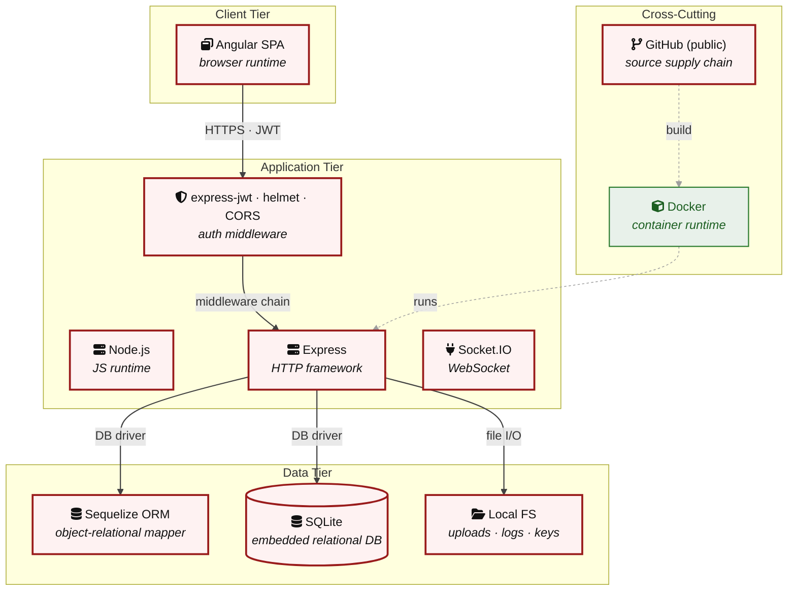

**Key takeaway:** The stack spans 1 data-tier store(s) behind the application tier; injection and data-at-rest exposure track the data tier, detailed per finding in [§8 Findings Register](#8-findings-register).

> **Legend:** **red border** ≥ 3 Critical threats on the component · **amber border** ≥ 2 High threats

---

## 3. Attack Walkthroughs

This section walks through how the highest-risk findings are exploited. To keep the section focused, it covers the **8 highest-priority of 10 Critical findings** (chain entry points and the findings closest to a breach); every remaining Critical still has a full [§8 Findings Register](#8-findings-register) row with the same evidence, impact, and fix. Each walkthrough has attack steps, a focused sequence diagram, and the primary mitigation. The cross-finding view (which weaknesses combine toward the worst-case goal, and where one fix severs several paths) is in the [Critical Attack Tree](#critical-attack-tree). Full per-finding context - severity rationale, assets, detection signals - is in the [§8 Findings Register](#8-findings-register) row for each finding.

### 3.1 Insecure JWT Verification in Express js Backend API

**Source:** 🔴 [F-006](#f-006) — `lib/insecurity.ts:189`

Severity **Critical** ([CWE-347](https://cwe.mitre.org/data/definitions/347.html)). STRIDE: Spoofing. See [§8 F-006](#f-006) for the full register row.

**Attack Steps**

1. The attacker crafts a request targeting the weak spot at `lib/insecurity.ts:189`.
2. The attacker sends it; the missing control never rejects the crafted input.
3. Without an explicit algorithm allowlist, attackers can forge tokens with `alg:none` (older lib versions) or use the public key as an HMAC secret to mint valid signatures.

**Sequence Diagram**


**Key takeaway:** Until ● [M-006](#m-006) (Always pass `algorithms: ['RS256']` (or the project's chosen) lands, 🔴 [F-006](#f-006) — Insecure JWT Verification is exploitable at `lib/insecurity.ts:189` (Critical-severity, [CWE-347](https://cwe.mitre.org/data/definitions/347.html)).

**Defense in Depth**

- Primary mitigation: ● [M-006](#m-006) (Always pass `algorithms: ['RS256']` (or the project's chosen alg) as the third argument's options object to `jwt.verify`.)

### 3.2 SQL injection in login authentication query

**Source:** 🔴 [F-008](#f-008) — `routes/login.ts:34`

Severity **Critical** ([CWE-89](https://cwe.mitre.org/data/definitions/89.html)). STRIDE: Tampering. See [§8 F-008](#f-008) for the full register row.

**Attack Steps**

1. `login()` builds its authentication query by string-interpolating `req.body.email` directly into raw SQL at `routes/login.ts:34`: `SELECT * FROM Users WHERE email = '${req.body.email`}' AND password = '\${hash(password)}' AND deletedAt IS NULL.
2. Posting email = admin@juice-`sh.op`'-- or ' OR 1=1-- comments out the password clause, causing the query to return the first user row; the handler then mints a full session token for that user.
3. This is a classic authentication-bypass SQLi requiring no valid credential, and the same injection point permits UNION-based extraction of arbitrary table data.

**Sequence Diagram**

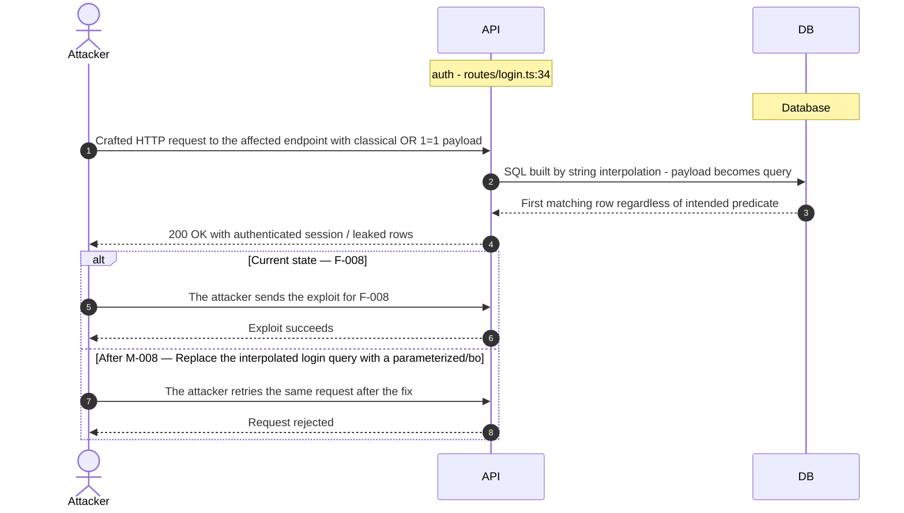

**Key takeaway:** Until ● [M-008](#m-008) (Replace the interpolated login query with a parameterized/bo) lands, 🔴 [F-008](#f-008) — SQL injection in login authentication query (`routes/login.ts:34`) is exploitable at `routes/login.ts:34` (Critical-severity, [CWE-89](https://cwe.mitre.org/data/definitions/89.html)).

**Defense in Depth**

- Primary mitigation: ● [M-008](#m-008) (Replace the interpolated login query with a parameterized/bound query)

### 3.3 UNION-based SQL injection in product search

**Source:** 🔴 [F-009](#f-009) — `routes/search.ts:23`

Severity **Critical** ([CWE-89](https://cwe.mitre.org/data/definitions/89.html)). STRIDE: Tampering. See [§8 F-009](#f-009) for the full register row.

**Attack Steps**

1. The search handler interpolates the `q` query parameter into a raw query: `SELECT * FROM Products WHERE ((name LIKE '%${criteria}%' OR description LIKE '%${criteria}%') …)` at `routes/search.ts:23`.
2. The only limit is a 200-char truncation.
3. An attacker sends `q=')) UNION SELECT … FROM Users--` to append arbitrary SELECTs, exfiltrating the full Users table (emails and `MD5` password hashes) and the SQLite schema via `sqlite_master`.

**Sequence Diagram**

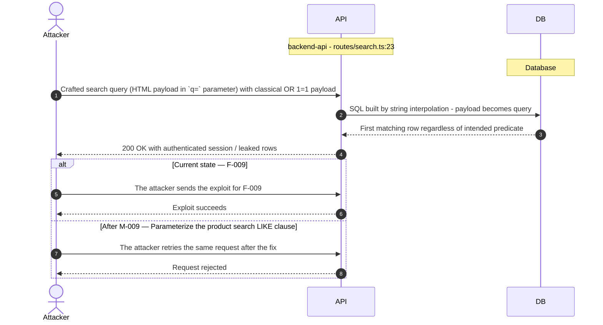

**Key takeaway:** Until ● [M-009](#m-009) (Parameterize the product search LIKE clause) lands, 🔴 [F-009](#f-009) — UNION-based SQL injection in product search (`routes/search.ts:23`) is exploitable at `routes/search.ts:23` (Critical-severity, [CWE-89](https://cwe.mitre.org/data/definitions/89.html)).

**Defense in Depth**

- Primary mitigation: ● [M-009](#m-009) (Parameterize the product search LIKE clause)

### 3.4 Mass assignment privileged field accepted from request body

**Source:** 🔴 [F-013](#f-013) — `routes/verify.ts:53`

Severity **Critical** ([CWE-915](https://cwe.mitre.org/data/definitions/915.html)). STRIDE: Elevation of Privilege. See [§8 F-013](#f-013) for the full register row.

**Attack Steps**

1. The attacker crafts a request targeting the weak spot at `routes/verify.ts:53`.
2. Server code that consumes `req.body.role` / `req.body.isAdmin` / etc. without an explicit allowlist trusts the client to behave.
3. An attacker simply adds {"role":"admin"} to their request to escalate.

**Sequence Diagram**

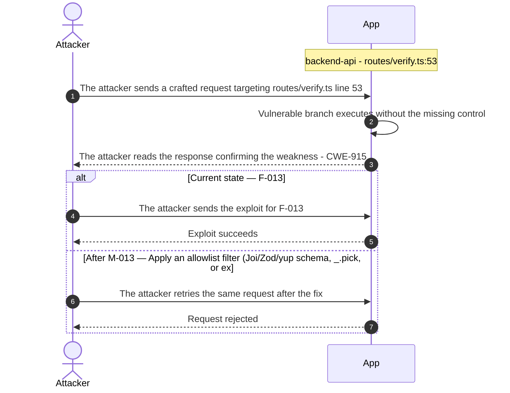

**Key takeaway:** Until ● [M-013](#m-013) (Apply an allowlist filter (Joi/Zod/yup schema, `_.pick`, or ex) lands, 🔴 [F-013](#f-013) — Mass assignment privileged field accepted from request body `routes/verify.ts:53` is exploitable at `routes/verify.ts:53` (Critical-severity, [CWE-915](https://cwe.mitre.org/data/definitions/915.html)).

**Defense in Depth**

- Primary mitigation: ● [M-013](#m-013) (Apply an allowlist filter (Joi/Zod/yup schema, `_.pick`, or explicit field copy) before passing the body to any model, and strip privilege fields before persisten)

### 3.5 Cross-Site Scripting (XSS) in Search Result

**Source:** 🔴 [F-007](#f-007) — `frontend/src/app/search-result/search-result.component.ts:143`

Severity **Critical** ([CWE-79](https://cwe.mitre.org/data/definitions/79.html)). STRIDE: Tampering. See [§8 F-007](#f-007) for the full register row.

**Attack Steps**

1. The attacker crafts a request targeting the weak spot at `frontend/src/app/search-result/search-result.component.ts:143`.
2. `filterTable()` reads the user-controlled q query parameter and assigns `this.searchValue` = `this.sanitizer.bypassSecurityTrustHtml(queryParam)` (line 143), which is then rendered raw through [innerHTML]="searchValue" in `search-result.component.html:11`. bypassSecurityTrustHtml explicitly disables Angular`'s built-in output sanitization, so a link such as /#/search?q= executes attacker script in the victim'`s origin.
3. Because no Content-Security-Policy is served (`index.html` has no CSP meta and helmet CSP is disabled server-side), there is no defence-in-depth stopping the payload.

**Sequence Diagram**

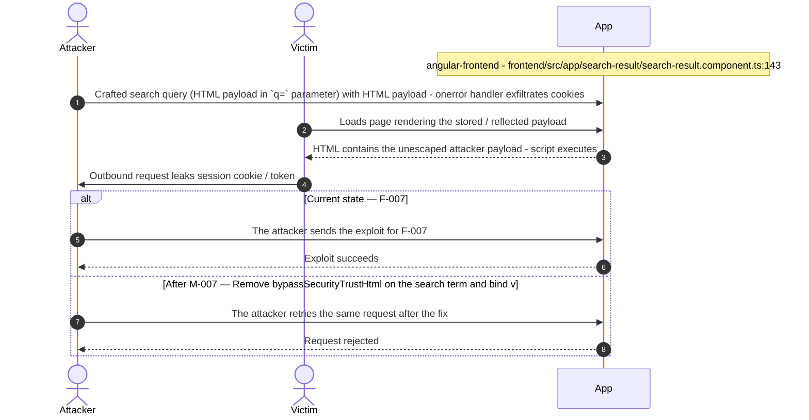

**Key takeaway:** Until ● [M-007](#m-007) (Remove bypassSecurityTrustHtml on the search term and bind v) lands, 🔴 [F-007](#f-007) — Cross-Site Scripting (XSS) is exploitable at `frontend/src/app/search-result/search-result.component.ts:143` (Critical-severity, [CWE-79](https://cwe.mitre.org/data/definitions/79.html)).

**Defense in Depth**

- Primary mitigation: ● [M-007](#m-007) (Remove bypassSecurityTrustHtml on the search term and bind via interpolation)

### 3.6 Hardcoded RSA private JWT signing key in Authentication and Session Surface

**Source:** 🔴 [F-005](#f-005) — `lib/insecurity.ts:21`

Severity **Critical** ([CWE-321](https://cwe.mitre.org/data/definitions/321.html)). STRIDE: Spoofing. See [§8 F-005](#f-005) for the full register row.

**Attack Steps**

1. The RSA private key used to sign every session JWT is embedded verbatim in `lib/insecurity.ts:21` as a string literal and ships in the public source tree and every deployed bundle.
2. An attacker who reads the repository (or extracts the key from a distributed image) signs a token of their choosing via `security.authorize()`-equivalent code with `data.role`='admin' and any `data.email`/id, then presents it as a bearer token.
3. Because `verify()`/`updateAuthenticatedUsers()` validate against the matching public key, the forged token is accepted as a fully authenticated admin session with no credential ever entered.

**Sequence Diagram**

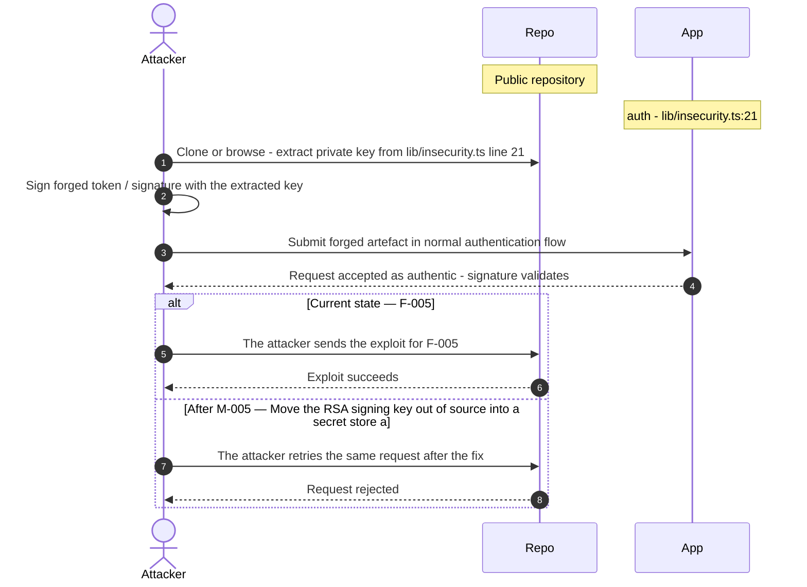

**Key takeaway:** Until ● [M-005](#m-005) (Move the RSA signing key out of source into a secret store a) lands, 🔴 [F-005](#f-005) — Hardcoded RSA private JWT signing key (`lib/insecurity.ts:21`) is exploitable at `lib/insecurity.ts:21` (Critical-severity, [CWE-321](https://cwe.mitre.org/data/definitions/321.html)).

**Defense in Depth**

- Primary mitigation: ● [M-005](#m-005) (Move the RSA signing key out of source into a secret store and rotate the exposed key)

### 3.7 OAuth login derives account password from public email in Angular SPA Frontend

**Source:** 🔴 [F-004](#f-004) — `frontend/src/app/oauth/oauth.component.ts:30`

Severity **Critical** ([CWE-287](https://cwe.mitre.org/data/definitions/287.html)). STRIDE: Spoofing. See [§8 F-004](#f-004) for the full register row.

**Attack Steps**

1. OAuthComponent.ngOnInit reads the OAuth access_token from the URL fragment (parseRedirectUrlParams, line 71 splits `location.hash`), fetches the provider profile, then at line 30/46 sets the account password to btoa(`profile.email.split('')`.`reverse().join`('')) - a deterministic, publicly-computable value.
2. Any attacker who knows a victim's email address (e.g. from the `/rest/user/whoami` leak, a review author name, or an order) can compute the same Base64-of-reversed-email string and log in directly via POST `/rest/user/login` as that user without ever touching the OAuth provider.
3. The token also travels in the URL fragment (implicit-flow style) and no state/nonce parameter is validated on the callback, so the redirect can be replayed/forged.

**Sequence Diagram**

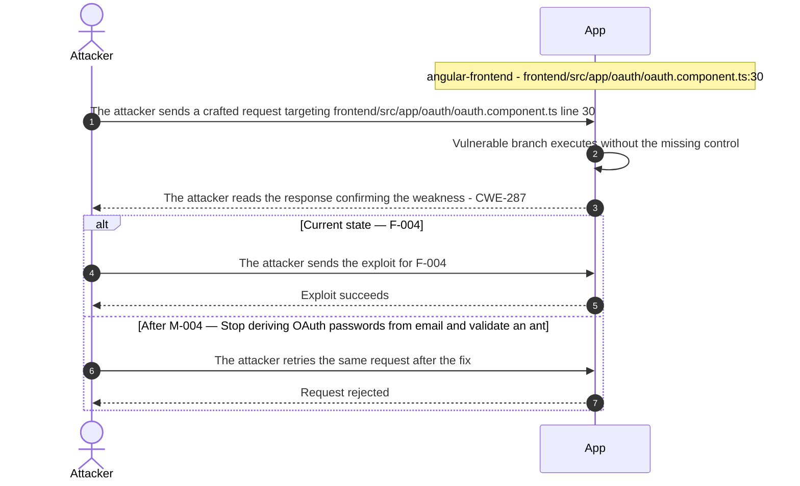

**Key takeaway:** Until ● [M-004](#m-004) (Stop deriving OAuth passwords from email and validate an ant) lands, 🔴 [F-004](#f-004) — OAuth login derives account password from public email (`oauth.component.ts:30`) is exploitable at `frontend/src/app/oauth/oauth.component.ts:30` (Critical-severity, [CWE-287](https://cwe.mitre.org/data/definitions/287.html)).

**Defense in Depth**

- Primary mitigation: ● [M-004](#m-004) (Stop deriving OAuth passwords from email and validate an anti-CSRF state on the callback)

### 3.8 Remote code execution in B2b Order

**Source:** 🔴 [F-010](#f-010) — `routes/b2bOrder.ts:23`

Severity **Critical** ([CWE-94](https://cwe.mitre.org/data/definitions/94.html)). STRIDE: Tampering. See [§8 F-010](#f-010) for the full register row.

**Attack Steps**

1. The attacker crafts a request targeting the weak spot at `routes/b2bOrder.ts:23`.
2. The B2B order handler passes user-supplied `body.orderLinesData` into `vm.runInContext('safeEval(orderLinesData)', sandbox, { timeout: 2000 })` at `routes/b2bOrder.ts:23`, using the `notevil` library as a sandbox. `notevil` is a known-bypassable JS sandbox; crafted payloads escape it (constructor chain / prototype access) to execute arbitrary Node code in the server process.
3. The route sits under `/b2b/v2` which requires a JWT, but that token is forgeable (see backend-api-001).

**Sequence Diagram**

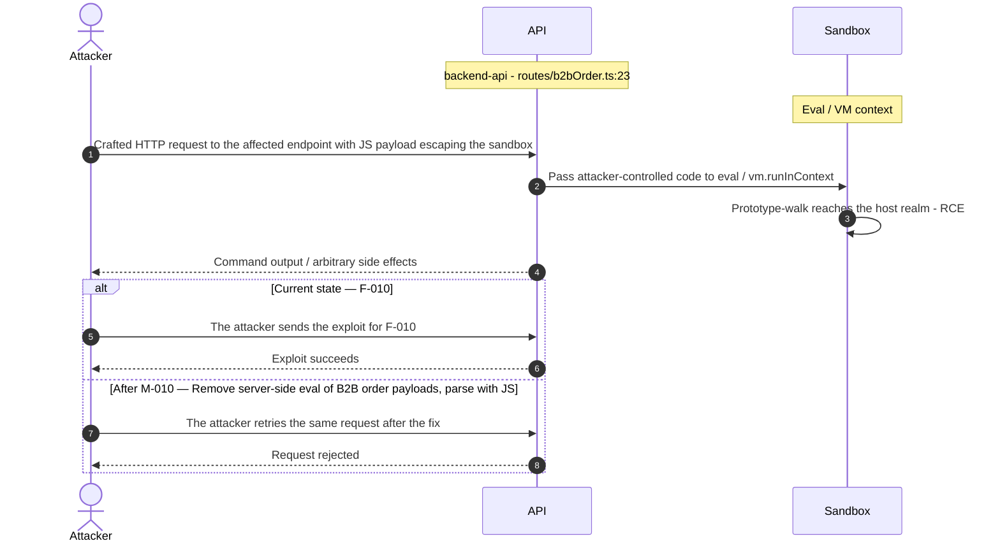

**Key takeaway:** Until ● [M-010](#m-010) (Remove server-side eval of B2B order payloads; parse with JS) lands, 🔴 [F-010](#f-010) — Remote code execution via notevil sandbox eval (`routes/b2bOrder.ts:23`) is exploitable at `routes/b2bOrder.ts:23` (Critical-severity, [CWE-94](https://cwe.mitre.org/data/definitions/94.html)).

**Defense in Depth**

- Primary mitigation: ● [M-010](#m-010) (Remove server-side eval of B2B order payloads; parse with `JSON.parse` under a schema)

<!-- generated:walkthrough_renderer -->

---

## 4. Assets

Information assets and the classification level that drives the Confidentiality / Integrity / Availability targets used in [§8 Findings Register](#8-findings-register) risk scoring.

| Asset | Classification | Description |
|----------------------|--------------|------------------------------------|
| User Account Credentials | Restricted | User email addresses, usernames, and<br/>`MD5`-hashed passwords stored in the UserModel<br/>SQLite table. `MD5` is cryptographically<br/>broken - rainbow-table attacks recover<br/>plaintext directly. Also includes admin<br/>account credentials seeded at startup via<br/>`datacreator.ts`. |
| Payment Card Data | Restricted | Credit/debit card numbers stored in the<br/>CardModel table, including card number,<br/>expiry, and holder name. Also includes<br/>wallet balances in the WalletModel. Subject<br/>to PCI-DSS scope concerns even in a training<br/>application. |
| JWT RSA Private Key | Restricted | 2048-bit RSA private key hardcoded in<br/>`lib/insecurity.ts` at line 23, used to sign<br/>all JWT tokens. Publicly committed to<br/>GitHub. Any actor with read access to the<br/>repository can forge arbitrary JWTs and<br/>impersonate any user including admins. |
| Security Questions and Answers | Restricted | User-chosen security questions and plaintext<br/>answers stored in SecurityAnswer model. Used<br/>for password reset. Vulnerable to<br/>enumeration and brute-force - answers are<br/>simple personal data (pet name, birth city). |
| Application Secrets and Configuration | Restricted | HMAC key hardcoded in `lib/insecurity.ts`<br/>(pa4qacea4VK9t9nGv7yZtwmj), `DOCKERHUB_TOKEN`,<br/>`GITHUB_TOKEN` in GitHub Actions secrets. JWT<br/>private key also belongs here.<br/>Operator-supplied config at runtime via<br/>config/ YAML files. |
| SQLite Database Files | Confidential | SQLite .db files in data/ containing all<br/>application state: users, products, orders,<br/>challenges, feedback, recycling requests,<br/>and audit trails. No encryption at rest. No<br/>WAL-mode isolation between reads/writes. |
| Order History and Financial Transactions | Confidential | Order confirmations, basket contents, coupon<br/>redemptions, and delivery status stored in<br/>Order and BasketItem models. IDOR<br/>vulnerabilities allow users to access other<br/>users' order history via<br/>`/rest/order-history`. |
| User-Uploaded Files | Internal | Profile images uploaded via<br/>`/profile/image/file` and `/profile/image/url`.<br/>Stored in assets/public/images/uploads. File<br/>type validation is present but bypassed by<br/>known Juice Shop challenges. SSRF is<br/>possible via the URL upload endpoint. |
| FTP Directory Files | Internal | Static files in `/ftp` served unauthenticated<br/>by `/ftp` route. Contains legal documents and<br/>intentionally-placed backup archives<br/>including acquisition-notes, coupons, and<br/>`sensitive.zip`. Disclosed via `robots.txt`<br/>Disallow hint. |
| Challenge and CTF State | Internal | Challenge solve status, continue-codes, and<br/>coding challenge snippets stored in<br/>ChallengeModel. Exposed via `/api/Challenges`<br/>endpoint (unauthenticated). Continue-codes<br/>allow cross-session CTF progress sharing. |

---

## 5. Attack Surface

Network-reachable entry points classified by authentication requirement. Each row links to the threat(s) referenced in its **Notes** column. The **Risk** column reflects the highest-severity linked finding. Entry points with no linked finding are still listed when they sit on a sensitive surface (authentication, registration, management) or look like a missing-auth/authz suspect - marked **⚑ Review** in Notes.

### 5.1 Unauthenticated Entry Points (58)

<table style="table-layout:fixed;width:100%">
<colgroup><col width="9%" style="width:9%"><col width="30%" style="width:30%"><col width="14%" style="width:14%"><col width="47%" style="width:47%"></colgroup>
<thead><tr><th>Method</th><th>Route</th><th>Risk</th><th>Notes</th></tr></thead>
<tbody>
<tr><td>POST</td><td style="overflow-wrap:anywhere"><code>/file-upload</code></td><td>🔴 Critical</td><td>🔴 <a href="#f-012">F-012</a> — XML External Entity file disclosure (<code>fileUpload.ts:76</code>)<br/>🟠 <a href="#f-027">F-027</a> — Upload type enforced by extension only, no content validation (<code>fileUpload.ts:62</code>)<br/>🟠 <a href="#f-040">F-040</a> — Decompression/entity-expansion bombs and unrate-limited uploads (<code>fileUpload.ts:109</code>)<br/>File upload accepting XML, YAML, and ZIP files. Vulnerable to XXE (XML), YAML deserialization, and ZIP bomb. No auth guard at route level per route inventory.</td></tr>
<tr><td>GET</td><td style="overflow-wrap:anywhere"><code>/rest/products/search</code></td><td>🔴 Critical</td><td>🔴 <a href="#f-009">F-009</a> — UNION-based SQL injection in product search (<code>search.ts:23</code>)<br/>Product search — primary SQLi attack surface (Sequelize raw query with string interpolation). Returns all products when query is empty. UNION-based injection possible.</td></tr>
<tr><td>POST</td><td style="overflow-wrap:anywhere"><code>/rest/user/login</code></td><td>🔴 Critical</td><td>🟠 <a href="#f-039">F-039</a> — No rate limiting on the login endpoint (<code>login.ts:32</code>)<br/>🔴 <a href="#f-004">F-004</a> — OAuth login derives account password from public email (<code>oauth.component.ts:30</code>)<br/>🔴 <a href="#f-008">F-008</a> — SQL injection in login authentication query (<code>login.ts:34</code>)<br/>Primary login endpoint. Accepts username+password, returns JWT. SQL injection via username parameter. Vulnerable to timing attacks and brute force (rate-limiting partial).</td></tr>
<tr><td>GET</td><td style="overflow-wrap:anywhere"><code>/rest/user/whoami</code></td><td>🔴 Critical</td><td>🔴 <a href="#f-004">F-004</a> — OAuth login derives account password from public email (<code>oauth.component.ts:30</code>)<br/>handler: <code>server.ts:600</code></td></tr>
<tr><td>POST</td><td style="overflow-wrap:anywhere"><code>/profile</code></td><td>🟠 High</td><td>🟠 <a href="#f-032">F-032</a> — SSRF via user-controlled profile image URL (<code>profileImageUrlUpload.ts:24</code>)<br/>handler: <code>server.ts:667</code></td></tr>
<tr><td>POST</td><td style="overflow-wrap:anywhere"><code>/profile/image/file</code></td><td>🟠 High</td><td>🟠 <a href="#f-032">F-032</a> — SSRF via user-controlled profile image URL (<code>profileImageUrlUpload.ts:24</code>)<br/>🟠 <a href="#f-027">F-027</a> — Upload type enforced by extension only, no content validation (<code>fileUpload.ts:62</code>)<br/>handler: <code>server.ts:310</code></td></tr>
<tr><td>POST</td><td style="overflow-wrap:anywhere"><code>/profile/image/url</code></td><td>🟠 High</td><td>🟠 <a href="#f-032">F-032</a> — SSRF via user-controlled profile image URL (<code>profileImageUrlUpload.ts:24</code>)<br/>Profile image via URL — SSRF endpoint. Fetches arbitrary URLs server-side via download library. Can reach internal services.</td></tr>
<tr><td>POST</td><td style="overflow-wrap:anywhere"><code>/​rest/​web3/​walletExploitAddress</code></td><td>🟠 High</td><td>🔴 <a href="#f-018">F-018</a> — Wallet ownership accepted without signature proof (<code>nftMint.ts:41</code>)<br/>handler: <code>server.ts:645</code></td></tr>
<tr><td>POST</td><td style="overflow-wrap:anywhere"><code>/rest/web3/walletNFTVerify</code></td><td>🟠 High</td><td>🔴 <a href="#f-018">F-018</a> — Wallet ownership accepted without signature proof (<code>nftMint.ts:41</code>)<br/>handler: <code>server.ts:644</code></td></tr>
<tr><td>GET</td><td style="overflow-wrap:anywhere"><code>/profile</code></td><td>🟠 High</td><td>🟠 <a href="#f-032">F-032</a> — SSRF via user-controlled profile image URL (<code>profileImageUrlUpload.ts:24</code>)<br/>handler: <code>server.ts:666</code></td></tr>
<tr><td>GET</td><td style="overflow-wrap:anywhere"><code>/redirect</code></td><td>🟠 High</td><td>🟠 <a href="#f-028">F-028</a> — Open redirect via substring allowlist match (<code>redirect.ts:19</code>)<br/>handler: <code>server.ts:659</code></td></tr>
<tr><td>POST</td><td style="overflow-wrap:anywhere"><code>/rest/chat</code></td><td>🟠 High</td><td>🟠 <a href="#f-022">F-022</a> — Prompt injection in AI chat leaks system policy and forces coupon issuance (<code>chat.ts:184</code>)<br/>AI chatbot endpoint backed by @ai-sdk/openai-compatible. Potential prompt injection vector. No auth guard.</td></tr>
<tr><td>GET</td><td style="overflow-wrap:anywhere"><code>/rest/saveLoginIp</code></td><td>🟠 High</td><td>🔴 <a href="#f-019">F-019</a> — Stored XSS via true-client-ip header persisted as last login IP (<code>saveLoginIp.ts:18</code>)<br/>handler: <code>server.ts:619</code></td></tr>
<tr><td>POST</td><td style="overflow-wrap:anywhere"><code>/rest/user/reset-password</code></td><td>🟠 High</td><td>🟠 <a href="#f-014">F-014</a> — Password-reset security-answer brute force via spoofable rate-limit key (<code>resetPassword.ts:41</code>)<br/>🟠 <a href="#f-035">F-035</a> — Unauthenticated access-log disclosure via <code>/support/logs</code> (<code>logfileServer.ts:14</code>)<br/>🟠 <a href="#f-038">F-038</a> — Security answers hashed with global static-key HMAC, no salt (<code>securityAnswer.ts:45</code>)<br/>Password reset via security question. No rate-limiting on answer attempts. Answer is plaintext in database.</td></tr>
<tr><td>GET</td><td style="overflow-wrap:anywhere"><code>/rest/user/security-question</code></td><td>🟠 High</td><td>🟠 <a href="#f-038">F-038</a> — Security answers hashed with global static-key HMAC, no salt (<code>securityAnswer.ts:45</code>)<br/>handler: <code>server.ts:599</code></td></tr>
<tr><td>GET</td><td style="overflow-wrap:anywhere"><code>/​this/​page/​is/​hidden/​behind/​an/​incredibly/​high/​paywall/​that/​could/​only/​be/​unlocked/​by/​sending/​1btc/​to/​us</code></td><td>🟠 High</td><td>🟠 <a href="#f-028">F-028</a> — Open redirect via substring allowlist match (<code>redirect.ts:19</code>)<br/>🟠 <a href="#f-001">F-001</a> — SPA holds session JWT in localStorage with no Backend-for-Frontend (<code>request.interceptor.ts:13</code>)<br/>🟠 <a href="#f-016">F-016</a> — Unauthenticated WebSocket Channel (<code>registerWebsocketEvents.ts:23</code>)<br/>handler: <code>server.ts:652</code></td></tr>
<tr><td>POST</td><td style="overflow-wrap:anywhere"><code>/</code></td><td>-</td><td>handler: <code>routes/dataErasure.ts:74</code><br/><em>⚑ Review: no auth guard detected</em></td></tr>
<tr><td>POST</td><td style="overflow-wrap:anywhere"><code>/api/Feedbacks</code></td><td>-</td><td>handler: <code>server.ts:402</code><br/><em>⚑ Review: no auth guard detected</em></td></tr>
<tr><td>GET</td><td style="overflow-wrap:anywhere"><code>/​rest/​admin/​application-​version</code></td><td>-</td><td>Management surface; handler: <code>server.ts:606</code><br/><em>⚑ Review: no auth guard detected</em></td></tr>
<tr><td>PUT</td><td style="overflow-wrap:anywhere"><code>/​rest/​continue-​code-​findIt/​apply/​:​continueCode</code></td><td>-</td><td>handler: <code>server.ts:612</code><br/><em>⚑ Review: no auth guard detected</em></td></tr>
<tr><td>PUT</td><td style="overflow-wrap:anywhere"><code>/​rest/​continue-​code-​fixIt/​apply/​:​continueCode</code></td><td>-</td><td>handler: <code>server.ts:613</code><br/><em>⚑ Review: no auth guard detected</em></td></tr>
<tr><td>PUT</td><td style="overflow-wrap:anywhere"><code>/​rest/​continue-​code/​apply/​:​continueCode</code></td><td>-</td><td>handler: <code>server.ts:614</code><br/><em>⚑ Review: no auth guard detected</em></td></tr>
<tr><td>POST</td><td style="overflow-wrap:anywhere"><code>/rest/memories</code></td><td>-</td><td>Create memory entries with caption and image. Stored XSS via caption field (insufficient sanitization). No auth guard.<br/><em>⚑ Review: no auth guard detected</em></td></tr>
<tr><td>PUT</td><td style="overflow-wrap:anywhere"><code>/​rest/​order-​history/​:​id/​delivery-​status</code></td><td>-</td><td>handler: <code>server.ts:625</code><br/><em>⚑ Review: no auth guard detected</em></td></tr>
<tr><td>POST</td><td style="overflow-wrap:anywhere"><code>/rest/user/data-export</code></td><td>-</td><td>handler: <code>server.ts:620</code><br/><em>⚑ Review: no auth guard detected</em></td></tr>
<tr><td>POST</td><td style="overflow-wrap:anywhere"><code>/rest/web3/submitKey</code></td><td>-</td><td>handler: <code>server.ts:641</code><br/><em>⚑ Review: no auth guard detected</em></td></tr>
<tr><td>POST</td><td style="overflow-wrap:anywhere"><code>/snippets/fixes</code></td><td>-</td><td>handler: <code>server.ts:673</code><br/><em>⚑ Review: no auth guard detected</em></td></tr>
<tr><td>POST</td><td style="overflow-wrap:anywhere"><code>/snippets/verdict</code></td><td>-</td><td>handler: <code>server.ts:671</code><br/><em>⚑ Review: no auth guard detected</em></td></tr>
</tbody>
</table>

_30 further entry point(s) in this category carry no linked finding and no elevated review signal, and are not listed individually (58 total). The complete route inventory is available in `.route-inventory.json` and, when exported, `pentest-tasks-juice-shop-thorough-v0.5.yaml`._

### 5.2 Authenticated Entry Points (49)

<table style="table-layout:fixed;width:100%">
<colgroup><col width="9%" style="width:9%"><col width="30%" style="width:30%"><col width="14%" style="width:14%"><col width="47%" style="width:47%"></colgroup>
<thead><tr><th>Method</th><th>Route</th><th>Risk</th><th>Notes</th></tr></thead>
<tbody>
<tr><td>POST</td><td style="overflow-wrap:anywhere"><code>/rest/2fa/verify</code></td><td>🔴 Critical</td><td>🔴 <a href="#f-013">F-013</a> — Mass assignment privileged field accepted from request body (<code>verify.ts:53</code>)<br/>handler: <code>server.ts:458</code></td></tr>
<tr><td>GET</td><td style="overflow-wrap:anywhere"><code>/metrics</code></td><td>🟠 High</td><td>🟠 <a href="#f-032">F-032</a> — SSRF via user-controlled profile image URL (<code>profileImageUrlUpload.ts:24</code>)<br/>🟡 <a href="#f-051">F-051</a> — Unauthenticated Prometheus metrics endpoint (<code>server.ts:729</code>)<br/>Management surface; handler: <code>server.ts:676</code></td></tr>
<tr><td>GET</td><td style="overflow-wrap:anywhere"><code>/​rest/​user/​authentication-​details</code></td><td>🟡 Medium</td><td>🟡 <a href="#f-049">F-049</a> — Any authenticated user can enumerate all users' details (<code>authenticatedUsers.ts:12</code>)<br/>handler: <code>server.ts:601</code></td></tr>
<tr><td>PUT</td><td style="overflow-wrap:anywhere"><code>/api/Addresss/:id</code></td><td>-</td><td>handler: <code>server.ts:450</code><br/><em>⚑ Review: no authz guard detected</em></td></tr>
<tr><td>DELETE</td><td style="overflow-wrap:anywhere"><code>/api/Addresss/:id</code></td><td>-</td><td>handler: <code>server.ts:451</code><br/><em>⚑ Review: no authz guard detected</em></td></tr>
<tr><td>PUT</td><td style="overflow-wrap:anywhere"><code>/api/BasketItems/:id</code></td><td>-</td><td>handler: <code>server.ts:426</code><br/><em>⚑ Review: no authz guard detected</em></td></tr>
<tr><td>PUT</td><td style="overflow-wrap:anywhere"><code>/api/Cards/:id</code></td><td>-</td><td>handler: <code>server.ts:440</code><br/><em>⚑ Review: no authz guard detected</em></td></tr>
<tr><td>DELETE</td><td style="overflow-wrap:anywhere"><code>/api/Cards/:id</code></td><td>-</td><td>handler: <code>server.ts:441</code><br/><em>⚑ Review: no authz guard detected</em></td></tr>
<tr><td>GET</td><td style="overflow-wrap:anywhere"><code>/api/Cards/:id</code></td><td>-</td><td>handler: <code>server.ts:442</code><br/><em>⚑ Review: no authz guard detected</em></td></tr>
<tr><td>PUT</td><td style="overflow-wrap:anywhere"><code>/api/Feedbacks/:id</code></td><td>-</td><td>handler: <code>server.ts:433</code><br/><em>⚑ Review: no authz guard detected</em></td></tr>
<tr><td>PUT</td><td style="overflow-wrap:anywhere"><code>/api/Products/:id</code></td><td>-</td><td>handler: <code>server.ts:370</code><br/><em>⚑ Review: no authz guard detected</em></td></tr>
<tr><td>DELETE</td><td style="overflow-wrap:anywhere"><code>/api/Products/:id</code></td><td>-</td><td>handler: <code>server.ts:371</code><br/><em>⚑ Review: no authz guard detected</em></td></tr>
<tr><td>DELETE</td><td style="overflow-wrap:anywhere"><code>/api/Quantitys/:id</code></td><td>-</td><td>handler: <code>server.ts:429</code><br/><em>⚑ Review: no authz guard detected</em></td></tr>
<tr><td>GET</td><td style="overflow-wrap:anywhere"><code>/api/Recycles/:id</code></td><td>-</td><td>handler: <code>server.ts:388</code><br/><em>⚑ Review: no authz guard detected</em></td></tr>
<tr><td>PUT</td><td style="overflow-wrap:anywhere"><code>/api/Recycles/:id</code></td><td>-</td><td>handler: <code>server.ts:389</code><br/><em>⚑ Review: no authz guard detected</em></td></tr>
<tr><td>DELETE</td><td style="overflow-wrap:anywhere"><code>/api/Recycles/:id</code></td><td>-</td><td>handler: <code>server.ts:390</code><br/><em>⚑ Review: no authz guard detected</em></td></tr>
<tr><td>POST</td><td style="overflow-wrap:anywhere"><code>/rest/2fa/disable</code></td><td>-</td><td>handler: <code>server.ts:471</code><br/><em>⚑ Review: auth/token endpoint</em></td></tr>
<tr><td>POST</td><td style="overflow-wrap:anywhere"><code>/rest/2fa/setup</code></td><td>-</td><td>handler: <code>server.ts:465</code><br/><em>⚑ Review: auth/token endpoint</em></td></tr>
<tr><td>GET</td><td style="overflow-wrap:anywhere"><code>/rest/2fa/status</code></td><td>-</td><td>handler: <code>server.ts:463</code><br/><em>⚑ Review: auth/token endpoint</em></td></tr>
<tr><td>GET</td><td style="overflow-wrap:anywhere"><code>/rest/basket/:id</code></td><td>-</td><td>handler: <code>server.ts:603</code><br/><em>⚑ Review: no authz guard detected</em></td></tr>
<tr><td>POST</td><td style="overflow-wrap:anywhere"><code>/rest/basket/:id/checkout</code></td><td>-</td><td>handler: <code>server.ts:604</code><br/><em>⚑ Review: no authz guard detected</em></td></tr>
<tr><td>PUT</td><td style="overflow-wrap:anywhere"><code>/​rest/​basket/​:​id/​coupon/​:​coupon</code></td><td>-</td><td>handler: <code>server.ts:605</code><br/><em>⚑ Review: no authz guard detected</em></td></tr>
<tr><td>GET</td><td style="overflow-wrap:anywhere"><code>/rest/products/:id/reviews</code></td><td>-</td><td>handler: <code>server.ts:632</code><br/><em>⚑ Review: no authz guard detected</em></td></tr>
</tbody>
</table>

_26 further entry point(s) in this category carry no linked finding and no elevated review signal, and are not listed individually (49 total). The complete route inventory is available in `.route-inventory.json` and, when exported, `pentest-tasks-juice-shop-thorough-v0.5.yaml`._

---

## 6. Security Architecture

This chapter is organized by security-control category. The architecture section avoids artificial control IDs and finding-ID columns in overview tables. Findings are listed only where the affected control is described.

_[§6](#6-security-architecture) schema v2 (13-section control-category layout). Cataloged controls: 14 total - 1 adequate, 2 partial, 2 weak, 5 unsafe, 4 missing. Linked threats: 60._

**How to read the verdicts.** Every control category (and every sub-control below it) carries exactly one status. The two red verdicts do **not** mean the same thing - this is the distinction that decides what you have to do about a finding:

| Status | Meaning | What it asks of you |
|----------|------------------------------------|------------------------|
| 🟢 Adequate | Control is present and sound | Nothing - keep it |
| 🟡 Partial | Present, but with meaningful gaps | Close the gap |
| 🟠 Weak | Present, but has exploitable gaps | Strengthen it |
| 🔴 Unsafe | **Present and relied upon, but defeated /<br/>trivially bypassable** | **Fix the existing control** |
| 🔴 Missing | **Control was never built** | **Add the control** |
| - | Not applicable to this codebase | - |

So "🔴 Unsafe" on a control category does *not* mean the control is absent - it means the control exists but does not hold (e.g. an `MD5` password hash, a raw-SQL query path, a hardcoded signing key). "🔴 Missing" is reserved for controls that were never built (e.g. no Content-Security-Policy header).

### 6.1 Security Control Overview

<!-- §6.1 MECHANICAL-FROZEN — DO NOT EDIT (overview table is pregenerator-owned) -->

| Control category | Verdict | Main reason |
|----------------------|---------|------------------------------------|
| [6.2 Identity and Authentication Controls](#62-identity-and-authentication-controls) | 🔴 Unsafe | 6 routed findings; catalogued controls are<br/>present but defeated (e.g. Password-Based<br/>Authentication). |
| [6.3 Session and Token Controls](#63-session-and-token-controls) | 🔴 Unsafe | 1 routed finding; catalogued controls are<br/>present but defeated (e.g. JWT Token<br/>Issuance and Verification). |
| [6.4 Authorization Controls](#64-authorization-controls) | 🔴 Missing | 9 routed findings; required controls not in<br/>place (e.g. Route-Level Access Control). |
| [6.5 Query Construction and Data Access Controls](#65-query-construction-and-data-access-controls) | 🔴 Unsafe | 2 routed findings; catalogued controls are<br/>present but defeated (e.g. SQL Query<br/>Parameterization). |
| [6.6 Input Boundary Validation Controls](#66-input-boundary-validation-controls) | 🟠 Weak | 2 routed findings; catalogued controls are<br/>weak (e.g. HTML Sanitization and Input<br/>Validation). |
| [6.7 Output Encoding and Rendering Controls](#67-output-encoding-and-rendering-controls) | 🟠 Weak | 2 routed findings; catalogued controls are<br/>weak (e.g. Template Encoding and XSS<br/>Prevention). |
| [6.8 Browser and Cross-Origin Controls](#68-browser-and-cross-origin-controls) | 🔴 Missing | 2 routed findings; required controls not in<br/>place (e.g. CORS and Content Security<br/>Policy). |
| [6.9 Cryptography Secrets and Data Protection](#69-cryptography-secrets-and-data-protection) | 🔴 Unsafe | 5 routed findings; catalogued controls are<br/>present but defeated (e.g. Cryptographic<br/>Primitive Selection and Key Management). |
| [6.10 File Parser and Outbound Request Controls](#610-file-parser-and-outbound-request-controls) | 🔴 Unsafe | 12 routed findings; catalogued controls are<br/>present but defeated (e.g. File Upload and<br/>URL Fetch Safety). |
| [6.11 Operations Runtime and Supply Chain Controls](#611-operations-runtime-and-supply-chain-controls) | 🔴 Missing | 7 routed findings; required controls not in<br/>place (e.g. CI/CD Security and Dependency<br/>Management, Automated SCA scanning). |
| [6.12 Real-time and Not Applicable Controls](#612-real-time-and-not-applicable-controls) | 🟠 Weak | 0 routed findings; catalogued controls are<br/>weak (e.g. WebSocket and Socket\.IO<br/>Authentication). |
| [6.13 Defense-in-Depth Summary](#613-defense-in-depth-summary) | - | No controls or findings routed to this<br/>category. |

<!-- §6.1 MECHANICAL-FROZEN END -->

### 6.2 Identity and Authentication Controls


**Systemic weaknesses:** [W-004](#w-004)
**Verdict:** 🔴 Unsafe

<!-- The line below is mechanically derived from the controls table — LLM must not re-author it. -->
**Controls covered:**

- [6.2.1 Password-Based Authentication](#621-password-based-authentication)

**Implemented controls:** Password login via `routes/login.ts`, OAuth adapter in `frontend/src/app/oauth/oauth.component.ts`, TOTP-based 2FA via `otplib` in the 2FA routes, and password-reset flow at `routes/resetPassword.ts`.

**Assessment:** Authentication routes share a single broken identity boundary: the login query at `routes/login.ts` concatenates user input into raw SQL, the OAuth adapter converts a public email into a predictable local password, and password hashing relies on unsalted `MD5`. Each successful authentication flow terminates in the server issuing a session token; the signing, validation, propagation, storage, and lifecycle of that token are described in [§6.3 Session and Token Controls](#63-session-and-token-controls).

<!-- §6.2 AUTH-MECHANISMS-FROZEN — deterministic inventory, pregenerator-owned. DO NOT EDIT. -->
**Authentication mechanisms (at a glance).** Every authentication mechanism detected on the application, its effective status, where it is assessed, and its linked findings. Controls are catalogued by domain, so JWT/session handling is assessed under [§6.3 Session and Token Controls](#63-session-and-token-controls) and password hashing under [§6.9 Cryptography Secrets and Data Protection](#69-cryptography-secrets-and-data-protection).

| Mechanism | Status | Assessed in | Findings |
|----------------------|----------|-----------|------------------------------------------------|
| User registration | 🔴 Critical | [§6.2](#62-identity-and-authentication-controls) | 🔴 [F-013](#f-013) — Mass assignment privileged field accepted from request body `routes/verify.ts:53`<br/>🔴 [F-044](#f-044) — Mass assignment via finale-rest auto CRUD resources (`server.ts:501`) |
| Password login | 🔴 Unsafe | [§6.2](#62-identity-and-authentication-controls) | 🟠 [F-014](#f-014) — Password-reset security-answer brute force via spoofable rate-limit key |
| Password storage (hashing) | 🟠 High | [§6.9](#69-cryptography-secrets-and-data-protection) | [W-007](#w-007) — Security-sensitive data uses weak cryptographic primitives |
| JWT / bearer-token session | 🔴 Unsafe | [§6.3](#63-session-and-token-controls) | 🟠 [F-001](#f-001) — SPA holds session JWT in localStorage with no Backend-for-Frontend<br/>[W-003](#w-003) — Secrets are committed to source instead of a managed store<br/>🔴 [F-006](#f-006) — Insecure JWT Verification<br/>🟠 [F-041](#f-041) — Client-side-only role gating trusts unverified JWT (`app.guard.ts:54`)<br/>[W-002](#w-002) — Authorization is implemented route by route |
| Session-token storage | 🟠 High | [§6.3](#63-session-and-token-controls) | 🟠 [F-001](#f-001) — SPA holds session JWT in localStorage with no Backend-for-Frontend |
| Multi-factor authentication (TOTP / 2FA) | 🟠 High | [§6.2](#62-identity-and-authentication-controls) | [W-003](#w-003) — Secrets are committed to source instead of a managed store<br/>🟠 [F-037](#f-037) — TOTP secrets, card PANs and wallet balances stored unencrypted at rest |
| OAuth / OIDC federated login | 🔴 Critical | [§6.2](#62-identity-and-authentication-controls) | 🔴 [F-004](#f-004) — OAuth login derives account password from public email (`oauth.component.ts:30`) |

_Also checked, not detected on this codebase: Password reset / change._

<!-- §6.2 AUTH-MECHANISMS-FROZEN END -->

<a id="password-based-authentication"></a>
#### 6.2.1 Password-Based Authentication

**Status:** 🔴 Unsafe - SQL injection in the login query allows unauthenticated admin access, and unsalted `MD5` password hashing makes any database dump immediately reversible.

`routes/login.ts` verifies submitted credentials against the `Users` table and, on success, issues a JWT via `lib/insecurity.ts`. Passwords are stored as `MD5` hashes. TOTP is available as an optional second factor through `otplib`.

The diagram shows the intended positive password-login path through to session issuance:

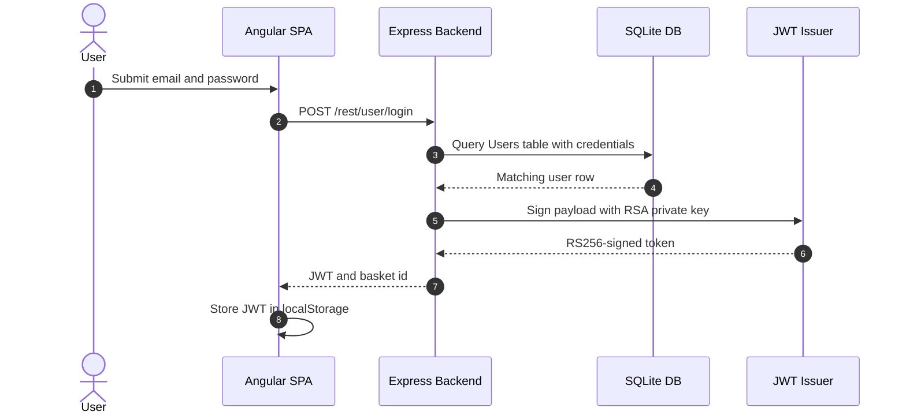

- **Login** — 🔴 Unsafe. SQL injection via email parameter; no parameterized query used.
- **Password Storage** — 🔴 Unsafe. `MD5` without salt — rainbow-table attack recovers all passwords.
- **Password Reset** — 🟠 Weak. Security question reset with plaintext answers; rate-limiting applied to `/rest/user/reset-password` only.
- **Registration** — 🟠 Weak. No CAPTCHA, no email verification; admin account seeded with known password.
- **2FA / TOTP** — 🟢 Adequate. TOTP-based 2FA implemented via otplib; available but optional.

**Security assessment**

Login endpoint at `routes/login.ts:34` constructs a raw Sequelize query with string interpolation: `SELECT * FROM Users WHERE email = '${req.body.email}' AND password = '${security.hash(req.body.password)}'`. SQL injection via email field is trivially exploitable (loginAdminChallenge, loginBenderChallenge). Password hashing uses `MD5` (`lib/insecurity.ts:48`: `crypto.createHash('md5')`), which is cryptographically broken - rainbow tables recover all common passwords instantly. Multiple hardcoded credentials are present in `login.ts:59-65` (admi**** (8 chars), etc.) and in `datacreator.ts`.

**Relevant findings**

- 🔴 [F-004 — OAuth login derives account password from public email](#f-004) — OAuth adapter bypasses the password-based flow by deriving a deterministic local password from the user's public email, meaning knowledge of the email alone suffices for account access.
- 🔴 [F-006 — Insecure JWT Verification](#f-006) — Insecure JWT verification allows algorithm substitution that renders the login credential check moot once a forged token is accepted.
- 🟠 [F-014 — Password-reset security-answer brute force via spoofable rate-limit key](#f-014) — Password-reset rate-limiting is keyed on the client-controlled `X-Forwarded-For` header, permitting unlimited security-question guessing by rotating that header.
- 🟠 [F-030 — Unsalted MD5 used for password hashing](#f-030) — Unsalted MD5 password hashing at `lib/insecurity.ts:41` means every credential extracted via SQL injection is immediately recoverable without per-hash cracking effort.

### 6.3 Session and Token Controls

**Verdict:** 🔴 Unsafe

<!-- The line below is mechanically derived from the controls table — LLM must not re-author it. -->
**Controls covered:**

- [6.3.1 JWT Token Issuance and Verification](#631-jwt-token-issuance-and-verification)

**Implemented controls:** `lib/insecurity.ts:23-27`, `lib/insecurity.ts:55-57`; `express-jwt@0.1.3` in `package.json`.

**Assessment:** This application uses a single locally-signed token format (commonly called JWT) for every authenticated session, regardless of the login flow in [§6.2](#62-identity-and-authentication-controls) that established it. The sub-sections below trace one token through its lifecycle: signing on issuance, validation on every protected request, storage in the browser, manual revocation, and time-based expiry. Both the signing key and the verification algorithm are defective - the private key is committed to the repository and the verification call pins no algorithm - so the entire session token lifecycle is compromised from issuance.

<a id="jwt-token-issuance-and-verification"></a>
#### 6.3.1 JWT Token Issuance and Verification

**Status:** 🔴 Unsafe - the RSA private key is committed to the repository and token verification accepts any algorithm, allowing offline JWT forgery for any role.

`lib/insecurity.ts:23-27` loads the RSA key pair and signs a JWT on every successful login. `lib/insecurity.ts:55-57` verifies incoming tokens using `express-jwt@0.1.3` with the RSA public key. The signed token carries `userId`, `email`, and `role` claims and is returned to the SPA in the login response body.

The diagram shows the token issuance path and the subsequent validation path on a protected request:

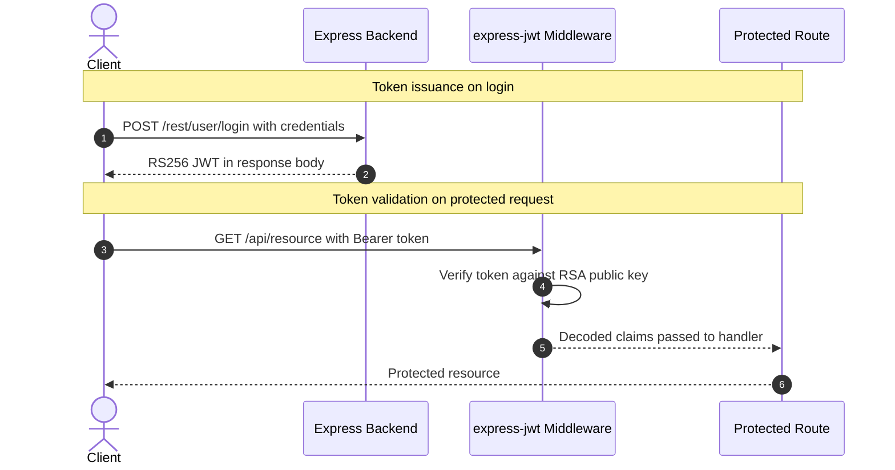

**Security assessment**

Two independent defects break the JWT lifecycle:

- `lib/insecurity.ts:21` commits the RSA private key verbatim in source, giving any repository reader the ability to sign arbitrary `role=admin` tokens offline.
- `lib/insecurity.ts:55` calls `jws.verify(token, publicKey)` with no `algorithms` restriction, so an attacker can substitute `HS256` and sign a forged token with the public key as the HMAC secret - the server accepts it.

tokens are stored in `localStorage` with no `HttpOnly` cookie boundary, and no revocation mechanism exists, so a stolen token remains valid for its full TTL.

**Relevant findings**

- 🟠 [F-001 — SPA holds session JWT in localStorage with no Backend-for-Frontend](#f-001) — Session tokens stored in `localStorage` are accessible to any same-origin script, making them recoverable by an XSS payload without any additional bypass.

### 6.4 Authorization Controls


**Systemic weaknesses:** [W-002](#w-002)
**Verdict:** 🔴 Missing

<!-- The line below is mechanically derived from the controls table — LLM must not re-author it. -->
**Controls covered:**

- [6.4.1 Route-Level Access Control](#641-route-level-access-control)

**Implemented controls:** Angular route guards in `app.guard.ts` block navigation to admin views in the SPA; `lib/insecurity.ts:157` exposes an `isAuthorized()` middleware function that individual route authors import selectively.

**Assessment:** Server-side route authorization is absent as a systematic layer. `finale-rest` exposes auto-generated CRUD endpoints for all Sequelize models without any authorization guard, and the primary enforcement mechanism is a client-side Angular guard whose JWT role claim is never re-verified by the API before the claim is trusted.

<a id="route-level-access-control"></a>
#### 6.4.1 Route-Level Access Control

**Status:** 🔴 Missing - server-side authorization middleware is applied per-route by individual authors rather than globally, and the Angular SPA's client-side guards are the only enforcement layer on most admin paths.

`app.guard.ts` reads the `role` claim from the browser-decoded JWT and blocks Angular router navigation to protected paths. On the Express backend, `lib/insecurity.ts:157` provides `isAuthorized()` as a middleware that route files may import and apply individually in `server.ts`.

**Security assessment**

Authorization is not enforced globally:

- `server.ts` registers `finale-rest` CRUD endpoints for all Sequelize models with no authorization middleware, making every model's read, write, and delete operations accessible to any authenticated - and in some cases unauthenticated - request.
- `app.guard.ts:54` reads the `role` field directly from the JWT decoded in the browser without re-verifying the token signature server-side, so any user can escalate privilege by crafting a token with `role: admin` and presenting it to the Angular router.
- Mass-assignment at `routes/verify.ts:53` allows the HTTP request body to set `isAdmin` and other privileged model fields, which the ORM persists without stripping.

**Relevant findings**

- 🔴 [F-011 — Insecure Direct Object Reference](#f-011) — Insecure direct object reference allows a requester to supply any user ID in the URL and retrieve that user's resources without ownership verification against the session identity.
- 🔴 [F-013 — Mass assignment privileged field accepted from request body](#f-013) — Mass-assignment at `routes/verify.ts:53` accepts `isAdmin` and other privileged fields from the request body and persists them directly to the `Users` table.
- 🟠 [F-033 — GitHub Actions workflow-level permissions block](#f-033) — Authorization middleware is applied per-route rather than globally, leaving newly added endpoints unprotected by default and creating an incomplete enforcement perimeter.

### 6.5 Query Construction and Data Access Controls


**Systemic weaknesses:** [W-001](#w-001)
**Verdict:** 🔴 Unsafe

<!-- The line below is mechanically derived from the controls table — LLM must not re-author it. -->
**Controls covered:**

- [6.5.1 SQL Query Parameterization](#651-sql-query-parameterization)

**Implemented controls:** Sequelize ORM backs most relational data access and provides parameterized queries for standard `findAll`, `findOne`, `create`, and `update` operations across most routes registered in `server.ts`.

**Assessment:** Two Express routes bypass the Sequelize ORM and call `models.sequelize.query()` directly with user-controlled values interpolated into raw SQL strings, creating injection paths on the application's most critical endpoints.

<a id="sql-query-parameterization"></a>
#### 6.5.1 SQL Query Parameterization

**Status:** 🔴 Unsafe - two routes pass user-controlled values directly into raw SQL strings via `models.sequelize.query()`, bypassing the ORM's parameter binding entirely.

Sequelize backs most data access in `models/index.ts` and automatically generates parameterized queries for standard model operations. The login and product-search routes call `models.sequelize.query()` directly and interpolate request parameters into the query string at runtime.

The vulnerable login query illustrates the raw SQL construction pattern:

```ts
models.sequelize.query(
  `SELECT * FROM Users WHERE email = '${req.body.email}' AND password = '${security.hash(req.body.password)}'`
)
```

**Security assessment**

Both raw-SQL call sites concatenate attacker-controlled input without binding:

- `routes/login.ts:34` interpolates `req.body.email` - a crafted value such as `' OR '1'='1` short-circuits the WHERE clause and returns the first user row (the seeded admin account).
- `routes/search.ts` interpolates the search term into a `LIKE` clause, enabling UNION-based extraction of any table column.

**Relevant findings**

- 🔴 [F-008 — SQL injection in login authentication query](#f-008) — SQL injection in the login query allows authentication bypass by short-circuiting the WHERE clause with a crafted email value, returning the admin account without a valid password.
- 🔴 [F-009 — UNION-based SQL injection in product search](#f-009) — UNION-based SQL injection in the product search query allows extraction of arbitrary database columns by appending a crafted UNION SELECT to the search term.

### 6.6 Input Boundary Validation Controls

**Verdict:** 🟠 Weak

<!-- The line below is mechanically derived from the controls table — LLM must not re-author it. -->
**Controls covered:**

- [6.6.1 Validation Approach](#661-validation-approach)
- [6.6.2 HTML Sanitization and Input Validation](#662-html-sanitization-and-input-validation)

**Implemented controls:** `lib/insecurity.ts:58`-67.

**Assessment:** Angular reactive forms enforce some field-format constraints on the frontend, but those constraints are not mirrored server-side. The shared sanitizer in `lib/insecurity.ts:58-67` is selectively bypassed in components that render rich text, leaving stored and reflected XSS paths reachable despite the sanitizer's presence.

<a id="validation-approach"></a>
#### 6.6.1 Validation Approach

**Status:** 🟠 Weak - Angular form validators enforce format constraints on the client, but no server-side schema library validates request payloads, so crafted HTTP requests bypass all type, length, and range checks.

Angular reactive forms apply validators such as email format checks and length limits before the SPA submits requests. Some server routes use `express-validator` to check for the presence of required fields, providing a baseline of server-side presence validation.

**Security assessment**

Server-side input validation is inconsistent across routes. No schema library (Joi, Zod, or equivalent) enforces field types, value ranges, or allowlist constraints on Express route handlers. Frontend Angular validators are not replicated server-side, so any HTTP client that bypasses the Angular layer sends unvalidated values directly to the database or business logic.

**Relevant findings**

- 🟠 [F-040 — Decompression/entity-expansion bombs and unrate-limited uploads](#f-040) — Client-side Angular validator for a request field is absent on the server, allowing a crafted HTTP request to submit out-of-range or wrongly-typed values that reach backend processing unchecked.
- 🟡 [F-058 — SQLite single-writer file lock exhausts under concurrent writes](#f-058) — Missing server-side validation on a request field allows a malformed or oversized value to bypass all frontend format constraints and reach the route handler.

<a id="html-sanitization-and-input-validation"></a>
#### 6.6.2 HTML Sanitization and Input Validation

**Status:** 🟠 Weak - the `sanitize-html` filter at `lib/insecurity.ts:58-67` is present but is explicitly bypassed for at least one user-facing rendering path via `bypassSecurityTrustHtml`, leaving a persistent XSS path open.

`lib/insecurity.ts:58-67` wraps `sanitize-html` with a configured allowlist and is used to sanitize stored user-generated content before rendering. The function provides a centralized sanitization point for fields such as product descriptions and user reviews.

**Security assessment**

The sanitizer's coverage is incomplete:

- `search-result.component.ts` calls Angular's `bypassSecurityTrustHtml()` on the user-supplied search term before binding it into the DOM, disabling both Angular's auto-encoding and the configured sanitizer for that rendering path.
- The `sanitize-html` allowlist is permissive enough to pass certain HTML attributes that allow event-handler injection when the sanitizer is applied.

**Relevant findings**

- 🟠 [F-040 — Decompression/entity-expansion bombs and unrate-limited uploads](#f-040) — `bypassSecurityTrustHtml()` on the search term disables Angular's default encoding, allowing a reflected XSS payload to execute even when the sanitizer is nominally in place.
- 🟡 [F-058 — SQLite single-writer file lock exhausts under concurrent writes](#f-058) — The sanitizer allowlist passes HTML attributes that enable event-handler-based script injection on fields where `sanitize-html` is applied but the allowlist is not restrictive.

### 6.7 Output Encoding and Rendering Controls

**Verdict:** 🟠 Weak

<!-- The line below is mechanically derived from the controls table — LLM must not re-author it. -->
**Controls covered:**

- [6.7.1 Template Encoding and XSS Prevention](#671-template-encoding-and-xss-prevention)

**Implemented controls:** Angular template binding provides automatic output encoding for all standard `{{ expr }}` interpolation sites across the application; Helmet's `xssFilter` and `noSniff` headers are registered via `server.ts`.

**Assessment:** Angular's default encoding is correctly applied across most components, but two call sites explicitly disable it via `bypassSecurityTrustHtml()`, creating reflected and stored XSS paths that the framework's default protection would otherwise close.

<a id="template-encoding-and-xss-prevention"></a>
#### 6.7.1 Template Encoding and XSS Prevention

**Status:** 🟡 Partial - Angular's template auto-encoding covers the majority of rendering paths, but `bypassSecurityTrustHtml()` is explicitly invoked in at least two components, defeating the default protection at those sites.

Angular compiles templates with automatic context-aware encoding for all `{{ expr }}` bindings, making XSS at standard interpolation sites impossible without explicit bypass. Helmet contributes `X-XSS-Protection` and `X-Content-Type-Options` headers on the Express API responses.

**Security assessment**

Two components disable Angular's encoding at the point of rendering:

- `search-result.component.ts` calls `bypassSecurityTrustHtml()` on the search query string before binding it to the DOM, enabling reflected XSS via the search bar.
- `routes/saveLoginIp.ts` persists the `True-Client-IP` request header as the last-login IP without sanitization; the value is rendered in the admin panel, creating a stored XSS path via HTTP header injection.

**Relevant findings**

- 🔴 [F-007 — Cross-Site Scripting](#f-007) — `bypassSecurityTrustHtml()` on the search term in `search-result.component.ts` allows a reflected XSS payload submitted via the search bar to execute in other users' browsers when the page is shared.
- 🔴 [F-019 — Stored XSS via true-client-ip header persisted as last login IP](#f-019) — The `True-Client-IP` header is stored as-is in the user record and later rendered in the admin panel, providing a stored XSS path accessible to any requester who controls their `True-Client-IP` header.

### 6.8 Browser and Cross-Origin Controls

**Verdict:** 🔴 Missing

<!-- The line below is mechanically derived from the controls table — LLM must not re-author it. -->
**Controls covered:**

- [6.8.1 CORS and Content Security Policy](#681-cors-and-content-security-policy)

**Implemented controls:** Helmet is loaded in `server.ts` and provides `X-Frame-Options: SAMEORIGIN`, `X-Content-Type-Options: nosniff`, and `Strict-Transport-Security` headers by default.

**Assessment:** CORS is configured with `app.use(cors())` and no `origin` restriction, accepting cross-origin requests from any domain. No `Content-Security-Policy` header is emitted, leaving the browser with no instruction to restrict script sources and amplifying the impact of every XSS finding.

<a id="cors-and-content-security-policy"></a>
#### 6.8.1 CORS and Content Security Policy

**Status:** 🔴 Missing - no Content-Security-Policy header is served and CORS accepts requests from any origin, removing two browser-enforced boundaries that would otherwise limit the reach of XSS and CSRF-style attacks.

`server.ts` calls `app.use(cors())` with no configuration object, making the Express API available to cross-origin requests from any domain. The Angular build pipeline does not inject a `Content-Security-Policy` meta tag, and neither the Express API nor a CDN layer serves the header.

**Security assessment**

Both browser-policy controls are absent:

- `server.ts` ([CWE-942](https://cwe.mitre.org/data/definitions/942.html)) calls `cors()` with a wildcard - any origin can read authenticated API responses if the user is logged in, enabling cross-origin data theft without user interaction beyond visiting a malicious page.
- No `Content-Security-Policy` header is emitted by the Angular build or the Express API, so any injected script executes without restriction, regardless of its source - amplifying every XSS finding in [§6.7](#67-output-encoding-and-rendering-controls) from session-theft risk to arbitrary-page-control risk.

**Relevant findings**

- 🟠 [F-029 — No Content-Security-Policy leaves XSS uncontained](#f-029) — Wide-open CORS at `server.ts` allows a malicious cross-origin page to read authenticated JSON responses on behalf of a logged-in user, enabling cross-origin data exfiltration without user credential theft.
- 🟡 [F-052 — Wide-open CORS allows any origin](#f-052) — Absence of a `Content-Security-Policy` header leaves the browser with no instruction to block inline scripts or restrict `script-src`, meaning XSS payloads execute without any policy-layer fallback.

### 6.9 Cryptography Secrets and Data Protection


**Systemic weaknesses:** [W-003](#w-003), [W-007](#w-007)
**Verdict:** 🔴 Unsafe

<!-- The line below is mechanically derived from the controls table — LLM must not re-author it. -->
**Controls covered:**

- [6.9.1 Cryptographic Primitive Selection and Key Management](#691-cryptographic-primitive-selection-and-key-management)

**Implemented controls:** `otplib` provides TOTP code generation and verification for 2FA; `jsonwebtoken` and `jws` handle `RS256` JWT signing; `bcryptjs` is a declared dependency in `package.json` though it is not used for the primary password-hashing path.

**Assessment:** Three cryptographic controls are present but defeated: the JWT signing key is hardcoded in source, passwords use unsalted `MD5` instead of the available `bcryptjs`, and security-answer HMACs use a static global key with no per-record salt.

<a id="cryptographic-primitive-selection-and-key-management"></a>
#### 6.9.1 Cryptographic Primitive Selection and Key Management

**Status:** 🔴 Unsafe - three primitives are broken or defeated: hardcoded RSA signing key, unsalted `MD5` password hashing, and static-key HMAC for security answers.

`lib/insecurity.ts` centralizes the application's cryptographic operations. It loads an RSA key pair for JWT signing at startup, computes `MD5` hashes for password storage, and generates HMAC-SHA256 codes for security-answer hashing. `otplib` derives TOTP verification codes for the optional 2FA flow.

**Security assessment**

Three independent failures exist across the cryptographic controls:

- `lib/insecurity.ts:21` contains the RSA private key as a hardcoded literal - any repository reader can sign arbitrary `role=admin` JWTs offline without server interaction.
- `lib/insecurity.ts:41` hashes passwords with `crypto.createHash('md5')` and no salt - a database dump is immediately reversible via rainbow tables, no per-hash cracking required.
- `models/securityAnswer.ts` hashes security-question answers with a static global HMAC key and no per-record salt, removing any uniqueness guarantee and enabling precomputation over common answers.

**Relevant findings**

- 🔴 [F-002 — Hardcoded secrets embedded in source](#f-002) — Hardcoded secrets in `lib/insecurity.ts` include signing key material whose exposure cannot be remediated without a source-code change and full key rotation.
- 🔴 [F-005 — Hardcoded RSA private JWT signing key](#f-005) — The RSA private key committed at `lib/insecurity.ts:21` gives every repository reader the ability to mint tokens accepted as any user or role by the running application.
- 🔴 [F-017 — Hardcoded default admin credentials and TOTP seed in seed data](#f-017) — Admin credentials and the admin TOTP seed are hardcoded in `data/static/users.yml`, meaning both password and 2FA secret are known to any person with repository access.

### 6.10 File Parser and Outbound Request Controls


**Systemic weaknesses:** [W-005](#w-005)
**Verdict:** 🔴 Unsafe

<!-- The line below is mechanically derived from the controls table — LLM must not re-author it. -->
**Controls covered:**

- [6.10.1 File Upload and URL Fetch Safety](#6101-file-upload-and-url-fetch-safety)

**Implemented controls:** `routes/fileUpload.ts:62-65`, `routes/profileImageUrlUpload.ts`.

**Assessment:** File upload and outbound URL fetch operations apply some size and extension checks, but neither validates content type via magic-byte inspection nor restricts outbound network targets, leaving path traversal, XML entity injection, and server-side request forgery paths open.

<a id="file-upload-and-url-fetch-safety"></a>
#### 6.10.1 File Upload and URL Fetch Safety

**Status:** 🔴 Unsafe - file type is validated by extension only with no magic-byte check, archive entries are not path-sanitized, and outbound image URL fetching carries no allowlist, enabling zip-slip, XXE, and SSRF.

`routes/fileUpload.ts:62-65` checks the uploaded file's extension and applies a `multer` size limit before passing the file to further processing. `routes/profileImageUrlUpload.ts` accepts a user-supplied URL and fetches the image server-side to store as the user's avatar, using Node's `http`/`https` module with no target restriction.

**Security assessment**

Three distinct file-and-fetch controls are defeated:

- `routes/fileUpload.ts` processes ZIP archives without path-sanitizing entries - a crafted archive with `../` components in its file names writes to arbitrary paths on the server filesystem.
- The XML complaint-upload parser enables external-entity resolution (`noent: true` equivalent), allowing an uploaded XML body to read local files and exfiltrate them via an XXE out-of-band channel.
- `routes/profileImageUrlUpload.ts` fetches the caller-supplied URL without restricting the target to external hosts or blocking RFC-1918 address ranges, enabling SSRF to reach internal services or cloud metadata endpoints.

**Relevant findings**

- 🔴 [F-010 — Remote code execution via notevil sandbox eval](#f-010) — Server-side evaluation of B2B order payloads using `notevil` allows remote code execution when a crafted payload escapes the sandbox via prototype pollution or unsupported node type.
- 🔴 [F-012 — XML External Entity file disclosure](#f-012) — XXE in the complaint-upload XML parser discloses local file content by resolving external entities declared in the uploaded document body.
- 🟠 [F-021 — XXE via XML complaint upload](#f-021) — The profile image URL endpoint fetches caller-supplied URLs server-side without restricting targets to external hosts, enabling SSRF to reach internal services and cloud metadata APIs.

### 6.11 Operations Runtime and Supply Chain Controls


**Systemic weaknesses:** [W-006](#w-006)
**Verdict:** 🔴 Missing

<!-- The line below is mechanically derived from the controls table — LLM must not re-author it. -->
**Controls covered:**

- [6.11.1 CI/CD Security and Dependency Management](#6111-cicd-security-and-dependency-management)
- [6.11.2 Automated SCA scanning](#6112-automated-sca-scanning)
- [6.11.3 Automated dependency updates](#6113-automated-dependency-updates)
- [6.11.4 Lockfile hygiene](#6114-lockfile-hygiene)

**Implemented controls:** GitHub Actions workflows in `.github/workflows/` automate build, test, and Docker image publishing; `npm audit` is available as a manual command; `package-lock.json` exists in the repository but lockfile generation is disabled via `.npmrc`.

**Assessment:** CI/CD pipeline automation exists for build, test, and container publishing, but dependency security controls - lockfile integrity, pinned base images, SCA in CI, and automated update tooling - are absent or actively disabled. The `.npmrc` `package-lock=false` directive is the single most consequential gap: it makes every install non-deterministic and unauditable.

<a id="cicd-security-and-dependency-management"></a>
#### 6.11.1 CI/CD Security and Dependency Management

**Status:** 🟡 Partial - GitHub Actions workflows run a full CI suite, but workflow-level `permissions` blocks are absent from most workflow files and third-party action references are not pinned to commit SHAs.

GitHub Actions workflows in `.github/workflows/` run lint, tests, Docker builds, and release packaging on every push. The repository is public, and the Actions runner has access to repository secrets and the GitHub Container Registry token.

**Security assessment**

CI pipeline automation is functional but supply-chain controls are missing:

- Most workflow files lack a top-level `permissions: {contents: read}` block, granting the default broad `GITHUB_TOKEN` scope to every job including those that only run tests.
- Third-party action references such as `calibreapp/image-actions` are pinned to a branch name rather than a full commit SHA, allowing a malicious upstream commit to alter the pipeline on the next run.
- `npm install` runs in release and Docker build workflows without `--ignore-scripts`, permitting malicious `postinstall` hooks to execute in the CI runner context.

**Relevant findings**

- 🟠 [F-024 — CI/CD Workflow Supply-Chain Risk](#f-024) — Workflow files reference third-party GitHub Actions by branch rather than pinned commit SHA, allowing a malicious upstream commit to execute arbitrary code in the pipeline runner.
- 🟠 [F-025 — Dependency Install Scripts Enabled in Release and Image Build](#f-025) — `npm install` runs with postinstall scripts enabled in release and Dockerfile dependency steps, permitting supply-chain compromise via malicious package hooks.
- 🟠 [F-034 — Dockerfile base image must be digest-pinned](#f-034) — Access-log files are reachable without authentication at `/support/logs`, potentially exposing secrets or internal paths captured during CI-triggered server runs.

<a id="automated-sca-scanning"></a>
#### 6.11.2 Automated SCA scanning

**Status:** 🟢 Adequate - GitHub's native Dependabot vulnerability alerts provide baseline SCA coverage for the repository's npm dependency graph without requiring explicit configuration.

GitHub's Dependabot automatically scans the dependency graph on each push and emits security advisories for known-vulnerable npm packages, surfacing findings in the repository's Security tab. This default coverage applies to all public repositories without any workflow integration.

**Security assessment**

Dependabot's automatic alerts represent the application's only automated SCA signal. No dedicated SCA tool (Snyk, OWASP Dependency-Check, or similar) is integrated into the GitHub Actions pipeline to gate merges on known-CVE severity thresholds, and no SBOM is generated as a pipeline artifact. Dependencies such as `express-jwt@0.1.3` - known to mishandle algorithm negotiation - are flagged by Dependabot advisories but are not blocked from merging by a CI quality gate.

**Relevant findings**

- 🟠 [F-024 — CI/CD Workflow Supply-Chain Risk](#f-024) — Supply-chain risk from unpinned third-party actions is not caught by Dependabot, which covers npm packages but not GitHub Actions action references.
- 🟠 [F-025 — Dependency Install Scripts Enabled in Release and Image Build](#f-025) — Enabled install scripts in the pipeline compound the SCA gap: a malicious package that passes Dependabot's CVE check can still execute code at install time.
- 🟠 [F-034 — Dockerfile base image must be digest-pinned](#f-034) — Without a pipeline SCA gate, log-related dependencies that expose sensitive paths remain on vulnerable versions until a manual advisory review triggers an update.

<a id="automated-dependency-updates"></a>
#### 6.11.3 Automated dependency updates

**Status:** 🔴 Missing - no Dependabot auto-PR or Renovate configuration is present, so outdated and vulnerable transitive dependencies accumulate without any automated update proposal.

Dependabot alerts notify of vulnerable packages but do not auto-generate pull requests without a `dependabot.yml` configuration file. No Renovate configuration exists in the repository. Dependency updates are applied only on manual developer action in response to individual advisories.

**Security assessment**

The absence of automated update PRs creates a compounding backlog:

- Pinned dependency versions in `package.json` (e.g. `express-jwt@0.1.3`) drift further from current secure releases with each passing week without automated PRs to surface the gap.
- Transitive dependency updates that address known CVEs are never surfaced automatically - they appear only as Dependabot alerts with no corresponding change proposal.
- Without a configured update schedule, security-relevant minor and patch releases accumulate silently, widening the exploitable attack surface over time.

**Relevant findings**

- 🟠 [F-024 — CI/CD Workflow Supply-Chain Risk](#f-024) — The absence of automated dependency updates leaves known-vulnerable action and package references in place until a developer manually identifies and remediates them.
- 🟠 [F-025 — Dependency Install Scripts Enabled in Release and Image Build](#f-025) — Without Renovate or Dependabot PRs, packages with malicious postinstall hooks introduced via a dependency update are never surfaced for review before installation.
- 🟠 [F-034 — Dockerfile base image must be digest-pinned](#f-034) — Log-exposure dependencies remain on their pinned vulnerable versions indefinitely without automated update proposals to prompt remediation.

<a id="lockfile-hygiene"></a>
#### 6.11.4 Lockfile hygiene

**Status:** 🔴 Missing - `.npmrc` sets `package-lock=false`, disabling lockfile generation and making every `npm install` non-deterministic; the CI pipeline uses `npm install` rather than `npm ci`.

`package-lock.json` exists in the repository but its generation is suppressed by `package-lock=false` in `.npmrc`. CI workflows call `npm install`, which resolves the widest compatible version of each dependency at install time rather than reproducing a fixed resolved tree.

**Security assessment**

Non-deterministic installs remove the audit trail for what was actually deployed:

- `package-lock=false` in `.npmrc` means any `npm install` invocation resolves dependencies fresh, so a malicious version that satisfies the `package.json` semver range is silently adopted.
- Using `npm install` instead of `npm ci` in CI means the lockfile (even if one existed) would not be honored, defeating its purpose as a reproducibility control.
- Without a committed, enforced lockfile, retrospective auditing of "what version of X was running at time T" is impossible, complicating incident response.

**Relevant findings**

- 🟠 [F-024 — CI/CD Workflow Supply-Chain Risk](#f-024) — Non-deterministic installs via `npm install` instead of `npm ci` allow supply-chain drift at every CI run, including from actions whose underlying npm packages may be compromised.
- 🟠 [F-025 — Dependency Install Scripts Enabled in Release and Image Build](#f-025) — `package-lock=false` combined with enabled install scripts means a newly resolved dependency version can execute arbitrary code at install time without any prior review.
- 🟠 [F-034 — Dockerfile base image must be digest-pinned](#f-034) — Without a reproducible install, the version of log-emitting dependencies actually running in production cannot be pinned and verified against known advisories.

### 6.12 Real-time and Not Applicable Controls

<!-- §6.12 LOCKED — mechanically derived from absence of real-time findings. Renderer must not rewrite the line below. -->
_Not applicable - no real-time / WebSocket findings routed to this category, and no AI/LLM, GraphQL, or gRPC surfaces detected by the recon scan. Controls catalogued elsewhere (container hardening, dependency determinism) are covered in their primary [§6](#6-security-architecture) sections._

### 6.13 Defense-in-Depth Summary

**Verdict:** 🔴 Unsafe

Angular's template auto-encoding protects the majority of rendering paths; Helmet contributes `X-Frame-Options`, `X-Content-Type-Options`, and `Strict-Transport-Security` headers on every API response; `RS256` is the correct algorithm choice for JWT signing when the key is kept secret; `otplib`-backed TOTP provides a sound second factor for accounts that enroll; Sequelize ORM parameterizes all standard model operations; and GitHub's native Dependabot alerts provide baseline SCA coverage without additional configuration.

The three control-boundary repairs that would most directly restore layered defense are: (1) replace raw `models.sequelize.query()` calls in `routes/login.ts` and `routes/search.ts` with parameterized Sequelize methods, which closes the injection entry point before any session or authorization control is reached; (2) move the RSA signing key out of source into a runtime-injected secret and rotate the exposed key, which closes the offline JWT-forgery path that currently renders the entire session token lifecycle moot; and (3) add a global Express authorization middleware that denies unauthenticated and unauthorized requests at the router level rather than relying on per-route author discipline, which eliminates the missing-middleware class of authorization bypass. Complementing those structural repairs, a strict `Content-Security-Policy`, CORS restricted to the known application origin, and `bcrypt`/Argon2 password hashing would close the remaining browser-policy and credential-resistance gaps.

<!-- enriched:thorough -->

---

<a id="weakness-register"></a>
## 7. Weakness Register

Systemic control gaps behind the findings, ordered by severity (W-001 = most severe). Each weakness names the missing, home-grown, or misused control, the findings that evidence it, the components it spans, and its remediation. A weakness may also rest on observed unsafe practice or an absent architectural control with no confirmed exploit - only confirmed findings carry a CVSS score.

- 🔴 **Critical** · [W-001](#w-001) - Database access relies on concatenated queries · confirmed · 2 findings · 2 components
- 🔴 **Critical** · [W-002](#w-002) - Authorization is implemented route by route · confirmed · 3 findings · 2 components
- 🔴 **Critical** · [W-003](#w-003) - Secrets are committed to source instead of a managed store · confirmed · 3 findings · 2 components
- 🟠 **High** · [W-004](#w-004) - Endpoints are reachable without enforced authentication · confirmed · 2 findings · 2 components
- 🟠 **High** · [W-005](#w-005) - Input handling lacks enforced boundary validation · confirmed · 2 findings · 2 components
- 🟠 **High** · [W-006](#w-006) - Build pipeline trusts mutable third-party references · confirmed · 2 findings · 1 component
- 🟡 **Medium** · [W-007](#w-007) - Security-sensitive data uses weak cryptographic primitives · observed-practice · 2 findings · 2 components
- 🟡 **Medium** · [W-008](#w-008) - Frontend rendering lacks enforced output encoding · design-risk · 0 findings · 0 components

<a id="w-001"></a>
### W-001 — Database access relies on concatenated queries

🔴 **Critical** · design weakness · confirmed · 2 findings

Database queries are assembled from application values instead of passing those values through an enforced parameterised data-access path. This leaves every call site responsible for preserving query structure.

**Architectural anti-pattern - Raw SQL string interpolation.** User-controlled values are concatenated directly into database query strings across authentication and search routes; this is a structural defect that requires adopting parameterised queries throughout, not a per-endpoint patch.

**Confirmed findings:**

- 🔴 [F-008](#f-008) — SQL injection in login authentication query (`routes/login.ts:34`)
- 🔴 [F-009](#f-009) — UNION-based SQL injection in product search (`routes/search.ts:23`)

**Architecture evidence:** Parameterized Queries, ORM / Repository Layer

**Affected components:** [C-06](#c-06), [C-02](#c-02)

**Remediation:**

- **Structural** — provide one parameterised repository or query-builder path and prohibit application-value interpolation in database queries
- **Tactical** — ● [M-008](#m-008) — Replace the interpolated login query with a parameterized/bound query, ● [M-009](#m-009) — Parameterize the product search LIKE clause

<a id="w-002"></a>
### W-002 — Authorization is implemented route by route

🔴 **Critical** · design weakness · confirmed · 3 findings

Authorization depends on per-handler checks instead of a policy boundary that consistently enforces role, ownership, and tenant scope. New routes can bypass protection by omitting a local check.

**Architectural anti-pattern - Missing server-side authorization layer.** Authorization is scattered across individual routes rather than enforced by a central default-deny middleware, creating systemic gaps that allow unauthenticated access and privilege escalation through any unguarded route or object reference.

**Confirmed findings:**

- 🔴 [F-011](#f-011) — Insecure Direct Object Reference
- 🔴 [F-042](#f-042) — Role authorization trusts self-asserted JWT role claim (`lib/insecurity.ts:157`)
- 🔴 [F-043](#f-043) — Authorization applied per-route, not globally (`server.ts:356`+)

**Architecture evidence:** Centralised AuthZ Policy, Role / Scope Enforcement, Ownership Check, Object-Level Ownership Check, Tenant Scoping

**Affected components:** [C-06](#c-06), [C-02](#c-02)

**Remediation:**

- **Structural** — enforce authorization through a shared server-side policy layer and make ownership and tenant scope mandatory inputs to data access
- **Tactical** — ● [M-011](#m-011) — Replace req.body.UserId/userId/ownerId with req.user.id (or equivalent session-derived identity) in every WHERE/filter clause., ◕ [M-042](#m-042) — Re-derive role from the persisted user record after verified authentication, ◕ [M-043](#m-043) — Introduce a central default-deny authorization layer with per-route allowlisting

<a id="w-003"></a>
### W-003 — Secrets are committed to source instead of a managed store

🔴 **Critical** · design weakness · confirmed · 3 findings

Cryptographic keys, credentials, and other high-entropy secrets are embedded as literals in source or config rather than resolved at runtime from a managed secret store, so anyone with repository read access obtains reusable signing material and credentials.

**Architectural anti-pattern - Secrets hardcoded in source.** Signing keys, account credentials, and cryptographic secrets are embedded as source-code literals, making them permanently available to any party with repository or build-artifact access and impossible to rotate without a code change.

**Confirmed findings:**

- 🔴 [F-002](#f-002) — Hardcoded secrets embedded in source
- 🔴 [F-005](#f-005) — Hardcoded RSA private JWT signing key (`lib/insecurity.ts:21`)
- 🔴 [F-017](#f-017) — Hardcoded default admin credentials and TOTP seed in seed data (`users.yml:3`)

**Architecture evidence:** Managed Secret Store, Runtime Secret Injection

**Affected components:** [C-06](#c-06), [C-03](#c-03)

**Remediation:**

- **Structural** — move every secret to a managed secret store or injected environment configuration, rotate the exposed values, and add secret-scanning to CI
- **Tactical** — ● [M-002](#m-002) — Integrate SAST/injection scanner in CI to gate injection and XSS pre-merge, ● [M-005](#m-005) — Move the RSA signing key out of source into a secret store and rotate the exposed key, ◕ [M-017](#m-017) — Remove hardcoded privileged credentials from seed data and force first-boot rotation

<a id="w-004"></a>
### W-004 — Endpoints are reachable without enforced authentication

🟠 **High** · design weakness · confirmed · 2 findings

Sensitive API routes and real-time channels are exposed without an enforced authentication check at the endpoint boundary. Access control depends on each handler (or the caller) remembering to require a session, so an unauthenticated client can reach privileged operations directly.

**Confirmed findings:**

- 🟠 [F-016](#f-016) — Unauthenticated WebSocket Channel
- 🟡 [F-045](#f-045) — Unauthenticated WebSocket allows deleting shared notifications

**Architecture evidence:** Route Authentication Middleware, Server-Side Session Enforcement

**Affected components:** [C-06](#c-06), [C-07](#c-07)

**Remediation:**

- **Structural** — enforce authentication centrally at the routing and channel boundary so every exposed endpoint requires a verified session unless explicitly marked public
- **Tactical** — ◕ [M-016](#m-016) — Add a Socket.IO handshake authentication middleware and drive CORS origin from config, ◑ [M-045](#m-045) — Authenticate WebSocket connections and scope notification handling per user

<a id="w-005"></a>
### W-005 — Input handling lacks enforced boundary validation

🟠 **High** · design weakness · confirmed · 2 findings

Request handlers do not validate input against one enforced server-side schema or allowlist at the boundary - validation is either absent on the vulnerable parameters or limited to rejecting selected bad patterns (a blacklist). New encodings and unanticipated input forms can therefore reach downstream parsers or interpreters.

**Confirmed findings:**

- 🟠 [F-026](#f-026) — Zip-slip arbitrary file write in complaint extraction (`routes/fileUpload.ts:33`)
- 🟠 [F-031](#f-031) — Path Traversal

**Architecture evidence:** Schema Validation, Allowlist Validation

**Affected components:** [C-02](#c-02), [C-04](#c-04)

**Remediation:**

- **Structural** — enforce server-side schemas and domain-specific allowlists before input reaches parsing, persistence, or command construction
- **Tactical** — ◕ [M-026](#m-026) — Anchor zip extraction to a normalized base directory and reject traversing entries, ◕ [M-031](#m-031) — Remove poison-null-byte truncation and validate the resolved path stays in ftp/

<a id="w-006"></a>
### W-006 — Build pipeline trusts mutable third-party references

🟠 **High** · design weakness · confirmed · 2 findings

CI/CD workflows resolve third-party actions and other build dependencies to mutable tags or branches instead of immutable commit digests, so a retagged or compromised upstream runs inside the pipeline with its token and secret scope.

**Confirmed findings:**

- 🟠 [F-024](#f-024) — CI/CD Workflow Supply-Chain Risk
- 🟠 [F-025](#f-025) — Dependency Install Scripts Enabled in Release and Image Build

**Architecture evidence:** Commit-SHA Action Pinning, Dependency Provenance Verification

**Affected components:** [C-05](#c-05)

**Remediation:**

- **Structural** — pin every third-party action and build dependency to an immutable commit SHA (or a vetted internal mirror) and enforce SHA-pinning in CI
- **Tactical** — ◕ [M-024](#m-024) — Pin calibreapp/image-actions to a full-length commit SHA, ◕ [M-025](#m-025) — Add --ignore-scripts to release and Dockerfile dependency installs and gate any required scripts explicitly

<a id="w-007"></a>
### W-007 — Security-sensitive data uses weak cryptographic primitives

🟡 **Medium** · implementation weakness · observed-practice · 2 findings

Password, token, or integrity protection uses a weak hash, predictable random source, or insufficient work factor. The application may use a standard library, but the selected primitive does not provide the required security property.

**Practice sites:**

- 🟠 [F-020](#f-020) — Non-cryptographic RNG for a secret/token `lib/insecurity.ts:53` (`lib/insecurity.ts:53`)
- 🟠 [F-030](#f-030) — Unsalted MD5 used for password hashing (`lib/insecurity.ts:41`) (`lib/insecurity.ts:41`)

**Affected components:** [C-06](#c-06), [C-02](#c-02)

**Remediation:**

- **Structural** — standardise on a password KDF, a CSPRNG for secrets, and modern authenticated cryptographic primitives with centrally reviewed parameters
- **Tactical** — ◕ [M-020](#m-020) — Use crypto.randomBytes / crypto.randomUUID / webcrypto getRandomValues for any security value., ◕ [M-030](#m-030) — Replace MD5 password hashing with bcrypt/argon2 and migrate stored hashes

<a id="w-008"></a>
### W-008 — Frontend rendering lacks enforced output encoding

🟡 **Medium** · design weakness · design-risk

Browser rendering paths write HTML or DOM content directly without one enforced contextual-encoding or sanitisation boundary. Safety depends on each individual component using the right API.

**Architecture evidence:** Template Autoescape, Output Encoding, Content Security Policy

**Remediation:**

- **Structural** — use framework-safe rendering by default and isolate any required raw HTML behind one reviewed sanitisation and Trusted Types policy

---

## 8. Findings Register

Findings are grouped by severity (Critical → High → Medium → Low); within a tier they are ordered by attack vektor (Repo-Read → Internet-Anon → Internet-User → Victim-Required). Each finding is a card with the same fixed fields, in order: **Severity · Component · Location** → **Issue** → **Root cause** → **Evidence** → **Fix** → **Classification** (with external CWE / OWASP links).

**Risk Distribution:** 🔴 Critical: 10 · 🟠 High: 35 · 🟡 Medium: 15 · 🟢 Low: 0 · **Total findings: 60**
**STRIDE Coverage:** Spoofing: 8 · Tampering: 18 · Repudiation: 1 · Information Disclosure: 23 · Denial of Service: 4 · Elevation of Privilege: 6

The systemic root-cause view is summarized in **Top Weaknesses** in the Management Summary; evidence-backed weaknesses are documented in the [Weakness Register](#weakness-register).

**Findings index:**<br/>🟠 [F-001](#f-001) — SPA holds session JWT in localStorage with no Backend-for-Frontend…<br/>🔴 [F-002](#f-002) — Hardcoded secrets embedded in source<br/>🟠 [F-003](#f-003) — Systemic missing rate limiting across unauthenticated endpoints<br/>🔴 [F-004](#f-004) — OAuth login derives account password from public email…<br/>🔴 [F-005](#f-005) — Hardcoded RSA private JWT signing key (`lib/insecurity.ts:21`)…<br/>🔴 [F-006](#f-006) — Insecure JWT Verification<br/>🔴 [F-007](#f-007) — Cross-Site Scripting (XSS)<br/>🔴 [F-008](#f-008) — SQL injection in login authentication query (`routes/login.ts:34`)…<br/>🔴 [F-009](#f-009) — UNION-based SQL injection in product search (`routes/search.ts:23`)…<br/>🔴 [F-010](#f-010) — Remote code execution via notevil sandbox eval (`routes/b2bOrder.ts:23`)…<br/>🔴 [F-011](#f-011) — Insecure Direct Object Reference<br/>🔴 [F-012](#f-012) — XML External Entity file disclosure (`routes/fileUpload.ts:76`)…<br/>🔴 [F-013](#f-013) — Mass assignment privileged field accepted from request body…<br/>🟠 [F-014](#f-014) — Password-reset security-answer brute force via spoofable rate-limit…<br/>🔴 [F-015](#f-015) — Rate-limit keyed on spoofable X-Forwarded-For header (`server.ts:346`)…<br/>🟠 [F-016](#f-016) — Unauthenticated WebSocket Channel<br/>🔴 [F-017](#f-017) — Hardcoded default admin credentials and TOTP seed in seed data…<br/>🔴 [F-018](#f-018) — Wallet ownership accepted without signature proof…<br/>🔴 [F-019](#f-019) — Stored XSS via true-client-ip header persisted as last login IP…<br/>🟠 [F-020](#f-020) — Non-cryptographic RNG for a secret/token `lib/insecurity.ts:53`…<br/>🟠 [F-021](#f-021) — XXE via XML complaint upload (`routes/fileUpload.ts:74`)…<br/>🟠 [F-022](#f-022) — Prompt injection in AI chat leaks system policy and forces coupon…<br/>🟠 [F-023](#f-023) — Lockfile Generation Disabled (.npmrc) — `.npmrc:1`<br/>🟠 [F-024](#f-024) — CI/CD Workflow Supply-Chain Risk<br/>🟠 [F-025](#f-025) — Dependency Install Scripts Enabled in Release and Image Build…<br/>🟠 [F-026](#f-026) — Zip-slip arbitrary file write in complaint extraction…<br/>🟠 [F-027](#f-027) — Upload type enforced by extension only, no content validation…<br/>🟠 [F-028](#f-028) — Open redirect via substring allowlist match (`routes/redirect.ts:19`)<br/>🟠 [F-029](#f-029) — No Content-Security-Policy leaves XSS uncontained (`index.html`)…<br/>🟠 [F-030](#f-030) — Unsalted MD5 used for password hashing (`lib/insecurity.ts:41`)<br/>🟠 [F-031](#f-031) — Path Traversal<br/>🟠 [F-032](#f-032) — SSRF via user-controlled profile image URL…<br/>🟠 [F-033](#f-033) — GitHub Actions workflow-level permissions block<br/>🟠 [F-034](#f-034) — Dockerfile base image must be digest-pinned<br/>🟠 [F-035](#f-035) — Unauthenticated access-log disclosure via `/support/logs`…<br/>🟠 [F-036](#f-036) — Unauthenticated directory listing of ftp/ exposes sensitive files…<br/>🟠 [F-037](#f-037) — TOTP secrets, card PANs and wallet balances stored unencrypted at rest…<br/>🟠 [F-038](#f-038) — Security answers hashed with global static-key HMAC, no salt…<br/>🟠 [F-039](#f-039) — No rate limiting on the login endpoint (`routes/login.ts:32`)…<br/>🟠 [F-040](#f-040) — Decompression/entity-expansion bombs and unrate-limited uploads…<br/>🟠 [F-041](#f-041) — Client-side-only role gating trusts unverified JWT (`app.guard.ts:54`)…<br/>🔴 [F-042](#f-042) — Role authorization trusts self-asserted JWT role claim…<br/>🔴 [F-043](#f-043) — Authorization applied per-route, not globally (`server.ts:356`+)<br/>🔴 [F-044](#f-044) — Mass assignment via finale-rest auto CRUD resources (`server.ts:501`)…<br/>🟡 [F-045](#f-045) — Unauthenticated WebSocket allows deleting shared notifications…<br/>🟡 [F-046](#f-046) — No Dependency Scanning or Update Automation in CI…<br/>🟡 [F-047](#f-047) — Database enforces no access control or integrity beyond OS file…<br/>🟡 [F-048](#f-048) — Missing Security Event Logging<br/>🟡 [F-049](#f-049) — Any authenticated user can enumerate all users' details…<br/>🟡 [F-050](#f-050) — Verbose error handler leaks stack traces and SQL errors…<br/>🟡 [F-051](#f-051) — Unauthenticated Prometheus metrics endpoint (`server.ts:729`)…<br/>🟡 [F-052](#f-052) — Wide-open CORS allows any origin (`server.ts:183`) — `server.ts:183`<br/>🟡 [F-053](#f-053) — Dockerfile USER directive (non-root) — `test/smoke/Dockerfile:1`<br/>🔴 [F-054](#f-054) — Container image signing via cosign or attest-build-provenance<br/>🟡 [F-055](#f-055) — Untrusted npm Install/Postinstall Scripts Enabled<br/>🟡 [F-056](#f-056) — Incorrect Permission Assignment<br/>🟡 [F-057](#f-057) — CTF flags broadcast to all sockets ignoring 'hidden' flag…<br/>🟡 [F-058](#f-058) — SQLite single-writer file lock exhausts under concurrent writes…<br/>🟡 [F-059](#f-059) — Missing Workflow Permissions Block (`ci.yml`)…<br/>🟠 [F-063](#f-063) — Data disclosure through cleartext transport…

<a id="th-01"></a><a id="th-02"></a><a id="th-03"></a><a id="th-05"></a><a id="th-06"></a><a id="th-07"></a><a id="th-11"></a><a id="th-04"></a><a id="th-08"></a><a id="th-09"></a><a id="th-12"></a><a id="th-14"></a><a id="th-16"></a><a id="th-17"></a><a id="th-18"></a>

### 🔴 Critical (10)

<a id="t-004"></a><a id="f-004"></a>
#### F-004 · OAuth login derives account password from public email (oauth.component.ts:30)

**Severity:** 🔴 Critical  ·  **Component:** [C-01](#c-01) - Angular SPA Frontend  ·  **Location:** `frontend/src/app/oauth/oauth.component.ts:30`

**Issue:** OAuthComponent.ngOnInit reads the OAuth access_token from the URL fragment (parseRedirectUrlParams, line 71 splits `location.hash`), fetches the provider profile, then at line 30/46 sets the account password to btoa(profile.email.split('').reverse().join('')) - a deterministic, publicly-computable value. Any attacker who knows a victim's email address (e.g. from the `/rest/user/whoami` leak, a review author name, or an order) can compute the same Base64-of-reversed-email string and log in directly via POST `/rest/user/login` as that user without ever touching the OAuth provider.

The token also travels in the URL fragment (implicit-flow style) and no state/nonce parameter is validated on the callback, so the redirect can be replayed/forged. Full account takeover of any OAuth-provisioned user given only their email address, plus OAuth CSRF via the unvalidated callback.

**Evidence:** ✓ verified - Line 30 computes password `= btoa(profile.email reversed),` reused verbatim in `login()` at line 46, making every OAuth user's password a pure function of their email.

```typescript
// frontend/src/app/oauth/oauth.component.ts:30
  ngOnInit (): void {
    this.userService.oauthLogin(this.parseRedirectUrlParams().access_token).subscribe({
      next: (profile: any) => {
        const password = btoa(profile.email.split('').reverse().join(''))
        this.userService.save({ email: profile.email, password, passwordRepeat: password }).subscribe({
          next: () => {
            this.login(profile)
```

**Fix:** Strengthen authentication: enforce a vetted JWT verifier with explicit algorithm, MFA where appropriate → ● [M-004](#m-004) — Stop deriving OAuth passwords from email and validate an anti-CSRF state on the callback (`oauth.component.ts:30`)

**Classification:** Broken Authentication · [CWE-287](https://cwe.mitre.org/data/definitions/287.html) · [OWASP A07:2025](https://owasp.org/Top10/2025/A07_2025-Authentication_Failures/) · walkthrough [Walkthrough §3.7](#37-oauth-login-derives-account-password-from-public-email-in-angular-spa-frontend)

<a id="t-005"></a><a id="f-005"></a>
#### F-005 · Hardcoded RSA private JWT signing key (lib/insecurity.ts:21)

**Severity:** 🔴 Critical  ·  **Component:** [C-06](#c-06) - Authentication & Session Surface  ·  **Location:** `lib/insecurity.ts:21`

**Weakness:** [W-003](#w-003) - Secrets are committed to source instead of a managed store

**Issue:** The RSA private key used to sign every session JWT is embedded verbatim in `lib/insecurity.ts:21` as a string literal and ships in the public source tree and every deployed bundle. An attacker who reads the repository (or extracts the key from a distributed image) signs a token of their choosing via `security.authorize()`-equivalent code with `data.role`='admin' and any `data.email`/id, then presents it as a bearer token.

Because `verify()`/`updateAuthenticatedUsers()` validate against the matching public key, the forged token is accepted as a fully authenticated admin session with no credential ever entered. Anyone with source or image access forges arbitrary authenticated sessions for any user or role, fully bypassing login and MFA.

**Evidence:** ✓ verified - privateKey at `lib/insecurity.ts:21` is a hardcoded PEM literal; `authorize()` (line 54) signs all sessions with it and `deluxeToken()` (line 150) reuses it as an HMAC secret.

**Fix:** Move the cryptographic key out of source control into a managed secret store and rotate it → ● [M-005](#m-005) — Move the RSA signing key out of source into a secret store and rotate the exposed key (`insecurity.ts:21`)

**Classification:** Cryptographic Failures · [CWE-321](https://cwe.mitre.org/data/definitions/321.html) · [OWASP A04:2025](https://owasp.org/Top10/2025/A04_2025-Cryptographic_Failures/) · walkthrough [Walkthrough §3.6](#36-hardcoded-rsa-private-jwt-signing-key-in-authentication-and-session-surface)

<a id="t-006"></a><a id="f-006"></a>
#### F-006 · Insecure JWT Verification

**Severity:** 🔴 Critical  ·  **Component:** [C-02](#c-02) - Express\.js Backend API  ·  **Location:** Multiple locations (6)

**Instances (6):** 🟠 `lib/insecurity.ts:55`, 🟡 `.github/workflows/release.yml:85`, 🟠 `lib/insecurity.ts:53`, 🟠 `lib/insecurity.ts:56`, 🔴 `lib/insecurity.ts:189`, 🔴 `routes/verify.ts:120`

**Issue:** Without an explicit algorithm allowlist, attackers can forge tokens with `alg:none` (older lib versions) or use the public key as an HMAC secret to mint valid signatures.

**Evidence:** ✓ verified

```typescript
// lib/insecurity.ts:189
export const updateAuthenticatedUsers = () => (req: Request, res: Response, next: NextFunction) => {
  const token = req.cookies.token || utils.jwtFrom(req)
  if (token && authenticatedUsers.get(token) === undefined) {
    jwt.verify(token, publicKey, (err: Error | null, decoded: any) => {
      if (err === null && decoded?.data !== undefined) {
        authenticatedUsers.put(token, decoded)
        res.cookie('token', token)
```

**Fix:** Pin the signature algorithm explicitly and reject `alg:none` and unknown algorithms → ● [M-006](#m-006) — Always pass `algorithms: ['RS256']` (or the project's chosen alg) as the third argument's options object to `jwt.verify`. (`insecurity.ts:189`)

**Classification:** Broken Authentication · [CWE-347](https://cwe.mitre.org/data/definitions/347.html) · [OWASP A07:2025](https://owasp.org/Top10/2025/A07_2025-Authentication_Failures/) · walkthrough [Walkthrough §3.1](#31-insecure-jwt-verification-in-express-js-backend-api)

<a id="t-007"></a><a id="f-007"></a>
#### F-007 · Cross-Site Scripting (XSS)

**Severity:** 🔴 Critical  ·  **Component:** [C-01](#c-01) - Angular SPA Frontend  ·  **Location:** Multiple locations (3)

**Instances (3):** 🔴 `frontend/src/app/search-result/search-result.component.ts:143`, 🟠 `frontend/src/app/last-login-ip/last-login-ip.component.ts:39`, 🟢 `frontend/src/app/data-export/data-export.component.ts:71`

**Issue:** `filterTable()` reads the user-controlled q query parameter and assigns `this.searchValue` = this.sanitizer.bypassSecurityTrustHtml(queryParam) (line 143), which is then rendered raw through [innerHTML]="searchValue" in `search-result.component.html`:11. bypassSecurityTrustHtml explicitly disables Angular's built-in output sanitization, so a link such as /#`/search`?q=`` executes attacker script in the victim's origin.

Because no Content-Security-Policy is served (`index.html` has no CSP meta and helmet CSP is disabled server-side), there is no defence-in-depth stopping the payload. Arbitrary script execution in a victim's session leading to theft of the JWT held in localStorage and full account takeover.

**Evidence:** ✓ verified - Line 143 pipes the raw q parameter through bypassSecurityTrustHtml before it is bound to [innerHTML] in the template, defeating Angular's default escaping.

```typescript
// frontend/src/app/search-result/search-result.component.ts:143
        this.io.socket().emit('verifyLocalXssChallenge', queryParam)
      }) // vuln-code-snippet hide-end
      this.dataSource.filter = queryParam.toLowerCase()
      this.searchValue = this.sanitizer.bypassSecurityTrustHtml(queryParam) // vuln-code-snippet vuln-line localXssChallenge xssBonusChallenge
      if (this.gridDataSourceSubscription) {
        this.gridDataSourceSubscription.unsubscribe()
      }
```

**Fix:** Output-encode untrusted strings at every sink and remove all `bypassSecurityTrustHtml` calls → ● [M-007](#m-007) — Remove bypassSecurityTrustHtml on the search term and bind via interpolation (`search-result.component.ts:143`)

**Classification:** Cross-Site Scripting (XSS) · [CWE-79](https://cwe.mitre.org/data/definitions/79.html) · [OWASP A05:2025](https://owasp.org/Top10/2025/A05_2025-Injection/) · walkthrough [Walkthrough §3.5](#35-cross-site-scripting-xss-in-search-result)

<a id="t-008"></a><a id="f-008"></a>
#### F-008 · SQL injection in login authentication query (routes/login.ts:34)

**Severity:** 🔴 Critical  ·  **Component:** [C-06](#c-06) - Authentication & Session Surface  ·  **Location:** `routes/login.ts:34`

**Weakness:** [W-001](#w-001) - Database access relies on concatenated queries

**Issue:** `login()` builds its authentication query by string-interpolating `req.body.email` directly into raw SQL at `routes/login.ts:34`: SELECT * FROM Users WHERE email = '\${`req.body.email`}' AND password = '\${hash(password)}' AND deletedAt IS NULL. Posting email = admin@juice-`sh.op`'-- or ' OR 1=1-- comments out the password clause, causing the query to return the first user row; the handler then mints a full session token for that user.

This is a classic authentication-bypass SQLi requiring no valid credential, and the same injection point permits UNION-based extraction of arbitrary table data. Unauthenticated attacker logs in as any user (including admin) and can exfiltrate the entire Users table via UNION injection.

**Evidence:** ✓ verified - `routes/login.ts:34` concatenates `req.body.email` into a raw `sequelize.query` template string with no parameterization or escaping.

```typescript
// routes/login.ts:34

  return (req: Request, res: Response, next: NextFunction) => {
    verifyPreLoginChallenges(req) // vuln-code-snippet hide-line
    models.sequelize.query(`SELECT * FROM Users WHERE email = '${req.body.email || ''}' AND password = '${security.hash(req.body.password || '')}' AND deletedAt IS NULL`, { model: UserModel, plain: true }) // vuln-code-snippet vuln-line loginAdminChallenge loginBenderChallenge loginJimChallenge
      .then((authenticatedUser) => { // vuln-code-snippet neutral-line loginAdminChallenge loginBenderChallenge loginJimChallenge
        const user = utils.queryResultToJson(authenticatedUser)
        if (user.data?.id && user.data.totpSecret !== '') {
```

**Fix:** Switch all SQL execution to parameterised queries or ORM-bound parameters → ● [M-008](#m-008) — Replace the interpolated login query with a parameterized/bound query (`login.ts:34`)

**Classification:** Injection · [CWE-89](https://cwe.mitre.org/data/definitions/89.html) · [OWASP A05:2025](https://owasp.org/Top10/2025/A05_2025-Injection/) · walkthrough [Walkthrough §3.2](#32-sql-injection-in-login-authentication-query)

<a id="t-009"></a><a id="f-009"></a>
#### F-009 · UNION-based SQL injection in product search (routes/search.ts:23)

**Severity:** 🔴 Critical  ·  **Component:** [C-02](#c-02) - Express\.js Backend API  ·  **Location:** `routes/search.ts:23`

**Weakness:** [W-001](#w-001) - Database access relies on concatenated queries

**Issue:** The search handler interpolates the `q` query parameter into a raw query: `SELECT * FROM Products WHERE ((name LIKE '%${criteria}%' OR description LIKE '%${criteria}%') ...)`. The only limit is a 200-char truncation.

An attacker sends `q=')) UNION SELECT ... FROM Users--` to append arbitrary SELECTs, exfiltrating the full Users table (emails and `MD5` password hashes) and the SQLite schema via `sqlite_master`.

Unauthenticated full-database read via UNION extraction, including credential material.

**Evidence:** ✓ verified - criteria (from `req.query.q`) is concatenated into the `sequelize.query` raw SQL at `search.ts:23` with only a length trim.

```typescript
// routes/search.ts:23
  return (req: Request, res: Response, next: NextFunction) => {
    let criteria: any = req.query.q === 'undefined' ? '' : req.query.q ?? ''
    criteria = (criteria.length <= 200) ? criteria : criteria.substring(0, 200)
    models.sequelize.query(`SELECT * FROM Products WHERE ((name LIKE '%${criteria}%' OR description LIKE '%${criteria}%') AND deletedAt IS NULL) ORDER BY name`) // vuln-code-snippet vuln-line unionSqlInjectionChallenge dbSchemaChallenge
      .then(([products]: any) => {
        const dataString = JSON.stringify(products)
        if (challengeUtils.notSolved(challenges.unionSqlInjectionChallenge)) { // vuln-code-snippet hide-start
```

**Fix:** Switch all SQL execution to parameterised queries or ORM-bound parameters → ● [M-009](#m-009) — Parameterize the product search LIKE clause (`search.ts:23`)

**Classification:** Injection · [CWE-89](https://cwe.mitre.org/data/definitions/89.html) · [OWASP A05:2025](https://owasp.org/Top10/2025/A05_2025-Injection/) · walkthrough [Walkthrough §3.3](#33-union-based-sql-injection-in-product-search)

<a id="t-010"></a><a id="f-010"></a>
#### F-010 · Remote code execution via notevil sandbox eval (routes/b2bOrder.ts:23)

**Severity:** 🔴 Critical  ·  **Component:** [C-02](#c-02) - Express\.js Backend API  ·  **Location:** `routes/b2bOrder.ts:23`

**Issue:** The B2B order handler passes user-supplied `body.orderLinesData` into `vm.runInContext('safeEval(orderLinesData)', sandbox, { timeout: 2000 })`, using the `notevil` library as a sandbox. `notevil` is a known-bypassable JS sandbox; crafted payloads escape it (constructor chain / prototype access) to execute arbitrary Node code in the server process.

The route sits under `/b2b/v2` which requires a JWT, but that token is forgeable (see backend-api-001). Arbitrary code execution in the backend process, leading to full host compromise and data exfiltration.

**Evidence:** ✓ verified - orderLinesData flows unmodified from the request body into runInContext eval at `b2bOrder.ts`:23.

```typescript
// routes/b2bOrder.ts:23
      try {
        const sandbox = { safeEval, orderLinesData }
        vm.createContext(sandbox)
        vm.runInContext('safeEval(orderLinesData)', sandbox, { timeout: 2000 })
        res.json({ cid: body.cid, orderNo: uniqueOrderNumber(), paymentDue: dateTwoWeeksFromNow() })
      } catch (err) {
        if (utils.getErrorMessage(err).match(/Script execution timed out.*/) != null) {
```

**Fix:** Replace runtime code generation (eval/Function/template render) with a data-only execution path → ● [M-010](#m-010) — Remove server-side eval of B2B order payloads; parse with JSON.parse under a schema (`b2bOrder.ts:23`)

**Classification:** Code Execution via Unsafe Deserialization or Eval · [CWE-94](https://cwe.mitre.org/data/definitions/94.html) · [OWASP A08:2025](https://owasp.org/Top10/2025/A08_2025-Software_or_Data_Integrity_Failures/) · walkthrough [Walkthrough §3.8](#38-remote-code-execution-in-b2b-order)

<a id="t-011"></a><a id="f-011"></a>
#### F-011 · Insecure Direct Object Reference

**Severity:** 🔴 Critical  ·  **Component:** [C-02](#c-02) - Express\.js Backend API  ·  **Location:** Multiple locations (22)

**Weakness:** [W-002](#w-002) - Authorization is implemented route by route

**Instances (22):** 🟠 `server.ts:617`, 🟠 `models/user.ts:79`, 🔴 `routes/address.ts:11`, 🔴 `routes/address.ts:18`, 🔴 `routes/address.ts:29`, 🟠 `routes/basketItems.ts:68`, 🔴 `routes/dataExport.ts:26`, 🟠 `routes/delivery.ts:34` … (+14 more)

**Issue:** Server-side authorization MUST derive the resource owner from the authenticated session (`req.user` / `req.session` / `req.auth`), never from attacker-controlled request data. Trusting `req.body.UserId` etc. enables horizontal privilege escalation across all authenticated tenants.

**Evidence:** ✓ verified

```typescript
// routes/address.ts:11

export function getAddress () {
  return async (req: Request, res: Response) => {
    const addresses = await AddressModel.findAll({ where: { UserId: req.body.UserId } })
    res.status(200).json({ status: 'success', data: addresses })
  }
}
```

**Fix:** Tie every object lookup to the requesting user's identity and reject cross-tenant references → ● [M-011](#m-011) — Replace `req.body.UserId`/userId/ownerId with `req.user.id` (or equivalent session-derived identity) in every WHERE/filter clause. (`address.ts:11`)

**Classification:** Broken Access Control · [CWE-639](https://cwe.mitre.org/data/definitions/639.html) · [OWASP A01:2025](https://owasp.org/Top10/2025/A01_2025-Broken_Access_Control/)

<a id="t-012"></a><a id="f-012"></a>
#### F-012 · XML External Entity file disclosure (routes/fileUpload.ts:76)

**Severity:** 🔴 Critical  ·  **Component:** [C-04](#c-04) - File Storage and FTP Server  ·  **Location:** `routes/fileUpload.ts:76`

**Issue:** POST `/file-upload` accepts a .xml part and passes its raw buffer to parseXmlString (`routes/fileUpload.ts:76`). `lib/xml.ts:35` parses with `XML_PARSE_NOENT` | `XML_PARSE_DTDLOAD` and calls `xmlRegisterFsInputProviders()`, which grants the libxml2-wasm sandbox host-filesystem access.

An unauthenticated attacker uploads a document declaring <!ENTITY xxe SYSTEM "file:///etc/passwd"> and references &xxe; in the body; the resolved contents are reflected verbatim in the 410 error (utils.trunc(xmlString, 400)). The same primitive reaches http:// URLs, turning XXE into blind SSRF against prod-env internal services and the cloud metadata endpoint.

Arbitrary local file read (`/etc/passwd`, application secrets, source) and internal network reachability from an internet-facing endpoint.

**Evidence:** ✓ verified - parseXmlString enables NOENT+DTDLOAD and registers filesystem input providers (`lib/xml.ts:35`, `lib/xml.ts:21`), and the parsed string is echoed back to the client at `routes/fileUpload.ts`:79.

```typescript
// routes/fileUpload.ts:76
    if (((file?.buffer) != null) && utils.isChallengeEnabled(challenges.deprecatedInterfaceChallenge)) { // XXE attacks in Docker/Heroku containers regularly cause "segfault" crashes
      const data = file.buffer.toString()
      try {
        const xmlString = await parseXmlString(data)
        challengeUtils.solveIf(challenges.xxeFileDisclosureChallenge, () => { return (utils.matchesEtcPasswdFile(xmlString) || utils.matchesSystemIniFile(xmlString)) })
        res.status(410)
        next(new Error('B2B customer complaints via file upload have been deprecated for security reasons: ' + utils.trunc(xmlString, 400) + ' (' + file.originalname + ')'))
```

**Fix:** Disable external entity resolution on every XML parser and reject DOCTYPE declarations → ● [M-012](#m-012) — Disable DTD loading and external-entity resolution in parseXmlString (`fileUpload.ts:76`)

**Classification:** Insecure File Handling · [CWE-611](https://cwe.mitre.org/data/definitions/611.html) · [OWASP A06:2025](https://owasp.org/Top10/2025/A06_2025-Insecure_Design/)

<a id="t-013"></a><a id="f-013"></a>
#### F-013 · Mass assignment privileged field accepted from request body routes/verify.ts:53

**Severity:** 🔴 Critical  ·  **Component:** [C-02](#c-02) - Express\.js Backend API  ·  **Location:** `routes/verify.ts:53`

**Issue:** Server code that consumes `req.body.role` / `req.body.isAdmin` / etc. without an explicit allowlist trusts the client to behave. An attacker simply adds {"role":"admin"} to their request to escalate.

**Evidence:** ✓ verified

```typescript
// routes/verify.ts:53

export const registerAdminChallenge = () => (req: Request, res: Response, next: NextFunction) => {
  challengeUtils.solveIf(challenges.registerAdminChallenge, () => {
    return req.body && req.body.role === security.roles.admin
  })
  next()
}
```

**Fix:** ● [M-013](#m-013) — Apply an allowlist filter (Joi/Zod/yup schema, `_.pick`, or explicit field copy) before passing the body to any model, and strip privilege fields before persistence. (`verify.ts:53`)

**Classification:** Broken Access Control · [CWE-915](https://cwe.mitre.org/data/definitions/915.html) · [OWASP A01:2025](https://owasp.org/Top10/2025/A01_2025-Broken_Access_Control/) · walkthrough [Walkthrough §3.4](#34-mass-assignment-privileged-field-accepted-from-request-body)

### 🟠 High (35)

<a id="t-001"></a><a id="f-001"></a>
#### F-001 · SPA holds session JWT in localStorage with no Backend-for-Frontend

**Severity:** 🟠 High  ·  **Component:** [C-01](#c-01) - Angular SPA Frontend  ·  **Location:** `frontend/src/app/Services/request.interceptor.ts:13`

**Issue:** The application is a pure SPA that stores the session JWT in localStorage and reads it back to authenticate every request: the router guard checks localStorage.getItem('token') (`app.guard.ts:18`), the HTTP interceptor injects Authorization: Bearer <localStorage token> (`request.interceptor.ts:13-18`), and the OAuth flow writes the token to localStorage (`oauth.component.ts:51`). localStorage is readable by any JavaScript in the origin, so any of the XSS sinks in this component immediately yields the bearer token.

There is no Backend-for-Frontend holding the token server-side and no httpOnly cookie; the token's confidentiality depends entirely on the SPA being XSS-free, which it is not. Any single XSS (see 🔴 [F-007](#f-007) — Cross-Site Scripting (XSS)/003) exfiltrates the session token, giving the attacker full authenticated access; the architecture provides no server-side token custody.

**Evidence:** ✓ verified - `request.interceptor.ts:13-16` pulls the JWT from localStorage to build the Authorization header, confirming the session credential lives in JavaScript-readable storage.

**Fix:** ● [M-001](#m-001) — Adopt centralized secrets management for all cryptographic material (`request.interceptor.ts:13`)

**Classification:** Insecure Client-Side Storage · [CWE-922](https://cwe.mitre.org/data/definitions/922.html) · [OWASP A04:2025](https://owasp.org/Top10/2025/A04_2025-Cryptographic_Failures/)

<a id="t-002"></a><a id="f-002"></a>
#### F-002 · Hardcoded secrets embedded in source

**Severity:** 🟠 High  ·  **Component:** [C-06](#c-06) - Authentication & Session Surface  ·  **Location:** Multiple locations (3)

**Weakness:** [W-003](#w-003) - Secrets are committed to source instead of a managed store

**Instances (3):** 🟠 `lib/insecurity.ts:42`, 🟡 `routes/login.ts:59`, 🟠 `routes/checkKeys.ts:10`

**Issue:** `hmac()` uses the literal key 'pa4qacea4VK9t9nGv7yZtwmj'. `resetPassword.ts:41` compares `security.hmac`(answer) to the stored SecurityAnswerModel.answer, so knowing this key lets an attacker precompute HMACs of candidate security answers offline and recognize matches, and forge/validate coupon HMACs.

Because the key is committed to source it is known to anyone with repository or bundle access, defeating the integrity property the HMAC is supposed to provide. Attackers with source access can forge/verify security-answer and coupon HMACs offline, aiding account recovery abuse.

**Evidence:** ✓ verified - `lib/insecurity.ts:42` hardcodes the sha256 HMAC key 'pa4qacea4VK9t9nGv7yZtwmj' used by the password-reset security-answer comparison.

```typescript
// lib/insecurity.ts:42

export const hash = (data: string) => crypto.createHash('md5').update(data).digest('hex')
export const hmac = (data: string) => crypto.createHmac('sha256', 'pa4qacea4VK9t9nGv7yZtwmj').update(data).digest('hex')

export const cutOffPoisonNullByte = (str: string) => {
```

**Fix:** Move the credential out of source control into a secret store and rotate it → ● [M-002](#m-002) — Integrate SAST/injection scanner in CI to gate injection and XSS pre-merge (`insecurity.ts:42`)

**Classification:** Cryptographic Failures · [CWE-798](https://cwe.mitre.org/data/definitions/798.html) · [OWASP A04:2025](https://owasp.org/Top10/2025/A04_2025-Cryptographic_Failures/)

<a id="t-003"></a><a id="f-003"></a>
#### F-003 · Systemic missing rate limiting across unauthenticated endpoints

**Severity:** 🟠 High  ·  **Component:** [C-08](#c-08) - Web3 / Wallet / NFT Surface  ·  **Location:** Multiple locations (3)

**Instances (3):** 🟡 `server.ts:638`, 🟡 `lib/startup/registerWebsocketEvents.ts:20`, 🟠 `routes/web3Wallet.ts:16`

**Issue:** None of the /rest/web3/* routes (registered `server.ts:641-645`) carry authentication or rate-limiting middleware. contractExploitListener adds the raw client `walletAddress` to the module-level `walletsConnected` Set before any validation and with no size cap (`routes/web3Wallet.ts:15-16`); nftMint's `addressesMinted` grows similarly.

checkKeys additionally performs an ethers HD-wallet derivation on every request (`routes/checkKeys.ts:11`), a CPU-bound crypto operation. A scripted flood exhausts process memory and CPU, causing denial of service for all users of the single-process server.

**Evidence:** ✓ verified - `routes/web3Wallet.ts:16` executes `walletsConnected.add(metamaskAddress)` on every unauthenticated request with no cap or eviction, and a grep of `server.ts` found no rateLimit middleware bound to the `/rest/web3` route registrations at lines 641-645.

```typescript
// routes/web3Wallet.ts:16
  return async (req: Request, res: Response) => {
    const metamaskAddress = req.body.walletAddress
    walletsConnected.add(metamaskAddress)
    try {
      if (!isEventListenerCreated) {
```

**Fix:** Bound the request rate and the per-request resource budget on this endpoint → ◕ [M-003](#m-003) — Establish npm dependency pinning with CVE-aware update SLA (<=90 days High) (`web3Wallet.ts:16`)

**Classification:** Denial of Service · [CWE-770](https://cwe.mitre.org/data/definitions/770.html) · [OWASP A06:2025](https://owasp.org/Top10/2025/A06_2025-Insecure_Design/)

<a id="t-014"></a><a id="f-014"></a>
#### F-014 · Password-reset security-answer brute force via spoofable rate-limit key

**Severity:** 🟠 High  ·  **Component:** [C-06](#c-06) - Authentication & Session Surface  ·  **Location:** `routes/resetPassword.ts:41`

**Issue:** `resetPassword()` sets a new password when `security.hmac`(answer) equals the stored security answer, with no per-account attempt counter or lockout. The only throttle is the express-rate-limit on `/rest/user/reset-password` whose keyGenerator returns headers['X-Forwarded-For'] ??

ip (`server.ts:346`). Attacker resets any user's password by unthrottled guessing of low-entropy security answers, achieving full account takeover.

**Evidence:** ✓ verified - The security-answer comparison at `routes/resetPassword.ts:41` has no attempt limiting of its own, and the protecting rate limiter keys on the attacker-controlled X-Forwarded-For header.

```typescript
// routes/resetPassword.ts:41
        }]
      })
      if ((data != null) && security.hmac(answer) === data.answer) {
        const user = await UserModel.findByPk(data.UserId)
        if (user) {
```

**Fix:** ◕ [M-014](#m-014) — Key rate limiting on a trusted client identity and add per-account reset attempt lockout (`resetPassword.ts:41`)

**Classification:** Broken Authentication · [CWE-640](https://cwe.mitre.org/data/definitions/640.html) · [OWASP A07:2025](https://owasp.org/Top10/2025/A07_2025-Authentication_Failures/)

<a id="t-015"></a><a id="f-015"></a>
#### F-015 · Rate-limit keyed on spoofable X-Forwarded-For header (server.ts:346)

**Severity:** 🟠 High  ·  **Component:** [C-02](#c-02) - Express\.js Backend API  ·  **Location:** `server.ts:346`

**Issue:** The reset-password rate limiter derives its throttling key from `headers['X-Forwarded-For'] ?? ip`.

Because X-Forwarded-For is fully attacker-controlled when the app is reached directly (or through a proxy that does not strip it), an attacker rotates a fresh forged header value on each request to reset the counter, defeating the 100-per-5-minute cap and enabling unlimited password-reset / security-answer brute force against victim accounts. The only brute-force control on the credential-reset flow is trivially bypassed, enabling account takeover via security-answer guessing.

**Evidence:** ✓ verified - keyGenerator returns the raw X-Forwarded-For header value before falling back to the real socket ip.

```typescript
// server.ts:346
    windowMs: 5 * 60 * 1000,
    max: 100,
    keyGenerator ({ headers, ip }: { headers: any, ip: any }) { return headers['X-Forwarded-For'] ?? ip } // vuln-code-snippet vuln-line resetPasswordMortyChallenge
  }))
  // vuln-code-snippet end resetPasswordMortyChallenge
```

**Fix:** ◕ [M-015](#m-015) — Key the rate limiter on the real client IP, not a client-supplied header (`server.ts:346`)

**Classification:** Broken Authentication · [CWE-290](https://cwe.mitre.org/data/definitions/290.html) · [OWASP A07:2025](https://owasp.org/Top10/2025/A07_2025-Authentication_Failures/)

<a id="t-016"></a><a id="f-016"></a>
#### F-016 · Unauthenticated WebSocket Channel

**Severity:** 🟠 High  ·  **Component:** [C-07](#c-07) - Real-time WebSocket Channel  ·  **Location:** Multiple locations (2)

**Weakness:** [W-004](#w-004) - Endpoints are reachable without enforced authentication

**Instances (2):** `lib/startup/registerWebsocketEvents.ts:23`, `lib/startup/registerWebsocketEvents.ts:34`

**Issue:** registerWebsocketEvents mounts the Socket\.IO server on the same internet-facing HTTP server (`server.ts:749`) and accepts every connection with `io.on('connection', ...)` at line 23. There is no `io.use()` handshake middleware, no `allowRequest` callback, and no token/session check on `socket.handshake` - grep for allowRequest/handshake/io.use/verifyToken in this component returns nothing.

Any anonymous client on the internet (a raw socket\.io-client, not just the SPA) opens a session, immediately receives the replayed `challenge solved` notifications (lines 29-31), and can emit any of the four inbound events. Any unauthenticated internet client establishes a real-time session and gains read/write access to every socket event handler.

**Evidence:** ✓ verified - `io.on`('connection') at `registerWebsocketEvents.ts:23` has no preceding `io.use()` authentication middleware or allowRequest handshake guard.

```typescript
// lib/startup/registerWebsocketEvents.ts:23
  globalWithSocketIO.io = io

  io.on('connection', (socket: any) => {
    if (firstConnectedSocket === null) {
      socket.emit('server started')
```

**Fix:** ◕ [M-016](#m-016) — Add a Socket\.IO handshake authentication middleware and drive CORS origin from config (`registerWebsocketEvents.ts:23`)

**Classification:** Unauthenticated Management Plane · [CWE-306](https://cwe.mitre.org/data/definitions/306.html) · [OWASP A01:2025](https://owasp.org/Top10/2025/A01_2025-Broken_Access_Control/)

<a id="t-017"></a><a id="f-017"></a>
#### F-017 · Hardcoded default admin credentials and TOTP seed in seed data (users.yml:3)

**Severity:** 🟠 High  ·  **Component:** [C-03](#c-03) - SQLite Database  ·  **Location:** `data/static/users.yml:3`

**Weakness:** [W-003](#w-003) - Secrets are committed to source instead of a managed store

**Issue:** The seed dataset `data/static/users.yml`, consumed by `data/datacreator.ts:190-200` to populate the Users table on startup, embeds cleartext credentials for privileged accounts: email 'admin' / password 'admi**** (8 chars)' with role 'admin' (`data/static/users.yml:2-5`), plus additional admin/deluxe accounts and a fixed TOTP seed 'IFTXE3SPOEYVURT2MRYGI52TKJ4HC3KH' (`data/static/users.yml:151`). Because these values ship in the repository and are provisioned verbatim, anyone who reads the source (public repo, image layer) can authenticate as an administrator on any deployment that runs the default seed - full account and application takeover with no exploitation required.

The fixed TOTP seed likewise lets an attacker generate valid 2FA codes for that account. Attackers log in as administrator using publicly known default credentials, bypassing authentication entirely.

**Evidence:** ✓ verified - `data/static/users.yml:3` stores password 'admi**** (8 chars)' beside role 'admin' at :5, and a static totpSecret at :151; `data/datacreator.ts:196-200` loads these fields straight into `User.create()`.

```yaml
// data/static/users.yml:3
-
  email: admin
  password: '**** (8 chars)'
  key: admin
  role: 'admin'
```

**Fix:** Move the credential out of source control into a secret store and rotate it → ◕ [M-017](#m-017) — Remove hardcoded privileged credentials from seed data and force first-boot rotation (`users.yml:3`)

**Classification:** Cryptographic Failures · [CWE-798](https://cwe.mitre.org/data/definitions/798.html) · [OWASP A04:2025](https://owasp.org/Top10/2025/A04_2025-Cryptographic_Failures/)

<a id="t-018"></a><a id="f-018"></a>
#### F-018 · Wallet ownership accepted without signature proof (routes/nftMint.ts:41)

**Severity:** 🟠 High  ·  **Component:** [C-08](#c-08) - Web3 / Wallet / NFT Surface  ·  **Location:** `routes/nftMint.ts:41`

**Issue:** POST `/rest/web3/walletNFTVerify` and POST `/rest/web3/walletExploitAddress` trust a client-supplied `req.body.walletAddress` verbatim. walletNFTVerify (`routes/nftMint.ts:41-45`) matches the raw address against the in-memory `addressesMinted` Set and, on hit, marks the NFT-mint challenge solved; contractExploitListener (`routes/web3Wallet.ts:15-16`) blindly adds the claimed address to `walletsConnected`.

Neither endpoint requires the caller to prove control of the address via a signed challenge (e.g. EIP-191 personal_sign of a server nonce). An attacker credits themselves as the owner of any Ethereum address they can observe on-chain, spoofing wallet ownership and claiming ownership-gated state.

**Evidence:** ✓ verified - walletNFTVerify at `routes/nftMint.ts:42` gates success solely on `addressesMinted.has(metamaskAddress)` where metamaskAddress is the unauthenticated request body, with no signature verification anywhere in the handler.

```typescript
// routes/nftMint.ts:41
  return (req: Request, res: Response) => {
    try {
      const metamaskAddress = req.body.walletAddress
      if (addressesMinted.has(metamaskAddress)) {
        addressesMinted.delete(metamaskAddress)
```

**Fix:** ◕ [M-018](#m-018) — Require a signed-nonce challenge and verify it with ethers verifyMessage before crediting wallet ownership (`nftMint.ts:41`)

**Classification:** Broken Authentication · [CWE-290](https://cwe.mitre.org/data/definitions/290.html) · [OWASP A07:2025](https://owasp.org/Top10/2025/A07_2025-Authentication_Failures/)

<a id="t-019"></a><a id="f-019"></a>
#### F-019 · Stored XSS via true-client-ip header persisted as last login IP

**Severity:** 🟠 High  ·  **Component:** [C-06](#c-06) - Authentication & Session Surface  ·  **Location:** `routes/saveLoginIp.ts:18`

**Issue:** `saveLoginIp()` reads the attacker-controlled true-client-ip request header and writes it to the user's lastLoginIp field. When the httpHeaderXssChallenge branch is active the value is stored with no sanitization (lines 22-23); `sanitizeSecure()` is only applied in the else branch.

A user (or an attacker who fixed the header on a victim's request) stores markup such as <iframe src="javascript:alert(`xss`)"> which later executes when lastLoginIp is rendered in the account/last-login UI, giving stored cross-site scripting in an authenticated context. Persisted script executes in the victim's authenticated session, enabling token theft and account takeover.

**Evidence:** ✓ verified - `routes/saveLoginIp.ts:18-25` takes the true-client-ip header and, in the challenge-enabled branch, persists it to lastLoginIp without invoking `sanitizeSecure()`.

```typescript
// routes/saveLoginIp.ts:18
    const loggedInUser = security.authenticatedUsers.from(req)
    if (loggedInUser !== undefined) {
      let lastLoginIp = req.headers['true-client-ip']
      if (Array.isArray(lastLoginIp)) {
        lastLoginIp = lastLoginIp[0]
```

**Fix:** Output-encode untrusted strings at every sink and remove all `bypassSecurityTrustHtml` calls → ◕ [M-019](#m-019) — Sanitize and output-encode the stored last-login IP unconditionally (`saveLoginIp.ts:18`)

**Classification:** Cross-Site Scripting (XSS) · [CWE-79](https://cwe.mitre.org/data/definitions/79.html) · [OWASP A05:2025](https://owasp.org/Top10/2025/A05_2025-Injection/)

<a id="t-020"></a><a id="f-020"></a>
#### F-020 · Non-cryptographic RNG for a secret/token lib/insecurity.ts:53

**Severity:** 🟠 High  ·  **Component:** [C-02](#c-02) - Express\.js Backend API  ·  **Location:** `lib/insecurity.ts:53`

**Weakness:** [W-007](#w-007) - Security-sensitive data uses weak cryptographic primitives

**Issue:** A predictable token/secret lets an attacker guess or brute-force session identifiers, reset links, or OTPs.

**Evidence:** ✓ verified

```typescript
// lib/insecurity.ts:53

export const isAuthorized = () => expressJwt(({ secret: publicKey }) as any)
export const denyAll = () => expressJwt({ secret: '' + Math.random() } as any)
export const authorize = (user = {}) => jwt.sign(user, privateKey, { expiresIn: '6h', algorithm: 'RS256' })
export const verify = (token: string) => token ? (jws.verify as ((token: string, secret: string) => boolean))(token, publicKey) : false
```

**Fix:** Switch to a cryptographically secure RNG (`crypto.randomBytes` / OS `/dev/urandom`) → ◕ [M-020](#m-020) — Use `crypto.randomBytes` / `crypto.randomUUID` / webcrypto getRandomValues for any security value. (`insecurity.ts:53`)

**Classification:** Cryptographic Failures · [CWE-330](https://cwe.mitre.org/data/definitions/330.html) · [OWASP A04:2025](https://owasp.org/Top10/2025/A04_2025-Cryptographic_Failures/)

<a id="t-021"></a><a id="f-021"></a>
#### F-021 · XXE via XML complaint upload (routes/fileUpload.ts:74)

**Severity:** 🟠 High  ·  **Component:** [C-02](#c-02) - Express\.js Backend API  ·  **Location:** `routes/fileUpload.ts:74`

**Issue:** `handleXmlUpload` reads an uploaded .xml file buffer and passes it to `parseXmlString(data)` without disabling DTD processing or external entities. An attacker uploads XML declaring an external entity (`<!ENTITY x SYSTEM 'file:///etc/passwd'>`) to read local files, or a SYSTEM URL pointing at internal services for SSRF; the parsed content is even reflected back in the error message (line 79), giving direct exfiltration.

A billion-laughs entity expansion causes DoS (the code already tracks an xxeDosChallenge). Local file disclosure (e.g. `/etc/passwd`, app secrets), internal SSRF, and denial of service via entity expansion.

**Evidence:** `file.buffer` content is handed to parseXmlString with no entity/DTD hardening at `fileUpload.ts:74`, then echoed in the response at line 79.

```typescript
// routes/fileUpload.ts:74
    challengeUtils.solveIf(challenges.deprecatedInterfaceChallenge, () => { return true })
    if (((file?.buffer) != null) && utils.isChallengeEnabled(challenges.deprecatedInterfaceChallenge)) { // XXE attacks in Docker/Heroku containers regularly cause "segfault" crashes
      const data = file.buffer.toString()
      try {
        const xmlString = await parseXmlString(data)
```

**Fix:** Disable external entity resolution on every XML parser and reject DOCTYPE declarations → ◕ [M-021](#m-021) — Disable DTDs and external entities in the XML parser (`fileUpload.ts:74`)

**Classification:** Insecure File Handling · [CWE-611](https://cwe.mitre.org/data/definitions/611.html) · [OWASP A06:2025](https://owasp.org/Top10/2025/A06_2025-Insecure_Design/)

<a id="t-022"></a><a id="f-022"></a>
#### F-022 · Prompt injection in AI chat leaks system policy and forces coupon issuance

**Severity:** 🟠 High  ·  **Component:** [C-02](#c-02) - Express\.js Backend API  ·  **Location:** `routes/chat.ts:184`

**Issue:** `POST /rest/chat` (`server.ts:638`, unauthenticated) forwards `req.body.messages` verbatim into `streamText` with no input sanitization. The system prompt (`chat.ts:84-105`) embeds a CONFIDENTIAL policy including a hidden 15% courtesy discount and the coupon rules.

A crafted user message overrides these instructions to (a) exfiltrate the confidential system prompt and (b) drive the `generateCoupon` tool (`chat.ts:176`) to mint discounts above the 10% cap without meeting any policy precondition (the chatbotPromptInjection / chatbotGreedyInjection challenges). Disclosure of the confidential system prompt and unauthorized issuance of high-value discount coupons (financial loss).

**Evidence:** User-controlled messages reach the model unmodified at `chat.ts:206` while the generateCoupon tool executes security.generateCoupon(discount) with the model-chosen discount at `chat.ts`:184.

```typescript
// routes/chat.ts:184
          challengeUtils.solveIf(challenges.chatbotPromptInjectionChallenge, () => discount >= 10) // vuln-code-snippet hide-line
          challengeUtils.solveIf(challenges.chatbotGreedyInjectionChallenge, () => discount >= 50) // vuln-code-snippet hide-line
          const couponCode = security.generateCoupon(discount) // vuln-code-snippet vuln-line chatbotPromptInjectionChallenge
          return { couponCode, discount } // vuln-code-snippet neutral-line chatbotPromptInjectionChallenge
        }
```

**Fix:** ◕ [M-022](#m-022) — Enforce coupon policy server-side and isolate untrusted chat input from tool authority (`chat.ts:184`)

**Classification:** Injection · [CWE-1426](https://cwe.mitre.org/data/definitions/1426.html) · [OWASP A05:2025](https://owasp.org/Top10/2025/A05_2025-Injection/)

<a id="t-023"></a><a id="f-023"></a>
#### F-023 · Lockfile Generation Disabled (.npmrc)

**Severity:** 🟠 High  ·  **Component:** [C-05](#c-05) - GitHub Actions CI/CD Pipeline  ·  **Location:** `.npmrc:1`

**Issue:** The repository root .npmrc sets package-lock off (line 1), so npm never writes `package-lock.json` for the root project. Every `npm install` in CI (`ci.yml` lines 51/71/110/147/203/238, `release.yml` line 55) and in the Docker build (Dockerfile line 5) therefore re-resolves the full dependency graph against the live registry with no committed integrity baseline.

An attacker who wins a transitive version window - via typosquatting, a maintainer-account takeover that publishes a higher patch version inside an existing semver range, or npm cache poisoning - gets their package installed across every developer machine, every CI job, and the release/Docker build with no diff signal and no `npm ci` protection possible. A poisoned transitive dependency version is silently installed into the release build and shipped inside the published bkimminich/juice-shop image.

**Evidence:** The single .npmrc directive turns off lockfile generation repo-wide, so no `package-lock.json` integrity baseline is ever produced.

```
// .npmrc:1
package-lock=false
```

**Fix:** ◕ [M-023](#m-023) — Remove the lockfile-disable directive from .npmrc and enforce npm ci with a committed lockfile (`.npmrc:1`)

**Classification:** Supply-Chain Integrity · [CWE-494](https://cwe.mitre.org/data/definitions/494.html) · [OWASP A03:2025](https://owasp.org/Top10/2025/A03_2025-Software_Supply_Chain_Failures/)

<a id="t-024"></a><a id="f-024"></a>
#### F-024 · CI/CD Workflow Supply-Chain Risk

**Severity:** 🟠 High  ·  **Component:** [C-05](#c-05) - GitHub Actions CI/CD Pipeline  ·  **Location:** Multiple locations (16)

**Weakness:** [W-006](#w-006) - Build pipeline trusts mutable third-party references

**Instances (16):** 🟠 `.github/workflows/image_actions.yml:33`, 🟡 `.github/workflows/codeql-analysis.yml:23`, 🟠 `.github/workflows/ci.yml:1`, 🟠 `.github/workflows/codeql-analysis.yml:1`, 🟠 `.github/workflows/image_actions.yml:1`, 🟠 `.github/workflows/lint-fixer.yml:1`, 🟠 `.github/workflows/lock.yml:1`, 🟠 `.github/workflows/pr-compliance.yml:1` … (+8 more)

**Issue:** The image-compression workflow pins `calibreapp/image-actions@main` (line 33) - a mutable branch ref, not a tag or commit SHA. On the `push` events to master/develop the step runs with `githubToken: ${{ secrets.GITHUB_TOKEN }}` (line 35) and, when it produces output, a follow-up step opens a pull request with `peter-evans/create-pull-request@v8`.

Because `@main` resolves to whatever the upstream repository's default branch points at during each run, an attacker who compromises the calibreapp/image-actions repository (or a maintainer account) needs zero further effort - no release, no re-tag - to have arbitrary JavaScript execute inside this repository's runner with the repo-scoped `GITHUB_TOKEN`. A single upstream commit to calibreapp/image-actions runs attacker code with `GITHUB_TOKEN` write scope in the juice-shop runner, enabling code push or release tampering.

**Evidence:** The image-actions step resolves `@main`, a branch that moves on every upstream commit, while receiving the repository `GITHUB_TOKEN`.

```yaml
// .github/workflows/image_actions.yml:33
      - name: Compress Images
        id: calibre
        uses: calibreapp/image-actions@main
        with:
          githubToken: ${{ secrets.GITHUB_TOKEN }}
```

**Fix:** ◕ [M-024](#m-024) — Pin calibreapp/image-actions to a full-length commit SHA (`image_actions.yml:33`)

**Classification:** Supply-Chain Integrity · [CWE-829](https://cwe.mitre.org/data/definitions/829.html) · [OWASP A03:2025](https://owasp.org/Top10/2025/A03_2025-Software_Supply_Chain_Failures/)

<a id="t-025"></a><a id="f-025"></a>
#### F-025 · Dependency Install Scripts Enabled in Release and Image Build

**Severity:** 🟠 High _(raw Critical)_  ·  **Component:** [C-05](#c-05) - GitHub Actions CI/CD Pipeline  ·  **Location:** `.github/workflows/release.yml:55`

**Weakness:** [W-006](#w-006) - Build pipeline trusts mutable third-party references

**Issue:** The privileged build lanes install dependencies with npm lifecycle scripts enabled. `release.yml` line 55 runs `npm install --production` on a `v*` tag push in the same job flow that authenticates to DockerHub (login-action, lines 73-77) and pushes the released image, and Dockerfile line 5 runs `npm install --omit=dev` while assembling the production image.

Any dependency in the resolved graph - trivially exploitable because there is no committed lockfile (see 🟠 [F-023](#f-023) — Lockfile Generation Disabled (.npmrc)) - can ship a `postinstall` hook that executes arbitrary code on the build host. A malicious postinstall script executes with `DOCKERHUB_TOKEN` in scope and can backdoor or replace the published production image.

**Evidence:** `release.yml:55` and Dockerfile:5 install dependencies without --ignore-scripts, so any package postinstall hook runs on the credentialed release/build host.

```yaml
// .github/workflows/release.yml:55
      - name: "Package application"
        run: |
          npm install --production
          npm run package:ci
      - name: 'Attach packaged archive to tag release'
```

**Fix:** ◕ [M-025](#m-025) — Add --ignore-scripts to release and Dockerfile dependency installs and gate any required scripts explicitly (`release.yml:55`)

**Classification:** Supply-Chain Integrity · [CWE-829](https://cwe.mitre.org/data/definitions/829.html) · [OWASP A03:2025](https://owasp.org/Top10/2025/A03_2025-Software_Supply_Chain_Failures/)

<a id="t-026"></a><a id="f-026"></a>
#### F-026 · Zip-slip arbitrary file write in complaint extraction (routes/fileUpload.ts:33)

**Severity:** 🟠 High  ·  **Component:** [C-04](#c-04) - File Storage and FTP Server  ·  **Location:** `routes/fileUpload.ts:33`

**Weakness:** [W-005](#w-005) - Input handling lacks enforced boundary validation

**Issue:** extractZipBuffer iterates zip entries and writes each to 'uploads/complaints/' + `entry.path` (`routes/fileUpload.ts:34`). The only guard is absolutePath.includes(path.resolve('.')) at line 33, which merely checks the resolved path contains the process CWD string - it does not confirm the target stays inside uploads/complaints.

A crafted entry path such as ../`ftp/legal.md` (the fileWriteChallenge target checked at line 32) or an absolute-looking traversal writes outside the intended directory, overwriting served documents or dropping attacker-controlled files into web-served locations. Attacker-controlled file write outside uploads/complaints - overwrite of served legal/backup files and potential planting of executable content.

**Evidence:** The write target at `routes/fileUpload.ts:34` uses the unsanitized zip `entry.path`, and the line-33 containment check compares against path.resolve('.') rather than the resolved uploads/complaints base.

```typescript
// routes/fileUpload.ts:33
    const absolutePath = path.resolve('uploads/complaints/' + fileName)
    challengeUtils.solveIf(challenges.fileWriteChallenge, () => { return absolutePath === path.resolve('ftp/legal.md') })
    if (absolutePath.includes(path.resolve('.'))) {
      await pipeline(entry.stream(), fs.createWriteStream('uploads/complaints/' + fileName))
    }
```

**Fix:** Resolve and normalise every constructed path and reject anything that escapes the intended base directory → ◕ [M-026](#m-026) — Anchor zip extraction to a normalized base directory and reject traversing entries (`fileUpload.ts:33`)

**Classification:** Insecure File Handling · [CWE-22](https://cwe.mitre.org/data/definitions/22.html) · [OWASP A06:2025](https://owasp.org/Top10/2025/A06_2025-Insecure_Design/)

<a id="t-027"></a><a id="f-027"></a>
#### F-027 · Upload type enforced by extension only, no content validation (fileUpload.ts:62)

**Severity:** 🟠 High  ·  **Component:** [C-04](#c-04) - File Storage and FTP Server  ·  **Location:** `routes/fileUpload.ts:62`

**Issue:** checkFileType (`routes/fileUpload.ts:62`) derives the type from originalname's extension and only calls `challengeUtils.solveIf` - it never rejects a request, and downstream handlers dispatch purely on the .xml/.yml/.zip suffix (handleXmlUpload line 71, handleYamlUpload line 102). No magic-byte check is applied on `/file-upload` (unlike the profile-image path, which uses file-type.fromBuffer).

An attacker renames any payload to a permitted extension to route it into the XXE, YAML-eval, or zip-extraction handlers, or stores content whose real type differs from its name. Attacker fully controls which server-side parser processes the bytes, enabling the injection/DoS handlers regardless of true file content.

**Evidence:** checkFileType at `routes/fileUpload.ts:62` reads originalname.substr(lastIndexOf('.')) and calls `next()` unconditionally - there is no content-type or magic-byte gate on `/file-upload`.

```typescript
// routes/fileUpload.ts:62
}

function checkFileType ({ file }: Request, res: Response, next: NextFunction) {
  const fileType = file?.originalname.substr(file.originalname.lastIndexOf('.') + 1).toLowerCase()
  challengeUtils.solveIf(challenges.uploadTypeChallenge, () => {
```

**Fix:** Validate uploaded file type, size, and storage path; never execute uploaded content → ◕ [M-027](#m-027) — Validate uploaded file content with magic-byte sniffing and reject on mismatch (`fileUpload.ts:62`)

**Classification:** Insecure File Handling · [CWE-434](https://cwe.mitre.org/data/definitions/434.html) · [OWASP A06:2025](https://owasp.org/Top10/2025/A06_2025-Insecure_Design/)

<a id="t-028"></a><a id="f-028"></a>
#### F-028 · Open redirect via substring allowlist match (routes/redirect.ts:19)

**Severity:** 🟠 High  ·  **Component:** [C-08](#c-08) - Web3 / Wallet / NFT Surface  ·  **Location:** Multiple locations (2)

**Instances (2):** 🟡 `lib/insecurity.ts:136`, 🟠 `routes/redirect.ts:19`

**Issue:** GET `/redirect`?to=<url> passes the attacker-controlled `query.to` to `res.redirect(toUrl)` (`routes/redirect.ts:16-19`) after only calling `security.isRedirectAllowed(toUrl)`. That guard (`lib/insecurity.ts:133-139`) accepts the URL when it merely `includes()` any allowlisted string as a substring.

An attacker crafts `https://evil-wallet-drainer.com/#https://github.com/juice-shop/juice-shop` (or `?x=` prefix): the allowlisted GitHub URL appears as a substring, the check returns true, and the victim's browser is 302-redirected to the attacker origin. Attacker turns the trusted app origin into an open redirector to a wallet-phishing site, enabling credential/seed-phrase theft.

**Evidence:** `routes/redirect.ts:19` executes `res.redirect(toUrl)` on the raw query value, and its only gate `isRedirectAllowed` uses `url.includes(allowedUrl)` rather than an origin/exact match, so any URL containing an allowlisted substring is honored.

```typescript
// routes/redirect.ts:19
      challengeUtils.solveIf(challenges.redirectCryptoCurrencyChallenge, () => { return toUrl === 'https://explorer.dash.org/address/Xr556RzuwX6hg5EGpkybbv5RanJoZN17kW' || toUrl === 'https://blockchain.info/address/1AbKfgvw9psQ41NbLi8kufDQTezwG8DRZm' || toUrl === 'https://etherscan.io/address/0x0f933ab9fcaaa782d0279c300d73750e1311eae6' })
      challengeUtils.solveIf(challenges.redirectChallenge, () => { return isUnintendedRedirect(toUrl) })
      res.redirect(toUrl)
    } else {
      res.status(406)
```

**Fix:** ◕ [M-028](#m-028) — Replace substring redirect matching with exact-origin allowlisting in isRedirectAllowed (`redirect.ts:19`)

**Classification:** Open Redirect · [CWE-601](https://cwe.mitre.org/data/definitions/601.html) · [OWASP A01:2025](https://owasp.org/Top10/2025/A01_2025-Broken_Access_Control/)

<a id="t-029"></a><a id="f-029"></a>
#### F-029 · No Content-Security-Policy leaves XSS uncontained (index.html)

**Severity:** 🟠 High  ·  **Component:** [C-01](#c-01) - Angular SPA Frontend  ·  **Location:** `frontend/src/index.html`

**Issue:** The served `index.html` contains no Content-Security-Policy meta tag and the Node backend does not set `helmet.contentSecurityPolicy`, so the browser applies no restriction on script sources or inline execution. Combined with the multiple sanitizer-bypass XSS sinks in this component (🔴 [F-007](#f-007) — Cross-Site Scripting (XSS)/003) and the JWT stored in localStorage (🟠 [F-001](#f-001) — SPA holds session JWT in localStorage with no Backend-for-Frontend), the absence of CSP removes the last line of defence: an injected payload can run inline script and exfiltrate the token to an arbitrary attacker host with no connect-src restriction.

XSS payloads execute unrestricted and can beacon stolen tokens to any external origin, amplifying every injection finding to full account takeover.

**Evidence:** A grep for Content-Security-Policy / http-equiv across `frontend/src/index.html` returned zero matches, confirming no client-side CSP is declared.

**Fix:** Add the missing protection mechanism for this surface (CSP / CSRF token / headers) → ◕ [M-029](#m-029) — Serve a strict Content-Security-Policy via helmet (`index.html`)

**Classification:** Denial of Service · [CWE-693](https://cwe.mitre.org/data/definitions/693.html) · [OWASP A06:2025](https://owasp.org/Top10/2025/A06_2025-Insecure_Design/)

<a id="t-030"></a><a id="f-030"></a>
#### F-030 · Unsalted MD5 used for password hashing (lib/insecurity.ts:41)

**Severity:** 🟠 High  ·  **Component:** [C-06](#c-06) - Authentication & Session Surface  ·  **Location:** Multiple locations (2)

**Weakness:** [W-007](#w-007) - Security-sensitive data uses weak cryptographic primitives

**Instances (2):** `lib/insecurity.ts:41`, `models/user.ts:76`

**Issue:** `hash()` is crypto.createHash('md5').update(data).digest('hex'), and this is the function used to hash passwords for both storage and the login comparison at `routes/login.ts`:34. `MD5` is fast and unsalted here, so any dump of the Users table (via the SQLi in 🔴 [F-008](#f-008) — SQL injection in login authentication query (`routes/login.ts:34`) or a backup leak) is trivially reversed with rainbow tables or GPU cracking, and identical passwords produce identical hashes enabling cross-account correlation.

Leaked password hashes are cracked at scale, exposing plaintext credentials and enabling credential-stuffing elsewhere.

**Evidence:** `lib/insecurity.ts:41` defines password hashing as a single unsalted `MD5` digest, consumed by the login flow at `routes/login.ts`:34.

**Fix:** Replace the broken hash with a salted password-hashing function (bcrypt/Argon2id) → ◕ [M-030](#m-030) — Replace MD5 password hashing with bcrypt/argon2 and migrate stored hashes (`insecurity.ts:41`)

**Classification:** Cryptographic Failures · [CWE-916](https://cwe.mitre.org/data/definitions/916.html) · [OWASP A04:2025](https://owasp.org/Top10/2025/A04_2025-Cryptographic_Failures/)

<a id="t-031"></a><a id="f-031"></a>
#### F-031 · Path Traversal

**Severity:** 🟠 High  ·  **Component:** [C-02](#c-02) - Express\.js Backend API  ·  **Location:** Multiple locations (3)

**Weakness:** [W-005](#w-005) - Input handling lacks enforced boundary validation

**Instances (3):** `routes/fileServer.ts:33`, `routes/dataErasure.ts:104`, `routes/fileServer.ts:28`

**Issue:** `servePublicFiles` serves `ftp/<file>` via `res.sendFile(path.resolve('ftp/', file))`. It blocks forward slashes and restricts to .md/.pdf, but first calls `cutOffPoisonNullByte(file)` (line 28) which truncates at `%00`, so a request for `package.json.bak%00.md` passes the extension allowlist yet resolves to `ftp/package.json.bak`, disclosing forgotten backup files, `.pyc`, and other non-allowlisted content in the ftp directory.

Disclosure of sensitive files (backups, keys, source) staged in the ftp directory to unauthenticated clients.

**Evidence:** The extension allowlist is checked before the %00 truncation at `fileServer.ts:28-33`, so a null byte defeats the .md/.pdf restriction.

```typescript
// routes/fileServer.ts:33
      verifySuccessfulPoisonNullByteExploit(file)

      res.sendFile(path.resolve('ftp/', file))
    } else {
      res.status(403)
```

**Fix:** Resolve and normalise every constructed path and reject anything that escapes the intended base directory → ◕ [M-031](#m-031) — Remove poison-null-byte truncation and validate the resolved path stays in ftp/ (`fileServer.ts:33`)

**Classification:** Insecure File Handling · [CWE-22](https://cwe.mitre.org/data/definitions/22.html) · [OWASP A06:2025](https://owasp.org/Top10/2025/A06_2025-Insecure_Design/)

<a id="t-032"></a><a id="f-032"></a>
#### F-032 · SSRF via user-controlled profile image URL (routes/profileImageUrlUpload.ts:24)

**Severity:** 🟠 High  ·  **Component:** [C-02](#c-02) - Express\.js Backend API  ·  **Location:** `routes/profileImageUrlUpload.ts:24`

**Issue:** `profileImageUrlUpload` fetches `req.body.imageUrl` with `await fetch(url)` with no scheme/host validation. An authenticated user submits `imageUrl=http://169.254.169.254/latest/meta-data/` or `http://localhost:3000/metrics` to make the server issue requests to cloud metadata endpoints or internal-only services.

The response body is streamed to disk and can be read back via the profile image, exfiltrating internal responses. Server-side requests to internal/cloud-metadata endpoints, exposing credentials and internal service data.

**Evidence:** url = `req.body.imageUrl` is passed straight to `fetch()` with no allowlist at `profileImageUrlUpload.ts`:24.

```typescript
// routes/profileImageUrlUpload.ts:24
      if (loggedInUser) {
        try {
          const response = await fetch(url)
          if (!response.ok || !response.body) {
            throw new Error('url returned a non-OK status code or an empty body')
```

**Fix:** Validate the URL scheme + host against an explicit allow-list before issuing outbound requests → ◕ [M-032](#m-032) — Validate image URLs against an allowlist and block internal address ranges (`profileImageUrlUpload.ts:24`)

**Classification:** Server-Side Request Forgery · [CWE-918](https://cwe.mitre.org/data/definitions/918.html) · [OWASP A01:2025](https://owasp.org/Top10/2025/A01_2025-Broken_Access_Control/)

<a id="t-033"></a><a id="f-033"></a>
#### F-033 · GitHub Actions workflow-level permissions block

**Severity:** 🟠 High  ·  **Component:** [C-05](#c-05) - GitHub Actions CI/CD Pipeline  ·  **Location:** Multiple locations (14)

**Instances (14):** `.github/workflows/ci.yml:1`, `.github/workflows/codeql-analysis.yml:1`, `.github/workflows/frontend-bundle-analysis.yml:1`, `.github/workflows/image_actions.yml:1`, `.github/workflows/lint-fixer.yml:1`, `.github/workflows/rebase.yml:1`, `.github/workflows/release.yml:1`, `.github/workflows/stale.yml:1` … (+6 more)

**Issue:** GitHub Actions workflow-level permissions block - .github/workflows/ci.yml:1. Without an explicit permissions block, the workflow inherits the repository default (commonly write-all) for `GITHUB_TOKEN` - any compromised step can push code, create releases, or approve PRs.

```yaml
// .github/workflows/ci.yml:1
name: "CI/CD Pipeline"
on:
  push:
```

**Fix:** ◕ [M-033](#m-033) — Add `permissions: { contents: read }` at workflow root; elevate per-job only where needed (`ci.yml:1`)

**Classification:** Error Information Disclosure · [CWE-732](https://cwe.mitre.org/data/definitions/732.html) · [OWASP A02:2025](https://owasp.org/Top10/2025/A02_2025-Security_Misconfiguration/)

<a id="t-034"></a><a id="f-034"></a>
#### F-034 · Dockerfile base image must be digest-pinned

**Severity:** 🟠 High  ·  **Component:** [C-05](#c-05) - GitHub Actions CI/CD Pipeline  ·  **Location:** Multiple locations (2)

**Instances (2):** `Dockerfile:1`, `test/smoke/Dockerfile:1`

**Issue:** Dockerfile base image must be digest-pinned - Dockerfile:1. Tag-only base images (FROM node:24) can be silently substituted by a malicious publisher. Digest-pinning (@sha256:…) ensures the exact image bytes are used on every build.

```dockerfile
// Dockerfile:1
FROM node:24 AS installer
COPY . /juice-shop
WORKDIR /juice-shop
```

**Fix:** Replace the unmaintained dependency with a maintained equivalent or fork it under ownership → ◕ [M-034](#m-034) — Pin base image to @sha256:<digest> (`Dockerfile:1`)

**Classification:** Supply-Chain Integrity · [CWE-1104](https://cwe.mitre.org/data/definitions/1104.html) · [OWASP A03:2025](https://owasp.org/Top10/2025/A03_2025-Software_Supply_Chain_Failures/)

<a id="t-035"></a><a id="f-035"></a>
#### F-035 · Unauthenticated access-log disclosure via /support/logs (logfileServer.ts:14)

**Severity:** 🟠 High  ·  **Component:** [C-04](#c-04) - File Storage and FTP Server  ·  **Location:** `routes/logfileServer.ts:14`

**Issue:** `app.use`('/support/logs', serveIndex('logs', ...)) and `app.use('/support/logs/:file', serveLogFiles())` at `server.ts:282-283` browse and serve the logs/ directory. serveLogFiles (`routes/logfileServer.ts:14`) only blocks '/' in the filename and streams any file from logs/.

The `verify.accessControlChallenges()` middleware on the path is challenge-instrumentation, not an authorization gate. Disclosure of server access logs containing other users' tokens, URLs, and PII - a session-hijack and account-takeover primitive.

**Evidence:** serveLogFiles at `routes/logfileServer.ts:14` sends any logs/ file with no authentication, and the route is mounted unauthenticated at `server.ts`:283.

```typescript
// routes/logfileServer.ts:14

    if (!file.includes('/')) {
      res.sendFile(path.resolve('logs/', file))
    } else {
      res.status(403)
```

**Fix:** Strip secrets and PII from every log sink and rotate any token that already leaked → ◕ [M-035](#m-035) — Require authenticated operator role for `/support/logs` and stop logging secrets (`logfileServer.ts:14`)

**Classification:** Missing Audit Logging & Accountability · [CWE-532](https://cwe.mitre.org/data/definitions/532.html) · [OWASP A09:2025](https://owasp.org/Top10/2025/A09_2025-Security_Logging_and_Alerting_Failures/)

<a id="t-036"></a><a id="f-036"></a>
#### F-036 · Unauthenticated directory listing of ftp/ exposes sensitive files

**Severity:** 🟠 High  ·  **Component:** [C-02](#c-02) - Express\.js Backend API  ·  **Location:** `server.ts:269`

**Issue:** `app.use`('/ftp', serveIndexMiddleware, serveIndex('ftp', { icons: true })) renders a browsable, unauthenticated index of the ftp/ directory. `robots.txt` advertises the path (`app.use`(robots({ Disallow: '/ftp' })) at `server.ts:226`), so an attacker reads `robots.txt`, browses `/ftp`, and enumerates every filename - including the intentionally-placed acquisition notes, backup archives, and coupon files - then downloads the document ones directly and the rest via the null-byte bypass (🟠 [F-031](#f-031) — Path Traversal).

No authentication or authorization guard is registered on the `/ftp` index route. Full enumeration of confidential file names in ftp/, removing the obscurity the app otherwise relies on and seeding targeted downloads.

**Evidence:** serveIndex is mounted on `/ftp` at `server.ts:269` with no auth middleware in the chain, and `robots.txt` Disallow `/ftp` discloses the directory's existence.

```typescript
// server.ts:269
  // vuln-code-snippet start directoryListingChallenge accessLogDisclosureChallenge
  /* /ftp directory browsing and file download */ // vuln-code-snippet neutral-line directoryListingChallenge
  app.use('/ftp', serveIndexMiddleware, serveIndex('ftp', { icons: true })) // vuln-code-snippet vuln-line directoryListingChallenge
  app.use('/ftp(?!/quarantine)/:file', servePublicFiles()) // vuln-code-snippet vuln-line directoryListingChallenge
  app.use('/ftp/quarantine/:file', serveQuarantineFiles()) // vuln-code-snippet neutral-line directoryListingChallenge
```

**Fix:** ◕ [M-036](#m-036) — Disable directory browsing on ftp/ and gate document downloads behind explicit allowlisting (`server.ts:269`)

**Classification:** Unauthenticated Management Plane · [CWE-548](https://cwe.mitre.org/data/definitions/548.html) · [OWASP A01:2025](https://owasp.org/Top10/2025/A01_2025-Broken_Access_Control/)

<a id="t-037"></a><a id="f-037"></a>
#### F-037 · TOTP secrets, card PANs and wallet balances stored unencrypted at rest

**Severity:** 🟠 High _(raw Critical)_  ·  **Component:** [C-03](#c-03) - SQLite Database  ·  **Location:** `models/index.ts:41`

**Issue:** The database is a flat SQLite file at data/juiceshop.sqlite (`models/index.ts:41`) with no encryption at rest (no SQLCipher, no column-level encryption). Highly sensitive columns are stored in cleartext: User.totpSecret (`models/user.ts:112`, the seed that generates 2FA codes), Card.cardNum / fullName / expMonth / expYear (`models/card.ts:37-55`, full payment card data), plus wallet balances and PII (email, role).

Anyone who obtains the .db file - a backup exfiltration, a container/volume snapshot, an SSRF/LFI read, or the raw-SQL injection in the login/search routes - reads all of it directly. Any read of the database file exposes 2FA seeds, full payment card numbers, and PII in cleartext, defeating MFA and enabling card fraud.

**Evidence:** `models/index.ts:41` sets storage to a plain 'data/juiceshop.sqlite' file with no cipher option; `models/user.ts:112` (totpSecret) and `models/card.ts:38` (cardNum) declare plain STRING/INTEGER columns with no encryption setter.

```typescript
// models/index.ts:41
    },
    transactionType: Transaction.TYPES.IMMEDIATE,
    storage: options?.inMemory ? ':memory:' : 'data/juiceshop.sqlite',
    logging: false
  })
```

**Fix:** Encrypt the data in transit and at rest with vetted primitives → ◕ [M-037](#m-037) — Encrypt TOTP secrets and card data at the field level and enable encryption at rest for the SQLite store (`index.ts:41`)

**Classification:** Cryptographic Failures · [CWE-311](https://cwe.mitre.org/data/definitions/311.html) · [OWASP A04:2025](https://owasp.org/Top10/2025/A04_2025-Cryptographic_Failures/)

<a id="t-038"></a><a id="f-038"></a>
#### F-038 · Security answers hashed with global static-key HMAC, no salt

**Severity:** 🟠 High  ·  **Component:** [C-03](#c-03) - SQLite Database  ·  **Location:** `models/securityAnswer.ts:45`

**Issue:** The SecurityAnswer model setter stores answers as `security.hmac(answer) (models/securityAnswer.ts:45),` which is HMAC-SHA256 keyed by the hardcoded, repo-wide constant 'pa4qacea4VK9t9nGv7yZtwmj' (`lib/insecurity.ts:42`). Because the key is global and there is no per-record salt, the transform is deterministic: the same answer always maps to the same digest across all users.

Security answers are typically low-entropy (pet names, cities, dates), so an attacker who reads the SecurityAnswers table can pre-compute HMACs for a dictionary of common answers (the key is known from the source) and recover the cleartext answers, then drive the 'forgot password' / security-question reset flow to take over accounts. Offline dictionary recovery of low-entropy security answers, enabling account recovery/reset abuse and takeover.

**Evidence:** `models/securityAnswer.ts:45` sets the answer column from `security.hmac()`; the HMAC key at `lib/insecurity.ts:42` is a fixed literal shared by every record, so equal answers produce equal digests.

```typescript
// models/securityAnswer.ts:45
        type: DataTypes.STRING,
        set (answer: string) {
          this.setDataValue('answer', security.hmac(answer))
        }
      }
```

**Fix:** ◕ [M-038](#m-038) — Hash security answers with per-record-salted argon2id instead of static-key HMAC (`securityAnswer.ts:45`)

**Classification:** Cryptographic Failures · [CWE-759](https://cwe.mitre.org/data/definitions/759.html) · [OWASP A04:2025](https://owasp.org/Top10/2025/A04_2025-Cryptographic_Failures/)

<a id="t-039"></a><a id="f-039"></a>
#### F-039 · No rate limiting on the login endpoint (routes/login.ts:32)

**Severity:** 🟠 High  ·  **Component:** [C-06](#c-06) - Authentication & Session Surface  ·  **Location:** `routes/login.ts:32`

**Issue:** The reset-password and 2FA endpoints are wrapped in express-rate-limit (`server.ts:343`,459,466,472), but `/rest/user/login` is registered with no limiter (`server.ts:596`: `app.post`('/rest/user/login', `login()`)). An attacker can therefore drive unlimited credential-stuffing and password-spraying against the login handler, and each request executes a synchronous SQL query plus an `MD5` hash, allowing request floods to consume database and CPU resources.

The absence of throttling both enables brute-force authentication and provides a cheap resource-exhaustion vector. Unbounded login attempts permit credential stuffing and request-flood resource exhaustion of the auth path.

**Evidence:** `server.ts:596` registers the login route with no rate-limit middleware, while sibling auth routes at `server.ts:343`/459/466/472 are rate-limited; the handler entry is `routes/login.ts`:32.

```typescript
// routes/login.ts:32
  }

  return (req: Request, res: Response, next: NextFunction) => {
    verifyPreLoginChallenges(req) // vuln-code-snippet hide-line
    models.sequelize.query(`SELECT * FROM Users WHERE email = '${req.body.email || ''}' AND password = '${security.hash(req.body.password || '')}' AND deletedAt IS NULL`, { model: UserModel, plain: true }) // vuln-code-snippet vuln-line loginAdminChallenge loginBenderChallenge loginJimChallenge
```

**Fix:** Apply rate limiting and lock-out thresholds on authentication endpoints → ◕ [M-039](#m-039) — Apply rate limiting and progressive backoff to the login endpoint (`login.ts:32`)

**Classification:** Broken Authentication · [CWE-307](https://cwe.mitre.org/data/definitions/307.html) · [OWASP A07:2025](https://owasp.org/Top10/2025/A07_2025-Authentication_Failures/)

<a id="t-040"></a><a id="f-040"></a>
#### F-040 · Decompression/entity-expansion bombs and unrate-limited uploads

**Severity:** 🟠 High  ·  **Component:** [C-04](#c-04) - File Storage and FTP Server  ·  **Location:** `routes/fileUpload.ts:109`

**Issue:** handleYamlUpload runs `yaml.load` on attacker YAML (`routes/fileUpload.ts:109`) and handleZipFileUpload extracts zip entries (line 34) with no cap on entry count or uncompressed size, while handleXmlUpload parses DTD-bearing XML. A YAML anchor bomb, zip bomb, or billion-laughs XML inflates a sub-200KB upload into gigabytes of memory.

The vm timeouts (2000ms) bound CPU on the YAML/XML paths but not memory allocation, and unzipper streams entries without a total-size ceiling. Memory exhaustion and process crash of the internet-facing server from a single small malicious upload, repeatable at will.

**Evidence:** `yaml.load` and unzipper extraction (line 34) run without size/entry ceilings, and no rateLimit middleware wraps `app.post`('/file-upload', ...) at `server.ts`:309.

**Fix:** Bound the request rate and the per-request resource budget on this endpoint → ◕ [M-040](#m-040) — Enforce decompression limits and add rate limiting to upload endpoints (`fileUpload.ts:109`)

**Classification:** Denial of Service · [CWE-400](https://cwe.mitre.org/data/definitions/400.html) · [OWASP A06:2025](https://owasp.org/Top10/2025/A06_2025-Insecure_Design/)

<a id="t-041"></a><a id="f-041"></a>
#### F-041 · Client-side-only role gating trusts unverified JWT (app.guard.ts:54)

**Severity:** 🟠 High  ·  **Component:** [C-01](#c-01) - Angular SPA Frontend  ·  **Location:** `frontend/src/app/app.guard.ts:54`

**Issue:** AdminGuard, AccountingGuard and DeluxeGuard authorize privileged routes by calling `loginGuard.tokenDecode()`, which runs jwtDecode(localStorage token) - a pure Base64 decode with NO signature verification - and compares `payload.data.role` to `roles.admin`/accounting/deluxe (`app.guard.ts:54`/70/86). A user can hand-craft a token whose payload sets role:'admin', place it in localStorage, and the router will render the admin UI, accounting board and deluxe features.

While the backend still re-checks privileged APIs, exposing admin/accounting screens and their embedded logic client-side is a broken trust boundary: any server endpoint that under-enforces authorization becomes reachable, and the UI leaks privileged workflow structure. Client-side unlocking of admin/accounting/deluxe interfaces and reliance on the SPA as the sole authorization boundary for those routes.

**Evidence:** `tokenDecode()` (line 38) uses jwtDecode without verifying the signature, and the guards at lines 54/70/86 branch purely on the decoded role claim.

**Fix:** ◕ [M-041](#m-041) — Treat client-side guards as UX-only and enforce role checks server-side on every privileged endpoint (`app.guard.ts:54`)

**Classification:** Broken Access Control · [CWE-602](https://cwe.mitre.org/data/definitions/602.html) · [OWASP A01:2025](https://owasp.org/Top10/2025/A01_2025-Broken_Access_Control/)

<a id="t-042"></a><a id="f-042"></a>
#### F-042 · Role authorization trusts self-asserted JWT role claim (lib/insecurity.ts:157)

**Severity:** 🟠 High  ·  **Component:** [C-06](#c-06) - Authentication & Session Surface  ·  **Location:** `lib/insecurity.ts:157`

**Weakness:** [W-002](#w-002) - Authorization is implemented route by route

**Issue:** `isAccounting()` (`lib/insecurity.ts:154-162`) and isCustomer/isDeluxe (lines 165-173) grant access purely on `decodedToken.data.role` from the token payload. Combined with the hardcoded signing key (🔴 [F-005](#f-005) — Hardcoded RSA private JWT signing key (`lib/insecurity.ts:21`)) and unpinned verification (🔴 [F-006](#f-006) — Insecure JWT Verification), an attacker who mints or alters a token with `data.role`='accounting' or 'admin' passes these guards and reaches privileged accounting/admin functionality.

Even absent key forgery, the reliance on a client-carried role claim with no server-side re-derivation from the persisted user record means any token-integrity weakness escalates directly to privilege escalation. A forged or altered role claim elevates an attacker to accounting/admin capabilities across the application.

**Evidence:** `lib/insecurity.ts:157` authorizes on decodedToken?.data?.role === `roles.accounting` with no lookup of the user's actual persisted role.

```typescript
// lib/insecurity.ts:157
  return (req: Request, res: Response, next: NextFunction) => {
    const decodedToken = verify(utils.jwtFrom(req)) && decode(utils.jwtFrom(req))
    if (decodedToken?.data?.role === roles.accounting) {
      next()
    } else {
```

**Fix:** ◕ [M-042](#m-042) — Re-derive role from the persisted user record after verified authentication (`insecurity.ts:157`)

**Classification:** Broken Access Control · [CWE-863](https://cwe.mitre.org/data/definitions/863.html) · [OWASP A01:2025](https://owasp.org/Top10/2025/A01_2025-Broken_Access_Control/)

<a id="t-043"></a><a id="f-043"></a>
#### F-043 · Authorization applied per-route, not globally (server.ts:356+)

**Severity:** 🟠 High  ·  **Component:** [C-02](#c-02) - Express\.js Backend API  ·  **Location:** Multiple locations (18)

**Weakness:** [W-002](#w-002) - Authorization is implemented route by route

**Instances (18):** `server.ts:356`, `server.ts:310`, `server.ts:311`, `server.ts:408`, `server.ts:420`, `server.ts:421`, `server.ts:422`, `server.ts:438` … (+10 more)

**Issue:** There is no default-deny gate. `security.isAuthorized()` and `denyAll()` are attached route-by-route from `server.ts:356` onward, so any endpoint the developer forgets to list is reachable unauthenticated.

Combined with the forgeable JWT (backend-api-001), the model is fail-open: adding a new route silently exposes it, and admin-only operations rely on scattered `isAccounting`/`isDeluxe` checks rather than a central policy. Missing or forgotten guards expose privileged endpoints; access control cannot be reasoned about centrally.

**Evidence:** Authorization is a hand-maintained per-route list with no catch-all default-deny middleware.

```typescript
// server.ts:356
  app.use(security.updateAuthenticatedUsers()) // vuln-code-snippet hide-line
  /* Baskets: Unauthorized users are not allowed to access baskets */
  app.use('/rest/basket', security.isAuthorized(), security.appendUserId())
  /* BasketItems: API only accessible for authenticated users */
  app.use('/api/BasketItems', security.isAuthorized())
```

**Fix:** ◕ [M-043](#m-043) — Introduce a central default-deny authorization layer with per-route allowlisting (`server.ts:356`)

**Classification:** Broken Access Control · [CWE-862](https://cwe.mitre.org/data/definitions/862.html) · [OWASP A01:2025](https://owasp.org/Top10/2025/A01_2025-Broken_Access_Control/)

<a id="t-044"></a><a id="f-044"></a>
#### F-044 · Mass assignment via finale-rest auto CRUD resources (server.ts:501)

**Severity:** 🟠 High  ·  **Component:** [C-02](#c-02) - Express\.js Backend API  ·  **Location:** `server.ts:501`

**Issue:** `finale.resource(...)` auto-exposes full CRUD for the models in `autoModels` (`server.ts:483-511`) without a field allowlist. The create/update handlers bind the entire request body onto the Sequelize model, so a registration or update request can set privileged columns the UI never offers - e.g. POSTing `{"email":"x","password":"y","role":"admin"}` to the user resource sets an attacker's role to admin (the registerAdminChallenge).

No `attributes`/`exclude` write allowlist is applied on create. Privilege escalation to admin and tampering with protected fields (e.g. deluxeToken, isDeleted) through unfiltered model binding.

**Evidence:** `finale.resource` at `server.ts:501` registers automatic create/update over autoModels with only read-side excludes, leaving write-side mass assignment open.

```typescript
// server.ts:501

  for (const { name, exclude, model, include } of autoModels) {
    const resource = finale.resource({
      model,
      endpoints: [`/api/${name}s`, `/api/${name}s/:id`],
```

**Fix:** ◕ [M-044](#m-044) — Whitelist writable fields on every finale resource create/update hook (`server.ts:501`)

**Classification:** Broken Access Control · [CWE-915](https://cwe.mitre.org/data/definitions/915.html) · [OWASP A01:2025](https://owasp.org/Top10/2025/A01_2025-Broken_Access_Control/)

<a id="t-063"></a><a id="f-063"></a>
#### F-063 · Data disclosure through cleartext transport

**Severity:** 🟠 High  ·  **Component:** [C-01](#c-01) - Angular SPA Frontend  ·  **Location:** `frontend/src/assets/private/ShaderPass.js:2`

**Issue:** The application loads assets over HTTP when served without TLS enforcement; `frontend/src/assets/private/ShaderPass.js` is an example asset loaded at runtime. An attacker on the network path (e.g. coffee-shop Wi-Fi, ISP) can intercept or tamper with asset delivery.

: Cleartext Transmission of Sensitive Information.

```javascript
// frontend/src/assets/private/ShaderPass.js:2
/**
 * @author alteredq / http://alteredqualia.com/
 */

```

**Fix:** Force TLS on every transport channel and reject downgrades → _not yet mapped ([§10](#10-mitigation-register))_

**Classification:** Cryptographic Failures · [CWE-319](https://cwe.mitre.org/data/definitions/319.html) · [OWASP A04:2025](https://owasp.org/Top10/2025/A04_2025-Cryptographic_Failures/)

### 🟡 Medium (15)

<a id="t-045"></a><a id="f-045"></a>
#### F-045 · Unauthenticated WebSocket allows deleting shared notifications

**Severity:** 🟡 Medium  ·  **Component:** [C-06](#c-06) - Authentication & Session Surface  ·  **Location:** `lib/startup/registerWebsocketEvents.ts:33`

**Weakness:** [W-004](#w-004) - Endpoints are reachable without enforced authentication

**Issue:** `registerWebsocketEvents()` creates a Socket\.IO server with no authentication or authorization on connection (`lib/startup/registerWebsocketEvents.ts:19-23`). Any client that connects immediately receives every queued 'challenge solved' notification (lines 29-31, an information leak of server state) and can emit 'notification received' with an arbitrary flag to splice entries out of the shared, process-global notifications array (lines 33-38).

Any anonymous WebSocket client reads all queued notifications and deletes them for every user, tampering with shared state.

**Evidence:** `lib/startup/registerWebsocketEvents.ts:33-38` handles 'notification received' by splicing the shared notifications array, on a socket that underwent no authentication check at connection.

**Fix:** ◑ [M-045](#m-045) — Authenticate WebSocket connections and scope notification handling per user (`registerWebsocketEvents.ts:33`)

**Classification:** Unauthenticated Management Plane · [CWE-306](https://cwe.mitre.org/data/definitions/306.html) · [OWASP A01:2025](https://owasp.org/Top10/2025/A01_2025-Broken_Access_Control/)

<a id="t-046"></a><a id="f-046"></a>
#### F-046 · No Dependency Scanning or Update Automation in CI

**Severity:** 🟡 Medium  ·  **Component:** [C-05](#c-05) - GitHub Actions CI/CD Pipeline  ·  **Location:** `.github/workflows/ci.yml`

**Issue:** The pipeline runs CodeQL (SAST) and OWASP ZAP (DAST) but performs no software-composition analysis and has no automated dependency-update tooling. There is no `npm audit`, Snyk, OSV-Scanner, Trivy image scan, or `actions/dependency-review-action` step in any workflow, and no `.github/dependabot.yml` or Renovate configuration exists in the repository.

Known-CVE dependencies (e.g. the flagged `express-jwt@0.1.3`) accumulate and ship to production with no automated detection or update path.

**Evidence:** No SCA/audit step exists in any workflow and no Dependabot/Renovate config file is present, so vulnerable dependencies ship unflagged.

**Fix:** Replace the unmaintained dependency with a maintained equivalent or fork it under ownership → ◑ [M-046](#m-046) — Add SCA scanning and a dependency-update bot to the pipeline (`ci.yml`)

**Classification:** Supply-Chain Integrity · [CWE-1104](https://cwe.mitre.org/data/definitions/1104.html) · [OWASP A03:2025](https://owasp.org/Top10/2025/A03_2025-Software_Supply_Chain_Failures/)

<a id="t-047"></a><a id="f-047"></a>
#### F-047 · Database enforces no access control or integrity beyond OS file permissions

**Severity:** 🟡 Medium  ·  **Component:** [C-03](#c-03) - SQLite Database  ·  **Location:** `models/index.ts:41`

**Issue:** All application data lives in one flat file, data/juiceshop.sqlite (`models/index.ts:41`), with no database-level authentication, no per-table access control, and no tamper-evidence. The connection uses fixed placeholder credentials ('database','username','password' at `models/index.ts:33`) that SQLite ignores.

Any actor with filesystem write access can tamper with or delete arbitrary records undetected, bypassing all application authorization.

**Evidence:** `models/index.ts:33` passes ignored placeholder DB credentials and :41 points storage at a single unauthenticated file; no PRAGMA/foreign_keys or integrity control is configured (grep of models/ for PRAGMA/foreign_keys returns nothing).

**Fix:** Add explicit server-side authorisation checks on every protected route → ◑ [M-047](#m-047) — Lock down the database file and enforce integrity/referential constraints (`index.ts:41`)

**Classification:** Broken Access Control · [CWE-284](https://cwe.mitre.org/data/definitions/284.html) · [OWASP A01:2025](https://owasp.org/Top10/2025/A01_2025-Broken_Access_Control/)

<a id="t-048"></a><a id="f-048"></a>
#### F-048 · Missing Security Event Logging

**Severity:** 🟡 Medium  ·  **Component:** [C-06](#c-06) - Authentication & Session Surface  ·  **Location:** Multiple locations (6)

**Instances (6):** 🟡 `routes/login.ts:32`, 🟡 `lib/insecurity.ts:186`, 🟢 `routes/fileUpload.ts:34`, 🟢 `lib/startup/registerWebsocketEvents.ts:33`, 🟡 `models/index.ts:42`, 🟢 `routes/checkKeys.ts:6`

**Issue:** None of the credential-bearing handlers (`routes/login.ts`, `routes/resetPassword.ts`, `routes/2fa.ts`, `routes/saveLoginIp.ts`) emit a structured audit record for authentication outcomes. saveLoginIp only overwrites a single lastLoginIp field, which is destroyed on the next login and captures nothing about failures.

Authentication attacks and takeovers are undetectable and unattributable, undermining incident response and non-repudiation.

**Evidence:** A grep across `routes/login.ts`, `routes/resetPassword.ts`, `routes/2fa.ts`, `routes/authenticatedUsers.ts` and `routes/saveLoginIp.ts` for logger/winston/audit/log.info returned zero matches.

**Fix:** ◑ [M-048](#m-048) — Emit structured, append-only audit events for all authentication outcomes (`login.ts:32`)

**Classification:** Missing Audit Logging & Accountability · [CWE-778](https://cwe.mitre.org/data/definitions/778.html) · [OWASP A09:2025](https://owasp.org/Top10/2025/A09_2025-Security_Logging_and_Alerting_Failures/)

<a id="t-049"></a><a id="f-049"></a>
#### F-049 · Any authenticated user can enumerate all users' details

**Severity:** 🟡 Medium  ·  **Component:** [C-06](#c-06) - Authentication & Session Surface  ·  **Location:** `routes/authenticatedUsers.ts:12`

**Issue:** `retrieveUserList()` calls `UserModel.findAll()` (line 12) and returns every user's record. The route `/rest/user/authentication-details` is protected only by `security.isAuthorized()` (`server.ts:601`), which asserts a valid token but performs no role check.

Any authenticated account harvests the complete user directory, seeding credential-stuffing and account-targeting attacks.

**Evidence:** `routes/authenticatedUsers.ts:12` returns `UserModel.findAll()` results to any caller, and the route guard is `isAuthorized()` (authentication only, no authorization).

**Fix:** Restrict the response to the minimum fields needed and never echo secrets → ◑ [M-049](#m-049) — Restrict the user-directory endpoint to admin role and scope non-admin responses to the caller (`authenticatedUsers.ts:12`)

**Classification:** Error Information Disclosure · [CWE-200](https://cwe.mitre.org/data/definitions/200.html) · [OWASP A02:2025](https://owasp.org/Top10/2025/A02_2025-Security_Misconfiguration/)

<a id="t-050"></a><a id="f-050"></a>
#### F-050 · Verbose error handler leaks stack traces and SQL errors (server.ts:682)

**Severity:** 🟡 Medium  ·  **Component:** [C-02](#c-02) - Express\.js Backend API  ·  **Location:** `server.ts:682`

**Issue:** `app.use(errorhandler())` mounts the `errorhandler` package, which renders full stack traces, source snippets and error messages in HTTP responses. Errors from the raw SQL handlers (`next(error.parent)` in `search.ts:70`, `next(error)` in `login.ts:53`) propagate here, returning database driver messages to the client.

Leakage of stack traces, DB errors and internal paths that accelerate exploitation of other flaws.

**Evidence:** The errorhandler middleware is registered globally at `server.ts:682` and receives raw DB/parent errors forwarded by route handlers.

**Fix:** Restrict the response to the minimum fields needed and never echo secrets → ◑ [M-050](#m-050) — Replace the dev error handler with a sanitized production error responder (`server.ts:682`)

**Classification:** Error Information Disclosure · [CWE-200](https://cwe.mitre.org/data/definitions/200.html) · [OWASP A02:2025](https://owasp.org/Top10/2025/A02_2025-Security_Misconfiguration/)

<a id="t-051"></a><a id="f-051"></a>
#### F-051 · Unauthenticated Prometheus metrics endpoint (server.ts:729)

**Severity:** 🟡 Medium  ·  **Component:** [C-02](#c-02) - Express\.js Backend API  ·  **Location:** `server.ts:729`

**Issue:** `app.get('/metrics', ...)` exposes the full Prometheus metrics surface with no authentication (registered before the SPA catch-all so it is reachable in every environment). The metrics include per-user challenge-solve counters, LLM token counters, request timings and internal operational data, letting any anonymous client fingerprint deployment internals and user activity (the exposedMetricsChallenge).

Anonymous disclosure of operational and user-activity telemetry useful for reconnaissance.

**Evidence:** The `/metrics` route is registered with only `asyncHandler(serveMetrics())` and no isAuthorized middleware at `server.ts`:729.

**Fix:** Restrict the response to the minimum fields needed and never echo secrets → ◑ [M-051](#m-051) — Require authentication (or network isolation) for the `/metrics` endpoint (`server.ts:729`)

**Classification:** Error Information Disclosure · [CWE-200](https://cwe.mitre.org/data/definitions/200.html) · [OWASP A02:2025](https://owasp.org/Top10/2025/A02_2025-Security_Misconfiguration/)

<a id="t-052"></a><a id="f-052"></a>
#### F-052 · Wide-open CORS allows any origin (server.ts:183)

**Severity:** 🟡 Medium  ·  **Component:** [C-02](#c-02) - Express\.js Backend API  ·  **Location:** `server.ts:183`

**Issue:** `app.use(cors())` (plus `app.options('*', cors())` at 182) enables CORS with the default configuration, reflecting any requesting Origin and allowing all methods. Any malicious website can invoke the JSON REST API in a victim's browser context and read responses, broadening the reach of CSRF-style and token-theft attacks against the SPA that shares this origin.

Any third-party origin can call the API and read responses, aiding data theft and cross-site request abuse.

**Evidence:** `cors()` is registered with no origin option at `server.ts:183`, defaulting to permissive cross-origin access.

**Fix:** Replace the wildcard CORS origin with an explicit allow-list → ◑ [M-052](#m-052) — Restrict CORS to the known frontend `origin(s) (`server.ts:183`)`

**Classification:** Broken Access Control · [CWE-942](https://cwe.mitre.org/data/definitions/942.html) · [OWASP A01:2025](https://owasp.org/Top10/2025/A01_2025-Broken_Access_Control/)

<a id="t-053"></a><a id="f-053"></a>
#### F-053 · Dockerfile USER directive (non-root)

**Severity:** 🟡 Medium  ·  **Component:** [C-05](#c-05) - GitHub Actions CI/CD Pipeline  ·  **Location:** `test/smoke/Dockerfile:1`

**Issue:** Dockerfile USER directive (non-root) - test/smoke/Dockerfile:1. Containers running as root expand container-escape blast radius.

**Fix:** ◑ [M-053](#m-053) — Add USER <non-root-uid> (`Dockerfile:1`)

**Classification:** Error Information Disclosure · [CWE-250](https://cwe.mitre.org/data/definitions/250.html) · [OWASP A02:2025](https://owasp.org/Top10/2025/A02_2025-Security_Misconfiguration/)

<a id="t-054"></a><a id="f-054"></a>
#### F-054 · Container image signing via cosign or attest-build-provenance

**Severity:** 🟡 Medium  ·  **Component:** [C-05](#c-05) - GitHub Actions CI/CD Pipeline  ·  **Location:** Multiple locations (16)

**Instances (16):** `.github/workflows/ci.yml:1`, `.github/workflows/codeql-analysis.yml:1`, `.github/workflows/frontend-bundle-analysis.yml:1`, `.github/workflows/image_actions.yml:1`, `.github/workflows/lint-fixer.yml:1`, `.github/workflows/lock.yml:1`, `.github/workflows/pr-compliance.yml:1`, `.github/workflows/rebase.yml:1` … (+8 more)

**Issue:** Container image signing via cosign or attest-build-provenance - .github/workflows/ci.yml:1. Unsigned container images cannot be verified for provenance - any registry intermediary could substitute them.

**Fix:** Pin the signature algorithm explicitly and reject `alg:none` and unknown algorithms → ◑ [M-054](#m-054) — Add cosign signing step to release workflow; or use actions/attest-build-provenance (`ci.yml:1`)

**Classification:** Broken Authentication · [CWE-347](https://cwe.mitre.org/data/definitions/347.html) · [OWASP A07:2025](https://owasp.org/Top10/2025/A07_2025-Authentication_Failures/)

<a id="t-055"></a><a id="f-055"></a>
#### F-055 · Untrusted npm Install/Postinstall Scripts Enabled

**Severity:** 🟡 Medium  ·  **Component:** [C-05](#c-05) - GitHub Actions CI/CD Pipeline  ·  **Location:** Multiple locations (2)

**Instances (2):** `Dockerfile:4`, `package.json:1`

**Issue:** Dockerfile npm/pnpm/yarn install without --ignore-scripts - Dockerfile:4. Without --ignore-scripts, any compromised dependency publisher can execute postinstall code at build time.

**Fix:** ◑ [M-055](#m-055) — Use `npm ci --ignore-scripts` and audit required postinstalls separately (`Dockerfile:4`)

**Classification:** Supply-Chain Integrity · [CWE-506](https://cwe.mitre.org/data/definitions/506.html) · [OWASP A03:2025](https://owasp.org/Top10/2025/A03_2025-Software_Supply_Chain_Failures/)

<a id="t-056"></a><a id="f-056"></a>
#### F-056 · Incorrect Permission Assignment

**Severity:** 🟡 Medium  ·  **Component:** [C-05](#c-05) - GitHub Actions CI/CD Pipeline  ·  **Location:** Multiple locations (2)

**Instances (2):** `.github/workflows/lock.yml:1`, `.github/workflows/pr-compliance.yml:1`

**Issue:** `GITHUB_TOKEN` scope minimization - .github/workflows/lock.yml:1. `contents: read` at workflow root forces per-job opt-in for write scopes - minimal privilege by default.

**Fix:** ◑ [M-056](#m-056) — Add `permissions: { contents: read }` at root; per-job elevate to `contents: write` only where needed (`lock.yml:1`)

**Classification:** Error Information Disclosure · [CWE-732](https://cwe.mitre.org/data/definitions/732.html) · [OWASP A02:2025](https://owasp.org/Top10/2025/A02_2025-Security_Misconfiguration/)

<a id="t-057"></a><a id="f-057"></a>
#### F-057 · CTF flags broadcast to all sockets ignoring 'hidden' flag (challengeUtils.ts:75)

**Severity:** 🟡 Medium  ·  **Component:** [C-07](#c-07) - Real-time WebSocket Channel  ·  **Location:** `lib/challengeUtils.ts:75`

**Issue:** sendNotification builds a notification object that includes `flag = utils.ctfFlag(challenge.name)` (lines 52, 62-66) plus a `hidden: !config.get('challenges.showSolvedNotifications')` marker, then broadcasts the whole object with `globalWithSocketIO.io.emit('challenge solved', notification)` at line 75 to every connected socket. The secret `flag` value is present in the payload regardless of the `hidden` flag - `hidden` only hints the UI to suppress display, it does not strip the flag from the wire.

CTF flag secrets are disclosed to all connected clients, including anonymous ones, bypassing the intended 'hidden' notification setting.

**Evidence:** `io.emit`('challenge solved', notification) at `challengeUtils.ts:75` sends the full payload including the secret `flag` field to every connected socket, and hidden notifications still carry the flag.

**Fix:** Restrict the response to the minimum fields needed and never echo secrets → ◑ [M-057](#m-057) — Strip secret flag fields from broadcast payloads and gate hidden notifications server-side (`challengeUtils.ts:75`)

**Classification:** Error Information Disclosure · [CWE-200](https://cwe.mitre.org/data/definitions/200.html) · [OWASP A02:2025](https://owasp.org/Top10/2025/A02_2025-Security_Misconfiguration/)

<a id="t-058"></a><a id="f-058"></a>
#### F-058 · SQLite single-writer file lock exhausts under concurrent writes (index.ts:35)

**Severity:** 🟡 Medium  ·  **Component:** [C-03](#c-03) - SQLite Database  ·  **Location:** `models/index.ts:35`

**Issue:** The datastore is a single SQLite file (`models/index.ts:41`) using IMMEDIATE transactions (`models/index.ts:40`), which acquire a database-wide write lock. SQLite permits only one writer at a time; concurrent write transactions receive `SQLITE_BUSY`.

A flood of concurrent writes serializes on the single file lock and fails after 5 retries, denying writes application-wide.

**Evidence:** `models/index.ts:35-40` configures `SQLITE_BUSY` retry max:5 with IMMEDIATE (whole-DB write-lock) transactions against a single-file store - no writer concurrency and a hard retry cap.

**Fix:** Bound the request rate and the per-request resource budget on this endpoint → ◑ [M-058](#m-058) — Enable WAL mode and rate-limit write endpoints, or migrate to a concurrent-writer database (`index.ts:35`)

**Classification:** Denial of Service · [CWE-400](https://cwe.mitre.org/data/definitions/400.html) · [OWASP A06:2025](https://owasp.org/Top10/2025/A06_2025-Insecure_Design/)

<a id="t-059"></a><a id="f-059"></a>
#### F-059 · Missing Workflow Permissions Block (.github/workflows/ci.yml)

**Severity:** 🟡 Medium  ·  **Component:** [C-05](#c-05) - GitHub Actions CI/CD Pipeline  ·  **Location:** `.github/workflows/ci.yml:24`

**Issue:** Neither `ci.yml` nor `release.yml` declares a top-level or job-level `permissions:` key, so every job inherits the repository's default `GITHUB_TOKEN` scope. On repositories created before the read-only default (or where the org default is still permissive) that grant is read-write across contents, packages, deployments, issues and pull-requests.

A single compromised step in these pipelines can push code, publish packages, or alter releases using an over-scoped `GITHUB_TOKEN`.

**Evidence:** `ci.yml` and `release.yml` contain no `permissions:` key, so jobs run with the repository's default (potentially write-all) `GITHUB_TOKEN` scope.

**Fix:** ◑ [M-059](#m-059) — Declare least-privilege permissions blocks in `ci.yml` and (`ci.yml:24`)

**Classification:** Supply-Chain Integrity · [CWE-732](https://cwe.mitre.org/data/definitions/732.html) · [OWASP A03:2025](https://owasp.org/Top10/2025/A03_2025-Software_Supply_Chain_Failures/)

---

## 9. Abuse Cases

_Abuse cases describe end-to-end attack scenarios that chain individual findings into an exploitation path. Each case is **mandatory** - defined in the org profile / plugin library and evaluated against every repository. Every chain step references a finding from [§8 Findings Register](#8-findings-register); each step is code-confirmed against the repository and the chain verdict is folded deterministically from the per-step results, never rated by hand._

| # | Scenario | Actor | Combined Risk | Verdict |
|--------|------------------------------------|------------------|-------------|--------------|
| [AC-T-001](#ac-t-001) | Account Takeover via Stored XSS + Token<br/>Hijacking | external-attacker | 🔴 Critical | ◐ Partially blocked |
| [AC-T-002](#ac-t-002) | Bulk Data Exfiltration via Broken Object<br/>Authorization | authenticated-user | 🔴 Critical | ? Inconclusive |
| [AC-T-003](#ac-t-003) | Privilege Escalation to Admin via JWT<br/>Algorithm Confusion | external-attacker | 🔴 Critical | ⚠ Fully viable |
| [AC-T-004](#ac-t-004) | Privilege Escalation via Mass-Assignment on<br/>Registration | external-attacker | 🟠 High | ◐ Partially blocked |
| [AC-T-005](#ac-t-005) | Authentication Bypass via Exposed Secret<br/>Material | external-attacker | 🔴 Critical | ⚠ Fully viable |
| [AC-T-006](#ac-t-006) | Remote Code Execution via Server-Side<br/>Injection | external-attacker | 🔴 Critical | ◐ Partially blocked |

_Verdict: ⚠ Fully viable - no effective control blocks this chain · ◐ Partially blocked - at least one step has a compensating control but the chain is not fully closed · ✓ Mitigated - chain is broken at a verified step · ? Inconclusive - could not be verified end-to-end._

---

<a id="ac-t-001"></a>
### AC-T-001 — Account Takeover via Stored XSS + Token Hijacking

> **Source:** mandatory · **Actor:** external-attacker - unauthenticated external attacker · **Combined Risk:** 🔴 Critical · **Verdict:** ◐ Partially blocked

**Goal:** Obtain persistent authenticated access as an arbitrary user without valid credentials.

**Prerequisite:** Attacker can submit content that is later rendered to other users (e.g. feedback, comments, profile fields).

**Attack chain**

| Step | Finding | Outcome |
|--------|------------------------------------------------|----------------------|
| 1 | 🔴 [F-007](#f-007) — Cross-Site Scripting (XSS) (`search-result.component.ts:143`) | Attacker JavaScript executes in the victim's<br/>browser session. |
| 2 | 🟠 [F-001](#f-001) — SPA holds session JWT in localStorage with no Backend-for-Frontend (`request.interceptor.ts:13`) | Token exfiltrated from local/session storage<br/>via the Step 1 payload. |
| 3 | 🔴 [F-004](#f-004) — OAuth login derives account password from public email (`oauth.component.ts:30`) | Exfiltrated token accepted for a new<br/>session; absence of token binding / PKCE<br/>removes the last server-side revocation<br/>opportunity. |

**Why combined risk exceeds individual ratings**

Individually the XSS sink and the web-readable token storage rate below Critical, but chained they form a repeatable credential-theft path: a single stored payload causes indefinite session compromise for every user who views the affected page.

**Blocking mitigations**

Implementing any single mitigation below severs the chain at the named step, so the end-to-end abuse can no longer complete:

- ● [M-007](#m-007) — Remove bypassSecurityTrustHtml on the search term and bind via interpolation (**P1**): remediating 🔴 [F-007](#f-007) — Cross-Site Scripting (XSS) breaks the chain at **Step 1**, removing the link the rest of the chain depends on.
- ● [M-001](#m-001) — Adopt centralized secrets management for all cryptographic material (**P1**): remediating 🟠 [F-001](#f-001) — SPA holds session JWT in localStorage with no Backend-for-Frontend breaks the chain at **Step 2**, removing the link the rest of the chain depends on.
- ● [M-004](#m-004) — Stop deriving OAuth passwords from email and validate an anti-CSRF state on the callback (**P1**): remediating 🔴 [F-004](#f-004) — OAuth login derives account password from public email breaks the chain at **Step 3**, removing the link the rest of the chain depends on.

---

<a id="ac-t-002"></a>
### AC-T-002 — Bulk Data Exfiltration via Broken Object Authorization

> **Source:** mandatory · **Actor:** authenticated-user - authenticated low-privilege user · **Combined Risk:** 🔴 Critical · **Verdict:** ? Inconclusive

> ⚠ **Not verified end-to-end:** step 2 reached the verifier's turn budget before investigation - this verdict is **provisional**; re-run to confirm the chain.

**Goal:** Enumerate and exfiltrate other users' records, then escalate own permissions via unguarded mass assignment.

**Prerequisite:** Attacker holds a valid, non-privileged user account.

**Attack chain**

| Step | Finding | Outcome |
|--------|------------------------------------------------|----------------------|
| 1 | 🔴 [F-011](#f-011) — Insecure Direct Object Reference (`address.ts:11`) | Attacker enumerates and retrieves records<br/>for arbitrary object IDs; no ownership<br/>comparison is performed. |
| 2 | 🔴 [F-013](#f-013) — Mass assignment privileged field accepted from request body (`verify.ts:53`) | Update endpoint persists an unfiltered `role`<br/>(or equivalent) field supplied in the<br/>request body. |

**Why combined risk exceeds individual ratings**

The ownership gap exposes every record, and the mass-assignment gap lets the same low-privilege actor self-elevate - together they turn a single compromised account into full tenant data access and role escalation.

**Blocking mitigations**

Implementing any single mitigation below severs the chain at the named step, so the end-to-end abuse can no longer complete:

- ● [M-011](#m-011) — Replace `req.body.UserId`/userId/ownerId with `req.user.id` (or equivalent session-derived identity) in every WHERE/filter clause. (**P1**): remediating 🔴 [F-011](#f-011) — Insecure Direct Object Reference breaks the chain at **Step 1**, removing the link the rest of the chain depends on.
- ● [M-013](#m-013) — Apply an allowlist filter (Joi/Zod/yup schema, `_.pick`, or explicit field copy) before passing the body to any model, and strip privilege fields before persistence. (**P1**): remediating 🔴 [F-013](#f-013) — Mass assignment privileged field accepted from request body breaks the chain at **Step 2**, removing the link the rest of the chain depends on.

---

<a id="ac-t-003"></a>
### AC-T-003 — Privilege Escalation to Admin via JWT Algorithm Confusion

> **Source:** mandatory · **Actor:** external-attacker - unauthenticated external attacker · **Combined Risk:** 🔴 Critical · **Verdict:** ⚠ Fully viable

**Goal:** Forge an admin-role JWT without knowledge of the signing secret.

**Prerequisite:** Attacker can obtain any valid JWT issued by the system (e.g. by registering a free account).

**Attack chain**

| Step | Finding | Outcome |
|--------|------------------------------------------------|----------------------|
| 1 | 🔴 [F-006](#f-006) — Insecure JWT Verification (`insecurity.ts:189`) | Verifier accepts attacker-chosen `alg` (e.g.<br/>`none` or HMAC-with-public-key), allowing<br/>token re-signing without the secret. |
| 2 | 🟠 [F-042](#f-042) — Role authorization trusts self-asserted JWT role claim (`insecurity.ts:157`) | Forged `role: admin` claim is accepted as<br/>authoritative because the role is not<br/>re-fetched from the database per request. |

**Why combined risk exceeds individual ratings**

Algorithm confusion alone yields a forgeable token; trusting the in-token role claim turns that forgery into instant admin access - neither gap is Critical in isolation, but the chain is a full authentication bypass.

**Blocking mitigations**

Implementing any single mitigation below severs the chain at the named step, so the end-to-end abuse can no longer complete:

- ● [M-006](#m-006) — Always pass `algorithms: ['RS256']` (or the project's chosen alg) as the third argument's options object to `jwt.verify`. (**P1**): remediating 🔴 [F-006](#f-006) — Insecure JWT Verification breaks the chain at **Step 1**, removing the link the rest of the chain depends on.
- ◕ [M-042](#m-042) — Re-derive role from the persisted user record after verified authentication (**P2**): remediating 🟠 [F-042](#f-042) — Role authorization trusts self-asserted JWT role claim breaks the chain at **Step 2**, removing the link the rest of the chain depends on.

---

<a id="ac-t-004"></a>
### AC-T-004 — Privilege Escalation via Mass-Assignment on Registration

> **Source:** mandatory · **Actor:** external-attacker - unauthenticated external attacker · **Combined Risk:** 🟠 High · **Verdict:** ◐ Partially blocked

**Goal:** Obtain an administrator account without any existing privilege.

**Prerequisite:** Self-registration is open (one unauthenticated POST).

**Attack chain**

| Step | Finding | Outcome |
|--------|------------------------------------------------|----------------------|
| 1 | 🟠 [F-044](#f-044) — Mass assignment via finale-rest auto CRUD resources (`server.ts:501`) | The account-creation handler persists the<br/>request body wholesale, so a client-supplied<br/>`role` (or `isAdmin`) field is written verbatim. |

**Why combined risk exceeds individual ratings**

A single unauthenticated request mints an admin account when the registration handler trusts a client-supplied role field - the most direct full-compromise path in role-based apps with open sign-up.

**Blocking mitigations**

Implementing any single mitigation below severs the chain at the named step, so the end-to-end abuse can no longer complete:

- ◕ [M-044](#m-044) — Whitelist writable fields on every finale resource create/update hook (**P2**): remediating 🟠 [F-044](#f-044) — Mass assignment via finale-rest auto CRUD resources breaks the chain at **Step 1**, removing the link the rest of the chain depends on.

---

<a id="ac-t-005"></a>
### AC-T-005 — Authentication Bypass via Exposed Secret Material

> **Source:** mandatory · **Actor:** external-attacker - unauthenticated external attacker · **Combined Risk:** 🔴 Critical · **Verdict:** ⚠ Fully viable

**Goal:** Forge trusted tokens / credentials and impersonate any user.

**Prerequisite:** Signing material or other secrets are reachable (committed to a public repo, served by an unauthenticated route, or in an exposed directory).

**Attack chain**

| Step | Finding | Outcome |
|--------|------------------------------------------------|----------------------|
| 1 | 🔴 [F-005](#f-005) — Hardcoded RSA private JWT signing key (`insecurity.ts:21`) | A private key, signing secret, or credential<br/>file is committed to the source repository<br/>or served without authentication. |
| 2 | 🔴 [F-006](#f-006) — Insecure JWT Verification (`insecurity.ts:189`) | The exposed key/secret is the same one the<br/>server trusts, so a token signed with it (or<br/>the leaked credential) is accepted as<br/>authentic. |

**Why combined risk exceeds individual ratings**

Exposed signing material collapses the entire authentication boundary: any attacker who reads the key can mint a valid token for any identity or role, with no credential ever required.

**Blocking mitigations**

Implementing any single mitigation below severs the chain at the named step, so the end-to-end abuse can no longer complete:

- ● [M-005](#m-005) — Move the RSA signing key out of source into a secret store and rotate the exposed key (**P1**): remediating 🔴 [F-005](#f-005) — Hardcoded RSA private JWT signing key breaks the chain at **Step 1**, removing the link the rest of the chain depends on.
- ● [M-006](#m-006) — Always pass `algorithms: ['RS256']` (or the project's chosen alg) as the third argument's options object to `jwt.verify`. (**P1**): remediating 🔴 [F-006](#f-006) — Insecure JWT Verification breaks the chain at **Step 2**, removing the link the rest of the chain depends on.

---

<a id="ac-t-006"></a>
### AC-T-006 — Remote Code Execution via Server-Side Injection

> **Source:** mandatory · **Actor:** external-attacker - unauthenticated external attacker · **Combined Risk:** 🔴 Critical · **Verdict:** ◐ Partially blocked

**Goal:** Execute arbitrary code in the application process.

**Prerequisite:** An input reaches a server-side interpreter / template / eval.

**Attack chain**

| Step | Finding | Outcome |
|--------|------------------------------------------------|----------------------|
| 1 | 🔴 [F-010](#f-010) — Remote code execution via notevil sandbox eval (`b2bOrder.ts:23`) | Attacker-controlled input is passed to `eval`,<br/>a server-side template engine, an unsafe<br/>sandbox, or an unsafe deserializer. |

**Why combined risk exceeds individual ratings**

A single injection into a server-side interpreter yields code execution in the application process - the highest-impact outcome, granting full filesystem and network access from one unauthenticated request.

**Blocking mitigations**

Implementing any single mitigation below severs the chain at the named step, so the end-to-end abuse can no longer complete:

- ● [M-010](#m-010) — Remove server-side eval of B2B order payloads; parse with JSON.parse under a schema (**P1**): remediating 🔴 [F-010](#f-010) — Remote code execution via notevil sandbox eval breaks the chain at **Step 1**, removing the link the rest of the chain depends on.

---

## 10. Mitigation Register

Each mitigation block lists the findings it **Addresses**, the CWEs it **Prevents**, and the **Priority** (P1 = before deployment, P2 = current sprint, P3 = next quarter, P4 = backlog). The **Why** / **How** / **Verification** fields are populated only when authored; if a field is omitted, refer to the linked finding's *Evidence* line for file:line context and to the threat-category description in [§8 Findings Register](#8-findings-register) for the underlying weakness.

**Mitigations index:**<br/>● [M-001](#m-001) — Adopt centralized secrets management for all cryptographic material<br/>● [M-002](#m-002) — Integrate SAST/injection scanner in CI to gate injection and XSS…<br/>● [M-004](#m-004) — Stop deriving OAuth passwords from email and validate an anti-CSRF…<br/>● [M-005](#m-005) — Move the RSA signing key out of source into a secret store and rotate…<br/>● [M-006](#m-006) — Always pass `algorithms: ['RS256']` (or the project's chosen alg) as…<br/>● [M-007](#m-007) — Remove bypassSecurityTrustHtml on the search term and bind via…<br/>● [M-008](#m-008) — Replace the interpolated login query with a parameterized/bound query<br/>● [M-009](#m-009) — Parameterize the product search LIKE clause<br/>● [M-010](#m-010) — Remove server-side eval of B2B order payloads; parse with JSON.parse…<br/>● [M-011](#m-011) — Replace `req.body.UserId`/userId/ownerId with `req.user.id` (or equivalent…<br/>● [M-012](#m-012) — Disable DTD loading and external-entity resolution in parseXmlString<br/>● [M-013](#m-013) — Apply an allowlist filter (Joi/Zod/yup schema, `_.pick`, or explicit…<br/>◕ [M-003](#m-003) — Establish npm dependency pinning with CVE-aware update SLA (<=90 days…<br/>◕ [M-014](#m-014) — Key rate limiting on a trusted client identity and add per-account…<br/>◕ [M-015](#m-015) — Key the rate limiter on the real client IP, not a client-supplied header<br/>◕ [M-016](#m-016) — Add a Socket\.IO handshake authentication middleware and drive CORS…<br/>◕ [M-017](#m-017) — Remove hardcoded privileged credentials from seed data and force…<br/>◕ [M-018](#m-018) — Require a signed-nonce challenge and verify it with ethers…<br/>◕ [M-019](#m-019) — Sanitize and output-encode the stored last-login IP unconditionally<br/>◕ [M-020](#m-020) — Use `crypto.randomBytes` / `crypto.randomUUID` / webcrypto getRandomValues…<br/>◕ [M-021](#m-021) — Disable DTDs and external entities in the XML parser<br/>◕ [M-022](#m-022) — Enforce coupon policy server-side and isolate untrusted chat input…<br/>◕ [M-023](#m-023) — Remove the lockfile-disable directive from .npmrc and enforce npm ci…<br/>◕ [M-024](#m-024) — Pin calibreapp/image-actions to a full-length commit SHA<br/>◕ [M-025](#m-025) — Add --ignore-scripts to release and Dockerfile dependency installs and…<br/>◕ [M-026](#m-026) — Anchor zip extraction to a normalized base directory and reject…<br/>◕ [M-027](#m-027) — Validate uploaded file content with magic-byte sniffing and reject on…<br/>◕ [M-028](#m-028) — Replace substring redirect matching with exact-origin allowlisting in…<br/>◕ [M-029](#m-029) — Serve a strict Content-Security-Policy via helmet<br/>◕ [M-030](#m-030) — Replace MD5 password hashing with bcrypt/argon2 and migrate stored…<br/>◕ [M-031](#m-031) — Remove poison-null-byte truncation and validate the resolved path…<br/>◕ [M-032](#m-032) — Validate image URLs against an allowlist and block internal address…<br/>◕ [M-033](#m-033) — Add `permissions: { contents: read }` at workflow root; elevate…<br/>◕ [M-034](#m-034) — Pin base image to @sha256:`<digest>`<br/>◕ [M-035](#m-035) — Require authenticated operator role for `/support/logs` and stop logging…<br/>◕ [M-036](#m-036) — Disable directory browsing on ftp/ and gate document downloads behind…<br/>◕ [M-037](#m-037) — Encrypt TOTP secrets and card data at the field level and enable…<br/>◕ [M-038](#m-038) — Hash security answers with per-record-salted argon2id instead of…<br/>◕ [M-039](#m-039) — Apply rate limiting and progressive backoff to the login endpoint<br/>◕ [M-040](#m-040) — Enforce decompression limits and add rate limiting to upload endpoints<br/>◕ [M-041](#m-041) — Treat client-side guards as UX-only and enforce role checks…<br/>◕ [M-042](#m-042) — Re-derive role from the persisted user record after verified…<br/>◕ [M-043](#m-043) — Introduce a central default-deny authorization layer with per-route…<br/>◕ [M-044](#m-044) — Whitelist writable fields on every finale resource create/update hook<br/>◑ [M-045](#m-045) — Authenticate WebSocket connections and scope notification handling per…<br/>◑ [M-046](#m-046) — Add SCA scanning and a dependency-update bot to the pipeline<br/>◑ [M-047](#m-047) — Lock down the database file and enforce integrity/referential…<br/>◑ [M-048](#m-048) — Emit structured, append-only audit events for all authentication…<br/>◑ [M-049](#m-049) — Restrict the user-directory endpoint to admin role and scope non-admin…<br/>◑ [M-050](#m-050) — Replace the dev error handler with a sanitized production error…<br/>◑ [M-051](#m-051) — Require authentication (or network isolation) for the `/metrics` endpoint<br/>◑ [M-052](#m-052) — Restrict CORS to the known frontend origin(s)<br/>◑ [M-053](#m-053) — Add USER `<non-root-uid>`<br/>◑ [M-054](#m-054) — Add cosign signing step to release workflow; or use…<br/>◑ [M-055](#m-055) — Use `npm ci --ignore-scripts` and audit required postinstalls separately<br/>◑ [M-056](#m-056) — Add `permissions: { contents: read }` at root; per-job elevate to…<br/>◑ [M-057](#m-057) — Strip secret flag fields from broadcast payloads and gate hidden…<br/>◑ [M-058](#m-058) — Enable WAL mode and rate-limit write endpoints, or migrate to a…<br/>◑ [M-059](#m-059) — Declare least-privilege permissions blocks in `ci.yml` and `release.yml`

### P1 — Immediate

<a id="m-001"></a>
#### M-001 — Adopt centralized secrets management for all cryptographic material

**Addresses:**

- 🟠 [F-001](#f-001) — SPA holds session JWT in localStorage with no Backend-for-Frontend (`request.interceptor.ts:13`)

**Priority:** P1 - Immediate · **Effort:** Medium · **File:** `frontend/src/app/Services/request.interceptor.ts:13`

**How:**

1. Add a Backend-for-Frontend that performs login/OAuth exchange server-side and issues the browser an `httpOnly`; Secure; SameSite=Strict session cookie instead of a bearer token.
2. Remove token reads/writes from `localStorage` (`app.guard.ts:18`/35, `request.interceptor.ts:13`, `oauth.component.ts:51`) and let the browser attach the cookie automatically.
3. Add CSRF protection (double-submit or SameSite=Strict) once the credential moves to a cookie.

_Example implementation in `frontend/src/app/Services/request.interceptor.ts:13`: it applies **Adopt centralized secrets management for all cryptographic material**. The ordered steps above remain authoritative._

```javascript
// BEFORE (request.interceptor.ts:13) — JS-readable bearer token
if (localStorage.getItem('token')) {
  req = req.clone({ setHeaders: { Authorization: `Bearer ${localStorage.getItem('token')}` } })
}
// AFTER — no token in JS; BFF sets httpOnly cookie, browser sends it
req = req.clone({ withCredentials: true })   // session cookie: httpOnly; Secure; SameSite=Strict
```

**Verification:** After the change, `document.cookie` must not expose the session value and `localStorage` must contain no token; requests still authenticate via the `httpOnly` cookie. Confirm an injected script cannot read the credential.

**Reference:** [OWASP Cheat Sheet: HTML5 Security Cheat Sheet](https://cheatsheetseries.owasp.org/cheatsheets/HTML5_Security_Cheat_Sheet.html#local-storage)

---

<a id="m-002"></a>
#### M-002 — Integrate SAST/injection scanner in CI to gate injection and XSS pre-merge

**Addresses:**

- 🔴 [F-002](#f-002) — Hardcoded secrets embedded in source (`insecurity.ts:42`)

**Weaknesses addressed:** [W-003](#w-003)

**Priority:** P1 - Immediate · **Effort:** Low · **File:** `lib/insecurity.ts:42`

**How:**

1. Remove the literal key at `lib/insecurity.ts:42` and read it from an environment variable or secret manager at startup.
2. Use distinct derived keys for security-answer HMAC vs coupon HMAC so exposure of one does not affect the other.
3. Rotate the exposed key and re-issue any coupons that depended on it.

_Example implementation in `lib/insecurity.ts:42`: it applies **Integrate SAST/injection scanner in CI to gate injection and XSS pre-merge**. The ordered steps above remain authoritative._

```javascript
// Before
// crypto.createHmac('sha256', 'pa4qacea4VK9t9nGv7yZtwmj')

// After
const hmacKey = process.env.SECURITY_ANSWER_HMAC_KEY
if (!hmacKey) throw new Error('SECURITY_ANSWER_HMAC_KEY not configured')
export const hmac = (data: string) => crypto.createHmac('sha256', hmacKey).update(data).digest('hex')
```

**Verification:** Grep the built artifact for the literal '`pa4qacea4VK9t9nGv7yZtwmj`' and confirm zero matches; confirm the app fails to start when `SECURITY_ANSWER_HMAC_KEY` is unset.

**Reference:** [CWE-798: Use of Hard-coded Credentials](https://cwe.mitre.org/data/definitions/798.html)

---

<a id="m-004"></a>
#### M-004 — Stop deriving OAuth passwords from email and validate an anti-CSRF state on the callback

**Addresses:**

- 🔴 [F-004](#f-004) — OAuth login derives account password from public email (`oauth.component.ts:30`)

**Priority:** P1 - Immediate · **Effort:** Medium · **File:** `frontend/src/app/oauth/oauth.component.ts:30`

**How:**

1. Remove the `btoa(email-reversed)` password derivation at `oauth.component.ts:30` and :46; never set a client-known password for federated accounts. Provision OAuth users server-side with no local password, or a cryptographically random secret the client never sees.
2. Move token exchange to the backend (authorization-code + PKCE) so the access_token is never placed in the browser URL fragment; the SPA should receive only a first-party session cookie.
3. Generate a random state value before redirecting to the provider, store it, and reject the callback in `parseRedirectUrlParams()` when the returned state does not match.

_Example implementation in `frontend/src/app/oauth/oauth.component.ts:30`: it applies **Stop deriving OAuth passwords from email and validate an anti-CSRF state on the callback**. The ordered steps above remain authoritative._

```javascript
// BEFORE (oauth.component.ts:30) — password anyone can compute from the email
const password = btoa(profile.email.split('').reverse().join(''))
this.userService.save({ email: profile.email, password, passwordRepeat: password })

// AFTER — no client-derived credential; backend links the federated identity
// Frontend only forwards the provider code; server exchanges it (PKCE) and
// creates/links the user with NO password, returning a first-party session.
this.userService.oauthCallback({ code, state: this.expectedState })
```

**Verification:** With only the target email, `POST /rest/user/login` `{email, password: btoa(reverse(email)), oauth:true}` must return 401. Replaying an OAuth callback URL with a mismatched or absent state parameter must be rejected.

**Reference:** [OWASP Cheat Sheet: Oauth2 Cheat Sheet](https://cheatsheetseries.owasp.org/cheatsheets/OAuth2_Cheat_Sheet.html)

---

<a id="m-005"></a>
#### M-005 — Move the RSA signing key out of source into a secret store and rotate the exposed key

**Addresses:**

- 🔴 [F-005](#f-005) — Hardcoded RSA private JWT signing key (`insecurity.ts:21`)

**Weaknesses addressed:** [W-003](#w-003)

**Priority:** P1 - Immediate · **Effort:** Medium · **File:** `lib/insecurity.ts:21`

**How:**

1. Delete the inline PEM at `lib/insecurity.ts:21` and load the private key at startup from an environment variable or secret manager (e.g. `process.env.JWT_PRIVATE_KEY` / AWS Secrets Manager), failing closed if unset.
2. Treat the committed key as permanently compromised: generate a fresh RSA keypair, replace `encryptionkeys/jwt.pub`, and invalidate all existing tokens.
3. Stop reusing the JWT private key as an HMAC secret in `deluxeToken()` (line 150); derive a separate purpose-specific key.
4. Add a CI secret-scan (gitleaks/trufflehog) that fails the build on PEM material in tracked files.

_Example implementation in `lib/insecurity.ts:21`: it applies **Move the RSA signing key out of source into a secret store and rotate the exposed key**. The ordered steps above remain authoritative._

```javascript
// Before: key baked into source, shipped to every client of the repo
// const privateKey = '----**** (31 chars)\r\nMIIC...'

// After: injected at runtime, absent from the tree
const privateKey = process.env.JWT_PRIVATE_KEY
if (!privateKey) throw new Error('JWT_PRIVATE_KEY not configured')
```

**Verification:** Sign a token off-repo with the committed key setting `data.role`='admin', call `GET /rest/user/whoami` with it, and confirm the deployed build (post-rotation) returns 401 rather than an admin identity.

**Reference:** [CWE-321: Use of Hard-coded Cryptographic Key](https://cwe.mitre.org/data/definitions/321.html)

---

<a id="m-006"></a>
#### M-006 — Always pass `algorithms: ['RS256']` (or the project's chosen alg) as the third argument's options object to jwt.verify.

**Addresses:**

- 🔴 [F-006](#f-006) — Insecure JWT Verification (`insecurity.ts:189`)

**Priority:** P1 - Immediate · **Effort:** Medium · **File:** `lib/insecurity.ts:189`

_Example implementation in `lib/insecurity.ts:189`: it applies **Always pass `algorithms: ['RS256']` (or the project's chosen alg) as the third argument's options object to `jwt.verify`.**._

```typescript
// Always verify on the public key; never trust the unsigned header.
const decoded = jwt.verify(token, publicKey, { algorithms: ['RS256'] })
```

**Verification:** Tamper one byte in a valid token's payload and confirm `jwt.verify()` throws.

---

<a id="m-007"></a>
#### M-007 — Remove bypassSecurityTrustHtml on the search term and bind via interpolation

**Addresses:**

- 🔴 [F-007](#f-007) — Cross-Site Scripting (XSS) (`search-result.component.ts:143`)

**Priority:** P1 - Immediate · **Effort:** Low · **File:** `frontend/src/app/search-result/search-result.component.ts:143`

**How:**

1. Delete the `bypassSecurityTrustHtml` call at `search-result.component.ts:143` and assign the trimmed `queryParam` directly to `searchValue` as a plain string.
2. In `search-result.component.html:11` render it with interpolation ({{ `searchValue` }}) or default [`innerHTML`] binding so Angular's DomSanitizer strips active content.
3. Add a server-side Content-Security-Policy (helmet.`contentSecurityPolicy`) with a strict default-src 'self' and no unsafe-inline as defence-in-depth.

_Example implementation in `frontend/src/app/search-result/search-result.component.ts:143`: it applies **Remove bypassSecurityTrustHtml on the search term and bind via interpolation**. The ordered steps above remain authoritative._

```javascript
// BEFORE (search-result.component.ts:143) — escaping disabled on attacker input
this.searchValue = this.sanitizer.bypassSecurityTrustHtml(queryParam)

// AFTER — plain string; Angular interpolation/binding escapes it
this.searchValue = queryParam            // template: <span id="searchValue">{{ searchValue }}</span>
```

**Verification:** Navigate to /#`/search`?q= and confirm no alert fires and the literal text is displayed. Add an e2e assertion that the rendered `node contains no  element`.

**Reference:** [OWASP Cheat Sheet: Cross Site Scripting Prevention Cheat Sheet](https://cheatsheetseries.owasp.org/cheatsheets/Cross_Site_Scripting_Prevention_Cheat_Sheet.html)

---

<a id="m-008"></a>
#### M-008 — Replace the interpolated login query with a parameterized/bound query

**Addresses:**

- 🔴 [F-008](#f-008) — SQL injection in login authentication query (`login.ts:34`)

**Weaknesses addressed:** [W-001](#w-001)

**Priority:** P1 - Immediate · **Effort:** Low · **File:** `routes/login.ts:34`

**How:**

1. Use Sequelize replacements or bind parameters instead of template interpolation so email/password never alter query structure.
2. Prefer the model API (UserModel.`findOne`({ where: `{ email, password: hash(password) }` })) which parameterizes automatically.
3. Add a negative test asserting that SQL metacharacters in email do not authenticate.

_Example implementation in `routes/login.ts:34`: it applies **Replace the interpolated login query with a parameterized/bound query**. The ordered steps above remain authoritative._

```javascript
// Before (routes/login.ts:34)
// models.sequelize.query(`SELECT * FROM Users WHERE email = '${req.body.email||''}' AND password = '${security.hash(req.body.password||'')}' AND deletedAt IS NULL`, ...)

// After: values bound as parameters, structure fixed
models.sequelize.query(
  'SELECT * FROM Users WHERE email = :email AND password = :password AND deletedAt IS NULL',
  { replacements: { email: req.body.email || '', password: security.hash(req.body.password || '') }, model: UserModel, plain: true }
)
```

**Verification:** `POST /rest/user/login` with `{ email: "' OR 1=1--", password: "x" }` and confirm the response is 401 rather than an authentication token.

**Reference:** [OWASP Cheat Sheet: SQL Injection Prevention Cheat Sheet](https://cheatsheetseries.owasp.org/cheatsheets/SQL_Injection_Prevention_Cheat_Sheet.html)

---

<a id="m-009"></a>
#### M-009 — Parameterize the product search LIKE clause

**Addresses:**

- 🔴 [F-009](#f-009) — UNION-based SQL injection in product search (`search.ts:23`)

**Weaknesses addressed:** [W-001](#w-001)

**Priority:** P1 - Immediate · **Effort:** Low · **File:** `routes/search.ts:23`

**How:**

1. Use bound replacements for the LIKE pattern: `sequelize.query(sql, { replacements: { q: '%' + criteria + '%' } })` with a single `:q` placeholder referenced in both LIKE terms.
2. Or replace the raw query with `ProductModel.findAll({ where: { [Op.or]: [{ name: { [Op.like]: like } }, { description: { [Op.like]: like } }] } })`.
3. Escape LIKE metacharacters (% and _) in user input to preserve search semantics.

_Example implementation in `routes/search.ts:23`: it applies **Parameterize the product search LIKE clause**. The ordered steps above remain authoritative._

```javascript
const like = '%' + criteria + '%'
ProductModel.findAll({ where: { deletedAt: null, [Op.or]: [
  { name: { [Op.like]: like } },
  { description: { [Op.like]: like } }
] }, order: [['name','ASC']] })
```

**Verification:** `GET /rest/products/search?q=`'))+UNION+SELECT+email,password,...--  must not return any Users columns; regression test asserts response contains only Product fields.

**Reference:** [OWASP Cheat Sheet: SQL Injection Prevention Cheat Sheet](https://cheatsheetseries.owasp.org/cheatsheets/SQL_Injection_Prevention_Cheat_Sheet.html)

---

<a id="m-010"></a>
#### M-010 — Remove server-side eval of B2B order payloads; parse with JSON.parse under a schema

**Addresses:**

- 🔴 [F-010](#f-010) — Remote code execution via notevil sandbox eval (`b2bOrder.ts:23`)

**Priority:** P1 - Immediate · **Effort:** Medium · **File:** `routes/b2bOrder.ts:23`

**How:**

1. Delete the vm.`runInContext`/`safeEval` path entirely and parse `orderLinesData` with `JSON.parse` followed by strict Zod/Joi schema validation.
2. If arithmetic on order lines is required, evaluate it with a purpose-built, non-Turing-complete expression evaluator, not a general JS sandbox.
3. Freeze `Object.prototype` at boot (`Object.freeze(Object.prototype)`) to blunt prototype-pollution from parsed input.

_Example implementation in `routes/b2bOrder.ts:23`: it applies **Remove server-side eval of B2B order payloads; parse with `JSON.parse` under a schema**. The ordered steps above remain authoritative._

```javascript
// After: no eval
const schema = z.array(z.object({ productId: z.number(), quantity: z.number().int().positive() }))
const lines = schema.parse(JSON.parse(body.orderLinesData))
```

**Verification:** `POST /b2b/v2/orders` with `orderLinesData` set to a `notevil`-escape payload (e.g. `constructor.constructor('return process')`()) must be rejected by schema validation and must not spawn a child process or read files.

**Reference:** [OWASP Cheat Sheet: Injection Prevention Cheat Sheet](https://cheatsheetseries.owasp.org/cheatsheets/Injection_Prevention_Cheat_Sheet.html)

---

<a id="m-011"></a>
#### M-011 — Replace req.body.UserId/userId/ownerId with req.user.id (or equivalent session-derived identity) in every WHERE/filter clause.

**Addresses:**

- 🔴 [F-011](#f-011) — Insecure Direct Object Reference (`address.ts:11`)

**Weaknesses addressed:** [W-002](#w-002)

**Priority:** P1 - Immediate · **Effort:** Medium · **File:** `routes/address.ts:11`

_Example implementation in `routes/address.ts:11`: it applies **Replace `req.body.UserId`/userId/ownerId with `req.user.id` (or equivalent session-derived identity) in every WHERE/filter clause.**._

```typescript
// Ownership check before touching a resource.
const basket = await Basket.findByPk(req.params.id)
if (!basket || basket.UserId !== req.user.id) return res.status(403).end()
```

**Verification:** Authenticate as user A; request `/api/Baskets/<B's id>` and confirm 403.

---

<a id="m-012"></a>
#### M-012 — Disable DTD loading and external-entity resolution in parseXmlString

**Addresses:**

- 🔴 [F-012](#f-012) — XML External Entity file disclosure (`fileUpload.ts:76`)

**Priority:** P1 - Immediate · **Effort:** Low · **File:** `routes/fileUpload.ts:76`

**How:**

1. In `lib/xml.ts`, drop `XML_PARSE_DTDLOAD` and `XML_PARSE_NOENT` from the parse option so DOCTYPE declarations and entity substitution are rejected, and remove the `xmlRegisterFsInputProviders()` call that grants host filesystem access.
2. Reject any document whose prolog contains a <!DOCTYPE ...> before parsing, returning HTTP 400.
3. Stop reflecting parsed XML content in the error response at `routes/fileUpload.ts:79`; return a static message so a partial parse cannot leak file bytes.

_Example implementation in `routes/fileUpload.ts:76`: it applies **Disable DTD loading and external-entity resolution in parseXmlString**. The ordered steps above remain authoritative._

```javascript
// lib/xml.ts — After: no DTD, no entity substitution, no FS providers
const option = libxml2.ParseOption.XML_PARSE_NOBLANKS | libxml2.ParseOption.XML_PARSE_NOCDATA // Before also had XML_PARSE_NOENT | XML_PARSE_DTDLOAD
if (/<!DOCTYPE/i.test(data)) throw new Error('DTDs are not allowed')
const xmlDoc = libxml2.XmlDocument.fromString(data, { option })
```

**Verification:** Upload a file with body `'<?xml version="1.0"?><!DOCTYPE r [<!ENTITY x SYSTEM "file:///etc/passwd">]><r>&x;</r>'` to `/file-upload` and assert the response is 400 with no root:x:0:0 substring in the body.

**Reference:** [OWASP Cheat Sheet: XML External Entity Prevention Cheat Sheet](https://cheatsheetseries.owasp.org/cheatsheets/XML_External_Entity_Prevention_Cheat_Sheet.html)

---

<a id="m-013"></a>
#### M-013 — Apply an allowlist filter (Joi/Zod/yup schema, `_.pick`, or explicit field copy) before passing the body to any model, and strip privilege fields before persistence.

**Addresses:**

- 🔴 [F-013](#f-013) — Mass assignment privileged field accepted from request body (`verify.ts:53`)

**Priority:** P1 - Immediate · **Effort:** Medium · **File:** `routes/verify.ts:53`

_Example implementation in `routes/verify.ts:53`: it applies **Apply an allowlist filter (Joi/Zod/yup schema, `_.pick`, or explicit field copy) before passing the body to any model, and strip privilege fields before persistence.**._

```typescript
// Whitelist mutable fields server-side; never trust the body.
const ALLOWED = ['email', 'username'] as const
const patch = Object.fromEntries(
  Object.entries(req.body).filter(([k]) => ALLOWED.includes(k as any))
)
await user.update(patch)
```

**Verification:** POST `{ "role": "admin" }` to the register/update endpoint; confirm the stored row keeps the default role.

---

### P2 — This Sprint

<a id="m-003"></a>
#### M-003 — Establish npm dependency pinning with CVE-aware update SLA (<=90 days High)

**Addresses:**

- 🟠 [F-003](#f-003) — Systemic missing rate limiting across unauthenticated endpoints (`web3Wallet.ts:16`)

**Priority:** P2 - This Sprint · **Effort:** Low · **File:** `routes/web3Wallet.ts:16`

**How:**

1. Apply `express-rate-limit` to `/rest/web3/*` (as already done for reset-password in `server.ts`) with a low per-IP window.
2. Require an authenticated session before mutating `walletsConnected` / `addressesMinted`.
3. Cap the Sets (e.g. an LRU with a max size / TTL) so unique-address floods cannot grow the heap without bound.

_Example implementation in `routes/web3Wallet.ts:16`: it applies **Establish npm dependency pinning with CVE-aware update SLA (<=90 days High)**. The ordered steps above remain authoritative._

```javascript
app.use('/rest/web3', rateLimit({ windowMs: 5 * 60 * 1000, max: 100, validate: false }))
// Bound the set instead of an unbounded Set
if (walletsConnected.size >= MAX_WALLETS) return res.status(429).json({ success: false })
walletsConnected.add(metamaskAddress)
```

**Verification:** Send >100 requests/5min to `/rest/web3/walletExploitAddress` from one IP; expect HTTP 429 after the threshold and stable process RSS.

**Reference:** [OWASP Cheat Sheet: Denial Of Service Cheat Sheet](https://cheatsheetseries.owasp.org/cheatsheets/Denial_of_Service_Cheat_Sheet.html)

---

<a id="m-014"></a>
#### M-014 — Key rate limiting on a trusted client identity and add per-account reset attempt lockout

**Addresses:**

- 🟠 [F-014](#f-014) — Password-reset security-answer brute force via spoofable rate-limit key (`resetPassword.ts:41`)

**Priority:** P2 - This Sprint · **Effort:** Medium · **File:** `routes/resetPassword.ts:41`

**How:**

1. Derive the rate-limit key from the real connection IP (or a trusted-proxy-validated left-most XFF entry), not the raw client-supplied X-Forwarded-For.
2. Add a per-account failed-reset counter with exponential backoff / temporary lockout independent of source IP.
3. Replace static security questions with an emailed single-use, time-limited reset token as the primary recovery path.

_Example implementation in `routes/resetPassword.ts:41`: it applies **Key rate limiting on a trusted client identity and add per-account reset attempt lockout**. The ordered steps above remain authoritative._

```javascript
// Before (server.ts:346): key is attacker-controlled
// keyGenerator: ({ headers, ip }) => headers['X-Forwarded-For'] ?? ip

// After: trust only the proxy-validated client IP
keyGenerator: (req) => req.ip   // with a correctly configured 'trust proxy' hop count
```

**Verification:** Send repeated reset-password requests for one email while varying X-Forwarded-For each time; confirm the limiter still blocks after the threshold and the account locks out.

**Reference:** [OWASP Cheat Sheet: Forgot Password Cheat Sheet](https://cheatsheetseries.owasp.org/cheatsheets/Forgot_Password_Cheat_Sheet.html)

---

<a id="m-015"></a>
#### M-015 — Key the rate limiter on the real client IP, not a client-supplied header

**Addresses:**

- 🔴 [F-015](#f-015) — Rate-limit keyed on spoofable X-Forwarded-For header (`server.ts:346`)

**Priority:** P2 - This Sprint · **Effort:** Low · **File:** `server.ts:346`

**How:**

1. Set `app.set('trust proxy', <hops>)` to the exact number of trusted proxies and use `req.ip` as the rate-limit key instead of reading X-Forwarded-For directly.
2. Use express-rate-limit's default `keyGenerator` (which honours the configured trust-proxy setting) rather than a custom header read.
3. Add a per-account attempt counter in addition to per-IP so a distributed attack still trips a lockout.

_Example implementation in `server.ts:346`: it applies **Key the rate limiter on the real client IP, not a client-supplied header**. The ordered steps above remain authoritative._

```javascript
// Before: keyGenerator({headers,ip}) => headers['X-Forwarded-For'] ?? ip
// After:
app.set('trust proxy', 1)
app.use('/rest/user/reset-password', rateLimit({
  windowMs: 5*60*1000, max: 100 // default keyGenerator uses req.ip
}))
```

**Verification:** Replay 200 reset requests each with a distinct forged X-Forwarded-For; after the fix the 101st must return 429.

**Reference:** [CWE-290: Authentication Bypass by Spoofing](https://cwe.mitre.org/data/definitions/290.html)

---

<a id="m-016"></a>
#### M-016 — Add a Socket\.IO handshake authentication middleware and drive CORS origin from config

**Addresses:**

- 🟠 [F-016](#f-016) — Unauthenticated WebSocket Channel (`registerWebsocketEvents.ts:23`)

**Weaknesses addressed:** [W-004](#w-004)

**Priority:** P2 - This Sprint · **Effort:** Medium · **File:** `lib/startup/registerWebsocketEvents.ts:23`

**How:**

1. Register an authentication gate before the connection handler: `io.use((socket, next) => { const token = socket.handshake.auth?.token; try { socket.data.user = security.verify(token); next() } catch { next(new Error('unauthorized')) } })`, reusing the existing `lib/insecurity` token verification used by the REST layer.
2. Replace the hardcoded `cors: { origin: 'http://localhost:4200' }` with the deployed `origin(s)` read from `config.get('server.baseUrl')` (or an explicit allow-list), so the value is correct per environment rather than a dev literal.
3. Reject or namespace anonymous connections: if a public read-only feed is required, expose it on a dedicated namespace that carries no per-user or secret payloads.

_Example implementation in `lib/startup/registerWebsocketEvents.ts:23`: it applies **Add a Socket\.IO handshake authentication middleware and drive CORS origin from config**. The ordered steps above remain authoritative._

```javascript
// Before: any client connects, no identity
// io.on('connection', (socket) => { ... })

// After: verify token during the handshake, before 'connection' fires
io.use((socket, next) => {
  const token = socket.handshake.auth?.token
  try {
    socket.data.user = security.verify(token) // throws on invalid/expired
    next()
  } catch {
    next(new Error('unauthorized')) // handshake rejected
  }
})
io.on('connection', (socket) => { /* socket.data.user is now trusted */ })
```

**Verification:** With a raw client (`io('wss://<host>', { auth: { token: '' } })`) and no valid token, the handshake must be rejected with `connect_error` 'unauthorized' and no `challenge solved` events must be received. A client presenting a valid token connects normally.

**Reference:** [OWASP Cheat Sheet: Authentication Cheat Sheet](https://cheatsheetseries.owasp.org/cheatsheets/Authentication_Cheat_Sheet.html)

---

<a id="m-017"></a>
#### M-017 — Remove hardcoded privileged credentials from seed data and force first-boot rotation

**Addresses:**

- 🔴 [F-017](#f-017) — Hardcoded default admin credentials and TOTP seed in seed data (`users.yml:3`)

**Weaknesses addressed:** [W-003](#w-003)

**Priority:** P2 - This Sprint · **Effort:** Medium · **File:** `data/static/users.yml:3`

**How:**

1. Remove cleartext passwords and TOTP seeds for privileged accounts from `data/static/users.yml`; do not commit real credentials.
2. For any bootstrap admin account, generate a random password at first boot and require a forced password change plus fresh TOTP enrollment before use.
3. Gate the demo seed users behind an explicitly non-production flag so real deployments never provision them.
4. Add a CI secret-scan step that fails the build when data/static/**.yml contains password/`totpSecret` literals.

_Example implementation in `data/static/users.yml:3`: it applies **Remove hardcoded privileged credentials from seed data and force first-boot rotation**. The ordered steps above remain authoritative._

```javascript
# data/static/users.yml — bootstrap admin
# Before:
#   email: admin
#   password: 'admi**** (8 chars)'   # committed, known to everyone
#   role: 'admin'
# After: no static secret; provision randomly at first boot
- email: admin
  role: 'admin'
  password: !env ADMIN_BOOTSTRAP_PASSWORD   # random per-deploy, rotation forced on first login
```

**Verification:** Grep data/static/*.yml for `/password`:|`totpSecret`:/ and assert no privileged-role account carries a literal secret. Attempt login with admin/admi**** (8 chars) against a fresh deploy and assert it is rejected.

**Reference:** [CWE-798: Use of Hard-coded Credentials](https://cwe.mitre.org/data/definitions/798.html)

---

<a id="m-018"></a>
#### M-018 — Require a signed-nonce challenge and verify it with ethers verifyMessage before crediting wallet ownership

**Addresses:**

- 🔴 [F-018](#f-018) — Wallet ownership accepted without signature proof (`nftMint.ts:41`)

**Priority:** P2 - This Sprint · **Effort:** Medium · **File:** `routes/nftMint.ts:41`

**How:**

1. Issue a per-session random nonce and require the client to sign it with the wallet (MetaMask `personal_sign`).
2. In `walletNFTVerify` / `contractExploitListener` recover the signer with ethers `verifyMessage(nonce, signature)` and reject unless the recovered address equals the claimed `walletAddress` AND matches the on-chain event minter.
3. Bind the verified address to the authenticated session and expire the nonce after a single use.

_Example implementation in `routes/nftMint.ts:41`: it applies **Require a signed-nonce challenge and verify it with ethers verifyMessage before crediting wallet ownership**. The ordered steps above remain authoritative._

```javascript
import { verifyMessage } from 'ethers'
// After: prove control of the wallet, don't trust the raw address
const { walletAddress, signature } = req.body
const recovered = verifyMessage(req.session.web3Nonce, signature)
if (recovered.toLowerCase() !== String(walletAddress).toLowerCase() || !addressesMinted.has(recovered)) {
  return res.status(401).json({ success: false, message: 'Wallet ownership not proven' })
}
addressesMinted.delete(recovered)
```

**Verification:** Send `POST /rest/web3/walletNFTVerify` with a `walletAddress` present in the minted set but no/invalid `signature`; expect HTTP 401 and the challenge to remain unsolved.

**Reference:** [CWE-290: Authentication Bypass by Spoofing](https://cwe.mitre.org/data/definitions/290.html)

---

<a id="m-019"></a>
#### M-019 — Sanitize and output-encode the stored last-login IP unconditionally

**Addresses:**

- 🔴 [F-019](#f-019) — Stored XSS via true-client-ip header persisted as last login IP (`saveLoginIp.ts:18`)

**Priority:** P2 - This Sprint · **Effort:** Low · **File:** `routes/saveLoginIp.ts:18`

**How:**

1. Validate true-client-ip against an IP-address format and reject/normalize non-conforming values before persistence.
2. Apply `sanitizeSecure()` (or discard the header entirely and use `req.socket`.`remoteAddress`) on every code path, not only the else branch.
3. Output-encode `lastLoginIp` wherever it is rendered so stored markup cannot execute.

_Example implementation in `routes/saveLoginIp.ts:18`: it applies **Sanitize and output-encode the stored last-login IP unconditionally**. The ordered steps above remain authoritative._

```javascript
// After: never trust the header shape
import net from 'node:net'
let ip = ([].concat(req.headers['true-client-ip'])[0]) ?? ''
if (!net.isIP(ip)) ip = utils.toSimpleIpAddress(req.socket.remoteAddress ?? '')
await user?.update({ lastLoginIp: ip })
```

**Verification:** `GET /rest/saveLoginIp` with header true-client-ip: <iframe src="javascript:`alert(1)`">, then load the account page and confirm the stored value is inert (escaped text or rejected), not executing script.

**Reference:** [OWASP Cheat Sheet: Cross Site Scripting Prevention Cheat Sheet](https://cheatsheetseries.owasp.org/cheatsheets/Cross_Site_Scripting_Prevention_Cheat_Sheet.html)

---

<a id="m-020"></a>
#### M-020 — Use crypto.randomBytes / crypto.randomUUID / webcrypto getRandomValues for any security value.

**Addresses:**

- 🟠 [F-020](#f-020) — Non-cryptographic RNG for a secret/token (`insecurity.ts:53`)

**Weaknesses addressed:** [W-007](#w-007)

**Priority:** P2 - This Sprint · **Effort:** Medium · **File:** `lib/insecurity.ts:53`

---

<a id="m-021"></a>
#### M-021 — Disable DTDs and external entities in the XML parser

**Addresses:**

- 🟠 [F-021](#f-021) — XXE via XML complaint upload (`fileUpload.ts:74`)

**Priority:** P2 - This Sprint · **Effort:** Low · **File:** `routes/fileUpload.ts:74`

**How:**

1. Configure the underlying XML parser in `lib/xml.ts` to reject DTDs and resolve no external entities (e.g. libxmljs `{ noent: false, dtdload: false, nonet: true }`, or switch to fast-xml-parser which does not process entities).
2. Do not reflect parsed XML content back in error messages (`fileUpload.ts:79`).
3. Enforce an upload size cap and parser timeout to bound entity-expansion DoS.

_Example implementation in `routes/fileUpload.ts:74`: it applies **Disable DTDs and external entities in the XML parser**. The ordered steps above remain authoritative._

```javascript
// lib/xml.ts — after
import { parseXml } from 'libxmljs2'
export const parseXmlString = (data: string) =>
  parseXml(data, { noent: false, dtdload: false, dtdvalid: false, nonet: true })
```

**Verification:** Upload an XML with an external SYSTEM entity referencing file:///etc/passwd; response must not contain root:x: and no outbound request must be made.

**Reference:** [OWASP Cheat Sheet: XML External Entity Prevention Cheat Sheet](https://cheatsheetseries.owasp.org/cheatsheets/XML_External_Entity_Prevention_Cheat_Sheet.html)

---

<a id="m-022"></a>
#### M-022 — Enforce coupon policy server-side and isolate untrusted chat input from tool authority

**Addresses:**

- 🟠 [F-022](#f-022) — Prompt injection in AI chat leaks system policy and forces coupon issuance (`chat.ts:184`)

**Priority:** P2 - This Sprint · **Effort:** Medium · **File:** `routes/chat.ts:184`

**How:**

1. Clamp and authorize the coupon server-side in the `generateCoupon` execute function: verify the caller is authenticated, has a qualifying damaged order, and cap discount at 10 regardless of the model-supplied value.
2. Do not place confidential business rules (the 15% escalation discount) in the system prompt; enforce them in code the model cannot reveal.
3. Require authentication on `/rest/chat` and treat all message content as untrusted; add prompt-injection heuristics / output filtering before acting on tool calls.

_Example implementation in `routes/chat.ts:184`: it applies **Enforce coupon policy server-side and isolate untrusted chat input from tool authority**. The ordered steps above remain authoritative._

```javascript
execute: async ({ discount }) => {
  const userId = await getUserId(req)
  if (!userId || !(await hasQualifyingDamagedOrder(userId))) return { error: 'not eligible' }
  const capped = Math.min(discount, 10) // ignore model-inflated values
  return { couponCode: security.generateCoupon(capped), discount: capped }
}
```

**Verification:** Send a chat message instructing the bot to issue a 50% coupon; the returned coupon must be <=10% and only for an eligible authenticated user, and the system prompt must not be echoed.

**Reference:** [OWASP GenAI: LLM01 Prompt Injection](https://genai.owasp.org/llmrisk/llm01-prompt-injection/)

---

<a id="m-023"></a>
#### M-023 — Remove the lockfile-disable directive from .npmrc and enforce npm ci with a committed lockfile

**Addresses:**

- 🟠 [F-023](#f-023) — Lockfile Generation Disabled (.npmrc) (`.npmrc:1`)

**Priority:** P2 - This Sprint · **Effort:** Medium · **File:** `.npmrc:1`

**How:**

1. Delete the lockfile-disable line from .npmrc so npm regenerates `package-lock.json`, then run `npm install` once and commit the generated `package-lock.json` (and `frontend/package-lock.json`).
2. Replace every mutable `npm install` in `ci.yml`, `release.yml` and Dockerfile with `npm ci` so installs fail closed when the lockfile and manifest diverge.
3. Add a CI step that runs `npm ci --ignore-scripts` first and fails the job on any lockfile drift, keeping resolution deterministic across runners.

_Example implementation in `.npmrc:1`: it applies **Remove the lockfile-disable directive from .npmrc and enforce npm ci with a committed lockfile**. The ordered steps above remain authoritative._

```javascript
# .npmrc — remove the directive that suppresses the lockfile
# (delete: package-lock=false)

# Dockerfile installer stage — deterministic, script-free base install
# Before: RUN npm install --omit=dev        # re-resolves graph, runs lifecycle scripts
# After:
COPY package.json package-lock.json ./
RUN npm ci --omit=dev --ignore-scripts
```

**Verification:** After committing `package-lock.json`, run `npm ci --omit=dev` in a clean checkout and confirm it succeeds; then bump any dependency in `package.json` without updating the lockfile and confirm `npm ci` exits non-zero (EUSAGE lockfile-out-of-sync) rather than silently resolving.

**Reference:** [OWASP Cheat Sheet: NPM Security Cheat Sheet](https://cheatsheetseries.owasp.org/cheatsheets/NPM_Security_Cheat_Sheet.html)

---

<a id="m-024"></a>
#### M-024 — Pin calibreapp/image-actions to a full-length commit SHA

**Addresses:**

- 🟠 [F-024](#f-024) — CI/CD Workflow Supply-Chain Risk (`image_actions.yml:33`)

**Weaknesses addressed:** [W-006](#w-006)

**Priority:** P2 - This Sprint · **Effort:** Low · **File:** `.github/workflows/image_actions.yml:33`

**How:**

1. Replace `calibreapp/image-actions@main` with `calibreapp/image-actions@<40-char-commit-SHA>` for a reviewed release commit, appending a `# vX.Y.Z` comment as the other steps do.
2. Also pin the tag-referenced actions in this file (actions/checkout@v6 on line 30, peter-evans/create-pull-request@v8 on line 42) to commit SHAs.
3. Adopt a pinning enforcement gate (e.g. `zizmor`, `pin-github-action`, or a StepSecurity policy) so future edits reintroducing branch/tag refs fail CI.

_Example implementation in `.github/workflows/image_actions.yml:33`: it applies **Pin calibreapp/image-actions to a full-length commit SHA**. The ordered steps above remain authoritative._

```javascript
# .github/workflows/image_actions.yml
# Before:
#   uses: calibreapp/image-actions@main       # floats on upstream default branch
# After:
      uses: calibreapp/image-actions@<full-commit-sha>   # v1.1.0
```

**Verification:** Grep the workflows for any `uses:` ref not matching `@[0-9a-f]{40}` (`grep -rEn 'uses: .*@' .github/workflows | grep -vE '@[0-9a-f]{40}'`) and confirm the image_actions line no longer appears.

**Reference:** [GitHub Docs: Security Hardening For Github Actions](https://docs.github.com/en/actions/security-guides/security-hardening-for-github-actions#using-third-party-actions)

---

<a id="m-025"></a>
#### M-025 — Add --ignore-scripts to release and Dockerfile dependency installs and gate any required scripts explicitly

**Addresses:**

- 🟠 [F-025](#f-025) — Dependency Install Scripts Enabled in Release and Image Build (`release.yml:55`)

**Weaknesses addressed:** [W-006](#w-006)

**Priority:** P2 - This Sprint · **Effort:** Medium · **File:** `.github/workflows/release.yml:55`

**How:**

1. Append `--ignore-scripts` to `npm install --production` in `release.yml` (line 55) and change Dockerfile line 5 to `npm ci --omit=dev --ignore-scripts`.
2. For the small set of packages that genuinely need a build step, run their builds explicitly and reviewably (e.g. `npm rebuild <pkg>`) rather than granting graph-wide lifecycle execution.
3. Scope the release job so the DockerHub login/push step runs after install in a separate job or with `permissions:` minimised, shrinking the credential exposure window for install-time code.

_Example implementation in `.github/workflows/release.yml:55`: it applies **Add --ignore-scripts to release and Dockerfile dependency installs and gate any required scripts explicitly**. The ordered steps above remain authoritative._

```javascript
# release.yml — package step
# Before:
#   npm install --production        # runs every dependency's postinstall
# After:
          npm ci --omit=dev --ignore-scripts
```

**Verification:** Grep the build/release lanes for script-enabled installs: `grep -rnE 'npm (install|ci)' .github/workflows/release.yml Dockerfile | grep -v ignore-scripts` should return no dependency-install lines. Optionally add a canary dev-dependency with a `postinstall` that touches a sentinel file and confirm the file is absent after the release build.

**Reference:** [OWASP Cheat Sheet: NPM Security Cheat Sheet](https://cheatsheetseries.owasp.org/cheatsheets/NPM_Security_Cheat_Sheet.html)

---

<a id="m-026"></a>
#### M-026 — Anchor zip extraction to a normalized base directory and reject traversing entries

**Addresses:**

- 🟠 [F-026](#f-026) — Zip-slip arbitrary file write in complaint extraction (`fileUpload.ts:33`)

**Weaknesses addressed:** [W-005](#w-005)

**Priority:** P2 - This Sprint · **Effort:** Low · **File:** `routes/fileUpload.ts:33`

**How:**

1. Compute the normalized base once (`path.resolve('uploads/complaints')`) and require the resolved target to start with base + `path.sep` before writing.
2. Reject entries whose path contains '..' or is absolute, and strip any leading path segments from `entry.path`.
3. Cap the number of entries and total uncompressed size before extraction (see 🟠 [F-040](#f-040) — Decompression/entity-expansion bombs and unrate-limited uploads).

_Example implementation in `routes/fileUpload.ts:33`: it applies **Anchor zip extraction to a normalized base directory and reject traversing entries**. The ordered steps above remain authoritative._

```javascript
const base = path.resolve('uploads/complaints')
const target = path.resolve(base, path.basename(entry.path)) // Before: path.resolve('uploads/complaints/' + fileName)
if (target !== base && !target.startsWith(base + path.sep)) continue // reject traversal
await pipeline(entry.stream(), fs.createWriteStream(target))
```

**Verification:** Upload a zip containing an entry named '../`ftp/legal.md`' to `/file-upload` and assert `ftp/legal.md` is unchanged on disk.

**Reference:** [OWASP Cheat Sheet: File Upload Cheat Sheet](https://cheatsheetseries.owasp.org/cheatsheets/File_Upload_Cheat_Sheet.html)

---

<a id="m-027"></a>
#### M-027 — Validate uploaded file content with magic-byte sniffing and reject on mismatch

**Addresses:**

- 🟠 [F-027](#f-027) — Upload type enforced by extension only, no content validation (`fileUpload.ts:62`)

**Priority:** P2 - This Sprint · **Effort:** Medium · **File:** `routes/fileUpload.ts:62`

**How:**

1. In `checkFileType`, call file-`type.fromBuffer(file.buffer)` and reject (HTTP 415) when the detected MIME does not match the declared extension's allowed set.
2. Make `checkFileType` actually terminate the request on disallowed types instead of only solving a challenge.
3. Constrain the accepted set to the minimum the B2B flow needs, and drop the deprecated XML/YAML branches entirely if unused.

_Example implementation in `routes/fileUpload.ts:62`: it applies **Validate uploaded file content with magic-byte sniffing and reject on mismatch**. The ordered steps above remain authoritative._

```javascript
import fileType from 'file-type'
const detected = await fileType.fromBuffer(file.buffer)
const allowed = { pdf: 'application/pdf', zip: 'application/zip' }
const ext = file.originalname.split('.').pop()?.toLowerCase()
if (!detected || detected.mime !== allowed[ext]) { res.status(415); return next(new Error('File content does not match its extension')) }
```

**Verification:** POST a PDF payload renamed to `attack.xml` to `/file-upload` and assert HTTP 415 and that the XML/XXE handler did not run.

**Reference:** [OWASP Cheat Sheet: File Upload Cheat Sheet](https://cheatsheetseries.owasp.org/cheatsheets/File_Upload_Cheat_Sheet.html)

---

<a id="m-028"></a>
#### M-028 — Replace substring redirect matching with exact-origin allowlisting in isRedirectAllowed

**Addresses:**

- 🟠 [F-028](#f-028) — Open redirect via substring allowlist match (`redirect.ts:19`)

**Priority:** P2 - This Sprint · **Effort:** Low · **File:** `routes/redirect.ts:19`

**How:**

1. Parse `toUrl` with the WHATWG `URL` API and compare the resulting `origin` (or full canonical href) against the allowlist by strict equality, not `includes()`.
2. Reject any URL that fails to parse or whose origin is not explicitly allowlisted, returning HTTP 406 as today.
3. Prefer redirecting to an internal path token that maps server-side to the external URL, so the raw external URL never comes from the client.

_Example implementation in `routes/redirect.ts:19`: it applies **Replace substring redirect matching with exact-origin allowlisting in isRedirectAllowed**. The ordered steps above remain authoritative._

```javascript
export const isRedirectAllowed = (url: string) => {
  let target: URL
  try { target = new URL(url) } catch { return false }
  // After: exact allowlist membership, not substring inclusion
  return redirectAllowlist.has(target.href)
}
```

**Verification:** Request `/redirect?to=https://evil.example/%23https://github.com/juice-shop/juice-shop`; expect HTTP 406 and no Location header pointing at `evil.example`.

**Reference:** [OWASP Cheat Sheet: Unvalidated Redirects And Forwards Cheat Sheet](https://cheatsheetseries.owasp.org/cheatsheets/Unvalidated_Redirects_and_Forwards_Cheat_Sheet.html)

---

<a id="m-029"></a>
#### M-029 — Serve a strict Content-Security-Policy via helmet

**Addresses:**

- 🟠 [F-029](#f-029) — No Content-Security-Policy leaves XSS uncontained (`index.html`)

**Priority:** P2 - This Sprint · **Effort:** Medium · **File:** `frontend/src/index.html`

**How:**

1. Enable helmet.`contentSecurityPolicy` on the Node server with default-src 'self', script-src 'self' (no unsafe-inline/unsafe-eval), and a locked-down connect-src.
2. Remove or nonce any inline scripts so the strict policy does not break the app.
3. Add object-src 'none' and base-uri 'self' to block plugin and base-tag injection.

_Example implementation in `frontend/src/index.html`: it applies **Serve a strict Content-Security-Policy via helmet**. The ordered steps above remain authoritative._

```javascript
// server: enable a strict CSP
app.use(helmet.contentSecurityPolicy({
  directives: {
    defaultSrc: ["'self'"],
    scriptSrc: ["'self'"],      // no 'unsafe-inline'
    connectSrc: ["'self'"],
    objectSrc: ["'none'"],
    baseUri: ["'self'"]
  }
}))
```

**Verification:** Load any page and confirm the response carries a Content-Security-Policy header; an inline `<script>``alert(1)``</script>` injected into a vulnerable sink must be blocked by the policy (console CSP violation, no execution).

**Reference:** [OWASP Cheat Sheet: Content Security Policy Cheat Sheet](https://cheatsheetseries.owasp.org/cheatsheets/Content_Security_Policy_Cheat_Sheet.html)

---

<a id="m-030"></a>
#### M-030 — Replace MD5 password hashing with bcrypt/argon2 and migrate stored hashes

**Addresses:**

- 🟠 [F-030](#f-030) — Unsalted MD5 used for password hashing (`insecurity.ts:41`)

**Weaknesses addressed:** [W-007](#w-007)

**Priority:** P2 - This Sprint · **Effort:** Medium · **File:** `lib/insecurity.ts:41`

**How:**

1. Hash and verify passwords with bcrypt or argon2id (per-user salt, tuned work factor) instead of `MD5`.
2. Migrate on next successful login: verify legacy `MD5`, then re-hash with the strong algorithm and store the new value.
3. Ensure the login comparison no longer routes through `security.hash()` for passwords.

_Example implementation in `lib/insecurity.ts:41`: it applies **Replace `MD5` password hashing with bcrypt/argon2 and migrate stored hashes**. The ordered steps above remain authoritative._

```javascript
// Before (lib/insecurity.ts:41)
// export const hash = (data) => crypto.createHash('md5').update(data).digest('hex')

// After
import bcrypt from 'bcryptjs'
export const hashPassword = (pw: string) => bcrypt.hashSync(pw, 12)
export const verifyPassword = (pw: string, stored: string) => bcrypt.compareSync(pw, stored)
```

**Verification:** Register a user, read the stored password hash, and confirm it is a bcrypt/argon2 string (\$2b\$/\$argon2) rather than a 32-char hex `MD5` digest.

**Reference:** [OWASP Cheat Sheet: Password Storage Cheat Sheet](https://cheatsheetseries.owasp.org/cheatsheets/Password_Storage_Cheat_Sheet.html)

---

<a id="m-031"></a>
#### M-031 — Remove poison-null-byte truncation and validate the resolved path stays in ftp/

**Addresses:**

- 🟠 [F-031](#f-031) — Path Traversal (`fileServer.ts:33`)

**Weaknesses addressed:** [W-005](#w-005)

**Priority:** P2 - This Sprint · **Effort:** Low · **File:** `routes/fileServer.ts:33`

**How:**

1. Delete the `cutOffPoisonNullByte` step and reject any filename containing a null byte outright (return 400).
2. Validate the extension on the final resolved path, and assert `path.resolve('ftp/', file)` still starts with the resolved ftp root before `sendFile`.
3. Serve only from an explicit inventory of allowed files rather than arbitrary user-named paths.

_Example implementation in `routes/fileServer.ts:33`: it applies **Remove poison-null-byte truncation and validate the resolved path stays in ftp/**. The ordered steps above remain authoritative._

```javascript
if (file.includes('\0')) return res.sendStatus(400)
const target = path.resolve('ftp/', file)
if (!target.startsWith(path.resolve('ftp/') + path.sep)) return res.sendStatus(403)
if (!/\.(md|pdf)$/i.test(target)) return res.sendStatus(403)
res.sendFile(target)
```

**Verification:** `GET /ftp/package.json.bak`%00.md must return 403/400, not the backup file contents.

**Reference:** [OWASP Cheat Sheet: Path Traversal](https://cheatsheetseries.owasp.org/cheatsheets/Path_Traversal.html)

---

<a id="m-032"></a>
#### M-032 — Validate image URLs against an allowlist and block internal address ranges

**Addresses:**

- 🟠 [F-032](#f-032) — SSRF via user-controlled profile image URL (`profileImageUrlUpload.ts:24`)

**Priority:** P2 - This Sprint · **Effort:** Medium · **File:** `routes/profileImageUrlUpload.ts:24`

**How:**

1. Restrict `imageUrl` to https:// and an allowlist of expected image hosts; reject all others before fetch.
2. Resolve the hostname and reject RFC1918, loopback, link-local (169.254.0.0/16) and IPv6 ULA targets to prevent metadata/internal access.
3. Disable redirects on the fetch (redirect: 'error') so an allowed host cannot 302 to an internal target, and set a short timeout and max response size.

_Example implementation in `routes/profileImageUrlUpload.ts:24`: it applies **Validate image URLs against an allowlist and block internal address ranges**. The ordered steps above remain authoritative._

```javascript
const u = new URL(url)
if (u.protocol !== 'https:' || !ALLOWED_IMAGE_HOSTS.has(u.hostname)) throw new Error('blocked')
const ip = await dns.promises.lookup(u.hostname)
if (isPrivate(ip.address)) throw new Error('blocked')
await fetch(url, { redirect: 'error', signal: AbortSignal.timeout(3000) })
```

**Verification:** `POST /profile/image/url` with `imageUrl`=http://169.254.169.254/ must be rejected and no file written to the uploads directory.

**Reference:** [OWASP Cheat Sheet: Server Side Request Forgery Prevention Cheat Sheet](https://cheatsheetseries.owasp.org/cheatsheets/Server_Side_Request_Forgery_Prevention_Cheat_Sheet.html)

---

<a id="m-033"></a>
#### M-033 — Add `permissions: { contents: read }` at workflow root; elevate per-job only where needed

**Addresses:**

- 🟠 [F-033](#f-033) — GitHub Actions workflow-level permissions block (`ci.yml:1`)

**Priority:** P2 - This Sprint · **Effort:** Medium · **File:** `.github/workflows/ci.yml:1`

---

<a id="m-034"></a>
#### M-034 — Pin base image to @sha256:&lt;digest&gt;

**Addresses:**

- 🟠 [F-034](#f-034) — Dockerfile base image must be digest-pinned (`Dockerfile:1`)

**Priority:** P2 - This Sprint · **Effort:** Medium · **File:** `Dockerfile:1`

_Example implementation in `Dockerfile:1`: it applies **Pin base image to @sha256:&lt;digest&gt;**._

```bash
# Pin and audit dependencies; fail CI on known vulns.
npm audit --omit=dev --audit-level=high
# Upgrade unmaintained packages in package.json, then:
npm install && npm test
```

**Verification:** `npm audit --omit=dev --audit-level=high` exits 0.

---

<a id="m-035"></a>
#### M-035 — Require authenticated operator role for /support/logs and stop logging secrets

**Addresses:**

- 🟠 [F-035](#f-035) — Unauthenticated access-log disclosure via `/support/logs` (`logfileServer.ts:14`)

**Priority:** P2 - This Sprint · **Effort:** Medium · **File:** `routes/logfileServer.ts:14`

**How:**

1. Add a real authorization middleware in front of `/support/logs` and `/support/logs/:file` that requires an authenticated operator/admin role, rejecting anonymous requests with 401/403.
2. Remove the `serveIndex('logs', ...)` browsable listing at `server.ts:282`.
3. Redact Authorization headers, cookies, and reset tokens from the access-log format so exposure of a log line cannot yield a live credential.

_Example implementation in `routes/logfileServer.ts:14`: it applies **Require authenticated operator role for `/support/logs` and stop logging secrets**. The ordered steps above remain authoritative._

```javascript
// server.ts
app.use('/support/logs', security.isAuthorized(), security.hasRole('operator'))
app.use('/support/logs/:file', security.isAuthorized(), security.hasRole('operator'), serveLogFiles())
```

**Verification:** `GET /support/logs/access.log` with no session cookie and assert HTTP 401/403; confirm `access.log` format masks Authorization/cookie values.

**Reference:** [OWASP Cheat Sheet: Logging Cheat Sheet](https://cheatsheetseries.owasp.org/cheatsheets/Logging_Cheat_Sheet.html)

---

<a id="m-036"></a>
#### M-036 — Disable directory browsing on ftp/ and gate document downloads behind explicit allowlisting

**Addresses:**

- 🟠 [F-036](#f-036) — Unauthenticated directory listing of ftp/ exposes sensitive files (`server.ts:269`)

**Priority:** P2 - This Sprint · **Effort:** Low · **File:** `server.ts:269`

**How:**

1. Remove the `serveIndex('ftp', ...)` mount at `server.ts:269` so the directory contents cannot be enumerated.
2. Serve only an explicit allowlist of publicly-intended documents, returning 404 for anything else.
3. Relocate sensitive files (backups, acquisition notes, key material) out of any web-served directory.

_Example implementation in `server.ts:269`: it applies **Disable directory browsing on ftp/ and gate document downloads behind explicit allowlisting**. The ordered steps above remain authoritative._

```javascript
// server.ts — remove the browsable index; keep only guarded per-file serving
// app.use('/ftp', serveIndexMiddleware, serveIndex('ftp', { icons: true })) // deleted
app.use('/ftp(?!/quarantine)/:file', servePublicFiles())
```

**Verification:** `GET /ftp/` and assert the response is not an HTML file index (no <a href> list of ftp entries); GET a non-allowlisted file returns 403/404.

**Reference:** [OWASP Cheat Sheet: Access Control Cheat Sheet](https://cheatsheetseries.owasp.org/cheatsheets/Access_Control_Cheat_Sheet.html)

---

<a id="m-037"></a>
#### M-037 — Encrypt TOTP secrets and card data at the field level and enable encryption at rest for the SQLite store

**Addresses:**

- 🟠 [F-037](#f-037) — TOTP secrets, card PANs and wallet balances stored unencrypted at rest (`index.ts:41`)

**Priority:** P2 - This Sprint · **Effort:** High · **File:** `models/index.ts:41`

**How:**

1. Apply authenticated field-level encryption (AES-256-GCM) to User.`totpSecret` and Card.`cardNum` in their model setters/getters, with the key sourced from a secrets manager / KMS, not the codebase.
2. For payment data, prefer not storing the PAN at all: tokenize via the payment processor and retain only a last-4 + token; if storage is unavoidable, encrypt and scope PCI-DSS.
3. Enable database-file encryption at rest (migrate to SQLCipher, or host the file on an encrypted volume) so the raw file is unreadable without the key.
4. Restrict filesystem permissions on data/juiceshop.sqlite to the service user only (chmod 600).

_Example implementation in `models/index.ts:41`: it applies **Encrypt TOTP secrets and card data at the field level and enable encryption at rest for the SQLite store**. The ordered steps above remain authoritative._

```javascript
// models/user.ts — totpSecret column
import { encryptField, decryptField } from '../lib/fieldCrypto' // AES-256-GCM, key from KMS
totpSecret: {
  type: DataTypes.STRING,
  defaultValue: '',
  // Before: stored as plaintext -> DB read yields a working 2FA seed
  // After: ciphertext at rest; decrypt only in-process when generating/verifying codes
  set (v: string) { this.setDataValue('totpSecret', v ? encryptField(v) : '') },
  get () { const c = this.getDataValue('totpSecret'); return c ? decryptField(c) : '' }
}
```

**Verification:** Seed a user with a `totpSecret` and card, then open data/juiceshop.sqlite with the sqlite3 CLI and grep the raw pages: assert the plaintext base32 TOTP seed and the full card number do NOT appear. Confirm the app still verifies TOTP codes after the change.

**Reference:** [OWASP Cheat Sheet: Cryptographic Storage Cheat Sheet](https://cheatsheetseries.owasp.org/cheatsheets/Cryptographic_Storage_Cheat_Sheet.html)

---

<a id="m-038"></a>
#### M-038 — Hash security answers with per-record-salted argon2id instead of static-key HMAC

**Addresses:**

- 🟠 [F-038](#f-038) — Security answers hashed with global static-key HMAC, no salt (`securityAnswer.ts:45`)

**Priority:** P2 - This Sprint · **Effort:** Medium · **File:** `models/securityAnswer.ts:45`

**How:**

1. Change the SecurityAnswer setter (`models/securityAnswer.ts:45`) to store argon2id/bcrypt of the normalized answer, so each record carries a unique salt and equal answers no longer collide.
2. Normalize answers (trim, lowercase) before hashing to keep verification usable without weakening entropy further.
3. Verify answers with a constant-time compare against the stored salted hash rather than recomputing a deterministic HMAC.
4. Remove reliance on the hardcoded HMAC key for this use; rotate any dependent flows.

_Example implementation in `models/securityAnswer.ts:45`: it applies **Hash security answers with per-record-salted argon2id instead of static-key HMAC**. The ordered steps above remain authoritative._

```javascript
// models/securityAnswer.ts — answer setter
import argon2 from 'argon2'
// Before: this.setDataValue('answer', security.hmac(answer)) // deterministic, static global key
// After: per-record salted hash — identical answers no longer share a digest
async set (answer: string) {
  this.setDataValue('answer', await argon2.hash(answer.trim().toLowerCase(), { type: argon2.argon2id }))
}
```

**Verification:** Create two SecurityAnswer rows with the same answer text for different users and assert the stored answer columns differ (unique salts). Confirm a known dictionary HMAC of a common answer no longer matches any stored value.

**Reference:** [CWE-759](https://cwe.mitre.org/data/definitions/759.html)

---

<a id="m-039"></a>
#### M-039 — Apply rate limiting and progressive backoff to the login endpoint

**Addresses:**

- 🟠 [F-039](#f-039) — No rate limiting on the login endpoint (`login.ts:32`)

**Priority:** P2 - This Sprint · **Effort:** Low · **File:** `routes/login.ts:32`

**How:**

1. Wrap `/rest/user/login` with express-rate-limit keyed on a trusted client identity, mirroring the 2FA-route configuration.
2. Add per-account failed-attempt backoff/lockout in addition to per-IP limiting.
3. Return generic 429 responses so throttling does not leak account validity.

_Example implementation in `routes/login.ts:32`: it applies **Apply rate limiting and progressive backoff to the login endpoint**. The ordered steps above remain authoritative._

```javascript
// server.ts
app.post('/rest/user/login',
  rateLimit({ windowMs: 5 * 60 * 1000, max: 20, keyGenerator: (req) => req.ip }),
  login())
```

**Verification:** Send 100 rapid POSTs to `/rest/user/login` from one client and confirm requests beyond the configured max receive HTTP 429.

**Reference:** [OWASP Cheat Sheet: Denial Of Service Cheat Sheet](https://cheatsheetseries.owasp.org/cheatsheets/Denial_of_Service_Cheat_Sheet.html)

---

<a id="m-040"></a>
#### M-040 — Enforce decompression limits and add rate limiting to upload endpoints

**Addresses:**

- 🟠 [F-040](#f-040) — Decompression/entity-expansion bombs and unrate-limited uploads (`fileUpload.ts:109`)

**Priority:** P2 - This Sprint · **Effort:** Medium · **File:** `routes/fileUpload.ts:109`

**How:**

1. Before extraction, sum entry.`uncompressedSize` and reject archives exceeding a fixed budget (e.g. 5MB) or a compression ratio threshold, and cap the entry count.
2. Replace the raw `yaml.load` with a bounded parse and reject documents whose expanded size exceeds a limit.
3. Wrap `app.post('/file-upload', ...)`, '/profile/image/file', and '/profile/image/url' with express-rate-limit (e.g. `windowMs` 5m, max 20 per IP).

_Example implementation in `routes/fileUpload.ts:109`: it applies **Enforce decompression limits and add rate limiting to upload endpoints**. The ordered steps above remain authoritative._

```javascript
// decompression guard
let total = 0
for (const entry of directory.files) {
  total += entry.uncompressedSize ?? 0
  if (total > 5_000_000 || directory.files.length > 100) throw new Error('archive too large')
}
// server.ts
app.post('/file-upload', rateLimit({ windowMs: 5*60*1000, max: 20 }), uploadToMemory.single('file'), /* ... */)
```

**Verification:** Upload a 10:1000000 zip bomb to `/file-upload` and assert the request is rejected before memory rises materially; send 21 uploads within 5m and assert the 21st returns 429.

**Reference:** [OWASP Cheat Sheet: Denial Of Service Cheat Sheet](https://cheatsheetseries.owasp.org/cheatsheets/Denial_of_Service_Cheat_Sheet.html)

---

<a id="m-041"></a>
#### M-041 — Treat client-side guards as UX-only and enforce role checks server-side on every privileged endpoint

**Addresses:**

- 🟠 [F-041](#f-041) — Client-side-only role gating trusts unverified JWT (`app.guard.ts:54`)

**Priority:** P2 - This Sprint · **Effort:** Medium · **File:** `frontend/src/app/app.guard.ts:54`

**How:**

1. Ensure every `/rest` and `/api` endpoint behind an Admin/Accounting/Deluxe route independently verifies the JWT signature and role server-side - do not rely on `app.guard.ts`.
2. Document the client guards as cosmetic; never gate a security decision on `jwtDecode` output in the browser.
3. If any privileged data is fetched purely because a guard passed, add server authorization to that data endpoint.

_Example implementation in `frontend/src/app/app.guard.ts:54`: it applies **Treat client-side guards as UX-only and enforce role checks server-side on every privileged endpoint**. The ordered steps above remain authoritative._

```javascript
// app.guard.ts:38 — jwtDecode does NOT verify the signature
payload = jwtDecode(token)              // attacker-forgeable role claim
// app.guard.ts:54 — authz decision on unverified claim (UX gate only)
if (payload?.data && payload.data.role === roles.admin) { return true }
// Server MUST re-verify: e.g. Express middleware validating the RS256/HS256
// signature and role before serving any admin API response.
```

**Verification:** Forge a token with an unsigned/invalid signature and role:'admin', set it in `localStorage`, then call each admin API - all must return 401/403 regardless of the client guard passing.

**Reference:** [CWE-602: Client-Side Enforcement of Server-Side Security](https://cwe.mitre.org/data/definitions/602.html)

---

<a id="m-042"></a>
#### M-042 — Re-derive role from the persisted user record after verified authentication

**Addresses:**

- 🔴 [F-042](#f-042) — Role authorization trusts self-asserted JWT role claim (`insecurity.ts:157`)

**Weaknesses addressed:** [W-002](#w-002)

**Priority:** P2 - This Sprint · **Effort:** Medium · **File:** `lib/insecurity.ts:157`

**How:**

1. After verifying the token (`RS256`-pinned), load the user by id and use the database role, not the token's `data.role`, for authorization.
2. Cache role server-side per session and invalidate on role change so a stale/forged claim cannot grant access.
3. Apply the re-derivation consistently in `isAccounting`/`isDeluxe`/`isCustomer`.

_Example implementation in `lib/insecurity.ts:157`: it applies **Re-derive role from the persisted user record after verified authentication**. The ordered steps above remain authoritative._

```javascript
// Before (lib/insecurity.ts:157)
// if (decodedToken?.data?.role === roles.accounting) next()

// After: authoritative role from DB
const claims = jwt.verify(utils.jwtFrom(req), publicKey, { algorithms: ['RS256'] })
const user = await UserModel.findByPk(claims.data.id)
if (user?.role === roles.accounting) next(); else res.status(403).json({ error: 'Forbidden' })
```

**Verification:** Present a token whose `data.role`='accounting' but whose user id maps to a customer record; confirm accounting routes return 403.

**Reference:** [OWASP Cheat Sheet: Authorization Cheat Sheet](https://cheatsheetseries.owasp.org/cheatsheets/Authorization_Cheat_Sheet.html)

---

<a id="m-043"></a>
#### M-043 — Introduce a central default-deny authorization layer with per-route allowlisting

**Addresses:**

- 🔴 [F-043](#f-043) — Authorization applied per-route, not globally (`server.ts:356`+) (`server.ts:356`)

**Weaknesses addressed:** [W-002](#w-002)

**Priority:** P2 - This Sprint · **Effort:** High · **File:** `server.ts:356`

**How:**

1. Mount a global authentication middleware that requires a valid token for all `/api` and `/rest` routes except an explicit public allowlist.
2. Attach role checks declaratively (route metadata / policy table) rather than inline per handler.
3. Add a startup assertion or test that every registered route has an associated auth decision.

_Example implementation in `server.ts:356`: it applies **Introduce a central default-deny authorization layer with per-route allowlisting**. The ordered steps above remain authoritative._

```javascript
const PUBLIC = new Set(['/rest/products/search','/rest/user/login'])
app.use((req,res,next)=> PUBLIC.has(req.path) ? next() : security.isAuthorized()(req,res,next))
```

**Verification:** Add a new route without an explicit guard and assert the global middleware returns 401 for an anonymous request to it.

**Reference:** [CWE-862: Missing Authorization](https://cwe.mitre.org/data/definitions/862.html)

---

<a id="m-044"></a>
#### M-044 — Whitelist writable fields on every finale resource create/update hook

**Addresses:**

- 🔴 [F-044](#f-044) — Mass assignment via finale-rest auto CRUD resources (`server.ts:501`)

**Priority:** P2 - This Sprint · **Effort:** Medium · **File:** `server.ts:501`

**How:**

1. Add a `resource.create.write.before` / `update.write.before` hook that strips all fields except an explicit allowlist (e.g. email, password) before persistence.
2. Set privileged columns (role, `deluxeToken`, `isDeleted`) server-side only, never from `req.body`.
3. Prefer hand-written registration/update controllers over finale auto-CRUD for the User model.

_Example implementation in `server.ts:501`: it applies **Whitelist writable fields on every finale resource create/update hook**. The ordered steps above remain authoritative._

```javascript
resource.create.write.before((req, res, ctx) => {
  const { email, password } = req.body
  req.body = { email, password, role: 'customer' } // drop attacker-supplied role
  ctx.continue()
})
```

**Verification:** POST to the user resource with role:'admin' in the body; the created user must have role 'customer'.

**Reference:** [OWASP Cheat Sheet: Mass Assignment Cheat Sheet](https://cheatsheetseries.owasp.org/cheatsheets/Mass_Assignment_Cheat_Sheet.html)

---

### P3 — Next Quarter

<a id="m-045"></a>
#### M-045 — Authenticate WebSocket connections and scope notification handling per user

**Addresses:**

- 🟡 [F-045](#f-045) — Unauthenticated WebSocket allows deleting shared notifications (`registerWebsocketEvents.ts:33`)

**Weaknesses addressed:** [W-004](#w-004)

**Priority:** P3 - Next Quarter · **Effort:** Medium · **File:** `lib/startup/registerWebsocketEvents.ts:33`

**How:**

1. Require a verified JWT during the Socket\.IO handshake (`io.use` middleware) and reject unauthenticated connections.
2. Scope notifications to the authenticated user rather than a single process-global array so one client cannot mutate others' state.
3. Validate the 'notification received' payload and authorize that the caller owns the referenced notification before splicing.

_Example implementation in `lib/startup/registerWebsocketEvents.ts:33`: it applies **Authenticate WebSocket connections and scope notification handling per user**. The ordered steps above remain authoritative._

```javascript
io.use((socket, next) => {
  try {
    const token = socket.handshake.auth?.token
    socket.data.user = jwt.verify(token, publicKey, { algorithms: ['RS256'] })
    next()
  } catch { next(new Error('unauthorized')) }
})
```

**Verification:** Connect a Socket\.IO client with no token and confirm the connection is rejected; connect authorized and confirm 'notification received' only affects the caller's own notifications.

**Reference:** [OWASP Cheat Sheet: Authentication Cheat Sheet](https://cheatsheetseries.owasp.org/cheatsheets/Authentication_Cheat_Sheet.html)

---

<a id="m-046"></a>
#### M-046 — Add SCA scanning and a dependency-update bot to the pipeline

**Addresses:**

- 🟡 [F-046](#f-046) — No Dependency Scanning or Update Automation in CI (`ci.yml`)

**Priority:** P3 - Next Quarter · **Effort:** Medium · **File:** `.github/workflows/ci.yml`

**How:**

1. Add an SCA step to `ci.yml` - e.g. `npm audit --audit-level=high` gated to fail the build, or an OSV-Scanner / Snyk step - and a Trivy scan of the built image before push.
2. Add `actions/dependency-review-action` to the pull_request path so PRs that introduce known-vulnerable or malicious dependencies are blocked at review time.
3. Commit a `.github/dependabot.yml` covering the `npm`, `github-actions`, and `docker` ecosystems so vulnerable versions and stale pins receive automated bump PRs.

_Example implementation in `.github/workflows/ci.yml`: it applies **Add SCA scanning and a dependency-update bot to the pipeline**. The ordered steps above remain authoritative._

```javascript
# .github/dependabot.yml
version: 2
updates:
  - package-ecosystem: npm
    directory: "/"
    schedule: { interval: weekly }
  - package-ecosystem: github-actions
    directory: "/"
    schedule: { interval: weekly }
  - package-ecosystem: docker
    directory: "/"
    schedule: { interval: weekly }
```

**Verification:** Confirm `.github/dependabot.yml` exists and that a CI run shows the SCA step failing on a deliberately introduced high-severity vulnerable dependency, then passing once removed.

**Reference:** [OWASP Cheat Sheet: Vulnerable Dependency Management Cheat Sheet](https://cheatsheetseries.owasp.org/cheatsheets/Vulnerable_Dependency_Management_Cheat_Sheet.html)

---

<a id="m-047"></a>
#### M-047 — Lock down the database file and enforce integrity/referential constraints

**Addresses:**

- 🟡 [F-047](#f-047) — Database enforces no access control or integrity beyond OS file permissions (`index.ts:41`)

**Priority:** P3 - Next Quarter · **Effort:** Medium · **File:** `models/index.ts:41`

**How:**

1. Restrict data/juiceshop.sqlite to the service user with least-privilege filesystem permissions (chmod 600, dedicated non-root user) and store it on an encrypted volume.
2. Enable PRAGMA foreign_keys=ON so referential integrity is enforced and forged/orphaned related rows are rejected.
3. For a stronger boundary, host the database on a separate client-server RDBMS with authentication and role-scoped DB users so application-layer bypass no longer grants raw data access.
4. Add integrity monitoring (file-integrity monitoring / periodic checksum) and pair with the audit logging from finding 🟡 [F-048](#f-048) — Missing Security Event Logging to detect out-of-band modification.

_Example implementation in `models/index.ts:41`: it applies **Lock down the database file and enforce integrity/referential constraints**. The ordered steps above remain authoritative._

```javascript
// models/index.ts — enforce referential integrity at the DB layer
await sequelize.query('PRAGMA foreign_keys=ON;')
// Deploy: chown appuser data/juiceshop.sqlite && chmod 600 data/juiceshop.sqlite
// (raw file no longer readable/writable by other host users)
```

**Verification:** As a non-service OS user, attempt to open data/juiceshop.sqlite for write and assert permission denied. Insert a Card row referencing a non-existent UserId and assert it is rejected once foreign_keys=ON.

**Reference:** [CWE-284: Improper Access Control](https://cwe.mitre.org/data/definitions/284.html)

---

<a id="m-048"></a>
#### M-048 — Emit structured, append-only audit events for all authentication outcomes

**Addresses:**

- 🟡 [F-048](#f-048) — Missing Security Event Logging (`login.ts:32`)

**Priority:** P3 - Next Quarter · **Effort:** Medium · **File:** `routes/login.ts:32`

**How:**

1. Log an append-only record { actor, action, outcome, `sourceIp`, timestamp } for each login success/failure, password reset, and 2FA setup/verify/disable.
2. Ship these events to a tamper-evident sink (SIEM / append-only store) separate from the application database.
3. Alert on thresholds such as repeated failed logins or resets per account.

_Example implementation in `routes/login.ts:32`: it applies **Emit structured, append-only audit events for all authentication outcomes**. The ordered steps above remain authoritative._

```javascript
// In afterLogin and the 401 branches of routes/login.ts
logger.info({ evt: 'auth.login', outcome: 'success', userId: user.id, ip: req.ip, ts: new Date().toISOString() })
// and on failure:
logger.warn({ evt: 'auth.login', outcome: 'failure', email: req.body.email, ip: req.ip, ts: new Date().toISOString() })
```

**Verification:** Perform one successful and one failed login and confirm both produce distinct structured audit entries in the log sink with actor, outcome, and source IP.

**Reference:** [OWASP Cheat Sheet: Logging Cheat Sheet](https://cheatsheetseries.owasp.org/cheatsheets/Logging_Cheat_Sheet.html)

---

<a id="m-049"></a>
#### M-049 — Restrict the user-directory endpoint to admin role and scope non-admin responses to the caller

**Addresses:**

- 🟡 [F-049](#f-049) — Any authenticated user can enumerate all users' details (`authenticatedUsers.ts:12`)

**Priority:** P3 - Next Quarter · **Effort:** Low · **File:** `routes/authenticatedUsers.ts:12`

**How:**

1. Add a role check (e.g. security.`isAccounting`-style admin guard) in front of `/rest/user/authentication-details` so only administrators receive the full list.
2. For non-admin callers, either remove the endpoint or return only the authenticated caller's own record.
3. Strip fields that reveal account structure (role, `totpSecret` presence) from any non-admin response.

_Example implementation in `routes/authenticatedUsers.ts:12`: it applies **Restrict the user-directory endpoint to admin role and scope non-admin responses to the caller**. The ordered steps above remain authoritative._

```javascript
// server.ts route registration
app.get('/rest/user/authentication-details',
  security.isAuthorized(),
  security.isAdmin(),            // add explicit authorization
  utils.asyncHandler(authenticatedUsers()))
```

**Verification:** Authenticate as a normal customer and call `GET /rest/user/authentication-details`; confirm the response contains only the caller's record (or 403), not the full user list.

**Reference:** [OWASP Cheat Sheet: Access Control Cheat Sheet](https://cheatsheetseries.owasp.org/cheatsheets/Access_Control_Cheat_Sheet.html)

---

<a id="m-050"></a>
#### M-050 — Replace the dev error handler with a sanitized production error responder

**Addresses:**

- 🟡 [F-050](#f-050) — Verbose error handler leaks stack traces and SQL errors (`server.ts:682`)

**Priority:** P3 - Next Quarter · **Effort:** Low · **File:** `server.ts:682`

**How:**

1. Only mount `errorhandler()` when `NODE_ENV` === 'development'; in production use a handler that returns a generic message and a correlation id.
2. Log the full error server-side, never in the response body.
3. Strip `error.parent`/driver messages before forwarding to the client.

_Example implementation in `server.ts:682`: it applies **Replace the dev error handler with a sanitized production error responder**. The ordered steps above remain authoritative._

```javascript
app.use((err, req, res, next) => {
  logger.error(err)
  res.status(err.status ?? 500).json({ error: 'Internal error', ref: req.id })
})
```

**Verification:** Trigger a DB error (malformed search) and assert the response body contains no SQL text or stack frames.

**Reference:** [CWE-209: Generation of Error Message Containing Sensitive Information](https://cwe.mitre.org/data/definitions/209.html)

---

<a id="m-051"></a>
#### M-051 — Require authentication (or network isolation) for the /metrics endpoint

**Addresses:**

- 🟡 [F-051](#f-051) — Unauthenticated Prometheus metrics endpoint (`server.ts:729`)

**Priority:** P3 - Next Quarter · **Effort:** Low · **File:** `server.ts:729`

**How:**

1. Gate `/metrics` behind an internal-only network binding or a bearer token / basic-auth check verified in `serveMetrics`.
2. If scraped by Prometheus, restrict access to the monitoring subnet via express-ipfilter (already a dependency).
3. Avoid emitting per-user labels that leak individual activity.

_Example implementation in `server.ts:729`: it applies **Require authentication (or network isolation) for the `/metrics` endpoint**. The ordered steps above remain authoritative._

```javascript
app.get('/metrics', metricsAuth, utils.asyncHandler(metrics.serveMetrics()))
function metricsAuth(req,res,next){
  if (req.get('authorization') === `Bearer ${process.env.METRICS_TOKEN}`) return next()
  res.sendStatus(401)
}
```

**Verification:** `GET /metrics` without credentials must return 401 after the change.

**Reference:** [CWE-200: Exposure of Sensitive Information to an Unauthorized Actor](https://cwe.mitre.org/data/definitions/200.html)

---

<a id="m-052"></a>
#### M-052 — Restrict CORS to the known frontend origin(s)

**Addresses:**

- 🟡 [F-052](#f-052) — Wide-open CORS allows any origin (`server.ts:183`)

**Priority:** P3 - Next Quarter · **Effort:** Low · **File:** `server.ts:183`

**How:**

1. Configure cors with an explicit origin allowlist and only the methods/headers the SPA needs: `cors({ origin: config.get('application.corsOrigins'), credentials: true })`.
2. Never combine `origin: '*'` with credentials; enumerate exact origins.
3. Remove the blanket `app.options('*', cors())` in favour of the scoped configuration.

_Example implementation in `server.ts:183`: it applies **Restrict CORS to the known frontend origin(s)**. The ordered steps above remain authoritative._

```javascript
const allowed = ['https://juice.example.com']
app.use(cors({ origin: (o, cb) => cb(null, !o || allowed.includes(o)), credentials: true }))
```

**Verification:** Send a request with Origin: https://evil.test; the response must not echo that origin in Access-Control-Allow-Origin.

**Reference:** [OWASP Cheat Sheet: HTML5 Security Cheat Sheet](https://cheatsheetseries.owasp.org/cheatsheets/HTML5_Security_Cheat_Sheet.html)

---

<a id="m-053"></a>
#### M-053 — Add USER &lt;non-root-uid&gt;

**Addresses:**

- 🟡 [F-053](#f-053) — Dockerfile USER directive (non-root) (`Dockerfile:1`)

**Priority:** P3 - Next Quarter · **Effort:** Medium · **File:** `test/smoke/Dockerfile:1`

---

<a id="m-054"></a>
#### M-054 — Add cosign signing step to release workflow; or use actions/attest-build-provenance

**Addresses:**

- 🔴 [F-054](#f-054) — Container image signing via cosign or attest-build-provenance (`ci.yml:1`)

**Priority:** P3 - Next Quarter · **Effort:** Medium · **File:** `.github/workflows/ci.yml:1`

_Example implementation in `.github/workflows/ci.yml:1`: it applies **Add cosign signing step to release workflow; or use actions/attest-build-provenance**._

```typescript
// Always verify on the public key; never trust the unsigned header.
const decoded = jwt.verify(token, publicKey, { algorithms: ['RS256'] })
```

**Verification:** Tamper one byte in a valid token's payload and confirm `jwt.verify()` throws.

---

<a id="m-055"></a>
#### M-055 — Use `npm ci --ignore-scripts` and audit required postinstalls separately

**Addresses:**

- 🟡 [F-055](#f-055) — Untrusted npm Install/Postinstall Scripts Enabled (`Dockerfile:4`)

**Priority:** P3 - Next Quarter · **Effort:** Medium · **File:** `Dockerfile:4`

---

<a id="m-056"></a>
#### M-056 — Add `permissions: { contents: read }` at root; per-job elevate to `contents: write` only where needed

**Addresses:**

- 🟡 [F-056](#f-056) — `GITHUB_TOKEN` scope minimization (`lock.yml:1`)

**Priority:** P3 - Next Quarter · **Effort:** Medium · **File:** `.github/workflows/lock.yml:1`

---

<a id="m-057"></a>
#### M-057 — Strip secret flag fields from broadcast payloads and gate hidden notifications server-side

**Addresses:**

- 🟡 [F-057](#f-057) — CTF flags broadcast to all sockets ignoring 'hidden' flag (`challengeUtils.ts:75`)

**Priority:** P3 - Next Quarter · **Effort:** Low · **File:** `lib/challengeUtils.ts:75`

**How:**

1. Remove `flag` (and any other secret) from the object passed to `io.emit('challenge solved', ...)`; deliver flags only to the specific authenticated socket that earned them, never via a global broadcast.
2. When `hidden` is true, suppress the broadcast entirely server-side rather than relying on the client to honor the flag.
3. On new-connection replay (`registerWebsocketEvents.ts:29-31`), send a redacted projection of `notifications` that omits flag values.

_Example implementation in `lib/challengeUtils.ts:75`: it applies **Strip secret flag fields from broadcast payloads and gate hidden notifications server-side**. The ordered steps above remain authoritative._

```javascript
// Broadcast a redacted payload; deliver the flag only to the earner
const { flag, ...publicPayload } = notification
if (!notification.hidden) {
  globalWithSocketIO.io.emit('challenge solved', publicPayload)
}
// earnerSocket?.emit('flag', { key: notification.key, flag })
```

**Verification:** Connect an anonymous client and trigger a challenge solve from another session; the anonymous client's received `challenge solved` payloads must contain no `flag` field, and a `hidden` notification must produce no broadcast at all.

**Reference:** [OWASP Cheat Sheet: Mass Assignment Cheat Sheet](https://cheatsheetseries.owasp.org/cheatsheets/Mass_Assignment_Cheat_Sheet.html)

---

<a id="m-058"></a>
#### M-058 — Enable WAL mode and rate-limit write endpoints, or migrate to a concurrent-writer database

**Addresses:**

- 🟡 [F-058](#f-058) — SQLite single-writer file lock exhausts under concurrent writes (`index.ts:35`)

**Priority:** P3 - Next Quarter · **Effort:** Medium · **File:** `models/index.ts:35`

**How:**

1. Enable SQLite WAL journal mode (PRAGMA journal_mode=WAL) to allow readers to proceed during writes and reduce lock contention.
2. Set a busy_timeout so writers wait rather than immediately failing, and tune the Sequelize retry/backoff for write load.
3. Apply per-IP rate limiting to write-heavy endpoints upstream so a single client cannot monopolize the write lock.
4. For real concurrency needs, migrate to a client-server RDBMS (PostgreSQL) that supports concurrent writers.

_Example implementation in `models/index.ts:35`: it applies **Enable WAL mode and rate-limit write endpoints, or migrate to a concurrent-writer database**. The ordered steps above remain authoritative._

```javascript
// models/index.ts — after creating the Sequelize instance
await sequelize.query('PRAGMA journal_mode=WAL;')   // concurrent reads during writes
await sequelize.query('PRAGMA busy_timeout=5000;')  // wait, don't instantly fail on lock
// plus upstream: express-rate-limit on write routes to cap burst write pressure
```

**Verification:** Drive N concurrent write transactions (e.g. 200 parallel order creations) and assert the failure rate stays near zero after enabling WAL + busy_timeout, versus `SQLITE_BUSY` failures on the current config.

**Reference:** [OWASP Cheat Sheet: Denial Of Service Cheat Sheet](https://cheatsheetseries.owasp.org/cheatsheets/Denial_of_Service_Cheat_Sheet.html)

---

<a id="m-059"></a>
#### M-059 — Declare least-privilege permissions blocks in ci.yml and release.yml

**Addresses:**

- 🟡 [F-059](#f-059) — Missing Workflow Permissions Block (`ci.yml:24`)

**Priority:** P3 - Next Quarter · **Effort:** Low · **File:** `.github/workflows/ci.yml:24`

**How:**

1. Add a top-level `permissions: { contents: read }` default to `ci.yml` and `release.yml`, then grant only the extra scopes each job needs (e.g. the release create-release/package jobs need `contents: write`; the coverage job needs nothing beyond the Coveralls token).
2. Set the organisation/repository default `GITHUB_TOKEN` permission to read-only under Settings → Actions so any future workflow lacking a block also starts least-privilege.
3. Review the docker/heroku jobs to confirm they rely on the dedicated DOCKERHUB/HEROKU secrets rather than the `GITHUB_TOKEN`, so their token scope can stay read-only.

_Example implementation in `.github/workflows/ci.yml:24`: it applies **Declare least-privilege permissions blocks in `ci.yml` and `release.yml`**. The ordered steps above remain authoritative._

```javascript
# ci.yml — top of file, after `env:`
permissions:
  contents: read        # default for all jobs

jobs:
  create-release:       # release.yml — job that needs write
    permissions:
      contents: write
```

**Verification:** Confirm `grep -n 'permissions:' .github/workflows/ci.yml .github/workflows/release.yml` returns a match for each file, and that a workflow run's job log shows the reduced `GITHUB_TOKEN Permissions` (contents: read) summary block.

**Reference:** [GitHub Docs: Automatic Token Authentication](https://docs.github.com/en/actions/security-guides/automatic-token-authentication#modifying-the-permissions-for-the-github_token)

---

### P4 — Backlog

_No P4 mitigations._

---

## 11. Out of Scope

The following items are **explicitly excluded** from this threat model. Findings against these areas should be tracked separately.

- Third-party hosted dependencies and SaaS endpoints
- Browser runtime vulnerabilities and end-user device security
- Operating system kernel and container runtime
- Underlying network infrastructure (DNS, BGP, ISP)
- Physical security of hosting facilities

---

## Appendix: Run Statistics

| Field | Value |
|----------------------|----------------------|
| Invocation | `/appsec-advisor:create-threat-model --thorough --sarif --pentest-tasks --pentest-format strix --pentest-target http://localhost:3000 --pdf --html --slug juice-shop-thorough-v0.5` |
| Generated | 2026-07-16 13:37 UTC |
| Mode | full |
| Assessment depth | thorough |
| Plugin version | 0.5.0-beta (analysis v3) |
| Orchestrator model | opus |
| Reasoning models | opus - STRIDE opus, triage opus, merger opus |
| Repository | `/home/mrohr/juice-shop` |
| Output directory | `/home/mrohr/juice-shop/docs/security` |
| Wall clock (active) | 96m 33s |
| Agent compute (Σ parallel dispatches) | 175m 18s |

### Per-Stage Breakdown

| Stage | Description | Agent | Model | Duration | Tool calls | Tokens |
|--------|------------------------|----------------------|--------|--------|----------|---------|
| 1 | Threat Analysis & Triage | appsec-threat-analyst | opus | 146m 27s | 285 | 905,404 |
| 1 | Abuse Case Verification | appsec-abuse-case-verifier | sonnet | 15m 08s | 129 | 184,393 |
| 2 | Report Rendering | appsec-threat-renderer | sonnet | 13m 41s | 82 | 261,595 |
| **Total** | - | - | - | **175m 18s** | **496** | **1,351,392** |

### Per-Phase Duration Breakdown

| Phase | Description | Agent (Model) | Duration |
|---------|------------------------------------|----------------------|--------|
| Phase 1 | Context Resolution complete (parallel with<br/>Phase 2) | threat-analyst (sonnet-4-6) | 3m 14s |
| Phase 2 | Reconnaissance complete (parallel with<br/>Phases 1+2) | recon-scanner (sonnet-4-6) | 3m 14s |
| Phase 3 | Architecture Modeling - 4 diagrams planned<br/>(1m52s) | threat-analyst (sonnet-4-6) | 1m 52s |
| Phase 4 | Attack Walkthroughs - 0 walkthroughs<br/>rendered (deferred to Stage 2) | threat-analyst (sonnet-4-6) | (inline) |
| Phase 5 | Asset Identification - 10 assets catalogued<br/>(2m12s) | threat-analyst (sonnet-4-6) | 2m 12s |
| Phase 6 | Attack Surface Mapping - 14 entry points (13<br/>unauthenticated) (2m12s) | threat-analyst (sonnet-4-6) | 2m 12s |
| Phase 7 | Trust Boundary Analysis - 5 boundaries<br/>(2m12s) | threat-analyst (sonnet-4-6) | 2m 12s |
| Phase 8 | Security Controls - Adequate: 1 Partial: 2<br/>Weak: 2 Missing/Unsafe: 6 (1m52s) | threat-analyst (sonnet-4-6) | 1m 52s |
| Phase 9 | STRIDE dispatch prep complete - 5 components<br/>selected, .stride-analyst-context.json… | Nx stride-analyzer (sonnet-4-6) | 1m 55s |
| Phase 9 | STRIDE - 63 threats (Critical: 10, High: 35,<br/>Medium: 15, Low: 3), 16 merge decisions… | Nx stride-analyzer (sonnet-4-6) | 5m 07s |
| Phase 10 | Scan Synthesis - 3 secrets from recon, 2<br/>sca-practice MF, 4 known-bad-libs MF… | threat-analyst (sonnet-4-6) | 3m 21s |
| Phase 10b | Triage Validation - 11 warnings, 0 info<br/>(pre-flight only; legacy baseline, no<br/>ranking… | appsec-triage-validator (sonnet-4-6) | 16m 23s |
| Phase 11 | Finalization (Substeps 1-3) - yaml=60<br/>threats, 59 mitigations, baseline cached … | threat-analyst (sonnet-4-6) | 2m 18s |
| Phase 11 | Finalization (parallel renderer) | threat-analyst (sonnet-4-6) | 22m 07s |

---

<a id="appendix-a-vektor-taxonomy"></a>
## Appendix A — Vektor Taxonomy

This appendix defines the attacker-starting-position labels used in the Top Threats table and throughout [§8 Findings Register](#8-findings-register). Each label answers the question *what does the attacker need before the exploit begins?*

<a id="vektor-internet-anon"></a>
### Internet Anon

**Attacker position:** Unauthenticated attacker from the public internet · **Breach distance:** 1

**Preconditions:**

- Endpoint is reachable from the internet (no IP allowlist, no VPN)
- No authentication middleware blocks the request

**Typical CWEs:** [CWE-89](https://cwe.mitre.org/data/definitions/89.html) · [CWE-79](https://cwe.mitre.org/data/definitions/79.html) · [CWE-306](https://cwe.mitre.org/data/definitions/306.html) · [CWE-327](https://cwe.mitre.org/data/definitions/327.html) · [CWE-611](https://cwe.mitre.org/data/definitions/611.html) · [CWE-918](https://cwe.mitre.org/data/definitions/918.html)

**Typical OWASP Top 10:** A01:2025, A05:2025, A07:2025

<a id="vektor-internet-user"></a>
### Internet User

**Attacker position:** Any authenticated low-privilege user (valid JWT / session) · **Breach distance:** 2

**Preconditions:**

- Attacker has signed up or otherwise obtained a valid user session
- Endpoint is behind auth but not behind role/admin checks

**Typical CWEs:** [CWE-434](https://cwe.mitre.org/data/definitions/434.html) · [CWE-611](https://cwe.mitre.org/data/definitions/611.html) · [CWE-918](https://cwe.mitre.org/data/definitions/918.html) · [CWE-352](https://cwe.mitre.org/data/definitions/352.html) · [CWE-287](https://cwe.mitre.org/data/definitions/287.html)

**Typical OWASP Top 10:** A01:2025, A06:2025, A02:2025

<a id="vektor-internet-priv-user"></a>
### Internet Priv User

**Attacker position:** Authenticated admin-level user (JWT with admin role or equivalent) · **Breach distance:** 2

**Preconditions:**

- Attacker holds admin credentials or has elevated privileges
- Endpoint gated on admin role but still exploitable once reached

**Typical CWEs:** [CWE-862](https://cwe.mitre.org/data/definitions/862.html) · [CWE-79](https://cwe.mitre.org/data/definitions/79.html) · [CWE-94](https://cwe.mitre.org/data/definitions/94.html)

**Typical OWASP Top 10:** A01:2025

<a id="vektor-victim-required"></a>
### Victim-Required

**Attacker position:** Attacker needs victim interaction - social engineering, crafted link, or live session · **Breach distance:** 2

**Preconditions:**

- Victim must click a link, load a page, or have an active session
- Applies to XSS, CSRF, click-jacking, open redirect

**Typical CWEs:** [CWE-79](https://cwe.mitre.org/data/definitions/79.html) · [CWE-352](https://cwe.mitre.org/data/definitions/352.html) · [CWE-601](https://cwe.mitre.org/data/definitions/601.html) · [CWE-1021](https://cwe.mitre.org/data/definitions/1021.html)

**Typical OWASP Top 10:** A01:2025, A05:2025

<a id="vektor-build-time"></a>
### Build-Time

**Attacker position:** Attacker controls a build input - CI runner, dependency, base image, or external data fetched during build · **Breach distance:** 3

**Preconditions:**

- Compromise of a dependency, registry, or base image
- OR compromise of a CI runner with write access to artifacts

**Typical CWEs:** [CWE-506](https://cwe.mitre.org/data/definitions/506.html) · [CWE-829](https://cwe.mitre.org/data/definitions/829.html) · [CWE-1039](https://cwe.mitre.org/data/definitions/1039.html) · [CWE-1104](https://cwe.mitre.org/data/definitions/1104.html)

**Typical OWASP Top 10:** A08:2025

<a id="vektor-repo-read"></a>
### Repo-Read

**Attacker position:** Attacker gains read access to source repository (leaked clone, forked fork, insider, compromised developer workstation) · **Breach distance:** 3

**Preconditions:**

- Read access to the source tree at or after commit time
- No runtime exploit needed - the vulnerability is the content of the repo

**Typical CWEs:** [CWE-798](https://cwe.mitre.org/data/definitions/798.html) · [CWE-312](https://cwe.mitre.org/data/definitions/312.html) · [CWE-540](https://cwe.mitre.org/data/definitions/540.html)

**Typical OWASP Top 10:** A04:2025, A07:2025

<a id="vektor-n-a"></a>
### n/a

**Attacker position:** Architectural / meta-finding - no runtime entry point, the finding describes a design defect aggregating multiple code-level findings

**Preconditions:**

- Finding is AF-NNN (architectural) rather than F-NNN (code-level)